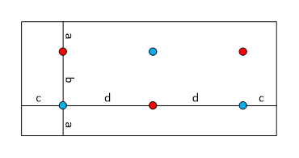

A.7 NR standalone tests with one or more NR cells in FR2
========================================================

A.7.1 SA: RRC\_IDLE state mobility
----------------------------------

### A.7.1.1 Cell re-selection to NR

#### A.7.1.1.1 Cell reselection to FR2 intra-frequency NR case

##### A.7.1.1.1.1 Test Purpose and Environment

This test is to verify the requirement for the intra frequency NR cell
reselection requirements specified in clause 4.2.2.3.

##### A.7.1.1.1.2 Test Parameters

The test scenario comprises of 1 NR carrier and 2 cells as given in
tables A.7.1.1.1.2-1, A.7.1.1.1.2-2 and A.7.1.1.1.2-3. The test consists
of three successive time periods, with time duration of T1, T2, and T3
respectively. Only cell 1 is already identified by the UE prior to the
start of the test. Cell 1 and cell 2 belong to different tracking areas.
Furthermore, UE has not registered with network for the tracking area
containing cell 2.

Table A.7.1.1.1.2-1: Supported test configurations

  Configuration                                                                             Description
  ----------------------------------------------------------------------------------------- -----------------------------------------------------
  1                                                                                         120 kHz SSB SCS, 100 MHz bandwidth, TDD duplex mode
  2                                                                                         240 kHz SSB SCS, 100 MHz bandwidth, TDD duplex mode
  Note: The UE is only required to be tested in one of the supported test configurations.   

Table A.7.1.1.1.2-2: General test parameters for intra frequency NR cell
re-selection test case

  ---------------------------- ---------------- -------------------- ---------------- --------------------------------------------------------------------------------------------------------------------------------------------------------------------------------------------------------------------- ---------------------------------------------------------------------------------------
  Parameter                    Unit             Test configuration   Value            Comment                                                                                                                                                                                                               
  Initial condition            Active cell                           1, 2             Cell1                                                                                                                                                                                                                 
  T2 end condition             Active cell                           1, 2             Cell2                                                                                                                                                                                                                 
                               Neighbour cell                        1, 2             Cell1                                                                                                                                                                                                                 
  Final condition              Active cell                           1, 2             Cell1                                                                                                                                                                                                                 
                               Neighbour cell                        1, 2             Cell2                                                                                                                                                                                                                 
  **RF Channel Number**                         1, 2                 **1**                                                                                                                                                                                                                                  
  Time offset between cells                     1, 2                 3 μs             Synchronous cells                                                                                                                                                                                                     
  Access Barring Information   \-               1, 2                 Not Sent         No additional delays in random access procedure.                                                                                                                                                                      
  SMTC configuration                            **1, 2**             **SMTC.1**                                                                                                                                                                                                                             
  DRX cycle length             s                1, 2                 1.28             The value shall be used for all cells in the test.                                                                                                                                                                    
  PRACH configuration index                     1, 2                 190              The detailed configuration is specified in TS 38.211 clause 6.3.3.2                                                                                                                                                   
  rangeToBestCell                               1, 2                 Not configured                                                                                                                                                                                                                         
  T1                           s                1, 2                 \>7              During T1, Cell 2 shall be powered off, and during the off time the physical cell identity shall be changed, The intention is to ensure that Cell 2 has not been detected by the UE prior to the start of period T2   
  T2                           PC2/3/4          s                    1, 2             135                                                                                                                                                                                                                   T2 needs to be defined so that cell re-selection reaction time is taken into account.
                               PC1                                                    265                                                                                                                                                                                                                   
  T3                           PC2/3/4          s                    1, 2             35                                                                                                                                                                                                                    T3 needs to be defined so that cell re-selection reaction time is taken into account.
                               PC1                                                    65                                                                                                                                                                                                                    
  ---------------------------- ---------------- -------------------- ---------------- --------------------------------------------------------------------------------------------------------------------------------------------------------------------------------------------------------------------- ---------------------------------------------------------------------------------------

**Table A.7.1.1.1.2-3: Cell specific test parameters for intra frequency
NR cell re-selection test case in AWGN**

+-------+-------+-------+-------+-------+-------+-------+-------+-------+
| Para  | Unit  | Test  | Cell  | Cell  |       |       |       |       |
| meter |       | con   | 1     | 2     |       |       |       |       |
|       |       | figur |       |       |       |       |       |       |
|       |       | ation |       |       |       |       |       |       |
+=======+=======+=======+=======+=======+=======+=======+=======+=======+
|       |       |       | T1    | T2    | T3    | T1    | T2    | T3    |
+-------+-------+-------+-------+-------+-------+-------+-------+-------+
| TDD   |       | 1, 2  | T     | T     |       |       |       |       |
| con   |       |       | DDCon | DDCon |       |       |       |       |
| figur |       |       | f.3.1 | f.3.1 |       |       |       |       |
| ation |       |       |       |       |       |       |       |       |
+-------+-------+-------+-------+-------+-------+-------+-------+-------+
| PDSCH |       | 1     | S     | S     |       |       |       |       |
| RMC   |       |       | R.3.1 | R.3.1 |       |       |       |       |
|       |       |       | TDD   | TDD   |       |       |       |       |
+-------+-------+-------+-------+-------+-------+-------+-------+-------+
| con   |       | 2     | S     | S     |       |       |       |       |
| figur |       |       | R.3.1 | R.3.1 |       |       |       |       |
| ation |       |       | TDD   | TDD   |       |       |       |       |
+-------+-------+-------+-------+-------+-------+-------+-------+-------+
| RMSI  |       | 1     | C     | C     |       |       |       |       |
| CO    |       |       | R.3.1 | R.3.1 |       |       |       |       |
| RESET |       |       | TDD   | TDD   |       |       |       |       |
+-------+-------+-------+-------+-------+-------+-------+-------+-------+
| RMC   |       | 2     | C     | C     |       |       |       |       |
| con   |       |       | R.3.1 | R.3.1 |       |       |       |       |
| figur |       |       | TDD   | TDD   |       |       |       |       |
| ation |       |       |       |       |       |       |       |       |
+-------+-------+-------+-------+-------+-------+-------+-------+-------+
| Dedi  |       | 1     | CC    | CC    |       |       |       |       |
| cated |       |       | R.3.1 | R.3.1 |       |       |       |       |
| CO    |       |       | TDD   | TDD   |       |       |       |       |
| RESET |       |       |       |       |       |       |       |       |
+-------+-------+-------+-------+-------+-------+-------+-------+-------+
| RMC   |       | 2     | CC    | CC    |       |       |       |       |
| con   |       |       | R.3.1 | R.3.1 |       |       |       |       |
| figur |       |       | TDD   | TDD   |       |       |       |       |
| ation |       |       |       |       |       |       |       |       |
+-------+-------+-------+-------+-------+-------+-------+-------+-------+
| SSB   |       | 1     | SSB.3 | SSB.7 |       |       |       |       |
| con   |       |       | FR2   | FR2   |       |       |       |       |
| figur |       |       |       |       |       |       |       |       |
| ation |       |       |       |       |       |       |       |       |
+-------+-------+-------+-------+-------+-------+-------+-------+-------+
|       |       | 2     | SSB.4 | SSB.8 |       |       |       |       |
|       |       |       | FR2   | FR2   |       |       |       |       |
+-------+-------+-------+-------+-------+-------+-------+-------+-------+
| OCNG  |       | 1, 2  | OP.4  | OP.4  |       |       |       |       |
| Pa    |       |       |       |       |       |       |       |       |
| ttern |       |       |       |       |       |       |       |       |
+-------+-------+-------+-------+-------+-------+-------+-------+-------+
| B     | MHz   | 1, 2  | 100:  | 100:  |       |       |       |       |
| W~cha |       |       | N~    | N~    |       |       |       |       |
| nnel~ |       |       | RB,c~ | RB,c~ |       |       |       |       |
|       |       |       | = 66  | = 66  |       |       |       |       |
+-------+-------+-------+-------+-------+-------+-------+-------+-------+
| Data  |       | 1, 2  | 66    | 66    |       |       |       |       |
| RBs   |       |       |       |       |       |       |       |       |
| allo  |       |       |       |       |       |       |       |       |
| cated |       |       |       |       |       |       |       |       |
+-------+-------+-------+-------+-------+-------+-------+-------+-------+
| In    |       | 1, 2  | DLBW  | DLBW  |       |       |       |       |
| itial |       |       | P.0.1 | P.0.1 |       |       |       |       |
| DL    |       |       |       |       |       |       |       |       |
| BWP   |       |       |       |       |       |       |       |       |
| con   |       |       |       |       |       |       |       |       |
| figur |       |       |       |       |       |       |       |       |
| ation |       |       |       |       |       |       |       |       |
+-------+-------+-------+-------+-------+-------+-------+-------+-------+
| In    |       | 1, 2  | ULBW  | ULBW  |       |       |       |       |
| itial |       |       | P.0.1 | P.0.1 |       |       |       |       |
| UL    |       |       |       |       |       |       |       |       |
| BWP   |       |       |       |       |       |       |       |       |
| con   |       |       |       |       |       |       |       |       |
| figur |       |       |       |       |       |       |       |       |
| ation |       |       |       |       |       |       |       |       |
+-------+-------+-------+-------+-------+-------+-------+-------+-------+
| R     |       | 1, 2  | SSB   | SSB   |       |       |       |       |
| LM-RS |       |       |       |       |       |       |       |       |
+-------+-------+-------+-------+-------+-------+-------+-------+-------+
| Qrxl  | dB    | 1     | -138  | -138  |       |       |       |       |
| evmin | m/SCS |       |       |       |       |       |       |       |
+-------+-------+-------+-------+-------+-------+-------+-------+-------+
|       |       | 2     | -135  | -135  |       |       |       |       |
+-------+-------+-------+-------+-------+-------+-------+-------+-------+
| Pco   | dB    | 1, 2  | 0     | 0     |       |       |       |       |
| mpens |       |       |       |       |       |       |       |       |
| ation |       |       |       |       |       |       |       |       |
+-------+-------+-------+-------+-------+-------+-------+-------+-------+
| Qhy   | dB    | 1, 2  | 0     | 0     |       |       |       |       |
| st~s~ |       |       |       |       |       |       |       |       |
+-------+-------+-------+-------+-------+-------+-------+-------+-------+
| Qoff  | dB    | 1, 2  | 0     | 0     |       |       |       |       |
| set~s |       |       |       |       |       |       |       |       |
| ,\ n~ |       |       |       |       |       |       |       |       |
+-------+-------+-------+-------+-------+-------+-------+-------+-------+
| Ce    |       | 1, 2  | SS    | SS    |       |       |       |       |
| ll\_s |       |       | -RSRP | -RSRP |       |       |       |       |
| elect |       |       |       |       |       |       |       |       |
| ion\_ |       |       |       |       |       |       |       |       |
| and\_ |       |       |       |       |       |       |       |       |
|       |       |       |       |       |       |       |       |       |
| res   |       |       |       |       |       |       |       |       |
| elect |       |       |       |       |       |       |       |       |
| ion\_ |       |       |       |       |       |       |       |       |
| quali |       |       |       |       |       |       |       |       |
| ty\_m |       |       |       |       |       |       |       |       |
| easur |       |       |       |       |       |       |       |       |
| ement |       |       |       |       |       |       |       |       |
+-------+-------+-------+-------+-------+-------+-------+-------+-------+
| AoA   |       | 1, 2  | Setup | Setup |       |       |       |       |
| setup |       |       | 1     | 1     |       |       |       |       |
|       |       |       | de    | de    |       |       |       |       |
|       |       |       | fined | fined |       |       |       |       |
|       |       |       | in    | in    |       |       |       |       |
|       |       |       | A.3   | A.3   |       |       |       |       |
|       |       |       | .15.1 | .15.1 |       |       |       |       |
+-------+-------+-------+-------+-------+-------+-------+-------+-------+
| Beam  |       | 1,2   | Rough | Rough |       |       |       |       |
| assu  |       |       |       |       |       |       |       |       |
| mptio |       |       |       |       |       |       |       |       |
| n^Not |       |       |       |       |       |       |       |       |
| e\ 4^ |       |       |       |       |       |       |       |       |
+-------+-------+-------+-------+-------+-------+-------+-------+-------+
| ${\w  | dB    | 1     | 7.45  | -3.55 | 0.95  | -inf  | 0.95  | -3.55 |
| ideha |       |       |       |       |       | inity |       |       |
| t{E}} |       |       |       |       |       |       |       |       |
| _{s}/ |       |       |       |       |       |       |       |       |
| I_{\t |       |       |       |       |       |       |       |       |
| ext{o |       |       |       |       |       |       |       |       |
| t\ }\ |       |       |       |       |       |       |       |       |
| text{ |       |       |       |       |       |       |       |       |
| BB}}$ |       |       |       |       |       |       |       |       |
| ^Not  |       |       |       |       |       |       |       |       |
| e\ 5^ |       |       |       |       |       |       |       |       |
+-------+-------+-------+-------+-------+-------+-------+-------+-------+
|       |       | 2     |       |       |       |       |       |       |
+-------+-------+-------+-------+-------+-------+-------+-------+-------+
| ^N    | dB    | 1     | -93   |       |       |       |       |       |
| ote2^ | m/SCS |       |       |       |       |       |       |       |
+-------+-------+-------+-------+-------+-------+-------+-------+-------+
|       |       | 2     | -90   |       |       |       |       |       |
+-------+-------+-------+-------+-------+-------+-------+-------+-------+
| ^N    | d     | 1     | -102  |       |       |       |       |       |
| ote2^ | Bm/15 |       |       |       |       |       |       |       |
|       | kHz   |       |       |       |       |       |       |       |
+-------+-------+-------+-------+-------+-------+-------+-------+-------+
|       |       | 2     |       |       |       |       |       |       |
+-------+-------+-------+-------+-------+-------+-------+-------+-------+
|       | dB    | 1     | 8     | -3    | 1.5   | -inf  | 1.5   | -3    |
|       |       |       |       |       |       | inity |       |       |
+-------+-------+-------+-------+-------+-------+-------+-------+-------+
|       |       | 2     |       |       |       |       |       |       |
+-------+-------+-------+-------+-------+-------+-------+-------+-------+
| SS    | dB    | 1     | -85   | -96   | -91.5 | -inf  | -91.5 | -96   |
| -RSRP | m/SCS |       |       |       |       | inity |       |       |
| ^N    |       |       |       |       |       |       |       |       |
| ote3^ |       |       |       |       |       |       |       |       |
+-------+-------+-------+-------+-------+-------+-------+-------+-------+
|       |       | 2     | -82   | -93   | -88.5 | -inf  | -88.5 | -93   |
|       |       |       |       |       |       | inity |       |       |
+-------+-------+-------+-------+-------+-------+-------+-------+-------+
| Io on | dBm/  | 1     | -     | -     | -     | -     | -     | -     |
| SSB   | 95.04 |       | 60.53 | 67.40 | 65.34 | 69.17 | 65.34 | 67.40 |
| sy    | MHz   |       |       |       |       |       |       |       |
| mbols |       |       |       |       |       |       |       |       |
| of    |       |       |       |       |       |       |       |       |
| each  |       |       |       |       |       |       |       |       |
| cell  |       |       |       |       |       |       |       |       |
+-------+-------+-------+-------+-------+-------+-------+-------+-------+
|       |       | 2     | -     | -     | -     | -     | -     | -     |
|       |       |       | 57.52 | 64.39 | 62.33 | 66.16 | 62.33 | 64.39 |
+-------+-------+-------+-------+-------+-------+-------+-------+-------+
| Tr    | s     | 1, 2  | 0     | 0     | 0     | 0     | 0     | 0     |
| esele |       |       |       |       |       |       |       |       |
| ction |       |       |       |       |       |       |       |       |
+-------+-------+-------+-------+-------+-------+-------+-------+-------+
| Sin   | dB    | 1, 2  | 50    | 50    |       |       |       |       |
| trase |       |       |       |       |       |       |       |       |
| archP |       |       |       |       |       |       |       |       |
+-------+-------+-------+-------+-------+-------+-------+-------+-------+
| P     |       | 1, 2  | AWGN  |       |       |       |       |       |
| ropag |       |       |       |       |       |       |       |       |
| ation |       |       |       |       |       |       |       |       |
| Cond  |       |       |       |       |       |       |       |       |
| ition |       |       |       |       |       |       |       |       |
+-------+-------+-------+-------+-------+-------+-------+-------+-------+
| Note  |       |       |       |       |       |       |       |       |
| 1:    |       |       |       |       |       |       |       |       |
| OCNG  |       |       |       |       |       |       |       |       |
| shall |       |       |       |       |       |       |       |       |
| be    |       |       |       |       |       |       |       |       |
| used  |       |       |       |       |       |       |       |       |
| such  |       |       |       |       |       |       |       |       |
| that  |       |       |       |       |       |       |       |       |
| both  |       |       |       |       |       |       |       |       |
| cells |       |       |       |       |       |       |       |       |
| are   |       |       |       |       |       |       |       |       |
| fully |       |       |       |       |       |       |       |       |
| allo  |       |       |       |       |       |       |       |       |
| cated |       |       |       |       |       |       |       |       |
| and a |       |       |       |       |       |       |       |       |
| con   |       |       |       |       |       |       |       |       |
| stant |       |       |       |       |       |       |       |       |
| total |       |       |       |       |       |       |       |       |
| t     |       |       |       |       |       |       |       |       |
| ransm |       |       |       |       |       |       |       |       |
| itted |       |       |       |       |       |       |       |       |
| power |       |       |       |       |       |       |       |       |
| spe   |       |       |       |       |       |       |       |       |
| ctral |       |       |       |       |       |       |       |       |
| de    |       |       |       |       |       |       |       |       |
| nsity |       |       |       |       |       |       |       |       |
| is    |       |       |       |       |       |       |       |       |
| ach   |       |       |       |       |       |       |       |       |
| ieved |       |       |       |       |       |       |       |       |
| for   |       |       |       |       |       |       |       |       |
| all   |       |       |       |       |       |       |       |       |
| OFDM  |       |       |       |       |       |       |       |       |
| sym   |       |       |       |       |       |       |       |       |
| bols. |       |       |       |       |       |       |       |       |
|       |       |       |       |       |       |       |       |       |
| Note  |       |       |       |       |       |       |       |       |
| 2:    |       |       |       |       |       |       |       |       |
| In    |       |       |       |       |       |       |       |       |
| terfe |       |       |       |       |       |       |       |       |
| rence |       |       |       |       |       |       |       |       |
| from  |       |       |       |       |       |       |       |       |
| other |       |       |       |       |       |       |       |       |
| cells |       |       |       |       |       |       |       |       |
| and   |       |       |       |       |       |       |       |       |
| noise |       |       |       |       |       |       |       |       |
| so    |       |       |       |       |       |       |       |       |
| urces |       |       |       |       |       |       |       |       |
| not   |       |       |       |       |       |       |       |       |
| spec  |       |       |       |       |       |       |       |       |
| ified |       |       |       |       |       |       |       |       |
| in    |       |       |       |       |       |       |       |       |
| the   |       |       |       |       |       |       |       |       |
| test  |       |       |       |       |       |       |       |       |
| is    |       |       |       |       |       |       |       |       |
| as    |       |       |       |       |       |       |       |       |
| sumed |       |       |       |       |       |       |       |       |
| to be |       |       |       |       |       |       |       |       |
| con   |       |       |       |       |       |       |       |       |
| stant |       |       |       |       |       |       |       |       |
| over  |       |       |       |       |       |       |       |       |
| s     |       |       |       |       |       |       |       |       |
| ubcar |       |       |       |       |       |       |       |       |
| riers |       |       |       |       |       |       |       |       |
| and   |       |       |       |       |       |       |       |       |
| time  |       |       |       |       |       |       |       |       |
| and   |       |       |       |       |       |       |       |       |
| shall |       |       |       |       |       |       |       |       |
| be    |       |       |       |       |       |       |       |       |
| mod   |       |       |       |       |       |       |       |       |
| elled |       |       |       |       |       |       |       |       |
| as    |       |       |       |       |       |       |       |       |
| AWGN  |       |       |       |       |       |       |       |       |
| of    |       |       |       |       |       |       |       |       |
| a     |       |       |       |       |       |       |       |       |
| pprop |       |       |       |       |       |       |       |       |
| riate |       |       |       |       |       |       |       |       |
| power |       |       |       |       |       |       |       |       |
| for   |       |       |       |       |       |       |       |       |
| to be |       |       |       |       |       |       |       |       |
| fulfi |       |       |       |       |       |       |       |       |
| lled. |       |       |       |       |       |       |       |       |
|       |       |       |       |       |       |       |       |       |
| Note  |       |       |       |       |       |       |       |       |
| 3:    |       |       |       |       |       |       |       |       |
| SS    |       |       |       |       |       |       |       |       |
| -RSRP |       |       |       |       |       |       |       |       |
| l     |       |       |       |       |       |       |       |       |
| evels |       |       |       |       |       |       |       |       |
| have  |       |       |       |       |       |       |       |       |
| been  |       |       |       |       |       |       |       |       |
| de    |       |       |       |       |       |       |       |       |
| rived |       |       |       |       |       |       |       |       |
| from  |       |       |       |       |       |       |       |       |
| other |       |       |       |       |       |       |       |       |
| param |       |       |       |       |       |       |       |       |
| eters |       |       |       |       |       |       |       |       |
| for   |       |       |       |       |       |       |       |       |
| i     |       |       |       |       |       |       |       |       |
| nform |       |       |       |       |       |       |       |       |
| ation |       |       |       |       |       |       |       |       |
| purp  |       |       |       |       |       |       |       |       |
| oses. |       |       |       |       |       |       |       |       |
| They  |       |       |       |       |       |       |       |       |
| are   |       |       |       |       |       |       |       |       |
| not   |       |       |       |       |       |       |       |       |
| set   |       |       |       |       |       |       |       |       |
| table |       |       |       |       |       |       |       |       |
| param |       |       |       |       |       |       |       |       |
| eters |       |       |       |       |       |       |       |       |
| t     |       |       |       |       |       |       |       |       |
| hemse |       |       |       |       |       |       |       |       |
| lves. |       |       |       |       |       |       |       |       |
|       |       |       |       |       |       |       |       |       |
| Note  |       |       |       |       |       |       |       |       |
| 4:    |       |       |       |       |       |       |       |       |
| I     |       |       |       |       |       |       |       |       |
| nform |       |       |       |       |       |       |       |       |
| ation |       |       |       |       |       |       |       |       |
| about |       |       |       |       |       |       |       |       |
| types |       |       |       |       |       |       |       |       |
| of UE |       |       |       |       |       |       |       |       |
| beam  |       |       |       |       |       |       |       |       |
| is    |       |       |       |       |       |       |       |       |
| given |       |       |       |       |       |       |       |       |
| in    |       |       |       |       |       |       |       |       |
| B.2   |       |       |       |       |       |       |       |       |
| .1.3, |       |       |       |       |       |       |       |       |
| and   |       |       |       |       |       |       |       |       |
| does  |       |       |       |       |       |       |       |       |
| not   |       |       |       |       |       |       |       |       |
| limit |       |       |       |       |       |       |       |       |
| UE    |       |       |       |       |       |       |       |       |
| impl  |       |       |       |       |       |       |       |       |
| ement |       |       |       |       |       |       |       |       |
| ation |       |       |       |       |       |       |       |       |
| or    |       |       |       |       |       |       |       |       |
| test  |       |       |       |       |       |       |       |       |
| s     |       |       |       |       |       |       |       |       |
| ystem |       |       |       |       |       |       |       |       |
| impl  |       |       |       |       |       |       |       |       |
| ement |       |       |       |       |       |       |       |       |
| ation |       |       |       |       |       |       |       |       |
|       |       |       |       |       |       |       |       |       |
| Note  |       |       |       |       |       |       |       |       |
| 5:    |       |       |       |       |       |       |       |       |
| C     |       |       |       |       |       |       |       |       |
| alcul |       |       |       |       |       |       |       |       |
| ation |       |       |       |       |       |       |       |       |
| of    |       |       |       |       |       |       |       |       |
| Es/Io |       |       |       |       |       |       |       |       |
| t~BB~ |       |       |       |       |       |       |       |       |
| inc   |       |       |       |       |       |       |       |       |
| ludes |       |       |       |       |       |       |       |       |
| the   |       |       |       |       |       |       |       |       |
| e     |       |       |       |       |       |       |       |       |
| ffect |       |       |       |       |       |       |       |       |
| of UE |       |       |       |       |       |       |       |       |
| int   |       |       |       |       |       |       |       |       |
| ernal |       |       |       |       |       |       |       |       |
| noise |       |       |       |       |       |       |       |       |
| up to |       |       |       |       |       |       |       |       |
| the   |       |       |       |       |       |       |       |       |
| value |       |       |       |       |       |       |       |       |
| as    |       |       |       |       |       |       |       |       |
| sumed |       |       |       |       |       |       |       |       |
| for   |       |       |       |       |       |       |       |       |
| the   |       |       |       |       |       |       |       |       |
| assoc |       |       |       |       |       |       |       |       |
| iated |       |       |       |       |       |       |       |       |
| Re    |       |       |       |       |       |       |       |       |
| fsens |       |       |       |       |       |       |       |       |
| r     |       |       |       |       |       |       |       |       |
| equir |       |       |       |       |       |       |       |       |
| ement |       |       |       |       |       |       |       |       |
| in    |       |       |       |       |       |       |       |       |
| c     |       |       |       |       |       |       |       |       |
| lause |       |       |       |       |       |       |       |       |
| 7.3.2 |       |       |       |       |       |       |       |       |
| of TS |       |       |       |       |       |       |       |       |
| 38.   |       |       |       |       |       |       |       |       |
| 101-2 |       |       |       |       |       |       |       |       |
| \[    |       |       |       |       |       |       |       |       |
| 19\], |       |       |       |       |       |       |       |       |
| and   |       |       |       |       |       |       |       |       |
| an    |       |       |       |       |       |       |       |       |
| allo  |       |       |       |       |       |       |       |       |
| wance |       |       |       |       |       |       |       |       |
| of    |       |       |       |       |       |       |       |       |
| 1dB   |       |       |       |       |       |       |       |       |
| for   |       |       |       |       |       |       |       |       |
| UE    |       |       |       |       |       |       |       |       |
| multi |       |       |       |       |       |       |       |       |
| -band |       |       |       |       |       |       |       |       |
| relax |       |       |       |       |       |       |       |       |
| ation |       |       |       |       |       |       |       |       |
| f     |       |       |       |       |       |       |       |       |
| actor |       |       |       |       |       |       |       |       |
| Δ     |       |       |       |       |       |       |       |       |
| MB~P~ |       |       |       |       |       |       |       |       |
| from  |       |       |       |       |       |       |       |       |
| TS    |       |       |       |       |       |       |       |       |
| 38.   |       |       |       |       |       |       |       |       |
| 101-2 |       |       |       |       |       |       |       |       |
| \     |       |       |       |       |       |       |       |       |
| [19\] |       |       |       |       |       |       |       |       |
| Table |       |       |       |       |       |       |       |       |
| 6.2.1 |       |       |       |       |       |       |       |       |
| .3-4. |       |       |       |       |       |       |       |       |
+-------+-------+-------+-------+-------+-------+-------+-------+-------+

##### A.7.1.1.1.3 Test Requirements

The cell reselection delay to a newly detectable cell is defined as the
time from the beginning of time period T2, to the moment when the UE
camps on Cell 2, and starts to send preambles on the PRACH for sending
the *RRCSetupRequest* message to perform a Registration procedure for
mobility and periodic registration updateon Cell 2.

The cell re-selection delay to a newly detectable cell shall be less
than 130 s for PC2/3/4 devices and less than 258 s for PC1 devices.

The cell reselection delay to an already detected cell is defined as the
time from the beginning of time period T3, to the moment when the UE
camps on cell 1, and starts to send preambles on the PRACH for sending
the *RRCSetupRequest* message to perform a Registration procedure for
mobility and periodic registration updateon cell 1.

The cell re-selection delay to an already detected cell shall be less
than 27 s for PC2/3/4 devices and less than 53 s for PC1 devices.

The rate of correct cell reselections observed during repeated tests
shall be at least 90%.

NOTE: The cell re-selection delay to a newly detectable cell can be
expressed as: T~detect,\ NR\_Intra~ + T~SI-NR~, and to an already
detected cell can be expressed as: T~evaluate,\ NR\_\ intra~ + T~SI-NR~,

Where:

T~detect,\ NR\_Intra~ See Table 4.2.2.3-1 in clause 4.2.2.3

T~evaluate,\ NR\_\ intra~ See Table 4.2.2.3-1 in clause 4.2.2.3

T~SI-NR~ Maximum repetition period of relevant system info blocks that
needs to be received by the UE to camp on a cell; 1280 ms is assumed in
this test case.

For the cell re-selection delay to a newly detectable in this test case,
this gives:

\- 129.28 s, allow 130 s, for PC2/3/4 devices

\- 257.28 s, allow 258 s, for PC1 devices

For the cell re-selection delay to an already detected cell in this test
case, this gives:

\- 26.88 s, allow 27 s, for PC2/3/4 devices

\- 52.48 s, allow 53 s, for PC1 devices

#### A.7.1.1.2 Cell reselection to FR2 inter-frequency NR case

##### A.7.1.1.2.1 Test Purpose and Environment

This test is to verify the requirement for the inter frequency NR cell
reselection requirements specified in clause 4.2.2.4.

##### A.7.1.1.2.2 Test Parameters

The test scenario comprises of 2 cells on 2 different NR carriers
respectively as given in tables A.7.1.1.2.2-1, A.7.1.1.2.2-2 and
A.7.1.1.2.2-3. The test consists of three successive time periods, with
time duration of T1, T2, and T3 respectively. Both cell 1 and cell 2 are
already identified by the UE prior to the start of the test. Cell 1 and
cell 2 belong to different tracking areas and cell 2 is of higher
priority than cell 1. Furthermore, UE has not registered with network
for the tracking area containing cell 2.

Table A.7.1.1.2.2-1: Supported test configurations

  Configuration                                                                             Description for serving cell                          Description for target cell
  ----------------------------------------------------------------------------------------- ----------------------------------------------------- -----------------------------------------------------
  1                                                                                         120 kHz SSB SCS, 100 MHz bandwidth, TDD duplex mode   120 kHz SSB SCS, 100 MHz bandwidth, TDD duplex mode
  2                                                                                         240 kHz SSB SCS, 100 MHz bandwidth, TDD duplex mode   240 kHz SSB SCS, 100 MHz bandwidth, TDD duplex mode
  Note: The UE is only required to be tested in one of the supported test configurations.                                                         

Table A.7.1.1.2.2-2: General test parameters for FR2 inter frequency NR
cell re-selection test case

  ---------------------------- ----------------- -------------------- ---------------- ---------------------------------------------------------------------------------------------------------------------------------------------------------------------------------------------------------------------- ---------------------------------------------------------------------------------------------
  Parameter                    Unit              Test configuration   Value            Comment                                                                                                                                                                                                                
  Initial condition            Active cell                            1, 2             Cell2                                                                                                                                                                                                                  The UE camps on cell 2 in the initial phase and during T1 period the UE reselects to cell 1
                               Neighbour cell                         1, 2             Cell1                                                                                                                                                                                                                  
  T1 end condition             Active cell                            1, 2             Cell1                                                                                                                                                                                                                  The UE shall perform reselection to cell 1 during T1
                               Neighbour cells                        1, 2             Cell2                                                                                                                                                                                                                  
  T3 end condition             Active cell                            1, 2             Cell2                                                                                                                                                                                                                  The UE shall perform reselection to cell 2 with higher priority during T3
                               Neighbour cell                         1, 2             Cell1                                                                                                                                                                                                                  
  **RF Channel Number**                          1, 2                 **1, 2**                                                                                                                                                                                                                                
  Time offset between cells                      1, 2                 3 μs             Synchronous cells                                                                                                                                                                                                      
  Access Barring Information   \-                1, 2                 Not Sent         No additional delays in random access procedure.                                                                                                                                                                       
  SSB configuration                              1                    **SSB.1 FR2**                                                                                                                                                                                                                           
                                                 2                    **SSB.2 FR2**                                                                                                                                                                                                                           
  SMTC configuration                             **1, 2**             **SMTC.1**                                                                                                                                                                                                                              
  DRX cycle length             s                 1, 2                 1.28             The value shall be used for all cells in the test.                                                                                                                                                                     
  PRACH configuration index                      1, 2                 190              The detailed configuration is specified in TS 38.211 clause 6.3.3.2                                                                                                                                                    
  rangeToBestCell                                1, 2                 Not configured                                                                                                                                                                                                                          
  T1                           PC2/3/4           s                    1, 2             35                                                                                                                                                                                                                     T1 needs to be defined so that cell re-selection reaction time is taken into account.
                               PC1                                                     65                                                                                                                                                                                                                     
  T2                           s                 1, 2                 \>7              During T2, cell 2 shall be powered off, and during the off time the physical cell identity shall be changed. The intention is to ensure that cell 2 has not been detected by the UE prior to the start of period T3.   
  T3                           PC2/3/4           s                    1, 2             95                                                                                                                                                                                                                     T3 needs to be defined so that cell re-selection reaction time is taken into account.
                               PC1                                                     125                                                                                                                                                                                                                    
  ---------------------------- ----------------- -------------------- ---------------- ---------------------------------------------------------------------------------------------------------------------------------------------------------------------------------------------------------------------- ---------------------------------------------------------------------------------------------

**Table A.7.1.1.2.2-3: Cell specific test parameters for FR2 inter
frequency NR cell re-selection test case in AWGN**

+-------+-------+-------+-------+-------+-------+-------+-------+-------+
| **P   | **U   | *     | *     | *     |       |       |       |       |
| arame | nit** | *Test | *Cell | *Cell |       |       |       |       |
| ter** |       | confi | 1**   | 2**   |       |       |       |       |
|       |       | gurat |       |       |       |       |       |       |
|       |       | ion** |       |       |       |       |       |       |
+=======+=======+=======+=======+=======+=======+=======+=======+=======+
|       |       |       | *     | *     | *     | *     | *     | *     |
|       |       |       | *T1** | *T2** | *T3** | *T1** | *T2** | *T3** |
+-------+-------+-------+-------+-------+-------+-------+-------+-------+
| TDD   |       | 1, 2  | T     | T     |       |       |       |       |
| con   |       |       | DDCon | DDCon |       |       |       |       |
| figur |       |       | f.3.1 | f.3.1 |       |       |       |       |
| ation |       |       |       |       |       |       |       |       |
+-------+-------+-------+-------+-------+-------+-------+-------+-------+
| PDSCH |       | 1, 2  | S     | S     |       |       |       |       |
| RMC   |       |       | R.3.1 | R.3.1 |       |       |       |       |
| con   |       |       | TDD   | TDD   |       |       |       |       |
| figur |       |       |       |       |       |       |       |       |
| ation |       |       |       |       |       |       |       |       |
+-------+-------+-------+-------+-------+-------+-------+-------+-------+
| RMSI  |       | 1, 2  | C     | C     |       |       |       |       |
| CO    |       |       | R.3.1 | R.3.1 |       |       |       |       |
| RESET |       |       | TDD   | TDD   |       |       |       |       |
| param |       |       |       |       |       |       |       |       |
| eters |       |       |       |       |       |       |       |       |
+-------+-------+-------+-------+-------+-------+-------+-------+-------+
| RMSI  |       | 1, 2  | CC    | CC    |       |       |       |       |
| CO    |       |       | R.3.1 | R.3.1 |       |       |       |       |
| RESET |       |       | TDD   | TDD   |       |       |       |       |
| RMC   |       |       |       |       |       |       |       |       |
| con   |       |       |       |       |       |       |       |       |
| figur |       |       |       |       |       |       |       |       |
| ation |       |       |       |       |       |       |       |       |
+-------+-------+-------+-------+-------+-------+-------+-------+-------+
| OCNG  |       | 1, 2  | OP.1  | OP.1  |       |       |       |       |
| Pa    |       |       | de    | de    |       |       |       |       |
| ttern |       |       | fined | fined |       |       |       |       |
|       |       |       | in    | in    |       |       |       |       |
|       |       |       | A.    | A.    |       |       |       |       |
|       |       |       | 3.2.1 | 3.2.1 |       |       |       |       |
+-------+-------+-------+-------+-------+-------+-------+-------+-------+
| In    |       | 1, 2  | DLBW  | DLBW  |       |       |       |       |
| itial |       |       | P.0.1 | P.0.1 |       |       |       |       |
| DL    |       |       |       |       |       |       |       |       |
| BWP   |       |       |       |       |       |       |       |       |
| con   |       |       |       |       |       |       |       |       |
| figur |       |       |       |       |       |       |       |       |
| ation |       |       |       |       |       |       |       |       |
+-------+-------+-------+-------+-------+-------+-------+-------+-------+
| In    |       | 1, 2  | ULBW  | ULBW  |       |       |       |       |
| itial |       |       | P.0.1 | P.0.1 |       |       |       |       |
| UL    |       |       |       |       |       |       |       |       |
| BWP   |       |       |       |       |       |       |       |       |
| con   |       |       |       |       |       |       |       |       |
| figur |       |       |       |       |       |       |       |       |
| ation |       |       |       |       |       |       |       |       |
+-------+-------+-------+-------+-------+-------+-------+-------+-------+
| R     |       | 1, 2  | SSB   | SSB   |       |       |       |       |
| LM-RS |       |       |       |       |       |       |       |       |
+-------+-------+-------+-------+-------+-------+-------+-------+-------+
| Qrxl  | dB    | 1     | -140  | -140  |       |       |       |       |
| evmin | m/SCS |       |       |       |       |       |       |       |
+-------+-------+-------+-------+-------+-------+-------+-------+-------+
|       |       | 2     | -137  | -137  |       |       |       |       |
+-------+-------+-------+-------+-------+-------+-------+-------+-------+
| Pco   | dB    | 1, 2  | 0     | 0     |       |       |       |       |
| mpens |       |       |       |       |       |       |       |       |
| ation |       |       |       |       |       |       |       |       |
+-------+-------+-------+-------+-------+-------+-------+-------+-------+
| Qhy   | dB    | 1, 2  | 0     | 0     |       |       |       |       |
| st~s~ |       |       |       |       |       |       |       |       |
+-------+-------+-------+-------+-------+-------+-------+-------+-------+
| Qoff  | dB    | 1, 2  | 0     | 0     |       |       |       |       |
| set~s |       |       |       |       |       |       |       |       |
| ,\ n~ |       |       |       |       |       |       |       |       |
+-------+-------+-------+-------+-------+-------+-------+-------+-------+
| Ce    |       | 1, 2  | SS    | SS    |       |       |       |       |
| ll\_s |       |       | -RSRP | -RSRP |       |       |       |       |
| elect |       |       |       |       |       |       |       |       |
| ion\_ |       |       |       |       |       |       |       |       |
| and\_ |       |       |       |       |       |       |       |       |
|       |       |       |       |       |       |       |       |       |
| res   |       |       |       |       |       |       |       |       |
| elect |       |       |       |       |       |       |       |       |
| ion\_ |       |       |       |       |       |       |       |       |
| quali |       |       |       |       |       |       |       |       |
| ty\_m |       |       |       |       |       |       |       |       |
| easur |       |       |       |       |       |       |       |       |
| ement |       |       |       |       |       |       |       |       |
+-------+-------+-------+-------+-------+-------+-------+-------+-------+
| AoA   |       | 1, 2  | Setup | Setup |       |       |       |       |
| setup |       |       | 1     | 1     |       |       |       |       |
|       |       |       | de    | de    |       |       |       |       |
|       |       |       | fined | fined |       |       |       |       |
|       |       |       | in    | in    |       |       |       |       |
|       |       |       | A.3   | A.3   |       |       |       |       |
|       |       |       | .15.1 | .15.1 |       |       |       |       |
+-------+-------+-------+-------+-------+-------+-------+-------+-------+
| Beam  |       | 1,2   | Rough | Rough |       |       |       |       |
| assu  |       |       |       |       |       |       |       |       |
| mptio |       |       |       |       |       |       |       |       |
| n^Not |       |       |       |       |       |       |       |       |
| e\ 4^ |       |       |       |       |       |       |       |       |
+-------+-------+-------+-------+-------+-------+-------+-------+-------+
| ${\w  | dB    | 1     | 9.95  | 9.95  | 7.45  | -     | -inf  | 7.95  |
| ideha |       |       |       |       |       | 11.05 | inity |       |
| t{E}} |       |       |       |       |       |       |       |       |
| _{s}/ |       |       |       |       |       |       |       |       |
| I_{\t |       |       |       |       |       |       |       |       |
| ext{o |       |       |       |       |       |       |       |       |
| t\ }\ |       |       |       |       |       |       |       |       |
| text{ |       |       |       |       |       |       |       |       |
| BB}}$ |       |       |       |       |       |       |       |       |
| ^Not  |       |       |       |       |       |       |       |       |
| e\ 5^ |       |       |       |       |       |       |       |       |
+-------+-------+-------+-------+-------+-------+-------+-------+-------+
|       |       | 2     |       |       |       |       |       |       |
+-------+-------+-------+-------+-------+-------+-------+-------+-------+
| ^N    | dB    | 1     | -93   | -93   |       |       |       |       |
| ote2^ | m/SCS |       |       |       |       |       |       |       |
+-------+-------+-------+-------+-------+-------+-------+-------+-------+
|       |       | 2     | -90   | -90   |       |       |       |       |
+-------+-------+-------+-------+-------+-------+-------+-------+-------+
| ^N    | d     | 1     | -102  | -102  |       |       |       |       |
| ote2^ | Bm/15 |       |       |       |       |       |       |       |
|       | kHz   |       |       |       |       |       |       |       |
+-------+-------+-------+-------+-------+-------+-------+-------+-------+
|       |       | 2     |       |       |       |       |       |       |
+-------+-------+-------+-------+-------+-------+-------+-------+-------+
|       | dB    | 1     | 10.5  | 10.5  | 8     | -10.5 | -inf  | 8.5   |
|       |       |       |       |       |       |       | inity |       |
+-------+-------+-------+-------+-------+-------+-------+-------+-------+
|       |       | 2     |       |       |       |       |       |       |
+-------+-------+-------+-------+-------+-------+-------+-------+-------+
| SS    | dB    | 1     | --    | -82.5 | -85   | -     | -inf  | -84.5 |
| -RSRP | m/SCS |       | -82.5 |       |       | 103.5 | inity |       |
| ^N    |       |       |       |       |       |       |       |       |
| ote3^ |       |       |       |       |       |       |       |       |
+-------+-------+-------+-------+-------+-------+-------+-------+-------+
|       |       | 2     | -79.5 | -79.5 | -82   | -     | -inf  | -81.5 |
|       |       |       |       |       |       | 100.5 | inity |       |
+-------+-------+-------+-------+-------+-------+-------+-------+-------+
| Io    | dBm/  | 1, 2  | -     | -     | -     | -     | -     | -     |
|       | 95.04 |       | 53.11 | 53.11 | 55.34 | 63.61 | 63.98 | 54.91 |
|       | MHz   |       |       |       |       |       |       |       |
+-------+-------+-------+-------+-------+-------+-------+-------+-------+
| Tr    | s     | 1, 2  | 0     | 0     | 0     | 0     | 0     | 0     |
| esele |       |       |       |       |       |       |       |       |
| ction |       |       |       |       |       |       |       |       |
+-------+-------+-------+-------+-------+-------+-------+-------+-------+
| S     | dB    | 1, 2  | 50    | 50    |       |       |       |       |
| nonin |       |       |       |       |       |       |       |       |
| trase |       |       |       |       |       |       |       |       |
| archP |       |       |       |       |       |       |       |       |
+-------+-------+-------+-------+-------+-------+-------+-------+-------+
| Th    | dB    | 1, 2  | 48    | 48    |       |       |       |       |
| resh~ |       |       |       |       |       |       |       |       |
| x,\ h |       |       |       |       |       |       |       |       |
| ighP~ |       |       |       |       |       |       |       |       |
+-------+-------+-------+-------+-------+-------+-------+-------+-------+
| Th    | dB    | 1, 2  | 44    | 44    |       |       |       |       |
| resh~ |       |       |       |       |       |       |       |       |
| servi |       |       |       |       |       |       |       |       |
| ng,\  |       |       |       |       |       |       |       |       |
| lowP~ |       |       |       |       |       |       |       |       |
+-------+-------+-------+-------+-------+-------+-------+-------+-------+
| T     | dB    | 1, 2  | 50    | 50    |       |       |       |       |
| hresh |       |       |       |       |       |       |       |       |
| ~x,\  |       |       |       |       |       |       |       |       |
| lowP~ |       |       |       |       |       |       |       |       |
+-------+-------+-------+-------+-------+-------+-------+-------+-------+
| P     |       | 1, 2  | AWGN  | AWGN  |       |       |       |       |
| ropag |       |       |       |       |       |       |       |       |
| ation |       |       |       |       |       |       |       |       |
| Cond  |       |       |       |       |       |       |       |       |
| ition |       |       |       |       |       |       |       |       |
+-------+-------+-------+-------+-------+-------+-------+-------+-------+
| Note  |       |       |       |       |       |       |       |       |
| 1:    |       |       |       |       |       |       |       |       |
| OCNG  |       |       |       |       |       |       |       |       |
| shall |       |       |       |       |       |       |       |       |
| be    |       |       |       |       |       |       |       |       |
| used  |       |       |       |       |       |       |       |       |
| such  |       |       |       |       |       |       |       |       |
| that  |       |       |       |       |       |       |       |       |
| both  |       |       |       |       |       |       |       |       |
| cells |       |       |       |       |       |       |       |       |
| are   |       |       |       |       |       |       |       |       |
| fully |       |       |       |       |       |       |       |       |
| allo  |       |       |       |       |       |       |       |       |
| cated |       |       |       |       |       |       |       |       |
| and a |       |       |       |       |       |       |       |       |
| con   |       |       |       |       |       |       |       |       |
| stant |       |       |       |       |       |       |       |       |
| total |       |       |       |       |       |       |       |       |
| t     |       |       |       |       |       |       |       |       |
| ransm |       |       |       |       |       |       |       |       |
| itted |       |       |       |       |       |       |       |       |
| power |       |       |       |       |       |       |       |       |
| spe   |       |       |       |       |       |       |       |       |
| ctral |       |       |       |       |       |       |       |       |
| de    |       |       |       |       |       |       |       |       |
| nsity |       |       |       |       |       |       |       |       |
| is    |       |       |       |       |       |       |       |       |
| ach   |       |       |       |       |       |       |       |       |
| ieved |       |       |       |       |       |       |       |       |
| for   |       |       |       |       |       |       |       |       |
| all   |       |       |       |       |       |       |       |       |
| OFDM  |       |       |       |       |       |       |       |       |
| sym   |       |       |       |       |       |       |       |       |
| bols. |       |       |       |       |       |       |       |       |
|       |       |       |       |       |       |       |       |       |
| Note  |       |       |       |       |       |       |       |       |
| 2:    |       |       |       |       |       |       |       |       |
| In    |       |       |       |       |       |       |       |       |
| terfe |       |       |       |       |       |       |       |       |
| rence |       |       |       |       |       |       |       |       |
| from  |       |       |       |       |       |       |       |       |
| other |       |       |       |       |       |       |       |       |
| cells |       |       |       |       |       |       |       |       |
| and   |       |       |       |       |       |       |       |       |
| noise |       |       |       |       |       |       |       |       |
| so    |       |       |       |       |       |       |       |       |
| urces |       |       |       |       |       |       |       |       |
| not   |       |       |       |       |       |       |       |       |
| spec  |       |       |       |       |       |       |       |       |
| ified |       |       |       |       |       |       |       |       |
| in    |       |       |       |       |       |       |       |       |
| the   |       |       |       |       |       |       |       |       |
| test  |       |       |       |       |       |       |       |       |
| is    |       |       |       |       |       |       |       |       |
| as    |       |       |       |       |       |       |       |       |
| sumed |       |       |       |       |       |       |       |       |
| to be |       |       |       |       |       |       |       |       |
| con   |       |       |       |       |       |       |       |       |
| stant |       |       |       |       |       |       |       |       |
| over  |       |       |       |       |       |       |       |       |
| s     |       |       |       |       |       |       |       |       |
| ubcar |       |       |       |       |       |       |       |       |
| riers |       |       |       |       |       |       |       |       |
| and   |       |       |       |       |       |       |       |       |
| time  |       |       |       |       |       |       |       |       |
| and   |       |       |       |       |       |       |       |       |
| shall |       |       |       |       |       |       |       |       |
| be    |       |       |       |       |       |       |       |       |
| mod   |       |       |       |       |       |       |       |       |
| elled |       |       |       |       |       |       |       |       |
| as    |       |       |       |       |       |       |       |       |
| AWGN  |       |       |       |       |       |       |       |       |
| of    |       |       |       |       |       |       |       |       |
| a     |       |       |       |       |       |       |       |       |
| pprop |       |       |       |       |       |       |       |       |
| riate |       |       |       |       |       |       |       |       |
| power |       |       |       |       |       |       |       |       |
| for   |       |       |       |       |       |       |       |       |
| to be |       |       |       |       |       |       |       |       |
| fulfi |       |       |       |       |       |       |       |       |
| lled. |       |       |       |       |       |       |       |       |
|       |       |       |       |       |       |       |       |       |
| Note  |       |       |       |       |       |       |       |       |
| 3:    |       |       |       |       |       |       |       |       |
| SS    |       |       |       |       |       |       |       |       |
| -RSRP |       |       |       |       |       |       |       |       |
| l     |       |       |       |       |       |       |       |       |
| evels |       |       |       |       |       |       |       |       |
| have  |       |       |       |       |       |       |       |       |
| been  |       |       |       |       |       |       |       |       |
| de    |       |       |       |       |       |       |       |       |
| rived |       |       |       |       |       |       |       |       |
| from  |       |       |       |       |       |       |       |       |
| other |       |       |       |       |       |       |       |       |
| param |       |       |       |       |       |       |       |       |
| eters |       |       |       |       |       |       |       |       |
| for   |       |       |       |       |       |       |       |       |
| i     |       |       |       |       |       |       |       |       |
| nform |       |       |       |       |       |       |       |       |
| ation |       |       |       |       |       |       |       |       |
| purp  |       |       |       |       |       |       |       |       |
| oses. |       |       |       |       |       |       |       |       |
| They  |       |       |       |       |       |       |       |       |
| are   |       |       |       |       |       |       |       |       |
| not   |       |       |       |       |       |       |       |       |
| set   |       |       |       |       |       |       |       |       |
| table |       |       |       |       |       |       |       |       |
| param |       |       |       |       |       |       |       |       |
| eters |       |       |       |       |       |       |       |       |
| t     |       |       |       |       |       |       |       |       |
| hemse |       |       |       |       |       |       |       |       |
| lves. |       |       |       |       |       |       |       |       |
|       |       |       |       |       |       |       |       |       |
| Note  |       |       |       |       |       |       |       |       |
| 4:    |       |       |       |       |       |       |       |       |
| I     |       |       |       |       |       |       |       |       |
| nform |       |       |       |       |       |       |       |       |
| ation |       |       |       |       |       |       |       |       |
| about |       |       |       |       |       |       |       |       |
| types |       |       |       |       |       |       |       |       |
| of UE |       |       |       |       |       |       |       |       |
| beam  |       |       |       |       |       |       |       |       |
| is    |       |       |       |       |       |       |       |       |
| given |       |       |       |       |       |       |       |       |
| in    |       |       |       |       |       |       |       |       |
| B.2   |       |       |       |       |       |       |       |       |
| .1.3, |       |       |       |       |       |       |       |       |
| and   |       |       |       |       |       |       |       |       |
| does  |       |       |       |       |       |       |       |       |
| not   |       |       |       |       |       |       |       |       |
| limit |       |       |       |       |       |       |       |       |
| UE    |       |       |       |       |       |       |       |       |
| impl  |       |       |       |       |       |       |       |       |
| ement |       |       |       |       |       |       |       |       |
| ation |       |       |       |       |       |       |       |       |
| or    |       |       |       |       |       |       |       |       |
| test  |       |       |       |       |       |       |       |       |
| s     |       |       |       |       |       |       |       |       |
| ystem |       |       |       |       |       |       |       |       |
| impl  |       |       |       |       |       |       |       |       |
| ement |       |       |       |       |       |       |       |       |
| ation |       |       |       |       |       |       |       |       |
|       |       |       |       |       |       |       |       |       |
| Note  |       |       |       |       |       |       |       |       |
| 5:    |       |       |       |       |       |       |       |       |
| C     |       |       |       |       |       |       |       |       |
| alcul |       |       |       |       |       |       |       |       |
| ation |       |       |       |       |       |       |       |       |
| of    |       |       |       |       |       |       |       |       |
| Es/Io |       |       |       |       |       |       |       |       |
| t~BB~ |       |       |       |       |       |       |       |       |
| inc   |       |       |       |       |       |       |       |       |
| ludes |       |       |       |       |       |       |       |       |
| the   |       |       |       |       |       |       |       |       |
| e     |       |       |       |       |       |       |       |       |
| ffect |       |       |       |       |       |       |       |       |
| of UE |       |       |       |       |       |       |       |       |
| int   |       |       |       |       |       |       |       |       |
| ernal |       |       |       |       |       |       |       |       |
| noise |       |       |       |       |       |       |       |       |
| up to |       |       |       |       |       |       |       |       |
| the   |       |       |       |       |       |       |       |       |
| value |       |       |       |       |       |       |       |       |
| as    |       |       |       |       |       |       |       |       |
| sumed |       |       |       |       |       |       |       |       |
| for   |       |       |       |       |       |       |       |       |
| the   |       |       |       |       |       |       |       |       |
| assoc |       |       |       |       |       |       |       |       |
| iated |       |       |       |       |       |       |       |       |
| Re    |       |       |       |       |       |       |       |       |
| fsens |       |       |       |       |       |       |       |       |
| r     |       |       |       |       |       |       |       |       |
| equir |       |       |       |       |       |       |       |       |
| ement |       |       |       |       |       |       |       |       |
| in    |       |       |       |       |       |       |       |       |
| c     |       |       |       |       |       |       |       |       |
| lause |       |       |       |       |       |       |       |       |
| 7.3.2 |       |       |       |       |       |       |       |       |
| of TS |       |       |       |       |       |       |       |       |
| 38.   |       |       |       |       |       |       |       |       |
| 101-2 |       |       |       |       |       |       |       |       |
| \[    |       |       |       |       |       |       |       |       |
| 19\], |       |       |       |       |       |       |       |       |
| and   |       |       |       |       |       |       |       |       |
| an    |       |       |       |       |       |       |       |       |
| allo  |       |       |       |       |       |       |       |       |
| wance |       |       |       |       |       |       |       |       |
| of    |       |       |       |       |       |       |       |       |
| 1dB   |       |       |       |       |       |       |       |       |
| for   |       |       |       |       |       |       |       |       |
| UE    |       |       |       |       |       |       |       |       |
| multi |       |       |       |       |       |       |       |       |
| -band |       |       |       |       |       |       |       |       |
| relax |       |       |       |       |       |       |       |       |
| ation |       |       |       |       |       |       |       |       |
| f     |       |       |       |       |       |       |       |       |
| actor |       |       |       |       |       |       |       |       |
| Δ     |       |       |       |       |       |       |       |       |
| MB~P~ |       |       |       |       |       |       |       |       |
| from  |       |       |       |       |       |       |       |       |
| TS    |       |       |       |       |       |       |       |       |
| 38.   |       |       |       |       |       |       |       |       |
| 101-2 |       |       |       |       |       |       |       |       |
| \     |       |       |       |       |       |       |       |       |
| [19\] |       |       |       |       |       |       |       |       |
| Table |       |       |       |       |       |       |       |       |
| 6.2.1 |       |       |       |       |       |       |       |       |
| .3-4. |       |       |       |       |       |       |       |       |
+-------+-------+-------+-------+-------+-------+-------+-------+-------+

##### A.7.1.1.2.3 Test Requirements

The cell reselection delay to a higher priority cell is defined as the
time from the beginning of time period T3, to the moment when the UE
camps on cell 2, and starts to send preambles on the PRACH for sending
the *RRCSetupRequest* message to perform a Registration procedure for
mobility and periodic registration updateon cell 2.

The cell re-selection delay to a higher priority cell shall be less than
87 s for PC2/3/4 devices and less than 113 s for PC1 devices.

The cell reselection delay to a lower priority cell is defined as the
time from the beginning of time period T1, to the moment when the UE
camps on cell 1, and starts to send preambles on the PRACH for sending
the *RRCSetupRequest* message to perform a Registration procedure for
mobility and periodic registration updateon cell 1.

The cell re-selection delay to a lower priority cell shall be less than
27 s for PC2/3/4 devices and less than 53 s for PC1 devices.

The rate of correct cell reselections observed during repeated tests
shall be at least 90%.

NOTE: The cell re-selection delay to a higher priority cell can be
expressed as: **T~higher\_priority\_search~** +
T~evaluate,\ NR\_\ inter~ + T~SI-NR~, and to a lower priority cell can
be expressed as: T~evaluate,\ NR\_\ inter~ + T~SI-NR~,

Where:

T~higher\_priority\_search~ See clause 4.2.2.7

T~evaluate,\ NR\_\ inter~ See Table 4.2.2.4-1 in clause 4.2.2.4

T~SI-NR~ Maximum repetition period of relevant system info blocks that
needs to be received by the UE to camp on a cell; 1280 ms is assumed in
this test case.

For the cell re-selection delay to a higher priority cell in this test
case, this gives:

\- 86.88 s, allow 87 s, for PC2/3/4 devices

\- 112.48 s, allow 113 s, for PC1 devices

For the cell re-selection delay to a lower priority cell in the test
case, this gives:

\- 26.88 s, allow 27 s, for PC2/3/4 devices

\- 52.48 s, allow 53 s, for PC1 devices

#### A.7.1.1.3 Cell reselection to FR2 intra-frequency NR case for UE fulfilling low mobility relaxed measurement criterion

##### A.7.1.1.3.1 Test Purpose and Environment

This test is to verify the requirement for the intra frequency NR cell
reselection requirements for UE configured with relaxed measurement
criterion specified in clause 4.2.2.9.2.

##### A.7.1.1.3.2 Test Parameters

The test scenario comprises of 1 NR carrier and 2 cells as given in
tables A.7.1.1.3.2-1, A.7.1.1.3.2-2 and A.7.1.1.3.2-3. The test consists
of two successive time periods, with time duration of T1 and T2
respectively. Both cell 1 and cell 2 are already identified by the UE
prior to the start of the test. Cell 1 and cell 2 belong to different
tracking areas. During T1 and T2, only criteria *lowMobilityEvalutation
is configured and* fulfilled, where (Srxlev~Ref~ -- Srxlev) \<
S~SearchDeltaP~. UE has not registered with network for the tracking
area containing cell2.

Table A.7.1.1.3.2-1: Supported test configurations

  Configuration                                                                             Description
  ----------------------------------------------------------------------------------------- -----------------------------------------------------
  1                                                                                         120 kHz SSB SCS, 100 MHz bandwidth, TDD duplex mode
  2                                                                                         240 kHz SSB SCS, 100 MHz bandwidth, TDD duplex mode
  Note: The UE is only required to be tested in one of the supported test configurations.   

Table A.7.1.1.3.2-2: General test parameters for FR2 intra-frequency NR
cell re-selection test case for UE fulfilling low mobility criterion

  Parameter                    Unit              Test configuration   Value                Comment                                                               
  ---------------------------- ----------------- -------------------- -------------------- --------------------------------------------------------------------- ---------------------------------------------
  Initial condition            Active cell                            1, 2                 Cell1                                                                 The UE camps on cell 1 in the initial phase
                               Neighbour cells                        1, 2                 Cell2                                                                 
  T1 end condition             Active cell                            1, 2                 Cell2                                                                 The UE reselects to cell 2 during T1 period
                               Neighbour cells                        1, 2                 Cell1                                                                 
  Final condition              Active cell                            1, 2                 Cell1                                                                 The UE reselects to cell 1 during T2 period
                               Neighbour cells                        1,2                  Cell2                                                                 
  **RF Channel Number**                          1, 2                 **1**                                                                                      
  Time offset between cells                      1, 2                 3 μs                 Synchronous cells                                                     
  Access Barring Information   \-                1, 2                 Not Sent             No additional delays in random access procedure.                      
  SMTC configuration                             **1, 2**             **SMTC pattern 1**                                                                         
  DRX cycle length             s                 1, 2                 0.64                 The value shall be used for all cells in the test.                    
  PRACH configuration index                      1, 2                 190                  The detailed configuration is specified in TS 38.211 clause 6.3.3.2   
  rangeToBestCell                                1, 2                 Not configured                                                                             
  T1                           s                 1, 2                 100                                                                                        
  T2                           s                 1, 2                 100                                                                                        

Table A.7.1.1.3.2-3: Cell specific test parameters for FR2
intra-frequency NR cell re-selection test case in AWGN for UE fulfilling
low mobility criterion

+---------+---------+---------+---------+---------+--------+--------+
| Pa      | Unit    | Test    | Cell 1  | Cell 2  |        |        |
| rameter |         | config  |         |         |        |        |
|         |         | uration |         |         |        |        |
+=========+=========+=========+=========+=========+========+========+
|         |         |         | T1      | T2      | T1     | T2     |
+---------+---------+---------+---------+---------+--------+--------+
| TDD     |         | 1, 2    | TDDC    | TDDC    |        |        |
| config  |         |         | onf.3.1 | onf.3.1 |        |        |
| uration |         |         |         |         |        |        |
+---------+---------+---------+---------+---------+--------+--------+
| PDSCH   |         | 1       | SR.3.1  | SR.3.1  |        |        |
| RMC     |         |         | TDD     | TDD     |        |        |
+---------+---------+---------+---------+---------+--------+--------+
| config  |         | 2       | SR.3.1  | SR.3.1  |        |        |
| uration |         |         | TDD     | TDD     |        |        |
+---------+---------+---------+---------+---------+--------+--------+
| RMSI    |         | 1       | CR.3.1  | CR.3.1  |        |        |
| CORESET |         |         | TDD     | TDD     |        |        |
+---------+---------+---------+---------+---------+--------+--------+
| RMC     |         | 2       | CR.3.1  | CR.3.1  |        |        |
| config  |         |         | TDD     | TDD     |        |        |
| uration |         |         |         |         |        |        |
+---------+---------+---------+---------+---------+--------+--------+
| De      |         | 1       | CCR.3.1 | CCR.3.1 |        |        |
| dicated |         |         | TDD     | TDD     |        |        |
| CORESET |         |         |         |         |        |        |
+---------+---------+---------+---------+---------+--------+--------+
| RMC     |         | 2       | CCR.3.1 | CCR.3.1 |        |        |
| config  |         |         | TDD     | TDD     |        |        |
| uration |         |         |         |         |        |        |
+---------+---------+---------+---------+---------+--------+--------+
| SSB     |         | 1       | SSB.3   | SSB.7   |        |        |
| config  |         |         | FR2     | FR2     |        |        |
| uration |         |         |         |         |        |        |
+---------+---------+---------+---------+---------+--------+--------+
|         |         | 2       | SSB.4   | SSB.8   |        |        |
|         |         |         | FR2     | FR2     |        |        |
+---------+---------+---------+---------+---------+--------+--------+
| OCNG    |         | 1, 2    | OP.4    | OP.4    |        |        |
| Pattern |         |         |         |         |        |        |
+---------+---------+---------+---------+---------+--------+--------+
| BW~c    | MHz     | 1, 2    | 100:    | 100:    |        |        |
| hannel~ |         |         | N~RB,c~ | N~RB,c~ |        |        |
|         |         |         | = 66    | = 66    |        |        |
+---------+---------+---------+---------+---------+--------+--------+
| Data    |         | 1, 2    | 66      | 66      |        |        |
| RBs     |         |         |         |         |        |        |
| al      |         |         |         |         |        |        |
| located |         |         |         |         |        |        |
+---------+---------+---------+---------+---------+--------+--------+
| Initial |         | 1, 2    | DL      | DL      |        |        |
| DL BWP  |         |         | BWP.0.1 | BWP.0.1 |        |        |
| config  |         |         |         |         |        |        |
| uration |         |         |         |         |        |        |
+---------+---------+---------+---------+---------+--------+--------+
| Initial |         | 1, 2    | UL      | UL      |        |        |
| UL BWP  |         |         | BWP.0.1 | BWP.0.1 |        |        |
| config  |         |         |         |         |        |        |
| uration |         |         |         |         |        |        |
+---------+---------+---------+---------+---------+--------+--------+
| RLM-RS  |         | 1, 2    | SSB     | SSB     |        |        |
+---------+---------+---------+---------+---------+--------+--------+
| Qr      | dBm/SCS | 1       | -140    | -140    |        |        |
| xlevmin |         |         |         |         |        |        |
+---------+---------+---------+---------+---------+--------+--------+
|         |         | 2       | -137    | -137    |        |        |
+---------+---------+---------+---------+---------+--------+--------+
| S       | dB      | 1, 2    | 6       | 6       |        |        |
| ~Search |         |         |         |         |        |        |
| DeltaP~ |         |         |         |         |        |        |
+---------+---------+---------+---------+---------+--------+--------+
| T       | s       | 1,2     | 5       | 5       |        |        |
| ~Search |         |         |         |         |        |        |
| DeltaP~ |         |         |         |         |        |        |
+---------+---------+---------+---------+---------+--------+--------+
| Pcompe  | dB      | 1, 2    | 0       | 0       |        |        |
| nsation |         |         |         |         |        |        |
+---------+---------+---------+---------+---------+--------+--------+
| Q       | dB      | 1, 2    | 0       | 0       |        |        |
| hyst~s~ |         |         |         |         |        |        |
+---------+---------+---------+---------+---------+--------+--------+
| Qoffset | dB      | 1, 2    | 0       | 0       |        |        |
| ~s,\ n~ |         |         |         |         |        |        |
+---------+---------+---------+---------+---------+--------+--------+
| C       |         | 1, 2    | SS-RSRP | SS-RSRP |        |        |
| ell\_se |         |         |         |         |        |        |
| lection |         |         |         |         |        |        |
| \_and\_ |         |         |         |         |        |        |
|         |         |         |         |         |        |        |
| resel   |         |         |         |         |        |        |
| ection\ |         |         |         |         |        |        |
| _qualit |         |         |         |         |        |        |
| y\_meas |         |         |         |         |        |        |
| urement |         |         |         |         |        |        |
+---------+---------+---------+---------+---------+--------+--------+
| AoA     |         | 1, 2    | Setup 1 | Setup 1 |        |        |
| setup   |         |         | defined | defined |        |        |
|         |         |         | in      | in      |        |        |
|         |         |         | A       | A       |        |        |
|         |         |         | .3.15.1 | .3.15.1 |        |        |
+---------+---------+---------+---------+---------+--------+--------+
| Beam    |         | 1,2     | Rough   | Rough   |        |        |
| assum   |         |         |         |         |        |        |
| ption^N |         |         |         |         |        |        |
| ote\ 4^ |         |         |         |         |        |        |
+---------+---------+---------+---------+---------+--------+--------+
| ${      | dB      | 1       | -3.55   | 0.95    | 0.95   | -3.55  |
| \wideha |         |         |         |         |        |        |
| t{E}}_{ |         |         |         |         |        |        |
| s}/I_{\ |         |         |         |         |        |        |
| text{ot |         |         |         |         |        |        |
| \ }\tex |         |         |         |         |        |        |
| t{BB}}$ |         |         |         |         |        |        |
| ^N      |         |         |         |         |        |        |
| ote\ 5^ |         |         |         |         |        |        |
+---------+---------+---------+---------+---------+--------+--------+
|         |         | 2       |         |         |        |        |
+---------+---------+---------+---------+---------+--------+--------+
| ^Note2^ | dBm/SCS | 1       | -93     |         |        |        |
+---------+---------+---------+---------+---------+--------+--------+
|         |         | 2       | -90     |         |        |        |
+---------+---------+---------+---------+---------+--------+--------+
| ^Note2^ | dBm/15  | 1       | -102    |         |        |        |
|         | kHz     |         |         |         |        |        |
+---------+---------+---------+---------+---------+--------+--------+
|         |         | 2       |         |         |        |        |
+---------+---------+---------+---------+---------+--------+--------+
|         | dB      | 1       | -3      | 1.5     | 1.5    | -3     |
+---------+---------+---------+---------+---------+--------+--------+
|         |         | 2       |         |         |        |        |
+---------+---------+---------+---------+---------+--------+--------+
| SS-RSRP | dBm/SCS | 1       | -96     | -91.5   | -91.5  | -96    |
| ^Note3^ |         |         |         |         |        |        |
+---------+---------+---------+---------+---------+--------+--------+
|         |         | 2       | -93     | -88.5   | -88.5  | -93    |
+---------+---------+---------+---------+---------+--------+--------+
| Io on   | dB      | 1       | -67.40  | -65.34  | -65.34 | -67.40 |
| SSB     | m/95.04 |         |         |         |        |        |
| symbols | MHz     |         |         |         |        |        |
| of each |         |         |         |         |        |        |
| cell    |         |         |         |         |        |        |
+---------+---------+---------+---------+---------+--------+--------+
|         |         | 2       | -64.40  | -62.34  | -62.34 | -64.40 |
+---------+---------+---------+---------+---------+--------+--------+
| Trese   | s       | 1, 2    | 0       | 0       | 0      | 0      |
| lection |         |         |         |         |        |        |
+---------+---------+---------+---------+---------+--------+--------+
| Sintra  | dB      | 1, 2    | 50      | 50      |        |        |
| searchP |         |         |         |         |        |        |
+---------+---------+---------+---------+---------+--------+--------+
| Prop    |         | 1, 2    | AWGN    |         |        |        |
| agation |         |         |         |         |        |        |
| Co      |         |         |         |         |        |        |
| ndition |         |         |         |         |        |        |
+---------+---------+---------+---------+---------+--------+--------+
| Note 1: |         |         |         |         |        |        |
| OCNG    |         |         |         |         |        |        |
| shall   |         |         |         |         |        |        |
| be used |         |         |         |         |        |        |
| such    |         |         |         |         |        |        |
| that    |         |         |         |         |        |        |
| both    |         |         |         |         |        |        |
| cells   |         |         |         |         |        |        |
| are     |         |         |         |         |        |        |
| fully   |         |         |         |         |        |        |
| al      |         |         |         |         |        |        |
| located |         |         |         |         |        |        |
| and a   |         |         |         |         |        |        |
| c       |         |         |         |         |        |        |
| onstant |         |         |         |         |        |        |
| total   |         |         |         |         |        |        |
| tran    |         |         |         |         |        |        |
| smitted |         |         |         |         |        |        |
| power   |         |         |         |         |        |        |
| s       |         |         |         |         |        |        |
| pectral |         |         |         |         |        |        |
| density |         |         |         |         |        |        |
| is      |         |         |         |         |        |        |
| a       |         |         |         |         |        |        |
| chieved |         |         |         |         |        |        |
| for all |         |         |         |         |        |        |
| OFDM    |         |         |         |         |        |        |
| s       |         |         |         |         |        |        |
| ymbols. |         |         |         |         |        |        |
|         |         |         |         |         |        |        |
| Note 2: |         |         |         |         |        |        |
| Inter   |         |         |         |         |        |        |
| ference |         |         |         |         |        |        |
| from    |         |         |         |         |        |        |
| other   |         |         |         |         |        |        |
| cells   |         |         |         |         |        |        |
| and     |         |         |         |         |        |        |
| noise   |         |         |         |         |        |        |
| sources |         |         |         |         |        |        |
| not     |         |         |         |         |        |        |
| sp      |         |         |         |         |        |        |
| ecified |         |         |         |         |        |        |
| in the  |         |         |         |         |        |        |
| test is |         |         |         |         |        |        |
| assumed |         |         |         |         |        |        |
| to be   |         |         |         |         |        |        |
| c       |         |         |         |         |        |        |
| onstant |         |         |         |         |        |        |
| over    |         |         |         |         |        |        |
| subc    |         |         |         |         |        |        |
| arriers |         |         |         |         |        |        |
| and     |         |         |         |         |        |        |
| time    |         |         |         |         |        |        |
| and     |         |         |         |         |        |        |
| shall   |         |         |         |         |        |        |
| be      |         |         |         |         |        |        |
| m       |         |         |         |         |        |        |
| odelled |         |         |         |         |        |        |
| as AWGN |         |         |         |         |        |        |
| of      |         |         |         |         |        |        |
| appr    |         |         |         |         |        |        |
| opriate |         |         |         |         |        |        |
| power   |         |         |         |         |        |        |
| for to  |         |         |         |         |        |        |
| be      |         |         |         |         |        |        |
| ful     |         |         |         |         |        |        |
| filled. |         |         |         |         |        |        |
|         |         |         |         |         |        |        |
| Note 3: |         |         |         |         |        |        |
| SS-RSRP |         |         |         |         |        |        |
| levels  |         |         |         |         |        |        |
| have    |         |         |         |         |        |        |
| been    |         |         |         |         |        |        |
| derived |         |         |         |         |        |        |
| from    |         |         |         |         |        |        |
| other   |         |         |         |         |        |        |
| par     |         |         |         |         |        |        |
| ameters |         |         |         |         |        |        |
| for     |         |         |         |         |        |        |
| info    |         |         |         |         |        |        |
| rmation |         |         |         |         |        |        |
| pu      |         |         |         |         |        |        |
| rposes. |         |         |         |         |        |        |
| They    |         |         |         |         |        |        |
| are not |         |         |         |         |        |        |
| s       |         |         |         |         |        |        |
| ettable |         |         |         |         |        |        |
| par     |         |         |         |         |        |        |
| ameters |         |         |         |         |        |        |
| them    |         |         |         |         |        |        |
| selves. |         |         |         |         |        |        |
|         |         |         |         |         |        |        |
| Note 4: |         |         |         |         |        |        |
| Info    |         |         |         |         |        |        |
| rmation |         |         |         |         |        |        |
| about   |         |         |         |         |        |        |
| types   |         |         |         |         |        |        |
| of UE   |         |         |         |         |        |        |
| beam is |         |         |         |         |        |        |
| given   |         |         |         |         |        |        |
| in      |         |         |         |         |        |        |
| B       |         |         |         |         |        |        |
| .2.1.3, |         |         |         |         |        |        |
| and     |         |         |         |         |        |        |
| does    |         |         |         |         |        |        |
| not     |         |         |         |         |        |        |
| limit   |         |         |         |         |        |        |
| UE      |         |         |         |         |        |        |
| impleme |         |         |         |         |        |        |
| ntation |         |         |         |         |        |        |
| or test |         |         |         |         |        |        |
| system  |         |         |         |         |        |        |
| impleme |         |         |         |         |        |        |
| ntation |         |         |         |         |        |        |
|         |         |         |         |         |        |        |
| Note 5: |         |         |         |         |        |        |
| Calc    |         |         |         |         |        |        |
| ulation |         |         |         |         |        |        |
| of      |         |         |         |         |        |        |
| Es/     |         |         |         |         |        |        |
| Iot~BB~ |         |         |         |         |        |        |
| i       |         |         |         |         |        |        |
| ncludes |         |         |         |         |        |        |
| the     |         |         |         |         |        |        |
| effect  |         |         |         |         |        |        |
| of UE   |         |         |         |         |        |        |
| i       |         |         |         |         |        |        |
| nternal |         |         |         |         |        |        |
| noise   |         |         |         |         |        |        |
| up to   |         |         |         |         |        |        |
| the     |         |         |         |         |        |        |
| value   |         |         |         |         |        |        |
| assumed |         |         |         |         |        |        |
| for the |         |         |         |         |        |        |
| ass     |         |         |         |         |        |        |
| ociated |         |         |         |         |        |        |
| Refsens |         |         |         |         |        |        |
| requ    |         |         |         |         |        |        |
| irement |         |         |         |         |        |        |
| in      |         |         |         |         |        |        |
| clause  |         |         |         |         |        |        |
| 7.3.2   |         |         |         |         |        |        |
| of TS   |         |         |         |         |        |        |
| 3       |         |         |         |         |        |        |
| 8.101-2 |         |         |         |         |        |        |
| \[19\], |         |         |         |         |        |        |
| and an  |         |         |         |         |        |        |
| al      |         |         |         |         |        |        |
| lowance |         |         |         |         |        |        |
| of 1dB  |         |         |         |         |        |        |
| for UE  |         |         |         |         |        |        |
| mul     |         |         |         |         |        |        |
| ti-band |         |         |         |         |        |        |
| rel     |         |         |         |         |        |        |
| axation |         |         |         |         |        |        |
| factor  |         |         |         |         |        |        |
| ΔMB~P~  |         |         |         |         |        |        |
| from TS |         |         |         |         |        |        |
| 3       |         |         |         |         |        |        |
| 8.101-2 |         |         |         |         |        |        |
| \[19\]  |         |         |         |         |        |        |
| Table   |         |         |         |         |        |        |
| 6.2     |         |         |         |         |        |        |
| .1.3-4. |         |         |         |         |        |        |
+---------+---------+---------+---------+---------+--------+--------+

##### A.7.1.1.3.3 Test Requirements

The cell reselection delay to an already detected cell for UE fulfilling
low mobility relaxed criterion is defined as the time from the beginning
of time period T1, to the moment when the UE camps on Cell 2, and starts
to send preambles on the PRACH for sending the *RRCSetupRequest* message
to perform a Tracking Area Update procedure on Cell 2.

The cell re-selection delay to an already detected cell shall be less
than 79 s.

The rate of correct cell reselections observed during repeated tests
shall be at least 90%.

NOTE: The cell re-selection delay to an already detectable cell can be
expressed as: T~evaluate,\ NR\_Intra~ + T~SI-NR~,

Where:

T~evaluate,\ NR\_Intra~ See Table 4.2.2.9.1-1 in clause 4.2.2.9,

T~SI-NR~ Maximum repetition period of relevant system info blocks that
needs to be received by the UE to camp on a cell; 1280 ms is assumed in
this test case.

This gives a total of 78.08 s, allow 79s for the cell re-selection delay
to an already detected cell for UE fulfilling low mobility criterion in
the test case.

#### A.7.1.1.4 Cell reselection to FR2 intra-frequency NR case for UE fulfilling not-at-cell edge relaxed measurement criterion

##### A.7.1.1.4.1 Test Purpose and Environment

This test is to verify the requirement for the intra frequency NR cell
reselection requirements for UE configured with relaxed measurement
criterion specified in clause 4.2.2.9.3.

##### A.7.1.1.4.2 Test Parameters

The test scenario comprises of 1 NR carrier and 2 cells as given in
tables A.7.1.1.4.2-1, A.7.1.1.4.2-2 and A.7.1.1.4.2-3. The test consists
of two successive time periods, with time duration of T1 and T2
respectively. Both cell 1 and cell 2 are already identified by the UE
prior to the start of the test. Cell 1 and cell 2 belong to different
tracking areas. During T1 and T2, only criteria *cellEdgeEvaluation* *is
configured and* fulfilled, where Srxlev \> S~SearchThresholdP~. UE has
not registered with network for the tracking area containing cell2.

Table A.7.1.1.4.2-1: Supported test configurations

  Configuration                                                                             Description
  ----------------------------------------------------------------------------------------- -----------------------------------------------------
  1                                                                                         120 kHz SSB SCS, 100 MHz bandwidth, TDD duplex mode
  2                                                                                         240 kHz SSB SCS, 100 MHz bandwidth, TDD duplex mode
  Note: The UE is only required to be tested in one of the supported test configurations.   

Table A.7.1.1.4.2-2: General test parameters for FR2 intra-frequency NR
cell re-selection test case for UE fulfilling not-at-cell edge criterion

  Parameter                    Unit              Test configuration   Value                Comment                                                               
  ---------------------------- ----------------- -------------------- -------------------- --------------------------------------------------------------------- ---------------------------------------------
  Initial condition            Active cell                            1, 2                 Cell1                                                                 The UE camps on cell 1 in the initial phase
                               Neighbour cells                        1, 2                 Cell2                                                                 
  T1 end condition             Active cell                            1, 2                 Cell2                                                                 The UE reselects to cell 2 during T1 period
                               Neighbour cells                        1, 2                 Cell1                                                                 
  Final condition              Active cell                            1, 2                 Cell1                                                                 
                               Neighbour cells                        1,2                  Cell2                                                                 
  **RF Channel Number**                          1, 2                 **1**                                                                                      
  Time offset between cells                      1, 2                 3 μs                 Synchronous cells                                                     
  Access Barring Information   \-                1, 2                 Not Sent             No additional delays in random access procedure.                      
  SMTC configuration                             **1, 2**             **SMTC pattern 1**                                                                         
  DRX cycle length             s                 1, 2                 0.64                 The value shall be used for all cells in the test.                    
  PRACH configuration index                      1, 2                 190                  The detailed configuration is specified in TS 38.211 clause 6.3.3.2   
  rangeToBestCell                                1, 2                 Not configured                                                                             
  T1                           s                 1, 2                 100                                                                                        
  T2                           s                 1, 2                 100                                                                                        

Table A.7.1.1.4.2-3: Cell specific test parameters for FR2
intra-frequency NR cell re-selection test case in AWGN for UE fulfilling
not-at-cell edge criterion

+---------+---------+---------+---------+---------+--------+--------+
| Pa      | Unit    | Test    | Cell 1  | Cell 2  |        |        |
| rameter |         | config  |         |         |        |        |
|         |         | uration |         |         |        |        |
+=========+=========+=========+=========+=========+========+========+
|         |         |         | T1      | T2      | T1     | T2     |
+---------+---------+---------+---------+---------+--------+--------+
| TDD     |         | 1, 2    | TDDC    | TDDC    |        |        |
| config  |         |         | onf.3.1 | onf.3.1 |        |        |
| uration |         |         |         |         |        |        |
+---------+---------+---------+---------+---------+--------+--------+
| PDSCH   |         | 1       | SR.3.1  | SR.3.1  |        |        |
| RMC     |         |         | TDD     | TDD     |        |        |
+---------+---------+---------+---------+---------+--------+--------+
| config  |         | 2       | SR.3.1  | SR.3.1  |        |        |
| uration |         |         | TDD     | TDD     |        |        |
+---------+---------+---------+---------+---------+--------+--------+
| RMSI    |         | 1       | CR.3.1  | CR.3.1  |        |        |
| CORESET |         |         | TDD     | TDD     |        |        |
+---------+---------+---------+---------+---------+--------+--------+
| RMC     |         | 2       | CR.3.1  | CR.3.1  |        |        |
| config  |         |         | TDD     | TDD     |        |        |
| uration |         |         |         |         |        |        |
+---------+---------+---------+---------+---------+--------+--------+
| De      |         | 1       | CCR.3.1 | CCR.3.1 |        |        |
| dicated |         |         | TDD     | TDD     |        |        |
| CORESET |         |         |         |         |        |        |
+---------+---------+---------+---------+---------+--------+--------+
| RMC     |         | 2       | CCR.3.1 | CCR.3.1 |        |        |
| config  |         |         | TDD     | TDD     |        |        |
| uration |         |         |         |         |        |        |
+---------+---------+---------+---------+---------+--------+--------+
| SSB     |         | 1       | SSB.3   | SSB.7   |        |        |
| config  |         |         | FR2     | FR2     |        |        |
| uration |         |         |         |         |        |        |
+---------+---------+---------+---------+---------+--------+--------+
|         |         | 2       | SSB.4   | SSB.8   |        |        |
|         |         |         | FR2     | FR2     |        |        |
+---------+---------+---------+---------+---------+--------+--------+
| OCNG    |         | 1, 2    | OP.4    | OP.4    |        |        |
| Pattern |         |         |         |         |        |        |
+---------+---------+---------+---------+---------+--------+--------+
| BW~c    | MHz     | 1, 2    | 100:    | 100:    |        |        |
| hannel~ |         |         | N~RB,c~ | N~RB,c~ |        |        |
|         |         |         | = 66    | = 66    |        |        |
+---------+---------+---------+---------+---------+--------+--------+
| Data    |         | 1, 2    | 66      | 66      |        |        |
| RBs     |         |         |         |         |        |        |
| al      |         |         |         |         |        |        |
| located |         |         |         |         |        |        |
+---------+---------+---------+---------+---------+--------+--------+
| Initial |         | 1, 2    | DL      | DL      |        |        |
| DL BWP  |         |         | BWP.0.1 | BWP.0.1 |        |        |
| config  |         |         |         |         |        |        |
| uration |         |         |         |         |        |        |
+---------+---------+---------+---------+---------+--------+--------+
| Initial |         | 1, 2    | UL      | UL      |        |        |
| UL BWP  |         |         | BWP.0.1 | BWP.0.1 |        |        |
| config  |         |         |         |         |        |        |
| uration |         |         |         |         |        |        |
+---------+---------+---------+---------+---------+--------+--------+
| RLM-RS  |         | 1, 2    | SSB     | SSB     |        |        |
+---------+---------+---------+---------+---------+--------+--------+
| Qr      | dBm/SCS | 1       | -140    | -140    |        |        |
| xlevmin |         |         |         |         |        |        |
+---------+---------+---------+---------+---------+--------+--------+
|         |         | 2       | -137    | -137    |        |        |
+---------+---------+---------+---------+---------+--------+--------+
| Pcompe  | dB      | 1, 2    | 0       | 0       |        |        |
| nsation |         |         |         |         |        |        |
+---------+---------+---------+---------+---------+--------+--------+
| Q       | dB      | 1, 2    | 0       | 0       |        |        |
| hyst~s~ |         |         |         |         |        |        |
+---------+---------+---------+---------+---------+--------+--------+
| Qoffset | dB      | 1, 2    | 0       | 0       |        |        |
| ~s,\ n~ |         |         |         |         |        |        |
+---------+---------+---------+---------+---------+--------+--------+
| C       |         | 1, 2    | SS-RSRP | SS-RSRP |        |        |
| ell\_se |         |         |         |         |        |        |
| lection |         |         |         |         |        |        |
| \_and\_ |         |         |         |         |        |        |
|         |         |         |         |         |        |        |
| resel   |         |         |         |         |        |        |
| ection\ |         |         |         |         |        |        |
| _qualit |         |         |         |         |        |        |
| y\_meas |         |         |         |         |        |        |
| urement |         |         |         |         |        |        |
+---------+---------+---------+---------+---------+--------+--------+
| AoA     |         | 1, 2    | Setup 1 | Setup 1 |        |        |
| setup   |         |         | defined | defined |        |        |
|         |         |         | in      | in      |        |        |
|         |         |         | A       | A       |        |        |
|         |         |         | .3.15.1 | .3.15.1 |        |        |
+---------+---------+---------+---------+---------+--------+--------+
| Beam    |         | 1,2     | Rough   | Rough   |        |        |
| assum   |         |         |         |         |        |        |
| ption^N |         |         |         |         |        |        |
| ote\ 4^ |         |         |         |         |        |        |
+---------+---------+---------+---------+---------+--------+--------+
| ${      | dB      | 1       | -3.55   | 0.95    | 0.95   | -3.55  |
| \wideha |         |         |         |         |        |        |
| t{E}}_{ |         |         |         |         |        |        |
| s}/I_{\ |         |         |         |         |        |        |
| text{ot |         |         |         |         |        |        |
| \ }\tex |         |         |         |         |        |        |
| t{BB}}$ |         |         |         |         |        |        |
| ^N      |         |         |         |         |        |        |
| ote\ 5^ |         |         |         |         |        |        |
+---------+---------+---------+---------+---------+--------+--------+
|         |         | 2       |         |         |        |        |
+---------+---------+---------+---------+---------+--------+--------+
| ^Note2^ | dBm/SCS | 1       | -93     |         |        |        |
+---------+---------+---------+---------+---------+--------+--------+
|         |         | 2       | -90     |         |        |        |
+---------+---------+---------+---------+---------+--------+--------+
| ^Note2^ | dBm/15  | 1       | -102    |         |        |        |
|         | kHz     |         |         |         |        |        |
+---------+---------+---------+---------+---------+--------+--------+
|         |         | 2       |         |         |        |        |
+---------+---------+---------+---------+---------+--------+--------+
|         | dB      | 1       | -3      | 1.5     | 1.5    | -3     |
+---------+---------+---------+---------+---------+--------+--------+
|         |         | 2       |         |         |        |        |
+---------+---------+---------+---------+---------+--------+--------+
| SS-RSRP | dBm/SCS | 1       | -96     | -91.5   | -91.5  | -96    |
| ^Note3^ |         |         |         |         |        |        |
+---------+---------+---------+---------+---------+--------+--------+
|         |         | 2       | -93     | -88.5   | -88.5  | -93    |
+---------+---------+---------+---------+---------+--------+--------+
| Io on   | dB      | 1       | -67.40  | -65.34  | -65.34 | -67.40 |
| SSB     | m/95.04 |         |         |         |        |        |
| symbols | MHz     |         |         |         |        |        |
| of each |         |         |         |         |        |        |
| cell    |         |         |         |         |        |        |
+---------+---------+---------+---------+---------+--------+--------+
|         |         | 2       | -64.40  | -62.34  | -62.34 | -64.40 |
+---------+---------+---------+---------+---------+--------+--------+
| Trese   | s       | 1, 2    | 0       | 0       | 0      | 0      |
| lection |         |         |         |         |        |        |
+---------+---------+---------+---------+---------+--------+--------+
| S~Sea   |         | 1, 2    | 35      | 35      | 35     | 35     |
| rchThre |         |         |         |         |        |        |
| sholdP~ |         |         |         |         |        |        |
+---------+---------+---------+---------+---------+--------+--------+
| Sintra  | dB      | 1, 2    | 50      | 50      |        |        |
| searchP |         |         |         |         |        |        |
+---------+---------+---------+---------+---------+--------+--------+
| Prop    |         | 1, 2    | AWGN    |         |        |        |
| agation |         |         |         |         |        |        |
| Co      |         |         |         |         |        |        |
| ndition |         |         |         |         |        |        |
+---------+---------+---------+---------+---------+--------+--------+
| Note 1: |         |         |         |         |        |        |
| OCNG    |         |         |         |         |        |        |
| shall   |         |         |         |         |        |        |
| be used |         |         |         |         |        |        |
| such    |         |         |         |         |        |        |
| that    |         |         |         |         |        |        |
| both    |         |         |         |         |        |        |
| cells   |         |         |         |         |        |        |
| are     |         |         |         |         |        |        |
| fully   |         |         |         |         |        |        |
| al      |         |         |         |         |        |        |
| located |         |         |         |         |        |        |
| and a   |         |         |         |         |        |        |
| c       |         |         |         |         |        |        |
| onstant |         |         |         |         |        |        |
| total   |         |         |         |         |        |        |
| tran    |         |         |         |         |        |        |
| smitted |         |         |         |         |        |        |
| power   |         |         |         |         |        |        |
| s       |         |         |         |         |        |        |
| pectral |         |         |         |         |        |        |
| density |         |         |         |         |        |        |
| is      |         |         |         |         |        |        |
| a       |         |         |         |         |        |        |
| chieved |         |         |         |         |        |        |
| for all |         |         |         |         |        |        |
| OFDM    |         |         |         |         |        |        |
| s       |         |         |         |         |        |        |
| ymbols. |         |         |         |         |        |        |
|         |         |         |         |         |        |        |
| Note 2: |         |         |         |         |        |        |
| Inter   |         |         |         |         |        |        |
| ference |         |         |         |         |        |        |
| from    |         |         |         |         |        |        |
| other   |         |         |         |         |        |        |
| cells   |         |         |         |         |        |        |
| and     |         |         |         |         |        |        |
| noise   |         |         |         |         |        |        |
| sources |         |         |         |         |        |        |
| not     |         |         |         |         |        |        |
| sp      |         |         |         |         |        |        |
| ecified |         |         |         |         |        |        |
| in the  |         |         |         |         |        |        |
| test is |         |         |         |         |        |        |
| assumed |         |         |         |         |        |        |
| to be   |         |         |         |         |        |        |
| c       |         |         |         |         |        |        |
| onstant |         |         |         |         |        |        |
| over    |         |         |         |         |        |        |
| subc    |         |         |         |         |        |        |
| arriers |         |         |         |         |        |        |
| and     |         |         |         |         |        |        |
| time    |         |         |         |         |        |        |
| and     |         |         |         |         |        |        |
| shall   |         |         |         |         |        |        |
| be      |         |         |         |         |        |        |
| m       |         |         |         |         |        |        |
| odelled |         |         |         |         |        |        |
| as AWGN |         |         |         |         |        |        |
| of      |         |         |         |         |        |        |
| appr    |         |         |         |         |        |        |
| opriate |         |         |         |         |        |        |
| power   |         |         |         |         |        |        |
| for to  |         |         |         |         |        |        |
| be      |         |         |         |         |        |        |
| ful     |         |         |         |         |        |        |
| filled. |         |         |         |         |        |        |
|         |         |         |         |         |        |        |
| Note 3: |         |         |         |         |        |        |
| SS-RSRP |         |         |         |         |        |        |
| levels  |         |         |         |         |        |        |
| have    |         |         |         |         |        |        |
| been    |         |         |         |         |        |        |
| derived |         |         |         |         |        |        |
| from    |         |         |         |         |        |        |
| other   |         |         |         |         |        |        |
| par     |         |         |         |         |        |        |
| ameters |         |         |         |         |        |        |
| for     |         |         |         |         |        |        |
| info    |         |         |         |         |        |        |
| rmation |         |         |         |         |        |        |
| pu      |         |         |         |         |        |        |
| rposes. |         |         |         |         |        |        |
| They    |         |         |         |         |        |        |
| are not |         |         |         |         |        |        |
| s       |         |         |         |         |        |        |
| ettable |         |         |         |         |        |        |
| par     |         |         |         |         |        |        |
| ameters |         |         |         |         |        |        |
| them    |         |         |         |         |        |        |
| selves. |         |         |         |         |        |        |
|         |         |         |         |         |        |        |
| Note 4: |         |         |         |         |        |        |
| Info    |         |         |         |         |        |        |
| rmation |         |         |         |         |        |        |
| about   |         |         |         |         |        |        |
| types   |         |         |         |         |        |        |
| of UE   |         |         |         |         |        |        |
| beam is |         |         |         |         |        |        |
| given   |         |         |         |         |        |        |
| in      |         |         |         |         |        |        |
| B       |         |         |         |         |        |        |
| .2.1.3, |         |         |         |         |        |        |
| and     |         |         |         |         |        |        |
| does    |         |         |         |         |        |        |
| not     |         |         |         |         |        |        |
| limit   |         |         |         |         |        |        |
| UE      |         |         |         |         |        |        |
| impleme |         |         |         |         |        |        |
| ntation |         |         |         |         |        |        |
| or test |         |         |         |         |        |        |
| system  |         |         |         |         |        |        |
| impleme |         |         |         |         |        |        |
| ntation |         |         |         |         |        |        |
|         |         |         |         |         |        |        |
| Note 5: |         |         |         |         |        |        |
| Calc    |         |         |         |         |        |        |
| ulation |         |         |         |         |        |        |
| of      |         |         |         |         |        |        |
| Es/     |         |         |         |         |        |        |
| Iot~BB~ |         |         |         |         |        |        |
| i       |         |         |         |         |        |        |
| ncludes |         |         |         |         |        |        |
| the     |         |         |         |         |        |        |
| effect  |         |         |         |         |        |        |
| of UE   |         |         |         |         |        |        |
| i       |         |         |         |         |        |        |
| nternal |         |         |         |         |        |        |
| noise   |         |         |         |         |        |        |
| up to   |         |         |         |         |        |        |
| the     |         |         |         |         |        |        |
| value   |         |         |         |         |        |        |
| assumed |         |         |         |         |        |        |
| for the |         |         |         |         |        |        |
| ass     |         |         |         |         |        |        |
| ociated |         |         |         |         |        |        |
| Refsens |         |         |         |         |        |        |
| requ    |         |         |         |         |        |        |
| irement |         |         |         |         |        |        |
| in      |         |         |         |         |        |        |
| clause  |         |         |         |         |        |        |
| 7.3.2   |         |         |         |         |        |        |
| of TS   |         |         |         |         |        |        |
| 3       |         |         |         |         |        |        |
| 8.101-2 |         |         |         |         |        |        |
| \[19\], |         |         |         |         |        |        |
| and an  |         |         |         |         |        |        |
| al      |         |         |         |         |        |        |
| lowance |         |         |         |         |        |        |
| of 1dB  |         |         |         |         |        |        |
| for UE  |         |         |         |         |        |        |
| mul     |         |         |         |         |        |        |
| ti-band |         |         |         |         |        |        |
| rel     |         |         |         |         |        |        |
| axation |         |         |         |         |        |        |
| factor  |         |         |         |         |        |        |
| ΔMB~P~  |         |         |         |         |        |        |
| from TS |         |         |         |         |        |        |
| 3       |         |         |         |         |        |        |
| 8.101-2 |         |         |         |         |        |        |
| \[19\]  |         |         |         |         |        |        |
| Table   |         |         |         |         |        |        |
| 6.2     |         |         |         |         |        |        |
| .1.3-4. |         |         |         |         |        |        |
+---------+---------+---------+---------+---------+--------+--------+

##### A.7.1.1.4.3 Test Requirements

The cell reselection delay to an already detected cell is defined as the
time from the beginning of time period T1, to the moment when the UE
camps on Cell 1, and starts to send preambles on the PRACH for sending
the *RRCSetupRequest* message to perform a Tracking Area Update
procedure on Cell 1.

The cell re-selection delay to an already detected cell shall be less
than 79 s.

The rate of correct cell reselections observed during repeated tests
shall be at least 90%.

NOTE: The cell re-selection delay to an already detected cell can be
expressed as: T~evaluate,\ NR\_Intra~ + T~SI-NR~,

Where:

T~evaluate,\ NR\_Intra~ See Table 4.2.2.9.3-1 in clause 4.2.2.9,

T~SI-NR~ Maximum repetition period of relevant system info blocks that
needs to be received by the UE to camp on a cell; 1280 ms is assumed in
this test case.

This gives a total of 78.08 s, allow 79s for the cell re-selection delay
to an already detected cell for UE fulfilling *not-at-cell edge
criterion* in the test case.

#### A.7.1.1.5 Cell reselection to FR2 inter-frequency NR case for UE fulfilling low mobility relaxed measurement criterion

##### A.7.1.1.5.1 Test Purpose and Environment

This test is to verify the requirement for the inter frequency NR cell
reselection requirements for UE fulfilling low mobility criterion
specified in clause 4.2.2.10.2.

##### A.7.1.1.5.2 Test Parameters

The test scenario comprises of 2 cells (Cell 1 and Cell 2) on 2
different NR carriers respectively as given in tables A.7.1.1.5.2-1,
A.7.1.1.5.2-2 and A.7.1.1.5.2-3. The test consists of two successive
time periods, with time duration of T1 and T2 respectively. Both cell 1
and cell 2 are already identified by the UE prior to the start of the
test. Cell 1 and Cell 2 belong to different tracking areas. Furthermore,
UE has not registered with network for the tracking area containing Cell
2. Cell 2 is of higher priority than Cell 1. The UE is configured with
l*owMobilityEvalutation* criterion \[2\].

Table A.7.1.1.5.2-1: Supported test configurations

  Configuration                                                                             Description for serving cell                          Description for target cell
  ----------------------------------------------------------------------------------------- ----------------------------------------------------- -----------------------------------------------------
  1                                                                                         120 kHz SSB SCS, 100 MHz bandwidth, TDD duplex mode   120 kHz SSB SCS, 100 MHz bandwidth, TDD duplex mode
  2                                                                                         240 kHz SSB SCS, 100 MHz bandwidth, TDD duplex mode   240 kHz SSB SCS, 100 MHz bandwidth, TDD duplex mode
  Note: The UE is only required to be tested in one of the supported test configurations.                                                         

Table A.7.1.1.5.2-2: General test parameters for FR2 inter frequency NR
cell re-selection test case for UE fulfilling low mobility criterion

  Parameter                    Unit             Test configuration   Value            Comment                                                                        
  ---------------------------- ---------------- -------------------- ---------------- ------------------------------------------------------------------------------ --------------------------------------------------------------------------------------------
  Initial condition            Active cell                           1, 2             Cell2                                                                          The UE camps on cell2 and fulfils low mobility (*lowMobilityEvalutation* \[2\]) criterion.
                               Neighbour cell                        1, 2             Cell1                                                                          
  T1 final condition           Active cell                           1, 2             Cell1                                                                          The UE reselects to low priority cell1 during T1
                               Neighbour cell                        1, 2             Cell2                                                                          
  T2 final condition           Active cell                           1, 2             Cell2                                                                          The UE reselects to high priority cell2 during T2
                               Neighbour cell                                         Cell1                                                                          
  RF Channel Number                             1, 2                 1, 2                                                                                            
  Time offset between cells                     1, 2                 3 μs             Synchronous cells                                                              
  Access Barring Information   \-               1, 2                 Not Sent         No additional delays in random access procedure.                               
  SSB configuration                             1                    SSB.1 FR2                                                                                       
                                                2                    SSB.2 FR2                                                                                       
  SMTC configuration                            1, 2                 SMTC pattern 1                                                                                  
  DRX cycle length             s                1, 2                 0.64             The value shall be used for all cells in the test.                             
  PRACH configuration index                     1, 2                 190              The detailed configuration is specified in TS 38.211 clause 6.3.3.2            
  rangeToBestCell                               1, 2                 Not configured                                                                                  
  T1                           s                1, 2                 85               T1 needs to be long enough to allow cell re-selection to already known cell1   
  T2                           s                1, 2                 85               T2 needs to be long enough to allow cell re-selection to already known cell2   

Table A.7.1.1.5.2-3: Cell specific test parameters for FR2 inter
frequency NR cell re-selection test case in AWGN for UE fulfilling low
mobility criterion

+---------+---------+---------+---------+---------+--------+--------+
| Pa      | Unit    | Test    | Cell 1  | Cell 2  |        |        |
| rameter |         | config  |         |         |        |        |
|         |         | uration |         |         |        |        |
+=========+=========+=========+=========+=========+========+========+
|         |         |         | T1      | T2      | T1     | T2     |
+---------+---------+---------+---------+---------+--------+--------+
| TDD     |         | 1, 2    | TDDC    | TDDC    |        |        |
| config  |         |         | onf.3.1 | onf.3.1 |        |        |
| uration |         |         |         |         |        |        |
+---------+---------+---------+---------+---------+--------+--------+
| PDSCH   |         | 1, 2    | SR.3.1  | SR.3.1  |        |        |
| RMC     |         |         | TDD     | TDD     |        |        |
| config  |         |         |         |         |        |        |
| uration |         |         |         |         |        |        |
+---------+---------+---------+---------+---------+--------+--------+
| RMSI    |         | 1, 2    | CR.3.1  | CR.3.1  |        |        |
| CORESET |         |         | TDD     | TDD     |        |        |
| par     |         |         |         |         |        |        |
| ameters |         |         |         |         |        |        |
+---------+---------+---------+---------+---------+--------+--------+
| RMSI    |         | 1, 2    | CCR.3.1 | CCR.3.1 |        |        |
| CORESET |         |         | TDD     | TDD     |        |        |
| RMC     |         |         |         |         |        |        |
| config  |         |         |         |         |        |        |
| uration |         |         |         |         |        |        |
+---------+---------+---------+---------+---------+--------+--------+
| OCNG    |         | 1, 2    | OP.1    | OP.1    |        |        |
| Pattern |         |         | defined | defined |        |        |
|         |         |         | in      | in      |        |        |
|         |         |         | A.3.2.1 | A.3.2.1 |        |        |
+---------+---------+---------+---------+---------+--------+--------+
| BW~c    | MHz     | 1, 2    | 100:    | 100:    |        |        |
| hannel~ |         |         | N~RB,c~ | N~RB,c~ |        |        |
|         |         |         | = 66    | = 66    |        |        |
+---------+---------+---------+---------+---------+--------+--------+
| Data    |         | 1, 2    | 66      | 66      |        |        |
| RBs     |         |         |         |         |        |        |
| al      |         |         |         |         |        |        |
| located |         |         |         |         |        |        |
+---------+---------+---------+---------+---------+--------+--------+
| Initial |         | 1, 2    | DL      | DL      |        |        |
| DL BWP  |         |         | BWP.0.1 | BWP.0.1 |        |        |
| config  |         |         |         |         |        |        |
| uration |         |         |         |         |        |        |
+---------+---------+---------+---------+---------+--------+--------+
| Initial |         | 1, 2    | UL      | UL      |        |        |
| UL BWP  |         |         | BWP.0.1 | BWP.0.1 |        |        |
| config  |         |         |         |         |        |        |
| uration |         |         |         |         |        |        |
+---------+---------+---------+---------+---------+--------+--------+
| RLM-RS  |         | 1, 2    | SSB     | SSB     |        |        |
+---------+---------+---------+---------+---------+--------+--------+
| Qr      | dBm/SCS | 1       | -140    | -140    |        |        |
| xlevmin |         |         |         |         |        |        |
+---------+---------+---------+---------+---------+--------+--------+
|         |         | 2       | -137    | -137    |        |        |
+---------+---------+---------+---------+---------+--------+--------+
| Pcompe  | dB      | 1, 2    | 0       | 0       |        |        |
| nsation |         |         |         |         |        |        |
+---------+---------+---------+---------+---------+--------+--------+
| Q       | dB      | 1, 2    | 0       | 0       |        |        |
| hyst~s~ |         |         |         |         |        |        |
+---------+---------+---------+---------+---------+--------+--------+
| Qoffset | dB      | 1, 2    | 0       | 0       |        |        |
| ~s,\ n~ |         |         |         |         |        |        |
+---------+---------+---------+---------+---------+--------+--------+
| Cell\_  |         | 1, 2    | SS-RSRP | SS-RSRP |        |        |
| selecti |         |         |         |         |        |        |
| on\_and |         |         |         |         |        |        |
| \_resel |         |         |         |         |        |        |
| ection\ |         |         |         |         |        |        |
| _qualit |         |         |         |         |        |        |
| y\_meas |         |         |         |         |        |        |
| urement |         |         |         |         |        |        |
+---------+---------+---------+---------+---------+--------+--------+
| AoA     |         | 1, 2    | Setup 1 | Setup 1 |        |        |
| setup   |         |         | defined | defined |        |        |
|         |         |         | in      | in      |        |        |
|         |         |         | A       | A       |        |        |
|         |         |         | .3.15.1 | .3.15.1 |        |        |
+---------+---------+---------+---------+---------+--------+--------+
| Beam    |         | 1, 2    | Rough   | Rough   |        |        |
| assum   |         |         |         |         |        |        |
| ption^N |         |         |         |         |        |        |
| ote\ 4^ |         |         |         |         |        |        |
+---------+---------+---------+---------+---------+--------+--------+
| ${      | dB      | 1, 2    | 9.95    | 7.45    | -11.05 | 7.95   |
| \wideha |         |         |         |         |        |        |
| t{E}}_{ |         |         |         |         |        |        |
| s}/I_{\ |         |         |         |         |        |        |
| text{ot |         |         |         |         |        |        |
| \ }\tex |         |         |         |         |        |        |
| t{BB}}$ |         |         |         |         |        |        |
| ^N      |         |         |         |         |        |        |
| ote\ 5^ |         |         |         |         |        |        |
+---------+---------+---------+---------+---------+--------+--------+
| ^Note2^ | dBm/SCS | 1       | -93     | -93     |        |        |
+---------+---------+---------+---------+---------+--------+--------+
|         |         | 2       | -90     | -90     |        |        |
+---------+---------+---------+---------+---------+--------+--------+
| ^Note2^ | dBm/15  | 1, 2    | -102    | -102    |        |        |
|         | kHz     |         |         |         |        |        |
+---------+---------+---------+---------+---------+--------+--------+
|         | dB      | 1, 2    | 10.5    | 8       | -10.5  | 8.5    |
+---------+---------+---------+---------+---------+--------+--------+
| SS-RSRP | dBm/SCS | 1       | -82.5   | -85     | -103.5 | -84.5  |
| ^Note3^ |         |         |         |         |        |        |
+---------+---------+---------+---------+---------+--------+--------+
|         |         | 2       | -79.5   | -82     | -100.5 | -81.5  |
+---------+---------+---------+---------+---------+--------+--------+
| Io      | dB      | 1,2     | -53.14  | -55.37  | -63.64 | -54.94 |
|         | m/95.04 |         |         |         |        |        |
|         | MHz     |         |         |         |        |        |
+---------+---------+---------+---------+---------+--------+--------+
| Tresele | s       | 1, 2    | 0       | 0       |        |        |
| ctionNR |         |         |         |         |        |        |
+---------+---------+---------+---------+---------+--------+--------+
| Sn      | dB      | 1, 2    | 50      | Not     |        |        |
| onintra |         |         |         | sent    |        |        |
| searchP |         |         |         |         |        |        |
+---------+---------+---------+---------+---------+--------+--------+
| S       | dB      | 1, 2    | 6       | 6       |        |        |
| ~Search |         |         |         |         |        |        |
| DeltaP~ |         |         |         |         |        |        |
+---------+---------+---------+---------+---------+--------+--------+
| T       | s       | 1, 2    | 5       | 5       |        |        |
| ~Search |         |         |         |         |        |        |
| DeltaP~ |         |         |         |         |        |        |
+---------+---------+---------+---------+---------+--------+--------+
| Thr     | dB      | 1, 2    | 48      | 48      |        |        |
| esh~x,\ |         |         |         |         |        |        |
|  highP~ |         |         |         |         |        |        |
+---------+---------+---------+---------+---------+--------+--------+
| T       | dB      | 1, 2    | 44      | 44      |        |        |
| hresh~s |         |         |         |         |        |        |
| erving, |         |         |         |         |        |        |
| \ lowP~ |         |         |         |         |        |        |
+---------+---------+---------+---------+---------+--------+--------+
| Th      | dB      | 1, 2    | 50      | 50      |        |        |
| resh~x, |         |         |         |         |        |        |
| \ lowP~ |         |         |         |         |        |        |
+---------+---------+---------+---------+---------+--------+--------+
| Prop    |         | 1, 2    | AWGN    | AWGN    |        |        |
| agation |         |         |         |         |        |        |
| Co      |         |         |         |         |        |        |
| ndition |         |         |         |         |        |        |
+---------+---------+---------+---------+---------+--------+--------+
| Note 1: |         |         |         |         |        |        |
| OCNG    |         |         |         |         |        |        |
| shall   |         |         |         |         |        |        |
| be used |         |         |         |         |        |        |
| such    |         |         |         |         |        |        |
| that    |         |         |         |         |        |        |
| both    |         |         |         |         |        |        |
| cells   |         |         |         |         |        |        |
| are     |         |         |         |         |        |        |
| fully   |         |         |         |         |        |        |
| al      |         |         |         |         |        |        |
| located |         |         |         |         |        |        |
| and a   |         |         |         |         |        |        |
| c       |         |         |         |         |        |        |
| onstant |         |         |         |         |        |        |
| total   |         |         |         |         |        |        |
| tran    |         |         |         |         |        |        |
| smitted |         |         |         |         |        |        |
| power   |         |         |         |         |        |        |
| s       |         |         |         |         |        |        |
| pectral |         |         |         |         |        |        |
| density |         |         |         |         |        |        |
| is      |         |         |         |         |        |        |
| a       |         |         |         |         |        |        |
| chieved |         |         |         |         |        |        |
| for all |         |         |         |         |        |        |
| OFDM    |         |         |         |         |        |        |
| s       |         |         |         |         |        |        |
| ymbols. |         |         |         |         |        |        |
|         |         |         |         |         |        |        |
| Note 2: |         |         |         |         |        |        |
| Inter   |         |         |         |         |        |        |
| ference |         |         |         |         |        |        |
| from    |         |         |         |         |        |        |
| other   |         |         |         |         |        |        |
| cells   |         |         |         |         |        |        |
| and     |         |         |         |         |        |        |
| noise   |         |         |         |         |        |        |
| sources |         |         |         |         |        |        |
| not     |         |         |         |         |        |        |
| sp      |         |         |         |         |        |        |
| ecified |         |         |         |         |        |        |
| in the  |         |         |         |         |        |        |
| test is |         |         |         |         |        |        |
| assumed |         |         |         |         |        |        |
| to be   |         |         |         |         |        |        |
| c       |         |         |         |         |        |        |
| onstant |         |         |         |         |        |        |
| over    |         |         |         |         |        |        |
| subc    |         |         |         |         |        |        |
| arriers |         |         |         |         |        |        |
| and     |         |         |         |         |        |        |
| time    |         |         |         |         |        |        |
| and     |         |         |         |         |        |        |
| shall   |         |         |         |         |        |        |
| be      |         |         |         |         |        |        |
| m       |         |         |         |         |        |        |
| odelled |         |         |         |         |        |        |
| as AWGN |         |         |         |         |        |        |
| of      |         |         |         |         |        |        |
| appr    |         |         |         |         |        |        |
| opriate |         |         |         |         |        |        |
| power   |         |         |         |         |        |        |
| for to  |         |         |         |         |        |        |
| be      |         |         |         |         |        |        |
| ful     |         |         |         |         |        |        |
| filled. |         |         |         |         |        |        |
|         |         |         |         |         |        |        |
| Note 3: |         |         |         |         |        |        |
| SS-RSRP |         |         |         |         |        |        |
| levels  |         |         |         |         |        |        |
| have    |         |         |         |         |        |        |
| been    |         |         |         |         |        |        |
| derived |         |         |         |         |        |        |
| from    |         |         |         |         |        |        |
| other   |         |         |         |         |        |        |
| par     |         |         |         |         |        |        |
| ameters |         |         |         |         |        |        |
| for     |         |         |         |         |        |        |
| info    |         |         |         |         |        |        |
| rmation |         |         |         |         |        |        |
| pu      |         |         |         |         |        |        |
| rposes. |         |         |         |         |        |        |
| They    |         |         |         |         |        |        |
| are not |         |         |         |         |        |        |
| s       |         |         |         |         |        |        |
| ettable |         |         |         |         |        |        |
| par     |         |         |         |         |        |        |
| ameters |         |         |         |         |        |        |
| them    |         |         |         |         |        |        |
| selves. |         |         |         |         |        |        |
|         |         |         |         |         |        |        |
| Note 4: |         |         |         |         |        |        |
| Info    |         |         |         |         |        |        |
| rmation |         |         |         |         |        |        |
| about   |         |         |         |         |        |        |
| types   |         |         |         |         |        |        |
| of UE   |         |         |         |         |        |        |
| beam is |         |         |         |         |        |        |
| given   |         |         |         |         |        |        |
| in      |         |         |         |         |        |        |
| B       |         |         |         |         |        |        |
| .2.1.3, |         |         |         |         |        |        |
| and     |         |         |         |         |        |        |
| does    |         |         |         |         |        |        |
| not     |         |         |         |         |        |        |
| limit   |         |         |         |         |        |        |
| UE      |         |         |         |         |        |        |
| impleme |         |         |         |         |        |        |
| ntation |         |         |         |         |        |        |
| or test |         |         |         |         |        |        |
| system  |         |         |         |         |        |        |
| impleme |         |         |         |         |        |        |
| ntation |         |         |         |         |        |        |
|         |         |         |         |         |        |        |
| Note 5: |         |         |         |         |        |        |
| Calc    |         |         |         |         |        |        |
| ulation |         |         |         |         |        |        |
| of      |         |         |         |         |        |        |
| Es/     |         |         |         |         |        |        |
| Iot~BB~ |         |         |         |         |        |        |
| i       |         |         |         |         |        |        |
| ncludes |         |         |         |         |        |        |
| the     |         |         |         |         |        |        |
| effect  |         |         |         |         |        |        |
| of UE   |         |         |         |         |        |        |
| i       |         |         |         |         |        |        |
| nternal |         |         |         |         |        |        |
| noise   |         |         |         |         |        |        |
| up to   |         |         |         |         |        |        |
| the     |         |         |         |         |        |        |
| value   |         |         |         |         |        |        |
| assumed |         |         |         |         |        |        |
| for the |         |         |         |         |        |        |
| ass     |         |         |         |         |        |        |
| ociated |         |         |         |         |        |        |
| Refsens |         |         |         |         |        |        |
| requ    |         |         |         |         |        |        |
| irement |         |         |         |         |        |        |
| in      |         |         |         |         |        |        |
| clause  |         |         |         |         |        |        |
| 7.3.2   |         |         |         |         |        |        |
| of TS   |         |         |         |         |        |        |
| 3       |         |         |         |         |        |        |
| 8.101-2 |         |         |         |         |        |        |
| \[19\], |         |         |         |         |        |        |
| and an  |         |         |         |         |        |        |
| al      |         |         |         |         |        |        |
| lowance |         |         |         |         |        |        |
| of 1dB  |         |         |         |         |        |        |
| for UE  |         |         |         |         |        |        |
| mul     |         |         |         |         |        |        |
| ti-band |         |         |         |         |        |        |
| rel     |         |         |         |         |        |        |
| axation |         |         |         |         |        |        |
| factor  |         |         |         |         |        |        |
| ΔMB~P~  |         |         |         |         |        |        |
| from TS |         |         |         |         |        |        |
| 3       |         |         |         |         |        |        |
| 8.101-2 |         |         |         |         |        |        |
| \[19\]  |         |         |         |         |        |        |
| Table   |         |         |         |         |        |        |
| 6.2     |         |         |         |         |        |        |
| .1.3-4. |         |         |         |         |        |        |
+---------+---------+---------+---------+---------+--------+--------+

##### A.7.1.1.5.3 Test Requirements

The cell reselection delay to an already detected low priority cell
(Cell 1) for UE fulfilling low mobility criterion is defined as the time
from the beginning of time period T1, to the moment when the UE camps on
Cell 1, and starts to send preambles on the PRACH for sending the
*RRCSetupRequest* message to perform a Tracking Area Update procedure on
Cell 1.

The cell re-selection delay to an already detected low priority cell,
Cell 1, shall be less than 79 s.

The cell reselection delay to an already detected high priority cell
(Cell 2) for UE fulfilling low mobility criterion is defined as the time
from the beginning of time period T2, to the moment when the UE camps on
Cell 2, and starts to send preambles on the PRACH for sending the
*RRCSetupRequest* message to perform a Tracking Area Update procedure on
Cell 2.

The cell re-selection delay to an already detected high priority cell,
Cell 2, shall be less than 79 s.

The rate of correct cell reselections observed during repeated tests
shall be at least 90%.

NOTE 1: The cell re-selection delay to an already detected low priority
cell can be expressed as: T~evaluate,\ NR\_\ inter~ + T~SI-NR~

NOTE 2: The cell re-selection delay to an already detected higher
priority cell can be expressed as: T~evaluate,\ NR\_\ inter~ + T~SI-NR~

Where:

T~evaluate,\ NR\_\ inter~ See Table 4.2.2.10.2-1 in clause 4.2.2.10.2

T~SI-NR~ Maximum repetition period of relevant system info blocks that
needs to be received by the UE to camp on a cell; 1280 ms is assumed in
this test case.

This gives a total of 78.08 s, allow 79 s for the cell re-selection
delay to an already detected low priority cell for UE fulfilling low
mobility criterion in the test case.

This gives a total of 78.08 s, allow 79 s for the cell re-selection
delay to an already detected high priority cell for UE fulfilling low
mobility criterion in the test case.

#### A.7.1.1.6 Cell reselection to FR2 inter-frequency NR case for UE fulfilling not-at-cell edge relaxed measurement criterion

##### A.7.1.1.6.1 Test Purpose and Environment

This test is to verify the requirement for the inter frequency NR cell
reselection requirements for UE fulfilling not-at-cell edge criterion
specified in clause 4.2.2.10.3.

##### A.7.1.1.6.2 Test Parameters

The test scenario comprises of 2 cells (Cell 1 and Cell 2) on 2
different NR carriers respectively as given in tables A.7.1.1.6.2-1,
A.7.1.1.6.2-2 and A.7.1.1.6.2-3. The test consists of two successive
time periods, with time duration of T1 and T2 respectively. Both cell 1
and cell 2 are already identified by the UE prior to the start of the
test. Cell 1 and Cell 2 belong to different tracking areas. Furthermore,
UE has not registered with network for the tracking area containing Cell
2. Cell 2 is of higher priority than Cell 1. The UE is configured with
*cellEdgeEvaluation* criterion \[2\].

Table A.7.1.1.6.2-1: Supported test configurations

  Configuration                                                                             Description for serving cell                          Description for target cell
  ----------------------------------------------------------------------------------------- ----------------------------------------------------- -----------------------------------------------------
  1                                                                                         120 kHz SSB SCS, 100 MHz bandwidth, TDD duplex mode   120 kHz SSB SCS, 100 MHz bandwidth, TDD duplex mode
  2                                                                                         240 kHz SSB SCS, 100 MHz bandwidth, TDD duplex mode   240 kHz SSB SCS, 100 MHz bandwidth, TDD duplex mode
  Note: The UE is only required to be tested in one of the supported test configurations.                                                         

Table A.7.1.1.6.2-2: General test parameters for FR2 inter frequency NR
cell re-selection test case for UE fulfilling not-at-cell edge criterion

  Parameter                    Unit             Test configuration   Value            Comment                                                                        
  ---------------------------- ---------------- -------------------- ---------------- ------------------------------------------------------------------------------ --------------------------------------------------------------------------------------------
  Initial condition            Active cell                           1, 2             Cell2                                                                          The UE camps on cell2 and fulfils not-at-cell edge (*cellEdgeEvaluation* \[2\]) criterion.
                               Neighbour cell                        1, 2             Cell1                                                                          
  T1 final condition           Active cell                           1, 2             Cell1                                                                          The UE reselects to low priority cell1 during T1
                               Neighbour cell                        1, 2             Cell2                                                                          
  T2 final condition           Active cell                           1, 2             Cell2                                                                          The UE reselects to high priority cell2 during T2
                               Neighbour cell                        1, 2             Cell1                                                                          
  **RF Channel Number**                         1, 2                 1, 2                                                                                            
  Time offset between cells                     1, 2                 3 μs             Synchronous cells                                                              
  Access Barring Information   \-               1, 2                 Not Sent         No additional delays in random access procedure.                               
  SSB configuration                             1                    SSB.1 FR2                                                                                       
                                                2                    SSB.2 FR2                                                                                       
  SMTC configuration                            1, 2                 SMTC pattern 1                                                                                  
  DRX cycle length             s                1, 2                 0.64             The value shall be used for all cells in the test.                             
  PRACH configuration index                     1, 2                 190              The detailed configuration is specified in TS 38.211 clause 6.3.3.2            
  rangeToBestCell                               1, 2                 Not configured                                                                                  
  T1                           s                1, 2                 85               T1 needs to be long enough to allow cell re-selection to already known cell.   
  T2                           s                1, 2                 \[85\]           T2 needs to be long enough to allow cell re-selection to already known cell.   

Table A.7.1.1.6.2-3: Cell specific test parameters for FR2 inter
frequency NR cell re-selection test case in AWGN for UE fulfilling
not-at-cell edge criterion

+---------+---------+---------+---------+---------+--------+--------+
| Pa      | Unit    | Test    | Cell 1  | Cell 2  |        |        |
| rameter |         | config  |         |         |        |        |
|         |         | uration |         |         |        |        |
+=========+=========+=========+=========+=========+========+========+
|         |         |         | T1      | T2      | T1     | T2     |
+---------+---------+---------+---------+---------+--------+--------+
| TDD     |         | 1, 2    | TDDC    | TDDC    |        |        |
| config  |         |         | onf.3.1 | onf.3.1 |        |        |
| uration |         |         |         |         |        |        |
+---------+---------+---------+---------+---------+--------+--------+
| PDSCH   |         | 1, 2    | SR.3.1  | SR.3.1  |        |        |
| RMC     |         |         | TDD     | TDD     |        |        |
| config  |         |         |         |         |        |        |
| uration |         |         |         |         |        |        |
+---------+---------+---------+---------+---------+--------+--------+
| RMSI    |         | 1, 2    | CR.3.1  | CR.3.1  |        |        |
| CORESET |         |         | TDD     | TDD     |        |        |
| par     |         |         |         |         |        |        |
| ameters |         |         |         |         |        |        |
+---------+---------+---------+---------+---------+--------+--------+
| RMSI    |         | 1, 2    | CCR.3.1 | CCR.3.1 |        |        |
| CORESET |         |         | TDD     | TDD     |        |        |
| RMC     |         |         |         |         |        |        |
| config  |         |         |         |         |        |        |
| uration |         |         |         |         |        |        |
+---------+---------+---------+---------+---------+--------+--------+
| OCNG    |         | 1, 2    | OP.1    | OP.1    |        |        |
| Pattern |         |         | defined | defined |        |        |
|         |         |         | in      | in      |        |        |
|         |         |         | A.3.2.1 | A.3.2.1 |        |        |
+---------+---------+---------+---------+---------+--------+--------+
| BW~c    | MHz     | 1, 2    | 100:    | 100:    |        |        |
| hannel~ |         |         | N~RB,c~ | N~RB,c~ |        |        |
|         |         |         | = 66    | = 66    |        |        |
+---------+---------+---------+---------+---------+--------+--------+
| Data    |         | 1, 2    | 66      | 66      |        |        |
| RBs     |         |         |         |         |        |        |
| al      |         |         |         |         |        |        |
| located |         |         |         |         |        |        |
+---------+---------+---------+---------+---------+--------+--------+
| Initial |         | 1, 2    | DL      | DL      |        |        |
| DL BWP  |         |         | BWP.0.1 | BWP.0.1 |        |        |
| config  |         |         |         |         |        |        |
| uration |         |         |         |         |        |        |
+---------+---------+---------+---------+---------+--------+--------+
| Initial |         | 1, 2    | UL      | UL      |        |        |
| UL BWP  |         |         | BWP.0.1 | BWP.0.1 |        |        |
| config  |         |         |         |         |        |        |
| uration |         |         |         |         |        |        |
+---------+---------+---------+---------+---------+--------+--------+
| RLM-RS  |         | 1, 2    | SSB     | SSB     |        |        |
+---------+---------+---------+---------+---------+--------+--------+
| Qr      | dBm/SCS | 1       | -140    | -140    |        |        |
| xlevmin |         |         |         |         |        |        |
+---------+---------+---------+---------+---------+--------+--------+
|         |         | 2       | -137    | -137    |        |        |
+---------+---------+---------+---------+---------+--------+--------+
| Pcompe  | dB      | 1, 2    | 0       | 0       |        |        |
| nsation |         |         |         |         |        |        |
+---------+---------+---------+---------+---------+--------+--------+
| Q       | dB      | 1, 2    | 0       | 0       |        |        |
| hyst~s~ |         |         |         |         |        |        |
+---------+---------+---------+---------+---------+--------+--------+
| Qoffset | dB      | 1, 2    | 0       | 0       |        |        |
| ~s,\ n~ |         |         |         |         |        |        |
+---------+---------+---------+---------+---------+--------+--------+
| C       |         | 1, 2    | SS-RSRP | SS-RSRP |        |        |
| ell\_se |         |         |         |         |        |        |
| lection |         |         |         |         |        |        |
| \_and\_ |         |         |         |         |        |        |
|         |         |         |         |         |        |        |
| resel   |         |         |         |         |        |        |
| ection\ |         |         |         |         |        |        |
| _qualit |         |         |         |         |        |        |
| y\_meas |         |         |         |         |        |        |
| urement |         |         |         |         |        |        |
+---------+---------+---------+---------+---------+--------+--------+
| AoA     |         | 1, 2    | Setup 1 | Setup 1 |        |        |
| setup   |         |         | defined | defined |        |        |
|         |         |         | in      | in      |        |        |
|         |         |         | A       | A       |        |        |
|         |         |         | .3.15.1 | .3.15.1 |        |        |
+---------+---------+---------+---------+---------+--------+--------+
| Beam    |         | 1, 2    | Rough   | Rough   |        |        |
| assum   |         |         |         |         |        |        |
| ption^N |         |         |         |         |        |        |
| ote\ 4^ |         |         |         |         |        |        |
+---------+---------+---------+---------+---------+--------+--------+
| ${      | dB      | 1, 2    | 9.95    | 7.45    | -11.05 | 7.95   |
| \wideha |         |         |         |         |        |        |
| t{E}}_{ |         |         |         |         |        |        |
| s}/I_{\ |         |         |         |         |        |        |
| text{ot |         |         |         |         |        |        |
| \ }\tex |         |         |         |         |        |        |
| t{BB}}$ |         |         |         |         |        |        |
| ^N      |         |         |         |         |        |        |
| ote\ 5^ |         |         |         |         |        |        |
+---------+---------+---------+---------+---------+--------+--------+
| ^Note2^ | dBm/SCS | 1       | -93     | -93     |        |        |
+---------+---------+---------+---------+---------+--------+--------+
|         |         | 2       | -90     | -90     |        |        |
+---------+---------+---------+---------+---------+--------+--------+
| ^Note2^ | dBm/15  | 1, 2    | -102    | -102    |        |        |
|         | kHz     |         |         |         |        |        |
+---------+---------+---------+---------+---------+--------+--------+
|         | dB      | 1, 2    | 10.5    | 8       | -10.5  | 8.5    |
+---------+---------+---------+---------+---------+--------+--------+
| SS-RSRP | dBm/SCS | 1       | -82.5   | -85     | -103.5 | -84.5  |
| ^Note3^ |         |         |         |         |        |        |
+---------+---------+---------+---------+---------+--------+--------+
|         |         | 2       | -79.5   | -82     | -100.5 | -81.5  |
+---------+---------+---------+---------+---------+--------+--------+
| Io      | dB      | 1,2     | -53.14  | -55.37  | -63.64 | -54.94 |
|         | m/95.04 |         |         |         |        |        |
|         | MHz     |         |         |         |        |        |
+---------+---------+---------+---------+---------+--------+--------+
| S~Sea   |         | 1, 2    | 35      | 35      | 29     | 29     |
| rchThre |         |         |         |         |        |        |
| sholdP~ |         |         |         |         |        |        |
+---------+---------+---------+---------+---------+--------+--------+
| Tresele | s       | 1, 2    | 0       | 0       |        |        |
| ctionNR |         |         |         |         |        |        |
+---------+---------+---------+---------+---------+--------+--------+
| Sn      | dB      | 1, 2    | 50      | Not     |        |        |
| onintra |         |         |         | sent    |        |        |
| searchP |         |         |         |         |        |        |
+---------+---------+---------+---------+---------+--------+--------+
| Thr     | dB      | 1, 2    | 48      | 48      |        |        |
| esh~x,\ |         |         |         |         |        |        |
|  highP~ |         |         |         |         |        |        |
+---------+---------+---------+---------+---------+--------+--------+
| T       | dB      | 1, 2    | 44      | 44      |        |        |
| hresh~s |         |         |         |         |        |        |
| erving, |         |         |         |         |        |        |
| \ lowP~ |         |         |         |         |        |        |
+---------+---------+---------+---------+---------+--------+--------+
| Th      | dB      | 1, 2    | 50      | 50      |        |        |
| resh~x, |         |         |         |         |        |        |
| \ lowP~ |         |         |         |         |        |        |
+---------+---------+---------+---------+---------+--------+--------+
| Prop    |         | 1, 2    | AWGN    | AWGN    |        |        |
| agation |         |         |         |         |        |        |
| Co      |         |         |         |         |        |        |
| ndition |         |         |         |         |        |        |
+---------+---------+---------+---------+---------+--------+--------+
| Note 1: |         |         |         |         |        |        |
| OCNG    |         |         |         |         |        |        |
| shall   |         |         |         |         |        |        |
| be used |         |         |         |         |        |        |
| such    |         |         |         |         |        |        |
| that    |         |         |         |         |        |        |
| both    |         |         |         |         |        |        |
| cells   |         |         |         |         |        |        |
| are     |         |         |         |         |        |        |
| fully   |         |         |         |         |        |        |
| al      |         |         |         |         |        |        |
| located |         |         |         |         |        |        |
| and a   |         |         |         |         |        |        |
| c       |         |         |         |         |        |        |
| onstant |         |         |         |         |        |        |
| total   |         |         |         |         |        |        |
| tran    |         |         |         |         |        |        |
| smitted |         |         |         |         |        |        |
| power   |         |         |         |         |        |        |
| s       |         |         |         |         |        |        |
| pectral |         |         |         |         |        |        |
| density |         |         |         |         |        |        |
| is      |         |         |         |         |        |        |
| a       |         |         |         |         |        |        |
| chieved |         |         |         |         |        |        |
| for all |         |         |         |         |        |        |
| OFDM    |         |         |         |         |        |        |
| s       |         |         |         |         |        |        |
| ymbols. |         |         |         |         |        |        |
|         |         |         |         |         |        |        |
| Note 2: |         |         |         |         |        |        |
| Inter   |         |         |         |         |        |        |
| ference |         |         |         |         |        |        |
| from    |         |         |         |         |        |        |
| other   |         |         |         |         |        |        |
| cells   |         |         |         |         |        |        |
| and     |         |         |         |         |        |        |
| noise   |         |         |         |         |        |        |
| sources |         |         |         |         |        |        |
| not     |         |         |         |         |        |        |
| sp      |         |         |         |         |        |        |
| ecified |         |         |         |         |        |        |
| in the  |         |         |         |         |        |        |
| test is |         |         |         |         |        |        |
| assumed |         |         |         |         |        |        |
| to be   |         |         |         |         |        |        |
| c       |         |         |         |         |        |        |
| onstant |         |         |         |         |        |        |
| over    |         |         |         |         |        |        |
| subc    |         |         |         |         |        |        |
| arriers |         |         |         |         |        |        |
| and     |         |         |         |         |        |        |
| time    |         |         |         |         |        |        |
| and     |         |         |         |         |        |        |
| shall   |         |         |         |         |        |        |
| be      |         |         |         |         |        |        |
| m       |         |         |         |         |        |        |
| odelled |         |         |         |         |        |        |
| as AWGN |         |         |         |         |        |        |
| of      |         |         |         |         |        |        |
| appr    |         |         |         |         |        |        |
| opriate |         |         |         |         |        |        |
| power   |         |         |         |         |        |        |
| for to  |         |         |         |         |        |        |
| be      |         |         |         |         |        |        |
| ful     |         |         |         |         |        |        |
| filled. |         |         |         |         |        |        |
|         |         |         |         |         |        |        |
| Note 3: |         |         |         |         |        |        |
| SS-RSRP |         |         |         |         |        |        |
| levels  |         |         |         |         |        |        |
| have    |         |         |         |         |        |        |
| been    |         |         |         |         |        |        |
| derived |         |         |         |         |        |        |
| from    |         |         |         |         |        |        |
| other   |         |         |         |         |        |        |
| par     |         |         |         |         |        |        |
| ameters |         |         |         |         |        |        |
| for     |         |         |         |         |        |        |
| info    |         |         |         |         |        |        |
| rmation |         |         |         |         |        |        |
| pu      |         |         |         |         |        |        |
| rposes. |         |         |         |         |        |        |
| They    |         |         |         |         |        |        |
| are not |         |         |         |         |        |        |
| s       |         |         |         |         |        |        |
| ettable |         |         |         |         |        |        |
| par     |         |         |         |         |        |        |
| ameters |         |         |         |         |        |        |
| them    |         |         |         |         |        |        |
| selves. |         |         |         |         |        |        |
|         |         |         |         |         |        |        |
| Note 4: |         |         |         |         |        |        |
| Info    |         |         |         |         |        |        |
| rmation |         |         |         |         |        |        |
| about   |         |         |         |         |        |        |
| types   |         |         |         |         |        |        |
| of UE   |         |         |         |         |        |        |
| beam is |         |         |         |         |        |        |
| given   |         |         |         |         |        |        |
| in      |         |         |         |         |        |        |
| B       |         |         |         |         |        |        |
| .2.1.3, |         |         |         |         |        |        |
| and     |         |         |         |         |        |        |
| does    |         |         |         |         |        |        |
| not     |         |         |         |         |        |        |
| limit   |         |         |         |         |        |        |
| UE      |         |         |         |         |        |        |
| impleme |         |         |         |         |        |        |
| ntation |         |         |         |         |        |        |
| or test |         |         |         |         |        |        |
| system  |         |         |         |         |        |        |
| impleme |         |         |         |         |        |        |
| ntation |         |         |         |         |        |        |
|         |         |         |         |         |        |        |
| Note 5: |         |         |         |         |        |        |
| Calc    |         |         |         |         |        |        |
| ulation |         |         |         |         |        |        |
| of      |         |         |         |         |        |        |
| Es/     |         |         |         |         |        |        |
| Iot~BB~ |         |         |         |         |        |        |
| i       |         |         |         |         |        |        |
| ncludes |         |         |         |         |        |        |
| the     |         |         |         |         |        |        |
| effect  |         |         |         |         |        |        |
| of UE   |         |         |         |         |        |        |
| i       |         |         |         |         |        |        |
| nternal |         |         |         |         |        |        |
| noise   |         |         |         |         |        |        |
| up to   |         |         |         |         |        |        |
| the     |         |         |         |         |        |        |
| value   |         |         |         |         |        |        |
| assumed |         |         |         |         |        |        |
| for the |         |         |         |         |        |        |
| ass     |         |         |         |         |        |        |
| ociated |         |         |         |         |        |        |
| Refsens |         |         |         |         |        |        |
| requ    |         |         |         |         |        |        |
| irement |         |         |         |         |        |        |
| in      |         |         |         |         |        |        |
| clause  |         |         |         |         |        |        |
| 7.3.2   |         |         |         |         |        |        |
| of TS   |         |         |         |         |        |        |
| 3       |         |         |         |         |        |        |
| 8.101-2 |         |         |         |         |        |        |
| \[19\], |         |         |         |         |        |        |
| and an  |         |         |         |         |        |        |
| al      |         |         |         |         |        |        |
| lowance |         |         |         |         |        |        |
| of 1dB  |         |         |         |         |        |        |
| for UE  |         |         |         |         |        |        |
| mul     |         |         |         |         |        |        |
| ti-band |         |         |         |         |        |        |
| rel     |         |         |         |         |        |        |
| axation |         |         |         |         |        |        |
| factor  |         |         |         |         |        |        |
| ΔMB~P~  |         |         |         |         |        |        |
| from TS |         |         |         |         |        |        |
| 3       |         |         |         |         |        |        |
| 8.101-2 |         |         |         |         |        |        |
| \[19\]  |         |         |         |         |        |        |
| Table   |         |         |         |         |        |        |
| 6.2     |         |         |         |         |        |        |
| .1.3-4. |         |         |         |         |        |        |
+---------+---------+---------+---------+---------+--------+--------+

##### A.7.1.1.6.3 Test Requirements

The cell reselection delay to an already detected low priority cell
(Cell 1) for UE fulfilling not-at-cell edge criterion is defined as the
time from the beginning of time period T1, to the moment when the UE
camps on Cell 1, and starts to send preambles on the PRACH for sending
the *RRCSetupRequest* message to perform a Tracking Area Update
procedure on Cell 1.

The cell re-selection delay to an already detected low priority cell,
Cell 1, shall be less than 79 s.

The cell reselection delay to an already detected high priority cell
(Cell 2) for UE fulfilling not-at-cell edge criterion is defined as the
time from the beginning of time period T2, to the moment when the UE
camps on Cell 2, and starts to send preambles on the PRACH for sending
the *RRCSetupRequest* message to perform a Tracking Area Update
procedure on Cell 2.

The cell re-selection delay to an already detected high priority cell,
Cell 2, shall be less than 79 s.

The rate of correct cell reselections observed during repeated tests
shall be at least 90%.

NOTE 1: The cell re-selection delay to an already detected low priority
cell can be expressed as: T~evaluate,\ NR\_\ inter~ + T~SI-NR~

NOTE 2: The cell re-selection delay to an already detected higher
priority cell can be expressed as: T~evaluate,\ NR\_\ inter~ + T~SI-NR~

Where:

T~evaluate,\ NR\_\ inter~ See Table 4.2.2.10.3-1 in clause 4.2.2.10.3

T~SI-NR~ Maximum repetition period of relevant system info blocks that
needs to be received by the UE to camp on a cell; 1280ms is assumed in
this test case.

This gives a total of 78.8 s, allow 79 s for the cell re-selection delay
to an already detected low priority cell for UE fulfilling *not-at-cell
edge criterion* in the test case.

This gives a total of 78.08 s, allow 79 s for the cell re-selection
delay to an already detected high priority cell for UE fulfilling
*not-at-cell edge criterion* in the test case.

A.7.2 SA: RRC\_INACTIVE state mobility
--------------------------------------

A.7.3 RRC\_CONNECTED state mobility
-----------------------------------

### A.7.3.1 Handover

#### A.7.3.1.1 Inter-frequency handover from FR1 to FR2; unknown target cell

##### A.7.3.1.1.1 Test Purpose and Environment

This test is to verify the requirement for the NR FR1-NR FR2 inter
frequency handover requirements specified in clause 6.1.1.5.

##### A.7.3.1.1.2 Test Parameters

Supported test configurations are shown in table A.7.3.1.2.2-1. Both
handover delay and interruption length are tested by using the
parameters in table A.7.3.1.1.2-2, and A.7.3.1.1.2-3.

The test scenario comprises of two carriers and one cell on each
carrier. No gap patterns are configured in the test case. The test
consists of two successive time periods, with time durations of T1, T2
respectively. At the start of time duration T1, the UE does not have any
timing information of cell 2. Starting T2, cell 2 becomes detectable and
the UE receives a RRC handover command from the network. The start of T2
is the instant when the last TTI containing the RRC message implying
handover is sent to the UE.

Table A.7.3.1.1.2-1: Inter-frequency handover from FR1 to FR2 test
configurations

+----------------------------------+----------------------------------+
| Config                           | Description                      |
+==================================+==================================+
| 1                                | Source cell: NR 15 kHz SSB SCS,  |
|                                  | 10 MHz bandwidth, FDD duplex     |
|                                  | mode                             |
|                                  |                                  |
|                                  | Target cell: NR 120 kHz SSB SCS, |
|                                  | 100 MHz bandwidth, TDD duplex    |
|                                  | mode                             |
+----------------------------------+----------------------------------+
| 2                                | Source cell: NR 15 kHz SSB SCS,  |
|                                  | 10 MHz bandwidth, TDD duplex     |
|                                  | mode                             |
|                                  |                                  |
|                                  | Target cell: NR 120 kHz SSB SCS, |
|                                  | 100 MHz bandwidth, TDD duplex    |
|                                  | mode                             |
+----------------------------------+----------------------------------+
| 3                                | Source cell: NR 30 kHz SSB SCS,  |
|                                  | 40 MHz bandwidth, TDD duplex     |
|                                  | mode                             |
|                                  |                                  |
|                                  | Target cell: NR 120 kHz SSB SCS, |
|                                  | 100 MHz bandwidth, TDD duplex    |
|                                  | mode                             |
+----------------------------------+----------------------------------+
| Note: The UE is only required to |                                  |
| be tested in one of the          |                                  |
| supported test configurations    |                                  |
+----------------------------------+----------------------------------+

Table A.7.3.1.1.2-2: General test parameters Inter-frequency handover
from FR1 to FR2

  ---------------------------- ------------------- ---------- -------------------------------------------------- --
  Parameter                    Unit                Value      Comment                                            
  Initial conditions           Active cell                    Cell 1                                             
                               Neighbouring cell              Cell 2                                             
  Final condition              Active cell                    Cell 2                                             
  Access Barring Information   \-                  Not Sent   No additional delays in random access procedure.   
  Time offset between cells                        3 μs       Synchronous cells                                  
  T1                           s                   5                                                             
  T2                           s                   ≤10                                                           
  ---------------------------- ------------------- ---------- -------------------------------------------------- --

Table A.7.3.1.1.2-3: Cell specific test parameters for NR FR1-FR2 Inter
frequency handover test case

+----------+----------+----------+----------+----------+-------+
| P        | Unit     | Cell 1   | Cell 2   |          |       |
| arameter |          |          |          |          |       |
+==========+==========+==========+==========+==========+=======+
|          |          | T1       | T2       | T1       | T2    |
+----------+----------+----------+----------+----------+-------+
| As       |          | N/A      | Rough    |          |       |
| sumption |          |          |          |          |       |
| for UE   |          |          |          |          |       |
| beams^   |          |          |          |          |       |
| Note\ 6^ |          |          |          |          |       |
+----------+----------+----------+----------+----------+-------+
| AoA      |          | NA       | Setup 1\ |          |       |
| setup    |          |          | as       |          |       |
|          |          |          | defined  |          |       |
|          |          |          | in       |          |       |
|          |          |          | A.3.15   |          |       |
+----------+----------+----------+----------+----------+-------+
| NR RF    |          | **1**    | **2**    |          |       |
| Channel  |          |          |          |          |       |
| Number   |          |          |          |          |       |
+----------+----------+----------+----------+----------+-------+
| Duplex   | Config 1 |          | FDD      | TDD      |       |
| mode     |          |          |          |          |       |
+----------+----------+----------+----------+----------+-------+
|          | Config   |          | TDD      | TDD      |       |
|          | 2,3      |          |          |          |       |
+----------+----------+----------+----------+----------+-------+
| TDD      | Config 1 |          | Not      | TDD      |       |
| confi    |          |          | Ap       | Conf.3.1 |       |
| guration |          |          | plicable |          |       |
+----------+----------+----------+----------+----------+-------+
|          | Config 2 |          | TDD      | TDD      |       |
|          |          |          | Conf.1.1 | Conf.3.1 |       |
+----------+----------+----------+----------+----------+-------+
|          | Config 3 |          | TDD      | TDD      |       |
|          |          |          | Conf.2.1 | Conf.3.1 |       |
+----------+----------+----------+----------+----------+-------+
| BW~      | Config 1 | MHz      | 10:      | 100:     |       |
| channel~ |          |          | N~RB,c~  | N~RB,c~  |       |
|          |          |          | = 52     | = 66     |       |
+----------+----------+----------+----------+----------+-------+
|          | Config 2 |          | 10:      | 100:     |       |
|          |          |          | N~RB,c~  | N~RB,c~  |       |
|          |          |          | = 52     | = 66     |       |
+----------+----------+----------+----------+----------+-------+
|          | Config 3 |          | 40:      | 100:     |       |
|          |          |          | N~RB,c~  | N~RB,c~  |       |
|          |          |          | = 106    | = 66     |       |
+----------+----------+----------+----------+----------+-------+
| BWP BW   | Config 1 | MHz      | 10:      | 100:     |       |
|          |          |          | N~RB,c~  | N~RB,c~  |       |
|          |          |          | = 52     | = 66     |       |
+----------+----------+----------+----------+----------+-------+
|          | Config 2 |          | 10:      | 100:     |       |
|          |          |          | N~RB,c~  | N~RB,c~  |       |
|          |          |          | = 52     | = 66     |       |
+----------+----------+----------+----------+----------+-------+
|          | Config 3 |          | 40:      | 100:     |       |
|          |          |          | N~RB,c~  | N~RB,c~  |       |
|          |          |          | = 106    | = 66     |       |
+----------+----------+----------+----------+----------+-------+
|          | Config 1 |          | 52       | 66       |       |
+----------+----------+----------+----------+----------+-------+
| Data RBs | Config 2 |          | 52       | 66       |       |
| a        |          |          |          |          |       |
| llocated |          |          |          |          |       |
+----------+----------+----------+----------+----------+-------+
|          | Config 3 |          | 106      | 66       |       |
+----------+----------+----------+----------+----------+-------+
| DRx      | ms       | Not      |          |          |       |
| Cycle    |          | Ap       |          |          |       |
|          |          | plicable |          |          |       |
+----------+----------+----------+----------+----------+-------+
| PDSCH    | Config 1 |          | SR.1.1   | SR3.1    |       |
| R        |          |          | FDD      | TDD      |       |
| eference |          |          |          |          |       |
| mea      |          |          |          |          |       |
| surement |          |          |          |          |       |
| channel  |          |          |          |          |       |
+----------+----------+----------+----------+----------+-------+
|          | Config 2 |          | SR.1.1   | SR3.1    |       |
|          |          |          | TDD      | TDD      |       |
+----------+----------+----------+----------+----------+-------+
|          | Config 3 |          | SR2.1    | SR3.1    |       |
|          |          |          | TDD      | TDD      |       |
+----------+----------+----------+----------+----------+-------+
| RMSI     | Config 1 |          | CR.1.1   | CR3.1    |       |
| CORESET  |          |          | FDD      | TDD      |       |
| R        |          |          |          |          |       |
| eference |          |          |          |          |       |
| Channel  |          |          |          |          |       |
+----------+----------+----------+----------+----------+-------+
|          | Config 2 |          | CR.1.1   | CR3.1    |       |
|          |          |          | TDD      | TDD      |       |
+----------+----------+----------+----------+----------+-------+
|          | Config 3 |          | CR2.1    | CR3.1    |       |
|          |          |          | TDD      | TDD      |       |
+----------+----------+----------+----------+----------+-------+
| Control  | Config 1 |          | CCR.1.1  | CCR.3.1  |       |
| Channel  |          |          | FDD      | TDD      |       |
| RMC      |          |          |          |          |       |
+----------+----------+----------+----------+----------+-------+
|          | Config 2 |          | CCR.1.1  | CCR.3.1  |       |
|          |          |          | TDD      | TDD      |       |
+----------+----------+----------+----------+----------+-------+
|          | Config 3 |          | CCR.2.1  | CCR.3.1  |       |
|          |          |          | TDD      | TDD      |       |
+----------+----------+----------+----------+----------+-------+
| OCNG     |          | OP.1     |          |          |       |
| Patterns |          |          |          |          |       |
+----------+----------+----------+----------+----------+-------+
| SSB      | Config   |          | SSB.1    | SSB.3    |       |
| confi    | 1,2      |          | FR1      | FR2      |       |
| guration |          |          |          |          |       |
+----------+----------+----------+----------+----------+-------+
|          | Config 3 |          | SSB.2    | SSB.3    |       |
|          |          |          | FR1      | FR2      |       |
+----------+----------+----------+----------+----------+-------+
| SMTC     | Config   |          | SMTC.1   | SMTC.1   |       |
| confi    | 1,2      |          |          |          |       |
| guration |          |          |          |          |       |
+----------+----------+----------+----------+----------+-------+
|          | Config 3 |          | SMTC.2   | SMTC.1   |       |
+----------+----------+----------+----------+----------+-------+
| SMTC     | Config   |          | SMTC.1   | SMTC.1   |       |
| confi    | 1,2      |          |          |          |       |
| guration |          |          |          |          |       |
+----------+----------+----------+----------+----------+-------+
|          | Config 3 |          | SMTC.2   | SMTC.1   |       |
+----------+----------+----------+----------+----------+-------+
| PDS      | Config   | kHz      | 15 kHz   | 120 kHz  |       |
| CH/PDCCH | 1,2      |          |          |          |       |
| su       |          |          |          |          |       |
| bcarrier |          |          |          |          |       |
| spacing  |          |          |          |          |       |
+----------+----------+----------+----------+----------+-------+
|          | Config 3 |          | 30 kHz   | 120 kHz  |       |
+----------+----------+----------+----------+----------+-------+
| PUC      | Config   | kHz      | 15 kHz   | 120 kHz  |       |
| CH/PUSCH | 1,2      |          |          |          |       |
| su       |          |          |          |          |       |
| bcarrier |          |          |          |          |       |
| spacing  |          |          |          |          |       |
+----------+----------+----------+----------+----------+-------+
|          | Config 3 |          | 30 kHz   | 120 kHz  |       |
+----------+----------+----------+----------+----------+-------+
| PRACH    |          | FR1      | FR2      |          |       |
| confi    |          | PRACH    | PRACH    |          |       |
| guration |          | confi    | confi    |          |       |
|          |          | guration | guration |          |       |
|          |          | 1        | 1        |          |       |
+----------+----------+----------+----------+----------+-------+
| TRS      | Config 1 |          | TRS.1.1  | TRS.2.1  |       |
| confi    |          |          | FDD      | TDD      |       |
| guration |          |          |          |          |       |
+----------+----------+----------+----------+----------+-------+
|          | Config 2 |          | TRS.1.1  | TRS.2.1  |       |
|          |          |          | TDD      | TDD      |       |
+----------+----------+----------+----------+----------+-------+
|          | Config 3 |          | TRS.1.2  | TRS.2.1  |       |
|          |          |          | TDD      | TDD      |       |
+----------+----------+----------+----------+----------+-------+
| PDS      |          | N/A      | TCI      |          |       |
| CH/PDCCH |          |          | .State.2 |          |       |
| TCI      |          |          |          |          |       |
| state    |          |          |          |          |       |
+----------+----------+----------+----------+----------+-------+
| BWP      | Initial  |          | D        | D        |       |
| confi    | DL BWP   |          | LBWP.0.1 | LBWP.0.1 |       |
| guraiton |          |          |          |          |       |
+----------+----------+----------+----------+----------+-------+
|          | D        |          | D        | D        |       |
|          | edicated |          | LBWP.1.1 | LBWP.1.1 |       |
|          | DL BWP   |          |          |          |       |
+----------+----------+----------+----------+----------+-------+
|          | Initial  |          | U        | U        |       |
|          | UL BWP   |          | LBWP.0.1 | LBWP.0.1 |       |
+----------+----------+----------+----------+----------+-------+
|          | D        |          | U        | U        |       |
|          | edicated |          | LBWP.1.1 | LBWP.1.1 |       |
|          | UL BWP   |          |          |          |       |
+----------+----------+----------+----------+----------+-------+
| EPRE     | dB       | 0        | 0        |          |       |
| ratio of |          |          |          |          |       |
| PSS to   |          |          |          |          |       |
| SSS      |          |          |          |          |       |
+----------+----------+----------+----------+----------+-------+
| EPRE     |          |          |          |          |       |
| ratio of |          |          |          |          |       |
| PBCH     |          |          |          |          |       |
| DMRS to  |          |          |          |          |       |
| SSS      |          |          |          |          |       |
+----------+----------+----------+----------+----------+-------+
| EPRE     |          |          |          |          |       |
| ratio of |          |          |          |          |       |
| PBCH to  |          |          |          |          |       |
| PBCH     |          |          |          |          |       |
| DMRS     |          |          |          |          |       |
+----------+----------+----------+----------+----------+-------+
| EPRE     |          |          |          |          |       |
| ratio of |          |          |          |          |       |
| PDCCH    |          |          |          |          |       |
| DMRS to  |          |          |          |          |       |
| SSS      |          |          |          |          |       |
+----------+----------+----------+----------+----------+-------+
| EPRE     |          |          |          |          |       |
| ratio of |          |          |          |          |       |
| PDCCH to |          |          |          |          |       |
| PDCCH    |          |          |          |          |       |
| DMRS     |          |          |          |          |       |
+----------+----------+----------+----------+----------+-------+
| EPRE     |          |          |          |          |       |
| ratio of |          |          |          |          |       |
| PDSCH    |          |          |          |          |       |
| DMRS to  |          |          |          |          |       |
| SSS      |          |          |          |          |       |
+----------+----------+----------+----------+----------+-------+
| EPRE     |          |          |          |          |       |
| ratio of |          |          |          |          |       |
| PDSCH to |          |          |          |          |       |
| PDSCH    |          |          |          |          |       |
+----------+----------+----------+----------+----------+-------+
| EPRE     |          |          |          |          |       |
| ratio of |          |          |          |          |       |
| OCNG     |          |          |          |          |       |
| DMRS to  |          |          |          |          |       |
| SSS(Note |          |          |          |          |       |
| 1)       |          |          |          |          |       |
+----------+----------+----------+----------+----------+-------+
| EPRE     |          |          |          |          |       |
| ratio of |          |          |          |          |       |
| OCNG to  |          |          |          |          |       |
| OCNG     |          |          |          |          |       |
| DMRS     |          |          |          |          |       |
| (Note 1) |          |          |          |          |       |
+----------+----------+----------+----------+----------+-------+
| ^Note2^  | d        | Link     | -104.7   |          |       |
|          | Bm/15kHz | only,    |          |          |       |
|          |          | see      |          |          |       |
|          |          | clause   |          |          |       |
|          |          | A.3.7A   |          |          |       |
+----------+----------+----------+----------+----------+-------+
| ^Note2^  | Config   | dBm/SCS  |          | -95.7    |       |
|          | 1,2      |          |          |          |       |
+----------+----------+----------+----------+----------+-------+
|          | Config 3 |          |          | -95.7    |       |
+----------+----------+----------+----------+----------+-------+
|          | dB       |          | -        | 10       |       |
|          |          |          | Infinity |          |       |
+----------+----------+----------+----------+----------+-------+
|          | dB       |          | -        | 10       |       |
|          |          |          | Infinity |          |       |
+----------+----------+----------+----------+----------+-------+
| I        | Config   | dBm/     |          | -66.7    | -56.3 |
| o^Note3^ | 1,2      |          |          |          |       |
|          |          | BW       |          |          |       |
+----------+----------+----------+----------+----------+-------+
|          | Config 3 | dBm/     |          | -66.7    | -56.3 |
|          |          |          |          |          |       |
|          |          | BW       |          |          |       |
+----------+----------+----------+----------+----------+-------+
| Pro      | \-       |          | AWGN     |          |       |
| pagation |          |          |          |          |       |
| c        |          |          |          |          |       |
| ondition |          |          |          |          |       |
+----------+----------+----------+----------+----------+-------+
| Note 1:  |          |          |          |          |       |
| OCNG     |          |          |          |          |       |
| shall be |          |          |          |          |       |
| used     |          |          |          |          |       |
| such     |          |          |          |          |       |
| that     |          |          |          |          |       |
| both     |          |          |          |          |       |
| cells    |          |          |          |          |       |
| are      |          |          |          |          |       |
| fully    |          |          |          |          |       |
| a        |          |          |          |          |       |
| llocated |          |          |          |          |       |
| and a    |          |          |          |          |       |
| constant |          |          |          |          |       |
| total    |          |          |          |          |       |
| tra      |          |          |          |          |       |
| nsmitted |          |          |          |          |       |
| power    |          |          |          |          |       |
| spectral |          |          |          |          |       |
| density  |          |          |          |          |       |
| is       |          |          |          |          |       |
| achieved |          |          |          |          |       |
| for all  |          |          |          |          |       |
| OFDM     |          |          |          |          |       |
| symbols. |          |          |          |          |       |
|          |          |          |          |          |       |
| Note 2:  |          |          |          |          |       |
| Inte     |          |          |          |          |       |
| rference |          |          |          |          |       |
| from     |          |          |          |          |       |
| other    |          |          |          |          |       |
| cells    |          |          |          |          |       |
| and      |          |          |          |          |       |
| noise    |          |          |          |          |       |
| sources  |          |          |          |          |       |
| not      |          |          |          |          |       |
| s        |          |          |          |          |       |
| pecified |          |          |          |          |       |
| in the   |          |          |          |          |       |
| test is  |          |          |          |          |       |
| assumed  |          |          |          |          |       |
| to be    |          |          |          |          |       |
| constant |          |          |          |          |       |
| over     |          |          |          |          |       |
| sub      |          |          |          |          |       |
| carriers |          |          |          |          |       |
| and time |          |          |          |          |       |
| and      |          |          |          |          |       |
| shall be |          |          |          |          |       |
| modelled |          |          |          |          |       |
| as AWGN  |          |          |          |          |       |
| of       |          |          |          |          |       |
| app      |          |          |          |          |       |
| ropriate |          |          |          |          |       |
| power    |          |          |          |          |       |
| for to   |          |          |          |          |       |
| be       |          |          |          |          |       |
| fu       |          |          |          |          |       |
| lfilled. |          |          |          |          |       |
|          |          |          |          |          |       |
| Note 3:  |          |          |          |          |       |
| Io       |          |          |          |          |       |
| levels   |          |          |          |          |       |
| have     |          |          |          |          |       |
| been     |          |          |          |          |       |
| derived  |          |          |          |          |       |
| from     |          |          |          |          |       |
| other    |          |          |          |          |       |
| pa       |          |          |          |          |       |
| rameters |          |          |          |          |       |
| for      |          |          |          |          |       |
| inf      |          |          |          |          |       |
| ormation |          |          |          |          |       |
| p        |          |          |          |          |       |
| urposes. |          |          |          |          |       |
| They are |          |          |          |          |       |
| not      |          |          |          |          |       |
| settable |          |          |          |          |       |
| pa       |          |          |          |          |       |
| rameters |          |          |          |          |       |
| the      |          |          |          |          |       |
| mselves. |          |          |          |          |       |
|          |          |          |          |          |       |
| Note 4:  |          |          |          |          |       |
| Eq       |          |          |          |          |       |
| uivalent |          |          |          |          |       |
| power    |          |          |          |          |       |
| received |          |          |          |          |       |
| by an    |          |          |          |          |       |
| antenna  |          |          |          |          |       |
| with 0   |          |          |          |          |       |
| dBi gain |          |          |          |          |       |
| at the   |          |          |          |          |       |
| centre   |          |          |          |          |       |
| of the   |          |          |          |          |       |
| quiet    |          |          |          |          |       |
| zone     |          |          |          |          |       |
|          |          |          |          |          |       |
| Note 5:  |          |          |          |          |       |
| As       |          |          |          |          |       |
| observed |          |          |          |          |       |
| with 0   |          |          |          |          |       |
| dBi gain |          |          |          |          |       |
| antenna  |          |          |          |          |       |
| at the   |          |          |          |          |       |
| centre   |          |          |          |          |       |
| of the   |          |          |          |          |       |
| quiet    |          |          |          |          |       |
| zone     |          |          |          |          |       |
|          |          |          |          |          |       |
| Note 6:  |          |          |          |          |       |
| Inf      |          |          |          |          |       |
| ormation |          |          |          |          |       |
| about    |          |          |          |          |       |
| types of |          |          |          |          |       |
| UE beam  |          |          |          |          |       |
| is given |          |          |          |          |       |
| in       |          |          |          |          |       |
| B.2.1.3, |          |          |          |          |       |
| and does |          |          |          |          |       |
| not      |          |          |          |          |       |
| limit UE |          |          |          |          |       |
| implem   |          |          |          |          |       |
| entation |          |          |          |          |       |
| or test  |          |          |          |          |       |
| system   |          |          |          |          |       |
| implem   |          |          |          |          |       |
| entation |          |          |          |          |       |
+----------+----------+----------+----------+----------+-------+

##### A.7.3.1.1.3 Test Requirements

The UE shall start to transmit the PRACH to Cell 2 less than 572 ms from
the beginning of time period T2.

The rate of correct handovers observed during repeated tests shall be at
least 90%.

NOTE: The handover delay can be expressed as: RRC procedure delay +
**T~interrupt~**, where:

RRC procedure delay = \[10\] ms and is specified in clause 12 in
TS 38.331 \[2\].

Tinterrupt = 562 ms in the test. **T~interrupt~** is defined in
clause 6.1.1.5.2.

This gives a total of 572 ms.

#### A.7.3.1.2 Intra-frequency handover from FR2 to FR2; unknown target cell

##### A.7.3.1.2.1 Test Purpose and Environment

This test is to verify the requirement for the NR FR2-NR FR2 intra
frequency handover requirements specified in clause 6.1.1.4.

##### A.7.3.1.2.2 Test Parameters

Supported test configurations are shown in table A.7.3.1.2.2-1. Both
handover delay and interruption length are tested by using the
parameters in table A.7.3.1.2.2-2, and A.7.3.1.2.2-3.

The test scenario comprises of two cells on same carrier. No gap
patterns are configured in the test case. The test consists of two
successive time periods, with time durations of T1, T2 respectively. At
the start of time duration T1, the UE does not have any timing
information of cell 2. Starting T2, cell 2 becomes detectable and the UE
receives a RRC handover command from the network. The start of T2 is the
instant when the last TTI containing the RRC message implying handover
is sent to the UE.

Table A.7.3.1.2.2-1: Intra-frequency handover from FR2 to FR2 test
configurations

+--------+------------------------------------------------------------+
| Config | Description                                                |
+========+============================================================+
| 1      | Source cell: NR 120 kHz SSB SCS, 100 MHz bandwidth, TDD    |
|        | duplex mode                                                |
|        |                                                            |
|        | Target cell: NR 120 kHz SSB SCS, 100 MHz bandwidth, TDD    |
|        | duplex mode                                                |
+--------+------------------------------------------------------------+

Table A.7.3.1.2.2-2: General test parameters Intra-frequency handover
from FR2 to FR2

  ---------------------------- ------------------- ---------- -------------------------------------------------- --
  Parameter                    Unit                Value      Comment                                            
  Initial conditions           Active cell                    Cell 1                                             
                               Neighbouring cell              Cell 2                                             
  Final condition              Active cell                    Cell 2                                             
  Access Barring Information   \-                  Not Sent   No additional delays in random access procedure.   
  Time offset between cells                        3 μs       Synchronous cells                                  
  T1                           s                   5                                                             
  T2                           s                   ≤10                                                           
  ---------------------------- ------------------- ---------- -------------------------------------------------- --

Table A.7.3.1.2.2-3: Cell specific test parameters for NR FR2-FR2 Intra
frequency handover test case

+---------+---------+---------+---------+---------+-------+-------+
| Pa      | Unit    | Cell 1  | Cell 2  |         |       |       |
| rameter |         |         |         |         |       |       |
+=========+=========+=========+=========+=========+=======+=======+
|         |         | T1      | T2      | T1      | T2    |       |
+---------+---------+---------+---------+---------+-------+-------+
| Ass     |         | Rough   | Rough   |         |       |       |
| umption |         |         |         |         |       |       |
| for UE  |         |         |         |         |       |       |
| beams^N |         |         |         |         |       |       |
| ote\ 6^ |         |         |         |         |       |       |
+---------+---------+---------+---------+---------+-------+-------+
| AoA     |         | Setup 1 |         |         |       |       |
| setup   |         | as      |         |         |       |       |
|         |         | defined |         |         |       |       |
|         |         | in      |         |         |       |       |
|         |         | A.3.15  |         |         |       |       |
+---------+---------+---------+---------+---------+-------+-------+
| NR RF   |         | **1**   | **1**   |         |       |       |
| Channel |         |         |         |         |       |       |
| Number  |         |         |         |         |       |       |
+---------+---------+---------+---------+---------+-------+-------+
| Duplex  |         | TDD     |         |         |       |       |
| mode    |         |         |         |         |       |       |
+---------+---------+---------+---------+---------+-------+-------+
| TDD     |         | TDDC    |         |         |       |       |
| config  |         | onf.3.1 |         |         |       |       |
| uration |         |         |         |         |       |       |
+---------+---------+---------+---------+---------+-------+-------+
| BW~c    | MHz     | 100:    |         |         |       |       |
| hannel~ |         | N~RB,c~ |         |         |       |       |
|         |         | = 66    |         |         |       |       |
+---------+---------+---------+---------+---------+-------+-------+
| BWP BW  | MHz     | 100:    |         |         |       |       |
|         |         | N~RB,c~ |         |         |       |       |
|         |         | = 66    |         |         |       |       |
+---------+---------+---------+---------+---------+-------+-------+
| Data    |         | 66      |         |         |       |       |
| RBs     |         |         |         |         |       |       |
| al      |         |         |         |         |       |       |
| located |         |         |         |         |       |       |
+---------+---------+---------+---------+---------+-------+-------+
| DRx     | ms      | Not     |         |         |       |       |
| Cycle   |         | App     |         |         |       |       |
|         |         | licable |         |         |       |       |
+---------+---------+---------+---------+---------+-------+-------+
| PDSCH   |         | SR3.1   |         |         |       |       |
| Re      |         | TDD     |         |         |       |       |
| ference |         |         |         |         |       |       |
| meas    |         |         |         |         |       |       |
| urement |         |         |         |         |       |       |
| channel |         |         |         |         |       |       |
+---------+---------+---------+---------+---------+-------+-------+
| RMSI    |         | CR3.1   |         |         |       |       |
| CORESET |         | TDD     |         |         |       |       |
| Re      |         |         |         |         |       |       |
| ference |         |         |         |         |       |       |
| Channel |         |         |         |         |       |       |
+---------+---------+---------+---------+---------+-------+-------+
| Control |         | CCR.3.1 |         |         |       |       |
| Channel |         | TDD     |         |         |       |       |
| RMC     |         |         |         |         |       |       |
+---------+---------+---------+---------+---------+-------+-------+
| OCNG    |         | OP.1    |         |         |       |       |
| P       |         |         |         |         |       |       |
| atterns |         |         |         |         |       |       |
+---------+---------+---------+---------+---------+-------+-------+
| SMTC    |         | SMTC    |         |         |       |       |
| Config  |         | pattern |         |         |       |       |
| uration |         | 1       |         |         |       |       |
+---------+---------+---------+---------+---------+-------+-------+
| SSB     |         | SSB.3   |         |         |       |       |
| Config  |         | FR2     |         |         |       |       |
| uration |         |         |         |         |       |       |
+---------+---------+---------+---------+---------+-------+-------+
| PDSC    | kHz     | 120 kHz |         |         |       |       |
| H/PDCCH |         |         |         |         |       |       |
| sub     |         |         |         |         |       |       |
| carrier |         |         |         |         |       |       |
| spacing |         |         |         |         |       |       |
+---------+---------+---------+---------+---------+-------+-------+
| PUCC    | kHz     | 120 kHz |         |         |       |       |
| H/PUSCH |         |         |         |         |       |       |
| sub     |         |         |         |         |       |       |
| carrier |         |         |         |         |       |       |
| spacing |         |         |         |         |       |       |
+---------+---------+---------+---------+---------+-------+-------+
| PRACH   |         | FR2     |         |         |       |       |
| config  |         | PRACH   |         |         |       |       |
| uration |         | config  |         |         |       |       |
|         |         | uration |         |         |       |       |
|         |         | 1       |         |         |       |       |
+---------+---------+---------+---------+---------+-------+-------+
| TRS     |         | TRS.2.1 |         |         |       |       |
| config  |         | TDD     |         |         |       |       |
| uration |         |         |         |         |       |       |
+---------+---------+---------+---------+---------+-------+-------+
| PDSC    |         | TCI.    |         |         |       |       |
| H/PDCCH |         | State.2 |         |         |       |       |
| TCI     |         |         |         |         |       |       |
| state   |         |         |         |         |       |       |
+---------+---------+---------+---------+---------+-------+-------+
| BWP     | Initial |         | DL      |         |       |       |
| config  | DL BWP  |         | BWP.0.1 |         |       |       |
| uraiton |         |         |         |         |       |       |
+---------+---------+---------+---------+---------+-------+-------+
|         | De      |         | DL      |         |       |       |
|         | dicated |         | BWP.1.1 |         |       |       |
|         | DL BWP  |         |         |         |       |       |
+---------+---------+---------+---------+---------+-------+-------+
|         | Initial |         | UL      |         |       |       |
|         | UL BWP  |         | BWP.0.1 |         |       |       |
+---------+---------+---------+---------+---------+-------+-------+
|         | De      |         | UL      |         |       |       |
|         | dicated |         | BWP.1.1 |         |       |       |
|         | UL BWP  |         |         |         |       |       |
+---------+---------+---------+---------+---------+-------+-------+
| EPRE    | dB      | 0       | 0       |         |       |       |
| ratio   |         |         |         |         |       |       |
| of PSS  |         |         |         |         |       |       |
| to SSS  |         |         |         |         |       |       |
+---------+---------+---------+---------+---------+-------+-------+
| EPRE    |         |         |         |         |       |       |
| ratio   |         |         |         |         |       |       |
| of PBCH |         |         |         |         |       |       |
| DMRS to |         |         |         |         |       |       |
| SSS     |         |         |         |         |       |       |
+---------+---------+---------+---------+---------+-------+-------+
| EPRE    |         |         |         |         |       |       |
| ratio   |         |         |         |         |       |       |
| of PBCH |         |         |         |         |       |       |
| to PBCH |         |         |         |         |       |       |
| DMRS    |         |         |         |         |       |       |
+---------+---------+---------+---------+---------+-------+-------+
| EPRE    |         |         |         |         |       |       |
| ratio   |         |         |         |         |       |       |
| of      |         |         |         |         |       |       |
| PDCCH   |         |         |         |         |       |       |
| DMRS to |         |         |         |         |       |       |
| SSS     |         |         |         |         |       |       |
+---------+---------+---------+---------+---------+-------+-------+
| EPRE    |         |         |         |         |       |       |
| ratio   |         |         |         |         |       |       |
| of      |         |         |         |         |       |       |
| PDCCH   |         |         |         |         |       |       |
| to      |         |         |         |         |       |       |
| PDCCH   |         |         |         |         |       |       |
| DMRS    |         |         |         |         |       |       |
+---------+---------+---------+---------+---------+-------+-------+
| EPRE    |         |         |         |         |       |       |
| ratio   |         |         |         |         |       |       |
| of      |         |         |         |         |       |       |
| PDSCH   |         |         |         |         |       |       |
| DMRS to |         |         |         |         |       |       |
| SSS     |         |         |         |         |       |       |
+---------+---------+---------+---------+---------+-------+-------+
| EPRE    |         |         |         |         |       |       |
| ratio   |         |         |         |         |       |       |
| of      |         |         |         |         |       |       |
| PDSCH   |         |         |         |         |       |       |
| to      |         |         |         |         |       |       |
| PDSCH   |         |         |         |         |       |       |
+---------+---------+---------+---------+---------+-------+-------+
| EPRE    |         |         |         |         |       |       |
| ratio   |         |         |         |         |       |       |
| of OCNG |         |         |         |         |       |       |
| DMRS to |         |         |         |         |       |       |
| S       |         |         |         |         |       |       |
| SS(Note |         |         |         |         |       |       |
| 1)      |         |         |         |         |       |       |
+---------+---------+---------+---------+---------+-------+-------+
| EPRE    |         |         |         |         |       |       |
| ratio   |         |         |         |         |       |       |
| of OCNG |         |         |         |         |       |       |
| to OCNG |         |         |         |         |       |       |
| DMRS    |         |         |         |         |       |       |
| (Note   |         |         |         |         |       |       |
| 1)      |         |         |         |         |       |       |
+---------+---------+---------+---------+---------+-------+-------+
| ^Note2^ | dB      | -104.7  |         |         |       |       |
|         | m/15kHz |         |         |         |       |       |
+---------+---------+---------+---------+---------+-------+-------+
| ^Note2^ |         | dBm/SCS | -95.7   |         |       |       |
+---------+---------+---------+---------+---------+-------+-------+
|         | dB      | 6       | -1.8    | -I      | 0     |       |
|         |         |         |         | nfinity |       |       |
+---------+---------+---------+---------+---------+-------+-------+
|         | dB      | 6       | 6       | -I      | 7     |       |
|         |         |         |         | nfinity |       |       |
+---------+---------+---------+---------+---------+-------+-------+
| Io      |         | dBm/    | -59.7   | -56.7   | -59.7 | -56.7 |
| ^Note3^ |         |         |         |         |       |       |
|         |         | BW      |         |         |       |       |
+---------+---------+---------+---------+---------+-------+-------+
| Prop    | \-      | AWGN    | AWGN    |         |       |       |
| agation |         |         |         |         |       |       |
| co      |         |         |         |         |       |       |
| ndition |         |         |         |         |       |       |
+---------+---------+---------+---------+---------+-------+-------+
| Note 1: |         |         |         |         |       |       |
| OCNG    |         |         |         |         |       |       |
| shall   |         |         |         |         |       |       |
| be used |         |         |         |         |       |       |
| such    |         |         |         |         |       |       |
| that    |         |         |         |         |       |       |
| both    |         |         |         |         |       |       |
| cells   |         |         |         |         |       |       |
| are     |         |         |         |         |       |       |
| fully   |         |         |         |         |       |       |
| al      |         |         |         |         |       |       |
| located |         |         |         |         |       |       |
| and a   |         |         |         |         |       |       |
| c       |         |         |         |         |       |       |
| onstant |         |         |         |         |       |       |
| total   |         |         |         |         |       |       |
| tran    |         |         |         |         |       |       |
| smitted |         |         |         |         |       |       |
| power   |         |         |         |         |       |       |
| s       |         |         |         |         |       |       |
| pectral |         |         |         |         |       |       |
| density |         |         |         |         |       |       |
| is      |         |         |         |         |       |       |
| a       |         |         |         |         |       |       |
| chieved |         |         |         |         |       |       |
| for all |         |         |         |         |       |       |
| OFDM    |         |         |         |         |       |       |
| s       |         |         |         |         |       |       |
| ymbols. |         |         |         |         |       |       |
|         |         |         |         |         |       |       |
| Note 2: |         |         |         |         |       |       |
| Inter   |         |         |         |         |       |       |
| ference |         |         |         |         |       |       |
| from    |         |         |         |         |       |       |
| other   |         |         |         |         |       |       |
| cells   |         |         |         |         |       |       |
| and     |         |         |         |         |       |       |
| noise   |         |         |         |         |       |       |
| sources |         |         |         |         |       |       |
| not     |         |         |         |         |       |       |
| sp      |         |         |         |         |       |       |
| ecified |         |         |         |         |       |       |
| in the  |         |         |         |         |       |       |
| test is |         |         |         |         |       |       |
| assumed |         |         |         |         |       |       |
| to be   |         |         |         |         |       |       |
| c       |         |         |         |         |       |       |
| onstant |         |         |         |         |       |       |
| over    |         |         |         |         |       |       |
| subc    |         |         |         |         |       |       |
| arriers |         |         |         |         |       |       |
| and     |         |         |         |         |       |       |
| time    |         |         |         |         |       |       |
| and     |         |         |         |         |       |       |
| shall   |         |         |         |         |       |       |
| be      |         |         |         |         |       |       |
| m       |         |         |         |         |       |       |
| odelled |         |         |         |         |       |       |
| as AWGN |         |         |         |         |       |       |
| of      |         |         |         |         |       |       |
| appr    |         |         |         |         |       |       |
| opriate |         |         |         |         |       |       |
| power   |         |         |         |         |       |       |
| for to  |         |         |         |         |       |       |
| be      |         |         |         |         |       |       |
| ful     |         |         |         |         |       |       |
| filled. |         |         |         |         |       |       |
|         |         |         |         |         |       |       |
| Note 3: |         |         |         |         |       |       |
| Io      |         |         |         |         |       |       |
| levels  |         |         |         |         |       |       |
| have    |         |         |         |         |       |       |
| been    |         |         |         |         |       |       |
| derived |         |         |         |         |       |       |
| from    |         |         |         |         |       |       |
| other   |         |         |         |         |       |       |
| par     |         |         |         |         |       |       |
| ameters |         |         |         |         |       |       |
| for     |         |         |         |         |       |       |
| info    |         |         |         |         |       |       |
| rmation |         |         |         |         |       |       |
| pu      |         |         |         |         |       |       |
| rposes. |         |         |         |         |       |       |
| They    |         |         |         |         |       |       |
| are not |         |         |         |         |       |       |
| s       |         |         |         |         |       |       |
| ettable |         |         |         |         |       |       |
| par     |         |         |         |         |       |       |
| ameters |         |         |         |         |       |       |
| them    |         |         |         |         |       |       |
| selves. |         |         |         |         |       |       |
|         |         |         |         |         |       |       |
| Note 4: |         |         |         |         |       |       |
| Equ     |         |         |         |         |       |       |
| ivalent |         |         |         |         |       |       |
| power   |         |         |         |         |       |       |
| r       |         |         |         |         |       |       |
| eceived |         |         |         |         |       |       |
| by an   |         |         |         |         |       |       |
| antenna |         |         |         |         |       |       |
| with 0  |         |         |         |         |       |       |
| dBi     |         |         |         |         |       |       |
| gain at |         |         |         |         |       |       |
| the     |         |         |         |         |       |       |
| centre  |         |         |         |         |       |       |
| of the  |         |         |         |         |       |       |
| quiet   |         |         |         |         |       |       |
| zone    |         |         |         |         |       |       |
|         |         |         |         |         |       |       |
| Note 5: |         |         |         |         |       |       |
| As      |         |         |         |         |       |       |
| o       |         |         |         |         |       |       |
| bserved |         |         |         |         |       |       |
| with 0  |         |         |         |         |       |       |
| dBi     |         |         |         |         |       |       |
| gain    |         |         |         |         |       |       |
| antenna |         |         |         |         |       |       |
| at the  |         |         |         |         |       |       |
| centre  |         |         |         |         |       |       |
| of the  |         |         |         |         |       |       |
| quiet   |         |         |         |         |       |       |
| zone    |         |         |         |         |       |       |
|         |         |         |         |         |       |       |
| Note 6: |         |         |         |         |       |       |
| Info    |         |         |         |         |       |       |
| rmation |         |         |         |         |       |       |
| about   |         |         |         |         |       |       |
| types   |         |         |         |         |       |       |
| of UE   |         |         |         |         |       |       |
| beam is |         |         |         |         |       |       |
| given   |         |         |         |         |       |       |
| in      |         |         |         |         |       |       |
| B       |         |         |         |         |       |       |
| .2.1.3, |         |         |         |         |       |       |
| and     |         |         |         |         |       |       |
| does    |         |         |         |         |       |       |
| not     |         |         |         |         |       |       |
| limit   |         |         |         |         |       |       |
| UE      |         |         |         |         |       |       |
| impleme |         |         |         |         |       |       |
| ntation |         |         |         |         |       |       |
| or test |         |         |         |         |       |       |
| system  |         |         |         |         |       |       |
| impleme |         |         |         |         |       |       |
| ntation |         |         |         |         |       |       |
+---------+---------+---------+---------+---------+-------+-------+

##### A.7.3.1.2.3 Test Requirements

The UE shall start to transmit the PRACH to Cell 2 less than 232 ms from
the beginning of time period T2.

The rate of correct handovers observed during repeated tests shall be at
least 90%.

NOTE: The handover delay can be expressed as: RRC procedure delay +
**T~interrupt~**, where:

RRC procedure delay **= 10 ms and is specified in clause 12 in**
TS 38.331 \[2\]**.**

Tinterrupt = 222 ms in the test. **T~interrupt~** is defined in
clause 6.1.1.4.2.

This gives a total of 232 ms.

#### A.7.3.1.3 Inter-frequency handover from FR2 to FR2; unknown target cell

##### A.7.3.1.3.1 Test Purpose and Environment

This test is to verify the requirement for the NR FR2-NR FR2 inter
frequency handover requirements specified in clause 6.1.1.4.

##### A.7.3.1.3.2 Test Parameters

Supported test configurations are shown in table A.7.3.1.3.2-1. Both
handover delay and interruption length are tested by using the
parameters in table A.7.3.1.3.2-2, and A.7.3.1.3.2-3.

The test scenario comprises of carriers and one cell on each carrier. No
gap patterns are configured in the test case. The test consists of two
successive time periods, with time durations of T1, T2 respectively. At
the start of time duration T1, the UE does not have any timing
information of cell 2. Starting T2, cell 2 becomes detectable and the UE
receives a RRC handover command from the network. The start of T2 is the
instant when the last TTI containing the RRC message implying handover
is sent to the UE.

Table A.7.3.1.3.2-1: Inter-frequency handover from FR2 to FR2 test
configurations

+--------+------------------------------------------------------------+
| Config | Description                                                |
+========+============================================================+
| 1      | Source cell: NR 120 kHz SSB SCS, 100 MHz bandwidth, TDD    |
|        | duplex mode                                                |
|        |                                                            |
|        | Target cell: NR 120 kHz SSB SCS, 100 MHz bandwidth, TDD    |
|        | duplex mode                                                |
+--------+------------------------------------------------------------+

Table A.7.3.1.3.2-2: General test parameters Inter-frequency handover
from FR2 to FR2

  ---------------------------- ------------------- ---------- -------------------------------------------------- --
  Parameter                    Unit                Value      Comment                                            
  Initial conditions           Active cell                    Cell 1                                             
                               Neighbouring cell              Cell 2                                             
  Final condition              Active cell                    Cell 2                                             
  Access Barring Information   \-                  Not Sent   No additional delays in random access procedure.   
  Time offset between cells                        3 μs       Synchronous cells                                  
  T1                           s                   5                                                             
  T2                           s                   ≤10                                                           
  ---------------------------- ------------------- ---------- -------------------------------------------------- --

Table A.7.3.1.3.2-3: Cell specific test parameters for NR FR2-FR2 Inter
frequency handover test case

+---------+---------+---------+---------+---------+-------+-------+
| Pa      | Unit    | Cell 1  | Cell 2  |         |       |       |
| rameter |         |         |         |         |       |       |
+=========+=========+=========+=========+=========+=======+=======+
|         |         | T1      | T2      | T1      | T2    |       |
+---------+---------+---------+---------+---------+-------+-------+
| Ass     |         | Rough   | Rough   |         |       |       |
| umption |         |         |         |         |       |       |
| for UE  |         |         |         |         |       |       |
| beams^N |         |         |         |         |       |       |
| ote\ 6^ |         |         |         |         |       |       |
+---------+---------+---------+---------+---------+-------+-------+
| AoA     |         | Setup 1 |         |         |       |       |
| setup   |         | as      |         |         |       |       |
|         |         | defined |         |         |       |       |
|         |         | in      |         |         |       |       |
|         |         | A.3.15  |         |         |       |       |
+---------+---------+---------+---------+---------+-------+-------+
| NR RF   |         | **1**   | **2**   |         |       |       |
| Channel |         |         |         |         |       |       |
| Number  |         |         |         |         |       |       |
+---------+---------+---------+---------+---------+-------+-------+
| Duplex  |         | TDD     |         |         |       |       |
| mode    |         |         |         |         |       |       |
+---------+---------+---------+---------+---------+-------+-------+
| TDD     |         | TDDC    |         |         |       |       |
| config  |         | onf.3.1 |         |         |       |       |
| uration |         |         |         |         |       |       |
+---------+---------+---------+---------+---------+-------+-------+
| BW~c    | MHz     | 100:    |         |         |       |       |
| hannel~ |         | N~RB,c~ |         |         |       |       |
|         |         | = 66    |         |         |       |       |
+---------+---------+---------+---------+---------+-------+-------+
| BWP BW  | MHz     | 100:    |         |         |       |       |
|         |         | N~RB,c~ |         |         |       |       |
|         |         | = 66    |         |         |       |       |
+---------+---------+---------+---------+---------+-------+-------+
| Data    |         | 66      |         |         |       |       |
| RBs     |         |         |         |         |       |       |
| al      |         |         |         |         |       |       |
| located |         |         |         |         |       |       |
+---------+---------+---------+---------+---------+-------+-------+
| DRx     | ms      | Not     |         |         |       |       |
| Cycle   |         | App     |         |         |       |       |
|         |         | licable |         |         |       |       |
+---------+---------+---------+---------+---------+-------+-------+
| PDSCH   |         | SR3.1   |         |         |       |       |
| Re      |         | TDD     |         |         |       |       |
| ference |         |         |         |         |       |       |
| meas    |         |         |         |         |       |       |
| urement |         |         |         |         |       |       |
| channel |         |         |         |         |       |       |
+---------+---------+---------+---------+---------+-------+-------+
| RMSI    |         | CR3.1   |         |         |       |       |
| CORESET |         | TDD     |         |         |       |       |
| Re      |         |         |         |         |       |       |
| ference |         |         |         |         |       |       |
| Channel |         |         |         |         |       |       |
+---------+---------+---------+---------+---------+-------+-------+
| Control |         | CCR.3.1 |         |         |       |       |
| Channel |         | TDD     |         |         |       |       |
| RMC     |         |         |         |         |       |       |
+---------+---------+---------+---------+---------+-------+-------+
| OCNG    |         | OP.1    |         |         |       |       |
| P       |         |         |         |         |       |       |
| atterns |         |         |         |         |       |       |
+---------+---------+---------+---------+---------+-------+-------+
| SMTC    |         | SMTC    |         |         |       |       |
| Config  |         | pattern |         |         |       |       |
| uration |         | 1       |         |         |       |       |
+---------+---------+---------+---------+---------+-------+-------+
| SSB     |         | SSB.3   |         |         |       |       |
| Config  |         | FR2     |         |         |       |       |
| uration |         |         |         |         |       |       |
+---------+---------+---------+---------+---------+-------+-------+
| PDSC    | kHz     | 120 kHz |         |         |       |       |
| H/PDCCH |         |         |         |         |       |       |
| sub     |         |         |         |         |       |       |
| carrier |         |         |         |         |       |       |
| spacing |         |         |         |         |       |       |
+---------+---------+---------+---------+---------+-------+-------+
| PUCC    | kHz     | 120 kHz |         |         |       |       |
| H/PUSCH |         |         |         |         |       |       |
| sub     |         |         |         |         |       |       |
| carrier |         |         |         |         |       |       |
| spacing |         |         |         |         |       |       |
+---------+---------+---------+---------+---------+-------+-------+
| PRACH   |         | FR2     |         |         |       |       |
| config  |         | PRACH   |         |         |       |       |
| uration |         | config  |         |         |       |       |
|         |         | uration |         |         |       |       |
|         |         | 1       |         |         |       |       |
+---------+---------+---------+---------+---------+-------+-------+
| TRS     |         | TRS.2.1 |         |         |       |       |
| config  |         | TDD     |         |         |       |       |
| uration |         |         |         |         |       |       |
+---------+---------+---------+---------+---------+-------+-------+
| PDSC    |         | TCI.    |         |         |       |       |
| H/PDCCH |         | State.2 |         |         |       |       |
| TCI     |         |         |         |         |       |       |
| state   |         |         |         |         |       |       |
+---------+---------+---------+---------+---------+-------+-------+
| BWP     | Initial |         | DL      |         |       |       |
| config  | DL BWP  |         | BWP.0.1 |         |       |       |
| uraiton |         |         |         |         |       |       |
+---------+---------+---------+---------+---------+-------+-------+
|         | De      |         | DL      |         |       |       |
|         | dicated |         | BWP.1.1 |         |       |       |
|         | DL BWP  |         |         |         |       |       |
+---------+---------+---------+---------+---------+-------+-------+
|         | Initial |         | UL      |         |       |       |
|         | UL BWP  |         | BWP.0.1 |         |       |       |
+---------+---------+---------+---------+---------+-------+-------+
|         | De      |         | UL      |         |       |       |
|         | dicated |         | BWP.1.1 |         |       |       |
|         | UL BWP  |         |         |         |       |       |
+---------+---------+---------+---------+---------+-------+-------+
| EPRE    | dB      | 0       | 0       |         |       |       |
| ratio   |         |         |         |         |       |       |
| of PSS  |         |         |         |         |       |       |
| to SSS  |         |         |         |         |       |       |
+---------+---------+---------+---------+---------+-------+-------+
| EPRE    |         |         |         |         |       |       |
| ratio   |         |         |         |         |       |       |
| of PBCH |         |         |         |         |       |       |
| DMRS to |         |         |         |         |       |       |
| SSS     |         |         |         |         |       |       |
+---------+---------+---------+---------+---------+-------+-------+
| EPRE    |         |         |         |         |       |       |
| ratio   |         |         |         |         |       |       |
| of PBCH |         |         |         |         |       |       |
| to PBCH |         |         |         |         |       |       |
| DMRS    |         |         |         |         |       |       |
+---------+---------+---------+---------+---------+-------+-------+
| EPRE    |         |         |         |         |       |       |
| ratio   |         |         |         |         |       |       |
| of      |         |         |         |         |       |       |
| PDCCH   |         |         |         |         |       |       |
| DMRS to |         |         |         |         |       |       |
| SSS     |         |         |         |         |       |       |
+---------+---------+---------+---------+---------+-------+-------+
| EPRE    |         |         |         |         |       |       |
| ratio   |         |         |         |         |       |       |
| of      |         |         |         |         |       |       |
| PDCCH   |         |         |         |         |       |       |
| to      |         |         |         |         |       |       |
| PDCCH   |         |         |         |         |       |       |
| DMRS    |         |         |         |         |       |       |
+---------+---------+---------+---------+---------+-------+-------+
| EPRE    |         |         |         |         |       |       |
| ratio   |         |         |         |         |       |       |
| of      |         |         |         |         |       |       |
| PDSCH   |         |         |         |         |       |       |
| DMRS to |         |         |         |         |       |       |
| SSS     |         |         |         |         |       |       |
+---------+---------+---------+---------+---------+-------+-------+
| EPRE    |         |         |         |         |       |       |
| ratio   |         |         |         |         |       |       |
| of      |         |         |         |         |       |       |
| PDSCH   |         |         |         |         |       |       |
| to      |         |         |         |         |       |       |
| PDSCH   |         |         |         |         |       |       |
+---------+---------+---------+---------+---------+-------+-------+
| EPRE    |         |         |         |         |       |       |
| ratio   |         |         |         |         |       |       |
| of OCNG |         |         |         |         |       |       |
| DMRS to |         |         |         |         |       |       |
| S       |         |         |         |         |       |       |
| SS(Note |         |         |         |         |       |       |
| 1)      |         |         |         |         |       |       |
+---------+---------+---------+---------+---------+-------+-------+
| EPRE    |         |         |         |         |       |       |
| ratio   |         |         |         |         |       |       |
| of OCNG |         |         |         |         |       |       |
| to OCNG |         |         |         |         |       |       |
| DMRS    |         |         |         |         |       |       |
| (Note   |         |         |         |         |       |       |
| 1)      |         |         |         |         |       |       |
+---------+---------+---------+---------+---------+-------+-------+
| ^Note2^ | dB      | -104.7  | -104.7  |         |       |       |
|         | m/15kHz |         |         |         |       |       |
+---------+---------+---------+---------+---------+-------+-------+
| ^Note2^ |         | dBm/SCS | -95.7   | -95.7   |       |       |
+---------+---------+---------+---------+---------+-------+-------+
|         | dB      | 5       | 5       | -I      | 5     |       |
|         |         |         |         | nfinity |       |       |
+---------+---------+---------+---------+---------+-------+-------+
|         | dB      | 5       | 5       | -I      | 5     |       |
|         |         |         |         | nfinity |       |       |
+---------+---------+---------+---------+---------+-------+-------+
| Io      |         | dBm/    | -60.5   | -60.5   | -66.7 | -60.5 |
| ^Note3^ |         |         |         |         |       |       |
|         |         | BW      |         |         |       |       |
+---------+---------+---------+---------+---------+-------+-------+
| Prop    | \-      | AWGN    | AWGN    |         |       |       |
| agation |         |         |         |         |       |       |
| co      |         |         |         |         |       |       |
| ndition |         |         |         |         |       |       |
+---------+---------+---------+---------+---------+-------+-------+
| Note 1: |         |         |         |         |       |       |
| OCNG    |         |         |         |         |       |       |
| shall   |         |         |         |         |       |       |
| be used |         |         |         |         |       |       |
| such    |         |         |         |         |       |       |
| that    |         |         |         |         |       |       |
| both    |         |         |         |         |       |       |
| cells   |         |         |         |         |       |       |
| are     |         |         |         |         |       |       |
| fully   |         |         |         |         |       |       |
| al      |         |         |         |         |       |       |
| located |         |         |         |         |       |       |
| and a   |         |         |         |         |       |       |
| c       |         |         |         |         |       |       |
| onstant |         |         |         |         |       |       |
| total   |         |         |         |         |       |       |
| tran    |         |         |         |         |       |       |
| smitted |         |         |         |         |       |       |
| power   |         |         |         |         |       |       |
| s       |         |         |         |         |       |       |
| pectral |         |         |         |         |       |       |
| density |         |         |         |         |       |       |
| is      |         |         |         |         |       |       |
| a       |         |         |         |         |       |       |
| chieved |         |         |         |         |       |       |
| for all |         |         |         |         |       |       |
| OFDM    |         |         |         |         |       |       |
| s       |         |         |         |         |       |       |
| ymbols. |         |         |         |         |       |       |
|         |         |         |         |         |       |       |
| Note 2: |         |         |         |         |       |       |
| Inter   |         |         |         |         |       |       |
| ference |         |         |         |         |       |       |
| from    |         |         |         |         |       |       |
| other   |         |         |         |         |       |       |
| cells   |         |         |         |         |       |       |
| and     |         |         |         |         |       |       |
| noise   |         |         |         |         |       |       |
| sources |         |         |         |         |       |       |
| not     |         |         |         |         |       |       |
| sp      |         |         |         |         |       |       |
| ecified |         |         |         |         |       |       |
| in the  |         |         |         |         |       |       |
| test is |         |         |         |         |       |       |
| assumed |         |         |         |         |       |       |
| to be   |         |         |         |         |       |       |
| c       |         |         |         |         |       |       |
| onstant |         |         |         |         |       |       |
| over    |         |         |         |         |       |       |
| subc    |         |         |         |         |       |       |
| arriers |         |         |         |         |       |       |
| and     |         |         |         |         |       |       |
| time    |         |         |         |         |       |       |
| and     |         |         |         |         |       |       |
| shall   |         |         |         |         |       |       |
| be      |         |         |         |         |       |       |
| m       |         |         |         |         |       |       |
| odelled |         |         |         |         |       |       |
| as AWGN |         |         |         |         |       |       |
| of      |         |         |         |         |       |       |
| appr    |         |         |         |         |       |       |
| opriate |         |         |         |         |       |       |
| power   |         |         |         |         |       |       |
| for to  |         |         |         |         |       |       |
| be      |         |         |         |         |       |       |
| ful     |         |         |         |         |       |       |
| filled. |         |         |         |         |       |       |
|         |         |         |         |         |       |       |
| Note 3: |         |         |         |         |       |       |
| Io      |         |         |         |         |       |       |
| levels  |         |         |         |         |       |       |
| have    |         |         |         |         |       |       |
| been    |         |         |         |         |       |       |
| derived |         |         |         |         |       |       |
| from    |         |         |         |         |       |       |
| other   |         |         |         |         |       |       |
| par     |         |         |         |         |       |       |
| ameters |         |         |         |         |       |       |
| for     |         |         |         |         |       |       |
| info    |         |         |         |         |       |       |
| rmation |         |         |         |         |       |       |
| pu      |         |         |         |         |       |       |
| rposes. |         |         |         |         |       |       |
| They    |         |         |         |         |       |       |
| are not |         |         |         |         |       |       |
| s       |         |         |         |         |       |       |
| ettable |         |         |         |         |       |       |
| par     |         |         |         |         |       |       |
| ameters |         |         |         |         |       |       |
| them    |         |         |         |         |       |       |
| selves. |         |         |         |         |       |       |
|         |         |         |         |         |       |       |
| Note 4: |         |         |         |         |       |       |
| Equ     |         |         |         |         |       |       |
| ivalent |         |         |         |         |       |       |
| power   |         |         |         |         |       |       |
| r       |         |         |         |         |       |       |
| eceived |         |         |         |         |       |       |
| by an   |         |         |         |         |       |       |
| antenna |         |         |         |         |       |       |
| with 0  |         |         |         |         |       |       |
| dBi     |         |         |         |         |       |       |
| gain at |         |         |         |         |       |       |
| the     |         |         |         |         |       |       |
| centre  |         |         |         |         |       |       |
| of the  |         |         |         |         |       |       |
| quiet   |         |         |         |         |       |       |
| zone    |         |         |         |         |       |       |
|         |         |         |         |         |       |       |
| Note 5: |         |         |         |         |       |       |
| As      |         |         |         |         |       |       |
| o       |         |         |         |         |       |       |
| bserved |         |         |         |         |       |       |
| with 0  |         |         |         |         |       |       |
| dBi     |         |         |         |         |       |       |
| gain    |         |         |         |         |       |       |
| antenna |         |         |         |         |       |       |
| at the  |         |         |         |         |       |       |
| centre  |         |         |         |         |       |       |
| of the  |         |         |         |         |       |       |
| quiet   |         |         |         |         |       |       |
| zone    |         |         |         |         |       |       |
|         |         |         |         |         |       |       |
| Note 6: |         |         |         |         |       |       |
| Info    |         |         |         |         |       |       |
| rmation |         |         |         |         |       |       |
| about   |         |         |         |         |       |       |
| types   |         |         |         |         |       |       |
| of UE   |         |         |         |         |       |       |
| beam is |         |         |         |         |       |       |
| given   |         |         |         |         |       |       |
| in      |         |         |         |         |       |       |
| B       |         |         |         |         |       |       |
| .2.1.3, |         |         |         |         |       |       |
| and     |         |         |         |         |       |       |
| does    |         |         |         |         |       |       |
| not     |         |         |         |         |       |       |
| limit   |         |         |         |         |       |       |
| UE      |         |         |         |         |       |       |
| impleme |         |         |         |         |       |       |
| ntation |         |         |         |         |       |       |
| or test |         |         |         |         |       |       |
| system  |         |         |         |         |       |       |
| impleme |         |         |         |         |       |       |
| ntation |         |         |         |         |       |       |
+---------+---------+---------+---------+---------+-------+-------+

##### A.7.3.1.3.3 Test Requirements

The UE shall start to transmit the PRACH to Cell 2 less than 552 ms from
the beginning of time period T2.

The rate of correct handovers observed during repeated tests shall be at
least 90%.

NOTE: The handover delay can be expressed as: RRC procedure delay +
**T~interrupt~**, where:

RRC procedure delay **= 10 ms and is specified in clause 12 in**
TS 38.331 \[2\]**.**

Tinterrupt = 542 ms in the test. **T~interrupt~** is defined in
clause 6.1.1.4.2.

This gives a total of 552 ms.

#### A.7.3.1.4 Inter-band inter-frequency synchronous DAPS handover from FR1 to FR2

##### A.7.3.1.4.1 Test Purpose and Environment

This test is to verify the requirement for the FR1-to-FR2 Inter-band
inter-frequency synchronous DAPS handover requirements specified in
clause 6.1.3.4.

##### A.7.3.1.4.2 Test Parameters

Supported test configurations are shown in table A.7.3.1.4.2-1. Both
handover delay and interruption length are tested by using the
parameters in table A.7.3.1.4.2-2, A.7.3.1.4.2-3 and A.7.3.1.4.2-4.

The test scenario comprises of two bands each with one cell. The test
consists of five successive time periods, with time durations of T1, T2,
T3, T4 and T5 respectively.

Before the start of T1, the UE is connected to Cell 1 (source PCell) on
radio channel 1 but is not aware of Cell 2 (neighbour cell) on radio
channel 2. The UE shall be configured with periodic CSI reporting for
cell1. During T1, the UE shall not have any timing information of Cell
2.

Before the start of T2, the UE in the measurement control information
that event-triggered reporting with Event A4 is configured for neighbour
cell (Cell 2), and the UE is configured with the measurement gaps (gap
pattern ID \# 0). Starting T2, Cell 2 becomes known to the UE. During
T2, the UE shall report Event A4. After receiving the Event A4, the test
system shall send a RRC message implying DAPS handover to the UE.

The start of T3 is the instant when the test system receives the ACK of
the PDSCH corresponding to the last TTI containing the RRC message
implying DAPS handover to Cell 2 (target PCell) sent to the UE. During
T3, the UE shall be able to perform random access to Cell 2. DL schedule
and UL feedback to cell 1 shall be avoided when UE is required to
perform DL reception or UL transmission in PRACH procedure in cell 2,
except preamble transmission. After the RACH procedure is completed, the
test system shall send a RRC message to the UE to release Cell 1 (source
cell) on radio channel 1.

The start of T4 is the instant when the test system receives the ACK of
the PDSCH corresponding to the last TTI containing the RRC message
implying source cell release sent to the UE. During T4, the UE shall
perform source cell release.

Starting T5, the UE shall stop sending CSI report to the source cell.

Table A.7.3.1.4.2-1: Inter-band inter-frequency synchronous DAPS
handover from FR1 to FR2 test configurations

+----------------------------------+----------------------------------+
| Config                           | Description                      |
+==================================+==================================+
| 1                                | Source cell: NR 15 kHz SSB SCS,  |
|                                  | 10 MHz bandwidth, FDD duplex     |
|                                  | mode                             |
|                                  |                                  |
|                                  | Target cell: NR 120 kHz SSB SCS, |
|                                  | 100 MHz bandwidth, TDD duplex    |
|                                  | mode                             |
+----------------------------------+----------------------------------+
| 2                                | Source cell: NR 15 kHz SSB SCS,  |
|                                  | 10 MHz bandwidth, TDD duplex     |
|                                  | mode                             |
|                                  |                                  |
|                                  | Target cell: NR 120 kHz SSB SCS, |
|                                  | 100 MHz bandwidth, TDD duplex    |
|                                  | mode                             |
+----------------------------------+----------------------------------+
| 3                                | Source cell: NR 30 kHz SSB SCS,  |
|                                  | 40 MHz bandwidth, TDD duplex     |
|                                  | mode                             |
|                                  |                                  |
|                                  | Target cell: NR 120 kHz SSB SCS, |
|                                  | 100 MHz bandwidth, TDD duplex    |
|                                  | mode                             |
+----------------------------------+----------------------------------+
| Note: The UE is only required to |                                  |
| be tested in one of the          |                                  |
| supported test configurations    |                                  |
+----------------------------------+----------------------------------+

Table A.7.3.1.4.2-2: General test parameters for Inter-band
inter-frequency synchronous DAPS handover from FR1 to FR2

  ---------------------------- ------------------- ------------------ ----------------------------------------------------------------------- --
  Parameter                    Unit                Value              Comment                                                                 
  Initial conditions           Active cell                            Cell 1                                                                  
                               Neighbouring cell                      Cell 2                                                                  
  Final condition              Active cell                            Cell 2                                                                  
  A4-Threshold                 dBm                 -120                                                                                       
  Hysteresis                   dB                  0                                                                                          
  Time To Trigger              s                   0                                                                                          
  Filter coefficient                               0                  L3 filtering is not used                                                
  Access Barring Information   \-                  Not Sent           No additional delays in random access procedure.                        
  Time offset between cells    μs                  33                 Synchronous cells                                                       
  T1                           s                   5                                                                                          
  T2                           s                   \<5                                                                                        
  T3                           s                   \<0.5                                                                                      
  T4                           ms                  10+T~interrupt2~   T~interrupt2~ as defined in Table 6.1.3.4.2-2 for synchronous DAPS HO   
  T5                           ms                  100                                                                                        
  ---------------------------- ------------------- ------------------ ----------------------------------------------------------------------- --

Table A.7.3.1.4.2-3: Cell specific test parameters for Inter-band
inter-frequency synchronous DAPS handover from FR1 to FR2 (Cell 1 in
FR1)

+----------------+----------------+----------------+----------------+
| **Parameter**  | **Unit**       | **Cell 1**     |                |
+================+================+================+================+
|                |                | **T1**         | **T2 - T5**    |
+----------------+----------------+----------------+----------------+
| NR RF Channel  |                | 1              |                |
| Number         |                |                |                |
+----------------+----------------+----------------+----------------+
| Duplex mode    | Config 1       |                | FDD            |
+----------------+----------------+----------------+----------------+
|                | Config 2,3     |                | TDD            |
+----------------+----------------+----------------+----------------+
| TDD            | Config 1       |                | Not Applicable |
| configuration  |                |                |                |
+----------------+----------------+----------------+----------------+
|                | Config 2       |                | TDDConf.1.1    |
+----------------+----------------+----------------+----------------+
|                | Config 3       |                | TDDConf.2.1    |
+----------------+----------------+----------------+----------------+
| BW~channel~    | Config 1       | MHz            | 10: N~RB,c~ =  |
|                |                |                | 52             |
+----------------+----------------+----------------+----------------+
|                | Config 2       |                | 10: N~RB,c~ =  |
|                |                |                | 52             |
+----------------+----------------+----------------+----------------+
|                | Config 3       |                | 40: N~RB,c~ =  |
|                |                |                | 106            |
+----------------+----------------+----------------+----------------+
| BWP BW         | Config 1       | MHz            | 10: N~RB,c~ =  |
|                |                |                | 52             |
+----------------+----------------+----------------+----------------+
|                | Config 2       |                | 10: N~RB,c~ =  |
|                |                |                | 52             |
+----------------+----------------+----------------+----------------+
|                | Config 3       |                | 40: N~RB,c~ =  |
|                |                |                | 106            |
+----------------+----------------+----------------+----------------+
| TRS            | Config 1       |                | TRS.1.1 FDD    |
| configuration  |                |                |                |
+----------------+----------------+----------------+----------------+
|                | Config 2       |                | TRS.1.1 TDD    |
+----------------+----------------+----------------+----------------+
|                | Config 3       |                | TRS.1.2 TDD    |
+----------------+----------------+----------------+----------------+
| DRx Cycle      | ms             | Not Applicable |                |
+----------------+----------------+----------------+----------------+
| PDSCH          | Config 1       |                | SR.1.1 FDD     |
| Reference      |                |                |                |
| measurement    |                |                |                |
| channel        |                |                |                |
+----------------+----------------+----------------+----------------+
|                | Config 2       |                | SR.1.1 TDD     |
+----------------+----------------+----------------+----------------+
|                | Config 3       |                | SR.2.1 TDD     |
+----------------+----------------+----------------+----------------+
| CORESET        | Config 1       |                | CR.1.1 FDD     |
| Reference      |                |                |                |
| Channel        |                |                |                |
+----------------+----------------+----------------+----------------+
|                | Config 2       |                | CR.1.1 TDD     |
+----------------+----------------+----------------+----------------+
|                | Config 3       |                | CR.2.1 TDD     |
+----------------+----------------+----------------+----------------+
| OCNG Patterns  |                | OP.1           |                |
+----------------+----------------+----------------+----------------+
| CSI-RS         | Config 1       |                | CSI-RS.1.1 FDD |
| configuration  |                |                |                |
| for CSI        |                |                |                |
| reporting      |                |                |                |
+----------------+----------------+----------------+----------------+
|                | Config 2       |                | CSI-RS.1.1 TDD |
+----------------+----------------+----------------+----------------+
|                | Config 3       |                | CSI-RS.2.1 TDD |
+----------------+----------------+----------------+----------------+
| re             |                | periodic       |                |
| portConfigType |                |                |                |
+----------------+----------------+----------------+----------------+
| reportQuantity |                | cri-RI-PMI-CQI |                |
+----------------+----------------+----------------+----------------+
| CSI reporting  | Config 1,2     | slot           | 5              |
| periodicity    |                |                |                |
+----------------+----------------+----------------+----------------+
|                | Config 3       |                | 10             |
+----------------+----------------+----------------+----------------+
| CSI reporting  | Config 1,2     | slot           | 3              |
| offset         |                |                |                |
+----------------+----------------+----------------+----------------+
|                | Config 3       |                | 5              |
+----------------+----------------+----------------+----------------+
| SSB            | Config 1,2     |                | SSB.1 FR1      |
| Configuration  |                |                |                |
+----------------+----------------+----------------+----------------+
|                | Config 3       |                | SSB.2 FR1      |
+----------------+----------------+----------------+----------------+
| SMTC           | Config 1,2     |                | SMTC.1         |
| Configuration  |                |                |                |
+----------------+----------------+----------------+----------------+
|                | Config 3       |                | SMTC.2         |
+----------------+----------------+----------------+----------------+
| PDSCH/PDCCH    | Config 1,2     | kHz            | 15 kHz         |
| subcarrier     |                |                |                |
| spacing        |                |                |                |
+----------------+----------------+----------------+----------------+
|                | Config 3       |                | 30 kHz         |
+----------------+----------------+----------------+----------------+
| PUCCH/PUSCH    | Config 1,2     | kHz            | 15 kHz         |
| subcarrier     |                |                |                |
| spacing        |                |                |                |
+----------------+----------------+----------------+----------------+
|                | Config 3       |                | 30 kHz         |
+----------------+----------------+----------------+----------------+
| PRACH          |                | FR1 PRACH      |                |
| configuration  |                | configuration  |                |
|                |                | 2              |                |
+----------------+----------------+----------------+----------------+
| BWP            | Initial DL BWP |                | DLBWP.0.1      |
+----------------+----------------+----------------+----------------+
|                | Dedicated DL   |                | DLBWP.1.3      |
|                | BWP            |                |                |
+----------------+----------------+----------------+----------------+
|                | Initial UL BWP |                | ULBWP.0.1      |
+----------------+----------------+----------------+----------------+
|                | Dedicated UL   |                | ULBWP.1.3      |
|                | BWP            |                |                |
+----------------+----------------+----------------+----------------+
| EPRE ratio of  | dB             | 0              |                |
| PSS to SSS     |                |                |                |
+----------------+----------------+----------------+----------------+
| EPRE ratio of  |                |                |                |
| PBCH DMRS to   |                |                |                |
| SSS            |                |                |                |
+----------------+----------------+----------------+----------------+
| EPRE ratio of  |                |                |                |
| PBCH to PBCH   |                |                |                |
| DMRS           |                |                |                |
+----------------+----------------+----------------+----------------+
| EPRE ratio of  |                |                |                |
| PDCCH DMRS to  |                |                |                |
| SSS            |                |                |                |
+----------------+----------------+----------------+----------------+
| EPRE ratio of  |                |                |                |
| PDCCH to PDCCH |                |                |                |
| DMRS           |                |                |                |
+----------------+----------------+----------------+----------------+
| EPRE ratio of  |                |                |                |
| PDSCH DMRS to  |                |                |                |
| SSS            |                |                |                |
+----------------+----------------+----------------+----------------+
| EPRE ratio of  |                |                |                |
| PDSCH to PDSCH |                |                |                |
+----------------+----------------+----------------+----------------+
| EPRE ratio of  |                |                |                |
| OCNG DMRS to   |                |                |                |
| SSS(Note 1)    |                |                |                |
+----------------+----------------+----------------+----------------+
| EPRE ratio of  |                |                |                |
| OCNG to OCNG   |                |                |                |
| DMRS (Note 1)  |                |                |                |
+----------------+----------------+----------------+----------------+
| ^Note2^        | dBm/15kHz      | NA             |                |
|                |                |                |                |
|                |                | Link only, see |                |
|                |                | clause A.3.7A  |                |
+----------------+----------------+----------------+----------------+
| ^Note2^        | Config 1,2     | dBm/SCS        |                |
+----------------+----------------+----------------+----------------+
|                | Config 3       |                |                |
+----------------+----------------+----------------+----------------+
|                | dB             |                |                |
+----------------+----------------+----------------+----------------+
|                | dB             |                |                |
+----------------+----------------+----------------+----------------+
| Io^Note3^      | Config 1,2     | dBm/           |                |
|                |                |                |                |
|                |                | 9.36MHz        |                |
+----------------+----------------+----------------+----------------+
|                | Config 3       | dBm/           |                |
|                |                |                |                |
|                |                | 38.16MHz       |                |
+----------------+----------------+----------------+----------------+
| Propagation    | \-             | AWGN           |                |
| condition      |                |                |                |
+----------------+----------------+----------------+----------------+
| Note 1: OCNG   |                |                |                |
| shall be used  |                |                |                |
| such that the  |                |                |                |
| cell is fully  |                |                |                |
| allocated and  |                |                |                |
| a constant     |                |                |                |
| total          |                |                |                |
| transmitted    |                |                |                |
| power spectral |                |                |                |
| density is     |                |                |                |
| achieved for   |                |                |                |
| all OFDM       |                |                |                |
| symbols.       |                |                |                |
|                |                |                |                |
| Note 2:        |                |                |                |
| Interference   |                |                |                |
| from other     |                |                |                |
| cells and      |                |                |                |
| noise sources  |                |                |                |
| not specified  |                |                |                |
| in the test is |                |                |                |
| assumed to be  |                |                |                |
| constant over  |                |                |                |
| subcarriers    |                |                |                |
| and time and   |                |                |                |
| shall be       |                |                |                |
| modelled as    |                |                |                |
| AWGN of        |                |                |                |
| appropriate    |                |                |                |
| power for to   |                |                |                |
| be fulfilled.  |                |                |                |
|                |                |                |                |
| Note 3: Io     |                |                |                |
| levels have    |                |                |                |
| been derived   |                |                |                |
| from other     |                |                |                |
| parameters for |                |                |                |
| information    |                |                |                |
| purposes. They |                |                |                |
| are not        |                |                |                |
| settable       |                |                |                |
| parameters     |                |                |                |
| themselves.    |                |                |                |
+----------------+----------------+----------------+----------------+

Table A.7.3.1.4.2-4: Cell specific test parameters for Inter-band
inter-frequency synchronous DAPS handover from FR1 to FR2 (Cell 2 in
FR2)

+----------------+----------------+----------------+----------------+
| **Parameter**  | **Unit**       | **Cell 2**     |                |
+================+================+================+================+
|                |                | **T1**         | **T2 - T5**    |
+----------------+----------------+----------------+----------------+
| Assumption for |                | Rough          |                |
| UE             |                |                |                |
| beams^Note\ 6^ |                |                |                |
+----------------+----------------+----------------+----------------+
| AoA setup      |                | Setup 1 as     |                |
|                |                | defined in     |                |
|                |                | A.3.15         |                |
+----------------+----------------+----------------+----------------+
| NR RF Channel  |                | 2              |                |
| Number         |                |                |                |
+----------------+----------------+----------------+----------------+
| Duplex mode    | Config 1,2,3   |                | TDD            |
+----------------+----------------+----------------+----------------+
| TDD            | Config 1,2,3   |                | TDDConf.3.1    |
| configuration  |                |                |                |
+----------------+----------------+----------------+----------------+
| BW~channel~    | Config 1,2,3   | MHz            | 100: N~RB,c~ = |
|                |                |                | 66             |
+----------------+----------------+----------------+----------------+
| BWP BW         | Config 1,2,3   | MHz            | 100: N~RB,c~ = |
|                |                |                | 66             |
+----------------+----------------+----------------+----------------+
| TRS            | Config 1,2,3   |                | TRS.2.1 TDD    |
| configuration  |                |                |                |
+----------------+----------------+----------------+----------------+
| DRX Cycle      | ms             | Not Applicable |                |
+----------------+----------------+----------------+----------------+
| PDSCH          | Config 1,2,3   |                | SR3.1 TDD      |
| Reference      |                |                |                |
| measurement    |                |                |                |
| channel        |                |                |                |
+----------------+----------------+----------------+----------------+
| CORESET        | Config 1,2,3   |                | CR3.1 TDD      |
| Reference      |                |                |                |
| Channel        |                |                |                |
+----------------+----------------+----------------+----------------+
| OCNG Patterns  |                | OCNG pattern 1 |                |
+----------------+----------------+----------------+----------------+
| CSI-RS         | Config 1,2,3   |                | CSI-RS.3.1 TDD |
| configuration  |                |                |                |
| for CSI        |                |                |                |
| reporting      |                |                |                |
+----------------+----------------+----------------+----------------+
| SSB            | Config 1,2,3   |                | SSB.1 FR2      |
| Configuration  |                |                |                |
+----------------+----------------+----------------+----------------+
| SMTC           |                | SMTC.1         |                |
| Configuration  |                |                |                |
+----------------+----------------+----------------+----------------+
| PDSCH/PDCCH    | Config 1,2,3   | kHz            | 120 kHz        |
| subcarrier     |                |                |                |
| spacing        |                |                |                |
+----------------+----------------+----------------+----------------+
| PUCCH/PUSCH    | Config 1,2,3   | kHz            | 120 kHz        |
| subcarrier     |                |                |                |
| spacing        |                |                |                |
+----------------+----------------+----------------+----------------+
| PRACH          |                | FR2 PRACH      |                |
| configuration  |                | configuration  |                |
|                |                | 2              |                |
+----------------+----------------+----------------+----------------+
| TCI            |                | C              |                |
| configuration  |                | SI-RS.Config.0 |                |
+----------------+----------------+----------------+----------------+
| BWP            | Initial DL BWP |                | DLBWP.0.1      |
+----------------+----------------+----------------+----------------+
|                | Dedicated DL   |                | DLBWP.1.3      |
|                | BWP            |                |                |
+----------------+----------------+----------------+----------------+
|                | Initial UL BWP |                | ULBWP.0.1      |
+----------------+----------------+----------------+----------------+
|                | Dedicated UL   |                | ULBWP.1.3      |
|                | BWP            |                |                |
+----------------+----------------+----------------+----------------+
| EPRE ratio of  | dB             | 0              |                |
| PSS to SSS     |                |                |                |
+----------------+----------------+----------------+----------------+
| EPRE ratio of  |                |                |                |
| PBCH DMRS to   |                |                |                |
| SSS            |                |                |                |
+----------------+----------------+----------------+----------------+
| EPRE ratio of  |                |                |                |
| PBCH to PBCH   |                |                |                |
| DMRS           |                |                |                |
+----------------+----------------+----------------+----------------+
| EPRE ratio of  |                |                |                |
| PDCCH DMRS to  |                |                |                |
| SSS            |                |                |                |
+----------------+----------------+----------------+----------------+
| EPRE ratio of  |                |                |                |
| PDCCH to PDCCH |                |                |                |
| DMRS           |                |                |                |
+----------------+----------------+----------------+----------------+
| EPRE ratio of  |                |                |                |
| PDSCH DMRS to  |                |                |                |
| SSS            |                |                |                |
+----------------+----------------+----------------+----------------+
| EPRE ratio of  |                |                |                |
| PDSCH to PDSCH |                |                |                |
+----------------+----------------+----------------+----------------+
| EPRE ratio of  |                |                |                |
| OCNG DMRS to   |                |                |                |
| SSS(Note 1)    |                |                |                |
+----------------+----------------+----------------+----------------+
| EPRE ratio of  |                |                |                |
| OCNG to OCNG   |                |                |                |
| DMRS (Note 1)  |                |                |                |
+----------------+----------------+----------------+----------------+
| ^Note2^        | dBm/15kHz      | -104.7         | -104.7         |
+----------------+----------------+----------------+----------------+
| ^Note2^        | dBm/SCS        | -95.7          | -95.7          |
+----------------+----------------+----------------+----------------+
|                | dB             | -Infinity      | 10             |
+----------------+----------------+----------------+----------------+
|                | dB             | -Infinity      | 10             |
+----------------+----------------+----------------+----------------+
| Io^Note3^      | dBm/           | -66.7          | -55.4          |
|                |                |                |                |
|                | 95.04MHz       |                |                |
+----------------+----------------+----------------+----------------+
| Propagation    | \-             | AWGN           |                |
| condition      |                |                |                |
+----------------+----------------+----------------+----------------+
| Note 1: OCNG   |                |                |                |
| shall be used  |                |                |                |
| such that the  |                |                |                |
| cell is fully  |                |                |                |
| allocated and  |                |                |                |
| a constant     |                |                |                |
| total          |                |                |                |
| transmitted    |                |                |                |
| power spectral |                |                |                |
| density is     |                |                |                |
| achieved for   |                |                |                |
| all OFDM       |                |                |                |
| symbols.       |                |                |                |
|                |                |                |                |
| Note 2:        |                |                |                |
| Interference   |                |                |                |
| from other     |                |                |                |
| cells and      |                |                |                |
| noise sources  |                |                |                |
| not specified  |                |                |                |
| in the test is |                |                |                |
| assumed to be  |                |                |                |
| constant over  |                |                |                |
| subcarriers    |                |                |                |
| and time and   |                |                |                |
| shall be       |                |                |                |
| modelled as    |                |                |                |
| AWGN of        |                |                |                |
| appropriate    |                |                |                |
| power for to   |                |                |                |
| be fulfilled.  |                |                |                |
|                |                |                |                |
| Note 3: Io     |                |                |                |
| levels have    |                |                |                |
| been derived   |                |                |                |
| from other     |                |                |                |
| parameters for |                |                |                |
| information    |                |                |                |
| purposes. They |                |                |                |
| are not        |                |                |                |
| settable       |                |                |                |
| parameters     |                |                |                |
| themselves.    |                |                |                |
|                |                |                |                |
| Note 4:        |                |                |                |
| Equivalent     |                |                |                |
| power received |                |                |                |
| by an antenna  |                |                |                |
| with 0 dBi     |                |                |                |
| gain at the    |                |                |                |
| centre of the  |                |                |                |
| quiet zone     |                |                |                |
|                |                |                |                |
| Note 5: As     |                |                |                |
| observed with  |                |                |                |
| 0 dBi gain     |                |                |                |
| antenna at the |                |                |                |
| centre of the  |                |                |                |
| quiet zone.    |                |                |                |
|                |                |                |                |
| Note 6:        |                |                |                |
| Information    |                |                |                |
| about types of |                |                |                |
| UE beam is     |                |                |                |
| given in       |                |                |                |
| B.2.1.3, and   |                |                |                |
| does not limit |                |                |                |
| UE             |                |                |                |
| implementation |                |                |                |
| or test system |                |                |                |
| i              |                |                |                |
| mplementation. |                |                |                |
+----------------+----------------+----------------+----------------+

##### A.7.3.1.4.3 Test Requirements

The UE shall start to transmit the PRACH to Cell 2 less than 92 ms from
the beginning of time period T3. During D~handover1~, the interruption
on Cell 1 shall not exceed T~interrupt1~ as defined in Table 6.1.3.4.2-1
for synchronous DAPS HO.

The rate of correct handovers observed during repeated tests shall be at
least 90%.

NOTE: The handover delay D~handover1~ can be expressed as:
*T~RRC\_procedure~* + T~IU~ + T~processing~ + T~∆~ + T~margin~, where:

*T~RRC\_procedure~* **= 10 ms and is specified in clause 12 in**
TS 38.331 \[2\]**.**

T~IU~ = 20 ms in the test. T~IU~ is defined in clause 6.1.1.2.2.

T~∆~ = 20 ms in the test. T~∆~ is defined in clause 6.1.1.2.2.

T~processing~ = 40 ms in the test. T~processing~ is defined in
clause 6.1.1.2.2.

T~margin~ = 2 ms in the test. T~margin~ is defined in clause 6.1.1.2.2.

This gives a total of 92 ms.

The UE shall complete to release Cell 1 less than (10 ms +
T~interrupt2~) from the beginning of time period T4. During
D~handover2~, the interruption on Cell 2 shall not exceed T~interrupt2~
as defined in Table 6.1.3.4.2-2 for synchronous DAPS HO.

The rate of correct handovers observed during repeated tests shall be at
least 90%.

NOTE: The handover delay D~handover2~ can be expressed as:
*T~RRC\_procedure~* + T~interrupt2~, where:

*T~RRC\_procedure~* **= 10 ms and is specified in clause 12 in**
TS 38.331 \[2\]**.**

#### A.7.3.1.5 Inter-band inter-frequency asynchronous DAPS handover from FR1 to FR2

##### A.7.3.1.5.1 Test Purpose and Environment

This test is to verify the requirement for the FR1-to-FR2 Inter-band
inter-frequency asynchronous DAPS handover requirements specified in
clause 6.1.3.4.

##### A.7.3.1.5.2 Test Parameters

Supported test configurations are shown in table A.7.3.1.5.2-1. Both
handover delay and interruption length are tested by using the
parameters in table A.7.3.1.5.2-2, A.7.3.1.5.2-3 and A.7.3.1.5.2-4.

The test scenario comprises of two bands each with one cell. The test
consists of five successive time periods, with time durations of T1, T2,
T3, T4 and T5 respectively.

Before the start of T1, the UE is connected to Cell 1 (source PCell) on
radio channel 1 but is not aware of Cell 2 (neighbour cell) on radio
channel 2. The UE shall be configured with periodic CSI reporting for
cell1. During T1, the UE shall not have any timing information of Cell
2.

Before the start of T2, the UE in the measurement control information
that event-triggered reporting with Event A4 is configured for neighbour
cell (Cell 2), and the UE is configured with the measurement gaps (gap
pattern ID \# 0). Starting T2, Cell 2 becomes known to the UE. During
T2, the UE shall report Event A4. After receiving the Event A4, the test
system shall send a RRC message implying DAPS handover to the UE.

The start of T3 is the instant when the test system receives the ACK of
the PDSCH corresponding to the last TTI containing the RRC message
implying DAPS handover to Cell 2 (target PCell) sent to the UE. During
T3, the UE shall be able to perform random access to Cell 2. DL schedule
and UL feedback to cell 1 shall be avoided when UE is required to
perform DL reception or UL transmission in PRACH procedure in cell 2,
except preamble transmission. After the RACH procedure is completed, the
test system shall send a RRC message to the UE to release Cell 1 (source
cell) on radio channel 1.

The start of T4 is the instant when the test system receives the ACK of
the PDSCH corresponding to the last TTI containing the RRC message
implying source cell release sent to the UE. During T4, the UE shall
perform source cell release.

Starting T5, the UE shall stop sending CSI report to the source cell.

Table A.7.3.1.5.2-1: Inter-band inter-frequency asynchronous DAPS
handover from FR1 to FR2 test configurations

+----------------------------------+----------------------------------+
| **Config**                       | **Description**                  |
+==================================+==================================+
| 1                                | Source cell: NR 15 kHz SSB SCS,  |
|                                  | 10 MHz bandwidth, FDD duplex     |
|                                  | mode                             |
|                                  |                                  |
|                                  | Target cell: NR 120 kHz SSB SCS, |
|                                  | 100 MHz bandwidth, TDD duplex    |
|                                  | mode                             |
+----------------------------------+----------------------------------+
| 2                                | Source cell: NR 15 kHz SSB SCS,  |
|                                  | 10 MHz bandwidth, TDD duplex     |
|                                  | mode                             |
|                                  |                                  |
|                                  | Target cell: NR 120 kHz SSB SCS, |
|                                  | 100 MHz bandwidth, TDD duplex    |
|                                  | mode                             |
+----------------------------------+----------------------------------+
| 3                                | Source cell: NR 30 kHz SSB SCS,  |
|                                  | 40 MHz bandwidth, TDD duplex     |
|                                  | mode                             |
|                                  |                                  |
|                                  | Target cell: NR 120 kHz SSB SCS, |
|                                  | 100 MHz bandwidth, TDD duplex    |
|                                  | mode                             |
+----------------------------------+----------------------------------+
| Note: The UE is only required to |                                  |
| be tested in one of the          |                                  |
| supported test configurations    |                                  |
+----------------------------------+----------------------------------+

Table A.7.3.1.5.2-2: General test parameters for Inter-band
inter-frequency asynchronous DAPS handover from FR1 to FR2

  ---------------------------- ------------------- ------------------ ------------------------------------------------------------------------- --
  Parameter                    Unit                Value              Comment                                                                   
  Initial conditions           Active cell                            Cell 1                                                                    
                               Neighbouring cell                      Cell 2                                                                    
  Final condition              Active cell                            Cell 2                                                                    
  A4-Threshold                 dBm                 -120                                                                                         
  Hysteresis                   dB                  0                                                                                            
  Time To Trigger              s                   0                                                                                            
  Filter coefficient                               0                  L3 filtering is not used                                                  
  Access Barring Information   \-                  Not Sent           No additional delays in random access procedure.                          
  Time offset between cells    μs                  62.5               Asynchronous cells                                                        
  T1                           s                   5                                                                                            
  T2                           s                   \<5                                                                                          
  T3                           s                   \<0.5                                                                                        
  T4                           ms                  10+T~interrupt2~   T~interrupt2~ as defined in Table 6.1.3.4.2-2 for asynchronous DAPS HO.   
  T5                           ms                  100                                                                                          
  ---------------------------- ------------------- ------------------ ------------------------------------------------------------------------- --

Table A.7.3.1.5.2-3: Cell specific test parameters for Inter-band
inter-frequency asynchronous DAPS handover from FR1 to FR2 (Cell 1 in
FR1)

+----------------+----------------+----------------+----------------+
| **Parameter**  | **Unit**       | **Cell 1**     |                |
+================+================+================+================+
|                |                | **T1**         | **T2 - T5**    |
+----------------+----------------+----------------+----------------+
| NR RF Channel  |                | 1              |                |
| Number         |                |                |                |
+----------------+----------------+----------------+----------------+
| Duplex mode    | Config 1       |                | FDD            |
+----------------+----------------+----------------+----------------+
|                | Config 2,3     |                | TDD            |
+----------------+----------------+----------------+----------------+
| TDD            | Config 1       |                | Not Applicable |
| configuration  |                |                |                |
+----------------+----------------+----------------+----------------+
|                | Config 2       |                | TDDConf.1.1    |
+----------------+----------------+----------------+----------------+
|                | Config 3       |                | TDDConf.2.1    |
+----------------+----------------+----------------+----------------+
| BW~channel~    | Config 1       | MHz            | 10: N~RB,c~ =  |
|                |                |                | 52             |
+----------------+----------------+----------------+----------------+
|                | Config 2       |                | 10: N~RB,c~ =  |
|                |                |                | 52             |
+----------------+----------------+----------------+----------------+
|                | Config 3       |                | 40: N~RB,c~ =  |
|                |                |                | 106            |
+----------------+----------------+----------------+----------------+
| BWP BW         | Config 1       | MHz            | 10: N~RB,c~ =  |
|                |                |                | 52             |
+----------------+----------------+----------------+----------------+
|                | Config 2       |                | 10: N~RB,c~ =  |
|                |                |                | 52             |
+----------------+----------------+----------------+----------------+
|                | Config 3       |                | 40: N~RB,c~ =  |
|                |                |                | 106            |
+----------------+----------------+----------------+----------------+
| TRS            | Config 1       |                | TRS.1.1 FDD    |
| configuration  |                |                |                |
+----------------+----------------+----------------+----------------+
|                | Config 2       |                | TRS.1.1 TDD    |
+----------------+----------------+----------------+----------------+
|                | Config 3       |                | TRS.1.2 TDD    |
+----------------+----------------+----------------+----------------+
| DRx Cycle      | ms             | Not Applicable |                |
+----------------+----------------+----------------+----------------+
| PDSCH          | Config 1       |                | SR.1.1 FDD     |
| Reference      |                |                |                |
| measurement    |                |                |                |
| channel        |                |                |                |
+----------------+----------------+----------------+----------------+
|                | Config 2       |                | SR.1.1 TDD     |
+----------------+----------------+----------------+----------------+
|                | Config 3       |                | SR.2.1 TDD     |
+----------------+----------------+----------------+----------------+
| CORESET        | Config 1       |                | CR.1.1 FDD     |
| Reference      |                |                |                |
| Channel        |                |                |                |
+----------------+----------------+----------------+----------------+
|                | Config 2       |                | CR.1.1 TDD     |
+----------------+----------------+----------------+----------------+
|                | Config 3       |                | CR.2.1 TDD     |
+----------------+----------------+----------------+----------------+
| OCNG Patterns  |                | OP.1           |                |
+----------------+----------------+----------------+----------------+
| CSI-RS         | Config 1       |                | CSI-RS.1.1 FDD |
| configuration  |                |                |                |
| for CSI        |                |                |                |
| reporting      |                |                |                |
+----------------+----------------+----------------+----------------+
|                | Config 2       |                | CSI-RS.1.1 TDD |
+----------------+----------------+----------------+----------------+
|                | Config 3       |                | CSI-RS.2.1 TDD |
+----------------+----------------+----------------+----------------+
| re             |                | periodic       |                |
| portConfigType |                |                |                |
+----------------+----------------+----------------+----------------+
| reportQuantity |                | cri-RI-PMI-CQI |                |
+----------------+----------------+----------------+----------------+
| CSI reporting  | Config 1,2     | slot           | 5              |
| periodicity    |                |                |                |
+----------------+----------------+----------------+----------------+
|                | Config 3       |                | 10             |
+----------------+----------------+----------------+----------------+
| CSI reporting  | Config 1,2     | slot           | 3              |
| offset         |                |                |                |
+----------------+----------------+----------------+----------------+
|                | Config 3       |                | 5              |
+----------------+----------------+----------------+----------------+
| SSB            | Config 1,2     |                | SSB.1 FR1      |
| Configuration  |                |                |                |
+----------------+----------------+----------------+----------------+
|                | Config 3       |                | SSB.2 FR1      |
+----------------+----------------+----------------+----------------+
| SMTC           | Config 1,2     |                | SMTC.1         |
| Configuration  |                |                |                |
+----------------+----------------+----------------+----------------+
|                | Config 3       |                | SMTC.2         |
+----------------+----------------+----------------+----------------+
| PDSCH/PDCCH    | Config 1,2     | kHz            | 15 kHz         |
| subcarrier     |                |                |                |
| spacing        |                |                |                |
+----------------+----------------+----------------+----------------+
|                | Config 3       |                | 30 kHz         |
+----------------+----------------+----------------+----------------+
| PUCCH/PUSCH    | Config 1,2     | kHz            | 15 kHz         |
| subcarrier     |                |                |                |
| spacing        |                |                |                |
+----------------+----------------+----------------+----------------+
|                | Config 3       |                | 30 kHz         |
+----------------+----------------+----------------+----------------+
| PRACH          |                | FR1 PRACH      |                |
| configuration  |                | configuration  |                |
|                |                | 2              |                |
+----------------+----------------+----------------+----------------+
| BWP            | Initial DL BWP |                | DLBWP.0.1      |
+----------------+----------------+----------------+----------------+
|                | Dedicated DL   |                | DLBWP.1.3      |
|                | BWP            |                |                |
+----------------+----------------+----------------+----------------+
|                | Initial UL BWP |                | ULBWP.0.1      |
+----------------+----------------+----------------+----------------+
|                | Dedicated UL   |                | ULBWP.1.3      |
|                | BWP            |                |                |
+----------------+----------------+----------------+----------------+
| EPRE ratio of  | dB             | 0              |                |
| PSS to SSS     |                |                |                |
+----------------+----------------+----------------+----------------+
| EPRE ratio of  |                |                |                |
| PBCH DMRS to   |                |                |                |
| SSS            |                |                |                |
+----------------+----------------+----------------+----------------+
| EPRE ratio of  |                |                |                |
| PBCH to PBCH   |                |                |                |
| DMRS           |                |                |                |
+----------------+----------------+----------------+----------------+
| EPRE ratio of  |                |                |                |
| PDCCH DMRS to  |                |                |                |
| SSS            |                |                |                |
+----------------+----------------+----------------+----------------+
| EPRE ratio of  |                |                |                |
| PDCCH to PDCCH |                |                |                |
| DMRS           |                |                |                |
+----------------+----------------+----------------+----------------+
| EPRE ratio of  |                |                |                |
| PDSCH DMRS to  |                |                |                |
| SSS            |                |                |                |
+----------------+----------------+----------------+----------------+
| EPRE ratio of  |                |                |                |
| PDSCH to PDSCH |                |                |                |
+----------------+----------------+----------------+----------------+
| EPRE ratio of  |                |                |                |
| OCNG DMRS to   |                |                |                |
| SSS(Note 1)    |                |                |                |
+----------------+----------------+----------------+----------------+
| EPRE ratio of  |                |                |                |
| OCNG to OCNG   |                |                |                |
| DMRS (Note 1)  |                |                |                |
+----------------+----------------+----------------+----------------+
| ^Note2^        | dBm/15kHz      | NA             |                |
|                |                |                |                |
|                |                | Link only, see |                |
|                |                | clause A.3.7A  |                |
+----------------+----------------+----------------+----------------+
| ^Note2^        | Config 1,2     | dBm/SCS        |                |
+----------------+----------------+----------------+----------------+
|                | Config 3       |                |                |
+----------------+----------------+----------------+----------------+
|                | dB             |                |                |
+----------------+----------------+----------------+----------------+
|                | dB             |                |                |
+----------------+----------------+----------------+----------------+
| Io^Note3^      | Config 1,2     | dBm/           |                |
|                |                |                |                |
|                |                | 9.36MHz        |                |
+----------------+----------------+----------------+----------------+
|                | Config 3       | dBm/           |                |
|                |                |                |                |
|                |                | 38.16MHz       |                |
+----------------+----------------+----------------+----------------+
| Propagation    | \-             | AWGN           |                |
| condition      |                |                |                |
+----------------+----------------+----------------+----------------+
| Note 1: OCNG   |                |                |                |
| shall be used  |                |                |                |
| such that the  |                |                |                |
| cell is fully  |                |                |                |
| allocated and  |                |                |                |
| a constant     |                |                |                |
| total          |                |                |                |
| transmitted    |                |                |                |
| power spectral |                |                |                |
| density is     |                |                |                |
| achieved for   |                |                |                |
| all OFDM       |                |                |                |
| symbols.       |                |                |                |
|                |                |                |                |
| Note 2:        |                |                |                |
| Interference   |                |                |                |
| from other     |                |                |                |
| cells and      |                |                |                |
| noise sources  |                |                |                |
| not specified  |                |                |                |
| in the test is |                |                |                |
| assumed to be  |                |                |                |
| constant over  |                |                |                |
| subcarriers    |                |                |                |
| and time and   |                |                |                |
| shall be       |                |                |                |
| modelled as    |                |                |                |
| AWGN of        |                |                |                |
| appropriate    |                |                |                |
| power for to   |                |                |                |
| be fulfilled.  |                |                |                |
|                |                |                |                |
| Note 3: Io     |                |                |                |
| levels have    |                |                |                |
| been derived   |                |                |                |
| from other     |                |                |                |
| parameters for |                |                |                |
| information    |                |                |                |
| purposes. They |                |                |                |
| are not        |                |                |                |
| settable       |                |                |                |
| parameters     |                |                |                |
| themselves.    |                |                |                |
+----------------+----------------+----------------+----------------+

Table A.7.3.1.5.2-4: Cell specific test parameters for Inter-band
inter-frequency asynchronous DAPS handover from FR1 to FR2 (Cell 2 in
FR2)

+----------------+----------------+----------------+----------------+
| **Parameter**  | **Unit**       | **Cell 2**     |                |
+================+================+================+================+
|                |                | **T1**         | **T2 - T5**    |
+----------------+----------------+----------------+----------------+
| Assumption for |                | Rough          |                |
| UE             |                |                |                |
| beams^Note\ 6^ |                |                |                |
+----------------+----------------+----------------+----------------+
| AoA setup      |                | Setup 1 as     |                |
|                |                | defined in     |                |
|                |                | A.3.15         |                |
+----------------+----------------+----------------+----------------+
| NR RF Channel  |                | 2              |                |
| Number         |                |                |                |
+----------------+----------------+----------------+----------------+
| Duplex mode    | Config 1,2,3   |                | TDD            |
+----------------+----------------+----------------+----------------+
| TDD            | Config 1,2,3   |                | TDDConf.3.1    |
| configuration  |                |                |                |
+----------------+----------------+----------------+----------------+
| BW~channel~    | Config 1,2,3   | MHz            | 100: N~RB,c~ = |
|                |                |                | 66             |
+----------------+----------------+----------------+----------------+
| BWP BW         | Config 1,2,3   | MHz            | 100: N~RB,c~ = |
|                |                |                | 66             |
+----------------+----------------+----------------+----------------+
| TRS            | Config 1,2,3   |                | TRS.2.1 TDD    |
| configuration  |                |                |                |
+----------------+----------------+----------------+----------------+
| DRX Cycle      | ms             | Not Applicable |                |
+----------------+----------------+----------------+----------------+
| PDSCH          | Config 1,2,3   |                | SR.3.1 TDD     |
| Reference      |                |                |                |
| measurement    |                |                |                |
| channel        |                |                |                |
+----------------+----------------+----------------+----------------+
| CORESET        | Config 1,2,3   |                | CR.3.1 TDD     |
| Reference      |                |                |                |
| Channel        |                |                |                |
+----------------+----------------+----------------+----------------+
| OCNG Patterns  |                | OP.1           |                |
+----------------+----------------+----------------+----------------+
| CSI-RS         | Config 1,2,3   |                | CSI-RS.3.1 TDD |
| configuration  |                |                |                |
| for CSI        |                |                |                |
| reporting      |                |                |                |
+----------------+----------------+----------------+----------------+
| SSB            | Config 1,2,3   |                | SSB.1 FR2      |
| Configuration  |                |                |                |
+----------------+----------------+----------------+----------------+
| SMTC           |                | SMTC.1         |                |
| Configuration  |                |                |                |
+----------------+----------------+----------------+----------------+
| PDSCH/PDCCH    | Config 1,2,3   | kHz            | 120 kHz        |
| subcarrier     |                |                |                |
| spacing        |                |                |                |
+----------------+----------------+----------------+----------------+
| PUCCH/PUSCH    | Config 1,2,3   | kHz            | 120 kHz        |
| subcarrier     |                |                |                |
| spacing        |                |                |                |
+----------------+----------------+----------------+----------------+
| PRACH          |                | FR2 PRACH      |                |
| configuration  |                | configuration  |                |
|                |                | 2              |                |
+----------------+----------------+----------------+----------------+
| TCI            |                | C              |                |
| configuration  |                | SI-RS.Config.0 |                |
+----------------+----------------+----------------+----------------+
| BWP            | Initial DL BWP |                | DLBWP.0.1      |
+----------------+----------------+----------------+----------------+
|                | Dedicated DL   |                | DLBWP.1.3      |
|                | BWP            |                |                |
+----------------+----------------+----------------+----------------+
|                | Initial UL BWP |                | ULBWP.0.1      |
+----------------+----------------+----------------+----------------+
|                | Dedicated UL   |                | ULBWP.1.3      |
|                | BWP            |                |                |
+----------------+----------------+----------------+----------------+
| EPRE ratio of  | dB             | 0              |                |
| PSS to SSS     |                |                |                |
+----------------+----------------+----------------+----------------+
| EPRE ratio of  |                |                |                |
| PBCH DMRS to   |                |                |                |
| SSS            |                |                |                |
+----------------+----------------+----------------+----------------+
| EPRE ratio of  |                |                |                |
| PBCH to PBCH   |                |                |                |
| DMRS           |                |                |                |
+----------------+----------------+----------------+----------------+
| EPRE ratio of  |                |                |                |
| PDCCH DMRS to  |                |                |                |
| SSS            |                |                |                |
+----------------+----------------+----------------+----------------+
| EPRE ratio of  |                |                |                |
| PDCCH to PDCCH |                |                |                |
| DMRS           |                |                |                |
+----------------+----------------+----------------+----------------+
| EPRE ratio of  |                |                |                |
| PDSCH DMRS to  |                |                |                |
| SSS            |                |                |                |
+----------------+----------------+----------------+----------------+
| EPRE ratio of  |                |                |                |
| PDSCH to PDSCH |                |                |                |
+----------------+----------------+----------------+----------------+
| EPRE ratio of  |                |                |                |
| OCNG DMRS to   |                |                |                |
| SSS(Note 1)    |                |                |                |
+----------------+----------------+----------------+----------------+
| EPRE ratio of  |                |                |                |
| OCNG to OCNG   |                |                |                |
| DMRS (Note 1)  |                |                |                |
+----------------+----------------+----------------+----------------+
| ^Note2^        | dBm/15kHz      | -104.7         | -104.7         |
+----------------+----------------+----------------+----------------+
| ^Note2^        | dBm/SCS        | -95.7          | -95.7          |
+----------------+----------------+----------------+----------------+
|                | dB             | -Infinity      | 10             |
+----------------+----------------+----------------+----------------+
|                | dB             | -Infinity      | 10             |
+----------------+----------------+----------------+----------------+
| Io^Note3^      | dBm/           | -66.7          | -55.4          |
|                |                |                |                |
|                | 95.04MHz       |                |                |
+----------------+----------------+----------------+----------------+
| Propagation    | \-             | AWGN           |                |
| condition      |                |                |                |
+----------------+----------------+----------------+----------------+
| Note 1: OCNG   |                |                |                |
| shall be used  |                |                |                |
| such that the  |                |                |                |
| cell is fully  |                |                |                |
| allocated and  |                |                |                |
| a constant     |                |                |                |
| total          |                |                |                |
| transmitted    |                |                |                |
| power spectral |                |                |                |
| density is     |                |                |                |
| achieved for   |                |                |                |
| all OFDM       |                |                |                |
| symbols.       |                |                |                |
|                |                |                |                |
| Note 2:        |                |                |                |
| Interference   |                |                |                |
| from other     |                |                |                |
| cells and      |                |                |                |
| noise sources  |                |                |                |
| not specified  |                |                |                |
| in the test is |                |                |                |
| assumed to be  |                |                |                |
| constant over  |                |                |                |
| subcarriers    |                |                |                |
| and time and   |                |                |                |
| shall be       |                |                |                |
| modelled as    |                |                |                |
| AWGN of        |                |                |                |
| appropriate    |                |                |                |
| power for to   |                |                |                |
| be fulfilled.  |                |                |                |
|                |                |                |                |
| Note 3: Io     |                |                |                |
| levels have    |                |                |                |
| been derived   |                |                |                |
| from other     |                |                |                |
| parameters for |                |                |                |
| information    |                |                |                |
| purposes. They |                |                |                |
| are not        |                |                |                |
| settable       |                |                |                |
| parameters     |                |                |                |
| themselves.    |                |                |                |
|                |                |                |                |
| Note 4:        |                |                |                |
| Equivalent     |                |                |                |
| power received |                |                |                |
| by an antenna  |                |                |                |
| with 0 dBi     |                |                |                |
| gain at the    |                |                |                |
| centre of the  |                |                |                |
| quiet zone     |                |                |                |
|                |                |                |                |
| Note 5: As     |                |                |                |
| observed with  |                |                |                |
| 0 dBi gain     |                |                |                |
| antenna at the |                |                |                |
| centre of the  |                |                |                |
| quiet zone.    |                |                |                |
|                |                |                |                |
| Note 6:        |                |                |                |
| Information    |                |                |                |
| about types of |                |                |                |
| UE beam is     |                |                |                |
| given in       |                |                |                |
| B.2.1.3, and   |                |                |                |
| does not limit |                |                |                |
| UE             |                |                |                |
| implementation |                |                |                |
| or test system |                |                |                |
| i              |                |                |                |
| mplementation. |                |                |                |
+----------------+----------------+----------------+----------------+

##### A.7.3.1.5.3 Test Requirements

The UE shall start to transmit the PRACH to Cell 2 less than 92 ms from
the beginning of time period T3. During D~handover1~, the interruption
on Cell 1 shall not exceed T~interrupt1~ as defined in Table 6.1.3.4.2-1
for asynchronous DAPS HO.

The rate of correct handovers observed during repeated tests shall be at
least 90%.

NOTE: The handover delay D~handover1~ can be expressed as:
*T~RRC\_procedure~* + T~IU~ + T~processing~ + T~∆~ + T~margin~, where:

*T~RRC\_procedure~* **= 10 ms and is specified in clause 12 in**
TS 38.331 \[2\]**.**

T~IU~ = 20 ms in the test. T~IU~ is defined in clause 6.1.1.2.2.

T~∆~ = 20 ms in the test. T~∆~ is defined in clause 6.1.1.2.2.

T~processing~ = 40 ms in the test. T~processing~ is defined in
clause 6.1.1.2.2.

T~margin~ = 2 ms in the test. T~margin~ is defined in clause 6.1.1.2.2.

This gives a total of 792 ms.

The UE shall complete to release Cell 1 less than (10 ms +
T~interrupt2~) from the beginning of time period T4. During
D~handover2~, the interruption on Cell 2 shall not exceed T~interrupt2~
as defined in Table 6.1.3.4.2-2 for asynchronous DAPS HO.

The rate of correct handovers observed during repeated tests shall be at
least 90%.

NOTE: The handover delay D~handover2~ can be expressed as:
*T~RRC\_procedure~* + T~interrupt2~, where:

*T~RRC\_procedure~* **= 10 ms and is specified in clause 12 in**
TS 38.331 \[2\]**.**

### A.7.3.2 RRC Connection Mobility Control

#### A.7.3.2.1 SA: RRC Re-establishment

##### A.7.3.2.1.1 Intra-frequency RRC Re-establishment in FR2

##### A.7.3.2.1.1.1 Test Purpose and Environment {#a.7.3.2.1.1.1-test-purpose-and-environment .H6}

The purpose is to verify that the NR intra-frequency RRC
re-establishment delay in FR2 without known target cell is within the
specified limits. These tests will verify the requirements in
clause 6.2.1.

The test parameters are given in table A.7.3.2.1.1.1-1, table
A.7.3.2.1.1.1-2 and table A.7.3.2.1.1.1-3 below. The test consists of 3
successive time periods, with time duration of T1, T2 and T3
respectively. At the start of time period T2, cell 1, which is the
active cell, becomes inactive. The time period T3 starts after the
occurrence of the radio link failure.

Table A.7.3.2.1.1.1-1: Supported test configurations

  Config   Description
  -------- --------------------------------------------------------
  1        NR 120 kHz SSB SCS, 100 MHz bandwidth, TDD duplex mode

Table A.7.3.2.1.1.1-2: General test parameters for NR intra-frequency
RRC Re-establishment test case in FR2

+-----------+-----------+-----------+-----------+-----------+---+
| Parameter | Unit      | Test      | Value     | Comment   |   |
|           |           | conf      |           |           |   |
|           |           | iguration |           |           |   |
+-----------+-----------+-----------+-----------+-----------+---+
| Initial   | Active    |           | 1         | Cell1     |   |
| condition | cell      |           |           |           |   |
+-----------+-----------+-----------+-----------+-----------+---+
|           | Neighbour |           | 1         | Cell2     |   |
|           | cells     |           |           |           |   |
+-----------+-----------+-----------+-----------+-----------+---+
| Final     | Active    |           | 1         | Cell2     |   |
| condition | cell      |           |           |           |   |
+-----------+-----------+-----------+-----------+-----------+---+
| **RF      |           | 1         | **1**     |           |   |
| Channel   |           |           |           |           |   |
| Number**  |           |           |           |           |   |
+-----------+-----------+-----------+-----------+-----------+---+
| Time      |           | 1         | 3 μs      | Sy        |   |
| offset    |           |           |           | nchronous |   |
| between   |           |           |           | cells     |   |
| cells     |           |           |           |           |   |
+-----------+-----------+-----------+-----------+-----------+---+
| N310      | \-        | 1         | 1         | Maximum   |   |
|           |           |           |           | co        |   |
|           |           |           |           | nsecutive |   |
|           |           |           |           | ou        |   |
|           |           |           |           | t-of-sync |   |
|           |           |           |           | in        |   |
|           |           |           |           | dications |   |
|           |           |           |           | from      |   |
|           |           |           |           | lower     |   |
|           |           |           |           | layers    |   |
+-----------+-----------+-----------+-----------+-----------+---+
| N311      | \-        | 1         | 1         | Minimum   |   |
|           |           |           |           | co        |   |
|           |           |           |           | nsecutive |   |
|           |           |           |           | in-sync   |   |
|           |           |           |           | in        |   |
|           |           |           |           | dications |   |
|           |           |           |           | from      |   |
|           |           |           |           | lower     |   |
|           |           |           |           | layers    |   |
+-----------+-----------+-----------+-----------+-----------+---+
| T310      | ms        | 1         | 0         | Radio     |   |
|           |           |           |           | link      |   |
|           |           |           |           | failure   |   |
|           |           |           |           | timer;    |   |
|           |           |           |           | T310 is   |   |
|           |           |           |           | disabled  |   |
+-----------+-----------+-----------+-----------+-----------+---+
| T311      | ms        | 1         | 5000      | RRC       |   |
|           |           |           |           | re-esta   |   |
|           |           |           |           | blishment |   |
|           |           |           |           | timer     |   |
+-----------+-----------+-----------+-----------+-----------+---+
| Access    | \-        | 1         | Not Sent  | No        |   |
| Barring   |           |           |           | a         |   |
| In        |           |           |           | dditional |   |
| formation |           |           |           | delays in |   |
|           |           |           |           | random    |   |
|           |           |           |           | access    |   |
|           |           |           |           | p         |   |
|           |           |           |           | rocedure. |   |
+-----------+-----------+-----------+-----------+-----------+---+
| SSB       |           | 1         | **SSB.1   |           |   |
| conf      |           |           | FR2**     |           |   |
| iguration |           |           |           |           |   |
+-----------+-----------+-----------+-----------+-----------+---+
| SMTC      |           | **1**     | **SMTC    |           |   |
| conf      |           |           | pattern   |           |   |
| iguration |           |           | 1**       |           |   |
+-----------+-----------+-----------+-----------+-----------+---+
| DRX cycle | s         | 1         | OFF       |           |   |
| length    |           |           |           |           |   |
+-----------+-----------+-----------+-----------+-----------+---+
| PRACH     |           | 1         | FR2 PRACH | Table     |   |
| conf      |           |           | conf      | A.        |   |
| iguration |           |           | iguration | 3.8.3.1-1 |   |
|           |           |           | 1         |           |   |
+-----------+-----------+-----------+-----------+-----------+---+
| T1        | s         | 1         | 5         |           |   |
+-----------+-----------+-----------+-----------+-----------+---+
| T2        | s         | 1         | 4.84      | Time for  |   |
|           |           |           |           | the UE to |   |
|           |           |           |           | detect    |   |
|           |           |           |           | RLF       |   |
|           |           |           |           |           |   |
|           |           |           |           | (         |   |
|           |           |           |           | Summation |   |
|           |           |           |           | of        |   |
|           |           |           |           | T~E       |   |
|           |           |           |           | valuate\_ |   |
|           |           |           |           | out\_SSB~ |   |
|           |           |           |           | defined   |   |
|           |           |           |           | in clause |   |
|           |           |           |           | 8.1 in TS |   |
|           |           |           |           | 38.133,   |   |
|           |           |           |           | T310 and  |   |
|           |           |           |           | the       |   |
|           |           |           |           | period    |   |
|           |           |           |           | for UE    |   |
|           |           |           |           | turns off |   |
|           |           |           |           | tr        |   |
|           |           |           |           | ansmitter |   |
|           |           |           |           | defined   |   |
|           |           |           |           | in clause |   |
|           |           |           |           | 8.1.5 in  |   |
|           |           |           |           | TS 38.133 |   |
|           |           |           |           | )         |   |
+-----------+-----------+-----------+-----------+-----------+---+
| T3        | s         | 1         | 5         |           |   |
+-----------+-----------+-----------+-----------+-----------+---+

Table A.7.3.2.1.1.1-3: Cell specific test parameters for NR
intra-frequency RRC Re-establishment test case in FR2

+-------+-------+-------+-------+-------+-------+-------+-------+-------+
| Para  | Unit  | Test  | Cell  | Cell  |       |       |       |       |
| meter |       | con   | 1     | 2     |       |       |       |       |
|       |       | figur |       |       |       |       |       |       |
|       |       | ation |       |       |       |       |       |       |
+-------+-------+-------+-------+-------+-------+-------+-------+-------+
|       |       |       | T1    | T2    | T3    | T1    | T2    | T3    |
+-------+-------+-------+-------+-------+-------+-------+-------+-------+
| Assum |       |       | Rough | Rough |       |       |       |       |
| ption |       |       |       |       |       |       |       |       |
| for   |       |       |       |       |       |       |       |       |
| UE    |       |       |       |       |       |       |       |       |
| beam  |       |       |       |       |       |       |       |       |
| s^Not |       |       |       |       |       |       |       |       |
| e\ 4^ |       |       |       |       |       |       |       |       |
+-------+-------+-------+-------+-------+-------+-------+-------+-------+
| TDD   |       | 1     | T     | T     |       |       |       |       |
| con   |       |       | DDCon | DDCon |       |       |       |       |
| figur |       |       | f.3.1 | f.3.1 |       |       |       |       |
| ation |       |       |       |       |       |       |       |       |
+-------+-------+-------+-------+-------+-------+-------+-------+-------+
| B     | MHz   | 1     | 100:  | 100:  |       |       |       |       |
| W~cha |       |       | N~    | N~    |       |       |       |       |
| nnel~ |       |       | RB,c~ | RB,c~ |       |       |       |       |
|       |       |       | = 66  | = 66  |       |       |       |       |
+-------+-------+-------+-------+-------+-------+-------+-------+-------+
| Data  |       | 1     | 24    | 24    |       |       |       |       |
| RBs   |       |       |       |       |       |       |       |       |
| allo  |       |       |       |       |       |       |       |       |
| cated |       |       |       |       |       |       |       |       |
+-------+-------+-------+-------+-------+-------+-------+-------+-------+
| PDSCH |       | 1     | S     | N/A   |       |       |       |       |
| RMC   |       |       | R.3.1 |       |       |       |       |       |
| con   |       |       | TDD   |       |       |       |       |       |
| figur |       |       |       |       |       |       |       |       |
| ation |       |       |       |       |       |       |       |       |
+-------+-------+-------+-------+-------+-------+-------+-------+-------+
| RMSI  |       | 1     | C     | C     |       |       |       |       |
| CO    |       |       | R.3.1 | R.3.1 |       |       |       |       |
| RESET |       |       | TDD   | TDD   |       |       |       |       |
| RMC   |       |       |       |       |       |       |       |       |
| con   |       |       |       |       |       |       |       |       |
| figur |       |       |       |       |       |       |       |       |
| ation |       |       |       |       |       |       |       |       |
+-------+-------+-------+-------+-------+-------+-------+-------+-------+
| Dedi  |       | 1     | CC    | CC    |       |       |       |       |
| cated |       |       | R.3.1 | R.3.1 |       |       |       |       |
| CO    |       |       | TDD   | TDD   |       |       |       |       |
| RESET |       |       |       |       |       |       |       |       |
| RMC   |       |       |       |       |       |       |       |       |
| con   |       |       |       |       |       |       |       |       |
| figur |       |       |       |       |       |       |       |       |
| ation |       |       |       |       |       |       |       |       |
+-------+-------+-------+-------+-------+-------+-------+-------+-------+
| TRS   |       | 1     | TR    | N/A   |       |       |       |       |
| con   |       |       | S.2.1 |       |       |       |       |       |
| figur |       |       | TDD   |       |       |       |       |       |
| ation |       |       |       |       |       |       |       |       |
+-------+-------+-------+-------+-------+-------+-------+-------+-------+
| P     |       | 1     | T     | N/A   |       |       |       |       |
| DSCH/ |       |       | CI.St |       |       |       |       |       |
| PDCCH |       |       | ate.2 |       |       |       |       |       |
| TCI   |       |       |       |       |       |       |       |       |
| state |       |       |       |       |       |       |       |       |
+-------+-------+-------+-------+-------+-------+-------+-------+-------+
| OCNG  |       | 1     | OP.1  | OP.1  |       |       |       |       |
| Pa    |       |       | de    | de    |       |       |       |       |
| ttern |       |       | fined | fined |       |       |       |       |
|       |       |       | in    | in    |       |       |       |       |
|       |       |       | A.    | A.    |       |       |       |       |
|       |       |       | 3.2.1 | 3.2.1 |       |       |       |       |
+-------+-------+-------+-------+-------+-------+-------+-------+-------+
| In    |       | 1     | DLBW  | DLBW  |       |       |       |       |
| itial |       |       | P.0.1 | P.0.1 |       |       |       |       |
| DL    |       |       |       |       |       |       |       |       |
| BWP   |       |       |       |       |       |       |       |       |
| con   |       |       |       |       |       |       |       |       |
| figur |       |       |       |       |       |       |       |       |
| ation |       |       |       |       |       |       |       |       |
+-------+-------+-------+-------+-------+-------+-------+-------+-------+
| In    |       | 1     | ULBW  | ULBW  |       |       |       |       |
| itial |       |       | P.0.1 | P.0.1 |       |       |       |       |
| UL    |       |       |       |       |       |       |       |       |
| BWP   |       |       |       |       |       |       |       |       |
| con   |       |       |       |       |       |       |       |       |
| figur |       |       |       |       |       |       |       |       |
| ation |       |       |       |       |       |       |       |       |
+-------+-------+-------+-------+-------+-------+-------+-------+-------+
| R     |       | 1     | SSB   | SSB   |       |       |       |       |
| LM-RS |       |       |       |       |       |       |       |       |
+-------+-------+-------+-------+-------+-------+-------+-------+-------+
| AoA   |       | 1     | Setup | Setup |       |       |       |       |
| setup |       |       | 1     | 1     |       |       |       |       |
|       |       |       | de    | de    |       |       |       |       |
|       |       |       | fined | fined |       |       |       |       |
|       |       |       | in    | in    |       |       |       |       |
|       |       |       | A.3   | A.3   |       |       |       |       |
|       |       |       | .15.1 | .15.1 |       |       |       |       |
+-------+-------+-------+-------+-------+-------+-------+-------+-------+
|       | dB    | 1     | -0.12 | -inf  | -inf  | -3.46 | 2     | 2     |
|       |       |       |       | inity | inity |       |       |       |
+-------+-------+-------+-------+-------+-------+-------+-------+-------+
| ^N    | d     | 1     | -     |       |       |       |       |       |
| ote2^ | Bm/15 |       | 104.7 |       |       |       |       |       |
|       | kHz   |       |       |       |       |       |       |       |
+-------+-------+-------+-------+-------+-------+-------+-------+-------+
| ^N    | dB    | 1     | -95.7 |       |       |       |       |       |
| ote2^ | m/SCS |       |       |       |       |       |       |       |
+-------+-------+-------+-------+-------+-------+-------+-------+-------+
|       | dB    | 1     | 4     | -inf  | -inf  | 2     | 2     | 2     |
|       |       |       |       | inity | inity |       |       |       |
+-------+-------+-------+-------+-------+-------+-------+-------+-------+
| SS    | dB    | 1     | -91.7 | -inf  | -inf  | -93.7 | -93.7 | -93.7 |
| -RSRP | m/SCS |       |       | inity | inity |       |       |       |
| ^N    |       |       |       |       |       |       |       |       |
| ote3^ |       |       |       |       |       |       |       |       |
+-------+-------+-------+-------+-------+-------+-------+-------+-------+
| Io    | dBm/  | 1     | -     | -     | -     | -     | -     | -     |
|       | 95.04 |       | 59.64 | 62.59 | 62.59 | 59.94 | 62.59 | 62.59 |
|       | MHz   |       |       |       |       |       |       |       |
+-------+-------+-------+-------+-------+-------+-------+-------+-------+
| P     |       | 1     | AWGN  |       |       |       |       |       |
| ropag |       |       |       |       |       |       |       |       |
| ation |       |       |       |       |       |       |       |       |
| Cond  |       |       |       |       |       |       |       |       |
| ition |       |       |       |       |       |       |       |       |
+-------+-------+-------+-------+-------+-------+-------+-------+-------+
| Note  |       |       |       |       |       |       |       |       |
| 1:    |       |       |       |       |       |       |       |       |
| OCNG  |       |       |       |       |       |       |       |       |
| shall |       |       |       |       |       |       |       |       |
| be    |       |       |       |       |       |       |       |       |
| used  |       |       |       |       |       |       |       |       |
| such  |       |       |       |       |       |       |       |       |
| that  |       |       |       |       |       |       |       |       |
| both  |       |       |       |       |       |       |       |       |
| cells |       |       |       |       |       |       |       |       |
| are   |       |       |       |       |       |       |       |       |
| fully |       |       |       |       |       |       |       |       |
| allo  |       |       |       |       |       |       |       |       |
| cated |       |       |       |       |       |       |       |       |
| and a |       |       |       |       |       |       |       |       |
| con   |       |       |       |       |       |       |       |       |
| stant |       |       |       |       |       |       |       |       |
| total |       |       |       |       |       |       |       |       |
| t     |       |       |       |       |       |       |       |       |
| ransm |       |       |       |       |       |       |       |       |
| itted |       |       |       |       |       |       |       |       |
| power |       |       |       |       |       |       |       |       |
| spe   |       |       |       |       |       |       |       |       |
| ctral |       |       |       |       |       |       |       |       |
| de    |       |       |       |       |       |       |       |       |
| nsity |       |       |       |       |       |       |       |       |
| is    |       |       |       |       |       |       |       |       |
| ach   |       |       |       |       |       |       |       |       |
| ieved |       |       |       |       |       |       |       |       |
| for   |       |       |       |       |       |       |       |       |
| all   |       |       |       |       |       |       |       |       |
| OFDM  |       |       |       |       |       |       |       |       |
| sym   |       |       |       |       |       |       |       |       |
| bols. |       |       |       |       |       |       |       |       |
|       |       |       |       |       |       |       |       |       |
| Note  |       |       |       |       |       |       |       |       |
| 2:    |       |       |       |       |       |       |       |       |
| In    |       |       |       |       |       |       |       |       |
| terfe |       |       |       |       |       |       |       |       |
| rence |       |       |       |       |       |       |       |       |
| from  |       |       |       |       |       |       |       |       |
| other |       |       |       |       |       |       |       |       |
| cells |       |       |       |       |       |       |       |       |
| and   |       |       |       |       |       |       |       |       |
| noise |       |       |       |       |       |       |       |       |
| so    |       |       |       |       |       |       |       |       |
| urces |       |       |       |       |       |       |       |       |
| not   |       |       |       |       |       |       |       |       |
| spec  |       |       |       |       |       |       |       |       |
| ified |       |       |       |       |       |       |       |       |
| in    |       |       |       |       |       |       |       |       |
| the   |       |       |       |       |       |       |       |       |
| test  |       |       |       |       |       |       |       |       |
| is    |       |       |       |       |       |       |       |       |
| as    |       |       |       |       |       |       |       |       |
| sumed |       |       |       |       |       |       |       |       |
| to be |       |       |       |       |       |       |       |       |
| con   |       |       |       |       |       |       |       |       |
| stant |       |       |       |       |       |       |       |       |
| over  |       |       |       |       |       |       |       |       |
| s     |       |       |       |       |       |       |       |       |
| ubcar |       |       |       |       |       |       |       |       |
| riers |       |       |       |       |       |       |       |       |
| and   |       |       |       |       |       |       |       |       |
| time  |       |       |       |       |       |       |       |       |
| and   |       |       |       |       |       |       |       |       |
| shall |       |       |       |       |       |       |       |       |
| be    |       |       |       |       |       |       |       |       |
| mod   |       |       |       |       |       |       |       |       |
| elled |       |       |       |       |       |       |       |       |
| as    |       |       |       |       |       |       |       |       |
| AWGN  |       |       |       |       |       |       |       |       |
| of    |       |       |       |       |       |       |       |       |
| a     |       |       |       |       |       |       |       |       |
| pprop |       |       |       |       |       |       |       |       |
| riate |       |       |       |       |       |       |       |       |
| power |       |       |       |       |       |       |       |       |
| for   |       |       |       |       |       |       |       |       |
| to be |       |       |       |       |       |       |       |       |
| fulfi |       |       |       |       |       |       |       |       |
| lled. |       |       |       |       |       |       |       |       |
|       |       |       |       |       |       |       |       |       |
| Note  |       |       |       |       |       |       |       |       |
| 3:    |       |       |       |       |       |       |       |       |
| SS    |       |       |       |       |       |       |       |       |
| -RSRP |       |       |       |       |       |       |       |       |
| l     |       |       |       |       |       |       |       |       |
| evels |       |       |       |       |       |       |       |       |
| have  |       |       |       |       |       |       |       |       |
| been  |       |       |       |       |       |       |       |       |
| de    |       |       |       |       |       |       |       |       |
| rived |       |       |       |       |       |       |       |       |
| from  |       |       |       |       |       |       |       |       |
| other |       |       |       |       |       |       |       |       |
| param |       |       |       |       |       |       |       |       |
| eters |       |       |       |       |       |       |       |       |
| for   |       |       |       |       |       |       |       |       |
| i     |       |       |       |       |       |       |       |       |
| nform |       |       |       |       |       |       |       |       |
| ation |       |       |       |       |       |       |       |       |
| purp  |       |       |       |       |       |       |       |       |
| oses. |       |       |       |       |       |       |       |       |
| They  |       |       |       |       |       |       |       |       |
| are   |       |       |       |       |       |       |       |       |
| not   |       |       |       |       |       |       |       |       |
| set   |       |       |       |       |       |       |       |       |
| table |       |       |       |       |       |       |       |       |
| param |       |       |       |       |       |       |       |       |
| eters |       |       |       |       |       |       |       |       |
| t     |       |       |       |       |       |       |       |       |
| hemse |       |       |       |       |       |       |       |       |
| lves. |       |       |       |       |       |       |       |       |
|       |       |       |       |       |       |       |       |       |
| Note  |       |       |       |       |       |       |       |       |
| 4:    |       |       |       |       |       |       |       |       |
| I     |       |       |       |       |       |       |       |       |
| nform |       |       |       |       |       |       |       |       |
| ation |       |       |       |       |       |       |       |       |
| about |       |       |       |       |       |       |       |       |
| types |       |       |       |       |       |       |       |       |
| of UE |       |       |       |       |       |       |       |       |
| beam  |       |       |       |       |       |       |       |       |
| is    |       |       |       |       |       |       |       |       |
| given |       |       |       |       |       |       |       |       |
| in    |       |       |       |       |       |       |       |       |
| B.2   |       |       |       |       |       |       |       |       |
| .1.3, |       |       |       |       |       |       |       |       |
| and   |       |       |       |       |       |       |       |       |
| does  |       |       |       |       |       |       |       |       |
| not   |       |       |       |       |       |       |       |       |
| limit |       |       |       |       |       |       |       |       |
| UE    |       |       |       |       |       |       |       |       |
| impl  |       |       |       |       |       |       |       |       |
| ement |       |       |       |       |       |       |       |       |
| ation |       |       |       |       |       |       |       |       |
| or    |       |       |       |       |       |       |       |       |
| test  |       |       |       |       |       |       |       |       |
| s     |       |       |       |       |       |       |       |       |
| ystem |       |       |       |       |       |       |       |       |
| impl  |       |       |       |       |       |       |       |       |
| ement |       |       |       |       |       |       |       |       |
| ation |       |       |       |       |       |       |       |       |
+-------+-------+-------+-------+-------+-------+-------+-------+-------+

##### A.7.3.2.1.1.2 Test Requirements {#a.7.3.2.1.1.2-test-requirements .H6}

The RRC re-establishment delay is defined as the time from the moment UE
declares RLF, to the moment when the UE starts to send PRACH preambles
to cell 2 for sending the *RRCReestablishmentRequest* message to cell 2.

The RRC re-establishment delay to an unknown NR intra frequency cell
shall be less than 5 s.

The rate of correct RRC re-establishments observed during repeated tests
shall be at least 90%.

NOTE: The RRC re-establishment delay in the test is derived from the
following expression:

T~re-establish\_delay~= T~UL\_grant~ + T~UE\_re-establish\_delay~.

Where:

T~UL\_grant~ = It is the time required to acquire and process uplink
grant from the target cell. The PRACH reception at the system simulator
is used as a trigger for the completion of the test; hence T~UL\_grant~
is not used.

$T_{\text{UE}\_\text{re} - \text{establish}\_\text{delay}} = 50\ ms + T_{\text{identify}\_\text{intra}\_\text{NR}} + \sum_{i = 1}^{\text{Nfreq} - 1}T_{\text{identify}\_\text{inter}\_\text{NR},i} + T_{\text{SI} - \text{NR}} + T_{\text{PRACH}}$

N~freq~ = 1

*T~identify\_intra\_NR~* = 3520 ms

T~SI~ *= 1280 ms; it is the* time required for receiving all the
relevant system information as defined in TS 38.331 for the target
intra-frequency NR cell.

T~PRACH~ = 15 ms; it is the additional delay caused by the random access
procedure.

This gives a total of 4865 ms for RRC re-establishment delay, allow 9.84
s (4.84 s + 5 s) from the beginning of T2 in the test case.

##### A.7.3.2.1.2 Inter-frequency RRC Re-establishment in FR2

##### A.7.3.2.1.2.1 Test Purpose and Environment {#a.7.3.2.1.2.1-test-purpose-and-environment .H6}

The purpose is to verify that the NR inter-frequency RRC
re-establishment delay in FR2 without known target cell is within the
specified limits. These tests will verify the requirements in
clause 6.2.1.

The test parameters are given in table A.7.3.2.1.2.1-1, table
A.7.3.2.1.2.1-2 and table A.7.3.2.1.2.1-3 below. The test consists of 3
successive time periods, with time duration of T1, T2 and T3
respectively. At the start of time period T2, cell 1, which is the
active cell, becomes inactive. The time period T3 starts after the
occurrence of the radio link failure. During T1, the UE shall be
configured with the carrier frequency of cell 2 (with RF Channel Number
\#2) to ensure that the UE has the context of the carrier frequency of
cell 2 by the end of T1.

Table A.7.3.2.1.2.1-1: Supported test configurations

  Config   Description
  -------- --------------------------------------------------------
  1        NR 120 kHz SSB SCS, 100 MHz bandwidth, TDD duplex mode

Table A.7.3.2.1.2.1-2: General test parameters for NR inter-frequency
RRC Re-establishment test case in FR2

+-----------+-----------+-----------+-----------+-----------+---+
| **Pa      | **Unit**  | **Test    | **Value** | **        |   |
| rameter** |           | config    |           | Comment** |   |
|           |           | uration** |           |           |   |
+-----------+-----------+-----------+-----------+-----------+---+
| Initial   | Active    |           | 1         | Cell1     |   |
| condition | cell      |           |           |           |   |
+-----------+-----------+-----------+-----------+-----------+---+
|           | Neighbour |           | 1         | Cell2     |   |
|           | cells     |           |           |           |   |
+-----------+-----------+-----------+-----------+-----------+---+
| Final     | Active    |           | 1         | Cell2     |   |
| condition | cell      |           |           |           |   |
+-----------+-----------+-----------+-----------+-----------+---+
| **RF      |           | 1         | **1, 2**  |           |   |
| Channel   |           |           |           |           |   |
| Number**  |           |           |           |           |   |
+-----------+-----------+-----------+-----------+-----------+---+
| Time      |           | 1         | 3 μs      | Sy        |   |
| offset    |           |           |           | nchronous |   |
| between   |           |           |           | cells     |   |
| cells     |           |           |           |           |   |
+-----------+-----------+-----------+-----------+-----------+---+
| N310      | \-        | 1         | 1         | Maximum   |   |
|           |           |           |           | co        |   |
|           |           |           |           | nsecutive |   |
|           |           |           |           | ou        |   |
|           |           |           |           | t-of-sync |   |
|           |           |           |           | in        |   |
|           |           |           |           | dications |   |
|           |           |           |           | from      |   |
|           |           |           |           | lower     |   |
|           |           |           |           | layers    |   |
+-----------+-----------+-----------+-----------+-----------+---+
| N311      | \-        | 1         | 1         | Minimum   |   |
|           |           |           |           | co        |   |
|           |           |           |           | nsecutive |   |
|           |           |           |           | in-sync   |   |
|           |           |           |           | in        |   |
|           |           |           |           | dications |   |
|           |           |           |           | from      |   |
|           |           |           |           | lower     |   |
|           |           |           |           | layers    |   |
+-----------+-----------+-----------+-----------+-----------+---+
| T310      | ms        | 1         | 0         | Radio     |   |
|           |           |           |           | link      |   |
|           |           |           |           | failure   |   |
|           |           |           |           | timer;    |   |
|           |           |           |           | T310 is   |   |
|           |           |           |           | disabled  |   |
+-----------+-----------+-----------+-----------+-----------+---+
| T311      | ms        | 1         | 5000      | RRC       |   |
|           |           |           |           | re-esta   |   |
|           |           |           |           | blishment |   |
|           |           |           |           | timer     |   |
+-----------+-----------+-----------+-----------+-----------+---+
| Access    | \-        | 1         | Not Sent  | No        |   |
| Barring   |           |           |           | a         |   |
| In        |           |           |           | dditional |   |
| formation |           |           |           | delays in |   |
|           |           |           |           | random    |   |
|           |           |           |           | access    |   |
|           |           |           |           | p         |   |
|           |           |           |           | rocedure. |   |
+-----------+-----------+-----------+-----------+-----------+---+
| SSB       |           | 1         | **SSB.1   |           |   |
| conf      |           |           | FR2**     |           |   |
| iguration |           |           |           |           |   |
+-----------+-----------+-----------+-----------+-----------+---+
| SMTC      |           | **1**     | **SMTC    |           |   |
| conf      |           |           | pattern   |           |   |
| iguration |           |           | 1**       |           |   |
+-----------+-----------+-----------+-----------+-----------+---+
| DRX cycle | s         | 1         | OFF       |           |   |
| length    |           |           |           |           |   |
+-----------+-----------+-----------+-----------+-----------+---+
| PRACH     |           | 1         | FR2 PRACH | Table     |   |
| conf      |           |           | conf      | A.        |   |
| iguration |           |           | iguration | 3.8.3.1-1 |   |
|           |           |           | 1         |           |   |
+-----------+-----------+-----------+-----------+-----------+---+
| T1        | s         | 1         | 5         |           |   |
+-----------+-----------+-----------+-----------+-----------+---+
| T2        | s         | 1         | 4.84      | Time for  |   |
|           |           |           |           | the UE to |   |
|           |           |           |           | detect    |   |
|           |           |           |           | RLF       |   |
|           |           |           |           |           |   |
|           |           |           |           | (         |   |
|           |           |           |           | Summation |   |
|           |           |           |           | of        |   |
|           |           |           |           | T~E       |   |
|           |           |           |           | valuate\_ |   |
|           |           |           |           | out\_SSB~ |   |
|           |           |           |           | defined   |   |
|           |           |           |           | in clause |   |
|           |           |           |           | 8.1 in TS |   |
|           |           |           |           | 38.133,   |   |
|           |           |           |           | T310 and  |   |
|           |           |           |           | the       |   |
|           |           |           |           | period    |   |
|           |           |           |           | for UE    |   |
|           |           |           |           | turns off |   |
|           |           |           |           | tr        |   |
|           |           |           |           | ansmitter |   |
|           |           |           |           | defined   |   |
|           |           |           |           | in clause |   |
|           |           |           |           | 8.1.5 in  |   |
|           |           |           |           | TS        |   |
|           |           |           |           | 38.133)   |   |
+-----------+-----------+-----------+-----------+-----------+---+
| T3        | s         | 1         | 6         |           |   |
+-----------+-----------+-----------+-----------+-----------+---+

Table A.7.3.2.1.2.1-3: Cell specific test parameters for NR
inter-frequency RRC Re-establishment test case in FR2

+-------+-------+-------+-------+-------+-------+-------+-------+-------+
| Para  | Unit  | Test  | Cell  | Cell  |       |       |       |       |
| meter |       | con   | 1     | 2     |       |       |       |       |
|       |       | figur |       |       |       |       |       |       |
|       |       | ation |       |       |       |       |       |       |
+-------+-------+-------+-------+-------+-------+-------+-------+-------+
|       |       |       | T1    | T2    | T3    | T1    | T2    | T3    |
+-------+-------+-------+-------+-------+-------+-------+-------+-------+
| Assum |       |       | Rough | Rough |       |       |       |       |
| ption |       |       |       |       |       |       |       |       |
| for   |       |       |       |       |       |       |       |       |
| UE    |       |       |       |       |       |       |       |       |
| beam  |       |       |       |       |       |       |       |       |
| s^Not |       |       |       |       |       |       |       |       |
| e\ 4^ |       |       |       |       |       |       |       |       |
+-------+-------+-------+-------+-------+-------+-------+-------+-------+
| AoA   |       | 1     | Setup |       |       |       |       |       |
| setup |       |       | 3 as  |       |       |       |       |       |
|       |       |       | spec  |       |       |       |       |       |
|       |       |       | ified |       |       |       |       |       |
|       |       |       | in    |       |       |       |       |       |
|       |       |       | c     |       |       |       |       |       |
|       |       |       | lause |       |       |       |       |       |
|       |       |       | A     |       |       |       |       |       |
|       |       |       | .3.15 |       |       |       |       |       |
+-------+-------+-------+-------+-------+-------+-------+-------+-------+
|       |       |       | AoA1  | AoA2  |       |       |       |       |
+-------+-------+-------+-------+-------+-------+-------+-------+-------+
| TDD   |       | 1     | T     | T     |       |       |       |       |
| con   |       |       | DDCon | DDCon |       |       |       |       |
| figur |       |       | f.3.1 | f.3.1 |       |       |       |       |
| ation |       |       |       |       |       |       |       |       |
+-------+-------+-------+-------+-------+-------+-------+-------+-------+
| B     | MHz   | 1     | 100:  | 100:  |       |       |       |       |
| W~cha |       |       | N~    | N~    |       |       |       |       |
| nnel~ |       |       | RB,c~ | RB,c~ |       |       |       |       |
|       |       |       | = 66  | = 66  |       |       |       |       |
+-------+-------+-------+-------+-------+-------+-------+-------+-------+
| Data  |       | 1     | 24    | 24    |       |       |       |       |
| RBs   |       |       |       |       |       |       |       |       |
| allo  |       |       |       |       |       |       |       |       |
| cated |       |       |       |       |       |       |       |       |
+-------+-------+-------+-------+-------+-------+-------+-------+-------+
| PDSCH |       | 1     | S     | N/A   |       |       |       |       |
| RMC   |       |       | R.3.1 |       |       |       |       |       |
| con   |       |       | TDD   |       |       |       |       |       |
| figur |       |       |       |       |       |       |       |       |
| ation |       |       |       |       |       |       |       |       |
+-------+-------+-------+-------+-------+-------+-------+-------+-------+
| RMSI  |       | 1     | C     | C     |       |       |       |       |
| CO    |       |       | R.3.1 | R.3.1 |       |       |       |       |
| RESET |       |       | TDD   | TDD   |       |       |       |       |
| RMC   |       |       |       |       |       |       |       |       |
| con   |       |       |       |       |       |       |       |       |
| figur |       |       |       |       |       |       |       |       |
| ation |       |       |       |       |       |       |       |       |
+-------+-------+-------+-------+-------+-------+-------+-------+-------+
| Dedi  |       | 1     | CC    | CC    |       |       |       |       |
| cated |       |       | R.3.1 | R.3.1 |       |       |       |       |
| CO    |       |       | TDD   | TDD   |       |       |       |       |
| RESET |       |       |       |       |       |       |       |       |
| RMC   |       |       |       |       |       |       |       |       |
| con   |       |       |       |       |       |       |       |       |
| figur |       |       |       |       |       |       |       |       |
| ation |       |       |       |       |       |       |       |       |
+-------+-------+-------+-------+-------+-------+-------+-------+-------+
| TRS   |       | 1     | TR    | N/A   |       |       |       |       |
| con   |       |       | S.2.1 |       |       |       |       |       |
| figur |       |       | TDD   |       |       |       |       |       |
| ation |       |       |       |       |       |       |       |       |
+-------+-------+-------+-------+-------+-------+-------+-------+-------+
| P     |       | 1     | T     | N/A   |       |       |       |       |
| DSCH/ |       |       | CI.St |       |       |       |       |       |
| PDCCH |       |       | ate.2 |       |       |       |       |       |
| TCI   |       |       |       |       |       |       |       |       |
| state |       |       |       |       |       |       |       |       |
+-------+-------+-------+-------+-------+-------+-------+-------+-------+
| OCNG  |       | 1     | OP.1  | OP.1  |       |       |       |       |
| Pa    |       |       | de    | de    |       |       |       |       |
| ttern |       |       | fined | fined |       |       |       |       |
|       |       |       | in    | in    |       |       |       |       |
|       |       |       | A.    | A.    |       |       |       |       |
|       |       |       | 3.2.1 | 3.2.1 |       |       |       |       |
+-------+-------+-------+-------+-------+-------+-------+-------+-------+
| In    |       | 1     | DLBW  | DLBW  |       |       |       |       |
| itial |       |       | P.0.1 | P.0.1 |       |       |       |       |
| DL    |       |       |       |       |       |       |       |       |
| BWP   |       |       |       |       |       |       |       |       |
| con   |       |       |       |       |       |       |       |       |
| figur |       |       |       |       |       |       |       |       |
| ation |       |       |       |       |       |       |       |       |
+-------+-------+-------+-------+-------+-------+-------+-------+-------+
| In    |       | 1     | ULBW  | ULBW  |       |       |       |       |
| itial |       |       | P.0.1 | P.0.1 |       |       |       |       |
| UL    |       |       |       |       |       |       |       |       |
| BWP   |       |       |       |       |       |       |       |       |
| con   |       |       |       |       |       |       |       |       |
| figur |       |       |       |       |       |       |       |       |
| ation |       |       |       |       |       |       |       |       |
+-------+-------+-------+-------+-------+-------+-------+-------+-------+
| R     |       | 1     | SSB   | SSB   |       |       |       |       |
| LM-RS |       |       |       |       |       |       |       |       |
+-------+-------+-------+-------+-------+-------+-------+-------+-------+
| ^N    | d     | 1     | -92.1 | -92.1 |       |       |       |       |
| ote2^ | Bm/15 |       |       |       |       |       |       |       |
|       | kHz   |       |       |       |       |       |       |       |
+-------+-------+-------+-------+-------+-------+-------+-------+-------+
| ^N    | dB    | 1     | -83.1 | -83.1 |       |       |       |       |
| ote2^ | m/SCS |       |       |       |       |       |       |       |
+-------+-------+-------+-------+-------+-------+-------+-------+-------+
|       | dB    | 1     | 0     | -inf  | -inf  | -inf  | -inf  | 0     |
|       |       |       |       | inity | inity | inity | inity |       |
+-------+-------+-------+-------+-------+-------+-------+-------+-------+
| ~BB~  | dB    | 1     | -1.01 | -inf  | -inf  | -inf  | -inf  | -1.01 |
| ^Not  |       |       |       | inity | inity | inity | inity |       |
| e\ 5^ |       |       |       |       |       |       |       |       |
+-------+-------+-------+-------+-------+-------+-------+-------+-------+
| SS    | dB    | 1     | -83.1 | -inf  | -inf  | -inf  | -inf  | -83.1 |
| B\_RP | m/SCS |       |       | inity | inity | inity | inity |       |
| ^N    |       |       |       |       |       |       |       |       |
| ote3^ |       |       |       |       |       |       |       |       |
+-------+-------+-------+-------+-------+-------+-------+-------+-------+
| Io    | dBm/  | 1     | -     | -     | -     | -     | -     | -     |
|       | 95.04 |       | 55.46 | 58.51 | 58.51 | 58.51 | 58.51 | 55.46 |
|       | MHz   |       |       |       |       |       |       |       |
+-------+-------+-------+-------+-------+-------+-------+-------+-------+
| P     |       | 1     | AWGN  | AWGN  |       |       |       |       |
| ropag |       |       |       |       |       |       |       |       |
| ation |       |       |       |       |       |       |       |       |
| Cond  |       |       |       |       |       |       |       |       |
| ition |       |       |       |       |       |       |       |       |
+-------+-------+-------+-------+-------+-------+-------+-------+-------+
| Note  |       |       |       |       |       |       |       |       |
| 1:    |       |       |       |       |       |       |       |       |
| OCNG  |       |       |       |       |       |       |       |       |
| shall |       |       |       |       |       |       |       |       |
| be    |       |       |       |       |       |       |       |       |
| used  |       |       |       |       |       |       |       |       |
| such  |       |       |       |       |       |       |       |       |
| that  |       |       |       |       |       |       |       |       |
| a     |       |       |       |       |       |       |       |       |
| con   |       |       |       |       |       |       |       |       |
| stant |       |       |       |       |       |       |       |       |
| total |       |       |       |       |       |       |       |       |
| t     |       |       |       |       |       |       |       |       |
| ransm |       |       |       |       |       |       |       |       |
| itted |       |       |       |       |       |       |       |       |
| power |       |       |       |       |       |       |       |       |
| is    |       |       |       |       |       |       |       |       |
| ach   |       |       |       |       |       |       |       |       |
| ieved |       |       |       |       |       |       |       |       |
| for   |       |       |       |       |       |       |       |       |
| all   |       |       |       |       |       |       |       |       |
| OFDM  |       |       |       |       |       |       |       |       |
| sym   |       |       |       |       |       |       |       |       |
| bols. |       |       |       |       |       |       |       |       |
|       |       |       |       |       |       |       |       |       |
| Note  |       |       |       |       |       |       |       |       |
| 2:    |       |       |       |       |       |       |       |       |
| In    |       |       |       |       |       |       |       |       |
| terfe |       |       |       |       |       |       |       |       |
| rence |       |       |       |       |       |       |       |       |
| from  |       |       |       |       |       |       |       |       |
| other |       |       |       |       |       |       |       |       |
| cells |       |       |       |       |       |       |       |       |
| and   |       |       |       |       |       |       |       |       |
| noise |       |       |       |       |       |       |       |       |
| so    |       |       |       |       |       |       |       |       |
| urces |       |       |       |       |       |       |       |       |
| not   |       |       |       |       |       |       |       |       |
| spec  |       |       |       |       |       |       |       |       |
| ified |       |       |       |       |       |       |       |       |
| in    |       |       |       |       |       |       |       |       |
| the   |       |       |       |       |       |       |       |       |
| test  |       |       |       |       |       |       |       |       |
| is    |       |       |       |       |       |       |       |       |
| as    |       |       |       |       |       |       |       |       |
| sumed |       |       |       |       |       |       |       |       |
| to be |       |       |       |       |       |       |       |       |
| con   |       |       |       |       |       |       |       |       |
| stant |       |       |       |       |       |       |       |       |
| over  |       |       |       |       |       |       |       |       |
| s     |       |       |       |       |       |       |       |       |
| ubcar |       |       |       |       |       |       |       |       |
| riers |       |       |       |       |       |       |       |       |
| and   |       |       |       |       |       |       |       |       |
| time  |       |       |       |       |       |       |       |       |
| and   |       |       |       |       |       |       |       |       |
| shall |       |       |       |       |       |       |       |       |
| be    |       |       |       |       |       |       |       |       |
| mod   |       |       |       |       |       |       |       |       |
| elled |       |       |       |       |       |       |       |       |
| as    |       |       |       |       |       |       |       |       |
| AWGN  |       |       |       |       |       |       |       |       |
| of    |       |       |       |       |       |       |       |       |
| a     |       |       |       |       |       |       |       |       |
| pprop |       |       |       |       |       |       |       |       |
| riate |       |       |       |       |       |       |       |       |
| power |       |       |       |       |       |       |       |       |
| for   |       |       |       |       |       |       |       |       |
| to be |       |       |       |       |       |       |       |       |
| fulfi |       |       |       |       |       |       |       |       |
| lled. |       |       |       |       |       |       |       |       |
|       |       |       |       |       |       |       |       |       |
| Note  |       |       |       |       |       |       |       |       |
| 3:    |       |       |       |       |       |       |       |       |
| Es    |       |       |       |       |       |       |       |       |
| /Iot, |       |       |       |       |       |       |       |       |
| SS    |       |       |       |       |       |       |       |       |
| B\_RP |       |       |       |       |       |       |       |       |
| and   |       |       |       |       |       |       |       |       |
| Io    |       |       |       |       |       |       |       |       |
| l     |       |       |       |       |       |       |       |       |
| evels |       |       |       |       |       |       |       |       |
| have  |       |       |       |       |       |       |       |       |
| been  |       |       |       |       |       |       |       |       |
| de    |       |       |       |       |       |       |       |       |
| rived |       |       |       |       |       |       |       |       |
| from  |       |       |       |       |       |       |       |       |
| other |       |       |       |       |       |       |       |       |
| param |       |       |       |       |       |       |       |       |
| eters |       |       |       |       |       |       |       |       |
| for   |       |       |       |       |       |       |       |       |
| i     |       |       |       |       |       |       |       |       |
| nform |       |       |       |       |       |       |       |       |
| ation |       |       |       |       |       |       |       |       |
| purp  |       |       |       |       |       |       |       |       |
| oses. |       |       |       |       |       |       |       |       |
| They  |       |       |       |       |       |       |       |       |
| are   |       |       |       |       |       |       |       |       |
| not   |       |       |       |       |       |       |       |       |
| set   |       |       |       |       |       |       |       |       |
| table |       |       |       |       |       |       |       |       |
| param |       |       |       |       |       |       |       |       |
| eters |       |       |       |       |       |       |       |       |
| t     |       |       |       |       |       |       |       |       |
| hemse |       |       |       |       |       |       |       |       |
| lves. |       |       |       |       |       |       |       |       |
|       |       |       |       |       |       |       |       |       |
| Note  |       |       |       |       |       |       |       |       |
| 4:    |       |       |       |       |       |       |       |       |
| I     |       |       |       |       |       |       |       |       |
| nform |       |       |       |       |       |       |       |       |
| ation |       |       |       |       |       |       |       |       |
| about |       |       |       |       |       |       |       |       |
| types |       |       |       |       |       |       |       |       |
| of UE |       |       |       |       |       |       |       |       |
| beam  |       |       |       |       |       |       |       |       |
| is    |       |       |       |       |       |       |       |       |
| given |       |       |       |       |       |       |       |       |
| in    |       |       |       |       |       |       |       |       |
| B.2   |       |       |       |       |       |       |       |       |
| .1.3, |       |       |       |       |       |       |       |       |
| and   |       |       |       |       |       |       |       |       |
| does  |       |       |       |       |       |       |       |       |
| not   |       |       |       |       |       |       |       |       |
| limit |       |       |       |       |       |       |       |       |
| UE    |       |       |       |       |       |       |       |       |
| impl  |       |       |       |       |       |       |       |       |
| ement |       |       |       |       |       |       |       |       |
| ation |       |       |       |       |       |       |       |       |
| or    |       |       |       |       |       |       |       |       |
| test  |       |       |       |       |       |       |       |       |
| s     |       |       |       |       |       |       |       |       |
| ystem |       |       |       |       |       |       |       |       |
| impl  |       |       |       |       |       |       |       |       |
| ement |       |       |       |       |       |       |       |       |
| ation |       |       |       |       |       |       |       |       |
|       |       |       |       |       |       |       |       |       |
| Note  |       |       |       |       |       |       |       |       |
| 5:    |       |       |       |       |       |       |       |       |
| C     |       |       |       |       |       |       |       |       |
| alcul |       |       |       |       |       |       |       |       |
| ation |       |       |       |       |       |       |       |       |
| of    |       |       |       |       |       |       |       |       |
| Es/Io |       |       |       |       |       |       |       |       |
| t~BB~ |       |       |       |       |       |       |       |       |
| inc   |       |       |       |       |       |       |       |       |
| ludes |       |       |       |       |       |       |       |       |
| the   |       |       |       |       |       |       |       |       |
| e     |       |       |       |       |       |       |       |       |
| ffect |       |       |       |       |       |       |       |       |
| of UE |       |       |       |       |       |       |       |       |
| int   |       |       |       |       |       |       |       |       |
| ernal |       |       |       |       |       |       |       |       |
| noise |       |       |       |       |       |       |       |       |
| up to |       |       |       |       |       |       |       |       |
| the   |       |       |       |       |       |       |       |       |
| value |       |       |       |       |       |       |       |       |
| as    |       |       |       |       |       |       |       |       |
| sumed |       |       |       |       |       |       |       |       |
| for   |       |       |       |       |       |       |       |       |
| the   |       |       |       |       |       |       |       |       |
| assoc |       |       |       |       |       |       |       |       |
| iated |       |       |       |       |       |       |       |       |
| Re    |       |       |       |       |       |       |       |       |
| fsens |       |       |       |       |       |       |       |       |
| r     |       |       |       |       |       |       |       |       |
| equir |       |       |       |       |       |       |       |       |
| ement |       |       |       |       |       |       |       |       |
| in    |       |       |       |       |       |       |       |       |
| c     |       |       |       |       |       |       |       |       |
| lause |       |       |       |       |       |       |       |       |
| 7.3.2 |       |       |       |       |       |       |       |       |
| of TS |       |       |       |       |       |       |       |       |
| 38.   |       |       |       |       |       |       |       |       |
| 101-2 |       |       |       |       |       |       |       |       |
| \[    |       |       |       |       |       |       |       |       |
| 19\], |       |       |       |       |       |       |       |       |
| and   |       |       |       |       |       |       |       |       |
| an    |       |       |       |       |       |       |       |       |
| allo  |       |       |       |       |       |       |       |       |
| wance |       |       |       |       |       |       |       |       |
| of    |       |       |       |       |       |       |       |       |
| 1dB   |       |       |       |       |       |       |       |       |
| for   |       |       |       |       |       |       |       |       |
| UE    |       |       |       |       |       |       |       |       |
| multi |       |       |       |       |       |       |       |       |
| -band |       |       |       |       |       |       |       |       |
| relax |       |       |       |       |       |       |       |       |
| ation |       |       |       |       |       |       |       |       |
| f     |       |       |       |       |       |       |       |       |
| actor |       |       |       |       |       |       |       |       |
| Δ     |       |       |       |       |       |       |       |       |
| MB~S~ |       |       |       |       |       |       |       |       |
| from  |       |       |       |       |       |       |       |       |
| TS    |       |       |       |       |       |       |       |       |
| 38.   |       |       |       |       |       |       |       |       |
| 101-2 |       |       |       |       |       |       |       |       |
| \     |       |       |       |       |       |       |       |       |
| [19\] |       |       |       |       |       |       |       |       |
| Table |       |       |       |       |       |       |       |       |
| 6.2.1 |       |       |       |       |       |       |       |       |
| .3-4. |       |       |       |       |       |       |       |       |
+-------+-------+-------+-------+-------+-------+-------+-------+-------+

##### A.7.3.2.1.2.2 Test Requirements {#a.7.3.2.1.2.2-test-requirements .H6}

The RRC re-establishment delay is defined as the time from the start of
time period T3, to the moment when the UE starts to send PRACH preambles
to cell 2 for sending the *RRCReestablishmentRequest* message to cell 2.

The RRC re-establishment delay to an unknown NR inter frequency cell
shall be less than 6 s.

The rate of correct RRC re-establishments observed during repeated tests
shall be at least 90%.

NOTE: The RRC re-establishment delay in the test is derived from the
following expression:

T~re-establish\_delay~= T~UL\_grant~ + T~UE\_re-establish\_delay~.

Where:

T~UL\_grant~ = It is the time required to acquire and process uplink
grant from the target cell. The PRACH reception at the system simulator
is used as a trigger for the completion of the test; hence T~UL\_grant~
is not used.

$T_{\text{UE}\_\text{re} - \text{establish}\_\text{delay}} = 50\ ms + T_{\text{identify}\_\text{intra}\_\text{NR}} + \sum_{i = 1}^{\text{Nfreq} - 1}T_{\text{identify}\_\text{inter}\_\text{NR},i} + T_{\text{SI} - \text{NR}} + T_{\text{PRACH}}$

N~freq~ = 2

*T~identify\_intra\_NR~* = 1600 ms

*T~identify\_inter\_NR~* = 2080 ms

T~SI~ *= 1280 ms; it is the* time required for receiving all the
relevant system information as defined in TS 38.331 for the target
inter-frequency NR cell.

T~PRACH~ = 15 ms; it is the additional delay caused by the random access
procedure.

> This gives a total of 5025 ms, allow 6 s in the test case.

##### A.7.3.2.1.3 Intra-frequency RRC Re-establishment in FR2 without serving cell timing

###### A.7.3.2.1.3.1 Test Purpose and Environment

The purpose is to verify that the NR intra-frequency RRC
re-establishment delay in FR2 without serving cell timing is within the
specified limits. These tests will verify the requirements in
clause 6.2.1.

The test parameters are given in table A.7.3.2.1.3.1-1, table
A.7.3.2.1.3.1-2 and table A.7.3.2.1.3.1-3 below. The test consists of 3
successive time periods, with time duration of T1, T2 and T3
respectively. At the start of time period T2, cell 1, which is the
active cell, is deactivated. The time period T3 starts after the
occurrence of the radio link failure.

Table A.7.3.2.1.3.1-1: Supported test configurations

  Configuration   Description
  --------------- -----------------------------------------------------
  1               120 kHz SSB SCS, 100 MHz bandwidth, TDD duplex mode

Table A.7.3.2.1.3.1-2: General test parameters for NR intra-frequency
RRC Re-establishment test case in FR2

+-----------+-----------+-----------+-----------+-----------+---+
| Parameter | Unit      | Test      | Value     | Comment   |   |
|           |           | conf      |           |           |   |
|           |           | iguration |           |           |   |
+-----------+-----------+-----------+-----------+-----------+---+
| Initial   | Active    |           | 1         | Cell1     |   |
| condition | cell      |           |           |           |   |
+-----------+-----------+-----------+-----------+-----------+---+
|           | Neighbour |           | 1         | Cell2     |   |
|           | cells     |           |           |           |   |
+-----------+-----------+-----------+-----------+-----------+---+
| Final     | Active    |           | 1         | Cell2     |   |
| condition | cell      |           |           |           |   |
+-----------+-----------+-----------+-----------+-----------+---+
| **RF      |           | 1         | **1**     |           |   |
| Channel   |           |           |           |           |   |
| Number**  |           |           |           |           |   |
+-----------+-----------+-----------+-----------+-----------+---+
| Time      |           | 1         | 3 μs      | Sy        |   |
| offset    |           |           |           | nchronous |   |
| between   |           |           |           | cells     |   |
| cells     |           |           |           |           |   |
+-----------+-----------+-----------+-----------+-----------+---+
| N310      | \-        | 1         | 1         | Maximum   |   |
|           |           |           |           | co        |   |
|           |           |           |           | nsecutive |   |
|           |           |           |           | ou        |   |
|           |           |           |           | t-of-sync |   |
|           |           |           |           | in        |   |
|           |           |           |           | dications |   |
|           |           |           |           | from      |   |
|           |           |           |           | lower     |   |
|           |           |           |           | layers    |   |
+-----------+-----------+-----------+-----------+-----------+---+
| N311      | \-        | 1         | 1         | Minimum   |   |
|           |           |           |           | co        |   |
|           |           |           |           | nsecutive |   |
|           |           |           |           | in-sync   |   |
|           |           |           |           | in        |   |
|           |           |           |           | dications |   |
|           |           |           |           | from      |   |
|           |           |           |           | lower     |   |
|           |           |           |           | layers    |   |
+-----------+-----------+-----------+-----------+-----------+---+
| T310      | ms        | 1         | 6000      | Radio     |   |
|           |           |           |           | link      |   |
|           |           |           |           | failure   |   |
|           |           |           |           | timer     |   |
|           |           |           |           | c         |   |
|           |           |           |           | onfigured |   |
|           |           |           |           | by        |   |
|           |           |           |           | *RLF-T    |   |
|           |           |           |           | imersAndC |   |
|           |           |           |           | onstants* |   |
+-----------+-----------+-----------+-----------+-----------+---+
| T311      | ms        | 1         | 5000      | RRC       |   |
|           |           |           |           | re-esta   |   |
|           |           |           |           | blishment |   |
|           |           |           |           | timer     |   |
+-----------+-----------+-----------+-----------+-----------+---+
| Access    | \-        | 1         | Not Sent  | No        |   |
| Barring   |           |           |           | a         |   |
| In        |           |           |           | dditional |   |
| formation |           |           |           | delays in |   |
|           |           |           |           | random    |   |
|           |           |           |           | access    |   |
|           |           |           |           | p         |   |
|           |           |           |           | rocedure. |   |
+-----------+-----------+-----------+-----------+-----------+---+
| SSB       |           | 1         | **SSB.1   |           |   |
| conf      |           |           | FR2**     |           |   |
| iguration |           |           |           |           |   |
+-----------+-----------+-----------+-----------+-----------+---+
| SMTC      |           | **1**     | **SMTC    |           |   |
| conf      |           |           | pattern   |           |   |
| iguration |           |           | 1**       |           |   |
+-----------+-----------+-----------+-----------+-----------+---+
| DRX cycle | s         | 1         | OFF       |           |   |
| length    |           |           |           |           |   |
+-----------+-----------+-----------+-----------+-----------+---+
| PRACH     |           | 1         | FR2 PRACH | Table     |   |
| conf      |           |           | conf      | A.        |   |
| iguration |           |           | iguration | 3.8.3.1-1 |   |
|           |           |           | 1         |           |   |
+-----------+-----------+-----------+-----------+-----------+---+
| T1        | s         | 1         | 5         |           |   |
+-----------+-----------+-----------+-----------+-----------+---+
| T2        | s         | 1         | 10.84     | Time for  |   |
|           |           |           |           | the UE to |   |
|           |           |           |           | detect    |   |
|           |           |           |           | RLF       |   |
|           |           |           |           |           |   |
|           |           |           |           | (         |   |
|           |           |           |           | Summation |   |
|           |           |           |           | of        |   |
|           |           |           |           | T~E       |   |
|           |           |           |           | valuate\_ |   |
|           |           |           |           | out\_SSB~ |   |
|           |           |           |           | defined   |   |
|           |           |           |           | in clause |   |
|           |           |           |           | 8.1 in TS |   |
|           |           |           |           | 38.133,   |   |
|           |           |           |           | T310 and  |   |
|           |           |           |           | the       |   |
|           |           |           |           | period    |   |
|           |           |           |           | for UE    |   |
|           |           |           |           | turns off |   |
|           |           |           |           | tr        |   |
|           |           |           |           | ansmitter |   |
|           |           |           |           | defined   |   |
|           |           |           |           | in clause |   |
|           |           |           |           | 8.1.5 in  |   |
|           |           |           |           | TS        |   |
|           |           |           |           | 38.133)   |   |
+-----------+-----------+-----------+-----------+-----------+---+
| T3        | s         | 1         | 5         |           |   |
+-----------+-----------+-----------+-----------+-----------+---+

Table A.7.3.2.1.3.1-3: Cell specific test parameters for NR
intra-frequency RRC Re-establishment test case in FR2

+-------+-------+-------+-------+-------+-------+-------+-------+-------+
| Para  | Unit  | Test  | Cell  | Cell  |       |       |       |       |
| meter |       | con   | 1     | 2     |       |       |       |       |
|       |       | figur |       |       |       |       |       |       |
|       |       | ation |       |       |       |       |       |       |
+-------+-------+-------+-------+-------+-------+-------+-------+-------+
|       |       |       | T1    | T2    | T3    | T1    | T2    | T3    |
+-------+-------+-------+-------+-------+-------+-------+-------+-------+
| Assum |       |       | Rough | Rough |       |       |       |       |
| ption |       |       |       |       |       |       |       |       |
| for   |       |       |       |       |       |       |       |       |
| UE    |       |       |       |       |       |       |       |       |
| beam  |       |       |       |       |       |       |       |       |
| s^Not |       |       |       |       |       |       |       |       |
| e\ 4^ |       |       |       |       |       |       |       |       |
+-------+-------+-------+-------+-------+-------+-------+-------+-------+
| TDD   |       | 1     | T     | T     |       |       |       |       |
| con   |       |       | DDCon | DDCon |       |       |       |       |
| figur |       |       | f.3.1 | f.3.1 |       |       |       |       |
| ation |       |       |       |       |       |       |       |       |
+-------+-------+-------+-------+-------+-------+-------+-------+-------+
| PDSCH |       | 1     | S     | N/A   |       |       |       |       |
| RMC   |       |       | R.3.1 |       |       |       |       |       |
| con   |       |       | TDD   |       |       |       |       |       |
| figur |       |       |       |       |       |       |       |       |
| ation |       |       |       |       |       |       |       |       |
+-------+-------+-------+-------+-------+-------+-------+-------+-------+
| RMSI  |       | 1     | C     | C     |       |       |       |       |
| CO    |       |       | R.3.1 | R.3.1 |       |       |       |       |
| RESET |       |       | FDD   | FDD   |       |       |       |       |
| RMC   |       |       |       |       |       |       |       |       |
| con   |       |       |       |       |       |       |       |       |
| figur |       |       |       |       |       |       |       |       |
| ation |       |       |       |       |       |       |       |       |
+-------+-------+-------+-------+-------+-------+-------+-------+-------+
| Dedi  |       | 1     | CC    | CC    |       |       |       |       |
| cated |       |       | R.3.1 | R.3.1 |       |       |       |       |
| CO    |       |       | FDD   | FDD   |       |       |       |       |
| RESET |       |       |       |       |       |       |       |       |
| RMC   |       |       |       |       |       |       |       |       |
| con   |       |       |       |       |       |       |       |       |
| figur |       |       |       |       |       |       |       |       |
| ation |       |       |       |       |       |       |       |       |
+-------+-------+-------+-------+-------+-------+-------+-------+-------+
| TRS   |       | 1     | TR    | N/A   |       |       |       |       |
| con   |       |       | S.2.1 |       |       |       |       |       |
| figur |       |       | TDD   |       |       |       |       |       |
| ation |       |       |       |       |       |       |       |       |
+-------+-------+-------+-------+-------+-------+-------+-------+-------+
| P     |       | 1     | T     | N/A   |       |       |       |       |
| DSCH/ |       |       | CI.St |       |       |       |       |       |
| PDCCH |       |       | ate.2 |       |       |       |       |       |
| TCI   |       |       |       |       |       |       |       |       |
| state |       |       |       |       |       |       |       |       |
+-------+-------+-------+-------+-------+-------+-------+-------+-------+
| OCNG  |       | 1     | OP.1  | OP.1  |       |       |       |       |
| Pa    |       |       | de    | de    |       |       |       |       |
| ttern |       |       | fined | fined |       |       |       |       |
|       |       |       | in    | in    |       |       |       |       |
|       |       |       | A.    | A.    |       |       |       |       |
|       |       |       | 3.2.1 | 3.2.1 |       |       |       |       |
+-------+-------+-------+-------+-------+-------+-------+-------+-------+
| In    |       | 1     | DLBW  | DLBW  |       |       |       |       |
| itial |       |       | P.0.1 | P.0.1 |       |       |       |       |
| DL    |       |       |       |       |       |       |       |       |
| BWP   |       |       |       |       |       |       |       |       |
| con   |       |       |       |       |       |       |       |       |
| figur |       |       |       |       |       |       |       |       |
| ation |       |       |       |       |       |       |       |       |
+-------+-------+-------+-------+-------+-------+-------+-------+-------+
| In    |       | 1     | ULBW  | ULBW  |       |       |       |       |
| itial |       |       | P.0.1 | P.0.1 |       |       |       |       |
| UL    |       |       |       |       |       |       |       |       |
| BWP   |       |       |       |       |       |       |       |       |
| con   |       |       |       |       |       |       |       |       |
| figur |       |       |       |       |       |       |       |       |
| ation |       |       |       |       |       |       |       |       |
+-------+-------+-------+-------+-------+-------+-------+-------+-------+
| R     |       | 1     | SSB   | SSB   |       |       |       |       |
| LM-RS |       |       |       |       |       |       |       |       |
+-------+-------+-------+-------+-------+-------+-------+-------+-------+
| AoA   |       | 1     | Setup | Setup |       |       |       |       |
| setup |       |       | 1     | 1     |       |       |       |       |
|       |       |       | de    | de    |       |       |       |       |
|       |       |       | fined | fined |       |       |       |       |
|       |       |       | in    | in    |       |       |       |       |
|       |       |       | A.3   | A.3   |       |       |       |       |
|       |       |       | .15.1 | .15.1 |       |       |       |       |
+-------+-------+-------+-------+-------+-------+-------+-------+-------+
|       | dB    | 1     | 5     | -inf  | -inf  | -inf  | -inf  | 5     |
|       |       |       |       | inity | inity | inity | inity |       |
+-------+-------+-------+-------+-------+-------+-------+-------+-------+
| ^N    | dBm/  | 1     | -     |       |       |       |       |       |
| ote2^ | 15kHz |       | 104.7 |       |       |       |       |       |
+-------+-------+-------+-------+-------+-------+-------+-------+-------+
| ^N    | dB    | 1     | -95.7 |       |       |       |       |       |
| ote2^ | m/SCS |       |       |       |       |       |       |       |
+-------+-------+-------+-------+-------+-------+-------+-------+-------+
|       | dB    | 1     | 5     | -inf  | -inf  | -inf  | -inf  | 5     |
|       |       |       |       | inity | inity | inity | inity |       |
+-------+-------+-------+-------+-------+-------+-------+-------+-------+
| SS    | dB    | 1     | -90.7 | -inf  | -inf  | -inf  | -inf  | -90.7 |
| -RSRP | m/SCS |       |       | inity | inity | inity | inity |       |
| ^N    |       |       |       |       |       |       |       |       |
| ote3^ |       |       |       |       |       |       |       |       |
+-------+-------+-------+-------+-------+-------+-------+-------+-------+
| Io    | dBm/  | 1     | -     | -     | -     | -     | -     | -     |
|       | 95.04 |       | 60.52 | 66.71 | 60.52 | 60.52 | 66.71 | 60.52 |
|       | MHz   |       |       |       |       |       |       |       |
+-------+-------+-------+-------+-------+-------+-------+-------+-------+
| P     |       | 1     | AWGN  |       |       |       |       |       |
| ropag |       |       |       |       |       |       |       |       |
| ation |       |       |       |       |       |       |       |       |
| Cond  |       |       |       |       |       |       |       |       |
| ition |       |       |       |       |       |       |       |       |
+-------+-------+-------+-------+-------+-------+-------+-------+-------+
| Note  |       |       |       |       |       |       |       |       |
| 1:    |       |       |       |       |       |       |       |       |
| OCNG  |       |       |       |       |       |       |       |       |
| shall |       |       |       |       |       |       |       |       |
| be    |       |       |       |       |       |       |       |       |
| used  |       |       |       |       |       |       |       |       |
| such  |       |       |       |       |       |       |       |       |
| that  |       |       |       |       |       |       |       |       |
| both  |       |       |       |       |       |       |       |       |
| cells |       |       |       |       |       |       |       |       |
| are   |       |       |       |       |       |       |       |       |
| fully |       |       |       |       |       |       |       |       |
| allo  |       |       |       |       |       |       |       |       |
| cated |       |       |       |       |       |       |       |       |
| and a |       |       |       |       |       |       |       |       |
| con   |       |       |       |       |       |       |       |       |
| stant |       |       |       |       |       |       |       |       |
| total |       |       |       |       |       |       |       |       |
| t     |       |       |       |       |       |       |       |       |
| ransm |       |       |       |       |       |       |       |       |
| itted |       |       |       |       |       |       |       |       |
| power |       |       |       |       |       |       |       |       |
| spe   |       |       |       |       |       |       |       |       |
| ctral |       |       |       |       |       |       |       |       |
| de    |       |       |       |       |       |       |       |       |
| nsity |       |       |       |       |       |       |       |       |
| is    |       |       |       |       |       |       |       |       |
| ach   |       |       |       |       |       |       |       |       |
| ieved |       |       |       |       |       |       |       |       |
| for   |       |       |       |       |       |       |       |       |
| all   |       |       |       |       |       |       |       |       |
| OFDM  |       |       |       |       |       |       |       |       |
| sym   |       |       |       |       |       |       |       |       |
| bols. |       |       |       |       |       |       |       |       |
|       |       |       |       |       |       |       |       |       |
| Note  |       |       |       |       |       |       |       |       |
| 2:    |       |       |       |       |       |       |       |       |
| In    |       |       |       |       |       |       |       |       |
| terfe |       |       |       |       |       |       |       |       |
| rence |       |       |       |       |       |       |       |       |
| from  |       |       |       |       |       |       |       |       |
| other |       |       |       |       |       |       |       |       |
| cells |       |       |       |       |       |       |       |       |
| and   |       |       |       |       |       |       |       |       |
| noise |       |       |       |       |       |       |       |       |
| so    |       |       |       |       |       |       |       |       |
| urces |       |       |       |       |       |       |       |       |
| not   |       |       |       |       |       |       |       |       |
| spec  |       |       |       |       |       |       |       |       |
| ified |       |       |       |       |       |       |       |       |
| in    |       |       |       |       |       |       |       |       |
| the   |       |       |       |       |       |       |       |       |
| test  |       |       |       |       |       |       |       |       |
| is    |       |       |       |       |       |       |       |       |
| as    |       |       |       |       |       |       |       |       |
| sumed |       |       |       |       |       |       |       |       |
| to be |       |       |       |       |       |       |       |       |
| con   |       |       |       |       |       |       |       |       |
| stant |       |       |       |       |       |       |       |       |
| over  |       |       |       |       |       |       |       |       |
| s     |       |       |       |       |       |       |       |       |
| ubcar |       |       |       |       |       |       |       |       |
| riers |       |       |       |       |       |       |       |       |
| and   |       |       |       |       |       |       |       |       |
| time  |       |       |       |       |       |       |       |       |
| and   |       |       |       |       |       |       |       |       |
| shall |       |       |       |       |       |       |       |       |
| be    |       |       |       |       |       |       |       |       |
| mod   |       |       |       |       |       |       |       |       |
| elled |       |       |       |       |       |       |       |       |
| as    |       |       |       |       |       |       |       |       |
| AWGN  |       |       |       |       |       |       |       |       |
| of    |       |       |       |       |       |       |       |       |
| a     |       |       |       |       |       |       |       |       |
| pprop |       |       |       |       |       |       |       |       |
| riate |       |       |       |       |       |       |       |       |
| power |       |       |       |       |       |       |       |       |
| for   |       |       |       |       |       |       |       |       |
| to be |       |       |       |       |       |       |       |       |
| fulfi |       |       |       |       |       |       |       |       |
| lled. |       |       |       |       |       |       |       |       |
|       |       |       |       |       |       |       |       |       |
| Note  |       |       |       |       |       |       |       |       |
| 3:    |       |       |       |       |       |       |       |       |
| SS    |       |       |       |       |       |       |       |       |
| -RSRP |       |       |       |       |       |       |       |       |
| l     |       |       |       |       |       |       |       |       |
| evels |       |       |       |       |       |       |       |       |
| have  |       |       |       |       |       |       |       |       |
| been  |       |       |       |       |       |       |       |       |
| de    |       |       |       |       |       |       |       |       |
| rived |       |       |       |       |       |       |       |       |
| from  |       |       |       |       |       |       |       |       |
| other |       |       |       |       |       |       |       |       |
| param |       |       |       |       |       |       |       |       |
| eters |       |       |       |       |       |       |       |       |
| for   |       |       |       |       |       |       |       |       |
| i     |       |       |       |       |       |       |       |       |
| nform |       |       |       |       |       |       |       |       |
| ation |       |       |       |       |       |       |       |       |
| purp  |       |       |       |       |       |       |       |       |
| oses. |       |       |       |       |       |       |       |       |
| They  |       |       |       |       |       |       |       |       |
| are   |       |       |       |       |       |       |       |       |
| not   |       |       |       |       |       |       |       |       |
| set   |       |       |       |       |       |       |       |       |
| table |       |       |       |       |       |       |       |       |
| param |       |       |       |       |       |       |       |       |
| eters |       |       |       |       |       |       |       |       |
| t     |       |       |       |       |       |       |       |       |
| hemse |       |       |       |       |       |       |       |       |
| lves. |       |       |       |       |       |       |       |       |
|       |       |       |       |       |       |       |       |       |
| Note  |       |       |       |       |       |       |       |       |
| 4:    |       |       |       |       |       |       |       |       |
| I     |       |       |       |       |       |       |       |       |
| nform |       |       |       |       |       |       |       |       |
| ation |       |       |       |       |       |       |       |       |
| about |       |       |       |       |       |       |       |       |
| types |       |       |       |       |       |       |       |       |
| of UE |       |       |       |       |       |       |       |       |
| beam  |       |       |       |       |       |       |       |       |
| is    |       |       |       |       |       |       |       |       |
| given |       |       |       |       |       |       |       |       |
| in    |       |       |       |       |       |       |       |       |
| B.2   |       |       |       |       |       |       |       |       |
| .1.3, |       |       |       |       |       |       |       |       |
| and   |       |       |       |       |       |       |       |       |
| does  |       |       |       |       |       |       |       |       |
| not   |       |       |       |       |       |       |       |       |
| limit |       |       |       |       |       |       |       |       |
| UE    |       |       |       |       |       |       |       |       |
| impl  |       |       |       |       |       |       |       |       |
| ement |       |       |       |       |       |       |       |       |
| ation |       |       |       |       |       |       |       |       |
| or    |       |       |       |       |       |       |       |       |
| test  |       |       |       |       |       |       |       |       |
| s     |       |       |       |       |       |       |       |       |
| ystem |       |       |       |       |       |       |       |       |
| impl  |       |       |       |       |       |       |       |       |
| ement |       |       |       |       |       |       |       |       |
| ation |       |       |       |       |       |       |       |       |
+-------+-------+-------+-------+-------+-------+-------+-------+-------+

###### A.7.3.2.1.3.2 Test Requirements

The RRC re-establishment delay is defined as the time from the start of
time period T3, to the moment when the UE starts to send PRACH preambles
to cell 2 for sending the *RRCReestablishmentRequest* message to cell 2.

The RRC re-establishment delay to an unknown NR intra frequency cell
without serving cell timing shall be less than 5 s.

The rate of correct RRC re-establishments observed during repeated tests
shall be at least 90%.

NOTE: The RRC re-establishment delay in the test is derived from the
following expression:

T~re-establish\_delay~= T~UL\_grant~ + T~UE\_re-establish\_delay~.

Where:

T~UL\_grant~ = It is the time required to acquire and process uplink
grant from the target cell. The PRACH reception at the system simulator
is used as a trigger for the completion of the test; hence T~UL\_grant~
is not used.

$T_{UE\_ re - establish\_ delay} = 50\ \text{ms} + T_{identify\_ intra\_ NR} + \sum_{i = 1}^{Nfreq - 1}T_{identify\_ inter\_ NR,i} + T_{SI - NR} + T_{\text{PRACH}}$

N~freq~ = 1

*T~identify\_intra\_NR~* = 3520 ms

T~SI~ *= 1280 ms; it is the* time required for receiving all the
relevant system information as defined in TS 38.331 \[2\] for the target
intra-frequency NR cell.

T~PRACH~ = 15 ms; it is the additional delay caused by the random access
procedure.

This gives a total of 4865 ms, allow 5 s in the test case.

#### A.7.3.2.2 Random Access

##### A.7.3.2.2.1 4-step RA type contention based random access test in FR2 for NR Standalone

##### A.7.3.2.2.1.1 Test Purpose and Environment {#a.7.3.2.2.1.1-test-purpose-and-environment .H6}

The purpose of this test is to verify that the behavior of the random
access procedure is according to the requirements and that the PRACH
power settings and timing are within specified limits. This test will
verify the requirements in Clause 6.2.2.2 and Clause 7.1.2 in an AWGN
model.

For this test one cell is used, with the configuration of Cell 1
configured as PCell or SCell in FR2. Supported test parameters are shown
in Table A.7.3.2.2.1.1-1. UE capable of SA with PCell or SCell in FR2
needs to be tested by using the parameters in Table A.7.3.2.2.1.1-2 and
Table A.7.3.2.2.1.1-3.

Table A.7.3.2.2.1.1-1: Supported test configurations for contention
based random access test in FR2 for NR Standalone

  Config   Description
  -------- ---------------------------------------------------------------------
  1        NR PSCell/SCell 120 kHz SSB SCS, 100 MHz bandwidth, TDD duplex mode

Table A.7.3.2.2.1.1-2: General test parameters for contention based
random access test in FR2 for NR Standalone

+-------------+-------------+-------------+-------------+-------------+
| Parameter   | Unit        | Test-1      | Comments    |             |
+=============+=============+=============+=============+=============+
| SSB         | **Config    |             | **SSB.1     | As defined  |
| Co          | 1**         |             | FR2**       | in A.3.10   |
| nfiguration |             |             |             |             |
+-------------+-------------+-------------+-------------+-------------+
| CSI-RS for  | **Config    |             | **TRS.2.1   |             |
| tracking    | 1**         |             | TDD**       |             |
+-------------+-------------+-------------+-------------+-------------+
| Duplex Mode | **Config    |             | **TDD**     |             |
| for Cell 1  | 1**         |             |             |             |
+-------------+-------------+-------------+-------------+-------------+
| TDD         | **Config    |             | TDDConf.3.1 | As defined  |
| Co          | 1**         |             |             | in A.3.1.4  |
| nfiguration |             |             |             |             |
+-------------+-------------+-------------+-------------+-------------+
| BW~channel~ | **Config    | MHz         | 100:        |             |
|             | 1**         |             | N~RB,c~ =   |             |
|             |             |             | 66          |             |
+-------------+-------------+-------------+-------------+-------------+
| Data RBs    | **Config    |             | 24          |             |
| allocated   | 1**         |             |             |             |
+-------------+-------------+-------------+-------------+-------------+
| OCNG        |             | OCNG        | As defined  |             |
| Pattern     |             | pattern 1   | in A.3.2.1. |             |
| ^Note\ 1^   |             |             |             |             |
+-------------+-------------+-------------+-------------+-------------+
| PDSCH       | Config 1    |             | SR.3.1 TDD  | As defined  |
| Reference   |             |             |             | in A.3.1.1. |
| Channel     |             |             |             |             |
| ^Note\ 2^   |             |             |             |             |
+-------------+-------------+-------------+-------------+-------------+
| RMSI        | **Config    |             | CR.3.1 TDD  | As defined  |
| CORESET     | 1**         |             |             | in A.3.1.2  |
| Reference   |             |             |             |             |
| Channel     |             |             |             |             |
+-------------+-------------+-------------+-------------+-------------+
| NR RF       |             | **1**       |             |             |
| Channel     |             |             |             |             |
| Number      |             |             |             |             |
+-------------+-------------+-------------+-------------+-------------+
| EPRE ratio  | **dB**      | 0           |             |             |
| of PSS to   |             |             |             |             |
| SSS         |             |             |             |             |
+-------------+-------------+-------------+-------------+-------------+
| EPRE ratio  | **dB**      |             |             |             |
| of          |             |             |             |             |
| PBCH\_DMRS  |             |             |             |             |
| to SSS      |             |             |             |             |
+-------------+-------------+-------------+-------------+-------------+
| EPRE ratio  | **dB**      |             |             |             |
| of PBCH to  |             |             |             |             |
| PBCH\_DMRS  |             |             |             |             |
+-------------+-------------+-------------+-------------+-------------+
| EPRE ratio  | **dB**      |             |             |             |
| of          |             |             |             |             |
| PDCCH\_DMRS |             |             |             |             |
| to SSS      |             |             |             |             |
+-------------+-------------+-------------+-------------+-------------+
| EPRE ratio  | **dB**      |             |             |             |
| of PDCCH to |             |             |             |             |
| PDCCH\_DMRS |             |             |             |             |
+-------------+-------------+-------------+-------------+-------------+
| EPRE ratio  | **dB**      |             |             |             |
| of          |             |             |             |             |
| PDSCH\_DMRS |             |             |             |             |
| to SSS      |             |             |             |             |
+-------------+-------------+-------------+-------------+-------------+
| EPRE ratio  | **dB**      |             |             |             |
| of PDSCH to |             |             |             |             |
| PDSCH\_DMRS |             |             |             |             |
+-------------+-------------+-------------+-------------+-------------+
| ss-PBCH     | dBm/ SCS    | **+20       | As defined  |             |
| -BlockPower |             | +Δ~UL~**    | in TS       |             |
|             |             |             | 38.331      |             |
|             |             |             | \[2\].      |             |
|             |             |             |             |             |
|             |             |             | **Δ~UL~ is  |             |
|             |             |             | derived     |             |
|             |             |             | from the    |             |
|             |             |             | uplink      |             |
|             |             |             | calibration |             |
|             |             |             | process     |             |
|             |             |             | ^Note\ 3^** |             |
+-------------+-------------+-------------+-------------+-------------+
| Configured  | dBm         | **maximum   | As defined  |             |
| UE          |             | value       | in clause   |             |
| transmitted |             | c           | 6.2.4 in TS |             |
| power ()    |             | onfigurable | 38.101-2    |             |
|             |             | for certain | \[19\]      |             |
|             |             | power       |             |             |
|             |             | class**     |             |             |
+-------------+-------------+-------------+-------------+-------------+
| PRACH       |             | **FR2 PRACH | As defined  |             |
| Co          |             | co          | in A.3.8.3, |             |
| nfiguration |             | nfiguration | with        |             |
|             |             | 1**         | exceptions  |             |
|             |             |             | as defined  |             |
|             |             |             | below       |             |
+-------------+-------------+-------------+-------------+-------------+
| rsrp-T      | dBm         | **RSRP\_69  | **RSRP\_69  |             |
| hresholdSSB |             | +Δ~DL~**    | corresponds |             |
|             |             |             | to -88dBm.  |             |
|             |             |             | Δ~DL~ is    |             |
|             |             |             | derived     |             |
|             |             |             | from the    |             |
|             |             |             | downlink    |             |
|             |             |             | calibration |             |
|             |             |             | process     |             |
|             |             |             | ^Note\ 4^** |             |
+-------------+-------------+-------------+-------------+-------------+
| pream       | dBm         | **-100**    | As defined  |             |
| bleReceived |             |             | in TS       |             |
| TargetPower |             |             | 38.331      |             |
|             |             |             | \[2\]       |             |
+-------------+-------------+-------------+-------------+-------------+
| Note 1:     |             |             |             |             |
| OCNG shall  |             |             |             |             |
| be used     |             |             |             |             |
| such that a |             |             |             |             |
| constant    |             |             |             |             |
| total       |             |             |             |             |
| transmitted |             |             |             |             |
| power       |             |             |             |             |
| spectral    |             |             |             |             |
| density is  |             |             |             |             |
| achieved    |             |             |             |             |
| for all     |             |             |             |             |
| OFDM        |             |             |             |             |
| symbols.    |             |             |             |             |
| The OCNG    |             |             |             |             |
| pattern is  |             |             |             |             |
| chosen      |             |             |             |             |
| during the  |             |             |             |             |
| test        |             |             |             |             |
| according   |             |             |             |             |
| to the      |             |             |             |             |
| presence of |             |             |             |             |
| a DL        |             |             |             |             |
| reference   |             |             |             |             |
| measurement |             |             |             |             |
| channel.    |             |             |             |             |
|             |             |             |             |             |
| Note 2: The |             |             |             |             |
| DL PDSCH    |             |             |             |             |
| reference   |             |             |             |             |
| measurement |             |             |             |             |
| channel is  |             |             |             |             |
| used in the |             |             |             |             |
| test only   |             |             |             |             |
| when a      |             |             |             |             |
| downlink    |             |             |             |             |
| t           |             |             |             |             |
| ransmission |             |             |             |             |
| dedicated   |             |             |             |             |
| to the UE   |             |             |             |             |
| under test  |             |             |             |             |
| is          |             |             |             |             |
| required.   |             |             |             |             |
|             |             |             |             |             |
| Note 3: The |             |             |             |             |
| **Δ~UL~**   |             |             |             |             |
| value is    |             |             |             |             |
| calculated  |             |             |             |             |
| as          |             |             |             |             |
| -RO         |             |             |             |             |
| UND(PPRACH0 |             |             |             |             |
| -1), where  |             |             |             |             |
| PPRACH0 is  |             |             |             |             |
| the         |             |             |             |             |
| measured    |             |             |             |             |
| first PRACH |             |             |             |             |
| power with  |             |             |             |             |
| -           |             |             |             |             |
| 80.6dBm/SCS |             |             |             |             |
| applied,    |             |             |             |             |
| *preamb     |             |             |             |             |
| leReceivedT |             |             |             |             |
| argetPower* |             |             |             |             |
| = -100dBm   |             |             |             |             |
| and         |             |             |             |             |
| *ss-PBCH-   |             |             |             |             |
| BlockPower* |             |             |             |             |
| = 20dBm.    |             |             |             |             |
| These       |             |             |             |             |
| values are  |             |             |             |             |
| used during |             |             |             |             |
| the uplink  |             |             |             |             |
| calibration |             |             |             |             |
| process     |             |             |             |             |
| carried out |             |             |             |             |
| before the  |             |             |             |             |
| test case   |             |             |             |             |
| is run,     |             |             |             |             |
| with the UE |             |             |             |             |
| configured  |             |             |             |             |
| to send     |             |             |             |             |
| PRACH.      |             |             |             |             |
|             |             |             |             |             |
| Note 4: The |             |             |             |             |
| **Δ~DL~**   |             |             |             |             |
| value is    |             |             |             |             |
| calculated  |             |             |             |             |
| as          |             |             |             |             |
| (           |             |             |             |             |
| RSRP\_~REP~ |             |             |             |             |
| --          |             |             |             |             |
| RSRP\_76),  |             |             |             |             |
| where       |             |             |             |             |
| RSRP\_~REP~ |             |             |             |             |
| is the      |             |             |             |             |
| SS-RSRP     |             |             |             |             |
| Reported    |             |             |             |             |
| value in    |             |             |             |             |
| Table       |             |             |             |             |
| 10.1.6.1-1  |             |             |             |             |
| with        |             |             |             |             |
| -           |             |             |             |             |
| 80.6dBm/SCS |             |             |             |             |
| applied.    |             |             |             |             |
| These       |             |             |             |             |
| values are  |             |             |             |             |
| used during |             |             |             |             |
| the         |             |             |             |             |
| downlink    |             |             |             |             |
| calibration |             |             |             |             |
| process     |             |             |             |             |
| carried out |             |             |             |             |
| before the  |             |             |             |             |
| test case   |             |             |             |             |
| is run,     |             |             |             |             |
| with the UE |             |             |             |             |
| configured  |             |             |             |             |
| to report   |             |             |             |             |
| SS-RSRP.    |             |             |             |             |
| For a       |             |             |             |             |
| Reported    |             |             |             |             |
| value       |             |             |             |             |
| RSRP\_x, x  |             |             |             |             |
| is treated  |             |             |             |             |
| as a        |             |             |             |             |
| positive    |             |             |             |             |
| integer     |             |             |             |             |
| value.      |             |             |             |             |
+-------------+-------------+-------------+-------------+-------------+

Table A.7.3.2.2.1.1-3: OTA-related test parameters for contention based
random access test in FR2 for NR Standalone

+-------------+------------+-------------+-------------+-------------+
| Parameter   | Unit       | Test-1      | Comments    |             |
+=============+============+=============+=============+=============+
| AoA setup   |            | **Setup 1** | As defined  |             |
|             |            |             | in A.3.15.1 |             |
+-------------+------------+-------------+-------------+-------------+
| Assumption  |            | Rough       |             |             |
| for UE      |            |             |             |             |
| bea         |            |             |             |             |
| ms^Note\ 3^ |            |             |             |             |
+-------------+------------+-------------+-------------+-------------+
| SSB with    | Es ^Note1^ | dBm/SCS     | -80.6       | Power of    |
| index 0     |            |             |             | SSB with    |
|             |            |             |             | index 0 is  |
|             |            |             |             | set to be   |
|             |            |             |             | above       |
|             |            |             |             | configured  |
|             |            |             |             | *rsrp-Th    |
|             |            |             |             | resholdSSB* |
+-------------+------------+-------------+-------------+-------------+
|             | SSB\_RP    | dBm/SCS     | -80.6       |             |
+-------------+------------+-------------+-------------+-------------+
|             | Es/Iot~BB~ | dB          | 21.09       |             |
+-------------+------------+-------------+-------------+-------------+
|             | Io         | dBm/95.04   | -56.01      | Io in       |
|             |            | MHz         |             | symbols     |
|             |            |             |             | containing  |
|             |            |             |             | SSB index 0 |
+-------------+------------+-------------+-------------+-------------+
| SSB with    | Es ^Note1^ | dBm/SCS     | -95.0       | Power of    |
| index 1     |            |             |             | SSB with    |
|             |            |             |             | index 1 is  |
|             |            |             |             | set to be   |
|             |            |             |             | below       |
|             |            |             |             | configured  |
|             |            |             |             | *rsrp-Th    |
|             |            |             |             | resholdSSB* |
+-------------+------------+-------------+-------------+-------------+
|             | SSB\_RP    | dBm/SCS     | -95.0       |             |
+-------------+------------+-------------+-------------+-------------+
|             | Es/Iot~BB~ | dB          | 6.69        |             |
+-------------+------------+-------------+-------------+-------------+
|             | Io         | dBm/95.04   | -70.41      | Io in       |
|             |            | MHz         |             | symbols     |
|             |            |             |             | containing  |
|             |            |             |             | SSB index 1 |
+-------------+------------+-------------+-------------+-------------+
| Propagation | \-         | No external |             |             |
| Condition   |            | noise (Note |             |             |
|             |            | 4)          |             |             |
+-------------+------------+-------------+-------------+-------------+
| Note 1: No  |            |             |             |             |
| articial    |            |             |             |             |
| noise is    |            |             |             |             |
| applied in  |            |             |             |             |
| this test.  |            |             |             |             |
|             |            |             |             |             |
| Note 2:     |            |             |             |             |
| Void.       |            |             |             |             |
|             |            |             |             |             |
| Note 3:     |            |             |             |             |
| Information |            |             |             |             |
| about types |            |             |             |             |
| of UE beam  |            |             |             |             |
| is given in |            |             |             |             |
| B.2.1.3,    |            |             |             |             |
| and does    |            |             |             |             |
| not limit   |            |             |             |             |
| UE          |            |             |             |             |
| imp         |            |             |             |             |
| lementation |            |             |             |             |
| or test     |            |             |             |             |
| system      |            |             |             |             |
| imp         |            |             |             |             |
| lementation |            |             |             |             |
|             |            |             |             |             |
| Note 4: The |            |             |             |             |
| downlink    |            |             |             |             |
| connection  |            |             |             |             |
| between the |            |             |             |             |
| System      |            |             |             |             |
| Simulator   |            |             |             |             |
| and the UE  |            |             |             |             |
| is without  |            |             |             |             |
| Additive    |            |             |             |             |
| White       |            |             |             |             |
| Gaussian    |            |             |             |             |
| Noise, and  |            |             |             |             |
| has no      |            |             |             |             |
| fading or   |            |             |             |             |
| multipath   |            |             |             |             |
| effects as  |            |             |             |             |
| specified   |            |             |             |             |
| in TS       |            |             |             |             |
| 38.521-2    |            |             |             |             |
| B.0 \[37\]. |            |             |             |             |
+-------------+------------+-------------+-------------+-------------+

##### A.7.3.2.2.1.2 Test Requirements {#a.7.3.2.2.1.2-test-requirements .H6}

Contention based random access is triggered by *not* explicitly
assigning a random access preamble via dedicated signalling in the
downlink.

##### A.7.3.2.2.1.2.1 Random Access Preamble Transmission {#a.7.3.2.2.1.2.1-random-access-preamble-transmission .H6}

To test the UE behavior specified in Clause 6.2.2.2.1.1 the System
Simulator shall receive the Random Access Preamble which belongs to one
of the Random Access Preambles associated with the SSB with index 0,
which has SS-RSRP above the configured *rsrp-ThresholdSSB*.

In addition, the power applied to all preambles shall be in accordance
with what is specified in Clause 6.2.2.2. The power of the first
preamble shall be 0.6 dBm to be received at TE with an accuracy
specified in clause 6.3.4.2 of TS 38.101-2 \[19\]. The relative power
applied to additional preambles shall have an accuracy specified in
clause 6.3.4.3 of TS 38.101-2 \[19\].

The transmit timing of all PRACH transmissions shall be within the
accuracy specified in Clause 7.1.2.

##### A.7.3.2.2.1.2.2 Random Access Response Reception {#a.7.3.2.2.1.2.2-random-access-response-reception .H6}

To test the UE behavior specified in Clause 6.2.2.2.1.2 the System
Simulator shall transmit a Random Access Response containing a Random
Access Preamble identifier corresponding to the transmitted Random
Access Preamble after 3 preambles have been received by the System
Simulator. In response to the first 2 preambles, the System Simulator
shall transmit a Random Access Response *not* corresponding to the
transmitted Random Access Preamble.

The UE may stop monitoring for Random Access Response(s) and shall
transmit the msg3 if the Random Access Response contains a Random Access
Preamble identifier corresponding to the transmitted Random Access
Preamble.

The UE shall again perform the Random Access Resource selection
procedure specified in clause 5.1.2 in TS 38.321 \[7\], and transmit
with the calculated PRACH transmission power when the backoff time
expires if all received Random Access Responses contain Random Access
Preamble identifiers that do not match the transmitted Random Access
Preamble.

In addition, the power applied to all preambles shall be in accordance
with what is specified in Clause 6.2.2.2. The power of the first
preamble shall be 0.6 dBm to be received at TE with an accuracy
specified in clause 6.3.4.2 of TS 38.101-2 \[19\]. The relative power
applied to additional preambles shall have an accuracy specified in
clause 6.3.4.3 of TS 38.101-2 \[19\].

The transmit timing of all PRACH transmissions shall be within the
accuracy specified in Clause 7.1.2.

##### A.7.3.2.2.1.2.3 No Random Access Response Reception {#a.7.3.2.2.1.2.3-no-random-access-response-reception .H6}

To test the UE behavior specified in clause 6.2.2.2.1.3 the System
Simulator shall transmit a Random Access Response containing a Random
Access Preamble identifier corresponding to the transmitted Random
Access Preamble after 3 preambles have been received by the System
Simulator. The System Simulator shall *not* respond to the first 2
preambles.

The UE shall again perform the Random Access Resource selection
procedure specified in clause 5.1.2 in TS 38.321 \[7\], and transmit
with the calculated PRACH transmission power when the backoff time
expires if no Random Access Response is received within the RA Response
window.

In addition, the power applied to all preambles shall be in accordance
with what is specified in Clause 6.2.2.2. The power of the first
preamble shall be 0.6 dBm to be received at TE with an accuracy
specified in clause 6.3.4.2 of TS 38.101-2 \[19\]. The relative power
applied to additional preambles shall have an accuracy specified in
clause 6.3.4.3 of TS 38.101-2 \[19\].

The transmit timing of all PRACH transmissions shall be within the
accuracy specified in Clause 7.1.2.

##### A.7.3.2.2.1.2.4 Receiving an UL grant for msg3 retransmission {#a.7.3.2.2.1.2.4-receiving-an-ul-grant-for-msg3-retransmission .H6}

To test the UE behavior specified in clause 6.2.2.2.1.4 the System
Simulator shall provide an UL grant for msg3 retransmission following a
successful Random Access Response.

The UE shall re-transmit the msg3 upon the reception of an UL grant for
msg3 retransmission.

##### A.7.3.2.2.1.2.5 Reception of an Incorrect Message over Temporary C-RNTI {#a.7.3.2.2.1.2.5-reception-of-an-incorrect-message-over-temporary-c-rnti .H6}

To test the UE behavior specified in Clause 6.2.2.2.1.5 the System
Simulator shall send a message addressed to the temporary C-RNTI with a
UE Contention Resolution Identity included in the MAC control element
*not* matching the CCCH SDU transmitted in msg3 uplink message.

The UE shall again perform the Random Access Resource selection
procedure specified in clause 5.1.2 in TS 38.321 \[7\], and transmit
with the calculated PRACH transmission power when the backoff time
expires unless the received message includes a UE Contention Resolution
Identity MAC control element and the UE Contention Resolution Identity
included in the MAC control element matches the CCCH SDU transmitted in
the uplink message.

##### A.7.3.2.2.1.2.6 Reception of a Correct Message over Temporary C-RNTI {#a.7.3.2.2.1.2.6-reception-of-a-correct-message-over-temporary-c-rnti .H6}

To test the UE behavior specified in Clause 6.2.2.2.1.5 the System
Simulator shall send a message addressed to the temporary C-RNTI with a
UE Contention Resolution Identity included in the MAC control element
matching the CCCH SDU transmitted in the msg3 uplink message.

The UE shall send ACK if the Contention Resolution is successful.

##### A.7.3.2.2.1.2.7 Contention Resolution Timer expiry {#a.7.3.2.2.1.2.7-contention-resolution-timer-expiry .H6}

To test the UE behavior specified in Clause 6.2.2.2.1.6 the System
Simulator shall *not* send a response to a msg3.

The UE shall again perform the Random Access Resource selection
procedure specified in clause 5.1.2 in TS 38.321 \[7\], and transmit
with the calculated PRACH transmission power when the backoff time
expires if the Contention Resolution Timer expires.

##### A.7.3.2.2.2 4-step RA type non-contention based random access test in FR2 for NR Standalone

##### A.7.3.2.2.2.1 Test Purpose and Environment {#a.7.3.2.2.2.1-test-purpose-and-environment .H6}

The purpose of this test is to verify that the behavior of the random
access procedure is according to the requirements and that the PRACH
power settings and timing are within specified limits. This test will
verify the requirements in Clause 6.2.2.2 and Clause 7.1.2 in an AWGN
model.

For this test one cell is used, with the configuration of Cell 1
configured as PCell or SCell in FR2. Supported test parameters are shown
in Table A.7.3.2.2.2.1-1. UE capable of SA with PCell or SCell in FR2
needs to be tested by using the parameters in Table A.7.3.2.2.2.1-2 and
Table A.7.3.2.2.2.1-3 for SSB-based non-contention based random access
test (Test 1) and CSI-RS-based non-contention based random access test
(Test 2). Test 2 is only applicable to UE which supports
csi-RSRP-AndRSRQ-MeasWithSSB or csi-RSRP-AndRSRQ-MeasWithoutSSB.

Table A.7.3.2.2.2.1-1: Supported test configurations for non-contention
based random access test in FR2 for NR Standalone

  Config   Description
  -------- ---------------------------------------------------------------------
  1        NR PSCell/SCell 120 kHz SSB SCS, 100 MHz bandwidth, TDD duplex mode

Table A.7.3.2.2.2.1-2: General test parameters for non-contention based
random access test in FR2 for NR Standalone

+----------+----------+----------+----------+----------+----------+
| P        | Unit     | Test-1   | Test-2   | Comments |          |
| arameter |          |          |          |          |          |
+==========+==========+==========+==========+==========+==========+
| SSB      | **Config |          | **SSB.1  | **SSB.1  | As       |
| Confi    | 1**      |          | FR2**    | FR2**    | defined  |
| guration |          |          |          |          | in       |
|          |          |          |          |          | A.3.10   |
+----------+----------+----------+----------+----------+----------+
| CSI-RS   | **Config |          | *        | *        |          |
| for      | 1**      |          | *TRS.2.1 | *TRS.2.1 |          |
| tracking |          |          | TDD**    | TDD**    |          |
+----------+----------+----------+----------+----------+----------+
| CSI-RS   | **Config |          | **N/A**  | **CS     | As       |
| Confi    | 1**      |          |          | I-RS.3.1 | defined  |
| guration |          |          |          | TDD**    | in       |
|          |          |          |          |          | A.3.1.4  |
+----------+----------+----------+----------+----------+----------+
| Duplex   | **Config |          | **TDD**  | **TDD**  |          |
| Mode for | 1**      |          |          |          |          |
| Cell 2   |          |          |          |          |          |
+----------+----------+----------+----------+----------+----------+
| TDD      | **Config |          | TDD      | TDD      |          |
| Confi    | 1**      |          | Conf.3.1 | Conf.3.1 |          |
| guration |          |          |          |          |          |
+----------+----------+----------+----------+----------+----------+
| BW~      | **Config | MHz      | 100:     | 100:     |          |
| channel~ | 1**      |          | N~RB,c~  | N~RB,c~  |          |
|          |          |          | = 66     | = 66     |          |
+----------+----------+----------+----------+----------+----------+
| Data RBs | **Config |          | 24       | 24       |          |
| a        | 1**      |          |          |          |          |
| llocated |          |          |          |          |          |
+----------+----------+----------+----------+----------+----------+
| OCNG     |          | OP.3     | OP.3     | As       |          |
| Pattern  |          |          |          | defined  |          |
| ^        |          |          |          | in       |          |
| Note\ 1^ |          |          |          | A.3.2.1. |          |
+----------+----------+----------+----------+----------+----------+
| PDSCH    | Config 1 |          | SR3.1    | SR3.1    | As       |
| R        |          |          | TDD      | TDD      | defined  |
| eference |          |          |          |          | in       |
| Channel  |          |          |          |          | A.3.1.1. |
| ^        |          |          |          |          |          |
| Note\ 2^ |          |          |          |          |          |
+----------+----------+----------+----------+----------+----------+
| NR RF    |          | **1**    | **1**    |          |          |
| Channel  |          |          |          |          |          |
| Number   |          |          |          |          |          |
+----------+----------+----------+----------+----------+----------+
| EPRE     | **dB**   | 0        | 0        |          |          |
| ratio of |          |          |          |          |          |
| PSS to   |          |          |          |          |          |
| SSS      |          |          |          |          |          |
+----------+----------+----------+----------+----------+----------+
| EPRE     | **dB**   |          |          |          |          |
| ratio of |          |          |          |          |          |
| PB       |          |          |          |          |          |
| CH\_DMRS |          |          |          |          |          |
| to SSS   |          |          |          |          |          |
+----------+----------+----------+----------+----------+----------+
| EPRE     | **dB**   |          |          |          |          |
| ratio of |          |          |          |          |          |
| PBCH to  |          |          |          |          |          |
| PB       |          |          |          |          |          |
| CH\_DMRS |          |          |          |          |          |
+----------+----------+----------+----------+----------+----------+
| EPRE     | **dB**   |          |          |          |          |
| ratio of |          |          |          |          |          |
| PDC      |          |          |          |          |          |
| CH\_DMRS |          |          |          |          |          |
| to SSS   |          |          |          |          |          |
+----------+----------+----------+----------+----------+----------+
| EPRE     | **dB**   |          |          |          |          |
| ratio of |          |          |          |          |          |
| PDCCH to |          |          |          |          |          |
| PDC      |          |          |          |          |          |
| CH\_DMRS |          |          |          |          |          |
+----------+----------+----------+----------+----------+----------+
| EPRE     | **dB**   |          |          |          |          |
| ratio of |          |          |          |          |          |
| PDS      |          |          |          |          |          |
| CH\_DMRS |          |          |          |          |          |
| to SSS   |          |          |          |          |          |
+----------+----------+----------+----------+----------+----------+
| EPRE     | **dB**   |          |          |          |          |
| ratio of |          |          |          |          |          |
| PDSCH to |          |          |          |          |          |
| PDS      |          |          |          |          |          |
| CH\_DMRS |          |          |          |          |          |
+----------+----------+----------+----------+----------+----------+
| ss       | dBm/ SCS | **+20    | **+20    | As       |          |
| -PBCH-Bl |          | +Δ~UL~** | +Δ~UL~** | defined  |          |
| ockPower |          |          |          | in TS    |          |
|          |          |          |          | 38.331   |          |
|          |          |          |          | \[2\].   |          |
|          |          |          |          |          |          |
|          |          |          |          | **Δ~UL~  |          |
|          |          |          |          | is       |          |
|          |          |          |          | derived  |          |
|          |          |          |          | from the |          |
|          |          |          |          | uplink   |          |
|          |          |          |          | cal      |          |
|          |          |          |          | ibration |          |
|          |          |          |          | process  |          |
|          |          |          |          | ^No      |          |
|          |          |          |          | te\ 3^** |          |
+----------+----------+----------+----------+----------+----------+
| Co       | dBm      | *        | *        | As       |          |
| nfigured |          | *maximum | *maximum | defined  |          |
| UE       |          | value    | value    | in       |          |
| tra      |          | conf     | conf     | clause   |          |
| nsmitted |          | igurable | igurable | 6.2.4 in |          |
| power () |          | for      | for      | TS       |          |
|          |          | certain  | certain  | 38.101-2 |          |
|          |          | power    | power    | \[19\]   |          |
|          |          | class**  | class**  |          |          |
+----------+----------+----------+----------+----------+----------+
| PRACH    |          | **FR2    | **FR2    | As       |          |
| Confi    |          | PRACH    | PRACH    | defined  |          |
| guration |          | confi    | confi    | in       |          |
|          |          | guration | guration | A.3.8.3, |          |
|          |          | 2**      | 3**      | with     |          |
|          |          |          |          | ex       |          |
|          |          |          |          | ceptions |          |
|          |          |          |          | as       |          |
|          |          |          |          | defined  |          |
|          |          |          |          | below.   |          |
+----------+----------+----------+----------+----------+----------+
| r        | dBm      | **       | **       | **       |          |
| srp-Thre |          | RSRP\_69 | RSRP\_69 | RSRP\_69 |          |
| sholdSSB |          | +Δ~DL~** | +Δ~DL~** | cor      |          |
|          |          |          |          | responds |          |
|          |          |          |          | to       |          |
|          |          |          |          | -88dBm.  |          |
|          |          |          |          | Δ~DL~ is |          |
|          |          |          |          | derived  |          |
|          |          |          |          | from the |          |
|          |          |          |          | downlink |          |
|          |          |          |          | cal      |          |
|          |          |          |          | ibration |          |
|          |          |          |          | process  |          |
|          |          |          |          | ^No      |          |
|          |          |          |          | te\ 4^** |          |
+----------+----------+----------+----------+----------+----------+
| pre      | dBm      | **-100** | **-100** | As       |          |
| ambleRec |          |          |          | defined  |          |
| eivedTar |          |          |          | in TS    |          |
| getPower |          |          |          | 38.331   |          |
|          |          |          |          | \[2\]    |          |
+----------+----------+----------+----------+----------+----------+
| Note 1:  |          |          |          |          |          |
| OCNG     |          |          |          |          |          |
| shall be |          |          |          |          |          |
| used     |          |          |          |          |          |
| such     |          |          |          |          |          |
| that a   |          |          |          |          |          |
| constant |          |          |          |          |          |
| total    |          |          |          |          |          |
| tra      |          |          |          |          |          |
| nsmitted |          |          |          |          |          |
| power    |          |          |          |          |          |
| spectral |          |          |          |          |          |
| density  |          |          |          |          |          |
| is       |          |          |          |          |          |
| achieved |          |          |          |          |          |
| for all  |          |          |          |          |          |
| OFDM     |          |          |          |          |          |
| symbols. |          |          |          |          |          |
| The OCNG |          |          |          |          |          |
| pattern  |          |          |          |          |          |
| is       |          |          |          |          |          |
| chosen   |          |          |          |          |          |
| during   |          |          |          |          |          |
| the test |          |          |          |          |          |
| a        |          |          |          |          |          |
| ccording |          |          |          |          |          |
| to the   |          |          |          |          |          |
| presence |          |          |          |          |          |
| of a DL  |          |          |          |          |          |
| r        |          |          |          |          |          |
| eference |          |          |          |          |          |
| mea      |          |          |          |          |          |
| surement |          |          |          |          |          |
| channel. |          |          |          |          |          |
|          |          |          |          |          |          |
| Note 2:  |          |          |          |          |          |
| The DL   |          |          |          |          |          |
| PDSCH    |          |          |          |          |          |
| r        |          |          |          |          |          |
| eference |          |          |          |          |          |
| mea      |          |          |          |          |          |
| surement |          |          |          |          |          |
| channel  |          |          |          |          |          |
| is used  |          |          |          |          |          |
| in the   |          |          |          |          |          |
| test     |          |          |          |          |          |
| only     |          |          |          |          |          |
| when a   |          |          |          |          |          |
| downlink |          |          |          |          |          |
| tran     |          |          |          |          |          |
| smission |          |          |          |          |          |
| d        |          |          |          |          |          |
| edicated |          |          |          |          |          |
| to the   |          |          |          |          |          |
| UE under |          |          |          |          |          |
| test is  |          |          |          |          |          |
| r        |          |          |          |          |          |
| equired. |          |          |          |          |          |
|          |          |          |          |          |          |
| Note 3:  |          |          |          |          |          |
| The      |          |          |          |          |          |
| *        |          |          |          |          |          |
| *Δ~UL~** |          |          |          |          |          |
| value is |          |          |          |          |          |
| ca       |          |          |          |          |          |
| lculated |          |          |          |          |          |
| as       |          |          |          |          |          |
| -ROUND   |          |          |          |          |          |
| (PPRACH0 |          |          |          |          |          |
| -1),     |          |          |          |          |          |
| where    |          |          |          |          |          |
| PPRACH0  |          |          |          |          |          |
| is the   |          |          |          |          |          |
| measured |          |          |          |          |          |
| first    |          |          |          |          |          |
| PRACH    |          |          |          |          |          |
| power    |          |          |          |          |          |
| with     |          |          |          |          |          |
| -80.     |          |          |          |          |          |
| 6dBm/SCS |          |          |          |          |          |
| applied, |          |          |          |          |          |
| *prea    |          |          |          |          |          |
| mbleRece |          |          |          |          |          |
| ivedTarg |          |          |          |          |          |
| etPower* |          |          |          |          |          |
| =        |          |          |          |          |          |
| -100dBm  |          |          |          |          |          |
| and      |          |          |          |          |          |
| *ss-     |          |          |          |          |          |
| PBCH-Blo |          |          |          |          |          |
| ckPower* |          |          |          |          |          |
| = 20dBm. |          |          |          |          |          |
| These    |          |          |          |          |          |
| values   |          |          |          |          |          |
| are used |          |          |          |          |          |
| during   |          |          |          |          |          |
| the      |          |          |          |          |          |
| uplink   |          |          |          |          |          |
| cal      |          |          |          |          |          |
| ibration |          |          |          |          |          |
| process  |          |          |          |          |          |
| carried  |          |          |          |          |          |
| out      |          |          |          |          |          |
| before   |          |          |          |          |          |
| the test |          |          |          |          |          |
| case is  |          |          |          |          |          |
| run,     |          |          |          |          |          |
| with the |          |          |          |          |          |
| UE       |          |          |          |          |          |
| co       |          |          |          |          |          |
| nfigured |          |          |          |          |          |
| to send  |          |          |          |          |          |
| PRACH.   |          |          |          |          |          |
|          |          |          |          |          |          |
| Note 4:  |          |          |          |          |          |
| The      |          |          |          |          |          |
| *        |          |          |          |          |          |
| *Δ~DL~** |          |          |          |          |          |
| value is |          |          |          |          |          |
| ca       |          |          |          |          |          |
| lculated |          |          |          |          |          |
| as       |          |          |          |          |          |
| (RSR     |          |          |          |          |          |
| P\_~REP~ |          |          |          |          |          |
| --       |          |          |          |          |          |
| RS       |          |          |          |          |          |
| RP\_76), |          |          |          |          |          |
| where    |          |          |          |          |          |
| RSR      |          |          |          |          |          |
| P\_~REP~ |          |          |          |          |          |
| is the   |          |          |          |          |          |
| SS-RSRP  |          |          |          |          |          |
| Reported |          |          |          |          |          |
| value in |          |          |          |          |          |
| Table    |          |          |          |          |          |
| 10       |          |          |          |          |          |
| .1.6.1-1 |          |          |          |          |          |
| with     |          |          |          |          |          |
| -80.     |          |          |          |          |          |
| 6dBm/SCS |          |          |          |          |          |
| applied. |          |          |          |          |          |
| These    |          |          |          |          |          |
| values   |          |          |          |          |          |
| are used |          |          |          |          |          |
| during   |          |          |          |          |          |
| the      |          |          |          |          |          |
| downlink |          |          |          |          |          |
| cal      |          |          |          |          |          |
| ibration |          |          |          |          |          |
| process  |          |          |          |          |          |
| carried  |          |          |          |          |          |
| out      |          |          |          |          |          |
| before   |          |          |          |          |          |
| the test |          |          |          |          |          |
| case is  |          |          |          |          |          |
| run,     |          |          |          |          |          |
| with the |          |          |          |          |          |
| UE       |          |          |          |          |          |
| co       |          |          |          |          |          |
| nfigured |          |          |          |          |          |
| to       |          |          |          |          |          |
| report   |          |          |          |          |          |
| SS-RSRP. |          |          |          |          |          |
| For a    |          |          |          |          |          |
| Reported |          |          |          |          |          |
| value    |          |          |          |          |          |
| RSRP\_x, |          |          |          |          |          |
| x is     |          |          |          |          |          |
| treated  |          |          |          |          |          |
| as a     |          |          |          |          |          |
| positive |          |          |          |          |          |
| integer  |          |          |          |          |          |
| value.   |          |          |          |          |          |
+----------+----------+----------+----------+----------+----------+

**Table A.7.3.2.2.2.1-3: OTA-related test parameters for non-contention
based random access test in FR2 for NR Standalone**

+----------+----------+----------+----------+----------+----------+
| **Par    | **Unit** | **       | **       | **Co     |          |
| ameter** |          | Test-1** | Test-2** | mments** |          |
+==========+==========+==========+==========+==========+==========+
| AoA      |          | **Setup  | **Setup  | As       |          |
| setup    |          | 1**      | 1**      | defined  |          |
|          |          |          |          | in       |          |
|          |          |          |          | A.3.15.1 |          |
+----------+----------+----------+----------+----------+----------+
| As       |          | Rough    | Rough    |          |          |
| sumption |          |          |          |          |          |
| for UE   |          |          |          |          |          |
| beams^   |          |          |          |          |          |
| Note\ 3^ |          |          |          |          |          |
+----------+----------+----------+----------+----------+----------+
| SSB with | Es       | dBm/SCS  | -80.6    | -80.6    | Power of |
| index 0  | ^Note1^  |          |          |          | SSB with |
|          |          |          |          |          | index 0  |
|          |          |          |          |          | is set   |
|          |          |          |          |          | to be    |
|          |          |          |          |          | above    |
|          |          |          |          |          | co       |
|          |          |          |          |          | nfigured |
|          |          |          |          |          | *rs      |
|          |          |          |          |          | rp-Thres |
|          |          |          |          |          | holdSSB* |
+----------+----------+----------+----------+----------+----------+
|          | SSB\_RP  | dBm/SCS  | -80.6    | -80.6    |          |
+----------+----------+----------+----------+----------+----------+
|          | Es       | dB       | 21.09    | 21.09    |          |
|          | /Iot~BB~ |          |          |          |          |
+----------+----------+----------+----------+----------+----------+
|          | Io       | d        | -56.01   | -56.01   | Io in    |
|          |          | Bm/95.04 |          |          | symbols  |
|          |          | MHz      |          |          | co       |
|          |          |          |          |          | ntaining |
|          |          |          |          |          | SSB      |
|          |          |          |          |          | index 0  |
+----------+----------+----------+----------+----------+----------+
| SSB with | Es       | dBm/SCS  | -95.0    | -95.0    | Power of |
| index 1  | ^Note1^  |          |          |          | SSB with |
|          |          |          |          |          | index 1  |
|          |          |          |          |          | is set   |
|          |          |          |          |          | to be    |
|          |          |          |          |          | below    |
|          |          |          |          |          | co       |
|          |          |          |          |          | nfigured |
|          |          |          |          |          | *rs      |
|          |          |          |          |          | rp-Thres |
|          |          |          |          |          | holdSSB* |
+----------+----------+----------+----------+----------+----------+
|          | SSB\_RP  | dBm/SCS  | -95.0    | -95.0    |          |
+----------+----------+----------+----------+----------+----------+
|          | Es       | dB       | 6.69     | 6.69     |          |
|          | /Iot~BB~ |          |          |          |          |
+----------+----------+----------+----------+----------+----------+
|          | Io       | d        | -70.41   | -70.41   | Io in    |
|          |          | Bm/95.04 |          |          | symbols  |
|          |          | MHz      |          |          | co       |
|          |          |          |          |          | ntaining |
|          |          |          |          |          | SSB      |
|          |          |          |          |          | index 1  |
+----------+----------+----------+----------+----------+----------+
| Pro      | \-       | No       | No       |          |          |
| pagation |          | external | external |          |          |
| C        |          | noise    | noise    |          |          |
| ondition |          | (Note 4) | (Note 4) |          |          |
+----------+----------+----------+----------+----------+----------+
| Note 1:  |          |          |          |          |          |
| No       |          |          |          |          |          |
| articial |          |          |          |          |          |
| noise is |          |          |          |          |          |
| applied  |          |          |          |          |          |
| in this  |          |          |          |          |          |
| test.    |          |          |          |          |          |
|          |          |          |          |          |          |
| Note 2:  |          |          |          |          |          |
| void.    |          |          |          |          |          |
|          |          |          |          |          |          |
| Note 3:  |          |          |          |          |          |
| Inf      |          |          |          |          |          |
| ormation |          |          |          |          |          |
| about    |          |          |          |          |          |
| types of |          |          |          |          |          |
| UE beam  |          |          |          |          |          |
| is given |          |          |          |          |          |
| in       |          |          |          |          |          |
| B.2.1.3, |          |          |          |          |          |
| and does |          |          |          |          |          |
| not      |          |          |          |          |          |
| limit UE |          |          |          |          |          |
| implem   |          |          |          |          |          |
| entation |          |          |          |          |          |
| or test  |          |          |          |          |          |
| system   |          |          |          |          |          |
| implem   |          |          |          |          |          |
| entation |          |          |          |          |          |
|          |          |          |          |          |          |
| Note 4:  |          |          |          |          |          |
| The      |          |          |          |          |          |
| downlink |          |          |          |          |          |
| co       |          |          |          |          |          |
| nnection |          |          |          |          |          |
| between  |          |          |          |          |          |
| the      |          |          |          |          |          |
| System   |          |          |          |          |          |
| S        |          |          |          |          |          |
| imulator |          |          |          |          |          |
| and the  |          |          |          |          |          |
| UE is    |          |          |          |          |          |
| without  |          |          |          |          |          |
| Additive |          |          |          |          |          |
| White    |          |          |          |          |          |
| Gaussian |          |          |          |          |          |
| Noise,   |          |          |          |          |          |
| and has  |          |          |          |          |          |
| no       |          |          |          |          |          |
| fading   |          |          |          |          |          |
| or       |          |          |          |          |          |
| m        |          |          |          |          |          |
| ultipath |          |          |          |          |          |
| effects  |          |          |          |          |          |
| as       |          |          |          |          |          |
| s        |          |          |          |          |          |
| pecified |          |          |          |          |          |
| in TS    |          |          |          |          |          |
| 38.521-2 |          |          |          |          |          |
| B.0      |          |          |          |          |          |
| \[37\].  |          |          |          |          |          |
+----------+----------+----------+----------+----------+----------+

##### A.7.3.2.2.2.2 Test Requirements {#a.7.3.2.2.2.2-test-requirements .H6}

Non-Contention based random access is triggered by explicitly assigning
a random access preamble via dedicated signalling in the downlink. In
the test, the non-contention based random access procedure is not
initialized for Other SI requested from UE or beam failure recovery.

##### A.7.3.2.2.2.2.1 SSB-based Random Access Preamble Transmission {#a.7.3.2.2.2.2.1-ssb-based-random-access-preamble-transmission .H6}

In Test-1, to test the UE behavior specified in Clause 6.2.2.2.2.1 for
SSB-based Random Access Preamble tranmsision, with the contention-free
Random Access Resources and the contention-free PRACH occasions
associated with SSBs configured, the System Simulator shall receive the
Random Access Preamble which has the Preamble Index associated with the
SSB with index 0.

In addition, the System Simulator shall receive the Random Access
Preamble on the PRACH occasion which belongs to the PRACH occasions
corresponding to the SSB with index 0, and the selected PRACH occasion
shall belongs to the PRACH occassions permitted by the restrictions
given by the *ra-ssb-OccasionMaskIndex*.

In addition, the power applied to all preambles shall be in accordance
with what is specified in Clause 6.2.2.2. The power of the first
preamble shall be 0.6 dBm to be received at TE with an accuracy
specified in clause 6.3.4.2 of TS 38.101-2 \[19\]. The relative power
applied to additional preambles shall have an accuracy specified in
clause 6.3.4.3 of TS 38.101-2 \[19\].

The transmit timing of all PRACH transmissions shall be within the
accuracy specified in Clause 7.1.2.

##### A.7.3.2.2.2.2.2 CSI-RS-based Random Access Preamble Transmission {#a.7.3.2.2.2.2.2-csi-rs-based-random-access-preamble-transmission .H6}

In Test-1, to test the UE behavior specified in Clause 6.2.2.2.2.1 for
CSI-RS-based Random Access Preamble tranmsision, with the
contention-free Random Access Resources and the contention-free PRACH
occasions associated with CSI-RSs configured, the System Simulator shall
receive the Random Access Preamble which has the Preamble Index
associated with the CSI-RS configured.

In addition, the System Simulator shall receive the Random Access
Preamble on the PRACH occasion which belongs to the PRACH occasions
corresponding to the CSI-RS configured, and the selected PRACH occasion
shall belongs to the PRACH occassions permitted by the restrictions
given by the *ra-OccasionList*.

In addition, the power applied to all preambles shall be in accordance
with what is specified in Clause 6.2.2.2. The power of the first
preamble shall be 0.6 dBm to be received at TE with an accuracy
specified in clause 6.3.4.2 of TS 38.101-2 \[19\]. The relative power
applied to additional preambles shall have an accuracy specified in
clause 6.3.4.3 of TS 38.101-2 \[19\].

The transmit timing of all PRACH transmissions shall be within the
accuracy specified in Clause 7.1.2.

##### A.7.3.2.2.2.2.3 Random Access Response Reception {#a.7.3.2.2.2.2.3-random-access-response-reception .H6}

To test the UE behavior specified in Clause 6.2.2.2.2.2 the System
Simulator shall transmit a Random Access Response containing a Random
Access Preamble identifier corresponding to the transmitted Random
Access Preamble after 3 preambles have been received by the System
Simulator. In response to the first 2 preambles, the System Simulator
shall transmit a Random Access Response *not* corresponding to the
transmitted Random Access Preamble.

The UE may stop monitoring for Random Access Response(s) if the Random
Access Response contains a Random Access Preamble identifier
corresponding to the transmitted Random Access Preamble.

The UE shall again perform the Random Access Resource selection
procedure specified in clause 5.1.2 in TS 38.321 \[7\], and transmit
with the calculated PRACH transmission power if all received Random
Access Responses contain Random Access Preamble identifiers that do not
match the transmitted Random Access Preamble.

In addition, the power applied to all preambles shall be in accordance
with what is specified in Clause 6.2.2.2. The power of the first
preamble shall be 0.6 dBm to be received at TE with an accuracy
specified in clause 6.3.4.2 of TS 38.101-2 \[19\]. The relative power
applied to additional preambles shall have an accuracy specified in
clause 6.3.4.3 of TS 38.101-2 \[19\].

The transmit timing of all PRACH transmissions shall be within the
accuracy specified in Clause 7.1.2.

##### A.7.3.2.2.2.2.4 No Random Access Response Reception {#a.7.3.2.2.2.2.4-no-random-access-response-reception .H6}

To test the UE behavior specified in clause 6.2.2.2.2.3 the System
Simulator shall transmit a Random Access Response containing a Random
Access Preamble identifier corresponding to the transmitted Random
Access Preamble after 3 preambles have been received by the System
Simulator. The System Simulator shall *not* respond to the first 2
preambles.

The UE shall again perform the Random Access Resource selection
procedure specified in clause 5.1.2 in TS 38.321 \[7\], and transmit
with the calculated PRACH transmission power when the backoff time
expires if no Random Access Response is received within the RA Response
window configured in *RACH-ConfigCommon*.

In addition, the power applied to all preambles shall be in accordance
with what is specified in Clause 6.2.2.2. The power of the first
preamble shall be 0.6 dBm to be received at TE with an accuracy
specified in clause 6.3.4.2 of TS 38.101-2 \[19\]. The relative power
applied to additional preambles shall have an accuracy specified in
clause 6.3.4.3 of TS 38.101-2 \[19\].

The transmit timing of all PRACH transmissions shall be within the
accuracy specified in Clause 7.1.2.

##### A.7.3.2.2.3 2-step RA type contention based random access test in FR2 for NR Standalone

##### A.7.3.2.2.3.1 Test Purpose and Environment {#a.7.3.2.2.3.1-test-purpose-and-environment .H6}

The purpose of this test is to verify that the behavior of the 2-step RA
type random access procedure is according to the requirements and that
the MsgA PRACH, MsgA PUSCH power settings and timing are within
specified limits. This test will verify the requirements in
Clause 6.2.2.3 and Clause 7.1.2 in an AWGN model.

For this test one cell is used, with the configuration of Cell 1
configured as PCell or SCell in FR2. Supported test parameters are shown
in Table A.7.3.2.2.3.1-1. UE capable of SA with PCell or SCell in FR2
needs to be tested by using the parameters in Table A.7.3.2.2.3.1-2 and
Table A.7.3.2.2.3.1-3.

Table A.7.3.2.2.3.1-1: Supported test configurations for 2-step RA type
contention based random access test in FR2 for NR Standalone

  Config   Description
  -------- ---------------------------------------------------------------------
  1        NR PSCell/SCell 120 kHz SSB SCS, 100 MHz bandwidth, TDD duplex mode

Table A.7.3.2.2.3.1-2: General test parameters for 2-step RA type
contention based random access test in FR2 for NR Standalone

+-------------+-------------+-------------+-------------+-------------+
| Parameter   | Unit        | Test-1      | Comments    |             |
+=============+=============+=============+=============+=============+
| SSB         | **Config    |             | **SSB.1     | As defined  |
| Co          | 1**         |             | FR2**       | in A.3.10   |
| nfiguration |             |             |             |             |
+-------------+-------------+-------------+-------------+-------------+
| Duplex Mode | **Config    |             | **TDD**     |             |
| for Cell 1  | 1**         |             |             |             |
+-------------+-------------+-------------+-------------+-------------+
| TDD         | **Config    |             | TDDConf.3.1 | As defined  |
| Co          | 1**         |             |             | in A.3.1.4  |
| nfiguration |             |             |             |             |
+-------------+-------------+-------------+-------------+-------------+
| BW~channel~ | **Config    | MHz         | 100:        |             |
|             | 1**         |             | N~RB,c~ =   |             |
|             |             |             | 24          |             |
+-------------+-------------+-------------+-------------+-------------+
| OCNG        |             | OCNG        | As defined  |             |
| Pattern     |             | pattern 1   | in A.3.2.1. |             |
| ^Note\ 1^   |             |             |             |             |
+-------------+-------------+-------------+-------------+-------------+
| PDSCH       | Config 1    |             | SR.3.1 TDD  | As defined  |
| Reference   |             |             |             | in A.3.1.1. |
| Channel     |             |             |             |             |
| ^Note\ 2^   |             |             |             |             |
+-------------+-------------+-------------+-------------+-------------+
| RMSI        | **Config    |             | CR.3.1 TDD  | As defined  |
| CORESET     | 1**         |             |             | in A.3.1.2  |
| Reference   |             |             |             |             |
| Channel     |             |             |             |             |
+-------------+-------------+-------------+-------------+-------------+
| NR RF       |             | **1**       |             |             |
| Channel     |             |             |             |             |
| Number      |             |             |             |             |
+-------------+-------------+-------------+-------------+-------------+
| EPRE ratio  | **dB**      | 0           |             |             |
| of PSS to   |             |             |             |             |
| SSS         |             |             |             |             |
+-------------+-------------+-------------+-------------+-------------+
| EPRE ratio  | **dB**      |             |             |             |
| of          |             |             |             |             |
| PBCH\_DMRS  |             |             |             |             |
| to SSS      |             |             |             |             |
+-------------+-------------+-------------+-------------+-------------+
| EPRE ratio  | **dB**      |             |             |             |
| of PBCH to  |             |             |             |             |
| PBCH\_DMRS  |             |             |             |             |
+-------------+-------------+-------------+-------------+-------------+
| EPRE ratio  | **dB**      |             |             |             |
| of          |             |             |             |             |
| PDCCH\_DMRS |             |             |             |             |
| to SSS      |             |             |             |             |
+-------------+-------------+-------------+-------------+-------------+
| EPRE ratio  | **dB**      |             |             |             |
| of PDCCH to |             |             |             |             |
| PDCCH\_DMRS |             |             |             |             |
+-------------+-------------+-------------+-------------+-------------+
| EPRE ratio  | **dB**      |             |             |             |
| of          |             |             |             |             |
| PDSCH\_DMRS |             |             |             |             |
| to SSS      |             |             |             |             |
+-------------+-------------+-------------+-------------+-------------+
| EPRE ratio  | **dB**      |             |             |             |
| of PDSCH to |             |             |             |             |
| PDSCH\_DMRS |             |             |             |             |
+-------------+-------------+-------------+-------------+-------------+
| ss-PBCH     | dBm/ SCS    | **+20       | As defined  |             |
| -BlockPower |             | +Δ~UL~**    | in TS       |             |
|             |             |             | 38.331      |             |
|             |             |             | \[2\].      |             |
|             |             |             |             |             |
|             |             |             | **Δ~UL~ is  |             |
|             |             |             | derived     |             |
|             |             |             | from the    |             |
|             |             |             | uplink      |             |
|             |             |             | calibration |             |
|             |             |             | process     |             |
|             |             |             | ^Note\ 3^** |             |
+-------------+-------------+-------------+-------------+-------------+
| Configured  | dBm         | **maximum   | As defined  |             |
| UE          |             | value       | in clause   |             |
| transmitted |             | c           | 6.2.4 in TS |             |
| power ()    |             | onfigurable | 38.101-2    |             |
|             |             | for certain | \[19\]      |             |
|             |             | power       |             |             |
|             |             | class**     |             |             |
+-------------+-------------+-------------+-------------+-------------+
| MsgA        |             | **FR2 MsgA  | As defined  |             |
| Co          |             | co          | in          |             |
| nfiguration |             | nfiguration | A.3.20.3,   |             |
|             |             | 1**         | with        |             |
|             |             |             | exceptions  |             |
|             |             |             | as defined  |             |
|             |             |             | below       |             |
+-------------+-------------+-------------+-------------+-------------+
| *m          | dBm         | **RSRP\_69  | **RSRP\_69  |             |
| sgA-RSRP-Th |             | +Δ~DL~**    | corresponds |             |
| resholdSSB* |             |             | to -88dBm.  |             |
|             |             |             | Δ~DL~ is    |             |
|             |             |             | derived     |             |
|             |             |             | from the    |             |
|             |             |             | downlink    |             |
|             |             |             | calibration |             |
|             |             |             | process     |             |
|             |             |             | ^Note\ 4^** |             |
+-------------+-------------+-------------+-------------+-------------+
| pream       | dBm         | **-100**    | As defined  |             |
| bleReceived |             |             | in TS       |             |
| TargetPower |             |             | 38.331      |             |
|             |             |             | \[2\]       |             |
+-------------+-------------+-------------+-------------+-------------+
| Note 1:     |             |             |             |             |
| OCNG shall  |             |             |             |             |
| be used     |             |             |             |             |
| such that a |             |             |             |             |
| constant    |             |             |             |             |
| total       |             |             |             |             |
| transmitted |             |             |             |             |
| power       |             |             |             |             |
| spectral    |             |             |             |             |
| density is  |             |             |             |             |
| achieved    |             |             |             |             |
| for all     |             |             |             |             |
| OFDM        |             |             |             |             |
| symbols.    |             |             |             |             |
| The OCNG    |             |             |             |             |
| pattern is  |             |             |             |             |
| chosen      |             |             |             |             |
| during the  |             |             |             |             |
| test        |             |             |             |             |
| according   |             |             |             |             |
| to the      |             |             |             |             |
| presence of |             |             |             |             |
| a DL        |             |             |             |             |
| reference   |             |             |             |             |
| measurement |             |             |             |             |
| channel.    |             |             |             |             |
|             |             |             |             |             |
| Note 2: The |             |             |             |             |
| DL PDSCH    |             |             |             |             |
| reference   |             |             |             |             |
| measurement |             |             |             |             |
| channel is  |             |             |             |             |
| used in the |             |             |             |             |
| test only   |             |             |             |             |
| when a      |             |             |             |             |
| downlink    |             |             |             |             |
| t           |             |             |             |             |
| ransmission |             |             |             |             |
| dedicated   |             |             |             |             |
| to the UE   |             |             |             |             |
| under test  |             |             |             |             |
| is          |             |             |             |             |
| required.   |             |             |             |             |
|             |             |             |             |             |
| Note 3: The |             |             |             |             |
| **Δ~UL~**   |             |             |             |             |
| value is    |             |             |             |             |
| calculated  |             |             |             |             |
| as          |             |             |             |             |
| -R          |             |             |             |             |
| OUND(PMsgA0 |             |             |             |             |
| -1), where  |             |             |             |             |
| PMsgA0 is   |             |             |             |             |
| the         |             |             |             |             |
| measured    |             |             |             |             |
| first MsgA  |             |             |             |             |
| PRACH power |             |             |             |             |
| with        |             |             |             |             |
| -           |             |             |             |             |
| 80.6dBm/SCS |             |             |             |             |
| applied,    |             |             |             |             |
| *           |             |             |             |             |
| msgA-Preamb |             |             |             |             |
| leReceivedT |             |             |             |             |
| argetPower* |             |             |             |             |
| = -100dBm   |             |             |             |             |
| and         |             |             |             |             |
| *ss-PBCH-   |             |             |             |             |
| BlockPower* |             |             |             |             |
| = 20dBm.    |             |             |             |             |
| These       |             |             |             |             |
| values are  |             |             |             |             |
| used during |             |             |             |             |
| the uplink  |             |             |             |             |
| calibration |             |             |             |             |
| process     |             |             |             |             |
| carried out |             |             |             |             |
| before the  |             |             |             |             |
| test case   |             |             |             |             |
| is run,     |             |             |             |             |
| with the UE |             |             |             |             |
| configured  |             |             |             |             |
| to send     |             |             |             |             |
| MsgA.       |             |             |             |             |
|             |             |             |             |             |
| Note 4: The |             |             |             |             |
| **Δ~DL~**   |             |             |             |             |
| value is    |             |             |             |             |
| calculated  |             |             |             |             |
| as          |             |             |             |             |
| (           |             |             |             |             |
| RSRP\_~REP~ |             |             |             |             |
| --          |             |             |             |             |
| RSRP\_76),  |             |             |             |             |
| where       |             |             |             |             |
| RSRP\_~REP~ |             |             |             |             |
| is the      |             |             |             |             |
| SS-RSRP     |             |             |             |             |
| Reported    |             |             |             |             |
| value in    |             |             |             |             |
| Table       |             |             |             |             |
| 10.1.6.1-1  |             |             |             |             |
| with        |             |             |             |             |
| -           |             |             |             |             |
| 80.6dBm/SCS |             |             |             |             |
| applied.    |             |             |             |             |
| These       |             |             |             |             |
| values are  |             |             |             |             |
| used during |             |             |             |             |
| the         |             |             |             |             |
| downlink    |             |             |             |             |
| calibration |             |             |             |             |
| process     |             |             |             |             |
| carried out |             |             |             |             |
| before the  |             |             |             |             |
| test case   |             |             |             |             |
| is run,     |             |             |             |             |
| with the UE |             |             |             |             |
| configured  |             |             |             |             |
| to report   |             |             |             |             |
| SS-RSRP.    |             |             |             |             |
| For a       |             |             |             |             |
| Reported    |             |             |             |             |
| value       |             |             |             |             |
| RSRP\_x, x  |             |             |             |             |
| is treated  |             |             |             |             |
| as a        |             |             |             |             |
| positive    |             |             |             |             |
| integer     |             |             |             |             |
| value.      |             |             |             |             |
+-------------+-------------+-------------+-------------+-------------+

Table A.7.3.2.2.3.1-3: OTA-related test parameters for 2-step RA type
contention based random access test in FR2 for NR Standalone

+-------------+------------+-------------+-------------+-------------+
| Parameter   | Unit       | Test-1      | Comments    |             |
+=============+============+=============+=============+=============+
| AoA setup   |            | **Setup     | As defined  |             |
|             |            | 2b**        | in A.3.15.1 |             |
+-------------+------------+-------------+-------------+-------------+
| Assumption  |            | Rough       |             |             |
| for UE      |            |             |             |             |
| bea         |            |             |             |             |
| ms^Note\ 2^ |            |             |             |             |
+-------------+------------+-------------+-------------+-------------+
| SSB with    | Es ^Note1^ | dBm/SCS     | -80.6       | Power of    |
| index 0     |            |             |             | SSB with    |
|             |            |             |             | index 0 is  |
|             |            |             |             | set to be   |
|             |            |             |             | above       |
|             |            |             |             | configured  |
|             |            |             |             | *m          |
|             |            |             |             | sgA-RSRP-Th |
|             |            |             |             | resholdSSB* |
+-------------+------------+-------------+-------------+-------------+
|             | SSB\_RP    | dBm/SCS     | -80.6       |             |
+-------------+------------+-------------+-------------+-------------+
|             | Es/Iot~BB~ | dB          | 21.09       |             |
+-------------+------------+-------------+-------------+-------------+
|             | Io         | dBm/95.04   | -56.01      | Io in       |
|             |            | MHz         |             | symbols     |
|             |            |             |             | containing  |
|             |            |             |             | SSB index 0 |
+-------------+------------+-------------+-------------+-------------+
| SSB with    | Es ^Note1^ | dBm/SCS     | -95.0       | Power of    |
| index 1     |            |             |             | SSB with    |
|             |            |             |             | index 1 is  |
|             |            |             |             | set to be   |
|             |            |             |             | below       |
|             |            |             |             | configured  |
|             |            |             |             | *m          |
|             |            |             |             | sgA-RSRP-Th |
|             |            |             |             | resholdSSB* |
+-------------+------------+-------------+-------------+-------------+
|             | SSB\_RP    | dBm/SCS     | -95.0       |             |
+-------------+------------+-------------+-------------+-------------+
|             | Es/Iot~BB~ | dB          | 6.69        |             |
+-------------+------------+-------------+-------------+-------------+
|             | Io         | dBm/95.04   | -70.41      | Io in       |
|             |            | MHz         |             | symbols     |
|             |            |             |             | containing  |
|             |            |             |             | SSB index 1 |
+-------------+------------+-------------+-------------+-------------+
| Propagation | \-         | No external |             |             |
| Condition   |            | noise (Note |             |             |
|             |            | 3)          |             |             |
+-------------+------------+-------------+-------------+-------------+
| Note 1: No  |            |             |             |             |
| articial    |            |             |             |             |
| noise is    |            |             |             |             |
| applied in  |            |             |             |             |
| this test.  |            |             |             |             |
|             |            |             |             |             |
| Note 2:     |            |             |             |             |
| Information |            |             |             |             |
| about types |            |             |             |             |
| of UE beam  |            |             |             |             |
| is given in |            |             |             |             |
| B.2.1.3,    |            |             |             |             |
| and does    |            |             |             |             |
| not limit   |            |             |             |             |
| UE          |            |             |             |             |
| imp         |            |             |             |             |
| lementation |            |             |             |             |
| or test     |            |             |             |             |
| system      |            |             |             |             |
| imp         |            |             |             |             |
| lementation |            |             |             |             |
|             |            |             |             |             |
| Note 3: The |            |             |             |             |
| downlink    |            |             |             |             |
| connection  |            |             |             |             |
| between the |            |             |             |             |
| System      |            |             |             |             |
| Simulator   |            |             |             |             |
| and the UE  |            |             |             |             |
| is without  |            |             |             |             |
| Additive    |            |             |             |             |
| White       |            |             |             |             |
| Gaussian    |            |             |             |             |
| Noise, and  |            |             |             |             |
| has no      |            |             |             |             |
| fading or   |            |             |             |             |
| multipath   |            |             |             |             |
| effects as  |            |             |             |             |
| specified   |            |             |             |             |
| in TS       |            |             |             |             |
| 38.521-2    |            |             |             |             |
| B.0 \[37\]. |            |             |             |             |
+-------------+------------+-------------+-------------+-------------+

##### A.7.3.2.2.3.2 Test Requirements {#a.7.3.2.2.3.2-test-requirements .H6}

Contention based random access is triggered by *not* explicitly
assigning a random access preamble via dedicated signalling in the
downlink.

##### A.7.3.2.2.3.2.1 MsgA Transmission {#a.7.3.2.2.3.2.1-msga-transmission .H6}

To test the UE behavior specified in Clause 6.2.2.3.1.1 the System
Simulator shall receive the MsgA with a preamble which belongs to one of
the Random Access Preambles associated with the SSB with index 0, which
has SS-RSRP above the configured *msgA-RSRP-ThresholdSSB*.

In addition, the power applied to all MsgA transmissions shall be in
accordance with what is specified in Clause 6.2.2.3. The power of the
first MsgA preamble shall be 0.6 dBm to be received at TE with an
accuracy specified in clause 6.3.4.2 of TS 38.101-2 \[19\]. The power of
the first MsgA PUSCH transmission shall be same as the first MsgA PRACH
power with an accuracy specified in clause 6.3.4.2 of TS 38.101-2
\[19\]. The relative power applied to additional MsgA transmissions
shall have an accuracy specified in clause 6.3.4.3 of TS 38.101-2
\[19\].

The transmit timing of all MsgA transmissions shall be within the
accuracy specified in Clause 7.1.2.

##### A.7.3.2.2.3.2.2 MsgB Reception {#a.7.3.2.2.3.2.2-msgb-reception .H6}

To test the UE behavior specified in Clause 6.2.2.3.1.2 the System
Simulator shall transmit a MsgB containing a fallbackRAR message and a
Random Access Preamble identifier corresponding to the transmitted
Random Access Preamble after 3 preambles have been received by the
System Simulator. In response to the first 2 preambles, the System
Simulator shall transmit a MsgB *not* corresponding to the transmitted
Random Access Preamble.

The UE may stop monitoring for MsgB(s) and shall transmit the msg3 if
the MsgB with a fallbackRAR contains a Random Access Preamble identifier
corresponding to the transmitted Random Access Preamble.

The UE shall again perform the Random Access Resource selection
procedure specified in clause 5.1.2a in TS 38.321 \[7\], and transmit
MsgA with the calculated MsgA PRACH and MsgA PUSCH transmission power
when the backoff time expires if all received MsgB's contain Random
Access Preamble identifiers that do not match the transmitted Random
Access Preamble.

In addition, the power applied to all MsgA transmissions shall be in
accordance with what is specified in Clause 6.2.2.3. The power of the
first MsgA PRACH shall be 0.6 dBm to be received at TE with an accuracy
specified in clause 6.3.4.2 of TS 38.101-2 \[19\]. The power of the
first MsgA PUSCH transmission shall be same as the first MsgA PRACH
power with an accuracy specified in clause 6.3.4.2 of TS 38.101-2
\[19\]. The relative power applied to additional MsgA transmissions
shall have an accuracy specified in clause 6.3.4.3 of TS 38.101-2
\[19\].

The transmit timing of all MsgA transmissions shall be within the
accuracy specified in Clause 7.1.2.

##### A.7.3.2.2.3.2.3 No MsgB Reception {#a.7.3.2.2.3.2.3-no-msgb-reception .H6}

To test the UE behavior specified in clause 6.2.2.3.1.3 the System
Simulator shall transmit a MsgB containing a fallbackRAR message and
Random Access Preamble identifier corresponding to the transmitted
Random Access Preamble after 3 preambles have been received by the
System Simulator. The System Simulator shall *not* respond to the first
2 preambles.

The UE shall again perform the Random Access Resource selection
procedure specified in clause 5.1.2a in TS 38.321 \[7\], and transmit
with the calculated MsgA PRACH and MsgA PUSCH transmission power when
the backoff time expires if no MsgB is received within the MsgB Response
window.

In addition, the power applied to all MsgA transmissions shall be in
accordance with what is specified in Clause 6.2.2.3. The power of the
first MsgA PRACH shall be 0.6 dBm to be received at TE with an accuracy
specified in clause 6.3.4.2 of TS 38.101-2 \[19\]. The power of the
first MsgA PUSCH transmission shall be same as the first MsgA PRACH
power with an accuracy specified in clause 6.3.4.2 of TS 38.101-2
\[19\]. The relative power applied to additional MsgA transmissions
shall have an accuracy specified in clause 6.3.4.3 of TS 38.101-2
\[19\].

The transmit timing of all MsgA transmissions shall be within the
accuracy specified in Clause 7.1.2.

##### A.7.3.2.2.4 2-step RA type non-contention based random access test in FR2 for NR Standalone

##### A.7.3.2.2.4.1 Test Purpose and Environment {#a.7.3.2.2.4.1-test-purpose-and-environment .H6}

The purpose of this test is to verify that the behavior of the random
access procedure is according to the requirements and that the MsgA
PRACH, MsgA PUSCH power settings and timing are within specified limits.
This test will verify the requirements in Clause 6.2.2.3 and
Clause 7.1.2 in an AWGN model.

For this test one cell is used, with the configuration of Cell 1
configured as PCell or SCell in FR2. Supported test parameters are shown
in Table A.7.3.2.2.4.1-1. UE capable of SA with PCell or SCell in FR2
needs to be tested by using the parameters in Table A.7.3.2.2.4.1-2 and
Table A.7.3.2.2.4.1-3.

Table A.7.3.2.2.4.1-1: Supported test configurations for non-contention
based random access test for 2-step RA type in FR2 for NR Standalone

  Config   Description
  -------- ---------------------------------------------------------------------
  1        NR PSCell/SCell 120 kHz SSB SCS, 100 MHz bandwidth, TDD duplex mode

Table A.7.3.2.2.4.1-2: General test parameters for non-contention based
random access test for 2-step RA type in FR2 for NR Standalone

+-------------+-------------+-------------+-------------+-------------+
| Parameter   | Unit        | Test-1      | Comments    |             |
+=============+=============+=============+=============+=============+
| SSB         | **Config    |             | **SSB.1     | As defined  |
| Co          | 1**         |             | FR2**       | in A.3.10   |
| nfiguration |             |             |             |             |
+-------------+-------------+-------------+-------------+-------------+
| Duplex Mode | **Config    |             | **TDD**     |             |
| for Cell 2  | 1**         |             |             |             |
+-------------+-------------+-------------+-------------+-------------+
| TDD         | **Config    |             | TDDConf.3.1 |             |
| Co          | 1**         |             |             |             |
| nfiguration |             |             |             |             |
+-------------+-------------+-------------+-------------+-------------+
| BW~channel~ | **Config    | MHz         | 100:        |             |
|             | 1**         |             | N~RB,c~ =   |             |
|             |             |             | 24          |             |
+-------------+-------------+-------------+-------------+-------------+
| OCNG        |             | OP.3        | As defined  |             |
| Pattern     |             |             | in A.3.2.1. |             |
| ^Note\ 1^   |             |             |             |             |
+-------------+-------------+-------------+-------------+-------------+
| PDSCH       | Config 1    |             | SR3.1 TDD   | As defined  |
| Reference   |             |             |             | in A.3.1.1. |
| Channel     |             |             |             |             |
| ^Note\ 2^   |             |             |             |             |
+-------------+-------------+-------------+-------------+-------------+
| NR RF       |             | **1**       |             |             |
| Channel     |             |             |             |             |
| Number      |             |             |             |             |
+-------------+-------------+-------------+-------------+-------------+
| EPRE ratio  | **dB**      | 0           |             |             |
| of PSS to   |             |             |             |             |
| SSS         |             |             |             |             |
+-------------+-------------+-------------+-------------+-------------+
| EPRE ratio  | **dB**      |             |             |             |
| of          |             |             |             |             |
| PBCH\_DMRS  |             |             |             |             |
| to SSS      |             |             |             |             |
+-------------+-------------+-------------+-------------+-------------+
| EPRE ratio  | **dB**      |             |             |             |
| of PBCH to  |             |             |             |             |
| PBCH\_DMRS  |             |             |             |             |
+-------------+-------------+-------------+-------------+-------------+
| EPRE ratio  | **dB**      |             |             |             |
| of          |             |             |             |             |
| PDCCH\_DMRS |             |             |             |             |
| to SSS      |             |             |             |             |
+-------------+-------------+-------------+-------------+-------------+
| EPRE ratio  | **dB**      |             |             |             |
| of PDCCH to |             |             |             |             |
| PDCCH\_DMRS |             |             |             |             |
+-------------+-------------+-------------+-------------+-------------+
| EPRE ratio  | **dB**      |             |             |             |
| of          |             |             |             |             |
| PDSCH\_DMRS |             |             |             |             |
| to SSS      |             |             |             |             |
+-------------+-------------+-------------+-------------+-------------+
| EPRE ratio  | **dB**      |             |             |             |
| of PDSCH to |             |             |             |             |
| PDSCH\_DMRS |             |             |             |             |
+-------------+-------------+-------------+-------------+-------------+
| ss-PBCH     | dBm/ SCS    | **+20       | As defined  |             |
| -BlockPower |             | +Δ~UL~**    | in TS       |             |
|             |             |             | 38.331      |             |
|             |             |             | \[2\].      |             |
|             |             |             |             |             |
|             |             |             | Δ~UL~ is    |             |
|             |             |             | derived     |             |
|             |             |             | from the    |             |
|             |             |             | uplink      |             |
|             |             |             | calibration |             |
|             |             |             | process     |             |
|             |             |             | ^Note\ 3^   |             |
+-------------+-------------+-------------+-------------+-------------+
| Configured  | dBm         | **maximum   | As defined  |             |
| UE          |             | value       | in clause   |             |
| transmitted |             | c           | 6.2.4 in TS |             |
| power       |             | onfigurable | 38.101-2    |             |
| (P          |             | for certain | \[19\]      |             |
| ~CMAX,f,c~) |             | power       |             |             |
|             |             | class**     |             |             |
+-------------+-------------+-------------+-------------+-------------+
| MsgA        |             | **FR2 MsgA  | As defined  |             |
| Co          |             | co          | in          |             |
| nfiguration |             | nfiguration | A.3.20.3,   |             |
|             |             | 2**         | with        |             |
|             |             |             | exceptions  |             |
|             |             |             | as defined  |             |
|             |             |             | below.      |             |
+-------------+-------------+-------------+-------------+-------------+
| msgA-RSRP-T | dBm         | **RSRP\_69  | RSRP\_69    |             |
| hresholdSSB |             | +Δ~DL~**    | corresponds |             |
|             |             |             | to -88dBm.  |             |
|             |             |             | Δ~DL~ is    |             |
|             |             |             | derived     |             |
|             |             |             | from the    |             |
|             |             |             | downlink    |             |
|             |             |             | calibration |             |
|             |             |             | process     |             |
|             |             |             | ^Note\ 4^   |             |
+-------------+-------------+-------------+-------------+-------------+
| msgA-Pream  | dBm         | **-100**    | As defined  |             |
| bleReceived |             |             | in TS       |             |
| TargetPower |             |             | 38.331      |             |
|             |             |             | \[2\]       |             |
+-------------+-------------+-------------+-------------+-------------+
| Note 1:     |             |             |             |             |
| OCNG shall  |             |             |             |             |
| be used     |             |             |             |             |
| such that a |             |             |             |             |
| constant    |             |             |             |             |
| total       |             |             |             |             |
| transmitted |             |             |             |             |
| power       |             |             |             |             |
| spectral    |             |             |             |             |
| density is  |             |             |             |             |
| achieved    |             |             |             |             |
| for all     |             |             |             |             |
| OFDM        |             |             |             |             |
| symbols.    |             |             |             |             |
| The OCNG    |             |             |             |             |
| pattern is  |             |             |             |             |
| chosen      |             |             |             |             |
| during the  |             |             |             |             |
| test        |             |             |             |             |
| according   |             |             |             |             |
| to the      |             |             |             |             |
| presence of |             |             |             |             |
| a DL        |             |             |             |             |
| reference   |             |             |             |             |
| measurement |             |             |             |             |
| channel.    |             |             |             |             |
|             |             |             |             |             |
| Note 2: The |             |             |             |             |
| DL PDSCH    |             |             |             |             |
| reference   |             |             |             |             |
| measurement |             |             |             |             |
| channel is  |             |             |             |             |
| used in the |             |             |             |             |
| test only   |             |             |             |             |
| when a      |             |             |             |             |
| downlink    |             |             |             |             |
| t           |             |             |             |             |
| ransmission |             |             |             |             |
| dedicated   |             |             |             |             |
| to the UE   |             |             |             |             |
| under test  |             |             |             |             |
| is          |             |             |             |             |
| required.   |             |             |             |             |
|             |             |             |             |             |
| Note 3: The |             |             |             |             |
| **Δ~UL~**   |             |             |             |             |
| value is    |             |             |             |             |
| calculated  |             |             |             |             |
| as          |             |             |             |             |
| -R          |             |             |             |             |
| OUND(PMsgA0 |             |             |             |             |
| -1), where  |             |             |             |             |
| PMsgA0 is   |             |             |             |             |
| the         |             |             |             |             |
| measured    |             |             |             |             |
| first MsgA  |             |             |             |             |
| PRACH power |             |             |             |             |
| with        |             |             |             |             |
| -           |             |             |             |             |
| 80.6dBm/SCS |             |             |             |             |
| applied,    |             |             |             |             |
| *           |             |             |             |             |
| msgA-Preamb |             |             |             |             |
| leReceivedT |             |             |             |             |
| argetPower* |             |             |             |             |
| = -100dBm   |             |             |             |             |
| and         |             |             |             |             |
| *ss-PBCH-   |             |             |             |             |
| BlockPower* |             |             |             |             |
| = 20dBm.    |             |             |             |             |
| These       |             |             |             |             |
| values are  |             |             |             |             |
| used during |             |             |             |             |
| the uplink  |             |             |             |             |
| calibration |             |             |             |             |
| process     |             |             |             |             |
| carried out |             |             |             |             |
| before the  |             |             |             |             |
| test case   |             |             |             |             |
| is run,     |             |             |             |             |
| with the UE |             |             |             |             |
| configured  |             |             |             |             |
| to send     |             |             |             |             |
| MsgA.       |             |             |             |             |
|             |             |             |             |             |
| Note 4: The |             |             |             |             |
| **Δ~DL~**   |             |             |             |             |
| value is    |             |             |             |             |
| calculated  |             |             |             |             |
| as          |             |             |             |             |
| (           |             |             |             |             |
| RSRP\_~REP~ |             |             |             |             |
| --          |             |             |             |             |
| RSRP\_76),  |             |             |             |             |
| where       |             |             |             |             |
| RSRP\_~REP~ |             |             |             |             |
| is the      |             |             |             |             |
| SS-RSRP     |             |             |             |             |
| Reported    |             |             |             |             |
| value in    |             |             |             |             |
| Table       |             |             |             |             |
| 10.1.6.1-1  |             |             |             |             |
| with        |             |             |             |             |
| -           |             |             |             |             |
| 80.6dBm/SCS |             |             |             |             |
| applied.    |             |             |             |             |
| These       |             |             |             |             |
| values are  |             |             |             |             |
| used during |             |             |             |             |
| the         |             |             |             |             |
| downlink    |             |             |             |             |
| calibration |             |             |             |             |
| process     |             |             |             |             |
| carried out |             |             |             |             |
| before the  |             |             |             |             |
| test case   |             |             |             |             |
| is run,     |             |             |             |             |
| with the UE |             |             |             |             |
| configured  |             |             |             |             |
| to report   |             |             |             |             |
| SS-RSRP.    |             |             |             |             |
| For a       |             |             |             |             |
| Reported    |             |             |             |             |
| value       |             |             |             |             |
| RSRP\_x, x  |             |             |             |             |
| is treated  |             |             |             |             |
| as a        |             |             |             |             |
| positive    |             |             |             |             |
| integer     |             |             |             |             |
| value.      |             |             |             |             |
+-------------+-------------+-------------+-------------+-------------+

Table A.7.3.2.2.4.1-3: OTA-related test parameters for non-contention
based random access test for 2-step RA type in FR2 for NR Standalone

+-------------+------------+-------------+-------------+-------------+
| Parameter   | Unit       | Test-1      | Comments    |             |
+=============+============+=============+=============+=============+
| AoA setup   |            | Setup 1     | As defined  |             |
|             |            |             | in A.3.15.1 |             |
+-------------+------------+-------------+-------------+-------------+
| Assumption  |            | Rough       |             |             |
| for UE      |            |             |             |             |
| beams       |            |             |             |             |
| ^Note\ 2^   |            |             |             |             |
+-------------+------------+-------------+-------------+-------------+
| SSB with    | Es ^Note1^ | dBm/SCS     | -80.6       | Power of    |
| index 0     |            |             |             | SSB with    |
|             |            |             |             | index 0 is  |
|             |            |             |             | set to be   |
|             |            |             |             | above       |
|             |            |             |             | configured  |
|             |            |             |             | *m          |
|             |            |             |             | sgA-RSRP-Th |
|             |            |             |             | resholdSSB* |
+-------------+------------+-------------+-------------+-------------+
|             | SSB\_RP    | dBm/SCS     | -80.6       |             |
+-------------+------------+-------------+-------------+-------------+
|             | Es/Iot~BB~ | dB          | 21.09       |             |
+-------------+------------+-------------+-------------+-------------+
|             | Io         | dBm/95.04   | -56.01      | Io in       |
|             |            | MHz         |             | symbols     |
|             |            |             |             | containing  |
|             |            |             |             | SSB index 0 |
+-------------+------------+-------------+-------------+-------------+
| SSB with    | Es ^Note1^ | dBm/SCS     | -95.0       | Power of    |
| index 1     |            |             |             | SSB with    |
|             |            |             |             | index 1 is  |
|             |            |             |             | set to be   |
|             |            |             |             | below       |
|             |            |             |             | configured  |
|             |            |             |             | *m          |
|             |            |             |             | sgA-RSRP-Th |
|             |            |             |             | resholdSSB* |
+-------------+------------+-------------+-------------+-------------+
|             | SSB\_RP    | dBm/SCS     | -95.0       |             |
+-------------+------------+-------------+-------------+-------------+
|             | Es/Iot~BB~ | dB          | 6.69        |             |
+-------------+------------+-------------+-------------+-------------+
|             | Io         | dBm/95.04   | -70.41      | Io in       |
|             |            | MHz         |             | symbols     |
|             |            |             |             | containing  |
|             |            |             |             | SSB index 1 |
+-------------+------------+-------------+-------------+-------------+
| Propagation | \-         | No external |             |             |
| Condition   |            | noise (Note |             |             |
|             |            | 3)          |             |             |
+-------------+------------+-------------+-------------+-------------+
| Note 1: No  |            |             |             |             |
| artificial  |            |             |             |             |
| noise is    |            |             |             |             |
| applied in  |            |             |             |             |
| this test.  |            |             |             |             |
|             |            |             |             |             |
| Note 2:     |            |             |             |             |
| Information |            |             |             |             |
| about types |            |             |             |             |
| of UE beam  |            |             |             |             |
| is given in |            |             |             |             |
| B.2.1.3,    |            |             |             |             |
| and does    |            |             |             |             |
| not limit   |            |             |             |             |
| UE          |            |             |             |             |
| imp         |            |             |             |             |
| lementation |            |             |             |             |
| or test     |            |             |             |             |
| system      |            |             |             |             |
| imp         |            |             |             |             |
| lementation |            |             |             |             |
|             |            |             |             |             |
| Note 3: The |            |             |             |             |
| downlink    |            |             |             |             |
| connection  |            |             |             |             |
| between the |            |             |             |             |
| System      |            |             |             |             |
| Simulator   |            |             |             |             |
| and the UE  |            |             |             |             |
| is without  |            |             |             |             |
| Additive    |            |             |             |             |
| White       |            |             |             |             |
| Gaussian    |            |             |             |             |
| Noise, and  |            |             |             |             |
| has no      |            |             |             |             |
| fading or   |            |             |             |             |
| multipath   |            |             |             |             |
| effects as  |            |             |             |             |
| specified   |            |             |             |             |
| in TS       |            |             |             |             |
| 38.521-2    |            |             |             |             |
| B.0 \[37\]. |            |             |             |             |
+-------------+------------+-------------+-------------+-------------+

##### A.7.3.2.2.4.2 Test Requirements {#a.7.3.2.2.4.2-test-requirements .H6}

Non-Contention based random access is triggered by explicitly assigning
a random access preamble via dedicated signalling in the downlink. In
the test, the non-contention based random access procedure is not
initialized for Other SI requested from UE or beam failure recovery.

##### A.7.3.2.2.4.2.1 MsgA Transmission {#a.7.3.2.2.4.2.1-msga-transmission .H6}

In Test-1, to test the UE behavior specified in Clause 6.2.2.3.2.1 for
MsgA transmission, with the contention-free Random Access Resources and
the contention-free PRACH occasions associated with SSBs configured, the
System Simulator shall receive the MsgA which has the Preamble Index
associated with the SSB with index 0.

In addition, the System Simulator shall receive the MsgA on the PRACH
occasion which belongs to the PRACH occasions corresponding to the SSB
with index 0, and the selected PRACH occasion shall belongs to the PRACH
occasions permitted by the restrictions given first by the
*msgA-SSB-SharedRO-MaskIndex* if configured, or next by the
*ra-ssb-OccasionMaskIndex* if configured.

In addition, the power applied to all MsgA transmissions shall be in
accordance with what is specified in Clause 6.2.2.3. The power of the
first preamble shall be 0.6 dBm to be received at TE with an accuracy
specified in clause 6.3.4.2 of TS 38.101-2 \[19\]. The power of the
first MsgA PUSCH transmission shall be same as the first MsgA PRACH
power with an accuracy specified in clause 6.3.4.2 of TS 38.101-2
\[19\]. The relative power applied to additional MsgA transmissions
shall have an accuracy specified in clause 6.3.4.3 of TS 38.101-2
\[19\].

The transmit timing of all MsgA transmissions shall be within the
accuracy specified in Clause 7.1.2.

##### A.7.3.2.2.4.2.2 MsgB Reception {#a.7.3.2.2.4.2.2-msgb-reception .H6}

To test the UE behavior specified in Clause 6.2.2.3.2.2 the System
Simulator shall transmit a MsgB containing a successRAR MAC subPDU
corresponding to the transmitted Random Access Preamble after 3 MsgA
transmissions have been received by the System Simulator. In response to
the first 2 preambles, the System Simulator shall transmit a MsgB *not*
corresponding to the transmitted Random Access Preamble.

The UE may stop monitoring for MsgB if the MsgB contains a successRAR
MAC subPDU corresponding to the transmitted Random Access Preamble.

The UE shall again perform the Random Access Resource selection
procedure specified in clause 5.1.2a in TS 38.321 \[7\], and transmit
with the calculated MsgA transmission power if all received Random
Access Response Reception has not been considered as successful.

In addition, the power applied to all MsgA transmissions shall be in
accordance with what is specified in Clause 6.2.2.3. The power of the
first preamble shall be 0.6 dBm to be received at TE with an accuracy
specified in clause 6.3.4.2 of TS 38.101-2 \[19\]. The power of the
first MsgA PUSCH transmission shall be same as the first MsgA PRACH
power with an accuracy specified in clause 6.3.4.2 of TS 38.101-2
\[19\]. The relative power applied to additional MsgA transmissions
shall have an accuracy specified in clause 6.3.4.3 of TS 38.101-2
\[19\].

The transmit timing of all MsgA transmissions shall be within the
accuracy specified in Clause 7.1.2.

##### A.7.3.2.2.4.2.3 No MsgB Reception {#a.7.3.2.2.4.2.3-no-msgb-reception .H6}

To test the UE behavior specified in clause 6.2.2.3.2.3 the System
Simulator shall transmit a MsgB corresponding to the transmitted Random
Access Preamble after 3 preambles have been received by the System
Simulator. The System Simulator shall *not* respond to the first 2
preambles.

The UE shall again perform the Random Access Resource selection
procedure specified in clause 5.1.2a in TS 38.321 \[7\], and transmit
with the calculated MsgA transmission power when the backoff time
expires if no MsgB is received within the MsgB Response window
configured in *RACH-ConfigGenericTwoStepRA*.

In addition, the power applied to all MsgA transmissions shall be in
accordance with what is specified in Clause 6.2.2.3. The power of the
first preamble shall be 0.6 dBm to be received at TE with an accuracy
specified in clause 6.3.4.2 of TS 38.101-2 \[19\]. The power of the
first MsgA PUSCH transmission shall be same as the first MsgA PRACH
power with an accuracy specified in clause 6.3.4.2 of TS 38.101-2
\[19\]. The relative power applied to additional MsgA transmissions
shall have an accuracy specified in clause 6.3.4.3 of TS 38.101-2
\[19\].

The transmit timing of all MsgA transmissions shall be within the
accuracy specified in Clause 7.1.2.

#### A.7.3.2.3 SA: RRC Connection Release with Redirection

##### A.7.3.2.3.1 Redirection from NR in FR2 to NR in FR2

##### A.7.3.2.3.1.1 Test Purpose and Environment {#a.7.3.2.3.1.1-test-purpose-and-environment .H6}

This test is to verify RRC connection release with redirection from NR
to NR requirements specified in clause 6.2.3.2.1.

##### A.7.3.2.3.1.2 Test Parameters {#a.7.3.2.3.1.2-test-parameters .H6}

Supported test configurations are shown in table A.7.3.2.3.1.2-1. The
time delay is tested by using the parameters in table A.7.3.2.3.1.2-2,
and A.7.3.2.3.1.2-3.

The test consists of two successive time periods, with time duration of
T1, and T2 respectively. The *RRCRelease* message shall be sent to the
UE during period T1 and the start of T2 is the instant when the last TTI
containing the RRC message is sent to the UE. Prior to time duration T2,
the UE shall not have any timing information of Cell 2. Cell 2 is
powered up at the beginning of the T2.

Table A.7.3.2.3.1.2-1: Redirection from NR to NR test configurations

+------------+--------------------------------------------------------+
| **Config** | **Description**                                        |
+============+========================================================+
| 1          | Source cell: NR 120 kHz SSB SCS, 100 MHz bandwidth,    |
|            | TDD duplex mode                                        |
|            |                                                        |
|            | Target cell: NR 120 kHz SSB SCS, 100 MHz bandwidth,    |
|            | TDD duplex mode                                        |
+------------+--------------------------------------------------------+

Table A.7.3.2.3.1.2-2: General test parameters for Redirection from NR
to NR test case

  ---------------------------- ------------------- ----------- -------------------------------------------------- --
  **Parameter**                **Unit**            **Value**   **Comment**                                        
  Initial conditions           Active cell                     Cell 1                                             
                               Neighbouring cell               Cell 2                                             
  Final condition              Active cell                     Cell 2                                             
  Filter coefficient                               0           L3 filtering is not used                           
  Access Barring Information   \-                  Not Sent    No additional delays in random access procedure.   
  Time offset between cells                        3 μs        Synchronous cells                                  
  T1                           s                   5                                                              
  T2                           s                   3.2                                                            
  ---------------------------- ------------------- ----------- -------------------------------------------------- --

Table A.7.3.2.3.1.2-3: Cell specific test parameters for Redirection
from NR to NR test case

+---------+---------+---------+---------+---------+-------+-------+
| Pa      | Unit    | Cell 1  | Cell 2  |         |       |       |
| rameter |         |         |         |         |       |       |
+=========+=========+=========+=========+=========+=======+=======+
|         |         | T1      | T2      | T1      | T2    |       |
+---------+---------+---------+---------+---------+-------+-------+
| Ass     |         | Rough   | Rough   |         |       |       |
| umption |         |         |         |         |       |       |
| for UE  |         |         |         |         |       |       |
| beams^N |         |         |         |         |       |       |
| ote\ 6^ |         |         |         |         |       |       |
+---------+---------+---------+---------+---------+-------+-------+
| AoA     |         | Setup 1 |         |         |       |       |
| setup   |         | as      |         |         |       |       |
|         |         | defined |         |         |       |       |
|         |         | in      |         |         |       |       |
|         |         | A.3.15  |         |         |       |       |
+---------+---------+---------+---------+---------+-------+-------+
| NR RF   |         | 1       | 2       |         |       |       |
| Channel |         |         |         |         |       |       |
| Number  |         |         |         |         |       |       |
+---------+---------+---------+---------+---------+-------+-------+
| Duplex  |         | TDD     |         |         |       |       |
| mode    |         |         |         |         |       |       |
+---------+---------+---------+---------+---------+-------+-------+
| TDD     |         | TDDC    |         |         |       |       |
| config  |         | onf.3.1 |         |         |       |       |
| uration |         |         |         |         |       |       |
+---------+---------+---------+---------+---------+-------+-------+
| BW~c    | MHz     | 100:    |         |         |       |       |
| hannel~ |         | N~RB,c~ |         |         |       |       |
|         |         | = 66    |         |         |       |       |
+---------+---------+---------+---------+---------+-------+-------+
| BWP BW  | MHz     | 100:    |         |         |       |       |
|         |         | N~RB,c~ |         |         |       |       |
|         |         | = 66    |         |         |       |       |
+---------+---------+---------+---------+---------+-------+-------+
| Data    |         | 66      |         |         |       |       |
| RBs     |         |         |         |         |       |       |
| al      |         |         |         |         |       |       |
| located |         |         |         |         |       |       |
+---------+---------+---------+---------+---------+-------+-------+
| DRx     | ms      | Not     |         |         |       |       |
| Cycle   |         | App     |         |         |       |       |
|         |         | licable |         |         |       |       |
+---------+---------+---------+---------+---------+-------+-------+
| PDSCH   |         | SR3.1   |         |         |       |       |
| Re      |         | TDD     |         |         |       |       |
| ference |         |         |         |         |       |       |
| meas    |         |         |         |         |       |       |
| urement |         |         |         |         |       |       |
| channel |         |         |         |         |       |       |
+---------+---------+---------+---------+---------+-------+-------+
| RMSI    |         | CR3.1   |         |         |       |       |
| CORESET |         | TDD     |         |         |       |       |
| Re      |         |         |         |         |       |       |
| ference |         |         |         |         |       |       |
| Channel |         |         |         |         |       |       |
+---------+---------+---------+---------+---------+-------+-------+
| Control |         | CCR.3.1 |         |         |       |       |
| Channel |         | TDD     |         |         |       |       |
| RMC     |         |         |         |         |       |       |
+---------+---------+---------+---------+---------+-------+-------+
| OCNG    |         | OP.1    |         |         |       |       |
| P       |         |         |         |         |       |       |
| atterns |         |         |         |         |       |       |
+---------+---------+---------+---------+---------+-------+-------+
| SMTC    |         | SMTC.1  |         |         |       |       |
| config  |         |         |         |         |       |       |
| uration |         |         |         |         |       |       |
+---------+---------+---------+---------+---------+-------+-------+
| SSB     |         | SSB.3   |         |         |       |       |
| Config  |         | FR2     |         |         |       |       |
| uration |         |         |         |         |       |       |
+---------+---------+---------+---------+---------+-------+-------+
| PDSC    | kHz     | 120 kHz |         |         |       |       |
| H/PDCCH |         |         |         |         |       |       |
| sub     |         |         |         |         |       |       |
| carrier |         |         |         |         |       |       |
| spacing |         |         |         |         |       |       |
+---------+---------+---------+---------+---------+-------+-------+
| PUCC    | kHz     | 120 kHz |         |         |       |       |
| H/PUSCH |         |         |         |         |       |       |
| sub     |         |         |         |         |       |       |
| carrier |         |         |         |         |       |       |
| spacing |         |         |         |         |       |       |
+---------+---------+---------+---------+---------+-------+-------+
| PRACH   |         | FR2     |         |         |       |       |
| config  |         | PRACH   |         |         |       |       |
| uration |         | config  |         |         |       |       |
|         |         | uration |         |         |       |       |
|         |         | 1       |         |         |       |       |
+---------+---------+---------+---------+---------+-------+-------+
| TRS     |         | TRS.2.1 |         |         |       |       |
| config  |         | TDD     |         |         |       |       |
| uration |         |         |         |         |       |       |
+---------+---------+---------+---------+---------+-------+-------+
| PDSC    |         | TCI.    |         |         |       |       |
| H/PDCCH |         | State.2 |         |         |       |       |
| TCI     |         |         |         |         |       |       |
| state   |         |         |         |         |       |       |
+---------+---------+---------+---------+---------+-------+-------+
| BWP     | Initial |         | DL      |         |       |       |
| config  | DL BWP  |         | BWP.0.1 |         |       |       |
| uration |         |         |         |         |       |       |
+---------+---------+---------+---------+---------+-------+-------+
|         | De      |         | DL      |         |       |       |
|         | dicated |         | BWP.1.1 |         |       |       |
|         | DL BWP  |         |         |         |       |       |
+---------+---------+---------+---------+---------+-------+-------+
|         | Initial |         | UL      |         |       |       |
|         | UL BWP  |         | BWP.0.1 |         |       |       |
+---------+---------+---------+---------+---------+-------+-------+
|         | De      |         | UL      |         |       |       |
|         | dicated |         | BWP.1.1 |         |       |       |
|         | UL BWP  |         |         |         |       |       |
+---------+---------+---------+---------+---------+-------+-------+
| EPRE    | dB      | 0       | 0       |         |       |       |
| ratio   |         |         |         |         |       |       |
| of PSS  |         |         |         |         |       |       |
| to SSS  |         |         |         |         |       |       |
+---------+---------+---------+---------+---------+-------+-------+
| EPRE    |         |         |         |         |       |       |
| ratio   |         |         |         |         |       |       |
| of PBCH |         |         |         |         |       |       |
| DMRS to |         |         |         |         |       |       |
| SSS     |         |         |         |         |       |       |
+---------+---------+---------+---------+---------+-------+-------+
| EPRE    |         |         |         |         |       |       |
| ratio   |         |         |         |         |       |       |
| of PBCH |         |         |         |         |       |       |
| to PBCH |         |         |         |         |       |       |
| DMRS    |         |         |         |         |       |       |
+---------+---------+---------+---------+---------+-------+-------+
| EPRE    |         |         |         |         |       |       |
| ratio   |         |         |         |         |       |       |
| of      |         |         |         |         |       |       |
| PDCCH   |         |         |         |         |       |       |
| DMRS to |         |         |         |         |       |       |
| SSS     |         |         |         |         |       |       |
+---------+---------+---------+---------+---------+-------+-------+
| EPRE    |         |         |         |         |       |       |
| ratio   |         |         |         |         |       |       |
| of      |         |         |         |         |       |       |
| PDCCH   |         |         |         |         |       |       |
| to      |         |         |         |         |       |       |
| PDCCH   |         |         |         |         |       |       |
| DMRS    |         |         |         |         |       |       |
+---------+---------+---------+---------+---------+-------+-------+
| EPRE    |         |         |         |         |       |       |
| ratio   |         |         |         |         |       |       |
| of      |         |         |         |         |       |       |
| PDSCH   |         |         |         |         |       |       |
| DMRS to |         |         |         |         |       |       |
| SSS     |         |         |         |         |       |       |
+---------+---------+---------+---------+---------+-------+-------+
| EPRE    |         |         |         |         |       |       |
| ratio   |         |         |         |         |       |       |
| of      |         |         |         |         |       |       |
| PDSCH   |         |         |         |         |       |       |
| to      |         |         |         |         |       |       |
| PDSCH   |         |         |         |         |       |       |
+---------+---------+---------+---------+---------+-------+-------+
| EPRE    |         |         |         |         |       |       |
| ratio   |         |         |         |         |       |       |
| of OCNG |         |         |         |         |       |       |
| DMRS to |         |         |         |         |       |       |
| S       |         |         |         |         |       |       |
| SS(Note |         |         |         |         |       |       |
| 1)      |         |         |         |         |       |       |
+---------+---------+---------+---------+---------+-------+-------+
| EPRE    |         |         |         |         |       |       |
| ratio   |         |         |         |         |       |       |
| of OCNG |         |         |         |         |       |       |
| to OCNG |         |         |         |         |       |       |
| DMRS    |         |         |         |         |       |       |
| (Note   |         |         |         |         |       |       |
| 1)      |         |         |         |         |       |       |
+---------+---------+---------+---------+---------+-------+-------+
| ^Note2^ | dB      | -104.7  | -104.7  |         |       |       |
|         | m/15kHz |         |         |         |       |       |
+---------+---------+---------+---------+---------+-------+-------+
| ^Note2^ |         | dBm/SCS | -95.7   | -95.7   |       |       |
+---------+---------+---------+---------+---------+-------+-------+
|         | dB      | 5       | 5       | -I      | 5     |       |
|         |         |         |         | nfinity |       |       |
+---------+---------+---------+---------+---------+-------+-------+
|         | dB      | 5       | 5       | -I      | 5     |       |
|         |         |         |         | nfinity |       |       |
+---------+---------+---------+---------+---------+-------+-------+
| Io      |         | dBm/    | -60.5   | -60.5   | -66.7 | -60.5 |
| ^Note3^ |         |         |         |         |       |       |
|         |         | BW      |         |         |       |       |
+---------+---------+---------+---------+---------+-------+-------+
| Prop    | \-      | AWGN    | AWGN    |         |       |       |
| agation |         |         |         |         |       |       |
| co      |         |         |         |         |       |       |
| ndition |         |         |         |         |       |       |
+---------+---------+---------+---------+---------+-------+-------+
| Note 1: |         |         |         |         |       |       |
| OCNG    |         |         |         |         |       |       |
| shall   |         |         |         |         |       |       |
| be used |         |         |         |         |       |       |
| such    |         |         |         |         |       |       |
| that    |         |         |         |         |       |       |
| both    |         |         |         |         |       |       |
| cells   |         |         |         |         |       |       |
| are     |         |         |         |         |       |       |
| fully   |         |         |         |         |       |       |
| al      |         |         |         |         |       |       |
| located |         |         |         |         |       |       |
| and a   |         |         |         |         |       |       |
| c       |         |         |         |         |       |       |
| onstant |         |         |         |         |       |       |
| total   |         |         |         |         |       |       |
| tran    |         |         |         |         |       |       |
| smitted |         |         |         |         |       |       |
| power   |         |         |         |         |       |       |
| s       |         |         |         |         |       |       |
| pectral |         |         |         |         |       |       |
| density |         |         |         |         |       |       |
| is      |         |         |         |         |       |       |
| a       |         |         |         |         |       |       |
| chieved |         |         |         |         |       |       |
| for all |         |         |         |         |       |       |
| OFDM    |         |         |         |         |       |       |
| s       |         |         |         |         |       |       |
| ymbols. |         |         |         |         |       |       |
|         |         |         |         |         |       |       |
| Note 2: |         |         |         |         |       |       |
| Inter   |         |         |         |         |       |       |
| ference |         |         |         |         |       |       |
| from    |         |         |         |         |       |       |
| other   |         |         |         |         |       |       |
| cells   |         |         |         |         |       |       |
| and     |         |         |         |         |       |       |
| noise   |         |         |         |         |       |       |
| sources |         |         |         |         |       |       |
| not     |         |         |         |         |       |       |
| sp      |         |         |         |         |       |       |
| ecified |         |         |         |         |       |       |
| in the  |         |         |         |         |       |       |
| test is |         |         |         |         |       |       |
| assumed |         |         |         |         |       |       |
| to be   |         |         |         |         |       |       |
| c       |         |         |         |         |       |       |
| onstant |         |         |         |         |       |       |
| over    |         |         |         |         |       |       |
| subc    |         |         |         |         |       |       |
| arriers |         |         |         |         |       |       |
| and     |         |         |         |         |       |       |
| time    |         |         |         |         |       |       |
| and     |         |         |         |         |       |       |
| shall   |         |         |         |         |       |       |
| be      |         |         |         |         |       |       |
| m       |         |         |         |         |       |       |
| odelled |         |         |         |         |       |       |
| as AWGN |         |         |         |         |       |       |
| of      |         |         |         |         |       |       |
| appr    |         |         |         |         |       |       |
| opriate |         |         |         |         |       |       |
| power   |         |         |         |         |       |       |
| for to  |         |         |         |         |       |       |
| be      |         |         |         |         |       |       |
| ful     |         |         |         |         |       |       |
| filled. |         |         |         |         |       |       |
|         |         |         |         |         |       |       |
| Note 3: |         |         |         |         |       |       |
| Io      |         |         |         |         |       |       |
| levels  |         |         |         |         |       |       |
| have    |         |         |         |         |       |       |
| been    |         |         |         |         |       |       |
| derived |         |         |         |         |       |       |
| from    |         |         |         |         |       |       |
| other   |         |         |         |         |       |       |
| par     |         |         |         |         |       |       |
| ameters |         |         |         |         |       |       |
| for     |         |         |         |         |       |       |
| info    |         |         |         |         |       |       |
| rmation |         |         |         |         |       |       |
| pu      |         |         |         |         |       |       |
| rposes. |         |         |         |         |       |       |
| They    |         |         |         |         |       |       |
| are not |         |         |         |         |       |       |
| s       |         |         |         |         |       |       |
| ettable |         |         |         |         |       |       |
| par     |         |         |         |         |       |       |
| ameters |         |         |         |         |       |       |
| them    |         |         |         |         |       |       |
| selves. |         |         |         |         |       |       |
|         |         |         |         |         |       |       |
| Note 4: |         |         |         |         |       |       |
| Equ     |         |         |         |         |       |       |
| ivalent |         |         |         |         |       |       |
| power   |         |         |         |         |       |       |
| r       |         |         |         |         |       |       |
| eceived |         |         |         |         |       |       |
| by an   |         |         |         |         |       |       |
| antenna |         |         |         |         |       |       |
| with 0  |         |         |         |         |       |       |
| dBi     |         |         |         |         |       |       |
| gain at |         |         |         |         |       |       |
| the     |         |         |         |         |       |       |
| centre  |         |         |         |         |       |       |
| of the  |         |         |         |         |       |       |
| quiet   |         |         |         |         |       |       |
| zone    |         |         |         |         |       |       |
|         |         |         |         |         |       |       |
| Note 5: |         |         |         |         |       |       |
| As      |         |         |         |         |       |       |
| o       |         |         |         |         |       |       |
| bserved |         |         |         |         |       |       |
| with 0  |         |         |         |         |       |       |
| dBi     |         |         |         |         |       |       |
| gain    |         |         |         |         |       |       |
| antenna |         |         |         |         |       |       |
| at the  |         |         |         |         |       |       |
| centre  |         |         |         |         |       |       |
| of the  |         |         |         |         |       |       |
| quiet   |         |         |         |         |       |       |
| zone    |         |         |         |         |       |       |
|         |         |         |         |         |       |       |
| Note 6: |         |         |         |         |       |       |
| Info    |         |         |         |         |       |       |
| rmation |         |         |         |         |       |       |
| about   |         |         |         |         |       |       |
| types   |         |         |         |         |       |       |
| of UE   |         |         |         |         |       |       |
| beam is |         |         |         |         |       |       |
| given   |         |         |         |         |       |       |
| in      |         |         |         |         |       |       |
| B       |         |         |         |         |       |       |
| .2.1.3, |         |         |         |         |       |       |
| and     |         |         |         |         |       |       |
| does    |         |         |         |         |       |       |
| not     |         |         |         |         |       |       |
| limit   |         |         |         |         |       |       |
| UE      |         |         |         |         |       |       |
| impleme |         |         |         |         |       |       |
| ntation |         |         |         |         |       |       |
| or test |         |         |         |         |       |       |
| system  |         |         |         |         |       |       |
| impleme |         |         |         |         |       |       |
| ntation |         |         |         |         |       |       |
+---------+---------+---------+---------+---------+-------+-------+

##### A.7.3.2.3.1.3 Test Requirements {#a.7.3.2.3.1.3-test-requirements .H6}

The UE shall start to transmit the PRACH to Cell 2 less than 3160 ms
from the beginning of time period T2.

The rate of correct RRC connection release redirection to NR observed
during repeated tests shall be at least 90%.

NOTE: The redirection delay can be expressed as:

T~connection\_release\_redirect\_NR~ = T~RRC\_procedure\_delay~ +
T~identify-NR~ + T~SI-NR~ + T~RACH~,

where:

T~RRC\_procedure\_delay~ = 110 ms **in the test**.

T~identify-NR~ = 1760 ms in the test.

T~SI-NR~ = 1280 ms, it is the time required for receiving all the
relevant system information as defined in TS 38.331 for the target NR
cell.

T~RACH~ = 10 ms in the test.

This gives a total of 3160 ms.

### A.7.3.3 Conditional Handover

#### A.7.3.3.1 Intra-frequency conditional handover from FR2 to FR2

##### A.7.3.3.1.1 Test Purpose and Environment

This test is to verify the requirement for the NR FR2-NR FR2 intra
frequency conditional handover requirements specified in clause 6.1.4.4.

##### A.7.3.3.1.2 Test Parameters

Supported test configurations are shown in table A.7.3.3.2.2-1. Both
handover delay and interruption length are tested by using the
parameters in table A.7.3.3.2.2-2, and A.7.3.3.2.2-3.

The test scenario comprises of two cells. No gap patterns are configured
in the test case. The test consists of two successive time periods, with
time durations of T1, T2 respectively. At the start of time duration T1,
the UE does not have any timing information of cell 2. NR shall
configure a condition implying handover to cell 2 during T1, at a time
earlier than **T~RRC~ before** the beginning of T2. Starting T2, cell 2
becomes detectable.

Table A.7.3.3.1.2-1: Intra-frequency conditional handover from FR2 to
FR2 test configurations

+--------+------------------------------------------------------------+
| Config | Description                                                |
+========+============================================================+
| 1      | Source cell: NR 120 kHz SSB SCS, 100 MHz bandwidth, TDD    |
|        | duplex mode                                                |
|        |                                                            |
|        | Target cell: NR 120 kHz SSB SCS, 100 MHz bandwidth, TDD    |
|        | duplex mode                                                |
+--------+------------------------------------------------------------+

Table A.7.3.3.1.2-2: General test parameters for conditional
Intra-frequency handover from FR2 to FR2

  ---------------------------- ------------------- ---------- ------------------------------------------------------------------------------------------------------ --
  Parameter                    Unit                Value      Comment                                                                                                
  Initial conditions           Active cell                    Cell 1                                                                                                 
                               Neighbouring cell              Cell 2                                                                                                 
  Final condition              Active cell                    Cell 2                                                                                                 
  A3-Offset for condition      dBm                 -1         Trigger HO to cell which may be measured as -1dB relative to cell 1. Actual SS-RSRP is 5dB stronger.   
  Hysteresis                   dB                  0                                                                                                                 
  Time To Trigger              s                   0                                                                                                                 
  Filter coefficient                               0          L3 filtering is not used                                                                               
  Access Barring Information   \-                  Not Sent   No additional delays in random access procedure.                                                       
  Time offset between cells                        3 μs       Synchronous cells                                                                                      
  T1                           s                   5                                                                                                                 
  T2                           s                   ≤2                                                                                                                
  ---------------------------- ------------------- ---------- ------------------------------------------------------------------------------------------------------ --

Table A.7.3.3.1.2-3: Cell specific test parameters for NR FR2-FR2
conditional Intra frequency handover test case

+---------+---------+---------+---------+---------+-------+-------+
| Pa      | Unit    | Cell 1  | Cell 2  |         |       |       |
| rameter |         |         |         |         |       |       |
+=========+=========+=========+=========+=========+=======+=======+
|         |         | T1      | T2      | T1      | T2    |       |
+---------+---------+---------+---------+---------+-------+-------+
| NR RF   |         | 1       | 1       |         |       |       |
| Channel |         |         |         |         |       |       |
| Number  |         |         |         |         |       |       |
+---------+---------+---------+---------+---------+-------+-------+
| AoA     |         | Setup 1 |         |         |       |       |
| setup   |         | as      |         |         |       |       |
|         |         | defined |         |         |       |       |
|         |         | in      |         |         |       |       |
|         |         | A.3.15  |         |         |       |       |
+---------+---------+---------+---------+---------+-------+-------+
| Ass     |         | Rough   |         |         |       |       |
| umption |         |         |         |         |       |       |
| for UE  |         |         |         |         |       |       |
| beams^N |         |         |         |         |       |       |
| ote\ 6^ |         |         |         |         |       |       |
+---------+---------+---------+---------+---------+-------+-------+
| Duplex  |         | TDD     |         |         |       |       |
| mode    |         |         |         |         |       |       |
+---------+---------+---------+---------+---------+-------+-------+
| TDD     |         | TDDC    |         |         |       |       |
| config  |         | onf.3.1 |         |         |       |       |
| uration |         |         |         |         |       |       |
+---------+---------+---------+---------+---------+-------+-------+
| BW~c    | MHz     | 100:    |         |         |       |       |
| hannel~ |         | N~RB,c~ |         |         |       |       |
|         |         | = 66    |         |         |       |       |
+---------+---------+---------+---------+---------+-------+-------+
| BWP BW  | MHz     | 100:    |         |         |       |       |
|         |         | N~RB,c~ |         |         |       |       |
|         |         | = 66    |         |         |       |       |
+---------+---------+---------+---------+---------+-------+-------+
| DRx     | ms      | Not     |         |         |       |       |
| Cycle   |         | App     |         |         |       |       |
|         |         | licable |         |         |       |       |
+---------+---------+---------+---------+---------+-------+-------+
| PDSCH   |         | SR3.1   |         |         |       |       |
| Re      |         | TDD     |         |         |       |       |
| ference |         |         |         |         |       |       |
| meas    |         |         |         |         |       |       |
| urement |         |         |         |         |       |       |
| channel |         |         |         |         |       |       |
+---------+---------+---------+---------+---------+-------+-------+
| CORESET |         | CR3.1   |         |         |       |       |
| Re      |         | TDD     |         |         |       |       |
| ference |         |         |         |         |       |       |
| Channel |         |         |         |         |       |       |
+---------+---------+---------+---------+---------+-------+-------+
| OCNG    |         | OCNG    |         |         |       |       |
| P       |         | pattern |         |         |       |       |
| atterns |         | 1       |         |         |       |       |
+---------+---------+---------+---------+---------+-------+-------+
| SMTC    |         | SMTC    |         |         |       |       |
| Config  |         | pattern |         |         |       |       |
| uration |         | 1       |         |         |       |       |
+---------+---------+---------+---------+---------+-------+-------+
| SSB     |         | SSB.1   |         |         |       |       |
| Config  |         | FR2     |         |         |       |       |
| uration |         |         |         |         |       |       |
+---------+---------+---------+---------+---------+-------+-------+
| PDSC    | kHz     | 120 kHz |         |         |       |       |
| H/PDCCH |         |         |         |         |       |       |
| sub     |         |         |         |         |       |       |
| carrier |         |         |         |         |       |       |
| spacing |         |         |         |         |       |       |
+---------+---------+---------+---------+---------+-------+-------+
| PUCC    | kHz     | 120 kHz |         |         |       |       |
| H/PUSCH |         |         |         |         |       |       |
| sub     |         |         |         |         |       |       |
| carrier |         |         |         |         |       |       |
| spacing |         |         |         |         |       |       |
+---------+---------+---------+---------+---------+-------+-------+
| PRACH   |         | FR2     |         |         |       |       |
| config  |         | PRACH   |         |         |       |       |
| uration |         | config  |         |         |       |       |
|         |         | uration |         |         |       |       |
|         |         | 1       |         |         |       |       |
+---------+---------+---------+---------+---------+-------+-------+
| TRS     |         | TRS.2.1 |         |         |       |       |
| config  |         | TDD     |         |         |       |       |
| uration |         |         |         |         |       |       |
+---------+---------+---------+---------+---------+-------+-------+
| TCI     |         | C       |         |         |       |       |
| config  |         | SI-RS.C |         |         |       |       |
| uration |         | onfig.0 |         |         |       |       |
+---------+---------+---------+---------+---------+-------+-------+
| BWP     | Initial |         | DL      |         |       |       |
| config  | DL BWP  |         | BWP.0.1 |         |       |       |
| uration |         |         |         |         |       |       |
+---------+---------+---------+---------+---------+-------+-------+
|         | De      |         | DL      |         |       |       |
|         | dicated |         | BWP.1.1 |         |       |       |
|         | DL BWP  |         |         |         |       |       |
+---------+---------+---------+---------+---------+-------+-------+
|         | Initial |         | UL      |         |       |       |
|         | UL BWP  |         | BWP.0.1 |         |       |       |
+---------+---------+---------+---------+---------+-------+-------+
|         | De      |         | UL      |         |       |       |
|         | dicated |         | BWP.1.1 |         |       |       |
|         | UL BWP  |         |         |         |       |       |
+---------+---------+---------+---------+---------+-------+-------+
| EPRE    | dB      | 0       | 0       |         |       |       |
| ratio   |         |         |         |         |       |       |
| of PSS  |         |         |         |         |       |       |
| to SSS  |         |         |         |         |       |       |
+---------+---------+---------+---------+---------+-------+-------+
| EPRE    |         |         |         |         |       |       |
| ratio   |         |         |         |         |       |       |
| of PBCH |         |         |         |         |       |       |
| DMRS to |         |         |         |         |       |       |
| SSS     |         |         |         |         |       |       |
+---------+---------+---------+---------+---------+-------+-------+
| EPRE    |         |         |         |         |       |       |
| ratio   |         |         |         |         |       |       |
| of PBCH |         |         |         |         |       |       |
| to PBCH |         |         |         |         |       |       |
| DMRS    |         |         |         |         |       |       |
+---------+---------+---------+---------+---------+-------+-------+
| EPRE    |         |         |         |         |       |       |
| ratio   |         |         |         |         |       |       |
| of      |         |         |         |         |       |       |
| PDCCH   |         |         |         |         |       |       |
| DMRS to |         |         |         |         |       |       |
| SSS     |         |         |         |         |       |       |
+---------+---------+---------+---------+---------+-------+-------+
| EPRE    |         |         |         |         |       |       |
| ratio   |         |         |         |         |       |       |
| of      |         |         |         |         |       |       |
| PDCCH   |         |         |         |         |       |       |
| to      |         |         |         |         |       |       |
| PDCCH   |         |         |         |         |       |       |
| DMRS    |         |         |         |         |       |       |
+---------+---------+---------+---------+---------+-------+-------+
| EPRE    |         |         |         |         |       |       |
| ratio   |         |         |         |         |       |       |
| of      |         |         |         |         |       |       |
| PDSCH   |         |         |         |         |       |       |
| DMRS to |         |         |         |         |       |       |
| SSS     |         |         |         |         |       |       |
+---------+---------+---------+---------+---------+-------+-------+
| EPRE    |         |         |         |         |       |       |
| ratio   |         |         |         |         |       |       |
| of      |         |         |         |         |       |       |
| PDSCH   |         |         |         |         |       |       |
| to      |         |         |         |         |       |       |
| PDSCH   |         |         |         |         |       |       |
+---------+---------+---------+---------+---------+-------+-------+
| EPRE    |         |         |         |         |       |       |
| ratio   |         |         |         |         |       |       |
| of OCNG |         |         |         |         |       |       |
| DMRS to |         |         |         |         |       |       |
| S       |         |         |         |         |       |       |
| SS(Note |         |         |         |         |       |       |
| 1)      |         |         |         |         |       |       |
+---------+---------+---------+---------+---------+-------+-------+
| EPRE    |         |         |         |         |       |       |
| ratio   |         |         |         |         |       |       |
| of OCNG |         |         |         |         |       |       |
| to OCNG |         |         |         |         |       |       |
| DMRS    |         |         |         |         |       |       |
| (Note   |         |         |         |         |       |       |
| 1)      |         |         |         |         |       |       |
+---------+---------+---------+---------+---------+-------+-------+
| ^Note2^ | dB      | -104.7  | -104.7  |         |       |       |
|         | m/15kHz |         |         |         |       |       |
+---------+---------+---------+---------+---------+-------+-------+
| ^Note2^ | Config  | dBm/SCS | -95.7   | -95.7   |       |       |
|         | 1       |         |         |         |       |       |
+---------+---------+---------+---------+---------+-------+-------+
| $\fr    | dB      | 5.03    | -5.41   | -I      | 3.81  |       |
| ac{{\wi |         |         |         | nfinity |       |       |
| dehat{E |         |         |         |         |       |       |
| }}_{s}} |         |         |         |         |       |       |
| {I_{\te |         |         |         |         |       |       |
| xt{ot}} |         |         |         |         |       |       |
| }_{\tex |         |         |         |         |       |       |
| t{BB}}$ |         |         |         |         |       |       |
| ^N      |         |         |         |         |       |       |
| ote\ 8^ |         |         |         |         |       |       |
+---------+---------+---------+---------+---------+-------+-------+
|         | dB      | 6       | 6       | -I      | 11    |       |
|         |         |         |         | nfinity |       |       |
+---------+---------+---------+---------+---------+-------+-------+
| Io      | Config  | dBm/    | -59.7   | -54.2   | -59.7 | -54.2 |
| ^Note3^ | 1       |         |         |         |       |       |
|         |         | BW      |         |         |       |       |
+---------+---------+---------+---------+---------+-------+-------+
| Prop    | \-      | AWGN    |         |         |       |       |
| agation |         |         |         |         |       |       |
| co      |         |         |         |         |       |       |
| ndition |         |         |         |         |       |       |
+---------+---------+---------+---------+---------+-------+-------+
| Note 1: |         |         |         |         |       |       |
| OCNG    |         |         |         |         |       |       |
| shall   |         |         |         |         |       |       |
| be used |         |         |         |         |       |       |
| such    |         |         |         |         |       |       |
| that    |         |         |         |         |       |       |
| both    |         |         |         |         |       |       |
| cells   |         |         |         |         |       |       |
| are     |         |         |         |         |       |       |
| fully   |         |         |         |         |       |       |
| al      |         |         |         |         |       |       |
| located |         |         |         |         |       |       |
| and a   |         |         |         |         |       |       |
| c       |         |         |         |         |       |       |
| onstant |         |         |         |         |       |       |
| total   |         |         |         |         |       |       |
| tran    |         |         |         |         |       |       |
| smitted |         |         |         |         |       |       |
| power   |         |         |         |         |       |       |
| s       |         |         |         |         |       |       |
| pectral |         |         |         |         |       |       |
| density |         |         |         |         |       |       |
| is      |         |         |         |         |       |       |
| a       |         |         |         |         |       |       |
| chieved |         |         |         |         |       |       |
| for all |         |         |         |         |       |       |
| OFDM    |         |         |         |         |       |       |
| s       |         |         |         |         |       |       |
| ymbols. |         |         |         |         |       |       |
|         |         |         |         |         |       |       |
| Note 2: |         |         |         |         |       |       |
| Inter   |         |         |         |         |       |       |
| ference |         |         |         |         |       |       |
| from    |         |         |         |         |       |       |
| other   |         |         |         |         |       |       |
| cells   |         |         |         |         |       |       |
| and     |         |         |         |         |       |       |
| noise   |         |         |         |         |       |       |
| sources |         |         |         |         |       |       |
| not     |         |         |         |         |       |       |
| sp      |         |         |         |         |       |       |
| ecified |         |         |         |         |       |       |
| in the  |         |         |         |         |       |       |
| test is |         |         |         |         |       |       |
| assumed |         |         |         |         |       |       |
| to be   |         |         |         |         |       |       |
| c       |         |         |         |         |       |       |
| onstant |         |         |         |         |       |       |
| over    |         |         |         |         |       |       |
| subc    |         |         |         |         |       |       |
| arriers |         |         |         |         |       |       |
| and     |         |         |         |         |       |       |
| time    |         |         |         |         |       |       |
| and     |         |         |         |         |       |       |
| shall   |         |         |         |         |       |       |
| be      |         |         |         |         |       |       |
| m       |         |         |         |         |       |       |
| odelled |         |         |         |         |       |       |
| as AWGN |         |         |         |         |       |       |
| of      |         |         |         |         |       |       |
| appr    |         |         |         |         |       |       |
| opriate |         |         |         |         |       |       |
| power   |         |         |         |         |       |       |
| for to  |         |         |         |         |       |       |
| be      |         |         |         |         |       |       |
| ful     |         |         |         |         |       |       |
| filled. |         |         |         |         |       |       |
|         |         |         |         |         |       |       |
| Note 3: |         |         |         |         |       |       |
| Io      |         |         |         |         |       |       |
| levels  |         |         |         |         |       |       |
| have    |         |         |         |         |       |       |
| been    |         |         |         |         |       |       |
| derived |         |         |         |         |       |       |
| from    |         |         |         |         |       |       |
| other   |         |         |         |         |       |       |
| par     |         |         |         |         |       |       |
| ameters |         |         |         |         |       |       |
| for     |         |         |         |         |       |       |
| info    |         |         |         |         |       |       |
| rmation |         |         |         |         |       |       |
| pu      |         |         |         |         |       |       |
| rposes. |         |         |         |         |       |       |
| They    |         |         |         |         |       |       |
| are not |         |         |         |         |       |       |
| s       |         |         |         |         |       |       |
| ettable |         |         |         |         |       |       |
| par     |         |         |         |         |       |       |
| ameters |         |         |         |         |       |       |
| them    |         |         |         |         |       |       |
| selves. |         |         |         |         |       |       |
|         |         |         |         |         |       |       |
| Note 4: |         |         |         |         |       |       |
| Equ     |         |         |         |         |       |       |
| ivalent |         |         |         |         |       |       |
| power   |         |         |         |         |       |       |
| r       |         |         |         |         |       |       |
| eceived |         |         |         |         |       |       |
| by an   |         |         |         |         |       |       |
| antenna |         |         |         |         |       |       |
| with 0  |         |         |         |         |       |       |
| dBi     |         |         |         |         |       |       |
| gain at |         |         |         |         |       |       |
| the     |         |         |         |         |       |       |
| centre  |         |         |         |         |       |       |
| of the  |         |         |         |         |       |       |
| quiet   |         |         |         |         |       |       |
| zone    |         |         |         |         |       |       |
|         |         |         |         |         |       |       |
| Note 5: |         |         |         |         |       |       |
| As      |         |         |         |         |       |       |
| o       |         |         |         |         |       |       |
| bserved |         |         |         |         |       |       |
| with 0  |         |         |         |         |       |       |
| dBi     |         |         |         |         |       |       |
| gain    |         |         |         |         |       |       |
| antenna |         |         |         |         |       |       |
| at the  |         |         |         |         |       |       |
| centre  |         |         |         |         |       |       |
| of the  |         |         |         |         |       |       |
| quiet   |         |         |         |         |       |       |
| zone    |         |         |         |         |       |       |
|         |         |         |         |         |       |       |
| Note 6: |         |         |         |         |       |       |
| Info    |         |         |         |         |       |       |
| rmation |         |         |         |         |       |       |
| about   |         |         |         |         |       |       |
| types   |         |         |         |         |       |       |
| of UE   |         |         |         |         |       |       |
| beam is |         |         |         |         |       |       |
| given   |         |         |         |         |       |       |
| in      |         |         |         |         |       |       |
| B       |         |         |         |         |       |       |
| .2.1.3, |         |         |         |         |       |       |
| and     |         |         |         |         |       |       |
| does    |         |         |         |         |       |       |
| not     |         |         |         |         |       |       |
| limit   |         |         |         |         |       |       |
| UE      |         |         |         |         |       |       |
| impleme |         |         |         |         |       |       |
| ntation |         |         |         |         |       |       |
| or test |         |         |         |         |       |       |
| system  |         |         |         |         |       |       |
| impleme |         |         |         |         |       |       |
| ntation |         |         |         |         |       |       |
|         |         |         |         |         |       |       |
| Note 7: |         |         |         |         |       |       |
| Es/Iot, |         |         |         |         |       |       |
| SSB\_RP |         |         |         |         |       |       |
| and Io  |         |         |         |         |       |       |
| levels  |         |         |         |         |       |       |
| have    |         |         |         |         |       |       |
| been    |         |         |         |         |       |       |
| derived |         |         |         |         |       |       |
| from    |         |         |         |         |       |       |
| other   |         |         |         |         |       |       |
| par     |         |         |         |         |       |       |
| ameters |         |         |         |         |       |       |
| for     |         |         |         |         |       |       |
| inf     |         |         |         |         |       |       |
| omation |         |         |         |         |       |       |
| pu      |         |         |         |         |       |       |
| rposes. |         |         |         |         |       |       |
| They    |         |         |         |         |       |       |
| are not |         |         |         |         |       |       |
| s       |         |         |         |         |       |       |
| ettable |         |         |         |         |       |       |
| par     |         |         |         |         |       |       |
| ameters |         |         |         |         |       |       |
| thems   |         |         |         |         |       |       |
| eleves. |         |         |         |         |       |       |
|         |         |         |         |         |       |       |
| Note 8: |         |         |         |         |       |       |
| Calc    |         |         |         |         |       |       |
| ulation |         |         |         |         |       |       |
| of      |         |         |         |         |       |       |
| Es/     |         |         |         |         |       |       |
| Iot~BB~ |         |         |         |         |       |       |
| i       |         |         |         |         |       |       |
| ncludes |         |         |         |         |       |       |
| the     |         |         |         |         |       |       |
| effect  |         |         |         |         |       |       |
| of UE   |         |         |         |         |       |       |
| i       |         |         |         |         |       |       |
| nternal |         |         |         |         |       |       |
| noise   |         |         |         |         |       |       |
| up to   |         |         |         |         |       |       |
| the     |         |         |         |         |       |       |
| value   |         |         |         |         |       |       |
| assumed |         |         |         |         |       |       |
| for the |         |         |         |         |       |       |
| ass     |         |         |         |         |       |       |
| ociated |         |         |         |         |       |       |
| REFSENS |         |         |         |         |       |       |
| requ    |         |         |         |         |       |       |
| irement |         |         |         |         |       |       |
| in TS   |         |         |         |         |       |       |
| 3       |         |         |         |         |       |       |
| 8.101-2 |         |         |         |         |       |       |
| \[19\]  |         |         |         |         |       |       |
| clause  |         |         |         |         |       |       |
| 7.3.2,  |         |         |         |         |       |       |
| and an  |         |         |         |         |       |       |
| al      |         |         |         |         |       |       |
| lowance |         |         |         |         |       |       |
| of 1dB  |         |         |         |         |       |       |
| for UE  |         |         |         |         |       |       |
| mul     |         |         |         |         |       |       |
| ti-band |         |         |         |         |       |       |
| rel     |         |         |         |         |       |       |
| axation |         |         |         |         |       |       |
| factor  |         |         |         |         |       |       |
| Δ~MBS~  |         |         |         |         |       |       |
| sp      |         |         |         |         |       |       |
| ecified |         |         |         |         |       |       |
| in TS   |         |         |         |         |       |       |
| 3       |         |         |         |         |       |       |
| 8.101-2 |         |         |         |         |       |       |
| \[19\]  |         |         |         |         |       |       |
| Table   |         |         |         |         |       |       |
| 6.2     |         |         |         |         |       |       |
| .1.3-4. |         |         |         |         |       |       |
+---------+---------+---------+---------+---------+-------+-------+

##### A.7.3.3.1.2.3 Test Requirements

**T~RRC~ +** *T~Event\_DU~ occurs during T1 as the handover condition
becomes satisfied at the start of T2. The test shall verify that there
are no interruptions during T1.*

*The UE shall start* to transmit the PRACH to Cell 2 less than
**T~measure~ + T~interrupt~ +** T~CHO\_execution~ =1600+62+10=1672 ms
(power class 1) or 1080+62+10 =1152 (PC2/3/4) 62 ms=1152 ms (power
classes 2,3 and 4) from the start of T2 and the interruption during T2
shall not exceeed T~interrupt~=T~processing~ + T~IU~ + T~∆~ + T~margin~
=40+20+2 = 62ms excluding any transmissions which do not occur due to
scheduling restrictions.

#### A.7.3.3.2 Inter-frequency conditional handover from FR2 to FR2; unknown target cell

##### A.7.3.3.2.1 Test Purpose and Environment

This test is to verify the requirement for the NR FR2-NR FR2 inter
frequency conditional handover requirements specified in clause 6.1.4.4.

##### A.7.3.3.2.2 Test Parameters

Supported test configurations are shown in table A.7.3.3.3.2-1. Both
conditional handover delay and interruption length are tested by using
the parameters in table A.7.3.3.3.2-2, and A.7.3.3.3.2-3.

The test scenario comprises of two carriers and one cell on each
carrier. Gap pattern ID gp0 is configured in the test case. The test
consists of two successive time periods, with time durations of T1, T2
respectively. At the start of time duration T1, the UE does not have any
timing information of cell 2. NR shall configure a condition implying
handover to cell 2 during T1, at a time earlier than **T~RRC~ before**
the beginning of T2. At the start of T2, cell 2 becomes detectable and
meets the handover condition.

Table A.7.3.3.2.2-1: Inter-frequency conditional handover from FR2 to
FR2 test configurations

+--------+------------------------------------------------------------+
| Config | Description                                                |
+========+============================================================+
| 1      | Source cell: NR 120 kHz SSB SCS, 100 MHz bandwidth, TDD    |
|        | duplex mode                                                |
|        |                                                            |
|        | Target cell: NR 120 kHz SSB SCS, 100 MHz bandwidth, TDD    |
|        | duplex mode                                                |
+--------+------------------------------------------------------------+

Table A.7.3.3.2.2-2: General test parameters Inter-frequency conditional
handover from FR2 to FR2

  --------------------------------- ------------------- ---------- -------------------------------------------------- --
  Parameter                         Unit                Value      Comment                                            
  Initial conditions                Active cell                    Cell 1                                             
                                    Neighbouring cell              Cell 2                                             
  Final condition                   Active cell                    Cell 2                                             
  A3-Offset for handovercondition   dB                  FFS                                                           
  Hysteresis                        dB                  0                                                             
  Time To Trigger                   s                   0                                                             
  Filter coefficient                                    0          L3 filtering is not used                           
  Access Barring Information        \-                  Not Sent   No additional delays in random access procedure.   
  Time offset between cells                             3 μs       Synchronous cells                                  
  T1                                s                   5                                                             
  T2                                s                   ≤7                                                            
  --------------------------------- ------------------- ---------- -------------------------------------------------- --

Table A.7.3.3.2.2-3: Cell specific test parameters for NR FR2-FR2 Inter
frequency conditional handover test case

+---------+---------+---------+---------+---------+-------+-------+
| Pa      | Unit    | Cell 1  | Cell 2  |         |       |       |
| rameter |         |         |         |         |       |       |
+=========+=========+=========+=========+=========+=======+=======+
|         |         | T1      | T2      | T1      | T2    |       |
+---------+---------+---------+---------+---------+-------+-------+
| NR RF   |         | 1       | 2       |         |       |       |
| Channel |         |         |         |         |       |       |
| Number  |         |         |         |         |       |       |
+---------+---------+---------+---------+---------+-------+-------+
| AoA     |         | Setup 1 |         |         |       |       |
| setup   |         | as      |         |         |       |       |
|         |         | defined |         |         |       |       |
|         |         | in      |         |         |       |       |
|         |         | A.3.15  |         |         |       |       |
+---------+---------+---------+---------+---------+-------+-------+
| Ass     |         | Rough   |         |         |       |       |
| umption |         |         |         |         |       |       |
| for UE  |         |         |         |         |       |       |
| beams^N |         |         |         |         |       |       |
| ote\ 6^ |         |         |         |         |       |       |
+---------+---------+---------+---------+---------+-------+-------+
| Duplex  |         | TDD     |         |         |       |       |
| mode    |         |         |         |         |       |       |
+---------+---------+---------+---------+---------+-------+-------+
| TDD     |         | TDDC    |         |         |       |       |
| config  |         | onf.3.1 |         |         |       |       |
| uration |         |         |         |         |       |       |
+---------+---------+---------+---------+---------+-------+-------+
| BW~c    | MHz     | 100:    |         |         |       |       |
| hannel~ |         | N~RB,c~ |         |         |       |       |
|         |         | = 66    |         |         |       |       |
+---------+---------+---------+---------+---------+-------+-------+
| BWP BW  | MHz     | 100:    |         |         |       |       |
|         |         | N~RB,c~ |         |         |       |       |
|         |         | = 66    |         |         |       |       |
+---------+---------+---------+---------+---------+-------+-------+
| DRx     | ms      | Not     |         |         |       |       |
| Cycle   |         | App     |         |         |       |       |
|         |         | licable |         |         |       |       |
+---------+---------+---------+---------+---------+-------+-------+
| Gap     |         | gp0     |         |         |       |       |
| pattern |         |         |         |         |       |       |
| ID      |         |         |         |         |       |       |
+---------+---------+---------+---------+---------+-------+-------+
| PDSCH   |         | SR3.1   |         |         |       |       |
| Re      |         | TDD     |         |         |       |       |
| ference |         |         |         |         |       |       |
| meas    |         |         |         |         |       |       |
| urement |         |         |         |         |       |       |
| channel |         |         |         |         |       |       |
+---------+---------+---------+---------+---------+-------+-------+
| CORESET |         | CR3.1   |         |         |       |       |
| Re      |         | TDD     |         |         |       |       |
| ference |         |         |         |         |       |       |
| Channel |         |         |         |         |       |       |
+---------+---------+---------+---------+---------+-------+-------+
| OCNG    |         | OCNG    |         |         |       |       |
| P       |         | pattern |         |         |       |       |
| atterns |         | 1       |         |         |       |       |
+---------+---------+---------+---------+---------+-------+-------+
| SMTC    |         | SMTC    |         |         |       |       |
| Config  |         | pattern |         |         |       |       |
| uration |         | 1       |         |         |       |       |
+---------+---------+---------+---------+---------+-------+-------+
| SSB     |         | SSB.1   |         |         |       |       |
| Config  |         | FR2     |         |         |       |       |
| uration |         |         |         |         |       |       |
+---------+---------+---------+---------+---------+-------+-------+
| PDSC    | kHz     | 120 kHz |         |         |       |       |
| H/PDCCH |         |         |         |         |       |       |
| sub     |         |         |         |         |       |       |
| carrier |         |         |         |         |       |       |
| spacing |         |         |         |         |       |       |
+---------+---------+---------+---------+---------+-------+-------+
| PUCC    | kHz     | 120 kHz |         |         |       |       |
| H/PUSCH |         |         |         |         |       |       |
| sub     |         |         |         |         |       |       |
| carrier |         |         |         |         |       |       |
| spacing |         |         |         |         |       |       |
+---------+---------+---------+---------+---------+-------+-------+
| PRACH   |         | FR2     |         |         |       |       |
| config  |         | PRACH   |         |         |       |       |
| uration |         | config  |         |         |       |       |
|         |         | uration |         |         |       |       |
|         |         | 1       |         |         |       |       |
+---------+---------+---------+---------+---------+-------+-------+
| TRS     |         | TRS.2.1 |         |         |       |       |
| config  |         | TDD     |         |         |       |       |
| uration |         |         |         |         |       |       |
+---------+---------+---------+---------+---------+-------+-------+
| TCI     |         | C       |         |         |       |       |
| config  |         | SI-RS.C |         |         |       |       |
| uration |         | onfig.0 |         |         |       |       |
+---------+---------+---------+---------+---------+-------+-------+
| BWP     | Initial |         | DL      |         |       |       |
| config  | DL BWP  |         | BWP.0.1 |         |       |       |
| uraiton |         |         |         |         |       |       |
+---------+---------+---------+---------+---------+-------+-------+
|         | De      |         | DL      |         |       |       |
|         | dicated |         | BWP.1.1 |         |       |       |
|         | DL BWP  |         |         |         |       |       |
+---------+---------+---------+---------+---------+-------+-------+
|         | Initial |         | UL      |         |       |       |
|         | UL BWP  |         | BWP.0.1 |         |       |       |
+---------+---------+---------+---------+---------+-------+-------+
|         | De      |         | UL      |         |       |       |
|         | dicated |         | BWP.1.1 |         |       |       |
|         | UL BWP  |         |         |         |       |       |
+---------+---------+---------+---------+---------+-------+-------+
| EPRE    | dB      | 0       | 0       |         |       |       |
| ratio   |         |         |         |         |       |       |
| of PSS  |         |         |         |         |       |       |
| to SSS  |         |         |         |         |       |       |
+---------+---------+---------+---------+---------+-------+-------+
| EPRE    |         |         |         |         |       |       |
| ratio   |         |         |         |         |       |       |
| of PBCH |         |         |         |         |       |       |
| DMRS to |         |         |         |         |       |       |
| SSS     |         |         |         |         |       |       |
+---------+---------+---------+---------+---------+-------+-------+
| EPRE    |         |         |         |         |       |       |
| ratio   |         |         |         |         |       |       |
| of PBCH |         |         |         |         |       |       |
| to PBCH |         |         |         |         |       |       |
| DMRS    |         |         |         |         |       |       |
+---------+---------+---------+---------+---------+-------+-------+
| EPRE    |         |         |         |         |       |       |
| ratio   |         |         |         |         |       |       |
| of      |         |         |         |         |       |       |
| PDCCH   |         |         |         |         |       |       |
| DMRS to |         |         |         |         |       |       |
| SSS     |         |         |         |         |       |       |
+---------+---------+---------+---------+---------+-------+-------+
| EPRE    |         |         |         |         |       |       |
| ratio   |         |         |         |         |       |       |
| of      |         |         |         |         |       |       |
| PDCCH   |         |         |         |         |       |       |
| to      |         |         |         |         |       |       |
| PDCCH   |         |         |         |         |       |       |
| DMRS    |         |         |         |         |       |       |
+---------+---------+---------+---------+---------+-------+-------+
| EPRE    |         |         |         |         |       |       |
| ratio   |         |         |         |         |       |       |
| of      |         |         |         |         |       |       |
| PDSCH   |         |         |         |         |       |       |
| DMRS to |         |         |         |         |       |       |
| SSS     |         |         |         |         |       |       |
+---------+---------+---------+---------+---------+-------+-------+
| EPRE    |         |         |         |         |       |       |
| ratio   |         |         |         |         |       |       |
| of      |         |         |         |         |       |       |
| PDSCH   |         |         |         |         |       |       |
| to      |         |         |         |         |       |       |
| PDSCH   |         |         |         |         |       |       |
+---------+---------+---------+---------+---------+-------+-------+
| EPRE    |         |         |         |         |       |       |
| ratio   |         |         |         |         |       |       |
| of OCNG |         |         |         |         |       |       |
| DMRS to |         |         |         |         |       |       |
| S       |         |         |         |         |       |       |
| SS(Note |         |         |         |         |       |       |
| 1)      |         |         |         |         |       |       |
+---------+---------+---------+---------+---------+-------+-------+
| EPRE    |         |         |         |         |       |       |
| ratio   |         |         |         |         |       |       |
| of OCNG |         |         |         |         |       |       |
| to OCNG |         |         |         |         |       |       |
| DMRS    |         |         |         |         |       |       |
| (Note   |         |         |         |         |       |       |
| 1)      |         |         |         |         |       |       |
+---------+---------+---------+---------+---------+-------+-------+
| ^Note2^ | dB      | -104.7  | -104.7  |         |       |       |
|         | m/15kHz |         |         |         |       |       |
+---------+---------+---------+---------+---------+-------+-------+
| ^Note2^ | Config  | dBm/SCS | -95.7   | -95.7   |       |       |
|         | 1,2     |         |         |         |       |       |
+---------+---------+---------+---------+---------+-------+-------+
|         | Config  |         | -95.7   | -95.7   |       |       |
|         | 3       |         |         |         |       |       |
+---------+---------+---------+---------+---------+-------+-------+
|         | dB      | 5       | 5       | -I      | 5     |       |
|         |         |         |         | nfinity |       |       |
+---------+---------+---------+---------+---------+-------+-------+
|         | dB      | 5       | 5       | -I      | 5     |       |
|         |         |         |         | nfinity |       |       |
+---------+---------+---------+---------+---------+-------+-------+
| Io      | Config  | dBm/    | -60.5   | -60.5   | -66.7 | -60.5 |
| ^Note3^ | 1,2     |         |         |         |       |       |
|         |         | BW      |         |         |       |       |
+---------+---------+---------+---------+---------+-------+-------+
|         | Config  | dBm/    | -60.5   | -60.5   | -66.7 | -60.5 |
|         | 3       |         |         |         |       |       |
|         |         | BW      |         |         |       |       |
+---------+---------+---------+---------+---------+-------+-------+
| Prop    | \-      | AWGN    |         |         |       |       |
| agation |         |         |         |         |       |       |
| co      |         |         |         |         |       |       |
| ndition |         |         |         |         |       |       |
+---------+---------+---------+---------+---------+-------+-------+
| Note 1: |         |         |         |         |       |       |
| OCNG    |         |         |         |         |       |       |
| shall   |         |         |         |         |       |       |
| be used |         |         |         |         |       |       |
| such    |         |         |         |         |       |       |
| that    |         |         |         |         |       |       |
| both    |         |         |         |         |       |       |
| cells   |         |         |         |         |       |       |
| are     |         |         |         |         |       |       |
| fully   |         |         |         |         |       |       |
| al      |         |         |         |         |       |       |
| located |         |         |         |         |       |       |
| and a   |         |         |         |         |       |       |
| c       |         |         |         |         |       |       |
| onstant |         |         |         |         |       |       |
| total   |         |         |         |         |       |       |
| tran    |         |         |         |         |       |       |
| smitted |         |         |         |         |       |       |
| power   |         |         |         |         |       |       |
| s       |         |         |         |         |       |       |
| pectral |         |         |         |         |       |       |
| density |         |         |         |         |       |       |
| is      |         |         |         |         |       |       |
| a       |         |         |         |         |       |       |
| chieved |         |         |         |         |       |       |
| for all |         |         |         |         |       |       |
| OFDM    |         |         |         |         |       |       |
| s       |         |         |         |         |       |       |
| ymbols. |         |         |         |         |       |       |
|         |         |         |         |         |       |       |
| Note 2: |         |         |         |         |       |       |
| Inter   |         |         |         |         |       |       |
| ference |         |         |         |         |       |       |
| from    |         |         |         |         |       |       |
| other   |         |         |         |         |       |       |
| cells   |         |         |         |         |       |       |
| and     |         |         |         |         |       |       |
| noise   |         |         |         |         |       |       |
| sources |         |         |         |         |       |       |
| not     |         |         |         |         |       |       |
| sp      |         |         |         |         |       |       |
| ecified |         |         |         |         |       |       |
| in the  |         |         |         |         |       |       |
| test is |         |         |         |         |       |       |
| assumed |         |         |         |         |       |       |
| to be   |         |         |         |         |       |       |
| c       |         |         |         |         |       |       |
| onstant |         |         |         |         |       |       |
| over    |         |         |         |         |       |       |
| subc    |         |         |         |         |       |       |
| arriers |         |         |         |         |       |       |
| and     |         |         |         |         |       |       |
| time    |         |         |         |         |       |       |
| and     |         |         |         |         |       |       |
| shall   |         |         |         |         |       |       |
| be      |         |         |         |         |       |       |
| m       |         |         |         |         |       |       |
| odelled |         |         |         |         |       |       |
| as AWGN |         |         |         |         |       |       |
| of      |         |         |         |         |       |       |
| appr    |         |         |         |         |       |       |
| opriate |         |         |         |         |       |       |
| power   |         |         |         |         |       |       |
| for to  |         |         |         |         |       |       |
| be      |         |         |         |         |       |       |
| ful     |         |         |         |         |       |       |
| filled. |         |         |         |         |       |       |
|         |         |         |         |         |       |       |
| Note 3: |         |         |         |         |       |       |
| Io      |         |         |         |         |       |       |
| levels  |         |         |         |         |       |       |
| have    |         |         |         |         |       |       |
| been    |         |         |         |         |       |       |
| derived |         |         |         |         |       |       |
| from    |         |         |         |         |       |       |
| other   |         |         |         |         |       |       |
| par     |         |         |         |         |       |       |
| ameters |         |         |         |         |       |       |
| for     |         |         |         |         |       |       |
| info    |         |         |         |         |       |       |
| rmation |         |         |         |         |       |       |
| pu      |         |         |         |         |       |       |
| rposes. |         |         |         |         |       |       |
| They    |         |         |         |         |       |       |
| are not |         |         |         |         |       |       |
| s       |         |         |         |         |       |       |
| ettable |         |         |         |         |       |       |
| par     |         |         |         |         |       |       |
| ameters |         |         |         |         |       |       |
| them    |         |         |         |         |       |       |
| selves. |         |         |         |         |       |       |
|         |         |         |         |         |       |       |
| Note 4: |         |         |         |         |       |       |
| Equ     |         |         |         |         |       |       |
| ivalent |         |         |         |         |       |       |
| power   |         |         |         |         |       |       |
| r       |         |         |         |         |       |       |
| eceived |         |         |         |         |       |       |
| by an   |         |         |         |         |       |       |
| antenna |         |         |         |         |       |       |
| with 0  |         |         |         |         |       |       |
| dBi     |         |         |         |         |       |       |
| gain at |         |         |         |         |       |       |
| the     |         |         |         |         |       |       |
| centre  |         |         |         |         |       |       |
| of the  |         |         |         |         |       |       |
| quiet   |         |         |         |         |       |       |
| zone    |         |         |         |         |       |       |
|         |         |         |         |         |       |       |
| Note 5: |         |         |         |         |       |       |
| As      |         |         |         |         |       |       |
| o       |         |         |         |         |       |       |
| bserved |         |         |         |         |       |       |
| with 0  |         |         |         |         |       |       |
| dBi     |         |         |         |         |       |       |
| gain    |         |         |         |         |       |       |
| antenna |         |         |         |         |       |       |
| at the  |         |         |         |         |       |       |
| centre  |         |         |         |         |       |       |
| of the  |         |         |         |         |       |       |
| quiet   |         |         |         |         |       |       |
| zone    |         |         |         |         |       |       |
|         |         |         |         |         |       |       |
| Note 6: |         |         |         |         |       |       |
| Info    |         |         |         |         |       |       |
| rmation |         |         |         |         |       |       |
| about   |         |         |         |         |       |       |
| types   |         |         |         |         |       |       |
| of UE   |         |         |         |         |       |       |
| beam is |         |         |         |         |       |       |
| given   |         |         |         |         |       |       |
| in      |         |         |         |         |       |       |
| B       |         |         |         |         |       |       |
| .2.1.3, |         |         |         |         |       |       |
| and     |         |         |         |         |       |       |
| does    |         |         |         |         |       |       |
| not     |         |         |         |         |       |       |
| limit   |         |         |         |         |       |       |
| UE      |         |         |         |         |       |       |
| impleme |         |         |         |         |       |       |
| ntation |         |         |         |         |       |       |
| or test |         |         |         |         |       |       |
| system  |         |         |         |         |       |       |
| impleme |         |         |         |         |       |       |
| ntation |         |         |         |         |       |       |
+---------+---------+---------+---------+---------+-------+-------+

##### A.7.3.3.2.3 Test Requirements

**T~RRC~ +** *T~Event\_DU~ occurs during T1 as the handover condition
becomes satisfied at the start of T2. The test shall verify that there
are no interruptions during T1.*

*The UE shall start* to transmit the PRACH to Cell 2 less than
**T~measure~ + T~interrupt~ +** T~CHO\_execution~ = 6720+62+10ms=6792 ms
(power class 1) or 4160+62+10ms =4232ms (power classes 2,3 and 4) from
the start of T2 and the interruption during T2 shall not exceeed
T~interrupt~=T~processing~ + T~IU~ + T~∆~ + T~margin~ =40+20+2 = 62ms
excluding any transmissions which do not occur due to scheduling
restrictions. excluding any transmissions which do not occur due to
scheduling restrictions.

A.7.4 Timing
------------

### A.7.4.1 UE transmit timing

#### A.7.4.1.1 NR UE Transmit Timing Test for FR2

##### A.7.4.1.1.1 Test Purpose and environment

The purpose of this test is to verify that the UE can follow frame
timing change of the connected gNodeb and that the UE initial transmit
timing accuracy, maximum amount of timing change in one adjustment,
minimum and maximum adjustment rate are within the specified limits.
This test will verify the requirements in clause 7.1.2.

Supported test configurations are shown in Table 7.4.1.1.1-1.

Table A.7.4.1.1.1-1: Supported test configurations for FR2 PCell

  Configuration   Description
  --------------- -------------------------------------------------------
  1               NR TDD, SSB SCS 240 kHz, data SCS 120 kHz, BW 100 MHz

For this test a single NR cell is used. Tables A.7.4.1.1.1-2 and
A.7.4.1.1.1-2A define the parameters to be configured and strength of
the transmitted signals. The transmit timing is verified by the UE
transmitting SRS using the configuration defined in Table A.7.4.1.1.1-3.

Table A.7.4.1.1.1-2: Cell Specific Test Parameters for UL Transmit
Timing test

+-----------------+------+--------+-----------------+-----------------+
| Parameter       | Unit | Config | Test1           | Test2           |
+=================+======+========+=================+=================+
| SSB ARFCN       |      | 1      | Freq1           | Freq1           |
+-----------------+------+--------+-----------------+-----------------+
| TDD             |      | 1      | TDDConf.3.1     |                 |
| configuration   |      |        |                 |                 |
+-----------------+------+--------+-----------------+-----------------+
| BW~channel~     | MHz  | 1      | 100: N~RB,c~ =  |                 |
|                 |      |        | 66              |                 |
+-----------------+------+--------+-----------------+-----------------+
| Data RBs        |      | 1      | 66              |                 |
| allocated       |      |        |                 |                 |
+-----------------+------+--------+-----------------+-----------------+
| Initial BWP     |      | 1      | DLBWP.0.1       |                 |
| Configuration   |      |        |                 |                 |
|                 |      |        | ULBWP.0.1       |                 |
+-----------------+------+--------+-----------------+-----------------+
| Dedicated BWP   |      | 1      | DLBWP.1.1       |                 |
| Configuration   |      |        |                 |                 |
|                 |      |        | ULBWP.1.1       |                 |
+-----------------+------+--------+-----------------+-----------------+
| TRS             |      | 1      | TRS.2.1 TDD     |                 |
| Configuration   |      |        |                 |                 |
+-----------------+------+--------+-----------------+-----------------+
| PDSCH/PDCCH TCI |      | 1      | TCI.State.2     |                 |
| state           |      |        |                 |                 |
+-----------------+------+--------+-----------------+-----------------+
| DRx Cycle       | ms   | 1      | N/A             | DRX.8^Note5^    |
+-----------------+------+--------+-----------------+-----------------+
| PDSCH Reference |      | 1      | SR.3.3 TDD      |                 |
| measurement     |      |        |                 |                 |
| channel         |      |        |                 |                 |
+-----------------+------+--------+-----------------+-----------------+
| RMSI CORESET    |      | 1      | CR.3.2 TDD      |                 |
| Reference       |      |        |                 |                 |
| Channel         |      |        |                 |                 |
+-----------------+------+--------+-----------------+-----------------+
| Dedicated       |      | 1      | CCR.3.7 TDD     |                 |
| CORESET         |      |        |                 |                 |
| Reference       |      |        |                 |                 |
| Channel         |      |        |                 |                 |
+-----------------+------+--------+-----------------+-----------------+
| OCNG Patterns   |      | 1      | OP.1            |                 |
+-----------------+------+--------+-----------------+-----------------+
| SSB             |      | 1      | SSB.4 FR2       |                 |
| Configuration   |      |        |                 |                 |
+-----------------+------+--------+-----------------+-----------------+
| SMTC            |      | 1      | SMTC.1          |                 |
| Configuration   |      |        |                 |                 |
+-----------------+------+--------+-----------------+-----------------+
| PDSCH/PDCCH     | kHz  | 1      | 120             |                 |
| subcarrier      |      |        |                 |                 |
| spacing         |      |        |                 |                 |
+-----------------+------+--------+-----------------+-----------------+
| EPRE ratio of   | dB   | 1      | 0               | 0               |
| PSS to SSS      |      |        |                 |                 |
+-----------------+------+--------+-----------------+-----------------+
| EPRE ratio of   |      |        |                 |                 |
| PBCH DMRS to    |      |        |                 |                 |
| SSS             |      |        |                 |                 |
+-----------------+------+--------+-----------------+-----------------+
| EPRE ratio of   |      |        |                 |                 |
| PBCH to PBCH    |      |        |                 |                 |
| DMRS            |      |        |                 |                 |
+-----------------+------+--------+-----------------+-----------------+
| EPRE ratio of   |      |        |                 |                 |
| PDCCH DMRS to   |      |        |                 |                 |
| SSS             |      |        |                 |                 |
+-----------------+------+--------+-----------------+-----------------+
| EPRE ratio of   |      |        |                 |                 |
| PDCCH to PDCCH  |      |        |                 |                 |
| DMRS            |      |        |                 |                 |
+-----------------+------+--------+-----------------+-----------------+
| EPRE ratio of   |      |        |                 |                 |
| PDSCH DMRS to   |      |        |                 |                 |
| SSS             |      |        |                 |                 |
+-----------------+------+--------+-----------------+-----------------+
| EPRE ratio of   |      |        |                 |                 |
| PDSCH to PDSCH  |      |        |                 |                 |
+-----------------+------+--------+-----------------+-----------------+
| EPRE ratio of   |      |        |                 |                 |
| OCNG DMRS to    |      |        |                 |                 |
| SSS(Note 1)     |      |        |                 |                 |
+-----------------+------+--------+-----------------+-----------------+
| EPRE ratio of   |      |        |                 |                 |
| OCNG to OCNG    |      |        |                 |                 |
| DMRS (Note 1)   |      |        |                 |                 |
+-----------------+------+--------+-----------------+-----------------+
| Propagation     |      | 1      | AWGN            |                 |
| condition       |      |        |                 |                 |
+-----------------+------+--------+-----------------+-----------------+
| SRS Config      |      | 1      | S               | S               |
|                 |      |        | RSConf.1^Note6^ | RSConf.2^Note6^ |
+-----------------+------+--------+-----------------+-----------------+
| Note 1: OCNG    |      |        |                 |                 |
| shall be used   |      |        |                 |                 |
| such that both  |      |        |                 |                 |
| cells are fully |      |        |                 |                 |
| allocated and a |      |        |                 |                 |
| constant total  |      |        |                 |                 |
| transmitted     |      |        |                 |                 |
| power spectral  |      |        |                 |                 |
| density is      |      |        |                 |                 |
| achieved for    |      |        |                 |                 |
| all OFDM        |      |        |                 |                 |
| symbols.        |      |        |                 |                 |
|                 |      |        |                 |                 |
| Note 2: Void    |      |        |                 |                 |
|                 |      |        |                 |                 |
| Note 3: Void    |      |        |                 |                 |
|                 |      |        |                 |                 |
| Note 4: Void    |      |        |                 |                 |
|                 |      |        |                 |                 |
| Note 5: DRx     |      |        |                 |                 |
| related         |      |        |                 |                 |
| parameters are  |      |        |                 |                 |
| given in Table  |      |        |                 |                 |
| A.3.3.8-1       |      |        |                 |                 |
|                 |      |        |                 |                 |
| Note 6: SRS     |      |        |                 |                 |
| configs are     |      |        |                 |                 |
| given in Table  |      |        |                 |                 |
| A.7.4.1.1.1-3   |      |        |                 |                 |
+-----------------+------+--------+-----------------+-----------------+

Table A.7.4.1.1.1-2A: OTA related test parameters

+------------------+------------------+------------------+--------+
| Parameter        | Unit             | Test 1           | Test 2 |
+==================+==================+==================+========+
| Angle of arrival |                  | Setup 1          |        |
| configuration    |                  | according to     |        |
|                  |                  | clause A.3.15.1  |        |
+------------------+------------------+------------------+--------+
| Assumption for   |                  | Fine             |        |
| UE               |                  |                  |        |
| beams^Note\ 6^   |                  |                  |        |
+------------------+------------------+------------------+--------+
| ^Note1^          | dBm/15kHz^Note4^ | -112             |        |
+------------------+------------------+------------------+--------+
| ^Note1^          | dBm/SCS^Note3^   | -100             |        |
+------------------+------------------+------------------+--------+
|                  | dB               | 4                |        |
+------------------+------------------+------------------+--------+
| SSB\_RP^Note2^   | dBm/SCS ^Note4^  | -96              |        |
+------------------+------------------+------------------+--------+
|                  | dB               | 4                |        |
+------------------+------------------+------------------+--------+
| Io^Note2^        | dBm/95.04 MHz    | -68.5            |        |
|                  | ^Note4^          |                  |        |
+------------------+------------------+------------------+--------+
| Note 1:          |                  |                  |        |
| Interference     |                  |                  |        |
| from other cells |                  |                  |        |
| and noise        |                  |                  |        |
| sources not      |                  |                  |        |
| specified in the |                  |                  |        |
| test is assumed  |                  |                  |        |
| to be constant   |                  |                  |        |
| over subcarriers |                  |                  |        |
| and time and     |                  |                  |        |
| shall be         |                  |                  |        |
| modelled as AWGN |                  |                  |        |
| of appropriate   |                  |                  |        |
| power for to be  |                  |                  |        |
| fulfilled.       |                  |                  |        |
|                  |                  |                  |        |
| Note 2: SSB\_RP  |                  |                  |        |
| and Io levels    |                  |                  |        |
| have been        |                  |                  |        |
| derived from     |                  |                  |        |
| other parameters |                  |                  |        |
| for information  |                  |                  |        |
| purposes. They   |                  |                  |        |
| are not settable |                  |                  |        |
| parameters       |                  |                  |        |
| themselves.      |                  |                  |        |
|                  |                  |                  |        |
| Note 3: Void     |                  |                  |        |
|                  |                  |                  |        |
| Note 4:          |                  |                  |        |
| Equivalent power |                  |                  |        |
| received by an   |                  |                  |        |
| antenna with     |                  |                  |        |
| 0dBi gain at the |                  |                  |        |
| centre of the    |                  |                  |        |
| quiet zone       |                  |                  |        |
|                  |                  |                  |        |
| Note 5: As       |                  |                  |        |
| observed with    |                  |                  |        |
| 0dBi gain        |                  |                  |        |
| antenna at the   |                  |                  |        |
| centre of the    |                  |                  |        |
| quiet zone       |                  |                  |        |
|                  |                  |                  |        |
| Note 6:          |                  |                  |        |
| Information      |                  |                  |        |
| about types of   |                  |                  |        |
| UE beam is given |                  |                  |        |
| in B.2.1.3, and  |                  |                  |        |
| does not limit   |                  |                  |        |
| UE               |                  |                  |        |
| implementation   |                  |                  |        |
| or test system   |                  |                  |        |
| implementation   |                  |                  |        |
+------------------+------------------+------------------+--------+

Table A.7.4.1.1.1-3: SRS Configuration for Timing Accuracy Test

+--------------+--------------+-----------+-----------+--------------+
|              | Field        | SRSConf.1 | SRSConf.2 | Comments     |
+==============+==============+===========+===========+==============+
| SRS          | srs-R        | 0         | 0         |              |
| -ResourceSet | esourceSetId |           |           |              |
+--------------+--------------+-----------+-----------+--------------+
|              | srs-Re       | 0         | 0         |              |
|              | sourceIdList |           |           |              |
+--------------+--------------+-----------+-----------+--------------+
|              | resourceType | Periodic  | Periodic  |              |
+--------------+--------------+-----------+-----------+--------------+
|              | Usage        | Codebook  | Codebook  |              |
+--------------+--------------+-----------+-----------+--------------+
| SRS-Resource | SR           | 0         | 0         |              |
|              | S-ResourceId |           |           |              |
+--------------+--------------+-----------+-----------+--------------+
|              | n            | Port1     | Port1     |              |
|              | rofSRS-Ports |           |           |              |
+--------------+--------------+-----------+-----------+--------------+
|              | tran         | n2        | n2        |              |
|              | smissionComb |           |           |              |
+--------------+--------------+-----------+-----------+--------------+
|              | c            | 0         | 0         |              |
|              | ombOffset-n2 |           |           |              |
+--------------+--------------+-----------+-----------+--------------+
|              | cy           | 0         | 0         |              |
|              | clicShift-n2 |           |           |              |
+--------------+--------------+-----------+-----------+--------------+
|              | res          | 0         | 0         |              |
|              | ourceMapping |           |           |              |
|              |              |           |           |              |
|              | s            |           |           |              |
|              | tartPosition |           |           |              |
+--------------+--------------+-----------+-----------+--------------+
|              | res          | n1        | n1        |              |
|              | ourceMapping |           |           |              |
|              |              |           |           |              |
|              | nrofSymbols  |           |           |              |
+--------------+--------------+-----------+-----------+--------------+
|              | res          | n1        | n1        |              |
|              | ourceMapping |           |           |              |
|              |              |           |           |              |
|              | repe         |           |           |              |
|              | titionFactor |           |           |              |
+--------------+--------------+-----------+-----------+--------------+
|              | freqDo       | 0         | 0         |              |
|              | mainPosition |           |           |              |
+--------------+--------------+-----------+-----------+--------------+
|              | fre          | 0         | 0         |              |
|              | qDomainShift |           |           |              |
+--------------+--------------+-----------+-----------+--------------+
|              | freqHopping  | 17        | 17        | Matches      |
|              |              |           |           | N~RB,c~      |
|              | c-SRS        |           |           |              |
+--------------+--------------+-----------+-----------+--------------+
|              | freqHopping  | 0         | 0         |              |
|              |              |           |           |              |
|              | b-SRS        |           |           |              |
+--------------+--------------+-----------+-----------+--------------+
|              | freqHopping  | 0         | 0         |              |
|              |              |           |           |              |
|              | b-hop        |           |           |              |
+--------------+--------------+-----------+-----------+--------------+
|              | groupOrSeq   | Neither   | Neither   |              |
|              | uenceHopping |           |           |              |
+--------------+--------------+-----------+-----------+--------------+
|              | resourceType | Periodic  | Periodic  |              |
+--------------+--------------+-----------+-----------+--------------+
|              | periodicit   | sl1, 0    | sl2560, 4 | Offset to    |
|              | yAndOffset-p |           |           | align with   |
|              |              |           |           | DRx          |
|              |              |           |           | periodicity  |
+--------------+--------------+-----------+-----------+--------------+
|              | sequenceId   | 0         | 0         | Any 10 bit   |
|              |              |           |           | number       |
+--------------+--------------+-----------+-----------+--------------+

Table A.7.4.1.1.1-4: Void

##### A.7.4.1.1.2 Test requirements

The test sequence shall be carried out in RRC\_CONNECTED for every test
case.

Following will be the test sequence for this test:

1\) Setup NR PCell according to parameters given in Table A.7.4.1.1.1-1.

2\) After connection set up with the cell, the test equipment will
verify that the timing of the NR cell is within (N~TA~ + N~TA\_offset~)
×T~c~ ± T~e~ of the first detected path of DL SSB.

a\. The N~TA~ offset value (in T~c~ units) is 13792

b\. The T~e~ values depend on the DL and UL SCS for which the test is
being run and are given in Table 7.1.2-1

3\) The test system shall adjust the timing of the DL path by values
given in Table A.7.4.1.1.2-1

Table A.7.4.1.1.2-1 Adjustment Value for DL Timing

  SCS of SSB signals (kHz)   Adjustment Value   
  -------------------------- ------------------ ------------
                             Test1              Test2
  240                        +8\*64T~c~         +4\*64T~c~

4\) The test system shall verify that the adjustment step size and the
adjustment rate shall be according to requirements specified in clause
7.1.2 Table 7.1.2.1-1 until the UE transmit timing offset is within
(N~TA~ + N~TA\_offset~) ×T~c~ ± T~e~ respective to the first detected
path (in time) of DL SSB. Skip this step for test 2 with DRX confiured.

5\) The test system shall verify that the UE transmit timing offset
stays within (N~TA~ + N~TA\_offset~) ×T~c~ ± T~e~ of the first detected
path of DL SSB. For Test 2 the UE transmit timing offset shall be
verified for the first transmission in the DRX cycle immediately after
DL timing adjustment.

### A.7.4.2 UE timer accuracy

### A.7.4.3 Timing advance

#### A.7.4.3.1 SA FR2 timing advance adjustment accuracy

##### A.7.4.3.1.1 Test Purpose and Environment

The purpose of the test is to verify UE Timing Advance adjustment delay
and accuracy requirement defined in clause 7.3.

##### A.7.4.3.1.2 Test Parameters

Supported test configurations are shown in table A.7.4.3.1.2-1. Both
timing advance adjustment delay and accuracy are tested by using the
parameters in table A.7.4.3.1.2-2, A.7.4.3.1.2-3 and A.7.4.3.1.2-4.

In all test cases, single cell is used. Each test consists of two
successive time periods, with time duration of T1 and T2 respectively.
In each time period, timing advance commands are sent to the UE and
Sounding Reference Signals (SRS), as specified in table A.7.4.3.1.2-3,
are sent from the UE and received by the test equipment. By measuring
the reception of the SRS, the transmit timing, and hence the timing
advance adjustment accuracy, can be measured.

During time period T1, the test equipment shall send one message with a
Timing Advance Command MAC Control Element, as specified in
clause 6.1.3.4 in TS 38.321 \[7\]. The Timing Advance Command value
shall be set to 31, which according to clause 4.2 in TS 38.213 \[3\]
results in zero adjustment of the Timing Advance. In this way, a
reference value for the timing advance used by the UE is established.

During time period T2, the test equipment shall send a sequence of
messages with Timing Advance Command MAC Control Elements, with Timing
Advance Command value specified in table A.7.4.3.1.2-2. This value shall
result in changes of the timing advance used by the UE, and the accuracy
of the change shall then be measured, using the SRS sent from the UE.

As specified in Clause 7.3.2.1, the UE adjusts its uplink timing at slot
n+k+1 for a timing advance command received in slot n. This delay must
be taken into account when measuring the timing advance adjustment
accuracy, via the SRS sent from the UE.

The UE Time Alignment Timer, described in Clause 5.2 in TS 38.321 \[7\],
shall be configured so that it does not expire in the duration of the
test.

Table A.7.4.3.1.2-1: Timing advance supported test configurations

  Config   Description
  -------- --------------------------------------------------------
  1        NR 120 kHz SSB SCS, 100 MHz bandwidth, TDD duplex mode

Table A.7.4.3.1.2-2: General test parameters for timing advance

  Parameter                                         Unit   Value       Comment
  ------------------------------------------------- ------ ----------- -----------------------------------------------------------------------------------------------------------------------------------------------------------
  RF channel number                                        1           
  Initial DL BWP                                           DLBWP.0.1   As specified in Table A.3.9.2.1-1
  Dedicated DL BWP                                         DLBWP.1.1   As specified in Table A.3.9.2.2-1
  Initial UL BWP                                           ULBWP.0.1   As specified in Table A.3.9.3.1-1
  Dedicated UL BWP                                         ULBWP.1.1   As specified in Table A.3.9.3.2-1
  Timing Advance Command (*T~A~*) value during T1          31          *N~TA\_new\ =~ N~TA\_old\ ~*for the purpose of establishing a reference value from which the timing advance adjustment accuracy can be measured during T2
  Timing Advance Command (*T~A~*) value during T2          39          *For 120 kHz SCS N~TA\_new\ =~ N~TA\_old~ + 1024\*T~c\ ~*(based on equation in clause 4.2 of TS 38.213 \[3\])
  T1                                                s      5           
  T2                                                s      5           

Table A.7.4.3.1.2-3: Cell specific test parameters for timing advance

+---------------------------+------+-------------------+----+
| Parameter                 | Unit | Test1             |    |
+===========================+======+===================+====+
|                           |      | T1                | T2 |
+---------------------------+------+-------------------+----+
| Duplex mode               |      | TDD               |    |
+---------------------------+------+-------------------+----+
| TDD configuration         |      | TDDConf.3.1       |    |
+---------------------------+------+-------------------+----+
| BW~channel~               | MHz  | 100: N~RB,c~ = 66 |    |
+---------------------------+------+-------------------+----+
| BWP BW                    | MHz  | 100: N~RB,c~ = 66 |    |
+---------------------------+------+-------------------+----+
| DRx Cycle                 | ms   | Not Applicable    |    |
+---------------------------+------+-------------------+----+
| PDSCH Reference           |      | SR.3.1 TDD        |    |
| measurement channel       |      |                   |    |
+---------------------------+------+-------------------+----+
| CORESET Reference Channel |      | CR.3.1 TDD        |    |
+---------------------------+------+-------------------+----+
| OCNG Patterns             |      | OCNG pattern 1    |    |
+---------------------------+------+-------------------+----+
| TRS configuration         |      | TRS.2.1 TDD       |    |
+---------------------------+------+-------------------+----+
| PDSCH/PDCCH TCI state     |      | TCI.State.2       |    |
+---------------------------+------+-------------------+----+
| SMTC configuration        |      | SMTC.1            |    |
+---------------------------+------+-------------------+----+
| SSB Configuration         |      | SSB.3 FR2         |    |
+---------------------------+------+-------------------+----+
| PDSCH/PDCCH subcarrier    | kHz  | 120 kHz           |    |
| spacing                   |      |                   |    |
+---------------------------+------+-------------------+----+
| PUCCH/PUSCH subcarrier    | kHz  | 120 kHz           |    |
| spacing                   |      |                   |    |
+---------------------------+------+-------------------+----+
| EPRE ratio of PSS to SSS  | dB   | 0                 |    |
+---------------------------+------+-------------------+----+
| EPRE ratio of PBCH DMRS   |      |                   |    |
| to SSS                    |      |                   |    |
+---------------------------+------+-------------------+----+
| EPRE ratio of PBCH to     |      |                   |    |
| PBCH DMRS                 |      |                   |    |
+---------------------------+------+-------------------+----+
| EPRE ratio of PDCCH DMRS  |      |                   |    |
| to SSS                    |      |                   |    |
+---------------------------+------+-------------------+----+
| EPRE ratio of PDCCH to    |      |                   |    |
| PDCCH DMRS                |      |                   |    |
+---------------------------+------+-------------------+----+
| EPRE ratio of PDSCH DMRS  |      |                   |    |
| to SSS                    |      |                   |    |
+---------------------------+------+-------------------+----+
| EPRE ratio of PDSCH to    |      |                   |    |
| PDSCH                     |      |                   |    |
+---------------------------+------+-------------------+----+
| EPRE ratio of OCNG DMRS   |      |                   |    |
| to SSS(Note 1)            |      |                   |    |
+---------------------------+------+-------------------+----+
| EPRE ratio of OCNG to     |      |                   |    |
| OCNG DMRS (Note 1)        |      |                   |    |
+---------------------------+------+-------------------+----+
| Propagation condition     | \-   | AWGN              |    |
+---------------------------+------+-------------------+----+
| Note 1: OCNG shall be     |      |                   |    |
| used such that the        |      |                   |    |
| resources in the cell in  |      |                   |    |
| this test are fully       |      |                   |    |
| allocated and a constant  |      |                   |    |
| total transmitted power   |      |                   |    |
| spectral density is       |      |                   |    |
| achieved for all OFDM     |      |                   |    |
| symbols.                  |      |                   |    |
|                           |      |                   |    |
| Note 2: Interference from |      |                   |    |
| other cells and noise     |      |                   |    |
| sources not specified in  |      |                   |    |
| the test is assumed to be |      |                   |    |
| constant over subcarriers |      |                   |    |
| and time and shall be     |      |                   |    |
| modelled as AWGN of       |      |                   |    |
| appropriate power for to  |      |                   |    |
| be fulfilled.             |      |                   |    |
|                           |      |                   |    |
| Note 3: Io levels have    |      |                   |    |
| been derived from other   |      |                   |    |
| parameters for            |      |                   |    |
| information purposes.     |      |                   |    |
| They are not settable     |      |                   |    |
| parameters themselves.    |      |                   |    |
|                           |      |                   |    |
| Note 4: Equivalent power  |      |                   |    |
| received by an antenna    |      |                   |    |
| with 0 dBi gain at the    |      |                   |    |
| centre of the quiet zone  |      |                   |    |
|                           |      |                   |    |
| Note 5: As observed with  |      |                   |    |
| 0 dBi gain antenna at the |      |                   |    |
| centre of the quiet zone  |      |                   |    |
+---------------------------+------+-------------------+----+

Table A.7.4.3.1.2-3A: OTA related test parameters

+--------------------+--------------------+--------------------+----+
| Parameter          | Unit               | Test 1             |    |
+====================+====================+====================+====+
|                    |                    | T1                 | T2 |
+--------------------+--------------------+--------------------+----+
| Angle of arrival   |                    | Setup 1 according  |    |
| configuration      |                    | to clause A.3.15.1 |    |
+--------------------+--------------------+--------------------+----+
| Assumption for UE  |                    | Fine               |    |
| beams^Note\ 6^     |                    |                    |    |
+--------------------+--------------------+--------------------+----+
| ^Note1^            | dBm/15kHz^Note4^   | -112               |    |
+--------------------+--------------------+--------------------+----+
| ^Note1^            | dBm/SCS^Note3^     | -103               |    |
+--------------------+--------------------+--------------------+----+
|                    | dB                 | 4                  |    |
+--------------------+--------------------+--------------------+----+
| SS-RSRP^Note2^     | dBm/SCS ^Note4^    | -99                |    |
+--------------------+--------------------+--------------------+----+
|                    | dB                 | 4                  |    |
+--------------------+--------------------+--------------------+----+
| Io^Note2^          | dBm/95.04 MHz      | -68.5              |    |
|                    | ^Note4^            |                    |    |
+--------------------+--------------------+--------------------+----+
| Note 1:            |                    |                    |    |
| Interference from  |                    |                    |    |
| other cells and    |                    |                    |    |
| noise sources not  |                    |                    |    |
| specified in the   |                    |                    |    |
| test is assumed to |                    |                    |    |
| be constant over   |                    |                    |    |
| subcarriers and    |                    |                    |    |
| time and shall be  |                    |                    |    |
| modelled as AWGN   |                    |                    |    |
| of appropriate     |                    |                    |    |
| power for to be    |                    |                    |    |
| fulfilled.         |                    |                    |    |
|                    |                    |                    |    |
| Note 2: SS-RSRP    |                    |                    |    |
| and Io levels have |                    |                    |    |
| been derived from  |                    |                    |    |
| other parameters   |                    |                    |    |
| for information    |                    |                    |    |
| purposes. They are |                    |                    |    |
| not settable       |                    |                    |    |
| parameters         |                    |                    |    |
| themselves.        |                    |                    |    |
|                    |                    |                    |    |
| Note 3: SS-RSRP    |                    |                    |    |
| minimum            |                    |                    |    |
| requirements are   |                    |                    |    |
| specified assuming |                    |                    |    |
| independent        |                    |                    |    |
| interference and   |                    |                    |    |
| noise at each      |                    |                    |    |
| receiver antenna   |                    |                    |    |
| port.              |                    |                    |    |
|                    |                    |                    |    |
| Note 4: Equivalent |                    |                    |    |
| power received by  |                    |                    |    |
| an antenna with    |                    |                    |    |
| 0dBi gain at the   |                    |                    |    |
| centre of the      |                    |                    |    |
| quiet zone         |                    |                    |    |
|                    |                    |                    |    |
| Note 5: As         |                    |                    |    |
| observed with 0dBi |                    |                    |    |
| gain antenna at    |                    |                    |    |
| the centre of the  |                    |                    |    |
| quiet zone         |                    |                    |    |
|                    |                    |                    |    |
| Note 6:            |                    |                    |    |
| Information about  |                    |                    |    |
| types of UE beam   |                    |                    |    |
| is given in        |                    |                    |    |
| B.2.1.3, and does  |                    |                    |    |
| not limit UE       |                    |                    |    |
| implementation or  |                    |                    |    |
| test system        |                    |                    |    |
| implementation     |                    |                    |    |
+--------------------+--------------------+--------------------+----+

Table A.7.4.3.1.2-4: Sounding Reference Symbol Configuration for timing
advance

  Field                                                                Value         Comment
  -------------------------------------------------------------------- ------------- -----------------------------------------------------------------------------------------------
  c-SRS                                                                16            Frequency hopping is disabled
  b-SRS                                                                0             
  b-hop                                                                0             
  freqDomainPosition                                                   0             Frequency domain position of SRS
  freqDomainShift                                                      0             
  groupOrSequenceHopping                                               neither       No group or sequence hopping
  SRS-PeriodicityAndOffset                                             sl5=4         Once every 5 slots
  pathlossReferenceRS                                                  ssb-Index=0   SSB \#0 is used for SRS path loss estimation
  usage                                                                Codebook      Codebook based UL transmission
  startPosition                                                        0             resourceMapping setting. SRS on last symbol of slot, and 1symbols for SRS without repetition.
  nrofSymbols                                                          n1            
  repetitionFactor                                                     n1            
  combOffset-n2                                                        0             transmissionComb setting
  cyclicShift-n2                                                       0             
  nrofSRS-Ports                                                        port1         Number of antenna ports used for SRS transmission
  Note: For further information see clause 6.3.2 in TS 38.331 \[2\].                 

##### A.7.4.3.1.3 Test Requirements

The UE shall apply the signalled Timing Advance value to the
transmission timing at the designated activation time i.e. *k+1* slots
after the reception of the timing advance command, where *k* = 11.

The Timing Advance adjustment accuracy shall be within the limits
specified in clause 7.3.2.2.

The rate of correct Timing Advance adjustments observed during repeated
tests shall be at least 90%.

A.7.5 Signaling characteristics
-------------------------------

### A.7.5.1 Radio link Monitoring

In the following clause, any uplink signal transmitted by the UE is used
for detecting the In-/Out-of-Sync state of the UE. In terms of
measurement, the uplink signal is verified on the basis of the UE output
power:

*Editor note: The metric for the detection of the UE UL transmitted
signal by the TE is FFS.*

#### A.7.5.1.1 Radio Link Monitoring Out-of-sync Test for FR2 PCell configured with SSB-based RLM RS in non-DRX mode

##### A.7.5.1.1.1 Test Purpose and Environment

The purpose of this test is to verify that the UE properly detects the
out of sync and in sync for the purpose of monitoring downlink radio
link quality of the PCell. This test will partly verify the FR2 radio
link monitoring requirements in clause 8.1.

In the test, UE is configured to perform RLM on SSB, with
*detectionResource* included in *RadioLinkMonitoringRS* set to SSB\#0
and SSB\#1, and *purpose* set to '*rlf*'. Supported test configurations
are shown in table A.7.5.1.1.1-1. The test parameters are given in
Tables A.7.5.1.1.1-2, A.7.5.1.1.1-3, and A.7.5.1.1.1-4 below. There is
one cell (Cell 1), which is the active NR cell, in the test. The test
consists of three successive time periods, with time duration of T1, T2
and T3 respectively. Figure A.7.5.1.1.1-1 shows the variation of the
downlink SNR in the active cell to emulate out-of-sync and in-sync
states, and Figure A.7.5.1.1.1-2 shows the Time multiplexed downlink
transmissions from each Angle of Arrival. Prior to the start of the time
duration T1, the UE shall be fully synchronized to Cell 1. The UE shall
be configured for periodic CSI reporting with a reporting periodicity of
5 ms. In addition to RLM-RS radio link monitoring using SSB index 0 and
SSB index 1, the UE is configured to perform inter-frequency
measurements using Gap Pattern ID \#0 (40ms) in test 1.

Table A.7.5.1.1.1-1: Supported test configurations for FR2 PCell

  Configuration   Description
  --------------- ---------------------------------------------------
  1               TDD, SSB SCS 120 KHz, data SCS 120KHz, BW 100 MHz

Table A.7.5.1.1.1-2: General test parameters for FR2 out-of-sync testing
in non-DRX mode

+----------------+----------------+----------------+----------------+
| **Parameter**  | **Unit**       | **Value**      |                |
+================+================+================+================+
|                |                | **Test 1**     |                |
+----------------+----------------+----------------+----------------+
| Active PCell   |                | Cell 1         |                |
+----------------+----------------+----------------+----------------+
| RF Channel     |                | 1              |                |
| Number         |                |                |                |
+----------------+----------------+----------------+----------------+
| Duplex mode    | Config 1       |                | TDD            |
+----------------+----------------+----------------+----------------+
| BW~channel~    | Config 1       |                | 100: N~RB,c~ = |
|                |                |                | 66             |
+----------------+----------------+----------------+----------------+
| **Data RBs     | Config 1       |                | 24             |
| allocated**    |                |                |                |
+----------------+----------------+----------------+----------------+
| **DL initial   | Config 1       |                | DLBWP.0.1      |
| BWP            |                |                |                |
| c              |                |                |                |
| onfiguration** |                |                |                |
+----------------+----------------+----------------+----------------+
| **DL dedicated | Config 1       |                | DLBWP.1.1      |
| BWP            |                |                |                |
| c              |                |                |                |
| onfiguration** |                |                |                |
+----------------+----------------+----------------+----------------+
| **UL initial   | Config 1       |                | ULBWP.0.1      |
| BWP            |                |                |                |
| c              |                |                |                |
| onfiguration** |                |                |                |
+----------------+----------------+----------------+----------------+
| **UL dedicated | Config 1       |                | ULBWP.1.1      |
| BWP            |                |                |                |
| c              |                |                |                |
| onfiguration** |                |                |                |
+----------------+----------------+----------------+----------------+
| TDD            | Config 1       |                | TDDConf.3.1    |
| Configuration  |                |                |                |
+----------------+----------------+----------------+----------------+
| RMSI CORESET   | Config 1       |                | CR.3.1 TDD     |
| Reference      |                |                |                |
| Channel        |                |                |                |
+----------------+----------------+----------------+----------------+
| Dedicated      | Config 1       |                | CCR.3.4 TDD    |
| CORESET        |                |                |                |
| Reference      |                |                |                |
| Channel        |                |                |                |
+----------------+----------------+----------------+----------------+
| SSB            | Config 1       |                | SSB.1 FR2      |
| Configuration  |                |                |                |
+----------------+----------------+----------------+----------------+
| SMTC           | Config 1       |                | SMTC.1         |
| Configuration  |                |                |                |
+----------------+----------------+----------------+----------------+
| PDSCH/PDCCH    | Config 1       |                | 120 KHz        |
| subcarrier     |                |                |                |
| spacing        |                |                |                |
+----------------+----------------+----------------+----------------+
| PRACH          | Config 1       |                | Table          |
| Configuration  |                |                | A.3.8.3.1      |
+----------------+----------------+----------------+----------------+
| SSB index      | Config 1       |                | 0,1            |
| assigned as    |                |                |                |
| RLM RS         |                |                |                |
+----------------+----------------+----------------+----------------+
| OCNG           |                | OP.5           |                |
| parameters     |                |                |                |
+----------------+----------------+----------------+----------------+
| CP length      |                | Normal         |                |
+----------------+----------------+----------------+----------------+
| Out of sync    | DCI format     |                | 1-0            |
| transmission   |                |                |                |
| parameters     |                |                |                |
+----------------+----------------+----------------+----------------+
|                | Number of      |                | 2              |
|                | Control OFDM   |                |                |
|                | symbols        |                |                |
+----------------+----------------+----------------+----------------+
|                | Aggregation    | CCE            | 8              |
|                | level          |                |                |
+----------------+----------------+----------------+----------------+
|                | Ratio of       | dB             | 4              |
|                | hypothetical   |                |                |
|                | PDCCH RE       |                |                |
|                | energy to      |                |                |
|                | average SSS RE |                |                |
|                | energy         |                |                |
+----------------+----------------+----------------+----------------+
|                | Ratio of       | dB             | 4              |
|                | hypothetical   |                |                |
|                | PDCCH DMRS     |                |                |
|                | energy to      |                |                |
|                | average SSS RE |                |                |
|                | energy         |                |                |
+----------------+----------------+----------------+----------------+
|                | DMRS precoder  |                | REG bundle     |
|                | granularity    |                | size           |
+----------------+----------------+----------------+----------------+
|                | REG bundle     |                | 6              |
|                | size           |                |                |
+----------------+----------------+----------------+----------------+
| DRX            |                | *OFF*          |                |
+----------------+----------------+----------------+----------------+
| Gap pattern ID |                | *gp0*          |                |
+----------------+----------------+----------------+----------------+
| Layer 3        |                | *Enabled*      |                |
| filtering      |                |                |                |
+----------------+----------------+----------------+----------------+
| T310 timer     | *ms*           | *0*            |                |
+----------------+----------------+----------------+----------------+
| T311 timer     | ms             | 1000           |                |
+----------------+----------------+----------------+----------------+
| N310           |                | 1              |                |
+----------------+----------------+----------------+----------------+
| N311           |                | 1              |                |
+----------------+----------------+----------------+----------------+
| CSI-RS for CSI | Config 1       |                | CSI-RS.3.1 TDD |
| reporting      |                |                |                |
+----------------+----------------+----------------+----------------+
| re             |                | periodic       |                |
| portConfigType |                |                |                |
+----------------+----------------+----------------+----------------+
| reportQuantity |                | cri-RI-PMI-CQI |                |
+----------------+----------------+----------------+----------------+
| CSI reporting  | slot           | 40             |                |
| periodicity    |                |                |                |
+----------------+----------------+----------------+----------------+
| CSI reporting  | slot           | 4              |                |
| offset         |                |                |                |
+----------------+----------------+----------------+----------------+
| TCI states for |                | TCI.State.2    |                |
| PDCCH/PDSCH    |                |                |                |
+----------------+----------------+----------------+----------------+
| CSI-RS for     | Config 1       |                | TRS.2.1 TDD    |
| tracking       |                |                |                |
+----------------+----------------+----------------+----------------+
| T1             | s              | 0.2            |                |
+----------------+----------------+----------------+----------------+
| T2             | s              | 9.68           |                |
+----------------+----------------+----------------+----------------+
| T3             | s              | 9.68           |                |
+----------------+----------------+----------------+----------------+
| D1             | s              | 9.64           |                |
+----------------+----------------+----------------+----------------+
| Note 1: All    |                |                |                |
| configurations |                |                |                |
| are assigned   |                |                |                |
| to the UE      |                |                |                |
| prior to the   |                |                |                |
| start of time  |                |                |                |
| period T1.     |                |                |                |
|                |                |                |                |
| Note 2:        |                |                |                |
| UE-specific    |                |                |                |
| PDCCH is not   |                |                |                |
| transmitted    |                |                |                |
| after T1       |                |                |                |
| starts.        |                |                |                |
+----------------+----------------+----------------+----------------+

Table A.7.5.1.1.1-3: OTA related cell specific test parameters for FR2
(Cell 1) for out-of-sync radio link monitoring tests in non-DRX mode

+--------+--------+--------+--------+--------+-----+-----+----+
| Par    | Unit   | Test 1 |        |        |     |     |    |
| ameter |        |        |        |        |     |     |    |
+--------+--------+--------+--------+--------+-----+-----+----+
|        |        | T1     | T2     | T3     | T1  | T2  | T3 |
+--------+--------+--------+--------+--------+-----+-----+----+
| AoA    |        | Setup  |        |        |     |     |    |
| setup  |        | 3      |        |        |     |     |    |
|        |        | d      |        |        |     |     |    |
|        |        | efined |        |        |     |     |    |
|        |        | in     |        |        |     |     |    |
|        |        | A.3.15 |        |        |     |     |    |
+--------+--------+--------+--------+--------+-----+-----+----+
|        |        | **     | **     |        |     |     |    |
|        |        | AoA1** | AoA2** |        |     |     |    |
+--------+--------+--------+--------+--------+-----+-----+----+
| Assu   |        | Rough  | Rough  |        |     |     |    |
| mption |        |        |        |        |     |     |    |
| for UE |        |        |        |        |     |     |    |
| beams  |        |        |        |        |     |     |    |
| ^No    |        |        |        |        |     |     |    |
| te\ 5^ |        |        |        |        |     |     |    |
+--------+--------+--------+--------+--------+-----+-----+----+
| EPRE   | dB     | 4      | Not    |        |     |     |    |
| ratio  |        |        | sent   |        |     |     |    |
| of     |        |        |        |        |     |     |    |
| PDCCH  |        |        |        |        |     |     |    |
| DMRS   |        |        |        |        |     |     |    |
| to SSS |        |        |        |        |     |     |    |
+--------+--------+--------+--------+--------+-----+-----+----+
| EPRE   | dB     | 0      |        |        |     |     |    |
| ratio  |        |        |        |        |     |     |    |
| of     |        |        |        |        |     |     |    |
| PDCCH  |        |        |        |        |     |     |    |
| to     |        |        |        |        |     |     |    |
| PDCCH  |        |        |        |        |     |     |    |
| DMRS   |        |        |        |        |     |     |    |
+--------+--------+--------+--------+--------+-----+-----+----+
| EPRE   | dB     |        |        |        |     |     |    |
| ratio  |        |        |        |        |     |     |    |
| of     |        |        |        |        |     |     |    |
| PBCH   |        |        |        |        |     |     |    |
| DMRS   |        |        |        |        |     |     |    |
| to SSS |        |        |        |        |     |     |    |
+--------+--------+--------+--------+--------+-----+-----+----+
| EPRE   | dB     |        |        |        |     |     |    |
| ratio  |        |        |        |        |     |     |    |
| of     |        |        |        |        |     |     |    |
| PBCH   |        |        |        |        |     |     |    |
| to     |        |        |        |        |     |     |    |
| PBCH   |        |        |        |        |     |     |    |
| DMRS   |        |        |        |        |     |     |    |
+--------+--------+--------+--------+--------+-----+-----+----+
| EPRE   | dB     |        |        |        |     |     |    |
| ratio  |        |        |        |        |     |     |    |
| of PSS |        |        |        |        |     |     |    |
| to SSS |        |        |        |        |     |     |    |
+--------+--------+--------+--------+--------+-----+-----+----+
| EPRE   | dB     |        |        |        |     |     |    |
| ratio  |        |        |        |        |     |     |    |
| of     |        |        |        |        |     |     |    |
| PDSCH  |        |        |        |        |     |     |    |
| DMRS   |        |        |        |        |     |     |    |
| to SSS |        |        |        |        |     |     |    |
+--------+--------+--------+--------+--------+-----+-----+----+
| EPRE   | dB     |        |        |        |     |     |    |
| ratio  |        |        |        |        |     |     |    |
| of     |        |        |        |        |     |     |    |
| PDSCH  |        |        |        |        |     |     |    |
| to     |        |        |        |        |     |     |    |
| PDSCH  |        |        |        |        |     |     |    |
| DMRS   |        |        |        |        |     |     |    |
+--------+--------+--------+--------+--------+-----+-----+----+
| EPRE   | dB     |        |        |        |     |     |    |
| ratio  |        |        |        |        |     |     |    |
| of     |        |        |        |        |     |     |    |
| OCNG   |        |        |        |        |     |     |    |
| DMRS   |        |        |        |        |     |     |    |
| to SSS |        |        |        |        |     |     |    |
+--------+--------+--------+--------+--------+-----+-----+----+
| EPRE   | dB     |        |        |        |     |     |    |
| ratio  |        |        |        |        |     |     |    |
| of     |        |        |        |        |     |     |    |
| OCNG   |        |        |        |        |     |     |    |
| to     |        |        |        |        |     |     |    |
| OCNG   |        |        |        |        |     |     |    |
| DMRS   |        |        |        |        |     |     |    |
+--------+--------+--------+--------+--------+-----+-----+----+
| ssb    | Config | dB     | 2^No   | -6^No  | -15 |     |    |
| -Index | 1      |        | te\ 6^ | te\ 6^ |     |     |    |
| 0 SNR  |        |        |        |        |     |     |    |
+--------+--------+--------+--------+--------+-----+-----+----+
| ssb    | Config |        | Not    | 2^No   | -15 | -15 |    |
| -Index | 1      |        | sent   | te\ 6^ |     |     |    |
| 1 SNR  |        |        |        |        |     |     |    |
+--------+--------+--------+--------+--------+-----+-----+----+
|        | Config | dBm/\  | -92.1  | -92.1  |     |     |    |
|        | 1      | 15kHz  |        |        |     |     |    |
+--------+--------+--------+--------+--------+-----+-----+----+
| Time   |        | D      |        |        |     |     |    |
| multip |        | efined |        |        |     |     |    |
| lexing |        | in     |        |        |     |     |    |
| of the |        | Figure |        |        |     |     |    |
| do     |        | A      |        |        |     |     |    |
| wnlink |        | .7.5.1 |        |        |     |     |    |
| t      |        | .1.1-2 |        |        |     |     |    |
| ransmi |        |        |        |        |     |     |    |
| ssions |        |        |        |        |     |     |    |
| from   |        |        |        |        |     |     |    |
| each   |        |        |        |        |     |     |    |
| AoA    |        |        |        |        |     |     |    |
+--------+--------+--------+--------+--------+-----+-----+----+
| Propa  |        | TDL-A  | TDL-A  |        |     |     |    |
| gation |        | 30ns   | 30ns   |        |     |     |    |
| con    |        | 75Hz   | 75Hz   |        |     |     |    |
| dition |        |        |        |        |     |     |    |
+--------+--------+--------+--------+--------+-----+-----+----+
| Note   |        |        |        |        |     |     |    |
| 1:     |        |        |        |        |     |     |    |
| OCNG   |        |        |        |        |     |     |    |
| shall  |        |        |        |        |     |     |    |
| be     |        |        |        |        |     |     |    |
| used   |        |        |        |        |     |     |    |
| such   |        |        |        |        |     |     |    |
| that   |        |        |        |        |     |     |    |
| and a  |        |        |        |        |     |     |    |
| co     |        |        |        |        |     |     |    |
| nstant |        |        |        |        |     |     |    |
| total  |        |        |        |        |     |     |    |
| trans  |        |        |        |        |     |     |    |
| mitted |        |        |        |        |     |     |    |
| power  |        |        |        |        |     |     |    |
| sp     |        |        |        |        |     |     |    |
| ectral |        |        |        |        |     |     |    |
| d      |        |        |        |        |     |     |    |
| ensity |        |        |        |        |     |     |    |
| is     |        |        |        |        |     |     |    |
| ac     |        |        |        |        |     |     |    |
| hieved |        |        |        |        |     |     |    |
| for    |        |        |        |        |     |     |    |
| all    |        |        |        |        |     |     |    |
| OFDM   |        |        |        |        |     |     |    |
| sy     |        |        |        |        |     |     |    |
| mbols. |        |        |        |        |     |     |    |
|        |        |        |        |        |     |     |    |
| Note   |        |        |        |        |     |     |    |
| 2: The |        |        |        |        |     |     |    |
| signal |        |        |        |        |     |     |    |
| co     |        |        |        |        |     |     |    |
| ntains |        |        |        |        |     |     |    |
| PDCCH  |        |        |        |        |     |     |    |
| for    |        |        |        |        |     |     |    |
| UEs    |        |        |        |        |     |     |    |
| other  |        |        |        |        |     |     |    |
| than   |        |        |        |        |     |     |    |
| the    |        |        |        |        |     |     |    |
| device |        |        |        |        |     |     |    |
| under  |        |        |        |        |     |     |    |
| test   |        |        |        |        |     |     |    |
| as     |        |        |        |        |     |     |    |
| part   |        |        |        |        |     |     |    |
| of     |        |        |        |        |     |     |    |
| OCNG.  |        |        |        |        |     |     |    |
|        |        |        |        |        |     |     |    |
| Note   |        |        |        |        |     |     |    |
| 3: SNR |        |        |        |        |     |     |    |
| levels |        |        |        |        |     |     |    |
| corr   |        |        |        |        |     |     |    |
| espond |        |        |        |        |     |     |    |
| to the |        |        |        |        |     |     |    |
| signal |        |        |        |        |     |     |    |
| to     |        |        |        |        |     |     |    |
| noise  |        |        |        |        |     |     |    |
| ratio  |        |        |        |        |     |     |    |
| over   |        |        |        |        |     |     |    |
| the    |        |        |        |        |     |     |    |
| SSS    |        |        |        |        |     |     |    |
| REs.   |        |        |        |        |     |     |    |
|        |        |        |        |        |     |     |    |
| Note   |        |        |        |        |     |     |    |
| 4: The |        |        |        |        |     |     |    |
| SNR    |        |        |        |        |     |     |    |
| values |        |        |        |        |     |     |    |
| are    |        |        |        |        |     |     |    |
| spe    |        |        |        |        |     |     |    |
| cified |        |        |        |        |     |     |    |
| for    |        |        |        |        |     |     |    |
| t      |        |        |        |        |     |     |    |
| esting |        |        |        |        |     |     |    |
| a UE   |        |        |        |        |     |     |    |
| which  |        |        |        |        |     |     |    |
| su     |        |        |        |        |     |     |    |
| pports |        |        |        |        |     |     |    |
| 2RX on |        |        |        |        |     |     |    |
| at     |        |        |        |        |     |     |    |
| least  |        |        |        |        |     |     |    |
| one    |        |        |        |        |     |     |    |
| band.  |        |        |        |        |     |     |    |
| For    |        |        |        |        |     |     |    |
| t      |        |        |        |        |     |     |    |
| esting |        |        |        |        |     |     |    |
| of a   |        |        |        |        |     |     |    |
| UE     |        |        |        |        |     |     |    |
| which  |        |        |        |        |     |     |    |
| su     |        |        |        |        |     |     |    |
| pports |        |        |        |        |     |     |    |
| 4RX on |        |        |        |        |     |     |    |
| all    |        |        |        |        |     |     |    |
| bands, |        |        |        |        |     |     |    |
| the    |        |        |        |        |     |     |    |
| SNR    |        |        |        |        |     |     |    |
| during |        |        |        |        |     |     |    |
| T3 is  |        |        |        |        |     |     |    |
| A.3.6. |        |        |        |        |     |     |    |
|        |        |        |        |        |     |     |    |
| Note   |        |        |        |        |     |     |    |
| 5:     |        |        |        |        |     |     |    |
| Infor  |        |        |        |        |     |     |    |
| mation |        |        |        |        |     |     |    |
| about  |        |        |        |        |     |     |    |
| types  |        |        |        |        |     |     |    |
| of UE  |        |        |        |        |     |     |    |
| beam   |        |        |        |        |     |     |    |
| is     |        |        |        |        |     |     |    |
| given  |        |        |        |        |     |     |    |
| in     |        |        |        |        |     |     |    |
| B      |        |        |        |        |     |     |    |
| .2.1.3 |        |        |        |        |     |     |    |
| and    |        |        |        |        |     |     |    |
| does   |        |        |        |        |     |     |    |
| not    |        |        |        |        |     |     |    |
| limit  |        |        |        |        |     |     |    |
| UE     |        |        |        |        |     |     |    |
| im     |        |        |        |        |     |     |    |
| plemen |        |        |        |        |     |     |    |
| tation |        |        |        |        |     |     |    |
| or     |        |        |        |        |     |     |    |
| test   |        |        |        |        |     |     |    |
| system |        |        |        |        |     |     |    |
| imp    |        |        |        |        |     |     |    |
| lement |        |        |        |        |     |     |    |
| ation. |        |        |        |        |     |     |    |
|        |        |        |        |        |     |     |    |
| Note   |        |        |        |        |     |     |    |
| 6:     |        |        |        |        |     |     |    |
| This   |        |        |        |        |     |     |    |
| value  |        |        |        |        |     |     |    |
| allows |        |        |        |        |     |     |    |
| up to  |        |        |        |        |     |     |    |
| 1dB    |        |        |        |        |     |     |    |
| degra  |        |        |        |        |     |     |    |
| dation |        |        |        |        |     |     |    |
| from   |        |        |        |        |     |     |    |
| a      |        |        |        |        |     |     |    |
| pplied |        |        |        |        |     |     |    |
| SNR to |        |        |        |        |     |     |    |
| UE     |        |        |        |        |     |     |    |
| ba     |        |        |        |        |     |     |    |
| seband |        |        |        |        |     |     |    |
+--------+--------+--------+--------+--------+-----+-----+----+

Table A.7.5.1.1.1-4: Measurement gap configuration for out-of-sync tests
in non-DRX mode

  ----------- --------
  Field       Test 1
              Value
  gapOffset   0
  ----------- --------

{width="5.041666666666667in"
height="2.862195975503062in"}

Figure A.7.5.1.1.1-1: SNR variation for out-of-sync testing

Figure A.7.5.1.1.1-2: Time multiplexed downlink transmissions

##### A.7.5.1.1.2 Test Requirements

The UE behavior in each test during time durations T1, T2 and T3 shall
be as follows:

During the period from time point A to time point B the UE shall
transmit uplink signal at least in all uplink slots configured for CSI
transmission according to the configured periodic CSI reporting.

The UE shall stop transmitting uplink signal no later than time point C
(D1 second after the start of the time duration T3).

The rate of correct events observed during repeated tests shall be at
least 90%.

#### A.7.5.1.2 Radio Link Monitoring In-sync Test for FR2 PCell configured with SSB-based RLM RS in non-DRX mode

##### A.7.5.1.2.1 Test Purpose and Environment

The purpose of this test is to verify that the UE properly detects the
out of sync and in sync for the purpose of monitoring downlink radio
link quality of the PCell. This test will partly verify the FR2 radio
link monitoring requirements in clause 8.1.

In the test, UE is configured to perform RLM on SSB, with
*detectionResource* included in *RadioLinkMonitoringRS* set to SSB\#0
and SSB\#1, and *purpose* set to '*rlf*'. Supported test configurations
are shown in table A.7.5.1.2.1-1.The test parameters are given in Tables
A.7.5.1.2.1-2, and A.7.5.1.2.1-3 below. There is one cell (Cell 1),
which is the active cell, in the test. The test consists of five
successive time periods, with time duration of T1, T2, T3, T4 and T5
respectively. Figure A.7.5.1.2.1-1 shows the variation of the downlink
SNR in the active cell to emulate out-of-sync and in-sync states, and
Figure A.7.5.1.2.1-2 shows the Time multiplexed downlink transmissions
from each Angle of Arrival. Prior to the start of the time duration T1,
the UE shall be fully synchronized to Cell 1. Prior to the start of the
time duration T1, the UE shall be fully synchronized to Cell 1. The UE
shall be configured for periodic CSI reporting with a reporting
periodicity of 5 ms.

Table A.7.5.1.2.1-1: Supported test configurations for FR2 PCell

  Configuration   Description
  --------------- ---------------------------------------------------
  1               TDD, SSB SCS 120 KHz, data SCS 120KHz, BW 100 MHz

Table A.7.5.1.2.1-2: General test parameters for FR2 in-sync testing in
non-DRX mode

+----------------+----------------+----------------+----------------+
| **Parameter**  | **Unit**       | **Value**      |                |
+================+================+================+================+
|                |                | **Test 1**     |                |
+----------------+----------------+----------------+----------------+
| Active PCell   |                | Cell 1         |                |
+----------------+----------------+----------------+----------------+
| RF Channel     |                | 1              |                |
| Number         |                |                |                |
+----------------+----------------+----------------+----------------+
| Duplex mode    | Config 1       |                | TDD            |
+----------------+----------------+----------------+----------------+
| BW~channel~    | Config 1       |                | 100: N~RB,c~ = |
|                |                |                | 66             |
+----------------+----------------+----------------+----------------+
| **Data RBs     | Config 1       |                | 24             |
| allocated**    |                |                |                |
+----------------+----------------+----------------+----------------+
| **DL initial   | Config 1       |                | DLBWP.0.1      |
| BWP            |                |                |                |
| c              |                |                |                |
| onfiguration** |                |                |                |
+----------------+----------------+----------------+----------------+
| **DL dedicated | Config 1       |                | DLBWP.1.1      |
| BWP            |                |                |                |
| c              |                |                |                |
| onfiguration** |                |                |                |
+----------------+----------------+----------------+----------------+
| **UL initial   | Config 1       |                | ULBWP.0.1      |
| BWP            |                |                |                |
| c              |                |                |                |
| onfiguration** |                |                |                |
+----------------+----------------+----------------+----------------+
| **UL dedicated | Config 1       |                | ULBWP.1.1      |
| BWP            |                |                |                |
| c              |                |                |                |
| onfiguration** |                |                |                |
+----------------+----------------+----------------+----------------+
| TDD            | Config 1       |                | TDDConf.3.1    |
| Configuration  |                |                |                |
+----------------+----------------+----------------+----------------+
| RMSI CORESET   | Config 1       |                | CR.3.1 TDD     |
| Reference      |                |                |                |
| Channel        |                |                |                |
+----------------+----------------+----------------+----------------+
| Dedicated      | Config 1       |                | CCR.3.1 TDD    |
| CORESET        |                |                |                |
| Reference      |                |                |                |
| Channel        |                |                |                |
+----------------+----------------+----------------+----------------+
| SSB            | Config 1       |                | SSB.1 FR2      |
| Configuration  |                |                |                |
+----------------+----------------+----------------+----------------+
| SMTC           | Config 1       |                | SMTC.3         |
| Configuration  |                |                |                |
+----------------+----------------+----------------+----------------+
| PDSCH/PDCCH    | Config 1       |                | 120 KHz        |
| subcarrier     |                |                |                |
| spacing        |                |                |                |
+----------------+----------------+----------------+----------------+
| PRACH          | Config 1       |                | Table          |
| Configuration  |                |                | A.3.8.3.1      |
+----------------+----------------+----------------+----------------+
| SSB index      | Config 1       |                | 0,1            |
| assigned as    |                |                |                |
| RLM RS         |                |                |                |
+----------------+----------------+----------------+----------------+
| OCNG           |                | OP.5           |                |
| parameters     |                |                |                |
+----------------+----------------+----------------+----------------+
| CP length      |                | Normal         |                |
+----------------+----------------+----------------+----------------+
| In sync        | DCI format     |                | 1-0            |
| transmission   |                |                |                |
| parameters     |                |                |                |
+----------------+----------------+----------------+----------------+
|                | Number of      |                | 2              |
|                | Control OFDM   |                |                |
|                | symbols        |                |                |
+----------------+----------------+----------------+----------------+
|                | Aggregation    | CCE            | 4              |
|                | level          |                |                |
+----------------+----------------+----------------+----------------+
|                | Ratio of       | dB             | 0              |
|                | hypothetical   |                |                |
|                | PDCCH RE       |                |                |
|                | energy to      |                |                |
|                | average SSS RE |                |                |
|                | energy         |                |                |
+----------------+----------------+----------------+----------------+
|                | Ratio of       | dB             | 0              |
|                | hypothetical   |                |                |
|                | PDCCH DMRS     |                |                |
|                | energy to      |                |                |
|                | average SSS RE |                |                |
|                | energy         |                |                |
+----------------+----------------+----------------+----------------+
|                | DMRS precoder  |                | REG bundle     |
|                | granularity    |                | size           |
+----------------+----------------+----------------+----------------+
|                | REG bundle     |                | 6              |
|                | size           |                |                |
+----------------+----------------+----------------+----------------+
| Out of sync    | DCI format     |                | 1-0            |
| transmission   |                |                |                |
| parameters     |                |                |                |
+----------------+----------------+----------------+----------------+
|                | Number of      |                | 2              |
|                | Control OFDM   |                |                |
|                | symbols        |                |                |
+----------------+----------------+----------------+----------------+
|                | Aggregation    | CCE            | 8              |
|                | level          |                |                |
+----------------+----------------+----------------+----------------+
|                | Ratio of       | dB             | 4              |
|                | hypothetical   |                |                |
|                | PDCCH RE       |                |                |
|                | energy to      |                |                |
|                | average SSS RE |                |                |
|                | energy         |                |                |
+----------------+----------------+----------------+----------------+
|                | Ratio of       | dB             | 4              |
|                | hypothetical   |                |                |
|                | PDCCH DMRS     |                |                |
|                | energy to      |                |                |
|                | average SSS RE |                |                |
|                | energy         |                |                |
+----------------+----------------+----------------+----------------+
|                | DMRS precoder  |                | REG bundle     |
|                | granularity    |                | size           |
+----------------+----------------+----------------+----------------+
|                | REG bundle     |                | 6              |
|                | size           |                |                |
+----------------+----------------+----------------+----------------+
| DRX            |                | *OFF*          |                |
+----------------+----------------+----------------+----------------+
| Gap pattern ID |                | *N.A.*         |                |
+----------------+----------------+----------------+----------------+
| Layer 3        |                | *Enabled*      |                |
| filtering      |                |                |                |
+----------------+----------------+----------------+----------------+
| T310 timer     | *ms*           | *4000*         |                |
+----------------+----------------+----------------+----------------+
| T311 timer     | ms             | 1000           |                |
+----------------+----------------+----------------+----------------+
| N310           |                | 1              |                |
+----------------+----------------+----------------+----------------+
| N311           |                | 1              |                |
+----------------+----------------+----------------+----------------+
| CSI-RS for CSI | Config 1       |                | CSI-RS.3.1 TDD |
| reporting      |                |                |                |
+----------------+----------------+----------------+----------------+
| re             |                | periodic       |                |
| portConfigType |                |                |                |
+----------------+----------------+----------------+----------------+
| reportQuantity |                | cri-RI-PMI-CQI |                |
+----------------+----------------+----------------+----------------+
| CSI reporting  | slot           | 40             |                |
| periodicity    |                |                |                |
+----------------+----------------+----------------+----------------+
| CSI reporting  | slot           | 4              |                |
| offset         |                |                |                |
+----------------+----------------+----------------+----------------+
| TCI states for |                | TCI.State.2    |                |
| PDCCH/PDSCH    |                |                |                |
+----------------+----------------+----------------+----------------+
| CSI-RS for     | Config 1       |                | TRS.2.1 TDD    |
| tracking       |                |                |                |
+----------------+----------------+----------------+----------------+
| T1             | s              | 0.2            |                |
+----------------+----------------+----------------+----------------+
| T2             | s              | 0.2            |                |
+----------------+----------------+----------------+----------------+
| T3             | s              | 1.88           |                |
+----------------+----------------+----------------+----------------+
| T4             | s              | 0.2            |                |
+----------------+----------------+----------------+----------------+
| T5             | s              | 3.84           |                |
+----------------+----------------+----------------+----------------+
| D1             | s              | 3.8            |                |
+----------------+----------------+----------------+----------------+
| Note 1: All    |                |                |                |
| configurations |                |                |                |
| are assigned   |                |                |                |
| to the UE      |                |                |                |
| prior to the   |                |                |                |
| start of time  |                |                |                |
| period T1.     |                |                |                |
|                |                |                |                |
| Note 2:        |                |                |                |
| UE-specific    |                |                |                |
| PDCCH is not   |                |                |                |
| transmitted    |                |                |                |
| after T1       |                |                |                |
| starts.        |                |                |                |
+----------------+----------------+----------------+----------------+

Table A.7.5.1.2.1-3: OTA related cell specific test parameters for FR2
(Cell 1) for in-sync radio link monitoring tests in non-DRX mode

<table>
<tbody>
<tr class="odd">
<td>Parameter</td>
<td>Unit</td>
<td>Test 1</td>
<td></td>
<td></td>
<td></td>
<td></td>
<td></td>
<td></td>
<td></td>
<td></td>
<td></td>
</tr>
<tr class="even">
<td></td>
<td></td>
<td>T1</td>
<td>T2</td>
<td>T3</td>
<td>T4</td>
<td>T5</td>
<td>T1</td>
<td>T2</td>
<td>T3</td>
<td>T4</td>
<td>T5</td>
</tr>
<tr class="odd">
<td>AoA setup</td>
<td></td>
<td>Setup 3 defined in A.3.15</td>
<td></td>
<td></td>
<td></td>
<td></td>
<td></td>
<td></td>
<td></td>
<td></td>
<td></td>
</tr>
<tr class="even">
<td></td>
<td></td>
<td><strong>AoA1</strong></td>
<td><strong>AoA2</strong></td>
<td></td>
<td></td>
<td></td>
<td></td>
<td></td>
<td></td>
<td></td>
<td></td>
</tr>
<tr class="odd">
<td>Assumption for UE beams Note 5</td>
<td></td>
<td>Rough</td>
<td>Rough</td>
<td></td>
<td></td>
<td></td>
<td></td>
<td></td>
<td></td>
<td></td>
<td></td>
</tr>
<tr class="even">
<td>EPRE ratio of PDCCH DMRS to SSS</td>
<td>dB</td>
<td>0</td>
<td>Not sent</td>
<td></td>
<td></td>
<td></td>
<td></td>
<td></td>
<td></td>
<td></td>
<td></td>
</tr>
<tr class="odd">
<td>EPRE ratio of PDCCH to PDCCH DMRS</td>
<td>dB</td>
<td>0</td>
<td></td>
<td></td>
<td></td>
<td></td>
<td></td>
<td></td>
<td></td>
<td></td>
<td></td>
</tr>
<tr class="even">
<td>EPRE ratio of PBCH DMRS to SSS</td>
<td>dB</td>
<td></td>
<td></td>
<td></td>
<td></td>
<td></td>
<td></td>
<td></td>
<td></td>
<td></td>
<td></td>
</tr>
<tr class="odd">
<td>EPRE ratio of PBCH to PBCH DMRS</td>
<td>dB</td>
<td></td>
<td></td>
<td></td>
<td></td>
<td></td>
<td></td>
<td></td>
<td></td>
<td></td>
<td></td>
</tr>
<tr class="even">
<td>EPRE ratio of PSS to SSS</td>
<td>dB</td>
<td></td>
<td></td>
<td></td>
<td></td>
<td></td>
<td></td>
<td></td>
<td></td>
<td></td>
<td></td>
</tr>
<tr class="odd">
<td>EPRE ratio of PDSCH DMRS to SSS</td>
<td>dB</td>
<td></td>
<td></td>
<td></td>
<td></td>
<td></td>
<td></td>
<td></td>
<td></td>
<td></td>
<td></td>
</tr>
<tr class="even">
<td>EPRE ratio of PDSCH to PDSCH DMRS</td>
<td>dB</td>
<td></td>
<td></td>
<td></td>
<td></td>
<td></td>
<td></td>
<td></td>
<td></td>
<td></td>
<td></td>
</tr>
<tr class="odd">
<td>EPRE ratio of OCNG DMRS to SSS</td>
<td>dB</td>
<td></td>
<td></td>
<td></td>
<td></td>
<td></td>
<td></td>
<td></td>
<td></td>
<td></td>
<td></td>
</tr>
<tr class="even">
<td>EPRE ratio of OCNG to OCNG DMRS</td>
<td>dB</td>
<td></td>
<td></td>
<td></td>
<td></td>
<td></td>
<td></td>
<td></td>
<td></td>
<td></td>
<td></td>
</tr>
<tr class="odd">
<td>ssb-Index 0 SNR</td>
<td>Config 1</td>
<td>dB</td>
<td>2Note 6</td>
<td>-6Note 6</td>
<td>-15</td>
<td>-15</td>
<td>-15</td>
<td></td>
<td></td>
<td></td>
<td></td>
</tr>
<tr class="even">
<td>ssb-Index 1 SNR</td>
<td>Config 1</td>
<td></td>
<td>Not sent</td>
<td>2Note 6</td>
<td>-15</td>
<td>-15</td>
<td>-4.5</td>
<td>2Note 6</td>
<td></td>
<td></td>
<td></td>
</tr>
<tr class="odd">
<td></td>
<td>Config 1</td>
<td>dBm/ 
15kHz</td>
<td>-92.1</td>
<td>-92.1</td>
<td></td>
<td></td>
<td></td>
<td></td>
<td></td>
<td></td>
<td></td>
</tr>
<tr class="even">
<td>Time multiplexing of the downlink transmissions from each AoA</td>
<td></td>
<td>Defined in Figure A.7.5.1.2.1-2</td>
<td></td>
<td></td>
<td></td>
<td></td>
<td></td>
<td></td>
<td></td>
<td></td>
<td></td>
</tr>
<tr class="odd">
<td>Propagation condition</td>
<td></td>
<td>TDL-A 30ns 75Hz</td>
<td>TDL-A 30ns 75Hz</td>
<td></td>
<td></td>
<td></td>
<td></td>
<td></td>
<td></td>
<td></td>
<td></td>
</tr>
<tr class="even">
<td>
Note 1: OCNG shall be used such that a constant total transmitted power spectral density is achieved for all OFDM symbols.

Note 2: The signal contains PDCCH for UEs other than the device under test as part of OCNG.

Note 3: SNR levels correspond to the signal to noise ratio over the SSS REs.

Note 4: The SNR values are specified for testing a UE which supports 2RX on at least one band. For testing of a UE which supports 4RX on all bands, the SNR during T3 is A.3.6.

Note 5: Information about types of UE beam is given in B.2.1.3 and does not limit UE implementation or test system implementation.

Note 6: This value allows up to 1dB degradation from applied SNR to UE baseband
</td>
<td></td>
<td></td>
<td></td>
<td></td>
<td></td>
<td></td>
<td></td>
<td></td>
<td></td>
<td></td>
<td></td>
</tr>
</tbody>
</table>

Table A.7.5.1.2.1-4: Void

{width="5.511805555555555in"
height="2.9118055555555555in"}

Figure A.7.5.1.2.1-1: SNR variation for in-sync testing

Figure A.7.5.1.2.1-2: Time multiplexed downlink transmissions

##### A.7.5.1.2.2 Test Requirements

The UE behaviour in each test during time durations T1, T2, T3, T4 and
T5 shall be as follows:

During the period from time point A to time point F (D1 second after the
start of time duration T5) the UE shall transmit uplink signal at least
in all uplink slots configured for CSI transmission according to the
configured periodic CSI reporting.

The rate of correct events observed during repeated tests shall be at
least 90%.

#### A.7.5.1.3 Radio Link Monitoring Out-of-sync Test for FR2 PCell configured with SSB-based RLM RS in DRX mode

##### A.7.5.1.3.1 Test Purpose and Environment

The purpose of this test is to verify that the UE properly detects the
out of sync and in sync for the purpose of monitoring downlink radio
link quality of the PCell when DRX is used. This test will partly verify
the FR2 radio link monitoring requirements in clause 8.1.

In the test, UE is configured to perform RLM on SSB, with
*detectionResource* included in *RadioLinkMonitoringRS* set to SSB\#0
and SSB\#1, and *purpose* set to '*rlf*'. Supported test configurations
are shown in table A.7.5.1.3.1-1. The test parameters are given in
Tables A.7.5.1.3.1-2, and A.7.5.1.3.1-3. There is one cell (Cell 1),
which is the active NR cell, in the test. The test consists of three
successive time periods, with time duration of T1, T2 and T3
respectively. Figure A.7.5.1.3.1-1 shows the variation of the downlink
SNR in the active cell to emulate out-of-sync and in-sync states. Prior
to the start of the time duration T1, the UE shall be fully synchronized
to Cell 1. The UE shall be configured for periodic CSI reporting with a
reporting periodicity of 5 ms. In the test, DRX configuration is enabled
and DRX inactivity timer has already been expired, i.e. UE tries to
decode PDCCH and to send periodic CSI during the period when On-duration
timer is running. Time alignment timers shall be set to "infinity" so
that UL timing alignment is maintained during the test.

Table A.7.5.1.3.1-1: Supported test configurations for FR2 PCell

  Configuration   Description
  --------------- ---------------------------------------------------
  1               TDD, SSB SCS 120 KHz, data SCS 120KHz, BW 100 MHz

Table A.7.5.1.3.1-2: General test parameters for FR2 out-of-sync testing
in DRX mode

+----------------+----------------+----------------+----------------+
| **Parameter**  | **Unit**       | **Value**      |                |
+================+================+================+================+
|                |                | **Test 1**     |                |
+----------------+----------------+----------------+----------------+
| Active PCell   |                | Cell 1         |                |
+----------------+----------------+----------------+----------------+
| RF Channel     |                | 1              |                |
| Number         |                |                |                |
+----------------+----------------+----------------+----------------+
| Duplex mode    | Config 1       |                | TDD            |
+----------------+----------------+----------------+----------------+
| BW~channel~    | Config 1       |                | 100: N~RB,c~ = |
|                |                |                | 66             |
+----------------+----------------+----------------+----------------+
| **Data RBs     | Config 1       |                | 66             |
| allocated**    |                |                |                |
+----------------+----------------+----------------+----------------+
| **DL initial   | Config 1       |                | DLBWP.0.1      |
| BWP            |                |                |                |
| c              |                |                |                |
| onfiguration** |                |                |                |
+----------------+----------------+----------------+----------------+
| **DL dedicated | Config 1       |                | DLBWP.1.1      |
| BWP            |                |                |                |
| c              |                |                |                |
| onfiguration** |                |                |                |
+----------------+----------------+----------------+----------------+
| **UL initial   | Config 1       |                | ULBWP.0.1      |
| BWP            |                |                |                |
| c              |                |                |                |
| onfiguration** |                |                |                |
+----------------+----------------+----------------+----------------+
| **UL dedicated | Config 1       |                | ULBWP.1.1      |
| BWP            |                |                |                |
| c              |                |                |                |
| onfiguration** |                |                |                |
+----------------+----------------+----------------+----------------+
| TDD            | Config 1       |                | TDDConf.3.1    |
| Configuration  |                |                |                |
+----------------+----------------+----------------+----------------+
| RMSI CORESET   | Config 1       |                | CR.3.1 TDD     |
| Reference      |                |                |                |
| Channel        |                |                |                |
+----------------+----------------+----------------+----------------+
| Dedicated      | Config 1       |                | CCR.3.4 TDD    |
| CORESET        |                |                |                |
| Reference      |                |                |                |
| Channel        |                |                |                |
+----------------+----------------+----------------+----------------+
| SSB            | Config 1       |                | SSB.1 FR2      |
| Configuration  |                |                |                |
+----------------+----------------+----------------+----------------+
| SMTC           | Config 1       |                | SMTC.1         |
| Configuration  |                |                |                |
+----------------+----------------+----------------+----------------+
| PDSCH/PDCCH    | Config 1       |                | 120 KHz        |
| subcarrier     |                |                |                |
| spacing        |                |                |                |
+----------------+----------------+----------------+----------------+
| PRACH          | Config 1       |                | Table          |
| Configuration  |                |                | A.3.8.3.1      |
+----------------+----------------+----------------+----------------+
| SSB index      | Config 1       |                | 0,1            |
| assigned as    |                |                |                |
| RLM RS         |                |                |                |
+----------------+----------------+----------------+----------------+
| OCNG           |                | OP.1           |                |
| parameters     |                |                |                |
+----------------+----------------+----------------+----------------+
| CP length      |                | Normal         |                |
+----------------+----------------+----------------+----------------+
| Out of sync    | DCI format     |                | 1-0            |
| transmission   |                |                |                |
| parameters     |                |                |                |
+----------------+----------------+----------------+----------------+
|                | Number of      |                | 2              |
|                | Control OFDM   |                |                |
|                | symbols        |                |                |
+----------------+----------------+----------------+----------------+
|                | Aggregation    | CCE            | 8              |
|                | level          |                |                |
+----------------+----------------+----------------+----------------+
|                | Ratio of       | dB             | 4              |
|                | hypothetical   |                |                |
|                | PDCCH RE       |                |                |
|                | energy to      |                |                |
|                | average SSS RE |                |                |
|                | energy         |                |                |
+----------------+----------------+----------------+----------------+
|                | Ratio of       | dB             | 4              |
|                | hypothetical   |                |                |
|                | PDCCH DMRS     |                |                |
|                | energy to      |                |                |
|                | average SSS RE |                |                |
|                | energy         |                |                |
+----------------+----------------+----------------+----------------+
|                | DMRS precoder  |                | REG bundle     |
|                | granularity    |                | size           |
+----------------+----------------+----------------+----------------+
|                | REG bundle     |                | 6              |
|                | size           |                |                |
+----------------+----------------+----------------+----------------+
| DRX            |                | DRX.3          |                |
| Configuration  |                |                |                |
+----------------+----------------+----------------+----------------+
| Gap pattern ID |                | *N.A.*         |                |
+----------------+----------------+----------------+----------------+
| Layer 3        |                | *Enabled*      |                |
| filtering      |                |                |                |
+----------------+----------------+----------------+----------------+
| T310 timer     | *ms*           | *0*            |                |
+----------------+----------------+----------------+----------------+
| T311 timer     | ms             | 1000           |                |
+----------------+----------------+----------------+----------------+
| N310           |                | 1              |                |
+----------------+----------------+----------------+----------------+
| N311           |                | 1              |                |
+----------------+----------------+----------------+----------------+
| CSI-RS for CSI | Config 1       |                | CSI-RS.3.1 TDD |
| reporting      |                |                |                |
+----------------+----------------+----------------+----------------+
| re             |                | periodic       |                |
| portConfigType |                |                |                |
+----------------+----------------+----------------+----------------+
| reportQuantity |                | cri-RI-PMI-CQI |                |
+----------------+----------------+----------------+----------------+
| CSI reporting  | slot           | 40             |                |
| periodicity    |                |                |                |
+----------------+----------------+----------------+----------------+
| CSI reporting  | slot           | 4              |                |
| offset         |                |                |                |
+----------------+----------------+----------------+----------------+
| TCI states for |                | TCI.State.2    |                |
| PDCCH/PDSCH    |                |                |                |
+----------------+----------------+----------------+----------------+
| CSI-RS for     | Config 1       |                | TRS.2.1 TDD    |
| tracking       |                |                |                |
+----------------+----------------+----------------+----------------+
| T1             | s              | 0.2            |                |
+----------------+----------------+----------------+----------------+
| T2             | s              | 14.48          |                |
+----------------+----------------+----------------+----------------+
| T3             | s              | 14.48          |                |
+----------------+----------------+----------------+----------------+
| D1             | s              | 14.44          |                |
+----------------+----------------+----------------+----------------+
| Note 1: All    |                |                |                |
| configurations |                |                |                |
| are assigned   |                |                |                |
| to the UE      |                |                |                |
| prior to the   |                |                |                |
| start of time  |                |                |                |
| period T1.     |                |                |                |
|                |                |                |                |
| Note 2:        |                |                |                |
| UE-specific    |                |                |                |
| PDCCH is not   |                |                |                |
| transmitted    |                |                |                |
| after T1       |                |                |                |
| starts.        |                |                |                |
+----------------+----------------+----------------+----------------+

Table A.7.5.1.3.1-3: OTA related cell specific test parameters for FR2
(Cell 1) for out-of-sync radio link monitoring tests in DRX mode

+-----------+----------+-----------+-----------+-----------+-----+
| Parameter | Unit     | Test 1    |           |           |     |
+-----------+----------+-----------+-----------+-----------+-----+
|           |          | T1        | T2        | T3        |     |
+-----------+----------+-----------+-----------+-----------+-----+
| AoA setup |          | Setup 1   |           |           |     |
|           |          | defined   |           |           |     |
|           |          | in A.3.15 |           |           |     |
+-----------+----------+-----------+-----------+-----------+-----+
| A         |          | Rough     |           |           |     |
| ssumption |          |           |           |           |     |
| for UE    |          |           |           |           |     |
| beams     |          |           |           |           |     |
| ^Note\ 5^ |          |           |           |           |     |
+-----------+----------+-----------+-----------+-----------+-----+
| EPRE      | dB       | 4         |           |           |     |
| ratio of  |          |           |           |           |     |
| PDCCH     |          |           |           |           |     |
| DMRS to   |          |           |           |           |     |
| SSS       |          |           |           |           |     |
+-----------+----------+-----------+-----------+-----------+-----+
| EPRE      | dB       | 0         |           |           |     |
| ratio of  |          |           |           |           |     |
| PDCCH to  |          |           |           |           |     |
| PDCCH     |          |           |           |           |     |
| DMRS      |          |           |           |           |     |
+-----------+----------+-----------+-----------+-----------+-----+
| EPRE      | dB       | 0         |           |           |     |
| ratio of  |          |           |           |           |     |
| PBCH DMRS |          |           |           |           |     |
| to SSS    |          |           |           |           |     |
+-----------+----------+-----------+-----------+-----------+-----+
| EPRE      | dB       |           |           |           |     |
| ratio of  |          |           |           |           |     |
| PBCH to   |          |           |           |           |     |
| PBCH DMRS |          |           |           |           |     |
+-----------+----------+-----------+-----------+-----------+-----+
| EPRE      | dB       |           |           |           |     |
| ratio of  |          |           |           |           |     |
| PSS to    |          |           |           |           |     |
| SSS       |          |           |           |           |     |
+-----------+----------+-----------+-----------+-----------+-----+
| EPRE      | dB       |           |           |           |     |
| ratio of  |          |           |           |           |     |
| PDSCH     |          |           |           |           |     |
| DMRS to   |          |           |           |           |     |
| SSS       |          |           |           |           |     |
+-----------+----------+-----------+-----------+-----------+-----+
| EPRE      | dB       |           |           |           |     |
| ratio of  |          |           |           |           |     |
| PDSCH to  |          |           |           |           |     |
| PDSCH     |          |           |           |           |     |
| DMRS      |          |           |           |           |     |
+-----------+----------+-----------+-----------+-----------+-----+
| EPRE      | dB       |           |           |           |     |
| ratio of  |          |           |           |           |     |
| OCNG DMRS |          |           |           |           |     |
| to SSS    |          |           |           |           |     |
+-----------+----------+-----------+-----------+-----------+-----+
| EPRE      | dB       |           |           |           |     |
| ratio of  |          |           |           |           |     |
| OCNG to   |          |           |           |           |     |
| OCNG DMRS |          |           |           |           |     |
+-----------+----------+-----------+-----------+-----------+-----+
| ssb-Index | Config 1 | dB        | 2         | -6        | -15 |
| 0 SNR     |          |           | ^Note\ 6^ | ^Note\ 6^ |     |
+-----------+----------+-----------+-----------+-----------+-----+
| ssb-Index | Config 1 |           | 2         | -15       | -15 |
| 1 SNR     |          |           | ^Note\ 6^ |           |     |
+-----------+----------+-----------+-----------+-----------+-----+
|           | Config 1 | dBm/15KHz | -104.7dBm |           |     |
+-----------+----------+-----------+-----------+-----------+-----+
| Pr        |          | TDL-A     |           |           |     |
| opagation |          | 30ns 75Hz |           |           |     |
| condition |          |           |           |           |     |
+-----------+----------+-----------+-----------+-----------+-----+
| Note 1:   |          |           |           |           |     |
| OCNG      |          |           |           |           |     |
| shall be  |          |           |           |           |     |
| used such |          |           |           |           |     |
| that the  |          |           |           |           |     |
| resources |          |           |           |           |     |
| in Cell 1 |          |           |           |           |     |
| are fully |          |           |           |           |     |
| allocated |          |           |           |           |     |
| and a     |          |           |           |           |     |
| constant  |          |           |           |           |     |
| total     |          |           |           |           |     |
| tr        |          |           |           |           |     |
| ansmitted |          |           |           |           |     |
| power     |          |           |           |           |     |
| spectral  |          |           |           |           |     |
| density   |          |           |           |           |     |
| is        |          |           |           |           |     |
| achieved  |          |           |           |           |     |
| for all   |          |           |           |           |     |
| OFDM      |          |           |           |           |     |
| symbols.  |          |           |           |           |     |
|           |          |           |           |           |     |
| Note 2:   |          |           |           |           |     |
| The       |          |           |           |           |     |
| signal    |          |           |           |           |     |
| contains  |          |           |           |           |     |
| PDCCH for |          |           |           |           |     |
| UEs other |          |           |           |           |     |
| than the  |          |           |           |           |     |
| device    |          |           |           |           |     |
| under     |          |           |           |           |     |
| test as   |          |           |           |           |     |
| part of   |          |           |           |           |     |
| OCNG.     |          |           |           |           |     |
|           |          |           |           |           |     |
| Note 3:   |          |           |           |           |     |
| SNR       |          |           |           |           |     |
| levels    |          |           |           |           |     |
| c         |          |           |           |           |     |
| orrespond |          |           |           |           |     |
| to the    |          |           |           |           |     |
| signal to |          |           |           |           |     |
| noise     |          |           |           |           |     |
| ratio     |          |           |           |           |     |
| over the  |          |           |           |           |     |
| SSS REs.  |          |           |           |           |     |
|           |          |           |           |           |     |
| Note 4:   |          |           |           |           |     |
| The SNR   |          |           |           |           |     |
| values    |          |           |           |           |     |
| are       |          |           |           |           |     |
| specified |          |           |           |           |     |
| for       |          |           |           |           |     |
| testing a |          |           |           |           |     |
| UE which  |          |           |           |           |     |
| supports  |          |           |           |           |     |
| 2RX on at |          |           |           |           |     |
| least one |          |           |           |           |     |
| band. For |          |           |           |           |     |
| testing   |          |           |           |           |     |
| of a UE   |          |           |           |           |     |
| which     |          |           |           |           |     |
| supports  |          |           |           |           |     |
| 4RX on    |          |           |           |           |     |
| all       |          |           |           |           |     |
| bands,    |          |           |           |           |     |
| the SNR   |          |           |           |           |     |
| during T3 |          |           |           |           |     |
| is A.3.6. |          |           |           |           |     |
|           |          |           |           |           |     |
| Note 5:   |          |           |           |           |     |
| In        |          |           |           |           |     |
| formation |          |           |           |           |     |
| about     |          |           |           |           |     |
| types of  |          |           |           |           |     |
| UE beam   |          |           |           |           |     |
| is given  |          |           |           |           |     |
| in        |          |           |           |           |     |
| B.2.1.3   |          |           |           |           |     |
| and does  |          |           |           |           |     |
| not limit |          |           |           |           |     |
| UE        |          |           |           |           |     |
| imple     |          |           |           |           |     |
| mentation |          |           |           |           |     |
| or test   |          |           |           |           |     |
| system    |          |           |           |           |     |
| implem    |          |           |           |           |     |
| entation. |          |           |           |           |     |
|           |          |           |           |           |     |
| Note 6:   |          |           |           |           |     |
| This      |          |           |           |           |     |
| value     |          |           |           |           |     |
| allows up |          |           |           |           |     |
| to 1dB    |          |           |           |           |     |
| de        |          |           |           |           |     |
| gradation |          |           |           |           |     |
| from      |          |           |           |           |     |
| applied   |          |           |           |           |     |
| SNR to UE |          |           |           |           |     |
| baseband. |          |           |           |           |     |
+-----------+----------+-----------+-----------+-----------+-----+

Table A.7.5.1.3.1-4: Void

Table A.7.5.1.3.1-5: Void

{width="5.325in" height="3.0230468066491687in"}

Figure A.7.5.1.3.1-1: SNR variation for out-of-sync testing

##### A.7.5.1.3.2 Test Requirements

The UE behavior in each test during time durations T1, T2 and T3 shall
be as follows:

During the period from time point A to time point B the UE shall
transmit uplink signal at least in all uplink slots configured for CSI
transmission according to the configured periodic CSI reporting.

The UE shall stop transmitting uplink signal no later than time point C
(D1 second after the start of the time duration T3).

The rate of correct events observed during repeated tests shall be at
least 90%.

#### A.7.5.1.4 Radio Link Monitoring In-sync Test for FR2 PCell configured with SSB-based RLM RS in DRX mode

##### A.7.5.1.4.1 Test Purpose and Environment

The purpose of this test is to verify that the UE properly detects the
out of sync and in sync for the purpose of monitoring downlink radio
link quality of the PCell when DRX is used. This test will partly verify
the FR2 radio link monitoring requirements in clause 8.1.

In the test, UE is configured to perform RLM on SSB, with
*detectionResource* included in *RadioLinkMonitoringRS* set to SSB\#0
and SSB\#1, and *purpose* set to '*rlf*'. Supported test configurations
are shown in table A.7.5.1.4.1-1. The test parameters are given in
Tables A.7.5.1.4.1-2, and A.7.5.1.4.1-3. There is one cell (Cell 1),
which is the active NR cell, in the test. The test consists of five
successive time periods, with time duration of T1, T2, T3, T4 and T5
respectively. Figure A.7.5.1.4.1-1 shows the variation of the downlink
SNR in the active cell to emulate out-of-sync and in-sync states. Prior
to the start of the time duration T1, the UE shall be fully synchronized
to Cell 1. The UE shall be configured for periodic CSI reporting with a
reporting periodicity of 5 ms. In the test, DRX configuration is enabled
and DRX inactivity timer has already been expired, i.e. UE tries to
decode PDCCH and to send periodic CSI during the period when On-duration
timer is running. Time alignment timers shall be set to "infinity" so
that UL timing alignment is maintained during the test.

Table A.7.5.1.4.1-1: Supported test configurations for FR2 PCell

  Configuration   Description
  --------------- ---------------------------------------------------
  1               TDD, SSB SCS 120 KHz, data SCS 120KHz, BW 100 MHz

Table A.7.5.1.4.1-2: General test parameters for FR2 in-sync testing in
DRX mode

+----------------+----------------+----------------+----------------+
| **Parameter**  | **Unit**       | **Value**      |                |
+================+================+================+================+
|                |                | **Test 1**     |                |
+----------------+----------------+----------------+----------------+
| Active PCell   |                | Cell 1         |                |
+----------------+----------------+----------------+----------------+
| RF Channel     |                | 1              |                |
| Number         |                |                |                |
+----------------+----------------+----------------+----------------+
| Duplex mode    | Config 1       |                | TDD            |
+----------------+----------------+----------------+----------------+
| BW~channel~    | Config 1       |                | 100: N~RB,c~ = |
|                |                |                | 66             |
+----------------+----------------+----------------+----------------+
| **Data RBs     | Config 1       |                | 66             |
| allocated**    |                |                |                |
+----------------+----------------+----------------+----------------+
| **DL initial   | Config 1       |                | DLBWP.0.1      |
| BWP            |                |                |                |
| c              |                |                |                |
| onfiguration** |                |                |                |
+----------------+----------------+----------------+----------------+
| **DL dedicated | Config 1       |                | DLBWP.1.1      |
| BWP            |                |                |                |
| c              |                |                |                |
| onfiguration** |                |                |                |
+----------------+----------------+----------------+----------------+
| **UL initial   | Config 1       |                | ULBWP.0.1      |
| BWP            |                |                |                |
| c              |                |                |                |
| onfiguration** |                |                |                |
+----------------+----------------+----------------+----------------+
| **UL dedicated | Config 1       |                | ULBWP.1.1      |
| BWP            |                |                |                |
| c              |                |                |                |
| onfiguration** |                |                |                |
+----------------+----------------+----------------+----------------+
| TDD            | Config 1       |                | TDDConf.3.1    |
| Configuration  |                |                |                |
+----------------+----------------+----------------+----------------+
| RMSI CORESET   | Config 1       |                | CR.3.1 TDD     |
| Reference      |                |                |                |
| Channel        |                |                |                |
+----------------+----------------+----------------+----------------+
| Dedicated      | Config 1       |                | CCR.3.1 TDD    |
| CORESET        |                |                |                |
| Reference      |                |                |                |
| Channel        |                |                |                |
+----------------+----------------+----------------+----------------+
| SSB            | Config 1       |                | SSB.1 FR2      |
| Configuration  |                |                |                |
+----------------+----------------+----------------+----------------+
| SMTC           | Config 1       |                | SMTC.3         |
| Configuration  |                |                |                |
+----------------+----------------+----------------+----------------+
| PDSCH/PDCCH    | Config 1       |                | 120 KHz        |
| subcarrier     |                |                |                |
| spacing        |                |                |                |
+----------------+----------------+----------------+----------------+
| PRACH          | Config 1       |                | Table          |
| Configuration  |                |                | A.3.8.3.1      |
+----------------+----------------+----------------+----------------+
| SSB index      | Config 1       |                | 0,1            |
| assigned as    |                |                |                |
| RLM RS         |                |                |                |
+----------------+----------------+----------------+----------------+
| OCNG           |                | OP.1           |                |
| parameters     |                |                |                |
+----------------+----------------+----------------+----------------+
| CP length      |                | Normal         |                |
+----------------+----------------+----------------+----------------+
| In sync        | DCI format     |                | 1-0            |
| transmission   |                |                |                |
| parameters     |                |                |                |
+----------------+----------------+----------------+----------------+
|                | Number of      |                | 2              |
|                | Control OFDM   |                |                |
|                | symbols        |                |                |
+----------------+----------------+----------------+----------------+
|                | Aggregation    | CCE            | 4              |
|                | level          |                |                |
+----------------+----------------+----------------+----------------+
|                | Ratio of       | dB             | 0              |
|                | hypothetical   |                |                |
|                | PDCCH RE       |                |                |
|                | energy to      |                |                |
|                | average SSS RE |                |                |
|                | energy         |                |                |
+----------------+----------------+----------------+----------------+
|                | Ratio of       | dB             | 0              |
|                | hypothetical   |                |                |
|                | PDCCH DMRS     |                |                |
|                | energy to      |                |                |
|                | average SSS RE |                |                |
|                | energy         |                |                |
+----------------+----------------+----------------+----------------+
|                | DMRS precoder  |                | REG bundle     |
|                | granularity    |                | size           |
+----------------+----------------+----------------+----------------+
|                | REG bundle     |                | 6              |
|                | size           |                |                |
+----------------+----------------+----------------+----------------+
| Out of sync    | DCI format     |                | 1-0            |
| transmission   |                |                |                |
| parameters     |                |                |                |
+----------------+----------------+----------------+----------------+
|                | Number of      |                | 2              |
|                | Control OFDM   |                |                |
|                | symbols        |                |                |
+----------------+----------------+----------------+----------------+
|                | Aggregation    | CCE            | 8              |
|                | level          |                |                |
+----------------+----------------+----------------+----------------+
|                | Ratio of       | dB             | 4              |
|                | hypothetical   |                |                |
|                | PDCCH RE       |                |                |
|                | energy to      |                |                |
|                | average SSS RE |                |                |
|                | energy         |                |                |
+----------------+----------------+----------------+----------------+
|                | Ratio of       | dB             | 4              |
|                | hypothetical   |                |                |
|                | PDCCH DMRS     |                |                |
|                | energy to      |                |                |
|                | average SSS RE |                |                |
|                | energy         |                |                |
+----------------+----------------+----------------+----------------+
|                | DMRS precoder  |                | REG bundle     |
|                | granularity    |                | size           |
+----------------+----------------+----------------+----------------+
|                | REG bundle     |                | 6              |
|                | size           |                |                |
+----------------+----------------+----------------+----------------+
| DRX            |                | DRX.11         |                |
| Configuration  |                |                |                |
+----------------+----------------+----------------+----------------+
| Gap pattern ID |                | *N.A.*         |                |
+----------------+----------------+----------------+----------------+
| Layer 3        |                | *Enabled*      |                |
| filtering      |                |                |                |
+----------------+----------------+----------------+----------------+
| T310 timer     | *ms*           | *4000*         |                |
+----------------+----------------+----------------+----------------+
| T311 timer     | ms             | 1000           |                |
+----------------+----------------+----------------+----------------+
| N310           |                | 1              |                |
+----------------+----------------+----------------+----------------+
| N311           |                | 1              |                |
+----------------+----------------+----------------+----------------+
| CSI-RS for CSI | Config 1       |                | CSI-RS.3.1 TDD |
| reporting      |                |                |                |
+----------------+----------------+----------------+----------------+
| re             |                | periodic       |                |
| portConfigType |                |                |                |
+----------------+----------------+----------------+----------------+
| reportQuantity |                | cri-RI-PMI-CQI |                |
+----------------+----------------+----------------+----------------+
| CSI reporting  | slot           | 40             |                |
| periodicity    |                |                |                |
+----------------+----------------+----------------+----------------+
| CSI reporting  | slot           | 4              |                |
| offset         |                |                |                |
+----------------+----------------+----------------+----------------+
| TCI states for |                | TCI.State.2    |                |
| PDCCH/PDSCH    |                |                |                |
+----------------+----------------+----------------+----------------+
| CSI-RS for     | Config 1       |                | TRS.2.1 TDD    |
| tracking       |                |                |                |
+----------------+----------------+----------------+----------------+
| T1             | s              | 0.2            |                |
+----------------+----------------+----------------+----------------+
| T2             | s              | 0.2            |                |
+----------------+----------------+----------------+----------------+
| T3             | s              | 2.8            |                |
+----------------+----------------+----------------+----------------+
| T4             | s              | 0.2            |                |
+----------------+----------------+----------------+----------------+
| T5             | s              | 3.88           |                |
+----------------+----------------+----------------+----------------+
| D1             | s              | 3.84           |                |
+----------------+----------------+----------------+----------------+
| Note 1: All    |                |                |                |
| configurations |                |                |                |
| are assigned   |                |                |                |
| to the UE      |                |                |                |
| prior to the   |                |                |                |
| start of time  |                |                |                |
| period T1.     |                |                |                |
|                |                |                |                |
| Note 2:        |                |                |                |
| UE-specific    |                |                |                |
| PDCCH is not   |                |                |                |
| transmitted    |                |                |                |
| after T1       |                |                |                |
| starts.        |                |                |                |
+----------------+----------------+----------------+----------------+

Table A.7.5.1.4.1-3: OTA related cell specific test parameters for FR2
(Cell 1) for in-sync radio link monitoring test in DRX mode

+-------+-------+-------+-------+-------+-----+------+-------+
| Para  | Unit  | Test  |       |       |     |      |       |
| meter |       | 1     |       |       |     |      |       |
+-------+-------+-------+-------+-------+-----+------+-------+
|       |       | T1    | T2    | T3    | T4  | T5   |       |
+-------+-------+-------+-------+-------+-----+------+-------+
| AoA   |       | Setup |       |       |     |      |       |
| setup |       | 1     |       |       |     |      |       |
|       |       | de    |       |       |     |      |       |
|       |       | fined |       |       |     |      |       |
|       |       | in    |       |       |     |      |       |
|       |       | A     |       |       |     |      |       |
|       |       | .3.15 |       |       |     |      |       |
+-------+-------+-------+-------+-------+-----+------+-------+
| Assum |       | Rough |       |       |     |      |       |
| ption |       |       |       |       |     |      |       |
| for   |       |       |       |       |     |      |       |
| UE    |       |       |       |       |     |      |       |
| beams |       |       |       |       |     |      |       |
| ^Not  |       |       |       |       |     |      |       |
| e\ 5^ |       |       |       |       |     |      |       |
+-------+-------+-------+-------+-------+-----+------+-------+
| EPRE  | dB    | 0     |       |       |     |      |       |
| ratio |       |       |       |       |     |      |       |
| of    |       |       |       |       |     |      |       |
| PDCCH |       |       |       |       |     |      |       |
| DMRS  |       |       |       |       |     |      |       |
| to    |       |       |       |       |     |      |       |
| SSS   |       |       |       |       |     |      |       |
+-------+-------+-------+-------+-------+-----+------+-------+
| EPRE  | dB    | 0     |       |       |     |      |       |
| ratio |       |       |       |       |     |      |       |
| of    |       |       |       |       |     |      |       |
| PDCCH |       |       |       |       |     |      |       |
| to    |       |       |       |       |     |      |       |
| PDCCH |       |       |       |       |     |      |       |
| DMRS  |       |       |       |       |     |      |       |
+-------+-------+-------+-------+-------+-----+------+-------+
| EPRE  | dB    | 0     |       |       |     |      |       |
| ratio |       |       |       |       |     |      |       |
| of    |       |       |       |       |     |      |       |
| PBCH  |       |       |       |       |     |      |       |
| DMRS  |       |       |       |       |     |      |       |
| to    |       |       |       |       |     |      |       |
| SSS   |       |       |       |       |     |      |       |
+-------+-------+-------+-------+-------+-----+------+-------+
| EPRE  | dB    |       |       |       |     |      |       |
| ratio |       |       |       |       |     |      |       |
| of    |       |       |       |       |     |      |       |
| PBCH  |       |       |       |       |     |      |       |
| to    |       |       |       |       |     |      |       |
| PBCH  |       |       |       |       |     |      |       |
| DMRS  |       |       |       |       |     |      |       |
+-------+-------+-------+-------+-------+-----+------+-------+
| EPRE  | dB    |       |       |       |     |      |       |
| ratio |       |       |       |       |     |      |       |
| of    |       |       |       |       |     |      |       |
| PSS   |       |       |       |       |     |      |       |
| to    |       |       |       |       |     |      |       |
| SSS   |       |       |       |       |     |      |       |
+-------+-------+-------+-------+-------+-----+------+-------+
| EPRE  | dB    |       |       |       |     |      |       |
| ratio |       |       |       |       |     |      |       |
| of    |       |       |       |       |     |      |       |
| PDSCH |       |       |       |       |     |      |       |
| DMRS  |       |       |       |       |     |      |       |
| to    |       |       |       |       |     |      |       |
| SSS   |       |       |       |       |     |      |       |
+-------+-------+-------+-------+-------+-----+------+-------+
| EPRE  | dB    |       |       |       |     |      |       |
| ratio |       |       |       |       |     |      |       |
| of    |       |       |       |       |     |      |       |
| PDSCH |       |       |       |       |     |      |       |
| to    |       |       |       |       |     |      |       |
| PDSCH |       |       |       |       |     |      |       |
| DMRS  |       |       |       |       |     |      |       |
+-------+-------+-------+-------+-------+-----+------+-------+
| EPRE  | dB    |       |       |       |     |      |       |
| ratio |       |       |       |       |     |      |       |
| of    |       |       |       |       |     |      |       |
| OCNG  |       |       |       |       |     |      |       |
| DMRS  |       |       |       |       |     |      |       |
| to    |       |       |       |       |     |      |       |
| SSS   |       |       |       |       |     |      |       |
+-------+-------+-------+-------+-------+-----+------+-------+
| EPRE  | dB    |       |       |       |     |      |       |
| ratio |       |       |       |       |     |      |       |
| of    |       |       |       |       |     |      |       |
| OCNG  |       |       |       |       |     |      |       |
| to    |       |       |       |       |     |      |       |
| OCNG  |       |       |       |       |     |      |       |
| DMRS  |       |       |       |       |     |      |       |
+-------+-------+-------+-------+-------+-----+------+-------+
| ssb-  | C     | dB    | 2^Not | -     | -15 | -4.5 | 2^Not |
| Index | onfig |       | e\ 6^ | 6^Not |     |      | e\ 6^ |
| 0 SNR | 1     |       |       | e\ 6^ |     |      |       |
+-------+-------+-------+-------+-------+-----+------+-------+
| ssb-  | C     |       | 2^Not | -15   | -15 | -15  | -15   |
| Index | onfig |       | e\ 6^ |       |     |      |       |
| 1 SNR | 1     |       |       |       |     |      |       |
+-------+-------+-------+-------+-------+-----+------+-------+
|       | C     | dBm/  | -104  |       |     |      |       |
|       | onfig | 15KHz | .7dBm |       |     |      |       |
|       | 1     |       |       |       |     |      |       |
+-------+-------+-------+-------+-------+-----+------+-------+
| P     |       | TDL-A |       |       |     |      |       |
| ropag |       | 30ns  |       |       |     |      |       |
| ation |       | 75Hz  |       |       |     |      |       |
| cond  |       |       |       |       |     |      |       |
| ition |       |       |       |       |     |      |       |
+-------+-------+-------+-------+-------+-----+------+-------+
| Note  |       |       |       |       |     |      |       |
| 1:    |       |       |       |       |     |      |       |
| OCNG  |       |       |       |       |     |      |       |
| shall |       |       |       |       |     |      |       |
| be    |       |       |       |       |     |      |       |
| used  |       |       |       |       |     |      |       |
| such  |       |       |       |       |     |      |       |
| that  |       |       |       |       |     |      |       |
| the   |       |       |       |       |     |      |       |
| reso  |       |       |       |       |     |      |       |
| urces |       |       |       |       |     |      |       |
| in    |       |       |       |       |     |      |       |
| Cell  |       |       |       |       |     |      |       |
| 1 are |       |       |       |       |     |      |       |
| fully |       |       |       |       |     |      |       |
| allo  |       |       |       |       |     |      |       |
| cated |       |       |       |       |     |      |       |
| and a |       |       |       |       |     |      |       |
| con   |       |       |       |       |     |      |       |
| stant |       |       |       |       |     |      |       |
| total |       |       |       |       |     |      |       |
| t     |       |       |       |       |     |      |       |
| ransm |       |       |       |       |     |      |       |
| itted |       |       |       |       |     |      |       |
| power |       |       |       |       |     |      |       |
| spe   |       |       |       |       |     |      |       |
| ctral |       |       |       |       |     |      |       |
| de    |       |       |       |       |     |      |       |
| nsity |       |       |       |       |     |      |       |
| is    |       |       |       |       |     |      |       |
| ach   |       |       |       |       |     |      |       |
| ieved |       |       |       |       |     |      |       |
| for   |       |       |       |       |     |      |       |
| all   |       |       |       |       |     |      |       |
| OFDM  |       |       |       |       |     |      |       |
| sym   |       |       |       |       |     |      |       |
| bols. |       |       |       |       |     |      |       |
|       |       |       |       |       |     |      |       |
| Note  |       |       |       |       |     |      |       |
| 2:    |       |       |       |       |     |      |       |
| The   |       |       |       |       |     |      |       |
| s     |       |       |       |       |     |      |       |
| ignal |       |       |       |       |     |      |       |
| con   |       |       |       |       |     |      |       |
| tains |       |       |       |       |     |      |       |
| PDCCH |       |       |       |       |     |      |       |
| for   |       |       |       |       |     |      |       |
| UEs   |       |       |       |       |     |      |       |
| other |       |       |       |       |     |      |       |
| than  |       |       |       |       |     |      |       |
| the   |       |       |       |       |     |      |       |
| d     |       |       |       |       |     |      |       |
| evice |       |       |       |       |     |      |       |
| under |       |       |       |       |     |      |       |
| test  |       |       |       |       |     |      |       |
| as    |       |       |       |       |     |      |       |
| part  |       |       |       |       |     |      |       |
| of    |       |       |       |       |     |      |       |
| O     |       |       |       |       |     |      |       |
| CNG.3 |       |       |       |       |     |      |       |
|       |       |       |       |       |     |      |       |
| Note  |       |       |       |       |     |      |       |
| 3:    |       |       |       |       |     |      |       |
| SNR   |       |       |       |       |     |      |       |
| l     |       |       |       |       |     |      |       |
| evels |       |       |       |       |     |      |       |
| corre |       |       |       |       |     |      |       |
| spond |       |       |       |       |     |      |       |
| to    |       |       |       |       |     |      |       |
| the   |       |       |       |       |     |      |       |
| s     |       |       |       |       |     |      |       |
| ignal |       |       |       |       |     |      |       |
| to    |       |       |       |       |     |      |       |
| noise |       |       |       |       |     |      |       |
| ratio |       |       |       |       |     |      |       |
| over  |       |       |       |       |     |      |       |
| the   |       |       |       |       |     |      |       |
| SSS   |       |       |       |       |     |      |       |
| REs.  |       |       |       |       |     |      |       |
|       |       |       |       |       |     |      |       |
| Note  |       |       |       |       |     |      |       |
| 4:    |       |       |       |       |     |      |       |
| The   |       |       |       |       |     |      |       |
| SNR   |       |       |       |       |     |      |       |
| v     |       |       |       |       |     |      |       |
| alues |       |       |       |       |     |      |       |
| are   |       |       |       |       |     |      |       |
| spec  |       |       |       |       |     |      |       |
| ified |       |       |       |       |     |      |       |
| for   |       |       |       |       |     |      |       |
| te    |       |       |       |       |     |      |       |
| sting |       |       |       |       |     |      |       |
| a UE  |       |       |       |       |     |      |       |
| which |       |       |       |       |     |      |       |
| sup   |       |       |       |       |     |      |       |
| ports |       |       |       |       |     |      |       |
| 2RX   |       |       |       |       |     |      |       |
| on at |       |       |       |       |     |      |       |
| least |       |       |       |       |     |      |       |
| one   |       |       |       |       |     |      |       |
| band. |       |       |       |       |     |      |       |
| For   |       |       |       |       |     |      |       |
| te    |       |       |       |       |     |      |       |
| sting |       |       |       |       |     |      |       |
| of a  |       |       |       |       |     |      |       |
| UE    |       |       |       |       |     |      |       |
| which |       |       |       |       |     |      |       |
| sup   |       |       |       |       |     |      |       |
| ports |       |       |       |       |     |      |       |
| 4RX   |       |       |       |       |     |      |       |
| on    |       |       |       |       |     |      |       |
| all   |       |       |       |       |     |      |       |
| b     |       |       |       |       |     |      |       |
| ands, |       |       |       |       |     |      |       |
| the   |       |       |       |       |     |      |       |
| SNR   |       |       |       |       |     |      |       |
| d     |       |       |       |       |     |      |       |
| uring |       |       |       |       |     |      |       |
| T3 is |       |       |       |       |     |      |       |
| A     |       |       |       |       |     |      |       |
| .3.6. |       |       |       |       |     |      |       |
|       |       |       |       |       |     |      |       |
| Note  |       |       |       |       |     |      |       |
| 5:    |       |       |       |       |     |      |       |
| I     |       |       |       |       |     |      |       |
| nform |       |       |       |       |     |      |       |
| ation |       |       |       |       |     |      |       |
| about |       |       |       |       |     |      |       |
| types |       |       |       |       |     |      |       |
| of UE |       |       |       |       |     |      |       |
| beam  |       |       |       |       |     |      |       |
| is    |       |       |       |       |     |      |       |
| given |       |       |       |       |     |      |       |
| in    |       |       |       |       |     |      |       |
| B.    |       |       |       |       |     |      |       |
| 2.1.3 |       |       |       |       |     |      |       |
| and   |       |       |       |       |     |      |       |
| does  |       |       |       |       |     |      |       |
| not   |       |       |       |       |     |      |       |
| limit |       |       |       |       |     |      |       |
| UE    |       |       |       |       |     |      |       |
| impl  |       |       |       |       |     |      |       |
| ement |       |       |       |       |     |      |       |
| ation |       |       |       |       |     |      |       |
| or    |       |       |       |       |     |      |       |
| test  |       |       |       |       |     |      |       |
| s     |       |       |       |       |     |      |       |
| ystem |       |       |       |       |     |      |       |
| imple |       |       |       |       |     |      |       |
| menta |       |       |       |       |     |      |       |
| tion. |       |       |       |       |     |      |       |
|       |       |       |       |       |     |      |       |
| Note  |       |       |       |       |     |      |       |
| 6:    |       |       |       |       |     |      |       |
| This  |       |       |       |       |     |      |       |
| value |       |       |       |       |     |      |       |
| a     |       |       |       |       |     |      |       |
| llows |       |       |       |       |     |      |       |
| up to |       |       |       |       |     |      |       |
| 1dB   |       |       |       |       |     |      |       |
| d     |       |       |       |       |     |      |       |
| egrad |       |       |       |       |     |      |       |
| ation |       |       |       |       |     |      |       |
| from  |       |       |       |       |     |      |       |
| ap    |       |       |       |       |     |      |       |
| plied |       |       |       |       |     |      |       |
| SNR   |       |       |       |       |     |      |       |
| to UE |       |       |       |       |     |      |       |
| base  |       |       |       |       |     |      |       |
| band. |       |       |       |       |     |      |       |
+-------+-------+-------+-------+-------+-----+------+-------+

Table A.7.5.1.4.1-4: Void

Table A.7.5.1.4.1-5: Void

{width="6.0in" height="3.2111111111111112in"}

Figure A.7.5.1.4.1-1: SNR variation for in-sync testing

##### A.7.5.1.4.2 Test Requirements

The UE behaviour in each test during time durations T1, T2, T3, T4 and
T5 shall be as follows:

During the period from time point A to time point F (D1 second after the
start of time duration T5) the UE shall transmit uplink signal at least
in all uplink slots configured for CSI transmission according to the
configured periodic CSI reporting.

The rate of correct events observed during repeated tests shall be at
least 90%.

#### A.7.5.1.5 Radio Link Monitoring Out-of-sync Test for FR2 PCell configured with CSI-RS-based RLM in non-DRX mode

##### A.7.5.1.5.1 Test Purpose and Environment

The purpose of this test is to verify that the UE properly detects the
out of sync for the purpose of monitoring downlink CSI-RS based radio
link quality of the PCell when no DRX is used. This test will partly
verify the FR2 PCell CSI-RS Out-of-sync radio link monitoring
requirements in clause 8.1.

The test parameters are given in Tables A.7.5.1.5.1-1, A.7.5.1.5.1-2,
A.7.5.1.5.1-3 and A.7.5.1.5.1-4 below. There is one cell, cell 1 which
is the PCell, in the test. The test consists of three successive time
periods, with time duration of T1, T2 and T3 respectively. Figure
A.7.5.1.5.1-1 shows the variation of the downlink SNR in the PCell to
emulate out-of-sync and in-sync states. Prior to the start of the time
duration T1, the UE shall be fully synchronized to cell 1. The UE shall
be configured for periodic CSI reporting with a reporting periodicity of
10 ms. In the test, DRX configuration is not enabled. The UE is
configured to perform inter-frequency measurements using GP ID \#0
(40ms) in test. In the test, SSB0 and SSB1 are configured as BFD-RS.

Table A.7.5.1.5.1-1: Supported test configurations for FR2 PCell

  Configuration   Description
  --------------- -----------------------------------------------------
  1               TDD duplex mode, 120 kHz SSB SCS, 100 MHz bandwidth

Table A.7.5.1.5.1-2: General test parameters for FR2 PCell for CSI-RS
out-of-sync testing in non-DRX mode

+----------------+----------------+----------------+----------------+
| **Parameter**  | **Unit**       | **Value**      |                |
+================+================+================+================+
|                |                | **Test 1**     |                |
+----------------+----------------+----------------+----------------+
| Active PCell   |                | Cell 1         |                |
+----------------+----------------+----------------+----------------+
| RF Channel     |                | 1              |                |
| Number         |                |                |                |
+----------------+----------------+----------------+----------------+
| Duplex mode    | Config 1       |                | TDD            |
+----------------+----------------+----------------+----------------+
| TDD            | Config 1       |                | TDDConf.3.1    |
| Configuration  |                |                |                |
+----------------+----------------+----------------+----------------+
| BW~channel~    | Config 1       |                | 100: N~RB,c~ = |
|                |                |                | 66             |
+----------------+----------------+----------------+----------------+
| Data RBs       | Config 1       |                | 24             |
| allocated      |                |                |                |
+----------------+----------------+----------------+----------------+
| BW~occupied~   | Config 1       |                | 24             |
+----------------+----------------+----------------+----------------+
| DL initial BWP | Config 1       |                | DLBWP.0.1      |
| configuration  |                |                |                |
+----------------+----------------+----------------+----------------+
| DL dedicated   | Config 1       |                | DLBWP.1.4      |
| BWP            |                |                |                |
| configuration  |                |                |                |
+----------------+----------------+----------------+----------------+
| UL initial BWP | Config 1       |                | ULBWP.0.1      |
| configuration  |                |                |                |
+----------------+----------------+----------------+----------------+
| UL dedicated   | Config 1       |                | ULBWP.1.4      |
| BWP            |                |                |                |
| configuration  |                |                |                |
+----------------+----------------+----------------+----------------+
| RMSI CORESET   | Config 1       |                | CR.3.1 TDD     |
| Reference      |                |                |                |
| Channel        |                |                |                |
+----------------+----------------+----------------+----------------+
| Dedicated      | Config 1       |                | CCR.3.4 TDD    |
| CORESET        |                |                |                |
| Reference      |                |                | CCR.3.6 TDD    |
| Channel        |                |                |                |
+----------------+----------------+----------------+----------------+
| SSB            | Config 1       |                | SSB.1 FR2      |
| Configuration  |                |                |                |
+----------------+----------------+----------------+----------------+
| SMTC           | Config 1       |                | SMTC.1         |
| Configuration  |                |                |                |
+----------------+----------------+----------------+----------------+
| PDSCH/PDCCH    | Config 1       |                | 120 KHz        |
| subcarrier     |                |                |                |
| spacing        |                |                |                |
+----------------+----------------+----------------+----------------+
| CSI-RS for RLM | Config 1       |                | Resource \#4   |
|                |                |                | in TRS.2.1 TDD |
|                |                |                |                |
|                |                |                | Resource \#4   |
|                |                |                | in TRS.2.2 TDD |
+----------------+----------------+----------------+----------------+
| TRS            |                | TRS.2.1 TDD    |                |
| configuration  |                |                |                |
|                |                | TRS.2.2 TDD    |                |
+----------------+----------------+----------------+----------------+
| TCI            |                | TCI.State.2    |                |
| configuration  |                |                |                |
| for            |                |                |                |
| PDCCH\#1/PDSCH |                |                |                |
+----------------+----------------+----------------+----------------+
| TCI            |                | TCI.State.3    |                |
| configuration  |                |                |                |
| for PDCCH\#2   |                |                |                |
+----------------+----------------+----------------+----------------+
| OCNG           |                | OP.5           |                |
| parameters     |                |                |                |
+----------------+----------------+----------------+----------------+
| CP length      |                | Normal         |                |
+----------------+----------------+----------------+----------------+
| Out of sync    | DCI format     |                | 1-0            |
| transmission   |                |                |                |
| parameters     |                |                |                |
+----------------+----------------+----------------+----------------+
|                | Number of      |                | 2              |
|                | Control OFDM   |                |                |
|                | symbols        |                |                |
+----------------+----------------+----------------+----------------+
|                | Aggregation    | CCE            | 8              |
|                | level          |                |                |
+----------------+----------------+----------------+----------------+
|                | Ratio of       | dB             | 4              |
|                | hypothetical   |                |                |
|                | PDCCH RE       |                |                |
|                | energy to      |                |                |
|                | average CSI-RS |                |                |
|                | RE energy      |                |                |
+----------------+----------------+----------------+----------------+
|                | Ratio of       | dB             | 4              |
|                | hypothetical   |                |                |
|                | PDCCH DMRS     |                |                |
|                | energy to      |                |                |
|                | average CSI-RS |                |                |
|                | RE energy      |                |                |
+----------------+----------------+----------------+----------------+
|                | DMRS precoder  |                | REG bundle     |
|                | granularity    |                | size           |
+----------------+----------------+----------------+----------------+
|                | REG bundle     |                | 6              |
|                | size           |                |                |
+----------------+----------------+----------------+----------------+
| DRX            |                | *OFF*          |                |
+----------------+----------------+----------------+----------------+
| Gap pattern ID |                | *\*gp0*        |                |
+----------------+----------------+----------------+----------------+
| Layer 3        |                | *Enabled*      |                |
| filtering      |                |                |                |
+----------------+----------------+----------------+----------------+
| T310 timer     | *ms*           | *0*            |                |
+----------------+----------------+----------------+----------------+
| T311 timer     | ms             | 1000           |                |
+----------------+----------------+----------------+----------------+
| N310           |                | 1              |                |
+----------------+----------------+----------------+----------------+
| N311           |                | 1              |                |
+----------------+----------------+----------------+----------------+
| CSI-RS for CSI | Config 1       |                | CSI-RS.3.1 TDD |
| reporting      |                |                |                |
+----------------+----------------+----------------+----------------+
| re             |                | periodic       |                |
| portConfigType |                |                |                |
+----------------+----------------+----------------+----------------+
| reportQuantity |                | cri-RI-PMI-CQI |                |
+----------------+----------------+----------------+----------------+
| CSI reporting  | slot           | 40             |                |
| periodicity    |                |                |                |
+----------------+----------------+----------------+----------------+
| CSI reporting  | slot           | 4              |                |
| offset         |                |                |                |
+----------------+----------------+----------------+----------------+
| T1             | s              | 0.2            |                |
+----------------+----------------+----------------+----------------+
| T2             | s              | 0.35           |                |
+----------------+----------------+----------------+----------------+
| T3             | s              | 0.35           |                |
+----------------+----------------+----------------+----------------+
| D1             | s              | 0.31           |                |
+----------------+----------------+----------------+----------------+
| Note 1:        |                |                |                |
| UE-specific    |                |                |                |
| PDCCH is not   |                |                |                |
| transmitted    |                |                |                |
| after T1       |                |                |                |
| starts.        |                |                |                |
+----------------+----------------+----------------+----------------+

Table A.7.5.1.5.1-3: Cell specific test parameters for FR2 for CSI-RS
out-of-sync radio link monitoring in non-DRX mode

+--------+--------+--------+--------+--------+-----+-----+----+
| Par    | Unit   | Test 1 |        |        |     |     |    |
| ameter |        |        |        |        |     |     |    |
+--------+--------+--------+--------+--------+-----+-----+----+
|        |        | T1     | T2     | T3     | T1  | T2  | T3 |
+--------+--------+--------+--------+--------+-----+-----+----+
| AoA    |        | Setup  |        |        |     |     |    |
| setup  |        | 3      |        |        |     |     |    |
|        |        | d      |        |        |     |     |    |
|        |        | efined |        |        |     |     |    |
|        |        | in     |        |        |     |     |    |
|        |        | A.3.15 |        |        |     |     |    |
+--------+--------+--------+--------+--------+-----+-----+----+
|        |        | **     | **     |        |     |     |    |
|        |        | AoA1** | AoA2** |        |     |     |    |
+--------+--------+--------+--------+--------+-----+-----+----+
| Assu   |        | Rough  | Rough  |        |     |     |    |
| mption |        |        |        |        |     |     |    |
| for UE |        |        |        |        |     |     |    |
| beams  |        |        |        |        |     |     |    |
| ^Not   |        |        |        |        |     |     |    |
| e\ 10^ |        |        |        |        |     |     |    |
+--------+--------+--------+--------+--------+-----+-----+----+
| EPRE   | dB     | 4      | Not    |        |     |     |    |
| ratio  |        |        | sent   |        |     |     |    |
| of     |        |        |        |        |     |     |    |
| PDCCH  |        |        |        |        |     |     |    |
| DMRS   |        |        |        |        |     |     |    |
| to SSS |        |        |        |        |     |     |    |
+--------+--------+--------+--------+--------+-----+-----+----+
| EPRE   | dB     | 0      |        |        |     |     |    |
| ratio  |        |        |        |        |     |     |    |
| of     |        |        |        |        |     |     |    |
| PDCCH  |        |        |        |        |     |     |    |
| to     |        |        |        |        |     |     |    |
| PDCCH  |        |        |        |        |     |     |    |
| DMRS   |        |        |        |        |     |     |    |
+--------+--------+--------+--------+--------+-----+-----+----+
| EPRE   | dB     |        |        |        |     |     |    |
| ratio  |        |        |        |        |     |     |    |
| of     |        |        |        |        |     |     |    |
| PBCH   |        |        |        |        |     |     |    |
| DMRS   |        |        |        |        |     |     |    |
| to SSS |        |        |        |        |     |     |    |
+--------+--------+--------+--------+--------+-----+-----+----+
| EPRE   | dB     |        |        |        |     |     |    |
| ratio  |        |        |        |        |     |     |    |
| of     |        |        |        |        |     |     |    |
| PBCH   |        |        |        |        |     |     |    |
| to     |        |        |        |        |     |     |    |
| PBCH   |        |        |        |        |     |     |    |
| DMRS   |        |        |        |        |     |     |    |
+--------+--------+--------+--------+--------+-----+-----+----+
| EPRE   | dB     |        |        |        |     |     |    |
| ratio  |        |        |        |        |     |     |    |
| of PSS |        |        |        |        |     |     |    |
| to SSS |        |        |        |        |     |     |    |
+--------+--------+--------+--------+--------+-----+-----+----+
| EPRE   | dB     |        |        |        |     |     |    |
| ratio  |        |        |        |        |     |     |    |
| of     |        |        |        |        |     |     |    |
| PDSCH  |        |        |        |        |     |     |    |
| DMRS   |        |        |        |        |     |     |    |
| to SSS |        |        |        |        |     |     |    |
+--------+--------+--------+--------+--------+-----+-----+----+
| EPRE   | dB     |        |        |        |     |     |    |
| ratio  |        |        |        |        |     |     |    |
| of     |        |        |        |        |     |     |    |
| PDSCH  |        |        |        |        |     |     |    |
| to     |        |        |        |        |     |     |    |
| PDSCH  |        |        |        |        |     |     |    |
| DMRS   |        |        |        |        |     |     |    |
+--------+--------+--------+--------+--------+-----+-----+----+
| EPRE   | dB     |        |        |        |     |     |    |
| ratio  |        |        |        |        |     |     |    |
| of     |        |        |        |        |     |     |    |
| OCNG   |        |        |        |        |     |     |    |
| DMRS   |        |        |        |        |     |     |    |
| to SSS |        |        |        |        |     |     |    |
+--------+--------+--------+--------+--------+-----+-----+----+
| EPRE   | dB     |        |        |        |     |     |    |
| ratio  |        |        |        |        |     |     |    |
| of     |        |        |        |        |     |     |    |
| OCNG   |        |        |        |        |     |     |    |
| to     |        |        |        |        |     |     |    |
| OCNG   |        |        |        |        |     |     |    |
| DMRS   |        |        |        |        |     |     |    |
+--------+--------+--------+--------+--------+-----+-----+----+
| SNR on | Config | dB     | 2^Not  | -6^Not | -15 |     |    |
| R      | 1      |        | e\ 11^ | e\ 11^ |     |     |    |
| LM-RS1 |        |        |        |        |     |     |    |
+--------+--------+--------+--------+--------+-----+-----+----+
| SNR on | Config | dB     | Not    | 2^Not  | -15 | -15 |    |
| R      | 1      |        | sent   | e\ 11^ |     |     |    |
| LM-RS2 |        |        |        |        |     |     |    |
+--------+--------+--------+--------+--------+-----+-----+----+
|        | Config | dBm/\  | -92.1  | -92.1  |     |     |    |
|        | 1      | 15kHz  |        |        |     |     |    |
+--------+--------+--------+--------+--------+-----+-----+----+
| Propa  |        | TDL-A  | TDL-A  |        |     |     |    |
| gation |        | 30ns   | 30ns   |        |     |     |    |
| con    |        | 75Hz   | 75Hz   |        |     |     |    |
| dition |        |        |        |        |     |     |    |
+--------+--------+--------+--------+--------+-----+-----+----+
| Note   |        |        |        |        |     |     |    |
| 1:     |        |        |        |        |     |     |    |
| OCNG   |        |        |        |        |     |     |    |
| shall  |        |        |        |        |     |     |    |
| be     |        |        |        |        |     |     |    |
| used   |        |        |        |        |     |     |    |
| such   |        |        |        |        |     |     |    |
| that   |        |        |        |        |     |     |    |
| the    |        |        |        |        |     |     |    |
| res    |        |        |        |        |     |     |    |
| ources |        |        |        |        |     |     |    |
| in     |        |        |        |        |     |     |    |
| Cell 1 |        |        |        |        |     |     |    |
| are    |        |        |        |        |     |     |    |
| fully  |        |        |        |        |     |     |    |
| all    |        |        |        |        |     |     |    |
| ocated |        |        |        |        |     |     |    |
| and a  |        |        |        |        |     |     |    |
| co     |        |        |        |        |     |     |    |
| nstant |        |        |        |        |     |     |    |
| total  |        |        |        |        |     |     |    |
| trans  |        |        |        |        |     |     |    |
| mitted |        |        |        |        |     |     |    |
| power  |        |        |        |        |     |     |    |
| sp     |        |        |        |        |     |     |    |
| ectral |        |        |        |        |     |     |    |
| d      |        |        |        |        |     |     |    |
| ensity |        |        |        |        |     |     |    |
| is     |        |        |        |        |     |     |    |
| ac     |        |        |        |        |     |     |    |
| hieved |        |        |        |        |     |     |    |
| for    |        |        |        |        |     |     |    |
| all    |        |        |        |        |     |     |    |
| OFDM   |        |        |        |        |     |     |    |
| sy     |        |        |        |        |     |     |    |
| mbols. |        |        |        |        |     |     |    |
|        |        |        |        |        |     |     |    |
| Note   |        |        |        |        |     |     |    |
| 2: The |        |        |        |        |     |     |    |
| uplink |        |        |        |        |     |     |    |
| res    |        |        |        |        |     |     |    |
| ources |        |        |        |        |     |     |    |
| for    |        |        |        |        |     |     |    |
| CSI    |        |        |        |        |     |     |    |
| rep    |        |        |        |        |     |     |    |
| orting |        |        |        |        |     |     |    |
| are    |        |        |        |        |     |     |    |
| as     |        |        |        |        |     |     |    |
| signed |        |        |        |        |     |     |    |
| to the |        |        |        |        |     |     |    |
| UE     |        |        |        |        |     |     |    |
| prior  |        |        |        |        |     |     |    |
| to the |        |        |        |        |     |     |    |
| start  |        |        |        |        |     |     |    |
| of     |        |        |        |        |     |     |    |
| time   |        |        |        |        |     |     |    |
| period |        |        |        |        |     |     |    |
| T1.    |        |        |        |        |     |     |    |
|        |        |        |        |        |     |     |    |
| Note   |        |        |        |        |     |     |    |
| 3: NZP |        |        |        |        |     |     |    |
| CSI-RS |        |        |        |        |     |     |    |
| re     |        |        |        |        |     |     |    |
| source |        |        |        |        |     |     |    |
| set    |        |        |        |        |     |     |    |
| c      |        |        |        |        |     |     |    |
| onfigu |        |        |        |        |     |     |    |
| ration |        |        |        |        |     |     |    |
| for    |        |        |        |        |     |     |    |
| CSI    |        |        |        |        |     |     |    |
| rep    |        |        |        |        |     |     |    |
| orting |        |        |        |        |     |     |    |
| are    |        |        |        |        |     |     |    |
| as     |        |        |        |        |     |     |    |
| signed |        |        |        |        |     |     |    |
| to the |        |        |        |        |     |     |    |
| UE     |        |        |        |        |     |     |    |
| prior  |        |        |        |        |     |     |    |
| to the |        |        |        |        |     |     |    |
| start  |        |        |        |        |     |     |    |
| of     |        |        |        |        |     |     |    |
| time   |        |        |        |        |     |     |    |
| period |        |        |        |        |     |     |    |
| T1.    |        |        |        |        |     |     |    |
|        |        |        |        |        |     |     |    |
| Note   |        |        |        |        |     |     |    |
| 4:     |        |        |        |        |     |     |    |
| Measu  |        |        |        |        |     |     |    |
| rement |        |        |        |        |     |     |    |
| gap    |        |        |        |        |     |     |    |
| c      |        |        |        |        |     |     |    |
| onfigu |        |        |        |        |     |     |    |
| ration |        |        |        |        |     |     |    |
| is     |        |        |        |        |     |     |    |
| as     |        |        |        |        |     |     |    |
| signed |        |        |        |        |     |     |    |
| to the |        |        |        |        |     |     |    |
| UE     |        |        |        |        |     |     |    |
| prior  |        |        |        |        |     |     |    |
| to the |        |        |        |        |     |     |    |
| start  |        |        |        |        |     |     |    |
| of     |        |        |        |        |     |     |    |
| time   |        |        |        |        |     |     |    |
| period |        |        |        |        |     |     |    |
| T1.    |        |        |        |        |     |     |    |
|        |        |        |        |        |     |     |    |
| Note   |        |        |        |        |     |     |    |
| 5: The |        |        |        |        |     |     |    |
| timers |        |        |        |        |     |     |    |
| and    |        |        |        |        |     |     |    |
| layer  |        |        |        |        |     |     |    |
| 3      |        |        |        |        |     |     |    |
| fil    |        |        |        |        |     |     |    |
| tering |        |        |        |        |     |     |    |
| r      |        |        |        |        |     |     |    |
| elated |        |        |        |        |     |     |    |
| para   |        |        |        |        |     |     |    |
| meters |        |        |        |        |     |     |    |
| are    |        |        |        |        |     |     |    |
| conf   |        |        |        |        |     |     |    |
| igured |        |        |        |        |     |     |    |
| prior  |        |        |        |        |     |     |    |
| to the |        |        |        |        |     |     |    |
| start  |        |        |        |        |     |     |    |
| of     |        |        |        |        |     |     |    |
| time   |        |        |        |        |     |     |    |
| period |        |        |        |        |     |     |    |
| T1.    |        |        |        |        |     |     |    |
|        |        |        |        |        |     |     |    |
| Note   |        |        |        |        |     |     |    |
| 6: The |        |        |        |        |     |     |    |
| signal |        |        |        |        |     |     |    |
| co     |        |        |        |        |     |     |    |
| ntains |        |        |        |        |     |     |    |
| PDCCH  |        |        |        |        |     |     |    |
| for    |        |        |        |        |     |     |    |
| UEs    |        |        |        |        |     |     |    |
| other  |        |        |        |        |     |     |    |
| than   |        |        |        |        |     |     |    |
| the    |        |        |        |        |     |     |    |
| device |        |        |        |        |     |     |    |
| under  |        |        |        |        |     |     |    |
| test   |        |        |        |        |     |     |    |
| as     |        |        |        |        |     |     |    |
| part   |        |        |        |        |     |     |    |
| of     |        |        |        |        |     |     |    |
| OCNG.  |        |        |        |        |     |     |    |
|        |        |        |        |        |     |     |    |
| Note   |        |        |        |        |     |     |    |
| 7: SNR |        |        |        |        |     |     |    |
| levels |        |        |        |        |     |     |    |
| corr   |        |        |        |        |     |     |    |
| espond |        |        |        |        |     |     |    |
| to the |        |        |        |        |     |     |    |
| signal |        |        |        |        |     |     |    |
| to     |        |        |        |        |     |     |    |
| noise  |        |        |        |        |     |     |    |
| ratio  |        |        |        |        |     |     |    |
| over   |        |        |        |        |     |     |    |
| the    |        |        |        |        |     |     |    |
| SSS    |        |        |        |        |     |     |    |
| REs.   |        |        |        |        |     |     |    |
|        |        |        |        |        |     |     |    |
| Note   |        |        |        |        |     |     |    |
| 8: The |        |        |        |        |     |     |    |
| SNR in |        |        |        |        |     |     |    |
| time   |        |        |        |        |     |     |    |
| p      |        |        |        |        |     |     |    |
| eriods |        |        |        |        |     |     |    |
| T1, T2 |        |        |        |        |     |     |    |
| and T3 |        |        |        |        |     |     |    |
| is     |        |        |        |        |     |     |    |
| d      |        |        |        |        |     |     |    |
| enoted |        |        |        |        |     |     |    |
| as     |        |        |        |        |     |     |    |
| SNR1,  |        |        |        |        |     |     |    |
| SNR2   |        |        |        |        |     |     |    |
| and    |        |        |        |        |     |     |    |
| SNR3   |        |        |        |        |     |     |    |
| respec |        |        |        |        |     |     |    |
| tively |        |        |        |        |     |     |    |
| in     |        |        |        |        |     |     |    |
| figure |        |        |        |        |     |     |    |
| A.     |        |        |        |        |     |     |    |
| 7.5.1. |        |        |        |        |     |     |    |
| 5.1-1. |        |        |        |        |     |     |    |
|        |        |        |        |        |     |     |    |
| Note   |        |        |        |        |     |     |    |
| 9: The |        |        |        |        |     |     |    |
| SNR    |        |        |        |        |     |     |    |
| values |        |        |        |        |     |     |    |
| are    |        |        |        |        |     |     |    |
| spe    |        |        |        |        |     |     |    |
| cified |        |        |        |        |     |     |    |
| for    |        |        |        |        |     |     |    |
| t      |        |        |        |        |     |     |    |
| esting |        |        |        |        |     |     |    |
| a UE   |        |        |        |        |     |     |    |
| which  |        |        |        |        |     |     |    |
| su     |        |        |        |        |     |     |    |
| pports |        |        |        |        |     |     |    |
| 2RX on |        |        |        |        |     |     |    |
| at     |        |        |        |        |     |     |    |
| least  |        |        |        |        |     |     |    |
| one    |        |        |        |        |     |     |    |
| band.  |        |        |        |        |     |     |    |
| For    |        |        |        |        |     |     |    |
| t      |        |        |        |        |     |     |    |
| esting |        |        |        |        |     |     |    |
| of a   |        |        |        |        |     |     |    |
| UE     |        |        |        |        |     |     |    |
| which  |        |        |        |        |     |     |    |
| su     |        |        |        |        |     |     |    |
| pports |        |        |        |        |     |     |    |
| 4RX on |        |        |        |        |     |     |    |
| all    |        |        |        |        |     |     |    |
| bands, |        |        |        |        |     |     |    |
| the    |        |        |        |        |     |     |    |
| SNR    |        |        |        |        |     |     |    |
| during |        |        |        |        |     |     |    |
| T3 is  |        |        |        |        |     |     |    |
| A.3.6. |        |        |        |        |     |     |    |
|        |        |        |        |        |     |     |    |
| Note   |        |        |        |        |     |     |    |
| 10:    |        |        |        |        |     |     |    |
| Infor  |        |        |        |        |     |     |    |
| mation |        |        |        |        |     |     |    |
| about  |        |        |        |        |     |     |    |
| types  |        |        |        |        |     |     |    |
| of UE  |        |        |        |        |     |     |    |
| beam   |        |        |        |        |     |     |    |
| is     |        |        |        |        |     |     |    |
| given  |        |        |        |        |     |     |    |
| in     |        |        |        |        |     |     |    |
| B      |        |        |        |        |     |     |    |
| .2.1.3 |        |        |        |        |     |     |    |
| and    |        |        |        |        |     |     |    |
| does   |        |        |        |        |     |     |    |
| not    |        |        |        |        |     |     |    |
| limit  |        |        |        |        |     |     |    |
| UE     |        |        |        |        |     |     |    |
| im     |        |        |        |        |     |     |    |
| plemen |        |        |        |        |     |     |    |
| tation |        |        |        |        |     |     |    |
| or     |        |        |        |        |     |     |    |
| test   |        |        |        |        |     |     |    |
| system |        |        |        |        |     |     |    |
| imp    |        |        |        |        |     |     |    |
| lement |        |        |        |        |     |     |    |
| ation. |        |        |        |        |     |     |    |
|        |        |        |        |        |     |     |    |
| Note   |        |        |        |        |     |     |    |
| 11:    |        |        |        |        |     |     |    |
| This   |        |        |        |        |     |     |    |
| value  |        |        |        |        |     |     |    |
| allows |        |        |        |        |     |     |    |
| up to  |        |        |        |        |     |     |    |
| 1dB    |        |        |        |        |     |     |    |
| degra  |        |        |        |        |     |     |    |
| dation |        |        |        |        |     |     |    |
| from   |        |        |        |        |     |     |    |
| a      |        |        |        |        |     |     |    |
| pplied |        |        |        |        |     |     |    |
| SNR to |        |        |        |        |     |     |    |
| UE     |        |        |        |        |     |     |    |
| ba     |        |        |        |        |     |     |    |
| seband |        |        |        |        |     |     |    |
+--------+--------+--------+--------+--------+-----+-----+----+

Table A.7.5.1.5.1-4: Measurement gap configuration for FR2 CSI-RS
out-of-sync radio link monitoring in non-DRX mode

  ------------------------------------------------------------- --------
  Field                                                         Test 1
                                                                Value
  gapOffset                                                     0
  Note 1: RLM RS is partially overlapped with measurement gap   
  ------------------------------------------------------------- --------

{width="4.029761592300963in"
height="2.478202099737533in"}

Figure A.7.5.1.5.1-1: SNR variation for CSI-RS out-of-sync testing

##### A.7.5.1.5.2 Test Requirements

The UE behaviour during time durations T1, T2, and T3 shall be as
follows:

During the period from time point A to time point B the UE shall
transmit uplink signal in Cell 1 at least in all uplink slots configured
for CSI transmission according to the configured periodic CSI reporting
for Cell 1.

The UE shall stop transmitting uplink signal in Cell 1 no later than
time point C (D~1~ second after the start of the time duration T3) on
the PCell.

The rate of correct events observed during repeated tests shall be at
least 90%.

#### A.7.5.1.6 Radio Link Monitoring In-sync Test for FR2 PCell configured with CSI-RS-based RLM in non-DRX mode

##### A.7.5.1.6.1 Test Purpose and Environment

The purpose of this test is to verify that the UE properly detects the
in sync for the purpose of monitoring downlink CSI-RS based radio link
quality of the PCell when no DRX is used. This test will partly verify
the FR2 PCell CSI-RS In-sync radio link monitoring requirements in
clause 8.1.

The test parameters are given in Tables A.7.5.1.6.1-1, A.7.5.1.6.1-2 and
A.7.5.1.6.1-3 below. There is one cells, cell 1which is the PCell, in
the test. The test consists of five successive time periods, with time
duration of T1, T2, T3, T4 and T5 respectively. Figure A.7.5.1.6.1-1
shows the variation of the downlink SNR in the PCell to emulate
out-of-sync and in-sync states. Prior to the start of the time duration
T1, the UE shall be fully synchronized to cell 1. The UE shall be
configured for periodic CSI reporting with a reporting periodicity of 10
ms. In the test, DRX configuration is not enabled. In the test, SSB0 and
SSB1 are configured as BFD-RS.

Table A.7.5.1.6.1-1: Supported test configurations for FR2 PCell

  Configuration   Description
  --------------- -----------------------------------------------------
  1               TDD duplex mode, 120 kHz SSB SCS, 100 MHz bandwidth

Table A.7.5.1.6.1-2: General test parameters for FR2 PCell for CSI-RS
in-sync testing in non-DRX mode

+----------------+----------------+----------------+----------------+
| **Parameter**  | **Unit**       | **Value**      |                |
+================+================+================+================+
|                |                | **Test 1**     |                |
+----------------+----------------+----------------+----------------+
| Active PCell   |                | Cell 1         |                |
+----------------+----------------+----------------+----------------+
| RF Channel     |                | 1              |                |
| Number         |                |                |                |
+----------------+----------------+----------------+----------------+
| Duplex mode    | Config 1       |                | TDD            |
+----------------+----------------+----------------+----------------+
| TDD            | Config 1       |                | TDDConf.3.1    |
| Configuration  |                |                |                |
+----------------+----------------+----------------+----------------+
| BW~channel~    | Config 1       |                | 100: N~RB,c~ = |
|                |                |                | 66             |
+----------------+----------------+----------------+----------------+
| Data RBs       | Config 1       |                | 24             |
| allocated      |                |                |                |
+----------------+----------------+----------------+----------------+
| BW~occupied~   | Config 1       |                | 24             |
+----------------+----------------+----------------+----------------+
| DL initial BWP | Config 1       |                | DLBWP.0.1      |
| configuration  |                |                |                |
+----------------+----------------+----------------+----------------+
| DL dedicated   | Config 1       |                | DLBWP.1.4      |
| BWP            |                |                |                |
| configuration  |                |                |                |
+----------------+----------------+----------------+----------------+
| UL initial BWP | Config 1       |                | ULBWP.0.1      |
| configuration  |                |                |                |
+----------------+----------------+----------------+----------------+
| UL dedicated   | Config 1       |                | ULBWP.1.4      |
| BWP            |                |                |                |
| configuration  |                |                |                |
+----------------+----------------+----------------+----------------+
| RMSI CORESET   | Config 1       |                | CR.3.1 TDD     |
| Reference      |                |                |                |
| Channel        |                |                |                |
+----------------+----------------+----------------+----------------+
| Dedicated      | Config 1       |                | CCR.3.1 TDD    |
| CORESET        |                |                |                |
| Reference      |                |                | CCR.3.3 TDD    |
| Channel        |                |                |                |
+----------------+----------------+----------------+----------------+
| SSB            | Config 1       |                | SSB.1 FR2      |
| Configuration  |                |                |                |
+----------------+----------------+----------------+----------------+
| SMTC           | Config 1       |                | SMTC.1         |
| Configuration  |                |                |                |
+----------------+----------------+----------------+----------------+
| PDSCH/PDCCH    | Config 1       |                | 120 KHz        |
| subcarrier     |                |                |                |
| spacing        |                |                |                |
+----------------+----------------+----------------+----------------+
| CSI-RS for RLM | Config 1       |                | Resource \#4   |
|                |                |                | in TRS.2.1 TDD |
|                |                |                |                |
|                |                |                | Resource \#4   |
|                |                |                | in TRS.2.2 TDD |
+----------------+----------------+----------------+----------------+
| TRS            |                | TRS.2.1 TDD    |                |
| configuration  |                |                |                |
|                |                | TRS.2.2 TDD    |                |
+----------------+----------------+----------------+----------------+
| TCI            |                | TCI.State.2    |                |
| configuration  |                |                |                |
| for            |                |                |                |
| PDCCH\#1/PDSCH |                |                |                |
+----------------+----------------+----------------+----------------+
| TCI            |                | TCI.State.3    |                |
| configuration  |                |                |                |
| for PDCCH\#2   |                |                |                |
+----------------+----------------+----------------+----------------+
| OCNG           |                | OP.5           |                |
| parameters     |                |                |                |
+----------------+----------------+----------------+----------------+
| CP length      |                | Normal         |                |
+----------------+----------------+----------------+----------------+
| Out of sync    | DCI format     |                | 1-0            |
| transmission   |                |                |                |
| parameters     |                |                |                |
+----------------+----------------+----------------+----------------+
|                | Number of      |                | 2              |
|                | Control OFDM   |                |                |
|                | symbols        |                |                |
+----------------+----------------+----------------+----------------+
|                | Aggregation    | CCE            | 8              |
|                | level          |                |                |
+----------------+----------------+----------------+----------------+
|                | Ratio of       | dB             | 4              |
|                | hypothetical   |                |                |
|                | PDCCH RE       |                |                |
|                | energy to      |                |                |
|                | average CSI-RS |                |                |
|                | RE energy      |                |                |
+----------------+----------------+----------------+----------------+
|                | Ratio of       | dB             | 4              |
|                | hypothetical   |                |                |
|                | PDCCH DMRS     |                |                |
|                | energy to      |                |                |
|                | average CSI-RS |                |                |
|                | RE energy      |                |                |
+----------------+----------------+----------------+----------------+
|                | DMRS precoder  |                | REG bundle     |
|                | granularity    |                | size           |
+----------------+----------------+----------------+----------------+
|                | REG bundle     |                | 6              |
|                | size           |                |                |
+----------------+----------------+----------------+----------------+
| In sync        | DCI format     |                | 1-0            |
| transmission   |                |                |                |
| parameters     |                |                |                |
+----------------+----------------+----------------+----------------+
|                | Number of      |                | 2              |
|                | Control OFDM   |                |                |
|                | symbols        |                |                |
+----------------+----------------+----------------+----------------+
|                | Aggregation    | CCE            | 4              |
|                | level          |                |                |
+----------------+----------------+----------------+----------------+
|                | Ratio of       | dB             | 0              |
|                | hypothetical   |                |                |
|                | PDCCH RE       |                |                |
|                | energy to      |                |                |
|                | average CSI-RS |                |                |
|                | RE energy      |                |                |
+----------------+----------------+----------------+----------------+
|                | Ratio of       | dB             | 0              |
|                | hypothetical   |                |                |
|                | PDCCH DMRS     |                |                |
|                | energy to      |                |                |
|                | average CSI-RS |                |                |
|                | RE energy      |                |                |
+----------------+----------------+----------------+----------------+
|                | DMRS precoder  |                | REG bundle     |
|                | granularity    |                | size           |
+----------------+----------------+----------------+----------------+
|                | REG bundle     |                | 6              |
|                | size           |                |                |
+----------------+----------------+----------------+----------------+
| DRX            |                | *OFF*          |                |
+----------------+----------------+----------------+----------------+
| Gap pattern ID |                | *N.A.*         |                |
+----------------+----------------+----------------+----------------+
| Layer 3        |                | *Enabled*      |                |
| filtering      |                |                |                |
+----------------+----------------+----------------+----------------+
| T310 timer     | *ms*           | *1000*         |                |
+----------------+----------------+----------------+----------------+
| T311 timer     | ms             | 1000           |                |
+----------------+----------------+----------------+----------------+
| N310           |                | 1              |                |
+----------------+----------------+----------------+----------------+
| N311           |                | 1              |                |
+----------------+----------------+----------------+----------------+
| CSI-RS for CSI | Config 1       |                | CSI-RS.3.1 TDD |
| reporting      |                |                |                |
+----------------+----------------+----------------+----------------+
| re             |                | periodic       |                |
| portConfigType |                |                |                |
+----------------+----------------+----------------+----------------+
| reportQuantity |                | cri-RI-PMI-CQI |                |
+----------------+----------------+----------------+----------------+
| CSI reporting  | slot           | 40             |                |
| periodicity    |                |                |                |
+----------------+----------------+----------------+----------------+
| CSI reporting  | slot           | 4              |                |
| offset         |                |                |                |
+----------------+----------------+----------------+----------------+
| T1             | s              | 0.2            |                |
+----------------+----------------+----------------+----------------+
| T2             | s              | 0.2            |                |
+----------------+----------------+----------------+----------------+
| T3             | s              | 0.24           |                |
+----------------+----------------+----------------+----------------+
| T4             | s              | 0.2            |                |
+----------------+----------------+----------------+----------------+
| T5             | s              | 0.88           |                |
+----------------+----------------+----------------+----------------+
| D1             | s              | 0.84           |                |
+----------------+----------------+----------------+----------------+
| Note 1:        |                |                |                |
| UE-specific    |                |                |                |
| PDCCH is not   |                |                |                |
| transmitted    |                |                |                |
| after T1       |                |                |                |
| starts.        |                |                |                |
+----------------+----------------+----------------+----------------+

Table A.7.5.1.6.1-3: Cell specific test parameters for FR2 for CSI-RS
in-sync radio link monitoring in non-DRX mode

<table>
<tbody>
<tr class="odd">
<td>Parameter</td>
<td>Unit</td>
<td>Test 1</td>
<td></td>
<td></td>
<td></td>
<td></td>
<td></td>
<td></td>
<td></td>
<td></td>
<td></td>
</tr>
<tr class="even">
<td></td>
<td></td>
<td>T1</td>
<td>T2</td>
<td>T3</td>
<td>T4</td>
<td>T5</td>
<td>T1</td>
<td>T2</td>
<td>T3</td>
<td>T4</td>
<td>T5</td>
</tr>
<tr class="odd">
<td>AoA setup</td>
<td></td>
<td>Setup 3 defined in A.3.15</td>
<td></td>
<td></td>
<td></td>
<td></td>
<td></td>
<td></td>
<td></td>
<td></td>
<td></td>
</tr>
<tr class="even">
<td></td>
<td></td>
<td><strong>AoA1</strong></td>
<td><strong>AoA2</strong></td>
<td></td>
<td></td>
<td></td>
<td></td>
<td></td>
<td></td>
<td></td>
<td></td>
</tr>
<tr class="odd">
<td>Assumption for UE beams Note 10</td>
<td></td>
<td>Rough</td>
<td>Rough</td>
<td></td>
<td></td>
<td></td>
<td></td>
<td></td>
<td></td>
<td></td>
<td></td>
</tr>
<tr class="even">
<td>EPRE ratio of PDCCH DMRS to SSS</td>
<td>dB</td>
<td>0</td>
<td>Not sent</td>
<td></td>
<td></td>
<td></td>
<td></td>
<td></td>
<td></td>
<td></td>
<td></td>
</tr>
<tr class="odd">
<td>EPRE ratio of PDCCH to PDCCH DMRS</td>
<td>dB</td>
<td>0</td>
<td></td>
<td></td>
<td></td>
<td></td>
<td></td>
<td></td>
<td></td>
<td></td>
<td></td>
</tr>
<tr class="even">
<td>EPRE ratio of PBCH DMRS to SSS</td>
<td>dB</td>
<td></td>
<td></td>
<td></td>
<td></td>
<td></td>
<td></td>
<td></td>
<td></td>
<td></td>
<td></td>
</tr>
<tr class="odd">
<td>EPRE ratio of PBCH to PBCH DMRS</td>
<td>dB</td>
<td></td>
<td></td>
<td></td>
<td></td>
<td></td>
<td></td>
<td></td>
<td></td>
<td></td>
<td></td>
</tr>
<tr class="even">
<td>EPRE ratio of PSS to SSS</td>
<td>dB</td>
<td></td>
<td></td>
<td></td>
<td></td>
<td></td>
<td></td>
<td></td>
<td></td>
<td></td>
<td></td>
</tr>
<tr class="odd">
<td>EPRE ratio of PDSCH DMRS to SSS</td>
<td>dB</td>
<td></td>
<td></td>
<td></td>
<td></td>
<td></td>
<td></td>
<td></td>
<td></td>
<td></td>
<td></td>
</tr>
<tr class="even">
<td>EPRE ratio of PDSCH to PDSCH DMRS</td>
<td>dB</td>
<td></td>
<td></td>
<td></td>
<td></td>
<td></td>
<td></td>
<td></td>
<td></td>
<td></td>
<td></td>
</tr>
<tr class="odd">
<td>EPRE ratio of OCNG DMRS to SSS</td>
<td>dB</td>
<td></td>
<td></td>
<td></td>
<td></td>
<td></td>
<td></td>
<td></td>
<td></td>
<td></td>
<td></td>
</tr>
<tr class="even">
<td>EPRE ratio of OCNG to OCNG DMRS</td>
<td>dB</td>
<td></td>
<td></td>
<td></td>
<td></td>
<td></td>
<td></td>
<td></td>
<td></td>
<td></td>
<td></td>
</tr>
<tr class="odd">
<td>SNR on RLM-RS1</td>
<td>Config 1</td>
<td>dB</td>
<td>2Note 11</td>
<td>-6Note 11</td>
<td>-15</td>
<td>-15</td>
<td>-15</td>
<td></td>
<td></td>
<td></td>
<td></td>
</tr>
<tr class="even">
<td>SNR on RLM-RS2</td>
<td>Config 1</td>
<td>dB</td>
<td>Not sent</td>
<td>2Note 11</td>
<td>-15</td>
<td>-15</td>
<td>-4.5</td>
<td>2Note 11</td>
<td></td>
<td></td>
<td></td>
</tr>
<tr class="odd">
<td></td>
<td>Config 1</td>
<td>dBm/ 
15KHz</td>
<td>-92.1</td>
<td>-92.1</td>
<td></td>
<td></td>
<td></td>
<td></td>
<td></td>
<td></td>
<td></td>
</tr>
<tr class="even">
<td>Propagation condition</td>
<td></td>
<td>TDL-A 30ns 75Hz</td>
<td>TDL-A 30ns 75Hz</td>
<td></td>
<td></td>
<td></td>
<td></td>
<td></td>
<td></td>
<td></td>
<td></td>
</tr>
<tr class="odd">
<td>
Note 1: OCNG shall be used such that the resources in Cell 1 are fully allocated and a constant total transmitted power spectral density is achieved for all OFDM symbols.

Note 2: The uplink resources for CSI reporting are assigned to the UE prior to the start of time period T1.

Note 3: NZP CSI-RS resource set configuration for CSI reporting are assigned to the UE prior to the start of time period T1.

Note 4: Measurement gap configuration is assigned to the UE prior to the start of time period T1.

Note 5: The timers and layer 3 filtering related parameters are configured prior to the start of time period T1.

Note 6: The signal contains PDCCH for UEs other than the device under test as part of OCNG.

Note 7: SNR levels correspond to the signal to noise ratio over the SSS REs.

Note 8: The SNR in time periods T1, T2, T3, T4 and T5 is denoted as SNR1, SNR2, SNR3, SNR4 and SNR5 respectively in figure A.7.5.1.6.1-1.

Note 9: The SNR values are specified for testing a UE which supports 2RX on at least one band. For testing of a UE which supports 4RX on all bands, the SNR during T3 is A.3.6.

Note 10: Information about types of UE beam is given in B.2.1.3 and does not limit UE implementation or test system implementation.

Note 11: This value allows up to 1dB degradation from applied SNR to UE baseband.
</td>
<td></td>
<td></td>
<td></td>
<td></td>
<td></td>
<td></td>
<td></td>
<td></td>
<td></td>
<td></td>
<td></td>
</tr>
</tbody>
</table>

{width="4.768055555555556in"
height="2.504166666666667in"}

Figure A.7.5.1.6.1-1: SNR variation for CSI-RS in-sync testing

##### A.7.5.1.6.2 Test Requirements

The UE behaviour in each test during time durations T1, T2, T3, T4 and
T5 shall be as follows:

During the period from time point A to time point F (D1 second after the
start of time duration T5) the UE shall transmit uplink signal at least
in all uplink slots configured for CSI transmission according to the
configured periodic CSI reporting on the PCell.

The rate of correct events observed during repeated tests shall be at
least 90%.

#### A.7.5.1.7 Radio Link Monitoring Out-of-sync Test for FR2 PCell configured with CSI-RS-based RLM in DRX mode

##### A.7.5.1.7.1 Test Purpose and Environment

The purpose of this test is to verify that the UE properly detects the
out of sync for the purpose of monitoring downlink CSI-RS based radio
link quality of the PCell when DRX is used. This test will partly verify
the FR2 PCell CSI-RS Out-of-sync radio link monitoring requirements in
clause 8.1.

The test parameters are given in Tables A.7.5.1.7.1-1, A.7.5.1.7.1-2,
and A.7.5.1.7.1-3 below. There is one cell, cell 1 is the PCell, in the
test. The test consists of three successive time periods, with time
duration of T1, T2 and T3 respectively. Figure A.7.5.1.7.1-1 shows the
variation of the downlink SNR in the PCell to emulate out-of-sync and
in-sync states. Prior to the start of the time duration T1, the UE shall
be fully synchronized to cell 1. The UE shall be configured for periodic
CSI reporting with a reporting periodicity of 10 ms. In the test, DRX
configuration is enabled in PCell and DRX inactivity timer has already
been expired, i.e. UE tries to decode PDCCH and to send periodic CQI
during the period when On-duration timer is running. Time alignment
timers shall be set to "infinity" so that UL timing alignment is
maintained during the test. In the test, SSB0 and SSB1 are configured as
BFD-RS.

Table A.7.5.1.7.1-1: Supported test configurations for FR2 PCell

  **Configuration**   **Description**
  ------------------- -----------------------------------------------------
  1                   TDD duplex mode, 120 kHz SSB SCS, 100 MHz bandwidth

Table A.7.5.1.7.1-2: General test parameters for FR2 PCell for CSI-RS
out-of-sync testing in DRX mode

+----------------+----------------+----------------+----------------+
| **Parameter**  | **Unit**       | **Value**      |                |
+================+================+================+================+
|                |                | **Test 1**     |                |
+----------------+----------------+----------------+----------------+
| Active PCell   |                | Cell 1         |                |
+----------------+----------------+----------------+----------------+
| RF Channel     |                | 1              |                |
| Number         |                |                |                |
+----------------+----------------+----------------+----------------+
| Duplex mode    | Config 1       |                | TDD            |
+----------------+----------------+----------------+----------------+
| TDD            | Config 1       |                | TDDConf.3.1    |
| Configuration  |                |                |                |
+----------------+----------------+----------------+----------------+
| DL initial BWP | Config 1       |                | DLBWP.0.1      |
| configuration  |                |                |                |
+----------------+----------------+----------------+----------------+
| DL dedicated   | Config 1       |                | DLBWP.1.1      |
| BWP            |                |                |                |
| configuration  |                |                |                |
+----------------+----------------+----------------+----------------+
| UL initial BWP | Config 1       |                | ULBWP.0.1      |
| configuration  |                |                |                |
+----------------+----------------+----------------+----------------+
| UL dedicated   | Config 1       |                | ULBWP.1.1      |
| BWP            |                |                |                |
| configuration  |                |                |                |
+----------------+----------------+----------------+----------------+
| RMSI CORESET   | Config 1       |                | CR.3.1 TDD     |
| Reference      |                |                |                |
| Channel        |                |                |                |
+----------------+----------------+----------------+----------------+
| Dedicated      | Config 1       |                | CCR.3.4 TDD    |
| CORESET        |                |                |                |
| Reference      |                |                | CCR.3.6 TDD    |
| Channel        |                |                |                |
+----------------+----------------+----------------+----------------+
| SSB            | Config 1       |                | SSB.1 FR2      |
| Configuration  |                |                |                |
+----------------+----------------+----------------+----------------+
| SMTC           | Config 1       |                | SMTC.1         |
| Configuration  |                |                |                |
+----------------+----------------+----------------+----------------+
| PDSCH/PDCCH    | Config 1       |                | 120 KHz        |
| subcarrier     |                |                |                |
| spacing        |                |                |                |
+----------------+----------------+----------------+----------------+
| CSI-RS for RLM | Config 1       |                | Resource \#4   |
|                |                |                | in TRS.2.1 TDD |
|                |                |                |                |
|                |                |                | Resource \#4   |
|                |                |                | in TRS.2.2 TDD |
+----------------+----------------+----------------+----------------+
| TRS            |                | TRS.2.1 TDD    |                |
| configuration  |                |                |                |
|                |                | TRS.2.2 TDD    |                |
+----------------+----------------+----------------+----------------+
| TCI            |                | TCI.State.2    |                |
| configuration  |                |                |                |
| for            |                |                |                |
| PDCCH\#1/PDSCH |                |                |                |
+----------------+----------------+----------------+----------------+
| TCI            |                | TCI.State.3    |                |
| configuration  |                |                |                |
| for PDCCH\#2   |                |                |                |
+----------------+----------------+----------------+----------------+
| OCNG           |                | OP.1           |                |
| parameters     |                |                |                |
+----------------+----------------+----------------+----------------+
| CP length      |                | Normal         |                |
+----------------+----------------+----------------+----------------+
| Out of sync    | DCI format     |                | 1-0            |
| transmission   |                |                |                |
| parameters     |                |                |                |
+----------------+----------------+----------------+----------------+
|                | Number of      |                | 2              |
|                | Control OFDM   |                |                |
|                | symbols        |                |                |
+----------------+----------------+----------------+----------------+
|                | Aggregation    | CCE            | 8              |
|                | level          |                |                |
+----------------+----------------+----------------+----------------+
|                | Ratio of       | dB             | 4              |
|                | hypothetical   |                |                |
|                | PDCCH RE       |                |                |
|                | energy to      |                |                |
|                | average CSI-RS |                |                |
|                | RE energy      |                |                |
+----------------+----------------+----------------+----------------+
|                | Ratio of       | dB             | 4              |
|                | hypothetical   |                |                |
|                | PDCCH DMRS     |                |                |
|                | energy to      |                |                |
|                | average CSI-RS |                |                |
|                | RE energy      |                |                |
+----------------+----------------+----------------+----------------+
|                | DMRS precoder  |                | REG bundle     |
|                | granularity    |                | size           |
+----------------+----------------+----------------+----------------+
|                | REG bundle     |                | 6              |
|                | size           |                |                |
+----------------+----------------+----------------+----------------+
| DRX            |                | *DRX.3*        |                |
+----------------+----------------+----------------+----------------+
| Gap pattern ID |                | *N.A.*         |                |
+----------------+----------------+----------------+----------------+
| Layer 3        |                | *Enabled*      |                |
| filtering      |                |                |                |
+----------------+----------------+----------------+----------------+
| T310 timer     | *ms*           | *0*            |                |
+----------------+----------------+----------------+----------------+
| T311 timer     | ms             | 1000           |                |
+----------------+----------------+----------------+----------------+
| N310           |                | 1              |                |
+----------------+----------------+----------------+----------------+
| N311           |                | 1              |                |
+----------------+----------------+----------------+----------------+
| CSI-RS for CSI | Config 1       |                | CSI-RS.3.1 TDD |
| reporting      |                |                |                |
+----------------+----------------+----------------+----------------+
| re             |                | periodic       |                |
| portConfigType |                |                |                |
+----------------+----------------+----------------+----------------+
| reportQuantity |                | cri-RI-PMI-CQI |                |
+----------------+----------------+----------------+----------------+
| CSI reporting  | slot           | 40             |                |
| periodicity    |                |                |                |
+----------------+----------------+----------------+----------------+
| CSI reporting  | slot           | 4              |                |
| offset         |                |                |                |
+----------------+----------------+----------------+----------------+
| T1             | s              | 0.2            |                |
+----------------+----------------+----------------+----------------+
| T2             | s              | 1.28           |                |
+----------------+----------------+----------------+----------------+
| T3             | s              | 1.28           |                |
+----------------+----------------+----------------+----------------+
| D1             | s              | 1.24           |                |
+----------------+----------------+----------------+----------------+
| Note 1:        |                |                |                |
| UE-specific    |                |                |                |
| PDCCH is not   |                |                |                |
| transmitted    |                |                |                |
| after T1       |                |                |                |
| starts.        |                |                |                |
+----------------+----------------+----------------+----------------+

**Table A.7.5.1.7.1-3: Cell specific test parameters for FR2 for CSI-RS
out-of-sync radio link monitoring in DRX mode**

+-----------+----------+-----------+-----------+-----------+-----+
| Parameter | Unit     | Test 1    |           |           |     |
+-----------+----------+-----------+-----------+-----------+-----+
|           |          | T1        | T2        | T3        |     |
+-----------+----------+-----------+-----------+-----------+-----+
| AoA setup | dB       | Setup 1   |           |           |     |
|           |          | defined   |           |           |     |
|           |          | in A.3.15 |           |           |     |
+-----------+----------+-----------+-----------+-----------+-----+
| A         |          | Rough     |           |           |     |
| ssumption |          |           |           |           |     |
| for UE    |          |           |           |           |     |
| beams     |          |           |           |           |     |
| ^         |          |           |           |           |     |
| Note\ 10^ |          |           |           |           |     |
+-----------+----------+-----------+-----------+-----------+-----+
| EPRE      | dB       | 4         |           |           |     |
| ratio of  |          |           |           |           |     |
| PDCCH     |          |           |           |           |     |
| DMRS to   |          |           |           |           |     |
| SSS       |          |           |           |           |     |
+-----------+----------+-----------+-----------+-----------+-----+
| EPRE      | dB       | 0         |           |           |     |
| ratio of  |          |           |           |           |     |
| PDCCH to  |          |           |           |           |     |
| PDCCH     |          |           |           |           |     |
| DMRS      |          |           |           |           |     |
+-----------+----------+-----------+-----------+-----------+-----+
| EPRE      | dB       |           |           |           |     |
| ratio of  |          |           |           |           |     |
| PBCH DMRS |          |           |           |           |     |
| to SSS    |          |           |           |           |     |
+-----------+----------+-----------+-----------+-----------+-----+
| EPRE      | dB       |           |           |           |     |
| ratio of  |          |           |           |           |     |
| PBCH to   |          |           |           |           |     |
| PBCH DMRS |          |           |           |           |     |
+-----------+----------+-----------+-----------+-----------+-----+
| EPRE      | dB       |           |           |           |     |
| ratio of  |          |           |           |           |     |
| PSS to    |          |           |           |           |     |
| SSS       |          |           |           |           |     |
+-----------+----------+-----------+-----------+-----------+-----+
| EPRE      | dB       |           |           |           |     |
| ratio of  |          |           |           |           |     |
| PDSCH     |          |           |           |           |     |
| DMRS to   |          |           |           |           |     |
| SSS       |          |           |           |           |     |
+-----------+----------+-----------+-----------+-----------+-----+
| EPRE      | dB       |           |           |           |     |
| ratio of  |          |           |           |           |     |
| PDSCH to  |          |           |           |           |     |
| PDSCH     |          |           |           |           |     |
| DMRS      |          |           |           |           |     |
+-----------+----------+-----------+-----------+-----------+-----+
| EPRE      | dB       |           |           |           |     |
| ratio of  |          |           |           |           |     |
| OCNG DMRS |          |           |           |           |     |
| to SSS    |          |           |           |           |     |
+-----------+----------+-----------+-----------+-----------+-----+
| EPRE      | dB       |           |           |           |     |
| ratio of  |          |           |           |           |     |
| OCNG to   |          |           |           |           |     |
| OCNG DMRS |          |           |           |           |     |
+-----------+----------+-----------+-----------+-----------+-----+
| SNR on    | Config 1 | dB        | 2^        | -6^       | -15 |
| RLM-RS1   |          |           | Note\ 11^ | Note\ 11^ |     |
+-----------+----------+-----------+-----------+-----------+-----+
| SNR on    | Config 1 | dB        | 2^        | -15       | -15 |
| RLM-RS2   |          |           | Note\ 11^ |           |     |
+-----------+----------+-----------+-----------+-----------+-----+
|           | Config 1 | dBm/15KHz | -104.7    |           |     |
+-----------+----------+-----------+-----------+-----------+-----+
| Pr        |          | TDL-A     |           |           |     |
| opagation |          | 30ns 75Hz |           |           |     |
| condition |          |           |           |           |     |
+-----------+----------+-----------+-----------+-----------+-----+
| Note 1:   |          |           |           |           |     |
| OCNG      |          |           |           |           |     |
| shall be  |          |           |           |           |     |
| used such |          |           |           |           |     |
| that the  |          |           |           |           |     |
| resources |          |           |           |           |     |
| in Cell 1 |          |           |           |           |     |
| are fully |          |           |           |           |     |
| allocated |          |           |           |           |     |
| and a     |          |           |           |           |     |
| constant  |          |           |           |           |     |
| total     |          |           |           |           |     |
| tr        |          |           |           |           |     |
| ansmitted |          |           |           |           |     |
| power     |          |           |           |           |     |
| spectral  |          |           |           |           |     |
| density   |          |           |           |           |     |
| is        |          |           |           |           |     |
| achieved  |          |           |           |           |     |
| for all   |          |           |           |           |     |
| OFDM      |          |           |           |           |     |
| symbols.  |          |           |           |           |     |
|           |          |           |           |           |     |
| Note 2:   |          |           |           |           |     |
| The       |          |           |           |           |     |
| uplink    |          |           |           |           |     |
| resources |          |           |           |           |     |
| for CSI   |          |           |           |           |     |
| reporting |          |           |           |           |     |
| are       |          |           |           |           |     |
| assigned  |          |           |           |           |     |
| to the UE |          |           |           |           |     |
| prior to  |          |           |           |           |     |
| the start |          |           |           |           |     |
| of time   |          |           |           |           |     |
| period    |          |           |           |           |     |
| T1.       |          |           |           |           |     |
|           |          |           |           |           |     |
| Note 3:   |          |           |           |           |     |
| NZP       |          |           |           |           |     |
| CSI-RS    |          |           |           |           |     |
| resource  |          |           |           |           |     |
| set       |          |           |           |           |     |
| conf      |          |           |           |           |     |
| iguration |          |           |           |           |     |
| for CSI   |          |           |           |           |     |
| reporting |          |           |           |           |     |
| are       |          |           |           |           |     |
| assigned  |          |           |           |           |     |
| to the UE |          |           |           |           |     |
| prior to  |          |           |           |           |     |
| the start |          |           |           |           |     |
| of time   |          |           |           |           |     |
| period    |          |           |           |           |     |
| T1.       |          |           |           |           |     |
|           |          |           |           |           |     |
| Note 4:   |          |           |           |           |     |
| Me        |          |           |           |           |     |
| asurement |          |           |           |           |     |
| gap       |          |           |           |           |     |
| conf      |          |           |           |           |     |
| iguration |          |           |           |           |     |
| is        |          |           |           |           |     |
| assigned  |          |           |           |           |     |
| to the UE |          |           |           |           |     |
| prior to  |          |           |           |           |     |
| the start |          |           |           |           |     |
| of time   |          |           |           |           |     |
| period    |          |           |           |           |     |
| T1.       |          |           |           |           |     |
|           |          |           |           |           |     |
| Note 5:   |          |           |           |           |     |
| The       |          |           |           |           |     |
| timers    |          |           |           |           |     |
| and layer |          |           |           |           |     |
| 3         |          |           |           |           |     |
| filtering |          |           |           |           |     |
| related   |          |           |           |           |     |
| p         |          |           |           |           |     |
| arameters |          |           |           |           |     |
| are       |          |           |           |           |     |
| c         |          |           |           |           |     |
| onfigured |          |           |           |           |     |
| prior to  |          |           |           |           |     |
| the start |          |           |           |           |     |
| of time   |          |           |           |           |     |
| period    |          |           |           |           |     |
| T1.       |          |           |           |           |     |
|           |          |           |           |           |     |
| Note 6:   |          |           |           |           |     |
| The       |          |           |           |           |     |
| signal    |          |           |           |           |     |
| contains  |          |           |           |           |     |
| PDCCH for |          |           |           |           |     |
| UEs other |          |           |           |           |     |
| than the  |          |           |           |           |     |
| device    |          |           |           |           |     |
| under     |          |           |           |           |     |
| test as   |          |           |           |           |     |
| part of   |          |           |           |           |     |
| OCNG.     |          |           |           |           |     |
|           |          |           |           |           |     |
| Note 7:   |          |           |           |           |     |
| SNR       |          |           |           |           |     |
| levels    |          |           |           |           |     |
| c         |          |           |           |           |     |
| orrespond |          |           |           |           |     |
| to the    |          |           |           |           |     |
| signal to |          |           |           |           |     |
| noise     |          |           |           |           |     |
| ratio     |          |           |           |           |     |
| over the  |          |           |           |           |     |
| SSS REs.  |          |           |           |           |     |
|           |          |           |           |           |     |
| Note 8:   |          |           |           |           |     |
| The SNR   |          |           |           |           |     |
| in time   |          |           |           |           |     |
| periods   |          |           |           |           |     |
| T1, T2    |          |           |           |           |     |
| and T3 is |          |           |           |           |     |
| denoted   |          |           |           |           |     |
| as SNR1,  |          |           |           |           |     |
| SNR2 and  |          |           |           |           |     |
| SNR3      |          |           |           |           |     |
| res       |          |           |           |           |     |
| pectively |          |           |           |           |     |
| in figure |          |           |           |           |     |
| A.7.5     |          |           |           |           |     |
| .1.7.1-1. |          |           |           |           |     |
|           |          |           |           |           |     |
| Note 9:   |          |           |           |           |     |
| The SNR   |          |           |           |           |     |
| values    |          |           |           |           |     |
| are       |          |           |           |           |     |
| specified |          |           |           |           |     |
| for       |          |           |           |           |     |
| testing a |          |           |           |           |     |
| UE which  |          |           |           |           |     |
| supports  |          |           |           |           |     |
| 2RX on at |          |           |           |           |     |
| least one |          |           |           |           |     |
| band. For |          |           |           |           |     |
| testing   |          |           |           |           |     |
| of a UE   |          |           |           |           |     |
| which     |          |           |           |           |     |
| supports  |          |           |           |           |     |
| 4RX on    |          |           |           |           |     |
| all       |          |           |           |           |     |
| bands,    |          |           |           |           |     |
| the SNR   |          |           |           |           |     |
| during T3 |          |           |           |           |     |
| is        |          |           |           |           |     |
| specified |          |           |           |           |     |
| in clause |          |           |           |           |     |
| A.3.6.    |          |           |           |           |     |
|           |          |           |           |           |     |
| Note 10:  |          |           |           |           |     |
| In        |          |           |           |           |     |
| formation |          |           |           |           |     |
| about     |          |           |           |           |     |
| types of  |          |           |           |           |     |
| UE beam   |          |           |           |           |     |
| is given  |          |           |           |           |     |
| in        |          |           |           |           |     |
| B.2.1.3   |          |           |           |           |     |
| and does  |          |           |           |           |     |
| not limit |          |           |           |           |     |
| UE        |          |           |           |           |     |
| imple     |          |           |           |           |     |
| mentation |          |           |           |           |     |
| or test   |          |           |           |           |     |
| system    |          |           |           |           |     |
| implem    |          |           |           |           |     |
| entation. |          |           |           |           |     |
|           |          |           |           |           |     |
| Note 11:  |          |           |           |           |     |
| This      |          |           |           |           |     |
| value     |          |           |           |           |     |
| allows up |          |           |           |           |     |
| to 1dB    |          |           |           |           |     |
| de        |          |           |           |           |     |
| gradation |          |           |           |           |     |
| from      |          |           |           |           |     |
| applied   |          |           |           |           |     |
| SNR to UE |          |           |           |           |     |
| baseband. |          |           |           |           |     |
+-----------+----------+-----------+-----------+-----------+-----+

{width="4.027083333333334in"
height="2.4805555555555556in"}

Figure A.7.5.1.7.1-1: SNR variation for CSI-RS out-of-sync testing

##### A.7.5.1.7.2 Test Requirements

The UE behaviour during time durations T1, T2, and T3 shall be as
follows:

During the period from time point A to time point B the UE shall
transmit uplink signal in Cell 1 (PCell) at least in all uplink slots
configured for CSI transmission according to the configured periodic CSI
reporting for Cell 1.

The UE shall stop transmitting uplink signal in Cell 1 (PCell) no later
than time point C (D~1~ secondafter the start of the time duration T3)
on the PCell.

The rate of correct events observed during repeated tests shall be at
least 90%.

#### A.7.5.1.8 Radio Link Monitoring In-sync Test for FR2 PCell configured with CSI-RS-based RLM in DRX mode

##### A.7.5.1.8.1 Test Purpose and Environment

The purpose of this test is to verify that the UE properly detects the
in sync for the purpose of monitoring downlink CSI-RS based radio link
quality of the PCell when DRX is used. This test will partly verify the
FR2 PCell CSI-RS In-sync radio link monitoring requirements in
clause 8.1.

The test parameters are given in Tables A.7.5.1.8.1-1, A.7.5.1.8.1-2,
A.7.5.1.8.1-3 and A.7.5.1.8.1-4 below. There is one cells, cell 1which
is the PCell, in the test. The test consists of five successive time
periods, with time duration of T1, T2, T3, T4 and T5 respectively.
Figure A.7.5.1.8.1-1 shows the variation of the downlink SNR in the
PCell to emulate out-of-sync and in-sync states. Prior to the start of
the time duration T1, the UE shall be fully synchronized to cell 1. The
UE shall be configured for periodic CSI reporting with a reporting
periodicity of 10 ms. The UE is configured to perform inter-frequency
measurements using GP ID \#0 (40ms) in test. In the test, SSB0 and SSB1
are configured as BFD-RS.

Table A.7.5.1.8.1-1: Supported test configurations for FR2 PSCell

  Configuration   Description
  --------------- -----------------------------------------------------
  1               TDD duplex mode, 120 kHz SSB SCS, 100 MHz bandwidth

Table A.7.5.1.8.1-2: General test parameters for FR2 PCell for CSI-RS
in-sync testing in non-DRX mode

+----------------+----------------+----------------+----------------+
| **Parameter**  | **Unit**       | **Value**      |                |
+================+================+================+================+
|                |                | **Test 1**     |                |
+----------------+----------------+----------------+----------------+
| Active PCell   |                | Cell 1         |                |
+----------------+----------------+----------------+----------------+
| RF Channel     |                | 1              |                |
| Number         |                |                |                |
+----------------+----------------+----------------+----------------+
| Duplex mode    | Config 1       |                | TDD            |
+----------------+----------------+----------------+----------------+
| TDD            | Config 1       |                | TDDConf.3.1    |
| Configuration  |                |                |                |
+----------------+----------------+----------------+----------------+
| DL initial BWP | Config 1       |                | DLBWP.0.1      |
| configuration  |                |                |                |
+----------------+----------------+----------------+----------------+
| DL dedicated   | Config 1       |                | DLBWP.1.1      |
| BWP            |                |                |                |
| configuration  |                |                |                |
+----------------+----------------+----------------+----------------+
| UL initial BWP | Config 1       |                | ULBWP.0.1      |
| configuration  |                |                |                |
+----------------+----------------+----------------+----------------+
| UL dedicated   | Config 1       |                | ULBWP.1.1      |
| BWP            |                |                |                |
| configuration  |                |                |                |
+----------------+----------------+----------------+----------------+
| RMSI CORESET   | Config 1       |                | CR.3.1 TDD     |
| Reference      |                |                |                |
| Channel        |                |                |                |
+----------------+----------------+----------------+----------------+
| Dedicated      | Config 1       |                | CCR.3.1 TDD    |
| CORESET        |                |                |                |
| Reference      |                |                | CCR.3.3 TDD    |
| Channel        |                |                |                |
+----------------+----------------+----------------+----------------+
| SSB            | Config 1       |                | SSB.1 FR2      |
| Configuration  |                |                |                |
+----------------+----------------+----------------+----------------+
| SMTC           | Config 1       |                | SMTC.1         |
| Configuration  |                |                |                |
+----------------+----------------+----------------+----------------+
| PDSCH/PDCCH    | Config 1       |                | 120 KHz        |
| subcarrier     |                |                |                |
| spacing        |                |                |                |
+----------------+----------------+----------------+----------------+
| CSI-RS for RLM | Config 1       |                | Resource \#4   |
|                |                |                | in TRS.2.1 TDD |
|                |                |                |                |
|                |                |                | Resource \#4   |
|                |                |                | in TRS.2.2 TDD |
+----------------+----------------+----------------+----------------+
| TRS            |                | TRS.2.1 TDD    |                |
| configuration  |                |                |                |
|                |                | TRS.2.2 TDD    |                |
+----------------+----------------+----------------+----------------+
| TCI            |                | TCI.State.2    |                |
| configuration  |                |                |                |
| for            |                |                |                |
| PDCCH\#1/PDSCH |                |                |                |
+----------------+----------------+----------------+----------------+
| TCI            |                | TCI.State.3    |                |
| configuration  |                |                |                |
| for PDCCH\#2   |                |                |                |
+----------------+----------------+----------------+----------------+
| OCNG           |                | OP.1           |                |
| parameters     |                |                |                |
+----------------+----------------+----------------+----------------+
| CP length      |                | Normal         |                |
+----------------+----------------+----------------+----------------+
| Out of sync    | DCI format     |                | 1-0            |
| transmission   |                |                |                |
| parameters     |                |                |                |
+----------------+----------------+----------------+----------------+
|                | Number of      |                | 2              |
|                | Control OFDM   |                |                |
|                | symbols        |                |                |
+----------------+----------------+----------------+----------------+
|                | Aggregation    | CCE            | 8              |
|                | level          |                |                |
+----------------+----------------+----------------+----------------+
|                | Ratio of       | dB             | 4              |
|                | hypothetical   |                |                |
|                | PDCCH RE       |                |                |
|                | energy to      |                |                |
|                | average CSI-RS |                |                |
|                | RE energy      |                |                |
+----------------+----------------+----------------+----------------+
|                | Ratio of       | dB             | 4              |
|                | hypothetical   |                |                |
|                | PDCCH DMRS     |                |                |
|                | energy to      |                |                |
|                | average CSI-RS |                |                |
|                | RE energy      |                |                |
+----------------+----------------+----------------+----------------+
|                | DMRS precoder  |                | REG bundle     |
|                | granularity    |                | size           |
+----------------+----------------+----------------+----------------+
|                | REG bundle     |                | 6              |
|                | size           |                |                |
+----------------+----------------+----------------+----------------+
| In sync        | DCI format     |                | 1-0            |
| transmission   |                |                |                |
| parameters     |                |                |                |
+----------------+----------------+----------------+----------------+
|                | Number of      |                | 2              |
|                | Control OFDM   |                |                |
|                | symbols        |                |                |
+----------------+----------------+----------------+----------------+
|                | Aggregation    | CCE            | 4              |
|                | level          |                |                |
+----------------+----------------+----------------+----------------+
|                | Ratio of       | dB             | 0              |
|                | hypothetical   |                |                |
|                | PDCCH RE       |                |                |
|                | energy to      |                |                |
|                | average CSI-RS |                |                |
|                | RE energy      |                |                |
+----------------+----------------+----------------+----------------+
|                | Ratio of       | dB             | 0              |
|                | hypothetical   |                |                |
|                | PDCCH DMRS     |                |                |
|                | energy to      |                |                |
|                | average CSI-RS |                |                |
|                | RE energy      |                |                |
+----------------+----------------+----------------+----------------+
|                | DMRS precoder  |                | REG bundle     |
|                | granularity    |                | size           |
+----------------+----------------+----------------+----------------+
|                | REG bundle     |                | 6              |
|                | size           |                |                |
+----------------+----------------+----------------+----------------+
| DRX            |                | *DRX.3*        |                |
+----------------+----------------+----------------+----------------+
| Gap pattern ID |                | *\*gp0*        |                |
+----------------+----------------+----------------+----------------+
| Layer 3        |                | *Enabled*      |                |
| filtering      |                |                |                |
+----------------+----------------+----------------+----------------+
| T310 timer     | *ms*           | *2000*         |                |
+----------------+----------------+----------------+----------------+
| T311 timer     | ms             | 1000           |                |
+----------------+----------------+----------------+----------------+
| N310           |                | 1              |                |
+----------------+----------------+----------------+----------------+
| N311           |                | 1              |                |
+----------------+----------------+----------------+----------------+
| CSI-RS for CSI | Config 1       |                | CSI-RS.3.1 TDD |
| reporting      |                |                |                |
+----------------+----------------+----------------+----------------+
| re             |                | periodic       |                |
| portConfigType |                |                |                |
+----------------+----------------+----------------+----------------+
| reportQuantity |                | cri-RI-PMI-CQI |                |
+----------------+----------------+----------------+----------------+
| CSI reporting  | slot           | 40             |                |
| periodicity    |                |                |                |
+----------------+----------------+----------------+----------------+
| CSI reporting  | slot           | 4              |                |
| offset         |                |                |                |
+----------------+----------------+----------------+----------------+
| T1             | s              | 0.2            |                |
+----------------+----------------+----------------+----------------+
| T2             | s              | 0.2            |                |
+----------------+----------------+----------------+----------------+
| T3             | s              | 1.64           |                |
+----------------+----------------+----------------+----------------+
| T4             | s              | 0.2            |                |
+----------------+----------------+----------------+----------------+
| T5             | s              | 1.88           |                |
+----------------+----------------+----------------+----------------+
| D1             | s              | 1.84           |                |
+----------------+----------------+----------------+----------------+
| Note 1:        |                |                |                |
| UE-specific    |                |                |                |
| PDCCH is not   |                |                |                |
| transmitted    |                |                |                |
| after T1       |                |                |                |
| starts.        |                |                |                |
+----------------+----------------+----------------+----------------+

Table A.7.5.1.8.1-3: Cell specific test parameters for FR2 for CSI-RS
in-sync radio link monitoring in non-DRX mode

+-------+-------+-------+-------+-------+-----+------+-------+
| Para  | Unit  | Test  |       |       |     |      |       |
| meter |       | 1     |       |       |     |      |       |
+-------+-------+-------+-------+-------+-----+------+-------+
|       |       | T1    | T2    | T3    | T4  | T5   |       |
+-------+-------+-------+-------+-------+-----+------+-------+
| AoA   | dB    | Setup |       |       |     |      |       |
| setup |       | 1     |       |       |     |      |       |
|       |       | de    |       |       |     |      |       |
|       |       | fined |       |       |     |      |       |
|       |       | in    |       |       |     |      |       |
|       |       | A     |       |       |     |      |       |
|       |       | .3.15 |       |       |     |      |       |
+-------+-------+-------+-------+-------+-----+------+-------+
| Assum |       | Rough |       |       |     |      |       |
| ption |       |       |       |       |     |      |       |
| for   |       |       |       |       |     |      |       |
| UE    |       |       |       |       |     |      |       |
| beams |       |       |       |       |     |      |       |
| ^Note |       |       |       |       |     |      |       |
| \ 10^ |       |       |       |       |     |      |       |
+-------+-------+-------+-------+-------+-----+------+-------+
| EPRE  | dB    | 0     |       |       |     |      |       |
| ratio |       |       |       |       |     |      |       |
| of    |       |       |       |       |     |      |       |
| PDCCH |       |       |       |       |     |      |       |
| DMRS  |       |       |       |       |     |      |       |
| to    |       |       |       |       |     |      |       |
| SSS   |       |       |       |       |     |      |       |
+-------+-------+-------+-------+-------+-----+------+-------+
| EPRE  | dB    | 0     |       |       |     |      |       |
| ratio |       |       |       |       |     |      |       |
| of    |       |       |       |       |     |      |       |
| PDCCH |       |       |       |       |     |      |       |
| to    |       |       |       |       |     |      |       |
| PDCCH |       |       |       |       |     |      |       |
| DMRS  |       |       |       |       |     |      |       |
+-------+-------+-------+-------+-------+-----+------+-------+
| EPRE  | dB    |       |       |       |     |      |       |
| ratio |       |       |       |       |     |      |       |
| of    |       |       |       |       |     |      |       |
| PBCH  |       |       |       |       |     |      |       |
| DMRS  |       |       |       |       |     |      |       |
| to    |       |       |       |       |     |      |       |
| SSS   |       |       |       |       |     |      |       |
+-------+-------+-------+-------+-------+-----+------+-------+
| EPRE  | dB    |       |       |       |     |      |       |
| ratio |       |       |       |       |     |      |       |
| of    |       |       |       |       |     |      |       |
| PBCH  |       |       |       |       |     |      |       |
| to    |       |       |       |       |     |      |       |
| PBCH  |       |       |       |       |     |      |       |
| DMRS  |       |       |       |       |     |      |       |
+-------+-------+-------+-------+-------+-----+------+-------+
| EPRE  | dB    |       |       |       |     |      |       |
| ratio |       |       |       |       |     |      |       |
| of    |       |       |       |       |     |      |       |
| PSS   |       |       |       |       |     |      |       |
| to    |       |       |       |       |     |      |       |
| SSS   |       |       |       |       |     |      |       |
+-------+-------+-------+-------+-------+-----+------+-------+
| EPRE  | dB    |       |       |       |     |      |       |
| ratio |       |       |       |       |     |      |       |
| of    |       |       |       |       |     |      |       |
| PDSCH |       |       |       |       |     |      |       |
| DMRS  |       |       |       |       |     |      |       |
| to    |       |       |       |       |     |      |       |
| SSS   |       |       |       |       |     |      |       |
+-------+-------+-------+-------+-------+-----+------+-------+
| EPRE  | dB    |       |       |       |     |      |       |
| ratio |       |       |       |       |     |      |       |
| of    |       |       |       |       |     |      |       |
| PDSCH |       |       |       |       |     |      |       |
| to    |       |       |       |       |     |      |       |
| PDSCH |       |       |       |       |     |      |       |
| DMRS  |       |       |       |       |     |      |       |
+-------+-------+-------+-------+-------+-----+------+-------+
| EPRE  | dB    |       |       |       |     |      |       |
| ratio |       |       |       |       |     |      |       |
| of    |       |       |       |       |     |      |       |
| OCNG  |       |       |       |       |     |      |       |
| DMRS  |       |       |       |       |     |      |       |
| to    |       |       |       |       |     |      |       |
| SSS   |       |       |       |       |     |      |       |
+-------+-------+-------+-------+-------+-----+------+-------+
| EPRE  | dB    |       |       |       |     |      |       |
| ratio |       |       |       |       |     |      |       |
| of    |       |       |       |       |     |      |       |
| OCNG  |       |       |       |       |     |      |       |
| to    |       |       |       |       |     |      |       |
| OCNG  |       |       |       |       |     |      |       |
| DMRS  |       |       |       |       |     |      |       |
+-------+-------+-------+-------+-------+-----+------+-------+
| SNR   | C     | dB    | 2     | -6    | -15 | -4.5 | 2     |
| on    | onfig |       | ^Note | ^Note |     |      | ^Note |
| RL    | 1     |       | \ 11^ | \ 11^ |     |      | \ 11^ |
| M-RS1 |       |       |       |       |     |      |       |
+-------+-------+-------+-------+-------+-----+------+-------+
| SNR   | C     | dB    | 2     | -15   | -15 | -15  | -15   |
| on    | onfig |       | ^Note |       |     |      |       |
| RL    | 1     |       | \ 11^ |       |     |      |       |
| M-RS2 |       |       |       |       |     |      |       |
+-------+-------+-------+-------+-------+-----+------+-------+
|       | C     | dBm/  | -     |       |     |      |       |
|       | onfig | 15KHz | 104.7 |       |     |      |       |
|       | 1     |       |       |       |     |      |       |
+-------+-------+-------+-------+-------+-----+------+-------+
| P     |       | TDL-A |       |       |     |      |       |
| ropag |       | 30ns  |       |       |     |      |       |
| ation |       | 75Hz  |       |       |     |      |       |
| cond  |       |       |       |       |     |      |       |
| ition |       |       |       |       |     |      |       |
+-------+-------+-------+-------+-------+-----+------+-------+
| Note  |       |       |       |       |     |      |       |
| 1:    |       |       |       |       |     |      |       |
| OCNG  |       |       |       |       |     |      |       |
| shall |       |       |       |       |     |      |       |
| be    |       |       |       |       |     |      |       |
| used  |       |       |       |       |     |      |       |
| such  |       |       |       |       |     |      |       |
| that  |       |       |       |       |     |      |       |
| the   |       |       |       |       |     |      |       |
| reso  |       |       |       |       |     |      |       |
| urces |       |       |       |       |     |      |       |
| in    |       |       |       |       |     |      |       |
| Cell  |       |       |       |       |     |      |       |
| 1 are |       |       |       |       |     |      |       |
| fully |       |       |       |       |     |      |       |
| allo  |       |       |       |       |     |      |       |
| cated |       |       |       |       |     |      |       |
| and a |       |       |       |       |     |      |       |
| con   |       |       |       |       |     |      |       |
| stant |       |       |       |       |     |      |       |
| total |       |       |       |       |     |      |       |
| t     |       |       |       |       |     |      |       |
| ransm |       |       |       |       |     |      |       |
| itted |       |       |       |       |     |      |       |
| power |       |       |       |       |     |      |       |
| spe   |       |       |       |       |     |      |       |
| ctral |       |       |       |       |     |      |       |
| de    |       |       |       |       |     |      |       |
| nsity |       |       |       |       |     |      |       |
| is    |       |       |       |       |     |      |       |
| ach   |       |       |       |       |     |      |       |
| ieved |       |       |       |       |     |      |       |
| for   |       |       |       |       |     |      |       |
| all   |       |       |       |       |     |      |       |
| OFDM  |       |       |       |       |     |      |       |
| sym   |       |       |       |       |     |      |       |
| bols. |       |       |       |       |     |      |       |
|       |       |       |       |       |     |      |       |
| Note  |       |       |       |       |     |      |       |
| 2:    |       |       |       |       |     |      |       |
| The   |       |       |       |       |     |      |       |
| u     |       |       |       |       |     |      |       |
| plink |       |       |       |       |     |      |       |
| reso  |       |       |       |       |     |      |       |
| urces |       |       |       |       |     |      |       |
| for   |       |       |       |       |     |      |       |
| CSI   |       |       |       |       |     |      |       |
| repo  |       |       |       |       |     |      |       |
| rting |       |       |       |       |     |      |       |
| are   |       |       |       |       |     |      |       |
| ass   |       |       |       |       |     |      |       |
| igned |       |       |       |       |     |      |       |
| to    |       |       |       |       |     |      |       |
| the   |       |       |       |       |     |      |       |
| UE    |       |       |       |       |     |      |       |
| prior |       |       |       |       |     |      |       |
| to    |       |       |       |       |     |      |       |
| the   |       |       |       |       |     |      |       |
| start |       |       |       |       |     |      |       |
| of    |       |       |       |       |     |      |       |
| time  |       |       |       |       |     |      |       |
| p     |       |       |       |       |     |      |       |
| eriod |       |       |       |       |     |      |       |
| T1.   |       |       |       |       |     |      |       |
|       |       |       |       |       |     |      |       |
| Note  |       |       |       |       |     |      |       |
| 3:    |       |       |       |       |     |      |       |
| NZP   |       |       |       |       |     |      |       |
| C     |       |       |       |       |     |      |       |
| SI-RS |       |       |       |       |     |      |       |
| res   |       |       |       |       |     |      |       |
| ource |       |       |       |       |     |      |       |
| set   |       |       |       |       |     |      |       |
| con   |       |       |       |       |     |      |       |
| figur |       |       |       |       |     |      |       |
| ation |       |       |       |       |     |      |       |
| for   |       |       |       |       |     |      |       |
| CSI   |       |       |       |       |     |      |       |
| repo  |       |       |       |       |     |      |       |
| rting |       |       |       |       |     |      |       |
| are   |       |       |       |       |     |      |       |
| ass   |       |       |       |       |     |      |       |
| igned |       |       |       |       |     |      |       |
| to    |       |       |       |       |     |      |       |
| the   |       |       |       |       |     |      |       |
| UE    |       |       |       |       |     |      |       |
| prior |       |       |       |       |     |      |       |
| to    |       |       |       |       |     |      |       |
| the   |       |       |       |       |     |      |       |
| start |       |       |       |       |     |      |       |
| of    |       |       |       |       |     |      |       |
| time  |       |       |       |       |     |      |       |
| p     |       |       |       |       |     |      |       |
| eriod |       |       |       |       |     |      |       |
| T1.   |       |       |       |       |     |      |       |
|       |       |       |       |       |     |      |       |
| Note  |       |       |       |       |     |      |       |
| 4:    |       |       |       |       |     |      |       |
| M     |       |       |       |       |     |      |       |
| easur |       |       |       |       |     |      |       |
| ement |       |       |       |       |     |      |       |
| gap   |       |       |       |       |     |      |       |
| con   |       |       |       |       |     |      |       |
| figur |       |       |       |       |     |      |       |
| ation |       |       |       |       |     |      |       |
| is    |       |       |       |       |     |      |       |
| ass   |       |       |       |       |     |      |       |
| igned |       |       |       |       |     |      |       |
| to    |       |       |       |       |     |      |       |
| the   |       |       |       |       |     |      |       |
| UE    |       |       |       |       |     |      |       |
| prior |       |       |       |       |     |      |       |
| to    |       |       |       |       |     |      |       |
| the   |       |       |       |       |     |      |       |
| start |       |       |       |       |     |      |       |
| of    |       |       |       |       |     |      |       |
| time  |       |       |       |       |     |      |       |
| p     |       |       |       |       |     |      |       |
| eriod |       |       |       |       |     |      |       |
| T1.   |       |       |       |       |     |      |       |
|       |       |       |       |       |     |      |       |
| Note  |       |       |       |       |     |      |       |
| 5:    |       |       |       |       |     |      |       |
| The   |       |       |       |       |     |      |       |
| t     |       |       |       |       |     |      |       |
| imers |       |       |       |       |     |      |       |
| and   |       |       |       |       |     |      |       |
| layer |       |       |       |       |     |      |       |
| 3     |       |       |       |       |     |      |       |
| filt  |       |       |       |       |     |      |       |
| ering |       |       |       |       |     |      |       |
| re    |       |       |       |       |     |      |       |
| lated |       |       |       |       |     |      |       |
| param |       |       |       |       |     |      |       |
| eters |       |       |       |       |     |      |       |
| are   |       |       |       |       |     |      |       |
| confi |       |       |       |       |     |      |       |
| gured |       |       |       |       |     |      |       |
| prior |       |       |       |       |     |      |       |
| to    |       |       |       |       |     |      |       |
| the   |       |       |       |       |     |      |       |
| start |       |       |       |       |     |      |       |
| of    |       |       |       |       |     |      |       |
| time  |       |       |       |       |     |      |       |
| p     |       |       |       |       |     |      |       |
| eriod |       |       |       |       |     |      |       |
| T1.   |       |       |       |       |     |      |       |
|       |       |       |       |       |     |      |       |
| Note  |       |       |       |       |     |      |       |
| 6:    |       |       |       |       |     |      |       |
| The   |       |       |       |       |     |      |       |
| s     |       |       |       |       |     |      |       |
| ignal |       |       |       |       |     |      |       |
| con   |       |       |       |       |     |      |       |
| tains |       |       |       |       |     |      |       |
| PDCCH |       |       |       |       |     |      |       |
| for   |       |       |       |       |     |      |       |
| UEs   |       |       |       |       |     |      |       |
| other |       |       |       |       |     |      |       |
| than  |       |       |       |       |     |      |       |
| the   |       |       |       |       |     |      |       |
| d     |       |       |       |       |     |      |       |
| evice |       |       |       |       |     |      |       |
| under |       |       |       |       |     |      |       |
| test  |       |       |       |       |     |      |       |
| as    |       |       |       |       |     |      |       |
| part  |       |       |       |       |     |      |       |
| of    |       |       |       |       |     |      |       |
| OCNG. |       |       |       |       |     |      |       |
|       |       |       |       |       |     |      |       |
| Note  |       |       |       |       |     |      |       |
| 7:    |       |       |       |       |     |      |       |
| SNR   |       |       |       |       |     |      |       |
| l     |       |       |       |       |     |      |       |
| evels |       |       |       |       |     |      |       |
| corre |       |       |       |       |     |      |       |
| spond |       |       |       |       |     |      |       |
| to    |       |       |       |       |     |      |       |
| the   |       |       |       |       |     |      |       |
| s     |       |       |       |       |     |      |       |
| ignal |       |       |       |       |     |      |       |
| to    |       |       |       |       |     |      |       |
| noise |       |       |       |       |     |      |       |
| ratio |       |       |       |       |     |      |       |
| over  |       |       |       |       |     |      |       |
| the   |       |       |       |       |     |      |       |
| SSS   |       |       |       |       |     |      |       |
| REs.  |       |       |       |       |     |      |       |
|       |       |       |       |       |     |      |       |
| Note  |       |       |       |       |     |      |       |
| 8:    |       |       |       |       |     |      |       |
| The   |       |       |       |       |     |      |       |
| SNR   |       |       |       |       |     |      |       |
| in    |       |       |       |       |     |      |       |
| time  |       |       |       |       |     |      |       |
| pe    |       |       |       |       |     |      |       |
| riods |       |       |       |       |     |      |       |
| T1,   |       |       |       |       |     |      |       |
| T2,   |       |       |       |       |     |      |       |
| T3,   |       |       |       |       |     |      |       |
| T4    |       |       |       |       |     |      |       |
| and   |       |       |       |       |     |      |       |
| T5 is |       |       |       |       |     |      |       |
| de    |       |       |       |       |     |      |       |
| noted |       |       |       |       |     |      |       |
| as    |       |       |       |       |     |      |       |
| SNR1, |       |       |       |       |     |      |       |
| SNR2, |       |       |       |       |     |      |       |
| SNR3, |       |       |       |       |     |      |       |
| SNR4  |       |       |       |       |     |      |       |
| and   |       |       |       |       |     |      |       |
| SNR5  |       |       |       |       |     |      |       |
| re    |       |       |       |       |     |      |       |
| spect |       |       |       |       |     |      |       |
| ively |       |       |       |       |     |      |       |
| in    |       |       |       |       |     |      |       |
| f     |       |       |       |       |     |      |       |
| igure |       |       |       |       |     |      |       |
| A.7.  |       |       |       |       |     |      |       |
| 5.1.8 |       |       |       |       |     |      |       |
| .1-1. |       |       |       |       |     |      |       |
|       |       |       |       |       |     |      |       |
| Note  |       |       |       |       |     |      |       |
| 9:    |       |       |       |       |     |      |       |
| The   |       |       |       |       |     |      |       |
| SNR   |       |       |       |       |     |      |       |
| v     |       |       |       |       |     |      |       |
| alues |       |       |       |       |     |      |       |
| are   |       |       |       |       |     |      |       |
| spec  |       |       |       |       |     |      |       |
| ified |       |       |       |       |     |      |       |
| for   |       |       |       |       |     |      |       |
| te    |       |       |       |       |     |      |       |
| sting |       |       |       |       |     |      |       |
| a UE  |       |       |       |       |     |      |       |
| which |       |       |       |       |     |      |       |
| sup   |       |       |       |       |     |      |       |
| ports |       |       |       |       |     |      |       |
| 2RX   |       |       |       |       |     |      |       |
| on at |       |       |       |       |     |      |       |
| least |       |       |       |       |     |      |       |
| one   |       |       |       |       |     |      |       |
| band. |       |       |       |       |     |      |       |
| For   |       |       |       |       |     |      |       |
| te    |       |       |       |       |     |      |       |
| sting |       |       |       |       |     |      |       |
| of a  |       |       |       |       |     |      |       |
| UE    |       |       |       |       |     |      |       |
| which |       |       |       |       |     |      |       |
| sup   |       |       |       |       |     |      |       |
| ports |       |       |       |       |     |      |       |
| 4RX   |       |       |       |       |     |      |       |
| on    |       |       |       |       |     |      |       |
| all   |       |       |       |       |     |      |       |
| b     |       |       |       |       |     |      |       |
| ands, |       |       |       |       |     |      |       |
| the   |       |       |       |       |     |      |       |
| SNR   |       |       |       |       |     |      |       |
| d     |       |       |       |       |     |      |       |
| uring |       |       |       |       |     |      |       |
| T3 is |       |       |       |       |     |      |       |
| A     |       |       |       |       |     |      |       |
| .3.6. |       |       |       |       |     |      |       |
|       |       |       |       |       |     |      |       |
| Note  |       |       |       |       |     |      |       |
| 10:   |       |       |       |       |     |      |       |
| I     |       |       |       |       |     |      |       |
| nform |       |       |       |       |     |      |       |
| ation |       |       |       |       |     |      |       |
| about |       |       |       |       |     |      |       |
| types |       |       |       |       |     |      |       |
| of UE |       |       |       |       |     |      |       |
| beam  |       |       |       |       |     |      |       |
| is    |       |       |       |       |     |      |       |
| given |       |       |       |       |     |      |       |
| in    |       |       |       |       |     |      |       |
| B.    |       |       |       |       |     |      |       |
| 2.1.3 |       |       |       |       |     |      |       |
| and   |       |       |       |       |     |      |       |
| does  |       |       |       |       |     |      |       |
| not   |       |       |       |       |     |      |       |
| limit |       |       |       |       |     |      |       |
| UE    |       |       |       |       |     |      |       |
| impl  |       |       |       |       |     |      |       |
| ement |       |       |       |       |     |      |       |
| ation |       |       |       |       |     |      |       |
| or    |       |       |       |       |     |      |       |
| test  |       |       |       |       |     |      |       |
| s     |       |       |       |       |     |      |       |
| ystem |       |       |       |       |     |      |       |
| imple |       |       |       |       |     |      |       |
| menta |       |       |       |       |     |      |       |
| tion. |       |       |       |       |     |      |       |
|       |       |       |       |       |     |      |       |
| Note  |       |       |       |       |     |      |       |
| 11:   |       |       |       |       |     |      |       |
| This  |       |       |       |       |     |      |       |
| value |       |       |       |       |     |      |       |
| a     |       |       |       |       |     |      |       |
| llows |       |       |       |       |     |      |       |
| up to |       |       |       |       |     |      |       |
| 1dB   |       |       |       |       |     |      |       |
| d     |       |       |       |       |     |      |       |
| egrad |       |       |       |       |     |      |       |
| ation |       |       |       |       |     |      |       |
| from  |       |       |       |       |     |      |       |
| ap    |       |       |       |       |     |      |       |
| plied |       |       |       |       |     |      |       |
| SNR   |       |       |       |       |     |      |       |
| to UE |       |       |       |       |     |      |       |
| base  |       |       |       |       |     |      |       |
| band. |       |       |       |       |     |      |       |
+-------+-------+-------+-------+-------+-----+------+-------+

Table A.7.5.1.8.1-4: Measurement gap configuration for FR2 CSI-RS
in-sync radio link monitoring in non-DRX mode

  ------------------------------------------------------------- --------
  Field                                                         Test 1
                                                                Value
  gapOffset                                                     0
  Note 1: RLM RS is partially overlapped with measurement gap   
  ------------------------------------------------------------- --------

{width="4.913888888888889in"
height="2.527083333333333in"}

Figure A.7.5.1.8.1-1: SNR variation for CSI-RS in-sync testing

##### A.7.5.1.8.2 Test Requirements

The UE behaviour in each test during time durations T1, T2, T3, T4 and
T5 shall be as follows:

During the period from time point A to time point F (D1 second after the
start of time duration T5) the UE shall transmit uplink signal at least
in all uplink slots configured for CSI transmission according to the
configured periodic CSI reporting on the PCell.

The rate of correct events observed during repeated tests shall be at
least 90%.

#### A.7.5.1.9 UE Radio Link Monitoring Scheduling Restrictions on FR2

##### A.7.5.1.9.1 Test Purpose and Environment

The purpose is to verify that the NR UE correctly follows the RLM
scheduling restrictions requirements defined in clause 8.1.7. This test
verifies that the UE correctly receive the PDCCH scheduled on the
symbols right before the RLM SSB symbols without overlap so that it
sends ACK/NACK correctly. The test case is only applicable to UE which
supports pdcch-MonitoringAnyOccasions or
pdcch-MonitoringAnyOccasionsWithSpanGap.

The test parameters are given in table A.7.5.1.9.1-1, table
A.7.5.1.9.1-2 and table A.7.5.1.9.1-3 below. The UE is required during
time period T1 to transmit ACK/NACK correctly upon scheduling of PDSCH.

Table A.7.5.1.9.1-1: Supported test configurations

  Configuration   Description
  --------------- ----------------------------------------------------------------------
  1               120 kHz SSB SCS, 120 kHz RMC SCS, 100 MHz bandwidth, TDD duplex mode

Table A.7.5.1.9.1-2: General test parameters for NR RLM scheduling
restriction test case in FR2

  **Parameter**        **Unit**   **Test configuration**   **Value**       **Comment**
  -------------------- ---------- ------------------------ --------------- -------------------------------------------------------------
  RF Channel Number               1                        **1**           
  SSB configuration               1                        **SSB.1 FR2**   
  SMTC configuration              **1**                    **SMTC.3**      
  DRX cycle length     s          1                        OFF             
  T1                   s          1                        5               During T1 the UE is required to correctly transmit ACK/NACK

Table A.7.5.1.9.1-3: Cell specific test parameters for NR RLM scheduling
restriction test case in FR2

+-------------+-------------+-------------+-------------+-------------+
| Parameter   | Unit        | Test        | Cell 1      |             |
|             |             | co          |             |             |
|             |             | nfiguration |             |             |
+=============+=============+=============+=============+=============+
| AoA setup   |             | 1           | Setup 3     |             |
|             |             |             | defined in  |             |
|             |             |             | A.3.15.3    |             |
+-------------+-------------+-------------+-------------+-------------+
|             |             |             | AoA1        | AoA2        |
+-------------+-------------+-------------+-------------+-------------+
| Assumption  |             |             | Rough       | Rough       |
| for UE      |             |             |             |             |
| beams       |             |             |             |             |
| ^Note\ 1^   |             |             |             |             |
+-------------+-------------+-------------+-------------+-------------+
| TDD         |             | 1           | TDDConf.3.1 |             |
| co          |             |             |             |             |
| nfiguration |             |             |             |             |
+-------------+-------------+-------------+-------------+-------------+
| BW~channel~ | MHz         | 1           | 100:        |             |
|             |             |             | N~RB,c~ =   |             |
|             |             |             | 66          |             |
+-------------+-------------+-------------+-------------+-------------+
| Data RBs    |             | 1           | 24          |             |
| allocated   |             |             |             |             |
+-------------+-------------+-------------+-------------+-------------+
| PDSCH       |             | 1           | SR.3.2 TDD  | Not sent    |
| Reference   |             |             |             |             |
| measurement |             |             |             |             |
| channel     |             |             |             |             |
+-------------+-------------+-------------+-------------+-------------+
| RMSI        |             | 1           | CR.3.1 TDD  | Not sent    |
| CORESET RMC |             |             |             |             |
| co          |             |             |             |             |
| nfiguration |             |             |             |             |
+-------------+-------------+-------------+-------------+-------------+
| Dedicated   |             | 1           | CCR.3.2 TDD | Not sent    |
| CORESET RMC |             |             |             |             |
| co          |             |             |             |             |
| nfiguration |             |             |             |             |
+-------------+-------------+-------------+-------------+-------------+
| TRS         |             | 1           | TRS.2.1 TDD | TRS.2.2 TDD |
| co          |             |             |             |             |
| nfiguration |             |             |             |             |
+-------------+-------------+-------------+-------------+-------------+
| PDCCH/PDSCH |             | 1           | TCI.State.2 | N/A         |
| TCI state   |             |             |             |             |
+-------------+-------------+-------------+-------------+-------------+
| OCNG        |             | 1           | OP.5        | Not sent    |
| Pattern     |             |             | defined in  |             |
|             |             |             | A.3.2.1     |             |
+-------------+-------------+-------------+-------------+-------------+
| Initial DL  |             | 1           | DLBWP.0.1   |             |
| BWP         |             |             |             |             |
| co          |             |             |             |             |
| nfiguration |             |             |             |             |
+-------------+-------------+-------------+-------------+-------------+
| Initial UL  |             | 1           | ULBWP.0.1   |             |
| BWP         |             |             |             |             |
| co          |             |             |             |             |
| nfiguration |             |             |             |             |
+-------------+-------------+-------------+-------------+-------------+
| RLM-RS      |             | 1           | SSB with    | SSB with    |
|             |             |             | index 0     | index 1     |
+-------------+-------------+-------------+-------------+-------------+
|             | dBm/15kHz   | 1           | -92.1       | -92.1       |
+-------------+-------------+-------------+-------------+-------------+
| ^Note2^     | dBm/SCS     | 1           | -83.1       | -83.1       |
+-------------+-------------+-------------+-------------+-------------+
|             | dB          | 1           | 2           | 2           |
+-------------+-------------+-------------+-------------+-------------+
| ~BB~        | dB          | 1           | 1           | 1           |
| ^Note\ 4^   |             |             |             |             |
+-------------+-------------+-------------+-------------+-------------+
| SSB\_RP     | dBm/SCS     | 1           | -81.1       | -81.1       |
| ^Note3^     |             |             |             |             |
+-------------+-------------+-------------+-------------+-------------+
| Io          | dBm/95.04   | 1           | -54.35      | -54.35      |
|             | MHz         |             |             |             |
+-------------+-------------+-------------+-------------+-------------+
| Time        | 1           | Defined in  |             |             |
| m           |             | Figure      |             |             |
| ultiplexing |             | A.          |             |             |
| of the      |             | 7.5.1.9.1-1 |             |             |
| downlink    |             |             |             |             |
| tr          |             |             |             |             |
| ansmissions |             |             |             |             |
| from each   |             |             |             |             |
| AoA         |             |             |             |             |
+-------------+-------------+-------------+-------------+-------------+
| Propagation |             | 1           | AWGN        | AWGN        |
| Condition   |             |             |             |             |
+-------------+-------------+-------------+-------------+-------------+
| Note 1:     |             |             |             |             |
| Information |             |             |             |             |
| about types |             |             |             |             |
| of UE beam  |             |             |             |             |
| is given in |             |             |             |             |
| B.2.1.3 and |             |             |             |             |
| does not    |             |             |             |             |
| limit UE    |             |             |             |             |
| imp         |             |             |             |             |
| lementation |             |             |             |             |
| or test     |             |             |             |             |
| system      |             |             |             |             |
| impl        |             |             |             |             |
| ementation. |             |             |             |             |
|             |             |             |             |             |
| Note 2:     |             |             |             |             |
| I           |             |             |             |             |
| nterference |             |             |             |             |
| from other  |             |             |             |             |
| cells and   |             |             |             |             |
| noise       |             |             |             |             |
| sources not |             |             |             |             |
| specified   |             |             |             |             |
| in the test |             |             |             |             |
| is assumed  |             |             |             |             |
| to be       |             |             |             |             |
| constant    |             |             |             |             |
| over        |             |             |             |             |
| subcarriers |             |             |             |             |
| and time    |             |             |             |             |
| and shall   |             |             |             |             |
| be modelled |             |             |             |             |
| as AWGN of  |             |             |             |             |
| appropriate |             |             |             |             |
| power for   |             |             |             |             |
| to be       |             |             |             |             |
| fulfilled.  |             |             |             |             |
|             |             |             |             |             |
| Note 3:     |             |             |             |             |
| Es/Iot,     |             |             |             |             |
| SSB\_RP and |             |             |             |             |
| Io levels   |             |             |             |             |
| have been   |             |             |             |             |
| derived     |             |             |             |             |
| from other  |             |             |             |             |
| parameters  |             |             |             |             |
| for         |             |             |             |             |
| information |             |             |             |             |
| purposes.   |             |             |             |             |
| They are    |             |             |             |             |
| not         |             |             |             |             |
| settable    |             |             |             |             |
| parameters  |             |             |             |             |
| themselves. |             |             |             |             |
|             |             |             |             |             |
| Note 4:     |             |             |             |             |
| Calculation |             |             |             |             |
| of          |             |             |             |             |
| Es/Iot~BB~  |             |             |             |             |
| includes    |             |             |             |             |
| the effect  |             |             |             |             |
| of UE       |             |             |             |             |
| internal    |             |             |             |             |
| noise up to |             |             |             |             |
| the value   |             |             |             |             |
| assumed for |             |             |             |             |
| the         |             |             |             |             |
| associated  |             |             |             |             |
| Refsens     |             |             |             |             |
| requirement |             |             |             |             |
| in clause   |             |             |             |             |
| 7.3.2 of TS |             |             |             |             |
| 38.101-2    |             |             |             |             |
| \[19\], and |             |             |             |             |
| an          |             |             |             |             |
| allowance   |             |             |             |             |
| of 1dB for  |             |             |             |             |
| UE          |             |             |             |             |
| multi-band  |             |             |             |             |
| relaxation  |             |             |             |             |
| factor      |             |             |             |             |
| ΔMB~S~ from |             |             |             |             |
| TS 38.101-2 |             |             |             |             |
| \[19\]      |             |             |             |             |
| Table       |             |             |             |             |
| 6.2.1.3-4.  |             |             |             |             |
+-------------+-------------+-------------+-------------+-------------+

Figure A.7.5.1.9.1-1: Time multiplexed downlink transmissions

##### A.7.5.1.9.2 Test Requirements

The UE behaviour follows the requirements defined in clause 8.1.7.3.

The UE shall be continuously scheduled by PDCCH on the symbols right
before each SSB which is not covered by SMTC during the entire length of
T1. The UE shall transmit ACK/NACK for every scheduled PDCCH during the
time duration T1.

### A.7.5.2 Interruption

#### **A.7.5.2.1** Interruptions during measurements on deactivated NR SCC in FR2

A.7.5.2.1.1 Test Purpose and Environment

The purpose of this test is to verify that the UE missed ACK/NACK rate
does not exceed the limits at NR PSCell interruptions during the
measurement on the deactivated NR SCC. This test will verify the missed
ACK/NACK rate for PCell in standalone NR specified in clause 8.2.2.2.
Supported test configurations are shown in table A.7.5.2.1**.1**-1.

The general test parameters and NR cell specific test parameters are
given in Table A.7.5.2.1**.1**-2 and A.7.5.2.1**.1**-3 below. In the
test there are two cells: Cell1 and Cell2. Cell1 is PCell, Cell2 is an
NR deactivated SCell. Cell1 shall be configured as PCell and Cell2 shall
be configured as SCell.

The test consists of one time period, with duration of T1. Prior to the
start of the time duration T1, the UE is connected to Cell1 and Cell2.
The point in time at which the RRC message including *measCycleSCell* or
*allowInterruptions* for the deactivated NR SCells is received at the UE
antenna connector, defines the start of time period T1. During T1, PCell
is continuously scheduled in DL.

Table A.7.5.2.1**.1**-1: Interruptions during measurements on
deactivated NR SCC supported test configurations

  Config   Description
  -------- ---------------------------------------------------------------
  1        NR 120 kHz SSB SCS, 100 MHz bandwidth, TDD -- TDD duplex mode

**Table A.7.5.2.1.1-2: General test parameters for interruptions during
measurements on deactivated NR SCC in standalone NR**

  ------------------------------------------ ------ -------- ----------------------------------------------
  Parameter                                  Unit   Value    Comment
  RF Channel Number                                 1, 2     Two NR RF channels
  Active PCell                                      Cell1    PCell on NR RF channel number 1.
  Configured deactivated SCell                      Cell2    Deactivated SCell on NR RF channel number 2.
  CP length                                         Normal   Applicable to Cell1 and Cell2
  DRX                                               OFF      
  Measurement gap pattern Id                        OFF      
  SCell measurement cycle (measCycleSCell)   ms     640      
  T1                                         s      10       
  ------------------------------------------ ------ -------- ----------------------------------------------

Table **A.**7**.5.2.1.1**-3: NR cell specific test parameters for
interruptions during measurements on deactivated NR SCC in standalone NR

+-----------------------+--------+---------+-----------------------+
| Parameter             | Unit   | Cell1   | Cell2                 |
+=======================+========+=========+=======================+
| Frequency Range       |        | FR2     |                       |
+-----------------------+--------+---------+-----------------------+
| Duplex mode           |        |         | TDD                   |
+-----------------------+--------+---------+-----------------------+
| TDD configuration     |        |         | TDDConf.3.1           |
+-----------------------+--------+---------+-----------------------+
| BW~channel~           |        |         | 100 MHz: N~RB,c~ = 66 |
+-----------------------+--------+---------+-----------------------+
| Data RBs allocated    |        |         | 66                    |
+-----------------------+--------+---------+-----------------------+
| Initial DL BWP        |        |         | DLBWP.0.2^Note4^      |
| Configuration         |        |         |                       |
+-----------------------+--------+---------+-----------------------+
| Initial UL BWP        |        |         | ULBWP.0.2 ^Note6^     |
| Configuration         |        |         |                       |
+-----------------------+--------+---------+-----------------------+
| Downlink dedicated    |        |         | DLBWP.1.1             |
| BWP Configuration     |        |         |                       |
+-----------------------+--------+---------+-----------------------+
| Uplink dedicated BWP  |        |         | ULBWP.1.1             |
| configuration         |        |         |                       |
+-----------------------+--------+---------+-----------------------+
| PDSCH Reference       |        |         | SR.3.1 TDD            |
| measurement channel   |        |         |                       |
+-----------------------+--------+---------+-----------------------+
| RMSI CORESET          |        |         | CR.3.1 TDD            |
| parameters            |        |         |                       |
+-----------------------+--------+---------+-----------------------+
| Dedicated CORESET     |        |         | CCR.3.1 TDD           |
| parameters            |        |         |                       |
+-----------------------+--------+---------+-----------------------+
| **OCNG Patterns**     |        | OP.1    |                       |
+-----------------------+--------+---------+-----------------------+
| **SMTC                |        | SMTC.1  |                       |
| Configuration**       |        |         |                       |
+-----------------------+--------+---------+-----------------------+
| **SSB Configuration** |        |         | SSB.1 FR2             |
+-----------------------+--------+---------+-----------------------+
| **TCI State**         |        |         | TCI.State.0           |
+-----------------------+--------+---------+-----------------------+
| **TRS Configuration** |        |         | TRS.2.1 TDD           |
+-----------------------+--------+---------+-----------------------+
| **Correlation Matrix  |        | 1x2 Low |                       |
| and Antenna           |        |         |                       |
| Configuration**       |        |         |                       |
+-----------------------+--------+---------+-----------------------+
| EPRE ratio of PSS to  | dB     | 0       | 0                     |
| SSS                   |        |         |                       |
+-----------------------+--------+---------+-----------------------+
| EPRE ratio of PBCH    |        |         |                       |
| DMRS to SSS           |        |         |                       |
+-----------------------+--------+---------+-----------------------+
| EPRE ratio of PBCH to |        |         |                       |
| PBCH DMRS             |        |         |                       |
+-----------------------+--------+---------+-----------------------+
| EPRE ratio of PDCCH   |        |         |                       |
| DMRS to SSS           |        |         |                       |
+-----------------------+--------+---------+-----------------------+
| EPRE ratio of PDCCH   |        |         |                       |
| to PDCCH DMRS         |        |         |                       |
+-----------------------+--------+---------+-----------------------+
| EPRE ratio of PDSCH   |        |         |                       |
| DMRS to SSS           |        |         |                       |
+-----------------------+--------+---------+-----------------------+
| EPRE ratio of PDSCH   |        |         |                       |
| to PDSCH              |        |         |                       |
+-----------------------+--------+---------+-----------------------+
| EPRE ratio of OCNG    |        |         |                       |
| DMRS to SSS(Note 1)   |        |         |                       |
+-----------------------+--------+---------+-----------------------+
| EPRE ratio of OCNG to |        |         |                       |
| OCNG DMRS (Note 1)    |        |         |                       |
+-----------------------+--------+---------+-----------------------+
| Time offset to Cell1  | **μs** | \-      | 3                     |
| ^Note\ 3^             |        |         |                       |
+-----------------------+--------+---------+-----------------------+
| Propagation Condition |        | AWGN    |                       |
+-----------------------+--------+---------+-----------------------+
| Note 1: OCNG shall be |        |         |                       |
| used such that both   |        |         |                       |
| cells are fully       |        |         |                       |
| allocated and a       |        |         |                       |
| constant total        |        |         |                       |
| transmitted power     |        |         |                       |
| spectral density is   |        |         |                       |
| achieved for all OFDM |        |         |                       |
| symbols.              |        |         |                       |
|                       |        |         |                       |
| Note 2: Void          |        |         |                       |
|                       |        |         |                       |
| Note 3: Receive time  |        |         |                       |
| difference between    |        |         |                       |
| slot boundaries of    |        |         |                       |
| signals received from |        |         |                       |
| the two cells at the  |        |         |                       |
| UE antenna connector  |        |         |                       |
| including time        |        |         |                       |
| alignment error       |        |         |                       |
| between the two       |        |         |                       |
| cells.                |        |         |                       |
|                       |        |         |                       |
| Note 4: For unpaired  |        |         |                       |
| spectrum, a DL BWP is |        |         |                       |
| linked with an UL     |        |         |                       |
| BWP. DLBWP.0.2 is     |        |         |                       |
| linked with ULBWP.0.2 |        |         |                       |
| defined in clause 12  |        |         |                       |
| of of                 |        |         |                       |
| TS 38.213 \[3\].      |        |         |                       |
+-----------------------+--------+---------+-----------------------+

Table A.7**.5.2.1**.1-4: OTA related test parameters for interruptions
during measurements on deactivated NR SCC in standalone NR

+--------------+--------------+--------------+--------------+--------+
| Parameter    | Unit         | Cell 1       | Cell 2       |        |
+==============+==============+==============+==============+========+
| Angle of     |              | Setup1       | Setup        |        |
| arrival      |              | according to | 1according   |        |
| c            |              | table        | to table     |        |
| onfiguration |              | A.3.15.1     | A.3.15.1     |        |
+--------------+--------------+--------------+--------------+--------+
| Assumption   |              | Rough        | Rough        |        |
| for UE beams |              |              |              |        |
| ^Note\ 6^    |              |              |              |        |
+--------------+--------------+--------------+--------------+--------+
| ^Note1^      | NR\          | dBm/15kHz    | -104.7       | -104.7 |
|              | _TDD\_FR2\_A |              |              |        |
+--------------+--------------+--------------+--------------+--------+
|              | NR\          |              |              |        |
|              | _TDD\_FR2\_B |              |              |        |
+--------------+--------------+--------------+--------------+--------+
|              | NR\          |              |              |        |
|              | _TDD\_FR2\_F |              |              |        |
+--------------+--------------+--------------+--------------+--------+
|              | NR\          |              |              |        |
|              | _TDD\_FR2\_G |              |              |        |
+--------------+--------------+--------------+--------------+--------+
|              | NR\          |              |              |        |
|              | _TDD\_FR2\_T |              |              |        |
+--------------+--------------+--------------+--------------+--------+
|              | NR\          |              |              |        |
|              | _TDD\_FR2\_Y |              |              |        |
+--------------+--------------+--------------+--------------+--------+
| ^Note1^      | NR\          | dBm/SCS      | -95.7        | -95.7  |
|              | _TDD\_FR2\_A |              |              |        |
+--------------+--------------+--------------+--------------+--------+
|              | NR\          |              |              |        |
|              | _TDD\_FR2\_B |              |              |        |
+--------------+--------------+--------------+--------------+--------+
|              | NR\          |              |              |        |
|              | _TDD\_FR2\_F |              |              |        |
+--------------+--------------+--------------+--------------+--------+
|              | NR\          |              |              |        |
|              | _TDD\_FR2\_G |              |              |        |
+--------------+--------------+--------------+--------------+--------+
|              | NR\          |              |              |        |
|              | _TDD\_FR2\_T |              |              |        |
+--------------+--------------+--------------+--------------+--------+
|              | NR\          |              |              |        |
|              | _TDD\_FR2\_Y |              |              |        |
+--------------+--------------+--------------+--------------+--------+
| SS           | NR\          | dBm/120KHz   | -88.7        | -88.7  |
| B\_RP^Note2^ | _TDD\_FR2\_A | ^Note3^      |              |        |
+--------------+--------------+--------------+--------------+--------+
|              | NR\          |              |              |        |
|              | _TDD\_FR2\_B |              |              |        |
+--------------+--------------+--------------+--------------+--------+
|              | NR\          |              |              |        |
|              | _TDD\_FR2\_F |              |              |        |
+--------------+--------------+--------------+--------------+--------+
|              | NR\          |              |              |        |
|              | _TDD\_FR2\_G |              |              |        |
+--------------+--------------+--------------+--------------+--------+
|              | NR\          |              |              |        |
|              | _TDD\_FR2\_T |              |              |        |
+--------------+--------------+--------------+--------------+--------+
|              | NR\          |              |              |        |
|              | _TDD\_FR2\_Y |              |              |        |
+--------------+--------------+--------------+--------------+--------+
|              |              | dB           | 7            | 7      |
+--------------+--------------+--------------+--------------+--------+
|              | dB           | 7            | 7            |        |
+--------------+--------------+--------------+--------------+--------+
| Io^Note2^    | NR\          | dBm/95.04    | -58.92       | -58.92 |
|              | _TDD\_FR2\_A | MHz ^Note4^  |              |        |
+--------------+--------------+--------------+--------------+--------+
|              | NR\          |              |              |        |
|              | _TDD\_FR2\_B |              |              |        |
+--------------+--------------+--------------+--------------+--------+
|              | NR\          |              |              |        |
|              | _TDD\_FR2\_F |              |              |        |
+--------------+--------------+--------------+--------------+--------+
|              | NR\          |              |              |        |
|              | _TDD\_FR2\_G |              |              |        |
+--------------+--------------+--------------+--------------+--------+
|              | NR\          |              |              |        |
|              | _TDD\_FR2\_T |              |              |        |
+--------------+--------------+--------------+--------------+--------+
|              | NR\          |              |              |        |
|              | _TDD\_FR2\_Y |              |              |        |
+--------------+--------------+--------------+--------------+--------+
| Note 1:      |              |              |              |        |
| Interference |              |              |              |        |
| from other   |              |              |              |        |
| cells and    |              |              |              |        |
| noise        |              |              |              |        |
| sources not  |              |              |              |        |
| specified in |              |              |              |        |
| the test is  |              |              |              |        |
| assumed to   |              |              |              |        |
| be constant  |              |              |              |        |
| over         |              |              |              |        |
| subcarriers  |              |              |              |        |
| and time and |              |              |              |        |
| shall be     |              |              |              |        |
| modelled as  |              |              |              |        |
| AWGN of      |              |              |              |        |
| appropriate  |              |              |              |        |
| power for to |              |              |              |        |
| be           |              |              |              |        |
| fulfilled.   |              |              |              |        |
|              |              |              |              |        |
| Note 2:      |              |              |              |        |
| SSB\_RP and  |              |              |              |        |
| Io levels    |              |              |              |        |
| have been    |              |              |              |        |
| derived from |              |              |              |        |
| other        |              |              |              |        |
| parameters   |              |              |              |        |
| for          |              |              |              |        |
| information  |              |              |              |        |
| purposes.    |              |              |              |        |
| They are not |              |              |              |        |
| settable     |              |              |              |        |
| parameters   |              |              |              |        |
| themselves.  |              |              |              |        |
|              |              |              |              |        |
| Note 3:      |              |              |              |        |
| SSB\_RP      |              |              |              |        |
| minimum      |              |              |              |        |
| requirements |              |              |              |        |
| are          |              |              |              |        |
| specified    |              |              |              |        |
| assuming     |              |              |              |        |
| independent  |              |              |              |        |
| interference |              |              |              |        |
| and noise at |              |              |              |        |
| each         |              |              |              |        |
| receiver     |              |              |              |        |
| antenna      |              |              |              |        |
| port.        |              |              |              |        |
|              |              |              |              |        |
| Note 4:      |              |              |              |        |
| Equivalent   |              |              |              |        |
| power        |              |              |              |        |
| received by  |              |              |              |        |
| an antenna   |              |              |              |        |
| with 0 dBi   |              |              |              |        |
| gain at the  |              |              |              |        |
| centre of    |              |              |              |        |
| the quiet    |              |              |              |        |
| zone         |              |              |              |        |
|              |              |              |              |        |
| Note 5: As   |              |              |              |        |
| observed     |              |              |              |        |
| with 0 dBi   |              |              |              |        |
| gain antenna |              |              |              |        |
| at the       |              |              |              |        |
| centre of    |              |              |              |        |
| the quiet    |              |              |              |        |
| zone         |              |              |              |        |
|              |              |              |              |        |
| Note 6:      |              |              |              |        |
| Information  |              |              |              |        |
| about types  |              |              |              |        |
| of UE beam   |              |              |              |        |
| is given in  |              |              |              |        |
| B.2.1.3 and  |              |              |              |        |
| does not     |              |              |              |        |
| limit UE     |              |              |              |        |
| im           |              |              |              |        |
| plementation |              |              |              |        |
| or test      |              |              |              |        |
| system       |              |              |              |        |
| imp          |              |              |              |        |
| lementation. |              |              |              |        |
+--------------+--------------+--------------+--------------+--------+

**A.7.5.2.1**.2 Test Requirements

The UE shall be continuously scheduled on PCell during the entire length
of T1. During the time duration T1 the UE shall transmit at least 99.5%
of ACK/NACK on PCell.

If the NR PCell is not in the same band as the deactivated SCell, the UE
is only allowed to cause interruptions on NR PCell immediately before
and immediately after an SMTC. Each interruption on NR PCell shall not
exceed the value defined in Table **A.7.5.2.1**.2-1.

If the NR PCell is in the same band as the deactivated SCell, the UE is
only allowed to cause an interruption on PCell no earlier than 4 slots
before an SMTC and no later than 4 slots after the SMTC. the
interruption on NR PCell shall not exceed the value defined in Table
**A.7.5.2.1**.2-2.

Table A.7.5.2.1.2-1: Interruption duration if the PCell is not in the
same band as the deactivated SCell

+------------------------+---------------------+---------------------+
|  | Interruption length |
| a/image18.wmf){width=" |                     |                     |
| 0.15833333333333333in" |                     | (slot)              |
| height="0              |                     |                     |
| .18333333333333332in"} |                     |                     |
+========================+=====================+=====================+
| 3                      | 0.125               | 4                   |
+------------------------+---------------------+---------------------+

Table A.7.5.2.1.2-2: Interruption duration if the PCell is in the same
band as the deactivated SCell

+------------------------+---------------------+---------------------+
|  | Interruption length |
| a/image18.wmf){width=" |                     |                     |
| 0.15833333333333333in" |                     | (slot)              |
| height="0.175in"}      |                     |                     |
+========================+=====================+=====================+
| 3                      | 0.125               | 8 + SMTC duration   |
+------------------------+---------------------+---------------------+

The rate of correct events observed during repeated tests shall be at
least 90%.

#### A.7.5.2.2 SA interruptions at NR SRS carrier-based switching

##### A.7.5.2.2.1 Test Purpose and Environment

The purpose of this test is to verify that when a UE needs to transmit
aperiodic SRS, the UE can perform SRS carrier-based switching to a
carrier not configured for PUCCH/PUSCH transmission from a carrier with
PUCCH/PUSCH transmission. The test will partly verify the interruption
requirements on PCell in clause 8.2.2.2.9.

##### A.7.5.2.2.2 Test Parameters

In each test there are two cells: Cell 1 and Cell 2. Cell 1 is the FR2
PCell. Cell 2 is an activated FR2 SCell on the TDD SCC which operats in
downlink without PUCCH/PUSCH. The UE is configured with the SRS
switching between PCell and SCell.The test parameters for PCell and
SCell are given in Tables A.7.5.2.2.2-2, A.7.5.2.2.2-3, and
A.7.5.2.2.2-4 below. The test consists of two successive time periods,
with duration of T1 and T2, respectively. Immediately at the beginning
of T2, the UE is triggered for SRS switching by DCI 2\_3 scheduling.
After T2, the UE is expected to transmit aperiodic SRS on a special slot
in the configured TDD UL/DL configuration, as scheduled by DCI 2\_3. The
UE shall be scheduled on PCell continuously throughout the test.

The test equipment verifies that potential interruption is carried out
correctly by monitoring ACK/NACK sent in PCell.

Table A.7.5.2.2.2-1: Supported test configurations

  Configuration                                                                             Description
  ----------------------------------------------------------------------------------------- -----------------------------------------------------
  1                                                                                         120 kHz SSB SCS, 100 MHz bandwidth, TDD duplex mode
  NOTE: The UE is only required to be tested in one of the supported test configurations.   

Table A.7.5.2.2.2-2: General test parameters for SA interruptions at NR
SRS carrier-based switching

  Parameter           Unit   Value    Comment
  ------------------- ------ -------- ----------------------------------------------------
  RF Channel Number          1, 2     Two NR radio channel (1, 2) are used for this test
  Active PCell               Cell 1   Primary cell on NR RF channel number 1
  Configured SCell           Cell 2   Activated secondary cell on NR RF channel number 2
  CP length                  Normal   
  DRX                        OFF      Continuous monitoring of PCell
  T1                  s      5        
  T2                  ms     100      UE shall perform SRS switching during T2

Table A.7.5.2.2.2-3: Cell-specific test parameters for SA interruptions
at NR SRS carrier-based switching

  Parameter                                                                                                                                                        Unit       Cell 1      Cell 2
  ---------------------------------------------------------------------------------------------------------------------------------------------------------------- ---------- ----------- -------------------
  Frequency Range                                                                                                                                                             FR2         
  Duplex mode                                                                                                                                                      Config 1               TDD
  TDD configuration                                                                                                                                                Config 1               TDDConf.3.1
  BW~channel~                                                                                                                                                      Config 1   MHz         100: N~RB,c~ = 66
  Downlink initial BWP Configuration                                                                                                                               Config 1               DLBWP.0.1
  Downlink dedicated BWP Configuration                                                                                                                             Config 1               DLBWP.1.1
  Uplink initial BWP configuration                                                                                                                                 Config 1               ULBWP.0.1
  Uplink dedicated BWP configuration                                                                                                                               Config 1               ULBWP.1.1
  SRS configuration                                                                                                                                                Config 1               SRS.6 TDD
  TRS configuration                                                                                                                                                Config 1               TRS.2.1 TDD
  TCI state                                                                                                                                                        Config 1               TCI.State.0
  PDSCH Reference measurement channel                                                                                                                              Config 1               SR.3.1 TDD
  RMSI CORESET Reference Channel                                                                                                                                   Config 1               CR.3.1 TDD
  RMC CORESET Reference Channel                                                                                                                                    Config 1               CCR.3.1 TDD
  **OCNG Patterns**                                                                                                                                                           OP.1        
  **SSB Configuration**                                                                                                                                                       SSB.1 FR2   
  **SMTC Configuration**                                                                                                                                           Config 1               SMTC.1
  EPRE ratio of PSS to SSS                                                                                                                                         dB         0           
  EPRE ratio of PBCH DMRS to SSS                                                                                                                                                          
  EPRE ratio of PBCH to PBCH DMRS                                                                                                                                                         
  EPRE ratio of PDCCH DMRS to SSS                                                                                                                                                         
  EPRE ratio of PDCCH to PDCCH DMRS                                                                                                                                                       
  EPRE ratio of PDSCH DMRS to SSS                                                                                                                                                         
  EPRE ratio of PDSCH to PDSCH                                                                                                                                                            
  EPRE ratio of OCNG DMRS to SSS ^Note\ 1^                                                                                                                                                
  EPRE ratio of OCNG to OCNG DMRS ^Note\ 1^                                                                                                                                               
  Ê~s~/N~oc~                                                                                                                                                       dB         17          
  Propagation Condition                                                                                                                                                       AWGN        
  NOTE 1: OCNG shall be used such that both cells are fully allocated, and a constant total transmitted power spectral density is achieved for all OFDM symbols.                          

Table A.7.5.2.2.2-4: OTA related test parameters

+--------------------+--------------------+--------------------+----+
| Parameter          | Unit               | Test 1             |    |
+====================+====================+====================+====+
|                    |                    | T1                 | T2 |
+--------------------+--------------------+--------------------+----+
| Angle of arrival   |                    | Setup 1 according  |    |
| configuration      |                    | to clause A.3.15.1 |    |
+--------------------+--------------------+--------------------+----+
| Assumption for UE  |                    | Fine               |    |
| beams ^Note\ 6^    |                    |                    |    |
+--------------------+--------------------+--------------------+----+
| ^Note\ 1^          | dBm/15kHz^Note\ 4^ | -112               |    |
+--------------------+--------------------+--------------------+----+
| ^Note\ 1^          | dBm/SCS^Note\ 3^   | -103               |    |
+--------------------+--------------------+--------------------+----+
|                    | dB                 | 4                  |    |
+--------------------+--------------------+--------------------+----+
| SS-RSRP ^Note\ 2^  | dBm/SCS ^Note\ 4^  | -99                |    |
+--------------------+--------------------+--------------------+----+
|                    | dB                 | 4                  |    |
+--------------------+--------------------+--------------------+----+
| Io^Note2^          | dBm/95.04 MHz      | -68.5              |    |
|                    | ^Note\ 4^          |                    |    |
+--------------------+--------------------+--------------------+----+
| NOTE 1:            |                    |                    |    |
| Interference from  |                    |                    |    |
| other cells and    |                    |                    |    |
| noise sources not  |                    |                    |    |
| specified in the   |                    |                    |    |
| test is assumed to |                    |                    |    |
| be constant over   |                    |                    |    |
| subcarriers and    |                    |                    |    |
| time and shall be  |                    |                    |    |
| modelled as AWGN   |                    |                    |    |
| of appropriate     |                    |                    |    |
| power for to be    |                    |                    |    |
| fulfilled.         |                    |                    |    |
|                    |                    |                    |    |
| NOTE 2: SS-RSRP    |                    |                    |    |
| and Io levels have |                    |                    |    |
| been derived from  |                    |                    |    |
| other parameters   |                    |                    |    |
| for information    |                    |                    |    |
| purposes. They are |                    |                    |    |
| not settable       |                    |                    |    |
| parameters         |                    |                    |    |
| themselves.        |                    |                    |    |
|                    |                    |                    |    |
| NOTE 3: SS-RSRP    |                    |                    |    |
| minimum            |                    |                    |    |
| requirements are   |                    |                    |    |
| specified assuming |                    |                    |    |
| independent        |                    |                    |    |
| interference and   |                    |                    |    |
| noise at each      |                    |                    |    |
| receiver antenna   |                    |                    |    |
| port.              |                    |                    |    |
|                    |                    |                    |    |
| NOTE 4: Equivalent |                    |                    |    |
| power received by  |                    |                    |    |
| an antenna with 0  |                    |                    |    |
| dBi gain at the    |                    |                    |    |
| centre of the      |                    |                    |    |
| quiet zone.        |                    |                    |    |
|                    |                    |                    |    |
| NOTE 5: As         |                    |                    |    |
| observed with 0    |                    |                    |    |
| dBi gain antenna   |                    |                    |    |
| at the centre of   |                    |                    |    |
| the quiet zone.    |                    |                    |    |
|                    |                    |                    |    |
| NOTE 6:            |                    |                    |    |
| Information about  |                    |                    |    |
| types of UE beam   |                    |                    |    |
| is given in        |                    |                    |    |
| B.2.1.3 and does   |                    |                    |    |
| not limit UE       |                    |                    |    |
| implementation or  |                    |                    |    |
| test system        |                    |                    |    |
| implementation.    |                    |                    |    |
+--------------------+--------------------+--------------------+----+

##### A.7.5.2.2.3 Test Requirements

During T2, interruption on PCell due to SRS carrier-based switching
between Cell 1 and Cell 2 shall not exceed the required values specified
in clause 8.2.2.2.9.

The rate of correct events observed during repeated tests shall be at
least 90%.

### A.7.5.3 SCell Activation and Deactivation Delay

#### A.7.5.3.1 SCell Activation and deactivation for SCell in FR2 intra-band in non-DRX

##### A.7.5.3.1.1 Test Purpose and Environment

The purpose of this test case is the same as for the test defined in
clause A.6.5.3.1.1 except the PCell and SCell are in FR2 intra-band.

The supported test configurations are shown in table A.7.5.3.1.1-1
below. The general test parameters are the same as defined in Table
A.6.5.3.1.1-2 except those described in Tables A.7.5.3.1.1-2, and cell
specific test parameters are described in Tables A.7.5.3.1.1-3. OTA
related test parameters are shown in table A.7.5.3.1.1-4 below.

Table A.7.5.3.1.1-1: Supported test configurations for FR2 SCell
activation case

  Configuration   Description
  --------------- -------------------------------------------------------
  1               NR 120 kHz SSB SCS, 100MHz bandwidth, TDD duplex mode

Table A.7.5.3.1.1-2: General test parameters for FR2 SCell activation
case

  Parameter           Unit   Value   Comment
  ------------------- ------ ------- ------------------------------------------------------------------------------------------------------
  RF Channel Number          1,2     Two NR radio channels are used for this test, cell 1 and cell2 use RF channel 1 and 2, respectively.

**Table A.7.5.3.1.1-3: Cell specific test parameters for FR2 SCell
activation case**

+-------+-------+-------+-------+-------+-------+-------+-------+
| **    | **U   | *     | *     |       |       |       |       |
| Param | nit** | *Cell | *Cell |       |       |       |       |
| eter^ |       | 1**   | 2**   |       |       |       |       |
| Note\ |       |       |       |       |       |       |       |
|  5^** |       |       |       |       |       |       |       |
+=======+=======+=======+=======+=======+=======+=======+=======+
|       |       | *     | *     | *     | *     | *     | *     |
|       |       | *T1** | *T2** | *T3** | *T1** | *T2** | *T3** |
+-------+-------+-------+-------+-------+-------+-------+-------+
| SSB   |       | freq1 | freq2 |       |       |       |       |
| ARFCN |       |       |       |       |       |       |       |
+-------+-------+-------+-------+-------+-------+-------+-------+
| D     |       | TDD   |       |       |       |       |       |
| uplex |       |       |       |       |       |       |       |
| mode  |       |       |       |       |       |       |       |
+-------+-------+-------+-------+-------+-------+-------+-------+
| TDD   |       | T     |       |       |       |       |       |
| con   |       | DDCon |       |       |       |       |       |
| figur |       | f.3.1 |       |       |       |       |       |
| ation |       |       |       |       |       |       |       |
+-------+-------+-------+-------+-------+-------+-------+-------+
| Dow   |       | DLBW  |       |       |       |       |       |
| nlink |       | P.0.1 |       |       |       |       |       |
| in    |       |       |       |       |       |       |       |
| itial |       |       |       |       |       |       |       |
| BWP   |       |       |       |       |       |       |       |
| Con   |       |       |       |       |       |       |       |
| figur |       |       |       |       |       |       |       |
| ation |       |       |       |       |       |       |       |
+-------+-------+-------+-------+-------+-------+-------+-------+
| Dow   |       | DLBW  |       |       |       |       |       |
| nlink |       | P.1.1 |       |       |       |       |       |
| dedi  |       |       |       |       |       |       |       |
| cated |       |       |       |       |       |       |       |
| BWP   |       |       |       |       |       |       |       |
| Con   |       |       |       |       |       |       |       |
| figur |       |       |       |       |       |       |       |
| ation |       |       |       |       |       |       |       |
+-------+-------+-------+-------+-------+-------+-------+-------+
| U     |       | ULBW  |       |       |       |       |       |
| plink |       | P.0.1 |       |       |       |       |       |
| in    |       |       |       |       |       |       |       |
| itial |       |       |       |       |       |       |       |
| BWP   |       |       |       |       |       |       |       |
| con   |       |       |       |       |       |       |       |
| figur |       |       |       |       |       |       |       |
| ation |       |       |       |       |       |       |       |
+-------+-------+-------+-------+-------+-------+-------+-------+
| U     |       | ULBW  |       |       |       |       |       |
| plink |       | P.1.1 |       |       |       |       |       |
| dedi  |       |       |       |       |       |       |       |
| cated |       |       |       |       |       |       |       |
| BWP   |       |       |       |       |       |       |       |
| con   |       |       |       |       |       |       |       |
| figur |       |       |       |       |       |       |       |
| ation |       |       |       |       |       |       |       |
+-------+-------+-------+-------+-------+-------+-------+-------+
| TRS   |       | TR    |       |       |       |       |       |
| con   |       | S.2.1 |       |       |       |       |       |
| figur |       | TDD   |       |       |       |       |       |
| ation |       |       |       |       |       |       |       |
+-------+-------+-------+-------+-------+-------+-------+-------+
| TCI   |       | T     |       |       |       |       |       |
| state |       | CI.St |       |       |       |       |       |
|       |       | ate.0 |       |       |       |       |       |
+-------+-------+-------+-------+-------+-------+-------+-------+
| B     | MHz   | 100:  |       |       |       |       |       |
| W~cha |       | N~    |       |       |       |       |       |
| nnel~ |       | RB,c~ |       |       |       |       |       |
|       |       | = 66  |       |       |       |       |       |
+-------+-------+-------+-------+-------+-------+-------+-------+
| Data  |       | 66    |       |       |       |       |       |
| RBs   |       |       |       |       |       |       |       |
| allo  |       |       |       |       |       |       |       |
| cated |       |       |       |       |       |       |       |
+-------+-------+-------+-------+-------+-------+-------+-------+
| PDSCH |       | S     | \-    |       |       |       |       |
| Refe  |       | R.3.1 |       |       |       |       |       |
| rence |       | TDD   |       |       |       |       |       |
| m     |       |       |       |       |       |       |       |
| easur |       |       |       |       |       |       |       |
| ement |       |       |       |       |       |       |       |
| ch    |       |       |       |       |       |       |       |
| annel |       |       |       |       |       |       |       |
+-------+-------+-------+-------+-------+-------+-------+-------+
| RMSI  |       | C     | \-    |       |       |       |       |
| CO    |       | R.3.1 |       |       |       |       |       |
| RESET |       | TDD   |       |       |       |       |       |
| Param |       |       |       |       |       |       |       |
| eters |       |       |       |       |       |       |       |
+-------+-------+-------+-------+-------+-------+-------+-------+
| Dedi  |       | CC    | \-    |       |       |       |       |
| cated |       | R.3.1 |       |       |       |       |       |
| CO    |       | TDD   |       |       |       |       |       |
| RESET |       |       |       |       |       |       |       |
| Param |       |       |       |       |       |       |       |
| eters |       |       |       |       |       |       |       |
+-------+-------+-------+-------+-------+-------+-------+-------+
| OCNG  |       | OP.1  |       |       |       |       |       |
| Pat   |       |       |       |       |       |       |       |
| terns |       |       |       |       |       |       |       |
+-------+-------+-------+-------+-------+-------+-------+-------+
| SSB   |       | SSB.1 |       |       |       |       |       |
| Con   |       | FR2   |       |       |       |       |       |
| figur |       |       |       |       |       |       |       |
| ation |       |       |       |       |       |       |       |
+-------+-------+-------+-------+-------+-------+-------+-------+
| SMTC  |       | S     |       |       |       |       |       |
| Con   |       | MTC.1 |       |       |       |       |       |
| figur |       |       |       |       |       |       |       |
| ation |       |       |       |       |       |       |       |
+-------+-------+-------+-------+-------+-------+-------+-------+
| C     |       | CSI-R |       |       |       |       |       |
| SI-RS |       | S.3.1 |       |       |       |       |       |
| con   |       | TDD   |       |       |       |       |       |
| figur |       |       |       |       |       |       |       |
| ation |       |       |       |       |       |       |       |
| for   |       |       |       |       |       |       |       |
| CSI   |       |       |       |       |       |       |       |
| repo  |       |       |       |       |       |       |       |
| rting |       |       |       |       |       |       |       |
+-------+-------+-------+-------+-------+-------+-------+-------+
| r     |       | per   | N/A   |       |       |       |       |
| eport |       | iodic |       |       |       |       |       |
| Confi |       |       |       |       |       |       |       |
| gType |       |       |       |       |       |       |       |
+-------+-------+-------+-------+-------+-------+-------+-------+
| repo  |       | cri-  | N/A   |       |       |       |       |
| rtQua |       | RI-PM |       |       |       |       |       |
| ntity |       | I-CQI |       |       |       |       |       |
+-------+-------+-------+-------+-------+-------+-------+-------+
| CSI   | slot  | 40    | N/A   |       |       |       |       |
| repo  |       |       |       |       |       |       |       |
| rting |       |       |       |       |       |       |       |
| p     |       |       |       |       |       |       |       |
| eriod |       |       |       |       |       |       |       |
| icity |       |       |       |       |       |       |       |
+-------+-------+-------+-------+-------+-------+-------+-------+
| CSI   | slot  | 4     | N/A   |       |       |       |       |
| repo  |       |       |       |       |       |       |       |
| rting |       |       |       |       |       |       |       |
| o     |       |       |       |       |       |       |       |
| ffset |       |       |       |       |       |       |       |
+-------+-------+-------+-------+-------+-------+-------+-------+
| EPRE  | dB    | 0     |       |       |       |       |       |
| ratio |       |       |       |       |       |       |       |
| of    |       |       |       |       |       |       |       |
| PSS   |       |       |       |       |       |       |       |
| to    |       |       |       |       |       |       |       |
| SSS   |       |       |       |       |       |       |       |
+-------+-------+-------+-------+-------+-------+-------+-------+
| EPRE  |       |       |       |       |       |       |       |
| ratio |       |       |       |       |       |       |       |
| of    |       |       |       |       |       |       |       |
| PBCH\ |       |       |       |       |       |       |       |
| _DMRS |       |       |       |       |       |       |       |
| to    |       |       |       |       |       |       |       |
| SSS   |       |       |       |       |       |       |       |
+-------+-------+-------+-------+-------+-------+-------+-------+
| EPRE  |       |       |       |       |       |       |       |
| ratio |       |       |       |       |       |       |       |
| of    |       |       |       |       |       |       |       |
| PBCH  |       |       |       |       |       |       |       |
| to    |       |       |       |       |       |       |       |
| PBCH\ |       |       |       |       |       |       |       |
| _DMRS |       |       |       |       |       |       |       |
+-------+-------+-------+-------+-------+-------+-------+-------+
| EPRE  |       |       |       |       |       |       |       |
| ratio |       |       |       |       |       |       |       |
| of    |       |       |       |       |       |       |       |
| P     |       |       |       |       |       |       |       |
| DCCH\ |       |       |       |       |       |       |       |
| _DMRS |       |       |       |       |       |       |       |
| to    |       |       |       |       |       |       |       |
| SSS   |       |       |       |       |       |       |       |
+-------+-------+-------+-------+-------+-------+-------+-------+
| EPRE  |       |       |       |       |       |       |       |
| ratio |       |       |       |       |       |       |       |
| of    |       |       |       |       |       |       |       |
| PDCCH |       |       |       |       |       |       |       |
| to    |       |       |       |       |       |       |       |
| P     |       |       |       |       |       |       |       |
| DCCH\ |       |       |       |       |       |       |       |
| _DMRS |       |       |       |       |       |       |       |
+-------+-------+-------+-------+-------+-------+-------+-------+
| EPRE  |       |       |       |       |       |       |       |
| ratio |       |       |       |       |       |       |       |
| of    |       |       |       |       |       |       |       |
| P     |       |       |       |       |       |       |       |
| DSCH\ |       |       |       |       |       |       |       |
| _DMRS |       |       |       |       |       |       |       |
| to    |       |       |       |       |       |       |       |
| SSS   |       |       |       |       |       |       |       |
+-------+-------+-------+-------+-------+-------+-------+-------+
| EPRE  |       |       |       |       |       |       |       |
| ratio |       |       |       |       |       |       |       |
| of    |       |       |       |       |       |       |       |
| PDSCH |       |       |       |       |       |       |       |
| to    |       |       |       |       |       |       |       |
| P     |       |       |       |       |       |       |       |
| DSCH\ |       |       |       |       |       |       |       |
| _DMRS |       |       |       |       |       |       |       |
+-------+-------+-------+-------+-------+-------+-------+-------+
| EPRE  |       |       |       |       |       |       |       |
| ratio |       |       |       |       |       |       |       |
| of    |       |       |       |       |       |       |       |
| OCNG  |       |       |       |       |       |       |       |
| DMRS  |       |       |       |       |       |       |       |
| to    |       |       |       |       |       |       |       |
| SS    |       |       |       |       |       |       |       |
| S^Not |       |       |       |       |       |       |       |
| e\ 1^ |       |       |       |       |       |       |       |
+-------+-------+-------+-------+-------+-------+-------+-------+
| EPRE  |       |       |       |       |       |       |       |
| ratio |       |       |       |       |       |       |       |
| of    |       |       |       |       |       |       |       |
| OCNG  |       |       |       |       |       |       |       |
| to    |       |       |       |       |       |       |       |
| OCNG  |       |       |       |       |       |       |       |
| DMRS  |       |       |       |       |       |       |       |
| ^Not  |       |       |       |       |       |       |       |
| e\ 1^ |       |       |       |       |       |       |       |
+-------+-------+-------+-------+-------+-------+-------+-------+
| P     |       | AWGN  |       |       |       |       |       |
| ropag |       |       |       |       |       |       |       |
| ation |       |       |       |       |       |       |       |
| condi |       |       |       |       |       |       |       |
| tions |       |       |       |       |       |       |       |
+-------+-------+-------+-------+-------+-------+-------+-------+
| Note  |       |       |       |       |       |       |       |
| 1:    |       |       |       |       |       |       |       |
| OCNG  |       |       |       |       |       |       |       |
| shall |       |       |       |       |       |       |       |
| be    |       |       |       |       |       |       |       |
| used  |       |       |       |       |       |       |       |
| such  |       |       |       |       |       |       |       |
| that  |       |       |       |       |       |       |       |
| both  |       |       |       |       |       |       |       |
| cells |       |       |       |       |       |       |       |
| are   |       |       |       |       |       |       |       |
| fully |       |       |       |       |       |       |       |
| allo  |       |       |       |       |       |       |       |
| cated |       |       |       |       |       |       |       |
| and a |       |       |       |       |       |       |       |
| con   |       |       |       |       |       |       |       |
| stant |       |       |       |       |       |       |       |
| total |       |       |       |       |       |       |       |
| t     |       |       |       |       |       |       |       |
| ransm |       |       |       |       |       |       |       |
| itted |       |       |       |       |       |       |       |
| power |       |       |       |       |       |       |       |
| spe   |       |       |       |       |       |       |       |
| ctral |       |       |       |       |       |       |       |
| de    |       |       |       |       |       |       |       |
| nsity |       |       |       |       |       |       |       |
| is    |       |       |       |       |       |       |       |
| ach   |       |       |       |       |       |       |       |
| ieved |       |       |       |       |       |       |       |
| for   |       |       |       |       |       |       |       |
| all   |       |       |       |       |       |       |       |
| OFDM  |       |       |       |       |       |       |       |
| sym   |       |       |       |       |       |       |       |
| bols. |       |       |       |       |       |       |       |
|       |       |       |       |       |       |       |       |
| Note  |       |       |       |       |       |       |       |
| 2:    |       |       |       |       |       |       |       |
| Void  |       |       |       |       |       |       |       |
|       |       |       |       |       |       |       |       |
| Note  |       |       |       |       |       |       |       |
| 3:    |       |       |       |       |       |       |       |
| Void  |       |       |       |       |       |       |       |
|       |       |       |       |       |       |       |       |
| Note  |       |       |       |       |       |       |       |
| 4:    |       |       |       |       |       |       |       |
| Void  |       |       |       |       |       |       |       |
|       |       |       |       |       |       |       |       |
| Note  |       |       |       |       |       |       |       |
| 5:    |       |       |       |       |       |       |       |
| Void  |       |       |       |       |       |       |       |
+-------+-------+-------+-------+-------+-------+-------+-------+

Table A.7.5.3.1.1-4: OTA related test parameters for FR2 SCell
activation case

+----------+----------+----------+----------+----+----+----+----+
| P        | Unit     | Cell 1   | Cell 2   |    |    |    |    |
| arameter |          |          |          |    |    |    |    |
+==========+==========+==========+==========+====+====+====+====+
|          |          | T1       | T2       | T3 | T1 | T2 | T3 |
+----------+----------+----------+----------+----+----+----+----+
| Angle of |          | Setup 1  | Setup 1  |    |    |    |    |
| arrival  |          | a        | a        |    |    |    |    |
| confi    |          | ccording | ccording |    |    |    |    |
| guration |          | to table | to table |    |    |    |    |
|          |          | A.3.15.1 | A.3.15.1 |    |    |    |    |
+----------+----------+----------+----------+----+----+----+----+
| As       |          | Rough    | Rough    |    |    |    |    |
| sumption |          |          |          |    |    |    |    |
| for UE   |          |          |          |    |    |    |    |
| beams    |          |          |          |    |    |    |    |
| ^        |          |          |          |    |    |    |    |
| Note\ 7^ |          |          |          |    |    |    |    |
+----------+----------+----------+----------+----+----+----+----+
| ^Note1^  | dBm/15kH | -104.7   | -104.7   |    |    |    |    |
|          | z^Note4^ |          |          |    |    |    |    |
+----------+----------+----------+----------+----+----+----+----+
| ^Note1^  | dBm/SC   | -95.7    | -95.7    |    |    |    |    |
|          | S^Note3^ |          |          |    |    |    |    |
+----------+----------+----------+----------+----+----+----+----+
|          | dB       | 7        | 7        |    |    |    |    |
+----------+----------+----------+----------+----+----+----+----+
| SSB\_R   | dBm/SCS  | -88.7    | -88.7    |    |    |    |    |
| P^Note2^ | ^Note4^  |          |          |    |    |    |    |
+----------+----------+----------+----------+----+----+----+----+
|          | dB       | 7        | 7        |    |    |    |    |
+----------+----------+----------+----------+----+----+----+----+
| I        | d        | -58.92   | -58.92   |    |    |    |    |
| o^Note2^ | Bm/95.04 |          |          |    |    |    |    |
|          | MHz      |          |          |    |    |    |    |
|          | ^Note4^  |          |          |    |    |    |    |
+----------+----------+----------+----------+----+----+----+----+
| Note 1:  |          |          |          |    |    |    |    |
| Inte     |          |          |          |    |    |    |    |
| rference |          |          |          |    |    |    |    |
| from     |          |          |          |    |    |    |    |
| other    |          |          |          |    |    |    |    |
| cells    |          |          |          |    |    |    |    |
| and      |          |          |          |    |    |    |    |
| noise    |          |          |          |    |    |    |    |
| sources  |          |          |          |    |    |    |    |
| not      |          |          |          |    |    |    |    |
| s        |          |          |          |    |    |    |    |
| pecified |          |          |          |    |    |    |    |
| in the   |          |          |          |    |    |    |    |
| test is  |          |          |          |    |    |    |    |
| assumed  |          |          |          |    |    |    |    |
| to be    |          |          |          |    |    |    |    |
| constant |          |          |          |    |    |    |    |
| over     |          |          |          |    |    |    |    |
| sub      |          |          |          |    |    |    |    |
| carriers |          |          |          |    |    |    |    |
| and time |          |          |          |    |    |    |    |
| and      |          |          |          |    |    |    |    |
| shall be |          |          |          |    |    |    |    |
| modelled |          |          |          |    |    |    |    |
| as AWGN  |          |          |          |    |    |    |    |
| of       |          |          |          |    |    |    |    |
| app      |          |          |          |    |    |    |    |
| ropriate |          |          |          |    |    |    |    |
| power    |          |          |          |    |    |    |    |
| for to   |          |          |          |    |    |    |    |
| be       |          |          |          |    |    |    |    |
| fu       |          |          |          |    |    |    |    |
| lfilled. |          |          |          |    |    |    |    |
|          |          |          |          |    |    |    |    |
| Note 2:  |          |          |          |    |    |    |    |
| Es/Iot,  |          |          |          |    |    |    |    |
| SSB\_RP  |          |          |          |    |    |    |    |
| and Io   |          |          |          |    |    |    |    |
| levels   |          |          |          |    |    |    |    |
| have     |          |          |          |    |    |    |    |
| been     |          |          |          |    |    |    |    |
| derived  |          |          |          |    |    |    |    |
| from     |          |          |          |    |    |    |    |
| other    |          |          |          |    |    |    |    |
| pa       |          |          |          |    |    |    |    |
| rameters |          |          |          |    |    |    |    |
| for      |          |          |          |    |    |    |    |
| inf      |          |          |          |    |    |    |    |
| ormation |          |          |          |    |    |    |    |
| p        |          |          |          |    |    |    |    |
| urposes. |          |          |          |    |    |    |    |
| They are |          |          |          |    |    |    |    |
| not      |          |          |          |    |    |    |    |
| settable |          |          |          |    |    |    |    |
| pa       |          |          |          |    |    |    |    |
| rameters |          |          |          |    |    |    |    |
| the      |          |          |          |    |    |    |    |
| mselves. |          |          |          |    |    |    |    |
|          |          |          |          |    |    |    |    |
| Note 3:  |          |          |          |    |    |    |    |
| Void     |          |          |          |    |    |    |    |
|          |          |          |          |    |    |    |    |
| Note 4:  |          |          |          |    |    |    |    |
| Eq       |          |          |          |    |    |    |    |
| uivalent |          |          |          |    |    |    |    |
| power    |          |          |          |    |    |    |    |
| received |          |          |          |    |    |    |    |
| by an    |          |          |          |    |    |    |    |
| antenna  |          |          |          |    |    |    |    |
| with     |          |          |          |    |    |    |    |
| 0dBi     |          |          |          |    |    |    |    |
| gain at  |          |          |          |    |    |    |    |
| the      |          |          |          |    |    |    |    |
| centre   |          |          |          |    |    |    |    |
| of the   |          |          |          |    |    |    |    |
| quiet    |          |          |          |    |    |    |    |
| zone     |          |          |          |    |    |    |    |
|          |          |          |          |    |    |    |    |
| Note 5:  |          |          |          |    |    |    |    |
| Void     |          |          |          |    |    |    |    |
|          |          |          |          |    |    |    |    |
| Note 6:  |          |          |          |    |    |    |    |
| Void     |          |          |          |    |    |    |    |
|          |          |          |          |    |    |    |    |
| Note 7:  |          |          |          |    |    |    |    |
| Inf      |          |          |          |    |    |    |    |
| ormation |          |          |          |    |    |    |    |
| about    |          |          |          |    |    |    |    |
| types of |          |          |          |    |    |    |    |
| UE beam  |          |          |          |    |    |    |    |
| is given |          |          |          |    |    |    |    |
| in       |          |          |          |    |    |    |    |
| B.2.1.3  |          |          |          |    |    |    |    |
| and does |          |          |          |    |    |    |    |
| not      |          |          |          |    |    |    |    |
| limit UE |          |          |          |    |    |    |    |
| implem   |          |          |          |    |    |    |    |
| entation |          |          |          |    |    |    |    |
| or test  |          |          |          |    |    |    |    |
| system   |          |          |          |    |    |    |    |
| impleme  |          |          |          |    |    |    |    |
| ntation. |          |          |          |    |    |    |    |
+----------+----------+----------+----------+----+----+----+----+

##### A.7.5.3.1.2 Test Requirements

The test requirements defined in clause A.6.5.3.1.2 shall apply to this
test case, except T~activation\_time~ will be replaced with the value
T~FirstSSB~ + 5ms as defined in clause 8.3.

#### A.7.5.3.2 SCell Activation and deactivation for FR1+FR2 inter-band with target SCell in FR2

##### A.7.5.3.2.1 Test Purpose and Environment

The purpose of this test case is the same as for the test defined in
clause A.7.5.3.1.1 except the PCell is in FR1 and SCell is in FR2.

The supported test configurations are defined in Table A.7.5.3.2.1-1.
The general test parameters are the same as defined in Table
A.6.5.3.1.1-2 except that the length of T2 is 2s. And cell specific test
parameters are described in Tables A.7.5.3.2.1-2. OTA related test
parameters are defined in Table A.7.5.3.2.1-3.

At the beginning of T1 the UE receives an RRC message by which the SCell
(Cell 2) becomes configured on NR. During T1 the SCell is powered off
and UE is not aware of SCell.

A MAC message for activation of SCell is sent by the test equipment
100ms after the RRC message, in a slot \# denoted m. The point in time
at which the MAC message for activation of SCell is received at the UE
antenna connector defines the start of time period T2.

During T2, the test equipment monitors the L1-RSRP measurement reporting
for the SCell. The time when test equipment receives a valid L1-RSRP
report is denoted as slot m+T~L1-RSRP~. In the next DL slot after slot
m+T~L1-RSRP~, the test equipment sends a MAC message for the activation
of the TCI state of the RMC CORESET of the SCell. In the same slot, the
test equipment also sends an RRC message to configure the CSI-RS
resources for SCell.

Time period T3 starts when a MAC message for deactivation of the SCell,
sent from the test equipment to the UE in a slot \# denoted n, is
received at the UE antenna connector.

The test equipment verifies that potential interruption is carried out
in the correct time span by monitoring ACK/NACK sent in PCell and PCell
during activation of SCell, respectively.

The test equipment verifies the activation time by counting the slots
from the time when the SCell activation command is sent until a CSI
report with other than CQI index 0 is received.

The test equipment verifies the deactivation time by counting the slots
from the time when the SCell1 deactivation command is sent until CSI
reporting for SCell1 is discontinued.

Table A.7.5.3.2.1-1: Supported test configurations for FR2 SCell
activation case

+----------------------------------+----------------------------------+
| Configuration                    | Description                      |
+==================================+==================================+
| 1                                | PCell: 15 kHz SSB SCS, 10MHz     |
|                                  | bandwidth, FDD duplex mode       |
|                                  |                                  |
|                                  | Target SCell: 120 kHz SSB SCS,   |
|                                  | 100MHz bandwidth, TDD duplex     |
|                                  | mode                             |
+----------------------------------+----------------------------------+
| 2                                | PCell: 15 kHz SSB SCS, 10MHz     |
|                                  | bandwidth, TDD duplex mode       |
|                                  |                                  |
|                                  | Target SCell: 120 kHz SSB SCS,   |
|                                  | 100MHz bandwidth, TDD duplex     |
|                                  | mode                             |
+----------------------------------+----------------------------------+
| 3                                | PCell: 30kHz SSB SCS, 40MHz      |
|                                  | bandwidth, TDD duplex mode       |
|                                  |                                  |
|                                  | Target SCell: 120 kHz SSB SCS,   |
|                                  | 100MHz bandwidth, TDD duplex     |
|                                  | mode                             |
+----------------------------------+----------------------------------+
| Note: The UE is only required to |                                  |
| pass in one of the supported     |                                  |
| test configurations              |                                  |
+----------------------------------+----------------------------------+

**Table A.7.5.3.2.1-2: Cell specific test parameters for FR2 SCell
activation case**

+-------+-------+-------+-------+-------+-------+-------+----+
| Par   | Unit  | Cell  | Cell  |       |       |       |    |
| amete |       | 1     | 2     |       |       |       |    |
| r^Not |       |       |       |       |       |       |    |
| e\ 5^ |       |       |       |       |       |       |    |
+=======+=======+=======+=======+=======+=======+=======+====+
|       |       | T1    | T2    | T3    | T1    | T2    | T3 |
+-------+-------+-------+-------+-------+-------+-------+----+
| SSB   |       | Freq1 | Freq2 |       |       |       |    |
| ARFCN |       |       |       |       |       |       |    |
+-------+-------+-------+-------+-------+-------+-------+----+
| D     | C     |       | FDD   | TDD   |       |       |    |
| uplex | onfig |       |       |       |       |       |    |
| mode  | 1     |       |       |       |       |       |    |
+-------+-------+-------+-------+-------+-------+-------+----+
|       | C     |       | TDD   |       |       |       |    |
|       | onfig |       |       |       |       |       |    |
|       | 2,3   |       |       |       |       |       |    |
+-------+-------+-------+-------+-------+-------+-------+----+
| TDD   | C     |       | Not   | T     |       |       |    |
| con   | onfig |       | Appli | DDCon |       |       |    |
| figur | 1     |       | cable | f.3.1 |       |       |    |
| ation |       |       |       |       |       |       |    |
+-------+-------+-------+-------+-------+-------+-------+----+
|       | C     |       | T     |       |       |       |    |
|       | onfig |       | DDCon |       |       |       |    |
|       | 2     |       | f.1.1 |       |       |       |    |
+-------+-------+-------+-------+-------+-------+-------+----+
|       | C     |       | T     |       |       |       |    |
|       | onfig |       | DDCon |       |       |       |    |
|       | 3     |       | f.2.1 |       |       |       |    |
+-------+-------+-------+-------+-------+-------+-------+----+
| Dow   | C     |       | DLBW  |       |       |       |    |
| nlink | onfig |       | P.0.1 |       |       |       |    |
| in    | 1,2,3 |       |       |       |       |       |    |
| itial |       |       |       |       |       |       |    |
| BWP   |       |       |       |       |       |       |    |
| Con   |       |       |       |       |       |       |    |
| figur |       |       |       |       |       |       |    |
| ation |       |       |       |       |       |       |    |
+-------+-------+-------+-------+-------+-------+-------+----+
| Dow   | C     |       | DLBW  |       |       |       |    |
| nlink | onfig |       | P.1.1 |       |       |       |    |
| dedi  | 1,2,3 |       |       |       |       |       |    |
| cated |       |       |       |       |       |       |    |
| BWP   |       |       |       |       |       |       |    |
| Con   |       |       |       |       |       |       |    |
| figur |       |       |       |       |       |       |    |
| ation |       |       |       |       |       |       |    |
+-------+-------+-------+-------+-------+-------+-------+----+
| U     | C     |       | ULBW  |       |       |       |    |
| plink | onfig |       | P.0.1 |       |       |       |    |
| in    | 1,2,3 |       |       |       |       |       |    |
| itial |       |       |       |       |       |       |    |
| BWP   |       |       |       |       |       |       |    |
| con   |       |       |       |       |       |       |    |
| figur |       |       |       |       |       |       |    |
| ation |       |       |       |       |       |       |    |
+-------+-------+-------+-------+-------+-------+-------+----+
| U     | C     |       | ULBW  |       |       |       |    |
| plink | onfig |       | P.1.1 |       |       |       |    |
| dedi  | 1,2,3 |       |       |       |       |       |    |
| cated |       |       |       |       |       |       |    |
| BWP   |       |       |       |       |       |       |    |
| con   |       |       |       |       |       |       |    |
| figur |       |       |       |       |       |       |    |
| ation |       |       |       |       |       |       |    |
+-------+-------+-------+-------+-------+-------+-------+----+
| TRS   | C     |       | N/A   | TR    |       |       |    |
| con   | onfig |       |       | S.2.1 |       |       |    |
| figur | 1,2,3 |       |       | TDD   |       |       |    |
| ation |       |       |       |       |       |       |    |
+-------+-------+-------+-------+-------+-------+-------+----+
| TCI   | C     |       | T     |       |       |       |    |
| state | onfig |       | CI.St |       |       |       |    |
|       | 1,2,3 |       | ate.0 |       |       |       |    |
+-------+-------+-------+-------+-------+-------+-------+----+
| B     | C     | MHz   | 10:   | 100:  |       |       |    |
| W~cha | onfig |       | N~    | N~    |       |       |    |
| nnel~ | 1,2   |       | RB,c~ | RB,c~ |       |       |    |
|       |       |       | = 52  | = 66  |       |       |    |
+-------+-------+-------+-------+-------+-------+-------+----+
|       | C     |       | 40:   |       |       |       |    |
|       | onfig |       | N~    |       |       |       |    |
|       | 3     |       | RB,c~ |       |       |       |    |
|       |       |       | = 106 |       |       |       |    |
+-------+-------+-------+-------+-------+-------+-------+----+
| Data  | C     |       | 52    | 66    |       |       |    |
| RBs   | onfig |       |       |       |       |       |    |
| allo  | 1,2   |       |       |       |       |       |    |
| cated |       |       |       |       |       |       |    |
+-------+-------+-------+-------+-------+-------+-------+----+
|       | C     |       | 106   |       |       |       |    |
|       | onfig |       |       |       |       |       |    |
|       | 3     |       |       |       |       |       |    |
+-------+-------+-------+-------+-------+-------+-------+----+
| PDSCH | C     |       | S     | \-    |       |       |    |
| Refe  | onfig |       | R.1.1 |       |       |       |    |
| rence | 1     |       | FDD   |       |       |       |    |
| m     |       |       |       |       |       |       |    |
| easur |       |       |       |       |       |       |    |
| ement |       |       |       |       |       |       |    |
| ch    |       |       |       |       |       |       |    |
| annel |       |       |       |       |       |       |    |
+-------+-------+-------+-------+-------+-------+-------+----+
|       | C     |       | S     |       |       |       |    |
|       | onfig |       | R.1.1 |       |       |       |    |
|       | 2     |       | TDD   |       |       |       |    |
+-------+-------+-------+-------+-------+-------+-------+----+
|       | C     |       | S     |       |       |       |    |
|       | onfig |       | R.2.1 |       |       |       |    |
|       | 3     |       | TDD   |       |       |       |    |
+-------+-------+-------+-------+-------+-------+-------+----+
| RMSI  | C     |       | C     | \-    |       |       |    |
| CO    | onfig |       | R.1.1 |       |       |       |    |
| RESET | 1     |       | FDD   |       |       |       |    |
| Param |       |       |       |       |       |       |    |
| eters |       |       |       |       |       |       |    |
+-------+-------+-------+-------+-------+-------+-------+----+
|       | C     |       | C     |       |       |       |    |
|       | onfig |       | R.1.1 |       |       |       |    |
|       | 2     |       | TDD   |       |       |       |    |
+-------+-------+-------+-------+-------+-------+-------+----+
|       | C     |       | C     |       |       |       |    |
|       | onfig |       | R.2.1 |       |       |       |    |
|       | 3     |       | TDD   |       |       |       |    |
+-------+-------+-------+-------+-------+-------+-------+----+
| Dedi  | C     |       | CC    | \-    |       |       |    |
| cated | onfig |       | R.1.1 |       |       |       |    |
| CO    | 1     |       | FDD   |       |       |       |    |
| RESET |       |       |       |       |       |       |    |
| Param |       |       |       |       |       |       |    |
| eters |       |       |       |       |       |       |    |
+-------+-------+-------+-------+-------+-------+-------+----+
|       | C     |       | CC    |       |       |       |    |
|       | onfig |       | R.1.1 |       |       |       |    |
|       | 2     |       | TDD   |       |       |       |    |
+-------+-------+-------+-------+-------+-------+-------+----+
|       | C     |       | CC    |       |       |       |    |
|       | onfig |       | R.2.1 |       |       |       |    |
|       | 3     |       | TDD   |       |       |       |    |
+-------+-------+-------+-------+-------+-------+-------+----+
| OCNG  |       | OP.1  |       |       |       |       |    |
| Pat   |       |       |       |       |       |       |    |
| terns |       |       |       |       |       |       |    |
+-------+-------+-------+-------+-------+-------+-------+----+
| SSB   | C     |       | SSB.1 | SSB.3 |       |       |    |
| con   | onfig |       | FR1   | FR2   |       |       |    |
| figur | 1,2   |       |       |       |       |       |    |
| ation |       |       |       |       |       |       |    |
+-------+-------+-------+-------+-------+-------+-------+----+
|       | C     |       | SSB.2 |       |       |       |    |
|       | onfig |       | FR1   |       |       |       |    |
|       | 3     |       |       |       |       |       |    |
+-------+-------+-------+-------+-------+-------+-------+----+
| C     | C     |       | N/A   | N/A   | CSI-R | CSI-R |    |
| SI-RS | onfig |       |       |       | S.3.1 | S.3.1 |    |
| con   | 1\~3  |       |       |       | TDD   | TDD   |    |
| figur |       |       |       |       | ^Not  |       |    |
| ation |       |       |       |       | e\ 6^ |       |    |
| for   |       |       |       |       |       |       |    |
| CSI   |       |       |       |       |       |       |    |
| repo  |       |       |       |       |       |       |    |
| rting |       |       |       |       |       |       |    |
+-------+-------+-------+-------+-------+-------+-------+----+
| r     |       |       | per   | N/A   |       |       |    |
| eport |       |       | iodic |       |       |       |    |
| Confi |       |       |       |       |       |       |    |
| gType |       |       |       |       |       |       |    |
| for   |       |       |       |       |       |       |    |
| CSI   |       |       |       |       |       |       |    |
| repo  |       |       |       |       |       |       |    |
| rting |       |       |       |       |       |       |    |
+-------+-------+-------+-------+-------+-------+-------+----+
| r     |       |       | per   | N/A   |       |       |    |
| eport |       |       | iodic |       |       |       |    |
| Confi |       |       |       |       |       |       |    |
| gType |       |       |       |       |       |       |    |
| for   |       |       |       |       |       |       |    |
| L1    |       |       |       |       |       |       |    |
| -RSRP |       |       |       |       |       |       |    |
+-------+-------+-------+-------+-------+-------+-------+----+
| repo  |       |       | cri-  | N/A   |       |       |    |
| rtQua |       |       | RI-PM |       |       |       |    |
| ntity |       |       | I-CQI |       |       |       |    |
| for   |       |       |       |       |       |       |    |
| CSI   |       |       |       |       |       |       |    |
| repo  |       |       |       |       |       |       |    |
| rting |       |       |       |       |       |       |    |
+-------+-------+-------+-------+-------+-------+-------+----+
| repo  |       |       | ssb-  | N/A   |       |       |    |
| rtQua |       |       | Index |       |       |       |    |
| ntity |       |       | -RSRP |       |       |       |    |
| for   |       |       |       |       |       |       |    |
| L1    |       |       |       |       |       |       |    |
| -RSRP |       |       |       |       |       |       |    |
+-------+-------+-------+-------+-------+-------+-------+----+
| CSI   | C     | slot  | 5     | N/A   |       |       |    |
| repo  | onfig |       |       |       |       |       |    |
| rting | 1,2   |       |       |       |       |       |    |
| p     |       |       |       |       |       |       |    |
| eriod |       |       |       |       |       |       |    |
| icity |       |       |       |       |       |       |    |
+-------+-------+-------+-------+-------+-------+-------+----+
|       | C     |       | 10    |       |       |       |    |
|       | onfig |       |       |       |       |       |    |
|       | 3     |       |       |       |       |       |    |
+-------+-------+-------+-------+-------+-------+-------+----+
| L1    | C     | slot  | 5     | N/A   |       |       |    |
| -RSRP | onfig |       |       |       |       |       |    |
| repo  | 1,2   |       |       |       |       |       |    |
| rting |       |       |       |       |       |       |    |
| p     |       |       |       |       |       |       |    |
| eriod |       |       |       |       |       |       |    |
| icity |       |       |       |       |       |       |    |
| ^Not  |       |       |       |       |       |       |    |
| e\ 7^ |       |       |       |       |       |       |    |
+-------+-------+-------+-------+-------+-------+-------+----+
|       | C     |       | 10    |       |       |       |    |
|       | onfig |       |       |       |       |       |    |
|       | 3     |       |       |       |       |       |    |
+-------+-------+-------+-------+-------+-------+-------+----+
| CSI   | C     | slot  | 2     | N/A   |       |       |    |
| repo  | onfig |       |       |       |       |       |    |
| rting | 1,2   |       |       |       |       |       |    |
| o     |       |       |       |       |       |       |    |
| ffset |       |       |       |       |       |       |    |
+-------+-------+-------+-------+-------+-------+-------+----+
|       | C     |       | 4     |       |       |       |    |
|       | onfig |       |       |       |       |       |    |
|       | 3     |       |       |       |       |       |    |
+-------+-------+-------+-------+-------+-------+-------+----+
| L1    | C     | slot  | 2     | N/A   |       |       |    |
| -RSRP | onfig |       |       |       |       |       |    |
| repo  | 1,2   |       |       |       |       |       |    |
| rting |       |       |       |       |       |       |    |
| o     |       |       |       |       |       |       |    |
| ffset |       |       |       |       |       |       |    |
+-------+-------+-------+-------+-------+-------+-------+----+
|       | C     |       | 4     |       |       |       |    |
|       | onfig |       |       |       |       |       |    |
|       | 3     |       |       |       |       |       |    |
+-------+-------+-------+-------+-------+-------+-------+----+
| SMTC  |       | S     |       |       |       |       |    |
| con   |       | MTC.1 |       |       |       |       |    |
| figur |       |       |       |       |       |       |    |
| ation |       |       |       |       |       |       |    |
+-------+-------+-------+-------+-------+-------+-------+----+
| EPRE  | dB    | 0     |       |       |       |       |    |
| ratio |       |       |       |       |       |       |    |
| of    |       |       |       |       |       |       |    |
| PSS   |       |       |       |       |       |       |    |
| to    |       |       |       |       |       |       |    |
| SSS   |       |       |       |       |       |       |    |
+-------+-------+-------+-------+-------+-------+-------+----+
| EPRE  |       |       |       |       |       |       |    |
| ratio |       |       |       |       |       |       |    |
| of    |       |       |       |       |       |       |    |
| PBCH\ |       |       |       |       |       |       |    |
| _DMRS |       |       |       |       |       |       |    |
| to    |       |       |       |       |       |       |    |
| SSS   |       |       |       |       |       |       |    |
+-------+-------+-------+-------+-------+-------+-------+----+
| EPRE  |       |       |       |       |       |       |    |
| ratio |       |       |       |       |       |       |    |
| of    |       |       |       |       |       |       |    |
| PBCH  |       |       |       |       |       |       |    |
| to    |       |       |       |       |       |       |    |
| PBCH\ |       |       |       |       |       |       |    |
| _DMRS |       |       |       |       |       |       |    |
+-------+-------+-------+-------+-------+-------+-------+----+
| EPRE  |       |       |       |       |       |       |    |
| ratio |       |       |       |       |       |       |    |
| of    |       |       |       |       |       |       |    |
| P     |       |       |       |       |       |       |    |
| DCCH\ |       |       |       |       |       |       |    |
| _DMRS |       |       |       |       |       |       |    |
| to    |       |       |       |       |       |       |    |
| SSS   |       |       |       |       |       |       |    |
+-------+-------+-------+-------+-------+-------+-------+----+
| EPRE  |       |       |       |       |       |       |    |
| ratio |       |       |       |       |       |       |    |
| of    |       |       |       |       |       |       |    |
| PDCCH |       |       |       |       |       |       |    |
| to    |       |       |       |       |       |       |    |
| P     |       |       |       |       |       |       |    |
| DCCH\ |       |       |       |       |       |       |    |
| _DMRS |       |       |       |       |       |       |    |
+-------+-------+-------+-------+-------+-------+-------+----+
| EPRE  |       |       |       |       |       |       |    |
| ratio |       |       |       |       |       |       |    |
| of    |       |       |       |       |       |       |    |
| P     |       |       |       |       |       |       |    |
| DSCH\ |       |       |       |       |       |       |    |
| _DMRS |       |       |       |       |       |       |    |
| to    |       |       |       |       |       |       |    |
| SSS   |       |       |       |       |       |       |    |
+-------+-------+-------+-------+-------+-------+-------+----+
| EPRE  |       |       |       |       |       |       |    |
| ratio |       |       |       |       |       |       |    |
| of    |       |       |       |       |       |       |    |
| PDSCH |       |       |       |       |       |       |    |
| to    |       |       |       |       |       |       |    |
| P     |       |       |       |       |       |       |    |
| DSCH\ |       |       |       |       |       |       |    |
| _DMRS |       |       |       |       |       |       |    |
+-------+-------+-------+-------+-------+-------+-------+----+
| EPRE  |       |       |       |       |       |       |    |
| ratio |       |       |       |       |       |       |    |
| of    |       |       |       |       |       |       |    |
| OCNG  |       |       |       |       |       |       |    |
| DMRS  |       |       |       |       |       |       |    |
| to    |       |       |       |       |       |       |    |
| SS    |       |       |       |       |       |       |    |
| S^Not |       |       |       |       |       |       |    |
| e\ 1^ |       |       |       |       |       |       |    |
+-------+-------+-------+-------+-------+-------+-------+----+
| EPRE  |       |       |       |       |       |       |    |
| ratio |       |       |       |       |       |       |    |
| of    |       |       |       |       |       |       |    |
| OCNG  |       |       |       |       |       |       |    |
| to    |       |       |       |       |       |       |    |
| OCNG  |       |       |       |       |       |       |    |
| DMRS  |       |       |       |       |       |       |    |
| ^Not  |       |       |       |       |       |       |    |
| e\ 1^ |       |       |       |       |       |       |    |
+-------+-------+-------+-------+-------+-------+-------+----+
| P     |       | N/A   | AWGN  |       |       |       |    |
| ropag |       |       |       |       |       |       |    |
| ation |       | Link  |       |       |       |       |    |
| condi |       | only, |       |       |       |       |    |
| tions |       | see   |       |       |       |       |    |
|       |       | c     |       |       |       |       |    |
|       |       | lause |       |       |       |       |    |
|       |       | A     |       |       |       |       |    |
|       |       | .3.7A |       |       |       |       |    |
+-------+-------+-------+-------+-------+-------+-------+----+
| Note  |       |       |       |       |       |       |    |
| 1:    |       |       |       |       |       |       |    |
| OCNG  |       |       |       |       |       |       |    |
| shall |       |       |       |       |       |       |    |
| be    |       |       |       |       |       |       |    |
| used  |       |       |       |       |       |       |    |
| such  |       |       |       |       |       |       |    |
| that  |       |       |       |       |       |       |    |
| both  |       |       |       |       |       |       |    |
| cells |       |       |       |       |       |       |    |
| are   |       |       |       |       |       |       |    |
| fully |       |       |       |       |       |       |    |
| allo  |       |       |       |       |       |       |    |
| cated |       |       |       |       |       |       |    |
| and a |       |       |       |       |       |       |    |
| con   |       |       |       |       |       |       |    |
| stant |       |       |       |       |       |       |    |
| total |       |       |       |       |       |       |    |
| t     |       |       |       |       |       |       |    |
| ransm |       |       |       |       |       |       |    |
| itted |       |       |       |       |       |       |    |
| power |       |       |       |       |       |       |    |
| spe   |       |       |       |       |       |       |    |
| ctral |       |       |       |       |       |       |    |
| de    |       |       |       |       |       |       |    |
| nsity |       |       |       |       |       |       |    |
| is    |       |       |       |       |       |       |    |
| ach   |       |       |       |       |       |       |    |
| ieved |       |       |       |       |       |       |    |
| for   |       |       |       |       |       |       |    |
| all   |       |       |       |       |       |       |    |
| OFDM  |       |       |       |       |       |       |    |
| sym   |       |       |       |       |       |       |    |
| bols. |       |       |       |       |       |       |    |
|       |       |       |       |       |       |       |    |
| Note  |       |       |       |       |       |       |    |
| 2:    |       |       |       |       |       |       |    |
| Void  |       |       |       |       |       |       |    |
|       |       |       |       |       |       |       |    |
| Note  |       |       |       |       |       |       |    |
| 3:    |       |       |       |       |       |       |    |
| Void  |       |       |       |       |       |       |    |
|       |       |       |       |       |       |       |    |
| Note  |       |       |       |       |       |       |    |
| 4:    |       |       |       |       |       |       |    |
| Void  |       |       |       |       |       |       |    |
|       |       |       |       |       |       |       |    |
| Note  |       |       |       |       |       |       |    |
| 5:    |       |       |       |       |       |       |    |
| All   |       |       |       |       |       |       |    |
| param |       |       |       |       |       |       |    |
| eters |       |       |       |       |       |       |    |
| apply |       |       |       |       |       |       |    |
| for   |       |       |       |       |       |       |    |
| con   |       |       |       |       |       |       |    |
| figur |       |       |       |       |       |       |    |
| ation |       |       |       |       |       |       |    |
| 1 and |       |       |       |       |       |       |    |
| 2     |       |       |       |       |       |       |    |
|       |       |       |       |       |       |       |    |
| Note  |       |       |       |       |       |       |    |
| 6:    |       |       |       |       |       |       |    |
| C     |       |       |       |       |       |       |    |
| SI-RS |       |       |       |       |       |       |    |
| for   |       |       |       |       |       |       |    |
| CSI   |       |       |       |       |       |       |    |
| m     |       |       |       |       |       |       |    |
| easur |       |       |       |       |       |       |    |
| ement |       |       |       |       |       |       |    |
| is    |       |       |       |       |       |       |    |
| (re)  |       |       |       |       |       |       |    |
| confi |       |       |       |       |       |       |    |
| gured |       |       |       |       |       |       |    |
| in    |       |       |       |       |       |       |    |
| the   |       |       |       |       |       |       |    |
| next  |       |       |       |       |       |       |    |
| DL    |       |       |       |       |       |       |    |
| slot  |       |       |       |       |       |       |    |
| after |       |       |       |       |       |       |    |
| slot  |       |       |       |       |       |       |    |
| m+    |       |       |       |       |       |       |    |
| T~L1- |       |       |       |       |       |       |    |
| RSRP~ |       |       |       |       |       |       |    |
| d     |       |       |       |       |       |       |    |
| uring |       |       |       |       |       |       |    |
| T2.   |       |       |       |       |       |       |    |
|       |       |       |       |       |       |       |    |
| Note  |       |       |       |       |       |       |    |
| 7:    |       |       |       |       |       |       |    |
| L1    |       |       |       |       |       |       |    |
| -RSRP |       |       |       |       |       |       |    |
| m     |       |       |       |       |       |       |    |
| easur |       |       |       |       |       |       |    |
| ement |       |       |       |       |       |       |    |
| and   |       |       |       |       |       |       |    |
| repo  |       |       |       |       |       |       |    |
| rting |       |       |       |       |       |       |    |
| are   |       |       |       |       |       |       |    |
| confi |       |       |       |       |       |       |    |
| gured |       |       |       |       |       |       |    |
| to    |       |       |       |       |       |       |    |
| the   |       |       |       |       |       |       |    |
| the   |       |       |       |       |       |       |    |
| UE    |       |       |       |       |       |       |    |
| prior |       |       |       |       |       |       |    |
| to    |       |       |       |       |       |       |    |
| the   |       |       |       |       |       |       |    |
| start |       |       |       |       |       |       |    |
| of    |       |       |       |       |       |       |    |
| time  |       |       |       |       |       |       |    |
| p     |       |       |       |       |       |       |    |
| eriod |       |       |       |       |       |       |    |
| T1.   |       |       |       |       |       |       |    |
+-------+-------+-------+-------+-------+-------+-------+----+

**Table A.7.5.3.2.1-3: OTA related test parameters for FR1 PCell
activation case with FR2 SCell**

+-------+-------+-------+-------+-------+-------+-------+----+
| **P   | **U   | Cell  | Cell  |       |       |       |    |
| arame | nit** | 1     | 2     |       |       |       |    |
| ter** |       |       |       |       |       |       |    |
+=======+=======+=======+=======+=======+=======+=======+====+
|       |       | T1    | T2    | T3    | T1    | T2    | T3 |
+-------+-------+-------+-------+-------+-------+-------+----+
| Angle |       | N/A   | Acco  |       |       |       |    |
| of    |       |       | rding |       |       |       |    |
| ar    |       |       | to    |       |       |       |    |
| rival |       |       | c     |       |       |       |    |
| con   |       |       | lause |       |       |       |    |
| figur |       |       | A.3   |       |       |       |    |
| ation |       |       | .15.1 |       |       |       |    |
+-------+-------+-------+-------+-------+-------+-------+----+
| Assum |       | N/A   | Rough |       |       |       |    |
| ption |       |       |       |       |       |       |    |
| for   |       |       |       |       |       |       |    |
| UE    |       |       |       |       |       |       |    |
| beams |       |       |       |       |       |       |    |
| ^Not  |       |       |       |       |       |       |    |
| e\ 7^ |       |       |       |       |       |       |    |
+-------+-------+-------+-------+-------+-------+-------+----+
| ^Not  | C     | dBm/  | Link  | -     |       |       |    |
| e\ 1^ | onfig | 15kHz | only, | 104.7 |       |       |    |
|       | 1,2,3 |       | see   |       |       |       |    |
|       |       |       | c     |       |       |       |    |
|       |       |       | lause |       |       |       |    |
|       |       |       | A     |       |       |       |    |
|       |       |       | .3.7A |       |       |       |    |
+-------+-------+-------+-------+-------+-------+-------+----+
| ^Not  | C     | dB    |       | -95.7 |       |       |    |
| e\ 1^ | onfig | m/SCS |       |       |       |       |    |
|       | 1,2,3 |       |       |       |       |       |    |
+-------+-------+-------+-------+-------+-------+-------+----+
|       | C     | dB    |       | -∞    | 7     | 7     |    |
|       | onfig |       |       |       |       |       |    |
|       | 1,2,3 |       |       |       |       |       |    |
+-------+-------+-------+-------+-------+-------+-------+----+
|       | C     | dB    |       | -∞    | 7     | 7     |    |
|       | onfig |       |       |       |       |       |    |
|       | 1,2,3 |       |       |       |       |       |    |
+-------+-------+-------+-------+-------+-------+-------+----+
| S     | C     | dB    |       | -∞    | -88.7 | -88.7 |    |
| SB\_R | onfig | m/SCS |       |       |       |       |    |
| P^Not | 1,2,3 |       |       |       |       |       |    |
| e\ 2, |       |       |       |       |       |       |    |
| \ Not |       |       |       |       |       |       |    |
| e\ 4^ |       |       |       |       |       |       |    |
+-------+-------+-------+-------+-------+-------+-------+----+
| I     | C     | dBm/  |       | -     | -     | -     |    |
| o^Not | onfig | 95.04 |       | 66.68 | 58.92 | 58.92 |    |
| e\ 2, | 1,2,3 | MHz   |       |       |       |       |    |
| \ Not |       |       |       |       |       |       |    |
| e\ 4^ |       |       |       |       |       |       |    |
+-------+-------+-------+-------+-------+-------+-------+----+
| Note  |       |       |       |       |       |       |    |
| 1:    |       |       |       |       |       |       |    |
| In    |       |       |       |       |       |       |    |
| terfe |       |       |       |       |       |       |    |
| rence |       |       |       |       |       |       |    |
| from  |       |       |       |       |       |       |    |
| other |       |       |       |       |       |       |    |
| cells |       |       |       |       |       |       |    |
| and   |       |       |       |       |       |       |    |
| noise |       |       |       |       |       |       |    |
| so    |       |       |       |       |       |       |    |
| urces |       |       |       |       |       |       |    |
| not   |       |       |       |       |       |       |    |
| spec  |       |       |       |       |       |       |    |
| ified |       |       |       |       |       |       |    |
| in    |       |       |       |       |       |       |    |
| the   |       |       |       |       |       |       |    |
| test  |       |       |       |       |       |       |    |
| is    |       |       |       |       |       |       |    |
| as    |       |       |       |       |       |       |    |
| sumed |       |       |       |       |       |       |    |
| to be |       |       |       |       |       |       |    |
| con   |       |       |       |       |       |       |    |
| stant |       |       |       |       |       |       |    |
| over  |       |       |       |       |       |       |    |
| s     |       |       |       |       |       |       |    |
| ubcar |       |       |       |       |       |       |    |
| riers |       |       |       |       |       |       |    |
| and   |       |       |       |       |       |       |    |
| time  |       |       |       |       |       |       |    |
| and   |       |       |       |       |       |       |    |
| shall |       |       |       |       |       |       |    |
| be    |       |       |       |       |       |       |    |
| mod   |       |       |       |       |       |       |    |
| elled |       |       |       |       |       |       |    |
| as    |       |       |       |       |       |       |    |
| AWGN  |       |       |       |       |       |       |    |
| of    |       |       |       |       |       |       |    |
| a     |       |       |       |       |       |       |    |
| pprop |       |       |       |       |       |       |    |
| riate |       |       |       |       |       |       |    |
| power |       |       |       |       |       |       |    |
| for   |       |       |       |       |       |       |    |
| to be |       |       |       |       |       |       |    |
| fulfi |       |       |       |       |       |       |    |
| lled. |       |       |       |       |       |       |    |
|       |       |       |       |       |       |       |    |
| Note  |       |       |       |       |       |       |    |
| 2:    |       |       |       |       |       |       |    |
| Es    |       |       |       |       |       |       |    |
| /Iot, |       |       |       |       |       |       |    |
| SS    |       |       |       |       |       |       |    |
| B\_RP |       |       |       |       |       |       |    |
| and   |       |       |       |       |       |       |    |
| Io    |       |       |       |       |       |       |    |
| l     |       |       |       |       |       |       |    |
| evels |       |       |       |       |       |       |    |
| have  |       |       |       |       |       |       |    |
| been  |       |       |       |       |       |       |    |
| de    |       |       |       |       |       |       |    |
| rived |       |       |       |       |       |       |    |
| from  |       |       |       |       |       |       |    |
| other |       |       |       |       |       |       |    |
| param |       |       |       |       |       |       |    |
| eters |       |       |       |       |       |       |    |
| for   |       |       |       |       |       |       |    |
| i     |       |       |       |       |       |       |    |
| nform |       |       |       |       |       |       |    |
| ation |       |       |       |       |       |       |    |
| purp  |       |       |       |       |       |       |    |
| oses. |       |       |       |       |       |       |    |
| They  |       |       |       |       |       |       |    |
| are   |       |       |       |       |       |       |    |
| not   |       |       |       |       |       |       |    |
| set   |       |       |       |       |       |       |    |
| table |       |       |       |       |       |       |    |
| param |       |       |       |       |       |       |    |
| eters |       |       |       |       |       |       |    |
| t     |       |       |       |       |       |       |    |
| hemse |       |       |       |       |       |       |    |
| lves. |       |       |       |       |       |       |    |
|       |       |       |       |       |       |       |    |
| Note  |       |       |       |       |       |       |    |
| 3:    |       |       |       |       |       |       |    |
| Void  |       |       |       |       |       |       |    |
|       |       |       |       |       |       |       |    |
| Note  |       |       |       |       |       |       |    |
| 4:    |       |       |       |       |       |       |    |
| Equiv |       |       |       |       |       |       |    |
| alent |       |       |       |       |       |       |    |
| power |       |       |       |       |       |       |    |
| rec   |       |       |       |       |       |       |    |
| eived |       |       |       |       |       |       |    |
| by an |       |       |       |       |       |       |    |
| an    |       |       |       |       |       |       |    |
| tenna |       |       |       |       |       |       |    |
| with  |       |       |       |       |       |       |    |
| 0dBi  |       |       |       |       |       |       |    |
| gain  |       |       |       |       |       |       |    |
| at    |       |       |       |       |       |       |    |
| the   |       |       |       |       |       |       |    |
| c     |       |       |       |       |       |       |    |
| entre |       |       |       |       |       |       |    |
| of    |       |       |       |       |       |       |    |
| the   |       |       |       |       |       |       |    |
| quiet |       |       |       |       |       |       |    |
| zone  |       |       |       |       |       |       |    |
|       |       |       |       |       |       |       |    |
| Note  |       |       |       |       |       |       |    |
| 5:    |       |       |       |       |       |       |    |
| Void  |       |       |       |       |       |       |    |
|       |       |       |       |       |       |       |    |
| Note  |       |       |       |       |       |       |    |
| 6:    |       |       |       |       |       |       |    |
| Void  |       |       |       |       |       |       |    |
|       |       |       |       |       |       |       |    |
| Note  |       |       |       |       |       |       |    |
| 7:    |       |       |       |       |       |       |    |
| I     |       |       |       |       |       |       |    |
| nform |       |       |       |       |       |       |    |
| ation |       |       |       |       |       |       |    |
| about |       |       |       |       |       |       |    |
| types |       |       |       |       |       |       |    |
| of UE |       |       |       |       |       |       |    |
| beam  |       |       |       |       |       |       |    |
| is    |       |       |       |       |       |       |    |
| given |       |       |       |       |       |       |    |
| in    |       |       |       |       |       |       |    |
| B.    |       |       |       |       |       |       |    |
| 2.1.3 |       |       |       |       |       |       |    |
| and   |       |       |       |       |       |       |    |
| does  |       |       |       |       |       |       |    |
| not   |       |       |       |       |       |       |    |
| imit  |       |       |       |       |       |       |    |
| UE    |       |       |       |       |       |       |    |
| impl  |       |       |       |       |       |       |    |
| ement |       |       |       |       |       |       |    |
| ation |       |       |       |       |       |       |    |
| or    |       |       |       |       |       |       |    |
| test  |       |       |       |       |       |       |    |
| s     |       |       |       |       |       |       |    |
| ystem |       |       |       |       |       |       |    |
| imple |       |       |       |       |       |       |    |
| menta |       |       |       |       |       |       |    |
| tion. |       |       |       |       |       |       |    |
+-------+-------+-------+-------+-------+-------+-------+----+

##### A.7.5.3.2.2 Test Requirements

During T2 the UE shall send the first CSI report for SCell in the first
available uplink resource after at least one CSI-RS transmission
occasion for channel measurement plus *n~CSI\_ref~* slots, as defined in
5.2.2.5 in \[26\], and reporting after slot (m+k). UE is allowed to
postpone CSI report to next available UL resource if an available uplink
resource is subject to interruption. Whether CSI report in a slot was
interrupted is checked by monitoring ACK/NACK sent in PCell in the slot.

During T2 the UE shall start sending valid L1-RSRP report for the SCell
in the configured slots for CSI reporting after slot (m+T~L1-RSRP~),
where T~L1-RSRP~ is no larger than

3ms + T~FirstSSB\_MAX~ + 15\*T~SMTC\_MAX~ + 8\*T~rs~ +
T~L1-RSRP,\ measure~ + T~L1-RSRP,\ report~

as defined in clause 8.3.2. For this test case,
T~FirstSSB\_MAX~=T~SMTC\_MAX~=T~rs~=20ms; T~L1-RSRP,\ measure~=160ms and
T~L1-RSRP,\ report~=5ms, which allows T~L1-RSRP~ 680 ms.

During T2 the UE shall start sending CSI reports for the SCell with
non-zero CQI index in the configured slots for CSI reporting no later
than slot
$m + \frac{T_{\text{HARQ}} + T_{activtion\_ time} + T_{CSI\_ Reporting}}{\text{NR\ slot\ length}}$,
where

\- T~HARQ~ is defined in Table A.5.5.3.1.1-2

\- T~activation\_time~ = 3ms + T~FirstSSB\_MAX~ + 15\*T~SMTC\_MAX~ +
8\*T~rs~ + T~L1-RSRP,\ measure~ + T~L1-RSRP,\ report~ + max {(T~HARQ~ +
T~uncertainty\_MAC~ + 5ms + T~FineTiming~), (T~uncertainty\_RRC~ +
T~RRC\_delay~)}, which allows 710 ms

\- T~CSI\_Reporting~ = 10ms

\- NR slot length is 0.125ms for this test case.

During T3 the UE shall stop sending CSI reports for both SCells no later
than slot
$n + \frac{T_{\text{HARQ}} + 3\text{ms}}{\text{NR\ slot\ length}}$, as
defined in clause 8.3.

During T2 interruption of PCell during SCell activation shall not happen
outside the slot
$m + 1 + \frac{T_{\text{HARQ}}}{\text{NR\ slot\ length}}$ to
$m + 1 + \frac{T_{\text{HARQ}} + 3\text{ms} + T_{X}}{\text{NR\ slot\ length}}$,
as defined in clause 8.3, *where* T~X~ =20ms.

During T3 the starting point of interruption of PCell during SCell
deactivation shall not happen outside the slot
$n + 1 + \frac{T_{\text{HARQ}}}{\text{NR\ slot\ length}}$ to
$n + 1 + \frac{T_{\text{HARQ}} + 3\text{ms}}{\text{NR\ slot\ length}}$,
as defined in clause 8.3.

The interruption of PCell due to activation of SCell shall not be more
than the values specified for SA in Clause 8.2.2.2.7.

#### A.7.5.3.3 SCell Activation and deactivation for SCell in FR2 inter-band in non-DRX

##### A.7.5.3.3.1 Test Purpose and Environment

The purpose of this test case is the same as for the test defined in
clause A.7.5.3.1.1 except the PCell and SCell are in FR2 inter-band.

The supported test configurations are shown in table A.7.5.3.3.1-1
below. The general test parameters are described in Tables
A.7.5.3.3.1-2, and cell specific test parameters are described in Tables
A.7.5.3.3.1-3. OTA related test parameters are shown in table
A.7.5.3.3.1-4 below.

At the beginning of T1 the UE receives an RRC message by which the SCell
(Cell 2) becomes configured on NR. During T1 the SCell is powered off
and UE is not aware of SCell. A MAC message for activation of SCell is
sent by the test equipment 100ms after the RRC message, in a slot \#
denoted m.

The point in time at which the MAC message for activation of SCell is
received at the UE antenna connector defines the start of time period
T2. Immediately at beginning of T2 the transmission power of Cell 2 is
increased to same level as for cell 2. During T2, the test equipment
monitors the L1-RSRP measurement reporting for the SCell. The time when
test equipment receives a valid L1-RSRP report is denoted as slot
m+T~L1-RSRP~. In the next DL slot after slot m+T~L1-RSRP~, the test
equipment sends a MAC message for the activation of the TCI state of the
RMC CORESET of the SCell. In the same slot, the test equipment also
sends an RRC message to configure the CSI-RS resources for SCell.

Time period T3 starts when a MAC message for deactivation of the SCell,
sent from the test equipment to the UE in a slot \# denoted n, is
received at the UE antenna connector.

The test equipment verifies that potential interruption is carried out
in the correct time span by monitoring ACK/NACK sent in PCell and PSCell
during activation of SCell, respectively.

The test equipment verifies the activation time by counting the slots
from the time when the SCell activation command is sent until a CSI
report with other than CQI index 0 is received.

The test equipment verifies the deactivation time by counting the slots
from the time when the SCell1 deactivation command is sent until CSI
reporting for SCell1 is discontinued.

Table A.7.5.3.3.1-1: Supported test configurations for FR2 SCell
activation in FR2 inter-band

  Configuration   Description
  --------------- -------------------------------------------------------
  1               NR 120 kHz SSB SCS, 100MHz bandwidth, TDD duplex mode

Table A.7.5.3.3.1-2: General test parameters for FR2 SCell activation in
FR2 inter-band

  Parameter                                               Unit     Value                        Comment
  ------------------------------------------------------- -------- ---------------------------- ----------------------------------------------------------------------------------------------------------------------------------------------------------------------------------------------------------------------------------------------------------
  RF Channel Number                                                1,2                          Two NR radio channels are used for this test. RF channel number 1 is in band 1 and RF channel number 2 is in band 2, where bands 1 and 2 are inter-band CA operating bands in FR2 as specified in Table 5.2A.2-1 in TS38.101-2.
  Active PCell                                                     Cell 1                       Primary cell on NR RF channel number 1.
  Configured deactivated SCell                                     Cell 2                       Configured deactivated secondary cell on NR RF channel number 2.
  CP length                                                        Normal                       
  DRX                                                              OFF                          Continuous monitoring of primary cell
  CQI/PMI periodicity and offset configuration index               0                            CQI reporting for SCell every second subframe
  Cell-individual offset for cells on NR channel number   dB       0                            Individual offset for cells on primary component carrier.
  SCell measurement cycle (measCycleSCell)                ms       160                          
  Cell2 timing offset to cell1                            **μs**   ≤8                           A random value from 0**μs** to 8**μs**
  T1                                                      s        7                            During this time the PCell shall be known and the SCell configured and detected.
  T2                                                      s        2                            During this time the UE shall activate the SCell.
  T3                                                      s        1                            During this time the UE shall deactivate the SCell.
  T~HARQ~                                                 ms       k~1~$\times$NR slot length   k~1~ is a number of slots and is indicated by the PDSCH-to-HARQ-timing-indicator field in the DCI format, if present, or provided by *dl-DataToUL-ACK*, the value of k should be the minimum value defined in TS 38.213 \[3\] depends on UE's capability
  T~CSI\_Reporting~                                       ms       2                            the delay uncertainty in acquiring the first available CSI reporting resources as specified in TS 38.331 \[2\]

Table A.7.5.3.3.1-3: Cell specific test parameters for FR2 SCell
activation in FR2 inter-band

+-------+------+-------+-------+-------+-------+-------+-------+
| Par   | Unit | T1    | T2    | T3    |       |       |       |
| amete |      |       |       |       |       |       |       |
| r^Not |      |       |       |       |       |       |       |
| e\ 5^ |      |       |       |       |       |       |       |
+=======+======+=======+=======+=======+=======+=======+=======+
|       |      | Cell  | Cell  | Cell  | Cell  | Cell  | Cell  |
|       |      | 1     | 2     | 1     | 2     | 1     | 2     |
+-------+------+-------+-------+-------+-------+-------+-------+
| SSB   |      | freq1 | freq2 | freq1 | freq2 | freq1 | freq2 |
| ARFCN |      |       |       |       |       |       |       |
+-------+------+-------+-------+-------+-------+-------+-------+
| D     |      | TDD   | TDD   | TDD   |       |       |       |
| uplex |      |       |       |       |       |       |       |
| mode  |      |       |       |       |       |       |       |
+-------+------+-------+-------+-------+-------+-------+-------+
| TDD   |      | T     | T     | T     |       |       |       |
| con   |      | DDCon | DDCon | DDCon |       |       |       |
| figur |      | f.3.1 | f.3.1 | f.3.1 |       |       |       |
| ation |      |       |       |       |       |       |       |
+-------+------+-------+-------+-------+-------+-------+-------+
| Dow   |      | DLBW  | DLBW  | DLBW  |       |       |       |
| nlink |      | P.0.1 | P.0.1 | P.0.1 |       |       |       |
| in    |      |       |       |       |       |       |       |
| itial |      |       |       |       |       |       |       |
| BWP   |      |       |       |       |       |       |       |
| Con   |      |       |       |       |       |       |       |
| figur |      |       |       |       |       |       |       |
| ation |      |       |       |       |       |       |       |
+-------+------+-------+-------+-------+-------+-------+-------+
| Dow   |      | DLBW  | DLBW  | DLBW  |       |       |       |
| nlink |      | P.1.1 | P.1.1 | P.1.1 |       |       |       |
| dedi  |      |       |       |       |       |       |       |
| cated |      |       |       |       |       |       |       |
| BWP   |      |       |       |       |       |       |       |
| Con   |      |       |       |       |       |       |       |
| figur |      |       |       |       |       |       |       |
| ation |      |       |       |       |       |       |       |
+-------+------+-------+-------+-------+-------+-------+-------+
| U     |      | ULBW  | ULBW  | ULBW  |       |       |       |
| plink |      | P.0.1 | P.0.1 | P.0.1 |       |       |       |
| in    |      |       |       |       |       |       |       |
| itial |      |       |       |       |       |       |       |
| BWP   |      |       |       |       |       |       |       |
| con   |      |       |       |       |       |       |       |
| figur |      |       |       |       |       |       |       |
| ation |      |       |       |       |       |       |       |
+-------+------+-------+-------+-------+-------+-------+-------+
| U     |      | ULBW  | ULBW  | ULBW  |       |       |       |
| plink |      | P.1.1 | P.1.1 | P.1.1 |       |       |       |
| dedi  |      |       |       |       |       |       |       |
| cated |      |       |       |       |       |       |       |
| BWP   |      |       |       |       |       |       |       |
| con   |      |       |       |       |       |       |       |
| figur |      |       |       |       |       |       |       |
| ation |      |       |       |       |       |       |       |
+-------+------+-------+-------+-------+-------+-------+-------+
| TRS   |      | TR    | TR    | TR    |       |       |       |
| con   |      | S.2.1 | S.2.1 | S.2.1 |       |       |       |
| figur |      | TDD   | TDD   | TDD   |       |       |       |
| ation |      |       |       |       |       |       |       |
+-------+------+-------+-------+-------+-------+-------+-------+
| TCI   |      | T     | T     | T     |       |       |       |
| state |      | CI.St | CI.St | CI.St |       |       |       |
|       |      | ate.0 | ate.0 | ate.0 |       |       |       |
+-------+------+-------+-------+-------+-------+-------+-------+
| B     | MHz  | 100:  | 100:  | 100:  |       |       |       |
| W~cha |      | N~    | N~    | N~    |       |       |       |
| nnel~ |      | RB,c~ | RB,c~ | RB,c~ |       |       |       |
|       |      | = 66  | = 66  | = 66  |       |       |       |
+-------+------+-------+-------+-------+-------+-------+-------+
| PDSCH |      | S     | \-    | S     | \-    | S     | \-    |
| Refe  |      | R.3.1 |       | R.3.1 |       | R.3.1 |       |
| rence |      | TDD   |       | TDD   |       | TDD   |       |
| m     |      |       |       |       |       |       |       |
| easur |      |       |       |       |       |       |       |
| ement |      |       |       |       |       |       |       |
| ch    |      |       |       |       |       |       |       |
| annel |      |       |       |       |       |       |       |
+-------+------+-------+-------+-------+-------+-------+-------+
| RMSI  |      | C     | \-    | C     | \-    | C     | \-    |
| CO    |      | R.3.1 |       | R.3.1 |       | R.3.1 |       |
| RESET |      | TDD   |       | TDD   |       | TDD   |       |
| Param |      |       |       |       |       |       |       |
| eters |      |       |       |       |       |       |       |
+-------+------+-------+-------+-------+-------+-------+-------+
| Dedi  |      | CC    | \-    | CC    | \-    | CC    | \-    |
| cated |      | R.3.1 |       | R.3.1 |       | R.3.1 |       |
| CO    |      | TDD   |       | TDD   |       | TDD   |       |
| RESET |      |       |       |       |       |       |       |
| Param |      |       |       |       |       |       |       |
| eters |      |       |       |       |       |       |       |
+-------+------+-------+-------+-------+-------+-------+-------+
| C     |      | NA    | NA    | NA    | CSI-R | NA    | CSI-R |
| SI-RS |      |       |       |       | S.3.1 |       | S.3.1 |
| con   |      |       |       |       | TDD   |       | TDD   |
| figur |      |       |       |       | ^Not  |       |       |
| ation |      |       |       |       | e\ 2^ |       |       |
+-------+------+-------+-------+-------+-------+-------+-------+
| CSI   |      | NA    | 5     | NA    | 5     | NA    | 5     |
| repo  |      |       |       |       |       |       |       |
| rting |      |       |       |       |       |       |       |
| p     |      |       |       |       |       |       |       |
| eriod |      |       |       |       |       |       |       |
| icity |      |       |       |       |       |       |       |
| ^Not  |      |       |       |       |       |       |       |
| e\ 3^ |      |       |       |       |       |       |       |
+-------+------+-------+-------+-------+-------+-------+-------+
| OCNG  |      | OP.1  |       |       |       |       |       |
| Pat   |      |       |       |       |       |       |       |
| terns |      |       |       |       |       |       |       |
+-------+------+-------+-------+-------+-------+-------+-------+
| SSB   |      | SSB.1 |       |       |       |       |       |
| Con   |      | FR2   |       |       |       |       |       |
| figur |      |       |       |       |       |       |       |
| ation |      |       |       |       |       |       |       |
+-------+------+-------+-------+-------+-------+-------+-------+
| SMTC  |      | S     |       |       |       |       |       |
| Con   |      | MTC.1 |       |       |       |       |       |
| figur |      |       |       |       |       |       |       |
| ation |      |       |       |       |       |       |       |
+-------+------+-------+-------+-------+-------+-------+-------+
| EPRE  | dB   | 0     |       |       |       |       |       |
| ratio |      |       |       |       |       |       |       |
| of    |      |       |       |       |       |       |       |
| PSS   |      |       |       |       |       |       |       |
| to    |      |       |       |       |       |       |       |
| SSS   |      |       |       |       |       |       |       |
+-------+------+-------+-------+-------+-------+-------+-------+
| EPRE  |      |       |       |       |       |       |       |
| ratio |      |       |       |       |       |       |       |
| of    |      |       |       |       |       |       |       |
| PBCH\ |      |       |       |       |       |       |       |
| _DMRS |      |       |       |       |       |       |       |
| to    |      |       |       |       |       |       |       |
| SSS   |      |       |       |       |       |       |       |
+-------+------+-------+-------+-------+-------+-------+-------+
| EPRE  |      |       |       |       |       |       |       |
| ratio |      |       |       |       |       |       |       |
| of    |      |       |       |       |       |       |       |
| PBCH  |      |       |       |       |       |       |       |
| to    |      |       |       |       |       |       |       |
| PBCH\ |      |       |       |       |       |       |       |
| _DMRS |      |       |       |       |       |       |       |
+-------+------+-------+-------+-------+-------+-------+-------+
| EPRE  |      |       |       |       |       |       |       |
| ratio |      |       |       |       |       |       |       |
| of    |      |       |       |       |       |       |       |
| P     |      |       |       |       |       |       |       |
| DCCH\ |      |       |       |       |       |       |       |
| _DMRS |      |       |       |       |       |       |       |
| to    |      |       |       |       |       |       |       |
| SSS   |      |       |       |       |       |       |       |
+-------+------+-------+-------+-------+-------+-------+-------+
| EPRE  |      |       |       |       |       |       |       |
| ratio |      |       |       |       |       |       |       |
| of    |      |       |       |       |       |       |       |
| PDCCH |      |       |       |       |       |       |       |
| to    |      |       |       |       |       |       |       |
| P     |      |       |       |       |       |       |       |
| DCCH\ |      |       |       |       |       |       |       |
| _DMRS |      |       |       |       |       |       |       |
+-------+------+-------+-------+-------+-------+-------+-------+
| EPRE  |      |       |       |       |       |       |       |
| ratio |      |       |       |       |       |       |       |
| of    |      |       |       |       |       |       |       |
| P     |      |       |       |       |       |       |       |
| DSCH\ |      |       |       |       |       |       |       |
| _DMRS |      |       |       |       |       |       |       |
| to    |      |       |       |       |       |       |       |
| SSS   |      |       |       |       |       |       |       |
+-------+------+-------+-------+-------+-------+-------+-------+
| EPRE  |      |       |       |       |       |       |       |
| ratio |      |       |       |       |       |       |       |
| of    |      |       |       |       |       |       |       |
| PDSCH |      |       |       |       |       |       |       |
| to    |      |       |       |       |       |       |       |
| P     |      |       |       |       |       |       |       |
| DSCH\ |      |       |       |       |       |       |       |
| _DMRS |      |       |       |       |       |       |       |
+-------+------+-------+-------+-------+-------+-------+-------+
| EPRE  |      |       |       |       |       |       |       |
| ratio |      |       |       |       |       |       |       |
| of    |      |       |       |       |       |       |       |
| OCNG  |      |       |       |       |       |       |       |
| DMRS  |      |       |       |       |       |       |       |
| to    |      |       |       |       |       |       |       |
| SS    |      |       |       |       |       |       |       |
| S^Not |      |       |       |       |       |       |       |
| e\ 1^ |      |       |       |       |       |       |       |
+-------+------+-------+-------+-------+-------+-------+-------+
| EPRE  |      |       |       |       |       |       |       |
| ratio |      |       |       |       |       |       |       |
| of    |      |       |       |       |       |       |       |
| OCNG  |      |       |       |       |       |       |       |
| to    |      |       |       |       |       |       |       |
| OCNG  |      |       |       |       |       |       |       |
| DMRS  |      |       |       |       |       |       |       |
| ^Not  |      |       |       |       |       |       |       |
| e\ 1^ |      |       |       |       |       |       |       |
+-------+------+-------+-------+-------+-------+-------+-------+
| P     |      | AWGN  |       |       |       |       |       |
| ropag |      |       |       |       |       |       |       |
| ation |      |       |       |       |       |       |       |
| condi |      |       |       |       |       |       |       |
| tions |      |       |       |       |       |       |       |
+-------+------+-------+-------+-------+-------+-------+-------+
| Note  |      |       |       |       |       |       |       |
| 1:    |      |       |       |       |       |       |       |
| OCNG  |      |       |       |       |       |       |       |
| shall |      |       |       |       |       |       |       |
| be    |      |       |       |       |       |       |       |
| used  |      |       |       |       |       |       |       |
| such  |      |       |       |       |       |       |       |
| that  |      |       |       |       |       |       |       |
| both  |      |       |       |       |       |       |       |
| cells |      |       |       |       |       |       |       |
| are   |      |       |       |       |       |       |       |
| fully |      |       |       |       |       |       |       |
| allo  |      |       |       |       |       |       |       |
| cated |      |       |       |       |       |       |       |
| and a |      |       |       |       |       |       |       |
| con   |      |       |       |       |       |       |       |
| stant |      |       |       |       |       |       |       |
| total |      |       |       |       |       |       |       |
| t     |      |       |       |       |       |       |       |
| ransm |      |       |       |       |       |       |       |
| itted |      |       |       |       |       |       |       |
| power |      |       |       |       |       |       |       |
| spe   |      |       |       |       |       |       |       |
| ctral |      |       |       |       |       |       |       |
| de    |      |       |       |       |       |       |       |
| nsity |      |       |       |       |       |       |       |
| is    |      |       |       |       |       |       |       |
| ach   |      |       |       |       |       |       |       |
| ieved |      |       |       |       |       |       |       |
| for   |      |       |       |       |       |       |       |
| all   |      |       |       |       |       |       |       |
| OFDM  |      |       |       |       |       |       |       |
| sym   |      |       |       |       |       |       |       |
| bols. |      |       |       |       |       |       |       |
|       |      |       |       |       |       |       |       |
| Note  |      |       |       |       |       |       |       |
| 2:    |      |       |       |       |       |       |       |
| C     |      |       |       |       |       |       |       |
| SI-RS |      |       |       |       |       |       |       |
| for   |      |       |       |       |       |       |       |
| CSI   |      |       |       |       |       |       |       |
| m     |      |       |       |       |       |       |       |
| easur |      |       |       |       |       |       |       |
| ement |      |       |       |       |       |       |       |
| is    |      |       |       |       |       |       |       |
| (re)  |      |       |       |       |       |       |       |
| confi |      |       |       |       |       |       |       |
| gured |      |       |       |       |       |       |       |
| in    |      |       |       |       |       |       |       |
| the   |      |       |       |       |       |       |       |
| next  |      |       |       |       |       |       |       |
| DL    |      |       |       |       |       |       |       |
| slot  |      |       |       |       |       |       |       |
| after |      |       |       |       |       |       |       |
| slot  |      |       |       |       |       |       |       |
| m+    |      |       |       |       |       |       |       |
| T~L1- |      |       |       |       |       |       |       |
| RSRP~ |      |       |       |       |       |       |       |
| d     |      |       |       |       |       |       |       |
| uring |      |       |       |       |       |       |       |
| T2.   |      |       |       |       |       |       |       |
|       |      |       |       |       |       |       |       |
| Note  |      |       |       |       |       |       |       |
| 3:    |      |       |       |       |       |       |       |
| L1    |      |       |       |       |       |       |       |
| -RSRP |      |       |       |       |       |       |       |
| m     |      |       |       |       |       |       |       |
| easur |      |       |       |       |       |       |       |
| ement |      |       |       |       |       |       |       |
| and   |      |       |       |       |       |       |       |
| repo  |      |       |       |       |       |       |       |
| rting |      |       |       |       |       |       |       |
| are   |      |       |       |       |       |       |       |
| confi |      |       |       |       |       |       |       |
| gured |      |       |       |       |       |       |       |
| to    |      |       |       |       |       |       |       |
| the   |      |       |       |       |       |       |       |
| the   |      |       |       |       |       |       |       |
| UE    |      |       |       |       |       |       |       |
| prior |      |       |       |       |       |       |       |
| to    |      |       |       |       |       |       |       |
| the   |      |       |       |       |       |       |       |
| start |      |       |       |       |       |       |       |
| of    |      |       |       |       |       |       |       |
| time  |      |       |       |       |       |       |       |
| p     |      |       |       |       |       |       |       |
| eriod |      |       |       |       |       |       |       |
| T1.   |      |       |       |       |       |       |       |
+-------+------+-------+-------+-------+-------+-------+-------+

Table A.7.5.3.3.1-4: OTA related test parameters for FR2 SCell
activation in FR2 inter-band

+----------+----------+----------+----------+----+----+----+----+
| Pa       | Unit     | Cell 1   | Cell 2   |    |    |    |    |
| rameter^ |          |          |          |    |    |    |    |
| Note\ 6^ |          |          |          |    |    |    |    |
+==========+==========+==========+==========+====+====+====+====+
|          |          | T1       | T2       | T3 | T1 | T2 | T3 |
+----------+----------+----------+----------+----+----+----+----+
| AoA      |          | Setup 3  |          |    |    |    |    |
| setup    |          | as       |          |    |    |    |    |
|          |          | s        |          |    |    |    |    |
|          |          | pecified |          |    |    |    |    |
|          |          | in       |          |    |    |    |    |
|          |          | clause   |          |    |    |    |    |
|          |          | A.3.15   |          |    |    |    |    |
+----------+----------+----------+----------+----+----+----+----+
|          |          | **AoA1** | **AoA2** |    |    |    |    |
+----------+----------+----------+----------+----+----+----+----+
| As       |          | Rough    | Rough    |    |    |    |    |
| sumption |          |          |          |    |    |    |    |
| for UE   |          |          |          |    |    |    |    |
| beams    |          |          |          |    |    |    |    |
| ^        |          |          |          |    |    |    |    |
| Note\ 7^ |          |          |          |    |    |    |    |
+----------+----------+----------+----------+----+----+----+----+
| ^Note1^  | dBm/15kH | -92.1    | -92.1    |    |    |    |    |
|          | z^Note4^ |          |          |    |    |    |    |
+----------+----------+----------+----------+----+----+----+----+
| ^Note1^  | dBm/SC   | -83.1    | -83.1    |    |    |    |    |
|          | S^Note3^ |          |          |    |    |    |    |
+----------+----------+----------+----------+----+----+----+----+
|          | dB       | 0        | 0        |    |    |    |    |
+----------+----------+----------+----------+----+----+----+----+
| SS-RSR   | dBm/SCS  | -83.1    | -83.1    |    |    |    |    |
| P^Note2^ | ^Note4^  |          |          |    |    |    |    |
+----------+----------+----------+----------+----+----+----+----+
|          | dB       | 0        | 0        |    |    |    |    |
+----------+----------+----------+----------+----+----+----+----+
| I        | d        | -51.1    | -51.1    |    |    |    |    |
| o^Note2^ | Bm/95.04 |          |          |    |    |    |    |
|          | MHz      |          |          |    |    |    |    |
|          | ^Note4^  |          |          |    |    |    |    |
+----------+----------+----------+----------+----+----+----+----+
| Note 1:  |          |          |          |    |    |    |    |
| Inte     |          |          |          |    |    |    |    |
| rference |          |          |          |    |    |    |    |
| from     |          |          |          |    |    |    |    |
| other    |          |          |          |    |    |    |    |
| cells    |          |          |          |    |    |    |    |
| and      |          |          |          |    |    |    |    |
| noise    |          |          |          |    |    |    |    |
| sources  |          |          |          |    |    |    |    |
| not      |          |          |          |    |    |    |    |
| s        |          |          |          |    |    |    |    |
| pecified |          |          |          |    |    |    |    |
| in the   |          |          |          |    |    |    |    |
| test is  |          |          |          |    |    |    |    |
| assumed  |          |          |          |    |    |    |    |
| to be    |          |          |          |    |    |    |    |
| constant |          |          |          |    |    |    |    |
| over     |          |          |          |    |    |    |    |
| sub      |          |          |          |    |    |    |    |
| carriers |          |          |          |    |    |    |    |
| and time |          |          |          |    |    |    |    |
| and      |          |          |          |    |    |    |    |
| shall be |          |          |          |    |    |    |    |
| modelled |          |          |          |    |    |    |    |
| as AWGN  |          |          |          |    |    |    |    |
| of       |          |          |          |    |    |    |    |
| app      |          |          |          |    |    |    |    |
| ropriate |          |          |          |    |    |    |    |
| power    |          |          |          |    |    |    |    |
| for to   |          |          |          |    |    |    |    |
| be       |          |          |          |    |    |    |    |
| fu       |          |          |          |    |    |    |    |
| lfilled. |          |          |          |    |    |    |    |
|          |          |          |          |    |    |    |    |
| Note 2:  |          |          |          |    |    |    |    |
| SS-RSRP  |          |          |          |    |    |    |    |
| and Io   |          |          |          |    |    |    |    |
| levels   |          |          |          |    |    |    |    |
| have     |          |          |          |    |    |    |    |
| been     |          |          |          |    |    |    |    |
| derived  |          |          |          |    |    |    |    |
| from     |          |          |          |    |    |    |    |
| other    |          |          |          |    |    |    |    |
| pa       |          |          |          |    |    |    |    |
| rameters |          |          |          |    |    |    |    |
| for      |          |          |          |    |    |    |    |
| inf      |          |          |          |    |    |    |    |
| ormation |          |          |          |    |    |    |    |
| p        |          |          |          |    |    |    |    |
| urposes. |          |          |          |    |    |    |    |
| They are |          |          |          |    |    |    |    |
| not      |          |          |          |    |    |    |    |
| settable |          |          |          |    |    |    |    |
| pa       |          |          |          |    |    |    |    |
| rameters |          |          |          |    |    |    |    |
| the      |          |          |          |    |    |    |    |
| mselves. |          |          |          |    |    |    |    |
|          |          |          |          |    |    |    |    |
| Note 3:  |          |          |          |    |    |    |    |
| SS-RSRP  |          |          |          |    |    |    |    |
| minimum  |          |          |          |    |    |    |    |
| requ     |          |          |          |    |    |    |    |
| irements |          |          |          |    |    |    |    |
| are      |          |          |          |    |    |    |    |
| s        |          |          |          |    |    |    |    |
| pecified |          |          |          |    |    |    |    |
| assuming |          |          |          |    |    |    |    |
| ind      |          |          |          |    |    |    |    |
| ependent |          |          |          |    |    |    |    |
| inte     |          |          |          |    |    |    |    |
| rference |          |          |          |    |    |    |    |
| and      |          |          |          |    |    |    |    |
| noise at |          |          |          |    |    |    |    |
| each     |          |          |          |    |    |    |    |
| receiver |          |          |          |    |    |    |    |
| antenna  |          |          |          |    |    |    |    |
| port.    |          |          |          |    |    |    |    |
|          |          |          |          |    |    |    |    |
| Note 4:  |          |          |          |    |    |    |    |
| Eq       |          |          |          |    |    |    |    |
| uivalent |          |          |          |    |    |    |    |
| power    |          |          |          |    |    |    |    |
| received |          |          |          |    |    |    |    |
| by an    |          |          |          |    |    |    |    |
| antenna  |          |          |          |    |    |    |    |
| with     |          |          |          |    |    |    |    |
| 0dBi     |          |          |          |    |    |    |    |
| gain at  |          |          |          |    |    |    |    |
| the      |          |          |          |    |    |    |    |
| centre   |          |          |          |    |    |    |    |
| of the   |          |          |          |    |    |    |    |
| quiet    |          |          |          |    |    |    |    |
| zone     |          |          |          |    |    |    |    |
|          |          |          |          |    |    |    |    |
| Note 5:  |          |          |          |    |    |    |    |
| As       |          |          |          |    |    |    |    |
| observed |          |          |          |    |    |    |    |
| with     |          |          |          |    |    |    |    |
| 0dBi     |          |          |          |    |    |    |    |
| gain     |          |          |          |    |    |    |    |
| antenna  |          |          |          |    |    |    |    |
| at the   |          |          |          |    |    |    |    |
| centre   |          |          |          |    |    |    |    |
| of the   |          |          |          |    |    |    |    |
| quiet    |          |          |          |    |    |    |    |
| zone     |          |          |          |    |    |    |    |
|          |          |          |          |    |    |    |    |
| Note 6:  |          |          |          |    |    |    |    |
| All      |          |          |          |    |    |    |    |
| pa       |          |          |          |    |    |    |    |
| rameters |          |          |          |    |    |    |    |
| apply    |          |          |          |    |    |    |    |
| for      |          |          |          |    |    |    |    |
| confi    |          |          |          |    |    |    |    |
| guration |          |          |          |    |    |    |    |
| 1        |          |          |          |    |    |    |    |
|          |          |          |          |    |    |    |    |
| Note 7:  |          |          |          |    |    |    |    |
| Inf      |          |          |          |    |    |    |    |
| ormation |          |          |          |    |    |    |    |
| about    |          |          |          |    |    |    |    |
| types of |          |          |          |    |    |    |    |
| UE beam  |          |          |          |    |    |    |    |
| is given |          |          |          |    |    |    |    |
| in       |          |          |          |    |    |    |    |
| B.2.1.3  |          |          |          |    |    |    |    |
| and does |          |          |          |    |    |    |    |
| not      |          |          |          |    |    |    |    |
| limit UE |          |          |          |    |    |    |    |
| implem   |          |          |          |    |    |    |    |
| entation |          |          |          |    |    |    |    |
| or test  |          |          |          |    |    |    |    |
| system   |          |          |          |    |    |    |    |
| impleme  |          |          |          |    |    |    |    |
| ntation. |          |          |          |    |    |    |    |
+----------+----------+----------+----------+----+----+----+----+

##### A.7.5.3.3.2 Test Requirements

During T2 the UE shall start sending CSI report for the SCell in the
configured slots for CSI reporting after at least one CSI-RS
transmission occasion for channel measurement and reporting after slot
(m+k). UE shall send the first CSI report for SCell after receiving at
least one CSI-RS transmission occasion for channel measurement and
reporting after slot (m+k), or in the next available uplink resource for
CSI reporting if the slot was subject to interruption. Whether CSI
report in a slot was interrupted is checked by monitoring ACK/NACK sent
in PCell in the slot.

During T2, the UE shall start sending valid L1-RSRP report for the SCell
in the configured slots for CSI reporting after slot (m+T~L1-RSRP~),
where T~L1-RSRP~ is no larger than 3ms + T~FirstSSB\_MAX~ +
15\*T~SMTC\_MAX~ + 8\*T~rs~ + T~L1-RSRP,\ measure~ + T~L1-RSRP,\ report~
as defined in clause 8.3.2. For this test case,
T~FirstSSB\_MAX~=T~SMTC\_MAX~=T~rs~=20ms; T~L1-RSRP,\ measure~=480ms and
T~L1-RSRP,\ report~=5ms, which allows T~L1-RSRP~ =1000ms.

During T2, the UE shall start sending CSI reports for the SCell with
non-zero CQI index in the configured slots for CSI reporting no later
than slot
$m + \frac{T_{\text{HARQ}} + T_{activtion\_ time} + T_{CSI\_ Reporting}}{\text{NR\ slot\ length}}$,
where

\- T~HARQ~ is defined in Table A.7.5.3.3.1-2

\- T~activation\_time~ = 3ms + T~FirstSSB\_MAX~ + 15\*T~SMTC\_MAX~ +
8\*T~rs~ + T~L1-RSRP,\ measure~ + T~L1-RSRP,\ report~ + max {(T~HARQ~ +
T~uncertainty\_MAC~ + 5ms + T~FineTiming~), (T~uncertainty\_RRC~ +
T~RRC\_delay~)}, which allows 1030ms

\- T~CSI\_Reporting~ = 10ms

\- NR slot length is 0.125ms for this test case.

During T2, the interruption of PCell during SCell activation shall not
happen outside the slot
$m + 1 + \frac{T_{\text{HARQ}}}{\text{NR\ slot\ length}}$ to
$m + 1 + \frac{T_{\text{HARQ}} + 3\text{ms} + T_{X}}{\text{NR\ slot\ length}}$,
*where* T~X~ =20ms.

During T3, the UE shall stop sending CSI reports for SCell no later than
slot $n + \frac{T_{\text{HARQ}} + 3\text{ms}}{\text{NR\ slot\ length}}$,
as defined in clause 8.3.

During T3, the starting point of interruption of PCell during SCell
deactivation shall not happen outside the slot
$n + 1 + \frac{T_{\text{HARQ}}}{\text{NR\ slot\ length}}$ to
$n + 1 + \frac{T_{\text{HARQ}} + 3\text{ms}}{\text{NR\ slot\ length}}$
as defined in clause 8.3.

#### A.7.5.3.4 Direct SCell activation at SCell addition of known SCell in FR2

##### A.7.5.3.4.1 Test Purpose and Environment

The purpose of this test is to verify that the delay and interruption
for direct SCell activation delay at SCell addition are within the
requirements stated in clause 8.3.4.

The supported test configurations are shown in Table A.7.5.3.4.1-1
below. The general test parameters are given in Table A.7.5.3.4.1-2 and
cell-specific test parameters in Table A.7.5.3.4.1-3. OTA related test
parameters are shown in Table A.7.5.3.4.1-4.

The test consists of three successive time periods, with duration of T1,
T2 and T3, respectively. There are two FR2 carriers and two NR cells.
Before the test starts the UE is connected to Cell 1 (PCell) on carrier
\#1, but is not aware of Cell 2 on NR carrier \#2. Cell 1 and Cell 2
have constant signal levels throughout the test. The UE is monitoring
the PCell. The UE shall be continuously scheduled in the PCell
throughout the whole test.

At the beginning of T1 the UE receives an RRC message by which the Cell
2 is monitored by the UE. During T1, Cell 2 should be detected and
measured by the UE such that it meets the condition for known cell
defined in clause 8.3.4 for direct SCell activation.

Time period T2 starts when the *RRCReconfiguration* message for the
configuration and activation of Cell 2 (the SCell), which is sent from
the test equipment, is received at the UE antenna connector in a slot \#
denoted m. The test equipment shall set the parameter *sCellState* to
*activated* for the SCell, which causes Cell 2 to become configured and
activated.

Time period T3 starts at (m + N~direct~), at which point UE shall be
reporting a valid CQI for both PCell and SCell.

The test equipment verifies that potential interruption is carried out
in the correct time span by monitoring ACK/NACK sent in PCell during the
activation of SCell. The test equipment verifies the activation time by
counting the slots from the time when the SCell activation message is
sent until a CQI report with other than CQI index 0 is received.

Table A.7.5.3.4.1-1: Supported test configurations

  Configuration                                                                            Description
  ---------------------------------------------------------------------------------------- --------------------------------------------------------
  1                                                                                        NR 120 kHz SSB SCS, 100 MHz bandwidth, TDD duplex mode
  Note: The UE is only required to be tested in one of the supported test configurations   

Table A.7.5.3.4.1-2: General test parameters

  Parameter                                  Unit   Value                        Comment
  ------------------------------------------ ------ ---------------------------- ----------------------------------------------------------------------------------------------------------------------------------------------------------------------------------------------------------------------------------------------------------------------------
  RF Channel Number                                 1,2                          Two NR radio channels (1,2) in FR2 are used for this test
  Active PCell                                      Cell 1                       Primary cell on NR RF channel number 1.
  Configured and activated SCell                    Cell 2                       Configured and activated SCell on NR RF channel number 2.
  CP length                                         Normal                       
  DRX                                               OFF                          Continuous monitoring of primary cell
  SCell measurement cycle (measCycleSCell)   ms     160                          
  T1                                         s      7                            During this time the measurement for Cell 2 is configured, and Cell 2 is detected.
  T2                                         s      N~direct~                    During this time the UE shall configure and activate Cell 2 as SCell.
  T3                                         ms     100                          During this time the UE shall report valid CQI for both PCell and SCell.
  A3 offset                                  dB     -15                          
  T~HARQ~                                    ms     k~1~$\times$NR slot length   k~1~ is a number of slots indicated by the PDSCH-to-HARQ\_feedback timing indicator field in a corresponding DCI format or provided by *dl-DataToUL-ACK* if the PDSCH-to-HARQ feedback timing field is not present in the DCI format, the value is defined in 38.213 \[3\]
  k                                          slot                                As specified in clause 4.3 of TS 38.213 \[3\]

Table A.7.5.3.4.1-3: Cell specific test parameters

  Parameter                                                                                                                                                       Unit       Cell 1           Cell 2                                         
  --------------------------------------------------------------------------------------------------------------------------------------------------------------- ---------- ---------------- ------------------- ---------------- ---- ---- ----
                                                                                                                                                                             T1               T2                  T3               T1   T2   T3
  SSB ARFCN                                                                                                                                                                  freq1            freq2                                          
  Duplex mode                                                                                                                                                     Config 1                    TDD                                            
  TDD configuration                                                                                                                                               Config 1                    TDDConf.3.1                                    
  BW~channel~                                                                                                                                                     Config 1   MHz              100: N~RB,c~ = 66                              
  DL initial BWP configuration                                                                                                                                    Config 1                    DLBWP.0.1                                      
  DL dedicated BWP configuration                                                                                                                                  Config 1                    DLBWP.1.1                                      
  UL initial BWP configuration                                                                                                                                    Config 1                    ULBWP.0.1                                      
  UL dedicated BWP configuration                                                                                                                                  Config 1                    ULBWP.1.1                                      
  Timing offset to Cell 1                                                                                                                                         ms         Not Applicable   0                                              
  PDSCH Reference measurement channel                                                                                                                             Config 1                    SR.3.1 TDD          SR.3.1 TDD                 
  RMSI CORESET Reference Channel                                                                                                                                  Config 1                    CR.3.1 TDD          CR.3.1 TDD                 
  RMC CORESET Reference Channel                                                                                                                                   Config 1                    CCR.3.1 TDD         CCR.3.1 TDD                
  TRS configuration                                                                                                                                               Config 1                    TRS.2.1 TDD         TRS.2.1 TDD                
  CSI-RS configuration                                                                                                                                            Config 1                    CSI-RS.3.1 TDD      CSI-RS.3.1 TDD             
  CSI reporting periodicity                                                                                                                                       Config 1   ms               5                   5                          
  OCNG Patterns                                                                                                                                                              OP.1                                                            
  SMTC configuration                                                                                                                                                         SMTC.1                                                          
  SSB configuration                                                                                                                                               Config 1                    SSB.1 FR2           SSB.1 FR2                  
  EPRE ratio of PSS to SSS                                                                                                                                        dB         0                                                               
  EPRE ratio of PBCH DMRS to SSS                                                                                                                                                                                                             
  EPRE ratio of PBCH to PBCH DMRS                                                                                                                                                                                                            
  EPRE ratio of PDCCH DMRS to SSS                                                                                                                                                                                                            
  EPRE ratio of PDCCH to PDCCH DMRS                                                                                                                                                                                                          
  EPRE ratio of PDSCH DMRS to SSS                                                                                                                                                                                                            
  EPRE ratio of PDSCH to PDSCH                                                                                                                                                                                                               
  EPRE ratio of OCNG DMRS to SSS(Note 1)                                                                                                                                                                                                     
  EPRE ratio of OCNG to OCNG DMRS (Note 1)                                                                                                                                                                                                   
  Propagation condition                                                                                                                                           \-         AWGN                                                            
  Note 1: OCNG shall be used such that both cells are fully allocated and a constant total transmitted power spectral density is achieved for all OFDM symbols.                                                                              

Table A.7.5.3.4.1-4: OTA related test parameters

+----------+----------+----------+---------+----+----+----+----+
| Pa       | Unit     | Cell 1   | Cell 2  |    |    |    |    |
| rameter^ |          |          |         |    |    |    |    |
| Note\ 6^ |          |          |         |    |    |    |    |
+==========+==========+==========+=========+====+====+====+====+
|          |          | T1       | T2      | T3 | T1 | T2 | T3 |
+----------+----------+----------+---------+----+----+----+----+
| Angle of |          | Setup 1  |         |    |    |    |    |
| arrival  |          | a        |         |    |    |    |    |
| confi    |          | ccording |         |    |    |    |    |
| guration |          | to       |         |    |    |    |    |
|          |          | A.3.15.1 |         |    |    |    |    |
+----------+----------+----------+---------+----+----+----+----+
| As       |          | Rough    | Rough   |    |    |    |    |
| sumption |          |          |         |    |    |    |    |
| for UE   |          |          |         |    |    |    |    |
| beams^   |          |          |         |    |    |    |    |
| Note\ 7^ |          |          |         |    |    |    |    |
+----------+----------+----------+---------+----+----+----+----+
| ^Note1^  | dBm/15kH | -112     | -112    |    |    |    |    |
|          | z^Note4^ |          |         |    |    |    |    |
+----------+----------+----------+---------+----+----+----+----+
| ^Note1^  | dBm/SC   | -102.97  | -102.97 |    |    |    |    |
|          | S^Note3^ |          |         |    |    |    |    |
+----------+----------+----------+---------+----+----+----+----+
|          | dB       | 14       | 14      |    |    |    |    |
+----------+----------+----------+---------+----+----+----+----+
| SS-RSR   | dBm/SCS  | -88.97   | -88.97  |    |    |    |    |
| P^Note2^ | ^Note4^  |          |         |    |    |    |    |
+----------+----------+----------+---------+----+----+----+----+
|          | dB       | 14       | 14      |    |    |    |    |
+----------+----------+----------+---------+----+----+----+----+
| I        | d        | -59.81   | -59.81  |    |    |    |    |
| o^Note2^ | Bm/95.04 |          |         |    |    |    |    |
|          | MHz      |          |         |    |    |    |    |
|          | ^Note4^  |          |         |    |    |    |    |
+----------+----------+----------+---------+----+----+----+----+
| Note 1:  |          |          |         |    |    |    |    |
| Inte     |          |          |         |    |    |    |    |
| rference |          |          |         |    |    |    |    |
| from     |          |          |         |    |    |    |    |
| other    |          |          |         |    |    |    |    |
| cells    |          |          |         |    |    |    |    |
| and      |          |          |         |    |    |    |    |
| noise    |          |          |         |    |    |    |    |
| sources  |          |          |         |    |    |    |    |
| not      |          |          |         |    |    |    |    |
| s        |          |          |         |    |    |    |    |
| pecified |          |          |         |    |    |    |    |
| in the   |          |          |         |    |    |    |    |
| test is  |          |          |         |    |    |    |    |
| assumed  |          |          |         |    |    |    |    |
| to be    |          |          |         |    |    |    |    |
| constant |          |          |         |    |    |    |    |
| over     |          |          |         |    |    |    |    |
| sub      |          |          |         |    |    |    |    |
| carriers |          |          |         |    |    |    |    |
| and time |          |          |         |    |    |    |    |
| and      |          |          |         |    |    |    |    |
| shall be |          |          |         |    |    |    |    |
| modelled |          |          |         |    |    |    |    |
| as AWGN  |          |          |         |    |    |    |    |
| of       |          |          |         |    |    |    |    |
| app      |          |          |         |    |    |    |    |
| ropriate |          |          |         |    |    |    |    |
| power    |          |          |         |    |    |    |    |
| for to   |          |          |         |    |    |    |    |
| be       |          |          |         |    |    |    |    |
| fu       |          |          |         |    |    |    |    |
| lfilled. |          |          |         |    |    |    |    |
|          |          |          |         |    |    |    |    |
| Note 2:  |          |          |         |    |    |    |    |
| SS-RSRP  |          |          |         |    |    |    |    |
| and Io   |          |          |         |    |    |    |    |
| levels   |          |          |         |    |    |    |    |
| have     |          |          |         |    |    |    |    |
| been     |          |          |         |    |    |    |    |
| derived  |          |          |         |    |    |    |    |
| from     |          |          |         |    |    |    |    |
| other    |          |          |         |    |    |    |    |
| pa       |          |          |         |    |    |    |    |
| rameters |          |          |         |    |    |    |    |
| for      |          |          |         |    |    |    |    |
| inf      |          |          |         |    |    |    |    |
| ormation |          |          |         |    |    |    |    |
| p        |          |          |         |    |    |    |    |
| urposes. |          |          |         |    |    |    |    |
| They are |          |          |         |    |    |    |    |
| not      |          |          |         |    |    |    |    |
| settable |          |          |         |    |    |    |    |
| pa       |          |          |         |    |    |    |    |
| rameters |          |          |         |    |    |    |    |
| the      |          |          |         |    |    |    |    |
| mselves. |          |          |         |    |    |    |    |
|          |          |          |         |    |    |    |    |
| Note 3:  |          |          |         |    |    |    |    |
| SS-RSRP  |          |          |         |    |    |    |    |
| minimum  |          |          |         |    |    |    |    |
| requ     |          |          |         |    |    |    |    |
| irements |          |          |         |    |    |    |    |
| are      |          |          |         |    |    |    |    |
| s        |          |          |         |    |    |    |    |
| pecified |          |          |         |    |    |    |    |
| assuming |          |          |         |    |    |    |    |
| ind      |          |          |         |    |    |    |    |
| ependent |          |          |         |    |    |    |    |
| inte     |          |          |         |    |    |    |    |
| rference |          |          |         |    |    |    |    |
| and      |          |          |         |    |    |    |    |
| noise at |          |          |         |    |    |    |    |
| each     |          |          |         |    |    |    |    |
| receiver |          |          |         |    |    |    |    |
| antenna  |          |          |         |    |    |    |    |
| port.    |          |          |         |    |    |    |    |
|          |          |          |         |    |    |    |    |
| Note 4:  |          |          |         |    |    |    |    |
| Eq       |          |          |         |    |    |    |    |
| uivalent |          |          |         |    |    |    |    |
| power    |          |          |         |    |    |    |    |
| received |          |          |         |    |    |    |    |
| by an    |          |          |         |    |    |    |    |
| antenna  |          |          |         |    |    |    |    |
| with     |          |          |         |    |    |    |    |
| 0dBi     |          |          |         |    |    |    |    |
| gain at  |          |          |         |    |    |    |    |
| the      |          |          |         |    |    |    |    |
| centre   |          |          |         |    |    |    |    |
| of the   |          |          |         |    |    |    |    |
| quiet    |          |          |         |    |    |    |    |
| zone     |          |          |         |    |    |    |    |
|          |          |          |         |    |    |    |    |
| Note 5:  |          |          |         |    |    |    |    |
| As       |          |          |         |    |    |    |    |
| observed |          |          |         |    |    |    |    |
| with     |          |          |         |    |    |    |    |
| 0dBi     |          |          |         |    |    |    |    |
| gain     |          |          |         |    |    |    |    |
| antenna  |          |          |         |    |    |    |    |
| at the   |          |          |         |    |    |    |    |
| centre   |          |          |         |    |    |    |    |
| of the   |          |          |         |    |    |    |    |
| quiet    |          |          |         |    |    |    |    |
| zone     |          |          |         |    |    |    |    |
|          |          |          |         |    |    |    |    |
| Note 6:  |          |          |         |    |    |    |    |
| All      |          |          |         |    |    |    |    |
| pa       |          |          |         |    |    |    |    |
| rameters |          |          |         |    |    |    |    |
| apply    |          |          |         |    |    |    |    |
| for      |          |          |         |    |    |    |    |
| confi    |          |          |         |    |    |    |    |
| guration |          |          |         |    |    |    |    |
| 1        |          |          |         |    |    |    |    |
|          |          |          |         |    |    |    |    |
| Note 7:  |          |          |         |    |    |    |    |
| Inf      |          |          |         |    |    |    |    |
| ormation |          |          |         |    |    |    |    |
| about    |          |          |         |    |    |    |    |
| types of |          |          |         |    |    |    |    |
| UE beam  |          |          |         |    |    |    |    |
| is given |          |          |         |    |    |    |    |
| in       |          |          |         |    |    |    |    |
| B.2.1.3, |          |          |         |    |    |    |    |
| and does |          |          |         |    |    |    |    |
| not      |          |          |         |    |    |    |    |
| limit UE |          |          |         |    |    |    |    |
| implem   |          |          |         |    |    |    |    |
| entation |          |          |         |    |    |    |    |
| or test  |          |          |         |    |    |    |    |
| system   |          |          |         |    |    |    |    |
| implem   |          |          |         |    |    |    |    |
| entation |          |          |         |    |    |    |    |
+----------+----------+----------+---------+----+----+----+----+

##### A.7.5.3.4.2 Test Requirements

During T2 the UE shall send the first CSI report for SCell in the first
available uplink resource after slot (m+k). UE is allowed to postpone
CSI report to next available UL resource if an available uplink resource
is subject to interruption. Whether CSI report in a slot was interrupted
is checked by monitoring ACK/NACK sent in PCell in the slot.

During T2 the UE shall start sending CSI reports for SCell with non-zero
CQI index in the configured slots for CSI reporting no later than slot
$m + \frac{N_{\text{direct}}}{\text{NR\ slot\ length}}$ , where

N~direct~ = T~RRC\_Process~ + T~1~ + T~activation\_time~ +
T~CSI\_Reporting~ - *3ms,*

\- T~RRC\_Process~ **=** 16ms, which is the RRC procedure delay defined
for SCell addition in clause 12 of TS 38.331 \[2\],

\- T~1~ is the delay from slot m + T~RRC\_Process~ until the
transmission of *RRCReconfigurationComplete* message,

\- T~activation\_time~ = T~FirstSSB~+ 5ms = 25ms,

\- T~CSI\_Reporting~ = 10ms

This gives a total of N~direct~ = 16 + T~1~ + 25 + 10 - 3 = (48 + T~1~)
ms, and NR slot length is 0.125ms.

During T3 the UE shall send CSI reports for SCell with non-zero CQI
index and continue to send CSI reports for SCell with non-zero CQI index
until the end of T3.

During T2 interruption of PSCell during SCell activation shall not
happen outside the window from slot *m*+1 to slot
*m+*1+$\frac{T_{RRC\_ Process} + T_{1} + T_{X}}{\text{NR\ slot\ length}}$
as defined in clause 8.3.4, *where* T~X~ =20ms.

The interruption of PCell due to activation of SCell shall not be more
than the values specified for NR SA in clause 8.2.2.2.11.

All of the above test requirements shall be fulfilled in order for the
observed SCell activation delay to be counted as correct. The rate of
correct observed SCell activation delay and SCell deactivation delay
during repeated tests shall be at least 90%.

NOTE: During T2 if there are no uplink resources for reporting the valid
CSI in a slot $m + \frac{N_{\text{direct}}}{\text{NR\ slot\ length}}$ as
defined in clause 8.3.4 then the UE shall use the next available uplink
resource for reporting the corresponding valid CSI.

#### A.7.5.3.5 Direct SCell activation at handover with known SCell in FR2

##### A.7.5.3.5.1 Test Purpose and Environment

This test is to verify the requirements specified in sub clause 8.3.5
for the FR2 intra-frequency handover with direct SCell activation.

The test scenario comprises of three FR2 cells, one source PCell (Cell
1), one target PCell (Cell 2) and one SCell (Cell 3). The test consists
of three successive time periods, with time durations of T1, T2, and T3
respectively.

At the start of time duration T1, the UE is in connected mode with PCell
(Cell 1). Both Cell 2 and Cell 3 are known to UE and UE is reporting CQI
for all Cell 1.

Time period T2 starts when UE receives a handover command that initiate
handover of UE to Cell2 and also activates Cell 3. This is done using an
*RRCConnectionReconfiguration* message with parameter *sCellState* set
to *activated* for the Cell 3. The message is sent from the test
equipment to the UE and is received in a slot number n at the UE antenna
connector. The UE shall accomplish the handover, addition and activation
of the SCell no later than slot (n
+$\frac{N_{\text{direct}}}{\text{NR\ slot\ length}}$).

Time period T3 starts at (n
+$\frac{N_{\text{direct}}}{\text{NR\ slot\ length}}$), at which point UE
shall be reporting a valid CSI for both Cell 2 and Cell 3 as given in
tables A.7.5.3.5.1-1 and A.7.5.3.5.1-2.

Table A.7.5.3.5.1-1: Supported test configurations for FR2 handover with
direct SCell activation case

+---------------+-----------------------------------------------------+
| Configuration | Description                                         |
+===============+=====================================================+
| 1             | SCell: NR 120 kHz SSB SCS, 100MHz bandwidth, TDD    |
|               | duplex mode                                         |
|               |                                                     |
|               | Source cell: NR 120 kHz SSB SCS, 100 MHz bandwidth, |
|               | TDD duplex mode                                     |
|               |                                                     |
|               | Target cell: NR 120 kHz SSB SCS, 100 MHz bandwidth, |
|               | TDD duplex mode                                     |
+---------------+-----------------------------------------------------+

Table A.7.5.3.5.1-2: General test parameters for FR2 handover with
direct SCell activation case

  --------------------------- ---------------- ------- ---------------------------------------------------------------------------------------------------------------------------- --------------------------------------
  Parameter                   Unit             Value   Comment                                                                                                                      
  RF Channel Number                            1, 2    Two NR radio channels are used for this test, Cell 1 and Cell2 use RF channel 1 and Cell 3 uses RF channel 2 respectively.   
  A3-Offset                   dB               -15                                                                                                                                  
  Time offset between cells                    3 μs    Synchronous cells                                                                                                            
  Initial conditions          Source cell              Cell 1                                                                                                                       Source Cell
                              Target cell              Cell 2                                                                                                                       Neighbour cell
                              SCell                    Cell 3                                                                                                                       SCell is not added and activated
  Final condition             Source cell              Cell 2                                                                                                                       Cell 2 is Source cell after handover
                              Neighbour cell           Cell 1                                                                                                                       Neighbour cell
                              SCell                    Cell 3                                                                                                                       SCell is added and activated
  --------------------------- ---------------- ------- ---------------------------------------------------------------------------------------------------------------------------- --------------------------------------

Table A.7.5.3.5.1-3: Cell specific test parameters for FR2 SCell
activation case

<table>
<thead>
<tr class="header">
<th><strong>ParameterNote 5</strong></th>
<th><strong>Unit</strong></th>
<th><strong>T1</strong></th>
<th><strong>T2</strong></th>
<th><strong>T3</strong></th>
<th></th>
<th></th>
<th></th>
<th></th>
<th></th>
<th></th>
</tr>
</thead>
<tbody>
<tr class="odd">
<td></td>
<td></td>
<td><strong>Cell 1</strong></td>
<td><strong>Cell 2</strong></td>
<td><strong>Cell 3</strong></td>
<td><strong>Cell 1</strong></td>
<td><strong>Cell 2</strong></td>
<td><strong>Cell 3</strong></td>
<td><strong>Cell 1</strong></td>
<td><strong>Cell 2</strong></td>
<td><strong>Cell 3</strong></td>
</tr>
<tr class="even">
<td>SSB ARFCN</td>
<td></td>
<td>freq1</td>
<td>freq1</td>
<td>freq 2</td>
<td>freq1</td>
<td>freq1</td>
<td>freq 2</td>
<td>freq1</td>
<td>freq1</td>
<td>freq2</td>
</tr>
<tr class="odd">
<td>Duplex mode</td>
<td></td>
<td>TDD</td>
<td>TDD</td>
<td>TDD</td>
<td></td>
<td></td>
<td></td>
<td></td>
<td></td>
<td></td>
</tr>
<tr class="even">
<td>TDD configuration</td>
<td></td>
<td>TDDConf.3.1</td>
<td>TDDConf.3.1</td>
<td>TDDConf.3.1</td>
<td></td>
<td></td>
<td></td>
<td></td>
<td></td>
<td></td>
</tr>
<tr class="odd">
<td>Downlink initial BWP Configuration</td>
<td></td>
<td>DLBWP.0.1</td>
<td>DLBWP.0.1</td>
<td>DLBWP.0.1</td>
<td></td>
<td></td>
<td></td>
<td></td>
<td></td>
<td></td>
</tr>
<tr class="even">
<td>Downlink dedicated BWP Configuration</td>
<td></td>
<td>DLBWP.1.1</td>
<td>DLBWP.1.1</td>
<td>DLBWP.1.1</td>
<td></td>
<td></td>
<td></td>
<td></td>
<td></td>
<td></td>
</tr>
<tr class="odd">
<td>Uplink initial BWP configuration</td>
<td></td>
<td>ULBWP.0.1</td>
<td>ULBWP.0.1</td>
<td>ULBWP.0.1</td>
<td></td>
<td></td>
<td></td>
<td></td>
<td></td>
<td></td>
</tr>
<tr class="even">
<td>Uplink dedicated BWP configuration</td>
<td></td>
<td>ULBWP.1.1</td>
<td>ULBWP.1.1</td>
<td>ULBWP.1.1</td>
<td></td>
<td></td>
<td></td>
<td></td>
<td></td>
<td></td>
</tr>
<tr class="odd">
<td>TRS configuration</td>
<td></td>
<td>TRS.2.1 TDD</td>
<td>TRS.2.1 TDD</td>
<td>TRS.2.1 TDD</td>
<td></td>
<td></td>
<td></td>
<td></td>
<td></td>
<td></td>
</tr>
<tr class="even">
<td>TCI state</td>
<td></td>
<td>TCI.State.0</td>
<td>TCI.State.0</td>
<td>TCI.State.0</td>
<td></td>
<td></td>
<td></td>
<td></td>
<td></td>
<td></td>
</tr>
<tr class="odd">
<td>BWchannel</td>
<td>MHz</td>
<td>100: NRB,c = 66</td>
<td>100: NRB,c = 66</td>
<td>100: NRB,c = 66</td>
<td></td>
<td></td>
<td></td>
<td></td>
<td></td>
<td></td>
</tr>
<tr class="even">
<td>PDSCH Reference measurement channel</td>
<td></td>
<td>SR.3.1 TDD</td>
<td>-</td>
<td>SR.3.1 TDD</td>
<td>-</td>
<td>SR.3.1 TDD</td>
<td></td>
<td></td>
<td></td>
<td></td>
</tr>
<tr class="odd">
<td>RMSI CORESET Parameters</td>
<td></td>
<td>CR.3.1 TDD</td>
<td>-</td>
<td>CR.3.1 TDD</td>
<td>-</td>
<td>CR.3.1 TDD</td>
<td></td>
<td></td>
<td></td>
<td></td>
</tr>
<tr class="even">
<td>Dedicated CORESET Parameters</td>
<td></td>
<td>CCR.3.1 TDD</td>
<td>-</td>
<td>CCR.3.1 TDD</td>
<td>-</td>
<td>CCR.3.1 TDD</td>
<td></td>
<td></td>
<td></td>
<td></td>
</tr>
<tr class="odd">
<td>OCNG Patterns</td>
<td></td>
<td>OP.1</td>
<td></td>
<td></td>
<td></td>
<td></td>
<td></td>
<td></td>
<td></td>
<td></td>
</tr>
<tr class="even">
<td>SSB Configuration</td>
<td></td>
<td>SSB.1 FR2</td>
<td></td>
<td></td>
<td></td>
<td></td>
<td></td>
<td></td>
<td></td>
<td></td>
</tr>
<tr class="odd">
<td>SMTC Configuration</td>
<td></td>
<td>SMTC.1</td>
<td></td>
<td></td>
<td></td>
<td></td>
<td></td>
<td></td>
<td></td>
<td></td>
</tr>
<tr class="even">
<td>PRACH configuration</td>
<td></td>
<td>FR2 PRACH configuration 1</td>
<td></td>
<td></td>
<td></td>
<td></td>
<td></td>
<td></td>
<td></td>
<td></td>
</tr>
<tr class="odd">
<td>CSI-RS configuration for CSI reporting</td>
<td></td>
<td>CSI-RS.3.1 TDD</td>
<td></td>
<td></td>
<td></td>
<td></td>
<td></td>
<td></td>
<td></td>
<td></td>
</tr>
<tr class="even">
<td>reportConfigType</td>
<td></td>
<td>periodic</td>
<td>-</td>
<td>periodic</td>
<td>-</td>
<td>periodic</td>
<td>-</td>
<td></td>
<td></td>
<td></td>
</tr>
<tr class="odd">
<td>reportQuantity</td>
<td></td>
<td>cri-RI-PMI-CQI</td>
<td>-</td>
<td>cri-RI-PMI-CQI</td>
<td>-</td>
<td>cri-RI-PMI-CQI</td>
<td>-</td>
<td></td>
<td></td>
<td></td>
</tr>
<tr class="even">
<td>CSI reporting periodicity</td>
<td>slot</td>
<td>40</td>
<td>-</td>
<td>40</td>
<td>-</td>
<td>40</td>
<td>-</td>
<td></td>
<td></td>
<td></td>
</tr>
<tr class="odd">
<td>CSI reporting offset</td>
<td>slot</td>
<td>4</td>
<td>-</td>
<td>4</td>
<td>-</td>
<td>4</td>
<td>-</td>
<td></td>
<td></td>
<td></td>
</tr>
<tr class="even">
<td>EPRE ratio of PSS to SSS</td>
<td>dB</td>
<td>0</td>
<td></td>
<td></td>
<td></td>
<td></td>
<td></td>
<td></td>
<td></td>
<td></td>
</tr>
<tr class="odd">
<td>EPRE ratio of PBCH_DMRS to SSS</td>
<td></td>
<td></td>
<td></td>
<td></td>
<td></td>
<td></td>
<td></td>
<td></td>
<td></td>
<td></td>
</tr>
<tr class="even">
<td>EPRE ratio of PBCH to PBCH_DMRS</td>
<td></td>
<td></td>
<td></td>
<td></td>
<td></td>
<td></td>
<td></td>
<td></td>
<td></td>
<td></td>
</tr>
<tr class="odd">
<td>EPRE ratio of PDCCH_DMRS to SSS</td>
<td></td>
<td></td>
<td></td>
<td></td>
<td></td>
<td></td>
<td></td>
<td></td>
<td></td>
<td></td>
</tr>
<tr class="even">
<td>EPRE ratio of PDCCH to PDCCH_DMRS</td>
<td></td>
<td></td>
<td></td>
<td></td>
<td></td>
<td></td>
<td></td>
<td></td>
<td></td>
<td></td>
</tr>
<tr class="odd">
<td>EPRE ratio of PDSCH_DMRS to SSS</td>
<td></td>
<td></td>
<td></td>
<td></td>
<td></td>
<td></td>
<td></td>
<td></td>
<td></td>
<td></td>
</tr>
<tr class="even">
<td>EPRE ratio of PDSCH to PDSCH_DMRS</td>
<td></td>
<td></td>
<td></td>
<td></td>
<td></td>
<td></td>
<td></td>
<td></td>
<td></td>
<td></td>
</tr>
<tr class="odd">
<td>EPRE ratio of OCNG DMRS to SSSNote 1</td>
<td></td>
<td></td>
<td></td>
<td></td>
<td></td>
<td></td>
<td></td>
<td></td>
<td></td>
<td></td>
</tr>
<tr class="even">
<td>EPRE ratio of OCNG to OCNG DMRS Note 1</td>
<td></td>
<td></td>
<td></td>
<td></td>
<td></td>
<td></td>
<td></td>
<td></td>
<td></td>
<td></td>
</tr>
<tr class="odd">
<td>Propagation conditions</td>
<td></td>
<td>AWGN</td>
<td></td>
<td></td>
<td></td>
<td></td>
<td></td>
<td></td>
<td></td>
<td></td>
</tr>
<tr class="even">
<td>
Note 1: OCNG shall be used such that both cells are fully allocated and a constant total transmitted power spectral density is achieved for all OFDM symbols.

Note 2: Interference from other cells and noise sources not specified in the test is assumed to be constant over subcarriers and time and shall be modelled as AWGN of appropriate power for to be fulfilled.

Note 3: SS-RSRP and Io levels have been derived from other parameters for information purposes. They are not settable parameters themselves.

Note 4: SS-RSRP minimum requirements are specified assuming independent interference and noise at each receiver antenna port.

Note 5: Void
</td>
<td></td>
<td></td>
<td></td>
<td></td>
<td></td>
<td></td>
<td></td>
<td></td>
<td></td>
<td></td>
</tr>
</tbody>
</table>

Table A.7.5.3.5.1-4: OTA related test parameters for FR2 SCell
activation case

<table>
<thead>
<tr class="header">
<th>ParameterNote 6</th>
<th>Unit</th>
<th>Cell 1</th>
<th>Cell 2</th>
<th>Cell 3</th>
<th></th>
<th></th>
<th></th>
<th></th>
<th></th>
<th></th>
</tr>
</thead>
<tbody>
<tr class="odd">
<td></td>
<td></td>
<td>T1</td>
<td>T2</td>
<td>T3</td>
<td>T1</td>
<td>T2</td>
<td>T3</td>
<td>T1</td>
<td>T2</td>
<td>T3</td>
</tr>
<tr class="even">
<td>Angle of arrival configuration</td>
<td></td>
<td>Setup 1 according to table A.3.15.1</td>
<td>Setup 1 according to table A.3.15.1</td>
<td>Setup 1 according to table A.3.15.1</td>
<td></td>
<td></td>
<td></td>
<td></td>
<td></td>
<td></td>
</tr>
<tr class="odd">
<td>Assumption for UE beams Note 7</td>
<td></td>
<td>Rough</td>
<td>Rough</td>
<td>Rough</td>
<td></td>
<td></td>
<td></td>
<td></td>
<td></td>
<td></td>
</tr>
<tr class="even">
<td>Note1</td>
<td>dBm/15kHzNote4</td>
<td>-112</td>
<td>-112</td>
<td>-112</td>
<td></td>
<td></td>
<td></td>
<td></td>
<td></td>
<td></td>
</tr>
<tr class="odd">
<td>Note1</td>
<td>dBm/SCSNote3</td>
<td>-102.97</td>
<td>-102.97</td>
<td>-102.97</td>
<td></td>
<td></td>
<td></td>
<td></td>
<td></td>
<td></td>
</tr>
<tr class="even">
<td></td>
<td>dB</td>
<td>14</td>
<td>14</td>
<td>14</td>
<td></td>
<td></td>
<td></td>
<td></td>
<td></td>
<td></td>
</tr>
<tr class="odd">
<td>SS-RSRPNote2</td>
<td>dBm/SCS Note4</td>
<td>-88.97</td>
<td>-88.97</td>
<td>-88.97</td>
<td></td>
<td></td>
<td></td>
<td></td>
<td></td>
<td></td>
</tr>
<tr class="even">
<td></td>
<td>dB</td>
<td>14</td>
<td>14</td>
<td>14</td>
<td></td>
<td></td>
<td></td>
<td></td>
<td></td>
<td></td>
</tr>
<tr class="odd">
<td>IoNote2</td>
<td>dBm/95.04 MHz Note4</td>
<td>-56.89</td>
<td>-56.89</td>
<td>-59.81</td>
<td></td>
<td></td>
<td></td>
<td></td>
<td></td>
<td></td>
</tr>
<tr class="even">
<td>
Note 1: Interference from other cells and noise sources not specified in the test is assumed to be constant over subcarriers and time and shall be modelled as AWGN of appropriate power for to be fulfilled.

Note 2: SS-RSRP and Io levels have been derived from other parameters for information purposes. They are not settable parameters themselves.

Note 3: SS-RSRP minimum requirements are specified assuming independent interference and noise at each receiver antenna port.

Note 4: Equivalent power received by an antenna with 0dBi gain at the centre of the quiet zone

Note 5: As observed with 0dBi gain antenna at the centre of the quiet zone

Note 6: Void

Note 7: Information about types of UE beam is given in B.2.1.3 and does not limit UE implementation or test system implementation.
</td>
<td></td>
<td></td>
<td></td>
<td></td>
<td></td>
<td></td>
<td></td>
<td></td>
<td></td>
<td></td>
</tr>
</tbody>
</table>

##### A.7.5.3.5.2 Test Requirements

The UE shall be capable to transmit valid CSI report for PCell (Cell 2)
and to the directly activated SCell1 no later than in slot n+
*N~direct~*.

The SCell activation delay, N~direct~, can be expressed as: N~direct~ =
T~RRC\_process~ + T~interrupt~ + T~2~ + T~3~ + T~activation\_time~ +
T~CSI\_Reporting~ *- 3ms; W*here:

T~RRC\_Process~: RRC procedure delay defined in clause 12 of TS 38.331
and it is equal to 16ms,

T~interrupt~: Interruption time during handover as specified in clause
6.1.1. The value to be verified in the test is 52 ms (T~interrupt~ = 0
ms for T~search~ + 10ms for T~IU~ + 20 ms for T~processing~ ~+~ 20ms for
T~∆~ + 2 ms for T~margin~ ms) by assuming known SCell and SMTC.1
configuration.

T~2~: Delay from slot
$n + \frac{TRRC\_ Process + T\text{interrupt}}{\text{NR\ slot\ length\ }}$
until UE has obtained a valid TA command for the target PCell*,*

T~3~: Delay for applying the received TA for uplink transmission in the
target PCell, and greater than or equal to k+1 slot, where k is defined
in clause 4.2 in TS 38.213*,*

Tactivation\_time and TCSI\_Reporting are specified in clause 8.3.2,
where the following definitions of *TFirstSSB* and *TFirstSSB\_MAX* as
defined in section 8.3.5 shall apply:

During time period T2 of the test, the UE shall start sending CSI
reports for SCell with non-zero CQI index at latest in a slot
$n + \frac{T_{\text{HARQ}} + T_{activtion\_ time} + T_{CSI\_ Reporting}}{\text{NR\ slot\ length}}$,
T~activation\_time~ = T~SMTC\_SCell~ + 5ms, as defined in clause 8.3.

During time period T3 of the test, the UE shall stop sending CSI reports
for SCell at latest in a slot
$m + \frac{T_{\text{HARQ}} + 3\text{ms}}{\text{NR\ slot\ length}}$, as
defined in clause 8.3.

During time period T2 of the test, interruption of PCell / PSCell during
SCell activation shall not happen outside the slot
$n + 1 + \frac{T_{\text{HARQ}}}{\text{NR\ slot\ length}}$ to
$n + 1 + \frac{T_{\text{HARQ}} + 3\text{ms} + T_{X}}{\text{NR\ slot\ length}} + N_{\text{interruption}}$,
as defined in clause 8.3.

During time period T3 of the test, the starting point of interruption of
PCell during SCell deactivation shall not happen outside the slot
$m + 1 + \frac{T_{\text{HARQ}}}{\text{NR\ slot\ length}}$ to
$m + 1 + \frac{T_{\text{HARQ}} + 3\text{ms}}{\text{NR\ slot\ length}}$,
as defined in clause 8.3.

The interruption on any activated serving cell shall not be more than
the values specified for SA in clause 8.2.2.2.2.

All of the above test requirements shall be fulfilled in order for the
observed SCell activation delay and SCell deactivation delay to be
counted as correct. The rate of correct observed SCell activation delay
and SCell deactivation delay during repeated tests shall be at least
90%.

> NOTE: During time period T2 of the test, if there are no uplink
> resources for reporting the valid CSI in a slot
> $\frac{T_{\text{HARQ}} + T_{activtion\_ time} + T_{CSI\_ Reporting}}{\text{NR\ slot\ length}}$
> as defined in clause 8.3 then the UE shall use the next available
> uplink resource for reporting the corresponding valid CSI.

### A.7.5.4 Void

### A.7.5.5 Beam Failure Detection and Link recovery procedures

#### A.7.5.5.1 Beam Failure Detection and Link Recovery Test for FR2 PCell configured with SSB-based BFD and LR in non-DRX mode

##### A.7.5.5.1.1 Test Purpose and Environment

The purpose of this test is to verify that the UE properly detects
SSB-based beam failure in the set q~0~ configured for a serving cell and
that the UE performs correct SSB-based link recovery based on beam
candidate set q~1~. The purpose is to test the downlink monitoring for
beam failure detection within the UEs active DL BWP, during the
evaluation period, and link recovery, when no DRX is used. This test
will partly verify the SSB based beam failure detection and link
recovery for an FR2 serving cell requirements in clause 8.5.

The test parameters are given in Tables A.7.5.5.1.1-1, A.7.5.5.1.1-2,
A.7.5.5.1.1-3 and A.7.5.5.1.1-4 below. There is one cell, cell 1 which
is the active cell, in the test. The test consists of five successive
time periods, with time duration of T1, T2, T3, T4 and T5 respectively.
Figure A.7.5.5.1.1-1 shows the variation of the downlink SNR of the SSB
in set q~0~ in the active cell to emulate SSB based beam failure. Figure
A.7.5.5.1.1-2 shows the variation of the downlink L1-RSRP of the SSB in
set q~1~ of the candidate beam used for link recovery. Prior to the
start of the time duration T1, the UE shall be fully synchronized to
cell 1. The UE shall be configured for periodic CSI reporting with a
reporting periodicity of 5 ms. In the test, DRX configuration is not
enabled. The UE is configured to perform inter-frequency measurements
using GP ID \#0 (40ms) in test 1.

Table A.7.5.5.1.1-1: Supported test configurations for FR2 PCell

  Configuration                                                                              Description
  ------------------------------------------------------------------------------------------ -----------------------------------------------------
  1                                                                                          TDD duplex mode, 120 kHz SSB SCS, 100 MHz bandwidth
  2                                                                                          TDD duplex mode, 240 kHz SSB SCS, 100 MHz bandwidth
  Note: The UE is only required to pass in one of the supported test configurations in FR2   

Table A.7.5.5.1.1-2: General test parameters for FR2 PCell for SSB-based
beam failure detection and link recovery testing in non-DRX mode

+-----------+-----------+----------+-----------+-----------+---+
| **Pa      | **Test**  | **Unit** | **Value** | **        |   |
| rameter** |           |          |           | Comment** |   |
|           | **        |          |           |           |   |
|           | Config.** |          |           |           |   |
+===========+===========+==========+===========+===========+===+
|           |           |          | **Test    |           |   |
|           |           |          | 1**       |           |   |
+-----------+-----------+----------+-----------+-----------+---+
| Active    | 1-2       |          | Cell 1    |           |   |
| PCell     |           |          |           |           |   |
+-----------+-----------+----------+-----------+-----------+---+
| RF        | 1-2       |          | 1         |           |   |
| Channel   |           |          |           |           |   |
| Number    |           |          |           |           |   |
+-----------+-----------+----------+-----------+-----------+---+
| Duplex    | 1-2       |          | TDD       |           |   |
| mode      |           |          |           |           |   |
+-----------+-----------+----------+-----------+-----------+---+
| TDD       | 1-2       |          | TD        |           |   |
| Conf      |           |          | DConf.3.1 |           |   |
| iguration |           |          |           |           |   |
+-----------+-----------+----------+-----------+-----------+---+
| BW        | 1-2       |          | 100:      |           |   |
| ~channel~ |           |          | N~RB,c~ = |           |   |
|           |           |          | 66        |           |   |
+-----------+-----------+----------+-----------+-----------+---+
| Data RBs  | 1-2       |          | 66        |           |   |
| allocated |           |          |           |           |   |
+-----------+-----------+----------+-----------+-----------+---+
| PD        | 1-2       | kHz      | 120       |           |   |
| SCH/PDCCH |           |          |           |           |   |
| s         |           |          |           |           |   |
| ubcarrier |           |          |           |           |   |
| spacing   |           |          |           |           |   |
+-----------+-----------+----------+-----------+-----------+---+
| **DL      | 1-2       |          | DLBWP.0.1 |           |   |
| initial   |           |          |           |           |   |
| BWP       |           |          |           |           |   |
| config    |           |          |           |           |   |
| uration** |           |          |           |           |   |
+-----------+-----------+----------+-----------+-----------+---+
| **DL      | 1-2       |          | DLBWP.1.1 |           |   |
| dedicated |           |          |           |           |   |
| BWP       |           |          |           |           |   |
| config    |           |          |           |           |   |
| uration** |           |          |           |           |   |
+-----------+-----------+----------+-----------+-----------+---+
| **UL      | 1-2       |          | ULBWP.0.1 |           |   |
| initial   |           |          |           |           |   |
| BWP       |           |          |           |           |   |
| config    |           |          |           |           |   |
| uration** |           |          |           |           |   |
+-----------+-----------+----------+-----------+-----------+---+
| **UL      | 1-2       |          | ULBWP.1.1 |           |   |
| dedicated |           |          |           |           |   |
| BWP       |           |          |           |           |   |
| config    |           |          |           |           |   |
| uration** |           |          |           |           |   |
+-----------+-----------+----------+-----------+-----------+---+
| PDSCH     | 1         |          | SR.3.2    |           |   |
| Reference |           |          | TDD       |           |   |
| Channel   |           |          |           |           |   |
+-----------+-----------+----------+-----------+-----------+---+
|           | 2         |          | SR.3.3    |           |   |
|           |           |          | TDD       |           |   |
+-----------+-----------+----------+-----------+-----------+---+
| RMSI      | 1         |          | CR.3.1    |           |   |
| CORESET   |           |          | TDD       |           |   |
| Reference |           |          |           |           |   |
| Channel   |           |          |           |           |   |
+-----------+-----------+----------+-----------+-----------+---+
|           | 2         |          | CR.3.2    |           |   |
|           |           |          | TDD       |           |   |
+-----------+-----------+----------+-----------+-----------+---+
| Dedicated | 1         |          | CCR.3.1   |           |   |
| CORESET   |           |          | TDD       |           |   |
| Reference |           |          |           |           |   |
| Channel   |           |          |           |           |   |
+-----------+-----------+----------+-----------+-----------+---+
|           | 2         |          | CCR.3.7   |           |   |
|           |           |          | TDD       |           |   |
+-----------+-----------+----------+-----------+-----------+---+
| OCNG      | 1-2       |          | OP.1      |           |   |
| p         |           |          |           |           |   |
| arameters |           |          |           |           |   |
+-----------+-----------+----------+-----------+-----------+---+
| CP length | 1-2       |          | Normal    |           |   |
+-----------+-----------+----------+-----------+-----------+---+
| PD        | 1-2       |          | TC        |           |   |
| SCH/PDCCH |           |          | I.State.0 |           |   |
| TCI state |           |          |           |           |   |
+-----------+-----------+----------+-----------+-----------+---+
| CSI-RS    | 1-2       |          | TRS.2.1   |           |   |
| for       |           |          | TDD       |           |   |
| tracking  |           |          |           |           |   |
+-----------+-----------+----------+-----------+-----------+---+
| SSB       | 1         |          | SSB.1 FR2 |           |   |
| Conf      |           |          |           |           |   |
| iguration |           |          |           |           |   |
+-----------+-----------+----------+-----------+-----------+---+
|           | 2         |          | SSB.2 FR2 |           |   |
+-----------+-----------+----------+-----------+-----------+---+
| SMTC      | 1-2       |          | SMTC.3    |           |   |
| Conf      |           |          |           |           |   |
| iguration |           |          |           |           |   |
+-----------+-----------+----------+-----------+-----------+---+
| PRACH     | 1-2       |          | FR2 PRACH | A.3.8.3.2 |   |
| Conf      |           |          | conf      |           |   |
| iguration |           |          | iguration |           |   |
|           |           |          | 2         |           |   |
+-----------+-----------+----------+-----------+-----------+---+
| DRX       | 1-2       |          | *OFF*     |           |   |
| **config  |           |          |           |           |   |
| uration** |           |          |           |           |   |
+-----------+-----------+----------+-----------+-----------+---+
| SSB index | 1-2       |          | 0         |           |   |
| assigned  |           |          |           |           |   |
| as BFD RS |           |          |           |           |   |
| (q~0~)    |           |          |           |           |   |
+-----------+-----------+----------+-----------+-----------+---+
| SSB index | 1-2       |          | 1         |           |   |
| assigned  |           |          |           |           |   |
| as CBD RS |           |          |           |           |   |
| (q~1~)    |           |          |           |           |   |
+-----------+-----------+----------+-----------+-----------+---+
| SSB index | 1-2       |          | 0,1       |           |   |
| assigned  |           |          |           |           |   |
| as RLM RS |           |          |           |           |   |
+-----------+-----------+----------+-----------+-----------+---+
| Beam      | DCI       | 1-2      |           | 1-0       |   |
| failure   | format    |          |           |           |   |
| detection |           |          |           |           |   |
| tra       |           |          |           |           |   |
| nsmission |           |          |           |           |   |
| p         |           |          |           |           |   |
| arameters |           |          |           |           |   |
+-----------+-----------+----------+-----------+-----------+---+
|           | Number of | 1-2      |           | 2         |   |
|           | Control   |          |           |           |   |
|           | OFDM      |          |           |           |   |
|           | symbols   |          |           |           |   |
+-----------+-----------+----------+-----------+-----------+---+
|           | Ag        | 1-2      | CCE       | 8         |   |
|           | gregation |          |           |           |   |
|           | level     |          |           |           |   |
+-----------+-----------+----------+-----------+-----------+---+
|           | Ratio of  | 1-2      | dB        | 0         |   |
|           | hyp       |          |           |           |   |
|           | othetical |          |           |           |   |
|           | PDCCH RE  |          |           |           |   |
|           | energy to |          |           |           |   |
|           | average   |          |           |           |   |
|           | SSS RE    |          |           |           |   |
|           | energy    |          |           |           |   |
+-----------+-----------+----------+-----------+-----------+---+
|           | Ratio of  | 1-2      | dB        | 0         |   |
|           | hyp       |          |           |           |   |
|           | othetical |          |           |           |   |
|           | PDCCH     |          |           |           |   |
|           | DMRS      |          |           |           |   |
|           | energy to |          |           |           |   |
|           | average   |          |           |           |   |
|           | SSS RE    |          |           |           |   |
|           | energy    |          |           |           |   |
+-----------+-----------+----------+-----------+-----------+---+
|           | DMRS      | 1-2      |           | REG       |   |
|           | precoder  |          |           | bundle    |   |
|           | gr        |          |           | size      |   |
|           | anularity |          |           |           |   |
+-----------+-----------+----------+-----------+-----------+---+
|           | REG       | 1-2      |           | 6         |   |
|           | bundle    |          |           |           |   |
|           | size      |          |           |           |   |
+-----------+-----------+----------+-----------+-----------+---+
| Gap       | 1-2       |          | *gp0*     |           |   |
| pattern   |           |          |           |           |   |
| ID        |           |          |           |           |   |
+-----------+-----------+----------+-----------+-----------+---+
| gapOffset | 1-2       | ms       | 0         |           |   |
+-----------+-----------+----------+-----------+-----------+---+
| rlmInSync | 1-2       |          | *absent*  | *Value 0  |   |
| OutOfSync |           |          |           | is        |   |
| Threshold |           |          |           | applied.  |   |
|           |           |          |           | (Table    |   |
|           |           |          |           | 8         |   |
|           |           |          |           | .1.1-1).* |   |
+-----------+-----------+----------+-----------+-----------+---+
| rsrp-Thr  | 1         | dBm/SCS  | *-95*     | Threshold |   |
| esholdSSB |           |          |           | used for  |   |
|           |           |          |           | Q~in\     |   |
|           |           |          |           | _LR\_SSB~ |   |
+-----------+-----------+----------+-----------+-----------+---+
|           | 2         |          | *-92*     |           |   |
+-----------+-----------+----------+-----------+-----------+---+
| po        | 1-2       |          | *db0*     | Used for  |   |
| werContro |           |          |           | deriving  |   |
| lOffsetSS |           |          |           | rs        |   |
|           |           |          |           | rp-Thresh |   |
|           |           |          |           | oldCSI-RS |   |
+-----------+-----------+----------+-----------+-----------+---+
| beamFailu | 1-2       |          | *n1*      | *see TS   |   |
| reInstanc |           |          |           | 38.321    |   |
| eMaxCount |           |          |           | \[7\],    |   |
|           |           |          |           | clause    |   |
|           |           |          |           | 5.17*     |   |
+-----------+-----------+----------+-----------+-----------+---+
| beamFai   | 1-2       |          | pbfd4     | *see TS   |   |
| lureDetec |           |          |           | 38.321    |   |
| tionTimer |           |          |           | \[7\],    |   |
|           |           |          |           | clause    |   |
|           |           |          |           | 5.17*     |   |
+-----------+-----------+----------+-----------+-----------+---+
| CSI-RS    | 1-2       |          | C         |           |   |
| conf      |           |          | SI-RS.3.1 |           |   |
| iguration |           |          | TDD       |           |   |
| for CSI   |           |          |           |           |   |
| reporting |           |          |           |           |   |
+-----------+-----------+----------+-----------+-----------+---+
| reportC   | 1-2       |          | periodic  |           |   |
| onfigType |           |          |           |           |   |
+-----------+-----------+----------+-----------+-----------+---+
| repor     | 1-2       |          | cri-R     |           |   |
| tQuantity |           |          | I-PMI-CQI |           |   |
+-----------+-----------+----------+-----------+-----------+---+
| CSI       | 1-2       | slot     | 40        |           |   |
| reporting |           |          |           |           |   |
| pe        |           |          |           |           |   |
| riodicity |           |          |           |           |   |
+-----------+-----------+----------+-----------+-----------+---+
| CSI       | 1-2       | slot     | 4         |           |   |
| reporting |           |          |           |           |   |
| offset    |           |          |           |           |   |
+-----------+-----------+----------+-----------+-----------+---+
| T310      | 1-2       | ms       | 1000      |           |   |
+-----------+-----------+----------+-----------+-----------+---+
| N310      | 1-2       |          | 2         |           |   |
+-----------+-----------+----------+-----------+-----------+---+
| T1        | 1-2       | s        | 1         | The UE    |   |
|           |           |          |           | shall be  |   |
|           |           |          |           | fully     |   |
|           |           |          |           | syn       |   |
|           |           |          |           | chronized |   |
|           |           |          |           | to cell 1 |   |
|           |           |          |           | during T1 |   |
+-----------+-----------+----------+-----------+-----------+---+
| T2        | 1-2       | s        | 2.61      |           |   |
+-----------+-----------+----------+-----------+-----------+---+
| T3        | 1-2       | s        | 1.64      |           |   |
+-----------+-----------+----------+-----------+-----------+---+
| T4        | 1-2       | s        | 0         |           |   |
+-----------+-----------+----------+-----------+-----------+---+
| T5        | 1-2       | s        | 1.01      |           |   |
+-----------+-----------+----------+-----------+-----------+---+
| D1        | 1-2       | s        | 0.97      |           |   |
+-----------+-----------+----------+-----------+-----------+---+
| Note 1:   |           |          |           |           |   |
| All       |           |          |           |           |   |
| confi     |           |          |           |           |   |
| gurations |           |          |           |           |   |
| are       |           |          |           |           |   |
| assigned  |           |          |           |           |   |
| to the UE |           |          |           |           |   |
| prior to  |           |          |           |           |   |
| the start |           |          |           |           |   |
| of time   |           |          |           |           |   |
| period    |           |          |           |           |   |
| T1.       |           |          |           |           |   |
|           |           |          |           |           |   |
| Note 2:   |           |          |           |           |   |
| UE        |           |          |           |           |   |
| -specific |           |          |           |           |   |
| PDCCH is  |           |          |           |           |   |
| not       |           |          |           |           |   |
| tr        |           |          |           |           |   |
| ansmitted |           |          |           |           |   |
| after T1  |           |          |           |           |   |
| starts.   |           |          |           |           |   |
+-----------+-----------+----------+-----------+-----------+---+

Table A.7.5.5.1.1-3: Cell specific test parameters for FR2 PCell for
SSB-based beam failure detection and link recovery testing in non-DRX
mode

+-------+-------+-------+-------+-------+-------+-------+-------+
| **P   | **U   | *     |       |       |       |       |       |
| arame | nit** | *Test |       |       |       |       |       |
| ter** |       | 1**   |       |       |       |       |       |
+=======+=======+=======+=======+=======+=======+=======+=======+
|       |       | *     | *     | *     | *     | *     |       |
|       |       | *T1** | *T2** | *T3** | *T4** | *T5** |       |
+-------+-------+-------+-------+-------+-------+-------+-------+
| AoA   |       | Setup |       |       |       |       |       |
| setup |       | 1     |       |       |       |       |       |
|       |       | de    |       |       |       |       |       |
|       |       | fined |       |       |       |       |       |
|       |       | in    |       |       |       |       |       |
|       |       | A     |       |       |       |       |       |
|       |       | .3.15 |       |       |       |       |       |
+-------+-------+-------+-------+-------+-------+-------+-------+
| Assum |       | Rough |       |       |       |       |       |
| ption |       |       |       |       |       |       |       |
| for   |       |       |       |       |       |       |       |
| UE    |       |       |       |       |       |       |       |
| beams |       |       |       |       |       |       |       |
| ^Note |       |       |       |       |       |       |       |
| \ 10^ |       |       |       |       |       |       |       |
+-------+-------+-------+-------+-------+-------+-------+-------+
| EPRE  | dB    | 0     |       |       |       |       |       |
| ratio |       |       |       |       |       |       |       |
| of    |       |       |       |       |       |       |       |
| PDCCH |       |       |       |       |       |       |       |
| DMRS  |       |       |       |       |       |       |       |
| to    |       |       |       |       |       |       |       |
| SSS   |       |       |       |       |       |       |       |
+-------+-------+-------+-------+-------+-------+-------+-------+
| EPRE  | dB    |       |       |       |       |       |       |
| ratio |       |       |       |       |       |       |       |
| of    |       |       |       |       |       |       |       |
| PDCCH |       |       |       |       |       |       |       |
| to    |       |       |       |       |       |       |       |
| PDCCH |       |       |       |       |       |       |       |
| DMRS  |       |       |       |       |       |       |       |
+-------+-------+-------+-------+-------+-------+-------+-------+
| EPRE  | dB    |       |       |       |       |       |       |
| ratio |       |       |       |       |       |       |       |
| of    |       |       |       |       |       |       |       |
| PBCH  |       |       |       |       |       |       |       |
| DMRS  |       |       |       |       |       |       |       |
| to    |       |       |       |       |       |       |       |
| SSS   |       |       |       |       |       |       |       |
+-------+-------+-------+-------+-------+-------+-------+-------+
| EPRE  | dB    |       |       |       |       |       |       |
| ratio |       |       |       |       |       |       |       |
| of    |       |       |       |       |       |       |       |
| PBCH  |       |       |       |       |       |       |       |
| to    |       |       |       |       |       |       |       |
| PBCH  |       |       |       |       |       |       |       |
| DMRS  |       |       |       |       |       |       |       |
+-------+-------+-------+-------+-------+-------+-------+-------+
| EPRE  | dB    |       |       |       |       |       |       |
| ratio |       |       |       |       |       |       |       |
| of    |       |       |       |       |       |       |       |
| PSS   |       |       |       |       |       |       |       |
| to    |       |       |       |       |       |       |       |
| SSS   |       |       |       |       |       |       |       |
+-------+-------+-------+-------+-------+-------+-------+-------+
| EPRE  | dB    |       |       |       |       |       |       |
| ratio |       |       |       |       |       |       |       |
| of    |       |       |       |       |       |       |       |
| PDSCH |       |       |       |       |       |       |       |
| DMRS  |       |       |       |       |       |       |       |
| to    |       |       |       |       |       |       |       |
| SSS   |       |       |       |       |       |       |       |
+-------+-------+-------+-------+-------+-------+-------+-------+
| EPRE  | dB    |       |       |       |       |       |       |
| ratio |       |       |       |       |       |       |       |
| of    |       |       |       |       |       |       |       |
| PDSCH |       |       |       |       |       |       |       |
| to    |       |       |       |       |       |       |       |
| PDSCH |       |       |       |       |       |       |       |
| DMRS  |       |       |       |       |       |       |       |
+-------+-------+-------+-------+-------+-------+-------+-------+
| EPRE  | dB    |       |       |       |       |       |       |
| ratio |       |       |       |       |       |       |       |
| of    |       |       |       |       |       |       |       |
| OCNG  |       |       |       |       |       |       |       |
| DMRS  |       |       |       |       |       |       |       |
| to    |       |       |       |       |       |       |       |
| SSS   |       |       |       |       |       |       |       |
+-------+-------+-------+-------+-------+-------+-------+-------+
| EPRE  | dB    |       |       |       |       |       |       |
| ratio |       |       |       |       |       |       |       |
| of    |       |       |       |       |       |       |       |
| OCNG  |       |       |       |       |       |       |       |
| to    |       |       |       |       |       |       |       |
| OCNG  |       |       |       |       |       |       |       |
| DMRS  |       |       |       |       |       |       |       |
+-------+-------+-------+-------+-------+-------+-------+-------+
| SNR   | C     | dB    | 5     | -3    | -12   | -12   | -12   |
| \_SSB | onfig |       | ^Note | ^Note |       |       |       |
| of    | 1-2   |       | \ 11^ | \ 11^ |       |       |       |
| set   |       |       |       |       |       |       |       |
| q~0~  |       |       |       |       |       |       |       |
+-------+-------+-------+-------+-------+-------+-------+-------+
| SNR   | C     | dB    | 0.2   | 0.2   | 20.2  | 20.2  | 20.2  |
| \_SSB | onfig |       |       |       |       |       |       |
| of    | 1-2   |       |       |       |       |       |       |
| set   |       |       |       |       |       |       |       |
| q~1~  |       |       |       |       |       |       |       |
+-------+-------+-------+-------+-------+-------+-------+-------+
| SS    | C     | dBm/  | -     | -     | -84.5 | -84.5 | -84.5 |
| B\_RP | onfig |       | 104.5 | 104.5 |       |       |       |
| of    | 1     |       |       |       |       |       |       |
| set   |       |       |       |       |       |       |       |
| q~1~  |       |       |       |       |       |       |       |
+-------+-------+-------+-------+-------+-------+-------+-------+
|       | C     | SCS   | -     | -     | -81.5 | -81.5 | -81.5 |
|       | onfig |       | 101.5 | 101.5 |       |       |       |
|       | 2     |       |       |       |       |       |       |
+-------+-------+-------+-------+-------+-------+-------+-------+
|       | C     | dB    | -     |       |       |       |       |
|       | onfig | m/120 | 104.7 |       |       |       |       |
|       | 1,2   | KHz   |       |       |       |       |       |
+-------+-------+-------+-------+-------+-------+-------+-------+
| P     |       | TDL-A |       |       |       |       |       |
| ropag |       | 30ns  |       |       |       |       |       |
| ation |       | 75Hz  |       |       |       |       |       |
| cond  |       |       |       |       |       |       |       |
| ition |       |       |       |       |       |       |       |
+-------+-------+-------+-------+-------+-------+-------+-------+
| Note  |       |       |       |       |       |       |       |
| 1:    |       |       |       |       |       |       |       |
| OCNG  |       |       |       |       |       |       |       |
| shall |       |       |       |       |       |       |       |
| be    |       |       |       |       |       |       |       |
| used  |       |       |       |       |       |       |       |
| such  |       |       |       |       |       |       |       |
| that  |       |       |       |       |       |       |       |
| the   |       |       |       |       |       |       |       |
| reso  |       |       |       |       |       |       |       |
| urces |       |       |       |       |       |       |       |
| in    |       |       |       |       |       |       |       |
| Cell  |       |       |       |       |       |       |       |
| 1 are |       |       |       |       |       |       |       |
| fully |       |       |       |       |       |       |       |
| allo  |       |       |       |       |       |       |       |
| cated |       |       |       |       |       |       |       |
| and a |       |       |       |       |       |       |       |
| con   |       |       |       |       |       |       |       |
| stant |       |       |       |       |       |       |       |
| total |       |       |       |       |       |       |       |
| t     |       |       |       |       |       |       |       |
| ransm |       |       |       |       |       |       |       |
| itted |       |       |       |       |       |       |       |
| power |       |       |       |       |       |       |       |
| spe   |       |       |       |       |       |       |       |
| ctral |       |       |       |       |       |       |       |
| de    |       |       |       |       |       |       |       |
| nsity |       |       |       |       |       |       |       |
| is    |       |       |       |       |       |       |       |
| ach   |       |       |       |       |       |       |       |
| ieved |       |       |       |       |       |       |       |
| for   |       |       |       |       |       |       |       |
| all   |       |       |       |       |       |       |       |
| OFDM  |       |       |       |       |       |       |       |
| sym   |       |       |       |       |       |       |       |
| bols. |       |       |       |       |       |       |       |
|       |       |       |       |       |       |       |       |
| Note  |       |       |       |       |       |       |       |
| 2:    |       |       |       |       |       |       |       |
| The   |       |       |       |       |       |       |       |
| u     |       |       |       |       |       |       |       |
| plink |       |       |       |       |       |       |       |
| reso  |       |       |       |       |       |       |       |
| urces |       |       |       |       |       |       |       |
| for   |       |       |       |       |       |       |       |
| CSI   |       |       |       |       |       |       |       |
| repo  |       |       |       |       |       |       |       |
| rting |       |       |       |       |       |       |       |
| are   |       |       |       |       |       |       |       |
| ass   |       |       |       |       |       |       |       |
| igned |       |       |       |       |       |       |       |
| to    |       |       |       |       |       |       |       |
| the   |       |       |       |       |       |       |       |
| UE    |       |       |       |       |       |       |       |
| prior |       |       |       |       |       |       |       |
| to    |       |       |       |       |       |       |       |
| the   |       |       |       |       |       |       |       |
| start |       |       |       |       |       |       |       |
| of    |       |       |       |       |       |       |       |
| time  |       |       |       |       |       |       |       |
| p     |       |       |       |       |       |       |       |
| eriod |       |       |       |       |       |       |       |
| T1.   |       |       |       |       |       |       |       |
|       |       |       |       |       |       |       |       |
| Note  |       |       |       |       |       |       |       |
| 3:    |       |       |       |       |       |       |       |
| NZP   |       |       |       |       |       |       |       |
| C     |       |       |       |       |       |       |       |
| SI-RS |       |       |       |       |       |       |       |
| res   |       |       |       |       |       |       |       |
| ource |       |       |       |       |       |       |       |
| set   |       |       |       |       |       |       |       |
| con   |       |       |       |       |       |       |       |
| figur |       |       |       |       |       |       |       |
| ation |       |       |       |       |       |       |       |
| for   |       |       |       |       |       |       |       |
| CSI   |       |       |       |       |       |       |       |
| repo  |       |       |       |       |       |       |       |
| rting |       |       |       |       |       |       |       |
| are   |       |       |       |       |       |       |       |
| ass   |       |       |       |       |       |       |       |
| igned |       |       |       |       |       |       |       |
| to    |       |       |       |       |       |       |       |
| the   |       |       |       |       |       |       |       |
| UE    |       |       |       |       |       |       |       |
| prior |       |       |       |       |       |       |       |
| to    |       |       |       |       |       |       |       |
| the   |       |       |       |       |       |       |       |
| start |       |       |       |       |       |       |       |
| of    |       |       |       |       |       |       |       |
| time  |       |       |       |       |       |       |       |
| p     |       |       |       |       |       |       |       |
| eriod |       |       |       |       |       |       |       |
| T1.   |       |       |       |       |       |       |       |
|       |       |       |       |       |       |       |       |
| Note  |       |       |       |       |       |       |       |
| 4:    |       |       |       |       |       |       |       |
| M     |       |       |       |       |       |       |       |
| easur |       |       |       |       |       |       |       |
| ement |       |       |       |       |       |       |       |
| gap   |       |       |       |       |       |       |       |
| con   |       |       |       |       |       |       |       |
| figur |       |       |       |       |       |       |       |
| ation |       |       |       |       |       |       |       |
| is    |       |       |       |       |       |       |       |
| ass   |       |       |       |       |       |       |       |
| igned |       |       |       |       |       |       |       |
| to    |       |       |       |       |       |       |       |
| the   |       |       |       |       |       |       |       |
| UE    |       |       |       |       |       |       |       |
| prior |       |       |       |       |       |       |       |
| to    |       |       |       |       |       |       |       |
| the   |       |       |       |       |       |       |       |
| start |       |       |       |       |       |       |       |
| of    |       |       |       |       |       |       |       |
| time  |       |       |       |       |       |       |       |
| p     |       |       |       |       |       |       |       |
| eriod |       |       |       |       |       |       |       |
| T1.   |       |       |       |       |       |       |       |
|       |       |       |       |       |       |       |       |
| Note  |       |       |       |       |       |       |       |
| 5:    |       |       |       |       |       |       |       |
| The   |       |       |       |       |       |       |       |
| t     |       |       |       |       |       |       |       |
| imers |       |       |       |       |       |       |       |
| and   |       |       |       |       |       |       |       |
| layer |       |       |       |       |       |       |       |
| 3     |       |       |       |       |       |       |       |
| filt  |       |       |       |       |       |       |       |
| ering |       |       |       |       |       |       |       |
| re    |       |       |       |       |       |       |       |
| lated |       |       |       |       |       |       |       |
| param |       |       |       |       |       |       |       |
| eters |       |       |       |       |       |       |       |
| are   |       |       |       |       |       |       |       |
| confi |       |       |       |       |       |       |       |
| gured |       |       |       |       |       |       |       |
| prior |       |       |       |       |       |       |       |
| to    |       |       |       |       |       |       |       |
| the   |       |       |       |       |       |       |       |
| start |       |       |       |       |       |       |       |
| of    |       |       |       |       |       |       |       |
| time  |       |       |       |       |       |       |       |
| p     |       |       |       |       |       |       |       |
| eriod |       |       |       |       |       |       |       |
| T1.   |       |       |       |       |       |       |       |
|       |       |       |       |       |       |       |       |
| Note  |       |       |       |       |       |       |       |
| 6:    |       |       |       |       |       |       |       |
| The   |       |       |       |       |       |       |       |
| s     |       |       |       |       |       |       |       |
| ignal |       |       |       |       |       |       |       |
| con   |       |       |       |       |       |       |       |
| tains |       |       |       |       |       |       |       |
| PDCCH |       |       |       |       |       |       |       |
| for   |       |       |       |       |       |       |       |
| UEs   |       |       |       |       |       |       |       |
| other |       |       |       |       |       |       |       |
| than  |       |       |       |       |       |       |       |
| the   |       |       |       |       |       |       |       |
| d     |       |       |       |       |       |       |       |
| evice |       |       |       |       |       |       |       |
| under |       |       |       |       |       |       |       |
| test  |       |       |       |       |       |       |       |
| as    |       |       |       |       |       |       |       |
| part  |       |       |       |       |       |       |       |
| of    |       |       |       |       |       |       |       |
| OCNG. |       |       |       |       |       |       |       |
|       |       |       |       |       |       |       |       |
| Note  |       |       |       |       |       |       |       |
| 7:    |       |       |       |       |       |       |       |
| SNR   |       |       |       |       |       |       |       |
| l     |       |       |       |       |       |       |       |
| evels |       |       |       |       |       |       |       |
| corre |       |       |       |       |       |       |       |
| spond |       |       |       |       |       |       |       |
| to    |       |       |       |       |       |       |       |
| the   |       |       |       |       |       |       |       |
| s     |       |       |       |       |       |       |       |
| ignal |       |       |       |       |       |       |       |
| to    |       |       |       |       |       |       |       |
| noise |       |       |       |       |       |       |       |
| ratio |       |       |       |       |       |       |       |
| over  |       |       |       |       |       |       |       |
| the   |       |       |       |       |       |       |       |
| SSS   |       |       |       |       |       |       |       |
| REs.  |       |       |       |       |       |       |       |
|       |       |       |       |       |       |       |       |
| Note  |       |       |       |       |       |       |       |
| 8:    |       |       |       |       |       |       |       |
| The   |       |       |       |       |       |       |       |
| SNR   |       |       |       |       |       |       |       |
| in    |       |       |       |       |       |       |       |
| time  |       |       |       |       |       |       |       |
| pe    |       |       |       |       |       |       |       |
| riods |       |       |       |       |       |       |       |
| T1,   |       |       |       |       |       |       |       |
| T2,   |       |       |       |       |       |       |       |
| T3,   |       |       |       |       |       |       |       |
| T4    |       |       |       |       |       |       |       |
| and   |       |       |       |       |       |       |       |
| T5 is |       |       |       |       |       |       |       |
| de    |       |       |       |       |       |       |       |
| noted |       |       |       |       |       |       |       |
| as    |       |       |       |       |       |       |       |
| SNR1, |       |       |       |       |       |       |       |
| SNR2  |       |       |       |       |       |       |       |
| and   |       |       |       |       |       |       |       |
| SNR3  |       |       |       |       |       |       |       |
| re    |       |       |       |       |       |       |       |
| spect |       |       |       |       |       |       |       |
| ively |       |       |       |       |       |       |       |
| in    |       |       |       |       |       |       |       |
| f     |       |       |       |       |       |       |       |
| igure |       |       |       |       |       |       |       |
| A.7.  |       |       |       |       |       |       |       |
| 5.5.1 |       |       |       |       |       |       |       |
| .1-1. |       |       |       |       |       |       |       |
|       |       |       |       |       |       |       |       |
| Note  |       |       |       |       |       |       |       |
| 9:    |       |       |       |       |       |       |       |
| The   |       |       |       |       |       |       |       |
| SNR   |       |       |       |       |       |       |       |
| v     |       |       |       |       |       |       |       |
| alues |       |       |       |       |       |       |       |
| are   |       |       |       |       |       |       |       |
| spec  |       |       |       |       |       |       |       |
| ified |       |       |       |       |       |       |       |
| for   |       |       |       |       |       |       |       |
| te    |       |       |       |       |       |       |       |
| sting |       |       |       |       |       |       |       |
| a UE  |       |       |       |       |       |       |       |
| which |       |       |       |       |       |       |       |
| sup   |       |       |       |       |       |       |       |
| ports |       |       |       |       |       |       |       |
| 2RX   |       |       |       |       |       |       |       |
| on at |       |       |       |       |       |       |       |
| least |       |       |       |       |       |       |       |
| one   |       |       |       |       |       |       |       |
| band. |       |       |       |       |       |       |       |
| For   |       |       |       |       |       |       |       |
| te    |       |       |       |       |       |       |       |
| sting |       |       |       |       |       |       |       |
| of a  |       |       |       |       |       |       |       |
| UE    |       |       |       |       |       |       |       |
| which |       |       |       |       |       |       |       |
| sup   |       |       |       |       |       |       |       |
| ports |       |       |       |       |       |       |       |
| 4RX   |       |       |       |       |       |       |       |
| on    |       |       |       |       |       |       |       |
| all   |       |       |       |       |       |       |       |
| b     |       |       |       |       |       |       |       |
| ands, |       |       |       |       |       |       |       |
| the   |       |       |       |       |       |       |       |
| SNR   |       |       |       |       |       |       |       |
| d     |       |       |       |       |       |       |       |
| uring |       |       |       |       |       |       |       |
| T3 is |       |       |       |       |       |       |       |
| mod   |       |       |       |       |       |       |       |
| ified |       |       |       |       |       |       |       |
| as    |       |       |       |       |       |       |       |
| spec  |       |       |       |       |       |       |       |
| ified |       |       |       |       |       |       |       |
| in    |       |       |       |       |       |       |       |
| c     |       |       |       |       |       |       |       |
| lause |       |       |       |       |       |       |       |
| A     |       |       |       |       |       |       |       |
| .3.6. |       |       |       |       |       |       |       |
|       |       |       |       |       |       |       |       |
| Note  |       |       |       |       |       |       |       |
| 10:   |       |       |       |       |       |       |       |
| I     |       |       |       |       |       |       |       |
| nform |       |       |       |       |       |       |       |
| ation |       |       |       |       |       |       |       |
| about |       |       |       |       |       |       |       |
| types |       |       |       |       |       |       |       |
| of UE |       |       |       |       |       |       |       |
| beam  |       |       |       |       |       |       |       |
| is    |       |       |       |       |       |       |       |
| given |       |       |       |       |       |       |       |
| in    |       |       |       |       |       |       |       |
| B.    |       |       |       |       |       |       |       |
| 2.1.3 |       |       |       |       |       |       |       |
| and   |       |       |       |       |       |       |       |
| does  |       |       |       |       |       |       |       |
| not   |       |       |       |       |       |       |       |
| limit |       |       |       |       |       |       |       |
| UE    |       |       |       |       |       |       |       |
| impl  |       |       |       |       |       |       |       |
| ement |       |       |       |       |       |       |       |
| ation |       |       |       |       |       |       |       |
| or    |       |       |       |       |       |       |       |
| test  |       |       |       |       |       |       |       |
| s     |       |       |       |       |       |       |       |
| ystem |       |       |       |       |       |       |       |
| imple |       |       |       |       |       |       |       |
| menta |       |       |       |       |       |       |       |
| tion. |       |       |       |       |       |       |       |
|       |       |       |       |       |       |       |       |
| Note  |       |       |       |       |       |       |       |
| 11:   |       |       |       |       |       |       |       |
| This  |       |       |       |       |       |       |       |
| value |       |       |       |       |       |       |       |
| a     |       |       |       |       |       |       |       |
| llows |       |       |       |       |       |       |       |
| up to |       |       |       |       |       |       |       |
| 1dB   |       |       |       |       |       |       |       |
| d     |       |       |       |       |       |       |       |
| egrad |       |       |       |       |       |       |       |
| ation |       |       |       |       |       |       |       |
| from  |       |       |       |       |       |       |       |
| ap    |       |       |       |       |       |       |       |
| plied |       |       |       |       |       |       |       |
| SNR   |       |       |       |       |       |       |       |
| to UE |       |       |       |       |       |       |       |
| bas   |       |       |       |       |       |       |       |
| eband |       |       |       |       |       |       |       |
+-------+-------+-------+-------+-------+-------+-------+-------+

**Table A.7.5.5.1.1-4: Void**

{width="5.418732502187226in"
height="2.043478783902012in"}

**Figure A.7.5.5.1.1-1: SNR variation for SSB-based beam failure
detection and link recovery testing in non-DRX mode**

{width="5.616628390201225in"
height="2.034782370953631in"}

Figure A.7.5.5.1.1-2: SSB\_RP level variation for SSB-based beam failure
detection and link recovery testing in non-DRX mode

##### A.7.5.5.1.2 Test Requirements

The UE behaviour during time durations T1, T2, T3, T4 and T5 shall be as
follows:

During the time duration T1 and T2, the UE shall transmit uplink signal
at least in all subframes configured for CSI transmission on Cell 1.

During the period from time point A to time point B the UE shall
transmit uplink signal in Cell 1 in all uplink slots configured for CSI
transmission according to the configured periodic CSI reporting for Cell
1.

During T3 the UE shall detect beam failure and initiate link recovery.
During T4 and T5 the UE measures and evaluate beam candidate from beam
candidate set q~1~.

No later than time point F occurring no later than D1 = 960+10 ms after
the start of T5, the UE shall transmit preamble on a beam associated
with the candidate beam set q~1~. The UE shall not transmit preamble on
a beam associated with the candidate beam set q~1~ earlier than time
point B.

Test is concluded once the test equipment has received the initial
preamble transmission from the UE. The rate of correct events observed
during repeated tests shall be at least 90%.

#### A.7.5.5.2 Beam Failure Detection and Link Recovery Test for FR2 PCell configured with SSB-based BFD and LR in DRX mode

##### A.7.5.5.2.1 Test Purpose and Environment

The purpose of this test is to verify that the UE properly detects
SSB-based beam failure in the set q~0~ configured for a serving cell and
that the UE performs correct SSB-based link recovery based on beam
candidate set q~1~. The purpose is to test the downlink monitoring for
beam failure detection within the UEs active DL BWP, during the
evaluation period, and link recovery, when DRX is used. This test will
partly verify the SSB based beam failure detection and link recovery for
an FR2 serving cell requirements in clause 8.5.

The test parameters are given in Tables A.7.5.5.2.1-1, A.7.5.5.2.1-2,
A.7.5.5.2.1-3, A.7.5.5.2.1-4 and A.7.5.5.2.1-5 below. There is one cell,
cell 1 which is the active cell, in the test. The test consists of five
successive time periods, with time duration of T1, T2, T3, T4 and T5
respectively. Figure A.7.5.5.2.1-1 shows the variation of the downlink
SNR of the SSB in set q~0~ in the active cell to emulate SSB based beam
failure. Figure A.7.5.5.2.1-2 shows the variation of the downlink
L1-RSRP of the SSB in set q~1~ of the candidate beam used for link
recovery. Prior to the start of the time duration T1, the UE shall be
fully synchronized to cell 1. The UE shall be configured for periodic
CSI reporting with a reporting periodicity of 5 ms. In the test, DRX
configuration is enabled in PCell and DRX inactivity timer has already
been expired, i.e. UE tries to decode PDCCH and to send periodic CQI
during the period when On-duration timer is running. Time alignment
timers shall be set to "infinity" so that UL timing alignment is
maintained during the test.

Table A.7.5.5.2.1-1: Supported test configurations for FR2 PCell

  Configuration                                                                              Description
  ------------------------------------------------------------------------------------------ -----------------------------------------------------
  1                                                                                          TDD duplex mode, 120 kHz SSB SCS, 100 MHz bandwidth
  2                                                                                          TDD duplex mode, 240 kHz SSB SCS, 100 MHz bandwidth
  Note: The UE is only required to pass in one of the supported test configurations in FR2   

Table A.7.5.5.2.1-2: General test parameters for FR2 PCell for SSB-based
beam failure detection and link recovery testing in DRX mode

+-----------+-----------+----------+-----------+-----------+---+
| **Pa      | **Test**  | **Unit** | **Value** | **        |   |
| rameter** |           |          |           | Comment** |   |
|           | **        |          |           |           |   |
|           | Config.** |          |           |           |   |
+===========+===========+==========+===========+===========+===+
|           |           |          | **Test    |           |   |
|           |           |          | 1**       |           |   |
+-----------+-----------+----------+-----------+-----------+---+
| Active    | 1-2       |          | Cell 1    |           |   |
| PCell     |           |          |           |           |   |
+-----------+-----------+----------+-----------+-----------+---+
| RF        | 1-2       |          | 1         |           |   |
| Channel   |           |          |           |           |   |
| Number    |           |          |           |           |   |
+-----------+-----------+----------+-----------+-----------+---+
| Duplex    | 1-2       |          | TDD       |           |   |
| mode      |           |          |           |           |   |
+-----------+-----------+----------+-----------+-----------+---+
| TDD       | 1-2       |          | TD        |           |   |
| Conf      |           |          | DConf.3.1 |           |   |
| iguration |           |          |           |           |   |
+-----------+-----------+----------+-----------+-----------+---+
| BW        | 1-2       |          | 100:      |           |   |
| ~channel~ |           |          | N~RB,c~ = |           |   |
|           |           |          | 66        |           |   |
+-----------+-----------+----------+-----------+-----------+---+
| Data RBs  | 1-2       |          | 66        |           |   |
| allocated |           |          |           |           |   |
+-----------+-----------+----------+-----------+-----------+---+
| PD        | 1-2       | kHz      | 120       |           |   |
| SCH/PDCCH |           |          |           |           |   |
| s         |           |          |           |           |   |
| ubcarrier |           |          |           |           |   |
| spacing   |           |          |           |           |   |
+-----------+-----------+----------+-----------+-----------+---+
| **DL      | 1-2       |          | DLBWP.0.1 |           |   |
| initial   |           |          |           |           |   |
| BWP       |           |          |           |           |   |
| config    |           |          |           |           |   |
| uration** |           |          |           |           |   |
+-----------+-----------+----------+-----------+-----------+---+
| **DL      | 1-2       |          | DLBWP.1.1 |           |   |
| dedicated |           |          |           |           |   |
| BWP       |           |          |           |           |   |
| config    |           |          |           |           |   |
| uration** |           |          |           |           |   |
+-----------+-----------+----------+-----------+-----------+---+
| **UL      | 1-2       |          | ULBWP.0.1 |           |   |
| initial   |           |          |           |           |   |
| BWP       |           |          |           |           |   |
| config    |           |          |           |           |   |
| uration** |           |          |           |           |   |
+-----------+-----------+----------+-----------+-----------+---+
| **UL      | 1-2       |          | ULBWP.1.1 |           |   |
| dedicated |           |          |           |           |   |
| BWP       |           |          |           |           |   |
| config    |           |          |           |           |   |
| uration** |           |          |           |           |   |
+-----------+-----------+----------+-----------+-----------+---+
| PDSCH     | 1         |          | SR.3.2    |           |   |
| Reference |           |          | TDD       |           |   |
| Channel   |           |          |           |           |   |
+-----------+-----------+----------+-----------+-----------+---+
|           | 2         |          | SR.3.3    |           |   |
|           |           |          | TDD       |           |   |
+-----------+-----------+----------+-----------+-----------+---+
| RMSI      | 1         |          | CR.3.1    |           |   |
| CORESET   |           |          | TDD       |           |   |
| Reference |           |          |           |           |   |
| Channel   |           |          |           |           |   |
+-----------+-----------+----------+-----------+-----------+---+
|           | 2         |          | CR.3.2    |           |   |
|           |           |          | TDD       |           |   |
+-----------+-----------+----------+-----------+-----------+---+
| Dedicated | 1         |          | CCR.3.1   |           |   |
| CORESET   |           |          | TDD       |           |   |
| Reference |           |          |           |           |   |
| Channel   |           |          |           |           |   |
+-----------+-----------+----------+-----------+-----------+---+
|           | 2         |          | CCR.3.7   |           |   |
|           |           |          | TDD       |           |   |
+-----------+-----------+----------+-----------+-----------+---+
| OCNG      | 1-2       |          | OP.1      |           |   |
| p         |           |          |           |           |   |
| arameters |           |          |           |           |   |
+-----------+-----------+----------+-----------+-----------+---+
| CP length | 1-2       |          | Normal    |           |   |
+-----------+-----------+----------+-----------+-----------+---+
| PD        | 1-2       |          | TC        |           |   |
| SCH/PDCCH |           |          | I.State.0 |           |   |
| TCI state |           |          |           |           |   |
+-----------+-----------+----------+-----------+-----------+---+
| CSI-RS    | 1-2       |          | TRS.2.1   |           |   |
| for       |           |          | TDD       |           |   |
| tracking  |           |          |           |           |   |
+-----------+-----------+----------+-----------+-----------+---+
| SSB       | 1         |          | SSB.1 FR2 |           |   |
| Conf      |           |          |           |           |   |
| iguration |           |          |           |           |   |
+-----------+-----------+----------+-----------+-----------+---+
|           | 2         |          | SSB.2 FR2 |           |   |
+-----------+-----------+----------+-----------+-----------+---+
| SMTC      | 1-2       |          | SMTC.3    |           |   |
| Conf      |           |          |           |           |   |
| iguration |           |          |           |           |   |
+-----------+-----------+----------+-----------+-----------+---+
| PRACH     | 1-2       |          | FR2 PRACH | A.3.8.3.2 |   |
| Conf      |           |          | conf      |           |   |
| iguration |           |          | iguration |           |   |
|           |           |          | 2         |           |   |
+-----------+-----------+----------+-----------+-----------+---+
| DRX       | 1-2       |          | *DRX.3*   | *A.3.3.3* |   |
| **config  |           |          |           |           |   |
| uration** |           |          |           |           |   |
+-----------+-----------+----------+-----------+-----------+---+
| SSB index | 1-2       |          | 0         |           |   |
| assigned  |           |          |           |           |   |
| as BFD RS |           |          |           |           |   |
| (q~0~)    |           |          |           |           |   |
+-----------+-----------+----------+-----------+-----------+---+
| SSB index | 1-2       |          | 1         |           |   |
| assigned  |           |          |           |           |   |
| as CBD RS |           |          |           |           |   |
| (q~1~)    |           |          |           |           |   |
+-----------+-----------+----------+-----------+-----------+---+
| SSB index | 1-2       |          | 0,1       |           |   |
| assigned  |           |          |           |           |   |
| as RLM RS |           |          |           |           |   |
+-----------+-----------+----------+-----------+-----------+---+
| Beam      | DCI       | 1-2      |           | 1-0       |   |
| failure   | format    |          |           |           |   |
| detection |           |          |           |           |   |
| tra       |           |          |           |           |   |
| nsmission |           |          |           |           |   |
| p         |           |          |           |           |   |
| arameters |           |          |           |           |   |
+-----------+-----------+----------+-----------+-----------+---+
|           | Number of | 1-2      |           | 2         |   |
|           | Control   |          |           |           |   |
|           | OFDM      |          |           |           |   |
|           | symbols   |          |           |           |   |
+-----------+-----------+----------+-----------+-----------+---+
|           | Ag        | 1-2      | CCE       | 8         |   |
|           | gregation |          |           |           |   |
|           | level     |          |           |           |   |
+-----------+-----------+----------+-----------+-----------+---+
|           | Ratio of  | 1-2      | dB        | 0         |   |
|           | hyp       |          |           |           |   |
|           | othetical |          |           |           |   |
|           | PDCCH RE  |          |           |           |   |
|           | energy to |          |           |           |   |
|           | average   |          |           |           |   |
|           | SSS RE    |          |           |           |   |
|           | energy    |          |           |           |   |
+-----------+-----------+----------+-----------+-----------+---+
|           | Ratio of  | 1-2      | dB        | 0         |   |
|           | hyp       |          |           |           |   |
|           | othetical |          |           |           |   |
|           | PDCCH     |          |           |           |   |
|           | DMRS      |          |           |           |   |
|           | energy to |          |           |           |   |
|           | average   |          |           |           |   |
|           | SSS RE    |          |           |           |   |
|           | energy    |          |           |           |   |
+-----------+-----------+----------+-----------+-----------+---+
|           | DMRS      | 1-2      |           | REG       |   |
|           | precoder  |          |           | bundle    |   |
|           | gr        |          |           | size      |   |
|           | anularity |          |           |           |   |
+-----------+-----------+----------+-----------+-----------+---+
|           | REG       | 1-2      |           | 6         |   |
|           | bundle    |          |           |           |   |
|           | size      |          |           |           |   |
+-----------+-----------+----------+-----------+-----------+---+
| Gap       | 1-2       |          | *N/A*     |           |   |
| pattern   |           |          |           |           |   |
| ID        |           |          |           |           |   |
+-----------+-----------+----------+-----------+-----------+---+
| rlmInSync | 1-2       |          | *absent*  | *Value 0  |   |
| OutOfSync |           |          |           | is        |   |
| Threshold |           |          |           | applied.  |   |
|           |           |          |           | (Table    |   |
|           |           |          |           | 8         |   |
|           |           |          |           | .1.1-1).* |   |
+-----------+-----------+----------+-----------+-----------+---+
| rsrp-Thr  | 1         | dBm/SCS  | *-95*     | Threshold |   |
| esholdSSB |           |          |           | used for  |   |
|           |           |          |           | Q~in\     |   |
|           |           |          |           | _LR\_SSB~ |   |
+-----------+-----------+----------+-----------+-----------+---+
|           | 2         |          | *-92*     |           |   |
+-----------+-----------+----------+-----------+-----------+---+
| po        | 1-2       |          | *db0*     | Used for  |   |
| werContro |           |          |           | deriving  |   |
| lOffsetSS |           |          |           | rs        |   |
|           |           |          |           | rp-Thresh |   |
|           |           |          |           | oldCSI-RS |   |
+-----------+-----------+----------+-----------+-----------+---+
| beamFailu | 1-2       |          | *n1*      | *see TS   |   |
| reInstanc |           |          |           | 38.321    |   |
| eMaxCount |           |          |           | \[7\],    |   |
|           |           |          |           | clause    |   |
|           |           |          |           | 5.17*     |   |
+-----------+-----------+----------+-----------+-----------+---+
| beamFai   | 1-2       |          | pbfd4     | *see TS   |   |
| lureDetec |           |          |           | 38.321    |   |
| tionTimer |           |          |           | \[7\],    |   |
|           |           |          |           | clause    |   |
|           |           |          |           | 5.17*     |   |
+-----------+-----------+----------+-----------+-----------+---+
| CSI-RS    | 1-2       |          | C         |           |   |
| conf      |           |          | SI-RS.3.1 |           |   |
| iguration |           |          | TDD       |           |   |
| for CSI   |           |          |           |           |   |
| reporting |           |          |           |           |   |
+-----------+-----------+----------+-----------+-----------+---+
| reportC   | 1-2       |          | periodic  |           |   |
| onfigType |           |          |           |           |   |
+-----------+-----------+----------+-----------+-----------+---+
| repor     | 1-2       |          | cri-R     |           |   |
| tQuantity |           |          | I-PMI-CQI |           |   |
+-----------+-----------+----------+-----------+-----------+---+
| CSI       | 1-2       | slot     | 40        |           |   |
| reporting |           |          |           |           |   |
| pe        |           |          |           |           |   |
| riodicity |           |          |           |           |   |
+-----------+-----------+----------+-----------+-----------+---+
| CSI       | 1-2       | slot     | 4         |           |   |
| reporting |           |          |           |           |   |
| offset    |           |          |           |           |   |
+-----------+-----------+----------+-----------+-----------+---+
| T310      | 1-2       | ms       | 1000      |           |   |
+-----------+-----------+----------+-----------+-----------+---+
| N310      | 1-2       |          | 2         |           |   |
+-----------+-----------+----------+-----------+-----------+---+
| T1        | 1-2       | s        | 1         | The UE    |   |
|           |           |          |           | shall be  |   |
|           |           |          |           | fully     |   |
|           |           |          |           | syn       |   |
|           |           |          |           | chronized |   |
|           |           |          |           | to cell 1 |   |
|           |           |          |           | during T1 |   |
+-----------+-----------+----------+-----------+-----------+---+
| T2        | 1-2       | s        | 3.37      |           |   |
+-----------+-----------+----------+-----------+-----------+---+
| T3        | 1-2       | s        | 2.8       |           |   |
+-----------+-----------+----------+-----------+-----------+---+
| T4        | 1-2       | s        | 0         |           |   |
+-----------+-----------+----------+-----------+-----------+---+
| T5        | 1-2       | s        | 0.61      |           |   |
+-----------+-----------+----------+-----------+-----------+---+
| D1        | 1-2       | s        | 0.57      |           |   |
+-----------+-----------+----------+-----------+-----------+---+
| Note 1:   |           |          |           |           |   |
| All       |           |          |           |           |   |
| confi     |           |          |           |           |   |
| gurations |           |          |           |           |   |
| are       |           |          |           |           |   |
| assigned  |           |          |           |           |   |
| to the UE |           |          |           |           |   |
| prior to  |           |          |           |           |   |
| the start |           |          |           |           |   |
| of time   |           |          |           |           |   |
| period    |           |          |           |           |   |
| T1.       |           |          |           |           |   |
|           |           |          |           |           |   |
| Note 2:   |           |          |           |           |   |
| UE        |           |          |           |           |   |
| -specific |           |          |           |           |   |
| PDCCH is  |           |          |           |           |   |
| not       |           |          |           |           |   |
| tr        |           |          |           |           |   |
| ansmitted |           |          |           |           |   |
| after T1  |           |          |           |           |   |
| starts.   |           |          |           |           |   |
+-----------+-----------+----------+-----------+-----------+---+

Table A.7.5.5.2.1-3: Cell specific test parameters for FR2 PCell for
SSB-based beam failure detection and link recovery testing in DRX mode

+-------+-------+-------+-------+-------+-------+-------+-------+
| **P   | **U   | *     |       |       |       |       |       |
| arame | nit** | *Test |       |       |       |       |       |
| ter** |       | 1**   |       |       |       |       |       |
+=======+=======+=======+=======+=======+=======+=======+=======+
|       |       | *     | *     | *     | *     | *     |       |
|       |       | *T1** | *T2** | *T3** | *T4** | *T5** |       |
+-------+-------+-------+-------+-------+-------+-------+-------+
| AoA   |       | Setup |       |       |       |       |       |
| setup |       | 1     |       |       |       |       |       |
|       |       | de    |       |       |       |       |       |
|       |       | fined |       |       |       |       |       |
|       |       | in    |       |       |       |       |       |
|       |       | A     |       |       |       |       |       |
|       |       | .3.15 |       |       |       |       |       |
+-------+-------+-------+-------+-------+-------+-------+-------+
| Assum |       | Rough |       |       |       |       |       |
| ption |       |       |       |       |       |       |       |
| for   |       |       |       |       |       |       |       |
| UE    |       |       |       |       |       |       |       |
| beams |       |       |       |       |       |       |       |
| ^Note |       |       |       |       |       |       |       |
| \ 10^ |       |       |       |       |       |       |       |
+-------+-------+-------+-------+-------+-------+-------+-------+
| EPRE  | dB    | 0     |       |       |       |       |       |
| ratio |       |       |       |       |       |       |       |
| of    |       |       |       |       |       |       |       |
| PDCCH |       |       |       |       |       |       |       |
| DMRS  |       |       |       |       |       |       |       |
| to    |       |       |       |       |       |       |       |
| SSS   |       |       |       |       |       |       |       |
+-------+-------+-------+-------+-------+-------+-------+-------+
| EPRE  | dB    |       |       |       |       |       |       |
| ratio |       |       |       |       |       |       |       |
| of    |       |       |       |       |       |       |       |
| PDCCH |       |       |       |       |       |       |       |
| to    |       |       |       |       |       |       |       |
| PDCCH |       |       |       |       |       |       |       |
| DMRS  |       |       |       |       |       |       |       |
+-------+-------+-------+-------+-------+-------+-------+-------+
| EPRE  | dB    |       |       |       |       |       |       |
| ratio |       |       |       |       |       |       |       |
| of    |       |       |       |       |       |       |       |
| PBCH  |       |       |       |       |       |       |       |
| DMRS  |       |       |       |       |       |       |       |
| to    |       |       |       |       |       |       |       |
| SSS   |       |       |       |       |       |       |       |
+-------+-------+-------+-------+-------+-------+-------+-------+
| EPRE  | dB    |       |       |       |       |       |       |
| ratio |       |       |       |       |       |       |       |
| of    |       |       |       |       |       |       |       |
| PBCH  |       |       |       |       |       |       |       |
| to    |       |       |       |       |       |       |       |
| PBCH  |       |       |       |       |       |       |       |
| DMRS  |       |       |       |       |       |       |       |
+-------+-------+-------+-------+-------+-------+-------+-------+
| EPRE  | dB    |       |       |       |       |       |       |
| ratio |       |       |       |       |       |       |       |
| of    |       |       |       |       |       |       |       |
| PSS   |       |       |       |       |       |       |       |
| to    |       |       |       |       |       |       |       |
| SSS   |       |       |       |       |       |       |       |
+-------+-------+-------+-------+-------+-------+-------+-------+
| EPRE  | dB    |       |       |       |       |       |       |
| ratio |       |       |       |       |       |       |       |
| of    |       |       |       |       |       |       |       |
| PDSCH |       |       |       |       |       |       |       |
| DMRS  |       |       |       |       |       |       |       |
| to    |       |       |       |       |       |       |       |
| SSS   |       |       |       |       |       |       |       |
+-------+-------+-------+-------+-------+-------+-------+-------+
| EPRE  | dB    |       |       |       |       |       |       |
| ratio |       |       |       |       |       |       |       |
| of    |       |       |       |       |       |       |       |
| PDSCH |       |       |       |       |       |       |       |
| to    |       |       |       |       |       |       |       |
| PDSCH |       |       |       |       |       |       |       |
| DMRS  |       |       |       |       |       |       |       |
+-------+-------+-------+-------+-------+-------+-------+-------+
| EPRE  | dB    |       |       |       |       |       |       |
| ratio |       |       |       |       |       |       |       |
| of    |       |       |       |       |       |       |       |
| OCNG  |       |       |       |       |       |       |       |
| DMRS  |       |       |       |       |       |       |       |
| to    |       |       |       |       |       |       |       |
| SSS   |       |       |       |       |       |       |       |
+-------+-------+-------+-------+-------+-------+-------+-------+
| EPRE  | dB    |       |       |       |       |       |       |
| ratio |       |       |       |       |       |       |       |
| of    |       |       |       |       |       |       |       |
| OCNG  |       |       |       |       |       |       |       |
| to    |       |       |       |       |       |       |       |
| OCNG  |       |       |       |       |       |       |       |
| DMRS  |       |       |       |       |       |       |       |
+-------+-------+-------+-------+-------+-------+-------+-------+
| SNR   | C     | dB    | 5     | -3    | -12   | -12   | -12   |
| \_SSB | onfig |       | ^Note | ^Note |       |       |       |
| of    | 1,2   |       | \ 11^ | \ 11^ |       |       |       |
| set   |       |       |       |       |       |       |       |
| q~0~  |       |       |       |       |       |       |       |
+-------+-------+-------+-------+-------+-------+-------+-------+
| SNR   | C     | dB    | 0.2   | 0.2   | 20.2  | 20.2  | 20.2  |
| \_SSB | onfig |       |       |       |       |       |       |
| of    | 1-2   |       |       |       |       |       |       |
| set   |       |       |       |       |       |       |       |
| q~1~  |       |       |       |       |       |       |       |
+-------+-------+-------+-------+-------+-------+-------+-------+
| SS    | C     | dB    | -     | -     | -84.5 | -84.5 | -84.5 |
| B\_RP | onfig | m/SCS | 104.5 | 104.5 |       |       |       |
| of    | 1     |       |       |       |       |       |       |
| set   |       |       |       |       |       |       |       |
| q~1~  |       |       |       |       |       |       |       |
+-------+-------+-------+-------+-------+-------+-------+-------+
|       | C     |       | -     | -     | -81.5 | -81.5 | -81.5 |
|       | onfig |       | 101.5 | 101.5 |       |       |       |
|       | 2     |       |       |       |       |       |       |
+-------+-------+-------+-------+-------+-------+-------+-------+
|       | C     | dB    | -     |       |       |       |       |
|       | onfig | m/120 | 104.7 |       |       |       |       |
|       | 1-2   | KHz   |       |       |       |       |       |
+-------+-------+-------+-------+-------+-------+-------+-------+
| P     |       | TDL-A |       |       |       |       |       |
| ropag |       | 30ns  |       |       |       |       |       |
| ation |       | 75Hz  |       |       |       |       |       |
| cond  |       |       |       |       |       |       |       |
| ition |       |       |       |       |       |       |       |
+-------+-------+-------+-------+-------+-------+-------+-------+
| Note  |       |       |       |       |       |       |       |
| 1:    |       |       |       |       |       |       |       |
| OCNG  |       |       |       |       |       |       |       |
| shall |       |       |       |       |       |       |       |
| be    |       |       |       |       |       |       |       |
| used  |       |       |       |       |       |       |       |
| such  |       |       |       |       |       |       |       |
| that  |       |       |       |       |       |       |       |
| the   |       |       |       |       |       |       |       |
| reso  |       |       |       |       |       |       |       |
| urces |       |       |       |       |       |       |       |
| in    |       |       |       |       |       |       |       |
| Cell  |       |       |       |       |       |       |       |
| 1 are |       |       |       |       |       |       |       |
| fully |       |       |       |       |       |       |       |
| allo  |       |       |       |       |       |       |       |
| cated |       |       |       |       |       |       |       |
| and a |       |       |       |       |       |       |       |
| con   |       |       |       |       |       |       |       |
| stant |       |       |       |       |       |       |       |
| total |       |       |       |       |       |       |       |
| t     |       |       |       |       |       |       |       |
| ransm |       |       |       |       |       |       |       |
| itted |       |       |       |       |       |       |       |
| power |       |       |       |       |       |       |       |
| spe   |       |       |       |       |       |       |       |
| ctral |       |       |       |       |       |       |       |
| de    |       |       |       |       |       |       |       |
| nsity |       |       |       |       |       |       |       |
| is    |       |       |       |       |       |       |       |
| ach   |       |       |       |       |       |       |       |
| ieved |       |       |       |       |       |       |       |
| for   |       |       |       |       |       |       |       |
| all   |       |       |       |       |       |       |       |
| OFDM  |       |       |       |       |       |       |       |
| sym   |       |       |       |       |       |       |       |
| bols. |       |       |       |       |       |       |       |
|       |       |       |       |       |       |       |       |
| Note  |       |       |       |       |       |       |       |
| 2:    |       |       |       |       |       |       |       |
| The   |       |       |       |       |       |       |       |
| u     |       |       |       |       |       |       |       |
| plink |       |       |       |       |       |       |       |
| reso  |       |       |       |       |       |       |       |
| urces |       |       |       |       |       |       |       |
| for   |       |       |       |       |       |       |       |
| CSI   |       |       |       |       |       |       |       |
| repo  |       |       |       |       |       |       |       |
| rting |       |       |       |       |       |       |       |
| are   |       |       |       |       |       |       |       |
| ass   |       |       |       |       |       |       |       |
| igned |       |       |       |       |       |       |       |
| to    |       |       |       |       |       |       |       |
| the   |       |       |       |       |       |       |       |
| UE    |       |       |       |       |       |       |       |
| prior |       |       |       |       |       |       |       |
| to    |       |       |       |       |       |       |       |
| the   |       |       |       |       |       |       |       |
| start |       |       |       |       |       |       |       |
| of    |       |       |       |       |       |       |       |
| time  |       |       |       |       |       |       |       |
| p     |       |       |       |       |       |       |       |
| eriod |       |       |       |       |       |       |       |
| T1.   |       |       |       |       |       |       |       |
|       |       |       |       |       |       |       |       |
| Note  |       |       |       |       |       |       |       |
| 3:    |       |       |       |       |       |       |       |
| NZP   |       |       |       |       |       |       |       |
| C     |       |       |       |       |       |       |       |
| SI-RS |       |       |       |       |       |       |       |
| res   |       |       |       |       |       |       |       |
| ource |       |       |       |       |       |       |       |
| set   |       |       |       |       |       |       |       |
| con   |       |       |       |       |       |       |       |
| figur |       |       |       |       |       |       |       |
| ation |       |       |       |       |       |       |       |
| for   |       |       |       |       |       |       |       |
| CSI   |       |       |       |       |       |       |       |
| repo  |       |       |       |       |       |       |       |
| rting |       |       |       |       |       |       |       |
| are   |       |       |       |       |       |       |       |
| ass   |       |       |       |       |       |       |       |
| igned |       |       |       |       |       |       |       |
| to    |       |       |       |       |       |       |       |
| the   |       |       |       |       |       |       |       |
| UE    |       |       |       |       |       |       |       |
| prior |       |       |       |       |       |       |       |
| to    |       |       |       |       |       |       |       |
| the   |       |       |       |       |       |       |       |
| start |       |       |       |       |       |       |       |
| of    |       |       |       |       |       |       |       |
| time  |       |       |       |       |       |       |       |
| p     |       |       |       |       |       |       |       |
| eriod |       |       |       |       |       |       |       |
| T1.   |       |       |       |       |       |       |       |
|       |       |       |       |       |       |       |       |
| Note  |       |       |       |       |       |       |       |
| 4:    |       |       |       |       |       |       |       |
| Void  |       |       |       |       |       |       |       |
|       |       |       |       |       |       |       |       |
| Note  |       |       |       |       |       |       |       |
| 5:    |       |       |       |       |       |       |       |
| The   |       |       |       |       |       |       |       |
| t     |       |       |       |       |       |       |       |
| imers |       |       |       |       |       |       |       |
| and   |       |       |       |       |       |       |       |
| layer |       |       |       |       |       |       |       |
| 3     |       |       |       |       |       |       |       |
| filt  |       |       |       |       |       |       |       |
| ering |       |       |       |       |       |       |       |
| re    |       |       |       |       |       |       |       |
| lated |       |       |       |       |       |       |       |
| param |       |       |       |       |       |       |       |
| eters |       |       |       |       |       |       |       |
| are   |       |       |       |       |       |       |       |
| confi |       |       |       |       |       |       |       |
| gured |       |       |       |       |       |       |       |
| prior |       |       |       |       |       |       |       |
| to    |       |       |       |       |       |       |       |
| the   |       |       |       |       |       |       |       |
| start |       |       |       |       |       |       |       |
| of    |       |       |       |       |       |       |       |
| time  |       |       |       |       |       |       |       |
| p     |       |       |       |       |       |       |       |
| eriod |       |       |       |       |       |       |       |
| T1.   |       |       |       |       |       |       |       |
|       |       |       |       |       |       |       |       |
| Note  |       |       |       |       |       |       |       |
| 6:    |       |       |       |       |       |       |       |
| The   |       |       |       |       |       |       |       |
| s     |       |       |       |       |       |       |       |
| ignal |       |       |       |       |       |       |       |
| con   |       |       |       |       |       |       |       |
| tains |       |       |       |       |       |       |       |
| PDCCH |       |       |       |       |       |       |       |
| for   |       |       |       |       |       |       |       |
| UEs   |       |       |       |       |       |       |       |
| other |       |       |       |       |       |       |       |
| than  |       |       |       |       |       |       |       |
| the   |       |       |       |       |       |       |       |
| d     |       |       |       |       |       |       |       |
| evice |       |       |       |       |       |       |       |
| under |       |       |       |       |       |       |       |
| test  |       |       |       |       |       |       |       |
| as    |       |       |       |       |       |       |       |
| part  |       |       |       |       |       |       |       |
| of    |       |       |       |       |       |       |       |
| OCNG. |       |       |       |       |       |       |       |
|       |       |       |       |       |       |       |       |
| Note  |       |       |       |       |       |       |       |
| 7:    |       |       |       |       |       |       |       |
| SNR   |       |       |       |       |       |       |       |
| l     |       |       |       |       |       |       |       |
| evels |       |       |       |       |       |       |       |
| corre |       |       |       |       |       |       |       |
| spond |       |       |       |       |       |       |       |
| to    |       |       |       |       |       |       |       |
| the   |       |       |       |       |       |       |       |
| s     |       |       |       |       |       |       |       |
| ignal |       |       |       |       |       |       |       |
| to    |       |       |       |       |       |       |       |
| noise |       |       |       |       |       |       |       |
| ratio |       |       |       |       |       |       |       |
| over  |       |       |       |       |       |       |       |
| the   |       |       |       |       |       |       |       |
| SSS   |       |       |       |       |       |       |       |
| REs.  |       |       |       |       |       |       |       |
|       |       |       |       |       |       |       |       |
| Note  |       |       |       |       |       |       |       |
| 8:    |       |       |       |       |       |       |       |
| The   |       |       |       |       |       |       |       |
| SNR   |       |       |       |       |       |       |       |
| in    |       |       |       |       |       |       |       |
| time  |       |       |       |       |       |       |       |
| pe    |       |       |       |       |       |       |       |
| riods |       |       |       |       |       |       |       |
| T1,   |       |       |       |       |       |       |       |
| T2,   |       |       |       |       |       |       |       |
| T3,   |       |       |       |       |       |       |       |
| T4    |       |       |       |       |       |       |       |
| and   |       |       |       |       |       |       |       |
| T5 is |       |       |       |       |       |       |       |
| de    |       |       |       |       |       |       |       |
| noted |       |       |       |       |       |       |       |
| as    |       |       |       |       |       |       |       |
| SNR1, |       |       |       |       |       |       |       |
| SNR2  |       |       |       |       |       |       |       |
| and   |       |       |       |       |       |       |       |
| SNR3  |       |       |       |       |       |       |       |
| re    |       |       |       |       |       |       |       |
| spect |       |       |       |       |       |       |       |
| ively |       |       |       |       |       |       |       |
| in    |       |       |       |       |       |       |       |
| f     |       |       |       |       |       |       |       |
| igure |       |       |       |       |       |       |       |
| A.7.  |       |       |       |       |       |       |       |
| 5.5.1 |       |       |       |       |       |       |       |
| .1-1. |       |       |       |       |       |       |       |
|       |       |       |       |       |       |       |       |
| Note  |       |       |       |       |       |       |       |
| 9:    |       |       |       |       |       |       |       |
| The   |       |       |       |       |       |       |       |
| SNR   |       |       |       |       |       |       |       |
| v     |       |       |       |       |       |       |       |
| alues |       |       |       |       |       |       |       |
| are   |       |       |       |       |       |       |       |
| spec  |       |       |       |       |       |       |       |
| ified |       |       |       |       |       |       |       |
| for   |       |       |       |       |       |       |       |
| te    |       |       |       |       |       |       |       |
| sting |       |       |       |       |       |       |       |
| a UE  |       |       |       |       |       |       |       |
| which |       |       |       |       |       |       |       |
| sup   |       |       |       |       |       |       |       |
| ports |       |       |       |       |       |       |       |
| 2RX   |       |       |       |       |       |       |       |
| on at |       |       |       |       |       |       |       |
| least |       |       |       |       |       |       |       |
| one   |       |       |       |       |       |       |       |
| band. |       |       |       |       |       |       |       |
| For   |       |       |       |       |       |       |       |
| te    |       |       |       |       |       |       |       |
| sting |       |       |       |       |       |       |       |
| of a  |       |       |       |       |       |       |       |
| UE    |       |       |       |       |       |       |       |
| which |       |       |       |       |       |       |       |
| sup   |       |       |       |       |       |       |       |
| ports |       |       |       |       |       |       |       |
| 4RX   |       |       |       |       |       |       |       |
| on    |       |       |       |       |       |       |       |
| all   |       |       |       |       |       |       |       |
| b     |       |       |       |       |       |       |       |
| ands, |       |       |       |       |       |       |       |
| the   |       |       |       |       |       |       |       |
| SNR   |       |       |       |       |       |       |       |
| d     |       |       |       |       |       |       |       |
| uring |       |       |       |       |       |       |       |
| T3 is |       |       |       |       |       |       |       |
| mod   |       |       |       |       |       |       |       |
| ified |       |       |       |       |       |       |       |
| as    |       |       |       |       |       |       |       |
| spec  |       |       |       |       |       |       |       |
| ified |       |       |       |       |       |       |       |
| in    |       |       |       |       |       |       |       |
| c     |       |       |       |       |       |       |       |
| lause |       |       |       |       |       |       |       |
| A     |       |       |       |       |       |       |       |
| .3.6. |       |       |       |       |       |       |       |
|       |       |       |       |       |       |       |       |
| Note  |       |       |       |       |       |       |       |
| 10:   |       |       |       |       |       |       |       |
| I     |       |       |       |       |       |       |       |
| nform |       |       |       |       |       |       |       |
| ation |       |       |       |       |       |       |       |
| about |       |       |       |       |       |       |       |
| types |       |       |       |       |       |       |       |
| of UE |       |       |       |       |       |       |       |
| beam  |       |       |       |       |       |       |       |
| is    |       |       |       |       |       |       |       |
| given |       |       |       |       |       |       |       |
| in    |       |       |       |       |       |       |       |
| B.    |       |       |       |       |       |       |       |
| 2.1.3 |       |       |       |       |       |       |       |
| and   |       |       |       |       |       |       |       |
| does  |       |       |       |       |       |       |       |
| not   |       |       |       |       |       |       |       |
| limit |       |       |       |       |       |       |       |
| UE    |       |       |       |       |       |       |       |
| impl  |       |       |       |       |       |       |       |
| ement |       |       |       |       |       |       |       |
| ation |       |       |       |       |       |       |       |
| or    |       |       |       |       |       |       |       |
| test  |       |       |       |       |       |       |       |
| s     |       |       |       |       |       |       |       |
| ystem |       |       |       |       |       |       |       |
| imple |       |       |       |       |       |       |       |
| menta |       |       |       |       |       |       |       |
| tion. |       |       |       |       |       |       |       |
|       |       |       |       |       |       |       |       |
| Note  |       |       |       |       |       |       |       |
| 11:   |       |       |       |       |       |       |       |
| This  |       |       |       |       |       |       |       |
| value |       |       |       |       |       |       |       |
| a     |       |       |       |       |       |       |       |
| llows |       |       |       |       |       |       |       |
| up to |       |       |       |       |       |       |       |
| 1dB   |       |       |       |       |       |       |       |
| d     |       |       |       |       |       |       |       |
| egrad |       |       |       |       |       |       |       |
| ation |       |       |       |       |       |       |       |
| from  |       |       |       |       |       |       |       |
| ap    |       |       |       |       |       |       |       |
| plied |       |       |       |       |       |       |       |
| SNR   |       |       |       |       |       |       |       |
| to UE |       |       |       |       |       |       |       |
| base  |       |       |       |       |       |       |       |
| band. |       |       |       |       |       |       |       |
+-------+-------+-------+-------+-------+-------+-------+-------+

**Table A.7.5.5.2.1-4: Void**

**Table A.7.5.5.2.1-5: Void**

{width="5.418732502187226in"
height="2.043478783902012in"}

**Figure A.7.5.5.2.1-1: SNR variation for SSB-based beam failure
detection and link recovery testing in DRX mode**

{width="5.616628390201225in"
height="2.034782370953631in"}

Figure A.7.5.5.2.1-2: SSB\_RP level variation for SSB-based beam failure
detection and link recovery testing in DRX mode

##### A.7.5.5.2.2 Test Requirements

The UE behaviour during time durations T1, T2, T3, T4 and T5 shall be as
follows:

During the time duration T1 and T2, the UE shall transmit uplink signal
at least in all subframes configured for CSI transmission on Cell 1.

During the period from time point A to time point B the UE shall
transmit uplink signal in Cell 1 in all uplink slots configured for CSI
transmission according to the configured periodic CSI reporting for Cell
1.

During T3 the UE shall detect beam failure and initiate link recovery.
During T4 and T5 the UE measures and evaluate beam candidate from beam
candidate set q~1~.

No later than time point F occurring no later than D1 = 560+10 ms after
the start of T5, the UE shall transmit preamble on a beam associated
with the candidate beam set q~1~. The UE shall not transmit preamble on
a beam associated with the candidate beam set q~1~ earlier than time
point B.

Test is concluded once the test equipment has received the initial
preamble transmission from the UE. The rate of correct events observed
during repeated tests shall be at least 90%.

#### A.7.5.5.3 Beam Failure Detection and Link Recovery Test for FR2 PCell configured with CSI-RS-based BFD and LR in non-DRX mode

##### A.7.5.5.3.1 Test Purpose and Environment

The purpose of this test is to verify that the UE properly detects
CSI-RS-based beam failure in the set q~0~ configured for a serving cell
and that the UE performs correct CSI-RS-based link recovery based on
beam candicate set q~1~. The purpose is to test the downlink monitoring
for beam failure detection within the UEs active DL BWP, during the
evaluation period, and link recovery, when no DRX is used. This test
will partly verify the CSI-RS based beam failure detection and link
recovery for an FR2 serving cell requirements in clause 8.5.

The test parameters are given in Tables A.7.5.5.3.1-1, A.7.5.5.3.1-2,
and A.7.5.5.3.1-3 below. There is one cell, cell 1 which is the active
cell, in the test. The test consists of five successive time periods,
with time duration of T1, T2, T3, T4 and T5 respectively. Figure
A.7.5.5.3.1-1 shows the variation of the downlink SNR of the CSI-RS in
set q~0~ in the active cell to emulate CSI-RS based beam failure. Figure
A.7.5.5.3.1-2 shows the variation of the downlink L1-RSRP of the CSI-RS
in set q~1~ of the candidate beam used for link recovery. Prior to the
start of the time duration T1, the UE shall be fully synchronized to
cell 1. The UE shall be configured for periodic CSI reporting with a
reporting periodicity of 5 ms. In the test, DRX configuration is not
enabled.

Table A.7.5.5.3.1-1: Supported test configurations for FR2 PCell

  Configuration   Description
  --------------- -----------------------------------------------------
  1               TDD duplex mode, 120 kHz SSB SCS, 100 MHz bandwidth

Table A.7.5.5.3.1-2: General test parameters for FR2 PCell for
CSI-RS-based beam failure detection and link recovery testing in non-DRX
mode

+-----------+-----------+----------+-----------+-----------+---+
| **Pa      | **Test**  | **Unit** | **Value** | **        |   |
| rameter** |           |          |           | Comment** |   |
|           | **        |          |           |           |   |
|           | Config.** |          |           |           |   |
+===========+===========+==========+===========+===========+===+
|           |           |          | **Test    |           |   |
|           |           |          | 1**       |           |   |
+-----------+-----------+----------+-----------+-----------+---+
| Active    | 1         |          | Cell 1    |           |   |
| PCell     |           |          |           |           |   |
+-----------+-----------+----------+-----------+-----------+---+
| RF        | 1         |          | 1         |           |   |
| Channel   |           |          |           |           |   |
| Number    |           |          |           |           |   |
+-----------+-----------+----------+-----------+-----------+---+
| Duplex    | 1         |          | TDD       |           |   |
| mode      |           |          |           |           |   |
+-----------+-----------+----------+-----------+-----------+---+
| TDD       | 1         |          | TD        |           |   |
| Conf      |           |          | DConf.3.1 |           |   |
| iguration |           |          |           |           |   |
+-----------+-----------+----------+-----------+-----------+---+
| BW        | 1         |          | 100:      |           |   |
| ~channel~ |           |          | N~RB,c~ = |           |   |
|           |           |          | 66        |           |   |
+-----------+-----------+----------+-----------+-----------+---+
| Data RBs  | 1         |          | 66        |           |   |
| allocated |           |          |           |           |   |
+-----------+-----------+----------+-----------+-----------+---+
| PD        | 1         | kHz      | 120       |           |   |
| SCH/PDCCH |           |          |           |           |   |
| s         |           |          |           |           |   |
| ubcarrier |           |          |           |           |   |
| spacing   |           |          |           |           |   |
+-----------+-----------+----------+-----------+-----------+---+
| **DL      | 1         |          | DLBWP.0.1 |           |   |
| initial   |           |          |           |           |   |
| BWP       |           |          |           |           |   |
| config    |           |          |           |           |   |
| uration** |           |          |           |           |   |
+-----------+-----------+----------+-----------+-----------+---+
| **DL      | 1         |          | DLBWP.1.1 |           |   |
| dedicated |           |          |           |           |   |
| BWP       |           |          |           |           |   |
| config    |           |          |           |           |   |
| uration** |           |          |           |           |   |
+-----------+-----------+----------+-----------+-----------+---+
| **UL      | 1         |          | ULBWP.0.1 |           |   |
| initial   |           |          |           |           |   |
| BWP       |           |          |           |           |   |
| config    |           |          |           |           |   |
| uration** |           |          |           |           |   |
+-----------+-----------+----------+-----------+-----------+---+
| **UL      | 1         |          | ULBWP.1.1 |           |   |
| dedicated |           |          |           |           |   |
| BWP       |           |          |           |           |   |
| config    |           |          |           |           |   |
| uration** |           |          |           |           |   |
+-----------+-----------+----------+-----------+-----------+---+
| PDSCH     | 1         |          | SR.3.2    |           |   |
| Reference |           |          | TDD       |           |   |
| Channel   |           |          |           |           |   |
+-----------+-----------+----------+-----------+-----------+---+
| RMSI      | 1         |          | CR.3.1    |           |   |
| CORESET   |           |          | TDD       |           |   |
| Reference |           |          |           |           |   |
| Channel   |           |          |           |           |   |
+-----------+-----------+----------+-----------+-----------+---+
| Dedicated | 1         |          | CCR.3.1   |           |   |
| CORESET   |           |          | TDD       |           |   |
| Reference |           |          |           |           |   |
| Channel   |           |          |           |           |   |
+-----------+-----------+----------+-----------+-----------+---+
| OCNG      | 1         |          | OP.1      |           |   |
| p         |           |          |           |           |   |
| arameters |           |          |           |           |   |
+-----------+-----------+----------+-----------+-----------+---+
| CP length | 1         |          | Normal    |           |   |
+-----------+-----------+----------+-----------+-----------+---+
| PD        | 1         |          | TC        |           |   |
| SCH/PDCCH |           |          | I.State.0 |           |   |
| TCI state |           |          |           |           |   |
+-----------+-----------+----------+-----------+-----------+---+
| CSI-RS    | 1         |          | TRS.2.1   |           |   |
| for       |           |          | TDD       |           |   |
| tracking  |           |          |           |           |   |
+-----------+-----------+----------+-----------+-----------+---+
| SSB       | 1         |          | SSB.1 FR2 |           |   |
| Conf      |           |          |           |           |   |
| iguration |           |          |           |           |   |
+-----------+-----------+----------+-----------+-----------+---+
| SMTC      | 1         |          | SMTC.3    |           |   |
| Conf      |           |          |           |           |   |
| iguration |           |          |           |           |   |
+-----------+-----------+----------+-----------+-----------+---+
| PRACH     | 1         |          | FR2 PRACH | A.3.8.3.4 |   |
| Conf      |           |          | conf      |           |   |
| iguration |           |          | iguration |           |   |
|           |           |          | 4         |           |   |
+-----------+-----------+----------+-----------+-----------+---+
| DRX       | 1         |          | *OFF*     |           |   |
| **config  |           |          |           |           |   |
| uration** |           |          |           |           |   |
+-----------+-----------+----------+-----------+-----------+---+
| CSI-RS    | 1         |          | C         | A.3.14.2  |   |
| conf      |           |          | SI-RS.3.2 |           |   |
| iguration |           |          | TDD       |           |   |
| for       |           |          |           |           |   |
| BF        |           |          |           |           |   |
| D/CBD/RLM |           |          |           |           |   |
+-----------+-----------+----------+-----------+-----------+---+
| CSI-RS    | 1         |          | 0         |           |   |
| index     |           |          |           |           |   |
| assigned  |           |          |           |           |   |
| as BFD RS |           |          |           |           |   |
| (q~0~)    |           |          |           |           |   |
+-----------+-----------+----------+-----------+-----------+---+
| CSI-RS    | 1         |          | 1         |           |   |
| index     |           |          |           |           |   |
| assigned  |           |          |           |           |   |
| as CBD RS |           |          |           |           |   |
| (q~1~)    |           |          |           |           |   |
+-----------+-----------+----------+-----------+-----------+---+
| CSI-RS    | 1         |          | 0,1       |           |   |
| index     |           |          |           |           |   |
| assigned  |           |          |           |           |   |
| as RLM RS |           |          |           |           |   |
+-----------+-----------+----------+-----------+-----------+---+
| Beam      | DCI       | 1        |           | 1-0       |   |
| failure   | format    |          |           |           |   |
| detection |           |          |           |           |   |
| tra       |           |          |           |           |   |
| nsmission |           |          |           |           |   |
| p         |           |          |           |           |   |
| arameters |           |          |           |           |   |
+-----------+-----------+----------+-----------+-----------+---+
|           | Number of | 1        |           | 2         |   |
|           | Control   |          |           |           |   |
|           | OFDM      |          |           |           |   |
|           | symbols   |          |           |           |   |
+-----------+-----------+----------+-----------+-----------+---+
|           | Ag        | 1        | CCE       | 8         |   |
|           | gregation |          |           |           |   |
|           | level     |          |           |           |   |
+-----------+-----------+----------+-----------+-----------+---+
|           | Ratio of  | 1        | dB        | 0         |   |
|           | hyp       |          |           |           |   |
|           | othetical |          |           |           |   |
|           | PDCCH RE  |          |           |           |   |
|           | energy to |          |           |           |   |
|           | average   |          |           |           |   |
|           | SSS RE    |          |           |           |   |
|           | energy    |          |           |           |   |
+-----------+-----------+----------+-----------+-----------+---+
|           | Ratio of  | 1        | dB        | 0         |   |
|           | hyp       |          |           |           |   |
|           | othetical |          |           |           |   |
|           | PDCCH     |          |           |           |   |
|           | DMRS      |          |           |           |   |
|           | energy to |          |           |           |   |
|           | average   |          |           |           |   |
|           | SSS RE    |          |           |           |   |
|           | energy    |          |           |           |   |
+-----------+-----------+----------+-----------+-----------+---+
|           | DMRS      | 1        |           | REG       |   |
|           | precoder  |          |           | bundle    |   |
|           | gr        |          |           | size      |   |
|           | anularity |          |           |           |   |
+-----------+-----------+----------+-----------+-----------+---+
|           | REG       | 1        |           | 6         |   |
|           | bundle    |          |           |           |   |
|           | size      |          |           |           |   |
+-----------+-----------+----------+-----------+-----------+---+
| Gap       | 1         |          | *N/A*     |           |   |
| pattern   |           |          |           |           |   |
| ID        |           |          |           |           |   |
+-----------+-----------+----------+-----------+-----------+---+
| rlmInSync | 1         |          | *absent*  | *Value 0  |   |
| OutOfSync |           |          |           | is        |   |
| Threshold |           |          |           | applied.  |   |
|           |           |          |           | (Table    |   |
|           |           |          |           | 8         |   |
|           |           |          |           | .1.1-1).* |   |
+-----------+-----------+----------+-----------+-----------+---+
| rsrp-Thr  | 1         | dBm/SCS  | *-95*     | Threshold |   |
| esholdSSB |           |          |           | used for  |   |
|           |           |          |           | Q~in\     |   |
|           |           |          |           | _LR\_SSB~ |   |
+-----------+-----------+----------+-----------+-----------+---+
| po        | 1         |          | *db0*     | Used for  |   |
| werContro |           |          |           | deriving  |   |
| lOffsetSS |           |          |           | rs        |   |
|           |           |          |           | rp-Thresh |   |
|           |           |          |           | oldCSI-RS |   |
+-----------+-----------+----------+-----------+-----------+---+
| beamFailu | 1         |          | *n1*      | *see TS   |   |
| reInstanc |           |          |           | 38.321    |   |
| eMaxCount |           |          |           | \[7\],    |   |
|           |           |          |           | clause    |   |
|           |           |          |           | 5.17*     |   |
+-----------+-----------+----------+-----------+-----------+---+
| beamFai   | 1         |          | pbfd4     | *see TS   |   |
| lureDetec |           |          |           | 38.321    |   |
| tionTimer |           |          |           | \[7\],    |   |
|           |           |          |           | clause    |   |
|           |           |          |           | 5.17*     |   |
+-----------+-----------+----------+-----------+-----------+---+
| CSI-RS    | 1         |          | C         | A.3.14.2  |   |
| conf      |           |          | SI-RS.3.1 |           |   |
| iguration |           |          | TDD       |           |   |
| for CSI   |           |          |           |           |   |
| reporting |           |          |           |           |   |
+-----------+-----------+----------+-----------+-----------+---+
| reportC   | 1         |          | periodic  |           |   |
| onfigType |           |          |           |           |   |
+-----------+-----------+----------+-----------+-----------+---+
| repor     | 1         |          | cri-R     |           |   |
| tQuantity |           |          | I-PMI-CQI |           |   |
+-----------+-----------+----------+-----------+-----------+---+
| CSI       | 1         | slot     | 40        |           |   |
| reporting |           |          |           |           |   |
| pe        |           |          |           |           |   |
| riodicity |           |          |           |           |   |
+-----------+-----------+----------+-----------+-----------+---+
| CSI       | 1         | slot     | 4         |           |   |
| reporting |           |          |           |           |   |
| offset    |           |          |           |           |   |
+-----------+-----------+----------+-----------+-----------+---+
| T310      | 1         | ms       | 1000      |           |   |
+-----------+-----------+----------+-----------+-----------+---+
| N310      | 1         |          | 2         |           |   |
+-----------+-----------+----------+-----------+-----------+---+
| T1        | 1         | s        | 1         | The UE    |   |
|           |           |          |           | shall be  |   |
|           |           |          |           | fully     |   |
|           |           |          |           | syn       |   |
|           |           |          |           | chronized |   |
|           |           |          |           | to cell 1 |   |
|           |           |          |           | during T1 |   |
+-----------+-----------+----------+-----------+-----------+---+
| T2        | 1         | s        | 1.17      |           |   |
+-----------+-----------+----------+-----------+-----------+---+
| T3        | 1         | s        | 0.9       |           |   |
+-----------+-----------+----------+-----------+-----------+---+
| T4        | 1         | s        | 0         |           |   |
+-----------+-----------+----------+-----------+-----------+---+
| T5        | 1         | s        | 0.31      |           |   |
+-----------+-----------+----------+-----------+-----------+---+
| D1        | 1         | s        | 0.27      |           |   |
+-----------+-----------+----------+-----------+-----------+---+
| Note 1:   |           |          |           |           |   |
| UE        |           |          |           |           |   |
| -specific |           |          |           |           |   |
| PDCCH is  |           |          |           |           |   |
| not       |           |          |           |           |   |
| tr        |           |          |           |           |   |
| ansmitted |           |          |           |           |   |
| after T1  |           |          |           |           |   |
| starts.   |           |          |           |           |   |
+-----------+-----------+----------+-----------+-----------+---+

Table A.7.5.5.3.1-3: Cell specific test parameters for FR2 PCell for
CSI-RS-based beam failure detection and link recovery testing in non-DRX
mode

+-------+-------+-------+-------+-------+-------+-------+-------+
| Para  | Unit  | Test  |       |       |       |       |       |
| meter |       | 1     |       |       |       |       |       |
+=======+=======+=======+=======+=======+=======+=======+=======+
|       |       | T1    | T2    | T3    | T4    | T5    |       |
+-------+-------+-------+-------+-------+-------+-------+-------+
| AoA   |       | Setup |       |       |       |       |       |
| setup |       | 1     |       |       |       |       |       |
|       |       | de    |       |       |       |       |       |
|       |       | fined |       |       |       |       |       |
|       |       | in    |       |       |       |       |       |
|       |       | A     |       |       |       |       |       |
|       |       | .3.15 |       |       |       |       |       |
+-------+-------+-------+-------+-------+-------+-------+-------+
| A     |       | Rough |       |       |       |       |       |
| ssump |       |       |       |       |       |       |       |
| tpion |       |       |       |       |       |       |       |
| for   |       |       |       |       |       |       |       |
| UE    |       |       |       |       |       |       |       |
| beams |       |       |       |       |       |       |       |
| ^Note |       |       |       |       |       |       |       |
| \ 10^ |       |       |       |       |       |       |       |
+-------+-------+-------+-------+-------+-------+-------+-------+
| EPRE  | dB    | 0     |       |       |       |       |       |
| ratio |       |       |       |       |       |       |       |
| of    |       |       |       |       |       |       |       |
| PDCCH |       |       |       |       |       |       |       |
| DMRS  |       |       |       |       |       |       |       |
| to    |       |       |       |       |       |       |       |
| SSS   |       |       |       |       |       |       |       |
+-------+-------+-------+-------+-------+-------+-------+-------+
| EPRE  | dB    |       |       |       |       |       |       |
| ratio |       |       |       |       |       |       |       |
| of    |       |       |       |       |       |       |       |
| PDCCH |       |       |       |       |       |       |       |
| to    |       |       |       |       |       |       |       |
| PDCCH |       |       |       |       |       |       |       |
| DMRS  |       |       |       |       |       |       |       |
+-------+-------+-------+-------+-------+-------+-------+-------+
| EPRE  | dB    |       |       |       |       |       |       |
| ratio |       |       |       |       |       |       |       |
| of    |       |       |       |       |       |       |       |
| PBCH  |       |       |       |       |       |       |       |
| DMRS  |       |       |       |       |       |       |       |
| to    |       |       |       |       |       |       |       |
| SSS   |       |       |       |       |       |       |       |
+-------+-------+-------+-------+-------+-------+-------+-------+
| EPRE  | dB    |       |       |       |       |       |       |
| ratio |       |       |       |       |       |       |       |
| of    |       |       |       |       |       |       |       |
| PBCH  |       |       |       |       |       |       |       |
| to    |       |       |       |       |       |       |       |
| PBCH  |       |       |       |       |       |       |       |
| DMRS  |       |       |       |       |       |       |       |
+-------+-------+-------+-------+-------+-------+-------+-------+
| EPRE  | dB    |       |       |       |       |       |       |
| ratio |       |       |       |       |       |       |       |
| of    |       |       |       |       |       |       |       |
| PSS   |       |       |       |       |       |       |       |
| to    |       |       |       |       |       |       |       |
| SSS   |       |       |       |       |       |       |       |
+-------+-------+-------+-------+-------+-------+-------+-------+
| EPRE  | dB    |       |       |       |       |       |       |
| ratio |       |       |       |       |       |       |       |
| of    |       |       |       |       |       |       |       |
| PDSCH |       |       |       |       |       |       |       |
| DMRS  |       |       |       |       |       |       |       |
| to    |       |       |       |       |       |       |       |
| SSS   |       |       |       |       |       |       |       |
+-------+-------+-------+-------+-------+-------+-------+-------+
| EPRE  | dB    |       |       |       |       |       |       |
| ratio |       |       |       |       |       |       |       |
| of    |       |       |       |       |       |       |       |
| PDSCH |       |       |       |       |       |       |       |
| to    |       |       |       |       |       |       |       |
| PDSCH |       |       |       |       |       |       |       |
| DMRS  |       |       |       |       |       |       |       |
+-------+-------+-------+-------+-------+-------+-------+-------+
| EPRE  | dB    |       |       |       |       |       |       |
| ratio |       |       |       |       |       |       |       |
| of    |       |       |       |       |       |       |       |
| OCNG  |       |       |       |       |       |       |       |
| DMRS  |       |       |       |       |       |       |       |
| to    |       |       |       |       |       |       |       |
| SSS   |       |       |       |       |       |       |       |
+-------+-------+-------+-------+-------+-------+-------+-------+
| EPRE  | dB    |       |       |       |       |       |       |
| ratio |       |       |       |       |       |       |       |
| of    |       |       |       |       |       |       |       |
| OCNG  |       |       |       |       |       |       |       |
| to    |       |       |       |       |       |       |       |
| OCNG  |       |       |       |       |       |       |       |
| DMRS  |       |       |       |       |       |       |       |
+-------+-------+-------+-------+-------+-------+-------+-------+
| S     | C     | dB    | 5     | -3    | -12   | -12   | -12   |
| NR\_C | onfig |       | ^Note | ^Note |       |       |       |
| SI-RS | 1     |       | \ 11^ | \ 11^ |       |       |       |
| of    |       |       |       |       |       |       |       |
| set   |       |       |       |       |       |       |       |
| q~0~  |       |       |       |       |       |       |       |
+-------+-------+-------+-------+-------+-------+-------+-------+
| S     | C     | dB    | 0.2   | 0.2   | 20.2  | 20.2  | 20.2  |
| NR\_C | onfig |       |       |       |       |       |       |
| SI-RS | 1     |       |       |       |       |       |       |
| of    |       |       |       |       |       |       |       |
| set   |       |       |       |       |       |       |       |
| q~1~  |       |       |       |       |       |       |       |
+-------+-------+-------+-------+-------+-------+-------+-------+
| CSI-R | C     | dB    | -     | -     | -84.5 | -84.5 | -84.5 |
| S\_RP | onfig | m/SCS | 104.5 | 104.5 |       |       |       |
| of    | 1     |       |       |       |       |       |       |
| set   |       |       |       |       |       |       |       |
| q~1~  |       |       |       |       |       |       |       |
+-------+-------+-------+-------+-------+-------+-------+-------+
|       | C     | dB    | -     |       |       |       |       |
|       | onfig | m/120 | 104.7 |       |       |       |       |
|       | 1     | KHz   |       |       |       |       |       |
+-------+-------+-------+-------+-------+-------+-------+-------+
| P     |       | TDL-A |       |       |       |       |       |
| ropag |       | 30ns  |       |       |       |       |       |
| ation |       | 75Hz  |       |       |       |       |       |
| cond  |       |       |       |       |       |       |       |
| ition |       |       |       |       |       |       |       |
+-------+-------+-------+-------+-------+-------+-------+-------+
| Note  |       |       |       |       |       |       |       |
| 1:    |       |       |       |       |       |       |       |
| OCNG  |       |       |       |       |       |       |       |
| shall |       |       |       |       |       |       |       |
| be    |       |       |       |       |       |       |       |
| used  |       |       |       |       |       |       |       |
| such  |       |       |       |       |       |       |       |
| that  |       |       |       |       |       |       |       |
| the   |       |       |       |       |       |       |       |
| reso  |       |       |       |       |       |       |       |
| urces |       |       |       |       |       |       |       |
| in    |       |       |       |       |       |       |       |
| Cell  |       |       |       |       |       |       |       |
| 1 are |       |       |       |       |       |       |       |
| fully |       |       |       |       |       |       |       |
| allo  |       |       |       |       |       |       |       |
| cated |       |       |       |       |       |       |       |
| and a |       |       |       |       |       |       |       |
| con   |       |       |       |       |       |       |       |
| stant |       |       |       |       |       |       |       |
| total |       |       |       |       |       |       |       |
| t     |       |       |       |       |       |       |       |
| ransm |       |       |       |       |       |       |       |
| itted |       |       |       |       |       |       |       |
| power |       |       |       |       |       |       |       |
| spe   |       |       |       |       |       |       |       |
| ctral |       |       |       |       |       |       |       |
| de    |       |       |       |       |       |       |       |
| nsity |       |       |       |       |       |       |       |
| is    |       |       |       |       |       |       |       |
| ach   |       |       |       |       |       |       |       |
| ieved |       |       |       |       |       |       |       |
| for   |       |       |       |       |       |       |       |
| all   |       |       |       |       |       |       |       |
| OFDM  |       |       |       |       |       |       |       |
| sym   |       |       |       |       |       |       |       |
| bols. |       |       |       |       |       |       |       |
|       |       |       |       |       |       |       |       |
| Note  |       |       |       |       |       |       |       |
| 2:    |       |       |       |       |       |       |       |
| The   |       |       |       |       |       |       |       |
| u     |       |       |       |       |       |       |       |
| plink |       |       |       |       |       |       |       |
| reso  |       |       |       |       |       |       |       |
| urces |       |       |       |       |       |       |       |
| for   |       |       |       |       |       |       |       |
| CSI   |       |       |       |       |       |       |       |
| repo  |       |       |       |       |       |       |       |
| rting |       |       |       |       |       |       |       |
| are   |       |       |       |       |       |       |       |
| ass   |       |       |       |       |       |       |       |
| igned |       |       |       |       |       |       |       |
| to    |       |       |       |       |       |       |       |
| the   |       |       |       |       |       |       |       |
| UE    |       |       |       |       |       |       |       |
| prior |       |       |       |       |       |       |       |
| to    |       |       |       |       |       |       |       |
| the   |       |       |       |       |       |       |       |
| start |       |       |       |       |       |       |       |
| of    |       |       |       |       |       |       |       |
| time  |       |       |       |       |       |       |       |
| p     |       |       |       |       |       |       |       |
| eriod |       |       |       |       |       |       |       |
| T1.   |       |       |       |       |       |       |       |
|       |       |       |       |       |       |       |       |
| Note  |       |       |       |       |       |       |       |
| 3:    |       |       |       |       |       |       |       |
| NZP   |       |       |       |       |       |       |       |
| C     |       |       |       |       |       |       |       |
| SI-RS |       |       |       |       |       |       |       |
| res   |       |       |       |       |       |       |       |
| ource |       |       |       |       |       |       |       |
| set   |       |       |       |       |       |       |       |
| con   |       |       |       |       |       |       |       |
| figur |       |       |       |       |       |       |       |
| ation |       |       |       |       |       |       |       |
| for   |       |       |       |       |       |       |       |
| CSI   |       |       |       |       |       |       |       |
| repo  |       |       |       |       |       |       |       |
| rting |       |       |       |       |       |       |       |
| are   |       |       |       |       |       |       |       |
| ass   |       |       |       |       |       |       |       |
| igned |       |       |       |       |       |       |       |
| to    |       |       |       |       |       |       |       |
| the   |       |       |       |       |       |       |       |
| UE    |       |       |       |       |       |       |       |
| prior |       |       |       |       |       |       |       |
| to    |       |       |       |       |       |       |       |
| the   |       |       |       |       |       |       |       |
| start |       |       |       |       |       |       |       |
| of    |       |       |       |       |       |       |       |
| time  |       |       |       |       |       |       |       |
| p     |       |       |       |       |       |       |       |
| eriod |       |       |       |       |       |       |       |
| T1.   |       |       |       |       |       |       |       |
|       |       |       |       |       |       |       |       |
| Note  |       |       |       |       |       |       |       |
| 4:    |       |       |       |       |       |       |       |
| Void  |       |       |       |       |       |       |       |
|       |       |       |       |       |       |       |       |
| Note  |       |       |       |       |       |       |       |
| 5:    |       |       |       |       |       |       |       |
| The   |       |       |       |       |       |       |       |
| t     |       |       |       |       |       |       |       |
| imers |       |       |       |       |       |       |       |
| and   |       |       |       |       |       |       |       |
| layer |       |       |       |       |       |       |       |
| 3     |       |       |       |       |       |       |       |
| filt  |       |       |       |       |       |       |       |
| ering |       |       |       |       |       |       |       |
| re    |       |       |       |       |       |       |       |
| lated |       |       |       |       |       |       |       |
| param |       |       |       |       |       |       |       |
| eters |       |       |       |       |       |       |       |
| are   |       |       |       |       |       |       |       |
| confi |       |       |       |       |       |       |       |
| gured |       |       |       |       |       |       |       |
| prior |       |       |       |       |       |       |       |
| to    |       |       |       |       |       |       |       |
| the   |       |       |       |       |       |       |       |
| start |       |       |       |       |       |       |       |
| of    |       |       |       |       |       |       |       |
| time  |       |       |       |       |       |       |       |
| p     |       |       |       |       |       |       |       |
| eriod |       |       |       |       |       |       |       |
| T1.   |       |       |       |       |       |       |       |
|       |       |       |       |       |       |       |       |
| Note  |       |       |       |       |       |       |       |
| 6:    |       |       |       |       |       |       |       |
| The   |       |       |       |       |       |       |       |
| s     |       |       |       |       |       |       |       |
| ignal |       |       |       |       |       |       |       |
| con   |       |       |       |       |       |       |       |
| tains |       |       |       |       |       |       |       |
| PDCCH |       |       |       |       |       |       |       |
| for   |       |       |       |       |       |       |       |
| UEs   |       |       |       |       |       |       |       |
| other |       |       |       |       |       |       |       |
| than  |       |       |       |       |       |       |       |
| the   |       |       |       |       |       |       |       |
| d     |       |       |       |       |       |       |       |
| evice |       |       |       |       |       |       |       |
| under |       |       |       |       |       |       |       |
| test  |       |       |       |       |       |       |       |
| as    |       |       |       |       |       |       |       |
| part  |       |       |       |       |       |       |       |
| of    |       |       |       |       |       |       |       |
| OCNG. |       |       |       |       |       |       |       |
|       |       |       |       |       |       |       |       |
| Note  |       |       |       |       |       |       |       |
| 7:    |       |       |       |       |       |       |       |
| SNR   |       |       |       |       |       |       |       |
| l     |       |       |       |       |       |       |       |
| evels |       |       |       |       |       |       |       |
| corre |       |       |       |       |       |       |       |
| spond |       |       |       |       |       |       |       |
| to    |       |       |       |       |       |       |       |
| the   |       |       |       |       |       |       |       |
| s     |       |       |       |       |       |       |       |
| ignal |       |       |       |       |       |       |       |
| to    |       |       |       |       |       |       |       |
| noise |       |       |       |       |       |       |       |
| ratio |       |       |       |       |       |       |       |
| over  |       |       |       |       |       |       |       |
| the   |       |       |       |       |       |       |       |
| REs   |       |       |       |       |       |       |       |
| car   |       |       |       |       |       |       |       |
| rying |       |       |       |       |       |       |       |
| CS    |       |       |       |       |       |       |       |
| I-RS. |       |       |       |       |       |       |       |
|       |       |       |       |       |       |       |       |
| Note  |       |       |       |       |       |       |       |
| 8:    |       |       |       |       |       |       |       |
| The   |       |       |       |       |       |       |       |
| SNR   |       |       |       |       |       |       |       |
| in    |       |       |       |       |       |       |       |
| time  |       |       |       |       |       |       |       |
| pe    |       |       |       |       |       |       |       |
| riods |       |       |       |       |       |       |       |
| T1,   |       |       |       |       |       |       |       |
| T2,   |       |       |       |       |       |       |       |
| T3,   |       |       |       |       |       |       |       |
| T4    |       |       |       |       |       |       |       |
| and   |       |       |       |       |       |       |       |
| T5 is |       |       |       |       |       |       |       |
| de    |       |       |       |       |       |       |       |
| noted |       |       |       |       |       |       |       |
| as    |       |       |       |       |       |       |       |
| SNR1, |       |       |       |       |       |       |       |
| SNR2  |       |       |       |       |       |       |       |
| and   |       |       |       |       |       |       |       |
| SNR3  |       |       |       |       |       |       |       |
| re    |       |       |       |       |       |       |       |
| spect |       |       |       |       |       |       |       |
| ively |       |       |       |       |       |       |       |
| in    |       |       |       |       |       |       |       |
| f     |       |       |       |       |       |       |       |
| igure |       |       |       |       |       |       |       |
| A.7.  |       |       |       |       |       |       |       |
| 5.5.3 |       |       |       |       |       |       |       |
| .1-1. |       |       |       |       |       |       |       |
|       |       |       |       |       |       |       |       |
| Note  |       |       |       |       |       |       |       |
| 9:    |       |       |       |       |       |       |       |
| The   |       |       |       |       |       |       |       |
| SNR   |       |       |       |       |       |       |       |
| v     |       |       |       |       |       |       |       |
| alues |       |       |       |       |       |       |       |
| are   |       |       |       |       |       |       |       |
| spec  |       |       |       |       |       |       |       |
| ified |       |       |       |       |       |       |       |
| for   |       |       |       |       |       |       |       |
| te    |       |       |       |       |       |       |       |
| sting |       |       |       |       |       |       |       |
| a UE  |       |       |       |       |       |       |       |
| which |       |       |       |       |       |       |       |
| sup   |       |       |       |       |       |       |       |
| ports |       |       |       |       |       |       |       |
| 2RX   |       |       |       |       |       |       |       |
| on at |       |       |       |       |       |       |       |
| least |       |       |       |       |       |       |       |
| one   |       |       |       |       |       |       |       |
| band. |       |       |       |       |       |       |       |
| For   |       |       |       |       |       |       |       |
| te    |       |       |       |       |       |       |       |
| sting |       |       |       |       |       |       |       |
| of a  |       |       |       |       |       |       |       |
| UE    |       |       |       |       |       |       |       |
| which |       |       |       |       |       |       |       |
| sup   |       |       |       |       |       |       |       |
| ports |       |       |       |       |       |       |       |
| 4RX   |       |       |       |       |       |       |       |
| on    |       |       |       |       |       |       |       |
| all   |       |       |       |       |       |       |       |
| b     |       |       |       |       |       |       |       |
| ands, |       |       |       |       |       |       |       |
| the   |       |       |       |       |       |       |       |
| SNR   |       |       |       |       |       |       |       |
| d     |       |       |       |       |       |       |       |
| uring |       |       |       |       |       |       |       |
| T3 is |       |       |       |       |       |       |       |
| mod   |       |       |       |       |       |       |       |
| ified |       |       |       |       |       |       |       |
| as    |       |       |       |       |       |       |       |
| spec  |       |       |       |       |       |       |       |
| ified |       |       |       |       |       |       |       |
| in    |       |       |       |       |       |       |       |
| c     |       |       |       |       |       |       |       |
| lause |       |       |       |       |       |       |       |
| A     |       |       |       |       |       |       |       |
| .3.6. |       |       |       |       |       |       |       |
|       |       |       |       |       |       |       |       |
| Note  |       |       |       |       |       |       |       |
| 10:   |       |       |       |       |       |       |       |
| I     |       |       |       |       |       |       |       |
| nform |       |       |       |       |       |       |       |
| ation |       |       |       |       |       |       |       |
| about |       |       |       |       |       |       |       |
| types |       |       |       |       |       |       |       |
| of UE |       |       |       |       |       |       |       |
| beam  |       |       |       |       |       |       |       |
| is    |       |       |       |       |       |       |       |
| given |       |       |       |       |       |       |       |
| in    |       |       |       |       |       |       |       |
| B.    |       |       |       |       |       |       |       |
| 2.1.3 |       |       |       |       |       |       |       |
| and   |       |       |       |       |       |       |       |
| does  |       |       |       |       |       |       |       |
| not   |       |       |       |       |       |       |       |
| limit |       |       |       |       |       |       |       |
| UE    |       |       |       |       |       |       |       |
| impl  |       |       |       |       |       |       |       |
| ement |       |       |       |       |       |       |       |
| ation |       |       |       |       |       |       |       |
| or    |       |       |       |       |       |       |       |
| test  |       |       |       |       |       |       |       |
| s     |       |       |       |       |       |       |       |
| ystem |       |       |       |       |       |       |       |
| imple |       |       |       |       |       |       |       |
| menta |       |       |       |       |       |       |       |
| tion. |       |       |       |       |       |       |       |
|       |       |       |       |       |       |       |       |
| Note  |       |       |       |       |       |       |       |
| 11:   |       |       |       |       |       |       |       |
| This  |       |       |       |       |       |       |       |
| value |       |       |       |       |       |       |       |
| a     |       |       |       |       |       |       |       |
| llows |       |       |       |       |       |       |       |
| up to |       |       |       |       |       |       |       |
| 1dB   |       |       |       |       |       |       |       |
| d     |       |       |       |       |       |       |       |
| egrad |       |       |       |       |       |       |       |
| ation |       |       |       |       |       |       |       |
| from  |       |       |       |       |       |       |       |
| ap    |       |       |       |       |       |       |       |
| plied |       |       |       |       |       |       |       |
| SNR   |       |       |       |       |       |       |       |
| to UE |       |       |       |       |       |       |       |
| bas   |       |       |       |       |       |       |       |
| eband |       |       |       |       |       |       |       |
+-------+-------+-------+-------+-------+-------+-------+-------+

Table A.7.5.5.3.1-4: Void

Table A.7.5.5.3.1-5: Void

{width="5.199068241469816in"
height="1.9304352580927384in"}

**Figure A.7.5.5.3.1-1: SNR variation for CSI-RS based beam failure
detection and link recovery testing in non-DRX mode**

{width="5.632880577427821in"
height="2.0728116797900262in"}

Figure A.7.5.5.3.1-2: CSI-RS\_RP level variation for CSI-RS based beam
failure detection and link recovery testing in non-DRX mode

##### A.7.5.5.3.2 Test Requirements

The UE behaviour during time durations T1, T2, T3, T4 and T5 shall be as
follows:

During the time duration T1 and T2, the UE shall transmit uplink signal
at least in all subframes configured for CSI transmission on Cell 1.

During the period from time point A to time point B the UE shall
transmit uplink signal in Cell 1 in all uplink slots configured for CSI
transmission according to the configured periodic CSI reporting for Cell
1.

During T3 the shall detect beam failure and initiat link recovery.
During T4 and T5 the UE measures and evaluate beam candidate from beam
candidate set q~1~.

No later than time point F occurring no later than D1 = 260+10 ms after
the start of T5, the UE shall transmit preamble on a beam associated
with the candidate beam set q~1~. The UE shall not transmit preamble on
a beam associated with the candidate beam set q~1~ earlier than time
point B.

Test is concluded once the test equipment has received the initial
preamble transmission from the UE. The rate of correct events observed
during repeated tests shall be at least 90%.

#### A.7.5.5.4 Beam Failure Detection and Link Recovery Test for FR2 PCell configured with CSI-RS-based BFD and LR in DRX mode

##### A.7.5.5.4.1 Test Purpose and Environment

The purpose of this test is to verify that the UE properly detects
CSI-RS-based beam failure in the set q~0~ configured for a serving cell
and that the UE performs correct CSI-RS-based link recovery based on
beam candicate set q~1~. The purpose is to test the downlink monitoring
for beam failure detection within the UEs active DL BWP, during the
evaluation period, and link recovery, when DRX is used. This test will
partly verify the CSI-RS based beam failure detection and link recovery
for an FR2 serving cell requirements in clause 8.5.

The test parameters are given in Tables A.7.5.5.4.1-1, A.7.5.5.4.1-2,
A.7.5.5.4.1-3, and A.7.5.5.4.1-4 below. There is one cell, cell 1 which
is the active cell, in the test. The test consists of five successive
time periods, with time duration of T1, T2, T3, T4 and T5 respectively.
Figure A.7.5.5.4.1-1 shows the variation of the downlink SNR of the
CSI-RS in set q~0~ in the active cell to emulate CSI-RS based beam
failure. Figure A.7.5.5.4.1-2 shows the variation of the downlink
L1-RSRP of the CSI-RS in set q~1~ of the candidate beam used for link
recovery. Prior to the start of the time duration T1, the UE shall be
fully synchronized to cell 1. The UE shall be configured for periodic
CSI reporting with a reporting periodicity of 5 ms. In the test, DRX
configuration is enabled in PCell and DRX inactivity timer has already
been expired, i.e. UE tries to decode PDCCH and to send periodic CQI
during the period when On-duration timer is running. Time alignment
timers shall be set to "infinity" so that UL timing alignment is
maintained during the test.

Table A.7.5.5.4.1-1: Supported test configurations for FR2 PCell

  Configuration   Description
  --------------- -----------------------------------------------------
  1               TDD duplex mode, 120 kHz SSB SCS, 100 MHz bandwidth

Table A.7.5.5.4.1-2: General test parameters for FR2 PCell for
CSI-RS-based beam failure detection and link recovery testing in DRX
mode

+-----------+-----------+----------+-----------+-----------+---+
| **Pa      | **Test**  | **Unit** | **Value** | **        |   |
| rameter** |           |          |           | Comment** |   |
|           | **        |          |           |           |   |
|           | Config.** |          |           |           |   |
+===========+===========+==========+===========+===========+===+
|           |           |          | **Test    |           |   |
|           |           |          | 1**       |           |   |
+-----------+-----------+----------+-----------+-----------+---+
| Active    | 1         |          | Cell 1    |           |   |
| PCell     |           |          |           |           |   |
+-----------+-----------+----------+-----------+-----------+---+
| RF        | 1         |          | 1         |           |   |
| Channel   |           |          |           |           |   |
| Number    |           |          |           |           |   |
+-----------+-----------+----------+-----------+-----------+---+
| Duplex    | 1         |          | TDD       |           |   |
| mode      |           |          |           |           |   |
+-----------+-----------+----------+-----------+-----------+---+
| TDD       | 1         |          | TD        |           |   |
| Conf      |           |          | DConf.3.1 |           |   |
| iguration |           |          |           |           |   |
+-----------+-----------+----------+-----------+-----------+---+
| BW        | 1         |          | 100:      |           |   |
| ~channel~ |           |          | N~RB,c~ = |           |   |
|           |           |          | 66        |           |   |
+-----------+-----------+----------+-----------+-----------+---+
| Data RBs  | 1         |          | 66        |           |   |
| allocated |           |          |           |           |   |
+-----------+-----------+----------+-----------+-----------+---+
| PD        | 1         | kHz      | 120       |           |   |
| SCH/PDCCH |           |          |           |           |   |
| s         |           |          |           |           |   |
| ubcarrier |           |          |           |           |   |
| spacing   |           |          |           |           |   |
+-----------+-----------+----------+-----------+-----------+---+
| **DL      | 1         |          | DLBWP.0.1 |           |   |
| initial   |           |          |           |           |   |
| BWP       |           |          |           |           |   |
| config    |           |          |           |           |   |
| uration** |           |          |           |           |   |
+-----------+-----------+----------+-----------+-----------+---+
| **DL      | 1         |          | DLBWP.1.1 |           |   |
| dedicated |           |          |           |           |   |
| BWP       |           |          |           |           |   |
| config    |           |          |           |           |   |
| uration** |           |          |           |           |   |
+-----------+-----------+----------+-----------+-----------+---+
| **UL      | 1         |          | ULBWP.0.1 |           |   |
| initial   |           |          |           |           |   |
| BWP       |           |          |           |           |   |
| config    |           |          |           |           |   |
| uration** |           |          |           |           |   |
+-----------+-----------+----------+-----------+-----------+---+
| **UL      | 1         |          | ULBWP.1.1 |           |   |
| dedicated |           |          |           |           |   |
| BWP       |           |          |           |           |   |
| config    |           |          |           |           |   |
| uration** |           |          |           |           |   |
+-----------+-----------+----------+-----------+-----------+---+
| PDSCH     | 1         |          | SR.3.2    |           |   |
| Reference |           |          | TDD       |           |   |
| Channel   |           |          |           |           |   |
+-----------+-----------+----------+-----------+-----------+---+
| RMSI      | 1         |          | CR.3.1    |           |   |
| CORESET   |           |          | TDD       |           |   |
| Reference |           |          |           |           |   |
| Channel   |           |          |           |           |   |
+-----------+-----------+----------+-----------+-----------+---+
| Dedicated | 1         |          | CCR.3.1   |           |   |
| CORESET   |           |          | TDD       |           |   |
| Reference |           |          |           |           |   |
| Channel   |           |          |           |           |   |
+-----------+-----------+----------+-----------+-----------+---+
| OCNG      | 1         |          | OP.1      |           |   |
| p         |           |          |           |           |   |
| arameters |           |          |           |           |   |
+-----------+-----------+----------+-----------+-----------+---+
| CP length | 1         |          | Normal    |           |   |
+-----------+-----------+----------+-----------+-----------+---+
| PD        | 1         |          | TC        |           |   |
| SCH/PDCCH |           |          | I.State.0 |           |   |
| TCI state |           |          |           |           |   |
+-----------+-----------+----------+-----------+-----------+---+
| CSI-RS    | 1         |          | TRS.2.1   |           |   |
| for       |           |          | TDD       |           |   |
| tracking  |           |          |           |           |   |
+-----------+-----------+----------+-----------+-----------+---+
| SSB       | 1         |          | SSB.1 FR2 |           |   |
| Conf      |           |          |           |           |   |
| iguration |           |          |           |           |   |
+-----------+-----------+----------+-----------+-----------+---+
| SMTC      | 1         |          | SMTC.3    |           |   |
| Conf      |           |          |           |           |   |
| iguration |           |          |           |           |   |
+-----------+-----------+----------+-----------+-----------+---+
| PRACH     | 1         |          | FR2 PRACH | A.3.8.3.4 |   |
| Conf      |           |          | conf      |           |   |
| iguration |           |          | iguration |           |   |
|           |           |          | 4         |           |   |
+-----------+-----------+----------+-----------+-----------+---+
| DRX       | 1         |          | *DRX.3*   | *A.3.3.3* |   |
| **config  |           |          |           |           |   |
| uration** |           |          |           |           |   |
+-----------+-----------+----------+-----------+-----------+---+
| CSI-RS    | 1         |          | C         | A.3.14.2  |   |
| conf      |           |          | SI-RS.3.2 |           |   |
| iguration |           |          | TDD       |           |   |
| for       |           |          |           |           |   |
| BF        |           |          |           |           |   |
| D/CBD/RLM |           |          |           |           |   |
+-----------+-----------+----------+-----------+-----------+---+
| CSI-RS    | 1         |          | 0         |           |   |
| index     |           |          |           |           |   |
| assigned  |           |          |           |           |   |
| as BFD RS |           |          |           |           |   |
| (q~0~)    |           |          |           |           |   |
+-----------+-----------+----------+-----------+-----------+---+
| CSI-RS    | 1         |          | 1         |           |   |
| index     |           |          |           |           |   |
| assigned  |           |          |           |           |   |
| as CBD RS |           |          |           |           |   |
| (q~1~)    |           |          |           |           |   |
+-----------+-----------+----------+-----------+-----------+---+
| CSI-RS    | 1         |          | 0,1       |           |   |
| index     |           |          |           |           |   |
| assigned  |           |          |           |           |   |
| as RLM RS |           |          |           |           |   |
+-----------+-----------+----------+-----------+-----------+---+
| Beam      | DCI       | 1        |           | 1-0       |   |
| failure   | format    |          |           |           |   |
| detection |           |          |           |           |   |
| tra       |           |          |           |           |   |
| nsmission |           |          |           |           |   |
| p         |           |          |           |           |   |
| arameters |           |          |           |           |   |
+-----------+-----------+----------+-----------+-----------+---+
|           | Number of | 1        |           | 2         |   |
|           | Control   |          |           |           |   |
|           | OFDM      |          |           |           |   |
|           | symbols   |          |           |           |   |
+-----------+-----------+----------+-----------+-----------+---+
|           | Ag        | 1        | CCE       | 8         |   |
|           | gregation |          |           |           |   |
|           | level     |          |           |           |   |
+-----------+-----------+----------+-----------+-----------+---+
|           | Ratio of  | 1        | dB        | 0         |   |
|           | hyp       |          |           |           |   |
|           | othetical |          |           |           |   |
|           | PDCCH RE  |          |           |           |   |
|           | energy to |          |           |           |   |
|           | average   |          |           |           |   |
|           | SSS RE    |          |           |           |   |
|           | energy    |          |           |           |   |
+-----------+-----------+----------+-----------+-----------+---+
|           | Ratio of  | 1        | dB        | 0         |   |
|           | hyp       |          |           |           |   |
|           | othetical |          |           |           |   |
|           | PDCCH     |          |           |           |   |
|           | DMRS      |          |           |           |   |
|           | energy to |          |           |           |   |
|           | average   |          |           |           |   |
|           | SSS RE    |          |           |           |   |
|           | energy    |          |           |           |   |
+-----------+-----------+----------+-----------+-----------+---+
|           | DMRS      | 1        |           | REG       |   |
|           | precoder  |          |           | bundle    |   |
|           | gr        |          |           | size      |   |
|           | anularity |          |           |           |   |
+-----------+-----------+----------+-----------+-----------+---+
|           | REG       | 1        |           | 6         |   |
|           | bundle    |          |           |           |   |
|           | size      |          |           |           |   |
+-----------+-----------+----------+-----------+-----------+---+
| Gap       | 1         |          | *N/A*     |           |   |
| pattern   |           |          |           |           |   |
| ID        |           |          |           |           |   |
+-----------+-----------+----------+-----------+-----------+---+
| rlmInSync | 1         |          | *absent*  | *Value 0  |   |
| OutOfSync |           |          |           | is        |   |
| Threshold |           |          |           | applied.  |   |
|           |           |          |           | (Table    |   |
|           |           |          |           | 8         |   |
|           |           |          |           | .1.1-1).* |   |
+-----------+-----------+----------+-----------+-----------+---+
| rsrp-Thr  | 1         | dBm/SCS  | *-95*     | Threshold |   |
| esholdSSB |           |          |           | used for  |   |
|           |           |          |           | Q~in\     |   |
|           |           |          |           | _LR\_SSB~ |   |
+-----------+-----------+----------+-----------+-----------+---+
| po        | 1         |          | *db0*     | Used for  |   |
| werContro |           |          |           | deriving  |   |
| lOffsetSS |           |          |           | rs        |   |
|           |           |          |           | rp-Thresh |   |
|           |           |          |           | oldCSI-RS |   |
+-----------+-----------+----------+-----------+-----------+---+
| beamFailu | 1         |          | *n1*      | *see TS   |   |
| reInstanc |           |          |           | 38.321    |   |
| eMaxCount |           |          |           | \[7\],    |   |
|           |           |          |           | clause    |   |
|           |           |          |           | 5.17*     |   |
+-----------+-----------+----------+-----------+-----------+---+
| beamFai   | 1         |          | pbfd4     | *see TS   |   |
| lureDetec |           |          |           | 38.321    |   |
| tionTimer |           |          |           | \[7\],    |   |
|           |           |          |           | clause    |   |
|           |           |          |           | 5.17*     |   |
+-----------+-----------+----------+-----------+-----------+---+
| CSI-RS    | 1         |          | C         | A.3.14.2  |   |
| conf      |           |          | SI-RS.3.1 |           |   |
| iguration |           |          | TDD       |           |   |
| for CSI   |           |          |           |           |   |
| reporting |           |          |           |           |   |
+-----------+-----------+----------+-----------+-----------+---+
| reportC   | 1         |          | periodic  |           |   |
| onfigType |           |          |           |           |   |
+-----------+-----------+----------+-----------+-----------+---+
| repor     | 1         |          | cri-R     |           |   |
| tQuantity |           |          | I-PMI-CQI |           |   |
+-----------+-----------+----------+-----------+-----------+---+
| CSI       | 1         | slot     | 40        |           |   |
| reporting |           |          |           |           |   |
| pe        |           |          |           |           |   |
| riodicity |           |          |           |           |   |
+-----------+-----------+----------+-----------+-----------+---+
| CSI       | 1         | slot     | 4         |           |   |
| reporting |           |          |           |           |   |
| offset    |           |          |           |           |   |
+-----------+-----------+----------+-----------+-----------+---+
| T310      | 1         | ms       | 1000      |           |   |
+-----------+-----------+----------+-----------+-----------+---+
| N310      | 1         |          | 2         |           |   |
+-----------+-----------+----------+-----------+-----------+---+
| T1        | 1         | s        | 1         | The UE    |   |
|           |           |          |           | shall be  |   |
|           |           |          |           | fully     |   |
|           |           |          |           | syn       |   |
|           |           |          |           | chronized |   |
|           |           |          |           | to cell 1 |   |
|           |           |          |           | during T1 |   |
+-----------+-----------+----------+-----------+-----------+---+
| T2        | 1         | s        | 5.43      |           |   |
+-----------+-----------+----------+-----------+-----------+---+
| T3        | 1         | s        | 5.16      |           |   |
+-----------+-----------+----------+-----------+-----------+---+
| T4        | 1         | s        | 0         |           |   |
+-----------+-----------+----------+-----------+-----------+---+
| T5        | 1         | s        | 0.31      |           |   |
+-----------+-----------+----------+-----------+-----------+---+
| D1        | 1         | s        | 0.27      |           |   |
+-----------+-----------+----------+-----------+-----------+---+
| Note 1:   |           |          |           |           |   |
| UE        |           |          |           |           |   |
| -specific |           |          |           |           |   |
| PDCCH is  |           |          |           |           |   |
| not       |           |          |           |           |   |
| tr        |           |          |           |           |   |
| ansmitted |           |          |           |           |   |
| after T1  |           |          |           |           |   |
| starts.   |           |          |           |           |   |
+-----------+-----------+----------+-----------+-----------+---+

Table A.7.5.5.4.1-3: Cell specific test parameters for FR2 PCell for
CSI-RS-based beam failure detection and link recovery testing in DRX
mode

+-------+-------+-------+-------+-------+-------+-------+-------+
| Para  | Unit  | Test  |       |       |       |       |       |
| meter |       | 1     |       |       |       |       |       |
+=======+=======+=======+=======+=======+=======+=======+=======+
|       |       | T1    | T2    | T3    | T4    | T5    |       |
+-------+-------+-------+-------+-------+-------+-------+-------+
| AoA   |       | Setup |       |       |       |       |       |
| setup |       | 1     |       |       |       |       |       |
|       |       | de    |       |       |       |       |       |
|       |       | fined |       |       |       |       |       |
|       |       | in    |       |       |       |       |       |
|       |       | A     |       |       |       |       |       |
|       |       | .3.15 |       |       |       |       |       |
+-------+-------+-------+-------+-------+-------+-------+-------+
| Assum |       | Rough |       |       |       |       |       |
| ption |       |       |       |       |       |       |       |
| for   |       |       |       |       |       |       |       |
| UE    |       |       |       |       |       |       |       |
| beams |       |       |       |       |       |       |       |
| ^Note |       |       |       |       |       |       |       |
| \ 10^ |       |       |       |       |       |       |       |
+-------+-------+-------+-------+-------+-------+-------+-------+
| EPRE  | dB    | 0     |       |       |       |       |       |
| ratio |       |       |       |       |       |       |       |
| of    |       |       |       |       |       |       |       |
| PDCCH |       |       |       |       |       |       |       |
| DMRS  |       |       |       |       |       |       |       |
| to    |       |       |       |       |       |       |       |
| SSS   |       |       |       |       |       |       |       |
+-------+-------+-------+-------+-------+-------+-------+-------+
| EPRE  | dB    |       |       |       |       |       |       |
| ratio |       |       |       |       |       |       |       |
| of    |       |       |       |       |       |       |       |
| PDCCH |       |       |       |       |       |       |       |
| to    |       |       |       |       |       |       |       |
| PDCCH |       |       |       |       |       |       |       |
| DMRS  |       |       |       |       |       |       |       |
+-------+-------+-------+-------+-------+-------+-------+-------+
| EPRE  | dB    |       |       |       |       |       |       |
| ratio |       |       |       |       |       |       |       |
| of    |       |       |       |       |       |       |       |
| PBCH  |       |       |       |       |       |       |       |
| DMRS  |       |       |       |       |       |       |       |
| to    |       |       |       |       |       |       |       |
| SSS   |       |       |       |       |       |       |       |
+-------+-------+-------+-------+-------+-------+-------+-------+
| EPRE  | dB    |       |       |       |       |       |       |
| ratio |       |       |       |       |       |       |       |
| of    |       |       |       |       |       |       |       |
| PBCH  |       |       |       |       |       |       |       |
| to    |       |       |       |       |       |       |       |
| PBCH  |       |       |       |       |       |       |       |
| DMRS  |       |       |       |       |       |       |       |
+-------+-------+-------+-------+-------+-------+-------+-------+
| EPRE  | dB    |       |       |       |       |       |       |
| ratio |       |       |       |       |       |       |       |
| of    |       |       |       |       |       |       |       |
| PSS   |       |       |       |       |       |       |       |
| to    |       |       |       |       |       |       |       |
| SSS   |       |       |       |       |       |       |       |
+-------+-------+-------+-------+-------+-------+-------+-------+
| EPRE  | dB    |       |       |       |       |       |       |
| ratio |       |       |       |       |       |       |       |
| of    |       |       |       |       |       |       |       |
| PDSCH |       |       |       |       |       |       |       |
| DMRS  |       |       |       |       |       |       |       |
| to    |       |       |       |       |       |       |       |
| SSS   |       |       |       |       |       |       |       |
+-------+-------+-------+-------+-------+-------+-------+-------+
| EPRE  | dB    |       |       |       |       |       |       |
| ratio |       |       |       |       |       |       |       |
| of    |       |       |       |       |       |       |       |
| PDSCH |       |       |       |       |       |       |       |
| to    |       |       |       |       |       |       |       |
| PDSCH |       |       |       |       |       |       |       |
| DMRS  |       |       |       |       |       |       |       |
+-------+-------+-------+-------+-------+-------+-------+-------+
| EPRE  | dB    |       |       |       |       |       |       |
| ratio |       |       |       |       |       |       |       |
| of    |       |       |       |       |       |       |       |
| OCNG  |       |       |       |       |       |       |       |
| DMRS  |       |       |       |       |       |       |       |
| to    |       |       |       |       |       |       |       |
| SSS   |       |       |       |       |       |       |       |
+-------+-------+-------+-------+-------+-------+-------+-------+
| EPRE  | dB    |       |       |       |       |       |       |
| ratio |       |       |       |       |       |       |       |
| of    |       |       |       |       |       |       |       |
| OCNG  |       |       |       |       |       |       |       |
| to    |       |       |       |       |       |       |       |
| OCNG  |       |       |       |       |       |       |       |
| DMRS  |       |       |       |       |       |       |       |
+-------+-------+-------+-------+-------+-------+-------+-------+
| S     | C     | dB    | 5     | -3    | -12   | -12   | -12   |
| NR\_C | onfig |       | ^Note | ^Note |       |       |       |
| SI-RS | 1     |       | \ 11^ | \ 11^ |       |       |       |
| of    |       |       |       |       |       |       |       |
| set   |       |       |       |       |       |       |       |
| q~0~  |       |       |       |       |       |       |       |
+-------+-------+-------+-------+-------+-------+-------+-------+
| S     | C     | dB    | 0.2   | 0.2   | 20.2  | 20.2  | 20.2  |
| NR\_C | onfig |       |       |       |       |       |       |
| SI-RS | 1     |       |       |       |       |       |       |
| of    |       |       |       |       |       |       |       |
| set   |       |       |       |       |       |       |       |
| q~1~  |       |       |       |       |       |       |       |
+-------+-------+-------+-------+-------+-------+-------+-------+
| CSI-R | C     | dB    | -     | -     | -84.5 | -84.5 | -84.5 |
| S\_RP | onfig | m/SCS | 104.5 | 104.5 |       |       |       |
| of    | 1     |       |       |       |       |       |       |
| set   |       |       |       |       |       |       |       |
| q~1~  |       |       |       |       |       |       |       |
+-------+-------+-------+-------+-------+-------+-------+-------+
|       | C     | dB    | -     |       |       |       |       |
|       | onfig | m/120 | 104.7 |       |       |       |       |
|       | 1     | KHz   |       |       |       |       |       |
+-------+-------+-------+-------+-------+-------+-------+-------+
| P     |       | TDL-A |       |       |       |       |       |
| ropag |       | 30ns  |       |       |       |       |       |
| ation |       | 75Hz  |       |       |       |       |       |
| cond  |       |       |       |       |       |       |       |
| ition |       |       |       |       |       |       |       |
+-------+-------+-------+-------+-------+-------+-------+-------+
| Note  |       |       |       |       |       |       |       |
| 1:    |       |       |       |       |       |       |       |
| OCNG  |       |       |       |       |       |       |       |
| shall |       |       |       |       |       |       |       |
| be    |       |       |       |       |       |       |       |
| used  |       |       |       |       |       |       |       |
| such  |       |       |       |       |       |       |       |
| that  |       |       |       |       |       |       |       |
| the   |       |       |       |       |       |       |       |
| reso  |       |       |       |       |       |       |       |
| urces |       |       |       |       |       |       |       |
| in    |       |       |       |       |       |       |       |
| Cell  |       |       |       |       |       |       |       |
| 1 are |       |       |       |       |       |       |       |
| fully |       |       |       |       |       |       |       |
| allo  |       |       |       |       |       |       |       |
| cated |       |       |       |       |       |       |       |
| and a |       |       |       |       |       |       |       |
| con   |       |       |       |       |       |       |       |
| stant |       |       |       |       |       |       |       |
| total |       |       |       |       |       |       |       |
| t     |       |       |       |       |       |       |       |
| ransm |       |       |       |       |       |       |       |
| itted |       |       |       |       |       |       |       |
| power |       |       |       |       |       |       |       |
| spe   |       |       |       |       |       |       |       |
| ctral |       |       |       |       |       |       |       |
| de    |       |       |       |       |       |       |       |
| nsity |       |       |       |       |       |       |       |
| is    |       |       |       |       |       |       |       |
| ach   |       |       |       |       |       |       |       |
| ieved |       |       |       |       |       |       |       |
| for   |       |       |       |       |       |       |       |
| all   |       |       |       |       |       |       |       |
| OFDM  |       |       |       |       |       |       |       |
| sym   |       |       |       |       |       |       |       |
| bols. |       |       |       |       |       |       |       |
|       |       |       |       |       |       |       |       |
| Note  |       |       |       |       |       |       |       |
| 2:    |       |       |       |       |       |       |       |
| The   |       |       |       |       |       |       |       |
| u     |       |       |       |       |       |       |       |
| plink |       |       |       |       |       |       |       |
| reso  |       |       |       |       |       |       |       |
| urces |       |       |       |       |       |       |       |
| for   |       |       |       |       |       |       |       |
| CSI   |       |       |       |       |       |       |       |
| repo  |       |       |       |       |       |       |       |
| rting |       |       |       |       |       |       |       |
| are   |       |       |       |       |       |       |       |
| ass   |       |       |       |       |       |       |       |
| igned |       |       |       |       |       |       |       |
| to    |       |       |       |       |       |       |       |
| the   |       |       |       |       |       |       |       |
| UE    |       |       |       |       |       |       |       |
| prior |       |       |       |       |       |       |       |
| to    |       |       |       |       |       |       |       |
| the   |       |       |       |       |       |       |       |
| start |       |       |       |       |       |       |       |
| of    |       |       |       |       |       |       |       |
| time  |       |       |       |       |       |       |       |
| p     |       |       |       |       |       |       |       |
| eriod |       |       |       |       |       |       |       |
| T1.   |       |       |       |       |       |       |       |
|       |       |       |       |       |       |       |       |
| Note  |       |       |       |       |       |       |       |
| 3:    |       |       |       |       |       |       |       |
| NZP   |       |       |       |       |       |       |       |
| C     |       |       |       |       |       |       |       |
| SI-RS |       |       |       |       |       |       |       |
| res   |       |       |       |       |       |       |       |
| ource |       |       |       |       |       |       |       |
| set   |       |       |       |       |       |       |       |
| con   |       |       |       |       |       |       |       |
| figur |       |       |       |       |       |       |       |
| ation |       |       |       |       |       |       |       |
| for   |       |       |       |       |       |       |       |
| CSI   |       |       |       |       |       |       |       |
| repo  |       |       |       |       |       |       |       |
| rting |       |       |       |       |       |       |       |
| are   |       |       |       |       |       |       |       |
| ass   |       |       |       |       |       |       |       |
| igned |       |       |       |       |       |       |       |
| to    |       |       |       |       |       |       |       |
| the   |       |       |       |       |       |       |       |
| UE    |       |       |       |       |       |       |       |
| prior |       |       |       |       |       |       |       |
| to    |       |       |       |       |       |       |       |
| the   |       |       |       |       |       |       |       |
| start |       |       |       |       |       |       |       |
| of    |       |       |       |       |       |       |       |
| time  |       |       |       |       |       |       |       |
| p     |       |       |       |       |       |       |       |
| eriod |       |       |       |       |       |       |       |
| T1.   |       |       |       |       |       |       |       |
|       |       |       |       |       |       |       |       |
| Note  |       |       |       |       |       |       |       |
| 4:    |       |       |       |       |       |       |       |
| Void  |       |       |       |       |       |       |       |
|       |       |       |       |       |       |       |       |
| Note  |       |       |       |       |       |       |       |
| 5:    |       |       |       |       |       |       |       |
| The   |       |       |       |       |       |       |       |
| t     |       |       |       |       |       |       |       |
| imers |       |       |       |       |       |       |       |
| and   |       |       |       |       |       |       |       |
| layer |       |       |       |       |       |       |       |
| 3     |       |       |       |       |       |       |       |
| filt  |       |       |       |       |       |       |       |
| ering |       |       |       |       |       |       |       |
| re    |       |       |       |       |       |       |       |
| lated |       |       |       |       |       |       |       |
| param |       |       |       |       |       |       |       |
| eters |       |       |       |       |       |       |       |
| are   |       |       |       |       |       |       |       |
| confi |       |       |       |       |       |       |       |
| gured |       |       |       |       |       |       |       |
| prior |       |       |       |       |       |       |       |
| to    |       |       |       |       |       |       |       |
| the   |       |       |       |       |       |       |       |
| start |       |       |       |       |       |       |       |
| of    |       |       |       |       |       |       |       |
| time  |       |       |       |       |       |       |       |
| p     |       |       |       |       |       |       |       |
| eriod |       |       |       |       |       |       |       |
| T1.   |       |       |       |       |       |       |       |
|       |       |       |       |       |       |       |       |
| Note  |       |       |       |       |       |       |       |
| 6:    |       |       |       |       |       |       |       |
| The   |       |       |       |       |       |       |       |
| s     |       |       |       |       |       |       |       |
| ignal |       |       |       |       |       |       |       |
| con   |       |       |       |       |       |       |       |
| tains |       |       |       |       |       |       |       |
| PDCCH |       |       |       |       |       |       |       |
| for   |       |       |       |       |       |       |       |
| UEs   |       |       |       |       |       |       |       |
| other |       |       |       |       |       |       |       |
| than  |       |       |       |       |       |       |       |
| the   |       |       |       |       |       |       |       |
| d     |       |       |       |       |       |       |       |
| evice |       |       |       |       |       |       |       |
| under |       |       |       |       |       |       |       |
| test  |       |       |       |       |       |       |       |
| as    |       |       |       |       |       |       |       |
| part  |       |       |       |       |       |       |       |
| of    |       |       |       |       |       |       |       |
| OCNG. |       |       |       |       |       |       |       |
|       |       |       |       |       |       |       |       |
| Note  |       |       |       |       |       |       |       |
| 7:    |       |       |       |       |       |       |       |
| SNR   |       |       |       |       |       |       |       |
| l     |       |       |       |       |       |       |       |
| evels |       |       |       |       |       |       |       |
| corre |       |       |       |       |       |       |       |
| spond |       |       |       |       |       |       |       |
| to    |       |       |       |       |       |       |       |
| the   |       |       |       |       |       |       |       |
| s     |       |       |       |       |       |       |       |
| ignal |       |       |       |       |       |       |       |
| to    |       |       |       |       |       |       |       |
| noise |       |       |       |       |       |       |       |
| ratio |       |       |       |       |       |       |       |
| over  |       |       |       |       |       |       |       |
| the   |       |       |       |       |       |       |       |
| REs   |       |       |       |       |       |       |       |
| car   |       |       |       |       |       |       |       |
| rying |       |       |       |       |       |       |       |
| CS    |       |       |       |       |       |       |       |
| I-RS. |       |       |       |       |       |       |       |
|       |       |       |       |       |       |       |       |
| Note  |       |       |       |       |       |       |       |
| 8:    |       |       |       |       |       |       |       |
| The   |       |       |       |       |       |       |       |
| SNR   |       |       |       |       |       |       |       |
| in    |       |       |       |       |       |       |       |
| time  |       |       |       |       |       |       |       |
| pe    |       |       |       |       |       |       |       |
| riods |       |       |       |       |       |       |       |
| T1,   |       |       |       |       |       |       |       |
| T2,   |       |       |       |       |       |       |       |
| T3,   |       |       |       |       |       |       |       |
| T4    |       |       |       |       |       |       |       |
| and   |       |       |       |       |       |       |       |
| T5 is |       |       |       |       |       |       |       |
| de    |       |       |       |       |       |       |       |
| noted |       |       |       |       |       |       |       |
| as    |       |       |       |       |       |       |       |
| SNR1, |       |       |       |       |       |       |       |
| SNR2  |       |       |       |       |       |       |       |
| and   |       |       |       |       |       |       |       |
| SNR3  |       |       |       |       |       |       |       |
| re    |       |       |       |       |       |       |       |
| spect |       |       |       |       |       |       |       |
| ively |       |       |       |       |       |       |       |
| in    |       |       |       |       |       |       |       |
| f     |       |       |       |       |       |       |       |
| igure |       |       |       |       |       |       |       |
| A.7.  |       |       |       |       |       |       |       |
| 5.5.4 |       |       |       |       |       |       |       |
| .1-1. |       |       |       |       |       |       |       |
|       |       |       |       |       |       |       |       |
| Note  |       |       |       |       |       |       |       |
| 9:    |       |       |       |       |       |       |       |
| The   |       |       |       |       |       |       |       |
| SNR   |       |       |       |       |       |       |       |
| v     |       |       |       |       |       |       |       |
| alues |       |       |       |       |       |       |       |
| are   |       |       |       |       |       |       |       |
| spec  |       |       |       |       |       |       |       |
| ified |       |       |       |       |       |       |       |
| for   |       |       |       |       |       |       |       |
| te    |       |       |       |       |       |       |       |
| sting |       |       |       |       |       |       |       |
| a UE  |       |       |       |       |       |       |       |
| which |       |       |       |       |       |       |       |
| sup   |       |       |       |       |       |       |       |
| ports |       |       |       |       |       |       |       |
| 2RX   |       |       |       |       |       |       |       |
| on at |       |       |       |       |       |       |       |
| least |       |       |       |       |       |       |       |
| one   |       |       |       |       |       |       |       |
| band. |       |       |       |       |       |       |       |
| For   |       |       |       |       |       |       |       |
| te    |       |       |       |       |       |       |       |
| sting |       |       |       |       |       |       |       |
| of a  |       |       |       |       |       |       |       |
| UE    |       |       |       |       |       |       |       |
| which |       |       |       |       |       |       |       |
| sup   |       |       |       |       |       |       |       |
| ports |       |       |       |       |       |       |       |
| 4RX   |       |       |       |       |       |       |       |
| on    |       |       |       |       |       |       |       |
| all   |       |       |       |       |       |       |       |
| b     |       |       |       |       |       |       |       |
| ands, |       |       |       |       |       |       |       |
| the   |       |       |       |       |       |       |       |
| SNR   |       |       |       |       |       |       |       |
| d     |       |       |       |       |       |       |       |
| uring |       |       |       |       |       |       |       |
| T3 is |       |       |       |       |       |       |       |
| mod   |       |       |       |       |       |       |       |
| ified |       |       |       |       |       |       |       |
| as    |       |       |       |       |       |       |       |
| spec  |       |       |       |       |       |       |       |
| ified |       |       |       |       |       |       |       |
| in    |       |       |       |       |       |       |       |
| c     |       |       |       |       |       |       |       |
| lause |       |       |       |       |       |       |       |
| A     |       |       |       |       |       |       |       |
| .3.6. |       |       |       |       |       |       |       |
|       |       |       |       |       |       |       |       |
| Note  |       |       |       |       |       |       |       |
| 10:   |       |       |       |       |       |       |       |
| I     |       |       |       |       |       |       |       |
| nform |       |       |       |       |       |       |       |
| ation |       |       |       |       |       |       |       |
| about |       |       |       |       |       |       |       |
| types |       |       |       |       |       |       |       |
| of UE |       |       |       |       |       |       |       |
| beam  |       |       |       |       |       |       |       |
| is    |       |       |       |       |       |       |       |
| given |       |       |       |       |       |       |       |
| in    |       |       |       |       |       |       |       |
| B.    |       |       |       |       |       |       |       |
| 2.1.3 |       |       |       |       |       |       |       |
| and   |       |       |       |       |       |       |       |
| does  |       |       |       |       |       |       |       |
| not   |       |       |       |       |       |       |       |
| limit |       |       |       |       |       |       |       |
| UE    |       |       |       |       |       |       |       |
| impl  |       |       |       |       |       |       |       |
| ement |       |       |       |       |       |       |       |
| ation |       |       |       |       |       |       |       |
| or    |       |       |       |       |       |       |       |
| test  |       |       |       |       |       |       |       |
| s     |       |       |       |       |       |       |       |
| ystem |       |       |       |       |       |       |       |
| imple |       |       |       |       |       |       |       |
| menta |       |       |       |       |       |       |       |
| tion. |       |       |       |       |       |       |       |
|       |       |       |       |       |       |       |       |
| Note  |       |       |       |       |       |       |       |
| 11:   |       |       |       |       |       |       |       |
| This  |       |       |       |       |       |       |       |
| value |       |       |       |       |       |       |       |
| a     |       |       |       |       |       |       |       |
| llows |       |       |       |       |       |       |       |
| up to |       |       |       |       |       |       |       |
| 1dB   |       |       |       |       |       |       |       |
| d     |       |       |       |       |       |       |       |
| egrad |       |       |       |       |       |       |       |
| ation |       |       |       |       |       |       |       |
| from  |       |       |       |       |       |       |       |
| ap    |       |       |       |       |       |       |       |
| plied |       |       |       |       |       |       |       |
| SNR   |       |       |       |       |       |       |       |
| to UE |       |       |       |       |       |       |       |
| base  |       |       |       |       |       |       |       |
| band. |       |       |       |       |       |       |       |
+-------+-------+-------+-------+-------+-------+-------+-------+

Table A.7.5.5.4.1-4: Void

Table A.7.5.5.4.1-5: Void

Table A.7.5.5.4.1-6: Void

{width="5.199068241469816in"
height="1.9304352580927384in"}

**Figure A.7.5.5.4.1-1: SNR variation for CSI-RS-based beam failure
detection and link recovery testing in DRX mode**

{width="5.632880577427821in"
height="2.0728116797900262in"}

Figure A.7.5.5.4.1-2: CSI-RS\_RP level variation for CSI-RS based beam
failure detection and link recovery testing in DRX mode

##### A.7.5.5.4.2 Test Requirements

The UE behaviour during time durations T1, T2, T3, T4 and T5 shall be as
follows:

During the time duration T1 and T2, the UE shall transmit uplink signal
at least in all subframes configured for CSI transmission on Cell 1.

During the period from time point A to time point B the UE shall
transmit uplink signal in Cell 1 in all uplink slots configured for CSI
transmission according to the configured periodic CSI reporting for Cell
1.

During T3 the UE shall detect beam failure and initiat link recovery.
During T4 and T5 the UE measures and evaluate beam candidate from beam
candidate set q~1~.

No later than time point F occurring no later than D1 = 260+10 ms after
the start of T5, the UE shall transmit preamble on a beam associated
with the candidate beam set q~1~. The UE shall not transmit preamble on
a beam associated with the candidate beam set q~1~ earlier than time
point B.

Test is concluded once the test equipment has received the initial
preamble transmission from the UE. The rate of correct events observed
during repeated tests shall be at least 90%.

#### A.7.5.5.5 Scheduling availability restriction during Beam Failure Detection and Link Recovery for FR2 PCell configured with SSB-based BFD and LR in non-DRX mode

##### A.7.5.5.5.1 Test Purpose and Environment

The purpose is to test scheduling availability restrictions when the UE
is performing beam failure detection or when the UE is performing
L1-RSRP measurement for candidate beam detection, when no DRX is used.
This test will verify the scheduling availability restriction
requirements in clause 8.5.7 and 8.5.8.

The test parameters are given in Tables A.7.5.5.5.1-1, A.7.5.5.5.1-2 and
A.7.5.5.5.1-3 below. There is one cell, cell 1 which is the active cell,
in the test. The test consists of five successive time periods, with
time duration of T1, T2, T3, T4 and T5 respectively. Figure
A.7.5.5.5.1-1 shows the variation of the downlink SNR of the SSB index 0
in the active cell to emulate SSB based beam failure. Figure
A.7.5.5.5.1-2 shows the variation of the downlink L1-RSRP of the SSB
index 1 used for link recovery. Prior to the start of the time duration
T1, the UE shall be fully synchronized to cell 1. The UE shall be
configured for periodic CSI reporting with a reporting periodicity of
5ms. This test will focus on the scheduling availability during beam
failure detection) and candidate beam detection. In the test, DRX
configuration is not enabled. Test is to test the scheduling
availability restriction of UE performing beam failure detection and
candidate beam detection when SSB RS configured for Beam failure
detection and candidate beam detection. During the test the UE is
scheduled to transmit continuously in UL

Table A.7.5.5.5.1-1: Supported test configurations for FR2 PCell

  Configuration                                                                            Description
  ---------------------------------------------------------------------------------------- -------------------------------------------------------
  1                                                                                        NR 120 kHz SSB SCS, 100MHz bandwidth, TDD duplex mode
  2                                                                                        NR 240 kHz SSB SCS, 100MHz bandwidth, TDD duplex mode
  Note: The UE is only required to be tested in one of the supported test configurations   

Table A.7.5.5.5.1-2: General test parameters for FR2 PCell for SSB-based
beam failure detection and link recovery testing in non-DRX mode

+-----------+-----------+----------+-----------+-----------+---+
| **Pa      | **Test**  | **Unit** | **Value** | **        |   |
| rameter** |           |          |           | Comment** |   |
|           | **        |          |           |           |   |
|           | Config.** |          |           |           |   |
+===========+===========+==========+===========+===========+===+
|           |           |          | **Test    |           |   |
|           |           |          | 1**       |           |   |
+-----------+-----------+----------+-----------+-----------+---+
| Active    | 1-2       |          | Cell 1    |           |   |
| PCell     |           |          |           |           |   |
+-----------+-----------+----------+-----------+-----------+---+
| RF        | 1-2       |          | 1         |           |   |
| Channel   |           |          |           |           |   |
| Number    |           |          |           |           |   |
+-----------+-----------+----------+-----------+-----------+---+
| Duplex    | 1-2       |          | TDD       |           |   |
| mode      |           |          |           |           |   |
+-----------+-----------+----------+-----------+-----------+---+
| TDD       | 1-2       |          | TD        |           |   |
| Conf      |           |          | DConf.3.1 |           |   |
| iguration |           |          |           |           |   |
+-----------+-----------+----------+-----------+-----------+---+
| BW        | 1-2       |          | 100:      |           |   |
| ~channel~ |           |          | N~RB,c~ = |           |   |
|           |           |          | 66        |           |   |
+-----------+-----------+----------+-----------+-----------+---+
| Data RBs  | 1-2       |          | 66        |           |   |
| allocated |           |          |           |           |   |
+-----------+-----------+----------+-----------+-----------+---+
| PD        | 1-2       | kHz      | 120       |           |   |
| SCH/PDCCH |           |          |           |           |   |
| s         |           |          |           |           |   |
| ubcarrier |           |          |           |           |   |
| spacing   |           |          |           |           |   |
+-----------+-----------+----------+-----------+-----------+---+
| **DL      | 1-2       |          | DLBWP.0.1 |           |   |
| initial   |           |          |           |           |   |
| BWP       |           |          |           |           |   |
| config    |           |          |           |           |   |
| uration** |           |          |           |           |   |
+-----------+-----------+----------+-----------+-----------+---+
| **DL      | 1-2       |          | DLBWP.1.1 |           |   |
| dedicated |           |          |           |           |   |
| BWP       |           |          |           |           |   |
| config    |           |          |           |           |   |
| uration** |           |          |           |           |   |
+-----------+-----------+----------+-----------+-----------+---+
| **UL      | 1-2       |          | ULBWP.0.1 |           |   |
| initial   |           |          |           |           |   |
| BWP       |           |          |           |           |   |
| config    |           |          |           |           |   |
| uration** |           |          |           |           |   |
+-----------+-----------+----------+-----------+-----------+---+
| **UL      | 1-2       |          | ULBWP.1.1 |           |   |
| dedicated |           |          |           |           |   |
| BWP       |           |          |           |           |   |
| config    |           |          |           |           |   |
| uration** |           |          |           |           |   |
+-----------+-----------+----------+-----------+-----------+---+
| PDSCH     | 1         |          | SR.3.2    |           |   |
| Reference |           |          | TDD       |           |   |
| Channel   |           |          |           |           |   |
+-----------+-----------+----------+-----------+-----------+---+
|           | 2         |          | SR.3.3    |           |   |
|           |           |          | TDD       |           |   |
+-----------+-----------+----------+-----------+-----------+---+
| RMSI      | 1         |          | CR.3.1    |           |   |
| CORESET   |           |          | TDD       |           |   |
| Reference |           |          |           |           |   |
| Channel   |           |          |           |           |   |
+-----------+-----------+----------+-----------+-----------+---+
|           | 2         |          | CR.3.2    |           |   |
|           |           |          | TDD       |           |   |
+-----------+-----------+----------+-----------+-----------+---+
| Dedicated | 1         |          | CCR.3.1   |           |   |
| CORESET   |           |          | TDD       |           |   |
| Reference |           |          |           |           |   |
| Channel   |           |          |           |           |   |
+-----------+-----------+----------+-----------+-----------+---+
|           | 2         |          | CCR.3.7   |           |   |
|           |           |          | TDD       |           |   |
+-----------+-----------+----------+-----------+-----------+---+
| OCNG      | 1-2       |          | OP.1      |           |   |
| p         |           |          |           |           |   |
| arameters |           |          |           |           |   |
+-----------+-----------+----------+-----------+-----------+---+
| CP length | 1-2       |          | Normal    |           |   |
+-----------+-----------+----------+-----------+-----------+---+
| PD        | 1-2       |          | TC        |           |   |
| SCH/PDCCH |           |          | I.State.0 |           |   |
| TCI state |           |          |           |           |   |
+-----------+-----------+----------+-----------+-----------+---+
| CSI-RS    | 1-2       |          | TRS.2.1   |           |   |
| for       |           |          | TDD       |           |   |
| tracking  |           |          |           |           |   |
+-----------+-----------+----------+-----------+-----------+---+
| SSB       | 1         |          | SSB.1 FR2 |           |   |
| Conf      |           |          |           |           |   |
| iguration |           |          |           |           |   |
+-----------+-----------+----------+-----------+-----------+---+
|           | 2         |          | SSB.2 FR2 |           |   |
+-----------+-----------+----------+-----------+-----------+---+
| SMTC      | 1-2       |          | SMTC.1    |           |   |
| Conf      |           |          |           |           |   |
| iguration |           |          |           |           |   |
+-----------+-----------+----------+-----------+-----------+---+
| PRACH     | 1-2       |          | FR2 PRACH | A.3.8.3.2 |   |
| Conf      |           |          | conf      |           |   |
| iguration |           |          | iguration |           |   |
|           |           |          | 2         |           |   |
+-----------+-----------+----------+-----------+-----------+---+
| DRX       | 1-2       |          | *OFF*     |           |   |
| **config  |           |          |           |           |   |
| uration** |           |          |           |           |   |
+-----------+-----------+----------+-----------+-----------+---+
| Beam      | DCI       | 1-2      |           | 1-0       |   |
| failure   | format    |          |           |           |   |
| detection |           |          |           |           |   |
| tra       |           |          |           |           |   |
| nsmission |           |          |           |           |   |
| p         |           |          |           |           |   |
| arameters |           |          |           |           |   |
+-----------+-----------+----------+-----------+-----------+---+
|           | Number of | 1-2      |           | 2         |   |
|           | Control   |          |           |           |   |
|           | OFDM      |          |           |           |   |
|           | symbols   |          |           |           |   |
+-----------+-----------+----------+-----------+-----------+---+
|           | Ag        | 1-2      | CCE       | 8         |   |
|           | gregation |          |           |           |   |
|           | level     |          |           |           |   |
+-----------+-----------+----------+-----------+-----------+---+
|           | Ratio of  | 1-2      | dB        | 0         |   |
|           | hyp       |          |           |           |   |
|           | othetical |          |           |           |   |
|           | PDCCH RE  |          |           |           |   |
|           | energy to |          |           |           |   |
|           | average   |          |           |           |   |
|           | SSS RE    |          |           |           |   |
|           | energy    |          |           |           |   |
+-----------+-----------+----------+-----------+-----------+---+
|           | Ratio of  | 1-2      | dB        | 0         |   |
|           | hyp       |          |           |           |   |
|           | othetical |          |           |           |   |
|           | PDCCH     |          |           |           |   |
|           | DMRS      |          |           |           |   |
|           | energy to |          |           |           |   |
|           | average   |          |           |           |   |
|           | SSS RE    |          |           |           |   |
|           | energy    |          |           |           |   |
+-----------+-----------+----------+-----------+-----------+---+
|           | DMRS      | 1-2      |           | REG       |   |
|           | precoder  |          |           | bundle    |   |
|           | gr        |          |           | size      |   |
|           | anularity |          |           |           |   |
+-----------+-----------+----------+-----------+-----------+---+
|           | REG       | 1-2      |           | 6         |   |
|           | bundle    |          |           |           |   |
|           | size      |          |           |           |   |
+-----------+-----------+----------+-----------+-----------+---+
| Gap       | 1-2       |          | *N/A*     |           |   |
| pattern   |           |          |           |           |   |
| ID        |           |          |           |           |   |
+-----------+-----------+----------+-----------+-----------+---+
| rlmInSync | 1-2       |          | *absent*  | *Value 0  |   |
| OutOfSync |           |          |           | is        |   |
| Threshold |           |          |           | applied.  |   |
|           |           |          |           | (Table    |   |
|           |           |          |           | 8         |   |
|           |           |          |           | .1.1-1).* |   |
+-----------+-----------+----------+-----------+-----------+---+
| rsrp-Thr  | 1         | dBm/SCS  | *-95*     | Threshold |   |
| esholdSSB |           |          |           | used for  |   |
|           |           |          |           | Q~in\     |   |
|           |           |          |           | _LR\_SSB~ |   |
+-----------+-----------+----------+-----------+-----------+---+
|           | 2         |          | *-92*     |           |   |
+-----------+-----------+----------+-----------+-----------+---+
| po        | 1-2       |          | *db0*     | Used for  |   |
| werContro |           |          |           | deriving  |   |
| lOffsetSS |           |          |           | rs        |   |
|           |           |          |           | rp-Thresh |   |
|           |           |          |           | oldCSI-RS |   |
+-----------+-----------+----------+-----------+-----------+---+
| beamFailu | 1-2       |          | *n1*      | *see TS   |   |
| reInstanc |           |          |           | 38.321    |   |
| eMaxCount |           |          |           | \[7\],    |   |
|           |           |          |           | clause    |   |
|           |           |          |           | 5.17*     |   |
+-----------+-----------+----------+-----------+-----------+---+
| beamFai   | 1-2       |          | pbfd4     | *see TS   |   |
| lureDetec |           |          |           | 38.321    |   |
| tionTimer |           |          |           | \[7\],    |   |
|           |           |          |           | clause    |   |
|           |           |          |           | 5.17*     |   |
+-----------+-----------+----------+-----------+-----------+---+
| CSI-RS    | 1-2       |          | C         |           |   |
| conf      |           |          | SI-RS.3.1 |           |   |
| iguration |           |          | TDD       |           |   |
| for CSI   |           |          |           |           |   |
| reporting |           |          |           |           |   |
+-----------+-----------+----------+-----------+-----------+---+
| reportC   | 1-2       |          | periodic  |           |   |
| onfigType |           |          |           |           |   |
+-----------+-----------+----------+-----------+-----------+---+
| repor     | 1-2       |          | cri-R     |           |   |
| tQuantity |           |          | I-PMI-CQI |           |   |
+-----------+-----------+----------+-----------+-----------+---+
| CSI       | 1-2       | slot     | 40        |           |   |
| reporting |           |          |           |           |   |
| pe        |           |          |           |           |   |
| riodicity |           |          |           |           |   |
+-----------+-----------+----------+-----------+-----------+---+
| CSI       | 1-2       | slot     | 4         |           |   |
| reporting |           |          |           |           |   |
| offset    |           |          |           |           |   |
+-----------+-----------+----------+-----------+-----------+---+
| T310      | 1-2       | ms       | 1000      |           |   |
+-----------+-----------+----------+-----------+-----------+---+
| N310      | 1-2       |          | 2         |           |   |
+-----------+-----------+----------+-----------+-----------+---+
| T1        | 1-2       | s        | 1         | The UE    |   |
|           |           |          |           | shall be  |   |
|           |           |          |           | fully     |   |
|           |           |          |           | syn       |   |
|           |           |          |           | chronized |   |
|           |           |          |           | to cell 1 |   |
|           |           |          |           | during T1 |   |
+-----------+-----------+----------+-----------+-----------+---+
| T2        | 1-2       | s        | 2.6       |           |   |
+-----------+-----------+----------+-----------+-----------+---+
| T3        | 1-2       | s        | 1.64      |           |   |
+-----------+-----------+----------+-----------+-----------+---+
| T4        | 1-2       | s        | 0         |           |   |
+-----------+-----------+----------+-----------+-----------+---+
| T5        | 1-2       | s        | 1.01      |           |   |
+-----------+-----------+----------+-----------+-----------+---+
| D1        | 1-2       | s        | 0.97      |           |   |
+-----------+-----------+----------+-----------+-----------+---+
| Note 1:   |           |          |           |           |   |
| All       |           |          |           |           |   |
| confi     |           |          |           |           |   |
| gurations |           |          |           |           |   |
| are       |           |          |           |           |   |
| assigned  |           |          |           |           |   |
| to the UE |           |          |           |           |   |
| prior to  |           |          |           |           |   |
| the start |           |          |           |           |   |
| of time   |           |          |           |           |   |
| period    |           |          |           |           |   |
| T1.       |           |          |           |           |   |
|           |           |          |           |           |   |
| Note 2:   |           |          |           |           |   |
| UE        |           |          |           |           |   |
| -specific |           |          |           |           |   |
| PDCCH is  |           |          |           |           |   |
| not       |           |          |           |           |   |
| tr        |           |          |           |           |   |
| ansmitted |           |          |           |           |   |
| after T1  |           |          |           |           |   |
| starts.   |           |          |           |           |   |
+-----------+-----------+----------+-----------+-----------+---+

Table A.7.5.5.5.1-3: Cell specific test parameters for FR2 PCell for
SSB-based beam failure detection and link recovery testing in non-DRX
mode

+-------+-------+-------+-------+-------+-------+-------+-------+
| **P   | **U   | *     |       |       |       |       |       |
| arame | nit** | *Test |       |       |       |       |       |
| ter** |       | 1**   |       |       |       |       |       |
+=======+=======+=======+=======+=======+=======+=======+=======+
|       |       | *     | *     | *     | *     | *     |       |
|       |       | *T1** | *T2** | *T3** | *T4** | *T5** |       |
+-------+-------+-------+-------+-------+-------+-------+-------+
| AoA   |       | S     |       |       |       |       |       |
| Setup |       | etup1 |       |       |       |       |       |
|       |       | de    |       |       |       |       |       |
|       |       | fined |       |       |       |       |       |
|       |       | in    |       |       |       |       |       |
|       |       | A.3   |       |       |       |       |       |
|       |       | .15.1 |       |       |       |       |       |
+-------+-------+-------+-------+-------+-------+-------+-------+
| Assum |       | Rough |       |       |       |       |       |
| ption |       |       |       |       |       |       |       |
| for   |       |       |       |       |       |       |       |
| UE    |       |       |       |       |       |       |       |
| beams |       |       |       |       |       |       |       |
| ^Note |       |       |       |       |       |       |       |
| \ 10^ |       |       |       |       |       |       |       |
+-------+-------+-------+-------+-------+-------+-------+-------+
| EPRE  | dB    | 0     |       |       |       |       |       |
| ratio |       |       |       |       |       |       |       |
| of    |       |       |       |       |       |       |       |
| PDCCH |       |       |       |       |       |       |       |
| DMRS  |       |       |       |       |       |       |       |
| to    |       |       |       |       |       |       |       |
| SSS   |       |       |       |       |       |       |       |
+-------+-------+-------+-------+-------+-------+-------+-------+
| EPRE  | dB    |       |       |       |       |       |       |
| ratio |       |       |       |       |       |       |       |
| of    |       |       |       |       |       |       |       |
| PDCCH |       |       |       |       |       |       |       |
| to    |       |       |       |       |       |       |       |
| PDCCH |       |       |       |       |       |       |       |
| DMRS  |       |       |       |       |       |       |       |
+-------+-------+-------+-------+-------+-------+-------+-------+
| EPRE  | dB    |       |       |       |       |       |       |
| ratio |       |       |       |       |       |       |       |
| of    |       |       |       |       |       |       |       |
| PBCH  |       |       |       |       |       |       |       |
| DMRS  |       |       |       |       |       |       |       |
| to    |       |       |       |       |       |       |       |
| SSS   |       |       |       |       |       |       |       |
+-------+-------+-------+-------+-------+-------+-------+-------+
| EPRE  | dB    |       |       |       |       |       |       |
| ratio |       |       |       |       |       |       |       |
| of    |       |       |       |       |       |       |       |
| PBCH  |       |       |       |       |       |       |       |
| to    |       |       |       |       |       |       |       |
| PBCH  |       |       |       |       |       |       |       |
| DMRS  |       |       |       |       |       |       |       |
+-------+-------+-------+-------+-------+-------+-------+-------+
| EPRE  | dB    |       |       |       |       |       |       |
| ratio |       |       |       |       |       |       |       |
| of    |       |       |       |       |       |       |       |
| PSS   |       |       |       |       |       |       |       |
| to    |       |       |       |       |       |       |       |
| SSS   |       |       |       |       |       |       |       |
+-------+-------+-------+-------+-------+-------+-------+-------+
| EPRE  | dB    |       |       |       |       |       |       |
| ratio |       |       |       |       |       |       |       |
| of    |       |       |       |       |       |       |       |
| PDSCH |       |       |       |       |       |       |       |
| DMRS  |       |       |       |       |       |       |       |
| to    |       |       |       |       |       |       |       |
| SSS   |       |       |       |       |       |       |       |
+-------+-------+-------+-------+-------+-------+-------+-------+
| EPRE  | dB    |       |       |       |       |       |       |
| ratio |       |       |       |       |       |       |       |
| of    |       |       |       |       |       |       |       |
| PDSCH |       |       |       |       |       |       |       |
| to    |       |       |       |       |       |       |       |
| PDSCH |       |       |       |       |       |       |       |
| DMRS  |       |       |       |       |       |       |       |
+-------+-------+-------+-------+-------+-------+-------+-------+
| EPRE  | dB    |       |       |       |       |       |       |
| ratio |       |       |       |       |       |       |       |
| of    |       |       |       |       |       |       |       |
| OCNG  |       |       |       |       |       |       |       |
| DMRS  |       |       |       |       |       |       |       |
| to    |       |       |       |       |       |       |       |
| SSS   |       |       |       |       |       |       |       |
+-------+-------+-------+-------+-------+-------+-------+-------+
| EPRE  | dB    |       |       |       |       |       |       |
| ratio |       |       |       |       |       |       |       |
| of    |       |       |       |       |       |       |       |
| OCNG  |       |       |       |       |       |       |       |
| to    |       |       |       |       |       |       |       |
| OCNG  |       |       |       |       |       |       |       |
| DMRS  |       |       |       |       |       |       |       |
+-------+-------+-------+-------+-------+-------+-------+-------+
| SSB   | C     |       | 0     | 0     | Note  |       |       |
| index | onfig |       |       |       | 12    |       |       |
| ass   | 1-4   |       |       |       |       |       |       |
| igned |       |       |       |       |       |       |       |
| as    |       |       |       |       |       |       |       |
| BFD   |       |       |       |       |       |       |       |
| RS    |       |       |       |       |       |       |       |
| (     |       |       |       |       |       |       |       |
| q~0~) |       |       |       |       |       |       |       |
+-------+-------+-------+-------+-------+-------+-------+-------+
| SSB   | C     |       | 1     | 1     | 1     | 1     | 1     |
| index | onfig |       |       |       |       |       |       |
| ass   | 1-4   |       |       |       |       |       |       |
| igned |       |       |       |       |       |       |       |
| as    |       |       |       |       |       |       |       |
| CBD   |       |       |       |       |       |       |       |
| RS    |       |       |       |       |       |       |       |
| (     |       |       |       |       |       |       |       |
| q~1~) |       |       |       |       |       |       |       |
+-------+-------+-------+-------+-------+-------+-------+-------+
| SNR   | C     | dB    | 5     | -3    | -12   | -12   | -12   |
| of    | onfig |       | ^Note | ^Note |       |       |       |
| SSB   | 1-2   |       | \ 11^ | \ 11^ |       |       |       |
| index |       |       |       |       |       |       |       |
| 0     |       |       |       |       |       |       |       |
+-------+-------+-------+-------+-------+-------+-------+-------+
| SNR   | C     | dB    | 0.2   | 0.2   | 20.2  | 20.2  | 20.2  |
| of    | onfig |       |       |       |       |       |       |
| SSB   | 1-2   |       |       |       |       |       |       |
| index |       |       |       |       |       |       |       |
| 1     |       |       |       |       |       |       |       |
+-------+-------+-------+-------+-------+-------+-------+-------+
| SS    | C     | dB    | -     | -     | -84.5 | -84.5 | -84.5 |
| B\_RP | onfig | m/SCS | 104.5 | 104.5 |       |       |       |
| of    | 1     |       |       |       |       |       |       |
| SSB   |       |       |       |       |       |       |       |
| index |       |       |       |       |       |       |       |
| 1     |       |       |       |       |       |       |       |
+-------+-------+-------+-------+-------+-------+-------+-------+
|       | C     |       | -     | -     | -81.5 | -81.5 | -81.5 |
|       | onfig |       | 101.5 | 101.5 |       |       |       |
|       | 2     |       |       |       |       |       |       |
+-------+-------+-------+-------+-------+-------+-------+-------+
|       | C     | dB    | -     |       |       |       |       |
|       | onfig | m/120 | 104.7 |       |       |       |       |
|       | 1-2   | kHz   |       |       |       |       |       |
+-------+-------+-------+-------+-------+-------+-------+-------+
| P     |       | TDL-A |       |       |       |       |       |
| ropag |       | 30ns  |       |       |       |       |       |
| ation |       | 75Hz  |       |       |       |       |       |
| cond  |       |       |       |       |       |       |       |
| ition |       |       |       |       |       |       |       |
+-------+-------+-------+-------+-------+-------+-------+-------+
| Note  |       |       |       |       |       |       |       |
| 1:    |       |       |       |       |       |       |       |
| OCNG  |       |       |       |       |       |       |       |
| shall |       |       |       |       |       |       |       |
| be    |       |       |       |       |       |       |       |
| used  |       |       |       |       |       |       |       |
| such  |       |       |       |       |       |       |       |
| that  |       |       |       |       |       |       |       |
| the   |       |       |       |       |       |       |       |
| reso  |       |       |       |       |       |       |       |
| urces |       |       |       |       |       |       |       |
| in    |       |       |       |       |       |       |       |
| Cell  |       |       |       |       |       |       |       |
| 1 are |       |       |       |       |       |       |       |
| fully |       |       |       |       |       |       |       |
| allo  |       |       |       |       |       |       |       |
| cated |       |       |       |       |       |       |       |
| and a |       |       |       |       |       |       |       |
| con   |       |       |       |       |       |       |       |
| stant |       |       |       |       |       |       |       |
| total |       |       |       |       |       |       |       |
| t     |       |       |       |       |       |       |       |
| ransm |       |       |       |       |       |       |       |
| itted |       |       |       |       |       |       |       |
| power |       |       |       |       |       |       |       |
| spe   |       |       |       |       |       |       |       |
| ctral |       |       |       |       |       |       |       |
| de    |       |       |       |       |       |       |       |
| nsity |       |       |       |       |       |       |       |
| is    |       |       |       |       |       |       |       |
| ach   |       |       |       |       |       |       |       |
| ieved |       |       |       |       |       |       |       |
| for   |       |       |       |       |       |       |       |
| all   |       |       |       |       |       |       |       |
| OFDM  |       |       |       |       |       |       |       |
| sym   |       |       |       |       |       |       |       |
| bols. |       |       |       |       |       |       |       |
|       |       |       |       |       |       |       |       |
| Note  |       |       |       |       |       |       |       |
| 2:    |       |       |       |       |       |       |       |
| The   |       |       |       |       |       |       |       |
| u     |       |       |       |       |       |       |       |
| plink |       |       |       |       |       |       |       |
| reso  |       |       |       |       |       |       |       |
| urces |       |       |       |       |       |       |       |
| for   |       |       |       |       |       |       |       |
| CSI   |       |       |       |       |       |       |       |
| repo  |       |       |       |       |       |       |       |
| rting |       |       |       |       |       |       |       |
| are   |       |       |       |       |       |       |       |
| ass   |       |       |       |       |       |       |       |
| igned |       |       |       |       |       |       |       |
| to    |       |       |       |       |       |       |       |
| the   |       |       |       |       |       |       |       |
| UE    |       |       |       |       |       |       |       |
| prior |       |       |       |       |       |       |       |
| to    |       |       |       |       |       |       |       |
| the   |       |       |       |       |       |       |       |
| start |       |       |       |       |       |       |       |
| of    |       |       |       |       |       |       |       |
| time  |       |       |       |       |       |       |       |
| p     |       |       |       |       |       |       |       |
| eriod |       |       |       |       |       |       |       |
| T1.   |       |       |       |       |       |       |       |
|       |       |       |       |       |       |       |       |
| Note  |       |       |       |       |       |       |       |
| 3:    |       |       |       |       |       |       |       |
| NZP   |       |       |       |       |       |       |       |
| C     |       |       |       |       |       |       |       |
| SI-RS |       |       |       |       |       |       |       |
| res   |       |       |       |       |       |       |       |
| ource |       |       |       |       |       |       |       |
| set   |       |       |       |       |       |       |       |
| con   |       |       |       |       |       |       |       |
| figur |       |       |       |       |       |       |       |
| ation |       |       |       |       |       |       |       |
| for   |       |       |       |       |       |       |       |
| CSI   |       |       |       |       |       |       |       |
| repo  |       |       |       |       |       |       |       |
| rting |       |       |       |       |       |       |       |
| are   |       |       |       |       |       |       |       |
| ass   |       |       |       |       |       |       |       |
| igned |       |       |       |       |       |       |       |
| to    |       |       |       |       |       |       |       |
| the   |       |       |       |       |       |       |       |
| UE    |       |       |       |       |       |       |       |
| prior |       |       |       |       |       |       |       |
| to    |       |       |       |       |       |       |       |
| the   |       |       |       |       |       |       |       |
| start |       |       |       |       |       |       |       |
| of    |       |       |       |       |       |       |       |
| time  |       |       |       |       |       |       |       |
| p     |       |       |       |       |       |       |       |
| eriod |       |       |       |       |       |       |       |
| T1.   |       |       |       |       |       |       |       |
|       |       |       |       |       |       |       |       |
| Note  |       |       |       |       |       |       |       |
| 4:    |       |       |       |       |       |       |       |
| Void  |       |       |       |       |       |       |       |
|       |       |       |       |       |       |       |       |
| Note  |       |       |       |       |       |       |       |
| 5:    |       |       |       |       |       |       |       |
| The   |       |       |       |       |       |       |       |
| t     |       |       |       |       |       |       |       |
| imers |       |       |       |       |       |       |       |
| and   |       |       |       |       |       |       |       |
| layer |       |       |       |       |       |       |       |
| 3     |       |       |       |       |       |       |       |
| filt  |       |       |       |       |       |       |       |
| ering |       |       |       |       |       |       |       |
| re    |       |       |       |       |       |       |       |
| lated |       |       |       |       |       |       |       |
| param |       |       |       |       |       |       |       |
| eters |       |       |       |       |       |       |       |
| are   |       |       |       |       |       |       |       |
| confi |       |       |       |       |       |       |       |
| gured |       |       |       |       |       |       |       |
| prior |       |       |       |       |       |       |       |
| to    |       |       |       |       |       |       |       |
| the   |       |       |       |       |       |       |       |
| start |       |       |       |       |       |       |       |
| of    |       |       |       |       |       |       |       |
| time  |       |       |       |       |       |       |       |
| p     |       |       |       |       |       |       |       |
| eriod |       |       |       |       |       |       |       |
| T1.   |       |       |       |       |       |       |       |
|       |       |       |       |       |       |       |       |
| Note  |       |       |       |       |       |       |       |
| 6:    |       |       |       |       |       |       |       |
| The   |       |       |       |       |       |       |       |
| s     |       |       |       |       |       |       |       |
| ignal |       |       |       |       |       |       |       |
| con   |       |       |       |       |       |       |       |
| tains |       |       |       |       |       |       |       |
| PDCCH |       |       |       |       |       |       |       |
| for   |       |       |       |       |       |       |       |
| UEs   |       |       |       |       |       |       |       |
| other |       |       |       |       |       |       |       |
| than  |       |       |       |       |       |       |       |
| the   |       |       |       |       |       |       |       |
| d     |       |       |       |       |       |       |       |
| evice |       |       |       |       |       |       |       |
| under |       |       |       |       |       |       |       |
| test  |       |       |       |       |       |       |       |
| as    |       |       |       |       |       |       |       |
| part  |       |       |       |       |       |       |       |
| of    |       |       |       |       |       |       |       |
| OCNG. |       |       |       |       |       |       |       |
|       |       |       |       |       |       |       |       |
| Note  |       |       |       |       |       |       |       |
| 7:    |       |       |       |       |       |       |       |
| SNR   |       |       |       |       |       |       |       |
| l     |       |       |       |       |       |       |       |
| evels |       |       |       |       |       |       |       |
| corre |       |       |       |       |       |       |       |
| spond |       |       |       |       |       |       |       |
| to    |       |       |       |       |       |       |       |
| the   |       |       |       |       |       |       |       |
| s     |       |       |       |       |       |       |       |
| ignal |       |       |       |       |       |       |       |
| to    |       |       |       |       |       |       |       |
| noise |       |       |       |       |       |       |       |
| ratio |       |       |       |       |       |       |       |
| over  |       |       |       |       |       |       |       |
| the   |       |       |       |       |       |       |       |
| SSS   |       |       |       |       |       |       |       |
| REs.  |       |       |       |       |       |       |       |
|       |       |       |       |       |       |       |       |
| Note  |       |       |       |       |       |       |       |
| 8:    |       |       |       |       |       |       |       |
| The   |       |       |       |       |       |       |       |
| SNR   |       |       |       |       |       |       |       |
| in    |       |       |       |       |       |       |       |
| time  |       |       |       |       |       |       |       |
| pe    |       |       |       |       |       |       |       |
| riods |       |       |       |       |       |       |       |
| T1,   |       |       |       |       |       |       |       |
| T2,   |       |       |       |       |       |       |       |
| T3,   |       |       |       |       |       |       |       |
| T4    |       |       |       |       |       |       |       |
| and   |       |       |       |       |       |       |       |
| T5 is |       |       |       |       |       |       |       |
| de    |       |       |       |       |       |       |       |
| noted |       |       |       |       |       |       |       |
| as    |       |       |       |       |       |       |       |
| SNR1, |       |       |       |       |       |       |       |
| SNR2  |       |       |       |       |       |       |       |
| and   |       |       |       |       |       |       |       |
| SNR3  |       |       |       |       |       |       |       |
| re    |       |       |       |       |       |       |       |
| spect |       |       |       |       |       |       |       |
| ively |       |       |       |       |       |       |       |
| in    |       |       |       |       |       |       |       |
| f     |       |       |       |       |       |       |       |
| igure |       |       |       |       |       |       |       |
| A.7.  |       |       |       |       |       |       |       |
| 5.5.5 |       |       |       |       |       |       |       |
| .1-1. |       |       |       |       |       |       |       |
|       |       |       |       |       |       |       |       |
| Note  |       |       |       |       |       |       |       |
| 9:    |       |       |       |       |       |       |       |
| The   |       |       |       |       |       |       |       |
| SNR   |       |       |       |       |       |       |       |
| v     |       |       |       |       |       |       |       |
| alues |       |       |       |       |       |       |       |
| are   |       |       |       |       |       |       |       |
| spec  |       |       |       |       |       |       |       |
| ified |       |       |       |       |       |       |       |
| for   |       |       |       |       |       |       |       |
| te    |       |       |       |       |       |       |       |
| sting |       |       |       |       |       |       |       |
| a UE  |       |       |       |       |       |       |       |
| which |       |       |       |       |       |       |       |
| sup   |       |       |       |       |       |       |       |
| ports |       |       |       |       |       |       |       |
| 2RX   |       |       |       |       |       |       |       |
| on at |       |       |       |       |       |       |       |
| least |       |       |       |       |       |       |       |
| one   |       |       |       |       |       |       |       |
| band. |       |       |       |       |       |       |       |
| For   |       |       |       |       |       |       |       |
| te    |       |       |       |       |       |       |       |
| sting |       |       |       |       |       |       |       |
| of a  |       |       |       |       |       |       |       |
| UE    |       |       |       |       |       |       |       |
| which |       |       |       |       |       |       |       |
| sup   |       |       |       |       |       |       |       |
| ports |       |       |       |       |       |       |       |
| 4RX   |       |       |       |       |       |       |       |
| on    |       |       |       |       |       |       |       |
| all   |       |       |       |       |       |       |       |
| b     |       |       |       |       |       |       |       |
| ands, |       |       |       |       |       |       |       |
| the   |       |       |       |       |       |       |       |
| SNR   |       |       |       |       |       |       |       |
| d     |       |       |       |       |       |       |       |
| uring |       |       |       |       |       |       |       |
| T3 is |       |       |       |       |       |       |       |
| mod   |       |       |       |       |       |       |       |
| ified |       |       |       |       |       |       |       |
| as    |       |       |       |       |       |       |       |
| spec  |       |       |       |       |       |       |       |
| ified |       |       |       |       |       |       |       |
| in    |       |       |       |       |       |       |       |
| c     |       |       |       |       |       |       |       |
| lause |       |       |       |       |       |       |       |
| A     |       |       |       |       |       |       |       |
| .3.6. |       |       |       |       |       |       |       |
|       |       |       |       |       |       |       |       |
| Note  |       |       |       |       |       |       |       |
| 10:   |       |       |       |       |       |       |       |
| I     |       |       |       |       |       |       |       |
| nform |       |       |       |       |       |       |       |
| ation |       |       |       |       |       |       |       |
| about |       |       |       |       |       |       |       |
| types |       |       |       |       |       |       |       |
| of UE |       |       |       |       |       |       |       |
| beam  |       |       |       |       |       |       |       |
| given |       |       |       |       |       |       |       |
| in    |       |       |       |       |       |       |       |
| B.    |       |       |       |       |       |       |       |
| 2.1.3 |       |       |       |       |       |       |       |
| and   |       |       |       |       |       |       |       |
| does  |       |       |       |       |       |       |       |
| not   |       |       |       |       |       |       |       |
| limit |       |       |       |       |       |       |       |
| UE    |       |       |       |       |       |       |       |
| impl  |       |       |       |       |       |       |       |
| ement |       |       |       |       |       |       |       |
| ation |       |       |       |       |       |       |       |
| or    |       |       |       |       |       |       |       |
| test  |       |       |       |       |       |       |       |
| s     |       |       |       |       |       |       |       |
| ystem |       |       |       |       |       |       |       |
| impl  |       |       |       |       |       |       |       |
| ement |       |       |       |       |       |       |       |
| ation |       |       |       |       |       |       |       |
|       |       |       |       |       |       |       |       |
| Note  |       |       |       |       |       |       |       |
| 11:   |       |       |       |       |       |       |       |
| This  |       |       |       |       |       |       |       |
| value |       |       |       |       |       |       |       |
| a     |       |       |       |       |       |       |       |
| llows |       |       |       |       |       |       |       |
| up to |       |       |       |       |       |       |       |
| 1dB   |       |       |       |       |       |       |       |
| d     |       |       |       |       |       |       |       |
| egrad |       |       |       |       |       |       |       |
| ation |       |       |       |       |       |       |       |
| from  |       |       |       |       |       |       |       |
| ap    |       |       |       |       |       |       |       |
| plied |       |       |       |       |       |       |       |
| SNR   |       |       |       |       |       |       |       |
| to UE |       |       |       |       |       |       |       |
| base  |       |       |       |       |       |       |       |
| band. |       |       |       |       |       |       |       |
|       |       |       |       |       |       |       |       |
| Note  |       |       |       |       |       |       |       |
| 12:   |       |       |       |       |       |       |       |
| BFD   |       |       |       |       |       |       |       |
| RS    |       |       |       |       |       |       |       |
| (     |       |       |       |       |       |       |       |
| q~0~) |       |       |       |       |       |       |       |
| is    |       |       |       |       |       |       |       |
| confi |       |       |       |       |       |       |       |
| gured |       |       |       |       |       |       |       |
| as    |       |       |       |       |       |       |       |
| SSB   |       |       |       |       |       |       |       |
| index |       |       |       |       |       |       |       |
| 0 at  |       |       |       |       |       |       |       |
| the   |       |       |       |       |       |       |       |
| start |       |       |       |       |       |       |       |
| of    |       |       |       |       |       |       |       |
| T3,   |       |       |       |       |       |       |       |
| and   |       |       |       |       |       |       |       |
| it is |       |       |       |       |       |       |       |
| re    |       |       |       |       |       |       |       |
| confi |       |       |       |       |       |       |       |
| gured |       |       |       |       |       |       |       |
| by    |       |       |       |       |       |       |       |
| RRC   |       |       |       |       |       |       |       |
| as    |       |       |       |       |       |       |       |
| SSB   |       |       |       |       |       |       |       |
| index |       |       |       |       |       |       |       |
| 1     |       |       |       |       |       |       |       |
| after |       |       |       |       |       |       |       |
| the   |       |       |       |       |       |       |       |
| UE    |       |       |       |       |       |       |       |
| tran  |       |       |       |       |       |       |       |
| smits |       |       |       |       |       |       |       |
| the   |       |       |       |       |       |       |       |
| pre   |       |       |       |       |       |       |       |
| amble |       |       |       |       |       |       |       |
| on a  |       |       |       |       |       |       |       |
| beam  |       |       |       |       |       |       |       |
| assoc |       |       |       |       |       |       |       |
| iated |       |       |       |       |       |       |       |
| with  |       |       |       |       |       |       |       |
| the   |       |       |       |       |       |       |       |
| cand  |       |       |       |       |       |       |       |
| idate |       |       |       |       |       |       |       |
| beam  |       |       |       |       |       |       |       |
| set   |       |       |       |       |       |       |       |
| q~1~  |       |       |       |       |       |       |       |
+-------+-------+-------+-------+-------+-------+-------+-------+

{width="5.831944444444445in"
height="2.0493055555555557in"}

Figure A.7.5.5.5.1-1: SNR variation for SSB-based beam failure detection
and link recovery testing in non-DRX mode

{width="5.7625in" height="2.178472222222222in"}

Figure A.7.5.5.5.1-**2: SSB\_RP level variation for** SSB-based beam
failure detection and link recovery testing in non-DRX mode

##### A.7.5.5.5.2 Test Requirements

The UE behaviour during time duration T3 follows the requirements
defined in clause 8.5.7.3:

\- The UE is not expected to transmit PUCCH/PUSCH/SRS or receive
PDCCH/PDSCH/CSI-RS for tracking/CSI-RS for CQI on BFD-RS symbols to be
measured for beam failure detection.

The UE behaviour during time durations T4 and T5 follows the
requirements defined in clause 8.5.8.3:

\- The UE is not expected to transmit PUCCH/PUSCH or receive PDCCH/PDSCH
on reference symbols to be measured for candidate beam detection.

#### A.7.5.5.6 Beam Failure Detection and Link Recovery Test for FR2 SCell configured with CSI-RS-based BFD and LR in non-DRX mode

##### A.7.5.5.6.1 Test Purpose and Environment

The purpose of this test is to verify that the UE properly detects
CSI-RS-based beam failure in the set q~0~ configured for an active SCell
and that the UE performs correct CSI-RS-based link recovery based on
beam candidate set q~1~. The purpose is to test the downlink monitoring
for beam failure detection within the UEs active DL BWP of the SCell
with *schedulingRequestID-BFR-SCell-r16* configuration, during the
evaluation period, and link recovery, when no DRX is used. This test
will partly verify the CSI-RS based beam failure detection and link
recovery for an FR2 SCell requirements in clause 8.5.

The test parameters are given in Tables A.7.5.5.6.1-1, A.7.5.5.6.1-2 and
A.7.5.5.6.1-3. There are two cells, cell 1 is the active PCell and cell
2 is the active SCell, in the test. The test consists of five successive
time periods, with time duration of T1, T2, T3, T4 and T5 respectively.
Figure A.7.5.5.6.1-1 shows the variation of the downlink SNR of the
CSI-RS in set q~0~ in the active SCell to emulate CSI-RS based beam
failure. Figure A.7.5.5.6.1-2 shows the variation of the downlink
L1-RSRP of the CSI-RS in set q~1~ of the candidate beam used for link
recovery. Prior to the start of the time duration T1, the UE shall be
fully synchronized to cell 1 and cell 2. The UE shall be configured for
periodic CSI reporting with a reporting periodicity of \[2\] ms. In the
test, DRX configuration is not enabled.

Table A.7.5.5.6.1-1: Supported test configurations for FR2 PCell and
SCell

  Configuration   Description
  --------------- -----------------------------------------------------
  1               TDD duplex mode, 120 kHz SSB SCS, 100 MHz bandwidth

Table A.7.5.5.6.1-2: General test parameters for FR2 SCell for beam
failure detection and link recovery testing in non-DRX mode

+-----------+-----------+----------+-----------+-----------+---+
| **Pa      | **Test**  | **Unit** | **Value** | **        |   |
| rameter** |           |          |           | Comment** |   |
|           | **        |          |           |           |   |
|           | Config.** |          |           |           |   |
+===========+===========+==========+===========+===========+===+
|           |           |          | **Test    |           |   |
|           |           |          | 1**       |           |   |
+-----------+-----------+----------+-----------+-----------+---+
| Active    | 1         |          | Cell 1    |           |   |
| PCell     |           |          |           |           |   |
+-----------+-----------+----------+-----------+-----------+---+
| RF        | 1         |          | 1         |           |   |
| Channel   |           |          |           |           |   |
| Number    |           |          |           |           |   |
| for PCell |           |          |           |           |   |
+-----------+-----------+----------+-----------+-----------+---+
| Active    | 1         |          | Cell 2    |           |   |
| SCell     |           |          |           |           |   |
+-----------+-----------+----------+-----------+-----------+---+
| RF        | 1         |          | 2         |           |   |
| Channel   |           |          |           |           |   |
| Number    |           |          |           |           |   |
| for SCell |           |          |           |           |   |
+-----------+-----------+----------+-----------+-----------+---+
| Duplex    | 1         |          | TDD       |           |   |
| mode      |           |          |           |           |   |
+-----------+-----------+----------+-----------+-----------+---+
| TDD       | 1         |          | TD        |           |   |
| Conf      |           |          | DConf.3.1 |           |   |
| iguration |           |          |           |           |   |
+-----------+-----------+----------+-----------+-----------+---+
| BW        | 1         | MHz      | 100:      |           |   |
| ~channel~ |           |          | N~RB,c~ = |           |   |
|           |           |          | 66        |           |   |
+-----------+-----------+----------+-----------+-----------+---+
| Data RBs  | 1         |          | 66        |           |   |
| allocated |           |          |           |           |   |
+-----------+-----------+----------+-----------+-----------+---+
| PD        | 1         | kHz      | 120       |           |   |
| SCH/PDCCH |           |          |           |           |   |
| s         |           |          |           |           |   |
| ubcarrier |           |          |           |           |   |
| spacing   |           |          |           |           |   |
+-----------+-----------+----------+-----------+-----------+---+
| **DL      | 1         |          | DLBWP.0.1 |           |   |
| initial   |           |          |           |           |   |
| BWP       |           |          |           |           |   |
| config    |           |          |           |           |   |
| uration** |           |          |           |           |   |
+-----------+-----------+----------+-----------+-----------+---+
| **DL      | 1         |          | DLBWP.1.1 |           |   |
| dedicated |           |          |           |           |   |
| BWP       |           |          |           |           |   |
| config    |           |          |           |           |   |
| uration** |           |          |           |           |   |
+-----------+-----------+----------+-----------+-----------+---+
| **UL      | 1         |          | ULBWP.0.1 |           |   |
| initial   |           |          |           |           |   |
| BWP       |           |          |           |           |   |
| config    |           |          |           |           |   |
| uration** |           |          |           |           |   |
+-----------+-----------+----------+-----------+-----------+---+
| **UL      | 1         |          | ULBWP.1.1 |           |   |
| dedicated |           |          |           |           |   |
| BWP       |           |          |           |           |   |
| config    |           |          |           |           |   |
| uration** |           |          |           |           |   |
+-----------+-----------+----------+-----------+-----------+---+
| PDSCH     | 1         |          | SR.3.2    |           |   |
| Reference |           |          | TDD       |           |   |
| Channel   |           |          |           |           |   |
+-----------+-----------+----------+-----------+-----------+---+
| RMSI      | 1         |          | CR.3.1    | A.3.1.2   |   |
| CORESET   |           |          | TDD       |           |   |
| Reference |           |          |           |           |   |
| Channel   |           |          |           |           |   |
+-----------+-----------+----------+-----------+-----------+---+
| Dedicated | 1         |          | CCR.3.1   |           |   |
| CORESET   |           |          | TDD       |           |   |
| Reference |           |          |           |           |   |
| Channel   |           |          |           |           |   |
+-----------+-----------+----------+-----------+-----------+---+
| OCNG      | 1         |          | OP.1      | A.3.2.1   |   |
| p         |           |          |           |           |   |
| arameters |           |          |           |           |   |
+-----------+-----------+----------+-----------+-----------+---+
| CP length | 1         |          | Normal    |           |   |
+-----------+-----------+----------+-----------+-----------+---+
| PD        | 1         |          | TC        |           |   |
| SCH/PDCCH |           |          | I.State.0 |           |   |
| TCI state |           |          |           |           |   |
+-----------+-----------+----------+-----------+-----------+---+
| CSI-RS    | 1         |          | TRS.2.1   |           |   |
| for       |           |          | TDD       |           |   |
| tracking  |           |          |           |           |   |
+-----------+-----------+----------+-----------+-----------+---+
| SSB       | 1         |          | SSB.3 FR2 | A.3.10    |   |
| Conf      |           |          |           |           |   |
| iguration |           |          |           |           |   |
+-----------+-----------+----------+-----------+-----------+---+
| SMTC      | 1         |          | SMTC.3    | A.3.11    |   |
| Conf      |           |          |           |           |   |
| iguration |           |          |           |           |   |
+-----------+-----------+----------+-----------+-----------+---+
| PRACH     | 1         |          | FR2 PRACH | Table     |   |
| Conf      |           |          | conf      | A.        |   |
| iguration |           |          | iguration | 3.8.3.4-1 |   |
|           |           |          | 4         |           |   |
+-----------+-----------+----------+-----------+-----------+---+
| DRX       | 1         |          | *OFF*     |           |   |
| **config  |           |          |           |           |   |
| uration** |           |          |           |           |   |
+-----------+-----------+----------+-----------+-----------+---+
| CSI-RS    | 1         |          | C         | A.3.14.2  |   |
| conf      |           |          | SI-RS.3.2 |           |   |
| iguration |           |          | TDD       |           |   |
| for       |           |          |           |           |   |
| BFD/CBD   |           |          |           |           |   |
| on SCell  |           |          |           |           |   |
+-----------+-----------+----------+-----------+-----------+---+
| CSI-RS    | 1         |          | 0         |           |   |
| index     |           |          |           |           |   |
| assigned  |           |          |           |           |   |
| as BFD RS |           |          |           |           |   |
| (q~0~)    |           |          |           |           |   |
+-----------+-----------+----------+-----------+-----------+---+
| CSI-RS    | 1         |          | 1         |           |   |
| index     |           |          |           |           |   |
| assigned  |           |          |           |           |   |
| as CBD RS |           |          |           |           |   |
| (q~1~)    |           |          |           |           |   |
+-----------+-----------+----------+-----------+-----------+---+
| CSI-RS    | 1         |          | C         | A.3.14.2  |   |
| conf      |           |          | SI-RS.3.2 |           |   |
| iguration |           |          | TDD       |           |   |
| for RLM   |           |          |           |           |   |
| on PCell  |           |          |           |           |   |
+-----------+-----------+----------+-----------+-----------+---+
| Beam      | DCI       | 1        |           | 1-0       |   |
| failure   | format    |          |           |           |   |
| detection |           |          |           |           |   |
| tra       |           |          |           |           |   |
| nsmission |           |          |           |           |   |
| p         |           |          |           |           |   |
| arameters |           |          |           |           |   |
+-----------+-----------+----------+-----------+-----------+---+
|           | Number of | 1        |           | 2         |   |
|           | Control   |          |           |           |   |
|           | OFDM      |          |           |           |   |
|           | symbols   |          |           |           |   |
+-----------+-----------+----------+-----------+-----------+---+
|           | Ag        | 1        | CCE       | 8         |   |
|           | gregation |          |           |           |   |
|           | level     |          |           |           |   |
+-----------+-----------+----------+-----------+-----------+---+
|           | Ratio of  | 1        | dB        | 0         |   |
|           | hyp       |          |           |           |   |
|           | othetical |          |           |           |   |
|           | PDCCH RE  |          |           |           |   |
|           | energy to |          |           |           |   |
|           | average   |          |           |           |   |
|           | SSS RE    |          |           |           |   |
|           | energy    |          |           |           |   |
+-----------+-----------+----------+-----------+-----------+---+
|           | Ratio of  | 1        | dB        | 0         |   |
|           | hyp       |          |           |           |   |
|           | othetical |          |           |           |   |
|           | PDCCH     |          |           |           |   |
|           | DMRS      |          |           |           |   |
|           | energy to |          |           |           |   |
|           | average   |          |           |           |   |
|           | SSS RE    |          |           |           |   |
|           | energy    |          |           |           |   |
+-----------+-----------+----------+-----------+-----------+---+
|           | DMRS      | 1        |           | REG       |   |
|           | precoder  |          |           | bundle    |   |
|           | gr        |          |           | size      |   |
|           | anularity |          |           |           |   |
+-----------+-----------+----------+-----------+-----------+---+
|           | REG       | 1        |           | 6         |   |
|           | bundle    |          |           |           |   |
|           | size      |          |           |           |   |
+-----------+-----------+----------+-----------+-----------+---+
| Gap       | 1         |          | *N/A*     |           |   |
| pattern   |           |          |           |           |   |
| ID        |           |          |           |           |   |
+-----------+-----------+----------+-----------+-----------+---+
| schedu    | 1         |          | *Co       |           |   |
| lingReque |           |          | nfigured* |           |   |
| stID-BFR- |           |          |           |           |   |
| SCell-r16 |           |          |           |           |   |
+-----------+-----------+----------+-----------+-----------+---+
| Pe        | 1         | slot     | *40*      | *5ms*     |   |
| riodicity |           |          |           |           |   |
| of PUCCH  |           |          |           |           |   |
| for SR    |           |          |           |           |   |
| conf      |           |          |           |           |   |
| iguration |           |          |           |           |   |
| for BFR   |           |          |           |           |   |
| on SCell  |           |          |           |           |   |
+-----------+-----------+----------+-----------+-----------+---+
| Offset of | 1         | slot     | *4*       |           |   |
| PUCCH for |           |          |           |           |   |
| SR        |           |          |           |           |   |
| conf      |           |          |           |           |   |
| iguration |           |          |           |           |   |
| for BFR   |           |          |           |           |   |
| on SCell  |           |          |           |           |   |
+-----------+-----------+----------+-----------+-----------+---+
| PUCCH     | 1         |          | *Table    |           |   |
| p         |           |          | 8.        |           |   |
| arameters |           |          | 3.3.1.2-1 |           |   |
| for SR    |           |          | in        |           |   |
| conf      |           |          | \[13\]*   |           |   |
| iguration |           |          |           |           |   |
| for BFR   |           |          |           |           |   |
| on SCell  |           |          |           |           |   |
+-----------+-----------+----------+-----------+-----------+---+
| rlmInSync | 1         |          | *absent*  | *Value 0  |   |
| OutOfSync |           |          |           | is        |   |
| Threshold |           |          |           | applied.  |   |
|           |           |          |           | (Table    |   |
|           |           |          |           | 8         |   |
|           |           |          |           | .1.1-1).* |   |
+-----------+-----------+----------+-----------+-----------+---+
| rsrp-Thr  | 1         | dBm/SCS  | *-95*     | Threshold |   |
| esholdSSB |           |          |           | used for  |   |
|           |           |          |           | Q~in\     |   |
|           |           |          |           | _LR\_SSB~ |   |
+-----------+-----------+----------+-----------+-----------+---+
| po        | 1         |          | *db0*     | Used for  |   |
| werContro |           |          |           | deriving  |   |
| lOffsetSS |           |          |           | rs        |   |
|           |           |          |           | rp-Thresh |   |
|           |           |          |           | oldCSI-RS |   |
+-----------+-----------+----------+-----------+-----------+---+
| beamFailu | 1         |          | *n1*      | *see TS   |   |
| reInstanc |           |          |           | 38.321    |   |
| eMaxCount |           |          |           | \[7\],    |   |
|           |           |          |           | clause    |   |
|           |           |          |           | 5.17*     |   |
+-----------+-----------+----------+-----------+-----------+---+
| beamFai   | 1         |          | pbfd4     | *see TS   |   |
| lureDetec |           |          |           | 38.321    |   |
| tionTimer |           |          |           | \[7\],    |   |
|           |           |          |           | clause    |   |
|           |           |          |           | 5.17*     |   |
+-----------+-----------+----------+-----------+-----------+---+
| CSI-RS    | 1         |          | C         | A.3.14.2  |   |
| conf      |           |          | SI-RS.3.1 |           |   |
| iguration |           |          | TDD       |           |   |
| for CSI   |           |          |           |           |   |
| reporting |           |          |           |           |   |
+-----------+-----------+----------+-----------+-----------+---+
| reportC   | 1         |          | periodic  |           |   |
| onfigType |           |          |           |           |   |
+-----------+-----------+----------+-----------+-----------+---+
| repor     | 1         |          | cri-R     |           |   |
| tQuantity |           |          | I-PMI-CQI |           |   |
+-----------+-----------+----------+-----------+-----------+---+
| CSI       | 1         | slot     | 40        |           |   |
| reporting |           |          |           |           |   |
| pe        |           |          |           |           |   |
| riodicity |           |          |           |           |   |
+-----------+-----------+----------+-----------+-----------+---+
| CSI       | 1         | slot     | 4         |           |   |
| reporting |           |          |           |           |   |
| offset    |           |          |           |           |   |
+-----------+-----------+----------+-----------+-----------+---+
| T310      | 1         | ms       | 1000      |           |   |
+-----------+-----------+----------+-----------+-----------+---+
| N310      | 1         |          | 2         |           |   |
+-----------+-----------+----------+-----------+-----------+---+
| T1        | 1         | s        | 1         | The UE    |   |
|           |           |          |           | shall be  |   |
|           |           |          |           | fully     |   |
|           |           |          |           | syn       |   |
|           |           |          |           | chronized |   |
|           |           |          |           | to cell 1 |   |
|           |           |          |           | during T1 |   |
+-----------+-----------+----------+-----------+-----------+---+
| T2        | 1         | s        | 1.17      |           |   |
+-----------+-----------+----------+-----------+-----------+---+
| T3        | 1         | s        | 0.9       |           |   |
+-----------+-----------+----------+-----------+-----------+---+
| T4        | 1         | s        | 0         |           |   |
+-----------+-----------+----------+-----------+-----------+---+
| T5        | 1         | s        | 0.31      |           |   |
+-----------+-----------+----------+-----------+-----------+---+
| D1        | 1         | s        | 0.27      |           |   |
+-----------+-----------+----------+-----------+-----------+---+
| Note 1:   |           |          |           |           |   |
| UE        |           |          |           |           |   |
| -specific |           |          |           |           |   |
| PDCCH is  |           |          |           |           |   |
| not       |           |          |           |           |   |
| tr        |           |          |           |           |   |
| ansmitted |           |          |           |           |   |
| after T1  |           |          |           |           |   |
| starts.   |           |          |           |           |   |
+-----------+-----------+----------+-----------+-----------+---+

Table A.7.5.5.6.1-3: Cell specific test parameters for FR2 SCell for
beam failure detection and link recovery testing in non-DRX mode

+-------+-------+-------+-------+-------+-------+-------+-------+-------+
| Para  | Unit  | Cell  | Cell2 |       |       |       |       |       |
| meter |       | 1     |       |       |       |       |       |       |
|       |       |       | Test  |       |       |       |       |       |
|       |       |       | 1     |       |       |       |       |       |
+=======+=======+=======+=======+=======+=======+=======+=======+=======+
|       |       | T1 to | T1    | T2    | T3    | T4    | T5    |       |
|       |       | T5    |       |       |       |       |       |       |
+-------+-------+-------+-------+-------+-------+-------+-------+-------+
| AoA   |       | Setup | Setup |       |       |       |       |       |
| setup |       | 1     | 1     |       |       |       |       |       |
|       |       | de    | de    |       |       |       |       |       |
|       |       | fined | fined |       |       |       |       |       |
|       |       | in    | in    |       |       |       |       |       |
|       |       | A     | A     |       |       |       |       |       |
|       |       | .3.15 | .3.15 |       |       |       |       |       |
+-------+-------+-------+-------+-------+-------+-------+-------+-------+
| A     |       | Rough | Rough |       |       |       |       |       |
| ssump |       |       |       |       |       |       |       |       |
| tpion |       |       |       |       |       |       |       |       |
| for   |       |       |       |       |       |       |       |       |
| UE    |       |       |       |       |       |       |       |       |
| beams |       |       |       |       |       |       |       |       |
| ^Note |       |       |       |       |       |       |       |       |
| \ 10^ |       |       |       |       |       |       |       |       |
+-------+-------+-------+-------+-------+-------+-------+-------+-------+
| EPRE  | dB    |       | 0     |       |       |       |       |       |
| ratio |       |       |       |       |       |       |       |       |
| of    |       |       |       |       |       |       |       |       |
| PDCCH |       |       |       |       |       |       |       |       |
| DMRS  |       |       |       |       |       |       |       |       |
| to    |       |       |       |       |       |       |       |       |
| SSS   |       |       |       |       |       |       |       |       |
+-------+-------+-------+-------+-------+-------+-------+-------+-------+
| EPRE  | dB    |       |       |       |       |       |       |       |
| ratio |       |       |       |       |       |       |       |       |
| of    |       |       |       |       |       |       |       |       |
| PDCCH |       |       |       |       |       |       |       |       |
| to    |       |       |       |       |       |       |       |       |
| PDCCH |       |       |       |       |       |       |       |       |
| DMRS  |       |       |       |       |       |       |       |       |
+-------+-------+-------+-------+-------+-------+-------+-------+-------+
| EPRE  | dB    |       |       |       |       |       |       |       |
| ratio |       |       |       |       |       |       |       |       |
| of    |       |       |       |       |       |       |       |       |
| PBCH  |       |       |       |       |       |       |       |       |
| DMRS  |       |       |       |       |       |       |       |       |
| to    |       |       |       |       |       |       |       |       |
| SSS   |       |       |       |       |       |       |       |       |
+-------+-------+-------+-------+-------+-------+-------+-------+-------+
| EPRE  | dB    |       |       |       |       |       |       |       |
| ratio |       |       |       |       |       |       |       |       |
| of    |       |       |       |       |       |       |       |       |
| PBCH  |       |       |       |       |       |       |       |       |
| to    |       |       |       |       |       |       |       |       |
| PBCH  |       |       |       |       |       |       |       |       |
| DMRS  |       |       |       |       |       |       |       |       |
+-------+-------+-------+-------+-------+-------+-------+-------+-------+
| EPRE  | dB    | 0     |       |       |       |       |       |       |
| ratio |       |       |       |       |       |       |       |       |
| of    |       |       |       |       |       |       |       |       |
| PSS   |       |       |       |       |       |       |       |       |
| to    |       |       |       |       |       |       |       |       |
| SSS   |       |       |       |       |       |       |       |       |
+-------+-------+-------+-------+-------+-------+-------+-------+-------+
| EPRE  | dB    |       |       |       |       |       |       |       |
| ratio |       |       |       |       |       |       |       |       |
| of    |       |       |       |       |       |       |       |       |
| PDSCH |       |       |       |       |       |       |       |       |
| DMRS  |       |       |       |       |       |       |       |       |
| to    |       |       |       |       |       |       |       |       |
| SSS   |       |       |       |       |       |       |       |       |
+-------+-------+-------+-------+-------+-------+-------+-------+-------+
| EPRE  | dB    |       |       |       |       |       |       |       |
| ratio |       |       |       |       |       |       |       |       |
| of    |       |       |       |       |       |       |       |       |
| PDSCH |       |       |       |       |       |       |       |       |
| to    |       |       |       |       |       |       |       |       |
| PDSCH |       |       |       |       |       |       |       |       |
| DMRS  |       |       |       |       |       |       |       |       |
+-------+-------+-------+-------+-------+-------+-------+-------+-------+
| EPRE  | dB    |       |       |       |       |       |       |       |
| ratio |       |       |       |       |       |       |       |       |
| of    |       |       |       |       |       |       |       |       |
| OCNG  |       |       |       |       |       |       |       |       |
| DMRS  |       |       |       |       |       |       |       |       |
| to    |       |       |       |       |       |       |       |       |
| SSS   |       |       |       |       |       |       |       |       |
+-------+-------+-------+-------+-------+-------+-------+-------+-------+
| EPRE  | dB    |       |       |       |       |       |       |       |
| ratio |       |       |       |       |       |       |       |       |
| of    |       |       |       |       |       |       |       |       |
| OCNG  |       |       |       |       |       |       |       |       |
| to    |       |       |       |       |       |       |       |       |
| OCNG  |       |       |       |       |       |       |       |       |
| DMRS  |       |       |       |       |       |       |       |       |
+-------+-------+-------+-------+-------+-------+-------+-------+-------+
| S     | C     | dB    | 5     | 5     | -3    | -12   | -12   | -12   |
| NR\_C | onfig |       |       |       |       |       |       |       |
| SI-RS | 1     |       |       |       |       |       |       |       |
| of    |       |       |       |       |       |       |       |       |
| set   |       |       |       |       |       |       |       |       |
| q~0~  |       |       |       |       |       |       |       |       |
+-------+-------+-------+-------+-------+-------+-------+-------+-------+
| S     | C     | dB    | 0.2   | 0.2   | 0.2   | 20.2  | 20.2  | 20.2  |
| NR\_C | onfig |       |       |       |       |       |       |       |
| SI-RS | 1     |       |       |       |       |       |       |       |
| of    |       |       |       |       |       |       |       |       |
| set   |       |       |       |       |       |       |       |       |
| q~1~  |       |       |       |       |       |       |       |       |
+-------+-------+-------+-------+-------+-------+-------+-------+-------+
| CSI-R | C     | dB    | -     | -     | -     | -84.5 | -84.5 | -84.5 |
| S\_RP | onfig | m/SCS | 104.5 | 104.5 | 104.5 |       |       |       |
| of    | 1     |       |       |       |       |       |       |       |
| set   |       | kHz   |       |       |       |       |       |       |
| q~1~  |       |       |       |       |       |       |       |       |
+-------+-------+-------+-------+-------+-------+-------+-------+-------+
| N~oc~ | C     | dBm/  | -     | -     |       |       |       |       |
|       | onfig |       | 104.7 | 104.7 |       |       |       |       |
|       | 1     | 1     |       |       |       |       |       |       |
|       |       | 20kHz |       |       |       |       |       |       |
+-------+-------+-------+-------+-------+-------+-------+-------+-------+
| P     |       | TDL-A | TDL-A |       |       |       |       |       |
| ropag |       | 30ns  | 30ns  |       |       |       |       |       |
| ation |       | 75Hz  | 75Hz  |       |       |       |       |       |
| cond  |       |       |       |       |       |       |       |       |
| ition |       |       |       |       |       |       |       |       |
+-------+-------+-------+-------+-------+-------+-------+-------+-------+
| Note  |       |       |       |       |       |       |       |       |
| 1:    |       |       |       |       |       |       |       |       |
| OCNG  |       |       |       |       |       |       |       |       |
| shall |       |       |       |       |       |       |       |       |
| be    |       |       |       |       |       |       |       |       |
| used  |       |       |       |       |       |       |       |       |
| such  |       |       |       |       |       |       |       |       |
| that  |       |       |       |       |       |       |       |       |
| the   |       |       |       |       |       |       |       |       |
| reso  |       |       |       |       |       |       |       |       |
| urces |       |       |       |       |       |       |       |       |
| in    |       |       |       |       |       |       |       |       |
| Cell  |       |       |       |       |       |       |       |       |
| 1 are |       |       |       |       |       |       |       |       |
| fully |       |       |       |       |       |       |       |       |
| allo  |       |       |       |       |       |       |       |       |
| cated |       |       |       |       |       |       |       |       |
| and a |       |       |       |       |       |       |       |       |
| con   |       |       |       |       |       |       |       |       |
| stant |       |       |       |       |       |       |       |       |
| total |       |       |       |       |       |       |       |       |
| t     |       |       |       |       |       |       |       |       |
| ransm |       |       |       |       |       |       |       |       |
| itted |       |       |       |       |       |       |       |       |
| power |       |       |       |       |       |       |       |       |
| spe   |       |       |       |       |       |       |       |       |
| ctral |       |       |       |       |       |       |       |       |
| de    |       |       |       |       |       |       |       |       |
| nsity |       |       |       |       |       |       |       |       |
| is    |       |       |       |       |       |       |       |       |
| ach   |       |       |       |       |       |       |       |       |
| ieved |       |       |       |       |       |       |       |       |
| for   |       |       |       |       |       |       |       |       |
| all   |       |       |       |       |       |       |       |       |
| OFDM  |       |       |       |       |       |       |       |       |
| sym   |       |       |       |       |       |       |       |       |
| bols. |       |       |       |       |       |       |       |       |
|       |       |       |       |       |       |       |       |       |
| Note  |       |       |       |       |       |       |       |       |
| 2:    |       |       |       |       |       |       |       |       |
| The   |       |       |       |       |       |       |       |       |
| u     |       |       |       |       |       |       |       |       |
| plink |       |       |       |       |       |       |       |       |
| reso  |       |       |       |       |       |       |       |       |
| urces |       |       |       |       |       |       |       |       |
| for   |       |       |       |       |       |       |       |       |
| CSI   |       |       |       |       |       |       |       |       |
| repo  |       |       |       |       |       |       |       |       |
| rting |       |       |       |       |       |       |       |       |
| are   |       |       |       |       |       |       |       |       |
| ass   |       |       |       |       |       |       |       |       |
| igned |       |       |       |       |       |       |       |       |
| to    |       |       |       |       |       |       |       |       |
| the   |       |       |       |       |       |       |       |       |
| UE    |       |       |       |       |       |       |       |       |
| prior |       |       |       |       |       |       |       |       |
| to    |       |       |       |       |       |       |       |       |
| the   |       |       |       |       |       |       |       |       |
| start |       |       |       |       |       |       |       |       |
| of    |       |       |       |       |       |       |       |       |
| time  |       |       |       |       |       |       |       |       |
| p     |       |       |       |       |       |       |       |       |
| eriod |       |       |       |       |       |       |       |       |
| T1.   |       |       |       |       |       |       |       |       |
|       |       |       |       |       |       |       |       |       |
| Note  |       |       |       |       |       |       |       |       |
| 3:    |       |       |       |       |       |       |       |       |
| NZP   |       |       |       |       |       |       |       |       |
| C     |       |       |       |       |       |       |       |       |
| SI-RS |       |       |       |       |       |       |       |       |
| res   |       |       |       |       |       |       |       |       |
| ource |       |       |       |       |       |       |       |       |
| set   |       |       |       |       |       |       |       |       |
| con   |       |       |       |       |       |       |       |       |
| figur |       |       |       |       |       |       |       |       |
| ation |       |       |       |       |       |       |       |       |
| for   |       |       |       |       |       |       |       |       |
| CSI   |       |       |       |       |       |       |       |       |
| repo  |       |       |       |       |       |       |       |       |
| rting |       |       |       |       |       |       |       |       |
| are   |       |       |       |       |       |       |       |       |
| ass   |       |       |       |       |       |       |       |       |
| igned |       |       |       |       |       |       |       |       |
| to    |       |       |       |       |       |       |       |       |
| the   |       |       |       |       |       |       |       |       |
| UE    |       |       |       |       |       |       |       |       |
| prior |       |       |       |       |       |       |       |       |
| to    |       |       |       |       |       |       |       |       |
| the   |       |       |       |       |       |       |       |       |
| start |       |       |       |       |       |       |       |       |
| of    |       |       |       |       |       |       |       |       |
| time  |       |       |       |       |       |       |       |       |
| p     |       |       |       |       |       |       |       |       |
| eriod |       |       |       |       |       |       |       |       |
| T1.   |       |       |       |       |       |       |       |       |
|       |       |       |       |       |       |       |       |       |
| Note  |       |       |       |       |       |       |       |       |
| 4:    |       |       |       |       |       |       |       |       |
| Void  |       |       |       |       |       |       |       |       |
|       |       |       |       |       |       |       |       |       |
| Note  |       |       |       |       |       |       |       |       |
| 5:    |       |       |       |       |       |       |       |       |
| The   |       |       |       |       |       |       |       |       |
| t     |       |       |       |       |       |       |       |       |
| imers |       |       |       |       |       |       |       |       |
| and   |       |       |       |       |       |       |       |       |
| layer |       |       |       |       |       |       |       |       |
| 3     |       |       |       |       |       |       |       |       |
| filt  |       |       |       |       |       |       |       |       |
| ering |       |       |       |       |       |       |       |       |
| re    |       |       |       |       |       |       |       |       |
| lated |       |       |       |       |       |       |       |       |
| param |       |       |       |       |       |       |       |       |
| eters |       |       |       |       |       |       |       |       |
| are   |       |       |       |       |       |       |       |       |
| confi |       |       |       |       |       |       |       |       |
| gured |       |       |       |       |       |       |       |       |
| prior |       |       |       |       |       |       |       |       |
| to    |       |       |       |       |       |       |       |       |
| the   |       |       |       |       |       |       |       |       |
| start |       |       |       |       |       |       |       |       |
| of    |       |       |       |       |       |       |       |       |
| time  |       |       |       |       |       |       |       |       |
| p     |       |       |       |       |       |       |       |       |
| eriod |       |       |       |       |       |       |       |       |
| T1.   |       |       |       |       |       |       |       |       |
|       |       |       |       |       |       |       |       |       |
| Note  |       |       |       |       |       |       |       |       |
| 6:    |       |       |       |       |       |       |       |       |
| The   |       |       |       |       |       |       |       |       |
| s     |       |       |       |       |       |       |       |       |
| ignal |       |       |       |       |       |       |       |       |
| con   |       |       |       |       |       |       |       |       |
| tains |       |       |       |       |       |       |       |       |
| PDCCH |       |       |       |       |       |       |       |       |
| for   |       |       |       |       |       |       |       |       |
| UEs   |       |       |       |       |       |       |       |       |
| other |       |       |       |       |       |       |       |       |
| than  |       |       |       |       |       |       |       |       |
| the   |       |       |       |       |       |       |       |       |
| d     |       |       |       |       |       |       |       |       |
| evice |       |       |       |       |       |       |       |       |
| under |       |       |       |       |       |       |       |       |
| test  |       |       |       |       |       |       |       |       |
| as    |       |       |       |       |       |       |       |       |
| part  |       |       |       |       |       |       |       |       |
| of    |       |       |       |       |       |       |       |       |
| OCNG. |       |       |       |       |       |       |       |       |
|       |       |       |       |       |       |       |       |       |
| Note  |       |       |       |       |       |       |       |       |
| 7:    |       |       |       |       |       |       |       |       |
| SNR   |       |       |       |       |       |       |       |       |
| l     |       |       |       |       |       |       |       |       |
| evels |       |       |       |       |       |       |       |       |
| corre |       |       |       |       |       |       |       |       |
| spond |       |       |       |       |       |       |       |       |
| to    |       |       |       |       |       |       |       |       |
| the   |       |       |       |       |       |       |       |       |
| s     |       |       |       |       |       |       |       |       |
| ignal |       |       |       |       |       |       |       |       |
| to    |       |       |       |       |       |       |       |       |
| noise |       |       |       |       |       |       |       |       |
| ratio |       |       |       |       |       |       |       |       |
| over  |       |       |       |       |       |       |       |       |
| the   |       |       |       |       |       |       |       |       |
| REs   |       |       |       |       |       |       |       |       |
| car   |       |       |       |       |       |       |       |       |
| rying |       |       |       |       |       |       |       |       |
| CS    |       |       |       |       |       |       |       |       |
| I-RS. |       |       |       |       |       |       |       |       |
|       |       |       |       |       |       |       |       |       |
| Note  |       |       |       |       |       |       |       |       |
| 8:    |       |       |       |       |       |       |       |       |
| The   |       |       |       |       |       |       |       |       |
| SNR   |       |       |       |       |       |       |       |       |
| in    |       |       |       |       |       |       |       |       |
| time  |       |       |       |       |       |       |       |       |
| pe    |       |       |       |       |       |       |       |       |
| riods |       |       |       |       |       |       |       |       |
| T1,   |       |       |       |       |       |       |       |       |
| T2,   |       |       |       |       |       |       |       |       |
| T3,   |       |       |       |       |       |       |       |       |
| T4    |       |       |       |       |       |       |       |       |
| and   |       |       |       |       |       |       |       |       |
| T5 is |       |       |       |       |       |       |       |       |
| de    |       |       |       |       |       |       |       |       |
| noted |       |       |       |       |       |       |       |       |
| as    |       |       |       |       |       |       |       |       |
| SNR1, |       |       |       |       |       |       |       |       |
| SNR2  |       |       |       |       |       |       |       |       |
| and   |       |       |       |       |       |       |       |       |
| SNR3  |       |       |       |       |       |       |       |       |
| re    |       |       |       |       |       |       |       |       |
| spect |       |       |       |       |       |       |       |       |
| ively |       |       |       |       |       |       |       |       |
| in    |       |       |       |       |       |       |       |       |
| f     |       |       |       |       |       |       |       |       |
| igure |       |       |       |       |       |       |       |       |
| A.7.  |       |       |       |       |       |       |       |       |
| 5.5.6 |       |       |       |       |       |       |       |       |
| .1-1. |       |       |       |       |       |       |       |       |
|       |       |       |       |       |       |       |       |       |
| Note  |       |       |       |       |       |       |       |       |
| 9:    |       |       |       |       |       |       |       |       |
| The   |       |       |       |       |       |       |       |       |
| SNR   |       |       |       |       |       |       |       |       |
| v     |       |       |       |       |       |       |       |       |
| alues |       |       |       |       |       |       |       |       |
| are   |       |       |       |       |       |       |       |       |
| spec  |       |       |       |       |       |       |       |       |
| ified |       |       |       |       |       |       |       |       |
| for   |       |       |       |       |       |       |       |       |
| te    |       |       |       |       |       |       |       |       |
| sting |       |       |       |       |       |       |       |       |
| a UE  |       |       |       |       |       |       |       |       |
| which |       |       |       |       |       |       |       |       |
| sup   |       |       |       |       |       |       |       |       |
| ports |       |       |       |       |       |       |       |       |
| 2RX   |       |       |       |       |       |       |       |       |
| on at |       |       |       |       |       |       |       |       |
| least |       |       |       |       |       |       |       |       |
| one   |       |       |       |       |       |       |       |       |
| band. |       |       |       |       |       |       |       |       |
| For   |       |       |       |       |       |       |       |       |
| te    |       |       |       |       |       |       |       |       |
| sting |       |       |       |       |       |       |       |       |
| of a  |       |       |       |       |       |       |       |       |
| UE    |       |       |       |       |       |       |       |       |
| which |       |       |       |       |       |       |       |       |
| sup   |       |       |       |       |       |       |       |       |
| ports |       |       |       |       |       |       |       |       |
| 4RX   |       |       |       |       |       |       |       |       |
| on    |       |       |       |       |       |       |       |       |
| all   |       |       |       |       |       |       |       |       |
| b     |       |       |       |       |       |       |       |       |
| ands, |       |       |       |       |       |       |       |       |
| the   |       |       |       |       |       |       |       |       |
| SNR   |       |       |       |       |       |       |       |       |
| d     |       |       |       |       |       |       |       |       |
| uring |       |       |       |       |       |       |       |       |
| T3 is |       |       |       |       |       |       |       |       |
| mod   |       |       |       |       |       |       |       |       |
| ified |       |       |       |       |       |       |       |       |
| as    |       |       |       |       |       |       |       |       |
| spec  |       |       |       |       |       |       |       |       |
| ified |       |       |       |       |       |       |       |       |
| in    |       |       |       |       |       |       |       |       |
| c     |       |       |       |       |       |       |       |       |
| lause |       |       |       |       |       |       |       |       |
| A     |       |       |       |       |       |       |       |       |
| .3.6. |       |       |       |       |       |       |       |       |
|       |       |       |       |       |       |       |       |       |
| Note  |       |       |       |       |       |       |       |       |
| 10:   |       |       |       |       |       |       |       |       |
| I     |       |       |       |       |       |       |       |       |
| nform |       |       |       |       |       |       |       |       |
| ation |       |       |       |       |       |       |       |       |
| about |       |       |       |       |       |       |       |       |
| types |       |       |       |       |       |       |       |       |
| of UE |       |       |       |       |       |       |       |       |
| beam  |       |       |       |       |       |       |       |       |
| is    |       |       |       |       |       |       |       |       |
| given |       |       |       |       |       |       |       |       |
| in    |       |       |       |       |       |       |       |       |
| B.    |       |       |       |       |       |       |       |       |
| 2.1.3 |       |       |       |       |       |       |       |       |
| and   |       |       |       |       |       |       |       |       |
| does  |       |       |       |       |       |       |       |       |
| not   |       |       |       |       |       |       |       |       |
| limit |       |       |       |       |       |       |       |       |
| UE    |       |       |       |       |       |       |       |       |
| impl  |       |       |       |       |       |       |       |       |
| ement |       |       |       |       |       |       |       |       |
| ation |       |       |       |       |       |       |       |       |
| or    |       |       |       |       |       |       |       |       |
| test  |       |       |       |       |       |       |       |       |
| s     |       |       |       |       |       |       |       |       |
| ystem |       |       |       |       |       |       |       |       |
| imple |       |       |       |       |       |       |       |       |
| menta |       |       |       |       |       |       |       |       |
| tion. |       |       |       |       |       |       |       |       |
+-------+-------+-------+-------+-------+-------+-------+-------+-------+

{width="5.199068241469816in"
height="1.9304352580927384in"}

Figure A.7.5.5.6.1-1: SNR variation for beam failure detection and link
recovery testing for SCell in non-DRX mode

{width="5.632880577427821in"
height="2.0728116797900262in"}

Figure A.7.5.5.6.1-2: CSI-RS\_RP level variation for CSI-RS based beam
failure detection and link recovery testing for SCell in non-DRX mode

##### A.7.5.5.6.2 Test Requirements

The UE behaviour during time durations T1, T2, T3, T4 and T5 in
A.7.5.5.6.1 shall be as follows:

During the time duration T1 and T2, the UE shall transmit uplink signal
at least in all subframes configured for CSI transmission on Cell 1.

During the period from time point A to time point B the UE shall
transmit uplink signal in Cell 1 in all uplink slots configured for CSI
transmission according to the configured periodic CSI reporting for Cell
1.

During T3 the UE shall detect beam failure and initial link recovery.
During T4 and T5 the UE measures and evaluates beam candidate from beam
candidate set q~1~.

No later than time point F occurring no later than D1 = 260+10 ms after
the start of T5, the UE shall transmit PUCCH with LRR, followed by BFR
MAC CE containing a beam associated with the candidate beam set q~1~.
The UE shall not transmit PUCCH with an LRR with the candidate beam set
q~1~ earlier than time point B.

Test is concluded once the test equipment has received the initial
preamble transmission from the UE. The rate of correct events observed
during repeated tests shall be at least 90%.

#### A.7.5.5.7 Beam Failure Detection and Link Recovery Test for FR2 SCell configured with CSI-RS-based BFD and LR in DRX mode

##### A.7.5.5.7.1 Test Purpose and Environment

The purpose of this test is to verify that the UE properly detects
CSI-RS-based beam failure in the set q~0~ configured for an active SCell
and that the UE performs correct CSI-RS-based link recovery based on
beam candidate set q~1~. The purpose is to test the downlink monitoring
for beam failure detection within the UEs active DL BWP of the SCell
with *schedulingRequestID-BFR-SCell-r16* configuration, during the
evaluation period, and link recovery, when DRX is used. This test will
partly verify the CSI-RS based beam failure detection and link recovery
for an FR2 SCell requirements in clause 8.5.

The test parameters are given in Tables A.7.5.5.7.1-1, A.7.5.5.7.1-2 and
A.7.5.5.7.1-3. There are two cell, cell 1 is the active PCell and cell 2
is the active SCell, in the test. The test consists of five successive
time periods, with time duration of T1, T2, T3, T4 and T5 respectively.
Figure A.7.5.5.7.1-1 shows the variation of the downlink SNR of the
CSI-RS in set q~0~ in the active SCell to emulate CSI-RS based beam
failure. Figure A.7.5.5.7.1-2 shows the variation of the downlink
L1-RSRP of the CSI-RS in set q~1~ of the candidate beam used for link
recovery. Prior to the start of the time duration T1, the UE shall be
fully synchronized to cell 1 and cell 2. The UE shall be configured for
periodic CSI reporting with a reporting periodicity of 5 ms. In the
test, DRX configuration is enabled in PCell and DRX inactivity timer has
already been expired, i.e. UE tries to decode PDCCH and to send periodic
CQI during the period when On-duration timer is running. Time alignment
timers shall be set to "infinity" so that UL timing alignment is
maintained during the test.

Table A.7.5.5.7.1-1: Supported test configurations for FR2 PCell and
SCell

  Configuration   Description
  --------------- -----------------------------------------------------
  1               TDD duplex mode, 120 kHz SSB SCS, 100 MHz bandwidth

Table A.7.5.5.7.1-2: General test parameters for FR2 SCell for beam
failure detection and link recovery testing in DRX mode

+-----------+-----------+----------+-----------+-----------+---+
| **Pa      | **Test**  | **Unit** | **Value** | **        |   |
| rameter** |           |          |           | Comment** |   |
|           | **        |          |           |           |   |
|           | Config.** |          |           |           |   |
+===========+===========+==========+===========+===========+===+
|           |           |          | **Test    |           |   |
|           |           |          | 1**       |           |   |
+-----------+-----------+----------+-----------+-----------+---+
| Active    | 1         |          | Cell 1    |           |   |
| PCell     |           |          |           |           |   |
+-----------+-----------+----------+-----------+-----------+---+
| RF        | 1         |          | 1         |           |   |
| Channel   |           |          |           |           |   |
| Number    |           |          |           |           |   |
| for PCell |           |          |           |           |   |
+-----------+-----------+----------+-----------+-----------+---+
| Active    | 1         |          | Cell 2    |           |   |
| SCell     |           |          |           |           |   |
+-----------+-----------+----------+-----------+-----------+---+
| RF        | 1         |          | 2         |           |   |
| Channel   |           |          |           |           |   |
| Number    |           |          |           |           |   |
| for SCell |           |          |           |           |   |
+-----------+-----------+----------+-----------+-----------+---+
| Duplex    | 1         |          | TDD       |           |   |
| mode      |           |          |           |           |   |
+-----------+-----------+----------+-----------+-----------+---+
| TDD       | 1         |          | TD        |           |   |
| Conf      |           |          | DConf.3.1 |           |   |
| iguration |           |          |           |           |   |
+-----------+-----------+----------+-----------+-----------+---+
| BW        | 1         | MHz      | 100:      |           |   |
| ~channel~ |           |          | N~RB,c~ = |           |   |
|           |           |          | 66        |           |   |
+-----------+-----------+----------+-----------+-----------+---+
| Data RBs  | 1         |          | 66        |           |   |
| allocated |           |          |           |           |   |
+-----------+-----------+----------+-----------+-----------+---+
| PD        | 1         | kHz      | 120       |           |   |
| SCH/PDCCH |           |          |           |           |   |
| s         |           |          |           |           |   |
| ubcarrier |           |          |           |           |   |
| spacing   |           |          |           |           |   |
+-----------+-----------+----------+-----------+-----------+---+
| **DL      | 1         |          | DLBWP.0.1 |           |   |
| initial   |           |          |           |           |   |
| BWP       |           |          |           |           |   |
| config    |           |          |           |           |   |
| uration** |           |          |           |           |   |
+-----------+-----------+----------+-----------+-----------+---+
| **DL      | 1         |          | DLBWP.1.1 |           |   |
| dedicated |           |          |           |           |   |
| BWP       |           |          |           |           |   |
| config    |           |          |           |           |   |
| uration** |           |          |           |           |   |
+-----------+-----------+----------+-----------+-----------+---+
| **UL      | 1         |          | ULBWP.0.1 |           |   |
| initial   |           |          |           |           |   |
| BWP       |           |          |           |           |   |
| config    |           |          |           |           |   |
| uration** |           |          |           |           |   |
+-----------+-----------+----------+-----------+-----------+---+
| **UL      | 1         |          | ULBWP.1.1 |           |   |
| dedicated |           |          |           |           |   |
| BWP       |           |          |           |           |   |
| config    |           |          |           |           |   |
| uration** |           |          |           |           |   |
+-----------+-----------+----------+-----------+-----------+---+
| PDSCH     | 1         |          | SR.3.2    |           |   |
| Reference |           |          | TDD       |           |   |
| Channel   |           |          |           |           |   |
+-----------+-----------+----------+-----------+-----------+---+
| RMSI      | 1         |          | CR.3.1    | A.3.1.2   |   |
| CORESET   |           |          | TDD       |           |   |
| Reference |           |          |           |           |   |
| Channel   |           |          |           |           |   |
+-----------+-----------+----------+-----------+-----------+---+
| Dedicated | 1         |          | CCR.3.1   |           |   |
| CORESET   |           |          | TDD       |           |   |
| Reference |           |          |           |           |   |
| Channel   |           |          |           |           |   |
+-----------+-----------+----------+-----------+-----------+---+
| OCNG      | 1         |          | OP.1      | A.3.2.1   |   |
| p         |           |          |           |           |   |
| arameters |           |          |           |           |   |
+-----------+-----------+----------+-----------+-----------+---+
| CP length | 1         |          | Normal    |           |   |
+-----------+-----------+----------+-----------+-----------+---+
| PD        | 1         |          | TC        |           |   |
| SCH/PDCCH |           |          | I.State.0 |           |   |
| TCI state |           |          |           |           |   |
+-----------+-----------+----------+-----------+-----------+---+
| CSI-RS    | 1         |          | TRS.2.1   |           |   |
| for       |           |          | TDD       |           |   |
| tracking  |           |          |           |           |   |
+-----------+-----------+----------+-----------+-----------+---+
| SSB       | 1         |          | SSB.3 FR2 | A.3.10    |   |
| Conf      |           |          |           |           |   |
| iguration |           |          |           |           |   |
+-----------+-----------+----------+-----------+-----------+---+
| SMTC      | 1         |          | SMTC.3    | A.3.11    |   |
| Conf      |           |          |           |           |   |
| iguration |           |          |           |           |   |
+-----------+-----------+----------+-----------+-----------+---+
| PRACH     | 1         |          | FR2 PRACH | Table     |   |
| Conf      |           |          | conf      | A.        |   |
| iguration |           |          | iguration | 3.8.3.4-1 |   |
|           |           |          | 4         |           |   |
+-----------+-----------+----------+-----------+-----------+---+
| DRX       | 1         |          | *DRX.3*   | *A.3.3.3* |   |
| **config  |           |          |           |           |   |
| uration** |           |          |           |           |   |
+-----------+-----------+----------+-----------+-----------+---+
| CSI-RS    | 1         |          | C         | A.3.14.2  |   |
| conf      |           |          | SI-RS.3.2 |           |   |
| iguration |           |          | TDD       |           |   |
| for       |           |          |           |           |   |
| BFD/CBD   |           |          |           |           |   |
| on SCell  |           |          |           |           |   |
+-----------+-----------+----------+-----------+-----------+---+
| CSI-RS    | 1         |          | 0         |           |   |
| index     |           |          |           |           |   |
| assigned  |           |          |           |           |   |
| as BFD RS |           |          |           |           |   |
| (q~0~)    |           |          |           |           |   |
+-----------+-----------+----------+-----------+-----------+---+
| CSI-RS    | 1         |          | 1         |           |   |
| index     |           |          |           |           |   |
| assigned  |           |          |           |           |   |
| as CBD RS |           |          |           |           |   |
| (q~1~)    |           |          |           |           |   |
+-----------+-----------+----------+-----------+-----------+---+
| CSI-RS    | 1         |          | C         | A.3.14.2  |   |
| conf      |           |          | SI-RS.3.2 |           |   |
| iguration |           |          | TDD       |           |   |
| for RLM   |           |          |           |           |   |
| on PCell  |           |          |           |           |   |
+-----------+-----------+----------+-----------+-----------+---+
| Beam      | DCI       | 1        |           | 1-0       |   |
| failure   | format    |          |           |           |   |
| detection |           |          |           |           |   |
| tra       |           |          |           |           |   |
| nsmission |           |          |           |           |   |
| p         |           |          |           |           |   |
| arameters |           |          |           |           |   |
+-----------+-----------+----------+-----------+-----------+---+
|           | Number of | 1        |           | 2         |   |
|           | Control   |          |           |           |   |
|           | OFDM      |          |           |           |   |
|           | symbols   |          |           |           |   |
+-----------+-----------+----------+-----------+-----------+---+
|           | Ag        | 1        | CCE       | 8         |   |
|           | gregation |          |           |           |   |
|           | level     |          |           |           |   |
+-----------+-----------+----------+-----------+-----------+---+
|           | Ratio of  | 1        | dB        | 0         |   |
|           | hyp       |          |           |           |   |
|           | othetical |          |           |           |   |
|           | PDCCH RE  |          |           |           |   |
|           | energy to |          |           |           |   |
|           | average   |          |           |           |   |
|           | SSS RE    |          |           |           |   |
|           | energy    |          |           |           |   |
+-----------+-----------+----------+-----------+-----------+---+
|           | Ratio of  | 1        | dB        | 0         |   |
|           | hyp       |          |           |           |   |
|           | othetical |          |           |           |   |
|           | PDCCH     |          |           |           |   |
|           | DMRS      |          |           |           |   |
|           | energy to |          |           |           |   |
|           | average   |          |           |           |   |
|           | SSS RE    |          |           |           |   |
|           | energy    |          |           |           |   |
+-----------+-----------+----------+-----------+-----------+---+
|           | DMRS      | 1        |           | REG       |   |
|           | precoder  |          |           | bundle    |   |
|           | gr        |          |           | size      |   |
|           | anularity |          |           |           |   |
+-----------+-----------+----------+-----------+-----------+---+
|           | REG       | 1        |           | 6         |   |
|           | bundle    |          |           |           |   |
|           | size      |          |           |           |   |
+-----------+-----------+----------+-----------+-----------+---+
| Gap       | 1         |          | *N/A*     |           |   |
| pattern   |           |          |           |           |   |
| ID        |           |          |           |           |   |
+-----------+-----------+----------+-----------+-----------+---+
| schedu    | 1         |          | *Co       |           |   |
| lingReque |           |          | nfigured* |           |   |
| stID-BFR- |           |          |           |           |   |
| SCell-r16 |           |          |           |           |   |
+-----------+-----------+----------+-----------+-----------+---+
| Pe        | 1         | slot     | *40*      | *5ms*     |   |
| riodicity |           |          |           |           |   |
| of PUCCH  |           |          |           |           |   |
| for SR    |           |          |           |           |   |
| conf      |           |          |           |           |   |
| iguration |           |          |           |           |   |
| for BFR   |           |          |           |           |   |
| on SCell  |           |          |           |           |   |
+-----------+-----------+----------+-----------+-----------+---+
| Offset of | 1         | slot     | *4*       |           |   |
| PUCCH for |           |          |           |           |   |
| SR        |           |          |           |           |   |
| conf      |           |          |           |           |   |
| iguration |           |          |           |           |   |
| for BFR   |           |          |           |           |   |
| on SCell  |           |          |           |           |   |
+-----------+-----------+----------+-----------+-----------+---+
| PUCCH     | 1         |          | *Table    |           |   |
| p         |           |          | 8.        |           |   |
| arameters |           |          | 3.3.1.2-1 |           |   |
| for SR    |           |          | in        |           |   |
| conf      |           |          | \[13\]*   |           |   |
| iguration |           |          |           |           |   |
| for BFR   |           |          |           |           |   |
| on SCell  |           |          |           |           |   |
+-----------+-----------+----------+-----------+-----------+---+
| rlmInSync | 1         |          | *absent*  | *Value 0  |   |
| OutOfSync |           |          |           | is        |   |
| Threshold |           |          |           | applied.  |   |
|           |           |          |           | (Table    |   |
|           |           |          |           | 8         |   |
|           |           |          |           | .1.1-1).* |   |
+-----------+-----------+----------+-----------+-----------+---+
| rsrp-Thr  | 1         | dBm/SCS  | *-95*     | Threshold |   |
| esholdSSB |           |          |           | used for  |   |
|           |           |          |           | Q~in\     |   |
|           |           |          |           | _LR\_SSB~ |   |
+-----------+-----------+----------+-----------+-----------+---+
| po        | 1         |          | *db0*     | Used for  |   |
| werContro |           |          |           | deriving  |   |
| lOffsetSS |           |          |           | rs        |   |
|           |           |          |           | rp-Thresh |   |
|           |           |          |           | oldCSI-RS |   |
+-----------+-----------+----------+-----------+-----------+---+
| beamFailu | 1         |          | *n1*      | *see TS   |   |
| reInstanc |           |          |           | 38.321    |   |
| eMaxCount |           |          |           | \[7\],    |   |
|           |           |          |           | clause    |   |
|           |           |          |           | 5.17*     |   |
+-----------+-----------+----------+-----------+-----------+---+
| beamFai   | 1         |          | pbfd4     | *see TS   |   |
| lureDetec |           |          |           | 38.321    |   |
| tionTimer |           |          |           | \[7\],    |   |
|           |           |          |           | clause    |   |
|           |           |          |           | 5.17*     |   |
+-----------+-----------+----------+-----------+-----------+---+
| CSI-RS    | 1         |          | C         | A.3.14.2  |   |
| conf      |           |          | SI-RS.3.1 |           |   |
| iguration |           |          | TDD       |           |   |
| for CSI   |           |          |           |           |   |
| reporting |           |          |           |           |   |
+-----------+-----------+----------+-----------+-----------+---+
| reportC   | 1         |          | periodic  |           |   |
| onfigType |           |          |           |           |   |
+-----------+-----------+----------+-----------+-----------+---+
| repor     | 1         |          | cri-R     |           |   |
| tQuantity |           |          | I-PMI-CQI |           |   |
+-----------+-----------+----------+-----------+-----------+---+
| CSI       | 1         | slot     | 40        |           |   |
| reporting |           |          |           |           |   |
| pe        |           |          |           |           |   |
| riodicity |           |          |           |           |   |
+-----------+-----------+----------+-----------+-----------+---+
| CSI       | 1         | slot     | 4         |           |   |
| reporting |           |          |           |           |   |
| offset    |           |          |           |           |   |
+-----------+-----------+----------+-----------+-----------+---+
| T310      | 1         | ms       | 1000      |           |   |
+-----------+-----------+----------+-----------+-----------+---+
| N310      | 1         |          | 2         |           |   |
+-----------+-----------+----------+-----------+-----------+---+
| T1        | 1         | s        | 1         | The UE    |   |
|           |           |          |           | shall be  |   |
|           |           |          |           | fully     |   |
|           |           |          |           | syn       |   |
|           |           |          |           | chronized |   |
|           |           |          |           | to cell 1 |   |
|           |           |          |           | during T1 |   |
+-----------+-----------+----------+-----------+-----------+---+
| T2        | 1         | s        | 5.43      |           |   |
+-----------+-----------+----------+-----------+-----------+---+
| T3        | 1         | s        | 5.16      |           |   |
+-----------+-----------+----------+-----------+-----------+---+
| T4        | 1         | s        | 0         |           |   |
+-----------+-----------+----------+-----------+-----------+---+
| T5        | 1         | s        | 0.31      |           |   |
+-----------+-----------+----------+-----------+-----------+---+
| D1        | 1         | s        | 0.27      |           |   |
+-----------+-----------+----------+-----------+-----------+---+
| Note 1:   |           |          |           |           |   |
| UE        |           |          |           |           |   |
| -specific |           |          |           |           |   |
| PDCCH is  |           |          |           |           |   |
| not       |           |          |           |           |   |
| tr        |           |          |           |           |   |
| ansmitted |           |          |           |           |   |
| after T1  |           |          |           |           |   |
| starts.   |           |          |           |           |   |
+-----------+-----------+----------+-----------+-----------+---+

Table A.7.5.5.7.1-3: Cell specific test parameters for FR2 SCell for
beam failure detection and link recovery testing in DRX mode

+-------+-------+-------+-------+-------+-------+-------+-------+-------+
| Para  | Unit  | **Ce  | Cell2 |       |       |       |       |       |
| meter |       | ll1** |       |       |       |       |       |       |
|       |       |       | Test  |       |       |       |       |       |
|       |       |       | 1     |       |       |       |       |       |
+=======+=======+=======+=======+=======+=======+=======+=======+=======+
|       |       | **T1  | T1    | T2    | T3    | T4    | T5    |       |
|       |       | to    |       |       |       |       |       |       |
|       |       | T5**  |       |       |       |       |       |       |
+-------+-------+-------+-------+-------+-------+-------+-------+-------+
| AoA   |       | Setup | Setup |       |       |       |       |       |
| setup |       | 1     | 1     |       |       |       |       |       |
|       |       | de    | de    |       |       |       |       |       |
|       |       | fined | fined |       |       |       |       |       |
|       |       | in    | in    |       |       |       |       |       |
|       |       | A     | A     |       |       |       |       |       |
|       |       | .3.15 | .3.15 |       |       |       |       |       |
+-------+-------+-------+-------+-------+-------+-------+-------+-------+
| Assum |       | Rough | Rough |       |       |       |       |       |
| ption |       |       |       |       |       |       |       |       |
| for   |       |       |       |       |       |       |       |       |
| UE    |       |       |       |       |       |       |       |       |
| beams |       |       |       |       |       |       |       |       |
| ^Note |       |       |       |       |       |       |       |       |
| \ 10^ |       |       |       |       |       |       |       |       |
+-------+-------+-------+-------+-------+-------+-------+-------+-------+
| EPRE  | dB    |       | 0     |       |       |       |       |       |
| ratio |       |       |       |       |       |       |       |       |
| of    |       |       |       |       |       |       |       |       |
| PDCCH |       |       |       |       |       |       |       |       |
| DMRS  |       |       |       |       |       |       |       |       |
| to    |       |       |       |       |       |       |       |       |
| SSS   |       |       |       |       |       |       |       |       |
+-------+-------+-------+-------+-------+-------+-------+-------+-------+
| EPRE  | dB    |       |       |       |       |       |       |       |
| ratio |       |       |       |       |       |       |       |       |
| of    |       |       |       |       |       |       |       |       |
| PDCCH |       |       |       |       |       |       |       |       |
| to    |       |       |       |       |       |       |       |       |
| PDCCH |       |       |       |       |       |       |       |       |
| DMRS  |       |       |       |       |       |       |       |       |
+-------+-------+-------+-------+-------+-------+-------+-------+-------+
| EPRE  | dB    |       |       |       |       |       |       |       |
| ratio |       |       |       |       |       |       |       |       |
| of    |       |       |       |       |       |       |       |       |
| PBCH  |       |       |       |       |       |       |       |       |
| DMRS  |       |       |       |       |       |       |       |       |
| to    |       |       |       |       |       |       |       |       |
| SSS   |       |       |       |       |       |       |       |       |
+-------+-------+-------+-------+-------+-------+-------+-------+-------+
| EPRE  | dB    |       |       |       |       |       |       |       |
| ratio |       |       |       |       |       |       |       |       |
| of    |       |       |       |       |       |       |       |       |
| PBCH  |       |       |       |       |       |       |       |       |
| to    |       |       |       |       |       |       |       |       |
| PBCH  |       |       |       |       |       |       |       |       |
| DMRS  |       |       |       |       |       |       |       |       |
+-------+-------+-------+-------+-------+-------+-------+-------+-------+
| EPRE  | dB    | 0     |       |       |       |       |       |       |
| ratio |       |       |       |       |       |       |       |       |
| of    |       |       |       |       |       |       |       |       |
| PSS   |       |       |       |       |       |       |       |       |
| to    |       |       |       |       |       |       |       |       |
| SSS   |       |       |       |       |       |       |       |       |
+-------+-------+-------+-------+-------+-------+-------+-------+-------+
| EPRE  | dB    |       |       |       |       |       |       |       |
| ratio |       |       |       |       |       |       |       |       |
| of    |       |       |       |       |       |       |       |       |
| PDSCH |       |       |       |       |       |       |       |       |
| DMRS  |       |       |       |       |       |       |       |       |
| to    |       |       |       |       |       |       |       |       |
| SSS   |       |       |       |       |       |       |       |       |
+-------+-------+-------+-------+-------+-------+-------+-------+-------+
| EPRE  | dB    |       |       |       |       |       |       |       |
| ratio |       |       |       |       |       |       |       |       |
| of    |       |       |       |       |       |       |       |       |
| PDSCH |       |       |       |       |       |       |       |       |
| to    |       |       |       |       |       |       |       |       |
| PDSCH |       |       |       |       |       |       |       |       |
| DMRS  |       |       |       |       |       |       |       |       |
+-------+-------+-------+-------+-------+-------+-------+-------+-------+
| EPRE  | dB    |       |       |       |       |       |       |       |
| ratio |       |       |       |       |       |       |       |       |
| of    |       |       |       |       |       |       |       |       |
| OCNG  |       |       |       |       |       |       |       |       |
| DMRS  |       |       |       |       |       |       |       |       |
| to    |       |       |       |       |       |       |       |       |
| SSS   |       |       |       |       |       |       |       |       |
+-------+-------+-------+-------+-------+-------+-------+-------+-------+
| EPRE  | dB    |       |       |       |       |       |       |       |
| ratio |       |       |       |       |       |       |       |       |
| of    |       |       |       |       |       |       |       |       |
| OCNG  |       |       |       |       |       |       |       |       |
| to    |       |       |       |       |       |       |       |       |
| OCNG  |       |       |       |       |       |       |       |       |
| DMRS  |       |       |       |       |       |       |       |       |
+-------+-------+-------+-------+-------+-------+-------+-------+-------+
| S     | C     | dB    | 5     | 5     | -3    | -12   | -12   | -12   |
| NR\_C | onfig |       |       |       |       |       |       |       |
| SI-RS | 1     |       |       |       |       |       |       |       |
| of    |       |       |       |       |       |       |       |       |
| set   |       |       |       |       |       |       |       |       |
| q~0~  |       |       |       |       |       |       |       |       |
+-------+-------+-------+-------+-------+-------+-------+-------+-------+
| S     | C     | dB    | 0.2   | 0.2   | 0.2   | 20.2  | 20.2  | 20.2  |
| NR\_C | onfig |       |       |       |       |       |       |       |
| SI-RS | 1     |       |       |       |       |       |       |       |
| of    |       |       |       |       |       |       |       |       |
| set   |       |       |       |       |       |       |       |       |
| q~1~  |       |       |       |       |       |       |       |       |
+-------+-------+-------+-------+-------+-------+-------+-------+-------+
| CSI-R | C     | dBm/  | -     | -     | -     | -84.5 | -84.5 | -84.5 |
| S\_RP | onfig |       | 104.5 | 104.5 | 104.5 |       |       |       |
| of    | 1     | SCS   |       |       |       |       |       |       |
| set   |       | kHz   |       |       |       |       |       |       |
| q~1~  |       |       |       |       |       |       |       |       |
+-------+-------+-------+-------+-------+-------+-------+-------+-------+
| N~oc~ | C     | dB    | -     | -     |       |       |       |       |
|       | onfig | m/120 | 104.7 | 104.7 |       |       |       |       |
|       | 1     | kHz   |       |       |       |       |       |       |
+-------+-------+-------+-------+-------+-------+-------+-------+-------+
| P     |       | TDL-A | TDL-A |       |       |       |       |       |
| ropag |       | 30ns  | 30ns  |       |       |       |       |       |
| ation |       | 75Hz  | 75Hz  |       |       |       |       |       |
| cond  |       |       |       |       |       |       |       |       |
| ition |       |       |       |       |       |       |       |       |
+-------+-------+-------+-------+-------+-------+-------+-------+-------+
| Note  |       |       |       |       |       |       |       |       |
| 1:    |       |       |       |       |       |       |       |       |
| OCNG  |       |       |       |       |       |       |       |       |
| shall |       |       |       |       |       |       |       |       |
| be    |       |       |       |       |       |       |       |       |
| used  |       |       |       |       |       |       |       |       |
| such  |       |       |       |       |       |       |       |       |
| that  |       |       |       |       |       |       |       |       |
| the   |       |       |       |       |       |       |       |       |
| reso  |       |       |       |       |       |       |       |       |
| urces |       |       |       |       |       |       |       |       |
| in    |       |       |       |       |       |       |       |       |
| Cell  |       |       |       |       |       |       |       |       |
| 1 are |       |       |       |       |       |       |       |       |
| fully |       |       |       |       |       |       |       |       |
| allo  |       |       |       |       |       |       |       |       |
| cated |       |       |       |       |       |       |       |       |
| and a |       |       |       |       |       |       |       |       |
| con   |       |       |       |       |       |       |       |       |
| stant |       |       |       |       |       |       |       |       |
| total |       |       |       |       |       |       |       |       |
| t     |       |       |       |       |       |       |       |       |
| ransm |       |       |       |       |       |       |       |       |
| itted |       |       |       |       |       |       |       |       |
| power |       |       |       |       |       |       |       |       |
| spe   |       |       |       |       |       |       |       |       |
| ctral |       |       |       |       |       |       |       |       |
| de    |       |       |       |       |       |       |       |       |
| nsity |       |       |       |       |       |       |       |       |
| is    |       |       |       |       |       |       |       |       |
| ach   |       |       |       |       |       |       |       |       |
| ieved |       |       |       |       |       |       |       |       |
| for   |       |       |       |       |       |       |       |       |
| all   |       |       |       |       |       |       |       |       |
| OFDM  |       |       |       |       |       |       |       |       |
| sym   |       |       |       |       |       |       |       |       |
| bols. |       |       |       |       |       |       |       |       |
|       |       |       |       |       |       |       |       |       |
| Note  |       |       |       |       |       |       |       |       |
| 2:    |       |       |       |       |       |       |       |       |
| The   |       |       |       |       |       |       |       |       |
| u     |       |       |       |       |       |       |       |       |
| plink |       |       |       |       |       |       |       |       |
| reso  |       |       |       |       |       |       |       |       |
| urces |       |       |       |       |       |       |       |       |
| for   |       |       |       |       |       |       |       |       |
| CSI   |       |       |       |       |       |       |       |       |
| repo  |       |       |       |       |       |       |       |       |
| rting |       |       |       |       |       |       |       |       |
| are   |       |       |       |       |       |       |       |       |
| ass   |       |       |       |       |       |       |       |       |
| igned |       |       |       |       |       |       |       |       |
| to    |       |       |       |       |       |       |       |       |
| the   |       |       |       |       |       |       |       |       |
| UE    |       |       |       |       |       |       |       |       |
| prior |       |       |       |       |       |       |       |       |
| to    |       |       |       |       |       |       |       |       |
| the   |       |       |       |       |       |       |       |       |
| start |       |       |       |       |       |       |       |       |
| of    |       |       |       |       |       |       |       |       |
| time  |       |       |       |       |       |       |       |       |
| p     |       |       |       |       |       |       |       |       |
| eriod |       |       |       |       |       |       |       |       |
| T1.   |       |       |       |       |       |       |       |       |
|       |       |       |       |       |       |       |       |       |
| Note  |       |       |       |       |       |       |       |       |
| 3:    |       |       |       |       |       |       |       |       |
| NZP   |       |       |       |       |       |       |       |       |
| C     |       |       |       |       |       |       |       |       |
| SI-RS |       |       |       |       |       |       |       |       |
| res   |       |       |       |       |       |       |       |       |
| ource |       |       |       |       |       |       |       |       |
| set   |       |       |       |       |       |       |       |       |
| con   |       |       |       |       |       |       |       |       |
| figur |       |       |       |       |       |       |       |       |
| ation |       |       |       |       |       |       |       |       |
| for   |       |       |       |       |       |       |       |       |
| CSI   |       |       |       |       |       |       |       |       |
| repo  |       |       |       |       |       |       |       |       |
| rting |       |       |       |       |       |       |       |       |
| are   |       |       |       |       |       |       |       |       |
| ass   |       |       |       |       |       |       |       |       |
| igned |       |       |       |       |       |       |       |       |
| to    |       |       |       |       |       |       |       |       |
| the   |       |       |       |       |       |       |       |       |
| UE    |       |       |       |       |       |       |       |       |
| prior |       |       |       |       |       |       |       |       |
| to    |       |       |       |       |       |       |       |       |
| the   |       |       |       |       |       |       |       |       |
| start |       |       |       |       |       |       |       |       |
| of    |       |       |       |       |       |       |       |       |
| time  |       |       |       |       |       |       |       |       |
| p     |       |       |       |       |       |       |       |       |
| eriod |       |       |       |       |       |       |       |       |
| T1.   |       |       |       |       |       |       |       |       |
|       |       |       |       |       |       |       |       |       |
| Note  |       |       |       |       |       |       |       |       |
| 4:    |       |       |       |       |       |       |       |       |
| Void  |       |       |       |       |       |       |       |       |
|       |       |       |       |       |       |       |       |       |
| Note  |       |       |       |       |       |       |       |       |
| 5:    |       |       |       |       |       |       |       |       |
| The   |       |       |       |       |       |       |       |       |
| t     |       |       |       |       |       |       |       |       |
| imers |       |       |       |       |       |       |       |       |
| and   |       |       |       |       |       |       |       |       |
| layer |       |       |       |       |       |       |       |       |
| 3     |       |       |       |       |       |       |       |       |
| filt  |       |       |       |       |       |       |       |       |
| ering |       |       |       |       |       |       |       |       |
| re    |       |       |       |       |       |       |       |       |
| lated |       |       |       |       |       |       |       |       |
| param |       |       |       |       |       |       |       |       |
| eters |       |       |       |       |       |       |       |       |
| are   |       |       |       |       |       |       |       |       |
| confi |       |       |       |       |       |       |       |       |
| gured |       |       |       |       |       |       |       |       |
| prior |       |       |       |       |       |       |       |       |
| to    |       |       |       |       |       |       |       |       |
| the   |       |       |       |       |       |       |       |       |
| start |       |       |       |       |       |       |       |       |
| of    |       |       |       |       |       |       |       |       |
| time  |       |       |       |       |       |       |       |       |
| p     |       |       |       |       |       |       |       |       |
| eriod |       |       |       |       |       |       |       |       |
| T1.   |       |       |       |       |       |       |       |       |
|       |       |       |       |       |       |       |       |       |
| Note  |       |       |       |       |       |       |       |       |
| 6:    |       |       |       |       |       |       |       |       |
| The   |       |       |       |       |       |       |       |       |
| s     |       |       |       |       |       |       |       |       |
| ignal |       |       |       |       |       |       |       |       |
| con   |       |       |       |       |       |       |       |       |
| tains |       |       |       |       |       |       |       |       |
| PDCCH |       |       |       |       |       |       |       |       |
| for   |       |       |       |       |       |       |       |       |
| UEs   |       |       |       |       |       |       |       |       |
| other |       |       |       |       |       |       |       |       |
| than  |       |       |       |       |       |       |       |       |
| the   |       |       |       |       |       |       |       |       |
| d     |       |       |       |       |       |       |       |       |
| evice |       |       |       |       |       |       |       |       |
| under |       |       |       |       |       |       |       |       |
| test  |       |       |       |       |       |       |       |       |
| as    |       |       |       |       |       |       |       |       |
| part  |       |       |       |       |       |       |       |       |
| of    |       |       |       |       |       |       |       |       |
| OCNG. |       |       |       |       |       |       |       |       |
|       |       |       |       |       |       |       |       |       |
| Note  |       |       |       |       |       |       |       |       |
| 7:    |       |       |       |       |       |       |       |       |
| SNR   |       |       |       |       |       |       |       |       |
| l     |       |       |       |       |       |       |       |       |
| evels |       |       |       |       |       |       |       |       |
| corre |       |       |       |       |       |       |       |       |
| spond |       |       |       |       |       |       |       |       |
| to    |       |       |       |       |       |       |       |       |
| the   |       |       |       |       |       |       |       |       |
| s     |       |       |       |       |       |       |       |       |
| ignal |       |       |       |       |       |       |       |       |
| to    |       |       |       |       |       |       |       |       |
| noise |       |       |       |       |       |       |       |       |
| ratio |       |       |       |       |       |       |       |       |
| over  |       |       |       |       |       |       |       |       |
| the   |       |       |       |       |       |       |       |       |
| REs   |       |       |       |       |       |       |       |       |
| car   |       |       |       |       |       |       |       |       |
| rying |       |       |       |       |       |       |       |       |
| CS    |       |       |       |       |       |       |       |       |
| I-RS. |       |       |       |       |       |       |       |       |
|       |       |       |       |       |       |       |       |       |
| Note  |       |       |       |       |       |       |       |       |
| 8:    |       |       |       |       |       |       |       |       |
| The   |       |       |       |       |       |       |       |       |
| SNR   |       |       |       |       |       |       |       |       |
| in    |       |       |       |       |       |       |       |       |
| time  |       |       |       |       |       |       |       |       |
| pe    |       |       |       |       |       |       |       |       |
| riods |       |       |       |       |       |       |       |       |
| T1,   |       |       |       |       |       |       |       |       |
| T2,   |       |       |       |       |       |       |       |       |
| T3,   |       |       |       |       |       |       |       |       |
| T4    |       |       |       |       |       |       |       |       |
| and   |       |       |       |       |       |       |       |       |
| T5 is |       |       |       |       |       |       |       |       |
| de    |       |       |       |       |       |       |       |       |
| noted |       |       |       |       |       |       |       |       |
| as    |       |       |       |       |       |       |       |       |
| SNR1, |       |       |       |       |       |       |       |       |
| SNR2  |       |       |       |       |       |       |       |       |
| and   |       |       |       |       |       |       |       |       |
| SNR3  |       |       |       |       |       |       |       |       |
| re    |       |       |       |       |       |       |       |       |
| spect |       |       |       |       |       |       |       |       |
| ively |       |       |       |       |       |       |       |       |
| in    |       |       |       |       |       |       |       |       |
| f     |       |       |       |       |       |       |       |       |
| igure |       |       |       |       |       |       |       |       |
| A.7.  |       |       |       |       |       |       |       |       |
| 5.5.7 |       |       |       |       |       |       |       |       |
| .1-1. |       |       |       |       |       |       |       |       |
|       |       |       |       |       |       |       |       |       |
| Note  |       |       |       |       |       |       |       |       |
| 9:    |       |       |       |       |       |       |       |       |
| The   |       |       |       |       |       |       |       |       |
| SNR   |       |       |       |       |       |       |       |       |
| v     |       |       |       |       |       |       |       |       |
| alues |       |       |       |       |       |       |       |       |
| are   |       |       |       |       |       |       |       |       |
| spec  |       |       |       |       |       |       |       |       |
| ified |       |       |       |       |       |       |       |       |
| for   |       |       |       |       |       |       |       |       |
| te    |       |       |       |       |       |       |       |       |
| sting |       |       |       |       |       |       |       |       |
| a UE  |       |       |       |       |       |       |       |       |
| which |       |       |       |       |       |       |       |       |
| sup   |       |       |       |       |       |       |       |       |
| ports |       |       |       |       |       |       |       |       |
| 2RX   |       |       |       |       |       |       |       |       |
| on at |       |       |       |       |       |       |       |       |
| least |       |       |       |       |       |       |       |       |
| one   |       |       |       |       |       |       |       |       |
| band. |       |       |       |       |       |       |       |       |
| For   |       |       |       |       |       |       |       |       |
| te    |       |       |       |       |       |       |       |       |
| sting |       |       |       |       |       |       |       |       |
| of a  |       |       |       |       |       |       |       |       |
| UE    |       |       |       |       |       |       |       |       |
| which |       |       |       |       |       |       |       |       |
| sup   |       |       |       |       |       |       |       |       |
| ports |       |       |       |       |       |       |       |       |
| 4RX   |       |       |       |       |       |       |       |       |
| on    |       |       |       |       |       |       |       |       |
| all   |       |       |       |       |       |       |       |       |
| b     |       |       |       |       |       |       |       |       |
| ands, |       |       |       |       |       |       |       |       |
| the   |       |       |       |       |       |       |       |       |
| SNR   |       |       |       |       |       |       |       |       |
| d     |       |       |       |       |       |       |       |       |
| uring |       |       |       |       |       |       |       |       |
| T3 is |       |       |       |       |       |       |       |       |
| mod   |       |       |       |       |       |       |       |       |
| ified |       |       |       |       |       |       |       |       |
| as    |       |       |       |       |       |       |       |       |
| spec  |       |       |       |       |       |       |       |       |
| ified |       |       |       |       |       |       |       |       |
| in    |       |       |       |       |       |       |       |       |
| c     |       |       |       |       |       |       |       |       |
| lause |       |       |       |       |       |       |       |       |
| A     |       |       |       |       |       |       |       |       |
| .3.6. |       |       |       |       |       |       |       |       |
|       |       |       |       |       |       |       |       |       |
| Note  |       |       |       |       |       |       |       |       |
| 10:   |       |       |       |       |       |       |       |       |
| I     |       |       |       |       |       |       |       |       |
| nform |       |       |       |       |       |       |       |       |
| ation |       |       |       |       |       |       |       |       |
| about |       |       |       |       |       |       |       |       |
| types |       |       |       |       |       |       |       |       |
| of UE |       |       |       |       |       |       |       |       |
| beam  |       |       |       |       |       |       |       |       |
| is    |       |       |       |       |       |       |       |       |
| given |       |       |       |       |       |       |       |       |
| in    |       |       |       |       |       |       |       |       |
| B.    |       |       |       |       |       |       |       |       |
| 2.1.3 |       |       |       |       |       |       |       |       |
| and   |       |       |       |       |       |       |       |       |
| does  |       |       |       |       |       |       |       |       |
| not   |       |       |       |       |       |       |       |       |
| limit |       |       |       |       |       |       |       |       |
| UE    |       |       |       |       |       |       |       |       |
| impl  |       |       |       |       |       |       |       |       |
| ement |       |       |       |       |       |       |       |       |
| ation |       |       |       |       |       |       |       |       |
| or    |       |       |       |       |       |       |       |       |
| test  |       |       |       |       |       |       |       |       |
| s     |       |       |       |       |       |       |       |       |
| ystem |       |       |       |       |       |       |       |       |
| imple |       |       |       |       |       |       |       |       |
| menta |       |       |       |       |       |       |       |       |
| tion. |       |       |       |       |       |       |       |       |
+-------+-------+-------+-------+-------+-------+-------+-------+-------+

{width="5.199068241469816in"
height="1.9304352580927384in"}

Figure A.7.5.5.7.1-1: SNR variation for beam failure detection and link
recovery testing for SCell in DRX mode

{width="5.632880577427821in"
height="2.0728116797900262in"}

Figure A.7.5.5.7.1-2: CSI-RS\_RP level variation for CSI-RS based beam
failure detection and link recovery testing for SCell in DRX mode

##### A.7.5.5.7.2 Test Requirements

The UE behaviour during time durations T1, T2, T3, T4 in A.7.5.5.7.1 and
T5 shall be as follows:

During the time duration T1 and T2, the UE shall transmit uplink signal
at least in all subframes configured for CSI transmission on Cell 1.

During the period from time point A to time point B the UE shall
transmit uplink signal in Cell 1 in all uplink slots configured for CSI
transmission according to the configured periodic CSI reporting for Cell
1.

During T3 the UE shall detect beam failure and initial link recovery.
During T4 and T5 the UE measures and evaluates beam candidate from beam
candidate set q~1~.

No later than time point F occurring no later than D1 = 260+10 ms after
the start of T5, the UE shall transmit PUCCH with LRR, followed by BFR
MAC CE containing a beam associated with the candidate beam set q~1~.
The UE shall not transmit PUCCH with an LRR with the candidate beam set
q~1~ earlier than time point B.

Test is concluded once the test equipment has received the initial
preamble transmission from the UE. The rate of correct events observed
during repeated tests shall be at least 90%.

### A.7.5.6 Active BWP switch

#### A.7.5.6.1 DCI-based and Timer-based Active BWP Switch

##### A.7.5.6.1.1 NR FR2- NR FR2 DL active BWP switch of SCell with non-DRX in SA

##### A.7.5.6.1.1.1 Test Purpose and Environment {#a.7.5.6.1.1.1-test-purpose-and-environment .H6}

The purpose of this test is to verify the DL BWP switch delay
requirement defined in clause 8.6, and interruption requirement on other
active serving cell defined in clause 8.2.2.2.5.

The supported test configurations are shown in Table A.**7.5.6.1.1**.1-1
below. The test scenario comprises of one PCell (Cell 1) and one SCell
(Cell 2) as given in Table A.**7.5.6.1.1**.1-2. NR Cell-specific
parameters are specified in Table A.**7.5.6.1.1**.1-3 below. OTA related
test parameters are shown in table A.**7.5.6.1.1**.1-4 below.

PDCCHs indicating new transmissions shall be sent continuously on SCell
(Cell 2) to ensure that the UE would have ACK/NACK sending except for
the time duration when BWP is switching on Cell 2 and the time duration
of T2.

PDCCHs indicating new transmissions shall be sent continuously on PCell
(Cell 1) to ensure that the UE will have ACK/NACK sending.

Before the test starts,

UE is connected to Cell 1 (PCell) on radio channel 1 (PCC), and Cell 2
(SCell) on radio channel 2 (SCC).

UE is configured with 2 different UE-specific downlink bandwidth parts
for SCell, BWP-1 and BWP-2, in Cell 2 before starting the test. BWP-1
and BWP-2 always include bandwidth of the initial DL BWP and SSB.

UE is configured with 1 UE-specific downlink bandwidth parts the same as
initial BWP for PSCell, BWP-0 in Cell 1 before starting the test.

UE is indicated in firstActiveDownlinkBWP-Id that the active DL BWP is
BWP-1 in SCell.

UE is indicated in *firstActiveDownlinkBWP-Id* that the active DL BWP is
BWP-0 in PCell.

UE is configured with a bwp-InactivityTimer timer value for SCell.

All cells have constant signal levels throughout the test.

The test consists of 3 successive time periods, with durations of T1,
T2, and T3, respectively.

During T1,

Time period T1 starts when a DCI format 1\_1 command for SCell DL BWP
switch, sent from the test equipment to the UE, is received at the UE
side in SCell's slot \# denoted *i*. The UE shall switch its bandwidth
part from BWP-1 to BWP-2.

The UE shall be able to receive PDSCH no later than the first DL slot
that occurs after the beginning of SCell's DL slot
(*i+*T~BWPswitchDelay~) as defined in clause 8.6 and starts to report
valid ACK/NACK for the SCell on PCell no later than the first UL slot
that occurs after the beginning of slot (*i+*T~BWPswitchDelay~+k~1~).
The UE shall be continuously scheduled on SCell's BWP-2 no later than
the first DL slot that occurs after the beginning of slot
(*i+*T~BWPswitchDelay~).

The starting time of PCell (Cell 1) interruption due to BWP switch on
SCell shall occur within the BWP switch delay.

During T2, the test equipment won't transmit DCI format for PDSCH
reception on SCell (Cell 2).

During T3,

The time period T3 starts from the slot \#*j*, where j is the first slot
of the half subframe immediately after *bwp-InactivityTimer* timer
expires. The UE should switch its bandwidth part from BWP-2 back to the
default bandwidth part -- BWP-1.

The UE shall be able to receive PDSCH no later than the first DL slot
that occurs after the beginning of SCell's DL slot
(*j+*T~BWPswitchDelay~) as defined in clause 8.6 and starts to report
valid ACK/NACK for the SCell on PCell at latest on the first UL slot
that occurs after the beginning of slot (*j+*T~BWPswitchDelay~+k~1~).
The UE shall be continuously scheduled on SCell's BWP-1 no later than
the first DL slot that occurs after the beginning of slot
(*j+*T~BWPswitchDelay~).

The starting time of PCell (Cell 1) interruption due to BWP switch of
SCell shall occur within the BWP switch delay.

The test equipment verifies the DL BWP switch time in SCell by counting
the slots from the time when the BWP switch command is received or
*bwp-InactivityTimer* timer expires till an ACK/NACK is received.

The test equipment verifies that potential interruption to PCell is
carried out in the correct time span by monitoring ACK/NACK sent in
PCell during BWP switch of SCell, respectively.

Table A.7.5.6.1.1.1-1: DL BWP switch supported test configurations

  Config         Description
  -------------- -------------------------------------------------------------
  1              NR 120 kHz SSB SCS, 100 MHz bandwidth, TDD -TDD duplex mode
  Note 1: Void   

**Table A.7.5.6.1.1.1-2: General test parameters for DL BWP switch in
SA**

  Parameter                                                 Unit     Value    Comment
  --------------------------------------------------------- -------- -------- -----------------------------------------------------------------------
  NR RF Channel Number                                               1, 2     Two NR radio channels are used for this test
  Active PCell                                                       Cell 1   PCell on RF channel number 1.
  Active SCell                                                       Cell 2   SCell on RF channel number 2.
  CP length                                                          Normal   
  DRX                                                                OFF      For both PCell and SCell
  *bwp-InactivityTimer*                                     ms       200      
  Cell-individual offset for cells on RF channel number 1   dB       0        Individual offset for cells on PCC.
  Cell-individual offset for cells on RF channel number 2   dB       0        Individual offset for cells on PSCC.
  Cell2 timing offset to cell1                              **μs**   3        Time alignment error as specified in TS 38.104 \[13\] clause 6.5.3.1.
  T1                                                        s        0.2      
  T2                                                        s        0.2      
  T3                                                        s        0.2      

Table A.**7.5.6.1.1**.1-3: NR Cell specific test parameters for DL BWP
switch in SA

  **Parameter**                                                                                                                                                   **Unit**   **Cell 1**              **Cell2**
  --------------------------------------------------------------------------------------------------------------------------------------------------------------- ---------- ----------------------- -----------
  Frequency Range                                                                                                                                                            FR2                     FR2
  Duplex mode                                                                                                                                                                TDD                     
  TDD configuration                                                                                                                                                          TDDConf.3.1             
  BW~channel~                                                                                                                                                                100 MHz: N~RB,c~ = 66   
  Active BWP ID                                                                                                                                                              0                       1, 2
  Downlink initial BWP Configuration                                                                                                                                         DLBWP.0.2               
  Uplink initial BWP Configuration                                                                                                                                           ULBWP.0.2               N.A.
  Downlink active BWP-0 Configuration                                                                                                                                        DLBWP.0.2               N.A.
  Downlink active BWP-1 Configuration                                                                                                                                        N.A.                    DLBWP.1.1
  Downlink active BWP-2 Configuration                                                                                                                                        N.A.                    DLBWP.1.3
  Uplink active BWP-0 Configuration                                                                                                                                          ULBWP.0.2               N.A.
  Uplink active BWP-1 Configuration                                                                                                                                          N.A.                    N.A.
  Uplink active BWP-2 Configuration                                                                                                                                          N.A.                    N.A.
  PDSCH Reference measurement channel                                                                                                                                        SR.3.1 TDD              
  TRS configuration                                                                                                                                                          TRS.2.1 TDD             
  TCI state                                                                                                                                                                  TCI.State.0             
  RMSI CORESET parameters                                                                                                                                                    CR.3.1 TDD              
  Dedicated CORESET parameters                                                                                                                                               CCR.3.1 TDD             
  **OCNG Patterns**                                                                                                                                                          OP.1                    
  **SSB Configuration**                                                                                                                                                      SSB.1 FR2               
  **SMTC Configuration**                                                                                                                                                     SMTC.1                  
  **Correlation Matrix and Antenna Configuration**                                                                                                                           1x2 Low                 
  EPRE ratio of PSS to SSS                                                                                                                                        dB         0                       0
  EPRE ratio of PBCH DMRS to SSS                                                                                                                                                                     
  EPRE ratio of PBCH to PBCH DMRS                                                                                                                                                                    
  EPRE ratio of PDCCH DMRS to SSS                                                                                                                                                                    
  EPRE ratio of PDCCH to PDCCH DMRS                                                                                                                                                                  
  EPRE ratio of PDSCH DMRS to SSS                                                                                                                                                                    
  EPRE ratio of PDSCH to PDSCH                                                                                                                                                                       
  EPRE ratio of OCNG DMRS to SSS(Note 1)                                                                                                                                                             
  EPRE ratio of OCNG to OCNG DMRS (Note 1)                                                                                                                                                           
  Propagation Condition                                                                                                                                                      AWGN                    AWGN
  Note 1: OCNG shall be used such that both cells are fully allocated and a constant total transmitted power spectral density is achieved for all OFDM symbols.                                      

Table A.7.5.6.1.1.1-4: OTA related test parameters for BWP switching
test case

+----------------+----------------+----------------+----------------+
| Parameter      | Unit           | Cell 1         | Cell 2         |
+================+================+================+================+
| Angle of       |                | Setup 1        | Setup 1        |
| arrival        |                | defined in     | defined in     |
| configuration  |                | clause         | clause         |
|                |                | A.3.15.1       | A.3.15.1       |
+----------------+----------------+----------------+----------------+
| Assumtion for  |                | Fine           | Fine           |
| UE beams       |                |                |                |
| ^Note\ 6^      |                |                |                |
+----------------+----------------+----------------+----------------+
| ^Note1^        | dBm/15kHz      | -112           | -112           |
+----------------+----------------+----------------+----------------+
| ^Note1^        | dBm/SCS        | -103           | -103           |
+----------------+----------------+----------------+----------------+
| SS-RSRP^Note2^ | dBm/SCS        | -85            | -85            |
|                | ^Note3^        |                |                |
+----------------+----------------+----------------+----------------+
|                | dB             | 18             | 18             |
+----------------+----------------+----------------+----------------+
| Io^Note4^      | dBm/95.04 MHz  | -56            | -56            |
|                | ^Note4^        |                |                |
+----------------+----------------+----------------+----------------+
| Note 1:        |                |                |                |
| Interference   |                |                |                |
| from other     |                |                |                |
| cells and      |                |                |                |
| noise sources  |                |                |                |
| not specified  |                |                |                |
| in the test is |                |                |                |
| assumed to be  |                |                |                |
| constant over  |                |                |                |
| subcarriers    |                |                |                |
| and time and   |                |                |                |
| shall be       |                |                |                |
| modelled as    |                |                |                |
| AWGN of        |                |                |                |
| appropriate    |                |                |                |
| power for      |                |                |                |
| N~oc~ to be    |                |                |                |
| fulfilled.     |                |                |                |
|                |                |                |                |
| Note 2:        |                |                |                |
| SS-RSRP and Io |                |                |                |
| levels have    |                |                |                |
| been derived   |                |                |                |
| from other     |                |                |                |
| parameters for |                |                |                |
| information    |                |                |                |
| purposes. They |                |                |                |
| are not        |                |                |                |
| settable       |                |                |                |
| parameters     |                |                |                |
| themselves.    |                |                |                |
|                |                |                |                |
| Note 3:        |                |                |                |
| SS-RSRP        |                |                |                |
| minimum        |                |                |                |
| requirements   |                |                |                |
| are specified  |                |                |                |
| assuming       |                |                |                |
| independent    |                |                |                |
| interference   |                |                |                |
| and noise at   |                |                |                |
| each receiver  |                |                |                |
| antenna port.  |                |                |                |
|                |                |                |                |
| Note 4:        |                |                |                |
| Equivalent     |                |                |                |
| power received |                |                |                |
| by an antenna  |                |                |                |
| with 0 dBi     |                |                |                |
| gain at the    |                |                |                |
| centre of the  |                |                |                |
| quiet zone     |                |                |                |
|                |                |                |                |
| Note 5: As     |                |                |                |
| observed with  |                |                |                |
| 0 dBi gain     |                |                |                |
| antenna at the |                |                |                |
| centre of the  |                |                |                |
| quiet zone.    |                |                |                |
|                |                |                |                |
| Note 6:        |                |                |                |
| Information    |                |                |                |
| about types of |                |                |                |
| UE beam is     |                |                |                |
| given in       |                |                |                |
| B.2.1.3 and    |                |                |                |
| does not limit |                |                |                |
| UE             |                |                |                |
| implementation |                |                |                |
| or test system |                |                |                |
| i              |                |                |                |
| mplementation. |                |                |                |
+----------------+----------------+----------------+----------------+

##### A.7.5.6.1.1.2 Test Requirements {#a.7.5.6.1.1.2-test-requirements .H6}

During T1, the UE shall start to send the ACK/NACK for SCell on PCell
from the first UL slot that occurs after the beginning of DL slot
(*i+*T~BWPswitchDelay~+k~1~).

During T3, the UE shall start to send the ACK/NACK for SCell on PCell
from the first UL slot that occurs after the beginning of DL slot
(*j+*T~BWPswitchDelay~+k~1~).

Where, k~1~ is the timing between DL data receiving and acknowledgement
as specified in \[7\].

Depending on UE capability *bwp-SwitchingDelay* \[2\], UE shall finish
BWP switch within the time duration T~BWPswitchDelay~ defined in Table
8.6.2-1.

All of the above test requirements shall be fulfilled in order for the
observed SCell active BWP switch delay to be counted as correct.

The rate of correct events observed during repeated tests shall be at
least 90%.

During T1 and T3, the start time of PCell interruption during SCell
active BWP switch shall not happen outside the BWP switch delay.

The interruption of PCell shall not be longer than the interruption
duration specified for active BWP switch in clause 8.2.2.2.5.

All of the above test requirements shall be fulfilled in order for the
observed SCell active BWP switch interruption to be counted as correct.

The rate of correct events observed during repeated tests shall be at
least 90%.

NOTE: During T1, T3 if there are no uplink resources for reporting the
ACK in the first UL slot that occurs after the beginning of DL slot
(*i+* T~BWPswitchDelay~+k~1~), (*j+* T~BWPswitchDelay~+k~1~), then the
UE shall use the next available uplink resource for reporting the
corresponding ACK.

##### A.7.5.6.1.2 NR FR1- NR FR2 DL active BWP switch of SCell with non-DRX in SA A.7.5.6.1.2.1 Test Purpose and Environment

The purpose of this test is to verify the DL BWP switch delay
requirement defined in clause 8.6, and interruption requirement on other
active serving cell defined in clause 8.2.2.2.5.

The supported test configurations are shown in Table A.**7.5.6.1.2**.1-1
below. The test scenario comprises of one NR PCell (Cell 1) and one NR
SCell (Cell 2). The general parameters are given in Table
A.**7.5.6.1.2**.1-2. NR Cell-specific parameters are specified in Table
A.**7.5.6.1.2**.1-3 below. OTA related test parameters are shown in
table A.**7.5.6.1.2**.1-4 below.

PDCCHs indicating new transmissions shall be sent continuously on SCell
(Cell 2) to ensure that the UE would have ACK/NACK sending except for
the time duration when BWP is switching on Cell 2 and the time duration
of T2.

PDCCHs indicating new transmissions shall be sent continuously on PCell
(Cell 1) to ensure that the UE will have ACK/NACK sending.

Before the test starts,

UE is connected to Cell 1 (PCell) on radio channel 1 (PCC), and Cell 2
(SCell) on radio channel 2 (SCC).

UE is configured with 2 different UE-specific downlink bandwidth parts
for SCell, BWP-1 and BWP-2, in Cell 2 before starting the test. BWP-1
and BWP-2 always include bandwidth of the initial DL BWP and SSB.

UE is configured with 1 UE-specific downlink bandwidth parts the same as
initial BWP for PCell, BWP-0 in Cell 1 before starting the test.

UE is indicated in firstActiveDownlinkBWP-Id that the active DL BWP is
BWP-1 in SCell.

UE is indicated in firstActiveDownlinkBWP-Id that the active DL BWP is
BWP-0 in PCell.

UE is configured with a bwp-InactivityTimer timer value for SCell.

All cells have constant signal levels throughout the test.

The test consists of 3 successive time periods, with durations of T1,
T2, and T3, respectively.

During T1,

Time period T1 starts when a DCI format 1\_1 command for SCell DL BWP
switch, sent from the test equipment to the UE, is received at the UE
side in SCell's slot \# denoted *i*. The UE shall switch its bandwidth
part from BWP-1 to BWP-2.

The UE shall be able to receive PDSCH no later than the first DL slot
that occurs after the beginning of SCell's DL slot
(*i+*T~BWPswitchDelay~) as defined in clause 8.6 and starts to report
valid ACK/NACK for the SCell on PCell no later than the first UL slot
that occurs after the begining of slot (*i+*T~BWPswitchDelay~+k~1~). The
UE shall be continuously scheduled on SCell's BWP-2 no later than the
first DL slot that occurs after the beginning of slot
(*i+*T~BWPswitchDelay~).

The starting time of PCell (Cell 1) interruption due to BWP switch on
SCell shall occur within the BWP switch delay if the UE doesn't support
per-FR gap, otherwise no interruption due to BWP switch on PCell is
allowed.

During T2, the test equipment won't transmit DCI format for PDSCH
reception on SCell (Cell 2).

During T3,

The time period T3 starts from the slot \#*j*, where j is the first slot
of the half subframe immediately after *bwp-InactivityTimer* timer
expires. The UE should switch its bandwidth part from BWP-2 back to the
default bandwidth part -- BWP-1.

The UE shall be able to receive PDSCH no later than the first DL slot
that occurs after the beginning of SCell's DL slot
(*j+*T~BWPswitchDelay~) as defined in clause 8.6 and starts to report
valid ACK/NACK for the SCell on PCell at latest on the first UL slot
that occurs after the beginning of slot (*j+*T~BWPswitchDelay~+k~1~).
The UE shall be continuously scheduled on SCell's BWP-1 no later than
the first DL slot that occurs after the beginning of slot
(*j+*T~BWPswitchDelay~).

The starting time of PCell (Cell 1) interruption due to BWP switch of
SCell shall occur within the BWP switch delay if the UE doesn't support
per-FR gap, otherwise no interruption due to BWP switch on PCell is
allowed.

The test equipment verifies the DL BWP switch time in SCell by counting
the slots from the time when the BWP switch command is received or
*bwp-InactivityTimer* timer expires till an ACK/NACK is received.

The test equipment verifies that potential interruption to PCell is
carried out in the correct time span by monitoring ACK/NACK sent in
PCell during BWP switch of SCell, respectively.

Table A.7.5.6.1.2.1-1: DL BWP switch supported test configurations

+----------------------------------+----------------------------------+
| Config                           | Description                      |
+==================================+==================================+
| 1                                | PCell: NR 15 kHz SSB SCS, 10 MHz |
|                                  | bandwidth, FDD duplex mode       |
|                                  |                                  |
|                                  | SCell: NR 120 kHz SSB SCS, 100   |
|                                  | MHz bandwidth, TDD duplex mode   |
+----------------------------------+----------------------------------+
| 2                                | PCell: NR 15 kHz SSB SCS, 10 MHz |
|                                  | bandwidth, TDD duplex mode       |
|                                  |                                  |
|                                  | SCell: NR 120 kHz SSB SCS, 100   |
|                                  | MHz bandwidth, TDD duplex mode   |
+----------------------------------+----------------------------------+
| 3                                | PCell: NR 30 kHz SSB SCS, 10 MHz |
|                                  | bandwidth, TDD duplex mode       |
|                                  |                                  |
|                                  | SCell: NR 120 kHz SSB SCS, 100   |
|                                  | MHz bandwidth, TDD duplex mode   |
+----------------------------------+----------------------------------+
| Note 1: The UE is only required  |                                  |
| to be tested in one of the       |                                  |
| supported test configurations    |                                  |
+----------------------------------+----------------------------------+

Table A.**7.5.6.1.2.1**-2: General test parameters for DL BWP switch in
SA

  Parameter                                                 Unit     Value    Comment
  --------------------------------------------------------- -------- -------- -----------------------------------------------------------------------
  NR RF Channel Number                                               2        Two NR radio channel is used for this test
  Active PCell                                                       Cell 1   PCell on RF channel number 1.
  Active SCell                                                       Cell 2   SCell on RF channel number 2.
  CP length                                                          Normal   
  DRX                                                                OFF      For both PCell and SCell
  *bwp-InactivityTimer*                                     ms       200      
  Cell-individual offset for cells on RF channel number 1   dB       0        Individual offset for cells on PCC.
  Cell-individual offset for cells on RF channel number 2   dB       0        Individual offset for cells on SCC.
  Cell2 timing offset to cell1                              **μs**   3        Time alignment error as specified in TS 38.104 \[13\] clause 6.5.3.1.
  T1                                                        s        0.2      
  T2                                                        s        0.2      
  T3                                                        s        0.2      

Table A.7**.5.6.1.2**.1-3: NR Cell specific test parameters for DL BWP
switch in SA

+-------------+-------------+-------------+-------------+-------------+
| Parameter   | Unit        | Cell 1      | Cell2       |             |
+=============+=============+=============+=============+=============+
| Frequency   |             | FR1         | FR2         |             |
| Range       |             |             |             |             |
+-------------+-------------+-------------+-------------+-------------+
| Duplex mode | Config 1    |             | FDD         | TDD         |
+-------------+-------------+-------------+-------------+-------------+
|             | Config 2,3  |             | TDD         |             |
+-------------+-------------+-------------+-------------+-------------+
| TDD         | Config 1    |             | Not         | TDDConf.3.1 |
| co          |             |             | Applicable  |             |
| nfiguration |             |             |             |             |
+-------------+-------------+-------------+-------------+-------------+
|             | Config 2    |             | TDDConf.1.1 |             |
+-------------+-------------+-------------+-------------+-------------+
|             | Config 3    |             | TDDConf.2.1 |             |
+-------------+-------------+-------------+-------------+-------------+
| BW~channel~ | Config 1,2  | MHz         | 10 MHz:     | 100 MHz:    |
|             |             |             | N~RB,c~ =   | N~RB,c~ =   |
|             |             |             | 52          | 66          |
+-------------+-------------+-------------+-------------+-------------+
|             | Config 3    |             | 40 MHz:     |             |
|             |             |             | N~RB,c~ =   |             |
|             |             |             | 106         |             |
+-------------+-------------+-------------+-------------+-------------+
| Active BWP  |             | 0           | 1, 2        |             |
| ID          |             |             |             |             |
+-------------+-------------+-------------+-------------+-------------+
| Downlink    |             | DLBWP.0.2   |             |             |
| initial BWP |             |             |             |             |
| Co          |             |             |             |             |
| nfiguration |             |             |             |             |
+-------------+-------------+-------------+-------------+-------------+
| Uplink      |             | ULBWP.0.2   | N.A.        |             |
| initial BWP |             |             |             |             |
| Co          |             |             |             |             |
| nfiguration |             |             |             |             |
+-------------+-------------+-------------+-------------+-------------+
| Downlink    |             | DLBWP.0.2   | N.A.        |             |
| active      |             |             |             |             |
| BWP-0       |             |             |             |             |
| Co          |             |             |             |             |
| nfiguration |             |             |             |             |
+-------------+-------------+-------------+-------------+-------------+
| Downlink    |             | N.A.        | DLBWP.1.1   |             |
| active      |             |             |             |             |
| BWP-1       |             |             |             |             |
| Co          |             |             |             |             |
| nfiguration |             |             |             |             |
+-------------+-------------+-------------+-------------+-------------+
| Downlink    |             | N.A.        | DLBWP.1.3   |             |
| active      |             |             |             |             |
| BWP-2       |             |             |             |             |
| Co          |             |             |             |             |
| nfiguration |             |             |             |             |
+-------------+-------------+-------------+-------------+-------------+
| Uplink      |             | ULBWP.0.2   | N.A.        |             |
| active      |             |             |             |             |
| BWP-0       |             |             |             |             |
| Co          |             |             |             |             |
| nfiguration |             |             |             |             |
+-------------+-------------+-------------+-------------+-------------+
| Uplink      |             | N.A.        | N.A.        |             |
| active      |             |             |             |             |
| BWP-1       |             |             |             |             |
| Co          |             |             |             |             |
| nfiguration |             |             |             |             |
+-------------+-------------+-------------+-------------+-------------+
| Uplink      |             | N.A.        | N.A.        |             |
| active      |             |             |             |             |
| BWP-2       |             |             |             |             |
| Co          |             |             |             |             |
| nfiguration |             |             |             |             |
+-------------+-------------+-------------+-------------+-------------+
| PDSCH       | Config 1    |             | SR.1.1 FDD  | SR.3.1 TDD  |
| Reference   |             |             |             |             |
| measurement |             |             |             |             |
| channel     |             |             |             |             |
+-------------+-------------+-------------+-------------+-------------+
|             | Config 2    |             | SR.1.1 TDD  |             |
+-------------+-------------+-------------+-------------+-------------+
|             | Config 3    |             | SR.2.1 TDD  |             |
+-------------+-------------+-------------+-------------+-------------+
| RMSI        | Config 1    |             | CR.1.1 FDD  | CR.3.1 TDD  |
| CORESET     |             |             |             |             |
| parameters  |             |             |             |             |
+-------------+-------------+-------------+-------------+-------------+
|             | Config 2    |             | CR.1.1 TDD  |             |
+-------------+-------------+-------------+-------------+-------------+
|             | Config 3    |             | CR.2.1 TDD  |             |
+-------------+-------------+-------------+-------------+-------------+
| Dedicated   | Config 1    |             | CCR.1.1 FDD | CCR.3.1 TDD |
| CORESET     |             |             |             |             |
| parameters  |             |             |             |             |
+-------------+-------------+-------------+-------------+-------------+
|             | Config 2    |             | CCR.1.1 TDD |             |
+-------------+-------------+-------------+-------------+-------------+
|             | Config 3    |             | CCR.2.1 TDD |             |
+-------------+-------------+-------------+-------------+-------------+
| **OCNG      |             | OP.1        |             |             |
| Patterns**  |             |             |             |             |
+-------------+-------------+-------------+-------------+-------------+
| **SSB       | Config 1,2  |             | SSB.1 FR1   | SSB.1 FR2   |
| Conf        |             |             |             |             |
| iguration** |             |             |             |             |
+-------------+-------------+-------------+-------------+-------------+
|             | Config 3    |             | SSB.2 FR1   |             |
+-------------+-------------+-------------+-------------+-------------+
| TRS         | Config      |             | \-          | TRS.2.1 TDD |
| co          | 1,2,3       |             |             |             |
| nfiguration |             |             |             |             |
+-------------+-------------+-------------+-------------+-------------+
| TCI state   | Config      |             | TCI.State.0 | TCI.State.0 |
|             | 1,2,3       |             |             |             |
+-------------+-------------+-------------+-------------+-------------+
| **SMTC      |             | SMTC.1      |             |             |
| Conf        |             |             |             |             |
| iguration** |             |             |             |             |
+-------------+-------------+-------------+-------------+-------------+
| **          |             | NA          | 1x2 Low     |             |
| Correlation |             |             |             |             |
| Matrix and  |             | Link only,  |             |             |
| Antenna     |             | see clause  |             |             |
| Conf        |             | A.3.7A      |             |             |
| iguration** |             |             |             |             |
+-------------+-------------+-------------+-------------+-------------+
| EPRE ratio  | dB          | 0           | 0           |             |
| of PSS to   |             |             |             |             |
| SSS         |             |             |             |             |
+-------------+-------------+-------------+-------------+-------------+
| EPRE ratio  |             |             |             |             |
| of PBCH     |             |             |             |             |
| DMRS to SSS |             |             |             |             |
+-------------+-------------+-------------+-------------+-------------+
| EPRE ratio  |             |             |             |             |
| of PBCH to  |             |             |             |             |
| PBCH DMRS   |             |             |             |             |
+-------------+-------------+-------------+-------------+-------------+
| EPRE ratio  |             |             |             |             |
| of PDCCH    |             |             |             |             |
| DMRS to SSS |             |             |             |             |
+-------------+-------------+-------------+-------------+-------------+
| EPRE ratio  |             |             |             |             |
| of PDCCH to |             |             |             |             |
| PDCCH DMRS  |             |             |             |             |
+-------------+-------------+-------------+-------------+-------------+
| EPRE ratio  |             |             |             |             |
| of PDSCH    |             |             |             |             |
| DMRS to SSS |             |             |             |             |
+-------------+-------------+-------------+-------------+-------------+
| EPRE ratio  |             |             |             |             |
| of PDSCH to |             |             |             |             |
| PDSCH       |             |             |             |             |
+-------------+-------------+-------------+-------------+-------------+
| EPRE ratio  |             |             |             |             |
| of OCNG     |             |             |             |             |
| DMRS to     |             |             |             |             |
| SSS(Note 1) |             |             |             |             |
+-------------+-------------+-------------+-------------+-------------+
| EPRE ratio  |             |             |             |             |
| of OCNG to  |             |             |             |             |
| OCNG DMRS   |             |             |             |             |
| (Note 1)    |             |             |             |             |
+-------------+-------------+-------------+-------------+-------------+
| Propagation |             | NA          | AWGN        |             |
| Condition   |             |             |             |             |
|             |             | Link only,  |             |             |
|             |             | see clause  |             |             |
|             |             | A.3.7A      |             |             |
+-------------+-------------+-------------+-------------+-------------+
| Note 1:     |             |             |             |             |
| OCNG shall  |             |             |             |             |
| be used     |             |             |             |             |
| such that   |             |             |             |             |
| both cells  |             |             |             |             |
| are fully   |             |             |             |             |
| allocated   |             |             |             |             |
| and a       |             |             |             |             |
| constant    |             |             |             |             |
| total       |             |             |             |             |
| transmitted |             |             |             |             |
| power       |             |             |             |             |
| spectral    |             |             |             |             |
| density is  |             |             |             |             |
| achieved    |             |             |             |             |
| for all     |             |             |             |             |
| OFDM        |             |             |             |             |
| symbols.    |             |             |             |             |
|             |             |             |             |             |
| Note 2:     |             |             |             |             |
| I           |             |             |             |             |
| nterference |             |             |             |             |
| from other  |             |             |             |             |
| cells and   |             |             |             |             |
| noise       |             |             |             |             |
| sources not |             |             |             |             |
| specified   |             |             |             |             |
| in the test |             |             |             |             |
| is assumed  |             |             |             |             |
| to be       |             |             |             |             |
| constant    |             |             |             |             |
| over        |             |             |             |             |
| subcarriers |             |             |             |             |
| and time    |             |             |             |             |
| and shall   |             |             |             |             |
| be modelled |             |             |             |             |
| as AWGN of  |             |             |             |             |
| appropriate |             |             |             |             |
| power for   |             |             |             |             |
| to be       |             |             |             |             |
| fulfilled.  |             |             |             |             |
|             |             |             |             |             |
| Note 3:     |             |             |             |             |
| SS-RSRP and |             |             |             |             |
| SCH\_RP     |             |             |             |             |
| levels have |             |             |             |             |
| been        |             |             |             |             |
| derived     |             |             |             |             |
| from other  |             |             |             |             |
| parameters  |             |             |             |             |
| for         |             |             |             |             |
| information |             |             |             |             |
| purposes.   |             |             |             |             |
| They are    |             |             |             |             |
| not         |             |             |             |             |
| settable    |             |             |             |             |
| parameters  |             |             |             |             |
| themselves. |             |             |             |             |
+-------------+-------------+-------------+-------------+-------------+

Table A.7.5.6.1.2.1-4: OTA related test parameters for BWP switching
test case

+----------------+----------------+----------------+----------------+
| Parameter      | Unit           | Cell 1         | Cell 2         |
+================+================+================+================+
| Angle of       |                | -NA            | Setup 1        |
| arrival        |                |                | defined in     |
| configuration  |                | Link only, see | c              |
|                |                | clause A.3.7A  | lause A.3.15.1 |
+----------------+----------------+----------------+----------------+
| Assumption for |                |                | Fine           |
| UE beams       |                |                |                |
| ^Note\ 6^      |                |                |                |
+----------------+----------------+----------------+----------------+
| ^Note1^        | dBm/15kHz      |                | -112           |
+----------------+----------------+----------------+----------------+
| ^Note1^        | dBm/SCS        |                | -103           |
+----------------+----------------+----------------+----------------+
| SS-RSRP^Note2^ | dBm/SCS        |                | -85            |
|                | ^Note3^        |                |                |
+----------------+----------------+----------------+----------------+
|                | dB             |                | 18             |
+----------------+----------------+----------------+----------------+
| Io^Note4^      | dBm/95.04 MHz  |                | -56            |
|                | ^Note4^        |                |                |
+----------------+----------------+----------------+----------------+
| Note 1:        |                |                |                |
| Interference   |                |                |                |
| from other     |                |                |                |
| cells and      |                |                |                |
| noise sources  |                |                |                |
| not specified  |                |                |                |
| in the test is |                |                |                |
| assumed to be  |                |                |                |
| constant over  |                |                |                |
| subcarriers    |                |                |                |
| and time and   |                |                |                |
| shall be       |                |                |                |
| modelled as    |                |                |                |
| AWGN of        |                |                |                |
| appropriate    |                |                |                |
| power for      |                |                |                |
| N~oc~ to be    |                |                |                |
| fulfilled.     |                |                |                |
|                |                |                |                |
| Note 2:        |                |                |                |
| SS-RSRP and Io |                |                |                |
| levels have    |                |                |                |
| been derived   |                |                |                |
| from other     |                |                |                |
| parameters for |                |                |                |
| information    |                |                |                |
| purposes. They |                |                |                |
| are not        |                |                |                |
| settable       |                |                |                |
| parameters     |                |                |                |
| themselves.    |                |                |                |
|                |                |                |                |
| Note 3:        |                |                |                |
| SS-RSRP        |                |                |                |
| minimum        |                |                |                |
| requirements   |                |                |                |
| are specified  |                |                |                |
| assuming       |                |                |                |
| independent    |                |                |                |
| interference   |                |                |                |
| and noise at   |                |                |                |
| each receiver  |                |                |                |
| antenna port.  |                |                |                |
|                |                |                |                |
| Note 4:        |                |                |                |
| Equivalent     |                |                |                |
| power received |                |                |                |
| by an antenna  |                |                |                |
| with 0 dBi     |                |                |                |
| gain at the    |                |                |                |
| centre of the  |                |                |                |
| quiet zone     |                |                |                |
|                |                |                |                |
| Note 5: As     |                |                |                |
| observed with  |                |                |                |
| 0 dBi gain     |                |                |                |
| antenna at the |                |                |                |
| centre of the  |                |                |                |
| quiet zone.    |                |                |                |
|                |                |                |                |
| Note 6:        |                |                |                |
| Information    |                |                |                |
| about types of |                |                |                |
| UE beam is     |                |                |                |
| given in       |                |                |                |
| B.2.1.3 and    |                |                |                |
| does not limit |                |                |                |
| UE             |                |                |                |
| implementation |                |                |                |
| or test system |                |                |                |
| i              |                |                |                |
| mplementation. |                |                |                |
+----------------+----------------+----------------+----------------+

##### A.7.5.6.1.2.2 Test Requirements {#a.7.5.6.1.2.2-test-requirements .H6}

During T1, the UE shall start to send the ACK/NACK for PCell from the
first UL slot that occurs after the beginning of DL slot
(*i+T~BWPswitchDelay~*+*k1*).

During T3, the UE shall start to send the ACK/NACK for PCell from the
first UL slot that occurs after the beginning of DL slot
(*j+T~BWPswitchDelay~*+*k1*).

Where, *k1* is the timing between DL data receiving and acknowledgement
as specified in \[7\].

Depending on UE capability *bwp-SwitchingDelay* \[2\], UE shall finish
BWP switch within the time duration *T~BWPswitchDelay~* defined in Table
8.6.2-1.

All of the above test requirements shall be fulfilled in order for the
observed PCell active BWP switch delay to be counted as correct.

The rate of correct events observed during repeated tests shall be at
least 90%.

If the UE doesn't support per-FR gap,

\- During T1 and T3, the start time of SCell interruption during PCell
active BWP switch shall not happen outside the BWP switch delay.

\- The interruption of SCell shall not be longer than the interruption
duration specified for active BWP switch in clause 8.2.2.2.5.

Otherwise no interruption due to BWP switch on SCell is allowed.

All of the above test requirements shall be fulfilled in order for the
observed PCell active BWP switch interruption to be counted as correct.

The rate of correct events observed during repeated tests shall be at
least 90%.

NOTE: During T1, T3 if there are no uplink resources for reporting the
ACK/NACK in the first UL slot that occurs after the beginning of DL slot
(*i+ T~BWPswitchDelay~*+*k1*), (*j+ T~BWPswitchDelay~*+*k1*), then the
UE shall use the next available uplink resource for reporting the
corresponding ACK/NACK.

##### A.7.5.6.1.3 NR FR2 DL active BWP switch with non-DRX in SA

###### A.7.5.6.1.3.1 Test Purpose and Environment

The purpose of this test is to verify the DL BWP switch delay
requirement defined in clause 8.6. Supported test configurations are
shown in Table A.**7.5.6.1.3**.1-1.

The test scenario comprises of one cell (Cell 1) as given in Table
A.**7.5.6.1.3**.1-2. Cell-specific parameters of NR PCell is specified
in Table A.**7.5.6.1.3**.1-3 below. The OTA related test parameters for
FR2 is shown in Table A.**7.5.6.1.3**.1-4.

PDCCHs indicating new transmissions shall be sent continuously on PCell
(Cell 1) to ensure that the UE will have ACK/NACK sending.

Before the test starts,

\- UE is connected to Cell 1 on radio channel 1.

\- UE is configured with 2 different UE-specific downlink bandwidth
parts, BWP-1 and BWP-2 before starting the test. BWP-1 and BWP-2 always
include bandwidth of the initial DL BWP and SSB.

\- UE is indicated in *firstActiveDownlinkBWP-Id* that the active DL BWP
is BWP-1.

\- UE is configured with a *bwp-InactivityTimer* timer value for Cell1.

All cells have constant signal levels throughout the test.

The test consists of 3 successive time periods, with durations of T1,
T2, and T3, respectively.

During T1,

Time period T1 starts when a DCI format 1\_1 command for DL BWP switch,
sent from the test equipment to the UE, is received at the UE side in
Cell 1's slot \# denoted *i*. The UE should switch its bandwidth part
from BWP-1 to BWP-2.

The UE shall be able to receive PDSCH on the first DL slot that occurs
after the beginning of Cell 1's DL slot (*i+T~BWPswitchDelay~*) as
defined in clause 8.6 and starts to report valid ACK/NACK for the Cell 1
no later than the first UL slot that occurs after the beginning of slot
(*i+T~BWPswitchDelay~+k1*). The UE shall be continuously scheduled on
Cell 1's BWP-2 starting from the first DL slot that occurs after the
beginning of slot (*i+T~BWPswitchDelay~*).

During T2, the test equipment won't transmit DCI format for PDSCH
reception on Cell 1.

During T3,

The time period T3 starts from the slot \#*j*, where j is the first slot
of the half subframe immediately after *bwp-InactivityTimer* timer
expires. The UE should switch its bandwidth part from BWP-2 back to the
default bandwidth part -- BWP-1.

The UE shall be able to receive PDSCH on the first DL slot that occurs
after the beginning of Cell 1's DL slot (*j+T~BWPswitchDelay~*) as
defined in clause 8.6 and starts to report valid ACK/NACK for the Cell 1
at latest on the first UL slot that occurs after the beginning of slot
(*j+T~BWPswitchDelay~+k1*). The UE shall be continuously scheduled on
Cell 1's BWP-1 starting from the first DL slot that occurs after the
beginning of slot (*j+T~BWPswitchDelay~*).

The test equipment verifies the DL BWP switch time by counting the slots
from the time when the BWP switch command is received or
*bwp-InactivityTimer* timer expires till an ACK is received.

Table A.7.5.6.1.3.1-1: DL BWP switch supported test configurations

+----------------------------------+----------------------------------+
| Config                           | Description                      |
+==================================+==================================+
| 1                                | NR 120 kHz SSB SCS, 100 MHz      |
|                                  | bandwidth, TDD duplex mode       |
+----------------------------------+----------------------------------+
| Note 1: Void.                    |                                  |
|                                  |                                  |
| Note 2: A UE which fulfils the   |                                  |
| requirements in test case        |                                  |
| A.7.5.6.1.1 or A.7.5.6.1.2 can   |                                  |
| skip the test cases in           |                                  |
| A.7.5.6.1.3.                     |                                  |
+----------------------------------+----------------------------------+

Table A.**7.5.6.1.3.1**-2: General test parameters for DL BWP switch in
SA

  Parameter               Unit   Value     Comment
  ----------------------- ------ --------- --------------------------------------------
  NR RF Channel Number           1         One NR radio channel is used for this test
  Active Cell                    Cell 1    Cell on RF channel number 1.
  CP length                      Normal    
  DRX                            OFF       For both PCell and PSCell
  *bwp-InactivityTimer*   ms     \[200\]   
  T1                      s      \[0.2\]   
  T2                      s      \[0.2\]   
  T3                      s      \[0.2\]   

Table A.**7.5.6.1.3**.1-3: NR Cell specific test parameters for DL BWP
switch in SA

+------------------------------+------+-----------------------+
| Parameter                    | Unit | Cell 1                |
+==============================+======+=======================+
| Frequency Range              |      | FR2                   |
+------------------------------+------+-----------------------+
| Duplex mode                  |      | TDD                   |
+------------------------------+------+-----------------------+
| TDD configuration            |      | TDDConf.3.1           |
+------------------------------+------+-----------------------+
| BW~channel~                  |      | 100 MHz: N~RB,c~ = 66 |
+------------------------------+------+-----------------------+
| Active BWP ID                |      | 1, 2                  |
+------------------------------+------+-----------------------+
| Initial DL BWP Configuration |      | DLBWP.0.2 ^Note\ 2^   |
+------------------------------+------+-----------------------+
| Active DL BWP-1              |      | DLBWP.1.1 ^Note\ 2^   |
| Configuration                |      |                       |
+------------------------------+------+-----------------------+
| Active DL BWP-2              |      | DLBWP.1.3 ^Note\ 2^   |
| Configuration                |      |                       |
+------------------------------+------+-----------------------+
| Initial UL BWP Configuration |      | ULBWP.0.2 ^Note\ 2^   |
+------------------------------+------+-----------------------+
| Active UL BWP-1              |      | ULBWP.1.1 ^Note\ 2^   |
| Configuration                |      |                       |
+------------------------------+------+-----------------------+
| Active UL BWP-2              |      | ULBWP.1.3 ^Note\ 2^   |
| Configuration                |      |                       |
+------------------------------+------+-----------------------+
| PDSCH Reference measurement  |      | SR.3.1 TDD            |
| channel                      |      |                       |
+------------------------------+------+-----------------------+
| RMSI CORESET parameters      |      | CR.3.1 TDD            |
+------------------------------+------+-----------------------+
| Dedicated CORESET parameters |      | CCR.3.1 TDD           |
+------------------------------+------+-----------------------+
| **OCNG Patterns**            |      | OP.1                  |
+------------------------------+------+-----------------------+
| **SSB Configuration**        |      | SSB.1 FR2             |
+------------------------------+------+-----------------------+
| **SMTC Configuration**       |      | SMTC.1                |
+------------------------------+------+-----------------------+
| **TCI State**                |      | TCI.State.0           |
+------------------------------+------+-----------------------+
| **TRS Configuration**        |      | TRS.2.1 TDD           |
+------------------------------+------+-----------------------+
| **Correlation Matrix and     |      | 1x2 Low               |
| Antenna Configuration**      |      |                       |
+------------------------------+------+-----------------------+
| EPRE ratio of PSS to SSS     | dB   | 0                     |
+------------------------------+------+-----------------------+
| EPRE ratio of PBCH DMRS to   |      |                       |
| SSS                          |      |                       |
+------------------------------+------+-----------------------+
| EPRE ratio of PBCH to PBCH   |      |                       |
| DMRS                         |      |                       |
+------------------------------+------+-----------------------+
| EPRE ratio of PDCCH DMRS to  |      |                       |
| SSS                          |      |                       |
+------------------------------+------+-----------------------+
| EPRE ratio of PDCCH to PDCCH |      |                       |
| DMRS                         |      |                       |
+------------------------------+------+-----------------------+
| EPRE ratio of PDSCH DMRS to  |      |                       |
| SSS                          |      |                       |
+------------------------------+------+-----------------------+
| EPRE ratio of PDSCH to PDSCH |      |                       |
+------------------------------+------+-----------------------+
| EPRE ratio of OCNG DMRS to   |      |                       |
| SSS(Note 1)                  |      |                       |
+------------------------------+------+-----------------------+
| EPRE ratio of OCNG to OCNG   |      |                       |
| DMRS (Note 1)                |      |                       |
+------------------------------+------+-----------------------+
| Propagation Condition        |      | AWGN                  |
+------------------------------+------+-----------------------+
| Note 1: OCNG shall be used   |      |                       |
| such that the cell is fully  |      |                       |
| allocated and a constant     |      |                       |
| total transmitted power      |      |                       |
| spectral density is achieved |      |                       |
| for all OFDM symbols.        |      |                       |
|                              |      |                       |
| Note 2: For unpaired         |      |                       |
| spectrum, a DL BWP is linked |      |                       |
| with an UL BWP. DLBWP.0.2 is |      |                       |
| linked with ULBWP.0.2;       |      |                       |
| DLBWP.1.1 is linked with     |      |                       |
| ULBWP.1.1; DLBWP.1.3 is      |      |                       |
| linked with ULBWP.1.3        |      |                       |
| defined in clause 12 of      |      |                       |
| TS 38.213 \[3\].             |      |                       |
+------------------------------+------+-----------------------+

Table A.**7.5.6.1.3**.1-4: OTA related test parameters for DL BWP switch
in SA

+----------------------+----------------------+----------------------+
| Parameter            | Unit                 | Cell 2               |
+======================+======================+======================+
| Angle of arrival     |                      | Setup 1 defined in   |
| configuration        |                      | clause A.3.15.1      |
+----------------------+----------------------+----------------------+
| Assumption for UE    |                      | Fine                 |
| beams ^Note\ 6^      |                      |                      |
+----------------------+----------------------+----------------------+
| N~oc~^Note\ 1^       | dBm/15 kHz           | -112                 |
+----------------------+----------------------+----------------------+
| N~oc~^Note\ 1^       | dBm/SCS              | -103                 |
+----------------------+----------------------+----------------------+
| SS-RSRP ^Note\ 2^    | dBm/120 kHz ^Note3^  | -85                  |
+----------------------+----------------------+----------------------+
| Ê~s~/I~ot~           | dB                   | 18                   |
+----------------------+----------------------+----------------------+
| Ê~s~/N~oc~ ^Note\ 5^ | dB                   | 18                   |
+----------------------+----------------------+----------------------+
| Io^Note2^            | dBm/95.04 MHz        | -56                  |
|                      | ^Note4^              |                      |
+----------------------+----------------------+----------------------+
| Note 1: Interference |                      |                      |
| from other cells and |                      |                      |
| noise sources not    |                      |                      |
| specified in the     |                      |                      |
| test is assumed to   |                      |                      |
| be constant over     |                      |                      |
| subcarriers and time |                      |                      |
| and shall be         |                      |                      |
| modelled as AWGN of  |                      |                      |
| appropriate power    |                      |                      |
| for N~oc~ to be      |                      |                      |
| fulfilled.           |                      |                      |
|                      |                      |                      |
| Note 2: SS-RSRP and  |                      |                      |
| Io levels have been  |                      |                      |
| derived from other   |                      |                      |
| parameters for       |                      |                      |
| information          |                      |                      |
| purposes. They are   |                      |                      |
| not settable         |                      |                      |
| parameters           |                      |                      |
| themselves.          |                      |                      |
|                      |                      |                      |
| Note 3: SS-RSRP      |                      |                      |
| minimum requirements |                      |                      |
| are specified        |                      |                      |
| assuming independent |                      |                      |
| interference and     |                      |                      |
| noise at each        |                      |                      |
| receiver antenna     |                      |                      |
| port.                |                      |                      |
|                      |                      |                      |
| Note 4: Equivalent   |                      |                      |
| power received by an |                      |                      |
| antenna with 0 dBi   |                      |                      |
| gain at the centre   |                      |                      |
| of the quiet zone    |                      |                      |
|                      |                      |                      |
| Note 5: As observed  |                      |                      |
| with 0 dBi gain      |                      |                      |
| antenna at the       |                      |                      |
| centre of the quiet  |                      |                      |
| zone.                |                      |                      |
|                      |                      |                      |
| Note 6: Information  |                      |                      |
| about types of UE    |                      |                      |
| beam is given in     |                      |                      |
| B.2.1.3 and does not |                      |                      |
| limit UE             |                      |                      |
| implementation or    |                      |                      |
| test system          |                      |                      |
| implementation.      |                      |                      |
+----------------------+----------------------+----------------------+

###### A.7.5.6.1.3.2 Test Requirements

During T1, the UE shall start to send the ACK/NACK for PCell from the
first UL slot that occurs after the beginning of DL slot
(*i+T~BWPswitchDelay~*+*k1*).

During T3, the UE shall start to send the ACK/NACK for PCell from the
first UL slot that occurs after the beginning of DL slot
(*j+T~BWPswitchDelay~*+*k1*).

Where, *k1* is the timing between DL data receiving and acknowledgement
as specified in \[7\].

Depending on UE capability *bwp-SwitchingDelay* \[2\], UE shall finish
BWP switch within the time duration *T~BWPswitchDelay~* defined in Table
8.6.2-1.

All of the above test requirements shall be fulfilled in order for the
observed PCell active BWP switch delay to be counted as correct.

The rate of correct events observed during repeated tests shall be at
least 90%.

NOTE: During T1, T3 if there are no uplink resources for reporting the
ACK/NACK in the first UL slot that occurs after the beginning of DL slot
(*i+ T~BWPswitchDelay~*+*k1*), (*j+ T~BWPswitchDelay~*+*k1*), then the
UE shall use the next available uplink resource for reporting the
corresponding ACK/NACK.

#### A.7.5.6.2 RRC-based Active BWP Switch

A.7.5.6.2.1 NR FR2 DL active BWP switch of PCell with non-DRX in SA

##### A.7.5.6.2.1.1 Test Purpose and Environment {#a.7.5.6.2.1.1-test-purpose-and-environment .H6}

The purpose of this test is to verify the DL BWP switch delay
requirement for RRC-based BWP switch defined in clause 8.6.3. Supported
test configurations are shown in Table A.7.5.6.2.1.1-1.

The test scenario comprises of one PCell (Cell 1) as given in Table
A.7.5.6.2.1.1-2. Cell-specific parameters of PCell are specified in
Table A.7.5.6.2.1.1-3 below.

PDCCHs indicating new transmissions shall be sent continuously on PCell
(Cell 1) to ensure that the UE will have ACK/NACK sending.

Before the test starts,

> \- UE is connected to Cell 1 (PCell) on radio channel 1 (PCC).
>
> \- UE has bandwidth part BWP-1 in its RRC-configuration for Cell 1
> (PCell).
>
> \- UE is indicated in *firstActiveDownlinkBWP-Id* that the active DL
> BWP is BWP-1 of initial condition in PCell.

All cells have constant signal levels throughout the test.

The test consists of 1 time period, with duration of T1.

During T1,

Time period T1 starts when a *RRCReconfiguration* with updated bandwidth
part configuration, sent from the test equipment to the UE, is received
at the UE side in PCell's slot \# denoted *i*. The UE shall reconfigure
its bandwidth part with the updated bandwidth part BWP-1 of final
condition.

The UE shall be able to completely receive PDSCH on PCell from the first
DL slot that occurs after the beginning of DL slot
$i + \frac{{T_{\text{RRCprocessingDelay}} + T}_{\text{BWPswitchDelayRRC}}}{\text{NR\ Slot\ length}}$
as defined in clause 8.6.3 and starts to report valid ACK/NACK for the
PCell from the first UL slot that occurs after the beginning of DL
slot$\ i + \frac{{T_{\text{RRCprocessingDelay}} + T}_{\text{BWPswitchDelayRRC}}}{\text{NR\ Slot\ length}} + k1$.
The UE shall be continuously scheduled on PCell's BWP-1 starting from
the first DL slot that occurs after the beginning of DL slot
$i + \frac{{T_{\text{RRCprocessingDelay}} + T}_{\text{BWPswitchDelayRRC}}}{\text{NR\ Slot\ length}}$.

*T~RRCprocessingDelay\ ~*and *T~BWPswitchDelayRRC~* are defined in
clause 8.6.3.

The test equipment verifies the DL BWP switch time in PCell by counting
the time from the time when the RRC Reconfiguration message including
updated BWP configurationis sent till the time when RRC Reconfiguration
Complete message is received.

Table A.7.5.6.2.1.1-1: DL BWP switch supported test configurations

  Config   Description
  -------- --------------------------------------------------------
  1        NR 120 kHz SSB SCS, 100 MHz bandwidth, TDD duplex mode

**Table A.7.5.6.2.1.1-2: General test parameters for DL BWP switch in
SA**

  Parameter                                                 Unit   Value    Comment
  --------------------------------------------------------- ------ -------- --------------------------------------------
  NR RF Channel Number                                             1        One NR radio channel is used for this test
  Active PCell                                                     Cell 1   PCell on RF channel number 1.
  CP length                                                        Normal   
  DRX                                                              OFF      
  Cell-individual offset for cells on RF channel number 1   dB     0        Individual offset for cells on PCC.
  T1                                                        s      0.2      

**Table A.7.5.6.2.1.1-3: NR Cell specific test parameters for DL BWP
switch in SA**

+-----------------+-----------------+-----------------+-----------+
| Parameter       | Unit            | Cell 1          |           |
+=================+=================+=================+===========+
| Frequency Range |                 | FR2             |           |
+-----------------+-----------------+-----------------+-----------+
| Duplex mode     |                 | TDD             |           |
+-----------------+-----------------+-----------------+-----------+
| TDD             |                 | TDDConf.3.1     |           |
| configuration   |                 |                 |           |
+-----------------+-----------------+-----------------+-----------+
| BW~channel~     |                 | 100 MHz:        |           |
|                 |                 | N~RB,c~ = 66    |           |
+-----------------+-----------------+-----------------+-----------+
| Active BWP ID   |                 | 1               |           |
+-----------------+-----------------+-----------------+-----------+
| Initial DL BWP  |                 | DLBWP.0.2       |           |
| Configuration   |                 |                 |           |
+-----------------+-----------------+-----------------+-----------+
| Initial UL BWP  |                 | ULBWP.0.2       |           |
| Configuration   |                 |                 |           |
+-----------------+-----------------+-----------------+-----------+
| Initial         | Active DL BWP-1 |                 | DLBWP.1.3 |
| Condition       | Configuration   |                 |           |
+-----------------+-----------------+-----------------+-----------+
|                 | Active UL BWP-1 |                 | ULBWP.1.3 |
|                 | Configuration   |                 |           |
+-----------------+-----------------+-----------------+-----------+
| Final           | Active DL BWP-1 |                 | DLBWP.1.1 |
|                 | Configuration   |                 |           |
| Condition       |                 |                 |           |
+-----------------+-----------------+-----------------+-----------+
|                 | Active UL BWP-1 |                 | ULBWP.1.1 |
|                 | Configuration   |                 |           |
+-----------------+-----------------+-----------------+-----------+
| \'PDSCH         |                 | SR.3.1 TDD      |           |
| Reference       |                 |                 |           |
| measurement     |                 |                 |           |
| channel         |                 |                 |           |
+-----------------+-----------------+-----------------+-----------+
| RMSI CORESET    |                 | CR.3.1 TDD      |           |
| parameters      |                 |                 |           |
+-----------------+-----------------+-----------------+-----------+
| Dedicated       |                 | CCR.3.1 TDD     |           |
| CORESET         |                 |                 |           |
| parameters      |                 |                 |           |
+-----------------+-----------------+-----------------+-----------+
| **OCNG          |                 | OP.1            |           |
| Patterns**      |                 |                 |           |
+-----------------+-----------------+-----------------+-----------+
| **SSB           |                 | SSB.1 FR2       |           |
| Configuration** |                 |                 |           |
+-----------------+-----------------+-----------------+-----------+
| **SMTC          |                 | SMTC.1          |           |
| Configuration** |                 |                 |           |
+-----------------+-----------------+-----------------+-----------+
| **TCI State**   |                 | TCI.State.0     |           |
+-----------------+-----------------+-----------------+-----------+
| **TRS           |                 | TRS.2.1 TDD     |           |
| Configuration** |                 |                 |           |
+-----------------+-----------------+-----------------+-----------+
| **Antenna       |                 | 1x2             |           |
| Configuration** |                 |                 |           |
+-----------------+-----------------+-----------------+-----------+
| **Propagation   |                 | AWGN            |           |
| Condition**     |                 |                 |           |
+-----------------+-----------------+-----------------+-----------+
| EPRE ratio of   | dB              | 0               |           |
| PSS to SSS      |                 |                 |           |
+-----------------+-----------------+-----------------+-----------+
| EPRE ratio of   |                 |                 |           |
| PBCH DMRS to    |                 |                 |           |
| SSS             |                 |                 |           |
+-----------------+-----------------+-----------------+-----------+
| EPRE ratio of   |                 |                 |           |
| PBCH to PBCH    |                 |                 |           |
| DMRS            |                 |                 |           |
+-----------------+-----------------+-----------------+-----------+
| EPRE ratio of   |                 |                 |           |
| PDCCH DMRS to   |                 |                 |           |
| SSS             |                 |                 |           |
+-----------------+-----------------+-----------------+-----------+
| EPRE ratio of   |                 |                 |           |
| PDCCH to PDCCH  |                 |                 |           |
| DMRS            |                 |                 |           |
+-----------------+-----------------+-----------------+-----------+
| EPRE ratio of   |                 |                 |           |
| PDSCH DMRS to   |                 |                 |           |
| SSS             |                 |                 |           |
+-----------------+-----------------+-----------------+-----------+
| EPRE ratio of   |                 |                 |           |
| PDSCH to PDSCH  |                 |                 |           |
+-----------------+-----------------+-----------------+-----------+
| EPRE ratio of   |                 |                 |           |
| OCNG DMRS to    |                 |                 |           |
| SSS(Note 1)     |                 |                 |           |
+-----------------+-----------------+-----------------+-----------+
| EPRE ratio of   |                 |                 |           |
| OCNG to OCNG    |                 |                 |           |
| DMRS (Note 1)   |                 |                 |           |
+-----------------+-----------------+-----------------+-----------+
| Note 1: OCNG    |                 |                 |           |
| shall be used   |                 |                 |           |
| such that the   |                 |                 |           |
| resources in    |                 |                 |           |
| Cell 1 are      |                 |                 |           |
| fully allocated |                 |                 |           |
| and a constant  |                 |                 |           |
| total           |                 |                 |           |
| transmitted     |                 |                 |           |
| power spectral  |                 |                 |           |
| density is      |                 |                 |           |
| achieved for    |                 |                 |           |
| all OFDM        |                 |                 |           |
| symbols.        |                 |                 |           |
|                 |                 |                 |           |
| Note 2:         |                 |                 |           |
| Interference    |                 |                 |           |
| from other      |                 |                 |           |
| cells and noise |                 |                 |           |
| sources not     |                 |                 |           |
| specified in    |                 |                 |           |
| the test is     |                 |                 |           |
| assumed to be   |                 |                 |           |
| constant over   |                 |                 |           |
| subcarriers and |                 |                 |           |
| time and shall  |                 |                 |           |
| be modelled as  |                 |                 |           |
| AWGN of         |                 |                 |           |
| appropriate     |                 |                 |           |
| power for N~oc~ |                 |                 |           |
| to be           |                 |                 |           |
| fulfilled.      |                 |                 |           |
|                 |                 |                 |           |
| Note 3: SS-RSRP |                 |                 |           |
| and Io levels   |                 |                 |           |
| have been       |                 |                 |           |
| derived from    |                 |                 |           |
| other           |                 |                 |           |
| parameters for  |                 |                 |           |
| information     |                 |                 |           |
| purposes. They  |                 |                 |           |
| are not         |                 |                 |           |
| settable        |                 |                 |           |
| parameters      |                 |                 |           |
| themselves.     |                 |                 |           |
|                 |                 |                 |           |
| Note 4: For     |                 |                 |           |
| unpaired        |                 |                 |           |
| spectrum, a DL  |                 |                 |           |
| BWP is linked   |                 |                 |           |
| with an UL BWP. |                 |                 |           |
| DLBWP.0.2 is    |                 |                 |           |
| linked with     |                 |                 |           |
| ULBWP.0.2;      |                 |                 |           |
| DLBWP.1.1 is    |                 |                 |           |
| linked with     |                 |                 |           |
| ULBWP.1.1;      |                 |                 |           |
| DLBWP.1.3 is    |                 |                 |           |
| linked with     |                 |                 |           |
| ULBWP.1.3       |                 |                 |           |
| defined in      |                 |                 |           |
| clause 12 of TS |                 |                 |           |
| 38.213 \[3\].   |                 |                 |           |
+-----------------+-----------------+-----------------+-----------+

Table A.7.5.6.2.1.1-4: OTA related test parameters for BWP switching
test case

+-------------------+-----------------+-------------------+------+
| Parameter         | Unit            | Cell 1            |      |
+===================+=================+===================+======+
| Angle of arrival  |                 | Setup 1 according |      |
| configuration     |                 | to table A.3.15   |      |
+-------------------+-----------------+-------------------+------+
| Assumption for UE |                 | Fine              |      |
| beams ^Note\ 5^   |                 |                   |      |
+-------------------+-----------------+-------------------+------+
| ^Note1^           | NR\_TDD\_FR2\_A | dBm/15kHz         | -112 |
+-------------------+-----------------+-------------------+------+
|                   | NR\_TDD\_FR2\_B |                   |      |
+-------------------+-----------------+-------------------+------+
|                   | NR\_TDD\_FR2\_F |                   |      |
+-------------------+-----------------+-------------------+------+
|                   | NR\_TDD\_FR2\_G |                   |      |
+-------------------+-----------------+-------------------+------+
|                   | NR\_TDD\_FR2\_T |                   |      |
+-------------------+-----------------+-------------------+------+
|                   | NR\_TDD\_FR2\_Y |                   |      |
+-------------------+-----------------+-------------------+------+
| ^Note1^           | NR\_TDD\_FR2\_A | dBm/SCS           | -103 |
+-------------------+-----------------+-------------------+------+
|                   | NR\_TDD\_FR2\_B |                   |      |
+-------------------+-----------------+-------------------+------+
|                   | NR\_TDD\_FR2\_F |                   |      |
+-------------------+-----------------+-------------------+------+
|                   | NR\_TDD\_FR2\_G |                   |      |
+-------------------+-----------------+-------------------+------+
|                   | NR\_TDD\_FR2\_T |                   |      |
+-------------------+-----------------+-------------------+------+
|                   | NR\_TDD\_FR2\_Y |                   |      |
+-------------------+-----------------+-------------------+------+
| SS-RSRP^Note2^    | NR\_TDD\_FR2\_A | dBm/SCS ^Note3^   | -85  |
+-------------------+-----------------+-------------------+------+
|                   | NR\_TDD\_FR2\_B |                   |      |
+-------------------+-----------------+-------------------+------+
|                   | NR\_TDD\_FR2\_F |                   |      |
+-------------------+-----------------+-------------------+------+
|                   | NR\_TDD\_FR2\_G |                   |      |
+-------------------+-----------------+-------------------+------+
|                   | NR\_TDD\_FR2\_T |                   |      |
+-------------------+-----------------+-------------------+------+
|                   | NR\_TDD\_FR2\_Y |                   |      |
+-------------------+-----------------+-------------------+------+
|                   | dB              | 18                |      |
+-------------------+-----------------+-------------------+------+
| Io^Note2^         | NR\_TDD\_FR2\_A | dBm/95.04 MHz     | -56  |
|                   |                 | ^Note4^           |      |
+-------------------+-----------------+-------------------+------+
|                   | NR\_TDD\_FR2\_B |                   |      |
+-------------------+-----------------+-------------------+------+
|                   | NR\_TDD\_FR2\_F |                   |      |
+-------------------+-----------------+-------------------+------+
|                   | NR\_TDD\_FR2\_G |                   |      |
+-------------------+-----------------+-------------------+------+
|                   | NR\_TDD\_FR2\_T |                   |      |
+-------------------+-----------------+-------------------+------+
|                   | NR\_TDD\_FR2\_Y |                   |      |
+-------------------+-----------------+-------------------+------+
| Note 1:           |                 |                   |      |
| Interference from |                 |                   |      |
| other cells and   |                 |                   |      |
| noise sources not |                 |                   |      |
| specified in the  |                 |                   |      |
| test is assumed   |                 |                   |      |
| to be constant    |                 |                   |      |
| over subcarriers  |                 |                   |      |
| and time and      |                 |                   |      |
| shall be modelled |                 |                   |      |
| as AWGN of        |                 |                   |      |
| appropriate power |                 |                   |      |
| for to be         |                 |                   |      |
| fulfilled.        |                 |                   |      |
|                   |                 |                   |      |
| Note 2: SS-RSRP   |                 |                   |      |
| and Io levels     |                 |                   |      |
| have been derived |                 |                   |      |
| from other        |                 |                   |      |
| parameters for    |                 |                   |      |
| information       |                 |                   |      |
| purposes. They    |                 |                   |      |
| are not settable  |                 |                   |      |
| parameters        |                 |                   |      |
| themselves.       |                 |                   |      |
|                   |                 |                   |      |
| Note 3: SS-RSRP   |                 |                   |      |
| minimum           |                 |                   |      |
| requirements are  |                 |                   |      |
| specified         |                 |                   |      |
| assuming          |                 |                   |      |
| independent       |                 |                   |      |
| interference and  |                 |                   |      |
| noise at each     |                 |                   |      |
| receiver antenna  |                 |                   |      |
| port.             |                 |                   |      |
|                   |                 |                   |      |
| Note 4:           |                 |                   |      |
| Equivalent power  |                 |                   |      |
| received by an    |                 |                   |      |
| antenna with 0    |                 |                   |      |
| dBi gain at the   |                 |                   |      |
| centre of the     |                 |                   |      |
| quiet zone        |                 |                   |      |
|                   |                 |                   |      |
| Note 5:           |                 |                   |      |
| Information about |                 |                   |      |
| types of UE beam  |                 |                   |      |
| is given in       |                 |                   |      |
| B.2.1.3 and does  |                 |                   |      |
| not limit UE      |                 |                   |      |
| implementation or |                 |                   |      |
| test system       |                 |                   |      |
| implementation.   |                 |                   |      |
+-------------------+-----------------+-------------------+------+

##### A.7.5.6.2.1.2 Test Requirements {#a.7.5.6.2.1.2-test-requirements .H6}

During T1, the UE shall be ready for the reception of uplink grant for
PCell from the first DL slot that occurs after the beginning of slot
$i + \frac{{T_{\text{RRCprocessingDelay}} + T}_{\text{BWPswitchDelayRRC}}}{\text{NR\ Slot\ length}}$
and starts to report valid ACK/NACK for the PCell from the first UL slot
that occurs after the beginning of DL
slot$\ i + \frac{{T_{\text{RRCprocessingDelay}} + T}_{\text{BWPswitchDelayRRC}}}{\text{NR\ Slot\ length}} + k1$.

Where, *k1* is the timing between DL data receiving and acknowledgement
as specified in \[7\].

All of the above test requirements shall be fulfilled in order for the
observed PCell active BWP switch delay to be counted as correct.

The rate of correct events observed during repeated tests shall be at
least 90%.

#### A.7.5.6.3 Simultaneous DCI-based and Timer-based Active BWP Switch on multiple CCs

##### A.7.5.6.3.1 Active BWP switch on multiple SCells with non-DRX in SA

##### A.7.5.6.3.1.1 Test Purpose and Environment {#a.7.5.6.3.1.1-test-purpose-and-environment .H6}

The purpose of this test is to verify fulfillment of DL BWP switch delay
requirement defined in clauses 8.6.2A.1 and 8.6.2B.1, and interruption
requirement on other active serving cell defined in clause 8.2.2.2.5.

The supported test configurations are shown in Table A.7.5.6.3.1.1-1
below. The test scenario comprises one PCell (Cell 1) and two SCells
(Cell 2 and Cell 3) as given in Table A.7.5.6.3.1.1-2. NR cell-specific
parameters are provided in Table A.7.5.6.3.1.1-3, and OTA related test
parameters in Table A.7.5.6.3.1.1-4 below.

The test consists of three consecutive time periods with durations T1,
T2 and T3, respectively.

PDCCHs indicating new transmissions shall be transmitted in PCell,
SCell1 and SCell2 throughout time periods T1 and T3 to ensure that UE
sends ACK/NACKs for PDSCH reception in PCell, SCell1 and SCell2. During
T2, there shall be scheduling on PDSCH in PCell only.

Before the test starts,

UE is connected to Cell 1 (PCell) on radio channel 1 (PCC), Cell 2
(SCell1) on radio channel 2 (SCC1), and Cell 3 (SCell2) on radio channel
3 (SCC2).

UE is configured with a single UE-specific downlink bandwidth part,
BWP-0, for Cell 1 (PCell). BWP-0 includes the bandwidth of the initial
DL BWP and SSB.

UE is configured with two different UE-specific downlink bandwidth
parts, BWP-1 and BWP-2, for Cell 2 (SCell1). BWP-1 and BWP-2 include the
bandwidth of the initial DL BWP and SSB.

UE is configured with two different UE-specific downlink bandwidth
parts, BWP-3 and BWP-4, for Cell 3 (SCell2). BWP-3 and BWP-4 include the
bandwidth of the initial DL BWP and SSB.

UE is indicated in *firstActiveDownlinkBWP-Id* that the active DL BWP is
BWP-0 in PCell.

UE is indicated in *firstActiveDownlinkBWP-Id* that the active DL BWP is
BWP-1 in SCell1.

UE is indicated in *firstActiveDownlinkBWP-Id* that the active DL BWP is
BWP-3 in SCell2.

UE is configured with a *bwp-InactivityTimer* timer value for SCell1 and
SCell2, respectively.

All cells have constant signal levels throughout the test.

Time period T1 starts when the UE simultaneously receives DCI format
1\_1 commands for DL BWP switch in SCell1 and SCell2, respectively, in a
slot \# denoted *m*. The UE shall switch its SCell1 bandwidth part from
BWP-1 to BWP-2, and its SCell2 bandwidth part from BWP-3 to BWP-4. The
UE shall be able to receive PDSCH in SCell1 and SCell2 starting from the
first DL slot that occurs after slot (*m+T~MultipleBWPswitchDelay~*) as
defined in clause 8.6.2A.1, and to transmit ACK/NACKs in SCell1 and
SCell2 from the first UL slot that occurs after
(*m+T~BWPswitchDelay~+k1*) where *k1* is specified in \[7\]. The UE
shall be continuously scheduled in SCell1 BWP-2 and SCell2 BWP-4 no
later than in the first DL slot that occurs after slot
(*m+T~MultipleBWPswitchDelay~*). The starting time of any interruption
on PCell due to DL BWP switching of SCell1 and SCell2 shall occur within
the BWP switching delay. The length of any interruption on PCell due to
DL BWP switching of SCell1 and SCell2 shall fulfill requirements in
clause 8.2.2.2.5.

Time period T2 starts when the test equipment ceases to schedule the UE
on PDSCH in SCell1 and SCell2, thereby causing the *bwp-InactivityTimer*
timers for SCell1 and SCell2 to be running until expiry.

Time period T3 starts at the beginning of the first DL half-subframe
immediately after the earliest of the *bwp-InactivityTimer* timers
expires, in a slot \# denoted *n.* The UE shall switch its SCell1
bandwidth part from BWP-2 to BWP-1, and its SCell2 bandwidth part from
BWP-4 to BWP-3. The UE shall be able to receive PDSCH in SCell1 and
SCell2 starting from the first DL slot that occurs after slot
(*n+T~MultipleBWPswitchDelay~*) as defined in clause 8.6.2B.1, and to
transmit ACK/NACKs in SCell1 and SCell2 from the first UL slot that
occurs after slot (*n+T~MultipleBWPswitchDelay~+k1*). The UE shall be
continuously scheduled in SCell1 BWP-1 and SCell2 BWP-3 no later than in
the first DL slot that occurs after slot
(*n+T~MultipleBWPswitchDelay~*). The starting time of any interruption
on PCell due to DL BWP switching of SCell1 and SCell2 shall occur within
the BWP switching delay. The length of any interruption on PCell due to
DL BWP switching of SCell1 and SCell2 shall fulfill requirements in
clause 8.2.2.2.5.

The test equipment verifies the DL BWP switch time by counting the slots
from the time when the BWP switch commands are received or
*bwp-InactivityTimer* timers expire until ACK/NACKs are sent in SCell1
and SCell2, respectively.

The test equipment verifies that potential interruptions of PCell due to
DL BWP switching on SCell1 and SCell2 are carried out within the correct
time span, and are within the correct length, by monitoring ACK/NACKs
sent in PCell for PCell.

Table A.7.5.6.3.1.1-1: DL BWP switch supported test configurations

  Config   Description
  -------- -------------------------------------------------------------
  1        NR 120 kHz SSB SCS, 100 MHz bandwidth, TDD -TDD duplex mode

Table A.7.5.6.3.1**.1**-2: General test parameters for DL BWP switch in
SA

  Parameter                      Unit     Value     Comment
  ------------------------------ -------- --------- ----------------------------------------------------------------------------------------
  NR RF Channel Number                    1, 2, 3   Three NR radio channels are used for this test
  Active PCell                            Cell 1    PCell on RF channel number 1.
  Active SCell1                           Cell 2    SCell1 on RF channel number 2.
  Active SCell2                           Cell 3    SCell2 on RF channel number 3.
  CP length                               Normal    
  DRX                                     OFF       
  *sCellDeactivationTimer*       ms       \-\--     Same value applies for SCell1 and SCell2. The value infinity is applied.
  *bwp-InactivityTimer*          ms       200       Same value applies for SCell1 and SCell2.
  Cell2 timing offset to Cell1   **μs**   0         Time alignment error as specified in TS 38.104 \[13\] clause 6.5.3.1.
  Cell3 timing offset to Cell1   **μs**   0         
  T1                             s        0.2       During T1, DCI-based simultaneous BWP switching of SCell1 and SCell2 is carried out.
  T2                             s        0.2       During T2 bwp-InactivityTimer timers shall run to expiry.
  T3                             s        0.2       During T3, timer-based simultaneous BWP switching of SCell1 and SCell2 is carried out.

Table A.7.5.6.3.1.1-3: NR Cell specific test parameters for DL BWP
switch in SA

  Parameter                                                                                                                                                      Unit   Cell 1              Cell 2      Cell 3
  -------------------------------------------------------------------------------------------------------------------------------------------------------------- ------ ------------------- ----------- -----------
  Frequency Range                                                                                                                                                       FR2                             
  NR RF channel                                                                                                                                                         1                   2           3
  Duplex mode                                                                                                                                                           TDD                             
  TDD configuration                                                                                                                                                     TDDConf.3.1                     
  BW~channel~                                                                                                                                                    MHz    100: N~RB,c~ = 66               
  Active Downlink BWP ID                                                                                                                                                0                   1, 2        3, 4
  Downlink initial BWP Configuration                                                                                                                                    DLBWP.0.2           DLBWP.0.2   DLBWP.0.2
  Uplink initial BWP Configuration                                                                                                                                      ULBWP.0.2           ULBWP.0.2   ULBWP.0.2
  Downlink active BWP-0 Configuration                                                                                                                                   DLBWP.1.1           \-\--       \-\--
  Downlink active BWP-1 Configuration                                                                                                                                   \-\--               DLBWP.1.1   \-\--
  Downlink active BWP-2 Configuration                                                                                                                                   \-\--               DLBWP.1.3   \-\--
  Downlink active BWP-3 Configuration                                                                                                                                   \-\--               \-\--       DLBWP.1.1
  Downlink active BWP-4 Configuration                                                                                                                                   \-\--               \-\--       DLBWP.1.3
  Uplink active BWP-0 Configuration                                                                                                                                     ULBWP.1.1           ULBWP.1.1   ULBWP.1.1
  PDSCH Reference measurement channel                                                                                                                                   SR.3.1 TDD                      
  TRS configuration                                                                                                                                                     TRS.2.1 TDD                     
  TCI state                                                                                                                                                             TCI.State.0                     
  RMSI CORESET parameters                                                                                                                                               CR.3.1 TDD                      
  Dedicated CORESET parameters                                                                                                                                          CCR.3.1 TDD                     
  **OCNG Patterns**                                                                                                                                                     OP.1                            
  **SSB Configuration**                                                                                                                                                 SSB.3 FR2                       
  **SMTC Configuration**                                                                                                                                                SMTC.1                          
  EPRE ratio of PSS to SSS                                                                                                                                       dB     0                   0           0
  EPRE ratio of PBCH DMRS to SSS                                                                                                                                                                        
  EPRE ratio of PBCH to PBCH DMRS                                                                                                                                                                       
  EPRE ratio of PDCCH DMRS to SSS                                                                                                                                                                       
  EPRE ratio of PDCCH to PDCCH DMRS                                                                                                                                                                     
  EPRE ratio of PDSCH DMRS to SSS                                                                                                                                                                       
  EPRE ratio of PDSCH to PDSCH                                                                                                                                                                          
  EPRE ratio of OCNG DMRS to SSS ^Note1^                                                                                                                                                                
  EPRE ratio of OCNG to OCNG DMRS ^Note1^                                                                                                                                                               
  Propagation Condition                                                                                                                                                 AWGN                AWGN        AWGN
  **Correlation Matrix and Antenna Configuration**                                                                                                                      1x2 Low             1x2 Low     1x2 Low
  Note 1: OCNG shall be used such that all cells are fully allocated and a constant total transmitted power spectral density is achieved for all OFDM symbols.                                          

Table A.7.5.6.3.1.1-4: OTA related test parameters for BWP switching
test case

+----------------+---------------+----------------+--------+--------+
| Parameter      | Unit          | Cell 1         | Cell 2 | Cell 3 |
+================+===============+================+========+========+
| Angle of       |               | Setup 1        |        |        |
| arrival        |               | defined in     |        |        |
| configuration  |               | clause         |        |        |
|                |               | A.3.15.1       |        |        |
+----------------+---------------+----------------+--------+--------+
| Assumtion for  |               | Fine           | Fine   | Fine   |
| UE beams       |               |                |        |        |
| ^Note4^        |               |                |        |        |
+----------------+---------------+----------------+--------+--------+
| *Noc* ^Note1^  | dBm/15kHz     | -111.7         | -111.7 | -111.7 |
+----------------+---------------+----------------+--------+--------+
| *Noc* ^Note1^  | dBm/SCS       | \[102.7        | -102.7 | -102.7 |
+----------------+---------------+----------------+--------+--------+
| *Ês/Noc*       | dB            | 7              | 7      | 7      |
+----------------+---------------+----------------+--------+--------+
| SSB-RP^Note2^  | dBm/SCS       | -95.7          | -95.7  | -95.7  |
+----------------+---------------+----------------+--------+--------+
| *Ês/Iot*       | dB            | 7              | 7      | 7      |
+----------------+---------------+----------------+--------+--------+
| Io^Note3^      | dBm/95.04 MHz | -65.9          | -65.9  | -65.9  |
+----------------+---------------+----------------+--------+--------+
| Note 1:        |               |                |        |        |
| Interference   |               |                |        |        |
| from other     |               |                |        |        |
| cells and      |               |                |        |        |
| noise sources  |               |                |        |        |
| not specified  |               |                |        |        |
| in the test is |               |                |        |        |
| assumed to be  |               |                |        |        |
| constant over  |               |                |        |        |
| subcarriers    |               |                |        |        |
| and time and   |               |                |        |        |
| shall be       |               |                |        |        |
| modelled as    |               |                |        |        |
| AWGN of        |               |                |        |        |
| appropriate    |               |                |        |        |
| power for      |               |                |        |        |
| N~oc~ to be    |               |                |        |        |
| fulfilled.     |               |                |        |        |
|                |               |                |        |        |
| Note 2: SSB-RP |               |                |        |        |
| and Io levels  |               |                |        |        |
| have been      |               |                |        |        |
| derived from   |               |                |        |        |
| other          |               |                |        |        |
| parameters for |               |                |        |        |
| information    |               |                |        |        |
| purposes. They |               |                |        |        |
| are not        |               |                |        |        |
| settable       |               |                |        |        |
| parameters     |               |                |        |        |
| themselves.    |               |                |        |        |
|                |               |                |        |        |
| Note 3:        |               |                |        |        |
| Equivalent     |               |                |        |        |
| power received |               |                |        |        |
| by an antenna  |               |                |        |        |
| with 0 dBi     |               |                |        |        |
| gain at the    |               |                |        |        |
| centre of the  |               |                |        |        |
| quiet zone     |               |                |        |        |
|                |               |                |        |        |
| Note 4:        |               |                |        |        |
| Information    |               |                |        |        |
| about types of |               |                |        |        |
| UE beam is     |               |                |        |        |
| given in       |               |                |        |        |
| B.2.1.3 and    |               |                |        |        |
| does not limit |               |                |        |        |
| UE             |               |                |        |        |
| implementation |               |                |        |        |
| or test system |               |                |        |        |
| i              |               |                |        |        |
| mplementation. |               |                |        |        |
+----------------+---------------+----------------+--------+--------+

##### A.7.5.6.3.1.2 Test Requirements {#a.7.5.6.3.1.2-test-requirements .H6}

During T1, the UE shall start to send ACK/NACKs in SCell1 and SCell2
from the first UL slot that occurs after the beginning of DL slot
(*m+T~MultipleBWPswitchDelay~*+*k1*).

During T3, the UE shall start to send ACK/NACKs in SCell1 and SCell2
from the first UL slot that occurs after the beginning of DL slot
(*n+T~MultipleBWPswitchDelay~*+*k1*).

During T1 and T3, the start of any interruption on PCell due to active
BWP switching on SCell1 and SCell2 shall not happen outside the BWP
switching delay *T~MultipleBWPswitchDelay~*, and the length of any
interruption shall not exceed the length specified in clause 8.2.2.2.5.

All of the above test requirements shall be fulfilled in order for the
observed active BWP switch delays in SCell1 and SCell2 to be considered
correct.

The rate of correct events observed during repeated tests shall be at
least 90%.

#### A.7.5.6.4 SCell dormancy switch

##### A.7.5.6.4.1 NR FR2 PCell SCell dormancy switch of single FR2 SCell inside active time

##### A.7.5.6.4.1.1 Test Purpose and Environment {#a.7.5.6.4.1.1-test-purpose-and-environment .H6}

The purpose of this test is to verify that the Dormant SCell BWP switch
delay requirements are within the requirements stated in section 8.6 for
UE configured with a single downlink SCell, when the dormancy indication
is received in any of the first 3 OFDM symbols or is received after the
first 3 OFDM symbols.

The Supported test configurations are given in Table A.7.5.6.4.1.1-1.
The test parameters are given in Tables A.7.5.6.4.1.1-2 and
cell-specific parameters in A.7.5.6.4.1.1-3 below. In the measurement
control information, a measurement object is configured for the
frequency of the PCell, and it is indicated to the UE that
event-triggered reporting with Event A6 is used The test consists of
four successive time periods, with duration of T1, T2, T3 and T4,
respectively. There are two carriers both in FR2, with one cell on the
PCC and 2 cells on SCC. Cell 1, Cell 2 and Cell 3 operate in either FDD
or TDD duplex mode according to test configuration. All cells have
constant signal levels throughout the test. Before the test starts the
UE is connected to Cell 1 (PCell) on radio channel 1 (PCC) with
configured and activated SCell (SCell1) on radio channel 2 (SCC1). The
UE is not aware of Cell 3 on radio channel 2 (SCC1). The UE is reporting
CSI and shall not report CQI index 0 (out-of-range) in the available
uplink resources to report CQI for the SCell. The UE shall be
continuously scheduled in the PCell throughout the whole test.

The UE receives a DCI-based BWP switch command by which the SCell1 (Cell
2) is requested to switch the active BWP to the dormant BWP.

The point in time at which the DCI message is received at the UE antenna
connector, in a subframe \# denoted n, defines the start of time period
T1. The UE shall accomplish the BWP switch to the dormant BWP latest in
subframe (n + TBWPswitchDelay + X). The UE shall continue to shall
report valid CQI if the UE has available uplink resources to report CQI
for the dormant SCell. The UE shall continue to shall report L1-RSRP if
the UE has available uplink resources to report L1-RSRP for the Dormant
SCell. Any PCell interruption due to BWP switch on the SCell shall occur
in the subframes n to (n+ TBWPswitchDelay + X).

Time T2 start at T1 + (TBWPswitchDelay + X). During T2 the UE shall
continue to measure and report CQI and L1-RSRP in the available uplink
resources to report CQI and L1-RSRP for the SCell.

Time T3 starts at T2 + 500ms. During T3 the UE shall continue to measure
and report CQI and L1-RSRP in the available uplink resources to report
CQI and L1-RSRP for the SCell.

Starting at T4 = T3 + 500ms, Cell 3 becomes detectable. During T3 the UE
shall continue to measure and report CQI and L1-RSRP in the available
uplink resources to report CQI and L1-RSRP for the SCell. The UE shall
send one Event A6 triggered measurement report, with a measurement
reporting delay less than 1000 ms from the beginning of time period T4.
The UE is not required to read the neighbour cell SSB index in this
test.

At time T5 starting at T4 + 1500ms a a DCI-based BWP switch command by
which the SCell1 (Cell 2) is requested to switch the active BWP to the
non-dormant BWP.

The point in time at which the DCI message is received at the UE antenna
connector, in a subframe \# denoted n, defines the start of time period
T6. The UE shall accomplish the BWP switch to the non-dormant BWP latest
in subframe (n + TBWPswitchDelay + X). The UE shall continue to shall
report valid CQI if the UE has available uplink resources to report CQI
for the non-dormant SCell. The UE shall continue to shall report L1-RSRP
if the UE has available uplink resources to report L1-RSRP for the
non-dormant SCell. Any PCell interruption due to BWP switch on the SCell
shall occur in the subframes n to (n+ TBWPswitchDelay + X).

During T2, T3 and T4 the total rate of ACK/NACK feedback loss on any
non-dormant serving cell resulting from CQI measurements and RRM
measurements, clause 8.2.2.2.12.3, on dormant SCells, shall not exceed
\[0.5\]%.

During T2, T3 and T4 the total rate of ACK/NACK feedback loss on any
non-dormant serving cell resulting from L1-RSRP measurements and RRM
measurements, clause 8.2.2.2.12.x, on dormant SCells, shall not exceed
\[0.5\]%.

During T2, T3 and T4 the total rate of ACK/NACK feedback loss on any
non-dormant serving cell resulting from RRM measurements and RRM
measurements, clause 8.2.2.2.12.3, on dormant SCells, shall not exceed
\[0.5\]%

During T1, T2, T3, T4, T5 and T6, the UE shall be continuously scheduled
in the SCell1.

Table A.7.5.6.4.1.1-1: Supported test configurations

  Configuration   Description
  --------------- -----------------------------------------------------
  1               120 kHz SSB SCS, 100 MHz bandwidth, TDD duplex mode

Table A.7.5.6.4.1.1-2: General test parameters for dormancy SCell in NR
SA with PCell and SCell in FR2

  Parameter                                                                    Unit   Test configuration   Value                Comment                                                                                                                                                                                                                                                                       
  ---------------------------------------------------------------------------- ------ -------------------- -------------------- ------------------------------------ ------------------------------------------------------------------------------------------------------------------------------------------------------------------------------------------------------------------------------- -------- ---------------------------
                                                                                                           Test 1               Test 2                               Test 3                                                                                                                                                                                                                          Test 4   
  PCell                                                                               1                    Cell 1                                                                                                                                                                                                                                                                                             
  **SCell**                                                                           1                    **Cell 2**                                                                                                                                                                                                                                                                                         
  **Neighbour cell**                                                                  1                    **Cell 3**           **Cell to be identified.**                                                                                                                                                                                                                                                    
  RF Channel Number                                                                   1                    **1**                **cell 1**                                                                                                                                                                                                                                                                    
  RF Channel Number                                                                   1                    **2**                **Cell 2 and Cell 3**                                                                                                                                                                                                                                                         
  Measurement gap type                                                                1                                         **No measurement gaps configured**                                                                                                                                                                                                                                            
  SSB configuration                                                                   1                    **SSB.1 FR2**        **for all cells**                                                                                                                                                                                                                                                             
  SMTC configuration                                                                  1                    **SMTC.1**           **all cells**                                                                                                                                                                                                                                                                 
  CSI-RS parameters                                                                   1                    **CSI-RS.3.2 FDD**                                                                                                                                                                                                                                                                                 
  CSI reporting periodicity, Non-dormant BWP                                   ms                          **2**                                                                                                                                                                                                                                                                                              
  CSI reporting periodicity, Dormant BWP                                       ms                          **40**                                                                                                                                                                                                                                                                                             
  Timing offset between the cells                                              ms                          **0**                                                                                                                                                                                                                                                                                              
  Triggering DCI format                                                                                    1\_1                 0\_1                                 1\_1                                                                                                                                                                                                                            0\_1     **Triggering DCI format**
  OFDM symbol range in slot for transmission of DCI with dormancy indication                               0 -- 2               3 -- 11                              **Test1 and Test3 are based on that triggering DCI is received within the first three OFDM symbols of a slot. Test2 and Test4 are based on that the triggering DCI is received after the first three OFDM symbols of a slot**            
  A3-Offset                                                                    dB     1                    -4.5                                                                                                                                                                                                                                                                                               
  CP length                                                                           1                    Normal                                                                                                                                                                                                                                                                                             
  Hysteresis                                                                   dB     1                    0                                                                                                                                                                                                                                                                                                  
  Time To Trigger                                                              s      1                    0                                                                                                                                                                                                                                                                                                  
  Filter coefficient                                                                  1                    0                    L3 filtering is not used                                                                                                                                                                                                                                                      
  DRX                                                                                 1                    OFF                                                                                                                                                                                                                                                                                                
  T1                                                                           s      1                    5                                                                                                                                                                                                                                                                                                  
  T2                                                                           s      1                    5                                                                                                                                                                                                                                                                                                  

Table A.7.5.6.4.1.1-3: NR Cell specific test parameters for dormancy
SCell in NR SA with PCell and SCell in FR2

+---------+---------+---------+---------+---------+---------+--------+
| Pa      | Unit    | Test    | Cell 1, | Cell 3  |         |        |
| rameter |         | config  | Cell 2  |         |         |        |
|         |         | uration |         |         |         |        |
+=========+=========+=========+=========+=========+=========+========+
|         |         |         | T1      | T2      | T1      | T2     |
+---------+---------+---------+---------+---------+---------+--------+
| TDD     |         | 1       | TDDC    | TDDC    |         |        |
| config  |         |         | onf.3.1 | onf.3.1 |         |        |
| uration |         |         |         |         |         |        |
+---------+---------+---------+---------+---------+---------+--------+
| PDSCH   |         | 1       | SR.3.1  | SR.3.1  |         |        |
| RMC     |         |         | TDD     | TDD     |         |        |
| config  |         |         |         |         |         |        |
| uration |         |         |         |         |         |        |
+---------+---------+---------+---------+---------+---------+--------+
| RMSI    |         | 1       | CR.3.1  | CR.3.1  |         |        |
| CORESET |         |         | TDD     | TDD     |         |        |
| RMC     |         |         |         |         |         |        |
| config  |         |         |         |         |         |        |
| uration |         |         |         |         |         |        |
+---------+---------+---------+---------+---------+---------+--------+
| De      |         | 1       | CCR.3.1 | CCR.3.1 |         |        |
| dicated |         |         | TDD     | TDD     |         |        |
| CORESET |         |         |         |         |         |        |
| RMC     |         |         |         |         |         |        |
| configu |         |         |         |         |         |        |
| ration, |         |         |         |         |         |        |
| Test    |         |         |         |         |         |        |
| 1,2     |         |         |         |         |         |        |
+---------+---------+---------+---------+---------+---------+--------+
| De      |         |         | CCR.3.2 | CCR.3.1 |         |        |
| dicated |         |         | TDD     | TDD     |         |        |
| CORESET |         |         |         |         |         |        |
| RMC     |         |         |         |         |         |        |
| configu |         |         |         |         |         |        |
| ration, |         |         |         |         |         |        |
| Test    |         |         |         |         |         |        |
| 3,4     |         |         |         |         |         |        |
+---------+---------+---------+---------+---------+---------+--------+
| **OCNG  |         | 1       | OP.1    | OP.1    |         |        |
| Pat     |         |         |         |         |         |        |
| terns** |         |         |         |         |         |        |
+---------+---------+---------+---------+---------+---------+--------+
| TRS     |         | 1       | TRS.2.1 | N/A     |         |        |
| config  |         |         | TDD     |         |         |        |
| uration |         |         |         |         |         |        |
+---------+---------+---------+---------+---------+---------+--------+
| **D     |         | 1       | DL      | N/A     |         |        |
| ownlink |         |         | BWP.0.1 |         |         |        |
| initial |         |         |         |         |         |        |
| BWP     |         |         |         |         |         |        |
| c       |         |         |         |         |         |        |
| onfigur |         |         |         |         |         |        |
| ation** |         |         |         |         |         |        |
+---------+---------+---------+---------+---------+---------+--------+
| *       |         | 1       | UL      | N/A     | N/A     |        |
| *Uplink |         |         | BWP.0.1 |         |         |        |
| initial |         |         |         |         |         |        |
| BWP     |         |         |         |         |         |        |
| c       |         |         |         |         |         |        |
| onfigur |         |         |         |         |         |        |
| ation** |         |         |         |         |         |        |
+---------+---------+---------+---------+---------+---------+--------+
| **D     |         | 1       | N/A     | DL      | N/A     |        |
| ownlink |         |         |         | BWP.1.2 |         |        |
| active  |         |         |         |         |         |        |
| non-    |         |         |         |         |         |        |
| dormant |         |         |         |         |         |        |
| BWP     |         |         |         |         |         |        |
| c       |         |         |         |         |         |        |
| onfigur |         |         |         |         |         |        |
| ation** |         |         |         |         |         |        |
+---------+---------+---------+---------+---------+---------+--------+
| **D     |         | 1       | DL      | N/A     |         |        |
| ownlink |         |         | BWP.1.2 |         |         |        |
| active  |         |         |         |         |         |        |
| dormant |         |         |         |         |         |        |
| BWP     |         |         |         |         |         |        |
| c       |         |         |         |         |         |        |
| onfigur |         |         |         |         |         |        |
| ation** |         |         |         |         |         |        |
+---------+---------+---------+---------+---------+---------+--------+
| *       |         | 1       | UL      | N/A     | N/A     |        |
| *Active |         |         | BWP.1.1 |         |         |        |
| UL BWP  |         |         |         |         |         |        |
| c       |         |         |         |         |         |        |
| onfigur |         |         |         |         |         |        |
| ation** |         |         |         |         |         |        |
+---------+---------+---------+---------+---------+---------+--------+
| **R     |         | 1       | CSI-RS  | N/A     |         |        |
| LM-RS** |         |         |         |         |         |        |
+---------+---------+---------+---------+---------+---------+--------+
| **EPRE  | dB      |         | 0       |         |         |        |
| ratio   |         |         |         |         |         |        |
| of PSS  |         |         |         |         |         |        |
| to      |         |         |         |         |         |        |
| SSS**   |         |         |         |         |         |        |
+---------+---------+---------+---------+---------+---------+--------+
| **EPRE  |         |         |         |         |         |        |
| ratio   |         |         |         |         |         |        |
| of PBCH |         |         |         |         |         |        |
| DMRS to |         |         |         |         |         |        |
| SSS**   |         |         |         |         |         |        |
+---------+---------+---------+---------+---------+---------+--------+
| **EPRE  |         |         |         |         |         |        |
| ratio   |         |         |         |         |         |        |
| of PBCH |         |         |         |         |         |        |
| to PBCH |         |         |         |         |         |        |
| DMRS**  |         |         |         |         |         |        |
+---------+---------+---------+---------+---------+---------+--------+
| **EPRE  |         |         |         |         |         |        |
| ratio   |         |         |         |         |         |        |
| of      |         |         |         |         |         |        |
| PDCCH   |         |         |         |         |         |        |
| DMRS to |         |         |         |         |         |        |
| SSS**   |         |         |         |         |         |        |
+---------+---------+---------+---------+---------+---------+--------+
| **EPRE  |         |         |         |         |         |        |
| ratio   |         |         |         |         |         |        |
| of      |         |         |         |         |         |        |
| PDCCH   |         |         |         |         |         |        |
| to      |         |         |         |         |         |        |
| PDCCH   |         |         |         |         |         |        |
| DMRS**  |         |         |         |         |         |        |
+---------+---------+---------+---------+---------+---------+--------+
| **EPRE  |         |         |         |         |         |        |
| ratio   |         |         |         |         |         |        |
| of      |         |         |         |         |         |        |
| PDSCH   |         |         |         |         |         |        |
| DMRS to |         |         |         |         |         |        |
| SSS**   |         |         |         |         |         |        |
+---------+---------+---------+---------+---------+---------+--------+
| **EPRE  |         |         |         |         |         |        |
| ratio   |         |         |         |         |         |        |
| of      |         |         |         |         |         |        |
| PDSCH   |         |         |         |         |         |        |
| to      |         |         |         |         |         |        |
| PDSCH** |         |         |         |         |         |        |
+---------+---------+---------+---------+---------+---------+--------+
| **EPRE  |         |         |         |         |         |        |
| ratio   |         |         |         |         |         |        |
| of OCNG |         |         |         |         |         |        |
| DMRS to |         |         |         |         |         |        |
| SSS^Not |         |         |         |         |         |        |
| e\ 4^** |         |         |         |         |         |        |
+---------+---------+---------+---------+---------+---------+--------+
| **EPRE  |         |         |         |         |         |        |
| ratio   |         |         |         |         |         |        |
| of OCNG |         |         |         |         |         |        |
| to OCNG |         |         |         |         |         |        |
| D       |         |         |         |         |         |        |
| MRS^Not |         |         |         |         |         |        |
| e\ 4^** |         |         |         |         |         |        |
+---------+---------+---------+---------+---------+---------+--------+
| { |         |         |         |         |         |        |
| width=" |         |         |         |         |         |        |
| 0.28333 |         |         |         |         |         |        |
| 3333333 |         |         |         |         |         |        |
| 3333in" |         |         |         |         |         |        |
| he      |         |         |         |         |         |        |
| ight="0 |         |         |         |         |         |        |
| .260416 |         |         |         |         |         |        |
| 6666666 |         |         |         |         |         |        |
| 667in"} |         |         |         |         |         |        |
| ^N      |         |         |         |         |         |        |
| ote\ 2^ |         |         |         |         |         |        |
+---------+---------+---------+---------+---------+---------+--------+
| { |         |         |         |         |         |        |
| width=" |         |         |         |         |         |        |
| 0.28333 |         |         |         |         |         |        |
| 3333333 |         |         |         |         |         |        |
| 3333in" |         |         |         |         |         |        |
| he      |         |         |         |         |         |        |
| ight="0 |         |         |         |         |         |        |
| .260416 |         |         |         |         |         |        |
| 6666666 |         |         |         |         |         |        |
| 667in"} |         |         |         |         |         |        |
| ^N      |         |         |         |         |         |        |
| ote\ 2^ |         |         |         |         |         |        |
+---------+---------+---------+---------+---------+---------+--------+
| { |         |         |         |         |         |        |
| width=" |         |         |         |         |         |        |
| 0.43958 |         |         |         |         |         |        |
| 3333333 |         |         |         |         |         |        |
| 3333in" |         |         |         |         |         |        |
| hei     |         |         |         |         |         |        |
| ght="0. |         |         |         |         |         |        |
| 2715277 |         |         |         |         |         |        |
| 7777777 |         |         |         |         |         |        |
| 776in"} |         |         |         |         |         |        |
+---------+---------+---------+---------+---------+---------+--------+
| { |         |         |         |         |         |        |
| width=" |         |         |         |         |         |        |
| 0.56041 |         |         |         |         |         |        |
| 6666666 |         |         |         |         |         |        |
| 6667in" |         |         |         |         |         |        |
| hei     |         |         |         |         |         |        |
| ght="0. |         |         |         |         |         |        |
| 2715277 |         |         |         |         |         |        |
| 7777777 |         |         |         |         |         |        |
| 776in"} |         |         |         |         |         |        |
+---------+---------+---------+---------+---------+---------+--------+
| SS-RSRP | dBm/SCS | 1       | -94     | -94     | -I      | -94    |
| ^N      | kHz     |         |         |         | nfinity |        |
| ote\ 3^ |         |         |         |         |         |        |
+---------+---------+---------+---------+---------+---------+--------+
| Io      | d       | 1       | -64.60  | -62.25  | -64.60  | -62.25 |
|         | Bm/9.36 |         |         |         |         |        |
|         | MHz     |         |         |         |         |        |
+---------+---------+---------+---------+---------+---------+--------+
| Prop    |         | 1       | AWGN    |         |         |        |
| agation |         |         |         |         |         |        |
| Co      |         |         |         |         |         |        |
| ndition |         |         |         |         |         |        |
+---------+---------+---------+---------+---------+---------+--------+
| Note 1: |         |         |         |         |         |        |
| The     |         |         |         |         |         |        |
| re      |         |         |         |         |         |        |
| sources |         |         |         |         |         |        |
| for     |         |         |         |         |         |        |
| uplink  |         |         |         |         |         |        |
| trans   |         |         |         |         |         |        |
| mission |         |         |         |         |         |        |
| are     |         |         |         |         |         |        |
| a       |         |         |         |         |         |        |
| ssigned |         |         |         |         |         |        |
| to the  |         |         |         |         |         |        |
| UE      |         |         |         |         |         |        |
| prior   |         |         |         |         |         |        |
| to the  |         |         |         |         |         |        |
| start   |         |         |         |         |         |        |
| of time |         |         |         |         |         |        |
| period  |         |         |         |         |         |        |
| T2.     |         |         |         |         |         |        |
|         |         |         |         |         |         |        |
| Note 2: |         |         |         |         |         |        |
| Inter   |         |         |         |         |         |        |
| ference |         |         |         |         |         |        |
| from    |         |         |         |         |         |        |
| other   |         |         |         |         |         |        |
| cells   |         |         |         |         |         |        |
| and     |         |         |         |         |         |        |
| noise   |         |         |         |         |         |        |
| sources |         |         |         |         |         |        |
| not     |         |         |         |         |         |        |
| sp      |         |         |         |         |         |        |
| ecified |         |         |         |         |         |        |
| in the  |         |         |         |         |         |        |
| test is |         |         |         |         |         |        |
| assumed |         |         |         |         |         |        |
| to be   |         |         |         |         |         |        |
| c       |         |         |         |         |         |        |
| onstant |         |         |         |         |         |        |
| over    |         |         |         |         |         |        |
| subc    |         |         |         |         |         |        |
| arriers |         |         |         |         |         |        |
| and     |         |         |         |         |         |        |
| time    |         |         |         |         |         |        |
| and     |         |         |         |         |         |        |
| shall   |         |         |         |         |         |        |
| be      |         |         |         |         |         |        |
| m       |         |         |         |         |         |        |
| odelled |         |         |         |         |         |        |
| as AWGN |         |         |         |         |         |        |
| of      |         |         |         |         |         |        |
| appr    |         |         |         |         |         |        |
| opriate |         |         |         |         |         |        |
| power   |         |         |         |         |         |        |
| for     |         |         |         |         |         |        |
| { |         |         |         |         |         |        |
| width=" |         |         |         |         |         |        |
| 0.28333 |         |         |         |         |         |        |
| 3333333 |         |         |         |         |         |        |
| 3333in" |         |         |         |         |         |        |
| he      |         |         |         |         |         |        |
| ight="0 |         |         |         |         |         |        |
| .260416 |         |         |         |         |         |        |
| 6666666 |         |         |         |         |         |        |
| 667in"} |         |         |         |         |         |        |
| to be   |         |         |         |         |         |        |
| ful     |         |         |         |         |         |        |
| filled. |         |         |         |         |         |        |
|         |         |         |         |         |         |        |
| Note 3: |         |         |         |         |         |        |
| SS-RSRP |         |         |         |         |         |        |
| levels  |         |         |         |         |         |        |
| have    |         |         |         |         |         |        |
| been    |         |         |         |         |         |        |
| derived |         |         |         |         |         |        |
| from    |         |         |         |         |         |        |
| other   |         |         |         |         |         |        |
| par     |         |         |         |         |         |        |
| ameters |         |         |         |         |         |        |
| for     |         |         |         |         |         |        |
| info    |         |         |         |         |         |        |
| rmation |         |         |         |         |         |        |
| pu      |         |         |         |         |         |        |
| rposes. |         |         |         |         |         |        |
| They    |         |         |         |         |         |        |
| are not |         |         |         |         |         |        |
| s       |         |         |         |         |         |        |
| ettable |         |         |         |         |         |        |
| par     |         |         |         |         |         |        |
| ameters |         |         |         |         |         |        |
| them    |         |         |         |         |         |        |
| selves. |         |         |         |         |         |        |
|         |         |         |         |         |         |        |
| Note 4: |         |         |         |         |         |        |
| OCNG    |         |         |         |         |         |        |
| shall   |         |         |         |         |         |        |
| be used |         |         |         |         |         |        |
| such    |         |         |         |         |         |        |
| that    |         |         |         |         |         |        |
| the     |         |         |         |         |         |        |
| cells   |         |         |         |         |         |        |
| are     |         |         |         |         |         |        |
| fully   |         |         |         |         |         |        |
| al      |         |         |         |         |         |        |
| located |         |         |         |         |         |        |
| and a   |         |         |         |         |         |        |
| c       |         |         |         |         |         |        |
| onstant |         |         |         |         |         |        |
| total   |         |         |         |         |         |        |
| tran    |         |         |         |         |         |        |
| smitted |         |         |         |         |         |        |
| power   |         |         |         |         |         |        |
| s       |         |         |         |         |         |        |
| pectral |         |         |         |         |         |        |
| density |         |         |         |         |         |        |
| is      |         |         |         |         |         |        |
| a       |         |         |         |         |         |        |
| chieved |         |         |         |         |         |        |
| for all |         |         |         |         |         |        |
| OFDM    |         |         |         |         |         |        |
| symbols |         |         |         |         |         |        |
+---------+---------+---------+---------+---------+---------+--------+

##### A.7.5.6.4.1.2 Test Requirements {#a.7.5.6.4.1.2-test-requirements .H6}

During T1 the UE shall switch to the dormant BWP.

During T2, T3, T4 and T5 the UE shall not send ACK/NACK for the PDSCH
data scheduled on the SCell.

During T2, T3, T4 and T5 the UE shall continue to send CSI reports for
SCell1 with non-zero CQI index.

During T2, T3, T4 and T5 the UE shall continue to send L1-RSRP reports
for SCell.

During T4 the UE shall send one Event A6 triggered measurement report,
with a measurement reporting delay less than 1000 ms from the beginning
of time period T4.

During T2, T3, T4 and T5, the missing ACK/NACK sent in PCell shall be
less than 1.5% of the total number of the expected ACK/NACK.

During T6, the UE shall send ACK/NACK for the PDSCH data scheduled after
subframe (n+ TBWPswitchDelay + X) for the SCell1.

All of the above test requirements shall be fulfilled in order for the
observed SCell1 BWP switch delays, Pcell interruption rate, correct CSI
and L1-RSRP reporting and event triggeres reporting. The rate of correct
observed SCell1 hibernation delay, activation delay and SCell1
deactivation delay during repeated tests shall be at least 90%.

##### A.7.5.6.4.2 NR FR1 PCell SCell dormancy switch of two FR2 SCells outside active time

##### A.7.5.6.4.2.1 Test Purpose and Environment {#a.7.5.6.4.2.1-test-purpose-and-environment .H6}

The purpose of this test is to verify fulfillment of SCell dormancy
switching delay requirements in clause 8.6.2A when the UE is triggered
to switch between non-dormancy and dormancy outside DRX active time. In
the tested scenario, the UE is connected to PCell in FR1and two SCells
in FR2, and the SCells are switched from non-dormancy to dormancy, and
vice versa, at a point in time before start of *onDuration*. The UE is
configured to monitor PDCCH for DCI format 2\_6 at *ps-Offset* before
the start of *onDuration*. Two tests are specified, where a UE that only
supports triggering within the first three OFDM symbols of a slot shall
undergo Test1 only, and a UE that supports triggering also in remaining
OFDM symbols of a slot shall undergo both Test1 and Test2. In the tested
scenario, *ps-Offset* is selected to correspond to the dormancy
switching time specified in clause 8.6.2A.

The supported test configurations are provided in Table A.7.5.6.4.2.1-1
below. General test parameters are provided in Table A.7.5.6.4.2.1-2,
and cell-specific parameters are provided in Table A.7.5.6.4.2.1-3
below. OTA-related test parameters are provided in Table
A.7.5.6.4.2.1-4.

The tests consist of four consecutive time periods, T1, T2, T3 and T4,
respectively.

Three carriers are used in the test. Cell 1 (PCell) is on RF channel 1
(PCC) in FR1, and Cell 2 (SCell1) and Cell 3 (SCell2) are on RF channels
2 (SCC1) and 3 (SCC2) in FR2, respectively. All three cells have
constant signal levels throughout the test.

Before the test starts,

> UE is connected to Cell 1 (PCell), Cell 2 (SCell1) and Cell 3
> (SCell2).
>
> UE is configured with a single UE-specific downlink bandwidth part,
> BWP-0, for Cell 1. BWP-0 includes the bandwidth of the initial DL BWP
> and SSB.
>
> UE is configured with one non-dormant and one dormant UE-specific
> downlink bandwidth part, BWP-0 and BWP-1, respectively, for Cell 2 and
> Cell 3. BWP-0 includes the bandwidth of the initial DL BWP and SSB.
>
> UE is indicated in *firstActiveDownlinkBWP-Id* that the active DL BWP
> in Cell 1 is BWP-0.
>
> UE is indicated in *firstActiveDownlinkBWP-Id* that the active DL BWP
> in Cell 2 is BWP-0.
>
> UE is indicated in *firstActiveDownlinkBWP-Id* that the active DL BWP
> in Cell 3 is BWP-0.
>
> UE is configured with DRX.
>
> UE is configured to monitor DCI format 2\_6, and to be active during
> *onDuration* even when no DCI format 2\_6 is detected (*ps-WakeUp*).

Time period T1 starts when the UE at *ps-Offset* before *onDuration*
detects a DCI format 2\_6 carrying dormancy indication that indicates
that SCell1 and SCell2 are to be switched from non-dormancy to dormancy.
The UE shall switch active bandwidth parts for SCell1 and SCell2,
respectively, from non-dormant BWP-0 to dormant BWP-1. The UE shall
complete the switching before the start of *onDuration*. The test
equipment schedules the UE continuously with new data indications in
PCell starting from beginning of *onDuration*. The test equipment
verifies that the UE is transmitting HARQ feedback for PCell from the
beginning of *onDuration* and thus verifies that the UE has completed
interruptions due to dormancy switching before the start of
*onDuration.*

Time period T2 starts when T1 is completed. The test equipment continues
to schedule the UE continuously in PCell. The UE shall carry out CSI and
RRM measurements on the dormant SCells. The UE shall report ACK/NACK in
PCell in response to scheduled PDSCH, with the maximum loss of
transmitted ACK/NACKs fulfilling the requirement in clause 8.2.2.2.12.
The test equipment verifies that the loss of ACK/NACKs is no larger than
1.5%.

Time period T3 starts when T2 is completed. During T3, the test
equipment does not schedule the UE, by which the inactivity timer
expires and the UE stops monitoring PDCCH except for signalling using
DCI format 2\_6 at wake-up signalling occasions.

Time period T4 starts when the UE at *ps-Offset* before *onDuration*
detects a DCI format 2\_6 carrying dormancy indication that indicates
that SCell1 and SCell2 are to be switched from dormancy to non-dormancy.
The UE shall switch active bandwidth parts for SCell1 and SCell2,
respectively, from dormant BWP-1 to non-dormant BWP-0. The UE shall
complete the switching before the start of *onDuration*. The test
equipment schedules the UE with new data indication in PCell, SCell1 and
SCell2 during *onDuration*. The UE shall receive in PCell, SCell1 and
SCell2 and send HARQ feedback for PCell, SCell1 and SCell2 via PCell.
The test equipment verifies that the UE is transmitting HARQ feedback
for PCell, SCell1 and SCell2 from the beginning of *onDuration*, and
thus verifies that the UE has completed interruptions due to dormancy
switching before the start of *onDuration*.

Table A.7.5.6.4.2.1-1: Supported test configurations

+----------------------------------+----------------------------------+
| Config                           | Description                      |
+==================================+==================================+
| 1                                | PCell: 15kHz SSB SCS, 10MHz      |
|                                  | bandwidth, FDD duplex mode       |
|                                  |                                  |
|                                  | SCells: NR 120 kHz SSB SCS, 100  |
|                                  | MHz bandwidth, TDD duplex mode   |
+----------------------------------+----------------------------------+
| 2                                | PCell: 15kHz SSB SCS, 10MHz      |
|                                  | bandwidth, TDD duplex mode       |
|                                  |                                  |
|                                  | SCells: NR 120 kHz SSB SCS, 100  |
|                                  | MHz bandwidth, TDD duplex mode   |
+----------------------------------+----------------------------------+
| 3                                | PCell: 30kHz SSB SCS, 40MHz      |
|                                  | bandwidth, TDD duplex mode       |
|                                  |                                  |
|                                  | SCells: NR 120 kHz SSB SCS, 100  |
|                                  | MHz bandwidth, TDD duplex mode   |
+----------------------------------+----------------------------------+
| Note: The UE is only required to |                                  |
| undergo test for one of the      |                                  |
| supported test configurations.   |                                  |
+----------------------------------+----------------------------------+

Table A.**7.5.6.4.2.1**-2: General test parameters

  Parameter                                                                    Unit   Value                        Comment                                                                                                                                                                                                                                            
  ---------------------------------------------------------------------------- ------ ---------------------------- -------------------------------------------------------------------------------------------------------------------------------------------------------------------------------------------------------------------------------------------------- -----------------------------------------------------------------------------------------------------------------------------------------------------------------------------------------------------------------
                                                                                      **Test1**                    **Test2**                                                                                                                                                                                                                                          
  NR RF Channel Number                                                                1, 2, 3                      Three NR radio channels are used for this test                                                                                                                                                                                                     
  Active PCell                                                                        Cell 1                       PCell on RF channel number 1 in FR1                                                                                                                                                                                                                
  Active SCell1                                                                       Cell 2                       SCell1 on RF channel number 2 in FR2                                                                                                                                                                                                               
  Active SCell2                                                                       Cell 3                       SCell2 on RF channel number 3 in FR2                                                                                                                                                                                                               
  CSI reporting periodicity, Non-dormant BWP                                   ms     2                            CSI reporting periodicity for periodic reporting of CQI for PCell and non-dormant SCells                                                                                                                                                           
  CSI reporting periodicity, Dormant BWP                                       ms     40                           CSI reporting periodicity for periodic reporting of CQI for dormant SCells                                                                                                                                                                         
  CP length                                                                           Normal                                                                                                                                                                                                                                                                          
  DRX                                                                                 DRX.8                        For both PCell and SCells. See clause A.3.3.8.                                                                                                                                                                                                     
  ps-Offset                                                                           Depending on UE capability   Monitoring of DCI 2\_6 ahead of start of drx-onDurationTimer. Value of ps-Offset shall correspond to SCell dormancy switching time for switching of two SCells, as specified in clause 8.6.2A. Actual value depends on reported UE capabilities.   
  ps-WakeUp                                                                           true                         Wake up for onDuration in case DCI format 2\_6 is not detected.                                                                                                                                                                                    
  Cell 2 timing offset to Cell 1                                               µs     \<24                         Timing offset shall be less than MRTD for FR1-FR2 CA, and leave margin for timing difference between Cell2 and Cell3.                                                                                                                              
  Cell 3 timing offset to Cell 2                                               ns     \<260                        Timing offset shall be less than MRTD for FR2 intra-band non-contiguous CA.                                                                                                                                                                        
  OFDM symbol range in slot for transmission of DCI with dormancy indication          0 -- 2                       3 -- 11                                                                                                                                                                                                                                            Test1 is based on that triggering DCI is received within the first three OFDM symbols of a slot.Test2 is based on that the triggering DCI is received later than within the first three OFDM symbols of a slot.
  T1                                                                           s      0.2                          During this time the SCells are switched from non-dormancy to dormancy.                                                                                                                                                                            
  T2                                                                           s      10                           During this time the SCells are dormant.                                                                                                                                                                                                           
  T3                                                                           s      0.2                          During this time the UE is not scheduled in PCell.                                                                                                                                                                                                 
  T4                                                                           s      0.2                          During this time the SCells are switched from dormancy to non-dormancy.                                                                                                                                                                            

Table A.**7.5.6.4.2.1**-3: Cell specific test parameters

+----------+----------+----------+----------+----------+----------+
| P        | Unit     | Cell 1   | Cell2    | Cell 3   |          |
| arameter |          |          |          |          |          |
+==========+==========+==========+==========+==========+==========+
| F        |          | FR1      | FR2      | FR2      |          |
| requency |          |          |          |          |          |
| Range    |          |          |          |          |          |
+----------+----------+----------+----------+----------+----------+
| NR RF    |          | 1        | 2        | 3        |          |
| channel  |          |          |          |          |          |
+----------+----------+----------+----------+----------+----------+
| Duplex   | Config 1 |          | FDD      | TDD      | TDD      |
| mode     |          |          |          |          |          |
+----------+----------+----------+----------+----------+----------+
|          | Config   |          | TDD      |          |          |
|          | 2,3      |          |          |          |          |
+----------+----------+----------+----------+----------+----------+
| TDD      | Config 1 |          | \-\--    | TDD      | TDD      |
| confi    |          |          |          | Conf.3.1 | Conf.3.1 |
| guration |          |          |          |          |          |
+----------+----------+----------+----------+----------+----------+
|          | Config 2 |          | TDD      |          |          |
|          |          |          | Conf.1.1 |          |          |
+----------+----------+----------+----------+----------+----------+
|          | Config 3 |          | TDD      |          |          |
|          |          |          | Conf.2.1 |          |          |
+----------+----------+----------+----------+----------+----------+
| BW~      | Config   | MHz      | 10:      | 100:     | 100:     |
| channel~ | 1,2      |          | N~RB,c~  | N~RB,c~  | N~RB,c~  |
|          |          |          | = 52     | = 66     | = 66     |
+----------+----------+----------+----------+----------+----------+
|          | Config 3 |          | 40:      |          |          |
|          |          |          | N~RB,c~  |          |          |
|          |          |          | = 106    |          |          |
+----------+----------+----------+----------+----------+----------+
| Downlink |          | D        | D        | D        |          |
| initial  |          | LBWP.0.2 | LBWP.0.2 | LBWP.0.2 |          |
| BWP      |          |          |          |          |          |
| Confi    |          |          |          |          |          |
| guration |          |          |          |          |          |
+----------+----------+----------+----------+----------+----------+
| Uplink   |          | U        | \-\--    | \-\--    |          |
| initial  |          | LBWP.0.2 |          |          |          |
| BWP      |          |          |          |          |          |
| Confi    |          |          |          |          |          |
| guration |          |          |          |          |          |
+----------+----------+----------+----------+----------+----------+
| Downlink |          | D        | D        | D        |          |
| active   |          | LBWP.1.1 | LBWP.1.1 | LBWP.1.1 |          |
| non      |          |          |          |          |          |
| -dormant |          |          |          |          |          |
| BWP-0    |          |          |          |          |          |
| Confi    |          |          |          |          |          |
| guration |          |          |          |          |          |
+----------+----------+----------+----------+----------+----------+
| Downlink |          | \-\--    | D        | D        |          |
| active   |          |          | LBWP.1.1 | LBWP.1.1 |          |
| dormant  |          |          |          |          |          |
| BWP-1    |          |          |          |          |          |
| Confi    |          |          |          |          |          |
| guration |          |          |          |          |          |
+----------+----------+----------+----------+----------+----------+
| Uplink   |          | U        | \-\--    | \-\--    |          |
| active   |          | LBWP.0.2 |          |          |          |
| BWP-0    |          |          |          |          |          |
| Confi    |          |          |          |          |          |
| guration |          |          |          |          |          |
+----------+----------+----------+----------+----------+----------+
| PDSCH    | Config 1 |          | SR.1.1   | SR.3.1   | SR.3.1   |
| R        |          |          | FDD      | TDD      | TDD      |
| eference |          |          |          |          |          |
| mea      |          |          |          |          |          |
| surement |          |          |          |          |          |
| channel  |          |          |          |          |          |
+----------+----------+----------+----------+----------+----------+
|          | Config 2 |          | SR.1.1   |          |          |
|          |          |          | TDD      |          |          |
+----------+----------+----------+----------+----------+----------+
|          | Config 3 |          | SR.2.1   |          |          |
|          |          |          | TDD      |          |          |
+----------+----------+----------+----------+----------+----------+
| CSI-RS   | Config 1 |          | **CS     | **CS     | **CS     |
| confi    |          |          | I-RS.1.1 | I-RS.3.1 | I-RS.3.1 |
| guration |          |          | FDD**    | TDD**    | TDD**    |
| for CSI  |          |          |          |          |          |
| re       |          |          |          |          |          |
| porting, |          |          |          |          |          |
| Non      |          |          |          |          |          |
| -dormant |          |          |          |          |          |
| BWP      |          |          |          |          |          |
+----------+----------+----------+----------+----------+----------+
|          | Config 2 |          | **CS     |          |          |
|          |          |          | I-RS.1.1 |          |          |
|          |          |          | TDD**    |          |          |
+----------+----------+----------+----------+----------+----------+
|          | Config 3 |          | **CS     |          |          |
|          |          |          | I-RS.2.1 |          |          |
|          |          |          | TDD**    |          |          |
+----------+----------+----------+----------+----------+----------+
| CSI-RS   |          | \-\--    | **CS     | **CS     |          |
| confi    |          |          | I-RS.3.5 | I-RS.3.5 |          |
| guration |          |          | TDD**    | TDD**    |          |
| for CSI  |          |          |          |          |          |
| re       |          |          |          |          |          |
| porting, |          |          |          |          |          |
| Dormant  |          |          |          |          |          |
| BWP      |          |          |          |          |          |
+----------+----------+----------+----------+----------+----------+
| TRS      | Config 1 |          | TRS.1.1  | TRS.2.1  | TRS.2.1  |
| confi    |          |          | FDD      | TDD      | TDD      |
| guration |          |          |          |          |          |
+----------+----------+----------+----------+----------+----------+
|          | Config 2 |          | TRS.1.1  |          |          |
|          |          |          | TDD      |          |          |
+----------+----------+----------+----------+----------+----------+
|          | Config 3 |          | TRS.1.2  |          |          |
|          |          |          | TDD      |          |          |
+----------+----------+----------+----------+----------+----------+
| TCI      |          | TCI      | TCI      | TCI      |          |
| state    |          | .State.0 | .State.0 | .State.0 |          |
+----------+----------+----------+----------+----------+----------+
| RMSI     | Config 1 |          | CR.1.1   | \-\--    | \-\--    |
| CORESET  |          |          | FDD      |          |          |
| pa       |          |          |          |          |          |
| rameters |          |          |          |          |          |
+----------+----------+----------+----------+----------+----------+
|          | Config 2 |          | CR.1.1   |          |          |
|          |          |          | TDD      |          |          |
+----------+----------+----------+----------+----------+----------+
|          | Config 3 |          | CR.2.1   |          |          |
|          |          |          | TDD      |          |          |
+----------+----------+----------+----------+----------+----------+
| D        | Config 1 |          | CCR.1.1  | CCR.3.1  | CCR.3.1  |
| edicated |          |          | FDD      | TDD      | TDD      |
| CORESET  |          |          |          |          |          |
| par      |          |          |          |          |          |
| ameters, |          |          |          |          |          |
| Test 1,2 |          |          |          |          |          |
+----------+----------+----------+----------+----------+----------+
|          | Config 2 |          | CCR.1.1  |          |          |
|          |          |          | TDD      |          |          |
+----------+----------+----------+----------+----------+----------+
|          | Config 3 |          | CCR.2.1  |          |          |
|          |          |          | TDD      |          |          |
+----------+----------+----------+----------+----------+----------+
| D        | Config 1 |          | CCR.1.5  | CCR.3.1  | CCR.3.1  |
| edicated |          |          | FDD      | TDD      | TDD      |
| CORESET  |          |          |          |          |          |
| par      |          |          |          |          |          |
| ameters, |          |          |          |          |          |
| Test 3,4 |          |          |          |          |          |
+----------+----------+----------+----------+----------+----------+
|          | Config 2 |          | CCR.1.5  |          |          |
|          |          |          | TDD      |          |          |
+----------+----------+----------+----------+----------+----------+
|          | Config 3 |          | CCR.2.3  |          |          |
|          |          |          | TDD      |          |          |
+----------+----------+----------+----------+----------+----------+
| **OCNG   |          | OP.1     | OP.1     | OP.1     |          |
| Pa       |          |          |          |          |          |
| tterns** |          |          |          |          |          |
+----------+----------+----------+----------+----------+----------+
| **SSB    | **Config |          | SSB.1    | SSB.1    | SSB.1    |
| Configu  | 1,2**    |          | FR1      | FR2      | FR2      |
| ration** |          |          |          |          |          |
+----------+----------+----------+----------+----------+----------+
|          | **Config |          | SSB.2    |          |          |
|          | 3**      |          | FR1      |          |          |
+----------+----------+----------+----------+----------+----------+
| **SMTC   |          | SMTC.1   | SMTC.1   | SMTC.1   |          |
| Configu  |          |          |          |          |          |
| ration** |          |          |          |          |          |
+----------+----------+----------+----------+----------+----------+
| **Cor    |          | 1x2 Low  |          |          |          |
| relation |          |          |          |          |          |
| Matrix   |          |          |          |          |          |
| and      |          |          |          |          |          |
| Antenna  |          |          |          |          |          |
| Configu  |          |          |          |          |          |
| ration** |          |          |          |          |          |
+----------+----------+----------+----------+----------+----------+
| EPRE     | dB       | 0        | 0        | 0        |          |
| ratio of |          |          |          |          |          |
| PSS to   |          |          |          |          |          |
| SSS      |          |          |          |          |          |
+----------+----------+----------+----------+----------+----------+
| EPRE     |          |          |          |          |          |
| ratio of |          |          |          |          |          |
| PBCH     |          |          |          |          |          |
| DMRS to  |          |          |          |          |          |
| SSS      |          |          |          |          |          |
+----------+----------+----------+----------+----------+----------+
| EPRE     |          |          |          |          |          |
| ratio of |          |          |          |          |          |
| PBCH to  |          |          |          |          |          |
| PBCH     |          |          |          |          |          |
| DMRS     |          |          |          |          |          |
+----------+----------+----------+----------+----------+----------+
| EPRE     |          |          |          |          |          |
| ratio of |          |          |          |          |          |
| PDCCH    |          |          |          |          |          |
| DMRS to  |          |          |          |          |          |
| SSS      |          |          |          |          |          |
+----------+----------+----------+----------+----------+----------+
| EPRE     |          |          |          |          |          |
| ratio of |          |          |          |          |          |
| PDCCH to |          |          |          |          |          |
| PDCCH    |          |          |          |          |          |
| DMRS     |          |          |          |          |          |
+----------+----------+----------+----------+----------+----------+
| EPRE     |          |          |          |          |          |
| ratio of |          |          |          |          |          |
| PDSCH    |          |          |          |          |          |
| DMRS to  |          |          |          |          |          |
| SSS      |          |          |          |          |          |
+----------+----------+----------+----------+----------+----------+
| EPRE     |          |          |          |          |          |
| ratio of |          |          |          |          |          |
| PDSCH to |          |          |          |          |          |
| PDSCH    |          |          |          |          |          |
+----------+----------+----------+----------+----------+----------+
| EPRE     |          |          |          |          |          |
| ratio of |          |          |          |          |          |
| OCNG     |          |          |          |          |          |
| DMRS to  |          |          |          |          |          |
| SS       |          |          |          |          |          |
| S^Note1^ |          |          |          |          |          |
+----------+----------+----------+----------+----------+----------+
| EPRE     |          |          |          |          |          |
| ratio of |          |          |          |          |          |
| OCNG to  |          |          |          |          |          |
| OCNG     |          |          |          |          |          |
| DMR      |          |          |          |          |          |
| S^Note1^ |          |          |          |          |          |
+----------+----------+----------+----------+----------+----------+
| Pro      |          | N/A      | AWGN     | AWGN     |          |
| pagation |          |          |          |          |          |
| C        |          | Link     |          |          |          |
| ondition |          | only,    |          |          |          |
|          |          | see      |          |          |          |
|          |          | clause   |          |          |          |
|          |          | A.3.7A   |          |          |          |
+----------+----------+----------+----------+----------+----------+
| Note 1:  |          |          |          |          |          |
| OCNG     |          |          |          |          |          |
| shall be |          |          |          |          |          |
| used     |          |          |          |          |          |
| such     |          |          |          |          |          |
| that the |          |          |          |          |          |
| cells    |          |          |          |          |          |
| are      |          |          |          |          |          |
| fully    |          |          |          |          |          |
| a        |          |          |          |          |          |
| llocated |          |          |          |          |          |
| and a    |          |          |          |          |          |
| constant |          |          |          |          |          |
| total    |          |          |          |          |          |
| tra      |          |          |          |          |          |
| nsmitted |          |          |          |          |          |
| power    |          |          |          |          |          |
| spectral |          |          |          |          |          |
| density  |          |          |          |          |          |
| is       |          |          |          |          |          |
| achieved |          |          |          |          |          |
| for all  |          |          |          |          |          |
| OFDM     |          |          |          |          |          |
| symbols. |          |          |          |          |          |
+----------+----------+----------+----------+----------+----------+

Table A.7.5.6.4.2.1: OTA related test parameters

+--------------+--------------+--------------+--------------+--------+
| Parameter    | Unit         | Cell 1       | Cell 2       | Cell 3 |
+==============+==============+==============+==============+========+
| Angle of     |              | N/A          | Setup 1      |        |
| arrival      |              |              | defined in   |        |
| c            |              | Link only,   | clause       |        |
| onfiguration |              | see clause   | A.3.15.1     |        |
|              |              | A.3.7A       |              |        |
+--------------+--------------+--------------+--------------+--------+
| Assumtion    |              |              | Fine         | Fine   |
| for UE beams |              |              |              |        |
| ^Note6^      |              |              |              |        |
+--------------+--------------+--------------+--------------+--------+
| *N~oc~*      | dBm/15kHz    |              | -112         | -112   |
| ^Note1^      |              |              |              |        |
+--------------+--------------+--------------+--------------+--------+
| *N~oc~*      | dBm/SCS      |              | -103         | -103   |
| ^Note1^      |              |              |              |        |
+--------------+--------------+--------------+--------------+--------+
| SS           | dBm/SCS      |              | -85          | -85    |
| -RSRP^Note2^ | ^Note3^      |              |              |        |
+--------------+--------------+--------------+--------------+--------+
| *Ês/Iot*     | dB           |              | 18           | 18     |
+--------------+--------------+--------------+--------------+--------+
| Io^Note4^    | dBm/95.04    |              | -56          | -56    |
|              | MHz ^Note4^  |              |              |        |
+--------------+--------------+--------------+--------------+--------+
| Note 1:      |              |              |              |        |
| Interference |              |              |              |        |
| from other   |              |              |              |        |
| cells and    |              |              |              |        |
| noise        |              |              |              |        |
| sources not  |              |              |              |        |
| specified in |              |              |              |        |
| the test is  |              |              |              |        |
| assumed to   |              |              |              |        |
| be constant  |              |              |              |        |
| over         |              |              |              |        |
| subcarriers  |              |              |              |        |
| and time and |              |              |              |        |
| shall be     |              |              |              |        |
| modelled as  |              |              |              |        |
| AWGN of      |              |              |              |        |
| appropriate  |              |              |              |        |
| power for    |              |              |              |        |
| N~oc~ to be  |              |              |              |        |
| fulfilled.   |              |              |              |        |
|              |              |              |              |        |
| Note 2:      |              |              |              |        |
| SS-RSRP and  |              |              |              |        |
| Io levels    |              |              |              |        |
| have been    |              |              |              |        |
| derived from |              |              |              |        |
| other        |              |              |              |        |
| parameters   |              |              |              |        |
| for          |              |              |              |        |
| information  |              |              |              |        |
| purposes.    |              |              |              |        |
| They are not |              |              |              |        |
| settable     |              |              |              |        |
| parameters   |              |              |              |        |
| themselves.  |              |              |              |        |
|              |              |              |              |        |
| Note 3:      |              |              |              |        |
| SS-RSRP      |              |              |              |        |
| minimum      |              |              |              |        |
| requirements |              |              |              |        |
| are          |              |              |              |        |
| specified    |              |              |              |        |
| assuming     |              |              |              |        |
| independent  |              |              |              |        |
| interference |              |              |              |        |
| and noise at |              |              |              |        |
| each         |              |              |              |        |
| receiver     |              |              |              |        |
| antenna      |              |              |              |        |
| port.        |              |              |              |        |
|              |              |              |              |        |
| Note 4:      |              |              |              |        |
| Equivalent   |              |              |              |        |
| power        |              |              |              |        |
| received by  |              |              |              |        |
| an antenna   |              |              |              |        |
| with 0 dBi   |              |              |              |        |
| gain at the  |              |              |              |        |
| centre of    |              |              |              |        |
| the quiet    |              |              |              |        |
| zone         |              |              |              |        |
|              |              |              |              |        |
| Note 6:      |              |              |              |        |
| Information  |              |              |              |        |
| about types  |              |              |              |        |
| of UE beam   |              |              |              |        |
| is given in  |              |              |              |        |
| B.2.1.3 and  |              |              |              |        |
| does not     |              |              |              |        |
| limit UE     |              |              |              |        |
| im           |              |              |              |        |
| plementation |              |              |              |        |
| or test      |              |              |              |        |
| system       |              |              |              |        |
| imp          |              |              |              |        |
| lementation. |              |              |              |        |
+--------------+--------------+--------------+--------------+--------+

###### A.7.5.6.4.2.2 Test Requirements

Starting from *onDuration* in time period T1, the UE shall transmit
ACK/NACK in response to scheduling in PCell. There shall be no loss of
ACK/NACK.

During time period T2, the UE shall transmit ACK/NACKs in response to
scheduling in PCell and the rate of missed ACK/NACKs shall be no more
than 1.5%.

Starting from *onDuration* in time period T4, the UE shall transmit
ACK/NACK in response to scheduling in PCell, SCell1 and SCell2. There
shall be no loss of ACK/NACK.

The rate of correct events observed during repeated tests shall be at
least 90%.

#### A.7.5.6.5 Simultaneous RRC-based Active BWP Switch on multiple CCs

##### A.7.5.6.5.1 Active BWP switch on multiple SCells with non-DRX in SA

##### A.7.5.6.5.1.1 Test Purpose and Environment {#a.7.5.6.5.1.1-test-purpose-and-environment .H6}

The purpose of this test is to verify the DL BWP switch delay
requirement for simultaneous RRC-based BWP switch on multiple CCs
defined in clause 8.6.3A.

The supported test configurations are shown in Table A.7.5.6.5.1.1-1.
The test scenario comprises one PCell (Cell 1) and one SCell (Cell 2) as
given in Table A.7.5.6.5.1.1-2. NR cell-specific parameters are provided
in Table A.7.5.6.5.1.1-3, and OTA related test parameters in Table
A.7.5.6.5.1.1-4.

PDCCHs indicating new transmissions shall be transmitted in PCell and
SCell throughout to ensure that UE sends ACK/NACKs for PDSCH reception
in PCell, SCell.

Before the test starts,

\- UE is connected to Cell 1 (PCell) on radio channel 1 (PCC), to Cell 2
(SCell) on radio channel 2 (SCC).

\- UE has bandwidth part BWP-1 in its RRC-configuration for Cell1
(PCell), Cell 2 (SCell).

\- UE is indicated in *firstActiveDownlinkBWP-Id* that the active DL BWP
is BWP-1 of initial condition on Cell1 (PCell), Cell 2 (SCell).

All cells have constant signal levels throughout the test.

The test consists of 1 time period, with duration of T1.

During T1,

Time period T1 starts when a *RRCReconfiguration* with updated bandwidth
part configuration in Cell1 and Cell2, sent from the test equipment to
the UE, is received at the UE side in PCell's slot \# denoted *i*. The
UE shall reconfigure its bandwidth part with the updated bandwidth part
BWP-1 of final condition in Cell1 and Cell2.

The UE shall be able to receive PDSCH on Cell 1 and Cell 2 at the
beginning of the DL slot right after PCell's DL slot
(*i+*$\frac{{T_{\text{RRCprocessingDelay}} + T}_{\text{BWPswitchDelayRRC}} + D_{\text{RRC}}}{\text{NR\ slot\ length}}$)
as defined in clause 8.6.3A and be ready for the reception of uplink
grant for the PCell no later than at the beginning of the DL slot right
after slot
(*i+*$\frac{{T_{\text{RRCprocessingDelay}} + T}_{\text{BWPswitchDelayRRC}} + D_{\text{RRC}}}{\text{NR\ slot\ length}}$).
The UE shall be continuously scheduled on Cell 1's BWP-1and Cell 2's
BWP-1 starting from the beginning of the DL slot right after slot
(*i+*$\frac{{T_{\text{RRCprocessingDelay}} + T}_{\text{BWPswitchDelayRRC}} + D_{\text{RRC}}}{\text{NR\ slot\ length}}$).

*T~RRCprocessingDelay\ ~*, *T~BWPswitchDelayRRC~* and *D~RRC~* are
defined in clause 8.6.3A.

The test equipment verifies the DL BWP switch time in Cell 1 and Cell 2
by counting the time from the time when the RRC Reconfiguration message
including updated BWP configuration is sent till the time when RRC
Reconfiguration Complete message is received.

Table A.7.5.6.5.1.1-1: DL BWP switch supported test configurations

  **Config**   **Description**
  ------------ -------------------------------------------------------------
  1            NR 120 kHz SSB SCS, 100 MHz bandwidth, TDD -TDD duplex mode

Table A.7.5.6.5.1**.1**-2: General test parameters for DL BWP switch in
SA

  **Parameter**                  **Unit**   **Value**   **Comment**
  ------------------------------ ---------- ----------- ------------------------------------------------------------------------------------
  NR RF Channel Number                      1, 2, 3     Three NR radio channels are used for this test
  Active PCell                              Cell 1      PCell on RF channel number 1.
  Active SCell                              Cell 2      SCell on RF channel number 2.
  CP length                                 Normal      
  DRX                                       OFF         
  Cell2 timing offset to Cell1   **μs**     0           Time alignment error as specified in TS 38.104 \[13\] clause 6.5.3.1.
  T1                             s          0.2         During T1, RRC-based simultaneous BWP switching of PCell and SCell is carried out.

Table A.7.5.6.5.1.1-3: NR Cell specific test parameters for DL BWP
switch in SA

+--------------+--------------+--------------+------------+-----------+
| *            | **Unit**     | **Cell 1**   | **Cell 2** |           |
| *Parameter** |              |              |            |           |
+==============+==============+==============+============+===========+
| Frequency    |              | FR2          |            |           |
| Range        |              |              |            |           |
+--------------+--------------+--------------+------------+-----------+
| NR RF        |              | 1            | 2          |           |
| channel      |              |              |            |           |
+--------------+--------------+--------------+------------+-----------+
| Duplex mode  |              | TDD          |            |           |
+--------------+--------------+--------------+------------+-----------+
| TDD          |              | TDDConf.3.1  |            |           |
| c            |              |              |            |           |
| onfiguration |              |              |            |           |
+--------------+--------------+--------------+------------+-----------+
| BW~channel~  | MHz          | 100: N~RB,c~ |            |           |
|              |              | = 66         |            |           |
+--------------+--------------+--------------+------------+-----------+
| Active       |              | 0            | 1          |           |
| Downlink BWP |              |              |            |           |
| ID           |              |              |            |           |
+--------------+--------------+--------------+------------+-----------+
| Downlink     |              | DLBWP.0.2    | DLBWP.0.2  |           |
| initial BWP  |              |              |            |           |
| C            |              |              |            |           |
| onfiguration |              |              |            |           |
+--------------+--------------+--------------+------------+-----------+
| Uplink       |              | ULBWP.0.2    | ULBWP.0.2  |           |
| initial BWP  |              |              |            |           |
| C            |              |              |            |           |
| onfiguration |              |              |            |           |
+--------------+--------------+--------------+------------+-----------+
| Initial      | Active DL    |              | DLBWP.1.3  | DLBWP.1.3 |
| Condition    | BWP-1        |              |            |           |
|              | C            |              |            |           |
|              | onfiguration |              |            |           |
+--------------+--------------+--------------+------------+-----------+
|              | Active UL    |              | ULBWP.1.3  | ULBWP.1.3 |
|              | BWP-1        |              |            |           |
|              | C            |              |            |           |
|              | onfiguration |              |            |           |
+--------------+--------------+--------------+------------+-----------+
| Final        | Active DL    |              | DLBWP.1.1  | DLBWP.1.1 |
| Condition    | BWP-1        |              |            |           |
|              | C            |              |            |           |
|              | onfiguration |              |            |           |
+--------------+--------------+--------------+------------+-----------+
|              | Active UL    |              | ULBWP.1.1  | ULBWP.1.1 |
|              | BWP-1        |              |            |           |
|              | C            |              |            |           |
|              | onfiguration |              |            |           |
+--------------+--------------+--------------+------------+-----------+
| PDSCH        |              | SR.3.1 TDD   |            |           |
| Reference    |              |              |            |           |
| measurement  |              |              |            |           |
| channel      |              |              |            |           |
+--------------+--------------+--------------+------------+-----------+
| TRS          |              | TRS.2.1 TDD  |            |           |
| c            |              |              |            |           |
| onfiguration |              |              |            |           |
+--------------+--------------+--------------+------------+-----------+
| TCI state    |              | TCI.State.0  |            |           |
+--------------+--------------+--------------+------------+-----------+
| RMSI CORESET |              | CR.3.1 TDD   |            |           |
| parameters   |              |              |            |           |
+--------------+--------------+--------------+------------+-----------+
| Dedicated    |              | CCR.3.1 TDD  |            |           |
| CORESET      |              |              |            |           |
| parameters   |              |              |            |           |
+--------------+--------------+--------------+------------+-----------+
| **OCNG       |              | OP.1         |            |           |
| Patterns**   |              |              |            |           |
+--------------+--------------+--------------+------------+-----------+
| **SSB        |              | SSB.3 FR2    |            |           |
| Con          |              |              |            |           |
| figuration** |              |              |            |           |
+--------------+--------------+--------------+------------+-----------+
| **SMTC       |              | SMTC.1       |            |           |
| Con          |              |              |            |           |
| figuration** |              |              |            |           |
+--------------+--------------+--------------+------------+-----------+
| EPRE ratio   | dB           | 0            | 0          |           |
| of PSS to    |              |              |            |           |
| SSS          |              |              |            |           |
+--------------+--------------+--------------+------------+-----------+
| EPRE ratio   |              |              |            |           |
| of PBCH DMRS |              |              |            |           |
| to SSS       |              |              |            |           |
+--------------+--------------+--------------+------------+-----------+
| EPRE ratio   |              |              |            |           |
| of PBCH to   |              |              |            |           |
| PBCH DMRS    |              |              |            |           |
+--------------+--------------+--------------+------------+-----------+
| EPRE ratio   |              |              |            |           |
| of PDCCH     |              |              |            |           |
| DMRS to SSS  |              |              |            |           |
+--------------+--------------+--------------+------------+-----------+
| EPRE ratio   |              |              |            |           |
| of PDCCH to  |              |              |            |           |
| PDCCH DMRS   |              |              |            |           |
+--------------+--------------+--------------+------------+-----------+
| EPRE ratio   |              |              |            |           |
| of PDSCH     |              |              |            |           |
| DMRS to SSS  |              |              |            |           |
+--------------+--------------+--------------+------------+-----------+
| EPRE ratio   |              |              |            |           |
| of PDSCH to  |              |              |            |           |
| PDSCH        |              |              |            |           |
+--------------+--------------+--------------+------------+-----------+
| EPRE ratio   |              |              |            |           |
| of OCNG DMRS |              |              |            |           |
| to SSS       |              |              |            |           |
| ^Note1^      |              |              |            |           |
+--------------+--------------+--------------+------------+-----------+
| EPRE ratio   |              |              |            |           |
| of OCNG to   |              |              |            |           |
| OCNG DMRS    |              |              |            |           |
| ^Note1^      |              |              |            |           |
+--------------+--------------+--------------+------------+-----------+
| Propagation  |              | AWGN         | AWGN       |           |
| Condition    |              |              |            |           |
+--------------+--------------+--------------+------------+-----------+
| *            |              | 1x2 Low      | 1x2 Low    |           |
| *Correlation |              |              |            |           |
| Matrix and   |              |              |            |           |
| Antenna      |              |              |            |           |
| Con          |              |              |            |           |
| figuration** |              |              |            |           |
+--------------+--------------+--------------+------------+-----------+
| Note 1: OCNG |              |              |            |           |
| shall be     |              |              |            |           |
| used such    |              |              |            |           |
| that all     |              |              |            |           |
| cells are    |              |              |            |           |
| fully        |              |              |            |           |
| allocated    |              |              |            |           |
| and a        |              |              |            |           |
| constant     |              |              |            |           |
| total        |              |              |            |           |
| transmitted  |              |              |            |           |
| power        |              |              |            |           |
| spectral     |              |              |            |           |
| density is   |              |              |            |           |
| achieved for |              |              |            |           |
| all OFDM     |              |              |            |           |
| symbols.     |              |              |            |           |
|              |              |              |            |           |
| Note 2:      |              |              |            |           |
| Interference |              |              |            |           |
| from other   |              |              |            |           |
| cells and    |              |              |            |           |
| noise        |              |              |            |           |
| sources not  |              |              |            |           |
| specified in |              |              |            |           |
| the test is  |              |              |            |           |
| assumed to   |              |              |            |           |
| be constant  |              |              |            |           |
| over         |              |              |            |           |
| subcarriers  |              |              |            |           |
| and time and |              |              |            |           |
| shall be     |              |              |            |           |
| modelled as  |              |              |            |           |
| AWGN of      |              |              |            |           |
| appropriate  |              |              |            |           |
| power for    |              |              |            |           |
| N~oc~ to be  |              |              |            |           |
| fulfilled.   |              |              |            |           |
|              |              |              |            |           |
| Note 3:      |              |              |            |           |
| SS-RSRP and  |              |              |            |           |
| Io levels    |              |              |            |           |
| have been    |              |              |            |           |
| derived from |              |              |            |           |
| other        |              |              |            |           |
| parameters   |              |              |            |           |
| for          |              |              |            |           |
| information  |              |              |            |           |
| purposes.    |              |              |            |           |
| They are not |              |              |            |           |
| settable     |              |              |            |           |
| parameters   |              |              |            |           |
| themselves.  |              |              |            |           |
|              |              |              |            |           |
| Note 4: For  |              |              |            |           |
| unpaired     |              |              |            |           |
| spectrum, a  |              |              |            |           |
| DL BWP is    |              |              |            |           |
| linked with  |              |              |            |           |
| an UL BWP.   |              |              |            |           |
| DLBWP.0.2 is |              |              |            |           |
| linked with  |              |              |            |           |
| ULBWP.0.2;   |              |              |            |           |
| DLBWP.1.1 is |              |              |            |           |
| linked with  |              |              |            |           |
| ULBWP.1.1;   |              |              |            |           |
| DLBWP.1.3 is |              |              |            |           |
| linked with  |              |              |            |           |
| ULBWP.1.3    |              |              |            |           |
| defined in   |              |              |            |           |
| clause 12 of |              |              |            |           |
| TS 3         |              |              |            |           |
| 8.213 \[3\]. |              |              |            |           |
+--------------+--------------+--------------+------------+-----------+

Table A.7.5.6.3.1.1-4: OTA related test parameters for BWP switching
test case

+------------------+---------------+------------------+------------+
| **Parameter**    | **Unit**      | **Cell 1**       | **Cell 2** |
+==================+===============+==================+============+
| Angle of arrival |               | Setup 1 defined  |            |
| configuration    |               | in clause        |            |
|                  |               | A.3.15.1         |            |
+------------------+---------------+------------------+------------+
| Assumtion for UE |               | Fine             | Fine       |
| beams ^Note4^    |               |                  |            |
+------------------+---------------+------------------+------------+
| *Noc* ^Note1^    | dBm/15kHz     | -111.7           | -111.7     |
+------------------+---------------+------------------+------------+
| *Noc* ^Note1^    | dBm/SCS       | -102.7           | -102.7     |
+------------------+---------------+------------------+------------+
| *Ês/Noc*         | dB            | 7                | 7          |
+------------------+---------------+------------------+------------+
| SSB-RP^Note2^    | dBm/SCS       | -85              | -85        |
+------------------+---------------+------------------+------------+
| *Ês/Iot*         | dB            | 18               | 18         |
+------------------+---------------+------------------+------------+
| Io^Note3^        | dBm/95.04 MHz | -56              | -56        |
+------------------+---------------+------------------+------------+
| Note 1:          |               |                  |            |
| Interference     |               |                  |            |
| from other cells |               |                  |            |
| and noise        |               |                  |            |
| sources not      |               |                  |            |
| specified in the |               |                  |            |
| test is assumed  |               |                  |            |
| to be constant   |               |                  |            |
| over subcarriers |               |                  |            |
| and time and     |               |                  |            |
| shall be         |               |                  |            |
| modelled as AWGN |               |                  |            |
| of appropriate   |               |                  |            |
| power for N~oc~  |               |                  |            |
| to be fulfilled. |               |                  |            |
|                  |               |                  |            |
| Note 2: SSB-RP   |               |                  |            |
| and Io levels    |               |                  |            |
| have been        |               |                  |            |
| derived from     |               |                  |            |
| other parameters |               |                  |            |
| for information  |               |                  |            |
| purposes. They   |               |                  |            |
| are not settable |               |                  |            |
| parameters       |               |                  |            |
| themselves.      |               |                  |            |
|                  |               |                  |            |
| Note 3:          |               |                  |            |
| Equivalent power |               |                  |            |
| received by an   |               |                  |            |
| antenna with     |               |                  |            |
| 0 dBi gain at    |               |                  |            |
| the center of    |               |                  |            |
| the quiet zone   |               |                  |            |
|                  |               |                  |            |
| Note 4:          |               |                  |            |
| Information      |               |                  |            |
| about types of   |               |                  |            |
| UE beam is given |               |                  |            |
| in B.2.1.3 and   |               |                  |            |
| does not limit   |               |                  |            |
| UE               |               |                  |            |
| implementation   |               |                  |            |
| or test system   |               |                  |            |
| implementation.  |               |                  |            |
+------------------+---------------+------------------+------------+

##### A.7.5.6.5**.1.**2 Test Requirements {#a.7.5.6.5.1.2-test-requirements .H6}

During T1, the UE shall be ready for the reception of uplink grant for
PCell and SCell in the beginning of the DL slot right after slot
(*i+*$\frac{{T_{\text{RRCprocessingDelay}} + T}_{\text{BWPswitchDelayRRC}} + D_{\text{RRC}}}{\text{NR\ slot\ length}}$).

All of the above test requirements shall be fulfilled in order for the
observed PCell and SCell active BWP switch delay to be counted as
correct.

The rate of correct events observed during repeated tests shall be at
least 90%.

### A.7.5.7 PSCell addition and release delay

#### A.7.5.7.1 Addition and Release Delay of known NR PSCell

##### A.7.5.7.1.1 Test Purpose and Environment

The purpose of this test is to verify the PSCell addition and release
delay requirements defined in clauses 8.9.2 and 8.9.3, respectively, for
the case where the PSCell is known to the UE at the time of addition.

The supported test configurations are given in Table A.**7.5.7.1.1**-1.
The test scenario comprises two NR cells, Cell 1 and Cell 2, on radio
channel 1 in FR1 and radio channel 2 in FR2, respectively. Test
parameters are given in Tables A.7.5.7.1.1-2, A.7.5.7.1.1-3 and
A.7.5.7.1.1-4 below. The test consists of six time periods with
durations T1, T2, T3, T4, T5 and T6, respectively.

At the start of T1, the UE shall be connected to Cell 1 (PCell) on radio
channel 1 (PCC) and shall only monitor PCC and hence be unaware of Cell
2 (PSCell-to-be) on radio channel 2. Before the start of T2, the test
system shall send measurement control information including measurement
gap configuration and event-triggered reporting configuration for
measurements on radio channel 2.

During T2, the Cell2 becomes known to the UE. Therefore, during T2 the
UE shall report Event triggered report.

The point in time at which the RRC message to release measurement gap is
transmitted from the test system defines the start of period T3. During
T3, after measurement gap is released, the test system transmits the RRC
message to the UE to add PSCell on radio channel 2. The RRC message (to
add PSCell) also includes a request for the UE to start periodic CSI
reporting for the PSCell after the PSCell has been successfully added.

The point in time at which the RRC message to add PSCell (Cell2) is
received at the UE antenna connector defines the start of period T4.

During T4, the UE shall carry out random access towards the PSCell.
Reception by the test system of the PRACH preamble defines the start of
T5.

During T5, the UE shall send periodic CSI reports in PSCell. After
having received at least one such report, the test system shall send a
RRC message instructing the UE to release the PSCell. Reception by the
UE of the RRC message defines the start of T6.

During T6, the UE shall release the PSCell.

Table A.7.5.7.1.1-1: Supported test configurations for FR2 PSCell

  Config                                                                                     Description
  ------------------------------------------------------------------------------------------ --------------------------------------------------------------------
  1                                                                                          FR1 FDD SSB SCS 15kHz BW 10MHz -- FR2 TDD SSB SCS 240kHz BW 100MHz
  2                                                                                          FR1 TDD SSB SCS 15kHz BW 10MHz -- FR2 TDD SSB SCS 240kHz BW 100MHz
  3                                                                                          FR1 TDD SSB SCS 30kHz BW 40MHz -- FR2 TDD SSB SCS 240kHz BW 100MHz
  Note 1: The UE is only required to be tested in one of the supported test configurations   

Table A.**7.5.7.1.1**-2: General test parameters for PSCell addition and
release delay

  Parameter                                                       Unit              Value                       Comment                                                                                                  
  --------------------------------------------------------------- ----------------- --------------------------- -------------------------------------------------------------------------------------------------------- ------------------------------
  RF Channel Number                                                                 1, 2                        Two radio channels are used for this test                                                                
  Active PCell                                                                      Cell 1                      PCell on RF channel number 1 in FR1                                                                      
  Neighbour cell                                                                    Cell 2                      Neighbour cell (PSCell-to-be) on RF channel number 2 in FR2                                              
  A4                                                              Hysteresis        dB                          0                                                                                                        Hysteresis for event A4
                                                                  Threshold RSRP    dBm                         -118                                                                                                     Threshold for event A4
                                                                  Time to Trigger   S                           0                                                                                                        Time to trigger for event A4
  DRX                                                                               OFF                         For both PCell and PSCell once activated                                                                 
  Measurement gap pattern ID                                                        0                           Gaps are configured before T2 and released before T3.                                                    
  PRACH configuration in Cell 2                                                     FR2 PRACH configuration 2   PRACH configuration as specified in Clause A.3.8.3.2.                                                    
  CSI reporting periodicity and offset configuration for Cell 2   ms                2                                                                                                                                    
  T1                                                              s                 5                           During this time the PCell is known and Cell 2 is unknown.                                               
  T2                                                              s                 1                           During this time the UE shall identify neighbour cell 2 and report event B1.                             
  T3                                                              s                 3.5                         During this time the test system transmits the RRC messages to release measurement gap and add PSCell.   
  T4                                                              s                 1                           During this time the UE adds the PSCell.                                                                 
  T5                                                              s                 1                           During this time the UE sends CSI reports for PSCell.                                                    
  T6                                                              s                 1                           During this time the UE releases the PSCell.                                                             

Table A.**7.5.7.1.1**-3: NR Cell specific test parameters for PSCell
addition and release delay

<table>
<thead>
<tr class="header">
<th>Parameter</th>
<th>Unit</th>
<th>Config</th>
<th>Cell 1</th>
<th>Cell2</th>
<th></th>
<th></th>
<th></th>
<th></th>
<th></th>
</tr>
</thead>
<tbody>
<tr class="odd">
<td></td>
<td></td>
<td></td>
<td></td>
<td>T1</td>
<td>T2</td>
<td>T3</td>
<td>T4</td>
<td>T5</td>
<td>T6</td>
</tr>
<tr class="even">
<td>Frequency Range</td>
<td></td>
<td>1,2,3</td>
<td>FR1</td>
<td>FR2</td>
<td></td>
<td></td>
<td></td>
<td></td>
<td></td>
</tr>
<tr class="odd">
<td>Duplex mode</td>
<td></td>
<td>1</td>
<td>FDD</td>
<td>TDD</td>
<td></td>
<td></td>
<td></td>
<td></td>
<td></td>
</tr>
<tr class="even">
<td></td>
<td></td>
<td>2,3</td>
<td>TDD</td>
<td></td>
<td></td>
<td></td>
<td></td>
<td></td>
<td></td>
</tr>
<tr class="odd">
<td>TDD configuration</td>
<td></td>
<td>1</td>
<td>–</td>
<td>TDDConf.3.1</td>
<td></td>
<td></td>
<td></td>
<td></td>
<td></td>
</tr>
<tr class="even">
<td></td>
<td></td>
<td>2</td>
<td>TDDConf.1.1</td>
<td></td>
<td></td>
<td></td>
<td></td>
<td></td>
<td></td>
</tr>
<tr class="odd">
<td></td>
<td></td>
<td>3</td>
<td>TDDConf.2.1</td>
<td></td>
<td></td>
<td></td>
<td></td>
<td></td>
<td></td>
</tr>
<tr class="even">
<td>BWchannel</td>
<td>MHz</td>
<td>1,2</td>
<td>10: NRB,c = 52</td>
<td>100: NRB,c = 66</td>
<td></td>
<td></td>
<td></td>
<td></td>
<td></td>
</tr>
<tr class="odd">
<td></td>
<td></td>
<td>3</td>
<td>40: NRB,c = 106</td>
<td></td>
<td></td>
<td></td>
<td></td>
<td></td>
<td></td>
</tr>
<tr class="even">
<td>Data RBs allocated</td>
<td></td>
<td>1,2</td>
<td>52</td>
<td>48</td>
<td></td>
<td></td>
<td></td>
<td></td>
<td></td>
</tr>
<tr class="odd">
<td></td>
<td></td>
<td>3</td>
<td>106</td>
<td></td>
<td></td>
<td></td>
<td></td>
<td></td>
<td></td>
</tr>
<tr class="even">
<td>Initial Downlink BWP configuration</td>
<td></td>
<td>1,2,3</td>
<td>DLBWP.0.1</td>
<td>DLBWP.0.1</td>
<td></td>
<td></td>
<td></td>
<td></td>
<td></td>
</tr>
<tr class="odd">
<td>Initial Uplink BWP configuration</td>
<td></td>
<td>1,2,3</td>
<td>ULBWP.0.1</td>
<td>ULBWP.0.1</td>
<td></td>
<td></td>
<td></td>
<td></td>
<td></td>
</tr>
<tr class="even">
<td>Dedicated Downlink BWP configuration</td>
<td></td>
<td>1,2,3</td>
<td>DLBWP.1.1</td>
<td>DLBWP.1.1</td>
<td></td>
<td></td>
<td></td>
<td></td>
<td></td>
</tr>
<tr class="odd">
<td>Dedicated Uplink BWP configuration</td>
<td></td>
<td>1,2,3</td>
<td>ULBWP.1.1</td>
<td>ULBWP.1.1</td>
<td></td>
<td></td>
<td></td>
<td></td>
<td></td>
</tr>
<tr class="even">
<td>PDSCH Reference Measurement Channel</td>
<td></td>
<td>1</td>
<td>SR.1.1 FDD</td>
<td>SR.3.3 TDD</td>
<td></td>
<td></td>
<td></td>
<td></td>
<td></td>
</tr>
<tr class="odd">
<td></td>
<td></td>
<td>2</td>
<td>SR.1.1 TDD</td>
<td></td>
<td></td>
<td></td>
<td></td>
<td></td>
<td></td>
</tr>
<tr class="even">
<td></td>
<td></td>
<td>3</td>
<td>SR.2.1 TDD</td>
<td></td>
<td></td>
<td></td>
<td></td>
<td></td>
<td></td>
</tr>
<tr class="odd">
<td>TRS configuration</td>
<td></td>
<td>1,2,3</td>
<td>–</td>
<td>TRS.2.1 TDD</td>
<td></td>
<td></td>
<td></td>
<td></td>
<td></td>
</tr>
<tr class="even">
<td>TCI state</td>
<td></td>
<td>1,2,3</td>
<td>–</td>
<td>TCI.State.0</td>
<td></td>
<td></td>
<td></td>
<td></td>
<td></td>
</tr>
<tr class="odd">
<td>RMSI CORESET parameters</td>
<td></td>
<td>1</td>
<td>CR.1.1 FDD</td>
<td>CR.3.2 TDD</td>
<td></td>
<td></td>
<td></td>
<td></td>
<td></td>
</tr>
<tr class="even">
<td></td>
<td></td>
<td>2</td>
<td>CR.1.1 TDD</td>
<td></td>
<td></td>
<td></td>
<td></td>
<td></td>
<td></td>
</tr>
<tr class="odd">
<td></td>
<td></td>
<td>3</td>
<td>CR.2.1 TDD</td>
<td></td>
<td></td>
<td></td>
<td></td>
<td></td>
<td></td>
</tr>
<tr class="even">
<td>Dedicated CORESET parameters</td>
<td></td>
<td>1</td>
<td>CCR.1.1 FDD</td>
<td>CCR.3.7 TDD</td>
<td></td>
<td></td>
<td></td>
<td></td>
<td></td>
</tr>
<tr class="odd">
<td></td>
<td></td>
<td>2</td>
<td>CCR.1.1 TDD</td>
<td></td>
<td></td>
<td></td>
<td></td>
<td></td>
<td></td>
</tr>
<tr class="even">
<td></td>
<td></td>
<td>3</td>
<td>CCR.2.1 TDD</td>
<td></td>
<td></td>
<td></td>
<td></td>
<td></td>
<td></td>
</tr>
<tr class="odd">
<td><strong>OCNG PatternsNote1</strong></td>
<td></td>
<td>1,2,3</td>
<td>OP.1</td>
<td>OP.3</td>
<td></td>
<td></td>
<td></td>
<td></td>
<td></td>
</tr>
<tr class="even">
<td><strong>SSB configuration</strong></td>
<td></td>
<td>1,2</td>
<td>SSB.1 FR1</td>
<td>SSB.2 FR2</td>
<td></td>
<td></td>
<td></td>
<td></td>
<td></td>
</tr>
<tr class="odd">
<td></td>
<td></td>
<td>3</td>
<td>SSB.2 FR1</td>
<td></td>
<td></td>
<td></td>
<td></td>
<td></td>
<td></td>
</tr>
<tr class="even">
<td><strong>SMTC configuration</strong></td>
<td></td>
<td>1,2,3</td>
<td>SMTC.2</td>
<td>SMTC.1</td>
<td></td>
<td></td>
<td></td>
<td></td>
<td></td>
</tr>
<tr class="odd">
<td><strong>PDSCH/PDCCH subcarrier spacing</strong></td>
<td>kHz</td>
<td>1,2</td>
<td>15</td>
<td>120</td>
<td></td>
<td></td>
<td></td>
<td></td>
<td></td>
</tr>
<tr class="even">
<td></td>
<td></td>
<td>3</td>
<td>30</td>
<td></td>
<td></td>
<td></td>
<td></td>
<td></td>
<td></td>
</tr>
<tr class="odd">
<td>EPRE ratio of PSS to SSS</td>
<td>dB</td>
<td>1,2,3</td>
<td>0</td>
<td>0</td>
<td></td>
<td></td>
<td></td>
<td></td>
<td></td>
</tr>
<tr class="even">
<td>EPRE ratio of PBCH DMRS to SSS</td>
<td></td>
<td></td>
<td></td>
<td></td>
<td></td>
<td></td>
<td></td>
<td></td>
<td></td>
</tr>
<tr class="odd">
<td>EPRE ratio of PBCH to PBCH DMRS</td>
<td></td>
<td></td>
<td></td>
<td></td>
<td></td>
<td></td>
<td></td>
<td></td>
<td></td>
</tr>
<tr class="even">
<td>EPRE ratio of PDCCH DMRS to SSS</td>
<td></td>
<td></td>
<td></td>
<td></td>
<td></td>
<td></td>
<td></td>
<td></td>
<td></td>
</tr>
<tr class="odd">
<td>EPRE ratio of PDCCH to PDCCH DMRS</td>
<td></td>
<td></td>
<td></td>
<td></td>
<td></td>
<td></td>
<td></td>
<td></td>
<td></td>
</tr>
<tr class="even">
<td>EPRE ratio of PDSCH DMRS to SSS</td>
<td></td>
<td></td>
<td></td>
<td></td>
<td></td>
<td></td>
<td></td>
<td></td>
<td></td>
</tr>
<tr class="odd">
<td>EPRE ratio of PDSCH to PDSCH</td>
<td></td>
<td></td>
<td></td>
<td></td>
<td></td>
<td></td>
<td></td>
<td></td>
<td></td>
</tr>
<tr class="even">
<td>EPRE ratio of OCNG DMRS to SSS</td>
<td></td>
<td></td>
<td></td>
<td></td>
<td></td>
<td></td>
<td></td>
<td></td>
<td></td>
</tr>
<tr class="odd">
<td>EPRE ratio of OCNG to OCNG DMRS</td>
<td></td>
<td></td>
<td></td>
<td></td>
<td></td>
<td></td>
<td></td>
<td></td>
<td></td>
</tr>
<tr class="even">
<td>Propagation Condition</td>
<td></td>
<td>1,2,3</td>
<td>N/A</td>
<td>No external noise (Note 6)</td>
<td></td>
<td></td>
<td></td>
<td></td>
<td></td>
</tr>
<tr class="odd">
<td>
Note 1: OCNG shall be used such that a constant total transmitted power spectral density is achieved for all OFDM symbols.

Note 2: Void

Note 3: Void

Note 4: Void

Note 5: Void

Note 6: The downlink connection between the System Simulator and the UE is without Additive White Gaussian Noise, and has no fading or multipath effects as specified in TS 38.521-2 B.0 [37].
</td>
<td></td>
<td></td>
<td></td>
<td></td>
<td></td>
<td></td>
<td></td>
<td></td>
<td></td>
</tr>
</tbody>
</table>

**Table A.7.5.7.1.1-4: OTA related test parameters for PSCell addition
and release delay**

<table>
<thead>
<tr class="header">
<th><strong>Parameter</strong></th>
<th><strong>Unit</strong></th>
<th><strong>Config</strong></th>
<th><strong>Cell 1</strong></th>
<th><strong>Cell 2</strong></th>
<th></th>
<th></th>
<th></th>
<th></th>
<th></th>
</tr>
</thead>
<tbody>
<tr class="odd">
<td></td>
<td></td>
<td></td>
<td></td>
<td><strong>T1</strong></td>
<td><strong>T2</strong></td>
<td><strong>T3</strong></td>
<td><strong>T4</strong></td>
<td><strong>T5</strong></td>
<td><strong>T6</strong></td>
</tr>
<tr class="even">
<td>Angle of arrival configuration</td>
<td></td>
<td>1,2,3</td>
<td>Link only, see clause A.3.7A</td>
<td>Setup 2a according to clause A.3.15.2.1</td>
<td></td>
<td></td>
<td></td>
<td></td>
<td></td>
</tr>
<tr class="odd">
<td>Assumption for UE beams Note 3</td>
<td></td>
<td></td>
<td></td>
<td>Rough</td>
<td></td>
<td></td>
<td></td>
<td></td>
<td></td>
</tr>
<tr class="even">
<td>Ês</td>
<td>dBm/SCS</td>
<td>1,2,3</td>
<td></td>
<td>-∞</td>
<td>-81</td>
<td></td>
<td></td>
<td></td>
<td></td>
</tr>
<tr class="odd">
<td>SSB_RP Note1, Note2</td>
<td>dBm/SCS</td>
<td>1,2,3</td>
<td></td>
<td>-∞</td>
<td>-81</td>
<td></td>
<td></td>
<td></td>
<td></td>
</tr>
<tr class="even">
<td>BB Note1, Note 4</td>
<td>dB</td>
<td>1,2,3</td>
<td></td>
<td>-∞</td>
<td>4.88</td>
<td></td>
<td></td>
<td></td>
<td></td>
</tr>
<tr class="odd">
<td>Io Note 1, Note2</td>
<td>dBm/95.04 MHz</td>
<td>1,2,3</td>
<td></td>
<td>N/A</td>
<td>-56.41</td>
<td></td>
<td></td>
<td></td>
<td></td>
</tr>
<tr class="even">
<td>
Note 1: Es/Iot, SSB_RP and Io levels have been derived from other parameters for information purposes. They are not settable parameters themselves.

Note 2: Equivalent power received by an antenna with 0dBi gain at the centre of the quiet zone.

Note 3: Information about types of UE beam is given in B.2.1.3 and does not limit UE implementation or test system implementation.

Note 4: Calculation of Es/IotBB includes the effect of UE internal noise up to the value assumed for the associated Refsens requirement in clause 7.3.2 of TS 38.101-2 [19], and an allowance of 1dB for UE multi-band relaxation factor ΔMBS from TS 38.101-2 [19] Table 6.2.1.3-4.
</td>
<td></td>
<td></td>
<td></td>
<td></td>
<td></td>
<td></td>
<td></td>
<td></td>
<td></td>
</tr>
</tbody>
</table>

A.7.5.7.1.2 Test Requirements

The UE shall transmit the PRACH preamble to PSCell at latest 112 ms into
T4.

The UE shall transmit at least one periodic CSI report for PSCell during
T5.

The UE shall stop transmitting CSI reports for PSCell at latest 20 ms
into T6.

All of the above test requirements shall be fulfilled in order for the
observed PSCell addition and release delay to be counted as correct. The
rate of correct events observed during repeated tests shall be at least
90%.

#### A.7.5.7.2 Addition and Release Delay of unknown NR PSCell

##### A.7.5.7.2.1 Test Purpose and Environment

The purpose of this test is to verify the PSCell addition and release
delay requirements defined in clauses 8.9.2 and 8.9.3, respectively, for
the case where the PSCell is unknown to the UE at the time of addition.

The supported test configurations are given in Table A.**7.5.7.2.1**-1.
The test scenario comprises two NR cells, Cell 1 and Cell 2, on radio
channel 1 in FR1 and radio channel 2 in FR2, respectively. Test
parameters are given in Tables A.7.5.7.2.1-2, A.7.5.7.2.1-3 and
A.7.5.7.2.1-4 below. The test consists of four time periods with
durations T1, T2, T3 and T4, respectively.

At the start of T1, the UE shall be connected to Cell 1 (PCell) on radio
channel 1 (PCC) and shall only monitor PCC and hence be unaware of Cell
2 (PSCell-to-be) on radio channel 2. At the end of T1, the test system
shall send a RRC message instructing the UE to add PSCell (Cell 2), and
further instructing the UE to report CSI periodically in the PSCell once
it has been added. Reception by the UE of this RRC message defines the
start of T2.

During T2, the UE shall identify PSCell and carry out random access
towards the PSCell. Reception by the test system of the PRACH preamble
defines the start of T3.

During T3, the UE shall send periodic CSI reports in PSCell. After
having received at least one such report, the test system shall send a
RRC message instructing the UE to release the PSCell. Reception by the
UE of the RRC message defines the start of T4.

During T4, the UE shall release the PSCell.

Table A.7.5.7.2.1-1: Supported test configurations for FR2 PSCell

  Config                                                                                     Description
  ------------------------------------------------------------------------------------------ --------------------------------------------------------------------
  1                                                                                          FR1 FDD SSB SCS 15kHz BW 10MHz -- FR2 TDD SSB SCS 240kHz BW 100MHz
  2                                                                                          FR1 TDD SSB SCS 15kHz BW 10MHz -- FR2 TDD SSB SCS 240kHz BW 100MHz
  3                                                                                          FR1 TDD SSB SCS 30kHz BW 40MHz -- FR2 TDD SSB SCS 240kHz BW 100MHz
  Note 1: The UE is only required to be tested in one of the supported test configurations   

Table A.**7.5.7.2.1**-2: General test parameters for PSCell addition and
release delay

  Parameter                                                       Unit   Value                       Comment
  --------------------------------------------------------------- ------ --------------------------- -------------------------------------------------------------
  RF Channel Number                                                      1, 2                        Two radio channels are used for this test
  Active PCell                                                           Cell 1                      PCell on RF channel number 1 in FR1
  Neighbour cell                                                         Cell 2                      Neighbour cell (PSCell-to-be) on RF channel number 2 in FR2
  DRX                                                                    OFF                         For both PCell and PSCell once activated
  PRACH configuration in Cell 2                                          FR2 PRACH configuration 2   PRACH configuration as specified in Clause A.3.8.3.2.
  CSI reporting periodicity and offset configuration for Cell 2   ms     \[2\]                       
  T1                                                              s      5                           During this time the PCell is known and Cell 2 is unknown.
  T2                                                              s      1                           During this time the UE adds the PSCell.
  T3                                                              s      1                           During this time the UE sends CSI reports for PSCell.
  T4                                                              s      1                           During this time the UE releases the PSCell.

Table A.**7.5.7.2.1**-3: NR Cell specific test parameters for PSCell
addition and release delay

+---------+------+--------+---------+---------+----+----+----+
| Pa      | Unit | Config | Cell 1  | Cell2   |    |    |    |
| rameter |      |        |         |         |    |    |    |
+=========+======+========+=========+=========+====+====+====+
|         |      |        |         | T1      | T2 | T3 | T4 |
+---------+------+--------+---------+---------+----+----+----+
| Fr      |      | 1,2,3  | FR1     | FR2     |    |    |    |
| equency |      |        |         |         |    |    |    |
| Range   |      |        |         |         |    |    |    |
+---------+------+--------+---------+---------+----+----+----+
| Duplex  |      | 1      | FDD     | TDD     |    |    |    |
| mode    |      |        |         |         |    |    |    |
+---------+------+--------+---------+---------+----+----+----+
|         |      | 2,3    | TDD     |         |    |    |    |
+---------+------+--------+---------+---------+----+----+----+
| TDD     |      | 1      | --      | TDDC    |    |    |    |
| config  |      |        |         | onf.3.1 |    |    |    |
| uration |      |        |         |         |    |    |    |
+---------+------+--------+---------+---------+----+----+----+
|         |      | 2      | TDDC    |         |    |    |    |
|         |      |        | onf.1.1 |         |    |    |    |
+---------+------+--------+---------+---------+----+----+----+
|         |      | 3      | TDDC    |         |    |    |    |
|         |      |        | onf.2.1 |         |    |    |    |
+---------+------+--------+---------+---------+----+----+----+
| BW~c    | MHz  | 1,2    | 10:     | 100:    |    |    |    |
| hannel~ |      |        | N~RB,c~ | N~RB,c~ |    |    |    |
|         |      |        | = 52    | = 66    |    |    |    |
+---------+------+--------+---------+---------+----+----+----+
|         |      | 3      | 40:     |         |    |    |    |
|         |      |        | N~RB,c~ |         |    |    |    |
|         |      |        | = 106   |         |    |    |    |
+---------+------+--------+---------+---------+----+----+----+
| Data    |      | 1,2    | 52      | 48      |    |    |    |
| RBs     |      |        |         |         |    |    |    |
| al      |      |        |         |         |    |    |    |
| located |      |        |         |         |    |    |    |
+---------+------+--------+---------+---------+----+----+----+
|         |      | 3      | 106     |         |    |    |    |
+---------+------+--------+---------+---------+----+----+----+
| Initial |      | 1,2,3  | DL      | DL      |    |    |    |
| D       |      |        | BWP.0.1 | BWP.0.1 |    |    |    |
| ownlink |      |        |         |         |    |    |    |
| BWP     |      |        |         |         |    |    |    |
| config  |      |        |         |         |    |    |    |
| uration |      |        |         |         |    |    |    |
+---------+------+--------+---------+---------+----+----+----+
| Initial |      | 1,2,3  | UL      | UL      |    |    |    |
| Uplink  |      |        | BWP.0.1 | BWP.0.1 |    |    |    |
| BWP     |      |        |         |         |    |    |    |
| config  |      |        |         |         |    |    |    |
| uration |      |        |         |         |    |    |    |
+---------+------+--------+---------+---------+----+----+----+
| De      |      | 1,2,3  | DL      | DL      |    |    |    |
| dicated |      |        | BWP.1.1 | BWP.1.1 |    |    |    |
| D       |      |        |         |         |    |    |    |
| ownlink |      |        |         |         |    |    |    |
| BWP     |      |        |         |         |    |    |    |
| config  |      |        |         |         |    |    |    |
| uration |      |        |         |         |    |    |    |
+---------+------+--------+---------+---------+----+----+----+
| De      |      | 1,2,3  | UL      | UL      |    |    |    |
| dicated |      |        | BWP.1.1 | BWP.1.1 |    |    |    |
| Uplink  |      |        |         |         |    |    |    |
| BWP     |      |        |         |         |    |    |    |
| config  |      |        |         |         |    |    |    |
| uration |      |        |         |         |    |    |    |
+---------+------+--------+---------+---------+----+----+----+
| PDSCH   |      | 1      | SR.1.1  | SR.3.3  |    |    |    |
| Re      |      |        | FDD     | TDD     |    |    |    |
| ference |      |        |         |         |    |    |    |
| Meas    |      |        |         |         |    |    |    |
| urement |      |        |         |         |    |    |    |
| Channel |      |        |         |         |    |    |    |
+---------+------+--------+---------+---------+----+----+----+
|         |      | 2      | SR.1.1  |         |    |    |    |
|         |      |        | TDD     |         |    |    |    |
+---------+------+--------+---------+---------+----+----+----+
|         |      | 3      | SR.2.1  |         |    |    |    |
|         |      |        | TDD     |         |    |    |    |
+---------+------+--------+---------+---------+----+----+----+
| TRS     |      | 1,2,3  | --      | TRS.2.1 |    |    |    |
| config  |      |        |         | TDD     |    |    |    |
| uration |      |        |         |         |    |    |    |
+---------+------+--------+---------+---------+----+----+----+
| TCI     |      | 1,2,3  | --      | TCI.    |    |    |    |
| state   |      |        |         | State.0 |    |    |    |
+---------+------+--------+---------+---------+----+----+----+
| RMSI    |      | 1      | CR.1.1  | CR.3.2  |    |    |    |
| CORESET |      |        | FDD     | TDD     |    |    |    |
| par     |      |        |         |         |    |    |    |
| ameters |      |        |         |         |    |    |    |
+---------+------+--------+---------+---------+----+----+----+
|         |      | 2      | CR.1.1  |         |    |    |    |
|         |      |        | TDD     |         |    |    |    |
+---------+------+--------+---------+---------+----+----+----+
|         |      | 3      | CR.2.1  |         |    |    |    |
|         |      |        | TDD     |         |    |    |    |
+---------+------+--------+---------+---------+----+----+----+
| De      |      | 1      | CCR.1.1 | CCR.3.7 |    |    |    |
| dicated |      |        | FDD     | TDD     |    |    |    |
| CORESET |      |        |         |         |    |    |    |
| par     |      |        |         |         |    |    |    |
| ameters |      |        |         |         |    |    |    |
+---------+------+--------+---------+---------+----+----+----+
|         |      | 2      | CCR.1.1 |         |    |    |    |
|         |      |        | TDD     |         |    |    |    |
+---------+------+--------+---------+---------+----+----+----+
|         |      | 3      | CCR.2.1 |         |    |    |    |
|         |      |        | TDD     |         |    |    |    |
+---------+------+--------+---------+---------+----+----+----+
| **OCNG  |      | 1,2,3  | OP.1    | OP.3    |    |    |    |
| Pat     |      |        |         |         |    |    |    |
| terns^N |      |        |         |         |    |    |    |
| ote1^** |      |        |         |         |    |    |    |
+---------+------+--------+---------+---------+----+----+----+
| **SSB   |      | 1,2    | SSB.1   | SSB.2   |    |    |    |
| c       |      |        | FR1     | FR2     |    |    |    |
| onfigur |      |        |         |         |    |    |    |
| ation** |      |        |         |         |    |    |    |
+---------+------+--------+---------+---------+----+----+----+
|         |      | 3      | SSB.2   |         |    |    |    |
|         |      |        | FR1     |         |    |    |    |
+---------+------+--------+---------+---------+----+----+----+
| **SMTC  |      | 1,2,3  | SMTC.2  | SMTC.1  |    |    |    |
| c       |      |        |         |         |    |    |    |
| onfigur |      |        |         |         |    |    |    |
| ation** |      |        |         |         |    |    |    |
+---------+------+--------+---------+---------+----+----+----+
| **PDSC  | kHz  | 1,2    | 15      | 120     |    |    |    |
| H/PDCCH |      |        |         |         |    |    |    |
| sub     |      |        |         |         |    |    |    |
| carrier |      |        |         |         |    |    |    |
| sp      |      |        |         |         |    |    |    |
| acing** |      |        |         |         |    |    |    |
+---------+------+--------+---------+---------+----+----+----+
|         |      | 3      | 30      |         |    |    |    |
+---------+------+--------+---------+---------+----+----+----+
| EPRE    | dB   | 1,2,3  | 0       | 0       |    |    |    |
| ratio   |      |        |         |         |    |    |    |
| of PSS  |      |        |         |         |    |    |    |
| to SSS  |      |        |         |         |    |    |    |
+---------+------+--------+---------+---------+----+----+----+
| EPRE    |      |        |         |         |    |    |    |
| ratio   |      |        |         |         |    |    |    |
| of PBCH |      |        |         |         |    |    |    |
| DMRS to |      |        |         |         |    |    |    |
| SSS     |      |        |         |         |    |    |    |
+---------+------+--------+---------+---------+----+----+----+
| EPRE    |      |        |         |         |    |    |    |
| ratio   |      |        |         |         |    |    |    |
| of PBCH |      |        |         |         |    |    |    |
| to PBCH |      |        |         |         |    |    |    |
| DMRS    |      |        |         |         |    |    |    |
+---------+------+--------+---------+---------+----+----+----+
| EPRE    |      |        |         |         |    |    |    |
| ratio   |      |        |         |         |    |    |    |
| of      |      |        |         |         |    |    |    |
| PDCCH   |      |        |         |         |    |    |    |
| DMRS to |      |        |         |         |    |    |    |
| SSS     |      |        |         |         |    |    |    |
+---------+------+--------+---------+---------+----+----+----+
| EPRE    |      |        |         |         |    |    |    |
| ratio   |      |        |         |         |    |    |    |
| of      |      |        |         |         |    |    |    |
| PDCCH   |      |        |         |         |    |    |    |
| to      |      |        |         |         |    |    |    |
| PDCCH   |      |        |         |         |    |    |    |
| DMRS    |      |        |         |         |    |    |    |
+---------+------+--------+---------+---------+----+----+----+
| EPRE    |      |        |         |         |    |    |    |
| ratio   |      |        |         |         |    |    |    |
| of      |      |        |         |         |    |    |    |
| PDSCH   |      |        |         |         |    |    |    |
| DMRS to |      |        |         |         |    |    |    |
| SSS     |      |        |         |         |    |    |    |
+---------+------+--------+---------+---------+----+----+----+
| EPRE    |      |        |         |         |    |    |    |
| ratio   |      |        |         |         |    |    |    |
| of      |      |        |         |         |    |    |    |
| PDSCH   |      |        |         |         |    |    |    |
| to      |      |        |         |         |    |    |    |
| PDSCH   |      |        |         |         |    |    |    |
+---------+------+--------+---------+---------+----+----+----+
| EPRE    |      |        |         |         |    |    |    |
| ratio   |      |        |         |         |    |    |    |
| of OCNG |      |        |         |         |    |    |    |
| DMRS to |      |        |         |         |    |    |    |
| SSS     |      |        |         |         |    |    |    |
+---------+------+--------+---------+---------+----+----+----+
| EPRE    |      |        |         |         |    |    |    |
| ratio   |      |        |         |         |    |    |    |
| of OCNG |      |        |         |         |    |    |    |
| to OCNG |      |        |         |         |    |    |    |
| DMRS    |      |        |         |         |    |    |    |
+---------+------+--------+---------+---------+----+----+----+
| Prop    |      | 1,2,3  | AWGN    | No      |    |    |    |
| agation |      |        |         | e       |    |    |    |
| Co      |      |        |         | xternal |    |    |    |
| ndition |      |        |         | noise   |    |    |    |
|         |      |        |         | (Note   |    |    |    |
|         |      |        |         | 6)      |    |    |    |
+---------+------+--------+---------+---------+----+----+----+
| Note 1: |      |        |         |         |    |    |    |
| OCNG    |      |        |         |         |    |    |    |
| shall   |      |        |         |         |    |    |    |
| be used |      |        |         |         |    |    |    |
| such    |      |        |         |         |    |    |    |
| that    |      |        |         |         |    |    |    |
| and a   |      |        |         |         |    |    |    |
| c       |      |        |         |         |    |    |    |
| onstant |      |        |         |         |    |    |    |
| total   |      |        |         |         |    |    |    |
| tran    |      |        |         |         |    |    |    |
| smitted |      |        |         |         |    |    |    |
| power   |      |        |         |         |    |    |    |
| s       |      |        |         |         |    |    |    |
| pectral |      |        |         |         |    |    |    |
| density |      |        |         |         |    |    |    |
| is      |      |        |         |         |    |    |    |
| a       |      |        |         |         |    |    |    |
| chieved |      |        |         |         |    |    |    |
| for all |      |        |         |         |    |    |    |
| OFDM    |      |        |         |         |    |    |    |
| s       |      |        |         |         |    |    |    |
| ymbols. |      |        |         |         |    |    |    |
|         |      |        |         |         |    |    |    |
| Note 2: |      |        |         |         |    |    |    |
| Void    |      |        |         |         |    |    |    |
|         |      |        |         |         |    |    |    |
| Note 3: |      |        |         |         |    |    |    |
| Void    |      |        |         |         |    |    |    |
|         |      |        |         |         |    |    |    |
| Note 4: |      |        |         |         |    |    |    |
| Void    |      |        |         |         |    |    |    |
|         |      |        |         |         |    |    |    |
| Note 5: |      |        |         |         |    |    |    |
| Void    |      |        |         |         |    |    |    |
|         |      |        |         |         |    |    |    |
| Note 6: |      |        |         |         |    |    |    |
| The     |      |        |         |         |    |    |    |
| d       |      |        |         |         |    |    |    |
| ownlink |      |        |         |         |    |    |    |
| con     |      |        |         |         |    |    |    |
| nection |      |        |         |         |    |    |    |
| between |      |        |         |         |    |    |    |
| the     |      |        |         |         |    |    |    |
| System  |      |        |         |         |    |    |    |
| Si      |      |        |         |         |    |    |    |
| mulator |      |        |         |         |    |    |    |
| and the |      |        |         |         |    |    |    |
| UE is   |      |        |         |         |    |    |    |
| without |      |        |         |         |    |    |    |
| A       |      |        |         |         |    |    |    |
| dditive |      |        |         |         |    |    |    |
| White   |      |        |         |         |    |    |    |
| G       |      |        |         |         |    |    |    |
| aussian |      |        |         |         |    |    |    |
| Noise,  |      |        |         |         |    |    |    |
| and has |      |        |         |         |    |    |    |
| no      |      |        |         |         |    |    |    |
| fading  |      |        |         |         |    |    |    |
| or      |      |        |         |         |    |    |    |
| mu      |      |        |         |         |    |    |    |
| ltipath |      |        |         |         |    |    |    |
| effects |      |        |         |         |    |    |    |
| as      |      |        |         |         |    |    |    |
| sp      |      |        |         |         |    |    |    |
| ecified |      |        |         |         |    |    |    |
| in TS   |      |        |         |         |    |    |    |
| 3       |      |        |         |         |    |    |    |
| 8.521-2 |      |        |         |         |    |    |    |
| B.0     |      |        |         |         |    |    |    |
| \[37\]. |      |        |         |         |    |    |    |
+---------+------+--------+---------+---------+----+----+----+

**Table A.7.5.7.2.1-4: OTA related test parameters for PSCell addition
and release delay**

+-------+-------+-------+-------+-------+-------+-------+-------+
| **P   | **U   | **Con | *     | *     |       |       |       |
| arame | nit** | fig** | *Cell | *Cell |       |       |       |
| ter** |       |       | 1**   | 2**   |       |       |       |
+=======+=======+=======+=======+=======+=======+=======+=======+
|       |       |       |       | *     | *     | *     | *     |
|       |       |       |       | *T1** | *T2** | *T3** | *T4** |
+-------+-------+-------+-------+-------+-------+-------+-------+
| Angle |       | 1,2,3 | Link  | Setup |       |       |       |
| of    |       |       | only, | 2a    |       |       |       |
| ar    |       |       | see   | acco  |       |       |       |
| rival |       |       | c     | rding |       |       |       |
| con   |       |       | lause | to    |       |       |       |
| figur |       |       | A     | c     |       |       |       |
| ation |       |       | .3.7A | lause |       |       |       |
|       |       |       |       | A.3.1 |       |       |       |
|       |       |       |       | 5.2.1 |       |       |       |
+-------+-------+-------+-------+-------+-------+-------+-------+
| Assum |       |       |       | Rough |       |       |       |
| ption |       |       |       |       |       |       |       |
| for   |       |       |       |       |       |       |       |
| UE    |       |       |       |       |       |       |       |
| beams |       |       |       |       |       |       |       |
| ^Not  |       |       |       |       |       |       |       |
| e\ 3^ |       |       |       |       |       |       |       |
+-------+-------+-------+-------+-------+-------+-------+-------+
| Ês    | dB    | 1,2,3 |       | -∞    | -81   |       |       |
|       | m/SCS |       |       |       |       |       |       |
+-------+-------+-------+-------+-------+-------+-------+-------+
| SS    | dB    | 1,2,3 |       | -∞    | -81   |       |       |
| B\_RP | m/SCS |       |       |       |       |       |       |
| ^N    |       |       |       |       |       |       |       |
| ote1, |       |       |       |       |       |       |       |
| \ Not |       |       |       |       |       |       |       |
| e\ 2^ |       |       |       |       |       |       |       |
+-------+-------+-------+-------+-------+-------+-------+-------+
| ~BB~  | dB    | 1,2,3 |       | -∞    | 4.88  |       |       |
| ^N    |       |       |       |       |       |       |       |
| ote1, |       |       |       |       |       |       |       |
| \ Not |       |       |       |       |       |       |       |
| e\ 4^ |       |       |       |       |       |       |       |
+-------+-------+-------+-------+-------+-------+-------+-------+
| Io    | dBm/  | 1,2,3 |       | N/A   | -     |       |       |
| ^Not  | 95.04 |       |       |       | 56.41 |       |       |
| e\ 1, | MHz   |       |       |       |       |       |       |
| \ Not |       |       |       |       |       |       |       |
| e\ 2^ |       |       |       |       |       |       |       |
+-------+-------+-------+-------+-------+-------+-------+-------+
| Note  |       |       |       |       |       |       |       |
| 1:    |       |       |       |       |       |       |       |
| Es    |       |       |       |       |       |       |       |
| /Iot, |       |       |       |       |       |       |       |
| SS    |       |       |       |       |       |       |       |
| B\_RP |       |       |       |       |       |       |       |
| and   |       |       |       |       |       |       |       |
| Io    |       |       |       |       |       |       |       |
| l     |       |       |       |       |       |       |       |
| evels |       |       |       |       |       |       |       |
| have  |       |       |       |       |       |       |       |
| been  |       |       |       |       |       |       |       |
| de    |       |       |       |       |       |       |       |
| rived |       |       |       |       |       |       |       |
| from  |       |       |       |       |       |       |       |
| other |       |       |       |       |       |       |       |
| param |       |       |       |       |       |       |       |
| eters |       |       |       |       |       |       |       |
| for   |       |       |       |       |       |       |       |
| i     |       |       |       |       |       |       |       |
| nform |       |       |       |       |       |       |       |
| ation |       |       |       |       |       |       |       |
| purp  |       |       |       |       |       |       |       |
| oses. |       |       |       |       |       |       |       |
| They  |       |       |       |       |       |       |       |
| are   |       |       |       |       |       |       |       |
| not   |       |       |       |       |       |       |       |
| set   |       |       |       |       |       |       |       |
| table |       |       |       |       |       |       |       |
| param |       |       |       |       |       |       |       |
| eters |       |       |       |       |       |       |       |
| t     |       |       |       |       |       |       |       |
| hemse |       |       |       |       |       |       |       |
| lves. |       |       |       |       |       |       |       |
|       |       |       |       |       |       |       |       |
| Note  |       |       |       |       |       |       |       |
| 2:    |       |       |       |       |       |       |       |
| Equiv |       |       |       |       |       |       |       |
| alent |       |       |       |       |       |       |       |
| power |       |       |       |       |       |       |       |
| rec   |       |       |       |       |       |       |       |
| eived |       |       |       |       |       |       |       |
| by an |       |       |       |       |       |       |       |
| an    |       |       |       |       |       |       |       |
| tenna |       |       |       |       |       |       |       |
| with  |       |       |       |       |       |       |       |
| 0dBi  |       |       |       |       |       |       |       |
| gain  |       |       |       |       |       |       |       |
| at    |       |       |       |       |       |       |       |
| the   |       |       |       |       |       |       |       |
| c     |       |       |       |       |       |       |       |
| entre |       |       |       |       |       |       |       |
| of    |       |       |       |       |       |       |       |
| the   |       |       |       |       |       |       |       |
| quiet |       |       |       |       |       |       |       |
| zone. |       |       |       |       |       |       |       |
|       |       |       |       |       |       |       |       |
| Note  |       |       |       |       |       |       |       |
| 3:    |       |       |       |       |       |       |       |
| I     |       |       |       |       |       |       |       |
| nform |       |       |       |       |       |       |       |
| ation |       |       |       |       |       |       |       |
| about |       |       |       |       |       |       |       |
| types |       |       |       |       |       |       |       |
| of UE |       |       |       |       |       |       |       |
| beam  |       |       |       |       |       |       |       |
| is    |       |       |       |       |       |       |       |
| given |       |       |       |       |       |       |       |
| in    |       |       |       |       |       |       |       |
| B.    |       |       |       |       |       |       |       |
| 2.1.3 |       |       |       |       |       |       |       |
| and   |       |       |       |       |       |       |       |
| does  |       |       |       |       |       |       |       |
| not   |       |       |       |       |       |       |       |
| limit |       |       |       |       |       |       |       |
| UE    |       |       |       |       |       |       |       |
| impl  |       |       |       |       |       |       |       |
| ement |       |       |       |       |       |       |       |
| ation |       |       |       |       |       |       |       |
| or    |       |       |       |       |       |       |       |
| test  |       |       |       |       |       |       |       |
| s     |       |       |       |       |       |       |       |
| ystem |       |       |       |       |       |       |       |
| imple |       |       |       |       |       |       |       |
| menta |       |       |       |       |       |       |       |
| tion. |       |       |       |       |       |       |       |
|       |       |       |       |       |       |       |       |
| Note  |       |       |       |       |       |       |       |
| 4:    |       |       |       |       |       |       |       |
| C     |       |       |       |       |       |       |       |
| alcul |       |       |       |       |       |       |       |
| ation |       |       |       |       |       |       |       |
| of    |       |       |       |       |       |       |       |
| Es/Io |       |       |       |       |       |       |       |
| t~BB~ |       |       |       |       |       |       |       |
| inc   |       |       |       |       |       |       |       |
| ludes |       |       |       |       |       |       |       |
| the   |       |       |       |       |       |       |       |
| e     |       |       |       |       |       |       |       |
| ffect |       |       |       |       |       |       |       |
| of UE |       |       |       |       |       |       |       |
| int   |       |       |       |       |       |       |       |
| ernal |       |       |       |       |       |       |       |
| noise |       |       |       |       |       |       |       |
| up to |       |       |       |       |       |       |       |
| the   |       |       |       |       |       |       |       |
| value |       |       |       |       |       |       |       |
| as    |       |       |       |       |       |       |       |
| sumed |       |       |       |       |       |       |       |
| for   |       |       |       |       |       |       |       |
| the   |       |       |       |       |       |       |       |
| assoc |       |       |       |       |       |       |       |
| iated |       |       |       |       |       |       |       |
| Re    |       |       |       |       |       |       |       |
| fsens |       |       |       |       |       |       |       |
| r     |       |       |       |       |       |       |       |
| equir |       |       |       |       |       |       |       |
| ement |       |       |       |       |       |       |       |
| in    |       |       |       |       |       |       |       |
| c     |       |       |       |       |       |       |       |
| lause |       |       |       |       |       |       |       |
| 7.3.2 |       |       |       |       |       |       |       |
| of TS |       |       |       |       |       |       |       |
| 38.   |       |       |       |       |       |       |       |
| 101-2 |       |       |       |       |       |       |       |
| \[    |       |       |       |       |       |       |       |
| 19\], |       |       |       |       |       |       |       |
| and   |       |       |       |       |       |       |       |
| an    |       |       |       |       |       |       |       |
| allo  |       |       |       |       |       |       |       |
| wance |       |       |       |       |       |       |       |
| of    |       |       |       |       |       |       |       |
| 1dB   |       |       |       |       |       |       |       |
| for   |       |       |       |       |       |       |       |
| UE    |       |       |       |       |       |       |       |
| multi |       |       |       |       |       |       |       |
| -band |       |       |       |       |       |       |       |
| relax |       |       |       |       |       |       |       |
| ation |       |       |       |       |       |       |       |
| f     |       |       |       |       |       |       |       |
| actor |       |       |       |       |       |       |       |
| Δ     |       |       |       |       |       |       |       |
| MB~S~ |       |       |       |       |       |       |       |
| from  |       |       |       |       |       |       |       |
| TS    |       |       |       |       |       |       |       |
| 38.   |       |       |       |       |       |       |       |
| 101-2 |       |       |       |       |       |       |       |
| \     |       |       |       |       |       |       |       |
| [19\] |       |       |       |       |       |       |       |
| Table |       |       |       |       |       |       |       |
| 6.2.1 |       |       |       |       |       |       |       |
| .3-4. |       |       |       |       |       |       |       |
+-------+-------+-------+-------+-------+-------+-------+-------+

##### A.7.5.7.2.2 Test Requirements

The UE shall transmit the PRACH preamble to PSCell at latest 572 ms into
T2.

The UE shall transmit at least one periodic CSI report for PSCell during
T3.

The UE shall stop transmitting CSI reports for PSCell at latest 20 ms
into T4.

All of the above test requirements shall be fulfilled in order for the
observed PSCell addition and release delay to be counted as correct. The
rate of correct events observed during repeated tests shall be at least
90%.

### A.7.5.8 Active TCI state switch delay

#### A.7.5.8.1 MAC-CE based active TCI state switch

A.7.5.8.1.1 NR PCell FR2 active TCI state switch for a known TCI state

##### A.7.5.8.1.1.1 Test Purpose and Environment {#a.7.5.8.1.1.1-test-purpose-and-environment .H6}

The purpose of this test is to verify the active TCI state switch delay
requirement defined in clause 8.10.3. Supported test configuration is
shown in Table A.**7.5.8.1.1**.1-1.

The test scenario comprises of one NR PCell (Cell 1) as given in Table
A.7.5.8**.1.1**.1-2. Cell-specific parameters of NR PCell are specified
in Table A.7.5.8**.1.1**.1-3 below. The OTA related test parameters for
FR2 are shown in Table A.7.5.8**.1.1**.1-4.

PDCCHs indicating new transmissions shall be sent continuously on PCell
to ensure that the UE would have ACK/NACK sending.

Before the test starts,

\- UE is connected to Cell 1 (PCell) on radio channel 1 (PCC).

\- UE is configured with 2 different TCI states for PCell, PDCCH TCI
state 0 (QCL'd to SSB0) and TCIstate 1 (QCL'd to SSB1), in Cell 1 before
starting the test.

\- UE is indicated in TCI state 0 as the active PDCCH TCI state

\- Target TCI state is not in the active TCI state list.

The test consists of two time periods, T1 and T2. Figure A.7.5.8.1.1.1-1
and Figure A.7.5.8.1.1.1-2 show the Time multiplexed (allocation in
Frequency is symbolic) downlink transmissions from each Angle of
Arrival. During T1 only SSB to which PDCCH-TCI-state0 is QCL'd is
transmitted. At the beginning of T2, the SSB corresponding to TCI state
1 starts transmitting. The UE is configured to provide periodic L1-RSRP
reports. In slot n which is within 1280ms of UE providing L1-RSRP report
with results for both SSB0 and SSB1, UE receives a MAC-CE command
indicating a switch to TCI state 1. *tci-PresentInDCI* is not configured
in the PDSCH configuration, i.e. TCI state for the PDSCH is identical to
the PDCCH TCI state.

The test equipment verifies that UE can be scheduled on PCell on TCI
state 0 till n+ T~HARQ~ +3 ms. The test equipment also verifies the TCI
state switch time in PCell by scheduling the UE on TCI state 1 after n+
T~HARQ~ +3 ms + (T~first-SSB~ + T~SSB-proc~).

Table A.7.5.8.1.1.1-1: Supported test configurations

  Config   Description
  -------- --------------------------------------------------------
  1        NR 120 kHz SSB SCS, 100 MHz bandwidth, TDD duplex mode

Table A.7.5.8**.1.1.1**-2: General test parameters for TCI state switch

  Parameter              Unit   Value    Comment
  ---------------------- ------ -------- --------------------------------------------
  NR RF Channel Number          1        One NR radio channel is used for this test
  Active PCell                  Cell 1   PCell on RF channel number 1.
  CP length                     Normal   
  DRX                           OFF      
  T1                     s      0.2      
  T2                     s      0.2      

Table A.7.5.8**.1.1**.1-3: NR Cell specific test parameters for TCI
state switch

+------------------------------+------+----------------------------+
| Parameter                    | Unit | Cell 1                     |
+==============================+======+============================+
| Frequency Range              |      | FR2                        |
+------------------------------+------+----------------------------+
| Duplex mode                  |      | TDD                        |
+------------------------------+------+----------------------------+
| TDD configuration            |      | TDDConf.3.1                |
+------------------------------+------+----------------------------+
| BW~channel~                  |      | 100 MHz: N~RB,c~ = 66      |
+------------------------------+------+----------------------------+
| Data RBs allocated           |      | 24                         |
+------------------------------+------+----------------------------+
| Initial DL BWP Configuration |      | DLBWP.0.2                  |
+------------------------------+------+----------------------------+
| Dedicated DL BWP             |      | DLBWP.1.1                  |
| Configuration                |      |                            |
+------------------------------+------+----------------------------+
| Initial UL BWP Configuration |      | ULBWP.0.2                  |
+------------------------------+------+----------------------------+
| Dedicated UL BWP             |      | ULBWP.1.1                  |
| Configuration                |      |                            |
+------------------------------+------+----------------------------+
| PDSCH Reference measurement  |      | SR.3.2 TDD                 |
| channel                      |      |                            |
+------------------------------+------+----------------------------+
| RMSI CORESET parameters      |      | CR.3.1 TDD                 |
+------------------------------+------+----------------------------+
| Dedicated CORESET parameters |      | CCR.3.1 TDD                |
+------------------------------+------+----------------------------+
| **OCNG Patterns**            |      | OP.5                       |
+------------------------------+------+----------------------------+
| **SSB Configuration**        |      | SSB.1 FR2                  |
+------------------------------+------+----------------------------+
| **SMTC Configuration**       |      | SMTC.1                     |
+------------------------------+------+----------------------------+
| **TCI State 0**              |      | TC. State.2                |
+------------------------------+------+----------------------------+
| **TCI State 1**              |      | TCI.State.3                |
+------------------------------+------+----------------------------+
| **TRS Configuration**        |      | TRS.2.1 TDD                |
|                              |      |                            |
|                              |      | TRS.2.2 TDD                |
+------------------------------+------+----------------------------+
| **Correlation Matrix and     |      | 1x2 Low                    |
| Antenna Configuration**      |      |                            |
+------------------------------+------+----------------------------+
| EPRE ratio of PSS to SSS     | dB   | 0                          |
+------------------------------+------+----------------------------+
| EPRE ratio of PBCH DMRS to   |      |                            |
| SSS                          |      |                            |
+------------------------------+------+----------------------------+
| EPRE ratio of PBCH to PBCH   |      |                            |
| DMRS                         |      |                            |
+------------------------------+------+----------------------------+
| EPRE ratio of PDCCH DMRS to  |      |                            |
| SSS                          |      |                            |
+------------------------------+------+----------------------------+
| EPRE ratio of PDCCH to PDCCH |      |                            |
| DMRS                         |      |                            |
+------------------------------+------+----------------------------+
| EPRE ratio of PDSCH DMRS to  |      |                            |
| SSS                          |      |                            |
+------------------------------+------+----------------------------+
| EPRE ratio of PDSCH to PDSCH |      |                            |
+------------------------------+------+----------------------------+
| EPRE ratio of OCNG DMRS to   |      |                            |
| SSS(Note 1)                  |      |                            |
+------------------------------+------+----------------------------+
| EPRE ratio of OCNG to OCNG   |      |                            |
| DMRS (Note 1)                |      |                            |
+------------------------------+------+----------------------------+
| Propagation Condition        |      | No external noise (Note 2) |
+------------------------------+------+----------------------------+
| Note 1: OCNG shall be used   |      |                            |
| such that a constant total   |      |                            |
| transmitted power spectral   |      |                            |
| density is achieved for all  |      |                            |
| OFDM symbols.                |      |                            |
|                              |      |                            |
| Note 2: The downlink         |      |                            |
| connection between the       |      |                            |
| System Simulator and the UE  |      |                            |
| is without Additive White    |      |                            |
| Gaussian Noise, and has no   |      |                            |
| fading or multipath effects  |      |                            |
| as specified in TS 38.521-2  |      |                            |
| B.0 \[37\].                  |      |                            |
+------------------------------+------+----------------------------+

Table A.7.5.8**.1.1**.1-4: OTA related test parameters for TCI state
switch

+-----------+-----------+-----------+--------+-----------+--------+
| Parameter | Unit      | Cell 1    |        |           |        |
+===========+===========+===========+========+===========+========+
|           |           | SSB0      | SSB1   |           |        |
+-----------+-----------+-----------+--------+-----------+--------+
|           |           | T1        | T2     | T1        | T2     |
+-----------+-----------+-----------+--------+-----------+--------+
| Angle of  |           | Setup 3   |        |           |        |
| arrival   |           | according |        |           |        |
| conf      |           | to clause |        |           |        |
| iguration |           | A.3.15.3  |        |           |        |
+-----------+-----------+-----------+--------+-----------+--------+
|           |           | AoA1      | AoA2   |           |        |
+-----------+-----------+-----------+--------+-----------+--------+
| A         |           | Rough     |        |           |        |
| ssumption |           |           |        |           |        |
| for UE    |           |           |        |           |        |
| beams     |           |           |        |           |        |
| ^Note\ 6^ |           |           |        |           |        |
+-----------+-----------+-----------+--------+-----------+--------+
| Ê~s~      | dBm/SCS   | -80.6     | -80.6  | -Infinity | -80.6  |
+-----------+-----------+-----------+--------+-----------+--------+
| SSB\_RP   | dBm/ SCS  | -80.6     | -80.6  | -Infinity | -80.6  |
| ^Note\ 2^ |           |           |        |           |        |
+-----------+-----------+-----------+--------+-----------+--------+
| ~BB~      | dB        | 8.3       | 8.3    | -Infinity | 8.3    |
| ^Note\ 7^ |           |           |        |           |        |
+-----------+-----------+-----------+--------+-----------+--------+
| Io^Note2^ | dBm/95.04 | -55.41    | -55.41 | \-        | -55.41 |
|           | MHz       |           |        | Infinity  |        |
|           | ^Note4^   |           |        |           |        |
+-----------+-----------+-----------+--------+-----------+--------+
| Note 1:   |           |           |        |           |        |
| Void      |           |           |        |           |        |
|           |           |           |        |           |        |
| Note 2:   |           |           |        |           |        |
| SSB\_RP   |           |           |        |           |        |
| and Io    |           |           |        |           |        |
| levels    |           |           |        |           |        |
| have been |           |           |        |           |        |
| derived   |           |           |        |           |        |
| from      |           |           |        |           |        |
| other     |           |           |        |           |        |
| p         |           |           |        |           |        |
| arameters |           |           |        |           |        |
| for       |           |           |        |           |        |
| in        |           |           |        |           |        |
| formation |           |           |        |           |        |
| purposes. |           |           |        |           |        |
| They are  |           |           |        |           |        |
| not       |           |           |        |           |        |
| settable  |           |           |        |           |        |
| p         |           |           |        |           |        |
| arameters |           |           |        |           |        |
| th        |           |           |        |           |        |
| emselves. |           |           |        |           |        |
|           |           |           |        |           |        |
| Note 3:   |           |           |        |           |        |
| Void      |           |           |        |           |        |
|           |           |           |        |           |        |
| Note 4:   |           |           |        |           |        |
| E         |           |           |        |           |        |
| quivalent |           |           |        |           |        |
| power     |           |           |        |           |        |
| received  |           |           |        |           |        |
| by an     |           |           |        |           |        |
| antenna   |           |           |        |           |        |
| with      |           |           |        |           |        |
| 0 dBi     |           |           |        |           |        |
| gain at   |           |           |        |           |        |
| the       |           |           |        |           |        |
| centre of |           |           |        |           |        |
| the quiet |           |           |        |           |        |
| zone      |           |           |        |           |        |
|           |           |           |        |           |        |
| Note 5:   |           |           |        |           |        |
| As        |           |           |        |           |        |
| observed  |           |           |        |           |        |
| with 0dBi |           |           |        |           |        |
| gain      |           |           |        |           |        |
| antenna   |           |           |        |           |        |
| at the    |           |           |        |           |        |
| center of |           |           |        |           |        |
| the quiet |           |           |        |           |        |
| zone.     |           |           |        |           |        |
|           |           |           |        |           |        |
| Note 6:   |           |           |        |           |        |
| In        |           |           |        |           |        |
| formation |           |           |        |           |        |
| about     |           |           |        |           |        |
| types of  |           |           |        |           |        |
| UE beam   |           |           |        |           |        |
| is given  |           |           |        |           |        |
| in        |           |           |        |           |        |
| B.2.1.3   |           |           |        |           |        |
| and does  |           |           |        |           |        |
| not limit |           |           |        |           |        |
| UE        |           |           |        |           |        |
| imple     |           |           |        |           |        |
| mentation |           |           |        |           |        |
| or test   |           |           |        |           |        |
| system    |           |           |        |           |        |
| implem    |           |           |        |           |        |
| entation. |           |           |        |           |        |
|           |           |           |        |           |        |
| Note 7:   |           |           |        |           |        |
| Ca        |           |           |        |           |        |
| lculation |           |           |        |           |        |
| of        |           |           |        |           |        |
| E         |           |           |        |           |        |
| s/Iot~BB~ |           |           |        |           |        |
| includes  |           |           |        |           |        |
| the       |           |           |        |           |        |
| effect of |           |           |        |           |        |
| UE        |           |           |        |           |        |
| internal  |           |           |        |           |        |
| noise up  |           |           |        |           |        |
| to the    |           |           |        |           |        |
| value     |           |           |        |           |        |
| assumed   |           |           |        |           |        |
| for the   |           |           |        |           |        |
| a         |           |           |        |           |        |
| ssociated |           |           |        |           |        |
| Refsens   |           |           |        |           |        |
| re        |           |           |        |           |        |
| quirement |           |           |        |           |        |
| in clause |           |           |        |           |        |
| 7.3.2 of  |           |           |        |           |        |
| TS        |           |           |        |           |        |
| 38.101-2  |           |           |        |           |        |
| \[19\],   |           |           |        |           |        |
| and an    |           |           |        |           |        |
| allowance |           |           |        |           |        |
| of 1dB    |           |           |        |           |        |
| for UE    |           |           |        |           |        |
| m         |           |           |        |           |        |
| ulti-band |           |           |        |           |        |
| r         |           |           |        |           |        |
| elaxation |           |           |        |           |        |
| factor    |           |           |        |           |        |
| ΔMB~P~    |           |           |        |           |        |
| from TS   |           |           |        |           |        |
| 38.101-2  |           |           |        |           |        |
| \[19\]    |           |           |        |           |        |
| Table     |           |           |        |           |        |
| 6         |           |           |        |           |        |
| .2.1.3-4. |           |           |        |           |        |
+-----------+-----------+-----------+--------+-----------+--------+

Figure A.7.5.8.1.1.1-1: Time multiplexed downlink transmissions during
T1

Figure A.7.5.8.1.1.1-2: Time multiplexed downlink transmissions during
T2

##### A.7.5.8**.1.1**.2 Test Requirements {#a.7.5.8.1.1.2-test-requirements .H6}

During T2, UE shall send L1-RSRP report with results for both SSB0 and
SSB1.

After receiving MAC-CE command in slot n, UE shall:

\- be able to continue to receive on TCI state 0 till n+ T~HARQ~ +3 ms

\- be able to start receiving on TCI state 1 after n+ T~HARQ~ +5 ms +
T~first-SSB~

The rate of correct events observed during repeated tests shall be at
least 90%.

#### A.7.5.8.2 RRC based active TCI state switch

A.7.5.8.2.1 NR PCell FR2 active TCI state switch for a known TCI state

##### A.7.5.8.2.1.1 Test Purpose and Environment {#a.7.5.8.2.1.1-test-purpose-and-environment .H6}

The purpose of this test is to verify the active TCI state switch delay
requirement defined in clause 8.10.3. Supported test configuration is
shown in Table A.**7.5.8.2.1**.1-1.

The test scenario comprises of one NR PCell as given in Table
A.7.5.8.2**.1**.1-2. Cell-specific parameters of NR PCell is specified
in Table A.7.5.8.2**.1**.1-3 below. The OTA related test parameters for
FR2 is shown in Table A.7.5.8.2**.1**.1-4.

PDCCHs indicating new transmissions shall be sent continuously on PCell
to ensure that the UE would have ACK/NACK sending.

Before the test starts,

> \- UE is connected to Cell 1 (PCell) on radio channel 1 (PCC).
>
> \- UE is configured with 1 TCI state for PCell, PDCCH-TCI-state0
> (QCL'd to SSB0)
>
> \- UE is indicated in TCI state0 as the active TCI state

The test consists of two time periods, T1 and T2. Figure A.7.5.8.2.1.1-1
and Figure A.7.5.8.2.1.1-2 show the Time multiplexed (allocation in
Frequency is symbolic) downlink transmissions from each Angle of
Arrival. During T1 only SSB to which TCI-state0 is QCL'd is transmitted.
At the beginning of T2, the SSB corresponding to TCI-state1 starts
transmitting. The UE is configured to provide periodic L1-RSRP reports.
In slot n which is within 1280 ms of UE providing L1-RSRP report with
results for both SSB0 and SSB1, UE receives a RRC command indicating a
switch to TCI-state1.

The test equipment verifies the TCI state switch time in PCell by
scheduling the UE on TCI state 1 after n+ T~RRC\_processing~ +
T~first-SSB~ + 2ms.

Table A.7.5.8.2.1.1-1: Supported test configurations

  Config   Description
  -------- --------------------------------------------------------
  1        NR 120 kHz SSB SCS, 100 MHz bandwidth, TDD duplex mode

Table A.7.5.8.2**.1.1**-2: General test parameters for TCI state switch

  Parameter              Unit   Value    Comment
  ---------------------- ------ -------- --------------------------------------------
  NR RF Channel Number          1        One NR radio channel is used for this test
  Active PCell                  Cell 1   PCell on RF channel number 1.
  CP length                     Normal   
  DRX                           OFF      
  T1                     s      0.2      
  T2                     s      2        

Table A.7.5.8.2**.1**.1-3: NR Cell specific test parameters for TCI
state switch

+------------------------------+------+----------------------------+
| Parameter                    | Unit | Cell 1                     |
+==============================+======+============================+
| Frequency Range              |      | FR2                        |
+------------------------------+------+----------------------------+
| Duplex mode                  |      | TDD                        |
+------------------------------+------+----------------------------+
| TDD configuration            |      | TDDConf.3.1                |
+------------------------------+------+----------------------------+
| BW~channel~                  |      | 100 MHz: N~RB,c~ = 66      |
+------------------------------+------+----------------------------+
| Data RBs allocated           |      | 24                         |
+------------------------------+------+----------------------------+
| Initial DL BWP Configuration |      | DLBWP.0.2                  |
+------------------------------+------+----------------------------+
| Dedicated DL BWP             |      | DLBWP.1.1                  |
| Configuration                |      |                            |
+------------------------------+------+----------------------------+
| Initial UL BWP Configuration |      | ULBWP.0.2                  |
+------------------------------+------+----------------------------+
| Dedicated UL BWP             |      | ULBWP.1.1                  |
| Configuration                |      |                            |
+------------------------------+------+----------------------------+
| PDSCH Reference measurement  |      | SR.3.2 TDD                 |
| channel                      |      |                            |
+------------------------------+------+----------------------------+
| RMSI CORESET parameters      |      | CR.3.1 TDD                 |
+------------------------------+------+----------------------------+
| Dedicated CORESET parameters |      | CCR.3.1 TDD                |
+------------------------------+------+----------------------------+
| **OCNG Patterns**            |      | OP.5                       |
+------------------------------+------+----------------------------+
| **SSB Configuration**        |      | SSB.1 FR2                  |
+------------------------------+------+----------------------------+
| **SMTC Configuration**       |      | SMTC.1                     |
+------------------------------+------+----------------------------+
| **TCI State 0**              |      | TC. State.2                |
+------------------------------+------+----------------------------+
| **TCI State 1**              |      | TCI.State.3                |
+------------------------------+------+----------------------------+
| reportConfigType             |      | ssb-Index-RSRP             |
+------------------------------+------+----------------------------+
| reportConfigType             |      | periodic                   |
+------------------------------+------+----------------------------+
| Number of reported RS        |      | 2                          |
+------------------------------+------+----------------------------+
| L1-RSRP reporting period     | slot | 640                        |
+------------------------------+------+----------------------------+
| timeRestr                    |      | configured                 |
| ictionForChannelMeasurements |      |                            |
+------------------------------+------+----------------------------+
| **TRS Configuration**        |      | TRS.2.1 TDD                |
|                              |      |                            |
|                              |      | TRS.2.2 TDD                |
+------------------------------+------+----------------------------+
| **Correlation Matrix and     |      | 1x2 Low                    |
| Antenna Configuration**      |      |                            |
+------------------------------+------+----------------------------+
| EPRE ratio of PSS to SSS     | dB   | 0                          |
+------------------------------+------+----------------------------+
| EPRE ratio of PBCH DMRS to   |      |                            |
| SSS                          |      |                            |
+------------------------------+------+----------------------------+
| EPRE ratio of PBCH to PBCH   |      |                            |
| DMRS                         |      |                            |
+------------------------------+------+----------------------------+
| EPRE ratio of PDCCH DMRS to  |      |                            |
| SSS                          |      |                            |
+------------------------------+------+----------------------------+
| EPRE ratio of PDCCH to PDCCH |      |                            |
| DMRS                         |      |                            |
+------------------------------+------+----------------------------+
| EPRE ratio of PDSCH DMRS to  |      |                            |
| SSS                          |      |                            |
+------------------------------+------+----------------------------+
| EPRE ratio of PDSCH to PDSCH |      |                            |
+------------------------------+------+----------------------------+
| EPRE ratio of OCNG DMRS to   |      |                            |
| SSS(Note 1)                  |      |                            |
+------------------------------+------+----------------------------+
| EPRE ratio of OCNG to OCNG   |      |                            |
| DMRS (Note 1)                |      |                            |
+------------------------------+------+----------------------------+
| Propagation Condition        |      | No external noise (Note 2) |
+------------------------------+------+----------------------------+
| Note 1: OCNG shall be used   |      |                            |
| such that the resources in   |      |                            |
| Cell 1 are fully allocated   |      |                            |
| and a constant total         |      |                            |
| transmitted power spectral   |      |                            |
| density is achieved for all  |      |                            |
| OFDM symbols.                |      |                            |
|                              |      |                            |
| Note 2: The downlink         |      |                            |
| connection between the       |      |                            |
| System Simulator and the UE  |      |                            |
| is without Additive White    |      |                            |
| Gaussian Noise, and has no   |      |                            |
| fading or multipath effects  |      |                            |
| as specified in TS 38.521-2  |      |                            |
| B.0 \[37\].                  |      |                            |
+------------------------------+------+----------------------------+

Table A.7.5.8.2**.1**.1-4: OTA related test parameters for TCI state
switch

+-----------+-----------+-----------+--------+-----------+--------+
| Parameter | Unit      | Cell 1    |        |           |        |
+===========+===========+===========+========+===========+========+
|           |           | SSB0      | SSB1   |           |        |
+-----------+-----------+-----------+--------+-----------+--------+
|           |           | T1        | T2     | T1        | T2     |
+-----------+-----------+-----------+--------+-----------+--------+
| Angle of  |           | Setup 3   |        |           |        |
| arrival   |           | according |        |           |        |
| conf      |           | to clause |        |           |        |
| iguration |           | A.3.15.3  |        |           |        |
+-----------+-----------+-----------+--------+-----------+--------+
|           |           | AoA1      | AoA2   |           |        |
+-----------+-----------+-----------+--------+-----------+--------+
| A         |           | Rough     |        |           |        |
| ssumption |           |           |        |           |        |
| for UE    |           |           |        |           |        |
| beams     |           |           |        |           |        |
| ^Note\ 6^ |           |           |        |           |        |
+-----------+-----------+-----------+--------+-----------+--------+
| Ê~s~      | dBm/SCS   | -80.6     | -80.6  | -Infinity | -80.6  |
+-----------+-----------+-----------+--------+-----------+--------+
| SSB\_RP   | dBm/ SCS  | -80.6     | -80.6  | -Infinity | -80.6  |
| ^Note\ 2^ |           |           |        |           |        |
+-----------+-----------+-----------+--------+-----------+--------+
| ~BB~      | dB        | 8.3       | 8.3    | -Infinity | 8.3    |
| ^Note\ 7^ |           |           |        |           |        |
+-----------+-----------+-----------+--------+-----------+--------+
| Io^Note2^ | dBm/95.04 | -55.41    | -55.41 | \-        | -55.41 |
|           | MHz       |           |        | Infinity  |        |
|           | ^Note4^   |           |        |           |        |
+-----------+-----------+-----------+--------+-----------+--------+
| Note 1:   |           |           |        |           |        |
| Void      |           |           |        |           |        |
|           |           |           |        |           |        |
| Note 2:   |           |           |        |           |        |
| SSB\_RP   |           |           |        |           |        |
| and Io    |           |           |        |           |        |
| levels    |           |           |        |           |        |
| have been |           |           |        |           |        |
| derived   |           |           |        |           |        |
| from      |           |           |        |           |        |
| other     |           |           |        |           |        |
| p         |           |           |        |           |        |
| arameters |           |           |        |           |        |
| for       |           |           |        |           |        |
| in        |           |           |        |           |        |
| formation |           |           |        |           |        |
| purposes. |           |           |        |           |        |
| They are  |           |           |        |           |        |
| not       |           |           |        |           |        |
| settable  |           |           |        |           |        |
| p         |           |           |        |           |        |
| arameters |           |           |        |           |        |
| th        |           |           |        |           |        |
| emselves. |           |           |        |           |        |
|           |           |           |        |           |        |
| Note 3:   |           |           |        |           |        |
| Void      |           |           |        |           |        |
|           |           |           |        |           |        |
| Note 4:   |           |           |        |           |        |
| E         |           |           |        |           |        |
| quivalent |           |           |        |           |        |
| power     |           |           |        |           |        |
| received  |           |           |        |           |        |
| by an     |           |           |        |           |        |
| antenna   |           |           |        |           |        |
| with      |           |           |        |           |        |
| 0 dBi     |           |           |        |           |        |
| gain at   |           |           |        |           |        |
| the       |           |           |        |           |        |
| centre of |           |           |        |           |        |
| the quiet |           |           |        |           |        |
| zone      |           |           |        |           |        |
|           |           |           |        |           |        |
| Note 5:   |           |           |        |           |        |
| As        |           |           |        |           |        |
| observed  |           |           |        |           |        |
| with 0dBi |           |           |        |           |        |
| gain      |           |           |        |           |        |
| antenna   |           |           |        |           |        |
| at the    |           |           |        |           |        |
| center of |           |           |        |           |        |
| the quiet |           |           |        |           |        |
| zone.     |           |           |        |           |        |
|           |           |           |        |           |        |
| Note 6:   |           |           |        |           |        |
| In        |           |           |        |           |        |
| formation |           |           |        |           |        |
| about     |           |           |        |           |        |
| types of  |           |           |        |           |        |
| UE beam   |           |           |        |           |        |
| is given  |           |           |        |           |        |
| in        |           |           |        |           |        |
| B.2.1.3   |           |           |        |           |        |
| and does  |           |           |        |           |        |
| not limit |           |           |        |           |        |
| UE        |           |           |        |           |        |
| imple     |           |           |        |           |        |
| mentation |           |           |        |           |        |
| or test   |           |           |        |           |        |
| system    |           |           |        |           |        |
| implem    |           |           |        |           |        |
| entation. |           |           |        |           |        |
|           |           |           |        |           |        |
| Note 7:   |           |           |        |           |        |
| Ca        |           |           |        |           |        |
| lculation |           |           |        |           |        |
| of        |           |           |        |           |        |
| E         |           |           |        |           |        |
| s/Iot~BB~ |           |           |        |           |        |
| includes  |           |           |        |           |        |
| the       |           |           |        |           |        |
| effect of |           |           |        |           |        |
| UE        |           |           |        |           |        |
| internal  |           |           |        |           |        |
| noise up  |           |           |        |           |        |
| to the    |           |           |        |           |        |
| value     |           |           |        |           |        |
| assumed   |           |           |        |           |        |
| for the   |           |           |        |           |        |
| a         |           |           |        |           |        |
| ssociated |           |           |        |           |        |
| Refsens   |           |           |        |           |        |
| re        |           |           |        |           |        |
| quirement |           |           |        |           |        |
| in clause |           |           |        |           |        |
| 7.3.2 of  |           |           |        |           |        |
| TS        |           |           |        |           |        |
| 38.101-2  |           |           |        |           |        |
| \[19\],   |           |           |        |           |        |
| and an    |           |           |        |           |        |
| allowance |           |           |        |           |        |
| of 1dB    |           |           |        |           |        |
| for UE    |           |           |        |           |        |
| m         |           |           |        |           |        |
| ulti-band |           |           |        |           |        |
| r         |           |           |        |           |        |
| elaxation |           |           |        |           |        |
| factor    |           |           |        |           |        |
| ΔMB~P~    |           |           |        |           |        |
| from TS   |           |           |        |           |        |
| 38.101-2  |           |           |        |           |        |
| \[19\]    |           |           |        |           |        |
| Table     |           |           |        |           |        |
| 6         |           |           |        |           |        |
| .2.1.3-4. |           |           |        |           |        |
+-----------+-----------+-----------+--------+-----------+--------+

Figure A.7.5.8.2.1.1-1: Time multiplexed downlink transmissions during
T1

Figure A.7.5.8.2.1.1-2: Time multiplexed downlink transmissions during
T2

##### A.7.5.8.2.**1**.2 Test Requirements {#a.7.5.8.2.1.2-test-requirements .H6}

During T2, UE shall send L1-RSRP report with both SSB0 and SSB1.

After receiving RRC command in slot n, UE shall be able to start
receiving on TCI state 1 after n+ T~RRC\_processing~ + T~first-SSB~ +
2ms.

The rate of correct events observed during repeated tests shall be at
least 90%.

### A.7.5.9 Uplink spatial relation switch delay

#### A.7.5.9.1 MAC-CE based Spatial Relation switch

##### A.7.5.9.1.1 NR PCell FR2 spatial relation associated with known DL-RS

##### A.7.5.9.1.1.1 Test Purpose and Environment {#a.7.5.9.1.1.1-test-purpose-and-environment .H6}

The purpose of this test is to verify fulfillment of the uplink spatial
relation switch delay requirement defined in clause 8.12.3 by a UE
capable of beam correspondence without the need for UL beam sweeping.
The supported test configurations are shown in Table A.7.5.9.1.1.1-1.

The test scenario comprises one PCell (Cell 1) as outlined in Table
A.7.5.9.1.1.1-2. Cell-specific parameters are provided in Table
A.7.5.9.1.1.1-3. OTA-related test parameters are provided in Table
A.7.5.9.1.1.1-4.

Throughout the test, PDCCH indicating new transmissions shall ge sent
continuously on PCell to ensure that the UE will send ACK/NACKs on
PUCCH.

Before the test starts,

UE is connected to Cell 1 on radio channel 1.

UE is configured with a single TCI state, TCI State-0, which is QCLed
with SSB0.

UE is configured with two spatial relation information configurations
Spatial Relation Info-0 and Spatial Relation Info-1 for PUCCH, each
associated with SSB0 and SSB1, respectively.

UE is indicated via MAC-CE activation of *PUCCH-SpatialRelationInfoId*
corresponding to Spatial Relation Info-0

UE is configured with a CSI measurement configuration indicating L1-RSRP
measurements on SSB0 and SSB1 with periodic reporting. The L1-RSRP
measurement period is influenced by the following: the higher layer
parameter *timeRestrictionForChannelMeasurement is configured, measured
SSBs are fully overlapping with SMTC window, and there are no conflicts
with measurement gaps.*

The test consists of two time periods, T1 and T2. During T1 only the SSB
associated with PDCCH TCI state-0 and PUCCH Spatial Relation Info-0 is
transmitted. At the beginning of T2, transmission of the SSB associated
with PUCCH Spatial Relation Info-1 starts. The UE conducts periodic
L1-RSRP measurements and *SSB-Index-RSRP* reporting for SSB0 and SSB1.
In slot *n*, which is within 1280ms after UE receiving both SSB0 and
SSB1, and after reporting valid results for both the SSB0 and the SSB1,
the UE receives a MAC-CE indicating a switch of spatial relation to
PUCCH Spatial Relation Info 1

The test equipment verifies that the UE transmits according to PUCCH
Spatial Relation Info 0 up until slot *n* + T~HARQ~/NR slot length +
${3N}_{\text{slot}}^{subframe,µ}$, and according to PUCCH Spatial
Relation Info 1 from slot *n* + T~HARQ~/NR slot length +
${3N}_{\text{slot}}^{subframe,µ}$ + 1 and onwards.

Table A.7.5.9.1.1.1-1: Supported test configurations

  Config   Description
  -------- --------------------------------------------------------
  1        NR 120 kHz SSB SCS, 100 MHz bandwidth, TDD duplex mode

Table A.7.5.9**.1.1.1**-2: General test parameters

  Parameter                  Unit   Value        Comment
  -------------------------- ------ ------------ -----------------------------------------------------
  NR RF Channel Number              1            One NR radio channel is used for this test
  Active PCell                      Cell 1       PCell on RF channel number 1.
  CP length                         Normal       
  DRX                               OFF          
  L1-RSRP reporting period   slot   160          Periodic L1-RSRP reporting configured
  L1-RSRP measured RS               SSB0, SSB1   L1-RSRP measurements of SSB0 and SSB1.
  Number of reported RS             2            L1-RSRP reporting of measurements on SSB0 and SSB1.
  T1                         s      \[0.2\]      
  T2                         s      \[2\]        

Table A.7.5.9**.1.1**.1-3: NR Cell specific test parameters

  Parameter                                                                                                                                                    Unit   Cell 1
  ------------------------------------------------------------------------------------------------------------------------------------------------------------ ------ -----------------------
  Frequency Range                                                                                                                                                     FR2
  Duplex mode                                                                                                                                                         TDD
  TDD configuration                                                                                                                                                   TDDConf.3.1
  BW~channel~                                                                                                                                                         100 MHz: N~RB,c~ = 66
  Initial DL BWP Configuration                                                                                                                                        DLBWP.0.2
  Dedicated DL BWP Configuration                                                                                                                                      DLBWP.1.1
  Initial UL BWP Configuration                                                                                                                                        ULBWP.0.2
  Dedicated UL BWP Configuration                                                                                                                                      ULBWP.1.1
  PDSCH Reference measurement channel                                                                                                                                 SR.3.1 TDD
  RMSI CORESET parameters                                                                                                                                             CR.3.1 TDD
  Dedicated CORESET parameters                                                                                                                                        CCR.3.1 TDD
  **OCNG Patterns**                                                                                                                                                   OP.1
  **SSB Configuration**                                                                                                                                               SSB.1 FR2
  **SMTC Configuration**                                                                                                                                              SMTC.1
  **TCI State-0 Configuration**                                                                                                                                       TCI.State.0
  **reportConfigType**                                                                                                                                                **ssb-Index-RSRP**
  **reportConfigType**                                                                                                                                                **periodic**
  **timeRestrictionForChannelMeasurements**                                                                                                                           **configured**
  **TRS Configuration**                                                                                                                                               TRS.2.1 TDD
  **Spatial Relation Info-0 Configuration**                                                                                                                           PUCCH.SRI.0
  **Spatial Relation Info-1 Configuration**                                                                                                                           PUCCH.SRI.1
  **Correlation Matrix and Antenna Configuration**                                                                                                                    1x2 Low
  EPRE ratio of PSS to SSS                                                                                                                                     dB     0
  EPRE ratio of PBCH DMRS to SSS                                                                                                                                      
  EPRE ratio of PBCH to PBCH DMRS                                                                                                                                     
  EPRE ratio of PDCCH DMRS to SSS                                                                                                                                     
  EPRE ratio of PDCCH to PDCCH DMRS                                                                                                                                   
  EPRE ratio of PDSCH DMRS to SSS                                                                                                                                     
  EPRE ratio of PDSCH to PDSCH                                                                                                                                        
  EPRE ratio of OCNG DMRS to SSS^Note\ 1^                                                                                                                             
  EPRE ratio of OCNG to OCNG DMRS^Note\ 1^                                                                                                                            
  Propagation Condition                                                                                                                                               AWGN
  Note 1: OCNG shall be used such that the cell is fully allocated and a constant total transmitted power spectral density is achieved for all OFDM symbols.          

Table A.7.5.**9.1.1**.1-4: OTA related test parameters

+------------+------------+------------+-----------+-------+----+
| Parameter  | Unit       | Cell 1     |           |       |    |
+============+============+============+===========+=======+====+
|            |            | SSB0       | SSB1      |       |    |
+------------+------------+------------+-----------+-------+----+
|            |            | T1         | T2        | T1    | T2 |
+------------+------------+------------+-----------+-------+----+
| Angle of   |            | Setup 3    |           |       |    |
| arrival    |            | according  |           |       |    |
| con        |            | to clause  |           |       |    |
| figuration |            | A.3.15.3   |           |       |    |
+------------+------------+------------+-----------+-------+----+
|            |            | AoA1       | AoA2      |       |    |
+------------+------------+------------+-----------+-------+----+
| Assumption |            | Rough      |           |       |    |
| for UE     |            |            |           |       |    |
| beams      |            |            |           |       |    |
| ^Note\ 6^  |            |            |           |       |    |
+------------+------------+------------+-----------+-------+----+
| N~oc       | dBm/15 kHz | -92.1      |           |       |    |
| ~^Note\ 1^ |            |            |           |       |    |
+------------+------------+------------+-----------+-------+----+
| N~oc       | dBm/SCS    | -83.1      |           |       |    |
| ~^Note\ 1^ |            |            |           |       |    |
+------------+------------+------------+-----------+-------+----+
| Ê~s~/N~oc~ | dB         | 1          | -infinity | 1     |    |
+------------+------------+------------+-----------+-------+----+
| SS-RSRP    | dBm/120    | -82.1      | -infinity | -82.1 |    |
| ^Note\ 2^  | kHz        |            |           |       |    |
|            | ^Note3^    |            |           |       |    |
+------------+------------+------------+-----------+-------+----+
| Io^Note2^  | dBm/95.04  | -50.6      | -54.1     | -50.6 |    |
|            | MHz        |            |           |       |    |
|            | ^Note4^    |            |           |       |    |
+------------+------------+------------+-----------+-------+----+
| Note 1:    |            |            |           |       |    |
| In         |            |            |           |       |    |
| terference |            |            |           |       |    |
| from other |            |            |           |       |    |
| cells and  |            |            |           |       |    |
| noise      |            |            |           |       |    |
| sources    |            |            |           |       |    |
| not        |            |            |           |       |    |
| specified  |            |            |           |       |    |
| in the     |            |            |           |       |    |
| test is    |            |            |           |       |    |
| assumed to |            |            |           |       |    |
| be         |            |            |           |       |    |
| constant   |            |            |           |       |    |
| over       |            |            |           |       |    |
| s          |            |            |           |       |    |
| ubcarriers |            |            |           |       |    |
| and time   |            |            |           |       |    |
| and shall  |            |            |           |       |    |
| be         |            |            |           |       |    |
| modelled   |            |            |           |       |    |
| as AWGN of |            |            |           |       |    |
| a          |            |            |           |       |    |
| ppropriate |            |            |           |       |    |
| power for  |            |            |           |       |    |
| N~oc~ to   |            |            |           |       |    |
| be         |            |            |           |       |    |
| fulfilled. |            |            |           |       |    |
|            |            |            |           |       |    |
| Note 2:    |            |            |           |       |    |
| SS-RSRP    |            |            |           |       |    |
| and Io     |            |            |           |       |    |
| levels     |            |            |           |       |    |
| have been  |            |            |           |       |    |
| derived    |            |            |           |       |    |
| from other |            |            |           |       |    |
| parameters |            |            |           |       |    |
| for        |            |            |           |       |    |
| i          |            |            |           |       |    |
| nformation |            |            |           |       |    |
| purposes.  |            |            |           |       |    |
| They are   |            |            |           |       |    |
| not        |            |            |           |       |    |
| settable   |            |            |           |       |    |
| parameters |            |            |           |       |    |
| t          |            |            |           |       |    |
| hemselves. |            |            |           |       |    |
|            |            |            |           |       |    |
| Note 3:    |            |            |           |       |    |
| SS-RSRP    |            |            |           |       |    |
| minimum    |            |            |           |       |    |
| re         |            |            |           |       |    |
| quirements |            |            |           |       |    |
| are        |            |            |           |       |    |
| specified  |            |            |           |       |    |
| assuming   |            |            |           |       |    |
| i          |            |            |           |       |    |
| ndependent |            |            |           |       |    |
| in         |            |            |           |       |    |
| terference |            |            |           |       |    |
| and noise  |            |            |           |       |    |
| at each    |            |            |           |       |    |
| receiver   |            |            |           |       |    |
| antenna    |            |            |           |       |    |
| port.      |            |            |           |       |    |
|            |            |            |           |       |    |
| Note 4:    |            |            |           |       |    |
| Equivalent |            |            |           |       |    |
| power      |            |            |           |       |    |
| received   |            |            |           |       |    |
| by an      |            |            |           |       |    |
| antenna    |            |            |           |       |    |
| with 0 dBi |            |            |           |       |    |
| gain at    |            |            |           |       |    |
| the centre |            |            |           |       |    |
| of the     |            |            |           |       |    |
| quiet zone |            |            |           |       |    |
|            |            |            |           |       |    |
| Note 5: As |            |            |           |       |    |
| observed   |            |            |           |       |    |
| with 0dBi  |            |            |           |       |    |
| gain       |            |            |           |       |    |
| antenna at |            |            |           |       |    |
| the center |            |            |           |       |    |
| of the     |            |            |           |       |    |
| quiet      |            |            |           |       |    |
| zone.      |            |            |           |       |    |
|            |            |            |           |       |    |
| Note 6:    |            |            |           |       |    |
| I          |            |            |           |       |    |
| nformation |            |            |           |       |    |
| about      |            |            |           |       |    |
| types of   |            |            |           |       |    |
| UE beam is |            |            |           |       |    |
| given in   |            |            |           |       |    |
| B.2.1.3    |            |            |           |       |    |
| and does   |            |            |           |       |    |
| not limit  |            |            |           |       |    |
| UE         |            |            |           |       |    |
| impl       |            |            |           |       |    |
| ementation |            |            |           |       |    |
| or test    |            |            |           |       |    |
| system     |            |            |           |       |    |
| imple      |            |            |           |       |    |
| mentation. |            |            |           |       |    |
+------------+------------+------------+-----------+-------+----+

###### A.7.5.9.1.1.2 Test Requirements

During T2, the UE shall send L1-RSRP report with results for SSB0 and
SSB1.

After receiving MAC-CE command in slot *n*, the UE shall:

Continue transmitting using PUCCH spatial relation associated with SSB0
up to and including slot *n* + T~HARQ~/NR slot length +
${3N}_{\text{slot}}^{subframe,µ}$

Start transmitting using PUCCH spatial relation associated with SSB1
from slot *n* + T~HARQ~/NR slot length +
${3N}_{\text{slot}}^{subframe,µ}$ + 1 and onwards.

The rate of correct events observed during repeated tests shall be at
least 90%.

#### A.7.5.9.2 RRC based spatial relation switch

##### A.7.5.9.2.1 NR PCell FR2 spatial relation switch associated with a known DL-RS

###### A.7.5.9.2.1.1 Test Purpose and Environment

The purpose of this test is to verify the RRC based spatial relation
switch delay requirement defined in clause 8.12.5 by a UE capable of
beam correspondence without the need for UL beam sweeping. In the test
the higher layer parameter *timeRestrictionForChannelMeasurements is*
configured. Supported test configuration is shown in Table
A.7.5.9.2**.1**.1-1.

The test scenario comprises of one PCell (Cell 1) as given in Table
A.7.5.9.2**.1**.1-2. Cell-specific parameters of PCell is specified in
Table A.7.5.9.2**.1**.1-3 below. The OTA related test parameters for FR2
is shown in Table A.7.5.9.2**.1**.1-4.

Periodic SRS is transmitted on PCell (Cell 1), and the SRS configuration
is SRSConf.1 given in Table A.5.4.1.1.1-3.

Before the test starts,

\- UE is connected to Cell 1 (PCell) on radio channel 1 (PCC).

\- UE is configured with 1 SRS-SpatialRelation0 associated with SSB0.

\- UE is indicated SRS-SpatialRelation0 as the active SRS spatial
relation.

The test consists of two time periods, T1 and T2. During T1 only SSB0 to
which SRS-SpatialRelation0 associated is transmitted. UE shall transmit
periodic SRS with SRS-SpatialRelation0 on the UL of the PCell.

T2 start when the tester initiates transmission of SSB1 corresponding to
SRS-SpatialRelation1. The UE is configured to transmit periodic L1-RSRP
reports.

In slot n, which is within \[1280\]ms of UE providing the L1-RSRP report
with results for both SSB0 and SSB1, the UE receives an RRC command
indicating a switch to transmit periodic SRS with target
SRS-SpatialRelation1. The UE shall be able to transmit periodic SRS with
target spatial relation (SRS-SpatialRelation1) on PCell in slot n +
T~RRC\_processing~/NR slot length +1.

Table A.7.5.9.2.1.1-1: Supported test configurations

  Config   Description
  -------- -----------------------------------------------------
  1        120 kHz SSB SCS, 100 MHz bandwidth, TDD duplex mode

Table A.7.5.9.2**.1.1**-2: General test parameters for spatial relation
switch associated with a known DL-RS

  Parameter                                                 Unit   Value        Comment
  --------------------------------------------------------- ------ ------------ ------------------------------------------------------------------------------------------------------------------
  NR RF Channel Number                                             1            One NR radio channel is used for this test
  Active PCell                                                     Cell 1       PCell on RF channel number 1.
  CP length                                                        Normal       
  DRX                                                              OFF          
  Cell-individual offset for cells on RF channel number 1   dB     0            Individual offset for cells on PCC.
  timeRestrictionForChannelMeasurements                            configured   Time domain measurement restriction for the channel (signal) measurements (see TS 38.214 \[19\], clause 5.2.1.1)
  T1                                                        s      0.5          
  T2                                                        s      1.5          

Table A.7.5.9.2**.1**.1-3: NR Cell specific test parameters for spatial
relation switch associated with a known DL-RS

  Parameter                                                                                                                                                       Unit   Cell 1
  --------------------------------------------------------------------------------------------------------------------------------------------------------------- ------ -----------------------
  Frequency Range                                                                                                                                                        FR2
  Duplex mode                                                                                                                                                            TDD
  TDD configuration                                                                                                                                                      TDDConf.3.1
  BW~channel~                                                                                                                                                            100 MHz: N~RB,c~ = 66
  Initial DL BWP Configuration                                                                                                                                           DLBWP.0.2
  Dedicated DL BWP Configuration                                                                                                                                         DLBWP.1.1
  Initial UL BWP Configuration                                                                                                                                           ULBWP.0.2
  Dedicated UL BWP Configuration                                                                                                                                         ULBWP.1.1
  PDSCH Reference measurement channel                                                                                                                                    SR.3.1 TDD
  RMSI CORESET parameters                                                                                                                                                CR.3.1 TDD
  Dedicated CORESET parameters                                                                                                                                           CCR.3.1 TDD
  **OCNG Patterns**                                                                                                                                                      OP.1
  **SSB Configuration**                                                                                                                                                  SSB.1 FR2
  **SMTC Configuration**                                                                                                                                                 SMTC.1
  SRS-SpatialRelation0                                                                                                                                                   SRS.SRI0
  SRS-SpatialRelation1                                                                                                                                                   SRS.SRI1
  reportConfigType                                                                                                                                                       ssb-Index-RSRP
  reportConfigType                                                                                                                                                       periodic
  Number of reported RS                                                                                                                                                  2
  L1-RSRP reporting period                                                                                                                                        slot   160
  **TRS Configuration**                                                                                                                                                  TRS.2.1 TDD
  **Correlation Matrix and Antenna Configuration**                                                                                                                       1x2 Low
  EPRE ratio of PSS to SSS                                                                                                                                        dB     0
  EPRE ratio of PBCH DMRS to SSS                                                                                                                                         
  EPRE ratio of PBCH to PBCH DMRS                                                                                                                                        
  EPRE ratio of PDCCH DMRS to SSS                                                                                                                                        
  EPRE ratio of PDCCH to PDCCH DMRS                                                                                                                                      
  EPRE ratio of PDSCH DMRS to SSS                                                                                                                                        
  EPRE ratio of PDSCH to PDSCH                                                                                                                                           
  EPRE ratio of OCNG DMRS to SSS (Note 1)                                                                                                                                
  EPRE ratio of OCNG to OCNG DMRS (Note 1)                                                                                                                               
  Propagation Condition                                                                                                                                                  AWGN
  Note 1: OCNG shall be used such that both cells are fully allocated and a constant total transmitted power spectral density is achieved for all OFDM symbols.          

Table A.7.5.9.2**.1**.1-4: OTA related test parameters for spatial
relation switch associated with a known DL-RS

+----------+----------+----------+----------+----------+-------+
| P        | Unit     | Cell 1   |          |          |       |
| arameter |          |          |          |          |       |
+==========+==========+==========+==========+==========+=======+
|          |          | SSB0     | SSB1     |          |       |
+----------+----------+----------+----------+----------+-------+
|          |          | T1       | T2       | T1       | T2    |
+----------+----------+----------+----------+----------+-------+
| Angle of |          | Setup 3  |          |          |       |
| arrival  |          | a        |          |          |       |
|          |          | ccording |          |          |       |
|          |          | to       |          |          |       |
|          |          | clause   |          |          |       |
|          |          | A.3.15.3 |          |          |       |
+----------+----------+----------+----------+----------+-------+
| confi    |          | **AoA1** | **AoA2** |          |       |
| guration |          |          |          |          |       |
+----------+----------+----------+----------+----------+-------+
| As       |          | Rough    | Rough    |          |       |
| sumption |          |          |          |          |       |
| for UE   |          |          |          |          |       |
| beams^   |          |          |          |          |       |
| Note\ 6^ |          |          |          |          |       |
+----------+----------+----------+----------+----------+-------+
| N~oc~^   | dBm/15   | -92.1    |          |          |       |
| Note\ 1^ | kHz      |          |          |          |       |
+----------+----------+----------+----------+----------+-------+
| N~oc~^   | dBm/SCS  | -83.1    |          |          |       |
| Note\ 1^ |          |          |          |          |       |
+----------+----------+----------+----------+----------+-------+
| Ê~       | dB       | 1        | 1        | -        | 1     |
| s~/N~oc~ |          |          |          | Infinity |       |
+----------+----------+----------+----------+----------+-------+
| SS-RSRP  | dBm/120  | -82.1    | -82.1    | -        | -82.1 |
| ^        | kHz      |          |          | Infinity |       |
| Note\ 2^ | ^Note3^  |          |          |          |       |
+----------+----------+----------+----------+----------+-------+
| Io^Note  | d        | -50.6    | -50.6    | -54.1    | -50.6 |
| 2,Note6^ | Bm/95.04 |          |          |          |       |
|          | MHz      |          |          |          |       |
|          | ^Note4^  |          |          |          |       |
+----------+----------+----------+----------+----------+-------+
| Note 1:  |          |          |          |          |       |
| Inte     |          |          |          |          |       |
| rference |          |          |          |          |       |
| from     |          |          |          |          |       |
| other    |          |          |          |          |       |
| cells    |          |          |          |          |       |
| and      |          |          |          |          |       |
| noise    |          |          |          |          |       |
| sources  |          |          |          |          |       |
| not      |          |          |          |          |       |
| s        |          |          |          |          |       |
| pecified |          |          |          |          |       |
| in the   |          |          |          |          |       |
| test is  |          |          |          |          |       |
| assumed  |          |          |          |          |       |
| to be    |          |          |          |          |       |
| constant |          |          |          |          |       |
| over     |          |          |          |          |       |
| sub      |          |          |          |          |       |
| carriers |          |          |          |          |       |
| and time |          |          |          |          |       |
| and      |          |          |          |          |       |
| shall be |          |          |          |          |       |
| modelled |          |          |          |          |       |
| as AWGN  |          |          |          |          |       |
| of       |          |          |          |          |       |
| app      |          |          |          |          |       |
| ropriate |          |          |          |          |       |
| power    |          |          |          |          |       |
| for      |          |          |          |          |       |
| N~oc~ to |          |          |          |          |       |
| be       |          |          |          |          |       |
| fu       |          |          |          |          |       |
| lfilled. |          |          |          |          |       |
|          |          |          |          |          |       |
| Note 2:  |          |          |          |          |       |
| SS-RSRP  |          |          |          |          |       |
| and Io   |          |          |          |          |       |
| levels   |          |          |          |          |       |
| have     |          |          |          |          |       |
| been     |          |          |          |          |       |
| derived  |          |          |          |          |       |
| from     |          |          |          |          |       |
| other    |          |          |          |          |       |
| pa       |          |          |          |          |       |
| rameters |          |          |          |          |       |
| for      |          |          |          |          |       |
| inf      |          |          |          |          |       |
| ormation |          |          |          |          |       |
| p        |          |          |          |          |       |
| urposes. |          |          |          |          |       |
| They are |          |          |          |          |       |
| not      |          |          |          |          |       |
| settable |          |          |          |          |       |
| pa       |          |          |          |          |       |
| rameters |          |          |          |          |       |
| the      |          |          |          |          |       |
| mselves. |          |          |          |          |       |
|          |          |          |          |          |       |
| Note 3:  |          |          |          |          |       |
| SS-RSRP  |          |          |          |          |       |
| minimum  |          |          |          |          |       |
| requ     |          |          |          |          |       |
| irements |          |          |          |          |       |
| are      |          |          |          |          |       |
| s        |          |          |          |          |       |
| pecified |          |          |          |          |       |
| assuming |          |          |          |          |       |
| ind      |          |          |          |          |       |
| ependent |          |          |          |          |       |
| inte     |          |          |          |          |       |
| rference |          |          |          |          |       |
| and      |          |          |          |          |       |
| noise at |          |          |          |          |       |
| each     |          |          |          |          |       |
| receiver |          |          |          |          |       |
| antenna  |          |          |          |          |       |
| port.    |          |          |          |          |       |
|          |          |          |          |          |       |
| Note 4:  |          |          |          |          |       |
| Eq       |          |          |          |          |       |
| uivalent |          |          |          |          |       |
| power    |          |          |          |          |       |
| received |          |          |          |          |       |
| by an    |          |          |          |          |       |
| antenna  |          |          |          |          |       |
| with     |          |          |          |          |       |
| 0 dBi    |          |          |          |          |       |
| gain at  |          |          |          |          |       |
| the      |          |          |          |          |       |
| centre   |          |          |          |          |       |
| of the   |          |          |          |          |       |
| quiet    |          |          |          |          |       |
| zone     |          |          |          |          |       |
|          |          |          |          |          |       |
| Note 5:  |          |          |          |          |       |
| As       |          |          |          |          |       |
| observed |          |          |          |          |       |
| with     |          |          |          |          |       |
| 0dBi     |          |          |          |          |       |
| gain     |          |          |          |          |       |
| antenna  |          |          |          |          |       |
| at the   |          |          |          |          |       |
| center   |          |          |          |          |       |
| of the   |          |          |          |          |       |
| quiet    |          |          |          |          |       |
| zone.    |          |          |          |          |       |
|          |          |          |          |          |       |
| Note 6:  |          |          |          |          |       |
| Inf      |          |          |          |          |       |
| ormation |          |          |          |          |       |
| about    |          |          |          |          |       |
| types of |          |          |          |          |       |
| UE beam  |          |          |          |          |       |
| is given |          |          |          |          |       |
| in       |          |          |          |          |       |
| B.2.1.3, |          |          |          |          |       |
| and does |          |          |          |          |       |
| not      |          |          |          |          |       |
| limit UE |          |          |          |          |       |
| implem   |          |          |          |          |       |
| entation |          |          |          |          |       |
| or test  |          |          |          |          |       |
| system   |          |          |          |          |       |
| implem   |          |          |          |          |       |
| entation |          |          |          |          |       |
+----------+----------+----------+----------+----------+-------+

###### A.7.5.9.2**.1**.2 Test Requirements

During T1 UE shall send L1-RSRP report with SSB0 to which
SRS-SpatialRelation0 is associated. During T2, UE shall send L1-RSRP
report with SSB1 to which SRS-SpatialRelation1 is associated.

After receiving RRC command in slot n, UE shall be able to transmit
target periodic SRS with SRS-SpatialRelation1 on the PCell in the slot n
+ T~RRC\_processing~/*NR slot length* + 1.

The rate of correct events observed during repeated tests shall be at
least 90%.

### A.7.5.10 UE specific CBW change

#### A.7.5.10.1 NR FR2 UE specific CBW change of PCell with non-DRX in SA

##### A.7.5.10.1.1 Test Purpose and Environment

The purpose of this test is to verify the UE specific CBW change delay
requirement defined in clause 8.13. Supported test configurations are
shown in Table A.7.5.10.1.1-1.

The test scenario comprises of one PCell (Cell 1) as given in Table
A.7.5.10.1.1-2. Cell-specific parameters of PCell are specified in Table
A.7.5.10.1.1-3 below.

PDCCHs indicating new transmissions shall be sent continuously on PCell
(Cell 1) to ensure that the UE will have ACK/NACK transmission.

Before the test starts,

\- UE is connected to Cell 1 (PCell) on radio channel 1 (PCC).

\- UE has bandwidth part BWP-1 in its RRC-configuration for Cell 1
(PCell).

\- UE is indicated in firstActiveDownlinkBWP-Id that the active DL BWP
is BWP-1 of initial condition in PCell.

\- UE has been configured with UE-specific CBW (CBW-1)

\- UE is indicated in SCS-SpecificCarrier \[2\] that the UE-specific CBW
is CBW-1 as the initial condition in Cell 1 (PCell).

All cells have constant signal levels throughout the test.

The test consists of 1 time period, with duration of T1.

During T1,

Time period T1 starts when a *RRCReconfiguration* with updated CBW
configuration, sent from the test equipment to the UE, is received at
the UE side in PCell's slot \# denoted *i*. The UE shall reconfigure its
CBW with the updated CBW of final condition.

The UE shall be able to completely receive PDSCH on PCell from the first
DL slot that occurs after the beginning of DL slot
$i + \frac{{T_{\text{RRCprocessingDelay}} + T}_{\text{CBWchangeDelayRRC}}}{\text{NR\ Slot\ length}}$
as defined in clause 8.13.2 and starts to report valid ACK/NACK for the
PCell from the first UL slot that occurs after the beginning of DL
slot$\ i + \frac{{T_{\text{RRCprocessingDelay}} + T}_{\text{CBWchangeDelayRRC}}}{\text{NR\ Slot\ length}} + k1$.
The UE shall be continuously scheduled on PCell's BWP-1 on CBW-2
starting from the first DL slot that occurs after the beginning of DL
slot
$i + \frac{{T_{\text{RRCprocessingDelay}} + T}_{\text{CBWchangeDelayRRC}}}{\text{NR\ Slot\ length}}$.

*T~RRCprocessingDelay\ ~*and *T~CBWchangeDelayRRC~* are defined in
clause 8.13.

The test equipment verifies the UE specific CBW switch time in PCell by
counting the time from the time when the RRC Reconfiguration message
including updated CBW configurations sent till the time when RRC
Reconfiguration Complete message is received.

Table A.7.5.10.1.1-1: UE specific CBW change supported test
configurations

  Config                                                                                     Description
  ------------------------------------------------------------------------------------------ --------------------------------------------------------
  1                                                                                          NR 120 kHz SSB SCS, 100 MHz bandwidth, TDD duplex mode
  2                                                                                          NR 120 kHz SSB SCS, 100 MHz bandwidth, TDD duplex mode
  Note 1: The UE is only required to be tested in one of the supported test configurations   

Table A.7.5.10.1.1-2: General test parameters for UE specific CBW change
in NR SA

  Parameter                                                 Unit   Value     Comment
  --------------------------------------------------------- ------ --------- --------------------------------------------
  NR RF Channel Number                                             1         One NR radio channel is used for this test
  Active PCell                                                     Cell 1    PCell on RF channel number 1.
  CP length                                                        Normal    
  DRX                                                              OFF       
  Cell-individual offset for cells on RF channel number 1   dB     0         Individual offset for cells on PCC.
  T1                                                        s      \[0.2\]   

Table A.7.5.10.1.1-3: NR Cell specific test parameters for UE specific
CBW change in NR SA

+-----------------+-----------------+-----------------+-----------+
| Parameter       | Unit            | Cell 1          |           |
+=================+=================+=================+===========+
| Frequency Range |                 | FR2             |           |
+-----------------+-----------------+-----------------+-----------+
| Duplex mode     |                 | TDD             |           |
+-----------------+-----------------+-----------------+-----------+
| TDD             |                 | TDDConf.3.1     |           |
| configuration   |                 |                 |           |
+-----------------+-----------------+-----------------+-----------+
| BW~channel~     |                 | 100 MHz:        |           |
|                 |                 | N~RB,c~ = 66    |           |
+-----------------+-----------------+-----------------+-----------+
| Active DL BWP   |                 | 1               |           |
| ID              |                 |                 |           |
+-----------------+-----------------+-----------------+-----------+
| Initial DL BWP  |                 | DLBWP.0.2       |           |
| Configuration   |                 |                 |           |
| (BWP-1)         |                 |                 |           |
+-----------------+-----------------+-----------------+-----------+
| Initial UL BWP  |                 | ULBWP.0.2       |           |
| Configuration   |                 |                 |           |
+-----------------+-----------------+-----------------+-----------+
| Initial         | Active DL CBW-1 |                 | DLCBW.1.1 |
| Condition       | Configuration   |                 |           |
+-----------------+-----------------+-----------------+-----------+
|                 | Active UL CBW-1 |                 | ULCBW.1.1 |
|                 | Configuration   |                 |           |
+-----------------+-----------------+-----------------+-----------+
| Final Condition | Active DL CBW-2 |                 | DLCBW.1.2 |
|                 | Configuration   |                 |           |
+-----------------+-----------------+-----------------+-----------+
|                 | Active UL CBW-2 |                 | ULCBW.1.2 |
|                 | Configuration   |                 |           |
+-----------------+-----------------+-----------------+-----------+
| \'PDSCH         |                 | SR.3.1 TDD      |           |
| Reference       |                 |                 |           |
| measurement     |                 |                 |           |
| channel         |                 |                 |           |
+-----------------+-----------------+-----------------+-----------+
| RMSI CORESET    |                 | CR.3.1 TDD      |           |
| parameters      |                 |                 |           |
+-----------------+-----------------+-----------------+-----------+
| Dedicated       |                 | CCR.3.1 TDD     |           |
| CORESET         |                 |                 |           |
| parameters      |                 |                 |           |
+-----------------+-----------------+-----------------+-----------+
| **OCNG          |                 | OP.1            |           |
| Patterns**      |                 |                 |           |
+-----------------+-----------------+-----------------+-----------+
| **SSB           |                 | SSB.1 FR2       |           |
| Configuration** |                 |                 |           |
+-----------------+-----------------+-----------------+-----------+
| **SMTC          |                 | SMTC.1          |           |
| Configuration** |                 |                 |           |
+-----------------+-----------------+-----------------+-----------+
| **TCI State**   |                 | TCI.State.0     |           |
+-----------------+-----------------+-----------------+-----------+
| **TRS           |                 | TRS.2.1 TDD     |           |
| Configuration** |                 |                 |           |
+-----------------+-----------------+-----------------+-----------+
| **Antenna       |                 | 1x2             |           |
| Configuration** |                 |                 |           |
+-----------------+-----------------+-----------------+-----------+
| **Propagation   |                 | AWGN            |           |
| Condition**     |                 |                 |           |
+-----------------+-----------------+-----------------+-----------+
| EPRE ratio of   | dB              | 0               |           |
| PSS to SSS      |                 |                 |           |
+-----------------+-----------------+-----------------+-----------+
| EPRE ratio of   |                 |                 |           |
| PBCH DMRS to    |                 |                 |           |
| SSS             |                 |                 |           |
+-----------------+-----------------+-----------------+-----------+
| EPRE ratio of   |                 |                 |           |
| PBCH to PBCH    |                 |                 |           |
| DMRS            |                 |                 |           |
+-----------------+-----------------+-----------------+-----------+
| EPRE ratio of   |                 |                 |           |
| PDCCH DMRS to   |                 |                 |           |
| SSS             |                 |                 |           |
+-----------------+-----------------+-----------------+-----------+
| EPRE ratio of   |                 |                 |           |
| PDCCH to PDCCH  |                 |                 |           |
| DMRS            |                 |                 |           |
+-----------------+-----------------+-----------------+-----------+
| EPRE ratio of   |                 |                 |           |
| PDSCH DMRS to   |                 |                 |           |
| SSS             |                 |                 |           |
+-----------------+-----------------+-----------------+-----------+
| EPRE ratio of   |                 |                 |           |
| PDSCH to PDSCH  |                 |                 |           |
+-----------------+-----------------+-----------------+-----------+
| EPRE ratio of   |                 |                 |           |
| OCNG DMRS to    |                 |                 |           |
| SSS(Note 1)     |                 |                 |           |
+-----------------+-----------------+-----------------+-----------+
| EPRE ratio of   |                 |                 |           |
| OCNG to OCNG    |                 |                 |           |
| DMRS (Note 1)   |                 |                 |           |
+-----------------+-----------------+-----------------+-----------+
| Note 1: OCNG    |                 |                 |           |
| shall be used   |                 |                 |           |
| such that both  |                 |                 |           |
| cells are fully |                 |                 |           |
| allocated and a |                 |                 |           |
| constant total  |                 |                 |           |
| transmitted     |                 |                 |           |
| power spectral  |                 |                 |           |
| density is      |                 |                 |           |
| achieved for    |                 |                 |           |
| all OFDM        |                 |                 |           |
| symbols.        |                 |                 |           |
|                 |                 |                 |           |
| Note 2:         |                 |                 |           |
| Interference    |                 |                 |           |
| from other      |                 |                 |           |
| cells and noise |                 |                 |           |
| sources not     |                 |                 |           |
| specified in    |                 |                 |           |
| the test is     |                 |                 |           |
| assumed to be   |                 |                 |           |
| constant over   |                 |                 |           |
| subcarriers and |                 |                 |           |
| time and shall  |                 |                 |           |
| be modelled as  |                 |                 |           |
| AWGN of         |                 |                 |           |
| appropriate     |                 |                 |           |
| power for N~oc~ |                 |                 |           |
| to be           |                 |                 |           |
| fulfilled.      |                 |                 |           |
|                 |                 |                 |           |
| Note 3: SS-RSRP |                 |                 |           |
| and Io levels   |                 |                 |           |
| have been       |                 |                 |           |
| derived from    |                 |                 |           |
| other           |                 |                 |           |
| parameters for  |                 |                 |           |
| information     |                 |                 |           |
| purposes. They  |                 |                 |           |
| are not         |                 |                 |           |
| settable        |                 |                 |           |
| parameters      |                 |                 |           |
| themselves.     |                 |                 |           |
+-----------------+-----------------+-----------------+-----------+

Table A.7.5.10.1.1-4: OTA related test parameters for UE specific CBW
change test case

+-------------------+-----------------+-------------------+------+
| Parameter         | Unit            | Cell 2            |      |
+===================+=================+===================+======+
| Angle of arrival  |                 | Setup 1 according |      |
| configuration     |                 | to table A.3.15   |      |
+-------------------+-----------------+-------------------+------+
| Assumption for UE |                 | Fine              |      |
| beams ^Note\ 5^   |                 |                   |      |
+-------------------+-----------------+-------------------+------+
| ^Note1^           | NR\_TDD\_FR2\_A | dBm/15kHz         | -112 |
+-------------------+-----------------+-------------------+------+
|                   | NR\_TDD\_FR2\_B |                   |      |
+-------------------+-----------------+-------------------+------+
|                   | NR\_TDD\_FR2\_F |                   |      |
+-------------------+-----------------+-------------------+------+
|                   | NR\_TDD\_FR2\_G |                   |      |
+-------------------+-----------------+-------------------+------+
|                   | NR\_TDD\_FR2\_T |                   |      |
+-------------------+-----------------+-------------------+------+
|                   | NR\_TDD\_FR2\_Y |                   |      |
+-------------------+-----------------+-------------------+------+
| ^Note1^           | NR\_TDD\_FR2\_A | dBm/SCS           | -103 |
+-------------------+-----------------+-------------------+------+
|                   | NR\_TDD\_FR2\_B |                   |      |
+-------------------+-----------------+-------------------+------+
|                   | NR\_TDD\_FR2\_F |                   |      |
+-------------------+-----------------+-------------------+------+
|                   | NR\_TDD\_FR2\_G |                   |      |
+-------------------+-----------------+-------------------+------+
|                   | NR\_TDD\_FR2\_T |                   |      |
+-------------------+-----------------+-------------------+------+
|                   | NR\_TDD\_FR2\_Y |                   |      |
+-------------------+-----------------+-------------------+------+
| SS-RSRP^Note2^    | NR\_TDD\_FR2\_A | dBm/SCS ^Note3^   | -85  |
+-------------------+-----------------+-------------------+------+
|                   | NR\_TDD\_FR2\_B |                   |      |
+-------------------+-----------------+-------------------+------+
|                   | NR\_TDD\_FR2\_F |                   |      |
+-------------------+-----------------+-------------------+------+
|                   | NR\_TDD\_FR2\_G |                   |      |
+-------------------+-----------------+-------------------+------+
|                   | NR\_TDD\_FR2\_T |                   |      |
+-------------------+-----------------+-------------------+------+
|                   | NR\_TDD\_FR2\_Y |                   |      |
+-------------------+-----------------+-------------------+------+
|                   | dB              | 18                |      |
+-------------------+-----------------+-------------------+------+
| Io^Note2^         | NR\_TDD\_FR2\_A | dBm/95.04 MHz     | -56  |
|                   |                 | ^Note4^           |      |
+-------------------+-----------------+-------------------+------+
|                   | NR\_TDD\_FR2\_B |                   |      |
+-------------------+-----------------+-------------------+------+
|                   | NR\_TDD\_FR2\_F |                   |      |
+-------------------+-----------------+-------------------+------+
|                   | NR\_TDD\_FR2\_G |                   |      |
+-------------------+-----------------+-------------------+------+
|                   | NR\_TDD\_FR2\_T |                   |      |
+-------------------+-----------------+-------------------+------+
|                   | NR\_TDD\_FR2\_Y |                   |      |
+-------------------+-----------------+-------------------+------+
| Note 1:           |                 |                   |      |
| Interference from |                 |                   |      |
| other cells and   |                 |                   |      |
| noise sources not |                 |                   |      |
| specified in the  |                 |                   |      |
| test is assumed   |                 |                   |      |
| to be constant    |                 |                   |      |
| over subcarriers  |                 |                   |      |
| and time and      |                 |                   |      |
| shall be modelled |                 |                   |      |
| as AWGN of        |                 |                   |      |
| appropriate power |                 |                   |      |
| for to be         |                 |                   |      |
| fulfilled.        |                 |                   |      |
|                   |                 |                   |      |
| Note 2: SS-RSRP   |                 |                   |      |
| and Io levels     |                 |                   |      |
| have been derived |                 |                   |      |
| from other        |                 |                   |      |
| parameters for    |                 |                   |      |
| information       |                 |                   |      |
| purposes. They    |                 |                   |      |
| are not settable  |                 |                   |      |
| parameters        |                 |                   |      |
| themselves.       |                 |                   |      |
|                   |                 |                   |      |
| Note 3: SS-RSRP   |                 |                   |      |
| minimum           |                 |                   |      |
| requirements are  |                 |                   |      |
| specified         |                 |                   |      |
| assuming          |                 |                   |      |
| independent       |                 |                   |      |
| interference and  |                 |                   |      |
| noise at each     |                 |                   |      |
| receiver antenna  |                 |                   |      |
| port.             |                 |                   |      |
|                   |                 |                   |      |
| Note 4:           |                 |                   |      |
| Equivalent power  |                 |                   |      |
| received by an    |                 |                   |      |
| antenna with 0    |                 |                   |      |
| dBi gain at the   |                 |                   |      |
| centre of the     |                 |                   |      |
| quiet zone        |                 |                   |      |
|                   |                 |                   |      |
| Note 5:           |                 |                   |      |
| Information about |                 |                   |      |
| types of UE beam  |                 |                   |      |
| is given in       |                 |                   |      |
| B.2.1.3 and does  |                 |                   |      |
| not limit UE      |                 |                   |      |
| implementation or |                 |                   |      |
| test system       |                 |                   |      |
| implementation.   |                 |                   |      |
+-------------------+-----------------+-------------------+------+

##### A.7.5.10.1.2 Test Requirements

During T1, the UE shall be ready for the reception of uplink grant for
PCell from the first DL slot that occurs after the beginning of slot
$i + \frac{{T_{\text{RRCprocessingDelay}} + T}_{\text{CBWchangeDelayRRC}}}{\text{NR\ Slot\ length}}$
and starts to report valid ACK/NACK for the PCell from the first UL slot
that occurs after the beginning of DL
slot$\ i + \frac{{T_{\text{RRCprocessingDelay}} + T}_{\text{CBWchangeDelayRRC}}}{\text{NR\ Slot\ length}} + k1$.

Where, *k1* is the timing between DL data receiving and acknowledgement
as specified in \[7\].

All of the above test requirements shall be fulfilled in order for the
observed PCell UE specific CBW change delay to be counted as correct.

The rate of correct events observed during repeated tests shall be at
least 90%.

A.7.6 Measurement procedure
---------------------------

### A.7.6.1 Intra-frequency Measurements

#### A.7.6.1.1 SA event triggered reporting test without gap under non-DRX

##### A.7.6.1.1.1 Test purpose and Environment

The purpose of this test is to verify that the UE makes correct
reporting of an event. This test will partly verify the TDD
intra-frequency cell search requirements in clause 9.2.5.1 and 9.2.5.2.
Supported test configurations are shown in table A.7.6.1.1.1-1.

Table A.7.6.1.1.1-1: supported test configurations

  Configuration                                                                             Description
  ----------------------------------------------------------------------------------------- -----------------------------------------------------
  1                                                                                         120 kHz SSB SCS, 100 MHz bandwidth, TDD duplex mode
  2                                                                                         240 kHz SSB SCS, 100 MHz bandwidth, TDD duplex mode
  Note: The UE is only required to be tested in one of the supported test configurations.   

There are two cells in the test, PCell (Cell 1) and a FR2 neighbour cell
(Cell 2) on the same frequency as the PCell. The test parameters for the
Cell 1 and Cell 2 are given in Table A.7.6.1.1.1-2, A.7.6.1.1.1-3 and
A.7.6.1.1.1-4 below.

In the measurement control information, a measurement object is
configured for the frequency of the PCell, and it is indicated to the UE
that event-triggered reporting with Event A3 is used.

The test consists of two successive time periods, with time duration of
T1, and T2 respectively. During time duration T1, the UE shall not have
any timing information of Cell 2.

Table A.7.6.1.1.1-2: General test parameters for intra-frequency event
triggered reporting for SA with TDD PCell in FR2 without gap without DRX

  Parameter                               Unit   Config     Value                      Comment
  --------------------------------------- ------ ---------- -------------------------- ---------------------------------------------------------
  Active cell                                    1, 2       PCell (Cell 1)             
  **Neighbour cell**                             **1, 2**   **Cell 2**                 **Cell to be identified.**
  RF Channel Number                              **1, 2**   **1: Cell 1 and Cell 2**   **One TDD carrier frequency is used for the NR cells.**
  SMTC configuration                             **1, 2**   **SMTC.1**                 
  A3-Offset                               dB     **1, 2**   -11                        
  CP length                                      **1, 2**   Normal                     
  Hysteresis                              dB     **1, 2**   0                          
  Time To Trigger                         s      **1, 2**   0                          
  Filter coefficient                             **1, 2**   0                          L3 filtering is not used
  DRX                                            **1, 2**   OFF                        
  Time offset between Cell 1 and Cell 2          **1, 2**   3 μs                       Synchronous cells
  T1                                      s      **1, 2**   5                          
  T2                                      s      **1, 2**   5                          

Table A.7.6.1.1.1-3: NR Cell specific test parameters for
intra-frequency event triggered reporting for SA with TDD PCell in FR2
without gap without DRX

+-----------+--------+----------+-----------+-----------+----+----+
| Parameter | Unit   | Config   | Cell 1    | Cell 2    |    |    |
+===========+========+==========+===========+===========+====+====+
|           |        |          | T1        | T2        | T1 | T2 |
+-----------+--------+----------+-----------+-----------+----+----+
| TDD       |        | **1, 2** | TD        | TD        |    |    |
| conf      |        |          | DConf.3.1 | DConf.3.1 |    |    |
| iguration |        |          |           |           |    |    |
+-----------+--------+----------+-----------+-----------+----+----+
| **BW**    | MHz    | **1, 2** | 100:      | 100:      |    |    |
| ~channel~ |        |          | N~RB,c~ = | N~RB,c~ = |    |    |
|           |        |          | 66        | 66        |    |    |
+-----------+--------+----------+-----------+-----------+----+----+
| **Data    |        | **1**    | **24**    | **24**    |    |    |
| RBs       |        |          |           |           |    |    |
| al        |        |          |           |           |    |    |
| located** |        |          |           |           |    |    |
+-----------+--------+----------+-----------+-----------+----+----+
|           |        | **2**    | **48**    | **48**    |    |    |
+-----------+--------+----------+-----------+-----------+----+----+
| **Intial  |        | 1, 2     | DLBWP.0.1 | DLBWP.0.1 |    |    |
| BWP       |        |          |           |           |    |    |
| config    |        |          | ULBWP.0.1 | ULBWP.0.1 |    |    |
| uration** |        |          |           |           |    |    |
+-----------+--------+----------+-----------+-----------+----+----+
| **Active  |        | 1, 2     | DLBWP.1.1 | DLBWP.1.1 |    |    |
| DL BWP    |        |          |           |           |    |    |
| config    |        |          |           |           |    |    |
| uration** |        |          |           |           |    |    |
+-----------+--------+----------+-----------+-----------+----+----+
| **Active  |        | 1, 2     | ULBWP.1.1 | ULBWP.1.1 |    |    |
| UL BWP    |        |          |           |           |    |    |
| config    |        |          |           |           |    |    |
| uration** |        |          |           |           |    |    |
+-----------+--------+----------+-----------+-----------+----+----+
| *         |        | 1, 2     | SSB       | SSB       |    |    |
| *RLM-RS** |        |          |           |           |    |    |
+-----------+--------+----------+-----------+-----------+----+----+
| PDSCH RMC |        | **1**    | SR.3.2    | N/A       |    |    |
| conf      |        |          | TDD       |           |    |    |
| iguration |        |          |           |           |    |    |
+-----------+--------+----------+-----------+-----------+----+----+
|           |        | **2**    | SR.3.3    |           |    |    |
|           |        |          | TDD       |           |    |    |
+-----------+--------+----------+-----------+-----------+----+----+
| RMSI      |        | **1**    | CR.3.1    | N/A       |    |    |
| CORESET   |        |          | TDD       |           |    |    |
| RMC       |        |          |           |           |    |    |
| conf      |        |          |           |           |    |    |
| iguration |        |          |           |           |    |    |
+-----------+--------+----------+-----------+-----------+----+----+
|           |        | **2**    | CR.3.2    | N/A       |    |    |
|           |        |          | TDD       |           |    |    |
+-----------+--------+----------+-----------+-----------+----+----+
| Dedicated |        | **1**    | CCR.3.1   | N/A       |    |    |
| CORESET   |        |          | TDD       |           |    |    |
| RMC       |        |          |           |           |    |    |
| conf      |        |          |           |           |    |    |
| iguration |        |          |           |           |    |    |
+-----------+--------+----------+-----------+-----------+----+----+
|           |        | **2**    | CCR.3.7   | N/A       |    |    |
|           |        |          | TDD       |           |    |    |
+-----------+--------+----------+-----------+-----------+----+----+
| **TRS     |        | **1, 2** | TRS.2.1   | N/A       |    |    |
| config    |        |          | TDD       |           |    |    |
| uration** |        |          |           |           |    |    |
+-----------+--------+----------+-----------+-----------+----+----+
| **PD      |        | **1, 2** | TC        | N/A       |    |    |
| SCH/PDCCH |        |          | I.State.2 |           |    |    |
| TCI       |        |          |           |           |    |    |
| states**  |        |          |           |           |    |    |
+-----------+--------+----------+-----------+-----------+----+----+
| PD        | kHz    | **1, 2** | 120       | 120       |    |    |
| SCH/PDCCH |        |          |           |           |    |    |
| s         |        |          |           |           |    |    |
| ubcarrier |        |          |           |           |    |    |
| spacing   |        |          |           |           |    |    |
+-----------+--------+----------+-----------+-----------+----+----+
| **OCNG    |        | **1, 2** | OP.5      | N/A       |    |    |
| P         |        |          |           |           |    |    |
| atterns** |        |          |           |           |    |    |
+-----------+--------+----------+-----------+-----------+----+----+
| **cell    | **dB** | **1\~2** | **N/A**   | **16**    |    |    |
| Individua |        |          |           |           |    |    |
| lOffset** |        |          |           |           |    |    |
+-----------+--------+----------+-----------+-----------+----+----+
| **SSB**   |        | **1**    | SSB.3 FR2 | SSB.7 FR2 |    |    |
+-----------+--------+----------+-----------+-----------+----+----+
|           |        | **2**    | SSB.4 FR2 | SSB.8 FR2 |    |    |
+-----------+--------+----------+-----------+-----------+----+----+
| Pr        |        | 1, 2     | No        | No        |    |    |
| opagation |        |          | external  | external  |    |    |
| Condition |        |          | noise     | noise     |    |    |
|           |        |          | (Note 1)  | (Note 1)  |    |    |
+-----------+--------+----------+-----------+-----------+----+----+
| Note 1:   |        |          |           |           |    |    |
| The       |        |          |           |           |    |    |
| downlink  |        |          |           |           |    |    |
| c         |        |          |           |           |    |    |
| onnection |        |          |           |           |    |    |
| between   |        |          |           |           |    |    |
| the       |        |          |           |           |    |    |
| System    |        |          |           |           |    |    |
| Simulator |        |          |           |           |    |    |
| and the   |        |          |           |           |    |    |
| UE is     |        |          |           |           |    |    |
| without   |        |          |           |           |    |    |
| Additive  |        |          |           |           |    |    |
| White     |        |          |           |           |    |    |
| Gaussian  |        |          |           |           |    |    |
| Noise,    |        |          |           |           |    |    |
| and has   |        |          |           |           |    |    |
| no fading |        |          |           |           |    |    |
| or        |        |          |           |           |    |    |
| multipath |        |          |           |           |    |    |
| effects   |        |          |           |           |    |    |
| as        |        |          |           |           |    |    |
| specified |        |          |           |           |    |    |
| in TS     |        |          |           |           |    |    |
| 38.521-2  |        |          |           |           |    |    |
| B.0       |        |          |           |           |    |    |
| \[37\].   |        |          |           |           |    |    |
+-----------+--------+----------+-----------+-----------+----+----+

Table A.7.6.1.1.1-4: NR OTA Cell specific test parameters for
intra-frequency event triggered reporting for SA with TDD PCell in FR2
without gap without DRX

+---------+---------+---------+---------+---------+---------+--------+
| **Para  | *       | **C     | **Cell  | **Cell  |         |        |
| meter** | *Unit** | onfig** | 1**     | 2**     |         |        |
+=========+=========+=========+=========+=========+=========+========+
|         |         |         | **T1**  | **T2**  | **T1**  | **T2** |
+---------+---------+---------+---------+---------+---------+--------+
| AoA     |         | 1, 2    | Setup 3 |         |         |        |
| setup   |         |         | defined |         |         |        |
|         |         |         | in      |         |         |        |
|         |         |         | A       |         |         |        |
|         |         |         | .3.15.3 |         |         |        |
+---------+---------+---------+---------+---------+---------+--------+
|         |         |         | AoA1    | AoA2    |         |        |
+---------+---------+---------+---------+---------+---------+--------+
| Beam    |         | 1,2     | Rough   | Rough   |         |        |
| assum   |         |         |         |         |         |        |
| ption^N |         |         |         |         |         |        |
| ote\ 4^ |         |         |         |         |         |        |
+---------+---------+---------+---------+---------+---------+--------+
| E~s~    | dBm/SCS | 1       | -89     | -89     | -I      | -89    |
|         |         |         |         |         | nfinity |        |
+---------+---------+---------+---------+---------+---------+--------+
|         |         | 2       | -86     | -86     | -I      | -86    |
|         |         |         |         |         | nfinity |        |
+---------+---------+---------+---------+---------+---------+--------+
| { |         |         |         |         |         |        |
| width=" |         |         |         |         |         |        |
| 0.43958 |         |         |         |         |         |        |
| 3333333 |         |         |         |         |         |        |
| 3333in" |         |         |         |         |         |        |
| hei     |         |         |         |         |         |        |
| ght="0. |         |         |         |         |         |        |
| 2715277 |         |         |         |         |         |        |
| 7777777 |         |         |         |         |         |        |
| 776in"} |         |         |         |         |         |        |
| ^BB\ N  |         |         |         |         |         |        |
| ote\ 5^ |         |         |         |         |         |        |
+---------+---------+---------+---------+---------+---------+--------+
| SSB\_RP | dBm/SCS | 1       | -89     | -89     | -I      | -89    |
|         |         |         |         |         | nfinity |        |
+---------+---------+---------+---------+---------+---------+--------+
|         |         | 2       | -86     | -86     | -I      | -86    |
|         |         |         |         |         | nfinity |        |
+---------+---------+---------+---------+---------+---------+--------+
| {w |         |         |         |         |         |        |
| idth="0 |         |         |         |         |         |        |
| .186111 |         |         |         |         |         |        |
| 1111111 |         |         |         |         |         |        |
| 1112in" |         |         |         |         |         |        |
| hei     |         |         |         |         |         |        |
| ght="0. |         |         |         |         |         |        |
| 1861111 |         |         |         |         |         |        |
| 1111111 |         |         |         |         |         |        |
| 112in"} |         |         |         |         |         |        |
+---------+---------+---------+---------+---------+---------+--------+
|         |         | 2       | -61.41  | -61.41  | -I      | -61.41 |
|         |         |         |         |         | nfinity |        |
+---------+---------+---------+---------+---------+---------+--------+
| Time    | 1, 2    | Defined |         |         |         |        |
| multi   |         | in      |         |         |         |        |
| plexing |         | Figure  |         |         |         |        |
| of the  |         | A.7.6.  |         |         |         |        |
| d       |         | 1.1.1-1 |         |         |         |        |
| ownlink |         |         |         |         |         |        |
| transm  |         |         |         |         |         |        |
| issions |         |         |         |         |         |        |
| from    |         |         |         |         |         |        |
| each    |         |         |         |         |         |        |
| AoA     |         |         |         |         |         |        |
+---------+---------+---------+---------+---------+---------+--------+
| Note 1: |         |         |         |         |         |        |
| The     |         |         |         |         |         |        |
| re      |         |         |         |         |         |        |
| sources |         |         |         |         |         |        |
| for     |         |         |         |         |         |        |
| uplink  |         |         |         |         |         |        |
| trans   |         |         |         |         |         |        |
| mission |         |         |         |         |         |        |
| are     |         |         |         |         |         |        |
| a       |         |         |         |         |         |        |
| ssigned |         |         |         |         |         |        |
| to the  |         |         |         |         |         |        |
| UE      |         |         |         |         |         |        |
| prior   |         |         |         |         |         |        |
| to the  |         |         |         |         |         |        |
| start   |         |         |         |         |         |        |
| of time |         |         |         |         |         |        |
| period  |         |         |         |         |         |        |
| T2.     |         |         |         |         |         |        |
|         |         |         |         |         |         |        |
| Note 2: |         |         |         |         |         |        |
| Void    |         |         |         |         |         |        |
|         |         |         |         |         |         |        |
| Note 3: |         |         |         |         |         |        |
| Es/Iot, |         |         |         |         |         |        |
| SSB\_RP |         |         |         |         |         |        |
| and Io  |         |         |         |         |         |        |
| levels  |         |         |         |         |         |        |
| have    |         |         |         |         |         |        |
| been    |         |         |         |         |         |        |
| derived |         |         |         |         |         |        |
| from    |         |         |         |         |         |        |
| other   |         |         |         |         |         |        |
| par     |         |         |         |         |         |        |
| ameters |         |         |         |         |         |        |
| for     |         |         |         |         |         |        |
| info    |         |         |         |         |         |        |
| rmation |         |         |         |         |         |        |
| pu      |         |         |         |         |         |        |
| rposes. |         |         |         |         |         |        |
| They    |         |         |         |         |         |        |
| are not |         |         |         |         |         |        |
| s       |         |         |         |         |         |        |
| ettable |         |         |         |         |         |        |
| par     |         |         |         |         |         |        |
| ameters |         |         |         |         |         |        |
| them    |         |         |         |         |         |        |
| selves. |         |         |         |         |         |        |
|         |         |         |         |         |         |        |
| Note 4: |         |         |         |         |         |        |
| Info    |         |         |         |         |         |        |
| rmation |         |         |         |         |         |        |
| about   |         |         |         |         |         |        |
| types   |         |         |         |         |         |        |
| of UE   |         |         |         |         |         |        |
| beam is |         |         |         |         |         |        |
| given   |         |         |         |         |         |        |
| in      |         |         |         |         |         |        |
| B       |         |         |         |         |         |        |
| .2.1.3, |         |         |         |         |         |        |
| and     |         |         |         |         |         |        |
| does    |         |         |         |         |         |        |
| not     |         |         |         |         |         |        |
| limit   |         |         |         |         |         |        |
| UE      |         |         |         |         |         |        |
| impleme |         |         |         |         |         |        |
| ntation |         |         |         |         |         |        |
| or test |         |         |         |         |         |        |
| system  |         |         |         |         |         |        |
| impleme |         |         |         |         |         |        |
| ntation |         |         |         |         |         |        |
|         |         |         |         |         |         |        |
| Note 5: |         |         |         |         |         |        |
| Calc    |         |         |         |         |         |        |
| ulation |         |         |         |         |         |        |
| of      |         |         |         |         |         |        |
| Es/     |         |         |         |         |         |        |
| Iot~BB~ |         |         |         |         |         |        |
| i       |         |         |         |         |         |        |
| ncludes |         |         |         |         |         |        |
| the     |         |         |         |         |         |        |
| effect  |         |         |         |         |         |        |
| of UE   |         |         |         |         |         |        |
| i       |         |         |         |         |         |        |
| nternal |         |         |         |         |         |        |
| noise   |         |         |         |         |         |        |
| up to   |         |         |         |         |         |        |
| the     |         |         |         |         |         |        |
| value   |         |         |         |         |         |        |
| assumed |         |         |         |         |         |        |
| for the |         |         |         |         |         |        |
| ass     |         |         |         |         |         |        |
| ociated |         |         |         |         |         |        |
| Refsens |         |         |         |         |         |        |
| requ    |         |         |         |         |         |        |
| irement |         |         |         |         |         |        |
| in      |         |         |         |         |         |        |
| clause  |         |         |         |         |         |        |
| 7.3.2   |         |         |         |         |         |        |
| of TS   |         |         |         |         |         |        |
| 3       |         |         |         |         |         |        |
| 8.101-2 |         |         |         |         |         |        |
| \[19\], |         |         |         |         |         |        |
| and an  |         |         |         |         |         |        |
| al      |         |         |         |         |         |        |
| lowance |         |         |         |         |         |        |
| of 1dB  |         |         |         |         |         |        |
| for UE  |         |         |         |         |         |        |
| mul     |         |         |         |         |         |        |
| ti-band |         |         |         |         |         |        |
| rel     |         |         |         |         |         |        |
| axation |         |         |         |         |         |        |
| factor  |         |         |         |         |         |        |
| ΔMB~P~  |         |         |         |         |         |        |
| from TS |         |         |         |         |         |        |
| 3       |         |         |         |         |         |        |
| 8.101-2 |         |         |         |         |         |        |
| \[19\]  |         |         |         |         |         |        |
| Table   |         |         |         |         |         |        |
| 6.2     |         |         |         |         |         |        |
| .1.3-4. |         |         |         |         |         |        |
+---------+---------+---------+---------+---------+---------+--------+

Figure A.7.6.1.1.1-1: Time multiplexed downlink transmissions (Config 1
example)

##### A.7.6.1.1.2 Test Requirements

In the test, the UE shall send one Event A3 triggered measurement
report, with a measurement reporting delay less than X ms from the
beginning of time period T2, where X is

\- 2.4s for a UE supporting power class 1,

\- 1.44s for a UE supporting power class 2, 3 and 4

The UE is not required to read the neighbour cell SSB index in this
test.

The UE shall not send event triggered measurement reports, as long as
the reporting criteria are not fulfilled.

The rate of correct events observed during repeated tests shall be at
least 90%.

NOTE: The actual overall delays measured in the test may be up to
2xTTI~DCCH~ higher than the measurement reporting delays above because
of TTI insertion uncertainty of the measurement report in DCCH.

#### A.7.6.1.2 SA event triggered reporting test without gap under DRX

##### A.7.6.1.2.1 Test purpose and Environment

The purpose of this test is to verify that the UE makes correct
reporting of an event. This test will partly verify the TDD
intra-frequency cell search requirements in clause 9.2.5.1 and 9.2.5.2.
Supported test configurations are shown in table A.7.6.1.2.1-1.

Table A.7.6.1.2.1-1: supported test configurations

  Configuration                                                                             Description
  ----------------------------------------------------------------------------------------- -----------------------------------------------------
  1                                                                                         120 kHz SSB SCS, 100 MHz bandwidth, TDD duplex mode
  2                                                                                         240 kHz SSB SCS, 100 MHz bandwidth, TDD duplex mode
  Note: The UE is only required to be tested in one of the supported test configurations.   

There are two cells in the test, PCell (Cell 1) and a FR2 neighbour cell
(Cell 2) on the same frequency as the PCell. The test parameters for the
Cell 1 and Cell 2 are given in Table A.7.6.1.2.1-2 \~ 6.

In the measurement control information, a measurement object is
configured for the frequency of the PCell, and it is indicated to the UE
that event-triggered reporting with Event A3 is used.

The test consists of two successive time periods, with time duration of
T1, and T2 respectively. During time duration T1, the UE shall not have
any timing information of Cell 2.

UE needs to be provided with new Timing Advance Command MAC control
element at least once during each time alignment timer period to
maintain uplink time alignment. Furhtermore UE is allocated with PUSCH
resource at every DRX cycle.

Table A.7.6.1.2.1-2: General test parameters for intra-frequency event
triggered reporting for SA with TDD PCell in FR2 without gap with DRX

  Parameter                               Unit   Config     Value                      Comment                                                   
  --------------------------------------- ------ ---------- -------------------------- --------------------------------------------------------- -----------------------------------------------------------
                                                            Test 1                     Test 2                                                    
  Active cell                                    1, 2       PCell (Cell 1)                                                                       
  **Neighbour cell**                             **1, 2**   **Cell 2**                 **Cell to be identified.**                                
  RF Channel Number                              **1, 2**   **1: Cell 1 and Cell 2**   **One TDD carrier frequency is used for the NR cells.**   
  SMTC configuration                             **1, 2**   **SMTC.1**                                                                           
  A3-Offset                               dB     **1, 2**   -6                                                                                   
  CP length                                      **1, 2**   Normal                                                                               
  Hysteresis                              dB     **1, 2**   0                                                                                    
  Time To Trigger                         s      **1, 2**   0                                                                                    
  Filter coefficient                             **1, 2**   0                          L3 filtering is not used                                  
  DRX                                            **1, 2**   DRX.1                      DRX.7                                                     DRX related parameters are defined in Table A.7.6.1.2.1-5
  Time offset between Cell 1 and Cell 2          **1, 2**   3 μs                       Synchronous cells                                         
  T1                                      s      **1, 2**   5                                                                                    
  T2                                      s      **1, 2**   10                         52                                                        

Table A.7.6.1.2.1-3: NR Cell specific test parameters for
intra-frequency event triggered reporting for SA with TDD PCell in FR2
without gap with DRX

+------------+------+----------+------------+------------+----+----+
| Parameter  | Unit | Config   | Cell 1     | Cell 2     |    |    |
+============+======+==========+============+============+====+====+
|            |      |          | T1         | T2         | T1 | T2 |
+------------+------+----------+------------+------------+----+----+
| TDD        |      | **1, 2** | T          | T          |    |    |
| con        |      |          | DDConf.3.1 | DDConf.3.1 |    |    |
| figuration |      |          |            |            |    |    |
+------------+------+----------+------------+------------+----+----+
| **BW*      | MHz  | **1, 2** | 100:       | 100:       |    |    |
| *~channel~ |      |          | N~RB,c~ =  | N~RB,c~ =  |    |    |
|            |      |          | 66         | 66         |    |    |
+------------+------+----------+------------+------------+----+----+
| **Data RBs |      | **1, 2** | **66**     | **66**     |    |    |
| a          |      |          |            |            |    |    |
| llocated** |      |          |            |            |    |    |
+------------+------+----------+------------+------------+----+----+
| **Intial   |      | 1, 2     | DLBWP.0.1  | DLBWP.0.1  |    |    |
| BWP        |      |          |            |            |    |    |
| confi      |      |          | ULBWP.0.1  | ULBWP.0.1  |    |    |
| guration** |      |          |            |            |    |    |
+------------+------+----------+------------+------------+----+----+
| **Active   |      | 1, 2     | DLBWP.1.1  | DLBWP.1.1  |    |    |
| DL BWP     |      |          |            |            |    |    |
| confi      |      |          |            |            |    |    |
| guration** |      |          |            |            |    |    |
+------------+------+----------+------------+------------+----+----+
| **Active   |      | 1, 2     | ULBWP.1.1  | ULBWP.1.1  |    |    |
| UL BWP     |      |          |            |            |    |    |
| confi      |      |          |            |            |    |    |
| guration** |      |          |            |            |    |    |
+------------+------+----------+------------+------------+----+----+
| **RLM-RS** |      | 1, 2     | SSB        | SSB        |    |    |
+------------+------+----------+------------+------------+----+----+
| PDSCH RMC  |      | **1**    | SR.3.2 TDD | N/A        |    |    |
| con        |      |          |            |            |    |    |
| figuration |      |          |            |            |    |    |
+------------+------+----------+------------+------------+----+----+
|            |      | **2**    | SR.3.3 TDD |            |    |    |
+------------+------+----------+------------+------------+----+----+
| RMSI       |      | **1**    | CR.3.1 TDD | N/A        |    |    |
| CORESET    |      |          |            |            |    |    |
| RMC        |      |          |            |            |    |    |
| con        |      |          |            |            |    |    |
| figuration |      |          |            |            |    |    |
+------------+------+----------+------------+------------+----+----+
|            |      | **2**    | CR.3.2 TDD | N/A        |    |    |
+------------+------+----------+------------+------------+----+----+
| Dedicated  |      | **1**    | CCR.3.1    | N/A        |    |    |
| CORESET    |      |          | TDD        |            |    |    |
| RMC        |      |          |            |            |    |    |
| con        |      |          |            |            |    |    |
| figuration |      |          |            |            |    |    |
+------------+------+----------+------------+------------+----+----+
|            |      | **2**    | CCR.3.7    | N/A        |    |    |
|            |      |          | TDD        |            |    |    |
+------------+------+----------+------------+------------+----+----+
| **TRS      |      | **1, 2** | TRS.2.1    | N/A        |    |    |
| confi      |      |          | TDD        |            |    |    |
| guration** |      |          |            |            |    |    |
+------------+------+----------+------------+------------+----+----+
| **P        |      | **1, 2** | T          | N/A        |    |    |
| DSCH/PDCCH |      |          | CI.State.2 |            |    |    |
| TCI        |      |          |            |            |    |    |
| states**   |      |          |            |            |    |    |
+------------+------+----------+------------+------------+----+----+
| P          | kHz  | **1, 2** | 120        | 120        |    |    |
| DSCH/PDCCH |      |          |            |            |    |    |
| subcarrier |      |          |            |            |    |    |
| spacing    |      |          |            |            |    |    |
+------------+------+----------+------------+------------+----+----+
| **OCNG     |      | **1, 2** | OP.1       | OP.1       |    |    |
| Patterns** |      |          |            |            |    |    |
+------------+------+----------+------------+------------+----+----+
| **SSB**    |      | **1**    | SSB.3 FR2  | SSB.3 FR2  |    |    |
+------------+------+----------+------------+------------+----+----+
|            |      | **2**    | SSB.4 FR2  | SSB.4 FR2  |    |    |
+------------+------+----------+------------+------------+----+----+
| P          |      | 1, 2     | AWGN       | AWGN       |    |    |
| ropagation |      |          |            |            |    |    |
| Condition  |      |          |            |            |    |    |
+------------+------+----------+------------+------------+----+----+

Table A.7.6.1.2.1-4: NR OTA Cell specific test parameters for
intra-frequency event triggered reporting for SA with TDD PCell in FR2
without gap with DRX

+----------+----------+--------+----------+--------+----------+-------+
| P        | Unit     | Config | Cell 1   | Cell 2 |          |       |
| arameter |          |        |          |        |          |       |
+==========+==========+========+==========+========+==========+=======+
|          |          |        | T1       | T2     | T1       | T2    |
+----------+----------+--------+----------+--------+----------+-------+
| AoA      |          | 1, 2   | Setup 1  |        |          |       |
| setup    |          |        | defined  |        |          |       |
|          |          |        | in       |        |          |       |
|          |          |        | A.3.15.1 |        |          |       |
+----------+----------+--------+----------+--------+----------+-------+
| Beam     |          | 1,2    | Rough    | Rough  |          |       |
| ass      |          |        |          |        |          |       |
| umption^ |          |        |          |        |          |       |
| Note\ 4^ |          |        |          |        |          |       |
+----------+----------+--------+----------+--------+----------+-------+
| {widt |          |        |          |        |          |       |
| h="0.439 |          |        |          |        |          |       |
| 58333333 |          |        |          |        |          |       |
| 33333in" |          |        |          |        |          |       |
| heig     |          |        |          |        |          |       |
| ht="0.27 |          |        |          |        |          |       |
| 15277777 |          |        |          |        |          |       |
| 7777776i |          |        |          |        |          |       |
| n"}^BB\  |          |        |          |        |          |       |
| Note\ 5^ |          |        |          |        |          |       |
+----------+----------+--------+----------+--------+----------+-------+
| {widt |          |        |          |        |          |       |
| h="0.283 |          |        |          |        |          |       |
| 33333333 |          |        |          |        |          |       |
| 33333in" |          |        |          |        |          |       |
| height   |          |        |          |        |          |       |
| ="0.2604 |          |        |          |        |          |       |
| 16666666 |          |        |          |        |          |       |
| 6667in"} |          |        |          |        |          |       |
| ^        |          |        |          |        |          |       |
| Note\ 2^ |          |        |          |        |          |       |
+----------+----------+--------+----------+--------+----------+-------+
| {widt |          |        |          |        |          |       |
| h="0.283 |          |        |          |        |          |       |
| 33333333 |          |        |          |        |          |       |
| 33333in" |          |        |          |        |          |       |
| height   |          |        |          |        |          |       |
| ="0.2604 |          |        |          |        |          |       |
| 16666666 |          |        |          |        |          |       |
| 6667in"} |          |        |          |        |          |       |
| ^        |          |        |          |        |          |       |
| Note\ 2^ |          |        |          |        |          |       |
+----------+----------+--------+----------+--------+----------+-------+
|          |          | 2      | -86      |        |          |       |
+----------+----------+--------+----------+--------+----------+-------+
| SSB\_RP  | dBm/SCS  | 1      | -85      | -85    | -        | -85   |
|          |          |        |          |        | Infinity |       |
+----------+----------+--------+----------+--------+----------+-------+
|          |          | 2      | -82      | -82    | -        | -82   |
|          |          |        |          |        | Infinity |       |
+----------+----------+--------+----------+--------+----------+-------+
| {widt |          |        |          |        |          |       |
| h="0.560 |          |        |          |        |          |       |
| 41666666 |          |        |          |        |          |       |
| 66667in" |          |        |          |        |          |       |
| height=  |          |        |          |        |          |       |
| "0.27152 |          |        |          |        |          |       |
| 77777777 |          |        |          |        |          |       |
| 7776in"} |          |        |          |        |          |       |
+----------+----------+--------+----------+--------+----------+-------+
| {width |          |        |          |        |          |       |
| ="0.1847 |          |        |          |        |          |       |
| 22222222 |          |        |          |        |          |       |
| 22223in" |          |        |          |        |          |       |
| height=  |          |        |          |        |          |       |
| "0.18472 |          |        |          |        |          |       |
| 22222222 |          |        |          |        |          |       |
| 2223in"} |          |        |          |        |          |       |
+----------+----------+--------+----------+--------+----------+-------+
| Note 1:  |          |        |          |        |          |       |
| The      |          |        |          |        |          |       |
| r        |          |        |          |        |          |       |
| esources |          |        |          |        |          |       |
| for      |          |        |          |        |          |       |
| uplink   |          |        |          |        |          |       |
| tran     |          |        |          |        |          |       |
| smission |          |        |          |        |          |       |
| are      |          |        |          |        |          |       |
| assigned |          |        |          |        |          |       |
| to the   |          |        |          |        |          |       |
| UE prior |          |        |          |        |          |       |
| to the   |          |        |          |        |          |       |
| start of |          |        |          |        |          |       |
| time     |          |        |          |        |          |       |
| period   |          |        |          |        |          |       |
| T2.      |          |        |          |        |          |       |
|          |          |        |          |        |          |       |
| Note 2:  |          |        |          |        |          |       |
| Inte     |          |        |          |        |          |       |
| rference |          |        |          |        |          |       |
| from     |          |        |          |        |          |       |
| other    |          |        |          |        |          |       |
| cells    |          |        |          |        |          |       |
| and      |          |        |          |        |          |       |
| noise    |          |        |          |        |          |       |
| sources  |          |        |          |        |          |       |
| not      |          |        |          |        |          |       |
| s        |          |        |          |        |          |       |
| pecified |          |        |          |        |          |       |
| in the   |          |        |          |        |          |       |
| test is  |          |        |          |        |          |       |
| assumed  |          |        |          |        |          |       |
| to be    |          |        |          |        |          |       |
| constant |          |        |          |        |          |       |
| over     |          |        |          |        |          |       |
| sub      |          |        |          |        |          |       |
| carriers |          |        |          |        |          |       |
| and time |          |        |          |        |          |       |
| and      |          |        |          |        |          |       |
| shall be |          |        |          |        |          |       |
| modelled |          |        |          |        |          |       |
| as AWGN  |          |        |          |        |          |       |
| of       |          |        |          |        |          |       |
| app      |          |        |          |        |          |       |
| ropriate |          |        |          |        |          |       |
| power    |          |        |          |        |          |       |
| for      |          |        |          |        |          |       |
| {widt |          |        |          |        |          |       |
| h="0.283 |          |        |          |        |          |       |
| 33333333 |          |        |          |        |          |       |
| 33333in" |          |        |          |        |          |       |
| height   |          |        |          |        |          |       |
| ="0.2604 |          |        |          |        |          |       |
| 16666666 |          |        |          |        |          |       |
| 6667in"} |          |        |          |        |          |       |
| to be    |          |        |          |        |          |       |
| fu       |          |        |          |        |          |       |
| lfilled. |          |        |          |        |          |       |
|          |          |        |          |        |          |       |
| Note 3:  |          |        |          |        |          |       |
| Es/Iot,  |          |        |          |        |          |       |
| SSB\_RP  |          |        |          |        |          |       |
| and Io   |          |        |          |        |          |       |
| levels   |          |        |          |        |          |       |
| have     |          |        |          |        |          |       |
| been     |          |        |          |        |          |       |
| derived  |          |        |          |        |          |       |
| from     |          |        |          |        |          |       |
| other    |          |        |          |        |          |       |
| pa       |          |        |          |        |          |       |
| rameters |          |        |          |        |          |       |
| for      |          |        |          |        |          |       |
| inf      |          |        |          |        |          |       |
| ormation |          |        |          |        |          |       |
| p        |          |        |          |        |          |       |
| urposes. |          |        |          |        |          |       |
| They are |          |        |          |        |          |       |
| not      |          |        |          |        |          |       |
| settable |          |        |          |        |          |       |
| pa       |          |        |          |        |          |       |
| rameters |          |        |          |        |          |       |
| the      |          |        |          |        |          |       |
| mselves. |          |        |          |        |          |       |
|          |          |        |          |        |          |       |
| Note 4:  |          |        |          |        |          |       |
| Inf      |          |        |          |        |          |       |
| ormation |          |        |          |        |          |       |
| about    |          |        |          |        |          |       |
| types of |          |        |          |        |          |       |
| UE beam  |          |        |          |        |          |       |
| is given |          |        |          |        |          |       |
| in       |          |        |          |        |          |       |
| B.2.1.3, |          |        |          |        |          |       |
| and does |          |        |          |        |          |       |
| not      |          |        |          |        |          |       |
| limit UE |          |        |          |        |          |       |
| implem   |          |        |          |        |          |       |
| entation |          |        |          |        |          |       |
| or test  |          |        |          |        |          |       |
| system   |          |        |          |        |          |       |
| impleme  |          |        |          |        |          |       |
| ntation. |          |        |          |        |          |       |
|          |          |        |          |        |          |       |
| Note 5:  |          |        |          |        |          |       |
| Cal      |          |        |          |        |          |       |
| culation |          |        |          |        |          |       |
| of       |          |        |          |        |          |       |
| Es       |          |        |          |        |          |       |
| /Iot~BB~ |          |        |          |        |          |       |
| includes |          |        |          |        |          |       |
| the      |          |        |          |        |          |       |
| effect   |          |        |          |        |          |       |
| of UE    |          |        |          |        |          |       |
| internal |          |        |          |        |          |       |
| noise up |          |        |          |        |          |       |
| to the   |          |        |          |        |          |       |
| value    |          |        |          |        |          |       |
| assumed  |          |        |          |        |          |       |
| for the  |          |        |          |        |          |       |
| as       |          |        |          |        |          |       |
| sociated |          |        |          |        |          |       |
| Refsens  |          |        |          |        |          |       |
| req      |          |        |          |        |          |       |
| uirement |          |        |          |        |          |       |
| in       |          |        |          |        |          |       |
| clause   |          |        |          |        |          |       |
| 7.3.2 of |          |        |          |        |          |       |
| TS       |          |        |          |        |          |       |
| 38.101-2 |          |        |          |        |          |       |
| \[19\],  |          |        |          |        |          |       |
| and an   |          |        |          |        |          |       |
| a        |          |        |          |        |          |       |
| llowance |          |        |          |        |          |       |
| of 1dB   |          |        |          |        |          |       |
| for UE   |          |        |          |        |          |       |
| mu       |          |        |          |        |          |       |
| lti-band |          |        |          |        |          |       |
| re       |          |        |          |        |          |       |
| laxation |          |        |          |        |          |       |
| factor   |          |        |          |        |          |       |
| ΔMB~P~   |          |        |          |        |          |       |
| from TS  |          |        |          |        |          |       |
| 38.101-2 |          |        |          |        |          |       |
| \[19\]   |          |        |          |        |          |       |
| Table    |          |        |          |        |          |       |
| 6.       |          |        |          |        |          |       |
| 2.1.3-4. |          |        |          |        |          |       |
+----------+----------+--------+----------+--------+----------+-------+

Table A.7.6.1.2.1-5: Void

Table A.7.6.1.2.1-6: Void

##### A.7.6.1.2.2 Test Requirements

In test 1, the UE shall send one Event A3 triggered measurement report,
with a measurement reporting delay less than X ms from the beginning of
time period T2, where X is

\- 7.2s for a UE supporting power class 1,

\- 4.32s for a UE supporting power class 2, 3 and 4

In test 2, the UE shall send one Event A3 triggered measurement report,
with a measurement reporting delay less than X ms from the beginning of
time period T2, where X is

\- 51.2s for a UE supporting power class 1,

\- 30.72s for a UE supporting power class 2, 3 and 4

The UE is not required to read the neighbour cell SSB index in this
test.

The UE shall not send event triggered measurement reports, as long as
the reporting criteria are not fulfilled.

The rate of correct events observed during repeated tests shall be at
least 90%.

NOTE: The actual overall delays measured in the test may be up to
2xTTI~DCCH~ higher than the measurement reporting delays above because
of TTI insertion uncertainty of the measurement report in DCCH.

#### A.7.6.1.3 SA event triggered reporting test with per-UE gaps under non-DRX

##### A.7.6.1.3.1 Test purpose and Environment

The purpose of this test is to verify that the UE makes correct
reporting of an event. This test will partly verify the TDD
intra-frequency cell search requirements in clause 9.2.5.1 and 9.2.5.2.
Supported test configurations are shown in table A.7.6.1.3.1-1.

Table A.7.6.1.3.1-1: supported test configurations

  Configuration                                                                             Description
  ----------------------------------------------------------------------------------------- -----------------------------------------------------
  1                                                                                         120 kHz SSB SCS, 100 MHz bandwidth, TDD duplex mode
  2                                                                                         240 kHz SSB SCS, 100 MHz bandwidth, TDD duplex mode
  Note: The UE is only required to be tested in one of the supported test configurations.   

There are two cells in the test, PCell (Cell 1) and a FR2 neighbour cell
(Cell 2) on the same frequency as the PCell. The test parameters for the
Cell 1 and Cell 2 are given in Table A.7.6.1.3.1-2 \~ 4 below.

There are two BWPs configured in Cell 1, BWP1 which contains the cell
defining SSB, and BWP2 which does not contain any SSB of Cell 1. During
the whole test, BWP2 is always scheduled as the active BWP for the UE.

In the measurement control information, a measurement object is
configured for the frequency of the PCell, and it is indicated to the UE
that event-triggered reporting with Event A3 is used.

The test consists of two successive time periods, with time duration of
T1, and T2 respectively. During time duration T1, the UE shall not have
any timing information of Cell 2.

Table A.7.6.1.3.1-2: General test parameters for intra-frequency event
triggered reporting for SA with TDD PCell in FR2 with per-UE gaps
without DRX

  Parameter                                Unit   Config     Value                             Comment
  ---------------------------------------- ------ ---------- --------------------------------- ---------------------------------------------------------
  Active cell                                     1, 2       PCell (Cell 1)                    
  **Neighbour cell**                              **1, 2**   **Cell 2**                        **Cell to be identified.**
  RF Channel Number                               **1, 2**   **1: Cell 1 and Cell 2**          **One TDD carrier frequency is used for the NR cells.**
  Gap type                                        **1, 2**   **Per-UE gaps**                   
  Measurement gap repitition periodicity   ms     **1, 2**   **40**                            
  Measurement gap length                   ms     **1, 2**   **6**                             
  Measurement gap offset                   ms     **1, 2**   **39**                            
  SMTC configuration                              **1, 2**   **SMTC.1**                        
  CSI-RS parameters                               **1, 2**   **CSI-RS.3.2 TDD resource \#0**   **Resource \#1 is not used**
  A3-Offset                                dB     **1, 2**   -11                               
  CP length                                       **1, 2**   Normal                            
  Hysteresis                               dB     **1, 2**   0                                 
  Time To Trigger                          s      **1, 2**   0                                 
  Filter coefficient                              **1, 2**   0                                 L3 filtering is not used
  DRX                                             **1, 2**   OFF                               
  Time offset between Cell 1 and Cell 2           **1, 2**   3 μs                              Synchronous cells
  T1                                       s      **1, 2**   5                                 
  T2                                       s      **1, 2**   5                                 

Table A.7.6.1.3.1-3: NR Cell specific test parameters for
intra-frequency event triggered reporting for SA with TDD PCell in FR2
with per-UE gaps without DRX

+-----------+--------+----------+-----------+-----------+----+----+
| Parameter | Unit   | Config   | Cell 1    | Cell 2    |    |    |
+===========+========+==========+===========+===========+====+====+
|           |        |          | T1        | T2        | T1 | T2 |
+-----------+--------+----------+-----------+-----------+----+----+
| TDD       |        | **1, 2** | TD        | TD        |    |    |
| conf      |        |          | DConf.3.1 | DConf.3.1 |    |    |
| iguration |        |          |           |           |    |    |
+-----------+--------+----------+-----------+-----------+----+----+
| **BW**    | MHz    | **1, 2** | 100:      | 100:      |    |    |
| ~channel~ |        |          | N~RB,c~ = | N~RB,c~ = |    |    |
|           |        |          | 66        | 66        |    |    |
+-----------+--------+----------+-----------+-----------+----+----+
| **Data    |        | 1        | 24        | 24        |    |    |
| RBs       |        |          |           |           |    |    |
| al        |        |          |           |           |    |    |
| located** |        |          |           |           |    |    |
+-----------+--------+----------+-----------+-----------+----+----+
|           |        | 2        | 48        | 48        |    |    |
+-----------+--------+----------+-----------+-----------+----+----+
| **Intial  |        | 1, 2     | DLBWP.0.1 | DLBWP.0.1 |    |    |
| BWP       |        |          |           |           |    |    |
| config    |        |          | ULBWP.0.1 | ULBWP.0.1 |    |    |
| uration** |        |          |           |           |    |    |
+-----------+--------+----------+-----------+-----------+----+----+
| **Active  |        | 1, 2     | DLBWP.1.2 | DLBWP.1.1 |    |    |
| DL BWP    |        |          |           |           |    |    |
| config    |        |          |           |           |    |    |
| uration** |        |          |           |           |    |    |
+-----------+--------+----------+-----------+-----------+----+----+
| **Active  |        | 1, 2     | ULBWP.1.2 | ULBWP.1.1 |    |    |
| UL BWP    |        |          |           |           |    |    |
| config    |        |          |           |           |    |    |
| uration** |        |          |           |           |    |    |
+-----------+--------+----------+-----------+-----------+----+----+
| *         |        | 1, 2     | CSI-RS    | SSB       |    |    |
| *RLM-RS** |        |          |           |           |    |    |
+-----------+--------+----------+-----------+-----------+----+----+
| PDSCH RMC |        | **1**    | SR.3.2    | N/A       |    |    |
| conf      |        |          | TDD       |           |    |    |
| iguration |        |          |           |           |    |    |
+-----------+--------+----------+-----------+-----------+----+----+
|           |        | **2**    | SR.3.3    |           |    |    |
|           |        |          | TDD       |           |    |    |
+-----------+--------+----------+-----------+-----------+----+----+
| RMSI      |        | **1**    | CR.3.1    | N/A       |    |    |
| CORESET   |        |          | TDD       |           |    |    |
| RMC       |        |          |           |           |    |    |
| conf      |        |          |           |           |    |    |
| iguration |        |          |           |           |    |    |
+-----------+--------+----------+-----------+-----------+----+----+
|           |        | **2**    | CR.3.2    | N/A       |    |    |
|           |        |          | TDD       |           |    |    |
+-----------+--------+----------+-----------+-----------+----+----+
| Dedicated |        | **1**    | CCR.3.1   | N/A       |    |    |
| CORESET   |        |          | TDD       |           |    |    |
| RMC       |        |          |           |           |    |    |
| conf      |        |          |           |           |    |    |
| iguration |        |          |           |           |    |    |
+-----------+--------+----------+-----------+-----------+----+----+
|           |        | **2**    | CCR.3.7   | N/A       |    |    |
|           |        |          | TDD       |           |    |    |
+-----------+--------+----------+-----------+-----------+----+----+
| **TRS     |        | **1, 2** | TRS.2.1   | N/A       |    |    |
| config    |        |          | TDD       |           |    |    |
| uration** |        |          |           |           |    |    |
+-----------+--------+----------+-----------+-----------+----+----+
| **PD      |        | **1, 2** | TC        | N/A       |    |    |
| SCH/PDCCH |        |          | I.State.2 |           |    |    |
| TCI       |        |          |           |           |    |    |
| states**  |        |          |           |           |    |    |
+-----------+--------+----------+-----------+-----------+----+----+
| PD        | kHz    | **1, 2** | 120       | 120       |    |    |
| SCH/PDCCH |        |          |           |           |    |    |
| s         |        |          |           |           |    |    |
| ubcarrier |        |          |           |           |    |    |
| spacing   |        |          |           |           |    |    |
+-----------+--------+----------+-----------+-----------+----+----+
| **OCNG    |        | **1, 2** | OP.5      | N/A       |    |    |
| P         |        |          |           |           |    |    |
| atterns** |        |          |           |           |    |    |
+-----------+--------+----------+-----------+-----------+----+----+
| **cell    | **dB** | **1\~2** | **N/A**   | **16**    |    |    |
| Individua |        |          |           |           |    |    |
| lOffset** |        |          |           |           |    |    |
+-----------+--------+----------+-----------+-----------+----+----+
| **SSB**   |        | **1**    | SSB.3 FR2 | SSB.7 FR2 |    |    |
+-----------+--------+----------+-----------+-----------+----+----+
|           |        | **2**    | SSB.4 FR2 | SSB.8 FR2 |    |    |
+-----------+--------+----------+-----------+-----------+----+----+
| Pr        |        | 1, 2     | No        | No        |    |    |
| opagation |        |          | external  | external  |    |    |
| Condition |        |          | noise     | noise     |    |    |
|           |        |          | (Note 1)  | (Note 1)  |    |    |
+-----------+--------+----------+-----------+-----------+----+----+
| Note 1:   |        |          |           |           |    |    |
| The       |        |          |           |           |    |    |
| downlink  |        |          |           |           |    |    |
| c         |        |          |           |           |    |    |
| onnection |        |          |           |           |    |    |
| between   |        |          |           |           |    |    |
| the       |        |          |           |           |    |    |
| System    |        |          |           |           |    |    |
| Simulator |        |          |           |           |    |    |
| and the   |        |          |           |           |    |    |
| UE is     |        |          |           |           |    |    |
| without   |        |          |           |           |    |    |
| Additive  |        |          |           |           |    |    |
| White     |        |          |           |           |    |    |
| Gaussian  |        |          |           |           |    |    |
| Noise,    |        |          |           |           |    |    |
| and has   |        |          |           |           |    |    |
| no fading |        |          |           |           |    |    |
| or        |        |          |           |           |    |    |
| multipath |        |          |           |           |    |    |
| effects   |        |          |           |           |    |    |
| as        |        |          |           |           |    |    |
| specified |        |          |           |           |    |    |
| in TS     |        |          |           |           |    |    |
| 38.521-2  |        |          |           |           |    |    |
| B.0       |        |          |           |           |    |    |
| \[37\].   |        |          |           |           |    |    |
+-----------+--------+----------+-----------+-----------+----+----+

Table A.7.6.1.3.1-4: NR OTA Cell specific test parameters for
intra-frequency event triggered reporting for SA with TDD PCell in FR2
with per-UE gaps without DRX

+---------+---------+---------+---------+---------+---------+--------+
| **Para  | *       | **C     | **Cell  | **Cell  |         |        |
| meter** | *Unit** | onfig** | 1**     | 2**     |         |        |
+=========+=========+=========+=========+=========+=========+========+
|         |         |         | **T1**  | **T2**  | **T1**  | **T2** |
+---------+---------+---------+---------+---------+---------+--------+
| AoA     |         | 1, 2    | Setup 3 |         |         |        |
| setup   |         |         | defined |         |         |        |
|         |         |         | in      |         |         |        |
|         |         |         | A       |         |         |        |
|         |         |         | .3.15.3 |         |         |        |
+---------+---------+---------+---------+---------+---------+--------+
|         |         |         | AoA1    | AoA2    |         |        |
+---------+---------+---------+---------+---------+---------+--------+
| Beam    |         | 1,2     | Rough   | Rough   |         |        |
| Assum   |         |         |         |         |         |        |
| ption^N |         |         |         |         |         |        |
| ote\ 4^ |         |         |         |         |         |        |
+---------+---------+---------+---------+---------+---------+--------+
| E~s~    | dBm/SCS | 1       | -89     | -89     | -I      | -89    |
|         |         |         |         |         | nfinity |        |
+---------+---------+---------+---------+---------+---------+--------+
|         |         | 2       | -86     | -86     | -I      | -86    |
|         |         |         |         |         | nfinity |        |
+---------+---------+---------+---------+---------+---------+--------+
| { |         |         |         |         |         |        |
| width=" |         |         |         |         |         |        |
| 0.43958 |         |         |         |         |         |        |
| 3333333 |         |         |         |         |         |        |
| 3333in" |         |         |         |         |         |        |
| hei     |         |         |         |         |         |        |
| ght="0. |         |         |         |         |         |        |
| 2715277 |         |         |         |         |         |        |
| 7777777 |         |         |         |         |         |        |
| 776in"} |         |         |         |         |         |        |
| ^BB\ N  |         |         |         |         |         |        |
| ote\ 5^ |         |         |         |         |         |        |
+---------+---------+---------+---------+---------+---------+--------+
| SSB\_RP | dBm/SCS | 1       | -89     | -89     | -I      | -89    |
|         |         |         |         |         | nfinity |        |
+---------+---------+---------+---------+---------+---------+--------+
|         |         | 2       | -86     | -86     | -I      | -86    |
|         |         |         |         |         | nfinity |        |
+---------+---------+---------+---------+---------+---------+--------+
| {w |         |         |         |         |         |        |
| idth="0 |         |         |         |         |         |        |
| .186111 |         |         |         |         |         |        |
| 1111111 |         |         |         |         |         |        |
| 1112in" |         |         |         |         |         |        |
| hei     |         |         |         |         |         |        |
| ght="0. |         |         |         |         |         |        |
| 1861111 |         |         |         |         |         |        |
| 1111111 |         |         |         |         |         |        |
| 112in"} |         |         |         |         |         |        |
+---------+---------+---------+---------+---------+---------+--------+
|         |         | 2       | -61.41  | -61.41  | -I      | -61.41 |
|         |         |         |         |         | nfinity |        |
+---------+---------+---------+---------+---------+---------+--------+
| Time    | 1       | Defined |         |         |         |        |
| multi   |         | in      |         |         |         |        |
| plexing |         | Figure  |         |         |         |        |
| of the  |         | A.7.6.  |         |         |         |        |
| d       |         | 1.3.1-1 |         |         |         |        |
| ownlink |         |         |         |         |         |        |
| transm  |         |         |         |         |         |        |
| issions |         |         |         |         |         |        |
| from    |         |         |         |         |         |        |
| each    |         |         |         |         |         |        |
| AoA     |         |         |         |         |         |        |
+---------+---------+---------+---------+---------+---------+--------+
| Note 1: |         |         |         |         |         |        |
| The     |         |         |         |         |         |        |
| re      |         |         |         |         |         |        |
| sources |         |         |         |         |         |        |
| for     |         |         |         |         |         |        |
| uplink  |         |         |         |         |         |        |
| trans   |         |         |         |         |         |        |
| mission |         |         |         |         |         |        |
| are     |         |         |         |         |         |        |
| a       |         |         |         |         |         |        |
| ssigned |         |         |         |         |         |        |
| to the  |         |         |         |         |         |        |
| UE      |         |         |         |         |         |        |
| prior   |         |         |         |         |         |        |
| to the  |         |         |         |         |         |        |
| start   |         |         |         |         |         |        |
| of time |         |         |         |         |         |        |
| period  |         |         |         |         |         |        |
| T2.     |         |         |         |         |         |        |
|         |         |         |         |         |         |        |
| Note 2: |         |         |         |         |         |        |
| Void    |         |         |         |         |         |        |
|         |         |         |         |         |         |        |
| Note 3: |         |         |         |         |         |        |
| Es/Iot, |         |         |         |         |         |        |
| SSB\_RP |         |         |         |         |         |        |
| and Io  |         |         |         |         |         |        |
| levels  |         |         |         |         |         |        |
| have    |         |         |         |         |         |        |
| been    |         |         |         |         |         |        |
| derived |         |         |         |         |         |        |
| from    |         |         |         |         |         |        |
| other   |         |         |         |         |         |        |
| par     |         |         |         |         |         |        |
| ameters |         |         |         |         |         |        |
| for     |         |         |         |         |         |        |
| info    |         |         |         |         |         |        |
| rmation |         |         |         |         |         |        |
| pu      |         |         |         |         |         |        |
| rposes. |         |         |         |         |         |        |
| They    |         |         |         |         |         |        |
| are not |         |         |         |         |         |        |
| s       |         |         |         |         |         |        |
| ettable |         |         |         |         |         |        |
| par     |         |         |         |         |         |        |
| ameters |         |         |         |         |         |        |
| them    |         |         |         |         |         |        |
| selves. |         |         |         |         |         |        |
|         |         |         |         |         |         |        |
| Note 4: |         |         |         |         |         |        |
| Info    |         |         |         |         |         |        |
| rmation |         |         |         |         |         |        |
| about   |         |         |         |         |         |        |
| types   |         |         |         |         |         |        |
| of UE   |         |         |         |         |         |        |
| beam is |         |         |         |         |         |        |
| given   |         |         |         |         |         |        |
| in      |         |         |         |         |         |        |
| B       |         |         |         |         |         |        |
| .2.1.3, |         |         |         |         |         |        |
| and     |         |         |         |         |         |        |
| does    |         |         |         |         |         |        |
| not     |         |         |         |         |         |        |
| limit   |         |         |         |         |         |        |
| UE      |         |         |         |         |         |        |
| impleme |         |         |         |         |         |        |
| ntation |         |         |         |         |         |        |
| or test |         |         |         |         |         |        |
| system  |         |         |         |         |         |        |
| impleme |         |         |         |         |         |        |
| ntation |         |         |         |         |         |        |
|         |         |         |         |         |         |        |
| Note 5: |         |         |         |         |         |        |
| Calc    |         |         |         |         |         |        |
| ulation |         |         |         |         |         |        |
| of      |         |         |         |         |         |        |
| Es/     |         |         |         |         |         |        |
| Iot~BB~ |         |         |         |         |         |        |
| i       |         |         |         |         |         |        |
| ncludes |         |         |         |         |         |        |
| the     |         |         |         |         |         |        |
| effect  |         |         |         |         |         |        |
| of UE   |         |         |         |         |         |        |
| i       |         |         |         |         |         |        |
| nternal |         |         |         |         |         |        |
| noise   |         |         |         |         |         |        |
| up to   |         |         |         |         |         |        |
| the     |         |         |         |         |         |        |
| value   |         |         |         |         |         |        |
| assumed |         |         |         |         |         |        |
| for the |         |         |         |         |         |        |
| ass     |         |         |         |         |         |        |
| ociated |         |         |         |         |         |        |
| Refsens |         |         |         |         |         |        |
| requ    |         |         |         |         |         |        |
| irement |         |         |         |         |         |        |
| in      |         |         |         |         |         |        |
| clause  |         |         |         |         |         |        |
| 7.3.2   |         |         |         |         |         |        |
| of TS   |         |         |         |         |         |        |
| 3       |         |         |         |         |         |        |
| 8.101-2 |         |         |         |         |         |        |
| \[19\], |         |         |         |         |         |        |
| and an  |         |         |         |         |         |        |
| al      |         |         |         |         |         |        |
| lowance |         |         |         |         |         |        |
| of 1dB  |         |         |         |         |         |        |
| for UE  |         |         |         |         |         |        |
| mul     |         |         |         |         |         |        |
| ti-band |         |         |         |         |         |        |
| rel     |         |         |         |         |         |        |
| axation |         |         |         |         |         |        |
| factor  |         |         |         |         |         |        |
| ΔMB~P~  |         |         |         |         |         |        |
| from TS |         |         |         |         |         |        |
| 3       |         |         |         |         |         |        |
| 8.101-2 |         |         |         |         |         |        |
| \[19\]  |         |         |         |         |         |        |
| Table   |         |         |         |         |         |        |
| 6.2     |         |         |         |         |         |        |
| .1.3-4. |         |         |         |         |         |        |
+---------+---------+---------+---------+---------+---------+--------+

Figure A.7.6.1.3.1-1: Time multiplexed downlink transmissions (Config 1
example)

##### A.7.6.1.3.2 Test Requirements

In the test, the UE shall send one Event A3 triggered measurement
report, with a measurement reporting delay less than X ms from the
beginning of time period T2, where X is

\- 3.2s for a UE supporting power class 1,

\- 1.92s for a UE supporting power class 2, 3 and 4

The UE is not required to read the neighbour cell SSB index in this
test.

The UE shall not send event triggered measurement reports, as long as
the reporting criteria are not fulfilled.

The rate of correct events observed during repeated tests shall be at
least 90%.

NOTE: The actual overall delays measured in the test may be up to
2xTTI~DCCH~ higher than the measurement reporting delays above because
of TTI insertion uncertainty of the measurement report in DCCH.

#### A.7.6.1.4 SA event triggered reporting test with per-UE gaps under DRX

##### A.7.6.1.4.1 Test purpose and Environment

The purpose of this test is to verify that the UE makes correct
reporting of an event. This test will partly verify the TDD
intra-frequency cell search requirements in clause 9.2.5.1 and 9.2.5.2.
Supported test configurations are shown in table A.7.6.1.4.1-1.

Table A.7.6.1.4.1-1: supported test configurations

  Configuration                                                                             Description
  ----------------------------------------------------------------------------------------- -----------------------------------------------------
  1                                                                                         120 kHz SSB SCS, 100 MHz bandwidth, TDD duplex mode
  2                                                                                         240 kHz SSB SCS, 100 MHz bandwidth, TDD duplex mode
  Note: The UE is only required to be tested in one of the supported test configurations.   

There are two cells in the test, PCell (Cell 1) and a FR2 neighbour cell
(Cell 2) on the same frequency as the PCell. The test parameters for the
Cell 1 and Cell 2 are given in Table A.7.6.1.4.1-2, A.7.6.1.4.1-3 and
A.7.6.1.4.1-4 below.

There are two BWPs configured in Cell 1, BWP1 which contains the cell
defining SSB, and BWP2 which does not contain any SSB of Cell 1. During
the whole test, BWP2 is always scheduled as the active BWP for the UE.

In the measurement control information, a measurement object is
configured for the frequency of the PCell, and it is indicated to the UE
that event-triggered reporting with Event A3 is used.

The test consists of two successive time periods, with time duration of
T1, and T2 respectively. During time duration T1, the UE shall not have
any timing information of Cell 2.

UE needs to be provided with new Timing Advance Command MAC control
element at least once during each time alignment timer period to
maintain uplink time alignment. Furhtermore UE is allocated with PUSCH
resource at every DRX cycle.

Table A.7.6.1.4.1-2: General test parameters for intra-frequency event
triggered reporting for SA with TDD PCell in FR2 with per-UE gaps with
DRX

  Parameter                                Unit   Config     Value                             Comment                                                   
  ---------------------------------------- ------ ---------- --------------------------------- --------------------------------------------------------- -----------------------------------------------------------
                                                             Test 1                            Test 2                                                    
  Active cell                                     1, 2       PCell (Cell 1)                                                                              
  **Neighbour cell**                              **1, 2**   **Cell 2**                        **Cell to be identified.**                                
  RF Channel Number                               **1, 2**   **1: Cell 1 and Cell 2**          **One TDD carrier frequency is used for the NR cells.**   
  Gap type                                        **1, 2**   **Per-UE gaps**                                                                             
  Measurement gap repitition periodicity   ms     **1, 2**   **40**                                                                                      
  Measurement gap length                   ms     **1, 2**   **6**                                                                                       
  Measurement gap offset                   ms     **1, 2**   **39**                                                                                      
  SMTC configuration                              **1, 2**   **SMTC.1**                                                                                  
  CSI-RS parameters                               **1, 2**   **CSI-RS.3.2 TDD resource \#0**   **Resource \#1 is not used**                              
  A3-Offset                                dB     **1, 2**   -6                                                                                          
  CP length                                       **1, 2**   Normal                                                                                      
  Hysteresis                               dB     **1, 2**   0                                                                                           
  Time To Trigger                          s      **1, 2**   0                                                                                           
  Filter coefficient                              **1, 2**   0                                 L3 filtering is not used                                  
  DRX                                             **1, 2**   DRX.1                             DRX.7                                                     DRX related parameters are defined in Table A.7.6.1.2.1-5
  Time offset between Cell 1 and Cell 2           **1, 2**   3 μs                              Synchronous cells                                         
  T1                                       s      **1, 2**   5                                                                                           
  T2                                       s      **1, 2**   10                                52                                                        

Table A.7.6.1.4.1-3: NR Cell specific test parameters for
intra-frequency event triggered reporting for SA with TDD PCell in FR2
with per-UE gaps with DRX

+------------+------+----------+------------+------------+----+----+
| Parameter  | Unit | Config   | Cell 1     | Cell 2     |    |    |
+============+======+==========+============+============+====+====+
|            |      |          | T1         | T2         | T1 | T2 |
+------------+------+----------+------------+------------+----+----+
| TDD        |      | **1, 2** | T          | T          |    |    |
| con        |      |          | DDConf.3.1 | DDConf.3.1 |    |    |
| figuration |      |          |            |            |    |    |
+------------+------+----------+------------+------------+----+----+
| **BW*      | MHz  | **1, 2** | 100:       | 100:       |    |    |
| *~channel~ |      |          | N~RB,c~ =  | N~RB,c~ =  |    |    |
|            |      |          | 66         | 66         |    |    |
+------------+------+----------+------------+------------+----+----+
| **Data RBs |      | **1, 2** | 66         | 66         |    |    |
| a          |      |          |            |            |    |    |
| llocated** |      |          |            |            |    |    |
+------------+------+----------+------------+------------+----+----+
| **Intial   |      | 1, 2     | DLBWP.0.1  | DLBWP.0.1  |    |    |
| BWP        |      |          |            |            |    |    |
| confi      |      |          | ULBWP.0.1  | ULBWP.0.1  |    |    |
| guration** |      |          |            |            |    |    |
+------------+------+----------+------------+------------+----+----+
| **Active   |      | 1, 2     | DLBWP.1.2  | DLBWP.1.1  |    |    |
| DL BWP     |      |          |            |            |    |    |
| confi      |      |          |            |            |    |    |
| guration** |      |          |            |            |    |    |
+------------+------+----------+------------+------------+----+----+
| **Active   |      | 1, 2     | ULBWP.1.2  | ULBWP.1.1  |    |    |
| UL BWP     |      |          |            |            |    |    |
| confi      |      |          |            |            |    |    |
| guration** |      |          |            |            |    |    |
+------------+------+----------+------------+------------+----+----+
| **RLM-RS** |      | 1, 2     | SCSI-RS    | SSB        |    |    |
+------------+------+----------+------------+------------+----+----+
| PDSCH RMC  |      | **1**    | SR.3.12TDD | N/A        |    |    |
| con        |      |          |            |            |    |    |
| figuration |      |          |            |            |    |    |
+------------+------+----------+------------+------------+----+----+
|            |      | **2**    | SR.3.3 TDD |            |    |    |
+------------+------+----------+------------+------------+----+----+
| RMSI       |      | **1**    | CR.3.1 TDD | N/A        |    |    |
| CORESET    |      |          |            |            |    |    |
| RMC        |      |          |            |            |    |    |
| con        |      |          |            |            |    |    |
| figuration |      |          |            |            |    |    |
+------------+------+----------+------------+------------+----+----+
|            |      | **2**    | CR.3.2 TDD | N/A        |    |    |
+------------+------+----------+------------+------------+----+----+
| Dedicated  |      | **1**    | CCR.3.1    | N/A        |    |    |
| CORESET    |      |          | TDD        |            |    |    |
| RMC        |      |          |            |            |    |    |
| con        |      |          |            |            |    |    |
| figuration |      |          |            |            |    |    |
+------------+------+----------+------------+------------+----+----+
|            |      | **2**    | CCR.3.7    | N/A        |    |    |
|            |      |          | TDD        |            |    |    |
+------------+------+----------+------------+------------+----+----+
| **TRS      |      | **1, 2** | TRS.2.1    | N/A        |    |    |
| confi      |      |          | TDD        |            |    |    |
| guration** |      |          |            |            |    |    |
+------------+------+----------+------------+------------+----+----+
| P          |      | **1, 2** | T          | N/A        |    |    |
| DSCH/PDCCH |      |          | CI.State.2 |            |    |    |
| TCI state  |      |          |            |            |    |    |
+------------+------+----------+------------+------------+----+----+
| P          | kHz  | **1, 2** | 120        | 120        |    |    |
| DSCH/PDCCH |      |          |            |            |    |    |
| subcarrier |      |          |            |            |    |    |
| spacing    |      |          |            |            |    |    |
+------------+------+----------+------------+------------+----+----+
| **OCNG     |      | **1, 2** | OP.1       | OP.1       |    |    |
| Patterns** |      |          |            |            |    |    |
+------------+------+----------+------------+------------+----+----+
| **SSB**    |      | **1**    | SSB.3 FR2  | SSB.3 FR2  |    |    |
+------------+------+----------+------------+------------+----+----+
|            |      | **2**    | SSB.4 FR2  | SSB.4 FR2  |    |    |
+------------+------+----------+------------+------------+----+----+
| P          |      | 1, 2     | AWGN       | AWGN       |    |    |
| ropagation |      |          |            |            |    |    |
| Condition  |      |          |            |            |    |    |
+------------+------+----------+------------+------------+----+----+

Table A.7.6.1.4.1-4: NR OTA Cell specific test parameters for
intra-frequency event triggered reporting for SA with TDD PCell in FR2
with per-UE gaps with DRX

+----------+----------+--------+----------+--------+----------+-------+
| P        | Unit     | Config | Cell 1   | Cell 2 |          |       |
| arameter |          |        |          |        |          |       |
+==========+==========+========+==========+========+==========+=======+
|          |          |        | T1       | T2     | T1       | T2    |
+----------+----------+--------+----------+--------+----------+-------+
| AoA      |          | 1, 2   | Setup 1  |        |          |       |
| setup    |          |        | defined  |        |          |       |
|          |          |        | in       |        |          |       |
|          |          |        | A.3.15.1 |        |          |       |
+----------+----------+--------+----------+--------+----------+-------+
| Beam     |          | 1,2    | Rough    |        |          |       |
| Ass      |          |        |          |        |          |       |
| umption^ |          |        |          |        |          |       |
| Note\ 4^ |          |        |          |        |          |       |
+----------+----------+--------+----------+--------+----------+-------+
| {widt |          |        |          |        |          |       |
| h="0.439 |          |        |          |        |          |       |
| 58333333 |          |        |          |        |          |       |
| 33333in" |          |        |          |        |          |       |
| heig     |          |        |          |        |          |       |
| ht="0.27 |          |        |          |        |          |       |
| 15277777 |          |        |          |        |          |       |
| 7777776i |          |        |          |        |          |       |
| n"}^BB\  |          |        |          |        |          |       |
| Note\ 5^ |          |        |          |        |          |       |
+----------+----------+--------+----------+--------+----------+-------+
| {widt |          |        |          |        |          |       |
| h="0.283 |          |        |          |        |          |       |
| 33333333 |          |        |          |        |          |       |
| 33333in" |          |        |          |        |          |       |
| height   |          |        |          |        |          |       |
| ="0.2604 |          |        |          |        |          |       |
| 16666666 |          |        |          |        |          |       |
| 6667in"} |          |        |          |        |          |       |
| ^        |          |        |          |        |          |       |
| Note\ 2^ |          |        |          |        |          |       |
+----------+----------+--------+----------+--------+----------+-------+
| {widt |          |        |          |        |          |       |
| h="0.283 |          |        |          |        |          |       |
| 33333333 |          |        |          |        |          |       |
| 33333in" |          |        |          |        |          |       |
| height   |          |        |          |        |          |       |
| ="0.2604 |          |        |          |        |          |       |
| 16666666 |          |        |          |        |          |       |
| 6667in"} |          |        |          |        |          |       |
| ^        |          |        |          |        |          |       |
| Note\ 2^ |          |        |          |        |          |       |
+----------+----------+--------+----------+--------+----------+-------+
|          |          | 2      | -86      |        |          |       |
+----------+----------+--------+----------+--------+----------+-------+
| SSB\_RP  | dBm/SCS  | 1      | -85      | -85    | -        | -85   |
|          |          |        |          |        | Infinity |       |
+----------+----------+--------+----------+--------+----------+-------+
|          |          | 2      | -82      | -82    | -        | -82   |
|          |          |        |          |        | Infinity |       |
+----------+----------+--------+----------+--------+----------+-------+
| {widt |          |        |          |        |          |       |
| h="0.560 |          |        |          |        |          |       |
| 41666666 |          |        |          |        |          |       |
| 66667in" |          |        |          |        |          |       |
| height=  |          |        |          |        |          |       |
| "0.27152 |          |        |          |        |          |       |
| 77777777 |          |        |          |        |          |       |
| 7776in"} |          |        |          |        |          |       |
+----------+----------+--------+----------+--------+----------+-------+
| {width |          |        |          |        |          |       |
| ="0.1847 |          |        |          |        |          |       |
| 22222222 |          |        |          |        |          |       |
| 22223in" |          |        |          |        |          |       |
| height=  |          |        |          |        |          |       |
| "0.18472 |          |        |          |        |          |       |
| 22222222 |          |        |          |        |          |       |
| 2223in"} |          |        |          |        |          |       |
+----------+----------+--------+----------+--------+----------+-------+
| Note 1:  |          |        |          |        |          |       |
| The      |          |        |          |        |          |       |
| r        |          |        |          |        |          |       |
| esources |          |        |          |        |          |       |
| for      |          |        |          |        |          |       |
| uplink   |          |        |          |        |          |       |
| tran     |          |        |          |        |          |       |
| smission |          |        |          |        |          |       |
| are      |          |        |          |        |          |       |
| assigned |          |        |          |        |          |       |
| to the   |          |        |          |        |          |       |
| UE prior |          |        |          |        |          |       |
| to the   |          |        |          |        |          |       |
| start of |          |        |          |        |          |       |
| time     |          |        |          |        |          |       |
| period   |          |        |          |        |          |       |
| T2.      |          |        |          |        |          |       |
|          |          |        |          |        |          |       |
| Note 2:  |          |        |          |        |          |       |
| Inte     |          |        |          |        |          |       |
| rference |          |        |          |        |          |       |
| from     |          |        |          |        |          |       |
| other    |          |        |          |        |          |       |
| cells    |          |        |          |        |          |       |
| and      |          |        |          |        |          |       |
| noise    |          |        |          |        |          |       |
| sources  |          |        |          |        |          |       |
| not      |          |        |          |        |          |       |
| s        |          |        |          |        |          |       |
| pecified |          |        |          |        |          |       |
| in the   |          |        |          |        |          |       |
| test is  |          |        |          |        |          |       |
| assumed  |          |        |          |        |          |       |
| to be    |          |        |          |        |          |       |
| constant |          |        |          |        |          |       |
| over     |          |        |          |        |          |       |
| sub      |          |        |          |        |          |       |
| carriers |          |        |          |        |          |       |
| and time |          |        |          |        |          |       |
| and      |          |        |          |        |          |       |
| shall be |          |        |          |        |          |       |
| modelled |          |        |          |        |          |       |
| as AWGN  |          |        |          |        |          |       |
| of       |          |        |          |        |          |       |
| app      |          |        |          |        |          |       |
| ropriate |          |        |          |        |          |       |
| power    |          |        |          |        |          |       |
| for      |          |        |          |        |          |       |
| {widt |          |        |          |        |          |       |
| h="0.283 |          |        |          |        |          |       |
| 33333333 |          |        |          |        |          |       |
| 33333in" |          |        |          |        |          |       |
| height   |          |        |          |        |          |       |
| ="0.2604 |          |        |          |        |          |       |
| 16666666 |          |        |          |        |          |       |
| 6667in"} |          |        |          |        |          |       |
| to be    |          |        |          |        |          |       |
| fu       |          |        |          |        |          |       |
| lfilled. |          |        |          |        |          |       |
|          |          |        |          |        |          |       |
| Note 3:  |          |        |          |        |          |       |
| Es/Iot,  |          |        |          |        |          |       |
| SSB\_RP  |          |        |          |        |          |       |
| and Io   |          |        |          |        |          |       |
| levels   |          |        |          |        |          |       |
| have     |          |        |          |        |          |       |
| been     |          |        |          |        |          |       |
| derived  |          |        |          |        |          |       |
| from     |          |        |          |        |          |       |
| other    |          |        |          |        |          |       |
| pa       |          |        |          |        |          |       |
| rameters |          |        |          |        |          |       |
| for      |          |        |          |        |          |       |
| inf      |          |        |          |        |          |       |
| ormation |          |        |          |        |          |       |
| p        |          |        |          |        |          |       |
| urposes. |          |        |          |        |          |       |
| They are |          |        |          |        |          |       |
| not      |          |        |          |        |          |       |
| settable |          |        |          |        |          |       |
| pa       |          |        |          |        |          |       |
| rameters |          |        |          |        |          |       |
| the      |          |        |          |        |          |       |
| mselves. |          |        |          |        |          |       |
|          |          |        |          |        |          |       |
| Note 4:  |          |        |          |        |          |       |
| Inf      |          |        |          |        |          |       |
| ormation |          |        |          |        |          |       |
| about    |          |        |          |        |          |       |
| types of |          |        |          |        |          |       |
| UE beam  |          |        |          |        |          |       |
| is given |          |        |          |        |          |       |
| in       |          |        |          |        |          |       |
| B.2.1.3, |          |        |          |        |          |       |
| and does |          |        |          |        |          |       |
| not      |          |        |          |        |          |       |
| limit UE |          |        |          |        |          |       |
| implem   |          |        |          |        |          |       |
| entation |          |        |          |        |          |       |
| or test  |          |        |          |        |          |       |
| system   |          |        |          |        |          |       |
| implem   |          |        |          |        |          |       |
| entation |          |        |          |        |          |       |
|          |          |        |          |        |          |       |
| Note 5:  |          |        |          |        |          |       |
| Cal      |          |        |          |        |          |       |
| culation |          |        |          |        |          |       |
| of       |          |        |          |        |          |       |
| Es       |          |        |          |        |          |       |
| /Iot~BB~ |          |        |          |        |          |       |
| includes |          |        |          |        |          |       |
| the      |          |        |          |        |          |       |
| effect   |          |        |          |        |          |       |
| of UE    |          |        |          |        |          |       |
| internal |          |        |          |        |          |       |
| noise up |          |        |          |        |          |       |
| to the   |          |        |          |        |          |       |
| value    |          |        |          |        |          |       |
| assumed  |          |        |          |        |          |       |
| for the  |          |        |          |        |          |       |
| as       |          |        |          |        |          |       |
| sociated |          |        |          |        |          |       |
| Refsens  |          |        |          |        |          |       |
| req      |          |        |          |        |          |       |
| uirement |          |        |          |        |          |       |
| in       |          |        |          |        |          |       |
| clause   |          |        |          |        |          |       |
| 7.3.2 of |          |        |          |        |          |       |
| TS       |          |        |          |        |          |       |
| 38.101-2 |          |        |          |        |          |       |
| \[19\],  |          |        |          |        |          |       |
| and an   |          |        |          |        |          |       |
| a        |          |        |          |        |          |       |
| llowance |          |        |          |        |          |       |
| of 1dB   |          |        |          |        |          |       |
| for UE   |          |        |          |        |          |       |
| mu       |          |        |          |        |          |       |
| lti-band |          |        |          |        |          |       |
| re       |          |        |          |        |          |       |
| laxation |          |        |          |        |          |       |
| factor   |          |        |          |        |          |       |
| ΔMB~P~   |          |        |          |        |          |       |
| from TS  |          |        |          |        |          |       |
| 38.101-2 |          |        |          |        |          |       |
| \[19\]   |          |        |          |        |          |       |
| Table    |          |        |          |        |          |       |
| 6.       |          |        |          |        |          |       |
| 2.1.3-4. |          |        |          |        |          |       |
+----------+----------+--------+----------+--------+----------+-------+

Table A.7.6.1.4.1-5: Void

Table A.7.6.1.4.1-6:Void

##### A.7.6.1.4.2 Test Requirements

In test 1, the UE shall send one Event A3 triggered measurement report,
with a measurement reporting delay less than X ms from the beginning of
time period T2, where X is

\- 7.2s for a UE supporting power class 1,

\- 4.32s for a UE supporting power class 2, 3 and 4

In test 2, the UE shall send one Event A3 triggered measurement report,
with a measurement reporting delay less than X ms from the beginning of
time period T2, where X is

\- 51.2s for a UE supporting power class 1,

\- 30.72s for a UE supporting power class 2, 3 and 4

The UE is not required to read the neighbour cell SSB index in this
test.

The UE shall not send event triggered measurement reports, as long as
the reporting criteria are not fulfilled.

The rate of correct events observed during repeated tests shall be at
least 90%.

> NOTE: The actual overall delays measured in the test may be up to
> 2xTTI~DCCH~ higher than the measurement reporting delays above because
> of TTI insertion uncertainty of the measurement report in DCCH.

### A.7.6.2 Inter-frequency Measurements

#### A.7.6.2.1 SA event triggered reporting tests For FR2 without SSB time index detection when DRX is not used (PCell in FR2)

##### A.7.6.2.1.1 Test Purpose and Environment

The purpose of this test is to verify that the UE makes correct
reporting of an event. This test will partly verify the SA
inter-frequency NR cell search requirements in clause 9.3.4.

In this test, there are two cells: NR cell 1 as PCell in FR2 on NR RF
channel 1 and NR cell 2 as neighbour cell in FR2 on NR RF channel 2. The
test parameters and configurations are given in Tables A.7.6.2.1.1-1,
A.7.6.2.1.1-2, and A.7.6.2.1.1-3.

Measurement gap pattern configuration defined in Table A.7.6.2.1.1-2 is
provided for a UE that does not support per-FR gap, and no gap pattern
(Gap Pattern Id and Measurement gap offset) is configured for a UE
capable of per-FR gap.

In the measurement control information, it is indicated to the UE that
event-triggered reporting with Event A3 is used. The test consists of
two successive time periods, with time duration of T1, and T2
respectively. During time duration T1, the UE shall not have any timing
information of NR cell 2.

Supported test configurations are shown in table A.7.6.2.1.1-1.

Table A.7.6.2.1.1-1 SA event triggered reporting tests without SSB index
reading for FR2-FR2

  Config          Description
  --------------- -----------------------------------------------------
  1               120 kHz SSB SCS, 100 MHz bandwidth, TDD duplex mode
  Note 1: Void.   

Table A.7.6.2.1.1-2: General test parameters for SA inter-frequency
event triggered reporting for FR2 without SSB time index detection

  ------------------------------------------------- ------ -------------------- ------------------------------- ---------------------------------------------
  Parameter                                         Unit   Test configuration   Value                           Comment
  NR RF Channel Number                                     Config 1             **1, 2**                        **Two FR2 NR carrier frequencies is used.**
  Active cell                                              Config 1             NR cell 1 (Pcell)               NR Cell 1 is on NR RF channel number 1.
  Neighbour cell                                           Config 1             NR cell 2                       NR cell 2 is on NR RF channel number 2.
  Gap Pattern Id                                           Config 1             13                              As specified in clause 9.1.2-1.
  Measurement gap offset                                   Config 1             39                              
  offsetMO                                          dB     Config 1             16                              Applied to NR Cell 2 measurement object
  A3-Offset                                         dB     Config 1             -11                             
  Hysteresis                                        dB     Config 1             0                               
  CP length                                                Config 1             Normal                          
  TimeToTrigger                                     s      Config 1             0                               
  Filter coefficient                                       Config 1             0                               L3 filtering is not used
  DRX                                                      Config 1             OFF                             DRX is not used
  Time offset between serving and neighbour cells          Config 1             3μs                             Synchronous cells.
  T1                                                s      Config 1             5                               
  T2                                                s      Config 1             5.2 for PC1; 3.5 for other PC   
  ------------------------------------------------- ------ -------------------- ------------------------------- ---------------------------------------------

Table A.7.6.2.1.1-3: Cell specific test parameters for SA
inter-frequency event triggered reporting for FR2 without SSB time index
detection

+---------+---------+---------+---------+---------+---------+--------+
| Pa      | Unit    | Test    | Cell 1  | Cell 2  |         |        |
| rameter |         | config  |         |         |         |        |
|         |         | uration |         |         |         |        |
+---------+---------+---------+---------+---------+---------+--------+
|         |         |         | T1      | T2      | T1      | T2     |
+---------+---------+---------+---------+---------+---------+--------+
| AoA     |         | Config  | Setup 3 |         |         |        |
| setup   |         | 1       | as      |         |         |        |
|         |         |         | sp      |         |         |        |
|         |         |         | ecified |         |         |        |
|         |         |         | in      |         |         |        |
|         |         |         | clause  |         |         |        |
|         |         |         | A.3.15  |         |         |        |
+---------+---------+---------+---------+---------+---------+--------+
|         |         |         | AoA1    | AoA2    |         |        |
+---------+---------+---------+---------+---------+---------+--------+
| Beam    |         | 1,2     | Rough   | Rough   |         |        |
| Assum   |         |         |         |         |         |        |
| ption^N |         |         |         |         |         |        |
| ote\ 7^ |         |         |         |         |         |        |
+---------+---------+---------+---------+---------+---------+--------+
| NR RF   |         | Config  | 1       | 2       |         |        |
| Channel |         | 1       |         |         |         |        |
| Number  |         |         |         |         |         |        |
+---------+---------+---------+---------+---------+---------+--------+
| Duplex  |         | Config  | TDD     | TDD     |         |        |
| mode    |         | 1       |         |         |         |        |
+---------+---------+---------+---------+---------+---------+--------+
| **TDD   |         | Config  | TDDC    | TDDC    |         |        |
| c       |         | 1       | onf.3.1 | onf.3.1 |         |        |
| onfigur |         |         |         |         |         |        |
| ation** |         |         |         |         |         |        |
+---------+---------+---------+---------+---------+---------+--------+
| *       | MHz     | Config  | 100:    | 100:    |         |        |
| *BW**~c |         | 1       | N~RB,c~ | N~RB,c~ |         |        |
| hannel~ |         |         | = 66    | = 66    |         |        |
+---------+---------+---------+---------+---------+---------+--------+
| Data    |         | Config  | 66      | 66      |         |        |
| RBs     |         | 1       |         |         |         |        |
| al      |         |         |         |         |         |        |
| located |         |         |         |         |         |        |
+---------+---------+---------+---------+---------+---------+--------+
| BWP BW  | MHz     | Config  | 100:    | 100:    |         |        |
|         |         | 1       | N~RB,c~ | N~RB,c~ |         |        |
|         |         |         | = 66    | = 66    |         |        |
+---------+---------+---------+---------+---------+---------+--------+
| BWP     | Initial |         | Config  | DL      | N/A     |        |
| config  | DL BWP  |         | 1       | BWP.0.1 |         |        |
| uration |         |         |         |         |         |        |
+---------+---------+---------+---------+---------+---------+--------+
|         | Initial |         |         | UL      | N/A     |        |
|         | UL BWP  |         |         | BWP.0.1 |         |        |
+---------+---------+---------+---------+---------+---------+--------+
|         | De      |         |         | DL      | N/A     |        |
|         | dicated |         |         | BWP.1.1 |         |        |
|         | DL BWP  |         |         |         |         |        |
+---------+---------+---------+---------+---------+---------+--------+
|         | **De    |         |         | UL      | N/A     |        |
|         | dicated |         |         | BWP.1.1 |         |        |
|         | UL      |         |         |         |         |        |
|         | BWP**   |         |         |         |         |        |
+---------+---------+---------+---------+---------+---------+--------+
| **OCNG  |         | Config  | OP.1    | OP.1    |         |        |
| P       |         | 1       |         |         |         |        |
| atterns |         |         |         |         |         |        |
| defined |         |         |         |         |         |        |
| in      |         |         |         |         |         |        |
| A.      |         |         |         |         |         |        |
| 3.2.1.1 |         |         |         |         |         |        |
| (       |         |         |         |         |         |        |
| OP.1)** |         |         |         |         |         |        |
+---------+---------+---------+---------+---------+---------+--------+
| PDSCH   |         | Config  | SR.3.1  | \-      |         |        |
| Re      |         | 1       | TDD     |         |         |        |
| ference |         |         |         |         |         |        |
| meas    |         |         |         |         |         |        |
| urement |         |         |         |         |         |        |
| channel |         |         |         |         |         |        |
+---------+---------+---------+---------+---------+---------+--------+
| CORESET |         | Config  | CR.3.1  | \-      |         |        |
| Re      |         | 1       | TDD     |         |         |        |
| ference |         |         |         |         |         |        |
| Channel |         |         |         |         |         |        |
+---------+---------+---------+---------+---------+---------+--------+
| SMTC    |         | Config  | SMTC.1  | SMTC.1  |         |        |
| config  |         | 1       |         |         |         |        |
| uration |         |         |         |         |         |        |
| defined |         |         |         |         |         |        |
| in      |         |         |         |         |         |        |
| A       |         |         |         |         |         |        |
| .3.11.1 |         |         |         |         |         |        |
| and     |         |         |         |         |         |        |
| A       |         |         |         |         |         |        |
| .3.11.2 |         |         |         |         |         |        |
+---------+---------+---------+---------+---------+---------+--------+
| PDSC    | kHz     | Config  | 120     | 120     |         |        |
| H/PDCCH |         | 1       |         |         |         |        |
| sub     |         |         |         |         |         |        |
| carrier |         |         |         |         |         |        |
| spacing |         |         |         |         |         |        |
+---------+---------+---------+---------+---------+---------+--------+
| TRS     |         | Config  | TRS.2.1 | N/A     |         |        |
| config  |         | 1       | TDD     |         |         |        |
| uration |         |         |         |         |         |        |
+---------+---------+---------+---------+---------+---------+--------+
| PDSC    |         | Config  | TCI.    | N/A     |         |        |
| H/PDCCH |         | 1       | State.2 |         |         |        |
| TCI     |         |         |         |         |         |        |
| state   |         |         |         |         |         |        |
+---------+---------+---------+---------+---------+---------+--------+
| EPRE    |         |         |         |         |         |        |
| ratio   |         |         |         |         |         |        |
| of PSS  |         |         |         |         |         |        |
| to SSS  |         |         |         |         |         |        |
+---------+---------+---------+---------+---------+---------+--------+
| EPRE    |         |         |         |         |         |        |
| ratio   |         |         |         |         |         |        |
| of PBCH |         |         |         |         |         |        |
| DMRS to |         |         |         |         |         |        |
| SSS     |         |         |         |         |         |        |
+---------+---------+---------+---------+---------+---------+--------+
| EPRE    |         |         |         |         |         |        |
| ratio   |         |         |         |         |         |        |
| of PBCH |         |         |         |         |         |        |
| to PBCH |         |         |         |         |         |        |
| DMRS    |         |         |         |         |         |        |
+---------+---------+---------+---------+---------+---------+--------+
| EPRE    |         |         |         |         |         |        |
| ratio   |         |         |         |         |         |        |
| of      |         |         |         |         |         |        |
| PDCCH   |         |         |         |         |         |        |
| DMRS to |         |         |         |         |         |        |
| SSS     |         |         |         |         |         |        |
+---------+---------+---------+---------+---------+---------+--------+
| EPRE    |         | Config  | 0       | 0       |         |        |
| ratio   |         | 1       |         |         |         |        |
| of      |         |         |         |         |         |        |
| PDCCH   |         |         |         |         |         |        |
| to      |         |         |         |         |         |        |
| PDCCH   |         |         |         |         |         |        |
| DMRS    |         |         |         |         |         |        |
+---------+---------+---------+---------+---------+---------+--------+
| EPRE    |         |         |         |         |         |        |
| ratio   |         |         |         |         |         |        |
| of      |         |         |         |         |         |        |
| PDSCH   |         |         |         |         |         |        |
| DMRS to |         |         |         |         |         |        |
| SSS     |         |         |         |         |         |        |
+---------+---------+---------+---------+---------+---------+--------+
| EPRE    |         |         |         |         |         |        |
| ratio   |         |         |         |         |         |        |
| of      |         |         |         |         |         |        |
| PDSCH   |         |         |         |         |         |        |
| to      |         |         |         |         |         |        |
| PDSCH   |         |         |         |         |         |        |
+---------+---------+---------+---------+---------+---------+--------+
| EPRE    |         |         |         |         |         |        |
| ratio   |         |         |         |         |         |        |
| of OCNG |         |         |         |         |         |        |
| DMRS to |         |         |         |         |         |        |
| S       |         |         |         |         |         |        |
| SS(Note |         |         |         |         |         |        |
| 1)      |         |         |         |         |         |        |
+---------+---------+---------+---------+---------+---------+--------+
| **EPRE  |         |         |         |         |         |        |
| ratio   |         |         |         |         |         |        |
| of OCNG |         |         |         |         |         |        |
| to OCNG |         |         |         |         |         |        |
| DMRS    |         |         |         |         |         |        |
| (Note   |         |         |         |         |         |        |
| 1)**    |         |         |         |         |         |        |
+---------+---------+---------+---------+---------+---------+--------+
| Ê~s~    | dBm/SCS | Config  | -87     | -87     |         |        |
|         |         | 1       |         |         |         |        |
+---------+---------+---------+---------+---------+---------+--------+
| SSB-RP  | dBm/SCS | Config  | -87     | -87     | -I      | -87    |
| ^N      | ^Note5^ | 1       |         |         | nfinity |        |
| ote\ 3^ |         |         |         |         |         |        |
+---------+---------+---------+---------+---------+---------+--------+
| ~BB~    | dB      | Config  | 1.89    | 1.89    | -I      | 1.89   |
| ^N      |         | 1       |         |         | nfinity |        |
| ote\ 8^ |         |         |         |         |         |        |
+---------+---------+---------+---------+---------+---------+--------+
| Io      | dB      | Config  | -58.01  | -58.01  | -I      | -58.01 |
| ^Note3^ | m/95.04 | 1       |         |         | nfinity |        |
|         | MHz     |         |         |         |         |        |
|         | ^Note5^ |         |         |         |         |        |
+---------+---------+---------+---------+---------+---------+--------+
| Prop    |         | Config  | No      | No      |         |        |
| agation |         | 1       | e       | e       |         |        |
| Co      |         |         | xternal | xternal |         |        |
| ndition |         |         | noise   | noise   |         |        |
|         |         |         | (Note   | (Note   |         |        |
|         |         |         | 9)      | 9)      |         |        |
+---------+---------+---------+---------+---------+---------+--------+
| Note 1: |         |         |         |         |         |        |
| OCNG    |         |         |         |         |         |        |
| shall   |         |         |         |         |         |        |
| be used |         |         |         |         |         |        |
| such    |         |         |         |         |         |        |
| that    |         |         |         |         |         |        |
| both    |         |         |         |         |         |        |
| cells   |         |         |         |         |         |        |
| are     |         |         |         |         |         |        |
| fully   |         |         |         |         |         |        |
| al      |         |         |         |         |         |        |
| located |         |         |         |         |         |        |
| and a   |         |         |         |         |         |        |
| c       |         |         |         |         |         |        |
| onstant |         |         |         |         |         |        |
| total   |         |         |         |         |         |        |
| tran    |         |         |         |         |         |        |
| smitted |         |         |         |         |         |        |
| power   |         |         |         |         |         |        |
| s       |         |         |         |         |         |        |
| pectral |         |         |         |         |         |        |
| density |         |         |         |         |         |        |
| is      |         |         |         |         |         |        |
| a       |         |         |         |         |         |        |
| chieved |         |         |         |         |         |        |
| for all |         |         |         |         |         |        |
| OFDM    |         |         |         |         |         |        |
| s       |         |         |         |         |         |        |
| ymbols. |         |         |         |         |         |        |
|         |         |         |         |         |         |        |
| Note 2: |         |         |         |         |         |        |
| Void    |         |         |         |         |         |        |
|         |         |         |         |         |         |        |
| Note 3: |         |         |         |         |         |        |
| SSB-RP, |         |         |         |         |         |        |
| Es/Iot  |         |         |         |         |         |        |
| and Io  |         |         |         |         |         |        |
| levels  |         |         |         |         |         |        |
| have    |         |         |         |         |         |        |
| been    |         |         |         |         |         |        |
| derived |         |         |         |         |         |        |
| from    |         |         |         |         |         |        |
| other   |         |         |         |         |         |        |
| par     |         |         |         |         |         |        |
| ameters |         |         |         |         |         |        |
| for     |         |         |         |         |         |        |
| info    |         |         |         |         |         |        |
| rmation |         |         |         |         |         |        |
| pu      |         |         |         |         |         |        |
| rposes. |         |         |         |         |         |        |
| They    |         |         |         |         |         |        |
| are not |         |         |         |         |         |        |
| s       |         |         |         |         |         |        |
| ettable |         |         |         |         |         |        |
| par     |         |         |         |         |         |        |
| ameters |         |         |         |         |         |        |
| them    |         |         |         |         |         |        |
| selves. |         |         |         |         |         |        |
|         |         |         |         |         |         |        |
| Note 4: |         |         |         |         |         |        |
| Void    |         |         |         |         |         |        |
|         |         |         |         |         |         |        |
| Note 5: |         |         |         |         |         |        |
| Equ     |         |         |         |         |         |        |
| ivalent |         |         |         |         |         |        |
| power   |         |         |         |         |         |        |
| r       |         |         |         |         |         |        |
| eceived |         |         |         |         |         |        |
| by an   |         |         |         |         |         |        |
| antenna |         |         |         |         |         |        |
| with 0  |         |         |         |         |         |        |
| dBi     |         |         |         |         |         |        |
| gain at |         |         |         |         |         |        |
| the     |         |         |         |         |         |        |
| centre  |         |         |         |         |         |        |
| of the  |         |         |         |         |         |        |
| quiet   |         |         |         |         |         |        |
| zone    |         |         |         |         |         |        |
|         |         |         |         |         |         |        |
| Note 6: |         |         |         |         |         |        |
| As      |         |         |         |         |         |        |
| o       |         |         |         |         |         |        |
| bserved |         |         |         |         |         |        |
| with 0  |         |         |         |         |         |        |
| dBi     |         |         |         |         |         |        |
| gain    |         |         |         |         |         |        |
| antenna |         |         |         |         |         |        |
| at the  |         |         |         |         |         |        |
| centre  |         |         |         |         |         |        |
| of the  |         |         |         |         |         |        |
| quiet   |         |         |         |         |         |        |
| zone    |         |         |         |         |         |        |
|         |         |         |         |         |         |        |
| Note 7: |         |         |         |         |         |        |
| Info    |         |         |         |         |         |        |
| rmation |         |         |         |         |         |        |
| about   |         |         |         |         |         |        |
| types   |         |         |         |         |         |        |
| of UE   |         |         |         |         |         |        |
| beam is |         |         |         |         |         |        |
| given   |         |         |         |         |         |        |
| in      |         |         |         |         |         |        |
| B       |         |         |         |         |         |        |
| .2.1.3, |         |         |         |         |         |        |
| and     |         |         |         |         |         |        |
| does    |         |         |         |         |         |        |
| not     |         |         |         |         |         |        |
| limit   |         |         |         |         |         |        |
| UE      |         |         |         |         |         |        |
| impleme |         |         |         |         |         |        |
| ntation |         |         |         |         |         |        |
| or test |         |         |         |         |         |        |
| system  |         |         |         |         |         |        |
| impleme |         |         |         |         |         |        |
| ntation |         |         |         |         |         |        |
|         |         |         |         |         |         |        |
| Note 8: |         |         |         |         |         |        |
| Calc    |         |         |         |         |         |        |
| ulation |         |         |         |         |         |        |
| of      |         |         |         |         |         |        |
| Es/     |         |         |         |         |         |        |
| Iot~BB~ |         |         |         |         |         |        |
| i       |         |         |         |         |         |        |
| ncludes |         |         |         |         |         |        |
| the     |         |         |         |         |         |        |
| effect  |         |         |         |         |         |        |
| of UE   |         |         |         |         |         |        |
| i       |         |         |         |         |         |        |
| nternal |         |         |         |         |         |        |
| noise   |         |         |         |         |         |        |
| up to   |         |         |         |         |         |        |
| the     |         |         |         |         |         |        |
| value   |         |         |         |         |         |        |
| assumed |         |         |         |         |         |        |
| for the |         |         |         |         |         |        |
| ass     |         |         |         |         |         |        |
| ociated |         |         |         |         |         |        |
| Refsens |         |         |         |         |         |        |
| requ    |         |         |         |         |         |        |
| irement |         |         |         |         |         |        |
| in      |         |         |         |         |         |        |
| clause  |         |         |         |         |         |        |
| 7.3.2   |         |         |         |         |         |        |
| of TS   |         |         |         |         |         |        |
| 3       |         |         |         |         |         |        |
| 8.101-2 |         |         |         |         |         |        |
| \[19\], |         |         |         |         |         |        |
| and an  |         |         |         |         |         |        |
| al      |         |         |         |         |         |        |
| lowance |         |         |         |         |         |        |
| of 1dB  |         |         |         |         |         |        |
| for UE  |         |         |         |         |         |        |
| mul     |         |         |         |         |         |        |
| ti-band |         |         |         |         |         |        |
| rel     |         |         |         |         |         |        |
| axation |         |         |         |         |         |        |
| factor  |         |         |         |         |         |        |
| ΔMB~S~  |         |         |         |         |         |        |
| from TS |         |         |         |         |         |        |
| 3       |         |         |         |         |         |        |
| 8.101-2 |         |         |         |         |         |        |
| \[19\]  |         |         |         |         |         |        |
| Table   |         |         |         |         |         |        |
| 6.2     |         |         |         |         |         |        |
| .1.3-4. |         |         |         |         |         |        |
|         |         |         |         |         |         |        |
| Note 9: |         |         |         |         |         |        |
| The     |         |         |         |         |         |        |
| d       |         |         |         |         |         |        |
| ownlink |         |         |         |         |         |        |
| con     |         |         |         |         |         |        |
| nection |         |         |         |         |         |        |
| between |         |         |         |         |         |        |
| the     |         |         |         |         |         |        |
| System  |         |         |         |         |         |        |
| Si      |         |         |         |         |         |        |
| mulator |         |         |         |         |         |        |
| and the |         |         |         |         |         |        |
| UE is   |         |         |         |         |         |        |
| without |         |         |         |         |         |        |
| A       |         |         |         |         |         |        |
| dditive |         |         |         |         |         |        |
| White   |         |         |         |         |         |        |
| G       |         |         |         |         |         |        |
| aussian |         |         |         |         |         |        |
| Noise,  |         |         |         |         |         |        |
| and has |         |         |         |         |         |        |
| no      |         |         |         |         |         |        |
| fading  |         |         |         |         |         |        |
| or      |         |         |         |         |         |        |
| mu      |         |         |         |         |         |        |
| ltipath |         |         |         |         |         |        |
| effects |         |         |         |         |         |        |
| as      |         |         |         |         |         |        |
| sp      |         |         |         |         |         |        |
| ecified |         |         |         |         |         |        |
| in TS   |         |         |         |         |         |        |
| 3       |         |         |         |         |         |        |
| 8.521-2 |         |         |         |         |         |        |
| B.0     |         |         |         |         |         |        |
| \[37\]. |         |         |         |         |         |        |
+---------+---------+---------+---------+---------+---------+--------+

##### A.7.6.2.1.2 Test Requirements

The UE shall send one Event A3 triggered measurement report, with a
measurement reporting delay less than X ms from the beginning of time
period T2, where X is

5120 for UE supporting power class 1, or

3200 for UE supporting other power class.

The UE is not required to report SSB time index. The UE shall not send
event triggered measurement reports, as long as the reporting criteria
are not fulfilled. The rate of correct events observed during repeated
tests shall be at least 90%.

NOTE: The actual overall delays measured in the test may be up to
2xTTI~DCCH~ higher than the measurement reporting delays above because
of TTI insertion uncertainty of the measurement report in DCCH.

#### A.7.6.2.2 SA event triggered reporting tests For FR2 without SSB time index detection when DRX is used (PCell in FR2)

##### A.7.6.2.2.1 Test Purpose and Environment

The purpose of this test is to verify that the UE makes correct
reporting of an event. This test will partly verify the SA
inter-frequency NR cell search requirements in clause 9.3.4.

In this test, there are two cells: NR cell 1 as PCell in FR2 on NR RF
channel 1 and NR cell 2 as neighbour cell in FR2 on NR RF channel 2. The
test parameters and configurations are given in Tables A.7.6.2.2.1-1,
A.7.6.2.2.1-2, and A.7.6.2.2.1-3.

Measurement gap pattern configuration defined in Table A.7.6.2.2.1-2 is
provided for a UE that does not support per-FR gap, and no gap pattern
(Gap Pattern Id and Measurement gap offset) is configured for a UE
capable of per-FR gap.

In the measurement control information, it is indicated to the UE that
event-triggered reporting with Event A3 is used. The test consists of
two successive time periods, with time duration of T1, and T2
respectively. During time duration T1, the UE shall not have any timing
information of NR cell 2.

Supported test configurations are shown in table A.7.6.2.2.1-1.

UE needs to be provided with new Timing Advance Command MAC control
element at least once during each time alignment timer period to
maintain uplink time alignment. Furhtermore UE is allocated with PUSCH
resource at every DRX cycle.

Table A.7.6.2.2.1-1: SA event triggered reporting tests without SSB
index reading for FR2-FR2

  Config          Description
  --------------- -----------------------------------------------------
  1               120 kHz SSB SCS, 100 MHz bandwidth, TDD duplex mode
  Note 1: Void.   

Table A.7.6.2.2.1-2: General test parameters for SA inter-frequency
event triggered reporting for FR2 without SSB time index detection

+----------+------+----------+----------+----------+----------+
| P        | Unit | Test     | Value    | Comment  |          |
| arameter |      | confi    |          |          |          |
|          |      | guration |          |          |          |
+----------+------+----------+----------+----------+----------+
|          |      |          | Test 1   | Test 2   |          |
+----------+------+----------+----------+----------+----------+
| NR RF    |      | Config 1 | 1, 2     | **Two    |          |
| Channel  |      |          |          | FR2 NR   |          |
| Number   |      |          |          | carrier  |          |
|          |      |          |          | fre      |          |
|          |      |          |          | quencies |          |
|          |      |          |          | is       |          |
|          |      |          |          | used.**  |          |
+----------+------+----------+----------+----------+----------+
| Active   |      | Config 1 | NR cell  | NR Cell  |          |
| cell     |      |          | 1        | 1 is on  |          |
|          |      |          | (Pcell)  | NR RF    |          |
|          |      |          |          | channel  |          |
|          |      |          |          | number   |          |
|          |      |          |          | 1.       |          |
+----------+------+----------+----------+----------+----------+
| N        |      | Config 1 | NR cell  | NR cell  |          |
| eighbour |      |          | 2        | 2 is on  |          |
| cell     |      |          |          | NR RF    |          |
|          |      |          |          | channel  |          |
|          |      |          |          | number   |          |
|          |      |          |          | 2.       |          |
+----------+------+----------+----------+----------+----------+
| Gap      |      | Config 1 | 13       | As       |          |
| Pattern  |      |          |          | s        |          |
| Id       |      |          |          | pecified |          |
|          |      |          |          | in       |          |
|          |      |          |          | clause   |          |
|          |      |          |          | 9.1.2-1. |          |
+----------+------+----------+----------+----------+----------+
| Mea      |      | Config 1 | 39       |          |          |
| surement |      |          |          |          |          |
| gap      |      |          |          |          |          |
| offset   |      |          |          |          |          |
+----------+------+----------+----------+----------+----------+
| SMTC-SSB |      | Config 1 | SSB.3    | As       |          |
| pa       |      |          | FR2      | s        |          |
| rameters |      |          |          | pecified |          |
|          |      |          |          | in       |          |
|          |      |          |          | clause   |          |
|          |      |          |          | A.3.10.2 |          |
+----------+------+----------+----------+----------+----------+
| A        | dB   | Config 1 | -6       |          |          |
| 3-Offset |      |          |          |          |          |
+----------+------+----------+----------+----------+----------+
| Hy       | dB   | Config 1 | 0        |          |          |
| steresis |      |          |          |          |          |
+----------+------+----------+----------+----------+----------+
| CP       |      | Config 1 | Normal   |          |          |
| length   |      |          |          |          |          |
+----------+------+----------+----------+----------+----------+
| TimeT    | s    | Config 1 | 0        |          |          |
| oTrigger |      |          |          |          |          |
+----------+------+----------+----------+----------+----------+
| Filter   |      | Config 1 | 0        | L3       |          |
| coe      |      |          |          | f        |          |
| fficient |      |          |          | iltering |          |
|          |      |          |          | is not   |          |
|          |      |          |          | used     |          |
+----------+------+----------+----------+----------+----------+
| DRX      |      | Config 1 | DRX.1    | DRX.7    | As       |
|          |      |          |          |          | s        |
|          |      |          |          |          | pecified |
|          |      |          |          |          | in       |
|          |      |          |          |          | clause   |
|          |      |          |          |          | A.3.3    |
+----------+------+----------+----------+----------+----------+
| Time     |      | Config 1 | 3μs      | Syn      |          |
| offset   |      |          |          | chronous |          |
| between  |      |          |          | cells.   |          |
| serving  |      |          |          |          |          |
| and      |      |          |          |          |          |
| n        |      |          |          |          |          |
| eighbour |      |          |          |          |          |
| cells    |      |          |          |          |          |
+----------+------+----------+----------+----------+----------+
| T1       | s    | Config 1 | 5        |          |          |
+----------+------+----------+----------+----------+----------+
| T2       | s    | Config 1 | 8 for    | 82 for   |          |
|          |      |          | PC1;     | PC1; 52  |          |
|          |      |          |          | for      |          |
|          |      |          | 5 for    | other PC |          |
|          |      |          | other PC |          |          |
+----------+------+----------+----------+----------+----------+

Table A.7.6.2.2.1-3: Cell specific test parameters for CA
inter-frequency event triggered reporting without SSB time index
detection

+---------+---------+---------+---------+---------+---------+-------+
| Pa      | Unit    | Test    | Cell 1  | Cell 2  |         |       |
| rameter |         | config  |         |         |         |       |
|         |         | uration |         |         |         |       |
+---------+---------+---------+---------+---------+---------+-------+
|         |         |         | T1      | T2      | T1      | T2    |
+---------+---------+---------+---------+---------+---------+-------+
| AoA     |         | Config  | Setup 1 |         |         |       |
| setup   |         | 1       | as      |         |         |       |
|         |         |         | sp      |         |         |       |
|         |         |         | ecified |         |         |       |
|         |         |         | in      |         |         |       |
|         |         |         | clause  |         |         |       |
|         |         |         | A.3.15  |         |         |       |
+---------+---------+---------+---------+---------+---------+-------+
| Beam    |         | Config  | Rough   | Rough   |         |       |
| Assum   |         | 1       |         |         |         |       |
| ption^N |         |         |         |         |         |       |
| ote\ 7^ |         |         |         |         |         |       |
+---------+---------+---------+---------+---------+---------+-------+
| NR RF   |         | Config  | 1       | 2       |         |       |
| Channel |         | 1       |         |         |         |       |
| Number  |         |         |         |         |         |       |
+---------+---------+---------+---------+---------+---------+-------+
| **TDD   |         | Config  | TDDC    | TDDC    |         |       |
| c       |         | 1       | onf.3.1 | onf.3.1 |         |       |
| onfigur |         |         |         |         |         |       |
| ation** |         |         |         |         |         |       |
+---------+---------+---------+---------+---------+---------+-------+
| Duplex  |         | Config  | TDD     | TDD     |         |       |
| mode    |         | 1       |         |         |         |       |
+---------+---------+---------+---------+---------+---------+-------+
| *       | MHz     | Config  | 100:    | 100:    |         |       |
| *BW**~c |         | 1       | N~RB,c~ | N~RB,c~ |         |       |
| hannel~ |         |         | = 66    | = 66    |         |       |
+---------+---------+---------+---------+---------+---------+-------+
| Data    |         | Config  | 66      | 66      |         |       |
| RBs     |         | 1       |         |         |         |       |
| al      |         |         |         |         |         |       |
| located |         |         |         |         |         |       |
+---------+---------+---------+---------+---------+---------+-------+
| BWP BW  | MHz     | Config  | 100:    | 100:    |         |       |
|         |         | 1       | N~RB,c~ | N~RB,c~ |         |       |
|         |         |         | = 66    | = 66    |         |       |
+---------+---------+---------+---------+---------+---------+-------+
| BWP     | Initial |         | Config  | DL      | N/A     |       |
| config  | DL BWP  |         | 1       | BWP.0.1 |         |       |
| uration |         |         |         |         |         |       |
+---------+---------+---------+---------+---------+---------+-------+
|         | Initial |         |         | UL      | N/A     |       |
|         | UL BWP  |         |         | BWP.0.1 |         |       |
+---------+---------+---------+---------+---------+---------+-------+
|         | De      |         |         | DL      | N/A     |       |
|         | dicated |         |         | BWP.1.1 |         |       |
|         | DL BWP  |         |         |         |         |       |
+---------+---------+---------+---------+---------+---------+-------+
|         | **De    |         |         | UL      | N/A     |       |
|         | dicated |         |         | BWP.1.1 |         |       |
|         | UL      |         |         |         |         |       |
|         | BWP**   |         |         |         |         |       |
+---------+---------+---------+---------+---------+---------+-------+
| **OCNG  |         | Config  | OP.1    | OP.1    |         |       |
| P       |         | 1       |         |         |         |       |
| atterns |         |         |         |         |         |       |
| defined |         |         |         |         |         |       |
| in      |         |         |         |         |         |       |
| A.      |         |         |         |         |         |       |
| 3.2.1.1 |         |         |         |         |         |       |
| (       |         |         |         |         |         |       |
| OP.1)** |         |         |         |         |         |       |
+---------+---------+---------+---------+---------+---------+-------+
| PDSCH   |         | Config  | SR.3.1  | \-      |         |       |
| Re      |         | 1       | TDD     |         |         |       |
| ference |         |         |         |         |         |       |
| meas    |         |         |         |         |         |       |
| urement |         |         |         |         |         |       |
| channel |         |         |         |         |         |       |
+---------+---------+---------+---------+---------+---------+-------+
| CORESET |         | Config  | CR.3.1  | \-      |         |       |
| Re      |         | 1       | TDD     |         |         |       |
| ference |         |         |         |         |         |       |
| Channel |         |         |         |         |         |       |
+---------+---------+---------+---------+---------+---------+-------+
| SMTC    |         | Config  | SMTC.1  | SMTC.1  |         |       |
| config  |         | 1       |         |         |         |       |
| uration |         |         |         |         |         |       |
| defined |         |         |         |         |         |       |
| in      |         |         |         |         |         |       |
| A       |         |         |         |         |         |       |
| .3.11.1 |         |         |         |         |         |       |
| and     |         |         |         |         |         |       |
| A       |         |         |         |         |         |       |
| .3.11.2 |         |         |         |         |         |       |
+---------+---------+---------+---------+---------+---------+-------+
| PDSC    | kHz     | Config  | 120     | 120     |         |       |
| H/PDCCH |         | 1       |         |         |         |       |
| sub     |         |         |         |         |         |       |
| carrier |         |         |         |         |         |       |
| spacing |         |         |         |         |         |       |
+---------+---------+---------+---------+---------+---------+-------+
| TRS     |         | Config  | TRS.2.1 | N/A     |         |       |
| config  |         | 1       | TDD     |         |         |       |
| uration |         |         |         |         |         |       |
+---------+---------+---------+---------+---------+---------+-------+
| PDSC    |         | Config  | TCI.    | N/A     |         |       |
| H/PDCCH |         | 1       | State.2 |         |         |       |
| TCI     |         |         |         |         |         |       |
| state   |         |         |         |         |         |       |
+---------+---------+---------+---------+---------+---------+-------+
| EPRE    |         |         |         |         |         |       |
| ratio   |         |         |         |         |         |       |
| of PSS  |         |         |         |         |         |       |
| to SSS  |         |         |         |         |         |       |
+---------+---------+---------+---------+---------+---------+-------+
| EPRE    |         |         |         |         |         |       |
| ratio   |         |         |         |         |         |       |
| of PBCH |         |         |         |         |         |       |
| DMRS to |         |         |         |         |         |       |
| SSS     |         |         |         |         |         |       |
+---------+---------+---------+---------+---------+---------+-------+
| EPRE    |         |         |         |         |         |       |
| ratio   |         |         |         |         |         |       |
| of PBCH |         |         |         |         |         |       |
| to PBCH |         |         |         |         |         |       |
| DMRS    |         |         |         |         |         |       |
+---------+---------+---------+---------+---------+---------+-------+
| EPRE    |         |         |         |         |         |       |
| ratio   |         |         |         |         |         |       |
| of      |         |         |         |         |         |       |
| PDCCH   |         |         |         |         |         |       |
| DMRS to |         |         |         |         |         |       |
| SSS     |         |         |         |         |         |       |
+---------+---------+---------+---------+---------+---------+-------+
| EPRE    |         | Config  | 0       | 0       |         |       |
| ratio   |         | 1       |         |         |         |       |
| of      |         |         |         |         |         |       |
| PDCCH   |         |         |         |         |         |       |
| to      |         |         |         |         |         |       |
| PDCCH   |         |         |         |         |         |       |
| DMRS    |         |         |         |         |         |       |
+---------+---------+---------+---------+---------+---------+-------+
| EPRE    |         |         |         |         |         |       |
| ratio   |         |         |         |         |         |       |
| of      |         |         |         |         |         |       |
| PDSCH   |         |         |         |         |         |       |
| DMRS to |         |         |         |         |         |       |
| SSS     |         |         |         |         |         |       |
+---------+---------+---------+---------+---------+---------+-------+
| EPRE    |         |         |         |         |         |       |
| ratio   |         |         |         |         |         |       |
| of      |         |         |         |         |         |       |
| PDSCH   |         |         |         |         |         |       |
| to      |         |         |         |         |         |       |
| PDSCH   |         |         |         |         |         |       |
+---------+---------+---------+---------+---------+---------+-------+
| EPRE    |         |         |         |         |         |       |
| ratio   |         |         |         |         |         |       |
| of OCNG |         |         |         |         |         |       |
| DMRS to |         |         |         |         |         |       |
| S       |         |         |         |         |         |       |
| SS(Note |         |         |         |         |         |       |
| 1)      |         |         |         |         |         |       |
+---------+---------+---------+---------+---------+---------+-------+
| **EPRE  |         |         |         |         |         |       |
| ratio   |         |         |         |         |         |       |
| of OCNG |         |         |         |         |         |       |
| to OCNG |         |         |         |         |         |       |
| DMRS    |         |         |         |         |         |       |
| (Note   |         |         |         |         |         |       |
| 1)**    |         |         |         |         |         |       |
+---------+---------+---------+---------+---------+---------+-------+
| ^Note2^ | dB      |         | -104.7  | -104.7  |         |       |
|         | m/15kHz |         |         |         |         |       |
|         | Note5   |         |         |         |         |       |
+---------+---------+---------+---------+---------+---------+-------+
| ^Note2^ | dBm/SCS | Config  | -95.7   | -95.7   |         |       |
|         | Note4   | 1       |         |         |         |       |
+---------+---------+---------+---------+---------+---------+-------+
| SS-RSRP | dBm/SCS | Config  | -89.7   | -89.7   | -I      | -86.7 |
| ^N      | Note5   | 1       |         |         | nfinity |       |
| ote\ 3^ |         |         |         |         |         |       |
+---------+---------+---------+---------+---------+---------+-------+
|         | dB      | Config  | 6       | 6       | -I      | 9     |
|         |         | 1       |         |         | nfinity |       |
+---------+---------+---------+---------+---------+---------+-------+
|         | dB      | Config  | 6       | 6       | -I      | 9     |
|         |         | 1       |         |         | nfinity |       |
+---------+---------+---------+---------+---------+---------+-------+
| Io      | dB      | Config  | -59.7   | -59.7   | -66.7   | -57.2 |
| ^Note3^ | m/95.04 | 1       |         |         |         |       |
|         | MHz     |         |         |         |         |       |
|         | Note5   |         |         |         |         |       |
+---------+---------+---------+---------+---------+---------+-------+
| Prop    |         | Config  | AWGN    | AWGN    |         |       |
| agation |         | 1       |         |         |         |       |
| Co      |         |         |         |         |         |       |
| ndition |         |         |         |         |         |       |
+---------+---------+---------+---------+---------+---------+-------+
| Note 1: |         |         |         |         |         |       |
| OCNG    |         |         |         |         |         |       |
| shall   |         |         |         |         |         |       |
| be used |         |         |         |         |         |       |
| such    |         |         |         |         |         |       |
| that    |         |         |         |         |         |       |
| both    |         |         |         |         |         |       |
| cells   |         |         |         |         |         |       |
| are     |         |         |         |         |         |       |
| fully   |         |         |         |         |         |       |
| al      |         |         |         |         |         |       |
| located |         |         |         |         |         |       |
| and a   |         |         |         |         |         |       |
| c       |         |         |         |         |         |       |
| onstant |         |         |         |         |         |       |
| total   |         |         |         |         |         |       |
| tran    |         |         |         |         |         |       |
| smitted |         |         |         |         |         |       |
| power   |         |         |         |         |         |       |
| s       |         |         |         |         |         |       |
| pectral |         |         |         |         |         |       |
| density |         |         |         |         |         |       |
| is      |         |         |         |         |         |       |
| a       |         |         |         |         |         |       |
| chieved |         |         |         |         |         |       |
| for all |         |         |         |         |         |       |
| OFDM    |         |         |         |         |         |       |
| s       |         |         |         |         |         |       |
| ymbols. |         |         |         |         |         |       |
|         |         |         |         |         |         |       |
| Note 2: |         |         |         |         |         |       |
| Inter   |         |         |         |         |         |       |
| ference |         |         |         |         |         |       |
| from    |         |         |         |         |         |       |
| other   |         |         |         |         |         |       |
| cells   |         |         |         |         |         |       |
| and     |         |         |         |         |         |       |
| noise   |         |         |         |         |         |       |
| sources |         |         |         |         |         |       |
| not     |         |         |         |         |         |       |
| sp      |         |         |         |         |         |       |
| ecified |         |         |         |         |         |       |
| in the  |         |         |         |         |         |       |
| test is |         |         |         |         |         |       |
| assumed |         |         |         |         |         |       |
| to be   |         |         |         |         |         |       |
| c       |         |         |         |         |         |       |
| onstant |         |         |         |         |         |       |
| over    |         |         |         |         |         |       |
| subc    |         |         |         |         |         |       |
| arriers |         |         |         |         |         |       |
| and     |         |         |         |         |         |       |
| time    |         |         |         |         |         |       |
| and     |         |         |         |         |         |       |
| shall   |         |         |         |         |         |       |
| be      |         |         |         |         |         |       |
| m       |         |         |         |         |         |       |
| odelled |         |         |         |         |         |       |
| as AWGN |         |         |         |         |         |       |
| of      |         |         |         |         |         |       |
| appr    |         |         |         |         |         |       |
| opriate |         |         |         |         |         |       |
| power   |         |         |         |         |         |       |
| for to  |         |         |         |         |         |       |
| be      |         |         |         |         |         |       |
| ful     |         |         |         |         |         |       |
| filled. |         |         |         |         |         |       |
|         |         |         |         |         |         |       |
| Note 3: |         |         |         |         |         |       |
| SSB\_RP |         |         |         |         |         |       |
| and Io  |         |         |         |         |         |       |
| levels  |         |         |         |         |         |       |
| have    |         |         |         |         |         |       |
| been    |         |         |         |         |         |       |
| derived |         |         |         |         |         |       |
| from    |         |         |         |         |         |       |
| other   |         |         |         |         |         |       |
| par     |         |         |         |         |         |       |
| ameters |         |         |         |         |         |       |
| for     |         |         |         |         |         |       |
| info    |         |         |         |         |         |       |
| rmation |         |         |         |         |         |       |
| pu      |         |         |         |         |         |       |
| rposes. |         |         |         |         |         |       |
| They    |         |         |         |         |         |       |
| are not |         |         |         |         |         |       |
| s       |         |         |         |         |         |       |
| ettable |         |         |         |         |         |       |
| par     |         |         |         |         |         |       |
| ameters |         |         |         |         |         |       |
| them    |         |         |         |         |         |       |
| selves. |         |         |         |         |         |       |
|         |         |         |         |         |         |       |
| Note 4: |         |         |         |         |         |       |
| Void    |         |         |         |         |         |       |
|         |         |         |         |         |         |       |
| Note 5: |         |         |         |         |         |       |
| Equ     |         |         |         |         |         |       |
| ivalent |         |         |         |         |         |       |
| power   |         |         |         |         |         |       |
| r       |         |         |         |         |         |       |
| eceived |         |         |         |         |         |       |
| by an   |         |         |         |         |         |       |
| antenna |         |         |         |         |         |       |
| with 0  |         |         |         |         |         |       |
| dBi     |         |         |         |         |         |       |
| gain at |         |         |         |         |         |       |
| the     |         |         |         |         |         |       |
| centre  |         |         |         |         |         |       |
| of the  |         |         |         |         |         |       |
| quiet   |         |         |         |         |         |       |
| zone    |         |         |         |         |         |       |
|         |         |         |         |         |         |       |
| Note 6: |         |         |         |         |         |       |
| As      |         |         |         |         |         |       |
| o       |         |         |         |         |         |       |
| bserved |         |         |         |         |         |       |
| with 0  |         |         |         |         |         |       |
| dBi     |         |         |         |         |         |       |
| gain    |         |         |         |         |         |       |
| antenna |         |         |         |         |         |       |
| at the  |         |         |         |         |         |       |
| centre  |         |         |         |         |         |       |
| of the  |         |         |         |         |         |       |
| quiet   |         |         |         |         |         |       |
| zone    |         |         |         |         |         |       |
|         |         |         |         |         |         |       |
| Note 7: |         |         |         |         |         |       |
| Info    |         |         |         |         |         |       |
| rmation |         |         |         |         |         |       |
| about   |         |         |         |         |         |       |
| types   |         |         |         |         |         |       |
| of UE   |         |         |         |         |         |       |
| beam is |         |         |         |         |         |       |
| given   |         |         |         |         |         |       |
| in      |         |         |         |         |         |       |
| B       |         |         |         |         |         |       |
| .2.1.3, |         |         |         |         |         |       |
| and     |         |         |         |         |         |       |
| does    |         |         |         |         |         |       |
| not     |         |         |         |         |         |       |
| limit   |         |         |         |         |         |       |
| UE      |         |         |         |         |         |       |
| impleme |         |         |         |         |         |       |
| ntation |         |         |         |         |         |       |
| or test |         |         |         |         |         |       |
| system  |         |         |         |         |         |       |
| impleme |         |         |         |         |         |       |
| ntation |         |         |         |         |         |       |
+---------+---------+---------+---------+---------+---------+-------+

##### A.7.6.2.2.2 Test Requirements

In test 1 the UE shall send one Event A3 triggered measurement report,
with a measurement reporting delay less than X1 ms from the beginning of
time period T2, where X1 is

7680 for UE supporting power class 1, or

4800 for UE supporting other power class.

In test 2 the UE shall send one Event A3 triggered measurement report,
with a measurement reporting delay less than X2 ms from the beginning of
time period T2, where X2 is

81920 for UE supporting power class 1, or

51200 for UE supporting other power class.

In test 1 and 2 UE is not required to report SSB time index. The UE
shall not send event triggered measurement reports, as long as the
reporting criteria are not fulfilled. The rate of correct events
observed during repeated tests shall be at least 90%.

NOTE: The actual overall delays measured in the test may be up to
2xTTI~DCCH~ higher than the measurement reporting delays above because
of TTI insertion uncertainty of the measurement report in DCCH.

#### A.7.6.2.3 SA event triggered reporting tests For FR2 with SSB time index detection when DRX is not used (PCell in FR2)

##### A.7.6.2.3.1 Test Purpose and Environment

The purpose of this test is to verify that the UE makes correct
reporting of an event. This test will partly verify the SA
inter-frequency NR cell search requirements in clause 9.3.4.

In this test, there are two cells: NR cell 1 as PCell in FR2 on NR RF
channel 1 and NR cell 2 as neighbour cell in FR2 on NR RF channel 2. The
test parameters and configurations are given in Tables A.7.6.2.3.1-1,
A.7.6.2.3.1-2, and A.7.6.2.3.1-3.

Measurement gap pattern configuration defined in Table A.7.6.2.3.1-2 is
provided for a UE that does not support per-FR gap, and no gap pattern
(Gap Pattern Id and Measurement gap offset) is configured for a UE
capable of per-FR gap.

In the measurement control information, it is indicated to the UE that
event-triggered reporting with Event A3 is used. The test consists of
two successive time periods, with time duration of T1, and T2
respectively. During time duration T1, the UE shall not have any timing
information of NR cell 2.

Supported test configurations are shown in table A.7.6.2.3.1-1.

Table A.7.6.2.3.1-1: SA event triggered reporting tests with SSB index
reading for FR2-FR2

  Config          Description
  --------------- -----------------------------------------------------
  1               120 kHz SSB SCS, 100 MHz bandwidth, TDD duplex mode
  Note 1: Void.   

Table A.7.6.2.3.1-2: General test parameters for SA inter-frequency
event triggered reporting for FR2 with SSB time index detection

  ------------------------------------------------- ------ -------------------- ----------------------------- ---------------------------------------------
  Parameter                                         Unit   Test configuration   Value                         Comment
  NR RF Channel Number                                     Config 1             **1, 2**                      **Two FR2 NR carrier frequencies is used.**
  Active cell                                              Config 1             NR cell 1 (Pcell)             NR Cell 1 is on NR RF channel number 1.
  Neighbour cell                                           Config 1             NR cell 2                     NR cell 2 is on NR RF channel number 2.
  Gap Pattern Id                                           Config 1             13                            As specified in clause 9.1.2-1.
  Measurement gap offset                                   Config 1             39                            
  SMTC-SSB parameters                                      Config 1             SSB.3 FR2                     As specified in clause A.3.10.2
  offsetMO                                          dB     Config 1             16                            Applied to NR Cell 2 measurement object
  A3-Offset                                         dB     Config 1             -11                           
  Hysteresis                                        dB     Config 1             0                             
  CP length                                                Config 1             Normal                        
  TimeToTrigger                                     s      Config 1             0                             
  Filter coefficient                                       Config 1             0                             L3 filtering is not used
  DRX                                                      Config 1             OFF                           DRX is not used
  Time offset between serving and neighbour cells          Config 1             3μs                           Synchronous cells.
  T1                                                s      Config 1             5                             
  T2                                                s      Config 1             7 for PC1; 4.5 for other PC   
  ------------------------------------------------- ------ -------------------- ----------------------------- ---------------------------------------------

Table A.7.6.2.3.1-3: Cell specific test parameters for SA
inter-frequency event triggered reporting for FR2 with SSB time index
detection

+---------+---------+---------+---------+---------+---------+--------+
| Pa      | Unit    | Test    | Cell 1  | Cell 2  |         |        |
| rameter |         | config  |         |         |         |        |
|         |         | uration |         |         |         |        |
+---------+---------+---------+---------+---------+---------+--------+
|         |         |         | T1      | T2      | T1      | T2     |
+---------+---------+---------+---------+---------+---------+--------+
| AoA     |         | Config  | Setup 3 |         |         |        |
| setup   |         | 1       | as      |         |         |        |
|         |         |         | sp      |         |         |        |
|         |         |         | ecified |         |         |        |
|         |         |         | in      |         |         |        |
|         |         |         | clause  |         |         |        |
|         |         |         | A.3.15  |         |         |        |
+---------+---------+---------+---------+---------+---------+--------+
|         |         |         | AoA1    | AoA2    |         |        |
+---------+---------+---------+---------+---------+---------+--------+
| Beam    |         | Config  | Rough   | Rough   |         |        |
| Assum   |         | 1       |         |         |         |        |
| ption^N |         |         |         |         |         |        |
| ote\ 7^ |         |         |         |         |         |        |
+---------+---------+---------+---------+---------+---------+--------+
| NR RF   |         | Config  | 1       | 2       |         |        |
| Channel |         | 1       |         |         |         |        |
| Number  |         |         |         |         |         |        |
+---------+---------+---------+---------+---------+---------+--------+
| Duplex  |         | Config  | TDD     | TDD     |         |        |
| mode    |         | 1       |         |         |         |        |
+---------+---------+---------+---------+---------+---------+--------+
| **TDD   |         | Config  | TDDC    | TDDC    |         |        |
| c       |         | 1       | onf.3.1 | onf.3.1 |         |        |
| onfigur |         |         |         |         |         |        |
| ation** |         |         |         |         |         |        |
+---------+---------+---------+---------+---------+---------+--------+
| *       | MHz     | Config  | 100:    | 100:    |         |        |
| *BW**~c |         | 1       | N~RB,c~ | N~RB,c~ |         |        |
| hannel~ |         |         | = 66    | = 66    |         |        |
+---------+---------+---------+---------+---------+---------+--------+
| Data    |         | Config  | 66      | 66      |         |        |
| RBs     |         | 1       |         |         |         |        |
| al      |         |         |         |         |         |        |
| located |         |         |         |         |         |        |
+---------+---------+---------+---------+---------+---------+--------+
| BWP BW  | MHz     | Config  | 100:    | 100:    |         |        |
|         |         | 1       | N~RB,c~ | N~RB,c~ |         |        |
|         |         |         | = 66    | = 66    |         |        |
+---------+---------+---------+---------+---------+---------+--------+
| BWP     | Initial |         | Config  | DL      | N/A     |        |
| config  | DL BWP  |         | 1       | BWP.0.1 |         |        |
| uration |         |         |         |         |         |        |
+---------+---------+---------+---------+---------+---------+--------+
|         | Initial |         |         | UL      | N/A     |        |
|         | UL BWP  |         |         | BWP.0.1 |         |        |
+---------+---------+---------+---------+---------+---------+--------+
|         | De      |         |         | DL      | N/A     |        |
|         | dicated |         |         | BWP.1.1 |         |        |
|         | DL BWP  |         |         |         |         |        |
+---------+---------+---------+---------+---------+---------+--------+
|         | **De    |         |         | UL      | N/A     |        |
|         | dicated |         |         | BWP.1.1 |         |        |
|         | UL      |         |         |         |         |        |
|         | BWP**   |         |         |         |         |        |
+---------+---------+---------+---------+---------+---------+--------+
| **OCNG  |         | Config  | OP.1    | OP.1    |         |        |
| P       |         | 1       |         |         |         |        |
| atterns |         |         |         |         |         |        |
| defined |         |         |         |         |         |        |
| in      |         |         |         |         |         |        |
| A.3.    |         |         |         |         |         |        |
| 2.1.1** |         |         |         |         |         |        |
+---------+---------+---------+---------+---------+---------+--------+
| PDSCH   |         | Config  | SR.3.1  | \-      |         |        |
| Re      |         | 1       | TDD     |         |         |        |
| ference |         |         |         |         |         |        |
| meas    |         |         |         |         |         |        |
| urement |         |         |         |         |         |        |
| channel |         |         |         |         |         |        |
+---------+---------+---------+---------+---------+---------+--------+
| CORESET |         | Config  | CR.3.1  | \-      |         |        |
| Re      |         | 1       | TDD     |         |         |        |
| ference |         |         |         |         |         |        |
| Channel |         |         |         |         |         |        |
+---------+---------+---------+---------+---------+---------+--------+
| SMTC    |         | Config  | SMTC.1  | SMTC.1  |         |        |
| config  |         | 1       |         |         |         |        |
| uration |         |         |         |         |         |        |
| defined |         |         |         |         |         |        |
| in      |         |         |         |         |         |        |
| A       |         |         |         |         |         |        |
| .3.11.1 |         |         |         |         |         |        |
| and     |         |         |         |         |         |        |
| A       |         |         |         |         |         |        |
| .3.11.2 |         |         |         |         |         |        |
+---------+---------+---------+---------+---------+---------+--------+
| PDSC    | kHz     | Config  | 120     | 120     |         |        |
| H/PDCCH |         | 1       |         |         |         |        |
| sub     |         |         |         |         |         |        |
| carrier |         |         |         |         |         |        |
| spacing |         |         |         |         |         |        |
+---------+---------+---------+---------+---------+---------+--------+
| TRS     |         | Config  | TRS.2.1 | N/A     |         |        |
| config  |         | 1       | TDD     |         |         |        |
| uration |         |         |         |         |         |        |
+---------+---------+---------+---------+---------+---------+--------+
| PDSC    |         | Config  | TCI.    | N/A     |         |        |
| H/PDCCH |         | 1       | State.2 |         |         |        |
| TCI     |         |         |         |         |         |        |
| state   |         |         |         |         |         |        |
+---------+---------+---------+---------+---------+---------+--------+
| EPRE    |         |         |         |         |         |        |
| ratio   |         |         |         |         |         |        |
| of PSS  |         |         |         |         |         |        |
| to SSS  |         |         |         |         |         |        |
+---------+---------+---------+---------+---------+---------+--------+
| EPRE    |         |         |         |         |         |        |
| ratio   |         |         |         |         |         |        |
| of PBCH |         |         |         |         |         |        |
| DMRS to |         |         |         |         |         |        |
| SSS     |         |         |         |         |         |        |
+---------+---------+---------+---------+---------+---------+--------+
| EPRE    |         |         |         |         |         |        |
| ratio   |         |         |         |         |         |        |
| of PBCH |         |         |         |         |         |        |
| to PBCH |         |         |         |         |         |        |
| DMRS    |         |         |         |         |         |        |
+---------+---------+---------+---------+---------+---------+--------+
| EPRE    |         |         |         |         |         |        |
| ratio   |         |         |         |         |         |        |
| of      |         |         |         |         |         |        |
| PDCCH   |         |         |         |         |         |        |
| DMRS to |         |         |         |         |         |        |
| SSS     |         |         |         |         |         |        |
+---------+---------+---------+---------+---------+---------+--------+
| EPRE    |         | Config  | 0       | 0       |         |        |
| ratio   |         | 1       |         |         |         |        |
| of      |         |         |         |         |         |        |
| PDCCH   |         |         |         |         |         |        |
| to      |         |         |         |         |         |        |
| PDCCH   |         |         |         |         |         |        |
| DMRS    |         |         |         |         |         |        |
+---------+---------+---------+---------+---------+---------+--------+
| EPRE    |         |         |         |         |         |        |
| ratio   |         |         |         |         |         |        |
| of      |         |         |         |         |         |        |
| PDSCH   |         |         |         |         |         |        |
| DMRS to |         |         |         |         |         |        |
| SSS     |         |         |         |         |         |        |
+---------+---------+---------+---------+---------+---------+--------+
| EPRE    |         |         |         |         |         |        |
| ratio   |         |         |         |         |         |        |
| of      |         |         |         |         |         |        |
| PDSCH   |         |         |         |         |         |        |
| to      |         |         |         |         |         |        |
| PDSCH   |         |         |         |         |         |        |
+---------+---------+---------+---------+---------+---------+--------+
| EPRE    |         |         |         |         |         |        |
| ratio   |         |         |         |         |         |        |
| of OCNG |         |         |         |         |         |        |
| DMRS to |         |         |         |         |         |        |
| S       |         |         |         |         |         |        |
| SS(Note |         |         |         |         |         |        |
| 1)      |         |         |         |         |         |        |
+---------+---------+---------+---------+---------+---------+--------+
| **EPRE  |         |         |         |         |         |        |
| ratio   |         |         |         |         |         |        |
| of OCNG |         |         |         |         |         |        |
| to OCNG |         |         |         |         |         |        |
| DMRS    |         |         |         |         |         |        |
| (Note   |         |         |         |         |         |        |
| 1)**    |         |         |         |         |         |        |
+---------+---------+---------+---------+---------+---------+--------+
| Ê~s~    | dBm/SCS | Config  | -87     | -87     |         |        |
|         |         | 1       |         |         |         |        |
+---------+---------+---------+---------+---------+---------+--------+
| SSB-RP  | dBm/SCS | Config  | -87     | -87     | -I      | -87    |
| ^N      | ^Note5^ | 1       |         |         | nfinity |        |
| ote\ 3^ |         |         |         |         |         |        |
+---------+---------+---------+---------+---------+---------+--------+
| ~BB~    | dB      | Config  | 1.89    | 1.89    | N/A     | 1.89   |
| ^N      |         | 1       |         |         |         |        |
| ote\ 8^ |         |         |         |         |         |        |
+---------+---------+---------+---------+---------+---------+--------+
| Io      | dB      | Config  | -58.01  | -58.01  | -I      | -58.01 |
| ^Note3^ | m/95.04 | 1       |         |         | nfinity |        |
|         | MHz     |         |         |         |         |        |
|         | ^Note5^ |         |         |         |         |        |
+---------+---------+---------+---------+---------+---------+--------+
| Prop    |         | Config  | No      | No      |         |        |
| agation |         | 1       | e       | e       |         |        |
| Co      |         |         | xternal | xternal |         |        |
| ndition |         |         | noise   | noise   |         |        |
|         |         |         | (Note   | (Note   |         |        |
|         |         |         | 9)      | 9)      |         |        |
+---------+---------+---------+---------+---------+---------+--------+
| Note 1: |         |         |         |         |         |        |
| OCNG    |         |         |         |         |         |        |
| shall   |         |         |         |         |         |        |
| be used |         |         |         |         |         |        |
| such    |         |         |         |         |         |        |
| that    |         |         |         |         |         |        |
| both    |         |         |         |         |         |        |
| cells   |         |         |         |         |         |        |
| are     |         |         |         |         |         |        |
| fully   |         |         |         |         |         |        |
| al      |         |         |         |         |         |        |
| located |         |         |         |         |         |        |
| and a   |         |         |         |         |         |        |
| c       |         |         |         |         |         |        |
| onstant |         |         |         |         |         |        |
| total   |         |         |         |         |         |        |
| tran    |         |         |         |         |         |        |
| smitted |         |         |         |         |         |        |
| power   |         |         |         |         |         |        |
| s       |         |         |         |         |         |        |
| pectral |         |         |         |         |         |        |
| density |         |         |         |         |         |        |
| is      |         |         |         |         |         |        |
| a       |         |         |         |         |         |        |
| chieved |         |         |         |         |         |        |
| for all |         |         |         |         |         |        |
| OFDM    |         |         |         |         |         |        |
| s       |         |         |         |         |         |        |
| ymbols. |         |         |         |         |         |        |
|         |         |         |         |         |         |        |
| Note 2: |         |         |         |         |         |        |
| Void    |         |         |         |         |         |        |
|         |         |         |         |         |         |        |
| Note 3: |         |         |         |         |         |        |
| SSB-RP, |         |         |         |         |         |        |
| Es/Iot  |         |         |         |         |         |        |
| and Io  |         |         |         |         |         |        |
| levels  |         |         |         |         |         |        |
| have    |         |         |         |         |         |        |
| been    |         |         |         |         |         |        |
| derived |         |         |         |         |         |        |
| from    |         |         |         |         |         |        |
| other   |         |         |         |         |         |        |
| par     |         |         |         |         |         |        |
| ameters |         |         |         |         |         |        |
| for     |         |         |         |         |         |        |
| info    |         |         |         |         |         |        |
| rmation |         |         |         |         |         |        |
| pu      |         |         |         |         |         |        |
| rposes. |         |         |         |         |         |        |
| They    |         |         |         |         |         |        |
| are not |         |         |         |         |         |        |
| s       |         |         |         |         |         |        |
| ettable |         |         |         |         |         |        |
| par     |         |         |         |         |         |        |
| ameters |         |         |         |         |         |        |
| them    |         |         |         |         |         |        |
| selves. |         |         |         |         |         |        |
|         |         |         |         |         |         |        |
| Note 4: |         |         |         |         |         |        |
| Void    |         |         |         |         |         |        |
|         |         |         |         |         |         |        |
| Note 5: |         |         |         |         |         |        |
| Equ     |         |         |         |         |         |        |
| ivalent |         |         |         |         |         |        |
| power   |         |         |         |         |         |        |
| r       |         |         |         |         |         |        |
| eceived |         |         |         |         |         |        |
| by an   |         |         |         |         |         |        |
| antenna |         |         |         |         |         |        |
| with 0  |         |         |         |         |         |        |
| dBi     |         |         |         |         |         |        |
| gain at |         |         |         |         |         |        |
| the     |         |         |         |         |         |        |
| centre  |         |         |         |         |         |        |
| of the  |         |         |         |         |         |        |
| quiet   |         |         |         |         |         |        |
| zone    |         |         |         |         |         |        |
|         |         |         |         |         |         |        |
| Note 6: |         |         |         |         |         |        |
| As      |         |         |         |         |         |        |
| o       |         |         |         |         |         |        |
| bserved |         |         |         |         |         |        |
| with 0  |         |         |         |         |         |        |
| dBi     |         |         |         |         |         |        |
| gain    |         |         |         |         |         |        |
| antenna |         |         |         |         |         |        |
| at the  |         |         |         |         |         |        |
| centre  |         |         |         |         |         |        |
| of the  |         |         |         |         |         |        |
| quiet   |         |         |         |         |         |        |
| zone    |         |         |         |         |         |        |
|         |         |         |         |         |         |        |
| Note 7: |         |         |         |         |         |        |
| Info    |         |         |         |         |         |        |
| rmation |         |         |         |         |         |        |
| about   |         |         |         |         |         |        |
| types   |         |         |         |         |         |        |
| of UE   |         |         |         |         |         |        |
| beam is |         |         |         |         |         |        |
| given   |         |         |         |         |         |        |
| in      |         |         |         |         |         |        |
| B       |         |         |         |         |         |        |
| .2.1.3, |         |         |         |         |         |        |
| and     |         |         |         |         |         |        |
| does    |         |         |         |         |         |        |
| not     |         |         |         |         |         |        |
| limit   |         |         |         |         |         |        |
| UE      |         |         |         |         |         |        |
| impleme |         |         |         |         |         |        |
| ntation |         |         |         |         |         |        |
| or test |         |         |         |         |         |        |
| system  |         |         |         |         |         |        |
| impleme |         |         |         |         |         |        |
| ntation |         |         |         |         |         |        |
|         |         |         |         |         |         |        |
| Note 8: |         |         |         |         |         |        |
| Calc    |         |         |         |         |         |        |
| ulation |         |         |         |         |         |        |
| of      |         |         |         |         |         |        |
| Es/     |         |         |         |         |         |        |
| Iot~BB~ |         |         |         |         |         |        |
| i       |         |         |         |         |         |        |
| ncludes |         |         |         |         |         |        |
| the     |         |         |         |         |         |        |
| effect  |         |         |         |         |         |        |
| of UE   |         |         |         |         |         |        |
| i       |         |         |         |         |         |        |
| nternal |         |         |         |         |         |        |
| noise   |         |         |         |         |         |        |
| up to   |         |         |         |         |         |        |
| the     |         |         |         |         |         |        |
| value   |         |         |         |         |         |        |
| assumed |         |         |         |         |         |        |
| for the |         |         |         |         |         |        |
| ass     |         |         |         |         |         |        |
| ociated |         |         |         |         |         |        |
| Refsens |         |         |         |         |         |        |
| requ    |         |         |         |         |         |        |
| irement |         |         |         |         |         |        |
| in      |         |         |         |         |         |        |
| clause  |         |         |         |         |         |        |
| 7.3.2   |         |         |         |         |         |        |
| of TS   |         |         |         |         |         |        |
| 3       |         |         |         |         |         |        |
| 8.101-2 |         |         |         |         |         |        |
| \[19\], |         |         |         |         |         |        |
| and an  |         |         |         |         |         |        |
| al      |         |         |         |         |         |        |
| lowance |         |         |         |         |         |        |
| of 1dB  |         |         |         |         |         |        |
| for UE  |         |         |         |         |         |        |
| mul     |         |         |         |         |         |        |
| ti-band |         |         |         |         |         |        |
| rel     |         |         |         |         |         |        |
| axation |         |         |         |         |         |        |
| factor  |         |         |         |         |         |        |
| ΔMB~S~  |         |         |         |         |         |        |
| from TS |         |         |         |         |         |        |
| 3       |         |         |         |         |         |        |
| 8.101-2 |         |         |         |         |         |        |
| \[19\]  |         |         |         |         |         |        |
| Table   |         |         |         |         |         |        |
| 6.2     |         |         |         |         |         |        |
| .1.3-4. |         |         |         |         |         |        |
|         |         |         |         |         |         |        |
| Note 9: |         |         |         |         |         |        |
| The     |         |         |         |         |         |        |
| d       |         |         |         |         |         |        |
| ownlink |         |         |         |         |         |        |
| con     |         |         |         |         |         |        |
| nection |         |         |         |         |         |        |
| between |         |         |         |         |         |        |
| the     |         |         |         |         |         |        |
| System  |         |         |         |         |         |        |
| Si      |         |         |         |         |         |        |
| mulator |         |         |         |         |         |        |
| and the |         |         |         |         |         |        |
| UE is   |         |         |         |         |         |        |
| without |         |         |         |         |         |        |
| A       |         |         |         |         |         |        |
| dditive |         |         |         |         |         |        |
| White   |         |         |         |         |         |        |
| G       |         |         |         |         |         |        |
| aussian |         |         |         |         |         |        |
| Noise,  |         |         |         |         |         |        |
| and has |         |         |         |         |         |        |
| no      |         |         |         |         |         |        |
| fading  |         |         |         |         |         |        |
| or      |         |         |         |         |         |        |
| mu      |         |         |         |         |         |        |
| ltipath |         |         |         |         |         |        |
| effects |         |         |         |         |         |        |
| as      |         |         |         |         |         |        |
| sp      |         |         |         |         |         |        |
| ecified |         |         |         |         |         |        |
| in TS   |         |         |         |         |         |        |
| 3       |         |         |         |         |         |        |
| 8.521-2 |         |         |         |         |         |        |
| B.0     |         |         |         |         |         |        |
| \[37\]. |         |         |         |         |         |        |
+---------+---------+---------+---------+---------+---------+--------+

##### A.7.6.2.3.2 Test Requirements

In test 1 with per-UE gap and in test 2 with per-FR gap, the UE shall
send one Event A3 triggered measurement report, with a measurement
reporting delay less than X ms from the beginning of time period T2,
where X is

6720 for UE supporting power class 1, or

4160 for UE supporting other power class.

The UE is required to report SSB time index. The UE shall not send event
triggered measurement reports, as long as the reporting criteria are not
fulfilled. The rate of correct events observed during repeated tests
shall be at least 90%.

NOTE: The actual overall delays measured in the test may be up to
2xTTI~DCCH~ higher than the measurement reporting delays above because
of TTI insertion uncertainty of the measurement report in DCCH.

#### A.7.6.2.4 SA event triggered reporting tests For FR2 with SSB time index detection when DRX is used (PCell in FR2)

##### A.7.6.2.4.1 Test Purpose and Environment

The purpose of this test is to verify that the UE makes correct
reporting of an event. This test will partly verify the SA
inter-frequency NR cell search requirements in clause 9.3.4.

In this test, there are two cells: NR cell 1 as PCell in FR2 on NR RF
channel 1 and NR cell 2 as neighbour cell in FR2 on NR RF channel 2. The
test parameters and configurations are given in Tables A.7.6.2.4.1-1,
A.7.6.2.4.1-2, and A.7.6.2.4.1-3.

Measurement gap pattern configuration defined in Table A.7.6.2.4.1-2 is
provided for a UE that does not support per-FR gap, and no gap pattern
(Gap Pattern Id and Measurement gap offset) is configured for a UE
capable of per-FR gap.

In the measurement control information, it is indicated to the UE that
event-triggered reporting with Event A3 is used. The test consists of
two successive time periods, with time duration of T1, and T2
respectively. During time duration T1, the UE shall not have any timing
information of NR cell 2.

Supported test configurations are shown in table A.7.6.2.4.1-1.

UE needs to be provided with new Timing Advance Command MAC control
element at least once during each time alignment timer period to
maintain uplink time alignment. Furhtermore UE is allocated with PUSCH
resource at every DRX cycle.

Table A.7.6.2.4.1-1: SA event triggered reporting tests with SSB index
reading for FR2-FR2

  Config          Description
  --------------- -----------------------------------------------------
  1               120 kHz SSB SCS, 100 MHz bandwidth, TDD duplex mode
  Note 1: Void.   

Table A.7.6.2.4.1-2: General test parameters for SA inter-frequency
event triggered reporting for FR2 with SSB time index detection

  ------------------------------------------------- ------ -------------------- ------------------------------ --------------------------------------------- ------------------------------
  Parameter                                         Unit   Test configuration   Value                          Comment                                       
                                                                                Test 1                         Test 2                                        
  NR RF Channel Number                                     Config 1             **1, 2**                       **Two FR2 NR carrier frequencies is used.**   
  Active cell                                              Config 1             NR cell 1 (Pcell)              NR Cell 1 is on NR RF channel number 1.       
  Neighbour cell                                           Config 1             NR cell 2                      NR cell 2 is on NR RF channel number 2.       
  Gap Pattern Id                                           Config 1             13                             As specified in clause 9.1.2-1.               
  Measurement gap offset                                   Config 1             39                                                                           
  SMTC-SSB parameters                                      Config 1             SSB.3 FR2                      As specified in clause A.3.10.2               
  A3-Offset                                         dB     Config 1             -6                                                                           
  Hysteresis                                        dB     Config 1             0                                                                            
  CP length                                                Config 1             Normal                                                                       
  TimeToTrigger                                     s      Config 1             0                                                                            
  Filter coefficient                                       Config 1             0                              L3 filtering is not used                      
  DRX                                                      Config 1             DRX.1                          DRX.7                                         As specified in clause A.3.3
  Time offset between serving and neighbour cells          Config 1             3μs                            Synchronous cells.                            
  T1                                                s      Config 1             5                                                                            
  T2                                                s      Config 1             11 for PC1; 6.5 for other PC   108 for PC1; 67 for other PC                  
  ------------------------------------------------- ------ -------------------- ------------------------------ --------------------------------------------- ------------------------------

Table A.7.6.2.4.1-3: Cell specific test parameters for CA
inter-frequency event triggered reporting with SSB time index detection

+---------+---------+---------+---------+---------+---------+-------+
| Pa      | Unit    | Test    | Cell 1  | Cell 2  |         |       |
| rameter |         | config  |         |         |         |       |
|         |         | uration |         |         |         |       |
+---------+---------+---------+---------+---------+---------+-------+
|         |         |         | T1      | T2      | T1      | T2    |
+---------+---------+---------+---------+---------+---------+-------+
| AoA     |         | Config  | Setup 1 |         |         |       |
| setup   |         | 1       | as      |         |         |       |
|         |         |         | sp      |         |         |       |
|         |         |         | ecified |         |         |       |
|         |         |         | in      |         |         |       |
|         |         |         | clause  |         |         |       |
|         |         |         | A.3.15  |         |         |       |
+---------+---------+---------+---------+---------+---------+-------+
| Beam    |         | Config  | Rough   | Rough   |         |       |
| Assum   |         | 1       |         |         |         |       |
| ption^N |         |         |         |         |         |       |
| ote\ 7^ |         |         |         |         |         |       |
+---------+---------+---------+---------+---------+---------+-------+
| NR RF   |         | Config  | 1       | 2       |         |       |
| Channel |         | 1       |         |         |         |       |
| Number  |         |         |         |         |         |       |
+---------+---------+---------+---------+---------+---------+-------+
| Duplex  |         | Config  | TDD     | TDD     |         |       |
| mode    |         | 1       |         |         |         |       |
+---------+---------+---------+---------+---------+---------+-------+
| **TDD   |         | Config  | TDDC    | TDDC    |         |       |
| c       |         | 1       | onf.3.1 | onf.3.1 |         |       |
| onfigur |         |         |         |         |         |       |
| ation** |         |         |         |         |         |       |
+---------+---------+---------+---------+---------+---------+-------+
| *       | MHz     | Config  | 100:    | 100:    |         |       |
| *BW**~c |         | 1       | N~RB,c~ | N~RB,c~ |         |       |
| hannel~ |         |         | = 66    | = 66    |         |       |
+---------+---------+---------+---------+---------+---------+-------+
| **Data  |         | Config  | 66      | 66      |         |       |
| RBs     |         | 1       |         |         |         |       |
| allo    |         |         |         |         |         |       |
| cated** |         |         |         |         |         |       |
+---------+---------+---------+---------+---------+---------+-------+
| BWP BW  | MHz     | Config  | 100:    | 100:    |         |       |
|         |         | 1       | N~RB,c~ | N~RB,c~ |         |       |
|         |         |         | = 66    | = 66    |         |       |
+---------+---------+---------+---------+---------+---------+-------+
| BWP     | Initial |         | Config  | DL      | N/A     |       |
| config  | DL BWP  |         | 1       | BWP.0.1 |         |       |
| uration |         |         |         |         |         |       |
+---------+---------+---------+---------+---------+---------+-------+
|         | Initial |         |         | UL      | N/A     |       |
|         | UL BWP  |         |         | BWP.0.1 |         |       |
+---------+---------+---------+---------+---------+---------+-------+
|         | De      |         |         | DL      | N/A     |       |
|         | dicated |         |         | BWP.1.1 |         |       |
|         | DL BWP  |         |         |         |         |       |
+---------+---------+---------+---------+---------+---------+-------+
|         | **De    |         |         | UL      | N/A     |       |
|         | dicated |         |         | BWP.1.1 |         |       |
|         | UL      |         |         |         |         |       |
|         | BWP**   |         |         |         |         |       |
+---------+---------+---------+---------+---------+---------+-------+
| **OCNG  |         | Config  | OP.1    | OP.1    |         |       |
| P       |         | 1       |         |         |         |       |
| atterns |         |         |         |         |         |       |
| defined |         |         |         |         |         |       |
| in      |         |         |         |         |         |       |
| A.      |         |         |         |         |         |       |
| 3.2.1.1 |         |         |         |         |         |       |
| (       |         |         |         |         |         |       |
| OP.1)** |         |         |         |         |         |       |
+---------+---------+---------+---------+---------+---------+-------+
| PDSCH   |         | Config  | SR.3.1  | \-      |         |       |
| Re      |         | 1       | TDD     |         |         |       |
| ference |         |         |         |         |         |       |
| meas    |         |         |         |         |         |       |
| urement |         |         |         |         |         |       |
| channel |         |         |         |         |         |       |
+---------+---------+---------+---------+---------+---------+-------+
| CORESET |         | Config  | CR.3.1  | \-      |         |       |
| Re      |         | 1       | TDD     |         |         |       |
| ference |         |         |         |         |         |       |
| Channel |         |         |         |         |         |       |
+---------+---------+---------+---------+---------+---------+-------+
| SMTC    |         | Config  | SMTC.1  | SMTC.1  |         |       |
| config  |         | 1       |         |         |         |       |
| uration |         |         |         |         |         |       |
| defined |         |         |         |         |         |       |
| in      |         |         |         |         |         |       |
| A       |         |         |         |         |         |       |
| .3.11.1 |         |         |         |         |         |       |
| and     |         |         |         |         |         |       |
| A       |         |         |         |         |         |       |
| .3.11.2 |         |         |         |         |         |       |
+---------+---------+---------+---------+---------+---------+-------+
| PDSC    | kHz     | Config  | 120     | 120     |         |       |
| H/PDCCH |         | 1       |         |         |         |       |
| sub     |         |         |         |         |         |       |
| carrier |         |         |         |         |         |       |
| spacing |         |         |         |         |         |       |
+---------+---------+---------+---------+---------+---------+-------+
| TRS     |         | Config  | TRS.2.1 | N/A     |         |       |
| config  |         | 1       | TDD     |         |         |       |
| uration |         |         |         |         |         |       |
+---------+---------+---------+---------+---------+---------+-------+
| PDSC    |         | Config  | TCI.    | N/A     |         |       |
| H/PDCCH |         | 1       | State.2 |         |         |       |
| TCI     |         |         |         |         |         |       |
| state   |         |         |         |         |         |       |
+---------+---------+---------+---------+---------+---------+-------+
| EPRE    |         |         |         |         |         |       |
| ratio   |         |         |         |         |         |       |
| of PSS  |         |         |         |         |         |       |
| to SSS  |         |         |         |         |         |       |
+---------+---------+---------+---------+---------+---------+-------+
| EPRE    |         |         |         |         |         |       |
| ratio   |         |         |         |         |         |       |
| of PBCH |         |         |         |         |         |       |
| DMRS to |         |         |         |         |         |       |
| SSS     |         |         |         |         |         |       |
+---------+---------+---------+---------+---------+---------+-------+
| EPRE    |         |         |         |         |         |       |
| ratio   |         |         |         |         |         |       |
| of PBCH |         |         |         |         |         |       |
| to PBCH |         |         |         |         |         |       |
| DMRS    |         |         |         |         |         |       |
+---------+---------+---------+---------+---------+---------+-------+
| EPRE    |         |         |         |         |         |       |
| ratio   |         |         |         |         |         |       |
| of      |         |         |         |         |         |       |
| PDCCH   |         |         |         |         |         |       |
| DMRS to |         |         |         |         |         |       |
| SSS     |         |         |         |         |         |       |
+---------+---------+---------+---------+---------+---------+-------+
| EPRE    |         | Config  | 0       | 0       |         |       |
| ratio   |         | 1       |         |         |         |       |
| of      |         |         |         |         |         |       |
| PDCCH   |         |         |         |         |         |       |
| to      |         |         |         |         |         |       |
| PDCCH   |         |         |         |         |         |       |
| DMRS    |         |         |         |         |         |       |
+---------+---------+---------+---------+---------+---------+-------+
| EPRE    |         |         |         |         |         |       |
| ratio   |         |         |         |         |         |       |
| of      |         |         |         |         |         |       |
| PDSCH   |         |         |         |         |         |       |
| DMRS to |         |         |         |         |         |       |
| SSS     |         |         |         |         |         |       |
+---------+---------+---------+---------+---------+---------+-------+
| EPRE    |         |         |         |         |         |       |
| ratio   |         |         |         |         |         |       |
| of      |         |         |         |         |         |       |
| PDSCH   |         |         |         |         |         |       |
| to      |         |         |         |         |         |       |
| PDSCH   |         |         |         |         |         |       |
+---------+---------+---------+---------+---------+---------+-------+
| EPRE    |         |         |         |         |         |       |
| ratio   |         |         |         |         |         |       |
| of OCNG |         |         |         |         |         |       |
| DMRS to |         |         |         |         |         |       |
| S       |         |         |         |         |         |       |
| SS(Note |         |         |         |         |         |       |
| 1)      |         |         |         |         |         |       |
+---------+---------+---------+---------+---------+---------+-------+
| **EPRE  |         |         |         |         |         |       |
| ratio   |         |         |         |         |         |       |
| of OCNG |         |         |         |         |         |       |
| to OCNG |         |         |         |         |         |       |
| DMRS    |         |         |         |         |         |       |
| (Note   |         |         |         |         |         |       |
| 1)**    |         |         |         |         |         |       |
+---------+---------+---------+---------+---------+---------+-------+
| ^Note2^ | dB      |         | -104.7  | -104.7  |         |       |
|         | m/15kHz |         |         |         |         |       |
|         | Note5   |         |         |         |         |       |
+---------+---------+---------+---------+---------+---------+-------+
| ^Note2^ | dBm/SCS | Config  | -95.7   | -95.7   |         |       |
|         | Note4   | 1       |         |         |         |       |
+---------+---------+---------+---------+---------+---------+-------+
| SS-RSRP | dBm/SCS | Config  | -89.7   | -89.7   | -I      | -86.7 |
| ^N      | Note5   | 1       |         |         | nfinity |       |
| ote\ 3^ |         |         |         |         |         |       |
+---------+---------+---------+---------+---------+---------+-------+
|         | dB      | Config  | 6       | 6       | -I      | 9     |
|         |         | 1       |         |         | nfinity |       |
+---------+---------+---------+---------+---------+---------+-------+
|         | dB      | Config  | 6       | 6       | -I      | 9     |
|         |         | 1       |         |         | nfinity |       |
+---------+---------+---------+---------+---------+---------+-------+
| Io      | dB      | Config  | -59.7   | -59.7   | -66.7   | -57.2 |
| ^Note3^ | m/95.04 | 1       |         |         |         |       |
|         | MHz     |         |         |         |         |       |
|         | Note5   |         |         |         |         |       |
+---------+---------+---------+---------+---------+---------+-------+
| Prop    |         | Config  | AWGN    | AWGN    |         |       |
| agation |         | 1       |         |         |         |       |
| Co      |         |         |         |         |         |       |
| ndition |         |         |         |         |         |       |
+---------+---------+---------+---------+---------+---------+-------+
| Note 1: |         |         |         |         |         |       |
| OCNG    |         |         |         |         |         |       |
| shall   |         |         |         |         |         |       |
| be used |         |         |         |         |         |       |
| such    |         |         |         |         |         |       |
| that    |         |         |         |         |         |       |
| both    |         |         |         |         |         |       |
| cells   |         |         |         |         |         |       |
| are     |         |         |         |         |         |       |
| fully   |         |         |         |         |         |       |
| al      |         |         |         |         |         |       |
| located |         |         |         |         |         |       |
| and a   |         |         |         |         |         |       |
| c       |         |         |         |         |         |       |
| onstant |         |         |         |         |         |       |
| total   |         |         |         |         |         |       |
| tran    |         |         |         |         |         |       |
| smitted |         |         |         |         |         |       |
| power   |         |         |         |         |         |       |
| s       |         |         |         |         |         |       |
| pectral |         |         |         |         |         |       |
| density |         |         |         |         |         |       |
| is      |         |         |         |         |         |       |
| a       |         |         |         |         |         |       |
| chieved |         |         |         |         |         |       |
| for all |         |         |         |         |         |       |
| OFDM    |         |         |         |         |         |       |
| s       |         |         |         |         |         |       |
| ymbols. |         |         |         |         |         |       |
|         |         |         |         |         |         |       |
| Note 2: |         |         |         |         |         |       |
| Inter   |         |         |         |         |         |       |
| ference |         |         |         |         |         |       |
| from    |         |         |         |         |         |       |
| other   |         |         |         |         |         |       |
| cells   |         |         |         |         |         |       |
| and     |         |         |         |         |         |       |
| noise   |         |         |         |         |         |       |
| sources |         |         |         |         |         |       |
| not     |         |         |         |         |         |       |
| sp      |         |         |         |         |         |       |
| ecified |         |         |         |         |         |       |
| in the  |         |         |         |         |         |       |
| test is |         |         |         |         |         |       |
| assumed |         |         |         |         |         |       |
| to be   |         |         |         |         |         |       |
| c       |         |         |         |         |         |       |
| onstant |         |         |         |         |         |       |
| over    |         |         |         |         |         |       |
| subc    |         |         |         |         |         |       |
| arriers |         |         |         |         |         |       |
| and     |         |         |         |         |         |       |
| time    |         |         |         |         |         |       |
| and     |         |         |         |         |         |       |
| shall   |         |         |         |         |         |       |
| be      |         |         |         |         |         |       |
| m       |         |         |         |         |         |       |
| odelled |         |         |         |         |         |       |
| as AWGN |         |         |         |         |         |       |
| of      |         |         |         |         |         |       |
| appr    |         |         |         |         |         |       |
| opriate |         |         |         |         |         |       |
| power   |         |         |         |         |         |       |
| for to  |         |         |         |         |         |       |
| be      |         |         |         |         |         |       |
| ful     |         |         |         |         |         |       |
| filled. |         |         |         |         |         |       |
|         |         |         |         |         |         |       |
| Note 3: |         |         |         |         |         |       |
| SSB\_RP |         |         |         |         |         |       |
| and Io  |         |         |         |         |         |       |
| levels  |         |         |         |         |         |       |
| have    |         |         |         |         |         |       |
| been    |         |         |         |         |         |       |
| derived |         |         |         |         |         |       |
| from    |         |         |         |         |         |       |
| other   |         |         |         |         |         |       |
| par     |         |         |         |         |         |       |
| ameters |         |         |         |         |         |       |
| for     |         |         |         |         |         |       |
| info    |         |         |         |         |         |       |
| rmation |         |         |         |         |         |       |
| pu      |         |         |         |         |         |       |
| rposes. |         |         |         |         |         |       |
| They    |         |         |         |         |         |       |
| are not |         |         |         |         |         |       |
| s       |         |         |         |         |         |       |
| ettable |         |         |         |         |         |       |
| par     |         |         |         |         |         |       |
| ameters |         |         |         |         |         |       |
| them    |         |         |         |         |         |       |
| selves. |         |         |         |         |         |       |
|         |         |         |         |         |         |       |
| Note 4: |         |         |         |         |         |       |
| Void    |         |         |         |         |         |       |
|         |         |         |         |         |         |       |
| Note 5: |         |         |         |         |         |       |
| Equ     |         |         |         |         |         |       |
| ivalent |         |         |         |         |         |       |
| power   |         |         |         |         |         |       |
| r       |         |         |         |         |         |       |
| eceived |         |         |         |         |         |       |
| by an   |         |         |         |         |         |       |
| antenna |         |         |         |         |         |       |
| with 0  |         |         |         |         |         |       |
| dBi     |         |         |         |         |         |       |
| gain at |         |         |         |         |         |       |
| the     |         |         |         |         |         |       |
| centre  |         |         |         |         |         |       |
| of the  |         |         |         |         |         |       |
| quiet   |         |         |         |         |         |       |
| zone    |         |         |         |         |         |       |
|         |         |         |         |         |         |       |
| Note 6: |         |         |         |         |         |       |
| As      |         |         |         |         |         |       |
| o       |         |         |         |         |         |       |
| bserved |         |         |         |         |         |       |
| with 0  |         |         |         |         |         |       |
| dBi     |         |         |         |         |         |       |
| gain    |         |         |         |         |         |       |
| antenna |         |         |         |         |         |       |
| at the  |         |         |         |         |         |       |
| centre  |         |         |         |         |         |       |
| of the  |         |         |         |         |         |       |
| quiet   |         |         |         |         |         |       |
| zone    |         |         |         |         |         |       |
|         |         |         |         |         |         |       |
| Note 7: |         |         |         |         |         |       |
| Info    |         |         |         |         |         |       |
| rmation |         |         |         |         |         |       |
| about   |         |         |         |         |         |       |
| types   |         |         |         |         |         |       |
| of UE   |         |         |         |         |         |       |
| beam is |         |         |         |         |         |       |
| given   |         |         |         |         |         |       |
| in      |         |         |         |         |         |       |
| B       |         |         |         |         |         |       |
| .2.1.3, |         |         |         |         |         |       |
| and     |         |         |         |         |         |       |
| does    |         |         |         |         |         |       |
| not     |         |         |         |         |         |       |
| limit   |         |         |         |         |         |       |
| UE      |         |         |         |         |         |       |
| impleme |         |         |         |         |         |       |
| ntation |         |         |         |         |         |       |
| or test |         |         |         |         |         |       |
| system  |         |         |         |         |         |       |
| impleme |         |         |         |         |         |       |
| ntation |         |         |         |         |         |       |
+---------+---------+---------+---------+---------+---------+-------+

##### A.7.6.2.4.2 Test Requirements

In test 1 the UE shall send one Event A3 triggered measurement report,
with a measurement reporting delay less than X1 ms from the beginning of
time period T2, where X1 is

10080 for UE supporting power class 1, or

6240 for UE supporting other power class.

In test 2 the UE shall send one Event A3 triggered measurement report,
with a measurement reporting delay less than X2 ms from the beginning of
time period T2, where X2 is

107520 for UE supporting power class 1, or

66560 for UE supporting other power class.

In test 1 and 2 UE is required to report SSB time index. The UE shall
not send event triggered measurement reports, as long as the reporting
criteria are not fulfilled. The rate of correct events observed during
repeated tests shall be at least 90%.

NOTE: The actual overall delays measured in the test may be up to
2xTTI~DCCH~ higher than the measurement reporting delays above because
of TTI insertion uncertainty of the measurement report in DCCH.

#### A.7.6.2.5 SA event triggered reporting tests for FR2 without SSB time index detection when DRX is not used (PCell in FR1)

##### A.7.6.2.5.1 Test Purpose and Environment

The purpose of this test is to verify that the UE makes correct
reporting of an event. This test will partly verify the SA
inter-frequency NR cell search requirements in clause 9.3.4.

In this test, there are two cells: NR cell 1 as PCell in FR1 on NR RF
channel 2 and NR cell 2 as neighbour cell in FR2 on NR RF channel 2. The
test parameters and configurations are given in Tables A.7.6.2.5.1-1,
A.7.6.2.5.1-2, and A.7.6.2.5.1-3.

In test 1 per-UE measurement gap pattern configuration \# 0 as defined
in Table A.7.6.2.5.1-2 is provided for a UE that does not support per-FR
gap and in test 2 no gap pattern is configured as defined in Table
A.7.6.2.5.1-2. If the UE supports per-FR gap, it is only required to
pass test 2. Otherwise it is only required to pass test 1.

In the measurement control information, it is indicated to the UE that
event-triggered reporting with Event A4 is used. The test consists of
two successive time periods, with time duration of T1, and T2
respectively. During time duration T1, the UE shall not have any timing
information of NR cell 2.

Supported test configurations are shown in table A.7.6.2.5.1-1.

Table A.7.6.2.5.1-1 SA event triggered reporting tests without SSB index
reading for FR1-FR2

  Config                                                                                   Description of serving cell                            Description of target cell
  ---------------------------------------------------------------------------------------- ------------------------------------------------------ -----------------------------------------------------
  1                                                                                        NR 15 kHz SSB SCS, 10 MHz bandwidth, FDD duplex mode   120 kHz SSB SCS, 100 MHz bandwidth, TDD duplex mode
  2                                                                                        NR 15 kHz SSB SCS, 10 MHz bandwidth, TDD duplex mode   
  3                                                                                        NR 30kHz SSB SCS, 40 MHz bandwidth, TDD duplex mode    
  Note: The UE is only required to be tested in one of the supported test configurations                                                          

Table A.7.6.2.5.1-2: General test parameters for SA inter-frequency
event triggered reporting for FR2 without SSB time index detection

+----------+------+----------+----------+----------+----------+
| P        | Unit | Test     | Value    | Comment  |          |
| arameter |      | confi    |          |          |          |
|          |      | guration |          |          |          |
+----------+------+----------+----------+----------+----------+
|          |      |          | Test 1   | Test 2   |          |
+----------+------+----------+----------+----------+----------+
| NR RF    |      | Config   | **1, 2** | **One NR |          |
| Channel  |      | 1,2,3    |          | FR1 and  |          |
| Number   |      |          |          | one NR   |          |
|          |      |          |          | FR2      |          |
|          |      |          |          | carrier  |          |
|          |      |          |          | f        |          |
|          |      |          |          | requency |          |
|          |      |          |          | is       |          |
|          |      |          |          | used.**  |          |
+----------+------+----------+----------+----------+----------+
| Active   |      | Config   | NR cell  | NR Cell  |          |
| cell     |      | 1,2,3    | 1        | 1 is on  |          |
|          |      |          | (Pcell)  | NR RF    |          |
|          |      |          |          | channel  |          |
|          |      |          |          | number   |          |
|          |      |          |          | 1.       |          |
+----------+------+----------+----------+----------+----------+
| N        |      | Config   | NR cell  | NR cell  |          |
| eighbour |      | 1,2,3    | 2        | 2 is on  |          |
| cell     |      |          |          | NR RF    |          |
|          |      |          |          | channel  |          |
|          |      |          |          | number   |          |
|          |      |          |          | 2.       |          |
+----------+------+----------+----------+----------+----------+
| Gap      |      | Config   | 0        | Gap not  | As       |
| Pattern  |      | 1,2,3    |          | co       | s        |
| Id       |      |          |          | nfigured | pecified |
|          |      |          |          |          | in       |
|          |      |          |          |          | clause   |
|          |      |          |          |          | 9.1.2-1. |
+----------+------+----------+----------+----------+----------+
| Mea      |      | Config   | 39       | N/A      |          |
| surement |      | 1,2,3    |          |          |          |
| gap      |      |          |          |          |          |
| offset   |      |          |          |          |          |
+----------+------+----------+----------+----------+----------+
| SMTC-SSB |      | Config 1 | SSB.1    | As       |          |
| pa       |      |          | FR1      | s        |          |
| rameters |      |          |          | pecified |          |
| on NR RF |      |          |          | in       |          |
| Channel  |      |          |          | clause   |          |
| 1        |      |          |          | A.3.10.1 |          |
+----------+------+----------+----------+----------+----------+
|          |      | Config 2 | SSB.1    | As       |          |
|          |      |          | FR1      | s        |          |
|          |      |          |          | pecified |          |
|          |      |          |          | in       |          |
|          |      |          |          | clause   |          |
|          |      |          |          | A.3.10.1 |          |
+----------+------+----------+----------+----------+----------+
|          |      | Config 3 | SSB.2    | As       |          |
|          |      |          | FR1      | s        |          |
|          |      |          |          | pecified |          |
|          |      |          |          | in       |          |
|          |      |          |          | clause   |          |
|          |      |          |          | A.3.10.1 |          |
+----------+------+----------+----------+----------+----------+
| CSI-RS   |      | Config 1 | TRS.1.1  |          |          |
| for      |      |          | FDD      |          |          |
| tracking |      |          |          |          |          |
| pa       |      |          |          |          |          |
| rameters |      |          |          |          |          |
| on NR RF |      |          |          |          |          |
| Channel  |      |          |          |          |          |
| 1        |      |          |          |          |          |
+----------+------+----------+----------+----------+----------+
|          |      | Config 2 | TRS.1.1  |          |          |
|          |      |          | TDD      |          |          |
+----------+------+----------+----------+----------+----------+
|          |      | Config 3 | TRS.1.2  |          |          |
|          |      |          | TDD      |          |          |
+----------+------+----------+----------+----------+----------+
| SMTC-SSB |      | Config   | SSB.3    | As       |          |
| pa       |      | 1,2,3    | FR2      | s        |          |
| rameters |      |          |          | pecified |          |
| on NR RF |      |          |          | in       |          |
| Channel  |      |          |          | clause   |          |
| 2        |      |          |          | A.3.10.2 |          |
+----------+------+----------+----------+----------+----------+
| *o       | dB   | Config   | 6        |          |          |
| ffsetMO* |      | 1,2,3    |          |          |          |
+----------+------+----------+----------+----------+----------+
| Hy       | dB   | Config   | 0        |          |          |
| steresis |      | 1,2,3    |          |          |          |
+----------+------+----------+----------+----------+----------+
| *a4-Th   | dBm  | Config   | -105     |          |          |
| reshold* |      | 1,2,3    |          |          |          |
+----------+------+----------+----------+----------+----------+
| CP       |      | Config   | Normal   |          |          |
| length   |      | 1,2,3    |          |          |          |
+----------+------+----------+----------+----------+----------+
| TimeT    | s    | Config   | 0        |          |          |
| oTrigger |      | 1,2,3    |          |          |          |
+----------+------+----------+----------+----------+----------+
| Filter   |      | Config   | 0        | L3       |          |
| coe      |      | 1,2,3    |          | f        |          |
| fficient |      |          |          | iltering |          |
|          |      |          |          | is not   |          |
|          |      |          |          | used     |          |
+----------+------+----------+----------+----------+----------+
| DRX      |      | Config   | OFF      | DRX is   |          |
|          |      | 1,2,3    |          | not used |          |
+----------+------+----------+----------+----------+----------+
| Time     |      | Config 1 | 3ms      | Asyn     |          |
| offset   |      |          |          | chronous |          |
| between  |      |          |          | cells.   |          |
| serving  |      |          |          |          |          |
| and      |      |          |          | The      |          |
| n        |      |          |          | timing   |          |
| eighbour |      |          |          | of Cell  |          |
| cells    |      |          |          | 2 is 3ms |          |
|          |      |          |          | later    |          |
|          |      |          |          | than the |          |
|          |      |          |          | timing   |          |
|          |      |          |          | of Cell  |          |
|          |      |          |          | 1.       |          |
+----------+------+----------+----------+----------+----------+
|          |      | Config   | 3μs      | Syn      |          |
|          |      | 2,3      |          | chronous |          |
|          |      |          |          | cells.   |          |
+----------+------+----------+----------+----------+----------+
| T1       | s    | Config   | 5        |          |          |
|          |      | 1,2,3    |          |          |          |
+----------+------+----------+----------+----------+----------+
| T2       | s    | Config   | 5.2 for  | 3 for    |          |
|          |      | 1,2,3    | PC1; 3.5 | PC1; 2   |          |
|          |      |          | for      | for      |          |
|          |      |          | other PC | other PC |          |
+----------+------+----------+----------+----------+----------+

Table A.7.6.2.5.1-3: Cell specific test parameters for SA
inter-frequency event triggered reporting for FR2 without SSB time index
detection

+----------+----------+----------+----------+----------+--------+----+
| P        | Unit     | Test     | Cell 1   | Cell 2   |        |    |
| arameter |          | confi    |          |          |        |    |
|          |          | guration |          |          |        |    |
+----------+----------+----------+----------+----------+--------+----+
|          |          |          | T1       | T2       | T1     | T2 |
+----------+----------+----------+----------+----------+--------+----+
| AoA      |          | Config   | N/A      | Setup 1  |        |    |
| setup    |          | 1,2,3    |          | as       |        |    |
|          |          |          |          | s        |        |    |
|          |          |          |          | pecified |        |    |
|          |          |          |          | in       |        |    |
|          |          |          |          | clause   |        |    |
|          |          |          |          | A.3.15   |        |    |
+----------+----------+----------+----------+----------+--------+----+
| Beam     |          | Config   | N/A      | Rough    |        |    |
| Ass      |          | 1,2,3    |          |          |        |    |
| umption^ |          |          |          |          |        |    |
| Note\ 7^ |          |          |          |          |        |    |
+----------+----------+----------+----------+----------+--------+----+
| NR RF    |          | Config   | 1        | 2        |        |    |
| Channel  |          | 1,2,3    |          |          |        |    |
| Number   |          |          |          |          |        |    |
+----------+----------+----------+----------+----------+--------+----+
| Duplex   |          | Config 1 | FDD      | TDD      |        |    |
| mode     |          |          |          |          |        |    |
+----------+----------+----------+----------+----------+--------+----+
|          |          | Config   | TDD      | TDD      |        |    |
|          |          | 2,3      |          |          |        |    |
+----------+----------+----------+----------+----------+--------+----+
| **TDD    |          | Config 1 | Not      | TDD      |        |    |
| configu  |          |          | Ap       | Conf.3.1 |        |    |
| ration** |          |          | plicable |          |        |    |
+----------+----------+----------+----------+----------+--------+----+
|          |          | Config 2 | TDD      | TDD      |        |    |
|          |          |          | Conf.1.1 | Conf.3.1 |        |    |
+----------+----------+----------+----------+----------+--------+----+
|          |          | Config 3 | TDD      | TDD      |        |    |
|          |          |          | Conf.2.1 | Conf.3.1 |        |    |
+----------+----------+----------+----------+----------+--------+----+
| **BW**~  | MHz      | Config 1 | 10:      | 100:     |        |    |
| channel~ |          |          | N~RB,c~  | N~RB,c~  |        |    |
|          |          |          | = 52     | = 66     |        |    |
+----------+----------+----------+----------+----------+--------+----+
|          |          | Config 2 | 10:      | 100:     |        |    |
|          |          |          | N~RB,c~  | N~RB,c~  |        |    |
|          |          |          | = 52     | = 66     |        |    |
+----------+----------+----------+----------+----------+--------+----+
|          |          | Config 3 | 40:      | 100:     |        |    |
|          |          |          | N~RB,c~  | N~RB,c~  |        |    |
|          |          |          | = 106    | = 66     |        |    |
+----------+----------+----------+----------+----------+--------+----+
| BWP BW   | MHz      | Config 1 | 10:      | 100:     |        |    |
|          |          |          | N~RB,c~  | N~RB,c~  |        |    |
|          |          |          | = 52     | = 66     |        |    |
+----------+----------+----------+----------+----------+--------+----+
|          |          | Config 2 | 10:      | 100:     |        |    |
|          |          |          | N~RB,c~  | N~RB,c~  |        |    |
|          |          |          | = 52     | = 66     |        |    |
+----------+----------+----------+----------+----------+--------+----+
|          |          | Config 3 | 40:      | 100:     |        |    |
|          |          |          | N~RB,c~  | N~RB,c~  |        |    |
|          |          |          | = 106    | = 66     |        |    |
+----------+----------+----------+----------+----------+--------+----+
| **Data   |          | Config 1 | 52       | 66       |        |    |
| RBs      |          |          |          |          |        |    |
| all      |          |          |          |          |        |    |
| ocated** |          |          |          |          |        |    |
+----------+----------+----------+----------+----------+--------+----+
|          |          | Config 2 | 52       | 66       |        |    |
+----------+----------+----------+----------+----------+--------+----+
|          |          | Config 3 | 106      | 66       |        |    |
+----------+----------+----------+----------+----------+--------+----+
| BWP      | Initial  |          | Config   | D        | N/A    |    |
| confi    | DL BWP   |          | 1,2,3    | LBWP.0.1 |        |    |
| guration |          |          |          |          |        |    |
+----------+----------+----------+----------+----------+--------+----+
|          | Initial  |          |          | U        | N/A    |    |
|          | UL BWP   |          |          | LBWP.0.1 |        |    |
+----------+----------+----------+----------+----------+--------+----+
|          | D        |          |          | D        | N/A    |    |
|          | edicated |          |          | LBWP.1.1 |        |    |
|          | DL BWP   |          |          |          |        |    |
+----------+----------+----------+----------+----------+--------+----+
|          | **D      |          |          | U        | N/A    |    |
|          | edicated |          |          | LBWP.1.1 |        |    |
|          | UL BWP** |          |          |          |        |    |
+----------+----------+----------+----------+----------+--------+----+
| **OCNG   |          | Config   | OP.1     | OP.1     |        |    |
| Patterns |          | 1,2,3    |          |          |        |    |
| defined  |          |          |          |          |        |    |
| in       |          |          |          |          |        |    |
| A        |          |          |          |          |        |    |
| .3.2.1.1 |          |          |          |          |        |    |
| (OP.1)** |          |          |          |          |        |    |
+----------+----------+----------+----------+----------+--------+----+
| PDSCH    |          | Config 1 | SR.1.1   | \-       |        |    |
| R        |          |          | FDD      |          |        |    |
| eference |          |          |          |          |        |    |
+----------+----------+----------+----------+----------+--------+----+
| mea      |          | Config 2 | SR.1.1   |          |        |    |
| surement |          |          | TDD      |          |        |    |
| channel  |          |          |          |          |        |    |
+----------+----------+----------+----------+----------+--------+----+
|          |          | Config 3 | SR2.1    |          |        |    |
|          |          |          | TDD      |          |        |    |
+----------+----------+----------+----------+----------+--------+----+
| RMSI     |          | Config 1 | CR.1.1   | \-       |        |    |
| CORESET  |          |          | FDD      |          |        |    |
| R        |          |          |          |          |        |    |
| eference |          |          |          |          |        |    |
+----------+----------+----------+----------+----------+--------+----+
| Channel  |          | Config 2 | CR.1.1   |          |        |    |
|          |          |          | TDD      |          |        |    |
+----------+----------+----------+----------+----------+--------+----+
|          |          | Config 3 | CR2.1    |          |        |    |
|          |          |          | TDD      |          |        |    |
+----------+----------+----------+----------+----------+--------+----+
| D        |          | Config 1 | CCR.1.1  | \-       |        |    |
| edicated |          |          | FDD      |          |        |    |
| CORESET  |          |          |          |          |        |    |
| RMC      |          |          |          |          |        |    |
| confi    |          |          |          |          |        |    |
| guration |          |          |          |          |        |    |
+----------+----------+----------+----------+----------+--------+----+
|          |          | Config 2 | CCR.1.1  |          |        |    |
|          |          |          | TDD      |          |        |    |
+----------+----------+----------+----------+----------+--------+----+
|          |          | Config 3 | CCR.2.1  |          |        |    |
|          |          |          | TDD      |          |        |    |
+----------+----------+----------+----------+----------+--------+----+
| SMTC     |          | Config 1 | SMTC.2   | SMTC.2   |        |    |
| confi    |          |          |          |          |        |    |
| guration |          |          |          |          |        |    |
| defined  |          |          |          |          |        |    |
+----------+----------+----------+----------+----------+--------+----+
| in       |          | Config   | SMTC.1   | SMTC.1   |        |    |
| A.3.11.1 |          | 2,3      |          |          |        |    |
| and      |          |          |          |          |        |    |
| A.3.11.2 |          |          |          |          |        |    |
+----------+----------+----------+----------+----------+--------+----+
| PDS      | kHz      | Config   | 15       | 120      |        |    |
| CH/PDCCH |          | 1,2      |          |          |        |    |
| su       |          |          |          |          |        |    |
| bcarrier |          |          |          |          |        |    |
| spacing  |          |          |          |          |        |    |
+----------+----------+----------+----------+----------+--------+----+
|          |          | Config 3 | 30       | 120      |        |    |
+----------+----------+----------+----------+----------+--------+----+
| EPRE     |          |          |          |          |        |    |
| ratio of |          |          |          |          |        |    |
| PSS to   |          |          |          |          |        |    |
| SSS      |          |          |          |          |        |    |
+----------+----------+----------+----------+----------+--------+----+
| EPRE     |          |          |          |          |        |    |
| ratio of |          |          |          |          |        |    |
| PBCH     |          |          |          |          |        |    |
| DMRS to  |          |          |          |          |        |    |
| SSS      |          |          |          |          |        |    |
+----------+----------+----------+----------+----------+--------+----+
| EPRE     |          |          |          |          |        |    |
| ratio of |          |          |          |          |        |    |
| PBCH to  |          |          |          |          |        |    |
| PBCH     |          |          |          |          |        |    |
| DMRS     |          |          |          |          |        |    |
+----------+----------+----------+----------+----------+--------+----+
| EPRE     |          |          |          |          |        |    |
| ratio of |          |          |          |          |        |    |
| PDCCH    |          |          |          |          |        |    |
| DMRS to  |          |          |          |          |        |    |
| SSS      |          |          |          |          |        |    |
+----------+----------+----------+----------+----------+--------+----+
| EPRE     |          | Config   | 0        | 0        |        |    |
| ratio of |          | 1,2,3    |          |          |        |    |
| PDCCH to |          |          |          |          |        |    |
| PDCCH    |          |          |          |          |        |    |
| DMRS     |          |          |          |          |        |    |
+----------+----------+----------+----------+----------+--------+----+
| EPRE     |          |          |          |          |        |    |
| ratio of |          |          |          |          |        |    |
| PDSCH    |          |          |          |          |        |    |
| DMRS to  |          |          |          |          |        |    |
| SSS      |          |          |          |          |        |    |
+----------+----------+----------+----------+----------+--------+----+
| EPRE     |          |          |          |          |        |    |
| ratio of |          |          |          |          |        |    |
| PDSCH to |          |          |          |          |        |    |
| PDSCH    |          |          |          |          |        |    |
+----------+----------+----------+----------+----------+--------+----+
| EPRE     |          |          |          |          |        |    |
| ratio of |          |          |          |          |        |    |
| OCNG     |          |          |          |          |        |    |
| DMRS to  |          |          |          |          |        |    |
| SSS(Note |          |          |          |          |        |    |
| 1)       |          |          |          |          |        |    |
+----------+----------+----------+----------+----------+--------+----+
| **EPRE   |          |          |          |          |        |    |
| ratio of |          |          |          |          |        |    |
| OCNG to  |          |          |          |          |        |    |
| OCNG     |          |          |          |          |        |    |
| DMRS     |          |          |          |          |        |    |
| (Note    |          |          |          |          |        |    |
| 1)**     |          |          |          |          |        |    |
+----------+----------+----------+----------+----------+--------+----+
| Ê~s~     | dBm/SCS  | Config   |          | -        | -87    |    |
|          |          | 1,2,3    |          | Infinity |        |    |
+----------+----------+----------+----------+----------+--------+----+
| SSB\_RP  | dBm/SCS  | Config   |          | -        | -87    |    |
| ^        |          | 1,2      |          | Infinity |        |    |
| Note\ 3^ |          |          |          |          |        |    |
+----------+----------+----------+----------+----------+--------+----+
|          | Note5    | Config 3 |          | -        | -87    |    |
|          |          |          |          | Infinity |        |    |
+----------+----------+----------+----------+----------+--------+----+
| ~BB~     | dB       | Config   | NA       | -        | 14.69  |    |
| ^        |          | 1,2,3    |          | Infinity |        |    |
| Note\ 8^ |          |          | Link     |          |        |    |
|          |          |          | only,    |          |        |    |
|          |          |          | see      |          |        |    |
|          |          |          | clause   |          |        |    |
+----------+----------+----------+----------+----------+--------+----+
| I        | d        | Config   | A.3.7A   | -        | -58.01 |    |
| o^Note3^ | Bm/95.04 | 1,2,3    |          | Infinity |        |    |
|          | MHz      |          |          |          |        |    |
|          | Note5    |          |          |          |        |    |
+----------+----------+----------+----------+----------+--------+----+
| Pro      |          | Config   | AWGN     | No       |        |    |
| pagation |          | 1,2,3    |          | external |        |    |
| C        |          |          |          | noise    |        |    |
| ondition |          |          |          | (Note 9) |        |    |
+----------+----------+----------+----------+----------+--------+----+
| Note 1:  |          |          |          |          |        |    |
| OCNG     |          |          |          |          |        |    |
| shall be |          |          |          |          |        |    |
| used     |          |          |          |          |        |    |
| such     |          |          |          |          |        |    |
| that     |          |          |          |          |        |    |
| both     |          |          |          |          |        |    |
| cells    |          |          |          |          |        |    |
| are      |          |          |          |          |        |    |
| fully    |          |          |          |          |        |    |
| a        |          |          |          |          |        |    |
| llocated |          |          |          |          |        |    |
| and a    |          |          |          |          |        |    |
| constant |          |          |          |          |        |    |
| total    |          |          |          |          |        |    |
| tra      |          |          |          |          |        |    |
| nsmitted |          |          |          |          |        |    |
| power    |          |          |          |          |        |    |
| spectral |          |          |          |          |        |    |
| density  |          |          |          |          |        |    |
| is       |          |          |          |          |        |    |
| achieved |          |          |          |          |        |    |
| for all  |          |          |          |          |        |    |
| OFDM     |          |          |          |          |        |    |
| symbols. |          |          |          |          |        |    |
|          |          |          |          |          |        |    |
| Note 2:  |          |          |          |          |        |    |
| Void     |          |          |          |          |        |    |
|          |          |          |          |          |        |    |
| Note 3:  |          |          |          |          |        |    |
| SSB\_RP, |          |          |          |          |        |    |
| Es/Iot   |          |          |          |          |        |    |
| and Io   |          |          |          |          |        |    |
| levels   |          |          |          |          |        |    |
| have     |          |          |          |          |        |    |
| been     |          |          |          |          |        |    |
| derived  |          |          |          |          |        |    |
| from     |          |          |          |          |        |    |
| other    |          |          |          |          |        |    |
| pa       |          |          |          |          |        |    |
| rameters |          |          |          |          |        |    |
| for      |          |          |          |          |        |    |
| inf      |          |          |          |          |        |    |
| ormation |          |          |          |          |        |    |
| p        |          |          |          |          |        |    |
| urposes. |          |          |          |          |        |    |
| They are |          |          |          |          |        |    |
| not      |          |          |          |          |        |    |
| settable |          |          |          |          |        |    |
| pa       |          |          |          |          |        |    |
| rameters |          |          |          |          |        |    |
| the      |          |          |          |          |        |    |
| mselves. |          |          |          |          |        |    |
|          |          |          |          |          |        |    |
| Note 4:  |          |          |          |          |        |    |
| Void     |          |          |          |          |        |    |
|          |          |          |          |          |        |    |
| Note 5:  |          |          |          |          |        |    |
| Eq       |          |          |          |          |        |    |
| uivalent |          |          |          |          |        |    |
| power    |          |          |          |          |        |    |
| received |          |          |          |          |        |    |
| by an    |          |          |          |          |        |    |
| antenna  |          |          |          |          |        |    |
| with 0   |          |          |          |          |        |    |
| dBi gain |          |          |          |          |        |    |
| at the   |          |          |          |          |        |    |
| centre   |          |          |          |          |        |    |
| of the   |          |          |          |          |        |    |
| quiet    |          |          |          |          |        |    |
| zone     |          |          |          |          |        |    |
|          |          |          |          |          |        |    |
| Note 6:  |          |          |          |          |        |    |
| As       |          |          |          |          |        |    |
| observed |          |          |          |          |        |    |
| with 0   |          |          |          |          |        |    |
| dBi gain |          |          |          |          |        |    |
| antenna  |          |          |          |          |        |    |
| at the   |          |          |          |          |        |    |
| centre   |          |          |          |          |        |    |
| of the   |          |          |          |          |        |    |
| quiet    |          |          |          |          |        |    |
| zone     |          |          |          |          |        |    |
|          |          |          |          |          |        |    |
| Note 7:  |          |          |          |          |        |    |
| Inf      |          |          |          |          |        |    |
| ormation |          |          |          |          |        |    |
| about    |          |          |          |          |        |    |
| types of |          |          |          |          |        |    |
| UE beam  |          |          |          |          |        |    |
| is given |          |          |          |          |        |    |
| in       |          |          |          |          |        |    |
| B.2.1.3, |          |          |          |          |        |    |
| and does |          |          |          |          |        |    |
| not      |          |          |          |          |        |    |
| limit UE |          |          |          |          |        |    |
| implem   |          |          |          |          |        |    |
| entation |          |          |          |          |        |    |
| or test  |          |          |          |          |        |    |
| system   |          |          |          |          |        |    |
| implem   |          |          |          |          |        |    |
| entation |          |          |          |          |        |    |
|          |          |          |          |          |        |    |
| Note 8:  |          |          |          |          |        |    |
| Cal      |          |          |          |          |        |    |
| culation |          |          |          |          |        |    |
| of       |          |          |          |          |        |    |
| Es       |          |          |          |          |        |    |
| /Iot~BB~ |          |          |          |          |        |    |
| includes |          |          |          |          |        |    |
| the      |          |          |          |          |        |    |
| effect   |          |          |          |          |        |    |
| of UE    |          |          |          |          |        |    |
| internal |          |          |          |          |        |    |
| noise up |          |          |          |          |        |    |
| to the   |          |          |          |          |        |    |
| value    |          |          |          |          |        |    |
| assumed  |          |          |          |          |        |    |
| for the  |          |          |          |          |        |    |
| as       |          |          |          |          |        |    |
| sociated |          |          |          |          |        |    |
| Refsens  |          |          |          |          |        |    |
| req      |          |          |          |          |        |    |
| uirement |          |          |          |          |        |    |
| in       |          |          |          |          |        |    |
| clause   |          |          |          |          |        |    |
| 7.3.2 of |          |          |          |          |        |    |
| TS       |          |          |          |          |        |    |
| 38.101-2 |          |          |          |          |        |    |
| \[19\],  |          |          |          |          |        |    |
| and an   |          |          |          |          |        |    |
| a        |          |          |          |          |        |    |
| llowance |          |          |          |          |        |    |
| of 1dB   |          |          |          |          |        |    |
| for UE   |          |          |          |          |        |    |
| mu       |          |          |          |          |        |    |
| lti-band |          |          |          |          |        |    |
| re       |          |          |          |          |        |    |
| laxation |          |          |          |          |        |    |
| factor   |          |          |          |          |        |    |
| ΔMB~S~   |          |          |          |          |        |    |
| from TS  |          |          |          |          |        |    |
| 38.101-2 |          |          |          |          |        |    |
| \[19\]   |          |          |          |          |        |    |
| Table    |          |          |          |          |        |    |
| 6.       |          |          |          |          |        |    |
| 2.1.3-4. |          |          |          |          |        |    |
|          |          |          |          |          |        |    |
| Note 9:  |          |          |          |          |        |    |
| The      |          |          |          |          |        |    |
| downlink |          |          |          |          |        |    |
| co       |          |          |          |          |        |    |
| nnection |          |          |          |          |        |    |
| between  |          |          |          |          |        |    |
| the      |          |          |          |          |        |    |
| System   |          |          |          |          |        |    |
| S        |          |          |          |          |        |    |
| imulator |          |          |          |          |        |    |
| and the  |          |          |          |          |        |    |
| UE is    |          |          |          |          |        |    |
| without  |          |          |          |          |        |    |
| Additive |          |          |          |          |        |    |
| White    |          |          |          |          |        |    |
| Gaussian |          |          |          |          |        |    |
| Noise,   |          |          |          |          |        |    |
| and has  |          |          |          |          |        |    |
| no       |          |          |          |          |        |    |
| fading   |          |          |          |          |        |    |
| or       |          |          |          |          |        |    |
| m        |          |          |          |          |        |    |
| ultipath |          |          |          |          |        |    |
| effects  |          |          |          |          |        |    |
| as       |          |          |          |          |        |    |
| s        |          |          |          |          |        |    |
| pecified |          |          |          |          |        |    |
| in TS    |          |          |          |          |        |    |
| 38.521-2 |          |          |          |          |        |    |
| B.0      |          |          |          |          |        |    |
| \[37\].  |          |          |          |          |        |    |
+----------+----------+----------+----------+----------+--------+----+

##### A.7.6.2.5.2 Test Requirements

In test 1 with per-UE gap and in test 2 with per-FR gap, the UE shall
send one Event A4 triggered measurement report, with a measurement
reporting delay less than X ms from the beginning of time period T2,
where X is

5120 for UE supporting power class 1, or

3200 for UE supporting other power class.

In test 2, without the gap, the UE shall send one Event A4 triggered
measurement report, with a measurement reporting delay less than X ms
from the beginning of time period T2, where X is

2560 for UE supporting power class 1, or

1600 for UE supporting other power class.

In test 1 and 2 UE is not required to report SSB time index. The UE
shall not send event triggered measurement reports, as long as the
reporting criteria are not fulfilled. The rate of correct events
observed during repeated tests shall be at least 90%.

NOTE: The actual overall delays measured in the test may be up to
2xTTI~DCCH~ higher than the measurement reporting delays above because
of TTI insertion uncertainty of the measurement report in DCCH.

#### A.7.6.2.6 SA event triggered reporting tests for FR2 without SSB time index detection when DRX is used (PCell in FR1)

##### A.7.6.2.6.1 Test Purpose and Environment

The purpose of this test is to verify that the UE makes correct
reporting of an event. This test will partly verify the SA
inter-frequency NR cell search requirements in clause 9.3.4.

In this test, there are two cells: NR cell 1 as PCell in FR1 on NR RF
channel 2 and NR cell 2 as neighbour cell in FR2 on NR RF channel 2. The
test parameters and configurations are given in Tables A.7.6.2.6.1-1,
A.7.6.2.6.1-2, and A.7.6.2.6.1-3.

In test 1&2 per-UE measurement gap pattern configuration \# 0 as defined
in Table A.7.6.2.6.1-2 is provided for a UE that does not support per-FR
gap and in test 3&4 no gap pattern is configured as defined in Table
A.7.6.2.6.1-2. If a UE supports per-FR gap it is only required to pass
test 3&4. Otherwise it is only required to pass test 1&2.

In the measurement control information, it is indicated to the UE that
event-triggered reporting with Event A4 is used. The test consists of
two successive time periods, with time duration of T1, and T2
respectively. During time duration T1, the UE shall not have any timing
information of NR cell 2.

Supported test configurations are shown in table A.7.6.2.6.1-1.

UE needs to be provided with new Timing Advance Command MAC control
element at least once during each time alignment timer period to
maintain uplink time alignment. Furhtermore UE is allocated with PUSCH
resource at every DRX cycle.

Table A.7.6.2.6.1-1: SA event triggered reporting tests without SSB
index reading for FR1-FR2

  Config                                                                                   Description of serving cell                            Description of target cell
  ---------------------------------------------------------------------------------------- ------------------------------------------------------ -----------------------------------------------------
  1                                                                                        NR 15 kHz SSB SCS, 10 MHz bandwidth, FDD duplex mode   120 kHz SSB SCS, 100 MHz bandwidth, TDD duplex mode
  2                                                                                        NR 15 kHz SSB SCS, 10 MHz bandwidth, TDD duplex mode   
  3                                                                                        NR 30 kHz SSB SCS, 40 MHz bandwidth, TDD duplex mode   
  Note: The UE is only required to be tested in one of the supported test configurations                                                          

Table A.7.6.2.6.1-2: General test parameters for SA inter-frequency
event triggered reporting for FR2 without SSB time index detection

+-------+------+-------+-------+-------+-------+-------+-------+
| Para  | Unit | Test  | Value | Co    |       |       |       |
| meter |      | con   |       | mment |       |       |       |
|       |      | figur |       |       |       |       |       |
|       |      | ation |       |       |       |       |       |
+-------+------+-------+-------+-------+-------+-------+-------+
|       |      |       | Test  | Test  | Test  | Test  |       |
|       |      |       | 1     | 2     | 3     | 4     |       |
+-------+------+-------+-------+-------+-------+-------+-------+
| NR RF |      | C     | **1,  | One   |       |       |       |
| Ch    |      | onfig | 2**   | NR    |       |       |       |
| annel |      | 1,2,3 |       | FR1   |       |       |       |
| N     |      |       |       | and   |       |       |       |
| umber |      |       |       | one   |       |       |       |
|       |      |       |       | NR    |       |       |       |
|       |      |       |       | FR2   |       |       |       |
|       |      |       |       | ca    |       |       |       |
|       |      |       |       | rrier |       |       |       |
|       |      |       |       | freq  |       |       |       |
|       |      |       |       | uency |       |       |       |
|       |      |       |       | is    |       |       |       |
|       |      |       |       | used. |       |       |       |
+-------+------+-------+-------+-------+-------+-------+-------+
| A     |      | C     | NR    | NR    |       |       |       |
| ctive |      | onfig | cell  | Cell  |       |       |       |
| cell  |      | 1,2,3 | 1     | 1 is  |       |       |       |
|       |      |       | (P    | on NR |       |       |       |
|       |      |       | cell) | RF    |       |       |       |
|       |      |       |       | ch    |       |       |       |
|       |      |       |       | annel |       |       |       |
|       |      |       |       | n     |       |       |       |
|       |      |       |       | umber |       |       |       |
|       |      |       |       | 1.    |       |       |       |
+-------+------+-------+-------+-------+-------+-------+-------+
| Neig  |      | C     | NR    | NR    |       |       |       |
| hbour |      | onfig | cell  | cell  |       |       |       |
| cell  |      | 1,2,3 | 2     | 2 is  |       |       |       |
|       |      |       |       | on NR |       |       |       |
|       |      |       |       | RF    |       |       |       |
|       |      |       |       | ch    |       |       |       |
|       |      |       |       | annel |       |       |       |
|       |      |       |       | n     |       |       |       |
|       |      |       |       | umber |       |       |       |
|       |      |       |       | 2.    |       |       |       |
+-------+------+-------+-------+-------+-------+-------+-------+
| Gap   |      | C     | 0     | Gap   | As    |       |       |
| Pa    |      | onfig |       | not   | spec  |       |       |
| ttern |      | 1,2,3 |       | confi | ified |       |       |
| Id    |      |       |       | gured | in    |       |       |
|       |      |       |       |       | claus |       |       |
|       |      |       |       |       | e 9.1 |       |       |
|       |      |       |       |       | .2-1. |       |       |
+-------+------+-------+-------+-------+-------+-------+-------+
| M     |      | C     | 39    | N/A   |       |       |       |
| easur |      | onfig |       |       |       |       |       |
| ement |      | 1,2,3 |       |       |       |       |       |
| gap   |      |       |       |       |       |       |       |
| o     |      |       |       |       |       |       |       |
| ffset |      |       |       |       |       |       |       |
+-------+------+-------+-------+-------+-------+-------+-------+
| SMT   |      | C     | SSB.1 | As    |       |       |       |
| C-SSB |      | onfig | FR1   | spec  |       |       |       |
| param |      | 1     |       | ified |       |       |       |
| eters |      |       |       | in    |       |       |       |
| on NR |      |       |       | c     |       |       |       |
| RF    |      |       |       | lause |       |       |       |
| Ch    |      |       |       | A.3   |       |       |       |
| annel |      |       |       | .10.1 |       |       |       |
| 1     |      |       |       |       |       |       |       |
+-------+------+-------+-------+-------+-------+-------+-------+
|       |      | C     | SSB.1 | As    |       |       |       |
|       |      | onfig | FR1   | spec  |       |       |       |
|       |      | 2     |       | ified |       |       |       |
|       |      |       |       | in    |       |       |       |
|       |      |       |       | c     |       |       |       |
|       |      |       |       | lause |       |       |       |
|       |      |       |       | A.3   |       |       |       |
|       |      |       |       | .10.1 |       |       |       |
+-------+------+-------+-------+-------+-------+-------+-------+
|       |      | C     | SSB.2 | As    |       |       |       |
|       |      | onfig | FR1   | spec  |       |       |       |
|       |      | 3     |       | ified |       |       |       |
|       |      |       |       | in    |       |       |       |
|       |      |       |       | c     |       |       |       |
|       |      |       |       | lause |       |       |       |
|       |      |       |       | A.3   |       |       |       |
|       |      |       |       | .10.1 |       |       |       |
+-------+------+-------+-------+-------+-------+-------+-------+
| SMT   |      | C     | SSB.3 | As    |       |       |       |
| C-SSB |      | onfig | FR2   | spec  |       |       |       |
| param |      | 1,2,3 |       | ified |       |       |       |
| eters |      |       |       | in    |       |       |       |
| on NR |      |       |       | c     |       |       |       |
| RF    |      |       |       | lause |       |       |       |
| Ch    |      |       |       | A.3   |       |       |       |
| annel |      |       |       | .10.2 |       |       |       |
| 2     |      |       |       |       |       |       |       |
+-------+------+-------+-------+-------+-------+-------+-------+
| C     |      | C     | TR    |       |       |       |       |
| SI-RS |      | onfig | S.1.1 |       |       |       |       |
| for   |      | 1     | FDD   |       |       |       |       |
| tra   |      |       |       |       |       |       |       |
| cking |      |       |       |       |       |       |       |
| param |      |       |       |       |       |       |       |
| eters |      |       |       |       |       |       |       |
| on NR |      |       |       |       |       |       |       |
| RF    |      |       |       |       |       |       |       |
| Ch    |      |       |       |       |       |       |       |
| annel |      |       |       |       |       |       |       |
| 1     |      |       |       |       |       |       |       |
+-------+------+-------+-------+-------+-------+-------+-------+
|       |      | C     | TR    |       |       |       |       |
|       |      | onfig | S.1.1 |       |       |       |       |
|       |      | 2     | TDD   |       |       |       |       |
+-------+------+-------+-------+-------+-------+-------+-------+
|       |      | C     | TR    |       |       |       |       |
|       |      | onfig | S.1.2 |       |       |       |       |
|       |      | 3     | TDD   |       |       |       |       |
+-------+------+-------+-------+-------+-------+-------+-------+
| *offs | dB   | C     | 6     |       |       |       |       |
| etMO* |      | onfig |       |       |       |       |       |
|       |      | 1,2,3 |       |       |       |       |       |
+-------+------+-------+-------+-------+-------+-------+-------+
| Hyste | dB   | C     | 0     |       |       |       |       |
| resis |      | onfig |       |       |       |       |       |
|       |      | 1,2,3 |       |       |       |       |       |
+-------+------+-------+-------+-------+-------+-------+-------+
| *a4-  | dBm  | C     | -105  |       |       |       |       |
| Thres |      | onfig |       |       |       |       |       |
| hold* |      | 1,2,3 |       |       |       |       |       |
+-------+------+-------+-------+-------+-------+-------+-------+
| CP    |      | C     | N     |       |       |       |       |
| l     |      | onfig | ormal |       |       |       |       |
| ength |      | 1,2,3 |       |       |       |       |       |
+-------+------+-------+-------+-------+-------+-------+-------+
| Tim   | s    | C     | 0     |       |       |       |       |
| eToTr |      | onfig |       |       |       |       |       |
| igger |      | 1,2,3 |       |       |       |       |       |
+-------+------+-------+-------+-------+-------+-------+-------+
| F     |      | C     | 0     | L3    |       |       |       |
| ilter |      | onfig |       | filt  |       |       |       |
| c     |      | 1,2,3 |       | ering |       |       |       |
| oeffi |      |       |       | is    |       |       |       |
| cient |      |       |       | not   |       |       |       |
|       |      |       |       | used  |       |       |       |
+-------+------+-------+-------+-------+-------+-------+-------+
| DRX   |      | C     | DRX.1 | DRX.7 | DRX.1 | DRX.7 | As    |
|       |      | onfig |       |       |       |       | spec  |
|       |      | 1,2,3 |       |       |       |       | ified |
|       |      |       |       |       |       |       | in    |
|       |      |       |       |       |       |       | c     |
|       |      |       |       |       |       |       | lause |
|       |      |       |       |       |       |       | A.3.3 |
+-------+------+-------+-------+-------+-------+-------+-------+
| Time  |      | C     | 3ms   | As    |       |       |       |
| o     |      | onfig |       | ynchr |       |       |       |
| ffset |      | 1     |       | onous |       |       |       |
| be    |      |       |       | c     |       |       |       |
| tween |      |       |       | ells. |       |       |       |
| se    |      |       |       |       |       |       |       |
| rving |      |       |       | The   |       |       |       |
| and   |      |       |       | t     |       |       |       |
| neig  |      |       |       | iming |       |       |       |
| hbour |      |       |       | of    |       |       |       |
| cells |      |       |       | Cell  |       |       |       |
|       |      |       |       | 2 is  |       |       |       |
|       |      |       |       | 3ms   |       |       |       |
|       |      |       |       | later |       |       |       |
|       |      |       |       | than  |       |       |       |
|       |      |       |       | the   |       |       |       |
|       |      |       |       | t     |       |       |       |
|       |      |       |       | iming |       |       |       |
|       |      |       |       | of    |       |       |       |
|       |      |       |       | Cell  |       |       |       |
|       |      |       |       | 1.    |       |       |       |
+-------+------+-------+-------+-------+-------+-------+-------+
|       |      | C     | 3μs   | S     |       |       |       |
|       |      | onfig |       | ynchr |       |       |       |
|       |      | 2,3   |       | onous |       |       |       |
|       |      |       |       | c     |       |       |       |
|       |      |       |       | ells. |       |       |       |
+-------+------+-------+-------+-------+-------+-------+-------+
| T1    | s    | C     | 5     |       |       |       |       |
|       |      | onfig |       |       |       |       |       |
|       |      | 1,2,3 |       |       |       |       |       |
+-------+------+-------+-------+-------+-------+-------+-------+
| T2    | s    | C     | 8 for | 82    | 8 for | 82    |       |
|       |      | onfig | PC1;  | for   | PC1;  | for   |       |
|       |      | 1,2,3 |       | PC1;  |       | PC1;  |       |
|       |      |       | 5 for | 52    | 5 for | 52    |       |
|       |      |       | other | for   | other | for   |       |
|       |      |       | PC    | other | PC    | other |       |
|       |      |       |       | PC    |       | PC    |       |
+-------+------+-------+-------+-------+-------+-------+-------+

Table A.7.6.2.6.1-3: Cell specific test parameters for SA
inter-frequency event triggered reporting for FR2 without SSB time index
detection

+----------+----------+----------+----------+----------+-------+----+
| P        | Unit     | Test     | Cell 1   | Cell 2   |       |    |
| arameter |          | confi    |          |          |       |    |
|          |          | guration |          |          |       |    |
+----------+----------+----------+----------+----------+-------+----+
|          |          |          | T1       | T2       | T1    | T2 |
+----------+----------+----------+----------+----------+-------+----+
| AoA      |          | Config   | NA       | Setup 1  |       |    |
| setup    |          | 1,2,3    |          | as       |       |    |
|          |          |          |          | s        |       |    |
|          |          |          |          | pecified |       |    |
|          |          |          |          | in       |       |    |
|          |          |          |          | clause   |       |    |
|          |          |          |          | A.3.15   |       |    |
+----------+----------+----------+----------+----------+-------+----+
| NR RF    |          | Config   | 1        | 2        |       |    |
| Channel  |          | 1,2,3    |          |          |       |    |
| Number   |          |          |          |          |       |    |
+----------+----------+----------+----------+----------+-------+----+
| Duplex   |          | Config 1 | FDD      | TDD      |       |    |
| mode     |          |          |          |          |       |    |
+----------+----------+----------+----------+----------+-------+----+
|          |          | Config   | TDD      | TDD      |       |    |
|          |          | 2,3      |          |          |       |    |
+----------+----------+----------+----------+----------+-------+----+
| **TDD    |          | Config 1 | Not      | TDD      |       |    |
| configu  |          |          | Ap       | Conf.3.1 |       |    |
| ration** |          |          | plicable |          |       |    |
+----------+----------+----------+----------+----------+-------+----+
|          |          | Config 2 | TDD      | TDD      |       |    |
|          |          |          | Conf.1.1 | Conf.3.1 |       |    |
+----------+----------+----------+----------+----------+-------+----+
|          |          | Config 3 | TDD      | TDD      |       |    |
|          |          |          | Conf.2.1 | Conf.3.1 |       |    |
+----------+----------+----------+----------+----------+-------+----+
| **BW**~  | MHz      | Config 1 | 10:      | 100:     |       |    |
| channel~ |          |          | N~RB,c~  | N~RB,c~  |       |    |
|          |          |          | = 52     | = 66     |       |    |
+----------+----------+----------+----------+----------+-------+----+
|          |          | Config 2 | 10:      | 100:     |       |    |
|          |          |          | N~RB,c~  | N~RB,c~  |       |    |
|          |          |          | = 52     | = 66     |       |    |
+----------+----------+----------+----------+----------+-------+----+
|          |          | Config 3 | 40:      | 100:     |       |    |
|          |          |          | N~RB,c~  | N~RB,c~  |       |    |
|          |          |          | = 106    | = 66     |       |    |
+----------+----------+----------+----------+----------+-------+----+
| **Data   |          | Config 1 | 52       | 66       |       |    |
| RBs      |          |          |          |          |       |    |
| all      |          |          |          |          |       |    |
| ocated** |          |          |          |          |       |    |
+----------+----------+----------+----------+----------+-------+----+
|          |          | Config 2 | 52       | 66       |       |    |
+----------+----------+----------+----------+----------+-------+----+
|          |          | Config 3 | 106      | 66       |       |    |
+----------+----------+----------+----------+----------+-------+----+
| BWP BW   | MHz      | Config 1 | 10:      | 100:     |       |    |
|          |          |          | N~RB,c~  | N~RB,c~  |       |    |
|          |          |          | = 52     | = 66     |       |    |
+----------+----------+----------+----------+----------+-------+----+
|          |          | Config 2 | 10:      | 100:     |       |    |
|          |          |          | N~RB,c~  | N~RB,c~  |       |    |
|          |          |          | = 52     | = 66     |       |    |
+----------+----------+----------+----------+----------+-------+----+
|          |          | Config 3 | 40:      | 100:     |       |    |
|          |          |          | N~RB,c~  | N~RB,c~  |       |    |
|          |          |          | = 106    | = 66     |       |    |
+----------+----------+----------+----------+----------+-------+----+
| BWP      | Initial  |          | Config   | D        | N/A   |    |
| confi    | DL BWP   |          | 1,2,3    | LBWP.0.1 |       |    |
| guration |          |          |          |          |       |    |
+----------+----------+----------+----------+----------+-------+----+
|          | Initial  |          |          | U        | N/A   |    |
|          | UL BWP   |          |          | LBWP.0.1 |       |    |
+----------+----------+----------+----------+----------+-------+----+
|          | D        |          |          | D        | N/A   |    |
|          | edicated |          |          | LBWP.1.1 |       |    |
|          | DL BWP   |          |          |          |       |    |
+----------+----------+----------+----------+----------+-------+----+
|          | **D      |          |          | U        | N/A   |    |
|          | edicated |          |          | LBWP.1.1 |       |    |
|          | UL BWP** |          |          |          |       |    |
+----------+----------+----------+----------+----------+-------+----+
| **OCNG   |          | Config   | OP.1     | OP.1     |       |    |
| Patterns |          | 1,2,3    |          |          |       |    |
| defined  |          |          |          |          |       |    |
| in       |          |          |          |          |       |    |
| A        |          |          |          |          |       |    |
| .3.2.1.1 |          |          |          |          |       |    |
| (OP.1)** |          |          |          |          |       |    |
+----------+----------+----------+----------+----------+-------+----+
| PDSCH    |          | Config 1 | SR.1.1   | \-       |       |    |
| R        |          |          | FDD      |          |       |    |
| eference |          |          |          |          |       |    |
| mea      |          |          |          |          |       |    |
| surement |          |          |          |          |       |    |
| channel  |          |          |          |          |       |    |
+----------+----------+----------+----------+----------+-------+----+
|          |          | Config 2 | SR.1.1   |          |       |    |
|          |          |          | TDD      |          |       |    |
+----------+----------+----------+----------+----------+-------+----+
|          |          | Config 3 | SR2.1    |          |       |    |
|          |          |          | TDD      |          |       |    |
+----------+----------+----------+----------+----------+-------+----+
| RMSI     |          | Config 1 | CR.1.1   | \-       |       |    |
| CORESET  |          |          | FDD      |          |       |    |
| R        |          |          |          |          |       |    |
| eference |          |          |          |          |       |    |
| Channel  |          |          |          |          |       |    |
+----------+----------+----------+----------+----------+-------+----+
|          |          | Config 2 | CR.1.1   |          |       |    |
|          |          |          | TDD      |          |       |    |
+----------+----------+----------+----------+----------+-------+----+
|          |          | Config 3 | CR2.1    |          |       |    |
|          |          |          | TDD      |          |       |    |
+----------+----------+----------+----------+----------+-------+----+
| D        |          | Config 1 | CCR.1.1  | \-       |       |    |
| edicated |          |          | FDD      |          |       |    |
| CORESET  |          |          |          |          |       |    |
| RMC      |          |          |          |          |       |    |
| confi    |          |          |          |          |       |    |
| guration |          |          |          |          |       |    |
+----------+----------+----------+----------+----------+-------+----+
|          |          | Config 2 | CCR.1.1  |          |       |    |
|          |          |          | TDD      |          |       |    |
+----------+----------+----------+----------+----------+-------+----+
|          |          | Config 3 | CCR.2.1  |          |       |    |
|          |          |          | TDD      |          |       |    |
+----------+----------+----------+----------+----------+-------+----+
| SMTC     |          | Config 1 | SMTC.2   | SMTC.2   |       |    |
| confi    |          |          |          |          |       |    |
| guration |          |          |          |          |       |    |
| defined  |          |          |          |          |       |    |
| in       |          |          |          |          |       |    |
| A.3.11.1 |          |          |          |          |       |    |
| and      |          |          |          |          |       |    |
| A.3.11.2 |          |          |          |          |       |    |
+----------+----------+----------+----------+----------+-------+----+
|          |          | Config   | SMTC.1   | SMTC.1   |       |    |
|          |          | 2,3      |          |          |       |    |
+----------+----------+----------+----------+----------+-------+----+
| PDS      | kHz      | Config   | 15       | 120      |       |    |
| CH/PDCCH |          | 1,2      |          |          |       |    |
| su       |          |          |          |          |       |    |
| bcarrier |          |          |          |          |       |    |
| spacing  |          |          |          |          |       |    |
+----------+----------+----------+----------+----------+-------+----+
|          |          | Config 3 | 30       | 120      |       |    |
+----------+----------+----------+----------+----------+-------+----+
| EPRE     |          | Config   | 0        | 0        |       |    |
| ratio of |          | 1,2,3    |          |          |       |    |
| PSS to   |          |          |          |          |       |    |
| SSS      |          |          |          |          |       |    |
+----------+----------+----------+----------+----------+-------+----+
| EPRE     |          |          |          |          |       |    |
| ratio of |          |          |          |          |       |    |
| PBCH     |          |          |          |          |       |    |
| DMRS to  |          |          |          |          |       |    |
| SSS      |          |          |          |          |       |    |
+----------+----------+----------+----------+----------+-------+----+
| EPRE     |          |          |          |          |       |    |
| ratio of |          |          |          |          |       |    |
| PBCH to  |          |          |          |          |       |    |
| PBCH     |          |          |          |          |       |    |
| DMRS     |          |          |          |          |       |    |
+----------+----------+----------+----------+----------+-------+----+
| EPRE     |          |          |          |          |       |    |
| ratio of |          |          |          |          |       |    |
| PDCCH    |          |          |          |          |       |    |
| DMRS to  |          |          |          |          |       |    |
| SSS      |          |          |          |          |       |    |
+----------+----------+----------+----------+----------+-------+----+
| EPRE     |          |          |          |          |       |    |
| ratio of |          |          |          |          |       |    |
| PDCCH to |          |          |          |          |       |    |
| PDCCH    |          |          |          |          |       |    |
| DMRS     |          |          |          |          |       |    |
+----------+----------+----------+----------+----------+-------+----+
| EPRE     |          |          |          |          |       |    |
| ratio of |          |          |          |          |       |    |
| PDSCH    |          |          |          |          |       |    |
| DMRS to  |          |          |          |          |       |    |
| SSS      |          |          |          |          |       |    |
+----------+----------+----------+----------+----------+-------+----+
| EPRE     |          |          |          |          |       |    |
| ratio of |          |          |          |          |       |    |
| PDSCH to |          |          |          |          |       |    |
| PDSCH    |          |          |          |          |       |    |
+----------+----------+----------+----------+----------+-------+----+
| EPRE     |          |          |          |          |       |    |
| ratio of |          |          |          |          |       |    |
| OCNG     |          |          |          |          |       |    |
| DMRS to  |          |          |          |          |       |    |
| SSS(Note |          |          |          |          |       |    |
| 1)       |          |          |          |          |       |    |
+----------+----------+----------+----------+----------+-------+----+
| **EPRE   |          |          |          |          |       |    |
| ratio of |          |          |          |          |       |    |
| OCNG to  |          |          |          |          |       |    |
| OCNG     |          |          |          |          |       |    |
| DMRS     |          |          |          |          |       |    |
| (Note    |          |          |          |          |       |    |
| 1)**     |          |          |          |          |       |    |
+----------+----------+----------+----------+----------+-------+----+
| ^Note2^  | d        |          | NA       | -104.7   |       |    |
|          | Bm/15kHz |          |          |          |       |    |
|          | Note5    |          | Link     |          |       |    |
|          |          |          | only,    |          |       |    |
|          |          |          | see      |          |       |    |
|          |          |          | clause   |          |       |    |
|          |          |          | A.3.7A   |          |       |    |
+----------+----------+----------+----------+----------+-------+----+
| ^Note2^  | dBm/SCS  | Config   |          | -95.7    |       |    |
|          | Note4    | 1,2      |          |          |       |    |
+----------+----------+----------+----------+----------+-------+----+
|          |          | Config 3 |          | -95.7    |       |    |
+----------+----------+----------+----------+----------+-------+----+
| SSB\_RP  | dBm/SCS  | Config   |          | -        | -86.7 |    |
| ^        | Note5    | 1,2      |          | Infinity |       |    |
| Note\ 3^ |          |          |          |          |       |    |
+----------+----------+----------+----------+----------+-------+----+
|          |          | Config 3 |          | -        | -86.7 |    |
|          |          |          |          | Infinity |       |    |
+----------+----------+----------+----------+----------+-------+----+
|          | dB       | Config   |          | -        | 9     |    |
|          |          | 1,2,3    |          | Infinity |       |    |
+----------+----------+----------+----------+----------+-------+----+
|          | dB       | Config   |          | -        | 9     |    |
|          |          | 1,2,3    |          | Infinity |       |    |
+----------+----------+----------+----------+----------+-------+----+
| I        | dBm      | Config   |          | \-       | \-    |    |
| o^Note3^ | /9.36MHz | 1,2      |          |          |       |    |
+----------+----------+----------+----------+----------+-------+----+
|          | dBm/     | Config 3 |          | \-       | \-    |    |
|          | 38.16MHz |          |          |          |       |    |
+----------+----------+----------+----------+----------+-------+----+
|          | d        | Config   |          | -66.7    | -57.2 |    |
|          | Bm/95.04 | 1,2,3    |          |          |       |    |
|          | MHz      |          |          |          |       |    |
|          | Note5    |          |          |          |       |    |
+----------+----------+----------+----------+----------+-------+----+
| Pro      |          | Config   | AWGN     |          |       |    |
| pagation |          | 1,2,3    |          |          |       |    |
| C        |          |          |          |          |       |    |
| ondition |          |          |          |          |       |    |
+----------+----------+----------+----------+----------+-------+----+
| Note 1:  |          |          |          |          |       |    |
| OCNG     |          |          |          |          |       |    |
| shall be |          |          |          |          |       |    |
| used     |          |          |          |          |       |    |
| such     |          |          |          |          |       |    |
| that     |          |          |          |          |       |    |
| both     |          |          |          |          |       |    |
| cells    |          |          |          |          |       |    |
| are      |          |          |          |          |       |    |
| fully    |          |          |          |          |       |    |
| a        |          |          |          |          |       |    |
| llocated |          |          |          |          |       |    |
| and a    |          |          |          |          |       |    |
| constant |          |          |          |          |       |    |
| total    |          |          |          |          |       |    |
| tra      |          |          |          |          |       |    |
| nsmitted |          |          |          |          |       |    |
| power    |          |          |          |          |       |    |
| spectral |          |          |          |          |       |    |
| density  |          |          |          |          |       |    |
| is       |          |          |          |          |       |    |
| achieved |          |          |          |          |       |    |
| for all  |          |          |          |          |       |    |
| OFDM     |          |          |          |          |       |    |
| symbols. |          |          |          |          |       |    |
|          |          |          |          |          |       |    |
| Note 2:  |          |          |          |          |       |    |
| Inte     |          |          |          |          |       |    |
| rference |          |          |          |          |       |    |
| from     |          |          |          |          |       |    |
| other    |          |          |          |          |       |    |
| cells    |          |          |          |          |       |    |
| and      |          |          |          |          |       |    |
| noise    |          |          |          |          |       |    |
| sources  |          |          |          |          |       |    |
| not      |          |          |          |          |       |    |
| s        |          |          |          |          |       |    |
| pecified |          |          |          |          |       |    |
| in the   |          |          |          |          |       |    |
| test is  |          |          |          |          |       |    |
| assumed  |          |          |          |          |       |    |
| to be    |          |          |          |          |       |    |
| constant |          |          |          |          |       |    |
| over     |          |          |          |          |       |    |
| sub      |          |          |          |          |       |    |
| carriers |          |          |          |          |       |    |
| and time |          |          |          |          |       |    |
| and      |          |          |          |          |       |    |
| shall be |          |          |          |          |       |    |
| modelled |          |          |          |          |       |    |
| as AWGN  |          |          |          |          |       |    |
| of       |          |          |          |          |       |    |
| app      |          |          |          |          |       |    |
| ropriate |          |          |          |          |       |    |
| power    |          |          |          |          |       |    |
| for to   |          |          |          |          |       |    |
| be       |          |          |          |          |       |    |
| fu       |          |          |          |          |       |    |
| lfilled. |          |          |          |          |       |    |
|          |          |          |          |          |       |    |
| Note 3:  |          |          |          |          |       |    |
| SSB\_RP  |          |          |          |          |       |    |
| and Io   |          |          |          |          |       |    |
| levels   |          |          |          |          |       |    |
| have     |          |          |          |          |       |    |
| been     |          |          |          |          |       |    |
| derived  |          |          |          |          |       |    |
| from     |          |          |          |          |       |    |
| other    |          |          |          |          |       |    |
| pa       |          |          |          |          |       |    |
| rameters |          |          |          |          |       |    |
| for      |          |          |          |          |       |    |
| inf      |          |          |          |          |       |    |
| ormation |          |          |          |          |       |    |
| p        |          |          |          |          |       |    |
| urposes. |          |          |          |          |       |    |
| They are |          |          |          |          |       |    |
| not      |          |          |          |          |       |    |
| settable |          |          |          |          |       |    |
| pa       |          |          |          |          |       |    |
| rameters |          |          |          |          |       |    |
| the      |          |          |          |          |       |    |
| mselves. |          |          |          |          |       |    |
|          |          |          |          |          |       |    |
| Note 4:  |          |          |          |          |       |    |
| SSB\_RP  |          |          |          |          |       |    |
| minimum  |          |          |          |          |       |    |
| requ     |          |          |          |          |       |    |
| irements |          |          |          |          |       |    |
| are      |          |          |          |          |       |    |
| s        |          |          |          |          |       |    |
| pecified |          |          |          |          |       |    |
| assuming |          |          |          |          |       |    |
| ind      |          |          |          |          |       |    |
| ependent |          |          |          |          |       |    |
| inte     |          |          |          |          |       |    |
| rference |          |          |          |          |       |    |
| and      |          |          |          |          |       |    |
| noise at |          |          |          |          |       |    |
| each     |          |          |          |          |       |    |
| receiver |          |          |          |          |       |    |
| antenna  |          |          |          |          |       |    |
| port.    |          |          |          |          |       |    |
|          |          |          |          |          |       |    |
| Note 5:  |          |          |          |          |       |    |
| Eq       |          |          |          |          |       |    |
| uivalent |          |          |          |          |       |    |
| power    |          |          |          |          |       |    |
| received |          |          |          |          |       |    |
| by an    |          |          |          |          |       |    |
| antenna  |          |          |          |          |       |    |
| with 0   |          |          |          |          |       |    |
| dBi gain |          |          |          |          |       |    |
| at the   |          |          |          |          |       |    |
| centre   |          |          |          |          |       |    |
| of the   |          |          |          |          |       |    |
| quiet    |          |          |          |          |       |    |
| zone     |          |          |          |          |       |    |
|          |          |          |          |          |       |    |
| Note 6:  |          |          |          |          |       |    |
| As       |          |          |          |          |       |    |
| observed |          |          |          |          |       |    |
| with 0   |          |          |          |          |       |    |
| dBi gain |          |          |          |          |       |    |
| antenna  |          |          |          |          |       |    |
| at the   |          |          |          |          |       |    |
| centre   |          |          |          |          |       |    |
| of the   |          |          |          |          |       |    |
| quiet    |          |          |          |          |       |    |
| zone     |          |          |          |          |       |    |
+----------+----------+----------+----------+----------+-------+----+

##### A.7.6.2.6.2 Test Requirements

In test 1 with per-UE gap and in test 3 without the gap, the UE shall
send one Event A4 triggered measurement report, with a measurement
reporting delay less than X1 ms from the beginning of time period T2,
where X1 is

7680 for UE supporting power class 1, or

4800 for UE supporting other power class.

In test 2 with per-UE gap and in test 4 without the gap, the UE shall
send one Event A4 triggered measurement report, with a measurement
reporting delay less than X2 ms from the beginning of time period T2,
where X2 is

81920 for UE supporting power class 1, or

51200 for UE supporting other power class.

In test 1, 2, 3 and 4 UE is not required to report SSB time index. The
UE shall not send event triggered measurement reports, as long as the
reporting criteria are not fulfilled. The rate of correct events
observed during repeated tests shall be at least 90%.

> NOTE: The actual overall delays measured in the test may be up to
> 2xTTI~DCCH~ higher than the measurement reporting delays above because
> of TTI insertion uncertainty of the measurement report in DCCH.

#### A.7.6.2.7 SA event triggered reporting tests for FR2 with SSB time index detection when DRX is not used (PCell in FR1)

##### A.7.6.2.7.1 Test Purpose and Environment

The purpose of this test is to verify that the UE makes correct
reporting of an event. This test will partly verify the SA
inter-frequency NR cell search requirements in clause 9.3.4.

n this test, there are two cells: NR cell 1 as PCell in FR1 on NR RF
channel 2 and NR cell 2 as neighbour cell in FR2 on NR RF channel 2. The
test parameters and configurations are given in Tables A.7.6.2.7.1-1,
A.7.6.2.7.1-2, and A.7.6.2.7.1-3.

In test 1 per-UE measurement gap pattern configuration \# 0 as defined
in Table A.7.6.2.7.1-2 is provided for a UE that does not support per-FR
gap and in test 2 measurement no gap pattern is configured as defined in
Table A.7.6.2.7.1-2. If the UE supports per-FR gap, it is only required
to pass test 2. Otherwise it is only required to pass test 1.

In the measurement control information, it is indicated to the UE that
event-triggered reporting with Event A4 is used. The test consists of
two successive time periods, with time duration of T1, and T2
respectively. During time duration T1, the UE shall not have any timing
information of NR cell 2.

Supported test configurations are shown in table A.7.6.2.7.1-1.

Table A.7.6.2.7.1-1: SA event triggered reporting tests with SSB index
reading for FR1-FR2

  Config                                                                                   Description of serving cell                            Description of target cell
  ---------------------------------------------------------------------------------------- ------------------------------------------------------ -----------------------------------------------------
  1                                                                                        NR 15 kHz SSB SCS, 10 MHz bandwidth, FDD duplex mode   120 kHz SSB SCS, 100 MHz bandwidth, TDD duplex mode
  2                                                                                        NR 15 kHz SSB SCS, 10 MHz bandwidth, TDD duplex mode   
  3                                                                                        NR 30 kHz SSB SCS, 40 MHz bandwidth, TDD duplex mode   
  Note: The UE is only required to be tested in one of the supported test configurations                                                          

Table A.7.6.2.7.1-2: General test parameters for SA inter-frequency
event triggered reporting for FR2 with SSB time index detection

+----------+------+----------+----------+----------+----------+
| P        | Unit | Test     | Value    | Comment  |          |
| arameter |      | confi    |          |          |          |
|          |      | guration |          |          |          |
+----------+------+----------+----------+----------+----------+
|          |      |          | Test 1   | Test 2   |          |
+----------+------+----------+----------+----------+----------+
| NR RF    |      | Config   | **1, 2** | **One NR |          |
| Channel  |      | 1,2,3    |          | FR1 and  |          |
| Number   |      |          |          | one NR   |          |
|          |      |          |          | FR2      |          |
|          |      |          |          | carrier  |          |
|          |      |          |          | f        |          |
|          |      |          |          | requency |          |
|          |      |          |          | is       |          |
|          |      |          |          | used.**  |          |
+----------+------+----------+----------+----------+----------+
| Active   |      | Config   | NR cell  | NR Cell  |          |
| cell     |      | 1,2,3    | 1        | 1 is on  |          |
|          |      |          | (Pcell)  | NR RF    |          |
|          |      |          |          | channel  |          |
|          |      |          |          | number   |          |
|          |      |          |          | 1.       |          |
+----------+------+----------+----------+----------+----------+
| N        |      | Config   | NR cell  | NR cell  |          |
| eighbour |      | 1,2,3    | 2        | 2 is on  |          |
| cell     |      |          |          | NR RF    |          |
|          |      |          |          | channel  |          |
|          |      |          |          | number   |          |
|          |      |          |          | 2.       |          |
+----------+------+----------+----------+----------+----------+
| Gap      |      | Config   | 0        | Gap not  | As       |
| Pattern  |      | 1,2,3    |          | co       | s        |
| Id       |      |          |          | nfigured | pecified |
|          |      |          |          |          | in       |
|          |      |          |          |          | clause   |
|          |      |          |          |          | 9.1.2-1. |
+----------+------+----------+----------+----------+----------+
| Mea      |      | Config   | 39       | N/A      |          |
| surement |      | 1,2,3    |          |          |          |
| gap      |      |          |          |          |          |
| offset   |      |          |          |          |          |
+----------+------+----------+----------+----------+----------+
| SMTC-SSB |      | Config 1 | SSB.1    | As       |          |
| pa       |      |          | FR1      | s        |          |
| rameters |      |          |          | pecified |          |
| on NR RF |      |          |          | in       |          |
| Channel  |      |          |          | clause   |          |
| 1        |      |          |          | A.3.10.1 |          |
+----------+------+----------+----------+----------+----------+
|          |      | Config 2 | SSB.1    | As       |          |
|          |      |          | FR1      | s        |          |
|          |      |          |          | pecified |          |
|          |      |          |          | in       |          |
|          |      |          |          | clause   |          |
|          |      |          |          | A.3.10.1 |          |
+----------+------+----------+----------+----------+----------+
|          |      | Config 3 | SSB.2    | As       |          |
|          |      |          | FR1      | s        |          |
|          |      |          |          | pecified |          |
|          |      |          |          | in       |          |
|          |      |          |          | clause   |          |
|          |      |          |          | A.3.10.1 |          |
+----------+------+----------+----------+----------+----------+
| CSI-RS   |      | Config 1 | TRS.1.1  |          |          |
| for      |      |          | FDD      |          |          |
| tracking |      |          |          |          |          |
| pa       |      |          |          |          |          |
| rameters |      |          |          |          |          |
| on NR RF |      |          |          |          |          |
| Channel  |      |          |          |          |          |
| 1        |      |          |          |          |          |
+----------+------+----------+----------+----------+----------+
|          |      | Config 2 | TRS.1.1  |          |          |
|          |      |          | TDD      |          |          |
+----------+------+----------+----------+----------+----------+
|          |      | Config 3 | TRS.1.2  |          |          |
|          |      |          | TDD      |          |          |
+----------+------+----------+----------+----------+----------+
| SMTC-SSB |      | Config   | SSB.3    | As       |          |
| pa       |      | 1,2,3    | FR2      | s        |          |
| rameters |      |          |          | pecified |          |
| on NR RF |      |          |          | in       |          |
| Channel  |      |          |          | clause   |          |
| 2        |      |          |          | A.3.10.2 |          |
+----------+------+----------+----------+----------+----------+
| *o       | dB   | Config   | 6        |          |          |
| ffsetMO* |      | 1,2,3    |          |          |          |
+----------+------+----------+----------+----------+----------+
| Hy       | dB   | Config   | 0        |          |          |
| steresis |      | 1,2,3    |          |          |          |
+----------+------+----------+----------+----------+----------+
| *a4-Th   | dBm  | Config   | -105     |          |          |
| reshold* |      | 1,2      |          |          |          |
|          |      | ,3,4,5,6 |          |          |          |
+----------+------+----------+----------+----------+----------+
| CP       |      | Config   | Normal   |          |          |
| length   |      | 1,2,3    |          |          |          |
+----------+------+----------+----------+----------+----------+
| TimeT    | s    | Config   | 0        |          |          |
| oTrigger |      | 1,2,3    |          |          |          |
+----------+------+----------+----------+----------+----------+
| Filter   |      | Config   | 0        | L3       |          |
| coe      |      | 1,2,3    |          | f        |          |
| fficient |      |          |          | iltering |          |
|          |      |          |          | is not   |          |
|          |      |          |          | used     |          |
+----------+------+----------+----------+----------+----------+
| DRX      |      | Config   | OFF      | DRX is   |          |
|          |      | 1,2,3    |          | not used |          |
+----------+------+----------+----------+----------+----------+
| Time     |      | Config 1 | 3ms      | Asyn     |          |
| offset   |      |          |          | chronous |          |
| between  |      |          |          | cells.   |          |
| serving  |      |          |          |          |          |
| and      |      |          |          | The      |          |
| n        |      |          |          | timing   |          |
| eighbour |      |          |          | of Cell  |          |
| cells    |      |          |          | 2 is 3ms |          |
|          |      |          |          | later    |          |
|          |      |          |          | than the |          |
|          |      |          |          | timing   |          |
|          |      |          |          | of Cell  |          |
|          |      |          |          | 1.       |          |
+----------+------+----------+----------+----------+----------+
|          |      | Config   | 3μs      | Syn      |          |
|          |      | 2,3      |          | chronous |          |
|          |      |          |          | cells.   |          |
+----------+------+----------+----------+----------+----------+
| T1       | s    | Config   | 5        |          |          |
|          |      | 1,2,3    |          |          |          |
+----------+------+----------+----------+----------+----------+
| T2       | s    | Config   | 7 for    | 3.5 for  |          |
|          |      | 1,2,3    | PC1; 4.5 | PC1; 2.5 |          |
|          |      |          | for      | for      |          |
|          |      |          | other PC | other PC |          |
+----------+------+----------+----------+----------+----------+

Table A.7.6.2.7.1-3: Cell specific test parameters for SA
inter-frequency event triggered reporting for FR2 with SSB time index
detection

+----------+----------+----------+----------+----------+--------+----+
| P        | Unit     | Test     | Cell 1   | Cell 2   |        |    |
| arameter |          | confi    |          |          |        |    |
|          |          | guration |          |          |        |    |
+----------+----------+----------+----------+----------+--------+----+
|          |          |          | T1       | T2       | T1     | T2 |
+----------+----------+----------+----------+----------+--------+----+
| AoA      |          | Config   | NA       | Setup 1  |        |    |
| setup    |          | 1,2,3    |          | as       |        |    |
|          |          |          |          | s        |        |    |
|          |          |          |          | pecified |        |    |
|          |          |          |          | in       |        |    |
|          |          |          |          | clause   |        |    |
|          |          |          |          | A.3.15   |        |    |
+----------+----------+----------+----------+----------+--------+----+
| Beam     |          | Config   | N/A      | Rough    |        |    |
| Ass      |          | 1,2,3    |          |          |        |    |
| umption^ |          |          |          |          |        |    |
| Note\ 7^ |          |          |          |          |        |    |
+----------+----------+----------+----------+----------+--------+----+
| NR RF    |          | Config   | 1        | 2        |        |    |
| Channel  |          | 1,2,3    |          |          |        |    |
| Number   |          |          |          |          |        |    |
+----------+----------+----------+----------+----------+--------+----+
| Duplex   |          | Config 1 | FDD      | TDD      |        |    |
| mode     |          |          |          |          |        |    |
+----------+----------+----------+----------+----------+--------+----+
|          |          | Config   | TDD      | TDD      |        |    |
|          |          | 2,3      |          |          |        |    |
+----------+----------+----------+----------+----------+--------+----+
| **TDD    |          | Config 1 | Not      | TDD      |        |    |
| configu  |          |          | Ap       | Conf.3.1 |        |    |
| ration** |          |          | plicable |          |        |    |
+----------+----------+----------+----------+----------+--------+----+
|          |          | Config 2 | TDD      | TDD      |        |    |
|          |          |          | Conf.1.1 | Conf.3.1 |        |    |
+----------+----------+----------+----------+----------+--------+----+
|          |          | Config 3 | TDD      | TDD      |        |    |
|          |          |          | Conf.2.1 | Conf.3.1 |        |    |
+----------+----------+----------+----------+----------+--------+----+
| **BW**~  | MHz      | Config 1 | 10:      | 100:     |        |    |
| channel~ |          |          | N~RB,c~  | N~RB,c~  |        |    |
|          |          |          | = 52     | = 66     |        |    |
+----------+----------+----------+----------+----------+--------+----+
|          |          | Config 2 | 10:      | 100:     |        |    |
|          |          |          | N~RB,c~  | N~RB,c~  |        |    |
|          |          |          | = 52     | = 66     |        |    |
+----------+----------+----------+----------+----------+--------+----+
|          |          | Config 3 | 40:      | 100:     |        |    |
|          |          |          | N~RB,c~  | N~RB,c~  |        |    |
|          |          |          | = 106    | = 66     |        |    |
+----------+----------+----------+----------+----------+--------+----+
| **Data   |          | Config 1 | 52       | 66       |        |    |
| RBs      |          |          |          |          |        |    |
| all      |          |          |          |          |        |    |
| ocated** |          |          |          |          |        |    |
+----------+----------+----------+----------+----------+--------+----+
|          |          | Config 2 | 52       | 66       |        |    |
+----------+----------+----------+----------+----------+--------+----+
|          |          | Config 3 | 106      | 66       |        |    |
+----------+----------+----------+----------+----------+--------+----+
| BWP BW   | MHz      | Config 1 | 10:      | 100:     |        |    |
|          |          |          | N~RB,c~  | N~RB,c~  |        |    |
|          |          |          | = 52     | = 66     |        |    |
+----------+----------+----------+----------+----------+--------+----+
|          |          | Config 2 | 10:      | 100:     |        |    |
|          |          |          | N~RB,c~  | N~RB,c~  |        |    |
|          |          |          | = 52     | = 66     |        |    |
+----------+----------+----------+----------+----------+--------+----+
|          |          | Config 3 | 40:      | 100:     |        |    |
|          |          |          | N~RB,c~  | N~RB,c~  |        |    |
|          |          |          | = 106    | = 66     |        |    |
+----------+----------+----------+----------+----------+--------+----+
| BWP      | Initial  |          | Config   | D        | N/A    |    |
| confi    | DL BWP   |          | 1,2,3    | LBWP.0.1 |        |    |
| guration |          |          |          |          |        |    |
+----------+----------+----------+----------+----------+--------+----+
|          | Initial  |          |          | U        | N/A    |    |
|          | UL BWP   |          |          | LBWP.0.1 |        |    |
+----------+----------+----------+----------+----------+--------+----+
|          | D        |          |          | D        | N/A    |    |
|          | edicated |          |          | LBWP.1.1 |        |    |
|          | DL BWP   |          |          |          |        |    |
+----------+----------+----------+----------+----------+--------+----+
|          | **D      |          |          | U        | N/A    |    |
|          | edicated |          |          | LBWP.1.1 |        |    |
|          | UL BWP** |          |          |          |        |    |
+----------+----------+----------+----------+----------+--------+----+
| **OCNG   |          | Config   | OP.1     | OP.1     |        |    |
| Patterns |          | 1,2,3    |          |          |        |    |
| defined  |          |          |          |          |        |    |
| in       |          |          |          |          |        |    |
| A        |          |          |          |          |        |    |
| .3.2.1.1 |          |          |          |          |        |    |
| (OP.1)** |          |          |          |          |        |    |
+----------+----------+----------+----------+----------+--------+----+
| PDSCH    |          | Config 1 | SR.1.1   | \-       |        |    |
| R        |          |          | FDD      |          |        |    |
| eference |          |          |          |          |        |    |
+----------+----------+----------+----------+----------+--------+----+
| mea      |          | Config 2 | SR.1.1   |          |        |    |
| surement |          |          | TDD      |          |        |    |
| channel  |          |          |          |          |        |    |
+----------+----------+----------+----------+----------+--------+----+
|          |          | Config 3 | SR2.1    |          |        |    |
|          |          |          | TDD      |          |        |    |
+----------+----------+----------+----------+----------+--------+----+
| RMSI     |          | Config 1 | CR.1.1   | \-       |        |    |
| CORESET  |          |          | FDD      |          |        |    |
| R        |          |          |          |          |        |    |
| eference |          |          |          |          |        |    |
+----------+----------+----------+----------+----------+--------+----+
| Channel  |          | Config 2 | CR.1.1   |          |        |    |
|          |          |          | TDD      |          |        |    |
+----------+----------+----------+----------+----------+--------+----+
|          |          | Config 3 | CR2.1    |          |        |    |
|          |          |          | TDD      |          |        |    |
+----------+----------+----------+----------+----------+--------+----+
| D        |          | Config 1 | CCR.1.1  | \-       |        |    |
| edicated |          |          | FDD      |          |        |    |
| CORESET  |          |          |          |          |        |    |
| RMC      |          |          |          |          |        |    |
| confi    |          |          |          |          |        |    |
| guration |          |          |          |          |        |    |
+----------+----------+----------+----------+----------+--------+----+
|          |          | Config 2 | CCR.1.1  |          |        |    |
|          |          |          | TDD      |          |        |    |
+----------+----------+----------+----------+----------+--------+----+
|          |          | Config 3 | CCR.2.1  |          |        |    |
|          |          |          | TDD      |          |        |    |
+----------+----------+----------+----------+----------+--------+----+
| SMTC     |          | Config 1 | SMTC.2   | SMTC.2   |        |    |
| confi    |          |          |          |          |        |    |
| guration |          |          |          |          |        |    |
| defined  |          |          |          |          |        |    |
+----------+----------+----------+----------+----------+--------+----+
| in       |          | Config   | SMTC.1   | SMTC.1   |        |    |
| A.3.11.1 |          | 2,3      |          |          |        |    |
| and      |          |          |          |          |        |    |
| A.3.11.2 |          |          |          |          |        |    |
+----------+----------+----------+----------+----------+--------+----+
| PDS      | kHz      | Config   | 15       | 120      |        |    |
| CH/PDCCH |          | 1,2      |          |          |        |    |
| su       |          |          |          |          |        |    |
| bcarrier |          |          |          |          |        |    |
| spacing  |          |          |          |          |        |    |
+----------+----------+----------+----------+----------+--------+----+
|          |          | Config 3 | 30       | 120      |        |    |
+----------+----------+----------+----------+----------+--------+----+
| EPRE     |          |          |          |          |        |    |
| ratio of |          |          |          |          |        |    |
| PSS to   |          |          |          |          |        |    |
| SSS      |          |          |          |          |        |    |
+----------+----------+----------+----------+----------+--------+----+
| EPRE     |          |          |          |          |        |    |
| ratio of |          |          |          |          |        |    |
| PBCH     |          |          |          |          |        |    |
| DMRS to  |          |          |          |          |        |    |
| SSS      |          |          |          |          |        |    |
+----------+----------+----------+----------+----------+--------+----+
| EPRE     |          |          |          |          |        |    |
| ratio of |          |          |          |          |        |    |
| PBCH to  |          |          |          |          |        |    |
| PBCH     |          |          |          |          |        |    |
| DMRS     |          |          |          |          |        |    |
+----------+----------+----------+----------+----------+--------+----+
| EPRE     |          |          |          |          |        |    |
| ratio of |          |          |          |          |        |    |
| PDCCH    |          |          |          |          |        |    |
| DMRS to  |          |          |          |          |        |    |
| SSS      |          |          |          |          |        |    |
+----------+----------+----------+----------+----------+--------+----+
| EPRE     |          | Config   | 0        | 0        |        |    |
| ratio of |          | 1,2,3    |          |          |        |    |
| PDCCH to |          |          |          |          |        |    |
| PDCCH    |          |          |          |          |        |    |
| DMRS     |          |          |          |          |        |    |
+----------+----------+----------+----------+----------+--------+----+
| EPRE     |          |          |          |          |        |    |
| ratio of |          |          |          |          |        |    |
| PDSCH    |          |          |          |          |        |    |
| DMRS to  |          |          |          |          |        |    |
| SSS      |          |          |          |          |        |    |
+----------+----------+----------+----------+----------+--------+----+
| EPRE     |          |          |          |          |        |    |
| ratio of |          |          |          |          |        |    |
| PDSCH to |          |          |          |          |        |    |
| PDSCH    |          |          |          |          |        |    |
+----------+----------+----------+----------+----------+--------+----+
| EPRE     |          |          |          |          |        |    |
| ratio of |          |          |          |          |        |    |
| OCNG     |          |          |          |          |        |    |
| DMRS to  |          |          |          |          |        |    |
| SSS(Note |          |          |          |          |        |    |
| 1)       |          |          |          |          |        |    |
+----------+----------+----------+----------+----------+--------+----+
| **EPRE   |          |          |          |          |        |    |
| ratio of |          |          |          |          |        |    |
| OCNG to  |          |          |          |          |        |    |
| OCNG     |          |          |          |          |        |    |
| DMRS     |          |          |          |          |        |    |
| (Note    |          |          |          |          |        |    |
| 1)**     |          |          |          |          |        |    |
+----------+----------+----------+----------+----------+--------+----+
| Ê~s~     | dBm/SCS  | Config   |          | -        | -87    |    |
|          |          | 1,2, 3   |          | Infinity |        |    |
+----------+----------+----------+----------+----------+--------+----+
| SSB\_RP  | dBm/SCS  | Config   |          | -        | -87    |    |
| ^        |          | 1,2      |          | Infinity |        |    |
| Note\ 3^ |          |          |          |          |        |    |
+----------+----------+----------+----------+----------+--------+----+
|          | Note5    | Config 3 |          | -        | -87    |    |
|          |          |          |          | Infinity |        |    |
+----------+----------+----------+----------+----------+--------+----+
| ~BB~     | dB       | Config   | NA       | -        | 14.69  |    |
| ^        |          | 1,2,3    |          | Infinity |        |    |
| Note\ 8^ |          |          | Link     |          |        |    |
|          |          |          | only,    |          |        |    |
|          |          |          | see      |          |        |    |
|          |          |          | clause   |          |        |    |
+----------+----------+----------+----------+----------+--------+----+
| I        | d        | Config   | A.3.7A   | Infinity | -58.01 |    |
| o^Note3^ | Bm/95.04 | 1,2,3    |          |          |        |    |
|          | MHz      |          |          |          |        |    |
|          | Note5    |          |          |          |        |    |
+----------+----------+----------+----------+----------+--------+----+
| Pro      |          | Config   |          | No       |        |    |
| pagation |          | 1,2,3    |          | external |        |    |
| C        |          |          |          | noise    |        |    |
| ondition |          |          |          | (Note 9) |        |    |
+----------+----------+----------+----------+----------+--------+----+
| Note 1:  |          |          |          |          |        |    |
| OCNG     |          |          |          |          |        |    |
| shall be |          |          |          |          |        |    |
| used     |          |          |          |          |        |    |
| such     |          |          |          |          |        |    |
| that     |          |          |          |          |        |    |
| both     |          |          |          |          |        |    |
| cells    |          |          |          |          |        |    |
| are      |          |          |          |          |        |    |
| fully    |          |          |          |          |        |    |
| a        |          |          |          |          |        |    |
| llocated |          |          |          |          |        |    |
| and a    |          |          |          |          |        |    |
| constant |          |          |          |          |        |    |
| total    |          |          |          |          |        |    |
| tra      |          |          |          |          |        |    |
| nsmitted |          |          |          |          |        |    |
| power    |          |          |          |          |        |    |
| spectral |          |          |          |          |        |    |
| density  |          |          |          |          |        |    |
| is       |          |          |          |          |        |    |
| achieved |          |          |          |          |        |    |
| for all  |          |          |          |          |        |    |
| OFDM     |          |          |          |          |        |    |
| symbols. |          |          |          |          |        |    |
|          |          |          |          |          |        |    |
| Note 2:  |          |          |          |          |        |    |
| Void     |          |          |          |          |        |    |
|          |          |          |          |          |        |    |
| Note 3:  |          |          |          |          |        |    |
| SSB\_RP, |          |          |          |          |        |    |
| Es/Iot   |          |          |          |          |        |    |
| and Io   |          |          |          |          |        |    |
| levels   |          |          |          |          |        |    |
| have     |          |          |          |          |        |    |
| been     |          |          |          |          |        |    |
| derived  |          |          |          |          |        |    |
| from     |          |          |          |          |        |    |
| other    |          |          |          |          |        |    |
| pa       |          |          |          |          |        |    |
| rameters |          |          |          |          |        |    |
| for      |          |          |          |          |        |    |
| inf      |          |          |          |          |        |    |
| ormation |          |          |          |          |        |    |
| p        |          |          |          |          |        |    |
| urposes. |          |          |          |          |        |    |
| They are |          |          |          |          |        |    |
| not      |          |          |          |          |        |    |
| settable |          |          |          |          |        |    |
| pa       |          |          |          |          |        |    |
| rameters |          |          |          |          |        |    |
| the      |          |          |          |          |        |    |
| mselves. |          |          |          |          |        |    |
|          |          |          |          |          |        |    |
| Note 4:  |          |          |          |          |        |    |
| Void     |          |          |          |          |        |    |
|          |          |          |          |          |        |    |
| Note 5:  |          |          |          |          |        |    |
| Eq       |          |          |          |          |        |    |
| uivalent |          |          |          |          |        |    |
| power    |          |          |          |          |        |    |
| received |          |          |          |          |        |    |
| by an    |          |          |          |          |        |    |
| antenna  |          |          |          |          |        |    |
| with 0   |          |          |          |          |        |    |
| dBi gain |          |          |          |          |        |    |
| at the   |          |          |          |          |        |    |
| centre   |          |          |          |          |        |    |
| of the   |          |          |          |          |        |    |
| quiet    |          |          |          |          |        |    |
| zone     |          |          |          |          |        |    |
|          |          |          |          |          |        |    |
| Note 6:  |          |          |          |          |        |    |
| As       |          |          |          |          |        |    |
| observed |          |          |          |          |        |    |
| with 0   |          |          |          |          |        |    |
| dBi gain |          |          |          |          |        |    |
| antenna  |          |          |          |          |        |    |
| at the   |          |          |          |          |        |    |
| centre   |          |          |          |          |        |    |
| of the   |          |          |          |          |        |    |
| quiet    |          |          |          |          |        |    |
| zone     |          |          |          |          |        |    |
|          |          |          |          |          |        |    |
| Note 7:  |          |          |          |          |        |    |
| Inf      |          |          |          |          |        |    |
| ormation |          |          |          |          |        |    |
| about    |          |          |          |          |        |    |
| types of |          |          |          |          |        |    |
| UE beam  |          |          |          |          |        |    |
| is given |          |          |          |          |        |    |
| in       |          |          |          |          |        |    |
| B.2.1.3, |          |          |          |          |        |    |
| and does |          |          |          |          |        |    |
| not      |          |          |          |          |        |    |
| limit UE |          |          |          |          |        |    |
| implem   |          |          |          |          |        |    |
| entation |          |          |          |          |        |    |
| or test  |          |          |          |          |        |    |
| system   |          |          |          |          |        |    |
| implem   |          |          |          |          |        |    |
| entation |          |          |          |          |        |    |
|          |          |          |          |          |        |    |
| Note 8:  |          |          |          |          |        |    |
| Cal      |          |          |          |          |        |    |
| culation |          |          |          |          |        |    |
| of       |          |          |          |          |        |    |
| Es       |          |          |          |          |        |    |
| /Iot~BB~ |          |          |          |          |        |    |
| includes |          |          |          |          |        |    |
| the      |          |          |          |          |        |    |
| effect   |          |          |          |          |        |    |
| of UE    |          |          |          |          |        |    |
| internal |          |          |          |          |        |    |
| noise up |          |          |          |          |        |    |
| to the   |          |          |          |          |        |    |
| value    |          |          |          |          |        |    |
| assumed  |          |          |          |          |        |    |
| for the  |          |          |          |          |        |    |
| as       |          |          |          |          |        |    |
| sociated |          |          |          |          |        |    |
| Refsens  |          |          |          |          |        |    |
| req      |          |          |          |          |        |    |
| uirement |          |          |          |          |        |    |
| in       |          |          |          |          |        |    |
| clause   |          |          |          |          |        |    |
| 7.3.2 of |          |          |          |          |        |    |
| TS       |          |          |          |          |        |    |
| 38.101-2 |          |          |          |          |        |    |
| \[19\],  |          |          |          |          |        |    |
| and an   |          |          |          |          |        |    |
| a        |          |          |          |          |        |    |
| llowance |          |          |          |          |        |    |
| of 1dB   |          |          |          |          |        |    |
| for UE   |          |          |          |          |        |    |
| mu       |          |          |          |          |        |    |
| lti-band |          |          |          |          |        |    |
| re       |          |          |          |          |        |    |
| laxation |          |          |          |          |        |    |
| factor   |          |          |          |          |        |    |
| ΔMB~S~   |          |          |          |          |        |    |
| from TS  |          |          |          |          |        |    |
| 38.101-2 |          |          |          |          |        |    |
| \[19\]   |          |          |          |          |        |    |
| Table    |          |          |          |          |        |    |
| 6.       |          |          |          |          |        |    |
| 2.1.3-4. |          |          |          |          |        |    |
|          |          |          |          |          |        |    |
| Note 9:  |          |          |          |          |        |    |
| The      |          |          |          |          |        |    |
| downlink |          |          |          |          |        |    |
| co       |          |          |          |          |        |    |
| nnection |          |          |          |          |        |    |
| between  |          |          |          |          |        |    |
| the      |          |          |          |          |        |    |
| System   |          |          |          |          |        |    |
| S        |          |          |          |          |        |    |
| imulator |          |          |          |          |        |    |
| and the  |          |          |          |          |        |    |
| UE is    |          |          |          |          |        |    |
| without  |          |          |          |          |        |    |
| Additive |          |          |          |          |        |    |
| White    |          |          |          |          |        |    |
| Gaussian |          |          |          |          |        |    |
| Noise,   |          |          |          |          |        |    |
| and has  |          |          |          |          |        |    |
| no       |          |          |          |          |        |    |
| fading   |          |          |          |          |        |    |
| or       |          |          |          |          |        |    |
| m        |          |          |          |          |        |    |
| ultipath |          |          |          |          |        |    |
| effects  |          |          |          |          |        |    |
| as       |          |          |          |          |        |    |
| s        |          |          |          |          |        |    |
| pecified |          |          |          |          |        |    |
| in TS    |          |          |          |          |        |    |
| 38.521-2 |          |          |          |          |        |    |
| B.0      |          |          |          |          |        |    |
| \[37\].  |          |          |          |          |        |    |
+----------+----------+----------+----------+----------+--------+----+

##### A.7.6.2.7.2 Test Requirements

In test 1 with per-UE gap and in test 2 with per-FR gap, the UE shall
send one Event A4 triggered measurement report, with a measurement
reporting delay less than X ms from the beginning of time period T2,
where X is

6720 for UE supporting power class 1, or

4160 for UE supporting other power class.

In test 2 without the gap, the UE shall send one Event A4 triggered
measurement report, with a measurement reporting delay less than X ms
from the beginning of time period T2, where X is

3360 for UE supporting power class 1, or

2080 for UE supporting other power class.

In test 1 and 2 UE is required to report SSB time index. The UE shall
not send event triggered measurement reports, as long as the reporting
criteria are not fulfilled. The rate of correct events observed during
repeated tests shall be at least 90%.

NOTE: The actual overall delays measured in the test may be up to
2xTTI~DCCH~ higher than the measurement reporting delays above because
of TTI insertion uncertainty of the measurement report in DCCH.

#### A.7.6.2.8 SA event triggered reporting tests for FR2 with SSB time index detection when DRX is used (PCell in FR1)

##### A.7.6.2.8.1 Test Purpose and Environment

The purpose of this test is to verify that the UE makes correct
reporting of an event. This test will partly verify the SA
inter-frequency NR cell search requirements in clause 9.3.4.

In this test, there are two cells: NR cell 1 as PCell in FR1 on NR RF
channel 2 and NR cell 2 as neighbour cell in FR2 on NR RF channel 2. The
test parameters and configurations are given in Tables A.7.6.2.8.1-1,
A.7.6.2.8.1-2, and A.7.6.2.8.1-3.

In test 1&2 per-UE measurement gap pattern configuration \# 0 as defined
in Table A.7.6.2.8.1-2 is provided for a UE that does not support per-FR
gap and in test 3&4 measurement no gap pattern is configured as defined
in Table A.7.6.2.8.1-2.If a UE supports per-FR gap , it is only required
to pass test 3&4. Otherwise it is only required to pass test 1&2.

In the measurement control information, it is indicated to the UE that
event-triggered reporting with Event A4 is used. The test consists of
two successive time periods, with time duration of T1, and T2
respectively. During time duration T1, the UE shall not have any timing
information of NR cell 2.

Supported test configurations are shown in table A.7.6.2.8.1-1.

UE needs to be provided with new Timing Advance Command MAC control
element at least once during each time alignment timer period to
maintain uplink time alignment. Furhtermore UE is allocated with PUSCH
resource at every DRX cycle.

Table A.7.6.2.8.1-1: SA event triggered reporting tests with SSB index
reading for FR1-FR2

  Config                                                                                   Description of serving cell                            Description of target cell
  ---------------------------------------------------------------------------------------- ------------------------------------------------------ -----------------------------------------------------
  1                                                                                        NR 15 kHz SSB SCS, 10 MHz bandwidth, FDD duplex mode   120 kHz SSB SCS, 100 MHz bandwidth, TDD duplex mode
  2                                                                                        NR 15 kHz SSB SCS, 10 MHz bandwidth, TDD duplex mode   
  3                                                                                        NR 30 kHz SSB SCS, 40 MHz bandwidth, TDD duplex mode   
  Note: The UE is only required to be tested in one of the supported test configurations                                                          

Table A.7.6.2.8.1-2: General test parameters for SA inter-frequency
event triggered reporting for FR2 with SSB time index detection

+-------+------+-------+-------+-------+-------+-------+-------+
| Para  | Unit | Test  | Value | Co    |       |       |       |
| meter |      | con   |       | mment |       |       |       |
|       |      | figur |       |       |       |       |       |
|       |      | ation |       |       |       |       |       |
+-------+------+-------+-------+-------+-------+-------+-------+
|       |      |       | Test  | Test  | Test  | Test  |       |
|       |      |       | 1     | 2     | 3     | 4     |       |
+-------+------+-------+-------+-------+-------+-------+-------+
| NR RF |      | C     | **1,  | **One |       |       |       |
| Ch    |      | onfig | 2**   | NR    |       |       |       |
| annel |      | 1,2,3 |       | FR1   |       |       |       |
| N     |      |       |       | and   |       |       |       |
| umber |      |       |       | one   |       |       |       |
|       |      |       |       | NR    |       |       |       |
|       |      |       |       | FR2   |       |       |       |
|       |      |       |       | ca    |       |       |       |
|       |      |       |       | rrier |       |       |       |
|       |      |       |       | freq  |       |       |       |
|       |      |       |       | uency |       |       |       |
|       |      |       |       | is    |       |       |       |
|       |      |       |       | us    |       |       |       |
|       |      |       |       | ed.** |       |       |       |
+-------+------+-------+-------+-------+-------+-------+-------+
| A     |      | C     | NR    | NR    |       |       |       |
| ctive |      | onfig | cell  | Cell  |       |       |       |
| cell  |      | 1,2,3 | 1     | 1 is  |       |       |       |
|       |      |       | (P    | on NR |       |       |       |
|       |      |       | cell) | RF    |       |       |       |
|       |      |       |       | ch    |       |       |       |
|       |      |       |       | annel |       |       |       |
|       |      |       |       | n     |       |       |       |
|       |      |       |       | umber |       |       |       |
|       |      |       |       | 1.    |       |       |       |
+-------+------+-------+-------+-------+-------+-------+-------+
| Neig  |      | C     | NR    | NR    |       |       |       |
| hbour |      | onfig | cell  | cell  |       |       |       |
| cell  |      | 1,2,3 | 2     | 2 is  |       |       |       |
|       |      |       |       | on NR |       |       |       |
|       |      |       |       | RF    |       |       |       |
|       |      |       |       | ch    |       |       |       |
|       |      |       |       | annel |       |       |       |
|       |      |       |       | n     |       |       |       |
|       |      |       |       | umber |       |       |       |
|       |      |       |       | 2.    |       |       |       |
+-------+------+-------+-------+-------+-------+-------+-------+
| Gap   |      | C     | 0     | Gap   | As    |       |       |
| Pa    |      | onfig |       | not   | spec  |       |       |
| ttern |      | 1,2,3 |       | confi | ified |       |       |
| Id    |      |       |       | gured | in    |       |       |
|       |      |       |       |       | claus |       |       |
|       |      |       |       |       | e 9.1 |       |       |
|       |      |       |       |       | .2-1. |       |       |
+-------+------+-------+-------+-------+-------+-------+-------+
| M     |      | C     | 39    | N/A   |       |       |       |
| easur |      | onfig |       |       |       |       |       |
| ement |      | 1,2,3 |       |       |       |       |       |
| gap   |      |       |       |       |       |       |       |
| o     |      |       |       |       |       |       |       |
| ffset |      |       |       |       |       |       |       |
+-------+------+-------+-------+-------+-------+-------+-------+
| SMT   |      | C     | SSB.1 | As    |       |       |       |
| C-SSB |      | onfig | FR1   | spec  |       |       |       |
| param |      | 1     |       | ified |       |       |       |
| eters |      |       |       | in    |       |       |       |
| on NR |      |       |       | c     |       |       |       |
| RF    |      |       |       | lause |       |       |       |
| Ch    |      |       |       | A.3   |       |       |       |
| annel |      |       |       | .10.1 |       |       |       |
| 1     |      |       |       |       |       |       |       |
+-------+------+-------+-------+-------+-------+-------+-------+
|       |      | C     | SSB.1 | As    |       |       |       |
|       |      | onfig | FR1   | spec  |       |       |       |
|       |      | 2     |       | ified |       |       |       |
|       |      |       |       | in    |       |       |       |
|       |      |       |       | c     |       |       |       |
|       |      |       |       | lause |       |       |       |
|       |      |       |       | A.3   |       |       |       |
|       |      |       |       | .10.1 |       |       |       |
+-------+------+-------+-------+-------+-------+-------+-------+
|       |      | C     | SSB.2 | As    |       |       |       |
|       |      | onfig | FR1   | spec  |       |       |       |
|       |      | 3     |       | ified |       |       |       |
|       |      |       |       | in    |       |       |       |
|       |      |       |       | c     |       |       |       |
|       |      |       |       | lause |       |       |       |
|       |      |       |       | A.3   |       |       |       |
|       |      |       |       | .10.1 |       |       |       |
+-------+------+-------+-------+-------+-------+-------+-------+
| C     |      | C     | TR    |       |       |       |       |
| SI-RS |      | onfig | S.1.1 |       |       |       |       |
| for   |      | 1     | FDD   |       |       |       |       |
| tra   |      |       |       |       |       |       |       |
| cking |      |       |       |       |       |       |       |
| param |      |       |       |       |       |       |       |
| eters |      |       |       |       |       |       |       |
| on NR |      |       |       |       |       |       |       |
| RF    |      |       |       |       |       |       |       |
| Ch    |      |       |       |       |       |       |       |
| annel |      |       |       |       |       |       |       |
| 1     |      |       |       |       |       |       |       |
+-------+------+-------+-------+-------+-------+-------+-------+
|       |      | C     | TR    |       |       |       |       |
|       |      | onfig | S.1.1 |       |       |       |       |
|       |      | 2     | TDD   |       |       |       |       |
+-------+------+-------+-------+-------+-------+-------+-------+
|       |      | C     | TR    |       |       |       |       |
|       |      | onfig | S.1.2 |       |       |       |       |
|       |      | 3     | TDD   |       |       |       |       |
+-------+------+-------+-------+-------+-------+-------+-------+
| SMT   |      | C     | SSB.3 | As    |       |       |       |
| C-SSB |      | onfig | FR2   | spec  |       |       |       |
| param |      | 1,2,3 |       | ified |       |       |       |
| eters |      |       |       | in    |       |       |       |
| on NR |      |       |       | c     |       |       |       |
| RF    |      |       |       | lause |       |       |       |
| Ch    |      |       |       | A.3   |       |       |       |
| annel |      |       |       | .10.2 |       |       |       |
| 2     |      |       |       |       |       |       |       |
+-------+------+-------+-------+-------+-------+-------+-------+
| *offs | dB   | C     | 6     |       |       |       |       |
| etMO* |      | onfig |       |       |       |       |       |
|       |      | 1,2,3 |       |       |       |       |       |
+-------+------+-------+-------+-------+-------+-------+-------+
| Hyste | dB   | C     | 0     |       |       |       |       |
| resis |      | onfig |       |       |       |       |       |
|       |      | 1,2,3 |       |       |       |       |       |
+-------+------+-------+-------+-------+-------+-------+-------+
| *a4-  | dBm  | C     | -105  |       |       |       |       |
| Thres |      | onfig |       |       |       |       |       |
| hold* |      | 1,2,3 |       |       |       |       |       |
+-------+------+-------+-------+-------+-------+-------+-------+
| CP    |      | C     | N     |       |       |       |       |
| l     |      | onfig | ormal |       |       |       |       |
| ength |      | 1,2,3 |       |       |       |       |       |
+-------+------+-------+-------+-------+-------+-------+-------+
| Tim   | s    | C     | 0     |       |       |       |       |
| eToTr |      | onfig |       |       |       |       |       |
| igger |      | 1,2,3 |       |       |       |       |       |
+-------+------+-------+-------+-------+-------+-------+-------+
| F     |      | C     | 0     | L3    |       |       |       |
| ilter |      | onfig |       | filt  |       |       |       |
| c     |      | 1,2,3 |       | ering |       |       |       |
| oeffi |      |       |       | is    |       |       |       |
| cient |      |       |       | not   |       |       |       |
|       |      |       |       | used  |       |       |       |
+-------+------+-------+-------+-------+-------+-------+-------+
| DRX   |      | C     | DRX.1 | DRX.7 | DRX.1 | DRX.7 | As    |
|       |      | onfig |       |       |       |       | spec  |
|       |      | 1,2,3 |       |       |       |       | ified |
|       |      |       |       |       |       |       | in    |
|       |      |       |       |       |       |       | c     |
|       |      |       |       |       |       |       | lause |
|       |      |       |       |       |       |       | A.3.3 |
+-------+------+-------+-------+-------+-------+-------+-------+
| Time  |      | C     | 3ms   | As    |       |       |       |
| o     |      | onfig |       | ynchr |       |       |       |
| ffset |      | 1     |       | onous |       |       |       |
| be    |      |       |       | c     |       |       |       |
| tween |      |       |       | ells. |       |       |       |
| se    |      |       |       |       |       |       |       |
| rving |      |       |       | The   |       |       |       |
| and   |      |       |       | t     |       |       |       |
| neig  |      |       |       | iming |       |       |       |
| hbour |      |       |       | of    |       |       |       |
| cells |      |       |       | Cell  |       |       |       |
|       |      |       |       | 2 is  |       |       |       |
|       |      |       |       | 3ms   |       |       |       |
|       |      |       |       | later |       |       |       |
|       |      |       |       | than  |       |       |       |
|       |      |       |       | the   |       |       |       |
|       |      |       |       | t     |       |       |       |
|       |      |       |       | iming |       |       |       |
|       |      |       |       | of    |       |       |       |
|       |      |       |       | Cell  |       |       |       |
|       |      |       |       | 1.    |       |       |       |
+-------+------+-------+-------+-------+-------+-------+-------+
|       |      | C     | 3μs   | S     |       |       |       |
|       |      | onfig |       | ynchr |       |       |       |
|       |      | 2,3   |       | onous |       |       |       |
|       |      |       |       | c     |       |       |       |
|       |      |       |       | ells. |       |       |       |
+-------+------+-------+-------+-------+-------+-------+-------+
| T1    | s    | C     | 5     |       |       |       |       |
|       |      | onfig |       |       |       |       |       |
|       |      | 1,2,3 |       |       |       |       |       |
+-------+------+-------+-------+-------+-------+-------+-------+
| T2    | s    | C     | 11    | 108   | 11    | 108   |       |
|       |      | onfig | for   | for   | for   | for   |       |
|       |      | 1,2,3 | PC1;  | PC1;  | PC1;  | PC1;  |       |
|       |      |       | 6.5   | 67    | 6.5   | 67    |       |
|       |      |       | for   | for   | for   | for   |       |
|       |      |       | other | other | other | other |       |
|       |      |       | PCTBD | PCTBD | PCTBD | PCTBD |       |
+-------+------+-------+-------+-------+-------+-------+-------+

Table A.7.6.2.8.1-3: Cell specific test parameters for SA
inter-frequency event triggered reporting for FR2 with SSB time index
detection

+----------+----------+----------+----------+----------+-------+----+
| P        | Unit     | Test     | Cell 1   | Cell 2   |       |    |
| arameter |          | confi    |          |          |       |    |
|          |          | guration |          |          |       |    |
+----------+----------+----------+----------+----------+-------+----+
|          |          |          | T1       | T2       | T1    | T2 |
+----------+----------+----------+----------+----------+-------+----+
| AoA      |          | Config   | NA       | Setup 1  |       |    |
| setup    |          | 1,2,3    |          | as       |       |    |
|          |          |          |          | s        |       |    |
|          |          |          |          | pecified |       |    |
|          |          |          |          | in       |       |    |
|          |          |          |          | clause   |       |    |
|          |          |          |          | A.3.15   |       |    |
+----------+----------+----------+----------+----------+-------+----+
| Beam     |          | Config   | N/A      | Rough    |       |    |
| Ass      |          | 1,2,3    |          |          |       |    |
| umption^ |          |          |          |          |       |    |
| Note\ 7^ |          |          |          |          |       |    |
+----------+----------+----------+----------+----------+-------+----+
| NR RF    |          | Config   | 1        | 2        |       |    |
| Channel  |          | 1,2,3    |          |          |       |    |
| Number   |          |          |          |          |       |    |
+----------+----------+----------+----------+----------+-------+----+
| Duplex   |          | Config 1 | FDD      | TDD      |       |    |
| mode     |          |          |          |          |       |    |
+----------+----------+----------+----------+----------+-------+----+
|          |          | Config   | TDD      | TDD      |       |    |
|          |          | 2,3      |          |          |       |    |
+----------+----------+----------+----------+----------+-------+----+
| **TDD    |          | Config 1 | Not      | TDD      |       |    |
| configu  |          |          | Ap       | Conf.3.1 |       |    |
| ration** |          |          | plicable |          |       |    |
+----------+----------+----------+----------+----------+-------+----+
|          |          | Config 2 | TDD      | TDD      |       |    |
|          |          |          | Conf.1.1 | Conf.3.1 |       |    |
+----------+----------+----------+----------+----------+-------+----+
|          |          | Config 3 | TDD      | TDD      |       |    |
|          |          |          | Conf.2.1 | Conf.3.1 |       |    |
+----------+----------+----------+----------+----------+-------+----+
| **BW**~  | MHz      | Config 1 | 10:      | 100:     |       |    |
| channel~ |          |          | N~RB,c~  | N~RB,c~  |       |    |
|          |          |          | = 52     | = 66     |       |    |
+----------+----------+----------+----------+----------+-------+----+
|          |          | Config 2 | 10:      | 100:     |       |    |
|          |          |          | N~RB,c~  | N~RB,c~  |       |    |
|          |          |          | = 52     | = 66     |       |    |
+----------+----------+----------+----------+----------+-------+----+
|          |          | Config 3 | 40:      | 100:     |       |    |
|          |          |          | N~RB,c~  | N~RB,c~  |       |    |
|          |          |          | = 106    | = 66     |       |    |
+----------+----------+----------+----------+----------+-------+----+
| **Data   |          | Config 1 | 52       | 66       |       |    |
| RBs      |          |          |          |          |       |    |
| all      |          |          |          |          |       |    |
| ocated** |          |          |          |          |       |    |
+----------+----------+----------+----------+----------+-------+----+
|          |          | Config 2 | 52       | 66       |       |    |
+----------+----------+----------+----------+----------+-------+----+
|          |          | Config 3 | 106      | 66       |       |    |
+----------+----------+----------+----------+----------+-------+----+
| BWP BW   | MHz      | Config 1 | 10:      | 100:     |       |    |
|          |          |          | N~RB,c~  | N~RB,c~  |       |    |
|          |          |          | = 52     | = 66     |       |    |
+----------+----------+----------+----------+----------+-------+----+
|          |          | Config 2 | 10:      | 100:     |       |    |
|          |          |          | N~RB,c~  | N~RB,c~  |       |    |
|          |          |          | = 52     | = 66     |       |    |
+----------+----------+----------+----------+----------+-------+----+
|          |          | Config 3 | 40:      | 100:     |       |    |
|          |          |          | N~RB,c~  | N~RB,c~  |       |    |
|          |          |          | = 106    | = 66     |       |    |
+----------+----------+----------+----------+----------+-------+----+
| BWP      | Initial  |          | Config   | D        | N/A   |    |
| confi    | DL BWP   |          | 1,2,3    | LBWP.0.1 |       |    |
| guration |          |          |          |          |       |    |
+----------+----------+----------+----------+----------+-------+----+
|          | Initial  |          |          | U        | N/A   |    |
|          | UL BWP   |          |          | LBWP.0.1 |       |    |
+----------+----------+----------+----------+----------+-------+----+
|          | D        |          |          | D        | N/A   |    |
|          | edicated |          |          | LBWP.1.1 |       |    |
|          | DL BWP   |          |          |          |       |    |
+----------+----------+----------+----------+----------+-------+----+
|          | **D      |          |          | U        | N/A   |    |
|          | edicated |          |          | LBWP.1.1 |       |    |
|          | UL BWP** |          |          |          |       |    |
+----------+----------+----------+----------+----------+-------+----+
| **OCNG   |          | Config   | OP.1     | OP.1     |       |    |
| Patterns |          | 1,2,3    |          |          |       |    |
| defined  |          |          |          |          |       |    |
| in       |          |          |          |          |       |    |
| A        |          |          |          |          |       |    |
| .3.2.1.1 |          |          |          |          |       |    |
| (OP.1)** |          |          |          |          |       |    |
+----------+----------+----------+----------+----------+-------+----+
| PDSCH    |          | Config 1 | SR.1.1   | \-       |       |    |
| R        |          |          | FDD      |          |       |    |
| eference |          |          |          |          |       |    |
+----------+----------+----------+----------+----------+-------+----+
| mea      |          | Config 2 | SR.1.1   |          |       |    |
| surement |          |          | TDD      |          |       |    |
| channel  |          |          |          |          |       |    |
+----------+----------+----------+----------+----------+-------+----+
|          |          | Config 3 | SR2.1    |          |       |    |
|          |          |          | TDD      |          |       |    |
+----------+----------+----------+----------+----------+-------+----+
| RMSI     |          | Config 1 | CR.1.1   | \-       |       |    |
| CORESET  |          |          | FDD      |          |       |    |
| R        |          |          |          |          |       |    |
| eference |          |          |          |          |       |    |
+----------+----------+----------+----------+----------+-------+----+
| Channel  |          | Config 2 | CR.1.1   |          |       |    |
|          |          |          | TDD      |          |       |    |
+----------+----------+----------+----------+----------+-------+----+
|          |          | Config 3 | CR2.1    |          |       |    |
|          |          |          | TDD      |          |       |    |
+----------+----------+----------+----------+----------+-------+----+
| D        |          | Config 1 | CCR.1.1  | \-       |       |    |
| edicated |          |          | FDD      |          |       |    |
| CORESET  |          |          |          |          |       |    |
| RMC      |          |          |          |          |       |    |
| confi    |          |          |          |          |       |    |
| guration |          |          |          |          |       |    |
+----------+----------+----------+----------+----------+-------+----+
|          |          | Config 2 | CCR.1.1  |          |       |    |
|          |          |          | TDD      |          |       |    |
+----------+----------+----------+----------+----------+-------+----+
|          |          | Config 3 | CCR.2.1  |          |       |    |
|          |          |          | TDD      |          |       |    |
+----------+----------+----------+----------+----------+-------+----+
| SMTC     |          | Config 1 | SMTC.2   | SMTC.2   |       |    |
| confi    |          |          |          |          |       |    |
| guration |          |          |          |          |       |    |
| defined  |          |          |          |          |       |    |
+----------+----------+----------+----------+----------+-------+----+
| in       |          | Config   | SMTC.1   | SMTC.1   |       |    |
| A.3.11.1 |          | 2,3      |          |          |       |    |
| and      |          |          |          |          |       |    |
| A.3.11.2 |          |          |          |          |       |    |
+----------+----------+----------+----------+----------+-------+----+
| PDS      | kHz      | Config   | 15       | 120      |       |    |
| CH/PDCCH |          | 1,2      |          |          |       |    |
| su       |          |          |          |          |       |    |
| bcarrier |          |          |          |          |       |    |
| spacing  |          |          |          |          |       |    |
+----------+----------+----------+----------+----------+-------+----+
|          |          | Config 3 | 30       | 120      |       |    |
+----------+----------+----------+----------+----------+-------+----+
| EPRE     |          |          |          |          |       |    |
| ratio of |          |          |          |          |       |    |
| PSS to   |          |          |          |          |       |    |
| SSS      |          |          |          |          |       |    |
+----------+----------+----------+----------+----------+-------+----+
| EPRE     |          |          |          |          |       |    |
| ratio of |          |          |          |          |       |    |
| PBCH     |          |          |          |          |       |    |
| DMRS to  |          |          |          |          |       |    |
| SSS      |          |          |          |          |       |    |
+----------+----------+----------+----------+----------+-------+----+
| EPRE     |          |          |          |          |       |    |
| ratio of |          |          |          |          |       |    |
| PBCH to  |          |          |          |          |       |    |
| PBCH     |          |          |          |          |       |    |
| DMRS     |          |          |          |          |       |    |
+----------+----------+----------+----------+----------+-------+----+
| EPRE     |          |          |          |          |       |    |
| ratio of |          |          |          |          |       |    |
| PDCCH    |          |          |          |          |       |    |
| DMRS to  |          |          |          |          |       |    |
| SSS      |          |          |          |          |       |    |
+----------+----------+----------+----------+----------+-------+----+
| EPRE     |          | Config   | 0        | 0        |       |    |
| ratio of |          | 1,2,3    |          |          |       |    |
| PDCCH to |          |          |          |          |       |    |
| PDCCH    |          |          |          |          |       |    |
| DMRS     |          |          |          |          |       |    |
+----------+----------+----------+----------+----------+-------+----+
| EPRE     |          |          |          |          |       |    |
| ratio of |          |          |          |          |       |    |
| PDSCH    |          |          |          |          |       |    |
| DMRS to  |          |          |          |          |       |    |
| SSS      |          |          |          |          |       |    |
+----------+----------+----------+----------+----------+-------+----+
| EPRE     |          |          |          |          |       |    |
| ratio of |          |          |          |          |       |    |
| PDSCH to |          |          |          |          |       |    |
| PDSCH    |          |          |          |          |       |    |
+----------+----------+----------+----------+----------+-------+----+
| EPRE     |          |          |          |          |       |    |
| ratio of |          |          |          |          |       |    |
| OCNG     |          |          |          |          |       |    |
| DMRS to  |          |          |          |          |       |    |
| SSS(Note |          |          |          |          |       |    |
| 1)       |          |          |          |          |       |    |
+----------+----------+----------+----------+----------+-------+----+
| **EPRE   |          |          |          |          |       |    |
| ratio of |          |          |          |          |       |    |
| OCNG to  |          |          |          |          |       |    |
| OCNG     |          |          |          |          |       |    |
| DMRS     |          |          |          |          |       |    |
| (Note    |          |          |          |          |       |    |
| 1)**     |          |          |          |          |       |    |
+----------+----------+----------+----------+----------+-------+----+
| ^Note2^  | d        |          |          | -104.7   |       |    |
|          | Bm/15kHz |          |          |          |       |    |
|          | Note5    |          |          |          |       |    |
+----------+----------+----------+----------+----------+-------+----+
| ^Note2^  | dBm/SCS  | Config   |          | -95.7    |       |    |
|          | Note4    | 1,2      |          |          |       |    |
+----------+----------+----------+----------+----------+-------+----+
|          |          | Config 3 |          | -95.7    |       |    |
+----------+----------+----------+----------+----------+-------+----+
| SSB\_RP  | dBm/SCS  | Config   |          | -        | -86.7 |    |
| ^        | Note5    | 1,2      |          | Infinity |       |    |
| Note\ 3^ |          |          |          |          |       |    |
+----------+----------+----------+----------+----------+-------+----+
|          |          | Config 3 |          | -        | -86.7 |    |
|          |          |          |          | Infinity |       |    |
+----------+----------+----------+----------+----------+-------+----+
|          | dB       | Config   | NA       | -        | 9     |    |
|          |          | 1,2,3    |          | Infinity |       |    |
|          |          |          | Link     |          |       |    |
|          |          |          | only,    |          |       |    |
|          |          |          | see      |          |       |    |
|          |          |          | clause   |          |       |    |
+----------+----------+----------+----------+----------+-------+----+
|          | dB       | Config   | A.3.7A   | -        | 9     |    |
|          |          | 1,2,3    |          | Infinity |       |    |
+----------+----------+----------+----------+----------+-------+----+
| I        | dBm      | Config   |          | \-       | \-    |    |
| o^Note3^ | /9.36MHz | 1,2      |          |          |       |    |
+----------+----------+----------+----------+----------+-------+----+
|          | dBm/     | Config 3 |          | \-       | \-    |    |
|          | 38.16MHz |          |          |          |       |    |
+----------+----------+----------+----------+----------+-------+----+
|          | d        | Config   |          | -66.7    | -57.2 |    |
|          | Bm/95.04 | 1,2,3    |          |          |       |    |
|          | MHz      |          |          |          |       |    |
|          | Note5    |          |          |          |       |    |
+----------+----------+----------+----------+----------+-------+----+
| Pro      |          | Config   |          | AWGN     |       |    |
| pagation |          | 1,2,3    |          |          |       |    |
| C        |          |          |          |          |       |    |
| ondition |          |          |          |          |       |    |
+----------+----------+----------+----------+----------+-------+----+
| Note 1:  |          |          |          |          |       |    |
| OCNG     |          |          |          |          |       |    |
| shall be |          |          |          |          |       |    |
| used     |          |          |          |          |       |    |
| such     |          |          |          |          |       |    |
| that     |          |          |          |          |       |    |
| both     |          |          |          |          |       |    |
| cells    |          |          |          |          |       |    |
| are      |          |          |          |          |       |    |
| fully    |          |          |          |          |       |    |
| a        |          |          |          |          |       |    |
| llocated |          |          |          |          |       |    |
| and a    |          |          |          |          |       |    |
| constant |          |          |          |          |       |    |
| total    |          |          |          |          |       |    |
| tra      |          |          |          |          |       |    |
| nsmitted |          |          |          |          |       |    |
| power    |          |          |          |          |       |    |
| spectral |          |          |          |          |       |    |
| density  |          |          |          |          |       |    |
| is       |          |          |          |          |       |    |
| achieved |          |          |          |          |       |    |
| for all  |          |          |          |          |       |    |
| OFDM     |          |          |          |          |       |    |
| symbols. |          |          |          |          |       |    |
|          |          |          |          |          |       |    |
| Note 2:  |          |          |          |          |       |    |
| Inte     |          |          |          |          |       |    |
| rference |          |          |          |          |       |    |
| from     |          |          |          |          |       |    |
| other    |          |          |          |          |       |    |
| cells    |          |          |          |          |       |    |
| and      |          |          |          |          |       |    |
| noise    |          |          |          |          |       |    |
| sources  |          |          |          |          |       |    |
| not      |          |          |          |          |       |    |
| s        |          |          |          |          |       |    |
| pecified |          |          |          |          |       |    |
| in the   |          |          |          |          |       |    |
| test is  |          |          |          |          |       |    |
| assumed  |          |          |          |          |       |    |
| to be    |          |          |          |          |       |    |
| constant |          |          |          |          |       |    |
| over     |          |          |          |          |       |    |
| sub      |          |          |          |          |       |    |
| carriers |          |          |          |          |       |    |
| and time |          |          |          |          |       |    |
| and      |          |          |          |          |       |    |
| shall be |          |          |          |          |       |    |
| modelled |          |          |          |          |       |    |
| as AWGN  |          |          |          |          |       |    |
| of       |          |          |          |          |       |    |
| app      |          |          |          |          |       |    |
| ropriate |          |          |          |          |       |    |
| power    |          |          |          |          |       |    |
| for to   |          |          |          |          |       |    |
| be       |          |          |          |          |       |    |
| fu       |          |          |          |          |       |    |
| lfilled. |          |          |          |          |       |    |
|          |          |          |          |          |       |    |
| Note 3:  |          |          |          |          |       |    |
| SSB\_RP  |          |          |          |          |       |    |
| and Io   |          |          |          |          |       |    |
| levels   |          |          |          |          |       |    |
| have     |          |          |          |          |       |    |
| been     |          |          |          |          |       |    |
| derived  |          |          |          |          |       |    |
| from     |          |          |          |          |       |    |
| other    |          |          |          |          |       |    |
| pa       |          |          |          |          |       |    |
| rameters |          |          |          |          |       |    |
| for      |          |          |          |          |       |    |
| inf      |          |          |          |          |       |    |
| ormation |          |          |          |          |       |    |
| p        |          |          |          |          |       |    |
| urposes. |          |          |          |          |       |    |
| They are |          |          |          |          |       |    |
| not      |          |          |          |          |       |    |
| settable |          |          |          |          |       |    |
| pa       |          |          |          |          |       |    |
| rameters |          |          |          |          |       |    |
| the      |          |          |          |          |       |    |
| mselves. |          |          |          |          |       |    |
|          |          |          |          |          |       |    |
| Note 4:  |          |          |          |          |       |    |
| SSB\_RP  |          |          |          |          |       |    |
| minimum  |          |          |          |          |       |    |
| requ     |          |          |          |          |       |    |
| irements |          |          |          |          |       |    |
| are      |          |          |          |          |       |    |
| s        |          |          |          |          |       |    |
| pecified |          |          |          |          |       |    |
| assuming |          |          |          |          |       |    |
| ind      |          |          |          |          |       |    |
| ependent |          |          |          |          |       |    |
| inte     |          |          |          |          |       |    |
| rference |          |          |          |          |       |    |
| and      |          |          |          |          |       |    |
| noise at |          |          |          |          |       |    |
| each     |          |          |          |          |       |    |
| receiver |          |          |          |          |       |    |
| antenna  |          |          |          |          |       |    |
| port.    |          |          |          |          |       |    |
|          |          |          |          |          |       |    |
| Note 5:  |          |          |          |          |       |    |
| Eq       |          |          |          |          |       |    |
| uivalent |          |          |          |          |       |    |
| power    |          |          |          |          |       |    |
| received |          |          |          |          |       |    |
| by an    |          |          |          |          |       |    |
| antenna  |          |          |          |          |       |    |
| with     |          |          |          |          |       |    |
| 0 dBi    |          |          |          |          |       |    |
| gain at  |          |          |          |          |       |    |
| the      |          |          |          |          |       |    |
| centre   |          |          |          |          |       |    |
| of the   |          |          |          |          |       |    |
| quiet    |          |          |          |          |       |    |
| zone     |          |          |          |          |       |    |
|          |          |          |          |          |       |    |
| Note 6:  |          |          |          |          |       |    |
| As       |          |          |          |          |       |    |
| observed |          |          |          |          |       |    |
| with 0   |          |          |          |          |       |    |
| dBi gain |          |          |          |          |       |    |
| antenna  |          |          |          |          |       |    |
| at the   |          |          |          |          |       |    |
| centre   |          |          |          |          |       |    |
| of the   |          |          |          |          |       |    |
| quiet    |          |          |          |          |       |    |
| zone     |          |          |          |          |       |    |
|          |          |          |          |          |       |    |
| Note 7:  |          |          |          |          |       |    |
| Inf      |          |          |          |          |       |    |
| ormation |          |          |          |          |       |    |
| about    |          |          |          |          |       |    |
| types of |          |          |          |          |       |    |
| UE beam  |          |          |          |          |       |    |
| is given |          |          |          |          |       |    |
| in       |          |          |          |          |       |    |
| B.2.1.3, |          |          |          |          |       |    |
| and does |          |          |          |          |       |    |
| not      |          |          |          |          |       |    |
| limit UE |          |          |          |          |       |    |
| implem   |          |          |          |          |       |    |
| entation |          |          |          |          |       |    |
| or test  |          |          |          |          |       |    |
| system   |          |          |          |          |       |    |
| implem   |          |          |          |          |       |    |
| entation |          |          |          |          |       |    |
+----------+----------+----------+----------+----------+-------+----+

##### A.7.6.2.8.2 Test Requirements

In test 1 with per-UE gap and in test 3 without the gap, the UE shall
send one Event A4 triggered measurement report, with a measurement
reporting delay less than X1 ms from the beginning of time period T2,
where X1 is

10080 for UE supporting power class 1, or

6240 for UE supporting other power class.

In test 2 with per-UE gap and in test 4 without the gap, the UE shall
send one Event A4 triggered measurement report, with a measurement
reporting delay less than X2 ms from the beginning of time period T2,
where X2 is

107520 for UE supporting power class 1, or

66560 for UE supporting other power class.

In test 1, 2, 3 and 4 UE is required to report SSB time index. The UE
shall not send event triggered measurement reports, as long as the
reporting criteria are not fulfilled. The rate of correct events
observed during repeated tests shall be at least 90%.

NOTE: The actual overall delays measured in the test may be up to
2xTTI~DCCH~ higher than the measurement reporting delays above because
of TTI insertion uncertainty of the measurement report in DCCH.

#### A.7.6.2.9 SA event triggered reporting tests For FR2 without SSB time index detection when DRX is not used (PCell in FR2) (rel16 additional mandatory gap pattern 17)

##### A.7.6.2.9.1 Test Purpose and Environment

The purpose of this test is to verify that the UE makes correct
reporting of an event. This test will partly verify the SA
inter-frequency NR cell search requirements in clause 9.3.4.

In this test, there are two cells: NR cell 1 as PCell in FR2 on NR RF
channel 1 and NR cell 2 as neighbour cell in FR2 on NR RF channel 2. The
test parameters and configurations are given in Tables A.7.6.2.9.1-1,
A.7.6.2.9.1-2, and A.7.6.2.9.1-3.

In the measurement control information, it is indicated to the UE that
event-triggered reporting with Event A3 is used. The test consists of
two successive time periods, with time duration of T1, and T2
respectively. During time duration T1, the UE shall not have any timing
information of NR cell 2.

Supported test configurations are shown in table A.7.6.2.9.1-1.

Table A.7.6.2.9.1-1 SA event triggered reporting tests without SSB index
reading for FR2-FR2

  Config          Description
  --------------- -----------------------------------------------------
  1               120 kHz SSB SCS, 100 MHz bandwidth, TDD duplex mode
  Note 1: Void.   

Table A.7.6.2.9.1-2: General test parameters for SA inter-frequency
event triggered reporting for FR2 without SSB time index detection
(GP17)

+--------------+------+--------------+--------------+--------------+
| Parameter    | Unit | Test         | Value        | Comment      |
|              |      | c            |              |              |
|              |      | onfiguration |              |              |
+==============+======+==============+==============+==============+
| NR RF        |      | Config 1     | **1, 2**     | **Two FR2 NR |
| Channel      |      |              |              | carrier      |
| Number       |      |              |              | frequencies  |
|              |      |              |              | is used.**   |
+--------------+------+--------------+--------------+--------------+
| Active cell  |      | Config 1     | NR cell 1    | NR Cell 1 is |
|              |      |              | (Pcell)      | on NR RF     |
|              |      |              |              | channel      |
|              |      |              |              | number 1.    |
+--------------+------+--------------+--------------+--------------+
| Neighbour    |      | Config 1     | NR cell 2    | NR cell 2 is |
| cell         |      |              |              | on NR RF     |
|              |      |              |              | channel      |
|              |      |              |              | number 2.    |
+--------------+------+--------------+--------------+--------------+
| Gap Pattern  |      | Config 1     | 17           | As specified |
| Id           |      |              |              | in           |
|              |      |              |              | cla          |
|              |      |              |              | use 9.1.2-1. |
+--------------+------+--------------+--------------+--------------+
| Measurement  |      | Config 1     | 39           |              |
| gap offset   |      |              |              |              |
+--------------+------+--------------+--------------+--------------+
| SMTC-SSB     |      | Config 1     | SSB.3 FR2    | As specified |
| parameters   |      |              |              | in clause    |
|              |      |              |              | A.3.10.2     |
+--------------+------+--------------+--------------+--------------+
| A3-Offset    | dB   | Config 1     | -30          |              |
+--------------+------+--------------+--------------+--------------+
| Hysteresis   | dB   | Config 1     | 0            |              |
+--------------+------+--------------+--------------+--------------+
| CP length    |      | Config 1     | Normal       |              |
+--------------+------+--------------+--------------+--------------+
| T            | s    | Config 1     | 0            |              |
| imeToTrigger |      |              |              |              |
+--------------+------+--------------+--------------+--------------+
| Filter       |      | Config 1     | 0            | L3 filtering |
| coefficient  |      |              |              | is not used  |
+--------------+------+--------------+--------------+--------------+
| DRX          |      | Config 1     | OFF          | DRX is not   |
|              |      |              |              | used         |
+--------------+------+--------------+--------------+--------------+
| Time offset  |      | Config 1     | 3μs          | Synchronous  |
| between      |      |              |              | cells.       |
| serving and  |      |              |              |              |
| neighbour    |      |              |              |              |
| cells        |      |              |              |              |
+--------------+------+--------------+--------------+--------------+
| T1           | s    | Config 1     | 5            |              |
+--------------+------+--------------+--------------+--------------+
| T2           | s    | Config 1     | 6 (PC1)      |              |
|              |      |              |              |              |
|              |      |              | 4 (other PC) |              |
+--------------+------+--------------+--------------+--------------+

Table A.7.6.2.9.1-3: Cell specific test parameters for SA
inter-frequency event triggered reporting for FR2 without SSB time index
detection (GP17)

+---------+---------+---------+---------+---------+---------+--------+
| Pa      | Unit    | Test    | Cell 1  | Cell 1  |         |        |
| rameter |         | config  |         |         |         |        |
|         |         | uration |         |         |         |        |
+=========+=========+=========+=========+=========+=========+========+
|         |         |         | T1      | T2      | T1      | T2     |
+---------+---------+---------+---------+---------+---------+--------+
| AoA     |         | Config  | Setup 3 |         |         |        |
| setup   |         | 1       | as      |         |         |        |
|         |         |         | sp      |         |         |        |
|         |         |         | ecified |         |         |        |
|         |         |         | in      |         |         |        |
|         |         |         | clause  |         |         |        |
|         |         |         | A.3.15  |         |         |        |
+---------+---------+---------+---------+---------+---------+--------+
|         |         |         | AoA1    | AoA2    |         |        |
+---------+---------+---------+---------+---------+---------+--------+
| Beam    |         | Config  | Rough   | Rough   |         |        |
| assum   |         | 1       |         |         |         |        |
| ption^N |         |         |         |         |         |        |
| ote\ 7^ |         |         |         |         |         |        |
+---------+---------+---------+---------+---------+---------+--------+
| NR RF   |         | Config  | 1       | 2       |         |        |
| Channel |         | 1       |         |         |         |        |
| Number  |         |         |         |         |         |        |
+---------+---------+---------+---------+---------+---------+--------+
| Duplex  |         | Config  | TDD     | TDD     |         |        |
| mode    |         | 1       |         |         |         |        |
+---------+---------+---------+---------+---------+---------+--------+
| **TDD   |         | Config  | TDDC    | TDDC    |         |        |
| c       |         | 1       | onf.3.1 | onf.3.1 |         |        |
| onfigur |         |         |         |         |         |        |
| ation** |         |         |         |         |         |        |
+---------+---------+---------+---------+---------+---------+--------+
| *       | MHz     | Config  | 100:    | 100:    |         |        |
| *BW**~c |         | 1       | N~RB,c~ | N~RB,c~ |         |        |
| hannel~ |         |         | = 66    | = 66    |         |        |
+---------+---------+---------+---------+---------+---------+--------+
| BWP BW  | MHz     | Config  | 100:    | 100:    |         |        |
|         |         | 1       | N~RB,c~ | N~RB,c~ |         |        |
|         |         |         | = 66    | = 66    |         |        |
+---------+---------+---------+---------+---------+---------+--------+
| BWP     | Initial |         | Config  | DL      | N/A     |        |
| config  | DL BWP  |         | 1       | BWP.0.1 |         |        |
| uration |         |         |         |         |         |        |
+---------+---------+---------+---------+---------+---------+--------+
|         | Initial |         |         | UL      | N/A     |        |
|         | UL BWP  |         |         | BWP.0.1 |         |        |
+---------+---------+---------+---------+---------+---------+--------+
|         | De      |         |         | DL      | N/A     |        |
|         | dicated |         |         | BWP.1.1 |         |        |
|         | DL BWP  |         |         |         |         |        |
+---------+---------+---------+---------+---------+---------+--------+
|         | **De    |         |         | UL      | N/A     |        |
|         | dicated |         |         | BWP.1.1 |         |        |
|         | UL      |         |         |         |         |        |
|         | BWP**   |         |         |         |         |        |
+---------+---------+---------+---------+---------+---------+--------+
| **OCNG  |         | Config  | OP.1    | OP.1    |         |        |
| P       |         | 1       |         |         |         |        |
| atterns |         |         |         |         |         |        |
| defined |         |         |         |         |         |        |
| in      |         |         |         |         |         |        |
| A.      |         |         |         |         |         |        |
| 3.2.1.1 |         |         |         |         |         |        |
| (       |         |         |         |         |         |        |
| OP.1)** |         |         |         |         |         |        |
+---------+---------+---------+---------+---------+---------+--------+
| PDSCH   |         | Config  | SR.3.1  | \-      |         |        |
| Re      |         | 1       | TDD     |         |         |        |
| ference |         |         |         |         |         |        |
| meas    |         |         |         |         |         |        |
| urement |         |         |         |         |         |        |
| channel |         |         |         |         |         |        |
+---------+---------+---------+---------+---------+---------+--------+
| CORESET |         | Config  | CR.3.1  | \-      |         |        |
| Re      |         | 1       | TDD     |         |         |        |
| ference |         |         |         |         |         |        |
| Channel |         |         |         |         |         |        |
+---------+---------+---------+---------+---------+---------+--------+
| SMTC    |         | Config  | SMTC.1  | SMTC.1  |         |        |
| config  |         | 1       |         |         |         |        |
| uration |         |         |         |         |         |        |
| defined |         |         |         |         |         |        |
| in      |         |         |         |         |         |        |
| A       |         |         |         |         |         |        |
| .3.11.1 |         |         |         |         |         |        |
| and     |         |         |         |         |         |        |
| A       |         |         |         |         |         |        |
| .3.11.2 |         |         |         |         |         |        |
+---------+---------+---------+---------+---------+---------+--------+
| PDSC    | kHz     | Config  | 120     | 120     |         |        |
| H/PDCCH |         | 1       |         |         |         |        |
| sub     |         |         |         |         |         |        |
| carrier |         |         |         |         |         |        |
| spacing |         |         |         |         |         |        |
+---------+---------+---------+---------+---------+---------+--------+
| TRS     |         | Config  | TRS.2.1 | N/A     |         |        |
| config  |         | 1       | TDD     |         |         |        |
| uration |         |         |         |         |         |        |
+---------+---------+---------+---------+---------+---------+--------+
| TCI     |         | Config  | C       | N/A     |         |        |
| config  |         | 1       | SI-RS.C |         |         |        |
| uration |         |         | onfig.0 |         |         |        |
+---------+---------+---------+---------+---------+---------+--------+
| EPRE    |         | Config  | 0       | 0       |         |        |
| ratio   |         | 1       |         |         |         |        |
| of PSS  |         |         |         |         |         |        |
| to SSS  |         |         |         |         |         |        |
+---------+---------+---------+---------+---------+---------+--------+
| EPRE    |         |         |         |         |         |        |
| ratio   |         |         |         |         |         |        |
| of PBCH |         |         |         |         |         |        |
| DMRS to |         |         |         |         |         |        |
| SSS     |         |         |         |         |         |        |
+---------+---------+---------+---------+---------+---------+--------+
| EPRE    |         |         |         |         |         |        |
| ratio   |         |         |         |         |         |        |
| of PBCH |         |         |         |         |         |        |
| to PBCH |         |         |         |         |         |        |
| DMRS    |         |         |         |         |         |        |
+---------+---------+---------+---------+---------+---------+--------+
| EPRE    |         |         |         |         |         |        |
| ratio   |         |         |         |         |         |        |
| of      |         |         |         |         |         |        |
| PDCCH   |         |         |         |         |         |        |
| DMRS to |         |         |         |         |         |        |
| SSS     |         |         |         |         |         |        |
+---------+---------+---------+---------+---------+---------+--------+
| EPRE    |         |         |         |         |         |        |
| ratio   |         |         |         |         |         |        |
| of      |         |         |         |         |         |        |
| PDCCH   |         |         |         |         |         |        |
| to      |         |         |         |         |         |        |
| PDCCH   |         |         |         |         |         |        |
| DMRS    |         |         |         |         |         |        |
+---------+---------+---------+---------+---------+---------+--------+
| EPRE    |         |         |         |         |         |        |
| ratio   |         |         |         |         |         |        |
| of      |         |         |         |         |         |        |
| PDSCH   |         |         |         |         |         |        |
| DMRS to |         |         |         |         |         |        |
| SSS     |         |         |         |         |         |        |
+---------+---------+---------+---------+---------+---------+--------+
| EPRE    |         |         |         |         |         |        |
| ratio   |         |         |         |         |         |        |
| of      |         |         |         |         |         |        |
| PDSCH   |         |         |         |         |         |        |
| to      |         |         |         |         |         |        |
| PDSCH   |         |         |         |         |         |        |
+---------+---------+---------+---------+---------+---------+--------+
| EPRE    |         |         |         |         |         |        |
| ratio   |         |         |         |         |         |        |
| of OCNG |         |         |         |         |         |        |
| DMRS to |         |         |         |         |         |        |
| S       |         |         |         |         |         |        |
| SS(Note |         |         |         |         |         |        |
| 1)      |         |         |         |         |         |        |
+---------+---------+---------+---------+---------+---------+--------+
| **EPRE  |         |         |         |         |         |        |
| ratio   |         |         |         |         |         |        |
| of OCNG |         |         |         |         |         |        |
| to OCNG |         |         |         |         |         |        |
| DMRS    |         |         |         |         |         |        |
| (Note   |         |         |         |         |         |        |
| 1)**    |         |         |         |         |         |        |
+---------+---------+---------+---------+---------+---------+--------+
| ^Note2^ | dB      |         | N/A     | N/A     |         |        |
|         | m/15kHz |         |         |         |         |        |
|         | Note5   |         |         |         |         |        |
+---------+---------+---------+---------+---------+---------+--------+
| ^Note2^ | dBm/SCS | Config  | N/A     | N/A     |         |        |
|         | Note4   | 1       |         |         |         |        |
+---------+---------+---------+---------+---------+---------+--------+
| SS-RSRP | dBm/SCS | Config  | -87     | -87     | -I      | -87    |
| ^N      | Note5   | 1       |         |         | nfinity |        |
| ote\ 3^ |         |         |         |         |         |        |
+---------+---------+---------+---------+---------+---------+--------+
|         | dB      | Config  | N/A     | N/A     | -I      | N/A    |
|         |         | 1       |         |         | nfinity |        |
+---------+---------+---------+---------+---------+---------+--------+
|         | dB      | Config  | N/A     | N/A     | -I      | N/A    |
|         |         | 1       |         |         | nfinity |        |
+---------+---------+---------+---------+---------+---------+--------+
| Io      | dB      | Config  | -58.01  | -58.01  | -I      | -58.01 |
| ^Note3^ | m/95.04 | 1       |         |         | nfinity |        |
|         | MHz     |         |         |         |         |        |
|         | Note5   |         |         |         |         |        |
+---------+---------+---------+---------+---------+---------+--------+
| Prop    |         | Config  | AWGN    |         |         |        |
| agation |         | 1       |         |         |         |        |
| Co      |         |         |         |         |         |        |
| ndition |         |         |         |         |         |        |
+---------+---------+---------+---------+---------+---------+--------+
| Note 1: |         |         |         |         |         |        |
| OCNG    |         |         |         |         |         |        |
| shall   |         |         |         |         |         |        |
| be used |         |         |         |         |         |        |
| such    |         |         |         |         |         |        |
| that    |         |         |         |         |         |        |
| both    |         |         |         |         |         |        |
| cells   |         |         |         |         |         |        |
| are     |         |         |         |         |         |        |
| fully   |         |         |         |         |         |        |
| al      |         |         |         |         |         |        |
| located |         |         |         |         |         |        |
| and a   |         |         |         |         |         |        |
| c       |         |         |         |         |         |        |
| onstant |         |         |         |         |         |        |
| total   |         |         |         |         |         |        |
| tran    |         |         |         |         |         |        |
| smitted |         |         |         |         |         |        |
| power   |         |         |         |         |         |        |
| s       |         |         |         |         |         |        |
| pectral |         |         |         |         |         |        |
| density |         |         |         |         |         |        |
| is      |         |         |         |         |         |        |
| a       |         |         |         |         |         |        |
| chieved |         |         |         |         |         |        |
| for all |         |         |         |         |         |        |
| OFDM    |         |         |         |         |         |        |
| s       |         |         |         |         |         |        |
| ymbols. |         |         |         |         |         |        |
|         |         |         |         |         |         |        |
| Note 2: |         |         |         |         |         |        |
| Inter   |         |         |         |         |         |        |
| ference |         |         |         |         |         |        |
| from    |         |         |         |         |         |        |
| other   |         |         |         |         |         |        |
| cells   |         |         |         |         |         |        |
| and     |         |         |         |         |         |        |
| noise   |         |         |         |         |         |        |
| sources |         |         |         |         |         |        |
| not     |         |         |         |         |         |        |
| sp      |         |         |         |         |         |        |
| ecified |         |         |         |         |         |        |
| in the  |         |         |         |         |         |        |
| test is |         |         |         |         |         |        |
| assumed |         |         |         |         |         |        |
| to be   |         |         |         |         |         |        |
| c       |         |         |         |         |         |        |
| onstant |         |         |         |         |         |        |
| over    |         |         |         |         |         |        |
| subc    |         |         |         |         |         |        |
| arriers |         |         |         |         |         |        |
| and     |         |         |         |         |         |        |
| time    |         |         |         |         |         |        |
| and     |         |         |         |         |         |        |
| shall   |         |         |         |         |         |        |
| be      |         |         |         |         |         |        |
| m       |         |         |         |         |         |        |
| odelled |         |         |         |         |         |        |
| as AWGN |         |         |         |         |         |        |
| of      |         |         |         |         |         |        |
| appr    |         |         |         |         |         |        |
| opriate |         |         |         |         |         |        |
| power   |         |         |         |         |         |        |
| for to  |         |         |         |         |         |        |
| be      |         |         |         |         |         |        |
| ful     |         |         |         |         |         |        |
| filled. |         |         |         |         |         |        |
|         |         |         |         |         |         |        |
| Note 3: |         |         |         |         |         |        |
| SS-RSRP |         |         |         |         |         |        |
| and Io  |         |         |         |         |         |        |
| levels  |         |         |         |         |         |        |
| have    |         |         |         |         |         |        |
| been    |         |         |         |         |         |        |
| derived |         |         |         |         |         |        |
| from    |         |         |         |         |         |        |
| other   |         |         |         |         |         |        |
| par     |         |         |         |         |         |        |
| ameters |         |         |         |         |         |        |
| for     |         |         |         |         |         |        |
| info    |         |         |         |         |         |        |
| rmation |         |         |         |         |         |        |
| pu      |         |         |         |         |         |        |
| rposes. |         |         |         |         |         |        |
| They    |         |         |         |         |         |        |
| are not |         |         |         |         |         |        |
| s       |         |         |         |         |         |        |
| ettable |         |         |         |         |         |        |
| par     |         |         |         |         |         |        |
| ameters |         |         |         |         |         |        |
| them    |         |         |         |         |         |        |
| selves. |         |         |         |         |         |        |
|         |         |         |         |         |         |        |
| Note 4: |         |         |         |         |         |        |
| SS-RSRP |         |         |         |         |         |        |
| minimum |         |         |         |         |         |        |
| requi   |         |         |         |         |         |        |
| rements |         |         |         |         |         |        |
| are     |         |         |         |         |         |        |
| sp      |         |         |         |         |         |        |
| ecified |         |         |         |         |         |        |
| a       |         |         |         |         |         |        |
| ssuming |         |         |         |         |         |        |
| inde    |         |         |         |         |         |        |
| pendent |         |         |         |         |         |        |
| inter   |         |         |         |         |         |        |
| ference |         |         |         |         |         |        |
| and     |         |         |         |         |         |        |
| noise   |         |         |         |         |         |        |
| at each |         |         |         |         |         |        |
| r       |         |         |         |         |         |        |
| eceiver |         |         |         |         |         |        |
| antenna |         |         |         |         |         |        |
| port.   |         |         |         |         |         |        |
|         |         |         |         |         |         |        |
| Note 5: |         |         |         |         |         |        |
| Equ     |         |         |         |         |         |        |
| ivalent |         |         |         |         |         |        |
| power   |         |         |         |         |         |        |
| r       |         |         |         |         |         |        |
| eceived |         |         |         |         |         |        |
| by an   |         |         |         |         |         |        |
| antenna |         |         |         |         |         |        |
| with 0  |         |         |         |         |         |        |
| dBi     |         |         |         |         |         |        |
| gain at |         |         |         |         |         |        |
| the     |         |         |         |         |         |        |
| centre  |         |         |         |         |         |        |
| of the  |         |         |         |         |         |        |
| quiet   |         |         |         |         |         |        |
| zone    |         |         |         |         |         |        |
|         |         |         |         |         |         |        |
| Note 6: |         |         |         |         |         |        |
| As      |         |         |         |         |         |        |
| o       |         |         |         |         |         |        |
| bserved |         |         |         |         |         |        |
| with 0  |         |         |         |         |         |        |
| dBi     |         |         |         |         |         |        |
| gain    |         |         |         |         |         |        |
| antenna |         |         |         |         |         |        |
| at the  |         |         |         |         |         |        |
| centre  |         |         |         |         |         |        |
| of the  |         |         |         |         |         |        |
| quiet   |         |         |         |         |         |        |
| zone    |         |         |         |         |         |        |
|         |         |         |         |         |         |        |
| Note 7: |         |         |         |         |         |        |
| Info    |         |         |         |         |         |        |
| rmation |         |         |         |         |         |        |
| about   |         |         |         |         |         |        |
| types   |         |         |         |         |         |        |
| of UE   |         |         |         |         |         |        |
| beam is |         |         |         |         |         |        |
| given   |         |         |         |         |         |        |
| in      |         |         |         |         |         |        |
| B       |         |         |         |         |         |        |
| .2.1.3, |         |         |         |         |         |        |
| and     |         |         |         |         |         |        |
| does    |         |         |         |         |         |        |
| not     |         |         |         |         |         |        |
| limit   |         |         |         |         |         |        |
| UE      |         |         |         |         |         |        |
| impleme |         |         |         |         |         |        |
| ntation |         |         |         |         |         |        |
| or test |         |         |         |         |         |        |
| system  |         |         |         |         |         |        |
| impleme |         |         |         |         |         |        |
| ntation |         |         |         |         |         |        |
+---------+---------+---------+---------+---------+---------+--------+

##### A.7.6.2.9.2 Test Requirements

The UE shall send one Event A3 triggered measurement report, with a
measurement reporting delay less than 5120ms (PC1) or 3200ms (other than
PC1) from the beginning of time period T2.

The UE is not required to report SSB time index. The UE shall not send
event triggered measurement reports, as long as the reporting criteria
are not fulfilled. The rate of correct events observed during repeated
tests shall be at least 90%.

NOTE: The actual overall delays measured in the test may be up to
2xTTI~DCCH~ higher than the measurement reporting delays above because
of TTI insertion uncertainty of the measurement report in DCCH.

#### A.7.6.2.10 SA event triggered reporting test without gap under non-DRX

##### A.7.6.2.10.1 Test Purpose and Environment

The purpose of this test is to verify that if UE supports
*interFrequencyMeas-NoGap-r16* and the flag
*interFrequencyConfig-NoGap-r16* is configured by the network, the UE
makes correct reporting of an event. This test will partly verify the
inter-frequency without gap cell search requirements in clause 9.3.9.
Supported test configurations are shown in table A.7.6.2.10.1-1.

Table A.7.6.2.10.1-1: supported test configurations

  Configuration   Description
  --------------- -----------------------------------------------------
  1               120 kHz SSB SCS, 100 MHz bandwidth, TDD duplex mode

There are two cells in the test, NR cell 1 as PCell in FR2 on NR RF
channel 1 and NR cell 2 as neighbour cell in FR2 on NR RF channel 2. The
SSB of Cell 2 is completely within UE's active BWP BW. The RBs
containing SSB from cell 1 and cell 2 should be different in frequency
location within the cell bandwidth. The test parameters for the Cell 1
and Cell 2 are given in Table A.7.6.2.10.1-2, A.7.6.2.10.1-3 and
A.7.6.2.10.1-4 below.

In the measurement control information, a measurement object is
configured for the frequency of the PCell, and it is indicated to the UE
that event-triggered reporting with Event A3 is used.

The test consists of two successive time periods, with time duration of
T1, and T2 respectively. During time duration T1, the UE shall not have
any timing information of Cell 2.

Table A.7.6.2.10.1-2: General test parameters for intra-frequency event
triggered reporting for SA with TDD PCell in FR2 without gap without DRX

  Parameter                               Unit   Config   Value            Comment
  --------------------------------------- ------ -------- ---------------- ---------------------------------------------
  Active cell                                    1        PCell (Cell 1)   NR Cell 1 is on NR RF channel number 1.
  **Neighbour cell**                             **1**    **Cell 2**       NR cell 2 is on NR RF channel number 2.
  RF Channel Number                              **1**    **1, 2**         **Two FR2 NR carrier frequencies is used.**
  SMTC configuration                             **1**    **SMTC.1**       
  A3-Offset                               dB     **1**    -6               
  CP length                                      **1**    Normal           
  Hysteresis                              dB     **1**    0                
  Time To Trigger                         s      **1**    0                
  Filter coefficient                             **1**    0                L3 filtering is not used
  DRX                                            **1**    OFF              
  Time offset between Cell 1 and Cell 2          **1**    3 μs             Synchronous cells
  T1                                      s      **1**    5                
  T2                                      s      **1**    5                

Table A.7.6.2.10.1-3: NR Cell specific test parameters for
intra-frequency event triggered reporting for SA with TDD PCell in FR2
without gap without DRX

+-------------+------+--------+-------------+-------------+----+----+
| Parameter   | Unit | Config | Cell 1      | Cell 2      |    |    |
+=============+======+========+=============+=============+====+====+
|             |      |        | T1          | T2          | T1 | T2 |
+-------------+------+--------+-------------+-------------+----+----+
| TDD         |      | **1**  | TDDConf.3.1 | TDDConf.3.1 |    |    |
| co          |      |        |             |             |    |    |
| nfiguration |      |        |             |             |    |    |
+-------------+------+--------+-------------+-------------+----+----+
| BW~channel~ | MHz  | **1**  | 100:        | 100:        |    |    |
|             |      |        | N~RB,c~ =   | N~RB,c~ =   |    |    |
|             |      |        | 66          | 66          |    |    |
+-------------+------+--------+-------------+-------------+----+----+
| **Intial    |      | 1      | DLBWP.0.1   | DLBWP.0.1   |    |    |
| BWP         |      |        |             |             |    |    |
| conf        |      |        | ULBWP.0.1   | ULBWP.0.1   |    |    |
| iguration** |      |        |             |             |    |    |
+-------------+------+--------+-------------+-------------+----+----+
| **Active DL |      | 1      | DLBWP.1.1   | DLBWP.1.1   |    |    |
| BWP         |      |        |             |             |    |    |
| conf        |      |        |             |             |    |    |
| iguration** |      |        |             |             |    |    |
+-------------+------+--------+-------------+-------------+----+----+
| **Active UL |      | 1      | ULBWP.1.1   | ULBWP.1.1   |    |    |
| BWP         |      |        |             |             |    |    |
| conf        |      |        |             |             |    |    |
| iguration** |      |        |             |             |    |    |
+-------------+------+--------+-------------+-------------+----+----+
| **RLM-RS**  |      | 1      | SSB         | SSB         |    |    |
+-------------+------+--------+-------------+-------------+----+----+
| PDSCH RMC   |      | **1**  | SR.3.1 TDD  | N/A         |    |    |
| co          |      |        |             |             |    |    |
| nfiguration |      |        |             |             |    |    |
+-------------+------+--------+-------------+-------------+----+----+
| RMSI        |      | **1**  | CR.3.1 TDD  | CR.3.1 TDD  |    |    |
| CORESET RMC |      |        |             |             |    |    |
| co          |      |        |             |             |    |    |
| nfiguration |      |        |             |             |    |    |
+-------------+------+--------+-------------+-------------+----+----+
| Dedicated   |      | **1**  | CCR.3.1 TDD | CCR.3.1 TDD |    |    |
| CORESET RMC |      |        |             |             |    |    |
| co          |      |        |             |             |    |    |
| nfiguration |      |        |             |             |    |    |
+-------------+------+--------+-------------+-------------+----+----+
| **TRS       |      | **1**  | TRS.2.1 TDD | N/A         |    |    |
| conf        |      |        |             |             |    |    |
| iguration** |      |        |             |             |    |    |
+-------------+------+--------+-------------+-------------+----+----+
| **          |      | **1**  | TCI.State.2 | N/A         |    |    |
| PDSCH/PDCCH |      |        |             |             |    |    |
| TCI         |      |        |             |             |    |    |
| states**    |      |        |             |             |    |    |
+-------------+------+--------+-------------+-------------+----+----+
| **OCNG      |      | **1**  | OP.1        | OP.1        |    |    |
| Patterns**  |      |        |             |             |    |    |
+-------------+------+--------+-------------+-------------+----+----+
| **SSB**     |      | **1**  | SSB.3 FR2   | SSB.3 FR2   |    |    |
+-------------+------+--------+-------------+-------------+----+----+
| Propagation |      | 1      | AWGN        |             |    |    |
| Condition   |      |        |             |             |    |    |
+-------------+------+--------+-------------+-------------+----+----+

Table A.7.6.2.10.1-4: NR OTA Cell specific test parameters for
intra-frequency event triggered reporting for SA with TDD PCell in FR2
without gap without DRX

+---------+---------+--------+---------+--------+---------+--------+
| Pa      | Unit    | Config | Cell 1  | Cell 2 |         |        |
| rameter |         |        |         |        |         |        |
+=========+=========+========+=========+========+=========+========+
|         |         |        | T1      | T2     | T1      | T2     |
+---------+---------+--------+---------+--------+---------+--------+
| AoA     |         | 1      | Setup 1 |        |         |        |
| setup   |         |        | defined |        |         |        |
|         |         |        | in      |        |         |        |
|         |         |        | A       |        |         |        |
|         |         |        | .3.15.1 |        |         |        |
+---------+---------+--------+---------+--------+---------+--------+
|         |         |        |         |        |         |        |
+---------+---------+--------+---------+--------+---------+--------+
| Beam    |         | 1      | Rough   | Rough  |         |        |
| assum   |         |        |         |        |         |        |
| ption^N |         |        |         |        |         |        |
| ote\ 4^ |         |        |         |        |         |        |
+---------+---------+--------+---------+--------+---------+--------+
| { |         |        |         |        |         |        |
| width=" |         |        |         |        |         |        |
| 0.43958 |         |        |         |        |         |        |
| 3333333 |         |        |         |        |         |        |
| 3333in" |         |        |         |        |         |        |
| he      |         |        |         |        |         |        |
| ight="0 |         |        |         |        |         |        |
| .271527 |         |        |         |        |         |        |
| 7777777 |         |        |         |        |         |        |
| 7776in" |         |        |         |        |         |        |
| }~BB~^N |         |        |         |        |         |        |
| ote\ 5^ |         |        |         |        |         |        |
+---------+---------+--------+---------+--------+---------+--------+
| { |         |        |         |        |         |        |
| width=" |         |        |         |        |         |        |
| 0.28333 |         |        |         |        |         |        |
| 3333333 |         |        |         |        |         |        |
| 3333in" |         |        |         |        |         |        |
| he      |         |        |         |        |         |        |
| ight="0 |         |        |         |        |         |        |
| .260416 |         |        |         |        |         |        |
| 6666666 |         |        |         |        |         |        |
| 667in"} |         |        |         |        |         |        |
| ^N      |         |        |         |        |         |        |
| ote\ 2^ |         |        |         |        |         |        |
+---------+---------+--------+---------+--------+---------+--------+
| { |         |        |         |        |         |        |
| width=" |         |        |         |        |         |        |
| 0.28333 |         |        |         |        |         |        |
| 3333333 |         |        |         |        |         |        |
| 3333in" |         |        |         |        |         |        |
| he      |         |        |         |        |         |        |
| ight="0 |         |        |         |        |         |        |
| .260416 |         |        |         |        |         |        |
| 6666666 |         |        |         |        |         |        |
| 667in"} |         |        |         |        |         |        |
| ^N      |         |        |         |        |         |        |
| ote\ 2^ |         |        |         |        |         |        |
+---------+---------+--------+---------+--------+---------+--------+
|         |         |        |         |        |         |        |
+---------+---------+--------+---------+--------+---------+--------+
| SSB\_RP | dBm/SCS | 1      | -89     | -89    | -I      | -85    |
|         |         |        |         |        | nfinity |        |
+---------+---------+--------+---------+--------+---------+--------+
|         |         |        |         |        |         |        |
+---------+---------+--------+---------+--------+---------+--------+
| { |         |        |         |        |         |        |
| width=" |         |        |         |        |         |        |
| 0.56041 |         |        |         |        |         |        |
| 6666666 |         |        |         |        |         |        |
| 6667in" |         |        |         |        |         |        |
| hei     |         |        |         |        |         |        |
| ght="0. |         |        |         |        |         |        |
| 2715277 |         |        |         |        |         |        |
| 7777777 |         |        |         |        |         |        |
| 776in"} |         |        |         |        |         |        |
+---------+---------+--------+---------+--------+---------+--------+
| {w |         |        |         |        |         |        |
| idth="0 |         |        |         |        |         |        |
| .196527 |         |        |         |        |         |        |
| 7777777 |         |        |         |        |         |        |
| 7777in" |         |        |         |        |         |        |
| hei     |         |        |         |        |         |        |
| ght="0. |         |        |         |        |         |        |
| 1965277 |         |        |         |        |         |        |
| 7777777 |         |        |         |        |         |        |
| 777in"} |         |        |         |        |         |        |
+---------+---------+--------+---------+--------+---------+--------+
| Note 1: |         |        |         |        |         |        |
| The     |         |        |         |        |         |        |
| re      |         |        |         |        |         |        |
| sources |         |        |         |        |         |        |
| for     |         |        |         |        |         |        |
| uplink  |         |        |         |        |         |        |
| trans   |         |        |         |        |         |        |
| mission |         |        |         |        |         |        |
| are     |         |        |         |        |         |        |
| a       |         |        |         |        |         |        |
| ssigned |         |        |         |        |         |        |
| to the  |         |        |         |        |         |        |
| UE      |         |        |         |        |         |        |
| prior   |         |        |         |        |         |        |
| to the  |         |        |         |        |         |        |
| start   |         |        |         |        |         |        |
| of time |         |        |         |        |         |        |
| period  |         |        |         |        |         |        |
| T2.     |         |        |         |        |         |        |
|         |         |        |         |        |         |        |
| Note 2: |         |        |         |        |         |        |
| Inter   |         |        |         |        |         |        |
| ference |         |        |         |        |         |        |
| from    |         |        |         |        |         |        |
| other   |         |        |         |        |         |        |
| cells   |         |        |         |        |         |        |
| and     |         |        |         |        |         |        |
| noise   |         |        |         |        |         |        |
| sources |         |        |         |        |         |        |
| not     |         |        |         |        |         |        |
| sp      |         |        |         |        |         |        |
| ecified |         |        |         |        |         |        |
| in the  |         |        |         |        |         |        |
| test is |         |        |         |        |         |        |
| assumed |         |        |         |        |         |        |
| to be   |         |        |         |        |         |        |
| c       |         |        |         |        |         |        |
| onstant |         |        |         |        |         |        |
| over    |         |        |         |        |         |        |
| subc    |         |        |         |        |         |        |
| arriers |         |        |         |        |         |        |
| and     |         |        |         |        |         |        |
| time    |         |        |         |        |         |        |
| and     |         |        |         |        |         |        |
| shall   |         |        |         |        |         |        |
| be      |         |        |         |        |         |        |
| m       |         |        |         |        |         |        |
| odelled |         |        |         |        |         |        |
| as AWGN |         |        |         |        |         |        |
| of      |         |        |         |        |         |        |
| appr    |         |        |         |        |         |        |
| opriate |         |        |         |        |         |        |
| power   |         |        |         |        |         |        |
| for     |         |        |         |        |         |        |
| { |         |        |         |        |         |        |
| width=" |         |        |         |        |         |        |
| 0.28333 |         |        |         |        |         |        |
| 3333333 |         |        |         |        |         |        |
| 3333in" |         |        |         |        |         |        |
| he      |         |        |         |        |         |        |
| ight="0 |         |        |         |        |         |        |
| .260416 |         |        |         |        |         |        |
| 6666666 |         |        |         |        |         |        |
| 667in"} |         |        |         |        |         |        |
| to be   |         |        |         |        |         |        |
| ful     |         |        |         |        |         |        |
| filled. |         |        |         |        |         |        |
|         |         |        |         |        |         |        |
| Note 3: |         |        |         |        |         |        |
| SSB\_RP |         |        |         |        |         |        |
| levels  |         |        |         |        |         |        |
| have    |         |        |         |        |         |        |
| been    |         |        |         |        |         |        |
| derived |         |        |         |        |         |        |
| from    |         |        |         |        |         |        |
| other   |         |        |         |        |         |        |
| par     |         |        |         |        |         |        |
| ameters |         |        |         |        |         |        |
| for     |         |        |         |        |         |        |
| info    |         |        |         |        |         |        |
| rmation |         |        |         |        |         |        |
| pu      |         |        |         |        |         |        |
| rposes. |         |        |         |        |         |        |
| They    |         |        |         |        |         |        |
| are not |         |        |         |        |         |        |
| s       |         |        |         |        |         |        |
| ettable |         |        |         |        |         |        |
| par     |         |        |         |        |         |        |
| ameters |         |        |         |        |         |        |
| them    |         |        |         |        |         |        |
| selves. |         |        |         |        |         |        |
|         |         |        |         |        |         |        |
| Note 4: |         |        |         |        |         |        |
| Info    |         |        |         |        |         |        |
| rmation |         |        |         |        |         |        |
| about   |         |        |         |        |         |        |
| types   |         |        |         |        |         |        |
| of UE   |         |        |         |        |         |        |
| beam is |         |        |         |        |         |        |
| given   |         |        |         |        |         |        |
| in      |         |        |         |        |         |        |
| B       |         |        |         |        |         |        |
| .2.1.3, |         |        |         |        |         |        |
| and     |         |        |         |        |         |        |
| does    |         |        |         |        |         |        |
| not     |         |        |         |        |         |        |
| limit   |         |        |         |        |         |        |
| UE      |         |        |         |        |         |        |
| impleme |         |        |         |        |         |        |
| ntation |         |        |         |        |         |        |
| or test |         |        |         |        |         |        |
| system  |         |        |         |        |         |        |
| impleme |         |        |         |        |         |        |
| ntation |         |        |         |        |         |        |
|         |         |        |         |        |         |        |
| Note 5: |         |        |         |        |         |        |
| Calc    |         |        |         |        |         |        |
| ulation |         |        |         |        |         |        |
| of      |         |        |         |        |         |        |
| Es/     |         |        |         |        |         |        |
| Iot~BB~ |         |        |         |        |         |        |
| i       |         |        |         |        |         |        |
| ncludes |         |        |         |        |         |        |
| the     |         |        |         |        |         |        |
| effect  |         |        |         |        |         |        |
| of UE   |         |        |         |        |         |        |
| i       |         |        |         |        |         |        |
| nternal |         |        |         |        |         |        |
| noise   |         |        |         |        |         |        |
| up to   |         |        |         |        |         |        |
| the     |         |        |         |        |         |        |
| value   |         |        |         |        |         |        |
| assumed |         |        |         |        |         |        |
| for the |         |        |         |        |         |        |
| ass     |         |        |         |        |         |        |
| ociated |         |        |         |        |         |        |
| Refsens |         |        |         |        |         |        |
| requ    |         |        |         |        |         |        |
| irement |         |        |         |        |         |        |
| in      |         |        |         |        |         |        |
| clause  |         |        |         |        |         |        |
| 7.3.2   |         |        |         |        |         |        |
| of TS   |         |        |         |        |         |        |
| 3       |         |        |         |        |         |        |
| 8.101-2 |         |        |         |        |         |        |
| \[19\], |         |        |         |        |         |        |
| and an  |         |        |         |        |         |        |
| al      |         |        |         |        |         |        |
| lowance |         |        |         |        |         |        |
| of 1dB  |         |        |         |        |         |        |
| for UE  |         |        |         |        |         |        |
| mul     |         |        |         |        |         |        |
| ti-band |         |        |         |        |         |        |
| rel     |         |        |         |        |         |        |
| axation |         |        |         |        |         |        |
| factor  |         |        |         |        |         |        |
| ΔMB~S~  |         |        |         |        |         |        |
| from TS |         |        |         |        |         |        |
| 3       |         |        |         |        |         |        |
| 8.101-2 |         |        |         |        |         |        |
| \[19\]  |         |        |         |        |         |        |
| Table   |         |        |         |        |         |        |
| 6.2     |         |        |         |        |         |        |
| .1.3-4. |         |        |         |        |         |        |
+---------+---------+--------+---------+--------+---------+--------+

##### A.7.6.2.10.2 Test Requirements

In the test, the UE shall send one Event A3 triggered measurement
report, with a measurement reporting delay less than X ms from the
beginning of time period T2, where X is

\- 2.4s for a UE supporting power class 1,

\- 1.44s for a UE supporting power class 2, 3 and 4

The UE is not required to read the neighbour cell SSB index in this
test.

The UE shall not send event triggered measurement reports, as long as
the reporting criteria are not fulfilled.

The rate of correct events observed during repeated tests shall be at
least 90%.

NOTE: The actual overall delays measured in the test may be up to
2xTTI~DCCH~ higher than the measurement reporting delays above because
of TTI insertion uncertainty of the measurement report in DCCH.

#### A.7.6.2.11 SA event triggered reporting test without gap under DRX

##### A.7.6.2.11.1 Test Purpose and Environment

The purpose of this test is to verify that the UE makes correct
reporting of an event. This test will partly verify the TDD
inter-frequency cell search requirements in clause 9.2.5.1 and 9.2.5.2.
Supported test configurations are shown in table A.7.6.2.11.1-1.

Table A.7.6.2.11.1-1: supported test configurations

  Configuration                                                                             Description
  ----------------------------------------------------------------------------------------- -----------------------------------------------------
  1                                                                                         120 kHz SSB SCS, 100 MHz bandwidth, TDD duplex mode
  2                                                                                         240 kHz SSB SCS, 100 MHz bandwidth, TDD duplex mode
  Note: The UE is only required to be tested in one of the supported test configurations.   

There are two cells in the test: PCell (Cell 1) on NR RF channel 1 and a
FR2 neighbour cell (Cell 2) on NR RF channel 2. The SSB of Cell 2 is
completely within UE's active BWP BW. The RBs containing SSB from cell 1
and cell 2 should be different in frequency location within the cell
bandwidth. The test parameters for the Cell 1 and Cell 2 are given in
Table A.7.6.2.11.1-2 \~ 6.

In the measurement control information, a measurement object is
configured for the frequency of the PCell, and it is indicated to the UE
that event-triggered reporting with Event A3 is used.

The test consists of two successive time periods, with time duration of
T1, and T2 respectively. During time duration T1, the UE shall not have
any timing information of Cell 2.

UE needs to be provided with new Timing Advance Command MAC control
element at least once during each time alignment timer period to
maintain uplink time alignment. Furhtermore UE is allocated with PUSCH
resource at every DRX cycle.

Table A.7.6.2.11.1-2: General test parameters for inter-frequency event
triggered reporting for SA with TDD PCell in FR2 without gap with DRX

  Parameter                               Unit   Config     Value            Comment
  --------------------------------------- ------ ---------- ---------------- -----------------------------------------------------------------
  NR RF Channel Number                           1, 2       1, 2             **2 TDD carrier frequency are used for the NR cells.**
  Active cell                                    1, 2       PCell (Cell 1)   Cell 1 is on NR RF channel number 1.
  **Neighbour cell**                             **1, 2**   **Cell 2**       **Cell to be identified. C**ell 2 is on NR RF channel number 2.
  SMTC configuration                             **1, 2**   **SMTC.1**       
  A3-Offset                               dB     **1, 2**   -6               
  CP length                                      **1, 2**   Normal           
  Hysteresis                              dB     **1, 2**   0                
  Time To Trigger                         s      **1, 2**   0                
  Filter coefficient                             **1, 2**   0                L3 filtering is not used
  DRX                                            **1, 2**   DRX.7            
  Time offset between Cell 1 and Cell 2          **1, 2**   3 μs             Synchronous cells
  T1                                      s      **1, 2**   5                
  T2                                      s      **1, 2**   52               

Table A.7.6.2.11.1-3: NR Cell specific test parameters for
inter-frequency event triggered reporting for SA with TDD PCell in FR2
without gap with DRX

+------------+------+----------+------------+------------+----+----+
| Parameter  | Unit | Config   | Cell 1     | Cell 2     |    |    |
+============+======+==========+============+============+====+====+
|            |      |          | T1         | T2         | T1 | T2 |
+------------+------+----------+------------+------------+----+----+
| NR RF      |      | **1, 2** | 1          | 2          |    |    |
| Channel    |      |          |            |            |    |    |
| Number     |      |          |            |            |    |    |
+------------+------+----------+------------+------------+----+----+
| TDD        |      | **1, 2** | T          | T          |    |    |
| con        |      |          | DDConf.3.1 | DDConf.3.1 |    |    |
| figuration |      |          |            |            |    |    |
+------------+------+----------+------------+------------+----+----+
| **BW*      | MHz  | **1, 2** | 100:       | 100:       |    |    |
| *~channel~ |      |          | N~RB,c~ =  | N~RB,c~ =  |    |    |
|            |      |          | 66         | 66         |    |    |
+------------+------+----------+------------+------------+----+----+
| **Intial   |      | 1, 2     | DLBWP.0.1  | N/A        |    |    |
| BWP        |      |          |            |            |    |    |
| confi      |      |          | ULBWP.0.1  |            |    |    |
| guration** |      |          |            |            |    |    |
+------------+------+----------+------------+------------+----+----+
| **Active   |      | 1, 2     | DLBWP.1.1  | N/A        |    |    |
| DL BWP     |      |          |            |            |    |    |
| confi      |      |          |            |            |    |    |
| guration** |      |          |            |            |    |    |
+------------+------+----------+------------+------------+----+----+
| **Active   |      | 1, 2     | ULBWP.1.1  | N/A        |    |    |
| UL BWP     |      |          |            |            |    |    |
| confi      |      |          |            |            |    |    |
| guration** |      |          |            |            |    |    |
+------------+------+----------+------------+------------+----+----+
| **RLM-RS** |      | 1, 2     | SSB        | N/A        |    |    |
+------------+------+----------+------------+------------+----+----+
| PDSCH RMC  |      | **1, 2** | SR.3.1 TDD | N/A        |    |    |
| con        |      |          |            |            |    |    |
| figuration |      |          |            |            |    |    |
+------------+------+----------+------------+------------+----+----+
| RMSI       |      | **1, 2** | CR.3.1 TDD | N/A        |    |    |
| CORESET    |      |          |            |            |    |    |
| RMC        |      |          |            |            |    |    |
| con        |      |          |            |            |    |    |
| figuration |      |          |            |            |    |    |
+------------+------+----------+------------+------------+----+----+
| Dedicated  |      | **1, 2** | CCR.3.1    | N/A        |    |    |
| CORESET    |      |          | TDD        |            |    |    |
| RMC        |      |          |            |            |    |    |
| con        |      |          |            |            |    |    |
| figuration |      |          |            |            |    |    |
+------------+------+----------+------------+------------+----+----+
| **TRS      |      | **1, 2** | TRS.2.1    | N/A        |    |    |
| confi      |      |          | TDD        |            |    |    |
| guration** |      |          |            |            |    |    |
+------------+------+----------+------------+------------+----+----+
| **P        |      | **1, 2** | T          | N/A        |    |    |
| DSCH/PDCCH |      |          | CI.State.2 |            |    |    |
| TCI        |      |          |            |            |    |    |
| states**   |      |          |            |            |    |    |
+------------+------+----------+------------+------------+----+----+
| **OCNG     |      | **1, 2** | OP.1       | OP.1       |    |    |
| Patterns** |      |          |            |            |    |    |
+------------+------+----------+------------+------------+----+----+
| **SSB**    |      | **1**    | SSB.3 FR2  | SSB.3 FR2  |    |    |
+------------+------+----------+------------+------------+----+----+
|            |      | **2**    | SSB.4 FR2  | SSB.4 FR2  |    |    |
+------------+------+----------+------------+------------+----+----+
| P          |      | 1, 2     | AWGN       |            |    |    |
| ropagation |      |          |            |            |    |    |
| Condition  |      |          |            |            |    |    |
+------------+------+----------+------------+------------+----+----+

Table A.7.6.2.11.1-4: NR OTA Cell specific test parameters for
inter-frequency event triggered reporting for SA with TDD PCell in FR2
without gap with DRX

+---------+---------+--------+---------+--------+---------+--------+
| Pa      | Unit    | Config | Cell 1  | Cell 2 |         |        |
| rameter |         |        |         |        |         |        |
+=========+=========+========+=========+========+=========+========+
|         |         |        | T1      | T2     | T1      | T2     |
+---------+---------+--------+---------+--------+---------+--------+
| AoA     |         | 1, 2   | Setup 1 |        |         |        |
| setup   |         |        | defined |        |         |        |
|         |         |        | in      |        |         |        |
|         |         |        | A       |        |         |        |
|         |         |        | .3.15.1 |        |         |        |
+---------+---------+--------+---------+--------+---------+--------+
| Beam    |         | 1,2    | Rough   | Rough  |         |        |
| assum   |         |        |         |        |         |        |
| ption^N |         |        |         |        |         |        |
| ote\ 4^ |         |        |         |        |         |        |
+---------+---------+--------+---------+--------+---------+--------+
| { |         |        |         |        |         |        |
| width=" |         |        |         |        |         |        |
| 0.43958 |         |        |         |        |         |        |
| 3333333 |         |        |         |        |         |        |
| 3333in" |         |        |         |        |         |        |
| he      |         |        |         |        |         |        |
| ight="0 |         |        |         |        |         |        |
| .271527 |         |        |         |        |         |        |
| 7777777 |         |        |         |        |         |        |
| 7776in" |         |        |         |        |         |        |
| }~BB~^N |         |        |         |        |         |        |
| ote\ 5^ |         |        |         |        |         |        |
+---------+---------+--------+---------+--------+---------+--------+
| { |         |        |         |        |         |        |
| width=" |         |        |         |        |         |        |
| 0.28333 |         |        |         |        |         |        |
| 3333333 |         |        |         |        |         |        |
| 3333in" |         |        |         |        |         |        |
| he      |         |        |         |        |         |        |
| ight="0 |         |        |         |        |         |        |
| .260416 |         |        |         |        |         |        |
| 6666666 |         |        |         |        |         |        |
| 667in"} |         |        |         |        |         |        |
| ^N      |         |        |         |        |         |        |
| ote\ 2^ |         |        |         |        |         |        |
+---------+---------+--------+---------+--------+---------+--------+
| { |         |        |         |        |         |        |
| width=" |         |        |         |        |         |        |
| 0.28333 |         |        |         |        |         |        |
| 3333333 |         |        |         |        |         |        |
| 3333in" |         |        |         |        |         |        |
| he      |         |        |         |        |         |        |
| ight="0 |         |        |         |        |         |        |
| .260416 |         |        |         |        |         |        |
| 6666666 |         |        |         |        |         |        |
| 667in"} |         |        |         |        |         |        |
| ^N      |         |        |         |        |         |        |
| ote\ 2^ |         |        |         |        |         |        |
+---------+---------+--------+---------+--------+---------+--------+
|         |         | 2      | -86     |        |         |        |
+---------+---------+--------+---------+--------+---------+--------+
| SSB\_RP | dBm/SCS | 1      | -85     | -85    | -I      | -85    |
|         |         |        |         |        | nfinity |        |
+---------+---------+--------+---------+--------+---------+--------+
|         |         | 2      | -82     | -82    | -I      | -82    |
|         |         |        |         |        | nfinity |        |
+---------+---------+--------+---------+--------+---------+--------+
| { |         |        |         |        |         |        |
| width=" |         |        |         |        |         |        |
| 0.56041 |         |        |         |        |         |        |
| 6666666 |         |        |         |        |         |        |
| 6667in" |         |        |         |        |         |        |
| hei     |         |        |         |        |         |        |
| ght="0. |         |        |         |        |         |        |
| 2715277 |         |        |         |        |         |        |
| 7777777 |         |        |         |        |         |        |
| 776in"} |         |        |         |        |         |        |
+---------+---------+--------+---------+--------+---------+--------+
| {w |         |        |         |        |         |        |
| idth="0 |         |        |         |        |         |        |
| .184722 |         |        |         |        |         |        |
| 2222222 |         |        |         |        |         |        |
| 2223in" |         |        |         |        |         |        |
| hei     |         |        |         |        |         |        |
| ght="0. |         |        |         |        |         |        |
| 1847222 |         |        |         |        |         |        |
| 2222222 |         |        |         |        |         |        |
| 223in"} |         |        |         |        |         |        |
+---------+---------+--------+---------+--------+---------+--------+
| Note 1: |         |        |         |        |         |        |
| The     |         |        |         |        |         |        |
| re      |         |        |         |        |         |        |
| sources |         |        |         |        |         |        |
| for     |         |        |         |        |         |        |
| uplink  |         |        |         |        |         |        |
| trans   |         |        |         |        |         |        |
| mission |         |        |         |        |         |        |
| are     |         |        |         |        |         |        |
| a       |         |        |         |        |         |        |
| ssigned |         |        |         |        |         |        |
| to the  |         |        |         |        |         |        |
| UE      |         |        |         |        |         |        |
| prior   |         |        |         |        |         |        |
| to the  |         |        |         |        |         |        |
| start   |         |        |         |        |         |        |
| of time |         |        |         |        |         |        |
| period  |         |        |         |        |         |        |
| T2.     |         |        |         |        |         |        |
|         |         |        |         |        |         |        |
| Note 2: |         |        |         |        |         |        |
| Inter   |         |        |         |        |         |        |
| ference |         |        |         |        |         |        |
| from    |         |        |         |        |         |        |
| other   |         |        |         |        |         |        |
| cells   |         |        |         |        |         |        |
| and     |         |        |         |        |         |        |
| noise   |         |        |         |        |         |        |
| sources |         |        |         |        |         |        |
| not     |         |        |         |        |         |        |
| sp      |         |        |         |        |         |        |
| ecified |         |        |         |        |         |        |
| in the  |         |        |         |        |         |        |
| test is |         |        |         |        |         |        |
| assumed |         |        |         |        |         |        |
| to be   |         |        |         |        |         |        |
| c       |         |        |         |        |         |        |
| onstant |         |        |         |        |         |        |
| over    |         |        |         |        |         |        |
| subc    |         |        |         |        |         |        |
| arriers |         |        |         |        |         |        |
| and     |         |        |         |        |         |        |
| time    |         |        |         |        |         |        |
| and     |         |        |         |        |         |        |
| shall   |         |        |         |        |         |        |
| be      |         |        |         |        |         |        |
| m       |         |        |         |        |         |        |
| odelled |         |        |         |        |         |        |
| as AWGN |         |        |         |        |         |        |
| of      |         |        |         |        |         |        |
| appr    |         |        |         |        |         |        |
| opriate |         |        |         |        |         |        |
| power   |         |        |         |        |         |        |
| for     |         |        |         |        |         |        |
| { |         |        |         |        |         |        |
| width=" |         |        |         |        |         |        |
| 0.28333 |         |        |         |        |         |        |
| 3333333 |         |        |         |        |         |        |
| 3333in" |         |        |         |        |         |        |
| he      |         |        |         |        |         |        |
| ight="0 |         |        |         |        |         |        |
| .260416 |         |        |         |        |         |        |
| 6666666 |         |        |         |        |         |        |
| 667in"} |         |        |         |        |         |        |
| to be   |         |        |         |        |         |        |
| ful     |         |        |         |        |         |        |
| filled. |         |        |         |        |         |        |
|         |         |        |         |        |         |        |
| Note 3: |         |        |         |        |         |        |
| SSB\_RP |         |        |         |        |         |        |
| levels  |         |        |         |        |         |        |
| have    |         |        |         |        |         |        |
| been    |         |        |         |        |         |        |
| derived |         |        |         |        |         |        |
| from    |         |        |         |        |         |        |
| other   |         |        |         |        |         |        |
| par     |         |        |         |        |         |        |
| ameters |         |        |         |        |         |        |
| for     |         |        |         |        |         |        |
| info    |         |        |         |        |         |        |
| rmation |         |        |         |        |         |        |
| pu      |         |        |         |        |         |        |
| rposes. |         |        |         |        |         |        |
| They    |         |        |         |        |         |        |
| are not |         |        |         |        |         |        |
| s       |         |        |         |        |         |        |
| ettable |         |        |         |        |         |        |
| par     |         |        |         |        |         |        |
| ameters |         |        |         |        |         |        |
| them    |         |        |         |        |         |        |
| selves. |         |        |         |        |         |        |
|         |         |        |         |        |         |        |
| Note 4: |         |        |         |        |         |        |
| Info    |         |        |         |        |         |        |
| rmation |         |        |         |        |         |        |
| about   |         |        |         |        |         |        |
| types   |         |        |         |        |         |        |
| of UE   |         |        |         |        |         |        |
| beam is |         |        |         |        |         |        |
| given   |         |        |         |        |         |        |
| in      |         |        |         |        |         |        |
| B       |         |        |         |        |         |        |
| .2.1.3, |         |        |         |        |         |        |
| and     |         |        |         |        |         |        |
| does    |         |        |         |        |         |        |
| not     |         |        |         |        |         |        |
| limit   |         |        |         |        |         |        |
| UE      |         |        |         |        |         |        |
| impleme |         |        |         |        |         |        |
| ntation |         |        |         |        |         |        |
| or test |         |        |         |        |         |        |
| system  |         |        |         |        |         |        |
| i       |         |        |         |        |         |        |
| mplemen |         |        |         |        |         |        |
| tation. |         |        |         |        |         |        |
|         |         |        |         |        |         |        |
| Note 5: |         |        |         |        |         |        |
| Calc    |         |        |         |        |         |        |
| ulation |         |        |         |        |         |        |
| of      |         |        |         |        |         |        |
| Es/     |         |        |         |        |         |        |
| Iot~BB~ |         |        |         |        |         |        |
| i       |         |        |         |        |         |        |
| ncludes |         |        |         |        |         |        |
| the     |         |        |         |        |         |        |
| effect  |         |        |         |        |         |        |
| of UE   |         |        |         |        |         |        |
| i       |         |        |         |        |         |        |
| nternal |         |        |         |        |         |        |
| noise   |         |        |         |        |         |        |
| up to   |         |        |         |        |         |        |
| the     |         |        |         |        |         |        |
| value   |         |        |         |        |         |        |
| assumed |         |        |         |        |         |        |
| for the |         |        |         |        |         |        |
| ass     |         |        |         |        |         |        |
| ociated |         |        |         |        |         |        |
| Refsens |         |        |         |        |         |        |
| requ    |         |        |         |        |         |        |
| irement |         |        |         |        |         |        |
| in      |         |        |         |        |         |        |
| clause  |         |        |         |        |         |        |
| 7.3.2   |         |        |         |        |         |        |
| of TS   |         |        |         |        |         |        |
| 3       |         |        |         |        |         |        |
| 8.101-2 |         |        |         |        |         |        |
| \[19\], |         |        |         |        |         |        |
| and an  |         |        |         |        |         |        |
| al      |         |        |         |        |         |        |
| lowance |         |        |         |        |         |        |
| of 1dB  |         |        |         |        |         |        |
| for UE  |         |        |         |        |         |        |
| mul     |         |        |         |        |         |        |
| ti-band |         |        |         |        |         |        |
| rel     |         |        |         |        |         |        |
| axation |         |        |         |        |         |        |
| factor  |         |        |         |        |         |        |
| ΔMB~S~  |         |        |         |        |         |        |
| from TS |         |        |         |        |         |        |
| 3       |         |        |         |        |         |        |
| 8.101-2 |         |        |         |        |         |        |
| \[19\]  |         |        |         |        |         |        |
| Table   |         |        |         |        |         |        |
| 6.2     |         |        |         |        |         |        |
| .1.3-4. |         |        |         |        |         |        |
+---------+---------+--------+---------+--------+---------+--------+

##### A.7.6.2.11.2 Test Requirements

In test, the UE shall send one Event A3 triggered measurement report,
with a measurement reporting delay less than X ms from the beginning of
time period T2, where X is

\- 51.2s for a UE supporting power class 1,

\- 30.72s for a UE supporting power class 2, 3 and 4est

The UE is not required to read the neighbour cell SSB index in this
test.

The UE shall not send event triggered measurement reports, as long as
the reporting criteria are not fulfilled.

The rate of correct events observed during repeated tests shall be at
least 90%.

NOTE: The actual overall delays measured in the test may be up to
2xTTI~DCCH~ higher than the measurement reporting delays above because
of TTI insertion uncertainty of the measurement report in DCCH.

### A.7.6.3 L1-RSRP measurement for beam reporting

#### A.7.6.3.1 SSB based L1-RSRP measurement when DRX is not used

#### A.7.6.3.1 SSB based L1-RSRP measurement when DRX is not used

##### A.7.6.3.1.1 Test Purpose and Environment

The purpose of this test is to verify that the UE makes correct
reporting of L1-RSRP measurement. This test will partly verify the
L1-RSRP measurement requirements in clause 9.5.4.1, with the testing
configurations for NR cells in Table A.7.6.3.1.1-1.

The AoA setup for this test is Setup 1 as defined in clause A.3.15

Table A.7.6.3.1.1-1: Applicable NR configurations for FR2 SSB based
L1-RSRP test

  Config                                                                                   Description
  ---------------------------------------------------------------------------------------- --------------------------------------------------------
  1                                                                                        NR 120 kHz SSB SCS, 100 MHz bandwidth, TDD duplex mode
  2                                                                                        NR 240 kHz SSB SCS, 100 MHz bandwidth, TDD duplex mode
  Note: The UE is only required to be tested in one of the supported test configurations   

##### A.7.6.3.1.2 Test parameters

There is one cells in the test, the FR2 PCell (Cell 1). The test
parameters for the Cell 1 are given in Table A.7.6.3.1.2-1 and Table
A.7.6.3.1.2-2 below.

In CSI measurement configuration, UE is indicated to perform L1-RSRP
measurement on the SSBs and report periodically. The test consists of
two successive time periods, with time duration of T1 and T2
respectively. The test has higher layer parameter
*timeRestrictionForChannelMeasurements* configured*.*

There is no measurement gap configured in the test. Before the test, UE
is configured to perform RLM, BFD and L1-RSRP measurement based on the
SSBs.

Table A.7.6.3.1.2-1: General test parameters

+-------------------------+--------+------+-------------------+
| Parameter               | Config | Unit | Value             |
+=========================+========+======+===================+
| SSB GSCN                | 1\~2   |      | freq1             |
+-------------------------+--------+------+-------------------+
| Duplex mode             | 1\~2   |      | TDD               |
+-------------------------+--------+------+-------------------+
| TDD Configuration       | 1\~2   |      | TDDConf.3.1       |
+-------------------------+--------+------+-------------------+
| BW~channel~             | 1\~2   | MHz  | 100: N~RB,c~ = 66 |
+-------------------------+--------+------+-------------------+
| Data RBs allocated      | 1\~2   |      | 66                |
+-------------------------+--------+------+-------------------+
| PDSCH Reference         | 1      |      | SR.3.2 TDD        |
| measurement channel     |        |      |                   |
+-------------------------+--------+------+-------------------+
|                         | 2      |      | SR.3.3 TDD        |
+-------------------------+--------+------+-------------------+
| RMSI CORESET Reference  | 1      |      | CR.3.1 TDD        |
| Channel                 |        |      |                   |
+-------------------------+--------+------+-------------------+
|                         | 2      |      | CR.3.2 TDD        |
+-------------------------+--------+------+-------------------+
| Dedicated CORESET       | 1      |      | CCR.3.1 TDD       |
| Reference Channel       |        |      |                   |
+-------------------------+--------+------+-------------------+
|                         | 2      |      | CCR.3.7 TDD       |
+-------------------------+--------+------+-------------------+
| SSB configuration       | 1      |      | SSB.1 FR2         |
+-------------------------+--------+------+-------------------+
|                         | 2      |      | SSB.2 FR2         |
+-------------------------+--------+------+-------------------+
| OCNG Patterns           | 1\~2   |      | OP.1              |
+-------------------------+--------+------+-------------------+
| Initial BWP             | 1\~2   |      | DLBWP.0.1         |
| Configuration           |        |      |                   |
|                         |        |      | ULBWP.0.1         |
+-------------------------+--------+------+-------------------+
| Dedicated BWP           | 1\~2   |      | DLBWP.1.3         |
| configuration           |        |      |                   |
|                         |        |      | ULBWP.1.3         |
+-------------------------+--------+------+-------------------+
| SMTC configuration      | 1\~2   |      | SMTC.1            |
+-------------------------+--------+------+-------------------+
| TRS Configuration       | 1\~2   |      | TRS.2.1 TDD       |
+-------------------------+--------+------+-------------------+
| PDCCH/PDSCH TCI         | 1\~2   |      | TCI.State.2       |
| Configuration           |        |      |                   |
+-------------------------+--------+------+-------------------+
| DRX configuration       | 1\~2   |      | Off               |
+-------------------------+--------+------+-------------------+
| reportConfigType        | 1\~2   |      | periodic          |
+-------------------------+--------+------+-------------------+
| reportQuantity          | 1\~2   |      | ssb-Index-RSRP    |
+-------------------------+--------+------+-------------------+
| Number of reported RS   | 1\~2   |      | 2                 |
+-------------------------+--------+------+-------------------+
| L1-RSRP reporting       | 1\~2   | slot | 320               |
| period                  |        |      |                   |
+-------------------------+--------+------+-------------------+
| T1                      | 1\~2   | s    | 5                 |
+-------------------------+--------+------+-------------------+
| T2                      | 1\~2   | s    | 2                 |
+-------------------------+--------+------+-------------------+
| EPRE ratio of PSS to    | 1\~2   | dB   | 0                 |
| SSS                     |        |      |                   |
+-------------------------+--------+------+-------------------+
| EPRE ratio of PBCH DMRS |        |      |                   |
| to SSS                  |        |      |                   |
+-------------------------+--------+------+-------------------+
| EPRE ratio of PBCH to   |        |      |                   |
| PBCH DMRS               |        |      |                   |
+-------------------------+--------+------+-------------------+
| EPRE ratio of PDCCH     |        |      |                   |
| DMRS to SSS             |        |      |                   |
+-------------------------+--------+------+-------------------+
| EPRE ratio of PDCCH to  |        |      |                   |
| PDCCH DMRS              |        |      |                   |
+-------------------------+--------+------+-------------------+
| EPRE ratio of PDSCH     |        |      |                   |
| DMRS to SSS             |        |      |                   |
+-------------------------+--------+------+-------------------+
| EPRE ratio of PDSCH to  |        |      |                   |
| PDSCH DMRS              |        |      |                   |
+-------------------------+--------+------+-------------------+
| EPRE ratio of OCNG DMRS |        |      |                   |
| to SSS^Note\ 1^         |        |      |                   |
+-------------------------+--------+------+-------------------+
| EPRE ratio of OCNG to   |        |      |                   |
| OCNG DMRS ^Note\ 1^     |        |      |                   |
+-------------------------+--------+------+-------------------+
| Propagation condition   | 1\~2   |      | AWGN              |
+-------------------------+--------+------+-------------------+
| Note 1: OCNG shall be   |        |      |                   |
| used such that the      |        |      |                   |
| resources in Cell 1 are |        |      |                   |
| fully allocated and a   |        |      |                   |
| constant total          |        |      |                   |
| transmitted power       |        |      |                   |
| spectral density is     |        |      |                   |
| achieved for all OFDM   |        |      |                   |
| symbols.                |        |      |                   |
+-------------------------+--------+------+-------------------+

Table A.7.6.3.1.2-2: SSB specific test parameters

+---------+--------+---------+---------+--------+---------+--------+
| Pa      | Config | Unit    | SSB\#0  | SSB\#1 |         |        |
| rameter |        |         |         |        |         |        |
+=========+========+=========+=========+========+=========+========+
|         |        |         | T1      | T2     | T1      | T2     |
+---------+--------+---------+---------+--------+---------+--------+
| Angle   |        |         | Setup 1 |        |         |        |
| of      |        |         | ac      |        |         |        |
| arrival |        |         | cording |        |         |        |
| config  |        |         | to      |        |         |        |
| uration |        |         | A       |        |         |        |
|         |        |         | .3.15.1 |        |         |        |
+---------+--------+---------+---------+--------+---------+--------+
| Beam    | 1-2    |         | Rough   |        |         |        |
| Assum   |        |         |         |        |         |        |
| ption^N |        |         |         |        |         |        |
| ote\ 4^ |        |         |         |        |         |        |
+---------+--------+---------+---------+--------+---------+--------+
| { |        |         |         |        |         |        |
| width=" |        |         |         |        |         |        |
| 0.25in" |        |         |         |        |         |        |
| he      |        |         |         |        |         |        |
| ight="0 |        |         |         |        |         |        |
| .25in"} |        |         |         |        |         |        |
| ^Note2^ |        |         |         |        |         |        |
+---------+--------+---------+---------+--------+---------+--------+
| { |        |         |         |        |         |        |
| width=" |        |         |         |        |         |        |
| 0.25in" |        |         |         |        |         |        |
| he      |        |         |         |        |         |        |
| ight="0 |        |         |         |        |         |        |
| .25in"} |        |         |         |        |         |        |
| ^Note2^ |        |         |         |        |         |        |
+---------+--------+---------+---------+--------+---------+--------+
|         | 2      |         | -93     |        |         |        |
+---------+--------+---------+---------+--------+---------+--------+
| {wid |        |         |         |        |         |        |
| th="0.4 |        |         |         |        |         |        |
| 1875in" |        |         |         |        |         |        |
| he      |        |         |         |        |         |        |
| ight="0 |        |         |         |        |         |        |
| .25in"} |        |         |         |        |         |        |
+---------+--------+---------+---------+--------+---------+--------+
| SSB\_RP | 1      | dBm/SSB | -96     | -96    | -I      | -87    |
| ^Note3^ |        | SCS     |         |        | nfinity |        |
+---------+--------+---------+---------+--------+---------+--------+
|         | 2      |         | -93     | -93    | -I      | -84    |
|         |        |         |         |        | nfinity |        |
+---------+--------+---------+---------+--------+---------+--------+
| Io      | 1      | dBm/9   | -63.97  | -63.97 | -66.98  | -57.47 |
| ^Note3^ |        | 5.04MHz |         |        |         |        |
+---------+--------+---------+---------+--------+---------+--------+
|         | 2      |         | -63.97  | -63.97 | -66.98  | -57.47 |
+---------+--------+---------+---------+--------+---------+--------+
| {wid |        |         |         |        |         |        |
| th="0.5 |        |         |         |        |         |        |
| 8125in" |        |         |         |        |         |        |
| he      |        |         |         |        |         |        |
| ight="0 |        |         |         |        |         |        |
| .25in"} |        |         |         |        |         |        |
+---------+--------+---------+---------+--------+---------+--------+
| Note 1: |        |         |         |        |         |        |
| The     |        |         |         |        |         |        |
| re      |        |         |         |        |         |        |
| sources |        |         |         |        |         |        |
| for     |        |         |         |        |         |        |
| uplink  |        |         |         |        |         |        |
| trans   |        |         |         |        |         |        |
| mission |        |         |         |        |         |        |
| are     |        |         |         |        |         |        |
| a       |        |         |         |        |         |        |
| ssigned |        |         |         |        |         |        |
| to the  |        |         |         |        |         |        |
| UE      |        |         |         |        |         |        |
| prior   |        |         |         |        |         |        |
| to the  |        |         |         |        |         |        |
| start   |        |         |         |        |         |        |
| of time |        |         |         |        |         |        |
| period  |        |         |         |        |         |        |
| T2.     |        |         |         |        |         |        |
|         |        |         |         |        |         |        |
| Note 2: |        |         |         |        |         |        |
| Inter   |        |         |         |        |         |        |
| ference |        |         |         |        |         |        |
| from    |        |         |         |        |         |        |
| other   |        |         |         |        |         |        |
| cells   |        |         |         |        |         |        |
| and     |        |         |         |        |         |        |
| noise   |        |         |         |        |         |        |
| sources |        |         |         |        |         |        |
| not     |        |         |         |        |         |        |
| sp      |        |         |         |        |         |        |
| ecified |        |         |         |        |         |        |
| in the  |        |         |         |        |         |        |
| test is |        |         |         |        |         |        |
| assumed |        |         |         |        |         |        |
| to be   |        |         |         |        |         |        |
| c       |        |         |         |        |         |        |
| onstant |        |         |         |        |         |        |
| over    |        |         |         |        |         |        |
| subc    |        |         |         |        |         |        |
| arriers |        |         |         |        |         |        |
| and     |        |         |         |        |         |        |
| time    |        |         |         |        |         |        |
| and     |        |         |         |        |         |        |
| shall   |        |         |         |        |         |        |
| be      |        |         |         |        |         |        |
| m       |        |         |         |        |         |        |
| odelled |        |         |         |        |         |        |
| as AWGN |        |         |         |        |         |        |
| of      |        |         |         |        |         |        |
| appr    |        |         |         |        |         |        |
| opriate |        |         |         |        |         |        |
| power   |        |         |         |        |         |        |
| for to  |        |         |         |        |         |        |
| be      |        |         |         |        |         |        |
| ful     |        |         |         |        |         |        |
| filled. |        |         |         |        |         |        |
|         |        |         |         |        |         |        |
| Note 3: |        |         |         |        |         |        |
| SSB\_RP |        |         |         |        |         |        |
| and Io  |        |         |         |        |         |        |
| levels  |        |         |         |        |         |        |
| have    |        |         |         |        |         |        |
| been    |        |         |         |        |         |        |
| derived |        |         |         |        |         |        |
| from    |        |         |         |        |         |        |
| other   |        |         |         |        |         |        |
| par     |        |         |         |        |         |        |
| ameters |        |         |         |        |         |        |
| for     |        |         |         |        |         |        |
| info    |        |         |         |        |         |        |
| rmation |        |         |         |        |         |        |
| pu      |        |         |         |        |         |        |
| rposes. |        |         |         |        |         |        |
| They    |        |         |         |        |         |        |
| are not |        |         |         |        |         |        |
| s       |        |         |         |        |         |        |
| ettable |        |         |         |        |         |        |
| par     |        |         |         |        |         |        |
| ameters |        |         |         |        |         |        |
| them    |        |         |         |        |         |        |
| selves. |        |         |         |        |         |        |
|         |        |         |         |        |         |        |
| Note 4: |        |         |         |        |         |        |
| Info    |        |         |         |        |         |        |
| rmation |        |         |         |        |         |        |
| about   |        |         |         |        |         |        |
| types   |        |         |         |        |         |        |
| of UE   |        |         |         |        |         |        |
| beam is |        |         |         |        |         |        |
| given   |        |         |         |        |         |        |
| in      |        |         |         |        |         |        |
| B       |        |         |         |        |         |        |
| .2.1.3, |        |         |         |        |         |        |
| and     |        |         |         |        |         |        |
| does    |        |         |         |        |         |        |
| not     |        |         |         |        |         |        |
| limit   |        |         |         |        |         |        |
| UE      |        |         |         |        |         |        |
| impleme |        |         |         |        |         |        |
| ntation |        |         |         |        |         |        |
| or test |        |         |         |        |         |        |
| system  |        |         |         |        |         |        |
| impleme |        |         |         |        |         |        |
| ntation |        |         |         |        |         |        |
+---------+--------+---------+---------+--------+---------+--------+

##### A.7.6.3.1.3 Test Requirements

The UE shall send L1-RSRP report every 320 slots. No later than X ms
plus 320 slots from the beginning of time period T2, UE shall send
L1-RSRP report including the results for both SSB\#0 and SSB\#1 while
meeting the accuracy requirements defined in clause 10.1.20.1, where X
is

\- 1680 for UE supporting power class 1

\- 1200 for UE supporting power class 2,3 or 4.

The reported L1-RSRP value shall include the Rx antenna gain in the
range of -10 to +20 dB.

The rate of correct events observed during repeated tests shall be at
least 90%.

#### A.7.6.3.2 SSB based L1-RSRP measurement when DRX is used

##### A.7.6.3.2.1 Test Purpose and Environment

The purpose of this test is to verify that the UE makes correct
reporting of L1-RSRP measurement. This test will partly verify the
L1-RSRP measurement requirements in clause 9.5.4.1, with the testing
configurations for NR cells in Table A.7.6.3.2.1-1.

The AoA setup for this test is Setup 1 as defined in clause A.3.15

Table A.7.6.3.2.1-1: Applicable NR configurations for FR2 SSB based
L1-RSRP test

  Config                                                                                   Description
  ---------------------------------------------------------------------------------------- --------------------------------------------------------
  1                                                                                        NR 120 kHz SSB SCS, 100 MHz bandwidth, TDD duplex mode
  2                                                                                        NR 240 kHz SSB SCS, 100 MHz bandwidth, TDD duplex mode
  Note: The UE is only required to be tested in one of the supported test configurations   

##### A.7.6.3.2.2 Test parameters

There is one cells in the test, the FR2 PCell (Cell 1). The test
parameters for the Cell 1 are given in Table A.7.6.3.2.2-1 and Table
A.7.6.3.2.2-2 below.

In CSI measurement configuration, UE is indicated to perform L1-RSRP
measurement on the SSBs and report periodically. The test consists of
two successive time periods, with time duration of T1 and T2
respectively. The test has higher layer parameter
*timeRestrictionForChannelMeasurements* configured*.*

There is no measurement gap configured in the test. Before the test, UE
is configured to perform RLM, BFD and L1-RSRP measurement based on the
SSBs.

Table A.7.6.3.2.2-1: General test parameters

+-------------------------+--------+------+-------------------+
| Parameter               | Config | Unit | Value             |
+=========================+========+======+===================+
| SSB GSCN                | 1\~2   |      | freq1             |
+-------------------------+--------+------+-------------------+
| Duplex mode             | 1\~2   |      | TDD               |
+-------------------------+--------+------+-------------------+
| TDD Configuration       | 1\~2   |      | TDDConf.3.1       |
+-------------------------+--------+------+-------------------+
| BW~channel~             | 1\~2   | MHz  | 100: N~RB,c~ = 66 |
+-------------------------+--------+------+-------------------+
| Data RBs allocated      | 1\~2   |      | 66                |
+-------------------------+--------+------+-------------------+
| PDSCH Reference         | 1      |      | SR.3.2 TDD        |
| measurement channel     |        |      |                   |
+-------------------------+--------+------+-------------------+
|                         | 2      |      | SR.3.3 TDD        |
+-------------------------+--------+------+-------------------+
| RMSI CORESET Reference  | 1      |      | CR.3.1 TDD        |
| Channel                 |        |      |                   |
+-------------------------+--------+------+-------------------+
|                         | 2      |      | CR.3.2 TDD        |
+-------------------------+--------+------+-------------------+
| Dedicated CORESET       | 1      |      | CCR.3.1 TDD       |
| Reference Channel       |        |      |                   |
+-------------------------+--------+------+-------------------+
|                         | 2      |      | CCR.3.7 TDD       |
+-------------------------+--------+------+-------------------+
| SSB configuration       | 1      |      | SSB.1 FR2         |
+-------------------------+--------+------+-------------------+
|                         | 2      |      | SSB.2 FR2         |
+-------------------------+--------+------+-------------------+
| OCNG Patterns           | 1\~2   |      | OP.1              |
+-------------------------+--------+------+-------------------+
| Initial BWP             | 1\~2   |      | DLBWP.0.1         |
| Configuration           |        |      |                   |
|                         |        |      | ULBWP.0.1         |
+-------------------------+--------+------+-------------------+
| Dedicated BWP           | 1\~2   |      | DLBWP.1.3         |
| configuration           |        |      |                   |
|                         |        |      | ULBWP.1.3         |
+-------------------------+--------+------+-------------------+
| SMTC configuration      | 1\~2   |      | SMTC.1            |
+-------------------------+--------+------+-------------------+
| TRS Configuration       | 1\~2   |      | TRS.2.1 TDD       |
+-------------------------+--------+------+-------------------+
| PDCCH/PDSCH TCI         | 1\~2   |      | TCI.State.2       |
| Configuration           |        |      |                   |
+-------------------------+--------+------+-------------------+
| DRX configuration       | 1\~2   |      | DRX.3             |
+-------------------------+--------+------+-------------------+
| reportConfigType        | 1\~2   |      | periodic          |
+-------------------------+--------+------+-------------------+
| reportQuantity          | 1\~2   |      | ssb-Index-RSRP    |
+-------------------------+--------+------+-------------------+
| Number of reported RS   | 1\~2   |      | 2                 |
+-------------------------+--------+------+-------------------+
| L1-RSRP reporting       | 1\~2   | slot | 320               |
| period                  |        |      |                   |
+-------------------------+--------+------+-------------------+
| T1                      | 1\~2   | s    | 5                 |
+-------------------------+--------+------+-------------------+
| T2                      | 1\~2   | s    | 3                 |
+-------------------------+--------+------+-------------------+
| EPRE ratio of PSS to    | 1\~2   | dB   | 0                 |
| SSS                     |        |      |                   |
+-------------------------+--------+------+-------------------+
| EPRE ratio of PBCH DMRS |        |      |                   |
| to SSS                  |        |      |                   |
+-------------------------+--------+------+-------------------+
| EPRE ratio of PBCH to   |        |      |                   |
| PBCH DMRS               |        |      |                   |
+-------------------------+--------+------+-------------------+
| EPRE ratio of PDCCH     |        |      |                   |
| DMRS to SSS             |        |      |                   |
+-------------------------+--------+------+-------------------+
| EPRE ratio of PDCCH to  |        |      |                   |
| PDCCH DMRS              |        |      |                   |
+-------------------------+--------+------+-------------------+
| EPRE ratio of PDSCH     |        |      |                   |
| DMRS to SSS             |        |      |                   |
+-------------------------+--------+------+-------------------+
| EPRE ratio of PDSCH to  |        |      |                   |
| PDSCH DMRS              |        |      |                   |
+-------------------------+--------+------+-------------------+
| EPRE ratio of OCNG DMRS |        |      |                   |
| to SSS^Note\ 1^         |        |      |                   |
+-------------------------+--------+------+-------------------+
| EPRE ratio of OCNG to   |        |      |                   |
| OCNG DMRS ^Note\ 1^     |        |      |                   |
+-------------------------+--------+------+-------------------+
| Propagation condition   | 1\~2   |      | AWGN              |
+-------------------------+--------+------+-------------------+
| Note 1: OCNG shall be   |        |      |                   |
| used such that the      |        |      |                   |
| resources in Cell 1 are |        |      |                   |
| fully allocated and a   |        |      |                   |
| constant total          |        |      |                   |
| transmitted power       |        |      |                   |
| spectral density is     |        |      |                   |
| achieved for all OFDM   |        |      |                   |
| symbols.                |        |      |                   |
+-------------------------+--------+------+-------------------+

Table A.7.6.3.2.2-2: SSB specific test parameters

+---------+--------+---------+---------+--------+---------+--------+
| Pa      | Config | Unit    | SSB\#0  | SSB\#1 |         |        |
| rameter |        |         |         |        |         |        |
+=========+========+=========+=========+========+=========+========+
|         |        |         | T1      | T2     | T1      | T2     |
+---------+--------+---------+---------+--------+---------+--------+
| Angle   |        |         | Setup 1 |        |         |        |
| of      |        |         | ac      |        |         |        |
| arrival |        |         | cording |        |         |        |
| config  |        |         | to      |        |         |        |
| uration |        |         | A       |        |         |        |
|         |        |         | .3.15.1 |        |         |        |
+---------+--------+---------+---------+--------+---------+--------+
| Beam    | 1-2    |         | Rough   |        |         |        |
| Assum   |        |         |         |        |         |        |
| ption^N |        |         |         |        |         |        |
| ote\ 4^ |        |         |         |        |         |        |
+---------+--------+---------+---------+--------+---------+--------+
| { |        |         |         |        |         |        |
| width=" |        |         |         |        |         |        |
| 0.25in" |        |         |         |        |         |        |
| he      |        |         |         |        |         |        |
| ight="0 |        |         |         |        |         |        |
| .25in"} |        |         |         |        |         |        |
| ^Note2^ |        |         |         |        |         |        |
+---------+--------+---------+---------+--------+---------+--------+
| { |        |         |         |        |         |        |
| width=" |        |         |         |        |         |        |
| 0.25in" |        |         |         |        |         |        |
| he      |        |         |         |        |         |        |
| ight="0 |        |         |         |        |         |        |
| .25in"} |        |         |         |        |         |        |
| ^Note2^ |        |         |         |        |         |        |
+---------+--------+---------+---------+--------+---------+--------+
|         | 2      |         | -93     |        |         |        |
+---------+--------+---------+---------+--------+---------+--------+
| {wid |        |         |         |        |         |        |
| th="0.4 |        |         |         |        |         |        |
| 1875in" |        |         |         |        |         |        |
| he      |        |         |         |        |         |        |
| ight="0 |        |         |         |        |         |        |
| .25in"} |        |         |         |        |         |        |
+---------+--------+---------+---------+--------+---------+--------+
| SSB\_RP | 1      | dBm/SSB | -96     | -96    | -I      | -87    |
| ^Note3^ |        | SCS     |         |        | nfinity |        |
+---------+--------+---------+---------+--------+---------+--------+
|         | 2      |         | -93     | -93    | -I      | -84    |
|         |        |         |         |        | nfinity |        |
+---------+--------+---------+---------+--------+---------+--------+
| Io      | 1      | dBm/9   | -63.97  | -63.97 | -66.98  | -57.47 |
| ^Note3^ |        | 5.04MHz |         |        |         |        |
+---------+--------+---------+---------+--------+---------+--------+
|         | 2      |         | -63.97  | -63.97 | -66.98  | -57.47 |
+---------+--------+---------+---------+--------+---------+--------+
| {wid |        |         |         |        |         |        |
| th="0.5 |        |         |         |        |         |        |
| 8125in" |        |         |         |        |         |        |
| he      |        |         |         |        |         |        |
| ight="0 |        |         |         |        |         |        |
| .25in"} |        |         |         |        |         |        |
+---------+--------+---------+---------+--------+---------+--------+
| Note 1: |        |         |         |        |         |        |
| The     |        |         |         |        |         |        |
| re      |        |         |         |        |         |        |
| sources |        |         |         |        |         |        |
| for     |        |         |         |        |         |        |
| uplink  |        |         |         |        |         |        |
| trans   |        |         |         |        |         |        |
| mission |        |         |         |        |         |        |
| are     |        |         |         |        |         |        |
| a       |        |         |         |        |         |        |
| ssigned |        |         |         |        |         |        |
| to the  |        |         |         |        |         |        |
| UE      |        |         |         |        |         |        |
| prior   |        |         |         |        |         |        |
| to the  |        |         |         |        |         |        |
| start   |        |         |         |        |         |        |
| of time |        |         |         |        |         |        |
| period  |        |         |         |        |         |        |
| T2.     |        |         |         |        |         |        |
|         |        |         |         |        |         |        |
| Note 2: |        |         |         |        |         |        |
| Inter   |        |         |         |        |         |        |
| ference |        |         |         |        |         |        |
| from    |        |         |         |        |         |        |
| other   |        |         |         |        |         |        |
| cells   |        |         |         |        |         |        |
| and     |        |         |         |        |         |        |
| noise   |        |         |         |        |         |        |
| sources |        |         |         |        |         |        |
| not     |        |         |         |        |         |        |
| sp      |        |         |         |        |         |        |
| ecified |        |         |         |        |         |        |
| in the  |        |         |         |        |         |        |
| test is |        |         |         |        |         |        |
| assumed |        |         |         |        |         |        |
| to be   |        |         |         |        |         |        |
| c       |        |         |         |        |         |        |
| onstant |        |         |         |        |         |        |
| over    |        |         |         |        |         |        |
| subc    |        |         |         |        |         |        |
| arriers |        |         |         |        |         |        |
| and     |        |         |         |        |         |        |
| time    |        |         |         |        |         |        |
| and     |        |         |         |        |         |        |
| shall   |        |         |         |        |         |        |
| be      |        |         |         |        |         |        |
| m       |        |         |         |        |         |        |
| odelled |        |         |         |        |         |        |
| as AWGN |        |         |         |        |         |        |
| of      |        |         |         |        |         |        |
| appr    |        |         |         |        |         |        |
| opriate |        |         |         |        |         |        |
| power   |        |         |         |        |         |        |
| for to  |        |         |         |        |         |        |
| be      |        |         |         |        |         |        |
| ful     |        |         |         |        |         |        |
| filled. |        |         |         |        |         |        |
|         |        |         |         |        |         |        |
| Note 3: |        |         |         |        |         |        |
| SSB\_RP |        |         |         |        |         |        |
| and Io  |        |         |         |        |         |        |
| levels  |        |         |         |        |         |        |
| have    |        |         |         |        |         |        |
| been    |        |         |         |        |         |        |
| derived |        |         |         |        |         |        |
| from    |        |         |         |        |         |        |
| other   |        |         |         |        |         |        |
| par     |        |         |         |        |         |        |
| ameters |        |         |         |        |         |        |
| for     |        |         |         |        |         |        |
| info    |        |         |         |        |         |        |
| rmation |        |         |         |        |         |        |
| pu      |        |         |         |        |         |        |
| rposes. |        |         |         |        |         |        |
| They    |        |         |         |        |         |        |
| are not |        |         |         |        |         |        |
| s       |        |         |         |        |         |        |
| ettable |        |         |         |        |         |        |
| par     |        |         |         |        |         |        |
| ameters |        |         |         |        |         |        |
| them    |        |         |         |        |         |        |
| selves. |        |         |         |        |         |        |
|         |        |         |         |        |         |        |
| Note 4: |        |         |         |        |         |        |
| Info    |        |         |         |        |         |        |
| rmation |        |         |         |        |         |        |
| about   |        |         |         |        |         |        |
| types   |        |         |         |        |         |        |
| of UE   |        |         |         |        |         |        |
| beam is |        |         |         |        |         |        |
| given   |        |         |         |        |         |        |
| in      |        |         |         |        |         |        |
| B       |        |         |         |        |         |        |
| .2.1.3, |        |         |         |        |         |        |
| and     |        |         |         |        |         |        |
| does    |        |         |         |        |         |        |
| not     |        |         |         |        |         |        |
| limit   |        |         |         |        |         |        |
| UE      |        |         |         |        |         |        |
| impleme |        |         |         |        |         |        |
| ntation |        |         |         |        |         |        |
| or test |        |         |         |        |         |        |
| system  |        |         |         |        |         |        |
| impleme |        |         |         |        |         |        |
| ntation |        |         |         |        |         |        |
+---------+--------+---------+---------+--------+---------+--------+

##### A.7.6.3.2.3 Test Requirements

The UE shall send L1-RSRP report every 320 slots. No later than X ms
plus 320 slots from the beginning of time period T2, UE shall send
L1-RSRP report including the results for both SSB\#0 and SSB\#1 while
meeting the accuracy requirements defined in clause 10.1.20.1, where X
is

\- 2880 for UE supporting power class 1

\- 1920 for UE supporting power class 2,3 or 4.

The reported L1-RSRP value shall include the Rx antenna gain in the
range of -10 to +20 dB.

The rate of correct events observed during repeated tests shall be at
least 90%.

#### A.7.6.3.3 CSI-RS based L1-RSRP measurement when DRX is not used

##### A.7.6.3.3.1 Test Purpose and Environment

The purpose of this test is to verify that the UE makes correct
reporting of L1-RSRP measurement. This test will partly verify the
L1-RSRP measurement requirements in clause 9.5.4.2, with the testing
configurations for NR cells in Table A.7.6.3.3.1-1.

Table A.7.6.3.3.1-1: Applicable NR configurations for FR2 CSI-RS based
L1-RSRP test

  Config                                                                                   Description
  ---------------------------------------------------------------------------------------- -----------------------------------------------------------
  1                                                                                        NR 120 kHz CSI-RS SCS, 100 MHz bandwidth, TDD duplex mode
  Note: The UE is only required to be tested in one of the supported test configurations   

##### A.7.6.3.3.2 Test parameters

There is one cells in the test, the FR2 PCell (Cell 1). The test
parameters for the Cell 1 are given in Table A.7.6.3.3.2-1 and Table
A.7.6.3.3.2-2 below.

In CSI measurement configuration, UE is indicated to perform L1-RSRP
measurement on the CSI-RS and report aperiodically. The test consists of
a single time period T1, during which the UE is triggered via DCI to
report L1-RSRP on aperiodic CSI-RS resources. UE is also configured to
measure L1-RSRP based on SSB. After 480ms from the beginning of the
test, the DCI trigger comes in slot 1 of a frame and UE provides the
report back based on the reporting configuration as defined in Table
A.7.6.3.3.2-1.

There is no measurement gap configured in the test. Before the test, UE
is configured to perform RLM and BFD based on the SSBs.

Table A.7.6.3.3.2-1: General test parameters

+-------------------------+--------+------+------------------------+
| Parameter               | Config | Unit | Value                  |
+=========================+========+======+========================+
| SSB GSCN                | 1      |      | freq1                  |
+-------------------------+--------+------+------------------------+
| Duplex mode             | 1      |      | TDD                    |
+-------------------------+--------+------+------------------------+
| TDD Configuration       | 1      |      | TDDConf.3.1            |
+-------------------------+--------+------+------------------------+
| BW~channel~             | 1      | MHz  | 100: N~RB,c~ = 66      |
+-------------------------+--------+------+------------------------+
| PDSCH Reference         | 1      |      | SR.3.1 TDD             |
| measurement channel     |        |      |                        |
+-------------------------+--------+------+------------------------+
| RMSI CORESET Reference  | 1      |      | CR.3.1 TDD             |
| Channel                 |        |      |                        |
+-------------------------+--------+------+------------------------+
| Dedicated CORESET       | 1      |      | CCR.3.1 TDD            |
| Reference Channel       |        |      |                        |
+-------------------------+--------+------+------------------------+
| SSB configuration       | 1      |      | SSB.1 FR2              |
+-------------------------+--------+------+------------------------+
| CSI-RS configuration    | 1      |      | CSI-RS.3.3 TDD         |
+-------------------------+--------+------+------------------------+
| OCNG Patterns           | 1      |      | OP.1                   |
+-------------------------+--------+------+------------------------+
| Initial BWP             | 1      |      | DLBWP.0.1              |
| Configuration           |        |      |                        |
|                         |        |      | ULBWP.0.1              |
+-------------------------+--------+------+------------------------+
| Dedicated BWP           | 1      |      | DLBWP.1.1              |
| configuration           |        |      |                        |
|                         |        |      | ULBWP.1.1              |
+-------------------------+--------+------+------------------------+
| SMTC configuration      | 1      |      | SMTC.1                 |
+-------------------------+--------+------+------------------------+
| TRS Configuration       | 1      |      | TRS.2.1 TDD            |
+-------------------------+--------+------+------------------------+
| PDCCH/PDSCH TCI         | 1      |      | TCI.State.2            |
| Configuration           |        |      |                        |
+-------------------------+--------+------+------------------------+
| DRX configuration       | 1      |      | Off                    |
+-------------------------+--------+------+------------------------+
| reportConfigType        | 1      |      | aperiodic              |
+-------------------------+--------+------+------------------------+
| reportQuantity          | 1      |      | cri-RSRP               |
+-------------------------+--------+------+------------------------+
| Number of reported RS   | 1      |      | 2                      |
+-------------------------+--------+------+------------------------+
| qcl-Info                | 1      |      | SSB\#0 for resource\#0 |
+-------------------------+--------+------+------------------------+
|                         |        |      | SSB\#1 for resource\#1 |
+-------------------------+--------+------+------------------------+
| reportSlotOffsetList    | 1      |      | 8                      |
+-------------------------+--------+------+------------------------+
| Propagation condition   | 1      |      | AWGN                   |
+-------------------------+--------+------+------------------------+
| T1                      | 1      | s    | 5                      |
+-------------------------+--------+------+------------------------+
| EPRE ratio of PSS to    | 1      | dB   | 0                      |
| SSS                     |        |      |                        |
+-------------------------+--------+------+------------------------+
| EPRE ratio of PBCH DMRS |        |      |                        |
| to SSS                  |        |      |                        |
+-------------------------+--------+------+------------------------+
| EPRE ratio of PBCH to   |        |      |                        |
| PBCH DMRS               |        |      |                        |
+-------------------------+--------+------+------------------------+
| EPRE ratio of PDCCH     |        |      |                        |
| DMRS to SSS             |        |      |                        |
+-------------------------+--------+------+------------------------+
| EPRE ratio of PDCCH to  |        |      |                        |
| PDCCH DMRS              |        |      |                        |
+-------------------------+--------+------+------------------------+
| EPRE ratio of PDSCH     |        |      |                        |
| DMRS to SSS             |        |      |                        |
+-------------------------+--------+------+------------------------+
| EPRE ratio of PDSCH to  |        |      |                        |
| PDSCH DMRS              |        |      |                        |
+-------------------------+--------+------+------------------------+
| EPRE ratio of OCNG DMRS |        |      |                        |
| to SSS^Note\ 1^         |        |      |                        |
+-------------------------+--------+------+------------------------+
| EPRE ratio of OCNG to   |        |      |                        |
| OCNG DMRS ^Note\ 1^     |        |      |                        |
+-------------------------+--------+------+------------------------+
| Note 1: OCNG shall be   |        |      |                        |
| used such that the      |        |      |                        |
| resources in Cell 1 are |        |      |                        |
| fully allocated and a   |        |      |                        |
| constant total          |        |      |                        |
| transmitted power       |        |      |                        |
| spectral density is     |        |      |                        |
| achieved for all OFDM   |        |      |                        |
| symbols.                |        |      |                        |
+-------------------------+--------+------+------------------------+

Table A.7.6.3.3.2-1: CSI-RS specific test parameters

+---------------+--------+--------------+---------------+-----------+
| Parameter     | Config | Unit         | CSI-RS\#0     | CSI-RS\#1 |
+===============+========+==============+===============+===========+
| Angle of      | 1      |              | Setup 1       |           |
| arrival       |        |              | according to  |           |
| configuration |        |              | A.3.15.1      |           |
+---------------+--------+--------------+---------------+-----------+
| Beam          | 1      |              | Rough         | Rough     |
| Assump        |        |              |               |           |
| tion^Note\ 4^ |        |              |               |           |
+---------------+--------+--------------+---------------+-----------+
| {w |        |              |               |           |
| idth="0.25in" |        |              |               |           |
| height="0.    |        |              |               |           |
| 25in"}^Note1^ |        |              |               |           |
+---------------+--------+--------------+---------------+-----------+
| {w |        |              |               |           |
| idth="0.25in" |        |              |               |           |
| height="0.    |        |              |               |           |
| 25in"}^Note1^ |        |              |               |           |
+---------------+--------+--------------+---------------+-----------+
| ![]           | 1      | dB           | 0             | 9         |
| (./media/imag |        |              |               |           |
| e27.wmf){widt |        |              |               |           |
| h="0.41875in" |        |              |               |           |
| hei           |        |              |               |           |
| ght="0.25in"} |        |              |               |           |
+---------------+--------+--------------+---------------+-----------+
| CSI-RS RSRP   | 1      | dBm/SSB SCS  | -95.97        | -86.97    |
| ^Note2^       |        |              |               |           |
+---------------+--------+--------------+---------------+-----------+
| Io ^Note2^    | 1      | dBm/95.04MHz | -63.97        | -57.47    |
+---------------+--------+--------------+---------------+-----------+
| ![]           | 1      | dB           | 0             | 9         |
| (./media/imag |        |              |               |           |
| e28.wmf){widt |        |              |               |           |
| h="0.58125in" |        |              |               |           |
| hei           |        |              |               |           |
| ght="0.25in"} |        |              |               |           |
+---------------+--------+--------------+---------------+-----------+
| Note 2:       |        |              |               |           |
| Interference  |        |              |               |           |
| from other    |        |              |               |           |
| cells and     |        |              |               |           |
| noise sources |        |              |               |           |
| not specified |        |              |               |           |
| in the test   |        |              |               |           |
| is assumed to |        |              |               |           |
| be constant   |        |              |               |           |
| over          |        |              |               |           |
| subcarriers   |        |              |               |           |
| and time and  |        |              |               |           |
| shall be      |        |              |               |           |
| modelled as   |        |              |               |           |
| AWGN of       |        |              |               |           |
| appropriate   |        |              |               |           |
| power for to  |        |              |               |           |
| be fulfilled. |        |              |               |           |
|               |        |              |               |           |
| Note 3:       |        |              |               |           |
| CSI-RS RSRP   |        |              |               |           |
| and Io levels |        |              |               |           |
| have been     |        |              |               |           |
| derived from  |        |              |               |           |
| other         |        |              |               |           |
| parameters    |        |              |               |           |
| for           |        |              |               |           |
| information   |        |              |               |           |
| purposes.     |        |              |               |           |
| They are not  |        |              |               |           |
| settable      |        |              |               |           |
| parameters    |        |              |               |           |
| themselves.   |        |              |               |           |
|               |        |              |               |           |
| Note 4:       |        |              |               |           |
| Information   |        |              |               |           |
| about types   |        |              |               |           |
| of UE beam is |        |              |               |           |
| given in      |        |              |               |           |
| B.2.1.3, and  |        |              |               |           |
| does not      |        |              |               |           |
| limit UE      |        |              |               |           |
| i             |        |              |               |           |
| mplementation |        |              |               |           |
| or test       |        |              |               |           |
| system        |        |              |               |           |
| i             |        |              |               |           |
| mplementation |        |              |               |           |
+---------------+--------+--------------+---------------+-----------+

##### A.7.6.3.3.3 Test Requirements

After 480ms from the beginning of the test, the UE shall send L1-RSRP
report at slot 8 from the reception of DCI triggering the L1-RSRP
measurement. The L1-RSRP report shall include the results for both
CSI-RS\#0 and CSI-RS\#1 while meeting the accuracy requirements defined
in clause 10.1.20.1. The reported L1-RSRP value shall include the Rx
antenna gain in the range of \[-10 \~ +20\] dB.

For absolute accuracy of CSI-RS0 and absolute accuracy of CSI-RS1, the
UE is deemed to meet the requirement if the reported L1-RSRP is in the
range shown in Table A.7.6.3.3.3-1.

For relative accuracy of CSI-RS0 compared with CSI-RS1, the UE is deemed
to meet the requirement if the difference in reported L1-RSRP meets the
requirements in Table 10.1.20.2.2-1.

Table A.7.6.3.3.3-1: L1-RSRP absolute accuracy test requirement

+----------------------------------+----------------------------------+
|                                  | Test requirement ^Notes1,2,3^    |
+==================================+==================================+
| CSI-RS0                          | CSI-RS \_RP0 -δ + G~min~ ≤       |
|                                  | Reported RSRP(dBm) ≤CSI-RS \_RP0 |
|                                  | +δ + G~max~                      |
+----------------------------------+----------------------------------+
| CSI-RS1                          | CSI-RS \_RP1 -δ + G~min~ ≤       |
|                                  | Reported RSRP(dBm) ≤CSI-RS \_RP1 |
|                                  | +δ + G~max~                      |
+----------------------------------+----------------------------------+
| Note 1: CSI-RS\_RPn is the       |                                  |
| equivalent power received by an  |                                  |
| antenna with 0dBi gain at the    |                                  |
| centre of the quiet zone         |                                  |
| configured in the test for the   |                                  |
| CSI-RS n under consideration     |                                  |
|                                  |                                  |
| Note 2: δ is the RSRP absolute   |                                  |
| accuracy requirement from Table  |                                  |
| 10.1.20.2.1-1, selected          |                                  |
| according to the Io used in the  |                                  |
| test                             |                                  |
|                                  |                                  |
| Note 3: G~min~ and G~max~ are    |                                  |
| the minimum and maximum UE gain  |                                  |
| values from Table B.2.1.5.1-1,   |                                  |
| selected according to the UE     |                                  |
| power class                      |                                  |
+----------------------------------+----------------------------------+

#### A.7.6.3.4 CSI-RS based L1-RSRP measurement when DRX is used

##### A.7.6.3.4.1 Test Purpose and Environment

The purpose of this test is to verify that the UE makes correct
reporting of L1-RSRP measurement. This test will partly verify the
L1-RSRP measurement requirements in clause 9.5.4.2, with the testing
configurations for NR cells in Table A.7.6.3.4.1-1.

Table A.7.6.3.4.1-1: Applicable NR configurations for FR2 CSI-RS based
L1-RSRP test

  Config                                                                                   Description
  ---------------------------------------------------------------------------------------- -----------------------------------------------------------
  1                                                                                        NR 120 kHz CSI-RS SCS, 100 MHz bandwidth, TDD duplex mode
  Note: The UE is only required to be tested in one of the supported test configurations   

##### A.7.6.3.4.2 Test parameters

There is one cells in the test, the FR2 PCell (Cell 1). The test
parameters for the Cell 1 are given in Table A.7.6.3.4.2-1 and Table
A.7.6.3.4.2-2 below.

In CSI measurement configuration, UE is indicated to perform L1-RSRP
measurement on the CSI-RS and report aperiodically. The test consists of
a single time period T1, during which the UE is triggered via DCI to
report L1-RSRP on aperiodic CSI-RS resources. UE is also configured to
measure L1-RSRP based on SSB. After 1440ms from the beginning of the
test, the DCI trigger comes in slot 1 of a frame and UE provides the
report back based on the reporting configuration as defined in Table
A.7.6.3.4.2-1.

There is no measurement gap configured in the test. Before the test, UE
is configured to perform RLM and BFD based on the SSBs.

Table A.7.6.3.4.2-1: General test parameters

+-------------------------+--------+------+------------------------+
| Parameter               | Config | Unit | Value                  |
+=========================+========+======+========================+
| SSB GSCN                | 1      |      | freq1                  |
+-------------------------+--------+------+------------------------+
| Duplex mode             | 1      |      | TDD                    |
+-------------------------+--------+------+------------------------+
| TDD Configuration       | 1      |      | TDDConf.3.1            |
+-------------------------+--------+------+------------------------+
| BW~channel~             | 1      | MHz  | 100: N~RB,c~ = 66      |
+-------------------------+--------+------+------------------------+
| PDSCH Reference         | 1      |      | SR.3.1 TDD             |
| measurement channel     |        |      |                        |
+-------------------------+--------+------+------------------------+
| RMSI CORESET Reference  | 1      |      | CR.3.1 TDD             |
| Channel                 |        |      |                        |
+-------------------------+--------+------+------------------------+
| Dedicated CORESET       | 1      |      | CCR.3.1 TDD            |
| Reference Channel       |        |      |                        |
+-------------------------+--------+------+------------------------+
| SSB configuration       | 1      |      | SSB.1 FR2              |
+-------------------------+--------+------+------------------------+
| CSI-RS configuration    | 1      |      | CSI-RS.3.3 TDD         |
+-------------------------+--------+------+------------------------+
| OCNG Patterns           | 1      |      | OP.1                   |
+-------------------------+--------+------+------------------------+
| Initial BWP             | 1      |      | DLBWP.0.1              |
| Configuration           |        |      |                        |
|                         |        |      | ULBWP.0.1              |
+-------------------------+--------+------+------------------------+
| Dedicated BWP           | 1      |      | DLBWP.1.1              |
| configuration           |        |      |                        |
|                         |        |      | ULBWP.1.1              |
+-------------------------+--------+------+------------------------+
| SMTC configuration      | 1      |      | SMTC.1                 |
+-------------------------+--------+------+------------------------+
| TRS Configuration       | 1      |      | TRS.2.1 TDD            |
+-------------------------+--------+------+------------------------+
| PDCCH/PDSCH TCI         | 1      |      | TCI.State.2            |
| Configuration           |        |      |                        |
+-------------------------+--------+------+------------------------+
| DRX configuration       | 1      |      | DRX.3                  |
+-------------------------+--------+------+------------------------+
| reportConfigType        | 1      |      | aperiodic              |
+-------------------------+--------+------+------------------------+
| reportQuantity          | 1      |      | cri-RSRP               |
+-------------------------+--------+------+------------------------+
| Number of reported RS   | 1      |      | 2                      |
+-------------------------+--------+------+------------------------+
| qcl-Info                | 1      |      | SSB\#0 for resource\#0 |
+-------------------------+--------+------+------------------------+
|                         |        |      | SSB\#1 for resource\#1 |
+-------------------------+--------+------+------------------------+
| reportSlotOffsetList    | 1      |      | 8                      |
+-------------------------+--------+------+------------------------+
| Propagation condition   | 1      |      | AWGN                   |
+-------------------------+--------+------+------------------------+
| T1                      | 1      | s    | 5                      |
+-------------------------+--------+------+------------------------+
| EPRE ratio of PSS to    | 1      | dB   | 0                      |
| SSS                     |        |      |                        |
+-------------------------+--------+------+------------------------+
| EPRE ratio of PBCH DMRS |        |      |                        |
| to SSS                  |        |      |                        |
+-------------------------+--------+------+------------------------+
| EPRE ratio of PBCH to   |        |      |                        |
| PBCH DMRS               |        |      |                        |
+-------------------------+--------+------+------------------------+
| EPRE ratio of PDCCH     |        |      |                        |
| DMRS to SSS             |        |      |                        |
+-------------------------+--------+------+------------------------+
| EPRE ratio of PDCCH to  |        |      |                        |
| PDCCH DMRS              |        |      |                        |
+-------------------------+--------+------+------------------------+
| EPRE ratio of PDSCH     |        |      |                        |
| DMRS to SSS             |        |      |                        |
+-------------------------+--------+------+------------------------+
| EPRE ratio of PDSCH to  |        |      |                        |
| PDSCH DMRS              |        |      |                        |
+-------------------------+--------+------+------------------------+
| EPRE ratio of OCNG DMRS |        |      |                        |
| to SSS^Note\ 1^         |        |      |                        |
+-------------------------+--------+------+------------------------+
| EPRE ratio of OCNG to   |        |      |                        |
| OCNG DMRS ^Note\ 1^     |        |      |                        |
+-------------------------+--------+------+------------------------+
| Note 1: OCNG shall be   |        |      |                        |
| used such that the      |        |      |                        |
| resources in Cell 1 are |        |      |                        |
| fully allocated and a   |        |      |                        |
| constant total          |        |      |                        |
| transmitted power       |        |      |                        |
| spectral density is     |        |      |                        |
| achieved for all OFDM   |        |      |                        |
| symbols.                |        |      |                        |
+-------------------------+--------+------+------------------------+

Table A.7.6.3.4.2-1: CSI-RS specific test parameters

+---------------+--------+--------------+---------------+-----------+
| Parameter     | Config | Unit         | CSI-RS\#0     | CSI-RS\#1 |
+===============+========+==============+===============+===========+
| Angle of      | 1      |              | Setup 1       |           |
| arrival       |        |              | according to  |           |
| configuration |        |              | A.3.15.1      |           |
+---------------+--------+--------------+---------------+-----------+
| Beam          | 1      |              | Rough         | Rough     |
| Assump        |        |              |               |           |
| tion^Note\ 4^ |        |              |               |           |
+---------------+--------+--------------+---------------+-----------+
| {w |        |              |               |           |
| idth="0.25in" |        |              |               |           |
| height="0.    |        |              |               |           |
| 25in"}^Note1^ |        |              |               |           |
+---------------+--------+--------------+---------------+-----------+
| {w |        |              |               |           |
| idth="0.25in" |        |              |               |           |
| height="0.    |        |              |               |           |
| 25in"}^Note1^ |        |              |               |           |
+---------------+--------+--------------+---------------+-----------+
| ![]           | 1      | dB           | 0             | 9         |
| (./media/imag |        |              |               |           |
| e27.wmf){widt |        |              |               |           |
| h="0.41875in" |        |              |               |           |
| hei           |        |              |               |           |
| ght="0.25in"} |        |              |               |           |
+---------------+--------+--------------+---------------+-----------+
| CSI-RS RSRP   | 1      | dBm/SSB SCS  | -95.97        | -86.97    |
| ^Note2^       |        |              |               |           |
+---------------+--------+--------------+---------------+-----------+
| Io ^Note2^    | 1      | dBm/95.04MHz | -63.97        | -57.47    |
+---------------+--------+--------------+---------------+-----------+
| ![]           | 1      | dB           | 0             | 9         |
| (./media/imag |        |              |               |           |
| e28.wmf){widt |        |              |               |           |
| h="0.58125in" |        |              |               |           |
| hei           |        |              |               |           |
| ght="0.25in"} |        |              |               |           |
+---------------+--------+--------------+---------------+-----------+
| Note 2:       |        |              |               |           |
| Interference  |        |              |               |           |
| from other    |        |              |               |           |
| cells and     |        |              |               |           |
| noise sources |        |              |               |           |
| not specified |        |              |               |           |
| in the test   |        |              |               |           |
| is assumed to |        |              |               |           |
| be constant   |        |              |               |           |
| over          |        |              |               |           |
| subcarriers   |        |              |               |           |
| and time and  |        |              |               |           |
| shall be      |        |              |               |           |
| modelled as   |        |              |               |           |
| AWGN of       |        |              |               |           |
| appropriate   |        |              |               |           |
| power for to  |        |              |               |           |
| be fulfilled. |        |              |               |           |
|               |        |              |               |           |
| Note 3:       |        |              |               |           |
| CSI-RS RSRP   |        |              |               |           |
| and Io levels |        |              |               |           |
| have been     |        |              |               |           |
| derived from  |        |              |               |           |
| other         |        |              |               |           |
| parameters    |        |              |               |           |
| for           |        |              |               |           |
| information   |        |              |               |           |
| purposes.     |        |              |               |           |
| They are not  |        |              |               |           |
| settable      |        |              |               |           |
| parameters    |        |              |               |           |
| themselves.   |        |              |               |           |
|               |        |              |               |           |
| Note 4:       |        |              |               |           |
| Information   |        |              |               |           |
| about types   |        |              |               |           |
| of UE beam is |        |              |               |           |
| given in      |        |              |               |           |
| B.2.1.3, and  |        |              |               |           |
| does not      |        |              |               |           |
| limit UE      |        |              |               |           |
| i             |        |              |               |           |
| mplementation |        |              |               |           |
| or test       |        |              |               |           |
| system        |        |              |               |           |
| i             |        |              |               |           |
| mplementation |        |              |               |           |
+---------------+--------+--------------+---------------+-----------+

##### A.7.6.3.3.3 Test Requirements

After 1440ms from the beginning of the test, the UE shall send L1-RSRP
report at slot 8 from the reception of DCI triggering the L1-RSRP
measurement. The L1-RSRP report shall include the results for both
CSI-RS\#0 and CSI-RS\#1 while meeting the accuracy requirements defined
in clause 10.1.20.1. The reported L1-RSRP value shall include the Rx
antenna gain in the range of \[-10 \~ +20\] dB.

For absolute accuracy of CSI-RS0 and absolute accuracy of CSI-RS1, the
UE is deemed to meet the requirement if the reported L1-RSRP is in the
range shown in Table A.7.6.3.4.3-1.

For relative accuracy of CSI-RS0 compared with CSI-RS1, the UE is deemed
to meet the requirement if the difference in reported L1-RSRP meets the
requirements in Table 10.1.20.2.2-1.

Table A.7.6.3.4.3-1: L1-RSRP absolute accuracy test requirement

+----------------------------------+----------------------------------+
|                                  | Test requirement ^Notes1,2,3^    |
+==================================+==================================+
| CSI-RS0                          | CSI-RS \_RP0 -δ + G~min~ ≤       |
|                                  | Reported RSRP(dBm) ≤CSI-RS \_RP0 |
|                                  | +δ + G~max~                      |
+----------------------------------+----------------------------------+
| CSI-RS1                          | CSI-RS \_RP1 -δ + G~min~ ≤       |
|                                  | Reported RSRP(dBm) ≤CSI-RS \_RP1 |
|                                  | +δ + G~max~                      |
+----------------------------------+----------------------------------+
| Note 1: CSI-RS\_RPn is the       |                                  |
| equivalent power received by an  |                                  |
| antenna with 0dBi gain at the    |                                  |
| centre of the quiet zone         |                                  |
| configured in the test for the   |                                  |
| CSI-RS n under consideration     |                                  |
|                                  |                                  |
| Note 2: δ is the RSRP absolute   |                                  |
| accuracy requirement from Table  |                                  |
| 10.1.20.2.1-1, selected          |                                  |
| according to the Io used in the  |                                  |
| test                             |                                  |
|                                  |                                  |
| Note 3: G~min~ and G~max~ are    |                                  |
| the minimum and maximum UE gain  |                                  |
| values from Table B.2.1.5.1-1,   |                                  |
| selected according to the UE     |                                  |
| power class                      |                                  |
+----------------------------------+----------------------------------+

### A.7.6.4 CLI measurements 

#### A.7.6.4.1 SRS-RSRP measurement with non-DRX

##### A.7.6.4.1.1 Test Purpose and Environment

The purpose of this test is to verify that the UE makes correct
reporting of SRS-RSRP measurement. This test will verify the SRS-RSRP
measurement requirements in clause 9.7.2.5 with the testing
configurations for NR cells in Table A.7.6.4.1.1-1.

Table A.7.6.4.1.1-1: Applicable NR configurations for FR2 SRS-RSRP test

  Configuration   Description
  --------------- --------------------------------------------------------
  1               NR 120 kHz SRS SCS, 100 MHz bandwidth, TDD duplex mode

##### A.7.6.4.1.2 Test Parameters

One cell is deployed in the test, which is FR2 PCell (Cell 1). The test
parameters for PCell is given in Table A.7.6.4.1.2-1 \~ A.7.6.4.1.2-3
below. In the measurement control information, a measurement object is
configured for the frequency of the PCell, and it is indicated to the UE
that event-triggered reporting with Event I1 is used. The test consists
of two successive time periods, with time duration of T1 and T2,
respectively.

During the test, the test system transmits SRS resource for measurement
in the DL slot according to the SRS configuration in Table A.7.6.4.1.2-4
and the test parameters for the (virtual) neighbour cell UE in Table A.
7.6.4.1.2-3. During the test, the test system does not transmit
PDCCH/PDSCH/OCNG on SRS symbol to be transmitted and on 2 data symbols
before SRS to be transmitted.

Table A.7.6.4.1.2-1: General test parameters for SRS-RSRP event
triggered reporting for PCell in FR2

  Parameter                                                           Unit   Test configuration   Value           Comment
  ------------------------------------------------------------------- ------ -------------------- --------------- --------------------------
  Active cell                                                                1                    Cell 1          
  RF Channel Number                                                          **1**                **1: Cell 1**   
  SSB configuration                                                          **1**                **SSB.1 FR2**   
  SMTC configuration                                                         **1**                **SMTC.1**      
  SRS configuration                                                          **1**                **SRSConf.1**   Table A.7.6.4.1.2-4
  CP length                                                                  1                    Normal          
  i1-Threshold                                                        dBm    1                    -103            
  Hysteresis                                                          dB     1                    0               
  Time To Trigger                                                     s      1                    0               
  Filter coefficient                                                         1                    0               L3 filtering is not used
  DRX                                                                 ms     1                    OFF             Non-DRX
  Time offset between DL from serving cell and SRS from test system   μs     1                    10.67           
  T1                                                                  s      1                    5               
  T2                                                                  s      1                    1               

Table A.7.6.4.1.2-2: NR Cell specific test parameters for SA SRS-RSRP
event triggered reporting for PCell in FR2

  Parameter                             Unit   Test configuration   Cell 1                
  ------------------------------------- ------ -------------------- --------------------- ----
                                                                    T1                    T2
  TDD configuration                            1                    TDDConf.3.1           
  PDSCH RMC configuration                      1                    SR.3.1 TDD            
  RMSI CORESET RMC configuration               1                    CR.3.1 TDD            
  Dedicated CORESET RMC configuration          1                    CCR.3.1 TDD           
  **OCNG Patterns**                            1                    OP.1                  
  **TRS configuration**                                             TRS.2.1. TDD          
  **PDSCH/PDCCH TCI state**                    1                    TCI.State.2           
  **Initial BWP configuration**                1                    DLBWP.0.1 ULBWP.0.1   
  **Active DL BWP configuration**              1                    DLBWP.1.1             
  **Active UL BWP configuration**              1                    ULBWP.1.1             
  Propagation Condition                        1                    AWGN                  

Table A.7.6.4.1.2-3: NR OTA Cell specific test parameters for SA
SRS-RSRP event triggered reporting for PCell and neighbour cell UE in
FR2

+---------+---------+---------+---------+---------+---------+--------+
| Pa      | Unit    | Test    | Cell 1  | Ne      |         |        |
| rameter |         | config  |         | ighbour |         |        |
|         |         | uration |         | cell UE |         |        |
+=========+=========+=========+=========+=========+=========+========+
|         |         |         | T1      | T2      | T1      | T2     |
+---------+---------+---------+---------+---------+---------+--------+
| AoA     |         | 1       | Setup 1 |         |         |        |
| setup   |         |         | defined |         |         |        |
|         |         |         | in      |         |         |        |
|         |         |         | A       |         |         |        |
|         |         |         | .3.15.1 |         |         |        |
+---------+---------+---------+---------+---------+---------+--------+
| Beam    |         | 1       | Fine    |         |         |        |
| ass     |         |         |         |         |         |        |
| umption |         |         |         |         |         |        |
| ^N      |         |         |         |         |         |        |
| ote\ 4^ |         |         |         |         |         |        |
+---------+---------+---------+---------+---------+---------+--------+
| { |         |         |         |         |         |        |
| width=" |         |         |         |         |         |        |
| 0.28333 |         |         |         |         |         |        |
| 3333333 |         |         |         |         |         |        |
| 3333in" |         |         |         |         |         |        |
| heig    |         |         |         |         |         |        |
| ht="0.2 |         |         |         |         |         |        |
| 6041666 |         |         |         |         |         |        |
| 6666666 |         |         |         |         |         |        |
| 7in"}^N |         |         |         |         |         |        |
| ote\ 2^ |         |         |         |         |         |        |
+---------+---------+---------+---------+---------+---------+--------+
| { |         |         |         |         |         |        |
| width=" |         |         |         |         |         |        |
| 0.28333 |         |         |         |         |         |        |
| 3333333 |         |         |         |         |         |        |
| 3333in" |         |         |         |         |         |        |
| heig    |         |         |         |         |         |        |
| ht="0.2 |         |         |         |         |         |        |
| 6041666 |         |         |         |         |         |        |
| 6666666 |         |         |         |         |         |        |
| 7in"}^N |         |         |         |         |         |        |
| ote\ 2^ |         |         |         |         |         |        |
+---------+---------+---------+---------+---------+---------+--------+
| { |         |         |         |         |         |        |
| width=" |         |         |         |         |         |        |
| 0.43958 |         |         |         |         |         |        |
| 3333333 |         |         |         |         |         |        |
| 3333in" |         |         |         |         |         |        |
| hei     |         |         |         |         |         |        |
| ght="0. |         |         |         |         |         |        |
| 2715277 |         |         |         |         |         |        |
| 7777777 |         |         |         |         |         |        |
| 776in"} |         |         |         |         |         |        |
+---------+---------+---------+---------+---------+---------+--------+
| { |         |         |         |         |         |        |
| width=" |         |         |         |         |         |        |
| 0.56041 |         |         |         |         |         |        |
| 6666666 |         |         |         |         |         |        |
| 6667in" |         |         |         |         |         |        |
| hei     |         |         |         |         |         |        |
| ght="0. |         |         |         |         |         |        |
| 2715277 |         |         |         |         |         |        |
| 7777777 |         |         |         |         |         |        |
| 776in"} |         |         |         |         |         |        |
+---------+---------+---------+---------+---------+---------+--------+
| S       | dBm/SCS | 1       | \-      | \-      | -i      | -94    |
| RS-RSRP | kHz     |         |         |         | nfinity |        |
| ^N      |         |         |         |         |         |        |
| ote\ 3^ |         |         |         |         |         |        |
+---------+---------+---------+---------+---------+---------+--------+
| Io      | dB      | 1       | -61.36  | -55.91  | -70.01  | -68.82 |
|         | m/95.04 |         |         |         |         |        |
|         | MHz     |         |         |         |         |        |
+---------+---------+---------+---------+---------+---------+--------+
| Note 1: |         |         |         |         |         |        |
| The     |         |         |         |         |         |        |
| re      |         |         |         |         |         |        |
| sources |         |         |         |         |         |        |
| for     |         |         |         |         |         |        |
| uplink  |         |         |         |         |         |        |
| trans   |         |         |         |         |         |        |
| mission |         |         |         |         |         |        |
| are     |         |         |         |         |         |        |
| a       |         |         |         |         |         |        |
| ssigned |         |         |         |         |         |        |
| to the  |         |         |         |         |         |        |
| UE      |         |         |         |         |         |        |
| prior   |         |         |         |         |         |        |
| to the  |         |         |         |         |         |        |
| start   |         |         |         |         |         |        |
| of time |         |         |         |         |         |        |
| period  |         |         |         |         |         |        |
| T2.     |         |         |         |         |         |        |
|         |         |         |         |         |         |        |
| Note 2: |         |         |         |         |         |        |
| Inter   |         |         |         |         |         |        |
| ference |         |         |         |         |         |        |
| from    |         |         |         |         |         |        |
| other   |         |         |         |         |         |        |
| cells   |         |         |         |         |         |        |
| and     |         |         |         |         |         |        |
| noise   |         |         |         |         |         |        |
| sources |         |         |         |         |         |        |
| not     |         |         |         |         |         |        |
| sp      |         |         |         |         |         |        |
| ecified |         |         |         |         |         |        |
| in the  |         |         |         |         |         |        |
| test is |         |         |         |         |         |        |
| assumed |         |         |         |         |         |        |
| to be   |         |         |         |         |         |        |
| c       |         |         |         |         |         |        |
| onstant |         |         |         |         |         |        |
| over    |         |         |         |         |         |        |
| subc    |         |         |         |         |         |        |
| arriers |         |         |         |         |         |        |
| and     |         |         |         |         |         |        |
| time    |         |         |         |         |         |        |
| and     |         |         |         |         |         |        |
| shall   |         |         |         |         |         |        |
| be      |         |         |         |         |         |        |
| m       |         |         |         |         |         |        |
| odelled |         |         |         |         |         |        |
| as AWGN |         |         |         |         |         |        |
| of      |         |         |         |         |         |        |
| appr    |         |         |         |         |         |        |
| opriate |         |         |         |         |         |        |
| power   |         |         |         |         |         |        |
| for     |         |         |         |         |         |        |
| { |         |         |         |         |         |        |
| width=" |         |         |         |         |         |        |
| 0.28333 |         |         |         |         |         |        |
| 3333333 |         |         |         |         |         |        |
| 3333in" |         |         |         |         |         |        |
| he      |         |         |         |         |         |        |
| ight="0 |         |         |         |         |         |        |
| .260416 |         |         |         |         |         |        |
| 6666666 |         |         |         |         |         |        |
| 667in"} |         |         |         |         |         |        |
| to be   |         |         |         |         |         |        |
| ful     |         |         |         |         |         |        |
| filled. |         |         |         |         |         |        |
|         |         |         |         |         |         |        |
| Note 3: |         |         |         |         |         |        |
| S       |         |         |         |         |         |        |
| RS-RSRP |         |         |         |         |         |        |
| levels  |         |         |         |         |         |        |
| have    |         |         |         |         |         |        |
| been    |         |         |         |         |         |        |
| derived |         |         |         |         |         |        |
| from    |         |         |         |         |         |        |
| other   |         |         |         |         |         |        |
| par     |         |         |         |         |         |        |
| ameters |         |         |         |         |         |        |
| for     |         |         |         |         |         |        |
| info    |         |         |         |         |         |        |
| rmation |         |         |         |         |         |        |
| pu      |         |         |         |         |         |        |
| rposes. |         |         |         |         |         |        |
| They    |         |         |         |         |         |        |
| are not |         |         |         |         |         |        |
| s       |         |         |         |         |         |        |
| ettable |         |         |         |         |         |        |
| par     |         |         |         |         |         |        |
| ameters |         |         |         |         |         |        |
| them    |         |         |         |         |         |        |
| selves. |         |         |         |         |         |        |
|         |         |         |         |         |         |        |
| Note 4: |         |         |         |         |         |        |
| Info    |         |         |         |         |         |        |
| rmation |         |         |         |         |         |        |
| about   |         |         |         |         |         |        |
| types   |         |         |         |         |         |        |
| of UE   |         |         |         |         |         |        |
| beam is |         |         |         |         |         |        |
| given   |         |         |         |         |         |        |
| in      |         |         |         |         |         |        |
| B       |         |         |         |         |         |        |
| .2.1.3, |         |         |         |         |         |        |
| and     |         |         |         |         |         |        |
| does    |         |         |         |         |         |        |
| not     |         |         |         |         |         |        |
| limit   |         |         |         |         |         |        |
| UE      |         |         |         |         |         |        |
| impleme |         |         |         |         |         |        |
| ntation |         |         |         |         |         |        |
| or test |         |         |         |         |         |        |
| system  |         |         |         |         |         |        |
| i       |         |         |         |         |         |        |
| mplemen |         |         |         |         |         |        |
| tation. |         |         |         |         |         |        |
|         |         |         |         |         |         |        |
| Note 5  |         |         |         |         |         |        |
| : Cell  |         |         |         |         |         |        |
| 2       |         |         |         |         |         |        |
| doesn't |         |         |         |         |         |        |
| t       |         |         |         |         |         |        |
| ransmit |         |         |         |         |         |        |
| during  |         |         |         |         |         |        |
| the SRS |         |         |         |         |         |        |
| and the |         |         |         |         |         |        |
| 2       |         |         |         |         |         |        |
| p       |         |         |         |         |         |        |
| revious |         |         |         |         |         |        |
| s       |         |         |         |         |         |        |
| ymbols. |         |         |         |         |         |        |
| Es/NoC  |         |         |         |         |         |        |
| is not  |         |         |         |         |         |        |
| applied |         |         |         |         |         |        |
| to      |         |         |         |         |         |        |
| those   |         |         |         |         |         |        |
| s       |         |         |         |         |         |        |
| ymbols. |         |         |         |         |         |        |
+---------+---------+---------+---------+---------+---------+--------+

Table A.7.6.4.1.2-4: SRS configuration for measurement reporting

+-----------------+------------------------+-----------+-------------------+
|                 | Field                  | SRSConf.1 | Comments          |
+=================+========================+===========+===================+
| SRS-ResourceSet | srs-ResourceSetId      | 0         |                   |
+-----------------+------------------------+-----------+-------------------+
|                 | srs-ResourceIdList     | 0         |                   |
+-----------------+------------------------+-----------+-------------------+
|                 | resourceType           | Periodic  |                   |
+-----------------+------------------------+-----------+-------------------+
|                 | Usage                  | Codebook  |                   |
+-----------------+------------------------+-----------+-------------------+
| SRS-Resource    | SRS-ResourceId         | 0         |                   |
+-----------------+------------------------+-----------+-------------------+
|                 | nrofSRS-Ports          | Port1     |                   |
+-----------------+------------------------+-----------+-------------------+
|                 | transmissionComb       | n2        |                   |
+-----------------+------------------------+-----------+-------------------+
|                 | combOffset-n2          | 0         |                   |
+-----------------+------------------------+-----------+-------------------+
|                 | cyclicShift-n2         | 0         |                   |
+-----------------+------------------------+-----------+-------------------+
|                 | resourceMapping        | 0         |                   |
|                 |                        |           |                   |
|                 | startPosition          |           |                   |
+-----------------+------------------------+-----------+-------------------+
|                 | resourceMapping        | n1        |                   |
|                 |                        |           |                   |
|                 | nrofSymbols            |           |                   |
+-----------------+------------------------+-----------+-------------------+
|                 | resourceMapping        | n1        |                   |
|                 |                        |           |                   |
|                 | repetitionFactor       |           |                   |
+-----------------+------------------------+-----------+-------------------+
|                 | freqDomainPosition     | 0         |                   |
+-----------------+------------------------+-----------+-------------------+
|                 | freqDomainShift        | 0         |                   |
+-----------------+------------------------+-----------+-------------------+
|                 | freqHopping            | 12        |                   |
|                 |                        |           |                   |
|                 | c-SRS                  |           |                   |
+-----------------+------------------------+-----------+-------------------+
|                 | freqHopping            | 0         |                   |
|                 |                        |           |                   |
|                 | b-SRS                  |           |                   |
+-----------------+------------------------+-----------+-------------------+
|                 | freqHopping            | 0         |                   |
|                 |                        |           |                   |
|                 | b-hop                  |           |                   |
+-----------------+------------------------+-----------+-------------------+
|                 | groupOrSequenceHopping | Neither   |                   |
+-----------------+------------------------+-----------+-------------------+
|                 | resourceType           | Periodic  |                   |
+-----------------+------------------------+-----------+-------------------+
|                 | periodicityAndOffset   | sl40, 25  |                   |
+-----------------+------------------------+-----------+-------------------+
|                 | sequenceId             | 0         | Any 10 bit number |
+-----------------+------------------------+-----------+-------------------+

##### A.7.6.4.1.3 Test Requirements

The UE shall send one Event I1 triggered measurement report, with a
measurement reporting delay less than 60 ms from the beginning of time
period T2.

The UE shall not send event triggered measurement reports, as long as
the reporting criteria are not fulfilled.

The rate of correct events observed during repeated tests shall be at
least 90%.

NOTE: The actual overall delays measured in the test may be up to
2xTTI~DCCH~ higher than the measurement reporting delays above because
of TTI insertion uncertainty of the measurement report in DCCH.

#### A.7.6.4.2 CLI-RSSI measurement with non-DRX

##### A.7.6.4.2.1 Test Purpose and Environment

The purpose of this test is to verify that the UE makes correct
reporting of CLI-RSSI measurement. This test will verify the CLI-RSSI
measurement requirements in clause 9.7.3.5 with the testing
configurations for NR cells in Table A.7.6.4.2.1-1.

Table A.7.6.4.2.1-1: Applicable NR configurations for FR2 CLI-RSSI test

  Configuration   Description
  --------------- ----------------------------------------------------
  1               NR 120 kHz SCS, 100 MHz bandwidth, TDD duplex mode

##### A.7.6.4.2.2 Test Parameters

One cell is deployed in the test, which is FR2 PCell (Cell 1). The test
parameters for PCell is given in Table A.7.6.4.2.2-1 \~ A.7.6.4.2.2-3
below. In the measurement control information, a measurement object is
configured for the frequency of the PCell, and it is indicated to the UE
that event-triggered reporting with Event I1 is used. The test consists
of two successive time periods, with time duration of T1 and T2,
respectively.

During the test, the test system does not transmit PDCCH/PDSCH/OCNG on
symbols for CLI-RSSI measurement resource and on 2 data symbols before.
The CLI-RSSI measurement resource configuration is in Table
A.7.6.4.2.2-4.

Table A.7.6.4.2.2-1: General test parameters for CLI-RSSI event
triggered reporting for PCell in FR2

  Parameter                                                            Unit   Test configuration   Value                Comment
  -------------------------------------------------------------------- ------ -------------------- -------------------- --------------------------
  Active cell                                                                 1                    NR Cell 1            
  RF Channel Number                                                           **1**                **1: Cell 1**        
  SSB configuration                                                           **1**                **SSB.1 FR2**        
  SMTC configuration                                                          **1**                **SMTC.1**           
  CLI-RSSI configuration                                                      1                    **CLI-RSSIConf.1**   Table A.7.6.4.2.2-4
  CP length                                                                   1                    Normal               
  i1-Threshold                                                         dBm    1                    -94.5                
  Hysteresis                                                           dB     1                    0                    
  Time To Trigger                                                      s      1                    0                    
  Filter coefficient                                                          1                    0                    L3 filtering is not used
  DRX                                                                         1                    OFF                  Non-DRX
  Time offset between DL from serving cell and OCNG from test system   μs     1                    10.67                
  T1                                                                   s      1                    5                    
  T2                                                                   s      1                    1                    

Table A.7.6.4.2.2-2: NR Cell specific test parameters for CLI-RSSI event
triggered reporting for PCell in FR2

  Parameter                                                                Unit   Test configuration   Cell 1                
  ------------------------------------------------------------------------ ------ -------------------- --------------------- ----
                                                                                                       T1                    T2
  TDD configuration                                                               1                    TDDConf.3.1           
  PDSCH RMC configuration                                                         1                    SR.3.1 TDD            
  PUSCH parameters                                                                1                    N/A                   
  RMSI CORESET RMC configuration                                                  1                    CR.3.1 TDD            
  Dedicated CORESET RMC configuration                                             1                    CCR.3.1 TDD           
  **OCNG Patterns ^Note\ 1^**                                                     1                    OP.1                  
  **TRS configuration**                                                                                TRS.2.1. TDD          
  **PDSCH/PDCCH TCI state**                                                       1                    TCI.State.2           
  **Initial BWP configuration**                                                   1                    DLBWP.0.1 ULBWP.0.1   
  **Active DL BWP configuration**                                                 1                    DLBWP.1.1             
  **Active UL BWP configuration**                                                 1                    ULBWP.1.1             
  Propagation Condition                                                           1                    AWGN                  
  Note 1: OCNG is not transmitted in the CLI-RSSI measurement resources.                                                     

Table A.7.6.4.2.2-3: NR OTA Cell specific test parameters for CLI-RSSI
event triggered reporting for PCell in FR2

+--------------+--------------+--------------+--------------+--------+
| Parameter    | Unit         | Test         | Cell 1       |        |
|              |              | c            |              |        |
|              |              | onfiguration |              |        |
+==============+==============+==============+==============+========+
|              |              |              | T1           | T2     |
+--------------+--------------+--------------+--------------+--------+
| AoA setup    |              | 1            | Setup 1      |        |
|              |              |              | defined in   |        |
|              |              |              | A.3.15.1     |        |
+--------------+--------------+--------------+--------------+--------+
| Beam         |              | 1            | Fine         | Fine   |
| assumption   |              |              |              |        |
| ^Note\ 3^    |              |              |              |        |
+--------------+--------------+--------------+--------------+--------+
| {widt |              |              |              |        |
| h="0.2833333 |              |              |              |        |
| 333333333in" |              |              |              |        |
| height="     |              |              |              |        |
| 0.2604166666 |              |              |              |        |
| 666667in"}on |              |              |              |        |
| CLI-RSSI     |              |              |              |        |
| measurement  |              |              |              |        |
| resource     |              |              |              |        |
| ^Note\ 2^    |              |              |              |        |
+--------------+--------------+--------------+--------------+--------+
| {widt |              |              |              |        |
| h="0.2833333 |              |              |              |        |
| 333333333in" |              |              |              |        |
| height="     |              |              |              |        |
| 0.2604166666 |              |              |              |        |
| 666667in"}on |              |              |              |        |
| CLI-RSSI     |              |              |              |        |
| measurement  |              |              |              |        |
| resource     |              |              |              |        |
| ^Note\ 2^    |              |              |              |        |
+--------------+--------------+--------------+--------------+--------+
| Io on        | dBm/95.04    | 1            | -81.01       | -70.01 |
| CLI-RSSI     | MHz          |              |              |        |
| measurement  |              |              |              |        |
| resource     |              |              |              |        |
+--------------+--------------+--------------+--------------+--------+
| Io on        | dBm/1.08 MHz | 1            | -100.46      | -89.46 |
| CLI-RSSI     |              |              |              |        |
| measurement  |              |              |              |        |
| resource     |              |              |              |        |
+--------------+--------------+--------------+--------------+--------+
| Note 1: The  |              |              |              |        |
| resources    |              |              |              |        |
| for uplink   |              |              |              |        |
| transmission |              |              |              |        |
| are assigned |              |              |              |        |
| to the UE    |              |              |              |        |
| prior to the |              |              |              |        |
| start of     |              |              |              |        |
| time period  |              |              |              |        |
| T2.          |              |              |              |        |
|              |              |              |              |        |
| Note 2:      |              |              |              |        |
| Interference |              |              |              |        |
| from other   |              |              |              |        |
| cells and    |              |              |              |        |
| noise        |              |              |              |        |
| sources not  |              |              |              |        |
| specified in |              |              |              |        |
| the test is  |              |              |              |        |
| assumed to   |              |              |              |        |
| be constant  |              |              |              |        |
| over         |              |              |              |        |
| subcarriers  |              |              |              |        |
| and time and |              |              |              |        |
| shall be     |              |              |              |        |
| modelled as  |              |              |              |        |
| AWGN of      |              |              |              |        |
| appropriate  |              |              |              |        |
| power for    |              |              |              |        |
| {widt |              |              |              |        |
| h="0.2833333 |              |              |              |        |
| 333333333in" |              |              |              |        |
| height       |              |              |              |        |
| ="0.26041666 |              |              |              |        |
| 66666667in"} |              |              |              |        |
| to be        |              |              |              |        |
| fulfilled.   |              |              |              |        |
|              |              |              |              |        |
| Note 3:      |              |              |              |        |
| Information  |              |              |              |        |
| about types  |              |              |              |        |
| of UE beam   |              |              |              |        |
| is given in  |              |              |              |        |
| B.2.1.3, and |              |              |              |        |
| does not     |              |              |              |        |
| limit UE     |              |              |              |        |
| im           |              |              |              |        |
| plementation |              |              |              |        |
| or test      |              |              |              |        |
| system       |              |              |              |        |
| imp          |              |              |              |        |
| lementation. |              |              |              |        |
+--------------+--------------+--------------+--------------+--------+

Table A.7.6.4.2.2-4: CLI-RSSI measurement resource configuration for
measurement reporting

                  Field                       CLI-RSSIConf.1
  --------------- --------------------------- ----------------
  RSSI-Resource   rssi-ResourceId             0
                  rssi-SCS                    120
                  startPRB                    0
                  nrofPRBs                    66
                  startPosition               3
                  nrofSymbols                 11
                  rssi-PeriodicityAndOffset   sl40, 25

##### A.7.6.4.2.3 Test Requirements

The UE shall send one Event I1 triggered measurement report, with a
measurement reporting delay less than 5ms from the beginning of time
period T2. The nominal RSSI used to evaluate the requirement shall be
based on Io.

The UE shall not send event triggered measurement reports, as long as
the reporting criteria are not fulfilled.

The rate of correct events observed during repeated tests shall be at
least 90%.

NOTE: The actual overall delays measured in the test may be up to
2xTTI~DCCH~ higher than the measurement reporting delays above because
of TTI insertion uncertainty of the measurement report in DCCH.

### A.7.6.5 NR Measurements with autonomous gaps

#### A.7.6.5.1 SA interfrequency CGI reporting in autonomous gaps test (PCell in FR2)

##### A.7.6.5.1.1 Test Purpose and Environment

The purpose of this test is to verify that the UE makes correct
reporting of an CGI. This test will partly verify the SA inter-frequency
NR cell search requirements in clause 8.2.1.2.16 and 9.11

In this test, there are two cells: NR cell 1 as PCell in FR2 on NR RF
channel 1 and NR cell 2 as neighbour cell in FR2 on NR RF channel 2. The
test parameters and configurations are given in Tables A.7.6.5.1.1-1,
A.7.6.5.1.1-2, and A.7.6.5.1.1-3.

Measurement gap patterns are configured. During T1 the UE shall report
event A3 for cell 2. Within 3 seconds of the event report, the test
equipment shall add a measurement reporting configuration using
*ReportConfigNR* which containsa ReportCGI IE with
cellForWhichToReportCGI set to the physical Cell ID of cell 2 and
including the optional IE useAutonomousGaps-r16

In the measurement control information, it is indicated to the UE to
decode the CGI of the neighbour cell using autonomous gaps. The test
consists of two time phases, T1 and T2. Time period T2 begins 10ms after
the test equipment has transmitted the RRC reconfiguration message
containing the ReportCGI IE.

Supported test configurations are shown in table A.7.6.5.1.1-1.

Table A.7.6.5.1.1-1 SA interfrequency CGI reporting test in autonomous
gaps

  Config   Description
  -------- -----------------------------------------------------
  1        120 kHz SSB SCS, 100 MHz bandwidth, TDD duplex mode

Table A.7.6.5.1.1-2: General test parameters for SA interfrequency CGI
reporting in autonomous gaps

  Parameter                                         Unit   Test configuration   Value               Comment
  ------------------------------------------------- ------ -------------------- ------------------- -------------------------------------------------------------------------------------------------------------------------------------------------------------------------------------------------------------------------------------------------------------------------------------------------------
  NR RF Channel Number                                     Config 1             **1, 2**            **Two FR2 NR carrier frequencies is used.**
  Active cell                                              Config 1             NR cell 1 (Pcell)   NR Cell 1 is on NR RF channel number 1.
  Neighbour cell                                           Config 1             NR cell 2           NR cell 2 is on NR RF channel number 2.
  Gap Pattern Id                                           Config 1             13                  As specified in clause 9.1.2-1.
  Measurement gap offset                                   Config 1             39                  
  SMTC-SSB parameters                                      Config 1             SSB.3 FR2           As specified in clause A.3.10.2
  SI-RNTI scheduling rate                           ms                          40 ms               S-RNTI scheduled on four occasions per 160ms transmission period
  A3-Offset                                         dB     Config 1             -30                 
  Hysteresis                                        dB     Config 1             0                   
  CP length                                                Config 1             Normal              
  TimeToTrigger                                     s      Config 1             0                   
  Filter coefficient                                       Config 1             0                   L3 filtering is not used
  DRX                                                      Config 1             OFF                 DRX is not used
  Time offset between serving and neighbour cells          Config 1             3μs                 Synchronous cells.
  T1                                                s      Config 1             \<10                UE expected to report event A3 for cell 2 within 5,2s (PC1)or 3.5s (other PC) of the start of T1. Test equipment shall configure CGI reporting within 3s after receiving the event A3 report. T2 begins 10ms after test equipment has transmitted the RRC reconfiguration to configure CGI reporting.
  T2                                                s      Config 1             1                   

Table A.7.6.5.1.1-3: Cell specific test parameters SA interfrequency CGI
reporting in autonomous gaps

+----------+----------+----------+----------+----------+-----+----+
| P        | Unit     | Test     | Cell 1   | Cell 2   |     |    |
| arameter |          | confi    |          |          |     |    |
|          |          | guration |          |          |     |    |
+==========+==========+==========+==========+==========+=====+====+
|          |          |          | T1       | T2       | T1  | T2 |
+----------+----------+----------+----------+----------+-----+----+
| AoA      |          | Config 1 | Setup 3  |          |     |    |
| setup    |          |          | as       |          |     |    |
|          |          |          | s        |          |     |    |
|          |          |          | pecified |          |     |    |
|          |          |          | in       |          |     |    |
|          |          |          | clause   |          |     |    |
|          |          |          | A.3.15   |          |     |    |
+----------+----------+----------+----------+----------+-----+----+
|          |          |          | AoA1     | AoA2     |     |    |
+----------+----------+----------+----------+----------+-----+----+
| Beam     |          | 1,2      | Rough    |          |     |    |
| Ass      |          |          |          |          |     |    |
| umption^ |          |          |          |          |     |    |
| Note\ 7^ |          |          |          |          |     |    |
+----------+----------+----------+----------+----------+-----+----+
| NR RF    |          | Config 1 | 1        | 2        |     |    |
| Channel  |          |          |          |          |     |    |
| Number   |          |          |          |          |     |    |
+----------+----------+----------+----------+----------+-----+----+
| Duplex   |          | Config 1 | TDD      | TDD      |     |    |
| mode     |          |          |          |          |     |    |
+----------+----------+----------+----------+----------+-----+----+
| **TDD    |          | Config 1 | TDD      | TDD      |     |    |
| configu  |          |          | Conf.3.1 | Conf.3.1 |     |    |
| ration** |          |          |          |          |     |    |
+----------+----------+----------+----------+----------+-----+----+
| **BW**~  | MHz      | Config 1 | 100:     | 100:     |     |    |
| channel~ |          |          | N~RB,c~  | N~RB,c~  |     |    |
|          |          |          | = 66     | = 66     |     |    |
+----------+----------+----------+----------+----------+-----+----+
| BWP BW   | MHz      | Config 1 | 100:     | 100:     |     |    |
|          |          |          | N~RB,c~  | N~RB,c~  |     |    |
|          |          |          | = 66     | = 66     |     |    |
+----------+----------+----------+----------+----------+-----+----+
| BWP      | Initial  |          | Config 1 | D        | N/A |    |
| confi    | DL BWP   |          |          | LBWP.0.1 |     |    |
| guration |          |          |          |          |     |    |
+----------+----------+----------+----------+----------+-----+----+
|          | Initial  |          |          | U        | N/A |    |
|          | UL BWP   |          |          | LBWP.0.1 |     |    |
+----------+----------+----------+----------+----------+-----+----+
|          | D        |          |          | D        | N/A |    |
|          | edicated |          |          | LBWP.1.1 |     |    |
|          | DL BWP   |          |          |          |     |    |
+----------+----------+----------+----------+----------+-----+----+
|          | **D      |          |          | U        | N/A |    |
|          | edicated |          |          | LBWP.1.1 |     |    |
|          | UL BWP** |          |          |          |     |    |
+----------+----------+----------+----------+----------+-----+----+
| **OCNG   |          | Config 1 | OP.1     | Not sent |     |    |
| Patterns |          |          |          |          |     |    |
| defined  |          |          |          |          |     |    |
| in       |          |          |          |          |     |    |
| A        |          |          |          |          |     |    |
| .3.2.1.1 |          |          |          |          |     |    |
| (OP.1)** |          |          |          |          |     |    |
+----------+----------+----------+----------+----------+-----+----+
| PDSCH    |          | Config 1 | SR.3.1   | \-       |     |    |
| R        |          |          | TDD      |          |     |    |
| eference |          |          |          |          |     |    |
| mea      |          |          |          |          |     |    |
| surement |          |          |          |          |     |    |
| channel  |          |          |          |          |     |    |
+----------+----------+----------+----------+----------+-----+----+
| CORESET  |          | Config 1 | CR.3.1   | \-       |     |    |
| R        |          |          | TDD      |          |     |    |
| eference |          |          |          |          |     |    |
| Channel  |          |          |          |          |     |    |
+----------+----------+----------+----------+----------+-----+----+
| SMTC     |          | Config 1 | SMTC.1   | SMTC.1   |     |    |
| confi    |          |          |          |          |     |    |
| guration |          |          |          |          |     |    |
| defined  |          |          |          |          |     |    |
| in       |          |          |          |          |     |    |
| A.3.11.1 |          |          |          |          |     |    |
| and      |          |          |          |          |     |    |
| A.3.11.2 |          |          |          |          |     |    |
+----------+----------+----------+----------+----------+-----+----+
| PDS      | kHz      | Config 1 | 120      | 120      |     |    |
| CH/PDCCH |          |          |          |          |     |    |
| su       |          |          |          |          |     |    |
| bcarrier |          |          |          |          |     |    |
| spacing  |          |          |          |          |     |    |
+----------+----------+----------+----------+----------+-----+----+
| TRS      |          | Config 1 | TRS.2.1  | N/A      |     |    |
| confi    |          |          | TDD      |          |     |    |
| guration |          |          |          |          |     |    |
+----------+----------+----------+----------+----------+-----+----+
| TCI      |          | Config 1 | CSI-RS.  | N/A      |     |    |
| confi    |          |          | Config.0 |          |     |    |
| guration |          |          |          |          |     |    |
+----------+----------+----------+----------+----------+-----+----+
| EPRE     |          |          |          |          |     |    |
| ratio of |          |          |          |          |     |    |
| PSS to   |          |          |          |          |     |    |
| SSS      |          |          |          |          |     |    |
+----------+----------+----------+----------+----------+-----+----+
| EPRE     |          |          |          |          |     |    |
| ratio of |          |          |          |          |     |    |
| PBCH     |          |          |          |          |     |    |
| DMRS to  |          |          |          |          |     |    |
| SSS      |          |          |          |          |     |    |
+----------+----------+----------+----------+----------+-----+----+
| EPRE     |          |          |          |          |     |    |
| ratio of |          |          |          |          |     |    |
| PBCH to  |          |          |          |          |     |    |
| PBCH     |          |          |          |          |     |    |
| DMRS     |          |          |          |          |     |    |
+----------+----------+----------+----------+----------+-----+----+
| EPRE     |          |          |          |          |     |    |
| ratio of |          |          |          |          |     |    |
| PDCCH    |          |          |          |          |     |    |
| DMRS to  |          |          |          |          |     |    |
| SSS      |          |          |          |          |     |    |
+----------+----------+----------+----------+----------+-----+----+
| EPRE     |          | Config 1 | 0        | 0        |     |    |
| ratio of |          |          |          |          |     |    |
| PDCCH to |          |          |          |          |     |    |
| PDCCH    |          |          |          |          |     |    |
| DMRS     |          |          |          |          |     |    |
+----------+----------+----------+----------+----------+-----+----+
| EPRE     |          |          |          |          |     |    |
| ratio of |          |          |          |          |     |    |
| PDSCH    |          |          |          |          |     |    |
| DMRS to  |          |          |          |          |     |    |
| SSS      |          |          |          |          |     |    |
+----------+----------+----------+----------+----------+-----+----+
| EPRE     |          |          |          |          |     |    |
| ratio of |          |          |          |          |     |    |
| PDSCH to |          |          |          |          |     |    |
| PDSCH    |          |          |          |          |     |    |
+----------+----------+----------+----------+----------+-----+----+
| EPRE     |          |          |          |          |     |    |
| ratio of |          |          |          |          |     |    |
| OCNG     |          |          |          |          |     |    |
| DMRS to  |          |          |          |          |     |    |
| SSS(Note |          |          |          |          |     |    |
| 1)       |          |          |          |          |     |    |
+----------+----------+----------+----------+----------+-----+----+
| **EPRE   |          |          |          |          |     |    |
| ratio of |          |          |          |          |     |    |
| OCNG to  |          |          |          |          |     |    |
| OCNG     |          |          |          |          |     |    |
| DMRS     |          |          |          |          |     |    |
| (Note    |          |          |          |          |     |    |
| 1)**     |          |          |          |          |     |    |
+----------+----------+----------+----------+----------+-----+----+
| ^Note2^  | d        |          | -99.03   | -99.03   |     |    |
|          | Bm/15kHz |          |          |          |     |    |
|          | Note5    |          |          |          |     |    |
+----------+----------+----------+----------+----------+-----+----+
| ^Note2^  | dBm/SCS  | Config 1 | -90      | -90      |     |    |
|          | Note4    |          |          |          |     |    |
+----------+----------+----------+----------+----------+-----+----+
| SS-RSRP  | dBm/SCS  | Config 1 | -87      | -93      |     |    |
| ^        | Note5    |          |          |          |     |    |
| Note\ 3^ |          |          |          |          |     |    |
+----------+----------+----------+----------+----------+-----+----+
|          | dB       | Config 1 | 3        | -3       |     |    |
+----------+----------+----------+----------+----------+-----+----+
|          | dB       | Config 1 | 3        | -3       |     |    |
+----------+----------+----------+----------+----------+-----+----+
| I        | d        | Config 1 | -56.25   | -59.25   |     |    |
| o^Note3^ | Bm/95.04 |          |          |          |     |    |
|          | MHz      |          |          |          |     |    |
|          | Note5    |          |          |          |     |    |
+----------+----------+----------+----------+----------+-----+----+
| Pro      |          | Config 1 | AWGN     |          |     |    |
| pagation |          |          |          |          |     |    |
| C        |          |          |          |          |     |    |
| ondition |          |          |          |          |     |    |
+----------+----------+----------+----------+----------+-----+----+
| Note 1:  |          |          |          |          |     |    |
| OCNG     |          |          |          |          |     |    |
| shall be |          |          |          |          |     |    |
| used     |          |          |          |          |     |    |
| such     |          |          |          |          |     |    |
| that     |          |          |          |          |     |    |
| both     |          |          |          |          |     |    |
| cells    |          |          |          |          |     |    |
| are      |          |          |          |          |     |    |
| fully    |          |          |          |          |     |    |
| a        |          |          |          |          |     |    |
| llocated |          |          |          |          |     |    |
| and a    |          |          |          |          |     |    |
| constant |          |          |          |          |     |    |
| total    |          |          |          |          |     |    |
| tra      |          |          |          |          |     |    |
| nsmitted |          |          |          |          |     |    |
| power    |          |          |          |          |     |    |
| spectral |          |          |          |          |     |    |
| density  |          |          |          |          |     |    |
| is       |          |          |          |          |     |    |
| achieved |          |          |          |          |     |    |
| for all  |          |          |          |          |     |    |
| OFDM     |          |          |          |          |     |    |
| symbols. |          |          |          |          |     |    |
|          |          |          |          |          |     |    |
| Note 2:  |          |          |          |          |     |    |
| Inte     |          |          |          |          |     |    |
| rference |          |          |          |          |     |    |
| from     |          |          |          |          |     |    |
| other    |          |          |          |          |     |    |
| cells    |          |          |          |          |     |    |
| and      |          |          |          |          |     |    |
| noise    |          |          |          |          |     |    |
| sources  |          |          |          |          |     |    |
| not      |          |          |          |          |     |    |
| s        |          |          |          |          |     |    |
| pecified |          |          |          |          |     |    |
| in the   |          |          |          |          |     |    |
| test is  |          |          |          |          |     |    |
| assumed  |          |          |          |          |     |    |
| to be    |          |          |          |          |     |    |
| constant |          |          |          |          |     |    |
| over     |          |          |          |          |     |    |
| sub      |          |          |          |          |     |    |
| carriers |          |          |          |          |     |    |
| and time |          |          |          |          |     |    |
| and      |          |          |          |          |     |    |
| shall be |          |          |          |          |     |    |
| modelled |          |          |          |          |     |    |
| as AWGN  |          |          |          |          |     |    |
| of       |          |          |          |          |     |    |
| app      |          |          |          |          |     |    |
| ropriate |          |          |          |          |     |    |
| power    |          |          |          |          |     |    |
| for to   |          |          |          |          |     |    |
| be       |          |          |          |          |     |    |
| fu       |          |          |          |          |     |    |
| lfilled. |          |          |          |          |     |    |
|          |          |          |          |          |     |    |
| Note 3:  |          |          |          |          |     |    |
| SS-RSRP  |          |          |          |          |     |    |
| and Io   |          |          |          |          |     |    |
| levels   |          |          |          |          |     |    |
| have     |          |          |          |          |     |    |
| been     |          |          |          |          |     |    |
| derived  |          |          |          |          |     |    |
| from     |          |          |          |          |     |    |
| other    |          |          |          |          |     |    |
| pa       |          |          |          |          |     |    |
| rameters |          |          |          |          |     |    |
| for      |          |          |          |          |     |    |
| inf      |          |          |          |          |     |    |
| ormation |          |          |          |          |     |    |
| p        |          |          |          |          |     |    |
| urposes. |          |          |          |          |     |    |
| They are |          |          |          |          |     |    |
| not      |          |          |          |          |     |    |
| settable |          |          |          |          |     |    |
| pa       |          |          |          |          |     |    |
| rameters |          |          |          |          |     |    |
| the      |          |          |          |          |     |    |
| mselves. |          |          |          |          |     |    |
|          |          |          |          |          |     |    |
| Note 4:  |          |          |          |          |     |    |
| SS-RSRP  |          |          |          |          |     |    |
| minimum  |          |          |          |          |     |    |
| requ     |          |          |          |          |     |    |
| irements |          |          |          |          |     |    |
| are      |          |          |          |          |     |    |
| s        |          |          |          |          |     |    |
| pecified |          |          |          |          |     |    |
| assuming |          |          |          |          |     |    |
| ind      |          |          |          |          |     |    |
| ependent |          |          |          |          |     |    |
| inte     |          |          |          |          |     |    |
| rference |          |          |          |          |     |    |
| and      |          |          |          |          |     |    |
| noise at |          |          |          |          |     |    |
| each     |          |          |          |          |     |    |
| receiver |          |          |          |          |     |    |
| antenna  |          |          |          |          |     |    |
| port.    |          |          |          |          |     |    |
|          |          |          |          |          |     |    |
| Note 5:  |          |          |          |          |     |    |
| Eq       |          |          |          |          |     |    |
| uivalent |          |          |          |          |     |    |
| power    |          |          |          |          |     |    |
| received |          |          |          |          |     |    |
| by an    |          |          |          |          |     |    |
| antenna  |          |          |          |          |     |    |
| with 0   |          |          |          |          |     |    |
| dBi gain |          |          |          |          |     |    |
| at the   |          |          |          |          |     |    |
| centre   |          |          |          |          |     |    |
| of the   |          |          |          |          |     |    |
| quiet    |          |          |          |          |     |    |
| zone     |          |          |          |          |     |    |
|          |          |          |          |          |     |    |
| Note 6:  |          |          |          |          |     |    |
| As       |          |          |          |          |     |    |
| observed |          |          |          |          |     |    |
| with 0   |          |          |          |          |     |    |
| dBi gain |          |          |          |          |     |    |
| antenna  |          |          |          |          |     |    |
| at the   |          |          |          |          |     |    |
| centre   |          |          |          |          |     |    |
| of the   |          |          |          |          |     |    |
| quiet    |          |          |          |          |     |    |
| zone     |          |          |          |          |     |    |
|          |          |          |          |          |     |    |
| Note 7:  |          |          |          |          |     |    |
| Inf      |          |          |          |          |     |    |
| ormation |          |          |          |          |     |    |
| about    |          |          |          |          |     |    |
| types of |          |          |          |          |     |    |
| UE beam  |          |          |          |          |     |    |
| is given |          |          |          |          |     |    |
| in       |          |          |          |          |     |    |
| B.2.1.3, |          |          |          |          |     |    |
| and does |          |          |          |          |     |    |
| not      |          |          |          |          |     |    |
| limit UE |          |          |          |          |     |    |
| implem   |          |          |          |          |     |    |
| entation |          |          |          |          |     |    |
| or test  |          |          |          |          |     |    |
| system   |          |          |          |          |     |    |
| implem   |          |          |          |          |     |    |
| entation |          |          |          |          |     |    |
+----------+----------+----------+----------+----------+-----+----+

##### A.7.6.5.1.2 Test Requirements

The UE shall report the CGI of cell 2 within 25\*Tsmtc +
6\*Tsi-rnti+20ms +2ms= 762ms from the start of T2, allow 765ms. The rate
of correct events observed during repeated tests shall be at least 90%.

The UE shall be scheduled continuously throughout the test, and from the
start of T3 until 775 ms the number of interrupted slots shall not
exceed the allowed number \[as defined in clause 8.2.1.2.16 plus TBD\].

The rate of correct events observed during repeated tests shall be at
least 90%.

NOTE: The actual overall delays measured in the test may be up to
2xTTI~DCCH~ higher than the measurement reporting delays above because
of TTI insertion uncertainty of the measurement report in DCCH.

### A.7.6.6 L1-SINR measurement for beam reporting

#### A.7.6.6.1 L1-SINR measurement with CSI-RS based CMR and no dedicated IMR configured when DRX is not used

##### A.7.6.6.1.1 Test Purpose and Environment

The purpose of this test is to verify that the UE makes correct
reporting of L1-SINR measurement. This test will partly verify the
L1-SINR measurement requirements in clause 9.8.4.1, with the testing
configurations for NR cells in Table A.7.6.6.1.1-1.

Table A.7.6.6.1.1-1: Applicable NR configurations for FR2 CSI-RS based
L1-SINR test

  Config                                                                                   Description
  ---------------------------------------------------------------------------------------- -----------------------------------------------------------
  1                                                                                        NR 120 kHz CSI-RS SCS, 100 MHz bandwidth, TDD duplex mode
  Note: The UE is only required to be tested in one of the supported test configurations   

##### A.7.6.6.1.2 Test parameters

There is one cells in the test, the FR2 PCell (Cell 1). The test
parameters for the Cell 1 are given in Table A.7.6.6.1.2-1 and Table
A.7.6.6.1.2-2 below.

In CSI measurement configuration, UE is indicated to perform L1-SINR
measurement on the CSI-RS and report aperiodically. The test consists of
a single time period T1, during which the UE is triggered via DCI to
report L1-SINR on aperiodic CSI-RS resources. After 160ms from the
beginning of the test, the DCI trigger comes in slot 8 of a frame and UE
provides the report back based on the reporting configuration as defined
in Table A.7.6.6.1.2-1.

There is no measurement gap configured in the test. Before the test, UE
is configured to perform RLM and BFD based on the SSBs.

Table A.7.6.6.1.2-1: General test parameters

+-------------------------+--------+------+------------------------+
| Parameter               | Config | Unit | Value                  |
+=========================+========+======+========================+
| SSB GSCN                | 1      |      | freq1                  |
+-------------------------+--------+------+------------------------+
| Duplex mode             | 1      |      | TDD                    |
+-------------------------+--------+------+------------------------+
| TDD Configuration       | 1      |      | TDDConf.3.1            |
+-------------------------+--------+------+------------------------+
| BW~channel~             | 1      | MHz  | 100: N~RB,c~ = 66      |
+-------------------------+--------+------+------------------------+
| PDSCH Reference         | 1      |      | SR.3.1 TDD             |
| measurement channel     |        |      |                        |
+-------------------------+--------+------+------------------------+
| RMSI CORESET Reference  | 1      |      | CR.3.1 TDD             |
| Channel                 |        |      |                        |
+-------------------------+--------+------+------------------------+
| Dedicated CORESET       | 1      |      | CCR.3.1 TDD            |
| Reference Channel       |        |      |                        |
+-------------------------+--------+------+------------------------+
| SSB configuration       | 1      |      | SSB.1 FR2              |
+-------------------------+--------+------+------------------------+
| CSI-RS configuration    | 1      |      | CSI-RS.3.3 TDD         |
+-------------------------+--------+------+------------------------+
| OCNG Patterns           | 1      |      | OP.1                   |
+-------------------------+--------+------+------------------------+
| Initial BWP             | 1      |      | DLBWP.0.1              |
| Configuration           |        |      |                        |
|                         |        |      | ULBWP.0.1              |
+-------------------------+--------+------+------------------------+
| Dedicated BWP           | 1      |      | DLBWP.1.3              |
| configuration           |        |      |                        |
|                         |        |      | ULBWP.1.3              |
+-------------------------+--------+------+------------------------+
| SMTC configuration      | 1      |      | SMTC.1                 |
+-------------------------+--------+------+------------------------+
| TRS Configuration       | 1      |      | TRS.2.1 TDD            |
+-------------------------+--------+------+------------------------+
| PDCCH/PDSCH TCI         | 1      |      | TCI.State.2            |
| Configuration           |        |      |                        |
+-------------------------+--------+------+------------------------+
| DRX configuration       | 1      |      | Off                    |
+-------------------------+--------+------+------------------------+
| reportConfigType        | 1      |      | aperiodic              |
+-------------------------+--------+------+------------------------+
| reportQuantity          | 1      |      | cri-SINR               |
+-------------------------+--------+------+------------------------+
| reportQuantity-r16      | 1      |      | cri-SINR-r16           |
+-------------------------+--------+------+------------------------+
| Number of reported RS   | 1      |      | 2                      |
+-------------------------+--------+------+------------------------+
| qcl-Info                | 1      |      | SSB\#0 for resource\#0 |
+-------------------------+--------+------+------------------------+
|                         |        |      | SSB\#1 for resource\#1 |
+-------------------------+--------+------+------------------------+
| reportSlotOffsetList    | 1      |      | 26                     |
+-------------------------+--------+------+------------------------+
| Propagation condition   | 1      |      | AWGN                   |
+-------------------------+--------+------+------------------------+
| T1                      | 1      | s    | 5                      |
+-------------------------+--------+------+------------------------+
| EPRE ratio of PSS to    | 1      | dB   | 0                      |
| SSS                     |        |      |                        |
+-------------------------+--------+------+------------------------+
| EPRE ratio of PBCH DMRS |        |      |                        |
| to SSS                  |        |      |                        |
+-------------------------+--------+------+------------------------+
| EPRE ratio of PBCH to   |        |      |                        |
| PBCH DMRS               |        |      |                        |
+-------------------------+--------+------+------------------------+
| EPRE ratio of PDCCH     |        |      |                        |
| DMRS to SSS             |        |      |                        |
+-------------------------+--------+------+------------------------+
| EPRE ratio of PDCCH to  |        |      |                        |
| PDCCH DMRS              |        |      |                        |
+-------------------------+--------+------+------------------------+
| EPRE ratio of PDSCH     |        |      |                        |
| DMRS to SSS             |        |      |                        |
+-------------------------+--------+------+------------------------+
| EPRE ratio of PDSCH to  |        |      |                        |
| PDSCH DMRS              |        |      |                        |
+-------------------------+--------+------+------------------------+
| EPRE ratio of OCNG DMRS |        |      |                        |
| to SSS^Note\ 1^         |        |      |                        |
+-------------------------+--------+------+------------------------+
| EPRE ratio of OCNG to   |        |      |                        |
| OCNG DMRS ^Note\ 1^     |        |      |                        |
+-------------------------+--------+------+------------------------+
| Note 1: OCNG shall be   |        |      |                        |
| used such that both     |        |      |                        |
| cells are fully         |        |      |                        |
| allocated and a         |        |      |                        |
| constant total          |        |      |                        |
| transmitted power       |        |      |                        |
| spectral density is     |        |      |                        |
| achieved for all OFDM   |        |      |                        |
| symbols.                |        |      |                        |
+-------------------------+--------+------+------------------------+

Table A.7.6.6.1.2-2: CSI-RS specific test parameters

+---------------+--------+--------------+---------------+-----------+
| Parameter     | Config | Unit         | CSI-RS\#0     | CSI-RS\#1 |
+===============+========+==============+===============+===========+
| Angle of      | 1      |              | Setup 1       |           |
| arrival       |        |              | according to  |           |
| configuration |        |              | A.3.15.1      |           |
+---------------+--------+--------------+---------------+-----------+
| Beam          | 1      |              | Rough         |           |
| assump        |        |              |               |           |
| tion^Note\ 3^ |        |              |               |           |
+---------------+--------+--------------+---------------+-----------+
| {w |        |              |               |           |
| idth="0.25in" |        |              |               |           |
| height="0.    |        |              |               |           |
| 25in"}^Note1^ |        |              |               |           |
+---------------+--------+--------------+---------------+-----------+
| {w |        |              |               |           |
| idth="0.25in" |        |              |               |           |
| height="0.    |        |              |               |           |
| 25in"}^Note1^ |        |              |               |           |
+---------------+--------+--------------+---------------+-----------+
| ![]           | 1      | dB           | 0             | 9         |
| (./media/imag |        |              |               |           |
| e27.wmf){widt |        |              |               |           |
| h="0.41875in" |        |              |               |           |
| hei           |        |              |               |           |
| ght="0.25in"} |        |              |               |           |
+---------------+--------+--------------+---------------+-----------+
| CSI-RS RSRP   | 1      | dBm/SSB SCS  | -95.97        | -86.97    |
| ^Note3^       |        |              |               |           |
+---------------+--------+--------------+---------------+-----------+
| Io ^Note2^    | 1      | dBm/95.04MHz | -63.97        | -57.47    |
+---------------+--------+--------------+---------------+-----------+
| ![]           | 1      | dB           | 0             | 9         |
| (./media/imag |        |              |               |           |
| e28.wmf){widt |        |              |               |           |
| h="0.58125in" |        |              |               |           |
| hei           |        |              |               |           |
| ght="0.25in"} |        |              |               |           |
+---------------+--------+--------------+---------------+-----------+
| Note 1:       |        |              |               |           |
| Interference  |        |              |               |           |
| from other    |        |              |               |           |
| cells and     |        |              |               |           |
| noise sources |        |              |               |           |
| not specified |        |              |               |           |
| in the test   |        |              |               |           |
| is assumed to |        |              |               |           |
| be constant   |        |              |               |           |
| over          |        |              |               |           |
| subcarriers   |        |              |               |           |
| and time and  |        |              |               |           |
| shall be      |        |              |               |           |
| modelled as   |        |              |               |           |
| AWGN of       |        |              |               |           |
| appropriate   |        |              |               |           |
| power for to  |        |              |               |           |
| be fulfilled. |        |              |               |           |
|               |        |              |               |           |
| Note 2:       |        |              |               |           |
| CSI-RS RSRP   |        |              |               |           |
| and Io levels |        |              |               |           |
| have been     |        |              |               |           |
| derived from  |        |              |               |           |
| other         |        |              |               |           |
| parameters    |        |              |               |           |
| for           |        |              |               |           |
| information   |        |              |               |           |
| purposes.     |        |              |               |           |
| They are not  |        |              |               |           |
| settable      |        |              |               |           |
| parameters    |        |              |               |           |
| themselves.   |        |              |               |           |
|               |        |              |               |           |
| Note 3:       |        |              |               |           |
| Information   |        |              |               |           |
| about types   |        |              |               |           |
| of UE beam is |        |              |               |           |
| given in      |        |              |               |           |
| B.2.1.3, and  |        |              |               |           |
| does not      |        |              |               |           |
| limit UE      |        |              |               |           |
| i             |        |              |               |           |
| mplementation |        |              |               |           |
| or test       |        |              |               |           |
| system        |        |              |               |           |
| i             |        |              |               |           |
| mplementation |        |              |               |           |
+---------------+--------+--------------+---------------+-----------+

##### A.7.6.6.1.3 Test Requirements

After 160ms from the beginning of the test, the UE shall send L1-SINR
report at slot 26 from the reception of DCI triggering the L1-SINR
measurement. The L1-SINR report shall include the results for both
CSI-RS\#0 and CSI-RS\#1 while meeting the accuracy requirements defined
in clause 10.1.28.1.

The rate of correct events observed during repeated tests shall be at
least 90%.

NOTE: The actual overall delays measured in the test may be up to
2xTTI~DCCH~ higher than the measurement reporting delays above because
of TTI insertion uncertainty of the measurement report in DCCH.

#### A.7.6.6.2 L1-SINR measurement with SSB based CMR and dedicated IMR when DRX is used

##### A.7.6.6.2.1 Test Purpose and Environment

The purpose of this test is to verify that the UE makes correct
reporting of L1-SINR measurement. This test will partly verify the
L1-SINR measurement requirements in clause 9.8.4.2, with the testing
configurations for NR cells in Table A.7.6.6.2.1-1.

The AoA setup for this test is Setup 1 as defined in clause A.3.15

Table A.7.6.6.2.1-1: Applicable NR configurations for FR2 L1-SINR
measurement test with SSB based CMR and CSI-IM based IMR

  Config                                                                                   Description
  ---------------------------------------------------------------------------------------- --------------------------------------------------------
  1                                                                                        NR 120 kHz SSB SCS, 100 MHz bandwidth, TDD duplex mode
  2                                                                                        NR 240 kHz SSB SCS, 100 MHz bandwidth, TDD duplex mode
  Note: The UE is only required to be tested in one of the supported test configurations   

##### A.7.6.6.2.2 Test parameters

There is one cells in the test, the FR2 PCell (Cell 1). The test
parameters for the Cell 1 are given in Table A.7.6.6.2.2-1 and Table
A.7.6.6.2.2-2 below.

In CSI measurement configuration, UE is indicated to perform L1-SINR
measurement on the SSBs and the associated CSI-IM resources, and report
periodically. The test consists of two successive time periods, with
time duration of T1 and T2 respectively. The test has higher layer
parameter *timeRestrictionForChannelMeasurements* configured*.*

There is no measurement gap configured in the test. Before the test, UE
is configured to perform RLM and BFD measurements based on the SSBs, and
UE is configured to perform L1-SINR measurement based on the SSBs as CMR
and the CSI-IM resources as IMR.

Table A.7.6.6.2.2-1: General test parameters

+-------------------------+--------+------+--------------------+
| Parameter               | Config | Unit | Value              |
+=========================+========+======+====================+
| SSB GSCN                | 1\~2   |      | freq1              |
+-------------------------+--------+------+--------------------+
| Duplex mode             | 1\~2   |      | TDD                |
+-------------------------+--------+------+--------------------+
| TDD Configuration       | 1\~2   |      | TDDConf.3.1        |
+-------------------------+--------+------+--------------------+
| BW~channel~             | 1\~2   | MHz  | 100: N~RB,c~ = 66  |
+-------------------------+--------+------+--------------------+
| PDSCH Reference         | 1\~2   |      | SR.3.1 TDD         |
| measurement channel     |        |      |                    |
+-------------------------+--------+------+--------------------+
| RMSI CORESET Reference  | 1\~2   |      | CR.3.1 TDD         |
| Channel                 |        |      |                    |
+-------------------------+--------+------+--------------------+
| Dedicated CORESET       | 1\~2   |      | CCR.3.1 TDD        |
| Reference Channel       |        |      |                    |
+-------------------------+--------+------+--------------------+
| SSB configuration       | 1      |      | SSB.1 FR2          |
+-------------------------+--------+------+--------------------+
|                         | 2      |      | SSB.2 FR2          |
+-------------------------+--------+------+--------------------+
| CSI-IM configuration    | 1\~2   |      | CSI-IM.3.1 TDD     |
+-------------------------+--------+------+--------------------+
| OCNG Patterns           | 1\~2   |      | OP.1               |
+-------------------------+--------+------+--------------------+
| Initial BWP             | 1\~2   |      | DLBWP.0.1          |
| Configuration           |        |      |                    |
|                         |        |      | ULBWP.0.1          |
+-------------------------+--------+------+--------------------+
| Dedicated BWP           | 1\~2   |      | DLBWP.1.3          |
| configuration           |        |      |                    |
|                         |        |      | ULBWP.1.3          |
+-------------------------+--------+------+--------------------+
| SMTC configuration      | 1\~2   |      | SMTC.1             |
+-------------------------+--------+------+--------------------+
| TRS Configuration       | 1\~2   |      | TRS.2.1 TDD        |
+-------------------------+--------+------+--------------------+
| PDCCH/PDSCH TCI         | 1\~2   |      | TCI.State.2        |
| Configuration           |        |      |                    |
+-------------------------+--------+------+--------------------+
| DRX configuration       | 1\~2   |      | DRX.3              |
+-------------------------+--------+------+--------------------+
| reportConfigType        | 1\~2   |      | periodic           |
+-------------------------+--------+------+--------------------+
| reportQuantity-r16      | 1\~2   |      | ssb-Index-SINR-r16 |
+-------------------------+--------+------+--------------------+
| Number of reported RS   | 1\~2   |      | 2                  |
+-------------------------+--------+------+--------------------+
| L1-SINR reporting       | 1\~2   | slot | 640                |
| period                  |        |      |                    |
+-------------------------+--------+------+--------------------+
| T1                      | 1\~2   | s    | 5                  |
+-------------------------+--------+------+--------------------+
| T2                      | 1\~2   | s    | 2                  |
+-------------------------+--------+------+--------------------+
| Propagation condition   | 1\~2   |      | AWGN               |
+-------------------------+--------+------+--------------------+
| EPRE ratio of PSS to    | 1\~2   | dB   | 0                  |
| SSS                     |        |      |                    |
+-------------------------+--------+------+--------------------+
| EPRE ratio of PBCH DMRS |        |      |                    |
| to SSS                  |        |      |                    |
+-------------------------+--------+------+--------------------+
| EPRE ratio of PBCH to   |        |      |                    |
| PBCH DMRS               |        |      |                    |
+-------------------------+--------+------+--------------------+
| EPRE ratio of PDCCH     |        |      |                    |
| DMRS to SSS             |        |      |                    |
+-------------------------+--------+------+--------------------+
| EPRE ratio of PDCCH to  |        |      |                    |
| PDCCH DMRS              |        |      |                    |
+-------------------------+--------+------+--------------------+
| EPRE ratio of PDSCH     |        |      |                    |
| DMRS to SSS             |        |      |                    |
+-------------------------+--------+------+--------------------+
| EPRE ratio of PDSCH to  |        |      |                    |
| PDSCH DMRS              |        |      |                    |
+-------------------------+--------+------+--------------------+
| EPRE ratio of OCNG DMRS |        |      |                    |
| to SSS^Note\ 1^         |        |      |                    |
+-------------------------+--------+------+--------------------+
| EPRE ratio of OCNG to   |        |      |                    |
| OCNG DMRS ^Note\ 1^     |        |      |                    |
+-------------------------+--------+------+--------------------+
| Propagation condition   | 1\~2   |      | AWGN               |
+-------------------------+--------+------+--------------------+
| Note 1: OCNG shall be   |        |      |                    |
| used such that both     |        |      |                    |
| cells are fully         |        |      |                    |
| allocated and a         |        |      |                    |
| constant total          |        |      |                    |
| transmitted power       |        |      |                    |
| spectral density is     |        |      |                    |
| achieved for all OFDM   |        |      |                    |
| symbols.                |        |      |                    |
+-------------------------+--------+------+--------------------+

Table A.7.6.6.2.2-2: SSB specific test parameters

+----------+--------+----------+----------+--------+----------+-------+
| P        | Config | Unit     | SSB\#0   | SSB\#1 |          |       |
| arameter |        |          |          |        |          |       |
+==========+========+==========+==========+========+==========+=======+
|          |        |          | T1       | T2     | T1       | T2    |
+----------+--------+----------+----------+--------+----------+-------+
| Angle of | 1\~2   |          | Setup 1  |        |          |       |
| arrival  |        |          | a        |        |          |       |
| confi    |        |          | ccording |        |          |       |
| guration |        |          | to       |        |          |       |
|          |        |          | A.3.15.1 |        |          |       |
+----------+--------+----------+----------+--------+----------+-------+
| Beam     | 1\~2   |          | Rough    |        |          |       |
| ass      |        |          |          |        |          |       |
| umption^ |        |          |          |        |          |       |
| Note\ 4^ |        |          |          |        |          |       |
+----------+--------+----------+----------+--------+----------+-------+
| {width= |        |          |          |        |          |       |
| "0.25in" |        |          |          |        |          |       |
| height=  |        |          |          |        |          |       |
| "0.25in" |        |          |          |        |          |       |
| }^Note2^ |        |          |          |        |          |       |
+----------+--------+----------+----------+--------+----------+-------+
| {width= |        |          |          |        |          |       |
| "0.25in" |        |          |          |        |          |       |
| height=  |        |          |          |        |          |       |
| "0.25in" |        |          |          |        |          |       |
| }^Note2^ |        |          |          |        |          |       |
+----------+--------+----------+----------+--------+----------+-------+
|          | 2      |          | -93      |        |          |       |
+----------+--------+----------+----------+--------+----------+-------+
| {w |        |          |          |        |          |       |
| idth="0. |        |          |          |        |          |       |
| 41875in" |        |          |          |        |          |       |
| height=" |        |          |          |        |          |       |
| 0.25in"} |        |          |          |        |          |       |
+----------+--------+----------+----------+--------+----------+-------+
| SSB RSRP | 1      | dBm/SSB  | -96      | -96    | -        | -87   |
| ^Note3^  |        | SCS      |          |        | Infinity |       |
+----------+--------+----------+----------+--------+----------+-------+
|          | 2      |          | -93      | -93    | -        | -84   |
|          |        |          |          |        | Infinity |       |
+----------+--------+----------+----------+--------+----------+-------+
| Io       | 1      | dBm/     | -64      | -64    | -67      | -57.5 |
| ^Note3^  |        | 95.04MHz |          |        |          |       |
+----------+--------+----------+----------+--------+----------+-------+
|          | 2      |          | -64      | -64    | -67      | -57.5 |
+----------+--------+----------+----------+--------+----------+-------+
| {w |        |          |          |        |          |       |
| idth="0. |        |          |          |        |          |       |
| 58125in" |        |          |          |        |          |       |
| height=" |        |          |          |        |          |       |
| 0.25in"} |        |          |          |        |          |       |
+----------+--------+----------+----------+--------+----------+-------+
| Note 1:  |        |          |          |        |          |       |
| The      |        |          |          |        |          |       |
| r        |        |          |          |        |          |       |
| esources |        |          |          |        |          |       |
| for      |        |          |          |        |          |       |
| uplink   |        |          |          |        |          |       |
| tran     |        |          |          |        |          |       |
| smission |        |          |          |        |          |       |
| are      |        |          |          |        |          |       |
| assigned |        |          |          |        |          |       |
| to the   |        |          |          |        |          |       |
| UE prior |        |          |          |        |          |       |
| to the   |        |          |          |        |          |       |
| start of |        |          |          |        |          |       |
| time     |        |          |          |        |          |       |
| period   |        |          |          |        |          |       |
| T2.      |        |          |          |        |          |       |
|          |        |          |          |        |          |       |
| Note 2:  |        |          |          |        |          |       |
| Inte     |        |          |          |        |          |       |
| rference |        |          |          |        |          |       |
| from     |        |          |          |        |          |       |
| other    |        |          |          |        |          |       |
| cells    |        |          |          |        |          |       |
| and      |        |          |          |        |          |       |
| noise    |        |          |          |        |          |       |
| sources  |        |          |          |        |          |       |
| not      |        |          |          |        |          |       |
| s        |        |          |          |        |          |       |
| pecified |        |          |          |        |          |       |
| in the   |        |          |          |        |          |       |
| test is  |        |          |          |        |          |       |
| assumed  |        |          |          |        |          |       |
| to be    |        |          |          |        |          |       |
| constant |        |          |          |        |          |       |
| over     |        |          |          |        |          |       |
| sub      |        |          |          |        |          |       |
| carriers |        |          |          |        |          |       |
| and time |        |          |          |        |          |       |
| and      |        |          |          |        |          |       |
| shall be |        |          |          |        |          |       |
| modelled |        |          |          |        |          |       |
| as AWGN  |        |          |          |        |          |       |
| of       |        |          |          |        |          |       |
| app      |        |          |          |        |          |       |
| ropriate |        |          |          |        |          |       |
| power    |        |          |          |        |          |       |
| for to   |        |          |          |        |          |       |
| be       |        |          |          |        |          |       |
| fu       |        |          |          |        |          |       |
| lfilled. |        |          |          |        |          |       |
|          |        |          |          |        |          |       |
| Note 3:  |        |          |          |        |          |       |
| SSB RSRP |        |          |          |        |          |       |
| and Io   |        |          |          |        |          |       |
| levels   |        |          |          |        |          |       |
| have     |        |          |          |        |          |       |
| been     |        |          |          |        |          |       |
| derived  |        |          |          |        |          |       |
| from     |        |          |          |        |          |       |
| other    |        |          |          |        |          |       |
| pa       |        |          |          |        |          |       |
| rameters |        |          |          |        |          |       |
| for      |        |          |          |        |          |       |
| inf      |        |          |          |        |          |       |
| ormation |        |          |          |        |          |       |
| p        |        |          |          |        |          |       |
| urposes. |        |          |          |        |          |       |
| They are |        |          |          |        |          |       |
| not      |        |          |          |        |          |       |
| settable |        |          |          |        |          |       |
| pa       |        |          |          |        |          |       |
| rameters |        |          |          |        |          |       |
| the      |        |          |          |        |          |       |
| mselves. |        |          |          |        |          |       |
|          |        |          |          |        |          |       |
| Note 4:  |        |          |          |        |          |       |
| Inf      |        |          |          |        |          |       |
| ormation |        |          |          |        |          |       |
| about    |        |          |          |        |          |       |
| types of |        |          |          |        |          |       |
| UE beam  |        |          |          |        |          |       |
| is given |        |          |          |        |          |       |
| in       |        |          |          |        |          |       |
| B.2.1.3, |        |          |          |        |          |       |
| and does |        |          |          |        |          |       |
| not      |        |          |          |        |          |       |
| limit UE |        |          |          |        |          |       |
| implem   |        |          |          |        |          |       |
| entation |        |          |          |        |          |       |
| or test  |        |          |          |        |          |       |
| system   |        |          |          |        |          |       |
| implem   |        |          |          |        |          |       |
| entation |        |          |          |        |          |       |
+----------+--------+----------+----------+--------+----------+-------+

##### A.7.6.6.2.3 Test Requirements

The UE shall send L1-SINR report every 640 slots. No later than X ms
plus 640 slots from the beginning of time period T2, UE shall send
L1-SINR report including the results for both SSB\#0+CSI-IM\#0 and
SSB\#1+CSI-IM\#1 while meeting the accuracy requirements defined in
clause 10.1.28.2, where X is

\- 2880 for UE supporting power class 1

\- 1920 for UE supporting power class 2,3 or 4.

The rate of correct events observed during repeated tests shall be at
least 90%.

NOTE: The actual overall delays measured in the test may be up to
2xTTI~DCCH~ higher than the measurement reporting delays above because
of TTI insertion uncertainty of the measurement report in DCCH.

#### A.7.6.6.3 L1-SINR measurement with CSI-RS based CMR and dedicated IMR configured when DRX is used

##### A.7.6.6.3.1 Test Purpose and Environment

The purpose of this test is to verify that the UE makes correct
reporting of L1-SINR measurement. This test will partly verify the
L1-SINR measurement requirements with CSI-RS based CMR and dedicated IMR
cofigured in clause 9.8.4.3, with the testing configurations for NR
cells in Table A.7.6.6.3.1-1.

Table A.7.6.6.3.1-1: Applicable NR configurations for FR2 L1-SINR test
with CMR and dedicated IMR

  Config                                                                                   Description
  ---------------------------------------------------------------------------------------- --------------------------------------------------------------------
  1                                                                                        LTE FDD, NR 120 kHz CSI-RS SCS, 100 MHz bandwidth, TDD duplex mode
  Note: The UE is only required to be tested in one of the supported test configurations   

##### A.7.6.6.3.2 Test parameters

There is one cells in the test, the FR2 PCell (Cell 1). The test
parameters for the Cell 1 are given in Table A.7.6.6.3.2-1 and Table
A.7.6.6.3.2-2 below.

In CSI measurement configuration, UE is indicated to perform L1-SINR
measurement on the configured CSI-RS as CMR and an associated CSI-RS as
IMR, and report aperiodically. The test consists of a single time period
T1, during which the UE is triggered via DCI to report L1-SINR on
aperiodic CSI-RS resources and the associated IMR. UE is also configured
to measure L1-SINR based on SSB. After 1440ms from the beginning of the
test, the DCI trigger comes in slot 8 of a frame and UE provides the
report back based on the reporting configuration as defined in Table
A.7.6.6.3.2-1.

There is no measurement gap configured in the test. Before the test, UE
is configured to perform RLM and BFD based on the SSBs, and UE is
configured to perform L1-SINR measurement based on the CSI-RS as CMR and
the CSI-RS as IMR.

Table A.7.6.6.3.2-1: General test parameters

+-------------------------+--------+------+------------------------+
| Parameter               | Config | Unit | Value                  |
+=========================+========+======+========================+
| SSB GSCN                | 1      |      | freq1                  |
+-------------------------+--------+------+------------------------+
| Duplex mode             | 1      |      | TDD                    |
+-------------------------+--------+------+------------------------+
| TDD Configuration       | 1      |      | TDDConf.3.1            |
+-------------------------+--------+------+------------------------+
| BW~channel~             | 1      | MHz  | 100: N~RB,c~ = 66      |
+-------------------------+--------+------+------------------------+
| PDSCH Reference         | 1      |      | SR.3.1 TDD             |
| measurement channel     |        |      |                        |
+-------------------------+--------+------+------------------------+
| RMSI CORESET Reference  | 1      |      | CR.3.1 TDD             |
| Channel                 |        |      |                        |
+-------------------------+--------+------+------------------------+
| Dedicated CORESET       | 1      |      | CCR.3.1 TDD            |
| Reference Channel       |        |      |                        |
+-------------------------+--------+------+------------------------+
| SSB configuration       | 1      |      | SSB.1 FR2              |
+-------------------------+--------+------+------------------------+
| CSI-RS as CMR           | 1      |      | CSI-RS.3.3 TDD         |
| configuration           |        |      |                        |
+-------------------------+--------+------+------------------------+
| CSI-RS as IMR           | 1      |      | CSI-RS.3.2A TDD        |
| configuration           |        |      |                        |
+-------------------------+--------+------+------------------------+
| OCNG Patterns           | 1      |      | OP.1                   |
+-------------------------+--------+------+------------------------+
| Initial BWP             | 1      |      | DLBWP.0.1              |
| Configuration           |        |      |                        |
|                         |        |      | ULBWP.0.1              |
+-------------------------+--------+------+------------------------+
| Dedicated BWP           | 1      |      | DLBWP.1.3              |
| configuration           |        |      |                        |
|                         |        |      | ULBWP.1.3              |
+-------------------------+--------+------+------------------------+
| SMTC configuration      | 1      |      | SMTC.1                 |
+-------------------------+--------+------+------------------------+
| TRS Configuration       | 1      |      | TRS.2.1 TDD            |
+-------------------------+--------+------+------------------------+
| PDCCH/PDSCH TCI         | 1      |      | TCI.State.2            |
| Configuration           |        |      |                        |
+-------------------------+--------+------+------------------------+
| DRX configuration       | 1      |      | DRX.3                  |
+-------------------------+--------+------+------------------------+
| reportConfigType        | 1      |      | aperiodic              |
+-------------------------+--------+------+------------------------+
| reportQuantity-r16      | 1      |      | cri-SINR-r16           |
+-------------------------+--------+------+------------------------+
| Number of reported RS   | 1      |      | 2                      |
+-------------------------+--------+------+------------------------+
| qcl-Info                | 1      |      | SSB\#0 for resource\#0 |
+-------------------------+--------+------+------------------------+
|                         |        |      | SSB\#1 for resource\#1 |
+-------------------------+--------+------+------------------------+
| reportSlotOffsetList    | 1      |      | 26                     |
+-------------------------+--------+------+------------------------+
| T1                      | 1      | s    | 5                      |
+-------------------------+--------+------+------------------------+
| EPRE ratio of PSS to    | 1      | dB   | 0                      |
| SSS                     |        |      |                        |
+-------------------------+--------+------+------------------------+
| EPRE ratio of PBCH DMRS |        |      |                        |
| to SSS                  |        |      |                        |
+-------------------------+--------+------+------------------------+
| EPRE ratio of PBCH to   |        |      |                        |
| PBCH DMRS               |        |      |                        |
+-------------------------+--------+------+------------------------+
| EPRE ratio of PDCCH     |        |      |                        |
| DMRS to SSS             |        |      |                        |
+-------------------------+--------+------+------------------------+
| EPRE ratio of PDCCH to  |        |      |                        |
| PDCCH DMRS              |        |      |                        |
+-------------------------+--------+------+------------------------+
| EPRE ratio of PDSCH     |        |      |                        |
| DMRS to SSS             |        |      |                        |
+-------------------------+--------+------+------------------------+
| EPRE ratio of PDSCH to  |        |      |                        |
| PDSCH DMRS              |        |      |                        |
+-------------------------+--------+------+------------------------+
| EPRE ratio of OCNG DMRS |        |      |                        |
| to SSS^Note\ 1^         |        |      |                        |
+-------------------------+--------+------+------------------------+
| EPRE ratio of OCNG to   |        |      |                        |
| OCNG DMRS ^Note\ 1^     |        |      |                        |
+-------------------------+--------+------+------------------------+
| Propagation condition   | 1      |      | AWGN                   |
+-------------------------+--------+------+------------------------+
| Note 1: OCNG shall be   |        |      |                        |
| used such that both     |        |      |                        |
| cells are fully         |        |      |                        |
| allocated and a         |        |      |                        |
| constant total          |        |      |                        |
| transmitted power       |        |      |                        |
| spectral density is     |        |      |                        |
| achieved for all OFDM   |        |      |                        |
| symbols.                |        |      |                        |
+-------------------------+--------+------+------------------------+

Table A.7.6.6.3.2-2: CSI-RS specific test parameters

+---------------+--------+--------------+---------------+-----------+
| Parameter     | Config | Unit         | CSI-RS\#0     | CSI-RS\#1 |
+===============+========+==============+===============+===========+
| Angle of      | 1\~2   |              | Setup 1       |           |
| arrival       |        |              | according to  |           |
| configuration |        |              | A.3.15.1      |           |
+---------------+--------+--------------+---------------+-----------+
| Assumption    | 1\~2   |              | Rough         |           |
| for UE        |        |              |               |           |
| b             |        |              |               |           |
| eams^Note\ 3^ |        |              |               |           |
+---------------+--------+--------------+---------------+-----------+
| {w |        |              |               |           |
| idth="0.25in" |        |              |               |           |
| height="0.    |        |              |               |           |
| 25in"}^Note1^ |        |              |               |           |
+---------------+--------+--------------+---------------+-----------+
| {w |        |              |               |           |
| idth="0.25in" |        |              |               |           |
| height="0.    |        |              |               |           |
| 25in"}^Note1^ |        |              |               |           |
+---------------+--------+--------------+---------------+-----------+
| ![]           | 1\~2   | dB           | 0             | 9         |
| (./media/imag |        |              |               |           |
| e27.wmf){widt |        |              |               |           |
| h="0.41875in" |        |              |               |           |
| hei           |        |              |               |           |
| ght="0.25in"} |        |              |               |           |
+---------------+--------+--------------+---------------+-----------+
| CSI-RS RSRP   | 1\~2   | dBm/SSB SCS  | -95.97        | -86.97    |
| ^Note2^       |        |              |               |           |
+---------------+--------+--------------+---------------+-----------+
| Io ^Note2^    | 1\~2   | dBm/95.04MHz | -63.97        | -57.47    |
+---------------+--------+--------------+---------------+-----------+
| ![]           | 1\~2   | dB           | 0             | 9         |
| (./media/imag |        |              |               |           |
| e28.wmf){widt |        |              |               |           |
| h="0.58125in" |        |              |               |           |
| hei           |        |              |               |           |
| ght="0.25in"} |        |              |               |           |
+---------------+--------+--------------+---------------+-----------+
| Note 1:       |        |              |               |           |
| Interference  |        |              |               |           |
| from other    |        |              |               |           |
| cells and     |        |              |               |           |
| noise sources |        |              |               |           |
| not specified |        |              |               |           |
| in the test   |        |              |               |           |
| is assumed to |        |              |               |           |
| be constant   |        |              |               |           |
| over          |        |              |               |           |
| subcarriers   |        |              |               |           |
| and time and  |        |              |               |           |
| shall be      |        |              |               |           |
| modelled as   |        |              |               |           |
| AWGN of       |        |              |               |           |
| appropriate   |        |              |               |           |
| power for to  |        |              |               |           |
| be fulfilled. |        |              |               |           |
|               |        |              |               |           |
| Note 2:       |        |              |               |           |
| CSI-RS RSRP   |        |              |               |           |
| and Io levels |        |              |               |           |
| have been     |        |              |               |           |
| derived from  |        |              |               |           |
| other         |        |              |               |           |
| parameters    |        |              |               |           |
| for           |        |              |               |           |
| information   |        |              |               |           |
| purposes.     |        |              |               |           |
| They are not  |        |              |               |           |
| settable      |        |              |               |           |
| parameters    |        |              |               |           |
| themselves.   |        |              |               |           |
|               |        |              |               |           |
| Note 3:       |        |              |               |           |
| Information   |        |              |               |           |
| about types   |        |              |               |           |
| of UE beam is |        |              |               |           |
| given in      |        |              |               |           |
| B.2.1.3, and  |        |              |               |           |
| does not      |        |              |               |           |
| limit UE      |        |              |               |           |
| i             |        |              |               |           |
| mplementation |        |              |               |           |
| or test       |        |              |               |           |
| system        |        |              |               |           |
| i             |        |              |               |           |
| mplementation |        |              |               |           |
+---------------+--------+--------------+---------------+-----------+

##### A.7.6.6.3.3 Test Requirements

After 1440ms from the beginning of the test, the UE shall send L1-SINR
report at slot 26 from the reception of DCI triggering the L1-SINR
measurement. The L1-SINR report shall include the results for both
CSI-RS\#0 as CMR + CSI-RS\#0 as IMR and CSI-RS\#1 as CMR + CSI-RS\#1 as
IMR while meeting the accuracy requirement in clause 10.1.28.3. The
reported L1-SINR value shall consider the Rx antenna gain in the range
of \[-10 \~ +20\] dB when calculated.

The rate of correct events observed during repeated tests shall be at
least 90%.

NOTE: The actual overall delays measured in the test may be up to
2xTTI~DCCH~ higher than the measurement reporting delays above because
of TTI insertion uncertainty of the measurement report in DCCH.

### A.7.6.7 CSI-RS based intra-frequency Measurements

#### A.7.6.7.1 SA event triggered reporting test without gap under DRX for CSI-RS based intra-frequency measurement

##### A.7.6.7.1.1 Test purpose and Environment

The purpose of this test is to verify that the UE makes correct
reporting of an event. This test will partly verify the TDD
intra-frequency measurement requirements in clause 9.10.2 and 9.10.3.
Supported test configurations are shown in table A.7.6.7.1.1-1.

Table A.7.6.7.1.1-1: supported test configurations

  **Configuration**                                                                         **Description**
  ----------------------------------------------------------------------------------------- ---------------------------------------------
  1                                                                                         120 kHz SSB and CSI-RS SCS, TDD duplex mode
  Note: The UE is only required to be tested in one of the supported test configurations.   

There are two cells in the test, PCell (Cell 1) and a FR2 neighbour cell
(Cell 2) on the same frequency as the PCell. The test parameters for the
Cell 1 and Cell 2 are given in Table A.7.6.7.1.1-2 \~ 6.

In the measurement control information, a measurement object is
configured for the frequency of the PCell, and it is indicated to the UE
that event-triggered reporting with Event A3 is used.

The test consists of two successive time periods, with time duration of
T1, and T2 respectively. During time duration T1, the UE shall not have
any timing information of Cell 2.

UE needs to be provided at least once every 500ms with new Timing
Advance Command MAC control element to restart the Time alignment timer
to keep UE uplink time alignment. Furhtermore UE is allocated with PUSCH
resource at every DRX cycle.

Table A.7.6.7.1.1-2: General test parameters for intra-frequency event
triggered reporting for SA with TDD PCell in FR2 without gap with DRX

  **Parameter**                           **Unit**   **Config**   **Value**                  **Comment**
  --------------------------------------- ---------- ------------ -------------------------- -------------------------------------------------------------
                                                                  **Test 1**                 
  Active cell                                        1            PCell (Cell 1)             
  **Neighbour cell**                                 **1**        **Cell 2**                 **Cell to be identified.**
  RF Channel Number                                  **1**        **1: Cell 1 and Cell 2**   **One TDD carrier frequency is used for the NR cells.**
  CSI-RS resource configuration                      **1**        CSI-RS.RRM.FR2.1 TDD       
  A3-Offset                               dB         **1**        -6                         
  CP length                                          **1**        Normal                     
  Hysteresis                              dB         **1**        0                          
  Time To Trigger                         s          **1**        0                          
  Filter coefficient                                 **1**        0                          L3 filtering is not used
  DRX                                                **1**        DRX.1                      DRX related parameters are defined in Table A.3.3
  Time offset between Cell 1 and Cell 2   μs         **1**        0.58                       The timing of Cell 2 is CP later than the timing of Cell 1.
  T1                                      s          **1**        5                          
  T2                                      s          **1**        10                         

Table A.7.6.7.1.1-3: NR Cell specific test parameters for
intra-frequency event triggered reporting for SA with TDD PCell in FR2
without gap with DRX

+---------+---------+---------+---------+---------+--------+--------+
| **Para  | *       | **C     | **Cell  | **Cell  |        |        |
| meter** | *Unit** | onfig** | 1**     | 2**     |        |        |
+=========+=========+=========+=========+=========+========+========+
|         |         |         | **T1**  | **T2**  | **T1** | **T2** |
+---------+---------+---------+---------+---------+--------+--------+
| TDD     |         | **1**   | TDDC    | TDDC    |        |        |
| config  |         |         | onf.3.1 | onf.3.1 |        |        |
| uration |         |         |         |         |        |        |
+---------+---------+---------+---------+---------+--------+--------+
| *       | MHz     | **1**   | 100:    | 100:    |        |        |
| *BW**~c |         |         | N~RB,c~ | N~RB,c~ |        |        |
| hannel~ |         |         | = 66    | = 66    |        |        |
+---------+---------+---------+---------+---------+--------+--------+
| *       |         | 1       | DL      | DL      |        |        |
| *Intial |         |         | BWP.0.1 | BWP.0.1 |        |        |
| BWP     |         |         |         |         |        |        |
| c       |         |         | UL      | UL      |        |        |
| onfigur |         |         | BWP.0.1 | BWP.0.1 |        |        |
| ation** |         |         |         |         |        |        |
+---------+---------+---------+---------+---------+--------+--------+
| *       |         | 1       | DL      | DL      |        |        |
| *Active |         |         | BWP.1.1 | BWP.1.1 |        |        |
| DL BWP  |         |         |         |         |        |        |
| c       |         |         |         |         |        |        |
| onfigur |         |         |         |         |        |        |
| ation** |         |         |         |         |        |        |
+---------+---------+---------+---------+---------+--------+--------+
| *       |         | 1       | UL      | UL      |        |        |
| *Active |         |         | BWP.1.1 | BWP.1.1 |        |        |
| UL BWP  |         |         |         |         |        |        |
| c       |         |         |         |         |        |        |
| onfigur |         |         |         |         |        |        |
| ation** |         |         |         |         |        |        |
+---------+---------+---------+---------+---------+--------+--------+
| **R     |         | 1       | SSB     | SSB     |        |        |
| LM-RS** |         |         |         |         |        |        |
+---------+---------+---------+---------+---------+--------+--------+
| PDSCH   |         | **1**   | SR.3.1  | N/A     |        |        |
| RMC     |         |         | TDD     |         |        |        |
| config  |         |         |         |         |        |        |
| uration |         |         |         |         |        |        |
+---------+---------+---------+---------+---------+--------+--------+
| RMSI    |         | **1**   | CR.3.1  | CR.3.1  |        |        |
| CORESET |         |         | TDD     | TDD     |        |        |
| RMC     |         |         |         |         |        |        |
| config  |         |         |         |         |        |        |
| uration |         |         |         |         |        |        |
+---------+---------+---------+---------+---------+--------+--------+
| De      |         | **1**   | CCR.3.1 | CCR.3.1 |        |        |
| dicated |         |         | TDD     | TDD     |        |        |
| CORESET |         |         |         |         |        |        |
| RMC     |         |         |         |         |        |        |
| config  |         |         |         |         |        |        |
| uration |         |         |         |         |        |        |
+---------+---------+---------+---------+---------+--------+--------+
| **TRS   |         | **1**   | TRS.2.1 | N/A     |        |        |
| c       |         |         | TDD     |         |        |        |
| onfigur |         |         |         |         |        |        |
| ation** |         |         |         |         |        |        |
+---------+---------+---------+---------+---------+--------+--------+
| **PDSC  |         | **1**   | TCI.    | N/A     |        |        |
| H/PDCCH |         |         | State.2 |         |        |        |
| TCI     |         |         |         |         |        |        |
| s       |         |         |         |         |        |        |
| tates** |         |         |         |         |        |        |
+---------+---------+---------+---------+---------+--------+--------+
| **OCNG  |         | **1**   | OP.1    | OP.1    |        |        |
| Pat     |         |         |         |         |        |        |
| terns** |         |         |         |         |        |        |
+---------+---------+---------+---------+---------+--------+--------+
| *       |         | **1**   | SMTC.1  |         |        |        |
| *SMTC** |         |         |         |         |        |        |
+---------+---------+---------+---------+---------+--------+--------+
| SSB     |         | **1**   | SSB.3   | SSB.3   |        |        |
|         |         |         | FR2     | FR2     |        |        |
+---------+---------+---------+---------+---------+--------+--------+
| CSI-RS  |         | 1       | CS      | CS      |        |        |
|         |         |         | I-RS.RR | I-RS.RR |        |        |
|         |         |         | M.FR2.1 | M.FR2.1 |        |        |
|         |         |         | TDD     | TDD     |        |        |
|         |         |         |         | except  |        |        |
|         |         |         |         |         |        |        |
|         |         |         |         | Ass     |        |        |
|         |         |         |         | ociated |        |        |
|         |         |         |         | SSB     |        |        |
|         |         |         |         | index = |        |        |
|         |         |         |         | 1,      |        |        |
|         |         |         |         |         |        |        |
|         |         |         |         | slo     |        |        |
|         |         |         |         | tConfig |        |        |
|         |         |         |         | = ms20  |        |        |
|         |         |         |         | (slot   |        |        |
|         |         |         |         | 2)      |        |        |
+---------+---------+---------+---------+---------+--------+--------+
| Prop    |         | 1       | AWGN    |         |        |        |
| agation |         |         |         |         |        |        |
| Co      |         |         |         |         |        |        |
| ndition |         |         |         |         |        |        |
+---------+---------+---------+---------+---------+--------+--------+

Table A.7.6.7.1.1-4: NR OTA Cell specific test parameters for
intra-frequency event triggered reporting for SA with TDD PCell in FR2
without gap with DRX

+---------+---------+---------+---------+---------+---------+--------+
| **Para  | *       | **C     | **Cell  | **Cell  |         |        |
| meter** | *Unit** | onfig** | 1**     | 2**     |         |        |
+=========+=========+=========+=========+=========+=========+========+
|         |         |         | **T1**  | **T2**  | **T1**  | **T2** |
+---------+---------+---------+---------+---------+---------+--------+
| AoA     |         | 1       | Setup 1 |         |         |        |
| setup   |         |         | defined |         |         |        |
|         |         |         | in      |         |         |        |
|         |         |         | A       |         |         |        |
|         |         |         | .3.15.1 |         |         |        |
+---------+---------+---------+---------+---------+---------+--------+
| Beam    |         | 1       | Fine    | Fine    |         |        |
| assum   |         |         |         |         |         |        |
| ption^N |         |         |         |         |         |        |
| ote\ 4^ |         |         |         |         |         |        |
+---------+---------+---------+---------+---------+---------+--------+
| { |         |         |         |         |         |        |
| width=" |         |         |         |         |         |        |
| 0.43958 |         |         |         |         |         |        |
| 3333333 |         |         |         |         |         |        |
| 3333in" |         |         |         |         |         |        |
| height  |         |         |         |         |         |        |
| ="0.271 |         |         |         |         |         |        |
| 5277777 |         |         |         |         |         |        |
| 7777776 |         |         |         |         |         |        |
| in"}for |         |         |         |         |         |        |
| SSB     |         |         |         |         |         |        |
+---------+---------+---------+---------+---------+---------+--------+
| { |         |         |         |         |         |        |
| width=" |         |         |         |         |         |        |
| 0.43958 |         |         |         |         |         |        |
| 3333333 |         |         |         |         |         |        |
| 3333in" |         |         |         |         |         |        |
| height  |         |         |         |         |         |        |
| ="0.271 |         |         |         |         |         |        |
| 5277777 |         |         |         |         |         |        |
| 7777776 |         |         |         |         |         |        |
| in"}for |         |         |         |         |         |        |
| CSI-RS  |         |         |         |         |         |        |
+---------+---------+---------+---------+---------+---------+--------+
| { |         |         |         |         |         |        |
| width=" |         |         |         |         |         |        |
| 0.28333 |         |         |         |         |         |        |
| 3333333 |         |         |         |         |         |        |
| 3333in" |         |         |         |         |         |        |
| he      |         |         |         |         |         |        |
| ight="0 |         |         |         |         |         |        |
| .260416 |         |         |         |         |         |        |
| 6666666 |         |         |         |         |         |        |
| 667in"} |         |         |         |         |         |        |
| ^N      |         |         |         |         |         |        |
| ote\ 2^ |         |         |         |         |         |        |
+---------+---------+---------+---------+---------+---------+--------+
| { |         |         |         |         |         |        |
| width=" |         |         |         |         |         |        |
| 0.28333 |         |         |         |         |         |        |
| 3333333 |         |         |         |         |         |        |
| 3333in" |         |         |         |         |         |        |
| he      |         |         |         |         |         |        |
| ight="0 |         |         |         |         |         |        |
| .260416 |         |         |         |         |         |        |
| 6666666 |         |         |         |         |         |        |
| 667in"} |         |         |         |         |         |        |
| ^N      |         |         |         |         |         |        |
| ote\ 2^ |         |         |         |         |         |        |
+---------+---------+---------+---------+---------+---------+--------+
| C       | dBm/SCS | 1       | -82     | -82     | -I      | -82    |
| SI-RSRP |         |         |         |         | nfinity |        |
+---------+---------+---------+---------+---------+---------+--------+
| SS-RSRP | dBm/SCS | 1       | -82     | -82     | -I      | -82    |
|         |         |         |         |         | nfinity |        |
+---------+---------+---------+---------+---------+---------+--------+
| { |         |         |         |         |         |        |
| width=" |         |         |         |         |         |        |
| 0.56041 |         |         |         |         |         |        |
| 6666666 |         |         |         |         |         |        |
| 6667in" |         |         |         |         |         |        |
| hei     |         |         |         |         |         |        |
| ght="0. |         |         |         |         |         |        |
| 2715277 |         |         |         |         |         |        |
| 7777777 |         |         |         |         |         |        |
| 776in"} |         |         |         |         |         |        |
| for SSB |         |         |         |         |         |        |
+---------+---------+---------+---------+---------+---------+--------+
| { |         |         |         |         |         |        |
| width=" |         |         |         |         |         |        |
| 0.56041 |         |         |         |         |         |        |
| 6666666 |         |         |         |         |         |        |
| 6667in" |         |         |         |         |         |        |
| hei     |         |         |         |         |         |        |
| ght="0. |         |         |         |         |         |        |
| 2715277 |         |         |         |         |         |        |
| 7777777 |         |         |         |         |         |        |
| 776in"} |         |         |         |         |         |        |
| for     |         |         |         |         |         |        |
| CSI-RS  |         |         |         |         |         |        |
+---------+---------+---------+---------+---------+---------+--------+
| {w |         |         |         |         |         |        |
| idth="0 |         |         |         |         |         |        |
| .184722 |         |         |         |         |         |        |
| 2222222 |         |         |         |         |         |        |
| 2223in" |         |         |         |         |         |        |
| hei     |         |         |         |         |         |        |
| ght="0. |         |         |         |         |         |        |
| 1847222 |         |         |         |         |         |        |
| 2222222 |         |         |         |         |         |        |
| 223in"} |         |         |         |         |         |        |
+---------+---------+---------+---------+---------+---------+--------+
| Note 1: |         |         |         |         |         |        |
| The     |         |         |         |         |         |        |
| re      |         |         |         |         |         |        |
| sources |         |         |         |         |         |        |
| for     |         |         |         |         |         |        |
| uplink  |         |         |         |         |         |        |
| trans   |         |         |         |         |         |        |
| mission |         |         |         |         |         |        |
| are     |         |         |         |         |         |        |
| a       |         |         |         |         |         |        |
| ssigned |         |         |         |         |         |        |
| to the  |         |         |         |         |         |        |
| UE      |         |         |         |         |         |        |
| prior   |         |         |         |         |         |        |
| to the  |         |         |         |         |         |        |
| start   |         |         |         |         |         |        |
| of time |         |         |         |         |         |        |
| period  |         |         |         |         |         |        |
| T2.     |         |         |         |         |         |        |
|         |         |         |         |         |         |        |
| Note 2: |         |         |         |         |         |        |
| Inter   |         |         |         |         |         |        |
| ference |         |         |         |         |         |        |
| from    |         |         |         |         |         |        |
| other   |         |         |         |         |         |        |
| cells   |         |         |         |         |         |        |
| and     |         |         |         |         |         |        |
| noise   |         |         |         |         |         |        |
| sources |         |         |         |         |         |        |
| not     |         |         |         |         |         |        |
| sp      |         |         |         |         |         |        |
| ecified |         |         |         |         |         |        |
| in the  |         |         |         |         |         |        |
| test is |         |         |         |         |         |        |
| assumed |         |         |         |         |         |        |
| to be   |         |         |         |         |         |        |
| c       |         |         |         |         |         |        |
| onstant |         |         |         |         |         |        |
| over    |         |         |         |         |         |        |
| subc    |         |         |         |         |         |        |
| arriers |         |         |         |         |         |        |
| and     |         |         |         |         |         |        |
| time    |         |         |         |         |         |        |
| and     |         |         |         |         |         |        |
| shall   |         |         |         |         |         |        |
| be      |         |         |         |         |         |        |
| m       |         |         |         |         |         |        |
| odelled |         |         |         |         |         |        |
| as AWGN |         |         |         |         |         |        |
| of      |         |         |         |         |         |        |
| appr    |         |         |         |         |         |        |
| opriate |         |         |         |         |         |        |
| power   |         |         |         |         |         |        |
| for     |         |         |         |         |         |        |
| { |         |         |         |         |         |        |
| width=" |         |         |         |         |         |        |
| 0.28333 |         |         |         |         |         |        |
| 3333333 |         |         |         |         |         |        |
| 3333in" |         |         |         |         |         |        |
| heig    |         |         |         |         |         |        |
| ht="0.2 |         |         |         |         |         |        |
| 6041666 |         |         |         |         |         |        |
| 6666666 |         |         |         |         |         |        |
| 7in"}to |         |         |         |         |         |        |
| be      |         |         |         |         |         |        |
| ful     |         |         |         |         |         |        |
| filled. |         |         |         |         |         |        |
|         |         |         |         |         |         |        |
| Note 3: |         |         |         |         |         |        |
| C       |         |         |         |         |         |        |
| SI-RSRP |         |         |         |         |         |        |
| levels  |         |         |         |         |         |        |
| have    |         |         |         |         |         |        |
| been    |         |         |         |         |         |        |
| derived |         |         |         |         |         |        |
| from    |         |         |         |         |         |        |
| other   |         |         |         |         |         |        |
| par     |         |         |         |         |         |        |
| ameters |         |         |         |         |         |        |
| for     |         |         |         |         |         |        |
| info    |         |         |         |         |         |        |
| rmation |         |         |         |         |         |        |
| pu      |         |         |         |         |         |        |
| rposes. |         |         |         |         |         |        |
| They    |         |         |         |         |         |        |
| are not |         |         |         |         |         |        |
| s       |         |         |         |         |         |        |
| ettable |         |         |         |         |         |        |
| par     |         |         |         |         |         |        |
| ameters |         |         |         |         |         |        |
| them    |         |         |         |         |         |        |
| selves. |         |         |         |         |         |        |
|         |         |         |         |         |         |        |
| Note 4: |         |         |         |         |         |        |
| Info    |         |         |         |         |         |        |
| rmation |         |         |         |         |         |        |
| about   |         |         |         |         |         |        |
| types   |         |         |         |         |         |        |
| of UE   |         |         |         |         |         |        |
| beam is |         |         |         |         |         |        |
| given   |         |         |         |         |         |        |
| in      |         |         |         |         |         |        |
| B.2.1,  |         |         |         |         |         |        |
| and     |         |         |         |         |         |        |
| does    |         |         |         |         |         |        |
| not     |         |         |         |         |         |        |
| limit   |         |         |         |         |         |        |
| UE      |         |         |         |         |         |        |
| impleme |         |         |         |         |         |        |
| ntation |         |         |         |         |         |        |
| or test |         |         |         |         |         |        |
| system  |         |         |         |         |         |        |
| i       |         |         |         |         |         |        |
| mplemen |         |         |         |         |         |        |
| tation. |         |         |         |         |         |        |
+---------+---------+---------+---------+---------+---------+--------+

##### A.7.6.7.1.2 Test Requirements

In this test, the UE shall send one Event A3 triggered measurement
report, with a measurement reporting delay less than X1 ms from the
beginning of time period T2, where X1 is

\- 9.6s for a UE supporting power class 1,

\- 5.76s for a UE supporting power class 2, 3 and 4

The UE is not required to read the neighbour cell SSB index in this
test.

The UE shall not send event triggered measurement reports, as long as
the reporting criteria are not fulfilled.

The rate of correct events observed during repeated tests shall be at
least 90%.

NOTE: The actual overall delays measured in the test may be up to
2xTTI~DCCH~ higher than the measurement reporting delays above because
of TTI insertion uncertainty of the measurement report in DCCH.

### A.7.6.8 CSI-RS based inter-frequency Measurements

#### A.7.6.8.1 SA event triggered reporting tests for FR2 CSI-RS based measurement when non-DRX is used (PCell in FR2)

##### A.7.6.8.1.1 Test Purpose and Environment

The purpose of this test is to verify that the UE makes correct
reporting of an event for CSI-RS based L3 measurement. This test will
partly verify the SA inter-frequency NR cell search requirements in
clause 9.10.3.5.

In this test, there are two cells: NR cell 1 as PCell in FR2 on NR RF
channel 1 and NR cell 2 as neighbour cell in FR2 on NR RF channel 2. The
test parameters and configurations are given in Tables A.7.6.8.1.1-1,
A.7.6.8.1.1-2, and A.7.6.8.1.1-3.

In test measurement gap pattern configuration \# 13 as defined in Table
A.7.6.8.1.1-2 is provided for UE.

In the measurement control information, it is indicated to the UE that
event-triggered reporting with Event A3 is used. The test consists of
two successive time periods, with time duration of T1, and T2
respectively. During time duration T1, the UE shall not have any timing
information of NR cell 2.

Supported test configurations are shown in table A.7.6.8.1.1-1.

Table A.7.6.8.1.1-1: SA event triggered reporting tests for CSI-RS based
L3 measurement for FR2-FR2

  **Config**   **Description**
  ------------ ----------------------------------------------------------------
  1            120 kHz SSB and CSI-RS SCS, 100 MHz bandwidth, TDD duplex mode

Table A.7.6.8.1.1-2: General test parameters for SA inter-frequency
event triggered reporting for FR2 CSI-RS based L3 measurement

+-------------+----------+-------------+-------------+-------------+
| **          | **Unit** | **Test      | **Value**   | **Comment** |
| Parameter** |          | conf        |             |             |
|             |          | iguration** |             |             |
+-------------+----------+-------------+-------------+-------------+
| NR RF       |          | Config 1    | 1, 2        | **Two FR2   |
| Channel     |          |             |             | NR carrier  |
| Number      |          |             |             | frequencies |
|             |          |             |             | is used.**  |
+-------------+----------+-------------+-------------+-------------+
| Active cell |          | Config 1    | NR cell 1   | NR Cell 1   |
|             |          |             | (Pcell)     | is on NR RF |
|             |          |             |             | channel     |
|             |          |             |             | number 1.   |
+-------------+----------+-------------+-------------+-------------+
| Neighbour   |          | Config 1    | NR cell 2   | NR cell 2   |
| cell        |          |             |             | is on NR RF |
|             |          |             |             | channel     |
|             |          |             |             | number 2.   |
+-------------+----------+-------------+-------------+-------------+
| Gap Pattern |          | Config 1    | 13          | As          |
| Id          |          |             |             | specified   |
|             |          |             |             | in          |
|             |          |             |             | clau        |
|             |          |             |             | se 9.1.2-1. |
+-------------+----------+-------------+-------------+-------------+
| Measurement |          | Config 1    | 39          |             |
| gap offset  |          |             |             |             |
+-------------+----------+-------------+-------------+-------------+
| SSB         |          | Config 1    | SSB.3 FR2   | As          |
| parameters  |          |             |             | specified   |
|             |          |             |             | in clause   |
|             |          |             |             | A.3.10.2    |
+-------------+----------+-------------+-------------+-------------+
| SMTC        |          | Config 1    | SMTC.1      | As          |
| co          |          |             |             | specified   |
| nfiguration |          |             |             | in clause   |
|             |          |             |             | A.3.11      |
+-------------+----------+-------------+-------------+-------------+
| A3-Offset   | dB       | Config 1    | -6          |             |
+-------------+----------+-------------+-------------+-------------+
| Hysteresis  | dB       | Config 1    | 0           |             |
+-------------+----------+-------------+-------------+-------------+
| CP length   |          | Config 1    | Normal      |             |
+-------------+----------+-------------+-------------+-------------+
| Ti          | s        | Config 1    | 0           |             |
| meToTrigger |          |             |             |             |
+-------------+----------+-------------+-------------+-------------+
| Filter      |          | Config 1    | 0           | L3          |
| coefficient |          |             |             | filtering   |
|             |          |             |             | is not used |
+-------------+----------+-------------+-------------+-------------+
| DRX         |          | Config 1    | OFF         | DRX is not  |
|             |          |             |             | used        |
+-------------+----------+-------------+-------------+-------------+
| Time offset | μs       | Config 1    | 0.58        | The timing  |
| between     |          |             |             | of Cell 2   |
| serving and |          |             |             | is CP later |
| neighbour   |          |             |             | than the    |
| cells       |          |             |             | timing of   |
|             |          |             |             | Cell 1.     |
+-------------+----------+-------------+-------------+-------------+
| T1          | s        | Config 1    | 5           |             |
+-------------+----------+-------------+-------------+-------------+
| T2          | s        | Config 1    | 11 for PC1; |             |
|             |          |             |             |             |
|             |          |             | 7 for other |             |
|             |          |             | PC          |             |
+-------------+----------+-------------+-------------+-------------+

Table A.7.6.8.1.1-3: Cell specific test parameters for SA
inter-frequency event triggered reporting for FR2 CSI-RS based L3
measurement

+---------+---------+---------+---------+---------+---------+--------+
| **Para  | *       | **Test  | **Cell  | **Cell  |         |        |
| meter** | *Unit** | c       | 1**     | 2**     |         |        |
|         |         | onfigur |         |         |         |        |
|         |         | ation** |         |         |         |        |
+---------+---------+---------+---------+---------+---------+--------+
|         |         |         | **T1**  | **T2**  | **T1**  | **T2** |
+---------+---------+---------+---------+---------+---------+--------+
| AoA     |         | Config  | Setup 1 |         |         |        |
| setup   |         | 1       | as      |         |         |        |
|         |         |         | sp      |         |         |        |
|         |         |         | ecified |         |         |        |
|         |         |         | in      |         |         |        |
|         |         |         | clause  |         |         |        |
|         |         |         | A.3.15  |         |         |        |
+---------+---------+---------+---------+---------+---------+--------+
| Beam    |         | Config  | Rough   | Rough   |         |        |
| Assum   |         | 1       |         |         |         |        |
| ption^N |         |         |         |         |         |        |
| ote\ 7^ |         |         |         |         |         |        |
+---------+---------+---------+---------+---------+---------+--------+
| NR RF   |         | Config  | 1       | 2       |         |        |
| Channel |         | 1       |         |         |         |        |
| Number  |         |         |         |         |         |        |
+---------+---------+---------+---------+---------+---------+--------+
| **TDD   |         | Config  | TDDC    | TDDC    |         |        |
| c       |         | 1       | onf.3.1 | onf.3.1 |         |        |
| onfigur |         |         |         |         |         |        |
| ation** |         |         |         |         |         |        |
+---------+---------+---------+---------+---------+---------+--------+
| Duplex  |         | Config  | TDD     | TDD     |         |        |
| mode    |         | 1       |         |         |         |        |
+---------+---------+---------+---------+---------+---------+--------+
| *       | MHz     | Config  | 100:    | 100:    |         |        |
| *BW**~c |         | 1       | N~RB,c~ | N~RB,c~ |         |        |
| hannel~ |         |         | = 66    | = 66    |         |        |
+---------+---------+---------+---------+---------+---------+--------+
| BWP BW  | MHz     | Config  | 100:    | 100:    |         |        |
|         |         | 1       | N~RB,c~ | N~RB,c~ |         |        |
|         |         |         | = 66    | = 66    |         |        |
+---------+---------+---------+---------+---------+---------+--------+
| BWP     | Initial |         | Config  | DL      | N/A     |        |
| config  | DL BWP  |         | 1       | BWP.0.1 |         |        |
| uration |         |         |         |         |         |        |
+---------+---------+---------+---------+---------+---------+--------+
|         | Initial |         |         | UL      | N/A     |        |
|         | UL BWP  |         |         | BWP.0.1 |         |        |
+---------+---------+---------+---------+---------+---------+--------+
|         | De      |         |         | DL      | N/A     |        |
|         | dicated |         |         | BWP.1.1 |         |        |
|         | DL BWP  |         |         |         |         |        |
+---------+---------+---------+---------+---------+---------+--------+
|         | **De    |         |         | UL      | N/A     |        |
|         | dicated |         |         | BWP.1.1 |         |        |
|         | UL      |         |         |         |         |        |
|         | BWP**   |         |         |         |         |        |
+---------+---------+---------+---------+---------+---------+--------+
| **OCNG  |         | Config  | OP.1    | OP.1    |         |        |
| P       |         | 1       |         |         |         |        |
| atterns |         |         |         |         |         |        |
| defined |         |         |         |         |         |        |
| in      |         |         |         |         |         |        |
| A.      |         |         |         |         |         |        |
| 3.2.1.1 |         |         |         |         |         |        |
| (       |         |         |         |         |         |        |
| OP.1)** |         |         |         |         |         |        |
+---------+---------+---------+---------+---------+---------+--------+
| PDSCH   |         | Config  | SR.3.1  | \-      |         |        |
| Re      |         | 1       | TDD     |         |         |        |
| ference |         |         |         |         |         |        |
| meas    |         |         |         |         |         |        |
| urement |         |         |         |         |         |        |
| channel |         |         |         |         |         |        |
+---------+---------+---------+---------+---------+---------+--------+
| CORESET |         | Config  | CR.3.1  | \-      |         |        |
| Re      |         | 1       | TDD     |         |         |        |
| ference |         |         |         |         |         |        |
| Channel |         |         |         |         |         |        |
+---------+---------+---------+---------+---------+---------+--------+
| SMTC    |         | Config  | SMTC.1  | SMTC.1  |         |        |
| config  |         | 1       |         |         |         |        |
| uration |         |         |         |         |         |        |
| defined |         |         |         |         |         |        |
| in      |         |         |         |         |         |        |
| A       |         |         |         |         |         |        |
| .3.11.1 |         |         |         |         |         |        |
| and     |         |         |         |         |         |        |
| A       |         |         |         |         |         |        |
| .3.11.2 |         |         |         |         |         |        |
+---------+---------+---------+---------+---------+---------+--------+
| PDSC    | kHz     | Config  | 120     | 120     |         |        |
| H/PDCCH |         | 1       |         |         |         |        |
| sub     |         |         |         |         |         |        |
| carrier |         |         |         |         |         |        |
| spacing |         |         |         |         |         |        |
+---------+---------+---------+---------+---------+---------+--------+
| TRS     |         | Config  | TRS.2.1 | N/A     |         |        |
| config  |         | 1       | TDD     |         |         |        |
| uration |         |         |         |         |         |        |
+---------+---------+---------+---------+---------+---------+--------+
| TCI     |         | Config  | C       | N/A     |         |        |
| config  |         | 1       | SI-RS.C |         |         |        |
| uration |         |         | onfig.0 |         |         |        |
+---------+---------+---------+---------+---------+---------+--------+
| CSI-RS  |         |         | \-      | CS      |         |        |
| config  |         |         |         | I-RS.RR |         |        |
| uration |         |         |         | M.FR2.1 |         |        |
| for RRM |         |         |         | TDD     |         |        |
+---------+---------+---------+---------+---------+---------+--------+
| EPRE    |         | Config  | 0       | 0       |         |        |
| ratio   |         | 1       |         |         |         |        |
| of PSS  |         |         |         |         |         |        |
| to SSS  |         |         |         |         |         |        |
+---------+---------+---------+---------+---------+---------+--------+
| EPRE    |         |         |         |         |         |        |
| ratio   |         |         |         |         |         |        |
| of PBCH |         |         |         |         |         |        |
| DMRS to |         |         |         |         |         |        |
| SSS     |         |         |         |         |         |        |
+---------+---------+---------+---------+---------+---------+--------+
| EPRE    |         |         |         |         |         |        |
| ratio   |         |         |         |         |         |        |
| of PBCH |         |         |         |         |         |        |
| to PBCH |         |         |         |         |         |        |
| DMRS    |         |         |         |         |         |        |
+---------+---------+---------+---------+---------+---------+--------+
| EPRE    |         |         |         |         |         |        |
| ratio   |         |         |         |         |         |        |
| of      |         |         |         |         |         |        |
| PDCCH   |         |         |         |         |         |        |
| DMRS to |         |         |         |         |         |        |
| SSS     |         |         |         |         |         |        |
+---------+---------+---------+---------+---------+---------+--------+
| EPRE    |         |         |         |         |         |        |
| ratio   |         |         |         |         |         |        |
| of      |         |         |         |         |         |        |
| PDCCH   |         |         |         |         |         |        |
| to      |         |         |         |         |         |        |
| PDCCH   |         |         |         |         |         |        |
| DMRS    |         |         |         |         |         |        |
+---------+---------+---------+---------+---------+---------+--------+
| EPRE    |         |         |         |         |         |        |
| ratio   |         |         |         |         |         |        |
| of      |         |         |         |         |         |        |
| PDSCH   |         |         |         |         |         |        |
| DMRS to |         |         |         |         |         |        |
| SSS     |         |         |         |         |         |        |
+---------+---------+---------+---------+---------+---------+--------+
| EPRE    |         |         |         |         |         |        |
| ratio   |         |         |         |         |         |        |
| of      |         |         |         |         |         |        |
| PDSCH   |         |         |         |         |         |        |
| to      |         |         |         |         |         |        |
| PDSCH   |         |         |         |         |         |        |
+---------+---------+---------+---------+---------+---------+--------+
| EPRE    |         |         |         |         |         |        |
| ratio   |         |         |         |         |         |        |
| of OCNG |         |         |         |         |         |        |
| DMRS to |         |         |         |         |         |        |
| S       |         |         |         |         |         |        |
| SS(Note |         |         |         |         |         |        |
| 1)      |         |         |         |         |         |        |
+---------+---------+---------+---------+---------+---------+--------+
| **EPRE  |         |         |         |         |         |        |
| ratio   |         |         |         |         |         |        |
| of OCNG |         |         |         |         |         |        |
| to OCNG |         |         |         |         |         |        |
| DMRS    |         |         |         |         |         |        |
| (Note   |         |         |         |         |         |        |
| 1)**    |         |         |         |         |         |        |
+---------+---------+---------+---------+---------+---------+--------+
| ^Note2^ | dB      |         | -104.7  | -104.7  |         |        |
|         | m/15kHz |         |         |         |         |        |
|         | Note5   |         |         |         |         |        |
+---------+---------+---------+---------+---------+---------+--------+
| ^Note2^ | dBm/SCS | Config  | -95.7   | -95.7   |         |        |
|         | Note4   | 1       |         |         |         |        |
+---------+---------+---------+---------+---------+---------+--------+
| C       | dBm/SCS | Config  | -89.7   | -89.7   | -I      | -86.7  |
| SI-RSRP | Note5   | 1       |         |         | nfinity |        |
| ^N      |         |         |         |         |         |        |
| ote\ 3^ |         |         |         |         |         |        |
+---------+---------+---------+---------+---------+---------+--------+
| SS-RSRP | dBm/SCS | Config  | -89.7   | -89.7   | -I      | -86.7  |
| ^N      | Note5   | 1       |         |         | nfinity |        |
| ote\ 3^ |         |         |         |         |         |        |
+---------+---------+---------+---------+---------+---------+--------+
| for SSB | dB      | Config  | 6       | 6       | -I      | 9      |
|         |         | 1       |         |         | nfinity |        |
+---------+---------+---------+---------+---------+---------+--------+
| for     | dB      | Config  | 6       | 6       | -I      | 9      |
| CSI-RS  |         | 1       |         |         | nfinity |        |
+---------+---------+---------+---------+---------+---------+--------+
| for SSB | dB      | Config  | 6       | 6       | -I      | 9      |
|         |         | 1       |         |         | nfinity |        |
+---------+---------+---------+---------+---------+---------+--------+
| for     | dB      | Config  | 6       | 6       | -I      | 9      |
| CSI-RS  |         | 1       |         |         | nfinity |        |
+---------+---------+---------+---------+---------+---------+--------+
| Io      | dB      | Config  | -59.7   | -59.7   | -66.7   | -57.2  |
| ^Note3^ | m/95.04 | 1       |         |         |         |        |
|         | MHz     |         |         |         |         |        |
|         | Note5   |         |         |         |         |        |
+---------+---------+---------+---------+---------+---------+--------+
| Prop    |         | Config  | AWGN    |         |         |        |
| agation |         | 1       |         |         |         |        |
| Co      |         |         |         |         |         |        |
| ndition |         |         |         |         |         |        |
+---------+---------+---------+---------+---------+---------+--------+
| Note 1: |         |         |         |         |         |        |
| OCNG    |         |         |         |         |         |        |
| shall   |         |         |         |         |         |        |
| be used |         |         |         |         |         |        |
| such    |         |         |         |         |         |        |
| that    |         |         |         |         |         |        |
| both    |         |         |         |         |         |        |
| cells   |         |         |         |         |         |        |
| are     |         |         |         |         |         |        |
| fully   |         |         |         |         |         |        |
| al      |         |         |         |         |         |        |
| located |         |         |         |         |         |        |
| and a   |         |         |         |         |         |        |
| c       |         |         |         |         |         |        |
| onstant |         |         |         |         |         |        |
| total   |         |         |         |         |         |        |
| tran    |         |         |         |         |         |        |
| smitted |         |         |         |         |         |        |
| power   |         |         |         |         |         |        |
| s       |         |         |         |         |         |        |
| pectral |         |         |         |         |         |        |
| density |         |         |         |         |         |        |
| is      |         |         |         |         |         |        |
| a       |         |         |         |         |         |        |
| chieved |         |         |         |         |         |        |
| for all |         |         |         |         |         |        |
| OFDM    |         |         |         |         |         |        |
| s       |         |         |         |         |         |        |
| ymbols. |         |         |         |         |         |        |
|         |         |         |         |         |         |        |
| Note 2: |         |         |         |         |         |        |
| Inter   |         |         |         |         |         |        |
| ference |         |         |         |         |         |        |
| from    |         |         |         |         |         |        |
| other   |         |         |         |         |         |        |
| cells   |         |         |         |         |         |        |
| and     |         |         |         |         |         |        |
| noise   |         |         |         |         |         |        |
| sources |         |         |         |         |         |        |
| not     |         |         |         |         |         |        |
| sp      |         |         |         |         |         |        |
| ecified |         |         |         |         |         |        |
| in the  |         |         |         |         |         |        |
| test is |         |         |         |         |         |        |
| assumed |         |         |         |         |         |        |
| to be   |         |         |         |         |         |        |
| c       |         |         |         |         |         |        |
| onstant |         |         |         |         |         |        |
| over    |         |         |         |         |         |        |
| subc    |         |         |         |         |         |        |
| arriers |         |         |         |         |         |        |
| and     |         |         |         |         |         |        |
| time    |         |         |         |         |         |        |
| and     |         |         |         |         |         |        |
| shall   |         |         |         |         |         |        |
| be      |         |         |         |         |         |        |
| m       |         |         |         |         |         |        |
| odelled |         |         |         |         |         |        |
| as AWGN |         |         |         |         |         |        |
| of      |         |         |         |         |         |        |
| appr    |         |         |         |         |         |        |
| opriate |         |         |         |         |         |        |
| power   |         |         |         |         |         |        |
| for to  |         |         |         |         |         |        |
| be      |         |         |         |         |         |        |
| ful     |         |         |         |         |         |        |
| filled. |         |         |         |         |         |        |
|         |         |         |         |         |         |        |
| Note 3: |         |         |         |         |         |        |
| C       |         |         |         |         |         |        |
| SI-RSRP |         |         |         |         |         |        |
| and Io  |         |         |         |         |         |        |
| levels  |         |         |         |         |         |        |
| have    |         |         |         |         |         |        |
| been    |         |         |         |         |         |        |
| derived |         |         |         |         |         |        |
| from    |         |         |         |         |         |        |
| other   |         |         |         |         |         |        |
| par     |         |         |         |         |         |        |
| ameters |         |         |         |         |         |        |
| for     |         |         |         |         |         |        |
| info    |         |         |         |         |         |        |
| rmation |         |         |         |         |         |        |
| pu      |         |         |         |         |         |        |
| rposes. |         |         |         |         |         |        |
| They    |         |         |         |         |         |        |
| are not |         |         |         |         |         |        |
| s       |         |         |         |         |         |        |
| ettable |         |         |         |         |         |        |
| par     |         |         |         |         |         |        |
| ameters |         |         |         |         |         |        |
| them    |         |         |         |         |         |        |
| selves. |         |         |         |         |         |        |
|         |         |         |         |         |         |        |
| Note 4: |         |         |         |         |         |        |
| C       |         |         |         |         |         |        |
| SI-RSRP |         |         |         |         |         |        |
| minimum |         |         |         |         |         |        |
| requi   |         |         |         |         |         |        |
| rements |         |         |         |         |         |        |
| are     |         |         |         |         |         |        |
| sp      |         |         |         |         |         |        |
| ecified |         |         |         |         |         |        |
| a       |         |         |         |         |         |        |
| ssuming |         |         |         |         |         |        |
| inde    |         |         |         |         |         |        |
| pendent |         |         |         |         |         |        |
| inter   |         |         |         |         |         |        |
| ference |         |         |         |         |         |        |
| and     |         |         |         |         |         |        |
| noise   |         |         |         |         |         |        |
| at each |         |         |         |         |         |        |
| r       |         |         |         |         |         |        |
| eceiver |         |         |         |         |         |        |
| antenna |         |         |         |         |         |        |
| port.   |         |         |         |         |         |        |
|         |         |         |         |         |         |        |
| Note 5: |         |         |         |         |         |        |
| Equ     |         |         |         |         |         |        |
| ivalent |         |         |         |         |         |        |
| power   |         |         |         |         |         |        |
| r       |         |         |         |         |         |        |
| eceived |         |         |         |         |         |        |
| by an   |         |         |         |         |         |        |
| antenna |         |         |         |         |         |        |
| with 0  |         |         |         |         |         |        |
| dBi     |         |         |         |         |         |        |
| gain at |         |         |         |         |         |        |
| the     |         |         |         |         |         |        |
| centre  |         |         |         |         |         |        |
| of the  |         |         |         |         |         |        |
| quiet   |         |         |         |         |         |        |
| zone    |         |         |         |         |         |        |
|         |         |         |         |         |         |        |
| Note 6: |         |         |         |         |         |        |
| As      |         |         |         |         |         |        |
| o       |         |         |         |         |         |        |
| bserved |         |         |         |         |         |        |
| with 0  |         |         |         |         |         |        |
| dBi     |         |         |         |         |         |        |
| gain    |         |         |         |         |         |        |
| antenna |         |         |         |         |         |        |
| at the  |         |         |         |         |         |        |
| centre  |         |         |         |         |         |        |
| of the  |         |         |         |         |         |        |
| quiet   |         |         |         |         |         |        |
| zone    |         |         |         |         |         |        |
|         |         |         |         |         |         |        |
| Note 7: |         |         |         |         |         |        |
| Info    |         |         |         |         |         |        |
| rmation |         |         |         |         |         |        |
| about   |         |         |         |         |         |        |
| types   |         |         |         |         |         |        |
| of UE   |         |         |         |         |         |        |
| beam is |         |         |         |         |         |        |
| given   |         |         |         |         |         |        |
| in      |         |         |         |         |         |        |
| B       |         |         |         |         |         |        |
| .2.1.3, |         |         |         |         |         |        |
| and     |         |         |         |         |         |        |
| does    |         |         |         |         |         |        |
| not     |         |         |         |         |         |        |
| limit   |         |         |         |         |         |        |
| UE      |         |         |         |         |         |        |
| impleme |         |         |         |         |         |        |
| ntation |         |         |         |         |         |        |
| or test |         |         |         |         |         |        |
| system  |         |         |         |         |         |        |
| i       |         |         |         |         |         |        |
| mplemen |         |         |         |         |         |        |
| tation. |         |         |         |         |         |        |
+---------+---------+---------+---------+---------+---------+--------+

##### A.7.6.2.2.2 Test Requirements

In the test the UE shall send one Event A3 triggered measurement report,
with a measurement reporting delay less than X1 ms from the beginning of
time period T2, where X1 is

> 10880 for UE supporting power class 1, or
>
> 6720 for UE supporting other power class

The UE is required to read the SSB index indicated by associatedSSB in
the neighbour cell in this test

The UE shall not send event triggered measurement reports, as long as
the reporting criteria are not fulfilled. The rate of correct events
observed during repeated tests shall be at least 90%.

NOTE: The actual overall delays measured in the test may be up to
2xTTI~DCCH~ higher than the measurement reporting delays above because
of TTI insertion uncertainty of the measurement report in DCCH.

### A.7.6.9 RSTD measurements

#### A.7.6.9.1 NR RSTD measurement reporting delay test case for single positioning frequency layer in FR2 SA 

##### A.7.6.9.1.1 Test Purpose and Environment

The purpose of the test is to verify that the RSTD measurement meets the
requirements specified in Clause 9.9.2 in an environment with AWGN
propagation conditions in FR2 in standalone scenario when single
positioning frequency layer is configured.

Supported test configurations are shown in table A.7.7.1.1-1. The test
parameters are as given in Table 7.6.7.1.1-2, Table A.7.6.9.1.1-3 and
Table A.7.6.9.1.1-4.

Table A.7.6.9.1.1-1: Supported test configurations for NR RSTD

  Configuration   Description
  --------------- -----------------------------------------------------
  1               120 kHz SSB SCS, 200 MHz bandwidth, TDD duplex mode

In the test there are three synchronous cells: Cell 1, Cell 2 and Cell
3. Cell 1 is the reference as well as the PCell. Cell 2 and Cell 3 are
the neighbour cells. All cells are on the same RF channel distributed in
single positioning frequency layers.

The test consists of two consecutive time intervals, with duration of T1
and T2. During time duration T1, the UE shall not have any timing
information of Cell 2 and Cell 3. All three cells transmit PRS during
T2.

Note: The information on when PRS is muted is conveyed to the UE using
PRS muting information.

The *NR-DL-TDOA-ProvideAssistanceData* and
*nr-DL-TDOA-RequestLocationInformation* as defined in TS 37.355 \[34,
clause 6.5.12.1\], shall be provided to the UE during T1. The last TTI
containing the two messages shall be provided to the UE ∆T ms before the
start of T2, where ∆T = 50 ms is the maximum processing time of the
*DL-TDOA assistance* data and location information request.

The beginning of the time interval T2 shall be aligned with the
beginning of the first MG instance containing the PRS resources.

The UE is configured with measurement gap pattern ID \# 24 or \#13
before T2.

Table A.7.6.9.1.1-2: General test parameters for RSTD measurement
reporting delay

+-------------+----------+-------------+-------------+-------------+
| Parameter   | Unit     | Value       | Comment     |             |
+=============+==========+=============+=============+=============+
| Reference   |          | Cell 1      | Reference   |             |
| cell        |          |             | cell is the |             |
|             |          |             | cell in the |             |
|             |          |             | DL-TDOA     |             |
|             |          |             | assistance  |             |
|             |          |             | data with   |             |
|             |          |             | respect to  |             |
|             |          |             | which the   |             |
|             |          |             | RSTD        |             |
|             |          |             | measurement |             |
|             |          |             | is defined, |             |
|             |          |             | as          |             |
|             |          |             | specified   |             |
|             |          |             | in TS       |             |
|             |          |             | 38.215      |             |
|             |          |             | \[4\] and   |             |
|             |          |             | TS          |             |
|             |          |             | 37          |             |
|             |          |             | .355\[34\]. |             |
|             |          |             | The         |             |
|             |          |             | reference   |             |
|             |          |             | cell is the |             |
|             |          |             | PCell in    |             |
|             |          |             | this test   |             |
|             |          |             | case.       |             |
+-------------+----------+-------------+-------------+-------------+
| Neighbor    |          | Cell 2 and  | Cell 2 and  |             |
| cells       |          | Cell 3      | Cell 3      |             |
|             |          |             | appear at   |             |
|             |          |             | the first   |             |
|             |          |             | and second  |             |
|             |          |             | places in   |             |
|             |          |             | the         |             |
|             |          |             | neighbour   |             |
|             |          |             | cell list   |             |
|             |          |             | in the      |             |
|             |          |             | DL-TDOA     |             |
|             |          |             | assistance  |             |
|             |          |             | data.       |             |
+-------------+----------+-------------+-------------+-------------+
| SSB         | Config 1 |             | **SSB.3     |             |
| co          |          |             | FR2**       |             |
| nfiguration |          |             |             |             |
+-------------+----------+-------------+-------------+-------------+
| SMTC        | Config 1 |             | **SMTC.1**  |             |
| co          |          |             |             |             |
| nfiguration |          |             |             |             |
+-------------+----------+-------------+-------------+-------------+
| PDSCH RMC   | Config 1 |             | SR.1.1 FDD  |             |
| co          |          |             |             |             |
| nfiguration |          |             |             |             |
+-------------+----------+-------------+-------------+-------------+
| RMSI        | Config 1 |             | CR.3.1 TDD  | As          |
| CORESET RMC |          |             |             | specified   |
| co          |          |             |             | in          |
| nfiguration |          |             |             | claus       |
|             |          |             |             | e A.3.1.2.1 |
+-------------+----------+-------------+-------------+-------------+
| Dedicated   | Config 1 |             | CCR.1.1 FDD |             |
| CORESET RMC |          |             |             |             |
| co          |          |             |             |             |
| nfiguration |          |             |             |             |
+-------------+----------+-------------+-------------+-------------+
| **PRS       | Config 1 |             | PRS.1.1 FR2 | As          |
| Conf        |          |             |             | specified   |
| iguration** |          |             |             | in          |
|             |          |             |             | cl          |
|             |          |             |             | ause A.3.31 |
+-------------+----------+-------------+-------------+-------------+
| **Physical  |          | **(PCI of   | The cell    |             |
| cell ID     |          | Cell 1 --   | PCIs are    |             |
| PCI**       |          | PCI of Cell | selected    |             |
|             |          | 2)mod6=0**  | such that   |             |
|             |          |             | the         |             |
|             |          | and         | relative    |             |
|             |          |             | shifts of   |             |
|             |          | (PCI of     | PRS         |             |
|             |          | Cell 1 --   | patterns    |             |
|             |          | PCI of Cell | among cells |             |
|             |          | 3)mod6=0    | are as      |             |
|             |          |             | given by    |             |
|             |          |             | the test    |             |
|             |          |             | parameters  |             |
+-------------+----------+-------------+-------------+-------------+
| **CP        |          | **Normal**  |             |             |
| length**    |          |             |             |             |
+-------------+----------+-------------+-------------+-------------+
| **DRX**     |          | **OFF**     |             |             |
+-------------+----------+-------------+-------------+-------------+
| **          |          | **GP\#24 or | GP\#24 is   |             |
| Measurement |          | GP\#13**    | configured  |             |
| gap**       |          |             | if UE       |             |
|             |          |             | supports    |             |
|             |          |             | MG\#24,     |             |
|             |          |             | otherwise   |             |
|             |          |             | GP\#13 is   |             |
|             |          |             | configured  |             |
+-------------+----------+-------------+-------------+-------------+
| Radio frame | μs       | Cell 2 to   | PRS are     |             |
| receive     |          | Cell 1: 0   | transmitted |             |
| time offset |          |             | from        |             |
| between the |          | Cell 3 to   | synchronous |             |
| cells at    |          | Cell 1: 3   | cells       |             |
| the UE      |          |             |             |             |
| antenna     |          |             |             |             |
| connector   |          |             |             |             |
+-------------+----------+-------------+-------------+-------------+
| Expected    | μs       | Cell 2: 3   | The         |             |
| RSTD        |          |             | expected    |             |
|             |          | Cell 3: 3   | RSTD is     |             |
|             |          |             | what is     |             |
|             |          | Other       | expected at |             |
|             |          | neighbour   | the         |             |
|             |          | cells:      | receiver.   |             |
|             |          | randomly    | The         |             |
|             |          | between -3  | co          |             |
|             |          | and 3       | rresponding |             |
|             |          |             | parameter   |             |
|             |          |             | in the      |             |
|             |          |             | DL-TDOA     |             |
|             |          |             | assistance  |             |
|             |          |             | data        |             |
|             |          |             | specified   |             |
|             |          |             | in TS       |             |
|             |          |             | 3           |             |
|             |          |             | 7.355\[34\] |             |
|             |          |             | is the      |             |
|             |          |             | e           |             |
|             |          |             | xpectedRSTD |             |
|             |          |             | indicator   |             |
+-------------+----------+-------------+-------------+-------------+
| Expected    | μs       | 5           | The         |             |
| RSTD        |          |             | co          |             |
| uncertainty |          |             | rresponding |             |
| for all     |          |             | parameter   |             |
| neighbour   |          |             | in the      |             |
| cells       |          |             | DL-TDOA     |             |
|             |          |             | assistance  |             |
|             |          |             | data        |             |
|             |          |             | specified   |             |
|             |          |             | in TS       |             |
|             |          |             | 3           |             |
|             |          |             | 7.355\[34\] |             |
|             |          |             | is the      |             |
|             |          |             | ex          |             |
|             |          |             | pectedRSTD- |             |
|             |          |             | Uncertainty |             |
|             |          |             | index       |             |
+-------------+----------+-------------+-------------+-------------+
| Number of   |          | 4           | Including   |             |
| cells       |          |             | the         |             |
| provided in |          |             | reference   |             |
| DL-TDOA     |          |             | cell        |             |
| assistance  |          |             |             |             |
| data        |          |             |             |             |
+-------------+----------+-------------+-------------+-------------+
| PRS muting  |          | Cell 1:     | Correponds  |             |
| info        |          | '10'        | to          |             |
|             |          |             | prs         |             |
|             |          | Cell 2:     | -MutingInfo |             |
|             |          | '01'        | defined in  |             |
|             |          |             | TS 37.355   |             |
|             |          | Cell 3:     | \[24\]      |             |
|             |          | '10'        |             |             |
+-------------+----------+-------------+-------------+-------------+
| PRS         |          | Cell 1: 0   | Cell 1 and  |             |
| resource RE |          |             | Cell 3 are  |             |
| offset      |          | Cell 2: 0   | configured  |             |
|             |          |             | with        |             |
|             |          | Cell 3: 1   | different   |             |
|             |          |             | resource    |             |
|             |          |             | offsets     |             |
+-------------+----------+-------------+-------------+-------------+
| T1          | s        | 3           | The length  |             |
|             |          |             | of the time |             |
|             |          |             | interval    |             |
|             |          |             | from the    |             |
|             |          |             | beginning   |             |
|             |          |             | of each     |             |
|             |          |             | test        |             |
+-------------+----------+-------------+-------------+-------------+
| T2          | s        | 1.28        | The length  |             |
|             |          |             | of the time |             |
|             |          |             | interval    |             |
|             |          |             | that        |             |
|             |          |             | follows     |             |
|             |          |             | immediately |             |
|             |          |             | after time  |             |
|             |          |             | interval T1 |             |
+-------------+----------+-------------+-------------+-------------+
| AoA setup   |          | Setup 1     | As defined  |             |
|             |          |             | in A.3.15.1 |             |
+-------------+----------+-------------+-------------+-------------+
| Beam        |          | Rough       | Information |             |
| assumption  |          |             | about types |             |
|             |          |             | of UE beam  |             |
|             |          |             | is given in |             |
|             |          |             | B.2.1.3,    |             |
|             |          |             | and does    |             |
|             |          |             | not limit   |             |
|             |          |             | UE          |             |
|             |          |             | imp         |             |
|             |          |             | lementation |             |
|             |          |             | or test     |             |
|             |          |             | system      |             |
|             |          |             | imp         |             |
|             |          |             | lementation |             |
+-------------+----------+-------------+-------------+-------------+

**Table A.7.6.9.1.1-3: Cell-specific test parameters for RSTD
measurement reporting delay during T1**

+----------+----------+----------+----------+----------+----------+
| **Par    | **Unit** | **Cell   | **Cell   | **Cell   |          |
| ameter** |          | 1**      | 2**      | 3**      |          |
+==========+==========+==========+==========+==========+==========+
| NR RF    |          | 1        | 1        | 1        |          |
| Channel  |          |          |          |          |          |
| Number   |          |          |          |          |          |
+----------+----------+----------+----------+----------+----------+
| P        |          | 1        | 1        | 1        |          |
| ositiong |          |          |          |          |          |
| f        |          |          |          |          |          |
| requency |          |          |          |          |          |
| layer    |          |          |          |          |          |
+----------+----------+----------+----------+----------+----------+
| **BW**~  | MHz      | 200:     | 200:     | 200:     |          |
| channel~ |          | N~RB,c~  | N~RB,c~  | N~RB,c~  |          |
|          |          | = 132    | = 132    | = 132    |          |
+----------+----------+----------+----------+----------+----------+
| **Cor    |          | **1x2    | **1x2    | **1x2    |          |
| relation |          | Low**    | Low**    | Low**    |          |
| Matrix   |          |          |          |          |          |
| and      |          |          |          |          |          |
| Antenna  |          |          |          |          |          |
| Configu  |          |          |          |          |          |
| ration** |          |          |          |          |          |
+----------+----------+----------+----------+----------+----------+
| OCNG     |          | OP.1     | N/A      | N/A      |          |
| patterns |          |          |          |          |          |
| defined  |          |          |          |          |          |
| in       |          |          |          |          |          |
| A.3.2.1  |          |          |          |          |          |
+----------+----------+----------+----------+----------+----------+
| EPRE     | dB       | 0        | 0        | 0        |          |
| ratio of |          |          |          |          |          |
| PSS to   |          |          |          |          |          |
| SSS      |          |          |          |          |          |
+----------+----------+----------+----------+----------+----------+
| EPRE     |          |          |          |          |          |
| ratio of |          |          |          |          |          |
| PBCH     |          |          |          |          |          |
| DMRS to  |          |          |          |          |          |
| SSS      |          |          |          |          |          |
+----------+----------+----------+----------+----------+----------+
| EPRE     |          |          |          |          |          |
| ratio of |          |          |          |          |          |
| PBCH to  |          |          |          |          |          |
| PBCH     |          |          |          |          |          |
| DMRS     |          |          |          |          |          |
+----------+----------+----------+----------+----------+----------+
| EPRE     |          |          |          |          |          |
| ratio of |          |          |          |          |          |
| PDCCH    |          |          |          |          |          |
| DMRS to  |          |          |          |          |          |
| SSS      |          |          |          |          |          |
+----------+----------+----------+----------+----------+----------+
| EPRE     |          |          |          |          |          |
| ratio of |          |          |          |          |          |
| PDCCH to |          |          |          |          |          |
| PDCCH    |          |          |          |          |          |
| DMRS     |          |          |          |          |          |
+----------+----------+----------+----------+----------+----------+
| EPRE     |          |          |          |          |          |
| ratio of |          |          |          |          |          |
| PDSCH    |          |          |          |          |          |
| DMRS to  |          |          |          |          |          |
| SSS      |          |          |          |          |          |
+----------+----------+----------+----------+----------+----------+
| EPRE     |          |          |          |          |          |
| ratio of |          |          |          |          |          |
| PDSCH to |          |          |          |          |          |
| PDSCH    |          |          |          |          |          |
+----------+----------+----------+----------+----------+----------+
| EPRE     |          |          |          |          |          |
| ratio of |          |          |          |          |          |
| OCNG     |          |          |          |          |          |
| DMRS to  |          |          |          |          |          |
| SSS(Note |          |          |          |          |          |
| 1)       |          |          |          |          |          |
+----------+----------+----------+----------+----------+----------+
| EPRE     |          |          |          |          |          |
| ratio of |          |          |          |          |          |
| OCNG to  |          |          |          |          |          |
| OCNG     |          |          |          |          |          |
| DMRS     |          |          |          |          |          |
| (Note 1) |          |          |          |          |          |
+----------+----------+----------+----------+----------+----------+
| ^        | Config 1 | dBm/SCS  | -89      |          |          |
| Note\ 3^ |          |          |          |          |          |
+----------+----------+----------+----------+----------+----------+
| PRS      | dB       | -        | -        | -        |          |
|          |          | Infinity | Infinity | Infinity |          |
+----------+----------+----------+----------+----------+----------+
| Io       | Config 1 | dBm/     | -53.99   | -53.99   | -53.99   |
| ^        |          |          |          |          |          |
| Note\ 4^ |          | 1        |          |          |          |
|          |          | 90.08MHz |          |          |          |
+----------+----------+----------+----------+----------+----------+
| SSB\_RP  | Config 1 | dBm/SCS  | -89      | -        | -        |
| ^Note4^  |          |          |          | Infinity | Infinity |
+----------+----------+----------+----------+----------+----------+
| SSB      | Config 1 | dB       | 0        | -        | -        |
|          |          |          |          | Infinity | Infinity |
+----------+----------+----------+----------+----------+----------+
| Pro      |          | AWGN     |          |          |          |
| pagation |          |          |          |          |          |
| C        |          |          |          |          |          |
| ondition |          |          |          |          |          |
+----------+----------+----------+----------+----------+----------+
| Note 1:  |          |          |          |          |          |
| OCNG     |          |          |          |          |          |
| shall be |          |          |          |          |          |
| used     |          |          |          |          |          |
| such     |          |          |          |          |          |
| that     |          |          |          |          |          |
| active   |          |          |          |          |          |
| cell     |          |          |          |          |          |
| (Cell 1) |          |          |          |          |          |
| is fully |          |          |          |          |          |
| a        |          |          |          |          |          |
| llocated |          |          |          |          |          |
| and a    |          |          |          |          |          |
| constant |          |          |          |          |          |
| total    |          |          |          |          |          |
| tra      |          |          |          |          |          |
| nsmitted |          |          |          |          |          |
| power    |          |          |          |          |          |
| spectral |          |          |          |          |          |
| density  |          |          |          |          |          |
| is       |          |          |          |          |          |
| achieved |          |          |          |          |          |
| for all  |          |          |          |          |          |
| OFDM     |          |          |          |          |          |
| symbols  |          |          |          |          |          |
| other    |          |          |          |          |          |
| than     |          |          |          |          |          |
| those in |          |          |          |          |          |
| the      |          |          |          |          |          |
| slots    |          |          |          |          |          |
| with     |          |          |          |          |          |
| tra      |          |          |          |          |          |
| nsmitted |          |          |          |          |          |
| PRS.     |          |          |          |          |          |
|          |          |          |          |          |          |
| Note 2:  |          |          |          |          |          |
| The      |          |          |          |          |          |
| r        |          |          |          |          |          |
| esources |          |          |          |          |          |
| for      |          |          |          |          |          |
| uplink   |          |          |          |          |          |
| tran     |          |          |          |          |          |
| smission |          |          |          |          |          |
| are      |          |          |          |          |          |
| assigned |          |          |          |          |          |
| to the   |          |          |          |          |          |
| UE prior |          |          |          |          |          |
| to the   |          |          |          |          |          |
| start of |          |          |          |          |          |
| time     |          |          |          |          |          |
| period   |          |          |          |          |          |
| T2.      |          |          |          |          |          |
|          |          |          |          |          |          |
| Note 3:  |          |          |          |          |          |
| Inte     |          |          |          |          |          |
| rference |          |          |          |          |          |
| from     |          |          |          |          |          |
| other    |          |          |          |          |          |
| cells    |          |          |          |          |          |
| and      |          |          |          |          |          |
| noise    |          |          |          |          |          |
| sources  |          |          |          |          |          |
| not      |          |          |          |          |          |
| s        |          |          |          |          |          |
| pecified |          |          |          |          |          |
| in the   |          |          |          |          |          |
| test are |          |          |          |          |          |
| assumed  |          |          |          |          |          |
| to be    |          |          |          |          |          |
| constant |          |          |          |          |          |
| over     |          |          |          |          |          |
| sub      |          |          |          |          |          |
| carriers |          |          |          |          |          |
| and time |          |          |          |          |          |
| and      |          |          |          |          |          |
| shall be |          |          |          |          |          |
| modelled |          |          |          |          |          |
| as AWGN  |          |          |          |          |          |
| of       |          |          |          |          |          |
| app      |          |          |          |          |          |
| ropriate |          |          |          |          |          |
| power    |          |          |          |          |          |
| for to   |          |          |          |          |          |
| be       |          |          |          |          |          |
| fu       |          |          |          |          |          |
| lfilled. |          |          |          |          |          |
|          |          |          |          |          |          |
| Note 4:  |          |          |          |          |          |
| SSB\_RP  |          |          |          |          |          |
| and Io   |          |          |          |          |          |
| levels   |          |          |          |          |          |
| have     |          |          |          |          |          |
| been     |          |          |          |          |          |
| derived  |          |          |          |          |          |
| from     |          |          |          |          |          |
| other    |          |          |          |          |          |
| pa       |          |          |          |          |          |
| rameters |          |          |          |          |          |
| and are  |          |          |          |          |          |
| given    |          |          |          |          |          |
| for      |          |          |          |          |          |
| inf      |          |          |          |          |          |
| ormation |          |          |          |          |          |
| purpose. |          |          |          |          |          |
| These    |          |          |          |          |          |
| are not  |          |          |          |          |          |
| settable |          |          |          |          |          |
| test     |          |          |          |          |          |
| par      |          |          |          |          |          |
| ameters. |          |          |          |          |          |
+----------+----------+----------+----------+----------+----------+

**Table A.7.6.9.1.1-4: Cell-specific test parameters for RSTD
measurement reporting delay during T2**

+----------+----------+----------+----------+----------+--------+
| **Par    | **Unit** | **Cell   | **Cell   | **Cell   |        |
| ameter** |          | 1**      | 2**      | 3**      |        |
+==========+==========+==========+==========+==========+========+
|          |          | **T2**   | **T2**   | **T2**   |        |
+----------+----------+----------+----------+----------+--------+
| RF       |          | 1        | 1        | 1        |        |
| Channel  |          |          |          |          |        |
| Number   |          |          |          |          |        |
+----------+----------+----------+----------+----------+--------+
| P        |          | 1        | 1        | 1        |        |
| ositiong |          |          |          |          |        |
| f        |          |          |          |          |        |
| requency |          |          |          |          |        |
| layer    |          |          |          |          |        |
+----------+----------+----------+----------+----------+--------+
| **BW**~  | MHz      | 200:     | 200:     | 200:     |        |
| channel~ |          | N~RB,c~  | N~RB,c~  | N~RB,c~  |        |
|          |          | = 132    | = 132    | = 132    |        |
+----------+----------+----------+----------+----------+--------+
| **Cor    |          | **1x2    | **1x2    | **1x2    |        |
| relation |          | Low**    | Low**    | Low**    |        |
| Matrix   |          |          |          |          |        |
| and      |          |          |          |          |        |
| Antenna  |          |          |          |          |        |
| Configu  |          |          |          |          |        |
| ration** |          |          |          |          |        |
+----------+----------+----------+----------+----------+--------+
| OCNG     |          | OP.1     | OP.1     | OP.1     |        |
| patterns |          |          |          |          |        |
| defined  |          |          |          |          |        |
| in       |          |          |          |          |        |
| A.3.2.1  |          |          |          |          |        |
+----------+----------+----------+----------+----------+--------+
| EPRE     | dB       | 0        | 0        | 0        |        |
| ratio of |          |          |          |          |        |
| PSS to   |          |          |          |          |        |
| SSS      |          |          |          |          |        |
+----------+----------+----------+----------+----------+--------+
| EPRE     |          |          |          |          |        |
| ratio of |          |          |          |          |        |
| PBCH     |          |          |          |          |        |
| DMRS to  |          |          |          |          |        |
| SSS      |          |          |          |          |        |
+----------+----------+----------+----------+----------+--------+
| EPRE     |          |          |          |          |        |
| ratio of |          |          |          |          |        |
| PBCH to  |          |          |          |          |        |
| PBCH     |          |          |          |          |        |
| DMRS     |          |          |          |          |        |
+----------+----------+----------+----------+----------+--------+
| EPRE     |          |          |          |          |        |
| ratio of |          |          |          |          |        |
| PDCCH    |          |          |          |          |        |
| DMRS to  |          |          |          |          |        |
| SSS      |          |          |          |          |        |
+----------+----------+----------+----------+----------+--------+
| EPRE     |          |          |          |          |        |
| ratio of |          |          |          |          |        |
| PDCCH to |          |          |          |          |        |
| PDCCH    |          |          |          |          |        |
| DMRS     |          |          |          |          |        |
+----------+----------+----------+----------+----------+--------+
| EPRE     |          |          |          |          |        |
| ratio of |          |          |          |          |        |
| PDSCH    |          |          |          |          |        |
| DMRS to  |          |          |          |          |        |
| SSS      |          |          |          |          |        |
+----------+----------+----------+----------+----------+--------+
| EPRE     |          |          |          |          |        |
| ratio of |          |          |          |          |        |
| PDSCH to |          |          |          |          |        |
| PDSCH    |          |          |          |          |        |
+----------+----------+----------+----------+----------+--------+
| EPRE     |          |          |          |          |        |
| ratio of |          |          |          |          |        |
| OCNG     |          |          |          |          |        |
| DMRS to  |          |          |          |          |        |
| SSS(Note |          |          |          |          |        |
| 1)       |          |          |          |          |        |
+----------+----------+----------+----------+----------+--------+
| EPRE     |          |          |          |          |        |
| ratio of |          |          |          |          |        |
| OCNG to  |          |          |          |          |        |
| OCNG     |          |          |          |          |        |
| DMRS     |          |          |          |          |        |
| (Note 1) |          |          |          |          |        |
+----------+----------+----------+----------+----------+--------+
| EPRE     |          |          |          |          |        |
| ratio of |          |          |          |          |        |
| PRS to   |          |          |          |          |        |
| SSS      |          |          |          |          |        |
+----------+----------+----------+----------+----------+--------+
| PRACH    |          | FR2      | FR2      | FR2      |        |
| confi    |          | PRACH    | PRACH    | PRACH    |        |
| guration |          | confi    | confi    | confi    |        |
|          |          | guration | guration | guration |        |
|          |          | 1        | 1        | 1        |        |
+----------+----------+----------+----------+----------+--------+
| ^        | Config 1 | dBm/SCS  | -89      | -89      | -89    |
| Note\ 3^ |          |          |          |          |        |
+----------+----------+----------+----------+----------+--------+
| PRS      | Config 1 | dB       | -5.45    | -11.67   | -11.67 |
+----------+----------+----------+----------+----------+--------+
| Io       | Config 1 | dBm/     | -55.48   | -55.48   | -55.48 |
| ^Note4^  |          |          |          |          |        |
|          |          | 1        |          |          |        |
|          |          | 90.08MHz |          |          |        |
+----------+----------+----------+----------+----------+--------+
| PRS      | dB       | -6       | -13      | -13      |        |
+----------+----------+----------+----------+----------+--------+
| PRP      | dBm/SCS  | -94.45   | -100.67  | -100.67  |        |
| ^        |          |          |          |          |        |
| Note\ 4^ |          |          |          |          |        |
+----------+----------+----------+----------+----------+--------+
| Pro      |          | AWGN     |          |          |        |
| pagation |          |          |          |          |        |
| C        |          |          |          |          |        |
| ondition |          |          |          |          |        |
+----------+----------+----------+----------+----------+--------+
| Note 1:  |          |          |          |          |        |
| OCNG     |          |          |          |          |        |
| shall be |          |          |          |          |        |
| used     |          |          |          |          |        |
| such     |          |          |          |          |        |
| that     |          |          |          |          |        |
| active   |          |          |          |          |        |
| cells    |          |          |          |          |        |
| are      |          |          |          |          |        |
| fully    |          |          |          |          |        |
| a        |          |          |          |          |        |
| llocated |          |          |          |          |        |
| and a    |          |          |          |          |        |
| constant |          |          |          |          |        |
| total    |          |          |          |          |        |
| tra      |          |          |          |          |        |
| nsmitted |          |          |          |          |        |
| power    |          |          |          |          |        |
| spectral |          |          |          |          |        |
| density  |          |          |          |          |        |
| is       |          |          |          |          |        |
| achieved |          |          |          |          |        |
| for all  |          |          |          |          |        |
| OFDM     |          |          |          |          |        |
| symbols  |          |          |          |          |        |
| other    |          |          |          |          |        |
| than     |          |          |          |          |        |
| those in |          |          |          |          |        |
| the      |          |          |          |          |        |
| slots    |          |          |          |          |        |
| with     |          |          |          |          |        |
| tra      |          |          |          |          |        |
| nsmitted |          |          |          |          |        |
| PRS.     |          |          |          |          |        |
|          |          |          |          |          |        |
| Note 2:  |          |          |          |          |        |
| The      |          |          |          |          |        |
| r        |          |          |          |          |        |
| esources |          |          |          |          |        |
| for      |          |          |          |          |        |
| uplink   |          |          |          |          |        |
| tran     |          |          |          |          |        |
| smission |          |          |          |          |        |
| are      |          |          |          |          |        |
| assigned |          |          |          |          |        |
| to the   |          |          |          |          |        |
| UE prior |          |          |          |          |        |
| to the   |          |          |          |          |        |
| start of |          |          |          |          |        |
| time     |          |          |          |          |        |
| period   |          |          |          |          |        |
| T2.      |          |          |          |          |        |
|          |          |          |          |          |        |
| Note 3:  |          |          |          |          |        |
| Inte     |          |          |          |          |        |
| rference |          |          |          |          |        |
| from     |          |          |          |          |        |
| other    |          |          |          |          |        |
| cells    |          |          |          |          |        |
| and      |          |          |          |          |        |
| noise    |          |          |          |          |        |
| sources  |          |          |          |          |        |
| not      |          |          |          |          |        |
| s        |          |          |          |          |        |
| pecified |          |          |          |          |        |
| in the   |          |          |          |          |        |
| test are |          |          |          |          |        |
| assumed  |          |          |          |          |        |
| to be    |          |          |          |          |        |
| constant |          |          |          |          |        |
| over     |          |          |          |          |        |
| sub      |          |          |          |          |        |
| carriers |          |          |          |          |        |
| and time |          |          |          |          |        |
| and      |          |          |          |          |        |
| shall be |          |          |          |          |        |
| modelled |          |          |          |          |        |
| as AWGN  |          |          |          |          |        |
| of       |          |          |          |          |        |
| app      |          |          |          |          |        |
| ropriate |          |          |          |          |        |
| power    |          |          |          |          |        |
| for to   |          |          |          |          |        |
| be       |          |          |          |          |        |
| fu       |          |          |          |          |        |
| lfilled. |          |          |          |          |        |
|          |          |          |          |          |        |
| Note 4:  |          |          |          |          |        |
| PRP and  |          |          |          |          |        |
| Io       |          |          |          |          |        |
| levels   |          |          |          |          |        |
| have     |          |          |          |          |        |
| been     |          |          |          |          |        |
| derived  |          |          |          |          |        |
| from     |          |          |          |          |        |
| other    |          |          |          |          |        |
| pa       |          |          |          |          |        |
| rameters |          |          |          |          |        |
| and are  |          |          |          |          |        |
| given    |          |          |          |          |        |
| for      |          |          |          |          |        |
| inf      |          |          |          |          |        |
| ormation |          |          |          |          |        |
| purpose. |          |          |          |          |        |
| These    |          |          |          |          |        |
| are not  |          |          |          |          |        |
| settable |          |          |          |          |        |
| test     |          |          |          |          |        |
| par      |          |          |          |          |        |
| ameters. |          |          |          |          |        |
| The Io   |          |          |          |          |        |
| is       |          |          |          |          |        |
| ca       |          |          |          |          |        |
| lculated |          |          |          |          |        |
| based    |          |          |          |          |        |
| only on  |          |          |          |          |        |
| the      |          |          |          |          |        |
| symbols  |          |          |          |          |        |
| in which |          |          |          |          |        |
| PRS is   |          |          |          |          |        |
| tran     |          |          |          |          |        |
| smitted. |          |          |          |          |        |
|          |          |          |          |          |        |
| Note 5:  |          |          |          |          |        |
| Cal      |          |          |          |          |        |
| culation |          |          |          |          |        |
| of       |          |          |          |          |        |
| Es/Iot   |          |          |          |          |        |
| includes |          |          |          |          |        |
| the      |          |          |          |          |        |
| effect   |          |          |          |          |        |
| of UE    |          |          |          |          |        |
| internal |          |          |          |          |        |
| noise up |          |          |          |          |        |
| to the   |          |          |          |          |        |
| value    |          |          |          |          |        |
| assumed  |          |          |          |          |        |
| for the  |          |          |          |          |        |
| as       |          |          |          |          |        |
| sociated |          |          |          |          |        |
| Refsens  |          |          |          |          |        |
| req      |          |          |          |          |        |
| uirement |          |          |          |          |        |
| in       |          |          |          |          |        |
| clause   |          |          |          |          |        |
| 7.3.2 of |          |          |          |          |        |
| TS       |          |          |          |          |        |
| 38.101-2 |          |          |          |          |        |
| \[19\],  |          |          |          |          |        |
| and an   |          |          |          |          |        |
| a        |          |          |          |          |        |
| llowance |          |          |          |          |        |
| of 1dB   |          |          |          |          |        |
| for UE   |          |          |          |          |        |
| mu       |          |          |          |          |        |
| lti-band |          |          |          |          |        |
| re       |          |          |          |          |        |
| laxation |          |          |          |          |        |
| factor   |          |          |          |          |        |
| ΔMB~P~   |          |          |          |          |        |
| from TS  |          |          |          |          |        |
| 38.101-2 |          |          |          |          |        |
| \[19\]   |          |          |          |          |        |
| Table    |          |          |          |          |        |
| 6.       |          |          |          |          |        |
| 2.1.3-4. |          |          |          |          |        |
+----------+----------+----------+----------+----------+--------+

**Table A.7.6.9.1.-5: Void**

##### A.7.6.9.1.2 Test Requirements

The RSTD measurement time fulfils the requirements specified in
Clause 9.9.2.5.

The UE shall perform and report the RSTD measurements for Cell 2 and
Cell 3 with respect to the reference cell in the DL-TDOA assistance
data, Cell 1, within the time duration specified in section 9.9.2.5
starting from the beginning of time interval T2.

-   NOTE: The actual overall delays measured in the test may be up to
    2xTTI~DCCH~ higher than the time duration above because of TTI
    insertion uncertainty of the measurement report in DCCH.

The rate of the correct events for each neighbour cell observed during
repeated tests shall be at least 90%, where the reported RSTD
measurement for each correct event shall be within the RSTD reporting
range specified in Clause 10.1.23.3, i.e., between RSTD\_0000000 and
RSTD\_1970049.

#### A.7.6.9.2 NR RSTD measurement reporting delay test case for dual positioning frequency layers in FR2 SA 

##### A.7.6.9.2.1 Test Purpose and Environment

The purpose of the test is to verify that the RSTD measurement meets the
requirements specified in Clause 9.9.2 in an environment with AWGN
propagation conditions in FR2 in standalone scenario when dual
positioning frequency layer is configured.

Supported test configurations are shown in table A.7.6.9.2.1-1. The test
parameters are as given in Table 7.6.7.2.1-2, Table A.7.6.9.2.1-3 and
Table A.7.6.9.2.1-4.

Table A.7.6.9.2.1-1: Supported test configurations for NR RSTD

  Configuration   Description
  --------------- -----------------------------------------------------
  1               120 kHz SSB SCS, 200 MHz bandwidth, TDD duplex mode

In the test there are three synchronous cells: Cell 1, Cell 2 and Cell
3. Cell 1 is the reference as well as the PCell. Cell 2 and Cell 3 are
the neighbour cells. All cells are on the 2 RF channels distributed in
dual positioning frequency layers.

The test consists of two consecutive time intervals, with duration of T1
and T2. During time duration T1, the UE shall not have any timing
information of Cell 2 and Cell 3. All three cells transmit PRS during
T2.Note: The information on when PRS is muted is conveyed to the UE
using PRS muting information.

The *NR-DL-TDOA-ProvideAssistanceData* and
*nr-DL-TDOA-RequestLocationInformation* as defined in TS 37.355 \[34,
clause 6.5.12.1\], shall be provided to the UE during T1. The last TTI
containing the two messages shall be provided to the UE ∆T ms before the
start of T2, where ∆T = 50 ms is the maximum processing time of the
*DL-TDOA assistance* data and location information request.

The beginning of the time interval T2 shall be aligned with the
beginning of the first MG instance containing the PRS resources.

The UE is configured with measurement gap pattern ID \# 24 or \#13
before T2.

Table A.7.6.9.2.1-2: General test parameters for RSTD measurement
reporting delay

+-------------+----------+-------------+-------------+-------------+
| Parameter   | Unit     | Value       | Comment     |             |
+=============+==========+=============+=============+=============+
| Reference   |          | Cell 1      | Reference   |             |
| cell        |          |             | cell is the |             |
|             |          |             | cell in the |             |
|             |          |             | DL-TDOA     |             |
|             |          |             | assistance  |             |
|             |          |             | data with   |             |
|             |          |             | respect to  |             |
|             |          |             | which the   |             |
|             |          |             | RSTD        |             |
|             |          |             | measurement |             |
|             |          |             | is defined, |             |
|             |          |             | as          |             |
|             |          |             | specified   |             |
|             |          |             | in TS       |             |
|             |          |             | 38.215      |             |
|             |          |             | \[4\] and   |             |
|             |          |             | TS 37.355   |             |
|             |          |             | \[34\]. The |             |
|             |          |             | reference   |             |
|             |          |             | cell is the |             |
|             |          |             | PCell in    |             |
|             |          |             | this test   |             |
|             |          |             | case.       |             |
+-------------+----------+-------------+-------------+-------------+
| Neighbor    |          | Cell 2 and  | Cell 2 and  |             |
| cells       |          | Cell 3      | Cell 3      |             |
|             |          |             | appear at   |             |
|             |          |             | the first   |             |
|             |          |             | place in    |             |
|             |          |             | the         |             |
|             |          |             | respective  |             |
|             |          |             | neighbour   |             |
|             |          |             | cell list   |             |
|             |          |             | in the      |             |
|             |          |             | DL-TDOA     |             |
|             |          |             | assistance  |             |
|             |          |             | data for    |             |
|             |          |             | two         |             |
|             |          |             | positioning |             |
|             |          |             | frequency   |             |
|             |          |             | layers      |             |
+-------------+----------+-------------+-------------+-------------+
| SSB         | Config 1 |             | **SSB.3     |             |
| co          |          |             | FR2**       |             |
| nfiguration |          |             |             |             |
+-------------+----------+-------------+-------------+-------------+
| SMTC        | Config 1 |             | **SMTC.1**  |             |
| co          |          |             |             |             |
| nfiguration |          |             |             |             |
+-------------+----------+-------------+-------------+-------------+
| PDSCH RMC   | Config 1 |             | SR.1.1 FDD  |             |
| co          |          |             |             |             |
| nfiguration |          |             |             |             |
+-------------+----------+-------------+-------------+-------------+
| RMSI        | Config 1 |             | CR.3.1 TDD  | As          |
| CORESET RMC |          |             |             | specified   |
| co          |          |             |             | in          |
| nfiguration |          |             |             | claus       |
|             |          |             |             | e A.3.1.2.1 |
+-------------+----------+-------------+-------------+-------------+
| Dedicated   | Config 1 |             | CCR.1.1 FDD |             |
| CORESET RMC |          |             |             |             |
| co          |          |             |             |             |
| nfiguration |          |             |             |             |
+-------------+----------+-------------+-------------+-------------+
| **PRS       | Config 1 |             | PRS.1.1 FR2 | As          |
| Conf        |          |             |             | specified   |
| iguration** |          |             |             | in          |
|             |          |             |             | cl          |
|             |          |             |             | ause A.3.31 |
+-------------+----------+-------------+-------------+-------------+
| **Physical  |          | **(PCI of   | The cell    |             |
| cell ID     |          | Cell 1 --   | PCIs are    |             |
| PCI**       |          | PCI of Cell | selected    |             |
|             |          | 2)mod6=0**  | such that   |             |
|             |          |             | the         |             |
|             |          | and         | relative    |             |
|             |          |             | shifts of   |             |
|             |          | (PCI of     | PRS         |             |
|             |          | Cell 1 --   | patterns    |             |
|             |          | PCI of Cell | among cells |             |
|             |          | 3)mod6=0    | are as      |             |
|             |          |             | given by    |             |
|             |          |             | the test    |             |
|             |          |             | parameters  |             |
+-------------+----------+-------------+-------------+-------------+
| **CP        |          | **Normal**  |             |             |
| length**    |          |             |             |             |
+-------------+----------+-------------+-------------+-------------+
| **DRX**     |          | **OFF**     |             |             |
+-------------+----------+-------------+-------------+-------------+
| **          |          | **GP\#24 or | GP\#24 is   |             |
| Measurement |          | GP\#13**    | configured  |             |
| gap**       |          |             | if UE       |             |
|             |          |             | supports    |             |
|             |          |             | MG\#24,     |             |
|             |          |             | otherwise   |             |
|             |          |             | GP\#13 is   |             |
|             |          |             | configured  |             |
+-------------+----------+-------------+-------------+-------------+
| Radio frame | μs       | Cell 2 to   | PRS are     |             |
| receive     |          | Cell 1: 0   | transmitted |             |
| time offset |          |             | from        |             |
| between the |          | Cell 3 to   | synchronous |             |
| cells at    |          | Cell 1: 3   | cells       |             |
| the UE      |          |             |             |             |
| antenna     |          |             |             |             |
| connector   |          |             |             |             |
+-------------+----------+-------------+-------------+-------------+
| Expected    | μs       | Cell 2: 3   | The         |             |
| RSTD        |          |             | expected    |             |
|             |          | Cell 3: 3   | RSTD is     |             |
|             |          |             | what is     |             |
|             |          | Other       | expected at |             |
|             |          | neighbour   | the         |             |
|             |          | cells:      | receiver.   |             |
|             |          | randomly    | The         |             |
|             |          | between -3  | co          |             |
|             |          | and 3       | rresponding |             |
|             |          |             | parameter   |             |
|             |          |             | in the      |             |
|             |          |             | DL-TDOA     |             |
|             |          |             | assistance  |             |
|             |          |             | data        |             |
|             |          |             | specified   |             |
|             |          |             | in TS       |             |
|             |          |             | 3           |             |
|             |          |             | 7.355\[34\] |             |
|             |          |             | is the      |             |
|             |          |             | e           |             |
|             |          |             | xpectedRSTD |             |
|             |          |             | indicator   |             |
+-------------+----------+-------------+-------------+-------------+
| Expected    | μs       | 5           | The         |             |
| RSTD        |          |             | co          |             |
| uncertainty |          |             | rresponding |             |
| for all     |          |             | parameter   |             |
| neighbour   |          |             | in the      |             |
| cells       |          |             | DL-TDOA     |             |
|             |          |             | assistance  |             |
|             |          |             | data        |             |
|             |          |             | specified   |             |
|             |          |             | in TS       |             |
|             |          |             | 3           |             |
|             |          |             | 7.355\[34\] |             |
|             |          |             | is the      |             |
|             |          |             | ex          |             |
|             |          |             | pectedRSTD- |             |
|             |          |             | Uncertainty |             |
|             |          |             | index       |             |
+-------------+----------+-------------+-------------+-------------+
| Number of   |          | 4           | Including   |             |
| cells       |          |             | the         |             |
| provided in |          |             | reference   |             |
| DL-TDOA     |          |             | cell        |             |
| assistance  |          |             |             |             |
| data        |          |             |             |             |
+-------------+----------+-------------+-------------+-------------+
| PRS muting  |          | Cell 1:     | Correponds  |             |
| info        |          | '10'        | to          |             |
|             |          |             | prs         |             |
|             |          | Cell 2:     | -MutingInfo |             |
|             |          | '01'        | defined in  |             |
|             |          |             | TS 37.355   |             |
|             |          | Cell 3:     | \[24\]      |             |
|             |          | '10'        |             |             |
+-------------+----------+-------------+-------------+-------------+
| PRS         |          | Cell 1: 0   | Cell 1 and  |             |
| resource RE |          |             | Cell 3 are  |             |
| offset      |          | Cell 2: 0   | configured  |             |
|             |          |             | with        |             |
|             |          | Cell 3: 1   | different   |             |
|             |          |             | resource    |             |
|             |          |             | offsets     |             |
+-------------+----------+-------------+-------------+-------------+
| T1          | s        | 3           | The length  |             |
|             |          |             | of the time |             |
|             |          |             | interval    |             |
|             |          |             | from the    |             |
|             |          |             | beginning   |             |
|             |          |             | of each     |             |
|             |          |             | test        |             |
+-------------+----------+-------------+-------------+-------------+
| T2          | s        | 1.28        | The length  |             |
|             |          |             | of the time |             |
|             |          |             | interval    |             |
|             |          |             | that        |             |
|             |          |             | follows     |             |
|             |          |             | immediately |             |
|             |          |             | after time  |             |
|             |          |             | interval T1 |             |
+-------------+----------+-------------+-------------+-------------+
| AoA setup   |          | Setup 1     | As defined  |             |
|             |          |             | in A.3.15.1 |             |
+-------------+----------+-------------+-------------+-------------+
| Beam        |          | Rough       | Information |             |
| assumption  |          |             | about types |             |
|             |          |             | of UE beam  |             |
|             |          |             | is given in |             |
|             |          |             | B.2.1.3,    |             |
|             |          |             | and does    |             |
|             |          |             | not limit   |             |
|             |          |             | UE          |             |
|             |          |             | imp         |             |
|             |          |             | lementation |             |
|             |          |             | or test     |             |
|             |          |             | system      |             |
|             |          |             | imp         |             |
|             |          |             | lementation |             |
+-------------+----------+-------------+-------------+-------------+

**Table A.7.6.9.2.1-3: Cell-specific test parameters for RSTD
measurement reporting delay during T1**

+----------+----------+----------+----------+----------+----------+
| **Par    | **Unit** | **Cell   | **Cell   | **Cell   |          |
| ameter** |          | 1**      | 2**      | 3**      |          |
+==========+==========+==========+==========+==========+==========+
| NR RF    |          | 1        | 1        | 2        |          |
| Channel  |          |          |          |          |          |
| Number   |          |          |          |          |          |
+----------+----------+----------+----------+----------+----------+
| P        |          | 1        | 1        | 2        |          |
| ositiong |          |          |          |          |          |
| f        |          |          |          |          |          |
| requency |          |          |          |          |          |
| layer    |          |          |          |          |          |
+----------+----------+----------+----------+----------+----------+
| **BW**~  | MHz      | 200:     | 200:     | 200:     |          |
| channel~ |          | N~RB,c~  | N~RB,c~  | N~RB,c~  |          |
|          |          | = 132    | = 132    | = 132    |          |
+----------+----------+----------+----------+----------+----------+
| **Cor    |          | **1x2    | **1x2    | **1x2    |          |
| relation |          | Low**    | Low**    | Low**    |          |
| Matrix   |          |          |          |          |          |
| and      |          |          |          |          |          |
| Antenna  |          |          |          |          |          |
| Configu  |          |          |          |          |          |
| ration** |          |          |          |          |          |
+----------+----------+----------+----------+----------+----------+
| OCNG     |          | OP.1     | N/A      | N/A      |          |
| patterns |          |          |          |          |          |
| defined  |          |          |          |          |          |
| in       |          |          |          |          |          |
| A.3.2.1  |          |          |          |          |          |
+----------+----------+----------+----------+----------+----------+
| EPRE     |          |          |          |          |          |
| ratio of |          |          |          |          |          |
| PBCH     |          |          |          |          |          |
| DMRS to  |          |          |          |          |          |
| SSS      |          |          |          |          |          |
+----------+----------+----------+----------+----------+----------+
| EPRE     |          |          |          |          |          |
| ratio of |          |          |          |          |          |
| PBCH to  |          |          |          |          |          |
| PBCH     |          |          |          |          |          |
| DMRS     |          |          |          |          |          |
+----------+----------+----------+----------+----------+----------+
| EPRE     |          |          |          |          |          |
| ratio of |          |          |          |          |          |
| PDCCH    |          |          |          |          |          |
| DMRS to  |          |          |          |          |          |
| SSS      |          |          |          |          |          |
+----------+----------+----------+----------+----------+----------+
| EPRE     |          |          |          |          |          |
| ratio of |          |          |          |          |          |
| PDCCH to |          |          |          |          |          |
| PDCCH    |          |          |          |          |          |
| DMRS     |          |          |          |          |          |
+----------+----------+----------+----------+----------+----------+
| EPRE     |          |          |          |          |          |
| ratio of |          |          |          |          |          |
| PDSCH    |          |          |          |          |          |
| DMRS to  |          |          |          |          |          |
| SSS      |          |          |          |          |          |
+----------+----------+----------+----------+----------+----------+
| EPRE     |          |          |          |          |          |
| ratio of |          |          |          |          |          |
| PDSCH to |          |          |          |          |          |
| PDSCH    |          |          |          |          |          |
+----------+----------+----------+----------+----------+----------+
| EPRE     |          |          |          |          |          |
| ratio of |          |          |          |          |          |
| OCNG     |          |          |          |          |          |
| DMRS to  |          |          |          |          |          |
| SSS(Note |          |          |          |          |          |
| 1)       |          |          |          |          |          |
+----------+----------+----------+----------+----------+----------+
| EPRE     |          |          |          |          |          |
| ratio of |          |          |          |          |          |
| OCNG to  |          |          |          |          |          |
| OCNG     |          |          |          |          |          |
| DMRS     |          |          |          |          |          |
| (Note 1) |          |          |          |          |          |
+----------+----------+----------+----------+----------+----------+
| ^        | Config 1 | dBm/SCS  | -89      |          |          |
| Note\ 3^ |          |          |          |          |          |
+----------+----------+----------+----------+----------+----------+
| PRS      | dB       | -        | -        | -        |          |
|          |          | Infinity | Infinity | Infinity |          |
+----------+----------+----------+----------+----------+----------+
| Io       | Config 1 | dBm/1    | -53.99   | -53.99   | -57.00   |
| ^        |          | 90.08MHz |          |          |          |
| Note\ 4^ |          |          |          |          |          |
+----------+----------+----------+----------+----------+----------+
| SSB\_RP  | Config 1 | dBm/SCS  | -89      | -        | -        |
| ^Note4^  |          |          |          | Infinity | Infinity |
+----------+----------+----------+----------+----------+----------+
| SSB      |          | dB       | 0        | -        | -        |
|          |          |          |          | Infinity | Infinity |
+----------+----------+----------+----------+----------+----------+
| Pro      |          | AWGN     |          |          |          |
| pagation |          |          |          |          |          |
| C        |          |          |          |          |          |
| ondition |          |          |          |          |          |
+----------+----------+----------+----------+----------+----------+
| Note 1:  |          |          |          |          |          |
| OCNG     |          |          |          |          |          |
| shall be |          |          |          |          |          |
| used     |          |          |          |          |          |
| such     |          |          |          |          |          |
| that     |          |          |          |          |          |
| active   |          |          |          |          |          |
| cell     |          |          |          |          |          |
| (Cell 1) |          |          |          |          |          |
| is fully |          |          |          |          |          |
| a        |          |          |          |          |          |
| llocated |          |          |          |          |          |
| and a    |          |          |          |          |          |
| constant |          |          |          |          |          |
| total    |          |          |          |          |          |
| tra      |          |          |          |          |          |
| nsmitted |          |          |          |          |          |
| power    |          |          |          |          |          |
| spectral |          |          |          |          |          |
| density  |          |          |          |          |          |
| is       |          |          |          |          |          |
| achieved |          |          |          |          |          |
| for all  |          |          |          |          |          |
| OFDM     |          |          |          |          |          |
| symbols  |          |          |          |          |          |
| other    |          |          |          |          |          |
| than     |          |          |          |          |          |
| those in |          |          |          |          |          |
| the      |          |          |          |          |          |
| slots    |          |          |          |          |          |
| with     |          |          |          |          |          |
| tra      |          |          |          |          |          |
| nsmitted |          |          |          |          |          |
| PRS.     |          |          |          |          |          |
|          |          |          |          |          |          |
| Note 2:  |          |          |          |          |          |
| The      |          |          |          |          |          |
| r        |          |          |          |          |          |
| esources |          |          |          |          |          |
| for      |          |          |          |          |          |
| uplink   |          |          |          |          |          |
| tran     |          |          |          |          |          |
| smission |          |          |          |          |          |
| are      |          |          |          |          |          |
| assigned |          |          |          |          |          |
| to the   |          |          |          |          |          |
| UE prior |          |          |          |          |          |
| to the   |          |          |          |          |          |
| start of |          |          |          |          |          |
| time     |          |          |          |          |          |
| period   |          |          |          |          |          |
| T2.      |          |          |          |          |          |
|          |          |          |          |          |          |
| Note 3:  |          |          |          |          |          |
| Inte     |          |          |          |          |          |
| rference |          |          |          |          |          |
| from     |          |          |          |          |          |
| other    |          |          |          |          |          |
| cells    |          |          |          |          |          |
| and      |          |          |          |          |          |
| noise    |          |          |          |          |          |
| sources  |          |          |          |          |          |
| not      |          |          |          |          |          |
| s        |          |          |          |          |          |
| pecified |          |          |          |          |          |
| in the   |          |          |          |          |          |
| test are |          |          |          |          |          |
| assumed  |          |          |          |          |          |
| to be    |          |          |          |          |          |
| constant |          |          |          |          |          |
| over     |          |          |          |          |          |
| sub      |          |          |          |          |          |
| carriers |          |          |          |          |          |
| and time |          |          |          |          |          |
| and      |          |          |          |          |          |
| shall be |          |          |          |          |          |
| modelled |          |          |          |          |          |
| as AWGN  |          |          |          |          |          |
| of       |          |          |          |          |          |
| app      |          |          |          |          |          |
| ropriate |          |          |          |          |          |
| power    |          |          |          |          |          |
| for to   |          |          |          |          |          |
| be       |          |          |          |          |          |
| fu       |          |          |          |          |          |
| lfilled. |          |          |          |          |          |
|          |          |          |          |          |          |
| Note 4:  |          |          |          |          |          |
| SSB\_RP  |          |          |          |          |          |
| and Io   |          |          |          |          |          |
| levels   |          |          |          |          |          |
| have     |          |          |          |          |          |
| been     |          |          |          |          |          |
| derived  |          |          |          |          |          |
| from     |          |          |          |          |          |
| other    |          |          |          |          |          |
| pa       |          |          |          |          |          |
| rameters |          |          |          |          |          |
| and are  |          |          |          |          |          |
| given    |          |          |          |          |          |
| for      |          |          |          |          |          |
| inf      |          |          |          |          |          |
| ormation |          |          |          |          |          |
| purpose. |          |          |          |          |          |
| These    |          |          |          |          |          |
| are not  |          |          |          |          |          |
| settable |          |          |          |          |          |
| test     |          |          |          |          |          |
| par      |          |          |          |          |          |
| ameters. |          |          |          |          |          |
+----------+----------+----------+----------+----------+----------+

**Table A.7.6.9.2.1-4: Cell-specific test parameters for RSTD
measurement reporting delay during T2**

+----------+----------+----------+----------+----------+--------+
| **Par    | **Unit** | **Cell   | **Cell   | **Cell   |        |
| ameter** |          | 1**      | 2**      | 3**      |        |
+==========+==========+==========+==========+==========+========+
|          |          | **T2**   | **T2**   | **T2**   |        |
+----------+----------+----------+----------+----------+--------+
| RF       |          | 1        | 1        | 2        |        |
| Channel  |          |          |          |          |        |
| Number   |          |          |          |          |        |
+----------+----------+----------+----------+----------+--------+
| P        |          | 1        | 1        | 2        |        |
| ositiong |          |          |          |          |        |
| f        |          |          |          |          |        |
| requency |          |          |          |          |        |
| layer    |          |          |          |          |        |
+----------+----------+----------+----------+----------+--------+
| **BW**~  | MHz      | 100:     | 100:     | 100:     |        |
| channel~ |          | N~RB,c~  | N~RB,c~  | N~RB,c~  |        |
|          |          | = 66     | = 66     | = 66     |        |
+----------+----------+----------+----------+----------+--------+
| **Cor    |          | **1x2    | **1x2    | **1x2    |        |
| relation |          | Low**    | Low**    | Low**    |        |
| Matrix   |          |          |          |          |        |
| and      |          |          |          |          |        |
| Antenna  |          |          |          |          |        |
| Configu  |          |          |          |          |        |
| ration** |          |          |          |          |        |
+----------+----------+----------+----------+----------+--------+
| OCNG     |          | OP.1     | OP.1     | OP.1     |        |
| patterns |          |          |          |          |        |
| defined  |          |          |          |          |        |
| in       |          |          |          |          |        |
| A.3.2.1  |          |          |          |          |        |
+----------+----------+----------+----------+----------+--------+
| EPRE     | dB       | 0        | 0        | 0        |        |
| ratio of |          |          |          |          |        |
| PBCH     |          |          |          |          |        |
| DMRS to  |          |          |          |          |        |
| SSS      |          |          |          |          |        |
+----------+----------+----------+----------+----------+--------+
| EPRE     |          |          |          |          |        |
| ratio of |          |          |          |          |        |
| PBCH to  |          |          |          |          |        |
| PBCH     |          |          |          |          |        |
| DMRS     |          |          |          |          |        |
+----------+----------+----------+----------+----------+--------+
| EPRE     |          |          |          |          |        |
| ratio of |          |          |          |          |        |
| PDCCH    |          |          |          |          |        |
| DMRS to  |          |          |          |          |        |
| SSS      |          |          |          |          |        |
+----------+----------+----------+----------+----------+--------+
| EPRE     |          |          |          |          |        |
| ratio of |          |          |          |          |        |
| PDCCH to |          |          |          |          |        |
| PDCCH    |          |          |          |          |        |
| DMRS     |          |          |          |          |        |
+----------+----------+----------+----------+----------+--------+
| EPRE     |          |          |          |          |        |
| ratio of |          |          |          |          |        |
| PDSCH    |          |          |          |          |        |
| DMRS to  |          |          |          |          |        |
| SSS      |          |          |          |          |        |
+----------+----------+----------+----------+----------+--------+
| EPRE     |          |          |          |          |        |
| ratio of |          |          |          |          |        |
| PDSCH to |          |          |          |          |        |
| PDSCH    |          |          |          |          |        |
+----------+----------+----------+----------+----------+--------+
| EPRE     |          |          |          |          |        |
| ratio of |          |          |          |          |        |
| OCNG     |          |          |          |          |        |
| DMRS to  |          |          |          |          |        |
| SSS(Note |          |          |          |          |        |
| 1)       |          |          |          |          |        |
+----------+----------+----------+----------+----------+--------+
| EPRE     |          |          |          |          |        |
| ratio of |          |          |          |          |        |
| OCNG to  |          |          |          |          |        |
| OCNG     |          |          |          |          |        |
| DMRS     |          |          |          |          |        |
| (Note 1) |          |          |          |          |        |
+----------+----------+----------+----------+----------+--------+
| EPRE     |          |          |          |          |        |
| ratio of |          |          |          |          |        |
| PRS to   |          |          |          |          |        |
| SSS      |          |          |          |          |        |
+----------+----------+----------+----------+----------+--------+
| PRACH    |          | FR2      | FR2      | FR2      |        |
| confi    |          | PRACH    | PRACH    | PRACH    |        |
| guration |          | confi    | confi    | confi    |        |
|          |          | guration | guration | guration |        |
|          |          | 1        | 1        | 1        |        |
+----------+----------+----------+----------+----------+--------+
| ^        | Config 1 | dBm/SCS  | -89      | -89      | -89    |
| Note\ 3^ |          |          |          |          |        |
+----------+----------+----------+----------+----------+--------+
| PRS      | Config 1 | dB       | -5.7     | -11.9    | -13    |
+----------+----------+----------+----------+----------+--------+
| Io       | Config 1 | dBm/     | -55.75   | -55.75   | -56.79 |
| ^Note4^  |          |          |          |          |        |
|          |          | 1        |          |          |        |
|          |          | 90.08MHz |          |          |        |
+----------+----------+----------+----------+----------+--------+
| PRS      | dB       | -6       | -13      | -13      |        |
+----------+----------+----------+----------+----------+--------+
| PRP      | dBm/SCS  | -94.7    | -100.9   | -102     |        |
| ^        | kHz      |          |          |          |        |
| Note\ 4^ |          |          |          |          |        |
+----------+----------+----------+----------+----------+--------+
| Pro      |          | AWGN     |          |          |        |
| pagation |          |          |          |          |        |
| C        |          |          |          |          |        |
| ondition |          |          |          |          |        |
+----------+----------+----------+----------+----------+--------+
| Note 1:  |          |          |          |          |        |
| OCNG     |          |          |          |          |        |
| shall be |          |          |          |          |        |
| used     |          |          |          |          |        |
| such     |          |          |          |          |        |
| that     |          |          |          |          |        |
| active   |          |          |          |          |        |
| cells    |          |          |          |          |        |
| are      |          |          |          |          |        |
| fully    |          |          |          |          |        |
| a        |          |          |          |          |        |
| llocated |          |          |          |          |        |
| and a    |          |          |          |          |        |
| constant |          |          |          |          |        |
| total    |          |          |          |          |        |
| tra      |          |          |          |          |        |
| nsmitted |          |          |          |          |        |
| power    |          |          |          |          |        |
| spectral |          |          |          |          |        |
| density  |          |          |          |          |        |
| is       |          |          |          |          |        |
| achieved |          |          |          |          |        |
| for all  |          |          |          |          |        |
| OFDM     |          |          |          |          |        |
| symbols  |          |          |          |          |        |
| other    |          |          |          |          |        |
| than     |          |          |          |          |        |
| those in |          |          |          |          |        |
| the      |          |          |          |          |        |
| slots    |          |          |          |          |        |
| with     |          |          |          |          |        |
| tra      |          |          |          |          |        |
| nsmitted |          |          |          |          |        |
| PRS.     |          |          |          |          |        |
|          |          |          |          |          |        |
| Note 2:  |          |          |          |          |        |
| The      |          |          |          |          |        |
| r        |          |          |          |          |        |
| esources |          |          |          |          |        |
| for      |          |          |          |          |        |
| uplink   |          |          |          |          |        |
| tran     |          |          |          |          |        |
| smission |          |          |          |          |        |
| are      |          |          |          |          |        |
| assigned |          |          |          |          |        |
| to the   |          |          |          |          |        |
| UE prior |          |          |          |          |        |
| to the   |          |          |          |          |        |
| start of |          |          |          |          |        |
| time     |          |          |          |          |        |
| period   |          |          |          |          |        |
| T2.      |          |          |          |          |        |
|          |          |          |          |          |        |
| Note 3:  |          |          |          |          |        |
| Inte     |          |          |          |          |        |
| rference |          |          |          |          |        |
| from     |          |          |          |          |        |
| other    |          |          |          |          |        |
| cells    |          |          |          |          |        |
| and      |          |          |          |          |        |
| noise    |          |          |          |          |        |
| sources  |          |          |          |          |        |
| not      |          |          |          |          |        |
| s        |          |          |          |          |        |
| pecified |          |          |          |          |        |
| in the   |          |          |          |          |        |
| test are |          |          |          |          |        |
| assumed  |          |          |          |          |        |
| to be    |          |          |          |          |        |
| constant |          |          |          |          |        |
| over     |          |          |          |          |        |
| sub      |          |          |          |          |        |
| carriers |          |          |          |          |        |
| and time |          |          |          |          |        |
| and      |          |          |          |          |        |
| shall be |          |          |          |          |        |
| modelled |          |          |          |          |        |
| as AWGN  |          |          |          |          |        |
| of       |          |          |          |          |        |
| app      |          |          |          |          |        |
| ropriate |          |          |          |          |        |
| power    |          |          |          |          |        |
| for to   |          |          |          |          |        |
| be       |          |          |          |          |        |
| fu       |          |          |          |          |        |
| lfilled. |          |          |          |          |        |
|          |          |          |          |          |        |
| Note 4:  |          |          |          |          |        |
| PRP and  |          |          |          |          |        |
| Io       |          |          |          |          |        |
| levels   |          |          |          |          |        |
| have     |          |          |          |          |        |
| been     |          |          |          |          |        |
| derived  |          |          |          |          |        |
| from     |          |          |          |          |        |
| other    |          |          |          |          |        |
| pa       |          |          |          |          |        |
| rameters |          |          |          |          |        |
| and are  |          |          |          |          |        |
| given    |          |          |          |          |        |
| for      |          |          |          |          |        |
| inf      |          |          |          |          |        |
| ormation |          |          |          |          |        |
| purpose. |          |          |          |          |        |
| These    |          |          |          |          |        |
| are not  |          |          |          |          |        |
| settable |          |          |          |          |        |
| test     |          |          |          |          |        |
| par      |          |          |          |          |        |
| ameters. |          |          |          |          |        |
| The Io   |          |          |          |          |        |
| is       |          |          |          |          |        |
| ca       |          |          |          |          |        |
| lculated |          |          |          |          |        |
| based    |          |          |          |          |        |
| only on  |          |          |          |          |        |
| the      |          |          |          |          |        |
| symbols  |          |          |          |          |        |
| in which |          |          |          |          |        |
| PRS is   |          |          |          |          |        |
| tran     |          |          |          |          |        |
| smitted. |          |          |          |          |        |
|          |          |          |          |          |        |
| Note 5:  |          |          |          |          |        |
| Cal      |          |          |          |          |        |
| culation |          |          |          |          |        |
| of       |          |          |          |          |        |
| Es/Iot   |          |          |          |          |        |
| includes |          |          |          |          |        |
| the      |          |          |          |          |        |
| effect   |          |          |          |          |        |
| of UE    |          |          |          |          |        |
| internal |          |          |          |          |        |
| noise up |          |          |          |          |        |
| to the   |          |          |          |          |        |
| value    |          |          |          |          |        |
| assumed  |          |          |          |          |        |
| for the  |          |          |          |          |        |
| as       |          |          |          |          |        |
| sociated |          |          |          |          |        |
| Refsens  |          |          |          |          |        |
| req      |          |          |          |          |        |
| uirement |          |          |          |          |        |
| in       |          |          |          |          |        |
| clause   |          |          |          |          |        |
| 7.3.2 of |          |          |          |          |        |
| TS       |          |          |          |          |        |
| 38.101-2 |          |          |          |          |        |
| \[19\],  |          |          |          |          |        |
| and an   |          |          |          |          |        |
| a        |          |          |          |          |        |
| llowance |          |          |          |          |        |
| of 1dB   |          |          |          |          |        |
| for UE   |          |          |          |          |        |
| mu       |          |          |          |          |        |
| lti-band |          |          |          |          |        |
| re       |          |          |          |          |        |
| laxation |          |          |          |          |        |
| factor   |          |          |          |          |        |
| ΔMB~P~   |          |          |          |          |        |
| from TS  |          |          |          |          |        |
| 38.101-2 |          |          |          |          |        |
| \[19\]   |          |          |          |          |        |
| Table    |          |          |          |          |        |
| 6.       |          |          |          |          |        |
| 2.1.3-4. |          |          |          |          |        |
+----------+----------+----------+----------+----------+--------+

**Table A.7.6.9.2.1-5: Void**

##### A.7.6.9.2.2 Test Requirements

The RSTD measurement time fulfils the requirements specified in
Clause 9.9.2.5.

The UE shall perform and report the RSTD measurements for Cell 2 and
Cell 3 with respect to the reference cell in the DL-TDOA assistance
data, Cell 1, within the time duration specified in section 9.9.2.5
starting from the beginning of time interval T2.

-   NOTE: The actual overall delays measured in the test may be up to
    2xTTI~DCCH~ higher than the time duration above because of TTI
    insertion uncertainty of the measurement report in DCCH.

The rate of the correct events for each neighbour cell observed during
repeated tests shall be at least 90%, where the reported RSTD
measurement for each correct event shall be within the RSTD reporting
range specified in Clause 10.1.23.3, i.e., between RSTD\_0000000 and
RSTD\_1970049.

### A.7.6.10 PRS-RSRP measurements

#### A.7.6.10.1 PRS-RSRP reporting delay test case for single positioning frequency layer

##### A.7.6.10.1.1 Test Purpose and Environment

The purpose of the test is to verify the PRS RSRP measurement
requirements specified in Clause 9.9.3.5 for single positioning
frequency layer under AWGN propagation conditions in standalone
scenario. Supported test configurations are shown in table
A.7.6.10.1.1-1

There are two cells in the test, PCell (Cell 1) and a FR2 neighbour cell
(Cell 2) on the same frequency as the PCell.

The test consists of two successive time periods, with time duration of
T1, and T2 respectively. During time duration T1, the UE shall not have
any timing information of Cell 2. Both cells transmit PRS during T2.

The *NR-DL-AoD-RequestLocationInformation message and
NR-DL-AoD-ProvideAssistanceData* message as defined in TS 37.355 shall
be provided to the UE during T1. The last slot containing the two
messages for the assistance data and location information request is
denoted as \#n.

The beginning of the time interval T2 shall be aligned with the
beginning of the first MG instance containing the PRS resources that is
∆T after slot \#n, where ∆T = 50 ms is the maximum processing time of
the assistance data and location information request.

The test parameters are as given in table A.7.6.10.1.1-2, and table
A.7.6.10.1.1-3.

Table A. 7.6.10.1.1-1: supported test configurations for PRS RSRP
measurement for FR2-FR2

  **Config**   **Description**
  ------------ -----------------------------------------------------
  1            120 kHz SSB SCS, 200 MHz bandwidth, TDD duplex mode

Table A.7.6.10.1.1-2: General test parameters for PRS RSRP measurement
reporting delay

  ------------------------------------------------------------------------------------- ---------- ------------------------ -------------------------- ---------------------------------------------------------------------------------------
  **Parameter**                                                                         **Unit**   **Test configuration**   **Value**                  **Comment**
  NR RF Channel Number                                                                             Config 1                 **1: Cell 1 and Cell 2**   **One TDD carrier frequency is used for the NR cells.**
  Active cell                                                                                      Config 1                 NR cell 1 (Pcell)          Cell 1 is the PCell and the DL-AoD reference cell in the positioning assistance data.
  Neighbour cell                                                                                   Config 1                 NR cell 2                  **Cell 2 is a neighbour cell** in the positioning assistance data.
  Gap Pattern Id                                                                                   Config 1                 GP\#13 or GP\#24^Note1^    As specified in clause 9.1.2-1.
  Measurement gap offset                                                                           Config 1                 39                         
  SMTC parameters                                                                                  Config 1                 SMTC.1                     As specified in clause A.3.11
  SSB parameters                                                                                   Config 1                 SSB.3 FR2                  As specified in clause A.3.10.2
  A3-Offset                                                                             dB         Config 1                 -6                         
  Hysteresis                                                                            dB         Config 1                 0                          
  CP length                                                                                        Config 1                 Normal                     
  TimeToTrigger                                                                         s          Config 1                 0                          
  Filter coefficient                                                                               Config 1                 0                          L3 filtering is not used
  DRX                                                                                              Config 1                 OFF                        DRX is not used
  Time offset between serving and neighbour cells                                                  Config 1                 3μs                        Synchronous cells.
  Expected RSTD                                                                         μs         Config 1                 3                          
  Expected RSTD uncertainty                                                             μs         Config 1                 5                          
  Number of cells provided in assistance data                                                      Config 1                 4                          Including the reference cell
  T1                                                                                    s          Config 1                 5                          
  T2                                                                                    s          Config 1                 7                          
  Note 1: GP\#24 is configured if UE supports MG\#24, otherwise GP\#13 is configured.                                                                  
  ------------------------------------------------------------------------------------- ---------- ------------------------ -------------------------- ---------------------------------------------------------------------------------------

Table A.7.6.10.1.1-3: Cell-specific test parameters for PRS RSRP
measurement reporting delay

+---------+---------+---------+---------+---------+---------+--------+
| **Para  | *       | **Test  | **Cell  | **Cell  |         |        |
| meter** | *Unit** | c       | 1**     | 2**     |         |        |
|         |         | onfigur |         |         |         |        |
|         |         | ation** |         |         |         |        |
+---------+---------+---------+---------+---------+---------+--------+
|         |         |         | **T1**  | **T2**  | **T1**  | **T2** |
+---------+---------+---------+---------+---------+---------+--------+
| AoA     |         | Config  | Setup 1 |         |         |        |
| setup   |         | 1       | as      |         |         |        |
|         |         |         | sp      |         |         |        |
|         |         |         | ecified |         |         |        |
|         |         |         | in      |         |         |        |
|         |         |         | clause  |         |         |        |
|         |         |         | A.3.15  |         |         |        |
+---------+---------+---------+---------+---------+---------+--------+
| Beam    |         | Config  | Rough   | Rough   |         |        |
| Assum   |         | 1       |         |         |         |        |
| ption^N |         |         |         |         |         |        |
| ote\ 7^ |         |         |         |         |         |        |
+---------+---------+---------+---------+---------+---------+--------+
| **TDD   |         | Config  | TDDC    | TDDC    |         |        |
| c       |         | 1       | onf.3.1 | onf.3.1 |         |        |
| onfigur |         |         |         |         |         |        |
| ation** |         |         |         |         |         |        |
+---------+---------+---------+---------+---------+---------+--------+
| Duplex  |         | Config  | TDD     | TDD     |         |        |
| mode    |         | 1       |         |         |         |        |
+---------+---------+---------+---------+---------+---------+--------+
| *       | MHz     | Config  | 200:    | 200:    |         |        |
| *BW**~c |         | 1       | N~RB,c~ | N~RB,c~ |         |        |
| hannel~ |         |         | = 132   | = 132   |         |        |
+---------+---------+---------+---------+---------+---------+--------+
|         |         |         |         |         |         |        |
+---------+---------+---------+---------+---------+---------+--------+
| BWP     | Initial |         | Config  | DL      | N/A     |        |
| config  | DL BWP  |         | 1       | BWP.0.1 |         |        |
| uration |         |         |         |         |         |        |
+---------+---------+---------+---------+---------+---------+--------+
|         | Initial |         |         | UL      | N/A     |        |
|         | UL BWP  |         |         | BWP.0.1 |         |        |
+---------+---------+---------+---------+---------+---------+--------+
|         | De      |         |         | DL      | N/A     |        |
|         | dicated |         |         | BWP.1.1 |         |        |
|         | DL BWP  |         |         |         |         |        |
+---------+---------+---------+---------+---------+---------+--------+
|         | **De    |         |         | UL      | N/A     |        |
|         | dicated |         |         | BWP.1.1 |         |        |
|         | UL      |         |         |         |         |        |
|         | BWP**   |         |         |         |         |        |
+---------+---------+---------+---------+---------+---------+--------+
| **OCNG  |         | Config  | OP.1    | OP.1    |         |        |
| P       |         | 1       |         |         |         |        |
| atterns |         |         |         |         |         |        |
| defined |         |         |         |         |         |        |
| in      |         |         |         |         |         |        |
| A.      |         |         |         |         |         |        |
| 3.2.1.1 |         |         |         |         |         |        |
| (       |         |         |         |         |         |        |
| OP.1)** |         |         |         |         |         |        |
+---------+---------+---------+---------+---------+---------+--------+
| PDSCH   |         | Config  | SR.3.1  | \-      |         |        |
| Re      |         | 1       | TDD     |         |         |        |
| ference |         |         |         |         |         |        |
| meas    |         |         |         |         |         |        |
| urement |         |         |         |         |         |        |
| channel |         |         |         |         |         |        |
+---------+---------+---------+---------+---------+---------+--------+
| CORESET |         | Config  | CR.3.1  | \-      |         |        |
| Re      |         | 1       | TDD     |         |         |        |
| ference |         |         |         |         |         |        |
| Channel |         |         |         |         |         |        |
+---------+---------+---------+---------+---------+---------+--------+
| De      |         | Config  | CCR.3.1 | \-      |         |        |
| dicated |         | 1       | TDD     |         |         |        |
| CORESET |         |         |         |         |         |        |
| RMC     |         |         |         |         |         |        |
| config  |         |         |         |         |         |        |
| uration |         |         |         |         |         |        |
+---------+---------+---------+---------+---------+---------+--------+
| **TRS   |         | Config  | TRS.2.1 | \-      |         |        |
| c       |         | 1       | TDD     |         |         |        |
| onfigur |         |         |         |         |         |        |
| ation** |         |         |         |         |         |        |
+---------+---------+---------+---------+---------+---------+--------+
| PDSC    | kHz     | Config  | 120     | 120     |         |        |
| H/PDCCH |         | 1       |         |         |         |        |
| sub     |         |         |         |         |         |        |
| carrier |         |         |         |         |         |        |
| spacing |         |         |         |         |         |        |
+---------+---------+---------+---------+---------+---------+--------+
| PRS     |         | Config  | PRS.1.1 | PRS.1.1 |         |        |
| config  |         | 1       | FR2     | FR2     |         |        |
| uration |         |         |         |         |         |        |
+---------+---------+---------+---------+---------+---------+--------+
| PRS     |         | Config  | '10'    | '01'    |         |        |
| muting  |         | 1       |         |         |         |        |
| config  |         |         |         |         |         |        |
| uration |         |         |         |         |         |        |
+---------+---------+---------+---------+---------+---------+--------+
| EPRE    |         |         |         |         |         |        |
| ratio   |         |         |         |         |         |        |
| of PSS  |         |         |         |         |         |        |
| to SSS  |         |         |         |         |         |        |
+---------+---------+---------+---------+---------+---------+--------+
| EPRE    |         |         |         |         |         |        |
| ratio   |         |         |         |         |         |        |
| of PBCH |         |         |         |         |         |        |
| DMRS to |         |         |         |         |         |        |
| SSS     |         |         |         |         |         |        |
+---------+---------+---------+---------+---------+---------+--------+
| EPRE    |         |         |         |         |         |        |
| ratio   |         |         |         |         |         |        |
| of PBCH |         |         |         |         |         |        |
| to PBCH |         |         |         |         |         |        |
| DMRS    |         |         |         |         |         |        |
+---------+---------+---------+---------+---------+---------+--------+
| EPRE    |         |         |         |         |         |        |
| ratio   |         |         |         |         |         |        |
| of      |         |         |         |         |         |        |
| PDCCH   |         |         |         |         |         |        |
| DMRS to |         |         |         |         |         |        |
| SSS     |         |         |         |         |         |        |
+---------+---------+---------+---------+---------+---------+--------+
| EPRE    |         | Config  | 0       | 0       |         |        |
| ratio   |         | 1       |         |         |         |        |
| of      |         |         |         |         |         |        |
| PDCCH   |         |         |         |         |         |        |
| to      |         |         |         |         |         |        |
| PDCCH   |         |         |         |         |         |        |
| DMRS    |         |         |         |         |         |        |
+---------+---------+---------+---------+---------+---------+--------+
| EPRE    |         |         |         |         |         |        |
| ratio   |         |         |         |         |         |        |
| of      |         |         |         |         |         |        |
| PDSCH   |         |         |         |         |         |        |
| DMRS to |         |         |         |         |         |        |
| SSS     |         |         |         |         |         |        |
+---------+---------+---------+---------+---------+---------+--------+
| EPRE    |         |         |         |         |         |        |
| ratio   |         |         |         |         |         |        |
| of      |         |         |         |         |         |        |
| PDSCH   |         |         |         |         |         |        |
| to      |         |         |         |         |         |        |
| PDSCH   |         |         |         |         |         |        |
+---------+---------+---------+---------+---------+---------+--------+
| EPRE    |         |         |         |         |         |        |
| ratio   |         |         |         |         |         |        |
| of OCNG |         |         |         |         |         |        |
| DMRS to |         |         |         |         |         |        |
| S       |         |         |         |         |         |        |
| SS(Note |         |         |         |         |         |        |
| 1)      |         |         |         |         |         |        |
+---------+---------+---------+---------+---------+---------+--------+
| **EPRE  |         |         |         |         |         |        |
| ratio   |         |         |         |         |         |        |
| of OCNG |         |         |         |         |         |        |
| to OCNG |         |         |         |         |         |        |
| DMRS    |         |         |         |         |         |        |
| (Note   |         |         |         |         |         |        |
| 1)**    |         |         |         |         |         |        |
+---------+---------+---------+---------+---------+---------+--------+
| ^Note2^ | dB      |         | -98     | -98     |         |        |
|         | m/15kHz |         |         |         |         |        |
|         | Note5   |         |         |         |         |        |
+---------+---------+---------+---------+---------+---------+--------+
| ^Note2^ | dBm/SCS | Config  | -89     | -89     |         |        |
|         | Note4   | 1       |         |         |         |        |
+---------+---------+---------+---------+---------+---------+--------+
| SSB\_RP | dBm/SCS | Config  | -91     | -91     | -I      | -99    |
| ^N      | Note5   | 1       |         |         | nfinity |        |
| ote\ 3^ |         |         |         |         |         |        |
+---------+---------+---------+---------+---------+---------+--------+
| PRP     | dBm/SCS | Config  | -I      | -91     | -I      | -99    |
| ^N      | Note5   | 1       | nfinity |         | nfinity |        |
| ote\ 3^ |         |         |         |         |         |        |
+---------+---------+---------+---------+---------+---------+--------+
| PRS     | dB      | Config  | -I      | -2.41   | -I      | -12.12 |
| {w |         |         |         |         |         |        |
| idth="0 |         |         |         |         |         |        |
| .441666 |         |         |         |         |         |        |
| 6666666 |         |         |         |         |         |        |
| 6665in" |         |         |         |         |         |        |
| hei     |         |         |         |         |         |        |
| ght="0. |         |         |         |         |         |        |
| 275in"} |         |         |         |         |         |        |
+---------+---------+---------+---------+---------+---------+--------+
| PRS     | dB      | Config  | -I      | -2      | -I      | -10    |
| { |         |         |         |         |         |        |
| width=" |         |         |         |         |         |        |
| 0.55833 |         |         |         |         |         |        |
| 3333333 |         |         |         |         |         |        |
| 3333in" |         |         |         |         |         |        |
| hei     |         |         |         |         |         |        |
| ght="0. |         |         |         |         |         |        |
| 275in"} |         |         |         |         |         |        |
+---------+---------+---------+---------+---------+---------+--------+
| SSB     | dB      | Config  | -2      | -2      | -I      | -10    |
| { |         |         |         |         |         |        |
| width=" |         |         |         |         |         |        |
| 0.55833 |         |         |         |         |         |        |
| 3333333 |         |         |         |         |         |        |
| 3333in" |         |         |         |         |         |        |
| hei     |         |         |         |         |         |        |
| ght="0. |         |         |         |         |         |        |
| 275in"} |         |         |         |         |         |        |
+---------+---------+---------+---------+---------+---------+--------+
| Io      | dB      | Config  | -54.88  | -54.62  | -54.88  | -54.62 |
| ^Note3^ | m/95.04 | 1       |         |         |         |        |
|         | MHz     |         |         |         |         |        |
|         | Note5   |         |         |         |         |        |
+---------+---------+---------+---------+---------+---------+--------+
| Prop    |         | Config  | AWGN    |         |         |        |
| agation |         | 1       |         |         |         |        |
| Co      |         |         |         |         |         |        |
| ndition |         |         |         |         |         |        |
+---------+---------+---------+---------+---------+---------+--------+
| Note 1: |         |         |         |         |         |        |
| OCNG    |         |         |         |         |         |        |
| shall   |         |         |         |         |         |        |
| be used |         |         |         |         |         |        |
| such    |         |         |         |         |         |        |
| that    |         |         |         |         |         |        |
| both    |         |         |         |         |         |        |
| cells   |         |         |         |         |         |        |
| are     |         |         |         |         |         |        |
| fully   |         |         |         |         |         |        |
| al      |         |         |         |         |         |        |
| located |         |         |         |         |         |        |
| and a   |         |         |         |         |         |        |
| c       |         |         |         |         |         |        |
| onstant |         |         |         |         |         |        |
| total   |         |         |         |         |         |        |
| tran    |         |         |         |         |         |        |
| smitted |         |         |         |         |         |        |
| power   |         |         |         |         |         |        |
| s       |         |         |         |         |         |        |
| pectral |         |         |         |         |         |        |
| density |         |         |         |         |         |        |
| is      |         |         |         |         |         |        |
| a       |         |         |         |         |         |        |
| chieved |         |         |         |         |         |        |
| for all |         |         |         |         |         |        |
| OFDM    |         |         |         |         |         |        |
| s       |         |         |         |         |         |        |
| ymbols. |         |         |         |         |         |        |
|         |         |         |         |         |         |        |
| Note 2: |         |         |         |         |         |        |
| Inter   |         |         |         |         |         |        |
| ference |         |         |         |         |         |        |
| from    |         |         |         |         |         |        |
| other   |         |         |         |         |         |        |
| cells   |         |         |         |         |         |        |
| and     |         |         |         |         |         |        |
| noise   |         |         |         |         |         |        |
| sources |         |         |         |         |         |        |
| not     |         |         |         |         |         |        |
| sp      |         |         |         |         |         |        |
| ecified |         |         |         |         |         |        |
| in the  |         |         |         |         |         |        |
| test is |         |         |         |         |         |        |
| assumed |         |         |         |         |         |        |
| to be   |         |         |         |         |         |        |
| c       |         |         |         |         |         |        |
| onstant |         |         |         |         |         |        |
| over    |         |         |         |         |         |        |
| subc    |         |         |         |         |         |        |
| arriers |         |         |         |         |         |        |
| and     |         |         |         |         |         |        |
| time    |         |         |         |         |         |        |
| and     |         |         |         |         |         |        |
| shall   |         |         |         |         |         |        |
| be      |         |         |         |         |         |        |
| m       |         |         |         |         |         |        |
| odelled |         |         |         |         |         |        |
| as AWGN |         |         |         |         |         |        |
| of      |         |         |         |         |         |        |
| appr    |         |         |         |         |         |        |
| opriate |         |         |         |         |         |        |
| power   |         |         |         |         |         |        |
| for to  |         |         |         |         |         |        |
| be      |         |         |         |         |         |        |
| ful     |         |         |         |         |         |        |
| filled. |         |         |         |         |         |        |
|         |         |         |         |         |         |        |
| Note 3: |         |         |         |         |         |        |
| SSB\    |         |         |         |         |         |        |
| _RP/PRP |         |         |         |         |         |        |
| and Io  |         |         |         |         |         |        |
| levels  |         |         |         |         |         |        |
| have    |         |         |         |         |         |        |
| been    |         |         |         |         |         |        |
| derived |         |         |         |         |         |        |
| from    |         |         |         |         |         |        |
| other   |         |         |         |         |         |        |
| par     |         |         |         |         |         |        |
| ameters |         |         |         |         |         |        |
| for     |         |         |         |         |         |        |
| info    |         |         |         |         |         |        |
| rmation |         |         |         |         |         |        |
| pu      |         |         |         |         |         |        |
| rposes. |         |         |         |         |         |        |
| They    |         |         |         |         |         |        |
| are not |         |         |         |         |         |        |
| s       |         |         |         |         |         |        |
| ettable |         |         |         |         |         |        |
| par     |         |         |         |         |         |        |
| ameters |         |         |         |         |         |        |
| them    |         |         |         |         |         |        |
| selves. |         |         |         |         |         |        |
|         |         |         |         |         |         |        |
| Note 4: |         |         |         |         |         |        |
| P       |         |         |         |         |         |        |
| RS-RSRP |         |         |         |         |         |        |
| minimum |         |         |         |         |         |        |
| requi   |         |         |         |         |         |        |
| rements |         |         |         |         |         |        |
| are     |         |         |         |         |         |        |
| sp      |         |         |         |         |         |        |
| ecified |         |         |         |         |         |        |
| a       |         |         |         |         |         |        |
| ssuming |         |         |         |         |         |        |
| inde    |         |         |         |         |         |        |
| pendent |         |         |         |         |         |        |
| inter   |         |         |         |         |         |        |
| ference |         |         |         |         |         |        |
| and     |         |         |         |         |         |        |
| noise   |         |         |         |         |         |        |
| at each |         |         |         |         |         |        |
| r       |         |         |         |         |         |        |
| eceiver |         |         |         |         |         |        |
| antenna |         |         |         |         |         |        |
| port.   |         |         |         |         |         |        |
|         |         |         |         |         |         |        |
| Note 5: |         |         |         |         |         |        |
| Equ     |         |         |         |         |         |        |
| ivalent |         |         |         |         |         |        |
| power   |         |         |         |         |         |        |
| r       |         |         |         |         |         |        |
| eceived |         |         |         |         |         |        |
| by an   |         |         |         |         |         |        |
| antenna |         |         |         |         |         |        |
| with 0  |         |         |         |         |         |        |
| dBi     |         |         |         |         |         |        |
| gain at |         |         |         |         |         |        |
| the     |         |         |         |         |         |        |
| centre  |         |         |         |         |         |        |
| of the  |         |         |         |         |         |        |
| quiet   |         |         |         |         |         |        |
| zone    |         |         |         |         |         |        |
|         |         |         |         |         |         |        |
| Note 6: |         |         |         |         |         |        |
| As      |         |         |         |         |         |        |
| o       |         |         |         |         |         |        |
| bserved |         |         |         |         |         |        |
| with 0  |         |         |         |         |         |        |
| dBi     |         |         |         |         |         |        |
| gain    |         |         |         |         |         |        |
| antenna |         |         |         |         |         |        |
| at the  |         |         |         |         |         |        |
| centre  |         |         |         |         |         |        |
| of the  |         |         |         |         |         |        |
| quiet   |         |         |         |         |         |        |
| zone    |         |         |         |         |         |        |
|         |         |         |         |         |         |        |
| Note 7: |         |         |         |         |         |        |
| Info    |         |         |         |         |         |        |
| rmation |         |         |         |         |         |        |
| about   |         |         |         |         |         |        |
| types   |         |         |         |         |         |        |
| of UE   |         |         |         |         |         |        |
| beam is |         |         |         |         |         |        |
| given   |         |         |         |         |         |        |
| in      |         |         |         |         |         |        |
| B       |         |         |         |         |         |        |
| .2.1.3, |         |         |         |         |         |        |
| and     |         |         |         |         |         |        |
| does    |         |         |         |         |         |        |
| not     |         |         |         |         |         |        |
| limit   |         |         |         |         |         |        |
| UE      |         |         |         |         |         |        |
| impleme |         |         |         |         |         |        |
| ntation |         |         |         |         |         |        |
| or test |         |         |         |         |         |        |
| system  |         |         |         |         |         |        |
| i       |         |         |         |         |         |        |
| mplemen |         |         |         |         |         |        |
| tation. |         |         |         |         |         |        |
|         |         |         |         |         |         |        |
| Note 8: |         |         |         |         |         |        |
| Calc    |         |         |         |         |         |        |
| ulation |         |         |         |         |         |        |
| of      |         |         |         |         |         |        |
| Es/Iot  |         |         |         |         |         |        |
| i       |         |         |         |         |         |        |
| ncludes |         |         |         |         |         |        |
| the     |         |         |         |         |         |        |
| effect  |         |         |         |         |         |        |
| of UE   |         |         |         |         |         |        |
| i       |         |         |         |         |         |        |
| nternal |         |         |         |         |         |        |
| noise   |         |         |         |         |         |        |
| up to   |         |         |         |         |         |        |
| the     |         |         |         |         |         |        |
| value   |         |         |         |         |         |        |
| assumed |         |         |         |         |         |        |
| for the |         |         |         |         |         |        |
| ass     |         |         |         |         |         |        |
| ociated |         |         |         |         |         |        |
| Refsens |         |         |         |         |         |        |
| requ    |         |         |         |         |         |        |
| irement |         |         |         |         |         |        |
| in      |         |         |         |         |         |        |
| clause  |         |         |         |         |         |        |
| 7.3.2   |         |         |         |         |         |        |
| of TS   |         |         |         |         |         |        |
| 3       |         |         |         |         |         |        |
| 8.101-2 |         |         |         |         |         |        |
| \[19\], |         |         |         |         |         |        |
| and an  |         |         |         |         |         |        |
| al      |         |         |         |         |         |        |
| lowance |         |         |         |         |         |        |
| of 1dB  |         |         |         |         |         |        |
| for UE  |         |         |         |         |         |        |
| mul     |         |         |         |         |         |        |
| ti-band |         |         |         |         |         |        |
| rel     |         |         |         |         |         |        |
| axation |         |         |         |         |         |        |
| factor  |         |         |         |         |         |        |
| ΔMB~P~  |         |         |         |         |         |        |
| from TS |         |         |         |         |         |        |
| 3       |         |         |         |         |         |        |
| 8.101-2 |         |         |         |         |         |        |
| \[19\]  |         |         |         |         |         |        |
| Table   |         |         |         |         |         |        |
| 6.2     |         |         |         |         |         |        |
| .1.3-4. |         |         |         |         |         |        |
+---------+---------+---------+---------+---------+---------+--------+

##### A.7.6.10.1.2 Test Requirements

The PRS RSRP measurement time fulfils the requirements specified in
Clause 9.9.3.5.The UE shall perform and report the PRS RSRP measurements
for Cell 2 with respect to the reference cell in the DL-AoD assistance
data, Cell 1, within the time duration specified in section 9.9.3.5
starting from the beginning of time interval T2.

-   NOTE: The actual overall delays measured in the test may be up to
    2xTTI~DCCH~ higher than the time duration above because of TTI
    insertion uncertainty of the measurement report in DCCH.

The rate of the correct events for the neighbour cell observed during
repeated tests shall be at least 90%, where the reported PRS RSRP
measurement for each correct event shall be within the PRS RSRP
reporting range specified in Clause 10.1.24.3, i.e., between PRS RSRP\_0
and PRS RSRP\_126.

#### A.7.6.10.2 PRS-RSRP reporting delay test case for dual positioning frequency layer

##### A.7.6.10.2.1 Test Purpose and Environment

The purpose of the test is to verify the PRS RSRP measurement
requirements specified in Clause 9.9.3.5 for dual positioning frequency
layers under AWGN propagation conditions in standalone scenario.
Supported test configurations are shown in table A.7.6.10.2.1-1

There are two cells in the test, PCell (Cell 1) and a FR2 neighbour cell
(Cell 2) on the different frequency from the PCell.

The test consists of two successive time periods, with time duration of
T1, and T2 respectively. During time duration T1, the UE shall not have
any timing information of Cell 2. Both cells transmit PRS during T2.

The *NR-DL-AoD-RequestLocationInformation message and
NR-DL-AoD-ProvideAssistanceData* message as defined in TS 37.355 shall
be provided to the UE during T1. The last slot containing the two
messages for the assistance data and location information request is
denoted as \#n.

The beginning of the time interval T2 shall be aligned with the
beginning of the first MG instance containing the PRS resources that is
∆T after slot \#n, where ∆T = 50 ms is the maximum processing time of
the assistance data and location information request.

The test parameters are as given in table A.7.6.10.2.1-2, and table
A.7.6.10.2.1-3.

Table A.7.6.10.2.1-1: supported test configurations for PRS RSRP
measurement for FR2-FR2

  **Config**   **Description**
  ------------ -----------------------------------------------------
  1            120 kHz SSB SCS, 200 MHz bandwidth, TDD duplex mode

Table A.7.6.10.2.1-2: General test parameters for PRS RSRP measurement
reporting delay

  ------------------------------------------------------------------------------------- ------ -------------------- ------------------------- ---------------------------------------------------------------------------------------
  Parameter                                                                             Unit   Test configuration   Value                     Comment
  Active cell                                                                                  Config 1             NR cell 1 (Pcell)         Cell 1 is the PCell and the DL-AoD reference cell in the positioning assistance data.
  Neighbour cell                                                                               Config 1             NR cell 2                 **Cell 2 is a neighbour cell** in the positioning assistance data.
  Gap Pattern Id                                                                               Config 1             GP\#13 or GP\#24^Note1^   As specified in clause 9.1.2-1.
  Measurement gap offset                                                                       Config 1             39                        
  SMTC parameters                                                                              Config 1             SMTC.1                    As specified in clause A.3.11
  SSB parameters                                                                               Config 1             SSB.3 FR2                 As specified in clause A.3.10.2
  A3-Offset                                                                             dB     Config 1             -6                        
  Hysteresis                                                                            dB     Config 1             0                         
  CP length                                                                                    Config 1             Normal                    
  TimeToTrigger                                                                         s      Config 1             0                         
  Filter coefficient                                                                           Config 1             0                         L3 filtering is not used
  DRX                                                                                          Config 1             OFF                       DRX is not used
  Time offset between serving and neighbour cells                                              Config 1             3μs                       Synchronous cells.
  Expected RSTD                                                                         μs     Config 1             3                         
  Expected RSTD uncertainty                                                             μs     Config 1             5                         
  Number of cells provided in assistance data                                                  Config 1             4                         Including the reference cell
  T1                                                                                    s      Config 1             5                         
  T2                                                                                    s      Config 1             7                         
  Note 1: GP\#24 is configured if UE supports MG\#24, otherwise GP\#13 is configured.                                                         
  ------------------------------------------------------------------------------------- ------ -------------------- ------------------------- ---------------------------------------------------------------------------------------

**Table A.7.6.10.2.1-3: Cell-specific test parameters for PRS RSRP
measurement reporting delay**

+---------+---------+---------+---------+---------+---------+--------+
| **Para  | *       | **Test  | **Cell  | **Cell  |         |        |
| meter** | *Unit** | c       | 1**     | 2**     |         |        |
|         |         | onfigur |         |         |         |        |
|         |         | ation** |         |         |         |        |
+---------+---------+---------+---------+---------+---------+--------+
|         |         |         | **T1**  | **T2**  | **T1**  | **T2** |
+---------+---------+---------+---------+---------+---------+--------+
| AoA     |         | Config  | Setup 1 |         |         |        |
| setup   |         | 1       | as      |         |         |        |
|         |         |         | sp      |         |         |        |
|         |         |         | ecified |         |         |        |
|         |         |         | in      |         |         |        |
|         |         |         | clause  |         |         |        |
|         |         |         | A.3.15  |         |         |        |
+---------+---------+---------+---------+---------+---------+--------+
| Beam    |         | Config  | Rough   | Rough   |         |        |
| Assum   |         | 1       |         |         |         |        |
| ption^N |         |         |         |         |         |        |
| ote\ 7^ |         |         |         |         |         |        |
+---------+---------+---------+---------+---------+---------+--------+
| NR RF   |         | Config  | 1       | 2       |         |        |
| Channel |         | 1       |         |         |         |        |
| Number  |         |         |         |         |         |        |
+---------+---------+---------+---------+---------+---------+--------+
| **TDD   |         | Config  | TDDC    | TDDC    |         |        |
| c       |         | 1       | onf.3.1 | onf.3.1 |         |        |
| onfigur |         |         |         |         |         |        |
| ation** |         |         |         |         |         |        |
+---------+---------+---------+---------+---------+---------+--------+
| Duplex  |         | Config  | TDD     | TDD     |         |        |
| mode    |         | 1       |         |         |         |        |
+---------+---------+---------+---------+---------+---------+--------+
| *       | MHz     | Config  | 200:    | 200:    |         |        |
| *BW**~c |         | 1       | N~RB,c~ | N~RB,c~ |         |        |
| hannel~ |         |         | = 132   | = 132   |         |        |
+---------+---------+---------+---------+---------+---------+--------+
|         |         |         |         |         |         |        |
+---------+---------+---------+---------+---------+---------+--------+
| BWP     | Initial |         | Config  | DL      | N/A     |        |
| config  | DL BWP  |         | 1       | BWP.0.1 |         |        |
| uration |         |         |         |         |         |        |
+---------+---------+---------+---------+---------+---------+--------+
|         | Initial |         |         | UL      | N/A     |        |
|         | UL BWP  |         |         | BWP.0.1 |         |        |
+---------+---------+---------+---------+---------+---------+--------+
|         | De      |         |         | DL      | N/A     |        |
|         | dicated |         |         | BWP.1.1 |         |        |
|         | DL BWP  |         |         |         |         |        |
+---------+---------+---------+---------+---------+---------+--------+
|         | **De    |         |         | UL      | N/A     |        |
|         | dicated |         |         | BWP.1.1 |         |        |
|         | UL      |         |         |         |         |        |
|         | BWP**   |         |         |         |         |        |
+---------+---------+---------+---------+---------+---------+--------+
| **OCNG  |         | Config  | OP.1    | OP.1    |         |        |
| P       |         | 1       |         |         |         |        |
| atterns |         |         |         |         |         |        |
| defined |         |         |         |         |         |        |
| in      |         |         |         |         |         |        |
| A.      |         |         |         |         |         |        |
| 3.2.1.1 |         |         |         |         |         |        |
| (       |         |         |         |         |         |        |
| OP.1)** |         |         |         |         |         |        |
+---------+---------+---------+---------+---------+---------+--------+
| PDSCH   |         | Config  | SR.3.1  | \-      |         |        |
| Re      |         | 1       | TDD     |         |         |        |
| ference |         |         |         |         |         |        |
| meas    |         |         |         |         |         |        |
| urement |         |         |         |         |         |        |
| channel |         |         |         |         |         |        |
+---------+---------+---------+---------+---------+---------+--------+
| CORESET |         | Config  | CR.3.1  | \-      |         |        |
| Re      |         | 1       | TDD     |         |         |        |
| ference |         |         |         |         |         |        |
| Channel |         |         |         |         |         |        |
+---------+---------+---------+---------+---------+---------+--------+
| De      |         | Config  | CCR.3.1 | \-      |         |        |
| dicated |         | 1       | TDD     |         |         |        |
| CORESET |         |         |         |         |         |        |
| RMC     |         |         |         |         |         |        |
| config  |         |         |         |         |         |        |
| uration |         |         |         |         |         |        |
+---------+---------+---------+---------+---------+---------+--------+
| **TRS   |         | Config  | TRS.2.1 | \-      |         |        |
| c       |         | 1       | TDD     |         |         |        |
| onfigur |         |         |         |         |         |        |
| ation** |         |         |         |         |         |        |
+---------+---------+---------+---------+---------+---------+--------+
| PDSC    | kHz     | Config  | 120     | 120     |         |        |
| H/PDCCH |         | 1       |         |         |         |        |
| sub     |         |         |         |         |         |        |
| carrier |         |         |         |         |         |        |
| spacing |         |         |         |         |         |        |
+---------+---------+---------+---------+---------+---------+--------+
| PRS     |         | Config  | PRS.1.1 | PRS.1.1 |         |        |
| config  |         | 1       | FR2     | FR2     |         |        |
| uration |         |         |         |         |         |        |
+---------+---------+---------+---------+---------+---------+--------+
| PRS     |         | Config  | '10'    | '01'    |         |        |
| muting  |         | 1       |         |         |         |        |
| config  |         |         |         |         |         |        |
| uration |         |         |         |         |         |        |
+---------+---------+---------+---------+---------+---------+--------+
| EPRE    |         |         |         |         |         |        |
| ratio   |         |         |         |         |         |        |
| of PSS  |         |         |         |         |         |        |
| to SSS  |         |         |         |         |         |        |
+---------+---------+---------+---------+---------+---------+--------+
| EPRE    |         |         |         |         |         |        |
| ratio   |         |         |         |         |         |        |
| of PBCH |         |         |         |         |         |        |
| DMRS to |         |         |         |         |         |        |
| SSS     |         |         |         |         |         |        |
+---------+---------+---------+---------+---------+---------+--------+
| EPRE    |         |         |         |         |         |        |
| ratio   |         |         |         |         |         |        |
| of PBCH |         |         |         |         |         |        |
| to PBCH |         |         |         |         |         |        |
| DMRS    |         |         |         |         |         |        |
+---------+---------+---------+---------+---------+---------+--------+
| EPRE    |         |         |         |         |         |        |
| ratio   |         |         |         |         |         |        |
| of      |         |         |         |         |         |        |
| PDCCH   |         |         |         |         |         |        |
| DMRS to |         |         |         |         |         |        |
| SSS     |         |         |         |         |         |        |
+---------+---------+---------+---------+---------+---------+--------+
| EPRE    |         | Config  | 0       | 0       |         |        |
| ratio   |         | 1       |         |         |         |        |
| of      |         |         |         |         |         |        |
| PDCCH   |         |         |         |         |         |        |
| to      |         |         |         |         |         |        |
| PDCCH   |         |         |         |         |         |        |
| DMRS    |         |         |         |         |         |        |
+---------+---------+---------+---------+---------+---------+--------+
| EPRE    |         |         |         |         |         |        |
| ratio   |         |         |         |         |         |        |
| of      |         |         |         |         |         |        |
| PDSCH   |         |         |         |         |         |        |
| DMRS to |         |         |         |         |         |        |
| SSS     |         |         |         |         |         |        |
+---------+---------+---------+---------+---------+---------+--------+
| EPRE    |         |         |         |         |         |        |
| ratio   |         |         |         |         |         |        |
| of      |         |         |         |         |         |        |
| PDSCH   |         |         |         |         |         |        |
| to      |         |         |         |         |         |        |
| PDSCH   |         |         |         |         |         |        |
+---------+---------+---------+---------+---------+---------+--------+
| EPRE    |         |         |         |         |         |        |
| ratio   |         |         |         |         |         |        |
| of OCNG |         |         |         |         |         |        |
| DMRS to |         |         |         |         |         |        |
| S       |         |         |         |         |         |        |
| SS(Note |         |         |         |         |         |        |
| 1)      |         |         |         |         |         |        |
+---------+---------+---------+---------+---------+---------+--------+
| **EPRE  |         |         |         |         |         |        |
| ratio   |         |         |         |         |         |        |
| of OCNG |         |         |         |         |         |        |
| to OCNG |         |         |         |         |         |        |
| DMRS    |         |         |         |         |         |        |
| (Note   |         |         |         |         |         |        |
| 1)**    |         |         |         |         |         |        |
+---------+---------+---------+---------+---------+---------+--------+
| ^Note2^ | dB      |         | -98     | -98     |         |        |
|         | m/15kHz |         |         |         |         |        |
|         | Note5   |         |         |         |         |        |
+---------+---------+---------+---------+---------+---------+--------+
| ^Note2^ | dBm/SCS | Config  | -89     | -89     |         |        |
|         | Note4   | 1       |         |         |         |        |
+---------+---------+---------+---------+---------+---------+--------+
| SSB\_RP | dBm/SCS | Config  | -92     | -92     | -I      | -102   |
| ^N      | Note5   | 1       |         |         | nfinity |        |
| ote\ 3^ |         |         |         |         |         |        |
+---------+---------+---------+---------+---------+---------+--------+
| PRP     | dBm/SCS | Config  | -I      | -92     | -I      | -102   |
| ^N      | Note5   | 1       | nfinity |         | nfinity |        |
| ote\ 3^ |         |         |         |         |         |        |
+---------+---------+---------+---------+---------+---------+--------+
| PRS     | dB      | Config  | -I      | -3      | -I      | -13    |
| {w |         |         |         |         |         |        |
| idth="0 |         |         |         |         |         |        |
| .441666 |         |         |         |         |         |        |
| 6666666 |         |         |         |         |         |        |
| 6665in" |         |         |         |         |         |        |
| hei     |         |         |         |         |         |        |
| ght="0. |         |         |         |         |         |        |
| 275in"} |         |         |         |         |         |        |
+---------+---------+---------+---------+---------+---------+--------+
| PRS     | dB      | Config  | -I      | -3      | -I      | -13    |
| { |         |         |         |         |         |        |
| width=" |         |         |         |         |         |        |
| 0.55833 |         |         |         |         |         |        |
| 3333333 |         |         |         |         |         |        |
| 3333in" |         |         |         |         |         |        |
| hei     |         |         |         |         |         |        |
| ght="0. |         |         |         |         |         |        |
| 275in"} |         |         |         |         |         |        |
+---------+---------+---------+---------+---------+---------+--------+
| SSB     | dB      | Config  | -3      | -3      | -I      | -13    |
| { |         |         |         |         |         |        |
| width=" |         |         |         |         |         |        |
| 0.55833 |         |         |         |         |         |        |
| 3333333 |         |         |         |         |         |        |
| 3333in" |         |         |         |         |         |        |
| hei     |         |         |         |         |         |        |
| ght="0. |         |         |         |         |         |        |
| 275in"} |         |         |         |         |         |        |
+---------+---------+---------+---------+---------+---------+--------+
| Io      | dBm     | Config  | -55.24  | -55.24  | -57.00  | -56.79 |
| ^Note3^ | /190.08 | 1       |         |         |         |        |
|         | MHz     |         |         |         |         |        |
|         | Note5   |         |         |         |         |        |
+---------+---------+---------+---------+---------+---------+--------+
| Prop    |         | Config  | AWGN    |         |         |        |
| agation |         | 1       |         |         |         |        |
| Co      |         |         |         |         |         |        |
| ndition |         |         |         |         |         |        |
+---------+---------+---------+---------+---------+---------+--------+
| Note 1: |         |         |         |         |         |        |
| OCNG    |         |         |         |         |         |        |
| shall   |         |         |         |         |         |        |
| be used |         |         |         |         |         |        |
| such    |         |         |         |         |         |        |
| that    |         |         |         |         |         |        |
| both    |         |         |         |         |         |        |
| cells   |         |         |         |         |         |        |
| are     |         |         |         |         |         |        |
| fully   |         |         |         |         |         |        |
| al      |         |         |         |         |         |        |
| located |         |         |         |         |         |        |
| and a   |         |         |         |         |         |        |
| c       |         |         |         |         |         |        |
| onstant |         |         |         |         |         |        |
| total   |         |         |         |         |         |        |
| tran    |         |         |         |         |         |        |
| smitted |         |         |         |         |         |        |
| power   |         |         |         |         |         |        |
| s       |         |         |         |         |         |        |
| pectral |         |         |         |         |         |        |
| density |         |         |         |         |         |        |
| is      |         |         |         |         |         |        |
| a       |         |         |         |         |         |        |
| chieved |         |         |         |         |         |        |
| for all |         |         |         |         |         |        |
| OFDM    |         |         |         |         |         |        |
| s       |         |         |         |         |         |        |
| ymbols. |         |         |         |         |         |        |
|         |         |         |         |         |         |        |
| Note 2: |         |         |         |         |         |        |
| Inter   |         |         |         |         |         |        |
| ference |         |         |         |         |         |        |
| from    |         |         |         |         |         |        |
| other   |         |         |         |         |         |        |
| cells   |         |         |         |         |         |        |
| and     |         |         |         |         |         |        |
| noise   |         |         |         |         |         |        |
| sources |         |         |         |         |         |        |
| not     |         |         |         |         |         |        |
| sp      |         |         |         |         |         |        |
| ecified |         |         |         |         |         |        |
| in the  |         |         |         |         |         |        |
| test is |         |         |         |         |         |        |
| assumed |         |         |         |         |         |        |
| to be   |         |         |         |         |         |        |
| c       |         |         |         |         |         |        |
| onstant |         |         |         |         |         |        |
| over    |         |         |         |         |         |        |
| subc    |         |         |         |         |         |        |
| arriers |         |         |         |         |         |        |
| and     |         |         |         |         |         |        |
| time    |         |         |         |         |         |        |
| and     |         |         |         |         |         |        |
| shall   |         |         |         |         |         |        |
| be      |         |         |         |         |         |        |
| m       |         |         |         |         |         |        |
| odelled |         |         |         |         |         |        |
| as AWGN |         |         |         |         |         |        |
| of      |         |         |         |         |         |        |
| appr    |         |         |         |         |         |        |
| opriate |         |         |         |         |         |        |
| power   |         |         |         |         |         |        |
| for to  |         |         |         |         |         |        |
| be      |         |         |         |         |         |        |
| ful     |         |         |         |         |         |        |
| filled. |         |         |         |         |         |        |
|         |         |         |         |         |         |        |
| Note 3: |         |         |         |         |         |        |
| SSB\    |         |         |         |         |         |        |
| _RP/PRP |         |         |         |         |         |        |
| and Io  |         |         |         |         |         |        |
| levels  |         |         |         |         |         |        |
| have    |         |         |         |         |         |        |
| been    |         |         |         |         |         |        |
| derived |         |         |         |         |         |        |
| from    |         |         |         |         |         |        |
| other   |         |         |         |         |         |        |
| par     |         |         |         |         |         |        |
| ameters |         |         |         |         |         |        |
| for     |         |         |         |         |         |        |
| info    |         |         |         |         |         |        |
| rmation |         |         |         |         |         |        |
| pu      |         |         |         |         |         |        |
| rposes. |         |         |         |         |         |        |
| They    |         |         |         |         |         |        |
| are not |         |         |         |         |         |        |
| s       |         |         |         |         |         |        |
| ettable |         |         |         |         |         |        |
| par     |         |         |         |         |         |        |
| ameters |         |         |         |         |         |        |
| them    |         |         |         |         |         |        |
| selves. |         |         |         |         |         |        |
|         |         |         |         |         |         |        |
| Note 4: |         |         |         |         |         |        |
| P       |         |         |         |         |         |        |
| RS-RSRP |         |         |         |         |         |        |
| minimum |         |         |         |         |         |        |
| requi   |         |         |         |         |         |        |
| rements |         |         |         |         |         |        |
| are     |         |         |         |         |         |        |
| sp      |         |         |         |         |         |        |
| ecified |         |         |         |         |         |        |
| a       |         |         |         |         |         |        |
| ssuming |         |         |         |         |         |        |
| inde    |         |         |         |         |         |        |
| pendent |         |         |         |         |         |        |
| inter   |         |         |         |         |         |        |
| ference |         |         |         |         |         |        |
| and     |         |         |         |         |         |        |
| noise   |         |         |         |         |         |        |
| at each |         |         |         |         |         |        |
| r       |         |         |         |         |         |        |
| eceiver |         |         |         |         |         |        |
| antenna |         |         |         |         |         |        |
| port.   |         |         |         |         |         |        |
|         |         |         |         |         |         |        |
| Note 5: |         |         |         |         |         |        |
| Equ     |         |         |         |         |         |        |
| ivalent |         |         |         |         |         |        |
| power   |         |         |         |         |         |        |
| r       |         |         |         |         |         |        |
| eceived |         |         |         |         |         |        |
| by an   |         |         |         |         |         |        |
| antenna |         |         |         |         |         |        |
| with 0  |         |         |         |         |         |        |
| dBi     |         |         |         |         |         |        |
| gain at |         |         |         |         |         |        |
| the     |         |         |         |         |         |        |
| centre  |         |         |         |         |         |        |
| of the  |         |         |         |         |         |        |
| quiet   |         |         |         |         |         |        |
| zone    |         |         |         |         |         |        |
|         |         |         |         |         |         |        |
| Note 6: |         |         |         |         |         |        |
| As      |         |         |         |         |         |        |
| o       |         |         |         |         |         |        |
| bserved |         |         |         |         |         |        |
| with 0  |         |         |         |         |         |        |
| dBi     |         |         |         |         |         |        |
| gain    |         |         |         |         |         |        |
| antenna |         |         |         |         |         |        |
| at the  |         |         |         |         |         |        |
| centre  |         |         |         |         |         |        |
| of the  |         |         |         |         |         |        |
| quiet   |         |         |         |         |         |        |
| zone    |         |         |         |         |         |        |
|         |         |         |         |         |         |        |
| Note 7: |         |         |         |         |         |        |
| Info    |         |         |         |         |         |        |
| rmation |         |         |         |         |         |        |
| about   |         |         |         |         |         |        |
| types   |         |         |         |         |         |        |
| of UE   |         |         |         |         |         |        |
| beam is |         |         |         |         |         |        |
| given   |         |         |         |         |         |        |
| in      |         |         |         |         |         |        |
| B       |         |         |         |         |         |        |
| .2.1.3, |         |         |         |         |         |        |
| and     |         |         |         |         |         |        |
| does    |         |         |         |         |         |        |
| not     |         |         |         |         |         |        |
| limit   |         |         |         |         |         |        |
| UE      |         |         |         |         |         |        |
| impleme |         |         |         |         |         |        |
| ntation |         |         |         |         |         |        |
| or test |         |         |         |         |         |        |
| system  |         |         |         |         |         |        |
| i       |         |         |         |         |         |        |
| mplemen |         |         |         |         |         |        |
| tation. |         |         |         |         |         |        |
|         |         |         |         |         |         |        |
| Note 8: |         |         |         |         |         |        |
| Calc    |         |         |         |         |         |        |
| ulation |         |         |         |         |         |        |
| of      |         |         |         |         |         |        |
| Es/Iot  |         |         |         |         |         |        |
| i       |         |         |         |         |         |        |
| ncludes |         |         |         |         |         |        |
| the     |         |         |         |         |         |        |
| effect  |         |         |         |         |         |        |
| of UE   |         |         |         |         |         |        |
| i       |         |         |         |         |         |        |
| nternal |         |         |         |         |         |        |
| noise   |         |         |         |         |         |        |
| up to   |         |         |         |         |         |        |
| the     |         |         |         |         |         |        |
| value   |         |         |         |         |         |        |
| assumed |         |         |         |         |         |        |
| for the |         |         |         |         |         |        |
| ass     |         |         |         |         |         |        |
| ociated |         |         |         |         |         |        |
| Refsens |         |         |         |         |         |        |
| requ    |         |         |         |         |         |        |
| irement |         |         |         |         |         |        |
| in      |         |         |         |         |         |        |
| clause  |         |         |         |         |         |        |
| 7.3.2   |         |         |         |         |         |        |
| of TS   |         |         |         |         |         |        |
| 3       |         |         |         |         |         |        |
| 8.101-2 |         |         |         |         |         |        |
| \[19\], |         |         |         |         |         |        |
| and an  |         |         |         |         |         |        |
| al      |         |         |         |         |         |        |
| lowance |         |         |         |         |         |        |
| of 1dB  |         |         |         |         |         |        |
| for UE  |         |         |         |         |         |        |
| mul     |         |         |         |         |         |        |
| ti-band |         |         |         |         |         |        |
| rel     |         |         |         |         |         |        |
| axation |         |         |         |         |         |        |
| factor  |         |         |         |         |         |        |
| ΔMB~P~  |         |         |         |         |         |        |
| from TS |         |         |         |         |         |        |
| 3       |         |         |         |         |         |        |
| 8.101-2 |         |         |         |         |         |        |
| \[19\]  |         |         |         |         |         |        |
| Table   |         |         |         |         |         |        |
| 6.2     |         |         |         |         |         |        |
| .1.3-4. |         |         |         |         |         |        |
+---------+---------+---------+---------+---------+---------+--------+

##### A.7.6.10.2.2 Test Requirements

The PRS RSRP measurement time fulfils the requirements specified in
Clause 9.9.3.5.The UE shall perform and report the PRS RSRP measurements
for Cell 2 with respect to the reference cell in the DL-AoD assistance
data, Cell 1, within the time duration specified in section 9.9.3.5
starting from the beginning of time interval T2.

-   NOTE: The actual overall delays measured in the test may be up to
    2xTTI~DCCH~ higher than the time duration above because of TTI
    insertion uncertainty of the measurement report in DCCH.

The rate of the correct events for the neighbour cell observed during
repeated tests shall be at least 90%, where the reported PRS RSRP
measurement for each correct event shall be within the PRS RSRP
reporting range specified in Clause 10.1.24.3, i.e., between PRS RSRP\_0
and PRS RSRP\_126.

### A.7.6.11 UE Rx-Tx time difference measurements

#### A.7.6.11.1 UE Rx-Tx time difference measurements for single positioning frequency layer in FR2 SA

##### A.7.6.11.1.1 Test purpose and environment

The purpose of the test is to verify that the UE Rx-Tx measurement meets
the requirements specified in clause 9.9.4.5 in AWGN propagation
condition in FR2 in standalone scenario when single positioning
frequency layer is configured.

The supported test configurations in listed in Table A.7.6.11.1.1-1.

Table A.7.6.11.1.1-1: Supported test configurations

  **Config**   **Description**
  ------------ -------------------------------------------------------------
  1            120 kHz SSB and PRS SCS, 200 MHz bandwidth, TDD duplex mode

There are two cells in the test: PCell (Cell 1) and a neighbour cell
(Cell 2). Both cells are on the same RF channel in FR2.

The test consists of two consecutive time intervals, with duration of T1
and T2. Cell 1 and Cell 2 mute PRS transmission during T1 and transmit
PRS during T2.

The *NR-Multi-RTT-ProvideAssistanceData* and
*nr-Multi-RTT-RequestLocationInformation* as defined in TS 37.355 \[34,
clause 6.5.12.1\], shall be provided to the UE during T1. The last TTI
containing the two messages shall be provided to the UE ∆T ms before the
start of T2, where ∆T = 50 ms is the maximum processing time of the
multi-RTT assistance data and location information request.

The beginning of the time interval T2 shall be aligned with the
beginning of the first MG instance containing the PRS resources.

The UE is configured with measurement gap pattern ID \#13 or ID \#24
before T2.

The UE is configured to transmit positioning SRS during T2.

The general test parameters and cell specific test parameters are as
given in Table A.7.6.11.1.1-2 and Table A.7.6.11.1.1-3 respectively.

**Table A.7.6.11.1.1-2: General test parameters**

  **Parameter**                                                                             **Unit**   **Test configuration**   **Value**                        **Comment**
  ----------------------------------------------------------------------------------------- ---------- ------------------------ -------------------------------- --------------------------------------------------------------------------------
  Active cell                                                                                          1                        Cell 1                           Cell 1 is the PCell in *NR-Multi-RTT-ProvideAssistanceData* \[34\].
  **Neighbour cell**                                                                                   1                        **Cell 2**                       **Cell 2 is a neighbour cell** in *NR-Multi-RTT-ProvideAssistanceData* \[34\].
  RF Channel Number                                                                                    1                        **1**                            **For both Cell 1 and Cell 2**
  BW~channel~                                                                               MHz        1                        200: N~RB,c~ = 132               
  SSB configuration                                                                                    **1**                    **SSB.2 FR2**                    
  SMTC configuration                                                                                   **1**                    **SMTC.1**                       
  Measurement gap                                                                                      **1**                    **GP\#24 or GP\#13 ^Note\ 1^**   
  CP length                                                                                            1                        Normal                           
  DRX                                                                                                  1                        OFF                              
  Time offset between serving and neighbour cells                                           μs         1                        3                                Synchronous cells
  Expected RSTD                                                                             μs         1                        3                                
  Expected RSTD uncertainty                                                                 μs         1                        5                                
  Number of cells provided in assistance data                                                          1                        4                                Including the reference cell
  T1                                                                                        s          1                        5                                
  T2                                                                                        s          1                        20                               
  NOTE 1: GP\#24 is configured if UE supports MG\#24, otherwise GP\#**13** is configured.                                                                        

**Table A.7.6.11.1.1-3: Cell specific test parameters**

+---------+---------+---------+---------+---------+---------+--------+
| **Para  | *       | **Test  | **Cell  | **Cell  |         |        |
| meter** | *Unit** | c       | 1**     | 2**     |         |        |
|         |         | onfigur |         |         |         |        |
|         |         | ation** |         |         |         |        |
+=========+=========+=========+=========+=========+=========+========+
|         |         |         | **T1**  | **T2**  | **T1**  | **T2** |
+---------+---------+---------+---------+---------+---------+--------+
| AoA     |         | 1       | Setup 1 |         |         |        |
| setup   |         |         | as      |         |         |        |
|         |         |         | sp      |         |         |        |
|         |         |         | ecified |         |         |        |
|         |         |         | in      |         |         |        |
|         |         |         | clause  |         |         |        |
|         |         |         | A.3.15  |         |         |        |
+---------+---------+---------+---------+---------+---------+--------+
| Beam    |         | 1       | Rough   | Rough   |         |        |
| Assum   |         |         |         |         |         |        |
| ption^N |         |         |         |         |         |        |
| ote\ 7^ |         |         |         |         |         |        |
+---------+---------+---------+---------+---------+---------+--------+
| TDD     |         | 1       | TDDC    | TDDC    |         |        |
| config  |         |         | onf.3.1 | onf.3.1 |         |        |
| uration |         |         |         |         |         |        |
+---------+---------+---------+---------+---------+---------+--------+
| PDSCH   |         | 1       | SR.3.1  | N/A     |         |        |
| RMC     |         |         | TDD     |         |         |        |
| config  |         |         |         |         |         |        |
| uration |         |         |         |         |         |        |
+---------+---------+---------+---------+---------+---------+--------+
| RMSI    |         | 1       | CR.3.1  | N/A     |         |        |
| CORESET |         |         | TDD     |         |         |        |
| RMC     |         |         |         |         |         |        |
| config  |         |         |         |         |         |        |
| uration |         |         |         |         |         |        |
+---------+---------+---------+---------+---------+---------+--------+
| De      |         | 1       | CCR.3.1 | N/A     |         |        |
| dicated |         |         | TDD     |         |         |        |
| CORESET |         |         |         |         |         |        |
| RMC     |         |         |         |         |         |        |
| config  |         |         |         |         |         |        |
| uration |         |         |         |         |         |        |
+---------+---------+---------+---------+---------+---------+--------+
| **OCNG  |         | 1       | OP.1    | OP.1    |         |        |
| Pat     |         |         |         |         |         |        |
| terns** |         |         |         |         |         |        |
+---------+---------+---------+---------+---------+---------+--------+
| EPRE    | dB      | 1       | 0       | 0       |         |        |
| ratio   |         |         |         |         |         |        |
| of PSS  |         |         |         |         |         |        |
| to SSS  |         |         |         |         |         |        |
+---------+---------+---------+---------+---------+---------+--------+
| EPRE    |         |         |         |         |         |        |
| ratio   |         |         |         |         |         |        |
| of PBCH |         |         |         |         |         |        |
| DMRS to |         |         |         |         |         |        |
| SSS     |         |         |         |         |         |        |
+---------+---------+---------+---------+---------+---------+--------+
| EPRE    |         |         |         |         |         |        |
| ratio   |         |         |         |         |         |        |
| of PBCH |         |         |         |         |         |        |
| to PBCH |         |         |         |         |         |        |
| DMRS    |         |         |         |         |         |        |
+---------+---------+---------+---------+---------+---------+--------+
| EPRE    |         |         |         |         |         |        |
| ratio   |         |         |         |         |         |        |
| of      |         |         |         |         |         |        |
| PDCCH   |         |         |         |         |         |        |
| DMRS to |         |         |         |         |         |        |
| SSS     |         |         |         |         |         |        |
+---------+---------+---------+---------+---------+---------+--------+
| EPRE    |         |         |         |         |         |        |
| ratio   |         |         |         |         |         |        |
| of      |         |         |         |         |         |        |
| PDCCH   |         |         |         |         |         |        |
| to      |         |         |         |         |         |        |
| PDCCH   |         |         |         |         |         |        |
| DMRS    |         |         |         |         |         |        |
+---------+---------+---------+---------+---------+---------+--------+
| EPRE    |         |         |         |         |         |        |
| ratio   |         |         |         |         |         |        |
| of      |         |         |         |         |         |        |
| PDSCH   |         |         |         |         |         |        |
| DMRS to |         |         |         |         |         |        |
| SSS     |         |         |         |         |         |        |
+---------+---------+---------+---------+---------+---------+--------+
| EPRE    |         |         |         |         |         |        |
| ratio   |         |         |         |         |         |        |
| of      |         |         |         |         |         |        |
| PDSCH   |         |         |         |         |         |        |
| to      |         |         |         |         |         |        |
| PDSCH   |         |         |         |         |         |        |
| DMRS    |         |         |         |         |         |        |
+---------+---------+---------+---------+---------+---------+--------+
| EPRE    |         |         |         |         |         |        |
| ratio   |         |         |         |         |         |        |
| of OCNG |         |         |         |         |         |        |
| DMRS to |         |         |         |         |         |        |
| SSS^N   |         |         |         |         |         |        |
| ote\ 1^ |         |         |         |         |         |        |
+---------+---------+---------+---------+---------+---------+--------+
| EPRE    |         |         |         |         |         |        |
| ratio   |         |         |         |         |         |        |
| of OCNG |         |         |         |         |         |        |
| to OCNG |         |         |         |         |         |        |
| DMRS    |         |         |         |         |         |        |
| ^N      |         |         |         |         |         |        |
| ote\ 1^ |         |         |         |         |         |        |
+---------+---------+---------+---------+---------+---------+--------+
| EPRE    |         |         |         |         |         |        |
| ratio   |         |         |         |         |         |        |
| of PRS  |         |         |         |         |         |        |
| to SSS  |         |         |         |         |         |        |
+---------+---------+---------+---------+---------+---------+--------+
| **TRS   |         | 1       | TRS.2.1 | N/A     |         |        |
| C       |         |         | TDD     |         |         |        |
| onfigur |         |         |         |         |         |        |
| ation** |         |         |         |         |         |        |
+---------+---------+---------+---------+---------+---------+--------+
| **      |         | 1       | DL      | N/A     |         |        |
| Initial |         |         | BWP.0.1 |         |         |        |
| BWP     |         |         | UL      |         |         |        |
| c       |         |         | BWP.0.1 |         |         |        |
| onfigur |         |         |         |         |         |        |
| ation** |         |         |         |         |         |        |
+---------+---------+---------+---------+---------+---------+--------+
| *       |         | 1       | DL      | N/A     |         |        |
| *Active |         |         | BWP.1.1 |         |         |        |
| DL BWP  |         |         |         |         |         |        |
| c       |         |         |         |         |         |        |
| onfigur |         |         |         |         |         |        |
| ation** |         |         |         |         |         |        |
+---------+---------+---------+---------+---------+---------+--------+
| *       |         | 1       | UL      | N/A     |         |        |
| *Active |         |         | BWP.1.1 |         |         |        |
| UL BWP  |         |         |         |         |         |        |
| c       |         |         |         |         |         |        |
| onfigur |         |         |         |         |         |        |
| ation** |         |         |         |         |         |        |
+---------+---------+---------+---------+---------+---------+--------+
| **PRS   |         | 1       | PRS.1.1 | PRS.1.1 |         |        |
| c       |         |         | FR2     | FR2     |         |        |
| onfigur |         |         |         |         |         |        |
| ation** |         |         |         |         |         |        |
+---------+---------+---------+---------+---------+---------+--------+
| **PRS   |         | 1       | '10'    | '01'    |         |        |
| muting  |         |         |         |         |         |        |
| info**  |         |         |         |         |         |        |
+---------+---------+---------+---------+---------+---------+--------+
| **SRS   |         | 1       | PO      | N/A     |         |        |
| c       |         |         | S-SRS.3 |         |         |        |
| onfigur |         |         |         |         |         |        |
| ation** |         |         |         |         |         |        |
+---------+---------+---------+---------+---------+---------+--------+
| { |         |         |         |         |         |        |
| width=" |         |         |         |         |         |        |
| 0.28333 |         |         |         |         |         |        |
| 3333333 |         |         |         |         |         |        |
| 3333in" |         |         |         |         |         |        |
| he      |         |         |         |         |         |        |
| ight="0 |         |         |         |         |         |        |
| .260416 |         |         |         |         |         |        |
| 6666666 |         |         |         |         |         |        |
| 667in"} |         |         |         |         |         |        |
| ^N      |         |         |         |         |         |        |
| ote\ 2^ |         |         |         |         |         |        |
+---------+---------+---------+---------+---------+---------+--------+
| { |         |         |         |         |         |        |
| width=" |         |         |         |         |         |        |
| 0.28333 |         |         |         |         |         |        |
| 3333333 |         |         |         |         |         |        |
| 3333in" |         |         |         |         |         |        |
| he      |         |         |         |         |         |        |
| ight="0 |         |         |         |         |         |        |
| .260416 |         |         |         |         |         |        |
| 6666666 |         |         |         |         |         |        |
| 667in"} |         |         |         |         |         |        |
| ^N      |         |         |         |         |         |        |
| ote\ 2^ |         |         |         |         |         |        |
+---------+---------+---------+---------+---------+---------+--------+
| PRS     | dB      | 1       | -I      | -2.41   | -I      | -12.12 |
| { |         |         |         |         |         |        |
| width=" |         |         |         |         |         |        |
| 0.43958 |         |         |         |         |         |        |
| 3333333 |         |         |         |         |         |        |
| 3333in" |         |         |         |         |         |        |
| hei     |         |         |         |         |         |        |
| ght="0. |         |         |         |         |         |        |
| 2715277 |         |         |         |         |         |        |
| 7777777 |         |         |         |         |         |        |
| 776in"} |         |         |         |         |         |        |
+---------+---------+---------+---------+---------+---------+--------+
| PRS     | dB      | 1       | -I      | -2      | -I      | -10    |
| { |         |         |         |         |         |        |
| width=" |         |         |         |         |         |        |
| 0.56041 |         |         |         |         |         |        |
| 6666666 |         |         |         |         |         |        |
| 6667in" |         |         |         |         |         |        |
| hei     |         |         |         |         |         |        |
| ght="0. |         |         |         |         |         |        |
| 2715277 |         |         |         |         |         |        |
| 7777777 |         |         |         |         |         |        |
| 776in"} |         |         |         |         |         |        |
+---------+---------+---------+---------+---------+---------+--------+
| PRP     | dBm/SCS | 1       | -I      | -91     | -I      | -99    |
| ^N      | kHz     |         | nfinity |         | nfinity |        |
| ote\ 3^ |         |         |         |         |         |        |
+---------+---------+---------+---------+---------+---------+--------+
| Io      | dBm     | 1       | N/A     | -54.62  | N/A     | -54.62 |
|         | /190.08 |         |         |         |         |        |
|         | MHz     |         |         |         |         |        |
+---------+---------+---------+---------+---------+---------+--------+
| Prop    |         | 1       | AWGN    |         |         |        |
| agation |         |         |         |         |         |        |
| Co      |         |         |         |         |         |        |
| ndition |         |         |         |         |         |        |
+---------+---------+---------+---------+---------+---------+--------+
| Note 1: |         |         |         |         |         |        |
| The     |         |         |         |         |         |        |
| re      |         |         |         |         |         |        |
| sources |         |         |         |         |         |        |
| for     |         |         |         |         |         |        |
| uplink  |         |         |         |         |         |        |
| trans   |         |         |         |         |         |        |
| mission |         |         |         |         |         |        |
| are     |         |         |         |         |         |        |
| a       |         |         |         |         |         |        |
| ssigned |         |         |         |         |         |        |
| to the  |         |         |         |         |         |        |
| UE      |         |         |         |         |         |        |
| prior   |         |         |         |         |         |        |
| to the  |         |         |         |         |         |        |
| start   |         |         |         |         |         |        |
| of time |         |         |         |         |         |        |
| period  |         |         |         |         |         |        |
| T2.     |         |         |         |         |         |        |
|         |         |         |         |         |         |        |
| Note 2: |         |         |         |         |         |        |
| Inter   |         |         |         |         |         |        |
| ference |         |         |         |         |         |        |
| from    |         |         |         |         |         |        |
| other   |         |         |         |         |         |        |
| cells   |         |         |         |         |         |        |
| and     |         |         |         |         |         |        |
| noise   |         |         |         |         |         |        |
| sources |         |         |         |         |         |        |
| not     |         |         |         |         |         |        |
| sp      |         |         |         |         |         |        |
| ecified |         |         |         |         |         |        |
| in the  |         |         |         |         |         |        |
| test is |         |         |         |         |         |        |
| assumed |         |         |         |         |         |        |
| to be   |         |         |         |         |         |        |
| c       |         |         |         |         |         |        |
| onstant |         |         |         |         |         |        |
| over    |         |         |         |         |         |        |
| subc    |         |         |         |         |         |        |
| arriers |         |         |         |         |         |        |
| and     |         |         |         |         |         |        |
| time    |         |         |         |         |         |        |
| and     |         |         |         |         |         |        |
| shall   |         |         |         |         |         |        |
| be      |         |         |         |         |         |        |
| m       |         |         |         |         |         |        |
| odelled |         |         |         |         |         |        |
| as AWGN |         |         |         |         |         |        |
| of      |         |         |         |         |         |        |
| appr    |         |         |         |         |         |        |
| opriate |         |         |         |         |         |        |
| power   |         |         |         |         |         |        |
| for     |         |         |         |         |         |        |
| { |         |         |         |         |         |        |
| width=" |         |         |         |         |         |        |
| 0.28333 |         |         |         |         |         |        |
| 3333333 |         |         |         |         |         |        |
| 3333in" |         |         |         |         |         |        |
| he      |         |         |         |         |         |        |
| ight="0 |         |         |         |         |         |        |
| .260416 |         |         |         |         |         |        |
| 6666666 |         |         |         |         |         |        |
| 667in"} |         |         |         |         |         |        |
| to be   |         |         |         |         |         |        |
| ful     |         |         |         |         |         |        |
| filled. |         |         |         |         |         |        |
|         |         |         |         |         |         |        |
| Note 3: |         |         |         |         |         |        |
| PRP and |         |         |         |         |         |        |
| Io      |         |         |         |         |         |        |
| levels  |         |         |         |         |         |        |
| have    |         |         |         |         |         |        |
| been    |         |         |         |         |         |        |
| derived |         |         |         |         |         |        |
| from    |         |         |         |         |         |        |
| other   |         |         |         |         |         |        |
| par     |         |         |         |         |         |        |
| ameters |         |         |         |         |         |        |
| for     |         |         |         |         |         |        |
| info    |         |         |         |         |         |        |
| rmation |         |         |         |         |         |        |
| pu      |         |         |         |         |         |        |
| rposes. |         |         |         |         |         |        |
| They    |         |         |         |         |         |        |
| are not |         |         |         |         |         |        |
| s       |         |         |         |         |         |        |
| ettable |         |         |         |         |         |        |
| par     |         |         |         |         |         |        |
| ameters |         |         |         |         |         |        |
| them    |         |         |         |         |         |        |
| selves. |         |         |         |         |         |        |
|         |         |         |         |         |         |        |
| Note 4: |         |         |         |         |         |        |
| P       |         |         |         |         |         |        |
| RS-RSRP |         |         |         |         |         |        |
| minimum |         |         |         |         |         |        |
| requi   |         |         |         |         |         |        |
| rements |         |         |         |         |         |        |
| are     |         |         |         |         |         |        |
| sp      |         |         |         |         |         |        |
| ecified |         |         |         |         |         |        |
| a       |         |         |         |         |         |        |
| ssuming |         |         |         |         |         |        |
| inde    |         |         |         |         |         |        |
| pendent |         |         |         |         |         |        |
| inter   |         |         |         |         |         |        |
| ference |         |         |         |         |         |        |
| and     |         |         |         |         |         |        |
| noise   |         |         |         |         |         |        |
| at each |         |         |         |         |         |        |
| r       |         |         |         |         |         |        |
| eceiver |         |         |         |         |         |        |
| antenna |         |         |         |         |         |        |
| port.   |         |         |         |         |         |        |
|         |         |         |         |         |         |        |
| Note 5: |         |         |         |         |         |        |
| Equ     |         |         |         |         |         |        |
| ivalent |         |         |         |         |         |        |
| power   |         |         |         |         |         |        |
| r       |         |         |         |         |         |        |
| eceived |         |         |         |         |         |        |
| by an   |         |         |         |         |         |        |
| antenna |         |         |         |         |         |        |
| with 0  |         |         |         |         |         |        |
| dBi     |         |         |         |         |         |        |
| gain at |         |         |         |         |         |        |
| the     |         |         |         |         |         |        |
| centre  |         |         |         |         |         |        |
| of the  |         |         |         |         |         |        |
| quiet   |         |         |         |         |         |        |
| zone    |         |         |         |         |         |        |
|         |         |         |         |         |         |        |
| Note 6: |         |         |         |         |         |        |
| As      |         |         |         |         |         |        |
| o       |         |         |         |         |         |        |
| bserved |         |         |         |         |         |        |
| with 0  |         |         |         |         |         |        |
| dBi     |         |         |         |         |         |        |
| gain    |         |         |         |         |         |        |
| antenna |         |         |         |         |         |        |
| at the  |         |         |         |         |         |        |
| centre  |         |         |         |         |         |        |
| of the  |         |         |         |         |         |        |
| quiet   |         |         |         |         |         |        |
| zone    |         |         |         |         |         |        |
|         |         |         |         |         |         |        |
| Note 7: |         |         |         |         |         |        |
| Info    |         |         |         |         |         |        |
| rmation |         |         |         |         |         |        |
| about   |         |         |         |         |         |        |
| types   |         |         |         |         |         |        |
| of UE   |         |         |         |         |         |        |
| beam is |         |         |         |         |         |        |
| given   |         |         |         |         |         |        |
| in      |         |         |         |         |         |        |
| B       |         |         |         |         |         |        |
| .2.1.3, |         |         |         |         |         |        |
| and     |         |         |         |         |         |        |
| does    |         |         |         |         |         |        |
| not     |         |         |         |         |         |        |
| limit   |         |         |         |         |         |        |
| UE      |         |         |         |         |         |        |
| impleme |         |         |         |         |         |        |
| ntation |         |         |         |         |         |        |
| or test |         |         |         |         |         |        |
| system  |         |         |         |         |         |        |
| i       |         |         |         |         |         |        |
| mplemen |         |         |         |         |         |        |
| tation. |         |         |         |         |         |        |
|         |         |         |         |         |         |        |
| Note 8: |         |         |         |         |         |        |
| Calc    |         |         |         |         |         |        |
| ulation |         |         |         |         |         |        |
| of      |         |         |         |         |         |        |
| Es/Iot  |         |         |         |         |         |        |
| i       |         |         |         |         |         |        |
| ncludes |         |         |         |         |         |        |
| the     |         |         |         |         |         |        |
| effect  |         |         |         |         |         |        |
| of UE   |         |         |         |         |         |        |
| i       |         |         |         |         |         |        |
| nternal |         |         |         |         |         |        |
| noise   |         |         |         |         |         |        |
| up to   |         |         |         |         |         |        |
| the     |         |         |         |         |         |        |
| value   |         |         |         |         |         |        |
| assumed |         |         |         |         |         |        |
| for the |         |         |         |         |         |        |
| ass     |         |         |         |         |         |        |
| ociated |         |         |         |         |         |        |
| Refsens |         |         |         |         |         |        |
| requ    |         |         |         |         |         |        |
| irement |         |         |         |         |         |        |
| in      |         |         |         |         |         |        |
| clause  |         |         |         |         |         |        |
| 7.3.2   |         |         |         |         |         |        |
| of TS   |         |         |         |         |         |        |
| 3       |         |         |         |         |         |        |
| 8.101-2 |         |         |         |         |         |        |
| \[19\], |         |         |         |         |         |        |
| and an  |         |         |         |         |         |        |
| al      |         |         |         |         |         |        |
| lowance |         |         |         |         |         |        |
| of 1dB  |         |         |         |         |         |        |
| for UE  |         |         |         |         |         |        |
| mul     |         |         |         |         |         |        |
| ti-band |         |         |         |         |         |        |
| rel     |         |         |         |         |         |        |
| axation |         |         |         |         |         |        |
| factor  |         |         |         |         |         |        |
| ΔMB~P~  |         |         |         |         |         |        |
| from TS |         |         |         |         |         |        |
| 3       |         |         |         |         |         |        |
| 8.101-2 |         |         |         |         |         |        |
| \[19\]  |         |         |         |         |         |        |
| Table   |         |         |         |         |         |        |
| 6.2     |         |         |         |         |         |        |
| .1.3-4. |         |         |         |         |         |        |
+---------+---------+---------+---------+---------+---------+--------+

Table A.7.6.11.1.1-4: Void

##### A.7.6.11.1.2 Test requirements

The UE Rx-Tx time difference measurement time fulfils the requirements
specified in clause 9.9.4.5.

The UE shall perform and report the UE Rx-Tx time difference
measurements for Cell 1 and Cell 2 within the specified UE Rx-Tx time
difference measurement time starting from the beginning of time interval
T2.

-   NOTE: The actual overall delays measured in the test may be up to
    2xTTI~DCCH~ higher than the time duration above because of TTI
    insertion uncertainty of the measurement report in DCCH.

The rate of the correct events for each neighbour cell observed during
repeated tests shall be at least 90%, where the reported UE Rx-Tx
measurement for each correct event shall be within the UE Rx-Tx
reporting range specified in clause 10.1.25.3.1.

#### A.7.6.11.2 UE Rx-Tx time difference measurement period for dual positioning frequency layers in FR2 SA

##### A.7.6.11.2.1 Test purpose and environment

The purpose of the test is to verify that the UE Rx-Tx measurement meets
the requirements specified in clause 9.9.4.5 in AWGN propagation
condition in FR2 in standalone scenario when dual positioning frequency
layers are cnfigured.

The supported test configurations in listed in Table A.7.6.11.2.1-1.

Table A.7.6.11.2.1-1: Supported test configurations

  **Config**   **Description**
  ------------ -------------------------------------------------------------
  1            120 kHz SSB and PRS SCS, 200 MHz bandwidth, TDD duplex mode

There are two cells in the test: PCell (Cell 1) and a neighbour cell
(Cell 2). All cells are on different RF channels in FR2.

The test consists of two consecutive time intervals, with duration of T1
and T2. Cell 1 and Cell 2 mute PRS transmission during T1 and transmit
PRS during T2.

The *NR-Multi-RTT-ProvideAssistanceData* and
*nr-Multi-RTT-RequestLocationInformation* as defined in TS 37.355 \[34,
clause 6.5.12.1\], shall be provided to the UE during T1. The last TTI
containing the two messages shall be provided to the UE ∆T ms before the
start of T2, where ∆T = 50 ms is the maximum processing time of the
multi-RTT assistance data and location information request.

The beginning of the time interval T2 shall be aligned with the
beginning of the first MG instance containing the PRS resources.

The UE is configured with measurement gap pattern ID \#13 or ID \#24
before T2.

The UE is configured to transmit positioning SRS during T2.

The general test parameters and cell specific test parameters are as
given in Table A.7.6.11.2.1-2 and Table A.7.6.11.2.1-3 respectively.

**Table A.7.6.11.2.1-2: General test parameters**

  **Parameter**                                                                         **Unit**   **Test configuration**   **Value**                        **Comment**
  ------------------------------------------------------------------------------------- ---------- ------------------------ -------------------------------- --------------------------------------------------------------------------------
  Active cell                                                                                      1                        Cell 1                           Cell 1 is the PCell in *NR-Multi-RTT-ProvideAssistanceData* \[34\].
  **Neighbour cell**                                                                               1                        **Cell 2**                       **Cell 2 is a neighbour cell** in *NR-Multi-RTT-ProvideAssistanceData* \[34\].
  RF Channel Number                                                                                1                        **1**                            **For Cell 1**
  RF Channel Number                                                                                1                        **2**                            **For Cell 2**
  BW~channel~                                                                           MHz        1                        200: N~RB,c~ = 132               
  SSB configuration                                                                                **1**                    **SSB.2 FR2**                    
  SMTC configuration                                                                               **1**                    **SMTC.1**                       
  Measurement gap                                                                                  **1**                    **GP\#24 or GP\#13 ^Note\ 1^**   
  CP length                                                                                        1                        Normal                           
  DRX                                                                                              1                        OFF                              
  Time offset between serving and neighbour cells                                       μs         1                        3                                Synchronous cells
  Expected RSTD                                                                         μs         1                        3                                
  Expected RSTD uncertainty                                                             μs         1                        5                                
  Number of cells provided in assistance data                                                      1                        4                                Including the reference cell
  T1                                                                                    s          1                        5                                
  T2                                                                                    s          1                        20                               
  Note 1: GP\#24 is configured if UE supports MG\#24, otherwise GP\#13 is configured.                                                                        

**Table A.7.6.11.2.1-3: Cell specific test parameters**

+---------+---------+---------+---------+---------+---------+--------+
| **Para  | *       | **Test  | **Cell  | **Cell  |         |        |
| meter** | *Unit** | c       | 1**     | 2**     |         |        |
|         |         | onfigur |         |         |         |        |
|         |         | ation** |         |         |         |        |
+=========+=========+=========+=========+=========+=========+========+
|         |         |         | **T1**  | **T2**  | **T1**  | **T2** |
+---------+---------+---------+---------+---------+---------+--------+
| AoA     |         | 1       | Setup 1 |         |         |        |
| setup   |         |         | as      |         |         |        |
|         |         |         | sp      |         |         |        |
|         |         |         | ecified |         |         |        |
|         |         |         | in      |         |         |        |
|         |         |         | clause  |         |         |        |
|         |         |         | A.3.15  |         |         |        |
+---------+---------+---------+---------+---------+---------+--------+
| Beam    |         | 1       | Rough   | Rough   |         |        |
| Assum   |         |         |         |         |         |        |
| ption^N |         |         |         |         |         |        |
| ote\ 7^ |         |         |         |         |         |        |
+---------+---------+---------+---------+---------+---------+--------+
| TDD     |         | 1       | TDDC    | TDDC    |         |        |
| config  |         |         | onf.3.1 | onf.3.1 |         |        |
| uration |         |         |         |         |         |        |
+---------+---------+---------+---------+---------+---------+--------+
| PDSCH   |         | 1       | SR.3.1  | N/A     |         |        |
| RMC     |         |         | TDD     |         |         |        |
| config  |         |         |         |         |         |        |
| uration |         |         |         |         |         |        |
+---------+---------+---------+---------+---------+---------+--------+
| RMSI    |         | 1       | CR.3.1  | N/A     |         |        |
| CORESET |         |         | TDD     |         |         |        |
| RMC     |         |         |         |         |         |        |
| config  |         |         |         |         |         |        |
| uration |         |         |         |         |         |        |
+---------+---------+---------+---------+---------+---------+--------+
| De      |         | 1       | CCR.3.1 | N/A     |         |        |
| dicated |         |         | TDD     |         |         |        |
| CORESET |         |         |         |         |         |        |
| RMC     |         |         |         |         |         |        |
| config  |         |         |         |         |         |        |
| uration |         |         |         |         |         |        |
+---------+---------+---------+---------+---------+---------+--------+
| **OCNG  |         | 1       | OP.1    | OP.1    |         |        |
| Pat     |         |         |         |         |         |        |
| terns** |         |         |         |         |         |        |
+---------+---------+---------+---------+---------+---------+--------+
| EPRE    | dB      | 1       | 0       | 0       |         |        |
| ratio   |         |         |         |         |         |        |
| of PSS  |         |         |         |         |         |        |
| to SSS  |         |         |         |         |         |        |
+---------+---------+---------+---------+---------+---------+--------+
| EPRE    |         |         |         |         |         |        |
| ratio   |         |         |         |         |         |        |
| of PBCH |         |         |         |         |         |        |
| DMRS to |         |         |         |         |         |        |
| SSS     |         |         |         |         |         |        |
+---------+---------+---------+---------+---------+---------+--------+
| EPRE    |         |         |         |         |         |        |
| ratio   |         |         |         |         |         |        |
| of PBCH |         |         |         |         |         |        |
| to PBCH |         |         |         |         |         |        |
| DMRS    |         |         |         |         |         |        |
+---------+---------+---------+---------+---------+---------+--------+
| EPRE    |         |         |         |         |         |        |
| ratio   |         |         |         |         |         |        |
| of      |         |         |         |         |         |        |
| PDCCH   |         |         |         |         |         |        |
| DMRS to |         |         |         |         |         |        |
| SSS     |         |         |         |         |         |        |
+---------+---------+---------+---------+---------+---------+--------+
| EPRE    |         |         |         |         |         |        |
| ratio   |         |         |         |         |         |        |
| of      |         |         |         |         |         |        |
| PDCCH   |         |         |         |         |         |        |
| to      |         |         |         |         |         |        |
| PDCCH   |         |         |         |         |         |        |
| DMRS    |         |         |         |         |         |        |
+---------+---------+---------+---------+---------+---------+--------+
| EPRE    |         |         |         |         |         |        |
| ratio   |         |         |         |         |         |        |
| of      |         |         |         |         |         |        |
| PDSCH   |         |         |         |         |         |        |
| DMRS to |         |         |         |         |         |        |
| SSS     |         |         |         |         |         |        |
+---------+---------+---------+---------+---------+---------+--------+
| EPRE    |         |         |         |         |         |        |
| ratio   |         |         |         |         |         |        |
| of      |         |         |         |         |         |        |
| PDSCH   |         |         |         |         |         |        |
| to      |         |         |         |         |         |        |
| PDSCH   |         |         |         |         |         |        |
| DMRS    |         |         |         |         |         |        |
+---------+---------+---------+---------+---------+---------+--------+
| EPRE    |         |         |         |         |         |        |
| ratio   |         |         |         |         |         |        |
| of OCNG |         |         |         |         |         |        |
| DMRS to |         |         |         |         |         |        |
| SSS^N   |         |         |         |         |         |        |
| ote\ 1^ |         |         |         |         |         |        |
+---------+---------+---------+---------+---------+---------+--------+
| EPRE    |         |         |         |         |         |        |
| ratio   |         |         |         |         |         |        |
| of OCNG |         |         |         |         |         |        |
| to OCNG |         |         |         |         |         |        |
| DMRS    |         |         |         |         |         |        |
| ^N      |         |         |         |         |         |        |
| ote\ 1^ |         |         |         |         |         |        |
+---------+---------+---------+---------+---------+---------+--------+
| EPRE    |         |         |         |         |         |        |
| ratio   |         |         |         |         |         |        |
| of PRS  |         |         |         |         |         |        |
| to SSS  |         |         |         |         |         |        |
+---------+---------+---------+---------+---------+---------+--------+
| **TRS   |         | 1       | TRS.2.1 | N/A     |         |        |
| C       |         |         | TDD     |         |         |        |
| onfigur |         |         |         |         |         |        |
| ation** |         |         |         |         |         |        |
+---------+---------+---------+---------+---------+---------+--------+
| **      |         | 1       | DL      | N/A     |         |        |
| Initial |         |         | BWP.0.1 |         |         |        |
| BWP     |         |         | UL      |         |         |        |
| c       |         |         | BWP.0.1 |         |         |        |
| onfigur |         |         |         |         |         |        |
| ation** |         |         |         |         |         |        |
+---------+---------+---------+---------+---------+---------+--------+
| *       |         | 1       | DL      | N/A     |         |        |
| *Active |         |         | BWP.1.1 |         |         |        |
| DL BWP  |         |         |         |         |         |        |
| c       |         |         |         |         |         |        |
| onfigur |         |         |         |         |         |        |
| ation** |         |         |         |         |         |        |
+---------+---------+---------+---------+---------+---------+--------+
| *       |         | 1       | UL      | N/A     |         |        |
| *Active |         |         | BWP.1.1 |         |         |        |
| UL BWP  |         |         |         |         |         |        |
| c       |         |         |         |         |         |        |
| onfigur |         |         |         |         |         |        |
| ation** |         |         |         |         |         |        |
+---------+---------+---------+---------+---------+---------+--------+
| **PRS   |         | 1       | PRS.1.1 | PRS.1.1 |         |        |
| c       |         |         | FR2     | FR2     |         |        |
| onfigur |         |         |         |         |         |        |
| ation** |         |         |         |         |         |        |
+---------+---------+---------+---------+---------+---------+--------+
| **PRS   |         | 1       | '10'    | '01'    |         |        |
| muting  |         |         |         |         |         |        |
| info**  |         |         |         |         |         |        |
+---------+---------+---------+---------+---------+---------+--------+
| **SRS   |         | 1       | PO      | N/A     |         |        |
| c       |         |         | S-SRS.3 |         |         |        |
| onfigur |         |         |         |         |         |        |
| ation** |         |         |         |         |         |        |
+---------+---------+---------+---------+---------+---------+--------+
| { |         |         |         |         |         |        |
| width=" |         |         |         |         |         |        |
| 0.28333 |         |         |         |         |         |        |
| 3333333 |         |         |         |         |         |        |
| 3333in" |         |         |         |         |         |        |
| he      |         |         |         |         |         |        |
| ight="0 |         |         |         |         |         |        |
| .260416 |         |         |         |         |         |        |
| 6666666 |         |         |         |         |         |        |
| 667in"} |         |         |         |         |         |        |
| ^N      |         |         |         |         |         |        |
| ote\ 2^ |         |         |         |         |         |        |
+---------+---------+---------+---------+---------+---------+--------+
| { |         |         |         |         |         |        |
| width=" |         |         |         |         |         |        |
| 0.28333 |         |         |         |         |         |        |
| 3333333 |         |         |         |         |         |        |
| 3333in" |         |         |         |         |         |        |
| he      |         |         |         |         |         |        |
| ight="0 |         |         |         |         |         |        |
| .260416 |         |         |         |         |         |        |
| 6666666 |         |         |         |         |         |        |
| 667in"} |         |         |         |         |         |        |
| ^N      |         |         |         |         |         |        |
| ote\ 2^ |         |         |         |         |         |        |
+---------+---------+---------+---------+---------+---------+--------+
| PRS     | dB      | 1       | -I      | -3      | -I      | -13    |
| { |         |         |         |         |         |        |
| width=" |         |         |         |         |         |        |
| 0.43958 |         |         |         |         |         |        |
| 3333333 |         |         |         |         |         |        |
| 3333in" |         |         |         |         |         |        |
| hei     |         |         |         |         |         |        |
| ght="0. |         |         |         |         |         |        |
| 2715277 |         |         |         |         |         |        |
| 7777777 |         |         |         |         |         |        |
| 776in"} |         |         |         |         |         |        |
+---------+---------+---------+---------+---------+---------+--------+
| PRS     | dB      | 1       | -I      | -3      | -I      | -13    |
| { |         |         |         |         |         |        |
| width=" |         |         |         |         |         |        |
| 0.56041 |         |         |         |         |         |        |
| 6666666 |         |         |         |         |         |        |
| 6667in" |         |         |         |         |         |        |
| hei     |         |         |         |         |         |        |
| ght="0. |         |         |         |         |         |        |
| 2715277 |         |         |         |         |         |        |
| 7777777 |         |         |         |         |         |        |
| 776in"} |         |         |         |         |         |        |
+---------+---------+---------+---------+---------+---------+--------+
| PRP     | dBm/SCS | 1       | -I      | -92     | -I      | -102   |
| ^N      | kHz     |         | nfinity |         | nfinity |        |
| ote\ 3^ |         |         |         |         |         |        |
+---------+---------+---------+---------+---------+---------+--------+
| Io      | dBm     | 1       | N/A     | -55.24  | N/A     | -56.79 |
|         | /190.08 |         |         |         |         |        |
|         | MHz     |         |         |         |         |        |
+---------+---------+---------+---------+---------+---------+--------+
| Prop    |         | 1       | AWGN    |         |         |        |
| agation |         |         |         |         |         |        |
| Co      |         |         |         |         |         |        |
| ndition |         |         |         |         |         |        |
+---------+---------+---------+---------+---------+---------+--------+
| Note 1: |         |         |         |         |         |        |
| The     |         |         |         |         |         |        |
| re      |         |         |         |         |         |        |
| sources |         |         |         |         |         |        |
| for     |         |         |         |         |         |        |
| uplink  |         |         |         |         |         |        |
| trans   |         |         |         |         |         |        |
| mission |         |         |         |         |         |        |
| are     |         |         |         |         |         |        |
| a       |         |         |         |         |         |        |
| ssigned |         |         |         |         |         |        |
| to the  |         |         |         |         |         |        |
| UE      |         |         |         |         |         |        |
| prior   |         |         |         |         |         |        |
| to the  |         |         |         |         |         |        |
| start   |         |         |         |         |         |        |
| of time |         |         |         |         |         |        |
| period  |         |         |         |         |         |        |
| T2.     |         |         |         |         |         |        |
|         |         |         |         |         |         |        |
| Note 2: |         |         |         |         |         |        |
| Inter   |         |         |         |         |         |        |
| ference |         |         |         |         |         |        |
| from    |         |         |         |         |         |        |
| other   |         |         |         |         |         |        |
| cells   |         |         |         |         |         |        |
| and     |         |         |         |         |         |        |
| noise   |         |         |         |         |         |        |
| sources |         |         |         |         |         |        |
| not     |         |         |         |         |         |        |
| sp      |         |         |         |         |         |        |
| ecified |         |         |         |         |         |        |
| in the  |         |         |         |         |         |        |
| test is |         |         |         |         |         |        |
| assumed |         |         |         |         |         |        |
| to be   |         |         |         |         |         |        |
| c       |         |         |         |         |         |        |
| onstant |         |         |         |         |         |        |
| over    |         |         |         |         |         |        |
| subc    |         |         |         |         |         |        |
| arriers |         |         |         |         |         |        |
| and     |         |         |         |         |         |        |
| time    |         |         |         |         |         |        |
| and     |         |         |         |         |         |        |
| shall   |         |         |         |         |         |        |
| be      |         |         |         |         |         |        |
| m       |         |         |         |         |         |        |
| odelled |         |         |         |         |         |        |
| as AWGN |         |         |         |         |         |        |
| of      |         |         |         |         |         |        |
| appr    |         |         |         |         |         |        |
| opriate |         |         |         |         |         |        |
| power   |         |         |         |         |         |        |
| for     |         |         |         |         |         |        |
| { |         |         |         |         |         |        |
| width=" |         |         |         |         |         |        |
| 0.28333 |         |         |         |         |         |        |
| 3333333 |         |         |         |         |         |        |
| 3333in" |         |         |         |         |         |        |
| he      |         |         |         |         |         |        |
| ight="0 |         |         |         |         |         |        |
| .260416 |         |         |         |         |         |        |
| 6666666 |         |         |         |         |         |        |
| 667in"} |         |         |         |         |         |        |
| to be   |         |         |         |         |         |        |
| ful     |         |         |         |         |         |        |
| filled. |         |         |         |         |         |        |
|         |         |         |         |         |         |        |
| Note 3: |         |         |         |         |         |        |
| PRP and |         |         |         |         |         |        |
| Io      |         |         |         |         |         |        |
| levels  |         |         |         |         |         |        |
| have    |         |         |         |         |         |        |
| been    |         |         |         |         |         |        |
| derived |         |         |         |         |         |        |
| from    |         |         |         |         |         |        |
| other   |         |         |         |         |         |        |
| par     |         |         |         |         |         |        |
| ameters |         |         |         |         |         |        |
| for     |         |         |         |         |         |        |
| info    |         |         |         |         |         |        |
| rmation |         |         |         |         |         |        |
| pu      |         |         |         |         |         |        |
| rposes. |         |         |         |         |         |        |
| They    |         |         |         |         |         |        |
| are not |         |         |         |         |         |        |
| s       |         |         |         |         |         |        |
| ettable |         |         |         |         |         |        |
| par     |         |         |         |         |         |        |
| ameters |         |         |         |         |         |        |
| them    |         |         |         |         |         |        |
| selves. |         |         |         |         |         |        |
|         |         |         |         |         |         |        |
| Note 4: |         |         |         |         |         |        |
| P       |         |         |         |         |         |        |
| RS-RSRP |         |         |         |         |         |        |
| minimum |         |         |         |         |         |        |
| requi   |         |         |         |         |         |        |
| rements |         |         |         |         |         |        |
| are     |         |         |         |         |         |        |
| sp      |         |         |         |         |         |        |
| ecified |         |         |         |         |         |        |
| a       |         |         |         |         |         |        |
| ssuming |         |         |         |         |         |        |
| inde    |         |         |         |         |         |        |
| pendent |         |         |         |         |         |        |
| inter   |         |         |         |         |         |        |
| ference |         |         |         |         |         |        |
| and     |         |         |         |         |         |        |
| noise   |         |         |         |         |         |        |
| at each |         |         |         |         |         |        |
| r       |         |         |         |         |         |        |
| eceiver |         |         |         |         |         |        |
| antenna |         |         |         |         |         |        |
| port.   |         |         |         |         |         |        |
|         |         |         |         |         |         |        |
| Note 5: |         |         |         |         |         |        |
| Equ     |         |         |         |         |         |        |
| ivalent |         |         |         |         |         |        |
| power   |         |         |         |         |         |        |
| r       |         |         |         |         |         |        |
| eceived |         |         |         |         |         |        |
| by an   |         |         |         |         |         |        |
| antenna |         |         |         |         |         |        |
| with 0  |         |         |         |         |         |        |
| dBi     |         |         |         |         |         |        |
| gain at |         |         |         |         |         |        |
| the     |         |         |         |         |         |        |
| centre  |         |         |         |         |         |        |
| of the  |         |         |         |         |         |        |
| quiet   |         |         |         |         |         |        |
| zone    |         |         |         |         |         |        |
|         |         |         |         |         |         |        |
| Note 6: |         |         |         |         |         |        |
| As      |         |         |         |         |         |        |
| o       |         |         |         |         |         |        |
| bserved |         |         |         |         |         |        |
| with 0  |         |         |         |         |         |        |
| dBi     |         |         |         |         |         |        |
| gain    |         |         |         |         |         |        |
| antenna |         |         |         |         |         |        |
| at the  |         |         |         |         |         |        |
| centre  |         |         |         |         |         |        |
| of the  |         |         |         |         |         |        |
| quiet   |         |         |         |         |         |        |
| zone    |         |         |         |         |         |        |
|         |         |         |         |         |         |        |
| Note 7: |         |         |         |         |         |        |
| Info    |         |         |         |         |         |        |
| rmation |         |         |         |         |         |        |
| about   |         |         |         |         |         |        |
| types   |         |         |         |         |         |        |
| of UE   |         |         |         |         |         |        |
| beam is |         |         |         |         |         |        |
| given   |         |         |         |         |         |        |
| in      |         |         |         |         |         |        |
| B       |         |         |         |         |         |        |
| .2.1.3, |         |         |         |         |         |        |
| and     |         |         |         |         |         |        |
| does    |         |         |         |         |         |        |
| not     |         |         |         |         |         |        |
| limit   |         |         |         |         |         |        |
| UE      |         |         |         |         |         |        |
| impleme |         |         |         |         |         |        |
| ntation |         |         |         |         |         |        |
| or test |         |         |         |         |         |        |
| system  |         |         |         |         |         |        |
| i       |         |         |         |         |         |        |
| mplemen |         |         |         |         |         |        |
| tation. |         |         |         |         |         |        |
|         |         |         |         |         |         |        |
| Note 8: |         |         |         |         |         |        |
| Calc    |         |         |         |         |         |        |
| ulation |         |         |         |         |         |        |
| of      |         |         |         |         |         |        |
| Es/Iot  |         |         |         |         |         |        |
| i       |         |         |         |         |         |        |
| ncludes |         |         |         |         |         |        |
| the     |         |         |         |         |         |        |
| effect  |         |         |         |         |         |        |
| of UE   |         |         |         |         |         |        |
| i       |         |         |         |         |         |        |
| nternal |         |         |         |         |         |        |
| noise   |         |         |         |         |         |        |
| up to   |         |         |         |         |         |        |
| the     |         |         |         |         |         |        |
| value   |         |         |         |         |         |        |
| assumed |         |         |         |         |         |        |
| for the |         |         |         |         |         |        |
| ass     |         |         |         |         |         |        |
| ociated |         |         |         |         |         |        |
| Refsens |         |         |         |         |         |        |
| requ    |         |         |         |         |         |        |
| irement |         |         |         |         |         |        |
| in      |         |         |         |         |         |        |
| clause  |         |         |         |         |         |        |
| 7.3.2   |         |         |         |         |         |        |
| of TS   |         |         |         |         |         |        |
| 3       |         |         |         |         |         |        |
| 8.101-2 |         |         |         |         |         |        |
| \[19\], |         |         |         |         |         |        |
| and an  |         |         |         |         |         |        |
| al      |         |         |         |         |         |        |
| lowance |         |         |         |         |         |        |
| of 1dB  |         |         |         |         |         |        |
| for UE  |         |         |         |         |         |        |
| mul     |         |         |         |         |         |        |
| ti-band |         |         |         |         |         |        |
| rel     |         |         |         |         |         |        |
| axation |         |         |         |         |         |        |
| factor  |         |         |         |         |         |        |
| ΔMB~P~  |         |         |         |         |         |        |
| from TS |         |         |         |         |         |        |
| 3       |         |         |         |         |         |        |
| 8.101-2 |         |         |         |         |         |        |
| \[19\]  |         |         |         |         |         |        |
| Table   |         |         |         |         |         |        |
| 6.2     |         |         |         |         |         |        |
| .1.3-4. |         |         |         |         |         |        |
+---------+---------+---------+---------+---------+---------+--------+

Table A.7.6.11.1.1-4: Void

##### A.7.6.11.2.2 Test requirements

The UE Rx-Tx time difference measurement time fulfils the requirements
specified in clause 9.9.4.5.

The UE shall perform and report the UE Rx-Tx time difference
measurements for Cell 1 and Cell 2 within the specified UE Rx-Tx time
difference measurement time starting from the beginning of time interval
T2.

-   NOTE: The actual overall delays measured in the test may be up to
    2xTTI~DCCH~ higher than the time duration above because of TTI
    insertion uncertainty of the measurement report in DCCH.

The rate of the correct events for each neighbour cell observed during
repeated tests shall be at least 90%, where the reported UE Rx-Tx
measurement for each correct event shall be within the UE Rx-Tx
reporting range specified in clause 10.1.25.3.1.

A.7.7 Measurement Performance requirements
------------------------------------------

Unless explicitly stated otherwise:

\- Reported measurements shall be within defined range of accuracy
limits defined in Clause 10 for at least 90 % of the reported cases. If
multiple measurement performance requirements are verified in the same
test, the reported measurements for each requirement shall be within
defined range of accuracy limits of the corresponding requirement
defined in Clause 10 for at least 90% of the reported cases.

\- Measurements are performed in RRC\_CONNECTED state.

\- The reference channels assume transmission of PDSCH with a maximum
number of 5 HARQ transmissions unless otherwise specified.

### A.7.7.1 SS-RSRP

#### A.7.7.1.1 SA intra-frequency case measurement accuracy with FR2 serving cell and FR2 target cell

##### A.7.7.1.1.1 Test Purpose and Environment

The purpose of this test is to verify that the SS-RSRP measurement
accuracy is within the specified limits. This test will verify the
requirements in clauses 10.1.3.1.1 and 10.1.3.1.2 for intra-frequency
measurements.

##### A.7.7.1.1.2 Test parameters

In this set of test cases all cells are on the same carrier frequency.
Supported test configurations are shown in Table A.7.7.1.1.2-1. Both
absolute and relative accuracy of SS-RSRP intra-frequency measurements
are tested by using the parameters in Table A.7.7.1.1.2-2 and
A.7.7.1.1.2-3. In all test cases, Cell 1 is the PCell and Cell 2 the
target cell. The TCI status for Cell 1 is defined in Table A.3.16.2-1
and TRS configuration for Cell 1 is defined in Table A.3.17.2.1-1. The
test consists of two time phases T1 and T2.

Table A.7.7.1.1.2-1: SS-RSRP Intra frequency SS-RSRP supported test
configurations

  Configuration   Description
  --------------- -----------------------------------------------------
  1               120 kHz SSB SCS, 100 MHz bandwidth, TDD duplex mode

Table A.7.7.1.1.2-2: SS-RSRP Intra frequency general test parameters

+----------+------+----------+----------+----------+----------+
| P        | Unit | T1       | T2       |          |          |
| arameter |      |          |          |          |          |
+==========+======+==========+==========+==========+==========+
|          |      | Cell 1   | Cell 2   | Cell 1   | Cell 2   |
+----------+------+----------+----------+----------+----------+
| Cell ID  |      | 489      | 0        | 489      | 0        |
+----------+------+----------+----------+----------+----------+
| SSB      |      | freq1    | freq1    |          |          |
| ARFCN    |      |          |          |          |          |
+----------+------+----------+----------+----------+----------+
| Duplex   |      | TDD      | TDD      |          |          |
| mode     |      |          |          |          |          |
+----------+------+----------+----------+----------+----------+
| TDD      |      | TDD      | TDD      |          |          |
| confi    |      | Conf.3.1 | Conf.3.1 |          |          |
| guration |      |          |          |          |          |
+----------+------+----------+----------+----------+----------+
| BW~      | MHz  | 100:     | 100:     |          |          |
| channel~ |      | N~RB,c~  | N~RB,c~  |          |          |
|          |      | = 66     | = 66     |          |          |
+----------+------+----------+----------+----------+----------+
| Data RBs |      | 24       | 24       |          |          |
| a        |      |          |          |          |          |
| llocated |      |          |          |          |          |
+----------+------+----------+----------+----------+----------+
| Downlink |      | D        | \-       | D        | \-       |
| initial  |      | LBWP.0.1 |          | LBWP.0.1 |          |
| BWP      |      |          |          |          |          |
| confi    |      |          |          |          |          |
| guration |      |          |          |          |          |
+----------+------+----------+----------+----------+----------+
| Downlink |      | D        | \-       | D        | \-       |
| d        |      | LBWP.1.1 |          | LBWP.1.1 |          |
| edicated |      |          |          |          |          |
| BWP      |      |          |          |          |          |
| confi    |      |          |          |          |          |
| guration |      |          |          |          |          |
+----------+------+----------+----------+----------+----------+
| Uplink   |      | U        | \-       | U        | \-       |
| initial  |      | LBWP.0.1 |          | LBWP.0.1 |          |
| BWP      |      |          |          |          |          |
| confi    |      |          |          |          |          |
| guration |      |          |          |          |          |
+----------+------+----------+----------+----------+----------+
| Uplink   |      | U        | \-       | U        | \-       |
| d        |      | LBWP.1.1 |          | LBWP.1.1 |          |
| edicated |      |          |          |          |          |
| BWP      |      |          |          |          |          |
| confi    |      |          |          |          |          |
| guration |      |          |          |          |          |
+----------+------+----------+----------+----------+----------+
| DRX      |      | Not      | \-       | Not      | \-       |
| cycle    |      | ap       |          | ap       |          |
| confi    |      | plicable |          | plicable |          |
| guration |      |          |          |          |          |
+----------+------+----------+----------+----------+----------+
| TRS      |      | TRS.2.1  | \-       | TRS.2.1  | \-       |
| confi    |      | TDD      |          | TDD      |          |
| guration |      |          |          |          |          |
+----------+------+----------+----------+----------+----------+
| TCI      |      | TCI      | \-       | TCI      | \-       |
| state    |      | .State.0 |          | .State.0 |          |
+----------+------+----------+----------+----------+----------+
| PDSCH    |      | SR.3.2   | \-       | SR.3.2   | \-       |
| R        |      | TDD      |          | TDD      |          |
| eference |      |          |          |          |          |
| mea      |      |          |          |          |          |
| surement |      |          |          |          |          |
| channel  |      |          |          |          |          |
+----------+------+----------+----------+----------+----------+
| RMSI     |      | CR.3.1   | \-       | CR.3.1   | \-       |
| CORESET  |      | TDD      |          | TDD      |          |
| R        |      |          |          |          |          |
| eference |      |          |          |          |          |
| Channel  |      |          |          |          |          |
+----------+------+----------+----------+----------+----------+
| D        |      | CCR.3.1  | \-       | CCR.3.1  | \-       |
| edicated |      | TDD      |          | TDD      |          |
| CORESET  |      |          |          |          |          |
| R        |      |          |          |          |          |
| eference |      |          |          |          |          |
| channel  |      |          |          |          |          |
+----------+------+----------+----------+----------+----------+
| OCNG     |      | OP.3     | OP.3     | OP.3     | OP.3     |
| Patterns |      |          |          |          |          |
+----------+------+----------+----------+----------+----------+
| SSB      |      | SSB.3    | SSB.3    | SSB.3    | SSB.3    |
| confi    |      | FR2      | FR2      | FR2      | FR2      |
| guration |      |          |          |          |          |
+----------+------+----------+----------+----------+----------+
| SMTC     |      | SMTC.1   | SMTC.1   | SMTC.1   | SMTC.1   |
| confi    |      |          |          |          |          |
| guration |      |          |          |          |          |
+----------+------+----------+----------+----------+----------+
| Time     | μs   | \-       | 3        | \-       | 3        |
| offset   |      |          |          |          |          |
| with     |      |          |          |          |          |
| Cell 1   |      |          |          |          |          |
+----------+------+----------+----------+----------+----------+
| PDS      | kHz  | 120      | 120      | 120      | 120      |
| CH/PDCCH |      |          |          |          |          |
| su       |      |          |          |          |          |
| bcarrier |      |          |          |          |          |
| spacing  |      |          |          |          |          |
+----------+------+----------+----------+----------+----------+
| EPRE     | dB   | 0        | 0        | 0        | 0        |
| ratio of |      |          |          |          |          |
| PSS to   |      |          |          |          |          |
| SSS      |      |          |          |          |          |
+----------+------+----------+----------+----------+----------+
| EPRE     |      |          |          |          |          |
| ratio of |      |          |          |          |          |
| PB       |      |          |          |          |          |
| CH\_DMRS |      |          |          |          |          |
| to SSS   |      |          |          |          |          |
+----------+------+----------+----------+----------+----------+
| EPRE     |      |          |          |          |          |
| ratio of |      |          |          |          |          |
| PBCH to  |      |          |          |          |          |
| PB       |      |          |          |          |          |
| CH\_DMRS |      |          |          |          |          |
+----------+------+----------+----------+----------+----------+
| EPRE     |      |          |          |          |          |
| ratio of |      |          |          |          |          |
| PDC      |      |          |          |          |          |
| CH\_DMRS |      |          |          |          |          |
| to SSS   |      |          |          |          |          |
+----------+------+----------+----------+----------+----------+
| EPRE     |      |          |          |          |          |
| ratio of |      |          |          |          |          |
| PDCCH to |      |          |          |          |          |
| PDC      |      |          |          |          |          |
| CH\_DMRS |      |          |          |          |          |
+----------+------+----------+----------+----------+----------+
| EPRE     |      |          |          |          |          |
| ratio of |      |          |          |          |          |
| PDS      |      |          |          |          |          |
| CH\_DMRS |      |          |          |          |          |
| to SSS   |      |          |          |          |          |
+----------+------+----------+----------+----------+----------+
| EPRE     |      |          |          |          |          |
| ratio of |      |          |          |          |          |
| PDSCH to |      |          |          |          |          |
| PDS      |      |          |          |          |          |
| CH\_DMRS |      |          |          |          |          |
+----------+------+----------+----------+----------+----------+
| EPRE     |      |          |          |          |          |
| ratio of |      |          |          |          |          |
| OCNG     |      |          |          |          |          |
| DMRS to  |      |          |          |          |          |
| SSS^     |      |          |          |          |          |
| Note\ 1^ |      |          |          |          |          |
+----------+------+----------+----------+----------+----------+
| EPRE     |      |          |          |          |          |
| ratio of |      |          |          |          |          |
| OCNG to  |      |          |          |          |          |
| OCNG     |      |          |          |          |          |
| DMRS     |      |          |          |          |          |
| ^        |      |          |          |          |          |
| Note\ 1^ |      |          |          |          |          |
+----------+------+----------+----------+----------+----------+
| Pro      |      | AWGN     | AWGN     | AWGN     | AWGN     |
| pagation |      |          |          |          |          |
| co       |      |          |          |          |          |
| nditions |      |          |          |          |          |
+----------+------+----------+----------+----------+----------+
| Antenna  |      | 1x2      | 1x2      | 1x2      | 1x2      |
| confi    |      |          |          |          |          |
| guration |      |          |          |          |          |
+----------+------+----------+----------+----------+----------+
| Note 1:  |      |          |          |          |          |
| OCNG     |      |          |          |          |          |
| shall be |      |          |          |          |          |
| used     |      |          |          |          |          |
| such     |      |          |          |          |          |
| that     |      |          |          |          |          |
| both     |      |          |          |          |          |
| cells    |      |          |          |          |          |
| are      |      |          |          |          |          |
| fully    |      |          |          |          |          |
| a        |      |          |          |          |          |
| llocated |      |          |          |          |          |
| and a    |      |          |          |          |          |
| constant |      |          |          |          |          |
| total    |      |          |          |          |          |
| tra      |      |          |          |          |          |
| nsmitted |      |          |          |          |          |
| power    |      |          |          |          |          |
| spectral |      |          |          |          |          |
| density  |      |          |          |          |          |
| is       |      |          |          |          |          |
| achieved |      |          |          |          |          |
| for all  |      |          |          |          |          |
| OFDM     |      |          |          |          |          |
| symbols. |      |          |          |          |          |
|          |      |          |          |          |          |
| Note 2:  |      |          |          |          |          |
| Void     |      |          |          |          |          |
|          |      |          |          |          |          |
| Note 3:  |      |          |          |          |          |
| Void     |      |          |          |          |          |
|          |      |          |          |          |          |
| Note 4:  |      |          |          |          |          |
| Void     |      |          |          |          |          |
|          |      |          |          |          |          |
| Note 5:  |      |          |          |          |          |
| Void     |      |          |          |          |          |
+----------+------+----------+----------+----------+----------+

Table A.7.7.1.1.2-3: SS-RSRP Intra frequency OTA related test parameters

+----------+----------+----------+----------+----------+----------+
| P        | Unit     | T1       | T2       |          |          |
| arameter |          |          |          |          |          |
+==========+==========+==========+==========+==========+==========+
|          |          | Cell 1   | Cell 2   | Cell 1   | Cell 2   |
+----------+----------+----------+----------+----------+----------+
| Angle of |          | Setup 1  |          |          |          |
| arrival  |          | a        |          |          |          |
| confi    |          | ccording |          |          |          |
| guration |          | to       |          |          |          |
|          |          | clause   |          |          |          |
|          |          | A.3.15.1 |          |          |          |
+----------+----------+----------+----------+----------+----------+
| As       |          | Rough    | Rough    |          |          |
| sumption |          |          |          |          |          |
| for UE   |          |          |          |          |          |
| beams^   |          |          |          |          |          |
| Note\ 7^ |          |          |          |          |          |
+----------+----------+----------+----------+----------+----------+
| ^Note1^  | dBm/15kH | -91.6    | N/A      |          |          |
|          | z^Note4^ |          |          |          |          |
+----------+----------+----------+----------+----------+----------+
| ^Note1^  | dBm/SC   | -82.6    | N/A      |          |          |
|          | S^Note4^ |          |          |          |          |
+----------+----------+----------+----------+----------+----------+
|          | dB       | 6.0      | 1.0      | N/A      | N/A      |
+----------+----------+----------+----------+----------+----------+
| E~s~     | dBm/SC   |          |          | (Table   | (Table   |
|          | S^Note4^ |          |          | B.2.2-2  | B.2.2-2  |
|          |          |          |          | Rx Beam  | Rx Beam  |
|          |          |          |          | Peak     | Peak     |
|          |          |          |          | +2.1dB)  | +2.1dB)  |
+----------+----------+----------+----------+----------+----------+
| SSB\_R   | dBm/SCS  | -76.6    | -81.6    | (Table   | (Table   |
| P^Note2^ |          |          |          | B.2.2-2  | B.2.2-2  |
|          |          |          |          | Rx Beam  | Rx Beam  |
|          |          |          |          | Peak     | Peak     |
|          |          |          |          | +2.1dB)  | +2.1dB)  |
+----------+----------+----------+----------+----------+----------+
| ~BB~     | dB       | 2.44     | -5.98    | -5.98    | -5.98    |
| ^Note6^  |          |          |          |          |          |
+----------+----------+----------+----------+----------+----------+
| I        | d        | -50.05   | (Table   |          |          |
| o^Note2^ | Bm/95.04 |          | B.2.2-2  |          |          |
|          | MHz      |          | Rx Beam  |          |          |
|          | ^Note4^  |          | Peak     |          |          |
|          |          |          | +        |          |          |
|          |          |          | 29.70dB) |          |          |
+----------+----------+----------+----------+----------+----------+
| Note 1:  |          |          |          |          |          |
| Where    |          |          |          |          |          |
| used,    |          |          |          |          |          |
| inte     |          |          |          |          |          |
| rference |          |          |          |          |          |
| from     |          |          |          |          |          |
| other    |          |          |          |          |          |
| cells    |          |          |          |          |          |
| and      |          |          |          |          |          |
| noise    |          |          |          |          |          |
| sources  |          |          |          |          |          |
| not      |          |          |          |          |          |
| s        |          |          |          |          |          |
| pecified |          |          |          |          |          |
| in the   |          |          |          |          |          |
| test is  |          |          |          |          |          |
| assumed  |          |          |          |          |          |
| to be    |          |          |          |          |          |
| constant |          |          |          |          |          |
| over     |          |          |          |          |          |
| sub      |          |          |          |          |          |
| carriers |          |          |          |          |          |
| and time |          |          |          |          |          |
| and      |          |          |          |          |          |
| shall be |          |          |          |          |          |
| modelled |          |          |          |          |          |
| as AWGN  |          |          |          |          |          |
| of       |          |          |          |          |          |
| app      |          |          |          |          |          |
| ropriate |          |          |          |          |          |
| power    |          |          |          |          |          |
| for to   |          |          |          |          |          |
| be       |          |          |          |          |          |
| fu       |          |          |          |          |          |
| lfilled. |          |          |          |          |          |
|          |          |          |          |          |          |
| Note 2:  |          |          |          |          |          |
| SSB\_RP, |          |          |          |          |          |
| Es/Iot   |          |          |          |          |          |
| and Io   |          |          |          |          |          |
| levels   |          |          |          |          |          |
| have     |          |          |          |          |          |
| been     |          |          |          |          |          |
| derived  |          |          |          |          |          |
| from     |          |          |          |          |          |
| other    |          |          |          |          |          |
| pa       |          |          |          |          |          |
| rameters |          |          |          |          |          |
| for      |          |          |          |          |          |
| inf      |          |          |          |          |          |
| ormation |          |          |          |          |          |
| p        |          |          |          |          |          |
| urposes. |          |          |          |          |          |
| They are |          |          |          |          |          |
| not      |          |          |          |          |          |
| settable |          |          |          |          |          |
| pa       |          |          |          |          |          |
| rameters |          |          |          |          |          |
| the      |          |          |          |          |          |
| mselves. |          |          |          |          |          |
|          |          |          |          |          |          |
| Note 3:  |          |          |          |          |          |
| Void     |          |          |          |          |          |
|          |          |          |          |          |          |
| Note 4:  |          |          |          |          |          |
| Eq       |          |          |          |          |          |
| uivalent |          |          |          |          |          |
| power    |          |          |          |          |          |
| received |          |          |          |          |          |
| by an    |          |          |          |          |          |
| antenna  |          |          |          |          |          |
| with 0   |          |          |          |          |          |
| dBi gain |          |          |          |          |          |
| at the   |          |          |          |          |          |
| centre   |          |          |          |          |          |
| of the   |          |          |          |          |          |
| quiet    |          |          |          |          |          |
| zone     |          |          |          |          |          |
|          |          |          |          |          |          |
| Note 5:  |          |          |          |          |          |
| Void     |          |          |          |          |          |
|          |          |          |          |          |          |
| Note 6:  |          |          |          |          |          |
| Cal      |          |          |          |          |          |
| culation |          |          |          |          |          |
| of       |          |          |          |          |          |
| Es       |          |          |          |          |          |
| /Iot~BB~ |          |          |          |          |          |
| includes |          |          |          |          |          |
| the      |          |          |          |          |          |
| effect   |          |          |          |          |          |
| of UE    |          |          |          |          |          |
| internal |          |          |          |          |          |
| noise up |          |          |          |          |          |
| to the   |          |          |          |          |          |
| value    |          |          |          |          |          |
| assumed  |          |          |          |          |          |
| for the  |          |          |          |          |          |
| as       |          |          |          |          |          |
| sociated |          |          |          |          |          |
| Refsens  |          |          |          |          |          |
| req      |          |          |          |          |          |
| uirement |          |          |          |          |          |
| in       |          |          |          |          |          |
| clause   |          |          |          |          |          |
| 7.3.2 of |          |          |          |          |          |
| TS       |          |          |          |          |          |
| 38.101-2 |          |          |          |          |          |
| \[19\],  |          |          |          |          |          |
| and an   |          |          |          |          |          |
| a        |          |          |          |          |          |
| llowance |          |          |          |          |          |
| of 1dB   |          |          |          |          |          |
| for UE   |          |          |          |          |          |
| mu       |          |          |          |          |          |
| lti-band |          |          |          |          |          |
| re       |          |          |          |          |          |
| laxation |          |          |          |          |          |
| factor   |          |          |          |          |          |
| ΔMB~P~   |          |          |          |          |          |
| from TS  |          |          |          |          |          |
| 38.101-2 |          |          |          |          |          |
| \[19\]   |          |          |          |          |          |
| Table    |          |          |          |          |          |
| 6.       |          |          |          |          |          |
| 2.1.3-4. |          |          |          |          |          |
|          |          |          |          |          |          |
| Note 7:  |          |          |          |          |          |
| Inf      |          |          |          |          |          |
| ormation |          |          |          |          |          |
| about    |          |          |          |          |          |
| types of |          |          |          |          |          |
| UE beam  |          |          |          |          |          |
| is given |          |          |          |          |          |
| in       |          |          |          |          |          |
| B.2.1.3, |          |          |          |          |          |
| and does |          |          |          |          |          |
| not      |          |          |          |          |          |
| limit UE |          |          |          |          |          |
| implem   |          |          |          |          |          |
| entation |          |          |          |          |          |
| or test  |          |          |          |          |          |
| system   |          |          |          |          |          |
| implem   |          |          |          |          |          |
| entation |          |          |          |          |          |
+----------+----------+----------+----------+----------+----------+

##### A.7.7.1.1.3 Test Requirements

The SS-RSRP measurement accuracy shall fulfil the absolute accuracy
requirements in clauses 10.1.3.1.1 and relative accuracy requirements in
clause 10.1.3.1.2. The following requirements are to be verified:

During T1:

Absolute accuracy of Cell 1 and absolute accuracy of Cell 2. The UE is
deemed to meet the requirement if the reported SS-RSRP is in the range
shown in table A.7.7.1.1.3-1.

Relative accuracy of Cell 2 compared with Cell 1. The UE is deemed to
meet the requirement if the difference in reported SS-RSRP meets the
requirements in Table 10.1.3.1.2-1.

During T2:

Absolute accuracy of Cell 1 and absolute accuracy of Cell 2. The UE is
deemed to meet the requirement if the reported SS-RSRP is in the range
shown in table A.7.7.1.1.3-1.

Relative accuracy of Cell 2 compared with Cell 1. The UE is deemed to
meet the requirement if the difference in reported SS-RSRP meets the
requirements in Table 10.1.3.1.2-1.

During T1 and T2:

Relative accuracy of Cell 1 during T2 compared with Cell 1 during T1.
The UE is deemed to meet the requirement if the difference in reported
SS-RSRP meets the requirements in Table 10.1.3.1.2-1

Relative accuracy of Cell 2 during T2 compared with Cell 2 during T1.
The UE is deemed to meet the requirement if the difference in reported
SS-RSRP meets the requirements in Table 10.1.3.1.2-1.

Table A.7.7.1.1.3-1: SS-RSRP absolute accuracy test requirement

+----------------------------------+----------------------------------+
|                                  | Test requirement ^Notes1,2,3^    |
+==================================+==================================+
| Cell 1                           | SSB\_RP1 -δ +G~min~ ≤ Reported   |
|                                  | RSRP(dBm) ≤ SSB\_RP1 +δ +G~max~  |
+----------------------------------+----------------------------------+
| Cell 2                           | SSB\_RP2 -δ +G~min~ ≤ Reported   |
|                                  | RSRP(dBm) ≤ SSB\_RP2 +δ +G~max~  |
+----------------------------------+----------------------------------+
| Note 1: SSB\_RPn is the          |                                  |
| equivalent power received by an  |                                  |
| antenna with 0dBi gain at the    |                                  |
| centre of the quiet zone         |                                  |
| configured in the test for the   |                                  |
| cell n under consideration       |                                  |
|                                  |                                  |
| Note 2: δ is the RSRP absolute   |                                  |
| accuracy requirement from Table  |                                  |
| 10.1.3.1.1-1, selected according |                                  |
| to the Io used in the test       |                                  |
|                                  |                                  |
| Note 3: G~min~ and G~max~ are    |                                  |
| the minimum and maximum UE gain  |                                  |
| values from Table B.2.1.5.1-1,   |                                  |
| selected according to the UE     |                                  |
| power class                      |                                  |
+----------------------------------+----------------------------------+

#### A.7.7.1.2 SA inter-frequency case measurement accuracy with FR2 serving cell and FR2 target cell

##### A.7.7.1.2.1 Test Purpose and Environment

The purpose of this test is to verify that the SS-RSRP measurement
accuracy is within the specified limits. This test will verify the
requirements in clauses 10.1.5.1.1 and 10.1.5.1.2 for intrer-frequency
measurements with the testing configurations for NR cells in Table
A.7.7.1.2.1-1.

Table A.7.7.1.2.1-1: Applicable NR configurations for FR2
inter-frequency SS-RSRP accuracy test

  Configuration   Description
  --------------- -----------------------------------------------------
  1               120 kHz SSB SCS, 100 MHz bandwidth, TDD duplex mode
  2               240 kHz SSB SCS, 100 MHz bandwidth, TDD duplex mode

##### A.7.7.1.2.2 Test parameters

In this set of test cases there are two cells in the test, PCell (Cell
1) and a FR2 neighbour cell (Cell 2) on a different frequency than the
PCell. The test parameters and applicability for Cell 1 are defined in
A.3.7.2. The test parameters for the Cell 1 and Cell 2 are given in
Table A.7.7.1.2.2-1 and Table A.7.7.1.2.2-2 below. Both absolute and
relative accuracy of RSRP inter-frequency measurements are tested by
using the parameters in Table A.7.7.1.2.2-1 and Table A.7.7.1.2.2-1. The
inter-frequency measurements are supported by a measurement gap.

Table A.7.7.1.2.2-1: SS-RSRP inter-frequency test parameters

+----------+--------+------+----------+----------+----------+--------+
| P        | Config | Unit | Test 1   | Test 2   |          |        |
| arameter |        |      |          |          |          |        |
+==========+========+======+==========+==========+==========+========+
|          |        |      | Cell 1   | Cell 2   | Cell 1   | Cell 2 |
+----------+--------+------+----------+----------+----------+--------+
| SSB      | 1\~2   |      | freq1    | freq2    | freq1    | freq2  |
| ARFCN    |        |      |          |          |          |        |
+----------+--------+------+----------+----------+----------+--------+
| BW~      | 1\~2   |      | 100:     | 100:     |          |        |
| channel~ |        |      |          |          |          |        |
|          |        |      | N~RB,c~  | N~RB,c~  |          |        |
|          |        |      | = 66     | = 66     |          |        |
+----------+--------+------+----------+----------+----------+--------+
| Data RBs | 1      |      | 24       | 24       |          |        |
| a        |        |      |          |          |          |        |
| llocated |        |      |          |          |          |        |
+----------+--------+------+----------+----------+----------+--------+
|          | 2      |      | 48       | 48       |          |        |
+----------+--------+------+----------+----------+----------+--------+
| Gap      |        |      | 0        | 0        |          |        |
| pattern  |        |      |          |          |          |        |
| ID       |        |      |          |          |          |        |
+----------+--------+------+----------+----------+----------+--------+
| Duplex   | 1\~2   |      | TDD      | TDD      |          |        |
| mode     |        |      |          |          |          |        |
+----------+--------+------+----------+----------+----------+--------+
| TDD      | 1\~2   |      | TDD      | TDD      |          |        |
| confi    |        |      | Conf.3.1 | Conf.3.1 |          |        |
| guration |        |      |          |          |          |        |
+----------+--------+------+----------+----------+----------+--------+
| PDSCH    | 1      |      | SR.3.2   | \-       | SR.3.2   | \-     |
| R        |        |      | TDD      |          | TDD      |        |
| eference |        |      |          |          |          |        |
| mea      |        |      |          |          |          |        |
| surement |        |      |          |          |          |        |
| channel  |        |      |          |          |          |        |
+----------+--------+------+----------+----------+----------+--------+
|          | 2      |      | SR.3.3   |          | SR.3.3   |        |
|          |        |      | TDD      |          | TDD      |        |
+----------+--------+------+----------+----------+----------+--------+
| RMSI     | 1      |      | CR.3.1   | \-       | CR.3.1   | \-     |
| CORESET  |        |      | TDD      |          | TDD      |        |
| R        |        |      |          |          |          |        |
| eference |        |      |          |          |          |        |
| Channel  |        |      |          |          |          |        |
+----------+--------+------+----------+----------+----------+--------+
|          | 2      |      | CR.3.2   |          | CR.3.2   |        |
|          |        |      | TDD      |          | TDD      |        |
+----------+--------+------+----------+----------+----------+--------+
| D        | 1      |      | CCR.3.1  | \-       | CCR.3.1  | \-     |
| edicated |        |      | TDD      |          | TDD      |        |
| CORESET  |        |      |          |          |          |        |
| R        |        |      |          |          |          |        |
| eference |        |      |          |          |          |        |
| Channel  |        |      |          |          |          |        |
+----------+--------+------+----------+----------+----------+--------+
|          | 2      |      | CCR.3.7  |          | CCR.3.7  |        |
|          |        |      | TDD      |          | TDD      |        |
+----------+--------+------+----------+----------+----------+--------+
| SSB      | 1      |      | SSB.3    | SSB.3    |          |        |
| confi    |        |      | FR2      | FR2      |          |        |
| guration |        |      |          |          |          |        |
+----------+--------+------+----------+----------+----------+--------+
|          | 2      |      | SSB.4    | SSB.4    |          |        |
|          |        |      | FR2      | FR2      |          |        |
+----------+--------+------+----------+----------+----------+--------+
| PDS      | 1\~2   | kHz  | 120      | 120      |          |        |
| CH/PDCCH |        |      |          |          |          |        |
| su       |        |      |          |          |          |        |
| bcarrier |        |      |          |          |          |        |
| spacing  |        |      |          |          |          |        |
+----------+--------+------+----------+----------+----------+--------+
| OCNG     | 1\~2   |      | OP.3     | OP.3     |          |        |
| Patterns |        |      |          |          |          |        |
+----------+--------+------+----------+----------+----------+--------+
| Initial  | 1\~2   |      | D        | D        |          |        |
| BWP      |        |      | LBWP.0.1 | LBWP.0.1 |          |        |
| Confi    |        |      |          |          |          |        |
| guration |        |      | U        | U        |          |        |
|          |        |      | LBWP.0.1 | LBWP.0.1 |          |        |
+----------+--------+------+----------+----------+----------+--------+
| D        | 1\~2   |      | D        | D        |          |        |
| edicated |        |      | LBWP.1.3 | LBWP.1.3 |          |        |
| BWP      |        |      |          |          |          |        |
| confi    |        |      | U        | U        |          |        |
| guration |        |      | LBWP.1.3 | LBWP.1.3 |          |        |
+----------+--------+------+----------+----------+----------+--------+
| TRS      | 1\~2   |      | TRS.2.1  | TRS.2.1  |          |        |
| Confi    |        |      | TDD      | TDD      |          |        |
| guration |        |      |          |          |          |        |
+----------+--------+------+----------+----------+----------+--------+
| PDC      | 1\~2   |      | TCI      | TCI      |          |        |
| CH/PDSCH |        |      | .State.2 | .State.2 |          |        |
| TCI      |        |      |          |          |          |        |
| Confi    |        |      |          |          |          |        |
| guration |        |      |          |          |          |        |
+----------+--------+------+----------+----------+----------+--------+
| SMTC     | 1\~2   |      | SMTC.1   | SMTC.1   |          |        |
| confi    |        |      |          |          |          |        |
| guration |        |      |          |          |          |        |
+----------+--------+------+----------+----------+----------+--------+
| Time     | 1\~2   | μs   | 3        | 3        |          |        |
| offset   |        |      |          |          |          |        |
| between  |        |      |          |          |          |        |
| Cell 2   |        |      |          |          |          |        |
| and Cell |        |      |          |          |          |        |
| 1        |        |      |          |          |          |        |
+----------+--------+------+----------+----------+----------+--------+
| EPRE     | 1\~2   | dB   | 0        | 0        | 0        | 0      |
| ratio of |        |      |          |          |          |        |
| PSS to   |        |      |          |          |          |        |
| SSS      |        |      |          |          |          |        |
+----------+--------+------+----------+----------+----------+--------+
| EPRE     |        |      |          |          |          |        |
| ratio of |        |      |          |          |          |        |
| PBCH     |        |      |          |          |          |        |
| DMRS to  |        |      |          |          |          |        |
| SSS      |        |      |          |          |          |        |
+----------+--------+------+----------+----------+----------+--------+
| EPRE     |        |      |          |          |          |        |
| ratio of |        |      |          |          |          |        |
| PBCH to  |        |      |          |          |          |        |
| PBCH     |        |      |          |          |          |        |
| DMRS     |        |      |          |          |          |        |
+----------+--------+------+----------+----------+----------+--------+
| EPRE     |        |      |          |          |          |        |
| ratio of |        |      |          |          |          |        |
| PDCCH    |        |      |          |          |          |        |
| DMRS to  |        |      |          |          |          |        |
| SSS      |        |      |          |          |          |        |
+----------+--------+------+----------+----------+----------+--------+
| EPRE     |        |      |          |          |          |        |
| ratio of |        |      |          |          |          |        |
| PDCCH to |        |      |          |          |          |        |
| PDCCH    |        |      |          |          |          |        |
| DMRS     |        |      |          |          |          |        |
+----------+--------+------+----------+----------+----------+--------+
| EPRE     |        |      |          |          |          |        |
| ratio of |        |      |          |          |          |        |
| PDSCH    |        |      |          |          |          |        |
| DMRS to  |        |      |          |          |          |        |
| SSS      |        |      |          |          |          |        |
+----------+--------+------+----------+----------+----------+--------+
| EPRE     |        |      |          |          |          |        |
| ratio of |        |      |          |          |          |        |
| PDSCH to |        |      |          |          |          |        |
| PDSCH    |        |      |          |          |          |        |
| DMRS     |        |      |          |          |          |        |
+----------+--------+------+----------+----------+----------+--------+
| EPRE     |        |      |          |          |          |        |
| ratio of |        |      |          |          |          |        |
| OCNG     |        |      |          |          |          |        |
| DMRS to  |        |      |          |          |          |        |
| SSS^     |        |      |          |          |          |        |
| Note\ 1^ |        |      |          |          |          |        |
+----------+--------+------+----------+----------+----------+--------+
| EPRE     |        |      |          |          |          |        |
| ratio of |        |      |          |          |          |        |
| OCNG to  |        |      |          |          |          |        |
| OCNG     |        |      |          |          |          |        |
| DMRS     |        |      |          |          |          |        |
| ^        |        |      |          |          |          |        |
| Note\ 1^ |        |      |          |          |          |        |
+----------+--------+------+----------+----------+----------+--------+
| Pro      | 1\~2   | \-   | AWGN     | AWGN     | AWGN     | AWGN   |
| pagation |        |      |          |          |          |        |
| c        |        |      |          |          |          |        |
| ondition |        |      |          |          |          |        |
+----------+--------+------+----------+----------+----------+--------+
| Antenna  | 1\~2   | \-   | 1x2      | 1x2      | 1x2      | AWGN   |
| confi    |        |      |          |          |          |        |
| guration |        |      |          |          |          |        |
+----------+--------+------+----------+----------+----------+--------+
| Note 1:  |        |      |          |          |          |        |
| OCNG     |        |      |          |          |          |        |
| shall be |        |      |          |          |          |        |
| used     |        |      |          |          |          |        |
| such     |        |      |          |          |          |        |
| that a   |        |      |          |          |          |        |
| constant |        |      |          |          |          |        |
| total    |        |      |          |          |          |        |
| tra      |        |      |          |          |          |        |
| nsmitted |        |      |          |          |          |        |
| power    |        |      |          |          |          |        |
| spectral |        |      |          |          |          |        |
| density  |        |      |          |          |          |        |
| is       |        |      |          |          |          |        |
| achieved |        |      |          |          |          |        |
| for all  |        |      |          |          |          |        |
| OFDM     |        |      |          |          |          |        |
| symbols. |        |      |          |          |          |        |
|          |        |      |          |          |          |        |
| Note 2:  |        |      |          |          |          |        |
| Void.    |        |      |          |          |          |        |
+----------+--------+------+----------+----------+----------+--------+

Table A.7.7.1.2.2-2: SS-RSRP inter frequency OTA related test parameters

+---------+--------+---------+---------+---------+---------+---------+
| Pa      | Config | Unit    | Test 1  | Test 2  |         |         |
| rameter |        |         |         |         |         |         |
+=========+========+=========+=========+=========+=========+=========+
|         |        |         | Cell 1  | Cell 2  | Cell 1  | Cell 2  |
+---------+--------+---------+---------+---------+---------+---------+
| Angle   | 1\~2   |         | Setup   | Setup   |         |         |
| of      |        |         | 4b      | 4b      |         |         |
| arrival |        |         | ac      | ac      |         |         |
| config  |        |         | cording | cording |         |         |
| uration |        |         | to      | to      |         |         |
|         |        |         | clause  | clause  |         |         |
|         |        |         | A.3     | A.3     |         |         |
|         |        |         | .15.4.2 | .15.4.2 |         |         |
+---------+--------+---------+---------+---------+---------+---------+
|         |        |         | AoA1\   | AoA2\   | AoA1\   | AoA2\   |
|         |        |         | Sp      | Rx Beam | Sp      | Rx Beam |
|         |        |         | herical | Peak    | herical | Peak    |
|         |        |         | c       |         | c       |         |
|         |        |         | overage |         | overage |         |
+---------+--------+---------+---------+---------+---------+---------+
| Ass     | 1\~2   |         | Rough   | Rough   |         |         |
| umption |        |         |         |         |         |         |
| for UE  |        |         |         |         |         |         |
| beams^N |        |         |         |         |         |         |
| ote\ 7^ |        |         |         |         |         |         |
+---------+--------+---------+---------+---------+---------+---------+
| ^Note1^ | 1      | dB      | -90.6   | -90.6   | (Table  | (Table  |
|         |        | m/15kHz |         |         | B.2.3-2 | B.2.3-2 |
|         |        | ^Note4^ |         |         | Rx Beam | Rx Beam |
|         |        |         |         |         | Peak^N  | Peak^N  |
|         |        |         |         |         | ote\ 8^ | ote\ 8^ |
|         |        |         |         |         | +       | -       |
|         |        |         |         |         | 1.97dB) | 3.03dB) |
+---------+--------+---------+---------+---------+---------+---------+
|         | 2      |         | -93.7   | -93.7   |         |         |
+---------+--------+---------+---------+---------+---------+---------+
| ^Note1^ | 1      | dBm/SCS | -81.6   | -81.6   | (Table  | (Table  |
|         |        | ^Note4^ |         |         | B.2.3-2 | B.2.3-2 |
|         |        |         |         |         | Rx Beam | Rx Beam |
|         |        |         |         |         | Peak^N  | Peak^N  |
|         |        |         |         |         | ote\ 8^ | ote\ 8^ |
|         |        |         |         |         | +       | +6.0dB) |
|         |        |         |         |         | 11.0dB) |         |
+---------+--------+---------+---------+---------+---------+---------+
|         | 2      |         | -81.7   | -81.7   | (Table  | (Table  |
|         |        |         |         |         | B.2.3-2 | B.2.3-2 |
|         |        |         |         |         | Rx Beam | Rx Beam |
|         |        |         |         |         | Peak^N  | Peak^N  |
|         |        |         |         |         | ote\ 8^ | ote\ 8^ |
|         |        |         |         |         | +       | +9.0dB) |
|         |        |         |         |         | 14.0dB) |         |
+---------+--------+---------+---------+---------+---------+---------+
|         | 1\~2   | dB      | 6.0     | 6.0     | 17.0    | -1.0    |
+---------+--------+---------+---------+---------+---------+---------+
| SSB\_RP | 1      | dBm/SCS | -75.6   | -75.6   | (Table  | (Table  |
| ^Note2^ |        |         |         |         | B.2.3-2 | B.2.    |
|         |        |         |         |         | Rx Beam | 3-2 Rx  |
|         |        |         |         |         | Peak^N  | Beam    |
|         |        |         |         |         | ote\ 8^ | Peak^N  |
|         |        |         |         |         | +       | ote\ 8^ |
|         |        |         |         |         | 28.0dB) | +5.0dB) |
+---------+--------+---------+---------+---------+---------+---------+
|         | 2      |         | -75.7   | -75.7   | (Table  | (Table  |
|         |        |         |         |         | B.2.3-2 | B.2.    |
|         |        |         |         |         | Rx Beam | 3-2 Rx  |
|         |        |         |         |         | Peak^N  | Beam    |
|         |        |         |         |         | ote\ 8^ | Peak^N  |
|         |        |         |         |         | +       | ote\ 8^ |
|         |        |         |         |         | 31.0dB) | +8.0dB) |
+---------+--------+---------+---------+---------+---------+---------+
| (SS     | 1\~2   | dB      | 0       | 23.00   |         |         |
| B\_RP~C |        |         |         |         |         |         |
| ell\ 1~ |        |         |         |         |         |         |
| --      |        |         |         |         |         |         |
| SSB     |        |         |         |         |         |         |
| \_RP~Ce |        |         |         |         |         |         |
| ll\ 2~) |        |         |         |         |         |         |
+---------+--------+---------+---------+---------+---------+---------+
| ~BB~    | 1      | dB      | 5.26    | 5.96    | 9.53    | -3.46   |
| ^Note6^ |        |         |         |         |         |         |
+---------+--------+---------+---------+---------+---------+---------+
|         | 2      |         | 4.61    | 5.91    |         |         |
+---------+--------+---------+---------+---------+---------+---------+
| Io      | 1      | dB      | -50.00  | -50.00  | (Table  | (Table  |
| ^Note2^ |        | m/95.04 |         |         | B.2.3-2 | B.2.3-2 |
|         |        | MHz     |         |         | Rx Beam | Rx Beam |
|         |        | ^Note4^ |         |         | Peak^N  | Peak^N  |
|         |        |         |         |         | ote\ 8^ | ote\ 8^ |
|         |        |         |         |         | +5      | +3      |
|         |        |         |         |         | 2.68dB) | 3.13dB) |
+---------+--------+---------+---------+---------+---------+---------+
|         | 2      |         | -50.09  | -50.09  | (Table  | (Table  |
|         |        |         |         |         | B.2.3-2 | B.2.3-2 |
|         |        |         |         |         | Rx Beam | Rx Beam |
|         |        |         |         |         | Peak^N  | Peak^N  |
|         |        |         |         |         | ote\ 8^ | ote\ 8^ |
|         |        |         |         |         | +5      | +3      |
|         |        |         |         |         | 5.69dB) | 6.14dB) |
+---------+--------+---------+---------+---------+---------+---------+
| (Io~f   | 1\~2   | dB      | 0       | 19.55   |         |         |
| req\ 1~ |        |         |         |         |         |         |
| -- Io   |        |         |         |         |         |         |
| ~fr     |        |         |         |         |         |         |
| eq\ 2~) |        |         |         |         |         |         |
+---------+--------+---------+---------+---------+---------+---------+
| Note 1: |        |         |         |         |         |         |
| Where   |        |         |         |         |         |         |
| used,   |        |         |         |         |         |         |
| inter   |        |         |         |         |         |         |
| ference |        |         |         |         |         |         |
| from    |        |         |         |         |         |         |
| other   |        |         |         |         |         |         |
| cells   |        |         |         |         |         |         |
| and     |        |         |         |         |         |         |
| noise   |        |         |         |         |         |         |
| sources |        |         |         |         |         |         |
| not     |        |         |         |         |         |         |
| sp      |        |         |         |         |         |         |
| ecified |        |         |         |         |         |         |
| in the  |        |         |         |         |         |         |
| test is |        |         |         |         |         |         |
| assumed |        |         |         |         |         |         |
| to be   |        |         |         |         |         |         |
| c       |        |         |         |         |         |         |
| onstant |        |         |         |         |         |         |
| over    |        |         |         |         |         |         |
| subc    |        |         |         |         |         |         |
| arriers |        |         |         |         |         |         |
| and     |        |         |         |         |         |         |
| time    |        |         |         |         |         |         |
| and     |        |         |         |         |         |         |
| shall   |        |         |         |         |         |         |
| be      |        |         |         |         |         |         |
| m       |        |         |         |         |         |         |
| odelled |        |         |         |         |         |         |
| as AWGN |        |         |         |         |         |         |
| of      |        |         |         |         |         |         |
| appr    |        |         |         |         |         |         |
| opriate |        |         |         |         |         |         |
| power   |        |         |         |         |         |         |
| for to  |        |         |         |         |         |         |
| be      |        |         |         |         |         |         |
| ful     |        |         |         |         |         |         |
| filled. |        |         |         |         |         |         |
|         |        |         |         |         |         |         |
| Note 2: |        |         |         |         |         |         |
| S       |        |         |         |         |         |         |
| SB\_RP, |        |         |         |         |         |         |
| Es/Iot, |        |         |         |         |         |         |
| Io,     |        |         |         |         |         |         |
| (SS     |        |         |         |         |         |         |
| B\_RP~C |        |         |         |         |         |         |
| ell\ 2~ |        |         |         |         |         |         |
| --      |        |         |         |         |         |         |
| SSB     |        |         |         |         |         |         |
| \_RP~Ce |        |         |         |         |         |         |
| ll\ 1~) |        |         |         |         |         |         |
| and     |        |         |         |         |         |         |
| (Io~f   |        |         |         |         |         |         |
| req\ 2~ |        |         |         |         |         |         |
| -- Io   |        |         |         |         |         |         |
| ~fr     |        |         |         |         |         |         |
| eq\ 1~) |        |         |         |         |         |         |
| levels  |        |         |         |         |         |         |
| have    |        |         |         |         |         |         |
| been    |        |         |         |         |         |         |
| derived |        |         |         |         |         |         |
| from    |        |         |         |         |         |         |
| other   |        |         |         |         |         |         |
| par     |        |         |         |         |         |         |
| ameters |        |         |         |         |         |         |
| for     |        |         |         |         |         |         |
| info    |        |         |         |         |         |         |
| rmation |        |         |         |         |         |         |
| pu      |        |         |         |         |         |         |
| rposes. |        |         |         |         |         |         |
| They    |        |         |         |         |         |         |
| are not |        |         |         |         |         |         |
| s       |        |         |         |         |         |         |
| ettable |        |         |         |         |         |         |
| par     |        |         |         |         |         |         |
| ameters |        |         |         |         |         |         |
| them    |        |         |         |         |         |         |
| selves. |        |         |         |         |         |         |
|         |        |         |         |         |         |         |
| Note 3: |        |         |         |         |         |         |
| Void    |        |         |         |         |         |         |
|         |        |         |         |         |         |         |
| Note 4: |        |         |         |         |         |         |
| Equ     |        |         |         |         |         |         |
| ivalent |        |         |         |         |         |         |
| power   |        |         |         |         |         |         |
| r       |        |         |         |         |         |         |
| eceived |        |         |         |         |         |         |
| by an   |        |         |         |         |         |         |
| antenna |        |         |         |         |         |         |
| with 0  |        |         |         |         |         |         |
| dBi     |        |         |         |         |         |         |
| gain at |        |         |         |         |         |         |
| the     |        |         |         |         |         |         |
| centre  |        |         |         |         |         |         |
| of the  |        |         |         |         |         |         |
| quiet   |        |         |         |         |         |         |
| zone    |        |         |         |         |         |         |
|         |        |         |         |         |         |         |
| Note 5: |        |         |         |         |         |         |
| Void    |        |         |         |         |         |         |
|         |        |         |         |         |         |         |
| Note 6: |        |         |         |         |         |         |
| Calc    |        |         |         |         |         |         |
| ulation |        |         |         |         |         |         |
| of      |        |         |         |         |         |         |
| Es/     |        |         |         |         |         |         |
| Iot~BB~ |        |         |         |         |         |         |
| i       |        |         |         |         |         |         |
| ncludes |        |         |         |         |         |         |
| the     |        |         |         |         |         |         |
| effect  |        |         |         |         |         |         |
| of UE   |        |         |         |         |         |         |
| i       |        |         |         |         |         |         |
| nternal |        |         |         |         |         |         |
| noise   |        |         |         |         |         |         |
| up to   |        |         |         |         |         |         |
| the     |        |         |         |         |         |         |
| value   |        |         |         |         |         |         |
| assumed |        |         |         |         |         |         |
| for the |        |         |         |         |         |         |
| ass     |        |         |         |         |         |         |
| ociated |        |         |         |         |         |         |
| Refsens |        |         |         |         |         |         |
| requ    |        |         |         |         |         |         |
| irement |        |         |         |         |         |         |
| in      |        |         |         |         |         |         |
| clause  |        |         |         |         |         |         |
| 7.3.2   |        |         |         |         |         |         |
| of TS   |        |         |         |         |         |         |
| 3       |        |         |         |         |         |         |
| 6.101-2 |        |         |         |         |         |         |
| \[19\], |        |         |         |         |         |         |
| and an  |        |         |         |         |         |         |
| al      |        |         |         |         |         |         |
| lowance |        |         |         |         |         |         |
| of 1dB  |        |         |         |         |         |         |
| for UE  |        |         |         |         |         |         |
| mul     |        |         |         |         |         |         |
| ti-band |        |         |         |         |         |         |
| rel     |        |         |         |         |         |         |
| axation |        |         |         |         |         |         |
| factor  |        |         |         |         |         |         |
| ΔMB~P~  |        |         |         |         |         |         |
| or      |        |         |         |         |         |         |
| ΔMB~S~  |        |         |         |         |         |         |
| from TS |        |         |         |         |         |         |
| 3       |        |         |         |         |         |         |
| 8.101-2 |        |         |         |         |         |         |
| \[19\]  |        |         |         |         |         |         |
| Table   |        |         |         |         |         |         |
| 6.2     |        |         |         |         |         |         |
| .1.3-4. |        |         |         |         |         |         |
|         |        |         |         |         |         |         |
| Note 7: |        |         |         |         |         |         |
| Info    |        |         |         |         |         |         |
| rmation |        |         |         |         |         |         |
| about   |        |         |         |         |         |         |
| types   |        |         |         |         |         |         |
| of UE   |        |         |         |         |         |         |
| beam is |        |         |         |         |         |         |
| given   |        |         |         |         |         |         |
| in      |        |         |         |         |         |         |
| B       |        |         |         |         |         |         |
| .2.1.3, |        |         |         |         |         |         |
| and     |        |         |         |         |         |         |
| does    |        |         |         |         |         |         |
| not     |        |         |         |         |         |         |
| limit   |        |         |         |         |         |         |
| UE      |        |         |         |         |         |         |
| impleme |        |         |         |         |         |         |
| ntation |        |         |         |         |         |         |
| or test |        |         |         |         |         |         |
| system  |        |         |         |         |         |         |
| impleme |        |         |         |         |         |         |
| ntation |        |         |         |         |         |         |
|         |        |         |         |         |         |         |
| Note 8: |        |         |         |         |         |         |
| The     |        |         |         |         |         |         |
| value   |        |         |         |         |         |         |
| in      |        |         |         |         |         |         |
| Table   |        |         |         |         |         |         |
| B.2.3-2 |        |         |         |         |         |         |
| is the  |        |         |         |         |         |         |
| Minimum |        |         |         |         |         |         |
| SSB\_RP |        |         |         |         |         |         |
| for     |        |         |         |         |         |         |
| **S     |        |         |         |         |         |         |
| CS~SSB~ |        |         |         |         |         |         |
| = 120   |        |         |         |         |         |         |
| kHz,    |        |         |         |         |         |         |
| s       |        |         |         |         |         |         |
| elected |        |         |         |         |         |         |
| ac      |        |         |         |         |         |         |
| cording |        |         |         |         |         |         |
| to the  |        |         |         |         |         |         |
| op      |        |         |         |         |         |         |
| erating |        |         |         |         |         |         |
| band of |        |         |         |         |         |         |
| Cell 2  |        |         |         |         |         |         |
| and UE  |        |         |         |         |         |         |
| power   |        |         |         |         |         |         |
| class,  |        |         |         |         |         |         |
| wi      |        |         |         |         |         |         |
| thout** |        |         |         |         |         |         |
| ∆       |        |         |         |         |         |         |
| MB~P,n~ |        |         |         |         |         |         |
| *       |        |         |         |         |         |         |
| *adjust |        |         |         |         |         |         |
| ment.** |        |         |         |         |         |         |
+---------+--------+---------+---------+---------+---------+---------+

##### A.7.7.1.2.3 Test Requirements

The SS-RSRP measurement accuracy for Cell 1 and Cell 2 shall fulfil the
absolute requirements in clause 10.1.5.1.1 and the relative requirements
in clause 10.1.5.1.2.

Test 1:

Absolute accuracy of Cell 1 and absolute accuracy of Cell 2. The UE is
deemed to meet the requirement if the reported SS-RSRP is in the range
shown in Table A.7.7.1.2.3-1.

Relative accuracy of Cell 2 compared with Cell 1. The UE is deemed to
meet the requirement if the difference in reported SS-RSRP meets the
requirements in A.7.7.1.2.3-2.

Test 2:

Absolute accuracy of Cell 1 and absolute accuracy of Cell 2. The UE is
deemed to meet the requirement if the reported SS-RSRP is in the range
shown in Table A.7.7.1.2.3-1.

Relative accuracy of Cell 2 compared with Cell 1. The UE is deemed to
meet the requirement if the difference in reported SS-RSRP meets the
requirements in A.7.7.1.2.3-2.

Table A.7.7.1.2.3-1: SS-RSRP absolute accuracy test requirement

+----------------------------------+----------------------------------+
|                                  | Test requirement ^Notes1,2,3,4^  |
+==================================+==================================+
| Cell 1                           | SSB\_RP1 -δ +G~min~ +X ≤         |
|                                  | Reported RSRP(dBm) ≤ SSB\_RP1 +δ |
|                                  | +G~max~                          |
+----------------------------------+----------------------------------+
| Cell 2                           | SSB\_RP2 -δ +G~min~ ≤ Reported   |
|                                  | RSRP(dBm) ≤ SSB\_RP2 +δ +G~max~  |
+----------------------------------+----------------------------------+
| Note 1: SSB\_RPn is the          |                                  |
| equivalent power received by an  |                                  |
| antenna with 0dBi gain at the    |                                  |
| centre of the quiet zone         |                                  |
| configured in the test for the   |                                  |
| cell n under consideration       |                                  |
|                                  |                                  |
| Note 2: δ is the RSRP absolute   |                                  |
| accuracy requirement from Table  |                                  |
| 10.1.5.1.1-1, selected according |                                  |
| to the Io used in the test       |                                  |
|                                  |                                  |
| Note 3: G~min~ and G~max~ are    |                                  |
| the minimum and maximum UE gain  |                                  |
| values from Table B.2.1.5.1-1,   |                                  |
| selected according to the UE     |                                  |
| power class                      |                                  |
|                                  |                                  |
| Note 4: X is the Spherical       |                                  |
| coverage gain difference in dB,  |                                  |
| derived as (UE Refsens - UE      |                                  |
| Spherical coverage) from TS      |                                  |
| 38.101-2 \[19\] clauses 7.3.2    |                                  |
| and 7.3.4, selected according to |                                  |
| the UE power class and operating |                                  |
| band. X is always a negative     |                                  |
| value.                           |                                  |
+----------------------------------+----------------------------------+

Table A.7.7.1.2.3-2: SS-RSRP relative accuracy test requirement

+----------------------------------+----------------------------------+
|                                  | Test requirement                 |
|                                  | ^Notes1,2,3,4,\ 5,\ 6,\ 7^       |
+==================================+==================================+
| Cell 2 -- Cell 1                 | SSB\_RP2 - SSB\_RP1 -δ - D -     |
|                                  | G~inter~ ≤ Reported RSRP(dB) ≤   |
|                                  | SSB\_RP2 - SSB\_RP1 +δ +         |
|                                  | G~inter~ --(X) + E               |
+----------------------------------+----------------------------------+
| Note 1: SSB\_RPn is the          |                                  |
| equivalent power received by an  |                                  |
| antenna with 0dBi gain at the    |                                  |
| centre of the quiet zone         |                                  |
| configured in the test for the   |                                  |
| cell n under consideration       |                                  |
|                                  |                                  |
| Note 2: δ is the RSRP relative   |                                  |
| accuracy requirement from Table  |                                  |
| 10.1.5.1.2-1                     |                                  |
|                                  |                                  |
| Note 3: Void                     |                                  |
|                                  |                                  |
| Note 4: X is the Spherical       |                                  |
| coverage gain difference in dB,  |                                  |
| derived as (UE Refsens - UE      |                                  |
| Spherical coverage) from TS      |                                  |
| 38.101-2 \[19\] clauses 7.3.2    |                                  |
| and 7.3.4, selected according to |                                  |
| the UE power class and operating |                                  |
| band. X is always a negative     |                                  |
| value.                           |                                  |
|                                  |                                  |
| Note 5: D is the margin due to   |                                  |
| mis-alignment between fine beam  |                                  |
| and rough beam. D is the Rough   |                                  |
| Beam gain reduction in Rx beam   |                                  |
| peak direction from Table        |                                  |
| B.2.1.5.3-1, selected according  |                                  |
| to the UE power class. D is      |                                  |
| always a positive value.         |                                  |
|                                  |                                  |
| Note 6: G~inter~ is the margin   |                                  |
| due to different antenna gain    |                                  |
| caused by frequency separation.  |                                  |
| G~inter~ is from Table           |                                  |
| B.2.1.5.2-1, selected according  |                                  |
| to the UE power class, and is    |                                  |
| always a positive value.         |                                  |
|                                  |                                  |
| Note 7: E = 3 (dB) is an         |                                  |
| additional margin to account for |                                  |
| the actual gain difference       |                                  |
| between peak direction and       |                                  |
| spherical coverage using rough   |                                  |
| beams.                           |                                  |
+----------------------------------+----------------------------------+

#### A.7.7.1.3 SA inter-frequency measurement accuracy with FR1 serving cell and FR2 target cell

##### A.7.7.1.3.1 Test Purpose and Environment

The purpose of this test is to verify that the SS-RSRP measurement
accuracy is within the specified limits. This test will verify the
requirements in clauses 10.1.5.1.1 for inter-frequency measurements with
the testing configurations in Table A.7.7.1.3.1-1.

Table A.7.7.1.3.1-1: Applicable NR configurations for FR2
inter-frequency SS-RSRP accuracy test

  Config   Description of serving cell                            Description of target cell
  -------- ------------------------------------------------------ -----------------------------------------------------
  1        NR 15 kHz SSB SCS, 10 MHz bandwidth, FDD duplex mode   120 kHz SSB SCS, 100 MHz bandwidth, TDD duplex mode
  2        NR 15 kHz SSB SCS, 10 MHz bandwidth, TDD duplex mode   
  3        NR 30 kHz SSB SCS, 40 MHz bandwidth, TDD duplex mode   

##### A.7.7.1.3.2 Test parameters

In this set of test cases there are two cells in the test, PCell (Cell
1) in FR1 and Cell 2 in FR2 . The test parameters for the Cell 1 and
Cell 2 are given in Table A.7.7.1.3.2-1 and Table A.7.7.1.3.2-2 below.
Absolute accuracy of RSRP inter-frequency measurements are tested by
using the parameters in Table A.7.7.1.3.2-1 and Table A.7.7.1.3.2-2. The
inter-frequency measurements are supported by a measurement gap.

Table A.7.7.1.3.2-1: SS-RSRP inter-frequency test parameters

+---------+--------+------+---------+---------+---------+---------+
| Pa      | Config | Unit | Test 1  | Test 2  |         |         |
| rameter |        |      |         |         |         |         |
+=========+========+======+=========+=========+=========+=========+
|         |        |      | Cell 1  | Cell 2  | Cell 1  | Cell 2  |
+---------+--------+------+---------+---------+---------+---------+
| SSB     | 1\~3   |      | freq1   | freq2   | freq1   | freq2   |
| ARFCN   |        |      |         |         |         |         |
+---------+--------+------+---------+---------+---------+---------+
| BW~c    | 1      | MHz  | 10:     | 100:    | 10:     | 100:    |
| hannel~ |        |      |         |         |         |         |
|         |        |      | N~RB,c~ | N~RB,c~ | N~RB,c~ | N~RB,c~ |
|         |        |      | = 52    | = 66    | = 52    | = 66    |
+---------+--------+------+---------+---------+---------+---------+
|         | 2      |      | 10:     |         | 10:     |         |
|         |        |      |         |         |         |         |
|         |        |      | N~RB,c~ |         | N~RB,c~ |         |
|         |        |      | = 52    |         | = 52    |         |
+---------+--------+------+---------+---------+---------+---------+
|         | 3      |      | 40:     |         | 40:     |         |
|         |        |      |         |         |         |         |
|         |        |      | N~RB,c~ |         | N~RB,c~ |         |
|         |        |      | = 106   |         | = 106   |         |
+---------+--------+------+---------+---------+---------+---------+
| Data    | 1,2    |      | 52      | 24      | 52      | 66      |
| RBs     |        |      |         |         |         |         |
| al      |        |      |         |         |         |         |
| located |        |      |         |         |         |         |
+---------+--------+------+---------+---------+---------+---------+
|         | 3      |      | 106     |         | 106     |         |
+---------+--------+------+---------+---------+---------+---------+
| Duplex  | 1      |      | FDD     | TDD     | FDD     | TDD     |
| mode    |        |      |         |         |         |         |
+---------+--------+------+---------+---------+---------+---------+
|         | 2      |      | TDD     |         | TDD     |         |
+---------+--------+------+---------+---------+---------+---------+
|         | 3      |      | TDD     |         | TDD     |         |
+---------+--------+------+---------+---------+---------+---------+
| TDD     | 1      |      | N/A     | TDDC    | N/A     | TDDC    |
| config  |        |      |         | onf.3.1 |         | onf.3.1 |
| uration |        |      |         |         |         |         |
+---------+--------+------+---------+---------+---------+---------+
|         | 2      |      | TDDC    |         | TDDC    |         |
|         |        |      | onf.1.1 |         | onf.1.1 |         |
+---------+--------+------+---------+---------+---------+---------+
|         | 3      |      | TDDC    |         | TDDC    |         |
|         |        |      | onf.2.1 |         | onf.2.1 |         |
+---------+--------+------+---------+---------+---------+---------+
| PDSCH   | 1      |      | SR.1.1  | \-      | SR.1.1  | \-      |
| Re      |        |      | FDD     |         | FDD     |         |
| ference |        |      |         |         |         |         |
| meas    |        |      |         |         |         |         |
| urement |        |      |         |         |         |         |
| channel |        |      |         |         |         |         |
+---------+--------+------+---------+---------+---------+---------+
|         | 2      |      | SR.1.1  |         | SR.1.1  |         |
|         |        |      | TDD     |         | TDD     |         |
+---------+--------+------+---------+---------+---------+---------+
|         | 3      |      | SR.2.1  |         | SR.2.1  |         |
|         |        |      | FDD     |         | FDD     |         |
+---------+--------+------+---------+---------+---------+---------+
| RMSI    | 1      |      | CR.1.1  | \-      | CR.1.1  | \-      |
| CORESET |        |      | FDD     |         | FDD     |         |
| Re      |        |      |         |         |         |         |
| ference |        |      |         |         |         |         |
| Channel |        |      |         |         |         |         |
+---------+--------+------+---------+---------+---------+---------+
|         | 2      |      | CR.1.1  | \-      | CR.1.1  | \-      |
|         |        |      | TDD     |         | TDD     |         |
+---------+--------+------+---------+---------+---------+---------+
|         | 3      |      | CR.2.1  | \-      | CR.2.1  | \-      |
|         |        |      | FDD     |         | FDD     |         |
+---------+--------+------+---------+---------+---------+---------+
| De      | 1      |      | CCR.1.1 | \-      | CCR.1.1 | \-      |
| dicated |        |      | FDD     |         | FDD     |         |
| CORESET |        |      |         |         |         |         |
| Re      |        |      |         |         |         |         |
| ference |        |      |         |         |         |         |
| Channel |        |      |         |         |         |         |
+---------+--------+------+---------+---------+---------+---------+
|         | 2      |      | CCR.1.1 | \-      | CCR.1.1 | \-      |
|         |        |      | TDD     |         | TDD     |         |
+---------+--------+------+---------+---------+---------+---------+
|         | 3      |      | CCR.2.1 | \-      | CCR.2.1 | \-      |
|         |        |      | TDD     |         | TDD     |         |
+---------+--------+------+---------+---------+---------+---------+
| SSB     | 1      |      | SSB.1   | SSB.3   | SSB.1   | SSB.3   |
| config  |        |      | FR1     | FR2     | FR1     | FR2     |
| uration |        |      |         |         |         |         |
+---------+--------+------+---------+---------+---------+---------+
|         | 2      |      | SSB.1   |         | SSB.1   |         |
|         |        |      | FR1     |         | FR1     |         |
+---------+--------+------+---------+---------+---------+---------+
|         | 3      |      | SSB.2   |         | SSB.2   |         |
|         |        |      | FR1     |         | FR1     |         |
+---------+--------+------+---------+---------+---------+---------+
| OCNG    | 1\~3   |      | OP.1    | OP.3    | OP.1    | OP.1    |
| P       |        |      |         |         |         |         |
| atterns |        |      |         |         |         |         |
+---------+--------+------+---------+---------+---------+---------+
| Initial | 1\~3   |      | DL      | DL      |         |         |
| BWP     |        |      | BWP.0.1 | BWP.0.1 |         |         |
| Config  |        |      |         |         |         |         |
| uration |        |      | UL      | UL      |         |         |
|         |        |      | BWP.0.1 | BWP.0.1 |         |         |
+---------+--------+------+---------+---------+---------+---------+
| De      | 1\~3   |      | DL      | DL      |         |         |
| dicated |        |      | BWP.1.3 | BWP.1.3 |         |         |
| BWP     |        |      |         |         |         |         |
| config  |        |      | UL      | UL      |         |         |
| uration |        |      | BWP.1.3 | BWP.1.3 |         |         |
+---------+--------+------+---------+---------+---------+---------+
| TRS     | 1\~3   |      | TRS.2.1 | TRS.2.1 |         |         |
| Config  |        |      | TDD     | TDD     |         |         |
| uration |        |      |         |         |         |         |
+---------+--------+------+---------+---------+---------+---------+
| PDCC    | 1\~3   |      | TCI.    | TCI.    |         |         |
| H/PDSCH |        |      | State.2 | State.2 |         |         |
| TCI     |        |      |         |         |         |         |
| Config  |        |      |         |         |         |         |
| uration |        |      |         |         |         |         |
+---------+--------+------+---------+---------+---------+---------+
| SMTC    | 1\~3   |      | SMTC.1  | SMTC.1  |         |         |
| config  |        |      |         |         |         |         |
| uration |        |      |         |         |         |         |
+---------+--------+------+---------+---------+---------+---------+
| Time    | 1\~3   | μs   | 3       | 3       |         |         |
| offset  |        |      |         |         |         |         |
| between |        |      |         |         |         |         |
| Cell 2  |        |      |         |         |         |         |
| and     |        |      |         |         |         |         |
| Cell 1  |        |      |         |         |         |         |
+---------+--------+------+---------+---------+---------+---------+
| EPRE    | 1\~3   | dB   | 0       | 0       | 0       | 0       |
| ratio   |        |      |         |         |         |         |
| of PSS  |        |      |         |         |         |         |
| to SSS  |        |      |         |         |         |         |
+---------+--------+------+---------+---------+---------+---------+
| EPRE    |        |      |         |         |         |         |
| ratio   |        |      |         |         |         |         |
| of PBCH |        |      |         |         |         |         |
| DMRS to |        |      |         |         |         |         |
| SSS     |        |      |         |         |         |         |
+---------+--------+------+---------+---------+---------+---------+
| EPRE    |        |      |         |         |         |         |
| ratio   |        |      |         |         |         |         |
| of PBCH |        |      |         |         |         |         |
| to PBCH |        |      |         |         |         |         |
| DMRS    |        |      |         |         |         |         |
+---------+--------+------+---------+---------+---------+---------+
| EPRE    |        |      |         |         |         |         |
| ratio   |        |      |         |         |         |         |
| of      |        |      |         |         |         |         |
| PDCCH   |        |      |         |         |         |         |
| DMRS to |        |      |         |         |         |         |
| SSS     |        |      |         |         |         |         |
+---------+--------+------+---------+---------+---------+---------+
| EPRE    |        |      |         |         |         |         |
| ratio   |        |      |         |         |         |         |
| of      |        |      |         |         |         |         |
| PDCCH   |        |      |         |         |         |         |
| to      |        |      |         |         |         |         |
| PDCCH   |        |      |         |         |         |         |
| DMRS    |        |      |         |         |         |         |
+---------+--------+------+---------+---------+---------+---------+
| EPRE    |        |      |         |         |         |         |
| ratio   |        |      |         |         |         |         |
| of      |        |      |         |         |         |         |
| PDSCH   |        |      |         |         |         |         |
| DMRS to |        |      |         |         |         |         |
| SSS     |        |      |         |         |         |         |
+---------+--------+------+---------+---------+---------+---------+
| EPRE    |        |      |         |         |         |         |
| ratio   |        |      |         |         |         |         |
| of      |        |      |         |         |         |         |
| PDSCH   |        |      |         |         |         |         |
| to      |        |      |         |         |         |         |
| PDSCH   |        |      |         |         |         |         |
| DMRS    |        |      |         |         |         |         |
+---------+--------+------+---------+---------+---------+---------+
| EPRE    |        |      |         |         |         |         |
| ratio   |        |      |         |         |         |         |
| of OCNG |        |      |         |         |         |         |
| DMRS to |        |      |         |         |         |         |
| SSS^N   |        |      |         |         |         |         |
| ote\ 1^ |        |      |         |         |         |         |
+---------+--------+------+---------+---------+---------+---------+
| EPRE    |        |      |         |         |         |         |
| ratio   |        |      |         |         |         |         |
| of OCNG |        |      |         |         |         |         |
| to OCNG |        |      |         |         |         |         |
| DMRS    |        |      |         |         |         |         |
| ^N      |        |      |         |         |         |         |
| ote\ 1^ |        |      |         |         |         |         |
+---------+--------+------+---------+---------+---------+---------+
| Prop    | 1\~3   | \-   | NA      | AWGN    | NA      | AWGN    |
| agation |        |      |         |         |         |         |
| co      |        |      | Link    |         | Link    |         |
| ndition |        |      | only,   |         | only,   |         |
|         |        |      | see     |         | see     |         |
|         |        |      | clause  |         | clause  |         |
|         |        |      | A.3.7A  |         | A.3.7A  |         |
+---------+--------+------+---------+---------+---------+---------+
| Antenna | 1\~3   | \-   |         | 1x2     |         | 1x2     |
| config  |        |      |         |         |         |         |
| uration |        |      |         |         |         |         |
+---------+--------+------+---------+---------+---------+---------+
| Note 1: |        |      |         |         |         |         |
| OCNG    |        |      |         |         |         |         |
| shall   |        |      |         |         |         |         |
| be used |        |      |         |         |         |         |
| such    |        |      |         |         |         |         |
| that    |        |      |         |         |         |         |
| both    |        |      |         |         |         |         |
| cells   |        |      |         |         |         |         |
| are     |        |      |         |         |         |         |
| fully   |        |      |         |         |         |         |
| al      |        |      |         |         |         |         |
| located |        |      |         |         |         |         |
| and a   |        |      |         |         |         |         |
| c       |        |      |         |         |         |         |
| onstant |        |      |         |         |         |         |
| total   |        |      |         |         |         |         |
| tran    |        |      |         |         |         |         |
| smitted |        |      |         |         |         |         |
| power   |        |      |         |         |         |         |
| s       |        |      |         |         |         |         |
| pectral |        |      |         |         |         |         |
| density |        |      |         |         |         |         |
| is      |        |      |         |         |         |         |
| a       |        |      |         |         |         |         |
| chieved |        |      |         |         |         |         |
| for all |        |      |         |         |         |         |
| OFDM    |        |      |         |         |         |         |
| s       |        |      |         |         |         |         |
| ymbols. |        |      |         |         |         |         |
|         |        |      |         |         |         |         |
| Note 2: |        |      |         |         |         |         |
| Void    |        |      |         |         |         |         |
+---------+--------+------+---------+---------+---------+---------+

Table A.7.7.1.3.2-2: SS-RSRP inter-frequency OTA related test parameters

+---------+--------+---------+---------+---------+---------+---------+
| Pa      | Config | Unit    | Test 1  | Test 2  |         |         |
| rameter |        |         |         | ^N      |         |         |
|         |        |         |         | OTE\ 3^ |         |         |
+=========+========+=========+=========+=========+=========+=========+
|         |        |         | Cell 1  | Cell 2  | Cell 1  | Cell 2  |
+---------+--------+---------+---------+---------+---------+---------+
| Angle   |        |         | NA      | Setup   | NA      | Setup   |
| of      |        |         |         | 2b      |         | 2b      |
| arrival |        |         |         |         |         |         |
| config  |        |         |         |         |         |         |
| uration |        |         |         |         |         |         |
| ac      |        |         |         |         |         |         |
| cording |        |         |         |         |         |         |
| to      |        |         |         |         |         |         |
| clause  |        |         |         |         |         |         |
| A.3.15  |        |         |         |         |         |         |
+---------+--------+---------+---------+---------+---------+---------+
| Ass     |        |         | N/A     | Rough   | N/A     | Rough   |
| umption |        |         |         |         |         |         |
| for UE  |        |         |         |         |         |         |
| beams^N |        |         |         |         |         |         |
| ote\ 4^ |        |         |         |         |         |         |
+---------+--------+---------+---------+---------+---------+---------+
|         | 1\~3   | dB      |         | -90     |         | NA      |
|         |        | m/15kHz |         |         |         |         |
+---------+--------+---------+---------+---------+---------+---------+
|         | 1\~3   | dBm/SSB |         | -80.97  |         | NA      |
|         |        | SCS     |         |         |         |         |
+---------+--------+---------+---------+---------+---------+---------+
|         | 1\~3   | dB      |         | 5       |         | NA      |
+---------+--------+---------+---------+---------+---------+---------+
| E~s~    | 1\~3   | dBm/SCS |         |         |         | (Table  |
|         |        |         |         |         |         | B.2.3-2 |
|         |        |         |         |         |         | Sp      |
|         |        |         |         |         |         | herical |
|         |        |         |         |         |         | c       |
|         |        |         |         |         |         | overage |
|         |        |         |         |         |         | +1dB)   |
+---------+--------+---------+---------+---------+---------+---------+
| SSB\_RP | 1\~3   | dBm/SCS | Link    | -76.0   | Link    | Table   |
| ^Note1^ |        |         | only,   |         | only,   | B.2.3-2 |
|         |        |         | see     |         | see     | Sp      |
|         |        |         | clause  |         | clause  | herical |
|         |        |         | A.3.7A  |         | A.3.7A  | c       |
|         |        |         |         |         |         | overage |
|         |        |         |         |         |         | +1dB)   |
+---------+--------+---------+---------+---------+---------+---------+
| ~BB~    | 1\~3   | dB      |         | 4.35    |         | -3.81   |
| ^Note6^ |        |         |         |         |         |         |
+---------+--------+---------+---------+---------+---------+---------+
| Io      | 1\~3   | dBm/    |         | 50.18   |         | SSB\_R  |
| ^Note1^ |        |         |         |         |         | P+28.98 |
|         |        | 9       |         |         |         |         |
|         |        | 5.04MHz |         |         |         |         |
+---------+--------+---------+---------+---------+---------+---------+
| Note 1: |        |         |         |         |         |         |
| Es/Iot, |        |         |         |         |         |         |
| SSB\_RP |        |         |         |         |         |         |
| and Io  |        |         |         |         |         |         |
| levels  |        |         |         |         |         |         |
| have    |        |         |         |         |         |         |
| been    |        |         |         |         |         |         |
| derived |        |         |         |         |         |         |
| from    |        |         |         |         |         |         |
| other   |        |         |         |         |         |         |
| par     |        |         |         |         |         |         |
| ameters |        |         |         |         |         |         |
| for     |        |         |         |         |         |         |
| info    |        |         |         |         |         |         |
| rmation |        |         |         |         |         |         |
| pu      |        |         |         |         |         |         |
| rposes. |        |         |         |         |         |         |
| They    |        |         |         |         |         |         |
| are not |        |         |         |         |         |         |
| s       |        |         |         |         |         |         |
| ettable |        |         |         |         |         |         |
| par     |        |         |         |         |         |         |
| ameters |        |         |         |         |         |         |
| them    |        |         |         |         |         |         |
| selves. |        |         |         |         |         |         |
|         |        |         |         |         |         |         |
| Note 2: |        |         |         |         |         |         |
| Void    |        |         |         |         |         |         |
|         |        |         |         |         |         |         |
| Note 3: |        |         |         |         |         |         |
| No      |        |         |         |         |         |         |
| add     |        |         |         |         |         |         |
| itional |        |         |         |         |         |         |
| noise   |        |         |         |         |         |         |
| is      |        |         |         |         |         |         |
| added   |        |         |         |         |         |         |
| by the  |        |         |         |         |         |         |
| test    |        |         |         |         |         |         |
| system  |        |         |         |         |         |         |
| in Test |        |         |         |         |         |         |
| 2.      |        |         |         |         |         |         |
|         |        |         |         |         |         |         |
| Note 4: |        |         |         |         |         |         |
| Info    |        |         |         |         |         |         |
| rmation |        |         |         |         |         |         |
| about   |        |         |         |         |         |         |
| types   |        |         |         |         |         |         |
| of UE   |        |         |         |         |         |         |
| beam is |        |         |         |         |         |         |
| given   |        |         |         |         |         |         |
| in      |        |         |         |         |         |         |
| B       |        |         |         |         |         |         |
| .2.1.3, |        |         |         |         |         |         |
| and     |        |         |         |         |         |         |
| does    |        |         |         |         |         |         |
| not     |        |         |         |         |         |         |
| limit   |        |         |         |         |         |         |
| UE      |        |         |         |         |         |         |
| impleme |        |         |         |         |         |         |
| ntation |        |         |         |         |         |         |
| or test |        |         |         |         |         |         |
| system  |        |         |         |         |         |         |
| impleme |        |         |         |         |         |         |
| ntation |        |         |         |         |         |         |
|         |        |         |         |         |         |         |
| Note 5: |        |         |         |         |         |         |
| Where   |        |         |         |         |         |         |
| used,   |        |         |         |         |         |         |
| inter   |        |         |         |         |         |         |
| ference |        |         |         |         |         |         |
| from    |        |         |         |         |         |         |
| other   |        |         |         |         |         |         |
| cells   |        |         |         |         |         |         |
| and     |        |         |         |         |         |         |
| noise   |        |         |         |         |         |         |
| sources |        |         |         |         |         |         |
| not     |        |         |         |         |         |         |
| sp      |        |         |         |         |         |         |
| ecified |        |         |         |         |         |         |
| in the  |        |         |         |         |         |         |
| test is |        |         |         |         |         |         |
| assumed |        |         |         |         |         |         |
| to be   |        |         |         |         |         |         |
| c       |        |         |         |         |         |         |
| onstant |        |         |         |         |         |         |
| over    |        |         |         |         |         |         |
| subc    |        |         |         |         |         |         |
| arriers |        |         |         |         |         |         |
| and     |        |         |         |         |         |         |
| time    |        |         |         |         |         |         |
| and     |        |         |         |         |         |         |
| shall   |        |         |         |         |         |         |
| be      |        |         |         |         |         |         |
| m       |        |         |         |         |         |         |
| odelled |        |         |         |         |         |         |
| as AWGN |        |         |         |         |         |         |
| of      |        |         |         |         |         |         |
| appr    |        |         |         |         |         |         |
| opriate |        |         |         |         |         |         |
| power   |        |         |         |         |         |         |
| for to  |        |         |         |         |         |         |
| be      |        |         |         |         |         |         |
| ful     |        |         |         |         |         |         |
| filled. |        |         |         |         |         |         |
|         |        |         |         |         |         |         |
| Note 6: |        |         |         |         |         |         |
| Calc    |        |         |         |         |         |         |
| ulation |        |         |         |         |         |         |
| of      |        |         |         |         |         |         |
| Es/     |        |         |         |         |         |         |
| Iot~BB~ |        |         |         |         |         |         |
| i       |        |         |         |         |         |         |
| ncludes |        |         |         |         |         |         |
| the     |        |         |         |         |         |         |
| effect  |        |         |         |         |         |         |
| of UE   |        |         |         |         |         |         |
| i       |        |         |         |         |         |         |
| nternal |        |         |         |         |         |         |
| noise   |        |         |         |         |         |         |
| up to   |        |         |         |         |         |         |
| the     |        |         |         |         |         |         |
| value   |        |         |         |         |         |         |
| assumed |        |         |         |         |         |         |
| for the |        |         |         |         |         |         |
| ass     |        |         |         |         |         |         |
| ociated |        |         |         |         |         |         |
| Refsens |        |         |         |         |         |         |
| requ    |        |         |         |         |         |         |
| irement |        |         |         |         |         |         |
| in      |        |         |         |         |         |         |
| clause  |        |         |         |         |         |         |
| 7.3.2   |        |         |         |         |         |         |
| of TS   |        |         |         |         |         |         |
| 3       |        |         |         |         |         |         |
| 8.101-2 |        |         |         |         |         |         |
| \[19\], |        |         |         |         |         |         |
| and an  |        |         |         |         |         |         |
| al      |        |         |         |         |         |         |
| lowance |        |         |         |         |         |         |
| of 1dB  |        |         |         |         |         |         |
| for UE  |        |         |         |         |         |         |
| mul     |        |         |         |         |         |         |
| ti-band |        |         |         |         |         |         |
| rel     |        |         |         |         |         |         |
| axation |        |         |         |         |         |         |
| factor  |        |         |         |         |         |         |
| ΔMB~S~  |        |         |         |         |         |         |
| from TS |        |         |         |         |         |         |
| 3       |        |         |         |         |         |         |
| 8.101-2 |        |         |         |         |         |         |
| \[19\]  |        |         |         |         |         |         |
| Table   |        |         |         |         |         |         |
| 6.2     |        |         |         |         |         |         |
| .1.3-4. |        |         |         |         |         |         |
+---------+--------+---------+---------+---------+---------+---------+

##### A.7.7.1.3.3 Test Requirements

The SS-RSRP measurement accuracy for Cell 2 shall fulfil the Absolute
requirement in clause 10.1.5.1.1.

Test 1:

Absolute accuracy of Cell 2. The UE is deemed to meet the requirement if
the reported SS-RSRP is in the range shown in Table A.7.7.1.3.3.

Test 2:

Absolute accuracy of Cell 2. The UE is deemed to meet the requirement if
the reported SS-RSRP is in the range shown in Table A.7.7.1.3.3.

Table A.7.7.1.3.3: SS-RSRP absolute accuracy test requirement

+----------------------------------+----------------------------------+
|                                  | Test requirement ^Notes1,2,3,4^  |
+==================================+==================================+
| Cell 2                           | SSB\_RP1 -δ +G~min~ +X ≤         |
|                                  | Reported RSRP(dBm) ≤ SSB\_RP1 +δ |
|                                  | +G~max~                          |
+----------------------------------+----------------------------------+
| Note 1: SSB\_RPn is the          |                                  |
| equivalent power received by an  |                                  |
| antenna with 0dBi gain at the    |                                  |
| centre of the quiet zone         |                                  |
| configured in the test for the   |                                  |
| cell n under consideration       |                                  |
|                                  |                                  |
| Note 2: δ is the RSRP absolute   |                                  |
| accuracy requirement from Table  |                                  |
| 10.1.5.1.1-1, selected according |                                  |
| to the Io used in the test       |                                  |
|                                  |                                  |
| Note 3: G~min~ and G~max~ are    |                                  |
| the minimum and maximum UE gain  |                                  |
| values from Table B.2.1.5.1-1,   |                                  |
| selected according to the UE     |                                  |
| power class                      |                                  |
|                                  |                                  |
| Note 4: X is the Spherical       |                                  |
| coverage gain difference in dB,  |                                  |
| derived as (UE Refsens - UE      |                                  |
| Spherical coverage) from TS      |                                  |
| 38.101-2 \[19\] clauses 7.3.2    |                                  |
| and 7.3.4, selected according to |                                  |
| the UE power class and operating |                                  |
| band. X is always a negative     |                                  |
| value.                           |                                  |
+----------------------------------+----------------------------------+

### A.7.7.2 SS-RSRQ

#### A.7.7.2.1 SA intra-frequency measurement accuracy with FR2 serving cell and FR2 target cell 

##### A.7.7.2.1.1 Test Purpose and Environment

The purpose of this test is to verify that the SS-RSRQ measurement
accuracy is within the specified limits. This test will verify the
requirements in Clause 10.1.8.1.1.

##### A.7.7.2.1.2 Test Parameters

In this test case all cells are on the same carrier frequency. Supported
test configurations are shown in Table A.7.7.2.1.2-1. . The absolute
accuracy of SS-RSRQ intra-frequency measurement is test by using the
parameters in Table A.7.7.2.1.2-2 and Table A.7.7.2.1.2-3. In all test
cases, Cell 1 is the PCell and Cell 2 the target cell.

Table A.7.7.2.1.2-1: SS-RSRQ Intra frequency SS-RSRQ supported test
configurations

  Configuration   Description
  --------------- -----------------------------------------------------
  1               120 kHz SSB SCS, 100 MHz bandwidth, TDD duplex mode

Table A.7.7.2.1.2-2: SS-RSRQ Intra frequency test parameters

+----------+----------+----------+----------+----------+----------+
| P        | Unit     | Test 1   | Test 2   |          |          |
| arameter |          |          |          |          |          |
+==========+==========+==========+==========+==========+==========+
|          |          | Cell 1   | Cell 2   | Cell 1   | Cell 2   |
+----------+----------+----------+----------+----------+----------+
| Cell ID  |          | 489      | 0        | 489      | 0        |
+----------+----------+----------+----------+----------+----------+
| SSB      |          | Freq1    | Freq1    |          |          |
| ARFCN    |          |          |          |          |          |
+----------+----------+----------+----------+----------+----------+
| Duplex   |          | TDD      | TDD      |          |          |
| mode     |          |          |          |          |          |
+----------+----------+----------+----------+----------+----------+
| TDD      |          | TDD      | TDD      |          |          |
| confi    |          | Conf.3.1 | Conf.3.1 |          |          |
| guration |          |          |          |          |          |
+----------+----------+----------+----------+----------+----------+
| BW~      | MHz      | 100:     | 100:     |          |          |
| channel~ |          | N~RB,c~  | N~RB,c~  |          |          |
|          |          | = 66     | = 66     |          |          |
+----------+----------+----------+----------+----------+----------+
| Data RBs |          | 66       | 66       |          |          |
| a        |          |          |          |          |          |
| llocated |          |          |          |          |          |
+----------+----------+----------+----------+----------+----------+
| BWP      | Initial  |          | D        |          |          |
| confi    | DL BWP   |          | LBWP.0.1 |          |          |
| guration |          |          |          |          |          |
+----------+----------+----------+----------+----------+----------+
|          | D        |          | D        |          |          |
|          | edicated |          | LBWP.1.1 |          |          |
|          | DL BWP   |          |          |          |          |
+----------+----------+----------+----------+----------+----------+
|          | Initial  |          | U        |          |          |
|          | UL BWP   |          | LBWP.0.1 |          |          |
+----------+----------+----------+----------+----------+----------+
|          | D        |          | U        |          |          |
|          | edicated |          | LBWP.1.1 |          |          |
|          | UL BWP   |          |          |          |          |
+----------+----------+----------+----------+----------+----------+
| TRS      |          | TRS.2.1  |          | TRS.2.1  |          |
| confi    |          | TDD      |          | TDD      |          |
| guration |          |          |          |          |          |
+----------+----------+----------+----------+----------+----------+
| TCI      |          | TCI      |          | TCI      |          |
| state    |          | .State.0 |          | .State.0 |          |
+----------+----------+----------+----------+----------+----------+
| PDSCH    |          | SR.3.1   |          | SR.3.1   |          |
| R        |          | TDD      |          | TDD      |          |
| eference |          |          |          |          |          |
| mea      |          |          |          |          |          |
| surement |          |          |          |          |          |
| channel  |          |          |          |          |          |
+----------+----------+----------+----------+----------+----------+
| RMSI     |          | CR.3.1   | \-       | CR.3.1   |          |
| CORESET  |          | TDD      |          | TDD      |          |
| R        |          |          |          |          |          |
| eference |          |          |          |          |          |
| Channel  |          |          |          |          |          |
+----------+----------+----------+----------+----------+----------+
| Control  |          | CCR.3.1  | \-       | CCR.3.1  | \-       |
| channel  |          | TDD      |          | TDD      |          |
| RMC      |          |          |          |          |          |
+----------+----------+----------+----------+----------+----------+
| OCNG     |          | OP.1     | OP.1     | OP.1     | OP.1     |
| Patterns |          |          |          |          |          |
+----------+----------+----------+----------+----------+----------+
| SMTC     |          | SMTC.1   |          |          |          |
| confi    |          |          |          |          |          |
| guration |          |          |          |          |          |
+----------+----------+----------+----------+----------+----------+
| SSB      |          | SSB.1    | SSB.1    | SSB.1    | SSB.1    |
| confi    |          | FR2      | FR2      | FR2      | FR2      |
| guration |          |          |          |          |          |
+----------+----------+----------+----------+----------+----------+
| PDS      | kHz      | 120      | 120      | 120      | 120      |
| CH/PDCCH |          |          |          |          |          |
| su       |          |          |          |          |          |
| bcarrier |          |          |          |          |          |
| spacing  |          |          |          |          |          |
+----------+----------+----------+----------+----------+----------+
| SS-      |          | Not      |          |          |          |
| RSSI-Mea |          | Ap       |          |          |          |
| surement |          | plicable |          |          |          |
+----------+----------+----------+----------+----------+----------+
| EPRE     | dB       | 0        | 0        | 0        | 0        |
| ratio of |          |          |          |          |          |
| PSS to   |          |          |          |          |          |
| SSS      |          |          |          |          |          |
+----------+----------+----------+----------+----------+----------+
| EPRE     |          |          |          |          |          |
| ratio of |          |          |          |          |          |
| PB       |          |          |          |          |          |
| CH\_DMRS |          |          |          |          |          |
| to SSS   |          |          |          |          |          |
+----------+----------+----------+----------+----------+----------+
| EPRE     |          |          |          |          |          |
| ratio of |          |          |          |          |          |
| PBCH to  |          |          |          |          |          |
| PB       |          |          |          |          |          |
| CH\_DMRS |          |          |          |          |          |
+----------+----------+----------+----------+----------+----------+
| EPRE     |          |          |          |          |          |
| ratio of |          |          |          |          |          |
| PDC      |          |          |          |          |          |
| CH\_DMRS |          |          |          |          |          |
| to SSS   |          |          |          |          |          |
+----------+----------+----------+----------+----------+----------+
| EPRE     |          |          |          |          |          |
| ratio of |          |          |          |          |          |
| PDCCH to |          |          |          |          |          |
| PDC      |          |          |          |          |          |
| CH\_DMRS |          |          |          |          |          |
+----------+----------+----------+----------+----------+----------+
| EPRE     |          |          |          |          |          |
| ratio of |          |          |          |          |          |
| PDS      |          |          |          |          |          |
| CH\_DMRS |          |          |          |          |          |
| to SSS   |          |          |          |          |          |
+----------+----------+----------+----------+----------+----------+
| EPRE     |          |          |          |          |          |
| ratio of |          |          |          |          |          |
| PDSCH to |          |          |          |          |          |
| PDS      |          |          |          |          |          |
| CH\_DMRS |          |          |          |          |          |
+----------+----------+----------+----------+----------+----------+
| EPRE     |          |          |          |          |          |
| ratio of |          |          |          |          |          |
| OCNG     |          |          |          |          |          |
| DMRS to  |          |          |          |          |          |
| SSS^     |          |          |          |          |          |
| Note\ 1^ |          |          |          |          |          |
+----------+----------+----------+----------+----------+----------+
| EPRE     |          |          |          |          |          |
| ratio of |          |          |          |          |          |
| OCNG to  |          |          |          |          |          |
| OCNG     |          |          |          |          |          |
| DMRS     |          |          |          |          |          |
| ^        |          |          |          |          |          |
| Note\ 1^ |          |          |          |          |          |
+----------+----------+----------+----------+----------+----------+
| Pro      |          | AWGN     | AWGN     |          |          |
| pagation |          |          |          |          |          |
| c        |          |          |          |          |          |
| ondition |          |          |          |          |          |
+----------+----------+----------+----------+----------+----------+
| Antenna  |          | 1x2      | 1x2      | 1x2      | 1x2      |
| confi    |          |          |          |          |          |
| guration |          |          |          |          |          |
+----------+----------+----------+----------+----------+----------+
| Note 1:  |          |          |          |          |          |
| OCNG     |          |          |          |          |          |
| shall be |          |          |          |          |          |
| used     |          |          |          |          |          |
| such     |          |          |          |          |          |
| that     |          |          |          |          |          |
| both     |          |          |          |          |          |
| cells    |          |          |          |          |          |
| are      |          |          |          |          |          |
| fully    |          |          |          |          |          |
| a        |          |          |          |          |          |
| llocated |          |          |          |          |          |
| and a    |          |          |          |          |          |
| constant |          |          |          |          |          |
| total    |          |          |          |          |          |
| tra      |          |          |          |          |          |
| nsmitted |          |          |          |          |          |
| power    |          |          |          |          |          |
| spectral |          |          |          |          |          |
| density  |          |          |          |          |          |
| is       |          |          |          |          |          |
| achieved |          |          |          |          |          |
| for all  |          |          |          |          |          |
| OFDM     |          |          |          |          |          |
| symbols. |          |          |          |          |          |
|          |          |          |          |          |          |
| Note 2:  |          |          |          |          |          |
| Void     |          |          |          |          |          |
|          |          |          |          |          |          |
| Note 3:  |          |          |          |          |          |
| Void     |          |          |          |          |          |
|          |          |          |          |          |          |
| Note 4:  |          |          |          |          |          |
| Void     |          |          |          |          |          |
|          |          |          |          |          |          |
| Note 5:  |          |          |          |          |          |
| Void     |          |          |          |          |          |
+----------+----------+----------+----------+----------+----------+

Table A.7.7.2.1.2-3: SS-RSRQ Intra frequency OTA related test parameters

+-----------+-----------+-----------+-----------+--------+--------+
|           | Unit      | Test 1    | Test 2    |        |        |
+===========+===========+===========+===========+========+========+
|           |           | Cell 1    | Cell 2    | Cell 1 | Cell 2 |
+-----------+-----------+-----------+-----------+--------+--------+
| Angle of  |           | Setup 1   | Setup     |        |        |
| arrival   |           | according | 1         |        |        |
| conf      |           | to clause | according |        |        |
| iguration |           | A.3.15.1  | to clause |        |        |
|           |           |           | A.3.15.1  |        |        |
+-----------+-----------+-----------+-----------+--------+--------+
| A         |           | Rough     |           |        |        |
| ssumption |           |           |           |        |        |
| for UE    |           |           |           |        |        |
| beams     |           |           |           |        |        |
| ^Note\ 9^ |           |           |           |        |        |
+-----------+-----------+-----------+-----------+--------+--------+
| ^Note1^   | dBm/15k   | -95       | -95       |        |        |
|           | Hz^Note4^ |           |           |        |        |
+-----------+-----------+-----------+-----------+--------+--------+
| ^Note1^   | dBm/S     | -86       | -86       |        |        |
|           | CS^Note3^ |           |           |        |        |
+-----------+-----------+-----------+-----------+--------+--------+
|           | dB        | 3         | 3         | -3     | -3     |
+-----------+-----------+-----------+-----------+--------+--------+
| SSB\_     | dBm/SCS   | -83       | -83       | -89    | -89    |
| RP^Note2^ | ^Note4^   |           |           |        |        |
+-----------+-----------+-----------+-----------+--------+--------+
| SS-RSRQ   | dB        | -14.77    | -14.77    | -16.81 | -16.81 |
| ^Note2^   |           |           |           |        |        |
+-----------+-----------+-----------+-----------+--------+--------+
|           | dB        | -1.76     | -1.76     | -4.76  | -4.76  |
+-----------+-----------+-----------+-----------+--------+--------+
| Io^Note2^ | dBm/95.04 | -50       | -54       |        |        |
|           | MHz       |           |           |        |        |
|           | ^Note4^   |           |           |        |        |
+-----------+-----------+-----------+-----------+--------+--------+
| Note 1:   |           |           |           |        |        |
| Int       |           |           |           |        |        |
| erference |           |           |           |        |        |
| from      |           |           |           |        |        |
| other     |           |           |           |        |        |
| cells and |           |           |           |        |        |
| noise     |           |           |           |        |        |
| sources   |           |           |           |        |        |
| not       |           |           |           |        |        |
| specified |           |           |           |        |        |
| in the    |           |           |           |        |        |
| test is   |           |           |           |        |        |
| assumed   |           |           |           |        |        |
| to be     |           |           |           |        |        |
| constant  |           |           |           |        |        |
| over      |           |           |           |        |        |
| su        |           |           |           |        |        |
| bcarriers |           |           |           |        |        |
| and time  |           |           |           |        |        |
| and shall |           |           |           |        |        |
| be        |           |           |           |        |        |
| modelled  |           |           |           |        |        |
| as AWGN   |           |           |           |        |        |
| of        |           |           |           |        |        |
| ap        |           |           |           |        |        |
| propriate |           |           |           |        |        |
| power for |           |           |           |        |        |
| to be     |           |           |           |        |        |
| f         |           |           |           |        |        |
| ulfilled. |           |           |           |        |        |
|           |           |           |           |        |        |
| Note 2:   |           |           |           |        |        |
| SS-RSRQ,  |           |           |           |        |        |
| SSB\_RP,  |           |           |           |        |        |
| and Io    |           |           |           |        |        |
| levels    |           |           |           |        |        |
| have been |           |           |           |        |        |
| derived   |           |           |           |        |        |
| from      |           |           |           |        |        |
| other     |           |           |           |        |        |
| p         |           |           |           |        |        |
| arameters |           |           |           |        |        |
| for       |           |           |           |        |        |
| in        |           |           |           |        |        |
| formation |           |           |           |        |        |
| purposes. |           |           |           |        |        |
| They are  |           |           |           |        |        |
| not       |           |           |           |        |        |
| settable  |           |           |           |        |        |
| p         |           |           |           |        |        |
| arameters |           |           |           |        |        |
| th        |           |           |           |        |        |
| emselves. |           |           |           |        |        |
|           |           |           |           |        |        |
| Note 3:   |           |           |           |        |        |
| SS-RSRQ   |           |           |           |        |        |
| and       |           |           |           |        |        |
| SS-RSRP   |           |           |           |        |        |
| minimum   |           |           |           |        |        |
| req       |           |           |           |        |        |
| uirements |           |           |           |        |        |
| are       |           |           |           |        |        |
| specified |           |           |           |        |        |
| assuming  |           |           |           |        |        |
| in        |           |           |           |        |        |
| dependent |           |           |           |        |        |
| int       |           |           |           |        |        |
| erference |           |           |           |        |        |
| and noise |           |           |           |        |        |
| at each   |           |           |           |        |        |
| receiver  |           |           |           |        |        |
| antenna   |           |           |           |        |        |
| port.     |           |           |           |        |        |
|           |           |           |           |        |        |
| Note 4:   |           |           |           |        |        |
| E         |           |           |           |        |        |
| quivalent |           |           |           |        |        |
| power     |           |           |           |        |        |
| received  |           |           |           |        |        |
| by an     |           |           |           |        |        |
| antenna   |           |           |           |        |        |
| with 0dBi |           |           |           |        |        |
| gain at   |           |           |           |        |        |
| the       |           |           |           |        |        |
| centre of |           |           |           |        |        |
| the quiet |           |           |           |        |        |
| zone      |           |           |           |        |        |
|           |           |           |           |        |        |
| Note 5:   |           |           |           |        |        |
| As        |           |           |           |        |        |
| observed  |           |           |           |        |        |
| with 0dBi |           |           |           |        |        |
| gain      |           |           |           |        |        |
| antenna   |           |           |           |        |        |
| at the    |           |           |           |        |        |
| centre of |           |           |           |        |        |
| the quiet |           |           |           |        |        |
| zone      |           |           |           |        |        |
|           |           |           |           |        |        |
| Note 6:   |           |           |           |        |        |
| Void      |           |           |           |        |        |
|           |           |           |           |        |        |
| Note 7:   |           |           |           |        |        |
| Void      |           |           |           |        |        |
|           |           |           |           |        |        |
| Note 8:   |           |           |           |        |        |
| Void      |           |           |           |        |        |
|           |           |           |           |        |        |
| Note 9:   |           |           |           |        |        |
| In        |           |           |           |        |        |
| formation |           |           |           |        |        |
| about     |           |           |           |        |        |
| types of  |           |           |           |        |        |
| UE beam   |           |           |           |        |        |
| is given  |           |           |           |        |        |
| in        |           |           |           |        |        |
| B.2.1.3,  |           |           |           |        |        |
| and does  |           |           |           |        |        |
| not limit |           |           |           |        |        |
| UE        |           |           |           |        |        |
| imple     |           |           |           |        |        |
| mentation |           |           |           |        |        |
| or test   |           |           |           |        |        |
| system    |           |           |           |        |        |
| imple     |           |           |           |        |        |
| mentation |           |           |           |        |        |
+-----------+-----------+-----------+-----------+--------+--------+

##### A.7.7.2.1.3 Test Requirements

The SS-RSRQ absolute measurement accuracy in test 1shall be within the
range Nominal SS-RSRQ+2.5dB to Nominal SS-RSRQ-2.5dB and the SS-RSRQ
measurement accuracy in test 2 shall be within the range Nominal
RSRQ+3.5dB to Nominal RSRQ-3.5dB according to the requirements in clause
10.1.8.1.1. Nominal RSRQ is the value shown in table A.7.7.2.1.2-3.

#### A.7.7.2.2 SA Inter-frequency measurement accuracy with FR2 serving cell and FR2 TDD target cell

##### A.7.7.2.2.1 Test Purpose and Environment

The purpose of this test is to verify that the SS-RSRQ measurement
accuracy is within the specified limits. This test will verify the
requirements in clause 10.1.9.1.1 and 10.1.9.1.2 for inter-frequency
measurement.

##### A.7.7.2.2.2 Test Parameters

In this test case the two cells (i.e., Cell 1 and Cell 2) are on
different carrier frequencies and measurement gaps are provided.
Supported test configurations are shown in Table A.7.7.2.2.2-1. Both
absolute accuracy and relative accuracy requirements of SS-RSRQ
inter-frequency measurement are tested by using test parameters in
Table A.7.7.2.2.2-2 and Table A.7.7.2.2.2-3.. In all test cases, Cell 1
is the PCell and Cell 2 is target cell.

**Table A. 7.7.2.2.2-1: SS-RSRQ Inter frequency SS-RSRQ supported test
configurations**

  **Configuration**   **Description**
  ------------------- -----------------------------------------------------
  1                   120 kHz SSB SCS, 100 MHz bandwidth, TDD duplex mode

Table A.7.7.2.2.2-2: SS-RSRQ Inter frequency general test parameters

+----------+----------+----------+----------+----------+----------+
| P        | Unit     | Test 1   | Test 2   |          |          |
| arameter |          |          |          |          |          |
+==========+==========+==========+==========+==========+==========+
|          |          | Cell 1   | Cell 2   | Cell 1   | Cell 2   |
+----------+----------+----------+----------+----------+----------+
| SSB      |          | Freq1    | freq2    | freq1    | Freq2    |
| ARFCN    |          |          |          |          |          |
+----------+----------+----------+----------+----------+----------+
| SSB      |          | SSB.1    | SSB.1    | SSB.1    | SSB.1    |
| Confi    |          | FR2      | FR2      | FR2      | FR2      |
| guration |          |          |          |          |          |
+----------+----------+----------+----------+----------+----------+
| CSI-RS   |          | TRS.2.1  | \-       | TRS.2.1  | \-       |
| for      |          | TDD      |          | TDD      |          |
| tracking |          |          |          |          |          |
+----------+----------+----------+----------+----------+----------+
| Duplex   |          | TDD      | TDD      |          |          |
| mode     |          |          |          |          |          |
+----------+----------+----------+----------+----------+----------+
| TDD      |          | TDD      | TDD      |          |          |
| confi    |          | Conf.3.1 | Conf.3.1 |          |          |
| guration |          |          |          |          |          |
+----------+----------+----------+----------+----------+----------+
| BW~      | MHz      | 100:     | 100:     |          |          |
| channel~ |          | N~RB,c~  | N~RB,c~  |          |          |
|          |          | = 66     | = 66     |          |          |
+----------+----------+----------+----------+----------+----------+
| Data RBs |          | 66       | 66       |          |          |
| a        |          |          |          |          |          |
| llocated |          |          |          |          |          |
+----------+----------+----------+----------+----------+----------+
|          | Initial  |          | D        |          |          |
|          | DL BWP   |          | LBWP.0.1 |          |          |
+----------+----------+----------+----------+----------+----------+
| BWP      | D        |          | D        |          |          |
| confi    | edicated |          | LBWP.1.1 |          |          |
| guration | DL BWP   |          |          |          |          |
+----------+----------+----------+----------+----------+----------+
|          | Initial  |          | U        |          |          |
|          | UL BWP   |          | LBWP.0.1 |          |          |
+----------+----------+----------+----------+----------+----------+
|          | D        |          | U        |          |          |
|          | edicated |          | LBWP.1.1 |          |          |
|          | UL BWP   |          |          |          |          |
+----------+----------+----------+----------+----------+----------+
| TRS      |          | TRS.2.1  | \-       | TRS.2.1  | \-       |
| confi    |          | TDD      |          | TDD      |          |
| guration |          |          |          |          |          |
+----------+----------+----------+----------+----------+----------+
| TCI      |          | TCI      | \-       | TCI      | \-       |
| state    |          | .State.0 |          | .State.0 |          |
+----------+----------+----------+----------+----------+----------+
| PDSCH    |          | SR.3.1   | \-       | SR.3.1   | \-       |
| R        |          | TDD      |          | TDD      |          |
| eference |          |          |          |          |          |
| mea      |          |          |          |          |          |
| surement |          |          |          |          |          |
| channel  |          |          |          |          |          |
+----------+----------+----------+----------+----------+----------+
| RMSI     |          | CR.3.1   | \-       | CR.3.1   | \-       |
| CORESET  |          | TDD      |          | TDD      |          |
| R        |          |          |          |          |          |
| eference |          |          |          |          |          |
| Channel  |          |          |          |          |          |
+----------+----------+----------+----------+----------+----------+
| OCNG     |          | OP.1     | OP.1     | OP.1     | OP.1     |
| Patterns |          |          |          |          |          |
+----------+----------+----------+----------+----------+----------+
| SMTC     |          | SMTC.1   | SMTC.1   | SMTC.1   | SMTC.1   |
| confi    |          |          |          |          |          |
| guration |          |          |          |          |          |
+----------+----------+----------+----------+----------+----------+
| PDS      | kHz      | 120      | 120      | 120      | 120      |
| CH/PDCCH |          |          |          |          |          |
| su       |          |          |          |          |          |
| bcarrier |          |          |          |          |          |
| spacing  |          |          |          |          |          |
+----------+----------+----------+----------+----------+----------+
| EPRE     | dB       | 0        | 0        | 0        | 0        |
| ratio of |          |          |          |          |          |
| PSS to   |          |          |          |          |          |
| SSS      |          |          |          |          |          |
+----------+----------+----------+----------+----------+----------+
| EPRE     |          |          |          |          |          |
| ratio of |          |          |          |          |          |
| PB       |          |          |          |          |          |
| CH\_DMRS |          |          |          |          |          |
| to SSS   |          |          |          |          |          |
+----------+----------+----------+----------+----------+----------+
| EPRE     |          |          |          |          |          |
| ratio of |          |          |          |          |          |
| PBCH to  |          |          |          |          |          |
| PB       |          |          |          |          |          |
| CH\_DMRS |          |          |          |          |          |
+----------+----------+----------+----------+----------+----------+
| EPRE     |          |          |          |          |          |
| ratio of |          |          |          |          |          |
| PDC      |          |          |          |          |          |
| CH\_DMRS |          |          |          |          |          |
| to SSS   |          |          |          |          |          |
+----------+----------+----------+----------+----------+----------+
| EPRE     |          |          |          |          |          |
| ratio of |          |          |          |          |          |
| PDCCH to |          |          |          |          |          |
| PDC      |          |          |          |          |          |
| CH\_DMRS |          |          |          |          |          |
+----------+----------+----------+----------+----------+----------+
| EPRE     |          |          |          |          |          |
| ratio of |          |          |          |          |          |
| PDS      |          |          |          |          |          |
| CH\_DMRS |          |          |          |          |          |
| to SSS   |          |          |          |          |          |
+----------+----------+----------+----------+----------+----------+
| EPRE     |          |          |          |          |          |
| ratio of |          |          |          |          |          |
| PDSCH to |          |          |          |          |          |
| PDS      |          |          |          |          |          |
| CH\_DMRS |          |          |          |          |          |
+----------+----------+----------+----------+----------+----------+
| EPRE     |          |          |          |          |          |
| ratio of |          |          |          |          |          |
| OCNG     |          |          |          |          |          |
| DMRS to  |          |          |          |          |          |
| SSS^     |          |          |          |          |          |
| Note\ 1^ |          |          |          |          |          |
+----------+----------+----------+----------+----------+----------+
| EPRE     |          |          |          |          |          |
| ratio of |          |          |          |          |          |
| OCNG to  |          |          |          |          |          |
| OCNG     |          |          |          |          |          |
| DMRS     |          |          |          |          |          |
| ^        |          |          |          |          |          |
| Note\ 1^ |          |          |          |          |          |
+----------+----------+----------+----------+----------+----------+
| Pro      |          | AWGN     | AWGN     | AWGN     | AWGN     |
| pagation |          |          |          |          |          |
| co       |          |          |          |          |          |
| nditions |          |          |          |          |          |
+----------+----------+----------+----------+----------+----------+
| Antenna  |          | 1x2      | 1x2      | 1x2      | 1x2      |
| confi    |          |          |          |          |          |
| guration |          |          |          |          |          |
+----------+----------+----------+----------+----------+----------+
| Note 1:  |          |          |          |          |          |
| OCNG     |          |          |          |          |          |
| shall be |          |          |          |          |          |
| used     |          |          |          |          |          |
| such     |          |          |          |          |          |
| that     |          |          |          |          |          |
| both     |          |          |          |          |          |
| cells    |          |          |          |          |          |
| are      |          |          |          |          |          |
| fully    |          |          |          |          |          |
| a        |          |          |          |          |          |
| llocated |          |          |          |          |          |
| and a    |          |          |          |          |          |
| constant |          |          |          |          |          |
| total    |          |          |          |          |          |
| tra      |          |          |          |          |          |
| nsmitted |          |          |          |          |          |
| power    |          |          |          |          |          |
| spectral |          |          |          |          |          |
| density  |          |          |          |          |          |
| is       |          |          |          |          |          |
| achieved |          |          |          |          |          |
| for all  |          |          |          |          |          |
| OFDM     |          |          |          |          |          |
| symbols. |          |          |          |          |          |
|          |          |          |          |          |          |
| Note 2:  |          |          |          |          |          |
| Void     |          |          |          |          |          |
|          |          |          |          |          |          |
| Note 3:  |          |          |          |          |          |
| Void     |          |          |          |          |          |
|          |          |          |          |          |          |
| Note 4:  |          |          |          |          |          |
| Void     |          |          |          |          |          |
+----------+----------+----------+----------+----------+----------+

**Table A.7.7.2.2.2-3: SS-RSRQ Inter frequency OTA related test
parameters**

+----------+----------+----------+----------+----------+----------+
| **Par    | **Unit** | **Test   | **Test   |          |          |
| ameter** |          | 1**      | 2**      |          |          |
+==========+==========+==========+==========+==========+==========+
|          |          | **Cell   | **Cell   | **Cell   | **Cell   |
|          |          | 1**      | 2**      | 1**      | 2**      |
+----------+----------+----------+----------+----------+----------+
| AoA      |          | Setup 1  | Setup 1  |          |          |
| setup    |          | in       | in       |          |          |
|          |          | clause   | clause   |          |          |
|          |          | A.3.15.  | A.3.15.  |          |          |
+----------+----------+----------+----------+----------+----------+
| As       |          | Rough    | Rough    |          |          |
| sumption |          |          |          |          |          |
| for UE   |          |          |          |          |          |
| beams^   |          |          |          |          |          |
| Note\ 8^ |          |          |          |          |          |
+----------+----------+----------+----------+----------+----------+
| ^Note1^  | dBm/15kH | -94.03   | -94.03   | -94.03   | -94.03   |
|          | z^Note4^ |          |          |          |          |
+----------+----------+----------+----------+----------+----------+
| ^Note1^  | dBm/SC   | -85.0    | -85.0    | -85.0    | -85.0    |
|          | S^Note3^ |          |          |          |          |
+----------+----------+----------+----------+----------+----------+
|          | dB       | -1.75    | -1.75    | -3       | -1.75    |
+----------+----------+----------+----------+----------+----------+
| SSB\_R   | dBm/SCS  | -86.75   | -86.75   | -88      | -88      |
| P^Note2^ | ^Note4^  |          |          |          |          |
+----------+----------+----------+----------+----------+----------+
| SS-RSR   | dB       | -14.75   | -14.75   | -15.56   | -15.56   |
| Q^Note2^ |          |          |          |          |          |
+----------+----------+----------+----------+----------+----------+
|          | dB       | -1.75    | -1.75    | -3       | -3       |
+----------+----------+----------+----------+----------+----------+
| I        | d        | -53.8    | -53.8    | -54.25   | -54.25   |
| o^Note2^ | Bm/95.04 |          |          |          |          |
|          | MHz      |          |          |          |          |
|          | ^Note4^  |          |          |          |          |
+----------+----------+----------+----------+----------+----------+
| Note 1:  |          |          |          |          |          |
| Inte     |          |          |          |          |          |
| rference |          |          |          |          |          |
| from     |          |          |          |          |          |
| other    |          |          |          |          |          |
| cells    |          |          |          |          |          |
| and      |          |          |          |          |          |
| noise    |          |          |          |          |          |
| sources  |          |          |          |          |          |
| not      |          |          |          |          |          |
| s        |          |          |          |          |          |
| pecified |          |          |          |          |          |
| in the   |          |          |          |          |          |
| test is  |          |          |          |          |          |
| assumed  |          |          |          |          |          |
| to be    |          |          |          |          |          |
| constant |          |          |          |          |          |
| over     |          |          |          |          |          |
| sub      |          |          |          |          |          |
| carriers |          |          |          |          |          |
| and time |          |          |          |          |          |
| and      |          |          |          |          |          |
| shall be |          |          |          |          |          |
| modelled |          |          |          |          |          |
| as AWGN  |          |          |          |          |          |
| of       |          |          |          |          |          |
| app      |          |          |          |          |          |
| ropriate |          |          |          |          |          |
| power    |          |          |          |          |          |
| for to   |          |          |          |          |          |
| be       |          |          |          |          |          |
| fu       |          |          |          |          |          |
| lfilled. |          |          |          |          |          |
|          |          |          |          |          |          |
| Note 2:  |          |          |          |          |          |
| SS-RSRQ, |          |          |          |          |          |
| SSB\_RP, |          |          |          |          |          |
| and Io   |          |          |          |          |          |
| levels   |          |          |          |          |          |
| have     |          |          |          |          |          |
| been     |          |          |          |          |          |
| derived  |          |          |          |          |          |
| from     |          |          |          |          |          |
| other    |          |          |          |          |          |
| pa       |          |          |          |          |          |
| rameters |          |          |          |          |          |
| for      |          |          |          |          |          |
| inf      |          |          |          |          |          |
| ormation |          |          |          |          |          |
| p        |          |          |          |          |          |
| urposes. |          |          |          |          |          |
| They are |          |          |          |          |          |
| not      |          |          |          |          |          |
| settable |          |          |          |          |          |
| pa       |          |          |          |          |          |
| rameters |          |          |          |          |          |
| the      |          |          |          |          |          |
| mselves. |          |          |          |          |          |
|          |          |          |          |          |          |
| Note 3:  |          |          |          |          |          |
| SS-RSRQ  |          |          |          |          |          |
| and      |          |          |          |          |          |
| SS-RSRP  |          |          |          |          |          |
| minimum  |          |          |          |          |          |
| requ     |          |          |          |          |          |
| irements |          |          |          |          |          |
| are      |          |          |          |          |          |
| s        |          |          |          |          |          |
| pecified |          |          |          |          |          |
| assuming |          |          |          |          |          |
| ind      |          |          |          |          |          |
| ependent |          |          |          |          |          |
| inte     |          |          |          |          |          |
| rference |          |          |          |          |          |
| and      |          |          |          |          |          |
| noise at |          |          |          |          |          |
| each     |          |          |          |          |          |
| receiver |          |          |          |          |          |
| antenna  |          |          |          |          |          |
| port.    |          |          |          |          |          |
|          |          |          |          |          |          |
| Note 4:  |          |          |          |          |          |
| Eq       |          |          |          |          |          |
| uivalent |          |          |          |          |          |
| power    |          |          |          |          |          |
| received |          |          |          |          |          |
| by an    |          |          |          |          |          |
| antenna  |          |          |          |          |          |
| with     |          |          |          |          |          |
| 0dBi     |          |          |          |          |          |
| gain at  |          |          |          |          |          |
| the      |          |          |          |          |          |
| centre   |          |          |          |          |          |
| of the   |          |          |          |          |          |
| quiet    |          |          |          |          |          |
| zone     |          |          |          |          |          |
|          |          |          |          |          |          |
| Note 5:  |          |          |          |          |          |
| As       |          |          |          |          |          |
| observed |          |          |          |          |          |
| with     |          |          |          |          |          |
| 0dBi     |          |          |          |          |          |
| gain     |          |          |          |          |          |
| antenna  |          |          |          |          |          |
| at the   |          |          |          |          |          |
| centre   |          |          |          |          |          |
| of the   |          |          |          |          |          |
| quiet    |          |          |          |          |          |
| zone     |          |          |          |          |          |
|          |          |          |          |          |          |
| Note 6:  |          |          |          |          |          |
| Void     |          |          |          |          |          |
|          |          |          |          |          |          |
| Note 7:  |          |          |          |          |          |
| Void     |          |          |          |          |          |
|          |          |          |          |          |          |
| Note 8:  |          |          |          |          |          |
| Inf      |          |          |          |          |          |
| ormation |          |          |          |          |          |
| about    |          |          |          |          |          |
| types of |          |          |          |          |          |
| UE beam  |          |          |          |          |          |
| is given |          |          |          |          |          |
| in       |          |          |          |          |          |
| B.2.1.3, |          |          |          |          |          |
| and does |          |          |          |          |          |
| not      |          |          |          |          |          |
| limit UE |          |          |          |          |          |
| implem   |          |          |          |          |          |
| entation |          |          |          |          |          |
| or test  |          |          |          |          |          |
| system   |          |          |          |          |          |
| implem   |          |          |          |          |          |
| entation |          |          |          |          |          |
+----------+----------+----------+----------+----------+----------+

##### A.7.7.2.2.3 Test Requirements

The SS-RSRQ absolute measurement accuracy in test 1 shall be within the
range Nominal SS-RSRQ+2.5dB to Nominal SS-RSRQ -2.5dB and the SS-RSRQ
measurement accuracy in test 2 shall be within the range Nominal SS-RSRQ
+3.5dB to Nominal SS-RSRQ -3.5dB according to the requirements in clause
10.1.10.1.1.

The SS-RSRQ relative measurement accuracy shall fulfil the requirements
in clause 10.1.10.1.2.

### A.7.7.3 SS-SINR

#### A.7.7.3.1 SA intra-frequency case measurement accuracy with FR2 serving cell and FR2 target cell

##### A.7.7.3.1.1 Test Purpose and Environment

The purpose of this test is to verify that the SS-SINR measurement
accuracy is within the specified limits. This test will verify the
requirements in Clause 10.1.13.1.1.

##### A.7.7.3.1.2 Test Parameters

In this test case all cells are on the same carrier frequency. Supported
test configurations are shown in Table A.7.7.3.1.2-1. . The absolute
accuracy of SS-SINR intra-frequency measurement is test by using the
parameters in Table A.7.7.3.1.2-2 and Table A.7.7.3.1.2-3. In all test
cases, Cell 1 is the PCell and Cell 2 the target cell. The TCI status
for Cell 1 is defined in Table A.3.16.2-1 and TRS configuration for Cell
1 is defined in Table A.3.17.2.1-1.

Table A.7.7.3.1.2-1: SS-SINR Intra frequency SS-SINR supported test
configurations

  Configuration   Description
  --------------- -----------------------------------------------------
  1               120 kHz SSB SCS, 100 MHz bandwidth, TDD duplex mode

Table A.7.7.3.1.2-2: SS-SINR Intra frequency test parameters

+----------+------+----------+----------+----------+----------+
| P        | Unit | Test 1   | Test 2   |          |          |
| arameter |      |          |          |          |          |
+==========+======+==========+==========+==========+==========+
|          |      | Cell 1   | Cell 2   | Cell 1   | Cell 2   |
+----------+------+----------+----------+----------+----------+
| Cell ID  |      | 489      | 0        | 489      | 0        |
+----------+------+----------+----------+----------+----------+
| SSB      |      | Freq2    | Freq2    |          |          |
| ARFCN    |      |          |          |          |          |
+----------+------+----------+----------+----------+----------+
| Duplex   |      | TDD      | TDD      |          |          |
| mode     |      |          |          |          |          |
+----------+------+----------+----------+----------+----------+
| TDD      |      | TDD      | TDD      |          |          |
| confi    |      | Conf.3.1 | Conf.3.1 |          |          |
| guration |      |          |          |          |          |
+----------+------+----------+----------+----------+----------+
| BW~      | MHz  | 100:     | 100:     |          |          |
| channel~ |      | N~RB,c~  | N~RB,c~  |          |          |
|          |      | = 66     | = 66     |          |          |
+----------+------+----------+----------+----------+----------+
| Data RBs |      | 66       | 66       |          |          |
| a        |      |          |          |          |          |
| llocated |      |          |          |          |          |
+----------+------+----------+----------+----------+----------+
| Downlink |      | D        |          |          |          |
| initial  |      | LBWP.0.1 |          |          |          |
| BWP      |      |          |          |          |          |
| confi    |      |          |          |          |          |
| guration |      |          |          |          |          |
+----------+------+----------+----------+----------+----------+
| Downlink |      | D        |          |          |          |
| d        |      | LBWP.1.1 |          |          |          |
| edicated |      |          |          |          |          |
| BWP      |      |          |          |          |          |
| confi    |      |          |          |          |          |
| guration |      |          |          |          |          |
+----------+------+----------+----------+----------+----------+
| Uplink   |      | U        |          |          |          |
| initial  |      | LBWP.0.1 |          |          |          |
| BWP      |      |          |          |          |          |
| confi    |      |          |          |          |          |
| guration |      |          |          |          |          |
+----------+------+----------+----------+----------+----------+
| Uplink   |      | U        |          |          |          |
| d        |      | LBWP.1.1 |          |          |          |
| edicated |      |          |          |          |          |
| BWP      |      |          |          |          |          |
| confi    |      |          |          |          |          |
| guration |      |          |          |          |          |
+----------+------+----------+----------+----------+----------+
| DRX      | ms   | Not      |          |          |          |
| cycle    |      | ap       |          |          |          |
| confi    |      | plicable |          |          |          |
| guration |      |          |          |          |          |
+----------+------+----------+----------+----------+----------+
| TRS      |      | TRS.2.1  |          |          |          |
| confi    |      | TDD      |          |          |          |
| guration |      |          |          |          |          |
+----------+------+----------+----------+----------+----------+
| TCI      |      | TCI      |          |          |          |
| state    |      | .State.0 |          |          |          |
+----------+------+----------+----------+----------+----------+
| PDSCH    |      | SR.3.1   |          | SR.3.1   |          |
| R        |      | TDD      |          | TDD      |          |
| eference |      |          |          |          |          |
| mea      |      |          |          |          |          |
| surement |      |          |          |          |          |
| channel  |      |          |          |          |          |
+----------+------+----------+----------+----------+----------+
| RMSI     |      | CR.3.1   | \-       | CR.3.1   |          |
| CORESET  |      | TDD      |          | TDD      |          |
| R        |      |          |          |          |          |
| eference |      |          |          |          |          |
| Channel  |      |          |          |          |          |
+----------+------+----------+----------+----------+----------+
| D        |      | CCR.3.1  | \-       | CCR.3.1  | \-       |
| edicated |      | TDD      |          | TDD      |          |
| RMSI     |      |          |          |          |          |
| CORESET  |      |          |          |          |          |
| R        |      |          |          |          |          |
| eference |      |          |          |          |          |
| Channel  |      |          |          |          |          |
+----------+------+----------+----------+----------+----------+
| OCNG     |      | OP.1     | OP.1     | OP.1     | OP.1     |
| Patterns |      |          |          |          |          |
+----------+------+----------+----------+----------+----------+
| SMTC     |      | SMTC.1   |          |          |          |
| confi    |      |          |          |          |          |
| guration |      |          |          |          |          |
+----------+------+----------+----------+----------+----------+
| SSB      |      | SSB.1    | SSB.1    | SSB.1    | SSB.1    |
| confi    |      | FR2      | FR2      | FR2      | FR2      |
| guration |      |          |          |          |          |
+----------+------+----------+----------+----------+----------+
| PDS      | kHz  | 120      | 120      | 120      | 120      |
| CH/PDCCH |      |          |          |          |          |
| su       |      |          |          |          |          |
| bcarrier |      |          |          |          |          |
| spacing  |      |          |          |          |          |
+----------+------+----------+----------+----------+----------+
| SS-      |      | Not      |          |          |          |
| RSSI-Mea |      | Ap       |          |          |          |
| surement |      | plicable |          |          |          |
+----------+------+----------+----------+----------+----------+
| EPRE     | dB   | 0        | 0        | 0        | 0        |
| ratio of |      |          |          |          |          |
| PSS to   |      |          |          |          |          |
| SSS      |      |          |          |          |          |
+----------+------+----------+----------+----------+----------+
| EPRE     |      |          |          |          |          |
| ratio of |      |          |          |          |          |
| PB       |      |          |          |          |          |
| CH\_DMRS |      |          |          |          |          |
| to SSS   |      |          |          |          |          |
+----------+------+----------+----------+----------+----------+
| EPRE     |      |          |          |          |          |
| ratio of |      |          |          |          |          |
| PBCH to  |      |          |          |          |          |
| PB       |      |          |          |          |          |
| CH\_DMRS |      |          |          |          |          |
+----------+------+----------+----------+----------+----------+
| EPRE     |      |          |          |          |          |
| ratio of |      |          |          |          |          |
| PDC      |      |          |          |          |          |
| CH\_DMRS |      |          |          |          |          |
| to SSS   |      |          |          |          |          |
+----------+------+----------+----------+----------+----------+
| EPRE     |      |          |          |          |          |
| ratio of |      |          |          |          |          |
| PDCCH to |      |          |          |          |          |
| PDC      |      |          |          |          |          |
| CH\_DMRS |      |          |          |          |          |
+----------+------+----------+----------+----------+----------+
| EPRE     |      |          |          |          |          |
| ratio of |      |          |          |          |          |
| PDS      |      |          |          |          |          |
| CH\_DMRS |      |          |          |          |          |
| to SSS   |      |          |          |          |          |
+----------+------+----------+----------+----------+----------+
| EPRE     |      |          |          |          |          |
| ratio of |      |          |          |          |          |
| PDSCH to |      |          |          |          |          |
| PDS      |      |          |          |          |          |
| CH\_DMRS |      |          |          |          |          |
+----------+------+----------+----------+----------+----------+
| EPRE     |      |          |          |          |          |
| ratio of |      |          |          |          |          |
| OCNG     |      |          |          |          |          |
| DMRS to  |      |          |          |          |          |
| SSS^     |      |          |          |          |          |
| Note\ 1^ |      |          |          |          |          |
+----------+------+----------+----------+----------+----------+
| EPRE     |      |          |          |          |          |
| ratio of |      |          |          |          |          |
| OCNG to  |      |          |          |          |          |
| OCNG     |      |          |          |          |          |
| DMRS     |      |          |          |          |          |
| ^        |      |          |          |          |          |
| Note\ 1^ |      |          |          |          |          |
+----------+------+----------+----------+----------+----------+
| Pro      |      | AWGN     |          |          |          |
| pagation |      |          |          |          |          |
| co       |      |          |          |          |          |
| nditions |      |          |          |          |          |
+----------+------+----------+----------+----------+----------+
| Note 1:  |      |          |          |          |          |
| OCNG     |      |          |          |          |          |
| shall be |      |          |          |          |          |
| used     |      |          |          |          |          |
| such     |      |          |          |          |          |
| that     |      |          |          |          |          |
| both     |      |          |          |          |          |
| cells    |      |          |          |          |          |
| are      |      |          |          |          |          |
| fully    |      |          |          |          |          |
| a        |      |          |          |          |          |
| llocated |      |          |          |          |          |
| and a    |      |          |          |          |          |
| constant |      |          |          |          |          |
| total    |      |          |          |          |          |
| tra      |      |          |          |          |          |
| nsmitted |      |          |          |          |          |
| power    |      |          |          |          |          |
| spectral |      |          |          |          |          |
| density  |      |          |          |          |          |
| is       |      |          |          |          |          |
| achieved |      |          |          |          |          |
| for all  |      |          |          |          |          |
| OFDM     |      |          |          |          |          |
| symbols. |      |          |          |          |          |
|          |      |          |          |          |          |
| Note 2:  |      |          |          |          |          |
| Void     |      |          |          |          |          |
|          |      |          |          |          |          |
| Note 3:  |      |          |          |          |          |
| Void.    |      |          |          |          |          |
|          |      |          |          |          |          |
| Note 4:  |      |          |          |          |          |
| Void     |      |          |          |          |          |
+----------+------+----------+----------+----------+----------+

Table A.7.7.3.1.2-3: SS-SINR Intra frequency OTA related test parameters

+-----------+-----------+-----------+-----------+--------+--------+
| Parameter | Unit      | Test 1    | Test 3    |        |        |
+===========+===========+===========+===========+========+========+
|           |           | Cell 1    | Cell 2    | Cell 1 | Cell 2 |
+-----------+-----------+-----------+-----------+--------+--------+
| Angle of  |           | Setup 1   | Setup 1   |        |        |
| arrival   |           | according | according |        |        |
| conf      |           | to clause | to clause |        |        |
| iguration |           | A.3.15.1  | A.3.15.1  |        |        |
+-----------+-----------+-----------+-----------+--------+--------+
| A         |           | Rough     | Rough     |        |        |
| ssumption |           |           |           |        |        |
| for UE    |           |           |           |        |        |
| beams     |           |           |           |        |        |
| ^Note\ 9^ |           |           |           |        |        |
+-----------+-----------+-----------+-----------+--------+--------+
| ^Note1^   | d         | -105      | -105      |        |        |
|           | Bm/15kHz\ |           |           |        |        |
|           | ^Note4^   |           |           |        |        |
+-----------+-----------+-----------+-----------+--------+--------+
| ^Note1^   | dBm/SCS\  | -96       | -96       |        |        |
|           | ^Note3^   |           |           |        |        |
+-----------+-----------+-----------+-----------+--------+--------+
|           | dB        | 4.54      | 2.66      | -3     | -3     |
+-----------+-----------+-----------+-----------+--------+--------+
| SSB\_     | dBm/SCS   | -91.46    | -93.34    | -99    | -99    |
| RP^Note2^ | ^Note4^   |           |           |        |        |
+-----------+-----------+-----------+-----------+--------+--------+
| SS-SINR   | dB        | 0         | -3.2      | -4.76  | -4.76  |
| ^Note2^   |           |           |           |        |        |
+-----------+-----------+-----------+-----------+--------+--------+
|           | dB        | 0         | -3.2      | -4.76  | -4.76  |
+-----------+-----------+-----------+-----------+--------+--------+
| Io^Note2^ | dBm/95.04 | -59.2     | -64       |        |        |
|           | MHz ^\    |           |           |        |        |
|           | Note4^    |           |           |        |        |
+-----------+-----------+-----------+-----------+--------+--------+
| Note 1:   |           |           |           |        |        |
| Int       |           |           |           |        |        |
| erference |           |           |           |        |        |
| from      |           |           |           |        |        |
| other     |           |           |           |        |        |
| cells and |           |           |           |        |        |
| noise     |           |           |           |        |        |
| sources   |           |           |           |        |        |
| not       |           |           |           |        |        |
| specified |           |           |           |        |        |
| in the    |           |           |           |        |        |
| test is   |           |           |           |        |        |
| assumed   |           |           |           |        |        |
| to be     |           |           |           |        |        |
| constant  |           |           |           |        |        |
| over      |           |           |           |        |        |
| su        |           |           |           |        |        |
| bcarriers |           |           |           |        |        |
| and time  |           |           |           |        |        |
| and shall |           |           |           |        |        |
| be        |           |           |           |        |        |
| modelled  |           |           |           |        |        |
| as AWGN   |           |           |           |        |        |
| of        |           |           |           |        |        |
| ap        |           |           |           |        |        |
| propriate |           |           |           |        |        |
| power for |           |           |           |        |        |
| to be     |           |           |           |        |        |
| f         |           |           |           |        |        |
| ulfilled. |           |           |           |        |        |
|           |           |           |           |        |        |
| Note 2:   |           |           |           |        |        |
| SS-SINR,  |           |           |           |        |        |
| SSB\_RP,  |           |           |           |        |        |
| and Io    |           |           |           |        |        |
| levels    |           |           |           |        |        |
| have been |           |           |           |        |        |
| derived   |           |           |           |        |        |
| from      |           |           |           |        |        |
| other     |           |           |           |        |        |
| p         |           |           |           |        |        |
| arameters |           |           |           |        |        |
| for       |           |           |           |        |        |
| in        |           |           |           |        |        |
| formation |           |           |           |        |        |
| purposes. |           |           |           |        |        |
| They are  |           |           |           |        |        |
| not       |           |           |           |        |        |
| settable  |           |           |           |        |        |
| p         |           |           |           |        |        |
| arameters |           |           |           |        |        |
| th        |           |           |           |        |        |
| emselves. |           |           |           |        |        |
|           |           |           |           |        |        |
| Note 3:   |           |           |           |        |        |
| SS-SINR   |           |           |           |        |        |
| and       |           |           |           |        |        |
| SS-RSRP   |           |           |           |        |        |
| minimum   |           |           |           |        |        |
| req       |           |           |           |        |        |
| uirements |           |           |           |        |        |
| are       |           |           |           |        |        |
| specified |           |           |           |        |        |
| assuming  |           |           |           |        |        |
| in        |           |           |           |        |        |
| dependent |           |           |           |        |        |
| int       |           |           |           |        |        |
| erference |           |           |           |        |        |
| and noise |           |           |           |        |        |
| at each   |           |           |           |        |        |
| receiver  |           |           |           |        |        |
| antenna   |           |           |           |        |        |
| port.     |           |           |           |        |        |
|           |           |           |           |        |        |
| Note 4:   |           |           |           |        |        |
| E         |           |           |           |        |        |
| quivalent |           |           |           |        |        |
| power     |           |           |           |        |        |
| received  |           |           |           |        |        |
| by an     |           |           |           |        |        |
| antenna   |           |           |           |        |        |
| with 0    |           |           |           |        |        |
| dBi gain  |           |           |           |        |        |
| at the    |           |           |           |        |        |
| centre of |           |           |           |        |        |
| the quiet |           |           |           |        |        |
| zone      |           |           |           |        |        |
|           |           |           |           |        |        |
| Note 5:   |           |           |           |        |        |
| As        |           |           |           |        |        |
| observed  |           |           |           |        |        |
| with 0    |           |           |           |        |        |
| dBi gain  |           |           |           |        |        |
| antenna   |           |           |           |        |        |
| at the    |           |           |           |        |        |
| centre of |           |           |           |        |        |
| the quiet |           |           |           |        |        |
| zone      |           |           |           |        |        |
|           |           |           |           |        |        |
| Note 6:   |           |           |           |        |        |
| Void      |           |           |           |        |        |
|           |           |           |           |        |        |
| Note 7:   |           |           |           |        |        |
| Void      |           |           |           |        |        |
|           |           |           |           |        |        |
| Note 8:   |           |           |           |        |        |
| Void      |           |           |           |        |        |
|           |           |           |           |        |        |
| Note 9:   |           |           |           |        |        |
| In        |           |           |           |        |        |
| formation |           |           |           |        |        |
| about     |           |           |           |        |        |
| types of  |           |           |           |        |        |
| UE beam   |           |           |           |        |        |
| is given  |           |           |           |        |        |
| in        |           |           |           |        |        |
| B.2.1.3,  |           |           |           |        |        |
| and does  |           |           |           |        |        |
| not limit |           |           |           |        |        |
| UE        |           |           |           |        |        |
| imple     |           |           |           |        |        |
| mentation |           |           |           |        |        |
| or test   |           |           |           |        |        |
| system    |           |           |           |        |        |
| imple     |           |           |           |        |        |
| mentation |           |           |           |        |        |
+-----------+-----------+-----------+-----------+--------+--------+

##### A.7.7.3.1.3 Test Requirements

The SS-SINR absolute measurement accuracy in test 1 shall be within the
range Nominal SS-SINR+3B to Nominal SS-SINR -3dB and the SS-SINR
measurement accuracy in test 2 shall be within the range Nominal SS-SINR
+3.5dB to Nominal SS-SINR -3.5dB according to the requirements in clause
10.1.10.13.1.

#### A.7.7.3.2 SA Inter-frequency measurement accuracy with FR2 serving cell and FR2 TDD target cell

##### A.7.7.3.2.1 Test Purpose and Environment

The purpose of this test is to verify that the SS-SINR measurement
accuracy is within the specified limits. This test will verify the
requirements in Clause 10.1.15.1.1 and 10.1.15.1.2 for inter-frequency
measurement.

##### A.7.7.3.2.2 Test Parameters

In this test case the two cells (i.e., Cell 1 and Cell 2) are on
different carrier frequencies and measurement gaps are provided.
Supported test configurations are shown in Table A.7.7.3.2.2-1. Both
absolute accuracy and relative accuracy requirements of SS-SINR
inter-frequency measurement are tested by using test parameters in Table
A.7.7.3.2.2-2 and Table A.7.7.3.2.2-3. In all test cases, Cell 1 is the
PCell and Cell 2 is target cell. The TCI status for Cell 1 is defined in
Table A.3.16.2-1 and TRS configuration for Cell 1 is defined in Table
A.3.17.2.1-1.

Table A.7.7.3.2.2-1: SS-SINR Inter frequency SS-SINR supported test
configurations

  Configuration   Description
  --------------- -----------------------------------------------------
  1               120 kHz SSB SCS, 100 MHz bandwidth, TDD duplex mode

**Table A.7.7.3.2.2-2: SS-SINR Inter frequency general test parameters**

+-------+------+-------+-------+-------+-------+-------+-------+
| Para  | Unit | Test  | Test  | Test  |       |       |       |
| meter |      | 1     | 2     | 3     |       |       |       |
+=======+======+=======+=======+=======+=======+=======+=======+
|       |      | Cell  | Cell  | Cell  | Cell  | Cell  | Cell  |
|       |      | 1     | 2     | 1     | 2     | 1     | 2     |
+-------+------+-------+-------+-------+-------+-------+-------+
| SSB   |      | freq1 | freq2 | freq1 | freq2 | freq1 | freq2 |
| ARFCN |      |       |       |       |       |       |       |
+-------+------+-------+-------+-------+-------+-------+-------+
| D     |      | TDD   | TDD   | TDD   |       |       |       |
| uplex |      |       |       |       |       |       |       |
| mode  |      |       |       |       |       |       |       |
+-------+------+-------+-------+-------+-------+-------+-------+
| TDD   |      | T     | T     | T     |       |       |       |
| con   |      | DDCon | DDCon | DDCon |       |       |       |
| figur |      | f.3.1 | f.3.1 | f.3.1 |       |       |       |
| ation |      |       |       |       |       |       |       |
+-------+------+-------+-------+-------+-------+-------+-------+
| B     | MHz  | 100:  | 100:  | 100:  |       |       |       |
| W~cha |      | N~    | N~    | N~    |       |       |       |
| nnel~ |      | RB,c~ | RB,c~ | RB,c~ |       |       |       |
|       |      | = 66  | = 66  | = 66  |       |       |       |
+-------+------+-------+-------+-------+-------+-------+-------+
| Data  |      | 66    | 66    | 66    |       |       |       |
| RBs   |      |       |       |       |       |       |       |
| allo  |      |       |       |       |       |       |       |
| cated |      |       |       |       |       |       |       |
+-------+------+-------+-------+-------+-------+-------+-------+
| Dow   |      | DLBW  |       |       |       |       |       |
| nlink |      | P.0.1 |       |       |       |       |       |
| in    |      |       |       |       |       |       |       |
| itial |      |       |       |       |       |       |       |
| BWP   |      |       |       |       |       |       |       |
| con   |      |       |       |       |       |       |       |
| figur |      |       |       |       |       |       |       |
| ation |      |       |       |       |       |       |       |
+-------+------+-------+-------+-------+-------+-------+-------+
| Dow   |      | DLBW  |       |       |       |       |       |
| nlink |      | P.1.1 |       |       |       |       |       |
| dedi  |      |       |       |       |       |       |       |
| cated |      |       |       |       |       |       |       |
| BWP   |      |       |       |       |       |       |       |
| con   |      |       |       |       |       |       |       |
| figur |      |       |       |       |       |       |       |
| ation |      |       |       |       |       |       |       |
+-------+------+-------+-------+-------+-------+-------+-------+
| U     |      | ULBW  |       |       |       |       |       |
| plink |      | P.0.1 |       |       |       |       |       |
| in    |      |       |       |       |       |       |       |
| itial |      |       |       |       |       |       |       |
| BWP   |      |       |       |       |       |       |       |
| con   |      |       |       |       |       |       |       |
| figur |      |       |       |       |       |       |       |
| ation |      |       |       |       |       |       |       |
+-------+------+-------+-------+-------+-------+-------+-------+
| U     |      | ULBW  |       |       |       |       |       |
| plink |      | P.1.1 |       |       |       |       |       |
| dedi  |      |       |       |       |       |       |       |
| cated |      |       |       |       |       |       |       |
| BWP   |      |       |       |       |       |       |       |
| con   |      |       |       |       |       |       |       |
| figur |      |       |       |       |       |       |       |
| ation |      |       |       |       |       |       |       |
+-------+------+-------+-------+-------+-------+-------+-------+
| DRX   | ms   | Not   |       |       |       |       |       |
| cycle |      | appli |       |       |       |       |       |
| con   |      | cable |       |       |       |       |       |
| figur |      |       |       |       |       |       |       |
| ation |      |       |       |       |       |       |       |
+-------+------+-------+-------+-------+-------+-------+-------+
| TRS   |      | TR    |       |       |       |       |       |
| con   |      | S.2.1 |       |       |       |       |       |
| figur |      | TDD   |       |       |       |       |       |
| ation |      |       |       |       |       |       |       |
+-------+------+-------+-------+-------+-------+-------+-------+
| TCI   |      | T     |       |       |       |       |       |
| state |      | CI.St |       |       |       |       |       |
|       |      | ate.0 |       |       |       |       |       |
+-------+------+-------+-------+-------+-------+-------+-------+
| PDSCH |      | S     | \-    | S     | \-    | S     | \-    |
| Refe  |      | R.3.1 |       | R.3.1 |       | R.3.1 |       |
| rence |      | TDD   |       | TDD   |       | TDD   |       |
| m     |      |       |       |       |       |       |       |
| easur |      |       |       |       |       |       |       |
| ement |      |       |       |       |       |       |       |
| ch    |      |       |       |       |       |       |       |
| annel |      |       |       |       |       |       |       |
+-------+------+-------+-------+-------+-------+-------+-------+
| RMSI  |      | C     | \-    | C     | \-    | C     | \-    |
| CO    |      | R.3.1 |       | R.3.1 |       | R.3.1 |       |
| RESET |      | TDD   |       | TDD   |       | TDD   |       |
| Refe  |      |       |       |       |       |       |       |
| rence |      |       |       |       |       |       |       |
| Ch    |      |       |       |       |       |       |       |
| annel |      |       |       |       |       |       |       |
+-------+------+-------+-------+-------+-------+-------+-------+
| OCNG  |      | OP.1  | OP.1  | OP.1  | OP.1  | OP.1  | OP.1  |
| Pat   |      |       |       |       |       |       |       |
| terns |      |       |       |       |       |       |       |
+-------+------+-------+-------+-------+-------+-------+-------+
| SMTC  |      | S     | S     | S     | S     | S     | S     |
| con   |      | MTC.1 | MTC.1 | MTC.1 | MTC.1 | MTC.1 | MTC.1 |
| figur |      |       |       |       |       |       |       |
| ation |      |       |       |       |       |       |       |
+-------+------+-------+-------+-------+-------+-------+-------+
| SSB   |      | SSB.3 | SSB.3 | SSB.3 | SSB.3 | SSB.3 | SSB.3 |
| con   |      | FR2   | FR2   | FR2   | FR2   | FR2   | FR2   |
| figur |      |       |       |       |       |       |       |
| ation |      |       |       |       |       |       |       |
+-------+------+-------+-------+-------+-------+-------+-------+
| P     | kHz  | 120   | 120   | 120   | 120   | 120   | 120   |
| DSCH/ |      |       |       |       |       |       |       |
| PDCCH |      |       |       |       |       |       |       |
| subca |      |       |       |       |       |       |       |
| rrier |      |       |       |       |       |       |       |
| sp    |      |       |       |       |       |       |       |
| acing |      |       |       |       |       |       |       |
+-------+------+-------+-------+-------+-------+-------+-------+
| EPRE  | dB   | 0     | 0     | 0     | 0     | 0     | 0     |
| ratio |      |       |       |       |       |       |       |
| of    |      |       |       |       |       |       |       |
| PSS   |      |       |       |       |       |       |       |
| to    |      |       |       |       |       |       |       |
| SSS   |      |       |       |       |       |       |       |
+-------+------+-------+-------+-------+-------+-------+-------+
| EPRE  |      |       |       |       |       |       |       |
| ratio |      |       |       |       |       |       |       |
| of    |      |       |       |       |       |       |       |
| PBCH\ |      |       |       |       |       |       |       |
| _DMRS |      |       |       |       |       |       |       |
| to    |      |       |       |       |       |       |       |
| SSS   |      |       |       |       |       |       |       |
+-------+------+-------+-------+-------+-------+-------+-------+
| EPRE  |      |       |       |       |       |       |       |
| ratio |      |       |       |       |       |       |       |
| of    |      |       |       |       |       |       |       |
| PBCH  |      |       |       |       |       |       |       |
| to    |      |       |       |       |       |       |       |
| PBCH\ |      |       |       |       |       |       |       |
| _DMRS |      |       |       |       |       |       |       |
+-------+------+-------+-------+-------+-------+-------+-------+
| EPRE  |      |       |       |       |       |       |       |
| ratio |      |       |       |       |       |       |       |
| of    |      |       |       |       |       |       |       |
| P     |      |       |       |       |       |       |       |
| DCCH\ |      |       |       |       |       |       |       |
| _DMRS |      |       |       |       |       |       |       |
| to    |      |       |       |       |       |       |       |
| SSS   |      |       |       |       |       |       |       |
+-------+------+-------+-------+-------+-------+-------+-------+
| EPRE  |      |       |       |       |       |       |       |
| ratio |      |       |       |       |       |       |       |
| of    |      |       |       |       |       |       |       |
| PDCCH |      |       |       |       |       |       |       |
| to    |      |       |       |       |       |       |       |
| P     |      |       |       |       |       |       |       |
| DCCH\ |      |       |       |       |       |       |       |
| _DMRS |      |       |       |       |       |       |       |
+-------+------+-------+-------+-------+-------+-------+-------+
| EPRE  |      |       |       |       |       |       |       |
| ratio |      |       |       |       |       |       |       |
| of    |      |       |       |       |       |       |       |
| P     |      |       |       |       |       |       |       |
| DSCH\ |      |       |       |       |       |       |       |
| _DMRS |      |       |       |       |       |       |       |
| to    |      |       |       |       |       |       |       |
| SSS   |      |       |       |       |       |       |       |
+-------+------+-------+-------+-------+-------+-------+-------+
| EPRE  |      |       |       |       |       |       |       |
| ratio |      |       |       |       |       |       |       |
| of    |      |       |       |       |       |       |       |
| PDSCH |      |       |       |       |       |       |       |
| to    |      |       |       |       |       |       |       |
| P     |      |       |       |       |       |       |       |
| DSCH\ |      |       |       |       |       |       |       |
| _DMRS |      |       |       |       |       |       |       |
+-------+------+-------+-------+-------+-------+-------+-------+
| EPRE  |      |       |       |       |       |       |       |
| ratio |      |       |       |       |       |       |       |
| of    |      |       |       |       |       |       |       |
| OCNG  |      |       |       |       |       |       |       |
| DMRS  |      |       |       |       |       |       |       |
| to    |      |       |       |       |       |       |       |
| SS    |      |       |       |       |       |       |       |
| S^Not |      |       |       |       |       |       |       |
| e\ 1^ |      |       |       |       |       |       |       |
+-------+------+-------+-------+-------+-------+-------+-------+
| EPRE  |      |       |       |       |       |       |       |
| ratio |      |       |       |       |       |       |       |
| of    |      |       |       |       |       |       |       |
| OCNG  |      |       |       |       |       |       |       |
| to    |      |       |       |       |       |       |       |
| OCNG  |      |       |       |       |       |       |       |
| DMRS  |      |       |       |       |       |       |       |
| ^Not  |      |       |       |       |       |       |       |
| e\ 1^ |      |       |       |       |       |       |       |
+-------+------+-------+-------+-------+-------+-------+-------+
| P     |      | AWGN  | AWGN  | AWGN  | AWGN  | AWGN  | AWGN  |
| ropag |      |       |       |       |       |       |       |
| ation |      |       |       |       |       |       |       |
| condi |      |       |       |       |       |       |       |
| tions |      |       |       |       |       |       |       |
+-------+------+-------+-------+-------+-------+-------+-------+
| An    |      | 1x2   | 1x2   | 1x2   | 1x2   | 1x2   | 1x2   |
| tenna |      |       |       |       |       |       |       |
| con   |      |       |       |       |       |       |       |
| figur |      |       |       |       |       |       |       |
| ation |      |       |       |       |       |       |       |
+-------+------+-------+-------+-------+-------+-------+-------+
| Note  |      |       |       |       |       |       |       |
| 1:    |      |       |       |       |       |       |       |
| OCNG  |      |       |       |       |       |       |       |
| shall |      |       |       |       |       |       |       |
| be    |      |       |       |       |       |       |       |
| used  |      |       |       |       |       |       |       |
| such  |      |       |       |       |       |       |       |
| that  |      |       |       |       |       |       |       |
| both  |      |       |       |       |       |       |       |
| cells |      |       |       |       |       |       |       |
| are   |      |       |       |       |       |       |       |
| fully |      |       |       |       |       |       |       |
| allo  |      |       |       |       |       |       |       |
| cated |      |       |       |       |       |       |       |
| and a |      |       |       |       |       |       |       |
| con   |      |       |       |       |       |       |       |
| stant |      |       |       |       |       |       |       |
| total |      |       |       |       |       |       |       |
| t     |      |       |       |       |       |       |       |
| ransm |      |       |       |       |       |       |       |
| itted |      |       |       |       |       |       |       |
| power |      |       |       |       |       |       |       |
| spe   |      |       |       |       |       |       |       |
| ctral |      |       |       |       |       |       |       |
| de    |      |       |       |       |       |       |       |
| nsity |      |       |       |       |       |       |       |
| is    |      |       |       |       |       |       |       |
| ach   |      |       |       |       |       |       |       |
| ieved |      |       |       |       |       |       |       |
| for   |      |       |       |       |       |       |       |
| all   |      |       |       |       |       |       |       |
| OFDM  |      |       |       |       |       |       |       |
| sym   |      |       |       |       |       |       |       |
| bols. |      |       |       |       |       |       |       |
|       |      |       |       |       |       |       |       |
| Note  |      |       |       |       |       |       |       |
| 2:    |      |       |       |       |       |       |       |
| Void  |      |       |       |       |       |       |       |
|       |      |       |       |       |       |       |       |
| Note  |      |       |       |       |       |       |       |
| 3:    |      |       |       |       |       |       |       |
| Void  |      |       |       |       |       |       |       |
|       |      |       |       |       |       |       |       |
| Note  |      |       |       |       |       |       |       |
| 4:    |      |       |       |       |       |       |       |
| Void  |      |       |       |       |       |       |       |
+-------+------+-------+-------+-------+-------+-------+-------+

Table A.7.7.3.2.2-3: SS-SINR Inter frequency OTA related test parameters

+-------+-------+-------+-------+-------+-------+-------+-------+
| Para  | Unit  | Test  | Test  | Test  |       |       |       |
| meter |       | 1     | 2     | 3     |       |       |       |
+=======+=======+=======+=======+=======+=======+=======+=======+
|       |       | Cell  | Cell  | Cell  | Cell  | Cell  | Cell  |
|       |       | 1     | 2     | 1     | 2     | 1     | 2     |
+-------+-------+-------+-------+-------+-------+-------+-------+
| Angle | de    | Setup | Setup | Setup |       |       |       |
| of    | grees | 1     | 1     | 1     |       |       |       |
| ar    |       | acco  | acco  | acco  |       |       |       |
| rival |       | rding | rding | rding |       |       |       |
| con   |       | to    | to    | to    |       |       |       |
| figur |       | A.3   | A.3   | A.3   |       |       |       |
| ation |       | .15.1 | .15.1 | .15.1 |       |       |       |
+-------+-------+-------+-------+-------+-------+-------+-------+
| Assum |       | Rough | Rough | Rough |       |       |       |
| ption |       |       |       |       |       |       |       |
| for   |       |       |       |       |       |       |       |
| UE    |       |       |       |       |       |       |       |
| beams |       |       |       |       |       |       |       |
| ^Note |       |       |       |       |       |       |       |
| \ 10^ |       |       |       |       |       |       |       |
+-------+-------+-------+-------+-------+-------+-------+-------+
| ^N    | dBm/1 | -105  | -105  | -105  | -105  | -105  | -105  |
| ote1^ | 5kHz\ |       |       |       |       |       |       |
|       | ^N    |       |       |       |       |       |       |
|       | ote4^ |       |       |       |       |       |       |
+-------+-------+-------+-------+-------+-------+-------+-------+
| ^N    | dBm   | -96   | -96   | -96   | -96   | -96   | -96   |
| ote1^ | /SCS\ |       |       |       |       |       |       |
|       | ^N    |       |       |       |       |       |       |
|       | ote3^ |       |       |       |       |       |       |
+-------+-------+-------+-------+-------+-------+-------+-------+
|       | dB    | -0.5  | -0.5  | 11.0  | 11.0  | -3.0  | -3.0  |
+-------+-------+-------+-------+-------+-------+-------+-------+
| SSB\  | dB    | -96.5 | -96.5 | -85   | -85   | -99   | -99   |
| _RP^N | m/SCS |       |       |       |       |       |       |
| ote2^ | ^N    |       |       |       |       |       |       |
|       | ote4^ |       |       |       |       |       |       |
+-------+-------+-------+-------+-------+-------+-------+-------+
| SS-S  | dB    | -0.5  | -0.5  | 11    | 11    | -3.0  | -3.0  |
| INR^N |       |       |       |       |       |       |       |
| ote2^ |       |       |       |       |       |       |       |
+-------+-------+-------+-------+-------+-------+-------+-------+
|       | dB    | -0.5  | -0.5  | 11    | 11    | -3.0  | -3.0  |
+-------+-------+-------+-------+-------+-------+-------+-------+
| Io^N  | dBm/  | -69.3 | -69.3 | -55.4 | -55.4 | -     | -     |
| ote2^ | 95.04 |       |       |       |       | 65.24 | 65.24 |
|       | MHz   |       |       |       |       |       |       |
|       | ^N    |       |       |       |       |       |       |
|       | ote4^ |       |       |       |       |       |       |
+-------+-------+-------+-------+-------+-------+-------+-------+
| Note  |       |       |       |       |       |       |       |
| 1:    |       |       |       |       |       |       |       |
| In    |       |       |       |       |       |       |       |
| terfe |       |       |       |       |       |       |       |
| rence |       |       |       |       |       |       |       |
| from  |       |       |       |       |       |       |       |
| other |       |       |       |       |       |       |       |
| cells |       |       |       |       |       |       |       |
| and   |       |       |       |       |       |       |       |
| noise |       |       |       |       |       |       |       |
| so    |       |       |       |       |       |       |       |
| urces |       |       |       |       |       |       |       |
| not   |       |       |       |       |       |       |       |
| spec  |       |       |       |       |       |       |       |
| ified |       |       |       |       |       |       |       |
| in    |       |       |       |       |       |       |       |
| the   |       |       |       |       |       |       |       |
| test  |       |       |       |       |       |       |       |
| is    |       |       |       |       |       |       |       |
| as    |       |       |       |       |       |       |       |
| sumed |       |       |       |       |       |       |       |
| to be |       |       |       |       |       |       |       |
| con   |       |       |       |       |       |       |       |
| stant |       |       |       |       |       |       |       |
| over  |       |       |       |       |       |       |       |
| s     |       |       |       |       |       |       |       |
| ubcar |       |       |       |       |       |       |       |
| riers |       |       |       |       |       |       |       |
| and   |       |       |       |       |       |       |       |
| time  |       |       |       |       |       |       |       |
| and   |       |       |       |       |       |       |       |
| shall |       |       |       |       |       |       |       |
| be    |       |       |       |       |       |       |       |
| mod   |       |       |       |       |       |       |       |
| elled |       |       |       |       |       |       |       |
| as    |       |       |       |       |       |       |       |
| AWGN  |       |       |       |       |       |       |       |
| of    |       |       |       |       |       |       |       |
| a     |       |       |       |       |       |       |       |
| pprop |       |       |       |       |       |       |       |
| riate |       |       |       |       |       |       |       |
| power |       |       |       |       |       |       |       |
| for   |       |       |       |       |       |       |       |
| to be |       |       |       |       |       |       |       |
| fulfi |       |       |       |       |       |       |       |
| lled. |       |       |       |       |       |       |       |
|       |       |       |       |       |       |       |       |
| Note  |       |       |       |       |       |       |       |
| 2:    |       |       |       |       |       |       |       |
| SS-   |       |       |       |       |       |       |       |
| SINR, |       |       |       |       |       |       |       |
| SSB   |       |       |       |       |       |       |       |
| \_RP, |       |       |       |       |       |       |       |
| and   |       |       |       |       |       |       |       |
| Io    |       |       |       |       |       |       |       |
| l     |       |       |       |       |       |       |       |
| evels |       |       |       |       |       |       |       |
| have  |       |       |       |       |       |       |       |
| been  |       |       |       |       |       |       |       |
| de    |       |       |       |       |       |       |       |
| rived |       |       |       |       |       |       |       |
| from  |       |       |       |       |       |       |       |
| other |       |       |       |       |       |       |       |
| param |       |       |       |       |       |       |       |
| eters |       |       |       |       |       |       |       |
| for   |       |       |       |       |       |       |       |
| i     |       |       |       |       |       |       |       |
| nform |       |       |       |       |       |       |       |
| ation |       |       |       |       |       |       |       |
| purp  |       |       |       |       |       |       |       |
| oses. |       |       |       |       |       |       |       |
| They  |       |       |       |       |       |       |       |
| are   |       |       |       |       |       |       |       |
| not   |       |       |       |       |       |       |       |
| set   |       |       |       |       |       |       |       |
| table |       |       |       |       |       |       |       |
| param |       |       |       |       |       |       |       |
| eters |       |       |       |       |       |       |       |
| t     |       |       |       |       |       |       |       |
| hemse |       |       |       |       |       |       |       |
| lves. |       |       |       |       |       |       |       |
|       |       |       |       |       |       |       |       |
| Note  |       |       |       |       |       |       |       |
| 3:    |       |       |       |       |       |       |       |
| SS    |       |       |       |       |       |       |       |
| -SINR |       |       |       |       |       |       |       |
| and   |       |       |       |       |       |       |       |
| SS    |       |       |       |       |       |       |       |
| -RSRP |       |       |       |       |       |       |       |
| mi    |       |       |       |       |       |       |       |
| nimum |       |       |       |       |       |       |       |
| re    |       |       |       |       |       |       |       |
| quire |       |       |       |       |       |       |       |
| ments |       |       |       |       |       |       |       |
| are   |       |       |       |       |       |       |       |
| spec  |       |       |       |       |       |       |       |
| ified |       |       |       |       |       |       |       |
| ass   |       |       |       |       |       |       |       |
| uming |       |       |       |       |       |       |       |
| i     |       |       |       |       |       |       |       |
| ndepe |       |       |       |       |       |       |       |
| ndent |       |       |       |       |       |       |       |
| in    |       |       |       |       |       |       |       |
| terfe |       |       |       |       |       |       |       |
| rence |       |       |       |       |       |       |       |
| and   |       |       |       |       |       |       |       |
| noise |       |       |       |       |       |       |       |
| at    |       |       |       |       |       |       |       |
| each  |       |       |       |       |       |       |       |
| rec   |       |       |       |       |       |       |       |
| eiver |       |       |       |       |       |       |       |
| an    |       |       |       |       |       |       |       |
| tenna |       |       |       |       |       |       |       |
| port. |       |       |       |       |       |       |       |
|       |       |       |       |       |       |       |       |
| Note  |       |       |       |       |       |       |       |
| 4:    |       |       |       |       |       |       |       |
| Equiv |       |       |       |       |       |       |       |
| alent |       |       |       |       |       |       |       |
| power |       |       |       |       |       |       |       |
| rec   |       |       |       |       |       |       |       |
| eived |       |       |       |       |       |       |       |
| by an |       |       |       |       |       |       |       |
| an    |       |       |       |       |       |       |       |
| tenna |       |       |       |       |       |       |       |
| with  |       |       |       |       |       |       |       |
| 0 dBi |       |       |       |       |       |       |       |
| gain  |       |       |       |       |       |       |       |
| at    |       |       |       |       |       |       |       |
| the   |       |       |       |       |       |       |       |
| c     |       |       |       |       |       |       |       |
| entre |       |       |       |       |       |       |       |
| of    |       |       |       |       |       |       |       |
| the   |       |       |       |       |       |       |       |
| quiet |       |       |       |       |       |       |       |
| zone  |       |       |       |       |       |       |       |
|       |       |       |       |       |       |       |       |
| Note  |       |       |       |       |       |       |       |
| 5: As |       |       |       |       |       |       |       |
| obs   |       |       |       |       |       |       |       |
| erved |       |       |       |       |       |       |       |
| with  |       |       |       |       |       |       |       |
| 0 dBi |       |       |       |       |       |       |       |
| gain  |       |       |       |       |       |       |       |
| an    |       |       |       |       |       |       |       |
| tenna |       |       |       |       |       |       |       |
| at    |       |       |       |       |       |       |       |
| the   |       |       |       |       |       |       |       |
| c     |       |       |       |       |       |       |       |
| entre |       |       |       |       |       |       |       |
| of    |       |       |       |       |       |       |       |
| the   |       |       |       |       |       |       |       |
| quiet |       |       |       |       |       |       |       |
| zone  |       |       |       |       |       |       |       |
|       |       |       |       |       |       |       |       |
| Note  |       |       |       |       |       |       |       |
| 6:    |       |       |       |       |       |       |       |
| Void  |       |       |       |       |       |       |       |
|       |       |       |       |       |       |       |       |
| Note  |       |       |       |       |       |       |       |
| 7:    |       |       |       |       |       |       |       |
| Void  |       |       |       |       |       |       |       |
|       |       |       |       |       |       |       |       |
| Note  |       |       |       |       |       |       |       |
| 8:    |       |       |       |       |       |       |       |
| Void  |       |       |       |       |       |       |       |
|       |       |       |       |       |       |       |       |
| Note  |       |       |       |       |       |       |       |
| 9:    |       |       |       |       |       |       |       |
| Void  |       |       |       |       |       |       |       |
|       |       |       |       |       |       |       |       |
| Note  |       |       |       |       |       |       |       |
| 10:   |       |       |       |       |       |       |       |
| I     |       |       |       |       |       |       |       |
| nform |       |       |       |       |       |       |       |
| ation |       |       |       |       |       |       |       |
| about |       |       |       |       |       |       |       |
| types |       |       |       |       |       |       |       |
| of UE |       |       |       |       |       |       |       |
| beam  |       |       |       |       |       |       |       |
| is    |       |       |       |       |       |       |       |
| given |       |       |       |       |       |       |       |
| in    |       |       |       |       |       |       |       |
| B.2   |       |       |       |       |       |       |       |
| .1.3, |       |       |       |       |       |       |       |
| and   |       |       |       |       |       |       |       |
| does  |       |       |       |       |       |       |       |
| not   |       |       |       |       |       |       |       |
| limit |       |       |       |       |       |       |       |
| UE    |       |       |       |       |       |       |       |
| impl  |       |       |       |       |       |       |       |
| ement |       |       |       |       |       |       |       |
| ation |       |       |       |       |       |       |       |
| or    |       |       |       |       |       |       |       |
| test  |       |       |       |       |       |       |       |
| s     |       |       |       |       |       |       |       |
| ystem |       |       |       |       |       |       |       |
| impl  |       |       |       |       |       |       |       |
| ement |       |       |       |       |       |       |       |
| ation |       |       |       |       |       |       |       |
+-------+-------+-------+-------+-------+-------+-------+-------+

##### A.7.7.3.2.3 Test Requirements

The SS-SINR absolute measurement accuracy in test 1 shall be within the
range Nominal SS-SINR +3dB to Nominal SS-SINR -3dB and the SS-SINR
measurement accuracy in test 2 shall be within the range Nominal SS-SINR
+3.5dB to Nominal SS-SINR -3.5dB according to the requirements in clause
10.1.15.1.1.

The SS-SINR relative measurement accuracy shall fulfil the requirements
in clause 10.1.15.1.2.

### A.7.7.4 L1-RSRP measurement for beam reporting

#### A.7.7.4.1 SSB based L1-RSRP measurement

##### A.7.7.4.1.1 Test Purpose and Environment

The purpose of this test is to verify that the L1-RSRP measurement
accuracy is within the specified limits. This test will verify the
requirements in clauses 9.5.2 and clause 10.1.20.1 for L1-RSRP
measurements based on SSB with the testing configurations for NR cells
in Table A.7.7.4.1.1-1.

The AoA setup for this test is Setup 1 as defined in clause A.3.15.

**Table A.7.7.4.1.1-1: Applicable NR configurations for FR2 SSB based
L1-RSRP test**

  **Config**                                                                                                      **Description**
  --------------------------------------------------------------------------------------------------------------- --------------------------------------------------------
  1                                                                                                               NR 120 kHz SSB SCS, 100 MHz bandwidth, TDD duplex mode
  2                                                                                                               NR 240 kHz SSB SCS, 100 MHz bandwidth, TDD duplex mode
  Note: The UE is only required to be tested in one of the supported test configurations in each supported band   

##### A.7.7.4.1.2 Test parameters

In this set of test cases there is one cell in the test, PCell (Cell 1).
The test parameters for the Cell 1 are given in Table A.7.7.4.1.2-1 and
Table A.7.7.4.1.2-2 below. The absolute and relative accuracy of L1-RSRP
measurements are tested by using the parameters in Table A.7.7.4.1.2-1
and Table A.7.7.4.1.2-2.

Here is no measurement gap configured in the test. Before the test, UE
is configured one SSB resource set with two SSB resources. UE is
configured to perform RLM, BFD and L1-RSRP measurement based on the SSB
resources 0 and 1.

Table A.7.7.4.1.2-1: FR2 SSB based L1-RSRP general test parameters

+-----------------+--------+------+-----------------+-----------------+
| Parameter       | Config | Unit | Test 1          | Test 2          |
+=================+========+======+=================+=================+
| SSB GSCN        | 1\~2   |      | freq1           | freq1           |
+-----------------+--------+------+-----------------+-----------------+
| Duplex mode     | 1\~2   |      | TDD             | TDD             |
+-----------------+--------+------+-----------------+-----------------+
| TDD             | 1\~2   |      | TDDConf.3.1     | TDDConf.3.1     |
| Configuration   |        |      |                 |                 |
+-----------------+--------+------+-----------------+-----------------+
| BW~channel~     | 1\~2   | MHz  | 100: N~RB,c~ =  | 100: N~RB,c~ =  |
|                 |        |      | 66              | 66              |
+-----------------+--------+------+-----------------+-----------------+
| Data RBs        | 1\~2   |      | 66              | 66              |
| allocated       |        |      |                 |                 |
+-----------------+--------+------+-----------------+-----------------+
| PDSCH Reference | 1      |      | SR.3.2 TDD      | SR.3.2 TDD      |
| measurement     |        |      |                 |                 |
| channel         |        |      |                 |                 |
+-----------------+--------+------+-----------------+-----------------+
|                 | 2      |      | SR.3.3 TDD      | SR.3.3 TDD      |
+-----------------+--------+------+-----------------+-----------------+
| RMSI CORESET    | 1      |      | CR.3.1 TDD      | CR.3.1 TDD      |
| Reference       |        |      |                 |                 |
| Channel         |        |      |                 |                 |
+-----------------+--------+------+-----------------+-----------------+
|                 | 2      |      | CR.3.2 TDD      | CR.3.2 TDD      |
+-----------------+--------+------+-----------------+-----------------+
| Dedicated       | 1      |      | CCR.3.1 TDD     | CCR.3.1 TDD     |
| CORESET         |        |      |                 |                 |
| Reference       |        |      |                 |                 |
| Channel         |        |      |                 |                 |
+-----------------+--------+------+-----------------+-----------------+
|                 | 2      |      | CCR.3.7 TDD     | CCR.3.7 TDD     |
+-----------------+--------+------+-----------------+-----------------+
| SSB             | 1      |      | SSB.1 FR2       | SSB.1 FR2       |
| configuration   |        |      |                 |                 |
+-----------------+--------+------+-----------------+-----------------+
|                 | 2      |      | SSB.2 FR2       | SSB.2 FR2       |
+-----------------+--------+------+-----------------+-----------------+
| OCNG Patterns   | 1\~2   |      | OP.1            | OP.1            |
+-----------------+--------+------+-----------------+-----------------+
| Initial BWP     | 1\~2   |      | DLBWP.0.1       | DLBWP.0.1       |
| Configuration   |        |      |                 |                 |
|                 |        |      | ULBWP.0.1       | ULBWP.0.1       |
+-----------------+--------+------+-----------------+-----------------+
| Dedicated BWP   | 1\~2   |      | DLBWP.1.3       | DLBWP.1.3       |
| configuration   |        |      |                 |                 |
|                 |        |      | ULBWP.1.3       | ULBWP.1.3       |
+-----------------+--------+------+-----------------+-----------------+
| TRS             | 1\~2   |      | TRS.2.1 TDD     | TRS.2.1 TDD     |
| Configuration   |        |      |                 |                 |
+-----------------+--------+------+-----------------+-----------------+
| PDCCH/PDSCH TCI | 1\~2   |      | TCI.State.2     | TCI.State.2     |
| Configuration   |        |      |                 |                 |
+-----------------+--------+------+-----------------+-----------------+
| SMTC            | 1\~2   |      | SMTC.1          | SMTC.1          |
| configuration   |        |      |                 |                 |
+-----------------+--------+------+-----------------+-----------------+
| r               | 1\~2   |      | periodic        | periodic        |
| eportConfigType |        |      |                 |                 |
+-----------------+--------+------+-----------------+-----------------+
| reportQuantity  | 1\~2   |      | ssb-Index-RSRP  | ssb-Index-RSRP  |
+-----------------+--------+------+-----------------+-----------------+
| Number of       | 1\~2   |      | 2               | 2               |
| reported RS     |        |      |                 |                 |
+-----------------+--------+------+-----------------+-----------------+
| L1-RSRP         | 1\~2   |      | slot320         | slot320         |
| reporting       |        |      |                 |                 |
| period          |        |      |                 |                 |
+-----------------+--------+------+-----------------+-----------------+
| Propagation     | 1\~2   |      | AWGN            | AWGN            |
| condition       |        |      |                 |                 |
+-----------------+--------+------+-----------------+-----------------+
| Antenna         | 1\~2   |      | 1x2             | 1x2             |
| configuration   |        |      |                 |                 |
+-----------------+--------+------+-----------------+-----------------+
| EPRE ratio of   | 1\~2   | dB   | 0               | 0               |
| PSS to SSS      |        |      |                 |                 |
+-----------------+--------+------+-----------------+-----------------+
| EPRE ratio of   |        |      |                 |                 |
| PBCH DMRS to    |        |      |                 |                 |
| SSS             |        |      |                 |                 |
+-----------------+--------+------+-----------------+-----------------+
| EPRE ratio of   |        |      |                 |                 |
| PBCH to PBCH    |        |      |                 |                 |
| DMRS            |        |      |                 |                 |
+-----------------+--------+------+-----------------+-----------------+
| EPRE ratio of   |        |      |                 |                 |
| PDCCH DMRS to   |        |      |                 |                 |
| SSS             |        |      |                 |                 |
+-----------------+--------+------+-----------------+-----------------+
| EPRE ratio of   |        |      |                 |                 |
| PDCCH to PDCCH  |        |      |                 |                 |
| DMRS            |        |      |                 |                 |
+-----------------+--------+------+-----------------+-----------------+
| EPRE ratio of   |        |      |                 |                 |
| PDSCH DMRS to   |        |      |                 |                 |
| SSS             |        |      |                 |                 |
+-----------------+--------+------+-----------------+-----------------+
| EPRE ratio of   |        |      |                 |                 |
| PDSCH to PDSCH  |        |      |                 |                 |
| DMRS            |        |      |                 |                 |
+-----------------+--------+------+-----------------+-----------------+
| EPRE ratio of   |        |      |                 |                 |
| OCNG DMRS to    |        |      |                 |                 |
| SSS^Note\ 1^    |        |      |                 |                 |
+-----------------+--------+------+-----------------+-----------------+
| EPRE ratio of   |        |      |                 |                 |
| OCNG to OCNG    |        |      |                 |                 |
| DMRS ^Note\ 1^  |        |      |                 |                 |
+-----------------+--------+------+-----------------+-----------------+
| Note 1: OCNG    |        |      |                 |                 |
| shall be used   |        |      |                 |                 |
| such that both  |        |      |                 |                 |
| cells are fully |        |      |                 |                 |
| allocated and a |        |      |                 |                 |
| constant total  |        |      |                 |                 |
| transmitted     |        |      |                 |                 |
| power spectral  |        |      |                 |                 |
| density is      |        |      |                 |                 |
| achieved for    |        |      |                 |                 |
| all OFDM        |        |      |                 |                 |
| symbols.        |        |      |                 |                 |
|                 |        |      |                 |                 |
| Note 2:         |        |      |                 |                 |
| Interference    |        |      |                 |                 |
| from other      |        |      |                 |                 |
| cells and noise |        |      |                 |                 |
| sources not     |        |      |                 |                 |
| specified in    |        |      |                 |                 |
| the test is     |        |      |                 |                 |
| assumed to be   |        |      |                 |                 |
| constant over   |        |      |                 |                 |
| subcarriers and |        |      |                 |                 |
| time and shall  |        |      |                 |                 |
| be modelled as  |        |      |                 |                 |
| AWGN of         |        |      |                 |                 |
| appropriate     |        |      |                 |                 |
| power for       |        |      |                 |                 |
| {width="0.2833 |        |      |                 |                 |
| 333333333333in" |        |      |                 |                 |
| h               |        |      |                 |                 |
| eight="0.25in"} |        |      |                 |                 |
| to be           |        |      |                 |                 |
| fulfilled.      |        |      |                 |                 |
+-----------------+--------+------+-----------------+-----------------+

Table A.7.7.4.1.2-2: FR2 SSB based L1-RSRP OTA related test parameters

+---------+--------+---------+---------+---------+---------+------+
| Pa      | Config | Unit    | Test 1  | Test 2  |         |      |
| rameter |        |         |         | ^N      |         |      |
|         |        |         |         | OTE\ 3^ |         |      |
+=========+========+=========+=========+=========+=========+======+
|         |        |         | SSB0    | SSB1    | SSB0    | SSB1 |
+---------+--------+---------+---------+---------+---------+------+
| Angle   |        |         | Setup 1 | Setup 1 |         |      |
| of      |        |         | ac      | ac      |         |      |
| arrival |        |         | cording | cording |         |      |
| config  |        |         | to      | to      |         |      |
| uration |        |         | A       | A       |         |      |
|         |        |         | .3.15.1 | .3.15.1 |         |      |
+---------+--------+---------+---------+---------+---------+------+
| Ass     |        |         | Rough   | Rough   |         |      |
| umption |        |         |         |         |         |      |
| for UE  |        |         |         |         |         |      |
| beams^N |        |         |         |         |         |      |
| ote\ 4^ |        |         |         |         |         |      |
+---------+--------+---------+---------+---------+---------+------+
|         | 1\~2   | dB      | -100    | n.a.    |         |      |
|         |        | m/15kHz |         |         |         |      |
+---------+--------+---------+---------+---------+---------+------+
|         | 1      | dBm/SSB | -91     | n.a.    |         |      |
|         |        | SCS     |         |         |         |      |
+---------+--------+---------+---------+---------+---------+------+
|         | 2      |         | -88     | n.a.    |         |      |
+---------+--------+---------+---------+---------+---------+------+
| {w |        |         |         |         |         |      |
| idth="0 |        |         |         |         |         |      |
| .425in" |        |         |         |         |         |      |
| hei     |        |         |         |         |         |      |
| ght="0. |        |         |         |         |         |      |
| 275in"} |        |         |         |         |         |      |
+---------+--------+---------+---------+---------+---------+------+
| SSB\_RP | 1      | dBm/SCS | -81     | -93     | As in   |      |
| ^Note1^ |        |         |         |         | Table   |      |
|         |        |         |         |         | B.2.4-2 |      |
+---------+--------+---------+---------+---------+---------+------+
|         | 2      |         | -78     | -90     | As in   |      |
|         |        |         |         |         | Table   |      |
|         |        |         |         |         | B.2.4-2 |      |
+---------+--------+---------+---------+---------+---------+------+
| Io      | 1\~2   | dBm/    | -51.57  | SSB\_R  |         |      |
| ^Note1^ |        |         |         | P+28.98 |         |      |
|         |        | 9       |         |         |         |      |
|         |        | 5.04MHz |         |         |         |      |
+---------+--------+---------+---------+---------+---------+------+
| { |        |         |         |         |         |      |
| width=" |        |         |         |         |         |      |
| 0.56666 |        |         |         |         |         |      |
| 6666666 |        |         |         |         |         |      |
| 6667in" |        |         |         |         |         |      |
| hei     |        |         |         |         |         |      |
| ght="0. |        |         |         |         |         |      |
| 275in"} |        |         |         |         |         |      |
+---------+--------+---------+---------+---------+---------+------+
| Note 1: |        |         |         |         |         |      |
| SSB\_RP |        |         |         |         |         |      |
| and Io  |        |         |         |         |         |      |
| levels  |        |         |         |         |         |      |
| have    |        |         |         |         |         |      |
| been    |        |         |         |         |         |      |
| derived |        |         |         |         |         |      |
| from    |        |         |         |         |         |      |
| other   |        |         |         |         |         |      |
| par     |        |         |         |         |         |      |
| ameters |        |         |         |         |         |      |
| for     |        |         |         |         |         |      |
| info    |        |         |         |         |         |      |
| rmation |        |         |         |         |         |      |
| pu      |        |         |         |         |         |      |
| rposes. |        |         |         |         |         |      |
| They    |        |         |         |         |         |      |
| are not |        |         |         |         |         |      |
| s       |        |         |         |         |         |      |
| ettable |        |         |         |         |         |      |
| par     |        |         |         |         |         |      |
| ameters |        |         |         |         |         |      |
| them    |        |         |         |         |         |      |
| selves. |        |         |         |         |         |      |
|         |        |         |         |         |         |      |
| Note 2: |        |         |         |         |         |      |
| Void.   |        |         |         |         |         |      |
|         |        |         |         |         |         |      |
| Note 3: |        |         |         |         |         |      |
| No      |        |         |         |         |         |      |
| add     |        |         |         |         |         |      |
| itional |        |         |         |         |         |      |
| noise   |        |         |         |         |         |      |
| is      |        |         |         |         |         |      |
| added   |        |         |         |         |         |      |
| by the  |        |         |         |         |         |      |
| test    |        |         |         |         |         |      |
| system  |        |         |         |         |         |      |
| in Test |        |         |         |         |         |      |
| 2.      |        |         |         |         |         |      |
|         |        |         |         |         |         |      |
| Note 4: |        |         |         |         |         |      |
| Info    |        |         |         |         |         |      |
| rmation |        |         |         |         |         |      |
| about   |        |         |         |         |         |      |
| types   |        |         |         |         |         |      |
| of UE   |        |         |         |         |         |      |
| beam is |        |         |         |         |         |      |
| given   |        |         |         |         |         |      |
| in      |        |         |         |         |         |      |
| B       |        |         |         |         |         |      |
| .2.1.3, |        |         |         |         |         |      |
| and     |        |         |         |         |         |      |
| does    |        |         |         |         |         |      |
| not     |        |         |         |         |         |      |
| limit   |        |         |         |         |         |      |
| UE      |        |         |         |         |         |      |
| impleme |        |         |         |         |         |      |
| ntation |        |         |         |         |         |      |
| or test |        |         |         |         |         |      |
| system  |        |         |         |         |         |      |
| impleme |        |         |         |         |         |      |
| ntation |        |         |         |         |         |      |
+---------+--------+---------+---------+---------+---------+------+

##### A.7.7.4.1.3 Test Requirements

After 320ms from the beginning of the test, the L1-RSRP measurement
accuracy for SSB\#0 and SSB\#1 of Cell 1 shall fulfil the requirements
in clauses 10.1.20.1. The following requirements are to be verified:

For Test 1:

Absolute accuracy of SSB0. The UE is deemed to meet the requirement if
the reported L1-RSRP is in the range shown in Table A.7.7.4.1.3-1.

Relative accuracy of SSB0 compared with SSB1. The UE is deemed to meet
the requirement if the difference in reported L1-RSRP meets the
requirements in Table 10.1.20.1.2-1.

For Test 2:

Absolute accuracy of SSB resource reported by UE in L1-RSRP report (SSB0
or SSB1). The UE is deemed to meet the requirement if the reported
L1-RSRP is in the range shown in Table A.7.7.4.1.3-1.

Relative accuracy of SSB0 compared with SSB1. The UE is deemed to meet
the requirement if the difference in reported L1-RSRP meets the
requirements in Table 10.1.20.1.2-1.

**Table A.7.7.4.1.3-1: L1-RSRP absolute accuracy test requirement**

+----------------------------------+----------------------------------+
|                                  | **Test requirement**             |
|                                  | ^Notes1,2,3^                     |
+==================================+==================================+
| SSB0                             | SSB\_RP0 -δ + G~min~ ≤ Reported  |
|                                  | RSRP(dBm) ≤ SSB\_RP0 +δ + G~max~ |
+----------------------------------+----------------------------------+
| SSB1                             | SSB\_RP1 -δ + G~min~ ≤ Reported  |
|                                  | RSRP(dBm) ≤ SSB\_RP1 +δ + G~max~ |
+----------------------------------+----------------------------------+
| Note 1: SSB\_RPn is the          |                                  |
| equivalent power received by an  |                                  |
| antenna with 0dBi gain at the    |                                  |
| centre of the quiet zone         |                                  |
| configured in the test for the   |                                  |
| SSB n under consideration        |                                  |
|                                  |                                  |
| Note 2: δ is the RSRP absolute   |                                  |
| accuracy requirement from Table  |                                  |
| 10.1.20.1.1-1, selected          |                                  |
| according to the Io used in the  |                                  |
| test                             |                                  |
|                                  |                                  |
| Note 3: G~min~ and G~max~ are    |                                  |
| the minimum and maximum UE gain  |                                  |
| values from Table B.2.1.5.1-1,   |                                  |
| selected according to the UE     |                                  |
| power class                      |                                  |
+----------------------------------+----------------------------------+

#### A.7.7.4.2 CSI-RS based L1-RSRP measurement on resource set with repetition off

##### A.7.7.4.2.1 Test Purpose and Environment

The purpose of this test is to verify that the L1-RSRP measurement
accuracy is within the specified limits. This test will verify the
requirements in clauses 9.5.3 and clause 10.1.20.2 for L1-RSRP
measurements based on CSI-RS with the testing configurations for NR
cells in Table A.7.7.4.2.1-1.

The AoA setup for this test is Setup 1 as defined in clause A.3.15.

Table A.7.7.4.2.1-1: Applicable NR configurations for FR1 CSI-RS based
L1-RSRP test

  Config   Description
  -------- -----------------------------------------------------------
  1        NR 120 kHz CSI-RS SCS, 100 MHz bandwidth, TDD duplex mode

##### A.7.7.4.2.2 Test parameters

In this set of test cases there are one cell in the test, PCell (Cell
1). The test parameters for the Cell 1 are given in Table A.7.7.4.2.2-1
and Table A.7.7.4.2.2-2 below. The absolute and relative accuracy of
L1-RSRP measurements are tested by using the parameters in Table
A.7.7.4.2.2-1 and Table A.7.7.4.2.2-2.

There is no measurement gap configured in the test. Before the test, UE
is configured one CSI-RS resource set with two CSI-RS resources. UE is
configured to perform RLM and BFD based on SSB 0 and 1. CSI-RS is not
transmitted in the same OFDM symbols as SSB.

**Table A.7.7.4.2.2-1: FR2 CSI-RS based L1-RSRP general test
parameters**

+-----------------+--------+------+-----------------+-----------------+
| Parameter       | Config | Unit | Test 1          | Test 2          |
+=================+========+======+=================+=================+
| SSB GSCN        | 1      |      | freq1           | freq1           |
+-----------------+--------+------+-----------------+-----------------+
| Duplex mode     | 1      |      | TDD             | TDD             |
+-----------------+--------+------+-----------------+-----------------+
| TDD             | 1      |      | TDDConf.3.1     | TDDConf.3.1     |
| Configuration   |        |      |                 |                 |
+-----------------+--------+------+-----------------+-----------------+
| BW~channel~     | 1      | MHz  | 100: N~RB,c~ =  | 100: N~RB,c~ =  |
|                 |        |      | 66              | 66              |
+-----------------+--------+------+-----------------+-----------------+
| PDSCH Reference | 1      |      | SR.3.1 TDD      | SR.3.1 TDD      |
| measurement     |        |      |                 |                 |
| channel         |        |      |                 |                 |
+-----------------+--------+------+-----------------+-----------------+
| RMSI CORESET    | 1      |      | CR.3.1 TDD      | CR.3.1 TDD      |
| Reference       |        |      |                 |                 |
| Channel         |        |      |                 |                 |
+-----------------+--------+------+-----------------+-----------------+
| Dedicated       | 1      |      | CCR.3.1 TDD     | CCR.3.1 TDD     |
| CORESET         |        |      |                 |                 |
| Reference       |        |      |                 |                 |
| Channel         |        |      |                 |                 |
+-----------------+--------+------+-----------------+-----------------+
| SSB             | 1      |      | SSB.1 FR2       | SSB.1 FR2       |
| configuration   |        |      |                 |                 |
+-----------------+--------+------+-----------------+-----------------+
| OCNG Patterns   | 1      |      | OP.1            | OP.1            |
+-----------------+--------+------+-----------------+-----------------+
| Initial BWP     | 1      |      | DLBWP.0.1       | DLBWP.0.1       |
| Configuration   |        |      |                 |                 |
|                 |        |      | ULBWP.0.1       | ULBWP.0.1       |
+-----------------+--------+------+-----------------+-----------------+
| Dedicated BWP   | 1      |      | DLBWP.1.1       | DLBWP.1.1       |
| configuration   |        |      |                 |                 |
|                 |        |      | ULBWP.1.1       | ULBWP.1.1       |
+-----------------+--------+------+-----------------+-----------------+
| TRS             | 1      |      | TRS.2.1 TDD     | TRS.2.1 TDD     |
| Configuration   |        |      |                 |                 |
+-----------------+--------+------+-----------------+-----------------+
| PDCCH/PDSCH TCI | 1      |      | TCI.State.2     | TCI.State.2     |
| Configuration   |        |      |                 |                 |
+-----------------+--------+------+-----------------+-----------------+
| SMTC            | 1      |      | SMTC.1          | SMTC.1          |
| configuration   |        |      |                 |                 |
+-----------------+--------+------+-----------------+-----------------+
| CSI-RS          | 1      |      | CSI-RS.3.2 TDD  | CSI-RS.3.2 TDD  |
+-----------------+--------+------+-----------------+-----------------+
| r               | 1      |      | periodic        | periodic        |
| eportConfigType |        |      |                 |                 |
+-----------------+--------+------+-----------------+-----------------+
| reportQuantity  | 1      |      | cri-RSRP        | cri-RSRP        |
+-----------------+--------+------+-----------------+-----------------+
| Number of       | 1      |      | 2               | 2               |
| reported RS     |        |      |                 |                 |
+-----------------+--------+------+-----------------+-----------------+
| L1-RSRP         | 1      |      | slot80          | slot80          |
| reporting       |        |      |                 |                 |
| period          |        |      |                 |                 |
+-----------------+--------+------+-----------------+-----------------+
| Propagation     | 1      |      | AWGN            | AWGN            |
| condition       |        |      |                 |                 |
+-----------------+--------+------+-----------------+-----------------+
| Antenna         | 1      |      | 1x2             | 1x2             |
| configuration   |        |      |                 |                 |
+-----------------+--------+------+-----------------+-----------------+
| EPRE ratio of   | 1      | dB   | 0               | 0               |
| PSS to SSS      |        |      |                 |                 |
+-----------------+--------+------+-----------------+-----------------+
| EPRE ratio of   |        |      |                 |                 |
| PBCH DMRS to    |        |      |                 |                 |
| SSS             |        |      |                 |                 |
+-----------------+--------+------+-----------------+-----------------+
| EPRE ratio of   |        |      |                 |                 |
| PBCH to PBCH    |        |      |                 |                 |
| DMRS            |        |      |                 |                 |
+-----------------+--------+------+-----------------+-----------------+
| EPRE ratio of   |        |      |                 |                 |
| PDCCH DMRS to   |        |      |                 |                 |
| SSS             |        |      |                 |                 |
+-----------------+--------+------+-----------------+-----------------+
| EPRE ratio of   |        |      |                 |                 |
| PDCCH to PDCCH  |        |      |                 |                 |
| DMRS            |        |      |                 |                 |
+-----------------+--------+------+-----------------+-----------------+
| EPRE ratio of   |        |      |                 |                 |
| PDSCH DMRS to   |        |      |                 |                 |
| SSS             |        |      |                 |                 |
+-----------------+--------+------+-----------------+-----------------+
| EPRE ratio of   |        |      |                 |                 |
| PDSCH to PDSCH  |        |      |                 |                 |
| DMRS            |        |      |                 |                 |
+-----------------+--------+------+-----------------+-----------------+
| EPRE ratio of   |        |      |                 |                 |
| OCNG DMRS to    |        |      |                 |                 |
| SSS^Note\ 1^    |        |      |                 |                 |
+-----------------+--------+------+-----------------+-----------------+
| EPRE ratio of   |        |      |                 |                 |
| OCNG to OCNG    |        |      |                 |                 |
| DMRS ^Note\ 1^  |        |      |                 |                 |
+-----------------+--------+------+-----------------+-----------------+
| Note 1: OCNG    |        |      |                 |                 |
| shall be used   |        |      |                 |                 |
| such that both  |        |      |                 |                 |
| cells are fully |        |      |                 |                 |
| allocated and a |        |      |                 |                 |
| constant total  |        |      |                 |                 |
| transmitted     |        |      |                 |                 |
| power spectral  |        |      |                 |                 |
| density is      |        |      |                 |                 |
| achieved for    |        |      |                 |                 |
| all OFDM        |        |      |                 |                 |
| symbols.        |        |      |                 |                 |
|                 |        |      |                 |                 |
| Note 2:         |        |      |                 |                 |
| Interference    |        |      |                 |                 |
| from other      |        |      |                 |                 |
| cells and noise |        |      |                 |                 |
| sources not     |        |      |                 |                 |
| specified in    |        |      |                 |                 |
| the test is     |        |      |                 |                 |
| assumed to be   |        |      |                 |                 |
| constant over   |        |      |                 |                 |
| subcarriers and |        |      |                 |                 |
| time and shall  |        |      |                 |                 |
| be modelled as  |        |      |                 |                 |
| AWGN of         |        |      |                 |                 |
| appropriate     |        |      |                 |                 |
| power for       |        |      |                 |                 |
| {width="0.2833 |        |      |                 |                 |
| 333333333333in" |        |      |                 |                 |
| h               |        |      |                 |                 |
| eight="0.25in"} |        |      |                 |                 |
| to be           |        |      |                 |                 |
| fulfilled.      |        |      |                 |                 |
+-----------------+--------+------+-----------------+-----------------+

Table A.7.7.4.2.2-2: FR2 CSI-RS based L1-RSRP OTA related test
parameters

+---------+--------+---------+---------+---------+---------+---------+
| Pa      | Config | Unit    | Test 1  | Test 2  |         |         |
| rameter |        |         |         | ^N      |         |         |
|         |        |         |         | OTE\ 3^ |         |         |
+=========+========+=========+=========+=========+=========+=========+
|         |        |         | CSI-RS0 | CSI-RS1 | CSI-RS0 | CSI-RS1 |
+---------+--------+---------+---------+---------+---------+---------+
| Angle   |        |         | Setup 1 | Setup 1 |         |         |
| of      |        |         | ac      | ac      |         |         |
| arrival |        |         | cording | cording |         |         |
| config  |        |         | to      | to      |         |         |
| uration |        |         | A       | A       |         |         |
|         |        |         | .3.15.1 | .3.15.1 |         |         |
+---------+--------+---------+---------+---------+---------+---------+
| Ass     |        |         | Rough   | Rough   |         |         |
| umption |        |         |         |         |         |         |
| for UE  |        |         |         |         |         |         |
| beams^N |        |         |         |         |         |         |
| ote\ 4^ |        |         |         |         |         |         |
+---------+--------+---------+---------+---------+---------+---------+
|         | 1\~2   | dB      | -100    | n.a.    |         |         |
|         |        | m/15kHz |         |         |         |         |
+---------+--------+---------+---------+---------+---------+---------+
|         | 1\~2   | dBm/SSB | -91     | n.a.    |         |         |
|         |        | SCS     |         |         |         |         |
|         |        |         |         | n.a.    |         |         |
+---------+--------+---------+---------+---------+---------+---------+
|         | 1\~2   | dB      | 10      | -2      | n.a.    |         |
+---------+--------+---------+---------+---------+---------+---------+
| CSI-    | 1\~2   | dBm/SCS | -81     | -93     | As in   |         |
| RS-RSRP |        |         |         |         | Table   |         |
| ^Note1^ |        |         |         |         | B.2.4-2 |         |
+---------+--------+---------+---------+---------+---------+---------+
| Io      | 1\~2   | dBm/    | -59.86  | SS-RSR  |         |         |
| ^Note1^ |        |         |         | P+28.98 |         |         |
|         |        | 9       |         |         |         |         |
|         |        | 5.04MHz |         |         |         |         |
+---------+--------+---------+---------+---------+---------+---------+
|         | 1\~2   | dB      | -51.57  | -2      | n.a.    |         |
+---------+--------+---------+---------+---------+---------+---------+
| Note 1: |        |         |         |         |         |         |
| RSRP    |        |         |         |         |         |         |
| and Io  |        |         |         |         |         |         |
| levels  |        |         |         |         |         |         |
| have    |        |         |         |         |         |         |
| been    |        |         |         |         |         |         |
| derived |        |         |         |         |         |         |
| from    |        |         |         |         |         |         |
| other   |        |         |         |         |         |         |
| par     |        |         |         |         |         |         |
| ameters |        |         |         |         |         |         |
| for     |        |         |         |         |         |         |
| info    |        |         |         |         |         |         |
| rmation |        |         |         |         |         |         |
| pu      |        |         |         |         |         |         |
| rposes. |        |         |         |         |         |         |
| They    |        |         |         |         |         |         |
| are not |        |         |         |         |         |         |
| s       |        |         |         |         |         |         |
| ettable |        |         |         |         |         |         |
| par     |        |         |         |         |         |         |
| ameters |        |         |         |         |         |         |
| them    |        |         |         |         |         |         |
| selves. |        |         |         |         |         |         |
|         |        |         |         |         |         |         |
| Note 2: |        |         |         |         |         |         |
| RSRP    |        |         |         |         |         |         |
| minimum |        |         |         |         |         |         |
| requi   |        |         |         |         |         |         |
| rements |        |         |         |         |         |         |
| are     |        |         |         |         |         |         |
| sp      |        |         |         |         |         |         |
| ecified |        |         |         |         |         |         |
| a       |        |         |         |         |         |         |
| ssuming |        |         |         |         |         |         |
| inde    |        |         |         |         |         |         |
| pendent |        |         |         |         |         |         |
| inter   |        |         |         |         |         |         |
| ference |        |         |         |         |         |         |
| and     |        |         |         |         |         |         |
| noise   |        |         |         |         |         |         |
| at each |        |         |         |         |         |         |
| r       |        |         |         |         |         |         |
| eceiver |        |         |         |         |         |         |
| antenna |        |         |         |         |         |         |
| port.   |        |         |         |         |         |         |
|         |        |         |         |         |         |         |
| Note 3: |        |         |         |         |         |         |
| No      |        |         |         |         |         |         |
| add     |        |         |         |         |         |         |
| itional |        |         |         |         |         |         |
| noise   |        |         |         |         |         |         |
| is      |        |         |         |         |         |         |
| added   |        |         |         |         |         |         |
| by the  |        |         |         |         |         |         |
| test    |        |         |         |         |         |         |
| system  |        |         |         |         |         |         |
| in Test |        |         |         |         |         |         |
| 2.      |        |         |         |         |         |         |
|         |        |         |         |         |         |         |
| Note 4: |        |         |         |         |         |         |
| Info    |        |         |         |         |         |         |
| rmation |        |         |         |         |         |         |
| about   |        |         |         |         |         |         |
| types   |        |         |         |         |         |         |
| of UE   |        |         |         |         |         |         |
| beam is |        |         |         |         |         |         |
| given   |        |         |         |         |         |         |
| in      |        |         |         |         |         |         |
| B       |        |         |         |         |         |         |
| .2.1.3, |        |         |         |         |         |         |
| and     |        |         |         |         |         |         |
| does    |        |         |         |         |         |         |
| not     |        |         |         |         |         |         |
| limit   |        |         |         |         |         |         |
| UE      |        |         |         |         |         |         |
| impleme |        |         |         |         |         |         |
| ntation |        |         |         |         |         |         |
| or test |        |         |         |         |         |         |
| system  |        |         |         |         |         |         |
| impleme |        |         |         |         |         |         |
| ntation |        |         |         |         |         |         |
+---------+--------+---------+---------+---------+---------+---------+

##### A.7.7.4.2.3 Test Requirements

After 640ms from the beginning of the test, the L1-RSRP measurement
accuracy for CSI-RS\#0 and CSI-RS\#1 of Cell 1 shall fulfil the
requirements in clause 10.1.20.2. The following requirements are to be
verified:

For Test 1:

Absolute accuracy of CSI-RS0. The UE is deemed to meet the requirement
if the reported L1-RSRP is in the range shown in Table A.7.7.4.2.3-1.

Relative accuracy of CSI-RS0 compared with CSI-RS1. The UE is deemed to
meet the requirement if the difference in reported L1-RSRP meets the
requirements in Table 10.1.20.2.2-1.

For Test 2:

Absolute accuracy of CSI-RS resource reported by UE in L1-RSRP report
(CSI-RS0 or CSI-RS1). The UE is deemed to meet the requirement if the
reported L1-RSRP is in the range shown in Table A.7.7.4.2.3-1.

Relative accuracy of CSI-RS0 compared with CSI-RS1. The UE is deemed to
meet the requirement if the difference in reported L1-RSRP meets the
requirements in Table 10.1.20.2.2-1.

Table A.7.7.4.2.3-1: L1-RSRP absolute accuracy test requirement

+----------------------------------+----------------------------------+
|                                  | Test requirement ^Notes1,2,3^    |
+==================================+==================================+
| CSI-RS0                          | CSI-RS \_RP0 -δ + G~min~ ≤       |
|                                  | Reported RSRP(dBm) ≤CSI-RS \_RP0 |
|                                  | +δ + G~max~                      |
+----------------------------------+----------------------------------+
| CSI-RS1                          | CSI-RS \_RP1 -δ + G~min~ ≤       |
|                                  | Reported RSRP(dBm) ≤CSI-RS \_RP1 |
|                                  | +δ + G~max~                      |
+----------------------------------+----------------------------------+
| Note 1: CSI-RS\_RPn is the       |                                  |
| equivalent power received by an  |                                  |
| antenna with 0dBi gain at the    |                                  |
| centre of the quiet zone         |                                  |
| configured in the test for the   |                                  |
| CSI-RS n under consideration     |                                  |
|                                  |                                  |
| Note 2: δ is the RSRP absolute   |                                  |
| accuracy requirement from Table  |                                  |
| 10.1.20.2.1-1, selected          |                                  |
| according to the Io used in the  |                                  |
| test                             |                                  |
|                                  |                                  |
| Note 3: G~min~ and G~max~ are    |                                  |
| the minimum and maximum UE gain  |                                  |
| values from Table B.2.1.5.1-1,   |                                  |
| selected according to the UE     |                                  |
| power class                      |                                  |
+----------------------------------+----------------------------------+

### A.7.7.5 CLI measurements

#### A.7.7.5.1 SA SRS-RSRP measurement accuracy with FR2 serving cell

##### A.7.7.5.1.1 Test Purpose and Environment

The purpose of this test is to verify that the SRS-RSRP measurement
accuracy is within the specified limits. This test will verify the
requirements in Clauses 10.1.22.1.1 with the testing configurations for
NR cells in Table A.7.7.5.1.1-1.

Table A.7.7.5.1.1-1: Applicable NR configurations for FR2 SRS-RSRP
accuracy test

  Config                                                                                                          Description
  --------------------------------------------------------------------------------------------------------------- -----------------------------------------------------
  1                                                                                                               120 kHz SRS SCS, 100 MHz bandwidth, TDD duplex mode
  Note: The UE is only required to be tested in one of the supported test configurations in each supported band   

##### A.7.7.5.1.2 Test parameters

In this set of test cases there is one cell in the test, FR2 PCell (Cell
1). The test parameters for the Cell 1 are given in Table A.7.7.5.1.2-1
and A.7.7.5.1.2-2 below. The test parameter for the (virtual) neighbor
cell UE transmitting SRS are given in Table A.7.7.5.1.2-2.

Before the test UE is configured to perform SRS-RSRP measurement. During
the test, the test system transmits SRS resources for measurement in the
DL slots according to the SRS configuration in Table A.7.7.5.1.2-3.
There is no measurement gap configured in the test. During the test, the
test system does not transmit PDCCH/PDSCH/OCNG on SRS symbol to be
transmitted and on 2 data symbols before SRS to be transmitted.

Table A.7.7.5.1.2-1: FR2 test parameters for SRS-RSRP accuracy

+-----------------+--------+------+-----------------+-----------------+
| Parameter       | Config | Unit | Test 1          | Test 2          |
+=================+========+======+=================+=================+
| SSB GSCN        | 1      |      | freq1           | freq1           |
+-----------------+--------+------+-----------------+-----------------+
| Duplex mode     | 1      |      | TDD             | TDD             |
+-----------------+--------+------+-----------------+-----------------+
| TDD             | 1      |      | TDDConf.3.1     | TDDConf.3.1     |
| configuration   |        |      |                 |                 |
+-----------------+--------+------+-----------------+-----------------+
| BW~channel~     | 1      | MHz  | 100: N~RB,c~ =  | 100: N~RB,c~ =  |
|                 |        |      | 66              | 66              |
+-----------------+--------+------+-----------------+-----------------+
| PDSCH Reference | 1      |      | SR.3.1 TDD      | SR.3.1 TDD      |
| measurement     |        |      |                 |                 |
| channel         |        |      |                 |                 |
+-----------------+--------+------+-----------------+-----------------+
| RMSI CORESET    | 1      |      | CR.3.1 TDD      | CR.3.1 TDD      |
| Reference       |        |      |                 |                 |
| Channel         |        |      |                 |                 |
+-----------------+--------+------+-----------------+-----------------+
| Dedicated       | 1      |      | CCR.3.1 TDD     | CCR.3.1 TDD     |
| CORESET         |        |      |                 |                 |
| Reference       |        |      |                 |                 |
| Channel         |        |      |                 |                 |
+-----------------+--------+------+-----------------+-----------------+
| SSB             | 1      |      | SSB.3 FR2       | SSB.3 FR2       |
| configuration   |        |      |                 |                 |
+-----------------+--------+------+-----------------+-----------------+
| OCNG Patterns   | 1      |      | OP.1            | OP.1            |
+-----------------+--------+------+-----------------+-----------------+
| TRS             | 1      |      | TRS.2.1 TDD     | TRS.2.1 TDD     |
| configuration   |        |      |                 |                 |
+-----------------+--------+------+-----------------+-----------------+
| Initial BWP     | 1      |      | DLBWP.0.1       | DLBWP.0.1       |
| Configuration   |        |      |                 |                 |
|                 |        |      | ULBWP.0.1       | ULBWP.0.1       |
+-----------------+--------+------+-----------------+-----------------+
| Dedicated BWP   | 1      |      | DLBWP.1.3       | DLBWP.1.3       |
| configuration   |        |      |                 |                 |
|                 |        |      | ULBWP.1.3       | ULBWP.1.3       |
+-----------------+--------+------+-----------------+-----------------+
| SMTC            | 1      |      | SMTC.1          | SMTC.1          |
| configuration   |        |      |                 |                 |
+-----------------+--------+------+-----------------+-----------------+
| Time offset     | 1      | μs   | 10.76           | 10.67           |
| between DL from |        |      |                 |                 |
| serving cell    |        |      |                 |                 |
| and SRS from    |        |      |                 |                 |
| test system     |        |      |                 |                 |
+-----------------+--------+------+-----------------+-----------------+
| EPRE ratio of   | 1      | dB   | 0               | 0               |
| PSS to SSS      |        |      |                 |                 |
+-----------------+--------+------+-----------------+-----------------+
| EPRE ratio of   |        |      |                 |                 |
| PBCH DMRS to    |        |      |                 |                 |
| SSS             |        |      |                 |                 |
+-----------------+--------+------+-----------------+-----------------+
| EPRE ratio of   |        |      |                 |                 |
| PBCH to PBCH    |        |      |                 |                 |
| DMRS            |        |      |                 |                 |
+-----------------+--------+------+-----------------+-----------------+
| EPRE ratio of   |        |      |                 |                 |
| PDCCH DMRS to   |        |      |                 |                 |
| SSS             |        |      |                 |                 |
+-----------------+--------+------+-----------------+-----------------+
| EPRE ratio of   |        |      |                 |                 |
| PDCCH to PDCCH  |        |      |                 |                 |
| DMRS            |        |      |                 |                 |
+-----------------+--------+------+-----------------+-----------------+
| EPRE ratio of   |        |      |                 |                 |
| PDSCH DMRS to   |        |      |                 |                 |
| SSS             |        |      |                 |                 |
+-----------------+--------+------+-----------------+-----------------+
| EPRE ratio of   |        |      |                 |                 |
| PDSCH to PDSCH  |        |      |                 |                 |
| DMRS            |        |      |                 |                 |
+-----------------+--------+------+-----------------+-----------------+
| EPRE ratio of   |        |      |                 |                 |
| OCNG DMRS to    |        |      |                 |                 |
| SSS^Note\ 1^    |        |      |                 |                 |
+-----------------+--------+------+-----------------+-----------------+
| EPRE ratio of   |        |      |                 |                 |
| OCNG to OCNG    |        |      |                 |                 |
| DMRS ^Note\ 1^  |        |      |                 |                 |
+-----------------+--------+------+-----------------+-----------------+
| Propagation     | 1      |      | AWGN            | AWGN            |
| condition       |        |      |                 |                 |
+-----------------+--------+------+-----------------+-----------------+
| Antenna         | 1      |      | 1x2             | 1x2             |
| configuration   |        |      |                 |                 |
+-----------------+--------+------+-----------------+-----------------+
| Note 1: OCNG    |        |      |                 |                 |
| shall be used   |        |      |                 |                 |
| such that a     |        |      |                 |                 |
| constant total  |        |      |                 |                 |
| transmitted     |        |      |                 |                 |
| power spectral  |        |      |                 |                 |
| density is      |        |      |                 |                 |
| achieved for    |        |      |                 |                 |
| all OFDM        |        |      |                 |                 |
| symbols.        |        |      |                 |                 |
+-----------------+--------+------+-----------------+-----------------+

Table A.7.7.5.1.2-2: SRS-RSRP accuracy OTA related test parameters for
PCell and Neighbour cell UE in FR2

+----------------+----------------+----------------+----------------+
| Parameter      | Unit           | T1             | T2             |
+================+================+================+================+
| Angle of       |                | Setup 1        | Setup 1        |
| arrival        |                | defined        | defined        |
| configuration  |                | A.3.15.1       | A.3.15.1       |
+----------------+----------------+----------------+----------------+
| Beam           |                | Fine           | Fine           |
| assumption     |                |                |                |
| ^Note\ 5^      |                |                |                |
+----------------+----------------+----------------+----------------+
| ^Note1^        | dB             | -100           | N/A            |
|                | m/15kHz^Note3^ |                |                |
+----------------+----------------+----------------+----------------+
| ^Note1^        | dBm/SCS^Note3^ | -91            | N/A            |
+----------------+----------------+----------------+----------------+
|                | dB             | 2              | N/A            |
+----------------+----------------+----------------+----------------+
| E~s~           | dBm/SCS^Note3^ |                | (Table B.2.7-2 |
|                |                |                | Rx Beam Peak)  |
+----------------+----------------+----------------+----------------+
| SRS\_RP^Note2^ | dBm/SCS        | -89            | (Table B.2.7-2 |
|                |                |                | Rx Beam Peak)  |
+----------------+----------------+----------------+----------------+
| ~BB~ ^Note4^   | dB             | \>1            | 1              |
+----------------+----------------+----------------+----------------+
| Io^Note2^      | dBm/95.04 MHz  | -57.89         | (Table B.2.7-2 |
|                | ^Note3^        |                | Rx Beam Peak   |
|                |                |                | +50.79dB)      |
+----------------+----------------+----------------+----------------+
| Note 1: Where  |                |                |                |
| used,          |                |                |                |
| interference   |                |                |                |
| from other     |                |                |                |
| cells and      |                |                |                |
| noise sources  |                |                |                |
| not specified  |                |                |                |
| in the test is |                |                |                |
| assumed to be  |                |                |                |
| constant over  |                |                |                |
| subcarriers    |                |                |                |
| and time and   |                |                |                |
| shall be       |                |                |                |
| modelled as    |                |                |                |
| AWGN of        |                |                |                |
| appropriate    |                |                |                |
| power for to   |                |                |                |
| be fulfilled.  |                |                |                |
|                |                |                |                |
| Note 2:        |                |                |                |
| SRS\_RP,       |                |                |                |
| Es/Iot and Io  |                |                |                |
| levels have    |                |                |                |
| been derived   |                |                |                |
| from other     |                |                |                |
| parameters for |                |                |                |
| information    |                |                |                |
| purposes. They |                |                |                |
| are not        |                |                |                |
| settable       |                |                |                |
| parameters     |                |                |                |
| themselves.    |                |                |                |
|                |                |                |                |
| Note 3:        |                |                |                |
| Equivalent     |                |                |                |
| power received |                |                |                |
| by an antenna  |                |                |                |
| with 0 dBi     |                |                |                |
| gain at the    |                |                |                |
| centre of the  |                |                |                |
| quiet zone     |                |                |                |
|                |                |                |                |
| Note 4:        |                |                |                |
| Calculation of |                |                |                |
| Es/Iot~BB~     |                |                |                |
| includes the   |                |                |                |
| effect of UE   |                |                |                |
| internal noise |                |                |                |
| up to the      |                |                |                |
| value assumed  |                |                |                |
| for the        |                |                |                |
| associated     |                |                |                |
| Refsens        |                |                |                |
| requirement in |                |                |                |
| clause 7.3.2   |                |                |                |
| of TS 36.101-2 |                |                |                |
| \[19\], and an |                |                |                |
| allowance of   |                |                |                |
| 2dB for UE     |                |                |                |
| multi-band     |                |                |                |
| relaxation     |                |                |                |
| factor ∑MB~P~  |                |                |                |
| from TS        |                |                |                |
| 38.101-2       |                |                |                |
| \[19\] Table   |                |                |                |
| 6.2.1.3-4.     |                |                |                |
|                |                |                |                |
| Note 5:        |                |                |                |
| Information    |                |                |                |
| about types of |                |                |                |
| UE beam is     |                |                |                |
| given in       |                |                |                |
| B.2.1.3, and   |                |                |                |
| does not limit |                |                |                |
| UE             |                |                |                |
| implementation |                |                |                |
| or test system |                |                |                |
| i              |                |                |                |
| mplementation. |                |                |                |
+----------------+----------------+----------------+----------------+

Table A.7.7.5.1.2-3: SRS configuration parameters for FR2 SRS-RSRP
accuracy

+-----------------+------------------------+-----------+
|                 | Field                  | SRSConf.1 |
+=================+========================+===========+
| SRS-ResourceSet | srs-ResourceSetId      | 0         |
+-----------------+------------------------+-----------+
|                 | srs-ResourceIdList     | 0         |
+-----------------+------------------------+-----------+
|                 | resourceType           | Periodic  |
+-----------------+------------------------+-----------+
|                 | Usage                  | Codebook  |
+-----------------+------------------------+-----------+
| SRS-Resource    | SRS-ResourceId         | 0         |
+-----------------+------------------------+-----------+
|                 | nrofSRS-Ports          | Port1     |
+-----------------+------------------------+-----------+
|                 | transmissionComb       | n2        |
+-----------------+------------------------+-----------+
|                 | combOffset-n2          | 0         |
+-----------------+------------------------+-----------+
|                 | cyclicShift-n2         | 0         |
+-----------------+------------------------+-----------+
|                 | resourceMapping        | 0         |
|                 |                        |           |
|                 | startPosition          |           |
+-----------------+------------------------+-----------+
|                 | resourceMapping        | n1        |
|                 |                        |           |
|                 | nrofSymbols            |           |
+-----------------+------------------------+-----------+
|                 | resourceMapping        | n1        |
|                 |                        |           |
|                 | repetitionFactor       |           |
+-----------------+------------------------+-----------+
|                 | freqDomainPosition     | 0         |
+-----------------+------------------------+-----------+
|                 | freqDomainShift        | 0         |
+-----------------+------------------------+-----------+
|                 | freqHopping            | 12        |
|                 |                        |           |
|                 | c-SRS                  |           |
+-----------------+------------------------+-----------+
|                 | freqHopping            | 0         |
|                 |                        |           |
|                 | b-SRS                  |           |
+-----------------+------------------------+-----------+
|                 | freqHopping            | 0         |
|                 |                        |           |
|                 | b-hop                  |           |
+-----------------+------------------------+-----------+
|                 | groupOrSequenceHopping | Neither   |
+-----------------+------------------------+-----------+
|                 | resourceType           | Periodic  |
+-----------------+------------------------+-----------+
|                 | periodicityAndOffset-p | sl160,25  |
+-----------------+------------------------+-----------+
|                 | sequenceId             | 0         |
+-----------------+------------------------+-----------+

##### A.7.7.5.1.3 Test Requirements

The SRS-RSRP measurement accuracy shall fulfil the absolute accuracy
requirements in clauses 10.1.22.1.1. The following requirements are to
be verified:

During T1:

The UE is deemed to meet the requirement if the reported SRS-RSRP is in
the range shown in table A.7.7.5.1.3-1.

During T2:

The UE is deemed to meet the requirement if the reported SRS-RSRP is in
the range shown in table A.7.7.5.1.3-1.

Table A.7.7.5.1.3-1: SRS-RSRP absolute accuracy test requirement

+----------------------------------+----------------------------------+
|                                  | Test requirement ^Notes1,2,3^    |
+==================================+==================================+
| SRS                              | SRS\_RP -δ +G~min~ ≤ Reported    |
|                                  | SRS-RSRP(dBm) ≤SRS\_RP +δ        |
|                                  | +G~max~                          |
+----------------------------------+----------------------------------+
| Note 1: SRS\_RP is the           |                                  |
| equivalent power received by an  |                                  |
| antenna with 0dBi gain at the    |                                  |
| centre of the quiet zone         |                                  |
| configured in the test           |                                  |
|                                  |                                  |
| Note 2: δ is the RSRP absolute   |                                  |
| accuracy requirement from Table  |                                  |
| 10.1.22.1.1-2, selected          |                                  |
| according to the Io used in the  |                                  |
| test                             |                                  |
|                                  |                                  |
| Note 3: G~min~ and G~max~ are    |                                  |
| the minimum and maximum UE gain  |                                  |
| values from Table B.2.1.5.1-1,   |                                  |
| selected according to the UE     |                                  |
| power class                      |                                  |
+----------------------------------+----------------------------------+

#### A.7.7.5.2 SA CLI-RSSI measurement accuracy with FR2 serving cell

##### A.7.7.5.2.1 Test Purpose and Environment

The purpose of this test is to verify that the CLI-RSSI measurement
accuracy is within the specified limits. This test will verify the
requirements in Clauses 10.1.22.2.1 with the testing configurations for
NR cells in Table A.7.7.5.2.1-1.

Table A.7.7.5.2.1-1: Applicable NR configurations for FR2 CLI-RSSI
accuracy test

  Config                                                                                                          Description
  --------------------------------------------------------------------------------------------------------------- -----------------------------------------------------
  1                                                                                                               120 kHz SRS SCS, 100 MHz bandwidth, TDD duplex mode
  Note: The UE is only required to be tested in one of the supported test configurations in each supported band   

##### A.7.7.5.2.2 Test parameters

In this set of test cases there is one cell in the test, FR2 PCell (Cell
1). The test parameters for the Cell 1 are given in Table A.7.7.5.2.2-1
and A.7.7.5.2.2-2 below.

Before the test UE is configured to perform CLI-RSSI measurement. There
is no measurement gap configured in the test. During the test, the test
system does not transmit PDCCH/PDSCH/OCNG on symbols for CLI-RSSI
resource and on 2 data symbol before. The CLI-RSSI measurement resource
configuration is in Table A.7.7.5.2.2-3.

Table A.7.7.5.2.2-1: FR2 test parameters for CLI-RSSI accuracy

+-----------------+--------+------+-----------------+-----------------+
| Parameter       | Config | Unit | Test 1          | Test 2          |
+=================+========+======+=================+=================+
| SSB GSCN        | 1      |      | freq1           | freq1           |
+-----------------+--------+------+-----------------+-----------------+
| Duplex mode     | 1      |      | TDD             | TDD             |
+-----------------+--------+------+-----------------+-----------------+
| TDD             | 1      |      | TDDConf.3.1     | TDDConf.3.1     |
| configuration   |        |      |                 |                 |
+-----------------+--------+------+-----------------+-----------------+
| BW~channel~     | 1      | MHz  | 100: N~RB,c~ =  | 100: N~RB,c~ =  |
|                 |        |      | 66              | 66              |
+-----------------+--------+------+-----------------+-----------------+
| PDSCH Reference | 1      |      | SR.3.1 TDD      | SR.3.1 TDD      |
| measurement     |        |      |                 |                 |
| channel         |        |      |                 |                 |
+-----------------+--------+------+-----------------+-----------------+
| RMSI CORESET    | 1      |      | CR.3.1 TDD      | CR.3.1 TDD      |
| Reference       |        |      |                 |                 |
| Channel         |        |      |                 |                 |
+-----------------+--------+------+-----------------+-----------------+
| Dedicated       | 1      |      | CCR.3.1 TDD     | CCR.3.1 TDD     |
| CORESET         |        |      |                 |                 |
| Reference       |        |      |                 |                 |
| Channel         |        |      |                 |                 |
+-----------------+--------+------+-----------------+-----------------+
| SSB             | 1      |      | SSB.3 FR2       | SSB.3 FR2       |
| configuration   |        |      |                 |                 |
+-----------------+--------+------+-----------------+-----------------+
| OCNG Patterns   | 1      |      | OP.1            | OP.1            |
| ^Note2^         |        |      |                 |                 |
+-----------------+--------+------+-----------------+-----------------+
| TRS             | 1      |      | TRS.2.1 TDD     | TRS.2.1 TDD     |
| configuration   |        |      |                 |                 |
+-----------------+--------+------+-----------------+-----------------+
| Initial BWP     | 1      |      | DLBWP.0.1       | DLBWP.0.1       |
| Configuration   |        |      |                 |                 |
|                 |        |      | ULBWP.0.1       | ULBWP.0.1       |
+-----------------+--------+------+-----------------+-----------------+
| Dedicated BWP   | 1      |      | DLBWP.1.3       | DLBWP.1.3       |
| configuration   |        |      |                 |                 |
|                 |        |      | ULBWP.1.3       | ULBWP.1.3       |
+-----------------+--------+------+-----------------+-----------------+
| SMTC            | 1      |      | SMTC.1          | SMTC.1          |
| configuration   |        |      |                 |                 |
+-----------------+--------+------+-----------------+-----------------+
| Time offset     | 1      | μs   | 10.67           | 10.67           |
| between DL from |        |      |                 |                 |
| serving cell    |        |      |                 |                 |
| and OCNG from   |        |      |                 |                 |
| test system     |        |      |                 |                 |
+-----------------+--------+------+-----------------+-----------------+
| EPRE ratio of   | 1      | dB   | 0               | 0               |
| PSS to SSS      |        |      |                 |                 |
+-----------------+--------+------+-----------------+-----------------+
| EPRE ratio of   |        |      |                 |                 |
| PBCH DMRS to    |        |      |                 |                 |
| SSS             |        |      |                 |                 |
+-----------------+--------+------+-----------------+-----------------+
| EPRE ratio of   |        |      |                 |                 |
| PBCH to PBCH    |        |      |                 |                 |
| DMRS            |        |      |                 |                 |
+-----------------+--------+------+-----------------+-----------------+
| EPRE ratio of   |        |      |                 |                 |
| PDCCH DMRS to   |        |      |                 |                 |
| SSS             |        |      |                 |                 |
+-----------------+--------+------+-----------------+-----------------+
| EPRE ratio of   |        |      |                 |                 |
| PDCCH to PDCCH  |        |      |                 |                 |
| DMRS            |        |      |                 |                 |
+-----------------+--------+------+-----------------+-----------------+
| EPRE ratio of   |        |      |                 |                 |
| PDSCH DMRS to   |        |      |                 |                 |
| SSS             |        |      |                 |                 |
+-----------------+--------+------+-----------------+-----------------+
| EPRE ratio of   |        |      |                 |                 |
| PDSCH to PDSCH  |        |      |                 |                 |
| DMRS            |        |      |                 |                 |
+-----------------+--------+------+-----------------+-----------------+
| EPRE ratio of   |        |      |                 |                 |
| OCNG DMRS to    |        |      |                 |                 |
| SSS^Note\ 1^    |        |      |                 |                 |
+-----------------+--------+------+-----------------+-----------------+
| EPRE ratio of   |        |      |                 |                 |
| OCNG to OCNG    |        |      |                 |                 |
| DMRS ^Note\ 1^  |        |      |                 |                 |
+-----------------+--------+------+-----------------+-----------------+
| Propagation     | 1      |      | AWGN            | AWGN            |
| condition       |        |      |                 |                 |
+-----------------+--------+------+-----------------+-----------------+
| Antenna         | 1      |      | 1x2             | 1x2             |
| configuration   |        |      |                 |                 |
+-----------------+--------+------+-----------------+-----------------+
| Note 1: OCNG    |        |      |                 |                 |
| shall be used   |        |      |                 |                 |
| such that a     |        |      |                 |                 |
| constant total  |        |      |                 |                 |
| transmitted     |        |      |                 |                 |
| power spectral  |        |      |                 |                 |
| density is      |        |      |                 |                 |
| achieved for    |        |      |                 |                 |
| all OFDM        |        |      |                 |                 |
| symbols.        |        |      |                 |                 |
|                 |        |      |                 |                 |
| Note 2: OCNG is |        |      |                 |                 |
| not transmitted |        |      |                 |                 |
| in the CLI-RSSI |        |      |                 |                 |
| measurement     |        |      |                 |                 |
| resources.      |        |      |                 |                 |
+-----------------+--------+------+-----------------+-----------------+

Table A.7.7.5.2.2-2: CLI-RSSI accuracy OTA related test parameters

+--------------------+--------------------+--------------------+----+
| Parameter          | Unit               | T1                 | T2 |
+====================+====================+====================+====+
| Angle of arrival   |                    | Setup 1 defined    |    |
| configuration      |                    | A.3.15.1           |    |
+--------------------+--------------------+--------------------+----+
| Beam assumption    |                    | Fine               |    |
| ^Note\ 5^          |                    |                    |    |
+--------------------+--------------------+--------------------+----+
| on CLI-RSSI        | dBm/15kHz^Note3^   | -100               |    |
| measurement        |                    |                    |    |
| resource ^Note1^   |                    |                    |    |
+--------------------+--------------------+--------------------+----+
| on CLI-RSSI        | dBm/SCS^Note3^     | -91                |    |
| measurement        |                    |                    |    |
| resource ^Note1^   |                    |                    |    |
+--------------------+--------------------+--------------------+----+
| on CLI-RSSI        | dB                 | -Infinity          |    |
| measurement        |                    |                    |    |
| resource           |                    |                    |    |
+--------------------+--------------------+--------------------+----+
| RSRP on CLI-RSSI   | dBm/SCS            | -Infinity          |    |
| measurement        |                    |                    |    |
| resource ^Note2^   |                    |                    |    |
+--------------------+--------------------+--------------------+----+
| ~BB~ on CLI-RSSI   | dB                 | -Infinity          |    |
| measurement        |                    |                    |    |
| resource ^Note4^   |                    |                    |    |
+--------------------+--------------------+--------------------+----+
| Io on CLI-RSSI     | dBm/95.04 MHz      | -62.01             |    |
| measurement        | ^Note3^            |                    |    |
| resource ^Note2^   |                    |                    |    |
+--------------------+--------------------+--------------------+----+
| Io on CLI-RSSI     | dBm/1.08\          | -81.46             |    |
| measurement        | MHz                |                    |    |
| resource ^Note2^   |                    |                    |    |
+--------------------+--------------------+--------------------+----+
| Note 1: Where      |                    |                    |    |
| used, interference |                    |                    |    |
| from other cells   |                    |                    |    |
| and noise sources  |                    |                    |    |
| not specified in   |                    |                    |    |
| the test is        |                    |                    |    |
| assumed to be      |                    |                    |    |
| constant over      |                    |                    |    |
| subcarriers and    |                    |                    |    |
| time and shall be  |                    |                    |    |
| modelled as AWGN   |                    |                    |    |
| of appropriate     |                    |                    |    |
| power for to be    |                    |                    |    |
| fulfilled.         |                    |                    |    |
|                    |                    |                    |    |
| Note 2: SRS\_RP,   |                    |                    |    |
| Es/Iot and Io      |                    |                    |    |
| levels have been   |                    |                    |    |
| derived from other |                    |                    |    |
| parameters for     |                    |                    |    |
| information        |                    |                    |    |
| purposes. They are |                    |                    |    |
| not settable       |                    |                    |    |
| parameters         |                    |                    |    |
| themselves.        |                    |                    |    |
|                    |                    |                    |    |
| Note 3: Equivalent |                    |                    |    |
| power received by  |                    |                    |    |
| an antenna with 0  |                    |                    |    |
| dBi gain at the    |                    |                    |    |
| centre of the      |                    |                    |    |
| quiet zone         |                    |                    |    |
|                    |                    |                    |    |
| Note 4:            |                    |                    |    |
| Calculation of     |                    |                    |    |
| Es/Iot~BB~         |                    |                    |    |
| includes the       |                    |                    |    |
| effect of UE       |                    |                    |    |
| internal noise up  |                    |                    |    |
| to the value       |                    |                    |    |
| assumed for the    |                    |                    |    |
| associated Refsens |                    |                    |    |
| requirement in     |                    |                    |    |
| clause 7.3.2 of TS |                    |                    |    |
| 36.101-2 \[19\],   |                    |                    |    |
| and an allowance   |                    |                    |    |
| of 2dB for UE      |                    |                    |    |
| multi-band         |                    |                    |    |
| relaxation factor  |                    |                    |    |
| ∑MB~P~ from TS     |                    |                    |    |
| 38.101-2 \[19\]    |                    |                    |    |
| Table 6.2.1.3-4.   |                    |                    |    |
|                    |                    |                    |    |
| Note 5:            |                    |                    |    |
| Information about  |                    |                    |    |
| types of UE beam   |                    |                    |    |
| is given in        |                    |                    |    |
| B.2.1.3, and does  |                    |                    |    |
| not limit UE       |                    |                    |    |
| implementation or  |                    |                    |    |
| test system        |                    |                    |    |
| implementation.    |                    |                    |    |
+--------------------+--------------------+--------------------+----+

Table A.7.7.5.2.2-3: CLI-RSSI measurement resource configuration for FR2
CLI-RSSI accuracy

                                  Field                       SRSConf.1
  ------------------------------- --------------------------- -----------
  CLI-RSSI measurement resource   rssi-ResourceId             0
                                  rssi-SCS                    120kHz
                                  startPRB                    0
                                  nrofPRBs                    66
                                  startPosition               3
                                  nrofSymbols                 11
                                  rssi-PeriodicityAndOffset   sl160, 25

##### A.7.7.5.2.3 Test Requirements

The CLI-RSSI measurement accuracy shall fulfil the absolute accuracy
requirements in clauses 10.1.22.2.1. The following requirements are to
be verified:

During T1:

The UE is deemed to meet the requirement if the reported CLI-RSSI is in
the range shown in table A.7.7.5.2.3-1.

During T2:

The UE is deemed to meet the requirement if the reported CLI-RSSI is in
the range shown in table A.7.7.5.2.3-1.

Table A.7.7.5.2.3-1: CLI-RSSI absolute accuracy test requirement

+----------------------------------+----------------------------------+
|                                  | Test requirement ^Notes1,2,3^    |
+==================================+==================================+
|                                  | Io -δ +G~min~ ≤ Reported         |
|                                  | CLI-RSSI(dBm) ≤Io +δ +G~max~     |
+----------------------------------+----------------------------------+
| Note 1: Io is the equivalent     |                                  |
| power received by an antenna     |                                  |
| with 0dBi gain at the centre of  |                                  |
| the quiet zone configured in the |                                  |
| test for 1.08MHz                 |                                  |
|                                  |                                  |
| Note 2: δ is the RSRP absolute   |                                  |
| accuracy requirement from Table  |                                  |
| 10.1.22.1.1-2, selected          |                                  |
| according to the Io used in the  |                                  |
| test                             |                                  |
|                                  |                                  |
| Note 3: G~min~ and G~max~ are    |                                  |
| the minimum and maximum UE gain  |                                  |
| values from Table B.2.1.5.1-1,   |                                  |
| selected according to the UE     |                                  |
| power class                      |                                  |
+----------------------------------+----------------------------------+

### A.7.7.6 L1-SINR measurement for beam reporting

#### A.7.7.6.1 L1-SINR measurement with CSI-RS based CMR and no dedicated IMR configured and CSI-RS resource set with repetition off

##### A.7.7.6.1.1 Test Purpose and Environment

The purpose of this test is to verify that the L1-SINR measurement
accuracy is within the specified limits. This test will verify the
requirements in clauses 9.8.4.1 and clause 10.1.28.1 for L1-SINR
measurements based on CSI-RS with the testing configurations for NR
cells in Table A.7.7.6.1.1-1.

The AoA setup for this test is Setup 1 as defined in clause A.3.15.

Table A.7.7.6.1.1-1: Applicable NR configurations for FR2 L1-SINR test
with CSI-RS based CMR and no dedicated IMR configured

  Config   Description
  -------- -----------------------------------------------------------
  1        NR 120 kHz CSI-RS SCS, 100 MHz bandwidth, TDD duplex mode

##### A.7.7.6.1.2 Test parameters

In this set of test cases there are one cell in the test, PCell (Cell
1). The test parameters for the Cell 1 are given in Table A.7.7.6.1.2-1
and Table A.7.7.6.1.2-2 below. The absolute and relative accuracy of
L1-SINR measurements are tested by using the parameters in Table
A.7.7.6.1.2-1 and Table A.7.7.6.1.2-2.

There is no measurement gap configured in the test. Before the test, UE
is configured one CSI-RS resource set with two CSI-RS resources. UE is
configured to perform RLM and BFD based on SSB 0 and 1. CSI-RS is not
transmitted in the same OFDM symbols as SSB.

Table A.7.7.6.1.2-1: FR2 CSI-RS based L1-SINR general test parameters

+-------------------------+--------+------+-------------------+
| Parameter               | Config | Unit | Test 1            |
+=========================+========+======+===================+
| SSB GSCN                | 1      |      | freq1             |
+-------------------------+--------+------+-------------------+
| Duplex mode             | 1      |      | TDD               |
+-------------------------+--------+------+-------------------+
| TDD Configuration       | 1      |      | TDDConf.3.1       |
+-------------------------+--------+------+-------------------+
| BW~channel~             | 1      | MHz  | 100: N~RB,c~ = 66 |
+-------------------------+--------+------+-------------------+
| PDSCH Reference         | 1      |      | SR.3.1 TDD        |
| measurement channel     |        |      |                   |
+-------------------------+--------+------+-------------------+
| RMSI CORESET Reference  | 1      |      | CR.3.1 TDD        |
| Channel                 |        |      |                   |
+-------------------------+--------+------+-------------------+
| Dedicated CORESET       | 1      |      | CCR.3.1 TDD       |
| Reference Channel       |        |      |                   |
+-------------------------+--------+------+-------------------+
| SSB configuration       | 1      |      | SSB.1 FR2         |
+-------------------------+--------+------+-------------------+
| OCNG Patterns           | 1      |      | OP.1              |
+-------------------------+--------+------+-------------------+
| Initial BWP             | 1      |      | DLBWP.0.1         |
| Configuration           |        |      |                   |
|                         |        |      | ULBWP.0.1         |
+-------------------------+--------+------+-------------------+
| Dedicated BWP           | 1      |      | DLBWP.1.3         |
| configuration           |        |      |                   |
|                         |        |      | ULBWP.1.3         |
+-------------------------+--------+------+-------------------+
| TRS Configuration       | 1      |      | TRS.2.1 TDD       |
+-------------------------+--------+------+-------------------+
| PDCCH/PDSCH TCI         | 1      |      | TCI.State.2       |
| Configuration           |        |      |                   |
+-------------------------+--------+------+-------------------+
| SMTC configuration      | 1      |      | SMTC.1            |
+-------------------------+--------+------+-------------------+
| CSI-RS                  | 1      |      | CSI-RS.3.2 TDD    |
+-------------------------+--------+------+-------------------+
| reportConfigType        | 1      |      | periodic          |
+-------------------------+--------+------+-------------------+
| reportQuantity          | 1      |      | cri-SINR-r16      |
+-------------------------+--------+------+-------------------+
| nrofReportedRS          | 1      |      | 2                 |
+-------------------------+--------+------+-------------------+
| L1-SINR reporting       | 1      |      | slot80            |
| period                  |        |      |                   |
+-------------------------+--------+------+-------------------+
| Propagation condition   | 1      |      | AWGN              |
+-------------------------+--------+------+-------------------+
| Antenna configuration   | 1      |      | 1x2               |
+-------------------------+--------+------+-------------------+
| EPRE ratio of PSS to    | 1      | dB   | 0                 |
| SSS                     |        |      |                   |
+-------------------------+--------+------+-------------------+
| EPRE ratio of PBCH DMRS |        |      |                   |
| to SSS                  |        |      |                   |
+-------------------------+--------+------+-------------------+
| EPRE ratio of PBCH to   |        |      |                   |
| PBCH DMRS               |        |      |                   |
+-------------------------+--------+------+-------------------+
| EPRE ratio of PDCCH     |        |      |                   |
| DMRS to SSS             |        |      |                   |
+-------------------------+--------+------+-------------------+
| EPRE ratio of PDCCH to  |        |      |                   |
| PDCCH DMRS              |        |      |                   |
+-------------------------+--------+------+-------------------+
| EPRE ratio of PDSCH     |        |      |                   |
| DMRS to SSS             |        |      |                   |
+-------------------------+--------+------+-------------------+
| EPRE ratio of PDSCH to  |        |      |                   |
| PDSCH DMRS              |        |      |                   |
+-------------------------+--------+------+-------------------+
| EPRE ratio of OCNG DMRS |        |      |                   |
| to SSS^Note\ 1^         |        |      |                   |
+-------------------------+--------+------+-------------------+
| EPRE ratio of OCNG to   |        |      |                   |
| OCNG DMRS ^Note\ 1^     |        |      |                   |
+-------------------------+--------+------+-------------------+
| Note 1: OCNG shall be   |        |      |                   |
| used such that both     |        |      |                   |
| cells are fully         |        |      |                   |
| allocated and a         |        |      |                   |
| constant total          |        |      |                   |
| transmitted power       |        |      |                   |
| spectral density is     |        |      |                   |
| achieved for all OFDM   |        |      |                   |
| symbols.                |        |      |                   |
|                         |        |      |                   |
| Note 2: Interference    |        |      |                   |
| from other cells and    |        |      |                   |
| noise sources not       |        |      |                   |
| specified in the test   |        |      |                   |
| is assumed to be        |        |      |                   |
| constant over           |        |      |                   |
| subcarriers and time    |        |      |                   |
| and shall be modelled   |        |      |                   |
| as AWGN of appropriate  |        |      |                   |
| power for               |        |      |                   |
| {width |        |      |                   |
| ="0.2833333333333333in" |        |      |                   |
| height="0.25in"} to be  |        |      |                   |
| fulfilled.              |        |      |                   |
+-------------------------+--------+------+-------------------+

Table A.7.7.6.1.2-2: FR2 CSI-RS based L1-SINR OTA related test
parameters

+----------------+--------+-------------+----------------+---------+
| Parameter      | Config | Unit        | Test 1         |         |
+================+========+=============+================+=========+
|                |        |             | CSI-RS0        | CSI-RS1 |
+----------------+--------+-------------+----------------+---------+
| Angle of       |        |             | Setup 1        |         |
| arrival        |        |             | according to   |         |
| configuration  |        |             | A.3.15.1       |         |
+----------------+--------+-------------+----------------+---------+
| Assumption for |        |             | Rough          |         |
| UE             |        |             |                |         |
| beams^Note\ 4^ |        |             |                |         |
+----------------+--------+-------------+----------------+---------+
|                | 1\~2   | dBm/15kHz   | -100           |         |
+----------------+--------+-------------+----------------+---------+
|                | 1\~2   | dBm/SSB SCS | -91            |         |
+----------------+--------+-------------+----------------+---------+
|                | 1\~2   | dB          | 10             | -2      |
+----------------+--------+-------------+----------------+---------+
| CSI-           | 1\~2   | dBm/SCS     | -81            | -93     |
| RS-RSRP^Note1^ |        |             |                |         |
+----------------+--------+-------------+----------------+---------+
| Io^Note1^      | 1\~2   | dBm/        | -51.57         | -59.86  |
|                |        |             |                |         |
|                |        | 95.04MHz    |                |         |
+----------------+--------+-------------+----------------+---------+
|                | 1\~2   | dB          | 10             | -2      |
+----------------+--------+-------------+----------------+---------+
| Note 1: RSRP   |        |             |                |         |
| and Io levels  |        |             |                |         |
| have been      |        |             |                |         |
| derived from   |        |             |                |         |
| other          |        |             |                |         |
| parameters for |        |             |                |         |
| information    |        |             |                |         |
| purposes. They |        |             |                |         |
| are not        |        |             |                |         |
| settable       |        |             |                |         |
| parameters     |        |             |                |         |
| themselves.    |        |             |                |         |
|                |        |             |                |         |
| Note 2: RSRP   |        |             |                |         |
| minimum        |        |             |                |         |
| requirements   |        |             |                |         |
| are specified  |        |             |                |         |
| assuming       |        |             |                |         |
| independent    |        |             |                |         |
| interference   |        |             |                |         |
| and noise at   |        |             |                |         |
| each receiver  |        |             |                |         |
| antenna port.  |        |             |                |         |
|                |        |             |                |         |
| Note 3: Void.  |        |             |                |         |
|                |        |             |                |         |
| Note 4:        |        |             |                |         |
| Information    |        |             |                |         |
| about types of |        |             |                |         |
| UE beam is     |        |             |                |         |
| given in       |        |             |                |         |
| B.2.1.3, and   |        |             |                |         |
| does not limit |        |             |                |         |
| UE             |        |             |                |         |
| implementation |        |             |                |         |
| or test system |        |             |                |         |
| implementation |        |             |                |         |
+----------------+--------+-------------+----------------+---------+

##### A.7.7.6.1.3 Test Requirements

After 640ms from the beginning of the test, the L1-SINR measurement
accuracy for CSI-RS\#0 and CSI-RS\#1 of Cell 1 shall fulfil the
requirements in clauses 10.1.28.1. The following requirements are to be
verified:

For Test 1:

Absolute accuracy of CSI-RS0. The UE is deemed to meet the requirement
if the reported L1-SINR is in the range shown in Table A.7.7.6.1.3-1.

Relative accuracy of CSI-RS0 compared with CSI-RS1. The UE is deemed to
meet the requirement if the reported differential L1-SINR is in the
range shown in Table A.7.7.6.1.3-1.

Table A.7.7.6.1.3-1: L1-SINR absolute accuracy test requirement

+----------------------------------+----------------------------------+
|                                  | Test requirement ^Notes1,2^      |
+==================================+==================================+
| CSI-RS0                          | L1-SINR0-δ≤ Reported SINR(dB)    |
|                                  | ≤L1-SINR0+δ                      |
+----------------------------------+----------------------------------+
| Note 1: L1-SINR0 is the          |                                  |
| equivalent SINR received by an   |                                  |
| antenna with 0dBi gain at the    |                                  |
| centre of the quiet zone         |                                  |
| configured in the test for the   |                                  |
| CSI-RS 0 under consideration     |                                  |
|                                  |                                  |
| Note 2: δ is the SINR absolute   |                                  |
| accuracy requirement from Table  |                                  |
| 10.1.28.2.1-1, selected          |                                  |
| according to the Io used in the  |                                  |
| test                             |                                  |
+----------------------------------+----------------------------------+

Table A.5.7.6.1.3-2: L1-SINR relative accuracy test requirement

+----------------------------------+----------------------------------+
|                                  | Test requirement ^Notes1,2^      |
+==================================+==================================+
| CSI-RS0 - CSI-RS1                | L1-SINR0 - L1-SINR1 - σ≤         |
|                                  | Reported DIFFSINR (dB) ≤         |
|                                  | L1-SINR0 - L1-SINR1 + σ          |
+----------------------------------+----------------------------------+
| Note 1: L1-SINRn is the          |                                  |
| equivalent SINR received by an   |                                  |
| antenna with 0dBi gain at the    |                                  |
| centre of the quiet zone         |                                  |
| configured in the test for the   |                                  |
| CSI-RS n under consideration     |                                  |
|                                  |                                  |
| Note 2: σ is the SINR relative   |                                  |
| requirement from Table           |                                  |
| 10.1.28.1.2-1, selected          |                                  |
| according to the Io used in the  |                                  |
| test                             |                                  |
+----------------------------------+----------------------------------+

#### A.7.7.6.2 L1-SINR measurement with SSB based CMR and dedicated IMR

##### A.7.7.6.2.1 Test Purpose and Environment

The purpose of this test is to verify that the L1-SINR measurement
accuracy is within the specified limits. This test will verify the
requirements in clauses 9.8.4.2 and clause 10.1.28.2 for L1-SINR
measurements with SSB based CMR and CSI-IM based IMR, with the testing
configurations for NR cells in Table A.7.7.6.2.1-1.

The AoA setup for this test is Setup 1 as defined in clause A.3.15.

Table A.7.7.6.2.1-1: Applicable NR configurations for FR2 L1-SINR
measurement test with SSB based CMR and CSI-IM based IMR

  Config                                                                                                          Description
  --------------------------------------------------------------------------------------------------------------- -----------------------------------------------------------------
  1                                                                                                               LTE FDD, NR 120 kHz SSB SCS, 100 MHz bandwidth, TDD duplex mode
  2                                                                                                               LTE FDD, NR 240 kHz SSB SCS, 100 MHz bandwidth, TDD duplex mode
  Note: The UE is only required to be tested in one of the supported test configurations in each supported band   

##### A.7.7.6.2.2 Test parameters

In this set of test cases there are two cells in the test, PCell (Cell
1). The test parameters for the Cell 1 are given in Table A.7.7.6.2.2-1
and Table A.7.7.6.2.2-2 below. The absolute and relative accuracy of
L1-SINR measurements are tested by using the parameters in Table
A.7.7.6.2.2-1 and Table A.7.7.6.2.2-2.

Here is no measurement gap configured in the test. Before the test, UE
is configured one SSB resource set with two SSB resources and one CSI-IM
resource set with two CSI-IM resource. UE is configured to perform RLM
and BFD measurement based on the SSB resources 0 and 1. UE is configured
to perform L1-SINR measurement based on the SSBs as CMR and the CSI-IM
resources as IMR.

Table A.7.7.6.2.2-1: FR2 L1-SINR general test parameters with SSB based
CMR and CSI-IM based IMR

+-------------------------+--------+------+--------------------+
| Parameter               | Config | Unit | Test 1             |
+=========================+========+======+====================+
| SSB GSCN                | 1\~2   |      | freq1              |
+-------------------------+--------+------+--------------------+
| Duplex mode             | 1\~2   |      | TDD                |
+-------------------------+--------+------+--------------------+
| TDD Configuration       | 1\~2   |      | TDDConf.3.1        |
+-------------------------+--------+------+--------------------+
| BW~channel~             | 1\~2   | MHz  | 100: N~RB,c~ = 66  |
+-------------------------+--------+------+--------------------+
| PDSCH Reference         | 1\~2   |      | SR.3.1 TDD         |
| measurement channel     |        |      |                    |
+-------------------------+--------+------+--------------------+
| RMSI CORESET Reference  | 1\~2   |      | CR.3.1 TDD         |
| Channel                 |        |      |                    |
+-------------------------+--------+------+--------------------+
| Dedicated CORESET       | 1\~2   |      | CCR.3.1 TDD        |
| Reference Channel       |        |      |                    |
+-------------------------+--------+------+--------------------+
| SSB configuration       | 1      |      | SSB.1 FR2          |
+-------------------------+--------+------+--------------------+
|                         | 2      |      | SSB.2 FR2          |
+-------------------------+--------+------+--------------------+
| CSI-IM configuration    | 1\~2   |      | CSI-IM 3.1 TDD     |
+-------------------------+--------+------+--------------------+
| OCNG Patterns           | 1\~2   |      | OP.1               |
+-------------------------+--------+------+--------------------+
| Initial BWP             | 1\~2   |      | DLBWP.0.1          |
| Configuration           |        |      |                    |
|                         |        |      | ULBWP.0.1          |
+-------------------------+--------+------+--------------------+
| Dedicated BWP           | 1\~2   |      | DLBWP.1.3          |
| configuration           |        |      |                    |
|                         |        |      | ULBWP.1.3          |
+-------------------------+--------+------+--------------------+
| TRS Configuration       | 1\~2   |      | TRS.2.1 TDD        |
+-------------------------+--------+------+--------------------+
| PDCCH/PDSCH TCI         | 1\~2   |      | TCI.State.2        |
| Configuration           |        |      |                    |
+-------------------------+--------+------+--------------------+
| SMTC configuration      | 1\~2   |      | SMTC.1             |
+-------------------------+--------+------+--------------------+
| reportConfigType        | 1\~2   |      | periodic           |
+-------------------------+--------+------+--------------------+
| reportQuantity-r16      | 1\~2   |      | ssb-Index-SINR-r16 |
+-------------------------+--------+------+--------------------+
| Number of reported RS   | 1\~2   |      | 2                  |
+-------------------------+--------+------+--------------------+
| L1-SINR reporting       | 1\~2   |      | slot640            |
| period                  |        |      |                    |
+-------------------------+--------+------+--------------------+
| Propagation condition   | 1\~2   |      | AWGN               |
+-------------------------+--------+------+--------------------+
| Antenna configuration   | 1\~2   |      | 1x2                |
+-------------------------+--------+------+--------------------+
| EPRE ratio of PSS to    | 1\~2   | dB   | 0                  |
| SSS                     |        |      |                    |
+-------------------------+--------+------+--------------------+
| EPRE ratio of PBCH DMRS |        |      |                    |
| to SSS                  |        |      |                    |
+-------------------------+--------+------+--------------------+
| EPRE ratio of PBCH to   |        |      |                    |
| PBCH DMRS               |        |      |                    |
+-------------------------+--------+------+--------------------+
| EPRE ratio of PDCCH     |        |      |                    |
| DMRS to SSS             |        |      |                    |
+-------------------------+--------+------+--------------------+
| EPRE ratio of PDCCH to  |        |      |                    |
| PDCCH DMRS              |        |      |                    |
+-------------------------+--------+------+--------------------+
| EPRE ratio of PDSCH     |        |      |                    |
| DMRS to SSS             |        |      |                    |
+-------------------------+--------+------+--------------------+
| EPRE ratio of PDSCH to  |        |      |                    |
| PDSCH DMRS              |        |      |                    |
+-------------------------+--------+------+--------------------+
| EPRE ratio of OCNG DMRS |        |      |                    |
| to SSS^Note\ 1^         |        |      |                    |
+-------------------------+--------+------+--------------------+
| EPRE ratio of OCNG to   |        |      |                    |
| OCNG DMRS ^Note\ 1^     |        |      |                    |
+-------------------------+--------+------+--------------------+
| Note 1: OCNG shall be   |        |      |                    |
| used such that both     |        |      |                    |
| cells are fully         |        |      |                    |
| allocated and a         |        |      |                    |
| constant total          |        |      |                    |
| transmitted power       |        |      |                    |
| spectral density is     |        |      |                    |
| achieved for all OFDM   |        |      |                    |
| symbols.                |        |      |                    |
|                         |        |      |                    |
| Note 2: Interference    |        |      |                    |
| from other cells and    |        |      |                    |
| noise sources not       |        |      |                    |
| specified in the test   |        |      |                    |
| is assumed to be        |        |      |                    |
| constant over           |        |      |                    |
| subcarriers and time    |        |      |                    |
| and shall be modelled   |        |      |                    |
| as AWGN of appropriate  |        |      |                    |
| power for               |        |      |                    |
| {width |        |      |                    |
| ="0.2833333333333333in" |        |      |                    |
| height="0.25in"} to be  |        |      |                    |
| fulfilled.              |        |      |                    |
+-------------------------+--------+------+--------------------+

Table A.7.7.6.2.2-2: FR2 L1-SINR SSB specific test parameters

+----------------+--------+---------------+----------------+--------+
| Parameter      | Config | Unit          | Test 1         |        |
+================+========+===============+================+========+
|                |        |               | SSB0           | SSB1   |
+----------------+--------+---------------+----------------+--------+
| Angle of       |        |               | Setup 1        |        |
| arrival        |        |               | according to   |        |
| configuration  |        |               | A.3.15.1       |        |
+----------------+--------+---------------+----------------+--------+
| Assumption for |        |               | Rough          |        |
| UE             |        |               |                |        |
| beams^Note\ 4^ |        |               |                |        |
+----------------+--------+---------------+----------------+--------+
|                | 1\~2   | dBm/15kHz     | -100           |        |
+----------------+--------+---------------+----------------+--------+
|                | 1      | dBm/SSB SCS   | -91            |        |
+----------------+--------+---------------+----------------+--------+
|                | 2      |               | -88            |        |
+----------------+--------+---------------+----------------+--------+
| {w |        |               |                |        |
| idth="0.425in" |        |               |                |        |
| hei            |        |               |                |        |
| ght="0.275in"} |        |               |                |        |
+----------------+--------+---------------+----------------+--------+
| SS-RSRP^Note1^ | 1      | dBm/SCS       | -81            | -93    |
+----------------+--------+---------------+----------------+--------+
|                | 2      |               | -78            | -90    |
+----------------+--------+---------------+----------------+--------+
| Io^Note1^      | 1\~2   | dBm/95.04 MHz | -51.57         | -59.86 |
+----------------+--------+---------------+----------------+--------+
| { |        |               |                |        |
| width="0.56666 |        |               |                |        |
| 66666666667in" |        |               |                |        |
| hei            |        |               |                |        |
| ght="0.275in"} |        |               |                |        |
+----------------+--------+---------------+----------------+--------+
| Note 1: RSRP   |        |               |                |        |
| and Io levels  |        |               |                |        |
| have been      |        |               |                |        |
| derived from   |        |               |                |        |
| other          |        |               |                |        |
| parameters for |        |               |                |        |
| information    |        |               |                |        |
| purposes. They |        |               |                |        |
| are not        |        |               |                |        |
| settable       |        |               |                |        |
| parameters     |        |               |                |        |
| themselves.    |        |               |                |        |
|                |        |               |                |        |
| Note 2: RSRP   |        |               |                |        |
| minimum        |        |               |                |        |
| requirements   |        |               |                |        |
| are specified  |        |               |                |        |
| assuming       |        |               |                |        |
| independent    |        |               |                |        |
| interference   |        |               |                |        |
| and noise at   |        |               |                |        |
| each receiver  |        |               |                |        |
| antenna port.  |        |               |                |        |
|                |        |               |                |        |
| Note 3:        |        |               |                |        |
| Information    |        |               |                |        |
| about types of |        |               |                |        |
| UE beam is     |        |               |                |        |
| given in       |        |               |                |        |
| B.2.1.3, and   |        |               |                |        |
| does not limit |        |               |                |        |
| UE             |        |               |                |        |
| implementation |        |               |                |        |
| or test system |        |               |                |        |
| implementation |        |               |                |        |
+----------------+--------+---------------+----------------+--------+

##### A.7.7.6.2.3 Test Requirements

After 640ms from the beginning of the test, the L1-SINR measurement
accuracy for SSB\#0+CSI-IM\#0 and SSB\#1+CSI-IM\#1 of Cell 1 shall
fulfil the requirements in clauses 10.1.28.2. The following requirements
are to be verified:

For Test 1:

Absolute accuracy of SSB\#0+CSI-IM\#0. The UE is deemed to meet the
requirement if the reported L1-SINR is in the range shown in Table
A.7.7.6.2.3-1.

Relative accuracy of SSB\#0+CSI-IM\#0 compared with SSB\#1+CSI-IM\#1.
The UE is deemed to meet the requirement if the reported differential
L1-SINR is in the range shown in Table A.7.7.6.2.3-2.

Table A.7.7.6.2.3-1: L1-SINR absolute accuracy test requirement

+----------------------------------+----------------------------------+
|                                  | Test requirement ^Notes1,2^      |
+==================================+==================================+
| SSB\#0+CSI-IM\#0                 | L1\_SINR0 -δ ≤ Reported SINR(dB) |
|                                  | ≤ L1\_SINR0 +δ                   |
+----------------------------------+----------------------------------+
| Note 1: L1\_SINR0 is the         |                                  |
| equivalent SINR received by an   |                                  |
| antenna with 0dBi gain at the    |                                  |
| centre of the quiet zone         |                                  |
| configured in the test for the   |                                  |
| SSB\#0+CSI-IM\#0 under           |                                  |
| consideration                    |                                  |
|                                  |                                  |
| Note 2: δ is the SINR absolute   |                                  |
| accuracy requirement from Table  |                                  |
| 10.1.28.2.1-2, selected          |                                  |
| according to the Io used in the  |                                  |
| test                             |                                  |
+----------------------------------+----------------------------------+

Table A.7.7.6.2.3-2: L1-SINR relative accuracy test requirement

+----------------------------------+----------------------------------+
|                                  | Test requirement ^Notes1,2^      |
+==================================+==================================+
| SSB\#0+CSI-IM\#0 -               | L1-SINR0 - L1-SINR1 - σ≤         |
| SSB\#1+CSI-IM\#1                 | Reported DIFFSINR (dB) ≤         |
|                                  | L1-SINR0 - L1-SINR1 + σ          |
+----------------------------------+----------------------------------+
| Note 1: L1-SINRn is the          |                                  |
| equivalent SINR received by an   |                                  |
| antenna with 0dBi gain at the    |                                  |
| centre of the quiet zone         |                                  |
| configured in the test for the   |                                  |
| SSB\#n+CSI-IM\#n under           |                                  |
| consideration                    |                                  |
|                                  |                                  |
| Note 2: σ is the SINR relative   |                                  |
| requirement from Table           |                                  |
| 10.1.28.2.2-1, selected          |                                  |
| according to the Io used in the  |                                  |
| test                             |                                  |
+----------------------------------+----------------------------------+

#### A.7.7.6.3 L1-SINR measurement with CSI-RS based CMR and dedicated IMR

##### A.7.7.6.3.1 Test Purpose and Environment

The purpose of this test is to verify that the L1-SINR measurement
accuracy is within the specified limits. This test will partly verify
the requirements in Clauses 9.8.4.3 and clause 10.1.28.3 for L1-SINR
measurements based on CSI-RS as both CMR and IMR with the testing
configurations for NR cell in Table A.7.7.6.3.1-1.

The AoA setup for this test is Setup 1 as defined in clause A.3.15.

Table A.7.7.6.3.1-1: Applicable NR configurations for FR2 L1-SINR
measurement test with CSI-RS based both CMR based IMR

  Config   Description
  -------- -----------------------------------------------------------
  1        NR 120 kHz CSI-RS SCS, 100 MHz bandwidth, TDD duplex mode

##### A.7.7.6.3.2 Test parameters

In this set of test cases there are one cell in the test, PCell (Cell
1). The test parameters for the Cell 1 are given in Table A.7.7.6.3.2-1
and Table A.7.7.6.3.2-2 below. The absolute and relative accuracy of
L1-SINR measurements are tested by using the parameters in Table
A.7.7.6.3.2-1 and Table A.7.7.6.3.2-2.

There is no measurement gap configured in the test. Before the test, UE
is configured two CSI-RS resource sets with two CSI-RS resources for
each set. UE is configured to perform RLM and BFD based on SSB 0 and 1.
CSI-RS is not transmitted in the same OFDM symbols as SSB. UE is
configured to perform L1-SINR measurement based on the configured CSI-RS
as both CMR and IMR.

Table A.7.7.6.3.2-1: FR2 L1-SINR measurement test with CSI-RS based both
CMR and IMR

+-------------------------+--------+------+-------------------+
| Parameter               | Config | Unit | Test 1            |
+=========================+========+======+===================+
| SSB GSCN                | 1      |      | freq1             |
+-------------------------+--------+------+-------------------+
| Duplex mode             | 1      |      | TDD               |
+-------------------------+--------+------+-------------------+
| TDD Configuration       | 1      |      | TDDConf.3.1       |
+-------------------------+--------+------+-------------------+
| BW~channel~             | 1      | MHz  | 100: N~RB,c~ = 66 |
+-------------------------+--------+------+-------------------+
| PDSCH Reference         | 1      |      | SR.3.1 TDD        |
| measurement channel     |        |      |                   |
+-------------------------+--------+------+-------------------+
| RMSI CORESET Reference  | 1      |      | CR.3.1 TDD        |
| Channel                 |        |      |                   |
+-------------------------+--------+------+-------------------+
| Dedicated CORESET       | 1      |      | CCR.3.1 TDD       |
| Reference Channel       |        |      |                   |
+-------------------------+--------+------+-------------------+
| SSB configuration       | 1      |      | SSB.1 FR2         |
+-------------------------+--------+------+-------------------+
| OCNG Patterns           | 1      |      | OP.1              |
+-------------------------+--------+------+-------------------+
| Initial BWP             | 1      |      | DLBWP.0.1         |
| Configuration           |        |      |                   |
|                         |        |      | ULBWP.0.1         |
+-------------------------+--------+------+-------------------+
| Dedicated BWP           | 1      |      | DLBWP.1.1         |
| configuration           |        |      |                   |
|                         |        |      | ULBWP.1.1         |
+-------------------------+--------+------+-------------------+
| TRS Configuration       | 1      |      | TRS.2.1 TDD       |
+-------------------------+--------+------+-------------------+
| PDCCH/PDSCH TCI         | 1      |      | TCI.State.2       |
| Configuration           |        |      |                   |
+-------------------------+--------+------+-------------------+
| SMTC configuration      | 1      |      | SMTC.1            |
+-------------------------+--------+------+-------------------+
| CSI-RS configuration as | 1      |      | CSI-RS.3.2 TDD    |
| CMR                     |        |      |                   |
+-------------------------+--------+------+-------------------+
| CSI-RS configuration as | 1      |      | CSI-RS.3.3A TDD   |
| IMR                     |        |      |                   |
+-------------------------+--------+------+-------------------+
| reportConfigType        | 1      |      | periodic          |
+-------------------------+--------+------+-------------------+
| reportQuantity-r16      | 1      |      | cri-SINR-r16      |
+-------------------------+--------+------+-------------------+
| nrofReportedRS          | 1      |      | 2                 |
+-------------------------+--------+------+-------------------+
| L1-RSRP reporting       | 1      |      | slot80            |
| period                  |        |      |                   |
+-------------------------+--------+------+-------------------+
| Propagation condition   | 1      |      | AWGN              |
+-------------------------+--------+------+-------------------+
| Antenna configuration   | 1      |      | 1x2               |
+-------------------------+--------+------+-------------------+
| EPRE ratio of PSS to    | 1      | dB   | 0                 |
| SSS                     |        |      |                   |
+-------------------------+--------+------+-------------------+
| EPRE ratio of PBCH DMRS |        |      |                   |
| to SSS                  |        |      |                   |
+-------------------------+--------+------+-------------------+
| EPRE ratio of PBCH to   |        |      |                   |
| PBCH DMRS               |        |      |                   |
+-------------------------+--------+------+-------------------+
| EPRE ratio of PDCCH     |        |      |                   |
| DMRS to SSS             |        |      |                   |
+-------------------------+--------+------+-------------------+
| EPRE ratio of PDCCH to  |        |      |                   |
| PDCCH DMRS              |        |      |                   |
+-------------------------+--------+------+-------------------+
| EPRE ratio of PDSCH     |        |      |                   |
| DMRS to SSS             |        |      |                   |
+-------------------------+--------+------+-------------------+
| EPRE ratio of PDSCH to  |        |      |                   |
| PDSCH DMRS              |        |      |                   |
+-------------------------+--------+------+-------------------+
| EPRE ratio of OCNG DMRS |        |      |                   |
| to SSS^Note\ 1^         |        |      |                   |
+-------------------------+--------+------+-------------------+
| EPRE ratio of OCNG to   |        |      |                   |
| OCNG DMRS ^Note\ 1^     |        |      |                   |
+-------------------------+--------+------+-------------------+
| Note 1: OCNG shall be   |        |      |                   |
| used such that both     |        |      |                   |
| cells are fully         |        |      |                   |
| allocated and a         |        |      |                   |
| constant total          |        |      |                   |
| transmitted power       |        |      |                   |
| spectral density is     |        |      |                   |
| achieved for all OFDM   |        |      |                   |
| symbols.                |        |      |                   |
|                         |        |      |                   |
| Note 2: Interference    |        |      |                   |
| from other cells and    |        |      |                   |
| noise sources not       |        |      |                   |
| specified in the test   |        |      |                   |
| is assumed to be        |        |      |                   |
| constant over           |        |      |                   |
| subcarriers and time    |        |      |                   |
| and shall be modelled   |        |      |                   |
| as AWGN of appropriate  |        |      |                   |
| power for               |        |      |                   |
| {width |        |      |                   |
| ="0.2833333333333333in" |        |      |                   |
| height="0.25in"} to be  |        |      |                   |
| fulfilled.              |        |      |                   |
+-------------------------+--------+------+-------------------+

Table A.7.7.6.3.2-2: FR2 CSI-RS based L1-SINR measurement OTA related
test parameters

+----------------+--------+-------------+----------------+---------+
| Parameter      | Config | Unit        | Test 1         |         |
+================+========+=============+================+=========+
|                |        |             | CSI-RS0        | CSI-RS1 |
+----------------+--------+-------------+----------------+---------+
| Angle of       |        |             | Setup 1        |         |
| arrival        |        |             | according to   |         |
| configuration  |        |             | A.3.15.1       |         |
+----------------+--------+-------------+----------------+---------+
| Assumption for |        |             | Rough          |         |
| UE             |        |             |                |         |
| beams^Note\ 4^ |        |             |                |         |
+----------------+--------+-------------+----------------+---------+
|                | 1\~2   | dBm/15kHz   | -100           |         |
+----------------+--------+-------------+----------------+---------+
|                | 1\~2   | dBm/SSB SCS | -91            |         |
+----------------+--------+-------------+----------------+---------+
|                | 1\~2   | dB          | 10             | 0       |
+----------------+--------+-------------+----------------+---------+
| CSI-           | 1\~2   | dBm/SCS     | -81            | -91     |
| RS-RSRP^Note1^ |        |             |                |         |
+----------------+--------+-------------+----------------+---------+
| Io^Note1^      | 1\~2   | dBm/        | -51.57         | -59.86  |
|                |        |             |                |         |
|                |        | 95.04MHz    |                |         |
+----------------+--------+-------------+----------------+---------+
|                | 1\~2   | dB          | 10             | 0       |
+----------------+--------+-------------+----------------+---------+
| Note 1: RSRP   |        |             |                |         |
| and Io levels  |        |             |                |         |
| have been      |        |             |                |         |
| derived from   |        |             |                |         |
| other          |        |             |                |         |
| parameters for |        |             |                |         |
| information    |        |             |                |         |
| purposes. They |        |             |                |         |
| are not        |        |             |                |         |
| settable       |        |             |                |         |
| parameters     |        |             |                |         |
| themselves.    |        |             |                |         |
|                |        |             |                |         |
| Note 2: RSRP   |        |             |                |         |
| minimum        |        |             |                |         |
| requirements   |        |             |                |         |
| are specified  |        |             |                |         |
| assuming       |        |             |                |         |
| independent    |        |             |                |         |
| interference   |        |             |                |         |
| and noise at   |        |             |                |         |
| each receiver  |        |             |                |         |
| antenna port.  |        |             |                |         |
|                |        |             |                |         |
| Note 3: No     |        |             |                |         |
| additional     |        |             |                |         |
| noise is added |        |             |                |         |
| by the test    |        |             |                |         |
| system in Test |        |             |                |         |
| 2.             |        |             |                |         |
|                |        |             |                |         |
| Note 4:        |        |             |                |         |
| Information    |        |             |                |         |
| about types of |        |             |                |         |
| UE beam is     |        |             |                |         |
| given in       |        |             |                |         |
| B.2.1.3, and   |        |             |                |         |
| does not limit |        |             |                |         |
| UE             |        |             |                |         |
| implementation |        |             |                |         |
| or test system |        |             |                |         |
| implementation |        |             |                |         |
+----------------+--------+-------------+----------------+---------+

##### A.7.7.6.3.3 Test Requirements

After 640ms from the beginning of the test, the L1-SINR measurement
accuracy for CSI-RS\#0 for CMR +CSI-RS\#0 for IMR and CSI-RS\#1 for CMR
+CSI-RS\#0 for IMR of Cell 1 shall fulfil the requirements in clause
10.1.28.3. The following requirements are to be verified:

Absolute accuracy of CSI-RS\#0 for CMR + CSI-RS\#0 for IMR. The UE is
deemed to meet the requirement if the reported L1-SINR is in the range
shown in Table A.7.7.6.3.3-1.

Relative accuracy of CSI-RS\#0 for CMR + CSI-RS\#0 for IMR compared with
CSI-RS\#1 for CMR + CSI-RS\#1 for IMR. The UE is deemed to meet the
requirement if the reported differential L1-SINR is in the range shown
in Table A.7.7.6.3.3-2.

Table A.7.7.6.3.3-1: L1-SINR absolute accuracy test requirement

+----------------------------------+----------------------------------+
|                                  | Test requirement ^Notes1,2^      |
+==================================+==================================+
| CSI-RS\#0 for CMR + CSI-RS\#0    | L1-SINR0 -δ≤ Reported SINR(dBm)  |
| for IMR                          | ≤L1-SINR 0 +δ                    |
+----------------------------------+----------------------------------+
| Note 1: L1-SINRn is the          |                                  |
| equivalent SINR received by an   |                                  |
| antenna with 0dBi gain at the    |                                  |
| centre of the quiet zone         |                                  |
| configured in the test for the   |                                  |
| CSI-RS\#n under consideration    |                                  |
|                                  |                                  |
| Note 2: δ is the SINR absolute   |                                  |
| accuracy requirement from Table  |                                  |
| 10.1.28.3.1-1.                   |                                  |
+----------------------------------+----------------------------------+

Table A.7.7.6.3.3-2: L1-SINR relative accuracy test requirement

+----------------------------------+----------------------------------+
|                                  | Test requirement ^Notes1,2^      |
+==================================+==================================+
| (CSI-RS\#0 for CMR + CSI-RS\#0   | L1-SINR0 - L1-SINR1 - σ≤         |
| for IMR) -- (CSI-RS\#1 for CMR + | Reported DIFFSINR (dB) ≤         |
| CSI-RS\#1 for IMR)               | L1-SINR0 - L1-SINR1 + σ          |
+----------------------------------+----------------------------------+
| Note 1: L1-SINRn is the          |                                  |
| equivalent SINR received by an   |                                  |
| antenna with 0dBi gain at the    |                                  |
| centre of the quiet zone         |                                  |
| configured in the test for the   |                                  |
| (CSI-RS\#n for CMR + CSI-RS\#n   |                                  |
| for IMR) under consideration     |                                  |
|                                  |                                  |
| Note 2: σ is the SINR relative   |                                  |
| requirement from Table           |                                  |
| 10.1.28.3.2-1, selected          |                                  |
| according to the Io used in the  |                                  |
| test                             |                                  |
+----------------------------------+----------------------------------+

### A.7.7.7 CSI-RSRP

#### A.7.7.7.1 SA intra-frequency case measurement accuracy with FR2 serving cell and FR2 target cell

##### A.7.7.7.1.1 Test Purpose and Environment

The purpose of this test is to verify that the CSI-RSRP measurement
accuracy is within the specified limits. This test will verify the
requirements in clauses 10.1.3.2.1 and 10.1.3.2.2 for intra-frequency
measurements.

##### A.7.7.7.1.2 Test parameters

In this set of test cases all cells are on the same carrier frequency.
Supported test configurations are shown in Table A.7.7.7.1.2-1. Both
absolute and relative accuracy of CSI-RSRP intra-frequency measurements
are tested by using the parameters in Table A.7.7.7.1.2-2 and
A.7.7.7.1.2-3. In all test cases, Cell 1 is the PCell and Cell 2 the
target cell. The TCI status for Cell 1 is defined in Table A.3.16.2-1
and TRS configuration for Cell 1 is defined in Table A.3.17.2.1-1. The
test consists of two time phases T1 and T2.

Table A.7.7.7.1.2-1: CSI-RSRP Intra frequency CSI-RSRP supported test
configurations

  **Configuration**   **Description**
  ------------------- ----------------------------------------------------------------
  1                   120 kHz SSB and CSI-RS SCS, 100 MHz bandwidth, TDD duplex mode

Table A.7.7.7.1.2-2: CSI-RSRP Intra frequency general test parameters

  **Parameter**                                                                                                                                                   **Unit**   **T1**                 **T2**                               
  --------------------------------------------------------------------------------------------------------------------------------------------------------------- ---------- ---------------------- ------------------- ---------------- ------------
                                                                                                                                                                             **Cell 1**             **Cell 2**          **Cell 1**       **Cell 2**
  Duplex mode                                                                                                                                                                TDD                    TDD                                  
  TDD configuration                                                                                                                                                          TDDConf.3.1            TDDConf.3.1                          
  BW~channel~                                                                                                                                                     MHz        100: N~RB,c~ = 24      100: N~RB,c~ = 24                    
  Downlink initial BWP configuration                                                                                                                                         DLBWP.0.1              \-                  DLBWP.0.1        \-
  Downlink dedicated BWP configuration                                                                                                                                       DLBWP.1.1              \-                  DLBWP.1.1        \-
  Uplink initial BWP configuration                                                                                                                                           ULBWP.0.1              \-                  ULBWP.0.1        \-
  Uplink dedicated BWP configuration                                                                                                                                         ULBWP.1.1              \-                  ULBWP.1.1        \-
  DRX cycle configuration                                                                                                                                                    Not applicable         \-                  Not applicable   \-
  TRS configuration                                                                                                                                                          TRS.2.1 TDD            \-                  TRS.2.1 TDD      \-
  TCI state                                                                                                                                                                  TCI.State.0            \-                  TCI.State.0      \-
  PDSCH Reference measurement channel                                                                                                                                        SR.3.1 TDD             \-                  SR.3.1 TDD       \-
  RMSI CORESET Reference Channel                                                                                                                                             CR.3.1 TDD             \-                  CR.3.1 TDD       \-
  Control channel RMC                                                                                                                                                        CCR.3.1 TDD            \-                  CCR.3.1 TDD      \-
  OCNG Patterns                                                                                                                                                              OP.3                   OP.3                OP.3             OP.3
  SMTC configuration                                                                                                                                                         SMTC.1                 SMTC.1                               
  SSB configuration                                                                                                                                                          SSB.3 FR2              SSB.3 FR2           SSB.3 FR2        SSB.3 FR2
  CSI-RS configuration for RRM                                                                                                                                               CSI-RS.RRM.FR2.1 TDD                                        
  Time offset with Cell 1                                                                                                                                         μs         \-                     0.58                \-               0.58
  PDSCH/PDCCH subcarrier spacing                                                                                                                                  kHz        120                    120                 120              120
  EPRE ratio of PSS to SSS                                                                                                                                        dB         0                      0                   0                0
  EPRE ratio of PBCH\_DMRS to SSS                                                                                                                                                                                                        
  EPRE ratio of PBCH to PBCH\_DMRS                                                                                                                                                                                                       
  EPRE ratio of PDCCH\_DMRS to SSS                                                                                                                                                                                                       
  EPRE ratio of PDCCH to PDCCH\_DMRS                                                                                                                                                                                                     
  EPRE ratio of PDSCH\_DMRS to SSS                                                                                                                                                                                                       
  EPRE ratio of PDSCH to PDSCH\_DMRS                                                                                                                                                                                                     
  EPRE ratio of OCNG DMRS to SSS^Note\ 1^                                                                                                                                                                                                
  EPRE ratio of OCNG to OCNG DMRS ^Note\ 1^                                                                                                                                                                                              
  Propagation conditions                                                                                                                                                     AWGN                   AWGN                AWGN             AWGN
  Antenna configuration                                                                                                                                                      1x2                    1x2                 1x2              1x2
  Note 1: OCNG shall be used such that both cells are fully allocated and a constant total transmitted power spectral density is achieved for all OFDM symbols.                                                                          

Table A.7.7.7.1.2-3: CSI-RSRP Intra frequency OTA related test
parameters

+----------+----------+----------+----------+----------+----------+
| **Par    | **Unit** | **T1**   | **T2**   |          |          |
| ameter** |          |          |          |          |          |
+==========+==========+==========+==========+==========+==========+
|          |          | **Cell   | **Cell   | **Cell   | **Cell   |
|          |          | 1**      | 2**      | 1**      | 2**      |
+----------+----------+----------+----------+----------+----------+
| Angle of |          | Setup 1  |          |          |          |
| arrival  |          | a        |          |          |          |
| confi    |          | ccording |          |          |          |
| guration |          | to       |          |          |          |
|          |          | clause   |          |          |          |
|          |          | A.3.15.1 |          |          |          |
+----------+----------+----------+----------+----------+----------+
| As       |          | Rough    | As       |          |          |
| sumption |          |          | sumption |          |          |
| for UE   |          |          | for UE   |          |          |
| beams^   |          |          | beams^   |          |          |
| Note\ 7^ |          |          | Note\ 7^ |          |          |
+----------+----------+----------+----------+----------+----------+
| ^Note1^  | dBm/15kH | -91.6    | N/A      |          |          |
|          | z^Note4^ |          |          |          |          |
+----------+----------+----------+----------+----------+----------+
| ^Note1^  | dBm/SC   | -82.6    | N/A      |          |          |
|          | S^Note4^ |          |          |          |          |
+----------+----------+----------+----------+----------+----------+
| for SSB  | dB       | 6.0      | 1.0      | N/A      | N/A      |
+----------+----------+----------+----------+----------+----------+
| for      | dB       | 6.0      | 1.0      | N/A      | N/A      |
| CSI-RS   |          |          |          |          |          |
+----------+----------+----------+----------+----------+----------+
| E~s~ for | dBm/SC   |          |          | (Table   | (Table   |
| SSB      | S^Note4^ |          |          | B        | B        |
|          |          |          |          | .2.2.2-2 | .2.2.2-2 |
|          |          |          |          | Rx Beam  | Rx Beam  |
|          |          |          |          | Peak     | Peak     |
|          |          |          |          | +2.1dB)  | +2.1dB)  |
+----------+----------+----------+----------+----------+----------+
| E~s~ for | dBm/SC   |          |          | (Table   | (Table   |
| CSI-RS   | S^Note4^ |          |          | B        | B        |
|          |          |          |          | .2.2.2-2 | .2.2.2-2 |
|          |          |          |          | Rx Beam  | Rx Beam  |
|          |          |          |          | Peak     | Peak     |
|          |          |          |          | +2.1dB)  | +2.1dB)  |
+----------+----------+----------+----------+----------+----------+
| C        | dBm/SCS  | -76.6    | -81.6    | (Table   | (Table   |
| SI-RS\_R |          |          |          | B        | B        |
| P^Note2^ |          |          |          | .2.2.2-2 | .2.2.2-2 |
|          |          |          |          | Rx Beam  | Rx Beam  |
|          |          |          |          | Peak     | Peak     |
|          |          |          |          | +2.1dB)  | +2.1dB)  |
+----------+----------+----------+----------+----------+----------+
| ~BB~     | dB       | 2.44     | -5.98    | -5.98    | -5.98    |
| ^Note6^  |          |          |          |          |          |
+----------+----------+----------+----------+----------+----------+
| I        | d        | -50.05   | (Table   |          |          |
| o^Note2^ | Bm/95.04 |          | B        |          |          |
|          | MHz      |          | .2.2.2-2 |          |          |
|          | ^Note4^  |          | Rx Beam  |          |          |
|          |          |          | Peak     |          |          |
|          |          |          | +        |          |          |
|          |          |          | 29.70dB) |          |          |
+----------+----------+----------+----------+----------+----------+
| Note 1:  |          |          |          |          |          |
| Where    |          |          |          |          |          |
| used,    |          |          |          |          |          |
| inte     |          |          |          |          |          |
| rference |          |          |          |          |          |
| from     |          |          |          |          |          |
| other    |          |          |          |          |          |
| cells    |          |          |          |          |          |
| and      |          |          |          |          |          |
| noise    |          |          |          |          |          |
| sources  |          |          |          |          |          |
| not      |          |          |          |          |          |
| s        |          |          |          |          |          |
| pecified |          |          |          |          |          |
| in the   |          |          |          |          |          |
| test is  |          |          |          |          |          |
| assumed  |          |          |          |          |          |
| to be    |          |          |          |          |          |
| constant |          |          |          |          |          |
| over     |          |          |          |          |          |
| sub      |          |          |          |          |          |
| carriers |          |          |          |          |          |
| and time |          |          |          |          |          |
| and      |          |          |          |          |          |
| shall be |          |          |          |          |          |
| modelled |          |          |          |          |          |
| as AWGN  |          |          |          |          |          |
| of       |          |          |          |          |          |
| app      |          |          |          |          |          |
| ropriate |          |          |          |          |          |
| power    |          |          |          |          |          |
| for to   |          |          |          |          |          |
| be       |          |          |          |          |          |
| fu       |          |          |          |          |          |
| lfilled. |          |          |          |          |          |
|          |          |          |          |          |          |
| Note 2:  |          |          |          |          |          |
| CSI      |          |          |          |          |          |
| -RS\_RP, |          |          |          |          |          |
| Es/Iot   |          |          |          |          |          |
| and Io   |          |          |          |          |          |
| levels   |          |          |          |          |          |
| have     |          |          |          |          |          |
| been     |          |          |          |          |          |
| derived  |          |          |          |          |          |
| from     |          |          |          |          |          |
| other    |          |          |          |          |          |
| pa       |          |          |          |          |          |
| rameters |          |          |          |          |          |
| for      |          |          |          |          |          |
| inf      |          |          |          |          |          |
| ormation |          |          |          |          |          |
| p        |          |          |          |          |          |
| urposes. |          |          |          |          |          |
| They are |          |          |          |          |          |
| not      |          |          |          |          |          |
| settable |          |          |          |          |          |
| pa       |          |          |          |          |          |
| rameters |          |          |          |          |          |
| the      |          |          |          |          |          |
| mselves. |          |          |          |          |          |
|          |          |          |          |          |          |
| Note 3:  |          |          |          |          |          |
| Void     |          |          |          |          |          |
|          |          |          |          |          |          |
| Note 4:  |          |          |          |          |          |
| Eq       |          |          |          |          |          |
| uivalent |          |          |          |          |          |
| power    |          |          |          |          |          |
| received |          |          |          |          |          |
| by an    |          |          |          |          |          |
| antenna  |          |          |          |          |          |
| with 0   |          |          |          |          |          |
| dBi gain |          |          |          |          |          |
| at the   |          |          |          |          |          |
| centre   |          |          |          |          |          |
| of the   |          |          |          |          |          |
| quiet    |          |          |          |          |          |
| zone     |          |          |          |          |          |
|          |          |          |          |          |          |
| Note 5:  |          |          |          |          |          |
| Void     |          |          |          |          |          |
|          |          |          |          |          |          |
| Note 6:  |          |          |          |          |          |
| Cal      |          |          |          |          |          |
| culation |          |          |          |          |          |
| of       |          |          |          |          |          |
| Es       |          |          |          |          |          |
| /Iot~BB~ |          |          |          |          |          |
| includes |          |          |          |          |          |
| the      |          |          |          |          |          |
| effect   |          |          |          |          |          |
| of UE    |          |          |          |          |          |
| internal |          |          |          |          |          |
| noise up |          |          |          |          |          |
| to the   |          |          |          |          |          |
| value    |          |          |          |          |          |
| assumed  |          |          |          |          |          |
| for the  |          |          |          |          |          |
| as       |          |          |          |          |          |
| sociated |          |          |          |          |          |
| Refsens  |          |          |          |          |          |
| req      |          |          |          |          |          |
| uirement |          |          |          |          |          |
| in       |          |          |          |          |          |
| clause   |          |          |          |          |          |
| 7.3.2 of |          |          |          |          |          |
| TS       |          |          |          |          |          |
| 36.101-2 |          |          |          |          |          |
| \[19\],  |          |          |          |          |          |
| and an   |          |          |          |          |          |
| a        |          |          |          |          |          |
| llowance |          |          |          |          |          |
| of 1dB   |          |          |          |          |          |
| for UE   |          |          |          |          |          |
| mu       |          |          |          |          |          |
| lti-band |          |          |          |          |          |
| re       |          |          |          |          |          |
| laxation |          |          |          |          |          |
| factor   |          |          |          |          |          |
| ΔMB~P~   |          |          |          |          |          |
| from TS  |          |          |          |          |          |
| 38.101-2 |          |          |          |          |          |
| \[19\]   |          |          |          |          |          |
| Table    |          |          |          |          |          |
| 6.       |          |          |          |          |          |
| 2.1.3-4. |          |          |          |          |          |
|          |          |          |          |          |          |
| Note 7:  |          |          |          |          |          |
| Inf      |          |          |          |          |          |
| ormation |          |          |          |          |          |
| about    |          |          |          |          |          |
| types of |          |          |          |          |          |
| UE beam  |          |          |          |          |          |
| is given |          |          |          |          |          |
| in       |          |          |          |          |          |
| B.2.1.3, |          |          |          |          |          |
| and does |          |          |          |          |          |
| not      |          |          |          |          |          |
| limit UE |          |          |          |          |          |
| implem   |          |          |          |          |          |
| entation |          |          |          |          |          |
| or test  |          |          |          |          |          |
| system   |          |          |          |          |          |
| implem   |          |          |          |          |          |
| entation |          |          |          |          |          |
+----------+----------+----------+----------+----------+----------+

##### A.7.7.7.1.3 Test Requirements

The CSI-RSRP measurement accuracy shall fulfil the absolute accuracy
requirements in clauses 10.1.3.2.1 and relative accuracy requirements in
clause 10.1.3.2.2. The following requirements are to be verified:

During T1:

Absolute accuracy of Cell 1 and absolute accuracy of Cell 2. The UE is
deemed to meet the requirement if the reported CSI-RSRP is in the range
shown in table A.7.7.7.1.3-1.

Relative accuracy of Cell 2 compared with Cell 1. The UE is deemed to
meet the requirement if the difference in reported CSI-RSRP meets the
requirements in Table 10.1.3.2.2-1.

During T2:

Absolute accuracy of Cell 1 and absolute accuracy of Cell 2. The UE is
deemed to meet the requirement if the reported CSI-RSRP is in the range
shown in table A.7.7.7.1.3-1.

Relative accuracy of Cell 2 compared with Cell 1. The UE is deemed to
meet the requirement if the difference in reported CSI-RSRP meets the
requirements in Table 10.1.3.2.2-1.

During T1 and T2:

Relative accuracy of Cell 1 during T2 compared with Cell 1 during T1.
The UE is deemed to meet the requirement if the difference in reported
CSI-RSRP meets the requirements in Table 10.1.3.2.2-1

Relative accuracy of Cell 2 during T2 compared with Cell 2 during T1.
The UE is deemed to meet the requirement if the difference in reported
CSI-RSRP meets the requirements in Table 10.1.3.2.2-1.

Table A.7.7.7.1.3-1: CSI-RSRP absolute accuracy test requirement

+----------------------------------+----------------------------------+
|                                  | **Test requirement               |
|                                  | ^Notes1,2,3^**                   |
+==================================+==================================+
| Cell 1                           | CSI-RS\_RP1 -δ +G~min~ ≤         |
|                                  | Reported RSRP(dBm) ≤ CSI-RS\_RP1 |
|                                  | +δ +G~max~                       |
+----------------------------------+----------------------------------+
| Cell 2                           | CSI-RS\_RP2 -δ +G~min~ ≤         |
|                                  | Reported RSRP(dBm) ≤ CSI-RS\_RP2 |
|                                  | +δ +G~max~                       |
+----------------------------------+----------------------------------+
| Note 1: CSI-RS\_RPn is the       |                                  |
| equivalent power received by an  |                                  |
| antenna with 0dBi gain at the    |                                  |
| centre of the quiet zone         |                                  |
| configured in the test for the   |                                  |
| cell n under consideration       |                                  |
|                                  |                                  |
| Note 2: δ is the RSRP absolute   |                                  |
| accuracy requirement from Table  |                                  |
| 10.1.3.2.1-1, selected according |                                  |
| to the Io used in the test       |                                  |
|                                  |                                  |
| Note 3: G~min~ and G~max~ are    |                                  |
| the minimum and maximum UE gain  |                                  |
| values from Table B.2.1.5.1-1,   |                                  |
| selected according to the UE     |                                  |
| power class                      |                                  |
+----------------------------------+----------------------------------+

#### A.7.7.7.2 SA inter-frequency case measurement accuracy with FR2 serving cell and FR2 target cell

##### A.7.7.7.2.1 Test Purpose and Environment

The purpose of this test is to verify that the CSI-RSRP measurement
accuracy is within the specified limits. This test will verify the
requirements in clauses 10.1.5.2.1 and 10.1.5.2.2 for inter-frequency
measurements with the testing configurations for NR cells in Table
A.7.7.7.2.1-1.

Table A.7.7.7.2.1-1: Applicable NR configurations for FR2
inter-frequency CSI-RSRP accuracy test

  **Configuration**   **Description**
  ------------------- ----------------------------------------------------------------
  1                   120 kHz SSB and CSI-RS SCS, 100 MHz bandwidth, TDD duplex mode

##### A.7.7.7.2.2 Test parameters

In this set of test cases there are two cells in the test, PCell (Cell
1) and a FR2 neighbour cell (Cell 2) on a different frequency than the
PCell. The test parameters and applicability for Cell 1 are defined in
A.3.7.2. The test parameters for the Cell 1 and Cell 2 are given in
Table A.7.7.7.2.2-1 and Table A.7.7.7.2.2-2 below. Both absolute and
relative accuracy of RSRP inter-frequency measurements are tested by
using the parameters in Table A.7.7.7.2.2-1 and Table A.7.7.7.2.2-1. The
inter-frequency measurements are supported by a measurement gap.

Table A.7.7.7.2.2-1: CSI-RSRP inter-frequency test parameters

+----------+---+----------+----------+----------+----------+----------+
| **Par    |   | **Unit** | **Test   | **Test   |          |          |
| ameter** |   |          | 1**      | 2**      |          |          |
+==========+===+==========+==========+==========+==========+==========+
|          |   |          | **Cell   | **Cell   | **Cell   | **Cell   |
|          |   |          | 1**      | 2**      | 1**      | 2**      |
+----------+---+----------+----------+----------+----------+----------+
| BW~      |   |          | 100:     | 100:     |          |          |
| channel~ |   |          |          |          |          |          |
|          |   |          | N~RB,c~  | N~RB,c~  |          |          |
|          |   |          | = 24     | = 24     |          |          |
+----------+---+----------+----------+----------+----------+----------+
| Gap      |   |          | 0        | 0        |          |          |
| pattern  |   |          |          |          |          |          |
| ID       |   |          |          |          |          |          |
+----------+---+----------+----------+----------+----------+----------+
| Duplex   |   |          | TDD      | TDD      | TDD      | TDD      |
| mode     |   |          |          |          |          |          |
+----------+---+----------+----------+----------+----------+----------+
| TDD      |   |          | TDD      | TDD      |          |          |
| confi    |   |          | Conf.3.1 | Conf.3.1 |          |          |
| guration |   |          |          |          |          |          |
+----------+---+----------+----------+----------+----------+----------+
| PDSCH    |   |          | SR.3.1   | \-       | SR.3.1   | \-       |
| R        |   |          | TDD      |          | TDD      |          |
| eference |   |          |          |          |          |          |
| mea      |   |          |          |          |          |          |
| surement |   |          |          |          |          |          |
| channel  |   |          |          |          |          |          |
+----------+---+----------+----------+----------+----------+----------+
| RMSI     |   |          | CR.3.1   | \-       | CR.3.1   | \-       |
| CORESET  |   |          | TDD      |          | TDD      |          |
| R        |   |          |          |          |          |          |
| eference |   |          |          |          |          |          |
| Channel  |   |          |          |          |          |          |
+----------+---+----------+----------+----------+----------+----------+
| D        |   |          | CCR.3.1  | \-       | CCR.3.1  | \-       |
| edicated |   |          | TDD      |          | TDD      |          |
| CORESET  |   |          |          |          |          |          |
| R        |   |          |          |          |          |          |
| eference |   |          |          |          |          |          |
| Channel  |   |          |          |          |          |          |
+----------+---+----------+----------+----------+----------+----------+
| SSB      |   |          | SSB.3    | SSB.3    |          |          |
| confi    |   |          | FR2      | FR2      |          |          |
| guration |   |          |          |          |          |          |
+----------+---+----------+----------+----------+----------+----------+
| SMTC     |   |          | SMTC.1   | SMTC.1   |          |          |
| confi    |   |          |          |          |          |          |
| guration |   |          |          |          |          |          |
+----------+---+----------+----------+----------+----------+----------+
| OCNG     |   |          | OP.3     | OP.3     |          |          |
| Patterns |   |          |          |          |          |          |
+----------+---+----------+----------+----------+----------+----------+
| Initial  |   |          | D        | D        |          |          |
| BWP      |   |          | LBWP.0.1 | LBWP.0.1 |          |          |
| Confi    |   |          |          |          |          |          |
| guration |   |          | U        | U        |          |          |
|          |   |          | LBWP.0.1 | LBWP.0.1 |          |          |
+----------+---+----------+----------+----------+----------+----------+
| D        |   |          | D        | D        |          |          |
| edicated |   |          | LBWP.1.3 | LBWP.1.3 |          |          |
| BWP      |   |          |          |          |          |          |
| confi    |   |          | U        | U        |          |          |
| guration |   |          | LBWP.1.3 | LBWP.1.3 |          |          |
+----------+---+----------+----------+----------+----------+----------+
| TRS      |   |          | TRS.2.1  | TRS.2.1  |          |          |
| Confi    |   |          | TDD      | TDD      |          |          |
| guration |   |          |          |          |          |          |
+----------+---+----------+----------+----------+----------+----------+
| PDC      |   |          | TCI      | TCI      |          |          |
| CH/PDSCH |   |          | .State.2 | .State.2 |          |          |
| TCI      |   |          |          |          |          |          |
| Confi    |   |          |          |          |          |          |
| guration |   |          |          |          |          |          |
+----------+---+----------+----------+----------+----------+----------+
| CSI-RS   |   |          | CSI-RS.R | CSI-RS.R |          |          |
| confi    |   |          | RM.FR2.1 | RM.FR2.1 |          |          |
| guration |   |          | TDD      | TDD      |          |          |
| for RRM  |   |          |          |          |          |          |
+----------+---+----------+----------+----------+----------+----------+
| Time     |   | μs       | 0.58     | 0.58     |          |          |
| offset   |   |          |          |          |          |          |
| between  |   |          |          |          |          |          |
| Cell 2   |   |          |          |          |          |          |
| and Cell |   |          |          |          |          |          |
| 3        |   |          |          |          |          |          |
+----------+---+----------+----------+----------+----------+----------+
| EPRE     |   | dB       | 0        | 0        | 0        | 0        |
| ratio of |   |          |          |          |          |          |
| PSS to   |   |          |          |          |          |          |
| SSS      |   |          |          |          |          |          |
+----------+---+----------+----------+----------+----------+----------+
| EPRE     |   |          |          |          |          |          |
| ratio of |   |          |          |          |          |          |
| PBCH     |   |          |          |          |          |          |
| DMRS to  |   |          |          |          |          |          |
| SSS      |   |          |          |          |          |          |
+----------+---+----------+----------+----------+----------+----------+
| EPRE     |   |          |          |          |          |          |
| ratio of |   |          |          |          |          |          |
| PBCH to  |   |          |          |          |          |          |
| PBCH     |   |          |          |          |          |          |
| DMRS     |   |          |          |          |          |          |
+----------+---+----------+----------+----------+----------+----------+
| EPRE     |   |          |          |          |          |          |
| ratio of |   |          |          |          |          |          |
| PDCCH    |   |          |          |          |          |          |
| DMRS to  |   |          |          |          |          |          |
| SSS      |   |          |          |          |          |          |
+----------+---+----------+----------+----------+----------+----------+
| EPRE     |   |          |          |          |          |          |
| ratio of |   |          |          |          |          |          |
| PDCCH to |   |          |          |          |          |          |
| PDCCH    |   |          |          |          |          |          |
| DMRS     |   |          |          |          |          |          |
+----------+---+----------+----------+----------+----------+----------+
| EPRE     |   |          |          |          |          |          |
| ratio of |   |          |          |          |          |          |
| PDSCH    |   |          |          |          |          |          |
| DMRS to  |   |          |          |          |          |          |
| SSS      |   |          |          |          |          |          |
+----------+---+----------+----------+----------+----------+----------+
| EPRE     |   |          |          |          |          |          |
| ratio of |   |          |          |          |          |          |
| PDSCH to |   |          |          |          |          |          |
| PDSCH    |   |          |          |          |          |          |
| DMRS     |   |          |          |          |          |          |
+----------+---+----------+----------+----------+----------+----------+
| EPRE     |   |          |          |          |          |          |
| ratio of |   |          |          |          |          |          |
| OCNG     |   |          |          |          |          |          |
| DMRS to  |   |          |          |          |          |          |
| SSS^     |   |          |          |          |          |          |
| Note\ 1^ |   |          |          |          |          |          |
+----------+---+----------+----------+----------+----------+----------+
| EPRE     |   |          |          |          |          |          |
| ratio of |   |          |          |          |          |          |
| OCNG to  |   |          |          |          |          |          |
| OCNG     |   |          |          |          |          |          |
| DMRS     |   |          |          |          |          |          |
| ^        |   |          |          |          |          |          |
| Note\ 1^ |   |          |          |          |          |          |
+----------+---+----------+----------+----------+----------+----------+
| Pro      |   | \-       | AWGN     | AWGN     | AWGN     | AWGN     |
| pagation |   |          |          |          |          |          |
| c        |   |          |          |          |          |          |
| ondition |   |          |          |          |          |          |
+----------+---+----------+----------+----------+----------+----------+
| Antenna  |   | \-       | 1x2      | 1x2      | 1x2      | 1x2      |
| confi    |   |          |          |          |          |          |
| guration |   |          |          |          |          |          |
+----------+---+----------+----------+----------+----------+----------+
| Note 1:  |   |          |          |          |          |          |
| OCNG     |   |          |          |          |          |          |
| shall be |   |          |          |          |          |          |
| used     |   |          |          |          |          |          |
| such     |   |          |          |          |          |          |
| that     |   |          |          |          |          |          |
| both     |   |          |          |          |          |          |
| cells    |   |          |          |          |          |          |
| are      |   |          |          |          |          |          |
| fully    |   |          |          |          |          |          |
| a        |   |          |          |          |          |          |
| llocated |   |          |          |          |          |          |
| and a    |   |          |          |          |          |          |
| constant |   |          |          |          |          |          |
| total    |   |          |          |          |          |          |
| tra      |   |          |          |          |          |          |
| nsmitted |   |          |          |          |          |          |
| power    |   |          |          |          |          |          |
| spectral |   |          |          |          |          |          |
| density  |   |          |          |          |          |          |
| is       |   |          |          |          |          |          |
| achieved |   |          |          |          |          |          |
| for all  |   |          |          |          |          |          |
| OFDM     |   |          |          |          |          |          |
| symbols. |   |          |          |          |          |          |
+----------+---+----------+----------+----------+----------+----------+

Table A.7.7.7.2.2-2: SS-RSRP inter frequency OTA related test parameters

+----------+----------+----------+----------+----------+----------+
| **Par    | **Unit** | **Test   | **Test   |          |          |
| ameter** |          | 1**      | 2**      |          |          |
+==========+==========+==========+==========+==========+==========+
|          |          | **Cell   | **Cell   | **Cell   | **Cell   |
|          |          | 1**      | 2**      | 1**      | 2**      |
+----------+----------+----------+----------+----------+----------+
| Angle of |          | Setup 4b | Setup 4b |          |          |
| arrival  |          | a        | a        |          |          |
| confi    |          | ccording | ccording |          |          |
| guration |          | to       | to       |          |          |
|          |          | clause   | clause   |          |          |
|          |          | A.       | A.       |          |          |
|          |          | 3.15.4.2 | 3.15.4.2 |          |          |
+----------+----------+----------+----------+----------+----------+
|          |          | AoA1\    | AoA2\    | AoA1\    | AoA2\    |
|          |          | S        | Rx Beam  | S        | Rx Beam  |
|          |          | pherical | Peak     | pherical | Peak     |
|          |          | coverage |          | coverage |          |
+----------+----------+----------+----------+----------+----------+
| ^Note1^  | dBm/15kH | -90.6    | -90.6    | (Table   | (Table   |
|          | z^Note4^ |          |          | B        | B        |
|          |          |          |          | .2.3.2-2 | .2.3.2-2 |
|          |          |          |          | Rx Beam  | Rx Beam  |
|          |          |          |          | Peak     | Peak     |
|          |          |          |          | +1.97dB) | -3.03dB) |
+----------+----------+----------+----------+----------+----------+
| As       |          | Rough    | Rough    |          |          |
| sumption |          |          |          |          |          |
| for UE   |          |          |          |          |          |
| beams^   |          |          |          |          |          |
| Note\ 7^ |          |          |          |          |          |
+----------+----------+----------+----------+----------+----------+
| ^Note1^  | dBm/SC   | -81.6    | -81.6    | (Table   | (Table   |
|          | S^Note4^ |          |          | B        | B        |
|          |          |          |          | .2.3.2-2 | .2.3.2-2 |
|          |          |          |          | Rx Beam  | Rx Beam  |
|          |          |          |          | Peak     | Peak     |
|          |          |          |          | +11.0dB) | +6.0dB)  |
+----------+----------+----------+----------+----------+----------+
| for SSB  | dB       | 6.0      | 6.0      | 17.0     | -1.0     |
+----------+----------+----------+----------+----------+----------+
| for      | dB       | 6.0      | 6.0      | 17.0     | -1.0     |
| CSI-RS   |          |          |          |          |          |
+----------+----------+----------+----------+----------+----------+
| C        | dBm/SCS  | -75.60   | -75.60   | (Table   | (Table   |
| SI-RS\_R |          |          |          | B        | B        |
| P^Note2^ |          |          |          | .2.3.2-2 | .2.3.2-2 |
|          |          |          |          | Rx Beam  | Rx Beam  |
|          |          |          |          | Peak     | Peak     |
|          |          |          |          | +28.0dB) | +5.0dB)  |
+----------+----------+----------+----------+----------+----------+
| (CSI     | dB       | 0        | 23.00    |          |          |
| -RS\_RP~ |          |          |          |          |          |
| Cell\ 1~ |          |          |          |          |          |
| --       |          |          |          |          |          |
| CSI-     |          |          |          |          |          |
| RS\_RP~C |          |          |          |          |          |
| ell\ 2~) |          |          |          |          |          |
+----------+----------+----------+----------+----------+----------+
| ~BB~     | dB       | 5.29     | 5.96     | 8.86     | -3.92    |
| ^Note6^  |          |          |          |          |          |
| for SSB  |          |          |          |          |          |
+----------+----------+----------+----------+----------+----------+
| ~BB~     | dB       | 5.29     | 5.96     | 8.86     | -3.92    |
| ^Note6^  |          |          |          |          |          |
| for      |          |          |          |          |          |
| CSI-RS   |          |          |          |          |          |
+----------+----------+----------+----------+----------+----------+
| I        | d        | -50.03   | -50.03   | (Table   | (Table   |
| o^Note2^ | Bm/95.04 |          |          | B        | B        |
|          | MHz      |          |          | .2.3.2-2 | .2.3.2-2 |
|          | ^Note4^  |          |          | Rx Beam  | Rx Beam  |
|          |          |          |          | Peak     | Peak     |
|          |          |          |          | +        | +        |
|          |          |          |          | 52.68dB) | 33.13dB) |
+----------+----------+----------+----------+----------+----------+
| (Io~     | dB       | 0        | 19.55    |          |          |
| freq\ 1~ |          |          |          |          |          |
| -- Io    |          |          |          |          |          |
| ~f       |          |          |          |          |          |
| req\ 2~) |          |          |          |          |          |
+----------+----------+----------+----------+----------+----------+
| Note 1:  |          |          |          |          |          |
| Where    |          |          |          |          |          |
| used,    |          |          |          |          |          |
| inte     |          |          |          |          |          |
| rference |          |          |          |          |          |
| from     |          |          |          |          |          |
| other    |          |          |          |          |          |
| cells    |          |          |          |          |          |
| and      |          |          |          |          |          |
| noise    |          |          |          |          |          |
| sources  |          |          |          |          |          |
| not      |          |          |          |          |          |
| s        |          |          |          |          |          |
| pecified |          |          |          |          |          |
| in the   |          |          |          |          |          |
| test is  |          |          |          |          |          |
| assumed  |          |          |          |          |          |
| to be    |          |          |          |          |          |
| constant |          |          |          |          |          |
| over     |          |          |          |          |          |
| sub      |          |          |          |          |          |
| carriers |          |          |          |          |          |
| and time |          |          |          |          |          |
| and      |          |          |          |          |          |
| shall be |          |          |          |          |          |
| modelled |          |          |          |          |          |
| as AWGN  |          |          |          |          |          |
| of       |          |          |          |          |          |
| app      |          |          |          |          |          |
| ropriate |          |          |          |          |          |
| power    |          |          |          |          |          |
| for to   |          |          |          |          |          |
| be       |          |          |          |          |          |
| fu       |          |          |          |          |          |
| lfilled. |          |          |          |          |          |
|          |          |          |          |          |          |
| Note 2:  |          |          |          |          |          |
| CSI      |          |          |          |          |          |
| -RS\_RP, |          |          |          |          |          |
| Es/Iot,  |          |          |          |          |          |
| Io,      |          |          |          |          |          |
| (CSI     |          |          |          |          |          |
| -RS\_RP~ |          |          |          |          |          |
| Cell\ 2~ |          |          |          |          |          |
| --       |          |          |          |          |          |
| CSI-     |          |          |          |          |          |
| RS\_RP~C |          |          |          |          |          |
| ell\ 1~) |          |          |          |          |          |
| and      |          |          |          |          |          |
| (Io~     |          |          |          |          |          |
| freq\ 2~ |          |          |          |          |          |
| -- Io    |          |          |          |          |          |
| ~f       |          |          |          |          |          |
| req\ 1~) |          |          |          |          |          |
| levels   |          |          |          |          |          |
| have     |          |          |          |          |          |
| been     |          |          |          |          |          |
| derived  |          |          |          |          |          |
| from     |          |          |          |          |          |
| other    |          |          |          |          |          |
| pa       |          |          |          |          |          |
| rameters |          |          |          |          |          |
| for      |          |          |          |          |          |
| inf      |          |          |          |          |          |
| ormation |          |          |          |          |          |
| p        |          |          |          |          |          |
| urposes. |          |          |          |          |          |
| They are |          |          |          |          |          |
| not      |          |          |          |          |          |
| settable |          |          |          |          |          |
| pa       |          |          |          |          |          |
| rameters |          |          |          |          |          |
| the      |          |          |          |          |          |
| mselves. |          |          |          |          |          |
|          |          |          |          |          |          |
| Note 3:  |          |          |          |          |          |
| Void     |          |          |          |          |          |
|          |          |          |          |          |          |
| Note 4:  |          |          |          |          |          |
| Eq       |          |          |          |          |          |
| uivalent |          |          |          |          |          |
| power    |          |          |          |          |          |
| received |          |          |          |          |          |
| by an    |          |          |          |          |          |
| antenna  |          |          |          |          |          |
| with 0   |          |          |          |          |          |
| dBi gain |          |          |          |          |          |
| at the   |          |          |          |          |          |
| centre   |          |          |          |          |          |
| of the   |          |          |          |          |          |
| quiet    |          |          |          |          |          |
| zone     |          |          |          |          |          |
|          |          |          |          |          |          |
| Note 5:  |          |          |          |          |          |
| Void     |          |          |          |          |          |
|          |          |          |          |          |          |
| Note 6:  |          |          |          |          |          |
| Cal      |          |          |          |          |          |
| culation |          |          |          |          |          |
| of       |          |          |          |          |          |
| Es       |          |          |          |          |          |
| /Iot~BB~ |          |          |          |          |          |
| includes |          |          |          |          |          |
| the      |          |          |          |          |          |
| effect   |          |          |          |          |          |
| of UE    |          |          |          |          |          |
| internal |          |          |          |          |          |
| noise up |          |          |          |          |          |
| to the   |          |          |          |          |          |
| value    |          |          |          |          |          |
| assumed  |          |          |          |          |          |
| for the  |          |          |          |          |          |
| as       |          |          |          |          |          |
| sociated |          |          |          |          |          |
| Refsens  |          |          |          |          |          |
| req      |          |          |          |          |          |
| uirement |          |          |          |          |          |
| in       |          |          |          |          |          |
| clause   |          |          |          |          |          |
| 7.3.2 of |          |          |          |          |          |
| TS       |          |          |          |          |          |
| 36.101-2 |          |          |          |          |          |
| \[19\],  |          |          |          |          |          |
| and an   |          |          |          |          |          |
| a        |          |          |          |          |          |
| llowance |          |          |          |          |          |
| of 1dB   |          |          |          |          |          |
| for UE   |          |          |          |          |          |
| mu       |          |          |          |          |          |
| lti-band |          |          |          |          |          |
| re       |          |          |          |          |          |
| laxation |          |          |          |          |          |
| factor   |          |          |          |          |          |
| ΔMB~P~   |          |          |          |          |          |
| or       |          |          |          |          |          |
| ΔMB~S~   |          |          |          |          |          |
| from TS  |          |          |          |          |          |
| 38.101-2 |          |          |          |          |          |
| \[19\]   |          |          |          |          |          |
| Table    |          |          |          |          |          |
| 6.       |          |          |          |          |          |
| 2.1.3-4. |          |          |          |          |          |
|          |          |          |          |          |          |
| Note 7:  |          |          |          |          |          |
| Inf      |          |          |          |          |          |
| ormation |          |          |          |          |          |
| about    |          |          |          |          |          |
| types of |          |          |          |          |          |
| UE beam  |          |          |          |          |          |
| is given |          |          |          |          |          |
| in       |          |          |          |          |          |
| B.2.1.3, |          |          |          |          |          |
| and does |          |          |          |          |          |
| not      |          |          |          |          |          |
| limit UE |          |          |          |          |          |
| implem   |          |          |          |          |          |
| entation |          |          |          |          |          |
| or test  |          |          |          |          |          |
| system   |          |          |          |          |          |
| implem   |          |          |          |          |          |
| entation |          |          |          |          |          |
+----------+----------+----------+----------+----------+----------+

##### A.7.7.7.2.3 Test Requirements

The CSI-RSRP measurement accuracy for Cell 1 and Cell 2 shall fulfil the
absolute requirements in clause 10.1.5.2.1 and the relative requirements
in clause 10.1.5.2.2.

Test 1:

Absolute accuracy of Cell 1 and absolute accuracy of Cell 2. The UE is
deemed to meet the requirement if the reported CSI-RSRP is in the range
shown in Table A.7.7.7.2.3-1.

Relative accuracy of Cell 2 compared with Cell 1. The UE is deemed to
meet the requirement if the difference in reported CSI-RSRP meets the
requirements in A.7.7.7.2.3-2.

Test 2:

Absolute accuracy of Cell 1 and absolute accuracy of Cell 2. The UE is
deemed to meet the requirement if the reported CSI-RSRP is in the range
shown in Table A.7.7.7.2.3-1.

Relative accuracy of Cell 2 compared with Cell 1. The UE is deemed to
meet the requirement if the difference in reported CSI-RSRP meets the
requirements in A.7.7.7.2.3-2.

Table A.7.7.7.2.3-1: CSI-RSRP absolute accuracy test requirement

+----------------------------------+----------------------------------+
|                                  | **Test requirement               |
|                                  | ^Notes1,2,3,4^**                 |
+==================================+==================================+
| Cell 1                           | CSI-RS\_RP1 -δ +G~min~ +X ≤      |
|                                  | Reported RSRP(dBm) ≤ CSI-RS\_RP1 |
|                                  | +δ +G~max~                       |
+----------------------------------+----------------------------------+
| Cell 2                           | CSI-RS\_RP2 -δ +G~min~ ≤         |
|                                  | Reported RSRP(dBm) ≤ CSI-RS\_RP2 |
|                                  | +δ +G~max~                       |
+----------------------------------+----------------------------------+
| Note 1: CSI-RS\_RPn is the       |                                  |
| equivalent power received by an  |                                  |
| antenna with 0dBi gain at the    |                                  |
| centre of the quiet zone         |                                  |
| configured in the test for the   |                                  |
| cell n under consideration       |                                  |
|                                  |                                  |
| Note 2: δ is the RSRP absolute   |                                  |
| accuracy requirement from Table  |                                  |
| 10.1.5.2.1-1, selected according |                                  |
| to the Io used in the test       |                                  |
|                                  |                                  |
| Note 3: G~min~ and G~max~ are    |                                  |
| the minimum and maximum UE gain  |                                  |
| values from Table B.2.1.5.1-1,   |                                  |
| selected according to the UE     |                                  |
| power class                      |                                  |
|                                  |                                  |
| Note 4: X is the Spherical       |                                  |
| coverage gain difference in dB,  |                                  |
| derived as (UE Refsens - UE      |                                  |
| Spherical coverage) from TS      |                                  |
| 38.101-2 \[19\] clauses 7.3.2    |                                  |
| and 7.3.4, selected according to |                                  |
| the UE power class and operating |                                  |
| band. X is always a negative     |                                  |
| value.                           |                                  |
+----------------------------------+----------------------------------+

Table A.7.7.7.2.3-2: CSI-RSRP relative accuracy test requirement

+----------------------------------+----------------------------------+
|                                  | **Test requirement               |
|                                  | ^Notes1,2,3,4^**                 |
+==================================+==================================+
| Cell 2 -- Cell 1                 | CSI-RS\_RP2 -- CSI-RS\_RP1 -- δ  |
|                                  | -- D -- G~inter~ ≤ Reported      |
|                                  | RSRP(dB) ≤ CSI-RS\_RP2 --        |
|                                  | CSI-RS\_RP1 + δ + G~inter~ --    |
|                                  | (X) + E                          |
+----------------------------------+----------------------------------+
| Note 1: CSI-RS\_RPn is the       |                                  |
| equivalent power received by an  |                                  |
| antenna with 0dBi gain at the    |                                  |
| centre of the quiet zone         |                                  |
| configured in the test for the   |                                  |
| cell n under consideration       |                                  |
|                                  |                                  |
| Note 2: δ is the RSRP relative   |                                  |
| accuracy requirement from Table  |                                  |
| 10.1.5.2.2-1                     |                                  |
|                                  |                                  |
| Note 3: Void                     |                                  |
|                                  |                                  |
| Note 4: X is the Spherical       |                                  |
| coverage gain difference in dB,  |                                  |
| derived as (UE Refsens - UE      |                                  |
| Spherical coverage) from TS      |                                  |
| 38.101-2 \[19\] clauses 7.3.2    |                                  |
| and 7.3.4, selected according to |                                  |
| the UE power class and operating |                                  |
| band. X is always a negative     |                                  |
| value.                           |                                  |
|                                  |                                  |
| Note 5: D is the margin due to   |                                  |
| mis-alignment between fine beam  |                                  |
| and rough beam. D is the Rough   |                                  |
| Beam gain reduction in Rx beam   |                                  |
| peak direction from Table        |                                  |
| B.2.1.5.3-1, selected according  |                                  |
| to the UE power class. D is      |                                  |
| always a positive value.         |                                  |
|                                  |                                  |
| Note 6: G~inter~ is the margin   |                                  |
| due to different antenna gain    |                                  |
| caused by frequency separation.  |                                  |
| G~inter~ is from Table           |                                  |
| B.2.1.5.2-1, selected according  |                                  |
| to the UE power class, and is    |                                  |
| always a positive value.         |                                  |
|                                  |                                  |
| Note 7: E = 3 (dB) is an         |                                  |
| additional margin to account for |                                  |
| the actual gain difference       |                                  |
| between peak direction and       |                                  |
| spherical coverage using rough   |                                  |
| beams.                           |                                  |
+----------------------------------+----------------------------------+

### A.7.7.8 CSI-RSRQ

#### A.7.7.8.1 SA intra-frequency measurement accuracy with FR2 serving cell and FR2 target cell 

##### A.7.7.8.1.1 Test Purpose and Environment

The purpose of this test is to verify that the CSI-RSRQ measurement
accuracy is within the specified limits. This test will verify the
requirements in Clause 10.1.8.2.1.

##### A.7.7.8.1.2 Test Parameters

In this test case all cells are on the same carrier frequency. Supported
test configurations are shown in Table A.7.7.8.1.2-1. The absolute
accuracy of CSI-RSRQ intra-frequency measurement is tested by using the
parameters in Table A.7.7.8.1.2-2 and Table A.7.7.8.1.2-3. In all test
cases, Cell 1 is the PCell and Cell 2 the target cell.

Table A.7.7.8.1.2-1: CSI-RSRQ Intra frequency CSI-RSRQ supported test
configurations

  **Configuration**   **Description**
  ------------------- ----------------------------------------------------------------
  1                   120 kHz SSB and CSI-RS SCS, 100 MHz bandwidth, TDD duplex mode

Table A.7.7.8.1.2-2: CSI-RSRQ Intra frequency test parameters

+----------+----------+----------+----------+----------+----------+
| **Par    | **Unit** | **Test   | **Test   |          |          |
| ameter** |          | 1**      | 2**      |          |          |
+==========+==========+==========+==========+==========+==========+
|          |          | **Cell   | **Cell   | **Cell   | **Cell   |
|          |          | 1**      | 2**      | 1**      | 2**      |
+----------+----------+----------+----------+----------+----------+
| SSB      |          | Freq1    | Freq1    |          |          |
| ARFCN    |          |          |          |          |          |
+----------+----------+----------+----------+----------+----------+
| Duplex   |          | TDD      | TDD      |          |          |
| mode     |          |          |          |          |          |
+----------+----------+----------+----------+----------+----------+
| TDD      |          | TDD      | TDD      |          |          |
| confi    |          | Conf.3.1 | Conf.3.1 |          |          |
| guration |          |          |          |          |          |
+----------+----------+----------+----------+----------+----------+
| BW~      | MHz      | 100:     | 100:     |          |          |
| channel~ |          | N~RB,c~  | N~RB,c~  |          |          |
|          |          | = 66     | = 66     |          |          |
+----------+----------+----------+----------+----------+----------+
| BWP      | Initial  |          | D        |          |          |
| confi    | DL BWP   |          | LBWP.0.1 |          |          |
| guration |          |          |          |          |          |
+----------+----------+----------+----------+----------+----------+
|          | D        |          | D        |          |          |
|          | edicated |          | LBWP.1.1 |          |          |
|          | DL BWP   |          |          |          |          |
+----------+----------+----------+----------+----------+----------+
|          | Initial  |          | U        |          |          |
|          | UL BWP   |          | LBWP.0.1 |          |          |
+----------+----------+----------+----------+----------+----------+
|          | D        |          | U        |          |          |
|          | edicated |          | LBWP.1.1 |          |          |
|          | UL BWP   |          |          |          |          |
+----------+----------+----------+----------+----------+----------+
| TRS      |          | TRS.2.1  |          | TRS.2.1  |          |
| confi    |          | TDD      |          | TDD      |          |
| guration |          |          |          |          |          |
+----------+----------+----------+----------+----------+----------+
| TCI      |          | TCI      |          | TCI      |          |
| state    |          | .State.0 |          | .State.0 |          |
+----------+----------+----------+----------+----------+----------+
| PDSCH    |          | SR.3.1   |          | SR.3.1   |          |
| R        |          | TDD      |          | TDD      |          |
| eference |          |          |          |          |          |
| mea      |          |          |          |          |          |
| surement |          |          |          |          |          |
| channel  |          |          |          |          |          |
+----------+----------+----------+----------+----------+----------+
| RMSI     |          | CR.3.1   | \-       | CR.3.1   |          |
| CORESET  |          | TDD      |          | TDD      |          |
| R        |          |          |          |          |          |
| eference |          |          |          |          |          |
| Channel  |          |          |          |          |          |
+----------+----------+----------+----------+----------+----------+
| Control  |          | CCR.3.1  | \-       | CCR.3.1  | \-       |
| channel  |          | TDD      |          | TDD      |          |
| RMC      |          |          |          |          |          |
+----------+----------+----------+----------+----------+----------+
| OCNG     |          | OP.1     | OP.1     | OP.1     | OP.1     |
| Patterns |          |          |          |          |          |
+----------+----------+----------+----------+----------+----------+
| Time     | μs       | \-       | 0.58     | \-       | 0.58     |
| offset   |          |          |          |          |          |
| with     |          |          |          |          |          |
| Cell 1   |          |          |          |          |          |
+----------+----------+----------+----------+----------+----------+
| SMTC     |          | SMTC.1   |          |          |          |
| confi    |          |          |          |          |          |
| guration |          |          |          |          |          |
+----------+----------+----------+----------+----------+----------+
| SSB      |          | SSB.1    | SSB.1    | SSB.1    | SSB.1    |
| confi    |          | FR2      | FR2      | FR2      | FR2      |
| guration |          |          |          |          |          |
+----------+----------+----------+----------+----------+----------+
| PDS      | kHz      | 120      | 120      | 120      | 120      |
| CH/PDCCH |          |          |          |          |          |
| su       |          |          |          |          |          |
| bcarrier |          |          |          |          |          |
| spacing  |          |          |          |          |          |
+----------+----------+----------+----------+----------+----------+
| CSI-RS   |          | CSI-RS.R |          |          |          |
| confi    |          | RM.FR2.1 |          |          |          |
| guration |          | TDD      |          |          |          |
| for RRM  |          |          |          |          |          |
+----------+----------+----------+----------+----------+----------+
| EPRE     | dB       | 0        | 0        | 0        | 0        |
| ratio of |          |          |          |          |          |
| CSI-RS   |          |          |          |          |          |
| to SSS   |          |          |          |          |          |
+----------+----------+----------+----------+----------+----------+
| EPRE     |          |          |          |          |          |
| ratio of |          |          |          |          |          |
| PSS to   |          |          |          |          |          |
| SSS      |          |          |          |          |          |
+----------+----------+----------+----------+----------+----------+
| EPRE     |          |          |          |          |          |
| ratio of |          |          |          |          |          |
| PB       |          |          |          |          |          |
| CH\_DMRS |          |          |          |          |          |
| to SSS   |          |          |          |          |          |
+----------+----------+----------+----------+----------+----------+
| EPRE     |          |          |          |          |          |
| ratio of |          |          |          |          |          |
| PBCH to  |          |          |          |          |          |
| PB       |          |          |          |          |          |
| CH\_DMRS |          |          |          |          |          |
+----------+----------+----------+----------+----------+----------+
| EPRE     |          |          |          |          |          |
| ratio of |          |          |          |          |          |
| PDC      |          |          |          |          |          |
| CH\_DMRS |          |          |          |          |          |
| to SSS   |          |          |          |          |          |
+----------+----------+----------+----------+----------+----------+
| EPRE     |          |          |          |          |          |
| ratio of |          |          |          |          |          |
| PDCCH to |          |          |          |          |          |
| PDC      |          |          |          |          |          |
| CH\_DMRS |          |          |          |          |          |
+----------+----------+----------+----------+----------+----------+
| EPRE     |          |          |          |          |          |
| ratio of |          |          |          |          |          |
| PDS      |          |          |          |          |          |
| CH\_DMRS |          |          |          |          |          |
| to SSS   |          |          |          |          |          |
+----------+----------+----------+----------+----------+----------+
| EPRE     |          |          |          |          |          |
| ratio of |          |          |          |          |          |
| PDSCH to |          |          |          |          |          |
| PDS      |          |          |          |          |          |
| CH\_DMRS |          |          |          |          |          |
+----------+----------+----------+----------+----------+----------+
| EPRE     |          |          |          |          |          |
| ratio of |          |          |          |          |          |
| OCNG     |          |          |          |          |          |
| DMRS to  |          |          |          |          |          |
| SSS^     |          |          |          |          |          |
| Note\ 1^ |          |          |          |          |          |
+----------+----------+----------+----------+----------+----------+
| EPRE     |          |          |          |          |          |
| ratio of |          |          |          |          |          |
| OCNG to  |          |          |          |          |          |
| OCNG     |          |          |          |          |          |
| DMRS     |          |          |          |          |          |
| ^        |          |          |          |          |          |
| Note\ 1^ |          |          |          |          |          |
+----------+----------+----------+----------+----------+----------+
| Pro      |          | AWGN     | AWGN     |          |          |
| pagation |          |          |          |          |          |
| c        |          |          |          |          |          |
| ondition |          |          |          |          |          |
+----------+----------+----------+----------+----------+----------+
| Antenna  |          | 1x2      | 1x2      |          |          |
| confi    |          |          |          |          |          |
| guration |          |          |          |          |          |
+----------+----------+----------+----------+----------+----------+
| Note 1:  |          |          |          |          |          |
| OCNG     |          |          |          |          |          |
| shall be |          |          |          |          |          |
| used     |          |          |          |          |          |
| such     |          |          |          |          |          |
| that     |          |          |          |          |          |
| both     |          |          |          |          |          |
| cells    |          |          |          |          |          |
| are      |          |          |          |          |          |
| fully    |          |          |          |          |          |
| a        |          |          |          |          |          |
| llocated |          |          |          |          |          |
| and a    |          |          |          |          |          |
| constant |          |          |          |          |          |
| total    |          |          |          |          |          |
| tra      |          |          |          |          |          |
| nsmitted |          |          |          |          |          |
| power    |          |          |          |          |          |
| spectral |          |          |          |          |          |
| density  |          |          |          |          |          |
| is       |          |          |          |          |          |
| achieved |          |          |          |          |          |
| for all  |          |          |          |          |          |
| OFDM     |          |          |          |          |          |
| symbols. |          |          |          |          |          |
|          |          |          |          |          |          |
| Note 2:  |          |          |          |          |          |
| Inte     |          |          |          |          |          |
| rference |          |          |          |          |          |
| from     |          |          |          |          |          |
| other    |          |          |          |          |          |
| cells    |          |          |          |          |          |
| and      |          |          |          |          |          |
| noise    |          |          |          |          |          |
| sources  |          |          |          |          |          |
| not      |          |          |          |          |          |
| s        |          |          |          |          |          |
| pecified |          |          |          |          |          |
| in the   |          |          |          |          |          |
| test is  |          |          |          |          |          |
| assumed  |          |          |          |          |          |
| to be    |          |          |          |          |          |
| constant |          |          |          |          |          |
| over     |          |          |          |          |          |
| sub      |          |          |          |          |          |
| carriers |          |          |          |          |          |
| and time |          |          |          |          |          |
| and      |          |          |          |          |          |
| shall be |          |          |          |          |          |
| modelled |          |          |          |          |          |
| as AWGN  |          |          |          |          |          |
| of       |          |          |          |          |          |
| app      |          |          |          |          |          |
| ropriate |          |          |          |          |          |
| power    |          |          |          |          |          |
| for to   |          |          |          |          |          |
| be       |          |          |          |          |          |
| fu       |          |          |          |          |          |
| lfilled. |          |          |          |          |          |
+----------+----------+----------+----------+----------+----------+

Table A.7.7.8.1.2-3: CSI-RSRQ Intra frequency OTA related test
parameters

+-----------+-----------+-----------+-----------+--------+--------+
|           | Unit      | Test 1    | Test 2    |        |        |
+===========+===========+===========+===========+========+========+
|           |           | Cell 1    | Cell 2    | Cell 1 | Cell 2 |
+-----------+-----------+-----------+-----------+--------+--------+
| Angle of  |           | Setup 1   | Setup     |        |        |
| arrival   |           | according | 1         |        |        |
| conf      |           | to clause | according |        |        |
| iguration |           | A.3.15.1  | to clause |        |        |
|           |           |           | A.3.15.1  |        |        |
+-----------+-----------+-----------+-----------+--------+--------+
| A         |           | Rough     |           |        |        |
| ssumption |           |           |           |        |        |
| for UE    |           |           |           |        |        |
| beams     |           |           |           |        |        |
| ^Note\ 9^ |           |           |           |        |        |
+-----------+-----------+-----------+-----------+--------+--------+
| ^Note1^   | dBm/15k   | -95       | -95       |        |        |
|           | Hz^Note4^ |           |           |        |        |
+-----------+-----------+-----------+-----------+--------+--------+
| ^Note1^   | dBm/S     | -86       | -86       |        |        |
|           | CS^Note3^ |           |           |        |        |
+-----------+-----------+-----------+-----------+--------+--------+
| CSI-RS    | dBm/SCS   | -83       | -83       | -89    | -89    |
| RP^Note2^ | ^Note4^   |           |           |        |        |
+-----------+-----------+-----------+-----------+--------+--------+
| CSI-RSRQ  | dB        | -14.77    | -14.77    | -16.81 | -16.81 |
| ^Note2^   |           |           |           |        |        |
+-----------+-----------+-----------+-----------+--------+--------+
| for SSB   | dB        | 3         | 3         | -3     | -3     |
+-----------+-----------+-----------+-----------+--------+--------+
| for       | dB        | 3         | 3         | -3     | -3     |
| CSI-RS    |           |           |           |        |        |
+-----------+-----------+-----------+-----------+--------+--------+
| for SSB   | dB        | -1.76     | -1.76     | -4.76  | -4.76  |
+-----------+-----------+-----------+-----------+--------+--------+
| for       | dB        | -1.76     | -1.76     | -4.76  | -4.76  |
| CSI-RS    |           |           |           |        |        |
+-----------+-----------+-----------+-----------+--------+--------+
| Io^Note2^ | dBm/95.04 | -50       | -54       | -54    |        |
|           | MHz       |           |           |        |        |
|           | ^Note4^   |           |           |        |        |
+-----------+-----------+-----------+-----------+--------+--------+
| Note 1:   |           |           |           |        |        |
| Int       |           |           |           |        |        |
| erference |           |           |           |        |        |
| from      |           |           |           |        |        |
| other     |           |           |           |        |        |
| cells and |           |           |           |        |        |
| noise     |           |           |           |        |        |
| sources   |           |           |           |        |        |
| not       |           |           |           |        |        |
| specified |           |           |           |        |        |
| in the    |           |           |           |        |        |
| test is   |           |           |           |        |        |
| assumed   |           |           |           |        |        |
| to be     |           |           |           |        |        |
| constant  |           |           |           |        |        |
| over      |           |           |           |        |        |
| su        |           |           |           |        |        |
| bcarriers |           |           |           |        |        |
| and time  |           |           |           |        |        |
| and shall |           |           |           |        |        |
| be        |           |           |           |        |        |
| modelled  |           |           |           |        |        |
| as AWGN   |           |           |           |        |        |
| of        |           |           |           |        |        |
| ap        |           |           |           |        |        |
| propriate |           |           |           |        |        |
| power for |           |           |           |        |        |
| to be     |           |           |           |        |        |
| f         |           |           |           |        |        |
| ulfilled. |           |           |           |        |        |
|           |           |           |           |        |        |
| Note 2:   |           |           |           |        |        |
| CSI-RSRQ, |           |           |           |        |        |
| CSI-RSRP, |           |           |           |        |        |
| and Io    |           |           |           |        |        |
| levels    |           |           |           |        |        |
| have been |           |           |           |        |        |
| derived   |           |           |           |        |        |
| from      |           |           |           |        |        |
| other     |           |           |           |        |        |
| p         |           |           |           |        |        |
| arameters |           |           |           |        |        |
| for       |           |           |           |        |        |
| in        |           |           |           |        |        |
| formation |           |           |           |        |        |
| purposes. |           |           |           |        |        |
| They are  |           |           |           |        |        |
| not       |           |           |           |        |        |
| settable  |           |           |           |        |        |
| p         |           |           |           |        |        |
| arameters |           |           |           |        |        |
| th        |           |           |           |        |        |
| emselves. |           |           |           |        |        |
|           |           |           |           |        |        |
| Note 3:   |           |           |           |        |        |
| CSI-RSRQ  |           |           |           |        |        |
| and       |           |           |           |        |        |
| CSI-RSRP  |           |           |           |        |        |
| minimum   |           |           |           |        |        |
| req       |           |           |           |        |        |
| uirements |           |           |           |        |        |
| are       |           |           |           |        |        |
| specified |           |           |           |        |        |
| assuming  |           |           |           |        |        |
| in        |           |           |           |        |        |
| dependent |           |           |           |        |        |
| int       |           |           |           |        |        |
| erference |           |           |           |        |        |
| and noise |           |           |           |        |        |
| at each   |           |           |           |        |        |
| receiver  |           |           |           |        |        |
| antenna   |           |           |           |        |        |
| port.     |           |           |           |        |        |
|           |           |           |           |        |        |
| Note 4:   |           |           |           |        |        |
| E         |           |           |           |        |        |
| quivalent |           |           |           |        |        |
| power     |           |           |           |        |        |
| received  |           |           |           |        |        |
| by an     |           |           |           |        |        |
| antenna   |           |           |           |        |        |
| with 0dBi |           |           |           |        |        |
| gain at   |           |           |           |        |        |
| the       |           |           |           |        |        |
| centre of |           |           |           |        |        |
| the quiet |           |           |           |        |        |
| zone      |           |           |           |        |        |
|           |           |           |           |        |        |
| Note 5:   |           |           |           |        |        |
| As        |           |           |           |        |        |
| observed  |           |           |           |        |        |
| with 0dBi |           |           |           |        |        |
| gain      |           |           |           |        |        |
| antenna   |           |           |           |        |        |
| at the    |           |           |           |        |        |
| centre of |           |           |           |        |        |
| the quiet |           |           |           |        |        |
| zone      |           |           |           |        |        |
|           |           |           |           |        |        |
| Note 6:   |           |           |           |        |        |
| NR        |           |           |           |        |        |
| operating |           |           |           |        |        |
| band      |           |           |           |        |        |
| groups    |           |           |           |        |        |
| are as    |           |           |           |        |        |
| defined   |           |           |           |        |        |
| in Clause |           |           |           |        |        |
| 3.5.2.    |           |           |           |        |        |
|           |           |           |           |        |        |
| Note 7:   |           |           |           |        |        |
| In        |           |           |           |        |        |
| formation |           |           |           |        |        |
| about     |           |           |           |        |        |
| types of  |           |           |           |        |        |
| UE beam   |           |           |           |        |        |
| is given  |           |           |           |        |        |
| in        |           |           |           |        |        |
| B.2.1.3,  |           |           |           |        |        |
| and does  |           |           |           |        |        |
| not limit |           |           |           |        |        |
| UE        |           |           |           |        |        |
| imple     |           |           |           |        |        |
| mentation |           |           |           |        |        |
| or test   |           |           |           |        |        |
| system    |           |           |           |        |        |
| imple     |           |           |           |        |        |
| mentation |           |           |           |        |        |
+-----------+-----------+-----------+-----------+--------+--------+

##### A.7.7.8.1.3 Test Requirements

The CSI-RSRQ absolute measurement accuracy in test 1 shall be within the
range Nominal CSI-RSRQ+2.5 dB to Nominal CSI-RSRQ-3.5 dB and the
CSI-RSRQ measurement accuracy in test 2 shall be within the range
Nominal CSI-RSRQ+3.5 dB to Nominal CSI-RSRQ-4.5 dB according to the
requirements in clause 10.1.8.2.1 with an additional -1dB margin
reflecting the possible impact of UE self noise in the test. Nominal
RSRQ is the value shown in table A.7.7.8.1.2-3.

#### A.7.7.8.2 SA Inter-frequency measurement accuracy with FR2 serving cell and FR2 TDD target cell

##### A.7.7.8.2.1 Test Purpose and Environment

The purpose of this test is to verify that the CSI-RSRQ measurement
accuracy is within the specified limits. This test will verify the
requirements in clause 10.1.10.2.1 and 10.1.10.2.2 for inter-frequency
measurement.

##### A.7.7.8.2.2 Test Parameters

In this test case the two cells (i.e., Cell 1 and Cell 2) are on
different carrier frequencies and measurement gaps are provided.
Supported test configurations are shown in Table A.7.7.8.2.2-1. Both
absolute accuracy and relative accuracy requirements of CSI-RSRQ
inter-frequency measurement are tested by using test parameters in
Table A.7.7.8.2.2-2 and Table A.7.7.8.2.2-3. In all test cases, Cell 1
is the PCell and Cell 2 is target cell.

**Table A. 7.7.2.2.2-1: CSI-RSRQ Inter frequency supported test
configurations**

  **Configuration**   **Description**
  ------------------- ----------------------------------------------------------------
  1                   120 kHz SSB and CSI-RS SCS, 100 MHz bandwidth, TDD duplex mode

Table A.7.7.8.2.2-2: CSI-RSRQ Inter frequency general test parameters

+----------+----------+----------+----------+----------+----------+
| **Par    | **Unit** | **Test   | **Test   |          |          |
| ameter** |          | 1**      | 2**      |          |          |
+==========+==========+==========+==========+==========+==========+
|          |          | **Cell   | **Cell   | **Cell   | **Cell   |
|          |          | 1**      | 2**      | 1**      | 2**      |
+----------+----------+----------+----------+----------+----------+
| SSB      |          | Freq1    | freq2    | freq1    | Freq2    |
| ARFCN    |          |          |          |          |          |
+----------+----------+----------+----------+----------+----------+
| Duplex   |          | TDD      | TDD      |          |          |
| mode     |          |          |          |          |          |
+----------+----------+----------+----------+----------+----------+
| TDD      |          | TDD      | TDD      |          |          |
| confi    |          | Conf.3.1 | Conf.3.1 |          |          |
| guration |          |          |          |          |          |
+----------+----------+----------+----------+----------+----------+
| BW~      | MHz      | 100:     | 100:     |          |          |
| channel~ |          | N~RB,c~  | N~RB,c~  |          |          |
|          |          | = 66     | = 66     |          |          |
+----------+----------+----------+----------+----------+----------+
| PDSCH    |          | SR.3.1   | \-       | SR.3.1   | \-       |
| R        |          | TDD      |          | TDD      |          |
| eference |          |          |          |          |          |
| mea      |          |          |          |          |          |
| surement |          |          |          |          |          |
| channel  |          |          |          |          |          |
+----------+----------+----------+----------+----------+----------+
| RMSI     |          | CR.3.1   | \-       | CR.3.1   | \-       |
| CORESET  |          | TDD      |          | TDD      |          |
| R        |          |          |          |          |          |
| eference |          |          |          |          |          |
| Channel  |          |          |          |          |          |
+----------+----------+----------+----------+----------+----------+
| OCNG     |          | OP.1     | OP.1     | OP.1     | OP.1     |
| Patterns |          |          |          |          |          |
+----------+----------+----------+----------+----------+----------+
| Time     | μs       | \-       | 0.58     | \-       | 0.58     |
| offset   |          |          |          |          |          |
| with     |          |          |          |          |          |
| Cell 1   |          |          |          |          |          |
+----------+----------+----------+----------+----------+----------+
| SMTC     |          | SMTC.1   | SMTC.1   | SMTC.1   | SMTC.1   |
| confi    |          |          |          |          |          |
| guration |          |          |          |          |          |
+----------+----------+----------+----------+----------+----------+
| CSI-RS   |          | CSI-RS.R |          |          |          |
| confi    |          | RM.FR2.1 |          |          |          |
| guration |          | TDD      |          |          |          |
| for RRM  |          |          |          |          |          |
+----------+----------+----------+----------+----------+----------+
| PDS      | kHz      | 120      | 120      | 120      | 120      |
| CH/PDCCH |          |          |          |          |          |
| su       |          |          |          |          |          |
| bcarrier |          |          |          |          |          |
| spacing  |          |          |          |          |          |
+----------+----------+----------+----------+----------+----------+
| EPRE     | dB       | 0        | 0        | 0        | 0        |
| ratio of |          |          |          |          |          |
| PSS to   |          |          |          |          |          |
| SSS      |          |          |          |          |          |
+----------+----------+----------+----------+----------+----------+
| EPRE     |          |          |          |          |          |
| ratio of |          |          |          |          |          |
| PB       |          |          |          |          |          |
| CH\_DMRS |          |          |          |          |          |
| to SSS   |          |          |          |          |          |
+----------+----------+----------+----------+----------+----------+
| EPRE     |          |          |          |          |          |
| ratio of |          |          |          |          |          |
| PBCH to  |          |          |          |          |          |
| PB       |          |          |          |          |          |
| CH\_DMRS |          |          |          |          |          |
+----------+----------+----------+----------+----------+----------+
| EPRE     |          |          |          |          |          |
| ratio of |          |          |          |          |          |
| PDC      |          |          |          |          |          |
| CH\_DMRS |          |          |          |          |          |
| to SSS   |          |          |          |          |          |
+----------+----------+----------+----------+----------+----------+
| EPRE     |          |          |          |          |          |
| ratio of |          |          |          |          |          |
| PDCCH to |          |          |          |          |          |
| PDC      |          |          |          |          |          |
| CH\_DMRS |          |          |          |          |          |
+----------+----------+----------+----------+----------+----------+
| EPRE     |          |          |          |          |          |
| ratio of |          |          |          |          |          |
| PDS      |          |          |          |          |          |
| CH\_DMRS |          |          |          |          |          |
| to SSS   |          |          |          |          |          |
+----------+----------+----------+----------+----------+----------+
| EPRE     |          |          |          |          |          |
| ratio of |          |          |          |          |          |
| PDSCH to |          |          |          |          |          |
| PDS      |          |          |          |          |          |
| CH\_DMRS |          |          |          |          |          |
+----------+----------+----------+----------+----------+----------+
| EPRE     |          |          |          |          |          |
| ratio of |          |          |          |          |          |
| OCNG     |          |          |          |          |          |
| DMRS to  |          |          |          |          |          |
| SSS^     |          |          |          |          |          |
| Note\ 1^ |          |          |          |          |          |
+----------+----------+----------+----------+----------+----------+
| EPRE     |          |          |          |          |          |
| ratio of |          |          |          |          |          |
| CSI-RS   |          |          |          |          |          |
| to SSS   |          |          |          |          |          |
+----------+----------+----------+----------+----------+----------+
| Note 1:  |          |          |          |          |          |
| OCNG     |          |          |          |          |          |
| shall be |          |          |          |          |          |
| used     |          |          |          |          |          |
| such     |          |          |          |          |          |
| that     |          |          |          |          |          |
| both     |          |          |          |          |          |
| cells    |          |          |          |          |          |
| are      |          |          |          |          |          |
| fully    |          |          |          |          |          |
| a        |          |          |          |          |          |
| llocated |          |          |          |          |          |
| and a    |          |          |          |          |          |
| constant |          |          |          |          |          |
| total    |          |          |          |          |          |
| tra      |          |          |          |          |          |
| nsmitted |          |          |          |          |          |
| power    |          |          |          |          |          |
| spectral |          |          |          |          |          |
| density  |          |          |          |          |          |
| is       |          |          |          |          |          |
| achieved |          |          |          |          |          |
| for all  |          |          |          |          |          |
| OFDM     |          |          |          |          |          |
| symbols. |          |          |          |          |          |
|          |          |          |          |          |          |
| Note 2:  |          |          |          |          |          |
| Inte     |          |          |          |          |          |
| rference |          |          |          |          |          |
| from     |          |          |          |          |          |
| other    |          |          |          |          |          |
| cells    |          |          |          |          |          |
| and      |          |          |          |          |          |
| noise    |          |          |          |          |          |
| sources  |          |          |          |          |          |
| not      |          |          |          |          |          |
| s        |          |          |          |          |          |
| pecified |          |          |          |          |          |
| in the   |          |          |          |          |          |
| test is  |          |          |          |          |          |
| assumed  |          |          |          |          |          |
| to be    |          |          |          |          |          |
| constant |          |          |          |          |          |
| over     |          |          |          |          |          |
| sub      |          |          |          |          |          |
| carriers |          |          |          |          |          |
| and time |          |          |          |          |          |
| and      |          |          |          |          |          |
| shall be |          |          |          |          |          |
| modelled |          |          |          |          |          |
| as AWGN  |          |          |          |          |          |
| of       |          |          |          |          |          |
| app      |          |          |          |          |          |
| ropriate |          |          |          |          |          |
| power    |          |          |          |          |          |
| for to   |          |          |          |          |          |
| be       |          |          |          |          |          |
| fu       |          |          |          |          |          |
| lfilled. |          |          |          |          |          |
+----------+----------+----------+----------+----------+----------+

Table A.7.7.8.2.2-3: CSI-RSRQ Inter frequency OTA related test
parameters

+-----------+-----------+-----------+-----------+--------+--------+
| Parameter | Unit      | Test 1    | Test 2    |        |        |
+===========+===========+===========+===========+========+========+
|           |           | Cell 1    | Cell 2    | Cell 1 | Cell 2 |
+-----------+-----------+-----------+-----------+--------+--------+
| AoA setup |           | Setup 1   | Setup 1   |        |        |
|           |           | in clause | in clause |        |        |
|           |           | A.3.15.   | A.3.15.   |        |        |
+-----------+-----------+-----------+-----------+--------+--------+
| A         |           | Rough     | Rough     |        |        |
| ssumption |           |           |           |        |        |
| for UE    |           |           |           |        |        |
| beams     |           |           |           |        |        |
| ^Note\ 8^ |           |           |           |        |        |
+-----------+-----------+-----------+-----------+--------+--------+
| ^Note1^   | dBm/15k   | -94.03    | -94.03    |        |        |
|           | Hz^Note4^ |           |           |        |        |
+-----------+-----------+-----------+-----------+--------+--------+
| ^Note1^   | dBm/S     | -85.0     | -85.0     |        |        |
|           | CS^Note3^ |           |           |        |        |
+-----------+-----------+-----------+-----------+--------+--------+
| CSI-RS    | dBm/SCS   | -86.75    | -86.75    | -88    | -88    |
| RP^Note2^ | ^Note4^   |           |           |        |        |
+-----------+-----------+-----------+-----------+--------+--------+
| CSI-RS    | dB        | -14.75    | -14.75    | -15.56 | -15.56 |
| RQ^Note2^ |           |           |           |        |        |
+-----------+-----------+-----------+-----------+--------+--------+
| for SSB   | dB        | -1.75     | -1.75     | -3     | -1.75  |
+-----------+-----------+-----------+-----------+--------+--------+
| for       | dB        | -1.75     | -1.75     | -3     | -1.75  |
| CSI-RS    |           |           |           |        |        |
+-----------+-----------+-----------+-----------+--------+--------+
| for SSB   | dB        | -1.75     | -1.75     | -3     | -3     |
+-----------+-----------+-----------+-----------+--------+--------+
| for       | dB        | -1.75     | -1.75     | -3     | -3     |
| CSI-RS    |           |           |           |        |        |
+-----------+-----------+-----------+-----------+--------+--------+
| Io^Note2^ | dBm/95.04 | -53.8     | -53.8     | -54.25 | -54.25 |
|           | MHz       |           |           |        |        |
|           | ^Note4^   |           |           |        |        |
+-----------+-----------+-----------+-----------+--------+--------+
| Note 1:   |           |           |           |        |        |
| Int       |           |           |           |        |        |
| erference |           |           |           |        |        |
| from      |           |           |           |        |        |
| other     |           |           |           |        |        |
| cells and |           |           |           |        |        |
| noise     |           |           |           |        |        |
| sources   |           |           |           |        |        |
| not       |           |           |           |        |        |
| specified |           |           |           |        |        |
| in the    |           |           |           |        |        |
| test is   |           |           |           |        |        |
| assumed   |           |           |           |        |        |
| to be     |           |           |           |        |        |
| constant  |           |           |           |        |        |
| over      |           |           |           |        |        |
| su        |           |           |           |        |        |
| bcarriers |           |           |           |        |        |
| and time  |           |           |           |        |        |
| and shall |           |           |           |        |        |
| be        |           |           |           |        |        |
| modelled  |           |           |           |        |        |
| as AWGN   |           |           |           |        |        |
| of        |           |           |           |        |        |
| ap        |           |           |           |        |        |
| propriate |           |           |           |        |        |
| power for |           |           |           |        |        |
| to be     |           |           |           |        |        |
| f         |           |           |           |        |        |
| ulfilled. |           |           |           |        |        |
|           |           |           |           |        |        |
| Note 2:   |           |           |           |        |        |
| CSI-RSRQ, |           |           |           |        |        |
| CSI-RSRP, |           |           |           |        |        |
| and Io    |           |           |           |        |        |
| levels    |           |           |           |        |        |
| have been |           |           |           |        |        |
| derived   |           |           |           |        |        |
| from      |           |           |           |        |        |
| other     |           |           |           |        |        |
| p         |           |           |           |        |        |
| arameters |           |           |           |        |        |
| for       |           |           |           |        |        |
| in        |           |           |           |        |        |
| formation |           |           |           |        |        |
| purposes. |           |           |           |        |        |
| They are  |           |           |           |        |        |
| not       |           |           |           |        |        |
| settable  |           |           |           |        |        |
| p         |           |           |           |        |        |
| arameters |           |           |           |        |        |
| th        |           |           |           |        |        |
| emselves. |           |           |           |        |        |
|           |           |           |           |        |        |
| Note 3:   |           |           |           |        |        |
| CSI-RSRQ  |           |           |           |        |        |
| and       |           |           |           |        |        |
| CSI-RSRP  |           |           |           |        |        |
| minimum   |           |           |           |        |        |
| req       |           |           |           |        |        |
| uirements |           |           |           |        |        |
| are       |           |           |           |        |        |
| specified |           |           |           |        |        |
| assuming  |           |           |           |        |        |
| in        |           |           |           |        |        |
| dependent |           |           |           |        |        |
| int       |           |           |           |        |        |
| erference |           |           |           |        |        |
| and noise |           |           |           |        |        |
| at each   |           |           |           |        |        |
| receiver  |           |           |           |        |        |
| antenna   |           |           |           |        |        |
| port.     |           |           |           |        |        |
|           |           |           |           |        |        |
| Note 4:   |           |           |           |        |        |
| E         |           |           |           |        |        |
| quivalent |           |           |           |        |        |
| power     |           |           |           |        |        |
| received  |           |           |           |        |        |
| by an     |           |           |           |        |        |
| antenna   |           |           |           |        |        |
| with 0dBi |           |           |           |        |        |
| gain at   |           |           |           |        |        |
| the       |           |           |           |        |        |
| centre of |           |           |           |        |        |
| the quiet |           |           |           |        |        |
| zone      |           |           |           |        |        |
|           |           |           |           |        |        |
| Note 5:   |           |           |           |        |        |
| As        |           |           |           |        |        |
| observed  |           |           |           |        |        |
| with 0dBi |           |           |           |        |        |
| gain      |           |           |           |        |        |
| antenna   |           |           |           |        |        |
| at the    |           |           |           |        |        |
| centre of |           |           |           |        |        |
| the quiet |           |           |           |        |        |
| zone      |           |           |           |        |        |
|           |           |           |           |        |        |
| Note 6:   |           |           |           |        |        |
| In        |           |           |           |        |        |
| formation |           |           |           |        |        |
| about     |           |           |           |        |        |
| types of  |           |           |           |        |        |
| UE beam   |           |           |           |        |        |
| is given  |           |           |           |        |        |
| in        |           |           |           |        |        |
| B.2.1.3,  |           |           |           |        |        |
| and does  |           |           |           |        |        |
| not limit |           |           |           |        |        |
| UE        |           |           |           |        |        |
| imple     |           |           |           |        |        |
| mentation |           |           |           |        |        |
| or test   |           |           |           |        |        |
| system    |           |           |           |        |        |
| imple     |           |           |           |        |        |
| mentation |           |           |           |        |        |
+-----------+-----------+-----------+-----------+--------+--------+

##### A.7.7.8.2.3 Test Requirements

The CSI-RSRQ absolute measurement accuracy in test 1 shall be within the
range Nominal CSI-RSRQ+2.5dB to Nominal CSI-RSRQ -3.5dB and the CSI-RSRQ
measurement accuracy in test 2 shall be within the range Nominal
CSI-RSRQ +3.5dB to Nominal CSI-RSRQ -4.5dB according to the requirements
in clause 10.1.10.2.1 with an additional -1dB margin reflecting the
possible impact of UE self noise in the test.

The CSI-RSRQ relative measurement accuracy shall fulfil the requirements
in clause 10.1.10.2.2.

### A.7.7.9 CSI-SINR

#### A.7.7.9.1 SA intra-frequency case measurement accuracy with FR2 serving cell and FR2 target cell

##### A.7.7.9.1.1 Test Purpose and Environment

The purpose of this test is to verify that the CSI-SINR measurement
accuracy is within the specified limits. This test will verify the
requirements in Clause 10.1.13.2.1.

##### A.7.7.9.1.2 Test Parameters

In this test case all cells are on the same carrier frequency. Supported
test configurations are shown in Table A.7.7.9.1.2-1. . The absolute
accuracy of CSI-SINR intra-frequency measurement is test by using the
parameters in Table A.7.7.9.1.2-2 and Table A.7.7.9.1.2-3. In all test
cases, Cell 1 is the PCell and Cell 2 the target cell. The TCI status
for Cell 1 is defined in Table A.3.16.2-1 and TRS configuration for Cell
1 is defined in Table A.3.17.2.1-1.

Table A.7.7.9.1.2-1: CSI-SINR Intra frequency CSI-SINR supported test
configurations

  **Configuration**   **Description**
  ------------------- ----------------------------------------------------------------
  1                   120 kHz SSB and CSI-RS SCS, 100 MHz bandwidth, TDD duplex mode

Table A.7.7.9.1.2-2: CSI-SINR Intra frequency test parameters

+----------+----------+----------+----------+----------+----------+
| **Par    | **Unit** | **Test   | **Test   |          |          |
| ameter** |          | 1**      | 2**      |          |          |
+==========+==========+==========+==========+==========+==========+
|          |          | **Cell   | **Cell   | **Cell   | **Cell   |
|          |          | 1**      | 2**      | 1**      | 2**      |
+----------+----------+----------+----------+----------+----------+
| SSB      |          | Freq2    | Freq2    |          |          |
| ARFCN    |          |          |          |          |          |
+----------+----------+----------+----------+----------+----------+
| Duplex   |          | TDD      | TDD      |          |          |
| mode     |          |          |          |          |          |
+----------+----------+----------+----------+----------+----------+
| TDD      |          | TDD      | TDD      |          |          |
| confi    |          | Conf.3.1 | Conf.3.1 |          |          |
| guration |          |          |          |          |          |
+----------+----------+----------+----------+----------+----------+
| BW~      | MHz      | 100:     | 100:     |          |          |
| channel~ |          | N~RB,c~  | N~RB,c~  |          |          |
|          |          | = 66     | = 66     |          |          |
+----------+----------+----------+----------+----------+----------+
| Downlink |          | D        |          |          |          |
| initial  |          | LBWP.0.1 |          |          |          |
| BWP      |          |          |          |          |          |
| confi    |          |          |          |          |          |
| guration |          |          |          |          |          |
+----------+----------+----------+----------+----------+----------+
| Downlink |          | D        |          |          |          |
| d        |          | LBWP.1.1 |          |          |          |
| edicated |          |          |          |          |          |
| BWP      |          |          |          |          |          |
| confi    |          |          |          |          |          |
| guration |          |          |          |          |          |
+----------+----------+----------+----------+----------+----------+
| Uplink   |          | U        |          |          |          |
| initial  |          | LBWP.0.1 |          |          |          |
| BWP      |          |          |          |          |          |
| confi    |          |          |          |          |          |
| guration |          |          |          |          |          |
+----------+----------+----------+----------+----------+----------+
| Uplink   |          | U        |          |          |          |
| d        |          | LBWP.1.1 |          |          |          |
| edicated |          |          |          |          |          |
| BWP      |          |          |          |          |          |
| confi    |          |          |          |          |          |
| guration |          |          |          |          |          |
+----------+----------+----------+----------+----------+----------+
| DRX      | ms       | Not      |          |          |          |
| cycle    |          | ap       |          |          |          |
| confi    |          | plicable |          |          |          |
| guration |          |          |          |          |          |
+----------+----------+----------+----------+----------+----------+
| TRS      |          | TRS.2.1  |          |          |          |
| confi    |          | TDD      |          |          |          |
| guration |          |          |          |          |          |
+----------+----------+----------+----------+----------+----------+
| TCI      |          | TCI      |          |          |          |
| state    |          | .State.0 |          |          |          |
+----------+----------+----------+----------+----------+----------+
| PDSCH    |          | SR.3.1   |          | SR.3.1   |          |
| R        |          | TDD      |          | TDD      |          |
| eference |          |          |          |          |          |
| mea      |          |          |          |          |          |
| surement |          |          |          |          |          |
| channel  |          |          |          |          |          |
+----------+----------+----------+----------+----------+----------+
| RMSI     |          | CR.3.1   | \-       | CR.3.1   |          |
| CORESET  |          | TDD      |          | TDD      |          |
| R        |          |          |          |          |          |
| eference |          |          |          |          |          |
| Channel  |          |          |          |          |          |
+----------+----------+----------+----------+----------+----------+
| D        |          | CCR.3.1  | \-       | CCR.3.1  | \-       |
| edicated |          | TDD      |          | TDD      |          |
| RMSI     |          |          |          |          |          |
| CORESET  |          |          |          |          |          |
| R        |          |          |          |          |          |
| eference |          |          |          |          |          |
| Channel  |          |          |          |          |          |
+----------+----------+----------+----------+----------+----------+
| Time     | μs       | \-       | 0.29     | \-       | 0.29     |
| offset   |          |          |          |          |          |
| with     |          |          |          |          |          |
| Cell 1   |          |          |          |          |          |
+----------+----------+----------+----------+----------+----------+
| OCNG     |          | OP.1     | OP.1     | OP.1     | OP.1     |
| Patterns |          |          |          |          |          |
+----------+----------+----------+----------+----------+----------+
| SMTC     |          | SMTC.1   |          |          |          |
| confi    |          |          |          |          |          |
| guration |          |          |          |          |          |
+----------+----------+----------+----------+----------+----------+
| SSB      |          | SSB.1    | SSB.1    | SSB.1    | SSB.1    |
| confi    |          | FR2      | FR2      | FR2      | FR2      |
| guration |          |          |          |          |          |
+----------+----------+----------+----------+----------+----------+
| CSI-RS   |          | CSI-RS.R |          |          |          |
| confi    |          | RM.FR2.1 |          |          |          |
| guration |          | TDD      |          |          |          |
| for RRM  |          |          |          |          |          |
+----------+----------+----------+----------+----------+----------+
| PDS      | kHz      | 120      | 120      | 120      | 120      |
| CH/PDCCH |          |          |          |          |          |
| su       |          |          |          |          |          |
| bcarrier |          |          |          |          |          |
| spacing  |          |          |          |          |          |
+----------+----------+----------+----------+----------+----------+
| SS-      |          | Not      |          |          |          |
| RSSI-Mea |          | Ap       |          |          |          |
| surement |          | plicable |          |          |          |
+----------+----------+----------+----------+----------+----------+
| EPRE     | dB       | 0        | 0        | 0        | 0        |
| ratio of |          |          |          |          |          |
| PSS to   |          |          |          |          |          |
| SSS      |          |          |          |          |          |
+----------+----------+----------+----------+----------+----------+
| EPRE     |          |          |          |          |          |
| ratio of |          |          |          |          |          |
| PB       |          |          |          |          |          |
| CH\_DMRS |          |          |          |          |          |
| to SSS   |          |          |          |          |          |
+----------+----------+----------+----------+----------+----------+
| EPRE     |          |          |          |          |          |
| ratio of |          |          |          |          |          |
| PBCH to  |          |          |          |          |          |
| PB       |          |          |          |          |          |
| CH\_DMRS |          |          |          |          |          |
+----------+----------+----------+----------+----------+----------+
| EPRE     |          |          |          |          |          |
| ratio of |          |          |          |          |          |
| PDC      |          |          |          |          |          |
| CH\_DMRS |          |          |          |          |          |
| to SSS   |          |          |          |          |          |
+----------+----------+----------+----------+----------+----------+
| EPRE     |          |          |          |          |          |
| ratio of |          |          |          |          |          |
| PDCCH to |          |          |          |          |          |
| PDC      |          |          |          |          |          |
| CH\_DMRS |          |          |          |          |          |
+----------+----------+----------+----------+----------+----------+
| EPRE     |          |          |          |          |          |
| ratio of |          |          |          |          |          |
| PDS      |          |          |          |          |          |
| CH\_DMRS |          |          |          |          |          |
| to SSS   |          |          |          |          |          |
+----------+----------+----------+----------+----------+----------+
| EPRE     |          |          |          |          |          |
| ratio of |          |          |          |          |          |
| PDSCH to |          |          |          |          |          |
| PDS      |          |          |          |          |          |
| CH\_DMRS |          |          |          |          |          |
+----------+----------+----------+----------+----------+----------+
| EPRE     |          |          |          |          |          |
| ratio of |          |          |          |          |          |
| CSI-RS   |          |          |          |          |          |
| to SSS   |          |          |          |          |          |
+----------+----------+----------+----------+----------+----------+
| EPRE     |          |          |          |          |          |
| ratio of |          |          |          |          |          |
| OCNG to  |          |          |          |          |          |
| SSS^     |          |          |          |          |          |
| Note\ 1^ |          |          |          |          |          |
+----------+----------+----------+----------+----------+----------+
| Pro      |          | AWGN     |          |          |          |
| pagation |          |          |          |          |          |
| co       |          |          |          |          |          |
| nditions |          |          |          |          |          |
+----------+----------+----------+----------+----------+----------+
| Antenna  |          | 1x2      |          |          |          |
| confi    |          |          |          |          |          |
| guration |          |          |          |          |          |
+----------+----------+----------+----------+----------+----------+
| Note 1:  |          |          |          |          |          |
| OCNG     |          |          |          |          |          |
| shall be |          |          |          |          |          |
| used     |          |          |          |          |          |
| such     |          |          |          |          |          |
| that     |          |          |          |          |          |
| both     |          |          |          |          |          |
| cells    |          |          |          |          |          |
| are      |          |          |          |          |          |
| fully    |          |          |          |          |          |
| a        |          |          |          |          |          |
| llocated |          |          |          |          |          |
| and a    |          |          |          |          |          |
| constant |          |          |          |          |          |
| total    |          |          |          |          |          |
| tra      |          |          |          |          |          |
| nsmitted |          |          |          |          |          |
| power    |          |          |          |          |          |
| spectral |          |          |          |          |          |
| density  |          |          |          |          |          |
| is       |          |          |          |          |          |
| achieved |          |          |          |          |          |
| for all  |          |          |          |          |          |
| OFDM     |          |          |          |          |          |
| symbols. |          |          |          |          |          |
|          |          |          |          |          |          |
| Note 2:  |          |          |          |          |          |
| Inte     |          |          |          |          |          |
| rference |          |          |          |          |          |
| from     |          |          |          |          |          |
| other    |          |          |          |          |          |
| cells    |          |          |          |          |          |
| and      |          |          |          |          |          |
| noise    |          |          |          |          |          |
| sources  |          |          |          |          |          |
| not      |          |          |          |          |          |
| s        |          |          |          |          |          |
| pecified |          |          |          |          |          |
| in the   |          |          |          |          |          |
| test is  |          |          |          |          |          |
| assumed  |          |          |          |          |          |
| to be    |          |          |          |          |          |
| constant |          |          |          |          |          |
| over     |          |          |          |          |          |
| sub      |          |          |          |          |          |
| carriers |          |          |          |          |          |
| and time |          |          |          |          |          |
| and      |          |          |          |          |          |
| shall be |          |          |          |          |          |
| modelled |          |          |          |          |          |
| as AWGN  |          |          |          |          |          |
| of       |          |          |          |          |          |
| app      |          |          |          |          |          |
| ropriate |          |          |          |          |          |
| power    |          |          |          |          |          |
| for to   |          |          |          |          |          |
| be       |          |          |          |          |          |
| fu       |          |          |          |          |          |
| lfilled. |          |          |          |          |          |
|          |          |          |          |          |          |
| Note 3:  |          |          |          |          |          |
| C        |          |          |          |          |          |
| SI-SINR, |          |          |          |          |          |
| C        |          |          |          |          |          |
| SI-RSRP, |          |          |          |          |          |
| and Io   |          |          |          |          |          |
| levels   |          |          |          |          |          |
| have     |          |          |          |          |          |
| been     |          |          |          |          |          |
| derived  |          |          |          |          |          |
| from     |          |          |          |          |          |
| other    |          |          |          |          |          |
| pa       |          |          |          |          |          |
| rameters |          |          |          |          |          |
| for      |          |          |          |          |          |
| inf      |          |          |          |          |          |
| ormation |          |          |          |          |          |
| p        |          |          |          |          |          |
| urposes. |          |          |          |          |          |
| They are |          |          |          |          |          |
| not      |          |          |          |          |          |
| settable |          |          |          |          |          |
| pa       |          |          |          |          |          |
| rameters |          |          |          |          |          |
| the      |          |          |          |          |          |
| mselves. |          |          |          |          |          |
|          |          |          |          |          |          |
| Note 4:  |          |          |          |          |          |
| CSI-SINR |          |          |          |          |          |
| and      |          |          |          |          |          |
| CSI-RSRP |          |          |          |          |          |
| minimum  |          |          |          |          |          |
| requ     |          |          |          |          |          |
| irements |          |          |          |          |          |
| are      |          |          |          |          |          |
| s        |          |          |          |          |          |
| pecified |          |          |          |          |          |
| assuming |          |          |          |          |          |
| ind      |          |          |          |          |          |
| ependent |          |          |          |          |          |
| inte     |          |          |          |          |          |
| rference |          |          |          |          |          |
| and      |          |          |          |          |          |
| noise at |          |          |          |          |          |
| each     |          |          |          |          |          |
| receiver |          |          |          |          |          |
| antenna  |          |          |          |          |          |
| port.    |          |          |          |          |          |
+----------+----------+----------+----------+----------+----------+

Table A.7.7.9.1.2-3: CSI-SINR Intra frequency OTA related test
parameters

+-----------+-----------+-----------+-----------+--------+--------+
| Parameter | Unit      | Test 1    | Test 3    |        |        |
+===========+===========+===========+===========+========+========+
|           |           | Cell 1    | Cell 2    | Cell 1 | Cell 2 |
+-----------+-----------+-----------+-----------+--------+--------+
| Angle of  |           | Setup 1   | Setup 1   |        |        |
| arrival   |           | according | according |        |        |
| conf      |           | to clause | to clause |        |        |
| iguration |           | A.3.15.1  | A.3.15.1  |        |        |
+-----------+-----------+-----------+-----------+--------+--------+
| A         |           | Rough     | Rough     |        |        |
| ssumption |           |           |           |        |        |
| for UE    |           |           |           |        |        |
| beams     |           |           |           |        |        |
| ^Note\ 9^ |           |           |           |        |        |
+-----------+-----------+-----------+-----------+--------+--------+
| ^Note1^   | d         | -105      | -105      |        |        |
|           | Bm/15kHz\ |           |           |        |        |
|           | ^Note4^   |           |           |        |        |
+-----------+-----------+-----------+-----------+--------+--------+
| ^Note1^   | dBm/SCS\  | -96       | -96       |        |        |
|           | ^Note3^   |           |           |        |        |
+-----------+-----------+-----------+-----------+--------+--------+
| CSI-RS    | dBm/SCS   | -91.46    | -93.34    | -99    | -99    |
| RP^Note2^ | ^Note4^   |           |           |        |        |
+-----------+-----------+-----------+-----------+--------+--------+
| CSI-SINR  | dB        | 0         | -3.2      | -4.76  | -4.76  |
| ^Note2^   |           |           |           |        |        |
+-----------+-----------+-----------+-----------+--------+--------+
| for SSB   | dB        | 4.54      | 2.66      | -3     | -3     |
+-----------+-----------+-----------+-----------+--------+--------+
| for       | dB        | 4.54      | 2.66      | -3     | -3     |
| CSI-RS    |           |           |           |        |        |
+-----------+-----------+-----------+-----------+--------+--------+
| for SSB   | dB        | 0         | -3.2      | -4.76  | -4.76  |
+-----------+-----------+-----------+-----------+--------+--------+
| for       | dB        | 0         | -3.2      | -4.76  | -4.76  |
| CSI-RS    |           |           |           |        |        |
+-----------+-----------+-----------+-----------+--------+--------+
| Io^Note2^ | dBm/95.04 | -59.2     | -64       |        |        |
|           | MHz ^\    |           |           |        |        |
|           | Note4^    |           |           |        |        |
+-----------+-----------+-----------+-----------+--------+--------+
| Note 1:   |           |           |           |        |        |
| Int       |           |           |           |        |        |
| erference |           |           |           |        |        |
| from      |           |           |           |        |        |
| other     |           |           |           |        |        |
| cells and |           |           |           |        |        |
| noise     |           |           |           |        |        |
| sources   |           |           |           |        |        |
| not       |           |           |           |        |        |
| specified |           |           |           |        |        |
| in the    |           |           |           |        |        |
| test is   |           |           |           |        |        |
| assumed   |           |           |           |        |        |
| to be     |           |           |           |        |        |
| constant  |           |           |           |        |        |
| over      |           |           |           |        |        |
| su        |           |           |           |        |        |
| bcarriers |           |           |           |        |        |
| and time  |           |           |           |        |        |
| and shall |           |           |           |        |        |
| be        |           |           |           |        |        |
| modelled  |           |           |           |        |        |
| as AWGN   |           |           |           |        |        |
| of        |           |           |           |        |        |
| ap        |           |           |           |        |        |
| propriate |           |           |           |        |        |
| power for |           |           |           |        |        |
| to be     |           |           |           |        |        |
| f         |           |           |           |        |        |
| ulfilled. |           |           |           |        |        |
|           |           |           |           |        |        |
| Note 2:   |           |           |           |        |        |
| CSI-SINR, |           |           |           |        |        |
| CSI-RSRP, |           |           |           |        |        |
| and Io    |           |           |           |        |        |
| levels    |           |           |           |        |        |
| have been |           |           |           |        |        |
| derived   |           |           |           |        |        |
| from      |           |           |           |        |        |
| other     |           |           |           |        |        |
| p         |           |           |           |        |        |
| arameters |           |           |           |        |        |
| for       |           |           |           |        |        |
| in        |           |           |           |        |        |
| formation |           |           |           |        |        |
| purposes. |           |           |           |        |        |
| They are  |           |           |           |        |        |
| not       |           |           |           |        |        |
| settable  |           |           |           |        |        |
| p         |           |           |           |        |        |
| arameters |           |           |           |        |        |
| th        |           |           |           |        |        |
| emselves. |           |           |           |        |        |
|           |           |           |           |        |        |
| Note 3:   |           |           |           |        |        |
| CSI-SINR  |           |           |           |        |        |
| and       |           |           |           |        |        |
| CSI-RSRP  |           |           |           |        |        |
| minimum   |           |           |           |        |        |
| req       |           |           |           |        |        |
| uirements |           |           |           |        |        |
| are       |           |           |           |        |        |
| specified |           |           |           |        |        |
| assuming  |           |           |           |        |        |
| in        |           |           |           |        |        |
| dependent |           |           |           |        |        |
| int       |           |           |           |        |        |
| erference |           |           |           |        |        |
| and noise |           |           |           |        |        |
| at each   |           |           |           |        |        |
| receiver  |           |           |           |        |        |
| antenna   |           |           |           |        |        |
| port.     |           |           |           |        |        |
|           |           |           |           |        |        |
| Note 4:   |           |           |           |        |        |
| E         |           |           |           |        |        |
| quivalent |           |           |           |        |        |
| power     |           |           |           |        |        |
| received  |           |           |           |        |        |
| by an     |           |           |           |        |        |
| antenna   |           |           |           |        |        |
| with 0    |           |           |           |        |        |
| dBi gain  |           |           |           |        |        |
| at the    |           |           |           |        |        |
| centre of |           |           |           |        |        |
| the quiet |           |           |           |        |        |
| zone      |           |           |           |        |        |
|           |           |           |           |        |        |
| Note 5:   |           |           |           |        |        |
| As        |           |           |           |        |        |
| observed  |           |           |           |        |        |
| with 0    |           |           |           |        |        |
| dBi gain  |           |           |           |        |        |
| antenna   |           |           |           |        |        |
| at the    |           |           |           |        |        |
| centre of |           |           |           |        |        |
| the quiet |           |           |           |        |        |
| zone      |           |           |           |        |        |
|           |           |           |           |        |        |
| Note 6:   |           |           |           |        |        |
| NR        |           |           |           |        |        |
| operating |           |           |           |        |        |
| band      |           |           |           |        |        |
| groups    |           |           |           |        |        |
| are as    |           |           |           |        |        |
| defined   |           |           |           |        |        |
| in clause |           |           |           |        |        |
| 3.5.2.    |           |           |           |        |        |
|           |           |           |           |        |        |
| Note 7:   |           |           |           |        |        |
| Void      |           |           |           |        |        |
|           |           |           |           |        |        |
| Note 8:   |           |           |           |        |        |
| Void      |           |           |           |        |        |
|           |           |           |           |        |        |
| Note 9:   |           |           |           |        |        |
| In        |           |           |           |        |        |
| formation |           |           |           |        |        |
| about     |           |           |           |        |        |
| types of  |           |           |           |        |        |
| UE beam   |           |           |           |        |        |
| is given  |           |           |           |        |        |
| in        |           |           |           |        |        |
| B.2.1.3,  |           |           |           |        |        |
| and does  |           |           |           |        |        |
| not limit |           |           |           |        |        |
| UE        |           |           |           |        |        |
| imple     |           |           |           |        |        |
| mentation |           |           |           |        |        |
| or test   |           |           |           |        |        |
| system    |           |           |           |        |        |
| imple     |           |           |           |        |        |
| mentation |           |           |           |        |        |
+-----------+-----------+-----------+-----------+--------+--------+

##### A.7.7.9.1.3 Test Requirements

The CSI-SINR absolute measurement accuracy in test 1 shall be within the
range Nominal CSI-SINR+XdB to Nominal CSI-SINR --X-1dB and the CSI-SINR
measurement accuracy in test 2 shall be within the range Nominal
CSI-SINR +YdB to Nominal CSI-SINR --Y-1dB according to the requirements
in clause 10.1.13.2.1 with an additional -1dB margin reflecting the
possible impact of UE self noise in the test. The relative CSI-SINR
measurement accuracy shall fulfil the requirements in clause
10.1.13.2.1.

Editor's note: The values of X and Y are pending on the accuracy
requirement discussion

#### A.7.7.9.2 SA Inter-frequency measurement accuracy with FR2 serving cell and FR2 TDD target cell

A.7.7.9.2.1 Test Purpose and Environment

The purpose of this test is to verify that the CSI-SINR measurement
accuracy is within the specified limits. This test will verify the
requirements in Clause 10.1.15.2.1 and 10.1.15.2.2 for inter-frequency
measurement.

##### A.7.7.9.2.2 Test Parameters

In this test case the two cells (i.e., Cell 1 and Cell 2) are on
different carrier frequencies and measurement gaps are provided.
Supported test configurations are shown in Table A.7.7.9.2.2-1. Both
absolute accuracy and relative accuracy requirements of CSI-SINR
inter-frequency measurement are tested by using test parameters in Table
A.7.7.9.2.2-2 and Table A.7.7.9.2.2-3. In all test cases, Cell 1 is the
PCell and Cell 2 is target cell. The TCI status for Cell 1 is defined in
Table A.3.16.2-1 and TRS configuration for Cell 1 is defined in Table
A.3.17.2.1-1.

Table A.7.7.9.2.2-1: CSI-SINR Inter frequency CSI-SINR supported test
configurations

  **Configuration**   **Description**
  ------------------- ----------------------------------------------------------------
  1                   120 kHz SSB and CSI-RS SCS, 100 MHz bandwidth, TDD duplex mode

Table A.7.7.9.2.2-2: CSI-SINR Inter frequency general test parameters

+-------+-------+-------+-------+-------+-------+-------+-------+
| **P   | **U   | *     | *     | *     |       |       |       |
| arame | nit** | *Test | *Test | *Test |       |       |       |
| ter** |       | 1**   | 2**   | 3**   |       |       |       |
+=======+=======+=======+=======+=======+=======+=======+=======+
|       |       | *     | *     | *     | *     | *     | *     |
|       |       | *Cell | *Cell | *Cell | *Cell | *Cell | *Cell |
|       |       | 1**   | 2**   | 1**   | 2**   | 1**   | 2**   |
+-------+-------+-------+-------+-------+-------+-------+-------+
| SSB   |       | freq1 | freq2 | freq1 | freq2 | freq1 | freq2 |
| ARFCN |       |       |       |       |       |       |       |
+-------+-------+-------+-------+-------+-------+-------+-------+
| D     |       | TDD   | TDD   | TDD   |       |       |       |
| uplex |       |       |       |       |       |       |       |
| mode  |       |       |       |       |       |       |       |
+-------+-------+-------+-------+-------+-------+-------+-------+
| TDD   |       | T     | T     | T     |       |       |       |
| con   |       | DDCon | DDCon | DDCon |       |       |       |
| figur |       | f.3.1 | f.3.1 | f.3.1 |       |       |       |
| ation |       |       |       |       |       |       |       |
+-------+-------+-------+-------+-------+-------+-------+-------+
| B     | MHz   | 100:  | 100:  | 100:  |       |       |       |
| W~cha |       | N~    | N~    | N~    |       |       |       |
| nnel~ |       | RB,c~ | RB,c~ | RB,c~ |       |       |       |
|       |       | = 66  | = 66  | = 66  |       |       |       |
+-------+-------+-------+-------+-------+-------+-------+-------+
| Dow   |       | DLBW  |       |       |       |       |       |
| nlink |       | P.0.1 |       |       |       |       |       |
| in    |       |       |       |       |       |       |       |
| itial |       |       |       |       |       |       |       |
| BWP   |       |       |       |       |       |       |       |
| con   |       |       |       |       |       |       |       |
| figur |       |       |       |       |       |       |       |
| ation |       |       |       |       |       |       |       |
+-------+-------+-------+-------+-------+-------+-------+-------+
| Dow   |       | DLBW  |       |       |       |       |       |
| nlink |       | P.1.1 |       |       |       |       |       |
| dedi  |       |       |       |       |       |       |       |
| cated |       |       |       |       |       |       |       |
| BWP   |       |       |       |       |       |       |       |
| con   |       |       |       |       |       |       |       |
| figur |       |       |       |       |       |       |       |
| ation |       |       |       |       |       |       |       |
+-------+-------+-------+-------+-------+-------+-------+-------+
| U     |       | ULBW  |       |       |       |       |       |
| plink |       | P.0.1 |       |       |       |       |       |
| in    |       |       |       |       |       |       |       |
| itial |       |       |       |       |       |       |       |
| BWP   |       |       |       |       |       |       |       |
| con   |       |       |       |       |       |       |       |
| figur |       |       |       |       |       |       |       |
| ation |       |       |       |       |       |       |       |
+-------+-------+-------+-------+-------+-------+-------+-------+
| U     |       | ULBW  |       |       |       |       |       |
| plink |       | P.1.1 |       |       |       |       |       |
| dedi  |       |       |       |       |       |       |       |
| cated |       |       |       |       |       |       |       |
| BWP   |       |       |       |       |       |       |       |
| con   |       |       |       |       |       |       |       |
| figur |       |       |       |       |       |       |       |
| ation |       |       |       |       |       |       |       |
+-------+-------+-------+-------+-------+-------+-------+-------+
| DRX   | ms    | Not   |       |       |       |       |       |
| cycle |       | appli |       |       |       |       |       |
| con   |       | cable |       |       |       |       |       |
| figur |       |       |       |       |       |       |       |
| ation |       |       |       |       |       |       |       |
+-------+-------+-------+-------+-------+-------+-------+-------+
| TRS   |       | TR    |       |       |       |       |       |
| con   |       | S.2.1 |       |       |       |       |       |
| figur |       | TDD   |       |       |       |       |       |
| ation |       |       |       |       |       |       |       |
+-------+-------+-------+-------+-------+-------+-------+-------+
| TCI   |       | T     |       |       |       |       |       |
| state |       | CI.St |       |       |       |       |       |
|       |       | ate.0 |       |       |       |       |       |
+-------+-------+-------+-------+-------+-------+-------+-------+
| PDSCH |       | S     | \-    | S     | \-    | S     | \-    |
| Refe  |       | R.3.1 |       | R.3.1 |       | R.3.1 |       |
| rence |       | TDD   |       | TDD   |       | TDD   |       |
| m     |       |       |       |       |       |       |       |
| easur |       |       |       |       |       |       |       |
| ement |       |       |       |       |       |       |       |
| ch    |       |       |       |       |       |       |       |
| annel |       |       |       |       |       |       |       |
+-------+-------+-------+-------+-------+-------+-------+-------+
| RMSI  |       | C     | \-    | C     | \-    | C     | \-    |
| CO    |       | R.3.1 |       | R.3.1 |       | R.3.1 |       |
| RESET |       | TDD   |       | TDD   |       | TDD   |       |
| Refe  |       |       |       |       |       |       |       |
| rence |       |       |       |       |       |       |       |
| Ch    |       |       |       |       |       |       |       |
| annel |       |       |       |       |       |       |       |
+-------+-------+-------+-------+-------+-------+-------+-------+
| Time  | μs    | \-    | 0.29  | \-    | 0.29  | \-    | 0.29  |
| o     |       |       |       |       |       |       |       |
| ffset |       |       |       |       |       |       |       |
| with  |       |       |       |       |       |       |       |
| Cell  |       |       |       |       |       |       |       |
| 1     |       |       |       |       |       |       |       |
+-------+-------+-------+-------+-------+-------+-------+-------+
| OCNG  |       | OP.1  | OP.1  | OP.1  | OP.1  | OP.1  | OP.1  |
| Pat   |       |       |       |       |       |       |       |
| terns |       |       |       |       |       |       |       |
+-------+-------+-------+-------+-------+-------+-------+-------+
| SMTC  |       | S     | S     | S     | S     | S     | S     |
| con   |       | MTC.1 | MTC.1 | MTC.1 | MTC.1 | MTC.1 | MTC.1 |
| figur |       |       |       |       |       |       |       |
| ation |       |       |       |       |       |       |       |
+-------+-------+-------+-------+-------+-------+-------+-------+
| C     |       | C     |       |       |       |       |       |
| SI-RS |       | SI-RS |       |       |       |       |       |
| con   |       | .RRM. |       |       |       |       |       |
| figur |       | FR2.1 |       |       |       |       |       |
| ation |       | TDD   |       |       |       |       |       |
| for   |       |       |       |       |       |       |       |
| RRM   |       |       |       |       |       |       |       |
+-------+-------+-------+-------+-------+-------+-------+-------+
| P     | kHz   | 120   | 120   | 120   | 120   | 120   | 120   |
| DSCH/ |       |       |       |       |       |       |       |
| PDCCH |       |       |       |       |       |       |       |
| subca |       |       |       |       |       |       |       |
| rrier |       |       |       |       |       |       |       |
| sp    |       |       |       |       |       |       |       |
| acing |       |       |       |       |       |       |       |
+-------+-------+-------+-------+-------+-------+-------+-------+
| EPRE  | dB    | 0     | 0     | 0     | 0     | 0     | 0     |
| ratio |       |       |       |       |       |       |       |
| of    |       |       |       |       |       |       |       |
| PSS   |       |       |       |       |       |       |       |
| to    |       |       |       |       |       |       |       |
| SSS   |       |       |       |       |       |       |       |
+-------+-------+-------+-------+-------+-------+-------+-------+
| EPRE  |       |       |       |       |       |       |       |
| ratio |       |       |       |       |       |       |       |
| of    |       |       |       |       |       |       |       |
| PBCH\ |       |       |       |       |       |       |       |
| _DMRS |       |       |       |       |       |       |       |
| to    |       |       |       |       |       |       |       |
| SSS   |       |       |       |       |       |       |       |
+-------+-------+-------+-------+-------+-------+-------+-------+
| EPRE  |       |       |       |       |       |       |       |
| ratio |       |       |       |       |       |       |       |
| of    |       |       |       |       |       |       |       |
| PBCH  |       |       |       |       |       |       |       |
| to    |       |       |       |       |       |       |       |
| PBCH\ |       |       |       |       |       |       |       |
| _DMRS |       |       |       |       |       |       |       |
+-------+-------+-------+-------+-------+-------+-------+-------+
| EPRE  |       |       |       |       |       |       |       |
| ratio |       |       |       |       |       |       |       |
| of    |       |       |       |       |       |       |       |
| P     |       |       |       |       |       |       |       |
| DCCH\ |       |       |       |       |       |       |       |
| _DMRS |       |       |       |       |       |       |       |
| to    |       |       |       |       |       |       |       |
| SSS   |       |       |       |       |       |       |       |
+-------+-------+-------+-------+-------+-------+-------+-------+
| EPRE  |       |       |       |       |       |       |       |
| ratio |       |       |       |       |       |       |       |
| of    |       |       |       |       |       |       |       |
| PDCCH |       |       |       |       |       |       |       |
| to    |       |       |       |       |       |       |       |
| P     |       |       |       |       |       |       |       |
| DCCH\ |       |       |       |       |       |       |       |
| _DMRS |       |       |       |       |       |       |       |
+-------+-------+-------+-------+-------+-------+-------+-------+
| EPRE  |       |       |       |       |       |       |       |
| ratio |       |       |       |       |       |       |       |
| of    |       |       |       |       |       |       |       |
| P     |       |       |       |       |       |       |       |
| DSCH\ |       |       |       |       |       |       |       |
| _DMRS |       |       |       |       |       |       |       |
| to    |       |       |       |       |       |       |       |
| SSS   |       |       |       |       |       |       |       |
+-------+-------+-------+-------+-------+-------+-------+-------+
| EPRE  |       |       |       |       |       |       |       |
| ratio |       |       |       |       |       |       |       |
| of    |       |       |       |       |       |       |       |
| PDSCH |       |       |       |       |       |       |       |
| to    |       |       |       |       |       |       |       |
| P     |       |       |       |       |       |       |       |
| DSCH\ |       |       |       |       |       |       |       |
| _DMRS |       |       |       |       |       |       |       |
+-------+-------+-------+-------+-------+-------+-------+-------+
| EPRE  |       |       |       |       |       |       |       |
| ratio |       |       |       |       |       |       |       |
| of    |       |       |       |       |       |       |       |
| OCNG  |       |       |       |       |       |       |       |
| to    |       |       |       |       |       |       |       |
| SS    |       |       |       |       |       |       |       |
| S^Not |       |       |       |       |       |       |       |
| e\ 1^ |       |       |       |       |       |       |       |
+-------+-------+-------+-------+-------+-------+-------+-------+
| P     |       | AWGN  |       |       |       |       |       |
| ropag |       |       |       |       |       |       |       |
| ation |       |       |       |       |       |       |       |
| condi |       |       |       |       |       |       |       |
| tions |       |       |       |       |       |       |       |
+-------+-------+-------+-------+-------+-------+-------+-------+
| An    |       | 1x2   |       |       |       |       |       |
| tenna |       |       |       |       |       |       |       |
| con   |       |       |       |       |       |       |       |
| figur |       |       |       |       |       |       |       |
| ation |       |       |       |       |       |       |       |
+-------+-------+-------+-------+-------+-------+-------+-------+
| Note  |       |       |       |       |       |       |       |
| 1:    |       |       |       |       |       |       |       |
| OCNG  |       |       |       |       |       |       |       |
| shall |       |       |       |       |       |       |       |
| be    |       |       |       |       |       |       |       |
| used  |       |       |       |       |       |       |       |
| such  |       |       |       |       |       |       |       |
| that  |       |       |       |       |       |       |       |
| both  |       |       |       |       |       |       |       |
| cells |       |       |       |       |       |       |       |
| are   |       |       |       |       |       |       |       |
| fully |       |       |       |       |       |       |       |
| allo  |       |       |       |       |       |       |       |
| cated |       |       |       |       |       |       |       |
| and a |       |       |       |       |       |       |       |
| con   |       |       |       |       |       |       |       |
| stant |       |       |       |       |       |       |       |
| total |       |       |       |       |       |       |       |
| t     |       |       |       |       |       |       |       |
| ransm |       |       |       |       |       |       |       |
| itted |       |       |       |       |       |       |       |
| power |       |       |       |       |       |       |       |
| spe   |       |       |       |       |       |       |       |
| ctral |       |       |       |       |       |       |       |
| de    |       |       |       |       |       |       |       |
| nsity |       |       |       |       |       |       |       |
| is    |       |       |       |       |       |       |       |
| ach   |       |       |       |       |       |       |       |
| ieved |       |       |       |       |       |       |       |
| for   |       |       |       |       |       |       |       |
| all   |       |       |       |       |       |       |       |
| OFDM  |       |       |       |       |       |       |       |
| sym   |       |       |       |       |       |       |       |
| bols. |       |       |       |       |       |       |       |
|       |       |       |       |       |       |       |       |
| Note  |       |       |       |       |       |       |       |
| 2:    |       |       |       |       |       |       |       |
| In    |       |       |       |       |       |       |       |
| terfe |       |       |       |       |       |       |       |
| rence |       |       |       |       |       |       |       |
| from  |       |       |       |       |       |       |       |
| other |       |       |       |       |       |       |       |
| cells |       |       |       |       |       |       |       |
| and   |       |       |       |       |       |       |       |
| noise |       |       |       |       |       |       |       |
| so    |       |       |       |       |       |       |       |
| urces |       |       |       |       |       |       |       |
| not   |       |       |       |       |       |       |       |
| spec  |       |       |       |       |       |       |       |
| ified |       |       |       |       |       |       |       |
| in    |       |       |       |       |       |       |       |
| the   |       |       |       |       |       |       |       |
| test  |       |       |       |       |       |       |       |
| is    |       |       |       |       |       |       |       |
| as    |       |       |       |       |       |       |       |
| sumed |       |       |       |       |       |       |       |
| to be |       |       |       |       |       |       |       |
| con   |       |       |       |       |       |       |       |
| stant |       |       |       |       |       |       |       |
| over  |       |       |       |       |       |       |       |
| s     |       |       |       |       |       |       |       |
| ubcar |       |       |       |       |       |       |       |
| riers |       |       |       |       |       |       |       |
| and   |       |       |       |       |       |       |       |
| time  |       |       |       |       |       |       |       |
| and   |       |       |       |       |       |       |       |
| shall |       |       |       |       |       |       |       |
| be    |       |       |       |       |       |       |       |
| mod   |       |       |       |       |       |       |       |
| elled |       |       |       |       |       |       |       |
| as    |       |       |       |       |       |       |       |
| AWGN  |       |       |       |       |       |       |       |
| of    |       |       |       |       |       |       |       |
| a     |       |       |       |       |       |       |       |
| pprop |       |       |       |       |       |       |       |
| riate |       |       |       |       |       |       |       |
| power |       |       |       |       |       |       |       |
| for   |       |       |       |       |       |       |       |
| to be |       |       |       |       |       |       |       |
| fulfi |       |       |       |       |       |       |       |
| lled. |       |       |       |       |       |       |       |
|       |       |       |       |       |       |       |       |
| Note  |       |       |       |       |       |       |       |
| 3:    |       |       |       |       |       |       |       |
| CSI-  |       |       |       |       |       |       |       |
| SINR, |       |       |       |       |       |       |       |
| CSI   |       |       |       |       |       |       |       |
| -RSRP |       |       |       |       |       |       |       |
| and   |       |       |       |       |       |       |       |
| Io    |       |       |       |       |       |       |       |
| l     |       |       |       |       |       |       |       |
| evels |       |       |       |       |       |       |       |
| have  |       |       |       |       |       |       |       |
| been  |       |       |       |       |       |       |       |
| de    |       |       |       |       |       |       |       |
| rived |       |       |       |       |       |       |       |
| from  |       |       |       |       |       |       |       |
| other |       |       |       |       |       |       |       |
| param |       |       |       |       |       |       |       |
| eters |       |       |       |       |       |       |       |
| for   |       |       |       |       |       |       |       |
| i     |       |       |       |       |       |       |       |
| nform |       |       |       |       |       |       |       |
| ation |       |       |       |       |       |       |       |
| purp  |       |       |       |       |       |       |       |
| oses. |       |       |       |       |       |       |       |
| They  |       |       |       |       |       |       |       |
| are   |       |       |       |       |       |       |       |
| not   |       |       |       |       |       |       |       |
| set   |       |       |       |       |       |       |       |
| table |       |       |       |       |       |       |       |
| param |       |       |       |       |       |       |       |
| eters |       |       |       |       |       |       |       |
| t     |       |       |       |       |       |       |       |
| hemse |       |       |       |       |       |       |       |
| lves. |       |       |       |       |       |       |       |
|       |       |       |       |       |       |       |       |
| Note  |       |       |       |       |       |       |       |
| 4:    |       |       |       |       |       |       |       |
| CSI   |       |       |       |       |       |       |       |
| -SINR |       |       |       |       |       |       |       |
| and   |       |       |       |       |       |       |       |
| CSI   |       |       |       |       |       |       |       |
| -RSRP |       |       |       |       |       |       |       |
| mi    |       |       |       |       |       |       |       |
| nimum |       |       |       |       |       |       |       |
| re    |       |       |       |       |       |       |       |
| quire |       |       |       |       |       |       |       |
| ments |       |       |       |       |       |       |       |
| are   |       |       |       |       |       |       |       |
| spec  |       |       |       |       |       |       |       |
| ified |       |       |       |       |       |       |       |
| ass   |       |       |       |       |       |       |       |
| uming |       |       |       |       |       |       |       |
| i     |       |       |       |       |       |       |       |
| ndepe |       |       |       |       |       |       |       |
| ndent |       |       |       |       |       |       |       |
| in    |       |       |       |       |       |       |       |
| terfe |       |       |       |       |       |       |       |
| rence |       |       |       |       |       |       |       |
| and   |       |       |       |       |       |       |       |
| noise |       |       |       |       |       |       |       |
| at    |       |       |       |       |       |       |       |
| each  |       |       |       |       |       |       |       |
| rec   |       |       |       |       |       |       |       |
| eiver |       |       |       |       |       |       |       |
| an    |       |       |       |       |       |       |       |
| tenna |       |       |       |       |       |       |       |
| port. |       |       |       |       |       |       |       |
+-------+-------+-------+-------+-------+-------+-------+-------+

Table A.7.7.9.2.2-3: CSI-SINR Inter frequency OTA related test
parameters

+-------+-------+-------+-------+-------+-------+-------+-------+
| Para  | Unit  | Test  | Test  | Test  |       |       |       |
| meter |       | 1     | 2     | 3     |       |       |       |
+=======+=======+=======+=======+=======+=======+=======+=======+
|       |       | Cell  | Cell  | Cell  | Cell  | Cell  | Cell  |
|       |       | 1     | 2     | 1     | 2     | 1     | 2     |
+-------+-------+-------+-------+-------+-------+-------+-------+
| Angle | de    | Setup | Setup | Setup |       |       |       |
| of    | grees | 1     | 1     | 1     |       |       |       |
| ar    |       | acco  | acco  | acco  |       |       |       |
| rival |       | rding | rding | rding |       |       |       |
| con   |       | to    | to    | to    |       |       |       |
| figur |       | A.3   | A.3   | A.3   |       |       |       |
| ation |       | .15.1 | .15.1 | .15.1 |       |       |       |
+-------+-------+-------+-------+-------+-------+-------+-------+
| Assum |       | Rough | Rough | Rough |       |       |       |
| ption |       |       |       |       |       |       |       |
| for   |       |       |       |       |       |       |       |
| UE    |       |       |       |       |       |       |       |
| beams |       |       |       |       |       |       |       |
| ^Note |       |       |       |       |       |       |       |
| \ 10^ |       |       |       |       |       |       |       |
+-------+-------+-------+-------+-------+-------+-------+-------+
| ^N    | dBm/1 | -105  | -105  | -105  |       |       |       |
| ote1^ | 5kHz\ |       |       |       |       |       |       |
|       | ^N    |       |       |       |       |       |       |
|       | ote4^ |       |       |       |       |       |       |
+-------+-------+-------+-------+-------+-------+-------+-------+
| ^N    | dBm   | -96   | -96   | -96   |       |       |       |
| ote1^ | /SCS\ |       |       |       |       |       |       |
|       | ^N    |       |       |       |       |       |       |
|       | ote3^ |       |       |       |       |       |       |
+-------+-------+-------+-------+-------+-------+-------+-------+
| CSI-R | dB    | -96.5 | -96.5 | -85   | -85   | -99   | -99   |
| SRP^N | m/SCS |       |       |       |       |       |       |
| ote2^ | ^N    |       |       |       |       |       |       |
|       | ote4^ |       |       |       |       |       |       |
+-------+-------+-------+-------+-------+-------+-------+-------+
| CSI-S | dB    | -0.5  | -0.5  | 11    | 11    | -3.0  | -3.0  |
| INR^N |       |       |       |       |       |       |       |
| ote2^ |       |       |       |       |       |       |       |
+-------+-------+-------+-------+-------+-------+-------+-------+
| for   | dB    | -0.5  | -0.5  | 11.0  | 11.0  | -3.0  | -3.0  |
| SSB   |       |       |       |       |       |       |       |
+-------+-------+-------+-------+-------+-------+-------+-------+
| for   | dB    | -0.5  | -0.5  | 11.0  | 11.0  | -3.0  | -3.0  |
| C     |       |       |       |       |       |       |       |
| SI-RS |       |       |       |       |       |       |       |
+-------+-------+-------+-------+-------+-------+-------+-------+
| for   | dB    | -0.5  | -0.5  | 11    | 11    | -3.0  | -3.0  |
| SSB   |       |       |       |       |       |       |       |
+-------+-------+-------+-------+-------+-------+-------+-------+
| for   | dB    | -0.5  | -0.5  | 11    | 11    | -3.0  | -3.0  |
| C     |       |       |       |       |       |       |       |
| SI-RS |       |       |       |       |       |       |       |
+-------+-------+-------+-------+-------+-------+-------+-------+
| Io^N  | dBm/  | -69.3 | -55.4 | -     |       |       |       |
| ote2^ | 95.04 |       |       | 65.24 |       |       |       |
|       | MHz   |       |       |       |       |       |       |
|       | ^\    |       |       |       |       |       |       |
|       | N     |       |       |       |       |       |       |
|       | ote4^ |       |       |       |       |       |       |
+-------+-------+-------+-------+-------+-------+-------+-------+
| Note  |       |       |       |       |       |       |       |
| 1:    |       |       |       |       |       |       |       |
| In    |       |       |       |       |       |       |       |
| terfe |       |       |       |       |       |       |       |
| rence |       |       |       |       |       |       |       |
| from  |       |       |       |       |       |       |       |
| other |       |       |       |       |       |       |       |
| cells |       |       |       |       |       |       |       |
| and   |       |       |       |       |       |       |       |
| noise |       |       |       |       |       |       |       |
| so    |       |       |       |       |       |       |       |
| urces |       |       |       |       |       |       |       |
| not   |       |       |       |       |       |       |       |
| spec  |       |       |       |       |       |       |       |
| ified |       |       |       |       |       |       |       |
| in    |       |       |       |       |       |       |       |
| the   |       |       |       |       |       |       |       |
| test  |       |       |       |       |       |       |       |
| is    |       |       |       |       |       |       |       |
| as    |       |       |       |       |       |       |       |
| sumed |       |       |       |       |       |       |       |
| to be |       |       |       |       |       |       |       |
| con   |       |       |       |       |       |       |       |
| stant |       |       |       |       |       |       |       |
| over  |       |       |       |       |       |       |       |
| s     |       |       |       |       |       |       |       |
| ubcar |       |       |       |       |       |       |       |
| riers |       |       |       |       |       |       |       |
| and   |       |       |       |       |       |       |       |
| time  |       |       |       |       |       |       |       |
| and   |       |       |       |       |       |       |       |
| shall |       |       |       |       |       |       |       |
| be    |       |       |       |       |       |       |       |
| mod   |       |       |       |       |       |       |       |
| elled |       |       |       |       |       |       |       |
| as    |       |       |       |       |       |       |       |
| AWGN  |       |       |       |       |       |       |       |
| of    |       |       |       |       |       |       |       |
| a     |       |       |       |       |       |       |       |
| pprop |       |       |       |       |       |       |       |
| riate |       |       |       |       |       |       |       |
| power |       |       |       |       |       |       |       |
| for   |       |       |       |       |       |       |       |
| to be |       |       |       |       |       |       |       |
| fulfi |       |       |       |       |       |       |       |
| lled. |       |       |       |       |       |       |       |
|       |       |       |       |       |       |       |       |
| Note  |       |       |       |       |       |       |       |
| 2:    |       |       |       |       |       |       |       |
| CSI-  |       |       |       |       |       |       |       |
| SINR, |       |       |       |       |       |       |       |
| CSI-  |       |       |       |       |       |       |       |
| RSRP, |       |       |       |       |       |       |       |
| and   |       |       |       |       |       |       |       |
| Io    |       |       |       |       |       |       |       |
| l     |       |       |       |       |       |       |       |
| evels |       |       |       |       |       |       |       |
| have  |       |       |       |       |       |       |       |
| been  |       |       |       |       |       |       |       |
| de    |       |       |       |       |       |       |       |
| rived |       |       |       |       |       |       |       |
| from  |       |       |       |       |       |       |       |
| other |       |       |       |       |       |       |       |
| param |       |       |       |       |       |       |       |
| eters |       |       |       |       |       |       |       |
| for   |       |       |       |       |       |       |       |
| i     |       |       |       |       |       |       |       |
| nform |       |       |       |       |       |       |       |
| ation |       |       |       |       |       |       |       |
| purp  |       |       |       |       |       |       |       |
| oses. |       |       |       |       |       |       |       |
| They  |       |       |       |       |       |       |       |
| are   |       |       |       |       |       |       |       |
| not   |       |       |       |       |       |       |       |
| set   |       |       |       |       |       |       |       |
| table |       |       |       |       |       |       |       |
| param |       |       |       |       |       |       |       |
| eters |       |       |       |       |       |       |       |
| t     |       |       |       |       |       |       |       |
| hemse |       |       |       |       |       |       |       |
| lves. |       |       |       |       |       |       |       |
|       |       |       |       |       |       |       |       |
| Note  |       |       |       |       |       |       |       |
| 3:    |       |       |       |       |       |       |       |
| CSI   |       |       |       |       |       |       |       |
| -SINR |       |       |       |       |       |       |       |
| and   |       |       |       |       |       |       |       |
| CSI   |       |       |       |       |       |       |       |
| -RSRP |       |       |       |       |       |       |       |
| mi    |       |       |       |       |       |       |       |
| nimum |       |       |       |       |       |       |       |
| re    |       |       |       |       |       |       |       |
| quire |       |       |       |       |       |       |       |
| ments |       |       |       |       |       |       |       |
| are   |       |       |       |       |       |       |       |
| spec  |       |       |       |       |       |       |       |
| ified |       |       |       |       |       |       |       |
| ass   |       |       |       |       |       |       |       |
| uming |       |       |       |       |       |       |       |
| i     |       |       |       |       |       |       |       |
| ndepe |       |       |       |       |       |       |       |
| ndent |       |       |       |       |       |       |       |
| in    |       |       |       |       |       |       |       |
| terfe |       |       |       |       |       |       |       |
| rence |       |       |       |       |       |       |       |
| and   |       |       |       |       |       |       |       |
| noise |       |       |       |       |       |       |       |
| at    |       |       |       |       |       |       |       |
| each  |       |       |       |       |       |       |       |
| rec   |       |       |       |       |       |       |       |
| eiver |       |       |       |       |       |       |       |
| an    |       |       |       |       |       |       |       |
| tenna |       |       |       |       |       |       |       |
| port. |       |       |       |       |       |       |       |
|       |       |       |       |       |       |       |       |
| Note  |       |       |       |       |       |       |       |
| 4:    |       |       |       |       |       |       |       |
| Equiv |       |       |       |       |       |       |       |
| alent |       |       |       |       |       |       |       |
| power |       |       |       |       |       |       |       |
| rec   |       |       |       |       |       |       |       |
| eived |       |       |       |       |       |       |       |
| by an |       |       |       |       |       |       |       |
| an    |       |       |       |       |       |       |       |
| tenna |       |       |       |       |       |       |       |
| with  |       |       |       |       |       |       |       |
| 0 dBi |       |       |       |       |       |       |       |
| gain  |       |       |       |       |       |       |       |
| at    |       |       |       |       |       |       |       |
| the   |       |       |       |       |       |       |       |
| c     |       |       |       |       |       |       |       |
| entre |       |       |       |       |       |       |       |
| of    |       |       |       |       |       |       |       |
| the   |       |       |       |       |       |       |       |
| quiet |       |       |       |       |       |       |       |
| zone  |       |       |       |       |       |       |       |
|       |       |       |       |       |       |       |       |
| Note  |       |       |       |       |       |       |       |
| 5: As |       |       |       |       |       |       |       |
| obs   |       |       |       |       |       |       |       |
| erved |       |       |       |       |       |       |       |
| with  |       |       |       |       |       |       |       |
| 0 dBi |       |       |       |       |       |       |       |
| gain  |       |       |       |       |       |       |       |
| an    |       |       |       |       |       |       |       |
| tenna |       |       |       |       |       |       |       |
| at    |       |       |       |       |       |       |       |
| the   |       |       |       |       |       |       |       |
| c     |       |       |       |       |       |       |       |
| entre |       |       |       |       |       |       |       |
| of    |       |       |       |       |       |       |       |
| the   |       |       |       |       |       |       |       |
| quiet |       |       |       |       |       |       |       |
| zone  |       |       |       |       |       |       |       |
|       |       |       |       |       |       |       |       |
| Note  |       |       |       |       |       |       |       |
| 6: NR |       |       |       |       |       |       |       |
| oper  |       |       |       |       |       |       |       |
| ating |       |       |       |       |       |       |       |
| band  |       |       |       |       |       |       |       |
| g     |       |       |       |       |       |       |       |
| roups |       |       |       |       |       |       |       |
| are   |       |       |       |       |       |       |       |
| as    |       |       |       |       |       |       |       |
| de    |       |       |       |       |       |       |       |
| fined |       |       |       |       |       |       |       |
| in    |       |       |       |       |       |       |       |
| c     |       |       |       |       |       |       |       |
| lause |       |       |       |       |       |       |       |
| 3     |       |       |       |       |       |       |       |
| .5.2. |       |       |       |       |       |       |       |
|       |       |       |       |       |       |       |       |
| Note  |       |       |       |       |       |       |       |
| 7:    |       |       |       |       |       |       |       |
| Void  |       |       |       |       |       |       |       |
|       |       |       |       |       |       |       |       |
| Note  |       |       |       |       |       |       |       |
| 8:    |       |       |       |       |       |       |       |
| Void  |       |       |       |       |       |       |       |
|       |       |       |       |       |       |       |       |
| Note  |       |       |       |       |       |       |       |
| 9:    |       |       |       |       |       |       |       |
| Void  |       |       |       |       |       |       |       |
|       |       |       |       |       |       |       |       |
| Note  |       |       |       |       |       |       |       |
| 10:   |       |       |       |       |       |       |       |
| I     |       |       |       |       |       |       |       |
| nform |       |       |       |       |       |       |       |
| ation |       |       |       |       |       |       |       |
| about |       |       |       |       |       |       |       |
| types |       |       |       |       |       |       |       |
| of UE |       |       |       |       |       |       |       |
| beam  |       |       |       |       |       |       |       |
| is    |       |       |       |       |       |       |       |
| given |       |       |       |       |       |       |       |
| in    |       |       |       |       |       |       |       |
| B.2   |       |       |       |       |       |       |       |
| .1.3, |       |       |       |       |       |       |       |
| and   |       |       |       |       |       |       |       |
| does  |       |       |       |       |       |       |       |
| not   |       |       |       |       |       |       |       |
| limit |       |       |       |       |       |       |       |
| UE    |       |       |       |       |       |       |       |
| impl  |       |       |       |       |       |       |       |
| ement |       |       |       |       |       |       |       |
| ation |       |       |       |       |       |       |       |
| or    |       |       |       |       |       |       |       |
| test  |       |       |       |       |       |       |       |
| s     |       |       |       |       |       |       |       |
| ystem |       |       |       |       |       |       |       |
| impl  |       |       |       |       |       |       |       |
| ement |       |       |       |       |       |       |       |
| ation |       |       |       |       |       |       |       |
+-------+-------+-------+-------+-------+-------+-------+-------+

##### A.7.7.9.2.3 Test Requirements

The CSI-SINR absolute measurement accuracy in test 1 shall be within the
range Nominal CSI-SINR +XdB to Nominal CSI-SINR --X-1dB and the CSI-SINR
measurement accuracy in test 2 shall be within the range Nominal
CSI-SINR +YdB to Nominal CSI-SINR --Y-1dB according to the requirements
in clause 10.1.15.2.1 with an additional -1dB margin reflecting the
possible impact of UE self noise in the test.

The CSI-SINR relative measurement accuracy shall fulfil the requirements
in clause 10.1.15.2.2.

### A.7.7.10 RSTD measurements

#### A.7.7.10.1 RSTD measurement accuracy test case for single positioning frequency layer

##### A.7.7.10.1.1 Test purpose and Environment

The purpose of the test is to verify that the RSTD measurement meets the
accuracy requirements specified in clause 10.1.23.2 in an environment
with AWGN propagation conditions.

The supported test configurations are specified in Table A.7.7.10.1.1-1.

Table A.7.7.10.1.1-1: Supported test configurations

  **Configuration**   **Description**
  ------------------- -----------------------------------------------------
  1                   120 kHz SSB SCS, 200 MHz bandwidth, TDD duplex mode

In the test there are two synchronous cells: Cell 1 and Cell 2. Cell 1
is the reference as well as the PCell. Cell 2 is a neighbour cells. Both
cells are on the same NR RF channel in FR2. GP\#24 is configured if UE
supports GP\#24, otherwise, GP\#13 is configured for the test. The
*NR-TDOA-ProvideAssistanceData* and *NR-TDOA-RequestLocationInformation*
message as defined in TS 37.355 shall be provided to the UE before the
start of the test. The test duration should be larger than the UE
measurement period as defined in clause 9.9.2.

**Table A.7.7.10.1.1-2: RSTD accuracy test parameters**

  **Parameter**                                                                                                                                                                                                      **Unit**   **Test 1**           **Test 2**                            
  ------------------------------------------------------------------------------------------------------------------------------------------------------------------------------------------------------------------ ---------- -------------------- -------------------- ---------------- -------------
                                                                                                                                                                                                                                **Cell 1**           **Cell 2**           **Cell 1**       **Cell 2**
  PRS ARFCN                                                                                                                                                                                                                     freq1                freq1                                 
  Duplex mode                                                                                                                                                                                                                   TDD                  TDD                                   
  TDD configuration                                                                                                                                                                                                             TDDConf.3.1          TDDConf.3.1                           
  BW~channel~                                                                                                                                                                                                        MHz        200: N~RB,c~ = 132   200: N~RB,c~ = 132                    
  Measurement gap                                                                                                                                                                                                               GP\#24 or GP\#13     GP\#24 or GP\#13                      
  Downlink initial BWP configuration                                                                                                                                                                                            DLBWP.0.1            \-                   DLBWP.0.1        \-
  Downlink dedicated BWP configuration                                                                                                                                                                                          DLBWP.1.1            \-                   DLBWP.1.1        \-
  Uplink initial BWP configuration                                                                                                                                                                                              ULBWP.0.1            \-                   ULBWP.0.1        \-
  Uplink dedicated BWP configuration                                                                                                                                                                                            ULBWP.1.1            \-                   ULBWP.1.1        \-
  DRX cycle configuration                                                                                                                                                                                                       Not applicable       \-                   Not applicable   \-
  TRS configuration                                                                                                                                                                                                             TRS.2.1 TDD          \-                   TRS.2.1 TDD      \-
  TCI state                                                                                                                                                                                                                     TCI.State.0          \-                   TCI.State.0      \-
  PDSCH Reference measurement channel                                                                                                                                                                                           SR.3.1 TDD           \-                   SR.3.1 TDD       \-
  RMSI CORESET Reference Channel                                                                                                                                                                                                CR.3.1 TDD           \-                   CR.3.1 TDD       \-
  Control channel RMC                                                                                                                                                                                                           CCR.3.1 TDD          \-                   CCR.3.1 TDD      \-
  OCNG Patterns                                                                                                                                                                                                                 OP.1                 OP.1                 OP.1             OP.1
  SSB configuration                                                                                                                                                                                                             SSB.3 FR2            SSB.3 FR2            SSB.3 FR2        SSB.3 FR2
  SMTC configuration                                                                                                                                                                                                            SMTC.1               SMTC.1               SMTC.1           SMTC.1
  PRS configuration                                                                                                                                                                                                             PRS.1.1 FR2          PRS.1.1 FR2          PRS.1.2 FR2      PRS.1.2 FR2
  PRS Resource slot offset                                                                                                                                                                                           slot       0                    2                    0                2
  Expected RSTD                                                                                                                                                                                                      μs         N/A                  3                    N/A              3
  Expected RSTD uncertainty                                                                                                                                                                                          μs         N/A                  5                    N/A              5
  Time offset with Cell 1                                                                                                                                                                                            μs         \-                   3                    \-               3
  PDSCH/PDCCH subcarrier spacing                                                                                                                                                                                     kHz        120                  120                  120              120
  EPRE ratio of PSS to SSS                                                                                                                                                                                           dB         0                    0                    0                0
  EPRE ratio of PBCH\_DMRS to SSS                                                                                                                                                                                                                                                          
  EPRE ratio of PBCH to PBCH\_DMRS                                                                                                                                                                                                                                                         
  EPRE ratio of PDCCH\_DMRS to SSS                                                                                                                                                                                                                                                         
  EPRE ratio of PDCCH to PDCCH\_DMRS                                                                                                                                                                                                                                                       
  EPRE ratio of PDSCH\_DMRS to SSS                                                                                                                                                                                                                                                         
  EPRE ratio of PDSCH to PDSCH\_DMRS                                                                                                                                                                                                                                                       
  EPRE ratio of OCNG DMRS to SSS^Note\ 1^                                                                                                                                                                                                                                                  
  EPRE ratio of OCNG to OCNG DMRS ^Note\ 1^                                                                                                                                                                                                                                                
  EPRE ratio of PRS to SSS                                                                                                                                                                                           dB         0                    0                    0                0
  Propagation conditions                                                                                                                                                                                                        AWGN                 AWGN                 AWGN             AWGN
  Antenna configuration                                                                                                                                                                                                         1x2                  1x2                  1x2              1x2
  Note 1: OCNG shall be used such that both cells are fully allocated and a constant total transmitted power spectral density is achieved for all OFDM symbols other than those in the slots with transmitted PRS.                                                                         

**Table A.7.7.10.1.1-3: RSTD accuracy OTA related test parameters**

+----------+----------+----------+----------+----------+----------+
| **Par    | **Unit** | **Test   | **Test   |          |          |
| ameter** |          | 1**      | 2**      |          |          |
+==========+==========+==========+==========+==========+==========+
|          |          | **Cell   | **Cell   | **Cell   | **Cell   |
|          |          | 1**      | 2**      | 1**      | 2**      |
+----------+----------+----------+----------+----------+----------+
| Angle of |          | Setup 1  |          |          |          |
| arrival  |          | a        |          |          |          |
| confi    |          | ccording |          |          |          |
| guration |          | to       |          |          |          |
|          |          | clause   |          |          |          |
|          |          | A.3.15.1 |          |          |          |
+----------+----------+----------+----------+----------+----------+
| As       |          | Rough    | Rough    |          |          |
| sumption |          |          |          |          |          |
| for UE   |          |          |          |          |          |
| beams^   |          |          |          |          |          |
| Note\ 5^ |          |          |          |          |          |
+----------+----------+----------+----------+----------+----------+
| ^Note1^  | dBm/SC   | -89      | -89      |          |          |
|          | S^Note3^ |          |          |          |          |
+----------+----------+----------+----------+----------+----------+
| PRS      | dB       | -5.7     | -11.9    | -5.7     | -11.9    |
| {widt |          |          |          |          |          |
| h="0.558 |          |          |          |          |          |
| 33333333 |          |          |          |          |          |
| 33333in" |          |          |          |          |          |
| h        |          |          |          |          |          |
| eight="0 |          |          |          |          |          |
| .275in"} |          |          |          |          |          |
+----------+----------+----------+----------+----------+----------+
| PR       | dBm/SCS  | -94.7    | -100.9   | -94.7    | -100.9   |
| P^Note2^ |          |          |          |          |          |
+----------+----------+----------+----------+----------+----------+
| PRS      | dB       | -6       | -13      | -6       | -13      |
| {widt |          |          |          |          |          |
| h="0.439 |          |          |          |          |          |
| 58333333 |          |          |          |          |          |
| 33333in" |          |          |          |          |          |
| height=  |          |          |          |          |          |
| "0.27152 |          |          |          |          |          |
| 77777777 |          |          |          |          |          |
| 7776in"} |          |          |          |          |          |
+----------+----------+----------+----------+----------+----------+
| I        | dB       | -55.75   | -55.75   | -55.75   | -55.75   |
| o^Note2^ | m/190.08 |          |          |          |          |
|          | MHz      |          |          |          |          |
|          | ^Note3^  |          |          |          |          |
+----------+----------+----------+----------+----------+----------+
| Note 1:  |          |          |          |          |          |
| Where    |          |          |          |          |          |
| used,    |          |          |          |          |          |
| inte     |          |          |          |          |          |
| rference |          |          |          |          |          |
| from     |          |          |          |          |          |
| other    |          |          |          |          |          |
| cells    |          |          |          |          |          |
| and      |          |          |          |          |          |
| noise    |          |          |          |          |          |
| sources  |          |          |          |          |          |
| not      |          |          |          |          |          |
| s        |          |          |          |          |          |
| pecified |          |          |          |          |          |
| in the   |          |          |          |          |          |
| test is  |          |          |          |          |          |
| assumed  |          |          |          |          |          |
| to be    |          |          |          |          |          |
| constant |          |          |          |          |          |
| over     |          |          |          |          |          |
| sub      |          |          |          |          |          |
| carriers |          |          |          |          |          |
| and time |          |          |          |          |          |
| and      |          |          |          |          |          |
| shall be |          |          |          |          |          |
| modelled |          |          |          |          |          |
| as AWGN  |          |          |          |          |          |
| of       |          |          |          |          |          |
| app      |          |          |          |          |          |
| ropriate |          |          |          |          |          |
| power    |          |          |          |          |          |
| for to   |          |          |          |          |          |
| be       |          |          |          |          |          |
| fu       |          |          |          |          |          |
| lfilled. |          |          |          |          |          |
|          |          |          |          |          |          |
| Note 2:  |          |          |          |          |          |
| PRP,     |          |          |          |          |          |
| Es/Iot   |          |          |          |          |          |
| and Io   |          |          |          |          |          |
| levels   |          |          |          |          |          |
| have     |          |          |          |          |          |
| been     |          |          |          |          |          |
| derived  |          |          |          |          |          |
| from     |          |          |          |          |          |
| other    |          |          |          |          |          |
| pa       |          |          |          |          |          |
| rameters |          |          |          |          |          |
| for      |          |          |          |          |          |
| inf      |          |          |          |          |          |
| ormation |          |          |          |          |          |
| p        |          |          |          |          |          |
| urposes. |          |          |          |          |          |
| They are |          |          |          |          |          |
| not      |          |          |          |          |          |
| settable |          |          |          |          |          |
| pa       |          |          |          |          |          |
| rameters |          |          |          |          |          |
| the      |          |          |          |          |          |
| mselves. |          |          |          |          |          |
| The Io   |          |          |          |          |          |
| is       |          |          |          |          |          |
| ca       |          |          |          |          |          |
| lculated |          |          |          |          |          |
| based    |          |          |          |          |          |
| only on  |          |          |          |          |          |
| the      |          |          |          |          |          |
| symbols  |          |          |          |          |          |
| in which |          |          |          |          |          |
| PRS is   |          |          |          |          |          |
| tran     |          |          |          |          |          |
| smitted. |          |          |          |          |          |
|          |          |          |          |          |          |
| Note 3:  |          |          |          |          |          |
| Eq       |          |          |          |          |          |
| uivalent |          |          |          |          |          |
| power    |          |          |          |          |          |
| received |          |          |          |          |          |
| by an    |          |          |          |          |          |
| antenna  |          |          |          |          |          |
| with 0   |          |          |          |          |          |
| dBi gain |          |          |          |          |          |
| at the   |          |          |          |          |          |
| centre   |          |          |          |          |          |
| of the   |          |          |          |          |          |
| quiet    |          |          |          |          |          |
| zone     |          |          |          |          |          |
|          |          |          |          |          |          |
| Note 4:  |          |          |          |          |          |
| Cal      |          |          |          |          |          |
| culation |          |          |          |          |          |
| of       |          |          |          |          |          |
| Es/Iot   |          |          |          |          |          |
| includes |          |          |          |          |          |
| the      |          |          |          |          |          |
| effect   |          |          |          |          |          |
| of UE    |          |          |          |          |          |
| internal |          |          |          |          |          |
| noise up |          |          |          |          |          |
| to the   |          |          |          |          |          |
| value    |          |          |          |          |          |
| assumed  |          |          |          |          |          |
| for the  |          |          |          |          |          |
| as       |          |          |          |          |          |
| sociated |          |          |          |          |          |
| Refsens  |          |          |          |          |          |
| req      |          |          |          |          |          |
| uirement |          |          |          |          |          |
| in       |          |          |          |          |          |
| clause   |          |          |          |          |          |
| 7.3.2 of |          |          |          |          |          |
| TS       |          |          |          |          |          |
| 38.101-2 |          |          |          |          |          |
| \[19\],  |          |          |          |          |          |
| and an   |          |          |          |          |          |
| a        |          |          |          |          |          |
| llowance |          |          |          |          |          |
| of 1dB   |          |          |          |          |          |
| for UE   |          |          |          |          |          |
| mu       |          |          |          |          |          |
| lti-band |          |          |          |          |          |
| re       |          |          |          |          |          |
| laxation |          |          |          |          |          |
| factor   |          |          |          |          |          |
| ΔMB~P~   |          |          |          |          |          |
| from TS  |          |          |          |          |          |
| 38.101-2 |          |          |          |          |          |
| \[19\]   |          |          |          |          |          |
| Table    |          |          |          |          |          |
| 6.       |          |          |          |          |          |
| 2.1.3-4. |          |          |          |          |          |
|          |          |          |          |          |          |
| Note 5:  |          |          |          |          |          |
| Inf      |          |          |          |          |          |
| ormation |          |          |          |          |          |
| about    |          |          |          |          |          |
| types of |          |          |          |          |          |
| UE beam  |          |          |          |          |          |
| is given |          |          |          |          |          |
| in       |          |          |          |          |          |
| B.2.1.3, |          |          |          |          |          |
| and does |          |          |          |          |          |
| not      |          |          |          |          |          |
| limit UE |          |          |          |          |          |
| implem   |          |          |          |          |          |
| entation |          |          |          |          |          |
| or test  |          |          |          |          |          |
| system   |          |          |          |          |          |
| implem   |          |          |          |          |          |
| entation |          |          |          |          |          |
+----------+----------+----------+----------+----------+----------+

##### A.7.7.10.1.2 Test Requirements

The RSTD measurement accuracy for Cell 2 shall fulfil the absolute
requirement in clause 10.1.23.2.

#### A.7.7.10.2 RSTD measurement accuracy test case for dual positioning frequency layer

##### A.7.7.10.2.1 Test purpose and Environment

The purpose of the test is to verify that the RSTD measurement meets the
accuracy requirements specified in clause 10.1.23.2 in an environment
with AWGN propagation conditions. The *NR-TDOA-ProvideAssistanceData*
and *NR-TDOA-RequestLocationInformation* message as defined in TS 37.355
shall be provided to the UE before the start of the test. The test
duration should be larger than the UE measurement period as defined in
clause 9.9.2.

The supported test configurations are specified in Table A.7.7.10.2.1-1.

Table A.7.7.10.2.1-1: Supported test configurations

  **Configuration**   **Description**
  ------------------- ----------------------------------------------------
  1                   120 kHz SSB SCS, 200MHz bandwidth, TDD duplex mode

In the test there are two synchronous cells: Cell 1 and Cell 2. Cell 1
is the reference as well as the PCell on NR RF channel \#1 in FR2. Cell
2 is a neighbour cell on a different NR RF channel \#2 in FR2. GP\#24 is
configured if UE supports GP\#24, otherwise, GP\#13 is configured for
the test.

**Table A.7.7.10.2.1-2: RSTD accuracy test parameters**

  **Parameter**                                                                                                                                                                                                      **Unit**   **Test 1**           **Test 2**                            
  ------------------------------------------------------------------------------------------------------------------------------------------------------------------------------------------------------------------ ---------- -------------------- -------------------- ---------------- -------------
                                                                                                                                                                                                                                **Cell 1**           **Cell 2**           **Cell 1**       **Cell 2**
  PRS ARFCN                                                                                                                                                                                                                     freq1                freq2                freq1            freq2
  Duplex mode                                                                                                                                                                                                                   TDD                  TDD                                   
  TDD configuration                                                                                                                                                                                                             TDDConf.3.1          TDDConf.3.1                           
  BW~channel~                                                                                                                                                                                                        MHz        200: N~RB,c~ = 132   200: N~RB,c~ = 132                    
  Measurement gap                                                                                                                                                                                                               GP\#24 or GP\#13     GP\#24 or GP\#13                      
  Downlink initial BWP configuration                                                                                                                                                                                            DLBWP.0.1            \-                   DLBWP.0.1        \-
  Downlink dedicated BWP configuration                                                                                                                                                                                          DLBWP.1.1            \-                   DLBWP.1.1        \-
  Uplink initial BWP configuration                                                                                                                                                                                              ULBWP.0.1            \-                   ULBWP.0.1        \-
  Uplink dedicated BWP configuration                                                                                                                                                                                            ULBWP.1.1            \-                   ULBWP.1.1        \-
  DRX cycle configuration                                                                                                                                                                                                       Not applicable       \-                   Not applicable   \-
  TRS configuration                                                                                                                                                                                                             TRS.2.1 TDD          \-                   TRS.2.1 TDD      \-
  TCI state                                                                                                                                                                                                                     TCI.State.0          \-                   TCI.State.0      \-
  PDSCH Reference measurement channel                                                                                                                                                                                           SR.3.1 TDD           \-                   SR.3.1 TDD       \-
  RMSI CORESET Reference Channel                                                                                                                                                                                                CR.3.1 TDD           \-                   CR.3.1 TDD       \-
  Control channel RMC                                                                                                                                                                                                           CCR.3.1 TDD          \-                   CCR.3.1 TDD      \-
  OCNG Patterns                                                                                                                                                                                                                 OP.1                 OP.1                 OP.1             OP.1
  SSB configuration                                                                                                                                                                                                             SSB.3 FR2            SSB.3 FR2            SSB.3 FR2        SSB.3 FR2
  SMTC configuration                                                                                                                                                                                                            SMTC.1               SMTC.1               SMTC.1           SMTC.1
  PRS configuration                                                                                                                                                                                                             PRS.1.1 FR2          PRS.1.1 FR2          PRS.1.2 FR2      PRS.1.2 FR2
  PRS Resource slot offset                                                                                                                                                                                           slot       0                    2                    0                2
  Expected RSTD                                                                                                                                                                                                      μs         N/A                  3                    N/A              3
  Expected RSTD uncertainty                                                                                                                                                                                          μs         N/A                  5                    N/A              5
  Time offset with Cell 1                                                                                                                                                                                            μs         \-                   3                    \-               3
  PDSCH/PDCCH subcarrier spacing                                                                                                                                                                                     kHz        120                  120                  120              120
  EPRE ratio of PSS to SSS                                                                                                                                                                                           dB         0                    0                    0                0
  EPRE ratio of PBCH\_DMRS to SSS                                                                                                                                                                                                                                                          
  EPRE ratio of PBCH to PBCH\_DMRS                                                                                                                                                                                                                                                         
  EPRE ratio of PDCCH\_DMRS to SSS                                                                                                                                                                                                                                                         
  EPRE ratio of PDCCH to PDCCH\_DMRS                                                                                                                                                                                                                                                       
  EPRE ratio of PDSCH\_DMRS to SSS                                                                                                                                                                                                                                                         
  EPRE ratio of PDSCH to PDSCH\_DMRS                                                                                                                                                                                                                                                       
  EPRE ratio of OCNG DMRS to SSS^Note\ 1^                                                                                                                                                                                                                                                  
  EPRE ratio of OCNG to OCNG DMRS ^Note\ 1^                                                                                                                                                                                                                                                
  EPRE ratio of PRS to SSS                                                                                                                                                                                           dB         0                    0                    0                0
  Propagation conditions                                                                                                                                                                                                        AWGN                 AWGN                 AWGN             AWGN
  Antenna configuration                                                                                                                                                                                                         1x2                  1x2                  1x2              1x2
  Note 1: OCNG shall be used such that both cells are fully allocated and a constant total transmitted power spectral density is achieved for all OFDM symbols other than those in the slots with transmitted PRS.                                                                         

**Table A.7.7.10.2.1-3: RSTD accuracy OTA related test parameters**

+----------+----------+----------+----------+----------+----------+
| **Par    | **Unit** | **Test   | **Test   |          |          |
| ameter** |          | 1**      | 2**      |          |          |
+==========+==========+==========+==========+==========+==========+
|          |          | **Cell   | **Cell   | **Cell   | **Cell   |
|          |          | 1**      | 2**      | 1**      | 2**      |
+----------+----------+----------+----------+----------+----------+
| Angle of |          | Setup 1  |          |          |          |
| arrival  |          | a        |          |          |          |
| confi    |          | ccording |          |          |          |
| guration |          | to       |          |          |          |
|          |          | clause   |          |          |          |
|          |          | A.3.15.1 |          |          |          |
+----------+----------+----------+----------+----------+----------+
| As       |          | Rough    | Rough    |          |          |
| sumption |          |          |          |          |          |
| for UE   |          |          |          |          |          |
| beams^   |          |          |          |          |          |
| Note\ 5^ |          |          |          |          |          |
+----------+----------+----------+----------+----------+----------+
| ^Note1^  | dBm/SC   | -89      | -89      |          |          |
|          | S^Note3^ |          |          |          |          |
+----------+----------+----------+----------+----------+----------+
| PRS      | dB       | -6       | -13      | -6       | -13      |
| {widt |          |          |          |          |          |
| h="0.558 |          |          |          |          |          |
| 33333333 |          |          |          |          |          |
| 33333in" |          |          |          |          |          |
| h        |          |          |          |          |          |
| eight="0 |          |          |          |          |          |
| .275in"} |          |          |          |          |          |
+----------+----------+----------+----------+----------+----------+
| PR       | dBm/SCS  | -95      | -102     | -95      | -102     |
| P^Note2^ |          |          |          |          |          |
+----------+----------+----------+----------+----------+----------+
| PRS      | dB       | -6       | -13      | -6       | -13      |
| {widt |          |          |          |          |          |
| h="0.439 |          |          |          |          |          |
| 58333333 |          |          |          |          |          |
| 33333in" |          |          |          |          |          |
| height=  |          |          |          |          |          |
| "0.27152 |          |          |          |          |          |
| 77777777 |          |          |          |          |          |
| 7776in"} |          |          |          |          |          |
+----------+----------+----------+----------+----------+----------+
| I        | dB       | -56.03   | -56.79   | -56.03   | -56.79   |
| o^Note2^ | m/190.08 |          |          |          |          |
|          | MHz      |          |          |          |          |
|          | ^Note3^  |          |          |          |          |
+----------+----------+----------+----------+----------+----------+
| Note 1:  |          |          |          |          |          |
| Where    |          |          |          |          |          |
| used,    |          |          |          |          |          |
| inte     |          |          |          |          |          |
| rference |          |          |          |          |          |
| from     |          |          |          |          |          |
| other    |          |          |          |          |          |
| cells    |          |          |          |          |          |
| and      |          |          |          |          |          |
| noise    |          |          |          |          |          |
| sources  |          |          |          |          |          |
| not      |          |          |          |          |          |
| s        |          |          |          |          |          |
| pecified |          |          |          |          |          |
| in the   |          |          |          |          |          |
| test is  |          |          |          |          |          |
| assumed  |          |          |          |          |          |
| to be    |          |          |          |          |          |
| constant |          |          |          |          |          |
| over     |          |          |          |          |          |
| sub      |          |          |          |          |          |
| carriers |          |          |          |          |          |
| and time |          |          |          |          |          |
| and      |          |          |          |          |          |
| shall be |          |          |          |          |          |
| modelled |          |          |          |          |          |
| as AWGN  |          |          |          |          |          |
| of       |          |          |          |          |          |
| app      |          |          |          |          |          |
| ropriate |          |          |          |          |          |
| power    |          |          |          |          |          |
| for to   |          |          |          |          |          |
| be       |          |          |          |          |          |
| fu       |          |          |          |          |          |
| lfilled. |          |          |          |          |          |
|          |          |          |          |          |          |
| Note 2:  |          |          |          |          |          |
| PRP,     |          |          |          |          |          |
| Es/Iot   |          |          |          |          |          |
| and Io   |          |          |          |          |          |
| levels   |          |          |          |          |          |
| have     |          |          |          |          |          |
| been     |          |          |          |          |          |
| derived  |          |          |          |          |          |
| from     |          |          |          |          |          |
| other    |          |          |          |          |          |
| pa       |          |          |          |          |          |
| rameters |          |          |          |          |          |
| for      |          |          |          |          |          |
| inf      |          |          |          |          |          |
| ormation |          |          |          |          |          |
| p        |          |          |          |          |          |
| urposes. |          |          |          |          |          |
| They are |          |          |          |          |          |
| not      |          |          |          |          |          |
| settable |          |          |          |          |          |
| pa       |          |          |          |          |          |
| rameters |          |          |          |          |          |
| the      |          |          |          |          |          |
| mselves. |          |          |          |          |          |
| The Io   |          |          |          |          |          |
| is       |          |          |          |          |          |
| ca       |          |          |          |          |          |
| lculated |          |          |          |          |          |
| based    |          |          |          |          |          |
| only on  |          |          |          |          |          |
| the      |          |          |          |          |          |
| symbols  |          |          |          |          |          |
| in which |          |          |          |          |          |
| PRS is   |          |          |          |          |          |
| tran     |          |          |          |          |          |
| smitted. |          |          |          |          |          |
|          |          |          |          |          |          |
| Note 3:  |          |          |          |          |          |
| Eq       |          |          |          |          |          |
| uivalent |          |          |          |          |          |
| power    |          |          |          |          |          |
| received |          |          |          |          |          |
| by an    |          |          |          |          |          |
| antenna  |          |          |          |          |          |
| with 0   |          |          |          |          |          |
| dBi gain |          |          |          |          |          |
| at the   |          |          |          |          |          |
| centre   |          |          |          |          |          |
| of the   |          |          |          |          |          |
| quiet    |          |          |          |          |          |
| zone     |          |          |          |          |          |
|          |          |          |          |          |          |
| Note 4:  |          |          |          |          |          |
| Cal      |          |          |          |          |          |
| culation |          |          |          |          |          |
| of       |          |          |          |          |          |
| Es/Iot   |          |          |          |          |          |
| includes |          |          |          |          |          |
| the      |          |          |          |          |          |
| effect   |          |          |          |          |          |
| of UE    |          |          |          |          |          |
| internal |          |          |          |          |          |
| noise up |          |          |          |          |          |
| to the   |          |          |          |          |          |
| value    |          |          |          |          |          |
| assumed  |          |          |          |          |          |
| for the  |          |          |          |          |          |
| as       |          |          |          |          |          |
| sociated |          |          |          |          |          |
| Refsens  |          |          |          |          |          |
| req      |          |          |          |          |          |
| uirement |          |          |          |          |          |
| in       |          |          |          |          |          |
| clause   |          |          |          |          |          |
| 7.3.2 of |          |          |          |          |          |
| TS       |          |          |          |          |          |
| 38.101-2 |          |          |          |          |          |
| \[19\],  |          |          |          |          |          |
| and an   |          |          |          |          |          |
| a        |          |          |          |          |          |
| llowance |          |          |          |          |          |
| of 1dB   |          |          |          |          |          |
| for UE   |          |          |          |          |          |
| mu       |          |          |          |          |          |
| lti-band |          |          |          |          |          |
| re       |          |          |          |          |          |
| laxation |          |          |          |          |          |
| factor   |          |          |          |          |          |
| ΔMB~P~   |          |          |          |          |          |
| from TS  |          |          |          |          |          |
| 38.101-2 |          |          |          |          |          |
| \[19\]   |          |          |          |          |          |
| Table    |          |          |          |          |          |
| 6.       |          |          |          |          |          |
| 2.1.3-4. |          |          |          |          |          |
|          |          |          |          |          |          |
| Note 5:  |          |          |          |          |          |
| Inf      |          |          |          |          |          |
| ormation |          |          |          |          |          |
| about    |          |          |          |          |          |
| types of |          |          |          |          |          |
| UE beam  |          |          |          |          |          |
| is given |          |          |          |          |          |
| in       |          |          |          |          |          |
| B.2.1.3, |          |          |          |          |          |
| and does |          |          |          |          |          |
| not      |          |          |          |          |          |
| limit UE |          |          |          |          |          |
| implem   |          |          |          |          |          |
| entation |          |          |          |          |          |
| or test  |          |          |          |          |          |
| system   |          |          |          |          |          |
| implem   |          |          |          |          |          |
| entation |          |          |          |          |          |
+----------+----------+----------+----------+----------+----------+

##### A.7.7.10.2.2 Test Requirements

The RSTD measurement accuracy for Cell 2 shall fulfil the absolute
requirement in clause 10.1.23.2.

### A.7.7.11 PRS-RSRP measurements

#### A.7.7.11.1 SA measurement accuracy with PRS in FR2

##### A.7.7.11.1.1 Test Purpose and Environment

The purpose of this test is to verify that the PRS-RSRP measurement
accuracy is within the specified limits. This test will verify the
requirements in clauses 10.1.24.2.1 and 10.1.24.2.2.

##### A.7.7.11.1.2 Test parameters

In this set of test cases all cells are on the same carrier frequency.
Supported test configurations are shown in Table A.7.7.11.1.2-1. Both
absolute and relative accuracy of PRS-RSRP measurements are tested by
using the parameters in Table A.7.7.11.1.2-2 and A.7.7.11.1.2-3. In all
test cases, Cell 1 is the PCell. The TCI status for Cell 1 is defined in
Table A.3.16.2-1 and TRS configuration for Cell 1 is defined in Table
A.3.17.2.1-1.

Table A.7.7.11.1.2-1: PRS-RSRP supported test configurations

  **Configuration**   **Description**
  ------------------- -----------------------------------------------------
  1                   120 kHz SSB SCS, 200 MHz bandwidth, TDD duplex mode

**Table A.7.7.11.1.2-2: PRS-RSRP general test parameters**

+----------+----------+----------+----------+----------+----------+
| **Par    | **Unit** | **Test   | **Test   |          |          |
| ameter** |          | 1**      | 2**      |          |          |
+==========+==========+==========+==========+==========+==========+
|          |          | **Cell   | **Cell   | **Cell   | **Cell   |
|          |          | 1**      | 2**      | 1**      | 2**      |
+----------+----------+----------+----------+----------+----------+
| Cell ID  |          | 489      | 0        | 489      | 0        |
+----------+----------+----------+----------+----------+----------+
| SSB      |          | freq1    | freq1    |          |          |
| ARFCN    |          |          |          |          |          |
+----------+----------+----------+----------+----------+----------+
| Duplex   |          | TDD      | TDD      |          |          |
| mode     |          |          |          |          |          |
+----------+----------+----------+----------+----------+----------+
| TDD      |          | TDD      | TDD      |          |          |
| confi    |          | Conf.3.1 | Conf.3.1 |          |          |
| guration |          |          |          |          |          |
+----------+----------+----------+----------+----------+----------+
| BW~      | MHz      | 200:     | 200:     |          |          |
| channel~ |          | N~RB,c~  | N~RB,c~  |          |          |
|          |          | = 132    | = 132    |          |          |
+----------+----------+----------+----------+----------+----------+
| Downlink |          | D        | \-       | D        | \-       |
| initial  |          | LBWP.0.1 |          | LBWP.0.1 |          |
| BWP      |          |          |          |          |          |
| confi    |          |          |          |          |          |
| guration |          |          |          |          |          |
+----------+----------+----------+----------+----------+----------+
| Downlink |          | D        | \-       | D        | \-       |
| d        |          | LBWP.1.1 |          | LBWP.1.1 |          |
| edicated |          |          |          |          |          |
| BWP      |          |          |          |          |          |
| confi    |          |          |          |          |          |
| guration |          |          |          |          |          |
+----------+----------+----------+----------+----------+----------+
| Uplink   |          | U        | \-       | U        | \-       |
| initial  |          | LBWP.0.1 |          | LBWP.0.1 |          |
| BWP      |          |          |          |          |          |
| confi    |          |          |          |          |          |
| guration |          |          |          |          |          |
+----------+----------+----------+----------+----------+----------+
| Uplink   |          | U        | \-       | U        | \-       |
| d        |          | LBWP.1.1 |          | LBWP.1.1 |          |
| edicated |          |          |          |          |          |
| BWP      |          |          |          |          |          |
| confi    |          |          |          |          |          |
| guration |          |          |          |          |          |
+----------+----------+----------+----------+----------+----------+
| DRX      |          | Not      | \-       | Not      | \-       |
| cycle    |          | ap       |          | ap       |          |
| confi    |          | plicable |          | plicable |          |
| guration |          |          |          |          |          |
+----------+----------+----------+----------+----------+----------+
| Mea      |          | GP\#13   |          |          |          |
| surement |          | or       |          |          |          |
| gap      |          | GP\#24   |          |          |          |
|          |          | ^Note2^  |          |          |          |
+----------+----------+----------+----------+----------+----------+
| TRS      |          | TRS.2.1  | \-       | TRS.2.1  | \-       |
| confi    |          | TDD      |          | TDD      |          |
| guration |          |          |          |          |          |
+----------+----------+----------+----------+----------+----------+
| TCI      |          | TCI      | \-       | TCI      | \-       |
| state    |          | .State.0 |          | .State.0 |          |
+----------+----------+----------+----------+----------+----------+
| PDSCH    |          | SR.3.1   | \-       | SR.3.1   | \-       |
| R        |          | TDD      |          | TDD      |          |
| eference |          |          |          |          |          |
| mea      |          |          |          |          |          |
| surement |          |          |          |          |          |
| channel  |          |          |          |          |          |
+----------+----------+----------+----------+----------+----------+
| RMSI     |          | CR.3.1   | \-       | CR.3.1   | \-       |
| CORESET  |          | TDD      |          | TDD      |          |
| R        |          |          |          |          |          |
| eference |          |          |          |          |          |
| Channel  |          |          |          |          |          |
+----------+----------+----------+----------+----------+----------+
| Control  |          | CCR.3.1  | \-       | CCR.3.1  | \-       |
| channel  |          | TDD      |          | TDD      |          |
| RMC      |          |          |          |          |          |
+----------+----------+----------+----------+----------+----------+
| OCNG     |          | OP.1     | OP.1     | OP.1     | OP.1     |
| Patterns |          |          |          |          |          |
+----------+----------+----------+----------+----------+----------+
| SSB      |          | SSB.3    | SSB.3    | SSB.3    | SSB.3    |
| confi    |          | FR2      | FR2      | FR2      | FR2      |
| guration |          |          |          |          |          |
+----------+----------+----------+----------+----------+----------+
| SMTC     |          | SMTC.1   | SMTC.1   | SMTC.1   | SMTC.1   |
| confi    |          |          |          |          |          |
| guration |          |          |          |          |          |
+----------+----------+----------+----------+----------+----------+
| Time     | μs       | \-       | 3        | \-       | 3        |
| offset   |          |          |          |          |          |
| with     |          |          |          |          |          |
| Cell 1   |          |          |          |          |          |
+----------+----------+----------+----------+----------+----------+
| Expected | μs       | 3        |          |          |          |
| RSTD     |          |          |          |          |          |
+----------+----------+----------+----------+----------+----------+
| Expected | μs       | 5        |          |          |          |
| RSTD     |          |          |          |          |          |
| unc      |          |          |          |          |          |
| ertainty |          |          |          |          |          |
+----------+----------+----------+----------+----------+----------+
| PRS      |          | PRS.1.3  | PRS.1.3  | PRS.1.4  | PRS.1.4  |
| confi    |          | FR2      | FR2      | FR2      | FR2      |
| guration |          |          |          |          |          |
+----------+----------+----------+----------+----------+----------+
| **PRS    | slot     | 0        | 2        | 0        | 2        |
| Resource |          |          |          |          |          |
| slot     |          |          |          |          |          |
| offset** |          |          |          |          |          |
+----------+----------+----------+----------+----------+----------+
| PDS      | kHz      | 120      | 120      | 120      | 120      |
| CH/PDCCH |          |          |          |          |          |
| su       |          |          |          |          |          |
| bcarrier |          |          |          |          |          |
| spacing  |          |          |          |          |          |
+----------+----------+----------+----------+----------+----------+
| EPRE     | dB       | 0        | 0        | 0        | 0        |
| ratio of |          |          |          |          |          |
| PSS to   |          |          |          |          |          |
| SSS      |          |          |          |          |          |
+----------+----------+----------+----------+----------+----------+
| EPRE     |          |          |          |          |          |
| ratio of |          |          |          |          |          |
| PB       |          |          |          |          |          |
| CH\_DMRS |          |          |          |          |          |
| to SSS   |          |          |          |          |          |
+----------+----------+----------+----------+----------+----------+
| EPRE     |          |          |          |          |          |
| ratio of |          |          |          |          |          |
| PBCH to  |          |          |          |          |          |
| PB       |          |          |          |          |          |
| CH\_DMRS |          |          |          |          |          |
+----------+----------+----------+----------+----------+----------+
| EPRE     |          |          |          |          |          |
| ratio of |          |          |          |          |          |
| PDC      |          |          |          |          |          |
| CH\_DMRS |          |          |          |          |          |
| to SSS   |          |          |          |          |          |
+----------+----------+----------+----------+----------+----------+
| EPRE     |          |          |          |          |          |
| ratio of |          |          |          |          |          |
| PDCCH to |          |          |          |          |          |
| PDC      |          |          |          |          |          |
| CH\_DMRS |          |          |          |          |          |
+----------+----------+----------+----------+----------+----------+
| EPRE     |          |          |          |          |          |
| ratio of |          |          |          |          |          |
| PDS      |          |          |          |          |          |
| CH\_DMRS |          |          |          |          |          |
| to SSS   |          |          |          |          |          |
+----------+----------+----------+----------+----------+----------+
| EPRE     |          |          |          |          |          |
| ratio of |          |          |          |          |          |
| PDSCH to |          |          |          |          |          |
| PDS      |          |          |          |          |          |
| CH\_DMRS |          |          |          |          |          |
+----------+----------+----------+----------+----------+----------+
| EPRE     |          |          |          |          |          |
| ratio of |          |          |          |          |          |
| OCNG     |          |          |          |          |          |
| DMRS to  |          |          |          |          |          |
| SSS^     |          |          |          |          |          |
| Note\ 1^ |          |          |          |          |          |
+----------+----------+----------+----------+----------+----------+
| EPRE     |          |          |          |          |          |
| ratio of |          |          |          |          |          |
| OCNG to  |          |          |          |          |          |
| OCNG     |          |          |          |          |          |
| DMRS     |          |          |          |          |          |
| ^        |          |          |          |          |          |
| Note\ 1^ |          |          |          |          |          |
+----------+----------+----------+----------+----------+----------+
| EPRE     | dB       | 0        | 0        | 0        | 0        |
| ratio of |          |          |          |          |          |
| PRS to   |          |          |          |          |          |
| SSS      |          |          |          |          |          |
+----------+----------+----------+----------+----------+----------+
| Pro      |          | AWGN     | AWGN     | AWGN     | AWGN     |
| pagation |          |          |          |          |          |
| co       |          |          |          |          |          |
| nditions |          |          |          |          |          |
+----------+----------+----------+----------+----------+----------+
| Antenna  |          | 1x2      | 1x2      | 1x2      | 1x2      |
| confi    |          |          |          |          |          |
| guration |          |          |          |          |          |
+----------+----------+----------+----------+----------+----------+
| Note 1:  |          |          |          |          |          |
| OCNG     |          |          |          |          |          |
| shall be |          |          |          |          |          |
| used     |          |          |          |          |          |
| such     |          |          |          |          |          |
| that     |          |          |          |          |          |
| both     |          |          |          |          |          |
| cells    |          |          |          |          |          |
| are      |          |          |          |          |          |
| fully    |          |          |          |          |          |
| a        |          |          |          |          |          |
| llocated |          |          |          |          |          |
| and a    |          |          |          |          |          |
| constant |          |          |          |          |          |
| total    |          |          |          |          |          |
| tra      |          |          |          |          |          |
| nsmitted |          |          |          |          |          |
| power    |          |          |          |          |          |
| spectral |          |          |          |          |          |
| density  |          |          |          |          |          |
| is       |          |          |          |          |          |
| achieved |          |          |          |          |          |
| for all  |          |          |          |          |          |
| OFDM     |          |          |          |          |          |
| symbols. |          |          |          |          |          |
|          |          |          |          |          |          |
| Note 2:  |          |          |          |          |          |
| GP\#24   |          |          |          |          |          |
| is       |          |          |          |          |          |
| co       |          |          |          |          |          |
| nfigured |          |          |          |          |          |
| if UE    |          |          |          |          |          |
| supports |          |          |          |          |          |
| MG\#24,  |          |          |          |          |          |
| o        |          |          |          |          |          |
| therwise |          |          |          |          |          |
| GP\#13   |          |          |          |          |          |
| is       |          |          |          |          |          |
| con      |          |          |          |          |          |
| figured. |          |          |          |          |          |
+----------+----------+----------+----------+----------+----------+

**Table A.7.7.11.1.2-3: PRS-RSRP OTA related test parameters**

+----------+----------+----------+----------+----------+----------+
| **Par    | **Unit** | **Test   | **Test   |          |          |
| ameter** |          | 1**      | 2**      |          |          |
+==========+==========+==========+==========+==========+==========+
|          |          | **Cell   | **Cell   | **Cell   | **Cell   |
|          |          | 1**      | 2**      | 1**      | 2**      |
+----------+----------+----------+----------+----------+----------+
| Angle of |          | Setup 1  |          |          |          |
| arrival  |          | a        |          |          |          |
| confi    |          | ccording |          |          |          |
| guration |          | to       |          |          |          |
|          |          | clause   |          |          |          |
|          |          | A.3.15.1 |          |          |          |
+----------+----------+----------+----------+----------+----------+
| As       |          | Rough    | Rough    |          |          |
| sumption |          |          |          |          |          |
| for UE   |          |          |          |          |          |
| beams^   |          |          |          |          |          |
| Note\ 7^ |          |          |          |          |          |
+----------+----------+----------+----------+----------+----------+
| ^Note1^  | dBm/15kH | -98      | -98      |          |          |
|          | z^Note4^ |          |          |          |          |
+----------+----------+----------+----------+----------+----------+
| ^Note1^  | dBm/SC   | -89      | -89      |          |          |
|          | S^Note4^ |          |          |          |          |
+----------+----------+----------+----------+----------+----------+
| PRS      | dB       | -2       | -10      | -2       | -10      |
| {widt |          |          |          |          |          |
| h="0.558 |          |          |          |          |          |
| 33333333 |          |          |          |          |          |
| 33333in" |          |          |          |          |          |
| h        |          |          |          |          |          |
| eight="0 |          |          |          |          |          |
| .275in"} |          |          |          |          |          |
+----------+----------+----------+----------+----------+----------+
|          |          |          |          |          |          |
+----------+----------+----------+----------+----------+----------+
| PR       | dBm/SCS  | -91      | -99      | -91      | -99      |
| P^Note2^ |          |          |          |          |          |
+----------+----------+----------+----------+----------+----------+
| PRS      | dB       | -2.41    | -12.12   | -2.41    | -12.12   |
| {widt |          |          |          |          |          |
| h="0.439 |          |          |          |          |          |
| 58333333 |          |          |          |          |          |
| 33333in" |          |          |          |          |          |
| height=  |          |          |          |          |          |
| "0.27152 |          |          |          |          |          |
| 77777777 |          |          |          |          |          |
| 7776in"} |          |          |          |          |          |
+----------+----------+----------+----------+----------+----------+
| I        | dB       | -54.62   | -54.62   |          |          |
| o^Note2^ | m/190.08 |          |          |          |          |
|          | MHz      |          |          |          |          |
|          | ^Note4^  |          |          |          |          |
+----------+----------+----------+----------+----------+----------+
| Note 1:  |          |          |          |          |          |
| Where    |          |          |          |          |          |
| used,    |          |          |          |          |          |
| inte     |          |          |          |          |          |
| rference |          |          |          |          |          |
| from     |          |          |          |          |          |
| other    |          |          |          |          |          |
| cells    |          |          |          |          |          |
| and      |          |          |          |          |          |
| noise    |          |          |          |          |          |
| sources  |          |          |          |          |          |
| not      |          |          |          |          |          |
| s        |          |          |          |          |          |
| pecified |          |          |          |          |          |
| in the   |          |          |          |          |          |
| test is  |          |          |          |          |          |
| assumed  |          |          |          |          |          |
| to be    |          |          |          |          |          |
| constant |          |          |          |          |          |
| over     |          |          |          |          |          |
| sub      |          |          |          |          |          |
| carriers |          |          |          |          |          |
| and time |          |          |          |          |          |
| and      |          |          |          |          |          |
| shall be |          |          |          |          |          |
| modelled |          |          |          |          |          |
| as AWGN  |          |          |          |          |          |
| of       |          |          |          |          |          |
| app      |          |          |          |          |          |
| ropriate |          |          |          |          |          |
| power    |          |          |          |          |          |
| for to   |          |          |          |          |          |
| be       |          |          |          |          |          |
| fu       |          |          |          |          |          |
| lfilled. |          |          |          |          |          |
|          |          |          |          |          |          |
| Note 2:  |          |          |          |          |          |
| PRP,     |          |          |          |          |          |
| Es/Iot   |          |          |          |          |          |
| and Io   |          |          |          |          |          |
| levels   |          |          |          |          |          |
| have     |          |          |          |          |          |
| been     |          |          |          |          |          |
| derived  |          |          |          |          |          |
| from     |          |          |          |          |          |
| other    |          |          |          |          |          |
| pa       |          |          |          |          |          |
| rameters |          |          |          |          |          |
| for      |          |          |          |          |          |
| inf      |          |          |          |          |          |
| ormation |          |          |          |          |          |
| p        |          |          |          |          |          |
| urposes. |          |          |          |          |          |
| They are |          |          |          |          |          |
| not      |          |          |          |          |          |
| settable |          |          |          |          |          |
| pa       |          |          |          |          |          |
| rameters |          |          |          |          |          |
| the      |          |          |          |          |          |
| mselves. |          |          |          |          |          |
|          |          |          |          |          |          |
| Note 3:  |          |          |          |          |          |
| Void     |          |          |          |          |          |
|          |          |          |          |          |          |
| Note 4:  |          |          |          |          |          |
| Eq       |          |          |          |          |          |
| uivalent |          |          |          |          |          |
| power    |          |          |          |          |          |
| received |          |          |          |          |          |
| by an    |          |          |          |          |          |
| antenna  |          |          |          |          |          |
| with 0   |          |          |          |          |          |
| dBi gain |          |          |          |          |          |
| at the   |          |          |          |          |          |
| centre   |          |          |          |          |          |
| of the   |          |          |          |          |          |
| quiet    |          |          |          |          |          |
| zone     |          |          |          |          |          |
|          |          |          |          |          |          |
| Note 5:  |          |          |          |          |          |
| Void     |          |          |          |          |          |
|          |          |          |          |          |          |
| Note 6:  |          |          |          |          |          |
| Cal      |          |          |          |          |          |
| culation |          |          |          |          |          |
| of       |          |          |          |          |          |
| Es/Iot   |          |          |          |          |          |
| includes |          |          |          |          |          |
| the      |          |          |          |          |          |
| effect   |          |          |          |          |          |
| of UE    |          |          |          |          |          |
| internal |          |          |          |          |          |
| noise up |          |          |          |          |          |
| to the   |          |          |          |          |          |
| value    |          |          |          |          |          |
| assumed  |          |          |          |          |          |
| for the  |          |          |          |          |          |
| as       |          |          |          |          |          |
| sociated |          |          |          |          |          |
| Refsens  |          |          |          |          |          |
| req      |          |          |          |          |          |
| uirement |          |          |          |          |          |
| in       |          |          |          |          |          |
| clause   |          |          |          |          |          |
| 7.3.2 of |          |          |          |          |          |
| TS       |          |          |          |          |          |
| 38.101-2 |          |          |          |          |          |
| \[19\],  |          |          |          |          |          |
| and an   |          |          |          |          |          |
| a        |          |          |          |          |          |
| llowance |          |          |          |          |          |
| of 1dB   |          |          |          |          |          |
| for UE   |          |          |          |          |          |
| mu       |          |          |          |          |          |
| lti-band |          |          |          |          |          |
| re       |          |          |          |          |          |
| laxation |          |          |          |          |          |
| factor   |          |          |          |          |          |
| ΔMB~P~   |          |          |          |          |          |
| from TS  |          |          |          |          |          |
| 38.101-2 |          |          |          |          |          |
| \[19\]   |          |          |          |          |          |
| Table    |          |          |          |          |          |
| 6.       |          |          |          |          |          |
| 2.1.3-4. |          |          |          |          |          |
|          |          |          |          |          |          |
| Note 7:  |          |          |          |          |          |
| Inf      |          |          |          |          |          |
| ormation |          |          |          |          |          |
| about    |          |          |          |          |          |
| types of |          |          |          |          |          |
| UE beam  |          |          |          |          |          |
| is given |          |          |          |          |          |
| in       |          |          |          |          |          |
| B.2.1.3, |          |          |          |          |          |
| and does |          |          |          |          |          |
| not      |          |          |          |          |          |
| limit UE |          |          |          |          |          |
| implem   |          |          |          |          |          |
| entation |          |          |          |          |          |
| or test  |          |          |          |          |          |
| system   |          |          |          |          |          |
| implem   |          |          |          |          |          |
| entation |          |          |          |          |          |
+----------+----------+----------+----------+----------+----------+

##### A.7.7.11.1.3 Test Requirements

In each test, the absolute PRS-RSRP measurement for each cell shall
fulfil the absolute accuracy requirement in clause 10.1.24.2.1 if the
reported PRS-RSRP is in the range shown in table A.7.7.11.1.3-1. The
relative PRS-RSRP measurement between the two PRS resources within the
same cell shall fulfil the relative accuracy requirement in clause
10.1.24.2.2.

Table A.7.7.11.1.3-1: PRS-RSRP absolute accuracy test requirement

+----------------------------------+----------------------------------+
|                                  | Test requirement ^Notes1,2,3^    |
+==================================+==================================+
| Cell 1                           | PRS\_RP1 -δ +G~min~ ≤ Reported   |
|                                  | RSRP(dBm) ≤ PRS\_RP1 +δ +G~max~  |
+----------------------------------+----------------------------------+
| Cell 2                           | PRS\_RP2 -δ +G~min~ ≤ Reported   |
|                                  | RSRP(dBm) ≤ PRS\_RP2 +δ +G~max~  |
+----------------------------------+----------------------------------+
| Note 1: PRS\_RPn is the          |                                  |
| equivalent power received by an  |                                  |
| antenna with 0dBi gain at the    |                                  |
| centre of the quiet zone         |                                  |
| configured in the test for the   |                                  |
| cell n under consideration.      |                                  |
|                                  |                                  |
| Note 2: δ is the RSRP absolute   |                                  |
| accuracy requirement from Table  |                                  |
| 10.1.24.2.1-2, selected          |                                  |
| according to the Io used in the  |                                  |
| test.                            |                                  |
|                                  |                                  |
| Note 3: G~min~ and G~max~ are    |                                  |
| the minimum and maximum UE gain  |                                  |
| values from Table B.2.1.6.1-1,   |                                  |
| selected according to the UE     |                                  |
| power class                      |                                  |
+----------------------------------+----------------------------------+

### A.7.7.12 UE Rx-Tx time difference measurements

#### A.7.7.12.1 UE Rx-Tx time difference measurement accuracy for single positioning frequency layer in FR2 SA

##### A.7.7.12.1.1 Test purpose and environment

The purpose of the test is to verify that the UE Rx-Tx time difference
measurement accuracy is within the specified limits. This test will
verify the requirements in clause 10.1.25.2. The test is conducted in
AWGN propagation condition in FR2 in standalone scenario when single
positioning frequency layer is configured.

The supported test configuration is listed in Table A.7.7.12.1.1-1.

Table A.7.7.12.1.1-1: Supported test configurations

  **Config**   **Description**
  ------------ -------------------------------------------------------------
  1            120 kHz SSB and PRS SCS, 200 MHz bandwidth, TDD duplex mode

There are two cells in the test: PCell (Cell 1) and a neighbour cell
(Cell 2). Both cells are on the same RF channel in FR2.

The *NR-Multi-RTT-ProvideAssistanceData* and
*nr-Multi-RTT-RequestLocationInformation* as defined in TS 37.355 \[34,
clause 6.5.12.1\], shall be provided to the UE before the start of the
test.

The UE is configured with measurement gap pattern ID \#13 or ID \#24
before the test.

The UE is configured to transmit positioning SRS on Cell 1 during the
test.

The test equipment measures the transmit timing of the UE using the
transmitted SRS and measures the receive timing using the PRS. The test
equipment then compares the difference of these two timings to the UE
Rx-Tx measurement reported by the UE for each cell.

##### A.7.7.12.1.2 Test parameters

The UE Rx-Tx time difference accuracy test parameters are given in Table
A.7.7.12.1.2-1.

**Table A.7.7.12.1.2-1: UE Rx-Tx time difference measurement accuracy
test parameters**

+---------+---------+---------+---------+---------+---------+---------+
| **Para  | *       | **Test  | **Test  | **Test  |         |         |
| meter** | *Unit** | c       | 1**     | 2**     |         |         |
|         |         | onfigur |         |         |         |         |
|         |         | ation** |         |         |         |         |
+=========+=========+=========+=========+=========+=========+=========+
|         |         |         | Cell 1  | Cell 2  | Cell 1  | Cell 2  |
+---------+---------+---------+---------+---------+---------+---------+
| AoA     |         | 1       | Setup 1 | Setup 1 |         |         |
| setup   |         |         | as      | as      |         |         |
|         |         |         | sp      | sp      |         |         |
|         |         |         | ecified | ecified |         |         |
|         |         |         | in      | in      |         |         |
|         |         |         | clause  | clause  |         |         |
|         |         |         | A.3.15  | A.3.15  |         |         |
+---------+---------+---------+---------+---------+---------+---------+
| Beam    |         | 1       | Rough   | Rough   | Rough   | Rough   |
| Assum   |         |         |         |         |         |         |
| ption^N |         |         |         |         |         |         |
| ote\ 7^ |         |         |         |         |         |         |
+---------+---------+---------+---------+---------+---------+---------+
| Meas    |         | 1       | *       | *       |         |         |
| urement |         |         | *GP\#24 | *GP\#24 |         |         |
| gap     |         |         | or      | or      |         |         |
|         |         |         | GP\#13  | GP\#13  |         |         |
|         |         |         | ^Not    | ^Not    |         |         |
|         |         |         | e\ 8^** | e\ 8^** |         |         |
+---------+---------+---------+---------+---------+---------+---------+
| DRX     |         | 1       | OFF     | OFF     |         |         |
+---------+---------+---------+---------+---------+---------+---------+
| Time    | μs      | 1       | N/A     | 3       | N/A     | 3       |
| offset  |         |         |         |         |         |         |
| with    |         |         |         |         |         |         |
| Cell 1  |         |         |         |         |         |         |
+---------+---------+---------+---------+---------+---------+---------+
| TDD     |         | 1       | TDDC    | TDDC    | TDDC    | TDDC    |
| config  |         |         | onf.3.1 | onf.3.1 | onf.3.1 | onf.3.1 |
| uration |         |         |         |         |         |         |
+---------+---------+---------+---------+---------+---------+---------+
| PDSCH   |         | 1       | SR.3.1  | N/A     | SR.3.1  | N/A     |
| RMC     |         |         | TDD     |         | TDD     |         |
| config  |         |         |         |         |         |         |
| uration |         |         |         |         |         |         |
+---------+---------+---------+---------+---------+---------+---------+
| RMSI    |         | 1       | CR.3.1  | N/A     | CR.3.1  | N/A     |
| CORESET |         |         | TDD     |         | TDD     |         |
| RMC     |         |         |         |         |         |         |
| config  |         |         |         |         |         |         |
| uration |         |         |         |         |         |         |
+---------+---------+---------+---------+---------+---------+---------+
| De      |         | 1       | CCR.3.1 | N/A     | CCR.3.1 | N/A     |
| dicated |         |         | TDD     |         | TDD     |         |
| CORESET |         |         |         |         |         |         |
| RMC     |         |         |         |         |         |         |
| config  |         |         |         |         |         |         |
| uration |         |         |         |         |         |         |
+---------+---------+---------+---------+---------+---------+---------+
| **OCNG  |         | 1       | OP.1    | OP.1    | OP.1    | OP.1    |
| Pat     |         |         |         |         |         |         |
| terns** |         |         |         |         |         |         |
+---------+---------+---------+---------+---------+---------+---------+
| EPRE    | dB      | 1       | 0       | 0       | 0       | 0       |
| ratio   |         |         |         |         |         |         |
| of PSS  |         |         |         |         |         |         |
| to SSS  |         |         |         |         |         |         |
+---------+---------+---------+---------+---------+---------+---------+
| EPRE    |         |         |         |         |         |         |
| ratio   |         |         |         |         |         |         |
| of PBCH |         |         |         |         |         |         |
| DMRS to |         |         |         |         |         |         |
| SSS     |         |         |         |         |         |         |
+---------+---------+---------+---------+---------+---------+---------+
| EPRE    |         |         |         |         |         |         |
| ratio   |         |         |         |         |         |         |
| of PBCH |         |         |         |         |         |         |
| to PBCH |         |         |         |         |         |         |
| DMRS    |         |         |         |         |         |         |
+---------+---------+---------+---------+---------+---------+---------+
| EPRE    |         |         |         |         |         |         |
| ratio   |         |         |         |         |         |         |
| of      |         |         |         |         |         |         |
| PDCCH   |         |         |         |         |         |         |
| DMRS to |         |         |         |         |         |         |
| SSS     |         |         |         |         |         |         |
+---------+---------+---------+---------+---------+---------+---------+
| EPRE    |         |         |         |         |         |         |
| ratio   |         |         |         |         |         |         |
| of      |         |         |         |         |         |         |
| PDCCH   |         |         |         |         |         |         |
| to      |         |         |         |         |         |         |
| PDCCH   |         |         |         |         |         |         |
| DMRS    |         |         |         |         |         |         |
+---------+---------+---------+---------+---------+---------+---------+
| EPRE    |         |         |         |         |         |         |
| ratio   |         |         |         |         |         |         |
| of      |         |         |         |         |         |         |
| PDSCH   |         |         |         |         |         |         |
| DMRS to |         |         |         |         |         |         |
| SSS     |         |         |         |         |         |         |
+---------+---------+---------+---------+---------+---------+---------+
| EPRE    |         |         |         |         |         |         |
| ratio   |         |         |         |         |         |         |
| of      |         |         |         |         |         |         |
| PDSCH   |         |         |         |         |         |         |
| to      |         |         |         |         |         |         |
| PDSCH   |         |         |         |         |         |         |
| DMRS    |         |         |         |         |         |         |
+---------+---------+---------+---------+---------+---------+---------+
| EPRE    |         |         |         |         |         |         |
| ratio   |         |         |         |         |         |         |
| of OCNG |         |         |         |         |         |         |
| DMRS to |         |         |         |         |         |         |
| SSS^N   |         |         |         |         |         |         |
| ote\ 1^ |         |         |         |         |         |         |
+---------+---------+---------+---------+---------+---------+---------+
| EPRE    |         |         |         |         |         |         |
| ratio   |         |         |         |         |         |         |
| of OCNG |         |         |         |         |         |         |
| to OCNG |         |         |         |         |         |         |
| DMRS    |         |         |         |         |         |         |
| ^N      |         |         |         |         |         |         |
| ote\ 1^ |         |         |         |         |         |         |
+---------+---------+---------+---------+---------+---------+---------+
| EPRE    |         |         |         |         |         |         |
| ratio   |         |         |         |         |         |         |
| of PRS  |         |         |         |         |         |         |
| to SSS  |         |         |         |         |         |         |
+---------+---------+---------+---------+---------+---------+---------+
| **TRS   |         | 1       | TRS.2.1 | N/A     | TRS.2.1 | N/A     |
| C       |         |         | TDD     |         | TDD     |         |
| onfigur |         |         |         |         |         |         |
| ation** |         |         |         |         |         |         |
+---------+---------+---------+---------+---------+---------+---------+
| **      |         | 1       | DL      | N/A     | DL      | N/A     |
| Initial |         |         | BWP.0.1 |         | BWP.0.1 |         |
| BWP     |         |         | UL      |         | UL      |         |
| c       |         |         | BWP.0.1 |         | BWP.0.1 |         |
| onfigur |         |         |         |         |         |         |
| ation** |         |         |         |         |         |         |
+---------+---------+---------+---------+---------+---------+---------+
| *       |         | 1       | DL      | N/A     | DL      | N/A     |
| *Active |         |         | BWP.1.1 |         | BWP.1.1 |         |
| DL BWP  |         |         |         |         |         |         |
| c       |         |         |         |         |         |         |
| onfigur |         |         |         |         |         |         |
| ation** |         |         |         |         |         |         |
+---------+---------+---------+---------+---------+---------+---------+
| *       |         | 1       | UL      | N/A     | UL      | N/A     |
| *Active |         |         | BWP.1.1 |         | BWP.1.1 |         |
| UL BWP  |         |         |         |         |         |         |
| c       |         |         |         |         |         |         |
| onfigur |         |         |         |         |         |         |
| ation** |         |         |         |         |         |         |
+---------+---------+---------+---------+---------+---------+---------+
| **PRS   |         | 1       | PRS.1.1 | PRS.1.1 | PRS.1.2 | PRS.1.2 |
| c       |         |         | FR2     | FR2     | FR2     | FR2     |
| onfigur |         |         |         |         |         |         |
| ation** |         |         |         |         |         |         |
+---------+---------+---------+---------+---------+---------+---------+
| PRS     | slot    | 1       | 0       | 2       | 0       | 2       |
| R       |         |         |         |         |         |         |
| esource |         |         |         |         |         |         |
| slot    |         |         |         |         |         |         |
| offset  |         |         |         |         |         |         |
+---------+---------+---------+---------+---------+---------+---------+
| **SRS   |         | 1       | PO      | N/A     | PO      | N/A     |
| c       |         |         | S-SRS.3 |         | S-SRS.3 |         |
| onfigur |         |         |         |         |         |         |
| ation** |         |         |         |         |         |         |
+---------+---------+---------+---------+---------+---------+---------+
| { |         |         |         |         |         |         |
| width=" |         |         |         |         |         |         |
| 0.28333 |         |         |         |         |         |         |
| 3333333 |         |         |         |         |         |         |
| 3333in" |         |         |         |         |         |         |
| he      |         |         |         |         |         |         |
| ight="0 |         |         |         |         |         |         |
| .260416 |         |         |         |         |         |         |
| 6666666 |         |         |         |         |         |         |
| 667in"} |         |         |         |         |         |         |
| ^N      |         |         |         |         |         |         |
| ote\ 2^ |         |         |         |         |         |         |
+---------+---------+---------+---------+---------+---------+---------+
| { |         |         |         |         |         |         |
| width=" |         |         |         |         |         |         |
| 0.28333 |         |         |         |         |         |         |
| 3333333 |         |         |         |         |         |         |
| 3333in" |         |         |         |         |         |         |
| he      |         |         |         |         |         |         |
| ight="0 |         |         |         |         |         |         |
| .260416 |         |         |         |         |         |         |
| 6666666 |         |         |         |         |         |         |
| 667in"} |         |         |         |         |         |         |
| ^N      |         |         |         |         |         |         |
| ote\ 2^ |         |         |         |         |         |         |
+---------+---------+---------+---------+---------+---------+---------+
| PRS     | dB      | 1       | -2.41   | -12.12  | -2.41   | -12.12  |
| { |         |         |         |         |         |         |
| width=" |         |         |         |         |         |         |
| 0.43958 |         |         |         |         |         |         |
| 3333333 |         |         |         |         |         |         |
| 3333in" |         |         |         |         |         |         |
| hei     |         |         |         |         |         |         |
| ght="0. |         |         |         |         |         |         |
| 2715277 |         |         |         |         |         |         |
| 7777777 |         |         |         |         |         |         |
| 776in"} |         |         |         |         |         |         |
+---------+---------+---------+---------+---------+---------+---------+
| PRS     | dB      | 1       | -2      | -10     | -2      | -10     |
| { |         |         |         |         |         |         |
| width=" |         |         |         |         |         |         |
| 0.56041 |         |         |         |         |         |         |
| 6666666 |         |         |         |         |         |         |
| 6667in" |         |         |         |         |         |         |
| hei     |         |         |         |         |         |         |
| ght="0. |         |         |         |         |         |         |
| 2715277 |         |         |         |         |         |         |
| 7777777 |         |         |         |         |         |         |
| 776in"} |         |         |         |         |         |         |
+---------+---------+---------+---------+---------+---------+---------+
| PRP     | dBm/SCS | 1       | -91     | -99     | -91     | -99     |
| ^N      | kHz     |         |         |         |         |         |
| ote\ 3^ |         |         |         |         |         |         |
+---------+---------+---------+---------+---------+---------+---------+
| Io      | dBm     | 1       | -54.62  | -54.62  | -54.62  | -54.62  |
|         | /190.08 |         |         |         |         |         |
|         | MHz     |         |         |         |         |         |
+---------+---------+---------+---------+---------+---------+---------+
| Prop    |         | 1       | AWGN    | AWGN    |         |         |
| agation |         |         |         |         |         |         |
| Co      |         |         |         |         |         |         |
| ndition |         |         |         |         |         |         |
+---------+---------+---------+---------+---------+---------+---------+
| Note 1: |         |         |         |         |         |         |
| Void.   |         |         |         |         |         |         |
|         |         |         |         |         |         |         |
| Note 2: |         |         |         |         |         |         |
| Inter   |         |         |         |         |         |         |
| ference |         |         |         |         |         |         |
| from    |         |         |         |         |         |         |
| other   |         |         |         |         |         |         |
| cells   |         |         |         |         |         |         |
| and     |         |         |         |         |         |         |
| noise   |         |         |         |         |         |         |
| sources |         |         |         |         |         |         |
| not     |         |         |         |         |         |         |
| sp      |         |         |         |         |         |         |
| ecified |         |         |         |         |         |         |
| in the  |         |         |         |         |         |         |
| test is |         |         |         |         |         |         |
| assumed |         |         |         |         |         |         |
| to be   |         |         |         |         |         |         |
| c       |         |         |         |         |         |         |
| onstant |         |         |         |         |         |         |
| over    |         |         |         |         |         |         |
| subc    |         |         |         |         |         |         |
| arriers |         |         |         |         |         |         |
| and     |         |         |         |         |         |         |
| time    |         |         |         |         |         |         |
| and     |         |         |         |         |         |         |
| shall   |         |         |         |         |         |         |
| be      |         |         |         |         |         |         |
| m       |         |         |         |         |         |         |
| odelled |         |         |         |         |         |         |
| as AWGN |         |         |         |         |         |         |
| of      |         |         |         |         |         |         |
| appr    |         |         |         |         |         |         |
| opriate |         |         |         |         |         |         |
| power   |         |         |         |         |         |         |
| for     |         |         |         |         |         |         |
| { |         |         |         |         |         |         |
| width=" |         |         |         |         |         |         |
| 0.28333 |         |         |         |         |         |         |
| 3333333 |         |         |         |         |         |         |
| 3333in" |         |         |         |         |         |         |
| he      |         |         |         |         |         |         |
| ight="0 |         |         |         |         |         |         |
| .261111 |         |         |         |         |         |         |
| 1111111 |         |         |         |         |         |         |
| 111in"} |         |         |         |         |         |         |
| to be   |         |         |         |         |         |         |
| ful     |         |         |         |         |         |         |
| filled. |         |         |         |         |         |         |
|         |         |         |         |         |         |         |
| Note 3: |         |         |         |         |         |         |
| PRP and |         |         |         |         |         |         |
| Io      |         |         |         |         |         |         |
| levels  |         |         |         |         |         |         |
| have    |         |         |         |         |         |         |
| been    |         |         |         |         |         |         |
| derived |         |         |         |         |         |         |
| from    |         |         |         |         |         |         |
| other   |         |         |         |         |         |         |
| par     |         |         |         |         |         |         |
| ameters |         |         |         |         |         |         |
| for     |         |         |         |         |         |         |
| info    |         |         |         |         |         |         |
| rmation |         |         |         |         |         |         |
| pu      |         |         |         |         |         |         |
| rposes. |         |         |         |         |         |         |
| They    |         |         |         |         |         |         |
| are not |         |         |         |         |         |         |
| s       |         |         |         |         |         |         |
| ettable |         |         |         |         |         |         |
| par     |         |         |         |         |         |         |
| ameters |         |         |         |         |         |         |
| them    |         |         |         |         |         |         |
| selves. |         |         |         |         |         |         |
|         |         |         |         |         |         |         |
| Note 4: |         |         |         |         |         |         |
| P       |         |         |         |         |         |         |
| RS-RSRP |         |         |         |         |         |         |
| minimum |         |         |         |         |         |         |
| requi   |         |         |         |         |         |         |
| rements |         |         |         |         |         |         |
| are     |         |         |         |         |         |         |
| sp      |         |         |         |         |         |         |
| ecified |         |         |         |         |         |         |
| a       |         |         |         |         |         |         |
| ssuming |         |         |         |         |         |         |
| inde    |         |         |         |         |         |         |
| pendent |         |         |         |         |         |         |
| inter   |         |         |         |         |         |         |
| ference |         |         |         |         |         |         |
| and     |         |         |         |         |         |         |
| noise   |         |         |         |         |         |         |
| at each |         |         |         |         |         |         |
| r       |         |         |         |         |         |         |
| eceiver |         |         |         |         |         |         |
| antenna |         |         |         |         |         |         |
| port.   |         |         |         |         |         |         |
|         |         |         |         |         |         |         |
| Note 5: |         |         |         |         |         |         |
| Equ     |         |         |         |         |         |         |
| ivalent |         |         |         |         |         |         |
| power   |         |         |         |         |         |         |
| r       |         |         |         |         |         |         |
| eceived |         |         |         |         |         |         |
| by an   |         |         |         |         |         |         |
| antenna |         |         |         |         |         |         |
| with 0  |         |         |         |         |         |         |
| dBi     |         |         |         |         |         |         |
| gain at |         |         |         |         |         |         |
| the     |         |         |         |         |         |         |
| centre  |         |         |         |         |         |         |
| of the  |         |         |         |         |         |         |
| quiet   |         |         |         |         |         |         |
| zone    |         |         |         |         |         |         |
|         |         |         |         |         |         |         |
| Note 6: |         |         |         |         |         |         |
| As      |         |         |         |         |         |         |
| o       |         |         |         |         |         |         |
| bserved |         |         |         |         |         |         |
| with 0  |         |         |         |         |         |         |
| dBi     |         |         |         |         |         |         |
| gain    |         |         |         |         |         |         |
| antenna |         |         |         |         |         |         |
| at the  |         |         |         |         |         |         |
| centre  |         |         |         |         |         |         |
| of the  |         |         |         |         |         |         |
| quiet   |         |         |         |         |         |         |
| zone    |         |         |         |         |         |         |
|         |         |         |         |         |         |         |
| Note 7: |         |         |         |         |         |         |
| Info    |         |         |         |         |         |         |
| rmation |         |         |         |         |         |         |
| about   |         |         |         |         |         |         |
| types   |         |         |         |         |         |         |
| of UE   |         |         |         |         |         |         |
| beam is |         |         |         |         |         |         |
| given   |         |         |         |         |         |         |
| in      |         |         |         |         |         |         |
| B       |         |         |         |         |         |         |
| .2.1.3, |         |         |         |         |         |         |
| and     |         |         |         |         |         |         |
| does    |         |         |         |         |         |         |
| not     |         |         |         |         |         |         |
| limit   |         |         |         |         |         |         |
| UE      |         |         |         |         |         |         |
| impleme |         |         |         |         |         |         |
| ntation |         |         |         |         |         |         |
| or test |         |         |         |         |         |         |
| system  |         |         |         |         |         |         |
| impleme |         |         |         |         |         |         |
| ntation |         |         |         |         |         |         |
|         |         |         |         |         |         |         |
| Note 8: |         |         |         |         |         |         |
| GP\#24  |         |         |         |         |         |         |
| is      |         |         |         |         |         |         |
| con     |         |         |         |         |         |         |
| figured |         |         |         |         |         |         |
| if UE   |         |         |         |         |         |         |
| s       |         |         |         |         |         |         |
| upports |         |         |         |         |         |         |
| MG\#24, |         |         |         |         |         |         |
| ot      |         |         |         |         |         |         |
| herwise |         |         |         |         |         |         |
| GP\#13  |         |         |         |         |         |         |
| is      |         |         |         |         |         |         |
| conf    |         |         |         |         |         |         |
| igured. |         |         |         |         |         |         |
|         |         |         |         |         |         |         |
| Note 9: |         |         |         |         |         |         |
| Calc    |         |         |         |         |         |         |
| ulation |         |         |         |         |         |         |
| of      |         |         |         |         |         |         |
| Es/Iot  |         |         |         |         |         |         |
| i       |         |         |         |         |         |         |
| ncludes |         |         |         |         |         |         |
| the     |         |         |         |         |         |         |
| effect  |         |         |         |         |         |         |
| of UE   |         |         |         |         |         |         |
| i       |         |         |         |         |         |         |
| nternal |         |         |         |         |         |         |
| noise   |         |         |         |         |         |         |
| up to   |         |         |         |         |         |         |
| the     |         |         |         |         |         |         |
| value   |         |         |         |         |         |         |
| assumed |         |         |         |         |         |         |
| for the |         |         |         |         |         |         |
| ass     |         |         |         |         |         |         |
| ociated |         |         |         |         |         |         |
| Refsens |         |         |         |         |         |         |
| requ    |         |         |         |         |         |         |
| irement |         |         |         |         |         |         |
| in      |         |         |         |         |         |         |
| clause  |         |         |         |         |         |         |
| 7.3.2   |         |         |         |         |         |         |
| of TS   |         |         |         |         |         |         |
| 3       |         |         |         |         |         |         |
| 8.101-2 |         |         |         |         |         |         |
| \[19\], |         |         |         |         |         |         |
| and an  |         |         |         |         |         |         |
| al      |         |         |         |         |         |         |
| lowance |         |         |         |         |         |         |
| of 1dB  |         |         |         |         |         |         |
| for UE  |         |         |         |         |         |         |
| mul     |         |         |         |         |         |         |
| ti-band |         |         |         |         |         |         |
| rel     |         |         |         |         |         |         |
| axation |         |         |         |         |         |         |
| factor  |         |         |         |         |         |         |
| ΔMB~P~  |         |         |         |         |         |         |
| from TS |         |         |         |         |         |         |
| 3       |         |         |         |         |         |         |
| 8.101-2 |         |         |         |         |         |         |
| \[19\]  |         |         |         |         |         |         |
| Table   |         |         |         |         |         |         |
| 6.2     |         |         |         |         |         |         |
| .1.3-4. |         |         |         |         |         |         |
+---------+---------+---------+---------+---------+---------+---------+

Table A.7.7.12.1.2-2: Void

##### A.7.7.12.1.3 Test requirements

The UE Rx-Tx time difference measurement time fulfils the UE Rx-Tx
measurement accuracy requirements specified in clause 10.1.25.2 for both
Cell 1 and Cell 2.
