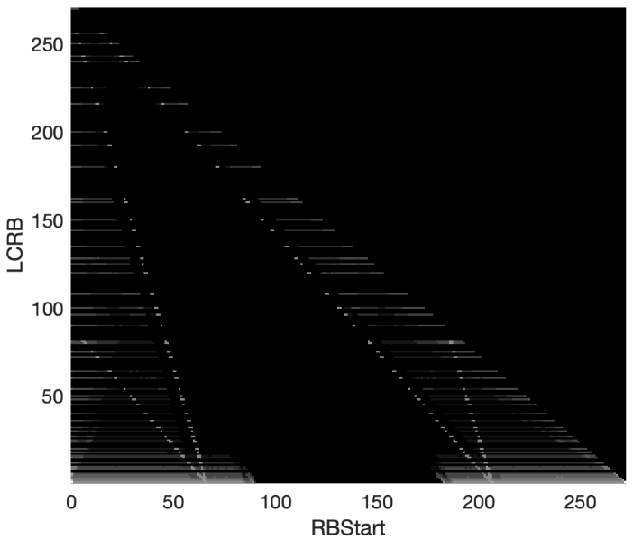
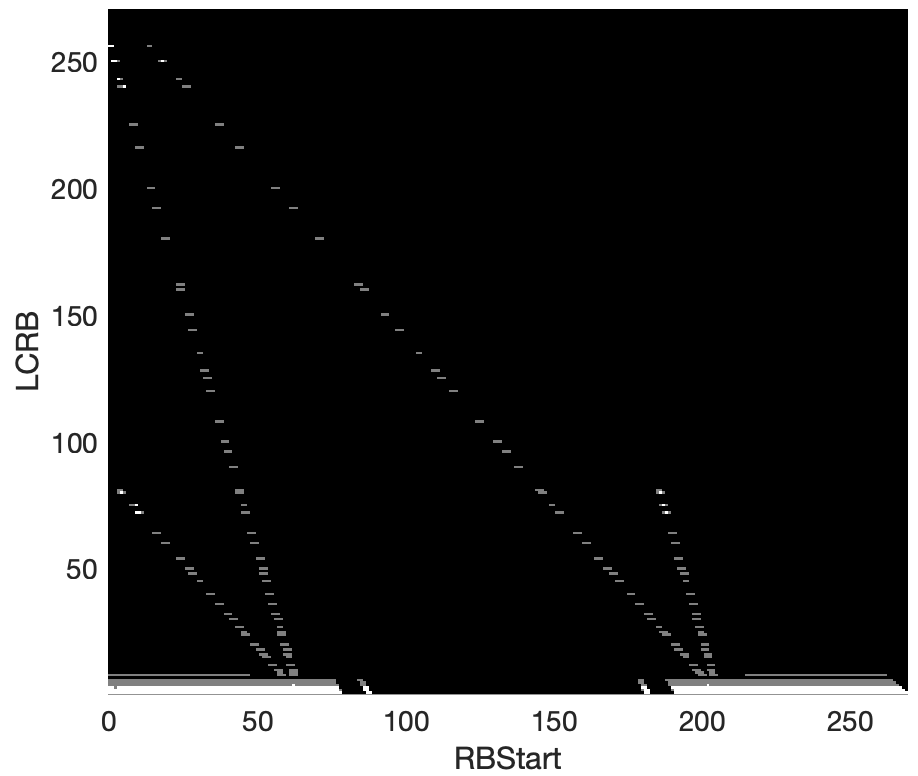
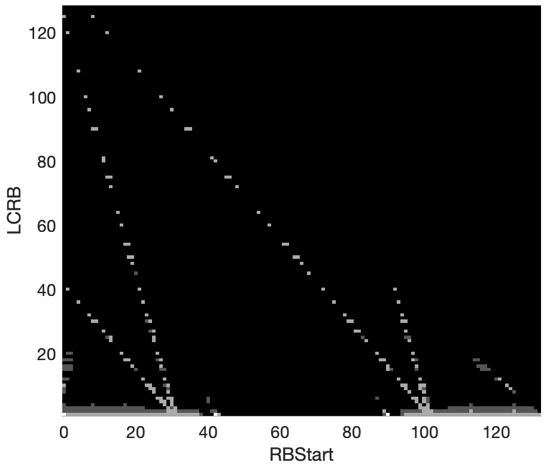

######## Annex A (normative): Measurement channels

A.1 General
===========

A.1.1 Throughput definition
---------------------------

The throughput values defined in the measurement channels specified in
Annex A, are calculated and are valid per codeword. For multi-codeword
transmissions, the throughput referenced in the minimum requirements is
the sum of throughputs of all codewords.

A.1.2 TDD UL-DL configurations for FR1
--------------------------------------

TDD UL-DL configurations for performance requirements are provided in
Tables A.1.2-1, A.1.2-2, and A.1.2-3.

Table A.1.2-1: TDD UL-DL configuration for SCS 15 kHz

+--------------------+--------------------+--------------------+----+
| **Parameter**      | **Unit**           | **UL-DL pattern**  |    |
+====================+====================+====================+====+
|                    |                    | **FR1.15-1**       |    |
+--------------------+--------------------+--------------------+----+
| TDD Slot           |                    | DDDSU              |    |
| Configuration      |                    |                    |    |
| pattern (Note 1)   |                    |                    |    |
+--------------------+--------------------+--------------------+----+
| Special Slot       |                    | 10D+2G+2U          |    |
| Configuration      |                    |                    |    |
| (Note 2)           |                    |                    |    |
+--------------------+--------------------+--------------------+----+
| *reference         | kHz                | 15                 |    |
| SubcarrierSpacing* |                    |                    |    |
+--------------------+--------------------+--------------------+----+
| pattern1           | *dl-UL-Transm      | ms                 | 5  |
|                    | issionPeriodicity* |                    |    |
+--------------------+--------------------+--------------------+----+
|                    | *                  |                    | 3  |
|                    | nrofDownlinkSlots* |                    |    |
+--------------------+--------------------+--------------------+----+
|                    | *nr                |                    | 10 |
|                    | ofDownlinkSymbols* |                    |    |
+--------------------+--------------------+--------------------+----+
|                    | *nrofUplinkSlot*   |                    | 1  |
+--------------------+--------------------+--------------------+----+
|                    | *                  |                    | 2  |
|                    | nrofUplinkSymbols* |                    |    |
+--------------------+--------------------+--------------------+----+
| The number of      |                    | 4 if mod(i,5) = 0\ |    |
| slots between      |                    | 3 if mod(i,5) = 1\ |    |
| PDSCH and          |                    | 2 if mod(i,5) = 2\ |    |
| corresponding      |                    | 6 if mod(i,5) = 3  |    |
| HARQ-ACK           |                    |                    |    |
| information (Note  |                    |                    |    |
| 3)                 |                    |                    |    |
+--------------------+--------------------+--------------------+----+
| Note 1: D denotes  |                    |                    |    |
| a slot with all DL |                    |                    |    |
| symbols; S denotes |                    |                    |    |
| a slot with a mix  |                    |                    |    |
| of DL, UL and      |                    |                    |    |
| guard symbols; U   |                    |                    |    |
| denotes a slot     |                    |                    |    |
| with all UL        |                    |                    |    |
| symbols. The field |                    |                    |    |
| is for             |                    |                    |    |
| information.       |                    |                    |    |
|                    |                    |                    |    |
| Note 2: D, G, U    |                    |                    |    |
| denote DL, guard   |                    |                    |    |
| and UL symbols,    |                    |                    |    |
| respectively. The  |                    |                    |    |
| field is for       |                    |                    |    |
| information.       |                    |                    |    |
|                    |                    |                    |    |
| Note 3: i is the   |                    |                    |    |
| slot index per     |                    |                    |    |
| frame; i =         |                    |                    |    |
| {0,...,9}.         |                    |                    |    |
+--------------------+--------------------+--------------------+----+

Table A.1.2-2: TDD UL-DL configuration for SCS 30 kHz

+-------+-------+-------+-------+-------+-------+-------+-------+----+
| **P   | **U   | **    |       |       |       |       |       |    |
| arame | nit** | UL-DL |       |       |       |       |       |    |
| ter** |       | patt  |       |       |       |       |       |    |
|       |       | ern** |       |       |       |       |       |    |
+=======+=======+=======+=======+=======+=======+=======+=======+====+
|       |       | **    | **    | **    | **    | **    | **    |    |
|       |       | FR1.3 | FR1.3 | FR1.3 | FR1.3 | FR1.3 | FR1.3 |    |
|       |       | 0-1** | 0-2** | 0-3** | 0-4** | 0-5** | 0-6** |    |
+-------+-------+-------+-------+-------+-------+-------+-------+----+
| TDD   |       | 7DS2U | DDDSU | DDDSU | DDDSU | DSUU  | DS~1~ |    |
| Slot  |       |       |       | DDSUU | UDDDD |       | S~2~U |    |
| Con   |       |       |       |       |       |       |       |    |
| figur |       |       |       |       |       |       |       |    |
| ation |       |       |       |       |       |       |       |    |
| pa    |       |       |       |       |       |       |       |    |
| ttern |       |       |       |       |       |       |       |    |
| (Note |       |       |       |       |       |       |       |    |
| 1)    |       |       |       |       |       |       |       |    |
+-------+-------+-------+-------+-------+-------+-------+-------+----+
| Sp    |       | 6D+   | 10D+  | 10D+  | 6D+   | 1     | S1:   |    |
| ecial |       | 4G+4U | 2G+2U | 2G+2U | 4G+4U | 2D+2G | 10D+2 |    |
| Slot  |       |       |       |       |       |       | G+2U\ |    |
| Con   |       |       |       |       |       |       | S2:   |    |
| figur |       |       |       |       |       |       | 12D+  |    |
| ation |       |       |       |       |       |       | 2G+0U |    |
| (Note |       |       |       |       |       |       |       |    |
| 2)    |       |       |       |       |       |       |       |    |
+-------+-------+-------+-------+-------+-------+-------+-------+----+
| *re   | kHz   | 30    | 30    | 30    | 30    | 30    | 30    |    |
| feren |       |       |       |       |       |       |       |    |
| ceSub |       |       |       |       |       |       |       |    |
| carri |       |       |       |       |       |       |       |    |
| erSpa |       |       |       |       |       |       |       |    |
| cing* |       |       |       |       |       |       |       |    |
+-------+-------+-------+-------+-------+-------+-------+-------+----+
| pat   |       |       |       |       |       |       |       |    |
| tern1 |       |       |       |       |       |       |       |    |
+-------+-------+-------+-------+-------+-------+-------+-------+----+
|       | *     | ms    | 5     | 2.5   | 2.5   | 3     | 2     | 1  |
|       | dl-UL |       |       |       |       |       |       |    |
|       | -Tran |       |       |       |       |       |       |    |
|       | smiss |       |       |       |       |       |       |    |
|       | ionPe |       |       |       |       |       |       |    |
|       | riodi |       |       |       |       |       |       |    |
|       | city* |       |       |       |       |       |       |    |
+-------+-------+-------+-------+-------+-------+-------+-------+----+
|       | *nro  |       | 7     | 3     | 3     | 3     | 1     | 1  |
|       | fDown |       |       |       |       |       |       |    |
|       | linkS |       |       |       |       |       |       |    |
|       | lots* |       |       |       |       |       |       |    |
+-------+-------+-------+-------+-------+-------+-------+-------+----+
|       | *     |       | 6     | 10    | 10    | 6     | 12    | 10 |
|       | nrofD |       |       |       |       |       |       |    |
|       | ownli |       |       |       |       |       |       |    |
|       | nkSym |       |       |       |       |       |       |    |
|       | bols* |       |       |       |       |       |       |    |
+-------+-------+-------+-------+-------+-------+-------+-------+----+
|       | *     |       | 2     | 1     | 1     | 2     | 2     | 0  |
|       | nrofU |       |       |       |       |       |       |    |
|       | plink |       |       |       |       |       |       |    |
|       | Slot* |       |       |       |       |       |       |    |
+-------+-------+-------+-------+-------+-------+-------+-------+----+
|       | *nro  |       | 4     | 2     | 2     | 4     | 0     | 2  |
|       | fUpli |       |       |       |       |       |       |    |
|       | nkSym |       |       |       |       |       |       |    |
|       | bols* |       |       |       |       |       |       |    |
+-------+-------+-------+-------+-------+-------+-------+-------+----+
| pat   |       |       |       |       |       |       |       |    |
| tern2 |       |       |       |       |       |       |       |    |
+-------+-------+-------+-------+-------+-------+-------+-------+----+
|       | *     | ms    | N/A   | N/A   | 2.5   | 2     | N/A   | 1  |
|       | dl-UL |       |       |       |       |       |       |    |
|       | -Tran |       |       |       |       |       |       |    |
|       | smiss |       |       |       |       |       |       |    |
|       | ionPe |       |       |       |       |       |       |    |
|       | riodi |       |       |       |       |       |       |    |
|       | city* |       |       |       |       |       |       |    |
+-------+-------+-------+-------+-------+-------+-------+-------+----+
|       | *nro  |       | N/A   | N/A   | 2     | 4     | N/A   | 0  |
|       | fDown |       |       |       |       |       |       |    |
|       | linkS |       |       |       |       |       |       |    |
|       | lots* |       |       |       |       |       |       |    |
+-------+-------+-------+-------+-------+-------+-------+-------+----+
|       | *     |       | N/A   | N/A   | 10    | 0     | N/A   | 12 |
|       | nrofD |       |       |       |       |       |       |    |
|       | ownli |       |       |       |       |       |       |    |
|       | nkSym |       |       |       |       |       |       |    |
|       | bols* |       |       |       |       |       |       |    |
+-------+-------+-------+-------+-------+-------+-------+-------+----+
|       | *     |       | N/A   | N/A   | 2     | 0     | N/A   | 1  |
|       | nrofU |       |       |       |       |       |       |    |
|       | plink |       |       |       |       |       |       |    |
|       | Slot* |       |       |       |       |       |       |    |
+-------+-------+-------+-------+-------+-------+-------+-------+----+
|       | *nro  |       | N/A   | N/A   | 2     | 0     | N/A   | 0  |
|       | fUpli |       |       |       |       |       |       |    |
|       | nkSym |       |       |       |       |       |       |    |
|       | bols* |       |       |       |       |       |       |    |
+-------+-------+-------+-------+-------+-------+-------+-------+----+
| The   |       | 8 if  | 4 if  | 4 if  | 5 if  | 3 if  | 3 if  |    |
| n     |       | mod(  | mod   | mod(  | mod(  | mod   | mod   |    |
| umber |       | i,10) | (i,5) | i,10) | i,10) | (i,4) | (i,4) |    |
| of    |       | = 0\  | = 0\  | = 0\  | = 0\  | = 0\  | = 0\  |    |
| slots |       | 7 if  | 3 if  | 3 if  | 4 if  | 2 if  | 2 if  |    |
| be    |       | mod(  | mod   | mod(  | mod(  | mod   | mod   |    |
| tween |       | i,10) | (i,5) | i,10) | i,10) | (i,4) | (i,4) |    |
| PDSCH |       | = 1\  | = 1\  | = 1\  | = 1\  | = 1   | = 1\  |    |
| and   |       | 6 if  | 2 if  | 2 if  | 3 if  |       | 3 if  |    |
| cor   |       | mod(  | mod   | mod(  | mod(  |       | mod   |    |
| respo |       | i,10) | (i,5) | i,10) | i,10) |       | (i,4) |    |
| nding |       | = 2\  | = 2\  | = 2\  | = 2\  |       | = 2   |    |
| HAR   |       | 5 if  | 6 if  | 5 if  | 2 if  |       |       |    |
| Q-ACK |       | mod(  | mod   | mod(  | mod(  |       |       |    |
| i     |       | i,10) | (i,5) | i,10) | i,10) |       |       |    |
| nform |       | = 3\  | = 3   | = 3\  | = 3\  |       |       |    |
| ation |       | 5 if  |       | 3 if  | 8 if  |       |       |    |
| (Note |       | mod(  |       | mod(  | mod(  |       |       |    |
| 3)    |       | i,10) |       | i,10) | i,10) |       |       |    |
|       |       | = 4\  |       | = 5\  | = 6\  |       |       |    |
|       |       | 4 if  |       | 3 if  | 7 if  |       |       |    |
|       |       | mod(  |       | mod(  | mod(  |       |       |    |
|       |       | i,10) |       | i,10) | i,10) |       |       |    |
|       |       | = 5\  |       | = 6\  | = 7\  |       |       |    |
|       |       | 3 if  |       | 2 if  | 6 if  |       |       |    |
|       |       | mod(  |       | mod(  | mod(  |       |       |    |
|       |       | i,10) |       | i,10) | i,10) |       |       |    |
|       |       | = 6\  |       | = 7   | = 8\  |       |       |    |
|       |       | 2 if  |       |       | 5 if  |       |       |    |
|       |       | mod(  |       |       | mod(  |       |       |    |
|       |       | i,10) |       |       | i,10) |       |       |    |
|       |       | = 7   |       |       | = 9   |       |       |    |
+-------+-------+-------+-------+-------+-------+-------+-------+----+
| Note  |       |       |       |       |       |       |       |    |
| 1: D  |       |       |       |       |       |       |       |    |
| de    |       |       |       |       |       |       |       |    |
| notes |       |       |       |       |       |       |       |    |
| a     |       |       |       |       |       |       |       |    |
| slot  |       |       |       |       |       |       |       |    |
| with  |       |       |       |       |       |       |       |    |
| all   |       |       |       |       |       |       |       |    |
| DL    |       |       |       |       |       |       |       |    |
| sym   |       |       |       |       |       |       |       |    |
| bols; |       |       |       |       |       |       |       |    |
| S     |       |       |       |       |       |       |       |    |
| de    |       |       |       |       |       |       |       |    |
| notes |       |       |       |       |       |       |       |    |
| a     |       |       |       |       |       |       |       |    |
| slot  |       |       |       |       |       |       |       |    |
| with  |       |       |       |       |       |       |       |    |
| a mix |       |       |       |       |       |       |       |    |
| of    |       |       |       |       |       |       |       |    |
| DL,   |       |       |       |       |       |       |       |    |
| UL    |       |       |       |       |       |       |       |    |
| and   |       |       |       |       |       |       |       |    |
| guard |       |       |       |       |       |       |       |    |
| sym   |       |       |       |       |       |       |       |    |
| bols; |       |       |       |       |       |       |       |    |
| U     |       |       |       |       |       |       |       |    |
| de    |       |       |       |       |       |       |       |    |
| notes |       |       |       |       |       |       |       |    |
| a     |       |       |       |       |       |       |       |    |
| slot  |       |       |       |       |       |       |       |    |
| with  |       |       |       |       |       |       |       |    |
| all   |       |       |       |       |       |       |       |    |
| UL    |       |       |       |       |       |       |       |    |
| sym   |       |       |       |       |       |       |       |    |
| bols. |       |       |       |       |       |       |       |    |
| The   |       |       |       |       |       |       |       |    |
| field |       |       |       |       |       |       |       |    |
| is    |       |       |       |       |       |       |       |    |
| for   |       |       |       |       |       |       |       |    |
| in    |       |       |       |       |       |       |       |    |
| forma |       |       |       |       |       |       |       |    |
| tion. |       |       |       |       |       |       |       |    |
|       |       |       |       |       |       |       |       |    |
| Note  |       |       |       |       |       |       |       |    |
| 2: D, |       |       |       |       |       |       |       |    |
| G, U  |       |       |       |       |       |       |       |    |
| d     |       |       |       |       |       |       |       |    |
| enote |       |       |       |       |       |       |       |    |
| DL,   |       |       |       |       |       |       |       |    |
| guard |       |       |       |       |       |       |       |    |
| and   |       |       |       |       |       |       |       |    |
| UL    |       |       |       |       |       |       |       |    |
| sym   |       |       |       |       |       |       |       |    |
| bols, |       |       |       |       |       |       |       |    |
| res   |       |       |       |       |       |       |       |    |
| pecti |       |       |       |       |       |       |       |    |
| vely. |       |       |       |       |       |       |       |    |
| The   |       |       |       |       |       |       |       |    |
| field |       |       |       |       |       |       |       |    |
| is    |       |       |       |       |       |       |       |    |
| for   |       |       |       |       |       |       |       |    |
| in    |       |       |       |       |       |       |       |    |
| forma |       |       |       |       |       |       |       |    |
| tion. |       |       |       |       |       |       |       |    |
|       |       |       |       |       |       |       |       |    |
| Note  |       |       |       |       |       |       |       |    |
| 3: i  |       |       |       |       |       |       |       |    |
| is    |       |       |       |       |       |       |       |    |
| the   |       |       |       |       |       |       |       |    |
| slot  |       |       |       |       |       |       |       |    |
| index |       |       |       |       |       |       |       |    |
| per   |       |       |       |       |       |       |       |    |
| f     |       |       |       |       |       |       |       |    |
| rame; |       |       |       |       |       |       |       |    |
| i =   |       |       |       |       |       |       |       |    |
| {0,.. |       |       |       |       |       |       |       |    |
| .,19} |       |       |       |       |       |       |       |    |
+-------+-------+-------+-------+-------+-------+-------+-------+----+

Table A.1.2-2a: TDD UL-DL configuration for SCS 30 kHz for DCI-based
dynamic UL/DL detection

+----------------+----------------+----------------+----------------+
| **Parameter**  | **Unit**       | **UL-DL        |                |
|                |                | pattern**      |                |
+================+================+================+================+
|                |                | **FR1.30-1A**  |                |
+----------------+----------------+----------------+----------------+
| TDD Slot       |                | 7DS2U          |                |
| Configuration  |                |                |                |
| pattern (Note  |                |                |                |
| 1)             |                |                |                |
+----------------+----------------+----------------+----------------+
| Special Slot   |                | 6D+4G+4U       |                |
| Configuration  |                |                |                |
| (Note 2)       |                |                |                |
+----------------+----------------+----------------+----------------+
| *referenceSubc | kHz            | N/A            |                |
| arrierSpacing* |                |                |                |
+----------------+----------------+----------------+----------------+
| pattern1 (Note |                |                |                |
| 4)             |                |                |                |
+----------------+----------------+----------------+----------------+
|                | *dl            | ms             | N/A            |
|                | -UL-Transmissi |                |                |
|                | onPeriodicity* |                |                |
+----------------+----------------+----------------+----------------+
|                | *nrof          |                | N/A            |
|                | DownlinkSlots* |                |                |
+----------------+----------------+----------------+----------------+
|                | *nrofDo        |                | N/A            |
|                | wnlinkSymbols* |                |                |
+----------------+----------------+----------------+----------------+
|                | *n             |                | N/A            |
|                | rofUplinkSlot* |                |                |
+----------------+----------------+----------------+----------------+
|                | *nrof          |                | N/A            |
|                | UplinkSymbols* |                |                |
+----------------+----------------+----------------+----------------+
| PDCCH DCI      | DCI Format     |                | 1-1 for slot   |
| Configuration  |                |                | indices with   |
|                |                |                | mod(i,10) =    |
|                |                |                | 0              |
|                |                |                | ,1,2,3,4,5,6,7 |
+----------------+----------------+----------------+----------------+
|                | Scheduled      |                | Symbol 2-13    |
|                | Grant          |                | for slot       |
|                |                |                | indices with   |
|                |                |                | mod(i,10) =    |
|                |                |                | 0,1,2,3,4,5,6  |
|                |                |                | and Symbol 2-5 |
|                |                |                | for slot       |
|                |                |                | indices with   |
|                |                |                | mod(i,10) = 7  |
+----------------+----------------+----------------+----------------+
| The number of  |                | 8 if mod(i,10) |                |
| slots between  |                | = 0\           |                |
| PDSCH and      |                | 7 if mod(i,10) |                |
| corresponding  |                | = 1\           |                |
| HARQ-ACK       |                | 6 if mod(i,10) |                |
| information    |                | = 2\           |                |
| (Note 3)\      |                | 5 if mod(i,10) |                |
| (PDS           |                | = 3\           |                |
| CH-to-HARQ-tim |                | 5 if mod(i,10) |                |
| ing-indicator) |                | = 4\           |                |
|                |                | 4 if mod(i,10) |                |
|                |                | = 5\           |                |
|                |                | 3 if mod(i,10) |                |
|                |                | = 6\           |                |
|                |                | 2 if mod(i,10) |                |
|                |                | = 7            |                |
+----------------+----------------+----------------+----------------+
| Note 1: D      |                |                |                |
| denotes a slot |                |                |                |
| with all DL    |                |                |                |
| symbols; S     |                |                |                |
| denotes a slot |                |                |                |
| with a mix of  |                |                |                |
| DL, UL and     |                |                |                |
| guard symbols; |                |                |                |
| U denotes a    |                |                |                |
| slot with all  |                |                |                |
| UL symbols.    |                |                |                |
| The field is   |                |                |                |
| for            |                |                |                |
| information.   |                |                |                |
|                |                |                |                |
| Note 2: D, G   |                |                |                |
| and U denote   |                |                |                |
| DL, guard and  |                |                |                |
| UL symbols,    |                |                |                |
| respectively.  |                |                |                |
| The field is   |                |                |                |
| for            |                |                |                |
| information.   |                |                |                |
|                |                |                |                |
| Note 3: i is   |                |                |                |
| the slot index |                |                |                |
| per frame; i = |                |                |                |
| {0,...,19}     |                |                |                |
|                |                |                |                |
| Note 4: Do not |                |                |                |
| configure      |                |                |                |
| *td            |                |                |                |
| d-UL-DL-Config |                |                |                |
| urationCommon* |                |                |                |
| using RRC      |                |                |                |
| configuration  |                |                |                |
+----------------+----------------+----------------+----------------+

Table A.1.2-2b: TDD UL-DL configuration for SCS 30 kHz for PDSCH on band
with shared spectrum access

+-------------------+-------------------+-------------------+-----+
| **Parameter**     | **Unit**          | **UL-DL pattern** |     |
+===================+===================+===================+=====+
|                   |                   | **FR1.30-7**      |     |
+-------------------+-------------------+-------------------+-----+
| TDD Slot          |                   | 7DS2U             |     |
| Configuration     |                   |                   |     |
| pattern (Note 1)  |                   |                   |     |
+-------------------+-------------------+-------------------+-----+
| Special Slot      |                   | 6D+4G+4U          |     |
| Configuration     |                   |                   |     |
| (Note 2)          |                   |                   |     |
+-------------------+-------------------+-------------------+-----+
| *referenceS       | kHz               | 30                |     |
| ubcarrierSpacing* |                   |                   |     |
+-------------------+-------------------+-------------------+-----+
| *Pattern 1*       | *dl-UL-Transmi    | ms                | 5   |
|                   | ssionPeriodicity* |                   |     |
+-------------------+-------------------+-------------------+-----+
|                   | *n                | slot              | 7   |
|                   | rofDownlinkSlots* |                   |     |
+-------------------+-------------------+-------------------+-----+
|                   | *nro              | symbol            | 6   |
|                   | fDownlinkSymbols* |                   |     |
+-------------------+-------------------+-------------------+-----+
|                   | *nrofUplinkSlot*  | slot              | 2   |
+-------------------+-------------------+-------------------+-----+
|                   | *n                | symbol            | 4   |
|                   | rofUplinkSymbols* |                   |     |
+-------------------+-------------------+-------------------+-----+
| *Pattern 2*       | *dl-UL-Transmi    | ms                | N/A |
|                   | ssionPeriodicity* |                   |     |
+-------------------+-------------------+-------------------+-----+
|                   | *n                |                   | N/A |
|                   | rofDownlinkSlots* |                   |     |
+-------------------+-------------------+-------------------+-----+
|                   | *nro              |                   | N/A |
|                   | fDownlinkSymbols* |                   |     |
+-------------------+-------------------+-------------------+-----+
|                   | *nrofUplinkSlot*  |                   | N/A |
+-------------------+-------------------+-------------------+-----+
|                   | *n                |                   | N/A |
|                   | rofUplinkSymbols* |                   |     |
+-------------------+-------------------+-------------------+-----+
| The number of     |                   | 8 if mod(i,10) =  |     |
| slots between     |                   | 0\                |     |
| PDSCH and         |                   | 7 if mod(i,10) =  |     |
| corresponding     |                   | 1\                |     |
| HARQ-ACK          |                   | 6 if mod(i,10) =  |     |
| information (Note |                   | 2\                |     |
| 3)                |                   | 5 if mod(i,10) =  |     |
|                   |                   | 3\                |     |
|                   |                   | 4 if mod(i,10) =  |     |
|                   |                   | 4\                |     |
|                   |                   | 3 if mod(i,10) =  |     |
|                   |                   | 5\                |     |
|                   |                   | 2 if mod(i,10) =  |     |
|                   |                   | 6                 |     |
+-------------------+-------------------+-------------------+-----+
| Note 1: D denotes |                   |                   |     |
| a slot with all   |                   |                   |     |
| DL symbols; S     |                   |                   |     |
| denotes a slot    |                   |                   |     |
| with a mix of DL, |                   |                   |     |
| UL and guard      |                   |                   |     |
| symbols; U        |                   |                   |     |
| denotes a slot    |                   |                   |     |
| with all UL       |                   |                   |     |
| symbols. The      |                   |                   |     |
| field is for      |                   |                   |     |
| information.      |                   |                   |     |
|                   |                   |                   |     |
| Note 2: D, G, U   |                   |                   |     |
| denote DL, guard  |                   |                   |     |
| and UL symbols,   |                   |                   |     |
| respectively. The |                   |                   |     |
| field is for      |                   |                   |     |
| information.      |                   |                   |     |
|                   |                   |                   |     |
| Note 3: i is the  |                   |                   |     |
| slot index of all |                   |                   |     |
| slots in every    |                   |                   |     |
| 5ms i =           |                   |                   |     |
| {0,...,9}Note 4:  |                   |                   |     |
| The slot i, mod   |                   |                   |     |
| (i,10)=9 is idle  |                   |                   |     |
| slot with no UL   |                   |                   |     |
| transmission.     |                   |                   |     |
+-------------------+-------------------+-------------------+-----+

A.1.3 TDD UL-DL configurations for FR2
--------------------------------------

TDD UL-DL patterns configurations for performance requirements are
provided in Tables A.1.3-1, A.1.3-2.

Table A.1.3-1: TDD UL-DL pattern for SCS 60 kHz

+--------------------+--------------------+--------------------+----+
| **Parameter**      | **Unit**           | **UL-DL pattern**  |    |
+====================+====================+====================+====+
|                    |                    | **FR2.60-1**       |    |
+--------------------+--------------------+--------------------+----+
| TDD Slot           |                    | DDSU               |    |
| Configuration      |                    |                    |    |
| pattern (Note 1)   |                    |                    |    |
+--------------------+--------------------+--------------------+----+
| Special Slot       |                    | 11D+3G+0U          |    |
| Configuration      |                    |                    |    |
| (Note 2)           |                    |                    |    |
+--------------------+--------------------+--------------------+----+
| *reference         | kHz                | 60                 |    |
| SubcarrierSpacing* |                    |                    |    |
+--------------------+--------------------+--------------------+----+
| pattern1           | *dl-UL-Transm      | ms                 | 1  |
|                    | issionPeriodicity* |                    |    |
+--------------------+--------------------+--------------------+----+
|                    | *                  |                    | 2  |
|                    | nrofDownlinkSlots* |                    |    |
+--------------------+--------------------+--------------------+----+
|                    | *nr                |                    | 11 |
|                    | ofDownlinkSymbols* |                    |    |
+--------------------+--------------------+--------------------+----+
|                    | *nrofUplinkSlot*   |                    | 1  |
+--------------------+--------------------+--------------------+----+
|                    | *                  |                    | 0  |
|                    | nrofUplinkSymbols* |                    |    |
+--------------------+--------------------+--------------------+----+
| The number of      |                    | 3 if mod(i,4) = 0\ |    |
| slots between      |                    | 2 if mod(i,4) = 1\ |    |
| PDSCH and          |                    | 5 if mod(i,4) = 2  |    |
| corresponding      |                    |                    |    |
| HARQ-ACK           |                    |                    |    |
| information (Note  |                    |                    |    |
| 3)                 |                    |                    |    |
+--------------------+--------------------+--------------------+----+
| Note 1: D denotes  |                    |                    |    |
| a slot with all DL |                    |                    |    |
| symbols; S denotes |                    |                    |    |
| a slot with a mix  |                    |                    |    |
| of DL, UL and      |                    |                    |    |
| guard symbols; U   |                    |                    |    |
| denotes a slot     |                    |                    |    |
| with all UL        |                    |                    |    |
| symbols. The field |                    |                    |    |
| is for             |                    |                    |    |
| information.       |                    |                    |    |
|                    |                    |                    |    |
| Note 2: D, G, U    |                    |                    |    |
| denote DL, guard   |                    |                    |    |
| and UL symbols,    |                    |                    |    |
| respectively. The  |                    |                    |    |
| field is for       |                    |                    |    |
| information.       |                    |                    |    |
|                    |                    |                    |    |
| Note 3: i is the   |                    |                    |    |
| slot index per     |                    |                    |    |
| frame; i =         |                    |                    |    |
| {0,...,39}         |                    |                    |    |
+--------------------+--------------------+--------------------+----+

Table A.1.3-2: TDD UL-DL configuration for SCS 120 kHz

+---------------+---------------+---------------+---------------+-----+
| **Parameter** | **Unit**      | **UL-DL       |               |     |
|               |               | pattern**     |               |     |
+===============+===============+===============+===============+=====+
|               |               | **FR2.120-1** | **FR2.120-2** |     |
+---------------+---------------+---------------+---------------+-----+
| TDD Slot      |               | DDDSU         | DDSU          |     |
| Configuration |               |               |               |     |
| pattern (Note |               |               |               |     |
| 1)            |               |               |               |     |
+---------------+---------------+---------------+---------------+-----+
| Special Slot  |               | 10D+2G+2U     | 11D+3G+0U     |     |
| Configuration |               |               |               |     |
| (Note 2)      |               |               |               |     |
+---------------+---------------+---------------+---------------+-----+
| *r            | kHz           | 120           | 120           |     |
| eferenceSubca |               |               |               |     |
| rrierSpacing* |               |               |               |     |
+---------------+---------------+---------------+---------------+-----+
| pattern1      | *dl-U         | ms            | 0.625         | 0.5 |
|               | L-Transmissio |               |               |     |
|               | nPeriodicity* |               |               |     |
+---------------+---------------+---------------+---------------+-----+
|               | *nrofD        |               | 3             | 2   |
|               | ownlinkSlots* |               |               |     |
+---------------+---------------+---------------+---------------+-----+
|               | *nrofDow      |               | 10            | 11  |
|               | nlinkSymbols* |               |               |     |
+---------------+---------------+---------------+---------------+-----+
|               | *nr           |               | 1             | 1   |
|               | ofUplinkSlot* |               |               |     |
+---------------+---------------+---------------+---------------+-----+
|               | *nrofU        |               | 2             | 0   |
|               | plinkSymbols* |               |               |     |
+---------------+---------------+---------------+---------------+-----+
| The number of |               | 4 if mod(i,5) | 3 if mod(i,4) |     |
| slots between |               | = 0\          | = 0\          |     |
| PDSCH and     |               | 3 if mod(i,5) | 2 if mod(i,4) |     |
| corresponding |               | = 1\          | = 1\          |     |
| HARQ-ACK      |               | 2 if mod(i,5) | 5 if mod(i,4) |     |
| inf           |               | = 2\          | = 2           |     |
| ormation(Note |               | 6 if mod(i,5) |               |     |
| 3)            |               | = 3           |               |     |
+---------------+---------------+---------------+---------------+-----+
| Note 1: D     |               |               |               |     |
| denotes a     |               |               |               |     |
| slot with all |               |               |               |     |
| DL symbols; S |               |               |               |     |
| denotes a     |               |               |               |     |
| slot with a   |               |               |               |     |
| mix of DL, UL |               |               |               |     |
| and guard     |               |               |               |     |
| symbols; U    |               |               |               |     |
| denotes a     |               |               |               |     |
| slot with all |               |               |               |     |
| UL symbols.   |               |               |               |     |
| The field is  |               |               |               |     |
| for           |               |               |               |     |
| information.  |               |               |               |     |
|               |               |               |               |     |
| Note 2: D, G, |               |               |               |     |
| U denote DL,  |               |               |               |     |
| guard and UL  |               |               |               |     |
| symbols,      |               |               |               |     |
| respectively. |               |               |               |     |
| The field is  |               |               |               |     |
| for           |               |               |               |     |
| information.  |               |               |               |     |
|               |               |               |               |     |
| Note 3: i is  |               |               |               |     |
| the slot      |               |               |               |     |
| index per     |               |               |               |     |
| frame; i =    |               |               |               |     |
| {0,...,79}    |               |               |               |     |
+---------------+---------------+---------------+---------------+-----+

Table A.1.3-2a: TDD UL-DL configuration for SCS 120 kHz for DCI-based
dynamic UL/DL detection

+----------------+----------------+----------------+----------------+
| **Parameter**  | **Unit**       | **UL-DL        |                |
|                |                | pattern**      |                |
+================+================+================+================+
|                |                | **FR2.120-1A** |                |
+----------------+----------------+----------------+----------------+
| TDD Slot       |                | DDDSU          |                |
| Configuration  |                |                |                |
| pattern (Note  |                |                |                |
| 1)             |                |                |                |
+----------------+----------------+----------------+----------------+
| Special Slot   |                | 10D+2G+2U      |                |
| Configuration  |                |                |                |
| (Note 2)       |                |                |                |
+----------------+----------------+----------------+----------------+
| *referenceSubc | kHz            | N/A            |                |
| arrierSpacing* |                |                |                |
+----------------+----------------+----------------+----------------+
| pattern1 (Note | *dl            | ms             | N/A            |
| 4)             | -UL-Transmissi |                |                |
|                | onPeriodicity* |                |                |
+----------------+----------------+----------------+----------------+
|                | *nrof          |                | N/A            |
|                | DownlinkSlots* |                |                |
+----------------+----------------+----------------+----------------+
|                | *nrofDo        |                | N/A            |
|                | wnlinkSymbols* |                |                |
+----------------+----------------+----------------+----------------+
|                | *n             |                | N/A            |
|                | rofUplinkSlot* |                |                |
+----------------+----------------+----------------+----------------+
|                | *nrof          |                | N/A            |
|                | UplinkSymbols* |                |                |
+----------------+----------------+----------------+----------------+
| PDCCH DCI      | DCI Format     |                | 1-1 for slot   |
| Configuration  |                |                | indices with   |
|                |                |                | mod(i,5) =     |
|                |                |                | 0,1,2,3        |
+----------------+----------------+----------------+----------------+
|                | Scheduled      |                | Symbol 1-13    |
|                | Grant          |                | for slot       |
|                |                |                | indices with   |
|                |                |                | mod(i,5) =     |
|                |                |                | 0,1,2 and      |
|                |                |                | Symbol 1-9 for |
|                |                |                | slot indices   |
|                |                |                | with mod(i,5)  |
|                |                |                | = 3            |
+----------------+----------------+----------------+----------------+
| The number of  |                | 4 if mod(i,5)  |                |
| slots between  |                | = 0\           |                |
| PDSCH and      |                | 3 if mod(i,5)  |                |
| corresponding  |                | = 1\           |                |
| HARQ-ACK       |                | 2 if mod(i,5)  |                |
| in             |                | = 2\           |                |
| formation(Note |                | 6 if mod(i,5)  |                |
| 3)             |                | = 3            |                |
+----------------+----------------+----------------+----------------+
| Note 1: D      |                |                |                |
| denotes a slot |                |                |                |
| with all DL    |                |                |                |
| symbols; S     |                |                |                |
| denotes a slot |                |                |                |
| with a mix of  |                |                |                |
| DL, UL and     |                |                |                |
| guard symbols; |                |                |                |
| U denotes a    |                |                |                |
| slot with all  |                |                |                |
| UL symbols.    |                |                |                |
| The field is   |                |                |                |
| for            |                |                |                |
| information.   |                |                |                |
|                |                |                |                |
| Note 2: D, G   |                |                |                |
| and U denote   |                |                |                |
| DL, guard and  |                |                |                |
| UL symbols,    |                |                |                |
| respectively.  |                |                |                |
| The field is   |                |                |                |
| for            |                |                |                |
| information.   |                |                |                |
|                |                |                |                |
| Note 3: i is   |                |                |                |
| the slot index |                |                |                |
| per frame; i = |                |                |                |
| {0,...,79}     |                |                |                |
|                |                |                |                |
| Note 4: Do not |                |                |                |
| configure      |                |                |                |
| *td            |                |                |                |
| d-UL-DL-Config |                |                |                |
| urationCommon* |                |                |                |
| using RRC      |                |                |                |
| configuration. |                |                |                |
+----------------+----------------+----------------+----------------+

Table A.1.3-3: TDD UL-DL configuration for SCS 480 kHz

+------------------+------------------+------------------+-------+---+
| Parameter        | Unit             | UL-DL pattern    |       |   |
+==================+==================+==================+=======+===+
|                  |                  | FR2.480-1        |       |   |
+------------------+------------------+------------------+-------+---+
| TDD Slot         |                  | DDDDDD           |       |   |
| Configuration    |                  | DDDDDDDDS1S2UUUU |       |   |
| pattern (Note 1) |                  |                  |       |   |
+------------------+------------------+------------------+-------+---+
| Special Slot     |                  | S1:12D+2G+0U     |       |   |
| Configuration    |                  |                  |       |   |
| (Note 2)         |                  | S2: 0D+6G+8U     |       |   |
+------------------+------------------+------------------+-------+---+
| *referenceSu     | kHz              | 480              |       |   |
| bcarrierSpacing* |                  |                  |       |   |
+------------------+------------------+------------------+-------+---+
| pattern1         | *dl-UL-Transmis  | ms               | 0.625 |   |
|                  | sionPeriodicity* |                  |       |   |
+------------------+------------------+------------------+-------+---+
|                  | *nr              |                  | 14    |   |
|                  | ofDownlinkSlots* |                  |       |   |
+------------------+------------------+------------------+-------+---+
|                  | *nrof            |                  | 12    |   |
|                  | DownlinkSymbols* |                  |       |   |
+------------------+------------------+------------------+-------+---+
|                  | *nrofUplinkSlot* |                  | 4     |   |
+------------------+------------------+------------------+-------+---+
|                  | *nr              |                  | 8     |   |
|                  | ofUplinkSymbols* |                  |       |   |
+------------------+------------------+------------------+-------+---+
| The number of    |                  | 19-mod(i,40) if  |       |   |
| slots between    |                  | mod(i,40)        |       |   |
| PDSCH and        |                  | =0,1,...,11      |       |   |
| corresponding    |                  |                  |       |   |
| HARQ-ACK         |                  | 39-mod(i,40) if  |       |   |
| information(Note |                  | mod(i,40)        |       |   |
| 3)               |                  | =12,             |       |   |
|                  |                  | 13,14,20,21,..., |       |   |
|                  |                  | 31               |       |   |
+------------------+------------------+------------------+-------+---+
| Note 1: D        |                  |                  |       |   |
| denotes a slot   |                  |                  |       |   |
| with all DL      |                  |                  |       |   |
| symbols; S       |                  |                  |       |   |
| denotes a slot   |                  |                  |       |   |
| with a mix of    |                  |                  |       |   |
| DL, UL and guard |                  |                  |       |   |
| symbols; U       |                  |                  |       |   |
| denotes a slot   |                  |                  |       |   |
| with all UL      |                  |                  |       |   |
| symbols. The     |                  |                  |       |   |
| field is for     |                  |                  |       |   |
| information.     |                  |                  |       |   |
|                  |                  |                  |       |   |
| Note 2: D, G, U  |                  |                  |       |   |
| denote DL, guard |                  |                  |       |   |
| and UL symbols,  |                  |                  |       |   |
| respectively.    |                  |                  |       |   |
| The field is for |                  |                  |       |   |
| information.     |                  |                  |       |   |
|                  |                  |                  |       |   |
| Note 3: i is the |                  |                  |       |   |
| slot index per   |                  |                  |       |   |
| frame; i =       |                  |                  |       |   |
| {0,...,319}      |                  |                  |       |   |
+------------------+------------------+------------------+-------+---+

A.2 Void
========

*\<Editor*\'*s note: Clause A.2 is a placeholder for UL Measurement
channels\>*

A.3 DL reference measurement channels
=====================================

A.3.1 General
-------------

The transport block size (TBS) determination procedure is described in
clause 5.1.3.2 of TS38.214\[12\].

Unless otherwise stated, no user data is scheduled on slot \#0 within 20
ms in order to avoid SSB and PDSCH transmissions in one slot and
simplify test configuration.

Unless otherwise stated, SIB1 transmission shall only be scheduled
during call setup to avoid SIB1 and PDSCH transmissions in the same
slot.

A.3.2 Reference measurement channels for PDSCH performance requirements
-----------------------------------------------------------------------

For PDSCH reference channels if more than one Code Block is present, an
additional CRC sequence of L = 24 Bits is attached to each Code Block
(otherwise L = 0 Bit).

### A.3.2.1 FDD

#### A.3.2.1.1 Reference measurement channels for SCS 15 kHz FR1

Table A.3.2.1.1-1: PDSCH Reference Channel for FDD (QPSK)

+----------+----------+----------+----------+----------+----------+---+
| **Par    | **Unit** | *        |          |          |          |   |
| ameter** |          | *Value** |          |          |          |   |
+==========+==========+==========+==========+==========+==========+===+
| R        |          | R.PDS    | R.PDS    | R.PDS    | R.PDS    |   |
| eference |          | CH.1-1.1 | CH.1-1.2 | CH.1-1.3 | CH.1-1.4 |   |
| channel  |          | FDD      | FDD      | FDD      | FDD      |   |
+----------+----------+----------+----------+----------+----------+---+
| Channel  | MHz      | 10       | 10       | 10       | 10       |   |
| b        |          |          |          |          |          |   |
| andwidth |          |          |          |          |          |   |
+----------+----------+----------+----------+----------+----------+---+
| Su       | kHz      | 15       | 15       | 15       | 15       |   |
| bcarrier |          |          |          |          |          |   |
| spacing  |          |          |          |          |          |   |
+----------+----------+----------+----------+----------+----------+---+
| Number   | PRBs     | 52       | 6        | 52       | 52       |   |
| of       |          |          |          |          |          |   |
| a        |          |          |          |          |          |   |
| llocated |          |          |          |          |          |   |
| resource |          |          |          |          |          |   |
| blocks   |          |          |          |          |          |   |
+----------+----------+----------+----------+----------+----------+---+
| Number   |          | 12       | 12       | 7        | 12       |   |
| of       |          |          |          |          |          |   |
| con      |          |          |          |          |          |   |
| secutive |          |          |          |          |          |   |
| PDSCH    |          |          |          |          |          |   |
| symbols  |          |          |          |          |          |   |
+----------+----------+----------+----------+----------+----------+---+
| A        | Slots    | 19       | 19       | 19       | 19       |   |
| llocated |          |          |          |          |          |   |
| slots    |          |          |          |          |          |   |
| per 2    |          |          |          |          |          |   |
| frames   |          |          |          |          |          |   |
+----------+----------+----------+----------+----------+----------+---+
| MCS      |          | 64QAM    | 64QAM    | 64QAM    | 64       |   |
| table    |          |          |          |          | QAMLowSE |   |
+----------+----------+----------+----------+----------+----------+---+
| MCS      |          | 4        | 4        | 4        | 14       |   |
| index    |          |          |          |          |          |   |
+----------+----------+----------+----------+----------+----------+---+
| Mo       |          | QPSK     | QPSK     | QPSK     | QPSK     |   |
| dulation |          |          |          |          |          |   |
+----------+----------+----------+----------+----------+----------+---+
| Target   |          | 0.30     | 0.30     | 0.30     | 0.59     |   |
| Coding   |          |          |          |          |          |   |
| Rate     |          |          |          |          |          |   |
+----------+----------+----------+----------+----------+----------+---+
| Number   |          | 1        | 1        | 1        | 1        |   |
| of MIMO  |          |          |          |          |          |   |
| layers   |          |          |          |          |          |   |
+----------+----------+----------+----------+----------+----------+---+
| Number   |          | 18       | 12       | 12       | 12       |   |
| of DMRS  |          |          |          |          |          |   |
| REs      |          |          |          |          |          |   |
+----------+----------+----------+----------+----------+----------+---+
| Overhead |          | 0        | 0        | 0        | 0        |   |
| for TBS  |          |          |          |          |          |   |
| deter    |          |          |          |          |          |   |
| mination |          |          |          |          |          |   |
+----------+----------+----------+----------+----------+----------+---+
| Inf      |          |          |          |          |          |   |
| ormation |          |          |          |          |          |   |
| Bit      |          |          |          |          |          |   |
| Payload  |          |          |          |          |          |   |
| per Slot |          |          |          |          |          |   |
+----------+----------+----------+----------+----------+----------+---+
| For Slot | Bits     | N/A      | N/A      | N/A      | N/A      |   |
| i = 0    |          |          |          |          |          |   |
+----------+----------+----------+----------+----------+----------+---+
| For      | Bits     | 3904     | 480      | 2280     | 8064     |   |
| Slots i  |          |          |          |          |          |   |
| = 1,..., |          |          |          |          |          |   |
| 19       |          |          |          |          |          |   |
+----------+----------+----------+----------+----------+----------+---+
| T        |          |          |          |          |          |   |
| ransport |          |          |          |          |          |   |
| block    |          |          |          |          |          |   |
| CRC per  |          |          |          |          |          |   |
| Slot     |          |          |          |          |          |   |
+----------+----------+----------+----------+----------+----------+---+
| For Slot | Bits     | N/A      | N/A      | N/A      | N/A      |   |
| i = 0    |          |          |          |          |          |   |
+----------+----------+----------+----------+----------+----------+---+
| For      | Bits     | 24       | 16       | 16       | 24       |   |
| Slots i  |          |          |          |          |          |   |
| = 1,..., |          |          |          |          |          |   |
| 19       |          |          |          |          |          |   |
+----------+----------+----------+----------+----------+----------+---+
| Number   |          |          |          |          |          |   |
| of Code  |          |          |          |          |          |   |
| Blocks   |          |          |          |          |          |   |
| per Slot |          |          |          |          |          |   |
+----------+----------+----------+----------+----------+----------+---+
| For Slot | CBs      | N/A      | N/A      | N/A      | N/A      |   |
| i = 0    |          |          |          |          |          |   |
+----------+----------+----------+----------+----------+----------+---+
| For      | CBs      | 1        | 1        | 1        | 1        |   |
| Slots i  |          |          |          |          |          |   |
| = 1,..., |          |          |          |          |          |   |
| 19       |          |          |          |          |          |   |
+----------+----------+----------+----------+----------+----------+---+
| Binary   |          |          |          |          |          |   |
| Channel  |          |          |          |          |          |   |
| Bits Per |          |          |          |          |          |   |
| Slot     |          |          |          |          |          |   |
+----------+----------+----------+----------+----------+----------+---+
| For Slot | Bits     | N/A      | N/A      | N/A      | N/A      |   |
| i = 0    |          |          |          |          |          |   |
+----------+----------+----------+----------+----------+----------+---+
| For      | Bits     | 12480    | 1512     | 6864     | 13104    |   |
| Slots i  |          |          |          |          |          |   |
| = 10, 11 |          |          |          |          |          |   |
+----------+----------+----------+----------+----------+----------+---+
| For      | Bits     | 13104    | 1584     | 7488     | 13728    |   |
| Slots i  |          |          |          |          |          |   |
| =1,...,  |          |          |          |          |          |   |
| 9, 12,   |          |          |          |          |          |   |
| ..., 19  |          |          |          |          |          |   |
+----------+----------+----------+----------+----------+----------+---+
| Max.     | Mbps     | 3.709    | 0.456    | 2.166    | 7.661    |   |
| Th       |          |          |          |          |          |   |
| roughput |          |          |          |          |          |   |
| averaged |          |          |          |          |          |   |
| over 2   |          |          |          |          |          |   |
| frames   |          |          |          |          |          |   |
+----------+----------+----------+----------+----------+----------+---+
| Note 1:  |          |          |          |          |          |   |
| SS/PBCH  |          |          |          |          |          |   |
| block is |          |          |          |          |          |   |
| tra      |          |          |          |          |          |   |
| nsmitted |          |          |          |          |          |   |
| in slot  |          |          |          |          |          |   |
| \#0 with |          |          |          |          |          |   |
| per      |          |          |          |          |          |   |
| iodicity |          |          |          |          |          |   |
| 20 ms    |          |          |          |          |          |   |
|          |          |          |          |          |          |   |
| Note 2:  |          |          |          |          |          |   |
| Slot i   |          |          |          |          |          |   |
| is slot  |          |          |          |          |          |   |
| index    |          |          |          |          |          |   |
| per 2    |          |          |          |          |          |   |
| frames   |          |          |          |          |          |   |
+----------+----------+----------+----------+----------+----------+---+

Table A.3.2.1.1-2: PDSCH Reference Channel for FDD (16QAM)

+-------+-------+-------+-------+-------+-------+-------+-------+
| **P   | **U   | **Va  |       |       |       |       |       |
| arame | nit** | lue** |       |       |       |       |       |
| ter** |       |       |       |       |       |       |       |
+=======+=======+=======+=======+=======+=======+=======+=======+
| Refe  |       | R.P   | R.P   | R.P   | R.P   | R.P   | R.P   |
| rence |       | DSCH. | DSCH. | DSCH. | DSCH. | DSCH. | DSCH. |
| ch    |       | 1-2.1 | 1-2.2 | 1-2.3 | 1-2.4 | 1-2.5 | 1-2.6 |
| annel |       | FDD   | FDD   | FDD   | FDD   | FDD   | FDD   |
+-------+-------+-------+-------+-------+-------+-------+-------+
| Ch    | MHz   | 10    | 10    | 10    | 10    | 10    | 10    |
| annel |       |       |       |       |       |       |       |
| band  |       |       |       |       |       |       |       |
| width |       |       |       |       |       |       |       |
+-------+-------+-------+-------+-------+-------+-------+-------+
| Subca | kHz   | 15    | 15    | 15    | 15    | 15    | 15    |
| rrier |       |       |       |       |       |       |       |
| sp    |       |       |       |       |       |       |       |
| acing |       |       |       |       |       |       |       |
+-------+-------+-------+-------+-------+-------+-------+-------+
| N     | PRBs  | 52    | 52    | 52    | 52    | 52    | 52    |
| umber |       |       |       |       |       |       |       |
| of    |       |       |       |       |       |       |       |
| allo  |       |       |       |       |       |       |       |
| cated |       |       |       |       |       |       |       |
| res   |       |       |       |       |       |       |       |
| ource |       |       |       |       |       |       |       |
| b     |       |       |       |       |       |       |       |
| locks |       |       |       |       |       |       |       |
+-------+-------+-------+-------+-------+-------+-------+-------+
| N     |       | 12    | 12    | 12    | 12    | 12    | 12    |
| umber |       |       |       |       |       |       |       |
| of    |       |       |       |       |       |       |       |
| c     |       |       |       |       |       |       |       |
| onsec |       |       |       |       |       |       |       |
| utive |       |       |       |       |       |       |       |
| PDSCH |       |       |       |       |       |       |       |
| sy    |       |       |       |       |       |       |       |
| mbols |       |       |       |       |       |       |       |
+-------+-------+-------+-------+-------+-------+-------+-------+
| Allo  | Slots | 19    | 19    | 19    | 19    | 19    | 19    |
| cated |       |       |       |       |       |       |       |
| slots |       |       |       |       |       |       |       |
| per 2 |       |       |       |       |       |       |       |
| f     |       |       |       |       |       |       |       |
| rames |       |       |       |       |       |       |       |
+-------+-------+-------+-------+-------+-------+-------+-------+
| MCS   |       | 64QAM | 64QAM | 64QAM | 64QAM | 64QAM | 64QAM |
| table |       |       |       |       |       | LowSE |       |
+-------+-------+-------+-------+-------+-------+-------+-------+
| MCS   |       | 13    | 13    | 13    | 13    | 19    | 16    |
| index |       |       |       |       |       |       |       |
+-------+-------+-------+-------+-------+-------+-------+-------+
| Modul |       | 16QAM | 16QAM | 16QAM | 16QAM | 16QAM | 16QAM |
| ation |       |       |       |       |       |       |       |
+-------+-------+-------+-------+-------+-------+-------+-------+
| T     |       | 0.48  | 0.48  | 0.48  | 0.48  | 0.54  | 0.64  |
| arget |       |       |       |       |       |       |       |
| C     |       |       |       |       |       |       |       |
| oding |       |       |       |       |       |       |       |
| Rate  |       |       |       |       |       |       |       |
+-------+-------+-------+-------+-------+-------+-------+-------+
| N     |       | 1     | 2     | 3     | 4     | 2     | 1     |
| umber |       |       |       |       |       |       |       |
| of    |       |       |       |       |       |       |       |
| MIMO  |       |       |       |       |       |       |       |
| l     |       |       |       |       |       |       |       |
| ayers |       |       |       |       |       |       |       |
+-------+-------+-------+-------+-------+-------+-------+-------+
| N     |       | 12    | 12    | 24    | 24    | 12    | 12    |
| umber |       |       |       |       |       |       |       |
| of    |       |       |       |       |       |       |       |
| DMRS  |       |       |       |       |       |       |       |
| REs   |       |       |       |       |       |       |       |
+-------+-------+-------+-------+-------+-------+-------+-------+
| Ove   |       | 0     | 0     | 0     | 0     | 0     | 0     |
| rhead |       |       |       |       |       |       |       |
| for   |       |       |       |       |       |       |       |
| TBS   |       |       |       |       |       |       |       |
| det   |       |       |       |       |       |       |       |
| ermin |       |       |       |       |       |       |       |
| ation |       |       |       |       |       |       |       |
+-------+-------+-------+-------+-------+-------+-------+-------+
| I     |       |       |       |       |       |       |       |
| nform |       |       |       |       |       |       |       |
| ation |       |       |       |       |       |       |       |
| Bit   |       |       |       |       |       |       |       |
| Pa    |       |       |       |       |       |       |       |
| yload |       |       |       |       |       |       |       |
| per   |       |       |       |       |       |       |       |
| Slot  |       |       |       |       |       |       |       |
+-------+-------+-------+-------+-------+-------+-------+-------+
| For   | Bits  | N/A   | N/A   | N/A   | N/A   | N/A   | N/A   |
| Slot  |       |       |       |       |       |       |       |
| i = 0 |       |       |       |       |       |       |       |
+-------+-------+-------+-------+-------+-------+-------+-------+
| For   | Bits  | 13064 | 26120 | 35856 | 48168 | 29704 | 17424 |
| Slots |       |       |       |       |       |       |       |
| i =   |       |       |       |       |       |       |       |
| 1     |       |       |       |       |       |       |       |
| ,..., |       |       |       |       |       |       |       |
| 19    |       |       |       |       |       |       |       |
+-------+-------+-------+-------+-------+-------+-------+-------+
| Tran  |       |       |       |       |       |       |       |
| sport |       |       |       |       |       |       |       |
| block |       |       |       |       |       |       |       |
| CRC   |       |       |       |       |       |       |       |
| per   |       |       |       |       |       |       |       |
| Slot  |       |       |       |       |       |       |       |
+-------+-------+-------+-------+-------+-------+-------+-------+
| For   | Bits  | N/A   | N/A   | N/A   | N/A   | N/A   | N/A   |
| Slot  |       |       |       |       |       |       |       |
| i = 0 |       |       |       |       |       |       |       |
+-------+-------+-------+-------+-------+-------+-------+-------+
| For   | Bits  | 24    | 24    | 24    | 24    | 24    | 24    |
| Slots |       |       |       |       |       |       |       |
| i =   |       |       |       |       |       |       |       |
| 1     |       |       |       |       |       |       |       |
| ,..., |       |       |       |       |       |       |       |
| 19    |       |       |       |       |       |       |       |
+-------+-------+-------+-------+-------+-------+-------+-------+
| N     |       |       |       |       |       |       |       |
| umber |       |       |       |       |       |       |       |
| of    |       |       |       |       |       |       |       |
| Code  |       |       |       |       |       |       |       |
| B     |       |       |       |       |       |       |       |
| locks |       |       |       |       |       |       |       |
| per   |       |       |       |       |       |       |       |
| Slot  |       |       |       |       |       |       |       |
+-------+-------+-------+-------+-------+-------+-------+-------+
| For   | CBs   | N/A   | N/A   | N/A   | N/A   | N/A   | N/A   |
| Slot  |       |       |       |       |       |       |       |
| i = 0 |       |       |       |       |       |       |       |
+-------+-------+-------+-------+-------+-------+-------+-------+
| For   | CBs   | 2     | 4     | 5     | 6     | 4     | 3     |
| Slots |       |       |       |       |       |       |       |
| i =   |       |       |       |       |       |       |       |
| 1     |       |       |       |       |       |       |       |
| ,..., |       |       |       |       |       |       |       |
| 19    |       |       |       |       |       |       |       |
+-------+-------+-------+-------+-------+-------+-------+-------+
| B     |       |       |       |       |       |       |       |
| inary |       |       |       |       |       |       |       |
| Ch    |       |       |       |       |       |       |       |
| annel |       |       |       |       |       |       |       |
| Bits  |       |       |       |       |       |       |       |
| Per   |       |       |       |       |       |       |       |
| Slot  |       |       |       |       |       |       |       |
+-------+-------+-------+-------+-------+-------+-------+-------+
| For   | Bits  | N/A   | N/A   | N/A   | N/A   | N/A   | N/A   |
| Slot  |       |       |       |       |       |       |       |
| i = 0 |       |       |       |       |       |       |       |
+-------+-------+-------+-------+-------+-------+-------+-------+
| For   | Bits  | 26208 | 52416 | 71136 | 94848 | 49920 | 26208 |
| Slots |       |       |       |       |       |       |       |
| i =   |       |       |       |       |       |       |       |
| 10,   |       |       |       |       |       |       |       |
| 11    |       |       |       |       |       |       |       |
+-------+-------+-------+-------+-------+-------+-------+-------+
| For   | Bits  | 27456 | 54912 | 74880 | 99840 | 54912 | 27456 |
| Slots |       |       |       |       |       |       |       |
| i =   |       |       |       |       |       |       |       |
| 1     |       |       |       |       |       |       |       |
| ,..., |       |       |       |       |       |       |       |
| 9,    |       |       |       |       |       |       |       |
| 12,   |       |       |       |       |       |       |       |
| ...,  |       |       |       |       |       |       |       |
| 19    |       |       |       |       |       |       |       |
+-------+-------+-------+-------+-------+-------+-------+-------+
| Max.  | Mbps  | 1     | 2     | 3     | 4     | 2     | 1     |
| Throu |       | 2.411 | 4.814 | 4.063 | 5.760 | 8.219 | 6.553 |
| ghput |       |       |       |       |       |       |       |
| ave   |       |       |       |       |       |       |       |
| raged |       |       |       |       |       |       |       |
| over  |       |       |       |       |       |       |       |
| 2     |       |       |       |       |       |       |       |
| f     |       |       |       |       |       |       |       |
| rames |       |       |       |       |       |       |       |
+-------+-------+-------+-------+-------+-------+-------+-------+
| Note  |       |       |       |       |       |       |       |
| 1:    |       |       |       |       |       |       |       |
| SS    |       |       |       |       |       |       |       |
| /PBCH |       |       |       |       |       |       |       |
| block |       |       |       |       |       |       |       |
| is    |       |       |       |       |       |       |       |
| t     |       |       |       |       |       |       |       |
| ransm |       |       |       |       |       |       |       |
| itted |       |       |       |       |       |       |       |
| in    |       |       |       |       |       |       |       |
| slot  |       |       |       |       |       |       |       |
| \#0   |       |       |       |       |       |       |       |
| with  |       |       |       |       |       |       |       |
| p     |       |       |       |       |       |       |       |
| eriod |       |       |       |       |       |       |       |
| icity |       |       |       |       |       |       |       |
| 20 ms |       |       |       |       |       |       |       |
|       |       |       |       |       |       |       |       |
| Note  |       |       |       |       |       |       |       |
| 2:    |       |       |       |       |       |       |       |
| Slot  |       |       |       |       |       |       |       |
| i is  |       |       |       |       |       |       |       |
| slot  |       |       |       |       |       |       |       |
| index |       |       |       |       |       |       |       |
| per 2 |       |       |       |       |       |       |       |
| f     |       |       |       |       |       |       |       |
| rames |       |       |       |       |       |       |       |
+-------+-------+-------+-------+-------+-------+-------+-------+

Table A.3.2.1.1-3: PDSCH Reference Channel for FDD (64QAM)

+---------+---------+---------+---------+---------+---------+---------+
| **Para  | *       | **      |         |         |         |         |
| meter** | *Unit** | Value** |         |         |         |         |
+=========+=========+=========+=========+=========+=========+=========+
| Re      |         | R.PDSC  | R.PDSC  | R.PDSC  | R.PDSC  | R.PDSC  |
| ference |         | H.1-3.1 | H.1-3.2 | H.1-3.3 | H.1-3.4 | H.1-3.5 |
| channel |         | FDD     | FDD     | FDD     | FDD     | FDD     |
+---------+---------+---------+---------+---------+---------+---------+
| Channel | MHz     | 10      | 10      | 10      | 10      | 10      |
| ba      |         |         |         |         |         |         |
| ndwidth |         |         |         |         |         |         |
+---------+---------+---------+---------+---------+---------+---------+
| Sub     | kHz     | 15      | 15      | 15      | 15      | 15      |
| carrier |         |         |         |         |         |         |
| spacing |         |         |         |         |         |         |
+---------+---------+---------+---------+---------+---------+---------+
| Number  | PRBs    | 52      | 52      | 26      | 26      | 52      |
| of      |         |         |         | (Note   | (Note   |         |
| al      |         |         |         | 3)      | 4)      |         |
| located |         |         |         |         |         |         |
| r       |         |         |         |         |         |         |
| esource |         |         |         |         |         |         |
| blocks  |         |         |         |         |         |         |
+---------+---------+---------+---------+---------+---------+---------+
| Number  |         | 12      | 12      | 12      | 12      | 12      |
| of      |         |         |         |         |         |         |
| cons    |         |         |         |         |         |         |
| ecutive |         |         |         |         |         |         |
| PDSCH   |         |         |         |         |         |         |
| symbols |         |         |         |         |         |         |
+---------+---------+---------+---------+---------+---------+---------+
| Al      | Slots   | 19      | 19      | 19      | 19      | 19      |
| located |         |         |         |         |         |         |
| slots   |         |         |         |         |         |         |
| per 2   |         |         |         |         |         |         |
| frames  |         |         |         |         |         |         |
+---------+---------+---------+---------+---------+---------+---------+
| MCS     |         | 64QAM   | 64QAM   | 64QAM   | 64QAM   | 64QAM   |
| table   |         |         |         |         |         |         |
+---------+---------+---------+---------+---------+---------+---------+
| MCS     |         | 19      | 19      | 19      | 19      | 19      |
| index   |         |         |         |         |         |         |
+---------+---------+---------+---------+---------+---------+---------+
| Mod     |         | 64QAM   | 64QAM   | 64QAM   | 64QAM   | 64QAM   |
| ulation |         |         |         |         |         |         |
+---------+---------+---------+---------+---------+---------+---------+
| Target  |         | 0.51    | 0.51    | 0.51    | 0.51    | 0.51    |
| Coding  |         |         |         |         |         |         |
| Rate    |         |         |         |         |         |         |
+---------+---------+---------+---------+---------+---------+---------+
| Number  |         | 2       | 2       | 2       | 2       | 1       |
| of MIMO |         |         |         |         |         |         |
| layers  |         |         |         |         |         |         |
+---------+---------+---------+---------+---------+---------+---------+
| Number  |         | 12      | 24      | 24      | 24      | 12      |
| of DMRS |         |         |         |         |         |         |
| REs     |         |         |         |         |         |         |
+---------+---------+---------+---------+---------+---------+---------+
| O       |         | 0       | 0       | 0       | 0       | 0       |
| verhead |         |         |         |         |         |         |
| for TBS |         |         |         |         |         |         |
| determ  |         |         |         |         |         |         |
| ination |         |         |         |         |         |         |
+---------+---------+---------+---------+---------+---------+---------+
| Info    |         |         |         |         |         |         |
| rmation |         |         |         |         |         |         |
| Bit     |         |         |         |         |         |         |
| Payload |         |         |         |         |         |         |
| per     |         |         |         |         |         |         |
| Slot    |         |         |         |         |         |         |
+---------+---------+---------+---------+---------+---------+---------+
| For     | Bits    | N/A     | N/A     | N/A     | N/A     | N/A     |
| Slot i  |         |         |         |         |         |         |
| = 0     |         |         |         |         |         |         |
+---------+---------+---------+---------+---------+---------+---------+
| For     | Bits    | 42016   | 37896   | 18960   | 18960   | 21000   |
| Slots i |         |         |         |         |         |         |
| =       |         |         |         |         |         |         |
| 1,...,  |         |         |         |         |         |         |
| 19      |         |         |         |         |         |         |
+---------+---------+---------+---------+---------+---------+---------+
| Tr      |         |         |         |         |         |         |
| ansport |         |         |         |         |         |         |
| block   |         |         |         |         |         |         |
| CRC per |         |         |         |         |         |         |
| Slot    |         |         |         |         |         |         |
+---------+---------+---------+---------+---------+---------+---------+
| For     | Bits    | N/A     | N/A     | N/A     | N/A     | N/A     |
| Slot i  |         |         |         |         |         |         |
| = 0     |         |         |         |         |         |         |
+---------+---------+---------+---------+---------+---------+---------+
| For     | Bits    | 24      | 24      | 24      | 24      | 24      |
| Slots i |         |         |         |         |         |         |
| =       |         |         |         |         |         |         |
| 1,...,  |         |         |         |         |         |         |
| 19      |         |         |         |         |         |         |
+---------+---------+---------+---------+---------+---------+---------+
| Number  |         |         |         |         |         |         |
| of Code |         |         |         |         |         |         |
| Blocks  |         |         |         |         |         |         |
| per     |         |         |         |         |         |         |
| Slot    |         |         |         |         |         |         |
+---------+---------+---------+---------+---------+---------+---------+
| For     | CBs     | N/A     | N/A     | N/A     | N/A     | N/A     |
| Slot i  |         |         |         |         |         |         |
| = 0     |         |         |         |         |         |         |
+---------+---------+---------+---------+---------+---------+---------+
| For     | CBs     | 5       | 5       | 3       | 3       | 3       |
| Slots i |         |         |         |         |         |         |
| =       |         |         |         |         |         |         |
| 1,...,  |         |         |         |         |         |         |
| 19      |         |         |         |         |         |         |
+---------+---------+---------+---------+---------+---------+---------+
| Binary  |         |         |         |         |         |         |
| Channel |         |         |         |         |         |         |
| Bits    |         |         |         |         |         |         |
| Per     |         |         |         |         |         |         |
| Slot    |         |         |         |         |         |         |
+---------+---------+---------+---------+---------+---------+---------+
| For     | Bits    | N/A     | N/A     | N/A     | N/A     | N/A     |
| Slot i  |         |         |         |         |         |         |
| = 0     |         |         |         |         |         |         |
+---------+---------+---------+---------+---------+---------+---------+
| For     | Bits    | 78624   | 67392   | 33696   | 33696   | 39312   |
| Slots i |         |         |         |         |         |         |
| = 10,   |         |         |         |         |         |         |
| 11      |         |         |         |         |         |         |
+---------+---------+---------+---------+---------+---------+---------+
| For     | Bits    | 82368   | 74880   | 37440   | 37440   | 41184   |
| Slots i |         |         |         |         |         |         |
| =       |         |         |         |         |         |         |
| 1,...,  |         |         |         |         |         |         |
| 9, 12,  |         |         |         |         |         |         |
| ..., 19 |         |         |         |         |         |         |
+---------+---------+---------+---------+---------+---------+---------+
| Max.    | Mbps    | 39.915  | 36.001  | 18.012  | 18.012  | 19.950  |
| Thr     |         |         |         |         |         |         |
| oughput |         |         |         |         |         |         |
| a       |         |         |         |         |         |         |
| veraged |         |         |         |         |         |         |
| over 2  |         |         |         |         |         |         |
| frames  |         |         |         |         |         |         |
+---------+---------+---------+---------+---------+---------+---------+
| Note 1: |         |         |         |         |         |         |
| SS/PBCH |         |         |         |         |         |         |
| block   |         |         |         |         |         |         |
| is      |         |         |         |         |         |         |
| tran    |         |         |         |         |         |         |
| smitted |         |         |         |         |         |         |
| in slot |         |         |         |         |         |         |
| \#0     |         |         |         |         |         |         |
| with    |         |         |         |         |         |         |
| peri    |         |         |         |         |         |         |
| odicity |         |         |         |         |         |         |
| 20 ms   |         |         |         |         |         |         |
|         |         |         |         |         |         |         |
| Note 2: |         |         |         |         |         |         |
| Slot i  |         |         |         |         |         |         |
| is slot |         |         |         |         |         |         |
| index   |         |         |         |         |         |         |
| per 2   |         |         |         |         |         |         |
| frames  |         |         |         |         |         |         |
|         |         |         |         |         |         |         |
| Note 3: |         |         |         |         |         |         |
| PDSCH   |         |         |         |         |         |         |
| is      |         |         |         |         |         |         |
| sc      |         |         |         |         |         |         |
| heduled |         |         |         |         |         |         |
| in PRB  |         |         |         |         |         |         |
| numbers |         |         |         |         |         |         |
| from 0  |         |         |         |         |         |         |
| to 25.  |         |         |         |         |         |         |
|         |         |         |         |         |         |         |
| Note 4: |         |         |         |         |         |         |
| PDSCH   |         |         |         |         |         |         |
| is      |         |         |         |         |         |         |
| sc      |         |         |         |         |         |         |
| heduled |         |         |         |         |         |         |
| in PRB  |         |         |         |         |         |         |
| numbers |         |         |         |         |         |         |
| from 26 |         |         |         |         |         |         |
| to 51.  |         |         |         |         |         |         |
+---------+---------+---------+---------+---------+---------+---------+

Table A.3.2.1.1-4: PDSCH Reference Channel for FDD (256QAM)

+-------------+----------+-------------+-------------+---+---+---+
| **          | **Unit** | **Value**   |             |   |   |   |
| Parameter** |          |             |             |   |   |   |
+=============+==========+=============+=============+===+===+===+
| Reference   |          | R.          | R.          |   |   |   |
| channel     |          | PDSCH.1-4.1 | PDSCH.1-4.2 |   |   |   |
|             |          | FDD         | FDD         |   |   |   |
+-------------+----------+-------------+-------------+---+---+---+
| Channel     | MHz      | 10          | 10          |   |   |   |
| bandwidth   |          |             |             |   |   |   |
+-------------+----------+-------------+-------------+---+---+---+
| Subcarrier  | kHz      | 15          | 15          |   |   |   |
| spacing     |          |             |             |   |   |   |
+-------------+----------+-------------+-------------+---+---+---+
| Number of   | PRBs     | 52          | 52          |   |   |   |
| allocated   |          |             |             |   |   |   |
| resource    |          |             |             |   |   |   |
| blocks      |          |             |             |   |   |   |
+-------------+----------+-------------+-------------+---+---+---+
| Number of   |          | 12          | 12          |   |   |   |
| consecutive |          |             |             |   |   |   |
| PDSCH       |          |             |             |   |   |   |
| symbols     |          |             |             |   |   |   |
+-------------+----------+-------------+-------------+---+---+---+
| Allocated   | Slots    | 19          | 19          |   |   |   |
| slots per 2 |          |             |             |   |   |   |
| frames      |          |             |             |   |   |   |
+-------------+----------+-------------+-------------+---+---+---+
| MCS table   |          | 256QAM      | 256QAM      |   |   |   |
+-------------+----------+-------------+-------------+---+---+---+
| MCS index   |          | 24          | 20          |   |   |   |
+-------------+----------+-------------+-------------+---+---+---+
| Modulation  |          | 256QAM      | 256QAM      |   |   |   |
+-------------+----------+-------------+-------------+---+---+---+
| Target      |          | 0.82        | 0.67        |   |   |   |
| Coding Rate |          |             |             |   |   |   |
+-------------+----------+-------------+-------------+---+---+---+
| Number of   |          | 1           | 1           |   |   |   |
| MIMO layers |          |             |             |   |   |   |
+-------------+----------+-------------+-------------+---+---+---+
| Number of   |          | 12          | 12          |   |   |   |
| DMRS REs    |          |             |             |   |   |   |
+-------------+----------+-------------+-------------+---+---+---+
| Overhead    |          | 0           | 0           |   |   |   |
| for TBS     |          |             |             |   |   |   |
| de          |          |             |             |   |   |   |
| termination |          |             |             |   |   |   |
+-------------+----------+-------------+-------------+---+---+---+
| Information |          |             |             |   |   |   |
| Bit Payload |          |             |             |   |   |   |
| per Slot    |          |             |             |   |   |   |
+-------------+----------+-------------+-------------+---+---+---+
| For Slot i  | Bits     | N/A         | N/A         |   |   |   |
| = 0         |          |             |             |   |   |   |
+-------------+----------+-------------+-------------+---+---+---+
| For Slots i | Bits     | 45096       | 36896       |   |   |   |
| = 1,..., 19 |          |             |             |   |   |   |
+-------------+----------+-------------+-------------+---+---+---+
| Transport   |          |             |             |   |   |   |
| block CRC   |          |             |             |   |   |   |
| per Slot    |          |             |             |   |   |   |
+-------------+----------+-------------+-------------+---+---+---+
| For Slot i  | Bits     | N/A         | N/A         |   |   |   |
| = 0         |          |             |             |   |   |   |
+-------------+----------+-------------+-------------+---+---+---+
| For Slots i | Bits     | 24          | 24          |   |   |   |
| = 1,..., 19 |          |             |             |   |   |   |
+-------------+----------+-------------+-------------+---+---+---+
| Number of   |          |             |             |   |   |   |
| Code Blocks |          |             |             |   |   |   |
| per Slot    |          |             |             |   |   |   |
+-------------+----------+-------------+-------------+---+---+---+
| For Slot i  | CBs      | N/A         | N/A         |   |   |   |
| = 0         |          |             |             |   |   |   |
+-------------+----------+-------------+-------------+---+---+---+
| For Slots i | CBs      | 6           | 5           |   |   |   |
| = 1,..., 19 |          |             |             |   |   |   |
+-------------+----------+-------------+-------------+---+---+---+
| Binary      |          |             |             |   |   |   |
| Channel     |          |             |             |   |   |   |
| Bits Per    |          |             |             |   |   |   |
| Slot        |          |             |             |   |   |   |
+-------------+----------+-------------+-------------+---+---+---+
| For Slot i  | Bits     | N/A         | N/A         |   |   |   |
| = 0         |          |             |             |   |   |   |
+-------------+----------+-------------+-------------+---+---+---+
| For Slots i | Bits     | 52416       | 52416       |   |   |   |
| = 10, 11    |          |             |             |   |   |   |
+-------------+----------+-------------+-------------+---+---+---+
| For Slots i | Bits     | 54912       | 54912       |   |   |   |
| = 1,..., 9, |          |             |             |   |   |   |
| 12, ..., 19 |          |             |             |   |   |   |
+-------------+----------+-------------+-------------+---+---+---+
| Max.        | Mbps     | 42.841      | 35.051      |   |   |   |
| Throughput  |          |             |             |   |   |   |
| averaged    |          |             |             |   |   |   |
| over 2      |          |             |             |   |   |   |
| frames      |          |             |             |   |   |   |
+-------------+----------+-------------+-------------+---+---+---+
| Note 1:     |          |             |             |   |   |   |
| SS/PBCH     |          |             |             |   |   |   |
| block is    |          |             |             |   |   |   |
| transmitted |          |             |             |   |   |   |
| in slot \#0 |          |             |             |   |   |   |
| with        |          |             |             |   |   |   |
| periodicity |          |             |             |   |   |   |
| 20 ms       |          |             |             |   |   |   |
|             |          |             |             |   |   |   |
| Note 2:     |          |             |             |   |   |   |
| Slot i is   |          |             |             |   |   |   |
| slot index  |          |             |             |   |   |   |
| per 2       |          |             |             |   |   |   |
| frames      |          |             |             |   |   |   |
+-------------+----------+-------------+-------------+---+---+---+

Table A.3.2.1.1-5: PDSCH Reference Channel for FDD and CSI-RS overlapped
with PDSCH

+-----------------+----------+-----------------+---+---+---+---+
| **Parameter**   | **Unit** | **Value**       |   |   |   |   |
+=================+==========+=================+===+===+===+===+
| Reference       |          | R.PDSCH.1-5.1   |   |   |   |   |
| channel         |          | FDD             |   |   |   |   |
+-----------------+----------+-----------------+---+---+---+---+
| Channel         | MHz      | 10              |   |   |   |   |
| bandwidth       |          |                 |   |   |   |   |
+-----------------+----------+-----------------+---+---+---+---+
| Subcarrier      | kHz      | 15              |   |   |   |   |
| spacing         |          |                 |   |   |   |   |
+-----------------+----------+-----------------+---+---+---+---+
| Number of       | PRBs     | 52              |   |   |   |   |
| allocated       |          |                 |   |   |   |   |
| resource blocks |          |                 |   |   |   |   |
+-----------------+----------+-----------------+---+---+---+---+
| Number of       |          | 12              |   |   |   |   |
| consecutive     |          |                 |   |   |   |   |
| PDSCH symbols   |          |                 |   |   |   |   |
+-----------------+----------+-----------------+---+---+---+---+
| Allocated slots | Slots    | 19              |   |   |   |   |
| per 2 frames    |          |                 |   |   |   |   |
+-----------------+----------+-----------------+---+---+---+---+
| MCS table       |          | 64QAM           |   |   |   |   |
+-----------------+----------+-----------------+---+---+---+---+
| MCS index       |          | 13              |   |   |   |   |
+-----------------+----------+-----------------+---+---+---+---+
| Modulation      |          | 16QAM           |   |   |   |   |
+-----------------+----------+-----------------+---+---+---+---+
| Target Coding   |          | 0.48            |   |   |   |   |
| Rate            |          |                 |   |   |   |   |
+-----------------+----------+-----------------+---+---+---+---+
| Number of MIMO  |          | 2               |   |   |   |   |
| layers          |          |                 |   |   |   |   |
+-----------------+----------+-----------------+---+---+---+---+
| Number of DMRS  |          | 12              |   |   |   |   |
| REs             |          |                 |   |   |   |   |
+-----------------+----------+-----------------+---+---+---+---+
| Overhead for    |          | 0               |   |   |   |   |
| TBS             |          |                 |   |   |   |   |
| determination   |          |                 |   |   |   |   |
+-----------------+----------+-----------------+---+---+---+---+
| Information Bit |          |                 |   |   |   |   |
| Payload per     |          |                 |   |   |   |   |
| Slot            |          |                 |   |   |   |   |
+-----------------+----------+-----------------+---+---+---+---+
| For Slot i = 0  | Bits     | N/A             |   |   |   |   |
+-----------------+----------+-----------------+---+---+---+---+
| For Slots i =   | Bits     | 26120           |   |   |   |   |
| 1,..., 19       |          |                 |   |   |   |   |
+-----------------+----------+-----------------+---+---+---+---+
| Transport block |          |                 |   |   |   |   |
| CRC per Slot    |          |                 |   |   |   |   |
+-----------------+----------+-----------------+---+---+---+---+
| For Slot i = 0  | Bits     | N/A             |   |   |   |   |
+-----------------+----------+-----------------+---+---+---+---+
| For Slots i =   | Bits     | 24              |   |   |   |   |
| 1,..., 19       |          |                 |   |   |   |   |
+-----------------+----------+-----------------+---+---+---+---+
| Number of Code  |          |                 |   |   |   |   |
| Blocks per Slot |          |                 |   |   |   |   |
+-----------------+----------+-----------------+---+---+---+---+
| For Slot i = 0  | CBs      | N/A             |   |   |   |   |
+-----------------+----------+-----------------+---+---+---+---+
| For Slots i =   | CBs      | 4               |   |   |   |   |
| 1,..., 19       |          |                 |   |   |   |   |
+-----------------+----------+-----------------+---+---+---+---+
| Binary Channel  |          |                 |   |   |   |   |
| Bits Per Slot   |          |                 |   |   |   |   |
+-----------------+----------+-----------------+---+---+---+---+
| For Slot i = 0  | Bits     | N/A             |   |   |   |   |
+-----------------+----------+-----------------+---+---+---+---+
| For Slots i =   | Bits     | 50752           |   |   |   |   |
| 5, 15           |          |                 |   |   |   |   |
+-----------------+----------+-----------------+---+---+---+---+
| For Slots i =   | Bits     | 48256           |   |   |   |   |
| 10              |          |                 |   |   |   |   |
+-----------------+----------+-----------------+---+---+---+---+
| For Slots i =   | Bits     | 52416           |   |   |   |   |
| 11              |          |                 |   |   |   |   |
+-----------------+----------+-----------------+---+---+---+---+
| For Slots i =   | Bits     | 54912           |   |   |   |   |
| 1,...,4,6,...,  |          |                 |   |   |   |   |
| 9,12,           |          |                 |   |   |   |   |
| ...14,16,...,19 |          |                 |   |   |   |   |
+-----------------+----------+-----------------+---+---+---+---+
| Max. Throughput | Mbps     | 24.814          |   |   |   |   |
| averaged over 2 |          |                 |   |   |   |   |
| frames          |          |                 |   |   |   |   |
+-----------------+----------+-----------------+---+---+---+---+
| Note 1: SS/PBCH |          |                 |   |   |   |   |
| block is        |          |                 |   |   |   |   |
| transmitted in  |          |                 |   |   |   |   |
| slot \#0 with   |          |                 |   |   |   |   |
| periodicity 20  |          |                 |   |   |   |   |
| ms              |          |                 |   |   |   |   |
|                 |          |                 |   |   |   |   |
| Note 2: Slot i  |          |                 |   |   |   |   |
| is slot index   |          |                 |   |   |   |   |
| per 2 frames    |          |                 |   |   |   |   |
+-----------------+----------+-----------------+---+---+---+---+

Table A.3.2.1.1-6: PDSCH Reference Channel for FDD PMI reporting
requirements

+----------+----------+----------+----------+----------+----------+---+
| **Par    | **Unit** | *        |          |          |          |   |
| ameter** |          | *Value** |          |          |          |   |
+==========+==========+==========+==========+==========+==========+===+
| R        |          | R.PDS    | R.PDS    | R.PDS    | R.PDS    |   |
| eference |          | CH.1-6.1 | CH.1-6.2 | CH.1-6.3 | CH.1-6.4 |   |
| channel  |          | FDD      | FDD      | FDD      | FDD      |   |
+----------+----------+----------+----------+----------+----------+---+
| Channel  | MHz      | 10       | 10       | 10       | 10       |   |
| b        |          |          |          |          |          |   |
| andwidth |          |          |          |          |          |   |
+----------+----------+----------+----------+----------+----------+---+
| Su       | kHz      | 15       | 15       | 15       | 15       |   |
| bcarrier |          |          |          |          |          |   |
| spacing  |          |          |          |          |          |   |
+----------+----------+----------+----------+----------+----------+---+
| Number   | PRBs     | 52       | 52       | 52       | 52       |   |
| of       |          |          |          |          |          |   |
| a        |          |          |          |          |          |   |
| llocated |          |          |          |          |          |   |
| resource |          |          |          |          |          |   |
| blocks   |          |          |          |          |          |   |
+----------+----------+----------+----------+----------+----------+---+
| Number   |          | 12       | 12       | 12       | 12       |   |
| of       |          |          |          |          |          |   |
| con      |          |          |          |          |          |   |
| secutive |          |          |          |          |          |   |
| PDSCH    |          |          |          |          |          |   |
| symbols  |          |          |          |          |          |   |
+----------+----------+----------+----------+----------+----------+---+
| A        | Slots    | 15       | 15       | 15       | 15       |   |
| llocated |          |          |          |          |          |   |
| slots    |          |          |          |          |          |   |
| per 2    |          |          |          |          |          |   |
| frames   |          |          |          |          |          |   |
+----------+----------+----------+----------+----------+----------+---+
| MCS      |          | 64QAM    | 64QAM    | 64QAM    | 64QAM    |   |
| table    |          |          |          |          |          |   |
+----------+----------+----------+----------+----------+----------+---+
| MCS      |          | 13       | 13       | 20       | 13       |   |
| index    |          |          |          |          |          |   |
+----------+----------+----------+----------+----------+----------+---+
| Mo       |          | 16QAM    | 16QAM    | 64QAM    | 16QAM    |   |
| dulation |          |          |          |          |          |   |
+----------+----------+----------+----------+----------+----------+---+
| Target   |          | 0.48     | 0.48     | 0.55     | 0.48     |   |
| Coding   |          |          |          |          |          |   |
| Rate     |          |          |          |          |          |   |
+----------+----------+----------+----------+----------+----------+---+
| Number   |          | 1        | 2        | 2        | 2        |   |
| of MIMO  |          |          |          |          |          |   |
| layer    |          |          |          |          |          |   |
+----------+----------+----------+----------+----------+----------+---+
| Number   |          | 24       | 24       | 24       | 24       |   |
| of DMRS  |          |          |          |          |          |   |
| REs      |          |          |          |          |          |   |
| (Note 3) |          |          |          |          |          |   |
+----------+----------+----------+----------+----------+----------+---+
| Overhead |          | 0        | 0        | 0        | 0        |   |
| for TBS  |          |          |          |          |          |   |
| deter    |          |          |          |          |          |   |
| mination |          |          |          |          |          |   |
+----------+----------+----------+----------+----------+----------+---+
| Inf      |          |          |          |          |          |   |
| ormation |          |          |          |          |          |   |
| Bit      |          |          |          |          |          |   |
| Payload  |          |          |          |          |          |   |
| per Slot |          |          |          |          |          |   |
+----------+----------+----------+----------+----------+----------+---+
| For Slot | Bits     | N/A      | N/A      | N/A      | N/A      |   |
| i = 0    |          |          |          |          |          |   |
+----------+----------+----------+----------+----------+----------+---+
| For CSI  |          | N/A      | N/A      | N/A      | N/A      |   |
| Slots i, |          |          |          |          |          |   |
| if mod   |          |          |          |          |          |   |
| (i,5)    |          |          |          |          |          |   |
| =1,      |          |          |          |          |          |   |
| i={0     |          |          |          |          |          |   |
| ,...,19} |          |          |          |          |          |   |
+----------+----------+----------+----------+----------+----------+---+
| For Non  | Bits     | 12040    | 24072    | 40976    | 24072    |   |
| CSI-RS   |          |          |          |          |          |   |
| Slot i,  |          |          |          |          |          |   |
| if mod   |          |          |          |          |          |   |
| (i,5)    |          |          |          |          |          |   |
| ={0      |          |          |          |          |          |   |
| ,2,3,4}, |          |          |          |          |          |   |
| i=       |          |          |          |          |          |   |
| {1,..19} |          |          |          |          |          |   |
+----------+----------+----------+----------+----------+----------+---+
| T        |          |          |          |          |          |   |
| ransport |          |          |          |          |          |   |
| block    |          |          |          |          |          |   |
| CRC per  |          |          |          |          |          |   |
| Slot     |          |          |          |          |          |   |
+----------+----------+----------+----------+----------+----------+---+
| For Slot | Bits     | N/A      | N/A      | N/A      | N/A      |   |
| i = 0    |          |          |          |          |          |   |
+----------+----------+----------+----------+----------+----------+---+
| For CSI  |          | N/A      | N/A      | N/A      | N/A      |   |
| Slots i, |          |          |          |          |          |   |
| if mod   |          |          |          |          |          |   |
| (i,5)    |          |          |          |          |          |   |
| =1,      |          |          |          |          |          |   |
| i={0     |          |          |          |          |          |   |
| ,...,19} |          |          |          |          |          |   |
+----------+----------+----------+----------+----------+----------+---+
| For Non  | Bits     | 24       | 24       | 24       | 24       |   |
| CSI-RS   |          |          |          |          |          |   |
| Slot i,  |          |          |          |          |          |   |
| if mod   |          |          |          |          |          |   |
| (i,5)    |          |          |          |          |          |   |
| ={0      |          |          |          |          |          |   |
| ,2,3,4}, |          |          |          |          |          |   |
| i=       |          |          |          |          |          |   |
| {1,..19} |          |          |          |          |          |   |
+----------+----------+----------+----------+----------+----------+---+
| Number   |          |          |          |          |          |   |
| of Code  |          |          |          |          |          |   |
| Blocks   |          |          |          |          |          |   |
| per Slot |          |          |          |          |          |   |
+----------+----------+----------+----------+----------+----------+---+
| For Slot | CBs      | N/A      | N/A      | N/A      | N/A      |   |
| i = 0    |          |          |          |          |          |   |
+----------+----------+----------+----------+----------+----------+---+
| For CSI  |          | N/A      | N/A      | N/A      | N/A      |   |
| Slots i, |          |          |          |          |          |   |
| if mod   |          |          |          |          |          |   |
| (i,5)    |          |          |          |          |          |   |
| =1,      |          |          |          |          |          |   |
| i={0     |          |          |          |          |          |   |
| ,...,19} |          |          |          |          |          |   |
+----------+----------+----------+----------+----------+----------+---+
| For Non  | CBs      | 2        | 3        | 5        | 3        |   |
| CSI-RS   |          |          |          |          |          |   |
| Slot i,  |          |          |          |          |          |   |
| if mod   |          |          |          |          |          |   |
| (i,5)    |          |          |          |          |          |   |
| ={0      |          |          |          |          |          |   |
| ,2,3,4}, |          |          |          |          |          |   |
| i={      |          |          |          |          |          |   |
| 1,..,19} |          |          |          |          |          |   |
+----------+----------+----------+----------+----------+----------+---+
| Binary   |          |          |          |          |          |   |
| Channel  |          |          |          |          |          |   |
| Bits Per |          |          |          |          |          |   |
| Slot     |          |          |          |          |          |   |
+----------+----------+----------+----------+----------+----------+---+
| For Slot | Bits     | N/A      | N/A      | N/A      | N/A      |   |
| i = 0    |          |          |          |          |          |   |
+----------+----------+----------+----------+----------+----------+---+
| For CSI  |          | N/A      | N/A      | N/A      | N/A      |   |
| Slots i, |          |          |          |          |          |   |
| if mod   |          |          |          |          |          |   |
| (i,5)    |          |          |          |          |          |   |
| =1,      |          |          |          |          |          |   |
| i={0     |          |          |          |          |          |   |
| ,...,19} |          |          |          |          |          |   |
+----------+----------+----------+----------+----------+----------+---+
| For      | Bits     | 23712    | 47424    | 71136    | 44928    |   |
| Slots i  |          |          |          |          |          |   |
| = 10     |          |          |          |          |          |   |
+----------+----------+----------+----------+----------+----------+---+
| For Non  | Bits     | 24960    | 49920    | 74880    | 49920    |   |
| CSI-RS   |          |          |          |          |          |   |
| Slot i,  |          |          |          |          |          |   |
| if mod   |          |          |          |          |          |   |
| (i,5)    |          |          |          |          |          |   |
| ={0      |          |          |          |          |          |   |
| ,2,3,4}, |          |          |          |          |          |   |
| i={      |          |          |          |          |          |   |
| 1,..9,11 |          |          |          |          |          |   |
| ,...,19} |          |          |          |          |          |   |
+----------+----------+----------+----------+----------+----------+---+
| Max.     | Mbps     | 9.030    | 18.054   | 30.732   | 18.054   |   |
| Th       |          |          |          |          |          |   |
| roughput |          |          |          |          |          |   |
| averaged |          |          |          |          |          |   |
| over 2   |          |          |          |          |          |   |
| frames   |          |          |          |          |          |   |
+----------+----------+----------+----------+----------+----------+---+
| Note 1:  |          |          |          |          |          |   |
| SS/PBCH  |          |          |          |          |          |   |
| block is |          |          |          |          |          |   |
| tra      |          |          |          |          |          |   |
| nsmitted |          |          |          |          |          |   |
| in slot  |          |          |          |          |          |   |
| \#0 with |          |          |          |          |          |   |
| per      |          |          |          |          |          |   |
| iodicity |          |          |          |          |          |   |
| 20 ms    |          |          |          |          |          |   |
|          |          |          |          |          |          |   |
| Note 2:  |          |          |          |          |          |   |
| Slot i   |          |          |          |          |          |   |
| is slot  |          |          |          |          |          |   |
| index    |          |          |          |          |          |   |
| per 2    |          |          |          |          |          |   |
| frames   |          |          |          |          |          |   |
|          |          |          |          |          |          |   |
| Note 3:  |          |          |          |          |          |   |
| Number   |          |          |          |          |          |   |
| of DMRS  |          |          |          |          |          |   |
| REs      |          |          |          |          |          |   |
| includes |          |          |          |          |          |   |
| the      |          |          |          |          |          |   |
| overhead |          |          |          |          |          |   |
| of the   |          |          |          |          |          |   |
| DM-RS    |          |          |          |          |          |   |
| CDM      |          |          |          |          |          |   |
| groups   |          |          |          |          |          |   |
| without  |          |          |          |          |          |   |
| data     |          |          |          |          |          |   |
|          |          |          |          |          |          |   |
| Note 4   |          |          |          |          |          |   |
| PDSCH is |          |          |          |          |          |   |
| not      |          |          |          |          |          |   |
| s        |          |          |          |          |          |   |
| cheduled |          |          |          |          |          |   |
| on slots |          |          |          |          |          |   |
| co       |          |          |          |          |          |   |
| ntaining |          |          |          |          |          |   |
| CSI-RS   |          |          |          |          |          |   |
| for CSI  |          |          |          |          |          |   |
| acqu     |          |          |          |          |          |   |
| isition. |          |          |          |          |          |   |
| No       |          |          |          |          |          |   |
| change   |          |          |          |          |          |   |
| to PDSCH |          |          |          |          |          |   |
| sc       |          |          |          |          |          |   |
| heduling |          |          |          |          |          |   |
| for      |          |          |          |          |          |   |
| other    |          |          |          |          |          |   |
| type of  |          |          |          |          |          |   |
| CSI-RS   |          |          |          |          |          |   |
| slots.   |          |          |          |          |          |   |
+----------+----------+----------+----------+----------+----------+---+

Table A.3.2.1.1-7: PDSCH Reference Channel for FDD LTE-NR coexistence
scenario

+-----------+----------+-----------+-----------+-----------+---+---+
| **Pa      | **Unit** | **Value** |           |           |   |   |
| rameter** |          |           |           |           |   |   |
+===========+==========+===========+===========+===========+===+===+
| Reference |          | R.PD      | R.PD      | R.PD      |   |   |
| channel   |          | SCH.1-7.1 | SCH.1-7.2 | SCH.1-7.3 |   |   |
|           |          | FDD       | FDD       | FDD       |   |   |
+-----------+----------+-----------+-----------+-----------+---+---+
| Channel   | MHz      | 10        | 10        | 10        |   |   |
| bandwidth |          |           |           |           |   |   |
+-----------+----------+-----------+-----------+-----------+---+---+
| S         | kHz      | 15        | 15        | 15        |   |   |
| ubcarrier |          |           |           |           |   |   |
| spacing   |          |           |           |           |   |   |
+-----------+----------+-----------+-----------+-----------+---+---+
| Number of | PRBs     | 52        | 52        | 52        |   |   |
| allocated |          |           |           |           |   |   |
| resource  |          |           |           |           |   |   |
| blocks    |          |           |           |           |   |   |
+-----------+----------+-----------+-----------+-----------+---+---+
| Number of |          | 9         | 11        | 9         |   |   |
| co        |          |           |           |           |   |   |
| nsecutive |          |           |           |           |   |   |
| PDSCH     |          |           |           |           |   |   |
| symbols   |          |           |           |           |   |   |
+-----------+----------+-----------+-----------+-----------+---+---+
| Allocated | Slots    | 16        | 16        | 16        |   |   |
| slots per |          |           |           |           |   |   |
| 2 frames  |          |           |           |           |   |   |
+-----------+----------+-----------+-----------+-----------+---+---+
| MCS table |          | 64QAM     | 64QAM     | 64QAM     |   |   |
+-----------+----------+-----------+-----------+-----------+---+---+
| MCS index |          | 4         | 4         | 13        |   |   |
+-----------+----------+-----------+-----------+-----------+---+---+
| M         |          | QPSK      | QPSK      | 16QAM     |   |   |
| odulation |          |           |           |           |   |   |
+-----------+----------+-----------+-----------+-----------+---+---+
| Target    |          | 0.30      | 0.30      | 0.48      |   |   |
| Coding    |          |           |           |           |   |   |
| Rate      |          |           |           |           |   |   |
+-----------+----------+-----------+-----------+-----------+---+---+
| Number of |          | 1         | 1         | 1         |   |   |
| MIMO      |          |           |           |           |   |   |
| layers    |          |           |           |           |   |   |
+-----------+----------+-----------+-----------+-----------+---+---+
| Number of |          | 12        | 12        | 12        |   |   |
| DMRS REs  |          |           |           |           |   |   |
+-----------+----------+-----------+-----------+-----------+---+---+
| Overhead  |          | 18        | 18        | 12        |   |   |
| for TBS   |          |           |           |           |   |   |
| dete      |          |           |           |           |   |   |
| rmination |          |           |           |           |   |   |
+-----------+----------+-----------+-----------+-----------+---+---+
| In        |          |           |           |           |   |   |
| formation |          |           |           |           |   |   |
| Bit       |          |           |           |           |   |   |
| Payload   |          |           |           |           |   |   |
| per Slot  |          |           |           |           |   |   |
+-----------+----------+-----------+-----------+-----------+---+---+
| For Slots | Bits     | N/A       | N/A       | N/A       |   |   |
| i =       |          |           |           |           |   |   |
| 0,5,10,15 |          |           |           |           |   |   |
+-----------+----------+-----------+-----------+-----------+---+---+
| For Slots | Bits     | 2472      | 3240      | 8456      |   |   |
| i, if     |          |           |           |           |   |   |
| mod(i, 5) |          |           |           |           |   |   |
| =         |          |           |           |           |   |   |
| {1,2,3,4} |          |           |           |           |   |   |
| for i     |          |           |           |           |   |   |
| from      |          |           |           |           |   |   |
| {         |          |           |           |           |   |   |
| 0,...,19} |          |           |           |           |   |   |
+-----------+----------+-----------+-----------+-----------+---+---+
| Transport |          |           |           |           |   |   |
| block CRC |          |           |           |           |   |   |
| per Slot  |          |           |           |           |   |   |
+-----------+----------+-----------+-----------+-----------+---+---+
| For Slots | Bits     | N/A       | N/A       | N/A       |   |   |
| i =       |          |           |           |           |   |   |
| 0,5,10,15 |          |           |           |           |   |   |
+-----------+----------+-----------+-----------+-----------+---+---+
| For Slots | Bits     | 16        | 16        | 24        |   |   |
| i, if     |          |           |           |           |   |   |
| mod(i, 5) |          |           |           |           |   |   |
| =         |          |           |           |           |   |   |
| {1,2,3,4} |          |           |           |           |   |   |
| for i     |          |           |           |           |   |   |
| from      |          |           |           |           |   |   |
| {         |          |           |           |           |   |   |
| 0,...,19} |          |           |           |           |   |   |
+-----------+----------+-----------+-----------+-----------+---+---+
| Number of |          |           |           |           |   |   |
| Code      |          |           |           |           |   |   |
| Blocks    |          |           |           |           |   |   |
| per Slot  |          |           |           |           |   |   |
+-----------+----------+-----------+-----------+-----------+---+---+
| For Slots | CBs      | N/A       | N/A       | N/A       |   |   |
| i =       |          |           |           |           |   |   |
| 0,5,10,15 |          |           |           |           |   |   |
+-----------+----------+-----------+-----------+-----------+---+---+
| For Slots | CBs      | 1         | 1         | 2         |   |   |
| i, if     |          |           |           |           |   |   |
| mod(i, 5) |          |           |           |           |   |   |
| =         |          |           |           |           |   |   |
| {1,2,3,4} |          |           |           |           |   |   |
| for i     |          |           |           |           |   |   |
| from      |          |           |           |           |   |   |
| {         |          |           |           |           |   |   |
| 0,...,19} |          |           |           |           |   |   |
+-----------+----------+-----------+-----------+-----------+---+---+
| Binary    |          |           |           |           |   |   |
| Channel   |          |           |           |           |   |   |
| Bits Per  |          |           |           |           |   |   |
| Slot      |          |           |           |           |   |   |
+-----------+----------+-----------+-----------+-----------+---+---+
| For Slots | Bits     | N/A       | N/A       | N/A       |   |   |
| i =       |          |           |           |           |   |   |
| 0,5,10,15 |          |           |           |           |   |   |
+-----------+----------+-----------+-----------+-----------+---+---+
| For Slots | Bits     | 7760      | 10256     | 16224     |   |   |
| i = 11    |          |           |           |           |   |   |
+-----------+----------+-----------+-----------+-----------+---+---+
| For Slots | Bits     | 8384      | 10880     | 17472     |   |   |
| i, if     |          |           |           |           |   |   |
| mod(i, 5) |          |           |           |           |   |   |
| =         |          |           |           |           |   |   |
| {1,2,3,4} |          |           |           |           |   |   |
| for i     |          |           |           |           |   |   |
| from      |          |           |           |           |   |   |
| {1,...,   |          |           |           |           |   |   |
| 9, 12,    |          |           |           |           |   |   |
| ..., 19}  |          |           |           |           |   |   |
+-----------+----------+-----------+-----------+-----------+---+---+
| Max.      | Mbps     | 1.978     | 2.592     | 6.764     |   |   |
| T         |          |           |           |           |   |   |
| hroughput |          |           |           |           |   |   |
| averaged  |          |           |           |           |   |   |
| over 2    |          |           |           |           |   |   |
| frames    |          |           |           |           |   |   |
+-----------+----------+-----------+-----------+-----------+---+---+
| Note 1:   |          |           |           |           |   |   |
| SS/PBCH   |          |           |           |           |   |   |
| block is  |          |           |           |           |   |   |
| tr        |          |           |           |           |   |   |
| ansmitted |          |           |           |           |   |   |
| in slot   |          |           |           |           |   |   |
| \#0 with  |          |           |           |           |   |   |
| pe        |          |           |           |           |   |   |
| riodicity |          |           |           |           |   |   |
| 20 ms     |          |           |           |           |   |   |
|           |          |           |           |           |   |   |
| Note 2:   |          |           |           |           |   |   |
| Slot i is |          |           |           |           |   |   |
| slot      |          |           |           |           |   |   |
| index per |          |           |           |           |   |   |
| 2 frames  |          |           |           |           |   |   |
|           |          |           |           |           |   |   |
| Note 3:   |          |           |           |           |   |   |
| No user   |          |           |           |           |   |   |
| data is   |          |           |           |           |   |   |
| scheduled |          |           |           |           |   |   |
| on slots  |          |           |           |           |   |   |
| with LTE  |          |           |           |           |   |   |
| PBC       |          |           |           |           |   |   |
| H/PSS/SSS |          |           |           |           |   |   |
+-----------+----------+-----------+-----------+-----------+---+---+

Table A.3.2.1.1-8: PDSCH Reference Channel for FDD HST scenario

+---------+---------+---------+---------+---------+---------+---------+
| **Para  | *       | **      |         |         |         |         |
| meter** | *Unit** | Value** |         |         |         |         |
+=========+=========+=========+=========+=========+=========+=========+
| Re      |         | R.PDSC  | R.PDSC  | R.PDSC  | R.PDSC  | R.PDSC  |
| ference |         | H.1-8.1 | H.1-8.2 | H.1-8.3 | H.1-8.4 | H.1-8.5 |
| channel |         | FDD     | FDD     | FDD     | FDD     | FDD     |
+---------+---------+---------+---------+---------+---------+---------+
| Channel | MHz     | 10      | 10      | 10      | 10      | 10      |
| ba      |         |         |         |         |         |         |
| ndwidth |         |         |         |         |         |         |
+---------+---------+---------+---------+---------+---------+---------+
| Sub     | kHz     | 15      | 15      | 15      | 15      | 15      |
| carrier |         |         |         |         |         |         |
| spacing |         |         |         |         |         |         |
+---------+---------+---------+---------+---------+---------+---------+
| Number  | PRBs    | 52      | 52      | 52      | 52      | 52      |
| of      |         |         |         |         |         |         |
| al      |         |         |         |         |         |         |
| located |         |         |         |         |         |         |
| r       |         |         |         |         |         |         |
| esource |         |         |         |         |         |         |
| blocks  |         |         |         |         |         |         |
+---------+---------+---------+---------+---------+---------+---------+
| Number  |         | 12      | 12      | 12      | 12      | 12      |
| of      |         |         |         |         |         |         |
| cons    |         |         |         |         |         |         |
| ecutive |         |         |         |         |         |         |
| PDSCH   |         |         |         |         |         |         |
| symbols |         |         |         |         |         |         |
+---------+---------+---------+---------+---------+---------+---------+
| Al      | Slots   | 19      | 19      | 19      | 19      | 19      |
| located |         |         |         |         |         |         |
| slots   |         |         |         |         |         |         |
| per 2   |         |         |         |         |         |         |
| frames  |         |         |         |         |         |         |
+---------+---------+---------+---------+---------+---------+---------+
| MCS     |         | 64QAM   | 64QAM   | 64QAM   | 64QAM   | 64QAM   |
| table   |         |         |         |         |         |         |
+---------+---------+---------+---------+---------+---------+---------+
| MCS     |         | 13      | 17      | 13      | 17      | 13      |
| index   |         |         |         |         |         |         |
+---------+---------+---------+---------+---------+---------+---------+
| Mod     |         | 16QAM   | 64QAM   | 16QAM   | 64QAM   | 16QAM   |
| ulation |         |         |         |         |         |         |
+---------+---------+---------+---------+---------+---------+---------+
| Target  |         | 0.48    | 0.43    | 0.48    | 0.43    | 0.48    |
| Coding  |         |         |         |         |         |         |
| Rate    |         |         |         |         |         |         |
+---------+---------+---------+---------+---------+---------+---------+
| Number  |         | 1       | 1       | 2       | 2       | 2       |
| of MIMO |         |         |         |         |         |         |
| layers  |         |         |         |         |         |         |
+---------+---------+---------+---------+---------+---------+---------+
| Number  |         | 18      | 18      | 18      | 18      | 18      |
| of DMRS |         |         |         |         |         |         |
| REs     |         |         |         |         |         |         |
+---------+---------+---------+---------+---------+---------+---------+
| O       |         | 0       | 0       | 0       | 0       | 0       |
| verhead |         |         |         |         |         |         |
| for TBS |         |         |         |         |         |         |
| determ  |         |         |         |         |         |         |
| ination |         |         |         |         |         |         |
+---------+---------+---------+---------+---------+---------+---------+
| Info    |         |         |         |         |         |         |
| rmation |         |         |         |         |         |         |
| Bit     |         |         |         |         |         |         |
| Payload |         |         |         |         |         |         |
| per     |         |         |         |         |         |         |
| Slot    |         |         |         |         |         |         |
+---------+---------+---------+---------+---------+---------+---------+
| For     | Bits    | N/A     | N/A     | N/A     | N/A     | N/A     |
| Slot i  |         |         |         |         |         |         |
| = 0     |         |         |         |         |         |         |
+---------+---------+---------+---------+---------+---------+---------+
| For     | Bits    | 12552   | 16896   | 25104   | 33816   | 25104   |
| Slots i |         |         |         |         |         |         |
| =       |         |         |         |         |         |         |
| 1,...,  |         |         |         |         |         |         |
| 19      |         |         |         |         |         |         |
+---------+---------+---------+---------+---------+---------+---------+
| Tr      |         |         |         |         |         |         |
| ansport |         |         |         |         |         |         |
| block   |         |         |         |         |         |         |
| CRC per |         |         |         |         |         |         |
| Slot    |         |         |         |         |         |         |
+---------+---------+---------+---------+---------+---------+---------+
| For     | Bits    | N/A     | N/A     | N/A     | N/A     | N/A     |
| Slot i  |         |         |         |         |         |         |
| = 0     |         |         |         |         |         |         |
+---------+---------+---------+---------+---------+---------+---------+
| For     | Bits    | 24      | 24      | 24      | 24      | 24      |
| Slots i |         |         |         |         |         |         |
| =       |         |         |         |         |         |         |
| 1,...,  |         |         |         |         |         |         |
| 19      |         |         |         |         |         |         |
+---------+---------+---------+---------+---------+---------+---------+
| Number  |         |         |         |         |         |         |
| of Code |         |         |         |         |         |         |
| Blocks  |         |         |         |         |         |         |
| per     |         |         |         |         |         |         |
| Slot    |         |         |         |         |         |         |
+---------+---------+---------+---------+---------+---------+---------+
| For     | CBs     | N/A     | N/A     | N/A     | N/A     | N/A     |
| Slot i  |         |         |         |         |         |         |
| = 0     |         |         |         |         |         |         |
+---------+---------+---------+---------+---------+---------+---------+
| For     | CBs     | 2       | 3       | 3       | 5       | 5       |
| Slots i |         |         |         |         |         |         |
| =       |         |         |         |         |         |         |
| 1,...,  |         |         |         |         |         |         |
| 19      |         |         |         |         |         |         |
+---------+---------+---------+---------+---------+---------+---------+
| Binary  |         |         |         |         |         |         |
| Channel |         |         |         |         |         |         |
| Bits    |         |         |         |         |         |         |
| Per     |         |         |         |         |         |         |
| Slot    |         |         |         |         |         |         |
+---------+---------+---------+---------+---------+---------+---------+
| For     | Bits    | N/A     | N/A     | N/A     | N/A     | N/A     |
| Slot i  |         |         |         |         |         |         |
| = 0     |         |         |         |         |         |         |
+---------+---------+---------+---------+---------+---------+---------+
| For     | Bits    | 24960   | 37440   | 49920   | 74880   | 47424   |
| Slots i |         |         |         |         |         |         |
| =       |         |         |         |         |         |         |
| 1,      |         |         |         |         |         |         |
| 2,11,12 |         |         |         |         |         |         |
+---------+---------+---------+---------+---------+---------+---------+
| For     | Bits    | 26208   | 39312   | 52416   | 78624   | 52416   |
| Slots i |         |         |         |         |         |         |
| =       |         |         |         |         |         |         |
| 3,...,  |         |         |         |         |         |         |
| 10, 13, |         |         |         |         |         |         |
| ..., 19 |         |         |         |         |         |         |
+---------+---------+---------+---------+---------+---------+---------+
| Max.    | Mbps    | 11.924  | 16.0512 | 23.8488 | 32.1252 | 23.8488 |
| Thr     |         |         |         |         |         |         |
| oughput |         |         |         |         |         |         |
| a       |         |         |         |         |         |         |
| veraged |         |         |         |         |         |         |
| over 2  |         |         |         |         |         |         |
| frames  |         |         |         |         |         |         |
+---------+---------+---------+---------+---------+---------+---------+
| Note 1: |         |         |         |         |         |         |
| SS/PBCH |         |         |         |         |         |         |
| block   |         |         |         |         |         |         |
| is      |         |         |         |         |         |         |
| tran    |         |         |         |         |         |         |
| smitted |         |         |         |         |         |         |
| in slot |         |         |         |         |         |         |
| \#0     |         |         |         |         |         |         |
| with    |         |         |         |         |         |         |
| peri    |         |         |         |         |         |         |
| odicity |         |         |         |         |         |         |
| 20 ms   |         |         |         |         |         |         |
|         |         |         |         |         |         |         |
| Note 2: |         |         |         |         |         |         |
| Slot i  |         |         |         |         |         |         |
| is slot |         |         |         |         |         |         |
| index   |         |         |         |         |         |         |
| per 2   |         |         |         |         |         |         |
| frames  |         |         |         |         |         |         |
+---------+---------+---------+---------+---------+---------+---------+

Table A.3.2.1.1-9: PDSCH Reference Channel for FDD CC and CA scenario

+---------+-------+---------+---------+---------+---------+---------+
| Pa      | Unit  | Value   |         |         |         |         |
| rameter |       |         |         |         |         |         |
+=========+=======+=========+=========+=========+=========+=========+
| Re      |       | R.PDSC  | R.PDSC  | R.PDSC  | R.PDSC  | R.PDSC  |
| ference |       | H.1-9.1 | H.1-9.2 | H.1-9.3 | H.1-9.4 | H.1-9.5 |
| channel |       | FDD     | FDD     | FDD     | FDD     | FDD     |
+---------+-------+---------+---------+---------+---------+---------+
| Channel | MHz   | 5       | 15      | 20      | 25      | 30      |
| ba      |       |         |         |         |         |         |
| ndwidth |       |         |         |         |         |         |
+---------+-------+---------+---------+---------+---------+---------+
| Sub     | kHz   | 15      | 15      | 15      | 15      | 15      |
| carrier |       |         |         |         |         |         |
| spacing |       |         |         |         |         |         |
+---------+-------+---------+---------+---------+---------+---------+
| Number  | PRBs  | 25      | 79      | 106     | 133     | 160     |
| of      |       |         |         |         |         |         |
| al      |       |         |         |         |         |         |
| located |       |         |         |         |         |         |
| r       |       |         |         |         |         |         |
| esource |       |         |         |         |         |         |
| blocks  |       |         |         |         |         |         |
+---------+-------+---------+---------+---------+---------+---------+
| Number  |       | 12      | 12      | 12      | 12      | 12      |
| of      |       |         |         |         |         |         |
| cons    |       |         |         |         |         |         |
| ecutive |       |         |         |         |         |         |
| PDSCH   |       |         |         |         |         |         |
| symbols |       |         |         |         |         |         |
+---------+-------+---------+---------+---------+---------+---------+
| Al      | Slots | 19      | 19      | 19      | 19      | 19      |
| located |       |         |         |         |         |         |
| slots   |       |         |         |         |         |         |
| per 2   |       |         |         |         |         |         |
| frames  |       |         |         |         |         |         |
+---------+-------+---------+---------+---------+---------+---------+
| MCS     |       | 64QAM   | 64QAM   | 64QAM   | 64QAM   | 64QAM   |
| table   |       |         |         |         |         |         |
+---------+-------+---------+---------+---------+---------+---------+
| MCS     |       | 13      | 13      | 13      | 13      | 13      |
| index   |       |         |         |         |         |         |
+---------+-------+---------+---------+---------+---------+---------+
| Mod     |       | 16QAM   | 16QAM   | 16QAM   | 16QAM   | 16QAM   |
| ulation |       |         |         |         |         |         |
+---------+-------+---------+---------+---------+---------+---------+
| Target  |       | 0.48    | 0.48    | 0.48    | 0.48    | 0.48    |
| Coding  |       |         |         |         |         |         |
| Rate    |       |         |         |         |         |         |
+---------+-------+---------+---------+---------+---------+---------+
| Number  |       | 2       | 2       | 2       | 2       | 2       |
| of MIMO |       |         |         |         |         |         |
| layers  |       |         |         |         |         |         |
+---------+-------+---------+---------+---------+---------+---------+
| Number  |       | 12      | 12      | 12      | 12      | 12      |
| of DMRS |       |         |         |         |         |         |
| REs     |       |         |         |         |         |         |
+---------+-------+---------+---------+---------+---------+---------+
| O       |       | 0       | 0       | 0       | 0       | 0       |
| verhead |       |         |         |         |         |         |
| for TBS |       |         |         |         |         |         |
| determ  |       |         |         |         |         |         |
| ination |       |         |         |         |         |         |
+---------+-------+---------+---------+---------+---------+---------+
| Info    |       |         |         |         |         |         |
| rmation |       |         |         |         |         |         |
| Bit     |       |         |         |         |         |         |
| Payload |       |         |         |         |         |         |
| per     |       |         |         |         |         |         |
| Slot    |       |         |         |         |         |         |
+---------+-------+---------+---------+---------+---------+---------+
| For     | Bits  | N/A     | N/A     | N/A     | N/A     | N/A     |
| Slot i  |       |         |         |         |         |         |
| = 0     |       |         |         |         |         |         |
+---------+-------+---------+---------+---------+---------+---------+
| For     | Bits  | 12552   | 39936   | 53288   | 67584   | 79896   |
| Slots i |       |         |         |         |         |         |
| =       |       |         |         |         |         |         |
| 1,...,  |       |         |         |         |         |         |
| 19      |       |         |         |         |         |         |
+---------+-------+---------+---------+---------+---------+---------+
| Tr      |       |         |         |         |         |         |
| ansport |       |         |         |         |         |         |
| block   |       |         |         |         |         |         |
| CRC per |       |         |         |         |         |         |
| Slot    |       |         |         |         |         |         |
+---------+-------+---------+---------+---------+---------+---------+
| For     | Bits  | N/A     | N/A     | N/A     | N/A     | N/A     |
| Slot i  |       |         |         |         |         |         |
| = 0     |       |         |         |         |         |         |
+---------+-------+---------+---------+---------+---------+---------+
| For     | Bits  | 24      | 24      | 24      | 24      | 24      |
| Slots i |       |         |         |         |         |         |
| =       |       |         |         |         |         |         |
| 1,...,  |       |         |         |         |         |         |
| 19      |       |         |         |         |         |         |
+---------+-------+---------+---------+---------+---------+---------+
| Number  |       |         |         |         |         |         |
| of Code |       |         |         |         |         |         |
| Blocks  |       |         |         |         |         |         |
| per     |       |         |         |         |         |         |
| Slot    |       |         |         |         |         |         |
+---------+-------+---------+---------+---------+---------+---------+
| For     | CBs   | N/A     | N/A     | N/A     | N/A     | N/A     |
| Slot i  |       |         |         |         |         |         |
| = 0     |       |         |         |         |         |         |
+---------+-------+---------+---------+---------+---------+---------+
| For     | CBs   | 2       | 5       | 7       | 9       | 10      |
| Slots i |       |         |         |         |         |         |
| =       |       |         |         |         |         |         |
| 1,...,  |       |         |         |         |         |         |
| 19      |       |         |         |         |         |         |
+---------+-------+---------+---------+---------+---------+---------+
| Binary  |       |         |         |         |         |         |
| Channel |       |         |         |         |         |         |
| Bits    |       |         |         |         |         |         |
| Per     |       |         |         |         |         |         |
| Slot    |       |         |         |         |         |         |
+---------+-------+---------+---------+---------+---------+---------+
| For     | Bits  | N/A     | N/A     | N/A     | N/A     | N/A     |
| Slot i  |       |         |         |         |         |         |
| = 0     |       |         |         |         |         |         |
+---------+-------+---------+---------+---------+---------+---------+
| For     | Bits  | 25200   | 79632   | 106848  | 134064  | 161280  |
| Slots i |       |         |         |         |         |         |
| = 10,   |       |         |         |         |         |         |
| 11      |       |         |         |         |         |         |
+---------+-------+---------+---------+---------+---------+---------+
| For     | Bits  | 26400   | 83424   | 111936  | 140448  | 168960  |
| Slots i |       |         |         |         |         |         |
| =1,..., |       |         |         |         |         |         |
| 9, 12,  |       |         |         |         |         |         |
| ..., 19 |       |         |         |         |         |         |
+---------+-------+---------+---------+---------+---------+---------+
| Max.    | Mbps  | 11.924  | 37.939  | 50.624  | 64.205  | 75.901  |
| Thr     |       |         |         |         |         |         |
| oughput |       |         |         |         |         |         |
| a       |       |         |         |         |         |         |
| veraged |       |         |         |         |         |         |
| over 2  |       |         |         |         |         |         |
| frames  |       |         |         |         |         |         |
+---------+-------+---------+---------+---------+---------+---------+
| Note 1: |       |         |         |         |         |         |
| SS/PBCH |       |         |         |         |         |         |
| block   |       |         |         |         |         |         |
| is      |       |         |         |         |         |         |
| tran    |       |         |         |         |         |         |
| smitted |       |         |         |         |         |         |
| in slot |       |         |         |         |         |         |
| \#0     |       |         |         |         |         |         |
| with    |       |         |         |         |         |         |
| peri    |       |         |         |         |         |         |
| odicity |       |         |         |         |         |         |
| 20 ms   |       |         |         |         |         |         |
|         |       |         |         |         |         |         |
| Note 2: |       |         |         |         |         |         |
| Slot i  |       |         |         |         |         |         |
| is slot |       |         |         |         |         |         |
| index   |       |         |         |         |         |         |
| per 2   |       |         |         |         |         |         |
| frames  |       |         |         |         |         |         |
+---------+-------+---------+---------+---------+---------+---------+

Table A.3.2.1.1-10: PDSCH Reference Channel for FDD CC and CA scenario

+----------+----------+----------+----------+----------+----------+---+
| **Par    | **Unit** | *        |          |          |          |   |
| ameter** |          | *Value** |          |          |          |   |
+==========+==========+==========+==========+==========+==========+===+
| R        |          | R.PDSC   | R.PDSC   | R.PDSC   | R.PDSC   |   |
| eference |          | H.1-10.1 | H.1-10.2 | H.1-10.3 | H.1-10.4 |   |
| channel  |          | FDD      | FDD      | FDD      | FDD      |   |
+----------+----------+----------+----------+----------+----------+---+
| Channel  | MHz      | 40       | 50       | 35       | 45       |   |
| b        |          |          |          |          |          |   |
| andwidth |          |          |          |          |          |   |
+----------+----------+----------+----------+----------+----------+---+
| Su       | kHz      | 15       | 15       | 15       | 15       |   |
| bcarrier |          |          |          |          |          |   |
| spacing  |          |          |          |          |          |   |
+----------+----------+----------+----------+----------+----------+---+
| Number   | PRBs     | 216      | 270      | 188      | 242      |   |
| of       |          |          |          |          |          |   |
| a        |          |          |          |          |          |   |
| llocated |          |          |          |          |          |   |
| resource |          |          |          |          |          |   |
| blocks   |          |          |          |          |          |   |
+----------+----------+----------+----------+----------+----------+---+
| Number   |          | 12       | 12       | 12       | 12       |   |
| of       |          |          |          |          |          |   |
| con      |          |          |          |          |          |   |
| secutive |          |          |          |          |          |   |
| PDSCH    |          |          |          |          |          |   |
| symbols  |          |          |          |          |          |   |
+----------+----------+----------+----------+----------+----------+---+
| A        | Slots    | 19       | 19       | 19       | 19       |   |
| llocated |          |          |          |          |          |   |
| slots    |          |          |          |          |          |   |
| per 2    |          |          |          |          |          |   |
| frames   |          |          |          |          |          |   |
+----------+----------+----------+----------+----------+----------+---+
| MCS      |          | 64QAM    | 64QAM    | 64QAM    | 64QAM    |   |
| table    |          |          |          |          |          |   |
+----------+----------+----------+----------+----------+----------+---+
| MCS      |          | 13       | 13       | 13       | 13       |   |
| index    |          |          |          |          |          |   |
+----------+----------+----------+----------+----------+----------+---+
| Mo       |          | 16QAM    | 16QAM    | 16QAM    | 16QAM    |   |
| dulation |          |          |          |          |          |   |
+----------+----------+----------+----------+----------+----------+---+
| Target   |          | 0.48     | 0.48     | 0.48     | 0.48     |   |
| Coding   |          |          |          |          |          |   |
| Rate     |          |          |          |          |          |   |
+----------+----------+----------+----------+----------+----------+---+
| Number   |          | 2        | 2        | 2        | 2        |   |
| of MIMO  |          |          |          |          |          |   |
| layers   |          |          |          |          |          |   |
+----------+----------+----------+----------+----------+----------+---+
| Number   |          | 12       | 12       | 12       | 12       |   |
| of DMRS  |          |          |          |          |          |   |
| REs      |          |          |          |          |          |   |
+----------+----------+----------+----------+----------+----------+---+
| Overhead |          | 0        | 0        | 0        | 0        |   |
| for TBS  |          |          |          |          |          |   |
| deter    |          |          |          |          |          |   |
| mination |          |          |          |          |          |   |
+----------+----------+----------+----------+----------+----------+---+
| Inf      |          |          |          |          |          |   |
| ormation |          |          |          |          |          |   |
| Bit      |          |          |          |          |          |   |
| Payload  |          |          |          |          |          |   |
| per Slot |          |          |          |          |          |   |
+----------+----------+----------+----------+----------+----------+---+
| For Slot | Bits     | N/A      | N/A      | N/A      | N/A      |   |
| i = 0    |          |          |          |          |          |   |
+----------+----------+----------+----------+----------+----------+---+
| For      | Bits     | 108552   | 135296   | 94248    | 122976   |   |
| Slots i  |          |          |          |          |          |   |
| = 1,..., |          |          |          |          |          |   |
| 19       |          |          |          |          |          |   |
+----------+----------+----------+----------+----------+----------+---+
| T        |          |          |          |          |          |   |
| ransport |          |          |          |          |          |   |
| block    |          |          |          |          |          |   |
| CRC per  |          |          |          |          |          |   |
| Slot     |          |          |          |          |          |   |
+----------+----------+----------+----------+----------+----------+---+
| For Slot | Bits     | N/A      | N/A      | N/A      | N/A      |   |
| i = 0    |          |          |          |          |          |   |
+----------+----------+----------+----------+----------+----------+---+
| For      | Bits     | 24       | 24       | 24       | 24       |   |
| Slots i  |          |          |          |          |          |   |
| = 1,..., |          |          |          |          |          |   |
| 19       |          |          |          |          |          |   |
+----------+----------+----------+----------+----------+----------+---+
| Number   |          |          |          |          |          |   |
| of Code  |          |          |          |          |          |   |
| Blocks   |          |          |          |          |          |   |
| per Slot |          |          |          |          |          |   |
+----------+----------+----------+----------+----------+----------+---+
| For Slot | CBs      | N/A      | N/A      | N/A      | N/A      |   |
| i = 0    |          |          |          |          |          |   |
+----------+----------+----------+----------+----------+----------+---+
| For      | CBs      | 13       | 17       | 12       | 15       |   |
| Slots i  |          |          |          |          |          |   |
| = 1,..., |          |          |          |          |          |   |
| 19       |          |          |          |          |          |   |
+----------+----------+----------+----------+----------+----------+---+
| Binary   |          |          |          |          |          |   |
| Channel  |          |          |          |          |          |   |
| Bits Per |          |          |          |          |          |   |
| Slot     |          |          |          |          |          |   |
+----------+----------+----------+----------+----------+----------+---+
| For Slot | Bits     | N/A      | N/A      | N/A      | N/A      |   |
| i = 0    |          |          |          |          |          |   |
+----------+----------+----------+----------+----------+----------+---+
| For      | Bits     | 217728   | 272160   | 189504   | 243936   |   |
| Slots i  |          |          |          |          |          |   |
| = 10, 11 |          |          |          |          |          |   |
+----------+----------+----------+----------+----------+----------+---+
| For      | Bits     | 228096   | 285120   | 198528   | 255552   |   |
| Slots i  |          |          |          |          |          |   |
| =1,...,  |          |          |          |          |          |   |
| 9, 12,   |          |          |          |          |          |   |
| ..., 19  |          |          |          |          |          |   |
+----------+----------+----------+----------+----------+----------+---+
| Max.     | Mbps     | 103.124  | 128.531  | 89.536   | 116.827  |   |
| Th       |          |          |          |          |          |   |
| roughput |          |          |          |          |          |   |
| averaged |          |          |          |          |          |   |
| over 2   |          |          |          |          |          |   |
| frames   |          |          |          |          |          |   |
+----------+----------+----------+----------+----------+----------+---+
| Note 1:  |          |          |          |          |          |   |
| SS/PBCH  |          |          |          |          |          |   |
| block is |          |          |          |          |          |   |
| tra      |          |          |          |          |          |   |
| nsmitted |          |          |          |          |          |   |
| in slot  |          |          |          |          |          |   |
| \#0 with |          |          |          |          |          |   |
| per      |          |          |          |          |          |   |
| iodicity |          |          |          |          |          |   |
| 20 ms    |          |          |          |          |          |   |
|          |          |          |          |          |          |   |
| Note 2:  |          |          |          |          |          |   |
| Slot i   |          |          |          |          |          |   |
| is slot  |          |          |          |          |          |   |
| index    |          |          |          |          |          |   |
| per 2    |          |          |          |          |          |   |
| frames   |          |          |          |          |          |   |
+----------+----------+----------+----------+----------+----------+---+

Table A.3.2.1.1-11: PDSCH Reference Channel for FDD

+---------------+-------+---------------+---------------+---+---+---+
| Parameter     | Unit  | Value         |               |   |   |   |
+===============+=======+===============+===============+===+===+===+
| Reference     |       | R             | R             |   |   |   |
| channel       |       | .PDSCH.1-11.1 | .PDSCH.1-11.2 |   |   |   |
|               |       | FDD           | FDD           |   |   |   |
+---------------+-------+---------------+---------------+---+---+---+
| Channel       | MHz   | 10            | 10            |   |   |   |
| bandwidth     |       |               |               |   |   |   |
+---------------+-------+---------------+---------------+---+---+---+
| Subcarrier    | kHz   | 15            | 15            |   |   |   |
| spacing       |       |               |               |   |   |   |
+---------------+-------+---------------+---------------+---+---+---+
| Number of     | PRBs  | 52            | 52            |   |   |   |
| allocated     |       |               |               |   |   |   |
| resource      |       |               |               |   |   |   |
| blocks        |       |               |               |   |   |   |
+---------------+-------+---------------+---------------+---+---+---+
| Number of     |       | 12            | 12            |   |   |   |
| consecutive   |       |               |               |   |   |   |
| PDSCH symbols |       |               |               |   |   |   |
+---------------+-------+---------------+---------------+---+---+---+
| Allocated     | Slots | 18            | 18            |   |   |   |
| slots per 2   |       |               |               |   |   |   |
| frames        |       |               |               |   |   |   |
+---------------+-------+---------------+---------------+---+---+---+
| MCS table     |       | 64QAMLowSE    | 64QAMLowSE    |   |   |   |
+---------------+-------+---------------+---------------+---+---+---+
| MCS index     |       | 19            | 19            |   |   |   |
+---------------+-------+---------------+---------------+---+---+---+
| Modulation    |       | 16QAM         | 16QAM         |   |   |   |
+---------------+-------+---------------+---------------+---+---+---+
| Target Coding |       | 0.54          | 0.54          |   |   |   |
| Rate          |       |               |               |   |   |   |
+---------------+-------+---------------+---------------+---+---+---+
| Number of     |       | 1             | 1             |   |   |   |
| MIMO layers   |       |               |               |   |   |   |
+---------------+-------+---------------+---------------+---+---+---+
| Number of     |       | 12            | 12            |   |   |   |
| DMRS REs      |       |               |               |   |   |   |
+---------------+-------+---------------+---------------+---+---+---+
| Overhead for  |       | 0             | 0             |   |   |   |
| TBS           |       |               |               |   |   |   |
| determination |       |               |               |   |   |   |
+---------------+-------+---------------+---------------+---+---+---+
| Information   |       |               |               |   |   |   |
| Bit Payload   |       |               |               |   |   |   |
| per Slot      |       |               |               |   |   |   |
+---------------+-------+---------------+---------------+---+---+---+
| For Slot i =  | Bits  | N/A           | N/A           |   |   |   |
| 0,1           |       |               |               |   |   |   |
+---------------+-------+---------------+---------------+---+---+---+
| For Slots i = | Bits  | 14856         | 14856         |   |   |   |
| 2,..., 19     |       |               |               |   |   |   |
+---------------+-------+---------------+---------------+---+---+---+
| Transport     |       |               |               |   |   |   |
| block CRC per |       |               |               |   |   |   |
| Slot          |       |               |               |   |   |   |
+---------------+-------+---------------+---------------+---+---+---+
| For Slot i =  | Bits  | N/A           | N/A           |   |   |   |
| 0,1           |       |               |               |   |   |   |
+---------------+-------+---------------+---------------+---+---+---+
| For Slots i = | Bits  | 24            | 24            |   |   |   |
| 2,..., 19     |       |               |               |   |   |   |
+---------------+-------+---------------+---------------+---+---+---+
| Number of     |       |               |               |   |   |   |
| Code Blocks   |       |               |               |   |   |   |
| per Slot      |       |               |               |   |   |   |
+---------------+-------+---------------+---------------+---+---+---+
| For Slot i =  | CBs   | N/A           | N/A           |   |   |   |
| 0,1           |       |               |               |   |   |   |
+---------------+-------+---------------+---------------+---+---+---+
| For Slots i = | CBs   | 2             | 2             |   |   |   |
| 2,..., 19     |       |               |               |   |   |   |
+---------------+-------+---------------+---------------+---+---+---+
| Binary        |       |               |               |   |   |   |
| Channel Bits  |       |               |               |   |   |   |
| Per Slot      |       |               |               |   |   |   |
+---------------+-------+---------------+---------------+---+---+---+
| For Slot i =  | Bits  | N/A           | N/A           |   |   |   |
| 0,1           |       |               |               |   |   |   |
+---------------+-------+---------------+---------------+---+---+---+
| For Slots i = | Bits  | 26208         | 24960         |   |   |   |
| 10, 11        |       |               |               |   |   |   |
+---------------+-------+---------------+---------------+---+---+---+
| For Slots i   | Bits  | 27456         | 27456         |   |   |   |
| =2,..., 9,    |       |               |               |   |   |   |
| 12, ..., 19   |       |               |               |   |   |   |
+---------------+-------+---------------+---------------+---+---+---+
| Max.          | Mbps  | 6.685\        | 6.685\        |   |   |   |
| Throughput    |       | (NOTE 3)      | (NOTE 4)      |   |   |   |
| averaged over |       |               |               |   |   |   |
| 2 frames      |       |               |               |   |   |   |
+---------------+-------+---------------+---------------+---+---+---+
| Note 1:       |       |               |               |   |   |   |
| SS/PBCH block |       |               |               |   |   |   |
| is            |       |               |               |   |   |   |
| transmitted   |       |               |               |   |   |   |
| in slot \#0   |       |               |               |   |   |   |
| with          |       |               |               |   |   |   |
| periodicity   |       |               |               |   |   |   |
| 20 ms         |       |               |               |   |   |   |
|               |       |               |               |   |   |   |
| Note 2: Slot  |       |               |               |   |   |   |
| i is slot     |       |               |               |   |   |   |
| index per 2   |       |               |               |   |   |   |
| frames        |       |               |               |   |   |   |
|               |       |               |               |   |   |   |
| Note 3:       |       |               |               |   |   |   |
| Throughput is |       |               |               |   |   |   |
| calculated    |       |               |               |   |   |   |
| under         |       |               |               |   |   |   |
| assumption of |       |               |               |   |   |   |
| aggregation   |       |               |               |   |   |   |
| factor 2.     |       |               |               |   |   |   |
|               |       |               |               |   |   |   |
| Note 4:       |       |               |               |   |   |   |
| Throughput is |       |               |               |   |   |   |
| calculated    |       |               |               |   |   |   |
| under         |       |               |               |   |   |   |
| assumption of |       |               |               |   |   |   |
| repetition    |       |               |               |   |   |   |
| number 2      |       |               |               |   |   |   |
+---------------+-------+---------------+---------------+---+---+---+

Table A.3.2.1.1-12: PDSCH Reference Channel for FDD

+----------------------+-------+--------------------+---+---+---+---+
| Parameter            | Unit  | Value              |   |   |   |   |
+======================+=======+====================+===+===+===+===+
| Reference channel    |       | R.PDSCH.1-12.1 FDD |   |   |   |   |
+----------------------+-------+--------------------+---+---+---+---+
| Channel bandwidth    | MHz   | 10                 |   |   |   |   |
+----------------------+-------+--------------------+---+---+---+---+
| Subcarrier spacing   | kHz   | 15                 |   |   |   |   |
+----------------------+-------+--------------------+---+---+---+---+
| Number of allocated  | PRBs  | 52                 |   |   |   |   |
| resource blocks      |       |                    |   |   |   |   |
+----------------------+-------+--------------------+---+---+---+---+
| Number of            |       | 2                  |   |   |   |   |
| consecutive PDSCH    |       |                    |   |   |   |   |
| symbols              |       |                    |   |   |   |   |
+----------------------+-------+--------------------+---+---+---+---+
| Allocated slots per  | Slots | 19                 |   |   |   |   |
| 2 frames             |       |                    |   |   |   |   |
+----------------------+-------+--------------------+---+---+---+---+
| MCS table            |       | 64QAM              |   |   |   |   |
+----------------------+-------+--------------------+---+---+---+---+
| MCS index            |       | 4                  |   |   |   |   |
+----------------------+-------+--------------------+---+---+---+---+
| Modulation           |       | QPSK               |   |   |   |   |
+----------------------+-------+--------------------+---+---+---+---+
| Target Coding Rate   |       | 0.3                |   |   |   |   |
+----------------------+-------+--------------------+---+---+---+---+
| Number of MIMO       |       | 1                  |   |   |   |   |
| layers               |       |                    |   |   |   |   |
+----------------------+-------+--------------------+---+---+---+---+
| Number of DMRS REs   |       | 6                  |   |   |   |   |
+----------------------+-------+--------------------+---+---+---+---+
| Overhead for TBS     |       | 0                  |   |   |   |   |
| determination        |       |                    |   |   |   |   |
+----------------------+-------+--------------------+---+---+---+---+
| Information Bit      |       |                    |   |   |   |   |
| Payload per Slot     |       |                    |   |   |   |   |
+----------------------+-------+--------------------+---+---+---+---+
| For Slot i = 0       | Bits  | N/A                |   |   |   |   |
+----------------------+-------+--------------------+---+---+---+---+
| For Slots i = 1,..., | Bits  | 576                |   |   |   |   |
| 19                   |       |                    |   |   |   |   |
+----------------------+-------+--------------------+---+---+---+---+
| Transport block CRC  |       |                    |   |   |   |   |
| per Slot             |       |                    |   |   |   |   |
+----------------------+-------+--------------------+---+---+---+---+
| For Slot i = 0       | Bits  | N/A                |   |   |   |   |
+----------------------+-------+--------------------+---+---+---+---+
| For Slots i = 1,..., | Bits  | 16                 |   |   |   |   |
| 19                   |       |                    |   |   |   |   |
+----------------------+-------+--------------------+---+---+---+---+
| Number of Code       |       |                    |   |   |   |   |
| Blocks per Slot      |       |                    |   |   |   |   |
+----------------------+-------+--------------------+---+---+---+---+
| For Slot i = 0       | CBs   | N/A                |   |   |   |   |
+----------------------+-------+--------------------+---+---+---+---+
| For Slots i = 1,..., | CBs   | 1                  |   |   |   |   |
| 19                   |       |                    |   |   |   |   |
+----------------------+-------+--------------------+---+---+---+---+
| Binary Channel Bits  |       |                    |   |   |   |   |
| Per Slot             |       |                    |   |   |   |   |
+----------------------+-------+--------------------+---+---+---+---+
| For Slot i = 0       | Bits  | N/A                |   |   |   |   |
+----------------------+-------+--------------------+---+---+---+---+
| For Slots i = 10, 11 | Bits  | 1872               |   |   |   |   |
+----------------------+-------+--------------------+---+---+---+---+
| For Slots i =1,...,  | Bits  | 1872               |   |   |   |   |
| 9, 12, ..., 19       |       |                    |   |   |   |   |
+----------------------+-------+--------------------+---+---+---+---+
| Max. Throughput      | Mbps  | 0.547              |   |   |   |   |
| averaged over 2      |       |                    |   |   |   |   |
| frames               |       |                    |   |   |   |   |
+----------------------+-------+--------------------+---+---+---+---+
| Note 1: SS/PBCH      |       |                    |   |   |   |   |
| block is transmitted |       |                    |   |   |   |   |
| in slot \#0 with     |       |                    |   |   |   |   |
| periodicity 20 ms    |       |                    |   |   |   |   |
|                      |       |                    |   |   |   |   |
| Note 2: Slot i is    |       |                    |   |   |   |   |
| slot index per 2     |       |                    |   |   |   |   |
| frames               |       |                    |   |   |   |   |
+----------------------+-------+--------------------+---+---+---+---+

Table A.3.2.1.1-13: PDSCH Reference Channel for FDD HST-SFN with CA
scenario

+---------+---------+---------+---------+---------+---------+---------+
| **Para  | *       | **V     |         |         |         |         |
| meter** | *Unit** | alues** |         |         |         |         |
+=========+=========+=========+=========+=========+=========+=========+
| Re      |         | R.PDSCH | R.PDSCH | R.PDSCH | R.PDSCH | R.PDSCH |
| ference |         | .1-13.1 | .1-13.2 | .1-13.3 | .1-13.4 | .1-13.5 |
| channel |         | FDD     | FDD     | FDD     | FDD     | FDD     |
+---------+---------+---------+---------+---------+---------+---------+
| Channel | MHz     | 5       | 15      | 20      | 25      | 30      |
| ba      |         |         |         |         |         |         |
| ndwidth |         |         |         |         |         |         |
+---------+---------+---------+---------+---------+---------+---------+
| Sub     | kHz     | 15      | 15      | 15      | 15      | 15      |
| carrier |         |         |         |         |         |         |
| spacing |         |         |         |         |         |         |
+---------+---------+---------+---------+---------+---------+---------+
| Number  | PRBs    | 25      | 79      | 106     | 133     | 160     |
| of      |         |         |         |         |         |         |
| al      |         |         |         |         |         |         |
| located |         |         |         |         |         |         |
| r       |         |         |         |         |         |         |
| esource |         |         |         |         |         |         |
| blocks  |         |         |         |         |         |         |
+---------+---------+---------+---------+---------+---------+---------+
| Number  |         | 12      | 12      | 12      | 12      | 12      |
| of      |         |         |         |         |         |         |
| cons    |         |         |         |         |         |         |
| ecutive |         |         |         |         |         |         |
| PDSCH   |         |         |         |         |         |         |
| symbols |         |         |         |         |         |         |
+---------+---------+---------+---------+---------+---------+---------+
| Al      | Slots   | 19      | 19      | 19      | 19      | 19      |
| located |         |         |         |         |         |         |
| slots   |         |         |         |         |         |         |
| per 2   |         |         |         |         |         |         |
| frames  |         |         |         |         |         |         |
+---------+---------+---------+---------+---------+---------+---------+
| MCS     |         | 64QAM   | 64QAM   | 64QAM   | 64QAM   | 64QAM   |
| table   |         |         |         |         |         |         |
+---------+---------+---------+---------+---------+---------+---------+
| MCS     |         | 13      | 13      | 13      | 13      | 13      |
| index   |         |         |         |         |         |         |
+---------+---------+---------+---------+---------+---------+---------+
| Mod     |         | 16QAM   | 16QAM   | 16QAM   | 16QAM   | 16QAM   |
| ulation |         |         |         |         |         |         |
+---------+---------+---------+---------+---------+---------+---------+
| Target  |         | 0.48    | 0.48    | 0.48    | 0.48    | 0.48    |
| Coding  |         |         |         |         |         |         |
| Rate    |         |         |         |         |         |         |
+---------+---------+---------+---------+---------+---------+---------+
| Number  |         | 2       | 2       | 2       | 2       | 2       |
| of MIMO |         |         |         |         |         |         |
| layers  |         |         |         |         |         |         |
+---------+---------+---------+---------+---------+---------+---------+
| Number  |         | 18      | 18      | 18      | 18      | 18      |
| of DMRS |         |         |         |         |         |         |
| REs     |         |         |         |         |         |         |
+---------+---------+---------+---------+---------+---------+---------+
| O       |         | 0       | 0       | 0       | 0       | 0       |
| verhead |         |         |         |         |         |         |
| for TBS |         |         |         |         |         |         |
| determ  |         |         |         |         |         |         |
| ination |         |         |         |         |         |         |
+---------+---------+---------+---------+---------+---------+---------+
| Info    |         |         |         |         |         |         |
| rmation |         |         |         |         |         |         |
| Bit     |         |         |         |         |         |         |
| Payload |         |         |         |         |         |         |
| per     |         |         |         |         |         |         |
| Slot    |         |         |         |         |         |         |
+---------+---------+---------+---------+---------+---------+---------+
| For     | Bits    | N/A     | N/A     | N/A     | N/A     | N/A     |
| Slot i  |         |         |         |         |         |         |
| = 0     |         |         |         |         |         |         |
+---------+---------+---------+---------+---------+---------+---------+
| For     | Bits    | 12040   | 37896   | 51216   | 64552   | 77896   |
| Slots i |         |         |         |         |         |         |
| =       |         |         |         |         |         |         |
| 1,...,  |         |         |         |         |         |         |
| 19      |         |         |         |         |         |         |
+---------+---------+---------+---------+---------+---------+---------+
| Tr      |         |         |         |         |         |         |
| ansport |         |         |         |         |         |         |
| block   |         |         |         |         |         |         |
| CRC per |         |         |         |         |         |         |
| Slot    |         |         |         |         |         |         |
+---------+---------+---------+---------+---------+---------+---------+
| For     | Bits    | N/A     | N/A     | N/A     | N/A     | N/A     |
| Slot i  |         |         |         |         |         |         |
| = 0     |         |         |         |         |         |         |
+---------+---------+---------+---------+---------+---------+---------+
| For     | Bits    | 24      | 24      | 24      | 24      | 24      |
| Slots i |         |         |         |         |         |         |
| =       |         |         |         |         |         |         |
| 1,...,  |         |         |         |         |         |         |
| 19      |         |         |         |         |         |         |
+---------+---------+---------+---------+---------+---------+---------+
| Number  |         |         |         |         |         |         |
| of Code |         |         |         |         |         |         |
| Blocks  |         |         |         |         |         |         |
| per     |         |         |         |         |         |         |
| Slot    |         |         |         |         |         |         |
+---------+---------+---------+---------+---------+---------+---------+
| For     | CBs     | N/A     | N/A     | N/A     | N/A     | N/A     |
| Slot i  |         |         |         |         |         |         |
| = 0     |         |         |         |         |         |         |
+---------+---------+---------+---------+---------+---------+---------+
| For     | CBs     | 2       | 5       | 7       | 8       | 10      |
| Slots i |         |         |         |         |         |         |
| =       |         |         |         |         |         |         |
| 1,...,  |         |         |         |         |         |         |
| 19      |         |         |         |         |         |         |
+---------+---------+---------+---------+---------+---------+---------+
| Binary  |         |         |         |         |         |         |
| Channel |         |         |         |         |         |         |
| Bits    |         |         |         |         |         |         |
| Per     |         |         |         |         |         |         |
| Slot    |         |         |         |         |         |         |
+---------+---------+---------+---------+---------+---------+---------+
| For     | Bits    | N/A     | N/A     | N/A     | N/A     | N/A     |
| Slot i  |         |         |         |         |         |         |
| = 0     |         |         |         |         |         |         |
+---------+---------+---------+---------+---------+---------+---------+
| For     | Bits    | 24000   | 77136   | 104352  | 131568  | 158784  |
| Slots i |         |         |         |         |         |         |
| =       |         |         |         |         |         |         |
| 1,      |         |         |         |         |         |         |
| 2,11,12 |         |         |         |         |         |         |
| (Note   |         |         |         |         |         |         |
| 3)      |         |         |         |         |         |         |
+---------+---------+---------+---------+---------+---------+---------+
| For     | Bits    | 25200   | 79632   | 106848  | 134064  | 161280  |
| Slots i |         |         |         |         |         |         |
| =       |         |         |         |         |         |         |
| 3,...,  |         |         |         |         |         |         |
| 10, 13, |         |         |         |         |         |         |
| ..., 19 |         |         |         |         |         |         |
+---------+---------+---------+---------+---------+---------+---------+
| Max.    | Mbps    | 11.438  | 36.001  | 48.655  | 61.324  | 74.001  |
| Thr     |         |         |         |         |         |         |
| oughput |         |         |         |         |         |         |
| a       |         |         |         |         |         |         |
| veraged |         |         |         |         |         |         |
| over 2  |         |         |         |         |         |         |
| frames  |         |         |         |         |         |         |
+---------+---------+---------+---------+---------+---------+---------+
| Note 1: |         |         |         |         |         |         |
| SS/PBCH |         |         |         |         |         |         |
| block   |         |         |         |         |         |         |
| is      |         |         |         |         |         |         |
| tran    |         |         |         |         |         |         |
| smitted |         |         |         |         |         |         |
| in slot |         |         |         |         |         |         |
| \#0     |         |         |         |         |         |         |
| with    |         |         |         |         |         |         |
| peri    |         |         |         |         |         |         |
| odicity |         |         |         |         |         |         |
| 20 ms   |         |         |         |         |         |         |
|         |         |         |         |         |         |         |
| Note 2: |         |         |         |         |         |         |
| Slot i  |         |         |         |         |         |         |
| is slot |         |         |         |         |         |         |
| index   |         |         |         |         |         |         |
| per 2   |         |         |         |         |         |         |
| frames  |         |         |         |         |         |         |
|         |         |         |         |         |         |         |
| Note 3: |         |         |         |         |         |         |
| Binary  |         |         |         |         |         |         |
| Channel |         |         |         |         |         |         |
| Bits    |         |         |         |         |         |         |
| are     |         |         |         |         |         |         |
| cal     |         |         |         |         |         |         |
| culated |         |         |         |         |         |         |
| under   |         |         |         |         |         |         |
| ass     |         |         |         |         |         |         |
| umption |         |         |         |         |         |         |
| of 52   |         |         |         |         |         |         |
| PRBs    |         |         |         |         |         |         |
| TRS     |         |         |         |         |         |         |
| all     |         |         |         |         |         |         |
| ocation |         |         |         |         |         |         |
| when    |         |         |         |         |         |         |
| the     |         |         |         |         |         |         |
| number  |         |         |         |         |         |         |
| of      |         |         |         |         |         |         |
| al      |         |         |         |         |         |         |
| located |         |         |         |         |         |         |
| r       |         |         |         |         |         |         |
| esource |         |         |         |         |         |         |
| blocks  |         |         |         |         |         |         |
| are     |         |         |         |         |         |         |
| more    |         |         |         |         |         |         |
| than    |         |         |         |         |         |         |
| 52.     |         |         |         |         |         |         |
+---------+---------+---------+---------+---------+---------+---------+

Table A.3.2.1.1-14: PDSCH Reference Channel for FDD HST-SFN with CA
scenario

+----------+----------+----------+----------+----------+----------+---+
| **Par    | **Unit** | **       |          |          |          |   |
| ameter** |          | Values** |          |          |          |   |
+==========+==========+==========+==========+==========+==========+===+
| R        |          | R.PDSC   | R.PDSC   | R.PDSC   | R.PDSC   |   |
| eference |          | H.1-14.1 | H.1-14.2 | H.1-14.3 | H.1-14.4 |   |
| channel  |          | FDD      | FDD      | FDD      | FDD      |   |
+----------+----------+----------+----------+----------+----------+---+
| Channel  | MHz      | 40       | 50       | 35       | 45       |   |
| b        |          |          |          |          |          |   |
| andwidth |          |          |          |          |          |   |
+----------+----------+----------+----------+----------+----------+---+
| Su       | kHz      | 15       | 15       | 15       | 15       |   |
| bcarrier |          |          |          |          |          |   |
| spacing  |          |          |          |          |          |   |
+----------+----------+----------+----------+----------+----------+---+
| Number   | PRBs     | 216      | 270      | 188      | 242      |   |
| of       |          |          |          |          |          |   |
| a        |          |          |          |          |          |   |
| llocated |          |          |          |          |          |   |
| resource |          |          |          |          |          |   |
| blocks   |          |          |          |          |          |   |
+----------+----------+----------+----------+----------+----------+---+
| Number   |          | 12       | 12       | 12       | 12       |   |
| of       |          |          |          |          |          |   |
| con      |          |          |          |          |          |   |
| secutive |          |          |          |          |          |   |
| PDSCH    |          |          |          |          |          |   |
| symbols  |          |          |          |          |          |   |
+----------+----------+----------+----------+----------+----------+---+
| A        | Slots    | 19       | 19       | 19       | 19       |   |
| llocated |          |          |          |          |          |   |
| slots    |          |          |          |          |          |   |
| per 2    |          |          |          |          |          |   |
| frames   |          |          |          |          |          |   |
+----------+----------+----------+----------+----------+----------+---+
| MCS      |          | 64QAM    | 64QAM    | 64QAM    | 64QAM    |   |
| table    |          |          |          |          |          |   |
+----------+----------+----------+----------+----------+----------+---+
| MCS      |          | 13       | 13       | 13       | 13       |   |
| index    |          |          |          |          |          |   |
+----------+----------+----------+----------+----------+----------+---+
| Mo       |          | 16QAM    | 16QAM    | 16QAM    | 16QAM    |   |
| dulation |          |          |          |          |          |   |
+----------+----------+----------+----------+----------+----------+---+
| Target   |          | 0.48     | 0.48     | 0.48     | 0.48     |   |
| Coding   |          |          |          |          |          |   |
| Rate     |          |          |          |          |          |   |
+----------+----------+----------+----------+----------+----------+---+
| Number   |          | 2        | 2        | 2        | 2        |   |
| of MIMO  |          |          |          |          |          |   |
| layers   |          |          |          |          |          |   |
+----------+----------+----------+----------+----------+----------+---+
| Number   |          | 18       | 18       | 18       | 18       |   |
| of DMRS  |          |          |          |          |          |   |
| REs      |          |          |          |          |          |   |
+----------+----------+----------+----------+----------+----------+---+
| Overhead |          | 0        | 0        | 0        | 0        |   |
| for TBS  |          |          |          |          |          |   |
| deter    |          |          |          |          |          |   |
| mination |          |          |          |          |          |   |
+----------+----------+----------+----------+----------+----------+---+
| Inf      |          |          |          |          |          |   |
| ormation |          |          |          |          |          |   |
| Bit      |          |          |          |          |          |   |
| Payload  |          |          |          |          |          |   |
| per Slot |          |          |          |          |          |   |
+----------+----------+----------+----------+----------+----------+---+
| For Slot | Bits     | N/A      | N/A      | N/A      | N/A      |   |
| i = 0    |          |          |          |          |          |   |
+----------+----------+----------+----------+----------+----------+---+
| For      | Bits     | 104496   | 131176   | 90176    | 116792   |   |
| Slots i  |          |          |          |          |          |   |
| = 1,..., |          |          |          |          |          |   |
| 19       |          |          |          |          |          |   |
+----------+----------+----------+----------+----------+----------+---+
| T        |          |          |          |          |          |   |
| ransport |          |          |          |          |          |   |
| block    |          |          |          |          |          |   |
| CRC per  |          |          |          |          |          |   |
| Slot     |          |          |          |          |          |   |
+----------+----------+----------+----------+----------+----------+---+
| For Slot | Bits     | N/A      | N/A      | N/A      | N/A      |   |
| i = 0    |          |          |          |          |          |   |
+----------+----------+----------+----------+----------+----------+---+
| For      | Bits     | 24       | 24       | 24       | 24       |   |
| Slots i  |          |          |          |          |          |   |
| = 1,..., |          |          |          |          |          |   |
| 19       |          |          |          |          |          |   |
+----------+----------+----------+----------+----------+----------+---+
| Number   |          |          |          |          |          |   |
| of Code  |          |          |          |          |          |   |
| Blocks   |          |          |          |          |          |   |
| per Slot |          |          |          |          |          |   |
+----------+----------+----------+----------+----------+----------+---+
| For Slot | CBs      | N/A      | N/A      | N/A      | N/A      |   |
| i = 0    |          |          |          |          |          |   |
+----------+----------+----------+----------+----------+----------+---+
| For      | CBs      | 13       | 16       | 11       | 14       |   |
| Slots i  |          |          |          |          |          |   |
| = 1,..., |          |          |          |          |          |   |
| 19       |          |          |          |          |          |   |
+----------+----------+----------+----------+----------+----------+---+
| Binary   |          |          |          |          |          |   |
| Channel  |          |          |          |          |          |   |
| Bits Per |          |          |          |          |          |   |
| Slot     |          |          |          |          |          |   |
+----------+----------+----------+----------+----------+----------+---+
| For Slot | Bits     | N/A      | N/A      | N/A      | N/A      |   |
| i = 0    |          |          |          |          |          |   |
+----------+----------+----------+----------+----------+----------+---+
| For      | Bits     | 215232   | 269664   | 187008   | 241440   |   |
| Slots i  |          |          |          |          |          |   |
| =        |          |          |          |          |          |   |
| 1        |          |          |          |          |          |   |
| ,2,11,12 |          |          |          |          |          |   |
| (Note 3) |          |          |          |          |          |   |
+----------+----------+----------+----------+----------+----------+---+
| For      | Bits     | 217728   | 272160   | 189504   | 243936   |   |
| Slots i  |          |          |          |          |          |   |
| = 3,..., |          |          |          |          |          |   |
| 10, 13,  |          |          |          |          |          |   |
| ..., 19  |          |          |          |          |          |   |
+----------+----------+----------+----------+----------+----------+---+
| Max.     | Mbps     | 99.271   | 124.617  | 85.667   | 110.952  |   |
| Th       |          |          |          |          |          |   |
| roughput |          |          |          |          |          |   |
| averaged |          |          |          |          |          |   |
| over 2   |          |          |          |          |          |   |
| frames   |          |          |          |          |          |   |
+----------+----------+----------+----------+----------+----------+---+
| Note 1:  |          |          |          |          |          |   |
| SS/PBCH  |          |          |          |          |          |   |
| block is |          |          |          |          |          |   |
| tra      |          |          |          |          |          |   |
| nsmitted |          |          |          |          |          |   |
| in slot  |          |          |          |          |          |   |
| \#0 with |          |          |          |          |          |   |
| per      |          |          |          |          |          |   |
| iodicity |          |          |          |          |          |   |
| 20 ms    |          |          |          |          |          |   |
|          |          |          |          |          |          |   |
| Note 2:  |          |          |          |          |          |   |
| Slot i   |          |          |          |          |          |   |
| is slot  |          |          |          |          |          |   |
| index    |          |          |          |          |          |   |
| per 2    |          |          |          |          |          |   |
| frames   |          |          |          |          |          |   |
|          |          |          |          |          |          |   |
| Note 3:  |          |          |          |          |          |   |
| Binary   |          |          |          |          |          |   |
| Channel  |          |          |          |          |          |   |
| Bits are |          |          |          |          |          |   |
| ca       |          |          |          |          |          |   |
| lculated |          |          |          |          |          |   |
| under    |          |          |          |          |          |   |
| as       |          |          |          |          |          |   |
| sumption |          |          |          |          |          |   |
| of 52    |          |          |          |          |          |   |
| PRBs TRS |          |          |          |          |          |   |
| al       |          |          |          |          |          |   |
| location |          |          |          |          |          |   |
| when the |          |          |          |          |          |   |
| number   |          |          |          |          |          |   |
| of       |          |          |          |          |          |   |
| a        |          |          |          |          |          |   |
| llocated |          |          |          |          |          |   |
| resource |          |          |          |          |          |   |
| blocks   |          |          |          |          |          |   |
| are more |          |          |          |          |          |   |
| than 52. |          |          |          |          |          |   |
+----------+----------+----------+----------+----------+----------+---+

Table A.3.2.1.1-15: PDSCH Reference Channel for FDD HST-DPS with CA
scenario

+---------+---------+---------+---------+---------+---------+---------+
| **Para  | *       | **V     |         |         |         |         |
| meter** | *Unit** | alues** |         |         |         |         |
+=========+=========+=========+=========+=========+=========+=========+
| Re      |         | R.PDSCH | R.PDSCH | R.PDSCH | R.PDSCH | R.PDSCH |
| ference |         | .1-15.1 | .1-15.2 | .1-15.3 | .1-15.4 | .1-15.5 |
| channel |         | FDD     | FDD     | FDD     | FDD     | FDD     |
+---------+---------+---------+---------+---------+---------+---------+
| Channel | MHz     | 5       | 15      | 20      | 25      | 30      |
| ba      |         |         |         |         |         |         |
| ndwidth |         |         |         |         |         |         |
+---------+---------+---------+---------+---------+---------+---------+
| Sub     | kHz     | 15      | 15      | 15      | 15      | 15      |
| carrier |         |         |         |         |         |         |
| spacing |         |         |         |         |         |         |
+---------+---------+---------+---------+---------+---------+---------+
| Number  | PRBs    | 25      | 79      | 106     | 133     | 160     |
| of      |         |         |         |         |         |         |
| al      |         |         |         |         |         |         |
| located |         |         |         |         |         |         |
| r       |         |         |         |         |         |         |
| esource |         |         |         |         |         |         |
| blocks  |         |         |         |         |         |         |
+---------+---------+---------+---------+---------+---------+---------+
| Number  |         | 12      | 12      | 12      | 12      | 12      |
| of      |         |         |         |         |         |         |
| cons    |         |         |         |         |         |         |
| ecutive |         |         |         |         |         |         |
| PDSCH   |         |         |         |         |         |         |
| symbols |         |         |         |         |         |         |
+---------+---------+---------+---------+---------+---------+---------+
| Al      | Slots   | 19      | 19      | 19      | 19      | 19      |
| located |         |         |         |         |         |         |
| slots   |         |         |         |         |         |         |
| per 2   |         |         |         |         |         |         |
| frames  |         |         |         |         |         |         |
+---------+---------+---------+---------+---------+---------+---------+
| MCS     |         | 64QAM   | 64QAM   | 64QAM   | 64QAM   | 64QAM   |
| table   |         |         |         |         |         |         |
+---------+---------+---------+---------+---------+---------+---------+
| MCS     |         | 17      | 17      | 17      | 17      | 17      |
| index   |         |         |         |         |         |         |
+---------+---------+---------+---------+---------+---------+---------+
| Mod     |         | 64QAM   | 64QAM   | 64QAM   | 64QAM   | 64QAM   |
| ulation |         |         |         |         |         |         |
+---------+---------+---------+---------+---------+---------+---------+
| Target  |         | 0.43    | 0.43    | 0.43    | 0.43    | 0.43    |
| Coding  |         |         |         |         |         |         |
| Rate    |         |         |         |         |         |         |
+---------+---------+---------+---------+---------+---------+---------+
| Number  |         | 2       | 2       | 2       | 2       | 2       |
| of MIMO |         |         |         |         |         |         |
| layers  |         |         |         |         |         |         |
+---------+---------+---------+---------+---------+---------+---------+
| Number  |         | 18      | 18      | 18      | 18      | 18      |
| of DMRS |         |         |         |         |         |         |
| REs     |         |         |         |         |         |         |
+---------+---------+---------+---------+---------+---------+---------+
| O       |         | 0       | 0       | 0       | 0       | 0       |
| verhead |         |         |         |         |         |         |
| for TBS |         |         |         |         |         |         |
| determ  |         |         |         |         |         |         |
| ination |         |         |         |         |         |         |
+---------+---------+---------+---------+---------+---------+---------+
| Info    |         |         |         |         |         |         |
| rmation |         |         |         |         |         |         |
| Bit     |         |         |         |         |         |         |
| Payload |         |         |         |         |         |         |
| per     |         |         |         |         |         |         |
| Slot    |         |         |         |         |         |         |
+---------+---------+---------+---------+---------+---------+---------+
| For     | Bits    | N/A     | N/A     | N/A     | N/A     | N/A     |
| Slot i  |         |         |         |         |         |         |
| = 0     |         |         |         |         |         |         |
+---------+---------+---------+---------+---------+---------+---------+
| For     | Bits    | 16136   | 51216   | 67584   | 86040   | 104496  |
| Slots i |         |         |         |         |         |         |
| =       |         |         |         |         |         |         |
| 1,...,  |         |         |         |         |         |         |
| 19      |         |         |         |         |         |         |
+---------+---------+---------+---------+---------+---------+---------+
| Tr      |         |         |         |         |         |         |
| ansport |         |         |         |         |         |         |
| block   |         |         |         |         |         |         |
| CRC per |         |         |         |         |         |         |
| Slot    |         |         |         |         |         |         |
+---------+---------+---------+---------+---------+---------+---------+
| For     | Bits    | N/A     | N/A     | N/A     | N/A     | N/A     |
| Slot i  |         |         |         |         |         |         |
| = 0     |         |         |         |         |         |         |
+---------+---------+---------+---------+---------+---------+---------+
| For     | Bits    | 24      | 24      | 24      | 24      | 24      |
| Slots i |         |         |         |         |         |         |
| =       |         |         |         |         |         |         |
| 1,...,  |         |         |         |         |         |         |
| 19      |         |         |         |         |         |         |
+---------+---------+---------+---------+---------+---------+---------+
| Number  |         |         |         |         |         |         |
| of Code |         |         |         |         |         |         |
| Blocks  |         |         |         |         |         |         |
| per     |         |         |         |         |         |         |
| Slot    |         |         |         |         |         |         |
+---------+---------+---------+---------+---------+---------+---------+
| For     | CBs     | N/A     | N/A     | N/A     | N/A     | N/A     |
| Slot i  |         |         |         |         |         |         |
| = 0     |         |         |         |         |         |         |
+---------+---------+---------+---------+---------+---------+---------+
| For     | CBs     | 2       | 7       | 9       | 11      | 13      |
| Slots i |         |         |         |         |         |         |
| =       |         |         |         |         |         |         |
| 1,...,  |         |         |         |         |         |         |
| 19      |         |         |         |         |         |         |
+---------+---------+---------+---------+---------+---------+---------+
| Binary  |         |         |         |         |         |         |
| Channel |         |         |         |         |         |         |
| Bits    |         |         |         |         |         |         |
| Per     |         |         |         |         |         |         |
| Slot    |         |         |         |         |         |         |
+---------+---------+---------+---------+---------+---------+---------+
| For     | Bits    | N/A     | N/A     | N/A     | N/A     | N/A     |
| Slot i  |         |         |         |         |         |         |
| = 0     |         |         |         |         |         |         |
+---------+---------+---------+---------+---------+---------+---------+
| For     | Bits    | 36000   | 115704  | 156528  | 197352  | 238176  |
| Slots i |         |         |         |         |         |         |
| =       |         |         |         |         |         |         |
| 1,      |         |         |         |         |         |         |
| 2,11,12 |         |         |         |         |         |         |
| (Note   |         |         |         |         |         |         |
| 3)      |         |         |         |         |         |         |
+---------+---------+---------+---------+---------+---------+---------+
| For     | Bits    | 37800   | 119448  | 160272  | 201096  | 241920  |
| Slots i |         |         |         |         |         |         |
| =       |         |         |         |         |         |         |
| 3,...,  |         |         |         |         |         |         |
| 10, 13, |         |         |         |         |         |         |
| ..., 19 |         |         |         |         |         |         |
+---------+---------+---------+---------+---------+---------+---------+
| Max.    | Mbps    | 15.3292 | 48.655  | 64.2048 | 81.738  | 99.2712 |
| Thr     |         |         |         |         |         |         |
| oughput |         |         |         |         |         |         |
| a       |         |         |         |         |         |         |
| veraged |         |         |         |         |         |         |
| over 2  |         |         |         |         |         |         |
| frames  |         |         |         |         |         |         |
+---------+---------+---------+---------+---------+---------+---------+
| Note 1: |         |         |         |         |         |         |
| SS/PBCH |         |         |         |         |         |         |
| block   |         |         |         |         |         |         |
| is      |         |         |         |         |         |         |
| tran    |         |         |         |         |         |         |
| smitted |         |         |         |         |         |         |
| in slot |         |         |         |         |         |         |
| \#0     |         |         |         |         |         |         |
| with    |         |         |         |         |         |         |
| peri    |         |         |         |         |         |         |
| odicity |         |         |         |         |         |         |
| 20 ms   |         |         |         |         |         |         |
|         |         |         |         |         |         |         |
| Note 2: |         |         |         |         |         |         |
| Slot i  |         |         |         |         |         |         |
| is slot |         |         |         |         |         |         |
| index   |         |         |         |         |         |         |
| per 2   |         |         |         |         |         |         |
| frames  |         |         |         |         |         |         |
|         |         |         |         |         |         |         |
| Note 3: |         |         |         |         |         |         |
| Binary  |         |         |         |         |         |         |
| Channel |         |         |         |         |         |         |
| Bits    |         |         |         |         |         |         |
| are     |         |         |         |         |         |         |
| cal     |         |         |         |         |         |         |
| culated |         |         |         |         |         |         |
| under   |         |         |         |         |         |         |
| ass     |         |         |         |         |         |         |
| umption |         |         |         |         |         |         |
| of 52   |         |         |         |         |         |         |
| PRBs    |         |         |         |         |         |         |
| TRS     |         |         |         |         |         |         |
| all     |         |         |         |         |         |         |
| ocation |         |         |         |         |         |         |
| when    |         |         |         |         |         |         |
| the     |         |         |         |         |         |         |
| number  |         |         |         |         |         |         |
| of      |         |         |         |         |         |         |
| al      |         |         |         |         |         |         |
| located |         |         |         |         |         |         |
| r       |         |         |         |         |         |         |
| esource |         |         |         |         |         |         |
| blocks  |         |         |         |         |         |         |
| are     |         |         |         |         |         |         |
| more    |         |         |         |         |         |         |
| than    |         |         |         |         |         |         |
| 52.     |         |         |         |         |         |         |
+---------+---------+---------+---------+---------+---------+---------+

Table A.3.2.1.1-16: PDSCH Reference Channel for FDD HST-DPS with CA
scenario

+----------+----------+----------+----------+----------+----------+---+
| **Par    | **Unit** | **       |          |          |          |   |
| ameter** |          | Values** |          |          |          |   |
+==========+==========+==========+==========+==========+==========+===+
| R        |          | R.PDSC   | R.PDSC   | R.PDSC   | R.PDSC   |   |
| eference |          | H.1-16.1 | H.1-16.2 | H.1-16.3 | H.1-16.4 |   |
| channel  |          | FDD      | FDD      | FDD      | FDD      |   |
+----------+----------+----------+----------+----------+----------+---+
| Channel  | MHz      | 40       | 50       | 35       | 45       |   |
| b        |          |          |          |          |          |   |
| andwidth |          |          |          |          |          |   |
+----------+----------+----------+----------+----------+----------+---+
| Su       | kHz      | 15       | 15       | 15       | 15       |   |
| bcarrier |          |          |          |          |          |   |
| spacing  |          |          |          |          |          |   |
+----------+----------+----------+----------+----------+----------+---+
| Number   | PRBs     | 216      | 270      | 188      | 242      |   |
| of       |          |          |          |          |          |   |
| a        |          |          |          |          |          |   |
| llocated |          |          |          |          |          |   |
| resource |          |          |          |          |          |   |
| blocks   |          |          |          |          |          |   |
+----------+----------+----------+----------+----------+----------+---+
| Number   |          | 12       | 12       | 12       | 12       |   |
| of       |          |          |          |          |          |   |
| con      |          |          |          |          |          |   |
| secutive |          |          |          |          |          |   |
| PDSCH    |          |          |          |          |          |   |
| symbols  |          |          |          |          |          |   |
+----------+----------+----------+----------+----------+----------+---+
| A        | Slots    | 19       | 19       | 19       | 19       |   |
| llocated |          |          |          |          |          |   |
| slots    |          |          |          |          |          |   |
| per 2    |          |          |          |          |          |   |
| frames   |          |          |          |          |          |   |
+----------+----------+----------+----------+----------+----------+---+
| MCS      |          | 64QAM    | 64QAM    | 64QAM    | 64QAM    |   |
| table    |          |          |          |          |          |   |
+----------+----------+----------+----------+----------+----------+---+
| MCS      |          | 17       | 17       | 17       | 17       |   |
| index    |          |          |          |          |          |   |
+----------+----------+----------+----------+----------+----------+---+
| Mo       |          | 64QAM    | 64QAM    | 64QAM    | 64QAM    |   |
| dulation |          |          |          |          |          |   |
+----------+----------+----------+----------+----------+----------+---+
| Target   |          | 0.43     | 0.43     | 0.43     | 0.43     |   |
| Coding   |          |          |          |          |          |   |
| Rate     |          |          |          |          |          |   |
+----------+----------+----------+----------+----------+----------+---+
| Number   |          | 2        | 2        | 2        | 2        |   |
| of MIMO  |          |          |          |          |          |   |
| layers   |          |          |          |          |          |   |
+----------+----------+----------+----------+----------+----------+---+
| Number   |          | 18       | 18       | 18       | 18       |   |
| of DMRS  |          |          |          |          |          |   |
| REs      |          |          |          |          |          |   |
+----------+----------+----------+----------+----------+----------+---+
| Overhead |          | 0        | 0        | 0        | 0        |   |
| for TBS  |          |          |          |          |          |   |
| deter    |          |          |          |          |          |   |
| mination |          |          |          |          |          |   |
+----------+----------+----------+----------+----------+----------+---+
| Inf      |          |          |          |          |          |   |
| ormation |          |          |          |          |          |   |
| Bit      |          |          |          |          |          |   |
| Payload  |          |          |          |          |          |   |
| per Slot |          |          |          |          |          |   |
+----------+----------+----------+----------+----------+----------+---+
| For Slot | Bits     | N/A      | N/A      | N/A      | N/A      |   |
| i = 0    |          |          |          |          |          |   |
+----------+----------+----------+----------+----------+----------+---+
| For      | Bits     | 139376   | 176208   | 120936   | 155776   |   |
| Slots i  |          |          |          |          |          |   |
| = 1,..., |          |          |          |          |          |   |
| 19       |          |          |          |          |          |   |
+----------+----------+----------+----------+----------+----------+---+
| T        |          |          |          |          |          |   |
| ransport |          |          |          |          |          |   |
| block    |          |          |          |          |          |   |
| CRC per  |          |          |          |          |          |   |
| Slot     |          |          |          |          |          |   |
+----------+----------+----------+----------+----------+----------+---+
| For Slot | Bits     | N/A      | N/A      | N/A      | N/A      |   |
| i = 0    |          |          |          |          |          |   |
+----------+----------+----------+----------+----------+----------+---+
| For      | Bits     | 24       | 24       | 24       | 24       |   |
| Slots i  |          |          |          |          |          |   |
| = 1,..., |          |          |          |          |          |   |
| 19       |          |          |          |          |          |   |
+----------+----------+----------+----------+----------+----------+---+
| Number   |          |          |          |          |          |   |
| of Code  |          |          |          |          |          |   |
| Blocks   |          |          |          |          |          |   |
| per Slot |          |          |          |          |          |   |
+----------+----------+----------+----------+----------+----------+---+
| For Slot | CBs      | N/A      | N/A      | N/A      | N/A      |   |
| i = 0    |          |          |          |          |          |   |
+----------+----------+----------+----------+----------+----------+---+
| For      | CBs      | 17       | 21       | 15       | 19       |   |
| Slots i  |          |          |          |          |          |   |
| = 1,..., |          |          |          |          |          |   |
| 19       |          |          |          |          |          |   |
+----------+----------+----------+----------+----------+----------+---+
| Binary   |          |          |          |          |          |   |
| Channel  |          |          |          |          |          |   |
| Bits Per |          |          |          |          |          |   |
| Slot     |          |          |          |          |          |   |
+----------+----------+----------+----------+----------+----------+---+
| For Slot | Bits     | N/A      | N/A      | N/A      | N/A      |   |
| i = 0    |          |          |          |          |          |   |
+----------+----------+----------+----------+----------+----------+---+
| For      | Bits     | 322848   | 404496   | 280512   | 362160   |   |
| Slots i  |          |          |          |          |          |   |
| =        |          |          |          |          |          |   |
| 1        |          |          |          |          |          |   |
| ,2,11,12 |          |          |          |          |          |   |
| (Note 3) |          |          |          |          |          |   |
+----------+----------+----------+----------+----------+----------+---+
| For      | Bits     | 326592   | 408240   | 284256   | 365904   |   |
| Slots i  |          |          |          |          |          |   |
| = 3,..., |          |          |          |          |          |   |
| 10, 13,  |          |          |          |          |          |   |
| ..., 19  |          |          |          |          |          |   |
+----------+----------+----------+----------+----------+----------+---+
| Max.     | Mbps     | 132.407  | 167.3976 | 114.8892 | 147.9872 |   |
| Th       |          |          |          |          |          |   |
| roughput |          |          |          |          |          |   |
| averaged |          |          |          |          |          |   |
| over 2   |          |          |          |          |          |   |
| frames   |          |          |          |          |          |   |
+----------+----------+----------+----------+----------+----------+---+
| Note 1:  |          |          |          |          |          |   |
| SS/PBCH  |          |          |          |          |          |   |
| block is |          |          |          |          |          |   |
| tra      |          |          |          |          |          |   |
| nsmitted |          |          |          |          |          |   |
| in slot  |          |          |          |          |          |   |
| \#0 with |          |          |          |          |          |   |
| per      |          |          |          |          |          |   |
| iodicity |          |          |          |          |          |   |
| 20 ms    |          |          |          |          |          |   |
|          |          |          |          |          |          |   |
| Note 2:  |          |          |          |          |          |   |
| Slot i   |          |          |          |          |          |   |
| is slot  |          |          |          |          |          |   |
| index    |          |          |          |          |          |   |
| per 2    |          |          |          |          |          |   |
| frames   |          |          |          |          |          |   |
|          |          |          |          |          |          |   |
| Note 3:  |          |          |          |          |          |   |
| Binary   |          |          |          |          |          |   |
| Channel  |          |          |          |          |          |   |
| Bits are |          |          |          |          |          |   |
| ca       |          |          |          |          |          |   |
| lculated |          |          |          |          |          |   |
| under    |          |          |          |          |          |   |
| as       |          |          |          |          |          |   |
| sumption |          |          |          |          |          |   |
| of 52    |          |          |          |          |          |   |
| PRBs TRS |          |          |          |          |          |   |
| al       |          |          |          |          |          |   |
| location |          |          |          |          |          |   |
| when the |          |          |          |          |          |   |
| number   |          |          |          |          |          |   |
| of       |          |          |          |          |          |   |
| a        |          |          |          |          |          |   |
| llocated |          |          |          |          |          |   |
| resource |          |          |          |          |          |   |
| blocks   |          |          |          |          |          |   |
| are more |          |          |          |          |          |   |
| than 52. |          |          |          |          |          |   |
+----------+----------+----------+----------+----------+----------+---+

Table A.3.2.1.1-17: PDSCH Reference Channel for FDD (1024QAM)

+-----------------+----------+-----------------+---+---+---+---+
| **Parameter**   | **Unit** | **Value**       |   |   |   |   |
+=================+==========+=================+===+===+===+===+
| Reference       |          | R.PDSCH.1-17.1  |   |   |   |   |
| channel         |          | FDD             |   |   |   |   |
+-----------------+----------+-----------------+---+---+---+---+
| Channel         | MHz      | 10              |   |   |   |   |
| bandwidth       |          |                 |   |   |   |   |
+-----------------+----------+-----------------+---+---+---+---+
| Subcarrier      | kHz      | 15              |   |   |   |   |
| spacing         |          |                 |   |   |   |   |
+-----------------+----------+-----------------+---+---+---+---+
| Number of       | PRBs     | 52              |   |   |   |   |
| allocated       |          |                 |   |   |   |   |
| resource blocks |          |                 |   |   |   |   |
+-----------------+----------+-----------------+---+---+---+---+
| Number of       |          | 12              |   |   |   |   |
| consecutive     |          |                 |   |   |   |   |
| PDSCH symbols   |          |                 |   |   |   |   |
+-----------------+----------+-----------------+---+---+---+---+
| Allocated slots | Slots    | 19              |   |   |   |   |
| per 2 frames    |          |                 |   |   |   |   |
+-----------------+----------+-----------------+---+---+---+---+
| MCS table       |          | 1024QAM         |   |   |   |   |
+-----------------+----------+-----------------+---+---+---+---+
| MCS index       |          | 23              |   |   |   |   |
+-----------------+----------+-----------------+---+---+---+---+
| Modulation      |          | 1024QAM         |   |   |   |   |
+-----------------+----------+-----------------+---+---+---+---+
| Target Coding   |          | 0.79            |   |   |   |   |
| Rate            |          |                 |   |   |   |   |
+-----------------+----------+-----------------+---+---+---+---+
| Number of MIMO  |          | 1               |   |   |   |   |
| layers          |          |                 |   |   |   |   |
+-----------------+----------+-----------------+---+---+---+---+
| Number of DMRS  |          | 12              |   |   |   |   |
| REs             |          |                 |   |   |   |   |
+-----------------+----------+-----------------+---+---+---+---+
| Overhead for    |          | 0               |   |   |   |   |
| TBS             |          |                 |   |   |   |   |
| determination   |          |                 |   |   |   |   |
+-----------------+----------+-----------------+---+---+---+---+
| Information Bit |          |                 |   |   |   |   |
| Payload per     |          |                 |   |   |   |   |
| Slot            |          |                 |   |   |   |   |
+-----------------+----------+-----------------+---+---+---+---+
| For Slot i = 0  | Bits     | N/A             |   |   |   |   |
+-----------------+----------+-----------------+---+---+---+---+
| For Slots i =   | Bits     | 54296           |   |   |   |   |
| 1,..., 19       |          |                 |   |   |   |   |
+-----------------+----------+-----------------+---+---+---+---+
| Transport block |          |                 |   |   |   |   |
| CRC per Slot    |          |                 |   |   |   |   |
+-----------------+----------+-----------------+---+---+---+---+
| For Slot i = 0  | Bits     | N/A             |   |   |   |   |
+-----------------+----------+-----------------+---+---+---+---+
| For Slots i =   | Bits     | 24              |   |   |   |   |
| 1,..., 19       |          |                 |   |   |   |   |
+-----------------+----------+-----------------+---+---+---+---+
| Number of Code  |          |                 |   |   |   |   |
| Blocks per Slot |          |                 |   |   |   |   |
+-----------------+----------+-----------------+---+---+---+---+
| For Slot i = 0  | CBs      | N/A             |   |   |   |   |
+-----------------+----------+-----------------+---+---+---+---+
| For Slots i =   | CBs      | 7               |   |   |   |   |
| 1,..., 19       |          |                 |   |   |   |   |
+-----------------+----------+-----------------+---+---+---+---+
| Binary Channel  |          |                 |   |   |   |   |
| Bits Per Slot   |          |                 |   |   |   |   |
+-----------------+----------+-----------------+---+---+---+---+
| For Slot i = 0  | Bits     | N/A             |   |   |   |   |
+-----------------+----------+-----------------+---+---+---+---+
| For Slots i =   | Bits     | 65520           |   |   |   |   |
| 10, 11          |          |                 |   |   |   |   |
+-----------------+----------+-----------------+---+---+---+---+
| For Slots i     | Bits     | 68640           |   |   |   |   |
| =1,..., 9, 12,  |          |                 |   |   |   |   |
| ..., 19         |          |                 |   |   |   |   |
+-----------------+----------+-----------------+---+---+---+---+
| Max. Throughput | Mbps     | 51.581          |   |   |   |   |
| averaged over 2 |          |                 |   |   |   |   |
| frames          |          |                 |   |   |   |   |
+-----------------+----------+-----------------+---+---+---+---+
| Note 1: SS/PBCH |          |                 |   |   |   |   |
| block is        |          |                 |   |   |   |   |
| transmitted in  |          |                 |   |   |   |   |
| slot \#0 with   |          |                 |   |   |   |   |
| periodicity 20  |          |                 |   |   |   |   |
| ms              |          |                 |   |   |   |   |
|                 |          |                 |   |   |   |   |
| Note 2: Slot i  |          |                 |   |   |   |   |
| is slot index   |          |                 |   |   |   |   |
| per 2 frames    |          |                 |   |   |   |   |
+-----------------+----------+-----------------+---+---+---+---+

Table A.3.2.1.1-18: PDSCH Reference Channel for FDD CRS interference
mitigation for NR scenario

+----------------------+-------+--------------------+---+---+---+---+
| Parameter            | Unit  | Value              |   |   |   |   |
+======================+=======+====================+===+===+===+===+
| Reference channel    |       | R.PDSCH.1-18.1 FDD |   |   |   |   |
+----------------------+-------+--------------------+---+---+---+---+
| Channel bandwidth    | MHz   | 10                 |   |   |   |   |
+----------------------+-------+--------------------+---+---+---+---+
| Subcarrier spacing   | kHz   | 15                 |   |   |   |   |
+----------------------+-------+--------------------+---+---+---+---+
| Number of allocated  | PRBs  | 52                 |   |   |   |   |
| resource blocks      |       |                    |   |   |   |   |
+----------------------+-------+--------------------+---+---+---+---+
| Number of            |       | 12                 |   |   |   |   |
| consecutive PDSCH    |       |                    |   |   |   |   |
| symbols              |       |                    |   |   |   |   |
+----------------------+-------+--------------------+---+---+---+---+
| Allocated slots per  | Slots | 16                 |   |   |   |   |
| 2 frames             |       |                    |   |   |   |   |
+----------------------+-------+--------------------+---+---+---+---+
| MCS table            |       | 64QAM              |   |   |   |   |
+----------------------+-------+--------------------+---+---+---+---+
| MCS index            |       | 13                 |   |   |   |   |
+----------------------+-------+--------------------+---+---+---+---+
| Modulation           |       | 16QAM              |   |   |   |   |
+----------------------+-------+--------------------+---+---+---+---+
| Target Coding Rate   |       | 0.48               |   |   |   |   |
+----------------------+-------+--------------------+---+---+---+---+
| Number of MIMO       |       | 1                  |   |   |   |   |
| layers               |       |                    |   |   |   |   |
+----------------------+-------+--------------------+---+---+---+---+
| Number of DMRS REs   |       | 12                 |   |   |   |   |
+----------------------+-------+--------------------+---+---+---+---+
| Overhead for TBS     |       | 0                  |   |   |   |   |
| determination        |       |                    |   |   |   |   |
+----------------------+-------+--------------------+---+---+---+---+
| Information Bit      |       |                    |   |   |   |   |
| Payload per Slot     |       |                    |   |   |   |   |
+----------------------+-------+--------------------+---+---+---+---+
| For Slots i =        | Bits  | N/A                |   |   |   |   |
| 0,5,10,15            |       |                    |   |   |   |   |
+----------------------+-------+--------------------+---+---+---+---+
| For Slots i, if      | Bits  | 13064              |   |   |   |   |
| mod(i, 5) =          |       |                    |   |   |   |   |
| {1,2,3,4} for i from |       |                    |   |   |   |   |
| {0,...,19}           |       |                    |   |   |   |   |
+----------------------+-------+--------------------+---+---+---+---+
| Transport block CRC  |       |                    |   |   |   |   |
| per Slot             |       |                    |   |   |   |   |
+----------------------+-------+--------------------+---+---+---+---+
| For Slots i =        | Bits  | N/A                |   |   |   |   |
| 0,5,10,15            |       |                    |   |   |   |   |
+----------------------+-------+--------------------+---+---+---+---+
| For Slots i, if      | Bits  | 24                 |   |   |   |   |
| mod(i, 5) =          |       |                    |   |   |   |   |
| {1,2,3,4} for i from |       |                    |   |   |   |   |
| {0,...,19}           |       |                    |   |   |   |   |
+----------------------+-------+--------------------+---+---+---+---+
| Number of Code       |       |                    |   |   |   |   |
| Blocks per Slot      |       |                    |   |   |   |   |
+----------------------+-------+--------------------+---+---+---+---+
| For Slots i =        | CBs   | N/A                |   |   |   |   |
| 0,5,10,15            |       |                    |   |   |   |   |
+----------------------+-------+--------------------+---+---+---+---+
| For Slots i, if      | CBs   | 2                  |   |   |   |   |
| mod(i, 5) =          |       |                    |   |   |   |   |
| {1,2,3,4} for i from |       |                    |   |   |   |   |
| {0,...,19}           |       |                    |   |   |   |   |
+----------------------+-------+--------------------+---+---+---+---+
| Binary Channel Bits  |       |                    |   |   |   |   |
| Per Slot             |       |                    |   |   |   |   |
+----------------------+-------+--------------------+---+---+---+---+
| For Slots i =        | Bits  | N/A                |   |   |   |   |
| 0,5,10,15            |       |                    |   |   |   |   |
+----------------------+-------+--------------------+---+---+---+---+
| For Slots i = 11     | Bits  | 22880              |   |   |   |   |
+----------------------+-------+--------------------+---+---+---+---+
| For Slots i, if      | Bits  | 24128              |   |   |   |   |
| mod(i, 5) =          |       |                    |   |   |   |   |
| {1,2,3,4} for i from |       |                    |   |   |   |   |
| {1,..., 9, 12, ...,  |       |                    |   |   |   |   |
| 19}                  |       |                    |   |   |   |   |
+----------------------+-------+--------------------+---+---+---+---+
| Max. Throughput      | Mbps  | 10.4512            |   |   |   |   |
| averaged over 2      |       |                    |   |   |   |   |
| frames               |       |                    |   |   |   |   |
+----------------------+-------+--------------------+---+---+---+---+
| Note 1: SS/PBCH      |       |                    |   |   |   |   |
| block is transmitted |       |                    |   |   |   |   |
| in slot \#0 with     |       |                    |   |   |   |   |
| periodicity 20 ms    |       |                    |   |   |   |   |
|                      |       |                    |   |   |   |   |
| Note 2: Slot i is    |       |                    |   |   |   |   |
| slot index per 2     |       |                    |   |   |   |   |
| frames               |       |                    |   |   |   |   |
|                      |       |                    |   |   |   |   |
| Note 3: No user data |       |                    |   |   |   |   |
| is scheduled on      |       |                    |   |   |   |   |
| slots with           |       |                    |   |   |   |   |
| PBCH/PSS/SSS on the  |       |                    |   |   |   |   |
| interference LTE     |       |                    |   |   |   |   |
| cell                 |       |                    |   |   |   |   |
+----------------------+-------+--------------------+---+---+---+---+

Table A.3.2.1.1-19: PDSCH Reference Channel for FDD CRS interference
mitigation for NR scenario for inter-RAT measurement enabled

+----------------------+-------+--------------------+---+---+---+---+
| Parameter            | Unit  | Value              |   |   |   |   |
+======================+=======+====================+===+===+===+===+
| Reference channel    |       | R.PDSCH.1-19.1 FDD |   |   |   |   |
+----------------------+-------+--------------------+---+---+---+---+
| Channel bandwidth    | MHz   | 10                 |   |   |   |   |
+----------------------+-------+--------------------+---+---+---+---+
| Subcarrier spacing   | kHz   | 15                 |   |   |   |   |
+----------------------+-------+--------------------+---+---+---+---+
| Number of allocated  | PRBs  | 52                 |   |   |   |   |
| resource blocks      |       |                    |   |   |   |   |
+----------------------+-------+--------------------+---+---+---+---+
| Number of            |       | 12                 |   |   |   |   |
| consecutive PDSCH    |       |                    |   |   |   |   |
| symbols              |       |                    |   |   |   |   |
+----------------------+-------+--------------------+---+---+---+---+
| Allocated slots per  | Slots | 26                 |   |   |   |   |
| 4 frames             |       |                    |   |   |   |   |
+----------------------+-------+--------------------+---+---+---+---+
| MCS table            |       | 64QAM              |   |   |   |   |
+----------------------+-------+--------------------+---+---+---+---+
| MCS index            |       | 13                 |   |   |   |   |
+----------------------+-------+--------------------+---+---+---+---+
| Modulation           |       | 16QAM              |   |   |   |   |
+----------------------+-------+--------------------+---+---+---+---+
| Target Coding Rate   |       | 0.48               |   |   |   |   |
+----------------------+-------+--------------------+---+---+---+---+
| Number of MIMO       |       | 1                  |   |   |   |   |
| layers               |       |                    |   |   |   |   |
+----------------------+-------+--------------------+---+---+---+---+
| Number of DMRS REs   |       | 12                 |   |   |   |   |
+----------------------+-------+--------------------+---+---+---+---+
| For Slots i =        |       | N/A                |   |   |   |   |
| 0                    |       |                    |   |   |   |   |
| ,5,10,15,20,25,30,35 |       |                    |   |   |   |   |
+----------------------+-------+--------------------+---+---+---+---+
| For Slots in         |       | N/A                |   |   |   |   |
| meauresment gao i=   |       |                    |   |   |   |   |
| 7,8,9,10,11,12       |       |                    |   |   |   |   |
+----------------------+-------+--------------------+---+---+---+---+
| For Slots i, if      |       | 12                 |   |   |   |   |
| mod(i, 5) =          |       |                    |   |   |   |   |
| {1,2,3,4} and        |       |                    |   |   |   |   |
| i7,8,9,11,12        |       |                    |   |   |   |   |
+----------------------+-------+--------------------+---+---+---+---+
| Overhead for TBS     |       | 0                  |   |   |   |   |
| determination        |       |                    |   |   |   |   |
+----------------------+-------+--------------------+---+---+---+---+
| Information Bit      |       |                    |   |   |   |   |
| Payload per Slot     |       |                    |   |   |   |   |
+----------------------+-------+--------------------+---+---+---+---+
| For Slots i =        | Bits  | N/A                |   |   |   |   |
| 0                    |       |                    |   |   |   |   |
| ,5,10,15,20,25,30,35 |       |                    |   |   |   |   |
+----------------------+-------+--------------------+---+---+---+---+
| For Slots in         | Bits  | N/A                |   |   |   |   |
| meauresment gao i=   |       |                    |   |   |   |   |
| 7,8,9,10,11,12       |       |                    |   |   |   |   |
+----------------------+-------+--------------------+---+---+---+---+
| For Slots i, if      | Bits  | 13064              |   |   |   |   |
| mod(i, 5) =          |       |                    |   |   |   |   |
| {1,2,3,4} and        |       |                    |   |   |   |   |
| i7,8,9,11,12        |       |                    |   |   |   |   |
+----------------------+-------+--------------------+---+---+---+---+
| Transport block CRC  |       |                    |   |   |   |   |
| per Slot             |       |                    |   |   |   |   |
+----------------------+-------+--------------------+---+---+---+---+
| For Slots i =        | Bits  | N/A                |   |   |   |   |
| 0                    |       |                    |   |   |   |   |
| ,5,10,15,20,25,30,35 |       |                    |   |   |   |   |
+----------------------+-------+--------------------+---+---+---+---+
| For Slots in         | Bits  | N/A                |   |   |   |   |
| meauresment gao i=   |       |                    |   |   |   |   |
| 7,8,9,10,11,12       |       |                    |   |   |   |   |
+----------------------+-------+--------------------+---+---+---+---+
| For Slots i, if      | Bits  | 24                 |   |   |   |   |
| mod(i, 5) =          |       |                    |   |   |   |   |
| {1,2,3,4} and        |       |                    |   |   |   |   |
| i7,8,9,11,12        |       |                    |   |   |   |   |
+----------------------+-------+--------------------+---+---+---+---+
| Number of Code       |       |                    |   |   |   |   |
| Blocks per Slot      |       |                    |   |   |   |   |
+----------------------+-------+--------------------+---+---+---+---+
| For Slots i =        | CBs   | N/A                |   |   |   |   |
| 0                    |       |                    |   |   |   |   |
| ,5,10,15,20,25,30,35 |       |                    |   |   |   |   |
+----------------------+-------+--------------------+---+---+---+---+
| For Slots in         | CBs   | N/A                |   |   |   |   |
| meauresment gao i=   |       |                    |   |   |   |   |
| 7,8,9,10,11,12       |       |                    |   |   |   |   |
+----------------------+-------+--------------------+---+---+---+---+
| For Slots i, if      | CBs   | 2                  |   |   |   |   |
| mod(i, 5) =          |       |                    |   |   |   |   |
| {1,2,3,4} and        |       |                    |   |   |   |   |
| i7,8,9,11,12        |       |                    |   |   |   |   |
+----------------------+-------+--------------------+---+---+---+---+
| Binary Channel Bits  |       |                    |   |   |   |   |
| Per Slot             |       |                    |   |   |   |   |
+----------------------+-------+--------------------+---+---+---+---+
| For Slots i =        | Bits  | N/A                |   |   |   |   |
| 0                    |       |                    |   |   |   |   |
| ,5,10,15,20,25,30,35 |       |                    |   |   |   |   |
+----------------------+-------+--------------------+---+---+---+---+
| For Slots in         |       | N/A                |   |   |   |   |
| meauresment gao i=   |       |                    |   |   |   |   |
| 7,8,9,10,11,12       |       |                    |   |   |   |   |
+----------------------+-------+--------------------+---+---+---+---+
| For Slots i = {11,   |       | 22880              |   |   |   |   |
| 31}                  |       |                    |   |   |   |   |
+----------------------+-------+--------------------+---+---+---+---+
| For Slots i, if      | Bits  | 24128              |   |   |   |   |
| mod(i, 5) =          |       |                    |   |   |   |   |
| {1,2,3,4} and        |       |                    |   |   |   |   |
| i7,8,9,11,12,31     |       |                    |   |   |   |   |
+----------------------+-------+--------------------+---+---+---+---+
| Max. Throughput      | Mbps  | 8.4916             |   |   |   |   |
| averaged over 4      |       |                    |   |   |   |   |
| frames               |       |                    |   |   |   |   |
+----------------------+-------+--------------------+---+---+---+---+
| Note 1: SS/PBCH      |       |                    |   |   |   |   |
| block is transmitted |       |                    |   |   |   |   |
| in slot \#0 with     |       |                    |   |   |   |   |
| periodicity 20 ms    |       |                    |   |   |   |   |
|                      |       |                    |   |   |   |   |
| Note 2: Slot i is    |       |                    |   |   |   |   |
| slot index per 4     |       |                    |   |   |   |   |
| frames               |       |                    |   |   |   |   |
|                      |       |                    |   |   |   |   |
| Note 3: No user data |       |                    |   |   |   |   |
| is scheduled on      |       |                    |   |   |   |   |
| slots with           |       |                    |   |   |   |   |
| PBCH/PSS/SSS on the  |       |                    |   |   |   |   |
| interference LTE     |       |                    |   |   |   |   |
| cell                 |       |                    |   |   |   |   |
|                      |       |                    |   |   |   |   |
| Note 4: No user data |       |                    |   |   |   |   |
| is scheduled on      |       |                    |   |   |   |   |
| slots used for       |       |                    |   |   |   |   |
| measurement          |       |                    |   |   |   |   |
+----------------------+-------+--------------------+---+---+---+---+

#### A.3.2.1.2 Reference measurement channels for SCS 30 kHz FR1

Table A.3.2.1.2-1: PDSCH Reference Channel for FDD (64QAM)

+-----------------+----------+-----------------+---+---+---+---+
| **Parameter**   | **Unit** | **Value**       |   |   |   |   |
+=================+==========+=================+===+===+===+===+
| Reference       |          | R.PDSCH.2-1.1   |   |   |   |   |
| channel         |          | FDD             |   |   |   |   |
+-----------------+----------+-----------------+---+---+---+---+
| Channel         | MHz      | 20              |   |   |   |   |
| bandwidth       |          |                 |   |   |   |   |
+-----------------+----------+-----------------+---+---+---+---+
| Subcarrier      | kHz      | 30              |   |   |   |   |
| spacing         |          |                 |   |   |   |   |
+-----------------+----------+-----------------+---+---+---+---+
| Number of       | PRBs     | 51              |   |   |   |   |
| allocated       |          |                 |   |   |   |   |
| resource blocks |          |                 |   |   |   |   |
+-----------------+----------+-----------------+---+---+---+---+
| Number of       |          | 12              |   |   |   |   |
| consecutive     |          |                 |   |   |   |   |
| PDSCH symbols   |          |                 |   |   |   |   |
+-----------------+----------+-----------------+---+---+---+---+
| Allocated slots | Slots    | 39              |   |   |   |   |
| per 2 frames    |          |                 |   |   |   |   |
+-----------------+----------+-----------------+---+---+---+---+
| MCS table       |          | 64QAM           |   |   |   |   |
+-----------------+----------+-----------------+---+---+---+---+
| MCS index       |          | 19              |   |   |   |   |
+-----------------+----------+-----------------+---+---+---+---+
| Modulation      |          | 64QAM           |   |   |   |   |
+-----------------+----------+-----------------+---+---+---+---+
| Target Coding   |          | 0.51            |   |   |   |   |
| Rate            |          |                 |   |   |   |   |
+-----------------+----------+-----------------+---+---+---+---+
| Number of MIMO  |          | 2               |   |   |   |   |
| layers          |          |                 |   |   |   |   |
+-----------------+----------+-----------------+---+---+---+---+
| Number of DMRS  |          | 12              |   |   |   |   |
| REs             |          |                 |   |   |   |   |
+-----------------+----------+-----------------+---+---+---+---+
| Overhead for    |          | 0               |   |   |   |   |
| TBS             |          |                 |   |   |   |   |
| determination   |          |                 |   |   |   |   |
+-----------------+----------+-----------------+---+---+---+---+
| Information Bit |          |                 |   |   |   |   |
| Payload per     |          |                 |   |   |   |   |
| Slot            |          |                 |   |   |   |   |
+-----------------+----------+-----------------+---+---+---+---+
| For Slot i = 0  | Bits     | N/A             |   |   |   |   |
+-----------------+----------+-----------------+---+---+---+---+
| For Slots i =   | Bits     | 40976           |   |   |   |   |
| 1,..., 39       |          |                 |   |   |   |   |
+-----------------+----------+-----------------+---+---+---+---+
| Transport block |          |                 |   |   |   |   |
| CRC per Slot    |          |                 |   |   |   |   |
+-----------------+----------+-----------------+---+---+---+---+
| For Slot i = 0  | Bits     | N/A             |   |   |   |   |
+-----------------+----------+-----------------+---+---+---+---+
| For Slots i =   | Bits     | 24              |   |   |   |   |
| 1,..., 39       |          |                 |   |   |   |   |
+-----------------+----------+-----------------+---+---+---+---+
| Number of Code  |          |                 |   |   |   |   |
| Blocks per Slot |          |                 |   |   |   |   |
+-----------------+----------+-----------------+---+---+---+---+
| For Slot i = 0  | CBs      | N/A             |   |   |   |   |
+-----------------+----------+-----------------+---+---+---+---+
| For Slots i =   | CBs      | 5               |   |   |   |   |
| 1,..., 39       |          |                 |   |   |   |   |
+-----------------+----------+-----------------+---+---+---+---+
| Binary Channel  |          |                 |   |   |   |   |
| Bits Per Slot   |          |                 |   |   |   |   |
+-----------------+----------+-----------------+---+---+---+---+
| For Slot i = 0  | Bits     | N/A             |   |   |   |   |
+-----------------+----------+-----------------+---+---+---+---+
| For Slots i =   | Bits     | 77112           |   |   |   |   |
| 20, 21          |          |                 |   |   |   |   |
+-----------------+----------+-----------------+---+---+---+---+
| For Slots i =   | Bits     | 80784           |   |   |   |   |
| 1,..., 19, 22,  |          |                 |   |   |   |   |
| ..., 39         |          |                 |   |   |   |   |
+-----------------+----------+-----------------+---+---+---+---+
| Max. Throughput | Mbps     | 79.903          |   |   |   |   |
| averaged over 2 |          |                 |   |   |   |   |
| frames          |          |                 |   |   |   |   |
+-----------------+----------+-----------------+---+---+---+---+
| Note 1: SS/PBCH |          |                 |   |   |   |   |
| block is        |          |                 |   |   |   |   |
| transmitted in  |          |                 |   |   |   |   |
| slot \#0 with   |          |                 |   |   |   |   |
| periodicity 20  |          |                 |   |   |   |   |
| ms              |          |                 |   |   |   |   |
|                 |          |                 |   |   |   |   |
| Note 2: Slot i  |          |                 |   |   |   |   |
| is slot index   |          |                 |   |   |   |   |
| per 2 frames    |          |                 |   |   |   |   |
+-----------------+----------+-----------------+---+---+---+---+

#### A.3.2.1.3 Reference measurement channels for SCS 60 kHz FR1

#### A.3.2.1.4 Reference measurement channels for E-UTRA

Table A.3.2.1.4-1: PDSCH Reference Channel for sustained data-rate test
(64QAM, 2 MIMO layers)

+----------+------+----------+----------+----------+----------+
| P        | Unit | Value    |          |          |          |
| arameter |      |          |          |          |          |
+==========+======+==========+==========+==========+==========+
| R        |      | R.PDS    | R.PDS    | R.PDS    | R.PDS    |
| eference |      | CH.4-1.1 | CH.4-1.2 | CH.4-1.3 | CH.4-1.4 |
| channel  |      | FDD      | FDD      | FDD      | FDD      |
+----------+------+----------+----------+----------+----------+
| Channel  | MHz  | 5        | 10       | 15       | 20       |
| b        |      |          |          |          |          |
| andwidth |      |          |          |          |          |
+----------+------+----------+----------+----------+----------+
| A        |      | Note 6   | Note 7   | Note 8   | Note 9   |
| llocated |      |          |          |          |          |
| resource |      |          |          |          |          |
| blocks   |      |          |          |          |          |
+----------+------+----------+----------+----------+----------+
| A        |      | 9        | 10       | 10       | 10       |
| llocated |      |          |          |          |          |
| s        |      |          |          |          |          |
| ubframes |      |          |          |          |          |
| per      |      |          |          |          |          |
| Radio    |      |          |          |          |          |
| Frame    |      |          |          |          |          |
+----------+------+----------+----------+----------+----------+
| Mo       |      | 64QAM    | 64QAM    | 64QAM    | 64QAM    |
| dulation |      |          |          |          |          |
+----------+------+----------+----------+----------+----------+
| Coding   |      |          |          |          |          |
| Rate     |      |          |          |          |          |
+----------+------+----------+----------+----------+----------+
| For      |      | 0.85     | 0.85     | 0.85     | 0.88     |
| Su       |      |          |          |          |          |
| b-Frames |      |          |          |          |          |
| 1,2,3,4, |      |          |          |          |          |
| 6,7,8,9, |      |          |          |          |          |
+----------+------+----------+----------+----------+----------+
| For      |      | N/A      | 0.89     | 0.91     | 0.87     |
| S        |      |          |          |          |          |
| ub-Frame |      |          |          |          |          |
| 5        |      |          |          |          |          |
+----------+------+----------+----------+----------+----------+
| For      |      | 0.83     | 0.90     | 0.88     | 0.90     |
| S        |      |          |          |          |          |
| ub-Frame |      |          |          |          |          |
| 0        |      |          |          |          |          |
+----------+------+----------+----------+----------+----------+
| Inf      |      |          |          |          |          |
| ormation |      |          |          |          |          |
| Bit      |      |          |          |          |          |
| Payload  |      |          |          |          |          |
| (Note 3) |      |          |          |          |          |
+----------+------+----------+----------+----------+----------+
| For      | Bits | 18336    | 36696    | 55056    | 75376    |
| Su       |      |          |          |          |          |
| b-Frames |      |          |          |          |          |
| 1,2,3,4  |      |          |          |          |          |
| ,6,7,8,9 |      |          |          |          |          |
+----------+------+----------+----------+----------+----------+
| For      | Bits | N/A      | 35160    | 52752    | 71112    |
| S        |      |          |          |          |          |
| ub-Frame |      |          |          |          |          |
| 5        |      |          |          |          |          |
+----------+------+----------+----------+----------+----------+
| For      | Bits | 15840    | 36696    | 55056    | 75376    |
| S        |      |          |          |          |          |
| ub-Frame |      |          |          |          |          |
| 0        |      |          |          |          |          |
+----------+------+----------+----------+----------+----------+
| Number   |      |          |          |          |          |
| of Code  |      |          |          |          |          |
| Blocks\  |      |          |          |          |          |
| (Notes 3 |      |          |          |          |          |
| and 4)   |      |          |          |          |          |
+----------+------+----------+----------+----------+----------+
| For      | CBs  | 3        | 6        | 9        | 13       |
| Su       |      |          |          |          |          |
| b-Frames |      |          |          |          |          |
| 1,2,3,4  |      |          |          |          |          |
| ,6,7,8,9 |      |          |          |          |          |
+----------+------+----------+----------+----------+----------+
| For      | CBs  | N/A      | 6        | 9        | 12       |
| S        |      |          |          |          |          |
| ub-Frame |      |          |          |          |          |
| 5        |      |          |          |          |          |
+----------+------+----------+----------+----------+----------+
| For      | CBs  | 3        | 6        | 9        | 13       |
| S        |      |          |          |          |          |
| ub-Frame |      |          |          |          |          |
| 0        |      |          |          |          |          |
+----------+------+----------+----------+----------+----------+
| Binary   |      |          |          |          |          |
| Channel  |      |          |          |          |          |
| Bits     |      |          |          |          |          |
| (Note 3) |      |          |          |          |          |
+----------+------+----------+----------+----------+----------+
| For      | Bits | 21600    | 43200    | 64800    | 86400    |
| Su       |      |          |          |          |          |
| b-Frames |      |          |          |          |          |
| 1,2,3,4  |      |          |          |          |          |
| ,6,7,8,9 |      |          |          |          |          |
+----------+------+----------+----------+----------+----------+
| For      | Bits | N/A      | 39744    | 60480    | 82080    |
| S        |      |          |          |          |          |
| ub-Frame |      |          |          |          |          |
| 5        |      |          |          |          |          |
+----------+------+----------+----------+----------+----------+
| For      | Bits | 19152    | 40752    | 62352    | 83952    |
| S        |      |          |          |          |          |
| ub-Frame |      |          |          |          |          |
| 0        |      |          |          |          |          |
+----------+------+----------+----------+----------+----------+
| Number   |      | 2        | 2        | 2        | 2        |
| of       |      |          |          |          |          |
| layers   |      |          |          |          |          |
+----------+------+----------+----------+----------+----------+
| Max.     | Mbps | 16.253   | 36.542   | 54.826   | 74.950   |
| Th       |      |          |          |          |          |
| roughput |      |          |          |          |          |
| averaged |      |          |          |          |          |
| over 1   |      |          |          |          |          |
| frame    |      |          |          |          |          |
| (Note 3) |      |          |          |          |          |
+----------+------+----------+----------+----------+----------+
| Note 1:  |      |          |          |          |          |
| 1 symbol |      |          |          |          |          |
| a        |      |          |          |          |          |
| llocated |      |          |          |          |          |
| to PDCCH |      |          |          |          |          |
| for all  |      |          |          |          |          |
| tests.   |      |          |          |          |          |
|          |      |          |          |          |          |
| Note 2:  |      |          |          |          |          |
| R        |      |          |          |          |          |
| eference |      |          |          |          |          |
| signal,  |      |          |          |          |          |
| synchro  |      |          |          |          |          |
| nization |      |          |          |          |          |
| signals  |      |          |          |          |          |
| and PBCH |      |          |          |          |          |
| a        |      |          |          |          |          |
| llocated |      |          |          |          |          |
| as per   |      |          |          |          |          |
| TS       |      |          |          |          |          |
| 36.211   |      |          |          |          |          |
| \[15\].  |      |          |          |          |          |
|          |      |          |          |          |          |
| Note 3:  |      |          |          |          |          |
| Given    |      |          |          |          |          |
| per      |      |          |          |          |          |
| c        |      |          |          |          |          |
| omponent |      |          |          |          |          |
| carrier  |      |          |          |          |          |
| per      |      |          |          |          |          |
| c        |      |          |          |          |          |
| odeword. |      |          |          |          |          |
|          |      |          |          |          |          |
| Note 4:  |      |          |          |          |          |
| If more  |      |          |          |          |          |
| than one |      |          |          |          |          |
| Code     |      |          |          |          |          |
| Block is |      |          |          |          |          |
| present, |      |          |          |          |          |
| an       |      |          |          |          |          |
| ad       |      |          |          |          |          |
| ditional |      |          |          |          |          |
| CRC      |      |          |          |          |          |
| sequence |      |          |          |          |          |
| of L =   |      |          |          |          |          |
| 24 Bits  |      |          |          |          |          |
| is       |      |          |          |          |          |
| attached |      |          |          |          |          |
| to each  |      |          |          |          |          |
| Code     |      |          |          |          |          |
| Block    |      |          |          |          |          |
| (o       |      |          |          |          |          |
| therwise |      |          |          |          |          |
| L = 0    |      |          |          |          |          |
| Bit).    |      |          |          |          |          |
|          |      |          |          |          |          |
| Note 5:  |      |          |          |          |          |
| Resource |      |          |          |          |          |
| blocks   |      |          |          |          |          |
| n~PRB~ = |      |          |          |          |          |
| 0..2 are |      |          |          |          |          |
| a        |      |          |          |          |          |
| llocated |      |          |          |          |          |
| for SIB  |      |          |          |          |          |
| trans    |      |          |          |          |          |
| missions |      |          |          |          |          |
| in       |      |          |          |          |          |
| s        |      |          |          |          |          |
| ub-frame |      |          |          |          |          |
| 5 for    |      |          |          |          |          |
| all      |      |          |          |          |          |
| ban      |      |          |          |          |          |
| dwidths. |      |          |          |          |          |
|          |      |          |          |          |          |
| Note 6:  |      |          |          |          |          |
| Resource |      |          |          |          |          |
| blocks   |      |          |          |          |          |
| n~PRB~ = |      |          |          |          |          |
| 0..24 in |      |          |          |          |          |
| su       |      |          |          |          |          |
| b-frames |      |          |          |          |          |
| 0,       |      |          |          |          |          |
| 1,2,3,4, |      |          |          |          |          |
| 6,7,8,9. |      |          |          |          |          |
|          |      |          |          |          |          |
| Note 7:  |      |          |          |          |          |
| Resource |      |          |          |          |          |
| blocks   |      |          |          |          |          |
| n~PRB~ = |      |          |          |          |          |
| 3..49    |      |          |          |          |          |
| are      |      |          |          |          |          |
| a        |      |          |          |          |          |
| llocated |      |          |          |          |          |
| for the  |      |          |          |          |          |
| user     |      |          |          |          |          |
| data in  |      |          |          |          |          |
| s        |      |          |          |          |          |
| ub-frame |      |          |          |          |          |
| 5, and   |      |          |          |          |          |
| resource |      |          |          |          |          |
| blocks   |      |          |          |          |          |
| n~PRB~ = |      |          |          |          |          |
| 0..49 in |      |          |          |          |          |
| su       |      |          |          |          |          |
| b-frames |      |          |          |          |          |
| 0,       |      |          |          |          |          |
| 1,2,3,4, |      |          |          |          |          |
| 6,7,8,9. |      |          |          |          |          |
|          |      |          |          |          |          |
| Note 8:  |      |          |          |          |          |
| Resource |      |          |          |          |          |
| blocks   |      |          |          |          |          |
| nPRB =   |      |          |          |          |          |
| 4..74    |      |          |          |          |          |
| are      |      |          |          |          |          |
| a        |      |          |          |          |          |
| llocated |      |          |          |          |          |
| for the  |      |          |          |          |          |
| user     |      |          |          |          |          |
| data in  |      |          |          |          |          |
| s        |      |          |          |          |          |
| ub-frame |      |          |          |          |          |
| 5, and   |      |          |          |          |          |
| resource |      |          |          |          |          |
| blocks   |      |          |          |          |          |
| nPRB =   |      |          |          |          |          |
| 0..74 in |      |          |          |          |          |
| su       |      |          |          |          |          |
| b-frames |      |          |          |          |          |
| 0,       |      |          |          |          |          |
| 1,2,3,4, |      |          |          |          |          |
| 6,7,8,9. |      |          |          |          |          |
|          |      |          |          |          |          |
| Note 9:  |      |          |          |          |          |
| Resource |      |          |          |          |          |
| blocks   |      |          |          |          |          |
| n~PRB~ = |      |          |          |          |          |
| 4..99    |      |          |          |          |          |
| are      |      |          |          |          |          |
| a        |      |          |          |          |          |
| llocated |      |          |          |          |          |
| for the  |      |          |          |          |          |
| user     |      |          |          |          |          |
| data in  |      |          |          |          |          |
| s        |      |          |          |          |          |
| ub-frame |      |          |          |          |          |
| 5, and   |      |          |          |          |          |
| resource |      |          |          |          |          |
| blocks   |      |          |          |          |          |
| n~PRB~ = |      |          |          |          |          |
| 0..99 in |      |          |          |          |          |
| su       |      |          |          |          |          |
| b-frames |      |          |          |          |          |
| 0,       |      |          |          |          |          |
| 1,2,3,4, |      |          |          |          |          |
| 6,7,8,9. |      |          |          |          |          |
+----------+------+----------+----------+----------+----------+

Table A.3.2.1.4-2: PDSCH Reference Channel for sustained data-rate test
(64QAM, 4 MIMO layers)

+----------+------+----------+----------+----------+----------+
| P        | Unit | Value    |          |          |          |
| arameter |      |          |          |          |          |
+==========+======+==========+==========+==========+==========+
| R        |      | R.PDS    | R.PDS    | R.PDS    | R.PDS    |
| eference |      | CH.4-2.1 | CH.4-2.2 | CH.4-2.3 | CH.4-2.4 |
| channel  |      | FDD      | FDD      | FDD      | FDD      |
+----------+------+----------+----------+----------+----------+
| Channel  | MHz  | 5        | 10       | 15       | 20       |
| b        |      |          |          |          |          |
| andwidth |      |          |          |          |          |
+----------+------+----------+----------+----------+----------+
| A        |      | Note 6   | Note 7   | Note 8   | Note 9   |
| llocated |      |          |          |          |          |
| resource |      |          |          |          |          |
| blocks   |      |          |          |          |          |
+----------+------+----------+----------+----------+----------+
| A        |      | 9        | 10       | 10       | 10       |
| llocated |      |          |          |          |          |
| s        |      |          |          |          |          |
| ubframes |      |          |          |          |          |
| per      |      |          |          |          |          |
| Radio    |      |          |          |          |          |
| Frame    |      |          |          |          |          |
+----------+------+----------+----------+----------+----------+
| Mo       |      | 64QAM    | 64QAM    | 64QAM    | 64QAM    |
| dulation |      |          |          |          |          |
+----------+------+----------+----------+----------+----------+
| Coding   |      |          |          |          |          |
| Rate     |      |          |          |          |          |
+----------+------+----------+----------+----------+----------+
| For      |      | 0.78     | 0.78     | 0.77     | 0.79     |
| Su       |      |          |          |          |          |
| b-Frames |      |          |          |          |          |
| 1,2,3,4, |      |          |          |          |          |
| 6,7,8,9, |      |          |          |          |          |
+----------+------+----------+----------+----------+----------+
| For      |      | N/A      | 0.80     | 0.79     | 0.81     |
| S        |      |          |          |          |          |
| ub-Frame |      |          |          |          |          |
| 5        |      |          |          |          |          |
+----------+------+----------+----------+----------+----------+
| For      |      | 0.85     | 0.83     | 0.8      | 0.81     |
| S        |      |          |          |          |          |
| ub-Frame |      |          |          |          |          |
| 0        |      |          |          |          |          |
+----------+------+----------+----------+----------+----------+
| Inf      |      |          |          |          |          |
| ormation |      |          |          |          |          |
| Bit      |      |          |          |          |          |
| Payload  |      |          |          |          |          |
| (Note 3) |      |          |          |          |          |
+----------+------+----------+----------+----------+----------+
| For      | Bits | 31704    | 63776    | 93800    | 128496   |
| Su       |      |          |          |          |          |
| b-Frames |      |          |          |          |          |
| 1,2,3,4  |      |          |          |          |          |
| ,6,7,8,9 |      |          |          |          |          |
+----------+------+----------+----------+----------+----------+
| For      | Bits | N/A      | 59256    | 90816    | 124464   |
| S        |      |          |          |          |          |
| ub-Frame |      |          |          |          |          |
| 5        |      |          |          |          |          |
+----------+------+----------+----------+----------+----------+
| For      | Bits | 30576    | 63776    | 93800    | 128496   |
| S        |      |          |          |          |          |
| ub-Frame |      |          |          |          |          |
| 0        |      |          |          |          |          |
+----------+------+----------+----------+----------+----------+
| Number   |      |          |          |          |          |
| of Code  |      |          |          |          |          |
| Blocks\  |      |          |          |          |          |
| (Notes 3 |      |          |          |          |          |
| and 4)   |      |          |          |          |          |
+----------+------+----------+----------+----------+----------+
| For      | CBs  | 6        | 11       | 16       | 21       |
| Su       |      |          |          |          |          |
| b-Frames |      |          |          |          |          |
| 1,2,3,4  |      |          |          |          |          |
| ,6,7,8,9 |      |          |          |          |          |
+----------+------+----------+----------+----------+----------+
| For      | CBs  | N/A      | 10       | 15       | 21       |
| S        |      |          |          |          |          |
| ub-Frame |      |          |          |          |          |
| 5        |      |          |          |          |          |
+----------+------+----------+----------+----------+----------+
| For      | CBs  | 5        | 11       | 16       | 21       |
| S        |      |          |          |          |          |
| ub-Frame |      |          |          |          |          |
| 0        |      |          |          |          |          |
+----------+------+----------+----------+----------+----------+
| Binary   |      |          |          |          |          |
| Channel  |      |          |          |          |          |
| Bits     |      |          |          |          |          |
| (Note 3) |      |          |          |          |          |
+----------+------+----------+----------+----------+----------+
| For      | Bits | 40800    | 81600    | 122400   | 163200   |
| Su       |      |          |          |          |          |
| b-Frames |      |          |          |          |          |
| 1,2,3,4  |      |          |          |          |          |
| ,6,7,8,9 |      |          |          |          |          |
+----------+------+----------+----------+----------+----------+
| For      | Bits | N/A      | 74976    | 114144   | 154944   |
| S        |      |          |          |          |          |
| ub-Frame |      |          |          |          |          |
| 5        |      |          |          |          |          |
+----------+------+----------+----------+----------+----------+
| For      | Bits | 36192    | 76992    | 117792   | 158592   |
| S        |      |          |          |          |          |
| ub-Frame |      |          |          |          |          |
| 0        |      |          |          |          |          |
+----------+------+----------+----------+----------+----------+
| Number   |      | 4        | 4        | 4        | 4        |
| of       |      |          |          |          |          |
| layers   |      |          |          |          |          |
+----------+------+----------+----------+----------+----------+
| Max.     | Mbps | 28.421   | 63.324   | 93.502   | 128.093  |
| Th       |      |          |          |          |          |
| roughput |      |          |          |          |          |
| averaged |      |          |          |          |          |
| over 1   |      |          |          |          |          |
| frame    |      |          |          |          |          |
| (Note 3) |      |          |          |          |          |
+----------+------+----------+----------+----------+----------+
| Note 1:  |      |          |          |          |          |
| 1 symbol |      |          |          |          |          |
| a        |      |          |          |          |          |
| llocated |      |          |          |          |          |
| to PDCCH |      |          |          |          |          |
| for all  |      |          |          |          |          |
| tests.   |      |          |          |          |          |
|          |      |          |          |          |          |
| Note 2:  |      |          |          |          |          |
| R        |      |          |          |          |          |
| eference |      |          |          |          |          |
| signal,  |      |          |          |          |          |
| synchro  |      |          |          |          |          |
| nization |      |          |          |          |          |
| signals  |      |          |          |          |          |
| and PBCH |      |          |          |          |          |
| a        |      |          |          |          |          |
| llocated |      |          |          |          |          |
| as per   |      |          |          |          |          |
| TS       |      |          |          |          |          |
| 36.211   |      |          |          |          |          |
| \[15\].  |      |          |          |          |          |
|          |      |          |          |          |          |
| Note 3:  |      |          |          |          |          |
| Given    |      |          |          |          |          |
| per      |      |          |          |          |          |
| c        |      |          |          |          |          |
| omponent |      |          |          |          |          |
| carrier  |      |          |          |          |          |
| per      |      |          |          |          |          |
| c        |      |          |          |          |          |
| odeword. |      |          |          |          |          |
|          |      |          |          |          |          |
| Note 4:  |      |          |          |          |          |
| If more  |      |          |          |          |          |
| than one |      |          |          |          |          |
| Code     |      |          |          |          |          |
| Block is |      |          |          |          |          |
| present, |      |          |          |          |          |
| an       |      |          |          |          |          |
| ad       |      |          |          |          |          |
| ditional |      |          |          |          |          |
| CRC      |      |          |          |          |          |
| sequence |      |          |          |          |          |
| of L =   |      |          |          |          |          |
| 24 Bits  |      |          |          |          |          |
| is       |      |          |          |          |          |
| attached |      |          |          |          |          |
| to each  |      |          |          |          |          |
| Code     |      |          |          |          |          |
| Block    |      |          |          |          |          |
| (o       |      |          |          |          |          |
| therwise |      |          |          |          |          |
| L = 0    |      |          |          |          |          |
| Bit).    |      |          |          |          |          |
|          |      |          |          |          |          |
| Note 5:  |      |          |          |          |          |
| Resource |      |          |          |          |          |
| blocks   |      |          |          |          |          |
| n~PRB~ = |      |          |          |          |          |
| 0..2 are |      |          |          |          |          |
| a        |      |          |          |          |          |
| llocated |      |          |          |          |          |
| for SIB  |      |          |          |          |          |
| trans    |      |          |          |          |          |
| missions |      |          |          |          |          |
| in       |      |          |          |          |          |
| s        |      |          |          |          |          |
| ub-frame |      |          |          |          |          |
| 5 for    |      |          |          |          |          |
| all      |      |          |          |          |          |
| ban      |      |          |          |          |          |
| dwidths. |      |          |          |          |          |
|          |      |          |          |          |          |
| Note 6:  |      |          |          |          |          |
| Resource |      |          |          |          |          |
| blocks   |      |          |          |          |          |
| n~PRB~ = |      |          |          |          |          |
| 0..24 in |      |          |          |          |          |
| su       |      |          |          |          |          |
| b-frames |      |          |          |          |          |
| 0,       |      |          |          |          |          |
| 1,2,3,4, |      |          |          |          |          |
| 6,7,8,9. |      |          |          |          |          |
|          |      |          |          |          |          |
| Note 7:  |      |          |          |          |          |
| Resource |      |          |          |          |          |
| blocks   |      |          |          |          |          |
| n~PRB~ = |      |          |          |          |          |
| 3..49    |      |          |          |          |          |
| are      |      |          |          |          |          |
| a        |      |          |          |          |          |
| llocated |      |          |          |          |          |
| for the  |      |          |          |          |          |
| user     |      |          |          |          |          |
| data in  |      |          |          |          |          |
| s        |      |          |          |          |          |
| ub-frame |      |          |          |          |          |
| 5, and   |      |          |          |          |          |
| resource |      |          |          |          |          |
| blocks   |      |          |          |          |          |
| n~PRB~ = |      |          |          |          |          |
| 0..49 in |      |          |          |          |          |
| su       |      |          |          |          |          |
| b-frames |      |          |          |          |          |
| 0,       |      |          |          |          |          |
| 1,2,3,4, |      |          |          |          |          |
| 6,7,8,9. |      |          |          |          |          |
|          |      |          |          |          |          |
| Note 8:  |      |          |          |          |          |
| Resource |      |          |          |          |          |
| blocks   |      |          |          |          |          |
| nPRB =   |      |          |          |          |          |
| 4..74    |      |          |          |          |          |
| are      |      |          |          |          |          |
| a        |      |          |          |          |          |
| llocated |      |          |          |          |          |
| for the  |      |          |          |          |          |
| user     |      |          |          |          |          |
| data in  |      |          |          |          |          |
| s        |      |          |          |          |          |
| ub-frame |      |          |          |          |          |
| 5, and   |      |          |          |          |          |
| resource |      |          |          |          |          |
| blocks   |      |          |          |          |          |
| nPRB =   |      |          |          |          |          |
| 0..74 in |      |          |          |          |          |
| su       |      |          |          |          |          |
| b-frames |      |          |          |          |          |
| 0,       |      |          |          |          |          |
| 1,2,3,4, |      |          |          |          |          |
| 6,7,8,9. |      |          |          |          |          |
|          |      |          |          |          |          |
| Note 9:  |      |          |          |          |          |
| Resource |      |          |          |          |          |
| blocks   |      |          |          |          |          |
| n~PRB~ = |      |          |          |          |          |
| 4..99    |      |          |          |          |          |
| are      |      |          |          |          |          |
| a        |      |          |          |          |          |
| llocated |      |          |          |          |          |
| for the  |      |          |          |          |          |
| user     |      |          |          |          |          |
| data in  |      |          |          |          |          |
| s        |      |          |          |          |          |
| ub-frame |      |          |          |          |          |
| 5, and   |      |          |          |          |          |
| resource |      |          |          |          |          |
| blocks   |      |          |          |          |          |
| n~PRB~ = |      |          |          |          |          |
| 0..99 in |      |          |          |          |          |
| su       |      |          |          |          |          |
| b-frames |      |          |          |          |          |
| 0,       |      |          |          |          |          |
| 1,2,3,4, |      |          |          |          |          |
| 6,7,8,9. |      |          |          |          |          |
+----------+------+----------+----------+----------+----------+

Table A.3.2.1.4-3: PDSCH Reference Channel for sustained data-rate test
(256QAM, 2 MIMO layers)

+----------+------+----------+----------+----------+----------+
| P        | Unit | Value    |          |          |          |
| arameter |      |          |          |          |          |
+==========+======+==========+==========+==========+==========+
| R        |      | R.PDS    | R.PDS    | R.PDS    | R.PDS    |
| eference |      | CH.4-3.1 | CH.4-3.2 | CH.4-3.3 | CH.4-3.4 |
| channel  |      | FDD      | FDD      | FDD      | FDD      |
+----------+------+----------+----------+----------+----------+
| Channel  | MHz  | 5        | 10       | 15       | 20       |
| b        |      |          |          |          |          |
| andwidth |      |          |          |          |          |
+----------+------+----------+----------+----------+----------+
| A        |      | Note 6   | Note 7   | Note 8   | Note 9   |
| llocated |      |          |          |          |          |
| resource |      |          |          |          |          |
| blocks   |      |          |          |          |          |
+----------+------+----------+----------+----------+----------+
| A        |      | 10       | 10       | 10       | 10       |
| llocated |      |          |          |          |          |
| s        |      |          |          |          |          |
| ubframes |      |          |          |          |          |
| per      |      |          |          |          |          |
| Radio    |      |          |          |          |          |
| Frame    |      |          |          |          |          |
+----------+------+----------+----------+----------+----------+
| Mo       |      | 256QAM   | 256QAM   | 256QAM   | 256QAM   |
| dulation |      |          |          |          |          |
+----------+------+----------+----------+----------+----------+
| Coding   |      |          |          |          |          |
| Rate     |      |          |          |          |          |
+----------+------+----------+----------+----------+----------+
| For      |      | 0.85     | 0.85     | 0.88     | 0.85     |
| Su       |      |          |          |          |          |
| b-Frames |      |          |          |          |          |
| 3,4,8,9  |      |          |          |          |          |
+----------+------+----------+----------+----------+----------+
| For      |      | 0.77     | 0.74     | 0.74     | 0.74     |
| Su       |      |          |          |          |          |
| b-Frames |      |          |          |          |          |
| 1,2,6,7  |      |          |          |          |          |
+----------+------+----------+----------+----------+----------+
| For      |      | 0.79     | 0.77     | 0.77     | 0.75     |
| S        |      |          |          |          |          |
| ub-Frame |      |          |          |          |          |
| 5        |      |          |          |          |          |
+----------+------+----------+----------+----------+----------+
| For      |      | 0.84     | 0.78     | 0.77     | 0.76     |
| S        |      |          |          |          |          |
| ub-Frame |      |          |          |          |          |
| 0        |      |          |          |          |          |
+----------+------+----------+----------+----------+----------+
| Inf      |      |          |          |          |          |
| ormation |      |          |          |          |          |
| Bit      |      |          |          |          |          |
| Payload  |      |          |          |          |          |
| (Note 3) |      |          |          |          |          |
+----------+------+----------+----------+----------+----------+
| For      | Bits | 24496    | 48936    | 75376    | 97896    |
| Su       |      |          |          |          |          |
| b-Frames |      |          |          |          |          |
| 3,4,8,9  |      |          |          |          |          |
+----------+------+----------+----------+----------+----------+
| For      | Bits | 21384    | 42368    | 63776    | 84760    |
| Su       |      |          |          |          |          |
| b-Frames |      |          |          |          |          |
| 1,2,6,7  |      |          |          |          |          |
+----------+------+----------+----------+----------+----------+
| For      | Bits | 19848    | 40576    | 61664    | 81176    |
| S        |      |          |          |          |          |
| ub-Frame |      |          |          |          |          |
| 5        |      |          |          |          |          |
+----------+------+----------+----------+----------+----------+
| For      | Bits | 21384    | 42368    | 63776    | 84760    |
| S        |      |          |          |          |          |
| ub-Frame |      |          |          |          |          |
| 0        |      |          |          |          |          |
+----------+------+----------+----------+----------+----------+
| Number   |      |          |          |          |          |
| of Code  |      |          |          |          |          |
| Blocks\  |      |          |          |          |          |
| (Notes 3 |      |          |          |          |          |
| and 4)   |      |          |          |          |          |
+----------+------+----------+----------+----------+----------+
| For      | CBs  | 4        | 8        | 13       | 16       |
| Su       |      |          |          |          |          |
| b-Frames |      |          |          |          |          |
| 3,4,8,9  |      |          |          |          |          |
+----------+------+----------+----------+----------+----------+
| For      | CBs  | 4        | 7        | 11       | 14       |
| Su       |      |          |          |          |          |
| b-Frames |      |          |          |          |          |
| 1,2,6,7  |      |          |          |          |          |
+----------+------+----------+----------+----------+----------+
| For      | CBs  | 4        | 7        | 11       | 14       |
| S        |      |          |          |          |          |
| ub-Frame |      |          |          |          |          |
| 5        |      |          |          |          |          |
+----------+------+----------+----------+----------+----------+
| For      | CBs  | 4        | 7        | 11       | 14       |
| S        |      |          |          |          |          |
| ub-Frame |      |          |          |          |          |
| 0        |      |          |          |          |          |
+----------+------+----------+----------+----------+----------+
| Binary   |      |          |          |          |          |
| Channel  |      |          |          |          |          |
| Bits     |      |          |          |          |          |
| (Note 3) |      |          |          |          |          |
+----------+------+----------+----------+----------+----------+
| For      | Bits | 28800    | 57600    | 86400    | 115200   |
| Su       |      |          |          |          |          |
| b-Frames |      |          |          |          |          |
| 3,4,8,9  |      |          |          |          |          |
+----------+------+----------+----------+----------+----------+
| For      | Bits | 28800    | 57600    | 86400    | 115200   |
| Su       |      |          |          |          |          |
| b-Frames |      |          |          |          |          |
| 1,2,6,7  |      |          |          |          |          |
+----------+------+----------+----------+----------+----------+
| For      | Bits | 25344    | 52992    | 80640    | 109440   |
| S        |      |          |          |          |          |
| ub-Frame |      |          |          |          |          |
| 5        |      |          |          |          |          |
+----------+------+----------+----------+----------+----------+
| For      | Bits | 25536    | 54336    | 83136    | 111936   |
| S        |      |          |          |          |          |
| ub-Frame |      |          |          |          |          |
| 0        |      |          |          |          |          |
+----------+------+----------+----------+----------+----------+
| Number   |      | 2        | 2        | 2        | 2        |
| of       |      |          |          |          |          |
| layers   |      |          |          |          |          |
+----------+------+----------+----------+----------+----------+
| Max.     | Mbps | 22.475   | 44.816   | 68.205   | 89.656   |
| Th       |      |          |          |          |          |
| roughput |      |          |          |          |          |
| averaged |      |          |          |          |          |
| over 1   |      |          |          |          |          |
| frame    |      |          |          |          |          |
| (Note 3) |      |          |          |          |          |
+----------+------+----------+----------+----------+----------+
| Note 1:  |      |          |          |          |          |
| 1 symbol |      |          |          |          |          |
| a        |      |          |          |          |          |
| llocated |      |          |          |          |          |
| to PDCCH |      |          |          |          |          |
| for all  |      |          |          |          |          |
| tests.   |      |          |          |          |          |
|          |      |          |          |          |          |
| Note 2:  |      |          |          |          |          |
| R        |      |          |          |          |          |
| eference |      |          |          |          |          |
| signal,  |      |          |          |          |          |
| synchro  |      |          |          |          |          |
| nization |      |          |          |          |          |
| signals  |      |          |          |          |          |
| and PBCH |      |          |          |          |          |
| a        |      |          |          |          |          |
| llocated |      |          |          |          |          |
| as per   |      |          |          |          |          |
| TS       |      |          |          |          |          |
| 36.211   |      |          |          |          |          |
| \[15\].  |      |          |          |          |          |
|          |      |          |          |          |          |
| Note 3:  |      |          |          |          |          |
| Given    |      |          |          |          |          |
| per      |      |          |          |          |          |
| c        |      |          |          |          |          |
| omponent |      |          |          |          |          |
| carrier  |      |          |          |          |          |
| per      |      |          |          |          |          |
| c        |      |          |          |          |          |
| odeword. |      |          |          |          |          |
|          |      |          |          |          |          |
| Note 4:  |      |          |          |          |          |
| If more  |      |          |          |          |          |
| than one |      |          |          |          |          |
| Code     |      |          |          |          |          |
| Block is |      |          |          |          |          |
| present, |      |          |          |          |          |
| an       |      |          |          |          |          |
| ad       |      |          |          |          |          |
| ditional |      |          |          |          |          |
| CRC      |      |          |          |          |          |
| sequence |      |          |          |          |          |
| of L =   |      |          |          |          |          |
| 24 Bits  |      |          |          |          |          |
| is       |      |          |          |          |          |
| attached |      |          |          |          |          |
| to each  |      |          |          |          |          |
| Code     |      |          |          |          |          |
| Block    |      |          |          |          |          |
| (o       |      |          |          |          |          |
| therwise |      |          |          |          |          |
| L = 0    |      |          |          |          |          |
| Bit).    |      |          |          |          |          |
|          |      |          |          |          |          |
| Note 5:  |      |          |          |          |          |
| Resource |      |          |          |          |          |
| blocks   |      |          |          |          |          |
| n~PRB~ = |      |          |          |          |          |
| 0..2 are |      |          |          |          |          |
| a        |      |          |          |          |          |
| llocated |      |          |          |          |          |
| for SIB  |      |          |          |          |          |
| trans    |      |          |          |          |          |
| missions |      |          |          |          |          |
| in       |      |          |          |          |          |
| s        |      |          |          |          |          |
| ub-frame |      |          |          |          |          |
| 5 for    |      |          |          |          |          |
| all      |      |          |          |          |          |
| ban      |      |          |          |          |          |
| dwidths. |      |          |          |          |          |
|          |      |          |          |          |          |
| Note 6:  |      |          |          |          |          |
| Resource |      |          |          |          |          |
| blocks   |      |          |          |          |          |
| n~PRB~ = |      |          |          |          |          |
| 2..24    |      |          |          |          |          |
| are      |      |          |          |          |          |
| a        |      |          |          |          |          |
| llocated |      |          |          |          |          |
| for the  |      |          |          |          |          |
| user     |      |          |          |          |          |
| data in  |      |          |          |          |          |
| s        |      |          |          |          |          |
| ub-frame |      |          |          |          |          |
| 5, and   |      |          |          |          |          |
| resource |      |          |          |          |          |
| blocks   |      |          |          |          |          |
| n~PRB~ = |      |          |          |          |          |
| 0..24 in |      |          |          |          |          |
| su       |      |          |          |          |          |
| b-frames |      |          |          |          |          |
| 0,       |      |          |          |          |          |
| 1,2,3,4, |      |          |          |          |          |
| 6,7,8,9. |      |          |          |          |          |
|          |      |          |          |          |          |
| Note 7:  |      |          |          |          |          |
| Resource |      |          |          |          |          |
| blocks   |      |          |          |          |          |
| n~PRB~ = |      |          |          |          |          |
| 3..49    |      |          |          |          |          |
| are      |      |          |          |          |          |
| a        |      |          |          |          |          |
| llocated |      |          |          |          |          |
| for the  |      |          |          |          |          |
| user     |      |          |          |          |          |
| data in  |      |          |          |          |          |
| s        |      |          |          |          |          |
| ub-frame |      |          |          |          |          |
| 5, and   |      |          |          |          |          |
| resource |      |          |          |          |          |
| blocks   |      |          |          |          |          |
| n~PRB~ = |      |          |          |          |          |
| 0..49 in |      |          |          |          |          |
| su       |      |          |          |          |          |
| b-frames |      |          |          |          |          |
| 0,       |      |          |          |          |          |
| 1,2,3,4, |      |          |          |          |          |
| 6,7,8,9. |      |          |          |          |          |
|          |      |          |          |          |          |
| Note 8:  |      |          |          |          |          |
| Resource |      |          |          |          |          |
| blocks   |      |          |          |          |          |
| nPRB =   |      |          |          |          |          |
| 4..74    |      |          |          |          |          |
| are      |      |          |          |          |          |
| a        |      |          |          |          |          |
| llocated |      |          |          |          |          |
| for the  |      |          |          |          |          |
| user     |      |          |          |          |          |
| data in  |      |          |          |          |          |
| s        |      |          |          |          |          |
| ub-frame |      |          |          |          |          |
| 5, and   |      |          |          |          |          |
| resource |      |          |          |          |          |
| blocks   |      |          |          |          |          |
| nPRB =   |      |          |          |          |          |
| 0..74 in |      |          |          |          |          |
| su       |      |          |          |          |          |
| b-frames |      |          |          |          |          |
| 0,       |      |          |          |          |          |
| 1,2,3,4, |      |          |          |          |          |
| 6,7,8,9. |      |          |          |          |          |
|          |      |          |          |          |          |
| Note 9:  |      |          |          |          |          |
| Resource |      |          |          |          |          |
| blocks   |      |          |          |          |          |
| n~PRB~ = |      |          |          |          |          |
| 4..99    |      |          |          |          |          |
| are      |      |          |          |          |          |
| a        |      |          |          |          |          |
| llocated |      |          |          |          |          |
| for the  |      |          |          |          |          |
| user     |      |          |          |          |          |
| data in  |      |          |          |          |          |
| s        |      |          |          |          |          |
| ub-frame |      |          |          |          |          |
| 5, and   |      |          |          |          |          |
| resource |      |          |          |          |          |
| blocks   |      |          |          |          |          |
| n~PRB~ = |      |          |          |          |          |
| 0..99 in |      |          |          |          |          |
| su       |      |          |          |          |          |
| b-frames |      |          |          |          |          |
| 0,       |      |          |          |          |          |
| 1,2,3,4, |      |          |          |          |          |
| 6,7,8,9. |      |          |          |          |          |
+----------+------+----------+----------+----------+----------+

Table A.3.2.1.4-4: PDSCH Reference Channel for sustained data-rate test
(256QAM, 4 MIMO layers)

+----------+------+----------+----------+----------+----------+
| P        | Unit | Value    |          |          |          |
| arameter |      |          |          |          |          |
+==========+======+==========+==========+==========+==========+
| R        |      | R.PDS    | R.PDS    | R.PDS    | R.PDS    |
| eference |      | CH.4-4.1 | CH.4-4.2 | CH.4-4.3 | CH.4-4.4 |
| channel  |      | FDD      | FDD      | FDD      | FDD      |
+----------+------+----------+----------+----------+----------+
| Channel  | MHz  | 5        | 10       | 15       | 20       |
| b        |      |          |          |          |          |
| andwidth |      |          |          |          |          |
+----------+------+----------+----------+----------+----------+
| A        |      | Note 6   | Note 7   | Note 8   | Note 9   |
| llocated |      |          |          |          |          |
| resource |      |          |          |          |          |
| blocks   |      |          |          |          |          |
+----------+------+----------+----------+----------+----------+
| A        |      | 10       | 10       | 10       | 10       |
| llocated |      |          |          |          |          |
| s        |      |          |          |          |          |
| ubframes |      |          |          |          |          |
| per      |      |          |          |          |          |
| Radio    |      |          |          |          |          |
| Frame    |      |          |          |          |          |
+----------+------+----------+----------+----------+----------+
| Mo       |      | 256QAM   | 256QAM   | 256QAM   | 256QAM   |
| dulation |      |          |          |          |          |
+----------+------+----------+----------+----------+----------+
| Coding   |      |          |          |          |          |
| Rate     |      |          |          |          |          |
+----------+------+----------+----------+----------+----------+
| For      |      | 0.85     | 0.78     | 0.79     | 0.78     |
| Su       |      |          |          |          |          |
| b-Frames |      |          |          |          |          |
| 3,4,8,9  |      |          |          |          |          |
+----------+------+----------+----------+----------+----------+
| For      |      | 0.77     | 0.78     | 0.79     | 0.78     |
| Su       |      |          |          |          |          |
| b-Frames |      |          |          |          |          |
| 1,2,6,7  |      |          |          |          |          |
+----------+------+----------+----------+----------+----------+
| For      |      | 0.79     | 0.82     | 0.82     | 0.786    |
| S        |      |          |          |          |          |
| ub-Frame |      |          |          |          |          |
| 5        |      |          |          |          |          |
+----------+------+----------+----------+----------+----------+
| For      |      | 0.84     | 0.83     | 0.82     | 0.80     |
| S        |      |          |          |          |          |
| ub-Frame |      |          |          |          |          |
| 0        |      |          |          |          |          |
+----------+------+----------+----------+----------+----------+
| Inf      |      |          |          |          |          |
| ormation |      |          |          |          |          |
| Bit      |      |          |          |          |          |
| Payload  |      |          |          |          |          |
| (Note 3) |      |          |          |          |          |
+----------+------+----------+----------+----------+----------+
| For      | Bits | 42368    | 84760    | 128496   | 169544   |
| Su       |      |          |          |          |          |
| b-Frames |      |          |          |          |          |
| 3,4,8,9  |      |          |          |          |          |
+----------+------+----------+----------+----------+----------+
| For      | Bits | 42368    | 84760    | 128496   | 169544   |
| Su       |      |          |          |          |          |
| b-Frames |      |          |          |          |          |
| 1,2,6,7  |      |          |          |          |          |
+----------+------+----------+----------+----------+----------+
| For      | Bits | 39232    | 81176    | 124464   | 161760   |
| S        |      |          |          |          |          |
| ub-Frame |      |          |          |          |          |
| 5        |      |          |          |          |          |
+----------+------+----------+----------+----------+----------+
| For      | Bits | 39232    | 84760    | 128496   | 169544   |
| S        |      |          |          |          |          |
| ub-Frame |      |          |          |          |          |
| 0        |      |          |          |          |          |
+----------+------+----------+----------+----------+----------+
| Number   |      |          |          |          |          |
| of Code  |      |          |          |          |          |
| Blocks\  |      |          |          |          |          |
| (Notes 3 |      |          |          |          |          |
| and 4)   |      |          |          |          |          |
+----------+------+----------+----------+----------+----------+
| For      | CBs  | 7        | 14       | 21       | 28       |
| Su       |      |          |          |          |          |
| b-Frames |      |          |          |          |          |
| 3,4,8,9  |      |          |          |          |          |
+----------+------+----------+----------+----------+----------+
| For      | CBs  | 7        | 14       | 21       | 28       |
| Su       |      |          |          |          |          |
| b-Frames |      |          |          |          |          |
| 1,2,6,7  |      |          |          |          |          |
+----------+------+----------+----------+----------+----------+
| For      | CBs  | 7        | 14       | 21       | 27       |
| S        |      |          |          |          |          |
| ub-Frame |      |          |          |          |          |
| 5        |      |          |          |          |          |
+----------+------+----------+----------+----------+----------+
| For      | CBs  | 7        | 14       | 21       | 28       |
| S        |      |          |          |          |          |
| ub-Frame |      |          |          |          |          |
| 0        |      |          |          |          |          |
+----------+------+----------+----------+----------+----------+
| Binary   |      |          |          |          |          |
| Channel  |      |          |          |          |          |
| Bits     |      |          |          |          |          |
| (Note 3) |      |          |          |          |          |
+----------+------+----------+----------+----------+----------+
| For      | Bits | 54400    | 108800   | 163200   | 217600   |
| Su       |      |          |          |          |          |
| b-Frames |      |          |          |          |          |
| 3,4,8,9  |      |          |          |          |          |
+----------+------+----------+----------+----------+----------+
| For      | Bits | 54400    | 108800   | 163200   | 217600   |
| Su       |      |          |          |          |          |
| b-Frames |      |          |          |          |          |
| 1,2,6,7  |      |          |          |          |          |
+----------+------+----------+----------+----------+----------+
| For      | Bits | 47744    | 99968    | 152192   | 206592   |
| S        |      |          |          |          |          |
| ub-Frame |      |          |          |          |          |
| 5        |      |          |          |          |          |
+----------+------+----------+----------+----------+----------+
| For      | Bits | 48256    | 102656   | 157056   | 211456   |
| S        |      |          |          |          |          |
| ub-Frame |      |          |          |          |          |
| 0        |      |          |          |          |          |
+----------+------+----------+----------+----------+----------+
| Number   |      | 4        | 4        | 4        | 4        |
| of       |      |          |          |          |          |
| layers   |      |          |          |          |          |
+----------+------+----------+----------+----------+----------+
| Max.     | Mbps | 41.741   | 84.4016  | 128.093  | 168.766  |
| Th       |      |          |          |          |          |
| roughput |      |          |          |          |          |
| averaged |      |          |          |          |          |
| over 1   |      |          |          |          |          |
| frame    |      |          |          |          |          |
| (Note 3) |      |          |          |          |          |
+----------+------+----------+----------+----------+----------+
| Note 1:  |      |          |          |          |          |
| 1 symbol |      |          |          |          |          |
| a        |      |          |          |          |          |
| llocated |      |          |          |          |          |
| to PDCCH |      |          |          |          |          |
| for all  |      |          |          |          |          |
| tests.   |      |          |          |          |          |
|          |      |          |          |          |          |
| Note 2:  |      |          |          |          |          |
| R        |      |          |          |          |          |
| eference |      |          |          |          |          |
| signal,  |      |          |          |          |          |
| synchro  |      |          |          |          |          |
| nization |      |          |          |          |          |
| signals  |      |          |          |          |          |
| and PBCH |      |          |          |          |          |
| a        |      |          |          |          |          |
| llocated |      |          |          |          |          |
| as per   |      |          |          |          |          |
| TS       |      |          |          |          |          |
| 36.211   |      |          |          |          |          |
| \[15\].  |      |          |          |          |          |
|          |      |          |          |          |          |
| Note 3:  |      |          |          |          |          |
| Given    |      |          |          |          |          |
| per      |      |          |          |          |          |
| c        |      |          |          |          |          |
| omponent |      |          |          |          |          |
| carrier  |      |          |          |          |          |
| per      |      |          |          |          |          |
| c        |      |          |          |          |          |
| odeword. |      |          |          |          |          |
|          |      |          |          |          |          |
| Note 4:  |      |          |          |          |          |
| If more  |      |          |          |          |          |
| than one |      |          |          |          |          |
| Code     |      |          |          |          |          |
| Block is |      |          |          |          |          |
| present, |      |          |          |          |          |
| an       |      |          |          |          |          |
| ad       |      |          |          |          |          |
| ditional |      |          |          |          |          |
| CRC      |      |          |          |          |          |
| sequence |      |          |          |          |          |
| of L =   |      |          |          |          |          |
| 24 Bits  |      |          |          |          |          |
| is       |      |          |          |          |          |
| attached |      |          |          |          |          |
| to each  |      |          |          |          |          |
| Code     |      |          |          |          |          |
| Block    |      |          |          |          |          |
| (o       |      |          |          |          |          |
| therwise |      |          |          |          |          |
| L = 0    |      |          |          |          |          |
| Bit).    |      |          |          |          |          |
|          |      |          |          |          |          |
| Note 5:  |      |          |          |          |          |
| Resource |      |          |          |          |          |
| blocks   |      |          |          |          |          |
| n~PRB~ = |      |          |          |          |          |
| 0..2 are |      |          |          |          |          |
| a        |      |          |          |          |          |
| llocated |      |          |          |          |          |
| for SIB  |      |          |          |          |          |
| trans    |      |          |          |          |          |
| missions |      |          |          |          |          |
| in       |      |          |          |          |          |
| s        |      |          |          |          |          |
| ub-frame |      |          |          |          |          |
| 5 for    |      |          |          |          |          |
| all      |      |          |          |          |          |
| ban      |      |          |          |          |          |
| dwidths. |      |          |          |          |          |
|          |      |          |          |          |          |
| Note 6:  |      |          |          |          |          |
| Resource |      |          |          |          |          |
| blocks   |      |          |          |          |          |
| n~PRB~ = |      |          |          |          |          |
| 2..24    |      |          |          |          |          |
| are      |      |          |          |          |          |
| a        |      |          |          |          |          |
| llocated |      |          |          |          |          |
| for the  |      |          |          |          |          |
| user     |      |          |          |          |          |
| data in  |      |          |          |          |          |
| s        |      |          |          |          |          |
| ub-frame |      |          |          |          |          |
| 5, and   |      |          |          |          |          |
| resource |      |          |          |          |          |
| blocks   |      |          |          |          |          |
| n~PRB~ = |      |          |          |          |          |
| 0..24 in |      |          |          |          |          |
| su       |      |          |          |          |          |
| b-frames |      |          |          |          |          |
| 0,       |      |          |          |          |          |
| 1,2,3,4, |      |          |          |          |          |
| 6,7,8,9. |      |          |          |          |          |
|          |      |          |          |          |          |
| Note 7:  |      |          |          |          |          |
| Resource |      |          |          |          |          |
| blocks   |      |          |          |          |          |
| n~PRB~ = |      |          |          |          |          |
| 3..49    |      |          |          |          |          |
| are      |      |          |          |          |          |
| a        |      |          |          |          |          |
| llocated |      |          |          |          |          |
| for the  |      |          |          |          |          |
| user     |      |          |          |          |          |
| data in  |      |          |          |          |          |
| s        |      |          |          |          |          |
| ub-frame |      |          |          |          |          |
| 5, and   |      |          |          |          |          |
| resource |      |          |          |          |          |
| blocks   |      |          |          |          |          |
| n~PRB~ = |      |          |          |          |          |
| 0..49 in |      |          |          |          |          |
| su       |      |          |          |          |          |
| b-frames |      |          |          |          |          |
| 0,       |      |          |          |          |          |
| 1,2,3,4, |      |          |          |          |          |
| 6,7,8,9. |      |          |          |          |          |
|          |      |          |          |          |          |
| Note 8:  |      |          |          |          |          |
| Resource |      |          |          |          |          |
| blocks   |      |          |          |          |          |
| nPRB =   |      |          |          |          |          |
| 4..74    |      |          |          |          |          |
| are      |      |          |          |          |          |
| a        |      |          |          |          |          |
| llocated |      |          |          |          |          |
| for the  |      |          |          |          |          |
| user     |      |          |          |          |          |
| data in  |      |          |          |          |          |
| s        |      |          |          |          |          |
| ub-frame |      |          |          |          |          |
| 5, and   |      |          |          |          |          |
| resource |      |          |          |          |          |
| blocks   |      |          |          |          |          |
| nPRB =   |      |          |          |          |          |
| 0..74 in |      |          |          |          |          |
| su       |      |          |          |          |          |
| b-frames |      |          |          |          |          |
| 0,       |      |          |          |          |          |
| 1,2,3,4, |      |          |          |          |          |
| 6,7,8,9. |      |          |          |          |          |
|          |      |          |          |          |          |
| Note 9:  |      |          |          |          |          |
| Resource |      |          |          |          |          |
| blocks   |      |          |          |          |          |
| n~PRB~ = |      |          |          |          |          |
| 4..99    |      |          |          |          |          |
| are      |      |          |          |          |          |
| a        |      |          |          |          |          |
| llocated |      |          |          |          |          |
| for the  |      |          |          |          |          |
| user     |      |          |          |          |          |
| data in  |      |          |          |          |          |
| s        |      |          |          |          |          |
| ub-frame |      |          |          |          |          |
| 5, and   |      |          |          |          |          |
| resource |      |          |          |          |          |
| blocks   |      |          |          |          |          |
| n~PRB~ = |      |          |          |          |          |
| 0..99 in |      |          |          |          |          |
| su       |      |          |          |          |          |
| b-frames |      |          |          |          |          |
| 0,       |      |          |          |          |          |
| 1,2,3,4, |      |          |          |          |          |
| 6,7,8,9. |      |          |          |          |          |
+----------+------+----------+----------+----------+----------+

Table A.3.2.1.4-5: PDSCH Reference Channel for sustained data-rate test
(1024QAM, 2 MIMO layers)

+----------+------+----------+----------+----------+----------+
| P        | Unit | Value    |          |          |          |
| arameter |      |          |          |          |          |
+==========+======+==========+==========+==========+==========+
| R        |      | R.PDS    | R.PDS    | R.PDS    | R.PDS    |
| eference |      | CH.4-5.1 | CH.4-5.2 | CH.4-5.3 | CH.4-5.4 |
| channel  |      | FDD      | FDD      | FDD      | FDD      |
+----------+------+----------+----------+----------+----------+
| Channel  | MHz  | 5        | 10       | 15       | 20       |
| b        |      |          |          |          |          |
| andwidth |      |          |          |          |          |
+----------+------+----------+----------+----------+----------+
| A        |      | Note 6   | Note 7   | Note 8   | Note 9   |
| llocated |      |          |          |          |          |
| resource |      |          |          |          |          |
| blocks   |      |          |          |          |          |
+----------+------+----------+----------+----------+----------+
| A        |      | 10       | 10       | 10       | 10       |
| llocated |      |          |          |          |          |
| s        |      |          |          |          |          |
| ubframes |      |          |          |          |          |
| per      |      |          |          |          |          |
| Radio    |      |          |          |          |          |
| Frame    |      |          |          |          |          |
+----------+------+----------+----------+----------+----------+
| Mo       |      | 1024QAM  | 1024QAM  | 1024QAM  | 1024QAM  |
| dulation |      |          |          |          |          |
+----------+------+----------+----------+----------+----------+
| Coding   |      |          |          |          |          |
| Rate     |      |          |          |          |          |
+----------+------+----------+----------+----------+----------+
| For      |      | 0.76     | 0.73     | 0.75     | 0.76     |
| Su       |      |          |          |          |          |
| b-Frames |      |          |          |          |          |
| 3,4,8,9  |      |          |          |          |          |
+----------+------+----------+----------+----------+----------+
| For      |      | 0.76     | 0.73     | 0.75     | 0.76     |
| Su       |      |          |          |          |          |
| b-Frames |      |          |          |          |          |
| 1,2,6,7  |      |          |          |          |          |
+----------+------+----------+----------+----------+----------+
| For      |      | 0.80     | 0.77     | 0.78     | 0.77     |
| S        |      |          |          |          |          |
| ub-Frame |      |          |          |          |          |
| 5        |      |          |          |          |          |
+----------+------+----------+----------+----------+----------+
| For      |      | 0.86     | 0.78     | 0.78     | 0.79     |
| S        |      |          |          |          |          |
| ub-Frame |      |          |          |          |          |
| 0        |      |          |          |          |          |
+----------+------+----------+----------+----------+----------+
| Inf      |      |          |          |          |          |
| ormation |      |          |          |          |          |
| Bit      |      |          |          |          |          |
| Payload  |      |          |          |          |          |
| (Note 3) |      |          |          |          |          |
+----------+------+----------+----------+----------+----------+
| For      | Bits | 27376    | 52752    | 81176    | 110136   |
| Su       |      |          |          |          |          |
| b-Frames |      |          |          |          |          |
| 3,4,8,9  |      |          |          |          |          |
+----------+------+----------+----------+----------+----------+
| For      | Bits | 27376    | 52752    | 81176    | 110136   |
| Su       |      |          |          |          |          |
| b-Frames |      |          |          |          |          |
| 1,2,6,7  |      |          |          |          |          |
+----------+------+----------+----------+----------+----------+
| For      | Bits | 25456    | 51024    | 78704    | 105528   |
| S        |      |          |          |          |          |
| ub-Frame |      |          |          |          |          |
| 5        |      |          |          |          |          |
+----------+------+----------+----------+----------+----------+
| For      | Bits | 27376    | 52752    | 81176    | 110136   |
| S        |      |          |          |          |          |
| ub-Frame |      |          |          |          |          |
| 0        |      |          |          |          |          |
+----------+------+----------+----------+----------+----------+
| Number   |      |          |          |          |          |
| of Code  |      |          |          |          |          |
| Blocks\  |      |          |          |          |          |
| (Notes 3 |      |          |          |          |          |
| and 4)   |      |          |          |          |          |
+----------+------+----------+----------+----------+----------+
| For      | CBs  | 5        | 9        | 14       | 18       |
| Su       |      |          |          |          |          |
| b-Frames |      |          |          |          |          |
| 3,4,8,9  |      |          |          |          |          |
+----------+------+----------+----------+----------+----------+
| For      | CBs  | 5        | 9        | 14       | 18       |
| Su       |      |          |          |          |          |
| b-Frames |      |          |          |          |          |
| 1,2,6,7  |      |          |          |          |          |
+----------+------+----------+----------+----------+----------+
| For      | CBs  | 5        | 9        | 13       | 18       |
| S        |      |          |          |          |          |
| ub-Frame |      |          |          |          |          |
| 5        |      |          |          |          |          |
+----------+------+----------+----------+----------+----------+
| For      | CBs  | 5        | 9        | 14       | 18       |
| S        |      |          |          |          |          |
| ub-Frame |      |          |          |          |          |
| 0        |      |          |          |          |          |
+----------+------+----------+----------+----------+----------+
| Binary   |      |          |          |          |          |
| Channel  |      |          |          |          |          |
| Bits     |      |          |          |          |          |
| (Note 3) |      |          |          |          |          |
+----------+------+----------+----------+----------+----------+
| For      | Bits | 36000    | 72000    | 108000   | 144000   |
| Su       |      |          |          |          |          |
| b-Frames |      |          |          |          |          |
| 3,4,8,9  |      |          |          |          |          |
+----------+------+----------+----------+----------+----------+
| For      | Bits | 36000    | 72000    | 108000   | 144000   |
| Su       |      |          |          |          |          |
| b-Frames |      |          |          |          |          |
| 1,2,6,7  |      |          |          |          |          |
+----------+------+----------+----------+----------+----------+
| For      | Bits | 31680    | 66240    | 100800   | 136800   |
| S        |      |          |          |          |          |
| ub-Frame |      |          |          |          |          |
| 5        |      |          |          |          |          |
+----------+------+----------+----------+----------+----------+
| For      | Bits | 31920    | 67920    | 103920   | 139920   |
| S        |      |          |          |          |          |
| ub-Frame |      |          |          |          |          |
| 0        |      |          |          |          |          |
+----------+------+----------+----------+----------+----------+
| Number   |      | 2        | 2        | 2        | 2        |
| of       |      |          |          |          |          |
| layers   |      |          |          |          |          |
+----------+------+----------+----------+----------+----------+
| Max.     | Mbps | 27.18    | 52.58    | 80.93    | 109.68   |
| Th       |      |          |          |          |          |
| roughput |      |          |          |          |          |
| averaged |      |          |          |          |          |
| over 1   |      |          |          |          |          |
| frame    |      |          |          |          |          |
| (Note 3) |      |          |          |          |          |
+----------+------+----------+----------+----------+----------+
| Note 1:  |      |          |          |          |          |
| 1 symbol |      |          |          |          |          |
| a        |      |          |          |          |          |
| llocated |      |          |          |          |          |
| to PDCCH |      |          |          |          |          |
| for all  |      |          |          |          |          |
| tests.   |      |          |          |          |          |
|          |      |          |          |          |          |
| Note 2:  |      |          |          |          |          |
| R        |      |          |          |          |          |
| eference |      |          |          |          |          |
| signal,  |      |          |          |          |          |
| synchro  |      |          |          |          |          |
| nization |      |          |          |          |          |
| signals  |      |          |          |          |          |
| and PBCH |      |          |          |          |          |
| a        |      |          |          |          |          |
| llocated |      |          |          |          |          |
| as per   |      |          |          |          |          |
| TS       |      |          |          |          |          |
| 36.211   |      |          |          |          |          |
| \[15\].  |      |          |          |          |          |
|          |      |          |          |          |          |
| Note 3:  |      |          |          |          |          |
| Given    |      |          |          |          |          |
| per      |      |          |          |          |          |
| c        |      |          |          |          |          |
| omponent |      |          |          |          |          |
| carrier  |      |          |          |          |          |
| per      |      |          |          |          |          |
| c        |      |          |          |          |          |
| odeword. |      |          |          |          |          |
|          |      |          |          |          |          |
| Note 4:  |      |          |          |          |          |
| If more  |      |          |          |          |          |
| than one |      |          |          |          |          |
| Code     |      |          |          |          |          |
| Block is |      |          |          |          |          |
| present, |      |          |          |          |          |
| an       |      |          |          |          |          |
| ad       |      |          |          |          |          |
| ditional |      |          |          |          |          |
| CRC      |      |          |          |          |          |
| sequence |      |          |          |          |          |
| of L =   |      |          |          |          |          |
| 24 Bits  |      |          |          |          |          |
| is       |      |          |          |          |          |
| attached |      |          |          |          |          |
| to each  |      |          |          |          |          |
| Code     |      |          |          |          |          |
| Block    |      |          |          |          |          |
| (o       |      |          |          |          |          |
| therwise |      |          |          |          |          |
| L = 0    |      |          |          |          |          |
| Bit).    |      |          |          |          |          |
|          |      |          |          |          |          |
| Note 5:  |      |          |          |          |          |
| Resource |      |          |          |          |          |
| blocks   |      |          |          |          |          |
| n~PRB~ = |      |          |          |          |          |
| 0..2 are |      |          |          |          |          |
| a        |      |          |          |          |          |
| llocated |      |          |          |          |          |
| for SIB  |      |          |          |          |          |
| trans    |      |          |          |          |          |
| missions |      |          |          |          |          |
| in       |      |          |          |          |          |
| s        |      |          |          |          |          |
| ub-frame |      |          |          |          |          |
| 5 for    |      |          |          |          |          |
| all      |      |          |          |          |          |
| ban      |      |          |          |          |          |
| dwidths. |      |          |          |          |          |
|          |      |          |          |          |          |
| Note 6:  |      |          |          |          |          |
| Resource |      |          |          |          |          |
| blocks   |      |          |          |          |          |
| n~PRB~ = |      |          |          |          |          |
| 2..24    |      |          |          |          |          |
| are      |      |          |          |          |          |
| a        |      |          |          |          |          |
| llocated |      |          |          |          |          |
| for the  |      |          |          |          |          |
| user     |      |          |          |          |          |
| data in  |      |          |          |          |          |
| s        |      |          |          |          |          |
| ub-frame |      |          |          |          |          |
| 5, and   |      |          |          |          |          |
| resource |      |          |          |          |          |
| blocks   |      |          |          |          |          |
| n~PRB~ = |      |          |          |          |          |
| 0..24 in |      |          |          |          |          |
| su       |      |          |          |          |          |
| b-frames |      |          |          |          |          |
| 0,       |      |          |          |          |          |
| 1,2,3,4, |      |          |          |          |          |
| 6,7,8,9. |      |          |          |          |          |
|          |      |          |          |          |          |
| Note 7:  |      |          |          |          |          |
| Resource |      |          |          |          |          |
| blocks   |      |          |          |          |          |
| n~PRB~ = |      |          |          |          |          |
| 3..49    |      |          |          |          |          |
| are      |      |          |          |          |          |
| a        |      |          |          |          |          |
| llocated |      |          |          |          |          |
| for the  |      |          |          |          |          |
| user     |      |          |          |          |          |
| data in  |      |          |          |          |          |
| s        |      |          |          |          |          |
| ub-frame |      |          |          |          |          |
| 5, and   |      |          |          |          |          |
| resource |      |          |          |          |          |
| blocks   |      |          |          |          |          |
| n~PRB~ = |      |          |          |          |          |
| 0..49 in |      |          |          |          |          |
| su       |      |          |          |          |          |
| b-frames |      |          |          |          |          |
| 0,       |      |          |          |          |          |
| 1,2,3,4, |      |          |          |          |          |
| 6,7,8,9. |      |          |          |          |          |
|          |      |          |          |          |          |
| Note 8:  |      |          |          |          |          |
| Resource |      |          |          |          |          |
| blocks   |      |          |          |          |          |
| nPRB =   |      |          |          |          |          |
| 4..74    |      |          |          |          |          |
| are      |      |          |          |          |          |
| a        |      |          |          |          |          |
| llocated |      |          |          |          |          |
| for the  |      |          |          |          |          |
| user     |      |          |          |          |          |
| data in  |      |          |          |          |          |
| s        |      |          |          |          |          |
| ub-frame |      |          |          |          |          |
| 5, and   |      |          |          |          |          |
| resource |      |          |          |          |          |
| blocks   |      |          |          |          |          |
| nPRB =   |      |          |          |          |          |
| 0..74 in |      |          |          |          |          |
| su       |      |          |          |          |          |
| b-frames |      |          |          |          |          |
| 0,       |      |          |          |          |          |
| 1,2,3,4, |      |          |          |          |          |
| 6,7,8,9. |      |          |          |          |          |
|          |      |          |          |          |          |
| Note 9:  |      |          |          |          |          |
| Resource |      |          |          |          |          |
| blocks   |      |          |          |          |          |
| n~PRB~ = |      |          |          |          |          |
| 4..99    |      |          |          |          |          |
| are      |      |          |          |          |          |
| a        |      |          |          |          |          |
| llocated |      |          |          |          |          |
| for the  |      |          |          |          |          |
| user     |      |          |          |          |          |
| data in  |      |          |          |          |          |
| s        |      |          |          |          |          |
| ub-frame |      |          |          |          |          |
| 5, and   |      |          |          |          |          |
| resource |      |          |          |          |          |
| blocks   |      |          |          |          |          |
| n~PRB~ = |      |          |          |          |          |
| 0..99 in |      |          |          |          |          |
| su       |      |          |          |          |          |
| b-frames |      |          |          |          |          |
| 0,       |      |          |          |          |          |
| 1,2,3,4, |      |          |          |          |          |
| 6,7,8,9. |      |          |          |          |          |
+----------+------+----------+----------+----------+----------+

Table A.3.2.1.4-6: PDSCH Reference Channel for sustained data-rate test
(1024QAM, 4 MIMO layers)

+----------+------+----------+----------+----------+----------+
| P        | Unit | Value    |          |          |          |
| arameter |      |          |          |          |          |
+==========+======+==========+==========+==========+==========+
| R        |      | R.PDS    | R.PDS    | R.PDS    | R.PDS    |
| eference |      | CH.4-6.1 | CH.4-6.2 | CH.4-6.3 | CH.4-6.4 |
| channel  |      | FDD      | FDD      | FDD      | FDD      |
+----------+------+----------+----------+----------+----------+
| Channel  | MHz  | 5        | 10       | 15       | 20       |
| b        |      |          |          |          |          |
| andwidth |      |          |          |          |          |
+----------+------+----------+----------+----------+----------+
| A        |      | Note 6   | Note 7   | Note 8   | Note 9   |
| llocated |      |          |          |          |          |
| resource |      |          |          |          |          |
| blocks   |      |          |          |          |          |
+----------+------+----------+----------+----------+----------+
| A        |      | 10       | 10       | 10       | 10       |
| llocated |      |          |          |          |          |
| s        |      |          |          |          |          |
| ubframes |      |          |          |          |          |
| per      |      |          |          |          |          |
| Radio    |      |          |          |          |          |
| Frame    |      |          |          |          |          |
+----------+------+----------+----------+----------+----------+
| Mo       |      | 1024QAM  | 1024QAM  | 1024QAM  | 1024QAM  |
| dulation |      |          |          |          |          |
+----------+------+----------+----------+----------+----------+
| Coding   |      |          |          |          |          |
| Rate     |      |          |          |          |          |
+----------+------+----------+----------+----------+----------+
| For      |      | 0.78     | 0.81     | 0.79     | 0.81     |
| Su       |      |          |          |          |          |
| b-Frames |      |          |          |          |          |
| 3,4,8,9  |      |          |          |          |          |
+----------+------+----------+----------+----------+----------+
| For      |      | 0.78     | 0.81     | 0.79     | 0.81     |
| Su       |      |          |          |          |          |
| b-Frames |      |          |          |          |          |
| 1,2,6,7  |      |          |          |          |          |
+----------+------+----------+----------+----------+----------+
| For      |      | 0.82     | 0.81     | 0.83     | 0.82     |
| S        |      |          |          |          |          |
| ub-Frame |      |          |          |          |          |
| 5        |      |          |          |          |          |
+----------+------+----------+----------+----------+----------+
| For      |      | 0.87     | 0.86     | 0.82     | 0.83     |
| S        |      |          |          |          |          |
| ub-Frame |      |          |          |          |          |
| 0        |      |          |          |          |          |
+----------+------+----------+----------+----------+----------+
| Inf      |      |          |          |          |          |
| ormation |      |          |          |          |          |
| Bit      |      |          |          |          |          |
| Payload  |      |          |          |          |          |
| (Note 3) |      |          |          |          |          |
+----------+------+----------+----------+----------+----------+
| For      | Bits | 52752    | 110136   | 161760   | 220296   |
| Su       |      |          |          |          |          |
| b-Frames |      |          |          |          |          |
| 3,4,8,9  |      |          |          |          |          |
+----------+------+----------+----------+----------+----------+
| For      | Bits | 52752    | 110136   | 161760   | 220296   |
| Su       |      |          |          |          |          |
| b-Frames |      |          |          |          |          |
| 1,2,6,7  |      |          |          |          |          |
+----------+------+----------+----------+----------+----------+
| For      | Bits | 48936    | 101840   | 157432   | 211936   |
| S        |      |          |          |          |          |
| ub-Frame |      |          |          |          |          |
| 5        |      |          |          |          |          |
+----------+------+----------+----------+----------+----------+
| For      | Bits | 52752    | 110136   | 161760   | 220296   |
| S        |      |          |          |          |          |
| ub-Frame |      |          |          |          |          |
| 0        |      |          |          |          |          |
+----------+------+----------+----------+----------+----------+
| Number   |      |          |          |          |          |
| of Code  |      |          |          |          |          |
| Blocks\  |      |          |          |          |          |
| (Notes 3 |      |          |          |          |          |
| and 4)   |      |          |          |          |          |
+----------+------+----------+----------+----------+----------+
| For      | CBs  | 9        | 18       | 27       | 36       |
| Su       |      |          |          |          |          |
| b-Frames |      |          |          |          |          |
| 3,4,8,9  |      |          |          |          |          |
+----------+------+----------+----------+----------+----------+
| For      | CBs  | 9        | 18       | 27       | 36       |
| Su       |      |          |          |          |          |
| b-Frames |      |          |          |          |          |
| 1,2,6,7  |      |          |          |          |          |
+----------+------+----------+----------+----------+----------+
| For      | CBs  | 8        | 17       | 26       | 35       |
| S        |      |          |          |          |          |
| ub-Frame |      |          |          |          |          |
| 5        |      |          |          |          |          |
+----------+------+----------+----------+----------+----------+
| For      | CBs  | 9        | 18       | 27       | 36       |
| S        |      |          |          |          |          |
| ub-Frame |      |          |          |          |          |
| 0        |      |          |          |          |          |
+----------+------+----------+----------+----------+----------+
| Binary   |      |          |          |          |          |
| Channel  |      |          |          |          |          |
| Bits     |      |          |          |          |          |
| (Note 3) |      |          |          |          |          |
+----------+------+----------+----------+----------+----------+
| For      | Bits | 68000    | 136000   | 204000   | 272000   |
| Su       |      |          |          |          |          |
| b-Frames |      |          |          |          |          |
| 3,4,8,9  |      |          |          |          |          |
+----------+------+----------+----------+----------+----------+
| For      | Bits | 68000    | 136000   | 204000   | 272000   |
| Su       |      |          |          |          |          |
| b-Frames |      |          |          |          |          |
| 1,2,6,7  |      |          |          |          |          |
+----------+------+----------+----------+----------+----------+
| For      | Bits | 59680    | 124960   | 190240   | 258240   |
| S        |      |          |          |          |          |
| ub-Frame |      |          |          |          |          |
| 5        |      |          |          |          |          |
+----------+------+----------+----------+----------+----------+
| For      | Bits | 60320    | 128320   | 196320   | 264320   |
| S        |      |          |          |          |          |
| ub-Frame |      |          |          |          |          |
| 0        |      |          |          |          |          |
+----------+------+----------+----------+----------+----------+
| Number   |      | 4        | 4        | 4        | 4        |
| of       |      |          |          |          |          |
| layers   |      |          |          |          |          |
+----------+------+----------+----------+----------+----------+
| Max.     | Mbps | 52.37    | 109.31   | 161.33   | 219.46   |
| Th       |      |          |          |          |          |
| roughput |      |          |          |          |          |
| averaged |      |          |          |          |          |
| over 1   |      |          |          |          |          |
| frame    |      |          |          |          |          |
| (Note 3) |      |          |          |          |          |
+----------+------+----------+----------+----------+----------+
| Note 1:  |      |          |          |          |          |
| 1 symbol |      |          |          |          |          |
| a        |      |          |          |          |          |
| llocated |      |          |          |          |          |
| to PDCCH |      |          |          |          |          |
| for all  |      |          |          |          |          |
| tests.   |      |          |          |          |          |
|          |      |          |          |          |          |
| Note 2:  |      |          |          |          |          |
| R        |      |          |          |          |          |
| eference |      |          |          |          |          |
| signal,  |      |          |          |          |          |
| synchro  |      |          |          |          |          |
| nization |      |          |          |          |          |
| signals  |      |          |          |          |          |
| and PBCH |      |          |          |          |          |
| a        |      |          |          |          |          |
| llocated |      |          |          |          |          |
| as per   |      |          |          |          |          |
| TS       |      |          |          |          |          |
| 36.211   |      |          |          |          |          |
| \[15\].  |      |          |          |          |          |
|          |      |          |          |          |          |
| Note 3:  |      |          |          |          |          |
| Given    |      |          |          |          |          |
| per      |      |          |          |          |          |
| c        |      |          |          |          |          |
| omponent |      |          |          |          |          |
| carrier  |      |          |          |          |          |
| per      |      |          |          |          |          |
| c        |      |          |          |          |          |
| odeword. |      |          |          |          |          |
|          |      |          |          |          |          |
| Note 4:  |      |          |          |          |          |
| If more  |      |          |          |          |          |
| than one |      |          |          |          |          |
| Code     |      |          |          |          |          |
| Block is |      |          |          |          |          |
| present, |      |          |          |          |          |
| an       |      |          |          |          |          |
| ad       |      |          |          |          |          |
| ditional |      |          |          |          |          |
| CRC      |      |          |          |          |          |
| sequence |      |          |          |          |          |
| of L =   |      |          |          |          |          |
| 24 Bits  |      |          |          |          |          |
| is       |      |          |          |          |          |
| attached |      |          |          |          |          |
| to each  |      |          |          |          |          |
| Code     |      |          |          |          |          |
| Block    |      |          |          |          |          |
| (o       |      |          |          |          |          |
| therwise |      |          |          |          |          |
| L = 0    |      |          |          |          |          |
| Bit).    |      |          |          |          |          |
|          |      |          |          |          |          |
| Note 5:  |      |          |          |          |          |
| Resource |      |          |          |          |          |
| blocks   |      |          |          |          |          |
| n~PRB~ = |      |          |          |          |          |
| 0..2 are |      |          |          |          |          |
| a        |      |          |          |          |          |
| llocated |      |          |          |          |          |
| for SIB  |      |          |          |          |          |
| trans    |      |          |          |          |          |
| missions |      |          |          |          |          |
| in       |      |          |          |          |          |
| s        |      |          |          |          |          |
| ub-frame |      |          |          |          |          |
| 5 for    |      |          |          |          |          |
| all      |      |          |          |          |          |
| ban      |      |          |          |          |          |
| dwidths. |      |          |          |          |          |
|          |      |          |          |          |          |
| Note 6:  |      |          |          |          |          |
| Resource |      |          |          |          |          |
| blocks   |      |          |          |          |          |
| n~PRB~ = |      |          |          |          |          |
| 2..24    |      |          |          |          |          |
| are      |      |          |          |          |          |
| a        |      |          |          |          |          |
| llocated |      |          |          |          |          |
| for the  |      |          |          |          |          |
| user     |      |          |          |          |          |
| data in  |      |          |          |          |          |
| s        |      |          |          |          |          |
| ub-frame |      |          |          |          |          |
| 5, and   |      |          |          |          |          |
| resource |      |          |          |          |          |
| blocks   |      |          |          |          |          |
| n~PRB~ = |      |          |          |          |          |
| 0..24 in |      |          |          |          |          |
| su       |      |          |          |          |          |
| b-frames |      |          |          |          |          |
| 0,       |      |          |          |          |          |
| 1,2,3,4, |      |          |          |          |          |
| 6,7,8,9. |      |          |          |          |          |
|          |      |          |          |          |          |
| Note 7:  |      |          |          |          |          |
| Resource |      |          |          |          |          |
| blocks   |      |          |          |          |          |
| n~PRB~ = |      |          |          |          |          |
| 3..49    |      |          |          |          |          |
| are      |      |          |          |          |          |
| a        |      |          |          |          |          |
| llocated |      |          |          |          |          |
| for the  |      |          |          |          |          |
| user     |      |          |          |          |          |
| data in  |      |          |          |          |          |
| s        |      |          |          |          |          |
| ub-frame |      |          |          |          |          |
| 5, and   |      |          |          |          |          |
| resource |      |          |          |          |          |
| blocks   |      |          |          |          |          |
| n~PRB~ = |      |          |          |          |          |
| 0..49 in |      |          |          |          |          |
| su       |      |          |          |          |          |
| b-frames |      |          |          |          |          |
| 0,       |      |          |          |          |          |
| 1,2,3,4, |      |          |          |          |          |
| 6,7,8,9. |      |          |          |          |          |
|          |      |          |          |          |          |
| Note 8:  |      |          |          |          |          |
| Resource |      |          |          |          |          |
| blocks   |      |          |          |          |          |
| nPRB =   |      |          |          |          |          |
| 4..74    |      |          |          |          |          |
| are      |      |          |          |          |          |
| a        |      |          |          |          |          |
| llocated |      |          |          |          |          |
| for the  |      |          |          |          |          |
| user     |      |          |          |          |          |
| data in  |      |          |          |          |          |
| s        |      |          |          |          |          |
| ub-frame |      |          |          |          |          |
| 5, and   |      |          |          |          |          |
| resource |      |          |          |          |          |
| blocks   |      |          |          |          |          |
| nPRB =   |      |          |          |          |          |
| 0..74 in |      |          |          |          |          |
| su       |      |          |          |          |          |
| b-frames |      |          |          |          |          |
| 0,       |      |          |          |          |          |
| 1,2,3,4, |      |          |          |          |          |
| 6,7,8,9. |      |          |          |          |          |
|          |      |          |          |          |          |
| Note 9:  |      |          |          |          |          |
| Resource |      |          |          |          |          |
| blocks   |      |          |          |          |          |
| n~PRB~ = |      |          |          |          |          |
| 4..99    |      |          |          |          |          |
| are      |      |          |          |          |          |
| a        |      |          |          |          |          |
| llocated |      |          |          |          |          |
| for the  |      |          |          |          |          |
| user     |      |          |          |          |          |
| data in  |      |          |          |          |          |
| s        |      |          |          |          |          |
| ub-frame |      |          |          |          |          |
| 5, and   |      |          |          |          |          |
| resource |      |          |          |          |          |
| blocks   |      |          |          |          |          |
| n~PRB~ = |      |          |          |          |          |
| 0..99 in |      |          |          |          |          |
| su       |      |          |          |          |          |
| b-frames |      |          |          |          |          |
| 0,       |      |          |          |          |          |
| 1,2,3,4, |      |          |          |          |          |
| 6,7,8,9. |      |          |          |          |          |
+----------+------+----------+----------+----------+----------+

#### A.3.2.1.5 Reference measurement channels for Intra-cell Inter-UE interference scenario

Table A.3.2.1.5-1: PDSCH Reference Channel for FDD Intra-cell Inter-UE
interference scenario

+-------------------+-------+--------+-------------------+---+---+---+
| Parameter         | Unit  | Value  |                   |   |   |   |
+===================+=======+========+===================+===+===+===+
| Reference channel |       | (Void) | R.PDSCH.5-1.2 FDD |   |   |   |
+-------------------+-------+--------+-------------------+---+---+---+
| Channel bandwidth | MHz   |        | 10                |   |   |   |
+-------------------+-------+--------+-------------------+---+---+---+
| Subcarrier        | kHz   |        | 15                |   |   |   |
| spacing           |       |        |                   |   |   |   |
+-------------------+-------+--------+-------------------+---+---+---+
| Number of         | PRBs  |        | 52                |   |   |   |
| allocated         |       |        |                   |   |   |   |
| resource blocks   |       |        |                   |   |   |   |
+-------------------+-------+--------+-------------------+---+---+---+
| Number of         |       |        | 12                |   |   |   |
| consecutive PDSCH |       |        |                   |   |   |   |
| symbols           |       |        |                   |   |   |   |
+-------------------+-------+--------+-------------------+---+---+---+
| Allocated slots   | Slots |        | 19                |   |   |   |
| per 2 frames      |       |        |                   |   |   |   |
+-------------------+-------+--------+-------------------+---+---+---+
| MCS table         |       |        | 64QAM             |   |   |   |
+-------------------+-------+--------+-------------------+---+---+---+
| MCS index         |       |        | 13                |   |   |   |
+-------------------+-------+--------+-------------------+---+---+---+
| Modulation        |       |        | 16QAM             |   |   |   |
+-------------------+-------+--------+-------------------+---+---+---+
| Target Coding     |       |        | 0.48              |   |   |   |
| Rate              |       |        |                   |   |   |   |
+-------------------+-------+--------+-------------------+---+---+---+
| Number of MIMO    |       |        | 2                 |   |   |   |
| layers            |       |        |                   |   |   |   |
+-------------------+-------+--------+-------------------+---+---+---+
| Number of DMRS    |       |        | 24                |   |   |   |
| REs               |       |        |                   |   |   |   |
+-------------------+-------+--------+-------------------+---+---+---+
| Overhead for TBS  |       |        | 0                 |   |   |   |
| determination     |       |        |                   |   |   |   |
+-------------------+-------+--------+-------------------+---+---+---+
| Information Bit   |       |        |                   |   |   |   |
| Payload per Slot  |       |        |                   |   |   |   |
+-------------------+-------+--------+-------------------+---+---+---+
| For Slot i = 0    | Bits  |        | N/A               |   |   |   |
+-------------------+-------+--------+-------------------+---+---+---+
| For Slots i =     | Bits  |        | 24072             |   |   |   |
| 1,..., 19         |       |        |                   |   |   |   |
+-------------------+-------+--------+-------------------+---+---+---+
| Transport block   |       |        |                   |   |   |   |
| CRC per Slot      |       |        |                   |   |   |   |
+-------------------+-------+--------+-------------------+---+---+---+
| For Slot i = 0    | Bits  |        | N/A               |   |   |   |
+-------------------+-------+--------+-------------------+---+---+---+
| For Slots i =     | Bits  |        | 24                |   |   |   |
| 1,..., 19         |       |        |                   |   |   |   |
+-------------------+-------+--------+-------------------+---+---+---+
| Number of Code    |       |        |                   |   |   |   |
| Blocks per Slot   |       |        |                   |   |   |   |
+-------------------+-------+--------+-------------------+---+---+---+
| For Slot i = 0    | CBs   |        | N/A               |   |   |   |
+-------------------+-------+--------+-------------------+---+---+---+
| For Slots i =     | CBs   |        | 3                 |   |   |   |
| 1,..., 19         |       |        |                   |   |   |   |
+-------------------+-------+--------+-------------------+---+---+---+
| Binary Channel    |       |        |                   |   |   |   |
| Bits Per Slot     |       |        |                   |   |   |   |
+-------------------+-------+--------+-------------------+---+---+---+
| For Slot i = 0    | Bits  |        | N/A               |   |   |   |
+-------------------+-------+--------+-------------------+---+---+---+
| For Slots i = 10, | Bits  |        | 47424             |   |   |   |
| 11                |       |        |                   |   |   |   |
+-------------------+-------+--------+-------------------+---+---+---+
| For Slots i =     | Bits  |        | 49920             |   |   |   |
| 1,..., 9, 12,     |       |        |                   |   |   |   |
| ..., 19           |       |        |                   |   |   |   |
+-------------------+-------+--------+-------------------+---+---+---+
| Max. Throughput   | Mbps  |        | 22.868            |   |   |   |
| averaged over 2   |       |        |                   |   |   |   |
| frames            |       |        |                   |   |   |   |
+-------------------+-------+--------+-------------------+---+---+---+
| Note 1: SS/PBCH   |       |        |                   |   |   |   |
| block is          |       |        |                   |   |   |   |
| transmitted in    |       |        |                   |   |   |   |
| slot \#0 with     |       |        |                   |   |   |   |
| periodicity 20 ms |       |        |                   |   |   |   |
|                   |       |        |                   |   |   |   |
| Note 2: Slot i is |       |        |                   |   |   |   |
| slot index per 2  |       |        |                   |   |   |   |
| frames            |       |        |                   |   |   |   |
+-------------------+-------+--------+-------------------+---+---+---+

### A.3.2.2 TDD

#### A.3.2.2.1 Reference measurement channels for SCS 15 kHz FR1

Table A.3.2.2.1-1: PDSCH Reference Channel for TDD UL-DL pattern
FR1.15-1 and LTE-NR coexistence scenario

+------------+------+------------+------------+------------+---+---+
| Parameter  | Unit | Value      |            |            |   |   |
+============+======+============+============+============+===+===+
| Reference  |      | R.P        | R.P        | R.P        |   |   |
| channel    |      | DSCH.1-1.1 | DSCH.1-1.2 | DSCH.1-1.3 |   |   |
|            |      | TDD        | TDD        | TDD        |   |   |
+------------+------+------------+------------+------------+---+---+
| Channel    | MHz  | 10         | 10         | 20         |   |   |
| bandwidth  |      |            |            |            |   |   |
+------------+------+------------+------------+------------+---+---+
| Subcarrier | kHz  | 15         | 15         | 15         |   |   |
| spacing    |      |            |            |            |   |   |
+------------+------+------------+------------+------------+---+---+
| Allocated  | PRBs | 52         | 52         | 106        |   |   |
| resource   |      |            |            |            |   |   |
| blocks     |      |            |            |            |   |   |
+------------+------+------------+------------+------------+---+---+
| Number of  |      |            |            |            |   |   |
| c          |      |            |            |            |   |   |
| onsecutive |      |            |            |            |   |   |
| PDSCH      |      |            |            |            |   |   |
| symbols    |      |            |            |            |   |   |
+------------+------+------------+------------+------------+---+---+
| For Slot 0 |      | N/A        | N/A        | N/A        |   |   |
| and Slot   |      |            |            |            |   |   |
| i, if      |      |            |            |            |   |   |
| mod(i, 5)  |      |            |            |            |   |   |
| = {2,3,4}  |      |            |            |            |   |   |
| for i from |      |            |            |            |   |   |
| {0,...,19} |      |            |            |            |   |   |
+------------+------+------------+------------+------------+---+---+
| For Slot   |      | 9          | 11         | 9          |   |   |
| i, if      |      |            |            |            |   |   |
| mod(i, 5)  |      |            |            |            |   |   |
| = {0,1}    |      |            |            |            |   |   |
| for i from |      |            |            |            |   |   |
| {1,...,19} |      |            |            |            |   |   |
+------------+------+------------+------------+------------+---+---+
| Allocated  |      | 7          | 7          | 7          |   |   |
| slots per  |      |            |            |            |   |   |
| 2 frames   |      |            |            |            |   |   |
+------------+------+------------+------------+------------+---+---+
| MCS table  |      | 64QAM      | 64QAM      | 64QAM      |   |   |
+------------+------+------------+------------+------------+---+---+
| MCS index  |      | 4          | 4          | 13         |   |   |
+------------+------+------------+------------+------------+---+---+
| Modulation |      | QPSK       | QPSK       | 16QAM      |   |   |
+------------+------+------------+------------+------------+---+---+
| Target     |      | 0.30       | 0.30       | 0.48       |   |   |
| Coding     |      |            |            |            |   |   |
| Rate       |      |            |            |            |   |   |
+------------+------+------------+------------+------------+---+---+
| Number of  |      | 1          | 1          | 1          |   |   |
| MIMO       |      |            |            |            |   |   |
| layers     |      |            |            |            |   |   |
+------------+------+------------+------------+------------+---+---+
| Number of  |      |            |            |            |   |   |
| DMRS REs   |      |            |            |            |   |   |
+------------+------+------------+------------+------------+---+---+
| For Slot 0 |      | N/A        | N/A        | N/A        |   |   |
| and Slot   |      |            |            |            |   |   |
| i, if      |      |            |            |            |   |   |
| mod(i, 5)  |      |            |            |            |   |   |
| = {2,3,4}  |      |            |            |            |   |   |
| for i from |      |            |            |            |   |   |
| {0,...,19} |      |            |            |            |   |   |
+------------+------+------------+------------+------------+---+---+
| For Slot   |      | 12         | 12         | 12         |   |   |
| i, if      |      |            |            |            |   |   |
| mod(i, 5)  |      |            |            |            |   |   |
| = {0,1}    |      |            |            |            |   |   |
| for i from |      |            |            |            |   |   |
| {1,...,19} |      |            |            |            |   |   |
+------------+------+------------+------------+------------+---+---+
| Overhead   |      | 18         | 18         | 18         |   |   |
| for TBS    |      |            |            |            |   |   |
| det        |      |            |            |            |   |   |
| ermination |      |            |            |            |   |   |
+------------+------+------------+------------+------------+---+---+
| I          |      |            |            |            |   |   |
| nformation |      |            |            |            |   |   |
| Bit        |      |            |            |            |   |   |
| Payload    |      |            |            |            |   |   |
| per Slot   |      |            |            |            |   |   |
+------------+------+------------+------------+------------+---+---+
| For Slot 0 | Bits | N/A        | N/A        | N/A        |   |   |
| and Slot   |      |            |            |            |   |   |
| i, if      |      |            |            |            |   |   |
| mod(i, 5)  |      |            |            |            |   |   |
| = {2,3,4}  |      |            |            |            |   |   |
| for i from |      |            |            |            |   |   |
| {0,...,19} |      |            |            |            |   |   |
+------------+------+------------+------------+------------+---+---+
| For Slot   | Bits | 2472       | 3240       | 15880      |   |   |
| i, if      |      |            |            |            |   |   |
| mod(i, 5)  |      |            |            |            |   |   |
| = {0,1}    |      |            |            |            |   |   |
| for i from |      |            |            |            |   |   |
| {1,...,19} |      |            |            |            |   |   |
+------------+------+------------+------------+------------+---+---+
| Transport  |      |            |            |            |   |   |
| block CRC  |      |            |            |            |   |   |
| per Slot   |      |            |            |            |   |   |
+------------+------+------------+------------+------------+---+---+
| For Slot 0 | Bits | N/A        | N/A        | N/A        |   |   |
| and Slot   |      |            |            |            |   |   |
| i, if      |      |            |            |            |   |   |
| mod(i, 5)  |      |            |            |            |   |   |
| = {2,3,4}  |      |            |            |            |   |   |
| for i from |      |            |            |            |   |   |
| {0,...,19} |      |            |            |            |   |   |
+------------+------+------------+------------+------------+---+---+
| For Slot   | Bits | 16         | 16         | 24         |   |   |
| i, if      |      |            |            |            |   |   |
| mod(i, 5)  |      |            |            |            |   |   |
| = {0,1}    |      |            |            |            |   |   |
| for i from |      |            |            |            |   |   |
| {1,...,19} |      |            |            |            |   |   |
+------------+------+------------+------------+------------+---+---+
| Number of  |      |            |            |            |   |   |
| Code       |      |            |            |            |   |   |
| Blocks per |      |            |            |            |   |   |
| Slot       |      |            |            |            |   |   |
+------------+------+------------+------------+------------+---+---+
| For Slot 0 | CBs  | N/A        | N/A        | N/A        |   |   |
| and Slot   |      |            |            |            |   |   |
| i, if      |      |            |            |            |   |   |
| mod(i, 5)  |      |            |            |            |   |   |
| = {2,3,4}  |      |            |            |            |   |   |
| for i from |      |            |            |            |   |   |
| {0,...,19} |      |            |            |            |   |   |
+------------+------+------------+------------+------------+---+---+
| For Slot   | CBs  | 1          | 1          | 2          |   |   |
| i, if      |      |            |            |            |   |   |
| mod(i, 5)  |      |            |            |            |   |   |
| = {0,1}    |      |            |            |            |   |   |
| for i from |      |            |            |            |   |   |
| {1,...,19} |      |            |            |            |   |   |
+------------+------+------------+------------+------------+---+---+
| Binary     |      |            |            |            |   |   |
| Channel    |      |            |            |            |   |   |
| Bits Per   |      |            |            |            |   |   |
| Slot       |      |            |            |            |   |   |
+------------+------+------------+------------+------------+---+---+
| For Slot 0 | Bits | N/A        | N/A        | N/A        |   |   |
| and Slot   |      |            |            |            |   |   |
| i, if      |      |            |            |            |   |   |
| mod(i, 5)  |      |            |            |            |   |   |
| = {2,3,4}  |      |            |            |            |   |   |
| for i from |      |            |            |            |   |   |
| {0,...,19} |      |            |            |            |   |   |
+------------+------+------------+------------+------------+---+---+
| For Slots  | Bits | 7760       | 10256      | 31760      |   |   |
| i = 10, 11 |      |            |            |            |   |   |
+------------+------+------------+------------+------------+---+---+
| For Slot   | Bits | 8384       | 10880      | 34304      |   |   |
| i, if      |      |            |            |            |   |   |
| mod(i, 5)  |      |            |            |            |   |   |
| = {0,1}    |      |            |            |            |   |   |
| for i from |      |            |            |            |   |   |
| {1,...,9,  |      |            |            |            |   |   |
| 12,...,19} |      |            |            |            |   |   |
+------------+------+------------+------------+------------+---+---+
| Max.       | Mbps | 0.865      | 1.134      | 5.558      |   |   |
| Throughput |      |            |            |            |   |   |
| averaged   |      |            |            |            |   |   |
| over 2     |      |            |            |            |   |   |
| frames     |      |            |            |            |   |   |
+------------+------+------------+------------+------------+---+---+
| Note 1:    |      |            |            |            |   |   |
| SS/PBCH    |      |            |            |            |   |   |
| block is   |      |            |            |            |   |   |
| t          |      |            |            |            |   |   |
| ransmitted |      |            |            |            |   |   |
| in slot    |      |            |            |            |   |   |
| \#0 with   |      |            |            |            |   |   |
| p          |      |            |            |            |   |   |
| eriodicity |      |            |            |            |   |   |
| 20 ms      |      |            |            |            |   |   |
|            |      |            |            |            |   |   |
| Note 2:    |      |            |            |            |   |   |
| Slot i is  |      |            |            |            |   |   |
| slot index |      |            |            |            |   |   |
| per 2      |      |            |            |            |   |   |
| frames     |      |            |            |            |   |   |
|            |      |            |            |            |   |   |
| Note 3: No |      |            |            |            |   |   |
| user data  |      |            |            |            |   |   |
| is         |      |            |            |            |   |   |
| scheduled  |      |            |            |            |   |   |
| on slots   |      |            |            |            |   |   |
| with LTE   |      |            |            |            |   |   |
| PB         |      |            |            |            |   |   |
| CH/PSS/SSS |      |            |            |            |   |   |
+------------+------+------------+------------+------------+---+---+

Table A.3.2.2.1-2: PDSCH Reference Channel for TDD CC with UL-DL pattern
FR1.15-1 and CA scenario

+---------+-------+---------+---------+---------+---------+---------+
| Pa      | Unit  | Value   |         |         |         |         |
| rameter |       |         |         |         |         |         |
+=========+=======+=========+=========+=========+=========+=========+
| Re      |       | R.PDSC  | R.PDSC  | R.PDSC  | R.PDSC  | R.PDSC  |
| ference |       | H.1-2.1 | H.1-2.2 | H.1-2.3 | H.1-2.4 | H.1-2.5 |
| channel |       | TDD     | TDD     | TDD     | TDD     | TDD     |
+---------+-------+---------+---------+---------+---------+---------+
| Channel | MHz   | 5       | 10      | 15      | 20      | 25      |
| ba      |       |         |         |         |         |         |
| ndwidth |       |         |         |         |         |         |
+---------+-------+---------+---------+---------+---------+---------+
| Sub     | kHz   | 15      | 15      | 15      | 15      | 15      |
| carrier |       |         |         |         |         |         |
| spacing |       |         |         |         |         |         |
+---------+-------+---------+---------+---------+---------+---------+
| Number  | PRBs  | 25      | 52      | 79      | 106     | 133     |
| of      |       |         |         |         |         |         |
| al      |       |         |         |         |         |         |
| located |       |         |         |         |         |         |
| r       |       |         |         |         |         |         |
| esource |       |         |         |         |         |         |
| blocks  |       |         |         |         |         |         |
+---------+-------+---------+---------+---------+---------+---------+
| Number  |       |         |         |         |         |         |
| of      |       |         |         |         |         |         |
| cons    |       |         |         |         |         |         |
| ecutive |       |         |         |         |         |         |
| PDSCH   |       |         |         |         |         |         |
| symbols |       |         |         |         |         |         |
+---------+-------+---------+---------+---------+---------+---------+
| For     |       | 8       | 8       | 8       | 8       | 8       |
| Slot i, |       |         |         |         |         |         |
| if      |       |         |         |         |         |         |
| mod(i,  |       |         |         |         |         |         |
| 5) = 3  |       |         |         |         |         |         |
| for i   |       |         |         |         |         |         |
| from    |       |         |         |         |         |         |
| {0,     |       |         |         |         |         |         |
| ...,19} |       |         |         |         |         |         |
+---------+-------+---------+---------+---------+---------+---------+
| For     |       | 12      | 12      | 12      | 12      | 12      |
| Slot i, |       |         |         |         |         |         |
| if      |       |         |         |         |         |         |
| mod(i,  |       |         |         |         |         |         |
| 5) =    |       |         |         |         |         |         |
| {0,1,2} |       |         |         |         |         |         |
| for i   |       |         |         |         |         |         |
| from    |       |         |         |         |         |         |
| {1,     |       |         |         |         |         |         |
| ...,19} |       |         |         |         |         |         |
+---------+-------+---------+---------+---------+---------+---------+
| Al      | Slots | 15      | 15      | 15      | 15      | 15      |
| located |       |         |         |         |         |         |
| slots   |       |         |         |         |         |         |
| per 2   |       |         |         |         |         |         |
| frames  |       |         |         |         |         |         |
+---------+-------+---------+---------+---------+---------+---------+
| MCS     |       | 64QAM   | 64QAM   | 64QAM   | 64QAM   | 64QAM   |
| table   |       |         |         |         |         |         |
+---------+-------+---------+---------+---------+---------+---------+
| MCS     |       | 13      | 13      | 13      | 13      | 13      |
| index   |       |         |         |         |         |         |
+---------+-------+---------+---------+---------+---------+---------+
| Mod     |       | 16QAM   | 16QAM   | 16QAM   | 16QAM   | 16QAM   |
| ulation |       |         |         |         |         |         |
+---------+-------+---------+---------+---------+---------+---------+
| Target  |       | 0.48    | 0.48    | 0.48    | 0.48    | 0.48    |
| Coding  |       |         |         |         |         |         |
| Rate    |       |         |         |         |         |         |
+---------+-------+---------+---------+---------+---------+---------+
| Number  |       | 2       | 2       | 2       | 2       | 2       |
| of MIMO |       |         |         |         |         |         |
| layers  |       |         |         |         |         |         |
+---------+-------+---------+---------+---------+---------+---------+
| Number  |       |         |         |         |         |         |
| of DMRS |       |         |         |         |         |         |
| REs     |       |         |         |         |         |         |
+---------+-------+---------+---------+---------+---------+---------+
| For     |       | 12      | 12      | 12      | 12      | 12      |
| Slot i, |       |         |         |         |         |         |
| if      |       |         |         |         |         |         |
| mod(i,  |       |         |         |         |         |         |
| 5) = 3  |       |         |         |         |         |         |
| for i   |       |         |         |         |         |         |
| from    |       |         |         |         |         |         |
| {0,     |       |         |         |         |         |         |
| ...,19} |       |         |         |         |         |         |
+---------+-------+---------+---------+---------+---------+---------+
| For     |       | 12      | 12      | 12      | 12      | 12      |
| Slot i, |       |         |         |         |         |         |
| if      |       |         |         |         |         |         |
| mod(i,  |       |         |         |         |         |         |
| 5) =    |       |         |         |         |         |         |
| {0,1,2} |       |         |         |         |         |         |
| for i   |       |         |         |         |         |         |
| from    |       |         |         |         |         |         |
| {1,     |       |         |         |         |         |         |
| ...,19} |       |         |         |         |         |         |
+---------+-------+---------+---------+---------+---------+---------+
| O       |       | 0       | 0       | 0       | 0       | 0       |
| verhead |       |         |         |         |         |         |
| for TBS |       |         |         |         |         |         |
| determ  |       |         |         |         |         |         |
| ination |       |         |         |         |         |         |
+---------+-------+---------+---------+---------+---------+---------+
| Info    |       |         |         |         |         |         |
| rmation |       |         |         |         |         |         |
| Bit     |       |         |         |         |         |         |
| Payload |       |         |         |         |         |         |
| per     |       |         |         |         |         |         |
| Slot    |       |         |         |         |         |         |
+---------+-------+---------+---------+---------+---------+---------+
| For     | Bits  | N/A     | N/A     | N/A     | N/A     | N/A     |
| Slot i  |       |         |         |         |         |         |
| = 0     |       |         |         |         |         |         |
+---------+-------+---------+---------+---------+---------+---------+
| For     | Bits  | 8064    | 16896   | 25608   | 33816   | 43032   |
| Slot i, |       |         |         |         |         |         |
| if      |       |         |         |         |         |         |
| mod(i,  |       |         |         |         |         |         |
| 5) = 3  |       |         |         |         |         |         |
| for i   |       |         |         |         |         |         |
| from    |       |         |         |         |         |         |
| {0,     |       |         |         |         |         |         |
| ...,19} |       |         |         |         |         |         |
+---------+-------+---------+---------+---------+---------+---------+
| For     | Bits  | 12552   | 26120   | 39936   | 53288   | 67584   |
| Slot i, |       |         |         |         |         |         |
| if      |       |         |         |         |         |         |
| mod(i,  |       |         |         |         |         |         |
| 5) =    |       |         |         |         |         |         |
| {0,1,2} |       |         |         |         |         |         |
| for i   |       |         |         |         |         |         |
| from    |       |         |         |         |         |         |
| {1,     |       |         |         |         |         |         |
| ...,19} |       |         |         |         |         |         |
+---------+-------+---------+---------+---------+---------+---------+
| Tr      |       |         |         |         |         |         |
| ansport |       |         |         |         |         |         |
| block   |       |         |         |         |         |         |
| CRC per |       |         |         |         |         |         |
| Slot    |       |         |         |         |         |         |
+---------+-------+---------+---------+---------+---------+---------+
| For     | Bits  | N/A     | N/A     | N/A     | N/A     | N/A     |
| Slot i  |       |         |         |         |         |         |
| = 0     |       |         |         |         |         |         |
+---------+-------+---------+---------+---------+---------+---------+
| For     | Bits  | 24      | 24      | 24      | 24      | 24      |
| Slot i, |       |         |         |         |         |         |
| if      |       |         |         |         |         |         |
| mod(i,  |       |         |         |         |         |         |
| 5) = 3  |       |         |         |         |         |         |
| for i   |       |         |         |         |         |         |
| from    |       |         |         |         |         |         |
| {0,     |       |         |         |         |         |         |
| ...,19} |       |         |         |         |         |         |
+---------+-------+---------+---------+---------+---------+---------+
| For     | Bits  | 24      | 24      | 24      | 24      | 24      |
| Slot i, |       |         |         |         |         |         |
| if      |       |         |         |         |         |         |
| mod(i,  |       |         |         |         |         |         |
| 5) =    |       |         |         |         |         |         |
| {0,1,2} |       |         |         |         |         |         |
| for i   |       |         |         |         |         |         |
| from    |       |         |         |         |         |         |
| {1,     |       |         |         |         |         |         |
| ...,19} |       |         |         |         |         |         |
+---------+-------+---------+---------+---------+---------+---------+
| Number  |       |         |         |         |         |         |
| of Code |       |         |         |         |         |         |
| Blocks  |       |         |         |         |         |         |
| per     |       |         |         |         |         |         |
| Slot    |       |         |         |         |         |         |
+---------+-------+---------+---------+---------+---------+---------+
| For     | CBs   | N/A     | N/A     | N/A     | N/A     | N/A     |
| Slot i  |       |         |         |         |         |         |
| = 0     |       |         |         |         |         |         |
+---------+-------+---------+---------+---------+---------+---------+
| For     | CBs   | 1       | 3       | 4       | 5       | 6       |
| Slot i, |       |         |         |         |         |         |
| if      |       |         |         |         |         |         |
| mod(i,  |       |         |         |         |         |         |
| 5) = 3  |       |         |         |         |         |         |
| for i   |       |         |         |         |         |         |
| from    |       |         |         |         |         |         |
| {0,     |       |         |         |         |         |         |
| ...,19} |       |         |         |         |         |         |
+---------+-------+---------+---------+---------+---------+---------+
| For     | CBs   | 2       | 4       | 5       | 7       | 9       |
| Slot i, |       |         |         |         |         |         |
| if      |       |         |         |         |         |         |
| mod(i,  |       |         |         |         |         |         |
| 5) =    |       |         |         |         |         |         |
| {0,1,2} |       |         |         |         |         |         |
| for i   |       |         |         |         |         |         |
| from    |       |         |         |         |         |         |
| {1,     |       |         |         |         |         |         |
| ...,19} |       |         |         |         |         |         |
+---------+-------+---------+---------+---------+---------+---------+
| Binary  |       |         |         |         |         |         |
| Channel |       |         |         |         |         |         |
| Bits    |       |         |         |         |         |         |
| Per     |       |         |         |         |         |         |
| Slot    |       |         |         |         |         |         |
+---------+-------+---------+---------+---------+---------+---------+
| For     | Bits  | N/A     | N/A     | N/A     | N/A     | N/A     |
| Slot i  |       |         |         |         |         |         |
| = 0     |       |         |         |         |         |         |
+---------+-------+---------+---------+---------+---------+---------+
| For     | Bits  | 25200   | 52416   | 79632   | 106848  | 134064  |
| Slots i |       |         |         |         |         |         |
| = 10,   |       |         |         |         |         |         |
| 11      |       |         |         |         |         |         |
+---------+-------+---------+---------+---------+---------+---------+
| For     | Bits  | 16800   | 34944   | 53088   | 71232   | 89376   |
| Slot i, |       |         |         |         |         |         |
| if      |       |         |         |         |         |         |
| mod(i,  |       |         |         |         |         |         |
| 5) = 3  |       |         |         |         |         |         |
| for i   |       |         |         |         |         |         |
| from    |       |         |         |         |         |         |
| {0,     |       |         |         |         |         |         |
| ...,19} |       |         |         |         |         |         |
+---------+-------+---------+---------+---------+---------+---------+
| For     | Bits  | 26400   | 54912   | 83424   | 111936  | 140448  |
| Slot i, |       |         |         |         |         |         |
| if      |       |         |         |         |         |         |
| mod(i,  |       |         |         |         |         |         |
| 5) =    |       |         |         |         |         |         |
| {0,1,2} |       |         |         |         |         |         |
| for i   |       |         |         |         |         |         |
| from    |       |         |         |         |         |         |
| {1,..   |       |         |         |         |         |         |
| .,9,12, |       |         |         |         |         |         |
| ...,19} |       |         |         |         |         |         |
+---------+-------+---------+---------+---------+---------+---------+
| Max.    | Mbps  | 8.516   | 17.745  | 27.086  | 36.072  | 45.778  |
| Thr     |       |         |         |         |         |         |
| oughput |       |         |         |         |         |         |
| a       |       |         |         |         |         |         |
| veraged |       |         |         |         |         |         |
| over 2  |       |         |         |         |         |         |
| frames  |       |         |         |         |         |         |
+---------+-------+---------+---------+---------+---------+---------+
| Note 1: |       |         |         |         |         |         |
| SS/PBCH |       |         |         |         |         |         |
| block   |       |         |         |         |         |         |
| is      |       |         |         |         |         |         |
| tran    |       |         |         |         |         |         |
| smitted |       |         |         |         |         |         |
| in slot |       |         |         |         |         |         |
| \#0     |       |         |         |         |         |         |
| with    |       |         |         |         |         |         |
| peri    |       |         |         |         |         |         |
| odicity |       |         |         |         |         |         |
| 20 ms   |       |         |         |         |         |         |
|         |       |         |         |         |         |         |
| Note 2: |       |         |         |         |         |         |
| Slot i  |       |         |         |         |         |         |
| is slot |       |         |         |         |         |         |
| index   |       |         |         |         |         |         |
| per 2   |       |         |         |         |         |         |
| frames  |       |         |         |         |         |         |
+---------+-------+---------+---------+---------+---------+---------+

Table A.3.2.2.1-3: PDSCH Reference Channel for TDD CC with UL-DL pattern
FR1.15-1 and CA scenario

+------------+-------+------------+------------+------------+---+---+
| Parameter  | Unit  | Value      |            |            |   |   |
+============+=======+============+============+============+===+===+
| Reference  |       | R.P        | R.P        | R.P        |   |   |
| channel    |       | DSCH.1-3.1 | DSCH.1-3.2 | DSCH.1-3.3 |   |   |
|            |       | TDD        | TDD        | TDD        |   |   |
+------------+-------+------------+------------+------------+---+---+
| Channel    | MHz   | 30         | 40         | 50         |   |   |
| bandwidth  |       |            |            |            |   |   |
+------------+-------+------------+------------+------------+---+---+
| Subcarrier | kHz   | 15         | 15         | 15         |   |   |
| spacing    |       |            |            |            |   |   |
+------------+-------+------------+------------+------------+---+---+
| Number of  | PRBs  | 160        | 216        | 270        |   |   |
| allocated  |       |            |            |            |   |   |
| resource   |       |            |            |            |   |   |
| blocks     |       |            |            |            |   |   |
+------------+-------+------------+------------+------------+---+---+
| Number of  |       |            |            |            |   |   |
| c          |       |            |            |            |   |   |
| onsecutive |       |            |            |            |   |   |
| PDSCH      |       |            |            |            |   |   |
| symbols    |       |            |            |            |   |   |
+------------+-------+------------+------------+------------+---+---+
| For Slot   |       | 8          | 8          | 8          |   |   |
| i, if      |       |            |            |            |   |   |
| mod(i, 5)  |       |            |            |            |   |   |
| = 3 for i  |       |            |            |            |   |   |
| from       |       |            |            |            |   |   |
| {0,...,19} |       |            |            |            |   |   |
+------------+-------+------------+------------+------------+---+---+
| For Slot   |       | 12         | 12         | 12         |   |   |
| i, if      |       |            |            |            |   |   |
| mod(i, 5)  |       |            |            |            |   |   |
| = {0,1,2}  |       |            |            |            |   |   |
| for i from |       |            |            |            |   |   |
| {1,...,19} |       |            |            |            |   |   |
+------------+-------+------------+------------+------------+---+---+
| Allocated  | Slots | 15         | 15         | 15         |   |   |
| slots per  |       |            |            |            |   |   |
| 2 frames   |       |            |            |            |   |   |
+------------+-------+------------+------------+------------+---+---+
| MCS table  |       | 64QAM      | 64QAM      | 64QAM      |   |   |
+------------+-------+------------+------------+------------+---+---+
| MCS index  |       | 13         | 13         | 13         |   |   |
+------------+-------+------------+------------+------------+---+---+
| Modulation |       | 16QAM      | 16QAM      | 16QAM      |   |   |
+------------+-------+------------+------------+------------+---+---+
| Target     |       | 0.48       | 0.48       | 0.48       |   |   |
| Coding     |       |            |            |            |   |   |
| Rate       |       |            |            |            |   |   |
+------------+-------+------------+------------+------------+---+---+
| Number of  |       | 2          | 2          | 2          |   |   |
| MIMO       |       |            |            |            |   |   |
| layers     |       |            |            |            |   |   |
+------------+-------+------------+------------+------------+---+---+
| Number of  |       |            |            |            |   |   |
| DMRS REs   |       |            |            |            |   |   |
+------------+-------+------------+------------+------------+---+---+
| For Slot   |       | 12         | 12         | 12         |   |   |
| i, if      |       |            |            |            |   |   |
| mod(i, 5)  |       |            |            |            |   |   |
| = 3 for i  |       |            |            |            |   |   |
| from       |       |            |            |            |   |   |
| {0,...,19} |       |            |            |            |   |   |
+------------+-------+------------+------------+------------+---+---+
| For Slot   |       | 12         | 12         | 12         |   |   |
| i, if      |       |            |            |            |   |   |
| mod(i, 5)  |       |            |            |            |   |   |
| = {0,1,2}  |       |            |            |            |   |   |
| for i from |       |            |            |            |   |   |
| {1,...,19} |       |            |            |            |   |   |
+------------+-------+------------+------------+------------+---+---+
| Overhead   |       | 0          | 0          | 0          |   |   |
| for TBS    |       |            |            |            |   |   |
| det        |       |            |            |            |   |   |
| ermination |       |            |            |            |   |   |
+------------+-------+------------+------------+------------+---+---+
| I          |       |            |            |            |   |   |
| nformation |       |            |            |            |   |   |
| Bit        |       |            |            |            |   |   |
| Payload    |       |            |            |            |   |   |
| per Slot   |       |            |            |            |   |   |
+------------+-------+------------+------------+------------+---+---+
| For Slot i | Bits  | N/A        | N/A        | N/A        |   |   |
| = 0        |       |            |            |            |   |   |
+------------+-------+------------+------------+------------+---+---+
| For Slot   | Bits  | 51216      | 69672      | 86040      |   |   |
| i, if      |       |            |            |            |   |   |
| mod(i, 5)  |       |            |            |            |   |   |
| = 3 for i  |       |            |            |            |   |   |
| from       |       |            |            |            |   |   |
| {0,...,19} |       |            |            |            |   |   |
+------------+-------+------------+------------+------------+---+---+
| For Slot   | Bits  | 79896      | 108552     | 135296     |   |   |
| i, if      |       |            |            |            |   |   |
| mod(i, 5)  |       |            |            |            |   |   |
| = {0,1,2}  |       |            |            |            |   |   |
| for i from |       |            |            |            |   |   |
| {1,...,19} |       |            |            |            |   |   |
+------------+-------+------------+------------+------------+---+---+
| Transport  |       |            |            |            |   |   |
| block CRC  |       |            |            |            |   |   |
| per Slot   |       |            |            |            |   |   |
+------------+-------+------------+------------+------------+---+---+
| For Slot i | Bits  | N/A        | N/A        | N/A        |   |   |
| = 0        |       |            |            |            |   |   |
+------------+-------+------------+------------+------------+---+---+
| For Slot   | Bits  | 24         | 24         | 24         |   |   |
| i, if      |       |            |            |            |   |   |
| mod(i, 5)  |       |            |            |            |   |   |
| = 3 for i  |       |            |            |            |   |   |
| from       |       |            |            |            |   |   |
| {0,...,19} |       |            |            |            |   |   |
+------------+-------+------------+------------+------------+---+---+
| For Slot   | Bits  | 24         | 24         | 24         |   |   |
| i, if      |       |            |            |            |   |   |
| mod(i, 5)  |       |            |            |            |   |   |
| = {0,1,2}  |       |            |            |            |   |   |
| for i from |       |            |            |            |   |   |
| {1,...,19} |       |            |            |            |   |   |
+------------+-------+------------+------------+------------+---+---+
| Number of  |       |            |            |            |   |   |
| Code       |       |            |            |            |   |   |
| Blocks per |       |            |            |            |   |   |
| Slot       |       |            |            |            |   |   |
+------------+-------+------------+------------+------------+---+---+
| For Slot i | CBs   | N/A        | N/A        | N/A        |   |   |
| = 0        |       |            |            |            |   |   |
+------------+-------+------------+------------+------------+---+---+
| For Slot   | CBs   | 7          | 9          | 11         |   |   |
| i, if      |       |            |            |            |   |   |
| mod(i, 5)  |       |            |            |            |   |   |
| = 3 for i  |       |            |            |            |   |   |
| from       |       |            |            |            |   |   |
| {0,...,19} |       |            |            |            |   |   |
+------------+-------+------------+------------+------------+---+---+
| For Slot   | CBs   | 10         | 13         | 17         |   |   |
| i, if      |       |            |            |            |   |   |
| mod(i, 5)  |       |            |            |            |   |   |
| = {0,1,2}  |       |            |            |            |   |   |
| for i from |       |            |            |            |   |   |
| {1,...,19} |       |            |            |            |   |   |
+------------+-------+------------+------------+------------+---+---+
| Binary     |       |            |            |            |   |   |
| Channel    |       |            |            |            |   |   |
| Bits Per   |       |            |            |            |   |   |
| Slot       |       |            |            |            |   |   |
+------------+-------+------------+------------+------------+---+---+
| For Slot i | Bits  | N/A        | N/A        | N/A        |   |   |
| = 0        |       |            |            |            |   |   |
+------------+-------+------------+------------+------------+---+---+
| For Slots  | Bits  | 161280     | 217728     | 272160     |   |   |
| i = 10, 11 |       |            |            |            |   |   |
+------------+-------+------------+------------+------------+---+---+
| For Slot   | Bits  | 107520     | 145152     | 181440     |   |   |
| i, if      |       |            |            |            |   |   |
| mod(i, 5)  |       |            |            |            |   |   |
| = 3 for i  |       |            |            |            |   |   |
| from       |       |            |            |            |   |   |
| {0,...,19} |       |            |            |            |   |   |
+------------+-------+------------+------------+------------+---+---+
| For Slot   | Bits  | 168960     | 228096     | 285120     |   |   |
| i, if      |       |            |            |            |   |   |
| mod(i, 5)  |       |            |            |            |   |   |
| = {0,1,2}  |       |            |            |            |   |   |
| for i from |       |            |            |            |   |   |
| {1,...,9,  |       |            |            |            |   |   |
| 12,...,19} |       |            |            |            |   |   |
+------------+-------+------------+------------+------------+---+---+
| Max.       | Mbps  | 54.186     | 73.638     | 91.621     |   |   |
| Throughput |       |            |            |            |   |   |
| averaged   |       |            |            |            |   |   |
| over 2     |       |            |            |            |   |   |
| frames     |       |            |            |            |   |   |
+------------+-------+------------+------------+------------+---+---+
| Note 1:    |       |            |            |            |   |   |
| SS/PBCH    |       |            |            |            |   |   |
| block is   |       |            |            |            |   |   |
| t          |       |            |            |            |   |   |
| ransmitted |       |            |            |            |   |   |
| in slot    |       |            |            |            |   |   |
| \#0 with   |       |            |            |            |   |   |
| p          |       |            |            |            |   |   |
| eriodicity |       |            |            |            |   |   |
| 20 ms      |       |            |            |            |   |   |
|            |       |            |            |            |   |   |
| Note 2:    |       |            |            |            |   |   |
| Slot i is  |       |            |            |            |   |   |
| slot index |       |            |            |            |   |   |
| per 2      |       |            |            |            |   |   |
| frames     |       |            |            |            |   |   |
+------------+-------+------------+------------+------------+---+---+

Table A.3.2.2.1-4: PDSCH Reference Channel for TDD CRS interference
mitigation for NR scenario

+----------------------+------+-------------------+---+---+---+---+
| Parameter            | Unit | Value             |   |   |   |   |
+======================+======+===================+===+===+===+===+
| Reference channel    |      | R.PDSCH.1-4.1 TDD |   |   |   |   |
+----------------------+------+-------------------+---+---+---+---+
| Channel bandwidth    | MHz  | 20                |   |   |   |   |
+----------------------+------+-------------------+---+---+---+---+
| Subcarrier spacing   | kHz  | 15                |   |   |   |   |
+----------------------+------+-------------------+---+---+---+---+
| Allocated resource   | PRBs | 106               |   |   |   |   |
| blocks               |      |                   |   |   |   |   |
+----------------------+------+-------------------+---+---+---+---+
| Number of            |      |                   |   |   |   |   |
| consecutive PDSCH    |      |                   |   |   |   |   |
| symbols              |      |                   |   |   |   |   |
+----------------------+------+-------------------+---+---+---+---+
| For Slot 0 and Slot  |      | N/A               |   |   |   |   |
| i, if mod(i, 5) =    |      |                   |   |   |   |   |
| {2,3,4} for i from   |      |                   |   |   |   |   |
| {0,...,19}           |      |                   |   |   |   |   |
+----------------------+------+-------------------+---+---+---+---+
| For Slot i, if       |      | 12                |   |   |   |   |
| mod(i, 5) = {0,1}    |      |                   |   |   |   |   |
| for i from           |      |                   |   |   |   |   |
| {1,...,19}           |      |                   |   |   |   |   |
+----------------------+------+-------------------+---+---+---+---+
| Allocated slots per  |      | 7                 |   |   |   |   |
| 2 frames             |      |                   |   |   |   |   |
+----------------------+------+-------------------+---+---+---+---+
| MCS table            |      | 64QAM             |   |   |   |   |
+----------------------+------+-------------------+---+---+---+---+
| MCS index            |      | 13                |   |   |   |   |
+----------------------+------+-------------------+---+---+---+---+
| Modulation           |      | 16QAM             |   |   |   |   |
+----------------------+------+-------------------+---+---+---+---+
| Target Coding Rate   |      | 0.48              |   |   |   |   |
+----------------------+------+-------------------+---+---+---+---+
| Number of MIMO       |      | 1                 |   |   |   |   |
| layers               |      |                   |   |   |   |   |
+----------------------+------+-------------------+---+---+---+---+
| Number of DMRS REs   |      |                   |   |   |   |   |
+----------------------+------+-------------------+---+---+---+---+
| For Slot 0 and Slot  |      | N/A               |   |   |   |   |
| i, if mod(i, 5) =    |      |                   |   |   |   |   |
| {2,3,4} for i from   |      |                   |   |   |   |   |
| {0,...,19}           |      |                   |   |   |   |   |
+----------------------+------+-------------------+---+---+---+---+
| For Slot i, if       |      | 12                |   |   |   |   |
| mod(i, 5) = {0,1}    |      |                   |   |   |   |   |
| for i from           |      |                   |   |   |   |   |
| {1,...,19}           |      |                   |   |   |   |   |
+----------------------+------+-------------------+---+---+---+---+
| Overhead for TBS     |      | 0                 |   |   |   |   |
| determination        |      |                   |   |   |   |   |
+----------------------+------+-------------------+---+---+---+---+
| Information Bit      |      |                   |   |   |   |   |
| Payload per Slot     |      |                   |   |   |   |   |
+----------------------+------+-------------------+---+---+---+---+
| For Slot 0 and Slot  | Bits | N/A               |   |   |   |   |
| i, if mod(i, 5) =    |      |                   |   |   |   |   |
| {2,3,4} for i from   |      |                   |   |   |   |   |
| {0,...,19}           |      |                   |   |   |   |   |
+----------------------+------+-------------------+---+---+---+---+
| For Slot i, if       | Bits | 26632             |   |   |   |   |
| mod(i, 5) = {0,1}    |      |                   |   |   |   |   |
| for i from           |      |                   |   |   |   |   |
| {1,...,19}           |      |                   |   |   |   |   |
+----------------------+------+-------------------+---+---+---+---+
| Transport block CRC  |      |                   |   |   |   |   |
| per Slot             |      |                   |   |   |   |   |
+----------------------+------+-------------------+---+---+---+---+
| For Slot 0 and Slot  | Bits | N/A               |   |   |   |   |
| i, if mod(i, 5) =    |      |                   |   |   |   |   |
| {2,3,4} for i from   |      |                   |   |   |   |   |
| {0,...,19}           |      |                   |   |   |   |   |
+----------------------+------+-------------------+---+---+---+---+
| For Slot i, if       | Bits | 24                |   |   |   |   |
| mod(i, 5) = {0,1}    |      |                   |   |   |   |   |
| for i from           |      |                   |   |   |   |   |
| {1,...,19}           |      |                   |   |   |   |   |
+----------------------+------+-------------------+---+---+---+---+
| Number of Code       |      |                   |   |   |   |   |
| Blocks per Slot      |      |                   |   |   |   |   |
+----------------------+------+-------------------+---+---+---+---+
| For Slot 0 and Slot  | CBs  | N/A               |   |   |   |   |
| i, if mod(i, 5) =    |      |                   |   |   |   |   |
| {2,3,4} for i from   |      |                   |   |   |   |   |
| {0,...,19}           |      |                   |   |   |   |   |
+----------------------+------+-------------------+---+---+---+---+
| For Slot i, if       | CBs  | 4                 |   |   |   |   |
| mod(i, 5) = {0,1}    |      |                   |   |   |   |   |
| for i from           |      |                   |   |   |   |   |
| {1,...,19}           |      |                   |   |   |   |   |
+----------------------+------+-------------------+---+---+---+---+
| Binary Channel Bits  |      |                   |   |   |   |   |
| Per Slot             |      |                   |   |   |   |   |
+----------------------+------+-------------------+---+---+---+---+
| For Slot 0 and Slot  | Bits | N/A               |   |   |   |   |
| i, if mod(i, 5) =    |      |                   |   |   |   |   |
| {2,3,4} for i from   |      |                   |   |   |   |   |
| {0,...,19}           |      |                   |   |   |   |   |
+----------------------+------+-------------------+---+---+---+---+
| For Slots i = 10, 11 | Bits | 53424             |   |   |   |   |
+----------------------+------+-------------------+---+---+---+---+
| For Slot i, if       | Bits | 55968             |   |   |   |   |
| mod(i, 5) = {0,1}    |      |                   |   |   |   |   |
| for i from           |      |                   |   |   |   |   |
| {1,...,9,12,...,19}  |      |                   |   |   |   |   |
+----------------------+------+-------------------+---+---+---+---+
| Max. Throughput      | Mbps | 9.3212            |   |   |   |   |
| averaged over 2      |      |                   |   |   |   |   |
| frames               |      |                   |   |   |   |   |
+----------------------+------+-------------------+---+---+---+---+
| Note 1: SS/PBCH      |      |                   |   |   |   |   |
| block is transmitted |      |                   |   |   |   |   |
| in slot \#0 with     |      |                   |   |   |   |   |
| periodicity 20 ms    |      |                   |   |   |   |   |
|                      |      |                   |   |   |   |   |
| Note 2: Slot i is    |      |                   |   |   |   |   |
| slot index per 2     |      |                   |   |   |   |   |
| frames               |      |                   |   |   |   |   |
|                      |      |                   |   |   |   |   |
| Note 3: No user data |      |                   |   |   |   |   |
| is scheduled on      |      |                   |   |   |   |   |
| slots with           |      |                   |   |   |   |   |
| PBCH/PSS/SSS on the  |      |                   |   |   |   |   |
| interference LTE     |      |                   |   |   |   |   |
| cell                 |      |                   |   |   |   |   |
+----------------------+------+-------------------+---+---+---+---+

Table A.3.2.2.1-5: PDSCH Reference Channel for TDD CRS interference
mitigation for NR scenario for inter-RAT measurement enabled

+----------------------+------+-------------------+---+---+---+---+
| Parameter            | Unit | Value             |   |   |   |   |
+======================+======+===================+===+===+===+===+
| Reference channel    |      | R.PDSCH.1-5.1 TDD |   |   |   |   |
+----------------------+------+-------------------+---+---+---+---+
| Channel bandwidth    | MHz  | 20                |   |   |   |   |
+----------------------+------+-------------------+---+---+---+---+
| Subcarrier spacing   | kHz  | 15                |   |   |   |   |
+----------------------+------+-------------------+---+---+---+---+
| Allocated resource   | PRBs | 106               |   |   |   |   |
| blocks               |      |                   |   |   |   |   |
+----------------------+------+-------------------+---+---+---+---+
| Number of            |      |                   |   |   |   |   |
| consecutive PDSCH    |      |                   |   |   |   |   |
| symbols              |      |                   |   |   |   |   |
+----------------------+------+-------------------+---+---+---+---+
| For Slots i =        |      | N/A               |   |   |   |   |
| {2,12,22,32}         |      |                   |   |   |   |   |
+----------------------+------+-------------------+---+---+---+---+
| For Slots i= {0,20}  |      | N/A               |   |   |   |   |
+----------------------+------+-------------------+---+---+---+---+
| For Slots in         |      | N/A               |   |   |   |   |
| meauresment gao i=   |      |                   |   |   |   |   |
| {1,2,3,4,5,6}        |      |                   |   |   |   |   |
+----------------------+------+-------------------+---+---+---+---+
| For Slots i, if      |      | N/A               |   |   |   |   |
| mod(i, 5) = {3,4}    |      |                   |   |   |   |   |
+----------------------+------+-------------------+---+---+---+---+
| For Slots i, if      |      | 12                |   |   |   |   |
| mod(i, 5) = {0,1,2}  |      |                   |   |   |   |   |
| and i{0,1,2,20}     |      |                   |   |   |   |   |
+----------------------+------+-------------------+---+---+---+---+
| Allocated slots per  |      | 16                |   |   |   |   |
| 4 frames             |      |                   |   |   |   |   |
+----------------------+------+-------------------+---+---+---+---+
| MCS table            |      | 64QAM             |   |   |   |   |
+----------------------+------+-------------------+---+---+---+---+
| MCS index            |      | 13                |   |   |   |   |
+----------------------+------+-------------------+---+---+---+---+
| Modulation           |      | 16QAM             |   |   |   |   |
+----------------------+------+-------------------+---+---+---+---+
| Target Coding Rate   |      | 0.48              |   |   |   |   |
+----------------------+------+-------------------+---+---+---+---+
| Number of MIMO       |      | 1                 |   |   |   |   |
| layers               |      |                   |   |   |   |   |
+----------------------+------+-------------------+---+---+---+---+
| Number of DMRS REs   |      |                   |   |   |   |   |
+----------------------+------+-------------------+---+---+---+---+
| For Slots i =        |      | N/A               |   |   |   |   |
| {2,12,22,32}         |      |                   |   |   |   |   |
+----------------------+------+-------------------+---+---+---+---+
| For Slots i= {0,20}  |      | N/A               |   |   |   |   |
+----------------------+------+-------------------+---+---+---+---+
| For Slots in         |      | N/A               |   |   |   |   |
| meauresment gao i=   |      |                   |   |   |   |   |
| {1,2,3,4,5,6}        |      |                   |   |   |   |   |
+----------------------+------+-------------------+---+---+---+---+
| For Slots i, if      |      | N/A               |   |   |   |   |
| mod(i, 5) = {3,4}    |      |                   |   |   |   |   |
+----------------------+------+-------------------+---+---+---+---+
| For Slots i, if      |      | 12                |   |   |   |   |
| mod(i, 5) = {0,1,2}  |      |                   |   |   |   |   |
| and i{0,1,2,20}     |      |                   |   |   |   |   |
+----------------------+------+-------------------+---+---+---+---+
| Overhead for TBS     |      | 0                 |   |   |   |   |
| determination        |      |                   |   |   |   |   |
+----------------------+------+-------------------+---+---+---+---+
| Information Bit      |      |                   |   |   |   |   |
| Payload per Slot     |      |                   |   |   |   |   |
+----------------------+------+-------------------+---+---+---+---+
| For Slots i =        | Bits | N/A               |   |   |   |   |
| {2,12,22,32}         |      |                   |   |   |   |   |
+----------------------+------+-------------------+---+---+---+---+
| For Slots i= {0,20}  | Bits | N/A               |   |   |   |   |
+----------------------+------+-------------------+---+---+---+---+
| For Slots in         | Bits | N/A               |   |   |   |   |
| meauresment gao i=   |      |                   |   |   |   |   |
| {1,2,3,4,5,6}        |      |                   |   |   |   |   |
+----------------------+------+-------------------+---+---+---+---+
| For Slots i, if      | Bits | N/A               |   |   |   |   |
| mod(i, 5) = {3,4}    |      |                   |   |   |   |   |
+----------------------+------+-------------------+---+---+---+---+
| For Slots i, if      |      | 26632             |   |   |   |   |
| mod(i, 5) = {0,1,2}  |      |                   |   |   |   |   |
| and i{0,1,2,20}     |      |                   |   |   |   |   |
+----------------------+------+-------------------+---+---+---+---+
| Transport block CRC  |      |                   |   |   |   |   |
| per Slot             |      |                   |   |   |   |   |
+----------------------+------+-------------------+---+---+---+---+
| For Slots i =        | Bits | N/A               |   |   |   |   |
| {2,12,22,32}         |      |                   |   |   |   |   |
+----------------------+------+-------------------+---+---+---+---+
| For Slots i= {0,20}  | Bits | N/A               |   |   |   |   |
+----------------------+------+-------------------+---+---+---+---+
| For Slots in         | Bits | N/A               |   |   |   |   |
| meauresment gao i=   |      |                   |   |   |   |   |
| {1,2,3,4,5,6}        |      |                   |   |   |   |   |
+----------------------+------+-------------------+---+---+---+---+
| For Slots i, if      | Bits | N/A               |   |   |   |   |
| mod(i, 5) = {3,4}    |      |                   |   |   |   |   |
+----------------------+------+-------------------+---+---+---+---+
| For Slots i, if      |      | 24                |   |   |   |   |
| mod(i, 5) = {0,1,2}  |      |                   |   |   |   |   |
| and i{0,1,2,20}     |      |                   |   |   |   |   |
+----------------------+------+-------------------+---+---+---+---+
| Number of Code       |      |                   |   |   |   |   |
| Blocks per Slot      |      |                   |   |   |   |   |
+----------------------+------+-------------------+---+---+---+---+
| For Slots i =        | CBs  | N/A               |   |   |   |   |
| {2,12,22,32}         |      |                   |   |   |   |   |
+----------------------+------+-------------------+---+---+---+---+
| For Slots i= {0,20}  | CBs  | N/A               |   |   |   |   |
+----------------------+------+-------------------+---+---+---+---+
| For Slots in         | CBs  | N/A               |   |   |   |   |
| meauresment gao i=   |      |                   |   |   |   |   |
| {1,2,3,4,5,6}        |      |                   |   |   |   |   |
+----------------------+------+-------------------+---+---+---+---+
| For Slots i, if      | CBs  | N/A               |   |   |   |   |
| mod(i, 5) = {3,4}    |      |                   |   |   |   |   |
+----------------------+------+-------------------+---+---+---+---+
| For Slots i, if      |      | 4                 |   |   |   |   |
| mod(i, 5) = {0,1,2}  |      |                   |   |   |   |   |
| and i{0,1,2,20}     |      |                   |   |   |   |   |
+----------------------+------+-------------------+---+---+---+---+
| Binary Channel Bits  |      |                   |   |   |   |   |
| Per Slot             |      |                   |   |   |   |   |
+----------------------+------+-------------------+---+---+---+---+
| For Slots i =        | Bits | N/A               |   |   |   |   |
| {2,12,22,32}         |      |                   |   |   |   |   |
+----------------------+------+-------------------+---+---+---+---+
| For Slots i= {0,20}  | Bits | N/A               |   |   |   |   |
+----------------------+------+-------------------+---+---+---+---+
| For Slots in         | Bits | N/A               |   |   |   |   |
| meauresment gao i=   |      |                   |   |   |   |   |
| {1,2,3,4,5,6}        |      |                   |   |   |   |   |
+----------------------+------+-------------------+---+---+---+---+
| For Slots i, if      | Bits | N/A               |   |   |   |   |
| mod(i, 5) = {3,4}    |      |                   |   |   |   |   |
+----------------------+------+-------------------+---+---+---+---+
| For Slots i =        | Bits | 47936             |   |   |   |   |
| {10,11,30,31}        |      |                   |   |   |   |   |
+----------------------+------+-------------------+---+---+---+---+
| For Slots i, if      | Bits | 49184             |   |   |   |   |
| mod(i, 5) = {0,1,2}  |      |                   |   |   |   |   |
| and                  |      |                   |   |   |   |   |
| i{0,1,2,11,20,31}   |      |                   |   |   |   |   |
+----------------------+------+-------------------+---+---+---+---+
| Max. Throughput      | Mbps | 11.9844           |   |   |   |   |
| averaged over        |      |                   |   |   |   |   |
| 4frames              |      |                   |   |   |   |   |
+----------------------+------+-------------------+---+---+---+---+
| Note 1: SS/PBCH      |      |                   |   |   |   |   |
| block is transmitted |      |                   |   |   |   |   |
| in slot \#0 with     |      |                   |   |   |   |   |
| periodicity 20 ms    |      |                   |   |   |   |   |
|                      |      |                   |   |   |   |   |
| Note 2: Slot i is    |      |                   |   |   |   |   |
| slot index per 4     |      |                   |   |   |   |   |
| frames               |      |                   |   |   |   |   |
|                      |      |                   |   |   |   |   |
| Note 3: No user data |      |                   |   |   |   |   |
| is scheduled on      |      |                   |   |   |   |   |
| slots with           |      |                   |   |   |   |   |
| PBCH/PSS/SSS on the  |      |                   |   |   |   |   |
| interference LTE     |      |                   |   |   |   |   |
| cell                 |      |                   |   |   |   |   |
|                      |      |                   |   |   |   |   |
| Note 4: No user data |      |                   |   |   |   |   |
| is scheduled on      |      |                   |   |   |   |   |
| slots used for       |      |                   |   |   |   |   |
| measurement          |      |                   |   |   |   |   |
+----------------------+------+-------------------+---+---+---+---+

#### A.3.2.2.2 Reference measurement channels for SCS 30 kHz FR1

Table A.3.2.2.2-1: PDSCH Reference Channel for TDD UL-DL pattern
FR1.30-1 and FR1.30-1A (QPSK)

+---------+---------+---------+---------+---------+---------+---------+
| **Para  | *       | **      |         |         |         |         |
| meter** | *Unit** | Value** |         |         |         |         |
+=========+=========+=========+=========+=========+=========+=========+
| Re      |         | R.PDSC  | R.PDSC  | R.PDSC  | R.PDSC  | R.PDSC  |
| ference |         | H.2-1.1 | H.2-1.2 | H.2-1.3 | H.2-1.4 | H.2-1.5 |
| channel |         | TDD     | TDD     | TDD     | TDD     | TDD     |
+---------+---------+---------+---------+---------+---------+---------+
| Channel | MHz     | 40      | 40      | 40      | 40      | 20      |
| ba      |         |         |         |         |         |         |
| ndwidth |         |         |         |         |         |         |
+---------+---------+---------+---------+---------+---------+---------+
| Sub     | kHz     | 30      | 30      | 30      | 30      | 30      |
| carrier |         |         |         |         |         |         |
| spacing |         |         |         |         |         |         |
+---------+---------+---------+---------+---------+---------+---------+
| Al      | PRBs    | 106     | 6       | 106     | 106     | 51      |
| located |         |         |         |         |         |         |
| r       |         |         |         |         |         |         |
| esource |         |         |         |         |         |         |
| blocks  |         |         |         |         |         |         |
+---------+---------+---------+---------+---------+---------+---------+
| Number  |         |         |         |         |         |         |
| of      |         |         |         |         |         |         |
| cons    |         |         |         |         |         |         |
| ecutive |         |         |         |         |         |         |
| PDSCH   |         |         |         |         |         |         |
| symbols |         |         |         |         |         |         |
+---------+---------+---------+---------+---------+---------+---------+
| For     |         | N/A     | N/A     | N/A     | N/A     | N/A     |
| Slots 0 |         |         |         |         |         |         |
| and     |         |         |         |         |         |         |
| Slot i, |         |         |         |         |         |         |
| if      |         |         |         |         |         |         |
| mod(i,  |         |         |         |         |         |         |
| 10) =   |         |         |         |         |         |         |
| {8,9}   |         |         |         |         |         |         |
| for i   |         |         |         |         |         |         |
| from    |         |         |         |         |         |         |
| {0,     |         |         |         |         |         |         |
| ...,39} |         |         |         |         |         |         |
+---------+---------+---------+---------+---------+---------+---------+
| For     |         | 4       | 4       | N/A     | N/A     | 4       |
| Slot i, |         |         |         |         |         |         |
| if      |         |         |         |         |         |         |
| mod(i,  |         |         |         |         |         |         |
| 10) = 7 |         |         |         |         |         |         |
| for i   |         |         |         |         |         |         |
| from    |         |         |         |         |         |         |
| {0,     |         |         |         |         |         |         |
| ...,39} |         |         |         |         |         |         |
+---------+---------+---------+---------+---------+---------+---------+
| For     |         | 12      | 12      | 7       | 12      | 12      |
| Slot i, |         |         |         |         |         |         |
| if      |         |         |         |         |         |         |
| mod(i,  |         |         |         |         |         |         |
| 10) =   |         |         |         |         |         |         |
| {       |         |         |         |         |         |         |
| 0,1,2,3 |         |         |         |         |         |         |
| ,4,5,6} |         |         |         |         |         |         |
| for i   |         |         |         |         |         |         |
| from    |         |         |         |         |         |         |
| {1,     |         |         |         |         |         |         |
| ...,39} |         |         |         |         |         |         |
+---------+---------+---------+---------+---------+---------+---------+
| Al      |         | 31      | 31      | 27      | 27      | 31      |
| located |         |         |         |         |         |         |
| slots   |         |         |         |         |         |         |
| per 2   |         |         |         |         |         |         |
| frames  |         |         |         |         |         |         |
+---------+---------+---------+---------+---------+---------+---------+
| MCS     |         | 64QAM   | 64QAM   | 64QAM   | 64Q     | 64QAM   |
| table   |         |         |         |         | AMLowSE |         |
+---------+---------+---------+---------+---------+---------+---------+
| MCS     |         | 4       | 4       | 4       | 14      | 4       |
| index   |         |         |         |         |         |         |
+---------+---------+---------+---------+---------+---------+---------+
| Mod     |         | QPSK    | QPSK    | QPSK    | QPSK    | QPSK    |
| ulation |         |         |         |         |         |         |
+---------+---------+---------+---------+---------+---------+---------+
| Target  |         | 0.30    | 0.30    | 0.30    | 0.59    | 0.30    |
| Coding  |         |         |         |         |         |         |
| Rate    |         |         |         |         |         |         |
+---------+---------+---------+---------+---------+---------+---------+
| Number  |         | 1       | 1       | 1       | 1       | 1       |
| of MIMO |         |         |         |         |         |         |
| layers  |         |         |         |         |         |         |
+---------+---------+---------+---------+---------+---------+---------+
| Number  |         |         |         |         |         |         |
| of DMRS |         |         |         |         |         |         |
| REs     |         |         |         |         |         |         |
+---------+---------+---------+---------+---------+---------+---------+
| For     |         | N/A     | N/A     | N/A     | N/A     | N/A     |
| Slots 0 |         |         |         |         |         |         |
| and     |         |         |         |         |         |         |
| Slot i, |         |         |         |         |         |         |
| if      |         |         |         |         |         |         |
| mod(i,  |         |         |         |         |         |         |
| 10) =   |         |         |         |         |         |         |
| {8,9}   |         |         |         |         |         |         |
| for i   |         |         |         |         |         |         |
| from    |         |         |         |         |         |         |
| {0,     |         |         |         |         |         |         |
| ...,39} |         |         |         |         |         |         |
+---------+---------+---------+---------+---------+---------+---------+
| For     |         | 6       | 6       | N/A     | N/A     | 6       |
| Slot i, |         |         |         |         |         |         |
| if      |         |         |         |         |         |         |
| mod(i,  |         |         |         |         |         |         |
| 10) = 7 |         |         |         |         |         |         |
| for i   |         |         |         |         |         |         |
| from    |         |         |         |         |         |         |
| {0,     |         |         |         |         |         |         |
| ...,39} |         |         |         |         |         |         |
+---------+---------+---------+---------+---------+---------+---------+
| For     |         | 18      | 12      | 12      | 12      | 18      |
| Slot i, |         |         |         |         |         |         |
| if      |         |         |         |         |         |         |
| mod(i,  |         |         |         |         |         |         |
| 10) =   |         |         |         |         |         |         |
| {       |         |         |         |         |         |         |
| 0,1,2,3 |         |         |         |         |         |         |
| ,4,5,6} |         |         |         |         |         |         |
| for i   |         |         |         |         |         |         |
| from    |         |         |         |         |         |         |
| {1,     |         |         |         |         |         |         |
| ...,39} |         |         |         |         |         |         |
+---------+---------+---------+---------+---------+---------+---------+
| O       |         | 0       | 0       | 0       | 0       | 0       |
| verhead |         |         |         |         |         |         |
| for TBS |         |         |         |         |         |         |
| determ  |         |         |         |         |         |         |
| ination |         |         |         |         |         |         |
+---------+---------+---------+---------+---------+---------+---------+
| Info    |         |         |         |         |         |         |
| rmation |         |         |         |         |         |         |
| Bit     |         |         |         |         |         |         |
| Payload |         |         |         |         |         |         |
| per     |         |         |         |         |         |         |
| Slot    |         |         |         |         |         |         |
+---------+---------+---------+---------+---------+---------+---------+
| For     | Bits    | N/A     | N/A     | N/A     | N/A     | N/A     |
| Slots 0 |         |         |         |         |         |         |
| and     |         |         |         |         |         |         |
| Slot i, |         |         |         |         |         |         |
| if      |         |         |         |         |         |         |
| mod(i,  |         |         |         |         |         |         |
| 10) =   |         |         |         |         |         |         |
| {8,9}   |         |         |         |         |         |         |
| for i   |         |         |         |         |         |         |
| from    |         |         |         |         |         |         |
| {0,     |         |         |         |         |         |         |
| ...,39} |         |         |         |         |         |         |
+---------+---------+---------+---------+---------+---------+---------+
| For     | Bits    | 2664    | 144     | N/A     | N/A     | 1288    |
| Slot i, |         |         |         |         |         |         |
| if      |         |         |         |         |         |         |
| mod(i,  |         |         |         |         |         |         |
| 10) = 7 |         |         |         |         |         |         |
| for i   |         |         |         |         |         |         |
| from    |         |         |         |         |         |         |
| {0,     |         |         |         |         |         |         |
| ...,39} |         |         |         |         |         |         |
+---------+---------+---------+---------+---------+---------+---------+
| For     | Bits    | 8064    | 480     | 4608    | 16392   | 3840    |
| Slot i, |         |         |         |         |         |         |
| if      |         |         |         |         |         |         |
| mod(i,  |         |         |         |         |         |         |
| 10) =   |         |         |         |         |         |         |
| {       |         |         |         |         |         |         |
| 0,1,2,3 |         |         |         |         |         |         |
| ,4,5,6} |         |         |         |         |         |         |
| for i   |         |         |         |         |         |         |
| from    |         |         |         |         |         |         |
| {1,     |         |         |         |         |         |         |
| ...,39} |         |         |         |         |         |         |
+---------+---------+---------+---------+---------+---------+---------+
| Tr      |         |         |         |         |         |         |
| ansport |         |         |         |         |         |         |
| block   |         |         |         |         |         |         |
| CRC per |         |         |         |         |         |         |
| Slot    |         |         |         |         |         |         |
+---------+---------+---------+---------+---------+---------+---------+
| For     | Bits    | N/A     | N/A     | N/A     | N/A     | N/A     |
| Slots 0 |         |         |         |         |         |         |
| and     |         |         |         |         |         |         |
| Slot i, |         |         |         |         |         |         |
| if      |         |         |         |         |         |         |
| mod(i,  |         |         |         |         |         |         |
| 10) =   |         |         |         |         |         |         |
| {8,9}   |         |         |         |         |         |         |
| for i   |         |         |         |         |         |         |
| from    |         |         |         |         |         |         |
| {0,     |         |         |         |         |         |         |
| ...,39} |         |         |         |         |         |         |
+---------+---------+---------+---------+---------+---------+---------+
| For     | Bits    | 16      | 16      | N/A     | N/A     | 16      |
| Slot i, |         |         |         |         |         |         |
| if      |         |         |         |         |         |         |
| mod(i,  |         |         |         |         |         |         |
| 10) = 7 |         |         |         |         |         |         |
| for i   |         |         |         |         |         |         |
| from    |         |         |         |         |         |         |
| {0,     |         |         |         |         |         |         |
| ...,39} |         |         |         |         |         |         |
+---------+---------+---------+---------+---------+---------+---------+
| For     | Bits    | 24      | 16      | 24      | 24      | 24      |
| Slot i, |         |         |         |         |         |         |
| if      |         |         |         |         |         |         |
| mod(i,  |         |         |         |         |         |         |
| 10) =   |         |         |         |         |         |         |
| {       |         |         |         |         |         |         |
| 0,1,2,3 |         |         |         |         |         |         |
| ,4,5,6} |         |         |         |         |         |         |
| for i   |         |         |         |         |         |         |
| from    |         |         |         |         |         |         |
| {1,     |         |         |         |         |         |         |
| ...,39} |         |         |         |         |         |         |
+---------+---------+---------+---------+---------+---------+---------+
| Number  |         |         |         |         |         |         |
| of Code |         |         |         |         |         |         |
| Blocks  |         |         |         |         |         |         |
| per     |         |         |         |         |         |         |
| Slot    |         |         |         |         |         |         |
+---------+---------+---------+---------+---------+---------+---------+
| For     | CBs     | N/A     | N/A     | N/A     | N/A     | N/A     |
| Slots 0 |         |         |         |         |         |         |
| and     |         |         |         |         |         |         |
| Slot i, |         |         |         |         |         |         |
| if      |         |         |         |         |         |         |
| mod(i,  |         |         |         |         |         |         |
| 10) =   |         |         |         |         |         |         |
| {8,9}   |         |         |         |         |         |         |
| for i   |         |         |         |         |         |         |
| from    |         |         |         |         |         |         |
| {0,     |         |         |         |         |         |         |
| ...,39} |         |         |         |         |         |         |
+---------+---------+---------+---------+---------+---------+---------+
| For     | CBs     | 1       | 1       | N/A     | N/A     | 1       |
| Slot i, |         |         |         |         |         |         |
| if      |         |         |         |         |         |         |
| mod(i,  |         |         |         |         |         |         |
| 10) = 7 |         |         |         |         |         |         |
| for i   |         |         |         |         |         |         |
| from    |         |         |         |         |         |         |
| {0,     |         |         |         |         |         |         |
| ...,39} |         |         |         |         |         |         |
+---------+---------+---------+---------+---------+---------+---------+
| For     | CBs     | 1       | 1       | 1       | 2       | 1       |
| Slot i, |         |         |         |         |         |         |
| if      |         |         |         |         |         |         |
| mod(i,  |         |         |         |         |         |         |
| 10) =   |         |         |         |         |         |         |
| {       |         |         |         |         |         |         |
| 0,1,2,3 |         |         |         |         |         |         |
| ,4,5,6} |         |         |         |         |         |         |
| for i   |         |         |         |         |         |         |
| from    |         |         |         |         |         |         |
| {1,     |         |         |         |         |         |         |
| ...,39} |         |         |         |         |         |         |
+---------+---------+---------+---------+---------+---------+---------+
| Binary  |         |         |         |         |         |         |
| Channel |         |         |         |         |         |         |
| Bits    |         |         |         |         |         |         |
| Per     |         |         |         |         |         |         |
| Slot    |         |         |         |         |         |         |
+---------+---------+---------+---------+---------+---------+---------+
| For     | Bits    | N/A     | N/A     | N/A     | N/A     | N/A     |
| Slots 0 |         |         |         |         |         |         |
| and     |         |         |         |         |         |         |
| Slot i, |         |         |         |         |         |         |
| if      |         |         |         |         |         |         |
| mod(i,  |         |         |         |         |         |         |
| 10) =   |         |         |         |         |         |         |
| {8,9}   |         |         |         |         |         |         |
| for i   |         |         |         |         |         |         |
| from    |         |         |         |         |         |         |
| {0,     |         |         |         |         |         |         |
| ...,39} |         |         |         |         |         |         |
+---------+---------+---------+---------+---------+---------+---------+
| For     | Bits    | 25440   | 1512    | 13992   | 26712   | 12240   |
| Slots i |         |         |         |         |         |         |
| = 20,   |         |         |         |         |         |         |
| 21      |         |         |         |         |         |         |
+---------+---------+---------+---------+---------+---------+---------+
| For     | Bits    | 8904    | 504     | N/A     | N/A     | 4284    |
| Slot i, |         |         |         |         |         |         |
| if      |         |         |         |         |         |         |
| mod(i,  |         |         |         |         |         |         |
| 10) = 7 |         |         |         |         |         |         |
| for i   |         |         |         |         |         |         |
| from    |         |         |         |         |         |         |
| {0,     |         |         |         |         |         |         |
| ...,39} |         |         |         |         |         |         |
+---------+---------+---------+---------+---------+---------+---------+
| For     | Bits    | 26712   | 1584    | 15264   | 27984   | 12852   |
| Slot i, |         |         |         |         |         |         |
| if      |         |         |         |         |         |         |
| mod(i,  |         |         |         |         |         |         |
| 10) =   |         |         |         |         |         |         |
| {       |         |         |         |         |         |         |
| 0,1,2,3 |         |         |         |         |         |         |
| ,4,5,6} |         |         |         |         |         |         |
| for i   |         |         |         |         |         |         |
| from    |         |         |         |         |         |         |
| {1,...  |         |         |         |         |         |         |
| ,19,22, |         |         |         |         |         |         |
| ...,39} |         |         |         |         |         |         |
+---------+---------+---------+---------+---------+---------+---------+
| Max.    | Mbps    | 11.419  | 0.677   | 6.221   | 22.129  | 5.442   |
| Thr     |         |         |         |         |         |         |
| oughput |         |         |         |         |         |         |
| a       |         |         |         |         |         |         |
| veraged |         |         |         |         |         |         |
| over 2  |         |         |         |         |         |         |
| frames  |         |         |         |         |         |         |
+---------+---------+---------+---------+---------+---------+---------+
| Note 1: |         |         |         |         |         |         |
| SS/PBCH |         |         |         |         |         |         |
| block   |         |         |         |         |         |         |
| is      |         |         |         |         |         |         |
| tran    |         |         |         |         |         |         |
| smitted |         |         |         |         |         |         |
| in slot |         |         |         |         |         |         |
| \#0     |         |         |         |         |         |         |
| with    |         |         |         |         |         |         |
| peri    |         |         |         |         |         |         |
| odicity |         |         |         |         |         |         |
| 20 ms   |         |         |         |         |         |         |
|         |         |         |         |         |         |         |
| Note 2: |         |         |         |         |         |         |
| Slot i  |         |         |         |         |         |         |
| is slot |         |         |         |         |         |         |
| index   |         |         |         |         |         |         |
| per 2   |         |         |         |         |         |         |
| frames  |         |         |         |         |         |         |
+---------+---------+---------+---------+---------+---------+---------+

Table A.3.2.2.2-2: PDSCH Reference Channel for TDD UL-DL pattern
FR1.30-1 (16QAM)

+-------+-------+-------+-------+-------+-------+-------+-------+
| **P   | **U   | **Va  |       |       |       |       |       |
| arame | nit** | lue** |       |       |       |       |       |
| ter** |       |       |       |       |       |       |       |
+=======+=======+=======+=======+=======+=======+=======+=======+
| Refe  |       | R.P   | R.P   | R.P   | R.P   | R.P   | R.P   |
| rence |       | DSCH. | DSCH. | DSCH. | DSCH. | DSCH. | DSCH. |
| ch    |       | 2-2.1 | 2-2.2 | 2-2.3 | 2-2.4 | 2-2.5 | 2-2.6 |
| annel |       | TDD   | TDD   | TDD   | TDD   | TDD   | TDD   |
+-------+-------+-------+-------+-------+-------+-------+-------+
| Ch    | MHz   | 40    | 40    | 40    | 40    | 40    | 40    |
| annel |       |       |       |       |       |       |       |
| band  |       |       |       |       |       |       |       |
| width |       |       |       |       |       |       |       |
+-------+-------+-------+-------+-------+-------+-------+-------+
| Subca | kHz   | 30    | 30    | 30    | 30    | 30    | 30    |
| rrier |       |       |       |       |       |       |       |
| sp    |       |       |       |       |       |       |       |
| acing |       |       |       |       |       |       |       |
+-------+-------+-------+-------+-------+-------+-------+-------+
| Allo  | PRBs  | 106   | 106   | 106   | 106   | 106   | 106   |
| cated |       |       |       |       |       |       |       |
| res   |       |       |       |       |       |       |       |
| ource |       |       |       |       |       |       |       |
| b     |       |       |       |       |       |       |       |
| locks |       |       |       |       |       |       |       |
+-------+-------+-------+-------+-------+-------+-------+-------+
| N     |       |       |       |       |       |       |       |
| umber |       |       |       |       |       |       |       |
| of    |       |       |       |       |       |       |       |
| c     |       |       |       |       |       |       |       |
| onsec |       |       |       |       |       |       |       |
| utive |       |       |       |       |       |       |       |
| PDSCH |       |       |       |       |       |       |       |
| sy    |       |       |       |       |       |       |       |
| mbols |       |       |       |       |       |       |       |
+-------+-------+-------+-------+-------+-------+-------+-------+
| For   |       | N/A   | N/A   | N/A   | N/A   | N/A   | N/A   |
| Slots |       |       |       |       |       |       |       |
| 0 and |       |       |       |       |       |       |       |
| Slot  |       |       |       |       |       |       |       |
| i, if |       |       |       |       |       |       |       |
| m     |       |       |       |       |       |       |       |
| od(i, |       |       |       |       |       |       |       |
| 10) = |       |       |       |       |       |       |       |
| {8,9} |       |       |       |       |       |       |       |
| for i |       |       |       |       |       |       |       |
| from  |       |       |       |       |       |       |       |
| {0,.. |       |       |       |       |       |       |       |
| .,39} |       |       |       |       |       |       |       |
+-------+-------+-------+-------+-------+-------+-------+-------+
| For   |       | 4     | 4     | 4     | 4     | 4     | 4     |
| Slot  |       |       |       |       |       |       |       |
| i, if |       |       |       |       |       |       |       |
| m     |       |       |       |       |       |       |       |
| od(i, |       |       |       |       |       |       |       |
| 10) = |       |       |       |       |       |       |       |
| 7 for |       |       |       |       |       |       |       |
| i     |       |       |       |       |       |       |       |
| from  |       |       |       |       |       |       |       |
| {0,.. |       |       |       |       |       |       |       |
| .,39} |       |       |       |       |       |       |       |
+-------+-------+-------+-------+-------+-------+-------+-------+
| For   |       | 12    | 12    | 12    | 12    | 12    | 12    |
| Slot  |       |       |       |       |       |       |       |
| i, if |       |       |       |       |       |       |       |
| m     |       |       |       |       |       |       |       |
| od(i, |       |       |       |       |       |       |       |
| 10) = |       |       |       |       |       |       |       |
| {0,1, |       |       |       |       |       |       |       |
| 2,3,4 |       |       |       |       |       |       |       |
| ,5,6} |       |       |       |       |       |       |       |
| for i |       |       |       |       |       |       |       |
| from  |       |       |       |       |       |       |       |
| {1,.. |       |       |       |       |       |       |       |
| .,39} |       |       |       |       |       |       |       |
+-------+-------+-------+-------+-------+-------+-------+-------+
| Allo  |       | 31    | 31    | 31    | 31    | 31    | 31    |
| cated |       |       |       |       |       |       |       |
| slots |       |       |       |       |       |       |       |
| per 2 |       |       |       |       |       |       |       |
| f     |       |       |       |       |       |       |       |
| rames |       |       |       |       |       |       |       |
+-------+-------+-------+-------+-------+-------+-------+-------+
| MCS   |       | 64QAM | 64QAM | 64QAM | 64QAM | 64QAM | 64QAM |
| table |       |       |       |       |       | LowSE |       |
+-------+-------+-------+-------+-------+-------+-------+-------+
| MCS   |       | 13    | 13    | 13    | 13    | 19    | 16    |
| index |       |       |       |       |       |       |       |
+-------+-------+-------+-------+-------+-------+-------+-------+
| Modul |       | 16QAM | 16QAM | 16QAM | 16QAM | 16QAM | 16QAM |
| ation |       |       |       |       |       |       |       |
+-------+-------+-------+-------+-------+-------+-------+-------+
| T     |       | 0.48  | 0.48  | 0.48  | 0.48  | 0.54  | 0.64  |
| arget |       |       |       |       |       |       |       |
| C     |       |       |       |       |       |       |       |
| oding |       |       |       |       |       |       |       |
| Rate  |       |       |       |       |       |       |       |
+-------+-------+-------+-------+-------+-------+-------+-------+
| N     |       | 1     | 2     | 3     | 4     | 2     | 1     |
| umber |       |       |       |       |       |       |       |
| of    |       |       |       |       |       |       |       |
| MIMO  |       |       |       |       |       |       |       |
| l     |       |       |       |       |       |       |       |
| ayers |       |       |       |       |       |       |       |
+-------+-------+-------+-------+-------+-------+-------+-------+
| N     |       |       |       |       |       |       |       |
| umber |       |       |       |       |       |       |       |
| of    |       |       |       |       |       |       |       |
| DMRS  |       |       |       |       |       |       |       |
| Res   |       |       |       |       |       |       |       |
+-------+-------+-------+-------+-------+-------+-------+-------+
| For   |       | N/A   | N/A   | N/A   | N/A   | N/A   | N/A   |
| Slots |       |       |       |       |       |       |       |
| 0 and |       |       |       |       |       |       |       |
| Slot  |       |       |       |       |       |       |       |
| i, if |       |       |       |       |       |       |       |
| m     |       |       |       |       |       |       |       |
| od(i, |       |       |       |       |       |       |       |
| 10) = |       |       |       |       |       |       |       |
| {8,9} |       |       |       |       |       |       |       |
| for i |       |       |       |       |       |       |       |
| from  |       |       |       |       |       |       |       |
| {0,.. |       |       |       |       |       |       |       |
| .,39} |       |       |       |       |       |       |       |
+-------+-------+-------+-------+-------+-------+-------+-------+
| For   |       | 6     | 6     | 12    | 12    | 6     | 6     |
| Slot  |       |       |       |       |       |       |       |
| i, if |       |       |       |       |       |       |       |
| m     |       |       |       |       |       |       |       |
| od(i, |       |       |       |       |       |       |       |
| 10) = |       |       |       |       |       |       |       |
| 7 for |       |       |       |       |       |       |       |
| i     |       |       |       |       |       |       |       |
| from  |       |       |       |       |       |       |       |
| {0,.. |       |       |       |       |       |       |       |
| .,39} |       |       |       |       |       |       |       |
+-------+-------+-------+-------+-------+-------+-------+-------+
| For   |       | 12    | 12    | 24    | 24    | 12    | 12    |
| Slot  |       |       |       |       |       |       |       |
| i, if |       |       |       |       |       |       |       |
| m     |       |       |       |       |       |       |       |
| od(i, |       |       |       |       |       |       |       |
| 10) = |       |       |       |       |       |       |       |
| {0,1, |       |       |       |       |       |       |       |
| 2,3,4 |       |       |       |       |       |       |       |
| ,5,6} |       |       |       |       |       |       |       |
| for i |       |       |       |       |       |       |       |
| from  |       |       |       |       |       |       |       |
| {1,.. |       |       |       |       |       |       |       |
| .,39} |       |       |       |       |       |       |       |
+-------+-------+-------+-------+-------+-------+-------+-------+
| Ove   |       | 0     | 0     | 0     | 0     | 0     | 0     |
| rhead |       |       |       |       |       |       |       |
| for   |       |       |       |       |       |       |       |
| TBS   |       |       |       |       |       |       |       |
| det   |       |       |       |       |       |       |       |
| ermin |       |       |       |       |       |       |       |
| ation |       |       |       |       |       |       |       |
+-------+-------+-------+-------+-------+-------+-------+-------+
| I     |       |       |       |       |       |       |       |
| nform |       |       |       |       |       |       |       |
| ation |       |       |       |       |       |       |       |
| Bit   |       |       |       |       |       |       |       |
| Pa    |       |       |       |       |       |       |       |
| yload |       |       |       |       |       |       |       |
| per   |       |       |       |       |       |       |       |
| Slot  |       |       |       |       |       |       |       |
+-------+-------+-------+-------+-------+-------+-------+-------+
| For   | Bits  | N/A   | N/A   | N/A   | N/A   | N/A   | N/A   |
| Slots |       |       |       |       |       |       |       |
| 0 and |       |       |       |       |       |       |       |
| Slot  |       |       |       |       |       |       |       |
| i, if |       |       |       |       |       |       |       |
| m     |       |       |       |       |       |       |       |
| od(i, |       |       |       |       |       |       |       |
| 10) = |       |       |       |       |       |       |       |
| {8,9} |       |       |       |       |       |       |       |
| for i |       |       |       |       |       |       |       |
| from  |       |       |       |       |       |       |       |
| {0,.. |       |       |       |       |       |       |       |
| .,39} |       |       |       |       |       |       |       |
+-------+-------+-------+-------+-------+-------+-------+-------+
| For   | Bits  | 8456  | 16896 | 22032 | 29192 | 19464 | 11528 |
| Slot  |       |       |       |       |       |       |       |
| i, if |       |       |       |       |       |       |       |
| m     |       |       |       |       |       |       |       |
| od(i, |       |       |       |       |       |       |       |
| 10) = |       |       |       |       |       |       |       |
| 7 for |       |       |       |       |       |       |       |
| i     |       |       |       |       |       |       |       |
| from  |       |       |       |       |       |       |       |
| {0,.. |       |       |       |       |       |       |       |
| .,39} |       |       |       |       |       |       |       |
+-------+-------+-------+-------+-------+-------+-------+-------+
| For   | Bits  | 26632 | 53288 | 73776 | 98376 | 60456 | 35856 |
| Slot  |       |       |       |       |       |       |       |
| i, if |       |       |       |       |       |       |       |
| m     |       |       |       |       |       |       |       |
| od(i, |       |       |       |       |       |       |       |
| 10) = |       |       |       |       |       |       |       |
| {0,1, |       |       |       |       |       |       |       |
| 2,3,4 |       |       |       |       |       |       |       |
| ,5,6} |       |       |       |       |       |       |       |
| for i |       |       |       |       |       |       |       |
| from  |       |       |       |       |       |       |       |
| {1,.. |       |       |       |       |       |       |       |
| .,39} |       |       |       |       |       |       |       |
+-------+-------+-------+-------+-------+-------+-------+-------+
| Tran  |       |       |       |       |       |       |       |
| sport |       |       |       |       |       |       |       |
| block |       |       |       |       |       |       |       |
| CRC   |       |       |       |       |       |       |       |
| per   |       |       |       |       |       |       |       |
| Slot  |       |       |       |       |       |       |       |
+-------+-------+-------+-------+-------+-------+-------+-------+
| For   | Bits  | N/A   | N/A   | N/A   | N/A   | N/A   | N/A   |
| Slots |       |       |       |       |       |       |       |
| 0 and |       |       |       |       |       |       |       |
| Slot  |       |       |       |       |       |       |       |
| i, if |       |       |       |       |       |       |       |
| m     |       |       |       |       |       |       |       |
| od(i, |       |       |       |       |       |       |       |
| 10) = |       |       |       |       |       |       |       |
| {8,9} |       |       |       |       |       |       |       |
| for i |       |       |       |       |       |       |       |
| from  |       |       |       |       |       |       |       |
| {0,.. |       |       |       |       |       |       |       |
| .,39} |       |       |       |       |       |       |       |
+-------+-------+-------+-------+-------+-------+-------+-------+
| For   | Bits  | 24    | 24    | 24    | 24    | 24    | 24    |
| Slot  |       |       |       |       |       |       |       |
| i, if |       |       |       |       |       |       |       |
| m     |       |       |       |       |       |       |       |
| od(i, |       |       |       |       |       |       |       |
| 10) = |       |       |       |       |       |       |       |
| 7 for |       |       |       |       |       |       |       |
| i     |       |       |       |       |       |       |       |
| from  |       |       |       |       |       |       |       |
| {0,.. |       |       |       |       |       |       |       |
| .,39} |       |       |       |       |       |       |       |
+-------+-------+-------+-------+-------+-------+-------+-------+
| For   | Bits  | 24    | 24    | 24    | 24    | 24    | 24    |
| Slot  |       |       |       |       |       |       |       |
| i, if |       |       |       |       |       |       |       |
| m     |       |       |       |       |       |       |       |
| od(i, |       |       |       |       |       |       |       |
| 10) = |       |       |       |       |       |       |       |
| {0,   |       |       |       |       |       |       |       |
| 1,2,3 |       |       |       |       |       |       |       |
| ,4,5, |       |       |       |       |       |       |       |
| 6}for |       |       |       |       |       |       |       |
| i     |       |       |       |       |       |       |       |
| from  |       |       |       |       |       |       |       |
| {1,.. |       |       |       |       |       |       |       |
| .,39} |       |       |       |       |       |       |       |
+-------+-------+-------+-------+-------+-------+-------+-------+
| N     |       |       |       |       |       |       |       |
| umber |       |       |       |       |       |       |       |
| of    |       |       |       |       |       |       |       |
| Code  |       |       |       |       |       |       |       |
| B     |       |       |       |       |       |       |       |
| locks |       |       |       |       |       |       |       |
| per   |       |       |       |       |       |       |       |
| Slot  |       |       |       |       |       |       |       |
+-------+-------+-------+-------+-------+-------+-------+-------+
| For   | CBs   | N/A   | N/A   | N/A   | N/A   | N/A   | N/A   |
| Slots |       |       |       |       |       |       |       |
| 0 and |       |       |       |       |       |       |       |
| Slot  |       |       |       |       |       |       |       |
| i, if |       |       |       |       |       |       |       |
| m     |       |       |       |       |       |       |       |
| od(i, |       |       |       |       |       |       |       |
| 10) = |       |       |       |       |       |       |       |
| {8,9} |       |       |       |       |       |       |       |
| for i |       |       |       |       |       |       |       |
| from  |       |       |       |       |       |       |       |
| {0,.. |       |       |       |       |       |       |       |
| .,39} |       |       |       |       |       |       |       |
+-------+-------+-------+-------+-------+-------+-------+-------+
| For   | CBs   | 2     | 3     | 3     | 4     | 3     | 2     |
| Slot  |       |       |       |       |       |       |       |
| i, if |       |       |       |       |       |       |       |
| m     |       |       |       |       |       |       |       |
| od(i, |       |       |       |       |       |       |       |
| 10) = |       |       |       |       |       |       |       |
| 7 for |       |       |       |       |       |       |       |
| i     |       |       |       |       |       |       |       |
| from  |       |       |       |       |       |       |       |
| {0,.. |       |       |       |       |       |       |       |
| .,39} |       |       |       |       |       |       |       |
+-------+-------+-------+-------+-------+-------+-------+-------+
| For   | CBs   | 4     | 7     | 9     | 12    | 8     | 5     |
| Slot  |       |       |       |       |       |       |       |
| i, if |       |       |       |       |       |       |       |
| m     |       |       |       |       |       |       |       |
| od(i, |       |       |       |       |       |       |       |
| 10) = |       |       |       |       |       |       |       |
| {0,1, |       |       |       |       |       |       |       |
| 2,3,4 |       |       |       |       |       |       |       |
| ,5,6} |       |       |       |       |       |       |       |
| for i |       |       |       |       |       |       |       |
| from  |       |       |       |       |       |       |       |
| {1,.. |       |       |       |       |       |       |       |
| .,39} |       |       |       |       |       |       |       |
+-------+-------+-------+-------+-------+-------+-------+-------+
| B     |       |       |       |       |       |       |       |
| inary |       |       |       |       |       |       |       |
| Ch    |       |       |       |       |       |       |       |
| annel |       |       |       |       |       |       |       |
| Bits  |       |       |       |       |       |       |       |
| Per   |       |       |       |       |       |       |       |
| Slot  |       |       |       |       |       |       |       |
+-------+-------+-------+-------+-------+-------+-------+-------+
| For   | Bits  | N/A   | N/A   | N/A   | N/A   | N/A   | N/A   |
| Slots |       |       |       |       |       |       |       |
| 0 and |       |       |       |       |       |       |       |
| Slot  |       |       |       |       |       |       |       |
| i, if |       |       |       |       |       |       |       |
| m     |       |       |       |       |       |       |       |
| od(i, |       |       |       |       |       |       |       |
| 10) = |       |       |       |       |       |       |       |
| {8,9} |       |       |       |       |       |       |       |
| for i |       |       |       |       |       |       |       |
| from  |       |       |       |       |       |       |       |
| {0,.. |       |       |       |       |       |       |       |
| .,39} |       |       |       |       |       |       |       |
+-------+-------+-------+-------+-------+-------+-------+-------+
| For   | Bits  | 53424 | 1     | 1     | 1     | 1     | 53424 |
| Slots |       |       | 06848 | 45008 | 93344 | 06848 |       |
| i =   |       |       |       |       |       |       |       |
| 20,   |       |       |       |       |       |       |       |
| 21    |       |       |       |       |       |       |       |
+-------+-------+-------+-------+-------+-------+-------+-------+
| For   | Bits  | 17808 | 35616 | 45792 | 61056 | 35616 | 17808 |
| Slot  |       |       |       |       |       |       |       |
| i, if |       |       |       |       |       |       |       |
| m     |       |       |       |       |       |       |       |
| od(i, |       |       |       |       |       |       |       |
| 10) = |       |       |       |       |       |       |       |
| 7 for |       |       |       |       |       |       |       |
| i     |       |       |       |       |       |       |       |
| from  |       |       |       |       |       |       |       |
| {0,.. |       |       |       |       |       |       |       |
| .,39} |       |       |       |       |       |       |       |
+-------+-------+-------+-------+-------+-------+-------+-------+
| For   | Bits  | 55968 | 1     | 1     | 2     | 1     | 55968 |
| Slot  |       |       | 11936 | 52640 | 03520 | 11936 |       |
| i, if |       |       |       |       |       |       |       |
| m     |       |       |       |       |       |       |       |
| od(i, |       |       |       |       |       |       |       |
| 10) = |       |       |       |       |       |       |       |
| {0,1, |       |       |       |       |       |       |       |
| 2,3,4 |       |       |       |       |       |       |       |
| ,5,6} |       |       |       |       |       |       |       |
| for i |       |       |       |       |       |       |       |
| from  |       |       |       |       |       |       |       |
| {1,.. |       |       |       |       |       |       |       |
| .,19, |       |       |       |       |       |       |       |
| 22,.. |       |       |       |       |       |       |       |
| .,39} |       |       |       |       |       |       |       |
+-------+-------+-------+-------+-------+-------+-------+-------+
| Max.  | Mbps  | 3     | 7     | 10    | 13    | 8     | 5     |
| Throu |       | 7.644 | 5.318 | 4.004 | 8.646 | 5.508 | 0.711 |
| ghput |       |       |       |       |       |       |       |
| ave   |       |       |       |       |       |       |       |
| raged |       |       |       |       |       |       |       |
| over  |       |       |       |       |       |       |       |
| 2     |       |       |       |       |       |       |       |
| f     |       |       |       |       |       |       |       |
| rames |       |       |       |       |       |       |       |
+-------+-------+-------+-------+-------+-------+-------+-------+
| Note  |       |       |       |       |       |       |       |
| 1:    |       |       |       |       |       |       |       |
| SS    |       |       |       |       |       |       |       |
| /PBCH |       |       |       |       |       |       |       |
| block |       |       |       |       |       |       |       |
| is    |       |       |       |       |       |       |       |
| t     |       |       |       |       |       |       |       |
| ransm |       |       |       |       |       |       |       |
| itted |       |       |       |       |       |       |       |
| in    |       |       |       |       |       |       |       |
| slot  |       |       |       |       |       |       |       |
| \#0   |       |       |       |       |       |       |       |
| with  |       |       |       |       |       |       |       |
| p     |       |       |       |       |       |       |       |
| eriod |       |       |       |       |       |       |       |
| icity |       |       |       |       |       |       |       |
| 20 ms |       |       |       |       |       |       |       |
|       |       |       |       |       |       |       |       |
| Note  |       |       |       |       |       |       |       |
| 2:    |       |       |       |       |       |       |       |
| Slot  |       |       |       |       |       |       |       |
| i is  |       |       |       |       |       |       |       |
| slot  |       |       |       |       |       |       |       |
| index |       |       |       |       |       |       |       |
| per 2 |       |       |       |       |       |       |       |
| f     |       |       |       |       |       |       |       |
| rames |       |       |       |       |       |       |       |
+-------+-------+-------+-------+-------+-------+-------+-------+

Table A.3.2.2.2-3: PDSCH Reference Channel for TDD UL-DL pattern
FR1.30-1 (64QAM)

+---------+---------+---------+---------+---------+---------+---------+
| **Para  | *       | **      |         |         |         |         |
| meter** | *Unit** | Value** |         |         |         |         |
+=========+=========+=========+=========+=========+=========+=========+
| Re      |         | R.PDSC  | R.PDSC  | R.PDSC  | R.PDSC  | R.PDSC  |
| ference |         | H.2-3.1 | H.2-3.2 | H.2-3.3 | H.2-3.4 | H.2-3.5 |
| channel |         | TDD     | TDD     | TDD     | TDD     | TDD     |
+---------+---------+---------+---------+---------+---------+---------+
| Channel | MHz     | 40      | 40      | 40      | 40      | 20      |
| ba      |         |         |         |         |         |         |
| ndwidth |         |         |         |         |         |         |
+---------+---------+---------+---------+---------+---------+---------+
| Sub     | kHz     | 30      | 30      | 30      | 30      | 30      |
| carrier |         |         |         |         |         |         |
| spacing |         |         |         |         |         |         |
+---------+---------+---------+---------+---------+---------+---------+
| Al      | PRBs    | 106     | 106     | 53      | 53      | 51      |
| located |         |         |         | (Note   | (Note   |         |
| r       |         |         |         | 3)      | 4)      |         |
| esource |         |         |         |         |         |         |
| blocks  |         |         |         |         |         |         |
+---------+---------+---------+---------+---------+---------+---------+
| Number  |         |         |         |         |         |         |
| of      |         |         |         |         |         |         |
| cons    |         |         |         |         |         |         |
| ecutive |         |         |         |         |         |         |
| PDSCH   |         |         |         |         |         |         |
| symbols |         |         |         |         |         |         |
+---------+---------+---------+---------+---------+---------+---------+
| For     |         | N/A     | N/A     | N/A     | N/A     | N/A     |
| Slots 0 |         |         |         |         |         |         |
| and     |         |         |         |         |         |         |
| Slot i, |         |         |         |         |         |         |
| if      |         |         |         |         |         |         |
| mod(i,  |         |         |         |         |         |         |
| 10) =   |         |         |         |         |         |         |
| {8,9}   |         |         |         |         |         |         |
| for i   |         |         |         |         |         |         |
| from    |         |         |         |         |         |         |
| {0,     |         |         |         |         |         |         |
| ...,39} |         |         |         |         |         |         |
+---------+---------+---------+---------+---------+---------+---------+
| For     |         | 4       | 4       | 4       | 4       | 4       |
| Slot i, |         |         |         |         |         |         |
| if      |         |         |         |         |         |         |
| mod(i,  |         |         |         |         |         |         |
| 10) = 7 |         |         |         |         |         |         |
| for i   |         |         |         |         |         |         |
| from    |         |         |         |         |         |         |
| {0,     |         |         |         |         |         |         |
| ...,39} |         |         |         |         |         |         |
+---------+---------+---------+---------+---------+---------+---------+
| For     |         | 12      | 12      | 12      | 12      | 12      |
| Slot i, |         |         |         |         |         |         |
| if      |         |         |         |         |         |         |
| mod(i,  |         |         |         |         |         |         |
| 10) =   |         |         |         |         |         |         |
| {       |         |         |         |         |         |         |
| 0,1,2,3 |         |         |         |         |         |         |
| ,4,5,6} |         |         |         |         |         |         |
| for i   |         |         |         |         |         |         |
| from    |         |         |         |         |         |         |
| {1,     |         |         |         |         |         |         |
| ...,39} |         |         |         |         |         |         |
+---------+---------+---------+---------+---------+---------+---------+
| Al      |         | 31      | 31      | 31      | 31      | 31      |
| located |         |         |         |         |         |         |
| slots   |         |         |         |         |         |         |
| per 2   |         |         |         |         |         |         |
| frames  |         |         |         |         |         |         |
+---------+---------+---------+---------+---------+---------+---------+
| MCS     |         | 64QAM   | 64QAM   | 64QAM   | 64QAM   | 64QAM   |
| table   |         |         |         |         |         |         |
+---------+---------+---------+---------+---------+---------+---------+
| MCS     |         | 19      | 19      | 19      | 19      | 19      |
| index   |         |         |         |         |         |         |
+---------+---------+---------+---------+---------+---------+---------+
| Mod     |         | 64QAM   | 64QAM   | 64QAM   | 64QAM   | 64QAM   |
| ulation |         |         |         |         |         |         |
+---------+---------+---------+---------+---------+---------+---------+
| Target  |         | 0.51    | 0.51    | 0.51    | 0.51    | 0.51    |
| Coding  |         |         |         |         |         |         |
| Rate    |         |         |         |         |         |         |
+---------+---------+---------+---------+---------+---------+---------+
| Number  |         | 2       | 2       | 2       | 2       | 1       |
| of MIMO |         |         |         |         |         |         |
| layers  |         |         |         |         |         |         |
+---------+---------+---------+---------+---------+---------+---------+
| Number  |         |         |         |         |         |         |
| of DMRS |         |         |         |         |         |         |
| REs     |         |         |         |         |         |         |
+---------+---------+---------+---------+---------+---------+---------+
| For     |         | N/A     | N/A     | N/A     | N/A     | N/A     |
| Slots 0 |         |         |         |         |         |         |
| and     |         |         |         |         |         |         |
| Slot i, |         |         |         |         |         |         |
| if      |         |         |         |         |         |         |
| mod(i,  |         |         |         |         |         |         |
| 10) =   |         |         |         |         |         |         |
| {8,9}   |         |         |         |         |         |         |
| for i   |         |         |         |         |         |         |
| from    |         |         |         |         |         |         |
| {0,     |         |         |         |         |         |         |
| ...,39} |         |         |         |         |         |         |
+---------+---------+---------+---------+---------+---------+---------+
| For     |         | 6       | 12      | 12      | 12      | 6       |
| Slot i, |         |         |         |         |         |         |
| if      |         |         |         |         |         |         |
| mod(i,  |         |         |         |         |         |         |
| 10) = 7 |         |         |         |         |         |         |
| for i   |         |         |         |         |         |         |
| from    |         |         |         |         |         |         |
| {0,     |         |         |         |         |         |         |
| ...,39} |         |         |         |         |         |         |
+---------+---------+---------+---------+---------+---------+---------+
| For     |         | 12      | 24      | 24      | 24      | 12      |
| Slot i, |         |         |         |         |         |         |
| if      |         |         |         |         |         |         |
| mod(i,  |         |         |         |         |         |         |
| 10) =   |         |         |         |         |         |         |
| {       |         |         |         |         |         |         |
| 0,1,2,3 |         |         |         |         |         |         |
| ,4,5,6} |         |         |         |         |         |         |
| for i   |         |         |         |         |         |         |
| from    |         |         |         |         |         |         |
| {1,     |         |         |         |         |         |         |
| ...,39} |         |         |         |         |         |         |
+---------+---------+---------+---------+---------+---------+---------+
| O       |         | 0       | 0       | 0       | 0       | 0       |
| verhead |         |         |         |         |         |         |
| for TBS |         |         |         |         |         |         |
| determ  |         |         |         |         |         |         |
| ination |         |         |         |         |         |         |
+---------+---------+---------+---------+---------+---------+---------+
| Info    |         |         |         |         |         |         |
| rmation |         |         |         |         |         |         |
| Bit     |         |         |         |         |         |         |
| Payload |         |         |         |         |         |         |
| per     |         |         |         |         |         |         |
| Slot    |         |         |         |         |         |         |
+---------+---------+---------+---------+---------+---------+---------+
| For     | Bits    | N/A     | N/A     | N/A     | N/A     | N/A     |
| Slots 0 |         |         |         |         |         |         |
| and     |         |         |         |         |         |         |
| Slot i, |         |         |         |         |         |         |
| if      |         |         |         |         |         |         |
| mod(i,  |         |         |         |         |         |         |
| 10) =   |         |         |         |         |         |         |
| {8,9}   |         |         |         |         |         |         |
| for i   |         |         |         |         |         |         |
| from    |         |         |         |         |         |         |
| {0,     |         |         |         |         |         |         |
| ...,39} |         |         |         |         |         |         |
+---------+---------+---------+---------+---------+---------+---------+
| For     | Bits    | 27144   | 23040   | 11528   | 11528   | 6528    |
| Slot i, |         |         |         |         |         |         |
| if      |         |         |         |         |         |         |
| mod(i,  |         |         |         |         |         |         |
| 10) = 7 |         |         |         |         |         |         |
| for i   |         |         |         |         |         |         |
| from    |         |         |         |         |         |         |
| {0,     |         |         |         |         |         |         |
| ...,39} |         |         |         |         |         |         |
+---------+---------+---------+---------+---------+---------+---------+
| For     | Bits    | 83976   | 77896   | 38936   | 38936   | 20496   |
| Slot i, |         |         |         |         |         |         |
| if      |         |         |         |         |         |         |
| mod(i,  |         |         |         |         |         |         |
| 10) =   |         |         |         |         |         |         |
| {       |         |         |         |         |         |         |
| 0,1,2,3 |         |         |         |         |         |         |
| ,4,5,6} |         |         |         |         |         |         |
| for i   |         |         |         |         |         |         |
| from    |         |         |         |         |         |         |
| {1,     |         |         |         |         |         |         |
| ...,39} |         |         |         |         |         |         |
+---------+---------+---------+---------+---------+---------+---------+
| Tr      |         |         |         |         |         |         |
| ansport |         |         |         |         |         |         |
| block   |         |         |         |         |         |         |
| CRC per |         |         |         |         |         |         |
| Slot    |         |         |         |         |         |         |
+---------+---------+---------+---------+---------+---------+---------+
| For     | Bits    | N/A     | N/A     | N/A     | N/A     | N/A     |
| Slots 0 |         |         |         |         |         |         |
| and     |         |         |         |         |         |         |
| Slot i, |         |         |         |         |         |         |
| if      |         |         |         |         |         |         |
| mod(i,  |         |         |         |         |         |         |
| 10) =   |         |         |         |         |         |         |
| {8,9}   |         |         |         |         |         |         |
| for i   |         |         |         |         |         |         |
| from    |         |         |         |         |         |         |
| {0,     |         |         |         |         |         |         |
| ...,39} |         |         |         |         |         |         |
+---------+---------+---------+---------+---------+---------+---------+
| For     | Bits    | 24      | 24      | 24      | 24      | 24      |
| Slot i, |         |         |         |         |         |         |
| if      |         |         |         |         |         |         |
| mod(i,  |         |         |         |         |         |         |
| 10) = 7 |         |         |         |         |         |         |
| for i   |         |         |         |         |         |         |
| from    |         |         |         |         |         |         |
| {0,     |         |         |         |         |         |         |
| ...,39} |         |         |         |         |         |         |
+---------+---------+---------+---------+---------+---------+---------+
| For     | Bits    | 24      | 24      | 24      | 24      | 24      |
| Slot i, |         |         |         |         |         |         |
| if      |         |         |         |         |         |         |
| mod(i,  |         |         |         |         |         |         |
| 10) =   |         |         |         |         |         |         |
| {0,1    |         |         |         |         |         |         |
| ,2,3,4, |         |         |         |         |         |         |
| 5,6}for |         |         |         |         |         |         |
| i from  |         |         |         |         |         |         |
| {1,     |         |         |         |         |         |         |
| ...,39} |         |         |         |         |         |         |
+---------+---------+---------+---------+---------+---------+---------+
| Number  |         |         |         |         |         |         |
| of Code |         |         |         |         |         |         |
| Blocks  |         |         |         |         |         |         |
| per     |         |         |         |         |         |         |
| Slot    |         |         |         |         |         |         |
+---------+---------+---------+---------+---------+---------+---------+
| For     | CBs     | N/A     | N/A     | N/A     | N/A     | N/A     |
| Slots 0 |         |         |         |         |         |         |
| and     |         |         |         |         |         |         |
| Slot i, |         |         |         |         |         |         |
| if      |         |         |         |         |         |         |
| mod(i,  |         |         |         |         |         |         |
| 10) =   |         |         |         |         |         |         |
| {8,9}   |         |         |         |         |         |         |
| for i   |         |         |         |         |         |         |
| from    |         |         |         |         |         |         |
| {0,     |         |         |         |         |         |         |
| ...,39} |         |         |         |         |         |         |
+---------+---------+---------+---------+---------+---------+---------+
| For     | CBs     | 4       | 3       | 2       | 2       | 1       |
| Slot i, |         |         |         |         |         |         |
| if      |         |         |         |         |         |         |
| mod(i,  |         |         |         |         |         |         |
| 10) = 7 |         |         |         |         |         |         |
| for i   |         |         |         |         |         |         |
| from    |         |         |         |         |         |         |
| {0,     |         |         |         |         |         |         |
| ...,39} |         |         |         |         |         |         |
+---------+---------+---------+---------+---------+---------+---------+
| For     | CBs     | 10      | 10      | 5       | 5       | 3       |
| Slot i, |         |         |         |         |         |         |
| if      |         |         |         |         |         |         |
| mod(i,  |         |         |         |         |         |         |
| 10) =   |         |         |         |         |         |         |
| {       |         |         |         |         |         |         |
| 0,1,2,3 |         |         |         |         |         |         |
| ,4,5,6} |         |         |         |         |         |         |
| for i   |         |         |         |         |         |         |
| from    |         |         |         |         |         |         |
| {1,     |         |         |         |         |         |         |
| ...,39} |         |         |         |         |         |         |
+---------+---------+---------+---------+---------+---------+---------+
| Binary  |         |         |         |         |         |         |
| Channel |         |         |         |         |         |         |
| Bits    |         |         |         |         |         |         |
| Per     |         |         |         |         |         |         |
| Slot    |         |         |         |         |         |         |
+---------+---------+---------+---------+---------+---------+---------+
| For     | Bits    | N/A     | N/A     | N/A     | N/A     | N/A     |
| Slots 0 |         |         |         |         |         |         |
| and     |         |         |         |         |         |         |
| Slot i, |         |         |         |         |         |         |
| if      |         |         |         |         |         |         |
| mod(i,  |         |         |         |         |         |         |
| 10) =   |         |         |         |         |         |         |
| {8,9}   |         |         |         |         |         |         |
| for i   |         |         |         |         |         |         |
| from    |         |         |         |         |         |         |
| {0,     |         |         |         |         |         |         |
| ...,39} |         |         |         |         |         |         |
+---------+---------+---------+---------+---------+---------+---------+
| For     | Bits    | 160272  | 145008  | 68688   | 72504   | 38556   |
| Slots i |         |         |         |         |         |         |
| = 20,   |         |         |         |         |         |         |
| 21      |         |         |         |         |         |         |
+---------+---------+---------+---------+---------+---------+---------+
| For     | Bits    | 53424   | 45792   | 22896   | 22896   | 12852   |
| Slot i, |         |         |         |         |         |         |
| if      |         |         |         |         |         |         |
| mod(i,  |         |         |         |         |         |         |
| 10) = 7 |         |         |         |         |         |         |
| for i   |         |         |         |         |         |         |
| from    |         |         |         |         |         |         |
| {0,     |         |         |         |         |         |         |
| ...,39} |         |         |         |         |         |         |
+---------+---------+---------+---------+---------+---------+---------+
| For     | Bits    | 167904  | 152640  | 76320   | 76320   | 40392   |
| Slot i, |         |         |         |         |         |         |
| if      |         |         |         |         |         |         |
| mod(i,  |         |         |         |         |         |         |
| 10) =   |         |         |         |         |         |         |
| {       |         |         |         |         |         |         |
| 0,1,2,3 |         |         |         |         |         |         |
| ,4,5,6} |         |         |         |         |         |         |
| for i   |         |         |         |         |         |         |
| from    |         |         |         |         |         |         |
| {1,...  |         |         |         |         |         |         |
| ,19,22, |         |         |         |         |         |         |
| ...,39} |         |         |         |         |         |         |
+---------+---------+---------+---------+---------+---------+---------+
| Max.    | Mbps    | 118.796 | 109.768 | 54.869  | 54.869  | 28.975  |
| Thr     |         |         |         |         |         |         |
| oughput |         |         |         |         |         |         |
| a       |         |         |         |         |         |         |
| veraged |         |         |         |         |         |         |
| over 2  |         |         |         |         |         |         |
| frames  |         |         |         |         |         |         |
+---------+---------+---------+---------+---------+---------+---------+
| Note 1: |         |         |         |         |         |         |
| SS/PBCH |         |         |         |         |         |         |
| block   |         |         |         |         |         |         |
| is      |         |         |         |         |         |         |
| tran    |         |         |         |         |         |         |
| smitted |         |         |         |         |         |         |
| in slot |         |         |         |         |         |         |
| \#0     |         |         |         |         |         |         |
| with    |         |         |         |         |         |         |
| peri    |         |         |         |         |         |         |
| odicity |         |         |         |         |         |         |
| 20 ms   |         |         |         |         |         |         |
|         |         |         |         |         |         |         |
| Note 2: |         |         |         |         |         |         |
| Slot i  |         |         |         |         |         |         |
| is slot |         |         |         |         |         |         |
| index   |         |         |         |         |         |         |
| per 2   |         |         |         |         |         |         |
| frames  |         |         |         |         |         |         |
|         |         |         |         |         |         |         |
| Note 3: |         |         |         |         |         |         |
| PDSCH   |         |         |         |         |         |         |
| is      |         |         |         |         |         |         |
| sc      |         |         |         |         |         |         |
| heduled |         |         |         |         |         |         |
| in PRB  |         |         |         |         |         |         |
| numbers |         |         |         |         |         |         |
| from 0  |         |         |         |         |         |         |
| to 52.  |         |         |         |         |         |         |
|         |         |         |         |         |         |         |
| Note 4: |         |         |         |         |         |         |
| PDSCH   |         |         |         |         |         |         |
| is      |         |         |         |         |         |         |
| sc      |         |         |         |         |         |         |
| heduled |         |         |         |         |         |         |
| in PRB  |         |         |         |         |         |         |
| numbers |         |         |         |         |         |         |
| from 53 |         |         |         |         |         |         |
| to 105. |         |         |         |         |         |         |
+---------+---------+---------+---------+---------+---------+---------+

Table A.3.2.2.2-4: PDSCH Reference Channel for TDD UL-DL pattern
FR1.30-1 (256QAM)

+-----------+----------+-----------+-----------+-----------+---+---+
| **Pa      | **Unit** | **Value** |           |           |   |   |
| rameter** |          |           |           |           |   |   |
+===========+==========+===========+===========+===========+===+===+
| Reference |          | R.PD      | R.PD      | R.PD      |   |   |
| channel   |          | SCH.2-4.1 | SCH.2-4.2 | SCH.2-4.3 |   |   |
|           |          | TDD       | TDD       | TDD       |   |   |
+-----------+----------+-----------+-----------+-----------+---+---+
| Channel   | MHz      | 40        | 20        | 20        |   |   |
| bandwidth |          |           |           |           |   |   |
+-----------+----------+-----------+-----------+-----------+---+---+
| S         | kHz      | 30        | 30        | 30        |   |   |
| ubcarrier |          |           |           |           |   |   |
| spacing   |          |           |           |           |   |   |
+-----------+----------+-----------+-----------+-----------+---+---+
| Allocated | PRBs     | 106       | 51        | 51        |   |   |
| resource  |          |           |           |           |   |   |
| blocks    |          |           |           |           |   |   |
+-----------+----------+-----------+-----------+-----------+---+---+
| Number of |          |           |           |           |   |   |
| co        |          |           |           |           |   |   |
| nsecutive |          |           |           |           |   |   |
| PDSCH     |          |           |           |           |   |   |
| symbols   |          |           |           |           |   |   |
+-----------+----------+-----------+-----------+-----------+---+---+
| For Slots |          | N/A       | N/A       | N/A       |   |   |
| 0 and     |          |           |           |           |   |   |
| Slot i,   |          |           |           |           |   |   |
| if mod(i, |          |           |           |           |   |   |
| 10) =     |          |           |           |           |   |   |
| {8,9} for |          |           |           |           |   |   |
| i from    |          |           |           |           |   |   |
| {         |          |           |           |           |   |   |
| 0,...,39} |          |           |           |           |   |   |
+-----------+----------+-----------+-----------+-----------+---+---+
| For Slot  |          | 4         | 4         | 4         |   |   |
| i, if     |          |           |           |           |   |   |
| mod(i,    |          |           |           |           |   |   |
| 10) = 7   |          |           |           |           |   |   |
| for i     |          |           |           |           |   |   |
| from      |          |           |           |           |   |   |
| {         |          |           |           |           |   |   |
| 0,...,39} |          |           |           |           |   |   |
+-----------+----------+-----------+-----------+-----------+---+---+
| For Slot  |          | 12        | 12        | 12        |   |   |
| i, if     |          |           |           |           |   |   |
| mod(i,    |          |           |           |           |   |   |
| 10) =     |          |           |           |           |   |   |
| {0,1,2    |          |           |           |           |   |   |
| ,3,4,5,6} |          |           |           |           |   |   |
| for i     |          |           |           |           |   |   |
| from      |          |           |           |           |   |   |
| {         |          |           |           |           |   |   |
| 1,...,39} |          |           |           |           |   |   |
+-----------+----------+-----------+-----------+-----------+---+---+
| Allocated |          | 31        | 31        | 31        |   |   |
| slots per |          |           |           |           |   |   |
| 2 frames  |          |           |           |           |   |   |
+-----------+----------+-----------+-----------+-----------+---+---+
| MCS table |          | 256QAM    | 256QAM    | 256QAM    |   |   |
+-----------+----------+-----------+-----------+-----------+---+---+
| MCS index |          | 24        | 24        | 20        |   |   |
+-----------+----------+-----------+-----------+-----------+---+---+
| M         |          | 256QAM    | 256QAM    | 256QAM    |   |   |
| odulation |          |           |           |           |   |   |
+-----------+----------+-----------+-----------+-----------+---+---+
| Target    |          | 0.82      | 0.82      | 0.67      |   |   |
| Coding    |          |           |           |           |   |   |
| Rate      |          |           |           |           |   |   |
+-----------+----------+-----------+-----------+-----------+---+---+
| Number of |          | 1         | 1         | 1         |   |   |
| MIMO      |          |           |           |           |   |   |
| layers    |          |           |           |           |   |   |
+-----------+----------+-----------+-----------+-----------+---+---+
| Number of |          |           |           |           |   |   |
| DMRS REs  |          |           |           |           |   |   |
+-----------+----------+-----------+-----------+-----------+---+---+
| For Slots |          | N/A       | N/A       | N/A       |   |   |
| 0 and     |          |           |           |           |   |   |
| Slot i,   |          |           |           |           |   |   |
| if mod(i, |          |           |           |           |   |   |
| 10) =     |          |           |           |           |   |   |
| {8,9} for |          |           |           |           |   |   |
| i from    |          |           |           |           |   |   |
| {         |          |           |           |           |   |   |
| 0,...,39} |          |           |           |           |   |   |
+-----------+----------+-----------+-----------+-----------+---+---+
| For Slot  |          | 6         | 6         | 6         |   |   |
| i, if     |          |           |           |           |   |   |
| mod(i,    |          |           |           |           |   |   |
| 10) = 7   |          |           |           |           |   |   |
| for i     |          |           |           |           |   |   |
| from      |          |           |           |           |   |   |
| {         |          |           |           |           |   |   |
| 0,...,39} |          |           |           |           |   |   |
+-----------+----------+-----------+-----------+-----------+---+---+
| For Slot  |          | 12        | 12        | 12        |   |   |
| i, if     |          |           |           |           |   |   |
| mod(i,    |          |           |           |           |   |   |
| 10) =     |          |           |           |           |   |   |
| {0,1,2    |          |           |           |           |   |   |
| ,3,4,5,6} |          |           |           |           |   |   |
| for i     |          |           |           |           |   |   |
| from      |          |           |           |           |   |   |
| {         |          |           |           |           |   |   |
| 1,...,39} |          |           |           |           |   |   |
+-----------+----------+-----------+-----------+-----------+---+---+
| Overhead  |          | 0         | 0         | 0         |   |   |
| for TBS   |          |           |           |           |   |   |
| dete      |          |           |           |           |   |   |
| rmination |          |           |           |           |   |   |
+-----------+----------+-----------+-----------+-----------+---+---+
| In        |          |           |           |           |   |   |
| formation |          |           |           |           |   |   |
| Bit       |          |           |           |           |   |   |
| Payload   |          |           |           |           |   |   |
| per Slot  |          |           |           |           |   |   |
+-----------+----------+-----------+-----------+-----------+---+---+
| For Slots | Bits     | N/A       | N/A       | N/A       |   |   |
| 0 and     |          |           |           |           |   |   |
| Slot i,   |          |           |           |           |   |   |
| if mod(i, |          |           |           |           |   |   |
| 10) =     |          |           |           |           |   |   |
| {8,9} for |          |           |           |           |   |   |
| i from    |          |           |           |           |   |   |
| {         |          |           |           |           |   |   |
| 0,...,39} |          |           |           |           |   |   |
+-----------+----------+-----------+-----------+-----------+---+---+
| For Slot  | Bits     | 29192     | 14088     | 11528     |   |   |
| i, if     |          |           |           |           |   |   |
| mod(i,    |          |           |           |           |   |   |
| 10) = 7   |          |           |           |           |   |   |
| for i     |          |           |           |           |   |   |
| from      |          |           |           |           |   |   |
| {         |          |           |           |           |   |   |
| 0,...,39} |          |           |           |           |   |   |
+-----------+----------+-----------+-----------+-----------+---+---+
| For Slot  | Bits     | 92200     | 44040     | 35856     |   |   |
| i, if     |          |           |           |           |   |   |
| mod(i,    |          |           |           |           |   |   |
| 10) =     |          |           |           |           |   |   |
| {0,1,2    |          |           |           |           |   |   |
| ,3,4,5,6} |          |           |           |           |   |   |
| for i     |          |           |           |           |   |   |
| from      |          |           |           |           |   |   |
| {         |          |           |           |           |   |   |
| 1,...,39} |          |           |           |           |   |   |
+-----------+----------+-----------+-----------+-----------+---+---+
| Transport |          |           |           |           |   |   |
| block CRC |          |           |           |           |   |   |
| per Slot  |          |           |           |           |   |   |
+-----------+----------+-----------+-----------+-----------+---+---+
| For Slots | Bits     | N/A       | N/A       | N/A       |   |   |
| 0 and     |          |           |           |           |   |   |
| Slot i,   |          |           |           |           |   |   |
| if mod(i, |          |           |           |           |   |   |
| 10) =     |          |           |           |           |   |   |
| {8,9} for |          |           |           |           |   |   |
| i from    |          |           |           |           |   |   |
| {         |          |           |           |           |   |   |
| 0,...,39} |          |           |           |           |   |   |
+-----------+----------+-----------+-----------+-----------+---+---+
| For Slot  | Bits     | 24        | 24        | 24        |   |   |
| i, if     |          |           |           |           |   |   |
| mod(i,    |          |           |           |           |   |   |
| 10) = 7   |          |           |           |           |   |   |
| for i     |          |           |           |           |   |   |
| from      |          |           |           |           |   |   |
| {         |          |           |           |           |   |   |
| 0,...,39} |          |           |           |           |   |   |
+-----------+----------+-----------+-----------+-----------+---+---+
| For Slot  | Bits     | 24        | 24        | 24        |   |   |
| i, if     |          |           |           |           |   |   |
| mod(i,    |          |           |           |           |   |   |
| 10) =     |          |           |           |           |   |   |
| {0,1,2    |          |           |           |           |   |   |
| ,3,4,5,6} |          |           |           |           |   |   |
| for i     |          |           |           |           |   |   |
| from      |          |           |           |           |   |   |
| {         |          |           |           |           |   |   |
| 1,...,39} |          |           |           |           |   |   |
+-----------+----------+-----------+-----------+-----------+---+---+
| Number of |          |           |           |           |   |   |
| Code      |          |           |           |           |   |   |
| Blocks    |          |           |           |           |   |   |
| per Slot  |          |           |           |           |   |   |
+-----------+----------+-----------+-----------+-----------+---+---+
| For Slots | CBs      | N/A       | N/A       | N/A       |   |   |
| 0 and     |          |           |           |           |   |   |
| Slot i,   |          |           |           |           |   |   |
| if mod(i, |          |           |           |           |   |   |
| 10) =     |          |           |           |           |   |   |
| {8,9} for |          |           |           |           |   |   |
| i from    |          |           |           |           |   |   |
| {         |          |           |           |           |   |   |
| 0,...,39} |          |           |           |           |   |   |
+-----------+----------+-----------+-----------+-----------+---+---+
| For Slot  | CBs      | 4         | 2         | 2         |   |   |
| i, if     |          |           |           |           |   |   |
| mod(i,    |          |           |           |           |   |   |
| 10) = 7   |          |           |           |           |   |   |
| for i     |          |           |           |           |   |   |
| from      |          |           |           |           |   |   |
| {         |          |           |           |           |   |   |
| 0,...,39} |          |           |           |           |   |   |
+-----------+----------+-----------+-----------+-----------+---+---+
| For Slot  | CBs      | 11        | 6         | 5         |   |   |
| i, if     |          |           |           |           |   |   |
| mod(i,    |          |           |           |           |   |   |
| 10) =     |          |           |           |           |   |   |
| {0,1,2    |          |           |           |           |   |   |
| ,3,4,5,6} |          |           |           |           |   |   |
| for i     |          |           |           |           |   |   |
| from      |          |           |           |           |   |   |
| {         |          |           |           |           |   |   |
| 1,...,39} |          |           |           |           |   |   |
+-----------+----------+-----------+-----------+-----------+---+---+
| Binary    |          |           |           |           |   |   |
| Channel   |          |           |           |           |   |   |
| Bits Per  |          |           |           |           |   |   |
| Slot      |          |           |           |           |   |   |
+-----------+----------+-----------+-----------+-----------+---+---+
| For Slots | Bits     | N/A       | N/A       | N/A       |   |   |
| 0 and     |          |           |           |           |   |   |
| Slot i,   |          |           |           |           |   |   |
| if mod(i, |          |           |           |           |   |   |
| 10) =     |          |           |           |           |   |   |
| {8,9} for |          |           |           |           |   |   |
| i from    |          |           |           |           |   |   |
| {         |          |           |           |           |   |   |
| 0,...,39} |          |           |           |           |   |   |
+-----------+----------+-----------+-----------+-----------+---+---+
| For Slots | Bits     | 106848    | 51408     | 51408     |   |   |
| i = 20,   |          |           |           |           |   |   |
| 21        |          |           |           |           |   |   |
+-----------+----------+-----------+-----------+-----------+---+---+
| For Slot  | Bits     | 35616     | 17136     | 17136     |   |   |
| i, if     |          |           |           |           |   |   |
| mod(i,    |          |           |           |           |   |   |
| 10) = 7   |          |           |           |           |   |   |
| for i     |          |           |           |           |   |   |
| from      |          |           |           |           |   |   |
| {         |          |           |           |           |   |   |
| 0,...,39} |          |           |           |           |   |   |
+-----------+----------+-----------+-----------+-----------+---+---+
| For Slot  | Bits     | 111936    | 53856     | 53856     |   |   |
| i, if     |          |           |           |           |   |   |
| mod(i,    |          |           |           |           |   |   |
| 10) =     |          |           |           |           |   |   |
| {0,1,2    |          |           |           |           |   |   |
| ,3,4,5,6} |          |           |           |           |   |   |
| for i     |          |           |           |           |   |   |
| from      |          |           |           |           |   |   |
| {1        |          |           |           |           |   |   |
| ,...,19,2 |          |           |           |           |   |   |
| 2,...,39} |          |           |           |           |   |   |
+-----------+----------+-----------+-----------+-----------+---+---+
| Max.      | Mbps     | 130.308   | 62.272    | 50.711    |   |   |
| T         |          |           |           |           |   |   |
| hroughput |          |           |           |           |   |   |
| averaged  |          |           |           |           |   |   |
| over 2    |          |           |           |           |   |   |
| frames    |          |           |           |           |   |   |
+-----------+----------+-----------+-----------+-----------+---+---+
| Note 1:   |          |           |           |           |   |   |
| SS/PBCH   |          |           |           |           |   |   |
| block is  |          |           |           |           |   |   |
| tr        |          |           |           |           |   |   |
| ansmitted |          |           |           |           |   |   |
| in slot   |          |           |           |           |   |   |
| \#0 with  |          |           |           |           |   |   |
| pe        |          |           |           |           |   |   |
| riodicity |          |           |           |           |   |   |
| 20 ms     |          |           |           |           |   |   |
|           |          |           |           |           |   |   |
| Note 2:   |          |           |           |           |   |   |
| Slot i is |          |           |           |           |   |   |
| slot      |          |           |           |           |   |   |
| index per |          |           |           |           |   |   |
| 2 frames  |          |           |           |           |   |   |
+-----------+----------+-----------+-----------+-----------+---+---+

Table A.3.2.2.2-5: PDSCH Reference Channel for TDD UL-DL pattern
FR1.30-2

+-----------------+----------+-----------------+---+---+---+---+
| **Parameter**   | **Unit** | **Value**       |   |   |   |   |
+=================+==========+=================+===+===+===+===+
| Reference       |          | R.PDSCH.2-5.1   |   |   |   |   |
| channel         |          | TDD             |   |   |   |   |
+-----------------+----------+-----------------+---+---+---+---+
| Channel         | MHz      | 40              |   |   |   |   |
| bandwidth       |          |                 |   |   |   |   |
+-----------------+----------+-----------------+---+---+---+---+
| Subcarrier      | kHz      | 30              |   |   |   |   |
| spacing         |          |                 |   |   |   |   |
+-----------------+----------+-----------------+---+---+---+---+
| Allocated       | PRBs     | 106             |   |   |   |   |
| resource blocks |          |                 |   |   |   |   |
+-----------------+----------+-----------------+---+---+---+---+
| Number of       |          |                 |   |   |   |   |
| consecutive     |          |                 |   |   |   |   |
| PDSCH symbols   |          |                 |   |   |   |   |
+-----------------+----------+-----------------+---+---+---+---+
| For Slot 0 and  |          | N/A             |   |   |   |   |
| Slot i, if      |          |                 |   |   |   |   |
| mod(i, 5) = 4   |          |                 |   |   |   |   |
| for i from      |          |                 |   |   |   |   |
| {0,...,39}      |          |                 |   |   |   |   |
+-----------------+----------+-----------------+---+---+---+---+
| For Slot i, if  |          | 8               |   |   |   |   |
| mod(i, 5) = 3   |          |                 |   |   |   |   |
| for i from      |          |                 |   |   |   |   |
| {0,...,39}      |          |                 |   |   |   |   |
+-----------------+----------+-----------------+---+---+---+---+
| For Slot i, if  |          | 12              |   |   |   |   |
| mod(i, 5) =     |          |                 |   |   |   |   |
| {0,1,2} for i   |          |                 |   |   |   |   |
| from {1,...,39} |          |                 |   |   |   |   |
+-----------------+----------+-----------------+---+---+---+---+
| Allocated slots |          | 31              |   |   |   |   |
| per 2 frames    |          |                 |   |   |   |   |
+-----------------+----------+-----------------+---+---+---+---+
| MCS table       |          | 64QAM           |   |   |   |   |
+-----------------+----------+-----------------+---+---+---+---+
| MCS index       |          | 4               |   |   |   |   |
+-----------------+----------+-----------------+---+---+---+---+
| Modulation      |          | QPSK            |   |   |   |   |
+-----------------+----------+-----------------+---+---+---+---+
| Target Coding   |          | 0.30            |   |   |   |   |
| Rate            |          |                 |   |   |   |   |
+-----------------+----------+-----------------+---+---+---+---+
| Number of MIMO  |          | 1               |   |   |   |   |
| layers          |          |                 |   |   |   |   |
+-----------------+----------+-----------------+---+---+---+---+
| Number of DMRS  |          |                 |   |   |   |   |
| REs             |          |                 |   |   |   |   |
+-----------------+----------+-----------------+---+---+---+---+
| For Slot 0 and  |          | N/A             |   |   |   |   |
| Slot i, if      |          |                 |   |   |   |   |
| mod(i, 5) = 4   |          |                 |   |   |   |   |
| for i from      |          |                 |   |   |   |   |
| {0,...,39}      |          |                 |   |   |   |   |
+-----------------+----------+-----------------+---+---+---+---+
| For Slot i, if  |          | 12              |   |   |   |   |
| mod(i, 5) = 3   |          |                 |   |   |   |   |
| for i from      |          |                 |   |   |   |   |
| {0,...,39}      |          |                 |   |   |   |   |
+-----------------+----------+-----------------+---+---+---+---+
| For Slot i, if  |          | 12              |   |   |   |   |
| mod(i, 5) =     |          |                 |   |   |   |   |
| {0,1,2} for i   |          |                 |   |   |   |   |
| from {1,...,39} |          |                 |   |   |   |   |
+-----------------+----------+-----------------+---+---+---+---+
| Overhead for    |          | 0               |   |   |   |   |
| TBS             |          |                 |   |   |   |   |
| determination   |          |                 |   |   |   |   |
+-----------------+----------+-----------------+---+---+---+---+
| Information Bit |          |                 |   |   |   |   |
| Payload per     |          |                 |   |   |   |   |
| Slot            |          |                 |   |   |   |   |
+-----------------+----------+-----------------+---+---+---+---+
| For Slot 0 and  | Bits     | N/A             |   |   |   |   |
| Slot i, if      |          |                 |   |   |   |   |
| mod(i, 5) = 4   |          |                 |   |   |   |   |
| for i from      |          |                 |   |   |   |   |
| {0,...,39}      |          |                 |   |   |   |   |
+-----------------+----------+-----------------+---+---+---+---+
| For Slot i, if  | Bits     | 5376            |   |   |   |   |
| mod(i, 5) = 3   |          |                 |   |   |   |   |
| for i from      |          |                 |   |   |   |   |
| {0,...,39}      |          |                 |   |   |   |   |
+-----------------+----------+-----------------+---+---+---+---+
| For Slot i, if  | Bits     | 8456            |   |   |   |   |
| mod(i, 5) =     |          |                 |   |   |   |   |
| {0,1,2} for i   |          |                 |   |   |   |   |
| from {1,...,39} |          |                 |   |   |   |   |
+-----------------+----------+-----------------+---+---+---+---+
| Transport block |          |                 |   |   |   |   |
| CRC per Slot    |          |                 |   |   |   |   |
+-----------------+----------+-----------------+---+---+---+---+
| For Slot 0 and  | Bits     | N/A             |   |   |   |   |
| Slot i, if      |          |                 |   |   |   |   |
| mod(i, 5) = 4   |          |                 |   |   |   |   |
| for i from      |          |                 |   |   |   |   |
| {0,...,39}      |          |                 |   |   |   |   |
+-----------------+----------+-----------------+---+---+---+---+
| For Slot i, if  | Bits     | 24              |   |   |   |   |
| mod(i, 5) = 3   |          |                 |   |   |   |   |
| for i from      |          |                 |   |   |   |   |
| {0,...,39}      |          |                 |   |   |   |   |
+-----------------+----------+-----------------+---+---+---+---+
| For Slot i, if  | Bits     | 24              |   |   |   |   |
| mod(i, 5) =     |          |                 |   |   |   |   |
| {0,1,2} for i   |          |                 |   |   |   |   |
| from {1,...,39} |          |                 |   |   |   |   |
+-----------------+----------+-----------------+---+---+---+---+
| Number of Code  |          |                 |   |   |   |   |
| Blocks per Slot |          |                 |   |   |   |   |
+-----------------+----------+-----------------+---+---+---+---+
| For Slot 0 and  | CBs      | N/A             |   |   |   |   |
| Slot i, if      |          |                 |   |   |   |   |
| mod(i, 5) = 4   |          |                 |   |   |   |   |
| for i from      |          |                 |   |   |   |   |
| {0,...,39}      |          |                 |   |   |   |   |
+-----------------+----------+-----------------+---+---+---+---+
| For Slot i, if  | CBs      | 1               |   |   |   |   |
| mod(i, 5) = 3   |          |                 |   |   |   |   |
| for i from      |          |                 |   |   |   |   |
| {0,...,39}      |          |                 |   |   |   |   |
+-----------------+----------+-----------------+---+---+---+---+
| For Slot i, if  | CBs      | 2               |   |   |   |   |
| mod(i, 5) =     |          |                 |   |   |   |   |
| {0,1,2} for i   |          |                 |   |   |   |   |
| from {1,...,39} |          |                 |   |   |   |   |
+-----------------+----------+-----------------+---+---+---+---+
| Binary Channel  |          |                 |   |   |   |   |
| Bits Per Slot   |          |                 |   |   |   |   |
+-----------------+----------+-----------------+---+---+---+---+
| For Slot 0 and  | Bits     | N/A             |   |   |   |   |
| Slot i, if      |          |                 |   |   |   |   |
| mod(i, 5) = 4   |          |                 |   |   |   |   |
| for i from      |          |                 |   |   |   |   |
| {0,...,39}      |          |                 |   |   |   |   |
+-----------------+----------+-----------------+---+---+---+---+
| For Slot i =    | Bits     | 26712           |   |   |   |   |
| 20, 21          |          |                 |   |   |   |   |
+-----------------+----------+-----------------+---+---+---+---+
| For Slot i, if  | Bits     | 17808           |   |   |   |   |
| mod(i, 5) = 3   |          |                 |   |   |   |   |
| for i from      |          |                 |   |   |   |   |
| {0,...,39}      |          |                 |   |   |   |   |
+-----------------+----------+-----------------+---+---+---+---+
| For Slot i, if  | Bits     | 27984           |   |   |   |   |
| mod(i, 5) =     |          |                 |   |   |   |   |
| {0,1,2} for i   |          |                 |   |   |   |   |
| from            |          |                 |   |   |   |   |
| {1,..           |          |                 |   |   |   |   |
| .,19,22,...,39} |          |                 |   |   |   |   |
+-----------------+----------+-----------------+---+---+---+---+
| Max. Throughput | Mbps     | 11.875          |   |   |   |   |
| averaged over 2 |          |                 |   |   |   |   |
| frames          |          |                 |   |   |   |   |
+-----------------+----------+-----------------+---+---+---+---+
| Note 1: SS/PBCH |          |                 |   |   |   |   |
| block is        |          |                 |   |   |   |   |
| transmitted in  |          |                 |   |   |   |   |
| slot \#0 with   |          |                 |   |   |   |   |
| periodicity 20  |          |                 |   |   |   |   |
| ms              |          |                 |   |   |   |   |
|                 |          |                 |   |   |   |   |
| Note 2: Slot i  |          |                 |   |   |   |   |
| is slot index   |          |                 |   |   |   |   |
| per 2 frames    |          |                 |   |   |   |   |
+-----------------+----------+-----------------+---+---+---+---+

Table A.3.2.2.2-6: PDSCH Reference Channel for TDD UL-DL pattern
FR1.30-3

+-----------------+----------+-----------------+---+---+---+---+
| **Parameter**   | **Unit** | **Value**       |   |   |   |   |
+=================+==========+=================+===+===+===+===+
| Reference       |          | R.PDSCH.2-6.1   |   |   |   |   |
| channel         |          | TDD             |   |   |   |   |
+-----------------+----------+-----------------+---+---+---+---+
| Channel         | MHz      | 40              |   |   |   |   |
| bandwidth       |          |                 |   |   |   |   |
+-----------------+----------+-----------------+---+---+---+---+
| Subcarrier      | kHz      | 30              |   |   |   |   |
| spacing         |          |                 |   |   |   |   |
+-----------------+----------+-----------------+---+---+---+---+
| Allocated       | PRBs     | 106             |   |   |   |   |
| resource blocks |          |                 |   |   |   |   |
+-----------------+----------+-----------------+---+---+---+---+
| Number of       |          |                 |   |   |   |   |
| consecutive     |          |                 |   |   |   |   |
| PDSCH symbols   |          |                 |   |   |   |   |
+-----------------+----------+-----------------+---+---+---+---+
| For Slot 0 and  |          | N/A             |   |   |   |   |
| Slot i, if      |          |                 |   |   |   |   |
| mod(i, 10) =    |          |                 |   |   |   |   |
| {4,8,9} for i   |          |                 |   |   |   |   |
| from {0,...,39} |          |                 |   |   |   |   |
+-----------------+----------+-----------------+---+---+---+---+
| For Slot i, if  |          | 8               |   |   |   |   |
| mod(i, 10) =    |          |                 |   |   |   |   |
| {3,7} for i     |          |                 |   |   |   |   |
| from {0,...,39} |          |                 |   |   |   |   |
+-----------------+----------+-----------------+---+---+---+---+
| For Slot i, if  |          | 12              |   |   |   |   |
| mod(i, 10) =    |          |                 |   |   |   |   |
| {0,1,2,5,6} for |          |                 |   |   |   |   |
| i from          |          |                 |   |   |   |   |
| {1,...,39}      |          |                 |   |   |   |   |
+-----------------+----------+-----------------+---+---+---+---+
| Allocated slots |          | 27              |   |   |   |   |
| per 2 frames    |          |                 |   |   |   |   |
+-----------------+----------+-----------------+---+---+---+---+
| MCS table       |          | 64QAM           |   |   |   |   |
+-----------------+----------+-----------------+---+---+---+---+
| MCS index       |          | 4               |   |   |   |   |
+-----------------+----------+-----------------+---+---+---+---+
| Modulation      |          | QPSK            |   |   |   |   |
+-----------------+----------+-----------------+---+---+---+---+
| Target Coding   |          | 0.30            |   |   |   |   |
| Rate            |          |                 |   |   |   |   |
+-----------------+----------+-----------------+---+---+---+---+
| Number of MIMO  |          | 1               |   |   |   |   |
| layers          |          |                 |   |   |   |   |
+-----------------+----------+-----------------+---+---+---+---+
| Number of DMRS  |          |                 |   |   |   |   |
| REs             |          |                 |   |   |   |   |
+-----------------+----------+-----------------+---+---+---+---+
| For Slot 0 and  |          | N/A             |   |   |   |   |
| Slot i, if      |          |                 |   |   |   |   |
| mod(i, 10) =    |          |                 |   |   |   |   |
| {4,8,9} for i   |          |                 |   |   |   |   |
| from {0,...,39} |          |                 |   |   |   |   |
+-----------------+----------+-----------------+---+---+---+---+
| For Slot i, if  |          | 12              |   |   |   |   |
| mod(i, 10) =    |          |                 |   |   |   |   |
| {3,7} for i     |          |                 |   |   |   |   |
| from {0,...,39} |          |                 |   |   |   |   |
+-----------------+----------+-----------------+---+---+---+---+
| For Slot i, if  |          | 12              |   |   |   |   |
| mod(i, 10) =    |          |                 |   |   |   |   |
| {0,1,2,5,6} for |          |                 |   |   |   |   |
| i from          |          |                 |   |   |   |   |
| {1,...,39}      |          |                 |   |   |   |   |
+-----------------+----------+-----------------+---+---+---+---+
| Overhead for    |          | 0               |   |   |   |   |
| TBS             |          |                 |   |   |   |   |
| determination   |          |                 |   |   |   |   |
+-----------------+----------+-----------------+---+---+---+---+
| Information Bit |          |                 |   |   |   |   |
| Payload per     |          |                 |   |   |   |   |
| Slot            |          |                 |   |   |   |   |
+-----------------+----------+-----------------+---+---+---+---+
| For Slot 0 and  | Bits     | N/A             |   |   |   |   |
| Slot i, if      |          |                 |   |   |   |   |
| mod(i, 10) =    |          |                 |   |   |   |   |
| {4,8,9} for i   |          |                 |   |   |   |   |
| from {0,...,39} |          |                 |   |   |   |   |
+-----------------+----------+-----------------+---+---+---+---+
| For Slot i, if  | Bits     | 5376            |   |   |   |   |
| mod(i, 10) =    |          |                 |   |   |   |   |
| {3,7} for i     |          |                 |   |   |   |   |
| from {0,...,39} |          |                 |   |   |   |   |
+-----------------+----------+-----------------+---+---+---+---+
| For Slot i, if  | Bits     | 8456            |   |   |   |   |
| mod(i, 10) =    |          |                 |   |   |   |   |
| {0,1,2,5,6} for |          |                 |   |   |   |   |
| i from          |          |                 |   |   |   |   |
| {1,...,39}      |          |                 |   |   |   |   |
+-----------------+----------+-----------------+---+---+---+---+
| Transport block |          |                 |   |   |   |   |
| CRC per Slot    |          |                 |   |   |   |   |
+-----------------+----------+-----------------+---+---+---+---+
| For Slot 0 and  | Bits     | N/A             |   |   |   |   |
| Slot i, if      |          |                 |   |   |   |   |
| mod(i, 10) =    |          |                 |   |   |   |   |
| {4,8,9} for i   |          |                 |   |   |   |   |
| from {0,...,39} |          |                 |   |   |   |   |
+-----------------+----------+-----------------+---+---+---+---+
| For Slot i, if  | Bits     | 24              |   |   |   |   |
| mod(i, 10) =    |          |                 |   |   |   |   |
| {3,7} for i     |          |                 |   |   |   |   |
| from {0,...,39} |          |                 |   |   |   |   |
+-----------------+----------+-----------------+---+---+---+---+
| For Slot i, if  | Bits     | 24              |   |   |   |   |
| mod(i, 10) =    |          |                 |   |   |   |   |
| {0,1,2,5,6} for |          |                 |   |   |   |   |
| i from          |          |                 |   |   |   |   |
| {1,...,39}      |          |                 |   |   |   |   |
+-----------------+----------+-----------------+---+---+---+---+
| Number of Code  |          |                 |   |   |   |   |
| Blocks per Slot |          |                 |   |   |   |   |
+-----------------+----------+-----------------+---+---+---+---+
| For Slot 0 and  | CBs      | N/A             |   |   |   |   |
| Slot i, if      |          |                 |   |   |   |   |
| mod(i, 10) =    |          |                 |   |   |   |   |
| {4,8,9} for i   |          |                 |   |   |   |   |
| from {0,...,39} |          |                 |   |   |   |   |
+-----------------+----------+-----------------+---+---+---+---+
| For Slot i, if  | CBs      | 1               |   |   |   |   |
| mod(i, 10) =    |          |                 |   |   |   |   |
| {3,7} for i     |          |                 |   |   |   |   |
| from {0,...,39} |          |                 |   |   |   |   |
+-----------------+----------+-----------------+---+---+---+---+
| For Slot i, if  | CBs      | 2               |   |   |   |   |
| mod(i, 10) =    |          |                 |   |   |   |   |
| {0,1,2,5,6} for |          |                 |   |   |   |   |
| i from          |          |                 |   |   |   |   |
| {1,...,39}      |          |                 |   |   |   |   |
+-----------------+----------+-----------------+---+---+---+---+
| Binary Channel  |          |                 |   |   |   |   |
| Bits Per Slot   |          |                 |   |   |   |   |
+-----------------+----------+-----------------+---+---+---+---+
| For Slot 0 and  | Bits     | N/A             |   |   |   |   |
| Slot i, if      |          |                 |   |   |   |   |
| mod(i, 10) =    |          |                 |   |   |   |   |
| {4,8,9} for i   |          |                 |   |   |   |   |
| from {0,...,39} |          |                 |   |   |   |   |
+-----------------+----------+-----------------+---+---+---+---+
| For Slot i =    | Bits     | 26712           |   |   |   |   |
| 20, 21          |          |                 |   |   |   |   |
+-----------------+----------+-----------------+---+---+---+---+
| For Slot i, if  | Bits     | 17808           |   |   |   |   |
| mod(i, 10) =    |          |                 |   |   |   |   |
| {3,7} for i     |          |                 |   |   |   |   |
| from {0,...,39} |          |                 |   |   |   |   |
+-----------------+----------+-----------------+---+---+---+---+
| For Slot i, if  | Bits     | 27984           |   |   |   |   |
| mod(i, 10) =    |          |                 |   |   |   |   |
| {0,1,2,5,6} for |          |                 |   |   |   |   |
| i from          |          |                 |   |   |   |   |
| {1,..           |          |                 |   |   |   |   |
| .,19,22,...,39} |          |                 |   |   |   |   |
+-----------------+----------+-----------------+---+---+---+---+
| Max. Throughput | Mbps     | 10.184          |   |   |   |   |
| averaged over 2 |          |                 |   |   |   |   |
| frames          |          |                 |   |   |   |   |
+-----------------+----------+-----------------+---+---+---+---+
| Note 1: SS/PBCH |          |                 |   |   |   |   |
| block is        |          |                 |   |   |   |   |
| transmitted in  |          |                 |   |   |   |   |
| slot \#0 with   |          |                 |   |   |   |   |
| periodicity 20  |          |                 |   |   |   |   |
| ms              |          |                 |   |   |   |   |
|                 |          |                 |   |   |   |   |
| Note 2: Slot i  |          |                 |   |   |   |   |
| is slot index   |          |                 |   |   |   |   |
| per 2 frames    |          |                 |   |   |   |   |
+-----------------+----------+-----------------+---+---+---+---+

Table A.3.2.2.2-7: PDSCH Reference Channel for TDD UL-DL pattern
FR1.30-1 and CSI-RS overlapped with PDSCH

+-----------------+----------+-----------------+---+---+---+---+
| **Parameter**   | **Unit** | **Value**       |   |   |   |   |
+=================+==========+=================+===+===+===+===+
| Reference       |          | R.PDSCH.2-7.1   |   |   |   |   |
| channel         |          | TDD             |   |   |   |   |
+-----------------+----------+-----------------+---+---+---+---+
| Channel         | MHz      | 40              |   |   |   |   |
| bandwidth       |          |                 |   |   |   |   |
+-----------------+----------+-----------------+---+---+---+---+
| Subcarrier      | kHz      | 30              |   |   |   |   |
| spacing         |          |                 |   |   |   |   |
+-----------------+----------+-----------------+---+---+---+---+
| Allocated       | PRBs     | 106             |   |   |   |   |
| resource blocks |          |                 |   |   |   |   |
+-----------------+----------+-----------------+---+---+---+---+
| Number of       |          |                 |   |   |   |   |
| consecutive     |          |                 |   |   |   |   |
| PDSCH symbols   |          |                 |   |   |   |   |
+-----------------+----------+-----------------+---+---+---+---+
| For Slots 0 and |          | N/A             |   |   |   |   |
| Slot i, if      |          |                 |   |   |   |   |
| mod(i, 10) =    |          |                 |   |   |   |   |
| {8,9} for i     |          |                 |   |   |   |   |
| from {0,...,39} |          |                 |   |   |   |   |
+-----------------+----------+-----------------+---+---+---+---+
| For Slot i, if  |          | 4               |   |   |   |   |
| mod(i, 10) = 7  |          |                 |   |   |   |   |
| for i from      |          |                 |   |   |   |   |
| {0,...,39}      |          |                 |   |   |   |   |
+-----------------+----------+-----------------+---+---+---+---+
| For Slot i, if  |          | 12              |   |   |   |   |
| mod(i, 10) =    |          |                 |   |   |   |   |
| {0,1,2,3,4,5,6} |          |                 |   |   |   |   |
| for i from      |          |                 |   |   |   |   |
| {1,...,39}      |          |                 |   |   |   |   |
+-----------------+----------+-----------------+---+---+---+---+
| Allocated slots |          | 31              |   |   |   |   |
| per 2 frames    |          |                 |   |   |   |   |
+-----------------+----------+-----------------+---+---+---+---+
| MCS table       |          | 64QAM           |   |   |   |   |
+-----------------+----------+-----------------+---+---+---+---+
| MCS index       |          | 13              |   |   |   |   |
+-----------------+----------+-----------------+---+---+---+---+
| Modulation      |          | 16QAM           |   |   |   |   |
+-----------------+----------+-----------------+---+---+---+---+
| Target Coding   |          | 0.48            |   |   |   |   |
| Rate            |          |                 |   |   |   |   |
+-----------------+----------+-----------------+---+---+---+---+
| Number of MIMO  |          | 2               |   |   |   |   |
| layers          |          |                 |   |   |   |   |
+-----------------+----------+-----------------+---+---+---+---+
| Number of DMRS  |          |                 |   |   |   |   |
| REs             |          |                 |   |   |   |   |
+-----------------+----------+-----------------+---+---+---+---+
| For Slots 0 and |          | N/A             |   |   |   |   |
| Slot i, if      |          |                 |   |   |   |   |
| mod(i, 10) =    |          |                 |   |   |   |   |
| {8,9} for i     |          |                 |   |   |   |   |
| from {0,...,39} |          |                 |   |   |   |   |
+-----------------+----------+-----------------+---+---+---+---+
| For Slot i, if  |          | 6               |   |   |   |   |
| mod(i, 10) = 7  |          |                 |   |   |   |   |
| for i from      |          |                 |   |   |   |   |
| {0,...,39}      |          |                 |   |   |   |   |
+-----------------+----------+-----------------+---+---+---+---+
| For Slot i, if  |          | 12              |   |   |   |   |
| mod(i, 10) =    |          |                 |   |   |   |   |
| {0,1,2,3,4,5,6} |          |                 |   |   |   |   |
| for i from      |          |                 |   |   |   |   |
| {1,...,39}      |          |                 |   |   |   |   |
+-----------------+----------+-----------------+---+---+---+---+
| Overhead for    |          | 0               |   |   |   |   |
| TBS             |          |                 |   |   |   |   |
| determination   |          |                 |   |   |   |   |
+-----------------+----------+-----------------+---+---+---+---+
| Information Bit |          |                 |   |   |   |   |
| Payload per     |          |                 |   |   |   |   |
| Slot            |          |                 |   |   |   |   |
+-----------------+----------+-----------------+---+---+---+---+
| For Slots 0 and | Bits     | N/A             |   |   |   |   |
| Slot i, if      |          |                 |   |   |   |   |
| mod(i, 10) =    |          |                 |   |   |   |   |
| {8,9} for i     |          |                 |   |   |   |   |
| from {0,...,39} |          |                 |   |   |   |   |
+-----------------+----------+-----------------+---+---+---+---+
| For Slot i, if  | Bits     | 16896           |   |   |   |   |
| mod(i, 10) = 7  |          |                 |   |   |   |   |
| for i from      |          |                 |   |   |   |   |
| {0,...,39}      |          |                 |   |   |   |   |
+-----------------+----------+-----------------+---+---+---+---+
| For Slot i, if  | Bits     | 53288           |   |   |   |   |
| mod(i, 10) =    |          |                 |   |   |   |   |
| {0,1,2,3,4,5,6} |          |                 |   |   |   |   |
| for i from      |          |                 |   |   |   |   |
| {1,...,39}      |          |                 |   |   |   |   |
+-----------------+----------+-----------------+---+---+---+---+
| Transport block |          |                 |   |   |   |   |
| CRC per Slot    |          |                 |   |   |   |   |
+-----------------+----------+-----------------+---+---+---+---+
| For Slots 0 and | Bits     | N/A             |   |   |   |   |
| Slot i, if      |          |                 |   |   |   |   |
| mod(i, 10) =    |          |                 |   |   |   |   |
| {8,9} for i     |          |                 |   |   |   |   |
| from {0,...,39} |          |                 |   |   |   |   |
+-----------------+----------+-----------------+---+---+---+---+
| For Slot i, if  | Bits     | 24              |   |   |   |   |
| mod(i, 10) = 7  |          |                 |   |   |   |   |
| for i from      |          |                 |   |   |   |   |
| {0,...,39}      |          |                 |   |   |   |   |
+-----------------+----------+-----------------+---+---+---+---+
| For Slot i, if  | Bits     | 24              |   |   |   |   |
| mod(i, 10) =    |          |                 |   |   |   |   |
| {0,1,2,3,4,5,6} |          |                 |   |   |   |   |
| for i from      |          |                 |   |   |   |   |
| {1,...,39}      |          |                 |   |   |   |   |
+-----------------+----------+-----------------+---+---+---+---+
| Number of Code  |          |                 |   |   |   |   |
| Blocks per Slot |          |                 |   |   |   |   |
+-----------------+----------+-----------------+---+---+---+---+
| For Slots 0 and | CBs      | N/A             |   |   |   |   |
| Slot i, if      |          |                 |   |   |   |   |
| mod(i, 10) =    |          |                 |   |   |   |   |
| {8,9} for i     |          |                 |   |   |   |   |
| from {0,...,39} |          |                 |   |   |   |   |
+-----------------+----------+-----------------+---+---+---+---+
| For Slot i, if  | CBs      | 3               |   |   |   |   |
| mod(i, 10) = 7  |          |                 |   |   |   |   |
| for i from      |          |                 |   |   |   |   |
| {0,...,39}      |          |                 |   |   |   |   |
+-----------------+----------+-----------------+---+---+---+---+
| For Slot i, if  | CBs      | 7               |   |   |   |   |
| mod(i, 10) =    |          |                 |   |   |   |   |
| {0,1,2,3,4,5,6} |          |                 |   |   |   |   |
| for i from      |          |                 |   |   |   |   |
| {1,...,39}      |          |                 |   |   |   |   |
+-----------------+----------+-----------------+---+---+---+---+
| Binary Channel  |          |                 |   |   |   |   |
| Bits Per Slot   |          |                 |   |   |   |   |
+-----------------+----------+-----------------+---+---+---+---+
| For Slots 0 and | Bits     | N/A             |   |   |   |   |
| Slot i, if      |          |                 |   |   |   |   |
| mod(i, 10) =    |          |                 |   |   |   |   |
| {8,9} for i     |          |                 |   |   |   |   |
| from {0,...,39} |          |                 |   |   |   |   |
+-----------------+----------+-----------------+---+---+---+---+
| For Slot i, if  | Bits     | 103456          |   |   |   |   |
| mod(i, 10) =    |          |                 |   |   |   |   |
| {0,5} for i     |          |                 |   |   |   |   |
| from            |          |                 |   |   |   |   |
| {1,..           |          |                 |   |   |   |   |
| .,19,22,...,39} |          |                 |   |   |   |   |
+-----------------+----------+-----------------+---+---+---+---+
| For Slots i =   | Bits     | 98368           |   |   |   |   |
| 20              |          |                 |   |   |   |   |
+-----------------+----------+-----------------+---+---+---+---+
| For Slots i =   | Bits     | 106848          |   |   |   |   |
| 21              |          |                 |   |   |   |   |
+-----------------+----------+-----------------+---+---+---+---+
| For Slot i, if  | Bits     | 35616           |   |   |   |   |
| mod(i, 10) = 7  |          |                 |   |   |   |   |
| for i from      |          |                 |   |   |   |   |
| {0,...,39}      |          |                 |   |   |   |   |
+-----------------+----------+-----------------+---+---+---+---+
| For Slot i, if  | Bits     | 111936          |   |   |   |   |
| mod(i, 10) =    |          |                 |   |   |   |   |
| {1,2,3,4,6} for |          |                 |   |   |   |   |
| i from          |          |                 |   |   |   |   |
| {1,..           |          |                 |   |   |   |   |
| .,19,22,...,39} |          |                 |   |   |   |   |
+-----------------+----------+-----------------+---+---+---+---+
| Max. Throughput | Mbps     | 75.318          |   |   |   |   |
| averaged over 2 |          |                 |   |   |   |   |
| frames          |          |                 |   |   |   |   |
+-----------------+----------+-----------------+---+---+---+---+
| Note 1: SS/PBCH |          |                 |   |   |   |   |
| block is        |          |                 |   |   |   |   |
| transmitted in  |          |                 |   |   |   |   |
| slot \#0 with   |          |                 |   |   |   |   |
| periodicity 20  |          |                 |   |   |   |   |
| ms              |          |                 |   |   |   |   |
|                 |          |                 |   |   |   |   |
| Note 2: Slot i  |          |                 |   |   |   |   |
| is slot index   |          |                 |   |   |   |   |
| per 2 frames    |          |                 |   |   |   |   |
+-----------------+----------+-----------------+---+---+---+---+

Table A.3.2.2.2-8: PDSCH Reference Channel for TDD PMI reporting
requirements with UL-DL pattern FR1.30-1

+---------+---------+---------+---------+---------+---------+---------+
| **Para  | *       | **      |         |         |         |         |
| meter** | *Unit** | Value** |         |         |         |         |
+=========+=========+=========+=========+=========+=========+=========+
| Re      |         | R.PDSC  | R.PDSC  | R.PDSC  | R.PDSC  | R.PDSC  |
| ference |         | H.2-8.1 | H.2-8.2 | H.2-8.3 | H.2-8.4 | H.2-8.5 |
| channel |         | TDD     | TDD     | TDD     | TDD     | TDD     |
+---------+---------+---------+---------+---------+---------+---------+
| Channel | MHz     | 40      | 40      | 40      | 20      | 40      |
| ba      |         |         |         |         |         |         |
| ndwidth |         |         |         |         |         |         |
+---------+---------+---------+---------+---------+---------+---------+
| Sub     | kHz     | 30      | 30      | 30      | 30      | 30      |
| carrier |         |         |         |         |         |         |
| spacing |         |         |         |         |         |         |
+---------+---------+---------+---------+---------+---------+---------+
| Al      | PRBs    | 106     | 106     | 106     | 51      | 106     |
| located |         |         |         |         |         |         |
| r       |         |         |         |         |         |         |
| esource |         |         |         |         |         |         |
| blocks  |         |         |         |         |         |         |
+---------+---------+---------+---------+---------+---------+---------+
| Number  |         | 12      | 12      | 12      | 12      | 12      |
| of      |         |         |         |         |         |         |
| cons    |         |         |         |         |         |         |
| ecutive |         |         |         |         |         |         |
| PDSCH   |         |         |         |         |         |         |
| symbols |         |         |         |         |         |         |
+---------+---------+---------+---------+---------+---------+---------+
| Al      |         | 23      | 23      | 23      | 23      | 23      |
| located |         |         |         |         |         |         |
| slots   |         |         |         |         |         |         |
| per 2   |         |         |         |         |         |         |
| frames  |         |         |         |         |         |         |
+---------+---------+---------+---------+---------+---------+---------+
| MCS     |         | 64QAM   | 64QAM   | 64QAM   | 64QAM   | 64QAM   |
| table   |         |         |         |         |         |         |
+---------+---------+---------+---------+---------+---------+---------+
| MCS     |         | 13      | 13      | 20      | 13      | 13      |
| index   |         |         |         |         |         |         |
+---------+---------+---------+---------+---------+---------+---------+
| Mod     |         | 16QAM   | 16QAM   | 64QAM   | 16QAM   | 16QAM   |
| ulation |         |         |         |         |         |         |
+---------+---------+---------+---------+---------+---------+---------+
| Target  |         | 0.48    | 0.48    | 0.55    | 0.48    | 0.48    |
| Coding  |         |         |         |         |         |         |
| Rate    |         |         |         |         |         |         |
+---------+---------+---------+---------+---------+---------+---------+
| Number  |         | 1       | 2       | 2       | 1       | 2       |
| of MIMO |         |         |         |         |         |         |
| layers  |         |         |         |         |         |         |
+---------+---------+---------+---------+---------+---------+---------+
| Number  |         | 24      | 24      | 24      | 24      | 24      |
| of DMRS |         |         |         |         |         |         |
| REs     |         |         |         |         |         |         |
| (Note   |         |         |         |         |         |         |
| 3)      |         |         |         |         |         |         |
+---------+---------+---------+---------+---------+---------+---------+
| O       |         | 0       | 0       | 0       | 0       | 0       |
| verhead |         |         |         |         |         |         |
| for TBS |         |         |         |         |         |         |
| determ  |         |         |         |         |         |         |
| ination |         |         |         |         |         |         |
+---------+---------+---------+---------+---------+---------+---------+
| Info    |         |         |         |         |         |         |
| rmation |         |         |         |         |         |         |
| Bit     |         |         |         |         |         |         |
| Payload |         |         |         |         |         |         |
| per     |         |         |         |         |         |         |
| Slot    |         |         |         |         |         |         |
+---------+---------+---------+---------+---------+---------+---------+
| For     | Bits    | N/A     | N/A     | N/A     | N/A     | N/A     |
| Slots 0 |         |         |         |         |         |         |
| and     |         |         |         |         |         |         |
| Slot i, |         |         |         |         |         |         |
| if      |         |         |         |         |         |         |
| mod(i,  |         |         |         |         |         |         |
| 10) =   |         |         |         |         |         |         |
| {7,8,9} |         |         |         |         |         |         |
| for i   |         |         |         |         |         |         |
| from    |         |         |         |         |         |         |
| {0,     |         |         |         |         |         |         |
| ...,39} |         |         |         |         |         |         |
+---------+---------+---------+---------+---------+---------+---------+
| For     | Bits    | N/A     | N/A     | N/A     | N/A     | N/A     |
| CSI-RS  |         |         |         |         |         |         |
| Slot i, |         |         |         |         |         |         |
| if      |         |         |         |         |         |         |
| mo      |         |         |         |         |         |         |
| d(i,10) |         |         |         |         |         |         |
| =1 for  |         |         |         |         |         |         |
| i from  |         |         |         |         |         |         |
| {0,     |         |         |         |         |         |         |
| ...,39} |         |         |         |         |         |         |
+---------+---------+---------+---------+---------+---------+---------+
| For     | Bits    | 24576   | 49176   | 83976   | 11784   | 49176   |
| Slot i  |         |         |         |         |         |         |
| = 20    |         |         |         |         |         |         |
+---------+---------+---------+---------+---------+---------+---------+
| For     | Bits    | 24576   | 49176   | 83976   | 11784   | 49176   |
| Slot i, |         |         |         |         |         |         |
| if      |         |         |         |         |         |         |
| mod(i,  |         |         |         |         |         |         |
| 10) =   |         |         |         |         |         |         |
| {0,2,3  |         |         |         |         |         |         |
| ,4,5,6} |         |         |         |         |         |         |
| for i   |         |         |         |         |         |         |
| from    |         |         |         |         |         |         |
| {1,...  |         |         |         |         |         |         |
| ,19,22, |         |         |         |         |         |         |
| ...,39} |         |         |         |         |         |         |
+---------+---------+---------+---------+---------+---------+---------+
| Tr      |         |         |         |         |         |         |
| ansport |         |         |         |         |         |         |
| block   |         |         |         |         |         |         |
| CRC per |         |         |         |         |         |         |
| Slot    |         |         |         |         |         |         |
+---------+---------+---------+---------+---------+---------+---------+
| For     | Bits    | N/A     | N/A     | N/A     | N/A     | N/A     |
| Slots 0 |         |         |         |         |         |         |
| and     |         |         |         |         |         |         |
| Slot i, |         |         |         |         |         |         |
| if      |         |         |         |         |         |         |
| mod(i,  |         |         |         |         |         |         |
| 10) =   |         |         |         |         |         |         |
| {7,8,9} |         |         |         |         |         |         |
| for i   |         |         |         |         |         |         |
| from    |         |         |         |         |         |         |
| {0,     |         |         |         |         |         |         |
| ...,39} |         |         |         |         |         |         |
+---------+---------+---------+---------+---------+---------+---------+
| For     | Bits    | N/A     | N/A     | N/A     | N/A     | N/A     |
| CSI-RS  |         |         |         |         |         |         |
| Slot i, |         |         |         |         |         |         |
| if      |         |         |         |         |         |         |
| mo      |         |         |         |         |         |         |
| d(i,10) |         |         |         |         |         |         |
| =1 for  |         |         |         |         |         |         |
| i from  |         |         |         |         |         |         |
| {0,     |         |         |         |         |         |         |
| ...,39} |         |         |         |         |         |         |
+---------+---------+---------+---------+---------+---------+---------+
| For     | Bits    | 24      | 24      | 24      | 24      | 24      |
| Slot i  |         |         |         |         |         |         |
| = 20    |         |         |         |         |         |         |
+---------+---------+---------+---------+---------+---------+---------+
| For     | Bits    | 24      | 24      | 24      | 24      | 24      |
| Slot i, |         |         |         |         |         |         |
| if      |         |         |         |         |         |         |
| mod(i,  |         |         |         |         |         |         |
| 10) =   |         |         |         |         |         |         |
| {0,2,3  |         |         |         |         |         |         |
| ,4,5,6} |         |         |         |         |         |         |
| for i   |         |         |         |         |         |         |
| from    |         |         |         |         |         |         |
| {1,...  |         |         |         |         |         |         |
| ,19,22, |         |         |         |         |         |         |
| ...,39} |         |         |         |         |         |         |
+---------+---------+---------+---------+---------+---------+---------+
| Number  |         |         |         |         |         |         |
| of Code |         |         |         |         |         |         |
| Blocks  |         |         |         |         |         |         |
| per     |         |         |         |         |         |         |
| Slot    |         |         |         |         |         |         |
+---------+---------+---------+---------+---------+---------+---------+
| For     | CBs     | N/A     | N/A     | N/A     | N/A     | N/A     |
| Slots 0 |         |         |         |         |         |         |
| and     |         |         |         |         |         |         |
| Slot i, |         |         |         |         |         |         |
| if      |         |         |         |         |         |         |
| mod(i,  |         |         |         |         |         |         |
| 10) =   |         |         |         |         |         |         |
| {7,8,9} |         |         |         |         |         |         |
| for i   |         |         |         |         |         |         |
| from    |         |         |         |         |         |         |
| {0,     |         |         |         |         |         |         |
| ...,39} |         |         |         |         |         |         |
+---------+---------+---------+---------+---------+---------+---------+
| For     | CBs     | N/A     | N/A     | N/A     | N/A     | N/A     |
| CSI-RS  |         |         |         |         |         |         |
| Slot i, |         |         |         |         |         |         |
| if      |         |         |         |         |         |         |
| mo      |         |         |         |         |         |         |
| d(i,10) |         |         |         |         |         |         |
| =1 for  |         |         |         |         |         |         |
| i from  |         |         |         |         |         |         |
| {0,     |         |         |         |         |         |         |
| ...,39} |         |         |         |         |         |         |
+---------+---------+---------+---------+---------+---------+---------+
| For     | CBs     | 3       | 6       | 10      | 2       | 6       |
| Slot i  |         |         |         |         |         |         |
| = 20    |         |         |         |         |         |         |
+---------+---------+---------+---------+---------+---------+---------+
| For     | CBs     | 3       | 6       | 10      | 2       | 6       |
| Slot i, |         |         |         |         |         |         |
| if      |         |         |         |         |         |         |
| mod(i,  |         |         |         |         |         |         |
| 10) =   |         |         |         |         |         |         |
| {0,2,3  |         |         |         |         |         |         |
| ,4,5,6} |         |         |         |         |         |         |
| for i   |         |         |         |         |         |         |
| from    |         |         |         |         |         |         |
| {1,...  |         |         |         |         |         |         |
| ,19,22, |         |         |         |         |         |         |
| ...,39} |         |         |         |         |         |         |
+---------+---------+---------+---------+---------+---------+---------+
| Binary  |         |         |         |         |         |         |
| Channel |         |         |         |         |         |         |
| Bits    |         |         |         |         |         |         |
| Per     |         |         |         |         |         |         |
| Slot    |         |         |         |         |         |         |
+---------+---------+---------+---------+---------+---------+---------+
| For     | Bits    | N/A     | N/A     | N/A     | N/A     | N/A     |
| Slots 0 |         |         |         |         |         |         |
| and     |         |         |         |         |         |         |
| Slot i, |         |         |         |         |         |         |
| if      |         |         |         |         |         |         |
| mod(i,  |         |         |         |         |         |         |
| 10) =   |         |         |         |         |         |         |
| {7,8,9} |         |         |         |         |         |         |
| for i   |         |         |         |         |         |         |
| from    |         |         |         |         |         |         |
| {0,     |         |         |         |         |         |         |
| ...,39} |         |         |         |         |         |         |
+---------+---------+---------+---------+---------+---------+---------+
| For     | Bits    | N/A     | N/A     | N/A     | N/A     | N/A     |
| CSI-RS  |         |         |         |         |         |         |
| Slot i, |         |         |         |         |         |         |
| if      |         |         |         |         |         |         |
| mo      |         |         |         |         |         |         |
| d(i,10) |         |         |         |         |         |         |
| =1 for  |         |         |         |         |         |         |
| i from  |         |         |         |         |         |         |
| {0,     |         |         |         |         |         |         |
| ...,39} |         |         |         |         |         |         |
+---------+---------+---------+---------+---------+---------+---------+
| For     | Bits    | 48226   | 96672   | 145008  | 23256   | 91584   |
| Slot i  |         |         |         |         |         |         |
| = 20    |         |         |         |         |         |         |
+---------+---------+---------+---------+---------+---------+---------+
| For     | Bits    | 50880   | 101760  | 152640  | 24480   | 101760  |
| Slot i, |         |         |         |         |         |         |
| if      |         |         |         |         |         |         |
| mod(i,  |         |         |         |         |         |         |
| 10) =   |         |         |         |         |         |         |
| {0,2,3  |         |         |         |         |         |         |
| ,4,5,6} |         |         |         |         |         |         |
| for i   |         |         |         |         |         |         |
| from    |         |         |         |         |         |         |
| {1,...  |         |         |         |         |         |         |
| ,19,22, |         |         |         |         |         |         |
| ...,39} |         |         |         |         |         |         |
+---------+---------+---------+---------+---------+---------+---------+
| Max.    | Mbps    | 28.2624 | 56.5524 | 96.5724 | 13.5516 | 56.5524 |
| Thr     |         |         |         |         |         |         |
| oughput |         |         |         |         |         |         |
| a       |         |         |         |         |         |         |
| veraged |         |         |         |         |         |         |
| over 2  |         |         |         |         |         |         |
| frames  |         |         |         |         |         |         |
+---------+---------+---------+---------+---------+---------+---------+
| Note 1: |         |         |         |         |         |         |
| SS/PBCH |         |         |         |         |         |         |
| block   |         |         |         |         |         |         |
| is      |         |         |         |         |         |         |
| tran    |         |         |         |         |         |         |
| smitted |         |         |         |         |         |         |
| in slot |         |         |         |         |         |         |
| \#0     |         |         |         |         |         |         |
| with    |         |         |         |         |         |         |
| peri    |         |         |         |         |         |         |
| odicity |         |         |         |         |         |         |
| 20 ms   |         |         |         |         |         |         |
|         |         |         |         |         |         |         |
| Note 2: |         |         |         |         |         |         |
| Slot i  |         |         |         |         |         |         |
| is slot |         |         |         |         |         |         |
| index   |         |         |         |         |         |         |
| per 2   |         |         |         |         |         |         |
| frames  |         |         |         |         |         |         |
|         |         |         |         |         |         |         |
| Note 3: |         |         |         |         |         |         |
| Number  |         |         |         |         |         |         |
| of DMRS |         |         |         |         |         |         |
| REs     |         |         |         |         |         |         |
| i       |         |         |         |         |         |         |
| ncludes |         |         |         |         |         |         |
| the     |         |         |         |         |         |         |
| o       |         |         |         |         |         |         |
| verhead |         |         |         |         |         |         |
| of the  |         |         |         |         |         |         |
| DM-RS   |         |         |         |         |         |         |
| CDM     |         |         |         |         |         |         |
| groups  |         |         |         |         |         |         |
| without |         |         |         |         |         |         |
| data    |         |         |         |         |         |         |
|         |         |         |         |         |         |         |
| Note 4: |         |         |         |         |         |         |
| PDSCH   |         |         |         |         |         |         |
| is not  |         |         |         |         |         |         |
| sc      |         |         |         |         |         |         |
| heduled |         |         |         |         |         |         |
| on      |         |         |         |         |         |         |
| slots   |         |         |         |         |         |         |
| con     |         |         |         |         |         |         |
| taining |         |         |         |         |         |         |
| CSI-RS  |         |         |         |         |         |         |
| for CSI |         |         |         |         |         |         |
| acqui   |         |         |         |         |         |         |
| sition. |         |         |         |         |         |         |
| No      |         |         |         |         |         |         |
| change  |         |         |         |         |         |         |
| to      |         |         |         |         |         |         |
| PDSCH   |         |         |         |         |         |         |
| sch     |         |         |         |         |         |         |
| eduling |         |         |         |         |         |         |
| for     |         |         |         |         |         |         |
| other   |         |         |         |         |         |         |
| type of |         |         |         |         |         |         |
| CSI-RS  |         |         |         |         |         |         |
| slots.  |         |         |         |         |         |         |
+---------+---------+---------+---------+---------+---------+---------+

Table A.3.2.2.2-9: PDSCH Reference Channel for TDD UL-DL pattern
FR1.30-4 (64QAM)

+-----------------+----------+-----------------+---+---+---+---+
| **Parameter**   | **Unit** | **Value**       |   |   |   |   |
+=================+==========+=================+===+===+===+===+
| Reference       |          | R.PDSCH.2-9.1   |   |   |   |   |
| channel         |          | TDD             |   |   |   |   |
+-----------------+----------+-----------------+---+---+---+---+
| Channel         | MHz      | 20              |   |   |   |   |
| bandwidth       |          |                 |   |   |   |   |
+-----------------+----------+-----------------+---+---+---+---+
| Subcarrier      | kHz      | 30              |   |   |   |   |
| spacing         |          |                 |   |   |   |   |
+-----------------+----------+-----------------+---+---+---+---+
| Allocated       | PRBs     | 51              |   |   |   |   |
| resource blocks |          |                 |   |   |   |   |
+-----------------+----------+-----------------+---+---+---+---+
| Number of       |          |                 |   |   |   |   |
| consecutive     |          |                 |   |   |   |   |
| PDSCH symbols   |          |                 |   |   |   |   |
+-----------------+----------+-----------------+---+---+---+---+
| For Slots 0 and |          | N/A             |   |   |   |   |
| Slot i, if      |          |                 |   |   |   |   |
| mod(i, 10) =    |          |                 |   |   |   |   |
| {4,5} for i     |          |                 |   |   |   |   |
| from {0,...,39} |          |                 |   |   |   |   |
+-----------------+----------+-----------------+---+---+---+---+
| For Slot i, if  |          | 4               |   |   |   |   |
| mod(i, 10) = 3  |          |                 |   |   |   |   |
| for i from      |          |                 |   |   |   |   |
| {0,...,39}      |          |                 |   |   |   |   |
+-----------------+----------+-----------------+---+---+---+---+
| For Slot i, if  |          | 12              |   |   |   |   |
| mod(i, 10) =    |          |                 |   |   |   |   |
| {0,1,2,6,7,8,9} |          |                 |   |   |   |   |
| for i from      |          |                 |   |   |   |   |
| {1,...,39}      |          |                 |   |   |   |   |
+-----------------+----------+-----------------+---+---+---+---+
| Allocated slots |          | 31              |   |   |   |   |
| per 2 frames    |          |                 |   |   |   |   |
+-----------------+----------+-----------------+---+---+---+---+
| MCS table       |          | 64QAM           |   |   |   |   |
+-----------------+----------+-----------------+---+---+---+---+
| MCS index       |          | 19              |   |   |   |   |
+-----------------+----------+-----------------+---+---+---+---+
| Modulation      |          | 64QAM           |   |   |   |   |
+-----------------+----------+-----------------+---+---+---+---+
| Target Coding   |          | 0.51            |   |   |   |   |
| Rate            |          |                 |   |   |   |   |
+-----------------+----------+-----------------+---+---+---+---+
| Number of MIMO  |          | 2               |   |   |   |   |
| layers          |          |                 |   |   |   |   |
+-----------------+----------+-----------------+---+---+---+---+
| Number of DMRS  |          |                 |   |   |   |   |
| REs             |          |                 |   |   |   |   |
+-----------------+----------+-----------------+---+---+---+---+
| For Slots 0 and |          | N/A             |   |   |   |   |
| Slot i, if      |          |                 |   |   |   |   |
| mod(i, 10) =    |          |                 |   |   |   |   |
| {4,5} for i     |          |                 |   |   |   |   |
| from {0,...,39} |          |                 |   |   |   |   |
+-----------------+----------+-----------------+---+---+---+---+
| For Slot i, if  |          | 6               |   |   |   |   |
| mod(i, 10) = 3  |          |                 |   |   |   |   |
| for i from      |          |                 |   |   |   |   |
| {0,...,39}      |          |                 |   |   |   |   |
+-----------------+----------+-----------------+---+---+---+---+
| For Slot i, if  |          | 12              |   |   |   |   |
| mod(i, 10) =    |          |                 |   |   |   |   |
| {0,1,2,6,7,8,9} |          |                 |   |   |   |   |
| for i from      |          |                 |   |   |   |   |
| {1,...,39}      |          |                 |   |   |   |   |
+-----------------+----------+-----------------+---+---+---+---+
| Overhead for    |          | 0               |   |   |   |   |
| TBS             |          |                 |   |   |   |   |
| determination   |          |                 |   |   |   |   |
+-----------------+----------+-----------------+---+---+---+---+
| Information Bit |          |                 |   |   |   |   |
| Payload per     |          |                 |   |   |   |   |
| Slot            |          |                 |   |   |   |   |
+-----------------+----------+-----------------+---+---+---+---+
| For Slots 0 and | Bits     | N/A             |   |   |   |   |
| Slot i, if      |          |                 |   |   |   |   |
| mod(i, 10) =    |          |                 |   |   |   |   |
| {4,5} for i     |          |                 |   |   |   |   |
| from {0,...,39} |          |                 |   |   |   |   |
+-----------------+----------+-----------------+---+---+---+---+
| For Slot i, if  | Bits     | 13064           |   |   |   |   |
| mod(i, 10) = 3  |          |                 |   |   |   |   |
| for i from      |          |                 |   |   |   |   |
| {0,...,39}      |          |                 |   |   |   |   |
+-----------------+----------+-----------------+---+---+---+---+
| For Slot i, if  | Bits     | 40976           |   |   |   |   |
| mod(i, 10) =    |          |                 |   |   |   |   |
| {0,1,2,6,7,8,9} |          |                 |   |   |   |   |
| for i from      |          |                 |   |   |   |   |
| {1,...,39}      |          |                 |   |   |   |   |
+-----------------+----------+-----------------+---+---+---+---+
| Transport block |          |                 |   |   |   |   |
| CRC per Slot    |          |                 |   |   |   |   |
+-----------------+----------+-----------------+---+---+---+---+
| For Slots 0 and | Bits     | N/A             |   |   |   |   |
| Slot i, if      |          |                 |   |   |   |   |
| mod(i, 10) =    |          |                 |   |   |   |   |
| {4,5} for i     |          |                 |   |   |   |   |
| from {0,...,39} |          |                 |   |   |   |   |
+-----------------+----------+-----------------+---+---+---+---+
| For Slot i, if  | Bits     | 24              |   |   |   |   |
| mod(i, 10) = 3  |          |                 |   |   |   |   |
| for i from      |          |                 |   |   |   |   |
| {0,...,39}      |          |                 |   |   |   |   |
+-----------------+----------+-----------------+---+---+---+---+
| For Slot i, if  | Bits     | 24              |   |   |   |   |
| mod(i, 10) =    |          |                 |   |   |   |   |
| {0,1,2,6,7,8,9} |          |                 |   |   |   |   |
| for i from      |          |                 |   |   |   |   |
| {1,...,39}      |          |                 |   |   |   |   |
+-----------------+----------+-----------------+---+---+---+---+
| Number of Code  |          |                 |   |   |   |   |
| Blocks per Slot |          |                 |   |   |   |   |
+-----------------+----------+-----------------+---+---+---+---+
| For Slots 0 and | CBs      | N/A             |   |   |   |   |
| Slot i, if      |          |                 |   |   |   |   |
| mod(i, 10) =    |          |                 |   |   |   |   |
| {4,5} for i     |          |                 |   |   |   |   |
| from {0,...,39} |          |                 |   |   |   |   |
+-----------------+----------+-----------------+---+---+---+---+
| For Slot i, if  | CBs      | 2               |   |   |   |   |
| mod(i, 10) = 3  |          |                 |   |   |   |   |
| for i from      |          |                 |   |   |   |   |
| {0,...,39}      |          |                 |   |   |   |   |
+-----------------+----------+-----------------+---+---+---+---+
| For Slot i, if  | CBs      | 5               |   |   |   |   |
| mod(i, 10) =    |          |                 |   |   |   |   |
| {0,1,2,6,7,8,9} |          |                 |   |   |   |   |
| for i from      |          |                 |   |   |   |   |
| {1,...,39}      |          |                 |   |   |   |   |
+-----------------+----------+-----------------+---+---+---+---+
| Binary Channel  |          |                 |   |   |   |   |
| Bits Per Slot   |          |                 |   |   |   |   |
+-----------------+----------+-----------------+---+---+---+---+
| For Slots 0 and | Bits     | N/A             |   |   |   |   |
| Slot i, if      |          |                 |   |   |   |   |
| mod(i, 10) =    |          |                 |   |   |   |   |
| {4,5} for i     |          |                 |   |   |   |   |
| from {0,...,39} |          |                 |   |   |   |   |
+-----------------+----------+-----------------+---+---+---+---+
| For Slots i =   | Bits     | 77112           |   |   |   |   |
| 20, 21          |          |                 |   |   |   |   |
+-----------------+----------+-----------------+---+---+---+---+
| For Slot i, if  | Bits     | 25704           |   |   |   |   |
| mod(i, 10) = 3  |          |                 |   |   |   |   |
| for i from      |          |                 |   |   |   |   |
| {0,...,39}      |          |                 |   |   |   |   |
+-----------------+----------+-----------------+---+---+---+---+
| For Slot i, if  | Bits     | 80784           |   |   |   |   |
| mod(i, 10) =    |          |                 |   |   |   |   |
| {0,1,2,6,7,8,9} |          |                 |   |   |   |   |
| for i from      |          |                 |   |   |   |   |
| {1,..           |          |                 |   |   |   |   |
| .,19,22,...,39} |          |                 |   |   |   |   |
+-----------------+----------+-----------------+---+---+---+---+
| Max. Throughput | Mbps     | 57.930          |   |   |   |   |
| averaged over 2 |          |                 |   |   |   |   |
| frames          |          |                 |   |   |   |   |
+-----------------+----------+-----------------+---+---+---+---+
| Note 1: SS/PBCH |          |                 |   |   |   |   |
| block is        |          |                 |   |   |   |   |
| transmitted in  |          |                 |   |   |   |   |
| slot \#0 with   |          |                 |   |   |   |   |
| periodicity 20  |          |                 |   |   |   |   |
| ms              |          |                 |   |   |   |   |
|                 |          |                 |   |   |   |   |
| Note 2: Slot i  |          |                 |   |   |   |   |
| is slot index   |          |                 |   |   |   |   |
| per 2 frames    |          |                 |   |   |   |   |
+-----------------+----------+-----------------+---+---+---+---+

Table A.3.2.2.2-10: PDSCH Reference Channel for TDD UL-DL pattern
FR1.30-1 and HST scenario

+---------+---------+---------+---------+---------+---------+---------+
| **Para  | *       | **      |         |         |         |         |
| meter** | *Unit** | Value** |         |         |         |         |
+=========+=========+=========+=========+=========+=========+=========+
| Re      |         | R.PDSCH | R.PDSCH | R.PDSCH | R.PDSCH | R.PDSCH |
| ference |         | .2-10.1 | .2-10.2 | .2-10.3 | .2-10.4 | .2-10.5 |
| channel |         | TDD     | TDD     | TDD     | TDD     | TDD     |
+---------+---------+---------+---------+---------+---------+---------+
| Channel | MHz     | 40      | 40      | 40      | 40      | 40      |
| ba      |         |         |         |         |         |         |
| ndwidth |         |         |         |         |         |         |
+---------+---------+---------+---------+---------+---------+---------+
| Sub     | kHz     | 30      | 30      | 30      | 30      | 30      |
| carrier |         |         |         |         |         |         |
| spacing |         |         |         |         |         |         |
+---------+---------+---------+---------+---------+---------+---------+
| Al      | PRBs    | 106     | 106     | 106     | 106     | 106     |
| located |         |         |         |         |         |         |
| r       |         |         |         |         |         |         |
| esource |         |         |         |         |         |         |
| blocks  |         |         |         |         |         |         |
+---------+---------+---------+---------+---------+---------+---------+
| Number  |         |         |         |         |         |         |
| of      |         |         |         |         |         |         |
| cons    |         |         |         |         |         |         |
| ecutive |         |         |         |         |         |         |
| PDSCH   |         |         |         |         |         |         |
| symbols |         |         |         |         |         |         |
+---------+---------+---------+---------+---------+---------+---------+
| For     |         | N/A     | N/A     | N/A     | N/A     | N/A     |
| Slots 0 |         |         |         |         |         |         |
| and     |         |         |         |         |         |         |
| Slot i, |         |         |         |         |         |         |
| if      |         |         |         |         |         |         |
| mod(i,  |         |         |         |         |         |         |
| 10) =   |         |         |         |         |         |         |
| {8,9}   |         |         |         |         |         |         |
| for i   |         |         |         |         |         |         |
| from    |         |         |         |         |         |         |
| {0,     |         |         |         |         |         |         |
| ...,39} |         |         |         |         |         |         |
+---------+---------+---------+---------+---------+---------+---------+
| For     |         | 4       | N/A     | 4       | N/A     | 4       |
| Slot i, |         |         |         |         |         |         |
| if      |         |         |         |         |         |         |
| mod(i,  |         |         |         |         |         |         |
| 10) = 7 |         |         |         |         |         |         |
| for i   |         |         |         |         |         |         |
| from    |         |         |         |         |         |         |
| {0,     |         |         |         |         |         |         |
| ...,39} |         |         |         |         |         |         |
+---------+---------+---------+---------+---------+---------+---------+
| For     |         | 12      | 12      | 12      | 12      | 12      |
| Slot i, |         |         |         |         |         |         |
| if      |         |         |         |         |         |         |
| mod(i,  |         |         |         |         |         |         |
| 10) =   |         |         |         |         |         |         |
| {       |         |         |         |         |         |         |
| 0,1,2,3 |         |         |         |         |         |         |
| ,4,5,6} |         |         |         |         |         |         |
| for i   |         |         |         |         |         |         |
| from    |         |         |         |         |         |         |
| {1,     |         |         |         |         |         |         |
| ...,39} |         |         |         |         |         |         |
+---------+---------+---------+---------+---------+---------+---------+
| Al      |         | 31      | 27      | 31      | 27      | 31      |
| located |         |         |         |         |         |         |
| slots   |         |         |         |         |         |         |
| per 2   |         |         |         |         |         |         |
| frames  |         |         |         |         |         |         |
+---------+---------+---------+---------+---------+---------+---------+
| MCS     |         | 64QAM   | 64QAM   | 64QAM   | 64QAM   | 64QAM   |
| table   |         |         |         |         |         |         |
+---------+---------+---------+---------+---------+---------+---------+
| MCS     |         | 13      | 13      | 17      | 13      | 17      |
| index   |         |         |         |         |         |         |
+---------+---------+---------+---------+---------+---------+---------+
| Mod     |         | 16QAM   | 16QAM   | 64QAM   | 16QAM   | 64QAM   |
| ulation |         |         |         |         |         |         |
+---------+---------+---------+---------+---------+---------+---------+
| Target  |         | 0.48    | 0.48    | 0.43    | 0.48    | 0.43    |
| Coding  |         |         |         |         |         |         |
| Rate    |         |         |         |         |         |         |
+---------+---------+---------+---------+---------+---------+---------+
| Number  |         | 1       | 1       | 1       | 2       | 2       |
| of MIMO |         |         |         |         |         |         |
| layers  |         |         |         |         |         |         |
+---------+---------+---------+---------+---------+---------+---------+
| Number  |         |         |         |         |         |         |
| of DMRS |         |         |         |         |         |         |
| REs     |         |         |         |         |         |         |
+---------+---------+---------+---------+---------+---------+---------+
| For     |         | N/A     | N/A     | N/A     | N/A     | N/A     |
| Slots 0 |         |         |         |         |         |         |
| and     |         |         |         |         |         |         |
| Slot i, |         |         |         |         |         |         |
| if      |         |         |         |         |         |         |
| mod(i,  |         |         |         |         |         |         |
| 10) =   |         |         |         |         |         |         |
| {8,9}   |         |         |         |         |         |         |
| for i   |         |         |         |         |         |         |
| from    |         |         |         |         |         |         |
| {0,     |         |         |         |         |         |         |
| ...,39} |         |         |         |         |         |         |
+---------+---------+---------+---------+---------+---------+---------+
| For     |         | 6       | N/A     | 6       | N/A     | 6       |
| Slot i, |         |         |         |         |         |         |
| if      |         |         |         |         |         |         |
| mod(i,  |         |         |         |         |         |         |
| 10) = 7 |         |         |         |         |         |         |
| for i   |         |         |         |         |         |         |
| from    |         |         |         |         |         |         |
| {0,     |         |         |         |         |         |         |
| ...,39} |         |         |         |         |         |         |
+---------+---------+---------+---------+---------+---------+---------+
| For     |         | 18      | 18      | 18      | 18      | 18      |
| Slot i, |         |         |         |         |         |         |
| if      |         |         |         |         |         |         |
| mod(i,  |         |         |         |         |         |         |
| 10) =   |         |         |         |         |         |         |
| {       |         |         |         |         |         |         |
| 0,1,2,3 |         |         |         |         |         |         |
| ,4,5,6} |         |         |         |         |         |         |
| for i   |         |         |         |         |         |         |
| from    |         |         |         |         |         |         |
| {1,     |         |         |         |         |         |         |
| ...,39} |         |         |         |         |         |         |
+---------+---------+---------+---------+---------+---------+---------+
| O       |         | 0       | 0       | 0       | 0       | 0       |
| verhead |         |         |         |         |         |         |
| for TBS |         |         |         |         |         |         |
| determ  |         |         |         |         |         |         |
| ination |         |         |         |         |         |         |
+---------+---------+---------+---------+---------+---------+---------+
| Info    |         |         |         |         |         |         |
| rmation |         |         |         |         |         |         |
| Bit     |         |         |         |         |         |         |
| Payload |         |         |         |         |         |         |
| per     |         |         |         |         |         |         |
| Slot    |         |         |         |         |         |         |
+---------+---------+---------+---------+---------+---------+---------+
| For     | Bits    | N/A     | N/A     | N/A     | N/A     | N/A     |
| Slots 0 |         |         |         |         |         |         |
| and     |         |         |         |         |         |         |
| Slot i, |         |         |         |         |         |         |
| if      |         |         |         |         |         |         |
| mod(i,  |         |         |         |         |         |         |
| 10) =   |         |         |         |         |         |         |
| {8,9}   |         |         |         |         |         |         |
| for i   |         |         |         |         |         |         |
| from    |         |         |         |         |         |         |
| {0,     |         |         |         |         |         |         |
| ...,39} |         |         |         |         |         |         |
+---------+---------+---------+---------+---------+---------+---------+
| For     | Bits    | 8456    | N/A     | 11528   | N/A     | 23040   |
| Slot i, |         |         |         |         |         |         |
| if      |         |         |         |         |         |         |
| mod(i,  |         |         |         |         |         |         |
| 10) = 7 |         |         |         |         |         |         |
| for i   |         |         |         |         |         |         |
| from    |         |         |         |         |         |         |
| {0,     |         |         |         |         |         |         |
| ...,39} |         |         |         |         |         |         |
+---------+---------+---------+---------+---------+---------+---------+
| For     | Bits    | 25608   | 25608   | 33816   | 51216   | 67584   |
| Slot i, |         |         |         |         |         |         |
| if      |         |         |         |         |         |         |
| mod(i,  |         |         |         |         |         |         |
| 10) =   |         |         |         |         |         |         |
| {       |         |         |         |         |         |         |
| 0,1,2,3 |         |         |         |         |         |         |
| ,4,5,6} |         |         |         |         |         |         |
| for i   |         |         |         |         |         |         |
| from    |         |         |         |         |         |         |
| {1,     |         |         |         |         |         |         |
| ...,39} |         |         |         |         |         |         |
+---------+---------+---------+---------+---------+---------+---------+
| Tr      |         |         |         |         |         |         |
| ansport |         |         |         |         |         |         |
| block   |         |         |         |         |         |         |
| CRC per |         |         |         |         |         |         |
| Slot    |         |         |         |         |         |         |
+---------+---------+---------+---------+---------+---------+---------+
| For     | Bits    | N/A     | N/A     | N/A     | N/A     | N/A     |
| Slots 0 |         |         |         |         |         |         |
| and     |         |         |         |         |         |         |
| Slot i, |         |         |         |         |         |         |
| if      |         |         |         |         |         |         |
| mod(i,  |         |         |         |         |         |         |
| 10) =   |         |         |         |         |         |         |
| {8,9}   |         |         |         |         |         |         |
| for i   |         |         |         |         |         |         |
| from    |         |         |         |         |         |         |
| {0,     |         |         |         |         |         |         |
| ...,39} |         |         |         |         |         |         |
+---------+---------+---------+---------+---------+---------+---------+
| For     | Bits    | 24      | N/A     | 24      | N/A     | 24      |
| Slot i, |         |         |         |         |         |         |
| if      |         |         |         |         |         |         |
| mod(i,  |         |         |         |         |         |         |
| 10) = 7 |         |         |         |         |         |         |
| for i   |         |         |         |         |         |         |
| from    |         |         |         |         |         |         |
| {0,     |         |         |         |         |         |         |
| ...,39} |         |         |         |         |         |         |
+---------+---------+---------+---------+---------+---------+---------+
| For     | Bits    | 24      | 24      | 24      | 24      | 24      |
| Slot i, |         |         |         |         |         |         |
| if      |         |         |         |         |         |         |
| mod(i,  |         |         |         |         |         |         |
| 10) =   |         |         |         |         |         |         |
| {       |         |         |         |         |         |         |
| 0,1,2,3 |         |         |         |         |         |         |
| ,4,5,6} |         |         |         |         |         |         |
| for i   |         |         |         |         |         |         |
| from    |         |         |         |         |         |         |
| {1,     |         |         |         |         |         |         |
| ...,39} |         |         |         |         |         |         |
+---------+---------+---------+---------+---------+---------+---------+
| Number  |         |         |         |         |         |         |
| of Code |         |         |         |         |         |         |
| Blocks  |         |         |         |         |         |         |
| per     |         |         |         |         |         |         |
| Slot    |         |         |         |         |         |         |
+---------+---------+---------+---------+---------+---------+---------+
| For     | CBs     | N/A     | N/A     | N/A     | N/A     | N/A     |
| Slots 0 |         |         |         |         |         |         |
| and     |         |         |         |         |         |         |
| Slot i, |         |         |         |         |         |         |
| if      |         |         |         |         |         |         |
| mod(i,  |         |         |         |         |         |         |
| 10) =   |         |         |         |         |         |         |
| {8,9}   |         |         |         |         |         |         |
| for i   |         |         |         |         |         |         |
| from    |         |         |         |         |         |         |
| {0,     |         |         |         |         |         |         |
| ...,39} |         |         |         |         |         |         |
+---------+---------+---------+---------+---------+---------+---------+
| For     | CBs     | 2       | N/A     | 2       | N/A     | 3       |
| Slot i, |         |         |         |         |         |         |
| if      |         |         |         |         |         |         |
| mod(i,  |         |         |         |         |         |         |
| 10) = 7 |         |         |         |         |         |         |
| for i   |         |         |         |         |         |         |
| from    |         |         |         |         |         |         |
| {0,     |         |         |         |         |         |         |
| ...,39} |         |         |         |         |         |         |
+---------+---------+---------+---------+---------+---------+---------+
| For     | CBs     | 4       | 4       | 5       | 7       | 9       |
| Slot i, |         |         |         |         |         |         |
| if      |         |         |         |         |         |         |
| mod(i,  |         |         |         |         |         |         |
| 10) =   |         |         |         |         |         |         |
| {       |         |         |         |         |         |         |
| 0,1,2,3 |         |         |         |         |         |         |
| ,4,5,6} |         |         |         |         |         |         |
| for i   |         |         |         |         |         |         |
| from    |         |         |         |         |         |         |
| {1,     |         |         |         |         |         |         |
| ...,39} |         |         |         |         |         |         |
+---------+---------+---------+---------+---------+---------+---------+
| Binary  |         |         |         |         |         |         |
| Channel |         |         |         |         |         |         |
| Bits    |         |         |         |         |         |         |
| Per     |         |         |         |         |         |         |
| Slot    |         |         |         |         |         |         |
+---------+---------+---------+---------+---------+---------+---------+
| For     | Bits    | N/A     | N/A     | N/A     | N/A     | N/A     |
| Slots 0 |         |         |         |         |         |         |
| and     |         |         |         |         |         |         |
| Slot i, |         |         |         |         |         |         |
| if      |         |         |         |         |         |         |
| mod(i,  |         |         |         |         |         |         |
| 10) =   |         |         |         |         |         |         |
| {8,9}   |         |         |         |         |         |         |
| for i   |         |         |         |         |         |         |
| from    |         |         |         |         |         |         |
| {0,     |         |         |         |         |         |         |
| ...,39} |         |         |         |         |         |         |
+---------+---------+---------+---------+---------+---------+---------+
| For     | Bits    | 52176   | 52176   | 78264   | 104352  | 156528  |
| Slots i |         |         |         |         |         |         |
| =       |         |         |         |         |         |         |
| 1,      |         |         |         |         |         |         |
| 2,21,22 |         |         |         |         |         |         |
| (Note   |         |         |         |         |         |         |
| 3)      |         |         |         |         |         |         |
+---------+---------+---------+---------+---------+---------+---------+
| For     | Bits    | 17808   | N/A     | 26712   | N/A     | 53424   |
| Slot i, |         |         |         |         |         |         |
| if      |         |         |         |         |         |         |
| mod(i,  |         |         |         |         |         |         |
| 10) = 7 |         |         |         |         |         |         |
| for i   |         |         |         |         |         |         |
| from    |         |         |         |         |         |         |
| {0,     |         |         |         |         |         |         |
| ...,39} |         |         |         |         |         |         |
+---------+---------+---------+---------+---------+---------+---------+
| For     | Bits    | 53424   | 53424   | 80136   | 106848  | 160272  |
| Slot i, |         |         |         |         |         |         |
| if      |         |         |         |         |         |         |
| mod(i,  |         |         |         |         |         |         |
| 10) =   |         |         |         |         |         |         |
| {       |         |         |         |         |         |         |
| 0,1,2,3 |         |         |         |         |         |         |
| ,4,5,6} |         |         |         |         |         |         |
| for i   |         |         |         |         |         |         |
| from    |         |         |         |         |         |         |
| {3,...  |         |         |         |         |         |         |
| ,20,23, |         |         |         |         |         |         |
| ...,39} |         |         |         |         |         |         |
+---------+---------+---------+---------+---------+---------+---------+
| Max.    | Mbps    | 36.262  | 34.5708 | 47.9572 | 69.1416 | 95.8464 |
| Thr     |         |         |         |         |         |         |
| oughput |         |         |         |         |         |         |
| a       |         |         |         |         |         |         |
| veraged |         |         |         |         |         |         |
| over 2  |         |         |         |         |         |         |
| frames  |         |         |         |         |         |         |
+---------+---------+---------+---------+---------+---------+---------+
| Note 1: |         |         |         |         |         |         |
| SS/PBCH |         |         |         |         |         |         |
| block   |         |         |         |         |         |         |
| is      |         |         |         |         |         |         |
| tran    |         |         |         |         |         |         |
| smitted |         |         |         |         |         |         |
| in slot |         |         |         |         |         |         |
| \#0     |         |         |         |         |         |         |
| with    |         |         |         |         |         |         |
| peri    |         |         |         |         |         |         |
| odicity |         |         |         |         |         |         |
| 20 ms   |         |         |         |         |         |         |
|         |         |         |         |         |         |         |
| Note 2: |         |         |         |         |         |         |
| Slot i  |         |         |         |         |         |         |
| is slot |         |         |         |         |         |         |
| index   |         |         |         |         |         |         |
| per 2   |         |         |         |         |         |         |
| frames  |         |         |         |         |         |         |
|         |         |         |         |         |         |         |
| Note 3: |         |         |         |         |         |         |
| Binary  |         |         |         |         |         |         |
| Channel |         |         |         |         |         |         |
| Bits    |         |         |         |         |         |         |
| are     |         |         |         |         |         |         |
| cal     |         |         |         |         |         |         |
| culated |         |         |         |         |         |         |
| under   |         |         |         |         |         |         |
| ass     |         |         |         |         |         |         |
| umption |         |         |         |         |         |         |
| of 52   |         |         |         |         |         |         |
| PRBs    |         |         |         |         |         |         |
| TRS     |         |         |         |         |         |         |
| allo    |         |         |         |         |         |         |
| cation. |         |         |         |         |         |         |
+---------+---------+---------+---------+---------+---------+---------+

Table A.3.2.2.2-11: PDSCH Reference Channel for TDD UL-DL pattern
FR1.30-5

+-----------------+----------+-----------------+---+---+---+---+
| **Parameter**   | **Unit** | **Value**       |   |   |   |   |
+=================+==========+=================+===+===+===+===+
| Reference       |          | R.PDSCH.2-11.1  |   |   |   |   |
| channel         |          | TDD             |   |   |   |   |
+-----------------+----------+-----------------+---+---+---+---+
| Channel         | MHz      | 40              |   |   |   |   |
| bandwidth       |          |                 |   |   |   |   |
+-----------------+----------+-----------------+---+---+---+---+
| Subcarrier      | kHz      | 30              |   |   |   |   |
| spacing         |          |                 |   |   |   |   |
+-----------------+----------+-----------------+---+---+---+---+
| Allocated       | PRBs     | 106             |   |   |   |   |
| resource blocks |          |                 |   |   |   |   |
+-----------------+----------+-----------------+---+---+---+---+
| Number of       |          |                 |   |   |   |   |
| consecutive     |          |                 |   |   |   |   |
| PDSCH symbols   |          |                 |   |   |   |   |
+-----------------+----------+-----------------+---+---+---+---+
| For Slot i, if  |          | 12              |   |   |   |   |
| mod(i, 4) = 0   |          |                 |   |   |   |   |
| for i from      |          |                 |   |   |   |   |
| {1,...,39}      |          |                 |   |   |   |   |
+-----------------+----------+-----------------+---+---+---+---+
| For Slot i, if  |          | 10              |   |   |   |   |
| mod(i, 4) = 1   |          |                 |   |   |   |   |
| for i from      |          |                 |   |   |   |   |
| {0,...,39}      |          |                 |   |   |   |   |
+-----------------+----------+-----------------+---+---+---+---+
| Allocated slots |          | 31              |   |   |   |   |
| per 2 frames    |          |                 |   |   |   |   |
+-----------------+----------+-----------------+---+---+---+---+
| MCS table       |          | 64QAM           |   |   |   |   |
+-----------------+----------+-----------------+---+---+---+---+
| MCS index       |          | 4               |   |   |   |   |
+-----------------+----------+-----------------+---+---+---+---+
| Modulation      |          | QPSK            |   |   |   |   |
+-----------------+----------+-----------------+---+---+---+---+
| Target Coding   |          | 0.30            |   |   |   |   |
| Rate            |          |                 |   |   |   |   |
+-----------------+----------+-----------------+---+---+---+---+
| Number of MIMO  |          | 1               |   |   |   |   |
| layers          |          |                 |   |   |   |   |
+-----------------+----------+-----------------+---+---+---+---+
| Number of DMRS  |          |                 |   |   |   |   |
| REs             |          |                 |   |   |   |   |
+-----------------+----------+-----------------+---+---+---+---+
| For Slot i, if  |          | 18              |   |   |   |   |
| mod(i, 4) = 0   |          |                 |   |   |   |   |
| for i from      |          |                 |   |   |   |   |
| {1,...,39}      |          |                 |   |   |   |   |
+-----------------+----------+-----------------+---+---+---+---+
| For Slot i, if  |          | 18              |   |   |   |   |
| mod(i, 4) = 1   |          |                 |   |   |   |   |
| for i from      |          |                 |   |   |   |   |
| {0,...,39}      |          |                 |   |   |   |   |
+-----------------+----------+-----------------+---+---+---+---+
| Overhead for    |          | 0               |   |   |   |   |
| TBS             |          |                 |   |   |   |   |
| determination   |          |                 |   |   |   |   |
+-----------------+----------+-----------------+---+---+---+---+
| Information Bit |          |                 |   |   |   |   |
| Payload per     |          |                 |   |   |   |   |
| Slot            |          |                 |   |   |   |   |
+-----------------+----------+-----------------+---+---+---+---+
| For Slot 0 and  | Bits     | N/A             |   |   |   |   |
| Slot i, if      |          |                 |   |   |   |   |
| mod(i, 4) =     |          |                 |   |   |   |   |
| {2,3} for i     |          |                 |   |   |   |   |
| from {0,...,39} |          |                 |   |   |   |   |
+-----------------+----------+-----------------+---+---+---+---+
| For Slot i, if  | Bits     | 8064            |   |   |   |   |
| mod(i, 4) = 0   |          |                 |   |   |   |   |
| for i from      |          |                 |   |   |   |   |
| {1,...,39}      |          |                 |   |   |   |   |
+-----------------+----------+-----------------+---+---+---+---+
| For Slot i, if  | Bits     | 6528            |   |   |   |   |
| mod(i, 4) = 1   |          |                 |   |   |   |   |
| for i from      |          |                 |   |   |   |   |
| {0,...,39}      |          |                 |   |   |   |   |
+-----------------+----------+-----------------+---+---+---+---+
| Transport block |          |                 |   |   |   |   |
| CRC per Slot    |          |                 |   |   |   |   |
+-----------------+----------+-----------------+---+---+---+---+
| For Slot 0 and  | Bits     | N/A             |   |   |   |   |
| Slot i, if      |          |                 |   |   |   |   |
| mod(i, 4) =     |          |                 |   |   |   |   |
| {2,3} for i     |          |                 |   |   |   |   |
| from {0,...,39} |          |                 |   |   |   |   |
+-----------------+----------+-----------------+---+---+---+---+
| For Slot i, if  | Bits     | 24              |   |   |   |   |
| mod(i, 4) = 0   |          |                 |   |   |   |   |
| for i from      |          |                 |   |   |   |   |
| {1,...,39}      |          |                 |   |   |   |   |
+-----------------+----------+-----------------+---+---+---+---+
| For Slot i, if  | Bits     | 24              |   |   |   |   |
| mod(i, 4) = 1   |          |                 |   |   |   |   |
| for i from      |          |                 |   |   |   |   |
| {0,...,39}      |          |                 |   |   |   |   |
+-----------------+----------+-----------------+---+---+---+---+
| Number of Code  |          |                 |   |   |   |   |
| Blocks per Slot |          |                 |   |   |   |   |
+-----------------+----------+-----------------+---+---+---+---+
| For Slot 0 and  | CBs      | N/A             |   |   |   |   |
| Slot i, if      |          |                 |   |   |   |   |
| mod(i, 4) =     |          |                 |   |   |   |   |
| {2,3} for i     |          |                 |   |   |   |   |
| from {0,...,39} |          |                 |   |   |   |   |
+-----------------+----------+-----------------+---+---+---+---+
| For Slot i, if  | CBs      | 1               |   |   |   |   |
| mod(i, 4) = 0   |          |                 |   |   |   |   |
| for i from      |          |                 |   |   |   |   |
| {1,...,39}      |          |                 |   |   |   |   |
+-----------------+----------+-----------------+---+---+---+---+
| For Slot i, if  | CBs      | 1               |   |   |   |   |
| mod(i, 4) = 1   |          |                 |   |   |   |   |
| for i from      |          |                 |   |   |   |   |
| {0,...,39}      |          |                 |   |   |   |   |
+-----------------+----------+-----------------+---+---+---+---+
| Binary Channel  |          |                 |   |   |   |   |
| Bits Per Slot   |          |                 |   |   |   |   |
+-----------------+----------+-----------------+---+---+---+---+
| For Slot 0 and  | Bits     | N/A             |   |   |   |   |
| Slot i, if      |          |                 |   |   |   |   |
| mod(i, 4) =     |          |                 |   |   |   |   |
| {2,3} for i     |          |                 |   |   |   |   |
| from {0,...,39} |          |                 |   |   |   |   |
+-----------------+----------+-----------------+---+---+---+---+
| For Slot i = 20 | Bits     | 25440           |   |   |   |   |
+-----------------+----------+-----------------+---+---+---+---+
| For Slot i = 21 | Bits     | 20352           |   |   |   |   |
+-----------------+----------+-----------------+---+---+---+---+
| For Slot i, if  | Bits     | 26712           |   |   |   |   |
| mod(i, 4) = 0   |          |                 |   |   |   |   |
| for i from      |          |                 |   |   |   |   |
| {1,..           |          |                 |   |   |   |   |
| .,19,22,...,39} |          |                 |   |   |   |   |
+-----------------+----------+-----------------+---+---+---+---+
| For Slot i, if  | Bits     | 21624           |   |   |   |   |
| mod(i, 4) = 1   |          |                 |   |   |   |   |
| for i from      |          |                 |   |   |   |   |
| {0,..           |          |                 |   |   |   |   |
| .,19,22,...,39} |          |                 |   |   |   |   |
+-----------------+----------+-----------------+---+---+---+---+
| Max. Throughput | Mbps     | 6.893           |   |   |   |   |
| averaged over 2 |          |                 |   |   |   |   |
| frames          |          |                 |   |   |   |   |
+-----------------+----------+-----------------+---+---+---+---+
| Note 1: SS/PBCH |          |                 |   |   |   |   |
| block is        |          |                 |   |   |   |   |
| transmitted in  |          |                 |   |   |   |   |
| slot \#0 with   |          |                 |   |   |   |   |
| periodicity 20  |          |                 |   |   |   |   |
| ms              |          |                 |   |   |   |   |
|                 |          |                 |   |   |   |   |
| Note 2: Slot i  |          |                 |   |   |   |   |
| is slot index   |          |                 |   |   |   |   |
| per 2 frames    |          |                 |   |   |   |   |
+-----------------+----------+-----------------+---+---+---+---+

Table A.3.2.2.2-12: PDSCH Reference Channel for TDD UL-DL pattern
FR1.30-6

+-----------------+----------+-----------------+---+---+---+---+
| **Parameter**   | **Unit** | **Value**       |   |   |   |   |
+=================+==========+=================+===+===+===+===+
| Reference       |          | R.PDSCH.2-12.1  |   |   |   |   |
| channel         |          | TDD             |   |   |   |   |
+-----------------+----------+-----------------+---+---+---+---+
| Channel         | MHz      | 40              |   |   |   |   |
| bandwidth       |          |                 |   |   |   |   |
+-----------------+----------+-----------------+---+---+---+---+
| Subcarrier      | kHz      | 30              |   |   |   |   |
| spacing         |          |                 |   |   |   |   |
+-----------------+----------+-----------------+---+---+---+---+
| Allocated       | PRBs     | 106             |   |   |   |   |
| resource blocks |          |                 |   |   |   |   |
+-----------------+----------+-----------------+---+---+---+---+
| Number of       |          |                 |   |   |   |   |
| consecutive     |          |                 |   |   |   |   |
| PDSCH symbols   |          |                 |   |   |   |   |
+-----------------+----------+-----------------+---+---+---+---+
| For Slot i, if  |          | 12              |   |   |   |   |
| mod(i, 4) = 0   |          |                 |   |   |   |   |
| for i from      |          |                 |   |   |   |   |
| {1,...,39}      |          |                 |   |   |   |   |
+-----------------+----------+-----------------+---+---+---+---+
| For Slot i, if  |          | 8               |   |   |   |   |
| mod(i, 4) = 1   |          |                 |   |   |   |   |
| for i from      |          |                 |   |   |   |   |
| {0,...,39}      |          |                 |   |   |   |   |
+-----------------+----------+-----------------+---+---+---+---+
| For Slot i, if  |          | 10              |   |   |   |   |
| mod(i, 4) = 2   |          |                 |   |   |   |   |
| for i from      |          |                 |   |   |   |   |
| {0,...,39}      |          |                 |   |   |   |   |
+-----------------+----------+-----------------+---+---+---+---+
| Allocated slots |          | 31              |   |   |   |   |
| per 2 frames    |          |                 |   |   |   |   |
+-----------------+----------+-----------------+---+---+---+---+
| MCS table       |          | 64QAM           |   |   |   |   |
+-----------------+----------+-----------------+---+---+---+---+
| MCS index       |          | 4               |   |   |   |   |
+-----------------+----------+-----------------+---+---+---+---+
| Modulation      |          | QPSK            |   |   |   |   |
+-----------------+----------+-----------------+---+---+---+---+
| Target Coding   |          | 0.30            |   |   |   |   |
| Rate            |          |                 |   |   |   |   |
+-----------------+----------+-----------------+---+---+---+---+
| Number of MIMO  |          | 1               |   |   |   |   |
| layers          |          |                 |   |   |   |   |
+-----------------+----------+-----------------+---+---+---+---+
| Number of DMRS  |          |                 |   |   |   |   |
| REs             |          |                 |   |   |   |   |
+-----------------+----------+-----------------+---+---+---+---+
| For Slot i, if  |          | 18              |   |   |   |   |
| mod(i, 4) = 0   |          |                 |   |   |   |   |
| for i from      |          |                 |   |   |   |   |
| {1,...,39}      |          |                 |   |   |   |   |
+-----------------+----------+-----------------+---+---+---+---+
| For Slot i, if  |          | 18              |   |   |   |   |
| mod(i, 4) = 1   |          |                 |   |   |   |   |
| for i from      |          |                 |   |   |   |   |
| {0,...,39}      |          |                 |   |   |   |   |
+-----------------+----------+-----------------+---+---+---+---+
| For Slot i, if  |          | 18              |   |   |   |   |
| mod(i, 4) = 2   |          |                 |   |   |   |   |
| for i from      |          |                 |   |   |   |   |
| {0,...,39}      |          |                 |   |   |   |   |
+-----------------+----------+-----------------+---+---+---+---+
| Overhead for    |          | 0               |   |   |   |   |
| TBS             |          |                 |   |   |   |   |
| determination   |          |                 |   |   |   |   |
+-----------------+----------+-----------------+---+---+---+---+
| Information Bit |          |                 |   |   |   |   |
| Payload per     |          |                 |   |   |   |   |
| Slot            |          |                 |   |   |   |   |
+-----------------+----------+-----------------+---+---+---+---+
| For Slot 0 and  | Bits     | N/A             |   |   |   |   |
| Slot i, if      |          |                 |   |   |   |   |
| mod(i, 4) = 3   |          |                 |   |   |   |   |
| for i from      |          |                 |   |   |   |   |
| {0,...,39}      |          |                 |   |   |   |   |
+-----------------+----------+-----------------+---+---+---+---+
| For Slot i, if  | Bits     | 8064            |   |   |   |   |
| mod(i, 4) = 0   |          |                 |   |   |   |   |
| for i from      |          |                 |   |   |   |   |
| {1,...,39}      |          |                 |   |   |   |   |
+-----------------+----------+-----------------+---+---+---+---+
| For Slot i, if  | Bits     | 4992            |   |   |   |   |
| mod(i, 4) = 1   |          |                 |   |   |   |   |
| for i from      |          |                 |   |   |   |   |
| {0,...,39}      |          |                 |   |   |   |   |
+-----------------+----------+-----------------+---+---+---+---+
| For Slot i, if  | Bits     | 6528            |   |   |   |   |
| mod(i, 4) = 2   |          |                 |   |   |   |   |
| for i from      |          |                 |   |   |   |   |
| {0,...,39}      |          |                 |   |   |   |   |
+-----------------+----------+-----------------+---+---+---+---+
| Transport block |          |                 |   |   |   |   |
| CRC per Slot    |          |                 |   |   |   |   |
+-----------------+----------+-----------------+---+---+---+---+
| For Slot 0 and  | Bits     | N/A             |   |   |   |   |
| Slot i, if      |          |                 |   |   |   |   |
| mod(i, 4) = 3   |          |                 |   |   |   |   |
| for i from      |          |                 |   |   |   |   |
| {0,...,39}      |          |                 |   |   |   |   |
+-----------------+----------+-----------------+---+---+---+---+
| For Slot i, if  | Bits     | 24              |   |   |   |   |
| mod(i, 4) = 0   |          |                 |   |   |   |   |
| for i from      |          |                 |   |   |   |   |
| {1,...,39}      |          |                 |   |   |   |   |
+-----------------+----------+-----------------+---+---+---+---+
| For Slot i, if  | Bits     | 24              |   |   |   |   |
| mod(i, 4) = 1   |          |                 |   |   |   |   |
| for i from      |          |                 |   |   |   |   |
| {0,...,39}      |          |                 |   |   |   |   |
+-----------------+----------+-----------------+---+---+---+---+
| For Slot i, if  | Bits     | 24              |   |   |   |   |
| mod(i, 4) = 2   |          |                 |   |   |   |   |
| for i from      |          |                 |   |   |   |   |
| {0,...,39}      |          |                 |   |   |   |   |
+-----------------+----------+-----------------+---+---+---+---+
| Number of Code  |          |                 |   |   |   |   |
| Blocks per Slot |          |                 |   |   |   |   |
+-----------------+----------+-----------------+---+---+---+---+
| For Slot 0 and  | CBs      | N/A             |   |   |   |   |
| Slot i, if      |          |                 |   |   |   |   |
| mod(i, 4) = 3   |          |                 |   |   |   |   |
| for i from      |          |                 |   |   |   |   |
| {0,...,39}      |          |                 |   |   |   |   |
+-----------------+----------+-----------------+---+---+---+---+
| For Slot i, if  | CBs      | 1               |   |   |   |   |
| mod(i, 4) = 0   |          |                 |   |   |   |   |
| for i from      |          |                 |   |   |   |   |
| {1,...,39}      |          |                 |   |   |   |   |
+-----------------+----------+-----------------+---+---+---+---+
| For Slot i, if  | CBs      | 1               |   |   |   |   |
| mod(i, 4) = 1   |          |                 |   |   |   |   |
| for i from      |          |                 |   |   |   |   |
| {0,...,39}      |          |                 |   |   |   |   |
+-----------------+----------+-----------------+---+---+---+---+
| For Slot i, if  | CBs      | 1               |   |   |   |   |
| mod(i, 4) = 2   |          |                 |   |   |   |   |
| for i from      |          |                 |   |   |   |   |
| {0,...,39}      |          |                 |   |   |   |   |
+-----------------+----------+-----------------+---+---+---+---+
| Binary Channel  |          |                 |   |   |   |   |
| Bits Per Slot   |          |                 |   |   |   |   |
+-----------------+----------+-----------------+---+---+---+---+
| For Slot 0 and  | Bits     | N/A             |   |   |   |   |
| Slot i, if      |          |                 |   |   |   |   |
| mod(i, 4) = 3   |          |                 |   |   |   |   |
| for i from      |          |                 |   |   |   |   |
| {0,...,39}      |          |                 |   |   |   |   |
+-----------------+----------+-----------------+---+---+---+---+
| For Slot i = 20 | Bits     | 25440           |   |   |   |   |
+-----------------+----------+-----------------+---+---+---+---+
| For Slot i = 21 | Bits     | 15264           |   |   |   |   |
+-----------------+----------+-----------------+---+---+---+---+
| For Slot i, if  | Bits     | 26712           |   |   |   |   |
| mod(i, 4) = 0   |          |                 |   |   |   |   |
| for i from      |          |                 |   |   |   |   |
| {1,..           |          |                 |   |   |   |   |
| .,19,22,...,39} |          |                 |   |   |   |   |
+-----------------+----------+-----------------+---+---+---+---+
| For Slot i, if  | Bits     | 16536           |   |   |   |   |
| mod(i, 4) = 1   |          |                 |   |   |   |   |
| for i from      |          |                 |   |   |   |   |
| {1,..           |          |                 |   |   |   |   |
| .,19,22,...,39} |          |                 |   |   |   |   |
+-----------------+----------+-----------------+---+---+---+---+
| For Slot i, if  | Bits     | 21624           |   |   |   |   |
| mod(i, 4) = 2   |          |                 |   |   |   |   |
| for i from      |          |                 |   |   |   |   |
| {0,...,39}      |          |                 |   |   |   |   |
+-----------------+----------+-----------------+---+---+---+---+
| Max. Throughput | Mbps     | 9.389           |   |   |   |   |
| averaged over 2 |          |                 |   |   |   |   |
| frames          |          |                 |   |   |   |   |
+-----------------+----------+-----------------+---+---+---+---+
| Note 1: SS/PBCH |          |                 |   |   |   |   |
| block is        |          |                 |   |   |   |   |
| transmitted in  |          |                 |   |   |   |   |
| slot \#0 with   |          |                 |   |   |   |   |
| periodicity 20  |          |                 |   |   |   |   |
| ms              |          |                 |   |   |   |   |
|                 |          |                 |   |   |   |   |
| Note 2: Slot i  |          |                 |   |   |   |   |
| is slot index   |          |                 |   |   |   |   |
| per 2 frames    |          |                 |   |   |   |   |
+-----------------+----------+-----------------+---+---+---+---+

Table A.3.2.2.2-13: PDSCH Reference Channel for TDD CC with UL-DL
pattern FR1.30-1 and CA scenario

+---------+------+---------+---------+---------+---------+---------+
| Pa      | Unit | Value   |         |         |         |         |
| rameter |      |         |         |         |         |         |
+=========+======+=========+=========+=========+=========+=========+
| Re      |      | R.PDSCH | R.PDSCH | R.PDSCH | R.PDSCH | R.PDSCH |
| ference |      | .2-13.1 | .2-13.2 | .2-13.3 | .2-13.4 | .2-13.5 |
| channel |      | TDD     | TDD     | TDD     | TDD     | TDD     |
+---------+------+---------+---------+---------+---------+---------+
| Channel | MHz  | 5       | 10      | 15      | 20      | 25      |
| ba      |      |         |         |         |         |         |
| ndwidth |      |         |         |         |         |         |
+---------+------+---------+---------+---------+---------+---------+
| Sub     | kHz  | 30      | 30      | 30      | 30      | 30      |
| carrier |      |         |         |         |         |         |
| spacing |      |         |         |         |         |         |
+---------+------+---------+---------+---------+---------+---------+
| Al      | PRBs | 11      | 24      | 38      | 51      | 65      |
| located |      |         |         |         |         |         |
| r       |      |         |         |         |         |         |
| esource |      |         |         |         |         |         |
| blocks  |      |         |         |         |         |         |
+---------+------+---------+---------+---------+---------+---------+
| Number  |      |         |         |         |         |         |
| of      |      |         |         |         |         |         |
| cons    |      |         |         |         |         |         |
| ecutive |      |         |         |         |         |         |
| PDSCH   |      |         |         |         |         |         |
| symbols |      |         |         |         |         |         |
+---------+------+---------+---------+---------+---------+---------+
| For     |      | 4       | 4       | 4       | 4       | 4       |
| Slot i, |      |         |         |         |         |         |
| if      |      |         |         |         |         |         |
| mod(i,  |      |         |         |         |         |         |
| 10) = 7 |      |         |         |         |         |         |
| for i   |      |         |         |         |         |         |
| from    |      |         |         |         |         |         |
| {0,     |      |         |         |         |         |         |
| ...,39} |      |         |         |         |         |         |
+---------+------+---------+---------+---------+---------+---------+
| For     |      | 12      | 12      | 12      | 12      | 12      |
| Slot i, |      |         |         |         |         |         |
| if      |      |         |         |         |         |         |
| mod(i,  |      |         |         |         |         |         |
| 10) =   |      |         |         |         |         |         |
| {       |      |         |         |         |         |         |
| 0,1,2,3 |      |         |         |         |         |         |
| ,4,5,6} |      |         |         |         |         |         |
| for i   |      |         |         |         |         |         |
| from    |      |         |         |         |         |         |
| {1,     |      |         |         |         |         |         |
| ...,39} |      |         |         |         |         |         |
+---------+------+---------+---------+---------+---------+---------+
| Al      |      | 31      | 31      | 31      | 31      | 31      |
| located |      |         |         |         |         |         |
| slots   |      |         |         |         |         |         |
| per 2   |      |         |         |         |         |         |
| frames  |      |         |         |         |         |         |
+---------+------+---------+---------+---------+---------+---------+
| MCS     |      | 64QAM   | 64QAM   | 64QAM   | 64QAM   | 64QAM   |
| table   |      |         |         |         |         |         |
+---------+------+---------+---------+---------+---------+---------+
| MCS     |      | 13      | 13      | 13      | 13      | 13      |
| index   |      |         |         |         |         |         |
+---------+------+---------+---------+---------+---------+---------+
| Mod     |      | 16QAM   | 16QAM   | 16QAM   | 16QAM   | 16QAM   |
| ulation |      |         |         |         |         |         |
+---------+------+---------+---------+---------+---------+---------+
| Target  |      | 0.48    | 0.48    | 0.48    | 0.48    | 0.48    |
| Coding  |      |         |         |         |         |         |
| Rate    |      |         |         |         |         |         |
+---------+------+---------+---------+---------+---------+---------+
| Number  |      | 2       | 2       | 2       | 2       | 2       |
| of MIMO |      |         |         |         |         |         |
| layers  |      |         |         |         |         |         |
+---------+------+---------+---------+---------+---------+---------+
| Number  |      |         |         |         |         |         |
| of DMRS |      |         |         |         |         |         |
| REs     |      |         |         |         |         |         |
+---------+------+---------+---------+---------+---------+---------+
| For     |      | 6       | 6       | 6       | 6       | 6       |
| Slot i, |      |         |         |         |         |         |
| if      |      |         |         |         |         |         |
| mod(i,  |      |         |         |         |         |         |
| 10) = 7 |      |         |         |         |         |         |
| for i   |      |         |         |         |         |         |
| from    |      |         |         |         |         |         |
| {0,     |      |         |         |         |         |         |
| ...,39} |      |         |         |         |         |         |
+---------+------+---------+---------+---------+---------+---------+
| For     |      | 12      | 12      | 12      | 12      | 12      |
| Slot i, |      |         |         |         |         |         |
| if      |      |         |         |         |         |         |
| mod(i,  |      |         |         |         |         |         |
| 10) =   |      |         |         |         |         |         |
| {       |      |         |         |         |         |         |
| 0,1,2,3 |      |         |         |         |         |         |
| ,4,5,6} |      |         |         |         |         |         |
| for i   |      |         |         |         |         |         |
| from    |      |         |         |         |         |         |
| {1,     |      |         |         |         |         |         |
| ...,39} |      |         |         |         |         |         |
+---------+------+---------+---------+---------+---------+---------+
| O       |      | 0       | 0       | 0       | 0       | 0       |
| verhead |      |         |         |         |         |         |
| for TBS |      |         |         |         |         |         |
| determ  |      |         |         |         |         |         |
| ination |      |         |         |         |         |         |
+---------+------+---------+---------+---------+---------+---------+
| Info    |      |         |         |         |         |         |
| rmation |      |         |         |         |         |         |
| Bit     |      |         |         |         |         |         |
| Payload |      |         |         |         |         |         |
| per     |      |         |         |         |         |         |
| Slot    |      |         |         |         |         |         |
+---------+------+---------+---------+---------+---------+---------+
| For     | Bits | N/A     | N/A     | N/A     | N/A     | N/A     |
| Slots 0 |      |         |         |         |         |         |
| and     |      |         |         |         |         |         |
| Slot i, |      |         |         |         |         |         |
| if      |      |         |         |         |         |         |
| mod(i,  |      |         |         |         |         |         |
| 10) =   |      |         |         |         |         |         |
| {8,9}   |      |         |         |         |         |         |
| for i   |      |         |         |         |         |         |
| from    |      |         |         |         |         |         |
| {0,     |      |         |         |         |         |         |
| ...,39} |      |         |         |         |         |         |
+---------+------+---------+---------+---------+---------+---------+
| For     | Bits | 1800    | 3840    | 6144    | 8192    | 10504   |
| Slot i, |      |         |         |         |         |         |
| if      |      |         |         |         |         |         |
| mod(i,  |      |         |         |         |         |         |
| 10) = 7 |      |         |         |         |         |         |
| for i   |      |         |         |         |         |         |
| from    |      |         |         |         |         |         |
| {0,     |      |         |         |         |         |         |
| ...,39} |      |         |         |         |         |         |
+---------+------+---------+---------+---------+---------+---------+
| For     | Bits | 5504    | 12040   | 18960   | 25608   | 32776   |
| Slot i, |      |         |         |         |         |         |
| if      |      |         |         |         |         |         |
| mod(i,  |      |         |         |         |         |         |
| 10) =   |      |         |         |         |         |         |
| {       |      |         |         |         |         |         |
| 0,1,2,3 |      |         |         |         |         |         |
| ,4,5,6} |      |         |         |         |         |         |
| for i   |      |         |         |         |         |         |
| from    |      |         |         |         |         |         |
| {1,     |      |         |         |         |         |         |
| ...,39} |      |         |         |         |         |         |
+---------+------+---------+---------+---------+---------+---------+
| Tr      |      |         |         |         |         |         |
| ansport |      |         |         |         |         |         |
| block   |      |         |         |         |         |         |
| CRC per |      |         |         |         |         |         |
| Slot    |      |         |         |         |         |         |
+---------+------+---------+---------+---------+---------+---------+
| For     | Bits | N/A     | N/A     | N/A     | N/A     | N/A     |
| Slots 0 |      |         |         |         |         |         |
| and     |      |         |         |         |         |         |
| Slot i, |      |         |         |         |         |         |
| if      |      |         |         |         |         |         |
| mod(i,  |      |         |         |         |         |         |
| 10) =   |      |         |         |         |         |         |
| {8,9}   |      |         |         |         |         |         |
| for i   |      |         |         |         |         |         |
| from    |      |         |         |         |         |         |
| {0,     |      |         |         |         |         |         |
| ...,39} |      |         |         |         |         |         |
+---------+------+---------+---------+---------+---------+---------+
| For     | Bits | 16      | 24      | 24      | 24      | 24      |
| Slot i, |      |         |         |         |         |         |
| if      |      |         |         |         |         |         |
| mod(i,  |      |         |         |         |         |         |
| 10) = 7 |      |         |         |         |         |         |
| for i   |      |         |         |         |         |         |
| from    |      |         |         |         |         |         |
| {0,     |      |         |         |         |         |         |
| ...,39} |      |         |         |         |         |         |
+---------+------+---------+---------+---------+---------+---------+
| For     | Bits | 24      | 24      | 24      | 24      | 24      |
| Slot i, |      |         |         |         |         |         |
| if      |      |         |         |         |         |         |
| mod(i,  |      |         |         |         |         |         |
| 10) =   |      |         |         |         |         |         |
| {       |      |         |         |         |         |         |
| 0,1,2,3 |      |         |         |         |         |         |
| ,4,5,6} |      |         |         |         |         |         |
| for i   |      |         |         |         |         |         |
| from    |      |         |         |         |         |         |
| {1,     |      |         |         |         |         |         |
| ...,39} |      |         |         |         |         |         |
+---------+------+---------+---------+---------+---------+---------+
| Number  |      |         |         |         |         |         |
| of Code |      |         |         |         |         |         |
| Blocks  |      |         |         |         |         |         |
| per     |      |         |         |         |         |         |
| Slot    |      |         |         |         |         |         |
+---------+------+---------+---------+---------+---------+---------+
| For     | CBs  | N/A     | N/A     | N/A     | N/A     | N/A     |
| Slots 0 |      |         |         |         |         |         |
| and     |      |         |         |         |         |         |
| Slot i, |      |         |         |         |         |         |
| if      |      |         |         |         |         |         |
| mod(i,  |      |         |         |         |         |         |
| 10) =   |      |         |         |         |         |         |
| {8,9}   |      |         |         |         |         |         |
| for i   |      |         |         |         |         |         |
| from    |      |         |         |         |         |         |
| {0,     |      |         |         |         |         |         |
| ...,39} |      |         |         |         |         |         |
+---------+------+---------+---------+---------+---------+---------+
| For     | CBs  | 1       | 1       | 1       | 1       | 2       |
| Slot i, |      |         |         |         |         |         |
| if      |      |         |         |         |         |         |
| mod(i,  |      |         |         |         |         |         |
| 10) = 7 |      |         |         |         |         |         |
| for i   |      |         |         |         |         |         |
| from    |      |         |         |         |         |         |
| {0,     |      |         |         |         |         |         |
| ...,39} |      |         |         |         |         |         |
+---------+------+---------+---------+---------+---------+---------+
| For     | CBs  | 1       | 2       | 3       | 4       | 4       |
| Slot i, |      |         |         |         |         |         |
| if      |      |         |         |         |         |         |
| mod(i,  |      |         |         |         |         |         |
| 10) =   |      |         |         |         |         |         |
| {       |      |         |         |         |         |         |
| 0,1,2,3 |      |         |         |         |         |         |
| ,4,5,6} |      |         |         |         |         |         |
| for i   |      |         |         |         |         |         |
| from    |      |         |         |         |         |         |
| {1,     |      |         |         |         |         |         |
| ...,39} |      |         |         |         |         |         |
+---------+------+---------+---------+---------+---------+---------+
| Binary  |      |         |         |         |         |         |
| Channel |      |         |         |         |         |         |
| Bits    |      |         |         |         |         |         |
| Per     |      |         |         |         |         |         |
| Slot    |      |         |         |         |         |         |
+---------+------+---------+---------+---------+---------+---------+
| For     | Bits | N/A     | N/A     | N/A     | N/A     | N/A     |
| Slots 0 |      |         |         |         |         |         |
| and     |      |         |         |         |         |         |
| Slot i, |      |         |         |         |         |         |
| if      |      |         |         |         |         |         |
| mod(i,  |      |         |         |         |         |         |
| 10) =   |      |         |         |         |         |         |
| {8,9}   |      |         |         |         |         |         |
| for i   |      |         |         |         |         |         |
| from    |      |         |         |         |         |         |
| {0,     |      |         |         |         |         |         |
| ...,39} |      |         |         |         |         |         |
+---------+------+---------+---------+---------+---------+---------+
| For     | Bits | 11088   | 24192   | 38304   | 51408   | 65520   |
| Slots i |      |         |         |         |         |         |
| = 20,   |      |         |         |         |         |         |
| 21      |      |         |         |         |         |         |
+---------+------+---------+---------+---------+---------+---------+
| For     | Bits | 3696    | 8064    | 12768   | 17136   | 21840   |
| Slot i, |      |         |         |         |         |         |
| if      |      |         |         |         |         |         |
| mod(i,  |      |         |         |         |         |         |
| 10) = 7 |      |         |         |         |         |         |
| for i   |      |         |         |         |         |         |
| from    |      |         |         |         |         |         |
| {0,     |      |         |         |         |         |         |
| ...,39} |      |         |         |         |         |         |
+---------+------+---------+---------+---------+---------+---------+
| For     | Bits | 11616   | 25344   | 40128   | 53856   | 68640   |
| Slot i, |      |         |         |         |         |         |
| if      |      |         |         |         |         |         |
| mod(i,  |      |         |         |         |         |         |
| 10) =   |      |         |         |         |         |         |
| {       |      |         |         |         |         |         |
| 0,1,2,3 |      |         |         |         |         |         |
| ,4,5,6} |      |         |         |         |         |         |
| for i   |      |         |         |         |         |         |
| from    |      |         |         |         |         |         |
| {1,...  |      |         |         |         |         |         |
| ,19,22, |      |         |         |         |         |         |
| ...,39} |      |         |         |         |         |         |
+---------+------+---------+---------+---------+---------+---------+
| Max.    | Mbps | 7.790   | 17.022  | 26.825  | 36.209  | 46.348  |
| Thr     |      |         |         |         |         |         |
| oughput |      |         |         |         |         |         |
| a       |      |         |         |         |         |         |
| veraged |      |         |         |         |         |         |
| over 2  |      |         |         |         |         |         |
| frames  |      |         |         |         |         |         |
+---------+------+---------+---------+---------+---------+---------+
| Note 1: |      |         |         |         |         |         |
| SS/PBCH |      |         |         |         |         |         |
| block   |      |         |         |         |         |         |
| is      |      |         |         |         |         |         |
| tran    |      |         |         |         |         |         |
| smitted |      |         |         |         |         |         |
| in slot |      |         |         |         |         |         |
| \#0     |      |         |         |         |         |         |
| with    |      |         |         |         |         |         |
| peri    |      |         |         |         |         |         |
| odicity |      |         |         |         |         |         |
| 20 ms   |      |         |         |         |         |         |
|         |      |         |         |         |         |         |
| Note 2: |      |         |         |         |         |         |
| Slot i  |      |         |         |         |         |         |
| is slot |      |         |         |         |         |         |
| index   |      |         |         |         |         |         |
| per 2   |      |         |         |         |         |         |
| frames  |      |         |         |         |         |         |
+---------+------+---------+---------+---------+---------+---------+

Table A.3.2.2.2-14: PDSCH Reference Channel for TDD CC with UL-DL
pattern FR1.30-1 and CA scenario

+---------+------+---------+---------+---------+---------+---------+
| Pa      | Unit | Value   |         |         |         |         |
| rameter |      |         |         |         |         |         |
+=========+======+=========+=========+=========+=========+=========+
| Re      |      | R.PDSCH | R.PDSCH | R.PDSCH | R.PDSCH | R.PDSCH |
| ference |      | .2-14.1 | .2-14.2 | .2-14.3 | .2-14.4 | .2-14.5 |
| channel |      | TDD     | TDD     | TDD     | TDD     | TDD     |
+---------+------+---------+---------+---------+---------+---------+
| Channel | MHz  | 30      | 50      | 60      | 80      | 90      |
| ba      |      |         |         |         |         |         |
| ndwidth |      |         |         |         |         |         |
+---------+------+---------+---------+---------+---------+---------+
| Sub     | kHz  | 30      | 30      | 30      | 30      | 30      |
| carrier |      |         |         |         |         |         |
| spacing |      |         |         |         |         |         |
+---------+------+---------+---------+---------+---------+---------+
| Al      | PRBs | 78      | 133     | 162     | 217     | 245     |
| located |      |         |         |         |         |         |
| r       |      |         |         |         |         |         |
| esource |      |         |         |         |         |         |
| blocks  |      |         |         |         |         |         |
+---------+------+---------+---------+---------+---------+---------+
| Number  |      |         |         |         |         |         |
| of      |      |         |         |         |         |         |
| cons    |      |         |         |         |         |         |
| ecutive |      |         |         |         |         |         |
| PDSCH   |      |         |         |         |         |         |
| symbols |      |         |         |         |         |         |
+---------+------+---------+---------+---------+---------+---------+
| For     |      | 4       | 4       | 4       | 4       | 4       |
| Slot i, |      |         |         |         |         |         |
| if      |      |         |         |         |         |         |
| mod(i,  |      |         |         |         |         |         |
| 10) = 7 |      |         |         |         |         |         |
| for i   |      |         |         |         |         |         |
| from    |      |         |         |         |         |         |
| {0,     |      |         |         |         |         |         |
| ...,39} |      |         |         |         |         |         |
+---------+------+---------+---------+---------+---------+---------+
| For     |      | 12      | 12      | 12      | 12      | 12      |
| Slot i, |      |         |         |         |         |         |
| if      |      |         |         |         |         |         |
| mod(i,  |      |         |         |         |         |         |
| 10) =   |      |         |         |         |         |         |
| {       |      |         |         |         |         |         |
| 0,1,2,3 |      |         |         |         |         |         |
| ,4,5,6} |      |         |         |         |         |         |
| for i   |      |         |         |         |         |         |
| from    |      |         |         |         |         |         |
| {1,     |      |         |         |         |         |         |
| ...,39} |      |         |         |         |         |         |
+---------+------+---------+---------+---------+---------+---------+
| Al      |      | 31      | 31      | 31      | 31      | 31      |
| located |      |         |         |         |         |         |
| slots   |      |         |         |         |         |         |
| per 2   |      |         |         |         |         |         |
| frames  |      |         |         |         |         |         |
+---------+------+---------+---------+---------+---------+---------+
| MCS     |      | 64QAM   | 64QAM   | 64QAM   | 64QAM   | 64QAM   |
| table   |      |         |         |         |         |         |
+---------+------+---------+---------+---------+---------+---------+
| MCS     |      | 13      | 13      | 13      | 13      | 13      |
| index   |      |         |         |         |         |         |
+---------+------+---------+---------+---------+---------+---------+
| Mod     |      | 16QAM   | 16QAM   | 16QAM   | 16QAM   | 16QAM   |
| ulation |      |         |         |         |         |         |
+---------+------+---------+---------+---------+---------+---------+
| Target  |      | 0.48    | 0.48    | 0.48    | 0.48    | 0.48    |
| Coding  |      |         |         |         |         |         |
| Rate    |      |         |         |         |         |         |
+---------+------+---------+---------+---------+---------+---------+
| Number  |      | 2       | 2       | 2       | 2       | 2       |
| of MIMO |      |         |         |         |         |         |
| layers  |      |         |         |         |         |         |
+---------+------+---------+---------+---------+---------+---------+
| Number  |      |         |         |         |         |         |
| of DMRS |      |         |         |         |         |         |
| REs     |      |         |         |         |         |         |
+---------+------+---------+---------+---------+---------+---------+
| For     |      | 6       | 6       | 6       | 6       | 6       |
| Slot i, |      |         |         |         |         |         |
| if      |      |         |         |         |         |         |
| mod(i,  |      |         |         |         |         |         |
| 10) = 7 |      |         |         |         |         |         |
| for i   |      |         |         |         |         |         |
| from    |      |         |         |         |         |         |
| {0,     |      |         |         |         |         |         |
| ...,39} |      |         |         |         |         |         |
+---------+------+---------+---------+---------+---------+---------+
| For     |      | 12      | 12      | 12      | 12      | 12      |
| Slot i, |      |         |         |         |         |         |
| if      |      |         |         |         |         |         |
| mod(i,  |      |         |         |         |         |         |
| 10) =   |      |         |         |         |         |         |
| {       |      |         |         |         |         |         |
| 0,1,2,3 |      |         |         |         |         |         |
| ,4,5,6} |      |         |         |         |         |         |
| for i   |      |         |         |         |         |         |
| from    |      |         |         |         |         |         |
| {1,     |      |         |         |         |         |         |
| ...,39} |      |         |         |         |         |         |
+---------+------+---------+---------+---------+---------+---------+
| O       |      | 0       | 0       | 0       | 0       | 0       |
| verhead |      |         |         |         |         |         |
| for TBS |      |         |         |         |         |         |
| determ  |      |         |         |         |         |         |
| ination |      |         |         |         |         |         |
+---------+------+---------+---------+---------+---------+---------+
| Info    |      |         |         |         |         |         |
| rmation |      |         |         |         |         |         |
| Bit     |      |         |         |         |         |         |
| Payload |      |         |         |         |         |         |
| per     |      |         |         |         |         |         |
| Slot    |      |         |         |         |         |         |
+---------+------+---------+---------+---------+---------+---------+
| For     | Bits | N/A     | N/A     | N/A     | N/A     | N/A     |
| Slots 0 |      |         |         |         |         |         |
| and     |      |         |         |         |         |         |
| Slot i, |      |         |         |         |         |         |
| if      |      |         |         |         |         |         |
| mod(i,  |      |         |         |         |         |         |
| 10) =   |      |         |         |         |         |         |
| {8,9}   |      |         |         |         |         |         |
| for i   |      |         |         |         |         |         |
| from    |      |         |         |         |         |         |
| {0,     |      |         |         |         |         |         |
| ...,39} |      |         |         |         |         |         |
+---------+------+---------+---------+---------+---------+---------+
| For     | Bits | 12552   | 21504   | 26120   | 34816   | 38936   |
| Slot i, |      |         |         |         |         |         |
| if      |      |         |         |         |         |         |
| mod(i,  |      |         |         |         |         |         |
| 10) = 7 |      |         |         |         |         |         |
| for i   |      |         |         |         |         |         |
| from    |      |         |         |         |         |         |
| {0,     |      |         |         |         |         |         |
| ...,39} |      |         |         |         |         |         |
+---------+------+---------+---------+---------+---------+---------+
| For     | Bits | 38936   | 67584   | 81976   | 110632  | 122976  |
| Slot i, |      |         |         |         |         |         |
| if      |      |         |         |         |         |         |
| mod(i,  |      |         |         |         |         |         |
| 10) =   |      |         |         |         |         |         |
| {       |      |         |         |         |         |         |
| 0,1,2,3 |      |         |         |         |         |         |
| ,4,5,6} |      |         |         |         |         |         |
| for i   |      |         |         |         |         |         |
| from    |      |         |         |         |         |         |
| {1,     |      |         |         |         |         |         |
| ...,39} |      |         |         |         |         |         |
+---------+------+---------+---------+---------+---------+---------+
| Tr      |      |         |         |         |         |         |
| ansport |      |         |         |         |         |         |
| block   |      |         |         |         |         |         |
| CRC per |      |         |         |         |         |         |
| Slot    |      |         |         |         |         |         |
+---------+------+---------+---------+---------+---------+---------+
| For     | Bits | N/A     | N/A     | N/A     | N/A     | N/A     |
| Slots 0 |      |         |         |         |         |         |
| and     |      |         |         |         |         |         |
| Slot i, |      |         |         |         |         |         |
| if      |      |         |         |         |         |         |
| mod(i,  |      |         |         |         |         |         |
| 10) =   |      |         |         |         |         |         |
| {8,9}   |      |         |         |         |         |         |
| for i   |      |         |         |         |         |         |
| from    |      |         |         |         |         |         |
| {0,     |      |         |         |         |         |         |
| ...,39} |      |         |         |         |         |         |
+---------+------+---------+---------+---------+---------+---------+
| For     | Bits | 24      | 24      | 24      | 24      | 24      |
| Slot i, |      |         |         |         |         |         |
| if      |      |         |         |         |         |         |
| mod(i,  |      |         |         |         |         |         |
| 10) = 7 |      |         |         |         |         |         |
| for i   |      |         |         |         |         |         |
| from    |      |         |         |         |         |         |
| {0,     |      |         |         |         |         |         |
| ...,39} |      |         |         |         |         |         |
+---------+------+---------+---------+---------+---------+---------+
| For     | Bits | 24      | 24      | 24      | 24      | 24      |
| Slot i, |      |         |         |         |         |         |
| if      |      |         |         |         |         |         |
| mod(i,  |      |         |         |         |         |         |
| 10) =   |      |         |         |         |         |         |
| {       |      |         |         |         |         |         |
| 0,1,2,3 |      |         |         |         |         |         |
| ,4,5,6} |      |         |         |         |         |         |
| for i   |      |         |         |         |         |         |
| from    |      |         |         |         |         |         |
| {1,     |      |         |         |         |         |         |
| ...,39} |      |         |         |         |         |         |
+---------+------+---------+---------+---------+---------+---------+
| Number  |      |         |         |         |         |         |
| of Code |      |         |         |         |         |         |
| Blocks  |      |         |         |         |         |         |
| per     |      |         |         |         |         |         |
| Slot    |      |         |         |         |         |         |
+---------+------+---------+---------+---------+---------+---------+
| For     | CBs  | N/A     | N/A     | N/A     | N/A     | N/A     |
| Slots 0 |      |         |         |         |         |         |
| and     |      |         |         |         |         |         |
| Slot i, |      |         |         |         |         |         |
| if      |      |         |         |         |         |         |
| mod(i,  |      |         |         |         |         |         |
| 10) =   |      |         |         |         |         |         |
| {8,9}   |      |         |         |         |         |         |
| for i   |      |         |         |         |         |         |
| from    |      |         |         |         |         |         |
| {0,     |      |         |         |         |         |         |
| ...,39} |      |         |         |         |         |         |
+---------+------+---------+---------+---------+---------+---------+
| For     | CBs  | 2       | 3       | 4       | 5       | 5       |
| Slot i, |      |         |         |         |         |         |
| if      |      |         |         |         |         |         |
| mod(i,  |      |         |         |         |         |         |
| 10) = 7 |      |         |         |         |         |         |
| for i   |      |         |         |         |         |         |
| from    |      |         |         |         |         |         |
| {0,     |      |         |         |         |         |         |
| ...,39} |      |         |         |         |         |         |
+---------+------+---------+---------+---------+---------+---------+
| For     | CBs  | 5       | 9       | 10      | 14      | 15      |
| Slot i, |      |         |         |         |         |         |
| if      |      |         |         |         |         |         |
| mod(i,  |      |         |         |         |         |         |
| 10) =   |      |         |         |         |         |         |
| {       |      |         |         |         |         |         |
| 0,1,2,3 |      |         |         |         |         |         |
| ,4,5,6} |      |         |         |         |         |         |
| for i   |      |         |         |         |         |         |
| from    |      |         |         |         |         |         |
| {1,     |      |         |         |         |         |         |
| ...,39} |      |         |         |         |         |         |
+---------+------+---------+---------+---------+---------+---------+
| Binary  |      |         |         |         |         |         |
| Channel |      |         |         |         |         |         |
| Bits    |      |         |         |         |         |         |
| Per     |      |         |         |         |         |         |
| Slot    |      |         |         |         |         |         |
+---------+------+---------+---------+---------+---------+---------+
| For     | Bits | N/A     | N/A     | N/A     | N/A     | N/A     |
| Slots 0 |      |         |         |         |         |         |
| and     |      |         |         |         |         |         |
| Slot i, |      |         |         |         |         |         |
| if      |      |         |         |         |         |         |
| mod(i,  |      |         |         |         |         |         |
| 10) =   |      |         |         |         |         |         |
| {8,9}   |      |         |         |         |         |         |
| for i   |      |         |         |         |         |         |
| from    |      |         |         |         |         |         |
| {0,     |      |         |         |         |         |         |
| ...,39} |      |         |         |         |         |         |
+---------+------+---------+---------+---------+---------+---------+
| For     | Bits | 78624   | 134064  | 163296  | 218736  | 246960  |
| Slots i |      |         |         |         |         |         |
| = 20,   |      |         |         |         |         |         |
| 21      |      |         |         |         |         |         |
+---------+------+---------+---------+---------+---------+---------+
| For     | Bits | 26208   | 44688   | 54432   | 72912   | 82320   |
| Slot i, |      |         |         |         |         |         |
| if      |      |         |         |         |         |         |
| mod(i,  |      |         |         |         |         |         |
| 10) = 7 |      |         |         |         |         |         |
| for i   |      |         |         |         |         |         |
| from    |      |         |         |         |         |         |
| {0,     |      |         |         |         |         |         |
| ...,39} |      |         |         |         |         |         |
+---------+------+---------+---------+---------+---------+---------+
| For     | Bits | 82368   | 140448  | 171072  | 229152  | 258720  |
| Slot i, |      |         |         |         |         |         |
| if      |      |         |         |         |         |         |
| mod(i,  |      |         |         |         |         |         |
| 10) =   |      |         |         |         |         |         |
| {       |      |         |         |         |         |         |
| 0,1,2,3 |      |         |         |         |         |         |
| ,4,5,6} |      |         |         |         |         |         |
| for i   |      |         |         |         |         |         |
| from    |      |         |         |         |         |         |
| {1,...  |      |         |         |         |         |         |
| ,19,22, |      |         |         |         |         |         |
| ...,39} |      |         |         |         |         |         |
+---------+------+---------+---------+---------+---------+---------+
| Max.    | Mbps | 55.074  | 95.539  | 115.892 | 156.316 | 173.805 |
| Thr     |      |         |         |         |         |         |
| oughput |      |         |         |         |         |         |
| a       |      |         |         |         |         |         |
| veraged |      |         |         |         |         |         |
| over 2  |      |         |         |         |         |         |
| frames  |      |         |         |         |         |         |
+---------+------+---------+---------+---------+---------+---------+
| Note 1: |      |         |         |         |         |         |
| SS/PBCH |      |         |         |         |         |         |
| block   |      |         |         |         |         |         |
| is      |      |         |         |         |         |         |
| tran    |      |         |         |         |         |         |
| smitted |      |         |         |         |         |         |
| in slot |      |         |         |         |         |         |
| \#0     |      |         |         |         |         |         |
| with    |      |         |         |         |         |         |
| peri    |      |         |         |         |         |         |
| odicity |      |         |         |         |         |         |
| 20 ms   |      |         |         |         |         |         |
|         |      |         |         |         |         |         |
| Note 2: |      |         |         |         |         |         |
| Slot i  |      |         |         |         |         |         |
| is slot |      |         |         |         |         |         |
| index   |      |         |         |         |         |         |
| per 2   |      |         |         |         |         |         |
| frames  |      |         |         |         |         |         |
+---------+------+---------+---------+---------+---------+---------+

Table A.3.2.2.2-15: PDSCH Reference Channel for TDD CC with UL-DL
pattern FR1.30-1 and CA scenario

+----------------------+------+--------------------+---+---+---+---+
| Parameter            | Unit | Value              |   |   |   |   |
+======================+======+====================+===+===+===+===+
| Reference channel    |      | R.PDSCH.2-15.1 TDD |   |   |   |   |
+----------------------+------+--------------------+---+---+---+---+
| Channel bandwidth    | MHz  | 100                |   |   |   |   |
+----------------------+------+--------------------+---+---+---+---+
| Subcarrier spacing   | kHz  | 30                 |   |   |   |   |
+----------------------+------+--------------------+---+---+---+---+
| Allocated resource   | PRBs | 273                |   |   |   |   |
| blocks               |      |                    |   |   |   |   |
+----------------------+------+--------------------+---+---+---+---+
| Number of            |      |                    |   |   |   |   |
| consecutive PDSCH    |      |                    |   |   |   |   |
| symbols              |      |                    |   |   |   |   |
+----------------------+------+--------------------+---+---+---+---+
| For Slot i, if       |      | 4                  |   |   |   |   |
| mod(i, 10) = 7 for i |      |                    |   |   |   |   |
| from {0,...,39}      |      |                    |   |   |   |   |
+----------------------+------+--------------------+---+---+---+---+
| For Slot i, if       |      | 12                 |   |   |   |   |
| mod(i, 10) =         |      |                    |   |   |   |   |
| {0,1,2,3,4,5,6} for  |      |                    |   |   |   |   |
| i from {1,...,39}    |      |                    |   |   |   |   |
+----------------------+------+--------------------+---+---+---+---+
| Allocated slots per  |      | 31                 |   |   |   |   |
| 2 frames             |      |                    |   |   |   |   |
+----------------------+------+--------------------+---+---+---+---+
| MCS table            |      | 64QAM              |   |   |   |   |
+----------------------+------+--------------------+---+---+---+---+
| MCS index            |      | 13                 |   |   |   |   |
+----------------------+------+--------------------+---+---+---+---+
| Modulation           |      | 16QAM              |   |   |   |   |
+----------------------+------+--------------------+---+---+---+---+
| Target Coding Rate   |      | 0.48               |   |   |   |   |
+----------------------+------+--------------------+---+---+---+---+
| Number of MIMO       |      | 2                  |   |   |   |   |
| layers               |      |                    |   |   |   |   |
+----------------------+------+--------------------+---+---+---+---+
| Number of DMRS REs   |      |                    |   |   |   |   |
+----------------------+------+--------------------+---+---+---+---+
| For Slot i, if       |      | 6                  |   |   |   |   |
| mod(i, 10) = 7 for i |      |                    |   |   |   |   |
| from {0,...,39}      |      |                    |   |   |   |   |
+----------------------+------+--------------------+---+---+---+---+
| For Slot i, if       |      | 12                 |   |   |   |   |
| mod(i, 10) =         |      |                    |   |   |   |   |
| {0,1,2,3,4,5,6} for  |      |                    |   |   |   |   |
| i from {1,...,39}    |      |                    |   |   |   |   |
+----------------------+------+--------------------+---+---+---+---+
| Overhead for TBS     |      | 0                  |   |   |   |   |
| determination        |      |                    |   |   |   |   |
+----------------------+------+--------------------+---+---+---+---+
| Information Bit      |      |                    |   |   |   |   |
| Payload per Slot     |      |                    |   |   |   |   |
+----------------------+------+--------------------+---+---+---+---+
| For Slots 0 and Slot | Bits | N/A                |   |   |   |   |
| i, if mod(i, 10) =   |      |                    |   |   |   |   |
| {8,9} for i from     |      |                    |   |   |   |   |
| {0,...,39}           |      |                    |   |   |   |   |
+----------------------+------+--------------------+---+---+---+---+
| For Slot i, if       | Bits | 44040              |   |   |   |   |
| mod(i, 10) = 7 for i |      |                    |   |   |   |   |
| from {0,...,39}      |      |                    |   |   |   |   |
+----------------------+------+--------------------+---+---+---+---+
| For Slot i, if       | Bits | 139376             |   |   |   |   |
| mod(i, 10) =         |      |                    |   |   |   |   |
| {0,1,2,3,4,5,6} for  |      |                    |   |   |   |   |
| i from {1,...,39}    |      |                    |   |   |   |   |
+----------------------+------+--------------------+---+---+---+---+
| Transport block CRC  |      |                    |   |   |   |   |
| per Slot             |      |                    |   |   |   |   |
+----------------------+------+--------------------+---+---+---+---+
| For Slots 0 and Slot | Bits | N/A                |   |   |   |   |
| i, if mod(i, 10) =   |      |                    |   |   |   |   |
| {8,9} for i from     |      |                    |   |   |   |   |
| {0,...,39}           |      |                    |   |   |   |   |
+----------------------+------+--------------------+---+---+---+---+
| For Slot i, if       | Bits | 24                 |   |   |   |   |
| mod(i, 10) = 7 for i |      |                    |   |   |   |   |
| from {0,...,39}      |      |                    |   |   |   |   |
+----------------------+------+--------------------+---+---+---+---+
| For Slot i, if       | Bits | 24                 |   |   |   |   |
| mod(i, 10) =         |      |                    |   |   |   |   |
| {0,1,2,3,4,5,6} for  |      |                    |   |   |   |   |
| i from {1,...,39}    |      |                    |   |   |   |   |
+----------------------+------+--------------------+---+---+---+---+
| Number of Code       |      |                    |   |   |   |   |
| Blocks per Slot      |      |                    |   |   |   |   |
+----------------------+------+--------------------+---+---+---+---+
| For Slots 0 and Slot | CBs  | N/A                |   |   |   |   |
| i, if mod(i, 10) =   |      |                    |   |   |   |   |
| {8,9} for i from     |      |                    |   |   |   |   |
| {0,...,39}           |      |                    |   |   |   |   |
+----------------------+------+--------------------+---+---+---+---+
| For Slot i, if       | CBs  | 6                  |   |   |   |   |
| mod(i, 10) = 7 for i |      |                    |   |   |   |   |
| from {0,...,39}      |      |                    |   |   |   |   |
+----------------------+------+--------------------+---+---+---+---+
| For Slot i, if       | CBs  | 17                 |   |   |   |   |
| mod(i, 10) =         |      |                    |   |   |   |   |
| {0,1,2,3,4,5,6} for  |      |                    |   |   |   |   |
| i from {1,...,39}    |      |                    |   |   |   |   |
+----------------------+------+--------------------+---+---+---+---+
| Binary Channel Bits  |      |                    |   |   |   |   |
| Per Slot             |      |                    |   |   |   |   |
+----------------------+------+--------------------+---+---+---+---+
| For Slots 0 and Slot | Bits | N/A                |   |   |   |   |
| i, if mod(i, 10) =   |      |                    |   |   |   |   |
| {8,9} for i from     |      |                    |   |   |   |   |
| {0,...,39}           |      |                    |   |   |   |   |
+----------------------+------+--------------------+---+---+---+---+
| For Slots i = 20, 21 | Bits | 275184             |   |   |   |   |
+----------------------+------+--------------------+---+---+---+---+
| For Slot i, if       | Bits | 91728              |   |   |   |   |
| mod(i, 10) = 7 for i |      |                    |   |   |   |   |
| from {0,...,39}      |      |                    |   |   |   |   |
+----------------------+------+--------------------+---+---+---+---+
| For Slot i, if       | Bits | 288288             |   |   |   |   |
| mod(i, 10) =         |      |                    |   |   |   |   |
| {0,1,2,3,4,5,6} for  |      |                    |   |   |   |   |
| i from               |      |                    |   |   |   |   |
| {1,...,19,22,...,39} |      |                    |   |   |   |   |
+----------------------+------+--------------------+---+---+---+---+
| Max. Throughput      | Mbps | 196.966            |   |   |   |   |
| averaged over 2      |      |                    |   |   |   |   |
| frames               |      |                    |   |   |   |   |
+----------------------+------+--------------------+---+---+---+---+
| Note 1: SS/PBCH      |      |                    |   |   |   |   |
| block is transmitted |      |                    |   |   |   |   |
| in slot \#0 with     |      |                    |   |   |   |   |
| periodicity 20 ms    |      |                    |   |   |   |   |
|                      |      |                    |   |   |   |   |
| Note 2: Slot i is    |      |                    |   |   |   |   |
| slot index per 2     |      |                    |   |   |   |   |
| frames               |      |                    |   |   |   |   |
+----------------------+------+--------------------+---+---+---+---+

Table A.3.2.2.2-16: PDSCH Reference Channel for TDD UL-DL pattern
FR1.30-1

+----------------+------+----------------+----------------+---+---+---+
| Parameter      | Unit | Value          |                |   |   |   |
+================+======+================+================+===+===+===+
| Reference      |      | R.PDSCH.2-16.1 | R.PDSCH.2-16.2 |   |   |   |
| channel        |      | TDD            | TDD            |   |   |   |
+----------------+------+----------------+----------------+---+---+---+
| Channel        | MHz  | 40             | 40             |   |   |   |
| bandwidth      |      |                |                |   |   |   |
+----------------+------+----------------+----------------+---+---+---+
| Subcarrier     | kHz  | 30             | 30             |   |   |   |
| spacing        |      |                |                |   |   |   |
+----------------+------+----------------+----------------+---+---+---+
| Allocated      | PRBs | 106            | 106            |   |   |   |
| resource       |      |                |                |   |   |   |
| blocks         |      |                |                |   |   |   |
+----------------+------+----------------+----------------+---+---+---+
| Number of      |      |                |                |   |   |   |
| consecutive    |      |                |                |   |   |   |
| PDSCH symbols  |      |                |                |   |   |   |
+----------------+------+----------------+----------------+---+---+---+
| For Slot i, if |      | N/A            | N/A            |   |   |   |
| mod(i, 10) =   |      |                |                |   |   |   |
| {0, 7} for i   |      |                |                |   |   |   |
| from           |      |                |                |   |   |   |
| {0,...,39}     |      |                |                |   |   |   |
+----------------+------+----------------+----------------+---+---+---+
| For Slot i, if |      | 12             | 12             |   |   |   |
| mod(i, 10) =   |      |                |                |   |   |   |
| {1,2,3,4,5,6}  |      |                |                |   |   |   |
| for i from     |      |                |                |   |   |   |
| {1,...,39}     |      |                |                |   |   |   |
+----------------+------+----------------+----------------+---+---+---+
| Allocated      |      | 24             | 24             |   |   |   |
| slots per 2    |      |                |                |   |   |   |
| frames         |      |                |                |   |   |   |
+----------------+------+----------------+----------------+---+---+---+
| MCS table      |      | 64QAMLowSE     | 64QAMLowSE     |   |   |   |
+----------------+------+----------------+----------------+---+---+---+
| MCS index      |      | 19             | 19             |   |   |   |
+----------------+------+----------------+----------------+---+---+---+
| Modulation     |      | 16QAM          | 16QAM          |   |   |   |
+----------------+------+----------------+----------------+---+---+---+
| Target Coding  |      | 0.54           | 0.54           |   |   |   |
| Rate           |      |                |                |   |   |   |
+----------------+------+----------------+----------------+---+---+---+
| Number of MIMO |      | 1              | 1              |   |   |   |
| layers         |      |                |                |   |   |   |
+----------------+------+----------------+----------------+---+---+---+
| Number of DMRS |      |                |                |   |   |   |
| REs            |      |                |                |   |   |   |
+----------------+------+----------------+----------------+---+---+---+
| For Slot i, if |      | N/A            | N/A            |   |   |   |
| mod(i, 10) =   |      |                |                |   |   |   |
| {0, 7} for i   |      |                |                |   |   |   |
| from           |      |                |                |   |   |   |
| {0,...,39}     |      |                |                |   |   |   |
+----------------+------+----------------+----------------+---+---+---+
| For Slot i, if |      | 12             | 12             |   |   |   |
| mod(i, 10) =   |      |                |                |   |   |   |
| {              |      |                |                |   |   |   |
| 0,1,2,3,4,5,6} |      |                |                |   |   |   |
| for i from     |      |                |                |   |   |   |
| {1,...,39}     |      |                |                |   |   |   |
+----------------+------+----------------+----------------+---+---+---+
| Overhead for   |      | 0              | 0              |   |   |   |
| TBS            |      |                |                |   |   |   |
| determination  |      |                |                |   |   |   |
+----------------+------+----------------+----------------+---+---+---+
| Information    |      |                |                |   |   |   |
| Bit Payload    |      |                |                |   |   |   |
| per Slot       |      |                |                |   |   |   |
+----------------+------+----------------+----------------+---+---+---+
| For Slot i, if | Bits | N/A            | N/A            |   |   |   |
| mod(i, 10) =   |      |                |                |   |   |   |
| {0,7,8,9} for  |      |                |                |   |   |   |
| i from         |      |                |                |   |   |   |
| {0,...,39}     |      |                |                |   |   |   |
+----------------+------+----------------+----------------+---+---+---+
| For Slot i, if | Bits | 30216          | 30216          |   |   |   |
| mod(i, 10) =   |      |                |                |   |   |   |
| {1,2,3,4,5,6}  |      |                |                |   |   |   |
| for i from     |      |                |                |   |   |   |
| {1,...,39}     |      |                |                |   |   |   |
+----------------+------+----------------+----------------+---+---+---+
| Transport      |      |                |                |   |   |   |
| block CRC per  |      |                |                |   |   |   |
| Slot           |      |                |                |   |   |   |
+----------------+------+----------------+----------------+---+---+---+
| For Slot i, if | Bits | N/A            | N/A            |   |   |   |
| mod(i, 10) =   |      |                |                |   |   |   |
| {0,7,8,9} for  |      |                |                |   |   |   |
| i from         |      |                |                |   |   |   |
| {0,...,39}     |      |                |                |   |   |   |
+----------------+------+----------------+----------------+---+---+---+
| For Slot i, if | Bits | 24             | 24             |   |   |   |
| mod(i, 10) =   |      |                |                |   |   |   |
| {1,2,3,4,5,6}  |      |                |                |   |   |   |
| for i from     |      |                |                |   |   |   |
| {1,...,39}     |      |                |                |   |   |   |
+----------------+------+----------------+----------------+---+---+---+
| Number of Code |      |                |                |   |   |   |
| Blocks per     |      |                |                |   |   |   |
| Slot           |      |                |                |   |   |   |
+----------------+------+----------------+----------------+---+---+---+
| For Slot i, if | CBs  | N/A            | N/A            |   |   |   |
| mod(i, 10) =   |      |                |                |   |   |   |
| {0,7,8,9} for  |      |                |                |   |   |   |
| i from         |      |                |                |   |   |   |
| {0,...,39}     |      |                |                |   |   |   |
+----------------+------+----------------+----------------+---+---+---+
| For Slot i, if | CBs  | 4              | 4              |   |   |   |
| mod(i, 10) =   |      |                |                |   |   |   |
| {1,2,3,4,5,6}  |      |                |                |   |   |   |
| for i from     |      |                |                |   |   |   |
| {1,...,39}     |      |                |                |   |   |   |
+----------------+------+----------------+----------------+---+---+---+
| Binary Channel |      |                |                |   |   |   |
| Bits Per Slot  |      |                |                |   |   |   |
+----------------+------+----------------+----------------+---+---+---+
| For Slot i, if | Bits | N/A            | N/A            |   |   |   |
| mod(i, 10) =   |      |                |                |   |   |   |
| {0,7,8,9} for  |      |                |                |   |   |   |
| i from         |      |                |                |   |   |   |
| {0,...,39}     |      |                |                |   |   |   |
+----------------+------+----------------+----------------+---+---+---+
| For Slot i =   | Bits | 53424          | 50880          |   |   |   |
| 21             |      |                |                |   |   |   |
+----------------+------+----------------+----------------+---+---+---+
| For Slot i, if | Bits | 55968          | 55968          |   |   |   |
| mod(i, 10) =   |      |                |                |   |   |   |
| {1,2,3,4,5,6}  |      |                |                |   |   |   |
| for i from     |      |                |                |   |   |   |
| {1,...         |      |                |                |   |   |   |
| ,19,22,...,39} |      |                |                |   |   |   |
+----------------+------+----------------+----------------+---+---+---+
| Max.           | Mbps | 18.130\        | 18.130\        |   |   |   |
| Throughput     |      | (NOTE 3)       | (NOTE 4)       |   |   |   |
| averaged over  |      |                |                |   |   |   |
| 2 frames       |      |                |                |   |   |   |
+----------------+------+----------------+----------------+---+---+---+
| Note 1:        |      |                |                |   |   |   |
| SS/PBCH block  |      |                |                |   |   |   |
| is transmitted |      |                |                |   |   |   |
| in slot \#0    |      |                |                |   |   |   |
| with           |      |                |                |   |   |   |
| periodicity 20 |      |                |                |   |   |   |
| ms             |      |                |                |   |   |   |
|                |      |                |                |   |   |   |
| Note 2: Slot i |      |                |                |   |   |   |
| is slot index  |      |                |                |   |   |   |
| per 2 frames   |      |                |                |   |   |   |
|                |      |                |                |   |   |   |
| Note 3:        |      |                |                |   |   |   |
| Throughput is  |      |                |                |   |   |   |
| calculated     |      |                |                |   |   |   |
| under          |      |                |                |   |   |   |
| assumption of  |      |                |                |   |   |   |
| aggregation    |      |                |                |   |   |   |
| factor 2.      |      |                |                |   |   |   |
|                |      |                |                |   |   |   |
| Note 4:        |      |                |                |   |   |   |
| Throughput is  |      |                |                |   |   |   |
| calculated     |      |                |                |   |   |   |
| under          |      |                |                |   |   |   |
| assumption of  |      |                |                |   |   |   |
| repetition     |      |                |                |   |   |   |
| number 2       |      |                |                |   |   |   |
+----------------+------+----------------+----------------+---+---+---+

Table A.3.2.2.2-17: PDSCH Reference Channel for TDD UL-DL pattern
FR1.30-2

+----------------------+------+--------------------+---+---+---+---+
| Parameter            | Unit | Value              |   |   |   |   |
+======================+======+====================+===+===+===+===+
| Reference channel    |      | R.PDSCH.2-17.1 TDD |   |   |   |   |
+----------------------+------+--------------------+---+---+---+---+
| Channel bandwidth    | MHz  | 40                 |   |   |   |   |
+----------------------+------+--------------------+---+---+---+---+
| Subcarrier spacing   | kHz  | 30                 |   |   |   |   |
+----------------------+------+--------------------+---+---+---+---+
| Allocated resource   | PRBs | 106                |   |   |   |   |
| blocks               |      |                    |   |   |   |   |
+----------------------+------+--------------------+---+---+---+---+
| Number of            |      |                    |   |   |   |   |
| consecutive PDSCH    |      |                    |   |   |   |   |
| symbols              |      |                    |   |   |   |   |
+----------------------+------+--------------------+---+---+---+---+
| For Slot i, if       |      | 2                  |   |   |   |   |
| mod(i, 5) = 3 for i  |      |                    |   |   |   |   |
| from {0,...,39}      |      |                    |   |   |   |   |
+----------------------+------+--------------------+---+---+---+---+
| For Slot i, if       |      | N/A                |   |   |   |   |
| mod(i, 5) = {0,1,2}  |      |                    |   |   |   |   |
| for i from           |      |                    |   |   |   |   |
| {1,...,39}           |      |                    |   |   |   |   |
+----------------------+------+--------------------+---+---+---+---+
| Allocated slots per  |      | 8                  |   |   |   |   |
| 2 frames             |      |                    |   |   |   |   |
+----------------------+------+--------------------+---+---+---+---+
| MCS table            |      | 64QAM              |   |   |   |   |
+----------------------+------+--------------------+---+---+---+---+
| MCS index            |      | 4                  |   |   |   |   |
+----------------------+------+--------------------+---+---+---+---+
| Modulation           |      | QPSK               |   |   |   |   |
+----------------------+------+--------------------+---+---+---+---+
| Target Coding Rate   |      | 0.3                |   |   |   |   |
+----------------------+------+--------------------+---+---+---+---+
| Number of MIMO       |      | 1                  |   |   |   |   |
| layers               |      |                    |   |   |   |   |
+----------------------+------+--------------------+---+---+---+---+
| Number of DMRS REs   |      |                    |   |   |   |   |
+----------------------+------+--------------------+---+---+---+---+
| For Slot i, if       |      | 6                  |   |   |   |   |
| mod(i, 5) = 3 for i  |      |                    |   |   |   |   |
| from {0,...,39}      |      |                    |   |   |   |   |
+----------------------+------+--------------------+---+---+---+---+
| For Slot i, if       |      | N/A                |   |   |   |   |
| mod(i, 5) = {0,1,2}  |      |                    |   |   |   |   |
| for i from           |      |                    |   |   |   |   |
| {1,...,39}           |      |                    |   |   |   |   |
+----------------------+------+--------------------+---+---+---+---+
| Overhead for TBS     |      | 0                  |   |   |   |   |
| determination        |      |                    |   |   |   |   |
+----------------------+------+--------------------+---+---+---+---+
| Information Bit      |      |                    |   |   |   |   |
| Payload per Slot     |      |                    |   |   |   |   |
+----------------------+------+--------------------+---+---+---+---+
| For Slot i, if       | Bits | 1160               |   |   |   |   |
| mod(i, 5) = 3 for i  |      |                    |   |   |   |   |
| from {0,...,39}      |      |                    |   |   |   |   |
+----------------------+------+--------------------+---+---+---+---+
| For Slot i, if       | Bits | N/A                |   |   |   |   |
| mod(i, 5) = {0,1,2}  |      |                    |   |   |   |   |
| for i from           |      |                    |   |   |   |   |
| {1,...,39}           |      |                    |   |   |   |   |
+----------------------+------+--------------------+---+---+---+---+
| Transport block CRC  |      |                    |   |   |   |   |
| per Slot             |      |                    |   |   |   |   |
+----------------------+------+--------------------+---+---+---+---+
| For Slot i, if       | Bits | 16                 |   |   |   |   |
| mod(i, 5) = 3 for i  |      |                    |   |   |   |   |
| from {0,...,39}      |      |                    |   |   |   |   |
+----------------------+------+--------------------+---+---+---+---+
| For Slot i, if       | Bits | N/A                |   |   |   |   |
| mod(i, 5) = {0,1,2}  |      |                    |   |   |   |   |
| for i from           |      |                    |   |   |   |   |
| {1,...,39}           |      |                    |   |   |   |   |
+----------------------+------+--------------------+---+---+---+---+
| Number of Code       |      |                    |   |   |   |   |
| Blocks per Slot      |      |                    |   |   |   |   |
+----------------------+------+--------------------+---+---+---+---+
| For Slot i, if       | CBs  | 1                  |   |   |   |   |
| mod(i, 5) = 3 for i  |      |                    |   |   |   |   |
| from {0,...,39}      |      |                    |   |   |   |   |
+----------------------+------+--------------------+---+---+---+---+
| For Slot i, if       | CBs  | N/A                |   |   |   |   |
| mod(i, 5) = {0,1,2}  |      |                    |   |   |   |   |
| for i from           |      |                    |   |   |   |   |
| {1,...,39}           |      |                    |   |   |   |   |
+----------------------+------+--------------------+---+---+---+---+
| Binary Channel Bits  |      |                    |   |   |   |   |
| Per Slot             |      |                    |   |   |   |   |
+----------------------+------+--------------------+---+---+---+---+
| For Slot i, if       | Bits | 3816               |   |   |   |   |
| mod(i, 5) = 3 for i  |      |                    |   |   |   |   |
| from {0,...,39}      |      |                    |   |   |   |   |
+----------------------+------+--------------------+---+---+---+---+
| For Slot i, if       | Bits | N/A                |   |   |   |   |
| mod(i, 5) = {0,1,2}  |      |                    |   |   |   |   |
| for i from           |      |                    |   |   |   |   |
| {1,...,39}           |      |                    |   |   |   |   |
+----------------------+------+--------------------+---+---+---+---+
| Max. Throughput      | Mbps | 0.464              |   |   |   |   |
| averaged over 2      |      |                    |   |   |   |   |
| frames               |      |                    |   |   |   |   |
+----------------------+------+--------------------+---+---+---+---+
| Note 1: SS/PBCH      |      |                    |   |   |   |   |
| block is transmitted |      |                    |   |   |   |   |
| in slot \#0 with     |      |                    |   |   |   |   |
| periodicity 20 ms    |      |                    |   |   |   |   |
|                      |      |                    |   |   |   |   |
| Note 2: Slot i is    |      |                    |   |   |   |   |
| slot index per 2     |      |                    |   |   |   |   |
| frames               |      |                    |   |   |   |   |
+----------------------+------+--------------------+---+---+---+---+

Table A.3.2.2.2-18: PDSCH Reference Channel for PDSCH on band with
shared spectrum access with TDD UL-DL pattern FR1.30-7

+----------+----------+----------+----------+----------+----------+
| **Par    | **Unit** | *        |          |          |          |
| ameter** |          | *Value** |          |          |          |
+==========+==========+==========+==========+==========+==========+
| R        |          | R.PDSC   | R.PDSC   | R.PDSC   | R.PDSC   |
| eference |          | H.2-18.1 | H.2-18.2 | H.2-18.3 | H.2-18.4 |
| channel  |          | TDD      | TDD      | TDD      | TDD      |
+----------+----------+----------+----------+----------+----------+
| Channel  | MHz      | 20       | 40       | 60       | 80       |
| b        |          |          |          |          |          |
| andwidth |          |          |          |          |          |
+----------+----------+----------+----------+----------+----------+
| Su       | kHz      | 30       | 30       | 30       | 30       |
| bcarrier |          |          |          |          |          |
| spacing  |          |          |          |          |          |
+----------+----------+----------+----------+----------+----------+
| A        | PRBs     | 51       | 106      | 162      | 217      |
| llocated |          |          |          |          |          |
| resource |          |          |          |          |          |
| blocks   |          |          |          |          |          |
+----------+----------+----------+----------+----------+----------+
| Number   |          |          |          |          |          |
| of       |          |          |          |          |          |
| con      |          |          |          |          |          |
| secutive |          |          |          |          |          |
| PDSCH    |          |          |          |          |          |
| symbols  |          |          |          |          |          |
+----------+----------+----------+----------+----------+----------+
| For Slot |          | N/A      | N/A      | N/A      | N/A      |
| 0 and    |          |          |          |          |          |
| slot i,  |          |          |          |          |          |
| if       |          |          |          |          |          |
| mod(i,   |          |          |          |          |          |
| 10) =7   |          |          |          |          |          |
| for i    |          |          |          |          |          |
| from     |          |          |          |          |          |
| {0       |          |          |          |          |          |
| ,...,39} |          |          |          |          |          |
+----------+----------+----------+----------+----------+----------+
| For Slot | symbol   | {4,      | {4,      | {4,      | {4,      |
| i, if    |          | 7,10,12} | 7,10,12} | 7,10,12} | 7,10,12} |
| mod(i,   |          |          |          |          |          |
| 10) =    |          |          |          |          |          |
| {3, 5,   |          |          |          |          |          |
| 6} for i |          |          |          |          |          |
| from     |          |          |          |          |          |
| {1       |          |          |          |          |          |
| ,...,39} |          |          |          |          |          |
| (Note 3, |          |          |          |          |          |
| 5)       |          |          |          |          |          |
+----------+----------+----------+----------+----------+----------+
| For Slot | symbol   | 12       | 12       | 12       | 12       |
| i, if    |          |          |          |          |          |
| mod(i,   |          |          |          |          |          |
| 10) =    |          |          |          |          |          |
| {0, 1,   |          |          |          |          |          |
| 2, 4}    |          |          |          |          |          |
| for i    |          |          |          |          |          |
| from     |          |          |          |          |          |
| {1       |          |          |          |          |          |
| ,...,39} |          |          |          |          |          |
| (Note 5) |          |          |          |          |          |
+----------+----------+----------+----------+----------+----------+
| 3        | slot     | 31       | 31       | 31       | 31       |
|          |          |          |          |          |          |
| A        |          |          |          |          |          |
| llocated |          |          |          |          |          |
| slots    |          |          |          |          |          |
| per 2    |          |          |          |          |          |
| frames   |          |          |          |          |          |
+----------+----------+----------+----------+----------+----------+
| MCS      |          | 64QAM    | 64QAM    | 64QAM    | 64QAM    |
| table    |          |          |          |          |          |
+----------+----------+----------+----------+----------+----------+
| MCS      |          | 13       | 13       | 13       | 13       |
| index    |          |          |          |          |          |
+----------+----------+----------+----------+----------+----------+
| Mo       |          | 16QAM    | 16QAM    | 16QAM    | 16QAM    |
| dulation |          |          |          |          |          |
+----------+----------+----------+----------+----------+----------+
| Target   |          | 0.48     | 0.48     | 0.48     | 0.48     |
| Coding   |          |          |          |          |          |
| Rate     |          |          |          |          |          |
+----------+----------+----------+----------+----------+----------+
| Number   |          | 2        | 2        | 2        | 2        |
| of MIMO  |          |          |          |          |          |
| layers   |          |          |          |          |          |
+----------+----------+----------+----------+----------+----------+
| Number   |          |          |          |          |          |
| of DMRS  |          |          |          |          |          |
| REs      |          |          |          |          |          |
+----------+----------+----------+----------+----------+----------+
| For Slot |          | N/A      | N/A      | N/A      | N/A      |
| 0 and    |          |          |          |          |          |
| slot i,  |          |          |          |          |          |
| if       |          |          |          |          |          |
| mod(i,   |          |          |          |          |          |
| 10) = 7  |          |          |          |          |          |
| for i    |          |          |          |          |          |
| from     |          |          |          |          |          |
| {0       |          |          |          |          |          |
| ,...,39} |          |          |          |          |          |
+----------+----------+----------+----------+----------+----------+
| For Slot | symbol   | {6,      | {6,      | {6,      | {6,      |
| i, if    |          | 6,12,12} | 6,12,12} | 6,12,12} | 6,12,12} |
| mod(i,   |          |          |          |          |          |
| 10) =    |          |          |          |          |          |
| {3, 5,   |          |          |          |          |          |
| 6} for i |          |          |          |          |          |
| from     |          |          |          |          |          |
| {1       |          |          |          |          |          |
| ,...,39} |          |          |          |          |          |
| (Note 3, |          |          |          |          |          |
| 5)       |          |          |          |          |          |
+----------+----------+----------+----------+----------+----------+
| For Slot | symbol   | 12       | 12       | 12       | 12       |
| i, if    |          |          |          |          |          |
| mod(i,   |          |          |          |          |          |
| 10) =    |          |          |          |          |          |
| {0, 1,   |          |          |          |          |          |
| 2, 4}    |          |          |          |          |          |
| for i    |          |          |          |          |          |
| from     |          |          |          |          |          |
| {1       |          |          |          |          |          |
| ,...,39} |          |          |          |          |          |
| (Note 5) |          |          |          |          |          |
+----------+----------+----------+----------+----------+----------+
| Overhead |          | 0        | 0        | 0        | 0        |
| for TBS  |          |          |          |          |          |
| deter    |          |          |          |          |          |
| mination |          |          |          |          |          |
+----------+----------+----------+----------+----------+----------+
| Inf      |          |          |          |          |          |
| ormation |          |          |          |          |          |
| Bit      |          |          |          |          |          |
| Payload  |          |          |          |          |          |
| per Slot |          |          |          |          |          |
+----------+----------+----------+----------+----------+----------+
| For Slot | Bits     | N/A      | N/A      | N/A      | N/A      |
| 0 and    |          |          |          |          |          |
| slot i,  |          |          |          |          |          |
| if       |          |          |          |          |          |
| mod(i,   |          |          |          |          |          |
| 10) = 7  |          |          |          |          |          |
| for i    |          |          |          |          |          |
| from     |          |          |          |          |          |
| {0       |          |          |          |          |          |
| ,...,39} |          |          |          |          |          |
+----------+----------+----------+----------+----------+----------+
| For Slot | Bits     | {8192    | {        | {2612    | {3481    |
| i, if    |          | ,14088 | 16896,29 | 0,45096, | 6,60456, |
| mod(i,   |          | 1639     | 192,4404 | 67584    | 90176    |
| 10) =    |          | 2,25608} | 0,53288} | ,81976,} | ,110632} |
| {3, 5,   |          |          |          |          |          |
| 6} for i |          |          |          |          |          |
| from     |          |          |          |          |          |
| {1       |          |          |          |          |          |
| ,...,39} |          |          |          |          |          |
| (Note 3, |          |          |          |          |          |
| 5)       |          |          |          |          |          |
+----------+----------+----------+----------+----------+----------+
| For Slot | Bits     | 25608    | 53288    | 81976    | 110632   |
| i, if    |          |          |          |          |          |
| mod(i,   |          |          |          |          |          |
| 10) =    |          |          |          |          |          |
| {0, 1,   |          |          |          |          |          |
| 2, 4}    |          |          |          |          |          |
| for i    |          |          |          |          |          |
| from     |          |          |          |          |          |
| {1       |          |          |          |          |          |
| ,...,39} |          |          |          |          |          |
| (Note 5) |          |          |          |          |          |
+----------+----------+----------+----------+----------+----------+
| T        |          |          |          |          |          |
| ransport |          |          |          |          |          |
| block    |          |          |          |          |          |
| CRC per  |          |          |          |          |          |
| Slot     |          |          |          |          |          |
+----------+----------+----------+----------+----------+----------+
| For Slot | Bits     | N/A      | N/A      | N/A      | N/A      |
| 0 and    |          |          |          |          |          |
| slot i,  |          |          |          |          |          |
| if       |          |          |          |          |          |
| mod(i,   |          |          |          |          |          |
| 10) = 7  |          |          |          |          |          |
| for i    |          |          |          |          |          |
| from     |          |          |          |          |          |
| {0       |          |          |          |          |          |
| ,...,39} |          |          |          |          |          |
+----------+----------+----------+----------+----------+----------+
| For Slot | Bits     | 24       | 24       | 24       | 24       |
| i, if    |          |          |          |          |          |
| mod(i,   |          |          |          |          |          |
| 10) =    |          |          |          |          |          |
| {0,1,2,  |          |          |          |          |          |
| 3,4,5,6} |          |          |          |          |          |
| for i    |          |          |          |          |          |
| from     |          |          |          |          |          |
| {1       |          |          |          |          |          |
| ,...,39} |          |          |          |          |          |
| (Note 5) |          |          |          |          |          |
+----------+----------+----------+----------+----------+----------+
| Number   |          |          |          |          |          |
| of Code  |          |          |          |          |          |
| Blocks   |          |          |          |          |          |
| per Slot |          |          |          |          |          |
+----------+----------+----------+----------+----------+----------+
| For Slot | CBs      | N/A      | N/A      | N/A      | N/A      |
| 0 and    |          |          |          |          |          |
| slot i,  |          |          |          |          |          |
| if       |          |          |          |          |          |
| mod(i,   |          |          |          |          |          |
| 10) = 7  |          |          |          |          |          |
| for i    |          |          |          |          |          |
| from     |          |          |          |          |          |
| {0       |          |          |          |          |          |
| ,...,39} |          |          |          |          |          |
+----------+----------+----------+----------+----------+----------+
| For Slot | CBs      | {        | {        | {4       | {5,      |
| i, if    |          | 1,2,4,4} | 3,4,6,7} | ,6,9,10} | 8,11,14} |
| mod(i,   |          |          |          |          |          |
| 10) =    |          |          |          |          |          |
| {3, 5,   |          |          |          |          |          |
| 6} for i |          |          |          |          |          |
| from     |          |          |          |          |          |
| {1       |          |          |          |          |          |
| ,...,39} |          |          |          |          |          |
| (Note 3, |          |          |          |          |          |
| 5)       |          |          |          |          |          |
+----------+----------+----------+----------+----------+----------+
| For Slot | CBs      | 4        | 7        | 10       | 14       |
| i, if    |          |          |          |          |          |
| mod(i,   |          |          |          |          |          |
| 10) =    |          |          |          |          |          |
| {0, 1,   |          |          |          |          |          |
| 2, 4}    |          |          |          |          |          |
| for i    |          |          |          |          |          |
| from     |          |          |          |          |          |
| {1       |          |          |          |          |          |
| ,...,39} |          |          |          |          |          |
| (Note 5) |          |          |          |          |          |
+----------+----------+----------+----------+----------+----------+
| Binary   |          |          |          |          |          |
| Channel  |          |          |          |          |          |
| Bits Per |          |          |          |          |          |
| Slot     |          |          |          |          |          |
+----------+----------+----------+----------+----------+----------+
| For Slot | Bits     | N/A      | N/A      | N/A      | N/A      |
| 0 and    |          |          |          |          |          |
| slot i,  |          |          |          |          |          |
| if       |          |          |          |          |          |
| mod(i,   |          |          |          |          |          |
| 10) = 7  |          |          |          |          |          |
| for i    |          |          |          |          |          |
| from     |          |          |          |          |          |
| {0       |          |          |          |          |          |
| ,...,39} |          |          |          |          |          |
+----------+----------+----------+----------+----------+----------+
| For Slot | Bits     | {        | {        | {5443    | {729     |
| i, if    |          | 17136,29 | 35616,61 | 2,93312, | 12,12499 |
| mod(i,   |          | 376,4406 | 056,9185 |          | 2,187488 |
| 10) =    |          | 4,53865} | 4,11193} | 139968   | ,229152} |
| {3, 5,   |          |          |          | ,171072} |          |
| 6} for i |          |          |          |          |          |
| from     |          |          |          |          |          |
| {1       |          |          |          |          |          |
| ,...,39} |          |          |          |          |          |
| (Note 3, |          |          |          |          |          |
| 5)       |          |          |          |          |          |
+----------+----------+----------+----------+----------+----------+
| For Slot | Bits     | 53865    | 111936   | 171073   | 229152   |
| i, if    |          |          |          |          |          |
| mod(i,   |          |          |          |          |          |
| 10) =    |          |          |          |          |          |
| {0, 1,   |          |          |          |          |          |
| 2, 4}    |          |          |          |          |          |
| for i    |          |          |          |          |          |
| from     |          |          |          |          |          |
| {1       |          |          |          |          |          |
| ,...,39} |          |          |          |          |          |
| (Note 5) |          |          |          |          |          |
+----------+----------+----------+----------+----------+----------+
| Note 1:  |          |          |          |          |          |
| SS/PBCH  |          |          |          |          |          |
| block is |          |          |          |          |          |
| tra      |          |          |          |          |          |
| nsmitted |          |          |          |          |          |
| in slot  |          |          |          |          |          |
| \#0 with |          |          |          |          |          |
| per      |          |          |          |          |          |
| iodicity |          |          |          |          |          |
| 20 ms    |          |          |          |          |          |
|          |          |          |          |          |          |
| Note 2:  |          |          |          |          |          |
| Slot i   |          |          |          |          |          |
| is slot  |          |          |          |          |          |
| index    |          |          |          |          |          |
| per 2    |          |          |          |          |          |
| frames   |          |          |          |          |          |
|          |          |          |          |          |          |
| Note 3:  |          |          |          |          |          |
| For      |          |          |          |          |          |
| {a1,     |          |          |          |          |          |
| a2,a3,a4 |          |          |          |          |          |
| }, a1,   |          |          |          |          |          |
| a2, a3   |          |          |          |          |          |
| and a4   |          |          |          |          |          |
| stand    |          |          |          |          |          |
| for the  |          |          |          |          |          |
| setup    |          |          |          |          |          |
| when the |          |          |          |          |          |
| number   |          |          |          |          |          |
| of OFDM  |          |          |          |          |          |
| symbols  |          |          |          |          |          |
| is       |          |          |          |          |          |
| 6        |          |          |          |          |          |
| ,9,12,14 |          |          |          |          |          |
| respe    |          |          |          |          |          |
| ctively. |          |          |          |          |          |
| It       |          |          |          |          |          |
| applies  |          |          |          |          |          |
| only to  |          |          |          |          |          |
| the last |          |          |          |          |          |
| slot     |          |          |          |          |          |
| within   |          |          |          |          |          |
| the      |          |          |          |          |          |
| Downlink |          |          |          |          |          |
| Tran     |          |          |          |          |          |
| smission |          |          |          |          |          |
| duration |          |          |          |          |          |
| (s       |          |          |          |          |          |
| pecified |          |          |          |          |          |
| in Annex |          |          |          |          |          |
| B.5).    |          |          |          |          |          |
| For all  |          |          |          |          |          |
| other    |          |          |          |          |          |
| slots    |          |          |          |          |          |
| the      |          |          |          |          |          |
| setup    |          |          |          |          |          |
| when the |          |          |          |          |          |
| number   |          |          |          |          |          |
| of OFDM  |          |          |          |          |          |
| symbols  |          |          |          |          |          |
| is 14    |          |          |          |          |          |
| should   |          |          |          |          |          |
| apply.   |          |          |          |          |          |
|          |          |          |          |          |          |
| Note 4:  |          |          |          |          |          |
| The slot |          |          |          |          |          |
| i, mod   |          |          |          |          |          |
| (i,10)=9 |          |          |          |          |          |
| is idle  |          |          |          |          |          |
| slot     |          |          |          |          |          |
| with no  |          |          |          |          |          |
| UL       |          |          |          |          |          |
| trans    |          |          |          |          |          |
| mission. |          |          |          |          |          |
|          |          |          |          |          |          |
| Note 5:  |          |          |          |          |          |
| The per  |          |          |          |          |          |
| Slot     |          |          |          |          |          |
| value    |          |          |          |          |          |
| applies  |          |          |          |          |          |
| only to  |          |          |          |          |          |
| slots    |          |          |          |          |          |
| included |          |          |          |          |          |
| within   |          |          |          |          |          |
| the      |          |          |          |          |          |
| Downlink |          |          |          |          |          |
| Tran     |          |          |          |          |          |
| smission |          |          |          |          |          |
| d        |          |          |          |          |          |
| uration. |          |          |          |          |          |
| For all  |          |          |          |          |          |
| other    |          |          |          |          |          |
| slots    |          |          |          |          |          |
| not      |          |          |          |          |          |
| included |          |          |          |          |          |
| in the   |          |          |          |          |          |
| Downlink |          |          |          |          |          |
| Tran     |          |          |          |          |          |
| smission |          |          |          |          |          |
| D        |          |          |          |          |          |
| uration, |          |          |          |          |          |
| N/A      |          |          |          |          |          |
| should   |          |          |          |          |          |
| apply    |          |          |          |          |          |
+----------+----------+----------+----------+----------+----------+

Table A.3.2.2.2-19: PDSCH Reference Channel for TDD UL-DL pattern
FR1.30-1 and HST-SFN with CA scenario

+---------+---------+---------+---------+---------+---------+---------+
| **Para  | *       | **      |         |         |         |         |
| meter** | *Unit** | Value** |         |         |         |         |
+=========+=========+=========+=========+=========+=========+=========+
| Re      |         | R.PDSCH | R.PDSCH | R.PDSCH | R.PDSCH | R.PDSCH |
| ference |         | .2-19.1 | .2-19.2 | .2-19.3 | .2-19.4 | .2-19.5 |
| channel |         | TDD     | TDD     | TDD     | TDD     | TDD     |
+---------+---------+---------+---------+---------+---------+---------+
| Channel | MHz     | 5       | 10      | 15      | 20      | 25      |
| ba      |         |         |         |         |         |         |
| ndwidth |         |         |         |         |         |         |
+---------+---------+---------+---------+---------+---------+---------+
| Sub     | kHz     | 30      | 30      | 30      | 30      | 30      |
| carrier |         |         |         |         |         |         |
| spacing |         |         |         |         |         |         |
+---------+---------+---------+---------+---------+---------+---------+
| Al      | PRBs    | 11      | 24      | 38      | 51      | 65      |
| located |         |         |         |         |         |         |
| r       |         |         |         |         |         |         |
| esource |         |         |         |         |         |         |
| blocks  |         |         |         |         |         |         |
+---------+---------+---------+---------+---------+---------+---------+
| Number  |         |         |         |         |         |         |
| of      |         |         |         |         |         |         |
| cons    |         |         |         |         |         |         |
| ecutive |         |         |         |         |         |         |
| PDSCH   |         |         |         |         |         |         |
| symbols |         |         |         |         |         |         |
+---------+---------+---------+---------+---------+---------+---------+
| For     |         | N/A     | N/A     | N/A     | N/A     | N/A     |
| Slots 0 |         |         |         |         |         |         |
| and     |         |         |         |         |         |         |
| Slot i, |         |         |         |         |         |         |
| if      |         |         |         |         |         |         |
| mod(i,  |         |         |         |         |         |         |
| 10) =   |         |         |         |         |         |         |
| {8,9}   |         |         |         |         |         |         |
| for i   |         |         |         |         |         |         |
| from    |         |         |         |         |         |         |
| {0,     |         |         |         |         |         |         |
| ...,39} |         |         |         |         |         |         |
+---------+---------+---------+---------+---------+---------+---------+
| For     |         | N/A     | N/A     | N/A     | N/A     | N/A     |
| Slot i, |         |         |         |         |         |         |
| if      |         |         |         |         |         |         |
| mod(i,  |         |         |         |         |         |         |
| 10) = 7 |         |         |         |         |         |         |
| for i   |         |         |         |         |         |         |
| from    |         |         |         |         |         |         |
| {0,     |         |         |         |         |         |         |
| ...,39} |         |         |         |         |         |         |
+---------+---------+---------+---------+---------+---------+---------+
| For     |         | 12      | 12      | 12      | 12      | 12      |
| Slot i, |         |         |         |         |         |         |
| if      |         |         |         |         |         |         |
| mod(i,  |         |         |         |         |         |         |
| 10) =   |         |         |         |         |         |         |
| {       |         |         |         |         |         |         |
| 0,1,2,3 |         |         |         |         |         |         |
| ,4,5,6} |         |         |         |         |         |         |
| for i   |         |         |         |         |         |         |
| from    |         |         |         |         |         |         |
| {1,     |         |         |         |         |         |         |
| ...,39} |         |         |         |         |         |         |
+---------+---------+---------+---------+---------+---------+---------+
| Al      |         | 27      | 27      | 27      | 27      | 27      |
| located |         |         |         |         |         |         |
| slots   |         |         |         |         |         |         |
| per 2   |         |         |         |         |         |         |
| frames  |         |         |         |         |         |         |
+---------+---------+---------+---------+---------+---------+---------+
| MCS     |         | 64QAM   | 64QAM   | 64QAM   | 64QAM   | 64QAM   |
| table   |         |         |         |         |         |         |
+---------+---------+---------+---------+---------+---------+---------+
| MCS     |         | 13      | 13      | 13      | 13      | 13      |
| index   |         |         |         |         |         |         |
+---------+---------+---------+---------+---------+---------+---------+
| Mod     |         | 16QAM   | 16QAM   | 16QAM   | 16QAM   | 16QAM   |
| ulation |         |         |         |         |         |         |
+---------+---------+---------+---------+---------+---------+---------+
| Target  |         | 0.48    | 0.48    | 0.48    | 0.48    | 0.48    |
| Coding  |         |         |         |         |         |         |
| Rate    |         |         |         |         |         |         |
+---------+---------+---------+---------+---------+---------+---------+
| Number  |         | 2       | 2       | 2       | 2       | 2       |
| of MIMO |         |         |         |         |         |         |
| layers  |         |         |         |         |         |         |
+---------+---------+---------+---------+---------+---------+---------+
| Number  |         |         |         |         |         |         |
| of DMRS |         |         |         |         |         |         |
| REs     |         |         |         |         |         |         |
+---------+---------+---------+---------+---------+---------+---------+
| For     |         | N/A     | N/A     | N/A     | N/A     | N/A     |
| Slots 0 |         |         |         |         |         |         |
| and     |         |         |         |         |         |         |
| Slot i, |         |         |         |         |         |         |
| if      |         |         |         |         |         |         |
| mod(i,  |         |         |         |         |         |         |
| 10) =   |         |         |         |         |         |         |
| {8,9}   |         |         |         |         |         |         |
| for i   |         |         |         |         |         |         |
| from    |         |         |         |         |         |         |
| {0,     |         |         |         |         |         |         |
| ...,39} |         |         |         |         |         |         |
+---------+---------+---------+---------+---------+---------+---------+
| For     |         | N/A     | N/A     | N/A     | N/A     | N/A     |
| Slot i, |         |         |         |         |         |         |
| if      |         |         |         |         |         |         |
| mod(i,  |         |         |         |         |         |         |
| 10) = 7 |         |         |         |         |         |         |
| for i   |         |         |         |         |         |         |
| from    |         |         |         |         |         |         |
| {0,     |         |         |         |         |         |         |
| ...,39} |         |         |         |         |         |         |
+---------+---------+---------+---------+---------+---------+---------+
| For     |         | 18      | 18      | 18      | 18      | 18      |
| Slot i, |         |         |         |         |         |         |
| if      |         |         |         |         |         |         |
| mod(i,  |         |         |         |         |         |         |
| 10) =   |         |         |         |         |         |         |
| {       |         |         |         |         |         |         |
| 0,1,2,3 |         |         |         |         |         |         |
| ,4,5,6} |         |         |         |         |         |         |
| for i   |         |         |         |         |         |         |
| from    |         |         |         |         |         |         |
| {1,     |         |         |         |         |         |         |
| ...,39} |         |         |         |         |         |         |
+---------+---------+---------+---------+---------+---------+---------+
| O       |         | 0       | 0       | 0       | 0       | 0       |
| verhead |         |         |         |         |         |         |
| for TBS |         |         |         |         |         |         |
| determ  |         |         |         |         |         |         |
| ination |         |         |         |         |         |         |
+---------+---------+---------+---------+---------+---------+---------+
| Info    |         |         |         |         |         |         |
| rmation |         |         |         |         |         |         |
| Bit     |         |         |         |         |         |         |
| Payload |         |         |         |         |         |         |
| per     |         |         |         |         |         |         |
| Slot    |         |         |         |         |         |         |
+---------+---------+---------+---------+---------+---------+---------+
| For     | Bits    | N/A     | N/A     | N/A     | N/A     | N/A     |
| Slots 0 |         |         |         |         |         |         |
| and     |         |         |         |         |         |         |
| Slot i, |         |         |         |         |         |         |
| if      |         |         |         |         |         |         |
| mod(i,  |         |         |         |         |         |         |
| 10) =   |         |         |         |         |         |         |
| {8,9}   |         |         |         |         |         |         |
| for i   |         |         |         |         |         |         |
| from    |         |         |         |         |         |         |
| {0,     |         |         |         |         |         |         |
| ...,39} |         |         |         |         |         |         |
+---------+---------+---------+---------+---------+---------+---------+
| For     | Bits    | N/A     | N/A     | N/A     | N/A     | N/A     |
| Slot i, |         |         |         |         |         |         |
| if      |         |         |         |         |         |         |
| mod(i,  |         |         |         |         |         |         |
| 10) = 7 |         |         |         |         |         |         |
| for i   |         |         |         |         |         |         |
| from    |         |         |         |         |         |         |
| {0,     |         |         |         |         |         |         |
| ...,39} |         |         |         |         |         |         |
+---------+---------+---------+---------+---------+---------+---------+
| For     | Bits    | 5248    | 11528   | 18432   | 24576   | 31240   |
| Slot i, |         |         |         |         |         |         |
| if      |         |         |         |         |         |         |
| mod(i,  |         |         |         |         |         |         |
| 10) =   |         |         |         |         |         |         |
| {       |         |         |         |         |         |         |
| 0,1,2,3 |         |         |         |         |         |         |
| ,4,5,6} |         |         |         |         |         |         |
| for i   |         |         |         |         |         |         |
| from    |         |         |         |         |         |         |
| {1,     |         |         |         |         |         |         |
| ...,39} |         |         |         |         |         |         |
+---------+---------+---------+---------+---------+---------+---------+
| Tr      |         |         |         |         |         |         |
| ansport |         |         |         |         |         |         |
| block   |         |         |         |         |         |         |
| CRC per |         |         |         |         |         |         |
| Slot    |         |         |         |         |         |         |
+---------+---------+---------+---------+---------+---------+---------+
| For     | Bits    | N/A     | N/A     | N/A     | N/A     | N/A     |
| Slots 0 |         |         |         |         |         |         |
| and     |         |         |         |         |         |         |
| Slot i, |         |         |         |         |         |         |
| if      |         |         |         |         |         |         |
| mod(i,  |         |         |         |         |         |         |
| 10) =   |         |         |         |         |         |         |
| {8,9}   |         |         |         |         |         |         |
| for i   |         |         |         |         |         |         |
| from    |         |         |         |         |         |         |
| {0,     |         |         |         |         |         |         |
| ...,39} |         |         |         |         |         |         |
+---------+---------+---------+---------+---------+---------+---------+
| For     | Bits    | N/A     | N/A     | N/A     | N/A     | N/A     |
| Slot i, |         |         |         |         |         |         |
| if      |         |         |         |         |         |         |
| mod(i,  |         |         |         |         |         |         |
| 10) = 7 |         |         |         |         |         |         |
| for i   |         |         |         |         |         |         |
| from    |         |         |         |         |         |         |
| {0,     |         |         |         |         |         |         |
| ...,39} |         |         |         |         |         |         |
+---------+---------+---------+---------+---------+---------+---------+
| For     | Bits    | 24      | 24      | 24      | 24      | 24      |
| Slot i, |         |         |         |         |         |         |
| if      |         |         |         |         |         |         |
| mod(i,  |         |         |         |         |         |         |
| 10) =   |         |         |         |         |         |         |
| {       |         |         |         |         |         |         |
| 0,1,2,3 |         |         |         |         |         |         |
| ,4,5,6} |         |         |         |         |         |         |
| for i   |         |         |         |         |         |         |
| from    |         |         |         |         |         |         |
| {1,     |         |         |         |         |         |         |
| ...,39} |         |         |         |         |         |         |
+---------+---------+---------+---------+---------+---------+---------+
| Number  |         |         |         |         |         |         |
| of Code |         |         |         |         |         |         |
| Blocks  |         |         |         |         |         |         |
| per     |         |         |         |         |         |         |
| Slot    |         |         |         |         |         |         |
+---------+---------+---------+---------+---------+---------+---------+
| For     | CBs     | N/A     | N/A     | N/A     | N/A     | N/A     |
| Slots 0 |         |         |         |         |         |         |
| and     |         |         |         |         |         |         |
| Slot i, |         |         |         |         |         |         |
| if      |         |         |         |         |         |         |
| mod(i,  |         |         |         |         |         |         |
| 10) =   |         |         |         |         |         |         |
| {8,9}   |         |         |         |         |         |         |
| for i   |         |         |         |         |         |         |
| from    |         |         |         |         |         |         |
| {0,     |         |         |         |         |         |         |
| ...,39} |         |         |         |         |         |         |
+---------+---------+---------+---------+---------+---------+---------+
| For     | CBs     | N/A     | N/A     | N/A     | N/A     | N/A     |
| Slot i, |         |         |         |         |         |         |
| if      |         |         |         |         |         |         |
| mod(i,  |         |         |         |         |         |         |
| 10) = 7 |         |         |         |         |         |         |
| for i   |         |         |         |         |         |         |
| from    |         |         |         |         |         |         |
| {0,     |         |         |         |         |         |         |
| ...,39} |         |         |         |         |         |         |
+---------+---------+---------+---------+---------+---------+---------+
| For     | CBs     | 1       | 2       | 3       | 3       | 4       |
| Slot i, |         |         |         |         |         |         |
| if      |         |         |         |         |         |         |
| mod(i,  |         |         |         |         |         |         |
| 10) =   |         |         |         |         |         |         |
| {       |         |         |         |         |         |         |
| 0,1,2,3 |         |         |         |         |         |         |
| ,4,5,6} |         |         |         |         |         |         |
| for i   |         |         |         |         |         |         |
| from    |         |         |         |         |         |         |
| {1,     |         |         |         |         |         |         |
| ...,39} |         |         |         |         |         |         |
+---------+---------+---------+---------+---------+---------+---------+
| Binary  |         |         |         |         |         |         |
| Channel |         |         |         |         |         |         |
| Bits    |         |         |         |         |         |         |
| Per     |         |         |         |         |         |         |
| Slot    |         |         |         |         |         |         |
+---------+---------+---------+---------+---------+---------+---------+
| For     | Bits    | N/A     | N/A     | N/A     | N/A     | N/A     |
| Slots 0 |         |         |         |         |         |         |
| and     |         |         |         |         |         |         |
| Slot i, |         |         |         |         |         |         |
| if      |         |         |         |         |         |         |
| mod(i,  |         |         |         |         |         |         |
| 10) =   |         |         |         |         |         |         |
| {8,9}   |         |         |         |         |         |         |
| for i   |         |         |         |         |         |         |
| from    |         |         |         |         |         |         |
| {0,     |         |         |         |         |         |         |
| ...,39} |         |         |         |         |         |         |
+---------+---------+---------+---------+---------+---------+---------+
| For     | Bits    | 10560   | 23040   | 36480   | 48960   | 63024   |
| Slots i |         |         |         |         |         |         |
| =       |         |         |         |         |         |         |
| 1,      |         |         |         |         |         |         |
| 2,21,22 |         |         |         |         |         |         |
| (Note   |         |         |         |         |         |         |
| 3)      |         |         |         |         |         |         |
+---------+---------+---------+---------+---------+---------+---------+
| For     | Bits    | N/A     | N/A     | N/A     | N/A     | N/A     |
| Slot i, |         |         |         |         |         |         |
| if      |         |         |         |         |         |         |
| mod(i,  |         |         |         |         |         |         |
| 10) = 7 |         |         |         |         |         |         |
| for i   |         |         |         |         |         |         |
| from    |         |         |         |         |         |         |
| {0,     |         |         |         |         |         |         |
| ...,39} |         |         |         |         |         |         |
+---------+---------+---------+---------+---------+---------+---------+
| For     | Bits    | 11088   | 24192   | 38304   | 51408   | 65520   |
| Slot i, |         |         |         |         |         |         |
| if      |         |         |         |         |         |         |
| mod(i,  |         |         |         |         |         |         |
| 10) =   |         |         |         |         |         |         |
| {       |         |         |         |         |         |         |
| 0,1,2,3 |         |         |         |         |         |         |
| ,4,5,6} |         |         |         |         |         |         |
| for i   |         |         |         |         |         |         |
| from    |         |         |         |         |         |         |
| {3,...  |         |         |         |         |         |         |
| ,20,23, |         |         |         |         |         |         |
| ...,39} |         |         |         |         |         |         |
+---------+---------+---------+---------+---------+---------+---------+
| Max.    | Mbps    | 7.0848  | 15.5628 | 24.8832 | 33.1776 | 42.174  |
| Thr     |         |         |         |         |         |         |
| oughput |         |         |         |         |         |         |
| a       |         |         |         |         |         |         |
| veraged |         |         |         |         |         |         |
| over 2  |         |         |         |         |         |         |
| frames  |         |         |         |         |         |         |
+---------+---------+---------+---------+---------+---------+---------+
| Note 1: |         |         |         |         |         |         |
| SS/PBCH |         |         |         |         |         |         |
| block   |         |         |         |         |         |         |
| is      |         |         |         |         |         |         |
| tran    |         |         |         |         |         |         |
| smitted |         |         |         |         |         |         |
| in slot |         |         |         |         |         |         |
| \#0     |         |         |         |         |         |         |
| with    |         |         |         |         |         |         |
| peri    |         |         |         |         |         |         |
| odicity |         |         |         |         |         |         |
| 20 ms   |         |         |         |         |         |         |
|         |         |         |         |         |         |         |
| Note 2: |         |         |         |         |         |         |
| Slot i  |         |         |         |         |         |         |
| is slot |         |         |         |         |         |         |
| index   |         |         |         |         |         |         |
| per 2   |         |         |         |         |         |         |
| frames  |         |         |         |         |         |         |
|         |         |         |         |         |         |         |
| Note 3: |         |         |         |         |         |         |
| Binary  |         |         |         |         |         |         |
| Channel |         |         |         |         |         |         |
| Bits    |         |         |         |         |         |         |
| are     |         |         |         |         |         |         |
| cal     |         |         |         |         |         |         |
| culated |         |         |         |         |         |         |
| under   |         |         |         |         |         |         |
| ass     |         |         |         |         |         |         |
| umption |         |         |         |         |         |         |
| of 52   |         |         |         |         |         |         |
| PRBs    |         |         |         |         |         |         |
| TRS     |         |         |         |         |         |         |
| all     |         |         |         |         |         |         |
| ocation |         |         |         |         |         |         |
| when    |         |         |         |         |         |         |
| the     |         |         |         |         |         |         |
| number  |         |         |         |         |         |         |
| of      |         |         |         |         |         |         |
| al      |         |         |         |         |         |         |
| located |         |         |         |         |         |         |
| r       |         |         |         |         |         |         |
| esource |         |         |         |         |         |         |
| blocks  |         |         |         |         |         |         |
| are     |         |         |         |         |         |         |
| more    |         |         |         |         |         |         |
| than    |         |         |         |         |         |         |
| 52.     |         |         |         |         |         |         |
+---------+---------+---------+---------+---------+---------+---------+

Table A.3.2.2.2-20: PDSCH Reference Channel for TDD UL-DL pattern
FR1.30-1 and HST-SFN with CA scenario

+---------+---------+---------+---------+---------+---------+---------+
| **Para  | *       | **      |         |         |         |         |
| meter** | *Unit** | Value** |         |         |         |         |
+=========+=========+=========+=========+=========+=========+=========+
| Re      |         | R.PDSCH | R.PDSCH | R.PDSCH | R.PDSCH | R.PDSCH |
| ference |         | .2-20.1 | .2-20.2 | .2-20.3 | .2-20.4 | .2-20.5 |
| channel |         | TDD     | TDD     | TDD     | TDD     | TDD     |
+---------+---------+---------+---------+---------+---------+---------+
| Channel | MHz     | 30      | 50      | 60      | 80      | 90      |
| ba      |         |         |         |         |         |         |
| ndwidth |         |         |         |         |         |         |
+---------+---------+---------+---------+---------+---------+---------+
| Sub     | kHz     | 30      | 30      | 30      | 30      | 30      |
| carrier |         |         |         |         |         |         |
| spacing |         |         |         |         |         |         |
+---------+---------+---------+---------+---------+---------+---------+
| Al      | PRBs    | 78      | 133     | 162     | 217     | 245     |
| located |         |         |         |         |         |         |
| r       |         |         |         |         |         |         |
| esource |         |         |         |         |         |         |
| blocks  |         |         |         |         |         |         |
+---------+---------+---------+---------+---------+---------+---------+
| Number  |         |         |         |         |         |         |
| of      |         |         |         |         |         |         |
| cons    |         |         |         |         |         |         |
| ecutive |         |         |         |         |         |         |
| PDSCH   |         |         |         |         |         |         |
| symbols |         |         |         |         |         |         |
+---------+---------+---------+---------+---------+---------+---------+
| For     |         | N/A     | N/A     | N/A     | N/A     | N/A     |
| Slots 0 |         |         |         |         |         |         |
| and     |         |         |         |         |         |         |
| Slot i, |         |         |         |         |         |         |
| if      |         |         |         |         |         |         |
| mod(i,  |         |         |         |         |         |         |
| 10) =   |         |         |         |         |         |         |
| {8,9}   |         |         |         |         |         |         |
| for i   |         |         |         |         |         |         |
| from    |         |         |         |         |         |         |
| {0,     |         |         |         |         |         |         |
| ...,39} |         |         |         |         |         |         |
+---------+---------+---------+---------+---------+---------+---------+
| For     |         | N/A     | N/A     | N/A     | N/A     | N/A     |
| Slot i, |         |         |         |         |         |         |
| if      |         |         |         |         |         |         |
| mod(i,  |         |         |         |         |         |         |
| 10) = 7 |         |         |         |         |         |         |
| for i   |         |         |         |         |         |         |
| from    |         |         |         |         |         |         |
| {0,     |         |         |         |         |         |         |
| ...,39} |         |         |         |         |         |         |
+---------+---------+---------+---------+---------+---------+---------+
| For     |         | 12      | 12      | 12      | 12      | 12      |
| Slot i, |         |         |         |         |         |         |
| if      |         |         |         |         |         |         |
| mod(i,  |         |         |         |         |         |         |
| 10) =   |         |         |         |         |         |         |
| {       |         |         |         |         |         |         |
| 0,1,2,3 |         |         |         |         |         |         |
| ,4,5,6} |         |         |         |         |         |         |
| for i   |         |         |         |         |         |         |
| from    |         |         |         |         |         |         |
| {1,     |         |         |         |         |         |         |
| ...,39} |         |         |         |         |         |         |
+---------+---------+---------+---------+---------+---------+---------+
| Al      |         | 27      | 27      | 27      | 27      | 27      |
| located |         |         |         |         |         |         |
| slots   |         |         |         |         |         |         |
| per 2   |         |         |         |         |         |         |
| frames  |         |         |         |         |         |         |
+---------+---------+---------+---------+---------+---------+---------+
| MCS     |         | 64QAM   | 64QAM   | 64QAM   | 64QAM   | 64QAM   |
| table   |         |         |         |         |         |         |
+---------+---------+---------+---------+---------+---------+---------+
| MCS     |         | 13      | 13      | 13      | 13      | 13      |
| index   |         |         |         |         |         |         |
+---------+---------+---------+---------+---------+---------+---------+
| Mod     |         | 16QAM   | 16QAM   | 16QAM   | 16QAM   | 16QAM   |
| ulation |         |         |         |         |         |         |
+---------+---------+---------+---------+---------+---------+---------+
| Target  |         | 0.48    | 0.48    | 0.48    | 0.48    | 0.48    |
| Coding  |         |         |         |         |         |         |
| Rate    |         |         |         |         |         |         |
+---------+---------+---------+---------+---------+---------+---------+
| Number  |         | 2       | 2       | 2       | 2       | 2       |
| of MIMO |         |         |         |         |         |         |
| layers  |         |         |         |         |         |         |
+---------+---------+---------+---------+---------+---------+---------+
| Number  |         |         |         |         |         |         |
| of DMRS |         |         |         |         |         |         |
| REs     |         |         |         |         |         |         |
+---------+---------+---------+---------+---------+---------+---------+
| For     |         | N/A     | N/A     | N/A     | N/A     | N/A     |
| Slots 0 |         |         |         |         |         |         |
| and     |         |         |         |         |         |         |
| Slot i, |         |         |         |         |         |         |
| if      |         |         |         |         |         |         |
| mod(i,  |         |         |         |         |         |         |
| 10) =   |         |         |         |         |         |         |
| {8,9}   |         |         |         |         |         |         |
| for i   |         |         |         |         |         |         |
| from    |         |         |         |         |         |         |
| {0,     |         |         |         |         |         |         |
| ...,39} |         |         |         |         |         |         |
+---------+---------+---------+---------+---------+---------+---------+
| For     |         | N/A     | N/A     | N/A     | N/A     | N/A     |
| Slot i, |         |         |         |         |         |         |
| if      |         |         |         |         |         |         |
| mod(i,  |         |         |         |         |         |         |
| 10) = 7 |         |         |         |         |         |         |
| for i   |         |         |         |         |         |         |
| from    |         |         |         |         |         |         |
| {0,     |         |         |         |         |         |         |
| ...,39} |         |         |         |         |         |         |
+---------+---------+---------+---------+---------+---------+---------+
| For     |         | 18      | 18      | 18      | 18      | 18      |
| Slot i, |         |         |         |         |         |         |
| if      |         |         |         |         |         |         |
| mod(i,  |         |         |         |         |         |         |
| 10) =   |         |         |         |         |         |         |
| {       |         |         |         |         |         |         |
| 0,1,2,3 |         |         |         |         |         |         |
| ,4,5,6} |         |         |         |         |         |         |
| for i   |         |         |         |         |         |         |
| from    |         |         |         |         |         |         |
| {1,     |         |         |         |         |         |         |
| ...,39} |         |         |         |         |         |         |
+---------+---------+---------+---------+---------+---------+---------+
| O       |         | 0       | 0       | 0       | 0       | 0       |
| verhead |         |         |         |         |         |         |
| for TBS |         |         |         |         |         |         |
| determ  |         |         |         |         |         |         |
| ination |         |         |         |         |         |         |
+---------+---------+---------+---------+---------+---------+---------+
| Info    |         |         |         |         |         |         |
| rmation |         |         |         |         |         |         |
| Bit     |         |         |         |         |         |         |
| Payload |         |         |         |         |         |         |
| per     |         |         |         |         |         |         |
| Slot    |         |         |         |         |         |         |
+---------+---------+---------+---------+---------+---------+---------+
| For     | Bits    | N/A     | N/A     | N/A     | N/A     | N/A     |
| Slots 0 |         |         |         |         |         |         |
| and     |         |         |         |         |         |         |
| Slot i, |         |         |         |         |         |         |
| if      |         |         |         |         |         |         |
| mod(i,  |         |         |         |         |         |         |
| 10) =   |         |         |         |         |         |         |
| {8,9}   |         |         |         |         |         |         |
| for i   |         |         |         |         |         |         |
| from    |         |         |         |         |         |         |
| {0,     |         |         |         |         |         |         |
| ...,39} |         |         |         |         |         |         |
+---------+---------+---------+---------+---------+---------+---------+
| For     | Bits    | N/A     | N/A     | N/A     | N/A     | N/A     |
| Slot i, |         |         |         |         |         |         |
| if      |         |         |         |         |         |         |
| mod(i,  |         |         |         |         |         |         |
| 10) = 7 |         |         |         |         |         |         |
| for i   |         |         |         |         |         |         |
| from    |         |         |         |         |         |         |
| {0,     |         |         |         |         |         |         |
| ...,39} |         |         |         |         |         |         |
+---------+---------+---------+---------+---------+---------+---------+
| For     | Bits    | 37896   | 64552   | 77896   | 104496  | 118896  |
| Slot i, |         |         |         |         |         |         |
| if      |         |         |         |         |         |         |
| mod(i,  |         |         |         |         |         |         |
| 10) =   |         |         |         |         |         |         |
| {       |         |         |         |         |         |         |
| 0,1,2,3 |         |         |         |         |         |         |
| ,4,5,6} |         |         |         |         |         |         |
| for i   |         |         |         |         |         |         |
| from    |         |         |         |         |         |         |
| {1,     |         |         |         |         |         |         |
| ...,39} |         |         |         |         |         |         |
+---------+---------+---------+---------+---------+---------+---------+
| Tr      |         |         |         |         |         |         |
| ansport |         |         |         |         |         |         |
| block   |         |         |         |         |         |         |
| CRC per |         |         |         |         |         |         |
| Slot    |         |         |         |         |         |         |
+---------+---------+---------+---------+---------+---------+---------+
| For     | Bits    | N/A     | N/A     | N/A     | N/A     | N/A     |
| Slots 0 |         |         |         |         |         |         |
| and     |         |         |         |         |         |         |
| Slot i, |         |         |         |         |         |         |
| if      |         |         |         |         |         |         |
| mod(i,  |         |         |         |         |         |         |
| 10) =   |         |         |         |         |         |         |
| {8,9}   |         |         |         |         |         |         |
| for i   |         |         |         |         |         |         |
| from    |         |         |         |         |         |         |
| {0,     |         |         |         |         |         |         |
| ...,39} |         |         |         |         |         |         |
+---------+---------+---------+---------+---------+---------+---------+
| For     | Bits    | N/A     | N/A     | N/A     | N/A     | N/A     |
| Slot i, |         |         |         |         |         |         |
| if      |         |         |         |         |         |         |
| mod(i,  |         |         |         |         |         |         |
| 10) = 7 |         |         |         |         |         |         |
| for i   |         |         |         |         |         |         |
| from    |         |         |         |         |         |         |
| {0,     |         |         |         |         |         |         |
| ...,39} |         |         |         |         |         |         |
+---------+---------+---------+---------+---------+---------+---------+
| For     | Bits    | 24      | 24      | 24      | 24      | 24      |
| Slot i, |         |         |         |         |         |         |
| if      |         |         |         |         |         |         |
| mod(i,  |         |         |         |         |         |         |
| 10) =   |         |         |         |         |         |         |
| {       |         |         |         |         |         |         |
| 0,1,2,3 |         |         |         |         |         |         |
| ,4,5,6} |         |         |         |         |         |         |
| for i   |         |         |         |         |         |         |
| from    |         |         |         |         |         |         |
| {1,     |         |         |         |         |         |         |
| ...,39} |         |         |         |         |         |         |
+---------+---------+---------+---------+---------+---------+---------+
| Number  |         |         |         |         |         |         |
| of Code |         |         |         |         |         |         |
| Blocks  |         |         |         |         |         |         |
| per     |         |         |         |         |         |         |
| Slot    |         |         |         |         |         |         |
+---------+---------+---------+---------+---------+---------+---------+
| For     | CBs     | N/A     | N/A     | N/A     | N/A     | N/A     |
| Slots 0 |         |         |         |         |         |         |
| and     |         |         |         |         |         |         |
| Slot i, |         |         |         |         |         |         |
| if      |         |         |         |         |         |         |
| mod(i,  |         |         |         |         |         |         |
| 10) =   |         |         |         |         |         |         |
| {8,9}   |         |         |         |         |         |         |
| for i   |         |         |         |         |         |         |
| from    |         |         |         |         |         |         |
| {0,     |         |         |         |         |         |         |
| ...,39} |         |         |         |         |         |         |
+---------+---------+---------+---------+---------+---------+---------+
| For     | CBs     | N/A     | N/A     | N/A     | N/A     | N/A     |
| Slot i, |         |         |         |         |         |         |
| if      |         |         |         |         |         |         |
| mod(i,  |         |         |         |         |         |         |
| 10) = 7 |         |         |         |         |         |         |
| for i   |         |         |         |         |         |         |
| from    |         |         |         |         |         |         |
| {0,     |         |         |         |         |         |         |
| ...,39} |         |         |         |         |         |         |
+---------+---------+---------+---------+---------+---------+---------+
| For     | CBs     | 5       | 8       | 10      | 13      | 15      |
| Slot i, |         |         |         |         |         |         |
| if      |         |         |         |         |         |         |
| mod(i,  |         |         |         |         |         |         |
| 10) =   |         |         |         |         |         |         |
| {       |         |         |         |         |         |         |
| 0,1,2,3 |         |         |         |         |         |         |
| ,4,5,6} |         |         |         |         |         |         |
| for i   |         |         |         |         |         |         |
| from    |         |         |         |         |         |         |
| {1,     |         |         |         |         |         |         |
| ...,39} |         |         |         |         |         |         |
+---------+---------+---------+---------+---------+---------+---------+
| Binary  |         |         |         |         |         |         |
| Channel |         |         |         |         |         |         |
| Bits    |         |         |         |         |         |         |
| Per     |         |         |         |         |         |         |
| Slot    |         |         |         |         |         |         |
+---------+---------+---------+---------+---------+---------+---------+
| For     | Bits    | N/A     | N/A     | N/A     | N/A     | N/A     |
| Slots 0 |         |         |         |         |         |         |
| and     |         |         |         |         |         |         |
| Slot i, |         |         |         |         |         |         |
| if      |         |         |         |         |         |         |
| mod(i,  |         |         |         |         |         |         |
| 10) =   |         |         |         |         |         |         |
| {8,9}   |         |         |         |         |         |         |
| for i   |         |         |         |         |         |         |
| from    |         |         |         |         |         |         |
| {0,     |         |         |         |         |         |         |
| ...,39} |         |         |         |         |         |         |
+---------+---------+---------+---------+---------+---------+---------+
| For     | Bits    | 76128   | 131568  | 160800  | 216240  | 244464  |
| Slots i |         |         |         |         |         |         |
| =       |         |         |         |         |         |         |
| 1,      |         |         |         |         |         |         |
| 2,21,22 |         |         |         |         |         |         |
| (Note   |         |         |         |         |         |         |
| 3)      |         |         |         |         |         |         |
+---------+---------+---------+---------+---------+---------+---------+
| For     | Bits    | N/A     | N/A     | N/A     | N/A     | N/A     |
| Slot i, |         |         |         |         |         |         |
| if      |         |         |         |         |         |         |
| mod(i,  |         |         |         |         |         |         |
| 10) = 7 |         |         |         |         |         |         |
| for i   |         |         |         |         |         |         |
| from    |         |         |         |         |         |         |
| {0,     |         |         |         |         |         |         |
| ...,39} |         |         |         |         |         |         |
+---------+---------+---------+---------+---------+---------+---------+
| For     | Bits    | 78624   | 134064  | 163296  | 218736  | 246960  |
| Slot i, |         |         |         |         |         |         |
| if      |         |         |         |         |         |         |
| mod(i,  |         |         |         |         |         |         |
| 10) =   |         |         |         |         |         |         |
| {       |         |         |         |         |         |         |
| 0,1,2,3 |         |         |         |         |         |         |
| ,4,5,6} |         |         |         |         |         |         |
| for i   |         |         |         |         |         |         |
| from    |         |         |         |         |         |         |
| {3,...  |         |         |         |         |         |         |
| ,20,23, |         |         |         |         |         |         |
| ...,39} |         |         |         |         |         |         |
+---------+---------+---------+---------+---------+---------+---------+
| Max.    | Mbps    | 51.1596 | 87.1452 | 1       | 1       | 1       |
| Thr     |         |         |         | 05.1596 | 41.0696 | 60.5096 |
| oughput |         |         |         |         |         |         |
| a       |         |         |         |         |         |         |
| veraged |         |         |         |         |         |         |
| over 2  |         |         |         |         |         |         |
| frames  |         |         |         |         |         |         |
+---------+---------+---------+---------+---------+---------+---------+
| Note 1: |         |         |         |         |         |         |
| SS/PBCH |         |         |         |         |         |         |
| block   |         |         |         |         |         |         |
| is      |         |         |         |         |         |         |
| tran    |         |         |         |         |         |         |
| smitted |         |         |         |         |         |         |
| in slot |         |         |         |         |         |         |
| \#0     |         |         |         |         |         |         |
| with    |         |         |         |         |         |         |
| peri    |         |         |         |         |         |         |
| odicity |         |         |         |         |         |         |
| 20 ms   |         |         |         |         |         |         |
|         |         |         |         |         |         |         |
| Note 2: |         |         |         |         |         |         |
| Slot i  |         |         |         |         |         |         |
| is slot |         |         |         |         |         |         |
| index   |         |         |         |         |         |         |
| per 2   |         |         |         |         |         |         |
| frames  |         |         |         |         |         |         |
|         |         |         |         |         |         |         |
| Note 3: |         |         |         |         |         |         |
| Binary  |         |         |         |         |         |         |
| Channel |         |         |         |         |         |         |
| Bits    |         |         |         |         |         |         |
| are     |         |         |         |         |         |         |
| cal     |         |         |         |         |         |         |
| culated |         |         |         |         |         |         |
| under   |         |         |         |         |         |         |
| ass     |         |         |         |         |         |         |
| umption |         |         |         |         |         |         |
| of 52   |         |         |         |         |         |         |
| PRBs    |         |         |         |         |         |         |
| TRS     |         |         |         |         |         |         |
| all     |         |         |         |         |         |         |
| ocation |         |         |         |         |         |         |
| when    |         |         |         |         |         |         |
| the     |         |         |         |         |         |         |
| number  |         |         |         |         |         |         |
| of      |         |         |         |         |         |         |
| al      |         |         |         |         |         |         |
| located |         |         |         |         |         |         |
| r       |         |         |         |         |         |         |
| esource |         |         |         |         |         |         |
| blocks  |         |         |         |         |         |         |
| are     |         |         |         |         |         |         |
| more    |         |         |         |         |         |         |
| than    |         |         |         |         |         |         |
| 52.     |         |         |         |         |         |         |
+---------+---------+---------+---------+---------+---------+---------+

Table A.3.2.2.2-21: PDSCH Reference Channel for TDD UL-DL pattern
FR1.30-1 and HST-SFN with CA scenario

+-----------------+----------+-----------------+---+---+---+---+
| **Parameter**   | **Unit** | **Value**       |   |   |   |   |
+=================+==========+=================+===+===+===+===+
| Reference       |          | R.PDSCH.2-21.1  |   |   |   |   |
| channel         |          | TDD             |   |   |   |   |
+-----------------+----------+-----------------+---+---+---+---+
| Channel         | MHz      | 100             |   |   |   |   |
| bandwidth       |          |                 |   |   |   |   |
+-----------------+----------+-----------------+---+---+---+---+
| Subcarrier      | kHz      | 30              |   |   |   |   |
| spacing         |          |                 |   |   |   |   |
+-----------------+----------+-----------------+---+---+---+---+
| Allocated       | PRBs     | 273             |   |   |   |   |
| resource blocks |          |                 |   |   |   |   |
+-----------------+----------+-----------------+---+---+---+---+
| Number of       |          |                 |   |   |   |   |
| consecutive     |          |                 |   |   |   |   |
| PDSCH symbols   |          |                 |   |   |   |   |
+-----------------+----------+-----------------+---+---+---+---+
| For Slots 0 and |          | N/A             |   |   |   |   |
| Slot i, if      |          |                 |   |   |   |   |
| mod(i, 10) =    |          |                 |   |   |   |   |
| {8,9} for i     |          |                 |   |   |   |   |
| from {0,...,39} |          |                 |   |   |   |   |
+-----------------+----------+-----------------+---+---+---+---+
| For Slot i, if  |          | N/A             |   |   |   |   |
| mod(i, 10) = 7  |          |                 |   |   |   |   |
| for i from      |          |                 |   |   |   |   |
| {0,...,39}      |          |                 |   |   |   |   |
+-----------------+----------+-----------------+---+---+---+---+
| For Slot i, if  |          | 12              |   |   |   |   |
| mod(i, 10) =    |          |                 |   |   |   |   |
| {0,1,2,3,4,5,6} |          |                 |   |   |   |   |
| for i from      |          |                 |   |   |   |   |
| {1,...,39}      |          |                 |   |   |   |   |
+-----------------+----------+-----------------+---+---+---+---+
| Allocated slots |          | 27              |   |   |   |   |
| per 2 frames    |          |                 |   |   |   |   |
+-----------------+----------+-----------------+---+---+---+---+
| MCS table       |          | 64QAM           |   |   |   |   |
+-----------------+----------+-----------------+---+---+---+---+
| MCS index       |          | 13              |   |   |   |   |
+-----------------+----------+-----------------+---+---+---+---+
| Modulation      |          | 16QAM           |   |   |   |   |
+-----------------+----------+-----------------+---+---+---+---+
| Target Coding   |          | 0.48            |   |   |   |   |
| Rate            |          |                 |   |   |   |   |
+-----------------+----------+-----------------+---+---+---+---+
| Number of MIMO  |          | 2               |   |   |   |   |
| layers          |          |                 |   |   |   |   |
+-----------------+----------+-----------------+---+---+---+---+
| Number of DMRS  |          |                 |   |   |   |   |
| REs             |          |                 |   |   |   |   |
+-----------------+----------+-----------------+---+---+---+---+
| For Slots 0 and |          | N/A             |   |   |   |   |
| Slot i, if      |          |                 |   |   |   |   |
| mod(i, 10) =    |          |                 |   |   |   |   |
| {8,9} for i     |          |                 |   |   |   |   |
| from {0,...,39} |          |                 |   |   |   |   |
+-----------------+----------+-----------------+---+---+---+---+
| For Slot i, if  |          | N/A             |   |   |   |   |
| mod(i, 10) = 7  |          |                 |   |   |   |   |
| for i from      |          |                 |   |   |   |   |
| {0,...,39}      |          |                 |   |   |   |   |
+-----------------+----------+-----------------+---+---+---+---+
| For Slot i, if  |          | 18              |   |   |   |   |
| mod(i, 10) =    |          |                 |   |   |   |   |
| {0,1,2,3,4,5,6} |          |                 |   |   |   |   |
| for i from      |          |                 |   |   |   |   |
| {1,...,39}      |          |                 |   |   |   |   |
+-----------------+----------+-----------------+---+---+---+---+
| Overhead for    |          | 0               |   |   |   |   |
| TBS             |          |                 |   |   |   |   |
| determination   |          |                 |   |   |   |   |
+-----------------+----------+-----------------+---+---+---+---+
| Information Bit |          |                 |   |   |   |   |
| Payload per     |          |                 |   |   |   |   |
| Slot            |          |                 |   |   |   |   |
+-----------------+----------+-----------------+---+---+---+---+
| For Slots 0 and | Bits     | N/A             |   |   |   |   |
| Slot i, if      |          |                 |   |   |   |   |
| mod(i, 10) =    |          |                 |   |   |   |   |
| {8,9} for i     |          |                 |   |   |   |   |
| from {0,...,39} |          |                 |   |   |   |   |
+-----------------+----------+-----------------+---+---+---+---+
| For Slot i, if  | Bits     | N/A             |   |   |   |   |
| mod(i, 10) = 7  |          |                 |   |   |   |   |
| for i from      |          |                 |   |   |   |   |
| {0,...,39}      |          |                 |   |   |   |   |
+-----------------+----------+-----------------+---+---+---+---+
| For Slot i, if  | Bits     | 131176          |   |   |   |   |
| mod(i, 10) =    |          |                 |   |   |   |   |
| {0,1,2,3,4,5,6} |          |                 |   |   |   |   |
| for i from      |          |                 |   |   |   |   |
| {1,...,39}      |          |                 |   |   |   |   |
+-----------------+----------+-----------------+---+---+---+---+
| Transport block |          |                 |   |   |   |   |
| CRC per Slot    |          |                 |   |   |   |   |
+-----------------+----------+-----------------+---+---+---+---+
| For Slots 0 and | Bits     | N/A             |   |   |   |   |
| Slot i, if      |          |                 |   |   |   |   |
| mod(i, 10) =    |          |                 |   |   |   |   |
| {8,9} for i     |          |                 |   |   |   |   |
| from {0,...,39} |          |                 |   |   |   |   |
+-----------------+----------+-----------------+---+---+---+---+
| For Slot i, if  | Bits     | N/A             |   |   |   |   |
| mod(i, 10) = 7  |          |                 |   |   |   |   |
| for i from      |          |                 |   |   |   |   |
| {0,...,39}      |          |                 |   |   |   |   |
+-----------------+----------+-----------------+---+---+---+---+
| For Slot i, if  | Bits     | 24              |   |   |   |   |
| mod(i, 10) =    |          |                 |   |   |   |   |
| {0,1,2,3,4,5,6} |          |                 |   |   |   |   |
| for i from      |          |                 |   |   |   |   |
| {1,...,39}      |          |                 |   |   |   |   |
+-----------------+----------+-----------------+---+---+---+---+
| Number of Code  |          |                 |   |   |   |   |
| Blocks per Slot |          |                 |   |   |   |   |
+-----------------+----------+-----------------+---+---+---+---+
| For Slots 0 and | CBs      | N/A             |   |   |   |   |
| Slot i, if      |          |                 |   |   |   |   |
| mod(i, 10) =    |          |                 |   |   |   |   |
| {8,9} for i     |          |                 |   |   |   |   |
| from {0,...,39} |          |                 |   |   |   |   |
+-----------------+----------+-----------------+---+---+---+---+
| For Slot i, if  | CBs      | N/A             |   |   |   |   |
| mod(i, 10) = 7  |          |                 |   |   |   |   |
| for i from      |          |                 |   |   |   |   |
| {0,...,39}      |          |                 |   |   |   |   |
+-----------------+----------+-----------------+---+---+---+---+
| For Slot i, if  | CBs      | 16              |   |   |   |   |
| mod(i, 10) =    |          |                 |   |   |   |   |
| {0,1,2,3,4,5,6} |          |                 |   |   |   |   |
| for i from      |          |                 |   |   |   |   |
| {1,...,39}      |          |                 |   |   |   |   |
+-----------------+----------+-----------------+---+---+---+---+
| Binary Channel  |          |                 |   |   |   |   |
| Bits Per Slot   |          |                 |   |   |   |   |
+-----------------+----------+-----------------+---+---+---+---+
| For Slots 0 and | Bits     | N/A             |   |   |   |   |
| Slot i, if      |          |                 |   |   |   |   |
| mod(i, 10) =    |          |                 |   |   |   |   |
| {8,9} for i     |          |                 |   |   |   |   |
| from {0,...,39} |          |                 |   |   |   |   |
+-----------------+----------+-----------------+---+---+---+---+
| For Slots i =   | Bits     | 272688          |   |   |   |   |
| 1,2,21,22 (Note |          |                 |   |   |   |   |
| 3)              |          |                 |   |   |   |   |
+-----------------+----------+-----------------+---+---+---+---+
| For Slot i, if  | Bits     | N/A             |   |   |   |   |
| mod(i, 10) = 7  |          |                 |   |   |   |   |
| for i from      |          |                 |   |   |   |   |
| {0,...,39}      |          |                 |   |   |   |   |
+-----------------+----------+-----------------+---+---+---+---+
| For Slot i, if  | Bits     | 275184          |   |   |   |   |
| mod(i, 10) =    |          |                 |   |   |   |   |
| {0,1,2,3,4,5,6} |          |                 |   |   |   |   |
| for i from      |          |                 |   |   |   |   |
| {3,..           |          |                 |   |   |   |   |
| .,20,23,...,39} |          |                 |   |   |   |   |
+-----------------+----------+-----------------+---+---+---+---+
| Max. Throughput | Mbps     | 177.0876        |   |   |   |   |
| averaged over 2 |          |                 |   |   |   |   |
| frames          |          |                 |   |   |   |   |
+-----------------+----------+-----------------+---+---+---+---+
| Note 1: SS/PBCH |          |                 |   |   |   |   |
| block is        |          |                 |   |   |   |   |
| transmitted in  |          |                 |   |   |   |   |
| slot \#0 with   |          |                 |   |   |   |   |
| periodicity 20  |          |                 |   |   |   |   |
| ms              |          |                 |   |   |   |   |
|                 |          |                 |   |   |   |   |
| Note 2: Slot i  |          |                 |   |   |   |   |
| is slot index   |          |                 |   |   |   |   |
| per 2 frames    |          |                 |   |   |   |   |
|                 |          |                 |   |   |   |   |
| Note 3: Binary  |          |                 |   |   |   |   |
| Channel Bits    |          |                 |   |   |   |   |
| are calculated  |          |                 |   |   |   |   |
| under           |          |                 |   |   |   |   |
| assumption of   |          |                 |   |   |   |   |
| 52 PRBs TRS     |          |                 |   |   |   |   |
| allocation when |          |                 |   |   |   |   |
| the number of   |          |                 |   |   |   |   |
| allocated       |          |                 |   |   |   |   |
| resource blocks |          |                 |   |   |   |   |
| are more than   |          |                 |   |   |   |   |
| 52.             |          |                 |   |   |   |   |
+-----------------+----------+-----------------+---+---+---+---+

Table A.3.2.2.2-22: PDSCH Reference Channel for TDD UL-DL pattern
FR1.30-1 and HST-DPS with CA scenario

+---------+---------+---------+---------+---------+---------+---------+
| **Para  | *       | **      |         |         |         |         |
| meter** | *Unit** | Value** |         |         |         |         |
+=========+=========+=========+=========+=========+=========+=========+
| Re      |         | R.PDSCH | R.PDSCH | R.PDSCH | R.PDSCH | R.PDSCH |
| ference |         | .2-22.1 | .2-22.2 | .2-22.3 | .2-22.4 | .2-22.5 |
| channel |         | TDD     | TDD     | TDD     | TDD     | TDD     |
+---------+---------+---------+---------+---------+---------+---------+
| Channel | MHz     | 5       | 10      | 15      | 20      | 25      |
| ba      |         |         |         |         |         |         |
| ndwidth |         |         |         |         |         |         |
+---------+---------+---------+---------+---------+---------+---------+
| Sub     | kHz     | 30      | 30      | 30      | 30      | 30      |
| carrier |         |         |         |         |         |         |
| spacing |         |         |         |         |         |         |
+---------+---------+---------+---------+---------+---------+---------+
| Al      | PRBs    | 11      | 24      | 38      | 51      | 65      |
| located |         |         |         |         |         |         |
| r       |         |         |         |         |         |         |
| esource |         |         |         |         |         |         |
| blocks  |         |         |         |         |         |         |
+---------+---------+---------+---------+---------+---------+---------+
| Number  |         |         |         |         |         |         |
| of      |         |         |         |         |         |         |
| cons    |         |         |         |         |         |         |
| ecutive |         |         |         |         |         |         |
| PDSCH   |         |         |         |         |         |         |
| symbols |         |         |         |         |         |         |
+---------+---------+---------+---------+---------+---------+---------+
| For     |         | N/A     | N/A     | N/A     | N/A     | N/A     |
| Slots 0 |         |         |         |         |         |         |
| and     |         |         |         |         |         |         |
| Slot i, |         |         |         |         |         |         |
| if      |         |         |         |         |         |         |
| mod(i,  |         |         |         |         |         |         |
| 10) =   |         |         |         |         |         |         |
| {8,9}   |         |         |         |         |         |         |
| for i   |         |         |         |         |         |         |
| from    |         |         |         |         |         |         |
| {0,     |         |         |         |         |         |         |
| ...,39} |         |         |         |         |         |         |
+---------+---------+---------+---------+---------+---------+---------+
| For     |         | 4       | 4       | 4       | 4       | 4       |
| Slot i, |         |         |         |         |         |         |
| if      |         |         |         |         |         |         |
| mod(i,  |         |         |         |         |         |         |
| 10) = 7 |         |         |         |         |         |         |
| for i   |         |         |         |         |         |         |
| from    |         |         |         |         |         |         |
| {0,     |         |         |         |         |         |         |
| ...,39} |         |         |         |         |         |         |
+---------+---------+---------+---------+---------+---------+---------+
| For     |         | 12      | 12      | 12      | 12      | 12      |
| Slot i, |         |         |         |         |         |         |
| if      |         |         |         |         |         |         |
| mod(i,  |         |         |         |         |         |         |
| 10) =   |         |         |         |         |         |         |
| {       |         |         |         |         |         |         |
| 0,1,2,3 |         |         |         |         |         |         |
| ,4,5,6} |         |         |         |         |         |         |
| for i   |         |         |         |         |         |         |
| from    |         |         |         |         |         |         |
| {1,     |         |         |         |         |         |         |
| ...,39} |         |         |         |         |         |         |
+---------+---------+---------+---------+---------+---------+---------+
| Al      |         | 31      | 31      | 31      | 31      | 31      |
| located |         |         |         |         |         |         |
| slots   |         |         |         |         |         |         |
| per 2   |         |         |         |         |         |         |
| frames  |         |         |         |         |         |         |
+---------+---------+---------+---------+---------+---------+---------+
| MCS     |         | 64QAM   | 64QAM   | 64QAM   | 64QAM   | 64QAM   |
| table   |         |         |         |         |         |         |
+---------+---------+---------+---------+---------+---------+---------+
| MCS     |         | 17      | 17      | 17      | 17      | 17      |
| index   |         |         |         |         |         |         |
+---------+---------+---------+---------+---------+---------+---------+
| Mod     |         | 64QAM   | 64QAM   | 64QAM   | 64QAM   | 64QAM   |
| ulation |         |         |         |         |         |         |
+---------+---------+---------+---------+---------+---------+---------+
| Target  |         | 0.43    | 0.43    | 0.43    | 0.43    | 0.43    |
| Coding  |         |         |         |         |         |         |
| Rate    |         |         |         |         |         |         |
+---------+---------+---------+---------+---------+---------+---------+
| Number  |         | 2       | 2       | 2       | 2       | 2       |
| of MIMO |         |         |         |         |         |         |
| layers  |         |         |         |         |         |         |
+---------+---------+---------+---------+---------+---------+---------+
| Number  |         |         |         |         |         |         |
| of DMRS |         |         |         |         |         |         |
| REs     |         |         |         |         |         |         |
+---------+---------+---------+---------+---------+---------+---------+
| For     |         | N/A     | N/A     | N/A     | N/A     | N/A     |
| Slots 0 |         |         |         |         |         |         |
| and     |         |         |         |         |         |         |
| Slot i, |         |         |         |         |         |         |
| if      |         |         |         |         |         |         |
| mod(i,  |         |         |         |         |         |         |
| 10) =   |         |         |         |         |         |         |
| {8,9}   |         |         |         |         |         |         |
| for i   |         |         |         |         |         |         |
| from    |         |         |         |         |         |         |
| {0,     |         |         |         |         |         |         |
| ...,39} |         |         |         |         |         |         |
+---------+---------+---------+---------+---------+---------+---------+
| For     |         | 6       | 6       | 6       | 6       | 6       |
| Slot i, |         |         |         |         |         |         |
| if      |         |         |         |         |         |         |
| mod(i,  |         |         |         |         |         |         |
| 10) = 7 |         |         |         |         |         |         |
| for i   |         |         |         |         |         |         |
| from    |         |         |         |         |         |         |
| {0,     |         |         |         |         |         |         |
| ...,39} |         |         |         |         |         |         |
+---------+---------+---------+---------+---------+---------+---------+
| For     |         | 18      | 18      | 18      | 18      | 18      |
| Slot i, |         |         |         |         |         |         |
| if      |         |         |         |         |         |         |
| mod(i,  |         |         |         |         |         |         |
| 10) =   |         |         |         |         |         |         |
| {       |         |         |         |         |         |         |
| 0,1,2,3 |         |         |         |         |         |         |
| ,4,5,6} |         |         |         |         |         |         |
| for i   |         |         |         |         |         |         |
| from    |         |         |         |         |         |         |
| {1,     |         |         |         |         |         |         |
| ...,39} |         |         |         |         |         |         |
+---------+---------+---------+---------+---------+---------+---------+
| O       |         | 0       | 0       | 0       | 0       | 0       |
| verhead |         |         |         |         |         |         |
| for TBS |         |         |         |         |         |         |
| determ  |         |         |         |         |         |         |
| ination |         |         |         |         |         |         |
+---------+---------+---------+---------+---------+---------+---------+
| Info    |         |         |         |         |         |         |
| rmation |         |         |         |         |         |         |
| Bit     |         |         |         |         |         |         |
| Payload |         |         |         |         |         |         |
| per     |         |         |         |         |         |         |
| Slot    |         |         |         |         |         |         |
+---------+---------+---------+---------+---------+---------+---------+
| For     | Bits    | N/A     | N/A     | N/A     | N/A     | N/A     |
| Slots 0 |         |         |         |         |         |         |
| and     |         |         |         |         |         |         |
| Slot i, |         |         |         |         |         |         |
| if      |         |         |         |         |         |         |
| mod(i,  |         |         |         |         |         |         |
| 10) =   |         |         |         |         |         |         |
| {8,9}   |         |         |         |         |         |         |
| for i   |         |         |         |         |         |         |
| from    |         |         |         |         |         |         |
| {0,     |         |         |         |         |         |         |
| ...,39} |         |         |         |         |         |         |
+---------+---------+---------+---------+---------+---------+---------+
| For     | Bits    | 2408    | 5120    | 8192    | 11016   | 14088   |
| Slot i, |         |         |         |         |         |         |
| if      |         |         |         |         |         |         |
| mod(i,  |         |         |         |         |         |         |
| 10) = 7 |         |         |         |         |         |         |
| for i   |         |         |         |         |         |         |
| from    |         |         |         |         |         |         |
| {0,     |         |         |         |         |         |         |
| ...,39} |         |         |         |         |         |         |
+---------+---------+---------+---------+---------+---------+---------+
| For     | Bits    | 7040    | 15624   | 24576   | 32776   | 42016   |
| Slot i, |         |         |         |         |         |         |
| if      |         |         |         |         |         |         |
| mod(i,  |         |         |         |         |         |         |
| 10) =   |         |         |         |         |         |         |
| {       |         |         |         |         |         |         |
| 0,1,2,3 |         |         |         |         |         |         |
| ,4,5,6} |         |         |         |         |         |         |
| for i   |         |         |         |         |         |         |
| from    |         |         |         |         |         |         |
| {1,     |         |         |         |         |         |         |
| ...,39} |         |         |         |         |         |         |
+---------+---------+---------+---------+---------+---------+---------+
| Tr      |         |         |         |         |         |         |
| ansport |         |         |         |         |         |         |
| block   |         |         |         |         |         |         |
| CRC per |         |         |         |         |         |         |
| Slot    |         |         |         |         |         |         |
+---------+---------+---------+---------+---------+---------+---------+
| For     | Bits    | N/A     | N/A     | N/A     | N/A     | N/A     |
| Slots 0 |         |         |         |         |         |         |
| and     |         |         |         |         |         |         |
| Slot i, |         |         |         |         |         |         |
| if      |         |         |         |         |         |         |
| mod(i,  |         |         |         |         |         |         |
| 10) =   |         |         |         |         |         |         |
| {8,9}   |         |         |         |         |         |         |
| for i   |         |         |         |         |         |         |
| from    |         |         |         |         |         |         |
| {0,     |         |         |         |         |         |         |
| ...,39} |         |         |         |         |         |         |
+---------+---------+---------+---------+---------+---------+---------+
| For     | Bits    | 16      | 24      | 24      | 24      | 24      |
| Slot i, |         |         |         |         |         |         |
| if      |         |         |         |         |         |         |
| mod(i,  |         |         |         |         |         |         |
| 10) = 7 |         |         |         |         |         |         |
| for i   |         |         |         |         |         |         |
| from    |         |         |         |         |         |         |
| {0,     |         |         |         |         |         |         |
| ...,39} |         |         |         |         |         |         |
+---------+---------+---------+---------+---------+---------+---------+
| For     | Bits    | 24      | 24      | 24      | 24      | 24      |
| Slot i, |         |         |         |         |         |         |
| if      |         |         |         |         |         |         |
| mod(i,  |         |         |         |         |         |         |
| 10) =   |         |         |         |         |         |         |
| {       |         |         |         |         |         |         |
| 0,1,2,3 |         |         |         |         |         |         |
| ,4,5,6} |         |         |         |         |         |         |
| for i   |         |         |         |         |         |         |
| from    |         |         |         |         |         |         |
| {1,     |         |         |         |         |         |         |
| ...,39} |         |         |         |         |         |         |
+---------+---------+---------+---------+---------+---------+---------+
| Number  |         |         |         |         |         |         |
| of Code |         |         |         |         |         |         |
| Blocks  |         |         |         |         |         |         |
| per     |         |         |         |         |         |         |
| Slot    |         |         |         |         |         |         |
+---------+---------+---------+---------+---------+---------+---------+
| For     | CBs     | N/A     | N/A     | N/A     | N/A     | N/A     |
| Slots 0 |         |         |         |         |         |         |
| and     |         |         |         |         |         |         |
| Slot i, |         |         |         |         |         |         |
| if      |         |         |         |         |         |         |
| mod(i,  |         |         |         |         |         |         |
| 10) =   |         |         |         |         |         |         |
| {8,9}   |         |         |         |         |         |         |
| for i   |         |         |         |         |         |         |
| from    |         |         |         |         |         |         |
| {0,     |         |         |         |         |         |         |
| ...,39} |         |         |         |         |         |         |
+---------+---------+---------+---------+---------+---------+---------+
| For     | CBs     | 1       | 1       | 1       | 2       | 2       |
| Slot i, |         |         |         |         |         |         |
| if      |         |         |         |         |         |         |
| mod(i,  |         |         |         |         |         |         |
| 10) = 7 |         |         |         |         |         |         |
| for i   |         |         |         |         |         |         |
| from    |         |         |         |         |         |         |
| {0,     |         |         |         |         |         |         |
| ...,39} |         |         |         |         |         |         |
+---------+---------+---------+---------+---------+---------+---------+
| For     | CBs     | 1       | 2       | 3       | 4       | 5       |
| Slot i, |         |         |         |         |         |         |
| if      |         |         |         |         |         |         |
| mod(i,  |         |         |         |         |         |         |
| 10) =   |         |         |         |         |         |         |
| {       |         |         |         |         |         |         |
| 0,1,2,3 |         |         |         |         |         |         |
| ,4,5,6} |         |         |         |         |         |         |
| for i   |         |         |         |         |         |         |
| from    |         |         |         |         |         |         |
| {1,     |         |         |         |         |         |         |
| ...,39} |         |         |         |         |         |         |
+---------+---------+---------+---------+---------+---------+---------+
| Binary  |         |         |         |         |         |         |
| Channel |         |         |         |         |         |         |
| Bits    |         |         |         |         |         |         |
| Per     |         |         |         |         |         |         |
| Slot    |         |         |         |         |         |         |
+---------+---------+---------+---------+---------+---------+---------+
| For     | Bits    | N/A     | N/A     | N/A     | N/A     | N/A     |
| Slots 0 |         |         |         |         |         |         |
| and     |         |         |         |         |         |         |
| Slot i, |         |         |         |         |         |         |
| if      |         |         |         |         |         |         |
| mod(i,  |         |         |         |         |         |         |
| 10) =   |         |         |         |         |         |         |
| {8,9}   |         |         |         |         |         |         |
| for i   |         |         |         |         |         |         |
| from    |         |         |         |         |         |         |
| {0,     |         |         |         |         |         |         |
| ...,39} |         |         |         |         |         |         |
+---------+---------+---------+---------+---------+---------+---------+
| For     | Bits    | 15840   | 34560   | 54270   | 73440   | 94536   |
| Slots i |         |         |         |         |         |         |
| =       |         |         |         |         |         |         |
| 1,      |         |         |         |         |         |         |
| 2,21,22 |         |         |         |         |         |         |
| (Note   |         |         |         |         |         |         |
| 3)      |         |         |         |         |         |         |
+---------+---------+---------+---------+---------+---------+---------+
| For     | Bits    | 5544    | 12096   | 19152   | 25704   | 32760   |
| Slot i, |         |         |         |         |         |         |
| if      |         |         |         |         |         |         |
| mod(i,  |         |         |         |         |         |         |
| 10) = 7 |         |         |         |         |         |         |
| for i   |         |         |         |         |         |         |
| from    |         |         |         |         |         |         |
| {0,     |         |         |         |         |         |         |
| ...,39} |         |         |         |         |         |         |
+---------+---------+---------+---------+---------+---------+---------+
| For     | Bits    | 16632   | 36288   | 57456   | 77112   | 98280   |
| Slot i, |         |         |         |         |         |         |
| if      |         |         |         |         |         |         |
| mod(i,  |         |         |         |         |         |         |
| 10) =   |         |         |         |         |         |         |
| {       |         |         |         |         |         |         |
| 0,1,2,3 |         |         |         |         |         |         |
| ,4,5,6} |         |         |         |         |         |         |
| for i   |         |         |         |         |         |         |
| from    |         |         |         |         |         |         |
| {3,...  |         |         |         |         |         |         |
| ,20,23, |         |         |         |         |         |         |
| ...,39} |         |         |         |         |         |         |
+---------+---------+---------+---------+---------+---------+---------+
| Max.    | Mbps    | 9.9856  | 22.1164 | 34.816  | 46.4508 | 59.5392 |
| Thr     |         |         |         |         |         |         |
| oughput |         |         |         |         |         |         |
| a       |         |         |         |         |         |         |
| veraged |         |         |         |         |         |         |
| over 2  |         |         |         |         |         |         |
| frames  |         |         |         |         |         |         |
+---------+---------+---------+---------+---------+---------+---------+
| Note 1: |         |         |         |         |         |         |
| SS/PBCH |         |         |         |         |         |         |
| block   |         |         |         |         |         |         |
| is      |         |         |         |         |         |         |
| tran    |         |         |         |         |         |         |
| smitted |         |         |         |         |         |         |
| in slot |         |         |         |         |         |         |
| \#0     |         |         |         |         |         |         |
| with    |         |         |         |         |         |         |
| peri    |         |         |         |         |         |         |
| odicity |         |         |         |         |         |         |
| 20 ms   |         |         |         |         |         |         |
|         |         |         |         |         |         |         |
| Note 2: |         |         |         |         |         |         |
| Slot i  |         |         |         |         |         |         |
| is slot |         |         |         |         |         |         |
| index   |         |         |         |         |         |         |
| per 2   |         |         |         |         |         |         |
| frames  |         |         |         |         |         |         |
|         |         |         |         |         |         |         |
| Note 3: |         |         |         |         |         |         |
| Binary  |         |         |         |         |         |         |
| Channel |         |         |         |         |         |         |
| Bits    |         |         |         |         |         |         |
| are     |         |         |         |         |         |         |
| cal     |         |         |         |         |         |         |
| culated |         |         |         |         |         |         |
| under   |         |         |         |         |         |         |
| ass     |         |         |         |         |         |         |
| umption |         |         |         |         |         |         |
| of 52   |         |         |         |         |         |         |
| PRBs    |         |         |         |         |         |         |
| TRS     |         |         |         |         |         |         |
| all     |         |         |         |         |         |         |
| ocation |         |         |         |         |         |         |
| when    |         |         |         |         |         |         |
| the     |         |         |         |         |         |         |
| number  |         |         |         |         |         |         |
| of      |         |         |         |         |         |         |
| al      |         |         |         |         |         |         |
| located |         |         |         |         |         |         |
| r       |         |         |         |         |         |         |
| esource |         |         |         |         |         |         |
| blocks  |         |         |         |         |         |         |
| are     |         |         |         |         |         |         |
| more    |         |         |         |         |         |         |
| than    |         |         |         |         |         |         |
| 52.     |         |         |         |         |         |         |
+---------+---------+---------+---------+---------+---------+---------+

Table A.3.2.2.2-23: PDSCH Reference Channel for TDD UL-DL pattern
FR1.30-1 and HST-DPS with CA scenario

+---------+---------+---------+---------+---------+---------+---------+
| **Para  | *       | **      |         |         |         |         |
| meter** | *Unit** | Value** |         |         |         |         |
+=========+=========+=========+=========+=========+=========+=========+
| Re      |         | R.PDSCH | R.PDSCH | R.PDSCH | R.PDSCH | R.PDSCH |
| ference |         | .2-23.1 | .2-23.2 | .2-23.3 | .2-23.4 | .2-23.5 |
| channel |         | TDD     | TDD     | TDD     | TDD     | TDD     |
+---------+---------+---------+---------+---------+---------+---------+
| Channel | MHz     | 30      | 50      | 60      | 80      | 90      |
| ba      |         |         |         |         |         |         |
| ndwidth |         |         |         |         |         |         |
+---------+---------+---------+---------+---------+---------+---------+
| Sub     | kHz     | 30      | 30      | 30      | 30      | 30      |
| carrier |         |         |         |         |         |         |
| spacing |         |         |         |         |         |         |
+---------+---------+---------+---------+---------+---------+---------+
| Al      | PRBs    | 78      | 133     | 162     | 217     | 245     |
| located |         |         |         |         |         |         |
| r       |         |         |         |         |         |         |
| esource |         |         |         |         |         |         |
| blocks  |         |         |         |         |         |         |
+---------+---------+---------+---------+---------+---------+---------+
| Number  |         |         |         |         |         |         |
| of      |         |         |         |         |         |         |
| cons    |         |         |         |         |         |         |
| ecutive |         |         |         |         |         |         |
| PDSCH   |         |         |         |         |         |         |
| symbols |         |         |         |         |         |         |
+---------+---------+---------+---------+---------+---------+---------+
| For     |         | N/A     | N/A     | N/A     | N/A     | N/A     |
| Slots 0 |         |         |         |         |         |         |
| and     |         |         |         |         |         |         |
| Slot i, |         |         |         |         |         |         |
| if      |         |         |         |         |         |         |
| mod(i,  |         |         |         |         |         |         |
| 10) =   |         |         |         |         |         |         |
| {8,9}   |         |         |         |         |         |         |
| for i   |         |         |         |         |         |         |
| from    |         |         |         |         |         |         |
| {0,     |         |         |         |         |         |         |
| ...,39} |         |         |         |         |         |         |
+---------+---------+---------+---------+---------+---------+---------+
| For     |         | 4       | 4       | 4       | 4       | 4       |
| Slot i, |         |         |         |         |         |         |
| if      |         |         |         |         |         |         |
| mod(i,  |         |         |         |         |         |         |
| 10) = 7 |         |         |         |         |         |         |
| for i   |         |         |         |         |         |         |
| from    |         |         |         |         |         |         |
| {0,     |         |         |         |         |         |         |
| ...,39} |         |         |         |         |         |         |
+---------+---------+---------+---------+---------+---------+---------+
| For     |         | 12      | 12      | 12      | 12      | 12      |
| Slot i, |         |         |         |         |         |         |
| if      |         |         |         |         |         |         |
| mod(i,  |         |         |         |         |         |         |
| 10) =   |         |         |         |         |         |         |
| {       |         |         |         |         |         |         |
| 0,1,2,3 |         |         |         |         |         |         |
| ,4,5,6} |         |         |         |         |         |         |
| for i   |         |         |         |         |         |         |
| from    |         |         |         |         |         |         |
| {1,     |         |         |         |         |         |         |
| ...,39} |         |         |         |         |         |         |
+---------+---------+---------+---------+---------+---------+---------+
| Al      |         | 31      | 31      | 31      | 31      | 31      |
| located |         |         |         |         |         |         |
| slots   |         |         |         |         |         |         |
| per 2   |         |         |         |         |         |         |
| frames  |         |         |         |         |         |         |
+---------+---------+---------+---------+---------+---------+---------+
| MCS     |         | 64QAM   | 64QAM   | 64QAM   | 64QAM   | 64QAM   |
| table   |         |         |         |         |         |         |
+---------+---------+---------+---------+---------+---------+---------+
| MCS     |         | 17      | 17      | 17      | 17      | 17      |
| index   |         |         |         |         |         |         |
+---------+---------+---------+---------+---------+---------+---------+
| Mod     |         | 64QAM   | 64QAM   | 64QAM   | 64QAM   | 64QAM   |
| ulation |         |         |         |         |         |         |
+---------+---------+---------+---------+---------+---------+---------+
| Target  |         | 0.43    | 0.43    | 0.43    | 0.43    | 0.43    |
| Coding  |         |         |         |         |         |         |
| Rate    |         |         |         |         |         |         |
+---------+---------+---------+---------+---------+---------+---------+
| Number  |         | 2       | 2       | 2       | 2       | 2       |
| of MIMO |         |         |         |         |         |         |
| layers  |         |         |         |         |         |         |
+---------+---------+---------+---------+---------+---------+---------+
| Number  |         |         |         |         |         |         |
| of DMRS |         |         |         |         |         |         |
| REs     |         |         |         |         |         |         |
+---------+---------+---------+---------+---------+---------+---------+
| For     |         | N/A     | N/A     | N/A     | N/A     | N/A     |
| Slots 0 |         |         |         |         |         |         |
| and     |         |         |         |         |         |         |
| Slot i, |         |         |         |         |         |         |
| if      |         |         |         |         |         |         |
| mod(i,  |         |         |         |         |         |         |
| 10) =   |         |         |         |         |         |         |
| {8,9}   |         |         |         |         |         |         |
| for i   |         |         |         |         |         |         |
| from    |         |         |         |         |         |         |
| {0,     |         |         |         |         |         |         |
| ...,39} |         |         |         |         |         |         |
+---------+---------+---------+---------+---------+---------+---------+
| For     |         | 6       | 6       | 6       | 6       | 6       |
| Slot i, |         |         |         |         |         |         |
| if      |         |         |         |         |         |         |
| mod(i,  |         |         |         |         |         |         |
| 10) = 7 |         |         |         |         |         |         |
| for i   |         |         |         |         |         |         |
| from    |         |         |         |         |         |         |
| {0,     |         |         |         |         |         |         |
| ...,39} |         |         |         |         |         |         |
+---------+---------+---------+---------+---------+---------+---------+
| For     |         | 18      | 18      | 18      | 18      | 18      |
| Slot i, |         |         |         |         |         |         |
| if      |         |         |         |         |         |         |
| mod(i,  |         |         |         |         |         |         |
| 10) =   |         |         |         |         |         |         |
| {       |         |         |         |         |         |         |
| 0,1,2,3 |         |         |         |         |         |         |
| ,4,5,6} |         |         |         |         |         |         |
| for i   |         |         |         |         |         |         |
| from    |         |         |         |         |         |         |
| {1,     |         |         |         |         |         |         |
| ...,39} |         |         |         |         |         |         |
+---------+---------+---------+---------+---------+---------+---------+
| O       |         | 0       | 0       | 0       | 0       | 0       |
| verhead |         |         |         |         |         |         |
| for TBS |         |         |         |         |         |         |
| determ  |         |         |         |         |         |         |
| ination |         |         |         |         |         |         |
+---------+---------+---------+---------+---------+---------+---------+
| Info    |         |         |         |         |         |         |
| rmation |         |         |         |         |         |         |
| Bit     |         |         |         |         |         |         |
| Payload |         |         |         |         |         |         |
| per     |         |         |         |         |         |         |
| Slot    |         |         |         |         |         |         |
+---------+---------+---------+---------+---------+---------+---------+
| For     | Bits    | N/A     | N/A     | N/A     | N/A     | N/A     |
| Slots 0 |         |         |         |         |         |         |
| and     |         |         |         |         |         |         |
| Slot i, |         |         |         |         |         |         |
| if      |         |         |         |         |         |         |
| mod(i,  |         |         |         |         |         |         |
| 10) =   |         |         |         |         |         |         |
| {8,9}   |         |         |         |         |         |         |
| for i   |         |         |         |         |         |         |
| from    |         |         |         |         |         |         |
| {0,     |         |         |         |         |         |         |
| ...,39} |         |         |         |         |         |         |
+---------+---------+---------+---------+---------+---------+---------+
| For     | Bits    | 16896   | 28680   | 34816   | 47112   | 53288   |
| Slot i, |         |         |         |         |         |         |
| if      |         |         |         |         |         |         |
| mod(i,  |         |         |         |         |         |         |
| 10) = 7 |         |         |         |         |         |         |
| for i   |         |         |         |         |         |         |
| from    |         |         |         |         |         |         |
| {0,     |         |         |         |         |         |         |
| ...,39} |         |         |         |         |         |         |
+---------+---------+---------+---------+---------+---------+---------+
| For     | Bits    | 50184   | 86040   | 104496  | 139376  | 159880  |
| Slot i, |         |         |         |         |         |         |
| if      |         |         |         |         |         |         |
| mod(i,  |         |         |         |         |         |         |
| 10) =   |         |         |         |         |         |         |
| {       |         |         |         |         |         |         |
| 0,1,2,3 |         |         |         |         |         |         |
| ,4,5,6} |         |         |         |         |         |         |
| for i   |         |         |         |         |         |         |
| from    |         |         |         |         |         |         |
| {1,     |         |         |         |         |         |         |
| ...,39} |         |         |         |         |         |         |
+---------+---------+---------+---------+---------+---------+---------+
| Tr      |         |         |         |         |         |         |
| ansport |         |         |         |         |         |         |
| block   |         |         |         |         |         |         |
| CRC per |         |         |         |         |         |         |
| Slot    |         |         |         |         |         |         |
+---------+---------+---------+---------+---------+---------+---------+
| For     | Bits    | N/A     | N/A     | N/A     | N/A     | N/A     |
| Slots 0 |         |         |         |         |         |         |
| and     |         |         |         |         |         |         |
| Slot i, |         |         |         |         |         |         |
| if      |         |         |         |         |         |         |
| mod(i,  |         |         |         |         |         |         |
| 10) =   |         |         |         |         |         |         |
| {8,9}   |         |         |         |         |         |         |
| for i   |         |         |         |         |         |         |
| from    |         |         |         |         |         |         |
| {0,     |         |         |         |         |         |         |
| ...,39} |         |         |         |         |         |         |
+---------+---------+---------+---------+---------+---------+---------+
| For     | Bits    | 24      | 24      | 24      | 24      | 24      |
| Slot i, |         |         |         |         |         |         |
| if      |         |         |         |         |         |         |
| mod(i,  |         |         |         |         |         |         |
| 10) = 7 |         |         |         |         |         |         |
| for i   |         |         |         |         |         |         |
| from    |         |         |         |         |         |         |
| {0,     |         |         |         |         |         |         |
| ...,39} |         |         |         |         |         |         |
+---------+---------+---------+---------+---------+---------+---------+
| For     | Bits    | 24      | 24      | 24      | 24      | 24      |
| Slot i, |         |         |         |         |         |         |
| if      |         |         |         |         |         |         |
| mod(i,  |         |         |         |         |         |         |
| 10) =   |         |         |         |         |         |         |
| {       |         |         |         |         |         |         |
| 0,1,2,3 |         |         |         |         |         |         |
| ,4,5,6} |         |         |         |         |         |         |
| for i   |         |         |         |         |         |         |
| from    |         |         |         |         |         |         |
| {1,     |         |         |         |         |         |         |
| ...,39} |         |         |         |         |         |         |
+---------+---------+---------+---------+---------+---------+---------+
| Number  |         |         |         |         |         |         |
| of Code |         |         |         |         |         |         |
| Blocks  |         |         |         |         |         |         |
| per     |         |         |         |         |         |         |
| Slot    |         |         |         |         |         |         |
+---------+---------+---------+---------+---------+---------+---------+
| For     | CBs     | N/A     | N/A     | N/A     | N/A     | N/A     |
| Slots 0 |         |         |         |         |         |         |
| and     |         |         |         |         |         |         |
| Slot i, |         |         |         |         |         |         |
| if      |         |         |         |         |         |         |
| mod(i,  |         |         |         |         |         |         |
| 10) =   |         |         |         |         |         |         |
| {8,9}   |         |         |         |         |         |         |
| for i   |         |         |         |         |         |         |
| from    |         |         |         |         |         |         |
| {0,     |         |         |         |         |         |         |
| ...,39} |         |         |         |         |         |         |
+---------+---------+---------+---------+---------+---------+---------+
| For     | CBs     | 3       | 4       | 5       | 6       | 7       |
| Slot i, |         |         |         |         |         |         |
| if      |         |         |         |         |         |         |
| mod(i,  |         |         |         |         |         |         |
| 10) = 7 |         |         |         |         |         |         |
| for i   |         |         |         |         |         |         |
| from    |         |         |         |         |         |         |
| {0,     |         |         |         |         |         |         |
| ...,39} |         |         |         |         |         |         |
+---------+---------+---------+---------+---------+---------+---------+
| For     | CBs     | 6       | 11      | 13      | 17      | 19      |
| Slot i, |         |         |         |         |         |         |
| if      |         |         |         |         |         |         |
| mod(i,  |         |         |         |         |         |         |
| 10) =   |         |         |         |         |         |         |
| {       |         |         |         |         |         |         |
| 0,1,2,3 |         |         |         |         |         |         |
| ,4,5,6} |         |         |         |         |         |         |
| for i   |         |         |         |         |         |         |
| from    |         |         |         |         |         |         |
| {1,     |         |         |         |         |         |         |
| ...,39} |         |         |         |         |         |         |
+---------+---------+---------+---------+---------+---------+---------+
| Binary  |         |         |         |         |         |         |
| Channel |         |         |         |         |         |         |
| Bits    |         |         |         |         |         |         |
| Per     |         |         |         |         |         |         |
| Slot    |         |         |         |         |         |         |
+---------+---------+---------+---------+---------+---------+---------+
| For     | Bits    | N/A     | N/A     | N/A     | N/A     | N/A     |
| Slots 0 |         |         |         |         |         |         |
| and     |         |         |         |         |         |         |
| Slot i, |         |         |         |         |         |         |
| if      |         |         |         |         |         |         |
| mod(i,  |         |         |         |         |         |         |
| 10) =   |         |         |         |         |         |         |
| {8,9}   |         |         |         |         |         |         |
| for i   |         |         |         |         |         |         |
| from    |         |         |         |         |         |         |
| {0,     |         |         |         |         |         |         |
| ...,39} |         |         |         |         |         |         |
+---------+---------+---------+---------+---------+---------+---------+
| For     | Bits    | 114192  | 197352  | 241200  | 324360  | 366696  |
| Slots i |         |         |         |         |         |         |
| =       |         |         |         |         |         |         |
| 1,      |         |         |         |         |         |         |
| 2,21,22 |         |         |         |         |         |         |
| (Note   |         |         |         |         |         |         |
| 3)      |         |         |         |         |         |         |
+---------+---------+---------+---------+---------+---------+---------+
| For     | Bits    | 39312   | 67032   | 81648   | 109368  | 123480  |
| Slot i, |         |         |         |         |         |         |
| if      |         |         |         |         |         |         |
| mod(i,  |         |         |         |         |         |         |
| 10) = 7 |         |         |         |         |         |         |
| for i   |         |         |         |         |         |         |
| from    |         |         |         |         |         |         |
| {0,     |         |         |         |         |         |         |
| ...,39} |         |         |         |         |         |         |
+---------+---------+---------+---------+---------+---------+---------+
| For     | Bits    | 117936  | 201096  | 244944  | 328104  | 370440  |
| Slot i, |         |         |         |         |         |         |
| if      |         |         |         |         |         |         |
| mod(i,  |         |         |         |         |         |         |
| 10) =   |         |         |         |         |         |         |
| {       |         |         |         |         |         |         |
| 0,1,2,3 |         |         |         |         |         |         |
| ,4,5,6} |         |         |         |         |         |         |
| for i   |         |         |         |         |         |         |
| from    |         |         |         |         |         |         |
| {3,...  |         |         |         |         |         |         |
| ,20,23, |         |         |         |         |         |         |
| ...,39} |         |         |         |         |         |         |
+---------+---------+---------+---------+---------+---------+---------+
| Max.    | Mbps    | 71.1276 | 121.89  | 1       | 197.58  | 2       |
| Thr     |         |         |         | 48.0328 |         | 26.4956 |
| oughput |         |         |         |         |         |         |
| a       |         |         |         |         |         |         |
| veraged |         |         |         |         |         |         |
| over 2  |         |         |         |         |         |         |
| frames  |         |         |         |         |         |         |
+---------+---------+---------+---------+---------+---------+---------+
| Note 1: |         |         |         |         |         |         |
| SS/PBCH |         |         |         |         |         |         |
| block   |         |         |         |         |         |         |
| is      |         |         |         |         |         |         |
| tran    |         |         |         |         |         |         |
| smitted |         |         |         |         |         |         |
| in slot |         |         |         |         |         |         |
| \#0     |         |         |         |         |         |         |
| with    |         |         |         |         |         |         |
| peri    |         |         |         |         |         |         |
| odicity |         |         |         |         |         |         |
| 20 ms   |         |         |         |         |         |         |
|         |         |         |         |         |         |         |
| Note 2: |         |         |         |         |         |         |
| Slot i  |         |         |         |         |         |         |
| is slot |         |         |         |         |         |         |
| index   |         |         |         |         |         |         |
| per 2   |         |         |         |         |         |         |
| frames  |         |         |         |         |         |         |
|         |         |         |         |         |         |         |
| Note 3: |         |         |         |         |         |         |
| Binary  |         |         |         |         |         |         |
| Channel |         |         |         |         |         |         |
| Bits    |         |         |         |         |         |         |
| are     |         |         |         |         |         |         |
| cal     |         |         |         |         |         |         |
| culated |         |         |         |         |         |         |
| under   |         |         |         |         |         |         |
| ass     |         |         |         |         |         |         |
| umption |         |         |         |         |         |         |
| of 52   |         |         |         |         |         |         |
| PRBs    |         |         |         |         |         |         |
| TRS     |         |         |         |         |         |         |
| all     |         |         |         |         |         |         |
| ocation |         |         |         |         |         |         |
| when    |         |         |         |         |         |         |
| the     |         |         |         |         |         |         |
| number  |         |         |         |         |         |         |
| of      |         |         |         |         |         |         |
| al      |         |         |         |         |         |         |
| located |         |         |         |         |         |         |
| r       |         |         |         |         |         |         |
| esource |         |         |         |         |         |         |
| blocks  |         |         |         |         |         |         |
| are     |         |         |         |         |         |         |
| more    |         |         |         |         |         |         |
| than    |         |         |         |         |         |         |
| 52.     |         |         |         |         |         |         |
+---------+---------+---------+---------+---------+---------+---------+

Table A.3.2.2.2-24: PDSCH Reference Channel for TDD UL-DL pattern
FR1.30-1 and HST-DPS with CA scenario

+-----------------+----------+-----------------+---+---+---+---+
| **Parameter**   | **Unit** | **Value**       |   |   |   |   |
+=================+==========+=================+===+===+===+===+
| Reference       |          | R.PDSCH.2-24.1  |   |   |   |   |
| channel         |          | TDD             |   |   |   |   |
+-----------------+----------+-----------------+---+---+---+---+
| Channel         | MHz      | 100             |   |   |   |   |
| bandwidth       |          |                 |   |   |   |   |
+-----------------+----------+-----------------+---+---+---+---+
| Subcarrier      | kHz      | 30              |   |   |   |   |
| spacing         |          |                 |   |   |   |   |
+-----------------+----------+-----------------+---+---+---+---+
| Allocated       | PRBs     | 273             |   |   |   |   |
| resource blocks |          |                 |   |   |   |   |
+-----------------+----------+-----------------+---+---+---+---+
| Number of       |          |                 |   |   |   |   |
| consecutive     |          |                 |   |   |   |   |
| PDSCH symbols   |          |                 |   |   |   |   |
+-----------------+----------+-----------------+---+---+---+---+
| For Slots 0 and |          | N/A             |   |   |   |   |
| Slot i, if      |          |                 |   |   |   |   |
| mod(i, 10) =    |          |                 |   |   |   |   |
| {8,9} for i     |          |                 |   |   |   |   |
| from {0,...,39} |          |                 |   |   |   |   |
+-----------------+----------+-----------------+---+---+---+---+
| For Slot i, if  |          | 4               |   |   |   |   |
| mod(i, 10) = 7  |          |                 |   |   |   |   |
| for i from      |          |                 |   |   |   |   |
| {0,...,39}      |          |                 |   |   |   |   |
+-----------------+----------+-----------------+---+---+---+---+
| For Slot i, if  |          | 12              |   |   |   |   |
| mod(i, 10) =    |          |                 |   |   |   |   |
| {0,1,2,3,4,5,6} |          |                 |   |   |   |   |
| for i from      |          |                 |   |   |   |   |
| {1,...,39}      |          |                 |   |   |   |   |
+-----------------+----------+-----------------+---+---+---+---+
| Allocated slots |          | 31              |   |   |   |   |
| per 2 frames    |          |                 |   |   |   |   |
+-----------------+----------+-----------------+---+---+---+---+
| MCS table       |          | 64QAM           |   |   |   |   |
+-----------------+----------+-----------------+---+---+---+---+
| MCS index       |          | 17              |   |   |   |   |
+-----------------+----------+-----------------+---+---+---+---+
| Modulation      |          | 64QAM           |   |   |   |   |
+-----------------+----------+-----------------+---+---+---+---+
| Target Coding   |          | 0.43            |   |   |   |   |
| Rate            |          |                 |   |   |   |   |
+-----------------+----------+-----------------+---+---+---+---+
| Number of MIMO  |          | 2               |   |   |   |   |
| layers          |          |                 |   |   |   |   |
+-----------------+----------+-----------------+---+---+---+---+
| Number of DMRS  |          |                 |   |   |   |   |
| REs             |          |                 |   |   |   |   |
+-----------------+----------+-----------------+---+---+---+---+
| For Slots 0 and |          | N/A             |   |   |   |   |
| Slot i, if      |          |                 |   |   |   |   |
| mod(i, 10) =    |          |                 |   |   |   |   |
| {8,9} for i     |          |                 |   |   |   |   |
| from {0,...,39} |          |                 |   |   |   |   |
+-----------------+----------+-----------------+---+---+---+---+
| For Slot i, if  |          | 6               |   |   |   |   |
| mod(i, 10) = 7  |          |                 |   |   |   |   |
| for i from      |          |                 |   |   |   |   |
| {0,...,39}      |          |                 |   |   |   |   |
+-----------------+----------+-----------------+---+---+---+---+
| For Slot i, if  |          | 18              |   |   |   |   |
| mod(i, 10) =    |          |                 |   |   |   |   |
| {0,1,2,3,4,5,6} |          |                 |   |   |   |   |
| for i from      |          |                 |   |   |   |   |
| {1,...,39}      |          |                 |   |   |   |   |
+-----------------+----------+-----------------+---+---+---+---+
| Overhead for    |          | 0               |   |   |   |   |
| TBS             |          |                 |   |   |   |   |
| determination   |          |                 |   |   |   |   |
+-----------------+----------+-----------------+---+---+---+---+
| Information Bit |          |                 |   |   |   |   |
| Payload per     |          |                 |   |   |   |   |
| Slot            |          |                 |   |   |   |   |
+-----------------+----------+-----------------+---+---+---+---+
| For Slots 0 and | Bits     | N/A             |   |   |   |   |
| Slot i, if      |          |                 |   |   |   |   |
| mod(i, 10) =    |          |                 |   |   |   |   |
| {8,9} for i     |          |                 |   |   |   |   |
| from {0,...,39} |          |                 |   |   |   |   |
+-----------------+----------+-----------------+---+---+---+---+
| For Slot i, if  | Bits     | 58384           |   |   |   |   |
| mod(i, 10) = 7  |          |                 |   |   |   |   |
| for i from      |          |                 |   |   |   |   |
| {0,...,39}      |          |                 |   |   |   |   |
+-----------------+----------+-----------------+---+---+---+---+
| For Slot i, if  | Bits     | 176208          |   |   |   |   |
| mod(i, 10) =    |          |                 |   |   |   |   |
| {0,1,2,3,4,5,6} |          |                 |   |   |   |   |
| for i from      |          |                 |   |   |   |   |
| {1,...,39}      |          |                 |   |   |   |   |
+-----------------+----------+-----------------+---+---+---+---+
| Transport block |          |                 |   |   |   |   |
| CRC per Slot    |          |                 |   |   |   |   |
+-----------------+----------+-----------------+---+---+---+---+
| For Slots 0 and | Bits     | N/A             |   |   |   |   |
| Slot i, if      |          |                 |   |   |   |   |
| mod(i, 10) =    |          |                 |   |   |   |   |
| {8,9} for i     |          |                 |   |   |   |   |
| from {0,...,39} |          |                 |   |   |   |   |
+-----------------+----------+-----------------+---+---+---+---+
| For Slot i, if  | Bits     | 24              |   |   |   |   |
| mod(i, 10) = 7  |          |                 |   |   |   |   |
| for i from      |          |                 |   |   |   |   |
| {0,...,39}      |          |                 |   |   |   |   |
+-----------------+----------+-----------------+---+---+---+---+
| For Slot i, if  | Bits     | 24              |   |   |   |   |
| mod(i, 10) =    |          |                 |   |   |   |   |
| {0,1,2,3,4,5,6} |          |                 |   |   |   |   |
| for i from      |          |                 |   |   |   |   |
| {1,...,39}      |          |                 |   |   |   |   |
+-----------------+----------+-----------------+---+---+---+---+
| Number of Code  |          |                 |   |   |   |   |
| Blocks per Slot |          |                 |   |   |   |   |
+-----------------+----------+-----------------+---+---+---+---+
| For Slots 0 and | CBs      | N/A             |   |   |   |   |
| Slot i, if      |          |                 |   |   |   |   |
| mod(i, 10) =    |          |                 |   |   |   |   |
| {8,9} for i     |          |                 |   |   |   |   |
| from {0,...,39} |          |                 |   |   |   |   |
+-----------------+----------+-----------------+---+---+---+---+
| For Slot i, if  | CBs      | 7               |   |   |   |   |
| mod(i, 10) = 7  |          |                 |   |   |   |   |
| for i from      |          |                 |   |   |   |   |
| {0,...,39}      |          |                 |   |   |   |   |
+-----------------+----------+-----------------+---+---+---+---+
| For Slot i, if  | CBs      | 21              |   |   |   |   |
| mod(i, 10) =    |          |                 |   |   |   |   |
| {0,1,2,3,4,5,6} |          |                 |   |   |   |   |
| for i from      |          |                 |   |   |   |   |
| {1,...,39}      |          |                 |   |   |   |   |
+-----------------+----------+-----------------+---+---+---+---+
| Binary Channel  |          |                 |   |   |   |   |
| Bits Per Slot   |          |                 |   |   |   |   |
+-----------------+----------+-----------------+---+---+---+---+
| For Slots 0 and | Bits     | N/A             |   |   |   |   |
| Slot i, if      |          |                 |   |   |   |   |
| mod(i, 10) =    |          |                 |   |   |   |   |
| {8,9} for i     |          |                 |   |   |   |   |
| from {0,...,39} |          |                 |   |   |   |   |
+-----------------+----------+-----------------+---+---+---+---+
| For Slots i =   | Bits     | 409032          |   |   |   |   |
| 1,2,21,22 (Note |          |                 |   |   |   |   |
| 3)              |          |                 |   |   |   |   |
+-----------------+----------+-----------------+---+---+---+---+
| For Slot i, if  | Bits     | 137592          |   |   |   |   |
| mod(i, 10) = 7  |          |                 |   |   |   |   |
| for i from      |          |                 |   |   |   |   |
| {0,...,39}      |          |                 |   |   |   |   |
+-----------------+----------+-----------------+---+---+---+---+
| For Slot i, if  | Bits     | 412776          |   |   |   |   |
| mod(i, 10) =    |          |                 |   |   |   |   |
| {0,1,2,3,4,5,6} |          |                 |   |   |   |   |
| for i from      |          |                 |   |   |   |   |
| {3,..           |          |                 |   |   |   |   |
| .,20,23,...,39} |          |                 |   |   |   |   |
+-----------------+----------+-----------------+---+---+---+---+
| Max. Throughput | Mbps     | 249.5576        |   |   |   |   |
| averaged over 2 |          |                 |   |   |   |   |
| frames          |          |                 |   |   |   |   |
+-----------------+----------+-----------------+---+---+---+---+
| Note 1: SS/PBCH |          |                 |   |   |   |   |
| block is        |          |                 |   |   |   |   |
| transmitted in  |          |                 |   |   |   |   |
| slot \#0 with   |          |                 |   |   |   |   |
| periodicity 20  |          |                 |   |   |   |   |
| ms              |          |                 |   |   |   |   |
|                 |          |                 |   |   |   |   |
| Note 2: Slot i  |          |                 |   |   |   |   |
| is slot index   |          |                 |   |   |   |   |
| per 2 frames    |          |                 |   |   |   |   |
|                 |          |                 |   |   |   |   |
| Note 3: Binary  |          |                 |   |   |   |   |
| Channel Bits    |          |                 |   |   |   |   |
| are calculated  |          |                 |   |   |   |   |
| under           |          |                 |   |   |   |   |
| assumption of   |          |                 |   |   |   |   |
| 52 PRBs TRS     |          |                 |   |   |   |   |
| allocation when |          |                 |   |   |   |   |
| the number of   |          |                 |   |   |   |   |
| allocated       |          |                 |   |   |   |   |
| resource blocks |          |                 |   |   |   |   |
| are more than   |          |                 |   |   |   |   |
| 52.             |          |                 |   |   |   |   |
+-----------------+----------+-----------------+---+---+---+---+

Table A.3.2.2.2-25: PDSCH Reference Channel for TDD UL-DL pattern
FR1.30-1 (1024QAM)

+----------------------+------+--------------------+---+---+---+---+
| Parameter            | Unit | Value              |   |   |   |   |
+======================+======+====================+===+===+===+===+
| Reference channel    |      | R.PDSCH.2-25.1 TDD |   |   |   |   |
+----------------------+------+--------------------+---+---+---+---+
| Channel bandwidth    | MHz  | 40                 |   |   |   |   |
+----------------------+------+--------------------+---+---+---+---+
| Subcarrier spacing   | kHz  | 30                 |   |   |   |   |
+----------------------+------+--------------------+---+---+---+---+
| Allocated resource   | PRBs | 106                |   |   |   |   |
| blocks               |      |                    |   |   |   |   |
+----------------------+------+--------------------+---+---+---+---+
| Number of            |      |                    |   |   |   |   |
| consecutive PDSCH    |      |                    |   |   |   |   |
| symbols              |      |                    |   |   |   |   |
+----------------------+------+--------------------+---+---+---+---+
| For Slots 0 and Slot |      | N/A                |   |   |   |   |
| i, if mod(i, 10) =   |      |                    |   |   |   |   |
| {8,9} for i from     |      |                    |   |   |   |   |
| {0,...,39}           |      |                    |   |   |   |   |
+----------------------+------+--------------------+---+---+---+---+
| For Slot i, if       |      | 4                  |   |   |   |   |
| mod(i, 10) = 7 for i |      |                    |   |   |   |   |
| from {0,...,39}      |      |                    |   |   |   |   |
+----------------------+------+--------------------+---+---+---+---+
| For Slot i, if       |      | 12                 |   |   |   |   |
| mod(i, 10) =         |      |                    |   |   |   |   |
| {0,1,2,3,4,5,6} for  |      |                    |   |   |   |   |
| i from {1,...,39}    |      |                    |   |   |   |   |
+----------------------+------+--------------------+---+---+---+---+
| Allocated slots per  |      | 31                 |   |   |   |   |
| 2 frames             |      |                    |   |   |   |   |
+----------------------+------+--------------------+---+---+---+---+
| MCS table            |      | 1024QAM            |   |   |   |   |
+----------------------+------+--------------------+---+---+---+---+
| MCS index            |      | 23                 |   |   |   |   |
+----------------------+------+--------------------+---+---+---+---+
| Modulation           |      | 1024QAM            |   |   |   |   |
+----------------------+------+--------------------+---+---+---+---+
| Target Coding Rate   |      | 0.79               |   |   |   |   |
+----------------------+------+--------------------+---+---+---+---+
| Number of MIMO       |      | 1                  |   |   |   |   |
| layers               |      |                    |   |   |   |   |
+----------------------+------+--------------------+---+---+---+---+
| Number of DMRS REs   |      |                    |   |   |   |   |
+----------------------+------+--------------------+---+---+---+---+
| For Slots 0 and Slot |      | N/A                |   |   |   |   |
| i, if mod(i, 10) =   |      |                    |   |   |   |   |
| {8,9} for i from     |      |                    |   |   |   |   |
| {0,...,39}           |      |                    |   |   |   |   |
+----------------------+------+--------------------+---+---+---+---+
| For Slot i, if       |      | 6                  |   |   |   |   |
| mod(i, 10) = 7 for i |      |                    |   |   |   |   |
| from {0,...,39}      |      |                    |   |   |   |   |
+----------------------+------+--------------------+---+---+---+---+
| For Slot i, if       |      | 12                 |   |   |   |   |
| mod(i, 10) =         |      |                    |   |   |   |   |
| {0,1,2,3,4,5,6} for  |      |                    |   |   |   |   |
| i from {1,...,39}    |      |                    |   |   |   |   |
+----------------------+------+--------------------+---+---+---+---+
| Overhead for TBS     |      | 0                  |   |   |   |   |
| determination        |      |                    |   |   |   |   |
+----------------------+------+--------------------+---+---+---+---+
| Information Bit      |      |                    |   |   |   |   |
| Payload per Slot     |      |                    |   |   |   |   |
+----------------------+------+--------------------+---+---+---+---+
| For Slots 0 and Slot | Bits | N/A                |   |   |   |   |
| i, if mod(i, 10) =   |      |                    |   |   |   |   |
| {8,9} for i from     |      |                    |   |   |   |   |
| {0,...,39}           |      |                    |   |   |   |   |
+----------------------+------+--------------------+---+---+---+---+
| For Slot i, if       | Bits | 34816              |   |   |   |   |
| mod(i, 10) = 7 for i |      |                    |   |   |   |   |
| from {0,...,39}      |      |                    |   |   |   |   |
+----------------------+------+--------------------+---+---+---+---+
| For Slot i, if       | Bits | 110632             |   |   |   |   |
| mod(i, 10) =         |      |                    |   |   |   |   |
| {0,1,2,3,4,5,6} for  |      |                    |   |   |   |   |
| i from {1,...,39}    |      |                    |   |   |   |   |
+----------------------+------+--------------------+---+---+---+---+
| Transport block CRC  |      |                    |   |   |   |   |
| per Slot             |      |                    |   |   |   |   |
+----------------------+------+--------------------+---+---+---+---+
| For Slots 0 and Slot | Bits | N/A                |   |   |   |   |
| i, if mod(i, 10) =   |      |                    |   |   |   |   |
| {8,9} for i from     |      |                    |   |   |   |   |
| {0,...,39}           |      |                    |   |   |   |   |
+----------------------+------+--------------------+---+---+---+---+
| For Slot i, if       | Bits | 24                 |   |   |   |   |
| mod(i, 10) = 7 for i |      |                    |   |   |   |   |
| from {0,...,39}      |      |                    |   |   |   |   |
+----------------------+------+--------------------+---+---+---+---+
| For Slot i, if       | Bits | 24                 |   |   |   |   |
| mod(i, 10) =         |      |                    |   |   |   |   |
| {0,1,2,3,4,5,6} for  |      |                    |   |   |   |   |
| i from {1,...,39}    |      |                    |   |   |   |   |
+----------------------+------+--------------------+---+---+---+---+
| Number of Code       |      |                    |   |   |   |   |
| Blocks per Slot      |      |                    |   |   |   |   |
+----------------------+------+--------------------+---+---+---+---+
| For Slots 0 and Slot | CBs  | N/A                |   |   |   |   |
| i, if mod(i, 10) =   |      |                    |   |   |   |   |
| {8,9} for i from     |      |                    |   |   |   |   |
| {0,...,39}           |      |                    |   |   |   |   |
+----------------------+------+--------------------+---+---+---+---+
| For Slot i, if       | CBs  | 5                  |   |   |   |   |
| mod(i, 10) = 7 for i |      |                    |   |   |   |   |
| from {0,...,39}      |      |                    |   |   |   |   |
+----------------------+------+--------------------+---+---+---+---+
| For Slot i, if       | CBs  | 14                 |   |   |   |   |
| mod(i, 10) =         |      |                    |   |   |   |   |
| {0,1,2,3,4,5,6} for  |      |                    |   |   |   |   |
| i from {1,...,39}    |      |                    |   |   |   |   |
+----------------------+------+--------------------+---+---+---+---+
| Binary Channel Bits  |      |                    |   |   |   |   |
| Per Slot             |      |                    |   |   |   |   |
+----------------------+------+--------------------+---+---+---+---+
| For Slots 0 and Slot | Bits | N/A                |   |   |   |   |
| i, if mod(i, 10) =   |      |                    |   |   |   |   |
| {8,9} for i from     |      |                    |   |   |   |   |
| {0,...,39}           |      |                    |   |   |   |   |
+----------------------+------+--------------------+---+---+---+---+
| For Slots i = 20, 21 | Bits | 133560             |   |   |   |   |
+----------------------+------+--------------------+---+---+---+---+
| For Slot i, if       | Bits | 44520              |   |   |   |   |
| mod(i, 10) = 7 for i |      |                    |   |   |   |   |
| from {0,...,39}      |      |                    |   |   |   |   |
+----------------------+------+--------------------+---+---+---+---+
| For Slot i, if       | Bits | 139920             |   |   |   |   |
| mod(i, 10) =         |      |                    |   |   |   |   |
| {0,1,2,3,4,5,6} for  |      |                    |   |   |   |   |
| i from               |      |                    |   |   |   |   |
| {1,...,19,22,...,39} |      |                    |   |   |   |   |
+----------------------+------+--------------------+---+---+---+---+
| Max. Throughput      | Mbps | 156.316            |   |   |   |   |
| averaged over 2      |      |                    |   |   |   |   |
| frames               |      |                    |   |   |   |   |
+----------------------+------+--------------------+---+---+---+---+
| Note 1: SS/PBCH      |      |                    |   |   |   |   |
| block is transmitted |      |                    |   |   |   |   |
| in slot \#0 with     |      |                    |   |   |   |   |
| periodicity 20 ms    |      |                    |   |   |   |   |
|                      |      |                    |   |   |   |   |
| Note 2: Slot i is    |      |                    |   |   |   |   |
| slot index per 2     |      |                    |   |   |   |   |
| frames               |      |                    |   |   |   |   |
+----------------------+------+--------------------+---+---+---+---+

Table A.3.2.2.2-26: PDSCH Reference Channel for TDD UL-DL pattern
FR1.30-1 (16QAM)

+-------------+----------+-------------+---+---+---+---+---+
| **          | **Unit** | **Value**   |   |   |   |   |   |
| Parameter** |          |             |   |   |   |   |   |
+=============+==========+=============+===+===+===+===+===+
| Reference   |          | R.P         |   |   |   |   |   |
| channel     |          | DSCH.2-26.1 |   |   |   |   |   |
|             |          | TDD         |   |   |   |   |   |
+-------------+----------+-------------+---+---+---+---+---+
| Channel     | MHz      | 20          |   |   |   |   |   |
| bandwidth   |          |             |   |   |   |   |   |
+-------------+----------+-------------+---+---+---+---+---+
| Subcarrier  | kHz      | 30          |   |   |   |   |   |
| spacing     |          |             |   |   |   |   |   |
+-------------+----------+-------------+---+---+---+---+---+
| Allocated   | PRBs     | 51          |   |   |   |   |   |
| resource    |          |             |   |   |   |   |   |
| blocks      |          |             |   |   |   |   |   |
+-------------+----------+-------------+---+---+---+---+---+
| Number of   |          |             |   |   |   |   |   |
| consecutive |          |             |   |   |   |   |   |
| PDSCH       |          |             |   |   |   |   |   |
| symbols     |          |             |   |   |   |   |   |
+-------------+----------+-------------+---+---+---+---+---+
| For Slots 0 |          | N/A         |   |   |   |   |   |
| and Slot i, |          |             |   |   |   |   |   |
| if mod(i,   |          |             |   |   |   |   |   |
| 10) = {8,9} |          |             |   |   |   |   |   |
| for i from  |          |             |   |   |   |   |   |
| {0,...,39}  |          |             |   |   |   |   |   |
+-------------+----------+-------------+---+---+---+---+---+
| For Slot i, |          | 4           |   |   |   |   |   |
| if mod(i,   |          |             |   |   |   |   |   |
| 10) = 7 for |          |             |   |   |   |   |   |
| i from      |          |             |   |   |   |   |   |
| {0,...,39}  |          |             |   |   |   |   |   |
+-------------+----------+-------------+---+---+---+---+---+
| For Slot i, |          | 12          |   |   |   |   |   |
| if mod(i,   |          |             |   |   |   |   |   |
| 10) =       |          |             |   |   |   |   |   |
| {0,1        |          |             |   |   |   |   |   |
| ,2,3,4,5,6} |          |             |   |   |   |   |   |
| for i from  |          |             |   |   |   |   |   |
| {1,...,39}  |          |             |   |   |   |   |   |
+-------------+----------+-------------+---+---+---+---+---+
| Allocated   |          | 31          |   |   |   |   |   |
| slots per 2 |          |             |   |   |   |   |   |
| frames      |          |             |   |   |   |   |   |
+-------------+----------+-------------+---+---+---+---+---+
| MCS table   |          | 64QAM       |   |   |   |   |   |
+-------------+----------+-------------+---+---+---+---+---+
| MCS index   |          | 13          |   |   |   |   |   |
+-------------+----------+-------------+---+---+---+---+---+
| Modulation  |          | 16QAM       |   |   |   |   |   |
+-------------+----------+-------------+---+---+---+---+---+
| Target      |          | 0.48        |   |   |   |   |   |
| Coding Rate |          |             |   |   |   |   |   |
+-------------+----------+-------------+---+---+---+---+---+
| Number of   |          | 1           |   |   |   |   |   |
| MIMO layers |          |             |   |   |   |   |   |
+-------------+----------+-------------+---+---+---+---+---+
| Number of   |          |             |   |   |   |   |   |
| DMRS Res    |          |             |   |   |   |   |   |
+-------------+----------+-------------+---+---+---+---+---+
| For Slots 0 |          | N/A         |   |   |   |   |   |
| and Slot i, |          |             |   |   |   |   |   |
| if mod(i,   |          |             |   |   |   |   |   |
| 10) = {8,9} |          |             |   |   |   |   |   |
| for i from  |          |             |   |   |   |   |   |
| {0,...,39}  |          |             |   |   |   |   |   |
+-------------+----------+-------------+---+---+---+---+---+
| For Slot i, |          | 6           |   |   |   |   |   |
| if mod(i,   |          |             |   |   |   |   |   |
| 10) = 7 for |          |             |   |   |   |   |   |
| i from      |          |             |   |   |   |   |   |
| {0,...,39}  |          |             |   |   |   |   |   |
+-------------+----------+-------------+---+---+---+---+---+
| For Slot i, |          | 12          |   |   |   |   |   |
| if mod(i,   |          |             |   |   |   |   |   |
| 10) =       |          |             |   |   |   |   |   |
| {0,1        |          |             |   |   |   |   |   |
| ,2,3,4,5,6} |          |             |   |   |   |   |   |
| for i from  |          |             |   |   |   |   |   |
| {1,...,39}  |          |             |   |   |   |   |   |
+-------------+----------+-------------+---+---+---+---+---+
| Overhead    |          | 0           |   |   |   |   |   |
| for TBS     |          |             |   |   |   |   |   |
| de          |          |             |   |   |   |   |   |
| termination |          |             |   |   |   |   |   |
+-------------+----------+-------------+---+---+---+---+---+
| Information |          |             |   |   |   |   |   |
| Bit Payload |          |             |   |   |   |   |   |
| per Slot    |          |             |   |   |   |   |   |
+-------------+----------+-------------+---+---+---+---+---+
| For Slots 0 | Bits     | N/A         |   |   |   |   |   |
| and Slot i, |          |             |   |   |   |   |   |
| if mod(i,   |          |             |   |   |   |   |   |
| 10) = {8,9} |          |             |   |   |   |   |   |
| for i from  |          |             |   |   |   |   |   |
| {0,...,39}  |          |             |   |   |   |   |   |
+-------------+----------+-------------+---+---+---+---+---+
| For Slot i, | Bits     | 4096        |   |   |   |   |   |
| if mod(i,   |          |             |   |   |   |   |   |
| 10) = 7 for |          |             |   |   |   |   |   |
| i from      |          |             |   |   |   |   |   |
| {0,...,39}  |          |             |   |   |   |   |   |
+-------------+----------+-------------+---+---+---+---+---+
| For Slot i, | Bits     | 12808       |   |   |   |   |   |
| if mod(i,   |          |             |   |   |   |   |   |
| 10) =       |          |             |   |   |   |   |   |
| {0,1        |          |             |   |   |   |   |   |
| ,2,3,4,5,6} |          |             |   |   |   |   |   |
| for i from  |          |             |   |   |   |   |   |
| {1,...,39}  |          |             |   |   |   |   |   |
+-------------+----------+-------------+---+---+---+---+---+
| Transport   |          |             |   |   |   |   |   |
| block CRC   |          |             |   |   |   |   |   |
| per Slot    |          |             |   |   |   |   |   |
+-------------+----------+-------------+---+---+---+---+---+
| For Slots 0 | Bits     | N/A         |   |   |   |   |   |
| and Slot i, |          |             |   |   |   |   |   |
| if mod(i,   |          |             |   |   |   |   |   |
| 10) = {8,9} |          |             |   |   |   |   |   |
| for i from  |          |             |   |   |   |   |   |
| {0,...,39}  |          |             |   |   |   |   |   |
+-------------+----------+-------------+---+---+---+---+---+
| For Slot i, | Bits     | 24          |   |   |   |   |   |
| if mod(i,   |          |             |   |   |   |   |   |
| 10) = 7 for |          |             |   |   |   |   |   |
| i from      |          |             |   |   |   |   |   |
| {0,...,39}  |          |             |   |   |   |   |   |
+-------------+----------+-------------+---+---+---+---+---+
| For Slot i, | Bits     | 24          |   |   |   |   |   |
| if mod(i,   |          |             |   |   |   |   |   |
| 10) =       |          |             |   |   |   |   |   |
| {0,1,2,     |          |             |   |   |   |   |   |
| 3,4,5,6}for |          |             |   |   |   |   |   |
| i from      |          |             |   |   |   |   |   |
| {1,...,39}  |          |             |   |   |   |   |   |
+-------------+----------+-------------+---+---+---+---+---+
| Number of   |          |             |   |   |   |   |   |
| Code Blocks |          |             |   |   |   |   |   |
| per Slot    |          |             |   |   |   |   |   |
+-------------+----------+-------------+---+---+---+---+---+
| For Slots 0 | CBs      | N/A         |   |   |   |   |   |
| and Slot i, |          |             |   |   |   |   |   |
| if mod(i,   |          |             |   |   |   |   |   |
| 10) = {8,9} |          |             |   |   |   |   |   |
| for i from  |          |             |   |   |   |   |   |
| {0,...,39}  |          |             |   |   |   |   |   |
+-------------+----------+-------------+---+---+---+---+---+
| For Slot i, | CBs      | 1           |   |   |   |   |   |
| if mod(i,   |          |             |   |   |   |   |   |
| 10) = 7 for |          |             |   |   |   |   |   |
| i from      |          |             |   |   |   |   |   |
| {0,...,39}  |          |             |   |   |   |   |   |
+-------------+----------+-------------+---+---+---+---+---+
| For Slot i, | CBs      | 2           |   |   |   |   |   |
| if mod(i,   |          |             |   |   |   |   |   |
| 10) =       |          |             |   |   |   |   |   |
| {0,1        |          |             |   |   |   |   |   |
| ,2,3,4,5,6} |          |             |   |   |   |   |   |
| for i from  |          |             |   |   |   |   |   |
| {1,...,39}  |          |             |   |   |   |   |   |
+-------------+----------+-------------+---+---+---+---+---+
| Binary      |          |             |   |   |   |   |   |
| Channel     |          |             |   |   |   |   |   |
| Bits Per    |          |             |   |   |   |   |   |
| Slot        |          |             |   |   |   |   |   |
+-------------+----------+-------------+---+---+---+---+---+
| For Slots 0 | Bits     | N/A         |   |   |   |   |   |
| and Slot i, |          |             |   |   |   |   |   |
| if mod(i,   |          |             |   |   |   |   |   |
| 10) = {8,9} |          |             |   |   |   |   |   |
| for i from  |          |             |   |   |   |   |   |
| {0,...,39}  |          |             |   |   |   |   |   |
+-------------+----------+-------------+---+---+---+---+---+
| For Slots i | Bits     | 25704       |   |   |   |   |   |
| = 20, 21    |          |             |   |   |   |   |   |
+-------------+----------+-------------+---+---+---+---+---+
| For Slot i, | Bits     | 8568        |   |   |   |   |   |
| if mod(i,   |          |             |   |   |   |   |   |
| 10) = 7 for |          |             |   |   |   |   |   |
| i from      |          |             |   |   |   |   |   |
| {0,...,39}  |          |             |   |   |   |   |   |
+-------------+----------+-------------+---+---+---+---+---+
| For Slot i, | Bits     | 26928       |   |   |   |   |   |
| if mod(i,   |          |             |   |   |   |   |   |
| 10) =       |          |             |   |   |   |   |   |
| {0,1        |          |             |   |   |   |   |   |
| ,2,3,4,5,6} |          |             |   |   |   |   |   |
| for i from  |          |             |   |   |   |   |   |
| {1,...,19   |          |             |   |   |   |   |   |
| ,22,...,39} |          |             |   |   |   |   |   |
+-------------+----------+-------------+---+---+---+---+---+
| Max.        | Mbps     | 18.110      |   |   |   |   |   |
| Throughput  |          |             |   |   |   |   |   |
| averaged    |          |             |   |   |   |   |   |
| over 2      |          |             |   |   |   |   |   |
| frames      |          |             |   |   |   |   |   |
+-------------+----------+-------------+---+---+---+---+---+
| Note 1:     |          |             |   |   |   |   |   |
| SS/PBCH     |          |             |   |   |   |   |   |
| block is    |          |             |   |   |   |   |   |
| transmitted |          |             |   |   |   |   |   |
| in slot \#0 |          |             |   |   |   |   |   |
| with        |          |             |   |   |   |   |   |
| periodicity |          |             |   |   |   |   |   |
| 20 ms       |          |             |   |   |   |   |   |
|             |          |             |   |   |   |   |   |
| Note 2:     |          |             |   |   |   |   |   |
| Slot i is   |          |             |   |   |   |   |   |
| slot index  |          |             |   |   |   |   |   |
| per 2       |          |             |   |   |   |   |   |
| frames      |          |             |   |   |   |   |   |
+-------------+----------+-------------+---+---+---+---+---+

Table A.3.2.2.2-27: PDSCH Reference Channel for TDD UL-DL pattern
FR1.30-1 (64QAM)

+-----------------+----------+-----------------+---+---+---+---+
| **Parameter**   | **Unit** | **Value**       |   |   |   |   |
+=================+==========+=================+===+===+===+===+
| Reference       |          | R.PDSCH.2-27.1  |   |   |   |   |
| channel         |          | TDD             |   |   |   |   |
+-----------------+----------+-----------------+---+---+---+---+
| Channel         | MHz      | 20              |   |   |   |   |
| bandwidth       |          |                 |   |   |   |   |
+-----------------+----------+-----------------+---+---+---+---+
| Subcarrier      | kHz      | 30              |   |   |   |   |
| spacing         |          |                 |   |   |   |   |
+-----------------+----------+-----------------+---+---+---+---+
| Allocated       | PRBs     | 51              |   |   |   |   |
| resource blocks |          |                 |   |   |   |   |
+-----------------+----------+-----------------+---+---+---+---+
| Number of       |          |                 |   |   |   |   |
| consecutive     |          |                 |   |   |   |   |
| PDSCH symbols   |          |                 |   |   |   |   |
+-----------------+----------+-----------------+---+---+---+---+
| For Slots 0 and |          | N/A             |   |   |   |   |
| Slot i, if      |          |                 |   |   |   |   |
| mod(i, 10) =    |          |                 |   |   |   |   |
| {8,9} for i     |          |                 |   |   |   |   |
| from {0,...,39} |          |                 |   |   |   |   |
+-----------------+----------+-----------------+---+---+---+---+
| For Slot i, if  |          | 4               |   |   |   |   |
| mod(i, 10) = 7  |          |                 |   |   |   |   |
| for i from      |          |                 |   |   |   |   |
| {0,...,39}      |          |                 |   |   |   |   |
+-----------------+----------+-----------------+---+---+---+---+
| For Slot i, if  |          | 12              |   |   |   |   |
| mod(i, 10) =    |          |                 |   |   |   |   |
| {0,1,2,3,4,5,6} |          |                 |   |   |   |   |
| for i from      |          |                 |   |   |   |   |
| {1,...,39}      |          |                 |   |   |   |   |
+-----------------+----------+-----------------+---+---+---+---+
| Allocated slots |          | 31              |   |   |   |   |
| per 2 frames    |          |                 |   |   |   |   |
+-----------------+----------+-----------------+---+---+---+---+
| MCS table       |          | 64QAM           |   |   |   |   |
+-----------------+----------+-----------------+---+---+---+---+
| MCS index       |          | 19              |   |   |   |   |
+-----------------+----------+-----------------+---+---+---+---+
| Modulation      |          | 64QAM           |   |   |   |   |
+-----------------+----------+-----------------+---+---+---+---+
| Target Coding   |          | 0.51            |   |   |   |   |
| Rate            |          |                 |   |   |   |   |
+-----------------+----------+-----------------+---+---+---+---+
| Number of MIMO  |          | 2               |   |   |   |   |
| layers          |          |                 |   |   |   |   |
+-----------------+----------+-----------------+---+---+---+---+
| Number of DMRS  |          |                 |   |   |   |   |
| REs             |          |                 |   |   |   |   |
+-----------------+----------+-----------------+---+---+---+---+
| For Slots 0 and |          | N/A             |   |   |   |   |
| Slot i, if      |          |                 |   |   |   |   |
| mod(i, 10) =    |          |                 |   |   |   |   |
| {8,9} for i     |          |                 |   |   |   |   |
| from {0,...,39} |          |                 |   |   |   |   |
+-----------------+----------+-----------------+---+---+---+---+
| For Slot i, if  |          | 6               |   |   |   |   |
| mod(i, 10) = 7  |          |                 |   |   |   |   |
| for i from      |          |                 |   |   |   |   |
| {0,...,39}      |          |                 |   |   |   |   |
+-----------------+----------+-----------------+---+---+---+---+
| For Slot i, if  |          | 12              |   |   |   |   |
| mod(i, 10) =    |          |                 |   |   |   |   |
| {0,1,2,3,4,5,6} |          |                 |   |   |   |   |
| for i from      |          |                 |   |   |   |   |
| {1,...,39}      |          |                 |   |   |   |   |
+-----------------+----------+-----------------+---+---+---+---+
| Overhead for    |          | 0               |   |   |   |   |
| TBS             |          |                 |   |   |   |   |
| determination   |          |                 |   |   |   |   |
+-----------------+----------+-----------------+---+---+---+---+
| Information Bit |          |                 |   |   |   |   |
| Payload per     |          |                 |   |   |   |   |
| Slot            |          |                 |   |   |   |   |
+-----------------+----------+-----------------+---+---+---+---+
| For Slots 0 and | Bits     | N/A             |   |   |   |   |
| Slot i, if      |          |                 |   |   |   |   |
| mod(i, 10) =    |          |                 |   |   |   |   |
| {8,9} for i     |          |                 |   |   |   |   |
| from {0,...,39} |          |                 |   |   |   |   |
+-----------------+----------+-----------------+---+---+---+---+
| For Slot i, if  | Bits     | 13064           |   |   |   |   |
| mod(i, 10) = 7  |          |                 |   |   |   |   |
| for i from      |          |                 |   |   |   |   |
| {0,...,39}      |          |                 |   |   |   |   |
+-----------------+----------+-----------------+---+---+---+---+
| For Slot i, if  | Bits     | 40976           |   |   |   |   |
| mod(i, 10) =    |          |                 |   |   |   |   |
| {0,1,2,3,4,5,6} |          |                 |   |   |   |   |
| for i from      |          |                 |   |   |   |   |
| {1,...,39}      |          |                 |   |   |   |   |
+-----------------+----------+-----------------+---+---+---+---+
| Transport block |          |                 |   |   |   |   |
| CRC per Slot    |          |                 |   |   |   |   |
+-----------------+----------+-----------------+---+---+---+---+
| For Slots 0 and | Bits     | N/A             |   |   |   |   |
| Slot i, if      |          |                 |   |   |   |   |
| mod(i, 10) =    |          |                 |   |   |   |   |
| {8,9} for i     |          |                 |   |   |   |   |
| from {0,...,39} |          |                 |   |   |   |   |
+-----------------+----------+-----------------+---+---+---+---+
| For Slot i, if  | Bits     | 24              |   |   |   |   |
| mod(i, 10) = 7  |          |                 |   |   |   |   |
| for i from      |          |                 |   |   |   |   |
| {0,...,39}      |          |                 |   |   |   |   |
+-----------------+----------+-----------------+---+---+---+---+
| For Slot i, if  | Bits     | 24              |   |   |   |   |
| mod(i, 10) =    |          |                 |   |   |   |   |
| {0,             |          |                 |   |   |   |   |
| 1,2,3,4,5,6}for |          |                 |   |   |   |   |
| i from          |          |                 |   |   |   |   |
| {1,...,39}      |          |                 |   |   |   |   |
+-----------------+----------+-----------------+---+---+---+---+
| Number of Code  |          |                 |   |   |   |   |
| Blocks per Slot |          |                 |   |   |   |   |
+-----------------+----------+-----------------+---+---+---+---+
| For Slots 0 and | CBs      | N/A             |   |   |   |   |
| Slot i, if      |          |                 |   |   |   |   |
| mod(i, 10) =    |          |                 |   |   |   |   |
| {8,9} for i     |          |                 |   |   |   |   |
| from {0,...,39} |          |                 |   |   |   |   |
+-----------------+----------+-----------------+---+---+---+---+
| For Slot i, if  | CBs      | 2               |   |   |   |   |
| mod(i, 10) = 7  |          |                 |   |   |   |   |
| for i from      |          |                 |   |   |   |   |
| {0,...,39}      |          |                 |   |   |   |   |
+-----------------+----------+-----------------+---+---+---+---+
| For Slot i, if  | CBs      | 5               |   |   |   |   |
| mod(i, 10) =    |          |                 |   |   |   |   |
| {0,1,2,3,4,5,6} |          |                 |   |   |   |   |
| for i from      |          |                 |   |   |   |   |
| {1,...,39}      |          |                 |   |   |   |   |
+-----------------+----------+-----------------+---+---+---+---+
| Binary Channel  |          |                 |   |   |   |   |
| Bits Per Slot   |          |                 |   |   |   |   |
+-----------------+----------+-----------------+---+---+---+---+
| For Slots 0 and | Bits     | N/A             |   |   |   |   |
| Slot i, if      |          |                 |   |   |   |   |
| mod(i, 10) =    |          |                 |   |   |   |   |
| {8,9} for i     |          |                 |   |   |   |   |
| from {0,...,39} |          |                 |   |   |   |   |
+-----------------+----------+-----------------+---+---+---+---+
| For Slots i =   | Bits     | 77112           |   |   |   |   |
| 20, 21          |          |                 |   |   |   |   |
+-----------------+----------+-----------------+---+---+---+---+
| For Slot i, if  | Bits     | 25704           |   |   |   |   |
| mod(i, 10) = 7  |          |                 |   |   |   |   |
| for i from      |          |                 |   |   |   |   |
| {0,...,39}      |          |                 |   |   |   |   |
+-----------------+----------+-----------------+---+---+---+---+
| For Slot i, if  | Bits     | 80784           |   |   |   |   |
| mod(i, 10) =    |          |                 |   |   |   |   |
| {0,1,2,3,4,5,6} |          |                 |   |   |   |   |
| for i from      |          |                 |   |   |   |   |
| {1,..           |          |                 |   |   |   |   |
| .,19,22,...,39} |          |                 |   |   |   |   |
+-----------------+----------+-----------------+---+---+---+---+
| Max. Throughput | Mbps     | 57.930          |   |   |   |   |
| averaged over 2 |          |                 |   |   |   |   |
| frames          |          |                 |   |   |   |   |
+-----------------+----------+-----------------+---+---+---+---+
| Note 1: SS/PBCH |          |                 |   |   |   |   |
| block is        |          |                 |   |   |   |   |
| transmitted in  |          |                 |   |   |   |   |
| slot \#0 with   |          |                 |   |   |   |   |
| periodicity 20  |          |                 |   |   |   |   |
| ms              |          |                 |   |   |   |   |
|                 |          |                 |   |   |   |   |
| Note 2: Slot i  |          |                 |   |   |   |   |
| is slot index   |          |                 |   |   |   |   |
| per 2 frames    |          |                 |   |   |   |   |
|                 |          |                 |   |   |   |   |
| Note 3: PDSCH   |          |                 |   |   |   |   |
| is scheduled in |          |                 |   |   |   |   |
| PRB numbers     |          |                 |   |   |   |   |
| from 0 to 52.   |          |                 |   |   |   |   |
|                 |          |                 |   |   |   |   |
| Note 4: PDSCH   |          |                 |   |   |   |   |
| is scheduled in |          |                 |   |   |   |   |
| PRB numbers     |          |                 |   |   |   |   |
| from 53 to 105. |          |                 |   |   |   |   |
+-----------------+----------+-----------------+---+---+---+---+

Table A.3.2.2.2-28: PDSCH Reference Channel for TDD UL-DL pattern
FR1.30-1 with overlapping spectrum for LTE and NR

+----------------------+------+--------------------+---+---+---+---+
| Parameter            | Unit | Value              |   |   |   |   |
+======================+======+====================+===+===+===+===+
| Reference channel    |      | R.PDSCH.2-28.1 TDD |   |   |   |   |
+----------------------+------+--------------------+---+---+---+---+
| Channel bandwidth    | MHz  | 20                 |   |   |   |   |
+----------------------+------+--------------------+---+---+---+---+
| Subcarrier spacing   | kHz  | 30                 |   |   |   |   |
+----------------------+------+--------------------+---+---+---+---+
| Allocated resource   | PRBs | 51                 |   |   |   |   |
| blocks               |      |                    |   |   |   |   |
+----------------------+------+--------------------+---+---+---+---+
| Number of            |      |                    |   |   |   |   |
| consecutive PDSCH    |      |                    |   |   |   |   |
| symbols              |      |                    |   |   |   |   |
+----------------------+------+--------------------+---+---+---+---+
| For Slot 0 and Slot  |      | N/A                |   |   |   |   |
| i, if mod(i, 20) =   |      |                    |   |   |   |   |
| {4,5,7,8,9,17,18,19} |      |                    |   |   |   |   |
| for i from           |      |                    |   |   |   |   |
| {0,...,39}           |      |                    |   |   |   |   |
+----------------------+------+--------------------+---+---+---+---+
| For Slot i, if       |      | 12                 |   |   |   |   |
| mod(i, 20) =         |      |                    |   |   |   |   |
| {0,1,2,3,6,1         |      |                    |   |   |   |   |
| 0,11,12,13,14,15,16} |      |                    |   |   |   |   |
| for i from           |      |                    |   |   |   |   |
| {1,...,39}           |      |                    |   |   |   |   |
+----------------------+------+--------------------+---+---+---+---+
| Allocated slots per  |      | 23                 |   |   |   |   |
| 2 frames             |      |                    |   |   |   |   |
+----------------------+------+--------------------+---+---+---+---+
| MCS table            |      | 64QAM              |   |   |   |   |
+----------------------+------+--------------------+---+---+---+---+
| MCS index            |      | 13                 |   |   |   |   |
+----------------------+------+--------------------+---+---+---+---+
| Modulation           |      | 16QAM              |   |   |   |   |
+----------------------+------+--------------------+---+---+---+---+
| Target Coding Rate   |      | 0.48               |   |   |   |   |
+----------------------+------+--------------------+---+---+---+---+
| Number of MIMO       |      | 1                  |   |   |   |   |
| layers               |      |                    |   |   |   |   |
+----------------------+------+--------------------+---+---+---+---+
| Number of DMRS REs   |      |                    |   |   |   |   |
+----------------------+------+--------------------+---+---+---+---+
| For Slot 0 and Slot  |      | N/A                |   |   |   |   |
| i, if mod(i, 20) =   |      |                    |   |   |   |   |
| {4,5,7,8,9,17,18,19} |      |                    |   |   |   |   |
| for i from           |      |                    |   |   |   |   |
| {0,...,39}           |      |                    |   |   |   |   |
+----------------------+------+--------------------+---+---+---+---+
| For Slot i, if       |      | 12                 |   |   |   |   |
| mod(i, 20) =         |      |                    |   |   |   |   |
| {0,1,2,3,6,1         |      |                    |   |   |   |   |
| 0,11,12,13,14,15,16} |      |                    |   |   |   |   |
| for i from           |      |                    |   |   |   |   |
| {1,...,39}           |      |                    |   |   |   |   |
+----------------------+------+--------------------+---+---+---+---+
| Overhead for TBS     |      | 0                  |   |   |   |   |
| determination        |      |                    |   |   |   |   |
+----------------------+------+--------------------+---+---+---+---+
| Information Bit      |      |                    |   |   |   |   |
| Payload per Slot     |      |                    |   |   |   |   |
+----------------------+------+--------------------+---+---+---+---+
| For Slot 0 and Slot  | Bits | N/A                |   |   |   |   |
| i, if mod(i, 20) =   |      |                    |   |   |   |   |
| {                    |      |                    |   |   |   |   |
| 4,5,7,8,9,17,18,19,} |      |                    |   |   |   |   |
| for i from           |      |                    |   |   |   |   |
| {0,...,39}           |      |                    |   |   |   |   |
+----------------------+------+--------------------+---+---+---+---+
| For Slot i, if       | Bits | 12808              |   |   |   |   |
| mod(i, 20) =         |      |                    |   |   |   |   |
| {0,1,2,3,6,1         |      |                    |   |   |   |   |
| 0,11,12,13,14,15,16} |      |                    |   |   |   |   |
| for i from           |      |                    |   |   |   |   |
| {1,...,39}           |      |                    |   |   |   |   |
+----------------------+------+--------------------+---+---+---+---+
| Transport block CRC  |      |                    |   |   |   |   |
| per Slot             |      |                    |   |   |   |   |
+----------------------+------+--------------------+---+---+---+---+
| For Slot 0 and Slot  | Bits | N/A                |   |   |   |   |
| i, if mod(i, 20) =   |      |                    |   |   |   |   |
| {                    |      |                    |   |   |   |   |
| 4,5,7,8,9,17,18,19,} |      |                    |   |   |   |   |
| for i from           |      |                    |   |   |   |   |
| {0,...,39}           |      |                    |   |   |   |   |
+----------------------+------+--------------------+---+---+---+---+
| For Slot i, if       | Bits | 24                 |   |   |   |   |
| mod(i, 20)           |      |                    |   |   |   |   |
| ={0,1,2,3,6,1        |      |                    |   |   |   |   |
| 0,11,12,13,14,15,16} |      |                    |   |   |   |   |
| for i from           |      |                    |   |   |   |   |
| {1,...,39}           |      |                    |   |   |   |   |
+----------------------+------+--------------------+---+---+---+---+
| Number of Code       |      |                    |   |   |   |   |
| Blocks per Slot      |      |                    |   |   |   |   |
+----------------------+------+--------------------+---+---+---+---+
| For Slot 0 and Slot  | CBs  | N/A                |   |   |   |   |
| i, if mod(i, 20) =   |      |                    |   |   |   |   |
| {4,5,7,8,9,17,18,19} |      |                    |   |   |   |   |
| for i from           |      |                    |   |   |   |   |
| {0,...,39}           |      |                    |   |   |   |   |
+----------------------+------+--------------------+---+---+---+---+
| For Slot i, if       | CBs  | 2                  |   |   |   |   |
| mod(i, 20) =         |      |                    |   |   |   |   |
| {0,1,2,3,6,1         |      |                    |   |   |   |   |
| 0,11,12,13,14,15,16} |      |                    |   |   |   |   |
| for i from           |      |                    |   |   |   |   |
| {1,...,39}           |      |                    |   |   |   |   |
+----------------------+------+--------------------+---+---+---+---+
| Binary Channel Bits  |      |                    |   |   |   |   |
| Per Slot             |      |                    |   |   |   |   |
+----------------------+------+--------------------+---+---+---+---+
| For Slot 0 and Slot  | Bits | N/A                |   |   |   |   |
| i, if mod(i, 20) =   |      |                    |   |   |   |   |
| {4,5,7,8,9,17,18,19} |      |                    |   |   |   |   |
| for i from           |      |                    |   |   |   |   |
| {0,...,39}           |      |                    |   |   |   |   |
+----------------------+------+--------------------+---+---+---+---+
| For Slots i = 10, 11 | Bits | 25704              |   |   |   |   |
+----------------------+------+--------------------+---+---+---+---+
| For Slot i, if       | Bits | 26928              |   |   |   |   |
| mod(i, 20) =         |      |                    |   |   |   |   |
| {0,1,2,3,6,1         |      |                    |   |   |   |   |
| 0,11,12,13,14,15,16} |      |                    |   |   |   |   |
| for i from           |      |                    |   |   |   |   |
| {1,..,9,12,\...39}   |      |                    |   |   |   |   |
+----------------------+------+--------------------+---+---+---+---+
| Max. Throughput      | Mbps | 14.7292            |   |   |   |   |
| averaged over 2      |      |                    |   |   |   |   |
| frames               |      |                    |   |   |   |   |
+----------------------+------+--------------------+---+---+---+---+
| Note 1: SS/PBCH      |      |                    |   |   |   |   |
| block is transmitted |      |                    |   |   |   |   |
| in slot \#0 with     |      |                    |   |   |   |   |
| periodicity 40 ms.   |      |                    |   |   |   |   |
|                      |      |                    |   |   |   |   |
| Note 2: Slot i is    |      |                    |   |   |   |   |
| slot index per 2     |      |                    |   |   |   |   |
| frames.              |      |                    |   |   |   |   |
|                      |      |                    |   |   |   |   |
| Note 3: No PDSCH     |      |                    |   |   |   |   |
| data scheduling on   |      |                    |   |   |   |   |
| slots with LTE       |      |                    |   |   |   |   |
| PBCH/PSS/SSS.        |      |                    |   |   |   |   |
+----------------------+------+--------------------+---+---+---+---+

Table A.3.2.2.2-29 : PDSCH Reference Channel for TDD UL-DL pattern
FR1.30-1 with overlapping spectrum for LTE and NR for inter-RAT
measurement enabled

+----------------------+------+--------------------+---+---+---+---+
| Parameter            | Unit | Value              |   |   |   |   |
+======================+======+====================+===+===+===+===+
| Reference channel    |      | R.PDSCH.2-29.1 TDD |   |   |   |   |
+----------------------+------+--------------------+---+---+---+---+
| Channel bandwidth    | MHz  | 20                 |   |   |   |   |
+----------------------+------+--------------------+---+---+---+---+
| Subcarrier spacing   | kHz  | 30                 |   |   |   |   |
+----------------------+------+--------------------+---+---+---+---+
| Allocated resource   | PRBs | 51                 |   |   |   |   |
| blocks               |      |                    |   |   |   |   |
+----------------------+------+--------------------+---+---+---+---+
| Number of            |      |                    |   |   |   |   |
| consecutive PDSCH    |      |                    |   |   |   |   |
| symbols              |      |                    |   |   |   |   |
+----------------------+------+--------------------+---+---+---+---+
| For Slots            |      | N/A                |   |   |   |   |
| i={5,6,16,25,26,3    |      |                    |   |   |   |   |
| 6,45,46,56,65,66,76} |      |                    |   |   |   |   |
+----------------------+------+--------------------+---+---+---+---+
| For Slots i={0,40}   |      | N/A                |   |   |   |   |
+----------------------+------+--------------------+---+---+---+---+
| For i,if             |      | N/A                |   |   |   |   |
| mod(i,10)={8,9}      |      |                    |   |   |   |   |
+----------------------+------+--------------------+---+---+---+---+
| For Slots in         |      | N/A                |   |   |   |   |
| meauresment gap i=   |      |                    |   |   |   |   |
| {2,3,4,5,            |      |                    |   |   |   |   |
| 6,7,8,9,10,11,12,13} |      |                    |   |   |   |   |
+----------------------+------+--------------------+---+---+---+---+
| For i,if mod(i,10)=7 |      | 4                  |   |   |   |   |
| and i7              |      |                    |   |   |   |   |
+----------------------+------+--------------------+---+---+---+---+
| For i, if            |      | 12                 |   |   |   |   |
| mod(I                |      |                    |   |   |   |   |
| ,10)={0,1,2,3,4,5,6} |      |                    |   |   |   |   |
| and i                |      |                    |   |   |   |   |
| {0,2,3,4,5,6,10,11  |      |                    |   |   |   |   |
| ,12,13,16,25,26,36,4 |      |                    |   |   |   |   |
| 0,45,46,56,65,66,76} |      |                    |   |   |   |   |
+----------------------+------+--------------------+---+---+---+---+
| Allocated slots per  |      | 42                 |   |   |   |   |
| 4 frames             |      |                    |   |   |   |   |
+----------------------+------+--------------------+---+---+---+---+
| MCS table            |      | 64QAM              |   |   |   |   |
+----------------------+------+--------------------+---+---+---+---+
| MCS index            |      | 13                 |   |   |   |   |
+----------------------+------+--------------------+---+---+---+---+
| Modulation           |      | 16QAM              |   |   |   |   |
+----------------------+------+--------------------+---+---+---+---+
| Target Coding Rate   |      | 0.48               |   |   |   |   |
+----------------------+------+--------------------+---+---+---+---+
| Number of MIMO       |      | 1                  |   |   |   |   |
| layers               |      |                    |   |   |   |   |
+----------------------+------+--------------------+---+---+---+---+
| Number of DMRS REs   |      |                    |   |   |   |   |
+----------------------+------+--------------------+---+---+---+---+
| For Slots            |      | N/A                |   |   |   |   |
| i={5,6,16,25,26,3    |      |                    |   |   |   |   |
| 6,45,46,56,65,66,76} |      |                    |   |   |   |   |
+----------------------+------+--------------------+---+---+---+---+
| For Slots i={0,40}   |      | N/A                |   |   |   |   |
+----------------------+------+--------------------+---+---+---+---+
| For i,if             |      | N/A                |   |   |   |   |
| mod(i,10)={8,9}      |      |                    |   |   |   |   |
+----------------------+------+--------------------+---+---+---+---+
| For Slots in         |      | N/A                |   |   |   |   |
| meauresment gap i=   |      |                    |   |   |   |   |
| {2,3,4,5,            |      |                    |   |   |   |   |
| 6,7,8,9,10,11,12,13} |      |                    |   |   |   |   |
+----------------------+------+--------------------+---+---+---+---+
| For i,if mod(i,10)=7 |      | 4                  |   |   |   |   |
| and i7              |      |                    |   |   |   |   |
+----------------------+------+--------------------+---+---+---+---+
| For i, if            |      | 12                 |   |   |   |   |
| mod(I                |      |                    |   |   |   |   |
| ,10)={0,1,2,3,4,5,6} |      |                    |   |   |   |   |
| and i                |      |                    |   |   |   |   |
| {0,2,3,4,5,6,10,11  |      |                    |   |   |   |   |
| ,12,13,16,25,26,36,4 |      |                    |   |   |   |   |
| 0,45,46,56,65,66,76} |      |                    |   |   |   |   |
+----------------------+------+--------------------+---+---+---+---+
| Information Bit      |      |                    |   |   |   |   |
| Payload per Slot     |      |                    |   |   |   |   |
+----------------------+------+--------------------+---+---+---+---+
| For Slots            |      | N/A                |   |   |   |   |
| i={5,6,16,25,26,3    |      |                    |   |   |   |   |
| 6,45,46,56,65,66,76} |      |                    |   |   |   |   |
+----------------------+------+--------------------+---+---+---+---+
| For Slots i={0,40}   |      | N/A                |   |   |   |   |
+----------------------+------+--------------------+---+---+---+---+
| For i,if             |      | N/A                |   |   |   |   |
| mod(i,10)={8,9}      |      |                    |   |   |   |   |
+----------------------+------+--------------------+---+---+---+---+
| For Slots in         |      | N/A                |   |   |   |   |
| meauresment gap i=   |      |                    |   |   |   |   |
| {2,3,4,5,            |      |                    |   |   |   |   |
| 6,7,8,9,10,11,12,13} |      |                    |   |   |   |   |
+----------------------+------+--------------------+---+---+---+---+
| For i,if mod(i,10)=7 |      | 8456               |   |   |   |   |
| and i7              |      |                    |   |   |   |   |
+----------------------+------+--------------------+---+---+---+---+
| For i, if            |      | 12808              |   |   |   |   |
| mod(I                |      |                    |   |   |   |   |
| ,10)={0,1,2,3,4,5,6} |      |                    |   |   |   |   |
| and i                |      |                    |   |   |   |   |
| {0,2,3,4,5,6,10,11  |      |                    |   |   |   |   |
| ,12,13,16,25,26,36,4 |      |                    |   |   |   |   |
| 0,45,46,56,65,66,76} |      |                    |   |   |   |   |
+----------------------+------+--------------------+---+---+---+---+
| Number of Code       |      |                    |   |   |   |   |
| Blocks per Slot      |      |                    |   |   |   |   |
+----------------------+------+--------------------+---+---+---+---+
| For Slots            |      | N/A                |   |   |   |   |
| i={5,6,16,25,26,3    |      |                    |   |   |   |   |
| 6,45,46,56,65,66,76} |      |                    |   |   |   |   |
+----------------------+------+--------------------+---+---+---+---+
| For Slots i={0,40}   |      | N/A                |   |   |   |   |
+----------------------+------+--------------------+---+---+---+---+
| For i,if             |      | N/A                |   |   |   |   |
| mod(i,10)={8,9}      |      |                    |   |   |   |   |
+----------------------+------+--------------------+---+---+---+---+
| For Slots in         |      | N/A                |   |   |   |   |
| meauresment gap i=   |      |                    |   |   |   |   |
| {2,3,4,5,            |      |                    |   |   |   |   |
| 6,7,8,9,10,11,12,13} |      |                    |   |   |   |   |
+----------------------+------+--------------------+---+---+---+---+
| For i,if mod(i,10)=7 |      | 2                  |   |   |   |   |
| and i7              |      |                    |   |   |   |   |
+----------------------+------+--------------------+---+---+---+---+
| For i, if            |      | 2                  |   |   |   |   |
| mod(I                |      |                    |   |   |   |   |
| ,10)={0,1,2,3,4,5,6} |      |                    |   |   |   |   |
| and i                |      |                    |   |   |   |   |
| {0,2,3,4,5,6,10,11  |      |                    |   |   |   |   |
| ,12,13,16,25,26,36,4 |      |                    |   |   |   |   |
| 0,45,46,56,65,66,76} |      |                    |   |   |   |   |
+----------------------+------+--------------------+---+---+---+---+
| Binary Channel Bits  |      |                    |   |   |   |   |
| Per Slot             |      |                    |   |   |   |   |
+----------------------+------+--------------------+---+---+---+---+
| For Slots            |      | N/A                |   |   |   |   |
| i={5,6,16,25,26,3    |      |                    |   |   |   |   |
| 6,45,46,56,65,66,76} |      |                    |   |   |   |   |
+----------------------+------+--------------------+---+---+---+---+
| For Slots i={0,40}   |      | N/A                |   |   |   |   |
+----------------------+------+--------------------+---+---+---+---+
| For i,if             |      | N/A                |   |   |   |   |
| mod(i,10)={8,9}      |      |                    |   |   |   |   |
+----------------------+------+--------------------+---+---+---+---+
|                      |      | N/A                |   |   |   |   |
+----------------------+------+--------------------+---+---+---+---+
| For i,if mod(i,10)=7 |      | 17808              |   |   |   |   |
| and i7              |      |                    |   |   |   |   |
+----------------------+------+--------------------+---+---+---+---+
| For i={20,21,60,61}  |      | 25704              |   |   |   |   |
+----------------------+------+--------------------+---+---+---+---+
| For i, if            |      | 26928              |   |   |   |   |
| mod(I                |      |                    |   |   |   |   |
| ,10)={0,1,2,3,4,5,6} |      |                    |   |   |   |   |
| and i                |      |                    |   |   |   |   |
| {0,2,3,4,5,6,10,11  |      |                    |   |   |   |   |
| ,12,13,16,25,26,36,4 |      |                    |   |   |   |   |
| 0,45,46,56,65,66,76} |      |                    |   |   |   |   |
+----------------------+------+--------------------+---+---+---+---+
| Max. Throughput      | Mbps | 12.6868            |   |   |   |   |
| averaged over        |      |                    |   |   |   |   |
| 4frames              |      |                    |   |   |   |   |
+----------------------+------+--------------------+---+---+---+---+
| Note 1: SS/PBCH      |      |                    |   |   |   |   |
| block is transmitted |      |                    |   |   |   |   |
| in slot \#0 with     |      |                    |   |   |   |   |
| periodicity 20 ms    |      |                    |   |   |   |   |
|                      |      |                    |   |   |   |   |
| Note 2: Slot i is    |      |                    |   |   |   |   |
| slot index per 4     |      |                    |   |   |   |   |
| frames               |      |                    |   |   |   |   |
|                      |      |                    |   |   |   |   |
| Note 3: No user data |      |                    |   |   |   |   |
| is scheduled on      |      |                    |   |   |   |   |
| slots with           |      |                    |   |   |   |   |
| PBCH/PSS/SSS on the  |      |                    |   |   |   |   |
| interference LTE     |      |                    |   |   |   |   |
| cell                 |      |                    |   |   |   |   |
|                      |      |                    |   |   |   |   |
| Note 4: No user data |      |                    |   |   |   |   |
| is scheduled on      |      |                    |   |   |   |   |
| slots used for       |      |                    |   |   |   |   |
| measurement          |      |                    |   |   |   |   |
+----------------------+------+--------------------+---+---+---+---+

Table A.3.2.2.2-30: PDSCH Reference Channel for TDD UL-DL pattern
FR1.30-1 and HST scenario

+-----------------+----------+-----------------+---+---+---+---+
| **Parameter**   | **Unit** | **Value**       |   |   |   |   |
+=================+==========+=================+===+===+===+===+
| Reference       |          | R.PDSCH.2-30.1  |   |   |   |   |
| channel         |          | TDD             |   |   |   |   |
+-----------------+----------+-----------------+---+---+---+---+
| Channel         | MHz      | 40              |   |   |   |   |
| bandwidth       |          |                 |   |   |   |   |
+-----------------+----------+-----------------+---+---+---+---+
| Subcarrier      | kHz      | 30              |   |   |   |   |
| spacing         |          |                 |   |   |   |   |
+-----------------+----------+-----------------+---+---+---+---+
| Allocated       | PRBs     | 106             |   |   |   |   |
| resource blocks |          |                 |   |   |   |   |
+-----------------+----------+-----------------+---+---+---+---+
| Number of       |          |                 |   |   |   |   |
| consecutive     |          |                 |   |   |   |   |
| PDSCH symbols   |          |                 |   |   |   |   |
+-----------------+----------+-----------------+---+---+---+---+
| For Slots 0 and |          | N/A             |   |   |   |   |
| Slot i, if      |          |                 |   |   |   |   |
| mod(i, 10) =    |          |                 |   |   |   |   |
| {8,9} for i     |          |                 |   |   |   |   |
| from {0,...,39} |          |                 |   |   |   |   |
+-----------------+----------+-----------------+---+---+---+---+
| For Slot i, if  |          | N/A             |   |   |   |   |
| mod(i, 10) = 7  |          |                 |   |   |   |   |
| for i from      |          |                 |   |   |   |   |
| {0,...,39}      |          |                 |   |   |   |   |
+-----------------+----------+-----------------+---+---+---+---+
| For Slot i, if  |          | 12              |   |   |   |   |
| mod(i, 10) =    |          |                 |   |   |   |   |
| {0,1,2,3,4,5,6} |          |                 |   |   |   |   |
| for i from      |          |                 |   |   |   |   |
| {1,...,39}      |          |                 |   |   |   |   |
+-----------------+----------+-----------------+---+---+---+---+
| Allocated slots |          | 27              |   |   |   |   |
| per 2 frames    |          |                 |   |   |   |   |
+-----------------+----------+-----------------+---+---+---+---+
| MCS table       |          | 64QAM           |   |   |   |   |
+-----------------+----------+-----------------+---+---+---+---+
| MCS index       |          | 13              |   |   |   |   |
+-----------------+----------+-----------------+---+---+---+---+
| Modulation      |          | 16QAM           |   |   |   |   |
+-----------------+----------+-----------------+---+---+---+---+
| Target Coding   |          | 0.48            |   |   |   |   |
| Rate            |          |                 |   |   |   |   |
+-----------------+----------+-----------------+---+---+---+---+
| Number of MIMO  |          | 2               |   |   |   |   |
| layers          |          |                 |   |   |   |   |
+-----------------+----------+-----------------+---+---+---+---+
| Number of DMRS  |          |                 |   |   |   |   |
| REs             |          |                 |   |   |   |   |
+-----------------+----------+-----------------+---+---+---+---+
| For Slots 0 and |          | N/A             |   |   |   |   |
| Slot i, if      |          |                 |   |   |   |   |
| mod(i, 10) =    |          |                 |   |   |   |   |
| {8,9} for i     |          |                 |   |   |   |   |
| from {0,...,39} |          |                 |   |   |   |   |
+-----------------+----------+-----------------+---+---+---+---+
| For Slot i, if  |          | N/A             |   |   |   |   |
| mod(i, 10) = 7  |          |                 |   |   |   |   |
| for i from      |          |                 |   |   |   |   |
| {0,...,39}      |          |                 |   |   |   |   |
+-----------------+----------+-----------------+---+---+---+---+
| For Slot i, if  |          | 18              |   |   |   |   |
| mod(i, 10) =    |          |                 |   |   |   |   |
| {0,1,2,3,4,5,6} |          |                 |   |   |   |   |
| for i from      |          |                 |   |   |   |   |
| {1,...,39}      |          |                 |   |   |   |   |
+-----------------+----------+-----------------+---+---+---+---+
| Overhead for    |          | 0               |   |   |   |   |
| TBS             |          |                 |   |   |   |   |
| determination   |          |                 |   |   |   |   |
+-----------------+----------+-----------------+---+---+---+---+
| Information Bit |          |                 |   |   |   |   |
| Payload per     |          |                 |   |   |   |   |
| Slot            |          |                 |   |   |   |   |
+-----------------+----------+-----------------+---+---+---+---+
| For Slots 0 and | Bits     | N/A             |   |   |   |   |
| Slot i, if      |          |                 |   |   |   |   |
| mod(i, 10) =    |          |                 |   |   |   |   |
| {8,9} for i     |          |                 |   |   |   |   |
| from {0,...,39} |          |                 |   |   |   |   |
+-----------------+----------+-----------------+---+---+---+---+
| For Slot i, if  | Bits     | N/A             |   |   |   |   |
| mod(i, 10) = 7  |          |                 |   |   |   |   |
| for i from      |          |                 |   |   |   |   |
| {0,...,39}      |          |                 |   |   |   |   |
+-----------------+----------+-----------------+---+---+---+---+
| For Slot i, if  | Bits     | 51216           |   |   |   |   |
| mod(i, 10) =    |          |                 |   |   |   |   |
| {0,1,2,3,4,5,6} |          |                 |   |   |   |   |
| for i from      |          |                 |   |   |   |   |
| {1,...,39}      |          |                 |   |   |   |   |
+-----------------+----------+-----------------+---+---+---+---+
| Transport block |          |                 |   |   |   |   |
| CRC per Slot    |          |                 |   |   |   |   |
+-----------------+----------+-----------------+---+---+---+---+
| For Slots 0 and | Bits     | N/A             |   |   |   |   |
| Slot i, if      |          |                 |   |   |   |   |
| mod(i, 10) =    |          |                 |   |   |   |   |
| {8,9} for i     |          |                 |   |   |   |   |
| from {0,...,39} |          |                 |   |   |   |   |
+-----------------+----------+-----------------+---+---+---+---+
| For Slot i, if  | Bits     | N/A             |   |   |   |   |
| mod(i, 10) = 7  |          |                 |   |   |   |   |
| for i from      |          |                 |   |   |   |   |
| {0,...,39}      |          |                 |   |   |   |   |
+-----------------+----------+-----------------+---+---+---+---+
| For Slot i, if  | Bits     | 24              |   |   |   |   |
| mod(i, 10) =    |          |                 |   |   |   |   |
| {0,1,2,3,4,5,6} |          |                 |   |   |   |   |
| for i from      |          |                 |   |   |   |   |
| {1,...,39}      |          |                 |   |   |   |   |
+-----------------+----------+-----------------+---+---+---+---+
| Number of Code  |          |                 |   |   |   |   |
| Blocks per Slot |          |                 |   |   |   |   |
+-----------------+----------+-----------------+---+---+---+---+
| For Slots 0 and | CBs      | N/A             |   |   |   |   |
| Slot i, if      |          |                 |   |   |   |   |
| mod(i, 10) =    |          |                 |   |   |   |   |
| {8,9} for i     |          |                 |   |   |   |   |
| from {0,...,39} |          |                 |   |   |   |   |
+-----------------+----------+-----------------+---+---+---+---+
| For Slot i, if  | CBs      | N/A             |   |   |   |   |
| mod(i, 10) = 7  |          |                 |   |   |   |   |
| for i from      |          |                 |   |   |   |   |
| {0,...,39}      |          |                 |   |   |   |   |
+-----------------+----------+-----------------+---+---+---+---+
| For Slot i, if  | CBs      | 7               |   |   |   |   |
| mod(i, 10) =    |          |                 |   |   |   |   |
| {0,1,2,3,4,5,6} |          |                 |   |   |   |   |
| for i from      |          |                 |   |   |   |   |
| {1,...,39}      |          |                 |   |   |   |   |
+-----------------+----------+-----------------+---+---+---+---+
| Binary Channel  |          |                 |   |   |   |   |
| Bits Per Slot   |          |                 |   |   |   |   |
+-----------------+----------+-----------------+---+---+---+---+
| For Slots 0 and | Bits     | N/A             |   |   |   |   |
| Slot i, if      |          |                 |   |   |   |   |
| mod(i, 10) =    |          |                 |   |   |   |   |
| {8,9} for i     |          |                 |   |   |   |   |
| from {0,...,39} |          |                 |   |   |   |   |
+-----------------+----------+-----------------+---+---+---+---+
| For Slots i =   | Bits     | 101856          |   |   |   |   |
| 1,2,21,22 (Note |          |                 |   |   |   |   |
| 3)              |          |                 |   |   |   |   |
+-----------------+----------+-----------------+---+---+---+---+
| For Slot i, if  | Bits     | N/A             |   |   |   |   |
| mod(i, 10) = 7  |          |                 |   |   |   |   |
| for i from      |          |                 |   |   |   |   |
| {0,...,39}      |          |                 |   |   |   |   |
+-----------------+----------+-----------------+---+---+---+---+
| For Slot i, if  | Bits     | 106848          |   |   |   |   |
| mod(i, 10) =    |          |                 |   |   |   |   |
| {0,1,2,3,4,5,6} |          |                 |   |   |   |   |
| for i from      |          |                 |   |   |   |   |
| {3,..           |          |                 |   |   |   |   |
| .,20,23,...,39} |          |                 |   |   |   |   |
+-----------------+----------+-----------------+---+---+---+---+
| Max. Throughput | Mbps     | 69.1416         |   |   |   |   |
| averaged over 2 |          |                 |   |   |   |   |
| frames          |          |                 |   |   |   |   |
+-----------------+----------+-----------------+---+---+---+---+
| Note 1: SS/PBCH |          |                 |   |   |   |   |
| block is        |          |                 |   |   |   |   |
| transmitted in  |          |                 |   |   |   |   |
| slot \#0 with   |          |                 |   |   |   |   |
| periodicity 20  |          |                 |   |   |   |   |
| ms              |          |                 |   |   |   |   |
|                 |          |                 |   |   |   |   |
| Note 2: Slot i  |          |                 |   |   |   |   |
| is slot index   |          |                 |   |   |   |   |
| per 2 frames    |          |                 |   |   |   |   |
|                 |          |                 |   |   |   |   |
| Note 3: Binary  |          |                 |   |   |   |   |
| Channel Bits    |          |                 |   |   |   |   |
| are calculated  |          |                 |   |   |   |   |
| under           |          |                 |   |   |   |   |
| assumption of   |          |                 |   |   |   |   |
| 52 PRBs TRS     |          |                 |   |   |   |   |
| allocation.     |          |                 |   |   |   |   |
+-----------------+----------+-----------------+---+---+---+---+

#### A.3.2.2.3 Reference measurement channels for SCS 60 kHz FR1

#### A.3.2.2.4 Reference measurement channels for SCS 60 kHz FR2

Table A.3.2.2.4-1: PDSCH Reference Channel for TDD UL-DL pattern
FR2.60-1 (16QAM)

+-----------------+----------+-----------------+---+---+---+---+
| **Parameter**   | **Unit** | **Value**       |   |   |   |   |
+=================+==========+=================+===+===+===+===+
| Reference       |          | R.PDSCH.4-1.1   |   |   |   |   |
| channel         |          | TDD             |   |   |   |   |
+-----------------+----------+-----------------+---+---+---+---+
| Channel         | MHz      | 50              |   |   |   |   |
| bandwidth       |          |                 |   |   |   |   |
+-----------------+----------+-----------------+---+---+---+---+
| Subcarrier      | kHz      | 60              |   |   |   |   |
| spacing         |          |                 |   |   |   |   |
+-----------------+----------+-----------------+---+---+---+---+
| Allocated       | PRBs     | 66              |   |   |   |   |
| resource blocks |          |                 |   |   |   |   |
+-----------------+----------+-----------------+---+---+---+---+
| Number of       |          |                 |   |   |   |   |
| consecutive     |          |                 |   |   |   |   |
| PDSCH symbols   |          |                 |   |   |   |   |
+-----------------+----------+-----------------+---+---+---+---+
| For Slot i, if  |          | 10              |   |   |   |   |
| mod(i, 4) = 2   |          |                 |   |   |   |   |
| for i from      |          |                 |   |   |   |   |
| {1,..., 79}     |          |                 |   |   |   |   |
+-----------------+----------+-----------------+---+---+---+---+
| For Slot i, if  |          | 13              |   |   |   |   |
| mod(i, 4) =     |          |                 |   |   |   |   |
| {0,1} for i     |          |                 |   |   |   |   |
| from {1,...,79} |          |                 |   |   |   |   |
+-----------------+----------+-----------------+---+---+---+---+
| Allocated slots |          | 59              |   |   |   |   |
| per 2 frames    |          |                 |   |   |   |   |
+-----------------+----------+-----------------+---+---+---+---+
| MCS table       |          | 64QAM           |   |   |   |   |
+-----------------+----------+-----------------+---+---+---+---+
| MCS index       |          | 13              |   |   |   |   |
+-----------------+----------+-----------------+---+---+---+---+
| Modulation      |          | 16QAM           |   |   |   |   |
+-----------------+----------+-----------------+---+---+---+---+
| Target Coding   |          | 0.48            |   |   |   |   |
| Rate            |          |                 |   |   |   |   |
+-----------------+----------+-----------------+---+---+---+---+
| Number of MIMO  |          | 2               |   |   |   |   |
| layers          |          |                 |   |   |   |   |
+-----------------+----------+-----------------+---+---+---+---+
| Number of DMRS  |          |                 |   |   |   |   |
| REs             |          |                 |   |   |   |   |
+-----------------+----------+-----------------+---+---+---+---+
| For Slot i, if  |          | 12              |   |   |   |   |
| mod(i, 4) = 2   |          |                 |   |   |   |   |
| for i from      |          |                 |   |   |   |   |
| {1,..., 79}     |          |                 |   |   |   |   |
+-----------------+----------+-----------------+---+---+---+---+
| For Slot i, if  |          | 12              |   |   |   |   |
| mod(i, 4) =     |          |                 |   |   |   |   |
| {0,1} for i     |          |                 |   |   |   |   |
| from {1,...,79} |          |                 |   |   |   |   |
+-----------------+----------+-----------------+---+---+---+---+
| Overhead for    |          | 6               |   |   |   |   |
| TBS             |          |                 |   |   |   |   |
| determination   |          |                 |   |   |   |   |
+-----------------+----------+-----------------+---+---+---+---+
| Information Bit |          |                 |   |   |   |   |
| Payload per     |          |                 |   |   |   |   |
| Slot            |          |                 |   |   |   |   |
+-----------------+----------+-----------------+---+---+---+---+
| For Slots 0 and | Bits     | N/A             |   |   |   |   |
| Slot i, if      |          |                 |   |   |   |   |
| mod(i, 4) = 3   |          |                 |   |   |   |   |
| for i from      |          |                 |   |   |   |   |
| {0,...,79}      |          |                 |   |   |   |   |
+-----------------+----------+-----------------+---+---+---+---+
| For Slot i, if  | Bits     | 25608           |   |   |   |   |
| mod(i, 4) = 2   |          |                 |   |   |   |   |
| for i from      |          |                 |   |   |   |   |
| {1,..., 79}     |          |                 |   |   |   |   |
+-----------------+----------+-----------------+---+---+---+---+
| For Slot i, if  | Bits     | 34816           |   |   |   |   |
| mod(i, 4) =     |          |                 |   |   |   |   |
| {0,1} for i     |          |                 |   |   |   |   |
| from {1,...,79} |          |                 |   |   |   |   |
+-----------------+----------+-----------------+---+---+---+---+
| Transport block |          |                 |   |   |   |   |
| CRC per Slot    |          |                 |   |   |   |   |
+-----------------+----------+-----------------+---+---+---+---+
| For Slots 0 and | Bits     | N/A             |   |   |   |   |
| Slot i, if      |          |                 |   |   |   |   |
| mod(i, 4) = 3   |          |                 |   |   |   |   |
| for i from      |          |                 |   |   |   |   |
| {0,...,79}      |          |                 |   |   |   |   |
+-----------------+----------+-----------------+---+---+---+---+
| For Slot i, if  | Bits     | 24              |   |   |   |   |
| mod(i, 4) = 2   |          |                 |   |   |   |   |
| for i from      |          |                 |   |   |   |   |
| {1,..., 79}     |          |                 |   |   |   |   |
+-----------------+----------+-----------------+---+---+---+---+
| For Slot i, if  | Bits     | 24              |   |   |   |   |
| mod(i, 4) =     |          |                 |   |   |   |   |
| {0,1} for i     |          |                 |   |   |   |   |
| from {1,...,79} |          |                 |   |   |   |   |
+-----------------+----------+-----------------+---+---+---+---+
| Number of Code  |          |                 |   |   |   |   |
| Blocks per Slot |          |                 |   |   |   |   |
+-----------------+----------+-----------------+---+---+---+---+
| For Slots 0 and | CBs      | N/A             |   |   |   |   |
| Slot i, if      |          |                 |   |   |   |   |
| mod(i, 4) = 3   |          |                 |   |   |   |   |
| for i from      |          |                 |   |   |   |   |
| {0,...,79}      |          |                 |   |   |   |   |
+-----------------+----------+-----------------+---+---+---+---+
| For Slot i, if  | CBs      | 4               |   |   |   |   |
| mod(i, 4) = 2   |          |                 |   |   |   |   |
| for i from      |          |                 |   |   |   |   |
| {1,..., 79}     |          |                 |   |   |   |   |
+-----------------+----------+-----------------+---+---+---+---+
| For Slot i, if  | CBs      | 5               |   |   |   |   |
| mod(i, 4) =     |          |                 |   |   |   |   |
| {0,1} for i     |          |                 |   |   |   |   |
| from {1,...,79} |          |                 |   |   |   |   |
+-----------------+----------+-----------------+---+---+---+---+
| Binary Channel  |          |                 |   |   |   |   |
| Bits Per Slot   |          |                 |   |   |   |   |
+-----------------+----------+-----------------+---+---+---+---+
| For Slots 0 and | Bits     | N/A             |   |   |   |   |
| Slot i, if      |          |                 |   |   |   |   |
| mod(i, 4) = 3   |          |                 |   |   |   |   |
| for i from      |          |                 |   |   |   |   |
| {0,...,79}      |          |                 |   |   |   |   |
+-----------------+----------+-----------------+---+---+---+---+
| For Slot i =    | Bits     | 69960           |   |   |   |   |
| 40, 41          |          |                 |   |   |   |   |
+-----------------+----------+-----------------+---+---+---+---+
| For Slot i, if  | Bits     | 54912           |   |   |   |   |
| mod(i, 4) = 2   |          |                 |   |   |   |   |
| for i from      |          |                 |   |   |   |   |
| {4,..., 79}     |          |                 |   |   |   |   |
+-----------------+----------+-----------------+---+---+---+---+
| For Slot i, if  | Bits     | 73128           |   |   |   |   |
| mod(i, 4) =     |          |                 |   |   |   |   |
| {0,1} for i     |          |                 |   |   |   |   |
| from            |          |                 |   |   |   |   |
| {1,..           |          |                 |   |   |   |   |
| .,39,42,...,79} |          |                 |   |   |   |   |
+-----------------+----------+-----------------+---+---+---+---+
| Max. Throughput | Mbps     | 93.499          |   |   |   |   |
| averaged over 2 |          |                 |   |   |   |   |
| frames          |          |                 |   |   |   |   |
+-----------------+----------+-----------------+---+---+---+---+
| Note 1: SS/PBCH |          |                 |   |   |   |   |
| block is        |          |                 |   |   |   |   |
| transmitted in  |          |                 |   |   |   |   |
| slot \#0 with   |          |                 |   |   |   |   |
| periodicity 20  |          |                 |   |   |   |   |
| ms              |          |                 |   |   |   |   |
|                 |          |                 |   |   |   |   |
| Note 2: Slot i  |          |                 |   |   |   |   |
| is slot index   |          |                 |   |   |   |   |
| per 2 frames    |          |                 |   |   |   |   |
+-----------------+----------+-----------------+---+---+---+---+

#### A.3.2.2.5 Reference measurement channels for SCS 120 kHz FR2

Table A.3.2.2.5-1: PDSCH Reference Channel for TDD UL-DL pattern
FR2.120-1 and FR2.120-1A (QPSK)

+-------------+----------+-------------+-------------+---+---+---+
| **          | **Unit** | **Value**   |             |   |   |   |
| Parameter** |          |             |             |   |   |   |
+=============+==========+=============+=============+===+===+===+
| Reference   |          | R.          | R.          |   |   |   |
| channel     |          | PDSCH.5-1.1 | PDSCH.5-1.2 |   |   |   |
|             |          | TDD         | TDD         |   |   |   |
+-------------+----------+-------------+-------------+---+---+---+
| Channel     | MHz      | 100         | 100         |   |   |   |
| bandwidth   |          |             |             |   |   |   |
+-------------+----------+-------------+-------------+---+---+---+
| Subcarrier  | kHz      | 120         | 120         |   |   |   |
| spacing     |          |             |             |   |   |   |
+-------------+----------+-------------+-------------+---+---+---+
| Allocated   | PRBs     | 66          | 66          |   |   |   |
| resource    |          |             |             |   |   |   |
| blocks      |          |             |             |   |   |   |
+-------------+----------+-------------+-------------+---+---+---+
| Number of   |          |             |             |   |   |   |
| consecutive |          |             |             |   |   |   |
| PDSCH       |          |             |             |   |   |   |
| symbols     |          |             |             |   |   |   |
+-------------+----------+-------------+-------------+---+---+---+
| For Slots 0 |          | N/A         | N/A         |   |   |   |
| and Slot i, |          |             |             |   |   |   |
| if mod(i,   |          |             |             |   |   |   |
| 5) = 4 for  |          |             |             |   |   |   |
| i from      |          |             |             |   |   |   |
| {0,...,159} |          |             |             |   |   |   |
+-------------+----------+-------------+-------------+---+---+---+
| For Slot i, |          | 9           | 2           |   |   |   |
| if mod(i,   |          |             |             |   |   |   |
| 5) = 3 for  |          |             |             |   |   |   |
| i from      |          |             |             |   |   |   |
| {0,...,     |          |             |             |   |   |   |
| 159}        |          |             |             |   |   |   |
+-------------+----------+-------------+-------------+---+---+---+
| For Slot i, |          | 13          | 2           |   |   |   |
| if mod(i,   |          |             |             |   |   |   |
| 5) =        |          |             |             |   |   |   |
| {0,1,2} for |          |             |             |   |   |   |
| i from      |          |             |             |   |   |   |
| {1,...,159} |          |             |             |   |   |   |
+-------------+----------+-------------+-------------+---+---+---+
| Allocated   |          | 127         | 127         |   |   |   |
| slots per 2 |          |             |             |   |   |   |
| frames      |          |             |             |   |   |   |
+-------------+----------+-------------+-------------+---+---+---+
| MCS table   |          | 64QAM       | 64QAM       |   |   |   |
+-------------+----------+-------------+-------------+---+---+---+
| MCS index   |          | 4           | 4           |   |   |   |
+-------------+----------+-------------+-------------+---+---+---+
| Modulation  |          | QPSK        | QPSK        |   |   |   |
+-------------+----------+-------------+-------------+---+---+---+
| Target      |          | 0.30        | 0.30        |   |   |   |
| Coding Rate |          |             |             |   |   |   |
+-------------+----------+-------------+-------------+---+---+---+
| Number of   |          | 1           | 1           |   |   |   |
| MIMO layers |          |             |             |   |   |   |
+-------------+----------+-------------+-------------+---+---+---+
| Number of   |          |             |             |   |   |   |
| DMRS REs    |          |             |             |   |   |   |
+-------------+----------+-------------+-------------+---+---+---+
| For Slots 0 |          | N/A         | N/A         |   |   |   |
| and Slot i, |          |             |             |   |   |   |
| if mod(i,   |          |             |             |   |   |   |
| 5) = 4 for  |          |             |             |   |   |   |
| i from      |          |             |             |   |   |   |
| {0,...,159} |          |             |             |   |   |   |
+-------------+----------+-------------+-------------+---+---+---+
| For Slot i, |          | 12          | 6           |   |   |   |
| if mod(i,   |          |             |             |   |   |   |
| 5) = 3 for  |          |             |             |   |   |   |
| i from      |          |             |             |   |   |   |
| {0,...,     |          |             |             |   |   |   |
| 159}        |          |             |             |   |   |   |
+-------------+----------+-------------+-------------+---+---+---+
| For Slot i, |          | 12          | 6           |   |   |   |
| if mod(i,   |          |             |             |   |   |   |
| 5) =        |          |             |             |   |   |   |
| {0,1,2} for |          |             |             |   |   |   |
| i from      |          |             |             |   |   |   |
| {1,...,159} |          |             |             |   |   |   |
+-------------+----------+-------------+-------------+---+---+---+
| Overhead    |          | 6           | 0           |   |   |   |
| for TBS     |          |             |             |   |   |   |
| de          |          |             |             |   |   |   |
| termination |          |             |             |   |   |   |
+-------------+----------+-------------+-------------+---+---+---+
| Information |          |             |             |   |   |   |
| Bit Payload |          |             |             |   |   |   |
| per Slot    |          |             |             |   |   |   |
+-------------+----------+-------------+-------------+---+---+---+
| For Slots 0 | Bits     | N/A         | N/A         |   |   |   |
| and Slot i, |          |             |             |   |   |   |
| if mod(i,   |          |             |             |   |   |   |
| 5) = 4 for  |          |             |             |   |   |   |
| i from      |          |             |             |   |   |   |
| {0,...,159} |          |             |             |   |   |   |
+-------------+----------+-------------+-------------+---+---+---+
| For Slot i, | Bits     | 3624        | 736         |   |   |   |
| if mod(i,   |          |             |             |   |   |   |
| 5) = 3 for  |          |             |             |   |   |   |
| i from      |          |             |             |   |   |   |
| {0,...,     |          |             |             |   |   |   |
| 159}        |          |             |             |   |   |   |
+-------------+----------+-------------+-------------+---+---+---+
| For Slot i, | Bits     | 5504        | 736         |   |   |   |
| if mod(i,   |          |             |             |   |   |   |
| 5) =        |          |             |             |   |   |   |
| {0,1,2} for |          |             |             |   |   |   |
| i from      |          |             |             |   |   |   |
| {1,...,159} |          |             |             |   |   |   |
+-------------+----------+-------------+-------------+---+---+---+
| Transport   |          |             |             |   |   |   |
| block CRC   |          |             |             |   |   |   |
| per Slot    |          |             |             |   |   |   |
+-------------+----------+-------------+-------------+---+---+---+
| For Slots 0 | Bits     | N/A         | N/A         |   |   |   |
| and Slot i, |          |             |             |   |   |   |
| if mod(i,   |          |             |             |   |   |   |
| 5) = 4 for  |          |             |             |   |   |   |
| i from      |          |             |             |   |   |   |
| {0,...,159} |          |             |             |   |   |   |
+-------------+----------+-------------+-------------+---+---+---+
| For Slot i, | Bits     | 16          | 16          |   |   |   |
| if mod(i,   |          |             |             |   |   |   |
| 5) = 3 for  |          |             |             |   |   |   |
| i from      |          |             |             |   |   |   |
| {0,...,     |          |             |             |   |   |   |
| 159}        |          |             |             |   |   |   |
+-------------+----------+-------------+-------------+---+---+---+
| For Slot i, | Bits     | 24          | 16          |   |   |   |
| if mod(i,   |          |             |             |   |   |   |
| 5) =        |          |             |             |   |   |   |
| {0,1,2} for |          |             |             |   |   |   |
| i from      |          |             |             |   |   |   |
| {1,...,159} |          |             |             |   |   |   |
+-------------+----------+-------------+-------------+---+---+---+
| Number of   |          |             |             |   |   |   |
| Code Blocks |          |             |             |   |   |   |
| per Slot    |          |             |             |   |   |   |
+-------------+----------+-------------+-------------+---+---+---+
| For Slots 0 | CBs      | N/A         | N/A         |   |   |   |
| and Slot i, |          |             |             |   |   |   |
| if mod(i,   |          |             |             |   |   |   |
| 5) = 4 for  |          |             |             |   |   |   |
| i from      |          |             |             |   |   |   |
| {0,...,159} |          |             |             |   |   |   |
+-------------+----------+-------------+-------------+---+---+---+
| For Slot i, | CBs      | 1           | 1           |   |   |   |
| if mod(i,   |          |             |             |   |   |   |
| 5) = 3 for  |          |             |             |   |   |   |
| i from      |          |             |             |   |   |   |
| {0,...,     |          |             |             |   |   |   |
| 159}        |          |             |             |   |   |   |
+-------------+----------+-------------+-------------+---+---+---+
| For Slot i, | CBs      | 1           | 1           |   |   |   |
| if mod(i,   |          |             |             |   |   |   |
| 5) =        |          |             |             |   |   |   |
| {0,1,2} for |          |             |             |   |   |   |
| i from      |          |             |             |   |   |   |
| {1,...,159} |          |             |             |   |   |   |
+-------------+----------+-------------+-------------+---+---+---+
| Binary      |          |             |             |   |   |   |
| Channel     |          |             |             |   |   |   |
| Bits Per    |          |             |             |   |   |   |
| Slot        |          |             |             |   |   |   |
+-------------+----------+-------------+-------------+---+---+---+
| For Slots 0 | Bits     | N/A         | N/A         |   |   |   |
| and Slot i, |          |             |             |   |   |   |
| if mod(i,   |          |             |             |   |   |   |
| 5) = 4 for  |          |             |             |   |   |   |
| i from      |          |             |             |   |   |   |
| {0,...,159} |          |             |             |   |   |   |
+-------------+----------+-------------+-------------+---+---+---+
| For Slots i | Bits     | 17490       | 2310        |   |   |   |
| = 80, 81    |          |             |             |   |   |   |
+-------------+----------+-------------+-------------+---+---+---+
| For Slot i, | Bits     | 12210       | 2310        |   |   |   |
| if mod(i,   |          |             |             |   |   |   |
| 5) = 3 for  |          |             |             |   |   |   |
| i from      |          |             |             |   |   |   |
| {0,...,     |          |             |             |   |   |   |
| 159}        |          |             |             |   |   |   |
+-------------+----------+-------------+-------------+---+---+---+
| For Slot i, | Bits     | 18282       | 2310        |   |   |   |
| if mod(i,   |          |             |             |   |   |   |
| 5) =        |          |             |             |   |   |   |
| {0,1,2} for |          |             |             |   |   |   |
| i from      |          |             |             |   |   |   |
| {1,...,79,  |          |             |             |   |   |   |
| 82,...,159} |          |             |             |   |   |   |
+-------------+----------+-------------+-------------+---+---+---+
| Max.        | Mbps     | 31.942      | 4.673       |   |   |   |
| Throughput  |          |             |             |   |   |   |
| averaged    |          |             |             |   |   |   |
| over 2      |          |             |             |   |   |   |
| frames      |          |             |             |   |   |   |
+-------------+----------+-------------+-------------+---+---+---+
| Note 1:     |          |             |             |   |   |   |
| SS/PBCH     |          |             |             |   |   |   |
| block is    |          |             |             |   |   |   |
| transmitted |          |             |             |   |   |   |
| in slot \#0 |          |             |             |   |   |   |
| with        |          |             |             |   |   |   |
| periodicity |          |             |             |   |   |   |
| 20 ms       |          |             |             |   |   |   |
|             |          |             |             |   |   |   |
| Note 2:     |          |             |             |   |   |   |
| Slot i is   |          |             |             |   |   |   |
| slot index  |          |             |             |   |   |   |
| per 2       |          |             |             |   |   |   |
| frames      |          |             |             |   |   |   |
+-------------+----------+-------------+-------------+---+---+---+

Table A.3.2.2.5-2: PDSCH Reference Channel for TDD UL-DL pattern
FR2.120-1 (16QAM)

+-----------+----------+-----------+-----------+-----------+---+---+
| **Pa      | **Unit** | **Value** |           |           |   |   |
| rameter** |          |           |           |           |   |   |
+===========+==========+===========+===========+===========+===+===+
| Reference |          | R.PD      | R.PD      | R.PD      |   |   |
| channel   |          | SCH.5-2.1 | SCH.5-2.2 | SCH.5-2.3 |   |   |
|           |          | TDD       | TDD       | TDD       |   |   |
+-----------+----------+-----------+-----------+-----------+---+---+
| Channel   | MHz      | 100       | 100       | 200       |   |   |
| bandwidth |          |           |           |           |   |   |
+-----------+----------+-----------+-----------+-----------+---+---+
| S         | kHz      | 120       | 120       | 120       |   |   |
| ubcarrier |          |           |           |           |   |   |
| spacing   |          |           |           |           |   |   |
+-----------+----------+-----------+-----------+-----------+---+---+
| Allocated | PRBs     | 66        | 66        | 132       |   |   |
| resource  |          |           |           |           |   |   |
| blocks    |          |           |           |           |   |   |
+-----------+----------+-----------+-----------+-----------+---+---+
| Number of |          |           |           |           |   |   |
| co        |          |           |           |           |   |   |
| nsecutive |          |           |           |           |   |   |
| PDSCH     |          |           |           |           |   |   |
| symbols   |          |           |           |           |   |   |
+-----------+----------+-----------+-----------+-----------+---+---+
| For Slots |          | N/A       | N/A       | N/A       |   |   |
| 0 and     |          |           |           |           |   |   |
| Slot i,   |          |           |           |           |   |   |
| if mod(i, |          |           |           |           |   |   |
| 5) = 4    |          |           |           |           |   |   |
| for i     |          |           |           |           |   |   |
| from      |          |           |           |           |   |   |
| {0        |          |           |           |           |   |   |
| ,...,159} |          |           |           |           |   |   |
+-----------+----------+-----------+-----------+-----------+---+---+
| For Slot  |          | 9         | 9         | 9         |   |   |
| i, if     |          |           |           |           |   |   |
| mod(i, 5) |          |           |           |           |   |   |
| = 3 for i |          |           |           |           |   |   |
| from      |          |           |           |           |   |   |
| {0,...,   |          |           |           |           |   |   |
| 159}      |          |           |           |           |   |   |
+-----------+----------+-----------+-----------+-----------+---+---+
| For Slot  |          | 13        | 13        | 13        |   |   |
| i, if     |          |           |           |           |   |   |
| mod(i, 5) |          |           |           |           |   |   |
| = {0,1,2} |          |           |           |           |   |   |
| for i     |          |           |           |           |   |   |
| from      |          |           |           |           |   |   |
| {1        |          |           |           |           |   |   |
| ,...,159} |          |           |           |           |   |   |
+-----------+----------+-----------+-----------+-----------+---+---+
| Allocated |          | 127       | 127       | 127       |   |   |
| slots per |          |           |           |           |   |   |
| 2 frames  |          |           |           |           |   |   |
+-----------+----------+-----------+-----------+-----------+---+---+
| MCS table |          | 64QAM     | 64QAM     | 64QAM     |   |   |
+-----------+----------+-----------+-----------+-----------+---+---+
| MCS index |          | 13        | 13        | 13        |   |   |
+-----------+----------+-----------+-----------+-----------+---+---+
| M         |          | 16QAM     | 16QAM     | 16QAM     |   |   |
| odulation |          |           |           |           |   |   |
+-----------+----------+-----------+-----------+-----------+---+---+
| Target    |          | 0.48      | 0.48      | 0.48      |   |   |
| Coding    |          |           |           |           |   |   |
| Rate      |          |           |           |           |   |   |
+-----------+----------+-----------+-----------+-----------+---+---+
| Number of |          | 1         | 2         | 2         |   |   |
| MIMO      |          |           |           |           |   |   |
| layers    |          |           |           |           |   |   |
+-----------+----------+-----------+-----------+-----------+---+---+
| Number of |          |           |           |           |   |   |
| DMRS REs  |          |           |           |           |   |   |
+-----------+----------+-----------+-----------+-----------+---+---+
| For Slots |          | N/A       | N/A       | N/A       |   |   |
| 0 and     |          |           |           |           |   |   |
| Slot i,   |          |           |           |           |   |   |
| if mod(i, |          |           |           |           |   |   |
| 5) = 4    |          |           |           |           |   |   |
| for i     |          |           |           |           |   |   |
| from      |          |           |           |           |   |   |
| {0        |          |           |           |           |   |   |
| ,...,159} |          |           |           |           |   |   |
+-----------+----------+-----------+-----------+-----------+---+---+
| For Slot  |          | 12        | 12        | 12        |   |   |
| i, if     |          |           |           |           |   |   |
| mod(i, 5) |          |           |           |           |   |   |
| = 3 for i |          |           |           |           |   |   |
| from      |          |           |           |           |   |   |
| {0,...,   |          |           |           |           |   |   |
| 159}      |          |           |           |           |   |   |
+-----------+----------+-----------+-----------+-----------+---+---+
| For Slot  |          | 12        | 12        | 12        |   |   |
| i, if     |          |           |           |           |   |   |
| mod(i, 5) |          |           |           |           |   |   |
| = {0,1,2} |          |           |           |           |   |   |
| for i     |          |           |           |           |   |   |
| from      |          |           |           |           |   |   |
| {1        |          |           |           |           |   |   |
| ,...,159} |          |           |           |           |   |   |
+-----------+----------+-----------+-----------+-----------+---+---+
| Overhead  |          | 6         | 6         | 6         |   |   |
| for TBS   |          |           |           |           |   |   |
| dete      |          |           |           |           |   |   |
| rmination |          |           |           |           |   |   |
+-----------+----------+-----------+-----------+-----------+---+---+
| In        |          |           |           |           |   |   |
| formation |          |           |           |           |   |   |
| Bit       |          |           |           |           |   |   |
| Payload   |          |           |           |           |   |   |
| per Slot  |          |           |           |           |   |   |
+-----------+----------+-----------+-----------+-----------+---+---+
| For Slots | Bits     | N/A       | N/A       | N/A       |   |   |
| 0 and     |          |           |           |           |   |   |
| Slot i,   |          |           |           |           |   |   |
| if mod(i, |          |           |           |           |   |   |
| 5) = 4    |          |           |           |           |   |   |
| for i     |          |           |           |           |   |   |
| from      |          |           |           |           |   |   |
| {0        |          |           |           |           |   |   |
| ,...,159} |          |           |           |           |   |   |
+-----------+----------+-----------+-----------+-----------+---+---+
| For Slot  | Bits     | 11272     | 22536     | 45096     |   |   |
| i, if     |          |           |           |           |   |   |
| mod(i, 5) |          |           |           |           |   |   |
| = 3 for i |          |           |           |           |   |   |
| from      |          |           |           |           |   |   |
| {0,...,   |          |           |           |           |   |   |
| 159}      |          |           |           |           |   |   |
+-----------+----------+-----------+-----------+-----------+---+---+
| For Slot  | Bits     | 17424     | 34816     | 69672     |   |   |
| i, if     |          |           |           |           |   |   |
| mod(i, 5) |          |           |           |           |   |   |
| = {0,1,2} |          |           |           |           |   |   |
| for i     |          |           |           |           |   |   |
| from      |          |           |           |           |   |   |
| {1        |          |           |           |           |   |   |
| ,...,159} |          |           |           |           |   |   |
+-----------+----------+-----------+-----------+-----------+---+---+
| Transport |          |           |           |           |   |   |
| block CRC |          |           |           |           |   |   |
| per Slot  |          |           |           |           |   |   |
+-----------+----------+-----------+-----------+-----------+---+---+
| For Slots | Bits     | N/A       | N/A       | N/A       |   |   |
| 0 and     |          |           |           |           |   |   |
| Slot i,   |          |           |           |           |   |   |
| if mod(i, |          |           |           |           |   |   |
| 5) = 4    |          |           |           |           |   |   |
| for i     |          |           |           |           |   |   |
| from      |          |           |           |           |   |   |
| {0        |          |           |           |           |   |   |
| ,...,159} |          |           |           |           |   |   |
+-----------+----------+-----------+-----------+-----------+---+---+
| For Slot  | Bits     | 24        | 24        | 24        |   |   |
| i, if     |          |           |           |           |   |   |
| mod(i, 5) |          |           |           |           |   |   |
| = 3 for i |          |           |           |           |   |   |
| from      |          |           |           |           |   |   |
| {0,...,   |          |           |           |           |   |   |
| 159}      |          |           |           |           |   |   |
+-----------+----------+-----------+-----------+-----------+---+---+
| For Slot  | Bits     | 24        | 24        | 24        |   |   |
| i, if     |          |           |           |           |   |   |
| mod(i, 5) |          |           |           |           |   |   |
| = {0,1,2} |          |           |           |           |   |   |
| for i     |          |           |           |           |   |   |
| from      |          |           |           |           |   |   |
| {1        |          |           |           |           |   |   |
| ,...,159} |          |           |           |           |   |   |
+-----------+----------+-----------+-----------+-----------+---+---+
| Number of |          |           |           |           |   |   |
| Code      |          |           |           |           |   |   |
| Blocks    |          |           |           |           |   |   |
| per Slot  |          |           |           |           |   |   |
+-----------+----------+-----------+-----------+-----------+---+---+
| For Slots | CBs      | N/A       | N/A       | N/A       |   |   |
| 0 and     |          |           |           |           |   |   |
| Slot i,   |          |           |           |           |   |   |
| if mod(i, |          |           |           |           |   |   |
| 5) = 4    |          |           |           |           |   |   |
| for i     |          |           |           |           |   |   |
| from      |          |           |           |           |   |   |
| {0        |          |           |           |           |   |   |
| ,...,159} |          |           |           |           |   |   |
+-----------+----------+-----------+-----------+-----------+---+---+
| For Slot  | CBs      | 2         | 3         | 6         |   |   |
| i, if     |          |           |           |           |   |   |
| mod(i, 5) |          |           |           |           |   |   |
| = 3 for i |          |           |           |           |   |   |
| from      |          |           |           |           |   |   |
| {0,...,   |          |           |           |           |   |   |
| 159}      |          |           |           |           |   |   |
+-----------+----------+-----------+-----------+-----------+---+---+
| For Slot  | CBs      | 3         | 5         | 9         |   |   |
| i, if     |          |           |           |           |   |   |
| mod(i, 5) |          |           |           |           |   |   |
| = {0,1,2} |          |           |           |           |   |   |
| for i     |          |           |           |           |   |   |
| from      |          |           |           |           |   |   |
| {1        |          |           |           |           |   |   |
| ,...,159} |          |           |           |           |   |   |
+-----------+----------+-----------+-----------+-----------+---+---+
| Binary    |          |           |           |           |   |   |
| Channel   |          |           |           |           |   |   |
| Bits Per  |          |           |           |           |   |   |
| Slot      |          |           |           |           |   |   |
+-----------+----------+-----------+-----------+-----------+---+---+
| For Slots | Bits     | N/A       | N/A       | N/A       |   |   |
| 0 and     |          |           |           |           |   |   |
| Slot i,   |          |           |           |           |   |   |
| if mod(i, |          |           |           |           |   |   |
| 5) = 4    |          |           |           |           |   |   |
| for i     |          |           |           |           |   |   |
| from      |          |           |           |           |   |   |
| {0        |          |           |           |           |   |   |
| ,...,159} |          |           |           |           |   |   |
+-----------+----------+-----------+-----------+-----------+---+---+
| For Slots | Bits     | 36564     | 69960     | 139920    |   |   |
| i = 80,   |          |           |           |           |   |   |
| 81        |          |           |           |           |   |   |
+-----------+----------+-----------+-----------+-----------+---+---+
| For Slots | Bits     | 34980     | 73128     | 146256    |   |   |
| i = 82    |          |           |           |           |   |   |
+-----------+----------+-----------+-----------+-----------+---+---+
| For Slots | Bits     | 22836     | 48840     | 97680     |   |   |
| i = 83    |          |           |           |           |   |   |
+-----------+----------+-----------+-----------+-----------+---+---+
| For Slot  | Bits     | 24420     | 48840     | 97680     |   |   |
| i, if     |          |           |           |           |   |   |
| mod(i, 5) |          |           |           |           |   |   |
| = 3 for i |          |           |           |           |   |   |
| from      |          |           |           |           |   |   |
| {0,...,   |          |           |           |           |   |   |
| 159}      |          |           |           |           |   |   |
+-----------+----------+-----------+-----------+-----------+---+---+
| For Slot  | Bits     | 36564     | 73128     | 146256    |   |   |
| i, if     |          |           |           |           |   |   |
| mod(i, 5) |          |           |           |           |   |   |
| = {0,1,2} |          |           |           |           |   |   |
| for i     |          |           |           |           |   |   |
| from      |          |           |           |           |   |   |
| {1,       |          |           |           |           |   |   |
| ...,79,84 |          |           |           |           |   |   |
| ,...,159} |          |           |           |           |   |   |
+-----------+----------+-----------+-----------+-----------+---+---+
| Max.      | Mbps     | 100.799   | 201.434   | 403.096   |   |   |
| T         |          |           |           |           |   |   |
| hroughput |          |           |           |           |   |   |
| averaged  |          |           |           |           |   |   |
| over 2    |          |           |           |           |   |   |
| frames    |          |           |           |           |   |   |
+-----------+----------+-----------+-----------+-----------+---+---+
| Note 1:   |          |           |           |           |   |   |
| SS/PBCH   |          |           |           |           |   |   |
| block is  |          |           |           |           |   |   |
| tr        |          |           |           |           |   |   |
| ansmitted |          |           |           |           |   |   |
| in slot   |          |           |           |           |   |   |
| \#0 with  |          |           |           |           |   |   |
| pe        |          |           |           |           |   |   |
| riodicity |          |           |           |           |   |   |
| 20 ms     |          |           |           |           |   |   |
|           |          |           |           |           |   |   |
| Note 2:   |          |           |           |           |   |   |
| Slot i is |          |           |           |           |   |   |
| slot      |          |           |           |           |   |   |
| index per |          |           |           |           |   |   |
| 2 frames  |          |           |           |           |   |   |
+-----------+----------+-----------+-----------+-----------+---+---+

Table A.3.2.2.5-3: PDSCH Reference Channel for TDD UL-DL pattern
FR2.120-1 (64QAM)

+-------------+----------+-------------+-------------+---+---+---+
| **          | **Unit** | **Value**   |             |   |   |   |
| Parameter** |          |             |             |   |   |   |
+=============+==========+=============+=============+===+===+===+
| Reference   |          | R.          | R.          |   |   |   |
| channel     |          | PDSCH.5-3.1 | PDSCH.5-3.2 |   |   |   |
|             |          | TDD         | TDD         |   |   |   |
+-------------+----------+-------------+-------------+---+---+---+
| Channel     | MHz      | 100         | 100         |   |   |   |
| bandwidth   |          |             |             |   |   |   |
+-------------+----------+-------------+-------------+---+---+---+
| Subcarrier  | kHz      | 120         | 120         |   |   |   |
| spacing     |          |             |             |   |   |   |
+-------------+----------+-------------+-------------+---+---+---+
| Allocated   | PRBs     | 66          | 66          |   |   |   |
| resource    |          |             |             |   |   |   |
| blocks      |          |             |             |   |   |   |
+-------------+----------+-------------+-------------+---+---+---+
| Number of   |          |             |             |   |   |   |
| consecutive |          |             |             |   |   |   |
| PDSCH       |          |             |             |   |   |   |
| symbols     |          |             |             |   |   |   |
+-------------+----------+-------------+-------------+---+---+---+
| For Slots 0 |          | N/A         | N/A         |   |   |   |
| and Slot i, |          |             |             |   |   |   |
| if mod(i,   |          |             |             |   |   |   |
| 5) = 4 for  |          |             |             |   |   |   |
| i from      |          |             |             |   |   |   |
| {0,...,159} |          |             |             |   |   |   |
+-------------+----------+-------------+-------------+---+---+---+
| For Slots i |          | 13          | N/A         |   |   |   |
| = 80, 81    |          |             |             |   |   |   |
+-------------+----------+-------------+-------------+---+---+---+
| For Slot i, |          | 9           | 9           |   |   |   |
| if mod(i,   |          |             |             |   |   |   |
| 5) = 3 for  |          |             |             |   |   |   |
| i from      |          |             |             |   |   |   |
| {0,...,     |          |             |             |   |   |   |
| 159}        |          |             |             |   |   |   |
+-------------+----------+-------------+-------------+---+---+---+
| For Slot i, |          | 13          | 13          |   |   |   |
| if mod(i,   |          |             |             |   |   |   |
| 5) =        |          |             |             |   |   |   |
| {0,1,2} for |          |             |             |   |   |   |
| i from      |          |             |             |   |   |   |
| {1,...,159} |          |             |             |   |   |   |
+-------------+----------+-------------+-------------+---+---+---+
| Allocated   |          | 127         | 125         |   |   |   |
| slots per 2 |          |             |             |   |   |   |
| frames      |          |             |             |   |   |   |
+-------------+----------+-------------+-------------+---+---+---+
| MCS table   |          | 64QAM       | 64QAM       |   |   |   |
+-------------+----------+-------------+-------------+---+---+---+
| MCS index   |          | 18          | 17          |   |   |   |
+-------------+----------+-------------+-------------+---+---+---+
| Modulation  |          | 64QAM       | 64QAM       |   |   |   |
+-------------+----------+-------------+-------------+---+---+---+
| Target      |          | 0.46        | 0.43        |   |   |   |
| Coding Rate |          |             |             |   |   |   |
+-------------+----------+-------------+-------------+---+---+---+
| Number of   |          | 1           | 1           |   |   |   |
| MIMO layers |          |             |             |   |   |   |
+-------------+----------+-------------+-------------+---+---+---+
| Number of   |          |             |             |   |   |   |
| DMRS REs    |          |             |             |   |   |   |
+-------------+----------+-------------+-------------+---+---+---+
| For Slots 0 |          | N/A         | N/A         |   |   |   |
| and Slot i, |          |             |             |   |   |   |
| if mod(i,   |          |             |             |   |   |   |
| 5) = 4 for  |          |             |             |   |   |   |
| i from      |          |             |             |   |   |   |
| {0,...,159} |          |             |             |   |   |   |
+-------------+----------+-------------+-------------+---+---+---+
| For Slots i |          | 12          | N/A         |   |   |   |
| = 80, 81    |          |             |             |   |   |   |
+-------------+----------+-------------+-------------+---+---+---+
| For Slot i, |          | 12          | 12          |   |   |   |
| if mod(i,   |          |             |             |   |   |   |
| 5) = 3 for  |          |             |             |   |   |   |
| i from      |          |             |             |   |   |   |
| {0,...,     |          |             |             |   |   |   |
| 159}        |          |             |             |   |   |   |
+-------------+----------+-------------+-------------+---+---+---+
| For Slot i, |          | 12          | 12          |   |   |   |
| if mod(i,   |          |             |             |   |   |   |
| 5) =        |          |             |             |   |   |   |
| {0,1,2} for |          |             |             |   |   |   |
| i from      |          |             |             |   |   |   |
| {1,...,159} |          |             |             |   |   |   |
+-------------+----------+-------------+-------------+---+---+---+
| Overhead    |          | 6           | 6           |   |   |   |
| for TBS     |          |             |             |   |   |   |
| de          |          |             |             |   |   |   |
| termination |          |             |             |   |   |   |
+-------------+----------+-------------+-------------+---+---+---+
| Information |          |             |             |   |   |   |
| Bit Payload |          |             |             |   |   |   |
| per Slot    |          |             |             |   |   |   |
+-------------+----------+-------------+-------------+---+---+---+
| For Slots 0 | Bits     | N/A         | N/A         |   |   |   |
| and Slot i, |          |             |             |   |   |   |
| if mod(i,   |          |             |             |   |   |   |
| 5) = 4 for  |          |             |             |   |   |   |
| i from      |          |             |             |   |   |   |
| {0,...,159} |          |             |             |   |   |   |
+-------------+----------+-------------+-------------+---+---+---+
| For Slots i | Bits     | 25104       | N/A         |   |   |   |
| = 80, 81    |          |             |             |   |   |   |
+-------------+----------+-------------+-------------+---+---+---+
| For Slot i, | Bits     | 16136       | 15112       |   |   |   |
| if mod(i,   |          |             |             |   |   |   |
| 5) = 3 for  |          |             |             |   |   |   |
| i from      |          |             |             |   |   |   |
| {0,...,     |          |             |             |   |   |   |
| 159}        |          |             |             |   |   |   |
+-------------+----------+-------------+-------------+---+---+---+
| For Slot i, | Bits     | 25104       | 23568       |   |   |   |
| if mod(i,   |          |             |             |   |   |   |
| 5) =        |          |             |             |   |   |   |
| {0,1,2} for |          |             |             |   |   |   |
| i from      |          |             |             |   |   |   |
| {1,...,159} |          |             |             |   |   |   |
+-------------+----------+-------------+-------------+---+---+---+
| Transport   |          |             |             |   |   |   |
| block CRC   |          |             |             |   |   |   |
| per Slot    |          |             |             |   |   |   |
+-------------+----------+-------------+-------------+---+---+---+
| For Slots 0 | Bits     | N/A         | N/A         |   |   |   |
| and Slot i, |          |             |             |   |   |   |
| if mod(i,   |          |             |             |   |   |   |
| 5) = 4 for  |          |             |             |   |   |   |
| i from      |          |             |             |   |   |   |
| {0,...,159} |          |             |             |   |   |   |
+-------------+----------+-------------+-------------+---+---+---+
| For Slots i | Bits     | 24          | N/A         |   |   |   |
| = 80, 81    |          |             |             |   |   |   |
+-------------+----------+-------------+-------------+---+---+---+
| For Slot i, | Bits     | 24          | 24          |   |   |   |
| if mod(i,   |          |             |             |   |   |   |
| 5) = 3 for  |          |             |             |   |   |   |
| i from      |          |             |             |   |   |   |
| {0,...,     |          |             |             |   |   |   |
| 159}        |          |             |             |   |   |   |
+-------------+----------+-------------+-------------+---+---+---+
| For Slot i, | Bits     | 24          | 24          |   |   |   |
| if mod(i,   |          |             |             |   |   |   |
| 5) =        |          |             |             |   |   |   |
| {0,1,2} for |          |             |             |   |   |   |
| i from      |          |             |             |   |   |   |
| {1,...,159} |          |             |             |   |   |   |
+-------------+----------+-------------+-------------+---+---+---+
| Number of   |          |             |             |   |   |   |
| Code Blocks |          |             |             |   |   |   |
| per Slot    |          |             |             |   |   |   |
+-------------+----------+-------------+-------------+---+---+---+
| For Slots 0 | CBs      | N/A         | N/A         |   |   |   |
| and Slot i, |          |             |             |   |   |   |
| if mod(i,   |          |             |             |   |   |   |
| 5) = 4 for  |          |             |             |   |   |   |
| i from      |          |             |             |   |   |   |
| {0,...,159} |          |             |             |   |   |   |
+-------------+----------+-------------+-------------+---+---+---+
| For Slots i | CBs      | 3           | N/A         |   |   |   |
| = 80, 81    |          |             |             |   |   |   |
+-------------+----------+-------------+-------------+---+---+---+
| For Slot i, | CBs      | 2           | TBA         |   |   |   |
| if mod(i,   |          |             |             |   |   |   |
| 5) = 3 for  |          |             |             |   |   |   |
| i from      |          |             |             |   |   |   |
| {0,...,     |          |             |             |   |   |   |
| 159}        |          |             |             |   |   |   |
+-------------+----------+-------------+-------------+---+---+---+
| For Slot i, | CBs      | 3           | TBA         |   |   |   |
| if mod(i,   |          |             |             |   |   |   |
| 5) =        |          |             |             |   |   |   |
| {0,1,2} for |          |             |             |   |   |   |
| i from      |          |             |             |   |   |   |
| {1,...,159} |          |             |             |   |   |   |
+-------------+----------+-------------+-------------+---+---+---+
| Binary      |          |             |             |   |   |   |
| Channel     |          |             |             |   |   |   |
| Bits Per    |          |             |             |   |   |   |
| Slot        |          |             |             |   |   |   |
+-------------+----------+-------------+-------------+---+---+---+
| For Slots 0 | Bits     | N/A         | N/A         |   |   |   |
| and Slot i, |          |             |             |   |   |   |
| if mod(i,   |          |             |             |   |   |   |
| 5) = 4 for  |          |             |             |   |   |   |
| i from      |          |             |             |   |   |   |
| {0,...,159} |          |             |             |   |   |   |
+-------------+----------+-------------+-------------+---+---+---+
| For Slots i | Bits     | 52740       | N/A         |   |   |   |
| = 80, 81    |          |             |             |   |   |   |
+-------------+----------+-------------+-------------+---+---+---+
| For Slot i, | Bits     | 36630       | 35640       |   |   |   |
| if mod(i,   |          |             |             |   |   |   |
| 5) = 3 for  |          |             |             |   |   |   |
| i from      |          |             |             |   |   |   |
| {0,...,     |          |             |             |   |   |   |
| 159}        |          |             |             |   |   |   |
+-------------+----------+-------------+-------------+---+---+---+
| For Slot i, | Bits     | 54846       | 54648       |   |   |   |
| if mod(i,   |          |             |             |   |   |   |
| 5) =        |          |             |             |   |   |   |
| {0,1,2} for |          |             |             |   |   |   |
| i from      |          |             |             |   |   |   |
| {1,...,79,  |          |             |             |   |   |   |
| 82,...,159} |          |             |             |   |   |   |
+-------------+----------+-------------+-------------+---+---+---+
| Max.        | Mbps     | 145.062     | 136.1272    |   |   |   |
| Throughput  |          |             |             |   |   |   |
| averaged    |          |             |             |   |   |   |
| over 2      |          |             |             |   |   |   |
| frames      |          |             |             |   |   |   |
+-------------+----------+-------------+-------------+---+---+---+
| Note 1:     |          |             |             |   |   |   |
| SS/PBCH     |          |             |             |   |   |   |
| block is    |          |             |             |   |   |   |
| transmitted |          |             |             |   |   |   |
| in slot \#0 |          |             |             |   |   |   |
| with        |          |             |             |   |   |   |
| periodicity |          |             |             |   |   |   |
| 20 ms       |          |             |             |   |   |   |
|             |          |             |             |   |   |   |
| Note 2:     |          |             |             |   |   |   |
| Slot i is   |          |             |             |   |   |   |
| slot index  |          |             |             |   |   |   |
| per 2       |          |             |             |   |   |   |
| frames      |          |             |             |   |   |   |
+-------------+----------+-------------+-------------+---+---+---+

Table A.3.2.2.5-4: PDSCH Reference Channel for TDD UL-DL pattern
FR2.120-2 (QPSK)

+-----------------+----------+-----------------+---+---+---+---+
| **Parameter**   | **Unit** | **Value**       |   |   |   |   |
+=================+==========+=================+===+===+===+===+
| Reference       |          | R.PDSCH.5-4.1   |   |   |   |   |
| channel         |          | TDD             |   |   |   |   |
+-----------------+----------+-----------------+---+---+---+---+
| Channel         | MHz      | 100             |   |   |   |   |
| bandwidth       |          |                 |   |   |   |   |
+-----------------+----------+-----------------+---+---+---+---+
| Subcarrier      | kHz      | 120             |   |   |   |   |
| spacing         |          |                 |   |   |   |   |
+-----------------+----------+-----------------+---+---+---+---+
| Allocated       | PRBs     | 6               |   |   |   |   |
| resource blocks |          |                 |   |   |   |   |
+-----------------+----------+-----------------+---+---+---+---+
| Number of       |          |                 |   |   |   |   |
| consecutive     |          |                 |   |   |   |   |
| PDSCH symbols   |          |                 |   |   |   |   |
+-----------------+----------+-----------------+---+---+---+---+
| For Slots 0 and |          | N/A             |   |   |   |   |
| Slot i, if      |          |                 |   |   |   |   |
| mod(i, 4) = 3   |          |                 |   |   |   |   |
| for i from      |          |                 |   |   |   |   |
| {0,...,159}     |          |                 |   |   |   |   |
+-----------------+----------+-----------------+---+---+---+---+
| For Slot i, if  |          | 10              |   |   |   |   |
| mod(i, 4) = 2   |          |                 |   |   |   |   |
| for i from      |          |                 |   |   |   |   |
| {1,..., 159}    |          |                 |   |   |   |   |
+-----------------+----------+-----------------+---+---+---+---+
| For Slot i, if  |          | 13              |   |   |   |   |
| mod(i, 4) =     |          |                 |   |   |   |   |
| {0,1} for i     |          |                 |   |   |   |   |
| from            |          |                 |   |   |   |   |
| {1,...,159}     |          |                 |   |   |   |   |
+-----------------+----------+-----------------+---+---+---+---+
| Allocated slots |          | 119             |   |   |   |   |
| per 2 frames    |          |                 |   |   |   |   |
+-----------------+----------+-----------------+---+---+---+---+
| MCS table       |          | 64QAM           |   |   |   |   |
+-----------------+----------+-----------------+---+---+---+---+
| MCS index       |          | 4               |   |   |   |   |
+-----------------+----------+-----------------+---+---+---+---+
| Modulation      |          | QPSK            |   |   |   |   |
+-----------------+----------+-----------------+---+---+---+---+
| Target Coding   |          | 0.30            |   |   |   |   |
| Rate            |          |                 |   |   |   |   |
+-----------------+----------+-----------------+---+---+---+---+
| Number of MIMO  |          | 2               |   |   |   |   |
| layers          |          |                 |   |   |   |   |
+-----------------+----------+-----------------+---+---+---+---+
| Number of DMRS  |          |                 |   |   |   |   |
| REs             |          |                 |   |   |   |   |
+-----------------+----------+-----------------+---+---+---+---+
| For Slots 0 and |          | N/A             |   |   |   |   |
| Slot i, if      |          |                 |   |   |   |   |
| mod(i, 4) = 3   |          |                 |   |   |   |   |
| for i from      |          |                 |   |   |   |   |
| {0,...,159}     |          |                 |   |   |   |   |
+-----------------+----------+-----------------+---+---+---+---+
| For Slot i, if  |          | 12              |   |   |   |   |
| mod(i, 4) = 2   |          |                 |   |   |   |   |
| for i from      |          |                 |   |   |   |   |
| {1,..., 159}    |          |                 |   |   |   |   |
+-----------------+----------+-----------------+---+---+---+---+
| For Slot i, if  |          | 12              |   |   |   |   |
| mod(i, 4) =     |          |                 |   |   |   |   |
| {0,1} for i     |          |                 |   |   |   |   |
| from            |          |                 |   |   |   |   |
| {1,...,159}     |          |                 |   |   |   |   |
+-----------------+----------+-----------------+---+---+---+---+
| Overhead for    |          | 6               |   |   |   |   |
| TBS             |          |                 |   |   |   |   |
| determination   |          |                 |   |   |   |   |
+-----------------+----------+-----------------+---+---+---+---+
| Information Bit |          |                 |   |   |   |   |
| Payload per     |          |                 |   |   |   |   |
| Slot            |          |                 |   |   |   |   |
+-----------------+----------+-----------------+---+---+---+---+
| For Slots 0 and | Bits     | N/A             |   |   |   |   |
| Slot i, if      |          |                 |   |   |   |   |
| mod(i, 4) = 3   |          |                 |   |   |   |   |
| for i from      |          |                 |   |   |   |   |
| {0,...,159}     |          |                 |   |   |   |   |
+-----------------+----------+-----------------+---+---+---+---+
| For Slot i, if  | Bits     | 736             |   |   |   |   |
| mod(i, 4) = 2   |          |                 |   |   |   |   |
| for i from      |          |                 |   |   |   |   |
| {1,..., 159}    |          |                 |   |   |   |   |
+-----------------+----------+-----------------+---+---+---+---+
| For Slot i, if  | Bits     | 1032            |   |   |   |   |
| mod(i, 4) =     |          |                 |   |   |   |   |
| {0,1} for i     |          |                 |   |   |   |   |
| from            |          |                 |   |   |   |   |
| {1,...,159}     |          |                 |   |   |   |   |
+-----------------+----------+-----------------+---+---+---+---+
| Transport block |          |                 |   |   |   |   |
| CRC per Slot    |          |                 |   |   |   |   |
+-----------------+----------+-----------------+---+---+---+---+
| For Slots 0 and | Bits     | N/A             |   |   |   |   |
| Slot i, if      |          |                 |   |   |   |   |
| mod(i, 4) = 3   |          |                 |   |   |   |   |
| for i from      |          |                 |   |   |   |   |
| {0,...,159}     |          |                 |   |   |   |   |
+-----------------+----------+-----------------+---+---+---+---+
| For Slot i, if  | Bits     | 16              |   |   |   |   |
| mod(i, 4) = 2   |          |                 |   |   |   |   |
| for i from      |          |                 |   |   |   |   |
| {1,..., 159}    |          |                 |   |   |   |   |
+-----------------+----------+-----------------+---+---+---+---+
| For Slot i, if  | Bits     | 16              |   |   |   |   |
| mod(i, 4) =     |          |                 |   |   |   |   |
| {0,1} for i     |          |                 |   |   |   |   |
| from            |          |                 |   |   |   |   |
| {1,...,159}     |          |                 |   |   |   |   |
+-----------------+----------+-----------------+---+---+---+---+
| Number of Code  |          |                 |   |   |   |   |
| Blocks per Slot |          |                 |   |   |   |   |
+-----------------+----------+-----------------+---+---+---+---+
| For Slots 0 and | CBs      | N/A             |   |   |   |   |
| Slot i, if      |          |                 |   |   |   |   |
| mod(i, 4) = 3   |          |                 |   |   |   |   |
| for i from      |          |                 |   |   |   |   |
| {0,...,159}     |          |                 |   |   |   |   |
+-----------------+----------+-----------------+---+---+---+---+
| For Slot i, if  | CBs      | 1               |   |   |   |   |
| mod(i, 4) = 2   |          |                 |   |   |   |   |
| for i from      |          |                 |   |   |   |   |
| {1,..., 159}    |          |                 |   |   |   |   |
+-----------------+----------+-----------------+---+---+---+---+
| For Slot i, if  | CBs      | 1               |   |   |   |   |
| mod(i, 4) =     |          |                 |   |   |   |   |
| {0,1} for i     |          |                 |   |   |   |   |
| from            |          |                 |   |   |   |   |
| {1,...,159}     |          |                 |   |   |   |   |
+-----------------+----------+-----------------+---+---+---+---+
| Binary Channel  |          |                 |   |   |   |   |
| Bits Per Slot   |          |                 |   |   |   |   |
+-----------------+----------+-----------------+---+---+---+---+
| For Slots 0 and | Bits     | N/A             |   |   |   |   |
| Slot i, if      |          |                 |   |   |   |   |
| mod(i, 4) = 3   |          |                 |   |   |   |   |
| for i from      |          |                 |   |   |   |   |
| {0,...,159}     |          |                 |   |   |   |   |
+-----------------+----------+-----------------+---+---+---+---+
| For Slot i =    | Bits     | 3180            |   |   |   |   |
| 80, 81          |          |                 |   |   |   |   |
+-----------------+----------+-----------------+---+---+---+---+
| For Slot i, if  | Bits     | 2496            |   |   |   |   |
| mod(i, 4) = 2   |          |                 |   |   |   |   |
| for i from      |          |                 |   |   |   |   |
| {4,..., 159}    |          |                 |   |   |   |   |
+-----------------+----------+-----------------+---+---+---+---+
| For Slot i, if  | Bits     | 3324            |   |   |   |   |
| mod(i, 4) =     |          |                 |   |   |   |   |
| {0,1} for i     |          |                 |   |   |   |   |
| from            |          |                 |   |   |   |   |
| {1,...          |          |                 |   |   |   |   |
| ,79,82,...,159} |          |                 |   |   |   |   |
+-----------------+----------+-----------------+---+---+---+---+
| Max. Throughput | Mbps     | 5.548           |   |   |   |   |
| averaged over 2 |          |                 |   |   |   |   |
| frames          |          |                 |   |   |   |   |
+-----------------+----------+-----------------+---+---+---+---+
| Note 1: SS/PBCH |          |                 |   |   |   |   |
| block is        |          |                 |   |   |   |   |
| transmitted in  |          |                 |   |   |   |   |
| slot \#0 with   |          |                 |   |   |   |   |
| periodicity 20  |          |                 |   |   |   |   |
| ms              |          |                 |   |   |   |   |
|                 |          |                 |   |   |   |   |
| Note 2: Slot i  |          |                 |   |   |   |   |
| is slot index   |          |                 |   |   |   |   |
| per 2 frames    |          |                 |   |   |   |   |
+-----------------+----------+-----------------+---+---+---+---+

Table A.3.2.2.5-5: PDSCH Reference Channel for TDD UL-DL pattern
FR2.120-2 (16QAM)

+-------------+----------+-------------+-------------+---+---+---+
| **          | **Unit** | **Value**   |             |   |   |   |
| Parameter** |          |             |             |   |   |   |
+=============+==========+=============+=============+===+===+===+
| Reference   |          | R.          | R.          |   |   |   |
| channel     |          | PDSCH.5-5.1 | PDSCH.5-5.2 |   |   |   |
|             |          | TDD         | TDD         |   |   |   |
+-------------+----------+-------------+-------------+---+---+---+
| Channel     | MHz      | 100         | 50          |   |   |   |
| bandwidth   |          |             |             |   |   |   |
+-------------+----------+-------------+-------------+---+---+---+
| Subcarrier  | kHz      | 120         | 120         |   |   |   |
| spacing     |          |             |             |   |   |   |
+-------------+----------+-------------+-------------+---+---+---+
| Allocated   | PRBs     | 66          | 32          |   |   |   |
| resource    |          |             |             |   |   |   |
| blocks      |          |             |             |   |   |   |
+-------------+----------+-------------+-------------+---+---+---+
| Number of   |          |             |             |   |   |   |
| consecutive |          |             |             |   |   |   |
| PDSCH       |          |             |             |   |   |   |
| symbols     |          |             |             |   |   |   |
+-------------+----------+-------------+-------------+---+---+---+
| For Slots 0 |          | N/A         | N/A         |   |   |   |
| and Slot i, |          |             |             |   |   |   |
| if mod(i,   |          |             |             |   |   |   |
| 4) = 3 for  |          |             |             |   |   |   |
| i from      |          |             |             |   |   |   |
| {0,...,159} |          |             |             |   |   |   |
+-------------+----------+-------------+-------------+---+---+---+
| For Slot i, |          | 10          | 10          |   |   |   |
| if mod(i,   |          |             |             |   |   |   |
| 4) = 2 for  |          |             |             |   |   |   |
| i from      |          |             |             |   |   |   |
| {1,...,     |          |             |             |   |   |   |
| 159}        |          |             |             |   |   |   |
+-------------+----------+-------------+-------------+---+---+---+
| For Slot i, |          | 13          | 13          |   |   |   |
| if mod(i,   |          |             |             |   |   |   |
| 4) = {0,1}  |          |             |             |   |   |   |
| for i from  |          |             |             |   |   |   |
| {1,...,159} |          |             |             |   |   |   |
+-------------+----------+-------------+-------------+---+---+---+
| Allocated   |          | 119         | 119         |   |   |   |
| slots per 2 |          |             |             |   |   |   |
| frames      |          |             |             |   |   |   |
+-------------+----------+-------------+-------------+---+---+---+
| MCS table   |          | 64QAM       | 64QAM       |   |   |   |
+-------------+----------+-------------+-------------+---+---+---+
| MCS index   |          | 13          | 13          |   |   |   |
+-------------+----------+-------------+-------------+---+---+---+
| Modulation  |          | 16QAM       | 16QAM       |   |   |   |
+-------------+----------+-------------+-------------+---+---+---+
| Target      |          | 0.48        | 0.48        |   |   |   |
| Coding Rate |          |             |             |   |   |   |
+-------------+----------+-------------+-------------+---+---+---+
| Number of   |          | 2           | 2           |   |   |   |
| MIMO layers |          |             |             |   |   |   |
+-------------+----------+-------------+-------------+---+---+---+
| Number of   |          |             |             |   |   |   |
| DMRS REs    |          |             |             |   |   |   |
+-------------+----------+-------------+-------------+---+---+---+
| For Slots 0 |          | N/A         | N/A         |   |   |   |
| and Slot i, |          |             |             |   |   |   |
| if mod(i,   |          |             |             |   |   |   |
| 4) = 3 for  |          |             |             |   |   |   |
| i from      |          |             |             |   |   |   |
| {0,...,159} |          |             |             |   |   |   |
+-------------+----------+-------------+-------------+---+---+---+
| For Slot i, |          | 12          | 12          |   |   |   |
| if mod(i,   |          |             |             |   |   |   |
| 4) = 2 for  |          |             |             |   |   |   |
| i from      |          |             |             |   |   |   |
| {1,...,     |          |             |             |   |   |   |
| 159}        |          |             |             |   |   |   |
+-------------+----------+-------------+-------------+---+---+---+
| For Slot i, |          | 12          | 12          |   |   |   |
| if mod(i,   |          |             |             |   |   |   |
| 4) = {0,1}  |          |             |             |   |   |   |
| for i from  |          |             |             |   |   |   |
| {1,...,159} |          |             |             |   |   |   |
+-------------+----------+-------------+-------------+---+---+---+
| Overhead    |          | 6           | 6           |   |   |   |
| for TBS     |          |             |             |   |   |   |
| de          |          |             |             |   |   |   |
| termination |          |             |             |   |   |   |
+-------------+----------+-------------+-------------+---+---+---+
| Information |          |             |             |   |   |   |
| Bit Payload |          |             |             |   |   |   |
| per Slot    |          |             |             |   |   |   |
+-------------+----------+-------------+-------------+---+---+---+
| For Slots 0 | Bits     | N/A         | N/A         |   |   |   |
| and Slot i, |          |             |             |   |   |   |
| if mod(i,   |          |             |             |   |   |   |
| 4) = 3 for  |          |             |             |   |   |   |
| i from      |          |             |             |   |   |   |
| {0,...,159} |          |             |             |   |   |   |
+-------------+----------+-------------+-------------+---+---+---+
| For Slot i, | Bits     | 25608       | 12552       |   |   |   |
| if mod(i,   |          |             |             |   |   |   |
| 4) = 2 for  |          |             |             |   |   |   |
| i from      |          |             |             |   |   |   |
| {1,...,     |          |             |             |   |   |   |
| 159}        |          |             |             |   |   |   |
+-------------+----------+-------------+-------------+---+---+---+
| For Slot i, | Bits     | 34816       | 16896       |   |   |   |
| if mod(i,   |          |             |             |   |   |   |
| 4) = {0,1}  |          |             |             |   |   |   |
| for i from  |          |             |             |   |   |   |
| {1,...,159} |          |             |             |   |   |   |
+-------------+----------+-------------+-------------+---+---+---+
| Transport   |          |             |             |   |   |   |
| block CRC   |          |             |             |   |   |   |
| per Slot    |          |             |             |   |   |   |
+-------------+----------+-------------+-------------+---+---+---+
| For Slots 0 | Bits     | N/A         | N/A         |   |   |   |
| and Slot i, |          |             |             |   |   |   |
| if mod(i,   |          |             |             |   |   |   |
| 4) = 3 for  |          |             |             |   |   |   |
| i from      |          |             |             |   |   |   |
| {0,...,159} |          |             |             |   |   |   |
+-------------+----------+-------------+-------------+---+---+---+
| For Slot i, | Bits     | 24          | 24          |   |   |   |
| if mod(i,   |          |             |             |   |   |   |
| 4) = 2 for  |          |             |             |   |   |   |
| i from      |          |             |             |   |   |   |
| {1,...,     |          |             |             |   |   |   |
| 159}        |          |             |             |   |   |   |
+-------------+----------+-------------+-------------+---+---+---+
| For Slot i, | Bits     | 24          | 24          |   |   |   |
| if mod(i,   |          |             |             |   |   |   |
| 4) = {0,1}  |          |             |             |   |   |   |
| for i from  |          |             |             |   |   |   |
| {1,...,159} |          |             |             |   |   |   |
+-------------+----------+-------------+-------------+---+---+---+
| Number of   |          |             |             |   |   |   |
| Code Blocks |          |             |             |   |   |   |
| per Slot    |          |             |             |   |   |   |
+-------------+----------+-------------+-------------+---+---+---+
| For Slots 0 | CBs      | N/A         | N/A         |   |   |   |
| and Slot i, |          |             |             |   |   |   |
| if mod(i,   |          |             |             |   |   |   |
| 4) = 3 for  |          |             |             |   |   |   |
| i from      |          |             |             |   |   |   |
| {0,...,159} |          |             |             |   |   |   |
+-------------+----------+-------------+-------------+---+---+---+
| For Slot i, | CBs      | 4           | 2           |   |   |   |
| if mod(i,   |          |             |             |   |   |   |
| 4) = 2 for  |          |             |             |   |   |   |
| i from      |          |             |             |   |   |   |
| {1,...,     |          |             |             |   |   |   |
| 159}        |          |             |             |   |   |   |
+-------------+----------+-------------+-------------+---+---+---+
| For Slot i, | CBs      | 5           | 3           |   |   |   |
| if mod(i,   |          |             |             |   |   |   |
| 4) = {0,1}  |          |             |             |   |   |   |
| for i from  |          |             |             |   |   |   |
| {1,...,159} |          |             |             |   |   |   |
+-------------+----------+-------------+-------------+---+---+---+
| Binary      |          |             |             |   |   |   |
| Channel     |          |             |             |   |   |   |
| Bits Per    |          |             |             |   |   |   |
| Slot        |          |             |             |   |   |   |
+-------------+----------+-------------+-------------+---+---+---+
| For Slots 0 | Bits     | N/A         | N/A         |   |   |   |
| and Slot i, |          |             |             |   |   |   |
| if mod(i,   |          |             |             |   |   |   |
| 4) = 3 for  |          |             |             |   |   |   |
| i from      |          |             |             |   |   |   |
| {0,...,159} |          |             |             |   |   |   |
+-------------+----------+-------------+-------------+---+---+---+
| For Slot i  | Bits     | 69960       | 33920       |   |   |   |
| = 80, 81    |          |             |             |   |   |   |
+-------------+----------+-------------+-------------+---+---+---+
| For Slot i, | Bits     | 54912       | 26624       |   |   |   |
| if mod(i,   |          |             |             |   |   |   |
| 4) = 2 for  |          |             |             |   |   |   |
| i from      |          |             |             |   |   |   |
| {4,...,     |          |             |             |   |   |   |
| 159}        |          |             |             |   |   |   |
+-------------+----------+-------------+-------------+---+---+---+
| For Slot i, | Bits     | 73128       | 35456       |   |   |   |
| if mod(i,   |          |             |             |   |   |   |
| 4) = {0,1}  |          |             |             |   |   |   |
| for i from  |          |             |             |   |   |   |
| {1,...,79,  |          |             |             |   |   |   |
| 82,...,159} |          |             |             |   |   |   |
+-------------+----------+-------------+-------------+---+---+---+
| Max.        | Mbps     | 188.739     | 91.843      |   |   |   |
| Throughput  |          |             |             |   |   |   |
| averaged    |          |             |             |   |   |   |
| over 2      |          |             |             |   |   |   |
| frames      |          |             |             |   |   |   |
+-------------+----------+-------------+-------------+---+---+---+
| Note 1:     |          |             |             |   |   |   |
| SS/PBCH     |          |             |             |   |   |   |
| block is    |          |             |             |   |   |   |
| transmitted |          |             |             |   |   |   |
| in slot \#0 |          |             |             |   |   |   |
| with        |          |             |             |   |   |   |
| periodicity |          |             |             |   |   |   |
| 20 ms       |          |             |             |   |   |   |
|             |          |             |             |   |   |   |
| Note 2:     |          |             |             |   |   |   |
| Slot i is   |          |             |             |   |   |   |
| slot index  |          |             |             |   |   |   |
| per 2       |          |             |             |   |   |   |
| frames      |          |             |             |   |   |   |
+-------------+----------+-------------+-------------+---+---+---+

Table A.3.2.2.5-6: PDSCH Reference Channel for TDD UL-DL pattern
FR2.120-2 (64QAM)

+-----------------+----------+-----------------+---+---+---+---+
| **Parameter**   | **Unit** | **Value**       |   |   |   |   |
+=================+==========+=================+===+===+===+===+
| Reference       |          | R.PDSCH.5-6.1   |   |   |   |   |
| channel         |          | TDD             |   |   |   |   |
+-----------------+----------+-----------------+---+---+---+---+
| Channel         | MHz      | 100             |   |   |   |   |
| bandwidth       |          |                 |   |   |   |   |
+-----------------+----------+-----------------+---+---+---+---+
| Subcarrier      | kHz      | 120             |   |   |   |   |
| spacing         |          |                 |   |   |   |   |
+-----------------+----------+-----------------+---+---+---+---+
| Allocated       | PRBs     | 66              |   |   |   |   |
| resource blocks |          |                 |   |   |   |   |
+-----------------+----------+-----------------+---+---+---+---+
| Number of       |          |                 |   |   |   |   |
| consecutive     |          |                 |   |   |   |   |
| PDSCH symbols   |          |                 |   |   |   |   |
+-----------------+----------+-----------------+---+---+---+---+
| For Slots 0 and |          | N/A             |   |   |   |   |
| Slot i, if      |          |                 |   |   |   |   |
| mod(i, 4) = 3   |          |                 |   |   |   |   |
| for i from      |          |                 |   |   |   |   |
| {0,...,159}     |          |                 |   |   |   |   |
+-----------------+----------+-----------------+---+---+---+---+
| For Slot i, if  |          | 10              |   |   |   |   |
| mod(i, 4) = 2   |          |                 |   |   |   |   |
| for i from      |          |                 |   |   |   |   |
| {1,..., 159}    |          |                 |   |   |   |   |
+-----------------+----------+-----------------+---+---+---+---+
| For Slot i, if  |          | 13              |   |   |   |   |
| mod(i, 4) =     |          |                 |   |   |   |   |
| {0,1} for i     |          |                 |   |   |   |   |
| from            |          |                 |   |   |   |   |
| {1,...,159}     |          |                 |   |   |   |   |
+-----------------+----------+-----------------+---+---+---+---+
| Allocated slots |          | 119             |   |   |   |   |
| per 2 frames    |          |                 |   |   |   |   |
+-----------------+----------+-----------------+---+---+---+---+
| MCS table       |          | 64QAM           |   |   |   |   |
+-----------------+----------+-----------------+---+---+---+---+
| MCS index       |          | 17              |   |   |   |   |
+-----------------+----------+-----------------+---+---+---+---+
| Modulation      |          | 64QAM           |   |   |   |   |
+-----------------+----------+-----------------+---+---+---+---+
| Target Coding   |          | 0.43            |   |   |   |   |
| Rate            |          |                 |   |   |   |   |
+-----------------+----------+-----------------+---+---+---+---+
| Number of MIMO  |          | 2               |   |   |   |   |
| layers          |          |                 |   |   |   |   |
+-----------------+----------+-----------------+---+---+---+---+
| Number of DMRS  |          |                 |   |   |   |   |
| REs             |          |                 |   |   |   |   |
+-----------------+----------+-----------------+---+---+---+---+
| For Slots 0 and |          | N/A             |   |   |   |   |
| Slot i, if      |          |                 |   |   |   |   |
| mod(i, 4) = 3   |          |                 |   |   |   |   |
| for i from      |          |                 |   |   |   |   |
| {0,...,159}     |          |                 |   |   |   |   |
+-----------------+----------+-----------------+---+---+---+---+
| For Slot i, if  |          | 12              |   |   |   |   |
| mod(i, 4) = 2   |          |                 |   |   |   |   |
| for i from      |          |                 |   |   |   |   |
| {1,..., 159}    |          |                 |   |   |   |   |
+-----------------+----------+-----------------+---+---+---+---+
| For Slot i, if  |          | 12              |   |   |   |   |
| mod(i, 4) =     |          |                 |   |   |   |   |
| {0,1} for i     |          |                 |   |   |   |   |
| from            |          |                 |   |   |   |   |
| {1,...,159}     |          |                 |   |   |   |   |
+-----------------+----------+-----------------+---+---+---+---+
| Overhead for    |          | 6               |   |   |   |   |
| TBS             |          |                 |   |   |   |   |
| determination   |          |                 |   |   |   |   |
+-----------------+----------+-----------------+---+---+---+---+
| Information Bit |          |                 |   |   |   |   |
| Payload per     |          |                 |   |   |   |   |
| Slot            |          |                 |   |   |   |   |
+-----------------+----------+-----------------+---+---+---+---+
| For Slots 0 and | Bits     | N/A             |   |   |   |   |
| Slot i, if      |          |                 |   |   |   |   |
| mod(i, 4) = 3   |          |                 |   |   |   |   |
| for i from      |          |                 |   |   |   |   |
| {0,...,159}     |          |                 |   |   |   |   |
+-----------------+----------+-----------------+---+---+---+---+
| For Slot i, if  | Bits     | 34816           |   |   |   |   |
| mod(i, 4) = 2   |          |                 |   |   |   |   |
| for i from      |          |                 |   |   |   |   |
| {1,..., 159}    |          |                 |   |   |   |   |
+-----------------+----------+-----------------+---+---+---+---+
| For Slot i, if  | Bits     | 47112           |   |   |   |   |
| mod(i, 4) =     |          |                 |   |   |   |   |
| {0,1} for i     |          |                 |   |   |   |   |
| from            |          |                 |   |   |   |   |
| {1,...,159}     |          |                 |   |   |   |   |
+-----------------+----------+-----------------+---+---+---+---+
| Transport block |          |                 |   |   |   |   |
| CRC per Slot    |          |                 |   |   |   |   |
+-----------------+----------+-----------------+---+---+---+---+
| For Slots 0 and | Bits     | N/A             |   |   |   |   |
| Slot i, if      |          |                 |   |   |   |   |
| mod(i, 4) = 3   |          |                 |   |   |   |   |
| for i from      |          |                 |   |   |   |   |
| {0,...,159}     |          |                 |   |   |   |   |
+-----------------+----------+-----------------+---+---+---+---+
| For Slot i, if  | Bits     | 24              |   |   |   |   |
| mod(i, 4) = 2   |          |                 |   |   |   |   |
| for i from      |          |                 |   |   |   |   |
| {1,..., 159}    |          |                 |   |   |   |   |
+-----------------+----------+-----------------+---+---+---+---+
| For Slot i, if  | Bits     | 24              |   |   |   |   |
| mod(i, 4) =     |          |                 |   |   |   |   |
| {0,1} for i     |          |                 |   |   |   |   |
| from            |          |                 |   |   |   |   |
| {1,...,159}     |          |                 |   |   |   |   |
+-----------------+----------+-----------------+---+---+---+---+
| Number of Code  |          |                 |   |   |   |   |
| Blocks per Slot |          |                 |   |   |   |   |
+-----------------+----------+-----------------+---+---+---+---+
| For Slots 0 and | CBs      | N/A             |   |   |   |   |
| Slot i, if      |          |                 |   |   |   |   |
| mod(i, 4) = 3   |          |                 |   |   |   |   |
| for i from      |          |                 |   |   |   |   |
| {0,...,159}     |          |                 |   |   |   |   |
+-----------------+----------+-----------------+---+---+---+---+
| For Slot i, if  | CBs      | 5               |   |   |   |   |
| mod(i, 4) = 2   |          |                 |   |   |   |   |
| for i from      |          |                 |   |   |   |   |
| {1,..., 159}    |          |                 |   |   |   |   |
+-----------------+----------+-----------------+---+---+---+---+
| For Slot i, if  | CBs      | 6               |   |   |   |   |
| mod(i, 4) =     |          |                 |   |   |   |   |
| {0,1} for i     |          |                 |   |   |   |   |
| from            |          |                 |   |   |   |   |
| {1,...,159}     |          |                 |   |   |   |   |
+-----------------+----------+-----------------+---+---+---+---+
| Binary Channel  |          |                 |   |   |   |   |
| Bits Per Slot   |          |                 |   |   |   |   |
+-----------------+----------+-----------------+---+---+---+---+
| For Slots 0 and | Bits     | N/A             |   |   |   |   |
| Slot i, if      |          |                 |   |   |   |   |
| mod(i, 4) = 3   |          |                 |   |   |   |   |
| for i from      |          |                 |   |   |   |   |
| {0,...,159}     |          |                 |   |   |   |   |
+-----------------+----------+-----------------+---+---+---+---+
| For Slot i =    | Bits     | 114940          |   |   |   |   |
| 80, 81          |          |                 |   |   |   |   |
+-----------------+----------+-----------------+---+---+---+---+
| For Slot i, if  | Bits     | 82368           |   |   |   |   |
| mod(i, 4) = 2   |          |                 |   |   |   |   |
| for i from      |          |                 |   |   |   |   |
| {4,..., 159}    |          |                 |   |   |   |   |
+-----------------+----------+-----------------+---+---+---+---+
| For Slot i, if  | Bits     | 109692          |   |   |   |   |
| mod(i, 4) =     |          |                 |   |   |   |   |
| {0,1} for i     |          |                 |   |   |   |   |
| from            |          |                 |   |   |   |   |
| {1,...          |          |                 |   |   |   |   |
| ,79,82,...,159} |          |                 |   |   |   |   |
+-----------------+----------+-----------------+---+---+---+---+
| Max. Throughput | Mbps     | 255.724         |   |   |   |   |
| averaged over 2 |          |                 |   |   |   |   |
| frames          |          |                 |   |   |   |   |
+-----------------+----------+-----------------+---+---+---+---+
| Note 1: SS/PBCH |          |                 |   |   |   |   |
| block is        |          |                 |   |   |   |   |
| transmitted in  |          |                 |   |   |   |   |
| slot \#0 with   |          |                 |   |   |   |   |
| periodicity 20  |          |                 |   |   |   |   |
| ms              |          |                 |   |   |   |   |
|                 |          |                 |   |   |   |   |
| Note 2: Slot i  |          |                 |   |   |   |   |
| is slot index   |          |                 |   |   |   |   |
| per 2 frames    |          |                 |   |   |   |   |
+-----------------+----------+-----------------+---+---+---+---+

Table A.3.2.2.5-7: PDSCH Reference Channel for TDD PMI reporting
requirements with UL-DL pattern FR2.120-1 (16QAM)

+----------------------+------+-------------------+---+---+---+---+
| Parameter            | Unit | Value             |   |   |   |   |
+======================+======+===================+===+===+===+===+
| Reference channel    |      | R.PDSCH.5-7.1 TDD |   |   |   |   |
+----------------------+------+-------------------+---+---+---+---+
| Channel bandwidth    | MHz  | 100               |   |   |   |   |
+----------------------+------+-------------------+---+---+---+---+
| Subcarrier spacing   | kHz  | 120               |   |   |   |   |
+----------------------+------+-------------------+---+---+---+---+
| Allocated resource   | PRBs | 66                |   |   |   |   |
| blocks               |      |                   |   |   |   |   |
+----------------------+------+-------------------+---+---+---+---+
| Number of            |      | 12                |   |   |   |   |
| consecutive PDSCH    |      |                   |   |   |   |   |
| symbols              |      |                   |   |   |   |   |
+----------------------+------+-------------------+---+---+---+---+
| Allocated slots per  |      | 63                |   |   |   |   |
| 2 frames             |      |                   |   |   |   |   |
+----------------------+------+-------------------+---+---+---+---+
| MCS table            |      | 64QAM             |   |   |   |   |
+----------------------+------+-------------------+---+---+---+---+
| MCS index            |      | 13                |   |   |   |   |
+----------------------+------+-------------------+---+---+---+---+
| Modulation           |      | 16QAM             |   |   |   |   |
+----------------------+------+-------------------+---+---+---+---+
| Target Coding Rate   |      | 0.48              |   |   |   |   |
+----------------------+------+-------------------+---+---+---+---+
| Number of MIMO       |      | 1                 |   |   |   |   |
| layers               |      |                   |   |   |   |   |
+----------------------+------+-------------------+---+---+---+---+
| Number of DMRS REs   |      | 24                |   |   |   |   |
| (Note 3)             |      |                   |   |   |   |   |
+----------------------+------+-------------------+---+---+---+---+
| Overhead for TBS     |      | 6                 |   |   |   |   |
| determination        |      |                   |   |   |   |   |
+----------------------+------+-------------------+---+---+---+---+
| Information Bit      |      |                   |   |   |   |   |
| Payload per Slot     |      |                   |   |   |   |   |
+----------------------+------+-------------------+---+---+---+---+
| For Slots 0 and Slot | Bits | N/A               |   |   |   |   |
| i, if mod(i, 5) =    |      |                   |   |   |   |   |
| {3,4} for i from     |      |                   |   |   |   |   |
| {0,...,159}          |      |                   |   |   |   |   |
+----------------------+------+-------------------+---+---+---+---+
| For CSI-RS Slot i,   | Bits | N/A               |   |   |   |   |
| if mod(i,5) =1 for i |      |                   |   |   |   |   |
| from {0,...,159}     |      |                   |   |   |   |   |
+----------------------+------+-------------------+---+---+---+---+
| For Slot i = 80      | Bits | 14344             |   |   |   |   |
+----------------------+------+-------------------+---+---+---+---+
| For Slot i, if       | Bits | 14344             |   |   |   |   |
| mod(i, 5) = {0,2}    |      |                   |   |   |   |   |
| for i from           |      |                   |   |   |   |   |
| {                    |      |                   |   |   |   |   |
| 1,...,79,82,...,159} |      |                   |   |   |   |   |
+----------------------+------+-------------------+---+---+---+---+
| Transport block CRC  |      |                   |   |   |   |   |
| per Slot             |      |                   |   |   |   |   |
+----------------------+------+-------------------+---+---+---+---+
| For Slots 0 and Slot | Bits | N/A               |   |   |   |   |
| i, if mod(i, 5) =    |      |                   |   |   |   |   |
| {3,4} for i from     |      |                   |   |   |   |   |
| {0,...,159}          |      |                   |   |   |   |   |
+----------------------+------+-------------------+---+---+---+---+
| For CSI-RS Slot i,   | Bits | N/A               |   |   |   |   |
| if mod(i,5) =1 for i |      |                   |   |   |   |   |
| from {0,...,159}     |      |                   |   |   |   |   |
+----------------------+------+-------------------+---+---+---+---+
| For Slot i = 80      | Bits | 24                |   |   |   |   |
+----------------------+------+-------------------+---+---+---+---+
| For Slot i, if       | Bits | 24                |   |   |   |   |
| mod(i, 5) = {0,2}    |      |                   |   |   |   |   |
| for i from           |      |                   |   |   |   |   |
| {                    |      |                   |   |   |   |   |
| 1,...,79,82,...,159} |      |                   |   |   |   |   |
+----------------------+------+-------------------+---+---+---+---+
| Number of Code       |      |                   |   |   |   |   |
| Blocks per Slot      |      |                   |   |   |   |   |
+----------------------+------+-------------------+---+---+---+---+
| For Slots 0 and Slot | CBs  | N/A               |   |   |   |   |
| i, if mod(i, 5) =    |      |                   |   |   |   |   |
| {3,4} for i from     |      |                   |   |   |   |   |
| {0,...,159}          |      |                   |   |   |   |   |
+----------------------+------+-------------------+---+---+---+---+
| For CSI-RS Slot i,   | CBs  | N/A               |   |   |   |   |
| if mod(i,5) =1 for i |      |                   |   |   |   |   |
| from {0,...,159}     |      |                   |   |   |   |   |
+----------------------+------+-------------------+---+---+---+---+
| For Slot i = 80      | CBs  | 2                 |   |   |   |   |
+----------------------+------+-------------------+---+---+---+---+
| For Slot i, if       | CBs  | 2                 |   |   |   |   |
| mod(i, 5) = {0,2}    |      |                   |   |   |   |   |
| for i from           |      |                   |   |   |   |   |
| {                    |      |                   |   |   |   |   |
| 1,...,79,82,...,159} |      |                   |   |   |   |   |
+----------------------+------+-------------------+---+---+---+---+
| Binary Channel Bits  |      |                   |   |   |   |   |
| Per Slot             |      |                   |   |   |   |   |
+----------------------+------+-------------------+---+---+---+---+
| For Slots 0 and Slot | Bits | N/A               |   |   |   |   |
| i, if mod(i, 5) =    |      |                   |   |   |   |   |
| {3,4} for i from     |      |                   |   |   |   |   |
| {0,...,159}          |      |                   |   |   |   |   |
+----------------------+------+-------------------+---+---+---+---+
| For CSI-RS Slot i,   | Bits | N/A               |   |   |   |   |
| if mod(i,5) =1 for i |      |                   |   |   |   |   |
| from {0,...,159}     |      |                   |   |   |   |   |
+----------------------+------+-------------------+---+---+---+---+
| For Slot i = 80      | Bits | 28776             |   |   |   |   |
+----------------------+------+-------------------+---+---+---+---+
| For Slot i, if       | Bits | 30360             |   |   |   |   |
| mod(i, 5) = {0,2}    |      |                   |   |   |   |   |
| for i from           |      |                   |   |   |   |   |
| {                    |      |                   |   |   |   |   |
| 1,...,79,82,...,159} |      |                   |   |   |   |   |
+----------------------+------+-------------------+---+---+---+---+
| Max. Throughput      | Mbps | 45.1836           |   |   |   |   |
| averaged over 2      |      |                   |   |   |   |   |
| frames               |      |                   |   |   |   |   |
+----------------------+------+-------------------+---+---+---+---+
| Note 1: SS/PBCH      |      |                   |   |   |   |   |
| block is transmitted |      |                   |   |   |   |   |
| in slot \#0 with     |      |                   |   |   |   |   |
| periodicity 20 ms    |      |                   |   |   |   |   |
|                      |      |                   |   |   |   |   |
| Note 2: Slot i is    |      |                   |   |   |   |   |
| slot index per 2     |      |                   |   |   |   |   |
| frames               |      |                   |   |   |   |   |
|                      |      |                   |   |   |   |   |
| Note 3: Number of    |      |                   |   |   |   |   |
| DMRS REs includes    |      |                   |   |   |   |   |
| the overhead of the  |      |                   |   |   |   |   |
| DM-RS CDM groups     |      |                   |   |   |   |   |
| without data         |      |                   |   |   |   |   |
|                      |      |                   |   |   |   |   |
| Note 4: PDSCH is not |      |                   |   |   |   |   |
| scheduled on slots   |      |                   |   |   |   |   |
| containing CSI-RS    |      |                   |   |   |   |   |
| for CSI acquisition. |      |                   |   |   |   |   |
| No change to PDSCH   |      |                   |   |   |   |   |
| scheduling for other |      |                   |   |   |   |   |
| type of CSI-RS       |      |                   |   |   |   |   |
| slots.               |      |                   |   |   |   |   |
+----------------------+------+-------------------+---+---+---+---+

Table A.3.2.2.5-8: PDSCH Reference Channel for TDD PMI reporting
requirements with UL-DL pattern FR2.120-2 (16QAM)

+-----------------+----------+-----------------+---+---+---+---+
| **Parameter**   | **Unit** | **Value**       |   |   |   |   |
+=================+==========+=================+===+===+===+===+
| Reference       |          | R.PDSCH.5-8.1   |   |   |   |   |
| channel         |          | TDD             |   |   |   |   |
+-----------------+----------+-----------------+---+---+---+---+
| Channel         | MHz      | 100             |   |   |   |   |
| bandwidth       |          |                 |   |   |   |   |
+-----------------+----------+-----------------+---+---+---+---+
| Subcarrier      | kHz      | 120             |   |   |   |   |
| spacing         |          |                 |   |   |   |   |
+-----------------+----------+-----------------+---+---+---+---+
| Allocated       | PRBs     | 66              |   |   |   |   |
| resource blocks |          |                 |   |   |   |   |
+-----------------+----------+-----------------+---+---+---+---+
| Number of       |          | 12              |   |   |   |   |
| consecutive     |          |                 |   |   |   |   |
| PDSCH symbols   |          |                 |   |   |   |   |
+-----------------+----------+-----------------+---+---+---+---+
| Allocated slots |          | 59              |   |   |   |   |
| per 2 frames    |          |                 |   |   |   |   |
+-----------------+----------+-----------------+---+---+---+---+
| MCS table       |          | 64QAM           |   |   |   |   |
+-----------------+----------+-----------------+---+---+---+---+
| MCS index       |          | 13              |   |   |   |   |
+-----------------+----------+-----------------+---+---+---+---+
| Modulation      |          | 16QAM           |   |   |   |   |
+-----------------+----------+-----------------+---+---+---+---+
| Target Coding   |          | 0.48            |   |   |   |   |
| Rate            |          |                 |   |   |   |   |
+-----------------+----------+-----------------+---+---+---+---+
| Number of MIMO  |          | 1               |   |   |   |   |
| layers          |          |                 |   |   |   |   |
+-----------------+----------+-----------------+---+---+---+---+
| Number of DMRS  |          | 24              |   |   |   |   |
| REs (Note 3)    |          |                 |   |   |   |   |
+-----------------+----------+-----------------+---+---+---+---+
| Overhead for    |          | 6               |   |   |   |   |
| TBS             |          |                 |   |   |   |   |
| determination   |          |                 |   |   |   |   |
+-----------------+----------+-----------------+---+---+---+---+
| Information Bit |          |                 |   |   |   |   |
| Payload per     |          |                 |   |   |   |   |
| Slot            |          |                 |   |   |   |   |
+-----------------+----------+-----------------+---+---+---+---+
| For Slots 0 and | Bits     | N/A             |   |   |   |   |
| Slot i, if      |          |                 |   |   |   |   |
| mod(i, 4) =     |          |                 |   |   |   |   |
| {2,3} for i     |          |                 |   |   |   |   |
| from            |          |                 |   |   |   |   |
| {0,...,159}     |          |                 |   |   |   |   |
+-----------------+----------+-----------------+---+---+---+---+
| For CSI-RS Slot | Bits     | N/A             |   |   |   |   |
| i, if mod(i,8)  |          |                 |   |   |   |   |
| =1 for i from   |          |                 |   |   |   |   |
| {0,...,159}     |          |                 |   |   |   |   |
+-----------------+----------+-----------------+---+---+---+---+
| For Slot i = 80 | Bits     | 14344           |   |   |   |   |
+-----------------+----------+-----------------+---+---+---+---+
| For Slot i, if  | Bits     | 14344           |   |   |   |   |
| mod(i, 8) =     |          |                 |   |   |   |   |
| {0,4,5} for i   |          |                 |   |   |   |   |
| from            |          |                 |   |   |   |   |
| {1,...          |          |                 |   |   |   |   |
| ,79,82,...,159} |          |                 |   |   |   |   |
+-----------------+----------+-----------------+---+---+---+---+
| Transport block |          |                 |   |   |   |   |
| CRC per Slot    |          |                 |   |   |   |   |
+-----------------+----------+-----------------+---+---+---+---+
| For Slots 0 and | Bits     | N/A             |   |   |   |   |
| Slot i, if      |          |                 |   |   |   |   |
| mod(i, 4) =     |          |                 |   |   |   |   |
| {2,3} for i     |          |                 |   |   |   |   |
| from            |          |                 |   |   |   |   |
| {0,...,159}     |          |                 |   |   |   |   |
+-----------------+----------+-----------------+---+---+---+---+
| For CSI-RS Slot | Bits     | N/A             |   |   |   |   |
| i, if mod(i,8)  |          |                 |   |   |   |   |
| =1 for i from   |          |                 |   |   |   |   |
| {0,...,159}     |          |                 |   |   |   |   |
+-----------------+----------+-----------------+---+---+---+---+
| For Slot i = 80 | Bits     | 24              |   |   |   |   |
+-----------------+----------+-----------------+---+---+---+---+
| For Slot i, if  | Bits     | 24              |   |   |   |   |
| mod(i, 8) =     |          |                 |   |   |   |   |
| {0,4,5} for i   |          |                 |   |   |   |   |
| from            |          |                 |   |   |   |   |
| {1,...          |          |                 |   |   |   |   |
| ,79,82,...,159} |          |                 |   |   |   |   |
+-----------------+----------+-----------------+---+---+---+---+
| Number of Code  |          |                 |   |   |   |   |
| Blocks per Slot |          |                 |   |   |   |   |
+-----------------+----------+-----------------+---+---+---+---+
| For Slots 0 and | CBs      | N/A             |   |   |   |   |
| Slot i, if      |          |                 |   |   |   |   |
| mod(i, 4) =     |          |                 |   |   |   |   |
| {2,3} for i     |          |                 |   |   |   |   |
| from            |          |                 |   |   |   |   |
| {0,...,159}     |          |                 |   |   |   |   |
+-----------------+----------+-----------------+---+---+---+---+
| For CSI-RS Slot | CBs      | N/A             |   |   |   |   |
| i, if mod(i,8)  |          |                 |   |   |   |   |
| =1 for i from   |          |                 |   |   |   |   |
| {0,...,159}     |          |                 |   |   |   |   |
+-----------------+----------+-----------------+---+---+---+---+
| For Slot i = 80 | CBs      | 2               |   |   |   |   |
+-----------------+----------+-----------------+---+---+---+---+
| For Slot i, if  | CBs      | 2               |   |   |   |   |
| mod(i, 8) =     |          |                 |   |   |   |   |
| {0,4,5} for i   |          |                 |   |   |   |   |
| from            |          |                 |   |   |   |   |
| {1,...          |          |                 |   |   |   |   |
| ,79,82,...,159} |          |                 |   |   |   |   |
+-----------------+----------+-----------------+---+---+---+---+
| Binary Channel  |          |                 |   |   |   |   |
| Bits Per Slot   |          |                 |   |   |   |   |
+-----------------+----------+-----------------+---+---+---+---+
| For Slots 0 and | Bits     | N/A             |   |   |   |   |
| Slot i, if      |          |                 |   |   |   |   |
| mod(i, 4) =     |          |                 |   |   |   |   |
| {2,3} for i     |          |                 |   |   |   |   |
| from            |          |                 |   |   |   |   |
| {0,...,159}     |          |                 |   |   |   |   |
+-----------------+----------+-----------------+---+---+---+---+
| For CSI-RS Slot | Bits     | N/A             |   |   |   |   |
| i, if mod(i,8)  |          |                 |   |   |   |   |
| =1 for i from   |          |                 |   |   |   |   |
| {0,...,159}     |          |                 |   |   |   |   |
+-----------------+----------+-----------------+---+---+---+---+
| For Slot i = 80 | Bits     | 28776           |   |   |   |   |
+-----------------+----------+-----------------+---+---+---+---+
| For Slot i, if  | Bits     | 30360           |   |   |   |   |
| mod(i, 8) =     |          |                 |   |   |   |   |
| {0,4,5} for i   |          |                 |   |   |   |   |
| from            |          |                 |   |   |   |   |
| {1,...          |          |                 |   |   |   |   |
| ,79,82,...,159} |          |                 |   |   |   |   |
+-----------------+----------+-----------------+---+---+---+---+
| Max. Throughput | Mbps     | 42.3148         |   |   |   |   |
| averaged over 2 |          |                 |   |   |   |   |
| frames          |          |                 |   |   |   |   |
+-----------------+----------+-----------------+---+---+---+---+
| Note 1: SS/PBCH |          |                 |   |   |   |   |
| block is        |          |                 |   |   |   |   |
| transmitted in  |          |                 |   |   |   |   |
| slot \#0 with   |          |                 |   |   |   |   |
| periodicity 20  |          |                 |   |   |   |   |
| ms              |          |                 |   |   |   |   |
|                 |          |                 |   |   |   |   |
| Note 2: Slot i  |          |                 |   |   |   |   |
| is slot index   |          |                 |   |   |   |   |
| per 2 frames    |          |                 |   |   |   |   |
|                 |          |                 |   |   |   |   |
| Note 3: Number  |          |                 |   |   |   |   |
| of DMRS REs     |          |                 |   |   |   |   |
| includes the    |          |                 |   |   |   |   |
| overhead of the |          |                 |   |   |   |   |
| DM-RS CDM       |          |                 |   |   |   |   |
| groups without  |          |                 |   |   |   |   |
| data            |          |                 |   |   |   |   |
|                 |          |                 |   |   |   |   |
| Note 4: PDSCH   |          |                 |   |   |   |   |
| is not          |          |                 |   |   |   |   |
| scheduled on    |          |                 |   |   |   |   |
| slots           |          |                 |   |   |   |   |
| containing      |          |                 |   |   |   |   |
| CSI-RS for CSI  |          |                 |   |   |   |   |
| acquisition. No |          |                 |   |   |   |   |
| change to PDSCH |          |                 |   |   |   |   |
| scheduling for  |          |                 |   |   |   |   |
| other type of   |          |                 |   |   |   |   |
| CSI-RS slots.   |          |                 |   |   |   |   |
+-----------------+----------+-----------------+---+---+---+---+

Table A.3.2.2.5-9: PDSCH Reference Channel for TDD CC with UL-DL pattern
FR2.120-1 and CA scenario

+----------+------+----------+----------+----------+----------+---+
| P        | Unit | Value    |          |          |          |   |
| arameter |      |          |          |          |          |   |
+==========+======+==========+==========+==========+==========+===+
| R        |      | R.PDS    | R.PDS    | R.PDS    | R.PDS    |   |
| eference |      | CH.5-9.1 | CH.5-9.2 | CH.5-9.3 | CH.5-9.4 |   |
| channel  |      | TDD      | TDD      | TDD      | TDD      |   |
+----------+------+----------+----------+----------+----------+---+
| Channel  | MHz  | 50       | 100      | 200      | 400      |   |
| b        |      |          |          |          |          |   |
| andwidth |      |          |          |          |          |   |
+----------+------+----------+----------+----------+----------+---+
| Su       | kHz  | 120      | 120      | 120      | 120      |   |
| bcarrier |      |          |          |          |          |   |
| spacing  |      |          |          |          |          |   |
+----------+------+----------+----------+----------+----------+---+
| A        | PRBs | 32       | 66       | 132      | 264      |   |
| llocated |      |          |          |          |          |   |
| resource |      |          |          |          |          |   |
| blocks   |      |          |          |          |          |   |
+----------+------+----------+----------+----------+----------+---+
| Number   |      |          |          |          |          |   |
| of       |      |          |          |          |          |   |
| con      |      |          |          |          |          |   |
| secutive |      |          |          |          |          |   |
| PDSCH    |      |          |          |          |          |   |
| symbols  |      |          |          |          |          |   |
+----------+------+----------+----------+----------+----------+---+
| For Slot |      | 9        | 9        | 9        | 9        |   |
| i, if    |      |          |          |          |          |   |
| mod(i,   |      |          |          |          |          |   |
| 5) = 3   |      |          |          |          |          |   |
| for i    |      |          |          |          |          |   |
| from     |      |          |          |          |          |   |
| {0,...,  |      |          |          |          |          |   |
| 159}     |      |          |          |          |          |   |
+----------+------+----------+----------+----------+----------+---+
| For Slot |      | 13       | 13       | 13       | 13       |   |
| i, if    |      |          |          |          |          |   |
| mod(i,   |      |          |          |          |          |   |
| 5) =     |      |          |          |          |          |   |
| {0,1,2}  |      |          |          |          |          |   |
| for i    |      |          |          |          |          |   |
| from     |      |          |          |          |          |   |
| {1,      |      |          |          |          |          |   |
| ...,159} |      |          |          |          |          |   |
+----------+------+----------+----------+----------+----------+---+
| A        |      | 127      | 127      | 127      | 127      |   |
| llocated |      |          |          |          |          |   |
| slots    |      |          |          |          |          |   |
| per 2    |      |          |          |          |          |   |
| frames   |      |          |          |          |          |   |
+----------+------+----------+----------+----------+----------+---+
| MCS      |      | 64QAM    | 64QAM    | 64QAM    | 64QAM    |   |
| table    |      |          |          |          |          |   |
+----------+------+----------+----------+----------+----------+---+
| MCS      |      | 10       | 10       | 10       | 10       |   |
| index    |      |          |          |          |          |   |
+----------+------+----------+----------+----------+----------+---+
| Mo       |      | 16QAM    | 16QAM    | 16QAM    | 16QAM    |   |
| dulation |      |          |          |          |          |   |
+----------+------+----------+----------+----------+----------+---+
| Target   |      | 0.33     | 0.33     | 0.33     | 0.33     |   |
| Coding   |      |          |          |          |          |   |
| Rate     |      |          |          |          |          |   |
+----------+------+----------+----------+----------+----------+---+
| Number   |      | 2        | 2        | 2        | 2        |   |
| of MIMO  |      |          |          |          |          |   |
| layers   |      |          |          |          |          |   |
+----------+------+----------+----------+----------+----------+---+
| Number   |      |          |          |          |          |   |
| of DMRS  |      |          |          |          |          |   |
| REs      |      |          |          |          |          |   |
+----------+------+----------+----------+----------+----------+---+
| For Slot |      | 12       | 12       | 12       | 12       |   |
| i, if    |      |          |          |          |          |   |
| mod(i,   |      |          |          |          |          |   |
| 5) = 3   |      |          |          |          |          |   |
| for i    |      |          |          |          |          |   |
| from     |      |          |          |          |          |   |
| {0,...,  |      |          |          |          |          |   |
| 159}     |      |          |          |          |          |   |
+----------+------+----------+----------+----------+----------+---+
| For Slot |      | 12       | 12       | 12       | 12       |   |
| i, if    |      |          |          |          |          |   |
| mod(i,   |      |          |          |          |          |   |
| 5) =     |      |          |          |          |          |   |
| {0,1,2}  |      |          |          |          |          |   |
| for i    |      |          |          |          |          |   |
| from     |      |          |          |          |          |   |
| {1,      |      |          |          |          |          |   |
| ...,159} |      |          |          |          |          |   |
+----------+------+----------+----------+----------+----------+---+
| Overhead |      | 6        | 6        | 6        | 6        |   |
| for TBS  |      |          |          |          |          |   |
| deter    |      |          |          |          |          |   |
| mination |      |          |          |          |          |   |
+----------+------+----------+----------+----------+----------+---+
| Inf      |      |          |          |          |          |   |
| ormation |      |          |          |          |          |   |
| Bit      |      |          |          |          |          |   |
| Payload  |      |          |          |          |          |   |
| per Slot |      |          |          |          |          |   |
+----------+------+----------+----------+----------+----------+---+
| For      | Bits | N/A      | N/A      | N/A      | N/A      |   |
| Slots 0  |      |          |          |          |          |   |
| and Slot |      |          |          |          |          |   |
| i, if    |      |          |          |          |          |   |
| mod(i,   |      |          |          |          |          |   |
| 5) = 4   |      |          |          |          |          |   |
| for i    |      |          |          |          |          |   |
| from     |      |          |          |          |          |   |
| {0,      |      |          |          |          |          |   |
| ...,159} |      |          |          |          |          |   |
+----------+------+----------+----------+----------+----------+---+
| For Slot | Bits | 7680     | 15880    | 31752    | 63528    |   |
| i, if    |      |          |          |          |          |   |
| mod(i,   |      |          |          |          |          |   |
| 5) = 3   |      |          |          |          |          |   |
| for i    |      |          |          |          |          |   |
| from     |      |          |          |          |          |   |
| {0,...,  |      |          |          |          |          |   |
| 159}     |      |          |          |          |          |   |
+----------+------+----------+----------+----------+----------+---+
| For Slot | Bits | 11784    | 24072    | 48168    | 96264    |   |
| i, if    |      |          |          |          |          |   |
| mod(i,   |      |          |          |          |          |   |
| 5) =     |      |          |          |          |          |   |
| {0,1,2}  |      |          |          |          |          |   |
| for i    |      |          |          |          |          |   |
| from     |      |          |          |          |          |   |
| {1,      |      |          |          |          |          |   |
| ...,159} |      |          |          |          |          |   |
+----------+------+----------+----------+----------+----------+---+
| T        |      |          |          |          |          |   |
| ransport |      |          |          |          |          |   |
| block    |      |          |          |          |          |   |
| CRC per  |      |          |          |          |          |   |
| Slot     |      |          |          |          |          |   |
+----------+------+----------+----------+----------+----------+---+
| For      | Bits | N/A      | N/A      | N/A      | N/A      |   |
| Slots 0  |      |          |          |          |          |   |
| and Slot |      |          |          |          |          |   |
| i, if    |      |          |          |          |          |   |
| mod(i,   |      |          |          |          |          |   |
| 5) = 4   |      |          |          |          |          |   |
| for i    |      |          |          |          |          |   |
| from     |      |          |          |          |          |   |
| {0,      |      |          |          |          |          |   |
| ...,159} |      |          |          |          |          |   |
+----------+------+----------+----------+----------+----------+---+
| For Slot | Bits | 24       | 24       | 24       | 24       |   |
| i, if    |      |          |          |          |          |   |
| mod(i,   |      |          |          |          |          |   |
| 5) = 3   |      |          |          |          |          |   |
| for i    |      |          |          |          |          |   |
| from     |      |          |          |          |          |   |
| {0,...,  |      |          |          |          |          |   |
| 159}     |      |          |          |          |          |   |
+----------+------+----------+----------+----------+----------+---+
| For Slot | Bits | 24       | 24       | 24       | 24       |   |
| i, if    |      |          |          |          |          |   |
| mod(i,   |      |          |          |          |          |   |
| 5) =     |      |          |          |          |          |   |
| {0,1,2}  |      |          |          |          |          |   |
| for i    |      |          |          |          |          |   |
| from     |      |          |          |          |          |   |
| {1,      |      |          |          |          |          |   |
| ...,159} |      |          |          |          |          |   |
+----------+------+----------+----------+----------+----------+---+
| Number   |      |          |          |          |          |   |
| of Code  |      |          |          |          |          |   |
| Blocks   |      |          |          |          |          |   |
| per Slot |      |          |          |          |          |   |
+----------+------+----------+----------+----------+----------+---+
| For      | CBs  | N/A      | N/A      | N/A      | N/A      |   |
| Slots 0  |      |          |          |          |          |   |
| and Slot |      |          |          |          |          |   |
| i, if    |      |          |          |          |          |   |
| mod(i,   |      |          |          |          |          |   |
| 5) = 4   |      |          |          |          |          |   |
| for i    |      |          |          |          |          |   |
| from     |      |          |          |          |          |   |
| {0,      |      |          |          |          |          |   |
| ...,159} |      |          |          |          |          |   |
+----------+------+----------+----------+----------+----------+---+
| For Slot | CBs  | 1        | 2        | 4        | 8        |   |
| i, if    |      |          |          |          |          |   |
| mod(i,   |      |          |          |          |          |   |
| 5) = 3   |      |          |          |          |          |   |
| for i    |      |          |          |          |          |   |
| from     |      |          |          |          |          |   |
| {0,...,  |      |          |          |          |          |   |
| 159}     |      |          |          |          |          |   |
+----------+------+----------+----------+----------+----------+---+
| For Slot | CBs  | 2        | 3        | 6        | 12       |   |
| i, if    |      |          |          |          |          |   |
| mod(i,   |      |          |          |          |          |   |
| 5) =     |      |          |          |          |          |   |
| {0,1,2}  |      |          |          |          |          |   |
| for i    |      |          |          |          |          |   |
| from     |      |          |          |          |          |   |
| {1,      |      |          |          |          |          |   |
| ...,159} |      |          |          |          |          |   |
+----------+------+----------+----------+----------+----------+---+
| Binary   |      |          |          |          |          |   |
| Channel  |      |          |          |          |          |   |
| Bits Per |      |          |          |          |          |   |
| Slot     |      |          |          |          |          |   |
+----------+------+----------+----------+----------+----------+---+
| For      | Bits | N/A      | N/A      | N/A      | N/A      |   |
| Slots 0  |      |          |          |          |          |   |
| and Slot |      |          |          |          |          |   |
| i, if    |      |          |          |          |          |   |
| mod(i,   |      |          |          |          |          |   |
| 5) = 4   |      |          |          |          |          |   |
| for i    |      |          |          |          |          |   |
| from     |      |          |          |          |          |   |
| {0,      |      |          |          |          |          |   |
| ...,159} |      |          |          |          |          |   |
+----------+------+----------+----------+----------+----------+---+
| For      | Bits | 33920    | 69960    | 139920   | 279840   |   |
| Slots i  |      |          |          |          |          |   |
| = 80, 81 |      |          |          |          |          |   |
+----------+------+----------+----------+----------+----------+---+
| For Slot | Bits | 23680    | 48840    | 97680    | 195360   |   |
| i, if    |      |          |          |          |          |   |
| mod(i,   |      |          |          |          |          |   |
| 5) = 3   |      |          |          |          |          |   |
| for i    |      |          |          |          |          |   |
| from     |      |          |          |          |          |   |
| {0,...,  |      |          |          |          |          |   |
| 159}     |      |          |          |          |          |   |
+----------+------+----------+----------+----------+----------+---+
| For Slot | Bits | 35456    | 73128    | 146256   | 292512   |   |
| i, if    |      |          |          |          |          |   |
| mod(i,   |      |          |          |          |          |   |
| 5) =     |      |          |          |          |          |   |
| {0,1,2}  |      |          |          |          |          |   |
| for i    |      |          |          |          |          |   |
| from     |      |          |          |          |          |   |
| {1,..    |      |          |          |          |          |   |
| .,79,84, |      |          |          |          |          |   |
| ...,159} |      |          |          |          |          |   |
+----------+------+----------+----------+----------+----------+---+
| Max.     | Mbps | 68.262   | 139.750  | 279.601  | 558.899  |   |
| Th       |      |          |          |          |          |   |
| roughput |      |          |          |          |          |   |
| averaged |      |          |          |          |          |   |
| over 2   |      |          |          |          |          |   |
| frames   |      |          |          |          |          |   |
+----------+------+----------+----------+----------+----------+---+
| Note 1:  |      |          |          |          |          |   |
| SS/PBCH  |      |          |          |          |          |   |
| block is |      |          |          |          |          |   |
| tra      |      |          |          |          |          |   |
| nsmitted |      |          |          |          |          |   |
| in slot  |      |          |          |          |          |   |
| \#0 with |      |          |          |          |          |   |
| per      |      |          |          |          |          |   |
| iodicity |      |          |          |          |          |   |
| 20 ms    |      |          |          |          |          |   |
|          |      |          |          |          |          |   |
| Note 2:  |      |          |          |          |          |   |
| Slot i   |      |          |          |          |          |   |
| is slot  |      |          |          |          |          |   |
| index    |      |          |          |          |          |   |
| per 2    |      |          |          |          |          |   |
| frames   |      |          |          |          |          |   |
+----------+------+----------+----------+----------+----------+---+

Table A.3.2.2.5-10: PDSCH Reference Channel for TDD UL-DL pattern
FR2.120-1 (256QAM)

+----------------------+------+--------------------+---+---+---+---+
| Parameter            | Unit | Value              |   |   |   |   |
+======================+======+====================+===+===+===+===+
| Reference channel    |      | R.PDSCH.5-10.1 TDD |   |   |   |   |
+----------------------+------+--------------------+---+---+---+---+
| Channel bandwidth    | MHz  | 50                 |   |   |   |   |
+----------------------+------+--------------------+---+---+---+---+
| Subcarrier spacing   | kHz  | 120                |   |   |   |   |
+----------------------+------+--------------------+---+---+---+---+
| Allocated resource   | PRBs | 32                 |   |   |   |   |
| blocks               |      |                    |   |   |   |   |
+----------------------+------+--------------------+---+---+---+---+
| Number of            |      |                    |   |   |   |   |
| consecutive PDSCH    |      |                    |   |   |   |   |
| symbols              |      |                    |   |   |   |   |
+----------------------+------+--------------------+---+---+---+---+
| For Slot i, if       |      | 9                  |   |   |   |   |
| mod(i, 5) = 3 for i  |      |                    |   |   |   |   |
| from {0,..., 159}    |      |                    |   |   |   |   |
+----------------------+------+--------------------+---+---+---+---+
| For Slot i, if       |      | 13                 |   |   |   |   |
| mod(i, 5) = {0,1,2}  |      |                    |   |   |   |   |
| for i from           |      |                    |   |   |   |   |
| {1,...,159}          |      |                    |   |   |   |   |
+----------------------+------+--------------------+---+---+---+---+
| Allocated slots per  |      | 127                |   |   |   |   |
| 2 frames             |      |                    |   |   |   |   |
+----------------------+------+--------------------+---+---+---+---+
| MCS table            |      | 256QAM             |   |   |   |   |
+----------------------+------+--------------------+---+---+---+---+
| MCS index            |      | 20                 |   |   |   |   |
+----------------------+------+--------------------+---+---+---+---+
| Modulation           |      | 256QAM             |   |   |   |   |
+----------------------+------+--------------------+---+---+---+---+
| Target Coding Rate   |      | 0.67               |   |   |   |   |
+----------------------+------+--------------------+---+---+---+---+
| Number of MIMO       |      | 1                  |   |   |   |   |
| layers               |      |                    |   |   |   |   |
+----------------------+------+--------------------+---+---+---+---+
| Number of DMRS REs   |      |                    |   |   |   |   |
+----------------------+------+--------------------+---+---+---+---+
| For Slot i, if       |      | 12                 |   |   |   |   |
| mod(i, 5) = 3 for i  |      |                    |   |   |   |   |
| from {0,..., 159}    |      |                    |   |   |   |   |
+----------------------+------+--------------------+---+---+---+---+
| For Slot i, if       |      | 12                 |   |   |   |   |
| mod(i, 5) = {0,1,2}  |      |                    |   |   |   |   |
| for i from           |      |                    |   |   |   |   |
| {1,...,159}          |      |                    |   |   |   |   |
+----------------------+------+--------------------+---+---+---+---+
| Overhead for TBS     |      | 6                  |   |   |   |   |
| determination        |      |                    |   |   |   |   |
+----------------------+------+--------------------+---+---+---+---+
| Information Bit      |      |                    |   |   |   |   |
| Payload per Slot     |      |                    |   |   |   |   |
+----------------------+------+--------------------+---+---+---+---+
| For Slots 0 and Slot | Bits | N/A                |   |   |   |   |
| i, if mod(i, 5) = 4  |      |                    |   |   |   |   |
| for i from           |      |                    |   |   |   |   |
| {0,...,159}          |      |                    |   |   |   |   |
+----------------------+------+--------------------+---+---+---+---+
| For Slot i, if       | Bits | 15368              |   |   |   |   |
| mod(i, 5) = 3 for i  |      |                    |   |   |   |   |
| from {0,..., 159}    |      |                    |   |   |   |   |
+----------------------+------+--------------------+---+---+---+---+
| For Slot i, if       | Bits | 23568              |   |   |   |   |
| mod(i, 5) = {0,1,2}  |      |                    |   |   |   |   |
| for i from           |      |                    |   |   |   |   |
| {1,...,159}          |      |                    |   |   |   |   |
+----------------------+------+--------------------+---+---+---+---+
| Transport block CRC  |      |                    |   |   |   |   |
| per Slot             |      |                    |   |   |   |   |
+----------------------+------+--------------------+---+---+---+---+
| For Slots 0 and Slot | Bits | N/A                |   |   |   |   |
| i, if mod(i, 5) = 4  |      |                    |   |   |   |   |
| for i from           |      |                    |   |   |   |   |
| {0,...,159}          |      |                    |   |   |   |   |
+----------------------+------+--------------------+---+---+---+---+
| For Slot i, if       | Bits | 24                 |   |   |   |   |
| mod(i, 5) = 3 for i  |      |                    |   |   |   |   |
| from {0,..., 159}    |      |                    |   |   |   |   |
+----------------------+------+--------------------+---+---+---+---+
| For Slot i, if       | Bits | 24                 |   |   |   |   |
| mod(i, 5) = {0,1,2}  |      |                    |   |   |   |   |
| for i from           |      |                    |   |   |   |   |
| {1,...,159}          |      |                    |   |   |   |   |
+----------------------+------+--------------------+---+---+---+---+
| Number of Code       |      |                    |   |   |   |   |
| Blocks per Slot      |      |                    |   |   |   |   |
+----------------------+------+--------------------+---+---+---+---+
| For Slots 0 and Slot | CBs  | N/A                |   |   |   |   |
| i, if mod(i, 5) = 4  |      |                    |   |   |   |   |
| for i from           |      |                    |   |   |   |   |
| {0,...,159}          |      |                    |   |   |   |   |
+----------------------+------+--------------------+---+---+---+---+
| For Slot i, if       | CBs  | 2                  |   |   |   |   |
| mod(i, 5) = 3 for i  |      |                    |   |   |   |   |
| from {0,..., 159}    |      |                    |   |   |   |   |
+----------------------+------+--------------------+---+---+---+---+
| For Slot i, if       | CBs  | 3                  |   |   |   |   |
| mod(i, 5) = {0,1,2}  |      |                    |   |   |   |   |
| for i from           |      |                    |   |   |   |   |
| {1,...,159}          |      |                    |   |   |   |   |
+----------------------+------+--------------------+---+---+---+---+
| Binary Channel Bits  |      |                    |   |   |   |   |
| Per Slot             |      |                    |   |   |   |   |
+----------------------+------+--------------------+---+---+---+---+
| For Slots 0 and Slot | Bits | N/A                |   |   |   |   |
| i, if mod(i, 5) = 4  |      |                    |   |   |   |   |
| for i from           |      |                    |   |   |   |   |
| {0,...,159}          |      |                    |   |   |   |   |
+----------------------+------+--------------------+---+---+---+---+
| For Slots i = 80, 81 | Bits | 33920              |   |   |   |   |
+----------------------+------+--------------------+---+---+---+---+
| For Slot i, if       | Bits | 23680              |   |   |   |   |
| mod(i, 5) = 3 for i  |      |                    |   |   |   |   |
| from {0,..., 159}    |      |                    |   |   |   |   |
+----------------------+------+--------------------+---+---+---+---+
| For Slot i, if       | Bits | 35456              |   |   |   |   |
| mod(i, 5) = {0,1,2}  |      |                    |   |   |   |   |
| for i from           |      |                    |   |   |   |   |
| {                    |      |                    |   |   |   |   |
| 1,...,79,82,...,159} |      |                    |   |   |   |   |
+----------------------+------+--------------------+---+---+---+---+
| Max. Throughput      | Mbps | 136.537            |   |   |   |   |
| averaged over 2      |      |                    |   |   |   |   |
| frames               |      |                    |   |   |   |   |
+----------------------+------+--------------------+---+---+---+---+
| Note 1: SS/PBCH      |      |                    |   |   |   |   |
| block is transmitted |      |                    |   |   |   |   |
| in slot \#0 with     |      |                    |   |   |   |   |
| periodicity 20 ms    |      |                    |   |   |   |   |
|                      |      |                    |   |   |   |   |
| Note 2: Slot i is    |      |                    |   |   |   |   |
| slot index per 2     |      |                    |   |   |   |   |
| frames               |      |                    |   |   |   |   |
+----------------------+------+--------------------+---+---+---+---+

Table A.3.2.2.5-11: PDSCH Reference Channel for TDD UL-DL pattern
FR2.120-2

+----------------------+------+--------------------+---+---+---+---+
| Parameter            | Unit | Value              |   |   |   |   |
+======================+======+====================+===+===+===+===+
| Reference channel    |      | R.PDSCH.5-11.1 TDD |   |   |   |   |
+----------------------+------+--------------------+---+---+---+---+
| Channel bandwidth    | MHz  | 100                |   |   |   |   |
+----------------------+------+--------------------+---+---+---+---+
| Subcarrier spacing   | kHz  | 120                |   |   |   |   |
+----------------------+------+--------------------+---+---+---+---+
| Allocated resource   | PRBs | 66                 |   |   |   |   |
| blocks               |      |                    |   |   |   |   |
+----------------------+------+--------------------+---+---+---+---+
| Number of            |      |                    |   |   |   |   |
| consecutive PDSCH    |      |                    |   |   |   |   |
| symbols              |      |                    |   |   |   |   |
+----------------------+------+--------------------+---+---+---+---+
| For Slot i, if       |      | 13                 |   |   |   |   |
| mod(i, 4) = {0,1}    |      |                    |   |   |   |   |
| for i from           |      |                    |   |   |   |   |
| {2,...,159}          |      |                    |   |   |   |   |
+----------------------+------+--------------------+---+---+---+---+
| Allocated slots per  |      | 78                 |   |   |   |   |
| 2 frames             |      |                    |   |   |   |   |
+----------------------+------+--------------------+---+---+---+---+
| MCS table            |      | 64QAMLowSE         |   |   |   |   |
+----------------------+------+--------------------+---+---+---+---+
| MCS index            |      | 16                 |   |   |   |   |
+----------------------+------+--------------------+---+---+---+---+
| Modulation           |      | 16QAM              |   |   |   |   |
+----------------------+------+--------------------+---+---+---+---+
| Target Coding Rate   |      | 0.37               |   |   |   |   |
+----------------------+------+--------------------+---+---+---+---+
| Number of MIMO       |      | 1                  |   |   |   |   |
| layers               |      |                    |   |   |   |   |
+----------------------+------+--------------------+---+---+---+---+
| Number of DMRS REs   |      |                    |   |   |   |   |
+----------------------+------+--------------------+---+---+---+---+
| For Slot i, if       |      | 12                 |   |   |   |   |
| mod(i, 4) = {0,1}    |      |                    |   |   |   |   |
| for i from           |      |                    |   |   |   |   |
| {2,...,159}          |      |                    |   |   |   |   |
+----------------------+------+--------------------+---+---+---+---+
| Overhead for TBS     |      | 6                  |   |   |   |   |
| determination        |      |                    |   |   |   |   |
+----------------------+------+--------------------+---+---+---+---+
| Information Bit      |      |                    |   |   |   |   |
| Payload per Slot     |      |                    |   |   |   |   |
+----------------------+------+--------------------+---+---+---+---+
| For Slots 0, 1 and   | Bits | N/A                |   |   |   |   |
| Slot i, if mod(i, 4) |      |                    |   |   |   |   |
| = {2,3} for i from   |      |                    |   |   |   |   |
| {0,...,159}          |      |                    |   |   |   |   |
+----------------------+------+--------------------+---+---+---+---+
| For Slot i, if       | Bits | 13320              |   |   |   |   |
| mod(i, 4) = {0,1}    |      |                    |   |   |   |   |
| for i from           |      |                    |   |   |   |   |
| {2,...,159}          |      |                    |   |   |   |   |
+----------------------+------+--------------------+---+---+---+---+
| Transport block CRC  |      |                    |   |   |   |   |
| per Slot             |      |                    |   |   |   |   |
+----------------------+------+--------------------+---+---+---+---+
| For Slots 0, 1 and   | Bits | N/A                |   |   |   |   |
| Slot i, if mod(i, 4) |      |                    |   |   |   |   |
| = {2,3} for i from   |      |                    |   |   |   |   |
| {0,...,159}          |      |                    |   |   |   |   |
+----------------------+------+--------------------+---+---+---+---+
| For Slot i, if       | Bits | 24                 |   |   |   |   |
| mod(i, 4) = {0,1}    |      |                    |   |   |   |   |
| for i from           |      |                    |   |   |   |   |
| {2,...,159}          |      |                    |   |   |   |   |
+----------------------+------+--------------------+---+---+---+---+
| Number of Code       |      |                    |   |   |   |   |
| Blocks per Slot      |      |                    |   |   |   |   |
+----------------------+------+--------------------+---+---+---+---+
| For Slots 0, 1 and   | CBs  | N/A                |   |   |   |   |
| Slot i, if mod(i, 4) |      |                    |   |   |   |   |
| = {2,3} for i from   |      |                    |   |   |   |   |
| {0,...,159}          |      |                    |   |   |   |   |
+----------------------+------+--------------------+---+---+---+---+
| For Slot i, if       | CBs  | 2                  |   |   |   |   |
| mod(i, 4) = {0,1}    |      |                    |   |   |   |   |
| for i from           |      |                    |   |   |   |   |
| {2,...,159}          |      |                    |   |   |   |   |
+----------------------+------+--------------------+---+---+---+---+
| Binary Channel Bits  |      |                    |   |   |   |   |
| Per Slot             |      |                    |   |   |   |   |
+----------------------+------+--------------------+---+---+---+---+
| For Slots 0,1 and    | Bits | N/A                |   |   |   |   |
| Slot i, if mod(i, 4) |      |                    |   |   |   |   |
| = {2, 3} for i from  |      |                    |   |   |   |   |
| {0,...,159}          |      |                    |   |   |   |   |
+----------------------+------+--------------------+---+---+---+---+
| For Slot i = 80, 81  | Bits | 34980              |   |   |   |   |
+----------------------+------+--------------------+---+---+---+---+
| For Slot i, if       | Bits | 36564              |   |   |   |   |
| mod(i, 4) = {0,1}    |      |                    |   |   |   |   |
| for i from           |      |                    |   |   |   |   |
| {2,...,159}          |      |                    |   |   |   |   |
+----------------------+------+--------------------+---+---+---+---+
| Max. Throughput      | Mbps | 25.974\            |   |   |   |   |
| averaged over 2      |      | (Note 3)           |   |   |   |   |
| frames               |      |                    |   |   |   |   |
+----------------------+------+--------------------+---+---+---+---+
| Note 1: SS/PBCH      |      |                    |   |   |   |   |
| block is transmitted |      |                    |   |   |   |   |
| in slot \#0 with     |      |                    |   |   |   |   |
| periodicity 20 ms    |      |                    |   |   |   |   |
|                      |      |                    |   |   |   |   |
| Note 2: Slot i is    |      |                    |   |   |   |   |
| slot index per 2     |      |                    |   |   |   |   |
| frames               |      |                    |   |   |   |   |
|                      |      |                    |   |   |   |   |
| Note 3: Throughput   |      |                    |   |   |   |   |
| is calculated under  |      |                    |   |   |   |   |
| assumption of        |      |                    |   |   |   |   |
| aggregation factor   |      |                    |   |   |   |   |
| 2.                   |      |                    |   |   |   |   |
+----------------------+------+--------------------+---+---+---+---+

Table A.3.2.2.5-12: PDSCH Reference Channel for TDD UL-DL pattern
FR2.120-1 and HST-DPS scenario

+----------------+------+----------------+----------------+---+---+---+
| Parameter      | Unit | Value          |                |   |   |   |
+================+======+================+================+===+===+===+
| Reference      |      | R.PDSCH.5-12.1 | R.PDSCH.5-12.2 |   |   |   |
| channel        |      | TDD            | TDD            |   |   |   |
+----------------+------+----------------+----------------+---+---+---+
| Channel        | MHz  | 200            | 200            |   |   |   |
| bandwidth      |      |                |                |   |   |   |
+----------------+------+----------------+----------------+---+---+---+
| Subcarrier     | kHz  | 120            | 120            |   |   |   |
| spacing        |      |                |                |   |   |   |
+----------------+------+----------------+----------------+---+---+---+
| Allocated      | PRBs | 132            | 132            |   |   |   |
| resource       |      |                |                |   |   |   |
| blocks         |      |                |                |   |   |   |
+----------------+------+----------------+----------------+---+---+---+
| Number of      |      |                |                |   |   |   |
| consecutive    |      |                |                |   |   |   |
| PDSCH symbols  |      |                |                |   |   |   |
+----------------+------+----------------+----------------+---+---+---+
| For Slots 0    |      | N/A            | N/A            |   |   |   |
| and Slot i, if |      |                |                |   |   |   |
| mod(i, 5) = 4  |      |                |                |   |   |   |
| for i from     |      |                |                |   |   |   |
| {0,...,159}    |      |                |                |   |   |   |
+----------------+------+----------------+----------------+---+---+---+
| For Slot i, if |      | 9              | 9              |   |   |   |
| mod(i, 5) = 3  |      |                |                |   |   |   |
| for i from     |      |                |                |   |   |   |
| {4,..., 159}   |      |                |                |   |   |   |
+----------------+------+----------------+----------------+---+---+---+
| For Slot i, if |      | 13             | 13             |   |   |   |
| mod(i, 5) =    |      |                |                |   |   |   |
| {0,1,2} for i  |      |                |                |   |   |   |
| from           |      |                |                |   |   |   |
| {5,...,159}    |      |                |                |   |   |   |
+----------------+------+----------------+----------------+---+---+---+
| For Slot i=1   |      | N/A (Note 1)   | N/A(Note 4)    |   |   |   |
+----------------+------+----------------+----------------+---+---+---+
| For Slot i=2   |      | 13             | N/A (Note 4)   |   |   |   |
+----------------+------+----------------+----------------+---+---+---+
| For Slot i=3   |      | 9              | N/A (Note 4)   |   |   |   |
+----------------+------+----------------+----------------+---+---+---+
| Allocated      |      | 126            | 124            |   |   |   |
| slots per 2    |      |                |                |   |   |   |
| frames         |      |                |                |   |   |   |
+----------------+------+----------------+----------------+---+---+---+
| MCS table      |      | 64QAM          | 64QAM          |   |   |   |
+----------------+------+----------------+----------------+---+---+---+
| MCS index      |      | 17             | 17             |   |   |   |
+----------------+------+----------------+----------------+---+---+---+
| Modulation     |      | 64QAM          | 64QAM          |   |   |   |
+----------------+------+----------------+----------------+---+---+---+
| Target Coding  |      | 0.43           | 0.43           |   |   |   |
| Rate           |      |                |                |   |   |   |
+----------------+------+----------------+----------------+---+---+---+
| Number of MIMO |      | 2              | 2              |   |   |   |
| layers         |      |                |                |   |   |   |
+----------------+------+----------------+----------------+---+---+---+
| Number of DMRS |      |                |                |   |   |   |
| REs            |      |                |                |   |   |   |
+----------------+------+----------------+----------------+---+---+---+
| For Slots 0    |      | N/A            | N/A            |   |   |   |
| and Slot i, if |      |                |                |   |   |   |
| mod(i, 5) = 4  |      |                |                |   |   |   |
| for i from     |      |                |                |   |   |   |
| {0,...,159}    |      |                |                |   |   |   |
+----------------+------+----------------+----------------+---+---+---+
| For Slot i, if |      | 18             | 18             |   |   |   |
| mod(i, 5) = 3  |      |                |                |   |   |   |
| for i from     |      |                |                |   |   |   |
| {4,..., 159}   |      |                |                |   |   |   |
+----------------+------+----------------+----------------+---+---+---+
| For Slot i, if |      | 18             | 18             |   |   |   |
| mod(i, 5) =    |      |                |                |   |   |   |
| {0,1,2} for i  |      |                |                |   |   |   |
| from           |      |                |                |   |   |   |
| {5,...,159}    |      |                |                |   |   |   |
+----------------+------+----------------+----------------+---+---+---+
| For Slot i = 1 |      | N/A (Note 1)   | N/A (Note 4)   |   |   |   |
+----------------+------+----------------+----------------+---+---+---+
| For Slot i=2   |      | 18             | N/A (Note 4)   |   |   |   |
+----------------+------+----------------+----------------+---+---+---+
| For Slot i=3   |      | 18             | N/A (Note 4)   |   |   |   |
+----------------+------+----------------+----------------+---+---+---+
| Overhead for   |      | 6              | 6              |   |   |   |
| TBS            |      |                |                |   |   |   |
| determination  |      |                |                |   |   |   |
+----------------+------+----------------+----------------+---+---+---+
| Information    |      |                |                |   |   |   |
| Bit Payload    |      |                |                |   |   |   |
| per Slot       |      |                |                |   |   |   |
+----------------+------+----------------+----------------+---+---+---+
| For Slots 0    | Bits | N/A            | N/A            |   |   |   |
| and Slot i, if |      |                |                |   |   |   |
| mod(i, 5) = 4  |      |                |                |   |   |   |
| for i from     |      |                |                |   |   |   |
| {0,...,159}    |      |                |                |   |   |   |
+----------------+------+----------------+----------------+---+---+---+
| For Slot i, if | Bits | 57376          | 57376          |   |   |   |
| mod(i, 5) = 3  |      |                |                |   |   |   |
| for i from     |      |                |                |   |   |   |
| {4,..., 159}   |      |                |                |   |   |   |
+----------------+------+----------------+----------------+---+---+---+
| For Slot i, if | Bits | 90176          | 90176          |   |   |   |
| mod(i, 5) =    |      |                |                |   |   |   |
| {0,1,2} for i  |      |                |                |   |   |   |
| from           |      |                |                |   |   |   |
| {5,...,159}    |      |                |                |   |   |   |
+----------------+------+----------------+----------------+---+---+---+
| For Slot i = 1 | Bits | N/A (Note 1)   | N/A (Note 4)   |   |   |   |
+----------------+------+----------------+----------------+---+---+---+
| For Slot i=2   | Bits | 90176          | N/A (Note 4)   |   |   |   |
+----------------+------+----------------+----------------+---+---+---+
| For Slot i=3   | Bits | 57376          | N/A (Note 4)   |   |   |   |
+----------------+------+----------------+----------------+---+---+---+
| Transport      |      |                |                |   |   |   |
| block CRC per  |      |                |                |   |   |   |
| Slot           |      |                |                |   |   |   |
+----------------+------+----------------+----------------+---+---+---+
| For Slots 0    | Bits | N/A            | N/A            |   |   |   |
| and Slot i, if |      |                |                |   |   |   |
| mod(i, 5) = 4  |      |                |                |   |   |   |
| for i from     |      |                |                |   |   |   |
| {0,...,159}    |      |                |                |   |   |   |
+----------------+------+----------------+----------------+---+---+---+
| For Slot i, if | Bits | 24             | 24             |   |   |   |
| mod(i, 5) = 3  |      |                |                |   |   |   |
| for i from     |      |                |                |   |   |   |
| {4,..., 159}   |      |                |                |   |   |   |
+----------------+------+----------------+----------------+---+---+---+
| For Slot i, if | Bits | 24             | 24             |   |   |   |
| mod(i, 5) =    |      |                |                |   |   |   |
| {0,1,2} for i  |      |                |                |   |   |   |
| from           |      |                |                |   |   |   |
| {5,...,159}    |      |                |                |   |   |   |
+----------------+------+----------------+----------------+---+---+---+
| For Slot i = 1 | Bits | N/A (Note 1)   | N/A (Note 4)   |   |   |   |
+----------------+------+----------------+----------------+---+---+---+
| For Slot i = 2 | Bits | 24             | N/A (Note 4)   |   |   |   |
+----------------+------+----------------+----------------+---+---+---+
| For Slot i = 3 | Bits | 24             | N/A (Note 4)   |   |   |   |
+----------------+------+----------------+----------------+---+---+---+
| Number of Code |      |                |                |   |   |   |
| Blocks per     |      |                |                |   |   |   |
| Slot           |      |                |                |   |   |   |
+----------------+------+----------------+----------------+---+---+---+
| For Slots 0    | CBs  | N/A            | N/A            |   |   |   |
| and Slot i, if |      |                |                |   |   |   |
| mod(i, 5) = 4  |      |                |                |   |   |   |
| for i from     |      |                |                |   |   |   |
| {0,...,159}    |      |                |                |   |   |   |
+----------------+------+----------------+----------------+---+---+---+
| For Slot i, if | CBs  | 7              | 7              |   |   |   |
| mod(i, 5) = 3  |      |                |                |   |   |   |
| for i from     |      |                |                |   |   |   |
| {4,..., 159}   |      |                |                |   |   |   |
+----------------+------+----------------+----------------+---+---+---+
| For Slot i, if | CBs  | 11             | 11             |   |   |   |
| mod(i, 5) =    |      |                |                |   |   |   |
| {0,1,2} for i  |      |                |                |   |   |   |
| from           |      |                |                |   |   |   |
| {5,...,159}    |      |                |                |   |   |   |
+----------------+------+----------------+----------------+---+---+---+
| For Slot i = 1 | CBs  | N/A (Note 1)   | N/A (Note 4)   |   |   |   |
+----------------+------+----------------+----------------+---+---+---+
| For Slot i=2   | CBs  | 11             | N/A (Note 4)   |   |   |   |
+----------------+------+----------------+----------------+---+---+---+
| For Slot i=3   | CBs  | 7              | N/A (Note 4)   |   |   |   |
+----------------+------+----------------+----------------+---+---+---+
| Binary Channel |      |                |                |   |   |   |
| Bits Per Slot  |      |                |                |   |   |   |
+----------------+------+----------------+----------------+---+---+---+
| For Slots 0    | Bits | N/A            | N/A            |   |   |   |
| and Slot i, if |      |                |                |   |   |   |
| mod(i, 5) = 4  |      |                |                |   |   |   |
| for i from     |      |                |                |   |   |   |
| {0,...,159}    |      |                |                |   |   |   |
+----------------+------+----------------+----------------+---+---+---+
| For Slots i =  | Bits | 195696         | 181968         |   |   |   |
| 5 and 85 (Note |      |                |                |   |   |   |
| 3)             |      |                |                |   |   |   |
+----------------+------+----------------+----------------+---+---+---+
| For Slots i =  | Bits | 137808         | 137808         |   |   |   |
| 6 and 86 (Note |      |                |                |   |   |   |
| 3)             |      |                |                |   |   |   |
+----------------+------+----------------+----------------+---+---+---+
| For Slot i, if | Bits | 146520         | 146520         |   |   |   |
| mod(i, 5) = 3  |      |                |                |   |   |   |
| for i from     |      |                |                |   |   |   |
| {8,...,84,     |      |                |                |   |   |   |
| 87,\..., 159}  |      |                |                |   |   |   |
+----------------+------+----------------+----------------+---+---+---+
| For Slot i, if | Bits | 210672         | 210672         |   |   |   |
| mod(i, 5) =    |      |                |                |   |   |   |
| {0,1,2} for i  |      |                |                |   |   |   |
| from           |      |                |                |   |   |   |
| {7,            |      |                |                |   |   |   |
| ...,84,87,..., |      |                |                |   |   |   |
| 159}           |      |                |                |   |   |   |
+----------------+------+----------------+----------------+---+---+---+
| For Slot i = 1 | Bits | N/A (Note 1)   | N/A (Note 4)   |   |   |   |
+----------------+------+----------------+----------------+---+---+---+
| For Slot i= 2  | Bits | 210672         | N/A (Note 4)   |   |   |   |
+----------------+------+----------------+----------------+---+---+---+
| For Slot i= 3  | Bits | 137808         | N/A (Note 4)   |   |   |   |
+----------------+------+----------------+----------------+---+---+---+
| Max.           | Mbps | 515.62         | 508.25         |   |   |   |
| Throughput     |      |                |                |   |   |   |
| averaged over  |      |                |                |   |   |   |
| 2 frames       |      |                |                |   |   |   |
+----------------+------+----------------+----------------+---+---+---+
| Note 1:        |      |                |                |   |   |   |
| SS/PBCH block  |      |                |                |   |   |   |
| is transmitted |      |                |                |   |   |   |
| in slot \#0    |      |                |                |   |   |   |
| and slot \#1   |      |                |                |   |   |   |
| with           |      |                |                |   |   |   |
| periodicity 20 |      |                |                |   |   |   |
| ms             |      |                |                |   |   |   |
|                |      |                |                |   |   |   |
| Note 2: Slot i |      |                |                |   |   |   |
| is slot index  |      |                |                |   |   |   |
| per 2 frames   |      |                |                |   |   |   |
|                |      |                |                |   |   |   |
| Note 3: Binary |      |                |                |   |   |   |
| Channel Bits   |      |                |                |   |   |   |
| are calculated |      |                |                |   |   |   |
| under          |      |                |                |   |   |   |
| assumption of  |      |                |                |   |   |   |
| 52 PRBs TRS    |      |                |                |   |   |   |
| allocation     |      |                |                |   |   |   |
| when the       |      |                |                |   |   |   |
| number of      |      |                |                |   |   |   |
| allocated      |      |                |                |   |   |   |
| resource       |      |                |                |   |   |   |
| blocks are     |      |                |                |   |   |   |
| more than 52.  |      |                |                |   |   |   |
|                |      |                |                |   |   |   |
| Note 4:        |      |                |                |   |   |   |
| SS/PBCH block  |      |                |                |   |   |   |
| is transmitted |      |                |                |   |   |   |
| in slot \#0,   |      |                |                |   |   |   |
| slot \#1, slot |      |                |                |   |   |   |
| \#2 and slot   |      |                |                |   |   |   |
| \#3 with       |      |                |                |   |   |   |
| periodicity    |      |                |                |   |   |   |
| 20ms           |      |                |                |   |   |   |
+----------------+------+----------------+----------------+---+---+---+

Table A.3.2.2.5-13: Reference measurement channels for FR1+FR2-2 CA with
120 kHz SCS (QPSK)

  Parameter                                        Unit   Value                         
  ------------------------------------------------ ------ -------------------- -- -- -- --
  Reference channel                                       R.PDSCH.5-13.1 TDD            
  Channel bandwidth                                MHz    100                           
  Subcarrier spacing                               kHz    120                           
  Allocated resource blocks                        PRBs   66                            
  Number of consecutive PDSCH symbols                                                   
  For Slot i mod 40= {4,9,10,...,39}                      N/A                           
  For Slot i=0,80,81                                      N/A                           
  For Slots i mod 40= {3,8}                               9                             
  For Slot i mod 40= {0,1,2,5,6,7} and i0,80,81          13                            
  Allocated slots per 2 frames                            29                            
  MCS table                                               64QAM                         
  MCS index                                               4                             
  Modulation                                              QPSK                          
  Target Coding Rate                                      0.30                          
  Number of MIMO layers                                   1                             
  Number of DMRS REs                                                                    
  For Slot i mod 40= {4,9,10,...,39}                      N/A                           
  For Slot i=0,80,81                                      N/A                           
  For Slots i mod 40= {3,8}                               12                            
  For Slot i mod 40= {0,1,2,5,6,7} and i0,80,81          12                            
  Overhead for TBS determination                          6                             
  Information Bit Payload per Slot                                                      
  For Slot i mod 40= {4,9,10,...,39}               Bits   N/A                           
  For Slot i=0,80,81                                      N/A                           
  For Slots i mod 40= {3,8}                        Bits   3624                          
  For Slot i mod 40= {0,1,2,5,6,7} and i0,80,81   Bits   5504                          
  Transport block CRC per Slot                                                          
  For Slot i mod 40= {4,9,10,...,39}               Bits   N/A                           
  For Slot i=0,80,81                                      N/A                           
  For Slots i mod 40= {3,8}                        Bits   16                            
  For Slot i mod 40= {0,1,2,5,6,7} and i0,80,81   Bits   24                            
  Number of Code Blocks per Slot                                                        
  For Slot i mod 40= {4,9,10,...,39}               CBs    N/A                           
  For Slot i=0,80,81                                      N/A                           
  For Slots i mod 40= {3,8}                        CBs    1                             
  For Slot i mod 40= {0,1,2,5,6,7} and i0,80,81   CBs    1                             
  Binary Channel Bits Per Slot                                                          
  For Slot i mod 40= {4,9,10,...,39}               Bits   N/A                           
  For Slot i=0,80,81                               Bits   N/A                           
  For Slots i mod 40= {3,8}                        Bits   12210                         
  For Slot i mod 40= {0,1,2,5,6,7} and i0,80,81          18282                         
  Max. Throughput averaged over 2 frames           Mbps   7.229                         
  Note 1: Slot i is slot index per 160 slots                                            

Table A.3.2.2.5-14: Reference measurement channels for FR1+FR2-2 CA with
120 kHz SCS (16QAM)

  Parameter                                        Unit   Value                         
  ------------------------------------------------ ------ -------------------- -- -- -- --
  Reference channel                                       R.PDSCH.5-14.1 TDD            
  Channel bandwidth                                MHz    100                           
  Subcarrier spacing                               kHz    120                           
  Allocated resource blocks                        PRBs   66                            
  Number of consecutive PDSCH symbols                                                   
  For Slot i mod 40= {4,9,10,...,39}                      N/A                           
  For Slot i=0,80,81                                      N/A                           
  For Slots i mod 40= {3,8}                               9                             
  For Slot i mod 40= {0,1,2,5,6,7} and i80,81            13                            
  Allocated slots per 2 frames                            29                            
  MCS table                                               64QAM                         
  MCS index                                               13                            
  Modulation                                              16QAM                         
  Target Coding Rate                                      0.48                          
  Number of MIMO layers                                   1                             
  Number of DMRS REs                                                                    
  For Slot i mod 40= {4,9,10,...,39}                      N/A                           
  For Slot i=0,80,81                                      N/A                           
  For Slots i mod 40= {3,8}                               12                            
  For Slot i mod 40= {0,1,2,5,6,7} and i0,80,81          12                            
  Overhead for TBS determination                          6                             
  Information Bit Payload per Slot                                                      
  For Slot i mod 40= {4,9,10,...,39}               Bits   N/A                           
  For Slot i=0,80,81                                      N/A                           
  For Slots i mod 40= {3,8}                        Bits   11272                         
  For Slot i mod 40= {0,1,2,5,6,7} and i0,80,81   Bits   17424                         
  Transport block CRC per Slot                                                          
  For Slot i mod 40= {4,9,10,...,39}               Bits   N/A                           
  For Slot i=0,80,81                                      N/A                           
  For Slots i mod 40= {3,8}                        Bits   24                            
  For Slot i mod 40= {0,1,2,5,6,7} and i0,80,81   Bits   24                            
  Number of Code Blocks per Slot                                                        
  For Slot i mod 40= {4,9,10,...,39}               CBs    N/A                           
  For Slot i=0,80,81                                      N/A                           
  For Slots i mod 40= {3,8}                        CBs    2                             
  For Slot i mod 40= {0,1,2,5,6,7} and i0,80,81   CBs    3                             
  Binary Channel Bits Per Slot                                                          
  For Slot i mod 40= {4,9,10,...,39}               Bits   N/A                           
  For Slot i=0,80,81                               Bits   N/A                           
  For Slots i mod 40= {3,8}                        Bits   24420                         
  For Slot i mod 40= {0,1,2,5,6,7} and i0,80,81          36564                         
  Max. Throughput averaged over 2 frames           Mbps   22.804                        
  Note 1: Slot i is slot index per 160 slots                                            

Table A.3.2.2.5-15: Reference measurement channels for FR1+FR2-2 CA with
120 kHz SCS (64QAM)

  Parameter                                        Unit   Value                         
  ------------------------------------------------ ------ -------------------- -- -- -- --
  Reference channel                                       R.PDSCH.5-15.1 TDD            
  Channel bandwidth                                MHz    100                           
  Subcarrier spacing                               kHz    120                           
  Allocated resource blocks                        PRBs   66                            
  Number of consecutive PDSCH symbols                                                   
  For Slot i mod 40= {4,9,10,...,39}                      N/A                           
  For Slot i=0,80,81                                      N/A                           
  For Slots i mod 40= {3,8}                               9                             
  For Slot i mod 40= {0,1,2,5,6,7} and i0,80,81          13                            
  Allocated slots per 2 frames                            29                            
  MCS table                                               64QAM                         
  MCS index                                               17                            
  Modulation                                              64QAM                         
  Target Coding Rate                                      0.43                          
  Number of MIMO layers                                   1                             
  Number of DMRS REs                                                                    
  For Slot i mod 40= {4,9,10,...,39}                      N/A                           
  For Slot i=0,80,81                                      N/A                           
  For Slots i mod 40= {3,8}                               12                            
  For Slot i mod 40= {0,1,2,5,6,7} and i0,80,81          12                            
  Overhead for TBS determination                          6                             
  Information Bit Payload per Slot                                                      
  For Slot i mod 40= {4,9,10,...,39}               Bits   N/A                           
  For Slot i=0,80,81                                      N/A                           
  For Slots i mod 40= {3,8}                        Bits   15112                         
  For Slot i mod 40= {0,1,2,5,6,7} and i0,80,81   Bits   23568                         
  Transport block CRC per Slot                                                          
  For Slot i mod 40= {4,9,10,...,39}               Bits   N/A                           
  For Slot i=0,80,81                                      N/A                           
  For Slots i mod 40= {3,8}                        Bits   24                            
  For Slot i mod 40= {0,1,2,5,6,7} and i0,80,81   Bits   24                            
  Number of Code Blocks per Slot                                                        
  For Slot i mod 40= {4,9,10,...,39}               CBs    N/A                           
  For Slot i=0,80,81                                      N/A                           
  For Slots i mod 40= {3,8}                        CBs    2                             
  For Slot i mod 40= {0,1,2,5,6,7} and i0,80,81   CBs    3                             
  Binary Channel Bits Per Slot                                                          
  For Slot i mod 40= {4,9,10,...,39}               Bits   N/A                           
  For Slot i=0,80,81                               Bits   N/A                           
  For Slots i mod 40= {3,8}                        Bits   36630                         
  For Slot i mod 40= {0,1,2,5,6,7} and i0,80,81          54846                         
  Max. Throughput averaged over 2 frames           Mbps   30.791                        
  Note 1: Slot i is slot index per 160 slots                                            

#### A.3.2.2.6 Reference measurement channels for E-UTRA

Table A.3.2.2.6-1: PDSCH Reference Channel for sustained data-rate test
(64QAM, 2 MIMO layers)

+------------+------+------------+------------+------------+---+
| Parameter  | Unit | Value      |            |            |   |
+============+======+============+============+============+===+
| Reference  |      | R.P        | R.P        | R.P        |   |
| channel    |      | DSCH.6-1.1 | DSCH.6-1.2 | DSCH.6-1.3 |   |
|            |      | TDD        | TDD        | TDD        |   |
+------------+------+------------+------------+------------+---+
| Channel    | MHz  | 10         | 15         | 20         |   |
| bandwidth  |      |            |            |            |   |
+------------+------+------------+------------+------------+---+
| Allocated  |      | Note 7     | Note 8     | Note 9     |   |
| resource   |      |            |            |            |   |
| blocks     |      |            |            |            |   |
+------------+------+------------+------------+------------+---+
| Uplin      |      | 2          | 2          | 2          |   |
| k-Downlink |      |            |            |            |   |
| Con        |      |            |            |            |   |
| figuration |      |            |            |            |   |
| (Note 3)   |      |            |            |            |   |
+------------+------+------------+------------+------------+---+
| Number of  |      | 10         | 10         | 10         |   |
| HARQ       |      |            |            |            |   |
| Processes  |      |            |            |            |   |
| per        |      |            |            |            |   |
| component  |      |            |            |            |   |
| carrier    |      |            |            |            |   |
+------------+------+------------+------------+------------+---+
| Allocated  |      | 6          | 6          | 6          |   |
| subframes  |      |            |            |            |   |
| per Radio  |      |            |            |            |   |
| Frame      |      |            |            |            |   |
| (D+S)      |      |            |            |            |   |
+------------+------+------------+------------+------------+---+
| Modulation |      | 64QAM      | 64QAM      | 64QAM      |   |
+------------+------+------------+------------+------------+---+
| Coding     |      |            |            |            |   |
| Rate       |      |            |            |            |   |
+------------+------+------------+------------+------------+---+
| For        |      | N/A        | N/A        | N/A        |   |
| Sub-Frames |      |            |            |            |   |
| 1,2,6,7    |      |            |            |            |   |
+------------+------+------------+------------+------------+---+
| For        |      | 0.85       | 0.85       | 0.88       |   |
| Sub-Frames |      |            |            |            |   |
| 3,4,8,9    |      |            |            |            |   |
+------------+------+------------+------------+------------+---+
| For        |      | 0.88       | 0.87       | 0.87       |   |
| Sub-Frame  |      |            |            |            |   |
| 5          |      |            |            |            |   |
+------------+------+------------+------------+------------+---+
| For        |      | 0.90       | 0.88       | 0.90       |   |
| Sub-Frame  |      |            |            |            |   |
| 0          |      |            |            |            |   |
+------------+------+------------+------------+------------+---+
| I          |      |            |            |            |   |
| nformation |      |            |            |            |   |
| Bit        |      |            |            |            |   |
| Payload    |      |            |            |            |   |
| (Note 4)   |      |            |            |            |   |
+------------+------+------------+------------+------------+---+
| For        | Bits | N/A        | N/A        | N/A        |   |
| Sub-Frames |      |            |            |            |   |
| 1,2,6,7    |      |            |            |            |   |
+------------+------+------------+------------+------------+---+
| For        | Bits | 36696      | 55056      | 75376      |   |
| Sub-Frames |      |            |            |            |   |
| 3,4,8,9    |      |            |            |            |   |
+------------+------+------------+------------+------------+---+
| For        | Bits | 35160      | 52752      | 71112      |   |
| Sub-Frame  |      |            |            |            |   |
| 5          |      |            |            |            |   |
+------------+------+------------+------------+------------+---+
| For        | Bits | 36696      | 55056      | 75376      |   |
| Sub-Frame  |      |            |            |            |   |
| 0          |      |            |            |            |   |
+------------+------+------------+------------+------------+---+
| Number of  |      |            |            |            |   |
| Code       |      |            |            |            |   |
| Blocks\    |      |            |            |            |   |
| (Notes 4   |      |            |            |            |   |
| and 5)     |      |            |            |            |   |
+------------+------+------------+------------+------------+---+
| For        | CBs  | N/A        | N/A        | N/A        |   |
| Sub-Frames |      |            |            |            |   |
| 1,2,6,7    |      |            |            |            |   |
+------------+------+------------+------------+------------+---+
| For        | CBs  | 6          | 9          | 13         |   |
| Sub-Frames |      |            |            |            |   |
| 3,4,8,9    |      |            |            |            |   |
+------------+------+------------+------------+------------+---+
| For        | CBs  | 6          | 9          | 12         |   |
| Sub-Frame  |      |            |            |            |   |
| 5          |      |            |            |            |   |
+------------+------+------------+------------+------------+---+
| For        | CBs  | 6          | 9          | 13         |   |
| Sub-Frame  |      |            |            |            |   |
| 0          |      |            |            |            |   |
+------------+------+------------+------------+------------+---+
| Binary     |      |            |            |            |   |
| Channel    |      |            |            |            |   |
| Bits (Note |      |            |            |            |   |
| 4)         |      |            |            |            |   |
+------------+------+------------+------------+------------+---+
| For        | Bits | N/A        | N/A        | N/A        |   |
| Sub-Frames |      |            |            |            |   |
| 1,2,6,7    |      |            |            |            |   |
+------------+------+------------+------------+------------+---+
| For        | Bits | 43200      | 64800      | 86400      |   |
| Sub-Frames |      |            |            |            |   |
| 3,4,8,9    |      |            |            |            |   |
+------------+------+------------+------------+------------+---+
| For        | Bits | 40176      | 60912      | 82512      |   |
| Sub-Frame  |      |            |            |            |   |
| 5          |      |            |            |            |   |
+------------+------+------------+------------+------------+---+
| For        | Bits | 41184      | 62784      | 84384      |   |
| Sub-Frame  |      |            |            |            |   |
| 0          |      |            |            |            |   |
+------------+------+------------+------------+------------+---+
| Number of  |      | 2          | 2          | 2          |   |
| layers     |      |            |            |            |   |
+------------+------+------------+------------+------------+---+
| Max.       | Mbps | 21.864     | 32.803     | 44.799     |   |
| Throughput |      |            |            |            |   |
| averaged   |      |            |            |            |   |
| over 1     |      |            |            |            |   |
| frame      |      |            |            |            |   |
| (Note 4)   |      |            |            |            |   |
+------------+------+------------+------------+------------+---+
| Note 1: 1  |      |            |            |            |   |
| symbol     |      |            |            |            |   |
| allocated  |      |            |            |            |   |
| to PDCCH   |      |            |            |            |   |
| for all    |      |            |            |            |   |
| tests.     |      |            |            |            |   |
|            |      |            |            |            |   |
| Note 2:    |      |            |            |            |   |
| Reference  |      |            |            |            |   |
| signal,    |      |            |            |            |   |
| synch      |      |            |            |            |   |
| ronization |      |            |            |            |   |
| signals    |      |            |            |            |   |
| and PBCH   |      |            |            |            |   |
| allocated  |      |            |            |            |   |
| as per TS  |      |            |            |            |   |
| 36.211     |      |            |            |            |   |
| \[15\].    |      |            |            |            |   |
|            |      |            |            |            |   |
| Note 3: As |      |            |            |            |   |
| per Table  |      |            |            |            |   |
| 4.2-2 in   |      |            |            |            |   |
| TS 36.211  |      |            |            |            |   |
| \[15\].    |      |            |            |            |   |
|            |      |            |            |            |   |
| Note 4:    |      |            |            |            |   |
| Given per  |      |            |            |            |   |
| component  |      |            |            |            |   |
| carrier    |      |            |            |            |   |
| per        |      |            |            |            |   |
| codeword.  |      |            |            |            |   |
|            |      |            |            |            |   |
| Note 5: If |      |            |            |            |   |
| more than  |      |            |            |            |   |
| one Code   |      |            |            |            |   |
| Block is   |      |            |            |            |   |
| present,   |      |            |            |            |   |
| an         |      |            |            |            |   |
| additional |      |            |            |            |   |
| CRC        |      |            |            |            |   |
| sequence   |      |            |            |            |   |
| of L = 24  |      |            |            |            |   |
| Bits is    |      |            |            |            |   |
| attached   |      |            |            |            |   |
| to each    |      |            |            |            |   |
| Code Block |      |            |            |            |   |
| (otherwise |      |            |            |            |   |
| L = 0      |      |            |            |            |   |
| Bit).      |      |            |            |            |   |
|            |      |            |            |            |   |
| Note 6:    |      |            |            |            |   |
| Resource   |      |            |            |            |   |
| blocks     |      |            |            |            |   |
| n~PRB~ =   |      |            |            |            |   |
| 0..2 are   |      |            |            |            |   |
| allocated  |      |            |            |            |   |
| for SIB    |      |            |            |            |   |
| tra        |      |            |            |            |   |
| nsmissions |      |            |            |            |   |
| in         |      |            |            |            |   |
| sub-frame  |      |            |            |            |   |
| 5 for all  |      |            |            |            |   |
| b          |      |            |            |            |   |
| andwidths. |      |            |            |            |   |
|            |      |            |            |            |   |
| Note 7:    |      |            |            |            |   |
| Resource   |      |            |            |            |   |
| blocks     |      |            |            |            |   |
| n~PRB~ =   |      |            |            |            |   |
| 3..49 are  |      |            |            |            |   |
| allocated  |      |            |            |            |   |
| for the    |      |            |            |            |   |
| user data  |      |            |            |            |   |
| in         |      |            |            |            |   |
| sub-frame  |      |            |            |            |   |
| 5, and     |      |            |            |            |   |
| resource   |      |            |            |            |   |
| blocks     |      |            |            |            |   |
| n~PRB~ =   |      |            |            |            |   |
| 0..49 in   |      |            |            |            |   |
| sub-frames |      |            |            |            |   |
| 0,3,4,8,9. |      |            |            |            |   |
|            |      |            |            |            |   |
| Note 8:    |      |            |            |            |   |
| Resource   |      |            |            |            |   |
| blocks     |      |            |            |            |   |
| n~PRB~ =   |      |            |            |            |   |
| 4..74 are  |      |            |            |            |   |
| allocated  |      |            |            |            |   |
| for the    |      |            |            |            |   |
| user data  |      |            |            |            |   |
| in         |      |            |            |            |   |
| sub-frame  |      |            |            |            |   |
| 5, and     |      |            |            |            |   |
| resource   |      |            |            |            |   |
| blocks     |      |            |            |            |   |
| n~PRB~ =   |      |            |            |            |   |
| 0..74 in   |      |            |            |            |   |
| sub-frames |      |            |            |            |   |
| 0,3,4,8,9. |      |            |            |            |   |
|            |      |            |            |            |   |
| Note 9:    |      |            |            |            |   |
| Resource   |      |            |            |            |   |
| blocks     |      |            |            |            |   |
| n~PRB~ =   |      |            |            |            |   |
| 4..99 are  |      |            |            |            |   |
| allocated  |      |            |            |            |   |
| for the    |      |            |            |            |   |
| user data  |      |            |            |            |   |
| in         |      |            |            |            |   |
| sub-frame  |      |            |            |            |   |
| 5, and     |      |            |            |            |   |
| resource   |      |            |            |            |   |
| blocks     |      |            |            |            |   |
| n~PRB~ =   |      |            |            |            |   |
| 0..99 in   |      |            |            |            |   |
| sub-frames |      |            |            |            |   |
| 0,3,4,8,9. |      |            |            |            |   |
+------------+------+------------+------------+------------+---+

Table A.3.2.2.6-2: PDSCH Reference Channel for sustained data-rate test
(64QAM, 4 MIMO layers)

+------------+------+------------+------------+------------+---+
| Parameter  | Unit | Value      |            |            |   |
+============+======+============+============+============+===+
| Reference  |      | R.P        | R.P        | R.P        |   |
| channel    |      | DSCH.6-2.1 | DSCH.6-2.2 | DSCH.6-2.3 |   |
|            |      | TDD        | TDD        | TDD        |   |
+------------+------+------------+------------+------------+---+
| Channel    | MHz  | 10         | 15         | 20         |   |
| bandwidth  |      |            |            |            |   |
+------------+------+------------+------------+------------+---+
| Allocated  |      | Note 7     | Note 8     | Note 9     |   |
| resource   |      |            |            |            |   |
| blocks     |      |            |            |            |   |
+------------+------+------------+------------+------------+---+
| Uplin      |      | 2          | 2          | 2          |   |
| k-Downlink |      |            |            |            |   |
| Con        |      |            |            |            |   |
| figuration |      |            |            |            |   |
| (Note 3)   |      |            |            |            |   |
+------------+------+------------+------------+------------+---+
| Number of  |      | 10         | 10         | 10         |   |
| HARQ       |      |            |            |            |   |
| Processes  |      |            |            |            |   |
| per        |      |            |            |            |   |
| component  |      |            |            |            |   |
| carrier    |      |            |            |            |   |
+------------+------+------------+------------+------------+---+
| Allocated  |      | 6          | 6          | 6          |   |
| subframes  |      |            |            |            |   |
| per Radio  |      |            |            |            |   |
| Frame      |      |            |            |            |   |
| (D+S)      |      |            |            |            |   |
+------------+------+------------+------------+------------+---+
| Modulation |      | 64QAM      | 64QAM      | 64QAM      |   |
+------------+------+------------+------------+------------+---+
| Coding     |      |            |            |            |   |
| Rate       |      |            |            |            |   |
+------------+------+------------+------------+------------+---+
| For        |      | N/A        | N/A        | N/A        |   |
| Sub-Frames |      |            |            |            |   |
| 1,2,6,7    |      |            |            |            |   |
+------------+------+------------+------------+------------+---+
| For        |      | 0.78       | 0.77       | 0.79       |   |
| Sub-Frames |      |            |            |            |   |
| 3,4,8,9    |      |            |            |            |   |
+------------+------+------------+------------+------------+---+
| For        |      | 0.79       | 0.79       | 0.80       |   |
| Sub-Frame  |      |            |            |            |   |
| 5          |      |            |            |            |   |
+------------+------+------------+------------+------------+---+
| For        |      | 0.82       | 0.79       | 0.81       |   |
| Sub-Frame  |      |            |            |            |   |
| 0          |      |            |            |            |   |
+------------+------+------------+------------+------------+---+
| I          |      |            |            |            |   |
| nformation |      |            |            |            |   |
| Bit        |      |            |            |            |   |
| Payload    |      |            |            |            |   |
| (Note 4)   |      |            |            |            |   |
+------------+------+------------+------------+------------+---+
| For        | Bits | N/A        | N/A        | N/A        |   |
| Sub-Frames |      |            |            |            |   |
| 1,2,6,7    |      |            |            |            |   |
+------------+------+------------+------------+------------+---+
| For        | Bits | 63776      | 93800      | 128496     |   |
| Sub-Frames |      |            |            |            |   |
| 3,4,8,9    |      |            |            |            |   |
+------------+------+------------+------------+------------+---+
| For        | Bits | 59256      | 90816      | 124464     |   |
| Sub-Frame  |      |            |            |            |   |
| 5          |      |            |            |            |   |
+------------+------+------------+------------+------------+---+
| For        | Bits | 63776      | 93800      | 128496     |   |
| Sub-Frame  |      |            |            |            |   |
| 0          |      |            |            |            |   |
+------------+------+------------+------------+------------+---+
| Number of  |      |            |            |            |   |
| Code       |      |            |            |            |   |
| Blocks\    |      |            |            |            |   |
| (Notes 4   |      |            |            |            |   |
| and 5)     |      |            |            |            |   |
+------------+------+------------+------------+------------+---+
| For        | CBs  | N/A        | N/A        | N/A        |   |
| Sub-Frames |      |            |            |            |   |
| 1,2,6,7    |      |            |            |            |   |
+------------+------+------------+------------+------------+---+
| For        | CBs  | 11         | 16         | 21         |   |
| Sub-Frames |      |            |            |            |   |
| 3,4,8,9    |      |            |            |            |   |
+------------+------+------------+------------+------------+---+
| For        | CBs  | 10         | 15         | 21         |   |
| Sub-Frame  |      |            |            |            |   |
| 5          |      |            |            |            |   |
+------------+------+------------+------------+------------+---+
| For        | CBs  | 11         | 16         | 21         |   |
| Sub-Frame  |      |            |            |            |   |
| 0          |      |            |            |            |   |
+------------+------+------------+------------+------------+---+
| Binary     |      |            |            |            |   |
| Channel    |      |            |            |            |   |
| Bits (Note |      |            |            |            |   |
| 4)         |      |            |            |            |   |
+------------+------+------------+------------+------------+---+
| For        | Bits | N/A        | N/A        | N/A        |   |
| Sub-Frames |      |            |            |            |   |
| 1,2,6,7    |      |            |            |            |   |
+------------+------+------------+------------+------------+---+
| For        | Bits | 81600      | 122400     | 163200     |   |
| Sub-Frames |      |            |            |            |   |
| 3,4,8,9    |      |            |            |            |   |
+------------+------+------------+------------+------------+---+
| For        | Bits | 75840      | 115008     | 155808     |   |
| Sub-Frame  |      |            |            |            |   |
| 5          |      |            |            |            |   |
+------------+------+------------+------------+------------+---+
| For        | Bits | 77856      | 118656     | 159456     |   |
| Sub-Frame  |      |            |            |            |   |
| 0          |      |            |            |            |   |
+------------+------+------------+------------+------------+---+
| Number of  |      | 4          | 4          | 4          |   |
| layers     |      |            |            |            |   |
+------------+------+------------+------------+------------+---+
| Max.       | Mbps | 37.813     | 55.981     | 76.694     |   |
| Throughput |      |            |            |            |   |
| averaged   |      |            |            |            |   |
| over 1     |      |            |            |            |   |
| frame      |      |            |            |            |   |
| (Note 4)   |      |            |            |            |   |
+------------+------+------------+------------+------------+---+
| Note 1: 1  |      |            |            |            |   |
| symbol     |      |            |            |            |   |
| allocated  |      |            |            |            |   |
| to PDCCH   |      |            |            |            |   |
| for all    |      |            |            |            |   |
| tests.     |      |            |            |            |   |
|            |      |            |            |            |   |
| Note 2:    |      |            |            |            |   |
| Reference  |      |            |            |            |   |
| signal,    |      |            |            |            |   |
| synch      |      |            |            |            |   |
| ronization |      |            |            |            |   |
| signals    |      |            |            |            |   |
| and PBCH   |      |            |            |            |   |
| allocated  |      |            |            |            |   |
| as per TS  |      |            |            |            |   |
| 36.211     |      |            |            |            |   |
| \[15\].    |      |            |            |            |   |
|            |      |            |            |            |   |
| Note 3: As |      |            |            |            |   |
| per Table  |      |            |            |            |   |
| 4.2-2 in   |      |            |            |            |   |
| TS 36.211  |      |            |            |            |   |
| \[15\].    |      |            |            |            |   |
|            |      |            |            |            |   |
| Note 4:    |      |            |            |            |   |
| Given per  |      |            |            |            |   |
| component  |      |            |            |            |   |
| carrier    |      |            |            |            |   |
| per        |      |            |            |            |   |
| codeword.  |      |            |            |            |   |
|            |      |            |            |            |   |
| Note 5: If |      |            |            |            |   |
| more than  |      |            |            |            |   |
| one Code   |      |            |            |            |   |
| Block is   |      |            |            |            |   |
| present,   |      |            |            |            |   |
| an         |      |            |            |            |   |
| additional |      |            |            |            |   |
| CRC        |      |            |            |            |   |
| sequence   |      |            |            |            |   |
| of L = 24  |      |            |            |            |   |
| Bits is    |      |            |            |            |   |
| attached   |      |            |            |            |   |
| to each    |      |            |            |            |   |
| Code Block |      |            |            |            |   |
| (otherwise |      |            |            |            |   |
| L = 0      |      |            |            |            |   |
| Bit).      |      |            |            |            |   |
|            |      |            |            |            |   |
| Note 6:    |      |            |            |            |   |
| Resource   |      |            |            |            |   |
| blocks     |      |            |            |            |   |
| n~PRB~ =   |      |            |            |            |   |
| 0..2 are   |      |            |            |            |   |
| allocated  |      |            |            |            |   |
| for SIB    |      |            |            |            |   |
| tra        |      |            |            |            |   |
| nsmissions |      |            |            |            |   |
| in         |      |            |            |            |   |
| sub-frame  |      |            |            |            |   |
| 5 for all  |      |            |            |            |   |
| b          |      |            |            |            |   |
| andwidths. |      |            |            |            |   |
|            |      |            |            |            |   |
| Note 7:    |      |            |            |            |   |
| Resource   |      |            |            |            |   |
| blocks     |      |            |            |            |   |
| n~PRB~ =   |      |            |            |            |   |
| 3..49 are  |      |            |            |            |   |
| allocated  |      |            |            |            |   |
| for the    |      |            |            |            |   |
| user data  |      |            |            |            |   |
| in         |      |            |            |            |   |
| sub-frame  |      |            |            |            |   |
| 5, and     |      |            |            |            |   |
| resource   |      |            |            |            |   |
| blocks     |      |            |            |            |   |
| n~PRB~ =   |      |            |            |            |   |
| 0..49 in   |      |            |            |            |   |
| sub-frames |      |            |            |            |   |
| 0,3,4,8,9. |      |            |            |            |   |
|            |      |            |            |            |   |
| Note 8:    |      |            |            |            |   |
| Resource   |      |            |            |            |   |
| blocks     |      |            |            |            |   |
| n~PRB~ =   |      |            |            |            |   |
| 4..74 are  |      |            |            |            |   |
| allocated  |      |            |            |            |   |
| for the    |      |            |            |            |   |
| user data  |      |            |            |            |   |
| in         |      |            |            |            |   |
| sub-frame  |      |            |            |            |   |
| 5, and     |      |            |            |            |   |
| resource   |      |            |            |            |   |
| blocks     |      |            |            |            |   |
| n~PRB~ =   |      |            |            |            |   |
| 0..74 in   |      |            |            |            |   |
| sub-frames |      |            |            |            |   |
| 0,3,4,8,9. |      |            |            |            |   |
|            |      |            |            |            |   |
| Note 9:    |      |            |            |            |   |
| Resource   |      |            |            |            |   |
| blocks     |      |            |            |            |   |
| n~PRB~ =   |      |            |            |            |   |
| 4..99 are  |      |            |            |            |   |
| allocated  |      |            |            |            |   |
| for the    |      |            |            |            |   |
| user data  |      |            |            |            |   |
| in         |      |            |            |            |   |
| sub-frame  |      |            |            |            |   |
| 5, and     |      |            |            |            |   |
| resource   |      |            |            |            |   |
| blocks     |      |            |            |            |   |
| n~PRB~ =   |      |            |            |            |   |
| 0..99 in   |      |            |            |            |   |
| sub-frames |      |            |            |            |   |
| 0,3,4,8,9. |      |            |            |            |   |
+------------+------+------------+------------+------------+---+

Table A.3.2.2.6-3: PDSCH Reference Channel for sustained data-rate test
(256QAM, 2 MIMO layers)

+------------+------+------------+------------+------------+---+
| Parameter  | Unit | Value      |            |            |   |
+============+======+============+============+============+===+
| Reference  |      | R.P        | R.P        | R.P        |   |
| channel    |      | DSCH.6-3.1 | DSCH.6-3.2 | DSCH.6-3.3 |   |
|            |      | TDD        | TDD        | TDD        |   |
+------------+------+------------+------------+------------+---+
| Channel    | MHz  | 10         | 15         | 20         |   |
| bandwidth  |      |            |            |            |   |
+------------+------+------------+------------+------------+---+
| Allocated  |      | Note 7     | Note 8     | Note 9     |   |
| resource   |      |            |            |            |   |
| blocks     |      |            |            |            |   |
+------------+------+------------+------------+------------+---+
| Uplin      |      | 2          | 2          | 2          |   |
| k-Downlink |      |            |            |            |   |
| Con        |      |            |            |            |   |
| figuration |      |            |            |            |   |
| (Note 3)   |      |            |            |            |   |
+------------+------+------------+------------+------------+---+
| Number of  |      | 10         | 10         | 10         |   |
| HARQ       |      |            |            |            |   |
| Processes  |      |            |            |            |   |
| per        |      |            |            |            |   |
| component  |      |            |            |            |   |
| carrier    |      |            |            |            |   |
+------------+------+------------+------------+------------+---+
| Allocated  |      | 6          | 6          | 6          |   |
| subframes  |      |            |            |            |   |
| per Radio  |      |            |            |            |   |
| Frame      |      |            |            |            |   |
| (D+S)      |      |            |            |            |   |
+------------+------+------------+------------+------------+---+
| Modulation |      | 256QAM     | 256QAM     | 256QAM     |   |
+------------+------+------------+------------+------------+---+
| Coding     |      |            |            |            |   |
| Rate       |      |            |            |            |   |
+------------+------+------------+------------+------------+---+
| For        |      | N/A        | N/A        | N/A        |   |
| Sub-Frames |      |            |            |            |   |
| 1,2,6,7    |      |            |            |            |   |
+------------+------+------------+------------+------------+---+
| For        |      | 0.74       | 0.79       | 0.74       |   |
| Sub-Frames |      |            |            |            |   |
| 3,4        |      |            |            |            |   |
+------------+------+------------+------------+------------+---+
| For        |      | 0.85       | 0.88       | 0.85       |   |
| Sub-Frames |      |            |            |            |   |
| 8,9        |      |            |            |            |   |
+------------+------+------------+------------+------------+---+
| For        |      | 0.76       | 0.76       | 0.74       |   |
| Sub-Frame  |      |            |            |            |   |
| 5          |      |            |            |            |   |
+------------+------+------------+------------+------------+---+
| For        |      | 0.78       | 0.77       | 0.76       |   |
| Sub-Frame  |      |            |            |            |   |
| 0          |      |            |            |            |   |
+------------+------+------------+------------+------------+---+
| I          |      |            |            |            |   |
| nformation |      |            |            |            |   |
| Bit        |      |            |            |            |   |
| Payload    |      |            |            |            |   |
| (Note 4)   |      |            |            |            |   |
+------------+------+------------+------------+------------+---+
| For        | Bits | N/A        | N/A        | N/A        |   |
| Sub-Frames |      |            |            |            |   |
| 1,2,6,7    |      |            |            |            |   |
+------------+------+------------+------------+------------+---+
| For        | Bits | 42368      | 63776      | 84760      |   |
| Sub-Frames |      |            |            |            |   |
| 3,4        |      |            |            |            |   |
+------------+------+------------+------------+------------+---+
| For        | Bits | 48936      | 75376      | 97896      |   |
| Sub-Frames |      |            |            |            |   |
| 8,9        |      |            |            |            |   |
+------------+------+------------+------------+------------+---+
| For        | Bits | 40576      | 61664      | 81176      |   |
| Sub-Frame  |      |            |            |            |   |
| 5          |      |            |            |            |   |
+------------+------+------------+------------+------------+---+
| For        | Bits | 42368      | 63776      | 84760      |   |
| Sub-Frame  |      |            |            |            |   |
| 0          |      |            |            |            |   |
+------------+------+------------+------------+------------+---+
| Number of  |      |            |            |            |   |
| Code       |      |            |            |            |   |
| Blocks\    |      |            |            |            |   |
| (Notes 4   |      |            |            |            |   |
| and 5)     |      |            |            |            |   |
+------------+------+------------+------------+------------+---+
| For        | CBs  | N/A        | N/A        | N/A        |   |
| Sub-Frames |      |            |            |            |   |
| 1,2,6,7    |      |            |            |            |   |
+------------+------+------------+------------+------------+---+
| For        | CBs  | 7          | 11         | 14         |   |
| Sub-Frames |      |            |            |            |   |
| 3,4        |      |            |            |            |   |
+------------+------+------------+------------+------------+---+
| For        | CBs  | 8          | 13         | 16         |   |
| Sub-Frames |      |            |            |            |   |
| 8,9        |      |            |            |            |   |
+------------+------+------------+------------+------------+---+
| For        | CBs  | 7          | 11         | 14         |   |
| Sub-Frame  |      |            |            |            |   |
| 5          |      |            |            |            |   |
+------------+------+------------+------------+------------+---+
| For        | CBs  | 7          | 11         | 14         |   |
| Sub-Frame  |      |            |            |            |   |
| 0          |      |            |            |            |   |
+------------+------+------------+------------+------------+---+
| Binary     |      |            |            |            |   |
| Channel    |      |            |            |            |   |
| Bits (Note |      |            |            |            |   |
| 4)         |      |            |            |            |   |
+------------+------+------------+------------+------------+---+
| For        | Bits | N/A        | N/A        | N/A        |   |
| Sub-Frames |      |            |            |            |   |
| 1,2,6,7    |      |            |            |            |   |
+------------+------+------------+------------+------------+---+
| For        | Bits | 57600      | 86400      | 115200     |   |
| Sub-Frames |      |            |            |            |   |
| 3,4        |      |            |            |            |   |
+------------+------+------------+------------+------------+---+
| For        | Bits | 57600      | 86400      | 115200     |   |
| Sub-Frames |      |            |            |            |   |
| 8,9        |      |            |            |            |   |
+------------+------+------------+------------+------------+---+
| For        | Bits | 53568      | 81216      | 110016     |   |
| Sub-Frame  |      |            |            |            |   |
| 5          |      |            |            |            |   |
+------------+------+------------+------------+------------+---+
| For        | Bits | 54912      | 83712      | 112512     |   |
| Sub-Frame  |      |            |            |            |   |
| 0          |      |            |            |            |   |
+------------+------+------------+------------+------------+---+
| Number of  |      | 2          | 2          | 2          |   |
| layers     |      |            |            |            |   |
+------------+------+------------+------------+------------+---+
| Max.       | Mbps | 26.555     | 40.374     | 53.125     |   |
| Throughput |      |            |            |            |   |
| averaged   |      |            |            |            |   |
| over 1     |      |            |            |            |   |
| frame      |      |            |            |            |   |
| (Note 4)   |      |            |            |            |   |
+------------+------+------------+------------+------------+---+
| Note 1: 1  |      |            |            |            |   |
| symbol     |      |            |            |            |   |
| allocated  |      |            |            |            |   |
| to PDCCH   |      |            |            |            |   |
| for all    |      |            |            |            |   |
| tests.     |      |            |            |            |   |
|            |      |            |            |            |   |
| Note 2:    |      |            |            |            |   |
| Reference  |      |            |            |            |   |
| signal,    |      |            |            |            |   |
| synch      |      |            |            |            |   |
| ronization |      |            |            |            |   |
| signals    |      |            |            |            |   |
| and PBCH   |      |            |            |            |   |
| allocated  |      |            |            |            |   |
| as per TS  |      |            |            |            |   |
| 36.211     |      |            |            |            |   |
| \[15\].    |      |            |            |            |   |
|            |      |            |            |            |   |
| Note 3: As |      |            |            |            |   |
| per Table  |      |            |            |            |   |
| 4.2-2 in   |      |            |            |            |   |
| TS 36.211  |      |            |            |            |   |
| \[15\].    |      |            |            |            |   |
|            |      |            |            |            |   |
| Note 4:    |      |            |            |            |   |
| Given per  |      |            |            |            |   |
| component  |      |            |            |            |   |
| carrier    |      |            |            |            |   |
| per        |      |            |            |            |   |
| codeword.  |      |            |            |            |   |
|            |      |            |            |            |   |
| Note 5: If |      |            |            |            |   |
| more than  |      |            |            |            |   |
| one Code   |      |            |            |            |   |
| Block is   |      |            |            |            |   |
| present,   |      |            |            |            |   |
| an         |      |            |            |            |   |
| additional |      |            |            |            |   |
| CRC        |      |            |            |            |   |
| sequence   |      |            |            |            |   |
| of L = 24  |      |            |            |            |   |
| Bits is    |      |            |            |            |   |
| attached   |      |            |            |            |   |
| to each    |      |            |            |            |   |
| Code Block |      |            |            |            |   |
| (otherwise |      |            |            |            |   |
| L = 0      |      |            |            |            |   |
| Bit).      |      |            |            |            |   |
|            |      |            |            |            |   |
| Note 6:    |      |            |            |            |   |
| Resource   |      |            |            |            |   |
| blocks     |      |            |            |            |   |
| n~PRB~ =   |      |            |            |            |   |
| 0..2 are   |      |            |            |            |   |
| allocated  |      |            |            |            |   |
| for SIB    |      |            |            |            |   |
| tra        |      |            |            |            |   |
| nsmissions |      |            |            |            |   |
| in         |      |            |            |            |   |
| sub-frame  |      |            |            |            |   |
| 5 for all  |      |            |            |            |   |
| b          |      |            |            |            |   |
| andwidths. |      |            |            |            |   |
|            |      |            |            |            |   |
| Note 7:    |      |            |            |            |   |
| Resource   |      |            |            |            |   |
| blocks     |      |            |            |            |   |
| n~PRB~ =   |      |            |            |            |   |
| 3..49 are  |      |            |            |            |   |
| allocated  |      |            |            |            |   |
| for the    |      |            |            |            |   |
| user data  |      |            |            |            |   |
| in         |      |            |            |            |   |
| sub-frame  |      |            |            |            |   |
| 5, and     |      |            |            |            |   |
| resource   |      |            |            |            |   |
| blocks     |      |            |            |            |   |
| n~PRB~ =   |      |            |            |            |   |
| 0..49 in   |      |            |            |            |   |
| sub-frames |      |            |            |            |   |
| 0,3,4,8,9. |      |            |            |            |   |
|            |      |            |            |            |   |
| Note 8:    |      |            |            |            |   |
| Resource   |      |            |            |            |   |
| blocks     |      |            |            |            |   |
| n~PRB~ =   |      |            |            |            |   |
| 4..74 are  |      |            |            |            |   |
| allocated  |      |            |            |            |   |
| for the    |      |            |            |            |   |
| user data  |      |            |            |            |   |
| in         |      |            |            |            |   |
| sub-frame  |      |            |            |            |   |
| 5, and     |      |            |            |            |   |
| resource   |      |            |            |            |   |
| blocks     |      |            |            |            |   |
| n~PRB~ =   |      |            |            |            |   |
| 0..74 in   |      |            |            |            |   |
| sub-frames |      |            |            |            |   |
| 0,3,4,8,9. |      |            |            |            |   |
|            |      |            |            |            |   |
| Note 9:    |      |            |            |            |   |
| Resource   |      |            |            |            |   |
| blocks     |      |            |            |            |   |
| n~PRB~ =   |      |            |            |            |   |
| 4..99 are  |      |            |            |            |   |
| allocated  |      |            |            |            |   |
| for the    |      |            |            |            |   |
| user data  |      |            |            |            |   |
| in         |      |            |            |            |   |
| sub-frame  |      |            |            |            |   |
| 5, and     |      |            |            |            |   |
| resource   |      |            |            |            |   |
| blocks     |      |            |            |            |   |
| n~PRB~ =   |      |            |            |            |   |
| 0..99 in   |      |            |            |            |   |
| sub-frames |      |            |            |            |   |
| 0,3,4,8,9. |      |            |            |            |   |
+------------+------+------------+------------+------------+---+

Table A.3.2.2.6-4: PDSCH Reference Channel for sustained data-rate test
(256QAM, 4 MIMO layers)

+------------+------+------------+------------+------------+---+
| Parameter  | Unit | Value      |            |            |   |
+============+======+============+============+============+===+
| Reference  |      | R.P        | R.P        | R.P        |   |
| channel    |      | DSCH.6-4.1 | DSCH.6-4.2 | DSCH.6-4.3 |   |
|            |      | TDD        | TDD        | TDD        |   |
+------------+------+------------+------------+------------+---+
| Channel    | MHz  | 10         | 15         | 20         |   |
| bandwidth  |      |            |            |            |   |
+------------+------+------------+------------+------------+---+
| Allocated  |      | Note 7     | Note 8     | Note 9     |   |
| resource   |      |            |            |            |   |
| blocks     |      |            |            |            |   |
+------------+------+------------+------------+------------+---+
| Uplin      |      | 2          | 2          | 2          |   |
| k-Downlink |      |            |            |            |   |
| Con        |      |            |            |            |   |
| figuration |      |            |            |            |   |
| (Note 3)   |      |            |            |            |   |
+------------+------+------------+------------+------------+---+
| Number of  |      | 10         | 10         | 10         |   |
| HARQ       |      |            |            |            |   |
| Processes  |      |            |            |            |   |
| per        |      |            |            |            |   |
| component  |      |            |            |            |   |
| carrier    |      |            |            |            |   |
+------------+------+------------+------------+------------+---+
| Allocated  |      | 6          | 6          | 6          |   |
| subframes  |      |            |            |            |   |
| per Radio  |      |            |            |            |   |
| Frame      |      |            |            |            |   |
| (D+S)      |      |            |            |            |   |
+------------+------+------------+------------+------------+---+
| Modulation |      | 256QAM     | 256QAM     | 256QAM     |   |
+------------+------+------------+------------+------------+---+
| Coding     |      |            |            |            |   |
| Rate       |      |            |            |            |   |
+------------+------+------------+------------+------------+---+
| For        |      | N/A        | N/A        | N/A        |   |
| Sub-Frames |      |            |            |            |   |
| 1,2,6,7    |      |            |            |            |   |
+------------+------+------------+------------+------------+---+
| For        |      | 0.78       | 0.79       | 0.78       |   |
| Sub-Frames |      |            |            |            |   |
| 3,4        |      |            |            |            |   |
+------------+------+------------+------------+------------+---+
| For        |      | 0.78       | 0.79       | 0.78       |   |
| Sub-Frames |      |            |            |            |   |
| 8,9        |      |            |            |            |   |
+------------+------+------------+------------+------------+---+
| For        |      | 0.81       | 0.82       | 0.78       |   |
| Sub-Frame  |      |            |            |            |   |
| 5          |      |            |            |            |   |
+------------+------+------------+------------+------------+---+
| For        |      | 0.82       | 0.82       | 0.80       |   |
| Sub-Frame  |      |            |            |            |   |
| 0          |      |            |            |            |   |
+------------+------+------------+------------+------------+---+
| I          |      |            |            |            |   |
| nformation |      |            |            |            |   |
| Bit        |      |            |            |            |   |
| Payload    |      |            |            |            |   |
| (Note 4)   |      |            |            |            |   |
+------------+------+------------+------------+------------+---+
| For        | Bits | N/A        | N/A        | N/A        |   |
| Sub-Frames |      |            |            |            |   |
| 1,2,6,7    |      |            |            |            |   |
+------------+------+------------+------------+------------+---+
| For        | Bits | 84760      | 128496     | 169544     |   |
| Sub-Frames |      |            |            |            |   |
| 3,4        |      |            |            |            |   |
+------------+------+------------+------------+------------+---+
| For        | Bits | 84760      | 128496     | 169544     |   |
| Sub-Frames |      |            |            |            |   |
| 8,9        |      |            |            |            |   |
+------------+------+------------+------------+------------+---+
| For        | Bits | 81176      | 124464     | 161760     |   |
| Sub-Frame  |      |            |            |            |   |
| 5          |      |            |            |            |   |
+------------+------+------------+------------+------------+---+
| For        | Bits | 84760      | 128496     | 169544     |   |
| Sub-Frame  |      |            |            |            |   |
| 0          |      |            |            |            |   |
+------------+------+------------+------------+------------+---+
| Number of  |      |            |            |            |   |
| Code       |      |            |            |            |   |
| Blocks\    |      |            |            |            |   |
| (Notes 4   |      |            |            |            |   |
| and 5)     |      |            |            |            |   |
+------------+------+------------+------------+------------+---+
| For        | CBs  | N/A        | N/A        | N/A        |   |
| Sub-Frames |      |            |            |            |   |
| 1,2,6,7    |      |            |            |            |   |
+------------+------+------------+------------+------------+---+
| For        | CBs  | 14         | 21         | 28         |   |
| Sub-Frames |      |            |            |            |   |
| 3,4        |      |            |            |            |   |
+------------+------+------------+------------+------------+---+
| For        | CBs  | 14         | 21         | 28         |   |
| Sub-Frames |      |            |            |            |   |
| 8,9        |      |            |            |            |   |
+------------+------+------------+------------+------------+---+
| For        | CBs  | 14         | 21         | 27         |   |
| Sub-Frame  |      |            |            |            |   |
| 5          |      |            |            |            |   |
+------------+------+------------+------------+------------+---+
| For        | CBs  | 14         | 21         | 28         |   |
| Sub-Frame  |      |            |            |            |   |
| 0          |      |            |            |            |   |
+------------+------+------------+------------+------------+---+
| Binary     |      |            |            |            |   |
| Channel    |      |            |            |            |   |
| Bits (Note |      |            |            |            |   |
| 4)         |      |            |            |            |   |
+------------+------+------------+------------+------------+---+
| For        | Bits | N/A        | N/A        | N/A        |   |
| Sub-Frames |      |            |            |            |   |
| 1,2,6,7    |      |            |            |            |   |
+------------+------+------------+------------+------------+---+
| For        | Bits | 108800     | 163200     | 217600     |   |
| Sub-Frames |      |            |            |            |   |
| 3,4        |      |            |            |            |   |
+------------+------+------------+------------+------------+---+
| For        | Bits | 108800     | 163200     | 217600     |   |
| Sub-Frames |      |            |            |            |   |
| 8,9        |      |            |            |            |   |
+------------+------+------------+------------+------------+---+
| For        | Bits | 101120     | 153344     | 207744     |   |
| Sub-Frame  |      |            |            |            |   |
| 5          |      |            |            |            |   |
+------------+------+------------+------------+------------+---+
| For        | Bits | 103808     | 158208     | 212608     |   |
| Sub-Frame  |      |            |            |            |   |
| 0          |      |            |            |            |   |
+------------+------+------------+------------+------------+---+
| Number of  |      | 4          | 4          | 4          |   |
| layers     |      |            |            |            |   |
+------------+------+------------+------------+------------+---+
| Max.       | Mbps | 50.498     | 76.694     | 100.948    |   |
| Throughput |      |            |            |            |   |
| averaged   |      |            |            |            |   |
| over 1     |      |            |            |            |   |
| frame      |      |            |            |            |   |
| (Note 4)   |      |            |            |            |   |
+------------+------+------------+------------+------------+---+
| Note 1: 1  |      |            |            |            |   |
| symbol     |      |            |            |            |   |
| allocated  |      |            |            |            |   |
| to PDCCH   |      |            |            |            |   |
| for all    |      |            |            |            |   |
| tests.     |      |            |            |            |   |
|            |      |            |            |            |   |
| Note 2:    |      |            |            |            |   |
| Reference  |      |            |            |            |   |
| signal,    |      |            |            |            |   |
| synch      |      |            |            |            |   |
| ronization |      |            |            |            |   |
| signals    |      |            |            |            |   |
| and PBCH   |      |            |            |            |   |
| allocated  |      |            |            |            |   |
| as per TS  |      |            |            |            |   |
| 36.211     |      |            |            |            |   |
| \[15\].    |      |            |            |            |   |
|            |      |            |            |            |   |
| Note 3: As |      |            |            |            |   |
| per Table  |      |            |            |            |   |
| 4.2-2 in   |      |            |            |            |   |
| TS 36.211  |      |            |            |            |   |
| \[15\].    |      |            |            |            |   |
|            |      |            |            |            |   |
| Note 4:    |      |            |            |            |   |
| Given per  |      |            |            |            |   |
| component  |      |            |            |            |   |
| carrier    |      |            |            |            |   |
| per        |      |            |            |            |   |
| codeword.  |      |            |            |            |   |
|            |      |            |            |            |   |
| Note 5: If |      |            |            |            |   |
| more than  |      |            |            |            |   |
| one Code   |      |            |            |            |   |
| Block is   |      |            |            |            |   |
| present,   |      |            |            |            |   |
| an         |      |            |            |            |   |
| additional |      |            |            |            |   |
| CRC        |      |            |            |            |   |
| sequence   |      |            |            |            |   |
| of L = 24  |      |            |            |            |   |
| Bits is    |      |            |            |            |   |
| attached   |      |            |            |            |   |
| to each    |      |            |            |            |   |
| Code Block |      |            |            |            |   |
| (otherwise |      |            |            |            |   |
| L = 0      |      |            |            |            |   |
| Bit).      |      |            |            |            |   |
|            |      |            |            |            |   |
| Note 6:    |      |            |            |            |   |
| Resource   |      |            |            |            |   |
| blocks     |      |            |            |            |   |
| n~PRB~ =   |      |            |            |            |   |
| 0..2 are   |      |            |            |            |   |
| allocated  |      |            |            |            |   |
| for SIB    |      |            |            |            |   |
| tra        |      |            |            |            |   |
| nsmissions |      |            |            |            |   |
| in         |      |            |            |            |   |
| sub-frame  |      |            |            |            |   |
| 5 for all  |      |            |            |            |   |
| b          |      |            |            |            |   |
| andwidths. |      |            |            |            |   |
|            |      |            |            |            |   |
| Note 7:    |      |            |            |            |   |
| Resource   |      |            |            |            |   |
| blocks     |      |            |            |            |   |
| n~PRB~ =   |      |            |            |            |   |
| 3..49 are  |      |            |            |            |   |
| allocated  |      |            |            |            |   |
| for the    |      |            |            |            |   |
| user data  |      |            |            |            |   |
| in         |      |            |            |            |   |
| sub-frame  |      |            |            |            |   |
| 5, and     |      |            |            |            |   |
| resource   |      |            |            |            |   |
| blocks     |      |            |            |            |   |
| n~PRB~ =   |      |            |            |            |   |
| 0..49 in   |      |            |            |            |   |
| sub-frames |      |            |            |            |   |
| 0,3,4,8,9. |      |            |            |            |   |
|            |      |            |            |            |   |
| Note 8:    |      |            |            |            |   |
| Resource   |      |            |            |            |   |
| blocks     |      |            |            |            |   |
| n~PRB~ =   |      |            |            |            |   |
| 4..74 are  |      |            |            |            |   |
| allocated  |      |            |            |            |   |
| for the    |      |            |            |            |   |
| user data  |      |            |            |            |   |
| in         |      |            |            |            |   |
| sub-frame  |      |            |            |            |   |
| 5, and     |      |            |            |            |   |
| resource   |      |            |            |            |   |
| blocks     |      |            |            |            |   |
| n~PRB~ =   |      |            |            |            |   |
| 0..74 in   |      |            |            |            |   |
| sub-frames |      |            |            |            |   |
| 0,3,4,8,9. |      |            |            |            |   |
|            |      |            |            |            |   |
| Note 9:    |      |            |            |            |   |
| Resource   |      |            |            |            |   |
| blocks     |      |            |            |            |   |
| n~PRB~ =   |      |            |            |            |   |
| 4..99 are  |      |            |            |            |   |
| allocated  |      |            |            |            |   |
| for the    |      |            |            |            |   |
| user data  |      |            |            |            |   |
| in         |      |            |            |            |   |
| sub-frame  |      |            |            |            |   |
| 5, and     |      |            |            |            |   |
| resource   |      |            |            |            |   |
| blocks     |      |            |            |            |   |
| n~PRB~ =   |      |            |            |            |   |
| 0..99 in   |      |            |            |            |   |
| sub-frames |      |            |            |            |   |
| 0,3,4,8,9. |      |            |            |            |   |
+------------+------+------------+------------+------------+---+

Table A.3.2.2.6-5: PDSCH Reference Channel for sustained data-rate test
(1024QAM, 2 MIMO layers)

+------------+------+------------+------------+------------+---+
| Parameter  | Unit | Value      |            |            |   |
+============+======+============+============+============+===+
| Reference  |      | R.P        | R.P        | R.P        |   |
| channel    |      | DSCH.6-5.1 | DSCH.6-5.2 | DSCH.6-5.3 |   |
|            |      | TDD        | TDD        | TDD        |   |
+------------+------+------------+------------+------------+---+
| Channel    | MHz  | 10         | 15         | 20         |   |
| bandwidth  |      |            |            |            |   |
+------------+------+------------+------------+------------+---+
| Allocated  |      | Note 7     | Note 8     | Note 9     |   |
| resource   |      |            |            |            |   |
| blocks     |      |            |            |            |   |
+------------+------+------------+------------+------------+---+
| Uplin      |      | 2          | 2          | 2          |   |
| k-Downlink |      |            |            |            |   |
| Con        |      |            |            |            |   |
| figuration |      |            |            |            |   |
| (Note 3)   |      |            |            |            |   |
+------------+------+------------+------------+------------+---+
| Number of  |      | 10         | 10         | 10         |   |
| HARQ       |      |            |            |            |   |
| Processes  |      |            |            |            |   |
| per        |      |            |            |            |   |
| component  |      |            |            |            |   |
| carrier    |      |            |            |            |   |
+------------+------+------------+------------+------------+---+
| Allocated  |      | 6          | 6          | 6          |   |
| subframes  |      |            |            |            |   |
| per Radio  |      |            |            |            |   |
| Frame      |      |            |            |            |   |
| (D+S)      |      |            |            |            |   |
+------------+------+------------+------------+------------+---+
| Modulation |      | 1024QAM    | 1024QAM    | 1024QAM    |   |
+------------+------+------------+------------+------------+---+
| Coding     |      |            |            |            |   |
| Rate       |      |            |            |            |   |
+------------+------+------------+------------+------------+---+
| For        |      | N/A        | N/A        | N/A        |   |
| Sub-Frames |      |            |            |            |   |
| 1,2,6,7    |      |            |            |            |   |
+------------+------+------------+------------+------------+---+
| For        |      | 0.76       | 0.75       | 0.76       |   |
| Sub-Frames |      |            |            |            |   |
| 3,4        |      |            |            |            |   |
+------------+------+------------+------------+------------+---+
| For        |      | 0.76       | 0.75       | 0.76       |   |
| Sub-Frames |      |            |            |            |   |
| 8,9        |      |            |            |            |   |
+------------+------+------------+------------+------------+---+
| For        |      | 0.76       | 0.78       | 0.77       |   |
| Sub-Frame  |      |            |            |            |   |
| 5          |      |            |            |            |   |
+------------+------+------------+------------+------------+---+
| For        |      | 0.80       | 0.78       | 0.78       |   |
| Sub-Frame  |      |            |            |            |   |
| 0          |      |            |            |            |   |
+------------+------+------------+------------+------------+---+
| I          |      |            |            |            |   |
| nformation |      |            |            |            |   |
| Bit        |      |            |            |            |   |
| Payload    |      |            |            |            |   |
| (Note 4)   |      |            |            |            |   |
+------------+------+------------+------------+------------+---+
| For        | Bits | N/A        | N/A        | N/A        |   |
| Sub-Frames |      |            |            |            |   |
| 1,2,6,7    |      |            |            |            |   |
+------------+------+------------+------------+------------+---+
| For        | Bits | 55056      | 81176      | 110136     |   |
| Sub-Frames |      |            |            |            |   |
| 3,4        |      |            |            |            |   |
+------------+------+------------+------------+------------+---+
| For        | Bits | 55056      | 81176      | 110136     |   |
| Sub-Frames |      |            |            |            |   |
| 8,9        |      |            |            |            |   |
+------------+------+------------+------------+------------+---+
| For        | Bits | 51024      | 78704      | 105528     |   |
| Sub-Frame  |      |            |            |            |   |
| 5          |      |            |            |            |   |
+------------+------+------------+------------+------------+---+
| For        | Bits | 55056      | 81176      | 110136     |   |
| Sub-Frame  |      |            |            |            |   |
| 0          |      |            |            |            |   |
+------------+------+------------+------------+------------+---+
| Number of  |      |            |            |            |   |
| Code       |      |            |            |            |   |
| Blocks\    |      |            |            |            |   |
| (Notes 4   |      |            |            |            |   |
| and 5)     |      |            |            |            |   |
+------------+------+------------+------------+------------+---+
| For        | CBs  | N/A        | N/A        | N/A        |   |
| Sub-Frames |      |            |            |            |   |
| 1,2,6,7    |      |            |            |            |   |
+------------+------+------------+------------+------------+---+
| For        | CBs  | 9          | 14         | 18         |   |
| Sub-Frames |      |            |            |            |   |
| 3,4        |      |            |            |            |   |
+------------+------+------------+------------+------------+---+
| For        | CBs  | 9          | 14         | 18         |   |
| Sub-Frames |      |            |            |            |   |
| 8,9        |      |            |            |            |   |
+------------+------+------------+------------+------------+---+
| For        | CBs  | 9          | 13         | 18         |   |
| Sub-Frame  |      |            |            |            |   |
| 5          |      |            |            |            |   |
+------------+------+------------+------------+------------+---+
| For        | CBs  | 9          | 14         | 18         |   |
| Sub-Frame  |      |            |            |            |   |
| 0          |      |            |            |            |   |
+------------+------+------------+------------+------------+---+
| Binary     |      |            |            |            |   |
| Channel    |      |            |            |            |   |
| Bits (Note |      |            |            |            |   |
| 4)         |      |            |            |            |   |
+------------+------+------------+------------+------------+---+
| For        | Bits | N/A        | N/A        | N/A        |   |
| Sub-Frames |      |            |            |            |   |
| 1,2,6,7    |      |            |            |            |   |
+------------+------+------------+------------+------------+---+
| For        | Bits | 72000      | 108000     | 144000     |   |
| Sub-Frames |      |            |            |            |   |
| 3,4        |      |            |            |            |   |
+------------+------+------------+------------+------------+---+
| For        | Bits | 72000      | 108000     | 144000     |   |
| Sub-Frames |      |            |            |            |   |
| 8,9        |      |            |            |            |   |
+------------+------+------------+------------+------------+---+
| For        | Bits | 66960      | 101520     | 137520     |   |
| Sub-Frame  |      |            |            |            |   |
| 5          |      |            |            |            |   |
+------------+------+------------+------------+------------+---+
| For        | Bits | 68640      | 104640     | 140640     |   |
| Sub-Frame  |      |            |            |            |   |
| 0          |      |            |            |            |   |
+------------+------+------------+------------+------------+---+
| Number of  |      | 2          | 2          | 2          |   |
| layers     |      |            |            |            |   |
+------------+------+------------+------------+------------+---+
| Max.       | Mbps | 32.630     | 48.458     | 65.621     |   |
| Throughput |      |            |            |            |   |
| averaged   |      |            |            |            |   |
| over 1     |      |            |            |            |   |
| frame      |      |            |            |            |   |
| (Note 4)   |      |            |            |            |   |
+------------+------+------------+------------+------------+---+
| Note 1: 1  |      |            |            |            |   |
| symbol     |      |            |            |            |   |
| allocated  |      |            |            |            |   |
| to PDCCH   |      |            |            |            |   |
| for all    |      |            |            |            |   |
| tests.     |      |            |            |            |   |
|            |      |            |            |            |   |
| Note 2:    |      |            |            |            |   |
| Reference  |      |            |            |            |   |
| signal,    |      |            |            |            |   |
| synch      |      |            |            |            |   |
| ronization |      |            |            |            |   |
| signals    |      |            |            |            |   |
| and PBCH   |      |            |            |            |   |
| allocated  |      |            |            |            |   |
| as per TS  |      |            |            |            |   |
| 36.211     |      |            |            |            |   |
| \[15\].    |      |            |            |            |   |
|            |      |            |            |            |   |
| Note 3: As |      |            |            |            |   |
| per Table  |      |            |            |            |   |
| 4.2-2 in   |      |            |            |            |   |
| TS 36.211  |      |            |            |            |   |
| \[15\].    |      |            |            |            |   |
|            |      |            |            |            |   |
| Note 4:    |      |            |            |            |   |
| Given per  |      |            |            |            |   |
| component  |      |            |            |            |   |
| carrier    |      |            |            |            |   |
| per        |      |            |            |            |   |
| codeword.  |      |            |            |            |   |
|            |      |            |            |            |   |
| Note 5: If |      |            |            |            |   |
| more than  |      |            |            |            |   |
| one Code   |      |            |            |            |   |
| Block is   |      |            |            |            |   |
| present,   |      |            |            |            |   |
| an         |      |            |            |            |   |
| additional |      |            |            |            |   |
| CRC        |      |            |            |            |   |
| sequence   |      |            |            |            |   |
| of L = 24  |      |            |            |            |   |
| Bits is    |      |            |            |            |   |
| attached   |      |            |            |            |   |
| to each    |      |            |            |            |   |
| Code Block |      |            |            |            |   |
| (otherwise |      |            |            |            |   |
| L = 0      |      |            |            |            |   |
| Bit).      |      |            |            |            |   |
|            |      |            |            |            |   |
| Note 6:    |      |            |            |            |   |
| Resource   |      |            |            |            |   |
| blocks     |      |            |            |            |   |
| n~PRB~ =   |      |            |            |            |   |
| 0..2 are   |      |            |            |            |   |
| allocated  |      |            |            |            |   |
| for SIB    |      |            |            |            |   |
| tra        |      |            |            |            |   |
| nsmissions |      |            |            |            |   |
| in         |      |            |            |            |   |
| sub-frame  |      |            |            |            |   |
| 5 for all  |      |            |            |            |   |
| b          |      |            |            |            |   |
| andwidths. |      |            |            |            |   |
|            |      |            |            |            |   |
| Note 7:    |      |            |            |            |   |
| Resource   |      |            |            |            |   |
| blocks     |      |            |            |            |   |
| n~PRB~ =   |      |            |            |            |   |
| 3..49 are  |      |            |            |            |   |
| allocated  |      |            |            |            |   |
| for the    |      |            |            |            |   |
| user data  |      |            |            |            |   |
| in         |      |            |            |            |   |
| sub-frame  |      |            |            |            |   |
| 5, and     |      |            |            |            |   |
| resource   |      |            |            |            |   |
| blocks     |      |            |            |            |   |
| n~PRB~ =   |      |            |            |            |   |
| 0..49 in   |      |            |            |            |   |
| sub-frames |      |            |            |            |   |
| 0,3,4,8,9. |      |            |            |            |   |
|            |      |            |            |            |   |
| Note 8:    |      |            |            |            |   |
| Resource   |      |            |            |            |   |
| blocks     |      |            |            |            |   |
| n~PRB~ =   |      |            |            |            |   |
| 4..74 are  |      |            |            |            |   |
| allocated  |      |            |            |            |   |
| for the    |      |            |            |            |   |
| user data  |      |            |            |            |   |
| in         |      |            |            |            |   |
| sub-frame  |      |            |            |            |   |
| 5, and     |      |            |            |            |   |
| resource   |      |            |            |            |   |
| blocks     |      |            |            |            |   |
| n~PRB~ =   |      |            |            |            |   |
| 0..74 in   |      |            |            |            |   |
| sub-frames |      |            |            |            |   |
| 0,3,4,8,9. |      |            |            |            |   |
|            |      |            |            |            |   |
| Note 9:    |      |            |            |            |   |
| Resource   |      |            |            |            |   |
| blocks     |      |            |            |            |   |
| n~PRB~ =   |      |            |            |            |   |
| 4..99 are  |      |            |            |            |   |
| allocated  |      |            |            |            |   |
| for the    |      |            |            |            |   |
| user data  |      |            |            |            |   |
| in         |      |            |            |            |   |
| sub-frame  |      |            |            |            |   |
| 5, and     |      |            |            |            |   |
| resource   |      |            |            |            |   |
| blocks     |      |            |            |            |   |
| n~PRB~ =   |      |            |            |            |   |
| 0..99 in   |      |            |            |            |   |
| sub-frames |      |            |            |            |   |
| 0,3,4,8,9. |      |            |            |            |   |
+------------+------+------------+------------+------------+---+

Table A.3.2.2.6-6: PDSCH Reference Channel for sustained data-rate test
(1024QAM, 4 MIMO layers)

+------------+------+------------+------------+------------+---+
| Parameter  | Unit | Value      |            |            |   |
+============+======+============+============+============+===+
| Reference  |      | R.P        | R.P        | R.P        |   |
| channel    |      | DSCH.6-6.1 | DSCH.6-6.2 | DSCH.6-6.3 |   |
|            |      | TDD        | TDD        | TDD        |   |
+------------+------+------------+------------+------------+---+
| Channel    | MHz  | 10         | 15         | 20         |   |
| bandwidth  |      |            |            |            |   |
+------------+------+------------+------------+------------+---+
| Allocated  |      | Note 7     | Note 8     | Note 9     |   |
| resource   |      |            |            |            |   |
| blocks     |      |            |            |            |   |
+------------+------+------------+------------+------------+---+
| Uplin      |      | 2          | 2          | 2          |   |
| k-Downlink |      |            |            |            |   |
| Con        |      |            |            |            |   |
| figuration |      |            |            |            |   |
| (Note 3)   |      |            |            |            |   |
+------------+------+------------+------------+------------+---+
| Number of  |      | 10         | 10         | 10         |   |
| HARQ       |      |            |            |            |   |
| Processes  |      |            |            |            |   |
| per        |      |            |            |            |   |
| component  |      |            |            |            |   |
| carrier    |      |            |            |            |   |
+------------+------+------------+------------+------------+---+
| Allocated  |      | 6          | 6          | 6          |   |
| subframes  |      |            |            |            |   |
| per Radio  |      |            |            |            |   |
| Frame      |      |            |            |            |   |
| (D+S)      |      |            |            |            |   |
+------------+------+------------+------------+------------+---+
| Modulation |      | 1024QAM    | 1024QAM    | 1024QAM    |   |
+------------+------+------------+------------+------------+---+
| Coding     |      |            |            |            |   |
| Rate       |      |            |            |            |   |
+------------+------+------------+------------+------------+---+
| For        |      | N/A        | N/A        | N/A        |   |
| Sub-Frames |      |            |            |            |   |
| 1,2,6,7    |      |            |            |            |   |
+------------+------+------------+------------+------------+---+
| For        |      | 0.81       | 0.79       | 0.81       |   |
| Sub-Frames |      |            |            |            |   |
| 3,4        |      |            |            |            |   |
+------------+------+------------+------------+------------+---+
| For        |      | 0.81       | 0.79       | 0.81       |   |
| Sub-Frames |      |            |            |            |   |
| 8,9        |      |            |            |            |   |
+------------+------+------------+------------+------------+---+
| For        |      | 0.81       | 0.82       | 0.82       |   |
| Sub-Frame  |      |            |            |            |   |
| 5          |      |            |            |            |   |
+------------+------+------------+------------+------------+---+
| For        |      | 0.85       | 0.82       | 0.83       |   |
| Sub-Frame  |      |            |            |            |   |
| 0          |      |            |            |            |   |
+------------+------+------------+------------+------------+---+
| I          |      |            |            |            |   |
| nformation |      |            |            |            |   |
| Bit        |      |            |            |            |   |
| Payload    |      |            |            |            |   |
| (Note 4)   |      |            |            |            |   |
+------------+------+------------+------------+------------+---+
| For        | Bits | N/A        | N/A        | N/A        |   |
| Sub-Frames |      |            |            |            |   |
| 1,2,6,7    |      |            |            |            |   |
+------------+------+------------+------------+------------+---+
| For        | Bits | 110136     | 161760     | 220296     |   |
| Sub-Frames |      |            |            |            |   |
| 3,4        |      |            |            |            |   |
+------------+------+------------+------------+------------+---+
| For        | Bits | 110136     | 161760     | 220296     |   |
| Sub-Frames |      |            |            |            |   |
| 8,9        |      |            |            |            |   |
+------------+------+------------+------------+------------+---+
| For        | Bits | 101840     | 157432     | 211936     |   |
| Sub-Frame  |      |            |            |            |   |
| 5          |      |            |            |            |   |
+------------+------+------------+------------+------------+---+
| For        | Bits | 110136     | 161760     | 220296     |   |
| Sub-Frame  |      |            |            |            |   |
| 0          |      |            |            |            |   |
+------------+------+------------+------------+------------+---+
| Number of  |      |            |            |            |   |
| Code       |      |            |            |            |   |
| Blocks\    |      |            |            |            |   |
| (Notes 4   |      |            |            |            |   |
| and 5)     |      |            |            |            |   |
+------------+------+------------+------------+------------+---+
| For        | CBs  | N/A        | N/A        | N/A        |   |
| Sub-Frames |      |            |            |            |   |
| 1,2,6,7    |      |            |            |            |   |
+------------+------+------------+------------+------------+---+
| For        | CBs  | 18         | 27         | 36         |   |
| Sub-Frames |      |            |            |            |   |
| 3,4        |      |            |            |            |   |
+------------+------+------------+------------+------------+---+
| For        | CBs  | 18         | 27         | 36         |   |
| Sub-Frames |      |            |            |            |   |
| 8,9        |      |            |            |            |   |
+------------+------+------------+------------+------------+---+
| For        | CBs  | 17         | 26         | 35         |   |
| Sub-Frame  |      |            |            |            |   |
| 5          |      |            |            |            |   |
+------------+------+------------+------------+------------+---+
| For        | CBs  | 18         | 27         | 36         |   |
| Sub-Frame  |      |            |            |            |   |
| 0          |      |            |            |            |   |
+------------+------+------------+------------+------------+---+
| Binary     |      |            |            |            |   |
| Channel    |      |            |            |            |   |
| Bits (Note |      |            |            |            |   |
| 4)         |      |            |            |            |   |
+------------+------+------------+------------+------------+---+
| For        | Bits | N/A        | N/A        | N/A        |   |
| Sub-Frames |      |            |            |            |   |
| 1,2,6,7    |      |            |            |            |   |
+------------+------+------------+------------+------------+---+
| For        | Bits | 136000     | 204000     | 272000     |   |
| Sub-Frames |      |            |            |            |   |
| 3,4        |      |            |            |            |   |
+------------+------+------------+------------+------------+---+
| For        | Bits | 136000     | 204000     | 272000     |   |
| Sub-Frames |      |            |            |            |   |
| 8,9        |      |            |            |            |   |
+------------+------+------------+------------+------------+---+
| For        | Bits | 126400     | 191680     | 259680     |   |
| Sub-Frame  |      |            |            |            |   |
| 5          |      |            |            |            |   |
+------------+------+------------+------------+------------+---+
| For        | Bits | 129760     | 197760     | 265760     |   |
| Sub-Frame  |      |            |            |            |   |
| 0          |      |            |            |            |   |
+------------+------+------------+------------+------------+---+
| Number of  |      | 2          | 2          | 2          |   |
| layers     |      |            |            |            |   |
+------------+------+------------+------------+------------+---+
| Max.       | Mbps | 65.252     | 96.623     | 131.342    |   |
| Throughput |      |            |            |            |   |
| averaged   |      |            |            |            |   |
| over 1     |      |            |            |            |   |
| frame      |      |            |            |            |   |
| (Note 4)   |      |            |            |            |   |
+------------+------+------------+------------+------------+---+
| Note 1: 1  |      |            |            |            |   |
| symbol     |      |            |            |            |   |
| allocated  |      |            |            |            |   |
| to PDCCH   |      |            |            |            |   |
| for all    |      |            |            |            |   |
| tests.     |      |            |            |            |   |
|            |      |            |            |            |   |
| Note 2:    |      |            |            |            |   |
| Reference  |      |            |            |            |   |
| signal,    |      |            |            |            |   |
| synch      |      |            |            |            |   |
| ronization |      |            |            |            |   |
| signals    |      |            |            |            |   |
| and PBCH   |      |            |            |            |   |
| allocated  |      |            |            |            |   |
| as per TS  |      |            |            |            |   |
| 36.211     |      |            |            |            |   |
| \[15\].    |      |            |            |            |   |
|            |      |            |            |            |   |
| Note 3: As |      |            |            |            |   |
| per Table  |      |            |            |            |   |
| 4.2-2 in   |      |            |            |            |   |
| TS 36.211  |      |            |            |            |   |
| \[15\].    |      |            |            |            |   |
|            |      |            |            |            |   |
| Note 4:    |      |            |            |            |   |
| Given per  |      |            |            |            |   |
| component  |      |            |            |            |   |
| carrier    |      |            |            |            |   |
| per        |      |            |            |            |   |
| codeword.  |      |            |            |            |   |
|            |      |            |            |            |   |
| Note 5: If |      |            |            |            |   |
| more than  |      |            |            |            |   |
| one Code   |      |            |            |            |   |
| Block is   |      |            |            |            |   |
| present,   |      |            |            |            |   |
| an         |      |            |            |            |   |
| additional |      |            |            |            |   |
| CRC        |      |            |            |            |   |
| sequence   |      |            |            |            |   |
| of L = 24  |      |            |            |            |   |
| Bits is    |      |            |            |            |   |
| attached   |      |            |            |            |   |
| to each    |      |            |            |            |   |
| Code Block |      |            |            |            |   |
| (otherwise |      |            |            |            |   |
| L = 0      |      |            |            |            |   |
| Bit).      |      |            |            |            |   |
|            |      |            |            |            |   |
| Note 6:    |      |            |            |            |   |
| Resource   |      |            |            |            |   |
| blocks     |      |            |            |            |   |
| n~PRB~ =   |      |            |            |            |   |
| 0..2 are   |      |            |            |            |   |
| allocated  |      |            |            |            |   |
| for SIB    |      |            |            |            |   |
| tra        |      |            |            |            |   |
| nsmissions |      |            |            |            |   |
| in         |      |            |            |            |   |
| sub-frame  |      |            |            |            |   |
| 5 for all  |      |            |            |            |   |
| b          |      |            |            |            |   |
| andwidths. |      |            |            |            |   |
|            |      |            |            |            |   |
| Note 7:    |      |            |            |            |   |
| Resource   |      |            |            |            |   |
| blocks     |      |            |            |            |   |
| n~PRB~ =   |      |            |            |            |   |
| 3..49 are  |      |            |            |            |   |
| allocated  |      |            |            |            |   |
| for the    |      |            |            |            |   |
| user data  |      |            |            |            |   |
| in         |      |            |            |            |   |
| sub-frame  |      |            |            |            |   |
| 5, and     |      |            |            |            |   |
| resource   |      |            |            |            |   |
| blocks     |      |            |            |            |   |
| n~PRB~ =   |      |            |            |            |   |
| 0..49 in   |      |            |            |            |   |
| sub-frames |      |            |            |            |   |
| 0,3,4,8,9. |      |            |            |            |   |
|            |      |            |            |            |   |
| Note 8:    |      |            |            |            |   |
| Resource   |      |            |            |            |   |
| blocks     |      |            |            |            |   |
| n~PRB~ =   |      |            |            |            |   |
| 4..74 are  |      |            |            |            |   |
| allocated  |      |            |            |            |   |
| for the    |      |            |            |            |   |
| user data  |      |            |            |            |   |
| in         |      |            |            |            |   |
| sub-frame  |      |            |            |            |   |
| 5, and     |      |            |            |            |   |
| resource   |      |            |            |            |   |
| blocks     |      |            |            |            |   |
| n~PRB~ =   |      |            |            |            |   |
| 0..74 in   |      |            |            |            |   |
| sub-frames |      |            |            |            |   |
| 0,3,4,8,9. |      |            |            |            |   |
|            |      |            |            |            |   |
| Note 9:    |      |            |            |            |   |
| Resource   |      |            |            |            |   |
| blocks     |      |            |            |            |   |
| n~PRB~ =   |      |            |            |            |   |
| 4..99 are  |      |            |            |            |   |
| allocated  |      |            |            |            |   |
| for the    |      |            |            |            |   |
| user data  |      |            |            |            |   |
| in         |      |            |            |            |   |
| sub-frame  |      |            |            |            |   |
| 5, and     |      |            |            |            |   |
| resource   |      |            |            |            |   |
| blocks     |      |            |            |            |   |
| n~PRB~ =   |      |            |            |            |   |
| 0..99 in   |      |            |            |            |   |
| sub-frames |      |            |            |            |   |
| 0,3,4,8,9. |      |            |            |            |   |
+------------+------+------------+------------+------------+---+

#### A.3.2.2.7 Reference measurement channels for Intra-cell Inter-UE interference scenario

Table A.3.2.2.7-1: PDSCH Reference Channel for TDD Intra-cell Inter-UE
interference scenario

+--------------------+------+--------+-------------------+---+---+---+
| Parameter          | Unit | Value  |                   |   |   |   |
+====================+======+========+===================+===+===+===+
| Reference channel  |      | (Void) | R.PDSCH.7-1.2 TDD |   |   |   |
+--------------------+------+--------+-------------------+---+---+---+
| Channel bandwidth  | MHz  |        | 40                |   |   |   |
+--------------------+------+--------+-------------------+---+---+---+
| Subcarrier spacing | kHz  |        | 30                |   |   |   |
+--------------------+------+--------+-------------------+---+---+---+
| Allocated resource | PRBs |        | 106               |   |   |   |
| blocks             |      |        |                   |   |   |   |
+--------------------+------+--------+-------------------+---+---+---+
| Number of          |      |        |                   |   |   |   |
| consecutive PDSCH  |      |        |                   |   |   |   |
| symbols            |      |        |                   |   |   |   |
+--------------------+------+--------+-------------------+---+---+---+
| For Slot i, if     |      |        | 4                 |   |   |   |
| mod(i, 10) = 7 for |      |        |                   |   |   |   |
| i from {0,...,39}  |      |        |                   |   |   |   |
+--------------------+------+--------+-------------------+---+---+---+
| For Slot i, if     |      |        | 12                |   |   |   |
| mod(i, 10) =       |      |        |                   |   |   |   |
| {0,1,2,3,4,5,6}    |      |        |                   |   |   |   |
| for i from         |      |        |                   |   |   |   |
| {1,...,39}         |      |        |                   |   |   |   |
+--------------------+------+--------+-------------------+---+---+---+
| Allocated slots    |      |        | 31                |   |   |   |
| per 2 frames       |      |        |                   |   |   |   |
+--------------------+------+--------+-------------------+---+---+---+
| MCS table          |      |        | 64QAM             |   |   |   |
+--------------------+------+--------+-------------------+---+---+---+
| MCS index          |      |        | 13                |   |   |   |
+--------------------+------+--------+-------------------+---+---+---+
| Modulation         |      |        | 16QAM             |   |   |   |
+--------------------+------+--------+-------------------+---+---+---+
| Target Coding Rate |      |        | 0.48              |   |   |   |
+--------------------+------+--------+-------------------+---+---+---+
| Number of MIMO     |      |        | 2                 |   |   |   |
| layers             |      |        |                   |   |   |   |
+--------------------+------+--------+-------------------+---+---+---+
| Number of DMRS REs |      |        |                   |   |   |   |
+--------------------+------+--------+-------------------+---+---+---+
| For Slot i, if     |      |        | 12                |   |   |   |
| mod(i, 10) = 7 for |      |        |                   |   |   |   |
| i from {0,...,39}  |      |        |                   |   |   |   |
+--------------------+------+--------+-------------------+---+---+---+
| For Slot i, if     |      |        | 24                |   |   |   |
| mod(i, 10) =       |      |        |                   |   |   |   |
| {0,1,2,3,4,5,6}    |      |        |                   |   |   |   |
| for i from         |      |        |                   |   |   |   |
| {1,...,39}         |      |        |                   |   |   |   |
+--------------------+------+--------+-------------------+---+---+---+
| Overhead for TBS   |      |        | 0                 |   |   |   |
| determination      |      |        |                   |   |   |   |
+--------------------+------+--------+-------------------+---+---+---+
| Information Bit    |      |        |                   |   |   |   |
| Payload per Slot   |      |        |                   |   |   |   |
+--------------------+------+--------+-------------------+---+---+---+
| For Slots 0 and    | Bits |        | N/A               |   |   |   |
| Slot i, if mod(i,  |      |        |                   |   |   |   |
| 10) = {8,9} for i  |      |        |                   |   |   |   |
| from {0,...,39}    |      |        |                   |   |   |   |
+--------------------+------+--------+-------------------+---+---+---+
| For Slot i, if     | Bits |        | 14600             |   |   |   |
| mod(i, 10) = 7 for |      |        |                   |   |   |   |
| i from {0,...,39}  |      |        |                   |   |   |   |
+--------------------+------+--------+-------------------+---+---+---+
| For Slot i, if     | Bits |        | 49176             |   |   |   |
| mod(i, 10) =       |      |        |                   |   |   |   |
| {0,1,2,3,4,5,6}    |      |        |                   |   |   |   |
| for i from         |      |        |                   |   |   |   |
| {1,...,39}         |      |        |                   |   |   |   |
+--------------------+------+--------+-------------------+---+---+---+
| Transport block    |      |        |                   |   |   |   |
| CRC per Slot       |      |        |                   |   |   |   |
+--------------------+------+--------+-------------------+---+---+---+
| For Slots 0 and    | Bits |        | N/A               |   |   |   |
| Slot i, if mod(i,  |      |        |                   |   |   |   |
| 10) = {8,9} for i  |      |        |                   |   |   |   |
| from {0,...,39}    |      |        |                   |   |   |   |
+--------------------+------+--------+-------------------+---+---+---+
| For Slot i, if     | Bits |        | 24                |   |   |   |
| mod(i, 10) = 7 for |      |        |                   |   |   |   |
| i from {0,...,39}  |      |        |                   |   |   |   |
+--------------------+------+--------+-------------------+---+---+---+
| For Slot i, if     | Bits |        | 24                |   |   |   |
| mod(i, 10) =       |      |        |                   |   |   |   |
| {0,1,2,3,4,5,6}for |      |        |                   |   |   |   |
| i from {1,...,39}  |      |        |                   |   |   |   |
+--------------------+------+--------+-------------------+---+---+---+
| Number of Code     |      |        |                   |   |   |   |
| Blocks per Slot    |      |        |                   |   |   |   |
+--------------------+------+--------+-------------------+---+---+---+
| For Slots 0 and    | CBs  |        | N/A               |   |   |   |
| Slot i, if mod(i,  |      |        |                   |   |   |   |
| 10) = {8,9} for i  |      |        |                   |   |   |   |
| from {0,...,39}    |      |        |                   |   |   |   |
+--------------------+------+--------+-------------------+---+---+---+
| For Slot i, if     | CBs  |        | 2                 |   |   |   |
| mod(i, 10) = 7 for |      |        |                   |   |   |   |
| i from {0,...,39}  |      |        |                   |   |   |   |
+--------------------+------+--------+-------------------+---+---+---+
| For Slot i, if     | CBs  |        | 6                 |   |   |   |
| mod(i, 10) =       |      |        |                   |   |   |   |
| {0,1,2,3,4,5,6}    |      |        |                   |   |   |   |
| for i from         |      |        |                   |   |   |   |
| {1,...,39}         |      |        |                   |   |   |   |
+--------------------+------+--------+-------------------+---+---+---+
| Binary Channel     |      |        |                   |   |   |   |
| Bits Per Slot      |      |        |                   |   |   |   |
+--------------------+------+--------+-------------------+---+---+---+
| For Slots 0 and    | Bits |        | N/A               |   |   |   |
| Slot i, if mod(i,  |      |        |                   |   |   |   |
| 10) = {8,9} for i  |      |        |                   |   |   |   |
| from {0,...,39}    |      |        |                   |   |   |   |
+--------------------+------+--------+-------------------+---+---+---+
| For Slots i = 20,  | Bits |        | 96672             |   |   |   |
| 21                 |      |        |                   |   |   |   |
+--------------------+------+--------+-------------------+---+---+---+
| For Slot i, if     | Bits |        | 30528             |   |   |   |
| mod(i, 10) = 7 for |      |        |                   |   |   |   |
| i from {0,...,39}  |      |        |                   |   |   |   |
+--------------------+------+--------+-------------------+---+---+---+
| For Slot i, if     | Bits |        | 101760            |   |   |   |
| mod(i, 10) =       |      |        |                   |   |   |   |
| {0,1,2,3,4,5,6}    |      |        |                   |   |   |   |
| for i from         |      |        |                   |   |   |   |
| {1                 |      |        |                   |   |   |   |
| ,...,19,22,...,39} |      |        |                   |   |   |   |
+--------------------+------+--------+-------------------+---+---+---+
| Max. Throughput    | Mbps |        | 69.308            |   |   |   |
| averaged over 2    |      |        |                   |   |   |   |
| frames             |      |        |                   |   |   |   |
+--------------------+------+--------+-------------------+---+---+---+
| Note 1: SS/PBCH    |      |        |                   |   |   |   |
| block is           |      |        |                   |   |   |   |
| transmitted in     |      |        |                   |   |   |   |
| slot \#0 with      |      |        |                   |   |   |   |
| periodicity 20 ms  |      |        |                   |   |   |   |
|                    |      |        |                   |   |   |   |
| Note 2: Slot i is  |      |        |                   |   |   |   |
| slot index per 2   |      |        |                   |   |   |   |
| frames             |      |        |                   |   |   |   |
+--------------------+------+--------+-------------------+---+---+---+

#### A.3.2.2.8 Reference measurement channels for SCS 480 kHz FR2-2

Table A.3.2.2.8-1: PDSCH Reference Channel for TDD UL-DL pattern
FR2.480-1 (QPSK)

+----------------------+------+-------------------+---+---+---+---+
| Parameter            | Unit | Value             |   |   |   |   |
+======================+======+===================+===+===+===+===+
| Reference channel    |      | R.PDSCH.8-1.1 TDD |   |   |   |   |
+----------------------+------+-------------------+---+---+---+---+
| Channel bandwidth    | MHz  | 400               |   |   |   |   |
+----------------------+------+-------------------+---+---+---+---+
| Subcarrier spacing   | kHz  | 480               |   |   |   |   |
+----------------------+------+-------------------+---+---+---+---+
| Allocated resource   | PRBs | 66                |   |   |   |   |
| blocks               |      |                   |   |   |   |   |
+----------------------+------+-------------------+---+---+---+---+
| Number of            |      |                   |   |   |   |   |
| consecutive PDSCH    |      |                   |   |   |   |   |
| symbols              |      |                   |   |   |   |   |
+----------------------+------+-------------------+---+---+---+---+
| For Slots 0 and Slot |      | N/A               |   |   |   |   |
| i, if mod(i, 20) =   |      |                   |   |   |   |   |
| {15,16,17,18,19} for |      |                   |   |   |   |   |
| i from {0,...,639}   |      |                   |   |   |   |   |
+----------------------+------+-------------------+---+---+---+---+
| For Slots i = 320,   |      | N/A               |   |   |   |   |
| 321                  |      |                   |   |   |   |   |
+----------------------+------+-------------------+---+---+---+---+
| For Slot i, if       |      | 11                |   |   |   |   |
| mod(i, 20) = 14 for  |      |                   |   |   |   |   |
| i from {0,..., 639}  |      |                   |   |   |   |   |
+----------------------+------+-------------------+---+---+---+---+
| For Slot i, if       |      | 13                |   |   |   |   |
| mod(i, 5) =          |      |                   |   |   |   |   |
| {0,1...13} for i     |      |                   |   |   |   |   |
| from {1,...,639}     |      |                   |   |   |   |   |
+----------------------+------+-------------------+---+---+---+---+
| Allocated slots per  |      | 477               |   |   |   |   |
| 2 frames             |      |                   |   |   |   |   |
+----------------------+------+-------------------+---+---+---+---+
| MCS table            |      | 64QAM             |   |   |   |   |
+----------------------+------+-------------------+---+---+---+---+
| MCS index            |      | 4                 |   |   |   |   |
+----------------------+------+-------------------+---+---+---+---+
| Modulation           |      | QPSK              |   |   |   |   |
+----------------------+------+-------------------+---+---+---+---+
| Target Coding Rate   |      | 0.30              |   |   |   |   |
+----------------------+------+-------------------+---+---+---+---+
| Number of MIMO       |      | 1                 |   |   |   |   |
| layers               |      |                   |   |   |   |   |
+----------------------+------+-------------------+---+---+---+---+
| Number of DMRS REs   |      |                   |   |   |   |   |
+----------------------+------+-------------------+---+---+---+---+
| For Slots 0 and Slot |      | N/A               |   |   |   |   |
| i, if mod(i, 20) =   |      |                   |   |   |   |   |
| {15,16,17,18,19} for |      |                   |   |   |   |   |
| i from {0,...,639}   |      |                   |   |   |   |   |
+----------------------+------+-------------------+---+---+---+---+
| For Slots i = 320,   |      | N/A               |   |   |   |   |
| 321                  |      |                   |   |   |   |   |
+----------------------+------+-------------------+---+---+---+---+
| For Slot i, if       |      | 12                |   |   |   |   |
| mod(i, 20) = 14 for  |      |                   |   |   |   |   |
| i from {0,..., 639}  |      |                   |   |   |   |   |
+----------------------+------+-------------------+---+---+---+---+
| For Slot i, if       |      | 12                |   |   |   |   |
| mod(i, 5) =          |      |                   |   |   |   |   |
| {0,1...13} for i     |      |                   |   |   |   |   |
| from {1,...,639}     |      |                   |   |   |   |   |
+----------------------+------+-------------------+---+---+---+---+
| Overhead for TBS     |      | 6                 |   |   |   |   |
| determination        |      |                   |   |   |   |   |
+----------------------+------+-------------------+---+---+---+---+
| Information Bit      |      |                   |   |   |   |   |
| Payload per Slot     |      |                   |   |   |   |   |
+----------------------+------+-------------------+---+---+---+---+
| For Slots 0 and Slot | Bits | N/A               |   |   |   |   |
| i, if mod(i, 20) =   |      |                   |   |   |   |   |
| {15,16,17,18,19} for |      |                   |   |   |   |   |
| i from {0,...,639}   |      |                   |   |   |   |   |
+----------------------+------+-------------------+---+---+---+---+
| For Slots i = 320,   | Bits | N/A               |   |   |   |   |
| 321                  |      |                   |   |   |   |   |
+----------------------+------+-------------------+---+---+---+---+
| For Slot i, if       | Bits | 4480              |   |   |   |   |
| mod(i, 20) = 14 for  |      |                   |   |   |   |   |
| i from {0,..., 639}  |      |                   |   |   |   |   |
+----------------------+------+-------------------+---+---+---+---+
| For Slot i, if       | Bits | 5504              |   |   |   |   |
| mod(i, 5) =          |      |                   |   |   |   |   |
| {0,1...13} for i     |      |                   |   |   |   |   |
| from {1,...,639}     |      |                   |   |   |   |   |
+----------------------+------+-------------------+---+---+---+---+
| Transport block CRC  |      |                   |   |   |   |   |
| per Slot             |      |                   |   |   |   |   |
+----------------------+------+-------------------+---+---+---+---+
| For Slots 0 and Slot | Bits | N/A               |   |   |   |   |
| i, if mod(i, 20) =   |      |                   |   |   |   |   |
| {15,16,17,18,19} for |      |                   |   |   |   |   |
| i from {0,...,639}   |      |                   |   |   |   |   |
+----------------------+------+-------------------+---+---+---+---+
| For Slots i = 320,   | Bits | N/A               |   |   |   |   |
| 321                  |      |                   |   |   |   |   |
+----------------------+------+-------------------+---+---+---+---+
| For Slot i, if       | Bits | 24                |   |   |   |   |
| mod(i, 20) = 14 for  |      |                   |   |   |   |   |
| i from {0,..., 639}  |      |                   |   |   |   |   |
+----------------------+------+-------------------+---+---+---+---+
| For Slot i, if       | Bits | 24                |   |   |   |   |
| mod(i, 5) =          |      |                   |   |   |   |   |
| {0,1...13} for i     |      |                   |   |   |   |   |
| from {1,...,639}     |      |                   |   |   |   |   |
+----------------------+------+-------------------+---+---+---+---+
| Number of Code       |      |                   |   |   |   |   |
| Blocks per Slot      |      |                   |   |   |   |   |
+----------------------+------+-------------------+---+---+---+---+
| For Slots 0 and Slot | CBs  | N/A               |   |   |   |   |
| i, if mod(i, 20) =   |      |                   |   |   |   |   |
| {15,16,17,18,19} for |      |                   |   |   |   |   |
| i from {0,...,639}   |      |                   |   |   |   |   |
+----------------------+------+-------------------+---+---+---+---+
| For Slots i = 320,   | CBs  | N/A               |   |   |   |   |
| 321                  |      |                   |   |   |   |   |
+----------------------+------+-------------------+---+---+---+---+
| For Slot i, if       | CBs  | 1                 |   |   |   |   |
| mod(i, 20) = 14 for  |      |                   |   |   |   |   |
| i from {0,..., 639}  |      |                   |   |   |   |   |
+----------------------+------+-------------------+---+---+---+---+
| For Slot i, if       | CBs  | 1                 |   |   |   |   |
| mod(i, 5) =          |      |                   |   |   |   |   |
| {0,1...13} for i     |      |                   |   |   |   |   |
| from {1,...,639}     |      |                   |   |   |   |   |
+----------------------+------+-------------------+---+---+---+---+
| Binary Channel Bits  |      |                   |   |   |   |   |
| Per Slot             |      |                   |   |   |   |   |
+----------------------+------+-------------------+---+---+---+---+
| For Slots 0 and Slot | Bits | N/A               |   |   |   |   |
| i, if mod(i, 20) =   |      |                   |   |   |   |   |
| {15,16,17,18,19} for |      |                   |   |   |   |   |
| i from {0,...,639}   |      |                   |   |   |   |   |
+----------------------+------+-------------------+---+---+---+---+
| For Slots i = 320,   | Bits | N/A               |   |   |   |   |
| 321                  |      |                   |   |   |   |   |
+----------------------+------+-------------------+---+---+---+---+
| For Slot i, if       | Bits | 15048             |   |   |   |   |
| mod(i, 20) = 14 for  |      |                   |   |   |   |   |
| i from {0,..., 639}  |      |                   |   |   |   |   |
+----------------------+------+-------------------+---+---+---+---+
| For Slot i, if       | Bits | 18216             |   |   |   |   |
| mod(i, 5) =          |      |                   |   |   |   |   |
| {0,1...13} for i     |      |                   |   |   |   |   |
| from {1,...,639}     |      |                   |   |   |   |   |
+----------------------+------+-------------------+---+---+---+---+
| Max. Throughput      | Mbps | 129.632           |   |   |   |   |
| averaged over 2      |      |                   |   |   |   |   |
| frames               |      |                   |   |   |   |   |
+----------------------+------+-------------------+---+---+---+---+
| Note 1: SS/PBCH      |      |                   |   |   |   |   |
| block is transmitted |      |                   |   |   |   |   |
| in slot \#0 with     |      |                   |   |   |   |   |
| periodicity 20 ms    |      |                   |   |   |   |   |
|                      |      |                   |   |   |   |   |
| Note 2: Slot i is    |      |                   |   |   |   |   |
| slot index per 2     |      |                   |   |   |   |   |
| frames               |      |                   |   |   |   |   |
+----------------------+------+-------------------+---+---+---+---+

Table A.3.2.2.8-2: PDSCH Reference Channel for TDD UL-DL pattern
FR2.480-1 (16QAM)

+-----------------+----------+-----------------+---+---+---+---+
| **Parameter**   | **Unit** | **Value**       |   |   |   |   |
+=================+==========+=================+===+===+===+===+
| Reference       |          | R.PDSCH.8-2.1   |   |   |   |   |
| channel         |          | TDD             |   |   |   |   |
+-----------------+----------+-----------------+---+---+---+---+
| Channel         | MHz      | 400             |   |   |   |   |
| bandwidth       |          |                 |   |   |   |   |
+-----------------+----------+-----------------+---+---+---+---+
| Subcarrier      | kHz      | 480             |   |   |   |   |
| spacing         |          |                 |   |   |   |   |
+-----------------+----------+-----------------+---+---+---+---+
| Allocated       | PRBs     | 20              |   |   |   |   |
| resource blocks |          |                 |   |   |   |   |
+-----------------+----------+-----------------+---+---+---+---+
| Number of       |          |                 |   |   |   |   |
| consecutive     |          |                 |   |   |   |   |
| PDSCH symbols   |          |                 |   |   |   |   |
+-----------------+----------+-----------------+---+---+---+---+
| For Slots 0 and |          | N/A             |   |   |   |   |
| Slot i, if      |          |                 |   |   |   |   |
| mod(i, 20) =    |          |                 |   |   |   |   |
| {               |          |                 |   |   |   |   |
| 15,16,17,18,19} |          |                 |   |   |   |   |
| for i from      |          |                 |   |   |   |   |
| {0,...,639}     |          |                 |   |   |   |   |
+-----------------+----------+-----------------+---+---+---+---+
| For Slots i =   |          | N/A             |   |   |   |   |
| 320, 321        |          |                 |   |   |   |   |
+-----------------+----------+-----------------+---+---+---+---+
| For Slot i, if  |          | 10              |   |   |   |   |
| mod(i, 20) = 14 |          |                 |   |   |   |   |
| for i from      |          |                 |   |   |   |   |
| {0,..., 639}    |          |                 |   |   |   |   |
+-----------------+----------+-----------------+---+---+---+---+
| For Slot i, if  |          | 12              |   |   |   |   |
| mod(i, 5) =     |          |                 |   |   |   |   |
| {0,1...13} for  |          |                 |   |   |   |   |
| i from          |          |                 |   |   |   |   |
| {1,...,639}     |          |                 |   |   |   |   |
+-----------------+----------+-----------------+---+---+---+---+
| Allocated slots |          | 477             |   |   |   |   |
| per 2 frames    |          |                 |   |   |   |   |
+-----------------+----------+-----------------+---+---+---+---+
| MCS table       |          | 64QAM           |   |   |   |   |
+-----------------+----------+-----------------+---+---+---+---+
| MCS index       |          | 13              |   |   |   |   |
+-----------------+----------+-----------------+---+---+---+---+
| Modulation      |          | 16QAM           |   |   |   |   |
+-----------------+----------+-----------------+---+---+---+---+
| Target Coding   |          | 0.48            |   |   |   |   |
| Rate            |          |                 |   |   |   |   |
+-----------------+----------+-----------------+---+---+---+---+
| Number of MIMO  |          | 1               |   |   |   |   |
| layers          |          |                 |   |   |   |   |
+-----------------+----------+-----------------+---+---+---+---+
| Number of DMRS  |          |                 |   |   |   |   |
| REs             |          |                 |   |   |   |   |
+-----------------+----------+-----------------+---+---+---+---+
| For Slots 0 and |          | N/A             |   |   |   |   |
| Slot i, if      |          |                 |   |   |   |   |
| mod(i, 20) =    |          |                 |   |   |   |   |
| {               |          |                 |   |   |   |   |
| 15,16,17,18,19} |          |                 |   |   |   |   |
| for i from      |          |                 |   |   |   |   |
| {0,...,639}     |          |                 |   |   |   |   |
+-----------------+----------+-----------------+---+---+---+---+
| For Slots i =   |          | N/A             |   |   |   |   |
| 320, 321        |          |                 |   |   |   |   |
+-----------------+----------+-----------------+---+---+---+---+
| For Slot i, if  |          | 12              |   |   |   |   |
| mod(i, 20) = 14 |          |                 |   |   |   |   |
| for i from      |          |                 |   |   |   |   |
| {0,..., 639}    |          |                 |   |   |   |   |
+-----------------+----------+-----------------+---+---+---+---+
| For Slot i, if  |          | 12              |   |   |   |   |
| mod(i, 5) =     |          |                 |   |   |   |   |
| {0,1...13} for  |          |                 |   |   |   |   |
| i from          |          |                 |   |   |   |   |
| {1,...,639}     |          |                 |   |   |   |   |
+-----------------+----------+-----------------+---+---+---+---+
| Overhead for    |          | 6               |   |   |   |   |
| TBS             |          |                 |   |   |   |   |
| determination   |          |                 |   |   |   |   |
+-----------------+----------+-----------------+---+---+---+---+
| Information Bit |          |                 |   |   |   |   |
| Payload per     |          |                 |   |   |   |   |
| Slot            |          |                 |   |   |   |   |
+-----------------+----------+-----------------+---+---+---+---+
| For Slots 0 and | Bits     | N/A             |   |   |   |   |
| Slot i, if      |          |                 |   |   |   |   |
| mod(i, 20) =    |          |                 |   |   |   |   |
| {               |          |                 |   |   |   |   |
| 15,16,17,18,19} |          |                 |   |   |   |   |
| for i from      |          |                 |   |   |   |   |
| {0,...,639}     |          |                 |   |   |   |   |
+-----------------+----------+-----------------+---+---+---+---+
| For Slots i =   | Bits     | N/A             |   |   |   |   |
| 320, 321        |          |                 |   |   |   |   |
+-----------------+----------+-----------------+---+---+---+---+
| For Slot i, if  | Bits     | 3904            |   |   |   |   |
| mod(i, 20) = 14 |          |                 |   |   |   |   |
| for i from      |          |                 |   |   |   |   |
| {0,..., 639}    |          |                 |   |   |   |   |
+-----------------+----------+-----------------+---+---+---+---+
| For Slot i, if  | Bits     | 4736            |   |   |   |   |
| mod(i, 5) =     |          |                 |   |   |   |   |
| {0,1...13} for  |          |                 |   |   |   |   |
| i from          |          |                 |   |   |   |   |
| {1,...,639}     |          |                 |   |   |   |   |
+-----------------+----------+-----------------+---+---+---+---+
| Transport block |          |                 |   |   |   |   |
| CRC per Slot    |          |                 |   |   |   |   |
+-----------------+----------+-----------------+---+---+---+---+
| For Slots 0 and | Bits     | N/A             |   |   |   |   |
| Slot i, if      |          |                 |   |   |   |   |
| mod(i, 20) =    |          |                 |   |   |   |   |
| {               |          |                 |   |   |   |   |
| 15,16,17,18,19} |          |                 |   |   |   |   |
| for i from      |          |                 |   |   |   |   |
| {0,...,639}     |          |                 |   |   |   |   |
+-----------------+----------+-----------------+---+---+---+---+
| For Slots i =   | Bits     | N/A             |   |   |   |   |
| 320, 321        |          |                 |   |   |   |   |
+-----------------+----------+-----------------+---+---+---+---+
| For Slot i, if  | Bits     | 24              |   |   |   |   |
| mod(i, 20) = 14 |          |                 |   |   |   |   |
| for i from      |          |                 |   |   |   |   |
| {0,..., 639}    |          |                 |   |   |   |   |
+-----------------+----------+-----------------+---+---+---+---+
| For Slot i, if  | Bits     | 24              |   |   |   |   |
| mod(i, 5) =     |          |                 |   |   |   |   |
| {0,1...13} for  |          |                 |   |   |   |   |
| i from          |          |                 |   |   |   |   |
| {1,...,639}     |          |                 |   |   |   |   |
+-----------------+----------+-----------------+---+---+---+---+
| Number of Code  |          |                 |   |   |   |   |
| Blocks per Slot |          |                 |   |   |   |   |
+-----------------+----------+-----------------+---+---+---+---+
| For Slots 0 and | CBs      | N/A             |   |   |   |   |
| Slot i, if      |          |                 |   |   |   |   |
| mod(i, 20) =    |          |                 |   |   |   |   |
| {               |          |                 |   |   |   |   |
| 15,16,17,18,19} |          |                 |   |   |   |   |
| for i from      |          |                 |   |   |   |   |
| {0,...,639}     |          |                 |   |   |   |   |
+-----------------+----------+-----------------+---+---+---+---+
| For Slots i =   | CBs      | N/A             |   |   |   |   |
| 320, 321        |          |                 |   |   |   |   |
+-----------------+----------+-----------------+---+---+---+---+
| For Slot i, if  | CBs      | 1               |   |   |   |   |
| mod(i, 20) = 14 |          |                 |   |   |   |   |
| for i from      |          |                 |   |   |   |   |
| {0,..., 639}    |          |                 |   |   |   |   |
+-----------------+----------+-----------------+---+---+---+---+
| For Slot i, if  | CBs      | 1               |   |   |   |   |
| mod(i, 5) =     |          |                 |   |   |   |   |
| {0,1...13} for  |          |                 |   |   |   |   |
| i from          |          |                 |   |   |   |   |
| {1,...,639}     |          |                 |   |   |   |   |
+-----------------+----------+-----------------+---+---+---+---+
| Binary Channel  |          |                 |   |   |   |   |
| Bits Per Slot   |          |                 |   |   |   |   |
+-----------------+----------+-----------------+---+---+---+---+
| For Slots 0 and | Bits     | N/A             |   |   |   |   |
| Slot i, if      |          |                 |   |   |   |   |
| mod(i, 20) =    |          |                 |   |   |   |   |
| {               |          |                 |   |   |   |   |
| 15,16,17,18,19} |          |                 |   |   |   |   |
| for i from      |          |                 |   |   |   |   |
| {0,...,639}     |          |                 |   |   |   |   |
+-----------------+----------+-----------------+---+---+---+---+
| For Slots i =   | Bits     | N/A             |   |   |   |   |
| 320, 321        |          |                 |   |   |   |   |
+-----------------+----------+-----------------+---+---+---+---+
| For Slot i, if  | Bits     | 8160            |   |   |   |   |
| mod(i, 20) = 14 |          |                 |   |   |   |   |
| for i from      |          |                 |   |   |   |   |
| {0,..., 639}    |          |                 |   |   |   |   |
+-----------------+----------+-----------------+---+---+---+---+
| For Slot i, if  | Bits     | 10080           |   |   |   |   |
| mod(i, 5) =     |          |                 |   |   |   |   |
| {0,1...13} for  |          |                 |   |   |   |   |
| i from          |          |                 |   |   |   |   |
| {1,...,639}     |          |                 |   |   |   |   |
+-----------------+----------+-----------------+---+---+---+---+
| Max. Throughput | Mbps     | 111.6224        |   |   |   |   |
| averaged over 2 |          |                 |   |   |   |   |
| frames          |          |                 |   |   |   |   |
+-----------------+----------+-----------------+---+---+---+---+
| Note 1: SS/PBCH |          |                 |   |   |   |   |
| block is        |          |                 |   |   |   |   |
| transmitted in  |          |                 |   |   |   |   |
| slot \#0 with   |          |                 |   |   |   |   |
| periodicity 20  |          |                 |   |   |   |   |
| ms              |          |                 |   |   |   |   |
|                 |          |                 |   |   |   |   |
| Note 2: Slot i  |          |                 |   |   |   |   |
| is slot index   |          |                 |   |   |   |   |
| per 2 frames    |          |                 |   |   |   |   |
+-----------------+----------+-----------------+---+---+---+---+

Table A.3.2.2.8.3: Reference measurement channels for FR1+FR2-2 CA with
480 kHz SCS (QPSK)

  Parameter                                                Unit   Value                        
  -------------------------------------------------------- ------ ------------------- -- -- -- --
  Reference channel                                               R.PDSCH.8-3.1 TDD            
  Channel bandwidth                                        MHz    400                          
  Subcarrier spacing                                       kHz    480                          
  Allocated resource blocks                                PRBs   66                           
  Number of consecutive PDSCH symbols                                                          
  For Slot i mod 160= {14,15,16,17,18,19,21,...,159}              N/A                          
  For Slot i=0,320,321                                            N/A                          
  For Slots i mod160= 14                                          11                           
  For Slot i mod 160= {0,1,2,...,12,20} and i 0,320,321          13                           
  Allocated slots per 640 slots                                   57                           
  MCS table                                                       64QAM                        
  MCS index                                                       4                            
  Modulation                                                      QPSK                         
  Target Coding Rate                                              0.30                         
  Number of MIMO layers                                           1                            
  Number of DMRS REs                                                                           
  For Slot i mod 160= {14,15,16,17,18,19,21,...,159}              N/A                          
  For Slot i=0,320,321                                            N/A                          
  For Slots i mod 160= 14                                         12                           
  For Slot i mod 160= {0,1,2,...,12,20} and i 0,320,321          12                           
  Overhead for TBS determination                                  6                            
  Information Bit Payload per Slot                                                             
  For Slot i mod 160= {14,15,16,17,18,19,21,...,159}       Bits   N/A                          
  For Slot i=0,320,321                                     Bits   N/A                          
  For Slots i mod 160=14                                   Bits   4480                         
  For Slot i mod 160= {0,1,2,...,12,20} and i 0,320,321          5504                         
  Transport block CRC per Slot                                                                 
  For Slot i mod 160= {14,15,16,17,18,19,21,...,159}       Bits   N/A                          
  For Slot i=0,320,321                                     Bits   N/A                          
  For Slots i= 14                                          Bits   24                           
  For Slot i mod 160= {0,1,2,...,12,20} and i 0,320,321          24                           
  Number of Code Blocks per Slot                                                               
  For Slot i mod 160= {14,15,16,17,18,19,21,...,159}       CBs    N/A                          
  For Slot i=0,320,321                                     CBs    N/A                          
  For Slots i mod 160= 14                                  CBs    1                            
  For Slot i mod 160= {0,1,2,...,12,20} and i 0,320,321   CBs    1                            
  Binary Channel Bits Per Slot                                                                 
  For Slot i mod 160= {14,15,16,17,18,19,21,...,159}       Bits   N/A                          
  For Slot i=0,320,321                                     Bits   N/A                          
  For Slots i mod 160= 14                                  Bits   15048                        
  For Slot i mod 160= {0,1,2,...,12,20} and i 0,320,321          18216                        
  Max. Throughput averaged over 2 frames                   Mbps   15.482                       
  Note 1: Slot i is slot index per 640 slots                                                   

Table A.3.2.2.8.4: Reference measurement channels for FR1+FR2-2 CA with
480 kHz SCS (16QAM)

  Parameter                                                Unit   Value                        
  -------------------------------------------------------- ------ ------------------- -- -- -- --
  Reference channel                                               R.PDSCH.8-4.1 TDD            
  Channel bandwidth                                        MHz    400                          
  Subcarrier spacing                                       kHz    480                          
  Allocated resource blocks                                PRBs   20                           
  Number of consecutive PDSCH symbols                                                          
  For Slot i mod 160= {15,16,17,18,19,21,...,159}                 N/A                          
  For Slot i=0,320,321                                            N/A                          
  For Slots i mod 160= 14                                         10                           
  For Slot i mod 160= {0,1,2,...,13,20} and i 0,320,321          12                           
  Allocated slots per 2 frames                                    57                           
  MCS table                                                       64QAM                        
  MCS index                                                       13                           
  Modulation                                                      16QAM                        
  Target Coding Rate                                              0.48                         
  Number of MIMO layers                                           1                            
  Number of DMRS REs                                                                           
  For Slot i mod 160= {15,16,17,18,19,21,...,159}                 N/A                          
  For Slot i=0,320,321                                            N/A                          
  For Slots i mod 160= 14                                         12                           
  For Slot i mod 160= {0,1,2,...,13,20} and i 0,320,321          12                           
  Overhead for TBS determination                                  6                            
  Information Bit Payload per Slot                                                             
  For Slot i mod 160= {15,16,17,18,19,21,...,159}          Bits   N/A                          
  For Slot i=0,320,321                                     Bits   N/A                          
  For Slots i mod 160= 14                                  Bits   3904                         
  For Slot i mod 160= {0,1,2,...,13,20} and i 0,320,321          4736                         
  Transport block CRC per Slot                                                                 
  For Slot i mod 160= {15,16,17,18,19,21,...,159}          Bits   N/A                          
  For Slot i=0,320,321                                     Bits   N/A                          
  For Slots i mod 160= 14                                  Bits   24                           
  For Slot i mod 160= {0,1,2,...,13,20} and i 0,320,321          24                           
  Number of Code Blocks per Slot                                                               
  For Slot i mod 160= {15,16,17,18,19,21,...,159}          CBs    N/A                          
  For Slot i=0,320,321                                     CBs    N/A                          
  For Slots i mod 160= 14                                  CBs    1                            
  For Slot i mod 160= {0,1,2,...,13,20} and i 0,320,321   CBs    1                            
  Binary Channel Bits Per Slot                                                                 
  For Slot i mod 160= {15,16,17,18,19,21,...,159}          Bits   N/A                          
  For Slot i=0,320,321                                     Bits   N/A                          
  For Slots i mod 160= 14                                  Bits   8160                         
  For Slot i mod 160= {0,1,2,...,13,20} and i 0,320,321          10080                        
  Max. Throughput averaged over 40 slots                   Mbps   13.331                       
  Note 1: Slot i is slot index per 640 slots                                                   

### A.3.2.3 HD-FDD

#### A.3.2.3.1 Reference measurement channels for SCS 15 kHz FR1

Table A.3.2.3.1-1: PDSCH Reference Channel for HD-FDD

+---------+-------+---------+---------+---------+---------+---------+
| Pa      | Unit  | Value   |         |         |         |         |
| rameter |       |         |         |         |         |         |
+=========+=======+=========+=========+=========+=========+=========+
| Re      |       | R.PDSC  | R.PDSC  | R.PDSC  | R.PDSC  | R.PDSC  |
| ference |       | H.1-1.1 | H.1-1.2 | H.1-1.3 | H.1-1.4 | H.1-1.5 |
| channel |       | HD-FDD  | HD-FDD  | HD-FDD  | HD-FDD  | HD-FDD  |
+---------+-------+---------+---------+---------+---------+---------+
| Channel | MHz   | 10      | 10      | 10      | 10      | 10      |
| ba      |       |         |         |         |         |         |
| ndwidth |       |         |         |         |         |         |
+---------+-------+---------+---------+---------+---------+---------+
| Sub     | kHz   | 15      | 15      | 15      | 15      | 15      |
| carrier |       |         |         |         |         |         |
| spacing |       |         |         |         |         |         |
+---------+-------+---------+---------+---------+---------+---------+
| Number  | PRBs  | 52      | 52      | 52      | 52      | 52      |
| of      |       |         |         |         |         |         |
| al      |       |         |         |         |         |         |
| located |       |         |         |         |         |         |
| r       |       |         |         |         |         |         |
| esource |       |         |         |         |         |         |
| blocks  |       |         |         |         |         |         |
+---------+-------+---------+---------+---------+---------+---------+
| Number  |       |         |         |         |         |         |
| of      |       |         |         |         |         |         |
| cons    |       |         |         |         |         |         |
| ecutive |       |         |         |         |         |         |
| PDSCH   |       |         |         |         |         |         |
| symbols |       |         |         |         |         |         |
+---------+-------+---------+---------+---------+---------+---------+
| For     |       | 8       | 8       | 8       | 8       | 8       |
| Slot i, |       |         |         |         |         |         |
| if      |       |         |         |         |         |         |
| mod(i,  |       |         |         |         |         |         |
| 5) = 3  |       |         |         |         |         |         |
| for i   |       |         |         |         |         |         |
| from    |       |         |         |         |         |         |
| {0,     |       |         |         |         |         |         |
| ...,19} |       |         |         |         |         |         |
+---------+-------+---------+---------+---------+---------+---------+
| For     |       | 12      | 12      | 12      | 12      | 12      |
| Slot i, |       |         |         |         |         |         |
| if      |       |         |         |         |         |         |
| mod(i,  |       |         |         |         |         |         |
| 5) =    |       |         |         |         |         |         |
| {0,1,2} |       |         |         |         |         |         |
| for i   |       |         |         |         |         |         |
| from    |       |         |         |         |         |         |
| {1,     |       |         |         |         |         |         |
| ...,19} |       |         |         |         |         |         |
+---------+-------+---------+---------+---------+---------+---------+
| Al      | Slots | 15      | 15      | 15      | 15      | 15      |
| located |       |         |         |         |         |         |
| slots   |       |         |         |         |         |         |
| per 2   |       |         |         |         |         |         |
| frames  |       |         |         |         |         |         |
+---------+-------+---------+---------+---------+---------+---------+
| MCS     |       | 64QAM   | 64QAM   | 64QAM   | 256QAM  | 256QAM  |
| table   |       |         |         |         |         |         |
+---------+-------+---------+---------+---------+---------+---------+
| MCS     |       | 4       | 13      | 19      | 20      | 24      |
| index   |       |         |         |         |         |         |
+---------+-------+---------+---------+---------+---------+---------+
| Mod     |       | QPSK    | 16QAM   | 64QAM   | 256QAM  | 256QAM  |
| ulation |       |         |         |         |         |         |
+---------+-------+---------+---------+---------+---------+---------+
| Target  |       | 0.30    | 0.48    | 0.51    | 0.67    | 0.82    |
| Coding  |       |         |         |         |         |         |
| Rate    |       |         |         |         |         |         |
+---------+-------+---------+---------+---------+---------+---------+
| Number  |       | 1       | 1       | 1       | 1       | 1       |
| of MIMO |       |         |         |         |         |         |
| layers  |       |         |         |         |         |         |
+---------+-------+---------+---------+---------+---------+---------+
| Number  |       |         |         |         |         |         |
| of DMRS |       |         |         |         |         |         |
| REs     |       |         |         |         |         |         |
+---------+-------+---------+---------+---------+---------+---------+
| For     |       | 18      | 12      | 12      | 12      | 12      |
| Slot i, |       |         |         |         |         |         |
| if      |       |         |         |         |         |         |
| mod(i,  |       |         |         |         |         |         |
| 5) = 3  |       |         |         |         |         |         |
| for i   |       |         |         |         |         |         |
| from    |       |         |         |         |         |         |
| {0,     |       |         |         |         |         |         |
| ...,19} |       |         |         |         |         |         |
+---------+-------+---------+---------+---------+---------+---------+
| For     |       | 18      | 12      | 12      | 12      | 12      |
| Slot i, |       |         |         |         |         |         |
| if      |       |         |         |         |         |         |
| mod(i,  |       |         |         |         |         |         |
| 5) =    |       |         |         |         |         |         |
| {0,1,2} |       |         |         |         |         |         |
| for i   |       |         |         |         |         |         |
| from    |       |         |         |         |         |         |
| {1,     |       |         |         |         |         |         |
| ...,19} |       |         |         |         |         |         |
+---------+-------+---------+---------+---------+---------+---------+
| O       |       | 0       | 0       | 0       | 0       | 0       |
| verhead |       |         |         |         |         |         |
| for TBS |       |         |         |         |         |         |
| determ  |       |         |         |         |         |         |
| ination |       |         |         |         |         |         |
+---------+-------+---------+---------+---------+---------+---------+
| Info    |       |         |         |         |         |         |
| rmation |       |         |         |         |         |         |
| Bit     |       |         |         |         |         |         |
| Payload |       |         |         |         |         |         |
| per     |       |         |         |         |         |         |
| Slot    |       |         |         |         |         |         |
+---------+-------+---------+---------+---------+---------+---------+
| For     | Bits  | N/A     | N/A     | N/A     | N/A     | N/A     |
| Slot i  |       |         |         |         |         |         |
| = 0     |       |         |         |         |         |         |
+---------+-------+---------+---------+---------+---------+---------+
| For     | Bits  | 2472    | 8456    | 13320   | 23040   | 28680   |
| Slot i, |       |         |         |         |         |         |
| if      |       |         |         |         |         |         |
| mod(i,  |       |         |         |         |         |         |
| 5) = 3  |       |         |         |         |         |         |
| for i   |       |         |         |         |         |         |
| from    |       |         |         |         |         |         |
| {0,     |       |         |         |         |         |         |
| ...,19} |       |         |         |         |         |         |
+---------+-------+---------+---------+---------+---------+---------+
| For     | Bits  | 3904    | 13064   | 21000   | 36896   | 45096   |
| Slot i, |       |         |         |         |         |         |
| if      |       |         |         |         |         |         |
| mod(i,  |       |         |         |         |         |         |
| 5) =    |       |         |         |         |         |         |
| {0,1,2} |       |         |         |         |         |         |
| for i   |       |         |         |         |         |         |
| from    |       |         |         |         |         |         |
| {1,     |       |         |         |         |         |         |
| ...,19} |       |         |         |         |         |         |
+---------+-------+---------+---------+---------+---------+---------+
| Tr      |       |         |         |         |         |         |
| ansport |       |         |         |         |         |         |
| block   |       |         |         |         |         |         |
| CRC per |       |         |         |         |         |         |
| Slot    |       |         |         |         |         |         |
+---------+-------+---------+---------+---------+---------+---------+
| For     | Bits  | N/A     | N/A     | N/A     | N/A     | N/A     |
| Slot i  |       |         |         |         |         |         |
| = 0     |       |         |         |         |         |         |
+---------+-------+---------+---------+---------+---------+---------+
| For     | Bits  | 24      | 24      | 24      | 24      | 24      |
| Slot i, |       |         |         |         |         |         |
| if      |       |         |         |         |         |         |
| mod(i,  |       |         |         |         |         |         |
| 5) = 3  |       |         |         |         |         |         |
| for i   |       |         |         |         |         |         |
| from    |       |         |         |         |         |         |
| {0,     |       |         |         |         |         |         |
| ...,19} |       |         |         |         |         |         |
+---------+-------+---------+---------+---------+---------+---------+
| For     | Bits  | 24      | 24      | 24      | 24      | 24      |
| Slot i, |       |         |         |         |         |         |
| if      |       |         |         |         |         |         |
| mod(i,  |       |         |         |         |         |         |
| 5) =    |       |         |         |         |         |         |
| {0,1,2} |       |         |         |         |         |         |
| for i   |       |         |         |         |         |         |
| from    |       |         |         |         |         |         |
| {1,     |       |         |         |         |         |         |
| ...,19} |       |         |         |         |         |         |
+---------+-------+---------+---------+---------+---------+---------+
| Number  |       |         |         |         |         |         |
| of Code |       |         |         |         |         |         |
| Blocks  |       |         |         |         |         |         |
| per     |       |         |         |         |         |         |
| Slot    |       |         |         |         |         |         |
+---------+-------+---------+---------+---------+---------+---------+
| For     | CBs   | N/A     | N/A     | N/A     | N/A     | N/A     |
| Slot i  |       |         |         |         |         |         |
| = 0     |       |         |         |         |         |         |
+---------+-------+---------+---------+---------+---------+---------+
| For     | CBs   | 1       | 2       | 2       | 3       | 4       |
| Slot i, |       |         |         |         |         |         |
| if      |       |         |         |         |         |         |
| mod(i,  |       |         |         |         |         |         |
| 5) = 3  |       |         |         |         |         |         |
| for i   |       |         |         |         |         |         |
| from    |       |         |         |         |         |         |
| {0,     |       |         |         |         |         |         |
| ...,19} |       |         |         |         |         |         |
+---------+-------+---------+---------+---------+---------+---------+
| For     | CBs   | 1       | 2       | 3       | 5       | 6       |
| Slot i, |       |         |         |         |         |         |
| if      |       |         |         |         |         |         |
| mod(i,  |       |         |         |         |         |         |
| 5) =    |       |         |         |         |         |         |
| {0,1,2} |       |         |         |         |         |         |
| for i   |       |         |         |         |         |         |
| from    |       |         |         |         |         |         |
| {1,     |       |         |         |         |         |         |
| ...,19} |       |         |         |         |         |         |
+---------+-------+---------+---------+---------+---------+---------+
| Binary  |       |         |         |         |         |         |
| Channel |       |         |         |         |         |         |
| Bits    |       |         |         |         |         |         |
| Per     |       |         |         |         |         |         |
| Slot    |       |         |         |         |         |         |
+---------+-------+---------+---------+---------+---------+---------+
| For     | Bits  | N/A     | N/A     | N/A     | N/A     | N/A     |
| Slot i  |       |         |         |         |         |         |
| = 0     |       |         |         |         |         |         |
+---------+-------+---------+---------+---------+---------+---------+
| For     | Bits  | 12480   | 26208   | 39312   | 52416   | 52416   |
| Slots i |       |         |         |         |         |         |
| = 10,   |       |         |         |         |         |         |
| 11      |       |         |         |         |         |         |
+---------+-------+---------+---------+---------+---------+---------+
| For     | Bits  | 8112    | 17472   | 26208   | 34944   | 34944   |
| Slot i, |       |         |         |         |         |         |
| if      |       |         |         |         |         |         |
| mod(i,  |       |         |         |         |         |         |
| 5) = 3  |       |         |         |         |         |         |
| for i   |       |         |         |         |         |         |
| from    |       |         |         |         |         |         |
| {0,     |       |         |         |         |         |         |
| ...,19} |       |         |         |         |         |         |
+---------+-------+---------+---------+---------+---------+---------+
| For     | Bits  | 13104   | 27456   | 41184   | 54912   | 54912   |
| Slot i, |       |         |         |         |         |         |
| if      |       |         |         |         |         |         |
| mod(i,  |       |         |         |         |         |         |
| 5) =    |       |         |         |         |         |         |
| {0,1,2} |       |         |         |         |         |         |
| for i   |       |         |         |         |         |         |
| from    |       |         |         |         |         |         |
| {1,..   |       |         |         |         |         |         |
| .,9,12, |       |         |         |         |         |         |
| ...,19} |       |         |         |         |         |         |
+---------+-------+---------+---------+---------+---------+---------+
| Max.    | Mbps  | 2.642   | 11.489  | 14.214  | 24.901  | 30.539  |
| Thr     |       |         |         |         |         |         |
| oughput |       |         |         |         |         |         |
| a       |       |         |         |         |         |         |
| veraged |       |         |         |         |         |         |
| over 2  |       |         |         |         |         |         |
| frames  |       |         |         |         |         |         |
+---------+-------+---------+---------+---------+---------+---------+
| Note 1: |       |         |         |         |         |         |
| SS/PBCH |       |         |         |         |         |         |
| block   |       |         |         |         |         |         |
| is      |       |         |         |         |         |         |
| tran    |       |         |         |         |         |         |
| smitted |       |         |         |         |         |         |
| in slot |       |         |         |         |         |         |
| \#0     |       |         |         |         |         |         |
| with    |       |         |         |         |         |         |
| peri    |       |         |         |         |         |         |
| odicity |       |         |         |         |         |         |
| 20 ms   |       |         |         |         |         |         |
|         |       |         |         |         |         |         |
| Note 2: |       |         |         |         |         |         |
| Slot i  |       |         |         |         |         |         |
| is slot |       |         |         |         |         |         |
| index   |       |         |         |         |         |         |
| per 2   |       |         |         |         |         |         |
| frames  |       |         |         |         |         |         |
+---------+-------+---------+---------+---------+---------+---------+

Table A.3.2.3.1-2: PDSCH Reference Channel for HD-FDD

+----------------------+-------+----------------------+---+---+---+---+
| Parameter            | Unit  | Value                |   |   |   |   |
+======================+=======+======================+===+===+===+===+
| Reference channel    |       | R.PDSCH.1-2.1 HD-FDD |   |   |   |   |
+----------------------+-------+----------------------+---+---+---+---+
| Channel bandwidth    | MHz   | 10                   |   |   |   |   |
+----------------------+-------+----------------------+---+---+---+---+
| Subcarrier spacing   | kHz   | 15                   |   |   |   |   |
+----------------------+-------+----------------------+---+---+---+---+
| Number of allocated  | PRBs  | 52                   |   |   |   |   |
| resource blocks      |       |                      |   |   |   |   |
+----------------------+-------+----------------------+---+---+---+---+
| Number of            |       |                      |   |   |   |   |
| consecutive PDSCH    |       |                      |   |   |   |   |
| symbols              |       |                      |   |   |   |   |
+----------------------+-------+----------------------+---+---+---+---+
| For Slot i, if       |       | 8                    |   |   |   |   |
| mod(i, 5) = 3 for i  |       |                      |   |   |   |   |
| from {0,...,19}      |       |                      |   |   |   |   |
+----------------------+-------+----------------------+---+---+---+---+
| For Slot i, if       |       | 12                   |   |   |   |   |
| mod(i, 5) = {0,1,2}  |       |                      |   |   |   |   |
| for i from           |       |                      |   |   |   |   |
| {1,...,19}           |       |                      |   |   |   |   |
+----------------------+-------+----------------------+---+---+---+---+
| Allocated slots per  | Slots | 15                   |   |   |   |   |
| 2 frames             |       |                      |   |   |   |   |
+----------------------+-------+----------------------+---+---+---+---+
| MCS table            |       | 64QAM                |   |   |   |   |
+----------------------+-------+----------------------+---+---+---+---+
| MCS index            |       | 19                   |   |   |   |   |
+----------------------+-------+----------------------+---+---+---+---+
| Modulation           |       | 64QAM                |   |   |   |   |
+----------------------+-------+----------------------+---+---+---+---+
| Target Coding Rate   |       | 0.51                 |   |   |   |   |
+----------------------+-------+----------------------+---+---+---+---+
| Number of MIMO       |       | 2                    |   |   |   |   |
| layers               |       |                      |   |   |   |   |
+----------------------+-------+----------------------+---+---+---+---+
| Number of DMRS REs   |       |                      |   |   |   |   |
+----------------------+-------+----------------------+---+---+---+---+
| For Slot i, if       |       | 12                   |   |   |   |   |
| mod(i, 5) = 3 for i  |       |                      |   |   |   |   |
| from {0,...,19}      |       |                      |   |   |   |   |
+----------------------+-------+----------------------+---+---+---+---+
| For Slot i, if       |       | 12                   |   |   |   |   |
| mod(i, 5) = {0,1,2}  |       |                      |   |   |   |   |
| for i from           |       |                      |   |   |   |   |
| {1,...,19}           |       |                      |   |   |   |   |
+----------------------+-------+----------------------+---+---+---+---+
| Overhead for TBS     |       | 0                    |   |   |   |   |
| determination        |       |                      |   |   |   |   |
+----------------------+-------+----------------------+---+---+---+---+
| Information Bit      |       |                      |   |   |   |   |
| Payload per Slot     |       |                      |   |   |   |   |
+----------------------+-------+----------------------+---+---+---+---+
| For Slot i = 0       | Bits  | N/A                  |   |   |   |   |
+----------------------+-------+----------------------+---+---+---+---+
| For Slot i, if       | Bits  | 26632                |   |   |   |   |
| mod(i, 5) = 3 for i  |       |                      |   |   |   |   |
| from {0,...,19}      |       |                      |   |   |   |   |
+----------------------+-------+----------------------+---+---+---+---+
| For Slot i, if       | Bits  | 42016                |   |   |   |   |
| mod(i, 5) = {0,1,2}  |       |                      |   |   |   |   |
| for i from           |       |                      |   |   |   |   |
| {1,...,19}           |       |                      |   |   |   |   |
+----------------------+-------+----------------------+---+---+---+---+
| Transport block CRC  |       |                      |   |   |   |   |
| per Slot             |       |                      |   |   |   |   |
+----------------------+-------+----------------------+---+---+---+---+
| For Slot i = 0       | Bits  | N/A                  |   |   |   |   |
+----------------------+-------+----------------------+---+---+---+---+
| For Slot i, if       | Bits  | 24                   |   |   |   |   |
| mod(i, 5) = 3 for i  |       |                      |   |   |   |   |
| from {0,...,19}      |       |                      |   |   |   |   |
+----------------------+-------+----------------------+---+---+---+---+
| For Slot i, if       | Bits  | 24                   |   |   |   |   |
| mod(i, 5) = {0,1,2}  |       |                      |   |   |   |   |
| for i from           |       |                      |   |   |   |   |
| {1,...,19}           |       |                      |   |   |   |   |
+----------------------+-------+----------------------+---+---+---+---+
| Number of Code       |       |                      |   |   |   |   |
| Blocks per Slot      |       |                      |   |   |   |   |
+----------------------+-------+----------------------+---+---+---+---+
| For Slot i = 0       | CBs   | N/A                  |   |   |   |   |
+----------------------+-------+----------------------+---+---+---+---+
| For Slot i, if       | CBs   | 4                    |   |   |   |   |
| mod(i, 5) = 3 for i  |       |                      |   |   |   |   |
| from {0,...,19}      |       |                      |   |   |   |   |
+----------------------+-------+----------------------+---+---+---+---+
| For Slot i, if       | CBs   | 5                    |   |   |   |   |
| mod(i, 5) = {0,1,2}  |       |                      |   |   |   |   |
| for i from           |       |                      |   |   |   |   |
| {1,...,19}           |       |                      |   |   |   |   |
+----------------------+-------+----------------------+---+---+---+---+
| Binary Channel Bits  |       |                      |   |   |   |   |
| Per Slot             |       |                      |   |   |   |   |
+----------------------+-------+----------------------+---+---+---+---+
| For Slot i = 0       | Bits  | N/A                  |   |   |   |   |
+----------------------+-------+----------------------+---+---+---+---+
| For Slots i = 10, 11 | Bits  | 78624                |   |   |   |   |
+----------------------+-------+----------------------+---+---+---+---+
| For Slot i, if       | Bits  | 52416                |   |   |   |   |
| mod(i, 5) = 3 for i  |       |                      |   |   |   |   |
| from {0,...,19}      |       |                      |   |   |   |   |
+----------------------+-------+----------------------+---+---+---+---+
| For Slot i, if       | Bits  | 82368                |   |   |   |   |
| mod(i, 5) = {0,1,2}  |       |                      |   |   |   |   |
| for i from           |       |                      |   |   |   |   |
| {1,...,9,12,...,19}  |       |                      |   |   |   |   |
+----------------------+-------+----------------------+---+---+---+---+
| Max. Throughput      | Mbps  | 28.435               |   |   |   |   |
| averaged over 2      |       |                      |   |   |   |   |
| frames               |       |                      |   |   |   |   |
+----------------------+-------+----------------------+---+---+---+---+
| Note 1: SS/PBCH      |       |                      |   |   |   |   |
| block is transmitted |       |                      |   |   |   |   |
| in slot \#0 with     |       |                      |   |   |   |   |
| periodicity 20 ms    |       |                      |   |   |   |   |
|                      |       |                      |   |   |   |   |
| Note 2: Slot i is    |       |                      |   |   |   |   |
| slot index per 2     |       |                      |   |   |   |   |
| frames               |       |                      |   |   |   |   |
+----------------------+-------+----------------------+---+---+---+---+

Table A.3.2.3.1-3: PDSCH Reference Channel for HD-FDD PMI reporting
requirements

+-----------------+----------+-----------------+---+---+---+---+
| **Parameter**   | **Unit** | **Value**       |   |   |   |   |
+=================+==========+=================+===+===+===+===+
| Reference       |          | R.PDSCH.1-3.1   |   |   |   |   |
| channel         |          | HD-FDD          |   |   |   |   |
+-----------------+----------+-----------------+---+---+---+---+
| Channel         | MHz      | 10              |   |   |   |   |
| bandwidth       |          |                 |   |   |   |   |
+-----------------+----------+-----------------+---+---+---+---+
| Subcarrier      | kHz      | 15              |   |   |   |   |
| spacing         |          |                 |   |   |   |   |
+-----------------+----------+-----------------+---+---+---+---+
| Number of       | PRBs     | 52              |   |   |   |   |
| allocated       |          |                 |   |   |   |   |
| resource blocks |          |                 |   |   |   |   |
+-----------------+----------+-----------------+---+---+---+---+
| Number of       |          |                 |   |   |   |   |
| consecutive     |          |                 |   |   |   |   |
| PDSCH symbols   |          |                 |   |   |   |   |
+-----------------+----------+-----------------+---+---+---+---+
| For Slot i, if  |          | 8               |   |   |   |   |
| mod(i, 5) = 3   |          |                 |   |   |   |   |
| for i from      |          |                 |   |   |   |   |
| {0,...,19}      |          |                 |   |   |   |   |
+-----------------+----------+-----------------+---+---+---+---+
| For Slot i, if  |          | 12              |   |   |   |   |
| mod(i, 5) =     |          |                 |   |   |   |   |
| {0,2} for i     |          |                 |   |   |   |   |
| from {1,...,19} |          |                 |   |   |   |   |
+-----------------+----------+-----------------+---+---+---+---+
| Allocated slots | Slots    | 11              |   |   |   |   |
| per 2 frames    |          |                 |   |   |   |   |
+-----------------+----------+-----------------+---+---+---+---+
| MCS table       |          | 64QAM           |   |   |   |   |
+-----------------+----------+-----------------+---+---+---+---+
| MCS index       |          | 13              |   |   |   |   |
+-----------------+----------+-----------------+---+---+---+---+
| Modulation      |          | 16QAM           |   |   |   |   |
+-----------------+----------+-----------------+---+---+---+---+
| Target Coding   |          | 0.48            |   |   |   |   |
| Rate            |          |                 |   |   |   |   |
+-----------------+----------+-----------------+---+---+---+---+
| Number of MIMO  |          | 1               |   |   |   |   |
| layer           |          |                 |   |   |   |   |
+-----------------+----------+-----------------+---+---+---+---+
| Number of DMRS  |          | 24              |   |   |   |   |
| REs (Note 3)    |          |                 |   |   |   |   |
+-----------------+----------+-----------------+---+---+---+---+
| Overhead for    |          | 0               |   |   |   |   |
| TBS             |          |                 |   |   |   |   |
| determination   |          |                 |   |   |   |   |
+-----------------+----------+-----------------+---+---+---+---+
| Information Bit |          |                 |   |   |   |   |
| Payload per     |          |                 |   |   |   |   |
| Slot            |          |                 |   |   |   |   |
+-----------------+----------+-----------------+---+---+---+---+
| For Slot i = 0  | Bits     | N/A             |   |   |   |   |
+-----------------+----------+-----------------+---+---+---+---+
| For CSI Slots   |          | N/A             |   |   |   |   |
| i, if mod (i,5) |          |                 |   |   |   |   |
| =1,             |          |                 |   |   |   |   |
| i={0,...,19}    |          |                 |   |   |   |   |
+-----------------+----------+-----------------+---+---+---+---+
| For Non CSI-RS  | Bits     | 7168            |   |   |   |   |
| Slot i, if mod  |          |                 |   |   |   |   |
| (i,5) =3,       |          |                 |   |   |   |   |
| i={0,..19}      |          |                 |   |   |   |   |
+-----------------+----------+-----------------+---+---+---+---+
| For Non CSI-RS  | Bits     | 12040           |   |   |   |   |
| Slot i, if mod  |          |                 |   |   |   |   |
| (i,5) ={0,2},   |          |                 |   |   |   |   |
| i={1,..19}      |          |                 |   |   |   |   |
+-----------------+----------+-----------------+---+---+---+---+
| Transport block |          |                 |   |   |   |   |
| CRC per Slot    |          |                 |   |   |   |   |
+-----------------+----------+-----------------+---+---+---+---+
| For Slot i = 0  | Bits     | N/A             |   |   |   |   |
+-----------------+----------+-----------------+---+---+---+---+
| For CSI Slots   |          | N/A             |   |   |   |   |
| i, if mod (i,5) |          |                 |   |   |   |   |
| =1,             |          |                 |   |   |   |   |
| i={0,...,19}    |          |                 |   |   |   |   |
+-----------------+----------+-----------------+---+---+---+---+
| For Non CSI-RS  | Bits     | 24              |   |   |   |   |
| Slot i, if mod  |          |                 |   |   |   |   |
| (i,5) =3,       |          |                 |   |   |   |   |
| i={0,..19}      |          |                 |   |   |   |   |
+-----------------+----------+-----------------+---+---+---+---+
| For Non CSI-RS  | Bits     | 24              |   |   |   |   |
| Slot i, if mod  |          |                 |   |   |   |   |
| (i,5) ={0,2},   |          |                 |   |   |   |   |
| i={1,..19}      |          |                 |   |   |   |   |
+-----------------+----------+-----------------+---+---+---+---+
| Number of Code  |          |                 |   |   |   |   |
| Blocks per Slot |          |                 |   |   |   |   |
+-----------------+----------+-----------------+---+---+---+---+
| For Slot i = 0  | CBs      | N/A             |   |   |   |   |
+-----------------+----------+-----------------+---+---+---+---+
| For CSI Slots   |          | N/A             |   |   |   |   |
| i, if mod (i,5) |          |                 |   |   |   |   |
| =1,             |          |                 |   |   |   |   |
| i={0,...,19}    |          |                 |   |   |   |   |
+-----------------+----------+-----------------+---+---+---+---+
| For Non CSI-RS  | CBs      | 1               |   |   |   |   |
| Slot i, if mod  |          |                 |   |   |   |   |
| (i,5) =3,       |          |                 |   |   |   |   |
| i={0,..,19}     |          |                 |   |   |   |   |
+-----------------+----------+-----------------+---+---+---+---+
| For Non CSI-RS  | CBs      | 2               |   |   |   |   |
| Slot i, if mod  |          |                 |   |   |   |   |
| (i,5) ={0,2},   |          |                 |   |   |   |   |
| i={1,..,19}     |          |                 |   |   |   |   |
+-----------------+----------+-----------------+---+---+---+---+
| Binary Channel  |          |                 |   |   |   |   |
| Bits Per Slot   |          |                 |   |   |   |   |
+-----------------+----------+-----------------+---+---+---+---+
| For Slot i = 0  | Bits     | N/A             |   |   |   |   |
+-----------------+----------+-----------------+---+---+---+---+
| For CSI Slots   |          | N/A             |   |   |   |   |
| i, if mod (i,5) |          |                 |   |   |   |   |
| =1,             |          |                 |   |   |   |   |
| i={0,...,19}    |          |                 |   |   |   |   |
+-----------------+----------+-----------------+---+---+---+---+
| For Slots i =   | Bits     | 23712           |   |   |   |   |
| 10              |          |                 |   |   |   |   |
+-----------------+----------+-----------------+---+---+---+---+
| For Non CSI-RS  | Bits     | 14976           |   |   |   |   |
| Slot i, if mod  |          |                 |   |   |   |   |
| (i,5) =3,       |          |                 |   |   |   |   |
| i={0,..,19}     |          |                 |   |   |   |   |
+-----------------+----------+-----------------+---+---+---+---+
| For Non CSI-RS  | Bits     | 24960           |   |   |   |   |
| Slot i, if mod  |          |                 |   |   |   |   |
| (i,5) ={0,2},   |          |                 |   |   |   |   |
| i={1            |          |                 |   |   |   |   |
| ,..9,11,...,19} |          |                 |   |   |   |   |
+-----------------+----------+-----------------+---+---+---+---+
| Max. Throughput | Mbps     | 5.648           |   |   |   |   |
| averaged over 2 |          |                 |   |   |   |   |
| frames          |          |                 |   |   |   |   |
+-----------------+----------+-----------------+---+---+---+---+
| Note 1: SS/PBCH |          |                 |   |   |   |   |
| block is        |          |                 |   |   |   |   |
| transmitted in  |          |                 |   |   |   |   |
| slot \#0 with   |          |                 |   |   |   |   |
| periodicity 20  |          |                 |   |   |   |   |
| ms              |          |                 |   |   |   |   |
|                 |          |                 |   |   |   |   |
| Note 2: Slot i  |          |                 |   |   |   |   |
| is slot index   |          |                 |   |   |   |   |
| per 2 frames    |          |                 |   |   |   |   |
|                 |          |                 |   |   |   |   |
| Note 3: Number  |          |                 |   |   |   |   |
| of DMRS REs     |          |                 |   |   |   |   |
| includes the    |          |                 |   |   |   |   |
| overhead of the |          |                 |   |   |   |   |
| DM-RS CDM       |          |                 |   |   |   |   |
| groups without  |          |                 |   |   |   |   |
| data            |          |                 |   |   |   |   |
+-----------------+----------+-----------------+---+---+---+---+

A.3.3 Reference measurement channels for PDCCH performance requirements
-----------------------------------------------------------------------

### A.3.3.1 FDD

#### A.3.3.1.1 Reference measurement channels for SCS 15 kHz FR1

Table A.3.3.1.1-1: PDCCH Reference Channels (Time domain allocation 1
symbol)

  **Parameter**                         **Unit**   **Value**                                                         
  ------------------------------------- ---------- ------------------- ------------------- ------------------- -- -- --
  Reference channel                                R.PDCCH.1-1.1 FDD   R.PDCCH.1-1.2 FDD   R.PDCCH.1-1.3 FDD         
  Subcarrier spacing                    kHz        15                  15                  15                        
  CORESET frequency domain allocation              48                  48                  48                        
  CORESET time domain allocation                   1                   1                   1                         
  Aggregation level                                4                   4                   8                         
  DCI Format                                       1\_0                1\_1                1\_1                      
  Payload (without CRC)                 Bits       39                  52                  52                        

Table A.3.3.1.1-2: PDCCH Reference Channel (Time domain allocation 2
symbols)

  **Parameter**                         **Unit**   **Value**                                                                                                               
  ------------------------------------- ---------- ------------------- ------------------- ------------------- ------------------- ------------------- ------------------- -------------------
  Reference channel                                R.PDCCH.1-2.1 FDD   R.PDCCH.1-2.2 FDD   R.PDCCH.1-2.3 FDD   R.PDCCH.1-2.4 FDD   R.PDCCH.1-2.5 FDD   R.PDCCH.1-2.6 FDD   R.PDCCH.1-2.7 FDD
  Subcarrier spacing                    kHz        15                  15                  15                  15                  15                  15                  15
  CORESET frequency domain allocation              24                  24                  24                  48                  48                  48                  48
  CORESET time domain allocation                   2                   2                   2                   2                   2                   2                   2
  Aggregation level                                2                   4                   2                   4                   8                   16                  8
  DCI Format                                       1\_0                1\_0                1\_1                1\_1                1\_1                1\_0                2\_6
  Payload (without CRC)                 Bits       39                  39                  52                  52                  52                  39                  12

#### A.3.3.1.2 Reference measurement channels for SCS 30 kHz FR1

Table A.3.3.1.2-1: PDCCH Reference Channels (Time domain allocation 1
symbol)

  **Parameter**                         **Unit**   **Value**                                                         
  ------------------------------------- ---------- ------------------- ------------------- ------------------- -- -- --
  Reference channel                                R.PDCCH.2-1.1 FDD   R.PDCCH.2-1.2 FDD   R.PDCCH.2-1.3 FDD         
  Subcarrier spacing                    kHz        30                  30                  30                        
  CORESET frequency domain allocation              102                 102                 90                        
  CORESET time domain allocation                   1                   1                   1                         
  Aggregation level                                2                   4                   8                         
  DCI Format                                       1\_0                1\_1                1\_1                      
  Payload (without CRC)                 Bits       41                  53                  53                        

Table A.3.3.1.2-2: PDCCH Reference Channel (Time domain allocation 2
symbols)

  **Parameter**                         **Unit**   **Value**                       
  ------------------------------------- ---------- ------------------- -- -- -- -- --
  Reference channel                                R.PDCCH.2-2.1 FDD               
  Subcarrier spacing                    kHz        30                              
  CORESET frequency domain allocation              48                              
  CORESET time domain allocation                   2                               
  Aggregation level                                16                              
  DCI Format                                       1\_0                            
  Payload (without CRC)                 Bits       41                              

### A.3.3.2 TDD

#### A.3.3.2.1 Reference measurement channels for SCS 15 kHz FR1

Table A.3.3.2.1-1: PDCCH Reference Channels (Time domain allocation 1
symbol)

  **Parameter**                         **Unit**   **Value**                                                         
  ------------------------------------- ---------- ------------------- ------------------- ------------------- -- -- --
  Reference channel                                R.PDCCH.1-1.1 TDD   R.PDCCH.1-1.2 TDD   R.PDCCH.1-1.3 TDD         
  Subcarrier spacing                    kHz        15                  15                  15                        
  CORESET frequency domain allocation              48                  48                  48                        
  CORESET time domain allocation                   1                   1                   1                         
  Aggregation level                                4                   4                   8                         
  DCI Format                                       1\_0                1\_1                1\_1                      
  Payload (without CRC)                 Bits       39                  52                  52                        

Table A.3.3.2.1-2: PDCCH Reference Channel (Time domain allocation 2
symbols)

  **Parameter**                         **Unit**   **Value**                                                                                           
  ------------------------------------- ---------- ------------------- ------------------- ------------------- ------------------- ------------------- -------------------
  Reference channel                                R.PDCCH.1-2.1 TDD   R.PDCCH.1-2.2 TDD   R.PDCCH.1-2.3 TDD   R.PDCCH.1-2.4 TDD   R.PDCCH.1-2.5 TDD   R.PDCCH.1-2.6 TDD
  Subcarrier spacing                    kHz        15                  15                  15                  15                  15                  15
  CORESET frequency domain allocation              24                  24                  24                  48                  48                  48
  CORESET time domain allocation                   2                   2                   2                   2                   2                   2
  Aggregation level                                2                   4                   2                   4                   8                   16
  DCI Format                                       1\_0                1\_0                1\_1                1\_1                1\_1                1\_0
  Payload (without CRC)                 Bits       39                  39                  52                  52                  52                  39

#### A.3.3.2.2 Reference measurement channels for SCS 30 kHz FR1

Table A.3.3.2.2-1: PDCCH Reference Channels (Time domain allocation 1
symbol)

  **Parameter**                         **Unit**   **Value**                                                                                           
  ------------------------------------- ---------- ------------------- ------------------- ------------------- ------------------- ------------------- -------------------
  Reference channel                                R.PDCCH.2-1.1 TDD   R.PDCCH.2-1.2 TDD   R.PDCCH.2-1.3 TDD   R.PDCCH.2-1.4 TDD   R.PDCCH.2-1.5 TDD   R.PDCCH.2-1.6 TDD
  Subcarrier spacing                    kHz        30                  30                  30                  30                  30                  30
  CORESET frequency domain allocation              102                 102                 90                  102                 48                  48
  CORESET time domain allocation                   1                   1                   1                   1                   1                   1
  Aggregation level                                2                   4                   8                   8                   4                   8
  DCI Format                                       1\_0                1\_1                1\_1                2\_6                1\_1                1\_1
  Payload (without CRC)                 Bits       41                  53                  53                  12                  53                  53

Table A.3.3.2.2-2: PDCCH Reference Channel (Time domain allocation 2
symbols)

  **Parameter**                         **Unit**   **Value**                                        
  ------------------------------------- ---------- ------------------- ------------------- -- -- -- --
  Reference channel                                R.PDCCH.2-2.1 TDD   R.PDCCH.2-2.2 TDD            
  Subcarrier spacing                    kHz        30                  30                           
  CORESET frequency domain allocation              48                  48                           
  CORESET time domain allocation                   2                   2                            
  Aggregation level                                16                  2                            
  DCI Format                                       1\_0                1\_0                         
  Payload (without CRC)                 Bits       41                  41                           

#### A.3.3.2.3 Reference measurement channels for SCS 60 kHz FR1

#### A.3.3.2.4 Reference measurement channels for SCS 60 kHz FR2

#### A.3.3.2.5 Reference measurement channels for SCS 120 kHz FR2

Table A.3.3.2.5-1: PDCCH Reference Channels (Time domain allocation 1
symbol)

  **Parameter**                         **Unit**   **Value**                                                                           
  ------------------------------------- ---------- ------------------- ------------------- ------------------- -------------------- -- --
  Reference channel                                R.PDCCH.5-1.1 TDD   R.PDCCH.5-1.2 TDD   R.PDCCH.5-1.3 TDD   R.PDCCH. 5-1.4 TDD      
  Subcarrier spacing                    kHz        120                 120                 120                 120                     
  CORESET frequency domain allocation              60                  60                  60                  60                      
  CORESET time domain allocation                   1                   1                   1                   1                       
  Aggregation level                                2                   4                   8                   8                       
  DCI Format                                       1\_0                1\_1                1\_1                2\_6                    
  Payload (without CRC)                 Bits       40                  56                  56                  12                      

Table A.3.3.2.5-2: PDCCH Reference Channel (Time domain allocation 2
symbols)

  **Parameter**                         **Unit**   **Value**                       
  ------------------------------------- ---------- ------------------- -- -- -- -- --
  Reference channel                                R.PDCCH.5-2.1 TDD               
  Subcarrier spacing                    kHz        120                             
  CORESET frequency domain allocation              60                              
  CORESET time domain allocation                   2                               
  Aggregation level                                16                              
  DCI Format                                       1\_0                            
  Payload (without CRC)                 Bits       40                              

#### A.3.3.2.6 Reference measurement channels for SCS 480 kHz FR2-2

Table A.3.3.2.6-1: PDCCH Reference Channels (Time domain allocation 1
symbol)

  Parameter                             Unit   Value                           
  ------------------------------------- ------ ------------------- -- -- -- -- --
  Reference channel                            R.PDCCH.6-1.1 TDD               
  Subcarrier spacing                    kHz    480                             
  CORESET frequency domain allocation          60                              
  CORESET time domain allocation               1                               
  Aggregation level                            8                               
  DCI Format                                   1\_1                            
  Payload (without CRC)                 Bits   56                              

Table A.3.3.2.6-2: PDCCH Reference Channel (Time domain allocation 2
symbols)

  Parameter                             Unit   Value                           
  ------------------------------------- ------ ------------------- -- -- -- -- --
  Reference channel                            R.PDCCH.6-2.1 TDD               
  Subcarrier spacing                    kHz    480                             
  CORESET frequency domain allocation          60                              
  CORESET time domain allocation               2                               
  Aggregation level                            16                              
  DCI Format                                   1\_0                            
  Payload (without CRC)                 Bits   40                              

A.3.4 Reference measurement channels for PBCH demodulation requirements
-----------------------------------------------------------------------

### A.3.4.1 Reference measurement channels for FR1

Table A.3.4.1-1: PBCH Reference Channel

  **Parameter**                                                **Unit**   **Value**   
  ------------------------------------------------------------ ---------- ----------- ----------
  Reference channel                                                       R.PBCH.1    R.PBCH.2
  SS/PBCH block subcarrier spacing                             kHz        15          30
  Modulation                                                              QPSK        QPSK
  Target coding rate                                                      56/864      56/864
  Payload (without CRC and timing related PBCH payload bits)   bits       24          24

### A.3.4.2 Reference measurement channels for FR2

Table A.3.4.2-1: PBCH Reference Channel

  **Parameter**                                                **Unit**   **Value**   
  ------------------------------------------------------------ ---------- ----------- ----------
  Reference channels                                                      R.PBCH.5    R.PBCH.7
  SS/PBCH block subcarrier spacing                             kHz        120         480
  Modulation                                                              QPSK        QPSK
  Target coding rate                                                      56/864      56/864
  Payload (without CRC and timing related PBCH payload bits)   bits       24          24

A.4 CSI reference measurement channels
======================================

This clause defines the DL signal applicable to the reporting of channel
state information (Clauses 6 and 8).

Tables in this clause specifies the mapping of CQI index to Information
Bit payload, which complies with the CQI definition specified in clause
5.2.2.1 of TS 38.214 \[12\] and with MCS definition specified in clause
5.1.3 of TS38.214\[12\].

Table A.4-1: Mapping of CQI Index to Information Bit payload (CQI table
1)

<table>
<thead>
<tr class="header">
<th>TBS Scheme</th>
<th>TBS.1-1</th>
<th>TBS.1-2</th>
<th>TBS.1-3</th>
<th>TBS.1-4</th>
<th>TBS.1-5</th>
<th>TBS.1-6</th>
<th></th>
<th></th>
<th></th>
</tr>
</thead>
<tbody>
<tr class="odd">
<td>MCS table</td>
<td>64QAM</td>
<td></td>
<td></td>
<td></td>
<td></td>
<td></td>
<td></td>
<td></td>
<td></td>
</tr>
<tr class="even">
<td>Number of allocated PDSCH resource blocks</td>
<td>66</td>
<td>66</td>
<td>52</td>
<td>52</td>
<td>51</td>
<td>51</td>
<td></td>
<td></td>
<td></td>
</tr>
<tr class="odd">
<td>Number of consecutive PDSCH symbols</td>
<td>12</td>
<td>12</td>
<td>12</td>
<td>12</td>
<td>12</td>
<td>12</td>
<td></td>
<td></td>
<td></td>
</tr>
<tr class="even">
<td>Number of PDSCH MIMO layers</td>
<td>1</td>
<td>2</td>
<td>1</td>
<td>2</td>
<td>1</td>
<td>2</td>
<td></td>
<td></td>
<td></td>
</tr>
<tr class="odd">
<td>Number of DMRS REs (Note 1)</td>
<td>24</td>
<td>24</td>
<td>24</td>
<td>24</td>
<td>24</td>
<td>24</td>
<td></td>
<td></td>
<td></td>
</tr>
<tr class="even">
<td>Overhead for TBS determination</td>
<td>6</td>
<td>6</td>
<td>0</td>
<td>0</td>
<td>0</td>
<td>0</td>
<td></td>
<td></td>
<td></td>
</tr>
<tr class="odd">
<td>Available RE-s</td>
<td>7590</td>
<td>7590</td>
<td>6240</td>
<td>6240</td>
<td>6120</td>
<td>6120</td>
<td></td>
<td></td>
<td></td>
</tr>
<tr class="even">
<td>CQI index</td>
<td>Spectral efficiency</td>
<td>MCS index</td>
<td>Modulation</td>
<td>Information Bit Payload per Slot</td>
<td></td>
<td></td>
<td></td>
<td></td>
<td></td>
</tr>
<tr class="odd">
<td>0</td>
<td>OOR</td>
<td>OOR</td>
<td>OOR</td>
<td>N/A</td>
<td>N/A</td>
<td>N/A</td>
<td>N/A</td>
<td>N/A</td>
<td>N/A</td>
</tr>
<tr class="even">
<td>1</td>
<td>0.2344</td>
<td>0</td>
<td>QPSK</td>
<td>1800</td>
<td>3624</td>
<td>1480</td>
<td>2976</td>
<td>1480</td>
<td>2856</td>
</tr>
<tr class="odd">
<td>2</td>
<td>0.2344</td>
<td>0</td>
<td></td>
<td>1800</td>
<td>3624</td>
<td>1480</td>
<td>2976</td>
<td>1480</td>
<td>2856</td>
</tr>
<tr class="even">
<td>3</td>
<td>0.3770</td>
<td>2</td>
<td></td>
<td>2856</td>
<td>5640</td>
<td>2408</td>
<td>4744</td>
<td>2408</td>
<td>4616</td>
</tr>
<tr class="odd">
<td>4</td>
<td>0.6016</td>
<td>4</td>
<td></td>
<td>4480</td>
<td>8968</td>
<td>3752</td>
<td>7424</td>
<td>3752</td>
<td>7296</td>
</tr>
<tr class="even">
<td>5</td>
<td>0.8770</td>
<td>6</td>
<td></td>
<td>6528</td>
<td>13064</td>
<td>5504</td>
<td>11016</td>
<td>5376</td>
<td>10760</td>
</tr>
<tr class="odd">
<td>6</td>
<td>1.1758</td>
<td>8</td>
<td></td>
<td>8712</td>
<td>17928</td>
<td>7296</td>
<td>14600</td>
<td>7168</td>
<td>14344</td>
</tr>
<tr class="even">
<td>7</td>
<td>1.4766</td>
<td>11</td>
<td>16QAM</td>
<td>11016</td>
<td>22032</td>
<td>9224</td>
<td>18432</td>
<td>8968</td>
<td>17928</td>
</tr>
<tr class="odd">
<td>8</td>
<td>1.9141</td>
<td>13</td>
<td></td>
<td>14344</td>
<td>28680</td>
<td>12040</td>
<td>24072</td>
<td>11784</td>
<td>23568</td>
</tr>
<tr class="even">
<td>9</td>
<td>2.4063</td>
<td>15</td>
<td></td>
<td>17928</td>
<td>35856</td>
<td>15112</td>
<td>30216</td>
<td>14600</td>
<td>29192</td>
</tr>
<tr class="odd">
<td>10</td>
<td>2.7305</td>
<td>18</td>
<td>64QAM</td>
<td>20496</td>
<td>40976</td>
<td>16896</td>
<td>33816</td>
<td>16896</td>
<td>33816</td>
</tr>
<tr class="even">
<td>11</td>
<td>3.3223</td>
<td>20</td>
<td></td>
<td>25104</td>
<td>50184</td>
<td>20496</td>
<td>40976</td>
<td>20496</td>
<td>40976</td>
</tr>
<tr class="odd">
<td>12</td>
<td>3.9023</td>
<td>22</td>
<td></td>
<td>29192</td>
<td>58384</td>
<td>24576</td>
<td>49176</td>
<td>24072</td>
<td>48168</td>
</tr>
<tr class="even">
<td>13</td>
<td>4.5234</td>
<td>24</td>
<td></td>
<td>33816</td>
<td>67584</td>
<td>28168</td>
<td>56368</td>
<td>27656</td>
<td>55304</td>
</tr>
<tr class="odd">
<td>14</td>
<td>5.1152</td>
<td>26</td>
<td></td>
<td>38936</td>
<td>77896</td>
<td>31752</td>
<td>63528</td>
<td>31240</td>
<td>62504</td>
</tr>
<tr class="even">
<td>15</td>
<td>5.5547</td>
<td>28</td>
<td></td>
<td>42016</td>
<td>83976</td>
<td>34816</td>
<td>69672</td>
<td>33816</td>
<td>67584</td>
</tr>
<tr class="odd">
<td>
Note 1: Number of DMRS REs includes the overhead of the DM-RS CDM groups without data

Note 2: PDSCH is not scheduled on slots containing CSI-RS for tracking, CSI-RS for CSI acquisition and CSI-RS for beam refinement or slots which are not full DL

Note 3: PDSCH is not scheduled on slots containing PBCH, i.e. slot#0 per 20ms periodicity

Note 4: Spectral efficiency is based on MCS Table defined in Table 5.1.3.1-1 of TS 38.214 [12]
</td>
<td></td>
<td></td>
<td></td>
<td></td>
<td></td>
<td></td>
<td></td>
<td></td>
<td></td>
</tr>
</tbody>
</table>

Table A.4-2: Mapping of CQI Index to Information Bit payload (CQI table
2, Rank 1 and Rank 2)

<table>
<thead>
<tr class="header">
<th>TBS Scheme</th>
<th>TBS.2-1</th>
<th>TBS.2-2</th>
<th>TBS.2-3</th>
<th>TBS.2-4</th>
<th>TBS.2-5</th>
<th>TBS.2-6</th>
<th>TBS.2-7</th>
<th>TBS.2-8</th>
<th></th>
<th></th>
<th></th>
</tr>
</thead>
<tbody>
<tr class="odd">
<td>MCS table</td>
<td>256QAM</td>
<td></td>
<td></td>
<td></td>
<td></td>
<td></td>
<td></td>
<td></td>
<td></td>
<td></td>
<td></td>
</tr>
<tr class="even">
<td>Number of allocated PDSCH resource blocks</td>
<td>52</td>
<td>52</td>
<td>106</td>
<td>106</td>
<td>8</td>
<td>16</td>
<td>32</td>
<td>51</td>
<td></td>
<td></td>
<td></td>
</tr>
<tr class="odd">
<td>Number of consecutive PDSCH symbols</td>
<td>12</td>
<td>12</td>
<td>12</td>
<td>12</td>
<td>12</td>
<td>12</td>
<td>12</td>
<td>12</td>
<td></td>
<td></td>
<td></td>
</tr>
<tr class="even">
<td>Number of PDSCH MIMO layers</td>
<td>1</td>
<td>2</td>
<td>1</td>
<td>2</td>
<td>1</td>
<td>1</td>
<td>1</td>
<td>2</td>
<td></td>
<td></td>
<td></td>
</tr>
<tr class="odd">
<td>Number of DMRS REs (Note 1)</td>
<td>24</td>
<td>24</td>
<td>24</td>
<td>24</td>
<td>24</td>
<td>24</td>
<td>24</td>
<td>24</td>
<td></td>
<td></td>
<td></td>
</tr>
<tr class="even">
<td>Overhead for TBS determination</td>
<td>0</td>
<td>0</td>
<td>0</td>
<td>0</td>
<td>0</td>
<td>0</td>
<td>6</td>
<td>0</td>
<td></td>
<td></td>
<td></td>
</tr>
<tr class="odd">
<td>Available RE-s for PDSCH</td>
<td>6240</td>
<td>6240</td>
<td>12720</td>
<td>12720</td>
<td>960</td>
<td>1920</td>
<td>3680</td>
<td>6120</td>
<td></td>
<td></td>
<td></td>
</tr>
<tr class="even">
<td>CQI index</td>
<td>Spectral efficiency</td>
<td>MCS index</td>
<td>Modulation</td>
<td>Information Bit Payload per Slot</td>
<td></td>
<td></td>
<td></td>
<td></td>
<td></td>
<td></td>
<td></td>
</tr>
<tr class="odd">
<td>0</td>
<td>OOR</td>
<td>OOR</td>
<td>OOR</td>
<td>N/A</td>
<td>N/A</td>
<td>N/A</td>
<td>N/A</td>
<td>N/A</td>
<td>N/A</td>
<td>N/A</td>
<td>N/A</td>
</tr>
<tr class="even">
<td>1</td>
<td>0.2344</td>
<td>0</td>
<td>QPSK</td>
<td>1480</td>
<td>2976</td>
<td>2976</td>
<td>5896</td>
<td>224</td>
<td>456</td>
<td>848</td>
<td>2856</td>
</tr>
<tr class="odd">
<td>2</td>
<td>0.3770</td>
<td>1</td>
<td></td>
<td>2408</td>
<td>4744</td>
<td>4744</td>
<td>9480</td>
<td>368</td>
<td>736</td>
<td>1416</td>
<td>4616</td>
</tr>
<tr class="even">
<td>3</td>
<td>0.8770</td>
<td>3</td>
<td></td>
<td>5504</td>
<td>11016</td>
<td>11016</td>
<td>22536</td>
<td>848</td>
<td>1736</td>
<td>3240</td>
<td>10760</td>
</tr>
<tr class="odd">
<td>4</td>
<td>1.4766</td>
<td>5</td>
<td>16QAM</td>
<td>9224</td>
<td>18432</td>
<td>18960</td>
<td>37896</td>
<td>1416</td>
<td>2856</td>
<td>5376</td>
<td>17928</td>
</tr>
<tr class="even">
<td>5</td>
<td>1.9141</td>
<td>7</td>
<td></td>
<td>12040</td>
<td>24072</td>
<td>24576</td>
<td>49176</td>
<td>1864</td>
<td>3752</td>
<td>6912</td>
<td>23568</td>
</tr>
<tr class="odd">
<td>6</td>
<td>2.4063</td>
<td>9</td>
<td></td>
<td>15112</td>
<td>30216</td>
<td>30728</td>
<td>61480</td>
<td>2408</td>
<td>4608</td>
<td>8712</td>
<td>29192</td>
</tr>
<tr class="even">
<td>7</td>
<td>2.7305</td>
<td>11</td>
<td>64QAM</td>
<td>16896</td>
<td>33816</td>
<td>34816</td>
<td>69672</td>
<td>2600</td>
<td>5248</td>
<td>9992</td>
<td>33816</td>
</tr>
<tr class="odd">
<td>8</td>
<td>3.3223</td>
<td>13</td>
<td></td>
<td>20496</td>
<td>40976</td>
<td>42016</td>
<td>83976</td>
<td>3240</td>
<td>6400</td>
<td>12040</td>
<td>40976</td>
</tr>
<tr class="even">
<td>9</td>
<td>3.9023</td>
<td>15</td>
<td></td>
<td>24576</td>
<td>49176</td>
<td>49176</td>
<td>98376</td>
<td>3752</td>
<td>7424</td>
<td>14344</td>
<td>48168</td>
</tr>
<tr class="odd">
<td>10</td>
<td>4.5234</td>
<td>17</td>
<td></td>
<td>28168</td>
<td>56368</td>
<td>57376</td>
<td>114776</td>
<td>4352</td>
<td>8712</td>
<td>16392</td>
<td>55304</td>
</tr>
<tr class="even">
<td>11</td>
<td>5.1152</td>
<td>19</td>
<td></td>
<td>31752</td>
<td>63528</td>
<td>65576</td>
<td>131176</td>
<td>4864</td>
<td>9736</td>
<td>18432</td>
<td>62504</td>
</tr>
<tr class="odd">
<td>12</td>
<td>5.5547</td>
<td>21</td>
<td>256QAM</td>
<td>34816</td>
<td>69672</td>
<td>69672</td>
<td>139376</td>
<td>5248</td>
<td>10760</td>
<td>20496</td>
<td>67584</td>
</tr>
<tr class="even">
<td>13</td>
<td>6.2266</td>
<td>23</td>
<td></td>
<td>38936</td>
<td>77896</td>
<td>79896</td>
<td>159880</td>
<td>6016</td>
<td>12040</td>
<td>22536</td>
<td>75792</td>
</tr>
<tr class="odd">
<td>14</td>
<td>6.9141</td>
<td>25</td>
<td></td>
<td>43032</td>
<td>86040</td>
<td>88064</td>
<td>176208</td>
<td>6656</td>
<td>13320</td>
<td>25104</td>
<td>83976</td>
</tr>
<tr class="even">
<td>15</td>
<td>7.4063</td>
<td>27</td>
<td></td>
<td>46104</td>
<td>92200</td>
<td>94248</td>
<td>188576</td>
<td>7040</td>
<td>14088</td>
<td>27144</td>
<td>90176</td>
</tr>
<tr class="odd">
<td>
Note 1: Number of DMRS REs includes the overhead of the DM-RS CDM groups without data

Note 2: PDSCH is not scheduled on slots containing CSI-RS for tracking, CSI-RS for CSI acquisition and CSI-RS for beam refinement or slots which are not full DL

Note 3: PDSCH is not scheduled on slots containing PBCH, i.e. slot#0 per 20ms periodicity

Note 4: Spectral efficiency is based on MCS Table defined in Table 5.1.3.1-2 of TS 38.214 [12]
</td>
<td></td>
<td></td>
<td></td>
<td></td>
<td></td>
<td></td>
<td></td>
<td></td>
<td></td>
<td></td>
<td></td>
</tr>
</tbody>
</table>

**Table A.4-3: Mapping of CQI Index to Information Bit payload (CQI
table 2, Rank 3 and Rank 4)**

<table>
<thead>
<tr class="header">
<th>TBS Scheme</th>
<th>TBS.3-1</th>
<th>TBS.3-2</th>
<th>TBS.3-3</th>
<th>TBS.3-4</th>
<th></th>
<th></th>
<th></th>
<th></th>
<th></th>
</tr>
</thead>
<tbody>
<tr class="odd">
<td>MCS table</td>
<td>256QAM</td>
<td></td>
<td></td>
<td></td>
<td></td>
<td></td>
<td></td>
<td></td>
<td></td>
</tr>
<tr class="even">
<td>Number of allocated PDSCH resource blocks</td>
<td>52</td>
<td>52</td>
<td>106</td>
<td>106</td>
<td></td>
<td></td>
<td></td>
<td></td>
<td></td>
</tr>
<tr class="odd">
<td>Number of consecutive PDSCH symbols</td>
<td>12</td>
<td>12</td>
<td>12</td>
<td>12</td>
<td></td>
<td></td>
<td></td>
<td></td>
<td></td>
</tr>
<tr class="even">
<td>Number of PDSCH MIMO layers</td>
<td>3</td>
<td>4</td>
<td>3</td>
<td>4</td>
<td></td>
<td></td>
<td></td>
<td></td>
<td></td>
</tr>
<tr class="odd">
<td>Number of DMRS REs (Note 1)</td>
<td>24</td>
<td>24</td>
<td>24</td>
<td>24</td>
<td></td>
<td></td>
<td></td>
<td></td>
<td></td>
</tr>
<tr class="even">
<td>Overhead for TBS determination</td>
<td>0</td>
<td>0</td>
<td>0</td>
<td>0</td>
<td></td>
<td></td>
<td></td>
<td></td>
<td></td>
</tr>
<tr class="odd">
<td>Available RE-s for PDSCH</td>
<td>6240</td>
<td>6240</td>
<td>12720</td>
<td>12720</td>
<td></td>
<td></td>
<td></td>
<td></td>
<td></td>
</tr>
<tr class="even">
<td>CQI index</td>
<td>Spectral efficiency</td>
<td>MCS index</td>
<td>Modulation</td>
<td>Information Bit Payload per Slot</td>
<td></td>
<td></td>
<td></td>
<td></td>
<td></td>
</tr>
<tr class="odd">
<td>0</td>
<td>OOR</td>
<td>OOR</td>
<td>OOR</td>
<td>N/A</td>
<td>N/A</td>
<td>N/A</td>
<td>N/A</td>
<td></td>
<td></td>
</tr>
<tr class="even">
<td>1</td>
<td>0.2344</td>
<td>0</td>
<td>QPSK</td>
<td>4360</td>
<td>5896</td>
<td>8976</td>
<td>11784</td>
<td></td>
<td></td>
</tr>
<tr class="odd">
<td>2</td>
<td>0.3770</td>
<td>1</td>
<td></td>
<td>7048</td>
<td>9480</td>
<td>14344</td>
<td>18976</td>
<td></td>
<td></td>
</tr>
<tr class="even">
<td>3</td>
<td>0.8770</td>
<td>3</td>
<td></td>
<td>16392</td>
<td>22032</td>
<td>33816</td>
<td>45096</td>
<td></td>
<td></td>
</tr>
<tr class="odd">
<td>4</td>
<td>1.4766</td>
<td>5</td>
<td>16QAM</td>
<td>27656</td>
<td>36896</td>
<td>56368</td>
<td>75792</td>
<td></td>
<td></td>
</tr>
<tr class="even">
<td>5</td>
<td>1.9141</td>
<td>7</td>
<td></td>
<td>35856</td>
<td>48168</td>
<td>73776</td>
<td>98376</td>
<td></td>
<td></td>
</tr>
<tr class="odd">
<td>6</td>
<td>2.4063</td>
<td>9</td>
<td></td>
<td>45096</td>
<td>60456</td>
<td>92200</td>
<td>122976</td>
<td></td>
<td></td>
</tr>
<tr class="even">
<td>7</td>
<td>2.7305</td>
<td>11</td>
<td>64QAM</td>
<td>51216</td>
<td>67584</td>
<td>104496</td>
<td>139376</td>
<td></td>
<td></td>
</tr>
<tr class="odd">
<td>8</td>
<td>3.3223</td>
<td>13</td>
<td></td>
<td>62504</td>
<td>81976</td>
<td>127080</td>
<td>167976</td>
<td></td>
<td></td>
</tr>
<tr class="even">
<td>9</td>
<td>3.9023</td>
<td>15</td>
<td></td>
<td>73776</td>
<td>98376</td>
<td>147576</td>
<td>196776</td>
<td></td>
<td></td>
</tr>
<tr class="odd">
<td>10</td>
<td>4.5234</td>
<td>17</td>
<td></td>
<td>83976</td>
<td>112648</td>
<td>172176</td>
<td>229576</td>
<td></td>
<td></td>
</tr>
<tr class="even">
<td>11</td>
<td>5.1152</td>
<td>19</td>
<td></td>
<td>96264</td>
<td>127080</td>
<td>196776</td>
<td>262376</td>
<td></td>
<td></td>
</tr>
<tr class="odd">
<td>12</td>
<td>5.5547</td>
<td>21</td>
<td>256QAM</td>
<td>104496</td>
<td>139376</td>
<td>213176</td>
<td>278776</td>
<td></td>
<td></td>
</tr>
<tr class="even">
<td>13</td>
<td>6.2266</td>
<td>23</td>
<td></td>
<td>116792</td>
<td>155776</td>
<td>237776</td>
<td>319784</td>
<td></td>
<td></td>
</tr>
<tr class="odd">
<td>14</td>
<td>6.9141</td>
<td>25</td>
<td></td>
<td>129128</td>
<td>172176</td>
<td>262376</td>
<td>352440</td>
<td></td>
<td></td>
</tr>
<tr class="even">
<td>15</td>
<td>7.4063</td>
<td>27</td>
<td></td>
<td>139376</td>
<td>184424</td>
<td>278776</td>
<td>376896</td>
<td></td>
<td></td>
</tr>
<tr class="odd">
<td>
Note 1: Number of DMRS REs includes the overhead of the DM-RS CDM groups without data

Note 2: PDSCH is not scheduled on slots containing CSI-RS for tracking, CSI-RS for CSI acquisition and CSI-RS for beam refinement or slots which are not full DL

Note 3: PDSCH is not scheduled on slots containing PBCH, i.e. slot#0 per 20ms periodicity

Note 4: Spectral efficiency is based on MCS Table defined in Table 5.1.3.1-2 of TS 38.214 [12]
</td>
<td></td>
<td></td>
<td></td>
<td></td>
<td></td>
<td></td>
<td></td>
<td></td>
<td></td>
</tr>
</tbody>
</table>

Table A.4-4: Mapping of CQI Index to Information Bit payload (CQI table
3)

<table>
<thead>
<tr class="header">
<th>TBS Scheme</th>
<th>TBS.4-1</th>
<th>TBS.4-2</th>
<th></th>
<th></th>
<th></th>
<th></th>
<th></th>
<th></th>
<th></th>
</tr>
</thead>
<tbody>
<tr class="odd">
<td>MCS table</td>
<td>64QAMLowSE</td>
<td></td>
<td></td>
<td></td>
<td></td>
<td></td>
<td></td>
<td></td>
<td></td>
</tr>
<tr class="even">
<td>Number of allocated PDSCH resource blocks</td>
<td>52</td>
<td>106</td>
<td></td>
<td></td>
<td></td>
<td></td>
<td></td>
<td></td>
<td></td>
</tr>
<tr class="odd">
<td>Number of consecutive PDSCH symbols</td>
<td>12</td>
<td>12</td>
<td></td>
<td></td>
<td></td>
<td></td>
<td></td>
<td></td>
<td></td>
</tr>
<tr class="even">
<td>Number of PDSCH MIMO layers</td>
<td>1</td>
<td>1</td>
<td></td>
<td></td>
<td></td>
<td></td>
<td></td>
<td></td>
<td></td>
</tr>
<tr class="odd">
<td>Number of DMRS REs (Note 1)</td>
<td>24</td>
<td>24</td>
<td></td>
<td></td>
<td></td>
<td></td>
<td></td>
<td></td>
<td></td>
</tr>
<tr class="even">
<td>Overhead for TBS determination</td>
<td>0</td>
<td>0</td>
<td></td>
<td></td>
<td></td>
<td></td>
<td></td>
<td></td>
<td></td>
</tr>
<tr class="odd">
<td>Available RE-s for PDSCH</td>
<td>6240</td>
<td>12720</td>
<td></td>
<td></td>
<td></td>
<td></td>
<td></td>
<td></td>
<td></td>
</tr>
<tr class="even">
<td>CQI index</td>
<td>Spectral efficiency</td>
<td>MCS index</td>
<td>Modulation</td>
<td>Information Bit Payload per Slot</td>
<td></td>
<td></td>
<td></td>
<td></td>
<td></td>
</tr>
<tr class="odd">
<td>0</td>
<td>OOR</td>
<td>OOR</td>
<td>OOR</td>
<td>N/A</td>
<td>N/A</td>
<td></td>
<td></td>
<td></td>
<td></td>
</tr>
<tr class="even">
<td>1</td>
<td>0.0586</td>
<td>0</td>
<td>QPSK</td>
<td>368</td>
<td>768</td>
<td></td>
<td></td>
<td></td>
<td></td>
</tr>
<tr class="odd">
<td>2</td>
<td>0.0977</td>
<td>2</td>
<td></td>
<td>608</td>
<td>1256</td>
<td></td>
<td></td>
<td></td>
<td></td>
</tr>
<tr class="even">
<td>3</td>
<td>0.1523</td>
<td>4</td>
<td></td>
<td>984</td>
<td>2024</td>
<td></td>
<td></td>
<td></td>
<td></td>
</tr>
<tr class="odd">
<td>4</td>
<td>0.2344</td>
<td>6</td>
<td></td>
<td>1480</td>
<td>2976</td>
<td></td>
<td></td>
<td></td>
<td></td>
</tr>
<tr class="even">
<td>5</td>
<td>0.3770</td>
<td>8</td>
<td></td>
<td>2408</td>
<td>4744</td>
<td></td>
<td></td>
<td></td>
<td></td>
</tr>
<tr class="odd">
<td>6</td>
<td>0.6016</td>
<td>10</td>
<td></td>
<td>3752</td>
<td>7680</td>
<td></td>
<td></td>
<td></td>
<td></td>
</tr>
<tr class="even">
<td>7</td>
<td>0.8770</td>
<td>12</td>
<td></td>
<td>5504</td>
<td>11016</td>
<td></td>
<td></td>
<td></td>
<td></td>
</tr>
<tr class="odd">
<td>8</td>
<td>1.1758</td>
<td>14</td>
<td></td>
<td>7296</td>
<td>14856</td>
<td></td>
<td></td>
<td></td>
<td></td>
</tr>
<tr class="even">
<td>9</td>
<td>1.4766</td>
<td>16</td>
<td>16QAM</td>
<td>9224</td>
<td>18960</td>
<td></td>
<td></td>
<td></td>
<td></td>
</tr>
<tr class="odd">
<td>10</td>
<td>1.9141</td>
<td>18</td>
<td></td>
<td>12040</td>
<td>24576</td>
<td></td>
<td></td>
<td></td>
<td></td>
</tr>
<tr class="even">
<td>11</td>
<td>2.4063</td>
<td>20</td>
<td></td>
<td>15112</td>
<td>30728</td>
<td></td>
<td></td>
<td></td>
<td></td>
</tr>
<tr class="odd">
<td>12</td>
<td>2.7305</td>
<td>22</td>
<td>64QAM</td>
<td>16896</td>
<td>34816</td>
<td></td>
<td></td>
<td></td>
<td></td>
</tr>
<tr class="even">
<td>13</td>
<td>3.3223</td>
<td>24</td>
<td></td>
<td>20496</td>
<td>42016</td>
<td></td>
<td></td>
<td></td>
<td></td>
</tr>
<tr class="odd">
<td>14</td>
<td>3.9023</td>
<td>26</td>
<td></td>
<td>24576</td>
<td>49176</td>
<td></td>
<td></td>
<td></td>
<td></td>
</tr>
<tr class="even">
<td>15</td>
<td>4.5234</td>
<td>28</td>
<td></td>
<td>28168</td>
<td>57376</td>
<td></td>
<td></td>
<td></td>
<td></td>
</tr>
<tr class="odd">
<td>
Note 1: Number of DMRS REs includes the overhead of the DM-RS CDM groups without data

Note 2: PDSCH is not scheduled on slots containing CSI-RS for tracking and CSI-RS for CSI acquisition or slots which are not full DL

Note 3: PDSCH is not scheduled on slots containing PBCH, i.e. slot#0 per 20ms periodicity
</td>
<td></td>
<td></td>
<td></td>
<td></td>
<td></td>
<td></td>
<td></td>
<td></td>
<td></td>
</tr>
</tbody>
</table>

Table A.4-5: Mapping of CQI Index to Information Bit payload (CQI table
4)

<table>
<thead>
<tr class="header">
<th>TBS Scheme</th>
<th>TBS.5-1</th>
<th>TBS.5-2</th>
<th></th>
<th></th>
<th></th>
<th></th>
<th></th>
<th></th>
<th></th>
</tr>
</thead>
<tbody>
<tr class="odd">
<td>MCS table</td>
<td>1024QAM</td>
<td></td>
<td></td>
<td></td>
<td></td>
<td></td>
<td></td>
<td></td>
<td></td>
</tr>
<tr class="even">
<td>Number of allocated PDSCH resource blocks</td>
<td>52</td>
<td>106</td>
<td></td>
<td></td>
<td></td>
<td></td>
<td></td>
<td></td>
<td></td>
</tr>
<tr class="odd">
<td>Number of consecutive PDSCH symbols</td>
<td>12</td>
<td>12</td>
<td></td>
<td></td>
<td></td>
<td></td>
<td></td>
<td></td>
<td></td>
</tr>
<tr class="even">
<td>Number of PDSCH MIMO layers</td>
<td>1</td>
<td>1</td>
<td></td>
<td></td>
<td></td>
<td></td>
<td></td>
<td></td>
<td></td>
</tr>
<tr class="odd">
<td>Number of DMRS REs (Note 1)</td>
<td>24</td>
<td>24</td>
<td></td>
<td></td>
<td></td>
<td></td>
<td></td>
<td></td>
<td></td>
</tr>
<tr class="even">
<td>Overhead for TBS determination</td>
<td>0</td>
<td>0</td>
<td></td>
<td></td>
<td></td>
<td></td>
<td></td>
<td></td>
<td></td>
</tr>
<tr class="odd">
<td>Available RE-s</td>
<td>6240</td>
<td>12720</td>
<td></td>
<td></td>
<td></td>
<td></td>
<td></td>
<td></td>
<td></td>
</tr>
<tr class="even">
<td>CQI index</td>
<td>Spectral efficiency</td>
<td>MCS index</td>
<td>Modulation</td>
<td>Information Bit Payload per Slot</td>
<td></td>
<td></td>
<td></td>
<td></td>
<td></td>
</tr>
<tr class="odd">
<td>0</td>
<td>OOR</td>
<td>OOR</td>
<td>OOR</td>
<td>N/A</td>
<td>N/A</td>
<td></td>
<td></td>
<td></td>
<td></td>
</tr>
<tr class="even">
<td>1</td>
<td>0.2344</td>
<td>0</td>
<td>QPSK</td>
<td>1480</td>
<td>2976</td>
<td></td>
<td></td>
<td></td>
<td></td>
</tr>
<tr class="odd">
<td>2</td>
<td>0.377</td>
<td>1</td>
<td></td>
<td>2408</td>
<td>4744</td>
<td></td>
<td></td>
<td></td>
<td></td>
</tr>
<tr class="even">
<td>3</td>
<td>0.877</td>
<td>2</td>
<td></td>
<td>5504</td>
<td>11016</td>
<td></td>
<td></td>
<td></td>
<td></td>
</tr>
<tr class="odd">
<td>4</td>
<td>1.4766</td>
<td>3</td>
<td>16QAM</td>
<td>9224</td>
<td>18960</td>
<td></td>
<td></td>
<td></td>
<td></td>
</tr>
<tr class="even">
<td>5</td>
<td>2.4063</td>
<td>5</td>
<td></td>
<td>15112</td>
<td>30728</td>
<td></td>
<td></td>
<td></td>
<td></td>
</tr>
<tr class="odd">
<td>6</td>
<td>3.3223</td>
<td>8</td>
<td>64QAM</td>
<td>20496</td>
<td>42016</td>
<td></td>
<td></td>
<td></td>
<td></td>
</tr>
<tr class="even">
<td>7</td>
<td>3.9023</td>
<td>10</td>
<td></td>
<td>24576</td>
<td>49176</td>
<td></td>
<td></td>
<td></td>
<td></td>
</tr>
<tr class="odd">
<td>8</td>
<td>4.5234</td>
<td>12</td>
<td></td>
<td>28168</td>
<td>57376</td>
<td></td>
<td></td>
<td></td>
<td></td>
</tr>
<tr class="even">
<td>9</td>
<td>5.1152</td>
<td>14</td>
<td></td>
<td>31752</td>
<td>65576</td>
<td></td>
<td></td>
<td></td>
<td></td>
</tr>
<tr class="odd">
<td>10</td>
<td>5.5547</td>
<td>16</td>
<td>256QAM</td>
<td>34816</td>
<td>69672</td>
<td></td>
<td></td>
<td></td>
<td></td>
</tr>
<tr class="even">
<td>11</td>
<td>6.2266</td>
<td>18</td>
<td></td>
<td>38936</td>
<td>79896</td>
<td></td>
<td></td>
<td></td>
<td></td>
</tr>
<tr class="odd">
<td>12</td>
<td>6.9141</td>
<td>20</td>
<td></td>
<td>43032</td>
<td>88064</td>
<td></td>
<td></td>
<td></td>
<td></td>
</tr>
<tr class="even">
<td>13</td>
<td>7.4063</td>
<td>22</td>
<td></td>
<td>46104</td>
<td>94248</td>
<td></td>
<td></td>
<td></td>
<td></td>
</tr>
<tr class="odd">
<td>14</td>
<td>8.3301</td>
<td>24</td>
<td>1024QAM</td>
<td>52224</td>
<td>106576</td>
<td></td>
<td></td>
<td></td>
<td></td>
</tr>
<tr class="even">
<td>15</td>
<td>9.2578</td>
<td>26</td>
<td></td>
<td>57376</td>
<td>116792</td>
<td></td>
<td></td>
<td></td>
<td></td>
</tr>
<tr class="odd">
<td>
Note 1: Number of DMRS REs includes the overhead of the DM-RS CDM groups without data

Note 2: PDSCH is not scheduled on slots containing CSI-RS for tracking, CSI-RS for CSI acquisition and CSI-RS for beam refinement or slots which are not full DL

Note 3: PDSCH is not scheduled on slots containing PBCH, i.e. slot#0 per 20ms periodicity

Note 4: Spectral efficiency is based on MCS Table defined in Table 5.1.3.1-4 of TS 38.214 [12]
</td>
<td></td>
<td></td>
<td></td>
<td></td>
<td></td>
<td></td>
<td></td>
<td></td>
<td></td>
</tr>
</tbody>
</table>

A.5 OFDMA Channel Noise Generator (OCNG)
========================================

A.5.1 OCNG Patterns for FDD
---------------------------

### A.5.1.1 OCNG FDD pattern 1: Generic OCNG FDD Pattern for all unused REs

Table A.5.1.1-1: OP.1 FDD: Generic OCNG FDD Pattern for all unused REs

+----------------------+----------------------+----------------------+
| **OCNG Appliance**   | **Control Region\    | **Data Region**      |
|                      | (CORESET)**          |                      |
| **OCNG Parameters**  |                      |                      |
+======================+======================+======================+
| Resources allocated  | All unused REs (Note | All unused REs (Note |
|                      | 1)                   | 2)                   |
+----------------------+----------------------+----------------------+
| Structure            | PDCCH                | PDSCH                |
+----------------------+----------------------+----------------------+
| Content              | Uncorrelated pseudo  | Uncorrelated pseudo  |
|                      | random QPSK          | random QPSK          |
|                      | modulated data       | modulated data       |
+----------------------+----------------------+----------------------+
| Transmission scheme  | Single Tx port       | Spatial multiplexing |
| for multiple         | transmission         | using any precoding  |
|                      |                      | matrix with          |
| antennas ports       |                      | dimensions same as   |
| transmission         |                      | the precoding matrix |
|                      |                      | for PDSCH            |
+----------------------+----------------------+----------------------+
| Subcarrier Spacing   | Same as for RMC      | Same as for RMC      |
|                      | PDCCH in the active  | PDSCH in the active  |
|                      | BWP                  | BWP                  |
+----------------------+----------------------+----------------------+
| Power Level          | Same as for RMC      | Same as for RMC      |
|                      | PDCCH                | PDSCH                |
+----------------------+----------------------+----------------------+
| Note 1: All unused   |                      |                      |
| REs in the active    |                      |                      |
| CORESETS appointed   |                      |                      |
| by the search spaces |                      |                      |
| in use.              |                      |                      |
|                      |                      |                      |
| Note 2: Unused       |                      |                      |
| available REs refer  |                      |                      |
| to REs in PRBs not   |                      |                      |
| allocated for any    |                      |                      |
| physical channels,   |                      |                      |
| CORESETs,            |                      |                      |
| synchronization      |                      |                      |
| signals or reference |                      |                      |
| signals, and         |                      |                      |
| excluding REs in all |                      |                      |
| the available PDSCH  |                      |                      |
| DMRS CDM groups, in  |                      |                      |
| channel bandwidth.   |                      |                      |
+----------------------+----------------------+----------------------+

A.5.2 OCNG Patterns for TDD
---------------------------

### A.5.2.1 OCNG TDD pattern 1: Generic OCNG TDD Pattern for all unused REs

Table A.5.2.1-1: OP.1 TDD: Generic OCNG TDD Pattern for all unused REs

+----------------------+----------------------+----------------------+
| **OCNG Appliance**   | **Control Region\    | **Data Region**      |
|                      | (CORESET)**          |                      |
| **OCNG Parameters**  |                      |                      |
+======================+======================+======================+
| Resources allocated  | All unused REs (Note | All unused REs (Note |
|                      | 1)                   | 2)                   |
+----------------------+----------------------+----------------------+
| Structure            | PDCCH                | PDSCH                |
+----------------------+----------------------+----------------------+
| Content              | Uncorrelated pseudo  | Uncorrelated pseudo  |
|                      | random QPSK          | random QPSK          |
|                      | modulated data       | modulated data       |
+----------------------+----------------------+----------------------+
| Transmission scheme  | Single Tx port       | Spatial multiplexing |
| for multiple         | transmission         | using any precoding  |
|                      |                      | matrix with          |
| antennas ports       |                      | dimensions same as   |
| transmission         |                      | the precoding matrix |
|                      |                      | for PDSCH            |
+----------------------+----------------------+----------------------+
| Subcarrier Spacing   | Same as for RMC      | Same as for RMC      |
|                      | PDCCH in the active  | PDSCH in the active  |
|                      | BWP                  | BWP                  |
+----------------------+----------------------+----------------------+
| Power Level          | Same as for RMC      | Same as for RMC      |
|                      | PDCCH                | PDSCH                |
+----------------------+----------------------+----------------------+
| Note 1: All unused   |                      |                      |
| REs in the active    |                      |                      |
| CORESETS appointed   |                      |                      |
| by the search spaces |                      |                      |
| in use.              |                      |                      |
|                      |                      |                      |
| Note 2: Unused       |                      |                      |
| available REs refer  |                      |                      |
| to REs in PRBs not   |                      |                      |
| allocated for any    |                      |                      |
| physical channels,   |                      |                      |
| CORESETs,            |                      |                      |
| synchronization      |                      |                      |
| signals or reference |                      |                      |
| signals, and         |                      |                      |
| excluding REs in all |                      |                      |
| the available PDSCH  |                      |                      |
| DMRS CDM groups, in  |                      |                      |
| channel bandwidth.   |                      |                      |
+----------------------+----------------------+----------------------+

A.6 SL reference measurement channels
=====================================

A.6.1 General
-------------

The transport block size (TBS) determination procedure is described in
clause 8.1.3 of TS38.214\[12\].

A.6.2 Reference measurement channels for PSSCH performance requirements
-----------------------------------------------------------------------

### A.6.2.1 Reference measurement channels for SCS 15 kHz FR1

### A.6.2.2 Reference measurement channels for SCS 30 kHz FR1

Table A.6.2.2-1: PSSCH Reference Channel

+-------+-------+-------+-------+-------+-------+-------+-----+
| Para  | Unit  | Value |       |       |       |       |     |
| meter |       |       |       |       |       |       |     |
+=======+=======+=======+=======+=======+=======+=======+=====+
| Refe  |       | R.P   | R.P   | R.P   | R.P   | R.P   |     |
| rence |       | SSCH. | SSCH. | SSCH. | SSCH. | SSCH. |     |
| ch    |       | 2-1.1 | 2-1.2 | 2-1.3 | 2-1.4 | 2-1.5 |     |
| annel |       |       |       |       |       |       |     |
+-------+-------+-------+-------+-------+-------+-------+-----+
| Ch    | MHz   | 20    | 20    | 20    | 20    | 20    |     |
| annel |       |       |       |       |       |       |     |
| band  |       |       |       |       |       |       |     |
| width |       |       |       |       |       |       |     |
+-------+-------+-------+-------+-------+-------+-------+-----+
| Subca | kHz   | 30    | 30    | 30    | 30    | 30    |     |
| rrier |       |       |       |       |       |       |     |
| sp    |       |       |       |       |       |       |     |
| acing |       |       |       |       |       |       |     |
+-------+-------+-------+-------+-------+-------+-------+-----+
| Allo  | RB    | 20    | 20    | 10    | 10    | 10    |     |
| cated |       |       |       |       |       |       |     |
| res   |       |       |       |       |       |       |     |
| ource |       |       |       |       |       |       |     |
| b     |       |       |       |       |       |       |     |
| locks |       |       |       |       |       |       |     |
+-------+-------+-------+-------+-------+-------+-------+-----+
| CP    |       | 9     | 9     | 9     | 9     | 9     |     |
| -OFDM |       |       |       |       |       |       |     |
| sy    |       |       |       |       |       |       |     |
| mbols |       |       |       |       |       |       |     |
| for   |       |       |       |       |       |       |     |
| slot  |       |       |       |       |       |       |     |
| with  |       |       |       |       |       |       |     |
| PSFCH |       |       |       |       |       |       |     |
| (Note |       |       |       |       |       |       |     |
| 1)    |       |       |       |       |       |       |     |
+-------+-------+-------+-------+-------+-------+-------+-----+
| CP    |       | 12    | 12    | 12    | 12    | \-    |     |
| -OFDM |       |       |       |       |       |       |     |
| sy    |       |       |       |       |       |       |     |
| mbols |       |       |       |       |       |       |     |
| for   |       |       |       |       |       |       |     |
| slot  |       |       |       |       |       |       |     |
| wi    |       |       |       |       |       |       |     |
| thout |       |       |       |       |       |       |     |
| PSFCH |       |       |       |       |       |       |     |
| (Note |       |       |       |       |       |       |     |
| 2)    |       |       |       |       |       |       |     |
+-------+-------+-------+-------+-------+-------+-------+-----+
| Modul |       | QPSK  | 16QAM | 64QAM | QPSK  | 64QAM |     |
| ation |       |       |       |       |       |       |     |
| order |       |       |       |       |       |       |     |
+-------+-------+-------+-------+-------+-------+-------+-----+
| MCS   |       | 4     | 11    | 17    | 4     | 27    |     |
| index |       |       |       |       |       |       |     |
+-------+-------+-------+-------+-------+-------+-------+-----+
| N     |       | 1     | 1     | 1     | 1     | 1     |     |
| umber |       |       |       |       |       |       |     |
| of    |       |       |       |       |       |       |     |
| MIMO  |       |       |       |       |       |       |     |
| l     |       |       |       |       |       |       |     |
| ayers |       |       |       |       |       |       |     |
+-------+-------+-------+-------+-------+-------+-------+-----+
| N     |       | 21    | 15    | 12    | 15    | 12    |     |
| umber |       |       |       |       |       |       |     |
| of    |       |       |       |       |       |       |     |
| DMRS  |       |       |       |       |       |       |     |
| REs   |       |       |       |       |       |       |     |
+-------+-------+-------+-------+-------+-------+-------+-----+
| N     |       | 240   | 240   | 240   | 240   | 240   |     |
| umber |       |       |       |       |       |       |     |
| of    |       |       |       |       |       |       |     |
| REs   |       |       |       |       |       |       |     |
| for   |       |       |       |       |       |       |     |
| SCI   |       |       |       |       |       |       |     |
| f     |       |       |       |       |       |       |     |
| ormat |       |       |       |       |       |       |     |
| 1-A   |       |       |       |       |       |       |     |
+-------+-------+-------+-------+-------+-------+-------+-----+
| 2^nd^ | Pay   | Bits  | 35    | 35    | 35    | 35    | 35  |
| stage | loads |       |       |       |       |       |     |
| SCI   |       |       |       |       |       |       |     |
| f     |       |       |       |       |       |       |     |
| ormat |       |       |       |       |       |       |     |
| 2-A   |       |       |       |       |       |       |     |
| con   |       |       |       |       |       |       |     |
| figur |       |       |       |       |       |       |     |
| ation |       |       |       |       |       |       |     |
+-------+-------+-------+-------+-------+-------+-------+-----+
|       | **   |       | 1     | 1     | 1     | 1     | 1   |
+-------+-------+-------+-------+-------+-------+-------+-----+
|       | *     |       | 3.5   | 5     | 5     | 3.5   | 2.5 |
|       | ~off |       |       |       |       |       |     |
|       | set~* |       |       |       |       |       |     |
+-------+-------+-------+-------+-------+-------+-------+-----+
| Ove   |       | 0     | 0     | 0     | 0     | 0     |     |
| rhead |       |       |       |       |       |       |     |
| for   |       |       |       |       |       |       |     |
| TBS   |       |       |       |       |       |       |     |
| det   |       |       |       |       |       |       |     |
| ermin |       |       |       |       |       |       |     |
| ation |       |       |       |       |       |       |     |
+-------+-------+-------+-------+-------+-------+-------+-----+
| Tran  | Bits  | 704   | 1800  | 984   | 208   | 3496  |     |
| sport |       |       |       |       |       |       |     |
| Block |       |       |       |       |       |       |     |
| Size  |       |       |       |       |       |       |     |
| for   |       |       |       |       |       |       |     |
| slot  |       |       |       |       |       |       |     |
| with  |       |       |       |       |       |       |     |
| PSFCH |       |       |       |       |       |       |     |
+-------+-------+-------+-------+-------+-------+-------+-----+
| Tran  | Bits  | 1128  | 2856  | 1928  | 432   | \-    |     |
| sport |       |       |       |       |       |       |     |
| Block |       |       |       |       |       |       |     |
| Size  |       |       |       |       |       |       |     |
| for   |       |       |       |       |       |       |     |
| slot  |       |       |       |       |       |       |     |
| wi    |       |       |       |       |       |       |     |
| thout |       |       |       |       |       |       |     |
| PSFCH |       |       |       |       |       |       |     |
+-------+-------+-------+-------+-------+-------+-------+-----+
| Tran  | Bits  | 24    | 24    | 24    | 24    | 16    |     |
| sport |       |       |       |       |       |       |     |
| block |       |       |       |       |       |       |     |
| CRC   |       |       |       |       |       |       |     |
+-------+-------+-------+-------+-------+-------+-------+-----+
| Ma    |       | 1     | 1     | 1     | 1     | 2     |     |
| ximum |       |       |       |       |       |       |     |
| n     |       |       |       |       |       |       |     |
| umber |       |       |       |       |       |       |     |
| of    |       |       |       |       |       |       |     |
| HARQ  |       |       |       |       |       |       |     |
| tra   |       |       |       |       |       |       |     |
| nsmis |       |       |       |       |       |       |     |
| sions |       |       |       |       |       |       |     |
+-------+-------+-------+-------+-------+-------+-------+-----+
| B     |       | 2304  | 4848  | 2232  | 744   | 3816  |     |
| inary |       |       |       |       |       |       |     |
| Ch    |       |       |       |       |       |       |     |
| annel |       |       |       |       |       |       |     |
| Bits  |       |       |       |       |       |       |     |
| for   |       |       |       |       |       |       |     |
| slots |       |       |       |       |       |       |     |
| with  |       |       |       |       |       |       |     |
| PSFCH |       |       |       |       |       |       |     |
+-------+-------+-------+-------+-------+-------+-------+-----+
| B     | Bits  | 3744  | 7728  | 4392  | 1464  | \-    |     |
| inary |       |       |       |       |       |       |     |
| Ch    |       |       |       |       |       |       |     |
| annel |       |       |       |       |       |       |     |
| Bits  |       |       |       |       |       |       |     |
| for   |       |       |       |       |       |       |     |
| slots |       |       |       |       |       |       |     |
| wi    |       |       |       |       |       |       |     |
| thout |       |       |       |       |       |       |     |
| PSFCH |       |       |       |       |       |       |     |
+-------+-------+-------+-------+-------+-------+-------+-----+
| Note  |       |       |       |       |       |       |     |
| 1:    |       |       |       |       |       |       |     |
| OFDM  |       |       |       |       |       |       |     |
| sy    |       |       |       |       |       |       |     |
| mbols |       |       |       |       |       |       |     |
| is    |       |       |       |       |       |       |     |
| for   |       |       |       |       |       |       |     |
| P     |       |       |       |       |       |       |     |
| SCCH/ |       |       |       |       |       |       |     |
| PSSCH |       |       |       |       |       |       |     |
| tr    |       |       |       |       |       |       |     |
| ansmi |       |       |       |       |       |       |     |
| ssion |       |       |       |       |       |       |     |
| not   |       |       |       |       |       |       |     |
| incl  |       |       |       |       |       |       |     |
| uding |       |       |       |       |       |       |     |
| first |       |       |       |       |       |       |     |
| s     |       |       |       |       |       |       |     |
| ymbol |       |       |       |       |       |       |     |
| (     |       |       |       |       |       |       |     |
| AGC), |       |       |       |       |       |       |     |
| PSFCH |       |       |       |       |       |       |     |
| sym   |       |       |       |       |       |       |     |
| bols, |       |       |       |       |       |       |     |
| and   |       |       |       |       |       |       |     |
| guard |       |       |       |       |       |       |     |
| sym   |       |       |       |       |       |       |     |
| bols. |       |       |       |       |       |       |     |
|       |       |       |       |       |       |       |     |
| Note  |       |       |       |       |       |       |     |
| 2:    |       |       |       |       |       |       |     |
| OFDM  |       |       |       |       |       |       |     |
| sy    |       |       |       |       |       |       |     |
| mbols |       |       |       |       |       |       |     |
| is    |       |       |       |       |       |       |     |
| for   |       |       |       |       |       |       |     |
| P     |       |       |       |       |       |       |     |
| SCCH/ |       |       |       |       |       |       |     |
| PSSCH |       |       |       |       |       |       |     |
| tr    |       |       |       |       |       |       |     |
| ansmi |       |       |       |       |       |       |     |
| ssion |       |       |       |       |       |       |     |
| not   |       |       |       |       |       |       |     |
| incl  |       |       |       |       |       |       |     |
| uding |       |       |       |       |       |       |     |
| first |       |       |       |       |       |       |     |
| s     |       |       |       |       |       |       |     |
| ymbol |       |       |       |       |       |       |     |
| (AGC) |       |       |       |       |       |       |     |
| and   |       |       |       |       |       |       |     |
| guard |       |       |       |       |       |       |     |
| sym   |       |       |       |       |       |       |     |
| bols. |       |       |       |       |       |       |     |
+-------+-------+-------+-------+-------+-------+-------+-----+

A.6.3 Reference measurement channels for PSCCH performance requirements
-----------------------------------------------------------------------

### A.6.3.1 Reference measurement channels for SCS 15 kHz FR1

### A.6.3.2 Reference measurement channels for SCS 30 kHz FR1

Table A.6.3.2-1: PSCCH Reference Channel

+------------------------------------------+---------+---------------+
| Parameter                                | Unit    | Value         |
+==========================================+=========+===============+
| Reference channel                        |         | R.PSCCH.2-1.1 |
+------------------------------------------+---------+---------------+
| Allocated resource blocks                | PRBs    | 10            |
+------------------------------------------+---------+---------------+
| OFDM Symbols per slot (Note 2)           | Symbols | 2             |
+------------------------------------------+---------+---------------+
| Modulation                               |         | QPSK          |
+------------------------------------------+---------+---------------+
| Payload (without CRC)                    | Bits    | 26            |
+------------------------------------------+---------+---------------+
| CRC                                      | Bits    | 24            |
+------------------------------------------+---------+---------------+
| SCI Format                               |         | 1-A           |
+------------------------------------------+---------+---------------+
| Binary Channel Bits                      | Bits    | 180           |
+------------------------------------------+---------+---------------+
| NOTE 1: The first OFDM symbol of a PSSCH |         |               |
| and its associated PSCCH is duplicated   |         |               |
| as described in clauses 8.3.1.5 and      |         |               |
| 8.3.2.3 of TS 38.211. This symbol is     |         |               |
| used for AGC and not used for            |         |               |
| demodulation.                            |         |               |
|                                          |         |               |
| NOTE 2: First OFDM symbol is not         |         |               |
| included.                                |         |               |
+------------------------------------------+---------+---------------+

A.6.4 Reference measurement for PSBCH performance requirements
--------------------------------------------------------------

### A.6.4.1 Reference measurement channels for SCS 15 kHz FR1

### A.6.4.2 Reference measurement channels for SCS 30 kHz FR1

Table A.6.4.2-1: PSBCH Reference Channel

  Parameter                                                                                                                                                                                                 Unit      Value
  --------------------------------------------------------------------------------------------------------------------------------------------------------------------------------------------------------- --------- -------------
  Reference channel                                                                                                                                                                                                   R.PSBCH.2-1
  Channel bandwidth                                                                                                                                                                                         MHz       20
  Allocated resource blocks                                                                                                                                                                                 PRBs      11
  CP-OFDM Symbols per slot (see Note 1)                                                                                                                                                                     Symbols   8
  Modulation                                                                                                                                                                                                          QPSK
  Transport Block Size (without CRC)                                                                                                                                                                        Bits      32
  Transport block CRC                                                                                                                                                                                       Bits      24
  Binary Channel Bits                                                                                                                                                                                       Bits      1782
  Note 1: PSBCH transmissions are rate-matched for 9 CP-OFDM symbols per slot. The first symbol is used for AGC and the last symbol is gap and shall not be used for PSBCH transmission as per TS 38.211.             

########  Annex B (normative): Propagation conditions

B.1 Static propagation condition
================================

B.1.0 UE Receiver with 1Rx
--------------------------

For 2 port transmission the channel matrix is defined in the frequency
domain by

$\mathbf{H} = \left\lbrack 1\ \ \ 1 \right\rbrack$..

For 4 port transmission the channel matrix is defined in the frequency
domain by

**H** = \[1 1 j j\]

For 8 port transmission the channel matrix is defined in the frequency
domain by

**H** = \[1 1 1 1 j j j j\]

B.1.1 UE Receiver with 2Rx
--------------------------

For 1 port transmission the channel matrix is defined in the frequency
domain by

.

For 2 port transmission the channel matrix is defined in the frequency
domain by

.

For 4 port transmission the channel matrix is defined in the frequency
domain by

For 8 port transmission the channel matrix is defined in the frequency
domain by

B.1.2 UE Receiver with 4Rx
--------------------------

For 1 port transmission the channel matrix is defined in the frequency
domain by

.

For 2 port transmission the channel matrix is defined in the frequency
domain by

.

For 4 port transmission the channel matrix is defined in the frequency
domain by

.

For 8 port transmission the channel matrix is defined in the frequency
domain by

B.2 Multi-path fading propagation conditions
============================================

The multipath propagation conditions consist of several parts:

> \- A delay profile in the form of a \"tapped delay-line\",
> characterized by a number of taps at fixed positions on a sampling
> grid. The profile can be further characterized by the r.m.s. delay
> spread and the maximum delay spanned by the taps.

\- A combination of channel model parameters that include the Delay
profile and the Doppler spectrum that is characterized by a classical
spectrum shape and a maximum Doppler frequency.

\- Different models are used for FR1 (below 6 GHz) and FR2 (above 6
GHz).

Initial channel matrix for LOS component of TDL-D channel model is equal
to channel matrix of Static propagation conditions in Clause B.1.

B.2.1 Delay profiles
--------------------

The delay profiles are simplified from the TR 38.901 \[5\] TDL models.
The simplification steps are shown below for information. These steps
are only used when new delay profiles are created. Otherwise, the delay
profiles specified in B.2.1.1 and B.2.1.2 can be used as such.

> Step 1: Use the original TDL model from TR 38.901\[5\].
>
> Step 2: Re-order the taps in ascending delays
>
> Step 3: Perform delay scaling according to the procedure described in
> clause 7.7.3 in TR 38.901 \[5\].
>
> Step 4: Apply the quantization to the delay resolution 5 ns or 2ns as
> described in Table B.2.1.2-1. This is done simply by rounding the tap
> delays to the nearest multiple of the delay resolution.
>
> Step 5: If multiple taps are rounded to the same delay bin, merge them
> by calculating their linear power sum.
>
> Step 6: If there are more than 12 taps for 5ns resolution or 16 taps
> for 2ns resolution as described in Table B.2.1.2-1 in the quantized
> model, merge the taps as follows

\- Find the weakest tap from all taps (both merged and unmerged taps are
considered)

\- If there are two or more taps having the same value and are the
weakest, select the tap with the smallest delay as the weakest tap.

\- When the weakest tap is the first delay tap, merge taps as follows

\- Update the power of the first delay tap as the linear power sum of
the weakest tap and the second delay tap.

\- Remove the second delay tap.

\- When the weakest tap is the last delay tap, merge taps as follows

\- Update the power of the last delay tap as the linear power sum of the
second-to-last tap and the last tap.

\- Remove the second-to-last tap.

\- Otherwise

\- For each side of the weakest tap, identify the neighbour tap that has
the smaller delay difference to the weakest tap.

\- When the delay difference between the weakest tap and the identified
neighbour tap on one side equals the delay difference between the
weakest tap and the identified neighbour tap on the other side.

> \- Select the neighbour tap that is weaker in power for merging.

\- Otherwise, select the neighbour tap that has smaller delay difference
for merging.

\- To merge, the power of the merged tap is the linear sum of the power
of the weakest tap and the selected tap.

\- When the selected tap is the first tap, the location of the merged
tap is the location of the first tap. The weakest tap is removed.

\- When the selected tap is the last tap, the location of the merged tap
is the location of the last tap. The weakest tap is removed.

\- Otherwise, the location of the merged tap is based on the average
delay of the weakest tap and selected tap. If the average delay is on
the sampling grid, the location of the merged tap is the average delay.
Merge two parallel taps with different delays (average delay, sum power)
starting from the weakest ones. Otherwise, the location of the merged
tap is rounded towards the direction of the selected tap (e.g. For 5ns
resolution, 10 ns & 20 ns 15 ns, 10 ns & 25 ns 20 ns, if 25 ns had
higher or equal power; 15 ns, if 10 ns had higher power). The weakest
tap and the selected tap are removed.

> \- Repeat step 6 until the final number of taps is 12 or 16.
>
> Step 7: Round the amplitudes of taps to one decimal (e.g. -8.78 dB
> -8.8 dB)
>
> Step 8: If the delay spread has slightly changed due to the tap merge,
> adjust the final delay spread by increasing or decreasing the power of
> the last tap so that the delay spread is corrected.
>
> Step 9: Re-normalize tap powers such that the strongest tap is at 0dB.

Note: Some values of the delay profile created by the simplification
steps may differ from the values in tables B.2.1.1-2, B.2.1.1-3,
B.2.1.1-4, B.2.1.2-2, and B.2.1.1-3 for the corresponding model.

Note: For Step 5 and Step 6, the power values are expressed in the
linear domain using 6 digits of precision. The operations are in the
linear domain.

Note: Delay profile for TDLD30 and TDLD10 is generated under assumption
that Steps 1-8 are applied for taps with Rayleigh distribution.

### B.2.1.1 Delay profiles for FR1

The delay profiles for FR1 are selected to be representative of low,
medium and high delay spread environment. The resulting model parameters
are specified in B.2.1.1-1 and the tapped delay line models are
specified in Tables B.2.1.1-2 \~ Table B.2.1.1-4.

Table B.2.1.1-1: Delay profiles for NR channel models

+-----------+-------------+-------------+-------------+-------------+
| **Model** | **Number    | **Delay     | **Maximum   | **Delay     |
|           | of\         | spread**    | excess tap  | r           |
|           | channel     |             | delay       | esolution** |
|           | taps**      | *           | (span)**    |             |
|           |             | *(r.m.s.)** |             |             |
+===========+=============+=============+=============+=============+
| TDLA30    | 12          | 30 ns       | 290 ns      | 5 ns        |
+-----------+-------------+-------------+-------------+-------------+
| TDLB100   | 12          | 100 ns      | 480 ns      | 5 ns        |
+-----------+-------------+-------------+-------------+-------------+
| TDLC300   | 12          | 300 ns      | 2595 ns     | 5 ns        |
+-----------+-------------+-------------+-------------+-------------+
| TDLD30    | 10          | 30 ns       | 375 ns      | 5 ns        |
+-----------+-------------+-------------+-------------+-------------+

Table B.2.1.1-2: TDLA30 (DS = 30 ns)

  Tap \#   Delay \[ns\]   Power \[dB\]   Fading distribution
  -------- -------------- -------------- ---------------------
  1        0              -15.5          Rayleigh
  2        10             0              Rayleigh
  3        15             -5.1           Rayleigh
  4        20             -5.1           Rayleigh
  5        25             -9.6           Rayleigh
  6        50             -8.2           Rayleigh
  7        65             -13.1          Rayleigh
  8        75             -11.5          Rayleigh
  9        105            -11.0          Rayleigh
  10       135            -16.2          Rayleigh
  11       150            -16.6          Rayleigh
  12       290            -26.2          Rayleigh

Table B.2.1.1-3: TDLB100 (DS = 100ns)

  Tap \#   Delay \[ns\]   Power \[dB\]   Fading distribution
  -------- -------------- -------------- ---------------------
  1        0              0              Rayleigh
  2        10             -2.2           Rayleigh
  3        20             -0.6           Rayleigh
  4        30             -0.6           Rayleigh
  5        35             -0.3           Rayleigh
  6        45             -1.2           Rayleigh
  7        55             -5.9           Rayleigh
  8        120            -2.2           Rayleigh
  9        170            -0.8           Rayleigh
  10       245            -6.3           Rayleigh
  11       330            -7.5           Rayleigh
  12       480            -7.1           Rayleigh

Table B.2.1.1-4: TDLC300 (DS = 300 ns)

  Tap \#   Delay \[ns\]   Power \[dB\]   Fading distribution
  -------- -------------- -------------- ---------------------
  1        0              -6.9           Rayleigh
  2        65             0              Rayleigh
  3        70             -7.7           Rayleigh
  4        190            -2.5           Rayleigh
  5        195            -2.4           Rayleigh
  6        200            -9.9           Rayleigh
  7        240            -8.0           Rayleigh
  8        325            -6.6           Rayleigh
  9        520            -7.1           Rayleigh
  10       1045           -13.0          Rayleigh
  11       1510           -14.2          Rayleigh
  12       2595           -16.0          Rayleigh

Table B.2.1.1-5 TDLD30 (DS = 30 ns)

  Tap \#                                           Delay \[ns\]   Power \[dB\]   Fading distribution
  ------------------------------------------------ -------------- -------------- ---------------------
  1                                                0              -0.2           LOS path
                                                   0              -12.4          Rayleigh
  2                                                20             -21            Rayleigh
  3                                                40             -16.7          Rayleigh
  4                                                55             -18.3          Rayleigh
  5                                                80             -21.9          Rayleigh
  6                                                120            -27.8          Rayleigh
  7                                                240            -23.6          Rayleigh
  8                                                285            -24.8          Rayleigh
  9                                                290            -30.0          Rayleigh
  10                                               375            -27.6          Rayleigh
  Note 1: Tap \#1 follows a Ricean distribution.                                 

### B.2.1.2 Delay profiles for FR2

The delay profiles for FR2 are specified in B.2.1.2-1 and the tapped
delay line models are specified in Tables B.2.1.2-2 to Table B.2.1.2-6.

Table B.2.1.2-1: Delay profiles for NR channel models

+-------------+-------------+-------------+-------------+-------------+
| Model       | Number of\  | Delay       | Maximum     | Delay       |
|             | channel     | spread      | excess tap  | resolution  |
|             | taps        |             | delay       |             |
|             |             | (r.m.s.)    | (span)      |             |
+=============+=============+=============+=============+=============+
| TDLA30      | 12          | 30 ns       | 290 ns      | 5 ns        |
+-------------+-------------+-------------+-------------+-------------+
| TDLC60      | 12          | 60 ns       | 520 ns      | 5 ns        |
+-------------+-------------+-------------+-------------+-------------+
| TDLD30      | 10          | 30 ns       | 375 ns      | 5 ns        |
+-------------+-------------+-------------+-------------+-------------+
| TDLA10      | 16          | 10 ns       | 96 ns       | 2 ns        |
| (NOTE 1)    |             |             |             |             |
+-------------+-------------+-------------+-------------+-------------+
| TDLD10      | 10          | 10 ns       | 126 ns      | 2 ns        |
| (NOTE 1)    |             |             |             |             |
+-------------+-------------+-------------+-------------+-------------+
| NOTE 1: The |             |             |             |             |
| delay       |             |             |             |             |
| profile is  |             |             |             |             |
| applicable  |             |             |             |             |
| only for    |             |             |             |             |
| channel     |             |             |             |             |
| bandwidths  |             |             |             |             |
| \> 200 MHz. |             |             |             |             |
+-------------+-------------+-------------+-------------+-------------+

Table B.2.1.2-2: TDLA30 (DS = 30 ns)

  Tap \#   Delay \[ns\]   Power \[dB\]   Fading distribution
  -------- -------------- -------------- ---------------------
  1        0              -15.5          Rayleigh
  2        10             0              Rayleigh
  3        15             -5.1           Rayleigh
  4        20             -5.1           Rayleigh
  5        25             -9.6           Rayleigh
  6        50             -8.2           Rayleigh
  7        65             -13.1          Rayleigh
  8        75             -11.5          Rayleigh
  9        105            -11.0          Rayleigh
  10       135            -16.2          Rayleigh
  11       150            -16.6          Rayleigh
  12       290            -26.2          Rayleigh

Table B.2.1.2-3: TDLC60 (DS = 60 ns)

  Tap \#   Delay \[ns\]   Power \[dB\]   Fading distribution
  -------- -------------- -------------- ---------------------
  1        0              -7.8           Rayleigh
  2        15             -0.3           Rayleigh
  3        40             0              Rayleigh
  4        50             -8.9           Rayleigh
  5        55             -14.5          Rayleigh
  6        75             -8.5           Rayleigh
  7        80             -10.2          Rayleigh
  8        130            -12.1          Rayleigh
  9        210            -13.9          Rayleigh
  10       300            -15.2          Rayleigh
  11       360            -16.9          Rayleigh
  12       520            -19.4          Rayleigh

**Table B.2.1.2-4 TDLD30 (DS = 30 ns)**

  Tap \#                                           Delay \[ns\]   Power \[dB\]   Fading distribution
  ------------------------------------------------ -------------- -------------- ---------------------
  1                                                0              -0.2           LOS path
                                                   0              -12.4          Rayleigh
  2                                                20             -21            Rayleigh
  3                                                40             -16.7          Rayleigh
  4                                                55             -18.3          Rayleigh
  5                                                80             -21.9          Rayleigh
  6                                                120            -27.8          Rayleigh
  7                                                240            -23.6          Rayleigh
  8                                                285            -24.8          Rayleigh
  9                                                290            -30.0          Rayleigh
  10                                               375            -27.6          Rayleigh
  Note 1: Tap \#1 follows a Rician distribution.                                 

Table B.2.1.2-5 TDLA10 (DS = 10 ns)

  Tap \#   Delay \[ns\]   Power \[dB\]   Fading distribution
  -------- -------------- -------------- ---------------------
  1        0              -16.1          Rayleigh
  2        4              0              Rayleigh
  3        6              -4             Rayleigh
  4        8              -10.2          Rayleigh
  5        16             -18.6          Rayleigh
  6        18             -9.3           Rayleigh
  7        22             -13.7          Rayleigh
  8        24             -17.9          Rayleigh
  9        26             -13.5          Rayleigh
  10       30             -14            Rayleigh
  11       40             -15.4          Rayleigh
  12       44             -18.9          Rayleigh
  13       46             -21.0          Rayleigh
  14       48             -21.6          Rayleigh
  15       50             -19.3          Rayleigh
  16       96             -25.9          Rayleigh

Table B.2.1.2-6 TDLD10 (DS = 10 ns)

  Tap \#                                           Delay \[ns\]   Power \[dB\]   Fading distribution
  ------------------------------------------------ -------------- -------------- ---------------------
  1                                                0              -0.2           LOS
                                                   0              -12.4          Rayleigh
  2                                                6              -21.1          Rayleigh
  3                                                14             -16.7          Rayleigh
  4                                                18             -18.3          Rayleigh
  5                                                26             -22            Rayleigh
  6                                                40             -27.9          Rayleigh
  7                                                80             -23.7          Rayleigh
  8                                                94             -24.9          Rayleigh
  9                                                98             -30.0          Rayleigh
  10                                               126            -27.7          Rayleigh
  Note 1: Tap \#1 follows a Rician distribution.                                 

B.2.2 Combinations of channel model parameters
----------------------------------------------

The propagation conditions used for the performance measurements in
multi-path fading environment are indicated as a combination of a
channel model name and a maximum Doppler frequency, i.e.,
TDLA\<DS\>-\<Doppler\>, TDLB\<DS\>-\<Doppler\>. TDLC\<DS\>-\<Doppler\>
or TDLD\<DS\>-\<Doppler\> where \'\<DS\>\' indicates the desired delay
spread and \'\<Doppler\>\' indicates the maximum Doppler frequency (Hz).

Table B.2.2-1 and Table B.2.2-2 show the propagation conditions that are
used for the performance measurements in multi-path fading environment
for low, medium and high Doppler frequencies for FR1 and FR2,
respectively.

Table B.2.2-1: Channel model parameters for FR1

  **Combination name**   **Model**   **Maximum Doppler frequency**
  ---------------------- ----------- -------------------------------
  TDLA30-5               TDLA30      5 Hz
  TDLA30-10              TDLA30      10 Hz
  TDLA30-180             TDLA30      180 Hz
  TDLA30-1400            TDLA30      1400 Hz
  TDLA30-2700            TDLA30      2700 Hz
  TDLB100-400            TDLB100     400 Hz
  TDLC300-100            TDLC300     100 Hz
  TDLC300-600            TDLC300     600 Hz
  TDLC300-1200           TDLC300     1200 Hz
  TDLD30-5               TDLD30      5 Hz

Table B.2.2-2: Channel model parameters for FR2

  **Combination name**   **Model**   **Maximum Doppler frequency**
  ---------------------- ----------- -------------------------------
  TDLA30-35              TDLA30      35 Hz
  TDLA30-75              TDLA30      ***75 Hz***
  TDLA30-300             TDLA30      ***300 Hz***
  TDLC60-300             TDLC60      ***300 Hz***
  TDLD30-75              TDLD30      ***75 Hz***

B.2.3 MIMO Channel Correlation Matrices
---------------------------------------

The MIMO channel correlation matrices defined in B.2.3 apply for the
antenna configuration using uniform linear arrays at both gNB and UE and
for the antenna configuration using cross polarized antennas.

### B.2.3.1 MIMO Correlation Matrices using Uniform Linear Array (ULA)

The MIMO channel correlation matrices defined in B.2.3.1 apply for the
antenna configuration using uniform linear array (ULA) at both gNB and
UE.

#### B.2.3.1.1 Definition of MIMO Correlation Matrices

Table B.2.3.1.1-1 defines the correlation matrix for the gNB.

Table B.2.3.1.1-1: gNB correlation matrix

                    **One antenna**   **Two antennas**   **Four antennas**
  ----------------- ----------------- ------------------ -------------------
  gNB Correlation                                        

Table B.2.3.1.1-2 defines the correlation matrix for the UE:

Table B.2.3.1.1-2: UE correlation matrix

                   **One antenna**   **Two antennas**   **Four antennas**
  ---------------- ----------------- ------------------ -------------------
  UE Correlation                                        

Table B.2.3.1.1-3 defines the channel spatial correlation matrix. The
parameters, ** and ** in Table B.2.3.1-3 defines the spatial
correlation between the antennas at the gNB and UE.

Table B.2.3.1.1-3: correlation matrices

  **1x2 case**   
  -------------- --
  **1x4 case**   
  **2x1 case**   
  **2x2 case**   
  **2x4 case**   
  **4x1 case**   
  **4x2 case**   
  **4x4 case**   

For cases with more antennas at either gNB or UE or both, the channel
spatial correlation matrix can still be expressed as the Kronecker
product of and according to .

#### B.2.3.1.2 MIMO Correlation Matrices at High, Medium and Low Level

The ** and ** for different correlation types are given in Table
B.2.3.1.2-1.

Table B.2.3.1.2-1: The ** and ** parameters for ULA MIMO correlation
matrices

  **Correlation Model**      **   **
  -------------------------- ----- --------
  **Low correlation**        0     0
  **Medium Correlation**     0.3   0.9
  **Medium Correlation A**   0.3   0.3874
  **High Correlation**       0.9   0.9

The correlation matrices for high, medium, medium A and low correlation
are defined in Table B.2.3.1.2-2, B.2.3.1.2-3, B.2.3.1.2-4 and
B.2.3.1.2-5 as below.

The values in Table B.2.3.1.2-2 have been adjusted for the 4x2 and 4x4
high correlation cases to insure the correlation matrix is positive
semi-definite after round-off to 4 digit precision. This is done using
the equation:

Where the value \"*a*\" is a scaling factor such that the smallest value
is used to obtain a positive semi-definite result. For the 4x1 high
correlation and 4x2 high correlation case, *a*=0.00010. For the 4x4 high
correlation case, *a*=0.00012.

The same method is used to adjust the 2x4 and 4x4 medium correlation
matrix in Table B.2.3.1.2-3 to insure the correlation matrix is positive
semi-definite after round-off to 4 digit precision with *a* = 0.00010
and *a* = 0.00012.

Table B.2.3.1.2-2: MIMO correlation matrices for high correlation

+--------------+---+
| **1x2 case** |   |
+==============+===+
| **2x1 case** |   |
+--------------+---+
| **2x2 case** |   |
+--------------+---+
| **4x1**      |   |
|              |   |
| **case**     |   |
+--------------+---+
| **4x2 case** |   |
+--------------+---+
| **4x4 case** |   |
+--------------+---+

Table B.2.3.1.2-3: MIMO correlation matrices for medium correlation

  **1x2 case**   N/A
  -------------- -------------------------------------------------------------------------------------
  **2x1 case**   N/A
  **2x2 case**   
  **2x4 case**   {width="4.402777777777778in" height="1.6666666666666667in"}
  **4x2 case**   
  **4x4 case**   

Table B.2.3.1.2-4: MIMO correlation matrices for medium correlation A

  **1x4 case**   $$R_{\text{medium\ A}} = \begin{bmatrix}
                 \begin{matrix}
                 1 & 0.9000 \\
                 0.9000 & 1 \\
                 \end{matrix} & \begin{matrix}
                 0.6561 & 0.3874 \\
                 0.9000 & 0.6561 \\
                 \end{matrix} \\
                 \begin{matrix}
                 0.6561 & 0.9000 \\
                 0.3874 & 0.6561 \\
                 \end{matrix} & \begin{matrix}
                 1 & 0.9000 \\
                 0.9000 & 1 \\
                 \end{matrix} \\
                 \end{bmatrix}$$
  -------------- ------------------------------------------------------------------------------------
  **2x4 case**   
  **4x4 case**   {width="7.041666666666667in" height="2.826388888888889in"}

Table B.2.3.1.2-5: MIMO correlation matrices for low correlation

  **1x2 case**   
  -------------- --
  **1x4 case**   
  **2x1 case**   
  **2x2 case**   
  **2x4 case**   
  **4x1 case**   
  **4x2 case**   
  **4x4 case**   

In Table B.2.3.1.2-5, **I**~d~ is the *d**d* identity matrix.

#### B.2.3.1.3 Beam steering approach

The beam steering approach defined in B.2.3.2.3 is applied, where the
random channel matrix $H$ is calculated by letting $N_{2} = 1$ and
replacing $D_{\theta_{k,1},\theta_{k,2}}$ by:

$$D_{\theta_{k,1},\theta_{k,2}} = D_{\theta_{k,1}}\left( N_{1} \right)$$

### B.2.3.2 MIMO Correlation Matrices using Cross Polarized Antennas (X-pol)

The MIMO channel correlation matrices defined in B.2.3.2 apply for the
antenna configuration using cross polarized (XP/X-pol) antennas at both
gNB and UE. The cross-polarized antenna elements with +/-45 degrees
polarization slant angles are deployed at gNB and cross-polarized
antenna elements with +90/0 degrees polarization slant angles are
deployed at UE.

For the 2D cross-polarized antenna array at eNodeB, the *N* antennas are
indexed by , and total number of antennas is , where

\- is the number of antenna elements in first dimension with same
polarization,

\- is the number of antenna elements in second dimension with same
polarization, and

\- is the number of polarization groups.

For the 2D cross-polarized antennas at gNB, the *N* antennas are
labelled such that antennas shall be in increasing order of the second
dimension firstly, then the first dimension, and finally the
polarization group. For a specific antenna element at *p*-th
polarization, *n*~1~-th row, and *n*~2~-th column within the 2D antenna
array, the following index number is used for antenna labelling:

where *N* is the number of transmit antennas, *p* is the polarization
group index, *n*~1~ is the row index, and *n*~2~ is the column index of
the antenna element.

For the linear (single dimension, 1D) cross-polarized antenna, the *N*
antennas are labelled following the above equations with *N*~2~=1.

#### B.2.3.2.1 Definition of MIMO Correlation Matrices using cross polarized antennas

For the channel spatial correlation matrix, the following is used:

where

> \- is the spatial correlation matrix at the UE with same polarization,
>
> \- is the spatial correlation matrix at the gNB with same
> polarization,
>
> \- is a polarization correlation matrix, and
>
> \- denotes transpose.

The matrix is defined as

A permutation matrix P elements are defined as

{width="5.875in" height="0.6388888888888888in"}.

where *Nt* and *Nr* is the number of transmitter and receiver
respectively. This is used to map the spatial correlation coefficients
in accordance with the antenna element labelling system described in
B.2.3.2.

For the 2D cross-polarized antenna array at gNB, the spatial correlation
matrix at the gNB is further expressed as following for 2D
cross-polarized antenna array at gNB:

where

> \- - is the correlation matrix of antenna elements in first dimension
> with same polarization, and
>
> \- - is the correlation matrix of antenna elements in second dimension
> with same polarization.

For the 2D cross polarized antenna array at gNB side, the spatial
correlation matrices in one direction of antenna array are as follows:

> \- For 1 antenna element with the same polarization in one direction,
>
> .
>
> \- For 2 antenna elements with the same polarization in one direction,
>
> .
>
> \- For 3 antenna elements with the same polarization in one direction,
>
> .
>
> \- For 4 antenna elements with the same polarization in one direction,
>
> .

where the index *i* = 1,2 stands for first dimension and second
dimension respectively.

For the 1D cross-polarized antenna array at gNB, the matrix ofis
determined by follow the equations for 2D cross-polarized antenna array
and letting, i.e.,

The spatial correlation matrices at UE side are as follows:

> \- For 1 antenna element with the same polarization,

.

> \- For 2 antenna elements with the same polarization,

.

#### B.2.3.2.2 MIMO Correlation Matrices using cross polarized antennas

The values for parameters **~1~, **~2~, ** and ** for the cross
polarized antenna models are given in Table B.2.3.2.2-1.

Table B.2.3.2.2-1: The ** and ** parameters for cross-polarized MIMO
correlation matrices

+---------------------------------------+--------+--------+-----+-----+
| **Correlation Model**                 | **~1~ | **~2~ | ** | ** |
+=======================================+========+========+=====+=====+
| **Medium Correlation**                | 0.3    | 0.3    | 0.6 | 0.2 |
+---------------------------------------+--------+--------+-----+-----+
| **High Correlation**                  | 0.9    | 0.9    | 0.9 | 0.3 |
+---------------------------------------+--------+--------+-----+-----+
| Note 1: Value of *~1~* applies when  |        |        |     |     |
| more than one pair of cross-polarized |        |        |     |     |
| antenna elements in first dimension   |        |        |     |     |
| at gNB side.                          |        |        |     |     |
|                                       |        |        |     |     |
| Note 2: Value of *~2~* applies when  |        |        |     |     |
| more than one pair of cross-polarized |        |        |     |     |
| antenna elements in second dimension  |        |        |     |     |
| at gNB side.                          |        |        |     |     |
|                                       |        |        |     |     |
| Note 3: Value of ** applies when     |        |        |     |     |
| more than one pair of cross-polarized |        |        |     |     |
| antenna elements at UE side.          |        |        |     |     |
+---------------------------------------+--------+--------+-----+-----+

For the 1D cross polarized antenna array at gNB side, the correlation
matrices for high spatial correlation and medium correlation are defined
in Table B.2.3.2.2-2 and Table B.2.3.2.2-3 as below.

For the 2D cross polarized antenna array at gNB side, the correlation
matrices for high spatial correlation are defined in Table B.2.3.2.2-4
as below.

The values in Table B.2.3.2.2-2, and Table B.2.3.2.2-4 have been
adjusted to ensure the correlation matrix is positive semi-definite
after round-off to 4 digit precision. This is done using the equation:

or

Where the value \"*a*\" is a scaling factor such that the smallest value
is used to obtain a positive semi-definite result. For the 8(4,1,2)x2
high spatial correlation case, *a*=0.00010. For the 16 (4,2,2)x2 high
spatial correlation case, a=0.00012.

The same method is used to adjust the the 16(4,2,2)x4, 32(4,4,2)x2 and
32(4,4,2)x4 high correlation matrix to insure the correlation matrix is
positive semi-definite after round-off to 4 digit precision with a
=0.00012, a =0.00022, and a=0.00022 resoectively.

Table B.2.3.2.2-2: MIMO correlation matrices for high spatial
correlation (1D cross polarized antenna array at gNB side)

  **4(2,1,2)x2 case**   
  --------------------- --
  **2(1,1,2)x4 case**   
  **4(2,1,2)x4 case**   
  **8(4,1,2)x2 case**   

**Table B.2.3.2.2-3: MIMO correlation matrices for medium spatial
correlation (1D cross polarized antenna array at gNB side)**

  --------------------- ---------------------------------------------------------------
  **2(1,1,2)x2 case**   $$R_{\text{medium}} = \begin{bmatrix}
                        \text{\ 1.0000\ \ \ 0.0000\ \ \ \ \ -0.2000\ \ \ \ 0.0000} \\
                        \text{\ 0.0000\ \ \ 1.0000\ \ \ \ \ 0.0000\ \ \ \ 0.2000} \\
                        \text{\ -0.2000\ \ \ 0.0000\ \ \ \ \ 1.0000\ \ \ \ 0.0000} \\
                        \text{\ 0.0000\ \ \ 0.2000\ \ \ \ \ 0.0000\ \ \ \ 1.0000} \\
                        \end{bmatrix}$$
  --------------------- ---------------------------------------------------------------

**Table** **1 B.2.3.2.2-4: MIMO correlation matices for high spatial
correlation (2D cross polarized antenna array at gNB side)**

+-----------------+---------------------------------------------------+
| **16(4,2,2)x2** | , where                                           |
|                 |                                                   |
| **case**        | ![]                                               |
|                 | (./media/image76.emf){width="5.798700787401575in" |
|                 | height="2.13379593175853in"}                      |
|                 |                                                   |
|                 | ![]                                               |
|                 | (./media/image77.emf){width="6.220779746281715in" |
|                 | height="1.8311843832020998in"}                    |
+-----------------+---------------------------------------------------+

#### B.2.3.2.3 Beam steering approach

For the 2D cross-polarized antenna array at gNB, given the channel
spatial correlation matrix in B.2.3.2.1 and B.2.3.2.2, the corresponding
random channel matrix *H* can be calculated. The signal model for the
*k*-th slot is denoted as

And the steering matrix is further expressed as following:

where

> \- *H* is the *Nr**Nt* channel matrix per subcarrier.
>
> \- is the steering matrix,
>
> \- is the steering matrix in first dimension with same polarization,
>
> \- is the steering matrix in second dimension with same polarization,
>
> \- is the number of antenna elements in first dimension with same
> polarization,
>
> \- is the number of antenna elements in second dimension with same
> polarization,
>
> \- For antenna array with only one direction, number of antenna
> element in second direction equals 1.

For 1 antenna element with the same polarization in one direction,

.

For 2 antenna elements with the same polarization in one direction,

.

For 3 antenna elements with the same polarization in one direction,

.

For 4 antenna elements with the same polarization in one direction,

.

where the index stands for first dimension and second dimension
respectively.

> \- controls the phase variation in first dimension and second
> dimension respectively, and the phase for k-th subframe is denoted by,
> where is the random start value with the uniform distribution, i.e., ,
> is the step of phase variation, which is defined in Table B.2.3.2.3-1,
> and k is the linear increment of 2^-^ for every slot throughout the
> simulation, the index stands for first dimension and second dimension
> respectively.
>
> \- is the precoding matrix for Nt transmission antennas,
>
> \- *y* is the received signal, *x* is the transmitted signal, and *n*
> is AWGN.
>
> \- corresponds to subcarrier spacing configuration,

For the 1D cross-polarized antenna array at gNB, the corresponding
random channel matrix *H* can be calculated by letting *N*~2~=1, i.e.,

Table B.2.3.2.3-1: The step of phase variation

  **Variation Step**   **Value (rad/ms)**
  -------------------- --------------------
                       1.256610^-3^

#### B.2.3.2.3A Beam steering approach with dual cluster beams

For the 2D cross-polarized antenna array at gNB, given the channel
spatial correlation matrix in B.2.3.2.1 and B.2.3.2.2, the corresponding
random channel matrix *H* can be calculated. The signal model for the
*k*-th slot is denoted as

And the steering matrix is further expressed as following:

where

\- ,are independent channels for the first beam and second beam with the
Nr xNt channel matrix per subcarrier.

\- , are the steering matrix for first beam and second beam

\- is the steering matrix in first dimension with same polarization,

\- is the steering matrix in second dimension with same polarization,

\- is the number of antenna elements infirst dimension with same
polarization,

\- is the number of antenna elements in second dimension with same
polarization,

> \- For antenna array with only one direction, number of antenna
> element in second direction equals 1

\- is the relative power ratio of the second beam to the first beam, the
value of is specific to a test case,

For 1 antenna element of the same polarization in one direction, .

For 2 antenna elements of the same polarization in one direction, .

For 3 antenna elements of the same polarization in one direction,.

For 4 antenna elements of the same polarization in one direction, .

where the index stands for first dimension and second dimension
respectively.

\- controls the phase variation in first dimension and second dimension
respectively, and the phase for k-th subframe is denoted by, where is
the random start value with the uniform distribution, i.e., , is the
step of phase variation, which is defined in Table B.2.3.2.3A-1, and k
is the linear increment of 2^-^ for every slot throughout the
simulation, the index stands for first dimension and second dimension
respectively.

\- is the precoding matrix for Nt transmission antennas,

\- *y* is the received signal, *x* is the transmitted signal, and *n* is
AWGN.

\- corresponds to subcarrier spacing configuration,

For the 1D cross-polarized antenna array at gNB, the corresponding
random channel matrix *H* can be calculated by letting *N*~2~=1, i.e.,

Table B.2.3.2.3A-1: The step of phase variation

  Variation Step   Value (rad/subframe)
  ---------------- ----------------------
                   1.256610^-3^
                   2.513210^-3^

B.2.4 Two-tap propagation conditions for CQI tests
--------------------------------------------------

For Channel Quality Indication (CQI) tests, the following additional
multi-path profile is used:

in continuous time representation, with the delay, a constant value of
*a* andthe Doppler frequency. The same *h*(*t*,**) is used to describe
the fading channel between every pair of Tx and Rx.

B.3 High Speed Train Scenario
=============================

B.3.1 Single Tap Channel Profile
--------------------------------

The high speed train condition for the test of the baseband performance
is a non fading propagation channel with one tap. Doppler shift is given
by

(B.3.1.1)

where is the Doppler shift and is the maximum Doppler frequency. The
cosine of angle is given by

, (B.3.1.2)

, (B.3.1.3)

, (B.3.1.4)

where is the initial distance of the train from gNB, and is gNB Railway
track distance, both in meters; is the velocity of the train in m/s, is
time in seconds.

Doppler shift and cosine angle are given by equation B.3.1.1 and
B.3.1.2-B.3.1.4 respectively, where the required input parameters listed
in Table B.3.1-1 and the resulting Doppler shift shown in Figures
B.3.1-1, B.3.1-2, B.3.1-3, B.3.1-4 are applied for all frequency bands.

Table B.3.1-1: High speed train scenario

  ----------- ---------------------------- ---------------------------- ----------------------------- -----------------------------
  Parameter   Value                                                                                   
              HST-750                      HST-972                      HST-1000                      HST-1667
              300 m                        300 m                        300 m                         300 m
              2 m                          2 m                          2 m                           2 m
              300 km/h                     500 km/h                     300 km/h                      500 km/h
              750 Hz for 15 kHz SCS test   972 Hz for 15 kHz SCS test   1000 Hz for 30 kHz SCS test   1667 Hz for 30 kHz SCS test
  ----------- ---------------------------- ---------------------------- ----------------------------- -----------------------------

Note 1: Parameters for HST conditions in Table B.3.1-1 including and
Doppler shift trajectories presented on figures B.3.1-1 for 750 Hz and
B.3.1-3 for 972 Hz for 15 kHz SCS and figures B.3.1-2 for 1000 Hz and
B.3.1-4 for 1667 Hz for 30 kHz SCS are applied for performance
verification in all frequency bands.

Note 2: The propagation conditions used for the performance requirements
under high speed train condition are indicated as a combination of
\"HST\" and Doppler shift, i.e. HST-\<Doppler shift\>, where \'\<Dopper
shift\>\' indicates the maximum Doppler shift (Hz) .

{width="5.083333333333333in"
height="4.006944444444445in"}

Figure B.3.1-1: Doppler shift trajectory (

= 750 Hz)

{width="5.243055555555555in"
height="4.076388888888889in"}

Figure B.3.1-2: Doppler shift trajectory (

= 1000 Hz)

{width="5.244094488188976in"
height="4.074803149606299in"}

Figure B.3.1-3: Doppler shift trajectory (

= 972 Hz)

{width="5.244094488188976in"
height="4.074803149606299in"}

Figure B.3.1-4: Doppler shift trajectory (

= 1667 Hz)

For 1x2 antenna configuration, the same *h*(*t*,**) is used to describe
the channel between every pair of Tx and Rx.

For 1x4 antenna configuration, the same *h*(*t*,**) is used to describe
the channel between every pair of Tx and Rx.

Static channel matrix will be used as defined in Annex B.1.

B.3.2 HST-SFN Channel Profile
-----------------------------

There is an infinite number of RRHs distributed equidistantly along the
track with the same Cell ID as depicted in figure B.3.2-1.

Figure B.3.2-1: Deployment of HST-SFN

The location of RRH *k* is given as:

(B.3.2.1)

where: , and is the distance between the RRHs and railway track, while
is the distance of two RRHs, both in meters.

The train location is denoted as:

(B.3.2.2)

where: and *a* means distance in meters, which means the train is right
on the track.

The HST-SFN scenario for the test of the baseband performance is a non
fading propagation channel with four taps, namely the four nearest RRHs.
Thus, RRH *k* is visible for the train only in the range:

(B.3.2.3)

Power level (dB) for the signal from *k*^th^ RRH, normalized to the
total power received from all visible RRHs, is given by:

for (B.3.2.4)

Doppler shift (Hz) from *k*^th^ RRH is given by:

$F_{D,k} = f_{d} \times real\left\lbrack - \frac{y - x_{k}}{\left| y - x_{k} \right|} \right\rbrack\ \text{for\ }kD_{s} - 2D_{s} \leq a < \ kD_{s} + 2D_{s}$
*(B.3.2.5)*

The relative delay (s) for the signal from *k*^th^ RRH can be derived
as:

for (B.3.2.6)

In the above*f*~d~ (Hz) is the maximum Doppler frequency as given in
Table B.3.2-1, and *C* (m/s) is the velocity of light.

Power level, Doppler shift and relative delay are given by equations
B.3.2.4 \~ B.3.2.6 respectively, where the required input parameters
listed in table B.3.2-1 and the resulting Doppler shift shown in Figures
B.3.2-3 and B.3.2-4 are applied for all frequency bands.

Table B.3.2-1: HST-SFN scenario

+-----------+-----------------------------+
| Parameter | Value                       |
+-----------+-----------------------------+
|           | 700 m                       |
+-----------+-----------------------------+
|           | 150 m                       |
+-----------+-----------------------------+
|           | 500 km/h                    |
+-----------+-----------------------------+
|           | 870 Hz for 15 kHz SCS test; |
|           |                             |
|           | 1667 Hz for 30 kHz SCS test |
+-----------+-----------------------------+

NOTE 1: The trajectories of relative power, Doppler shifts and absolute
delays presented in Figures B.3.2-2, B.3.2-3, B.3.2-4 and B.3.2-5 are
derived from the equations B.3.2.4 \~ B.3.2.6 respectively, *v* is the
velocity of the train.

{width="5.15046697287839in"
height="3.858267716535433in"}

Figure B.3.2-2 Relative power level trajectories

{width="5.1443569553805775in"
height="3.858267716535433in"}

Figure B.3.2-3 Doppler shift trajectories (

= 870 Hz)

{width="5.1443569553805775in"
height="3.858267716535433in"}

Figure B.3.2-4 Doppler shift trajectories (

= 1667 Hz)

{width="5.1443569553805775in"
height="3.858267716535433in"}

Figure B.3.2-5 Absolute delay trajectories

Static channel matrix will be used as defined in Annex B.1.

B.3.3 HST-DPS Channel Profile
-----------------------------

There is an infinite number of RRHs distributed equidistantly along the
railway track with the same Cell ID as illustrated in Figure B.3.3-1.

{width="6.688194444444444in"
height="2.036502624671916in"}

Figure B.3.3-1: Deployment of HST-DPS

The location of RRH *k* is given as:

(B.3.3.1)

where: , and is the distance between the RRHs and railway track, while
is the distance of two RRHs, both in meters.

The train location is denoted as:

(B.3.3.2)

where: and *a* means distance in meters, which means the train is right
on the track.

The HST DPS multi-RRH scenario for the test of the baseband performance
is a single tap propagation channel at each time with switching of
transmission point in the middle point between two RRHs. As shown in
Figures B.3.3-2 and B.3.3-4, RRH *k* is visible for the train only in
the range:

$k*D_{s} - D_{s} \leq a < k*D_{s} + D_{s}$ (B.3.3.3)

However, as shown in Figures B.3.3-3 and B.3.3-5, RRH k is considered
for PDSCH and PDCCH signal transmission only in the range:

$\mathbf{k}\mathbf{*}\mathbf{D}_{\mathbf{s}}\mathbf{-}\frac{\mathbf{D}_{\mathbf{s}}}{\mathbf{2}}\mathbf{<}\mathbf{a}\mathbf{\leq}\mathbf{k}\mathbf{*}\mathbf{D}_{\mathbf{s}}\mathbf{+}\frac{\mathbf{D}_{\mathbf{s}}}{\mathbf{2}}$
**(B.3.3.4)**

Propagation delay difference are not considered between signals from
different RRHs.

Power level (dB) for the signal from each RRH equals to 0. Doppler shift
(Hz) from *k*^th^ RRH is given by:

$F_{D,k} = f_{d} \times real\left\lbrack - \frac{y - x_{k}}{\left| y - x_{k} \right|} \right\rbrack\ \text{for}k*D_{s} - \frac{D_{s}}{2} < a \leq k*D_{s} + \frac{D_{s}}{2}$
(B.3.3. 5)

In the above f~d~ (Hz) is the maximum Doppler frequency as given in
Table B.3.3-1, and C (m/s) is the velocity of light.

Doppler shift is given by equation B.3.3.5, where the required input
parameters listed in table B.3.3-1 and the resulting Doppler shift shown
in Figures B.3.3-2 \~ B.3.3-5 are applied for all frequency bands.

Table B.3.3-1: HST-DPS scenario

+-----------+-----------------------------+
| Parameter | Value                       |
+-----------+-----------------------------+
|           | 700 m                       |
+-----------+-----------------------------+
|           | 150 m                       |
+-----------+-----------------------------+
|           | 500 km/h                    |
+-----------+-----------------------------+
|           | 870 Hz for 15 kHz SCS test; |
|           |                             |
|           | 1667 Hz for 30 kHz SCS test |
+-----------+-----------------------------+

NOTE 1: *v* is the velocity of the train.

{width="5.146811023622047in"
height="3.858267716535433in"}

Figure B.3.3-2 Doppler shift trajectory (

= 870 Hz) showing visibility of each RRH

{width="5.147426727909012in"
height="3.858267716535433in"}

Figure B.3.3-3 Doppler shift trajectory (

= 870 Hz) as seen by PDCCH and PDSCH for each RRH

{width="5.146811023622047in"
height="3.858267716535433in"}

Figure B.3.3-4 Doppler shift trajectory (

= 1667 Hz) showing visibility of each RRH

{width="5.147426727909012in"
height="3.858267716535433in"}

Figure B.3.3-5 Doppler shift trajectory (

= 1667 Hz) as seen by PDCCH and PDSCH for each RRH

Static channel matrix will be used as defined in Annex B.1.

B.3.4 FR2 HST-DPS Channel Profile
---------------------------------

There is an infinite number of RRHs distributed equidistantly along the
railway track with the same Cell ID as illustrated in Figure B.3.4.1-1
for Unidirectional and Figure B.3.4.2-1 for Bidirectional.

The location of RRH *k* is given as:

$x_{k} = k*D_{s} + j*D_{\min}$ (B.3.4.1)

where: $k \in \lbrack - \infty,\infty\rbrack$, $j = sqrt( - 1)$ and
$D_{\min}$is the distance between the RRHs and railway track, while
$D_{s}$ is the distance of two RRHs, both in meters.

The train location is denoted as:

$y = a + j*0$ (B.3.4.2)

where: $a \in \lbrack 0,\infty\rbrack$ and *a* means distance in meters,
which means the train is right on the track. $a = vt$ where *v* (m/s) is
the moving speed of the train.

### B.3.4.1 Unidirectional Deployment Channel Profile

The FR2 HST DPS Unidirectional Deployment Channel Profile is a single
tap propagation channel, switching transmission point between adjacent
RRHs when the UE reaches a distance equal to D~S\_offset~ from the
serving RRH as illustrated in Figure B.3.4.1-1:

{width="5.5739129483814525in"
height="2.456088145231846in"}

Figure B.3.4.1-1: Unidirectional deployment of FR2 HST-DPS

RRH *k* is visible for the train only in the range:

$(k - 2)*D_{s} - \ D_{s\_\text{offset}} \leq a < k*D_{s}$ (B.3.4.1.1)

However, RRH k is considered for PDSCH and PDCCH signal transmission
only in the range:

$(k\  - \ 1)*D_{s} - D_{s\_\text{offset}}\  < \mathbf{a} \leq k*D_{s} - \ D_{s\_\text{offset}}$
(B.3.4.1.2)

Propagation delay difference are not considered between signals from
different RRHs.

Power level $P_{k}$ (dB) for the signal from each RRH equals to 0.
Doppler shift
${f_{s}\left( t \right) = f_{d}\ \cos}{\theta\left( t \right)}$ (Hz) is
given by:

$\cos{\theta\left( t \right)} = \frac{D_{s\_\text{offset}}\  + D_{s} - \text{vt}}{\sqrt{D_{\min}^{2} + \left( D_{s\_\text{offset}} + D_{s} - \text{vt} \right)^{2}}},\ \ 0 < t \leq \frac{D_{s}}{v}$

$\text{cos}\left( t \right) = \text{cos}\left( t\text{~mod}\left( \frac{D_{s}}{v} \right) \right),\ \ t > D_{s}/v$
(B.3.4.1.3)

Doppler shift is given by equation B.3.4.1.3, where the required input
parameters listed in table B.3.4.1-1 and the resulting Doppler shift
shown in Figures B.3.4.1-2 and B.3.4.1-3 are applied for all frequency
bands.

Table B.3.4.1-1: FR2 HST-DPS Unidirectional scenario

  -------------------------- -------------------
  Parameter                  Value
                             HST-DPS-FR2-UNI-A
  $$D_{s}$$                  700 m
  $$D_{s\_\text{offset}}$$   10 m
  $$D_{\min}$$               10 m
  $$v$$                      350 km/h
  $$f_{d}$$                  9722 Hz
  -------------------------- -------------------

Static channel matrix will be used as defined in Annex B.1.

{width="6.69375in"
height="3.682638888888889in"}

Figure B.3.4.1-2: Doppler shift trajectory (f\_d = 9722 Hz) showing
visibility\
of each RRH for FR2 HST-DPS Unidirectional scenario

{width="6.69375in"
height="3.682638888888889in"}

Figure B.3.4.1-3: Doppler shift trajectory (f\_d = 9722 Hz) as seen by
PDCCH and PDSCH\
for each RRH for FR2 HST-DPS Unidirectional scenario

### B.3.4.2 Bidirectional Deployment Channel Profile

The FR2 HST DPS Bidirectional Deployment Channel Profile is a single tap
propagation channel, switching transmission point between adjacent RRHs
as illustrated in Figure B.3.4.2-1:

{width="5.634722222222222in"
height="2.5305555555555554in"}

Figure B.3.4.2-1: Bidirectional deployment of FR2 HST-DPS

As shown in Figures B.3.4.2-1, RRH *k* is visible for the train only in
the range:

$k*D_{s} - D_{s} \leq a < k*D_{s} + D_{s}$ (B.3.4.2.1)

However, as shown in Figures B.3.3-3 and B.3.3-5, RRH k is considered
for PDSCH and PDCCH signal transmission only in the range:

$\left( \mathbf{k} - \mathbf{1} \right)*\mathbf{D}_{\mathbf{s}}\  < \mathbf{a} \leq \mathbf{k}*\mathbf{D}_{\mathbf{s}} - \frac{\mathbf{D}_{\mathbf{s}}}{\mathbf{2}};\ \mathbf{k}*\mathbf{D}_{\mathbf{s}} + \frac{\mathbf{D}_{\mathbf{s}}}{\mathbf{2}}\  < \mathbf{a} \leq \left( \mathbf{k} + \mathbf{1} \right)*\mathbf{D}_{\mathbf{s}}$
**(B.3.4.2.2)**

Note that UE is receiving PDSCH and PDCCH from the 2^nd^-nearest RRH.
Propagation delay difference are not considered between signals from
different RRHs.

Power level (dB) for the signal from each RRH equals to 0. Doppler shift
${f_{s}\left( t \right) = f_{d}\ \cos}{\theta\left( t \right)}$ (Hz) is
given by:

$\cos{\theta\left( t \right)} = \frac{D_{s} - \text{vt}}{\sqrt{D_{\min}^{2} + \left( D_{s} - \text{vt} \right)^{2}}},\ \ 0 < t \leq {(0.5*D}_{s})/v$

$\cos{\theta\left( t \right)} = - \frac{\text{vt}}{\sqrt{D_{\min}^{2} + \left( \text{vt} \right)^{2}}},\ \ {(0.5*D}_{s})/v < t \leq D_{s}/v\ $

$\text{cos}\left( t\ \text{mod}\left( \frac{D_{s}}{v} \right) \right),\ \ \ \ t > D_{s}/v$
(B.3.4.2.3)

Doppler shift is given by equation B.3.4.2.3, where the required input
parameters listed in table B.3.4.2-1 and the resulting Doppler shift
shown in Figures B.3.4.2-2 and B.3.4.2-3 are applied for all frequency
bands.

Table B.3.4.2-1: FR2 HST-DPS Bidirectional scenario

  ----------- ------------------
  Parameter   Value
              HST-DPS-FR2-BI-B
              700 m
              150 m
              350 km/h
              9722 Hz
  ----------- ------------------

Static channel matrix will be used as defined in Annex B.1.

{width="6.69375in"
height="3.682638888888889in"}

Figure B.3.4.2-2: Doppler shift trajectory (f\_d = 9722 Hz) showing
visibility\
of each RRH for FR2 HST-DPS Bidirectional scenario

{width="6.69375in"
height="3.682638888888889in"}

Figure B.3.4.2-3: Doppler shift trajectory (f\_d = 9722 Hz) as seen by
PDCCH and PDSCH\
for each RRH for FR2 HST-DPS Bidirectional scenario

B.3.5 HST-SFN Scheme A Channel Profile
--------------------------------------

There is an infinite number of RRHs distributed equidistantly along the
railway track with the same Cell ID as illustrated in Figure B.3.5-1.
The PDCCH/PDSCH are transmitted in SFN manner and TRS are transmitted in
TRP specific manner as illustrated in Figure B.3.5-1.

{width="6.5in"
height="1.4840277777777777in"}

Figure B.3.5-1: Deployment of HST-SFN Scheme A

The location of RRH *k* is given as:

$x_{k} = k*D_{s} + j*D_{\min}$ (B.3.5.1)

where: , and *D~min~* is the distance between the RRHs and railway
track, while *D~s~* is the distance of two RRHs, both in meters.

The train location is denoted as:

$y = a + j*0$ (B.3.5.2)

where: and *a* means distance in meters, which means the train is right
on the track.

The HST Scheme A scenario for the test of the baseband performance is a
non-fading propagation channel with two taps, namely the two nearest
RRHs. Thus, RRH *k* is visible for the train only in the range:

$k*D_{s} - D_{s} \leq a < k*D_{s} + D_{s}$ (B.3.5.3)

Power level *P~k~* (dB) for the signal from *k*^th^ RRH, normalized to
the total power received from all visible RRHs, is given by:

$P_{k} = \  - 20\log\left( \left| y - x_{k} \right| \right) - 10log\left( \sum_{i \in \left\{ i \middle| i*D_{s} - D_{s} \leq a < i*D_{s} + D_{s} \right\}}^{}\frac{1}{\left| y - x_{i} \right|^{2}} \right)\ $for
$k*D_{s} - D_{s} \leq a < k*D_{s} + D_{s}$ (B.3.5.4)

Doppler shift (Hz) from *k*^th^ RRH for TRS~k~, PDCCH, PDSCH as shown in
figure B.3.5-1 is given by:

$F_{D,k} = \ f_{c}*real\left( - v*\frac{\left( y - x_{k} \right)}{\left| y - x_{k} \right|*C} \right)\text{\ \ \ \ \ for\ \ \ }\ k*D_{s} - D_{s} \leq a < k*D_{s} + D_{s}\ $
(B.3.5.5)

The relative delay *T~k~* (s) for the signal from *k*^th^ RRH can be
derived as:

> $T_{k} = \ \frac{|y - x_{k}|}{C}\text{\ \ \ \ \ \ }\text{for}\text{\ \ \ \ \ \ }k*D_{s} - D_{s} \leq a < k*D_{s} + D_{s}$
> (B.3.5.6)

In the above *v* (m/s) is the moving speed of the train, *f*~C~ (Hz) is
the center frequency, and *C* (m/s) is the velocity of light.

Power level, Doppler shift and relative delay are given by equations
B.3.5.4 \~ B.3.5.6 respectively, where the required input parameters
listed in table B.3.5-1 and the resulting Doppler shift shown in Figures
B.3.5-3 and B.3.5-4 are applied for all frequency bands.

Table B.3.5-1: HST-SFN scenario

+-----------+-----------------------------+
| Parameter | Value                       |
+-----------+-----------------------------+
|           | 700 m                       |
+-----------+-----------------------------+
|           | 150 m                       |
+-----------+-----------------------------+
|           | 500 km/h                    |
+-----------+-----------------------------+
|           | 870 Hz for 15 kHz SCS test; |
|           |                             |
|           | 1667 Hz for 30 kHz SCS test |
+-----------+-----------------------------+

NOTE 1: Equation B.3.5.5 is a general formula for Doppler shift
calculation. When defining the requirement for FR1 HST, max Doppler
shifts f~d~ which corresponds to fc\*v/C in equation B.3.5.5 are
selected as defined in Table B.3.5-1 for HST-SFN Scheme A scenario.

{width="4.000137795275591in" height="3.0in"}

Figure B.3.5-2 Relative power level trajectories

{width="4.0in" height="2.999896106736658in"}

Figure B.3.5-3 Doppler shift trajectory (*f~d~*= 870 Hz) showing
visibility of each RRH

{width="4.0in" height="2.9998972003499564in"}

Figure B.3.5-4 Doppler shift trajectory (= 1667 Hz) showing visibility
of each RRH

{width="4.0in" height="2.9998972003499564in"}

Figure B.3.5-5 Absolute delay trajectories

Static channel matrix will be used as defined in Annex B.1.

B.3.6 HST-SFN Scheme B Channel Profile
--------------------------------------

There is an infinite number of RRHs distributed equidistantly along the
track with the same Cell ID as depicted in figure B.3.6-1. The
PDCCH/PDSCH are transmitted in SFN manner from two RRHs and TRS are
transmitted in RRH specific manner as illustrated in Figure B.3.6-1.

{width="6.5in"
height="1.4840277777777777in"}

Figure B.3.6-1: Deployment of HST-SFN Scheme B

The location of RRH *k* is given as:

$x_{k} = k*D_{s} + j*D_{\min}$ (B.3.6.1)

where:$k \in \lbrack - \infty,\ \  + \infty\rbrack$, $j = sqrt( - 1)$
and *D~min~* is the distance between the RRHs and railway track, while
*D~s~* is the distance of two RRHs, both in meters.

The train location is denoted as:

$y = a + j*0$ (B.3.6.2)

where: $a \in \lbrack 0,\ \  + \infty\rbrack$ and *a* means distance in
meters, which means the train is right on the track.

The HST-SFN Scheme B scenario for the test of the baseband performance
is a non-fading propagation channel with two taps, namely the two
nearest RRHs. Thus, RRH *k* is visible for the train only in the range:

$k*D_{s} - D_{s} \leq a < k*D_{s} + D_{s}$ (B.3.6.3)

Power level *P~k~* (dB) for the signal from *k*^th^ RRH, normalized to
the total power received from all visible RRHs, is given by:

$P_{k} = \  - 20\log\left( \left| y - x_{k} \right| \right) - 10log\left( \sum_{i \in \left\{ i \middle| i*D_{s} - D_{s} \leq a < i*D_{s} + D_{s} \right\}}^{}\frac{1}{\left| y - x_{i} \right|^{2}} \right)\text{for\ }k*D_{s} - D_{s} \leq a < k*D_{s} + D_{s}$
(B.3.6.4)

Doppler shift *F~D,k~* (Hz) from *k*^th^ RRH for TRS~k~, PDCCH and PDSCH
transmission and Doppler shift *F~D,k+1~* (Hz) from (*k+1)*^th^ RRH for
PDCCH and PDSCH transmission as illustrated in Figure B.3.6-1 is given
by:

$\left\{ \begin{matrix}
F_{D,k} = f_{c} \times real\left\lbrack - v \times \frac{y - x_{k}}{\left| y - x_{k} \right| \times C} \right\rbrack \\
F_{D,k + 1} = F_{D,k} \\
\end{matrix} \right.\ $ for $k*D_{s} \leq a < k*D_{s} + D_{s}$ (B.3.6.5)

The relative delay *T~k~* (s) for the signal from *k*^th^ RRH can be
derived as:

$T_{k} = \ \frac{|y - x_{k}|}{C}\ \text{for}\ k*D_{s} - D_{s} \leq a < k*D_{s} + D_{s}$
(B.3.6.6)

In the above *v* (m/s) is the moving speed of the train, *f*~C~ (Hz) is
the center frequency, and *C* (m/s) is the velocity of light.

Power level, Doppler shift and relative delay are given by equations
B.3.6.4 \~ B.3.6.6 respectively, where the required input parameters
listed in table B.3.6-1 and the resulting Doppler shift shown in Figures
B.3.6-3 and B.3.6-4 are applied for all frequency bands.

**Table B.3.6-1: HST-SFN Scheme B scenario**

+-----------+-----------------------------+
| Parameter | Value                       |
+-----------+-----------------------------+
|           | HST-SFN-SchemeB             |
+-----------+-----------------------------+
| D~s~      | 700 m                       |
+-----------+-----------------------------+
| D~min~    | 150 m                       |
+-----------+-----------------------------+
| v         | 500 km/h                    |
+-----------+-----------------------------+
| f~d~      | 870 Hz for 15 kHz SCS test; |
|           |                             |
|           | 1667 Hz for 30 kHz SCS test |
+-----------+-----------------------------+

NOTE 1: The trajectories of ralative power, Doppler shifts and absolute
delays presented in Figures B.3.6-2, B.3.6-3, B.3.6-4 and B.3.6-5 are
derived from the equations B.3.6.4 \~ B.3.6.6 respectively.

NOTE 2: Equation B.3.6.5 is a general formula for Doppler shift
calculation. When defining the requirement for FR1 HST, max Doppler
shifts fd which corresponds to fc\*v/C in equation B.3.6.5 are selected
as defined in Table B.3.6-1 for HST-SFN scenario.

{width="3.3346456692913384in"
height="2.5in"}

Figure B.3.6-2 Relative power level trajectories

{width="3.3346456692913384in"
height="2.5in"}

Figure B.3.6-3 Doppler shift trajectories (*f~d~* = 870 Hz)

{width="3.3346456692913384in"
height="2.5in"}

Figure B.3.6-4 Doppler shift trajectories (*f~d~* = 1667 Hz)

{width="3.3346456692913384in"
height="2.5in"}

Figure B.3.6-5 Absolute delay trajectories

Static channel matrix will be used as defined in Annex B.1.

B.4 Physical signals, channels mapping and precoding
====================================================

B.4.1 General
-------------

Unless otherwise stated, the transmission on antenna port(s)
$p = p_{0},\ p_{0} + 1,...,\ p_{0} + N_{p} - 1$ is defined by using a
precoder matrix of size $N_{\text{ANT}} \times N_{p}$, where
$N_{\text{ANT}}\ $is the number of physical transmit antenna elements
configured per test , $N_{p}$ is the number of ports for a reference
signal or physical channel configured per test, and $p_{0}$ is the first
port for that reference signal or physical channel as defined in clauses
7.3 and 7.4 in TS 38.211 \[9\]. This precoder takes as an input a block
of signals for antenna port(s)
$p = p_{0},p_{0} + 1,...,p_{0} + N_{p} - 1$,
$y^{\left( p \right)}\left( i \right) = \left\lbrack y^{\left( p_{0} \right)}\left( i \right)\text{\ \ }y^{\left( p_{0} + 1 \right)}\left( i \right)\ \ldots\ \ \ y^{\left( p_{0} + N_{p} - 1 \right)}\left( i \right) \right\rbrack^{T}$,
, with being the number of modulation symbols per antenna port including
the reference signal symbols, and generates a block of signals
$y_{\text{bf}}^{\left( q \right)}\left( i \right) = \left\lbrack y_{\text{bf}}^{\left( 0 \right)}\left( i \right)\text{\ \ }y_{\text{bf}}^{\left( 1 \right)}\left( i \right)\ \ldots\ \ \ y_{\text{bf}}^{\left( N_{\text{ANT}} - 1 \right)}\left( i \right) \right\rbrack^{T}$
the elements of which are to be mapped onto the frequency-time index
pair as per the test configuration but transmitted on different physical
antenna elements:

$$y_{\text{bf}}^{\left( q \right)}\left( i \right) = W\left( i \right)y^{\left( p \right)}(i)$$

For Clause 6 and 8, the transmission of PDCCH and PDCCH DMRS on antenna
port $p = p_{0}$ is defined by using a precoder matrix of size 2x1. This
precoder takes as an input a block of signals for antenna port(s)
$p = p_{0}$,
$y^{\left( p \right)}\left( i \right) = y^{\left( p_{0} \right)}\left( i \right)$
and generates a block of signals
$y_{\text{bf}}^{\left( q \right)}\left( i \right) = \left\lbrack y_{\text{bf}}^{\left( 0 \right)}\left( i \right)\text{\ \ }y_{\text{bf}}^{\left( \frac{N_{\text{ANT}}}{2} \right)}\left( i \right) \right\rbrack^{T}$
the elements of which are to be mapped onto the frequency-time index
pair as per the test configuration but transmitted on different physical
antenna elements:

$$y_{\text{bf}}^{\left( q \right)}\left( i \right) = W\left( i \right)y^{\left( p \right)}(i)$$

The precoder matrix is specific to the test case configuration. is
defined in Clause 5.2.2.2 of TS 38.214 \[12\].

The transimison on PT-RS antenna port is associated (using same
precoder) with the lowest indexed DM-RS antenna port among the DM-RS
antenna ports assigned for the PDSCH.

The physical antenna elements are identified by indices, where is the
number of physical antenna elements configured per test.

Modulation symbols $y^{\left( p \right)}(i)$ with
$p \in \left\{ 4000 \right\}$ (i.e. PSS, SSS, PBCH and DM-RS for PBCH)
are directly mapped to first physical antenna element.

*Modulation symbols for CSI-RS resources which configured for tracking
with one port* are directly mapped to first physical antenna element.

*Modulation symbols for CSI-RS resources which configured for beam
refinement with one port* are directly mapped to first physical antenna
element.

*Modulation symbols for NZP CSI-RS which configured for CSI acquisition
with* are *mapped to the physical antenna index* where is the number of
NZP CSI-RS ports configured per test.

B.4.2 Beamforming for MU-MIMO
-----------------------------

The transmission on antenna port(s)
$p_{n}^{'} = p_{n},\ p_{n} + 1,...,\ p_{n} + N_{P}^{(n)} - 1$,
$n = 0,1,\ldots,N - 1$ with $N$ being the number of co-scheduled UEs
allocated for different antenna ports in one RE is defined by using a
precoder matrix $W_{n}\left( i \right)$ of size
$N_{\text{ANT}} \times N_{p}^{(n)}$, where $N_{\text{ANT}}\ $is the
number of physical transmit antenna elements configured per test ,
$N_{p}^{(n)}$is the number of ports for UE *n* for a reference signal or
physical channel configured per test, $W_{n}\left( i \right)$ is the
precoder matrix for UE *n* which is specific to the test case
configuration, and $p_{n}$ is the first port for UE *n* for that
reference signal or physical channel as defined in clauses 7.3 and 7.4
in TS 38.211 \[9\]. This precoder takes as an input a block of signals
for antenna port(s)
$p_{n}^{'} = p_{n},\ p_{n} + 1,...,\ p_{n} + N_{P}^{(n)} - 1$,
$y^{\left( p_{n}^{'} \right)}\left( i \right) = \left\lbrack y^{\left( p_{n} \right)}\left( i \right)\text{\ \ }y^{\left( p_{n} + 1 \right)}\left( i \right)\ \ldots\ \ \ y^{\left( p_{n} + N_{p}^{(n)} - 1 \right)}\left( i \right) \right\rbrack^{T}$,
$i = 0,1,\ldots,M_{\text{symb}}^{\text{ap}}$, with
$M_{\text{symb}}^{\text{ap}}$ being the number of modulation symbols per
antenna port including the reference signal symbols, and generates a
block of signals
$y_{\text{bf}}^{\left( q \right)}\left( i \right) = \left\lbrack y_{\text{bf}}^{\left( 0 \right)}\left( i \right)\text{\ \ }y_{\text{bf}}^{\left( 1 \right)}\left( i \right)\ \ldots\ \ \ y_{\text{bf}}^{\left( N_{\text{ANT}} - 1 \right)}\left( i \right) \right\rbrack^{T}$
the elements of which are to be mapped onto the frequency-time index
pair $(k,l)$as per the test configuration but transmitted on different
physical antenna elements:

$$y_{\text{bf}}^{\left( q \right)}\left( i \right) = \sum_{n = 0}^{N - 1}{W_{n}\left( i \right)y^{\left( p_{n}^{'} \right)}\left( i \right)}$$

The $W_{n}\left( i \right)$ is specific to test case configuration and
defined to maintain the average per UE signal power as
$N_{P}^{(n)}/\sum_{n}^{N - 1}N_{P}^{(n)}$

B.5 Downlink Transmission Model for requirements on bands with shared spectrum access
=====================================================================================

This clause provides a description of the Downlink Transmission Model to
be used in PDSCH Demodulation and CQI reporting performance tests on
bands with shared spectrum access.

The model as designed in the following applies to both configurations
for *channelAccessMode*='semiStatic' or 'dynamic'.

B.5.1 Downlink Transmission Model for bands with shared spectrum access
-----------------------------------------------------------------------

The Downlink Period for performance tests on bands with shared spectrum
access is defined as the duration included in the Test Configuration
Parameters.

For tests configured with the RRC Parameter
*channelAccessMode*='semiStatic', the duration of the Fixed Frame Period
(FFP) equals the duration of the Downlink Period.

For each Downlink Period, the downlink signal to be transmitted is
allocated according to the steps listed below:

1\. Select the Downlink Transmission Duration in number of slots,
randomly and with equally distributed probability, from the set of
possible Downlink Transmission Duration values as included in the Test
Configuration Parameters;

a\. This duration includes occupied OFDM symbols and non-occupied OFDM
symbols within the Downlink Transmission;

2\. Depending on the Downlink Transmission Duration chosen in the
previous step:

b\. If the Downlink Transmission Duration equals 2 slots, all the OFDM
symbols in both slots are fully allocated to downlink transmission,
else;

c\. If the Downlink Transmission Duration is larger than 2 slots, the
configuration of occupied symbols in the last slot included in the
downlink duration is selected in number of symbols, randomly and with
equally distributed probability, from the set of possible 'Occupied OFDM
symbols in the last slot of the downlink duration' as included in the
Test Configuration Parameters;

For each Downlink Period, the last Slot is not scheduled for downlink
transmission. This is to comply with the Idle period requirement in case
of *channelAccessMode*='semiStatic', and to align the test setup. In the
case of *channelAccessMode*='semiStatic', it can be assumed that the
Channel Occupancy Time (COT) covers the entire duration of the Downlink
Period except for the last slot.

For each Downlink Period, a uniform random variable from \[0, 1\] is
generated. If the random variable is less than the *p~LBT~* value
included in the Test Configuration Parameters, the entire Downlink
Period duration is muted across the entire bandwidth. This applies to
all the signals that were scheduled for transmission, including but not
limited to PDSCH, PDCCH, SSB, TRS, CSI-RS, etc.

B.6 Interference model for PDSCH requirements with intercell interference
=========================================================================

B.6.1 Interference to Noise ratio (INR)
---------------------------------------

Each interfering cell involved in PDSCH performance requirements with
intercell interference is characterized by its associated interferer to
noise ratio (INR) value:

$$\text{INR}_{i} = \frac{\sum_{j = 1}^{N_{\text{RX}}}I_{or(i)}^{(j)}}{\sum_{j = 1}^{N_{\text{RX}}}N_{\text{oc}}^{(j)}}$$

where $I_{or(i)}^{(j)}$ is the average received power spectral density
from the i-th strongest interfering cell involved in the requirement
scenario on the j-th antenna connector and $N_{\text{oc}}$ is the
average power spectral density of a white noise source consistent with
definition provided in section \[4.4.3/4.5.3\].

B.6.2 Interference model for PDSCH and CSI Reporting requirements
-----------------------------------------------------------------

This subclause provides synchronous network deployment interference
model for each explicitly modelled interfering cell in the requirement
scenario. In each subframe, each interfering cell shall transmit 16 QAM
based randomly modulated data over the entire PDSCH region and over the
full transmission bandwidth of the specified reference measurement
channel. Transmitted physical channels shall include SSB and TRS/CSI-RS
as specified in requirements section.

Transmission rank of the interfering cell shall be randomly determined
with probabilities as specified in the requirements. The rank
configuration will be independent for each interfering cell

For each slot a single precoding matrix for the number of layers 
associated to the selected rank shall be selected randomly from Table
5.2.2.2.1-1 of TS 38.214 \[12\] with PRB bundling size as given in the
requirements.

The generic beamforming model in subclause B.4.1 shall be applied
assuming number of antenna ports as specified in the requirement
scenario.

Random precoding with selected rank and precoding matrices for each slot
shall be applied to 16 QAM randomly modulated layer symbols including
the demodulation reference symbols over antenna port 1000 when the rank
is one and antenna ports 1000, 1001 when the rank is two. DMRS type 1
with front loaded single symbol and one additional DMRS position with
FDM applied between DMRS and data (number of CDM groups without data is
1)

All REs in the control region, random precoding for the number of Tx
antenna ports in the requirement scenario shall be applied to QPSK
randomly modulated symbols. The EPRE ratio of these REs shall be as
defined for PDCCH in Annex C.3.1

B.7 Interference model for PDSCH requirements with LTE-NR spectrum sharing 
==========================================================================

This clause provides interference modelling for each explicitly modelled
LTE interfering cell. Each interfering cell involved in PDSCH
performance requirements for LTE-NR spectrum sharing is characterized by
its associated interferer to noise ratio (INR) value as defined in
B.6.1.

In each subframe, each interfering cell shall transmit 16QAM randomly
modulated data over the entire PDSCH region and over the full
t7ransmission bandwidth according to the probabilities of occurrence.
Transmitted physical channels shall include PSS, SSS and PBCH.
Probabilities of occurrence of LTE PDSCH in each subframe are as
specified in requirements.

For each subframe, a transmission rank shall be randomly determined
independently from interfering cells. Probabilities of occurrence of
each possible transmission rank are as specified in requirements.

For each subframe, a precoding matrix for the number of layers
associated to the selected rank shall be selected randomly from Table
6.3.4.2.3-1 of TS 36.211 \[15\]. Note that codebook index 0 shall be
excluded from random precoder selection when the number of layers is .

Precoding for spatial multiplexing with CRS for the number of antenna
ports shall be applied to 16QAM randomly modulated layer symbols, as
specified in subclause 6.3.4.2.1 of TS 36.211 \[15\] with the selected
precoding matrices for each subframe.

For unallocated REs in the control region, precoding for transmit
diversity for the number of antenna ports in the simulation scenario
shall be applied to QPSK randomly modulated layer symbols, as specified
in subclause 6.3.4.3 of TS 36.211 \[15\]. The EPRE ratio for these REs
shall be as defined for PDCCH in Annex C.3.2 of TS 36.101 \[4\].

########  Annex C (normative): Downlink physical channels

C.1 General
===========

This annex specifies the downlink physical channels that are needed for
setting a connection and channels that are needed during a connection.

C.2 Setup (Conducted)
=====================

Table C.2-1 describes the downlink Physical Channels that are required
for connection set up.

Table C.2-1: Downlink Physical Channels required for connection set-up

  **Physical Channel**
  ----------------------
  PBCH
  SSS
  PSS
  PDCCH
  PDSCH
  PBCH DMRS
  PDCCH DMRS
  PDSCH DMRS
  CSI-RS

C.3 Connection (Conducted)
==========================

The following clauses, describes the downlink Physical Channels that are
transmitted during a connection i.e., when measurements are done.

C.3.1 Measurement of Performance requirements
---------------------------------------------

Table C.3.1-1 is applicable for measurements in which uniform RS-to-EPRE
boosting for all downlink physical channels, unless otherwise stated.

Table C.3.1-1: Downlink Physical Channels transmitted during a
connection (FDD and TDD)

+------------------------------+------+------------------------+
| Parameter                    | Unit | Value (Note 2)         |
+==============================+======+========================+
| SSS transmit power           | W    | Test specific          |
+------------------------------+------+------------------------+
| EPRE ratio of PSS to SSS     | dB   | 0                      |
+------------------------------+------+------------------------+
| EPRE ratio of PBCH to SSS    | dB   | 0                      |
+------------------------------+------+------------------------+
| EPRE ratio of PBCH to PBCH   | dB   | 0                      |
| DMRS                         |      |                        |
+------------------------------+------+------------------------+
| EPRE ratio of PDCCH to SSS   | dB   | 0                      |
+------------------------------+------+------------------------+
| EPRE ratio of PDCCH to PDCCH | dB   | 0                      |
| DMRS                         |      |                        |
+------------------------------+------+------------------------+
| EPRE ratio of PDSCH to SSS   | dB   | 0                      |
+------------------------------+------+------------------------+
| EPRE ratio of PDSCH to PDSCH | dB   | Test specific (Note 1) |
| DMRS                         |      |                        |
+------------------------------+------+------------------------+
| EPRE ratio of CSI-RS to SSS  | dB   | -10\*log10(L) (Note 3) |
+------------------------------+------+------------------------+
| EPRE ratio of OCNG to SSS    | dB   | 0                      |
+------------------------------+------+------------------------+
| EPRE ratio of PDCCH OCNG to  | dB   | 0                      |
| SSS                          |      |                        |
+------------------------------+------+------------------------+
| EPRE ratio of LTE CRS to NR  | dB   | 0 (Note 4)             |
| SSS                          |      |                        |
+------------------------------+------+------------------------+
| Note 1: Value is derived     |      |                        |
| from Table 4.1-1 in TS       |      |                        |
| 38.214 \[12\] based on       |      |                        |
| \"Number of DM-RS CDM groups |      |                        |
| without data\" and \"DMRS    |      |                        |
| Type\" parameters specified  |      |                        |
| for each test.               |      |                        |
|                              |      |                        |
| Note 2: The value is the     |      |                        |
| energy of per RE for a       |      |                        |
| single antenna port before   |      |                        |
| pre-coding.                  |      |                        |
|                              |      |                        |
| Note 3: is the CDM group     |      |                        |
| size of NZP CSI-RS specified |      |                        |
| for each test.               |      |                        |
|                              |      |                        |
| Note 4: It is only           |      |                        |
| applicable to LTE-NR         |      |                        |
| coexistence tests.           |      |                        |
+------------------------------+------+------------------------+

C.4 Setup (Radiated)
====================

Table C.4-1 describes the downlink Physical Channels that are required
for connection set up.

Table C.4-1: Downlink Physical Channels required for connection set-up

  **Physical Channel**
  ----------------------
  PBCH
  SSS
  PSS
  PDCCH
  PDSCH
  PBCH DMRS
  PDCCH DMRS
  PDSCH DMRS
  CSI-RS
  PTRS

C.5 Connection (Radiated)

The following clauses, describes the downlink Physical Channels that are
transmitted during a connection i.e., when measurements are done.

C.5.1 Measurement of Receiver Characteristics

Table C.5.1-1 is applicable for measurements in which uniform RS-to-EPRE
boosting for all downlink physical channels, unless otherwise stated.

Table C.5.1-1: Downlink Physical Channels transmitted during a
connection (TDD)

+------------------------------+------+------------------------+
| Parameter                    | Unit | Value (Note 2)         |
+==============================+======+========================+
| SSS transmit power           | W    | Test specific          |
+------------------------------+------+------------------------+
| EPRE ratio of PSS to SSS     | dB   | 0                      |
+------------------------------+------+------------------------+
| EPRE ratio of PBCH to SSS    | dB   | 0                      |
+------------------------------+------+------------------------+
| EPRE ratio of PBCH to PBCH   | dB   | 0                      |
| DMRS                         |      |                        |
+------------------------------+------+------------------------+
| EPRE ratio of PDCCH to SSS   | dB   | 0                      |
+------------------------------+------+------------------------+
| EPRE ratio of PDCCH to PDCCH | dB   | 0                      |
| DMRS                         |      |                        |
+------------------------------+------+------------------------+
| EPRE ratio of PDSCH to SSS   | dB   | 0                      |
+------------------------------+------+------------------------+
| EPRE ratio of PDSCH to PDSCH | dB   | Test specific (Note 1) |
| DMRS                         |      |                        |
+------------------------------+------+------------------------+
| EPRE ratio of CSI-RS to SSS  | dB   | -10\*log10(L) (Note 3) |
+------------------------------+------+------------------------+
| EPRE ratio of PTRS to PDSCH  | dB   | Test specific          |
+------------------------------+------+------------------------+
| EPRE ratio of OCNG to SSS    | dB   | 0                      |
+------------------------------+------+------------------------+
| EPRE ratio of PDCCH OCNG to  | dB   | 0                      |
| SSS                          |      |                        |
+------------------------------+------+------------------------+
| Note 1: Value is derived     |      |                        |
| from Table 4.1-1 in TS       |      |                        |
| 38.214 \[12\] based on       |      |                        |
| \"Number of DM-RS CDM groups |      |                        |
| without data\" and \"DMRS    |      |                        |
| Type\" parameters specified  |      |                        |
| for each test.               |      |                        |
|                              |      |                        |
| Note 2: The value is the     |      |                        |
| energy of per RE for a       |      |                        |
| single antenna port before   |      |                        |
| pre-coding.                  |      |                        |
|                              |      |                        |
| Note 3: is the CDM group     |      |                        |
| size of NZP CSI-RS specified |      |                        |
| for each test.               |      |                        |
|                              |      |                        |
| Note 4: Value is derived     |      |                        |
| from Table 4.1-2 in TS       |      |                        |
| 38.214 \[12\] based on "The  |      |                        |
| number of PDSCH layers" and  |      |                        |
| "*epre-Ratio*" parameters    |      |                        |
| specified for each test.     |      |                        |
+------------------------------+------+------------------------+

######## Annex D (informative): Void

########  Annex E (normative): Environmental conditions

E.1 General
===========

This annex specifies the environmental requirements of the UE. Within
these limits the requirements of the present documents shall be
fulfilled.

E.2 Environmental (Conducted)
=============================

The requirements in this clause apply to all types of UE(s).

E.2.1 Temperature
-----------------

The UE shall fulfil all the requirements in the temperature range
defined in Table E.2.1-1.

Table E.2.1-1: Temperature conditions

  ---------------- ----------------------------------------------------------------
  +15C to +35C   For normal conditions (with relative humidity of 25% to 75%)
  ---------------- ----------------------------------------------------------------

Outside this temperature range the UE, if powered on, shall not make
ineffective use of the radio frequency spectrum. In no case shall the UE
exceed the transmitted levels as defined in clause 6.2 of TS 38.101-1
\[6\] for extreme operation.

E.2.2 Voltage
-------------

The UE shall fulfil all the requirements in the voltage range defined in
Table E.2.2-1.

Table E.2.2-1: Voltage conditions

+-----------------------------+-----------------------+
| **Power source**            | **Normal conditions** |
|                             |                       |
|                             | **voltage**           |
+-----------------------------+-----------------------+
| AC mains                    | nominal               |
+-----------------------------+-----------------------+
| Regulated lead acid battery | 1,1 \* nominal        |
+-----------------------------+-----------------------+
| Non regulated batteries:    | Nominal               |
|                             |                       |
| Leclanch                   | 1,1 \* Nominal        |
|                             |                       |
| Lithium                     | Nominal               |
|                             |                       |
| Mercury/nickel & cadmium    |                       |
+-----------------------------+-----------------------+

Outside this voltage range the UE if powered on, shall not make
ineffective use of the radio frequency spectrum. In no case shall the UE
exceed the transmitted levels as defined in TS 38.101-1\[6, Clause 6.2\]
for extreme operation. In particular, the UE shall inhibit all RF
transmissions when the power supply voltage is below the manufacturer
declared shutdown voltage.

E.2.3 Vibration
---------------

The UE shall fulfil all the requirements when vibrated at the following
frequency/amplitudes.

Table E.2.3-1: Vibration conditions

  ----------------- ----------------------------------------------------------
  **Frequency**     **ASD (Acceleration Spectral Density) random vibration**
  5 Hz to 20 Hz     0,96 m2/s3
  20 Hz to 500 Hz   0,96 m2/s3 at 20 Hz, thereafter --3 dB/Octave
  ----------------- ----------------------------------------------------------

Outside the specified frequency range the UE, if powered on, shall not
make ineffective use of the radio frequency spectrum. In no case shall
the UE exceed the transmitted levels as defined in TS 38.101-1\[6\] for
extreme operation.

E.3 Environmental (Radiated)
============================

The requirements in this clause apply to all types of UE(s).

E.3.1 Temperature
-----------------

All requirements for UEs operating in FR2 are defined over the air and
can only be tested in an OTA chamber.

The UE shall fulfil all the requirements in the temperature range
defined in Table E.3.1-1.

Table E.3.1-1: Temperature conditions

  ------------------ -------------------------------------------------------------------------------
  \+ 25 C  10 C   For normal (room temperature) conditions with relative humidity of 25% to 75%
  ------------------ -------------------------------------------------------------------------------

Outside this temperature range the UE, if powered on, shall not make
ineffective use of the radio frequency spectrum. In no case shall the UE
exceed the transmitted levels as defined in clause 6.2 of
TS38.101-2\[7\] for extreme operation.

E.3.2 Voltage
-------------

*\<Editor\'s note: This requirement is incomplete. The following aspects
are either missing or not yet determined:*

*Methodology to control the voltage in a case which a power cable is not
connected to DUT is FFS since it is not agreed whether we can connect
the power cable to DUT at the OTA measurement situation yet.\>*

The UE shall fulfil all the requirements in the voltage range defined in
Table E.3.2-1.

Table E.3.2-1: Voltage conditions

+-----------------------------+-------------------+
| Power source                | Normal conditions |
|                             |                   |
|                             | voltage           |
+-----------------------------+-------------------+
| AC mains                    | nominal           |
+-----------------------------+-------------------+
| Regulated lead acid battery | 1,1 \* nominal    |
+-----------------------------+-------------------+
| Non regulated batteries:    | Nominal           |
|                             |                   |
| Leclanch                   | 1,1 \* Nominal    |
|                             |                   |
| Lithium                     | Nominal           |
|                             |                   |
| Mercury/nickel & cadmium    |                   |
+-----------------------------+-------------------+

Outside this voltage range the UE if powered on, shall not make
ineffective use of the radio frequency spectrum. In no case shall the UE
exceed the transmitted levels as defined in clause 6.2 of
TS38.101-2\[7\] for extreme operation. In particular, the UE shall
inhibit all RF transmissions when the power supply voltage is below the
manufacturer declared shutdown voltage.

E.3.3 Void
----------

######## Annex F (informative): Void

######## Annex G (informative): Void

######## Annex H (informative): Void

######## Annex I (informative): Void

######## Annex J (informative): Void

######## Annex K (informative): Void

######## Annex L (informative): Change history

+-------+-------+-------+-------+-------+-------+-------+-------+
| **C   |       |       |       |       |       |       |       |
| hange |       |       |       |       |       |       |       |
| hist  |       |       |       |       |       |       |       |
| ory** |       |       |       |       |       |       |       |
+-------+-------+-------+-------+-------+-------+-------+-------+
| **D   | *     | **t   | *     | **    | **    | **Su  | **New |
| ate** | *Meet | Doc** | *CR** | Rev** | Cat** | bject | vers  |
|       | ing** |       |       |       |       | /Comm | ion** |
|       |       |       |       |       |       | ent** |       |
+-------+-------+-------+-------+-------+-------+-------+-------+
| 20    | RAN4  | R4-18 |       |       |       | Draft | 0.0.1 |
| 18-07 | AH    | 09554 |       |       |       | ske   |       |
|       | 18-07 |       |       |       |       | leton |       |
+-------+-------+-------+-------+-------+-------+-------+-------+
| 20    | RAN   | R4-18 |       |       |       | Ske   | 0.0.2 |
| 18-08 | 4\#88 | 11357 |       |       |       | leton |       |
|       |       |       |       |       |       | u     |       |
|       |       |       |       |       |       | pdate |       |
+-------+-------+-------+-------+-------+-------+-------+-------+
| 20    | R     | R4-18 |       |       |       | App   | 0.1.0 |
| 18-10 | AN4\# | 14237 |       |       |       | roved |       |
|       | 88bis |       |       |       |       | Text  |       |
|       |       |       |       |       |       | Pro   |       |
|       |       |       |       |       |       | posal |       |
|       |       |       |       |       |       | in    |       |
|       |       |       |       |       |       | RA    |       |
|       |       |       |       |       |       | N4\#8 |       |
|       |       |       |       |       |       | 8bis: |       |
|       |       |       |       |       |       |       |       |
|       |       |       |       |       |       | R     |       |
|       |       |       |       |       |       | 4-181 |       |
|       |       |       |       |       |       | 4053, |       |
|       |       |       |       |       |       | \"TP  |       |
|       |       |       |       |       |       | on    |       |
|       |       |       |       |       |       | p     |       |
|       |       |       |       |       |       | erfor |       |
|       |       |       |       |       |       | mance |       |
|       |       |       |       |       |       | spe   |       |
|       |       |       |       |       |       | cific |       |
|       |       |       |       |       |       | ation |       |
|       |       |       |       |       |       | 38.   |       |
|       |       |       |       |       |       | 101-4 |       |
|       |       |       |       |       |       | Ch    |       |
|       |       |       |       |       |       | apter |       |
|       |       |       |       |       |       | 4     |       |
|       |       |       |       |       |       | ge    |       |
|       |       |       |       |       |       | neral |       |
|       |       |       |       |       |       | p     |       |
|       |       |       |       |       |       | art\" |       |
|       |       |       |       |       |       |       |       |
|       |       |       |       |       |       | R     |       |
|       |       |       |       |       |       | 4-181 |       |
|       |       |       |       |       |       | 4054, |       |
|       |       |       |       |       |       | \"TP  |       |
|       |       |       |       |       |       | to TS |       |
|       |       |       |       |       |       | 38.1  |       |
|       |       |       |       |       |       | 01-4: |       |
|       |       |       |       |       |       | FR1   |       |
|       |       |       |       |       |       | PDSCH |       |
|       |       |       |       |       |       | de    |       |
|       |       |       |       |       |       | modul |       |
|       |       |       |       |       |       | ation |       |
|       |       |       |       |       |       | re    |       |
|       |       |       |       |       |       | quire |       |
|       |       |       |       |       |       | ments |       |
|       |       |       |       |       |       | (5    |       |
|       |       |       |       |       |       | .2)\" |       |
|       |       |       |       |       |       |       |       |
|       |       |       |       |       |       | R     |       |
|       |       |       |       |       |       | 4-181 |       |
|       |       |       |       |       |       | 3924, |       |
|       |       |       |       |       |       | \"TP  |       |
|       |       |       |       |       |       | for   |       |
|       |       |       |       |       |       | i     |       |
|       |       |       |       |       |       | ntrod |       |
|       |       |       |       |       |       | ucing |       |
|       |       |       |       |       |       | FR1   |       |
|       |       |       |       |       |       | PDCCH |       |
|       |       |       |       |       |       | re    |       |
|       |       |       |       |       |       | quire |       |
|       |       |       |       |       |       | ments |       |
|       |       |       |       |       |       | in TS |       |
|       |       |       |       |       |       | 38.   |       |
|       |       |       |       |       |       | 101-4 |       |
|       |       |       |       |       |       | c     |       |
|       |       |       |       |       |       | lause |       |
|       |       |       |       |       |       | 5.3\" |       |
|       |       |       |       |       |       |       |       |
|       |       |       |       |       |       | R     |       |
|       |       |       |       |       |       | 4-181 |       |
|       |       |       |       |       |       | 4058, |       |
|       |       |       |       |       |       | \"TP  |       |
|       |       |       |       |       |       | for   |       |
|       |       |       |       |       |       | 38.   |       |
|       |       |       |       |       |       | 101-4 |       |
|       |       |       |       |       |       | se    |       |
|       |       |       |       |       |       | ction |       |
|       |       |       |       |       |       | 6.3   |       |
|       |       |       |       |       |       | FR1   |       |
|       |       |       |       |       |       | PMI   |       |
|       |       |       |       |       |       | test  |       |
|       |       |       |       |       |       | ca    |       |
|       |       |       |       |       |       | ses\" |       |
|       |       |       |       |       |       |       |       |
|       |       |       |       |       |       | R     |       |
|       |       |       |       |       |       | 4-181 |       |
|       |       |       |       |       |       | 4060, |       |
|       |       |       |       |       |       | \"    |       |
|       |       |       |       |       |       | Draft |       |
|       |       |       |       |       |       | TP on |       |
|       |       |       |       |       |       | FR1   |       |
|       |       |       |       |       |       | Rank  |       |
|       |       |       |       |       |       | Indic |       |
|       |       |       |       |       |       | ation |       |
|       |       |       |       |       |       | Repo  |       |
|       |       |       |       |       |       | rting |       |
|       |       |       |       |       |       | P     |       |
|       |       |       |       |       |       | erfor |       |
|       |       |       |       |       |       | mance |       |
|       |       |       |       |       |       | Requ  |       |
|       |       |       |       |       |       | ireme |       |
|       |       |       |       |       |       | nts\" |       |
|       |       |       |       |       |       |       |       |
|       |       |       |       |       |       | R     |       |
|       |       |       |       |       |       | 4-181 |       |
|       |       |       |       |       |       | 4055, |       |
|       |       |       |       |       |       | \"    |       |
|       |       |       |       |       |       | Draft |       |
|       |       |       |       |       |       | TP on |       |
|       |       |       |       |       |       | FR2   |       |
|       |       |       |       |       |       | PDSCH |       |
|       |       |       |       |       |       | De    |       |
|       |       |       |       |       |       | modul |       |
|       |       |       |       |       |       | ation |       |
|       |       |       |       |       |       | P     |       |
|       |       |       |       |       |       | erfor |       |
|       |       |       |       |       |       | mance |       |
|       |       |       |       |       |       | Requ  |       |
|       |       |       |       |       |       | ireme |       |
|       |       |       |       |       |       | nts\" |       |
|       |       |       |       |       |       |       |       |
|       |       |       |       |       |       | R     |       |
|       |       |       |       |       |       | 4-181 |       |
|       |       |       |       |       |       | 4022, |       |
|       |       |       |       |       |       | \"TP  |       |
|       |       |       |       |       |       | to    |       |
|       |       |       |       |       |       | TS38. |       |
|       |       |       |       |       |       | 101-4 |       |
|       |       |       |       |       |       | Se    |       |
|       |       |       |       |       |       | ction |       |
|       |       |       |       |       |       | 7.3:  |       |
|       |       |       |       |       |       | PDCCH |       |
|       |       |       |       |       |       | de    |       |
|       |       |       |       |       |       | modul |       |
|       |       |       |       |       |       | ation |       |
|       |       |       |       |       |       | requ  |       |
|       |       |       |       |       |       | ireme |       |
|       |       |       |       |       |       | nts\" |       |
|       |       |       |       |       |       |       |       |
|       |       |       |       |       |       | R     |       |
|       |       |       |       |       |       | 4-181 |       |
|       |       |       |       |       |       | 4059, |       |
|       |       |       |       |       |       | \"TP  |       |
|       |       |       |       |       |       | for   |       |
|       |       |       |       |       |       | 38.   |       |
|       |       |       |       |       |       | 101-4 |       |
|       |       |       |       |       |       | se    |       |
|       |       |       |       |       |       | ction |       |
|       |       |       |       |       |       | 8.3   |       |
|       |       |       |       |       |       | FR2   |       |
|       |       |       |       |       |       | PMI   |       |
|       |       |       |       |       |       | test  |       |
|       |       |       |       |       |       | ca    |       |
|       |       |       |       |       |       | ses\" |       |
|       |       |       |       |       |       |       |       |
|       |       |       |       |       |       | R     |       |
|       |       |       |       |       |       | 4-181 |       |
|       |       |       |       |       |       | 4061, |       |
|       |       |       |       |       |       | \"    |       |
|       |       |       |       |       |       | Draft |       |
|       |       |       |       |       |       | TP on |       |
|       |       |       |       |       |       | FR2   |       |
|       |       |       |       |       |       | Rank  |       |
|       |       |       |       |       |       | Indic |       |
|       |       |       |       |       |       | ation |       |
|       |       |       |       |       |       | Repo  |       |
|       |       |       |       |       |       | rting |       |
|       |       |       |       |       |       | P     |       |
|       |       |       |       |       |       | erfor |       |
|       |       |       |       |       |       | mance |       |
|       |       |       |       |       |       | Requ  |       |
|       |       |       |       |       |       | ireme |       |
|       |       |       |       |       |       | nts\" |       |
|       |       |       |       |       |       |       |       |
|       |       |       |       |       |       | R     |       |
|       |       |       |       |       |       | 4-181 |       |
|       |       |       |       |       |       | 3925, |       |
|       |       |       |       |       |       | \"TP  |       |
|       |       |       |       |       |       | for   |       |
|       |       |       |       |       |       | i     |       |
|       |       |       |       |       |       | ntrod |       |
|       |       |       |       |       |       | ucing |       |
|       |       |       |       |       |       | de    |       |
|       |       |       |       |       |       | modul |       |
|       |       |       |       |       |       | ation |       |
|       |       |       |       |       |       | p     |       |
|       |       |       |       |       |       | erfor |       |
|       |       |       |       |       |       | mance |       |
|       |       |       |       |       |       | re    |       |
|       |       |       |       |       |       | quire |       |
|       |       |       |       |       |       | ments |       |
|       |       |       |       |       |       | for   |       |
|       |       |       |       |       |       | in    |       |
|       |       |       |       |       |       | terwo |       |
|       |       |       |       |       |       | rking |       |
|       |       |       |       |       |       | TS    |       |
|       |       |       |       |       |       | 38.   |       |
|       |       |       |       |       |       | 101-4 |       |
|       |       |       |       |       |       | se    |       |
|       |       |       |       |       |       | ction |       |
|       |       |       |       |       |       | 9\"   |       |
|       |       |       |       |       |       |       |       |
|       |       |       |       |       |       | R     |       |
|       |       |       |       |       |       | 4-181 |       |
|       |       |       |       |       |       | 4052, |       |
|       |       |       |       |       |       | \"TP  |       |
|       |       |       |       |       |       | for   |       |
|       |       |       |       |       |       | 38.   |       |
|       |       |       |       |       |       | 101-4 |       |
|       |       |       |       |       |       | se    |       |
|       |       |       |       |       |       | ction |       |
|       |       |       |       |       |       | 10    |       |
|       |       |       |       |       |       | CSI   |       |
|       |       |       |       |       |       | test  |       |
|       |       |       |       |       |       | cases |       |
|       |       |       |       |       |       | of    |       |
|       |       |       |       |       |       | inte  |       |
|       |       |       |       |       |       | rwork |       |
|       |       |       |       |       |       | ing\" |       |
|       |       |       |       |       |       |       |       |
|       |       |       |       |       |       | R     |       |
|       |       |       |       |       |       | 4-181 |       |
|       |       |       |       |       |       | 4066, |       |
|       |       |       |       |       |       | \"TP  |       |
|       |       |       |       |       |       | on    |       |
|       |       |       |       |       |       | ch    |       |
|       |       |       |       |       |       | annel |       |
|       |       |       |       |       |       | m     |       |
|       |       |       |       |       |       | odels |       |
|       |       |       |       |       |       | for   |       |
|       |       |       |       |       |       | TS    |       |
|       |       |       |       |       |       | 38.10 |       |
|       |       |       |       |       |       | 1-4\" |       |
|       |       |       |       |       |       |       |       |
|       |       |       |       |       |       | R     |       |
|       |       |       |       |       |       | 4-181 |       |
|       |       |       |       |       |       | 4023, |       |
|       |       |       |       |       |       | \"TP  |       |
|       |       |       |       |       |       | to    |       |
|       |       |       |       |       |       | TS38. |       |
|       |       |       |       |       |       | 101-4 |       |
|       |       |       |       |       |       | Annex |       |
|       |       |       |       |       |       | C:    |       |
|       |       |       |       |       |       | Dow   |       |
|       |       |       |       |       |       | nlink |       |
|       |       |       |       |       |       | phy   |       |
|       |       |       |       |       |       | sical |       |
|       |       |       |       |       |       | chann |       |
|       |       |       |       |       |       | els\" |       |
|       |       |       |       |       |       |       |       |
|       |       |       |       |       |       | R     |       |
|       |       |       |       |       |       | 4-181 |       |
|       |       |       |       |       |       | 4024, |       |
|       |       |       |       |       |       | \"TP  |       |
|       |       |       |       |       |       | to    |       |
|       |       |       |       |       |       | TS38. |       |
|       |       |       |       |       |       | 101-4 |       |
|       |       |       |       |       |       | Annex |       |
|       |       |       |       |       |       | E:    |       |
|       |       |       |       |       |       | Env   |       |
|       |       |       |       |       |       | ironm |       |
|       |       |       |       |       |       | ental |       |
|       |       |       |       |       |       | co    |       |
|       |       |       |       |       |       | nditi |       |
|       |       |       |       |       |       | ons\" |       |
+-------+-------+-------+-------+-------+-------+-------+-------+
| 20    | RAN   | R4-18 |       |       |       | App   | 0.2.0 |
| 18-11 | 4\#89 | 16559 |       |       |       | roved |       |
|       |       |       |       |       |       | Text  |       |
|       |       |       |       |       |       | Pro   |       |
|       |       |       |       |       |       | posal |       |
|       |       |       |       |       |       | in    |       |
|       |       |       |       |       |       | RAN4  |       |
|       |       |       |       |       |       | \#89: |       |
|       |       |       |       |       |       |       |       |
|       |       |       |       |       |       | R     |       |
|       |       |       |       |       |       | 4-181 |       |
|       |       |       |       |       |       | 4053, |       |
|       |       |       |       |       |       | \"TP  |       |
|       |       |       |       |       |       | on    |       |
|       |       |       |       |       |       | p     |       |
|       |       |       |       |       |       | erfor |       |
|       |       |       |       |       |       | mance |       |
|       |       |       |       |       |       | spe   |       |
|       |       |       |       |       |       | cific |       |
|       |       |       |       |       |       | ation |       |
|       |       |       |       |       |       | 38.   |       |
|       |       |       |       |       |       | 101-4 |       |
|       |       |       |       |       |       | Ch    |       |
|       |       |       |       |       |       | apter |       |
|       |       |       |       |       |       | 4     |       |
|       |       |       |       |       |       | ge    |       |
|       |       |       |       |       |       | neral |       |
|       |       |       |       |       |       | p     |       |
|       |       |       |       |       |       | art\" |       |
|       |       |       |       |       |       |       |       |
|       |       |       |       |       |       | R     |       |
|       |       |       |       |       |       | 4-181 |       |
|       |       |       |       |       |       | 4487, |       |
|       |       |       |       |       |       | \"TP  |       |
|       |       |       |       |       |       | for   |       |
|       |       |       |       |       |       | TS38. |       |
|       |       |       |       |       |       | 101-4 |       |
|       |       |       |       |       |       | se    |       |
|       |       |       |       |       |       | ction |       |
|       |       |       |       |       |       | 2     |       |
|       |       |       |       |       |       | (Re   |       |
|       |       |       |       |       |       | feren |       |
|       |       |       |       |       |       | ce)\" |       |
|       |       |       |       |       |       |       |       |
|       |       |       |       |       |       | R     |       |
|       |       |       |       |       |       | 4-181 |       |
|       |       |       |       |       |       | 4488, |       |
|       |       |       |       |       |       | \"TP  |       |
|       |       |       |       |       |       | for   |       |
|       |       |       |       |       |       | TS38. |       |
|       |       |       |       |       |       | 101-4 |       |
|       |       |       |       |       |       | se    |       |
|       |       |       |       |       |       | ction |       |
|       |       |       |       |       |       | 3     |       |
|       |       |       |       |       |       | (De   |       |
|       |       |       |       |       |       | finit |       |
|       |       |       |       |       |       | ions, |       |
|       |       |       |       |       |       | sy    |       |
|       |       |       |       |       |       | mbols |       |
|       |       |       |       |       |       | and   |       |
|       |       |       |       |       |       | abbre |       |
|       |       |       |       |       |       | viati |       |
|       |       |       |       |       |       | ons)" |       |
|       |       |       |       |       |       |       |       |
|       |       |       |       |       |       | R     |       |
|       |       |       |       |       |       | 4-181 |       |
|       |       |       |       |       |       | 4579, |       |
|       |       |       |       |       |       | \"TP  |       |
|       |       |       |       |       |       | to TS |       |
|       |       |       |       |       |       | 38.1  |       |
|       |       |       |       |       |       | 01-4: |       |
|       |       |       |       |       |       | Annex |       |
|       |       |       |       |       |       | A     |       |
|       |       |       |       |       |       | M     |       |
|       |       |       |       |       |       | easur |       |
|       |       |       |       |       |       | ement |       |
|       |       |       |       |       |       | cha   |       |
|       |       |       |       |       |       | nnels |       |
|       |       |       |       |       |       | --    |       |
|       |       |       |       |       |       | PD    |       |
|       |       |       |       |       |       | SCH\" |       |
|       |       |       |       |       |       |       |       |
|       |       |       |       |       |       | R     |       |
|       |       |       |       |       |       | 4-181 |       |
|       |       |       |       |       |       | 4580, |       |
|       |       |       |       |       |       | \"TP  |       |
|       |       |       |       |       |       | to TS |       |
|       |       |       |       |       |       | 38.1  |       |
|       |       |       |       |       |       | 01-4: |       |
|       |       |       |       |       |       | Annex |       |
|       |       |       |       |       |       | A     |       |
|       |       |       |       |       |       | M     |       |
|       |       |       |       |       |       | easur |       |
|       |       |       |       |       |       | ement |       |
|       |       |       |       |       |       | cha   |       |
|       |       |       |       |       |       | nnels |       |
|       |       |       |       |       |       | - DL  |       |
|       |       |       |       |       |       | Cont  |       |
|       |       |       |       |       |       | rol\" |       |
|       |       |       |       |       |       |       |       |
|       |       |       |       |       |       | R     |       |
|       |       |       |       |       |       | 4-181 |       |
|       |       |       |       |       |       | 4581, |       |
|       |       |       |       |       |       | \"TP  |       |
|       |       |       |       |       |       | to TS |       |
|       |       |       |       |       |       | 38.1  |       |
|       |       |       |       |       |       | 01-4: |       |
|       |       |       |       |       |       | Annex |       |
|       |       |       |       |       |       | A     |       |
|       |       |       |       |       |       | M     |       |
|       |       |       |       |       |       | easur |       |
|       |       |       |       |       |       | ement |       |
|       |       |       |       |       |       | cha   |       |
|       |       |       |       |       |       | nnels |       |
|       |       |       |       |       |       | --    |       |
|       |       |       |       |       |       | CSI\" |       |
|       |       |       |       |       |       |       |       |
|       |       |       |       |       |       | R     |       |
|       |       |       |       |       |       | 4-181 |       |
|       |       |       |       |       |       | 6395, |       |
|       |       |       |       |       |       | \"FR2 |       |
|       |       |       |       |       |       | d     |       |
|       |       |       |       |       |       | emod: |       |
|       |       |       |       |       |       | Noc,  |       |
|       |       |       |       |       |       | Band  |       |
|       |       |       |       |       |       | g     |       |
|       |       |       |       |       |       | roups |       |
|       |       |       |       |       |       | and   |       |
|       |       |       |       |       |       | Ref   |       |
|       |       |       |       |       |       | point |       |
|       |       |       |       |       |       | - TP  |       |
|       |       |       |       |       |       | for   |       |
|       |       |       |       |       |       | TS    |       |
|       |       |       |       |       |       | 38.10 |       |
|       |       |       |       |       |       | 1-4\" |       |
|       |       |       |       |       |       |       |       |
|       |       |       |       |       |       | R     |       |
|       |       |       |       |       |       | 4-181 |       |
|       |       |       |       |       |       | 6692, |       |
|       |       |       |       |       |       | \"TP  |       |
|       |       |       |       |       |       | to TS |       |
|       |       |       |       |       |       | 38.1  |       |
|       |       |       |       |       |       | 01-4: |       |
|       |       |       |       |       |       | Re    |       |
|       |       |       |       |       |       | quire |       |
|       |       |       |       |       |       | ments |       |
|       |       |       |       |       |       | appli |       |
|       |       |       |       |       |       | cabil |       |
|       |       |       |       |       |       | ity\" |       |
|       |       |       |       |       |       |       |       |
|       |       |       |       |       |       | R     |       |
|       |       |       |       |       |       | 4-181 |       |
|       |       |       |       |       |       | 6693, |       |
|       |       |       |       |       |       | \"TP  |       |
|       |       |       |       |       |       | for   |       |
|       |       |       |       |       |       | p     |       |
|       |       |       |       |       |       | erfor |       |
|       |       |       |       |       |       | mance |       |
|       |       |       |       |       |       | re    |       |
|       |       |       |       |       |       | quire |       |
|       |       |       |       |       |       | ments |       |
|       |       |       |       |       |       | for   |       |
|       |       |       |       |       |       | in    |       |
|       |       |       |       |       |       | terwo |       |
|       |       |       |       |       |       | rking |       |
|       |       |       |       |       |       | (9)\" |       |
|       |       |       |       |       |       |       |       |
|       |       |       |       |       |       | R     |       |
|       |       |       |       |       |       | 4-181 |       |
|       |       |       |       |       |       | 6694, |       |
|       |       |       |       |       |       | \"TP  |       |
|       |       |       |       |       |       | to TS |       |
|       |       |       |       |       |       | 38.1  |       |
|       |       |       |       |       |       | 01-4: |       |
|       |       |       |       |       |       | FR1   |       |
|       |       |       |       |       |       | PDSCH |       |
|       |       |       |       |       |       | de    |       |
|       |       |       |       |       |       | modul |       |
|       |       |       |       |       |       | ation |       |
|       |       |       |       |       |       | re    |       |
|       |       |       |       |       |       | quire |       |
|       |       |       |       |       |       | ments |       |
|       |       |       |       |       |       | (5    |       |
|       |       |       |       |       |       | .2)\" |       |
|       |       |       |       |       |       |       |       |
|       |       |       |       |       |       | R     |       |
|       |       |       |       |       |       | 4-181 |       |
|       |       |       |       |       |       | 6695, |       |
|       |       |       |       |       |       | \"    |       |
|       |       |       |       |       |       | Draft |       |
|       |       |       |       |       |       | TP on |       |
|       |       |       |       |       |       | FR2   |       |
|       |       |       |       |       |       | PDSCH |       |
|       |       |       |       |       |       | De    |       |
|       |       |       |       |       |       | modul |       |
|       |       |       |       |       |       | ation |       |
|       |       |       |       |       |       | P     |       |
|       |       |       |       |       |       | erfor |       |
|       |       |       |       |       |       | mance |       |
|       |       |       |       |       |       | Requ  |       |
|       |       |       |       |       |       | ireme |       |
|       |       |       |       |       |       | nts\" |       |
|       |       |       |       |       |       |       |       |
|       |       |       |       |       |       | R     |       |
|       |       |       |       |       |       | 4-181 |       |
|       |       |       |       |       |       | 6697, |       |
|       |       |       |       |       |       | \"TP  |       |
|       |       |       |       |       |       | for   |       |
|       |       |       |       |       |       | upd   |       |
|       |       |       |       |       |       | ating |       |
|       |       |       |       |       |       | FR1   |       |
|       |       |       |       |       |       | PDCCH |       |
|       |       |       |       |       |       | re    |       |
|       |       |       |       |       |       | quire |       |
|       |       |       |       |       |       | ments |       |
|       |       |       |       |       |       | in TS |       |
|       |       |       |       |       |       | 38.   |       |
|       |       |       |       |       |       | 101-4 |       |
|       |       |       |       |       |       | se    |       |
|       |       |       |       |       |       | ction |       |
|       |       |       |       |       |       | 5.3\" |       |
|       |       |       |       |       |       |       |       |
|       |       |       |       |       |       | R     |       |
|       |       |       |       |       |       | 4-181 |       |
|       |       |       |       |       |       | 6699, |       |
|       |       |       |       |       |       | \"TP  |       |
|       |       |       |       |       |       | to TS |       |
|       |       |       |       |       |       | 38.1  |       |
|       |       |       |       |       |       | 01-4: |       |
|       |       |       |       |       |       | 5.4   |       |
|       |       |       |       |       |       | FR1   |       |
|       |       |       |       |       |       | PBCH  |       |
|       |       |       |       |       |       | de    |       |
|       |       |       |       |       |       | modul |       |
|       |       |       |       |       |       | ation |       |
|       |       |       |       |       |       | requ  |       |
|       |       |       |       |       |       | ireme |       |
|       |       |       |       |       |       | nts\" |       |
|       |       |       |       |       |       |       |       |
|       |       |       |       |       |       | R     |       |
|       |       |       |       |       |       | 4-181 |       |
|       |       |       |       |       |       | 6700, |       |
|       |       |       |       |       |       | \"TP  |       |
|       |       |       |       |       |       | to TS |       |
|       |       |       |       |       |       | 38.1  |       |
|       |       |       |       |       |       | 01-4: |       |
|       |       |       |       |       |       | 7.4   |       |
|       |       |       |       |       |       | FR2   |       |
|       |       |       |       |       |       | PBCH  |       |
|       |       |       |       |       |       | de    |       |
|       |       |       |       |       |       | modul |       |
|       |       |       |       |       |       | ation |       |
|       |       |       |       |       |       | requ  |       |
|       |       |       |       |       |       | ireme |       |
|       |       |       |       |       |       | nts\" |       |
|       |       |       |       |       |       |       |       |
|       |       |       |       |       |       | R     |       |
|       |       |       |       |       |       | 4-181 |       |
|       |       |       |       |       |       | 6701, |       |
|       |       |       |       |       |       | \"TP  |       |
|       |       |       |       |       |       | of    |       |
|       |       |       |       |       |       | in    |       |
|       |       |       |       |       |       | trodu |       |
|       |       |       |       |       |       | ction |       |
|       |       |       |       |       |       | of    |       |
|       |       |       |       |       |       | FR1   |       |
|       |       |       |       |       |       | CQI   |       |
|       |       |       |       |       |       | r     |       |
|       |       |       |       |       |       | equir |       |
|       |       |       |       |       |       | ement |       |
|       |       |       |       |       |       | (6    |       |
|       |       |       |       |       |       | .2)\" |       |
|       |       |       |       |       |       |       |       |
|       |       |       |       |       |       | R     |       |
|       |       |       |       |       |       | 4-181 |       |
|       |       |       |       |       |       | 6702, |       |
|       |       |       |       |       |       | \"TP  |       |
|       |       |       |       |       |       | to TS |       |
|       |       |       |       |       |       | 38.1  |       |
|       |       |       |       |       |       | 01-4: |       |
|       |       |       |       |       |       | FR2   |       |
|       |       |       |       |       |       | CQI   |       |
|       |       |       |       |       |       | re    |       |
|       |       |       |       |       |       | quire |       |
|       |       |       |       |       |       | ments |       |
|       |       |       |       |       |       | (8    |       |
|       |       |       |       |       |       | .2)\" |       |
|       |       |       |       |       |       |       |       |
|       |       |       |       |       |       | R     |       |
|       |       |       |       |       |       | 4-181 |       |
|       |       |       |       |       |       | 6703, |       |
|       |       |       |       |       |       | \"    |       |
|       |       |       |       |       |       | Draft |       |
|       |       |       |       |       |       | TP on |       |
|       |       |       |       |       |       | FR1   |       |
|       |       |       |       |       |       | Rank  |       |
|       |       |       |       |       |       | Indic |       |
|       |       |       |       |       |       | ation |       |
|       |       |       |       |       |       | Repo  |       |
|       |       |       |       |       |       | rting |       |
|       |       |       |       |       |       | P     |       |
|       |       |       |       |       |       | erfor |       |
|       |       |       |       |       |       | mance |       |
|       |       |       |       |       |       | Requ  |       |
|       |       |       |       |       |       | ireme |       |
|       |       |       |       |       |       | nts\" |       |
|       |       |       |       |       |       |       |       |
|       |       |       |       |       |       | R     |       |
|       |       |       |       |       |       | 4-181 |       |
|       |       |       |       |       |       | 6704, |       |
|       |       |       |       |       |       | \"    |       |
|       |       |       |       |       |       | Draft |       |
|       |       |       |       |       |       | TP on |       |
|       |       |       |       |       |       | FR2   |       |
|       |       |       |       |       |       | Rank  |       |
|       |       |       |       |       |       | Indic |       |
|       |       |       |       |       |       | ation |       |
|       |       |       |       |       |       | Repo  |       |
|       |       |       |       |       |       | rting |       |
|       |       |       |       |       |       | P     |       |
|       |       |       |       |       |       | erfor |       |
|       |       |       |       |       |       | mance |       |
|       |       |       |       |       |       | Requ  |       |
|       |       |       |       |       |       | ireme |       |
|       |       |       |       |       |       | nts\" |       |
|       |       |       |       |       |       |       |       |
|       |       |       |       |       |       | R     |       |
|       |       |       |       |       |       | 4-181 |       |
|       |       |       |       |       |       | 6705, |       |
|       |       |       |       |       |       | \"TP  |       |
|       |       |       |       |       |       | for   |       |
|       |       |       |       |       |       | TS    |       |
|       |       |       |       |       |       | 38.   |       |
|       |       |       |       |       |       | 101-4 |       |
|       |       |       |       |       |       | FR1   |       |
|       |       |       |       |       |       | PMI   |       |
|       |       |       |       |       |       | test  |       |
|       |       |       |       |       |       | req   |       |
|       |       |       |       |       |       | uirem |       |
|       |       |       |       |       |       | ent\" |       |
|       |       |       |       |       |       |       |       |
|       |       |       |       |       |       | R     |       |
|       |       |       |       |       |       | 4-181 |       |
|       |       |       |       |       |       | 6706, |       |
|       |       |       |       |       |       | \"TP  |       |
|       |       |       |       |       |       | to TS |       |
|       |       |       |       |       |       | 38.   |       |
|       |       |       |       |       |       | 101-4 |       |
|       |       |       |       |       |       | FR2   |       |
|       |       |       |       |       |       | PMI   |       |
|       |       |       |       |       |       | requ  |       |
|       |       |       |       |       |       | ireme |       |
|       |       |       |       |       |       | nts\" |       |
|       |       |       |       |       |       |       |       |
|       |       |       |       |       |       | R     |       |
|       |       |       |       |       |       | 4-181 |       |
|       |       |       |       |       |       | 6712, |       |
|       |       |       |       |       |       | \"TP  |       |
|       |       |       |       |       |       | to TS |       |
|       |       |       |       |       |       | 38.1  |       |
|       |       |       |       |       |       | 01-4: |       |
|       |       |       |       |       |       | FR1   |       |
|       |       |       |       |       |       | SDR   |       |
|       |       |       |       |       |       | re    |       |
|       |       |       |       |       |       | quire |       |
|       |       |       |       |       |       | ments |       |
|       |       |       |       |       |       | (5.5) |       |
|       |       |       |       |       |       | \"    |       |
|       |       |       |       |       |       |       |       |
|       |       |       |       |       |       | R     |       |
|       |       |       |       |       |       | 4-181 |       |
|       |       |       |       |       |       | 6713, |       |
|       |       |       |       |       |       | \"TP  |       |
|       |       |       |       |       |       | to    |       |
|       |       |       |       |       |       | TS38. |       |
|       |       |       |       |       |       | 101-4 |       |
|       |       |       |       |       |       | Se    |       |
|       |       |       |       |       |       | ction |       |
|       |       |       |       |       |       | 7.3:  |       |
|       |       |       |       |       |       | PDCCH |       |
|       |       |       |       |       |       | de    |       |
|       |       |       |       |       |       | modul |       |
|       |       |       |       |       |       | ation |       |
|       |       |       |       |       |       | requ  |       |
|       |       |       |       |       |       | ireme |       |
|       |       |       |       |       |       | nts\" |       |
|       |       |       |       |       |       |       |       |
|       |       |       |       |       |       | R     |       |
|       |       |       |       |       |       | 4-181 |       |
|       |       |       |       |       |       | 6714, |       |
|       |       |       |       |       |       | \"TP  |       |
|       |       |       |       |       |       | for   |       |
|       |       |       |       |       |       | p     |       |
|       |       |       |       |       |       | ropag |       |
|       |       |       |       |       |       | ation |       |
|       |       |       |       |       |       | condi |       |
|       |       |       |       |       |       | tions |       |
|       |       |       |       |       |       | in TS |       |
|       |       |       |       |       |       | 38.1  |       |
|       |       |       |       |       |       | 04-4( |       |
|       |       |       |       |       |       | Annex |       |
|       |       |       |       |       |       | B)\"  |       |
+-------+-------+-------+-------+-------+-------+-------+-------+
| 20    | RA    | RP-1  |       |       |       | V     | 1.0.0 |
| 18-12 | N\#82 | 82408 |       |       |       | 1.0.0 |       |
|       |       |       |       |       |       | is    |       |
|       |       |       |       |       |       | subm  |       |
|       |       |       |       |       |       | itted |       |
|       |       |       |       |       |       | to    |       |
|       |       |       |       |       |       | RAN   |       |
|       |       |       |       |       |       | for   |       |
|       |       |       |       |       |       | 1     |       |
|       |       |       |       |       |       | -step |       |
|       |       |       |       |       |       | app   |       |
|       |       |       |       |       |       | roval |       |
+-------+-------+-------+-------+-------+-------+-------+-------+
| 20    | RA    | RP-1  |       |       |       | V     | 1.0.1 |
| 18-12 | N\#82 | 82704 |       |       |       | 1.0.1 |       |
|       |       |       |       |       |       | with  |       |
|       |       |       |       |       |       | edit  |       |
|       |       |       |       |       |       | orial |       |
|       |       |       |       |       |       | ch    |       |
|       |       |       |       |       |       | anges |       |
+-------+-------+-------+-------+-------+-------+-------+-------+
| 20    | RA    |       |       |       |       | App   | 1     |
| 18-12 | N\#82 |       |       |       |       | roved | 5.0.0 |
|       |       |       |       |       |       | by    |       |
|       |       |       |       |       |       | pl    |       |
|       |       |       |       |       |       | enary |       |
|       |       |       |       |       |       | --    |       |
|       |       |       |       |       |       | R     |       |
|       |       |       |       |       |       | el-15 |       |
|       |       |       |       |       |       | spec  |       |
|       |       |       |       |       |       | under |       |
|       |       |       |       |       |       | c     |       |
|       |       |       |       |       |       | hange |       |
|       |       |       |       |       |       | co    |       |
|       |       |       |       |       |       | ntrol |       |
+-------+-------+-------+-------+-------+-------+-------+-------+
| 20    | RA    | RP-1  | 0001  |       | B     | CR on | 1     |
| 19-03 | N\#83 | 90403 |       |       |       | UE    | 5.1.0 |
|       |       |       |       |       |       | de    |       |
|       |       |       |       |       |       | modul |       |
|       |       |       |       |       |       | ation |       |
|       |       |       |       |       |       | and   |       |
|       |       |       |       |       |       | CSI   |       |
|       |       |       |       |       |       | re    |       |
|       |       |       |       |       |       | quire |       |
|       |       |       |       |       |       | ments |       |
|       |       |       |       |       |       | for   |       |
|       |       |       |       |       |       | 38.   |       |
|       |       |       |       |       |       | 101-4 |       |
|       |       |       |       |       |       |       |       |
|       |       |       |       |       |       | This  |       |
|       |       |       |       |       |       | CR    |       |
|       |       |       |       |       |       | comb  |       |
|       |       |       |       |       |       | oines |       |
|       |       |       |       |       |       | all   |       |
|       |       |       |       |       |       | the   |       |
|       |       |       |       |       |       | end   |       |
|       |       |       |       |       |       | orsed |       |
|       |       |       |       |       |       | draft |       |
|       |       |       |       |       |       | CRs   |       |
|       |       |       |       |       |       | as    |       |
|       |       |       |       |       |       | list  |       |
|       |       |       |       |       |       | b     |       |
|       |       |       |       |       |       | elow: |       |
|       |       |       |       |       |       |       |       |
|       |       |       |       |       |       | Ge    |       |
|       |       |       |       |       |       | neral |       |
|       |       |       |       |       |       | sec   |       |
|       |       |       |       |       |       | tions |       |
|       |       |       |       |       |       |       |       |
|       |       |       |       |       |       | R     |       |
|       |       |       |       |       |       | 4-190 |       |
|       |       |       |       |       |       | 2427, |       |
|       |       |       |       |       |       | Draft |       |
|       |       |       |       |       |       | CR on |       |
|       |       |       |       |       |       | NR UE |       |
|       |       |       |       |       |       | de    |       |
|       |       |       |       |       |       | modul |       |
|       |       |       |       |       |       | ation |       |
|       |       |       |       |       |       | re    |       |
|       |       |       |       |       |       | quire |       |
|       |       |       |       |       |       | ments |       |
|       |       |       |       |       |       | app   |       |
|       |       |       |       |       |       | licab |       |
|       |       |       |       |       |       | ility |       |
|       |       |       |       |       |       | (     |       |
|       |       |       |       |       |       | Intel |       |
|       |       |       |       |       |       | Co    |       |
|       |       |       |       |       |       | rpora |       |
|       |       |       |       |       |       | tion) |       |
|       |       |       |       |       |       |       |       |
|       |       |       |       |       |       | R     |       |
|       |       |       |       |       |       | 4-190 |       |
|       |       |       |       |       |       | 2576, |       |
|       |       |       |       |       |       | Draft |       |
|       |       |       |       |       |       | CR on |       |
|       |       |       |       |       |       | Ge    |       |
|       |       |       |       |       |       | neral |       |
|       |       |       |       |       |       | App   |       |
|       |       |       |       |       |       | licab |       |
|       |       |       |       |       |       | ility |       |
|       |       |       |       |       |       | of    |       |
|       |       |       |       |       |       | Re    |       |
|       |       |       |       |       |       | quire |       |
|       |       |       |       |       |       | ments |       |
|       |       |       |       |       |       | (Qua  |       |
|       |       |       |       |       |       | lcomm |       |
|       |       |       |       |       |       | Inc   |       |
|       |       |       |       |       |       | orpor |       |
|       |       |       |       |       |       | ated) |       |
|       |       |       |       |       |       |       |       |
|       |       |       |       |       |       | R     |       |
|       |       |       |       |       |       | 4-190 |       |
|       |       |       |       |       |       | 2412, |       |
|       |       |       |       |       |       | Edit  |       |
|       |       |       |       |       |       | orial |       |
|       |       |       |       |       |       | cl    |       |
|       |       |       |       |       |       | eanup |       |
|       |       |       |       |       |       | of    |       |
|       |       |       |       |       |       | FR2   |       |
|       |       |       |       |       |       | Rad   |       |
|       |       |       |       |       |       | iated |       |
|       |       |       |       |       |       | Re    |       |
|       |       |       |       |       |       | quire |       |
|       |       |       |       |       |       | ments |       |
|       |       |       |       |       |       | Ge    |       |
|       |       |       |       |       |       | neral |       |
|       |       |       |       |       |       | se    |       |
|       |       |       |       |       |       | ction |       |
|       |       |       |       |       |       | (ANR  |       |
|       |       |       |       |       |       | ITSU) |       |
|       |       |       |       |       |       |       |       |
|       |       |       |       |       |       | PDSCH |       |
|       |       |       |       |       |       |       |       |
|       |       |       |       |       |       | R     |       |
|       |       |       |       |       |       | 4-190 |       |
|       |       |       |       |       |       | 2414, |       |
|       |       |       |       |       |       | Draft |       |
|       |       |       |       |       |       | CR on |       |
|       |       |       |       |       |       | FR1   |       |
|       |       |       |       |       |       | n     |       |
|       |       |       |       |       |       | ormal |       |
|       |       |       |       |       |       | PDSCH |       |
|       |       |       |       |       |       | de    |       |
|       |       |       |       |       |       | modul |       |
|       |       |       |       |       |       | ation |       |
|       |       |       |       |       |       | re    |       |
|       |       |       |       |       |       | quire |       |
|       |       |       |       |       |       | ments |       |
|       |       |       |       |       |       | (     |       |
|       |       |       |       |       |       | Intel |       |
|       |       |       |       |       |       | Co    |       |
|       |       |       |       |       |       | rpora |       |
|       |       |       |       |       |       | tion) |       |
|       |       |       |       |       |       |       |       |
|       |       |       |       |       |       | R     |       |
|       |       |       |       |       |       | 4-190 |       |
|       |       |       |       |       |       | 2415, |       |
|       |       |       |       |       |       | Draft |       |
|       |       |       |       |       |       | CR on |       |
|       |       |       |       |       |       | FR2   |       |
|       |       |       |       |       |       | PDSCH |       |
|       |       |       |       |       |       | Re    |       |
|       |       |       |       |       |       | quire |       |
|       |       |       |       |       |       | ments |       |
|       |       |       |       |       |       | (Qua  |       |
|       |       |       |       |       |       | lcomm |       |
|       |       |       |       |       |       | Inc   |       |
|       |       |       |       |       |       | orpor |       |
|       |       |       |       |       |       | ated) |       |
|       |       |       |       |       |       |       |       |
|       |       |       |       |       |       | R     |       |
|       |       |       |       |       |       | 4-190 |       |
|       |       |       |       |       |       | 2411, |       |
|       |       |       |       |       |       | Draft |       |
|       |       |       |       |       |       | CR on |       |
|       |       |       |       |       |       | FR1   |       |
|       |       |       |       |       |       | SDR   |       |
|       |       |       |       |       |       | re    |       |
|       |       |       |       |       |       | quire |       |
|       |       |       |       |       |       | ments |       |
|       |       |       |       |       |       | (     |       |
|       |       |       |       |       |       | Intel |       |
|       |       |       |       |       |       | Co    |       |
|       |       |       |       |       |       | rpora |       |
|       |       |       |       |       |       | tion) |       |
|       |       |       |       |       |       |       |       |
|       |       |       |       |       |       | PDCCH |       |
|       |       |       |       |       |       |       |       |
|       |       |       |       |       |       | R4-19 |       |
|       |       |       |       |       |       | 02416 |       |
|       |       |       |       |       |       | Draft |       |
|       |       |       |       |       |       | CR    |       |
|       |       |       |       |       |       | for   |       |
|       |       |       |       |       |       | upd   |       |
|       |       |       |       |       |       | ating |       |
|       |       |       |       |       |       | FR1   |       |
|       |       |       |       |       |       | PDCCH |       |
|       |       |       |       |       |       | p     |       |
|       |       |       |       |       |       | erfor |       |
|       |       |       |       |       |       | mance |       |
|       |       |       |       |       |       | re    |       |
|       |       |       |       |       |       | quire |       |
|       |       |       |       |       |       | ments |       |
|       |       |       |       |       |       | in    |       |
|       |       |       |       |       |       | TS38. |       |
|       |       |       |       |       |       | 101-4 |       |
|       |       |       |       |       |       | Hu    |       |
|       |       |       |       |       |       | awei, |       |
|       |       |       |       |       |       | HiSi  |       |
|       |       |       |       |       |       | licon |       |
|       |       |       |       |       |       |       |       |
|       |       |       |       |       |       | R4-19 |       |
|       |       |       |       |       |       | 02423 |       |
|       |       |       |       |       |       | Draft |       |
|       |       |       |       |       |       | CR    |       |
|       |       |       |       |       |       | for   |       |
|       |       |       |       |       |       | upd   |       |
|       |       |       |       |       |       | ating |       |
|       |       |       |       |       |       | FR2   |       |
|       |       |       |       |       |       | PDCCH |       |
|       |       |       |       |       |       | p     |       |
|       |       |       |       |       |       | erfor |       |
|       |       |       |       |       |       | mance |       |
|       |       |       |       |       |       | re    |       |
|       |       |       |       |       |       | quire |       |
|       |       |       |       |       |       | ments |       |
|       |       |       |       |       |       | in    |       |
|       |       |       |       |       |       | TS38. |       |
|       |       |       |       |       |       | 101-4 |       |
|       |       |       |       |       |       | se    |       |
|       |       |       |       |       |       | ction |       |
|       |       |       |       |       |       | 7.3   |       |
|       |       |       |       |       |       | CATT  |       |
|       |       |       |       |       |       |       |       |
|       |       |       |       |       |       | PBCH  |       |
|       |       |       |       |       |       |       |       |
|       |       |       |       |       |       | R     |       |
|       |       |       |       |       |       | 4-190 |       |
|       |       |       |       |       |       | 2420, |       |
|       |       |       |       |       |       | Draft |       |
|       |       |       |       |       |       | CR on |       |
|       |       |       |       |       |       | 2Rx   |       |
|       |       |       |       |       |       | PBCH  |       |
|       |       |       |       |       |       | de    |       |
|       |       |       |       |       |       | modul |       |
|       |       |       |       |       |       | ation |       |
|       |       |       |       |       |       | r     |       |
|       |       |       |       |       |       | equir |       |
|       |       |       |       |       |       | ement |       |
|       |       |       |       |       |       | for   |       |
|       |       |       |       |       |       | FR1   |       |
|       |       |       |       |       |       | (     |       |
|       |       |       |       |       |       | CMCC) |       |
|       |       |       |       |       |       |       |       |
|       |       |       |       |       |       | R     |       |
|       |       |       |       |       |       | 4-190 |       |
|       |       |       |       |       |       | 2421, |       |
|       |       |       |       |       |       | Draft |       |
|       |       |       |       |       |       | CR on |       |
|       |       |       |       |       |       | 4Rx   |       |
|       |       |       |       |       |       | PBCH  |       |
|       |       |       |       |       |       | de    |       |
|       |       |       |       |       |       | modul |       |
|       |       |       |       |       |       | ation |       |
|       |       |       |       |       |       | re    |       |
|       |       |       |       |       |       | quire |       |
|       |       |       |       |       |       | ments |       |
|       |       |       |       |       |       | for   |       |
|       |       |       |       |       |       | FR1   |       |
|       |       |       |       |       |       | (     |       |
|       |       |       |       |       |       | CMCC) |       |
|       |       |       |       |       |       |       |       |
|       |       |       |       |       |       | R     |       |
|       |       |       |       |       |       | 4-190 |       |
|       |       |       |       |       |       | 2422, |       |
|       |       |       |       |       |       | Draft |       |
|       |       |       |       |       |       | CR on |       |
|       |       |       |       |       |       | 2Rx   |       |
|       |       |       |       |       |       | PBCH  |       |
|       |       |       |       |       |       | de    |       |
|       |       |       |       |       |       | modul |       |
|       |       |       |       |       |       | ation |       |
|       |       |       |       |       |       | r     |       |
|       |       |       |       |       |       | equir |       |
|       |       |       |       |       |       | ement |       |
|       |       |       |       |       |       | for   |       |
|       |       |       |       |       |       | FR2   |       |
|       |       |       |       |       |       | (     |       |
|       |       |       |       |       |       | CMCC) |       |
|       |       |       |       |       |       |       |       |
|       |       |       |       |       |       | CSI   |       |
|       |       |       |       |       |       |       |       |
|       |       |       |       |       |       | R     |       |
|       |       |       |       |       |       | 4-190 |       |
|       |       |       |       |       |       | 2418, |       |
|       |       |       |       |       |       | Draft |       |
|       |       |       |       |       |       | CR on |       |
|       |       |       |       |       |       | FR2   |       |
|       |       |       |       |       |       | CSI   |       |
|       |       |       |       |       |       | Repo  |       |
|       |       |       |       |       |       | rting |       |
|       |       |       |       |       |       | Tests |       |
|       |       |       |       |       |       | (Qua  |       |
|       |       |       |       |       |       | lcomm |       |
|       |       |       |       |       |       | Inc   |       |
|       |       |       |       |       |       | orpor |       |
|       |       |       |       |       |       | ated) |       |
|       |       |       |       |       |       |       |       |
|       |       |       |       |       |       | R     |       |
|       |       |       |       |       |       | 4-190 |       |
|       |       |       |       |       |       | 2419, |       |
|       |       |       |       |       |       | Draft |       |
|       |       |       |       |       |       | CR on |       |
|       |       |       |       |       |       | FR1   |       |
|       |       |       |       |       |       | CSI   |       |
|       |       |       |       |       |       | Repo  |       |
|       |       |       |       |       |       | rting |       |
|       |       |       |       |       |       | Tests |       |
|       |       |       |       |       |       | (Qua  |       |
|       |       |       |       |       |       | lcomm |       |
|       |       |       |       |       |       | Inc   |       |
|       |       |       |       |       |       | orpor |       |
|       |       |       |       |       |       | ated) |       |
|       |       |       |       |       |       |       |       |
|       |       |       |       |       |       | R     |       |
|       |       |       |       |       |       | 4-190 |       |
|       |       |       |       |       |       | 0105, |       |
|       |       |       |       |       |       | Draft |       |
|       |       |       |       |       |       | CR on |       |
|       |       |       |       |       |       | NR    |       |
|       |       |       |       |       |       | CSI   |       |
|       |       |       |       |       |       | repo  |       |
|       |       |       |       |       |       | rting |       |
|       |       |       |       |       |       | (     |       |
|       |       |       |       |       |       | Intel |       |
|       |       |       |       |       |       | Co    |       |
|       |       |       |       |       |       | rpora |       |
|       |       |       |       |       |       | tion) |       |
|       |       |       |       |       |       |       |       |
|       |       |       |       |       |       | R     |       |
|       |       |       |       |       |       | 4-190 |       |
|       |       |       |       |       |       | 2058, |       |
|       |       |       |       |       |       | Draft |       |
|       |       |       |       |       |       | CR    |       |
|       |       |       |       |       |       | for   |       |
|       |       |       |       |       |       | u     |       |
|       |       |       |       |       |       | pdate |       |
|       |       |       |       |       |       | of    |       |
|       |       |       |       |       |       | FR1   |       |
|       |       |       |       |       |       | CQI   |       |
|       |       |       |       |       |       | repo  |       |
|       |       |       |       |       |       | rting |       |
|       |       |       |       |       |       | test  |       |
|       |       |       |       |       |       | (Hu   |       |
|       |       |       |       |       |       | awei, |       |
|       |       |       |       |       |       | HiSil |       |
|       |       |       |       |       |       | icon) |       |
|       |       |       |       |       |       |       |       |
|       |       |       |       |       |       | R     |       |
|       |       |       |       |       |       | 4-190 |       |
|       |       |       |       |       |       | 2059, |       |
|       |       |       |       |       |       | Draft |       |
|       |       |       |       |       |       | CR    |       |
|       |       |       |       |       |       | for   |       |
|       |       |       |       |       |       | u     |       |
|       |       |       |       |       |       | pdate |       |
|       |       |       |       |       |       | of    |       |
|       |       |       |       |       |       | FR2   |       |
|       |       |       |       |       |       | CQI   |       |
|       |       |       |       |       |       | repo  |       |
|       |       |       |       |       |       | rting |       |
|       |       |       |       |       |       | test  |       |
|       |       |       |       |       |       | (I    |       |
|       |       |       |       |       |       | ntel) |       |
|       |       |       |       |       |       |       |       |
|       |       |       |       |       |       | R     |       |
|       |       |       |       |       |       | 4-190 |       |
|       |       |       |       |       |       | 2426, |       |
|       |       |       |       |       |       | Draft |       |
|       |       |       |       |       |       | CR    |       |
|       |       |       |       |       |       | for   |       |
|       |       |       |       |       |       | PMI   |       |
|       |       |       |       |       |       | test  |       |
|       |       |       |       |       |       | c     |       |
|       |       |       |       |       |       | ases: |       |
|       |       |       |       |       |       | 6.2,  |       |
|       |       |       |       |       |       | 8.2,  |       |
|       |       |       |       |       |       | A.3.2 |       |
|       |       |       |       |       |       | .2.2, |       |
|       |       |       |       |       |       | A.3.  |       |
|       |       |       |       |       |       | 2.2.5 |       |
|       |       |       |       |       |       | (Sam  |       |
|       |       |       |       |       |       | sung) |       |
|       |       |       |       |       |       |       |       |
|       |       |       |       |       |       | R     |       |
|       |       |       |       |       |       | 4-190 |       |
|       |       |       |       |       |       | 2425, |       |
|       |       |       |       |       |       | Draft |       |
|       |       |       |       |       |       | CR    |       |
|       |       |       |       |       |       | for   |       |
|       |       |       |       |       |       | FR1   |       |
|       |       |       |       |       |       | and   |       |
|       |       |       |       |       |       | FR2   |       |
|       |       |       |       |       |       | RI    |       |
|       |       |       |       |       |       | test  |       |
|       |       |       |       |       |       | cases |       |
|       |       |       |       |       |       | (Qual |       |
|       |       |       |       |       |       | comm) |       |
|       |       |       |       |       |       |       |       |
|       |       |       |       |       |       | Annex |       |
|       |       |       |       |       |       |       |       |
|       |       |       |       |       |       | R     |       |
|       |       |       |       |       |       | 4-190 |       |
|       |       |       |       |       |       | 0369, |       |
|       |       |       |       |       |       | Draft |       |
|       |       |       |       |       |       | CR on |       |
|       |       |       |       |       |       | PDSCH |       |
|       |       |       |       |       |       | FRC   |       |
|       |       |       |       |       |       | (     |       |
|       |       |       |       |       |       | Intel |       |
|       |       |       |       |       |       | Co    |       |
|       |       |       |       |       |       | rpora |       |
|       |       |       |       |       |       | tion) |       |
|       |       |       |       |       |       |       |       |
|       |       |       |       |       |       | R     |       |
|       |       |       |       |       |       | 4-190 |       |
|       |       |       |       |       |       | 0370, |       |
|       |       |       |       |       |       | Draft |       |
|       |       |       |       |       |       | CR on |       |
|       |       |       |       |       |       | PDCCH |       |
|       |       |       |       |       |       | FRC   |       |
|       |       |       |       |       |       | (     |       |
|       |       |       |       |       |       | Intel |       |
|       |       |       |       |       |       | Co    |       |
|       |       |       |       |       |       | rpora |       |
|       |       |       |       |       |       | tion) |       |
|       |       |       |       |       |       |       |       |
|       |       |       |       |       |       | R     |       |
|       |       |       |       |       |       | 4-190 |       |
|       |       |       |       |       |       | 2424, |       |
|       |       |       |       |       |       | C     |       |
|       |       |       |       |       |       | orrec |       |
|       |       |       |       |       |       | tions |       |
|       |       |       |       |       |       | to    |       |
|       |       |       |       |       |       | 38.   |       |
|       |       |       |       |       |       | 101-4 |       |
|       |       |       |       |       |       | c     |       |
|       |       |       |       |       |       | lause |       |
|       |       |       |       |       |       | B.2.1 |       |
|       |       |       |       |       |       | Delay |       |
|       |       |       |       |       |       | pr    |       |
|       |       |       |       |       |       | ofile |       |
|       |       |       |       |       |       | c     |       |
|       |       |       |       |       |       | alcul |       |
|       |       |       |       |       |       | ation |       |
|       |       |       |       |       |       | (Hu   |       |
|       |       |       |       |       |       | awei, |       |
|       |       |       |       |       |       | HiSil |       |
|       |       |       |       |       |       | icon) |       |
|       |       |       |       |       |       |       |       |
|       |       |       |       |       |       | R     |       |
|       |       |       |       |       |       | 4-190 |       |
|       |       |       |       |       |       | 2575, |       |
|       |       |       |       |       |       | Draft |       |
|       |       |       |       |       |       | CR on |       |
|       |       |       |       |       |       | B     |       |
|       |       |       |       |       |       | eamfo |       |
|       |       |       |       |       |       | rming |       |
|       |       |       |       |       |       | Model |       |
|       |       |       |       |       |       | (Qual |       |
|       |       |       |       |       |       | comm) |       |
|       |       |       |       |       |       |       |       |
|       |       |       |       |       |       | Addit |       |
|       |       |       |       |       |       | ional |       |
|       |       |       |       |       |       | modi  |       |
|       |       |       |       |       |       | ficat |       |
|       |       |       |       |       |       | ions: |       |
|       |       |       |       |       |       |       |       |
|       |       |       |       |       |       | \-    |       |
|       |       |       |       |       |       | Com   |       |
|       |       |       |       |       |       | pared |       |
|       |       |       |       |       |       | to    |       |
|       |       |       |       |       |       | end   |       |
|       |       |       |       |       |       | orsed |       |
|       |       |       |       |       |       | CR    |       |
|       |       |       |       |       |       | R     |       |
|       |       |       |       |       |       | 4-190 |       |
|       |       |       |       |       |       | 2414, |       |
|       |       |       |       |       |       | re    |       |
|       |       |       |       |       |       | quire |       |
|       |       |       |       |       |       | ments |       |
|       |       |       |       |       |       | for   |       |
|       |       |       |       |       |       | se    |       |
|       |       |       |       |       |       | veral |       |
|       |       |       |       |       |       | FR1   |       |
|       |       |       |       |       |       | PDSCH |       |
|       |       |       |       |       |       | test  |       |
|       |       |       |       |       |       | cases |       |
|       |       |       |       |       |       | were  |       |
|       |       |       |       |       |       | mod   |       |
|       |       |       |       |       |       | ified |       |
|       |       |       |       |       |       | to    |       |
|       |       |       |       |       |       | co    |       |
|       |       |       |       |       |       | rrect |       |
|       |       |       |       |       |       | stat  |       |
|       |       |       |       |       |       | error |       |
|       |       |       |       |       |       |       |       |
|       |       |       |       |       |       | \-    |       |
|       |       |       |       |       |       | Co    |       |
|       |       |       |       |       |       | rrect |       |
|       |       |       |       |       |       | the   |       |
|       |       |       |       |       |       | f     |       |
|       |       |       |       |       |       | ormat |       |
|       |       |       |       |       |       | for   |       |
|       |       |       |       |       |       | Annex |       |
|       |       |       |       |       |       | A.x   |       |
|       |       |       |       |       |       |       |       |
|       |       |       |       |       |       | \-    |       |
|       |       |       |       |       |       | Co    |       |
|       |       |       |       |       |       | rrect |       |
|       |       |       |       |       |       | table |       |
|       |       |       |       |       |       | n     |       |
|       |       |       |       |       |       | umber |       |
|       |       |       |       |       |       | under |       |
|       |       |       |       |       |       | PDSCH |       |
|       |       |       |       |       |       | se    |       |
|       |       |       |       |       |       | ction |       |
|       |       |       |       |       |       | 5.2.  |       |
|       |       |       |       |       |       | 3.1.3 |       |
|       |       |       |       |       |       |       |       |
|       |       |       |       |       |       | \-    |       |
|       |       |       |       |       |       | Some  |       |
|       |       |       |       |       |       | minor |       |
|       |       |       |       |       |       | edit  |       |
|       |       |       |       |       |       | orial |       |
|       |       |       |       |       |       | ch    |       |
|       |       |       |       |       |       | anges |       |
|       |       |       |       |       |       |       |       |
|       |       |       |       |       |       | Edit  |       |
|       |       |       |       |       |       | orial |       |
|       |       |       |       |       |       | ch    |       |
|       |       |       |       |       |       | anges |       |
|       |       |       |       |       |       | after |       |
|       |       |       |       |       |       | RA    |       |
|       |       |       |       |       |       | N\#83 |       |
|       |       |       |       |       |       |       |       |
|       |       |       |       |       |       | To    |       |
|       |       |       |       |       |       | align |       |
|       |       |       |       |       |       | the   |       |
|       |       |       |       |       |       | annex |       |
|       |       |       |       |       |       | numb  |       |
|       |       |       |       |       |       | ering |       |
|       |       |       |       |       |       | with  |       |
|       |       |       |       |       |       | other |       |
|       |       |       |       |       |       | spec  |       |
|       |       |       |       |       |       | ifica |       |
|       |       |       |       |       |       | tions |       |
|       |       |       |       |       |       | (TS   |       |
|       |       |       |       |       |       | 38.   |       |
|       |       |       |       |       |       | 101-x |       |
|       |       |       |       |       |       | ser   |       |
|       |       |       |       |       |       | ies), |       |
|       |       |       |       |       |       | an    |       |
|       |       |       |       |       |       | nexes |       |
|       |       |       |       |       |       | J and |       |
|       |       |       |       |       |       | K     |       |
|       |       |       |       |       |       | were  |       |
|       |       |       |       |       |       | added |       |
|       |       |       |       |       |       | and   |       |
|       |       |       |       |       |       | C     |       |
|       |       |       |       |       |       | hange |       |
|       |       |       |       |       |       | hi    |       |
|       |       |       |       |       |       | story |       |
|       |       |       |       |       |       | was   |       |
|       |       |       |       |       |       | num   |       |
|       |       |       |       |       |       | bered |       |
|       |       |       |       |       |       | as    |       |
|       |       |       |       |       |       | annex |       |
|       |       |       |       |       |       | L.    |       |
+-------+-------+-------+-------+-------+-------+-------+-------+
| 20    | RA    | RP-1  | 0002  |       | B     | CR to | 1     |
| 19-06 | N\#84 | 91240 |       |       |       | TS    | 5.2.0 |
|       |       |       |       |       |       | 38.1  |       |
|       |       |       |       |       |       | 01-4: |       |
|       |       |       |       |       |       | Impl  |       |
|       |       |       |       |       |       | ement |       |
|       |       |       |       |       |       | ation |       |
|       |       |       |       |       |       | of    |       |
|       |       |       |       |       |       | end   |       |
|       |       |       |       |       |       | orsed |       |
|       |       |       |       |       |       | draft |       |
|       |       |       |       |       |       | CRs   |       |
|       |       |       |       |       |       | from  |       |
|       |       |       |       |       |       | R     |       |
|       |       |       |       |       |       | AN4\# |       |
|       |       |       |       |       |       | 90bis |       |
|       |       |       |       |       |       | and   |       |
|       |       |       |       |       |       | RAN   |       |
|       |       |       |       |       |       | 4\#91 |       |
|       |       |       |       |       |       |       |       |
|       |       |       |       |       |       | end   |       |
|       |       |       |       |       |       | orsed |       |
|       |       |       |       |       |       | draft |       |
|       |       |       |       |       |       | CRs   |       |
|       |       |       |       |       |       | from  |       |
|       |       |       |       |       |       | R     |       |
|       |       |       |       |       |       | AN4\# |       |
|       |       |       |       |       |       | 90bis |       |
|       |       |       |       |       |       |       |       |
|       |       |       |       |       |       | R     |       |
|       |       |       |       |       |       | 4-190 |       |
|       |       |       |       |       |       | 2885, |       |
|       |       |       |       |       |       | Draft |       |
|       |       |       |       |       |       | CR on |       |
|       |       |       |       |       |       | DL    |       |
|       |       |       |       |       |       | power |       |
|       |       |       |       |       |       | alloc |       |
|       |       |       |       |       |       | ation |       |
|       |       |       |       |       |       | for   |       |
|       |       |       |       |       |       | TS    |       |
|       |       |       |       |       |       | 38.   |       |
|       |       |       |       |       |       | 101-4 |       |
|       |       |       |       |       |       |       |       |
|       |       |       |       |       |       | R     |       |
|       |       |       |       |       |       | 4-190 |       |
|       |       |       |       |       |       | 3387, |       |
|       |       |       |       |       |       | Draft |       |
|       |       |       |       |       |       | CR    |       |
|       |       |       |       |       |       | for   |       |
|       |       |       |       |       |       | a     |       |
|       |       |       |       |       |       | dding |       |
|       |       |       |       |       |       | appli |       |
|       |       |       |       |       |       | cable |       |
|       |       |       |       |       |       | rules |       |
|       |       |       |       |       |       | on    |       |
|       |       |       |       |       |       | CSI   |       |
|       |       |       |       |       |       | test  |       |
|       |       |       |       |       |       | c     |       |
|       |       |       |       |       |       | ases: |       |
|       |       |       |       |       |       | 6, 8, |       |
|       |       |       |       |       |       | 10    |       |
|       |       |       |       |       |       |       |       |
|       |       |       |       |       |       | R     |       |
|       |       |       |       |       |       | 4-190 |       |
|       |       |       |       |       |       | 3471, |       |
|       |       |       |       |       |       | Draft |       |
|       |       |       |       |       |       | CR on |       |
|       |       |       |       |       |       | PBCH  |       |
|       |       |       |       |       |       | re    |       |
|       |       |       |       |       |       | quire |       |
|       |       |       |       |       |       | ments |       |
|       |       |       |       |       |       |       |       |
|       |       |       |       |       |       | R     |       |
|       |       |       |       |       |       | 4-190 |       |
|       |       |       |       |       |       | 4750, |       |
|       |       |       |       |       |       | dr    |       |
|       |       |       |       |       |       | aftCR |       |
|       |       |       |       |       |       | on    |       |
|       |       |       |       |       |       | RMC   |       |
|       |       |       |       |       |       | for   |       |
|       |       |       |       |       |       | demod |       |
|       |       |       |       |       |       | r     |       |
|       |       |       |       |       |       | equir |       |
|       |       |       |       |       |       | ement |       |
|       |       |       |       |       |       | for   |       |
|       |       |       |       |       |       | 38.   |       |
|       |       |       |       |       |       | 101-4 |       |
|       |       |       |       |       |       |       |       |
|       |       |       |       |       |       | R     |       |
|       |       |       |       |       |       | 4-190 |       |
|       |       |       |       |       |       | 4751, |       |
|       |       |       |       |       |       | Cla   |       |
|       |       |       |       |       |       | rific |       |
|       |       |       |       |       |       | ation |       |
|       |       |       |       |       |       | on    |       |
|       |       |       |       |       |       | step  |       |
|       |       |       |       |       |       | 5 and |       |
|       |       |       |       |       |       | step  |       |
|       |       |       |       |       |       | 6 for |       |
|       |       |       |       |       |       | delay |       |
|       |       |       |       |       |       | pro   |       |
|       |       |       |       |       |       | files |       |
|       |       |       |       |       |       | c     |       |
|       |       |       |       |       |       | alcul |       |
|       |       |       |       |       |       | ation |       |
|       |       |       |       |       |       | in    |       |
|       |       |       |       |       |       | B.2.1 |       |
|       |       |       |       |       |       |       |       |
|       |       |       |       |       |       | R     |       |
|       |       |       |       |       |       | 4-190 |       |
|       |       |       |       |       |       | 4756, |       |
|       |       |       |       |       |       | Draft |       |
|       |       |       |       |       |       | CR on |       |
|       |       |       |       |       |       | FR1   |       |
|       |       |       |       |       |       | n     |       |
|       |       |       |       |       |       | ormal |       |
|       |       |       |       |       |       | PDSCH |       |
|       |       |       |       |       |       | de    |       |
|       |       |       |       |       |       | modul |       |
|       |       |       |       |       |       | ation |       |
|       |       |       |       |       |       | re    |       |
|       |       |       |       |       |       | quire |       |
|       |       |       |       |       |       | ments |       |
|       |       |       |       |       |       |       |       |
|       |       |       |       |       |       | R     |       |
|       |       |       |       |       |       | 4-190 |       |
|       |       |       |       |       |       | 4757, |       |
|       |       |       |       |       |       | Draft |       |
|       |       |       |       |       |       | CR on |       |
|       |       |       |       |       |       | FR2   |       |
|       |       |       |       |       |       | PDSCH |       |
|       |       |       |       |       |       | De    |       |
|       |       |       |       |       |       | modul |       |
|       |       |       |       |       |       | ation |       |
|       |       |       |       |       |       | P     |       |
|       |       |       |       |       |       | erfor |       |
|       |       |       |       |       |       | mance |       |
|       |       |       |       |       |       | Tests |       |
|       |       |       |       |       |       |       |       |
|       |       |       |       |       |       | R     |       |
|       |       |       |       |       |       | 4-190 |       |
|       |       |       |       |       |       | 4758, |       |
|       |       |       |       |       |       | Draft |       |
|       |       |       |       |       |       | CR on |       |
|       |       |       |       |       |       | EN-DC |       |
|       |       |       |       |       |       | SDR   |       |
|       |       |       |       |       |       | re    |       |
|       |       |       |       |       |       | quire |       |
|       |       |       |       |       |       | ments |       |
|       |       |       |       |       |       |       |       |
|       |       |       |       |       |       | R     |       |
|       |       |       |       |       |       | 4-190 |       |
|       |       |       |       |       |       | 4759, |       |
|       |       |       |       |       |       | Add   |       |
|       |       |       |       |       |       | ition |       |
|       |       |       |       |       |       | of    |       |
|       |       |       |       |       |       | a     |       |
|       |       |       |       |       |       | ltern |       |
|       |       |       |       |       |       | ative |       |
|       |       |       |       |       |       | TDD   |       |
|       |       |       |       |       |       | con   |       |
|       |       |       |       |       |       | figur |       |
|       |       |       |       |       |       | ation |       |
|       |       |       |       |       |       | for   |       |
|       |       |       |       |       |       | UE    |       |
|       |       |       |       |       |       | de    |       |
|       |       |       |       |       |       | modul |       |
|       |       |       |       |       |       | ation |       |
|       |       |       |       |       |       | re    |       |
|       |       |       |       |       |       | quire |       |
|       |       |       |       |       |       | ments |       |
|       |       |       |       |       |       |       |       |
|       |       |       |       |       |       | R     |       |
|       |       |       |       |       |       | 4-190 |       |
|       |       |       |       |       |       | 4765, |       |
|       |       |       |       |       |       | Draft |       |
|       |       |       |       |       |       | CR on |       |
|       |       |       |       |       |       | FR2   |       |
|       |       |       |       |       |       | PDCCH |       |
|       |       |       |       |       |       | de    |       |
|       |       |       |       |       |       | modul |       |
|       |       |       |       |       |       | ation |       |
|       |       |       |       |       |       | re    |       |
|       |       |       |       |       |       | quire |       |
|       |       |       |       |       |       | ments |       |
|       |       |       |       |       |       |       |       |
|       |       |       |       |       |       | R     |       |
|       |       |       |       |       |       | 4-190 |       |
|       |       |       |       |       |       | 4766, |       |
|       |       |       |       |       |       | dra   |       |
|       |       |       |       |       |       | ftCR: |       |
|       |       |       |       |       |       | Up    |       |
|       |       |       |       |       |       | dates |       |
|       |       |       |       |       |       | to    |       |
|       |       |       |       |       |       | FR1   |       |
|       |       |       |       |       |       | PDCCH |       |
|       |       |       |       |       |       | de    |       |
|       |       |       |       |       |       | modul |       |
|       |       |       |       |       |       | ation |       |
|       |       |       |       |       |       | re    |       |
|       |       |       |       |       |       | quire |       |
|       |       |       |       |       |       | ments |       |
|       |       |       |       |       |       |       |       |
|       |       |       |       |       |       | R     |       |
|       |       |       |       |       |       | 4-190 |       |
|       |       |       |       |       |       | 4767, |       |
|       |       |       |       |       |       | Draft |       |
|       |       |       |       |       |       | CR    |       |
|       |       |       |       |       |       | for   |       |
|       |       |       |       |       |       | B     |       |
|       |       |       |       |       |       | eamfo |       |
|       |       |       |       |       |       | rming |       |
|       |       |       |       |       |       | m     |       |
|       |       |       |       |       |       | odel: |       |
|       |       |       |       |       |       | Annex |       |
|       |       |       |       |       |       | B.4.1 |       |
|       |       |       |       |       |       |       |       |
|       |       |       |       |       |       | R     |       |
|       |       |       |       |       |       | 4-190 |       |
|       |       |       |       |       |       | 4768, |       |
|       |       |       |       |       |       | Draft |       |
|       |       |       |       |       |       | CR    |       |
|       |       |       |       |       |       | for   |       |
|       |       |       |       |       |       | mo    |       |
|       |       |       |       |       |       | dific |       |
|       |       |       |       |       |       | ation |       |
|       |       |       |       |       |       | on    |       |
|       |       |       |       |       |       | CSI   |       |
|       |       |       |       |       |       | test  |       |
|       |       |       |       |       |       | c     |       |
|       |       |       |       |       |       | ases: |       |
|       |       |       |       |       |       | 6, 8, |       |
|       |       |       |       |       |       | 10    |       |
|       |       |       |       |       |       |       |       |
|       |       |       |       |       |       | R     |       |
|       |       |       |       |       |       | 4-190 |       |
|       |       |       |       |       |       | 4776, |       |
|       |       |       |       |       |       | Draft |       |
|       |       |       |       |       |       | CR on |       |
|       |       |       |       |       |       | FR1   |       |
|       |       |       |       |       |       | SDR   |       |
|       |       |       |       |       |       | re    |       |
|       |       |       |       |       |       | quire |       |
|       |       |       |       |       |       | ments |       |
|       |       |       |       |       |       |       |       |
|       |       |       |       |       |       | R     |       |
|       |       |       |       |       |       | 4-190 |       |
|       |       |       |       |       |       | 4777, |       |
|       |       |       |       |       |       | Draft |       |
|       |       |       |       |       |       | CR on |       |
|       |       |       |       |       |       | FR2   |       |
|       |       |       |       |       |       | SDR   |       |
|       |       |       |       |       |       | Re    |       |
|       |       |       |       |       |       | quire |       |
|       |       |       |       |       |       | ments |       |
|       |       |       |       |       |       |       |       |
|       |       |       |       |       |       | R     |       |
|       |       |       |       |       |       | 4-190 |       |
|       |       |       |       |       |       | 4778, |       |
|       |       |       |       |       |       | Draft |       |
|       |       |       |       |       |       | CR on |       |
|       |       |       |       |       |       | PDSCH |       |
|       |       |       |       |       |       | DL    |       |
|       |       |       |       |       |       | RMC   |       |
|       |       |       |       |       |       |       |       |
|       |       |       |       |       |       | R     |       |
|       |       |       |       |       |       | 4-190 |       |
|       |       |       |       |       |       | 4779, |       |
|       |       |       |       |       |       | Draft |       |
|       |       |       |       |       |       | CR to |       |
|       |       |       |       |       |       | T     |       |
|       |       |       |       |       |       | S38.1 |       |
|       |       |       |       |       |       | 01-4: |       |
|       |       |       |       |       |       | Corre |       |
|       |       |       |       |       |       | ction |       |
|       |       |       |       |       |       | to    |       |
|       |       |       |       |       |       | FR1   |       |
|       |       |       |       |       |       | CSI   |       |
|       |       |       |       |       |       | test  |       |
|       |       |       |       |       |       | cases |       |
|       |       |       |       |       |       |       |       |
|       |       |       |       |       |       | R     |       |
|       |       |       |       |       |       | 4-190 |       |
|       |       |       |       |       |       | 4780, |       |
|       |       |       |       |       |       | Draft |       |
|       |       |       |       |       |       | CR to |       |
|       |       |       |       |       |       | T     |       |
|       |       |       |       |       |       | S38.1 |       |
|       |       |       |       |       |       | 01-4: |       |
|       |       |       |       |       |       | Corre |       |
|       |       |       |       |       |       | ction |       |
|       |       |       |       |       |       | to    |       |
|       |       |       |       |       |       | FR2   |       |
|       |       |       |       |       |       | CSI   |       |
|       |       |       |       |       |       | test  |       |
|       |       |       |       |       |       | cases |       |
|       |       |       |       |       |       |       |       |
|       |       |       |       |       |       | R     |       |
|       |       |       |       |       |       | 4-190 |       |
|       |       |       |       |       |       | 4796, |       |
|       |       |       |       |       |       | Draft |       |
|       |       |       |       |       |       | CR to |       |
|       |       |       |       |       |       | 38.   |       |
|       |       |       |       |       |       | 101-4 |       |
|       |       |       |       |       |       | on    |       |
|       |       |       |       |       |       | appli |       |
|       |       |       |       |       |       | cable |       |
|       |       |       |       |       |       | SNR   |       |
|       |       |       |       |       |       | level |       |
|       |       |       |       |       |       | for   |       |
|       |       |       |       |       |       | FR2   |       |
|       |       |       |       |       |       |       |       |
|       |       |       |       |       |       | R     |       |
|       |       |       |       |       |       | 4-190 |       |
|       |       |       |       |       |       | 4833, |       |
|       |       |       |       |       |       | Draft |       |
|       |       |       |       |       |       | CR to |       |
|       |       |       |       |       |       | TS    |       |
|       |       |       |       |       |       | 38.   |       |
|       |       |       |       |       |       | 101-4 |       |
|       |       |       |       |       |       | on    |       |
|       |       |       |       |       |       | SNR,  |       |
|       |       |       |       |       |       | Es    |       |
|       |       |       |       |       |       | and   |       |
|       |       |       |       |       |       | Noc   |       |
|       |       |       |       |       |       | setup |       |
|       |       |       |       |       |       |       |       |
|       |       |       |       |       |       | end   |       |
|       |       |       |       |       |       | orsed |       |
|       |       |       |       |       |       | draft |       |
|       |       |       |       |       |       | CRs   |       |
|       |       |       |       |       |       | from  |       |
|       |       |       |       |       |       | RAN   |       |
|       |       |       |       |       |       | 4\#91 |       |
|       |       |       |       |       |       |       |       |
|       |       |       |       |       |       | R     |       |
|       |       |       |       |       |       | 4-190 |       |
|       |       |       |       |       |       | 6069, |       |
|       |       |       |       |       |       | Draft |       |
|       |       |       |       |       |       | CR on |       |
|       |       |       |       |       |       | PBCH  |       |
|       |       |       |       |       |       | re    |       |
|       |       |       |       |       |       | quire |       |
|       |       |       |       |       |       | ments |       |
|       |       |       |       |       |       |       |       |
|       |       |       |       |       |       | R     |       |
|       |       |       |       |       |       | 4-190 |       |
|       |       |       |       |       |       | 6706, |       |
|       |       |       |       |       |       | Edit  |       |
|       |       |       |       |       |       | orial |       |
|       |       |       |       |       |       | c     |       |
|       |       |       |       |       |       | orrec |       |
|       |       |       |       |       |       | tions |       |
|       |       |       |       |       |       | for   |       |
|       |       |       |       |       |       | 38.   |       |
|       |       |       |       |       |       | 101-4 |       |
|       |       |       |       |       |       | PBCH  |       |
|       |       |       |       |       |       | t     |       |
|       |       |       |       |       |       | ables |       |
|       |       |       |       |       |       |       |       |
|       |       |       |       |       |       | R     |       |
|       |       |       |       |       |       | 4-190 |       |
|       |       |       |       |       |       | 7194, |       |
|       |       |       |       |       |       | Draft |       |
|       |       |       |       |       |       | CR on |       |
|       |       |       |       |       |       | Noc   |       |
|       |       |       |       |       |       | and   |       |
|       |       |       |       |       |       | Es    |       |
|       |       |       |       |       |       | setup |       |
|       |       |       |       |       |       |       |       |
|       |       |       |       |       |       | R     |       |
|       |       |       |       |       |       | 4-190 |       |
|       |       |       |       |       |       | 7293, |       |
|       |       |       |       |       |       | Draft |       |
|       |       |       |       |       |       | CR to |       |
|       |       |       |       |       |       | TS38. |       |
|       |       |       |       |       |       | 101-4 |       |
|       |       |       |       |       |       | for   |       |
|       |       |       |       |       |       | FR2   |       |
|       |       |       |       |       |       | SDR   |       |
|       |       |       |       |       |       | test  |       |
|       |       |       |       |       |       | cases |       |
|       |       |       |       |       |       |       |       |
|       |       |       |       |       |       | R     |       |
|       |       |       |       |       |       | 4-190 |       |
|       |       |       |       |       |       | 7294, |       |
|       |       |       |       |       |       | dra   |       |
|       |       |       |       |       |       | ftCR: |       |
|       |       |       |       |       |       | Intr  |       |
|       |       |       |       |       |       | oduce |       |
|       |       |       |       |       |       | singl |       |
|       |       |       |       |       |       | e-tap |       |
|       |       |       |       |       |       | HST   |       |
|       |       |       |       |       |       | ch    |       |
|       |       |       |       |       |       | annel |       |
|       |       |       |       |       |       | model |       |
|       |       |       |       |       |       | in TS |       |
|       |       |       |       |       |       | 38.   |       |
|       |       |       |       |       |       | 101-4 |       |
|       |       |       |       |       |       |       |       |
|       |       |       |       |       |       | R     |       |
|       |       |       |       |       |       | 4-190 |       |
|       |       |       |       |       |       | 7295, |       |
|       |       |       |       |       |       | dra   |       |
|       |       |       |       |       |       | ftCR: |       |
|       |       |       |       |       |       | up    |       |
|       |       |       |       |       |       | dates |       |
|       |       |       |       |       |       | to    |       |
|       |       |       |       |       |       | FR2   |       |
|       |       |       |       |       |       | PDSCH |       |
|       |       |       |       |       |       | test  |       |
|       |       |       |       |       |       | param |       |
|       |       |       |       |       |       | eters |       |
|       |       |       |       |       |       |       |       |
|       |       |       |       |       |       | R     |       |
|       |       |       |       |       |       | 4-190 |       |
|       |       |       |       |       |       | 7296, |       |
|       |       |       |       |       |       | dra   |       |
|       |       |       |       |       |       | ftCR: |       |
|       |       |       |       |       |       | up    |       |
|       |       |       |       |       |       | dates |       |
|       |       |       |       |       |       | to    |       |
|       |       |       |       |       |       | FRC   |       |
|       |       |       |       |       |       | for   |       |
|       |       |       |       |       |       | de    |       |
|       |       |       |       |       |       | modul |       |
|       |       |       |       |       |       | ation |       |
|       |       |       |       |       |       | p     |       |
|       |       |       |       |       |       | erfor |       |
|       |       |       |       |       |       | mance |       |
|       |       |       |       |       |       |       |       |
|       |       |       |       |       |       | R     |       |
|       |       |       |       |       |       | 4-190 |       |
|       |       |       |       |       |       | 7297, |       |
|       |       |       |       |       |       | dra   |       |
|       |       |       |       |       |       | ftCR: |       |
|       |       |       |       |       |       | up    |       |
|       |       |       |       |       |       | dates |       |
|       |       |       |       |       |       | to    |       |
|       |       |       |       |       |       | FR1   |       |
|       |       |       |       |       |       | CQI   |       |
|       |       |       |       |       |       | repo  |       |
|       |       |       |       |       |       | rting |       |
|       |       |       |       |       |       | test  |       |
|       |       |       |       |       |       | cases |       |
|       |       |       |       |       |       | in    |       |
|       |       |       |       |       |       | se    |       |
|       |       |       |       |       |       | ction |       |
|       |       |       |       |       |       | 6.2   |       |
|       |       |       |       |       |       |       |       |
|       |       |       |       |       |       | R     |       |
|       |       |       |       |       |       | 4-190 |       |
|       |       |       |       |       |       | 7298, |       |
|       |       |       |       |       |       | Draft |       |
|       |       |       |       |       |       | CR to |       |
|       |       |       |       |       |       | 38.   |       |
|       |       |       |       |       |       | 101-4 |       |
|       |       |       |       |       |       | on    |       |
|       |       |       |       |       |       | App   |       |
|       |       |       |       |       |       | licab |       |
|       |       |       |       |       |       | ility |       |
|       |       |       |       |       |       | of    |       |
|       |       |       |       |       |       | re    |       |
|       |       |       |       |       |       | quire |       |
|       |       |       |       |       |       | ments |       |
|       |       |       |       |       |       |       |       |
|       |       |       |       |       |       | R     |       |
|       |       |       |       |       |       | 4-190 |       |
|       |       |       |       |       |       | 7299, |       |
|       |       |       |       |       |       | Draft |       |
|       |       |       |       |       |       | CR to |       |
|       |       |       |       |       |       | 38.   |       |
|       |       |       |       |       |       | 101-4 |       |
|       |       |       |       |       |       | on    |       |
|       |       |       |       |       |       | De    |       |
|       |       |       |       |       |       | modul |       |
|       |       |       |       |       |       | ation |       |
|       |       |       |       |       |       | re    |       |
|       |       |       |       |       |       | quire |       |
|       |       |       |       |       |       | ments |       |
|       |       |       |       |       |       | for   |       |
|       |       |       |       |       |       | in    |       |
|       |       |       |       |       |       | terwo |       |
|       |       |       |       |       |       | rking |       |
|       |       |       |       |       |       |       |       |
|       |       |       |       |       |       | R     |       |
|       |       |       |       |       |       | 4-190 |       |
|       |       |       |       |       |       | 7300, |       |
|       |       |       |       |       |       | Draft |       |
|       |       |       |       |       |       | CR to |       |
|       |       |       |       |       |       | 38.   |       |
|       |       |       |       |       |       | 101-4 |       |
|       |       |       |       |       |       | on    |       |
|       |       |       |       |       |       | CSI   |       |
|       |       |       |       |       |       | re    |       |
|       |       |       |       |       |       | quire |       |
|       |       |       |       |       |       | ments |       |
|       |       |       |       |       |       | for   |       |
|       |       |       |       |       |       | in    |       |
|       |       |       |       |       |       | terwo |       |
|       |       |       |       |       |       | rking |       |
|       |       |       |       |       |       |       |       |
|       |       |       |       |       |       | R     |       |
|       |       |       |       |       |       | 4-190 |       |
|       |       |       |       |       |       | 7301, |       |
|       |       |       |       |       |       | Draft |       |
|       |       |       |       |       |       | CR on |       |
|       |       |       |       |       |       | FR1   |       |
|       |       |       |       |       |       | n     |       |
|       |       |       |       |       |       | ormal |       |
|       |       |       |       |       |       | PDSCH |       |
|       |       |       |       |       |       | de    |       |
|       |       |       |       |       |       | modul |       |
|       |       |       |       |       |       | ation |       |
|       |       |       |       |       |       | re    |       |
|       |       |       |       |       |       | quire |       |
|       |       |       |       |       |       | ments |       |
|       |       |       |       |       |       |       |       |
|       |       |       |       |       |       | R     |       |
|       |       |       |       |       |       | 4-190 |       |
|       |       |       |       |       |       | 7302, |       |
|       |       |       |       |       |       | Draft |       |
|       |       |       |       |       |       | CR on |       |
|       |       |       |       |       |       | PDSCH |       |
|       |       |       |       |       |       | FRC   |       |
|       |       |       |       |       |       |       |       |
|       |       |       |       |       |       | R     |       |
|       |       |       |       |       |       | 4-190 |       |
|       |       |       |       |       |       | 7303, |       |
|       |       |       |       |       |       | Draft |       |
|       |       |       |       |       |       | CR on |       |
|       |       |       |       |       |       | FR2   |       |
|       |       |       |       |       |       | CSI   |       |
|       |       |       |       |       |       | Repo  |       |
|       |       |       |       |       |       | rting |       |
|       |       |       |       |       |       | tests |       |
|       |       |       |       |       |       |       |       |
|       |       |       |       |       |       | R     |       |
|       |       |       |       |       |       | 4-190 |       |
|       |       |       |       |       |       | 7304, |       |
|       |       |       |       |       |       | Edit  |       |
|       |       |       |       |       |       | orial |       |
|       |       |       |       |       |       | c     |       |
|       |       |       |       |       |       | orrec |       |
|       |       |       |       |       |       | tions |       |
|       |       |       |       |       |       | for   |       |
|       |       |       |       |       |       | 38.   |       |
|       |       |       |       |       |       | 101-4 |       |
|       |       |       |       |       |       | PDCCH |       |
|       |       |       |       |       |       | t     |       |
|       |       |       |       |       |       | ables |       |
|       |       |       |       |       |       |       |       |
|       |       |       |       |       |       | R     |       |
|       |       |       |       |       |       | 4-190 |       |
|       |       |       |       |       |       | 7307, |       |
|       |       |       |       |       |       | dra   |       |
|       |       |       |       |       |       | ftCR: |       |
|       |       |       |       |       |       | up    |       |
|       |       |       |       |       |       | dates |       |
|       |       |       |       |       |       | to    |       |
|       |       |       |       |       |       | FR1   |       |
|       |       |       |       |       |       | PDSCH |       |
|       |       |       |       |       |       | test  |       |
|       |       |       |       |       |       | param |       |
|       |       |       |       |       |       | eters |       |
|       |       |       |       |       |       |       |       |
|       |       |       |       |       |       | R     |       |
|       |       |       |       |       |       | 4-190 |       |
|       |       |       |       |       |       | 7308, |       |
|       |       |       |       |       |       | Draft |       |
|       |       |       |       |       |       | CR on |       |
|       |       |       |       |       |       | EN-DC |       |
|       |       |       |       |       |       | SDR   |       |
|       |       |       |       |       |       | re    |       |
|       |       |       |       |       |       | quire |       |
|       |       |       |       |       |       | ments |       |
|       |       |       |       |       |       |       |       |
|       |       |       |       |       |       | R     |       |
|       |       |       |       |       |       | 4-190 |       |
|       |       |       |       |       |       | 7309, |       |
|       |       |       |       |       |       | Draft |       |
|       |       |       |       |       |       | CR to |       |
|       |       |       |       |       |       | TS38. |       |
|       |       |       |       |       |       | 101-4 |       |
|       |       |       |       |       |       | on    |       |
|       |       |       |       |       |       | a     |       |
|       |       |       |       |       |       | dding |       |
|       |       |       |       |       |       | FRC   |       |
|       |       |       |       |       |       | for   |       |
|       |       |       |       |       |       | sub   |       |
|       |       |       |       |       |       | -band |       |
|       |       |       |       |       |       | CQI   |       |
|       |       |       |       |       |       | test  |       |
|       |       |       |       |       |       | cases |       |
|       |       |       |       |       |       |       |       |
|       |       |       |       |       |       | R     |       |
|       |       |       |       |       |       | 4-190 |       |
|       |       |       |       |       |       | 7310, |       |
|       |       |       |       |       |       | Draft |       |
|       |       |       |       |       |       | CR to |       |
|       |       |       |       |       |       | T     |       |
|       |       |       |       |       |       | S38.1 |       |
|       |       |       |       |       |       | 01-4: |       |
|       |       |       |       |       |       | Env   |       |
|       |       |       |       |       |       | ironm |       |
|       |       |       |       |       |       | ental |       |
|       |       |       |       |       |       | condi |       |
|       |       |       |       |       |       | tions |       |
|       |       |       |       |       |       | (     |       |
|       |       |       |       |       |       | Annex |       |
|       |       |       |       |       |       | E)    |       |
|       |       |       |       |       |       |       |       |
|       |       |       |       |       |       | R     |       |
|       |       |       |       |       |       | 4-190 |       |
|       |       |       |       |       |       | 7315, |       |
|       |       |       |       |       |       | Draft |       |
|       |       |       |       |       |       | CR on |       |
|       |       |       |       |       |       | SDR   |       |
|       |       |       |       |       |       | re    |       |
|       |       |       |       |       |       | quire |       |
|       |       |       |       |       |       | ments |       |
|       |       |       |       |       |       | for   |       |
|       |       |       |       |       |       | NR CA |       |
|       |       |       |       |       |       | be    |       |
|       |       |       |       |       |       | tween |       |
|       |       |       |       |       |       | FR1   |       |
|       |       |       |       |       |       | and   |       |
|       |       |       |       |       |       | FR2   |       |
+-------+-------+-------+-------+-------+-------+-------+-------+
| 20    | RA    | RP-1  | 0008  |       | F     | CR to | 1     |
| 19-09 | N\#85 | 92022 |       |       |       | TS    | 5.3.0 |
|       |       |       |       |       |       | 38.1  |       |
|       |       |       |       |       |       | 01-4: |       |
|       |       |       |       |       |       | Impl  |       |
|       |       |       |       |       |       | ement |       |
|       |       |       |       |       |       | ation |       |
|       |       |       |       |       |       | of    |       |
|       |       |       |       |       |       | end   |       |
|       |       |       |       |       |       | orsed |       |
|       |       |       |       |       |       | draft |       |
|       |       |       |       |       |       | CRs   |       |
|       |       |       |       |       |       | from  |       |
|       |       |       |       |       |       | RAN   |       |
|       |       |       |       |       |       | 4\#92 |       |
|       |       |       |       |       |       | (Re   |       |
|       |       |       |       |       |       | l-15) |       |
|       |       |       |       |       |       |       |       |
|       |       |       |       |       |       | R     |       |
|       |       |       |       |       |       | 4-190 |       |
|       |       |       |       |       |       | 7978, |       |
|       |       |       |       |       |       | U     |       |
|       |       |       |       |       |       | pdate |       |
|       |       |       |       |       |       | of    |       |
|       |       |       |       |       |       | Noc   |       |
|       |       |       |       |       |       | v     |       |
|       |       |       |       |       |       | alues |       |
|       |       |       |       |       |       | for   |       |
|       |       |       |       |       |       | Power |       |
|       |       |       |       |       |       | class |       |
|       |       |       |       |       |       | 2     |       |
|       |       |       |       |       |       | de    |       |
|       |       |       |       |       |       | modul |       |
|       |       |       |       |       |       | ation |       |
|       |       |       |       |       |       | test  |       |
|       |       |       |       |       |       |       |       |
|       |       |       |       |       |       | R     |       |
|       |       |       |       |       |       | 4-190 |       |
|       |       |       |       |       |       | 8202, |       |
|       |       |       |       |       |       | Draft |       |
|       |       |       |       |       |       | CR to |       |
|       |       |       |       |       |       | TS    |       |
|       |       |       |       |       |       | 38.1  |       |
|       |       |       |       |       |       | 01-4: |       |
|       |       |       |       |       |       | Env   |       |
|       |       |       |       |       |       | ironm |       |
|       |       |       |       |       |       | ental |       |
|       |       |       |       |       |       | condi |       |
|       |       |       |       |       |       | tions |       |
|       |       |       |       |       |       |       |       |
|       |       |       |       |       |       | R     |       |
|       |       |       |       |       |       | 4-190 |       |
|       |       |       |       |       |       | 8215, |       |
|       |       |       |       |       |       | Draft |       |
|       |       |       |       |       |       | CR to |       |
|       |       |       |       |       |       | TS    |       |
|       |       |       |       |       |       | 38.1  |       |
|       |       |       |       |       |       | 01-4: |       |
|       |       |       |       |       |       | Cla   |       |
|       |       |       |       |       |       | rific |       |
|       |       |       |       |       |       | ation |       |
|       |       |       |       |       |       | of    |       |
|       |       |       |       |       |       | PTRS  |       |
|       |       |       |       |       |       | con   |       |
|       |       |       |       |       |       | figur |       |
|       |       |       |       |       |       | ation |       |
|       |       |       |       |       |       | for   |       |
|       |       |       |       |       |       | FR2   |       |
|       |       |       |       |       |       | tests |       |
|       |       |       |       |       |       |       |       |
|       |       |       |       |       |       | R     |       |
|       |       |       |       |       |       | 4-190 |       |
|       |       |       |       |       |       | 8217, |       |
|       |       |       |       |       |       | Draft |       |
|       |       |       |       |       |       | CR to |       |
|       |       |       |       |       |       | TS    |       |
|       |       |       |       |       |       | 38.1  |       |
|       |       |       |       |       |       | 01-4: |       |
|       |       |       |       |       |       | DL    |       |
|       |       |       |       |       |       | power |       |
|       |       |       |       |       |       | con   |       |
|       |       |       |       |       |       | figur |       |
|       |       |       |       |       |       | ation |       |
|       |       |       |       |       |       | in    |       |
|       |       |       |       |       |       | rad   |       |
|       |       |       |       |       |       | iated |       |
|       |       |       |       |       |       | tests |       |
|       |       |       |       |       |       |       |       |
|       |       |       |       |       |       | R     |       |
|       |       |       |       |       |       | 4-190 |       |
|       |       |       |       |       |       | 8517, |       |
|       |       |       |       |       |       | Draft |       |
|       |       |       |       |       |       | CR to |       |
|       |       |       |       |       |       | TS    |       |
|       |       |       |       |       |       | 38.1  |       |
|       |       |       |       |       |       | 01-4: |       |
|       |       |       |       |       |       | C     |       |
|       |       |       |       |       |       | orrec |       |
|       |       |       |       |       |       | tions |       |
|       |       |       |       |       |       | of    |       |
|       |       |       |       |       |       | FRC   |       |
|       |       |       |       |       |       | for   |       |
|       |       |       |       |       |       | FR2   |       |
|       |       |       |       |       |       | PMI   |       |
|       |       |       |       |       |       | tests |       |
|       |       |       |       |       |       |       |       |
|       |       |       |       |       |       | R     |       |
|       |       |       |       |       |       | 4-190 |       |
|       |       |       |       |       |       | 9250, |       |
|       |       |       |       |       |       | Edit  |       |
|       |       |       |       |       |       | orial |       |
|       |       |       |       |       |       | c     |       |
|       |       |       |       |       |       | hange |       |
|       |       |       |       |       |       | to    |       |
|       |       |       |       |       |       | co    |       |
|       |       |       |       |       |       | rrect |       |
|       |       |       |       |       |       | TDD   |       |
|       |       |       |       |       |       | m     |       |
|       |       |       |       |       |       | easur |       |
|       |       |       |       |       |       | ement |       |
|       |       |       |       |       |       | cha   |       |
|       |       |       |       |       |       | nnels |       |
|       |       |       |       |       |       |       |       |
|       |       |       |       |       |       | R     |       |
|       |       |       |       |       |       | 4-190 |       |
|       |       |       |       |       |       | 9252, |       |
|       |       |       |       |       |       | Edit  |       |
|       |       |       |       |       |       | orial |       |
|       |       |       |       |       |       | corre |       |
|       |       |       |       |       |       | ction |       |
|       |       |       |       |       |       | to    |       |
|       |       |       |       |       |       | PBCH  |       |
|       |       |       |       |       |       | re    |       |
|       |       |       |       |       |       | quire |       |
|       |       |       |       |       |       | ments |       |
|       |       |       |       |       |       |       |       |
|       |       |       |       |       |       | R     |       |
|       |       |       |       |       |       | 4-190 |       |
|       |       |       |       |       |       | 9253, |       |
|       |       |       |       |       |       | Edit  |       |
|       |       |       |       |       |       | orial |       |
|       |       |       |       |       |       | corre |       |
|       |       |       |       |       |       | ction |       |
|       |       |       |       |       |       | to    |       |
|       |       |       |       |       |       | PDSCH |       |
|       |       |       |       |       |       | refe  |       |
|       |       |       |       |       |       | rence |       |
|       |       |       |       |       |       | cha   |       |
|       |       |       |       |       |       | nnels |       |
|       |       |       |       |       |       |       |       |
|       |       |       |       |       |       | R     |       |
|       |       |       |       |       |       | 4-190 |       |
|       |       |       |       |       |       | 9862, |       |
|       |       |       |       |       |       | draft |       |
|       |       |       |       |       |       | CR:   |       |
|       |       |       |       |       |       | up    |       |
|       |       |       |       |       |       | dates |       |
|       |       |       |       |       |       | to    |       |
|       |       |       |       |       |       | FR2   |       |
|       |       |       |       |       |       | PDSCH |       |
|       |       |       |       |       |       | test  |       |
|       |       |       |       |       |       | param |       |
|       |       |       |       |       |       | eters |       |
|       |       |       |       |       |       |       |       |
|       |       |       |       |       |       | R     |       |
|       |       |       |       |       |       | 4-190 |       |
|       |       |       |       |       |       | 9864, |       |
|       |       |       |       |       |       | dra   |       |
|       |       |       |       |       |       | ftCR: |       |
|       |       |       |       |       |       | Intr  |       |
|       |       |       |       |       |       | oduce |       |
|       |       |       |       |       |       | singl |       |
|       |       |       |       |       |       | e-tap |       |
|       |       |       |       |       |       | HST   |       |
|       |       |       |       |       |       | ch    |       |
|       |       |       |       |       |       | annel |       |
|       |       |       |       |       |       | model |       |
|       |       |       |       |       |       | in TS |       |
|       |       |       |       |       |       | 38.   |       |
|       |       |       |       |       |       | 101-4 |       |
|       |       |       |       |       |       |       |       |
|       |       |       |       |       |       | R     |       |
|       |       |       |       |       |       | 4-191 |       |
|       |       |       |       |       |       | 0020, |       |
|       |       |       |       |       |       | An    |       |
|       |       |       |       |       |       | tenna |       |
|       |       |       |       |       |       | con   |       |
|       |       |       |       |       |       | figur |       |
|       |       |       |       |       |       | ation |       |
|       |       |       |       |       |       | for   |       |
|       |       |       |       |       |       | LTE   |       |
|       |       |       |       |       |       | cell  |       |
|       |       |       |       |       |       | in    |       |
|       |       |       |       |       |       | EN-DC |       |
|       |       |       |       |       |       |       |       |
|       |       |       |       |       |       | R     |       |
|       |       |       |       |       |       | 4-191 |       |
|       |       |       |       |       |       | 0021, |       |
|       |       |       |       |       |       | Dr    |       |
|       |       |       |       |       |       | aftCR |       |
|       |       |       |       |       |       | to    |       |
|       |       |       |       |       |       | 38.   |       |
|       |       |       |       |       |       | 101-4 |       |
|       |       |       |       |       |       | :     |       |
|       |       |       |       |       |       | C     |       |
|       |       |       |       |       |       | orrec |       |
|       |       |       |       |       |       | tions |       |
|       |       |       |       |       |       | to    |       |
|       |       |       |       |       |       | In    |       |
|       |       |       |       |       |       | terwo |       |
|       |       |       |       |       |       | rking |       |
|       |       |       |       |       |       | re    |       |
|       |       |       |       |       |       | quire |       |
|       |       |       |       |       |       | ments |       |
|       |       |       |       |       |       |       |       |
|       |       |       |       |       |       | R     |       |
|       |       |       |       |       |       | 4-191 |       |
|       |       |       |       |       |       | 0023, |       |
|       |       |       |       |       |       | Draft |       |
|       |       |       |       |       |       | CR to |       |
|       |       |       |       |       |       | TS    |       |
|       |       |       |       |       |       | 38.1  |       |
|       |       |       |       |       |       | 01-4: |       |
|       |       |       |       |       |       | Enh   |       |
|       |       |       |       |       |       | anced |       |
|       |       |       |       |       |       | SU    |       |
|       |       |       |       |       |       | -MIMO |       |
|       |       |       |       |       |       | rec   |       |
|       |       |       |       |       |       | eiver |       |
|       |       |       |       |       |       | defin |       |
|       |       |       |       |       |       | ition |       |
|       |       |       |       |       |       |       |       |
|       |       |       |       |       |       | R     |       |
|       |       |       |       |       |       | 4-191 |       |
|       |       |       |       |       |       | 0024, |       |
|       |       |       |       |       |       | dra   |       |
|       |       |       |       |       |       | ftCR: |       |
|       |       |       |       |       |       | add   |       |
|       |       |       |       |       |       | ition |       |
|       |       |       |       |       |       | of    |       |
|       |       |       |       |       |       | test  |       |
|       |       |       |       |       |       | app   |       |
|       |       |       |       |       |       | licab |       |
|       |       |       |       |       |       | ility |       |
|       |       |       |       |       |       | for   |       |
|       |       |       |       |       |       | fea   |       |
|       |       |       |       |       |       | tures |       |
|       |       |       |       |       |       | with  |       |
|       |       |       |       |       |       | UE    |       |
|       |       |       |       |       |       | capab |       |
|       |       |       |       |       |       | ility |       |
|       |       |       |       |       |       |       |       |
|       |       |       |       |       |       | R     |       |
|       |       |       |       |       |       | 4-191 |       |
|       |       |       |       |       |       | 0053, |       |
|       |       |       |       |       |       | Draft |       |
|       |       |       |       |       |       | CR on |       |
|       |       |       |       |       |       | c     |       |
|       |       |       |       |       |       | orrec |       |
|       |       |       |       |       |       | tions |       |
|       |       |       |       |       |       | and   |       |
|       |       |       |       |       |       | mi    |       |
|       |       |       |       |       |       | ssing |       |
|       |       |       |       |       |       | param |       |
|       |       |       |       |       |       | eters |       |
|       |       |       |       |       |       | for   |       |
|       |       |       |       |       |       | PDSCH |       |
|       |       |       |       |       |       | de    |       |
|       |       |       |       |       |       | modul |       |
|       |       |       |       |       |       | ation |       |
|       |       |       |       |       |       | p     |       |
|       |       |       |       |       |       | erfor |       |
|       |       |       |       |       |       | mance |       |
|       |       |       |       |       |       | tests |       |
|       |       |       |       |       |       |       |       |
|       |       |       |       |       |       | R     |       |
|       |       |       |       |       |       | 4-191 |       |
|       |       |       |       |       |       | 0054, |       |
|       |       |       |       |       |       | Draft |       |
|       |       |       |       |       |       | CR to |       |
|       |       |       |       |       |       | TS    |       |
|       |       |       |       |       |       | 38.1  |       |
|       |       |       |       |       |       | 01-4: |       |
|       |       |       |       |       |       | NR    |       |
|       |       |       |       |       |       | FR1   |       |
|       |       |       |       |       |       | PDSCH |       |
|       |       |       |       |       |       | re    |       |
|       |       |       |       |       |       | quire |       |
|       |       |       |       |       |       | ments |       |
|       |       |       |       |       |       | fi    |       |
|       |       |       |       |       |       | naliz |       |
|       |       |       |       |       |       | ation |       |
|       |       |       |       |       |       |       |       |
|       |       |       |       |       |       | R     |       |
|       |       |       |       |       |       | 4-191 |       |
|       |       |       |       |       |       | 0055, |       |
|       |       |       |       |       |       | Draft |       |
|       |       |       |       |       |       | CR to |       |
|       |       |       |       |       |       | TS    |       |
|       |       |       |       |       |       | 38.1  |       |
|       |       |       |       |       |       | 01-4: |       |
|       |       |       |       |       |       | C     |       |
|       |       |       |       |       |       | orrec |       |
|       |       |       |       |       |       | tions |       |
|       |       |       |       |       |       | for   |       |
|       |       |       |       |       |       | SDR   |       |
|       |       |       |       |       |       | re    |       |
|       |       |       |       |       |       | quire |       |
|       |       |       |       |       |       | ments |       |
|       |       |       |       |       |       |       |       |
|       |       |       |       |       |       | R     |       |
|       |       |       |       |       |       | 4-191 |       |
|       |       |       |       |       |       | 0056, |       |
|       |       |       |       |       |       | Edit  |       |
|       |       |       |       |       |       | orial |       |
|       |       |       |       |       |       | corre |       |
|       |       |       |       |       |       | ction |       |
|       |       |       |       |       |       | to    |       |
|       |       |       |       |       |       | forma |       |
|       |       |       |       |       |       | tting |       |
|       |       |       |       |       |       | on    |       |
|       |       |       |       |       |       | SDR   |       |
|       |       |       |       |       |       | table |       |
|       |       |       |       |       |       |       |       |
|       |       |       |       |       |       | R     |       |
|       |       |       |       |       |       | 4-191 |       |
|       |       |       |       |       |       | 0057, |       |
|       |       |       |       |       |       | draft |       |
|       |       |       |       |       |       | CR:   |       |
|       |       |       |       |       |       | up    |       |
|       |       |       |       |       |       | dates |       |
|       |       |       |       |       |       | to    |       |
|       |       |       |       |       |       | FR1   |       |
|       |       |       |       |       |       | PDSCH |       |
|       |       |       |       |       |       | test  |       |
|       |       |       |       |       |       | param |       |
|       |       |       |       |       |       | eters |       |
|       |       |       |       |       |       |       |       |
|       |       |       |       |       |       | R     |       |
|       |       |       |       |       |       | 4-191 |       |
|       |       |       |       |       |       | 0058, |       |
|       |       |       |       |       |       | Draft |       |
|       |       |       |       |       |       | CR on |       |
|       |       |       |       |       |       | c     |       |
|       |       |       |       |       |       | orrec |       |
|       |       |       |       |       |       | tions |       |
|       |       |       |       |       |       | for   |       |
|       |       |       |       |       |       | PDCCH |       |
|       |       |       |       |       |       | de    |       |
|       |       |       |       |       |       | modul |       |
|       |       |       |       |       |       | ation |       |
|       |       |       |       |       |       | p     |       |
|       |       |       |       |       |       | erfor |       |
|       |       |       |       |       |       | mance |       |
|       |       |       |       |       |       | tests |       |
|       |       |       |       |       |       |       |       |
|       |       |       |       |       |       | R     |       |
|       |       |       |       |       |       | 4-191 |       |
|       |       |       |       |       |       | 0060, |       |
|       |       |       |       |       |       | Draft |       |
|       |       |       |       |       |       | CR on |       |
|       |       |       |       |       |       | c     |       |
|       |       |       |       |       |       | orrec |       |
|       |       |       |       |       |       | tions |       |
|       |       |       |       |       |       | for   |       |
|       |       |       |       |       |       | CSI   |       |
|       |       |       |       |       |       | Repo  |       |
|       |       |       |       |       |       | rting |       |
|       |       |       |       |       |       | p     |       |
|       |       |       |       |       |       | erfor |       |
|       |       |       |       |       |       | mance |       |
|       |       |       |       |       |       | tests |       |
|       |       |       |       |       |       |       |       |
|       |       |       |       |       |       | R     |       |
|       |       |       |       |       |       | 4-191 |       |
|       |       |       |       |       |       | 0061, |       |
|       |       |       |       |       |       | Draft |       |
|       |       |       |       |       |       | CR on |       |
|       |       |       |       |       |       | up    |       |
|       |       |       |       |       |       | dates |       |
|       |       |       |       |       |       | to    |       |
|       |       |       |       |       |       | FR1   |       |
|       |       |       |       |       |       | CSI   |       |
|       |       |       |       |       |       | repo  |       |
|       |       |       |       |       |       | rting |       |
|       |       |       |       |       |       | test  |       |
|       |       |       |       |       |       |       |       |
|       |       |       |       |       |       | R     |       |
|       |       |       |       |       |       | 4-191 |       |
|       |       |       |       |       |       | 0062, |       |
|       |       |       |       |       |       | Draft |       |
|       |       |       |       |       |       | CR on |       |
|       |       |       |       |       |       | up    |       |
|       |       |       |       |       |       | dates |       |
|       |       |       |       |       |       | to    |       |
|       |       |       |       |       |       | FR2   |       |
|       |       |       |       |       |       | CSI   |       |
|       |       |       |       |       |       | repo  |       |
|       |       |       |       |       |       | rting |       |
|       |       |       |       |       |       | test  |       |
|       |       |       |       |       |       |       |       |
|       |       |       |       |       |       | R     |       |
|       |       |       |       |       |       | 4-191 |       |
|       |       |       |       |       |       | 0129, |       |
|       |       |       |       |       |       | Draft |       |
|       |       |       |       |       |       | CR to |       |
|       |       |       |       |       |       | TS    |       |
|       |       |       |       |       |       | 38.1  |       |
|       |       |       |       |       |       | 01-4: |       |
|       |       |       |       |       |       | App   |       |
|       |       |       |       |       |       | licab |       |
|       |       |       |       |       |       | ility |       |
|       |       |       |       |       |       | of    |       |
|       |       |       |       |       |       | mi    |       |
|       |       |       |       |       |       | nimum |       |
|       |       |       |       |       |       | re    |       |
|       |       |       |       |       |       | quire |       |
|       |       |       |       |       |       | ments |       |
|       |       |       |       |       |       |       |       |
|       |       |       |       |       |       | R     |       |
|       |       |       |       |       |       | 4-191 |       |
|       |       |       |       |       |       | 0563, |       |
|       |       |       |       |       |       | Up    |       |
|       |       |       |       |       |       | dates |       |
|       |       |       |       |       |       | to NR |       |
|       |       |       |       |       |       | PDCCH |       |
|       |       |       |       |       |       | test  |       |
|       |       |       |       |       |       | param |       |
|       |       |       |       |       |       | eters |       |
+-------+-------+-------+-------+-------+-------+-------+-------+
| 20    | RA    | RP-1  | 0009  | 2     | F     | CR to | 1     |
| 19-12 | N\#86 | 92998 |       |       |       | TS    | 5.4.0 |
|       |       |       |       |       |       | 38.1  |       |
|       |       |       |       |       |       | 01-4: |       |
|       |       |       |       |       |       | C     |       |
|       |       |       |       |       |       | orrec |       |
|       |       |       |       |       |       | tions |       |
|       |       |       |       |       |       | for   |       |
|       |       |       |       |       |       | app   |       |
|       |       |       |       |       |       | licab |       |
|       |       |       |       |       |       | ility |       |
|       |       |       |       |       |       | rules |       |
|       |       |       |       |       |       | (R15) |       |
+-------+-------+-------+-------+-------+-------+-------+-------+
| 20    | RA    | RP-1  | 0010  |      | F     | CR to | 1     |
| 19-12 | N\#86 | 92998 |       |       |       | TS    | 5.4.0 |
|       |       |       |       |       |       | 38.1  |       |
|       |       |       |       |       |       | 01-4: |       |
|       |       |       |       |       |       | Edit  |       |
|       |       |       |       |       |       | orial |       |
|       |       |       |       |       |       | c     |       |
|       |       |       |       |       |       | orrec |       |
|       |       |       |       |       |       | tions |       |
|       |       |       |       |       |       | for   |       |
|       |       |       |       |       |       | PDSCH |       |
|       |       |       |       |       |       | RMC   |       |
|       |       |       |       |       |       | (R15) |       |
+-------+-------+-------+-------+-------+-------+-------+-------+
| 20    | RA    | RP-1  | 0011  |      | B     | CR to | 1     |
| 19-12 | N\#86 | 92998 |       |       |       | TS    | 5.4.0 |
|       |       |       |       |       |       | 38.1  |       |
|       |       |       |       |       |       | 01-4: |       |
|       |       |       |       |       |       | In    |       |
|       |       |       |       |       |       | trodu |       |
|       |       |       |       |       |       | ction |       |
|       |       |       |       |       |       | of    |       |
|       |       |       |       |       |       | NE-DC |       |
|       |       |       |       |       |       | and   |       |
|       |       |       |       |       |       | NR-DC |       |
|       |       |       |       |       |       | SDR   |       |
|       |       |       |       |       |       | re    |       |
|       |       |       |       |       |       | quire |       |
|       |       |       |       |       |       | ments |       |
|       |       |       |       |       |       | (R15) |       |
+-------+-------+-------+-------+-------+-------+-------+-------+
| 20    | RA    | RP-1  | 0014  | 1     | F     | CR on | 1     |
| 19-12 | N\#86 | 92998 |       |       |       | c     | 5.4.0 |
|       |       |       |       |       |       | orrec |       |
|       |       |       |       |       |       | tions |       |
|       |       |       |       |       |       | for   |       |
|       |       |       |       |       |       | MIMO  |       |
|       |       |       |       |       |       | C     |       |
|       |       |       |       |       |       | orrel |       |
|       |       |       |       |       |       | ation |       |
|       |       |       |       |       |       | Mat   |       |
|       |       |       |       |       |       | rices |       |
+-------+-------+-------+-------+-------+-------+-------+-------+
| 20    | RA    | RP-1  | 0015  | 1     | F     | CR on | 1     |
| 19-12 | N\#86 | 92998 |       |       |       | c     | 5.4.0 |
|       |       |       |       |       |       | orrec |       |
|       |       |       |       |       |       | tions |       |
|       |       |       |       |       |       | for   |       |
|       |       |       |       |       |       | FR1   |       |
|       |       |       |       |       |       | PDSCH |       |
|       |       |       |       |       |       | de    |       |
|       |       |       |       |       |       | modul |       |
|       |       |       |       |       |       | ation |       |
|       |       |       |       |       |       | p     |       |
|       |       |       |       |       |       | erfor |       |
|       |       |       |       |       |       | mance |       |
|       |       |       |       |       |       | tests |       |
+-------+-------+-------+-------+-------+-------+-------+-------+
| 20    | RA    | RP-1  | 0016  | 1     | F     | CR on | 1     |
| 19-12 | N\#86 | 92998 |       |       |       | c     | 5.4.0 |
|       |       |       |       |       |       | orrec |       |
|       |       |       |       |       |       | tions |       |
|       |       |       |       |       |       | for   |       |
|       |       |       |       |       |       | FR2   |       |
|       |       |       |       |       |       | PDSCH |       |
|       |       |       |       |       |       | de    |       |
|       |       |       |       |       |       | modul |       |
|       |       |       |       |       |       | ation |       |
|       |       |       |       |       |       | p     |       |
|       |       |       |       |       |       | erfor |       |
|       |       |       |       |       |       | mance |       |
|       |       |       |       |       |       | tests |       |
+-------+-------+-------+-------+-------+-------+-------+-------+
| 20    | RA    | RP-1  | 0017  | 1     | F     | CR on | 1     |
| 19-12 | N\#86 | 92998 |       |       |       | c     | 5.4.0 |
|       |       |       |       |       |       | orrec |       |
|       |       |       |       |       |       | tions |       |
|       |       |       |       |       |       | for   |       |
|       |       |       |       |       |       | FR1   |       |
|       |       |       |       |       |       | CSI   |       |
|       |       |       |       |       |       | Repo  |       |
|       |       |       |       |       |       | rting |       |
|       |       |       |       |       |       | p     |       |
|       |       |       |       |       |       | erfor |       |
|       |       |       |       |       |       | mance |       |
|       |       |       |       |       |       | tests |       |
+-------+-------+-------+-------+-------+-------+-------+-------+
| 20    | RA    | RP-1  | 0018  | 1     | F     | CR on | 1     |
| 19-12 | N\#86 | 92998 |       |       |       | c     | 5.4.0 |
|       |       |       |       |       |       | orrec |       |
|       |       |       |       |       |       | tions |       |
|       |       |       |       |       |       | for   |       |
|       |       |       |       |       |       | FR2   |       |
|       |       |       |       |       |       | CSI   |       |
|       |       |       |       |       |       | Repo  |       |
|       |       |       |       |       |       | rting |       |
|       |       |       |       |       |       | p     |       |
|       |       |       |       |       |       | erfor |       |
|       |       |       |       |       |       | mance |       |
|       |       |       |       |       |       | tests |       |
+-------+-------+-------+-------+-------+-------+-------+-------+
| 20    | RA    | RP-1  | 0019  |      | F     | Edit  | 1     |
| 19-12 | N\#86 | 92998 |       |       |       | orial | 5.4.0 |
|       |       |       |       |       |       | c     |       |
|       |       |       |       |       |       | hange |       |
|       |       |       |       |       |       | on    |       |
|       |       |       |       |       |       | refe  |       |
|       |       |       |       |       |       | rence |       |
|       |       |       |       |       |       | PDCCH |       |
|       |       |       |       |       |       | pa    |       |
|       |       |       |       |       |       | yload |       |
|       |       |       |       |       |       | size  |       |
+-------+-------+-------+-------+-------+-------+-------+-------+
| 20    | RA    | RP-1  | 0021  | 1     | F     | Edit  | 1     |
| 19-12 | N\#86 | 92998 |       |       |       | orial | 5.4.0 |
|       |       |       |       |       |       | CR to |       |
|       |       |       |       |       |       | co    |       |
|       |       |       |       |       |       | rrect |       |
|       |       |       |       |       |       | PMI   |       |
|       |       |       |       |       |       | test  |       |
|       |       |       |       |       |       | cases |       |
+-------+-------+-------+-------+-------+-------+-------+-------+
| 20    | RA    | RP-1  | 0023  | 1     | F     | CR    | 1     |
| 19-12 | N\#86 | 92998 |       |       |       | for   | 5.4.0 |
|       |       |       |       |       |       | T     |       |
|       |       |       |       |       |       | S38.1 |       |
|       |       |       |       |       |       | 01-4: |       |
|       |       |       |       |       |       | Angle |       |
|       |       |       |       |       |       | of    |       |
|       |       |       |       |       |       | ar    |       |
|       |       |       |       |       |       | rival |       |
|       |       |       |       |       |       | for   |       |
|       |       |       |       |       |       | rad   |       |
|       |       |       |       |       |       | iated |       |
|       |       |       |       |       |       | UE    |       |
|       |       |       |       |       |       | de    |       |
|       |       |       |       |       |       | modul |       |
|       |       |       |       |       |       | ation |       |
|       |       |       |       |       |       | te    |       |
|       |       |       |       |       |       | sting |       |
+-------+-------+-------+-------+-------+-------+-------+-------+
| 20    | RA    | RP-1  | 0024  |      | F     | CR on | 1     |
| 19-12 | N\#86 | 92998 |       |       |       | de    | 5.4.0 |
|       |       |       |       |       |       | modul |       |
|       |       |       |       |       |       | ation |       |
|       |       |       |       |       |       | p     |       |
|       |       |       |       |       |       | erfor |       |
|       |       |       |       |       |       | mance |       |
|       |       |       |       |       |       | re    |       |
|       |       |       |       |       |       | quire |       |
|       |       |       |       |       |       | ments |       |
|       |       |       |       |       |       | for   |       |
|       |       |       |       |       |       | EN-DC |       |
|       |       |       |       |       |       | incl  |       |
|       |       |       |       |       |       | uding |       |
|       |       |       |       |       |       | FR1   |       |
|       |       |       |       |       |       | and   |       |
|       |       |       |       |       |       | FR2   |       |
|       |       |       |       |       |       | CCs   |       |
+-------+-------+-------+-------+-------+-------+-------+-------+
| 20    | RA    | RP-1  | 0025  |      | F     | CR:   | 1     |
| 19-12 | N\#86 | 92998 |       |       |       | Corre | 5.4.0 |
|       |       |       |       |       |       | ction |       |
|       |       |       |       |       |       | on NR |       |
|       |       |       |       |       |       | PDCCH |       |
|       |       |       |       |       |       | de    |       |
|       |       |       |       |       |       | modul |       |
|       |       |       |       |       |       | ation |       |
|       |       |       |       |       |       | p     |       |
|       |       |       |       |       |       | erfor |       |
|       |       |       |       |       |       | mance |       |
|       |       |       |       |       |       | re    |       |
|       |       |       |       |       |       | quire |       |
|       |       |       |       |       |       | ments |       |
+-------+-------+-------+-------+-------+-------+-------+-------+
| 20    | RA    | RP-1  | 0026  |      | F     | CR on | 1     |
| 19-12 | N\#86 | 92998 |       |       |       | CSI   | 5.4.0 |
|       |       |       |       |       |       | repo  |       |
|       |       |       |       |       |       | rting |       |
|       |       |       |       |       |       | re    |       |
|       |       |       |       |       |       | quire |       |
|       |       |       |       |       |       | ments |       |
|       |       |       |       |       |       | for   |       |
|       |       |       |       |       |       | EN-DC |       |
|       |       |       |       |       |       | incl  |       |
|       |       |       |       |       |       | uding |       |
|       |       |       |       |       |       | FR1   |       |
|       |       |       |       |       |       | and   |       |
|       |       |       |       |       |       | FR2   |       |
|       |       |       |       |       |       | CCs   |       |
+-------+-------+-------+-------+-------+-------+-------+-------+
| 20    | RA    | RP-1  | 0027  | 1     | B     | CR on | 1     |
| 19-12 | N\#86 | 92998 |       |       |       | NE-DC | 5.4.0 |
|       |       |       |       |       |       | and   |       |
|       |       |       |       |       |       | NG    |       |
|       |       |       |       |       |       | EN-DC |       |
|       |       |       |       |       |       | p     |       |
|       |       |       |       |       |       | erfor |       |
|       |       |       |       |       |       | mance |       |
|       |       |       |       |       |       | re    |       |
|       |       |       |       |       |       | quire |       |
|       |       |       |       |       |       | ments |       |
+-------+-------+-------+-------+-------+-------+-------+-------+
| 20    | RA    | RP-1  | 0028  | 1     | B     | CR on | 1     |
| 19-12 | N\#86 | 92998 |       |       |       | NR-DC | 5.4.0 |
|       |       |       |       |       |       | p     |       |
|       |       |       |       |       |       | erfor |       |
|       |       |       |       |       |       | mance |       |
|       |       |       |       |       |       | re    |       |
|       |       |       |       |       |       | quire |       |
|       |       |       |       |       |       | ments |       |
+-------+-------+-------+-------+-------+-------+-------+-------+
| 20    | RA    | RP-1  | 0029  |      | F     | CR:   | 1     |
| 19-12 | N\#86 | 92998 |       |       |       | Up    | 5.4.0 |
|       |       |       |       |       |       | dates |       |
|       |       |       |       |       |       | to NR |       |
|       |       |       |       |       |       | RMC   |       |
|       |       |       |       |       |       | for   |       |
|       |       |       |       |       |       | UE    |       |
|       |       |       |       |       |       | p     |       |
|       |       |       |       |       |       | erfor |       |
|       |       |       |       |       |       | mance |       |
|       |       |       |       |       |       | re    |       |
|       |       |       |       |       |       | quire |       |
|       |       |       |       |       |       | ments |       |
+-------+-------+-------+-------+-------+-------+-------+-------+
| 20    | RA    | RP-1  | 0030  | 1     | F     | CR:   | 1     |
| 19-12 | N\#86 | 92998 |       |       |       | Up    | 5.4.0 |
|       |       |       |       |       |       | dates |       |
|       |       |       |       |       |       | to NR |       |
|       |       |       |       |       |       | EN-DC |       |
|       |       |       |       |       |       | SDR   |       |
|       |       |       |       |       |       | tests |       |
+-------+-------+-------+-------+-------+-------+-------+-------+
| 20    | RA    | RP-2  | 0031  | 1     | F     | Cla   | 1     |
| 20-03 | N\#87 | 00397 |       |       |       | rific | 5.5.0 |
|       |       |       |       |       |       | ation |       |
|       |       |       |       |       |       | of    |       |
|       |       |       |       |       |       | R     |       |
|       |       |       |       |       |       | andom |       |
|       |       |       |       |       |       | PMI   |       |
|       |       |       |       |       |       | when  |       |
|       |       |       |       |       |       | te    |       |
|       |       |       |       |       |       | sting |       |
+-------+-------+-------+-------+-------+-------+-------+-------+
| 20    | RA    | RP-2  | 0032  | 1     | F     | Corre | 1     |
| 20-03 | N\#87 | 00397 |       |       |       | ction | 5.5.0 |
|       |       |       |       |       |       | to    |       |
|       |       |       |       |       |       | 5.3.3 |       |
|       |       |       |       |       |       | 4Rx   |       |
|       |       |       |       |       |       | PDCCH |       |
|       |       |       |       |       |       | Demod |       |
|       |       |       |       |       |       | Re    |       |
|       |       |       |       |       |       | quire |       |
|       |       |       |       |       |       | ments |       |
+-------+-------+-------+-------+-------+-------+-------+-------+
| 20    | RA    | RP-2  | 0033  | 1     | F     | CR on | 1     |
| 20-03 | N\#87 | 00397 |       |       |       | c     | 5.5.0 |
|       |       |       |       |       |       | orrec |       |
|       |       |       |       |       |       | tions |       |
|       |       |       |       |       |       | for   |       |
|       |       |       |       |       |       | FR1   |       |
|       |       |       |       |       |       | PDSCH |       |
|       |       |       |       |       |       | de    |       |
|       |       |       |       |       |       | modul |       |
|       |       |       |       |       |       | ation |       |
|       |       |       |       |       |       | p     |       |
|       |       |       |       |       |       | erfor |       |
|       |       |       |       |       |       | mance |       |
|       |       |       |       |       |       | tests |       |
+-------+-------+-------+-------+-------+-------+-------+-------+
| 20    | RA    | RP-2  | 0034  | 1     | F     | CR to | 1     |
| 20-03 | N\#87 | 00397 |       |       |       | TS    | 5.5.0 |
|       |       |       |       |       |       | 38.1  |       |
|       |       |       |       |       |       | 01-4: |       |
|       |       |       |       |       |       | Edit  |       |
|       |       |       |       |       |       | orial |       |
|       |       |       |       |       |       | c     |       |
|       |       |       |       |       |       | orrec |       |
|       |       |       |       |       |       | tions |       |
|       |       |       |       |       |       | (R15) |       |
+-------+-------+-------+-------+-------+-------+-------+-------+
| 20    | RA    | RP-2  | 0037  |      | F     | CR on | 1     |
| 20-03 | N\#87 | 00397 |       |       |       | n     | 5.5.0 |
|       |       |       |       |       |       | umber |       |
|       |       |       |       |       |       | of    |       |
|       |       |       |       |       |       | NZP   |       |
|       |       |       |       |       |       | C     |       |
|       |       |       |       |       |       | SI-RS |       |
|       |       |       |       |       |       | ports |       |
|       |       |       |       |       |       | for   |       |
|       |       |       |       |       |       | RI    |       |
|       |       |       |       |       |       | repo  |       |
|       |       |       |       |       |       | rting |       |
|       |       |       |       |       |       | test  |       |
|       |       |       |       |       |       | in a  |       |
|       |       |       |       |       |       | TDD   |       |
|       |       |       |       |       |       | 4Rx   |       |
|       |       |       |       |       |       | test  |       |
|       |       |       |       |       |       | case  |       |
+-------+-------+-------+-------+-------+-------+-------+-------+
| 20    | RA    | RP-2  | 0038  |       | F     | CR:   | 1     |
| 20-03 | N\#87 | 00397 |       |       |       | Up    | 5.5.0 |
|       |       |       |       |       |       | dates |       |
|       |       |       |       |       |       | to NR |       |
|       |       |       |       |       |       | PDSCH |       |
|       |       |       |       |       |       | test  |       |
|       |       |       |       |       |       | param |       |
|       |       |       |       |       |       | eters |       |
|       |       |       |       |       |       | (Re   |       |
|       |       |       |       |       |       | l-15) |       |
+-------+-------+-------+-------+-------+-------+-------+-------+
| 20    | RA    | RP-2  | 0035  |       | B     | CR to | 1     |
| 20-03 | N\#87 | 00379 |       |       |       | TS    | 6.0.0 |
|       |       |       |       |       |       | 38.1  |       |
|       |       |       |       |       |       | 01-4: |       |
|       |       |       |       |       |       | L     |       |
|       |       |       |       |       |       | TE-NR |       |
|       |       |       |       |       |       | c     |       |
|       |       |       |       |       |       | oexis |       |
|       |       |       |       |       |       | tence |       |
|       |       |       |       |       |       | re    |       |
|       |       |       |       |       |       | quire |       |
|       |       |       |       |       |       | ments |       |
|       |       |       |       |       |       | for   |       |
|       |       |       |       |       |       | TDD   |       |
|       |       |       |       |       |       | mode  |       |
|       |       |       |       |       |       | (R16) |       |
+-------+-------+-------+-------+-------+-------+-------+-------+
| 20    | RA    | RP-2  | 0040  |       | A     | CR to | 1     |
| 20-06 | N\#88 | 00985 |       |       |       | Aper  | 6.1.0 |
|       |       |       |       |       |       | iodic |       |
|       |       |       |       |       |       | R     |       |
|       |       |       |       |       |       | eport |       |
|       |       |       |       |       |       | Slot  |       |
|       |       |       |       |       |       | O     |       |
|       |       |       |       |       |       | ffset |       |
|       |       |       |       |       |       | for   |       |
|       |       |       |       |       |       | CQI   |       |
|       |       |       |       |       |       | r     |       |
|       |       |       |       |       |       | eport |       |
+-------+-------+-------+-------+-------+-------+-------+-------+
| 20    | RA    | RP-2  | 0044  |       | A     | CR to | 1     |
| 20-06 | N\#88 | 00985 |       |       |       | TS    | 6.1.0 |
|       |       |       |       |       |       | 38.1  |       |
|       |       |       |       |       |       | 01-4: |       |
|       |       |       |       |       |       | B     |       |
|       |       |       |       |       |       | eamfo |       |
|       |       |       |       |       |       | rming |       |
|       |       |       |       |       |       | cla   |       |
|       |       |       |       |       |       | rific |       |
|       |       |       |       |       |       | ation |       |
|       |       |       |       |       |       | (R16) |       |
+-------+-------+-------+-------+-------+-------+-------+-------+
| 20    | RA    | RP-2  | 0045  |       | F     | CR to | 1     |
| 20-06 | N\#88 | 01043 |       |       |       | TS    | 6.1.0 |
|       |       |       |       |       |       | 38.1  |       |
|       |       |       |       |       |       | 01-4: |       |
|       |       |       |       |       |       | CR on |       |
|       |       |       |       |       |       | TDD   |       |
|       |       |       |       |       |       | L     |       |
|       |       |       |       |       |       | TE-NR |       |
|       |       |       |       |       |       | c     |       |
|       |       |       |       |       |       | oexis |       |
|       |       |       |       |       |       | tence |       |
|       |       |       |       |       |       | re    |       |
|       |       |       |       |       |       | quire |       |
|       |       |       |       |       |       | ments |       |
|       |       |       |       |       |       | fi    |       |
|       |       |       |       |       |       | naliz |       |
|       |       |       |       |       |       | ation |       |
+-------+-------+-------+-------+-------+-------+-------+-------+
| 20    | RA    | RP-2  | 0047  |       | A     | CR to | 1     |
| 20-06 | N\#88 | 00985 |       |       |       | TS    | 6.1.0 |
|       |       |       |       |       |       | 38.1  |       |
|       |       |       |       |       |       | 01-4: |       |
|       |       |       |       |       |       | MIMO  |       |
|       |       |       |       |       |       | c     |       |
|       |       |       |       |       |       | orrel |       |
|       |       |       |       |       |       | ation |       |
|       |       |       |       |       |       | mat   |       |
|       |       |       |       |       |       | rices |       |
|       |       |       |       |       |       | defin |       |
|       |       |       |       |       |       | ition |       |
|       |       |       |       |       |       | (R16) |       |
+-------+-------+-------+-------+-------+-------+-------+-------+
| 20    | RA    | RP-2  | 0054  |       | A     | CR    | 1     |
| 20-06 | N\#88 | 00985 |       |       |       | for   | 6.1.0 |
|       |       |       |       |       |       | corre |       |
|       |       |       |       |       |       | ction |       |
|       |       |       |       |       |       | of    |       |
|       |       |       |       |       |       | Angle |       |
|       |       |       |       |       |       | of    |       |
|       |       |       |       |       |       | Ar    |       |
|       |       |       |       |       |       | rival |       |
|       |       |       |       |       |       | for   |       |
|       |       |       |       |       |       | Rad   |       |
|       |       |       |       |       |       | iated |       |
|       |       |       |       |       |       | Re    |       |
|       |       |       |       |       |       | quire |       |
|       |       |       |       |       |       | ments |       |
|       |       |       |       |       |       | in    |       |
|       |       |       |       |       |       | se    |       |
|       |       |       |       |       |       | ction |       |
|       |       |       |       |       |       | 4     |       |
+-------+-------+-------+-------+-------+-------+-------+-------+
| 20    | RA    | RP-2  | 0055  |       | A     | CR:   | 1     |
| 20-06 | N\#88 | 00985 |       |       |       | up    | 6.1.0 |
|       |       |       |       |       |       | dates |       |
|       |       |       |       |       |       | to NR |       |
|       |       |       |       |       |       | CSI   |       |
|       |       |       |       |       |       | test  |       |
+-------+-------+-------+-------+-------+-------+-------+-------+
| 20    | RA    | RP-2  | 0042  | 1     | F     | CR on | 1     |
| 20-06 | N\#88 | 01048 |       |       |       | max   | 6.1.0 |
|       |       |       |       |       |       | MIMO  |       |
|       |       |       |       |       |       | layer |       |
|       |       |       |       |       |       | assum |       |
|       |       |       |       |       |       | ption |       |
|       |       |       |       |       |       | in    |       |
|       |       |       |       |       |       | TS38. |       |
|       |       |       |       |       |       | 101-4 |       |
+-------+-------+-------+-------+-------+-------+-------+-------+
| 20    | RA    | RP-2  | 0056  |       | A     | U     | 1     |
| 20-06 | N\#88 | 00985 |       |       |       | pdate | 6.1.0 |
|       |       |       |       |       |       | of DL |       |
|       |       |       |       |       |       | phy   |       |
|       |       |       |       |       |       | sical |       |
|       |       |       |       |       |       | cha   |       |
|       |       |       |       |       |       | nnels |       |
|       |       |       |       |       |       | d     |       |
|       |       |       |       |       |       | efini |       |
|       |       |       |       |       |       | tions |       |
+-------+-------+-------+-------+-------+-------+-------+-------+
| 20    | RA    | RP-2  | 0057  |       | A     | CR:   | 1     |
| 20-06 | N\#88 | 00985 |       |       |       | cla   | 6.1.0 |
|       |       |       |       |       |       | rific |       |
|       |       |       |       |       |       | ation |       |
|       |       |       |       |       |       | on    |       |
|       |       |       |       |       |       | EPRE  |       |
|       |       |       |       |       |       | ratio |       |
|       |       |       |       |       |       | defin |       |
|       |       |       |       |       |       | ition |       |
+-------+-------+-------+-------+-------+-------+-------+-------+
| 20    | RA    | RP-2  | 0059  |      | A     | CR to | 1     |
| 20-09 | N\#89 | 01512 |       |       |       | ZP-C  | 6.2.0 |
|       |       |       |       |       |       | SI-RS |       |
|       |       |       |       |       |       | con   |       |
|       |       |       |       |       |       | figur |       |
|       |       |       |       |       |       | ation |       |
+-------+-------+-------+-------+-------+-------+-------+-------+
| 20    | RA    | RP-2  | 0061  |      | A     | CR to | 1     |
| 20-09 | N\#89 | 01512 |       |       |       | 2Rx   | 6.2.0 |
|       |       |       |       |       |       | PDSCH |       |
|       |       |       |       |       |       | ma    |       |
|       |       |       |       |       |       | pping |       |
|       |       |       |       |       |       | type  |       |
|       |       |       |       |       |       | B     |       |
+-------+-------+-------+-------+-------+-------+-------+-------+
| 20    | RA    | RP-2  | 0074  |      | B     | CR    | 1     |
| 20-09 | N\#89 | 01499 |       |       |       | for   | 6.2.0 |
|       |       |       |       |       |       | TS    |       |
|       |       |       |       |       |       | 38.1  |       |
|       |       |       |       |       |       | 01-4: |       |
|       |       |       |       |       |       | App   |       |
|       |       |       |       |       |       | licab |       |
|       |       |       |       |       |       | ility |       |
|       |       |       |       |       |       | for   |       |
|       |       |       |       |       |       | NR    |       |
|       |       |       |       |       |       | PMI   |       |
|       |       |       |       |       |       | re    |       |
|       |       |       |       |       |       | quire |       |
|       |       |       |       |       |       | ments |       |
|       |       |       |       |       |       | with  |       |
|       |       |       |       |       |       | Tx    |       |
|       |       |       |       |       |       | ports |       |
|       |       |       |       |       |       | l     |       |
|       |       |       |       |       |       | arger |       |
|       |       |       |       |       |       | than  |       |
|       |       |       |       |       |       | 8 and |       |
|       |       |       |       |       |       | up to |       |
|       |       |       |       |       |       | 32    |       |
+-------+-------+-------+-------+-------+-------+-------+-------+
| 20    | RA    | RP-2  | 0075  |      | B     | Add   | 1     |
| 20-09 | N\#89 | 01499 |       |       |       | ition | 6.2.0 |
|       |       |       |       |       |       | of    |       |
|       |       |       |       |       |       | R     |       |
|       |       |       |       |       |       | el-16 |       |
|       |       |       |       |       |       | SP    |       |
|       |       |       |       |       |       | Type  |       |
|       |       |       |       |       |       | I PMI |       |
|       |       |       |       |       |       | t     |       |
|       |       |       |       |       |       | ests, |       |
|       |       |       |       |       |       | FRCs, |       |
|       |       |       |       |       |       | and   |       |
|       |       |       |       |       |       | sp    |       |
|       |       |       |       |       |       | atial |       |
|       |       |       |       |       |       | c     |       |
|       |       |       |       |       |       | orrel |       |
|       |       |       |       |       |       | ation |       |
|       |       |       |       |       |       | mat   |       |
|       |       |       |       |       |       | rices |       |
+-------+-------+-------+-------+-------+-------+-------+-------+
| 20    | RA    | RP-2  | 0078  |      | A     | CR on | 1     |
| 20-09 | N\#89 | 01512 |       |       |       | C     | 6.2.0 |
|       |       |       |       |       |       | orrec |       |
|       |       |       |       |       |       | tions |       |
|       |       |       |       |       |       | in    |       |
|       |       |       |       |       |       | 38.   |       |
|       |       |       |       |       |       | 101-4 |       |
+-------+-------+-------+-------+-------+-------+-------+-------+
| 20    | RA    | RP-2  | 0080  |      | A     | U     | 1     |
| 20-12 | N\#90 | 02489 |       |       |       | pdate | 6.3.0 |
|       |       |       |       |       |       | of    |       |
|       |       |       |       |       |       | Noc   |       |
|       |       |       |       |       |       | for   |       |
|       |       |       |       |       |       | NR    |       |
|       |       |       |       |       |       | oper  |       |
|       |       |       |       |       |       | ating |       |
|       |       |       |       |       |       | bands |       |
|       |       |       |       |       |       | in    |       |
|       |       |       |       |       |       | FR2   |       |
+-------+-------+-------+-------+-------+-------+-------+-------+
| 20    | RA    | RP-2  | 0082  |      | A     | Corre | 1     |
| 20-12 | N\#90 | 02489 |       |       |       | ction | 6.3.0 |
|       |       |       |       |       |       | to    |       |
|       |       |       |       |       |       | FR1   |       |
|       |       |       |       |       |       | Aper  |       |
|       |       |       |       |       |       | iodic |       |
|       |       |       |       |       |       | CSI   |       |
|       |       |       |       |       |       | Repo  |       |
|       |       |       |       |       |       | rting |       |
+-------+-------+-------+-------+-------+-------+-------+-------+
| 20    | RA    | RP-2  | 0084  |      | A     | Corre | 1     |
| 20-12 | N\#90 | 02489 |       |       |       | ction | 6.3.0 |
|       |       |       |       |       |       | to    |       |
|       |       |       |       |       |       | FR2   |       |
|       |       |       |       |       |       | PMI   |       |
|       |       |       |       |       |       | Aper  |       |
|       |       |       |       |       |       | iodic |       |
|       |       |       |       |       |       | CSI   |       |
|       |       |       |       |       |       | Repo  |       |
|       |       |       |       |       |       | rting |       |
+-------+-------+-------+-------+-------+-------+-------+-------+
| 20    | RA    | RP-2  | 0085  | 1     | B     | CR on | 1     |
| 20-12 | N\#90 | 02416 |       |       |       | re    | 6.3.0 |
|       |       |       |       |       |       | quire |       |
|       |       |       |       |       |       | ments |       |
|       |       |       |       |       |       | with  |       |
|       |       |       |       |       |       | slot  |       |
|       |       |       |       |       |       | a     |       |
|       |       |       |       |       |       | ggreg |       |
|       |       |       |       |       |       | ation |       |
|       |       |       |       |       |       | in    |       |
|       |       |       |       |       |       | FR2   |       |
+-------+-------+-------+-------+-------+-------+-------+-------+
| 20    | RA    | RP-2  | 0088  |      | B     | Draft | 1     |
| 20-12 | N\#90 | 02423 |       |       |       | CR on | 6.3.0 |
|       |       |       |       |       |       | FRC   |       |
|       |       |       |       |       |       | for   |       |
|       |       |       |       |       |       | N     |       |
|       |       |       |       |       |       | ormal |       |
|       |       |       |       |       |       | NR CA |       |
|       |       |       |       |       |       | de    |       |
|       |       |       |       |       |       | modul |       |
|       |       |       |       |       |       | ation |       |
|       |       |       |       |       |       | re    |       |
|       |       |       |       |       |       | quire |       |
|       |       |       |       |       |       | ments |       |
+-------+-------+-------+-------+-------+-------+-------+-------+
| 20    | RA    | RP-2  | 0090  | 1     | B     | CR to | 1     |
| 20-12 | N\#90 | 02422 |       |       |       | TS    | 6.3.0 |
|       |       |       |       |       |       | 38.1  |       |
|       |       |       |       |       |       | 01-4: |       |
|       |       |       |       |       |       | HS    |       |
|       |       |       |       |       |       | T-SFN |       |
|       |       |       |       |       |       | FDD   |       |
|       |       |       |       |       |       | p     |       |
|       |       |       |       |       |       | erfor |       |
|       |       |       |       |       |       | mance |       |
|       |       |       |       |       |       | re    |       |
|       |       |       |       |       |       | quire |       |
|       |       |       |       |       |       | ments |       |
+-------+-------+-------+-------+-------+-------+-------+-------+
| 20    | RA    | RP-2  | 0091  | 1     | B     | CR to | 1     |
| 20-12 | N\#90 | 02422 |       |       |       | TS    | 6.3.0 |
|       |       |       |       |       |       | 38.1  |       |
|       |       |       |       |       |       | 01-4: |       |
|       |       |       |       |       |       | P     |       |
|       |       |       |       |       |       | ropag |       |
|       |       |       |       |       |       | ation |       |
|       |       |       |       |       |       | condi |       |
|       |       |       |       |       |       | tions |       |
|       |       |       |       |       |       | for   |       |
|       |       |       |       |       |       | HST   |       |
|       |       |       |       |       |       | scen  |       |
|       |       |       |       |       |       | arios |       |
+-------+-------+-------+-------+-------+-------+-------+-------+
| 20    | RA    | RP-2  | 0092  | 1     | B     | CR on | 1     |
| 20-12 | N\#90 | 02422 |       |       |       | HS    | 6.3.0 |
|       |       |       |       |       |       | T-SFN |       |
|       |       |       |       |       |       | re    |       |
|       |       |       |       |       |       | quire |       |
|       |       |       |       |       |       | ments |       |
|       |       |       |       |       |       | for   |       |
|       |       |       |       |       |       | TDD   |       |
+-------+-------+-------+-------+-------+-------+-------+-------+
| 20    | RA    | RP-2  | 0093  | 1     | B     | In    | 1     |
| 20-12 | N\#90 | 02423 |       |       |       | trodu | 6.3.0 |
|       |       |       |       |       |       | ction |       |
|       |       |       |       |       |       | of NR |       |
|       |       |       |       |       |       | PDSCH |       |
|       |       |       |       |       |       | FR1   |       |
|       |       |       |       |       |       | CA    |       |
|       |       |       |       |       |       | 2Rx   |       |
|       |       |       |       |       |       | p     |       |
|       |       |       |       |       |       | erfor |       |
|       |       |       |       |       |       | mance |       |
|       |       |       |       |       |       | re    |       |
|       |       |       |       |       |       | quire |       |
|       |       |       |       |       |       | ments |       |
+-------+-------+-------+-------+-------+-------+-------+-------+
| 20    | RA    | RP-2  | 0094  | 1     | B     | CR:   | 1     |
| 20-12 | N\#90 | 02423 |       |       |       | FR1   | 6.3.0 |
|       |       |       |       |       |       | EN-DC |       |
|       |       |       |       |       |       | power |       |
|       |       |       |       |       |       | imba  |       |
|       |       |       |       |       |       | lance |       |
|       |       |       |       |       |       | re    |       |
|       |       |       |       |       |       | quire |       |
|       |       |       |       |       |       | ments |       |
+-------+-------+-------+-------+-------+-------+-------+-------+
| 20    | RA    | RP-2  | 0097  | 1     | B     | CR on | 1     |
| 20-12 | N\#90 | 02422 |       |       |       | HST   | 6.3.0 |
|       |       |       |       |       |       | DPS   |       |
|       |       |       |       |       |       | re    |       |
|       |       |       |       |       |       | quire |       |
|       |       |       |       |       |       | ments |       |
+-------+-------+-------+-------+-------+-------+-------+-------+
| 20    | RA    | RP-2  | 0098  | 1     | B     | CR on | 1     |
| 20-12 | N\#90 | 02422 |       |       |       | HST   | 6.3.0 |
|       |       |       |       |       |       | singl |       |
|       |       |       |       |       |       | e-tap |       |
|       |       |       |       |       |       | and   |       |
|       |       |       |       |       |       | HST   |       |
|       |       |       |       |       |       | multi |       |
|       |       |       |       |       |       | -path |       |
|       |       |       |       |       |       | f     |       |
|       |       |       |       |       |       | ading |       |
|       |       |       |       |       |       | re    |       |
|       |       |       |       |       |       | quire |       |
|       |       |       |       |       |       | ments |       |
+-------+-------+-------+-------+-------+-------+-------+-------+
| 20    | RA    | RP-2  | 0099  | 1     | B     | CR on | 1     |
| 20-12 | N\#90 | 02422 |       |       |       | app   | 6.3.0 |
|       |       |       |       |       |       | licab |       |
|       |       |       |       |       |       | ility |       |
|       |       |       |       |       |       | rules |       |
|       |       |       |       |       |       | for   |       |
|       |       |       |       |       |       | HST   |       |
|       |       |       |       |       |       | scen  |       |
|       |       |       |       |       |       | arios |       |
+-------+-------+-------+-------+-------+-------+-------+-------+
| 20    | RA    | RP-2  | 0100  | 1     | B     | CR to | 1     |
| 20-12 | N\#90 | 02416 |       |       |       | TS    | 6.3.0 |
|       |       |       |       |       |       | 38.1  |       |
|       |       |       |       |       |       | 01-4: |       |
|       |       |       |       |       |       | Add   |       |
|       |       |       |       |       |       | ition |       |
|       |       |       |       |       |       | of UE |       |
|       |       |       |       |       |       | p     |       |
|       |       |       |       |       |       | erfor |       |
|       |       |       |       |       |       | mance |       |
|       |       |       |       |       |       | re    |       |
|       |       |       |       |       |       | quire |       |
|       |       |       |       |       |       | ments |       |
|       |       |       |       |       |       | for   |       |
|       |       |       |       |       |       | FR1   |       |
|       |       |       |       |       |       | URLLC |       |
|       |       |       |       |       |       | PDSCH |       |
|       |       |       |       |       |       | r     |       |
|       |       |       |       |       |       | epeti |       |
|       |       |       |       |       |       | tions |       |
|       |       |       |       |       |       | over  |       |
|       |       |       |       |       |       | mul   |       |
|       |       |       |       |       |       | tiple |       |
|       |       |       |       |       |       | slots |       |
+-------+-------+-------+-------+-------+-------+-------+-------+
| 20    | RA    | RP-2  | 0102  | 1     | B     | CR to | 1     |
| 20-12 | N\#90 | 02416 |       |       |       | TS    | 6.3.0 |
|       |       |       |       |       |       | 38.1  |       |
|       |       |       |       |       |       | 01-4: |       |
|       |       |       |       |       |       | App   |       |
|       |       |       |       |       |       | licab |       |
|       |       |       |       |       |       | ility |       |
|       |       |       |       |       |       | rules |       |
|       |       |       |       |       |       | for   |       |
|       |       |       |       |       |       | URLLC |       |
|       |       |       |       |       |       | UE    |       |
|       |       |       |       |       |       | de    |       |
|       |       |       |       |       |       | modul |       |
|       |       |       |       |       |       | ation |       |
|       |       |       |       |       |       | re    |       |
|       |       |       |       |       |       | quire |       |
|       |       |       |       |       |       | ments |       |
+-------+-------+-------+-------+-------+-------+-------+-------+
| 20    | RA    | RP-2  | 0103  | 1     | B     | CR:   | 1     |
| 20-12 | N\#90 | 02423 |       |       |       | In    | 6.3.0 |
|       |       |       |       |       |       | trodu |       |
|       |       |       |       |       |       | ction |       |
|       |       |       |       |       |       | of    |       |
|       |       |       |       |       |       | p     |       |
|       |       |       |       |       |       | erfor |       |
|       |       |       |       |       |       | mance |       |
|       |       |       |       |       |       | re    |       |
|       |       |       |       |       |       | quire |       |
|       |       |       |       |       |       | ments |       |
|       |       |       |       |       |       | for   |       |
|       |       |       |       |       |       | NR    |       |
|       |       |       |       |       |       | FR1   |       |
|       |       |       |       |       |       | PDSCH |       |
|       |       |       |       |       |       | CA    |       |
|       |       |       |       |       |       | with  |       |
|       |       |       |       |       |       | 4Rx   |       |
+-------+-------+-------+-------+-------+-------+-------+-------+
| 20    | RA    | RP-2  | 0105  | 1     | B     | CR:   | 1     |
| 20-12 | N\#90 | 02423 |       |       |       | Add   | 6.3.0 |
|       |       |       |       |       |       | ition |       |
|       |       |       |       |       |       | of    |       |
|       |       |       |       |       |       | power |       |
|       |       |       |       |       |       | imba  |       |
|       |       |       |       |       |       | lance |       |
|       |       |       |       |       |       | re    |       |
|       |       |       |       |       |       | quire |       |
|       |       |       |       |       |       | ments |       |
|       |       |       |       |       |       | for   |       |
|       |       |       |       |       |       | intra |       |
|       |       |       |       |       |       | -band |       |
|       |       |       |       |       |       | conti |       |
|       |       |       |       |       |       | guous |       |
|       |       |       |       |       |       | CA    |       |
|       |       |       |       |       |       | and   |       |
|       |       |       |       |       |       | intra |       |
|       |       |       |       |       |       | -band |       |
|       |       |       |       |       |       | EN-DC |       |
+-------+-------+-------+-------+-------+-------+-------+-------+
| 20    | RA    | RP-2  | 0108  | 1     | B     | CR on | 1     |
| 20-12 | N\#90 | 02423 |       |       |       | App   | 6.3.0 |
|       |       |       |       |       |       | licab |       |
|       |       |       |       |       |       | ility |       |
|       |       |       |       |       |       | rules |       |
|       |       |       |       |       |       | for   |       |
|       |       |       |       |       |       | N     |       |
|       |       |       |       |       |       | ormal |       |
|       |       |       |       |       |       | NR CA |       |
|       |       |       |       |       |       | de    |       |
|       |       |       |       |       |       | modul |       |
|       |       |       |       |       |       | ation |       |
|       |       |       |       |       |       | re    |       |
|       |       |       |       |       |       | quire |       |
|       |       |       |       |       |       | ments |       |
+-------+-------+-------+-------+-------+-------+-------+-------+
| 20    | RA    | RP-2  | 0109  |      | B     | CR on | 1     |
| 20-12 | N\#90 | 02416 |       |       |       | FRC   | 6.3.0 |
|       |       |       |       |       |       | for   |       |
|       |       |       |       |       |       | UE    |       |
|       |       |       |       |       |       | Ultr  |       |
|       |       |       |       |       |       | a-low |       |
|       |       |       |       |       |       | BLER  |       |
|       |       |       |       |       |       | re    |       |
|       |       |       |       |       |       | quire |       |
|       |       |       |       |       |       | ments |       |
+-------+-------+-------+-------+-------+-------+-------+-------+
| 20    | RA    | RP-2  | 0110  | 1     | B     | CR on | 1     |
| 20-12 | N\#90 | 02416 |       |       |       | FRC   | 6.3.0 |
|       |       |       |       |       |       | for   |       |
|       |       |       |       |       |       | UE    |       |
|       |       |       |       |       |       | H     |       |
|       |       |       |       |       |       | igher |       |
|       |       |       |       |       |       | BLER  |       |
|       |       |       |       |       |       | re    |       |
|       |       |       |       |       |       | quire |       |
|       |       |       |       |       |       | ments |       |
+-------+-------+-------+-------+-------+-------+-------+-------+
| 20    | RA    | RP-2  | 0111  | 1     | B     | CR to | 1     |
| 20-12 | N\#90 | 02416 |       |       |       | TS    | 6.3.0 |
|       |       |       |       |       |       | 38.1  |       |
|       |       |       |       |       |       | 01-4: |       |
|       |       |       |       |       |       | P     |       |
|       |       |       |       |       |       | erfor |       |
|       |       |       |       |       |       | mance |       |
|       |       |       |       |       |       | re    |       |
|       |       |       |       |       |       | quire |       |
|       |       |       |       |       |       | ments |       |
|       |       |       |       |       |       | for   |       |
|       |       |       |       |       |       | URLLC |       |
|       |       |       |       |       |       | High  |       |
|       |       |       |       |       |       | BLER  |       |
|       |       |       |       |       |       | fe    |       |
|       |       |       |       |       |       | ature |       |
|       |       |       |       |       |       | tests |       |
+-------+-------+-------+-------+-------+-------+-------+-------+
| 20    | RA    | RP-2  | 0112  | 1     | B     | CR to | 1     |
| 20-12 | N\#90 | 02416 |       |       |       | TS    | 6.3.0 |
|       |       |       |       |       |       | 38.1  |       |
|       |       |       |       |       |       | 01-4: |       |
|       |       |       |       |       |       | P     |       |
|       |       |       |       |       |       | erfor |       |
|       |       |       |       |       |       | mance |       |
|       |       |       |       |       |       | re    |       |
|       |       |       |       |       |       | quire |       |
|       |       |       |       |       |       | ments |       |
|       |       |       |       |       |       | for   |       |
|       |       |       |       |       |       | URLLC |       |
|       |       |       |       |       |       | PDSCH |       |
|       |       |       |       |       |       | 0     |       |
|       |       |       |       |       |       | .001% |       |
|       |       |       |       |       |       | BLER  |       |
+-------+-------+-------+-------+-------+-------+-------+-------+
| 20    | RA    | RP-2  | 0113  | 1     | B     | CR to | 1     |
| 20-12 | N\#90 | 02422 |       |       |       | T     | 6.3.0 |
|       |       |       |       |       |       | S38.1 |       |
|       |       |       |       |       |       | 01-4: |       |
|       |       |       |       |       |       | Add   |       |
|       |       |       |       |       |       | ition |       |
|       |       |       |       |       |       | of    |       |
|       |       |       |       |       |       | R     |       |
|       |       |       |       |       |       | el-16 |       |
|       |       |       |       |       |       | HST   |       |
|       |       |       |       |       |       | FRCs  |       |
+-------+-------+-------+-------+-------+-------+-------+-------+
| 20    | RA    | RP-2  | 0117  |      | A     | CR:   | 1     |
| 20-12 | N\#90 | 02489 |       |       |       | Up    | 6.3.0 |
|       |       |       |       |       |       | dates |       |
|       |       |       |       |       |       | OCNG  |       |
|       |       |       |       |       |       | pa    |       |
|       |       |       |       |       |       | ttern |       |
|       |       |       |       |       |       | refe  |       |
|       |       |       |       |       |       | rence |       |
|       |       |       |       |       |       | (Re   |       |
|       |       |       |       |       |       | l-16) |       |
+-------+-------+-------+-------+-------+-------+-------+-------+
| 20    | RA    | RP-2  | 0119  | 1     | A     | CR:   | 1     |
| 20-12 | N\#90 | 02489 |       |       |       | Corre | 6.3.0 |
|       |       |       |       |       |       | ction |       |
|       |       |       |       |       |       | on    |       |
|       |       |       |       |       |       | OCNG  |       |
|       |       |       |       |       |       | pa    |       |
|       |       |       |       |       |       | ttern |       |
+-------+-------+-------+-------+-------+-------+-------+-------+
| 20    | RA    | RP-2  | 0120  | 2     | B     | CR on | 1     |
| 20-12 | N\#90 | 02422 |       |       |       | FDD   | 6.3.0 |
|       |       |       |       |       |       | HST   |       |
|       |       |       |       |       |       | Singl |       |
|       |       |       |       |       |       | e-Tap |       |
|       |       |       |       |       |       | and   |       |
|       |       |       |       |       |       | Mult  |       |
|       |       |       |       |       |       | ipath |       |
|       |       |       |       |       |       | F     |       |
|       |       |       |       |       |       | ading |       |
|       |       |       |       |       |       | Re    |       |
|       |       |       |       |       |       | quire |       |
|       |       |       |       |       |       | ments |       |
+-------+-------+-------+-------+-------+-------+-------+-------+
| 20    | RA    | RP-2  | 0121  | 2     | B     | CR on | 1     |
| 20-12 | N\#90 | 02416 |       |       |       | FR1   | 6.3.0 |
|       |       |       |       |       |       | PDSCH |       |
|       |       |       |       |       |       | Ma    |       |
|       |       |       |       |       |       | pping |       |
|       |       |       |       |       |       | Type  |       |
|       |       |       |       |       |       | B and |       |
|       |       |       |       |       |       | Proce |       |
|       |       |       |       |       |       | ssing |       |
|       |       |       |       |       |       | Capab |       |
|       |       |       |       |       |       | ility |       |
|       |       |       |       |       |       | 2     |       |
|       |       |       |       |       |       | Re    |       |
|       |       |       |       |       |       | quire |       |
|       |       |       |       |       |       | ments |       |
+-------+-------+-------+-------+-------+-------+-------+-------+
| 20    | RA    | RP-2  | 0122  |      | B     | CR on | 1     |
| 20-12 | N\#90 | 02423 |       |       |       | FR2   | 6.3.0 |
|       |       |       |       |       |       | PDSCH |       |
|       |       |       |       |       |       | CA    |       |
|       |       |       |       |       |       | Re    |       |
|       |       |       |       |       |       | quire |       |
|       |       |       |       |       |       | ments |       |
+-------+-------+-------+-------+-------+-------+-------+-------+
| 20    | RA    | RP-2  | 0123  |      | F     | CR to | 1     |
| 20-12 | N\#90 | 02423 |       |       |       | TS    | 6.3.0 |
|       |       |       |       |       |       | 38.1  |       |
|       |       |       |       |       |       | 01-4: |       |
|       |       |       |       |       |       | on    |       |
|       |       |       |       |       |       | gamma |       |
|       |       |       |       |       |       | v     |       |
|       |       |       |       |       |       | alues |       |
|       |       |       |       |       |       | for   |       |
|       |       |       |       |       |       | SP    |       |
|       |       |       |       |       |       | Type  |       |
|       |       |       |       |       |       | I PMI |       |
|       |       |       |       |       |       | re    |       |
|       |       |       |       |       |       | quire |       |
|       |       |       |       |       |       | ments |       |
+-------+-------+-------+-------+-------+-------+-------+-------+
| 20    | RA    | RP-2  | 0124  | 1     | F     | CR on | 1     |
| 21-03 | N\#91 | 10078 |       |       |       | FDD   | 6.4.0 |
|       |       |       |       |       |       | HST   |       |
|       |       |       |       |       |       | Singl |       |
|       |       |       |       |       |       | e-Tap |       |
|       |       |       |       |       |       | and   |       |
|       |       |       |       |       |       | Mult  |       |
|       |       |       |       |       |       | ipath |       |
|       |       |       |       |       |       | F     |       |
|       |       |       |       |       |       | ading |       |
|       |       |       |       |       |       | Re    |       |
|       |       |       |       |       |       | quire |       |
|       |       |       |       |       |       | ments |       |
+-------+-------+-------+-------+-------+-------+-------+-------+
| 20    | RA    | RP-2  | 0126  | 1     | B     | CR to | 1     |
| 21-03 | N\#91 | 10068 |       |       |       | 38-   | 6.4.0 |
|       |       |       |       |       |       | 101-4 |       |
|       |       |       |       |       |       | on    |       |
|       |       |       |       |       |       | CQI   |       |
|       |       |       |       |       |       | repo  |       |
|       |       |       |       |       |       | rting |       |
|       |       |       |       |       |       | re    |       |
|       |       |       |       |       |       | quire |       |
|       |       |       |       |       |       | ments |       |
|       |       |       |       |       |       | for   |       |
|       |       |       |       |       |       | URLLC |       |
+-------+-------+-------+-------+-------+-------+-------+-------+
| 20    | RA    | RP-2  | 0127  | 1     | F     | CR to | 1     |
| 21-03 | N\#91 | 10068 |       |       |       | 38.   | 6.4.0 |
|       |       |       |       |       |       | 101-4 |       |
|       |       |       |       |       |       | on    |       |
|       |       |       |       |       |       | re    |       |
|       |       |       |       |       |       | quire |       |
|       |       |       |       |       |       | ments |       |
|       |       |       |       |       |       | with  |       |
|       |       |       |       |       |       | slot  |       |
|       |       |       |       |       |       | ag    |       |
|       |       |       |       |       |       | greag |       |
|       |       |       |       |       |       | ation |       |
|       |       |       |       |       |       | in    |       |
|       |       |       |       |       |       | FR2   |       |
+-------+-------+-------+-------+-------+-------+-------+-------+
| 20    | RA    | RP-2  | 0128  | 1     | B     | CR to | 1     |
| 21-03 | N\#91 | 10064 |       |       |       | 38.   | 6.4.0 |
|       |       |       |       |       |       | 101-4 |       |
|       |       |       |       |       |       | for   |       |
|       |       |       |       |       |       | eMIMO |       |
|       |       |       |       |       |       | demod |       |
|       |       |       |       |       |       | re    |       |
|       |       |       |       |       |       | quire |       |
|       |       |       |       |       |       | ments |       |
|       |       |       |       |       |       | -     |       |
|       |       |       |       |       |       | Ge    |       |
|       |       |       |       |       |       | neral |       |
|       |       |       |       |       |       | and   |       |
|       |       |       |       |       |       | App   |       |
|       |       |       |       |       |       | licab |       |
|       |       |       |       |       |       | ility |       |
|       |       |       |       |       |       | rule  |       |
+-------+-------+-------+-------+-------+-------+-------+-------+
| 20    | RA    | RP-2  | 0129  | 1     | B     | CR    | 1     |
| 21-03 | N\#91 | 10066 |       |       |       | for   | 6.4.0 |
|       |       |       |       |       |       | T     |       |
|       |       |       |       |       |       | S38.1 |       |
|       |       |       |       |       |       | 01-4, |       |
|       |       |       |       |       |       | test  |       |
|       |       |       |       |       |       | for   |       |
|       |       |       |       |       |       | FR2   |       |
|       |       |       |       |       |       | PDCCH |       |
|       |       |       |       |       |       | DCI   |       |
|       |       |       |       |       |       | f     |       |
|       |       |       |       |       |       | ormat |       |
|       |       |       |       |       |       | 2\_6  |       |
|       |       |       |       |       |       | de    |       |
|       |       |       |       |       |       | modul |       |
|       |       |       |       |       |       | ation |       |
+-------+-------+-------+-------+-------+-------+-------+-------+
| 20    | RA    | RP-2  | 0130  |      | F     | CR    | 1     |
| 21-03 | N\#91 | 10065 |       |       |       | for   | 6.4.0 |
|       |       |       |       |       |       | NR    |       |
|       |       |       |       |       |       | PDSCH |       |
|       |       |       |       |       |       | FR1   |       |
|       |       |       |       |       |       | CA    |       |
|       |       |       |       |       |       | 2Rx   |       |
|       |       |       |       |       |       | p     |       |
|       |       |       |       |       |       | erfor |       |
|       |       |       |       |       |       | mance |       |
|       |       |       |       |       |       | re    |       |
|       |       |       |       |       |       | quire |       |
|       |       |       |       |       |       | ments |       |
+-------+-------+-------+-------+-------+-------+-------+-------+
| 20    | RA    | RP-2  | 0131  | 1     | B     | CR    | 1     |
| 21-03 | N\#91 | 10066 |       |       |       | for   | 6.4.0 |
|       |       |       |       |       |       | T     |       |
|       |       |       |       |       |       | S38.1 |       |
|       |       |       |       |       |       | 01-4, |       |
|       |       |       |       |       |       | test  |       |
|       |       |       |       |       |       | for   |       |
|       |       |       |       |       |       | FR1   |       |
|       |       |       |       |       |       | TDD   |       |
|       |       |       |       |       |       | PDCCH |       |
|       |       |       |       |       |       | DCI   |       |
|       |       |       |       |       |       | f     |       |
|       |       |       |       |       |       | ormat |       |
|       |       |       |       |       |       | 2\_6  |       |
|       |       |       |       |       |       | de    |       |
|       |       |       |       |       |       | modul |       |
|       |       |       |       |       |       | ation |       |
+-------+-------+-------+-------+-------+-------+-------+-------+
| 20    | RA    | RP-2  | 0133  | 1     | B     | CR on | 1     |
| 21-03 | N\#91 | 10067 |       |       |       | a     | 6.4.0 |
|       |       |       |       |       |       | dding |       |
|       |       |       |       |       |       | appl  |       |
|       |       |       |       |       |       | icabi |       |
|       |       |       |       |       |       | lity, |       |
|       |       |       |       |       |       | re    |       |
|       |       |       |       |       |       | quire |       |
|       |       |       |       |       |       | ments |       |
|       |       |       |       |       |       | and   |       |
|       |       |       |       |       |       | m     |       |
|       |       |       |       |       |       | easur |       |
|       |       |       |       |       |       | ement |       |
|       |       |       |       |       |       | ch    |       |
|       |       |       |       |       |       | annel |       |
|       |       |       |       |       |       | for   |       |
|       |       |       |       |       |       | FR2   |       |
|       |       |       |       |       |       | DL    |       |
|       |       |       |       |       |       | 2     |       |
|       |       |       |       |       |       | 56QAM |       |
|       |       |       |       |       |       | CQI   |       |
|       |       |       |       |       |       | repo  |       |
|       |       |       |       |       |       | rting |       |
|       |       |       |       |       |       | test  |       |
|       |       |       |       |       |       | under |       |
|       |       |       |       |       |       | f     |       |
|       |       |       |       |       |       | ading |       |
|       |       |       |       |       |       | cond  |       |
|       |       |       |       |       |       | ition |       |
+-------+-------+-------+-------+-------+-------+-------+-------+
| 20    | RA    | RP-2  | 0134  |      | B     | CR:   | 1     |
| 21-03 | N\#91 | 10065 |       |       |       | A     | 6.4.0 |
|       |       |       |       |       |       | dding |       |
|       |       |       |       |       |       | app   |       |
|       |       |       |       |       |       | licab |       |
|       |       |       |       |       |       | ility |       |
|       |       |       |       |       |       | and   |       |
|       |       |       |       |       |       | re    |       |
|       |       |       |       |       |       | quire |       |
|       |       |       |       |       |       | ments |       |
|       |       |       |       |       |       | for   |       |
|       |       |       |       |       |       | FR1   |       |
|       |       |       |       |       |       | and   |       |
|       |       |       |       |       |       | FR2   |       |
|       |       |       |       |       |       | CA    |       |
|       |       |       |       |       |       | CQI   |       |
|       |       |       |       |       |       | repo  |       |
|       |       |       |       |       |       | rting |       |
|       |       |       |       |       |       | test  |       |
+-------+-------+-------+-------+-------+-------+-------+-------+
| 20    | RA    | RP-2  | 0135  | 2     | B     | In    | 1     |
| 21-03 | N\#91 | 10064 |       |       |       | trodu | 6.4.0 |
|       |       |       |       |       |       | ction |       |
|       |       |       |       |       |       | of    |       |
|       |       |       |       |       |       | PMI   |       |
|       |       |       |       |       |       | test  |       |
|       |       |       |       |       |       | cases |       |
|       |       |       |       |       |       | with  |       |
|       |       |       |       |       |       | R     |       |
|       |       |       |       |       |       | el-16 |       |
|       |       |       |       |       |       | eType |       |
|       |       |       |       |       |       | II    |       |
|       |       |       |       |       |       | cod   |       |
|       |       |       |       |       |       | ebook |       |
+-------+-------+-------+-------+-------+-------+-------+-------+
| 20    | RA    | RP-2  | 0136  | 2     | B     | In    | 1     |
| 21-03 | N\#91 | 10065 |       |       |       | trodu | 6.4.0 |
|       |       |       |       |       |       | ction |       |
|       |       |       |       |       |       | of    |       |
|       |       |       |       |       |       | PMI   |       |
|       |       |       |       |       |       | test  |       |
|       |       |       |       |       |       | cases |       |
|       |       |       |       |       |       | with  |       |
|       |       |       |       |       |       | R     |       |
|       |       |       |       |       |       | el-15 |       |
|       |       |       |       |       |       | Type  |       |
|       |       |       |       |       |       | II    |       |
|       |       |       |       |       |       | cod   |       |
|       |       |       |       |       |       | ebook |       |
+-------+-------+-------+-------+-------+-------+-------+-------+
| 20    | RA    | RP-2  | 0137  |      | F     | CR to | 1     |
| 21-03 | N\#91 | 10068 |       |       |       | 38.   | 6.4.0 |
|       |       |       |       |       |       | 101-4 |       |
|       |       |       |       |       |       | on    |       |
|       |       |       |       |       |       | FRC   |       |
|       |       |       |       |       |       | table |       |
|       |       |       |       |       |       | u     |       |
|       |       |       |       |       |       | pdate |       |
|       |       |       |       |       |       | for   |       |
|       |       |       |       |       |       | URLLC |       |
|       |       |       |       |       |       | ultra |       |
|       |       |       |       |       |       | low   |       |
|       |       |       |       |       |       | BLER  |       |
|       |       |       |       |       |       | re    |       |
|       |       |       |       |       |       | quire |       |
|       |       |       |       |       |       | ments |       |
+-------+-------+-------+-------+-------+-------+-------+-------+
| 20    | RA    | RP-2  | 0138  | 1     | F     | CR on | 1     |
| 21-03 | N\#91 | 10067 |       |       |       | de    | 6.4.0 |
|       |       |       |       |       |       | modul |       |
|       |       |       |       |       |       | ation |       |
|       |       |       |       |       |       | p     |       |
|       |       |       |       |       |       | erfor |       |
|       |       |       |       |       |       | mance |       |
|       |       |       |       |       |       | re    |       |
|       |       |       |       |       |       | quire |       |
|       |       |       |       |       |       | ments |       |
|       |       |       |       |       |       | for   |       |
|       |       |       |       |       |       | DL    |       |
|       |       |       |       |       |       | 2     |       |
|       |       |       |       |       |       | 56QAM |       |
|       |       |       |       |       |       | for   |       |
|       |       |       |       |       |       | FR2   |       |
+-------+-------+-------+-------+-------+-------+-------+-------+
| 20    | RA    | RP-2  | 0139  | 1     | B     | CR on | 1     |
| 21-03 | N\#91 | 10068 |       |       |       | FRC   | 6.4.0 |
|       |       |       |       |       |       | for   |       |
|       |       |       |       |       |       | URLLC |       |
|       |       |       |       |       |       | UE    |       |
|       |       |       |       |       |       | H     |       |
|       |       |       |       |       |       | igher |       |
|       |       |       |       |       |       | BLER  |       |
|       |       |       |       |       |       | re    |       |
|       |       |       |       |       |       | quire |       |
|       |       |       |       |       |       | ments |       |
+-------+-------+-------+-------+-------+-------+-------+-------+
| 20    | RA    | RP-2  | 0140  | 1     | B     | CR on | 1     |
| 21-03 | N\#91 | 10067 |       |       |       | simpl | 6.4.0 |
|       |       |       |       |       |       | ified |       |
|       |       |       |       |       |       | TDL-D |       |
|       |       |       |       |       |       | ch    |       |
|       |       |       |       |       |       | annel |       |
|       |       |       |       |       |       | model |       |
|       |       |       |       |       |       | for   |       |
|       |       |       |       |       |       | FR2   |       |
|       |       |       |       |       |       | DL    |       |
|       |       |       |       |       |       | 2     |       |
|       |       |       |       |       |       | 56QAM |       |
|       |       |       |       |       |       | de    |       |
|       |       |       |       |       |       | modul |       |
|       |       |       |       |       |       | ation |       |
|       |       |       |       |       |       | re    |       |
|       |       |       |       |       |       | quire |       |
|       |       |       |       |       |       | ments |       |
+-------+-------+-------+-------+-------+-------+-------+-------+
| 20    | RA    | RP-2  | 0141  | 1     | B     | CR on | 1     |
| 21-03 | N\#91 | 10067 |       |       |       | app   | 6.4.0 |
|       |       |       |       |       |       | licab |       |
|       |       |       |       |       |       | ility |       |
|       |       |       |       |       |       | rules |       |
|       |       |       |       |       |       | and   |       |
|       |       |       |       |       |       | FRC   |       |
|       |       |       |       |       |       | for   |       |
|       |       |       |       |       |       | FR2   |       |
|       |       |       |       |       |       | DL    |       |
|       |       |       |       |       |       | 2     |       |
|       |       |       |       |       |       | 56QAM |       |
|       |       |       |       |       |       | CQI   |       |
|       |       |       |       |       |       | re    |       |
|       |       |       |       |       |       | quire |       |
|       |       |       |       |       |       | ments |       |
+-------+-------+-------+-------+-------+-------+-------+-------+
| 20    | RA    | RP-2  | 0142  | 1     | B     | CR on | 1     |
| 21-03 | N\#91 | 10065 |       |       |       | app   | 6.4.0 |
|       |       |       |       |       |       | licab |       |
|       |       |       |       |       |       | ility |       |
|       |       |       |       |       |       | rules |       |
|       |       |       |       |       |       | for   |       |
|       |       |       |       |       |       | N     |       |
|       |       |       |       |       |       | ormal |       |
|       |       |       |       |       |       | NR CA |       |
|       |       |       |       |       |       | re    |       |
|       |       |       |       |       |       | quire |       |
|       |       |       |       |       |       | ments |       |
+-------+-------+-------+-------+-------+-------+-------+-------+
| 20    | RA    | RP-2  | 0143  | 1     | B     | CR to | 1     |
| 21-03 | N\#91 | 10064 |       |       |       | TS    | 6.4.0 |
|       |       |       |       |       |       | 38.1  |       |
|       |       |       |       |       |       | 01-4: |       |
|       |       |       |       |       |       | P     |       |
|       |       |       |       |       |       | erfor |       |
|       |       |       |       |       |       | mance |       |
|       |       |       |       |       |       | re    |       |
|       |       |       |       |       |       | quire |       |
|       |       |       |       |       |       | ments |       |
|       |       |       |       |       |       | singl |       |
|       |       |       |       |       |       | e-DCI |       |
|       |       |       |       |       |       | based |       |
|       |       |       |       |       |       | mult  |       |
|       |       |       |       |       |       | i-TRP |       |
|       |       |       |       |       |       | Repet |       |
|       |       |       |       |       |       | ition |       |
|       |       |       |       |       |       | Tx    |       |
|       |       |       |       |       |       | sc    |       |
|       |       |       |       |       |       | hemes |       |
+-------+-------+-------+-------+-------+-------+-------+-------+
| 20    | RA    | RP-2  | 0144  |      | B     | CR on | 1     |
| 21-03 | N\#91 | 10067 |       |       |       | app   | 6.4.0 |
|       |       |       |       |       |       | licab |       |
|       |       |       |       |       |       | ility |       |
|       |       |       |       |       |       | and   |       |
|       |       |       |       |       |       | FRC   |       |
|       |       |       |       |       |       | for   |       |
|       |       |       |       |       |       | PDSCH |       |
|       |       |       |       |       |       | n     |       |
|       |       |       |       |       |       | ormal |       |
|       |       |       |       |       |       | de    |       |
|       |       |       |       |       |       | modul |       |
|       |       |       |       |       |       | ation |       |
|       |       |       |       |       |       | for   |       |
|       |       |       |       |       |       | DL    |       |
|       |       |       |       |       |       | 2     |       |
|       |       |       |       |       |       | 56QAM |       |
|       |       |       |       |       |       | for   |       |
|       |       |       |       |       |       | FR2   |       |
+-------+-------+-------+-------+-------+-------+-------+-------+
| 20    | RA    | RP-2  | 0145  | 1     | B     | CR on | 1     |
| 21-03 | N\#91 | 10067 |       |       |       | SDR   | 6.4.0 |
|       |       |       |       |       |       | re    |       |
|       |       |       |       |       |       | quire |       |
|       |       |       |       |       |       | ments |       |
|       |       |       |       |       |       | for   |       |
|       |       |       |       |       |       | DL    |       |
|       |       |       |       |       |       | 2     |       |
|       |       |       |       |       |       | 56QAM |       |
|       |       |       |       |       |       | for   |       |
|       |       |       |       |       |       | FR2   |       |
+-------+-------+-------+-------+-------+-------+-------+-------+
| 20    | RA    | RP-2  | 0146  |      | F     | CR on | 1     |
| 21-03 | N\#91 | 10078 |       |       |       | u     | 6.4.0 |
|       |       |       |       |       |       | pdate |       |
|       |       |       |       |       |       | TRS   |       |
|       |       |       |       |       |       | and   |       |
|       |       |       |       |       |       | C     |       |
|       |       |       |       |       |       | SI-RS |       |
|       |       |       |       |       |       | tr    |       |
|       |       |       |       |       |       | ansmi |       |
|       |       |       |       |       |       | ssion |       |
|       |       |       |       |       |       | for   |       |
|       |       |       |       |       |       | HST   |       |
|       |       |       |       |       |       | DPS   |       |
|       |       |       |       |       |       | re    |       |
|       |       |       |       |       |       | quire |       |
|       |       |       |       |       |       | ments |       |
+-------+-------+-------+-------+-------+-------+-------+-------+
| 20    | RA    | RP-2  | 0147  | 1     | B     | CR    | 1     |
| 21-03 | N\#91 | 10064 |       |       |       | for   | 6.4.0 |
|       |       |       |       |       |       | 38.   |       |
|       |       |       |       |       |       | 101-4 |       |
|       |       |       |       |       |       | In    |       |
|       |       |       |       |       |       | trodu |       |
|       |       |       |       |       |       | ction |       |
|       |       |       |       |       |       | of    |       |
|       |       |       |       |       |       | PDSCH |       |
|       |       |       |       |       |       | r     |       |
|       |       |       |       |       |       | equir |       |
|       |       |       |       |       |       | ement |       |
|       |       |       |       |       |       | with  |       |
|       |       |       |       |       |       | Singl |       |
|       |       |       |       |       |       | e-DCI |       |
|       |       |       |       |       |       | based |       |
|       |       |       |       |       |       | SDM   |       |
|       |       |       |       |       |       | s     |       |
|       |       |       |       |       |       | cheme |       |
+-------+-------+-------+-------+-------+-------+-------+-------+
| 20    | RA    | RP-2  | 0148  | 2     | B     | CR    | 1     |
| 21-03 | N\#91 | 10064 |       |       |       | for   | 6.4.0 |
|       |       |       |       |       |       | 38.   |       |
|       |       |       |       |       |       | 101-4 |       |
|       |       |       |       |       |       | In    |       |
|       |       |       |       |       |       | trodu |       |
|       |       |       |       |       |       | ction |       |
|       |       |       |       |       |       | of    |       |
|       |       |       |       |       |       | PDSCH |       |
|       |       |       |       |       |       | r     |       |
|       |       |       |       |       |       | equir |       |
|       |       |       |       |       |       | ement |       |
|       |       |       |       |       |       | with  |       |
|       |       |       |       |       |       | Mult  |       |
|       |       |       |       |       |       | i-DCI |       |
|       |       |       |       |       |       | based |       |
|       |       |       |       |       |       | mult  |       |
|       |       |       |       |       |       | i-TRP |       |
|       |       |       |       |       |       | tr    |       |
|       |       |       |       |       |       | ansmi |       |
|       |       |       |       |       |       | ssion |       |
|       |       |       |       |       |       | sc    |       |
|       |       |       |       |       |       | hemes |       |
+-------+-------+-------+-------+-------+-------+-------+-------+
| 20    | RA    | RP-2  | 0149  | 1     | B     | CR    | 1     |
| 21-03 | N\#91 | 10065 |       |       |       | for   | 6.4.0 |
|       |       |       |       |       |       | 38.   |       |
|       |       |       |       |       |       | 101-4 |       |
|       |       |       |       |       |       | Ap    |       |
|       |       |       |       |       |       | plica |       |
|       |       |       |       |       |       | blity |       |
|       |       |       |       |       |       | of    |       |
|       |       |       |       |       |       | PMI   |       |
|       |       |       |       |       |       | repo  |       |
|       |       |       |       |       |       | rting |       |
|       |       |       |       |       |       | test  |       |
|       |       |       |       |       |       | with  |       |
|       |       |       |       |       |       | Tx    |       |
|       |       |       |       |       |       | ports |       |
|       |       |       |       |       |       | l     |       |
|       |       |       |       |       |       | arger |       |
|       |       |       |       |       |       | than  |       |
|       |       |       |       |       |       | 8 and |       |
|       |       |       |       |       |       | up to |       |
|       |       |       |       |       |       | 32    |       |
+-------+-------+-------+-------+-------+-------+-------+-------+
| 20    | RA    | RP-2  | 0150  | 1     | B     | CR    | 1     |
| 21-03 | N\#91 | 10065 |       |       |       | for   | 6.4.0 |
|       |       |       |       |       |       | 38.   |       |
|       |       |       |       |       |       | 101-4 |       |
|       |       |       |       |       |       | Ap    |       |
|       |       |       |       |       |       | plica |       |
|       |       |       |       |       |       | blity |       |
|       |       |       |       |       |       | of    |       |
|       |       |       |       |       |       | PMI   |       |
|       |       |       |       |       |       | repo  |       |
|       |       |       |       |       |       | rting |       |
|       |       |       |       |       |       | test  |       |
|       |       |       |       |       |       | of    |       |
|       |       |       |       |       |       | eType |       |
|       |       |       |       |       |       | II    |       |
|       |       |       |       |       |       | cod   |       |
|       |       |       |       |       |       | ebook |       |
+-------+-------+-------+-------+-------+-------+-------+-------+
| 20    | RA    | RP-2  | 0151  | 1     | F     | CR to | 1     |
| 21-03 | N\#91 | 10068 |       |       |       | TS    | 6.4.0 |
|       |       |       |       |       |       | 38.   |       |
|       |       |       |       |       |       | 101-4 |       |
|       |       |       |       |       |       | Corre |       |
|       |       |       |       |       |       | ction |       |
|       |       |       |       |       |       | of UE |       |
|       |       |       |       |       |       | p     |       |
|       |       |       |       |       |       | erfor |       |
|       |       |       |       |       |       | mance |       |
|       |       |       |       |       |       | re    |       |
|       |       |       |       |       |       | quire |       |
|       |       |       |       |       |       | ments |       |
|       |       |       |       |       |       | for   |       |
|       |       |       |       |       |       | FR1   |       |
|       |       |       |       |       |       | URLLC |       |
|       |       |       |       |       |       | PDSCH |       |
|       |       |       |       |       |       | r     |       |
|       |       |       |       |       |       | epeti |       |
|       |       |       |       |       |       | tions |       |
|       |       |       |       |       |       | over  |       |
|       |       |       |       |       |       | mul   |       |
|       |       |       |       |       |       | tiple |       |
|       |       |       |       |       |       | s     |       |
|       |       |       |       |       |       | lots. |       |
+-------+-------+-------+-------+-------+-------+-------+-------+
| 20    | RA    | RP-2  | 0152  | 1     | B     | CR to | 1     |
| 21-03 | N\#91 | 10068 |       |       |       | TS38. | 6.4.0 |
|       |       |       |       |       |       | 101-4 |       |
|       |       |       |       |       |       | App   |       |
|       |       |       |       |       |       | licab |       |
|       |       |       |       |       |       | ility |       |
|       |       |       |       |       |       | rules |       |
|       |       |       |       |       |       | for   |       |
|       |       |       |       |       |       | URLLC |       |
|       |       |       |       |       |       | CSI   |       |
|       |       |       |       |       |       | re    |       |
|       |       |       |       |       |       | quire |       |
|       |       |       |       |       |       | ments |       |
+-------+-------+-------+-------+-------+-------+-------+-------+
| 20    | RA    | RP-2  | 0153  |      | F     | CR:   | 1     |
| 21-03 | N\#91 | 10065 |       |       |       | Up    | 6.4.0 |
|       |       |       |       |       |       | dates |       |
|       |       |       |       |       |       | to    |       |
|       |       |       |       |       |       | power |       |
|       |       |       |       |       |       | imba  |       |
|       |       |       |       |       |       | lance |       |
|       |       |       |       |       |       | for   |       |
|       |       |       |       |       |       | CA    |       |
+-------+-------+-------+-------+-------+-------+-------+-------+
| 20    | RA    | RP-2  | 0154  | 1     | F     | CR on | 1     |
| 21-03 | N\#91 | 10066 |       |       |       | Fixed | 6.4.0 |
|       |       |       |       |       |       | refe  |       |
|       |       |       |       |       |       | rence |       |
|       |       |       |       |       |       | ch    |       |
|       |       |       |       |       |       | annel |       |
|       |       |       |       |       |       | for   |       |
|       |       |       |       |       |       | power |       |
|       |       |       |       |       |       | s     |       |
|       |       |       |       |       |       | aving |       |
|       |       |       |       |       |       | p     |       |
|       |       |       |       |       |       | erfor |       |
|       |       |       |       |       |       | mance |       |
+-------+-------+-------+-------+-------+-------+-------+-------+
| 20    | RA    | RP-2  | 0156  |      | F     | Corre | 1     |
| 21-03 | N\#91 | 10065 |       |       |       | ction | 6.4.0 |
|       |       |       |       |       |       | of    |       |
|       |       |       |       |       |       | title |       |
|       |       |       |       |       |       | on    |       |
|       |       |       |       |       |       | 16Tx  |       |
|       |       |       |       |       |       | port  |       |
|       |       |       |       |       |       | su    |       |
|       |       |       |       |       |       | bband |       |
|       |       |       |       |       |       | PMI   |       |
|       |       |       |       |       |       | repo  |       |
|       |       |       |       |       |       | rting |       |
+-------+-------+-------+-------+-------+-------+-------+-------+
| 20    | RA    | RP-2  | 0158  |      | A     | Corre | 1     |
| 21-03 | N\#91 | 10116 |       |       |       | ction | 6.4.0 |
|       |       |       |       |       |       | of    |       |
|       |       |       |       |       |       | CQI   |       |
|       |       |       |       |       |       | test  |       |
|       |       |       |       |       |       | param |       |
|       |       |       |       |       |       | eters |       |
|       |       |       |       |       |       | and   |       |
|       |       |       |       |       |       | FRC   |       |
|       |       |       |       |       |       | for   |       |
|       |       |       |       |       |       | UE    |       |
|       |       |       |       |       |       | de    |       |
|       |       |       |       |       |       | modul |       |
|       |       |       |       |       |       | ation |       |
|       |       |       |       |       |       | test  |       |
+-------+-------+-------+-------+-------+-------+-------+-------+
| 20    | RA    | RP-2  | 0159  | 1     | B     | CR:   | 1     |
| 21-03 | N\#91 | 10064 |       |       |       | FRC   | 6.4.0 |
|       |       |       |       |       |       | for   |       |
|       |       |       |       |       |       | eMIMO |       |
|       |       |       |       |       |       | sDCI/ |       |
|       |       |       |       |       |       | mDCI- |       |
|       |       |       |       |       |       | based |       |
|       |       |       |       |       |       | PDSCH |       |
|       |       |       |       |       |       | tr    |       |
|       |       |       |       |       |       | ansmi |       |
|       |       |       |       |       |       | ssion |       |
+-------+-------+-------+-------+-------+-------+-------+-------+
| 20    | RA    | RP-2  | 0160  | 1     | B     | CR on | 1     |
| 21-03 | N\#91 | 10068 |       |       |       | FRC   | 6.4.0 |
|       |       |       |       |       |       | for   |       |
|       |       |       |       |       |       | Ultra |       |
|       |       |       |       |       |       | low   |       |
|       |       |       |       |       |       | BLER  |       |
|       |       |       |       |       |       | UE    |       |
|       |       |       |       |       |       | CQI   |       |
|       |       |       |       |       |       | re    |       |
|       |       |       |       |       |       | quire |       |
|       |       |       |       |       |       | ments |       |
+-------+-------+-------+-------+-------+-------+-------+-------+
| 20    | RA    | RP-2  | 0162  |      | A     | CR on | 1     |
| 21-03 | N\#91 | 10116 |       |       |       | FRC   | 6.4.0 |
|       |       |       |       |       |       | for   |       |
|       |       |       |       |       |       | NR RI |       |
|       |       |       |       |       |       | re    |       |
|       |       |       |       |       |       | quire |       |
|       |       |       |       |       |       | ments |       |
|       |       |       |       |       |       | (Re   |       |
|       |       |       |       |       |       | l-16) |       |
+-------+-------+-------+-------+-------+-------+-------+-------+
| 20    | RA    | RP-2  | 0164  | 1     | F     | CR to | 1     |
| 21-03 | N\#91 | 10068 |       |       |       | TS    | 6.4.0 |
|       |       |       |       |       |       | 38.1  |       |
|       |       |       |       |       |       | 01-4: |       |
|       |       |       |       |       |       | P     |       |
|       |       |       |       |       |       | erfor |       |
|       |       |       |       |       |       | mance |       |
|       |       |       |       |       |       | re    |       |
|       |       |       |       |       |       | quire |       |
|       |       |       |       |       |       | ments |       |
|       |       |       |       |       |       | for   |       |
|       |       |       |       |       |       | URLLC |       |
|       |       |       |       |       |       | PDSCH |       |
|       |       |       |       |       |       | 0     |       |
|       |       |       |       |       |       | .001% |       |
|       |       |       |       |       |       | BLER  |       |
+-------+-------+-------+-------+-------+-------+-------+-------+
| 20    | RA    | RP-2  | 0165  | 1     | F     | CR to | 1     |
| 21-03 | N\#91 | 10068 |       |       |       | TS    | 6.4.0 |
|       |       |       |       |       |       | 38.1  |       |
|       |       |       |       |       |       | 01-4: |       |
|       |       |       |       |       |       | P     |       |
|       |       |       |       |       |       | erfor |       |
|       |       |       |       |       |       | mance |       |
|       |       |       |       |       |       | re    |       |
|       |       |       |       |       |       | quire |       |
|       |       |       |       |       |       | ments |       |
|       |       |       |       |       |       | for   |       |
|       |       |       |       |       |       | URLLC |       |
|       |       |       |       |       |       | High  |       |
|       |       |       |       |       |       | BLER  |       |
|       |       |       |       |       |       | fe    |       |
|       |       |       |       |       |       | ature |       |
|       |       |       |       |       |       | tests |       |
+-------+-------+-------+-------+-------+-------+-------+-------+
| 20    | RA    | RP-2  | 0166  | 1     | F     | CR on | 1     |
| 21-03 | N\#91 | 10068 |       |       |       | FR1   | 6.4.0 |
|       |       |       |       |       |       | PDSCH |       |
|       |       |       |       |       |       | Ma    |       |
|       |       |       |       |       |       | pping |       |
|       |       |       |       |       |       | Type  |       |
|       |       |       |       |       |       | B and |       |
|       |       |       |       |       |       | Proce |       |
|       |       |       |       |       |       | ssing |       |
|       |       |       |       |       |       | Capab |       |
|       |       |       |       |       |       | ility |       |
|       |       |       |       |       |       | 2     |       |
|       |       |       |       |       |       | Re    |       |
|       |       |       |       |       |       | quire |       |
|       |       |       |       |       |       | ments |       |
+-------+-------+-------+-------+-------+-------+-------+-------+
| 20    | RA    | RP-2  | 0168  |      | A     | CR on | 1     |
| 21-03 | N\#91 | 10116 |       |       |       | c     | 6.4.0 |
|       |       |       |       |       |       | orrec |       |
|       |       |       |       |       |       | tions |       |
|       |       |       |       |       |       | for   |       |
|       |       |       |       |       |       | L     |       |
|       |       |       |       |       |       | TE-NR |       |
|       |       |       |       |       |       | Co    |       |
|       |       |       |       |       |       | -exis |       |
|       |       |       |       |       |       | tence |       |
|       |       |       |       |       |       | tests |       |
|       |       |       |       |       |       | and   |       |
|       |       |       |       |       |       | OCNG  |       |
|       |       |       |       |       |       | pa    |       |
|       |       |       |       |       |       | ttern |       |
+-------+-------+-------+-------+-------+-------+-------+-------+
| 20    | RA    | RP-2  | 0170  |      | A     | CR to | 1     |
| 21-03 | N\#91 | 10116 |       |       |       | 38.   | 6.4.0 |
|       |       |       |       |       |       | 101-4 |       |
|       |       |       |       |       |       | on    |       |
|       |       |       |       |       |       | u     |       |
|       |       |       |       |       |       | pdate |       |
|       |       |       |       |       |       | to    |       |
|       |       |       |       |       |       | CSI   |       |
|       |       |       |       |       |       | repo  |       |
|       |       |       |       |       |       | rting |       |
|       |       |       |       |       |       | test  |       |
|       |       |       |       |       |       | param |       |
|       |       |       |       |       |       | eters |       |
|       |       |       |       |       |       | for   |       |
|       |       |       |       |       |       | Aper  |       |
|       |       |       |       |       |       | iodic |       |
|       |       |       |       |       |       | repo  |       |
|       |       |       |       |       |       | rting |       |
|       |       |       |       |       |       | (R16) |       |
+-------+-------+-------+-------+-------+-------+-------+-------+
| 20    | RA    | RP-2  | 0171  |      | F     | CR    | 1     |
| 21-03 | N\#91 | 10066 |       |       |       | for   | 6.4.0 |
|       |       |       |       |       |       | T     |       |
|       |       |       |       |       |       | S38.1 |       |
|       |       |       |       |       |       | 01-4, |       |
|       |       |       |       |       |       | test  |       |
|       |       |       |       |       |       | for   |       |
|       |       |       |       |       |       | FR1   |       |
|       |       |       |       |       |       | FDD   |       |
|       |       |       |       |       |       | PDCCH |       |
|       |       |       |       |       |       | DCI   |       |
|       |       |       |       |       |       | f     |       |
|       |       |       |       |       |       | ormat |       |
|       |       |       |       |       |       | 2\_6  |       |
|       |       |       |       |       |       | de    |       |
|       |       |       |       |       |       | modul |       |
|       |       |       |       |       |       | ation |       |
+-------+-------+-------+-------+-------+-------+-------+-------+
| 20    | RA    | RP-2  | 0172  |      | F     | CR:   | 1     |
| 21-03 | N\#91 | 10065 |       |       |       | U     | 6.4.0 |
|       |       |       |       |       |       | pdate |       |
|       |       |       |       |       |       | on    |       |
|       |       |       |       |       |       | test  |       |
|       |       |       |       |       |       | app   |       |
|       |       |       |       |       |       | licab |       |
|       |       |       |       |       |       | ility |       |
|       |       |       |       |       |       | rule  |       |
|       |       |       |       |       |       | for   |       |
|       |       |       |       |       |       | EN-DC |       |
|       |       |       |       |       |       | power |       |
|       |       |       |       |       |       | imba  |       |
|       |       |       |       |       |       | lance |       |
+-------+-------+-------+-------+-------+-------+-------+-------+

  -------------------- ------------- ----------------------------------------------------------------------------------------- -------- --------- --------- ------------------------------------------------------------------------------------------------------------------------ -----------------
  **Change history**                                                                                                                                                                                                                                                                 
  **Date**             **Meeting**   **tDoc**                                                                                  **CR**   **Rev**   **Cat**   **Subject/Comment**                                                                                                      **New version**
  2021-03              RAN\#91       RP-200379                                                                                 0155               B         Introduction of Noc for PC5 in n257/n258                                                                                 17.0.0
  2021-06              RAN\#92e      RP-211084                                                                                 0179               A         CR to the definition of explicitly HARQ feedback timing in DCI format 1\_0 for PDCCH demodulation tests                  17.1.0
  2021-06              RAN\#92e      RP-211084                                                                                 0182               A         Noc levels for FR2 demodulation test cases                                                                               17.1.0
  2021-06              RAN\#92e      RP-211100                                                                                 0185     1         A         CR on finalization on the FR2 256QAM CQI report test case                                                                17.1.0
  2021-06              RAN\#92e      RP-211086                                                                                 0188               A         CR on NR UE demodulation performance requirements maintenance (R17)                                                      17.1.0
  2021-06              RAN\#92e      RP-211104                                                                                 0190               A         CR to TS 38.101-4: Performance requirements for single-DCI based multi-TRP Repetition Tx schemes (R17)                   17.1.0
  2021-06              RAN\#92e      RP-211104                                                                                 0192               A         CR to TS 38.101-4: HST-DPS channel model clarification (R17)                                                             17.1.0
  2021-06              RAN\#92e      RP-211104                                                                                 0194               A         Corrections to align the description of PMI test cases with TS 38.214                                                    17.1.0
  2021-06              RAN\#92e      RP-211104                                                                                 0202               A         CR to 38.101-4 on URLLC requirements for PDSCH slot aggregation in FR2 - R17                                             17.1.0
  2021-06              RAN\#92e      RP-211104                                                                                 0204               A         CR to 38.101-4 on CQI Reporting requirements with Table3 - R17                                                           17.1.0
  2021-06              RAN\#92e      RP-211104                                                                                 0206               A         CR to 38.101-4 on TRS config update for HST-DPS test cases- R17                                                          17.1.0
  2021-06              RAN\#92e      RP-211104                                                                                 0209               A         CR on HST-SFN requirements for TDD                                                                                       17.1.0
  2021-06              RAN\#92e      RP-211101                                                                                 0211               A         Big CR: Introduction of Rel-16 NR V2X demodulation performance requirements                                              17.1.0
  2021-06              RAN\#92e      RP-211105                                                                                 0214               A         Clear up CR for Rel-16 eMIMO PMI test cases                                                                              17.1.0
  2021-06              RAN\#92e      RP-211105                                                                                 0216               A         Correction on PMI test cases with Rel-15 Type I, TypeII codebook                                                         17.1.0
  2021-06              RAN\#92e      RP-211106                                                                                 0218               A         CR on corrections of PDCCH-WUS requirements                                                                              17.1.0
  2021-06              RAN\#92e      RP-211088                                                                                 0221               A         CR: Updates to PDSCH requirements and CSI requirements (Rel-17)                                                          17.1.0
  2021-06              RAN\#92e      RP-211120                                                                                 0223     1         B         CR on UE demodulation and CSI repopting for 35MHz and 45MHz channel bandwidth for FR1 FDD (Rel-17)                       17.1.0
  2021-06              RAN\#92e      RP-211108                                                                                 0225               A         CR on correction of FRC for HST (Rel-17)                                                                                 17.1.0
  2021-06              RAN\#92e      RP-211108                                                                                 0227               A         CR on removal of square brackets for HST requirements (Rel-17)                                                           17.1.0
  2021-06              RAN\#92e      RP-211100                                                                                 0230               A         CR on correction of FRC for DL 256QAM (Rel-17)                                                                           17.1.0
  2021-06              RAN\#92e      RP-211100                                                                                 0232               A         CR on correction of FR2 256QAM CQI applicability rules (Rel-17)                                                          17.1.0
  2021-06              RAN\#92e      RP-211104                                                                                 0234     1         F         CR to TS 38.101-4: Cleanup of UE performance requirements for FR1 URLLC PDSCH repetitions over multiple slots            17.1.0
  2021-06              RAN\#92e      RP-211108                                                                                 0237               A         CR for 38.101-4: Updates on PDSCH requirement with Single-DCI based SDM scheme                                           17.1.0
  2021-06              RAN\#92e      RP-211108                                                                                 0238               A         CR for 38.101-4: Updates on PDSCH requirement with Multi-DCI based transmission scheme                                   17.1.0
  2021-06              RAN\#92e      RP-211088                                                                                 0241               A         Correction of variable name for PMI test metric                                                                          17.1.0
  2021-06              RAN\#92e      RP-211109                                                                                 0244               F         Removal of \[\] from Noc power level for n257/n258 PC5                                                                   17.1.0
  2021-06              RAN\#92e      RP-211109                                                                                 0246               A         Finalization of URLLC pre-emption and mapping type B requirements                                                        17.1.0
  2021-06              RAN\#92e      RP-211109                                                                                 0248               A         CR: Correction of the applicability of requirements                                                                      17.1.0
  2021-06              RAN\#92e      RP-211100                                                                                 0253               A         CR on clarification of TDL-D channel model (R17)                                                                         17.1.0
  2021-06              RAN\#92e      RP-211110                                                                                 0254               A         CR on Applicability Rule for TDD LTE-NR Coexistence Tests                                                                17.1.0
  2021-06              RAN\#92e      RP-211091                                                                                 0260               A         CR to TS 38.101-4: Editorial corrections (R17)                                                                           17.1.0
  2021-06              RAN\#92e      RP-211104                                                                                 0261     1         A         CR to TS 38.101-4: FRC index update and Editorial corrections (R17)                                                      17.1.0
  2021-06              RAN\#92e      RP-211094                                                                                 0266     1         A         Big CR for the Introduction of NR-U UE Demodulation Requirements (PDSCH and CQI)                                         17.1.0
  2021-09              RAN\#93e      RP-211913                                                                                 0267               F         Correction of Noc power level for n257/n258 PC5                                                                          17.2.0
  2021-09              RAN\#93e      RP-211909                                                                                 0268               F         CR on UE demodulation and CSI reporting for 35MHz and 45MHz channel bandwidth for FR1 FDD                                17.2.0
  2021-09              RAN\#93e      RP-211898                                                                                 0269               B         CR: TS 38.101-4: n262 demodulation requirements                                                                          17.2.0
  2021-09              RAN\#93e      RP-211924                                                                                 0272               A         Big CR for TS 38.101-4 Maintenance (Rel-17, CAT A)                                                                       17.2.0
  2021-12              RAN\#94e      RP-212836                                                                                 0273     1         F         CR: Applicability of FR2 demodulation requirements to n262                                                               17.3.0
  2021-12              RAN\#94e      RP-212833                                                                                 0274     1         B         CR: Introduction of Noc power level for n259 PC5                                                                         17.3.0
  2021-12              RAN\#94e      RP-212846                                                                                 0277               A         Big CR for TS 38.101-4 Maintenance (Rel-17, CAT A)                                                                       17.3.0
  2022-03              RAN\#95       RP-220372                                                                                 0278               B         Big CR to 38.101-4: Introduction of FR1 HST demodulation requirements                                                    17.4.0
  2022-03              RAN\#95       RP-220337                                                                                 0281               F         Big CR for TS 38.101-4 Maintenance (Rel-17, CAT F)                                                                       17.4.0
  2022-06              RAN\#96       RP-221680                                                                                 0282               B         Big CR on FR2 HST UE demodulation requirement for TS 38.101-4                                                            17.5.0
  2022-06              RAN\#96       RP-221675                                                                                 0287               B         Big CR to 38.101-4: Introduction of FR1 1024QAM UE demodulation and CQI reporting requirements                           17.5.0
  2022-06              RAN\#96       RP-221665                                                                                 0290               A         Big CR for TS 38.101-4 Maintenance (Rel-17, CAT A)                                                                       17.5.0
  2022-06              RAN\#96       RP-221680                                                                                 0291               F         Big CR to 38.101-4: Introduction of FR1 HST demodulation requirements                                                    17.5.0
  2022-06              RAN\#96       RP-221674                                                                                 0292               B         Big CR for inter-cell MMSE-IRC                                                                                           17.5.0
  2022-09              RAN\#97       RP-222041                                                                                 0294               F         Big CR on FR2 HST UE demodulation requirement for TS 38.101-4                                                            17.6.0
  2022-09              RAN\#97       RP-222049                                                                                 0295               B         BigCR for IRC for intra cell inter user MMSE receiver requirements                                                       17.6.0
  2022-09              RAN\#97       RP-222034                                                                                 0298     1         F         Correction CR for 1024QAM UE Demod Requirements                                                                          17.6.0
  2022-09              RAN\#97       RP-222049                                                                                 0299               B         Big CR for inter-cell MMSE-IRC                                                                                           17.6.0
  2022-09              RAN\#97       RP-222049                                                                                 0300               B         Big CR for CRS-IM                                                                                                        17.6.0
  2022-09              RAN\#97       RP-222056                                                                                 0301               B         Big CR to 38.101-4: Introduction of RedCap UE demodulation and CSI reporting requirements                                17.6.0
  2022-09              RAN\#97       RP-222025                                                                                 0304               F         Big CR for TS 38.101-4 Maintenance (Rel-17, CAT F)                                                                       17.6.0
  2022-09              RAN\#97       RP-222041                                                                                 0305               F         Big CR to 38.101-4 for Rel-17 FR1 HST maintenance (Rel-17, CAT F)                                                        17.6.0
  2022-12              RAN\#98-e     RP-223308                                                                                 0306     1         F         CR on maintenance of PDSCH CRS-IM demod requirements                                                                     17.7.0
  2022-12              RAN\#98-e     RP-223308                                                                                 0307     1         F         CR on maintenance on PDSCH 4Rx demod requirements for MU-MIMO IRC                                                        17.7.0
  2022-12              RAN\#98-e     RP-223297                                                                                 0312               A         Correction to LTE-NR coexistence requirements                                                                            17.7.0
  2022-12              RAN\#98-e     RP-223308                                                                                 0313     1         F         CR for Maintenance of PDSCH demod requirements with inter-cell interference                                              17.7.0
  2022-12              RAN\#98-e     RP-223297                                                                                 0315               A         CR to dl-DataToUL-ACK for PDSCH demod CA TCs                                                                             17.7.0
  2022-12              RAN\#98-e     RP-223297                                                                                 0317               A         CR to TS38.101-4, Corrections to NR-U (Rel-17)                                                                           17.7.0
  2022-12              RAN\#98-e     RP-223310                                                                                 0319               B         Big CR on UE demodulation and CSI requirement for FeMIMO                                                                 17.7.0
  2022-12              RAN\#98-e     RP-223301                                                                                 0320               F         Big CR to 38.101-4: Correction of RedCap UE demodulation and CSI reporting requirements                                  17.7.0
  2022-12              RAN\#98-e     RP-223308                                                                                 0324     1         F         CR on modification on Rel-17 CRS-IM performance requirements in TS 38.101-4                                              17.7.0
  2022-12              RAN\#98-e     RP-223297                                                                                 0326               A         CR on corrections to parameters of Rel-17 V2X HARQ buffer test in TS 38.101-4                                            17.7.0
  2022-12              RAN\#98-e     RP-223297                                                                                 0328               A         CR on corrections to parameters of Rel-17 NR-U test in TS 38.101-4                                                       17.7.0
  2022-12              RAN\#98-e     RP-223293                                                                                 0332               A         CR for 38.101-4 on correction of FR2 PBCH Test Parameters                                                                17.7.0
  2023-03              RAN\#99       RP-230513                                                                                 0333     1         F         Maintenance of R17 demodulation performance requirements for NR\_demod\_enh2-Perf                                        17.8.0
  2023-03              RAN\#99       RP-230518                                                                                 0334               F         CR to TS38.101-4, Corrections to RedCap CSI requirements                                                                 17.8.0
  2023-03              RAN\#99       RP-230514                                                                                 0338     1         F         correction CR on UE demodulation and CSI requirement for FeMIMO                                                          17.8.0
  2023-03              RAN\#99       RP-230514                                                                                 0340               A         FR1 HST demod test description correction R17 mirror                                                                     17.8.0
  2023-03              RAN\#99       RP-230518                                                                                 0341               F         Miscellaneous corrections to RedCap requirements                                                                         17.8.0
  2023-03              RAN\#99       RP-230505                                                                                 0344               A         CR: Updates to precoder configuration for PDSCH, PDCCH and SDR tests in TS 38.101-4 (Rel-17)                             17.8.0
  2023-03              RAN\#99       RP-230499                                                                                 0347               A         CR: Updates to V2X FRC in TS 38.101-4 (Rel-17)                                                                           17.8.0
  2023-03              RAN\#99       RP-230510                                                                                 0353               B         BigCR on FR2-2 UE demodulation performance requirements in TS 38.101-4                                                   17.8.0
  2023-06              RAN\#100      RP-231357                                                                                 0355               A         Cat.A - Correction CR for the Report Quantity for CQI Reporting Tests with 1TX                                           17.9.0
  2023-06              RAN\#100      RP-231357                                                                                 0359               A         CR to Candidate CCEs of SDR SA DL-CA                                                                                     17.9.0
  2023-06              RAN\#100      RP-231343                                                                                 0360               F         Correction CR for 1024QAM Demod Requirements applicability                                                               17.9.0
  2023-06              RAN\#100      RP-231350                                                                                 0361               F         Clean up R17 RedCap Demod Requirements                                                                                   17.9.0
  2023-06              RAN\#100      RP-231347                                                                                 0362               F         CR for 38.101-4: PDCCH requirements for FR2-2                                                                            17.9.0
  2023-06              RAN\#100      RP-231347                                                                                 0365     1         F         CR for 38.101-4: Correction of wrongly placed section for FR2-2                                                          17.9.0
  2023-06              RAN\#100      RP-231350                                                                                 0366               F         CR: Editorial correction of PDCCH demodulation requirements for RedCap                                                   17.9.0
  2023-06              RAN\#100      RP-231358                                                                                 0369               A         CR on 38.101-4: Update PDSCH and PDCCH codebook configurations in 4Tx tests (Rel-17)                                     17.9.0
  2023-06              RAN\#100      RP-231351                                                                                 0371               A         CR on 38.101-4 Introduction of channel model paramters definition specified for V2X requirements (Rel-17)                17.9.0
  2023-06              RAN\#100      RP-231347                                                                                 0372     1         F         CR on 38.101-4: Updates to FR2-2 UE performance requirements                                                             17.9.0
  2023-06              RAN\#100      RP-231354                                                                                 0374               A         Correction for HST test setup from Rel-16 (TS 38.101-4, Rel-17)                                                          17.9.0
  2023-06              RAN\#100      RP-231347                                                                                 0378     1         F         CR to 38.101-4 for brackets removal and fixing typos                                                                     17.9.0
  2023-06              RAN\#100      RP-231347                                                                                 0379     1         F         Update to FR2 delay profiles                                                                                             17.9.0
  2023-06              RAN\#100      RP-231350                                                                                 0381               F         Correction for HST FR1 test setup from Rel-17 (TS 38.101-4, Rel-17)                                                      17.9.0
  2023-06              RAN\#100      RP-231354                                                                                 0382               F         Correction for HST FR2 test setup from Rel-17 (TS 38.101-4, Rel-17)                                                      17.9.0
  2023-06              RAN\#100      RP-231346                                                                                 0383               F         Correction for HST SFN scheme A and B test setup from Rel-17 (TS 38.101-4, Rel-17)                                       17.9.0
  2023-09              RAN\#101      [RP-232489](http://portal.3gpp.org/ngppapp/DownloadTDoc.aspx?contributionUid=RP-232489)   0385              F         CR to 38.101-4: Corrections to channel model parameters for FR1 (Rel-17)                                                 17.10.0
  2023-09              RAN\#101      [RP-232489](http://portal.3gpp.org/ngppapp/DownloadTDoc.aspx?contributionUid=RP-232489)   0387              F         \[NR\_demod\_enh2-Perf, NR\_redcap-Perf\] CR to PDSCH requirements and RMCs for SCS 30kHz FR1                            17.10.0
  2023-09              RAN\#101      [RP-232499](http://portal.3gpp.org/ngppapp/DownloadTDoc.aspx?contributionUid=RP-232499)   0403              A         \[NR\_unlic-Perf\] Add clarification to simulation parameters for SSB Q Factor (Rel.17 - Cat. A)                         17.10.0
  2023-09              RAN\#101      [RP-232502](http://portal.3gpp.org/ngppapp/DownloadTDoc.aspx?contributionUid=RP-232502)   0417     1         F         \[NR\_newRAT-Perf\] CR on correction of FRC definition (TS38.101-4, Rel-17)                                              17.10.0
  2023-09              RAN\#101      [RP-232490](http://portal.3gpp.org/ngppapp/DownloadTDoc.aspx?contributionUid=RP-232490)   0413     1         F         \[NR\_HST\_FR1\_enh-Perf\] CR on HST-SFN CA UE capability (TS38.101-4, Rel-17)                                           17.10.0
  2023-09              RAN\#101      [RP-232490](http://portal.3gpp.org/ngppapp/DownloadTDoc.aspx?contributionUid=RP-232490)   0410     1         F         \[NR\_ext\_to\_71GHz-Perf\] CR on 38.101-4 Update TDD UL-DL configuration for FR2-2 480kHz SCS (Rel-17)                  17.10.0
  2023-09              RAN\#101      [RP-232491](http://portal.3gpp.org/ngppapp/DownloadTDoc.aspx?contributionUid=RP-232491)   0396     1         F         Correction CR on Rel-17 FR2 HST test setup and FRC                                                                       17.10.0
  2023-09              RAN\#101      [RP-232497](http://portal.3gpp.org/ngppapp/DownloadTDoc.aspx?contributionUid=RP-232497)   0405     1         F         \[NR\_redcap-Perf\] Align Measurement channel to test rank in CQI Redcap tests (Rel.17 - Cat F)                          17.10.0
  2023-12              RAN\#102      RP-233333                                                                                 0423              A         \[NR\_newRAT-Perf\] CR to TS38.101-4 Corrections to test parameters for CSI test cases (Rel-17)                          17.11.0
  2023-12              RAN\#102      RP-233333                                                                                 0431              A         \[NR\_newRAT-Perf\] CR for 38.101-4 on correction of wrong table number (Rel-17, Cat A)                                  17.11.0
  2023-12              RAN\#102      RP-233346                                                                                 0434              A         \[NR\_HST\] HST-SFN and HST-DPS model clarification-R17mirror                                                            17.11.0
  2023-12              RAN\#102      RP-233338                                                                                 0437              A         \[NR\_L1enh\_URLLC-Perf\] CR to Report quantity for CQI Reporting tests with 1Tx                                         17.11.0
  2023-12              RAN\#102      RP-233350                                                                                 0445              F         Correction of CSI FR1 RMC table foramt for CQI table 1                                                                   17.11.0
  2023-12              RAN\#102      RP-233334                                                                                 0449              A         Corrections on test parameters for PDSCH test                                                                            17.11.0
  2023-12              RAN\#102      RP-233338                                                                                 0454              A         CR on 38.101-4 Correcting applicability for FR2 multi-slot repetition test case (Rel-17)                                 17.11.0
  2023-12              RAN\#102      RP-233336                                                                                 0464              A         Sidelink demodulation typo fixed                                                                                         17.11.0
  2023-12              RAN\#102      RP-233335                                                                                 0441     1         A         \[NR\_newRAT-Perf, NR\_redcap-Perf\] CR on 38.101-4 general applicablity of requirements (Rel-17)                        17.11.0
  2023-12              RAN\#102      RP-233345                                                                                 0443     1         F         \[NR\_ext\_to\_71GHz-Perf\] CR on 38.101-4 general applicablity of requirements (Rel-17)                                 17.11.0
  2023-12              RAN\#102      RP-233345                                                                                 0451     1         F         CR on 38.101-4 Correction on test paramters for FR2-2 PDSCH test with 480kHz                                             17.11.0
  2023-12              RAN\#102      RP-233350                                                                                 0458     1         F         CR to align Rank on TDD Redcap CQI Tests - \[Rel.17 Cat.F\]                                                              17.11.0
  2023-12              RAN\#102      RP-233346                                                                                 0463     1         F         \[NR\_HST\_FR1\_enh\] HST-DPS model clarification (CA)                                                                   17.11.0
  2024-03              RAN\#103      RP-240558                                                                                 0475              A         (NR\_DL256QAM\_FR2-Perf) Correction to 256QAM CQI reporting                                                              17.12.0
  2024-03              RAN\#103      RP-240558                                                                                 0505              F         (NR\_DL1024QAM\_FR1-Perf) Include 1024QAM Table in ENDC Demod Requirements (R17)(Cat.F)                                  17.12.0
  2024-03              RAN\#103      RP-240558                                                                                 0478     1         F         (NR\_DL1024QAM\_FR1-Perf) Add New Es value for EVM=2.5% (R17)(Cat.F)                                                     17.12.0
  2024-03              RAN\#103      RP-240559                                                                                 0477              F         (NR\_HST\_FR2-Perf) FR2 HST DPS Model Clarification (R17)(Cat.F)                                                         17.12.0
  2024-03              RAN\#103      RP-240559                                                                                 0498     2         F         (NR\_ext\_to\_71GHz-Perf) CR on 38.101-4 Correction on test paramters for FR2-2 PDSCH test with 480kHz                   17.12.0
  2024-03              RAN\#103      RP-240567                                                                                 0469              A         (NR\_newRAT-Perf) Correction to FR2 SDR requirements                                                                     17.12.0
  2024-03              RAN\#103      RP-240569                                                                                 0503     1         F         (NR\_newRAT-Perf) CR to TS38.101-4: Corrections on FRC definition (Rel-17)                                               17.12.0
  2024-03              RAN\#103      RP-240571                                                                                 0479              F         (NR\_perf\_enh-Perf) Correct FRC for R.PDSCH.1-18.1 FDD (R17)(Cat.F)                                                     17.12.0
  2024-03              RAN\#103      RP-240573                                                                                 0487              F         (NR\_redcap-Perf) CR on 38.101-4 Correction on applicability rules for RedCap requirements                               17.12.0
  2024-03              RAN\#103      RP-240573                                                                                 0499     1         F         (NR\_redcap-Perf) CR to TS38.101-4: Corrections on RedCap SDR test cases (Rel-17)                                        17.12.0
  2024-03              RAN\#103      RP-240576                                                                                 0493     1         F         (NR\_unlic-Perf) Correction of configuration for NR-U CQI reporting requirements (R17)                                   17.12.0
  2024-06              RAN\#104      RP-241397                                                                                 0515              A         (NR\_HST-Perf) CR to FR1 HST-DPS on TCI state switching scheduling                                                       17.13.0
  2024-06              RAN\#104      RP-241384                                                                                 0522              A         (NR\_newRAT-Perf) Editorial CR to Rename sub-clauses under PDCCH requirements                                            17.13.0
  2024-06              RAN\#104      RP-241396                                                                                 0527              F         Corrections on the FRC for Table A.3.2.2.2-29                                                                            17.13.0
  2024-06              RAN\#104      RP-241396                                                                                 0533              F         (NR\_demod\_enh2-Perf ) CR to 38.101-4 Correction on FRC for CRS-IM requirement                                          17.13.0
  2024-06              RAN\#104      RP-241399                                                                                 0518     1         F         (NR\_perf\_enh-Perf) Editorial CR change to combine tables for requirements applicability for optional UE features       17.13.0
  2024-06              RAN\#104      RP-241396                                                                                 0548     1         F         \[NR\_DL1024QAM\_FR1-Perf\] Updates to CQI reporting definition test metric under AWGN for 1024QAM test                  17.13.0
  2024-06              RAN\#104      RP-241396                                                                                 0551     1         F         \[NR\_demod\_enh2-Perf\] CR for 38.101-4 Introduction of applicability rules                                             17.13.0
  2024-09              RAN\#105      RP-242161                                                                                 0568     1         F         (NR\_DL1024QAM\_FR1-Perf) CR for TS38.101-4, corrections to CodebookSubsetRestriction on 1024QAM CQI requirements        17.14.0
  2024-09              RAN\#105      RP-242161                                                                                 0582     1         F         (NR\_demod\_enh2) CR for 38.101-4 on corrections of RMC references                                                       17.14.0
  2024-09              RAN\#105      RP-242176                                                                                 0592     1         A         (NR\_newRAT-Perf) CR to Rel-17 38.101-4 Frequency domain granularity of random PMI for PMI requirements                  17.14.0
  2024-09              RAN\#105      RP-242185                                                                                 0596     \-        F         (NR\_redcap) Correction of applicability of RedCap UE demodulation requirements                                          17.14.0
  2024-09              RAN\#105      RP-242161                                                                                 0599     1         F         (NR\_demod\_enh2-Perf) Corrections on CQI requirements with inter-cell interference                                      17.14.0
  2024-09              RAN\#105      RP-242167                                                                                 0602     \-        A         (NR\_HST-Perf) Corrections on NR HST test parameters                                                                     17.14.0
  2024-09              RAN\#105      RP-242185                                                                                 0608     \-        F         (NR\_redcap-Perf) CR for 38.101-4: Corrections on RedCap PMI test setup                                                  17.14.0
  2024-09              RAN\#105      RP-242176                                                                                 0619     \-        A         (NR\_newRAT-Perf) CR on PTRS configuration for UE demodulation requirements                                              17.14.0
  2024-09              RAN\#105      RP-242183                                                                                 0626     \-        F         (NR\_perf\_enh-Perf) Correction CR on applicability of FR1 demodulation requirements (Rel-17)                            17.14.0
  2024-09              RAN\#105      RP-242176                                                                                 0637     1         D         (NR\_newRAT-Perf) Editorial CR to 38.101-4 on PBCH requirements to unify table numbering format                          17.14.0
  2024-12              RAN\#106      RP-243039                                                                                 0649               F         (NR\_DL1024QAM\_FR1-Perf) Correction of Es level for SDR tests                                                           17.15.0
  2024-12              RAN\#106      RP-243047                                                                                 0656               A         (NR\_L1enh\_URLLC-Perf) CR for 38.101-4 on missing MCS table name in FRC                                                 17.15.0
  2024-12              RAN\#106      RP-243060                                                                                 0659               A         (NR\_newRAT-Perf) Clarify CSI-RS multiplexing for PMI Reporting Requirements                                             17.15.0
  2024-12              RAN\#106      RP-243055                                                                                 0663     1         F         CR for Rel-17 TS38.101-4, alignments on the expression of CSI-RS conigurations for CQI, PMI and RI requirements          17.15.0
  2024-12              RAN\#106      RP-243055                                                                                 0670     1         F         (NR\_newRAT-Perf) Editorial CR to 38.101-4 on PDCCH requirements to unify table numbering format                         17.15.0
  2024-12              RAN\#106      RP-243045                                                                                 0700     1         F         (NR\_HST\_FR1\_enh-Perf) Update FrequencyOccupation for CSI-RS for tracking in HST-SFN CA                                17.15.0
  2025-03              RAN\#107      RP-250589                                                                                 0705               F         (NR\_demod\_enh2-Perf) CR for TS38.101-4, corrections on configurations for CQI reporting with inter-cell interference   17.16.0
  2025-03              RAN\#107      RP-250586                                                                                 0710               A         (NR\_perf\_enh-Perf) CR to CQI-PMI-RI Delay in 6.2A.3.1.1 Test1                                                          17.16.0
  2025-03              RAN\#107      RP-250586                                                                                 0714               A         (NR\_perf\_enh-Perf) CR to 38.101-4 for PT-RS config-R17                                                                 17.16.0
  2025-03              RAN\#107      RP-250589                                                                                 0722     1         F         (NR\_demod\_enh2-Perf) CR to 38.101-4 on clarifying test specifications for CQI reporting with inter-cell interference   17.16.0
  2025-03              RAN\#107      RP-250589                                                                                 0725               F         (NR\_demod\_enh2-Perf) CR for 38.101-4 on Correction to FRC tables                                                       17.16.0
  2025-03              RAN\#107      RP-250590                                                                                 0729               F         (NR\_ext\_to\_71GHz-Perf) CR for 38.101-4 on Correcting duplicate FRC names                                              17.16.0
  2025-03              RAN\#107      RP-250590                                                                                 0736     1         F         CR on 38.101-4 Modification on the general statement for FR2 CSI test(R17)                                               17.16.0
  2025-03              RAN\#107      RP-250580                                                                                 0743               A         (NR\_newRAT-Perf) CR on UE CSI requirements                                                                              17.16.0
  2025-03              RAN\#107      RP-250586                                                                                 0746               A         (NR\_perf\_enh-Perf) CR on UE CSI requirements                                                                           17.16.0
  2025-03              RAN\#107      RP-250583                                                                                 0749               A         (NR\_eMIMO-Perf) CR on UE CSI requirements                                                                               17.16.0
  2025-03              RAN\#107      RP-250590                                                                                 0751     1         F         (NR\_FeMIMO-Perf) CR on UE CSI requirements                                                                              17.16.0
  2025-03              RAN\#107      RP-250596                                                                                 0753               F         (NR\_redcap-Perf) CR on UE CSI requirements                                                                              17.16.0
  2025-03              RAN\#107      RP-250586                                                                                 0756     1         F         (NR\_perf\_enh-Perf) CR on UE CA demodulation requirements                                                               17.16.0
  2025-03              RAN\#107      RP-250580                                                                                 0761               A         (NR\_newRAT-Perf) CR to TS38101-4 Correction on the test numbering of PDCCH requirements                                 17.16.0
  2025-06              RAN\#108      RP-250912                                                                                 0763               F         (NR\_newRAT-Perf) CR for TS38.101-4, correction to CSI-RS configurations for CQI requirements                            17.17.0
  2025-06              RAN\#108      RP-250913                                                                                 0765               A         (NR\_eMIMO-Perf) Correction to ZP CSI configuration for PMI requirements                                                 17.17.0
  2025-06              RAN\#108      RP-250915                                                                                 0768               A         (NR\_perf\_enh-Perf) Correction to ZP CSI configuration for PMI requirements                                             17.17.0
  2025-06              RAN\#108      RP-250912                                                                                 0783               A         (NR\_newRAT-Perf) Correction on aggregation level and number of candidates for SDR test parameters (Rel17)               17.17.0
  -------------------- ------------- ----------------------------------------------------------------------------------------- -------- --------- --------- ------------------------------------------------------------------------------------------------------------------------ -----------------
