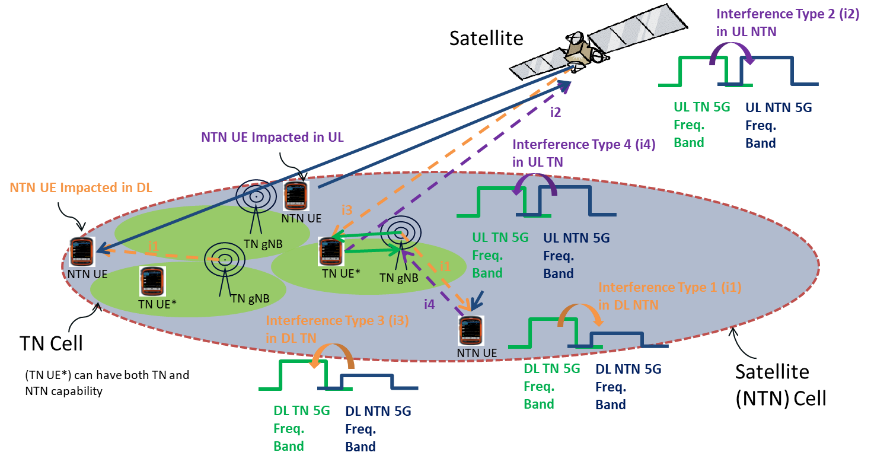

+----------------------------------+----------------------------------+
| 3GPP TS 38.101-5 V17.12.0        |                                  |
| (2025-06)                        |                                  |
+==================================+==================================+
| Technical Specification          |                                  |
+----------------------------------+----------------------------------+
| 3rd Generation Partnership       |                                  |
| Project;                         |                                  |
|                                  |                                  |
| Technical Specification Group    |                                  |
| Radio Access Network;            |                                  |
|                                  |                                  |
| NR;                              |                                  |
|                                  |                                  |
| User Equipment (UE) radio        |                                  |
| transmission and reception;      |                                  |
|                                  |                                  |
| Part 5: Satellite access Radio   |                                  |
| Frequency (RF) and performance   |                                  |
| requirements                     |                                  |
|                                  |                                  |
| (Release 17)                     |                                  |
+----------------------------------+----------------------------------+
|                                  |                                  |
+----------------------------------+----------------------------------+
| {width="1.3208333333333333in" | ng){width="1.7763888888888888in" |
| height="0.9180555555555555in"}   | height="1.0375in"}               |
+----------------------------------+----------------------------------+
|                                  |                                  |
+----------------------------------+----------------------------------+
| The present document has been    |                                  |
| developed within the 3rd         |                                  |
| Generation Partnership Project   |                                  |
| (3GPP ^TM^) and may be further   |                                  |
| elaborated for the purposes of   |                                  |
| 3GPP.\                           |                                  |
| The present document has not     |                                  |
| been subject to any approval     |                                  |
| process by the 3GPP              |                                  |
| Organizational Partners and      |                                  |
| shall not be implemented.\       |                                  |
| This Specification is provided   |                                  |
| for future development work      |                                  |
| within 3GPP only. The            |                                  |
| Organizational Partners accept   |                                  |
| no liability for any use of this |                                  |
| Specification.\                  |                                  |
| Specifications and Reports for   |                                  |
| implementation of the 3GPP ^TM^  |                                  |
| system should be obtained via    |                                  |
| the 3GPP Organizational          |                                  |
| Partners\' Publications Offices. |                                  |
+----------------------------------+----------------------------------+

+----------------------------------------------------------------------+
|                                                                      |
+======================================================================+
| > ***3GPP***                                                         |
| >                                                                    |
| > Postal address                                                     |
| >                                                                    |
| > 3GPP support office address                                        |
| >                                                                    |
| > 650 Route des Lucioles - Sophia Antipolis                          |
| >                                                                    |
| > Valbonne - FRANCE                                                  |
| >                                                                    |
| > Tel.: +33 4 92 94 42 00 Fax: +33 4 93 65 47 16                     |
| >                                                                    |
| > Internet                                                           |
| >                                                                    |
| > http://www.3gpp.org                                                |
+----------------------------------------------------------------------+
| ***Copyright Notification***                                         |
|                                                                      |
| No part may be reproduced except as authorized by written            |
| permission.\                                                         |
| The copyright and the foregoing restriction extend to reproduction   |
| in all media.                                                        |
|                                                                      |
| © 2025, 3GPP Organizational Partners (ARIB, ATIS, CCSA, ETSI, TSDSI, |
| TTA, TTC).                                                           |
|                                                                      |
| All rights reserved.                                                 |
|                                                                      |
| UMTS™ is a Trade Mark of ETSI registered for the benefit of its      |
| members                                                              |
|                                                                      |
| 3GPP™ is a Trade Mark of ETSI registered for the benefit of its      |
| Members and of the 3GPP Organizational Partners\                     |
| LTE™ is a Trade Mark of ETSI registered for the benefit of its       |
| Members and of the 3GPP Organizational Partners                      |
|                                                                      |
| GSM® and the GSM logo are registered and owned by the GSM            |
| Association                                                          |
+----------------------------------------------------------------------+

 Contents {#contents .TT}
========

Foreword 6

1 Scope 8

2 References 8

3 Definitions of terms, symbols and abbreviations 9

3.1 Terms 9

3.2 Symbols 9

3.3 Abbreviations 10

4 General 11

4.1 Relationship between minimum requirements and test requirements 11

4.2 Applicability of minimum requirements 11

4.3 Specification suffix information 11

4.4 Relationship with other core specifications 11

5 Operating bands and channel arrangement 11

5.1 General 11

5.2 Operating bands 12

5.2.1 General 12

5.2.2 Operating bands with conducted requirements 12

5.2.3 reserved (for radiated requirements) 12

5.3 UE channel bandwidth 12

5.3.1 General 12

5.3.2 Maximum transmission bandwidth configuration 13

5.3.3 Minimum guardband and transmission bandwidth configuration 13

5.3.4 RB alignment 14

5.3.5 UE channel bandwidth per operating band 14

5.4 Channel arrangement 15

5.4.1 Channel spacing 15

5.4.1.1 Channel spacing for adjacent NTN satellite carriers 15

5.4.2 Channel raster 15

5.4.2.1 NR-ARFCN and channel raster 15

5.4.2.2 Channel raster to resource element mapping 16

5.4.2.3 Channel raster entries for each operating band 16

5.4.3 Synchronization raster 16

5.4.3.1 Synchronization raster and numbering 16

5.4.3.2 Synchronization raster to synchronization block resource element
mapping 16

5.4.3.3 Synchronization raster entries for each operating band 16

5.4.4 TX--RX frequency separation 17

6 Conducted transmitter characteristics 17

6.1 General 17

6.2 Transmitter power 17

6.2.1 UE maximum output power 17

6.2.2 UE maximum output power reduction 18

6.2.3 UE additional maximum output power reduction 18

6.2.3.1 General 18

6.2.4 Configured transmitted power 19

6.3 Output power dynamics. 19

6.3.1 Minimum output power 19

6.3.2 Transmit OFF power 19

6.3.3 Transmit ON/OFF time mask 19

6.3.4 Power control 19

6.4 Transmit signal quality 19

6.4.1 Frequency error 19

6.4.2 Transmit modulation quality 20

6.5 Output RF spectrum emissions 20

6.5.1 Occupied bandwidth 20

6.5.2 Out of band emission 20

6.5.2.1 General 20

6.5.2.2 Spectrum emission mask 20

6.5.2.3 "Reserved" 21

6.5.2.4 Adjacent channel leakage ratio 21

6.5.2.4.1 NR ACLR 21

6.5.2.4.2 UTRA ACLR 21

6.5.3 Spurious emission 22

6.5.3.1 General spurious emissions 22

6.5.3.2 Spurious emissions for UE co-existence 22

6.5.3.3 Additional spurious emissions 23

6.5.3.3.1 General 23

6.5.3.3.2 Requirement for network signalling value \"NS\_02N\" 23

6.5.4 Transmit intermodulation 24

7 Conducted receiver characteristics 24

7.1 General 24

7.2 Diversity characteristics 25

7.3 Reference sensitivity 25

7.3.1 General 25

7.3.2 Reference sensitivity power level 25

7.4 Maximum input level 26

7.5 Adjacent channel selectivity 26

7.6 Blocking characteristics 28

7.6.1 General 28

7.6.2 In-band blocking 28

7.6.3 Out-of-band blocking 29

7.6.4 Narrow band blocking 29

7.7 Spurious response 30

7.8 Intermodulation characteristics 30

7.9 Spurious emissions 31

8 Conducted performance requirements 31

8.1 General 31

8.1.1 Relationship between minimum requirements and test requirements 31

8.1.2 Applicability of minimum requirements 31

8.1.3 Conducted requirements 31

8.1.3.1 Introduction 31

8.1.3.2 Reference point 32

8.1.3.3 SNR definition 32

8.1.3.4 Noc 32

8.1.3.4.1 Introduction 32

8.1.3.4.2 Noc for NR operating bands in FR1 32

8.2 Demodulation performance requirements 33

8.2.1 General 33

8.2.1.1 Applicability of requirements 33

8.2.1.1.1 General 33

8.2.1.1.2 Applicability of requirements for optional UE features 33

8.2.1.2 PDSCH demodulation requirements 33

8.2.1.2.1 1RX requirements 36

8.2.1.2.2 2RX requirements 36

8.2.1.2.2.1.1 Minimum requirements for PDSCH Mapping Type A 36

8.3 CSI reporting requirements 38

Annex A (normative): Measurement channels 39

A.1 General 39

A.1.1 Throughput definition 39

A.2 UL reference measurement channels 39

A.2.1 General 39

A.2.2 Reference measurement channels for FDD 40

A.2.2.1 DFT-s-OFDM Pi/2-BPSK 40

A.2.2.2 DFT-s-OFDM QPSK 41

A.2.2.3 DFT-s-OFDM 16QAM 42

A.2.2.4 DFT-s-OFDM 64QAM 43

A.2.2.5 Void 44

A.2.2.6 CP-OFDM QPSK 44

A.2.2.7 CP-OFDM 16QAM 45

A.2.2.8 CP-OFDM 64QAM 46

A.2.2.9 Void 46

A.3 DL reference measurement channels 46

A.3.1 General 46

A.3.2 Reference measurement channels for PDSCH performance requirements
47

A.3.2.1 FDD 47

A.3.2.1.1 Reference measurement channels for SCS 15 kHz FR1 47

A.3.4 Reference measurement channels for receiver requirements 49

A.3.4.1 FDD 49

A.3.4.1.1 Fixed reference channels for SCS 15kHz FR1-NTN 49

A.4 Testing related to Satellite Access 52

A.4.1 General 52

A.4.2 Test condition for transmitter characteristics 53

A.4.3 Test condition for receiver characteristics 53

A.4.4 Test condition for performance requirements 53

Annex B (normative): Propagation conditions 54

B.1 Static propagation condition 54

B.1.1 UE Receiver with 1Rx 54

B.1.2 UE Receiver with 2Rx 54

B.2.1 Delay profiles 54

B.2.2 Combinations of channel model parameters 55

B.2.3 MIMO Channel Correlation Matrices 55

B.2.3.1 MIMO Correlation Matrices using Uniform Linear Array (ULA) 55

B.2.3.1.1 Definition of MIMO Correlation Matrices 55

B.2.3.1.2 MIMO Correlation Matrices at High, Medium and Low Level 56

Annex C (normative): Downlink physical channels 57

C.1 General 57

C.2 Setup (Conducted) 57

C.3 Connection (Conducted) 57

C.3.1 Measurement of Performance requirements 57

Annex D (informative): Void 58

Annex E (normative): Environmental conditions 58

E.1 General 58

E.2 Environmental (Conducted) 58

E.2.1 Temperature 58

E.2.2 Voltage 59

E.2.3 Vibration 59

Annex F (informative): Change history 60

Foreword {#foreword-1}
========

This Technical Specification has been produced by the 3rd Generation
Partnership Project (3GPP).

The contents of the present document are subject to continuing work
within the TSG and may change following formal TSG approval. Should the
TSG modify the contents of the present document, it will be re-released
by the TSG with an identifying change of release date and an increase in
version number as follows:

Version x.y.z

where:

x the first digit:

1 presented to TSG for information;

2 presented to TSG for approval;

3 or greater indicates TSG approved document under change control.

y the second digit is incremented for all changes of substance, i.e.
technical enhancements, corrections, updates, etc.

z the third digit is incremented when editorial only changes have been
incorporated in the document.

In the present document, modal verbs have the following meanings:

**shall** indicates a mandatory requirement to do something

**shall not** indicates an interdiction (prohibition) to do something

The constructions \"shall\" and \"shall not\" are confined to the
context of normative provisions, and do not appear in Technical Reports.

The constructions \"must\" and \"must not\" are not used as substitutes
for \"shall\" and \"shall not\". Their use is avoided insofar as
possible, and they are not used in a normative context except in a
direct citation from an external, referenced, non-3GPP document, or so
as to maintain continuity of style when extending or modifying the
provisions of such a referenced document.

**should** indicates a recommendation to do something

**should not** indicates a recommendation not to do something

**may** indicates permission to do something

**need not** indicates permission not to do something

The construction \"may not\" is ambiguous and is not used in normative
elements. The unambiguous constructions \"might not\" or \"shall not\"
are used instead, depending upon the meaning intended.

**can** indicates that something is possible

**cannot** indicates that something is impossible

The constructions \"can\" and \"cannot\" are not substitutes for \"may\"
and \"need not\".

**will** indicates that something is certain or expected to happen as a
result of action taken by an agency the behaviour of which is outside
the scope of the present document

**will not** indicates that something is certain or expected not to
happen as a result of action taken by an agency the behaviour of which
is outside the scope of the present document

**might** indicates a likelihood that something will happen as a result
of action taken by some agency the behaviour of which is outside the
scope of the present document

**might not** indicates a likelihood that something will not happen as a
result of action taken by some agency the behaviour of which is outside
the scope of the present document

In addition:

**is** (or any other verb in the indicative mood) indicates a statement
of fact

**is not** (or any other negative verb in the indicative mood) indicates
a statement of fact

The constructions \"is\" and \"is not\" do not indicate requirements.

\

1 Scope {#scope-1}
=======

The present document establishes the minimum RF and performance
requirements for NR User Equipment (UE) supporting satellite access
operation.

2 References
============

The following documents contain provisions which, through reference in
this text, constitute provisions of the present document.

\- References are either specific (identified by date of publication,
edition number, version number, etc.) or non‑specific.

\- For a specific reference, subsequent revisions do not apply.

\- For a non-specific reference, the latest version applies. In the case
of a reference to a 3GPP document (including a GSM document), a
non-specific reference implicitly refers to the latest version of that
document *in the same Release as the present document*.

\[1\] 3GPP TR 21.905: \"Vocabulary for 3GPP Specifications\".

\[2\] 3GPP TS 38.521-5: \"NR; User Equipment (UE) conformance
specification; Radio transmission and reception; Part 5: Satellite
access Radio Frequency (RF) and performance requirements\".

\[3\] Recommendation ITU-R M.1545: \"Measurement uncertainty as it
applies to test limits for the terrestrial component of International
Mobile Telecommunications-2000\".

\[4\] 3GPP TS 38.108: \"NR; Satellite Node radio transmission and
reception\"

\[5\] 3GPP TS 38.101-1: \"NR; User Equipment (UE) radio transmission and
reception; Part 1: Range 1 Standalone\".

\[6\] 3GPP TS 38.101-4: \"NR; User Equipment (UE) radio transmission and
reception; Part 4: Performance requirements\".

\[7\] 3GPP TS 38.213: \"NR; Physical layer procedures for control\"

\[8\] 3GPP TS 38.331: \" Radio Resource Control (RRC) protocol
specification\".

\[9\] 3GPP TS 38.300: \"NR; NR and NG-RAN Overall description;
Stage-2\".

\[10\] 3GPP TS 36.101: \"Evolved Universal Terrestrial Radio Access
(E-UTRA); User Equipment (UE) radio transmission and reception\".

\[11\] 3GPP TS 38.306: \"User Equipment (UE) radio access
capabilities\".

\[12\] 3GPP TR 38.811: \"Study on New Radio (NR) to support
non-terrestrial networks\".

\[13\] 3GPP TS 38.508-1: \"5GS; User Equipment (UE) conformance
specification; Part 1: Common test environment\".

\[14\] 3GPP TS 38.214: \"NR; Physical layer procedures for data\".

3 Definitions of terms, symbols and abbreviations
=================================================

3.1 Terms
---------

For the purposes of the present document, the terms given in 3GPP
TR 21.905 \[1\] and the following apply. A term defined in the present
document takes precedence over the definition of the same term, if any,
in 3GPP TR 21.905 \[1\].

**Geostationary satellite:** A geosynchronous satellite whose circular
and direct orbit lies in the plane of the Earth's equator and which thus
remains fixed relative to the Earth; by extension, a geosynchronous
satellite which remains approximately fixed relative to the Earth.

**Geostationary-Satellite Orbit:** The orbit of a geosynchronous
satellite whose circular and direct orbit lies in the plane of the
Earth\'s equator.

**Geosynchronous Earth Orbit:** Earth-centered orbit at approximately
35786 kilometres above Earth\'s surface and synchronised with Earth\'s
rotation. A geostationary orbit is a non-inclined geosynchronous orbit,
i.e. in the Earth's equator plane.

**Geosynchronous satellite:** An earth satellite whose period of
revolution is equal to the period of rotation of the Earth about its
axis.

**Low Earth Orbit:** Orbit around the Earth with an altitude between 300
km, and 1500 km.

**Non-terrestrial networks:** Networks, or segments of networks, using
an airborne or space-borne vehicle to embark a transmission equipment
relay node or SAN.

**Satellite:** A space-borne vehicle embarking a transparent payload, or
a regenerative payload telecommunication transmitter, placed into
Low-Earth Orbit (LEO), Medium-Earth Orbit (MEO), or Geostationary Earth
Orbit (GEO).

**Satellite Access Node:** node providing NR user plane and control
plane protocol terminations towards NTN satellite capable UE, and
connected via the NG interface to the 5GC. It encompasses a transparent
payload on board a NTN platform, with satellite-gateway and gNB
functions.

**UE transmission bandwidth configuration**: Set of resource blocks
located within the UE channel bandwidth which may be used for
transmitting or receiving by the UE.

3.2 Symbols
-----------

For the purposes of the present document, the following symbols apply:

ΔF~Global~ Granularity of the global frequency raster

ΔF~Raster~ Band dependent channel raster granularity

BW~Channel~ Channel bandwidth

BW~interferer~ Bandwidth of the interferer

F~DL\_low~ The lowest frequency of the downlink *operating band*

F~DL\_high~ The highest frequency of the downlink *operating band*

F~UL\_low~ The lowest frequency of the uplink *operating band*

F~UL\_high~ The highest frequency of the uplink *operating band*

F~Interferer~ Frequency of the interferer

F~Interferer~ (offset) Frequency offset of the interferer (between the
center frequency of the interferer and the carrier frequency of the
carrier measured)

F~Ioffset~ Frequency offset of the interferer (between the center
frequency of the interferer and the closest edge of the carrier
measured)

F~OOB~ The boundary between the NR out of band emission and spurious
emission domains

F~REF~ RF reference frequency

F~REF-Offs~ Offset used for calculating F~REF~

F~uw~ (offset) The frequency separation of the center frequency of the
carrier closest to the interferer and the center frequency of the
interferer

N~RB~ Transmission bandwidth configuration, expressed in units of
resource blocks

N~REF~ NR Absolute Radio Frequency Channel Number (NR-ARFCN)

N~REF-Offs~ Offset used for calculating N~REF~

P~Interferer~ Modulated mean power of the interferer

P~uw~ Power of an unwanted DL signal

3.3 Abbreviations
-----------------

For the purposes of the present document, the abbreviations given in
3GPP TR 21.905 \[1\] and the following apply. An abbreviation defined in
the present document takes precedence over the definition of the same
abbreviation, if any, in 3GPP TR 21.905 \[1\].

ACLR Adjacent Channel Leakage Ratio

ACS Adjacent Channel Selectivity

A-MPR Additional Maximum Power Reduction

BW Bandwidth

BWP Bandwidth Part

CP-OFDM Cyclic Prefix-OFDM

CW Continuous Wave

DFT-s-OFDM Discrete Fourier Transform-spread-OFDM

DM-RS Demodulation Reference Signal

DTX Discontinuous Transmission

EIRP Equivalent Isotropically Radiated Power

EVM Error Vector Magnitude

FR Frequency Range

FRC Fixed Reference Channel

GEO Geosynchronous Earth Orbit

GSCN Global Synchronization Channel Number

GSO Geostationary-Satellite Orbit

IBB In-band Blocking

ITU-R Radiocommunication Sector of the International Telecommunication
Union

LEO Low Earth Orbiting

MBW Measurement bandwidth defined for the protected band

MOP Maximum Output Power

MPR Allowed maximum power reduction

MSD Maximum Sensitivity Degradation

NGEO Non-Geostationary Earth Orbiting

NGSO Non-Geostationary-Satellite Orbit

NR New Radio

NR-ARFCN NR Absolute Radio Frequency Channel Number

NS Network Signalling

NTN Non-Terrestrial Network

OCNG OFDMA Channel Noise Generator

OOB Out-of-band

PRB Physical Resource Block

QAM Quadrature Amplitude Modulation

RAN Radio Access Network

RE Resource Element

REFSENS REFerence SENSitivity

RF Radio Frequency

RMS Root Mean Square (value)

RSRP Reference Signal Receive Power

RSRQ Reference Signal Receive Quality

RX Receiver

SAN Satellite Access Node

SC Single Carrier

SCS Subcarrier spacing

SEM Spectrum Emission Mask

SNR Signal-to-Noise Ratio

SRS Sounding Reference Symbol

SS Synchronization Symbol

TN Terrestrial Network

TX Transmitter

TxD Tx Diversity

UE User Equipment

4 General
=========

4.1 Relationship between minimum requirements and test requirements
-------------------------------------------------------------------

The present document is a Single-RAT specification for satellite NR UE,
covering RF characteristics and minimum performance requirements.
Conformance to the present specification is demonstrated by fulfilling
the test requirements specified in the conformance specification 3GPP TS
38.521-5 \[2\].

The Minimum Requirements given in this specification make no allowance
for measurement uncertainty. The test specification 3GPP TS 38.521-5
\[2\] defines test tolerances. These test tolerances are individually
calculated for each test. The test tolerances are used to relax the
minimum requirements in this specification to create test requirements.
For some requirements, including regulatory requirements, the test
tolerance is set to zero.

The measurement results returned by the test system are compared -
without any modification - against the test requirements as defined by
the shared risk principle.

The shared risk principle is defined in Recommendation ITU‑R M.1545
\[3\].

4.2 Applicability of minimum requirements
-----------------------------------------

a\) In this specification the Minimum Requirements are specified as
general requirements and additional requirements. Where the Requirement
is specified as a general requirement, the requirement is mandated to be
met in all scenarios

b\) For specific scenarios for which an additional requirement is
specified, in addition to meeting the general requirement, the UE is
mandated to meet the additional requirements.

c\) The spurious emissions power requirements are for the long-term
average of the power. For the purpose of reducing measurement
uncertainty, it is acceptable to average the measured power over a
period of time sufficient to reduce the uncertainty due to the
statistical nature of the signal.

4.3 Specification suffix information
------------------------------------

Specification suffix information is not defined for the time being in
this release of specification.

4.4 Relationship with other core specifications
-----------------------------------------------

The present document establishes the minimum RF and performance
requirements for NR User Equipment (UE) operating in a Non-Terrestrial
Network. The present document for the single-RAT specification of a
satellite NR UE side is used together with the technical specification
3GPP TS 38.108 \[4\] specifying the Satellite Access Node (SAN).

5 Operating bands and channel arrangement
=========================================

5.1 General
-----------

The channel arrangements presented in this clause are based on the
operating bands and channel bandwidths defined in the present Release of
specifications.

NOTE: Other operating bands and channel bandwidths may be considered in
future Releases.

Requirements throughout the RF specifications are in many cases defined
separately for different frequency ranges (FR). The frequency ranges in
which NTN satellite can operate according to this version of the
specification are identified as described in Table 5.1-1.

Table 5.1-1: Definition of NTN frequency ranges

  Frequency range designation                                                                                               Corresponding frequency range
  ------------------------------------------------------------------------------------------------------------------------- -------------------------------
  FR1-NTN (Note 1)                                                                                                          410 MHz -- 7125 MHz
  NOTE 1: \[NTN bands within this frequency range are regarded as a FR1 band when references from other specifications.\]   

The present specification covers FR1-NTN operating bands.

5.2 Operating bands
-------------------

### 5.2.1 General

NTN satellite covers FR1-NTN operating bands in the present
specification.

### 5.2.2 Operating bands with conducted requirements

NTN satellite is designed to operate in the operating bands defined in
Table 5.2.2-1.

**Table 5.2.2-1: NTN satellite bands in FR1-NTN**

+-----------------+-----------------+-----------------+-------------+
| NTN satellite   | Uplink (UL)     | Downlink (DL)   | Duplex mode |
| operating band  | operating band\ | operating band\ |             |
|                 | Satellite       | Satellite       |             |
|                 | Access Node     | Access Node     |             |
|                 | receive / UE    | transmit / UE   |             |
|                 | transmit        | receive         |             |
|                 |                 |                 |             |
|                 | F~UL,low~ --    | F~DL,low~ --    |             |
|                 | F~UL,high~      | F~DL,high~      |             |
+=================+=================+=================+=============+
| n256            | 1980MHz -- 2010 | 2170 MHz --     | FDD         |
|                 | MHz             | 2200 MHz        |             |
+-----------------+-----------------+-----------------+-------------+
| n255            | 1626.5 MHz --   | 1525 MHz --     | FDD         |
|                 | 1660.5 MHz      | 1559 MHz        |             |
+-----------------+-----------------+-----------------+-------------+
| NOTE: NTN       |                 |                 |             |
| satellite bands |                 |                 |             |
| are numbered in |                 |                 |             |
| descending      |                 |                 |             |
| order from      |                 |                 |             |
| n256.           |                 |                 |             |
+-----------------+-----------------+-----------------+-------------+

### 5.2.3 reserved (for radiated requirements)

5.3 UE channel bandwidth
------------------------

### 5.3.1 General

The UE channel bandwidth supports a single RF carrier in the uplink or
downlink at the UE. From a SAN perspective, different UE channel
bandwidths may be supported within the same spectrum for transmitting to
and receiving from UEs connected to the SAN.

From a UE perspective, the UE is configured with one or more BWP /
carriers, each with its own UE channel bandwidth. The UE does not need
to be aware of the SAN channel bandwidth or how the SAN allocates
bandwidth to different UEs.

The placement of the UE channel bandwidth for each UE carrier is
flexible but can only be completely within the SAN channel bandwidth.

The relationship between the channel bandwidth, the guardband and the
maximum transmission bandwidth configuration is shown in Figure 5.3.1-1.

{width="6.041666666666667in" height="3.0in"}

Figure 5.3.1-1: Definition of the channel bandwidth and the maximum
transmission bandwidth configuration for one channel

### 5.3.2 Maximum transmission bandwidth configuration

The maximum transmission bandwidth configuration N~RB~ for each UE
channel bandwidth and subcarrier spacing is specified in Table 5.3.2-1.

Table 5.3.2-1: Maximum transmission bandwidth configuration N~RB~

+-----------+-------+-------+-------+-------+
| SCS (kHz) | 5     | 10    | 15    | 20    |
|           |       |       |       |       |
|           | MHz   | MHz   | MHz   | MHz   |
+===========+=======+=======+=======+=======+
|           | N~RB~ | N~RB~ | N~RB~ | N~RB~ |
+-----------+-------+-------+-------+-------+
| 15        | 25    | 52    | 79    | 106   |
+-----------+-------+-------+-------+-------+
| 30        | 11    | 24    | 38    | 51    |
+-----------+-------+-------+-------+-------+
| 60        | N/A   | 11    | 18    | 24    |
+-----------+-------+-------+-------+-------+

### 5.3.3 Minimum guardband and transmission bandwidth configuration

The minimum guardband for each UE channel bandwidth and SCS is specified
in Table 5.3.3-1,

Table 5.3.3-1: Minimum guardband for each UE channel bandwidth and SCS
(kHz)

+-----------+-------+-------+-------+-------+
| SCS (kHz) | 5     | 10    | 15    | 20    |
|           |       |       |       |       |
|           | MHz   | MHz   | MHz   | MHz   |
+===========+=======+=======+=======+=======+
| 15        | 242.5 | 312.5 | 382.5 | 452.5 |
+-----------+-------+-------+-------+-------+
| 30        | 505   | 665   | 645   | 805   |
+-----------+-------+-------+-------+-------+
| 60        | N/A   | 1010  | 990   | 1330  |
+-----------+-------+-------+-------+-------+

NOTE: The minimum guardbands have been calculated using the following
equation: (BW~Channel~ x 1000 (kHz) - N~RB~ x SCS x 12) / 2 - SCS/2,
where N~RB~ are from Table 5.3.2-1.

Figure 5.3.3-1: Void

The number of RBs configured in any channel bandwidth shall ensure that
the minimum guardband specified in this clause is met.

{width="5.445454943132108in"
height="2.7424245406824146in"}

Figure 5.3.3-2: UE PRB utilization

In the case that multiple numerologies are multiplexed in the same
symbol, the minimum guard band on each side of the carrier is the guard
band applied at the configured UE channel bandwidth for the numerology
that is transmitted/received immediately adjacent to the guard band.

{width="4.5625in" height="1.8958333333333333in"}

Figure 5.3.3-3: Guard band definition when transmitting multiple
numerologies

NOTE: Figure 5.3.3-2 is not intended to imply the size of any guard
between the two numerologies. Inter-numerology guard band within the
carrier is implementation dependent.

### 5.3.4 RB alignment

The RB alignment refers to NR RB alignments as specified in 3GPP TS
38.101-1 \[5\] clause 5.3.4.

### 5.3.5 UE channel bandwidth per operating band

The requirements in this specification apply to the combination of
channel bandwidths, SCS and operating bands shown in Table 5.3.5-1. The
transmission bandwidth configuration in Table 5.3.2-1 shall be supported
for each of the specified channel bandwidths. The channel bandwidths are
specified for both the TX and RX path.

Table 5.3.5-1: Channel bandwidths for each NTN satellite band

+--------------------+-----+----------------------------+----+----+----+
| NTN satellite band | SCS | UE Channel bandwidth (MHz) |    |    |    |
|                    |     |                            |    |    |    |
|                    | kHz |                            |    |    |    |
+====================+=====+============================+====+====+====+
|                    |     | 5                          | 10 | 15 | 20 |
+--------------------+-----+----------------------------+----+----+----+
|                    | 15  | 5                          | 10 | 15 | 20 |
+--------------------+-----+----------------------------+----+----+----+
| n256               | 30  |                            | 10 | 15 | 20 |
+--------------------+-----+----------------------------+----+----+----+
|                    | 60  |                            | 10 | 15 | 20 |
+--------------------+-----+----------------------------+----+----+----+
|                    | 15  | 5                          | 10 | 15 | 20 |
+--------------------+-----+----------------------------+----+----+----+
| n255               | 30  |                            | 10 | 15 | 20 |
+--------------------+-----+----------------------------+----+----+----+
|                    | 60  |                            | 10 | 15 | 20 |
+--------------------+-----+----------------------------+----+----+----+

5.4 Channel arrangement
-----------------------

### 5.4.1 Channel spacing

#### 5.4.1.1 Channel spacing for adjacent NTN satellite carriers

The channel spacing for adjacent NTN satellite carriers refers to the NR
channel spacing as specified in 3GPP TS 38.101-1 \[5\] clause 5.4.1.1.

### 5.4.2 Channel raster

#### 5.4.2.1 NR-ARFCN and channel raster

The global frequency channel raster defines a set of RF reference
frequencies F~REF.~ The RF reference frequency is used in signalling to
identify the position of RF channels, SS blocks and other elements.

The global frequency raster is defined for all frequencies from 0 to 100
GHz. The granularity of the global frequency raster is ΔF~Global~.

RF reference frequencies are designated by an NR Absolute Radio
Frequency Channel Number (NR-ARFCN) in the range (0...2016666) on the
global frequency raster. The relation between the NR-ARFCN and the RF
reference frequency F~REF~ in MHz is given by the following equation,
where F~REF-Offs~ and N~REF-Offs~ are given in Table 5.4.2.1-1 and
N~REF~ is the NR-ARFCN.

F~REF~ = F~REF-Offs~ + ΔF~Global~ (N~REF~ -- N~REF-Offs~)

Table 5.4.2.1-1: NR-ARFCN parameters for the global frequency raster

  Frequency range (MHz)   ΔF~Global~ (kHz)   F~REF-Offs~ (MHz)   N~REF-Offs~   Range of N~REF~
  ----------------------- ------------------ ------------------- ------------- -----------------
  0 -- 3000               5                  0                   0             0 -- 599999

The channel raster defines a subset of RF reference frequencies that can
be used to identify the RF channel position in the uplink and downlink.
The RF reference frequency for an RF channel maps to a resource element
on the carrier. For each operating band, a subset of frequencies from
the global frequency raster are applicable for that band and forms a
channel raster with a granularity ΔF~Raster~, which may be equal to or
larger than ΔF~Global~.

For the uplink of FDD FR1 NTN bands defined in Table 5.2.2-1.

F~REF,\ shift~ = F~REF~ + Δ~shift~, Δ~shift~ = 0 kHz or 7.5 kHz.

where Δ~shift~ is signalled by the network in higher layer parameter
*frequencyShift7p5khz* \[7\].

The mapping between the channel raster and corresponding resource
element is given in clause 5.4.2.2. The applicable entries for each
operating band are defined in clause 5.4.2.3.

#### 5.4.2.2 Channel raster to resource element mapping

The mapping between the RF reference frequency on the channel raster and
the corresponding resource element refers to the NR requirements
specified in 3GPP TS 38.101-1 \[5\] clause 5.4.2.2.

#### 5.4.2.3 Channel raster entries for each operating band

The RF channel positions on the channel raster in each NTN satellite
operating band are given through the applicable NR-ARFCN in
Table 5.4.2.3‑1, using the channel raster to resource element mapping in
clause 5.4.2.2.

For NTN satellite operating bands with 100 kHz channel raster,
ΔF~Raster~ = 20 × ΔF~Global~. In this case every 20^th^ NR-ARFCN within
the operating band are applicable for the channel raster within the
operating band and the step size for the channel raster in
Table 5.4.2.3‑1 is given as \<20\>.

Table 5.4.2.3-1: Applicable NR-ARFCN per operating band

+-----------------+------------+-----------------+-----------------+
| NTN satellite   | ΔF~Raster~ | Uplink          | Downlink        |
| operating band  |            |                 |                 |
|                 | (kHz)      | Range of N~REF~ | Range of N~REF~ |
|                 |            |                 |                 |
|                 |            | (First --       | (First --       |
|                 |            | \<Step size\>   | \<Step size\>   |
|                 |            | -- Last)        | -- Last)        |
+=================+============+=================+=================+
| n256            | 100        | 396000 --       | 434000 --       |
|                 |            | \<20\> --       | \<20\> --       |
|                 |            | 402000          | 440000          |
+-----------------+------------+-----------------+-----------------+
| n255            | 100        | 325300 --       | 305000 --       |
|                 |            | \<20\> --       | \<20\> --       |
|                 |            | 332100          | 311800          |
+-----------------+------------+-----------------+-----------------+
| NOTE: The       |            |                 |                 |
| channel numbers |            |                 |                 |
| that designate  |            |                 |                 |
| carrier         |            |                 |                 |
| frequencies so  |            |                 |                 |
| close to the    |            |                 |                 |
| operating band  |            |                 |                 |
| edges that the  |            |                 |                 |
| carrier extends |            |                 |                 |
| beyond the      |            |                 |                 |
| operating band  |            |                 |                 |
| edge shall not  |            |                 |                 |
| be used.        |            |                 |                 |
+-----------------+------------+-----------------+-----------------+

### 5.4.3 Synchronization raster

#### 5.4.3.1 Synchronization raster and numbering

The synchronization raster indicates the frequency positions of the
synchronization block that can be used by the UE for system acquisition
when explicit signalling of the synchronization block position is not
present.

A global synchronization raster is defined for all frequencies. The
frequency position of the SS block is defined as SS~REF~ with
corresponding number GSCN. The parameters defining the SS~REF~ and GSCN
for all the frequency ranges are in Table 5.4.3.1-1.

The resource element corresponding to the SS block reference frequency
SS~REF~ is given in clause 5.4.3.2. The synchronization raster and the
subcarrier spacing of the synchronization block is defined separately
for each band.

Table 5.4.3.1-1: GSCN parameters for the global frequency raster

+-----------------+-----------------+--------------+---------------+
| Frequency range | SS Block        | GSCN         | Range of GSCN |
|                 | frequency       |              |               |
|                 | position        |              |               |
|                 | SS~REF~         |              |               |
+=================+=================+==============+===============+
| 0 -- 3000 MHz   | N \* 1200kHz +  | 3N + (M-3)/2 | 2 -- 7498     |
|                 | M \* 50 kHz,    |              |               |
|                 |                 |              |               |
|                 | N=1:2499, M ϵ   |              |               |
|                 | {1,3,5}^1^      |              |               |
+-----------------+-----------------+--------------+---------------+
| NOTE: The       |                 |              |               |
| default value   |                 |              |               |
| for operating   |                 |              |               |
| bands with      |                 |              |               |
| which only      |                 |              |               |
| support SCS     |                 |              |               |
| spaced channel  |                 |              |               |
| raster(s) is    |                 |              |               |
| M=3.            |                 |              |               |
+-----------------+-----------------+--------------+---------------+

#### 5.4.3.2 Synchronization raster to synchronization block resource element mapping

The mapping between the synchronization raster and the corresponding
resource element of the SS block refers to 3GPP TS 38.101-1 \[5\] clause
5.4.3.2.

#### 5.4.3.3 Synchronization raster entries for each operating band

The synchronization raster for each band is give in Table 5.4.3.3-1. The
distance between applicable GSCN entries is given by the \<Step size\>
indicated in Table 5.4.3.3-1.

Table 5.4.3.3-1: Applicable SS raster entries per operating band

+----------------+--------------+----------------+----------------+
| NTN satellite  | SS Block SCS | SS Block       | Range of GSCN  |
| operating band |              | pattern^1^     |                |
|                |              |                | (First --      |
|                |              |                | \<Step size\>  |
|                |              |                | -- Last)       |
+================+==============+================+================+
| n256           | 15 kHz       | Case A         | 5429 -- \<1\>  |
|                |              |                | -- 5494        |
+----------------+--------------+----------------+----------------+
| n255           | 15 kHz       | Case A         | 3818 -- \<1\>  |
|                |              |                | -- 3892        |
+----------------+--------------+----------------+----------------+
|                | 30 kHz       | Case B         | 3824 -- \<1\>  |
|                |              |                | -- 3886        |
+----------------+--------------+----------------+----------------+
| NOTE: SS Block |              |                |                |
| pattern is     |              |                |                |
| defined in     |              |                |                |
| clause 4.1 in  |              |                |                |
| 3GPP TS 38.213 |              |                |                |
| \[7\].         |              |                |                |
+----------------+--------------+----------------+----------------+

### 5.4.4 TX--RX frequency separation

The default TX channel (carrier centre frequency) to RX channel (carrier
centre frequency) separation for operating bands is specified in Table
5.4.4-1.

Table 5.4.4-1: UE TX-RX frequency separation

+-----------------------------------------+---------------------------+
| **NTN Satellite Operating Band**        | **TX -- RX\               |
|                                         | carrier centre frequency\ |
|                                         | separation**              |
+=========================================+===========================+
| n256                                    | 190 MHz^1^                |
|                                         |                           |
|                                         | 165 to 215 MHz^2^         |
+-----------------------------------------+---------------------------+
| n255                                    | -101.5 MHz^1^             |
|                                         |                           |
|                                         | -72.5 to -130.5 MHz^2^    |
+-----------------------------------------+---------------------------+
| NOTE 1: Default Tx-Rx separation        |                           |
|                                         |                           |
| NOTE 2: The verification of flexible    |                           |
| Tx-Rx frequency separation within this  |                           |
| range is limited to reference           |                           |
| sensitivity. Further details are        |                           |
| specified in clause 7.3.2               |                           |
+-----------------------------------------+---------------------------+

6 Conducted transmitter characteristics
=======================================

6.1 General
-----------

Unless otherwise stated, the transmitter characteristics for satellite
access UEs are specified at the antenna connector of the UE with a
single or multiple transmit antenna(s). For UE with integral antenna
only, a reference antenna with a gain of 0 dBi is assumed. Handheld
power class 3 UE is assumed in Release 17 for satellite access.

All requirements in this section are applicable to devices supporting
GSO and/or NGSO satellites.

6.2 Transmitter power
---------------------

### 6.2.1 UE maximum output power

The following UE Power Classes define the maximum output power for any
transmission bandwidth within the channel bandwidth of NR carrier unless
otherwise stated. The period of measurement shall be at least one sub
frame (1ms).

Table 6.2.1-1: UE Power Class

+-----------------------------------+---------------+----------------+
| NR satellite band                 | Class 3 (dBm) | Tolerance (dB) |
+===================================+===============+================+
| n256                              | 23            | ±2             |
+-----------------------------------+---------------+----------------+
| n255                              | 23            | ±2             |
+-----------------------------------+---------------+----------------+
| NOTE 1: P~PowerClass~ is the      |               |                |
| maximum UE power specified        |               |                |
| without taking into account the   |               |                |
| tolerance                         |               |                |
|                                   |               |                |
| NOTE 2: Power class 3 is default  |               |                |
| power class unless otherwise      |               |                |
| stated                            |               |                |
+-----------------------------------+---------------+----------------+

### 6.2.2 UE maximum output power reduction

UE is allowed to reduce the maximum output power due to higher order
modulations and transmit bandwidth configurations. For UE power class 3,
the allowed maximum power reduction (MPR) is defined as Table 6.2.2-1 in
3GPP TS 38.101-1\[5\] clause 6.2.2 except for 256QAM.

### 6.2.3 UE additional maximum output power reduction

#### 6.2.3.1 General

Additional emission requirements can be signalled by the network. Each
additional emission requirement is associated with a unique network
signalling (NS) value indicated in RRC signalling by an NR frequency
band number of the applicable operating band and an associated value in
the field *additionalSpectrumEmission.* Throughout this specification,
the notion of indication or signalling of an NS value refers to the
corresponding indication of an NR satellite band number of the
applicable operating band, the IE field *freqBandIndicatorNR* and an
associated value of *additionalSpectrumEmission* in the relevant RRC
information elements \[8\]*.*

To meet the additional requirements, additional maximum power reduction
(A-MPR) is allowed for the maximum output power as specified in Table
6.2.1-1 except for 256QAM. Unless stated otherwise, the total reduction
to UE maximum output power is max(MPR, A-MPR) where MPR is defined in
clause 6.2.2 except for 256QAM. Outer and inner allocation notation used
in clause 6.2.3 is defined in 3GPP TS 38.101-1 \[5\] clause 6.2.2. In
absence of modulation and waveform types the A-MPR applies to all
modulation and waveform types.

Table 6.2.3.1-1 specifies the additional requirements with their
associated network signalling values and the allowed A-MPR and
applicable operating band(s) for each NS value. The mapping of NR
satellite band numbers and values of the *additionalSpectrumEmission* to
network signalling labels is specified in Table 6.2.3.1-1A.

Table 6.2.3.1-1: Additional maximum power reduction (A-MPR)

+----------+----------+----------+----------+----------+----------+
| Network  | Requ     | NR       | Channel  | R        | A-MPR    |
| si       | irements | s        | b        | esources | (dB)     |
| gnalling | (clause) | atellite | andwidth | blocks   |          |
| label    |          | Band     | (MHz)    | (        |          |
|          |          |          |          | *N*~RB~) |          |
+==========+==========+==========+==========+==========+==========+
| NS\_01   |          | Table    | 5, 10,   | Table    | N/A      |
|          |          | 5.2.2-1  | 15, 20   | 5.3.2-1  |          |
|          |          |          |          |          |          |
|          |          | (NOTE 3) |          |          |          |
+----------+----------+----------+----------+----------+----------+
| NS\_24   | 6.       | n256     | 5, 10,   | Table    | Clause   |
|          | 5.3.3.13 |          | 15, 20   | 6.       | 6.2.3.15 |
|          | in 3GPP  |          |          | 2.3.15-1 | in 3GPP  |
|          | TS       |          |          | in 3GPP  | TS       |
|          | 38.101-1 |          |          | TS       | 38.101-1 |
|          | \[5\]    |          |          | 38.101-1 | \[5\]^2^ |
|          |          |          |          | \[5\]    |          |
+----------+----------+----------+----------+----------+----------+
| NS\_02N  | 6        | n255     | 5, 10,   |          | N/A      |
|          | .5.3.3.2 |          | 15, 20   |          |          |
+----------+----------+----------+----------+----------+----------+
| NS\_100  | 6        | n256^1^  |          |          | Table    |
|          | .5.2.4.2 |          |          |          |          |
|          | in 3GPP  |          |          |          | 6        |
|          | TS       |          |          |          | .2.3.1-2 |
|          | 38.101-1 |          |          |          | in 3GPP  |
|          | \[5\]    |          |          |          | TS       |
|          |          |          |          |          | 38.101-1 |
|          |          |          |          |          | \[5\]    |
+----------+----------+----------+----------+----------+----------+
| NOTE 1:  |          |          |          |          |          |
| This NS  |          |          |          |          |          |
| can be   |          |          |          |          |          |
| s        |          |          |          |          |          |
| ignalled |          |          |          |          |          |
| for NR   |          |          |          |          |          |
| s        |          |          |          |          |          |
| atellite |          |          |          |          |          |
| bands    |          |          |          |          |          |
| that     |          |          |          |          |          |
| have     |          |          |          |          |          |
| UTRA     |          |          |          |          |          |
| services |          |          |          |          |          |
| d        |          |          |          |          |          |
| eployed. |          |          |          |          |          |
|          |          |          |          |          |          |
| NOTE 2:  |          |          |          |          |          |
| A-MPR    |          |          |          |          |          |
| for the  |          |          |          |          |          |
| upper 5  |          |          |          |          |          |
| MHz of   |          |          |          |          |          |
| the band |          |          |          |          |          |
| is not   |          |          |          |          |          |
| sp       |          |          |          |          |          |
| ecified, |          |          |          |          |          |
| and      |          |          |          |          |          |
| t        |          |          |          |          |          |
| herefore |          |          |          |          |          |
| shall be |          |          |          |          |          |
| used as  |          |          |          |          |          |
| a guard  |          |          |          |          |          |
| band.    |          |          |          |          |          |
|          |          |          |          |          |          |
| NOTE 3:  |          |          |          |          |          |
| The      |          |          |          |          |          |
| NS\_01   |          |          |          |          |          |
| label    |          |          |          |          |          |
| with the |          |          |          |          |          |
| field    |          |          |          |          |          |
| *additio |          |          |          |          |          |
| nalPmax* |          |          |          |          |          |
| \[8\]    |          |          |          |          |          |
| absent   |          |          |          |          |          |
| is       |          |          |          |          |          |
| default  |          |          |          |          |          |
| for all  |          |          |          |          |          |
| NR       |          |          |          |          |          |
| s        |          |          |          |          |          |
| atellite |          |          |          |          |          |
| bands.   |          |          |          |          |          |
+----------+----------+----------+----------+----------+----------+

Table 6.2.3.1-1A: Mapping of network signalling label

  NR satellite band                                                                                                                            Value of *additionalSpectrumEmission*                                                       
  -------------------------------------------------------------------------------------------------------------------------------------------- --------------------------------------- --------- --------- ------- ------- ------- ------- -------
                                                                                                                                               **0**                                   **1**     **2**     **3**   **4**   **5**   **6**   **7**
  n256                                                                                                                                         NS\_01                                  NS\_24    NS\_100                                   
  n255                                                                                                                                         NS\_01                                  NS\_02N                                             
  NOTE: *additionalSpectrumEmission* corresponds to an information element of the same name defined in clause 6.3.2 of 3GPP TS 38.331 \[8\].                                                                                               

### 6.2.4 Configured transmitted power 

The requirements for configured transmitted power defined in subclause
6.2.4 of 3GPP TS 38.101-1 \[5\] clause 6.2.4 shall apply to NTN
satellite UE.

6.3 Output power dynamics.
--------------------------

### 6.3.1 Minimum output power

The minimum controlled output power of the UE is defined as the power in
the channel bandwidth for all transmit bandwidth configurations
(resource blocks), when the power is set to a minimum value.

The minimum output power is defined as the mean power in at least one
sub-frame (1 ms). The minimum output power shall not exceed the values
specified in Table 6.3.1-1.

Table 6.3.1-1: Minimum output power

+-------------------+----------------------+-----------------------+
| Channel bandwidth | Minimum output power | Measurement bandwidth |
|                   |                      |                       |
| (MHz)             | (dBm)                | (MHz)                 |
+===================+======================+=======================+
| 5                 | -40                  | 4.515                 |
+-------------------+----------------------+-----------------------+
| 10                | -40                  | 9.375                 |
+-------------------+----------------------+-----------------------+
| 15                | -40                  | 14.235                |
+-------------------+----------------------+-----------------------+
| 20                | -40                  | 19.095                |
+-------------------+----------------------+-----------------------+

### 6.3.2 Transmit OFF power

Transmit OFF power is defined as the mean power in the channel bandwidth
when the transmitter is OFF. The transmitter is considered OFF when the
UE is not allowed to transmit on any of its ports.

The transmit OFF power is defined as the mean power in a duration of at
least one sub-frame (1 ms) excluding any transient periods. The transmit
OFF power shall not exceed the values specified in Table 6.3.2-1.

Table 6.3.2-1: Transmit OFF power

  Channel bandwidth       (MHz)   5, 10, 15, 20
  ----------------------- ------- ----------------------------------
  REF\_SCS                (kHz)   15
  Transmit OFF power      (dBm)   -50
  Measurement bandwidth   (MHz)   MBW=REF\_SCS\*(12\*N~RB~+1)/1000

### 6.3.3 Transmit ON/OFF time mask

The requirements for transmit ON/OFF time mask defined in 3GPP TS
38.101-1 \[5\] clause 6.3.3 shall apply for NTN satellite UE.

### 6.3.4 Power control

The requirements for Power control defined in 3GPP TS 38.101-1 \[5\]
clause 6.3.4 shall apply for NTN satellite UE.

6.4 Transmit signal quality
---------------------------

### 6.4.1 Frequency error

The NTN satellite UE basic measurement interval of modulated carrier
frequency is 1 UL slot. The NTN satellite UE pre-compensates the uplink
modulated carrier frequency by the estimated Doppler shift according to
3GPP TS 38.300 \[9\] clause 16.14.2. The mean value of basic
measurements of NTN UE modulated carrier frequency shall be accurate to
within ± 0.1 PPM observed over a period of 1 ms of cumulated measurement
intervals compared to ideally pre-compensated reference uplink carrier
frequency.

\[NOTE: The ideally pre-compensated reference uplink carrier frequency
consists of the UL carrier frequency signalled to the UE by SAN and UL
pre-compensated Doppler frequency shift.\]

### 6.4.2 Transmit modulation quality

The requirements for transmit modulation quality defined in 3GPP TS
38.101-1 \[5\] clause 6.4.2 shall apply for NTN satellite UE except for
256QAM and clause 6.4.2.5. In this version of the specification,
requirements in 3GPP TS 38.101-1 \[5\] clause 6.4.2.5 are not applicable
for NTN satellite UEs.

6.5 Output RF spectrum emissions
--------------------------------

### 6.5.1 Occupied bandwidth

Occupied bandwidth is defined as the bandwidth containing 99 % of the
total integrated mean power of the transmitted spectrum on the assigned
channel. The occupied bandwidth for all transmission bandwidth
configurations (Resources Blocks) shall be less than the channel
bandwidth specified in Table 6.5.1-1.

Table 6.5.1-1: Occupied channel bandwidth

                                         NR NTN satellite channel bandwidth (MHz)
  -------------------------------------- --------------------------------------------
                                         5, 10, 15, 20
  **Occupied channel bandwidth (MHz)**   Same as NR NTN satellite channel bandwidth

### 6.5.2 Out of band emission

#### 6.5.2.1 General

The Out of band emissions are unwanted emissions immediately outside the
assigned channel bandwidth resulting from the modulation process and
non-linearity in the transmitter but excluding spurious emissions. This
out of band emission limit is specified in terms of a spectrum emission
mask and an adjacent channel leakage power ratio.

To improve measurement accuracy, sensitivity and efficiency, the
resolution bandwidth may be smaller than the measurement bandwidth. When
the resolution bandwidth is smaller than the measurement bandwidth, the
result should be integrated over the measurement bandwidth in order to
obtain the equivalent noise bandwidth of the measurement bandwidth.

#### 6.5.2.2 Spectrum emission mask

The spectrum emission mask of the UE applies to frequencies (Δf~OOB~)
starting from the ± edge of the assigned NR channel bandwidth. For
frequencies offset greater than Δf~OOB~, the spurious requirements in
clause 6.5.3 are applicable.

NOTE: For measurement conditions at the edge of each frequency range,
the lowest frequency of the measurement position in each frequency range
should be set at the lowest boundary of the frequency range plus MBW/2.
The highest frequency of the measurement position in each frequency
range should be set at the highest boundary of the frequency range minus
MBW/2. MBW denotes the measurement bandwidth defined for the protected
band.

The power of any UE emission shall not exceed the levels specified in
Table 6.5.2.2-1 for the specified channel bandwidth.

Table 6.5.2.2-1: General NR spectrum emission mask

+----------------+----------------+----------------+----------------+
| Δf~OOB~        | Channel        | Measurement    |                |
|                | bandwidth      | bandwidth      |                |
| (MHz)          | (MHz) /        |                |                |
|                | Spectrum       |                |                |
|                | emission limit |                |                |
|                | (dBm)          |                |                |
+================+================+================+================+
|                | 5              | 10, 15, 20     |                |
+----------------+----------------+----------------+----------------+
| ± 0-1          | -13            | -13            | 1 % of channel |
|                |                |                | BW             |
+----------------+----------------+----------------+----------------+
| ± 1-5          | -10            | -10            | 1 MHz          |
+----------------+----------------+----------------+----------------+
| ± 5-6          | -13            |                |                |
+----------------+----------------+----------------+----------------+
| ± 6-10         | -25            |                |                |
+----------------+----------------+----------------+----------------+
| ±              |                | -13            |                |
| 5-BW~Channel~  |                |                |                |
+----------------+----------------+----------------+----------------+
| ±              |                | -25            |                |
| BW~Channel~-(  |                |                |                |
| BW~Channe~l+5) |                |                |                |
+----------------+----------------+----------------+----------------+

#### 6.5.2.3 "Reserved"

#### 6.5.2.4 Adjacent channel leakage ratio

Adjacent Channel Leakage power Ratio (ACLR) is the ratio of the filtered
mean power centred on the assigned channel frequency to the filtered
mean power centred on an adjacent channel frequency.

To improve measurement accuracy, sensitivity and efficiency, the
resolution bandwidth may be smaller than the measurement bandwidth. When
the resolution bandwidth is smaller than the measurement bandwidth, the
result should be integrated over the measurement bandwidth in order to
obtain the equivalent noise bandwidth of the measurement bandwidth.

##### 6.5.2.4.1 NR ACLR

NR Adjacent Channel Leakage power Ratio (NR~ACLR~) is the ratio of the
filtered mean power centred on the assigned NR channel frequency to the
filtered mean power centred on an adjacent NR channel frequency at
nominal channel spacing.

The assigned NR channel power and adjacent NR channel power are measured
with rectangular filters with measurement bandwidths specified in
Table 6.5.2.4.1-1.

If the measured adjacent channel power is greater than --50 dBm then the
NR~ACLR~ shall be higher than the value specified in Table 6.5.2.4.1-2.

Table 6.5.2.4.1-1: NR ACLR measurement bandwidth

  Channel bandwidth               (MHz)   5,10,15,20
  ------------------------------- ------- ----------------------------------
  REF\_SCS                        (kHz)   15
  NR ACLR measurement bandwidth   (MHz)   MBW=REF\_SCS\*(12\*N~RB~+1)/1000

Table 6.5.2.4.1-2: NR ACLR requirement

            Power class 3
  --------- ---------------
  NR ACLR   30 dB

##### 6.5.2.4.2 UTRA ACLR

UTRA adjacent channel leakage power ratio (UTRA~ACLR~) is the ratio of
the filtered mean power centred on the assigned NR channel frequency to
the filtered mean power centred on an adjacent(s) UTRA channel
frequency.

UTRA~ACLR~ is specified for the first adjacent UTRA channel
(UTRA~ACLR1~) which center frequency is ± 2.5 MHz from NR channel edge
and for the 2^nd^ adjacent UTRA channel (UTRA~ACLR2~) which center
frequency is ± 7.5 MHz from NR channel edge.

The UTRA channel power is measured with a RRC filter with roll-off
factor α = 0.22 and bandwidth of 3.84 MHz. The assigned NR channel power
is measured with a rectangular filter with measurement bandwidth
specified in Table 6.5.2.4.1-1.

If the measured adjacent channel power is greater than -- 50 dBm then
the UTRA~ACLR1~ and UTRA~ACLR2~ shall be higher than the value specified
in Table 6.5.2.4.2-1.

Table 6.5.2.4.2-1: UTRA ACLR requirement

                Power class 3
  ------------- ---------------
  UTRA~ACLR1~   33 dB
  UTRA~ACLR2~   36 dB

UTRA ACLR requirement is applicable when signalled by the network with
network signalling value indicated by the field
*additionalSpectrumEmission*.

### 6.5.3 Spurious emission

#### 6.5.3.1 General spurious emissions

Unless otherwise stated, the spurious emission limits apply for the
frequency ranges that are more than F~OOB~ (MHz) in Table 6.5.3.1-1 from
the edge of the channel bandwidth. The spurious emission limits in Table
6.5.3.1-2 apply for all transmitter band configurations (N~RB~) and
channel bandwidths.

Table 6.5.3.1-1: Boundary between NR out of band and general spurious
emission domain

  Channel bandwidth   OOB boundary F~OOB~ (MHz)
  ------------------- ---------------------------
  BW~Channel~         BW**~Channel~** + 5

Table 6.5.3.1-2: Requirement for general spurious emissions limits

  Frequency Range                                                                           Maximum Level   Measurement bandwidth   NOTE
  ----------------------------------------------------------------------------------------- --------------- ----------------------- ------
  9 kHz ≤ f \< 150 kHz                                                                      -36 dBm         1 kHz                   
  150 kHz ≤ f \< 30 MHz                                                                     -36 dBm         10 kHz                  
  30 MHz ≤ f \< 1000 MHz                                                                    -36 dBm         100 kHz                 
  1 GHz ≤ f \< 5^th^ harmonic of the upper frequency edge of the UL operating band in GHz   -30 dBm         1 MHz                   

#### 6.5.3.2 Spurious emissions for UE co-existence

This clause specifies the requirements for NR NTN satellite bands for UE
coexistence with protected bands.

Table 6.5.3.2-1: Requirements for spurious emissions for UE co-existence

+--------+--------+--------+--------+--------+------+----+---+
| NR NTN | Sp     |        |        |        |      |    |   |
| sat    | urious |        |        |        |      |    |   |
| ellite | em     |        |        |        |      |    |   |
| Band   | ission |        |        |        |      |    |   |
|        | for UE |        |        |        |      |    |   |
|        | co-exi |        |        |        |      |    |   |
|        | stence |        |        |        |      |    |   |
+========+========+========+========+========+======+====+===+
|        | Pro    | Fre    | M      | MBW    | NOTE |    |   |
|        | tected | quency | aximum | (MHz)  |      |    |   |
|        | band   | range  | Level  |        |      |    |   |
|        |        | (MHz)  | (dBm)  |        |      |    |   |
+--------+--------+--------+--------+--------+------+----+---+
| n255   | NR     | F~DL   | \-     | F~DL\  | -50  | 1  |   |
|        | Band   | \_low~ |        | _high~ |      |    |   |
|        | n1,    |        |        |        |      |    |   |
|        | n2,    |        |        |        |      |    |   |
|        | n3,    |        |        |        |      |    |   |
|        | n5,    |        |        |        |      |    |   |
|        | n7,    |        |        |        |      |    |   |
|        | n8,    |        |        |        |      |    |   |
|        | n12,   |        |        |        |      |    |   |
|        | n13,   |        |        |        |      |    |   |
|        | n14,   |        |        |        |      |    |   |
|        | n18,   |        |        |        |      |    |   |
|        | n20,   |        |        |        |      |    |   |
|        | n24,   |        |        |        |      |    |   |
|        | n25,   |        |        |        |      |    |   |
|        | n26,   |        |        |        |      |    |   |
|        | n28,   |        |        |        |      |    |   |
|        | n29,   |        |        |        |      |    |   |
|        | n30,   |        |        |        |      |    |   |
|        | n34,   |        |        |        |      |    |   |
|        | n38,   |        |        |        |      |    |   |
|        | n39,   |        |        |        |      |    |   |
|        | n40,   |        |        |        |      |    |   |
|        | n41,   |        |        |        |      |    |   |
|        | n48,   |        |        |        |      |    |   |
|        | n50,   |        |        |        |      |    |   |
|        | n51,   |        |        |        |      |    |   |
|        | n53,   |        |        |        |      |    |   |
|        | n65,   |        |        |        |      |    |   |
|        | n66,   |        |        |        |      |    |   |
|        | n67,   |        |        |        |      |    |   |
|        | n70,   |        |        |        |      |    |   |
|        | n71,   |        |        |        |      |    |   |
|        | n74,   |        |        |        |      |    |   |
|        | n75,   |        |        |        |      |    |   |
|        | n76,   |        |        |        |      |    |   |
|        | n85,   |        |        |        |      |    |   |
|        | n90,   |        |        |        |      |    |   |
|        | n91,   |        |        |        |      |    |   |
|        | n92,   |        |        |        |      |    |   |
|        | n93,   |        |        |        |      |    |   |
|        | n94,   |        |        |        |      |    |   |
|        | n100,  |        |        |        |      |    |   |
|        | n101   |        |        |        |      |    |   |
+--------+--------+--------+--------+--------+------+----+---+
|        | NR     | F~DL   | \-     | F~DL\  | -50  | 1  | 2 |
|        | Band   | \_low~ |        | _high~ |      |    |   |
|        | n77,   |        |        |        |      |    |   |
|        | n78,   |        |        |        |      |    |   |
|        | n79    |        |        |        |      |    |   |
+--------+--------+--------+--------+--------+------+----+---+
| n256   | NR     | F~DL   | \-     | F~DL\  | -50  | 1  |   |
|        | Band   | \_low~ |        | _high~ |      |    |   |
|        | n1,    |        |        |        |      |    |   |
|        | n3,    |        |        |        |      |    |   |
|        | n5,    |        |        |        |      |    |   |
|        | n7,    |        |        |        |      |    |   |
|        | n8,    |        |        |        |      |    |   |
|        | n12,   |        |        |        |      |    |   |
|        | n13,   |        |        |        |      |    |   |
|        | n14,   |        |        |        |      |    |   |
|        | n18,   |        |        |        |      |    |   |
|        | n20,   |        |        |        |      |    |   |
|        | n24,   |        |        |        |      |    |   |
|        | n26,   |        |        |        |      |    |   |
|        | n28,   |        |        |        |      |    |   |
|        | n29,   |        |        |        |      |    |   |
|        | n30,   |        |        |        |      |    |   |
|        | n38,   |        |        |        |      |    |   |
|        | n39,   |        |        |        |      |    |   |
|        | n40,   |        |        |        |      |    |   |
|        | n41,   |        |        |        |      |    |   |
|        | n48,   |        |        |        |      |    |   |
|        | n50,   |        |        |        |      |    |   |
|        | n51,   |        |        |        |      |    |   |
|        | n53,   |        |        |        |      |    |   |
|        | n65,   |        |        |        |      |    |   |
|        | n66,   |        |        |        |      |    |   |
|        | n67,   |        |        |        |      |    |   |
|        | n71,   |        |        |        |      |    |   |
|        | n74,   |        |        |        |      |    |   |
|        | n75,   |        |        |        |      |    |   |
|        | n76,   |        |        |        |      |    |   |
|        | n78,   |        |        |        |      |    |   |
|        | n79,   |        |        |        |      |    |   |
|        | n85,   |        |        |        |      |    |   |
|        | n90,   |        |        |        |      |    |   |
|        | n91,   |        |        |        |      |    |   |
|        | n92,   |        |        |        |      |    |   |
|        | n93,   |        |        |        |      |    |   |
|        | n94,   |        |        |        |      |    |   |
|        | n100,  |        |        |        |      |    |   |
|        | n101   |        |        |        |      |    |   |
+--------+--------+--------+--------+--------+------+----+---+
|        | E-UTRA | F~DL   | \-     | F~DL\  | -50  | 1  |   |
|        | Band   | \_low~ |        | _high~ |      |    |   |
|        | 33, 35 |        |        |        |      |    |   |
+--------+--------+--------+--------+--------+------+----+---+
|        | NR     | F~DL   | \-     | F~DL\  | -50  | 1  | 2 |
|        | Band   | \_low~ |        | _high~ |      |    |   |
|        | n77    |        |        |        |      |    |   |
+--------+--------+--------+--------+--------+------+----+---+
|        | NR     | F~DL   | \-     | F~DL\  | NA   | NA | 3 |
|        | Band   | \_low~ |        | _high~ |      |    |   |
|        | n2,    |        |        |        |      |    |   |
|        | n25,   |        |        |        |      |    |   |
|        | n70    |        |        |        |      |    |   |
+--------+--------+--------+--------+--------+------+----+---+
| NOTE   |        |        |        |        |      |    |   |
| 1: The |        |        |        |        |      |    |   |
| pro    |        |        |        |        |      |    |   |
| tected |        |        |        |        |      |    |   |
| NR or  |        |        |        |        |      |    |   |
| E-UTRA |        |        |        |        |      |    |   |
| bands  |        |        |        |        |      |    |   |
| are    |        |        |        |        |      |    |   |
| spe    |        |        |        |        |      |    |   |
| cified |        |        |        |        |      |    |   |
| in     |        |        |        |        |      |    |   |
| clause |        |        |        |        |      |    |   |
| 5.2    |        |        |        |        |      |    |   |
| from   |        |        |        |        |      |    |   |
| 3GPP   |        |        |        |        |      |    |   |
| TS     |        |        |        |        |      |    |   |
| 38     |        |        |        |        |      |    |   |
| .101-1 |        |        |        |        |      |    |   |
| \[5\]  |        |        |        |        |      |    |   |
| or     |        |        |        |        |      |    |   |
| 3GPP   |        |        |        |        |      |    |   |
| TS     |        |        |        |        |      |    |   |
| 36.101 |        |        |        |        |      |    |   |
| \      |        |        |        |        |      |    |   |
| [10\]. |        |        |        |        |      |    |   |
| F~DL   |        |        |        |        |      |    |   |
| \_low~ |        |        |        |        |      |    |   |
| and    |        |        |        |        |      |    |   |
| F~DL\  |        |        |        |        |      |    |   |
| _high~ |        |        |        |        |      |    |   |
| refer  |        |        |        |        |      |    |   |
| to     |        |        |        |        |      |    |   |
| each   |        |        |        |        |      |    |   |
| fre    |        |        |        |        |      |    |   |
| quency |        |        |        |        |      |    |   |
| band   |        |        |        |        |      |    |   |
| spe    |        |        |        |        |      |    |   |
| cified |        |        |        |        |      |    |   |
| in     |        |        |        |        |      |    |   |
| Table  |        |        |        |        |      |    |   |
| 5.2-1  |        |        |        |        |      |    |   |
| in     |        |        |        |        |      |    |   |
| 3GPP   |        |        |        |        |      |    |   |
| TS     |        |        |        |        |      |    |   |
| 38     |        |        |        |        |      |    |   |
| .101-1 |        |        |        |        |      |    |   |
| \[5\]  |        |        |        |        |      |    |   |
| or     |        |        |        |        |      |    |   |
| 3GPP   |        |        |        |        |      |    |   |
| TS     |        |        |        |        |      |    |   |
| 36.101 |        |        |        |        |      |    |   |
| \      |        |        |        |        |      |    |   |
| [10\]. |        |        |        |        |      |    |   |
|        |        |        |        |        |      |    |   |
| NOTE   |        |        |        |        |      |    |   |
| 2: As  |        |        |        |        |      |    |   |
| excep  |        |        |        |        |      |    |   |
| tions, |        |        |        |        |      |    |   |
| measur |        |        |        |        |      |    |   |
| ements |        |        |        |        |      |    |   |
| with a |        |        |        |        |      |    |   |
| level  |        |        |        |        |      |    |   |
| up to  |        |        |        |        |      |    |   |
| the    |        |        |        |        |      |    |   |
| appl   |        |        |        |        |      |    |   |
| icable |        |        |        |        |      |    |   |
| requir |        |        |        |        |      |    |   |
| ements |        |        |        |        |      |    |   |
| d      |        |        |        |        |      |    |   |
| efined |        |        |        |        |      |    |   |
| in     |        |        |        |        |      |    |   |
| Table  |        |        |        |        |      |    |   |
| 6.5    |        |        |        |        |      |    |   |
| .3.1-2 |        |        |        |        |      |    |   |
| are    |        |        |        |        |      |    |   |
| per    |        |        |        |        |      |    |   |
| mitted |        |        |        |        |      |    |   |
| for    |        |        |        |        |      |    |   |
| each   |        |        |        |        |      |    |   |
| as     |        |        |        |        |      |    |   |
| signed |        |        |        |        |      |    |   |
| NR     |        |        |        |        |      |    |   |
| c      |        |        |        |        |      |    |   |
| arrier |        |        |        |        |      |    |   |
| used   |        |        |        |        |      |    |   |
| in the |        |        |        |        |      |    |   |
| measu  |        |        |        |        |      |    |   |
| rement |        |        |        |        |      |    |   |
| due to |        |        |        |        |      |    |   |
| 2nd,   |        |        |        |        |      |    |   |
| 3rd,   |        |        |        |        |      |    |   |
| 4th or |        |        |        |        |      |    |   |
| 5th    |        |        |        |        |      |    |   |
| ha     |        |        |        |        |      |    |   |
| rmonic |        |        |        |        |      |    |   |
| sp     |        |        |        |        |      |    |   |
| urious |        |        |        |        |      |    |   |
| emis   |        |        |        |        |      |    |   |
| sions. |        |        |        |        |      |    |   |
| Due to |        |        |        |        |      |    |   |
| spr    |        |        |        |        |      |    |   |
| eading |        |        |        |        |      |    |   |
| of the |        |        |        |        |      |    |   |
| ha     |        |        |        |        |      |    |   |
| rmonic |        |        |        |        |      |    |   |
| em     |        |        |        |        |      |    |   |
| ission |        |        |        |        |      |    |   |
| the    |        |        |        |        |      |    |   |
| exc    |        |        |        |        |      |    |   |
| eption |        |        |        |        |      |    |   |
| is     |        |        |        |        |      |    |   |
| also   |        |        |        |        |      |    |   |
| a      |        |        |        |        |      |    |   |
| llowed |        |        |        |        |      |    |   |
| for    |        |        |        |        |      |    |   |
| the    |        |        |        |        |      |    |   |
| first  |        |        |        |        |      |    |   |
| 1 MHz  |        |        |        |        |      |    |   |
| fre    |        |        |        |        |      |    |   |
| quency |        |        |        |        |      |    |   |
| range  |        |        |        |        |      |    |   |
| immed  |        |        |        |        |      |    |   |
| iately |        |        |        |        |      |    |   |
| o      |        |        |        |        |      |    |   |
| utside |        |        |        |        |      |    |   |
| the    |        |        |        |        |      |    |   |
| ha     |        |        |        |        |      |    |   |
| rmonic |        |        |        |        |      |    |   |
| em     |        |        |        |        |      |    |   |
| ission |        |        |        |        |      |    |   |
| on     |        |        |        |        |      |    |   |
| both   |        |        |        |        |      |    |   |
| sides  |        |        |        |        |      |    |   |
| of the |        |        |        |        |      |    |   |
| ha     |        |        |        |        |      |    |   |
| rmonic |        |        |        |        |      |    |   |
| emi    |        |        |        |        |      |    |   |
| ssion. |        |        |        |        |      |    |   |
| This   |        |        |        |        |      |    |   |
| r      |        |        |        |        |      |    |   |
| esults |        |        |        |        |      |    |   |
| in an  |        |        |        |        |      |    |   |
| o      |        |        |        |        |      |    |   |
| verall |        |        |        |        |      |    |   |
| exc    |        |        |        |        |      |    |   |
| eption |        |        |        |        |      |    |   |
| in     |        |        |        |        |      |    |   |
| terval |        |        |        |        |      |    |   |
| c      |        |        |        |        |      |    |   |
| entred |        |        |        |        |      |    |   |
| at the |        |        |        |        |      |    |   |
| ha     |        |        |        |        |      |    |   |
| rmonic |        |        |        |        |      |    |   |
| em     |        |        |        |        |      |    |   |
| ission |        |        |        |        |      |    |   |
| of (2  |        |        |        |        |      |    |   |
| MHz +  |        |        |        |        |      |    |   |
| N x    |        |        |        |        |      |    |   |
| L~CRB~ |        |        |        |        |      |    |   |
| x      |        |        |        |        |      |    |   |
| RB     |        |        |        |        |      |    |   |
| ~size~ |        |        |        |        |      |    |   |
| kHz),  |        |        |        |        |      |    |   |
| where  |        |        |        |        |      |    |   |
| N is   |        |        |        |        |      |    |   |
| 2, 3,  |        |        |        |        |      |    |   |
| 4, 5   |        |        |        |        |      |    |   |
| for    |        |        |        |        |      |    |   |
| the    |        |        |        |        |      |    |   |
| 2nd,   |        |        |        |        |      |    |   |
| 3rd,   |        |        |        |        |      |    |   |
| 4th or |        |        |        |        |      |    |   |
| 5th    |        |        |        |        |      |    |   |
| ha     |        |        |        |        |      |    |   |
| rmonic |        |        |        |        |      |    |   |
| r      |        |        |        |        |      |    |   |
| espect |        |        |        |        |      |    |   |
| ively. |        |        |        |        |      |    |   |
| The    |        |        |        |        |      |    |   |
| exc    |        |        |        |        |      |    |   |
| eption |        |        |        |        |      |    |   |
| is     |        |        |        |        |      |    |   |
| a      |        |        |        |        |      |    |   |
| llowed |        |        |        |        |      |    |   |
| if the |        |        |        |        |      |    |   |
| measu  |        |        |        |        |      |    |   |
| rement |        |        |        |        |      |    |   |
| ban    |        |        |        |        |      |    |   |
| dwidth |        |        |        |        |      |    |   |
| (MBW)  |        |        |        |        |      |    |   |
| t      |        |        |        |        |      |    |   |
| otally |        |        |        |        |      |    |   |
| or     |        |        |        |        |      |    |   |
| par    |        |        |        |        |      |    |   |
| tially |        |        |        |        |      |    |   |
| ov     |        |        |        |        |      |    |   |
| erlaps |        |        |        |        |      |    |   |
| the    |        |        |        |        |      |    |   |
| o      |        |        |        |        |      |    |   |
| verall |        |        |        |        |      |    |   |
| exc    |        |        |        |        |      |    |   |
| eption |        |        |        |        |      |    |   |
| int    |        |        |        |        |      |    |   |
| erval. |        |        |        |        |      |    |   |
|        |        |        |        |        |      |    |   |
| NOTE   |        |        |        |        |      |    |   |
| 3: The |        |        |        |        |      |    |   |
| co-exi |        |        |        |        |      |    |   |
| stence |        |        |        |        |      |    |   |
| b      |        |        |        |        |      |    |   |
| etween |        |        |        |        |      |    |   |
| n256   |        |        |        |        |      |    |   |
| and    |        |        |        |        |      |    |   |
| band   |        |        |        |        |      |    |   |
| n2,    |        |        |        |        |      |    |   |
| n25    |        |        |        |        |      |    |   |
| and    |        |        |        |        |      |    |   |
| n70 is |        |        |        |        |      |    |   |
| s      |        |        |        |        |      |    |   |
| ubject |        |        |        |        |      |    |   |
| to     |        |        |        |        |      |    |   |
| regio  |        |        |        |        |      |    |   |
| nal/na |        |        |        |        |      |    |   |
| tional |        |        |        |        |      |    |   |
| regul  |        |        |        |        |      |    |   |
| ation. |        |        |        |        |      |    |   |
+--------+--------+--------+--------+--------+------+----+---+

#### 6.5.3.3 Additional spurious emissions

##### 6.5.3.3.1 General

These requirements are specified in terms of an additional spectrum
emission requirement. Additional spurious emission requirements are
signalled by the network to indicate that the UE shall meet an
additional requirement for a specific deployment scenario as part of the
cell handover/broadcast message.

##### 6.5.3.3.2 Requirement for network signalling value \"NS\_02N\"

When \"NS\_02N\" is indicated in the cell, the power of any UE emission
shall not exceed the levels specified in Table 6.5.3.3.2-1. This
requirement also applies for the frequency ranges that are less than
F~OOB~ (MHz) in Table 6.5.3.1-1 from the edge of the channel bandwidth.

Table 6.5.3.3.2-1: Additional requirements for \"NS\_02N\"

+----------------+----------------+----------------+----------------+
| **Frequency    | **Channel      | **Measurement  | **NOTE**       |
| range**        | bandwidth /    | bandwidth**    |                |
|                | Spectrum       |                |                |
| **(MHz)**      | emission       |                |                |
|                | limit^1^       |                |                |
|                | (dBm)**        |                |                |
+================+================+================+================+
|                | 5 MHz, 10 MHz, |                |                |
|                | 15 MHz, 20 MHz |                |                |
+----------------+----------------+----------------+----------------+
| 1559≤ f \<     | -50            | 700 Hz         | Averaged over  |
| 1605           |                |                | any 2          |
|                |                |                | millisecond    |
|                |                |                | active         |
|                |                |                | transmission   |
|                |                |                | interval       |
+----------------+----------------+----------------+----------------+
| 1605≤ f ≤ 1610 | -50 + 24/5     | 700Hz          |                |
|                | (f-1605)       |                |                |
+----------------+----------------+----------------+----------------+
| 1559 ≤ f \<    | -40            | 1MHz           | Averaged over  |
| 1605           |                |                | any 2          |
|                |                |                | millisecond    |
|                |                |                | active         |
|                |                |                | transmission   |
|                |                |                | interval       |
+----------------+----------------+----------------+----------------+
| 1605≤ f ≤ 1610 | -40 + 24/5     | 1MHz           |                |
|                | (f-1605)       |                |                |
+----------------+----------------+----------------+----------------+
| NOTE: The EIRP |                |                |                |
| requirement in |                |                |                |
| regulation is  |                |                |                |
| converted to   |                |                |                |
| conducted      |                |                |                |
| requirement    |                |                |                |
| using a 0 dBi  |                |                |                |
| antenna.       |                |                |                |
+----------------+----------------+----------------+----------------+

### 6.5.4 Transmit intermodulation

The transmit intermodulation performance is a measure of the capability
of the transmitter to inhibit the generation of signals in its
non-linear elements caused by presence of the wanted signal and an
interfering signal reaching the transmitter via the antenna.

UE transmit intermodulation is defined by the ratio of the mean power of
the wanted signal to the mean power of the intermodulation product when
an interfering CW signal is added at a level below the wanted signal at
each transmitter antenna port with the other antenna port(s) if any
terminated. Both the wanted signal power and the intermodulation product
power are measured through NR rectangular filter with measurement
bandwidth shown in Table 6.5.4-1.

The requirement of transmit intermodulation is specified in Table
6.5.4-1.

Table 6.5.4-1: Transmit Intermodulation

+----------------------+----------------------+----------------------+
| Wanted signal        | BW~Channel~          |                      |
|                      |                      |                      |
| channel bandwidth    |                      |                      |
+======================+======================+======================+
| Interference signal  | BW~Channel~          | 2\*BW~Channel~       |
|                      |                      |                      |
| frequency offset     |                      |                      |
| from channel center  |                      |                      |
+----------------------+----------------------+----------------------+
| Interference CW      | -40 dBc              |                      |
| signal level         |                      |                      |
+----------------------+----------------------+----------------------+
| Intermodulation      | \< -29 dBc           | \< -35 dBc           |
| product              |                      |                      |
+----------------------+----------------------+----------------------+
| Measurement          | The maximum          |                      |
| bandwidth            | transmission         |                      |
|                      | bandwidth            |                      |
|                      | configuration among  |                      |
|                      | the different SCS\'s |                      |
|                      | for the channel BW   |                      |
|                      | as defined in Table  |                      |
|                      | 6.5.2.4.1-1          |                      |
+----------------------+----------------------+----------------------+
| Measurement offset   | BW~Channel~ and      | 2\*BW~Channel~ and   |
| from channel center  | 2\*BW~Channel~       | 4\*BW~Channel~       |
+----------------------+----------------------+----------------------+

7 Conducted receiver characteristics
====================================

7.1 General
-----------

Unless otherwise stated the receiver characteristics are specified at
the antenna connector(s) of the UE. For UE(s) with an integral antenna
only, a reference antenna(s) with a gain of 0 dBi is assumed for each
antenna port(s). UE with an integral antenna(s) may be taken into
account by converting these power levels into field strength
requirements, assuming a 0 dBi gain antenna. For UEs with more than one
receiver antenna connector, identical interfering signals shall be
applied to each receiver antenna port if more than one of these is used
(diversity).

The levels of the test signal applied to each of the antenna connectors
shall be as defined in the respective clauses below.

With the exception of clause 7.3, the requirements shall be verified
with the network signalling value NS\_01 configured in Table 6.2.3.1-1.

All requirements in this section are applicable to devices supporting
GSO and/or NGSO satellites.

All the parameters in clause 7 are defined using the UL reference
measurement channels specified in 3GPP TS 38.101-1 \[5\] Annex A.2.2,
the DL reference measurement channels specified in 3GPP TS 38.101-1
\[5\] Annex A.3.2 and using the set-up specified in 3GPP TS 38.101-1
\[5\] Annex C.3.1.

All Rx requirements are verified with default Tx-Rx separation specified
in Table 5.4.4-1. Additional Tx-Rx frequency separations specified in
clause 7.3.2 do not apply to other requirements.

7.2 Diversity characteristics
-----------------------------

The UE is required to be equipped with a minimum of two RX antenna ports
in all operating bands.

The UE shall be verified with two RX antenna ports in all supported
frequency bands.

The above rules apply for all clauses with the exception of clause 7.9.

7.3 Reference sensitivity
-------------------------

### 7.3.1 General

The reference sensitivity power level REFSENS is the minimum mean power
applied to each one of the UE antenna ports for all UE categories, at
which the throughput shall meet or exceed the requirements for the
specified reference measurement channel.

In later clauses of Clause 7 where the value of REFSENS is used as a
reference to set the corresponding requirement:

\- In all bands, the UE shall be verified against those requirements by
applying the REFSENS value in Table 7.3.2-1.

### 7.3.2 Reference sensitivity power level

The throughput shall be ≥ 95 % of the maximum throughput of the
reference measurement channels as specified in Annex A3.2.2 of 3GPP TS
38.101-1 \[5\], with parameters specified in Table 7.3.2-1.

Table 7.3.2-1: Two antenna port reference sensitivity QPSK PREFSENS for
FDD bands

<table>
<thead>
<tr class="header">
<th>Operating band / SCS / Channel bandwidth</th>
<th></th>
<th></th>
<th></th>
<th></th>
<th></th>
<th></th>
<th></th>
<th></th>
<th></th>
<th></th>
<th></th>
</tr>
</thead>
<tbody>
<tr class="odd">
<td>Operating Band</td>
<td>SCS kHz</td>
<td>
5

MHz 
(dBm)
</td>
<td>
10

MHz 
(dBm)
</td>
<td>
15

MHz 
(dBm)
</td>
<td>
20

MHz 
(dBm)
</td>
<td>
25

MHz 
(dBm)
</td>
<td>30 MHz (dBm)</td>
<td>35 MHz (dBm)</td>
<td>
40

MHz 
(dBm)
</td>
<td>45 MHz (dBm)</td>
<td>
50

MHz 
(dBm)
</td>
</tr>
<tr class="even">
<td>n256</td>
<td>15</td>
<td>-99.5</td>
<td>-96.3</td>
<td>-94.5</td>
<td>-93.3</td>
<td></td>
<td></td>
<td></td>
<td></td>
<td></td>
<td></td>
</tr>
<tr class="odd">
<td></td>
<td>30</td>
<td></td>
<td>-96.6</td>
<td>-94.6</td>
<td>-93.5</td>
<td></td>
<td></td>
<td></td>
<td></td>
<td></td>
<td></td>
</tr>
<tr class="even">
<td></td>
<td>60</td>
<td></td>
<td>-97.0</td>
<td>-94.9</td>
<td>-93.7</td>
<td></td>
<td></td>
<td></td>
<td></td>
<td></td>
<td></td>
</tr>
<tr class="odd">
<td>n255</td>
<td>15</td>
<td>-100.0</td>
<td>-96.8</td>
<td>-95.0</td>
<td>-93.8</td>
<td></td>
<td></td>
<td></td>
<td></td>
<td></td>
<td></td>
</tr>
<tr class="even">
<td></td>
<td>30</td>
<td></td>
<td>-97.1</td>
<td>-95.1</td>
<td>-94.0</td>
<td></td>
<td></td>
<td></td>
<td></td>
<td></td>
<td></td>
</tr>
<tr class="odd">
<td></td>
<td>60</td>
<td></td>
<td>-97.5</td>
<td>-95.4</td>
<td>-94.2</td>
<td></td>
<td></td>
<td></td>
<td></td>
<td></td>
<td></td>
</tr>
<tr class="even">
<td>NOTE: The transmitter shall be set to PUMAX as defined in clause 6.2.4 of 3GPP TS 38.101-1 [5].</td>
<td></td>
<td></td>
<td></td>
<td></td>
<td></td>
<td></td>
<td></td>
<td></td>
<td></td>
<td></td>
<td></td>
</tr>
</tbody>
</table>

The reference receiver sensitivity (REFSENS) requirement specified in
Table 7.3.2-1 shall be met with uplink transmission bandwidth less than
or equal to that specified in Table 7.3.2-2 and with default Tx-Rx
carrier center frequency separation except for cases specified in Table
7.3.2-3.

Table 7.3.2-2: Uplink configuration for reference sensitivity

+-------------------+-----+----+----+----+-------+-------------+
| **Operating band  |     |    |    |    |       |             |
| / SCS (kHz) /     |     |    |    |    |       |             |
| Channel bandwidth |     |    |    |    |       |             |
| (MHz) / Duplex    |     |    |    |    |       |             |
| mode**            |     |    |    |    |       |             |
+===================+=====+====+====+====+=======+=============+
| Operating Band    | SCS | 5  | 10 | 15 | 20    | Duplex Mode |
+-------------------+-----+----+----+----+-------+-------------+
|                   | 15  | 25 | 50 | 75 | 100   |             |
+-------------------+-----+----+----+----+-------+-------------+
| n256              | 30  |    | 24 | 36 | 50    | FDD         |
+-------------------+-----+----+----+----+-------+-------------+
|                   | 60  |    | 10 | 18 | 24    |             |
+-------------------+-----+----+----+----+-------+-------------+
|                   | 15  | 25 | 50 | 75 | 75^2^ |             |
|                   |     |    |    |    |       |             |
|                   |     |    |    |    | 50^3^ |             |
+-------------------+-----+----+----+----+-------+-------------+
| n255              | 30  |    | 24 | 36 | 36^2^ | FDD         |
|                   |     |    |    |    |       |             |
|                   |     |    |    |    | 24^3^ |             |
+-------------------+-----+----+----+----+-------+-------------+
|                   | 60  |    | 10 | 18 | 18^2^ |             |
|                   |     |    |    |    |       |             |
|                   |     |    |    |    | 10^3^ |             |
+-------------------+-----+----+----+----+-------+-------------+
| NOTE 1: UL        |     |    |    |    |       |             |
| resource blocks   |     |    |    |    |       |             |
| shall be located  |     |    |    |    |       |             |
| as close as       |     |    |    |    |       |             |
| possible to the   |     |    |    |    |       |             |
| downlink          |     |    |    |    |       |             |
| operating band    |     |    |    |    |       |             |
| but confined      |     |    |    |    |       |             |
| within the        |     |    |    |    |       |             |
| transmission      |     |    |    |    |       |             |
| bandwidth         |     |    |    |    |       |             |
| configuration for |     |    |    |    |       |             |
| the channel       |     |    |    |    |       |             |
| bandwidth in      |     |    |    |    |       |             |
| Table 5.3.2-1.    |     |    |    |    |       |             |
|                   |     |    |    |    |       |             |
| NOTE 2:           |     |    |    |    |       |             |
| Applicable for    |     |    |    |    |       |             |
| Tx-Rx frequency   |     |    |    |    |       |             |
| separation of     |     |    |    |    |       |             |
| -101.5 MHz and    |     |    |    |    |       |             |
| -115.5 MHz.       |     |    |    |    |       |             |
|                   |     |    |    |    |       |             |
| NOTE 3:           |     |    |    |    |       |             |
| Applicable for    |     |    |    |    |       |             |
| Tx-Rx frequency   |     |    |    |    |       |             |
| separation of     |     |    |    |    |       |             |
| -87.5 MHz.        |     |    |    |    |       |             |
+-------------------+-----+----+----+----+-------+-------------+

Table 7.3.2-3: TX -- RX carrier centre frequency separation for REFSENS
verification

  Operating Band   Channel bandwidth   TX -- RX carrier centre frequency separation for REFSENS verification
  ---------------- ------------------- -----------------------------------------------------------------------
  n256             5 MHz               165 MHz, 215 MHz
                   20 MHz              180 MHz, 200 MHz
  n255             5 MHz               -72.5 MHz, -130.5 MHz
                   20 MHz              -87.5 MHz, -115.5 MHz

The minimum requirements specified in Table 7.3.2-1 shall be verified
with the network signalling value NS\_01 configured in Table 6.2.3.1-1.

7.4 Maximum input level
-----------------------

Maximum input level is defined as the maximum mean power received at the
UE antenna port, at which the specified relative throughput shall meet
or exceed the minimum requirements for the specified reference
measurement channel. The throughput shall be ≥ 95 % of the maximum
throughput of the reference measurement channels as specified in 3GPP TS
38.101-1 \[5\] Annex A.3.2 (with one sided dynamic OCNG Pattern OP.1 FDD
as described in 3GPP TS 38.101-1 \[5\] Annex A.5.1.1) with parameters
specified in Table 7.4-1.

Table 7.4-1: Maximum input level

+---------------------------+-----------+---------------------------+
| **Rx Parameter**          | **Units** | **Channel bandwidth       |
|                           |           | (MHz)**                   |
+===========================+===========+===========================+
|                           |           | **5, 10, 15, 20**         |
+---------------------------+-----------+---------------------------+
| Power in Transmission     | dBm       | -40^2^                    |
| Bandwidth                 |           |                           |
| Configuration^3^          |           |                           |
+---------------------------+-----------+---------------------------+
| NOTE 1: The transmitter   |           |                           |
| shall be set to 4 dB      |           |                           |
| below P~CMAX\_L,f,c~ at   |           |                           |
| the minimum uplink        |           |                           |
| configuration specified   |           |                           |
| in Table 7.3.2-2 with     |           |                           |
| P~CMAX\_L,f,c~ as defined |           |                           |
| in clause 6.2.4.          |           |                           |
|                           |           |                           |
| NOTE 2: Reference         |           |                           |
| measurement channel is    |           |                           |
| specified in 3GPP TS      |           |                           |
| 38.101-1 \[5\] Annex      |           |                           |
| A.3.2.3 for 64 QAM.       |           |                           |
|                           |           |                           |
| NOTE 3: Power in          |           |                           |
| transmission bandwidth    |           |                           |
| configuration value is    |           |                           |
| rounded to the nearest    |           |                           |
| 0.5dB value.              |           |                           |
+---------------------------+-----------+---------------------------+

7.5 Adjacent channel selectivity
--------------------------------

Adjacent channel selectivity (ACS) is a measure of a receiver\'s ability
to receive an NR signal at its assigned channel frequency in the
presence of an adjacent channel signal at a given frequency offset from
the centre frequency of the assigned channel. ACS is the ratio of the
receive filter attenuation on the assigned channel frequency to the
receive filter attenuation on the adjacent channel(s).

In Release 17, only frequency bands below 2.7GHz are considered. The NR
satellite UE shall fulfil the minimum requirements specified in Table
7.5-1 for NR satellite bands with FDL\_high \< 2700 MHz and FUL\_high \<
2700 MHz. These requirements apply for all values of an adjacent channel
interferer in case 1 and for any SCS specified for the channel bandwidth
of the wanted signal. The lower and upper range of test parameters are
chosen as in Table 7.5-2 and Table 7.5-3 for verification of the
requirements specified in Table 7.5-1. For these test parameters, the
throughput shall be ≥ 95 % of the maximum throughput of the reference
measurement channels as specified in 3GPP TS 38.101-1 \[5\] Annexes
A.2.2 and A.3.2 (with one sided dynamic OCNG Pattern OP.1 FDD for the
DL-signal as described in 3GPP TS 38.101-1 \[5\] Annex A.5.1.1).

Table 7.5-1: ACS for NR satellite bands with F~DL\_high~ \< 2700 MHz and
F~UL\_high~ \< 2700 MHz

  RX parameter   Units   Channel bandwidth (MHz)        
  -------------- ------- ------------------------- ---- ----
                         5, 10                     15   20
  ACS            dB      33                        30   27

Table 7.5-2: Test parameters for NR bands with F~DL\_high~ \< 2700 MHz
and F~UL\_high~ \< 2700 MHz, case 1

+--------------+-------+--------------+--------------+--------------+
| RX parameter | Units | Channel      |              |              |
|              |       | bandwidth    |              |              |
|              |       | (MHz)        |              |              |
+==============+=======+==============+==============+==============+
|              |       | 5, 10        | 15           | 20           |
+--------------+-------+--------------+--------------+--------------+
| Power in     | dBm   | REFSENS + 14 |              |              |
| transmission |       | dB           |              |              |
| bandwidth    |       |              |              |              |
| c            |       |              |              |              |
| onfiguration |       |              |              |              |
+--------------+-------+--------------+--------------+--------------+
| P~in         | dBm   | REFSENS +    | REFSENS +    | REFSENS +    |
| terferer~^4^ |       | 45.5 dB      | 42.5 dB      | 39.5         |
+--------------+-------+--------------+--------------+--------------+
| BW           | MHz   | 5            |              |              |
| ~interferer~ |       |              |              |              |
+--------------+-------+--------------+--------------+--------------+
| F            | MHz   | BWChannel /2 |              |              |
| ~interferer~ |       | + 2.5        |              |              |
| (offset)^2^  |       |              |              |              |
|              |       | /            |              |              |
|              |       |              |              |              |
|              |       | -(BWChannel  |              |              |
|              |       | /2 + 2.5)    |              |              |
+--------------+-------+--------------+--------------+--------------+
| NOTE 1: The  |       |              |              |              |
| transmitter  |       |              |              |              |
| shall be set |       |              |              |              |
| to 4 dB      |       |              |              |              |
| below        |       |              |              |              |
| P~           |       |              |              |              |
| CMAX\_L,f,c~ |       |              |              |              |
| at the       |       |              |              |              |
| minimum UL   |       |              |              |              |
| c            |       |              |              |              |
| onfiguration |       |              |              |              |
| specified in |       |              |              |              |
| clause 7.3.2 |       |              |              |              |
| with         |       |              |              |              |
| P~           |       |              |              |              |
| CMAX\_L,f,c~ |       |              |              |              |
| defined in   |       |              |              |              |
| clause       |       |              |              |              |
| 6.2.4.       |       |              |              |              |
|              |       |              |              |              |
| NOTE 2: The  |       |              |              |              |
| absolute     |       |              |              |              |
| value of the |       |              |              |              |
| interferer   |       |              |              |              |
| offset       |       |              |              |              |
| F            |       |              |              |              |
| ~interferer~ |       |              |              |              |
| (offset)     |       |              |              |              |
| shall be     |       |              |              |              |
| further      |       |              |              |              |
| adjusted to  |       |              |              |              |
| MHz with SCS |       |              |              |              |
| the          |       |              |              |              |
| sub-carrier  |       |              |              |              |
| spacing of   |       |              |              |              |
| the wanted   |       |              |              |              |
| signal in    |       |              |              |              |
| MHz. The     |       |              |              |              |
| interferer   |       |              |              |              |
| is an NR     |       |              |              |              |
| signal with  |       |              |              |              |
| 15 kHz SCS.  |       |              |              |              |
|              |       |              |              |              |
| NOTE 3: The  |       |              |              |              |
| interferer   |       |              |              |              |
| consists of  |       |              |              |              |
| the NR       |       |              |              |              |
| interferer   |       |              |              |              |
| RMC          |       |              |              |              |
| specified in |       |              |              |              |
| 3GPP TS      |       |              |              |              |
| 38.101-1     |       |              |              |              |
| \[5\] Annex  |       |              |              |              |
| A.3.2.2 with |       |              |              |              |
| one sided    |       |              |              |              |
| dynamic OCNG |       |              |              |              |
| Pattern OP.1 |       |              |              |              |
| FDD for the  |       |              |              |              |
| DL-signal as |       |              |              |              |
| described in |       |              |              |              |
| 3GPP TS      |       |              |              |              |
| 38.101-1     |       |              |              |              |
| \[5\] Annex  |       |              |              |              |
| A.5.1.1.     |       |              |              |              |
|              |       |              |              |              |
| NOTE 4:      |       |              |              |              |
| P            |       |              |              |              |
| ~interferer~ |       |              |              |              |
| shall be     |       |              |              |              |
| rounded to   |       |              |              |              |
| the next     |       |              |              |              |
| higher 0.5dB |       |              |              |              |
| value.       |       |              |              |              |
+--------------+-------+--------------+--------------+--------------+

Table 7.5-3: Test parameters for NR bands with F~DL\_high~ \< 2700 MHz
and F~UL\_high~ \< 2700 MHz, case 2

+----------------------+-------+----------------------+-------+-------+
| RX parameter         | Units | Channel bandwidth    |       |       |
|                      |       | (MHz)                |       |       |
+======================+=======+======================+=======+=======+
|                      |       | 5, 10                | 15    | 20    |
+----------------------+-------+----------------------+-------+-------+
| Power in             | dBm   | -71.5                | -68.5 | -65.5 |
| transmission         |       |                      |       |       |
| bandwidth            |       |                      |       |       |
| configuration        |       |                      |       |       |
+----------------------+-------+----------------------+-------+-------+
| P~interferer~        | dBm   | -40                  |       |       |
+----------------------+-------+----------------------+-------+-------+
| BW~interferer~       | MHz   | 5                    |       |       |
+----------------------+-------+----------------------+-------+-------+
| F~interferer~        | MHz   | BWChannel /2 + 2.5   |       |       |
| (offset)             |       |                      |       |       |
|                      |       | /                    |       |       |
|                      |       |                      |       |       |
|                      |       | -(BWChannel /2 +     |       |       |
|                      |       | 2.5)                 |       |       |
+----------------------+-------+----------------------+-------+-------+
| NOTE 1: The          |       |                      |       |       |
| transmitter shall be |       |                      |       |       |
| set to 24 dB below   |       |                      |       |       |
| P~CMAX\_L,f,c~ at    |       |                      |       |       |
| the minimum UL       |       |                      |       |       |
| configuration        |       |                      |       |       |
| specified in clause  |       |                      |       |       |
| 7.3.2 with           |       |                      |       |       |
| P~CMAX\_L,f,c~       |       |                      |       |       |
| defined in clause    |       |                      |       |       |
| 6.2.4.               |       |                      |       |       |
|                      |       |                      |       |       |
| NOTE 2: The absolute |       |                      |       |       |
| value of the         |       |                      |       |       |
| interferer offset    |       |                      |       |       |
| F~interferer~        |       |                      |       |       |
| (offset) shall be    |       |                      |       |       |
| further adjusted to  |       |                      |       |       |
| MHz with SCS the     |       |                      |       |       |
| sub-carrier spacing  |       |                      |       |       |
| of the wanted signal |       |                      |       |       |
| in MHz. The          |       |                      |       |       |
| interferer is an NR  |       |                      |       |       |
| signal with 15 kHz   |       |                      |       |       |
| SCS.                 |       |                      |       |       |
|                      |       |                      |       |       |
| NOTE 3: The          |       |                      |       |       |
| interferer consists  |       |                      |       |       |
| of the NR interferer |       |                      |       |       |
| RMC specified in     |       |                      |       |       |
| 3GPP TS 38.101-1     |       |                      |       |       |
| \[5\] Annex A.3.2.2  |       |                      |       |       |
| with one sided       |       |                      |       |       |
| dynamic OCNG Pattern |       |                      |       |       |
| OP.1 FDD for the     |       |                      |       |       |
| DL-signal as         |       |                      |       |       |
| described in 3GPP TS |       |                      |       |       |
| 38.101-1 \[5\] Annex |       |                      |       |       |
| A.5.1.1.             |       |                      |       |       |
|                      |       |                      |       |       |
| NOTE 4:              |       |                      |       |       |
| P~interferer~ shall  |       |                      |       |       |
| be rounded to the    |       |                      |       |       |
| next higher 0.5dB    |       |                      |       |       |
| value.               |       |                      |       |       |
+----------------------+-------+----------------------+-------+-------+

7.6 Blocking characteristics
----------------------------

### 7.6.1 General

The blocking characteristic is a measure of the receiver\'s ability to
receive a wanted signal at its assigned channel frequency in the
presence of an unwanted interferer on frequencies other than those of
the spurious response or the adjacent channels, without this unwanted
input signal causing a degradation of the performance of the receiver
beyond a specified limit. The blocking performance shall apply at all
frequencies except those at which a spurious response occurs.

### 7.6.2 In-band blocking

For NR satellite bands with F~DL\_high~ \< 2700 MHz and F~UL\_high~ \<
2700 MHz in-band blocking (IBB) is defined for an unwanted interfering
signal falling into the UE receive band or into the first 15 MHz below
or above the UE receive band.

The throughput of the wanted signal shall be ≥ 95 % of the maximum
throughput of the reference measurement channels as specified in 3GPP TS
38.101-1 \[5\] Annexes A.2.2 and A.3.2 (with one sided dynamic OCNG
Pattern OP.1 FDD for the DL-signal as described in Annex A.5.1.1) with
parameters specified in Table 7.6.2-1 and Table 7.6.2-2. The relative
throughput requirement shall be met for any SCS specified for the
channel bandwidth of the wanted signal.

**Table 7.6.2-1: In-band blocking parameters for NR satellite bands with
F~DL\_high~ \< 2700 MHz and F~UL\_high~ \< 2700 MHz**

+-------------+-----------+-------------+-------------+-------------+
| **RX        | **Units** | **Channel   |             |             |
| parameter** |           | bandwidth   |             |             |
|             |           | (MHz)**     |             |             |
+=============+===========+=============+=============+=============+
|             |           | **5, 10**   | **15**      | **20**      |
+-------------+-----------+-------------+-------------+-------------+
| Power in    | dBm       | REFSENS + 6 | REFSENS + 7 | REFSENS + 9 |
| t           |           | dB          | dB          | dB          |
| ransmission |           |             |             |             |
| bandwidth   |           |             |             |             |
| confi       |           |             |             |             |
| guration^3^ |           |             |             |             |
+-------------+-----------+-------------+-------------+-------------+
| BW~         | MHz       | 5           |             |             |
| interferer~ |           |             |             |             |
+-------------+-----------+-------------+-------------+-------------+
| F~Ioffset   | MHz       | 7.5         |             |             |
| ,\ case\ 1~ |           |             |             |             |
+-------------+-----------+-------------+-------------+-------------+
| F~Ioffset   | MHz       | 12.5        |             |             |
| ,\ case\ 2~ |           |             |             |             |
+-------------+-----------+-------------+-------------+-------------+
| NOTE 1: The |           |             |             |             |
| transmitter |           |             |             |             |
| shall be    |           |             |             |             |
| set to 4 dB |           |             |             |             |
| below       |           |             |             |             |
| P~C         |           |             |             |             |
| MAX\_L,f,c~ |           |             |             |             |
| at the      |           |             |             |             |
| minimum UL  |           |             |             |             |
| co          |           |             |             |             |
| nfiguration |           |             |             |             |
| specified   |           |             |             |             |
| in clause   |           |             |             |             |
| 7.3.2 with  |           |             |             |             |
| P~C         |           |             |             |             |
| MAX\_L,f,c~ |           |             |             |             |
| defined in  |           |             |             |             |
| clause      |           |             |             |             |
| 6.2.4.      |           |             |             |             |
|             |           |             |             |             |
| NOTE 2: The |           |             |             |             |
| interferer  |           |             |             |             |
| consists of |           |             |             |             |
| the RMC     |           |             |             |             |
| specified   |           |             |             |             |
| in 3GPP TS  |           |             |             |             |
| 38.101-1    |           |             |             |             |
| \[5\] Annex |           |             |             |             |
| A.3.2.2     |           |             |             |             |
| with one    |           |             |             |             |
| sided       |           |             |             |             |
| dynamic     |           |             |             |             |
| OCNG        |           |             |             |             |
| Pattern     |           |             |             |             |
| OP.1 FDD    |           |             |             |             |
| for the     |           |             |             |             |
| DL-signal   |           |             |             |             |
| as          |           |             |             |             |
| described   |           |             |             |             |
| in Annex    |           |             |             |             |
| A.5.1.1 and |           |             |             |             |
| 15 kHz SCS. |           |             |             |             |
|             |           |             |             |             |
| NOTE 3:     |           |             |             |             |
| Power in    |           |             |             |             |
| t           |           |             |             |             |
| ransmission |           |             |             |             |
| bandwidth   |           |             |             |             |
| co          |           |             |             |             |
| nfiguration |           |             |             |             |
| shall be    |           |             |             |             |
| rounded to  |           |             |             |             |
| the next    |           |             |             |             |
| higher      |           |             |             |             |
| 0.5dB       |           |             |             |             |
| value.      |           |             |             |             |
+-------------+-----------+-------------+-------------+-------------+

Table 7.6.2-2: In-band blocking for NR satellite bands with F~DL\_high~
\< 2700 MHz and F~UL\_high~ \< 2700 MHz

+--------------+--------------+------+--------------+--------------+
| Operating    | Parameter    | Unit | Case 1       | Case 2       |
| Band         |              |      |              |              |
+==============+==============+======+==============+==============+
|              | P            | dBm  | -56          | -44          |
|              | ~interferer~ |      |              |              |
+--------------+--------------+------+--------------+--------------+
| n255,        | F            | MHz  | -B           | ≤            |
|              | ~interferer~ |      | W~Channel~/2 | -B           |
| n256         | (offset)     |      | --           | W~Channel~/2 |
|              |              |      |              | --           |
|              |              |      | F~Ioffse     |              |
|              |              |      | t,\ case\ 1~ | F~Ioffse     |
|              |              |      |              | t,\ case\ 2~ |
|              |              |      | and          |              |
|              |              |      |              | and          |
|              |              |      | B            |              |
|              |              |      | W~Channel~/2 | ≥            |
|              |              |      | +            | B            |
|              |              |      |              | W~Channel~/2 |
|              |              |      | F~Ioffse     | +            |
|              |              |      | t,\ case\ 1~ |              |
|              |              |      |              | F~Ioffse     |
|              |              |      |              | t,\ case\ 2~ |
+--------------+--------------+------+--------------+--------------+
|              | F            | MHz  | NOTE 2       | F~DL\_low~   |
|              | ~interferer~ |      |              | -- 15        |
|              |              |      |              |              |
|              |              |      |              | to           |
|              |              |      |              |              |
|              |              |      |              | F~DL\_high~  |
|              |              |      |              | + 15         |
+--------------+--------------+------+--------------+--------------+
| NOTE 1: The  |              |      |              |              |
| absolute     |              |      |              |              |
| value of the |              |      |              |              |
| interferer   |              |      |              |              |
| offset       |              |      |              |              |
| F            |              |      |              |              |
| ~interferer~ |              |      |              |              |
| (offset)     |              |      |              |              |
| shall be     |              |      |              |              |
| further      |              |      |              |              |
| adjusted to  |              |      |              |              |
| MHz with SCS |              |      |              |              |
| the          |              |      |              |              |
| sub-carrier  |              |      |              |              |
| spacing of   |              |      |              |              |
| the wanted   |              |      |              |              |
| signal in    |              |      |              |              |
| MHz. The     |              |      |              |              |
| interferer   |              |      |              |              |
| is an NR     |              |      |              |              |
| signal with  |              |      |              |              |
| 15 kHz SCS.  |              |      |              |              |
|              |              |      |              |              |
| NOTE 2: For  |              |      |              |              |
| each carrier |              |      |              |              |
| frequency,   |              |      |              |              |
| the          |              |      |              |              |
| requirement  |              |      |              |              |
| applies for  |              |      |              |              |
| two          |              |      |              |              |
| interferer   |              |      |              |              |
| carrier      |              |      |              |              |
| frequencies: |              |      |              |              |
| a:           |              |      |              |              |
| -B           |              |      |              |              |
| W~Channel~/2 |              |      |              |              |
| --           |              |      |              |              |
| F~Ioffset    |              |      |              |              |
| ,\ case\ 1~; |              |      |              |              |
| b:           |              |      |              |              |
| B            |              |      |              |              |
| W~Channel~/2 |              |      |              |              |
| +            |              |      |              |              |
| F~Ioffse     |              |      |              |              |
| t,\ case\ 1~ |              |      |              |              |
+--------------+--------------+------+--------------+--------------+

### 7.6.3 Out-of-band blocking

For NR satellite bands with F~DL\_high~ \< 2700 MHz and F~UL\_high~ \<
2700 MHz out-of-band band blocking is defined for an unwanted CW
interfering signal falling outside a frequency range 15 MHz below or
above the UE receive band.

The throughput of the wanted signal shall be ≥ 95% of the maximum
throughput of the reference measurement channels as specified in 3GPP TS
38.101-1 \[5\] Annexes A.2.2 and A.3.2 (with one sided dynamic OCNG
Pattern OP.1 FDD for the DL-signal as described in Annex A.5.1.1) with
parameters specified in Table 7.6.3-1 and Table 7.6.3-2. The relative
throughput requirement shall be met for any SCS specified for the
channel bandwidth of the wanted signal.

Table 7.6.3-1: Out-of-band blocking parameters for NR satellite bands
with F~DL\_high~ \< 2700 MHz and F~UL\_high~ \< 2700 MHz

+-------------+-----------+-------------+-------------+-------------+
| **RX        | **Units** | **Channel   |             |             |
| parameter** |           | bandwidth   |             |             |
|             |           | (MHz)**     |             |             |
+=============+===========+=============+=============+=============+
|             |           | **5, 10**   | **15**      | **20**      |
+-------------+-----------+-------------+-------------+-------------+
| Power in    | dBm       | REFSENS + 6 | REFSENS + 7 | REFSENS + 9 |
| t           |           | dB          | dB          | dB          |
| ransmission |           |             |             |             |
| bandwidth   |           |             |             |             |
| confi       |           |             |             |             |
| guration^2^ |           |             |             |             |
+-------------+-----------+-------------+-------------+-------------+
| NOTE 1: The |           |             |             |             |
| transmitter |           |             |             |             |
| shall be    |           |             |             |             |
| set to 4 dB |           |             |             |             |
| below       |           |             |             |             |
| P~C         |           |             |             |             |
| MAX\_L,f,c~ |           |             |             |             |
| at the      |           |             |             |             |
| minimum UL  |           |             |             |             |
| co          |           |             |             |             |
| nfiguration |           |             |             |             |
| specified   |           |             |             |             |
| in clause   |           |             |             |             |
| 7.3.2 with  |           |             |             |             |
| P~C         |           |             |             |             |
| MAX\_L,f,c~ |           |             |             |             |
| defined in  |           |             |             |             |
| clause      |           |             |             |             |
| 6.2.4.      |           |             |             |             |
|             |           |             |             |             |
| NOTE 2:     |           |             |             |             |
| Power in    |           |             |             |             |
| t           |           |             |             |             |
| ransmission |           |             |             |             |
| bandwidth   |           |             |             |             |
| co          |           |             |             |             |
| nfiguration |           |             |             |             |
| shall be    |           |             |             |             |
| rounded to  |           |             |             |             |
| the next    |           |             |             |             |
| higher      |           |             |             |             |
| 0.5dB       |           |             |             |             |
| value.      |           |             |             |             |
+-------------+-----------+-------------+-------------+-------------+

Table 7.6.3-2: Out of-band blocking for NR satellite bands with
F~DL\_high~ \< 2700 MHz and F~UL\_high~ \< 2700 MHz

+----------+----------+------+----------+----------+----------+
| O        | P        | Unit | Range 1  | Range 2  | Range 3  |
| perating | arameter |      |          |          |          |
| Band     |          |      |          |          |          |
+==========+==========+======+==========+==========+==========+
|          | P~int    | dBm  | -44      | -30      | -15      |
|          | erferer~ |      |          |          |          |
+----------+----------+------+----------+----------+----------+
| n255     | F~int    | MHz  | -60 \< f | -85 \< f | 1 ≤ f ≤  |
|          | erferer~ |      | --       | --       | F~       |
|          | (CW)     |      | F~       | F~       | DL\_low~ |
|          |          |      | DL\_low~ | DL\_low~ | -- 85    |
|          |          |      | \< -15   | ≤ -60    |          |
|          |          |      |          |          | or       |
|          |          |      | or       | or       |          |
|          |          |      |          |          | F~D      |
|          |          |      | 15 \< f  | 60 ≤ f   | L\_high~ |
|          |          |      | --       | --       | + 85 ≤ f |
|          |          |      | F~D      | F~D      |          |
|          |          |      | L\_high~ | L\_high~ | ≤ 12750  |
|          |          |      | \< 60    | \< 85    |          |
+----------+----------+------+----------+----------+----------+
| n256^1^  | F~int    | MHz  | -100 \<  | -145 \<  | 1 ≤ f ≤  |
|          | erferer~ |      | f --     | f --     | F~       |
|          | (CW)     |      | F~       | F~       | DL\_low~ |
|          |          |      | DL\_low~ | DL\_low~ | -- 145   |
|          |          |      | \< -15   | ≤ -100   |          |
|          |          |      |          |          | or       |
|          |          |      | or       | or       |          |
|          |          |      |          |          | F~D      |
|          |          |      | 15 \< f  | 60 ≤ f   | L\_high~ |
|          |          |      | --       | --       | + 85 ≤ f |
|          |          |      | F~D      | F~D      |          |
|          |          |      | L\_high~ | L\_high~ | ≤ 12750  |
|          |          |      | \< 60    | \< 85    |          |
+----------+----------+------+----------+----------+----------+
| NOTE 1:  |          |      |          |          |          |
| Band     |          |      |          |          |          |
| n256     |          |      |          |          |          |
| lower    |          |      |          |          |          |
| f        |          |      |          |          |          |
| requency |          |      |          |          |          |
| ranges   |          |      |          |          |          |
| are      |          |      |          |          |          |
| modified |          |      |          |          |          |
| to       |          |      |          |          |          |
| enable   |          |      |          |          |          |
| specific |          |      |          |          |          |
| impleme  |          |      |          |          |          |
| ntations |          |      |          |          |          |
|          |          |      |          |          |          |
| NOTE 2:  |          |      |          |          |          |
| void     |          |      |          |          |          |
|          |          |      |          |          |          |
| NOTE 3:  |          |      |          |          |          |
| void     |          |      |          |          |          |
|          |          |      |          |          |          |
| NOTE 4:  |          |      |          |          |          |
| void     |          |      |          |          |          |
+----------+----------+------+----------+----------+----------+

For interferer frequencies across ranges 1, 2 and 3 in Table 7.6.3-1, a
maximum of

exceptions are allowed for spurious response frequencies in each
assigned frequency channel when measured using a step size of
$\min(\left\lfloor BW_{ch\text{annel}}/2 \right\rfloor,5)$ MHz withthe
number of resource blocks in the downlink transmission bandwidth
configuration, BW~Channel~ the bandwidth of the frequency channel in MHz
and *n* = 1, 2, 3 for SCS = 15, 30, 60 kHz, respectively. For these
exceptions, the requirements in clause 7.7 apply.

### 7.6.4 Narrow band blocking

This requirement is measure of a receiver\'s ability to receive a NR
signal at its assigned channel frequency in the presence of an unwanted
narrow band CW interferer at a frequency, which is less than the nominal
channel spacing. The relative throughput shall be ≥ 95 % of the maximum
throughput of the reference measurement channels as specified in 3GPP TS
38.101-1 \[5\] Annexes A.2.2 and A.3.2 (with one sided dynamic OCNG
Pattern OP.1 FDD for the DL-signal as described in Annex A.5.1.1) with
parameters specified in Table 7.6.4-1.

Table 7.6.4-1: Narrow Band Blocking

+---------------+---------------+------+---------------+----+----+----+
| Operating     | Parameter     | Unit | Channel       |    |    |    |
| Band          |               |      | Bandwidth     |    |    |    |
|               |               |      | (MHz)         |    |    |    |
+===============+===============+======+===============+====+====+====+
|               |               |      | 5             | 10 | 15 | 20 |
+---------------+---------------+------+---------------+----+----+----+
| n255,         | P~w~          | dBm  | P~REFSENS~ +  |    |    |    |
|               |               |      | chan          |    |    |    |
| n256          |               |      | nel-bandwidth |    |    |    |
|               |               |      | specific      |    |    |    |
|               |               |      | value below   |    |    |    |
+---------------+---------------+------+---------------+----+----+----+
|               |               |      | 16            | 13 | 14 | 16 |
+---------------+---------------+------+---------------+----+----+----+
|               | P~uw~ (CW)    | dBm  | -55           |    |    |    |
+---------------+---------------+------+---------------+----+----+----+
|               | F~uw~ (offset | MHz  | $$\left( \le  |    |    |    |
|               | SCS= 15 kHz)  |      | ft\lfloor \fr |    |    |    |
|               | ^3^           |      | ac{\frac{\tex |    |    |    |
|               |               |      | t{BW}_{Ch\tex |    |    |    |
|               |               |      | t{annel}}}{2} |    |    |    |
|               |               |      |  + 0.2}{\text |    |    |    |
|               |               |      | {SCS}} + 0.5  |    |    |    |
|               |               |      | \right\rfloor |    |    |    |
|               |               |      |  + 0.5 \right |    |    |    |
|               |               |      | )\text{SCS}$$ |    |    |    |
+---------------+---------------+------+---------------+----+----+----+
|               | F~uw~ (offset | MHz  | NA            |    |    |    |
|               | SCS= 30       |      |               |    |    |    |
|               | kHz)^3^       |      |               |    |    |    |
+---------------+---------------+------+---------------+----+----+----+
| NOTE 1: The   |               |      |               |    |    |    |
| transmitter   |               |      |               |    |    |    |
| shall be set  |               |      |               |    |    |    |
| a 4 dB below  |               |      |               |    |    |    |
| P             |               |      |               |    |    |    |
| ~CMAX\_L,f,c~ |               |      |               |    |    |    |
| at the        |               |      |               |    |    |    |
| minimum UL    |               |      |               |    |    |    |
| configuration |               |      |               |    |    |    |
| specified in  |               |      |               |    |    |    |
| clause 7.3.2  |               |      |               |    |    |    |
| with          |               |      |               |    |    |    |
| P             |               |      |               |    |    |    |
| ~CMAX\_L,f,c~ |               |      |               |    |    |    |
| defined in    |               |      |               |    |    |    |
| clause 6.2.4  |               |      |               |    |    |    |
|               |               |      |               |    |    |    |
| NOTE 2: The   |               |      |               |    |    |    |
| P~REFSENS~    |               |      |               |    |    |    |
| power level   |               |      |               |    |    |    |
| is specified  |               |      |               |    |    |    |
| in clause     |               |      |               |    |    |    |
| 7.3.2.        |               |      |               |    |    |    |
|               |               |      |               |    |    |    |
| NOTE 3: F~uw~ |               |      |               |    |    |    |
| shall be      |               |      |               |    |    |    |
| rounded to    |               |      |               |    |    |    |
| half of SCS.  |               |      |               |    |    |    |
+---------------+---------------+------+---------------+----+----+----+

7.7 Spurious response 
---------------------

Spurious response is a measure of the ability of the receiver to receive
a wanted signal on its assigned channel frequency without exceeding a
given degradation due to the presence of an unwanted CW interfering
signal at any other frequency for which a response is obtained, i.e. for
which the out-of-band blocking limit as specified in clause 7.6.3 is not
met.

The throughput shall be ≥ 95 % of the maximum throughput of the
reference measurement channels as specified in 3GPP TS 38.101-1 \[5\]
Annexes A.2.2 and A.3.2 (with one sided dynamic OCNG Pattern OP.1 FDD
for the DL-signal as described in Annex A.5.1.1) with parameters for the
wanted signal as specified in Table 7.7-1 for NR bands with F~DL\_high~
\< 2700 MHz and F~UL\_high~ \< 2700 MHz for the interferer as specified
in Table 7.7-2. The relative throughput requirement shall be met for any
SCS specified for the channel bandwidth of the wanted signal.

Table 7.7-1: Spurious response parameters for NR bands with F~DL\_high~
\< 2700 MHz and F~UL\_high~ \< 2700 MHz

+--------------+-----------+--------------+-----------+--------------+
| **RX         | **Units** | **Channel    |           |              |
| parameter**  |           | bandwidth    |           |              |
|              |           | (MHz)**      |           |              |
+==============+===========+==============+===========+==============+
|              |           | **5, 10**    | **15**    | **20**       |
+--------------+-----------+--------------+-----------+--------------+
| Power in     | dBm       | REFSENS + 6  | REFSENS + | REFSENS + 9  |
| transmission |           | dB           |           | dB           |
| bandwidth    |           |              | 7 dB      |              |
| conf         |           |              |           |              |
| iguration^2^ |           |              |           |              |
+--------------+-----------+--------------+-----------+--------------+
| NOTE 1: The  |           |              |           |              |
| transmitter  |           |              |           |              |
| shall be set |           |              |           |              |
| to 4 dB      |           |              |           |              |
| below        |           |              |           |              |
| P~           |           |              |           |              |
| CMAX\_L,f,c~ |           |              |           |              |
| at the       |           |              |           |              |
| minimum UL   |           |              |           |              |
| c            |           |              |           |              |
| onfiguration |           |              |           |              |
| specified in |           |              |           |              |
| Table        |           |              |           |              |
| 7.3.2-3 with |           |              |           |              |
| P~           |           |              |           |              |
| CMAX\_L,f,c~ |           |              |           |              |
| defined in   |           |              |           |              |
| clause       |           |              |           |              |
| 6.2.4.       |           |              |           |              |
|              |           |              |           |              |
| NOTE 2:      |           |              |           |              |
| Power in     |           |              |           |              |
| transmission |           |              |           |              |
| bandwidth    |           |              |           |              |
| c            |           |              |           |              |
| onfiguration |           |              |           |              |
| value is     |           |              |           |              |
| rounded to   |           |              |           |              |
| the next     |           |              |           |              |
| higher 0.5dB |           |              |           |              |
| value.       |           |              |           |              |
+--------------+-----------+--------------+-----------+--------------+

Table 7.7-2: Spurious response

  -------------------- ------ -------------------------------
  Parameter            Unit   Level
  P~Interferer~ (CW)   dBm    -44
  F~Interferer~        MHz    Spurious response frequencies
  -------------------- ------ -------------------------------

7.8 Intermodulation characteristics
-----------------------------------

The definition and requirements for intermodulation characteristics
specified in 3GPP TS 38.101-1 \[5\] clause 7.8 shall apply for NTN
satellite UE.

7.9 Spurious emissions
----------------------

The spurious emissions power is the power of emissions generated or
amplified in a receiver that appear at the UE antenna connector.

The power of any narrow band CW spurious emission shall not exceed the
maximum level specified in Table 7.9-1

Table 7.9-1: General receiver spurious emission requirements

+------------------------------+-------------+---------------+------+
| Frequency range              | Measurement | Maximum level | NOTE |
|                              |             |               |      |
|                              | bandwidth   |               |      |
+------------------------------+-------------+---------------+------+
| 30 MHz ≤ f \< 1 GHz          | 100 kHz     | -57 dBm       |      |
+------------------------------+-------------+---------------+------+
| 1 GHz ≤ f ≤ 12.75 GHz        | 1 MHz       | -47 dBm       |      |
+------------------------------+-------------+---------------+------+
| NOTE: Unused PDCCH resources |             |               |      |
| are padded with resource     |             |               |      |
| element groups with power    |             |               |      |
| level given by PDCCH as      |             |               |      |
| defined in 3GPP TS 38.101-1  |             |               |      |
| \[5\] Annex C.3.1.           |             |               |      |
+------------------------------+-------------+---------------+------+

8 Conducted performance requirements
====================================

8.1 General
-----------

### 8.1.1 Relationship between minimum requirements and test requirements

The present document is a Single-RAT specification for NR UE, covering
minimum performance requirements of both conducted and radiated
requirements. Conformance to the present specification is demonstrated
by fulfilling the test requirements specified in the conformance
specification 3GPP TS 38.521-5 \[2\].

The Minimum Requirements given in this specification make no allowance
for measurement uncertainty. The test specification 3GPP TS 38.521-5
\[2\]. defines test tolerances. These test tolerances are individually
calculated for each test. The test tolerances are used to relax the
minimum requirements in this specification to create test requirements.

The measurement results returned by the test system are compared --
without any modification -- against the test requirements as defined by
the shared risk principle.

The shared risk principle is defined in Recommendation ITU‑R M.1545
\[3\].

The applicability of each requirement is described under clause in
8.2.1.

### 8.1.2 Applicability of minimum requirements

The conducted minimum requirements specified in this specification shall
be met in all applicable scenarios for FR1.

Unless otherwise stated, all minimum performance requirements defined in
Clauses 8 are applicable to UE power class 3 only.

### 8.1.3 Conducted requirements

#### 8.1.3.1 Introduction {#introduction-1}

The requirements are defined for the following modes:

\- Mode 1: Conditions with external noise source

\- Wanted signal with power level Es is transmitted.

\- External white noise source with power spectral density Noc is used.

\- *Es* and *Noc* levels are selected to achieve target SNR as described
in Clause 8.1.3.3.

#### 8.1.3.2 Reference point

The reference point for SNR, Es and Noc of DL signal is the UE antenna
connector or connectors.

#### 8.1.3.3 SNR definition

For Mode 1 conditions conducted UE demodulation and CSI requirements the
SNR is defined as:

$\text{SNR} = \frac{\sum_{j = 1}^{N_{\text{RX}}}E_{s}^{(j)}}{\sum_{j = 1}^{N_{\text{RX}}}N_{\text{oc}}^{(j)}}$

Where

\- N~RX~ denotes the number of receiver antenna connectors and the
superscript receiver antenna connector *j*.

\- The above SNR definition assumes that the REs are not precoded, and
does not account for any gain which can be associated to the precoding
operation.

\- Unless otherwise stated, the SNR refers to the SSS wanted signal.

\- The downlink SSS transmit power is defined as the linear average over
the power contributions in \[W\] of all resource elements that carry the
SSS within the operating system bandwidth.

\- The power ratio of other wanted signals to the SSS is defined in
clause \[C.3.1\].

#### 8.1.3.4 Noc

##### 8.1.3.4.1 Introduction {#introduction-2}

This clause describes the Noc power level for Mode 1 conditions
conducted testing of demodulation and CSI requirements.

##### 8.1.3.4.2 Noc for NR operating bands in FR1

The Noc power spectrum density shall be larger or equal to the minimum
Noc power level for each operating band supported by the UE as defined
in clause 8.1.3.4.2.1.

Unless otherwise stated, a fixed Noc power level of -145 dBm/Hz shall be
used for all operating bands.

8.1.3.4.2.1 Derivation of Noc values for NR operating bands in FR1

The minimum Noc power level for an operating band, subcarrier spacing
and channel bandwidth is derived based on the following equation:

Noc~Band\_X,\ SCS\_Y,\ CBW\_Z~ = REFSENS~Band\_X,\ SCS\_Y,\ CBW\_Z~ --
10\*log10(12\*SCS\_Y\*nPRB) + D -- SNR~REFSENS~ + ∆~thermal~

where

\- REFSENS~Band\_X,\ SCS\_Y,\ CBW\_Z~ is the REFSENS value in dBm for
Band X, SCS Y and CBW Z specified in Table 7.3.2-1.

\- 12 is the number of subcarriers in a PRB

\- SCS Y is the subcarrier spacing associated with the REFSENS value

\- nPRB is the maximum number of PRB for SCS Y and CBW Z associated with
the REFSENS value, and is specified in Table 5.3.2-1.

\- D is diversity gain equal to 3 dB

\- SNR~REFSENS~ = -1 dB is the SNR used for simulation of REFSENS

\- ∆~thermal~ is the amount of dB that the wanted noise is set above UE
thermal noise, giving a defined rise in total noise. ∆~thermal~ = 16dB,
giving a rise in total noise of 0.1dB, regarded as insignificant**.**

*The calculated Noc value for the baseline of Band n256, 15 kHz SCS,
10 MHz CBW is -146.5 dBm/Hz.*

An allowance of 1.5dB is made for future bands, giving an Noc power
level of -145 dBm/Hz.

8.2 Demodulation performance requirements
-----------------------------------------

### 8.2.1 General

#### 8.2.1.1 Applicability of requirements

##### 8.2.1.1.1 General

The minimum performance requirements are applicable to all FR1 operating
bands defined in clause 5.2.

If same test is listed for different UE features/capabilities in Clauses
8.2.1.1.2, then this test shall apply for UEs which support all
corresponding UE features/capabilities.

##### 8.2.1.1.2 Applicability of requirements for optional UE features

The performance requirements in Table 8.2.1.1.2-1 shall apply for UEs
which support optional UE features only.

Table 8.2.1.1.2-1: Requirements applicability for optional UE features

  UE feature/capability \[11\]                                                                                                                                                                       Test type   Test list   Applicability notes                                           
  -------------------------------------------------------------------------------------------------------------------------------------------------------------------------------------------------- ----------- ----------- ------------------------------------------------------------- --------------------------------------------------------------------------------------------
  NR NTN access (nonTerrestrialNetwork-r17)                                                                                                                                                          FR1 FDD     PDSCH       Clause 8.2.1.2.2.1 (Test 1-1, Test 1-2, Test 1-3, Test 1-4)   
  NR NTN scenario support (ntn-ScenarioSupport-r17)                                                                                                                                                  FR1 FDD     PDSCH       Clause 8.2.1.2.2.1 (Test 1-1, Test 1-2, Test 1-3, Test 1-4)   The requirements apply only when *ntn-ScenarioSupport-r17* is "ngso" or is not configured.
  Increasing the number of HARQ processes (max-HARQ-ProcessNumber-r17)                                                                                                                               FR1 FDD     PDSCH       Clause 8.2.1.2.2.1 (Test 1-3)                                 
  Disabled HARQ feedback for downlink transmission (harq-FeedbackDisabled-r17)                                                                                                                       FR1 FDD     PDSCH       Clause 8.2.1.2.2.1 (Test 1-4)                                 
  Note: For UE supporting NR NTN access (nonTerrestrialNetwork-r17), the requirements in TS38.101-4 also applies to UE according to applicability rules in TS38.101-4 Clause 5.1, 6.1, 7.1 and 8.1                                                                                         

#### 8.2.1.2 PDSCH demodulation requirements

The parameters specified in Table 8.2.1.2-1 are valid for all PDSCH
tests unless otherwise stated.

Table 8.2.1.2-1: Common test parameters

+-------------+-------------+-------------+-------------+-------------+
| Parameter   | Unit        | Value       |             |             |
+=============+=============+=============+=============+=============+
| PDSCH       |             | T           |             |             |
| t           |             | ransmission |             |             |
| ransmission |             | scheme 1    |             |             |
| scheme      |             |             |             |             |
+-------------+-------------+-------------+-------------+-------------+
| Carrier     | Offset      | RBs         | 0           |             |
| co          | between     |             |             |             |
| nfiguration | Point A and |             |             |             |
|             | the lowest  |             |             |             |
|             | usable      |             |             |             |
|             | subcarrier  |             |             |             |
|             | on this     |             |             |             |
|             | carrier     |             |             |             |
|             | (Note 2)    |             |             |             |
+-------------+-------------+-------------+-------------+-------------+
|             | Subcarrier  | kHz         | 15          |             |
|             | spacing     |             |             |             |
+-------------+-------------+-------------+-------------+-------------+
| DL BWP      | Cyclic      |             | Normal      |             |
| co          | prefix      |             |             |             |
| nfiguration |             |             |             |             |
| \#1         |             |             |             |             |
+-------------+-------------+-------------+-------------+-------------+
|             | RB offset   | RBs         | 0           |             |
+-------------+-------------+-------------+-------------+-------------+
|             | Number of   | PRBs        | Maximum     |             |
|             | contiguous  |             | t           |             |
|             | PRB         |             | ransmission |             |
|             |             |             | bandwidth   |             |
|             |             |             | co          |             |
|             |             |             | nfiguration |             |
|             |             |             | as          |             |
|             |             |             | specified   |             |
|             |             |             | in clause   |             |
|             |             |             | 5.3.2 of    |             |
|             |             |             | TS 38.101-1 |             |
|             |             |             | \[6\] for   |             |
|             |             |             | tested      |             |
|             |             |             | channel     |             |
|             |             |             | bandwidth   |             |
|             |             |             | and         |             |
|             |             |             | subcarrier  |             |
|             |             |             | spacing     |             |
+-------------+-------------+-------------+-------------+-------------+
| Common      | Physical    |             | 0           |             |
| serving     | Cell ID     |             |             |             |
| cell        |             |             |             |             |
| parameters  |             |             |             |             |
+-------------+-------------+-------------+-------------+-------------+
|             | SSB         |             | First SSB   |             |
|             | position in |             | in Slot \#0 |             |
|             | burst       |             |             |             |
+-------------+-------------+-------------+-------------+-------------+
|             | SSB         | ms          | 20          |             |
|             | periodicity |             |             |             |
+-------------+-------------+-------------+-------------+-------------+
| PDCCH       | Slots for   |             | Each slot   |             |
| co          | PDCCH       |             |             |             |
| nfiguration | monitoring  |             |             |             |
+-------------+-------------+-------------+-------------+-------------+
|             | Symbols     | Symbols     | 0, 1        |             |
|             | with PDCCH  |             |             |             |
+-------------+-------------+-------------+-------------+-------------+
|             | Number of   |             | Table 5.2-2 |             |
|             | PRBs in     |             | of 38.101-4 |             |
|             | CORESET     |             | for tested  |             |
|             |             |             | channel     |             |
|             |             |             | bandwidth   |             |
|             |             |             | and         |             |
|             |             |             | subcarrier  |             |
|             |             |             | spacing     |             |
+-------------+-------------+-------------+-------------+-------------+
|             | Number of   |             | 1/AL8       |             |
|             | PDCCH       |             |             |             |
|             | candidates  |             |             |             |
|             | and         |             |             |             |
|             | aggregation |             |             |             |
|             | levels      |             |             |             |
+-------------+-------------+-------------+-------------+-------------+
|             | CCE-to-REG  |             | Non-        |             |
|             | mapping     |             | interleaved |             |
|             | type        |             |             |             |
+-------------+-------------+-------------+-------------+-------------+
|             | DCI format  |             | 1\_1        |             |
+-------------+-------------+-------------+-------------+-------------+
|             | TCI state   |             | TCI state   |             |
|             |             |             | \#1         |             |
+-------------+-------------+-------------+-------------+-------------+
|             | PDCCH &     |             | Single      |             |
|             | PDCCH DMRS  |             | Panel Type  |             |
|             | Precoding   |             | I, Random   |             |
|             | co          |             | per slot    |             |
|             | nfiguration |             | with equal  |             |
|             |             |             | probability |             |
|             |             |             | of each     |             |
|             |             |             | applicable  |             |
|             |             |             | i~1~, i~2~  |             |
|             |             |             | c           |             |
|             |             |             | ombination, |             |
|             |             |             | and with    |             |
|             |             |             | REG         |             |
|             |             |             | bundling    |             |
|             |             |             | granularity |             |
|             |             |             | for number  |             |
|             |             |             | of Tx       |             |
|             |             |             | larger than |             |
|             |             |             | 1           |             |
+-------------+-------------+-------------+-------------+-------------+
| Cross       |             | Not         |             |             |
| carrier     |             | configured  |             |             |
| scheduling  |             |             |             |             |
+-------------+-------------+-------------+-------------+-------------+
| CSI-RS for  | First       |             | k~0~=0 for  |             |
| tracking    | subcarrier  |             | CSI-RS      |             |
|             | index in    |             | resource    |             |
|             | the PRB     |             | 1,2,3,4     |             |
|             | used for    |             |             |             |
|             | CSI-RS      |             |             |             |
+-------------+-------------+-------------+-------------+-------------+
|             | First OFDM  |             | l~0~ = 6    |             |
|             | symbol in   |             | for CSI-RS  |             |
|             | the PRB     |             | resource 1  |             |
|             | used for    |             | and 3       |             |
|             | CSI-RS      |             |             |             |
|             |             |             | l~0~ = 10   |             |
|             |             |             | for CSI-RS  |             |
|             |             |             | resource 2  |             |
|             |             |             | and 4       |             |
+-------------+-------------+-------------+-------------+-------------+
|             | Number of   |             | 1 for       |             |
|             | CSI-RS      |             | CSI-RS      |             |
|             | ports (X)   |             | resource    |             |
|             |             |             | 1,2,3,4     |             |
+-------------+-------------+-------------+-------------+-------------+
|             | CDM Type    |             | \'No CDM'   |             |
|             |             |             | for CSI-RS  |             |
|             |             |             | resource    |             |
|             |             |             | 1,2,3,4     |             |
+-------------+-------------+-------------+-------------+-------------+
|             | Density (ρ) |             | 3 for       |             |
|             |             |             | CSI-RS      |             |
|             |             |             | resource    |             |
|             |             |             | 1,2,3,4     |             |
+-------------+-------------+-------------+-------------+-------------+
|             | CSI-RS      | Slots       | 15 kHz SCS: |             |
|             | periodicity |             | 20 for      |             |
|             |             |             | CSI-RS      |             |
|             |             |             | resource    |             |
|             |             |             | 1,2,3,4     |             |
+-------------+-------------+-------------+-------------+-------------+
|             | CSI-RS      | Slots       | 15 kHz SCS: |             |
|             | offset      |             |             |             |
|             |             |             | 10 for      |             |
|             |             |             | CSI-RS      |             |
|             |             |             | resource 1  |             |
|             |             |             | and 2       |             |
|             |             |             |             |             |
|             |             |             | 11 for      |             |
|             |             |             | CSI-RS      |             |
|             |             |             | resource 3  |             |
|             |             |             | and 4       |             |
+-------------+-------------+-------------+-------------+-------------+
|             | Frequency   |             | Start PRB 0 |             |
|             | Occupation  |             |             |             |
|             |             |             | Number of   |             |
|             |             |             | PRB =       |             |
|             |             |             | ceil(BWP    |             |
|             |             |             | size/4)\*4  |             |
+-------------+-------------+-------------+-------------+-------------+
|             | QCL info    |             | TCI state   |             |
|             |             |             | \#0         |             |
+-------------+-------------+-------------+-------------+-------------+
| NZP CSI-RS  | Row index   |             | 3 for 2     |             |
| for CSI     | (Note 3^)^  |             | CSI-RS      |             |
| acquisition |             |             | ports and 5 |             |
|             |             |             | for 4       |             |
|             |             |             | CSI-RS      |             |
|             |             |             | ports       |             |
+-------------+-------------+-------------+-------------+-------------+
|             | First       |             | k~0~ = 0    |             |
|             | subcarrier  |             |             |             |
|             | index in    |             |             |             |
|             | the PRB     |             |             |             |
|             | used for    |             |             |             |
|             | CSI-RS      |             |             |             |
+-------------+-------------+-------------+-------------+-------------+
|             | First OFDM  |             | l~0~ = 12   |             |
|             | symbol in   |             |             |             |
|             | the PRB     |             |             |             |
|             | used for    |             |             |             |
|             | CSI-RS      |             |             |             |
+-------------+-------------+-------------+-------------+-------------+
|             | Number of   |             | Same as     |             |
|             | CSI-RS      |             | number of   |             |
|             | ports (X)   |             | transmit    |             |
|             |             |             | antenna     |             |
+-------------+-------------+-------------+-------------+-------------+
|             | CDM Type    |             | \'No CDM\'  |             |
|             |             |             | for 1       |             |
|             |             |             | transmit    |             |
|             |             |             | antenna     |             |
|             |             |             |             |             |
|             |             |             | \'FD-CDM2\' |             |
|             |             |             | for 2 and 4 |             |
|             |             |             | transmit    |             |
|             |             |             | antenna     |             |
+-------------+-------------+-------------+-------------+-------------+
|             | Density (ρ) |             | 1           |             |
+-------------+-------------+-------------+-------------+-------------+
|             | CSI-RS      | Slots       | 15 kHz SCS: |             |
|             | periodicity |             | 20          |             |
+-------------+-------------+-------------+-------------+-------------+
|             | CSI-RS      | Slots       | 0           |             |
|             | offset      |             |             |             |
+-------------+-------------+-------------+-------------+-------------+
|             | Frequency   |             | Start PRB 0 |             |
|             | Occupation  |             |             |             |
|             |             |             | Number of   |             |
|             |             |             | PRB =       |             |
|             |             |             | ceil(BWP    |             |
|             |             |             | size/4)\*4  |             |
+-------------+-------------+-------------+-------------+-------------+
|             | QCL info    |             | TCI state   |             |
|             |             |             | \#1         |             |
+-------------+-------------+-------------+-------------+-------------+
| ZP CSI-RS   | Row index   |             | 5           |             |
| for CSI     | (Note 3)    |             |             |             |
| acquisition |             |             |             |             |
+-------------+-------------+-------------+-------------+-------------+
|             | First       |             | k~0~ = 4    |             |
|             | subcarrier  |             |             |             |
|             | index in    |             |             |             |
|             | the PRB     |             |             |             |
|             | used for    |             |             |             |
|             | CSI-RS      |             |             |             |
+-------------+-------------+-------------+-------------+-------------+
|             | First OFDM  |             | l~0~ = 12   |             |
|             | symbol in   |             |             |             |
|             | the PRB     |             |             |             |
|             | used for    |             |             |             |
|             | CSI-RS      |             |             |             |
+-------------+-------------+-------------+-------------+-------------+
|             | Number of   |             | 4           |             |
|             | CSI-RS      |             |             |             |
|             | ports (X)   |             |             |             |
+-------------+-------------+-------------+-------------+-------------+
|             | CDM Type    |             | \'FD-CDM2\' |             |
+-------------+-------------+-------------+-------------+-------------+
|             | Density (ρ) |             | 1           |             |
+-------------+-------------+-------------+-------------+-------------+
|             | CSI-RS      | Slots       | 15 kHz SCS: |             |
|             | periodicity |             | 20          |             |
+-------------+-------------+-------------+-------------+-------------+
|             | CSI-RS      | Slots       | 0           |             |
|             | offset      |             |             |             |
+-------------+-------------+-------------+-------------+-------------+
|             | Frequency   |             | Start PRB 0 |             |
|             | Occupation  |             |             |             |
|             |             |             | Number of   |             |
|             |             |             | PRB =       |             |
|             |             |             | ceil(BWP    |             |
|             |             |             | size/4)\*4  |             |
+-------------+-------------+-------------+-------------+-------------+
| PDSCH DMRS  | Antenna     |             | {1000} for  |             |
| co          | ports       |             | Rank 1      |             |
| nfiguration | indexes     |             | tests       |             |
+-------------+-------------+-------------+-------------+-------------+
|             | Position of |             | 2           |             |
|             | the first   |             |             |             |
|             | DMRS for    |             |             |             |
|             | PDSCH       |             |             |             |
|             | mapping     |             |             |             |
|             | type A      |             |             |             |
+-------------+-------------+-------------+-------------+-------------+
|             | Number of   |             | 1 for Rank  |             |
|             | PDSCH DMRS  |             | 1           |             |
|             | CDM         |             |             |             |
|             | group(s)    |             |             |             |
|             | without     |             |             |             |
|             | data        |             |             |             |
+-------------+-------------+-------------+-------------+-------------+
| TCI state   | Type 1 QCL  | SSB index   |             | SSB \#0     |
| \#0         | information |             |             |             |
+-------------+-------------+-------------+-------------+-------------+
|             |             | QCL Type    |             | Type C      |
+-------------+-------------+-------------+-------------+-------------+
|             | Type 2 QCL  | SSB index   |             | N/A         |
|             | information |             |             |             |
+-------------+-------------+-------------+-------------+-------------+
|             |             | QCL Type    |             | N/A         |
+-------------+-------------+-------------+-------------+-------------+
| TCI state   | Type 1 QCL  | CSI-RS      |             | CSI-RS      |
| \#1         | information | resource    |             | resource 1  |
|             |             |             |             | from        |
|             |             |             |             | \'CSI-RS    |
|             |             |             |             | for         |
|             |             |             |             | tracking\'  |
|             |             |             |             | co          |
|             |             |             |             | nfiguration |
+-------------+-------------+-------------+-------------+-------------+
|             |             | QCL Type    |             | Type A      |
+-------------+-------------+-------------+-------------+-------------+
|             | Type 2 QCL  | CSI-RS      |             | N/A         |
|             | information | resource    |             |             |
+-------------+-------------+-------------+-------------+-------------+
|             |             | QCL Type    |             | N/A         |
+-------------+-------------+-------------+-------------+-------------+
| PT-RS       |             | PT-RS is    |             |             |
| co          |             | not         |             |             |
| nfiguration |             | configured  |             |             |
+-------------+-------------+-------------+-------------+-------------+
| Maximum     |             | 1           |             |             |
| number of   |             |             |             |             |
| code block  |             |             |             |             |
| groups for  |             |             |             |             |
| ACK/NACK    |             |             |             |             |
| feedback    |             |             |             |             |
+-------------+-------------+-------------+-------------+-------------+
| Maximum     |             | 4           |             |             |
| number of   |             |             |             |             |
| HARQ        |             |             |             |             |
| t           |             |             |             |             |
| ransmission |             |             |             |             |
+-------------+-------------+-------------+-------------+-------------+
| HARQ        |             | Multiplexed |             |             |
| ACK/NACK    |             |             |             |             |
| bundling    |             |             |             |             |
+-------------+-------------+-------------+-------------+-------------+
| Redundancy  |             | {0,2,3,1}   |             |             |
| version     |             |             |             |             |
| coding      |             |             |             |             |
| sequence    |             |             |             |             |
+-------------+-------------+-------------+-------------+-------------+
| PDSCH &     |             | Single      |             |             |
| PDSCH DMRS  |             | Panel Type  |             |             |
| Precoding   |             | I, Random   |             |             |
| co          |             | precoder    |             |             |
| nfiguration |             | selection   |             |             |
|             |             | updated per |             |             |
|             |             | slot, with  |             |             |
|             |             | equal       |             |             |
|             |             | probability |             |             |
|             |             | of each     |             |             |
|             |             | applicable  |             |             |
|             |             | i~1~, i~2~  |             |             |
|             |             | c           |             |             |
|             |             | ombination, |             |             |
|             |             | and with    |             |             |
|             |             | PRB         |             |             |
|             |             | bundling    |             |             |
|             |             | granularity |             |             |
+-------------+-------------+-------------+-------------+-------------+
| Symbols for |             | OP.1 FDD as |             |             |
| all unused  |             | defined in  |             |             |
| REs         |             | Annex       |             |             |
|             |             | A.5.1.1 of  |             |             |
|             |             | 38.101-4    |             |             |
+-------------+-------------+-------------+-------------+-------------+
| Physical    |             | As          |             |             |
| signals,    |             | specified   |             |             |
| channels    |             | in Annex    |             |             |
| mapping and |             | B.4.1 of    |             |             |
| precoding   |             | 38.101-4    |             |             |
+-------------+-------------+-------------+-------------+-------------+
| Note 1: UE  |             |             |             |             |
| assumes     |             |             |             |             |
| that the    |             |             |             |             |
| TCI state   |             |             |             |             |
| for the     |             |             |             |             |
| PDSCH is    |             |             |             |             |
| identical   |             |             |             |             |
| to the TCI  |             |             |             |             |
| state       |             |             |             |             |
| applied for |             |             |             |             |
| the PDCCH   |             |             |             |             |
| tr          |             |             |             |             |
| ansmission. |             |             |             |             |
|             |             |             |             |             |
| Note 2:     |             |             |             |             |
| Point A     |             |             |             |             |
| coincides   |             |             |             |             |
| with        |             |             |             |             |
| minimum     |             |             |             |             |
| guard band  |             |             |             |             |
| as          |             |             |             |             |
| specified   |             |             |             |             |
| in Table    |             |             |             |             |
| 5.3.3-1     |             |             |             |             |
| from TS     |             |             |             |             |
| 38.101-1    |             |             |             |             |
| \[6\] for   |             |             |             |             |
| tested      |             |             |             |             |
| channel     |             |             |             |             |
| bandwidth   |             |             |             |             |
| and         |             |             |             |             |
| subcarrier  |             |             |             |             |
| spacing.    |             |             |             |             |
|             |             |             |             |             |
| Note 3:     |             |             |             |             |
| Refer to    |             |             |             |             |
| Table       |             |             |             |             |
| 7.4.1.5.3-1 |             |             |             |             |
| in \[9\]    |             |             |             |             |
+-------------+-------------+-------------+-------------+-------------+

##### 8.2.1.2.1 1RX requirements

##### 8.2.1.2.2 2RX requirements

8.2.1.2.2.1 FDD

##### 8.2.1.2.2.1.1 Minimum requirements for PDSCH Mapping Type A {#minimum-requirements-for-pdsch-mapping-type-a .Header-7}

The performance requirements are specified in Table 8.2.1.2.2.1.1-3 with
the addition of test parameters in Table 8.2.1.2.2.1.1-2 and the
downlink physical channel setup according to Annex C.3.1.

The test purposes are specified in Table 8.2.1.2.2.1.1-1.

Table 8.2.1.2.2.1.1-1: Tests purpose

  Purpose                                                                                                                           Test index
  --------------------------------------------------------------------------------------------------------------------------------- --------------------
  Verify the PDSCH mapping Type A normal performance under 2 receive antenna conditions and with different channel models and MCS   1-1, 1-2, 1-3, 1-4

Table 8.2.1.2.2.1.1-2: Test parameters

+----------------+----------------+----------------+----------------+
| Parameter      | Unit           | Value          |                |
+================+================+================+================+
| Duplex mode    |                | FDD            |                |
+----------------+----------------+----------------+----------------+
| Active DL BWP  |                | 1              |                |
| index          |                |                |                |
+----------------+----------------+----------------+----------------+
| PDSCH          | Mapping type   |                | Type A         |
| configuration  |                |                |                |
+----------------+----------------+----------------+----------------+
|                | k0             |                | 0              |
+----------------+----------------+----------------+----------------+
|                | Starting       |                | 2              |
|                | symbol (S)     |                |                |
+----------------+----------------+----------------+----------------+
|                | Length (L)     |                | 12             |
+----------------+----------------+----------------+----------------+
|                | PDSCH          |                | 1              |
|                | aggregation    |                |                |
|                | factor         |                |                |
+----------------+----------------+----------------+----------------+
|                | PRB bundling   |                | Static         |
|                | type           |                |                |
+----------------+----------------+----------------+----------------+
|                | PRB bundling   |                | 2              |
|                | size           |                |                |
+----------------+----------------+----------------+----------------+
|                | Resource       |                | Type 0         |
|                | allocation     |                |                |
|                | type           |                |                |
+----------------+----------------+----------------+----------------+
|                | RBG size       |                | Config2        |
+----------------+----------------+----------------+----------------+
|                | VRB-to-PRB     |                | N              |
|                | mapping type   |                | on-interleaved |
+----------------+----------------+----------------+----------------+
|                | VRB-to-PRB     |                | N/A            |
|                | mapping        |                |                |
|                | interleaver    |                |                |
|                | bundle size    |                |                |
+----------------+----------------+----------------+----------------+
| PDSCH DMRS     | DMRS Type      |                | Type 1         |
| configuration  |                |                |                |
+----------------+----------------+----------------+----------------+
|                | Number of      |                | 1              |
|                | additional     |                |                |
|                | DMRS           |                |                |
+----------------+----------------+----------------+----------------+
|                | Maximum number |                | 1              |
|                | of OFDM        |                |                |
|                | symbols for DL |                |                |
|                | front loaded   |                |                |
|                | DMRS           |                |                |
+----------------+----------------+----------------+----------------+
| CSI-RS for     | CSI-RS         | Slots          | 20 for CSI-RS  |
| tracking       | periodicity    |                | resource       |
|                |                |                | 1,2,3,4.       |
+----------------+----------------+----------------+----------------+
|                | CSI-RS offset  | Slots          | 10 for CSI-RS  |
|                |                |                | resource 1 and |
|                |                |                | 2\             |
|                |                |                | 11 for CSI-RS  |
|                |                |                | resource 3 and |
|                |                |                | 4.             |
+----------------+----------------+----------------+----------------+
| Number of HARQ |                | 16 for Test    |                |
| Processes      |                | 1-1, Test 1-2\ |                |
|                |                | 32 for Test    |                |
|                |                | 1-3            |                |
|                |                |                |                |
|                |                | 4 with         |                |
|                |                | feedback       |                |
|                |                | disabled, 12   |                |
|                |                | with feedback  |                |
|                |                | enabled in 16  |                |
|                |                | HARQ processes |                |
|                |                | with re-Tx     |                |
|                |                | disable for    |                |
|                |                | all HARQ for   |                |
|                |                | Test 1-4 in    |                |
|                |                | which 4        |                |
|                |                | disabled       |                |
|                |                | processes are  |                |
|                |                | randomly       |                |
|                |                | select at test |                |
|                |                | configuration  |                |
+----------------+----------------+----------------+----------------+
| The number of  |                | 10 for Test    |                |
| slots between  |                | 1-1, Test 1-2, |                |
| PDSCH and      |                | Test 1-3\      |                |
| corresponding  |                | N/A for Test   |                |
| HARQ-ACK       |                | 1-4            |                |
| information    |                |                |                |
| (Note 1)       |                |                |                |
+----------------+----------------+----------------+----------------+
| *cellSpecif    | Slots/15kHz    | 8              |                |
| icKoffset-r17* |                |                |                |
| (Note 1)       |                |                |                |
+----------------+----------------+----------------+----------------+
| Maximum number |                | 4 for Test     |                |
| of HARQ        |                | 1-1, Test 1-2, |                |
| transmission   |                | Test 1-3       |                |
|                |                |                |                |
|                |                | Disabled for   |                |
|                |                | all HARQ       |                |
|                |                | processes      |                |
|                |                |                |                |
|                |                | for Test 1-4   |                |
+----------------+----------------+----------------+----------------+
| Note 1: The    |                |                |                |
| number of      |                |                |                |
| slots between  |                |                |                |
| PDSCH and      |                |                |                |
| corresponding  |                |                |                |
| HARQ-ACK       |                |                |                |
| information    |                |                |                |
| contains the   |                |                |                |
| number of      |                |                |                |
| slots          |                |                |                |
| specified by   |                |                |                |
| *cellSpecifi   |                |                |                |
| cKoffset-r17*. |                |                |                |
+----------------+----------------+----------------+----------------+

Table 8.2.1.2.2.1.1-3: Minimum performance for Rank 1

  Test num.                                                                                  Reference channel        Bandwidth (MHz) / Subcarrier spacing (kHz)   Modulation format and code rate   Propagation condition   Correlation matrix and antenna configuration   Reference value                      
  ------------------------------------------------------------------------------------------ ------------------------ -------------------------------------------- --------------------------------- ----------------------- ---------------------------------------------- ------------------------------------ ----------
                                                                                                                                                                                                                                                                            Fraction of maximum throughput (%)   SNR (dB)
  1-1                                                                                        R.PDSCH.1-1.1 FDD        10 / 15                                      QPSK, 0.30                        NTN-TDLA100-200         1x2, ULA Low                                   70                                   0.3
  1-2                                                                                        R.PDSCH.1-2.1 FDD        10 / 15                                      16QAM, 0.48                       NTN-TDLC5-200           1x2, ULA Low                                   70                                   7.6
  1-3                                                                                        R.PDSCH.1-1.1 FDD        10 / 15                                      QPSK, 0.30                        NTN-TDLC5-200           1x2, ULA Low                                   70                                   -0.4
  1-4                                                                                        R.PDSCH.1-1.1 FDD^(1)^   10 / 15                                      QPSK, 0.30                        NTN-TDLA100-200         1x2, ULA Low                                   70                                   1.1
  Note1: The Maximum throughput is based on the HARQ processes with HARQ feedback enabled.                                                                                                                                                                                                                       

8.3 CSI reporting requirements
------------------------------

\[To be updated\]

* *
===

######## Annex A (normative): Measurement channels

A.1 General
===========

A.1.1 Throughput definition
---------------------------

The throughput values defined in the measurement channels specified in
Annex A, are calculated and are valid per codeword. For multi-codeword
transmissions, the throughput referenced in the minimum requirements is
the sum of throughputs of all codewords.

A.2 UL reference measurement channels
=====================================

A.2.1 General
-------------

The measurement channels in the following subclauses are defined to
derive the requirements in clause 6 (Transmitter Characteristics) and
clause 7 (Receiver Characteristics). The measurement channels represent
example configurations of physical channels for different data rates.

The measurement channels in the following clauses are applicable only to
FDD.

The active uplink slots for FR1-NTN FDD configurations for NGSO are
specified in Table A.2.1-1. FR1-NTN FDD slot patterns defined for
reference sensitivity tests will be used for FR1-NTN FDD UL RMCs, unless
otherwise stated.

Table A.2.1-1: FR1-NTN FDD active uplink slots for NGSO

+----------------------------------+----------------------------------+
| SCS                              | Active Uplink slots              |
+==================================+==================================+
| 15 kHz                           | 0,1,2,3,4,5,8,9 in every radio   |
|                                  | frame                            |
+----------------------------------+----------------------------------+
| 30 kHz                           |                                  |
+----------------------------------+----------------------------------+
| 60 kHz                           |                                  |
+----------------------------------+----------------------------------+
| NOTE 1: Due to lack of HARQ      |                                  |
| processes for PUSCH and          |                                  |
| considering CellSpecificKoffset, |                                  |
| all Uplink slots cannot be       |                                  |
| activated for NTN.               |                                  |
|                                  |                                  |
| NOTE 2: Assuming K2 is 2,        |                                  |
| CellSpecificKoffset is 14        |                                  |
+----------------------------------+----------------------------------+

The active uplink slots for FR1-NTN FDD configurations for GSO are
specified in Table A.2.1-2. FR1-NTN FDD slot patterns defined for
reference sensitivity tests will be used for FR1-NTN FDD UL RMCs, unless
otherwise stated.

Table A.2.1-2: FR1-NTN FDD active uplink slots for GSO

+----------------------------------+----------------------------------+
| SCS                              | Active Uplink slots              |
+==================================+==================================+
| 15 kHz                           | 262,263,264,265,266,267,268,269, |
|                                  | 272,273,274, 275, 276, 277, 278, |
|                                  | 279 in every 32 radio frame      |
+----------------------------------+----------------------------------+
| 30 kHz                           |                                  |
+----------------------------------+----------------------------------+
| 60 kHz                           |                                  |
+----------------------------------+----------------------------------+
| NOTE 1: The active slots are     |                                  |
| counted from the 0^th^ slot in   |                                  |
| the 1^st^ radio frame of the     |                                  |
| periodicity.                     |                                  |
|                                  |                                  |
| NOTE 2: Due to lack of HARQ      |                                  |
| processes for PUSCH and          |                                  |
| considering CellSpecificKoffset, |                                  |
| all Uplink slots cannot be       |                                  |
| activated for NTN.               |                                  |
|                                  |                                  |
| NOTE 3: Assuming K2 is 2,        |                                  |
| CellSpecificKoffset is 258       |                                  |
+----------------------------------+----------------------------------+

A.2.2 Reference measurement channels for FDD
--------------------------------------------

### A.2.2.1 DFT-s-OFDM Pi/2-BPSK

Table A.2.2.1-1: Reference Channels for DFT-s-OFDM Pi/2-BPSK

<table>
<thead>
<tr class="header">
<th>Parameter</th>
<th>Allocated resource blocks (LCRB)</th>
<th>DFT-s-OFDM Symbols per slot (Note 1)</th>
<th>Modulation</th>
<th>MCS Index (Note 2)</th>
<th>Payload size</th>
<th>Transport block CRC</th>
<th>LDPC Base Graph</th>
<th>Number of code blocks per slot (Note 3)</th>
<th>Total number of bits per slot</th>
<th>Total modulated symbols per slot</th>
</tr>
</thead>
<tbody>
<tr class="odd">
<td>Unit</td>
<td> </td>
<td> </td>
<td> </td>
<td> </td>
<td>Bits</td>
<td>Bits</td>
<td> </td>
<td> </td>
<td>Bits</td>
<td> </td>
</tr>
<tr class="even">
<td></td>
<td>1</td>
<td>11</td>
<td>pi/2 BPSK</td>
<td>0</td>
<td>24</td>
<td>16</td>
<td>2</td>
<td>1</td>
<td>132</td>
<td>132</td>
</tr>
<tr class="odd">
<td></td>
<td>5</td>
<td>11</td>
<td>pi/2 BPSK</td>
<td>0</td>
<td>160</td>
<td>16</td>
<td>2</td>
<td>1</td>
<td>660</td>
<td>660</td>
</tr>
<tr class="even">
<td></td>
<td>9</td>
<td>11</td>
<td>pi/2 BPSK</td>
<td>0</td>
<td>288</td>
<td>16</td>
<td>2</td>
<td>1</td>
<td>1188</td>
<td>1188</td>
</tr>
<tr class="odd">
<td></td>
<td>10</td>
<td>11</td>
<td>pi/2 BPSK</td>
<td>0</td>
<td>320</td>
<td>16</td>
<td>2</td>
<td>1</td>
<td>1320</td>
<td>1320</td>
</tr>
<tr class="even">
<td></td>
<td>12</td>
<td>11</td>
<td>pi/2 BPSK</td>
<td>0</td>
<td>384</td>
<td>16</td>
<td>2</td>
<td>1</td>
<td>1584</td>
<td>1584</td>
</tr>
<tr class="odd">
<td></td>
<td>15</td>
<td>11</td>
<td>pi/2 BPSK</td>
<td>0</td>
<td>480</td>
<td>16</td>
<td>2</td>
<td>1</td>
<td>1980</td>
<td>1980</td>
</tr>
<tr class="even">
<td></td>
<td>18</td>
<td>11</td>
<td>pi/2 BPSK</td>
<td>0</td>
<td>576</td>
<td>16</td>
<td>2</td>
<td>1</td>
<td>2376</td>
<td>2376</td>
</tr>
<tr class="odd">
<td></td>
<td>24</td>
<td>11</td>
<td>pi/2 BPSK</td>
<td>0</td>
<td>768</td>
<td>16</td>
<td>2</td>
<td>1</td>
<td>3168</td>
<td>3168</td>
</tr>
<tr class="even">
<td></td>
<td>25</td>
<td>11</td>
<td>pi/2 BPSK</td>
<td>0</td>
<td>808</td>
<td>16</td>
<td>2</td>
<td>1</td>
<td>3300</td>
<td>3300</td>
</tr>
<tr class="odd">
<td></td>
<td>30</td>
<td>11</td>
<td>pi/2 BPSK</td>
<td>0</td>
<td>984</td>
<td>16</td>
<td>2</td>
<td>1</td>
<td>3960</td>
<td>3960</td>
</tr>
<tr class="even">
<td></td>
<td>32</td>
<td>11</td>
<td>pi/2 BPSK</td>
<td>0</td>
<td>1032</td>
<td>16</td>
<td>2</td>
<td>1</td>
<td>4224</td>
<td>4224</td>
</tr>
<tr class="odd">
<td></td>
<td>36</td>
<td>11</td>
<td>pi/2 BPSK</td>
<td>0</td>
<td>1128</td>
<td>16</td>
<td>2</td>
<td>1</td>
<td>4752</td>
<td>4752</td>
</tr>
<tr class="even">
<td></td>
<td>45</td>
<td>11</td>
<td>pi/2 BPSK</td>
<td>0</td>
<td>1416</td>
<td>16</td>
<td>2</td>
<td>1</td>
<td>5940</td>
<td>5940</td>
</tr>
<tr class="odd">
<td></td>
<td>50</td>
<td>11</td>
<td>pi/2 BPSK</td>
<td>0</td>
<td>1544</td>
<td>16</td>
<td>2</td>
<td>1</td>
<td>6600</td>
<td>6600</td>
</tr>
<tr class="even">
<td></td>
<td>60</td>
<td>11</td>
<td>pi/2 BPSK</td>
<td>0</td>
<td>1864</td>
<td>16</td>
<td>2</td>
<td>1</td>
<td>7920</td>
<td>7920</td>
</tr>
<tr class="odd">
<td></td>
<td>64</td>
<td>11</td>
<td>pi/2 BPSK</td>
<td>0</td>
<td>2024</td>
<td>16</td>
<td>2</td>
<td>1</td>
<td>8448</td>
<td>8448</td>
</tr>
<tr class="even">
<td></td>
<td>75</td>
<td>11</td>
<td>pi/2 BPSK</td>
<td>0</td>
<td>2408</td>
<td>16</td>
<td>2</td>
<td>1</td>
<td>9900</td>
<td>9900</td>
</tr>
<tr class="odd">
<td></td>
<td>80</td>
<td>11</td>
<td>pi/2 BPSK</td>
<td>0</td>
<td>2472</td>
<td>16</td>
<td>2</td>
<td>1</td>
<td>10560</td>
<td>10560</td>
</tr>
<tr class="even">
<td></td>
<td>81</td>
<td>11</td>
<td>pi/2 BPSK</td>
<td>0</td>
<td>2536</td>
<td>16</td>
<td>2</td>
<td>1</td>
<td>10692</td>
<td>10692</td>
</tr>
<tr class="odd">
<td></td>
<td>90</td>
<td>11</td>
<td>pi/2 BPSK</td>
<td>0</td>
<td>2792</td>
<td>16</td>
<td>2</td>
<td>1</td>
<td>11880</td>
<td>11880</td>
</tr>
<tr class="even">
<td></td>
<td>100</td>
<td>11</td>
<td>pi/2 BPSK</td>
<td>0</td>
<td>3104</td>
<td>16</td>
<td>2</td>
<td>1</td>
<td>13200</td>
<td>13200</td>
</tr>
<tr class="odd">
<td>
NOTE 1: PUSCH mapping Type-A and single-symbol DM-RS configuration Type-1 with 2 additional DM-RS symbols, such that the DM-RS positions are set to symbols 2, 7, 11. DMRS is [TDM'ed] with PUSCH data. DM-RS symbols are not counted.

NOTE 2: MCS Index is based on MCS table 6.1.4.1-1 defined in TS 38.214 [14].

NOTE 3: If more than one Code Block is present, an additional CRC sequence of L = 24 Bits is attached to each Code Block (otherwise L = 0 Bit)

NOTE 4: The RMCs apply to all channel bandwidth where LCRB ≤ NRB.
</td>
<td></td>
<td></td>
<td></td>
<td></td>
<td></td>
<td></td>
<td></td>
<td></td>
<td></td>
<td></td>
</tr>
</tbody>
</table>

### A.2.2.2 DFT-s-OFDM QPSK

Table A.2.2.2-1: Reference Channels for DFT-s-OFDM QPSK

<table>
<thead>
<tr class="header">
<th>Parameter</th>
<th>Allocated resource blocks (LCRB)</th>
<th>DFT-s-OFDM Symbols per slot (Note 1)</th>
<th>Modulation</th>
<th>MCS Index (Note 2)</th>
<th>Payload size</th>
<th>Transport block CRC</th>
<th>LDPC Base Graph</th>
<th>Number of code blocks per slot (Note 3)</th>
<th>Total number of bits per slot</th>
<th>Total modulated symbols per slot</th>
</tr>
</thead>
<tbody>
<tr class="odd">
<td>Unit</td>
<td> </td>
<td> </td>
<td> </td>
<td> </td>
<td>Bits</td>
<td>Bits</td>
<td> </td>
<td> </td>
<td>Bits</td>
<td> </td>
</tr>
<tr class="even">
<td></td>
<td>1</td>
<td>11</td>
<td>QPSK</td>
<td>2</td>
<td>48</td>
<td>16</td>
<td>2</td>
<td>1</td>
<td>264</td>
<td>132</td>
</tr>
<tr class="odd">
<td></td>
<td>5</td>
<td>11</td>
<td>QPSK</td>
<td>2</td>
<td>256</td>
<td>16</td>
<td>2</td>
<td>1</td>
<td>1320</td>
<td>660</td>
</tr>
<tr class="even">
<td></td>
<td>9</td>
<td>11</td>
<td>QPSK</td>
<td>2</td>
<td>456</td>
<td>16</td>
<td>2</td>
<td>1</td>
<td>2376</td>
<td>1188</td>
</tr>
<tr class="odd">
<td></td>
<td>10</td>
<td>11</td>
<td>QPSK</td>
<td>2</td>
<td>504</td>
<td>16</td>
<td>2</td>
<td>1</td>
<td>2640</td>
<td>1320</td>
</tr>
<tr class="even">
<td></td>
<td>12</td>
<td>11</td>
<td>QPSK</td>
<td>2</td>
<td>608</td>
<td>16</td>
<td>2</td>
<td>1</td>
<td>3168</td>
<td>1584</td>
</tr>
<tr class="odd">
<td></td>
<td>15</td>
<td>11</td>
<td>QPSK</td>
<td>2</td>
<td>768</td>
<td>16</td>
<td>2</td>
<td>1</td>
<td>3960</td>
<td>1980</td>
</tr>
<tr class="even">
<td></td>
<td>18</td>
<td>11</td>
<td>QPSK</td>
<td>2</td>
<td>928</td>
<td>16</td>
<td>2</td>
<td>1</td>
<td>4752</td>
<td>2376</td>
</tr>
<tr class="odd">
<td></td>
<td>20</td>
<td>11</td>
<td>QPSK</td>
<td>2</td>
<td>1032</td>
<td>16</td>
<td>2</td>
<td>1</td>
<td>5280</td>
<td>2640</td>
</tr>
<tr class="even">
<td></td>
<td>24</td>
<td>11</td>
<td>QPSK</td>
<td>2</td>
<td>1192</td>
<td>16</td>
<td>2</td>
<td>1</td>
<td>6336</td>
<td>3168</td>
</tr>
<tr class="odd">
<td></td>
<td>25</td>
<td>11</td>
<td>QPSK</td>
<td>2</td>
<td>1256</td>
<td>16</td>
<td>2</td>
<td>1</td>
<td>6600</td>
<td>3300</td>
</tr>
<tr class="even">
<td></td>
<td>30</td>
<td>11</td>
<td>QPSK</td>
<td>2</td>
<td>1544</td>
<td>16</td>
<td>2</td>
<td>1</td>
<td>7920</td>
<td>3960</td>
</tr>
<tr class="odd">
<td></td>
<td>32</td>
<td>11</td>
<td>QPSK</td>
<td>2</td>
<td>1608</td>
<td>16</td>
<td>2</td>
<td>1</td>
<td>8448</td>
<td>4224</td>
</tr>
<tr class="even">
<td></td>
<td>36</td>
<td>11</td>
<td>QPSK</td>
<td>2</td>
<td>1800</td>
<td>16</td>
<td>2</td>
<td>1</td>
<td>9504</td>
<td>4752</td>
</tr>
<tr class="odd">
<td></td>
<td>45</td>
<td>11</td>
<td>QPKS</td>
<td>2</td>
<td>2208</td>
<td>16</td>
<td>2</td>
<td>1</td>
<td>11880</td>
<td>5940</td>
</tr>
<tr class="even">
<td></td>
<td>50</td>
<td>11</td>
<td>QPSK</td>
<td>2</td>
<td>2472</td>
<td>16</td>
<td>2</td>
<td>1</td>
<td>13200</td>
<td>6600</td>
</tr>
<tr class="odd">
<td></td>
<td>60</td>
<td>11</td>
<td>QPSK</td>
<td>2</td>
<td>3104</td>
<td>16</td>
<td>2</td>
<td>1</td>
<td>15840</td>
<td>7920</td>
</tr>
<tr class="even">
<td></td>
<td>64</td>
<td>11</td>
<td>QPSK</td>
<td>2</td>
<td>3240</td>
<td>16</td>
<td>2</td>
<td>1</td>
<td>16896</td>
<td>8448</td>
</tr>
<tr class="odd">
<td></td>
<td>75</td>
<td>11</td>
<td>QPSK</td>
<td>2</td>
<td>3752</td>
<td>16</td>
<td>2</td>
<td>1</td>
<td>19800</td>
<td>9900</td>
</tr>
<tr class="even">
<td></td>
<td>80</td>
<td>11</td>
<td>QPSK</td>
<td>2</td>
<td>3976</td>
<td>24</td>
<td>2</td>
<td>2</td>
<td>21120</td>
<td>10560</td>
</tr>
<tr class="odd">
<td></td>
<td>81</td>
<td>11</td>
<td>QPSK</td>
<td>2</td>
<td>4040</td>
<td>24</td>
<td>2</td>
<td>2</td>
<td>21384</td>
<td>10692</td>
</tr>
<tr class="even">
<td></td>
<td>90</td>
<td>11</td>
<td>QPSK</td>
<td>2</td>
<td>4488</td>
<td>24</td>
<td>2</td>
<td>2</td>
<td>23760</td>
<td>11880</td>
</tr>
<tr class="odd">
<td></td>
<td>100</td>
<td>11</td>
<td>QPSK</td>
<td>2</td>
<td>5000</td>
<td>24</td>
<td>2</td>
<td>2</td>
<td>26400</td>
<td>13200</td>
</tr>
<tr class="even">
<td>
NOTE 1: PUSCH mapping Type-A and single-symbol DM-RS configuration Type-1 with 2 additional DM-RS symbols, such that the DM-RS positions are set to symbols 2, 7, 11. DMRS is [TDM'ed] with PUSCH data. DM-RS symbols are not counted.

NOTE 2: MCS Index is based on MCS table 6.1.4.1-1 defined in TS 38.214 [14].

NOTE 3: If more than one Code Block is present, an additional CRC sequence of L = 24 Bits is attached to each Code Block (otherwise L = 0 Bit)

NOTE 4: The RMCs apply to all channel bandwidth where LCRB ≤ NRB.
</td>
<td></td>
<td></td>
<td></td>
<td></td>
<td></td>
<td></td>
<td></td>
<td></td>
<td></td>
<td></td>
</tr>
</tbody>
</table>

### A.2.2.3 DFT-s-OFDM 16QAM

Table A.2.2.3-1: Reference Channels for DFT-s-OFDM 16QAM

<table>
<thead>
<tr class="header">
<th>Parameter</th>
<th>Allocated resource blocks (LCRB)</th>
<th>DFT-s-OFDM Symbols per slot (Note 1)</th>
<th>Modulation</th>
<th>MCS Index (Note 2)</th>
<th>Payload size</th>
<th>Transport block CRC</th>
<th>LDPC Base Graph</th>
<th>Number of code blocks per slot (Note 3)</th>
<th>Total number of bits per slot</th>
<th>Total modulated symbols per slot</th>
</tr>
</thead>
<tbody>
<tr class="odd">
<td>Unit</td>
<td> </td>
<td> </td>
<td> </td>
<td> </td>
<td>Bits</td>
<td>Bits</td>
<td> </td>
<td> </td>
<td>Bits</td>
<td> </td>
</tr>
<tr class="even">
<td></td>
<td>1</td>
<td>11</td>
<td>16QAM</td>
<td>10</td>
<td>176</td>
<td>16</td>
<td>2</td>
<td>1</td>
<td>528</td>
<td>132</td>
</tr>
<tr class="odd">
<td></td>
<td>5</td>
<td>11</td>
<td>16QAM</td>
<td>10</td>
<td>888</td>
<td>16</td>
<td>2</td>
<td>1</td>
<td>2640</td>
<td>660</td>
</tr>
<tr class="even">
<td></td>
<td>9</td>
<td>11</td>
<td>16QAM</td>
<td>10</td>
<td>1608</td>
<td>16</td>
<td>2</td>
<td>1</td>
<td>4752</td>
<td>1188</td>
</tr>
<tr class="odd">
<td></td>
<td>10</td>
<td>11</td>
<td>16QAM</td>
<td>10</td>
<td>1800</td>
<td>16</td>
<td>2</td>
<td>1</td>
<td>5280</td>
<td>1320</td>
</tr>
<tr class="even">
<td></td>
<td>12</td>
<td>11</td>
<td>16QAM</td>
<td>10</td>
<td>2088</td>
<td>16</td>
<td>2</td>
<td>1</td>
<td>6336</td>
<td>1584</td>
</tr>
<tr class="odd">
<td></td>
<td>15</td>
<td>11</td>
<td>16QAM</td>
<td>10</td>
<td>2664</td>
<td>16</td>
<td>2</td>
<td>1</td>
<td>7920</td>
<td>1980</td>
</tr>
<tr class="even">
<td></td>
<td>18</td>
<td>11</td>
<td>16QAM</td>
<td>10</td>
<td>3240</td>
<td>16</td>
<td>2</td>
<td>1</td>
<td>9504</td>
<td>2376</td>
</tr>
<tr class="odd">
<td></td>
<td>24</td>
<td>11</td>
<td>16QAM</td>
<td>10</td>
<td>4224</td>
<td>24</td>
<td>1</td>
<td>1</td>
<td>12672</td>
<td>3168</td>
</tr>
<tr class="even">
<td></td>
<td>25</td>
<td>11</td>
<td>16QAM</td>
<td>10</td>
<td>4352</td>
<td>24</td>
<td>1</td>
<td>1</td>
<td>13200</td>
<td>3300</td>
</tr>
<tr class="odd">
<td></td>
<td>30</td>
<td>11</td>
<td>16QAM</td>
<td>10</td>
<td>5248</td>
<td>24</td>
<td>1</td>
<td>1</td>
<td>15840</td>
<td>3960</td>
</tr>
<tr class="even">
<td></td>
<td>32</td>
<td>11</td>
<td>16QAM</td>
<td>10</td>
<td>5632</td>
<td>24</td>
<td>1</td>
<td>1</td>
<td>16896</td>
<td>4224</td>
</tr>
<tr class="odd">
<td></td>
<td>36</td>
<td>11</td>
<td>16QAM</td>
<td>10</td>
<td>6272</td>
<td>24</td>
<td>1</td>
<td>1</td>
<td>19008</td>
<td>4752</td>
</tr>
<tr class="even">
<td></td>
<td>45</td>
<td>11</td>
<td>16QAM</td>
<td>10</td>
<td>7808</td>
<td>24</td>
<td>1</td>
<td>1</td>
<td>23760</td>
<td>5940</td>
</tr>
<tr class="odd">
<td></td>
<td>50</td>
<td>11</td>
<td>16QAM</td>
<td>10</td>
<td>8712</td>
<td>24</td>
<td>1</td>
<td>2</td>
<td>26400</td>
<td>6600</td>
</tr>
<tr class="even">
<td></td>
<td>60</td>
<td>11</td>
<td>16QAM</td>
<td>10</td>
<td>10504</td>
<td>24</td>
<td>1</td>
<td>2</td>
<td>31680</td>
<td>7920</td>
</tr>
<tr class="odd">
<td></td>
<td>64</td>
<td>11</td>
<td>16QAM</td>
<td>10</td>
<td>11272</td>
<td>24</td>
<td>1</td>
<td>2</td>
<td>33792</td>
<td>8448</td>
</tr>
<tr class="even">
<td></td>
<td>75</td>
<td>11</td>
<td>16QAM</td>
<td>10</td>
<td>13064</td>
<td>24</td>
<td>1</td>
<td>2</td>
<td>39600</td>
<td>9900</td>
</tr>
<tr class="odd">
<td></td>
<td>80</td>
<td>11</td>
<td>16QAM</td>
<td>10</td>
<td>14088</td>
<td>24</td>
<td>1</td>
<td>2</td>
<td>42240</td>
<td>10560</td>
</tr>
<tr class="even">
<td></td>
<td>81</td>
<td>11</td>
<td>16QAM</td>
<td>10</td>
<td>14088</td>
<td>24</td>
<td>1</td>
<td>2</td>
<td>42768</td>
<td>10692</td>
</tr>
<tr class="odd">
<td></td>
<td>90</td>
<td>11</td>
<td>16QAM</td>
<td>10</td>
<td>15880</td>
<td>24</td>
<td>1</td>
<td>2</td>
<td>47520</td>
<td>11880</td>
</tr>
<tr class="even">
<td></td>
<td>100</td>
<td>11</td>
<td>16QAM</td>
<td>10</td>
<td>17424</td>
<td>24</td>
<td>1</td>
<td>3</td>
<td>52800</td>
<td>13200</td>
</tr>
<tr class="odd">
<td>
NOTE 1: PUSCH mapping Type-A and single-symbol DM-RS configuration Type-1 with 2 additional DM-RS symbols, such that the DM-RS positions are set to symbols 2, 7, 11. DMRS is [TDM'ed] with PUSCH data. DM-RS symbols are not counted.

NOTE 2: MCS Index is based on MCS table 6.1.4.1-1 defined in TS 38.214 [14].

NOTE 3: If more than one Code Block is present, an additional CRC sequence of L = 24 Bits is attached to each Code Block (otherwise L = 0 Bit)

NOTE 4: The RMCs apply to all channel bandwidth where LCRB ≤ NRB.
</td>
<td></td>
<td></td>
<td></td>
<td></td>
<td></td>
<td></td>
<td></td>
<td></td>
<td></td>
<td></td>
</tr>
</tbody>
</table>

### A.2.2.4 DFT-s-OFDM 64QAM

Table A.2.2.4-1: Reference Channels for DFT-s-OFDM 64QAM

<table>
<thead>
<tr class="header">
<th>Parameter</th>
<th>Allocated resource blocks (LCRB)</th>
<th>DFT-s-OFDM Symbols per slot (Note 1)</th>
<th>Modulation</th>
<th>MCS Index (Note 2)</th>
<th>Payload size</th>
<th>Transport block CRC</th>
<th>LDPC Base Graph</th>
<th>Number of code blocks per slot (Note 3)</th>
<th>Total number of bits per slot</th>
<th>Total modulated symbols per slot</th>
</tr>
</thead>
<tbody>
<tr class="odd">
<td>Unit</td>
<td> </td>
<td> </td>
<td> </td>
<td> </td>
<td>Bits</td>
<td>Bits</td>
<td> </td>
<td> </td>
<td>Bits</td>
<td> </td>
</tr>
<tr class="even">
<td></td>
<td>1</td>
<td>11</td>
<td>64QAM</td>
<td>18</td>
<td>408</td>
<td>16</td>
<td>2</td>
<td>1</td>
<td>792</td>
<td>132</td>
</tr>
<tr class="odd">
<td></td>
<td>5</td>
<td>11</td>
<td>64QAM</td>
<td>18</td>
<td>2024</td>
<td>16</td>
<td>2</td>
<td>1</td>
<td>3960</td>
<td>660</td>
</tr>
<tr class="even">
<td></td>
<td>9</td>
<td>11</td>
<td>64QAM</td>
<td>18</td>
<td>3624</td>
<td>16</td>
<td>2</td>
<td>1</td>
<td>7128</td>
<td>1188</td>
</tr>
<tr class="odd">
<td></td>
<td>10</td>
<td>11</td>
<td>64QAM</td>
<td>18</td>
<td>3968</td>
<td>24</td>
<td>1</td>
<td>1</td>
<td>7920</td>
<td>1320</td>
</tr>
<tr class="even">
<td></td>
<td>12</td>
<td>11</td>
<td>64QAM</td>
<td>18</td>
<td>4736</td>
<td>24</td>
<td>1</td>
<td>1</td>
<td>9504</td>
<td>1584</td>
</tr>
<tr class="odd">
<td></td>
<td>15</td>
<td>11</td>
<td>64QAM</td>
<td>18</td>
<td>6016</td>
<td>24</td>
<td>1</td>
<td>1</td>
<td>11880</td>
<td>1980</td>
</tr>
<tr class="even">
<td></td>
<td>18</td>
<td>11</td>
<td>64QAM</td>
<td>18</td>
<td>7168</td>
<td>24</td>
<td>1</td>
<td>1</td>
<td>14256</td>
<td>2376</td>
</tr>
<tr class="odd">
<td></td>
<td>24</td>
<td>11</td>
<td>64QAM</td>
<td>18</td>
<td>9480</td>
<td>24</td>
<td>1</td>
<td>2</td>
<td>19008</td>
<td>3168</td>
</tr>
<tr class="even">
<td></td>
<td>25</td>
<td>11</td>
<td>64QAM</td>
<td>18</td>
<td>9992</td>
<td>24</td>
<td>1</td>
<td>2</td>
<td>19800</td>
<td>3300</td>
</tr>
<tr class="odd">
<td></td>
<td>30</td>
<td>11</td>
<td>64QAM</td>
<td>18</td>
<td>12040</td>
<td>24</td>
<td>1</td>
<td>2</td>
<td>23760</td>
<td>3960</td>
</tr>
<tr class="even">
<td></td>
<td>32</td>
<td>11</td>
<td>64QAM</td>
<td>18</td>
<td>12808</td>
<td>24</td>
<td>1</td>
<td>2</td>
<td>25344</td>
<td>4224</td>
</tr>
<tr class="odd">
<td></td>
<td>36</td>
<td>11</td>
<td>64QAM</td>
<td>18</td>
<td>14344</td>
<td>24</td>
<td>1</td>
<td>2</td>
<td>28512</td>
<td>4752</td>
</tr>
<tr class="even">
<td></td>
<td>45</td>
<td>11</td>
<td>64QAM</td>
<td>18</td>
<td>17928</td>
<td>24</td>
<td>1</td>
<td>3</td>
<td>35640</td>
<td>5940</td>
</tr>
<tr class="odd">
<td></td>
<td>50</td>
<td>11</td>
<td>64QAM</td>
<td>18</td>
<td>19968</td>
<td>24</td>
<td>1</td>
<td>3</td>
<td>39600</td>
<td>6600</td>
</tr>
<tr class="even">
<td></td>
<td>60</td>
<td>11</td>
<td>64QAM</td>
<td>18</td>
<td>24072</td>
<td>24</td>
<td>1</td>
<td>3</td>
<td>47520</td>
<td>7920</td>
</tr>
<tr class="odd">
<td></td>
<td>64</td>
<td>11</td>
<td>64QAM</td>
<td>18</td>
<td>25608</td>
<td>24</td>
<td>1</td>
<td>4</td>
<td>50688</td>
<td>8448</td>
</tr>
<tr class="even">
<td></td>
<td>75</td>
<td>11</td>
<td>64QAM</td>
<td>18</td>
<td>30216</td>
<td>24</td>
<td>1</td>
<td>4</td>
<td>59400</td>
<td>9900</td>
</tr>
<tr class="odd">
<td></td>
<td>80</td>
<td>11</td>
<td>64QAM</td>
<td>18</td>
<td>31752</td>
<td>24</td>
<td>1</td>
<td>4</td>
<td>63360</td>
<td>10560</td>
</tr>
<tr class="even">
<td></td>
<td>81</td>
<td>11</td>
<td>64QAM</td>
<td>18</td>
<td>32264</td>
<td>24</td>
<td>1</td>
<td>4</td>
<td>64152</td>
<td>10692</td>
</tr>
<tr class="odd">
<td></td>
<td>90</td>
<td>11</td>
<td>64QAM</td>
<td>18</td>
<td>35856</td>
<td>24</td>
<td>1</td>
<td>5</td>
<td>71280</td>
<td>11880</td>
</tr>
<tr class="even">
<td></td>
<td>100</td>
<td>11</td>
<td>16QAM</td>
<td>10</td>
<td>17424</td>
<td>24</td>
<td>1</td>
<td>3</td>
<td>52800</td>
<td>13200</td>
</tr>
<tr class="odd">
<td>
NOTE 1: PUSCH mapping Type-A and single-symbol DM-RS configuration Type-1 with 2 additional DM-RS symbols, such that the DM-RS positions are set to symbols 2, 7, 11. DMRS is [TDM'ed] with PUSCH data. DM-RS symbols are not counted.

NOTE 2: MCS Index is based on MCS table 6.1.4.1-1 defined in TS 38.214 [14].

NOTE 3: If more than one Code Block is present, an additional CRC sequence of L = 24 Bits is attached to each Code Block (otherwise L = 0 Bit)

NOTE 4: The RMCs apply to all channel bandwidth where LCRB ≤ NRB.
</td>
<td></td>
<td></td>
<td></td>
<td></td>
<td></td>
<td></td>
<td></td>
<td></td>
<td></td>
<td></td>
</tr>
</tbody>
</table>

### A.2.2.5 Void

### A.2.2.6 CP-OFDM QPSK

Table A.2.2.6-1: Reference Channels for CP-OFDM QPSK

<table>
<thead>
<tr class="header">
<th>Parameter</th>
<th>Allocated resource blocks (LCRB)</th>
<th>CP-OFDM Symbols per slot (Note 1)</th>
<th>Modulation</th>
<th>MCS Index (Note 2)</th>
<th>Payload size</th>
<th>Transport block CRC</th>
<th>LDPC Base Graph</th>
<th>Number of code blocks per slot (Note 3)</th>
<th>Total number of bits per slot</th>
<th>Total modulated symbols per slot</th>
</tr>
</thead>
<tbody>
<tr class="odd">
<td>Unit</td>
<td> </td>
<td> </td>
<td> </td>
<td> </td>
<td>Bits</td>
<td>Bits</td>
<td> </td>
<td> </td>
<td>Bits</td>
<td> </td>
</tr>
<tr class="even">
<td></td>
<td>1</td>
<td>11</td>
<td>QPSK</td>
<td>2</td>
<td>48</td>
<td>16</td>
<td>2</td>
<td>1</td>
<td>264</td>
<td>132</td>
</tr>
<tr class="odd">
<td></td>
<td>5</td>
<td>11</td>
<td>QPSK</td>
<td>2</td>
<td>256</td>
<td>16</td>
<td>2</td>
<td>1</td>
<td>1320</td>
<td>660</td>
</tr>
<tr class="even">
<td></td>
<td>6</td>
<td>11</td>
<td>QPSK</td>
<td>2</td>
<td>304</td>
<td>16</td>
<td>2</td>
<td>1</td>
<td>1584</td>
<td>792</td>
</tr>
<tr class="odd">
<td></td>
<td>9</td>
<td>11</td>
<td>QPSK</td>
<td>2</td>
<td>456</td>
<td>16</td>
<td>2</td>
<td>1</td>
<td>2376</td>
<td>1188</td>
</tr>
<tr class="even">
<td></td>
<td>10</td>
<td>11</td>
<td>QPSK</td>
<td>2</td>
<td>504</td>
<td>16</td>
<td>2</td>
<td>1</td>
<td>2640</td>
<td>1320</td>
</tr>
<tr class="odd">
<td></td>
<td>11</td>
<td>11</td>
<td>QPSK</td>
<td>2</td>
<td>552</td>
<td>16</td>
<td>2</td>
<td>1</td>
<td>2904</td>
<td>1452</td>
</tr>
<tr class="even">
<td></td>
<td>12</td>
<td>11</td>
<td>QPSK</td>
<td>2</td>
<td>608</td>
<td>16</td>
<td>2</td>
<td>1</td>
<td>3168</td>
<td>1584</td>
</tr>
<tr class="odd">
<td></td>
<td>13</td>
<td>11</td>
<td>QPSK</td>
<td>2</td>
<td>672</td>
<td>16</td>
<td>2</td>
<td>1</td>
<td>3432</td>
<td>1716</td>
</tr>
<tr class="even">
<td></td>
<td>15</td>
<td>11</td>
<td>QPSK</td>
<td>2</td>
<td>768</td>
<td>16</td>
<td>2</td>
<td>1</td>
<td>3960</td>
<td>1980</td>
</tr>
<tr class="odd">
<td></td>
<td>16</td>
<td>11</td>
<td>QPSK</td>
<td>2</td>
<td>808</td>
<td>16</td>
<td>2</td>
<td>1</td>
<td>4224</td>
<td>2112</td>
</tr>
<tr class="even">
<td></td>
<td>18</td>
<td>11</td>
<td>QPSK</td>
<td>2</td>
<td>928</td>
<td>16</td>
<td>2</td>
<td>1</td>
<td>4752</td>
<td>2376</td>
</tr>
<tr class="odd">
<td></td>
<td>19</td>
<td>11</td>
<td>QPSK</td>
<td>2</td>
<td>984</td>
<td>16</td>
<td>2</td>
<td>1</td>
<td>5016</td>
<td>2508</td>
</tr>
<tr class="even">
<td></td>
<td>24</td>
<td>11</td>
<td>QPSK</td>
<td>2</td>
<td>1192</td>
<td>16</td>
<td>2</td>
<td>1</td>
<td>6336</td>
<td>3168</td>
</tr>
<tr class="odd">
<td></td>
<td>25</td>
<td>11</td>
<td>QPSK</td>
<td>2</td>
<td>1256</td>
<td>16</td>
<td>2</td>
<td>1</td>
<td>6600</td>
<td>3300</td>
</tr>
<tr class="even">
<td></td>
<td>26</td>
<td>11</td>
<td>QPSK</td>
<td>2</td>
<td>1288</td>
<td>16</td>
<td>2</td>
<td>1</td>
<td>6864</td>
<td>3432</td>
</tr>
<tr class="odd">
<td></td>
<td>31</td>
<td>11</td>
<td>QPSK</td>
<td>2</td>
<td>1544</td>
<td>16</td>
<td>2</td>
<td>1</td>
<td>8184</td>
<td>4092</td>
</tr>
<tr class="even">
<td></td>
<td>33</td>
<td>11</td>
<td>QPSK</td>
<td>2</td>
<td>1672</td>
<td>16</td>
<td>2</td>
<td>1</td>
<td>8712</td>
<td>4356</td>
</tr>
<tr class="odd">
<td></td>
<td>38</td>
<td>11</td>
<td>QPSK</td>
<td>2</td>
<td>1928</td>
<td>16</td>
<td>2</td>
<td>1</td>
<td>10032</td>
<td>5016</td>
</tr>
<tr class="even">
<td></td>
<td>39</td>
<td>11</td>
<td>QPSK</td>
<td>2</td>
<td>2024</td>
<td>16</td>
<td>2</td>
<td>1</td>
<td>10296</td>
<td>5148</td>
</tr>
<tr class="odd">
<td></td>
<td>40</td>
<td>11</td>
<td>QPSK</td>
<td>2</td>
<td>2024</td>
<td>16</td>
<td>2</td>
<td>1</td>
<td>10560</td>
<td>5280</td>
</tr>
<tr class="even">
<td></td>
<td>47</td>
<td>11</td>
<td>QPSK</td>
<td>2</td>
<td>2408</td>
<td>16</td>
<td>2</td>
<td>1</td>
<td>12408</td>
<td>6204</td>
</tr>
<tr class="odd">
<td></td>
<td>51</td>
<td>11</td>
<td>QPSK</td>
<td>2</td>
<td>2536</td>
<td>16</td>
<td>2</td>
<td>1</td>
<td>13464</td>
<td>6732</td>
</tr>
<tr class="even">
<td></td>
<td>52</td>
<td>11</td>
<td>QPSK</td>
<td>2</td>
<td>2600</td>
<td>16</td>
<td>2</td>
<td>1</td>
<td>13728</td>
<td>6864</td>
</tr>
<tr class="odd">
<td></td>
<td>53</td>
<td>11</td>
<td>QPSK</td>
<td>2</td>
<td>2664</td>
<td>16</td>
<td>2</td>
<td>1</td>
<td>13992</td>
<td>6996</td>
</tr>
<tr class="even">
<td></td>
<td>54</td>
<td>11</td>
<td>QPSK</td>
<td>2</td>
<td>2664</td>
<td>16</td>
<td>2</td>
<td>1</td>
<td>14256</td>
<td>7128</td>
</tr>
<tr class="odd">
<td></td>
<td>61</td>
<td>11</td>
<td>QPSK</td>
<td>2</td>
<td>3104</td>
<td>16</td>
<td>2</td>
<td>1</td>
<td>16104</td>
<td>8052</td>
</tr>
<tr class="even">
<td></td>
<td>65</td>
<td>11</td>
<td>QPSK</td>
<td>2</td>
<td>3240</td>
<td>16</td>
<td>2</td>
<td>1</td>
<td>17160</td>
<td>8580</td>
</tr>
<tr class="odd">
<td></td>
<td>67</td>
<td>11</td>
<td>QPSK</td>
<td>2</td>
<td>3368</td>
<td>16</td>
<td>2</td>
<td>1</td>
<td>17688</td>
<td>8844</td>
</tr>
<tr class="even">
<td></td>
<td>68</td>
<td>11</td>
<td>QPSK</td>
<td>2</td>
<td>3368</td>
<td>16</td>
<td>2</td>
<td>1</td>
<td>17952</td>
<td>8976</td>
</tr>
<tr class="odd">
<td></td>
<td>78</td>
<td>11</td>
<td>QPSK</td>
<td>2</td>
<td>3848</td>
<td>24</td>
<td>2</td>
<td>2</td>
<td>20592</td>
<td>10296</td>
</tr>
<tr class="even">
<td></td>
<td>79</td>
<td>11</td>
<td>QPSK</td>
<td>2</td>
<td>3912</td>
<td>24</td>
<td>2</td>
<td>2</td>
<td>20856</td>
<td>10428</td>
</tr>
<tr class="odd">
<td></td>
<td>80</td>
<td>11</td>
<td>QPSK</td>
<td>2</td>
<td>3976</td>
<td>24</td>
<td>2</td>
<td>2</td>
<td>21120</td>
<td>10560</td>
</tr>
<tr class="even">
<td></td>
<td>81</td>
<td>11</td>
<td>QPSK</td>
<td>2</td>
<td>4040</td>
<td>24</td>
<td>2</td>
<td>2</td>
<td>21384</td>
<td>10692</td>
</tr>
<tr class="odd">
<td></td>
<td>93</td>
<td>11</td>
<td>QPSK</td>
<td>2</td>
<td>4616</td>
<td>24</td>
<td>2</td>
<td>2</td>
<td>24552</td>
<td>12276</td>
</tr>
<tr class="even">
<td></td>
<td>95</td>
<td>11</td>
<td>QPSK</td>
<td>2</td>
<td>4744</td>
<td>24</td>
<td>2</td>
<td>2</td>
<td>25080</td>
<td>12540</td>
</tr>
<tr class="odd">
<td></td>
<td>106</td>
<td>11</td>
<td>QPSK</td>
<td>2</td>
<td>5256</td>
<td>24</td>
<td>2</td>
<td>2</td>
<td>27984</td>
<td>13992</td>
</tr>
<tr class="even">
<td>
NOTE 1: PUSCH mapping Type-A and single-symbol DM-RS configuration Type-1 with 2 additional DM-RS symbols, such that the DM-RS positions are set to symbols 2, 7, 11. DMRS is [TDM'ed] with PUSCH data. DM-RS symbols are not counted.

NOTE 2: MCS Index is based on MCS table 5.1.3.1-1 defined in TS 38.214 [14].

NOTE 3: If more than one Code Block is present, an additional CRC sequence of L = 24 Bits is attached to each Code Block (otherwise L = 0 Bit)

NOTE 4: The RMCs apply to all channel bandwidth where LCRB ≤ NRB.
</td>
<td></td>
<td></td>
<td></td>
<td></td>
<td></td>
<td></td>
<td></td>
<td></td>
<td></td>
<td></td>
</tr>
</tbody>
</table>

### A.2.2.7 CP-OFDM 16QAM

Table A.2.2.7-1: Reference Channels for CP-OFDM 16QAM

<table>
<thead>
<tr class="header">
<th>Parameter</th>
<th>Allocated resource blocks (LCRB)</th>
<th>CP-OFDM Symbols per slot (Note 1)</th>
<th>Modulation</th>
<th>MCS Index (Note 2)</th>
<th>Payload size</th>
<th>Transport block CRC</th>
<th>LDPC Base Graph</th>
<th>Number of code blocks per slot (Note 3)</th>
<th>Total number of bits per slot</th>
<th>Total modulated symbols per slot</th>
</tr>
</thead>
<tbody>
<tr class="odd">
<td>Unit</td>
<td> </td>
<td> </td>
<td> </td>
<td> </td>
<td>Bits</td>
<td>Bits</td>
<td> </td>
<td> </td>
<td>Bits</td>
<td> </td>
</tr>
<tr class="even">
<td></td>
<td>1</td>
<td>11</td>
<td>16QAM</td>
<td>10</td>
<td>176</td>
<td>16</td>
<td>2</td>
<td>1</td>
<td>528</td>
<td>132</td>
</tr>
<tr class="odd">
<td></td>
<td>5</td>
<td>11</td>
<td>16QAM</td>
<td>10</td>
<td>888</td>
<td>16</td>
<td>2</td>
<td>1</td>
<td>2640</td>
<td>660</td>
</tr>
<tr class="even">
<td></td>
<td>6</td>
<td>11</td>
<td>16QAM</td>
<td>10</td>
<td>1064</td>
<td>16</td>
<td>2</td>
<td>1</td>
<td>3168</td>
<td>792</td>
</tr>
<tr class="odd">
<td></td>
<td>9</td>
<td>11</td>
<td>16QAM</td>
<td>10</td>
<td>1608</td>
<td>16</td>
<td>2</td>
<td>1</td>
<td>4752</td>
<td>1188</td>
</tr>
<tr class="even">
<td></td>
<td>10</td>
<td>11</td>
<td>16QAM</td>
<td>10</td>
<td>1800</td>
<td>16</td>
<td>2</td>
<td>1</td>
<td>5280</td>
<td>1320</td>
</tr>
<tr class="odd">
<td></td>
<td>11</td>
<td>11</td>
<td>16QAM</td>
<td>10</td>
<td>1928</td>
<td>16</td>
<td>2</td>
<td>1</td>
<td>5808</td>
<td>1452</td>
</tr>
<tr class="even">
<td></td>
<td>12</td>
<td>11</td>
<td>16QAM</td>
<td>10</td>
<td>2088</td>
<td>16</td>
<td>2</td>
<td>1</td>
<td>6336</td>
<td>1584</td>
</tr>
<tr class="odd">
<td></td>
<td>13</td>
<td>11</td>
<td>16QAM</td>
<td>10</td>
<td>2280</td>
<td>16</td>
<td>2</td>
<td>1</td>
<td>6864</td>
<td>1716</td>
</tr>
<tr class="even">
<td></td>
<td>15</td>
<td>11</td>
<td>16QAM</td>
<td>10</td>
<td>2664</td>
<td>16</td>
<td>2</td>
<td>1</td>
<td>7920</td>
<td>1980</td>
</tr>
<tr class="odd">
<td></td>
<td>16</td>
<td>11</td>
<td>16QAM</td>
<td>10</td>
<td>2792</td>
<td>16</td>
<td>2</td>
<td>1</td>
<td>8448</td>
<td>2112</td>
</tr>
<tr class="even">
<td></td>
<td>18</td>
<td>11</td>
<td>16QAM</td>
<td>10</td>
<td>3240</td>
<td>16</td>
<td>2</td>
<td>1</td>
<td>9504</td>
<td>2376</td>
</tr>
<tr class="odd">
<td></td>
<td>19</td>
<td>11</td>
<td>16QAM</td>
<td>10</td>
<td>3368</td>
<td>16</td>
<td>2</td>
<td>1</td>
<td>10032</td>
<td>2508</td>
</tr>
<tr class="even">
<td></td>
<td>24</td>
<td>11</td>
<td>16QAM</td>
<td>10</td>
<td>4224</td>
<td>24</td>
<td>1</td>
<td>1</td>
<td>12672</td>
<td>3168</td>
</tr>
<tr class="odd">
<td></td>
<td>25</td>
<td>11</td>
<td>16QAM</td>
<td>10</td>
<td>4352</td>
<td>24</td>
<td>1</td>
<td>1</td>
<td>13200</td>
<td>3300</td>
</tr>
<tr class="even">
<td></td>
<td>26</td>
<td>11</td>
<td>16QAM</td>
<td>10</td>
<td>4480</td>
<td>24</td>
<td>1</td>
<td>1</td>
<td>13728</td>
<td>3432</td>
</tr>
<tr class="odd">
<td></td>
<td>31</td>
<td>11</td>
<td>16QAM</td>
<td>10</td>
<td>5376</td>
<td>24</td>
<td>1</td>
<td>1</td>
<td>16368</td>
<td>4092</td>
</tr>
<tr class="even">
<td></td>
<td>33</td>
<td>11</td>
<td>16QAM</td>
<td>10</td>
<td>5760</td>
<td>24</td>
<td>1</td>
<td>1</td>
<td>17424</td>
<td>4356</td>
</tr>
<tr class="odd">
<td></td>
<td>38</td>
<td>11</td>
<td>16QAM</td>
<td>10</td>
<td>6656</td>
<td>24</td>
<td>1</td>
<td>1</td>
<td>20064</td>
<td>5016</td>
</tr>
<tr class="even">
<td></td>
<td>39</td>
<td>11</td>
<td>16QAM</td>
<td>10</td>
<td>6784</td>
<td>24</td>
<td>1</td>
<td>1</td>
<td>20592</td>
<td>5148</td>
</tr>
<tr class="odd">
<td></td>
<td>40</td>
<td>11</td>
<td>16QAM</td>
<td>10</td>
<td>7040</td>
<td>24</td>
<td>1</td>
<td>1</td>
<td>21120</td>
<td>5280</td>
</tr>
<tr class="even">
<td></td>
<td>47</td>
<td>11</td>
<td>16QAM</td>
<td>10</td>
<td>8192</td>
<td>24</td>
<td>1</td>
<td>1</td>
<td>24816</td>
<td>6204</td>
</tr>
<tr class="odd">
<td></td>
<td>51</td>
<td>11</td>
<td>16QAM</td>
<td>10</td>
<td>8968</td>
<td>24</td>
<td>1</td>
<td>2</td>
<td>26928</td>
<td>6732</td>
</tr>
<tr class="even">
<td></td>
<td>52</td>
<td>11</td>
<td>16QAM</td>
<td>10</td>
<td>9224</td>
<td>24</td>
<td>1</td>
<td>2</td>
<td>27456</td>
<td>6864</td>
</tr>
<tr class="odd">
<td></td>
<td>53</td>
<td>11</td>
<td>16QAM</td>
<td>10</td>
<td>9224</td>
<td>24</td>
<td>1</td>
<td>2</td>
<td>27984</td>
<td>6996</td>
</tr>
<tr class="even">
<td></td>
<td>54</td>
<td>11</td>
<td>16QAM</td>
<td>10</td>
<td>9480</td>
<td>24</td>
<td>1</td>
<td>2</td>
<td>28512</td>
<td>7128</td>
</tr>
<tr class="odd">
<td></td>
<td>61</td>
<td>11</td>
<td>16QAM</td>
<td>10</td>
<td>10760</td>
<td>24</td>
<td>1</td>
<td>2</td>
<td>32208</td>
<td>8052</td>
</tr>
<tr class="even">
<td></td>
<td>65</td>
<td>11</td>
<td>16QAM</td>
<td>10</td>
<td>11272</td>
<td>24</td>
<td>1</td>
<td>2</td>
<td>34320</td>
<td>8580</td>
</tr>
<tr class="odd">
<td></td>
<td>67</td>
<td>11</td>
<td>16QAM</td>
<td>10</td>
<td>11784</td>
<td>24</td>
<td>1</td>
<td>2</td>
<td>35376</td>
<td>8844</td>
</tr>
<tr class="even">
<td></td>
<td>68</td>
<td>11</td>
<td>16QAM</td>
<td>10</td>
<td>11784</td>
<td>24</td>
<td>1</td>
<td>2</td>
<td>35904</td>
<td>8976</td>
</tr>
<tr class="odd">
<td></td>
<td>78</td>
<td>11</td>
<td>16QAM</td>
<td>10</td>
<td>13576</td>
<td>24</td>
<td>1</td>
<td>2</td>
<td>41184</td>
<td>10296</td>
</tr>
<tr class="even">
<td></td>
<td>79</td>
<td>11</td>
<td>16QAM</td>
<td>10</td>
<td>13832</td>
<td>24</td>
<td>1</td>
<td>2</td>
<td>41712</td>
<td>10428</td>
</tr>
<tr class="odd">
<td></td>
<td>80</td>
<td>11</td>
<td>16QAM</td>
<td>10</td>
<td>14088</td>
<td>24</td>
<td>1</td>
<td>2</td>
<td>42240</td>
<td>10560</td>
</tr>
<tr class="even">
<td></td>
<td>81</td>
<td>11</td>
<td>16QAM</td>
<td>10</td>
<td>14088</td>
<td>24</td>
<td>1</td>
<td>2</td>
<td>42768</td>
<td>10692</td>
</tr>
<tr class="odd">
<td></td>
<td>93</td>
<td>11</td>
<td>16QAM</td>
<td>10</td>
<td>16392</td>
<td>24</td>
<td>1</td>
<td>2</td>
<td>49404</td>
<td>12276</td>
</tr>
<tr class="even">
<td></td>
<td>95</td>
<td>11</td>
<td>16QMA</td>
<td>10</td>
<td>16392</td>
<td>24</td>
<td>1</td>
<td>2</td>
<td>50160</td>
<td>12540</td>
</tr>
<tr class="odd">
<td></td>
<td>106</td>
<td>11</td>
<td>16QAM</td>
<td>10</td>
<td>18432</td>
<td>24</td>
<td>1</td>
<td>3</td>
<td>55968</td>
<td>13992</td>
</tr>
<tr class="even">
<td>
NOTE 1: PUSCH mapping Type-A and single-symbol DM-RS configuration Type-1 with 2 additional DM-RS symbols, such that the DM-RS positions are set to symbols 2, 7, 11. DMRS is [TDM'ed] with PUSCH data. DM-RS symbols are not counted.

NOTE 2: MCS Index is based on MCS table 5.1.3.1-1 defined in TS 38.214 [14].

NOTE 3: If more than one Code Block is present, an additional CRC sequence of L = 24 Bits is attached to each Code Block (otherwise L = 0 Bit)

NOTE 4: The RMCs apply to all channel bandwidth where LCRB ≤ NRB.
</td>
<td></td>
<td></td>
<td></td>
<td></td>
<td></td>
<td></td>
<td></td>
<td></td>
<td></td>
<td></td>
</tr>
</tbody>
</table>

### A.2.2.8 CP-OFDM 64QAM

Table A.2.2.8-1: Reference Channels for CP-OFDM 64QAM

<table>
<thead>
<tr class="header">
<th>Parameter</th>
<th>Allocated resource blocks (LCRB)</th>
<th>CP-OFDM Symbols per slot (Note 1)</th>
<th>Modulation</th>
<th>MCS Index (Note 2)</th>
<th>Payload size</th>
<th>Transport block CRC</th>
<th>LDPC Base Graph</th>
<th>Number of code blocks per slot (Note 3)</th>
<th>Total number of bits per slot</th>
<th>Total modulated symbols per slot</th>
</tr>
</thead>
<tbody>
<tr class="odd">
<td>Unit</td>
<td> </td>
<td> </td>
<td> </td>
<td> </td>
<td>Bits</td>
<td>Bits</td>
<td> </td>
<td> </td>
<td>Bits</td>
<td> </td>
</tr>
<tr class="even">
<td></td>
<td>1</td>
<td>11</td>
<td>64QAM</td>
<td>19</td>
<td>408</td>
<td>16</td>
<td>2</td>
<td>1</td>
<td>792</td>
<td>132</td>
</tr>
<tr class="odd">
<td></td>
<td>5</td>
<td>11</td>
<td>64QAM</td>
<td>19</td>
<td>2024</td>
<td>16</td>
<td>2</td>
<td>1</td>
<td>3960</td>
<td>660</td>
</tr>
<tr class="even">
<td></td>
<td>9</td>
<td>11</td>
<td>64QAM</td>
<td>19</td>
<td>3624</td>
<td>16</td>
<td>2</td>
<td>1</td>
<td>7128</td>
<td>1188</td>
</tr>
<tr class="odd">
<td></td>
<td>10</td>
<td>11</td>
<td>64QAM</td>
<td>19</td>
<td>3968</td>
<td>24</td>
<td>1</td>
<td>1</td>
<td>7920</td>
<td>1320</td>
</tr>
<tr class="even">
<td></td>
<td>11</td>
<td>11</td>
<td>64QAM</td>
<td>19</td>
<td>4352</td>
<td>24</td>
<td>1</td>
<td>1</td>
<td>8712</td>
<td>1452</td>
</tr>
<tr class="odd">
<td></td>
<td>12</td>
<td>11</td>
<td>64QAM</td>
<td>19</td>
<td>4736</td>
<td>24</td>
<td>1</td>
<td>1</td>
<td>9504</td>
<td>1584</td>
</tr>
<tr class="even">
<td></td>
<td>13</td>
<td>11</td>
<td>64QAM</td>
<td>19</td>
<td>5120</td>
<td>24</td>
<td>1</td>
<td>1</td>
<td>10296</td>
<td>1716</td>
</tr>
<tr class="odd">
<td></td>
<td>15</td>
<td>11</td>
<td>64QAM</td>
<td>19</td>
<td>6016</td>
<td>24</td>
<td>1</td>
<td>1</td>
<td>11880</td>
<td>1980</td>
</tr>
<tr class="even">
<td></td>
<td>18</td>
<td>11</td>
<td>64QAM</td>
<td>19</td>
<td>7168</td>
<td>24</td>
<td>1</td>
<td>1</td>
<td>14256</td>
<td>2376</td>
</tr>
<tr class="odd">
<td></td>
<td>19</td>
<td>11</td>
<td>64QAM</td>
<td>19</td>
<td>7552</td>
<td>24</td>
<td>1</td>
<td></td>
<td>15048</td>
<td>2508</td>
</tr>
<tr class="even">
<td></td>
<td>24</td>
<td>11</td>
<td>64QAM</td>
<td>19</td>
<td>9480</td>
<td>24</td>
<td>1</td>
<td>2</td>
<td>19008</td>
<td>3168</td>
</tr>
<tr class="odd">
<td></td>
<td>25</td>
<td>11</td>
<td>64QAM</td>
<td>19</td>
<td>9992</td>
<td>24</td>
<td>1</td>
<td>2</td>
<td>19800</td>
<td>3300</td>
</tr>
<tr class="even">
<td></td>
<td>26</td>
<td>11</td>
<td>64QAM</td>
<td>19</td>
<td>10504</td>
<td>24</td>
<td>1</td>
<td>2</td>
<td>20592</td>
<td>3432</td>
</tr>
<tr class="odd">
<td></td>
<td>31</td>
<td>11</td>
<td>64QAM</td>
<td>19</td>
<td>12296</td>
<td>24</td>
<td>1</td>
<td>2</td>
<td>24552</td>
<td>4092</td>
</tr>
<tr class="even">
<td></td>
<td>33</td>
<td>11</td>
<td>64QAM</td>
<td>19</td>
<td>13064</td>
<td>24</td>
<td>1</td>
<td>2</td>
<td>26136</td>
<td>4356</td>
</tr>
<tr class="odd">
<td></td>
<td>38</td>
<td>11</td>
<td>64QAM</td>
<td>19</td>
<td>15112</td>
<td>24</td>
<td>1</td>
<td>2</td>
<td>30096</td>
<td>5016</td>
</tr>
<tr class="even">
<td></td>
<td>39</td>
<td>11</td>
<td>64QAM</td>
<td>19</td>
<td>15624</td>
<td>24</td>
<td>1</td>
<td>2</td>
<td>30888</td>
<td>5148</td>
</tr>
<tr class="odd">
<td></td>
<td>47</td>
<td>11</td>
<td>64QAM</td>
<td>19</td>
<td>18960</td>
<td>24</td>
<td>1</td>
<td>3</td>
<td>37224</td>
<td>6204</td>
</tr>
<tr class="even">
<td></td>
<td>51</td>
<td>11</td>
<td>64QAM</td>
<td>19</td>
<td>20496</td>
<td>24</td>
<td>1</td>
<td>3</td>
<td>40392</td>
<td>6732</td>
</tr>
<tr class="odd">
<td></td>
<td>52</td>
<td>11</td>
<td>64QAM</td>
<td>19</td>
<td>21000</td>
<td>24</td>
<td>1</td>
<td>3</td>
<td>41184</td>
<td>6864</td>
</tr>
<tr class="even">
<td></td>
<td>53</td>
<td>11</td>
<td>64QAM</td>
<td>19</td>
<td>21000</td>
<td>24</td>
<td>1</td>
<td>3</td>
<td>41976</td>
<td>6996</td>
</tr>
<tr class="odd">
<td></td>
<td>61</td>
<td>11</td>
<td>64QAM</td>
<td>19</td>
<td>24567</td>
<td>24</td>
<td>1</td>
<td>3</td>
<td>48312</td>
<td>8052</td>
</tr>
<tr class="even">
<td></td>
<td>65</td>
<td>11</td>
<td>64QAM</td>
<td>19</td>
<td>26120</td>
<td>24</td>
<td>1</td>
<td>4</td>
<td>51480</td>
<td>8580</td>
</tr>
<tr class="odd">
<td></td>
<td>67</td>
<td>11</td>
<td>64QAM</td>
<td>19</td>
<td>26632</td>
<td>24</td>
<td>1</td>
<td>4</td>
<td>53064</td>
<td>8844</td>
</tr>
<tr class="even">
<td></td>
<td>78</td>
<td>11</td>
<td>64QAM</td>
<td>19</td>
<td>31240</td>
<td>24</td>
<td>1</td>
<td>4</td>
<td>61776</td>
<td>10296</td>
</tr>
<tr class="odd">
<td></td>
<td>79</td>
<td>11</td>
<td>64QAM</td>
<td>19</td>
<td>31752</td>
<td>24</td>
<td>1</td>
<td>4</td>
<td>62568</td>
<td>10428</td>
</tr>
<tr class="even">
<td></td>
<td>80</td>
<td>11</td>
<td>64QAM</td>
<td>19</td>
<td>31752</td>
<td>24</td>
<td>1</td>
<td>4</td>
<td>63360</td>
<td>10560</td>
</tr>
<tr class="odd">
<td></td>
<td>81</td>
<td>11</td>
<td>64QAM</td>
<td>19</td>
<td>32264</td>
<td>24</td>
<td>1</td>
<td>4</td>
<td>64152</td>
<td>10692</td>
</tr>
<tr class="even">
<td></td>
<td>93</td>
<td>11</td>
<td>64QAM</td>
<td>19</td>
<td>36896</td>
<td>24</td>
<td>1</td>
<td>5</td>
<td>73656</td>
<td>12276</td>
</tr>
<tr class="odd">
<td></td>
<td>95</td>
<td>11</td>
<td>64QAM</td>
<td>19</td>
<td>37896</td>
<td>24</td>
<td>1</td>
<td>5</td>
<td>75240</td>
<td>12540</td>
</tr>
<tr class="even">
<td></td>
<td>106</td>
<td>11</td>
<td>64QAM</td>
<td>19</td>
<td>42016</td>
<td>24</td>
<td>1</td>
<td>5</td>
<td>83952</td>
<td>13992</td>
</tr>
<tr class="odd">
<td>
NOTE 1: PUSCH mapping Type-A and single-symbol DM-RS configuration Type-1 with 2 additional DM-RS symbols, such that the DM-RS positions are set to symbols 2, 7, 11. DMRS is [TDM'ed] with PUSCH data. DM-RS symbols are not counted.

NOTE 2: MCS Index is based on MCS table 5.1.3.1-1 defined in TS 38.214 [14].

NOTE 3: If more than one Code Block is present, an additional CRC sequence of L = 24 Bits is attached to each Code Block (otherwise L = 0 Bit)

NOTE 4: The RMCs apply to all channel bandwidth where LCRB ≤ NRB.
</td>
<td></td>
<td></td>
<td></td>
<td></td>
<td></td>
<td></td>
<td></td>
<td></td>
<td></td>
<td></td>
</tr>
</tbody>
</table>

### A.2.2.9 Void

A.3 DL reference measurement channels
=====================================

A.3.1 General
-------------

The transport block size (TBS) determination procedure is described in
clause 5.1.3.2 of TS 38.214 \[12\].

Unless otherwise stated, no user data is scheduled on slot \#0 within 20
ms in order to avoid SSB and PDSCH transmissions in one slot and
simplify test configuration.

A.3.2 Reference measurement channels for PDSCH performance requirements
-----------------------------------------------------------------------

For PDSCH reference channels if more than one Code Block is present, an
additional CRC sequence of L = 24 Bits is attached to each Code Block
(otherwise L = 0 Bit).

### A.3.2.1 FDD

#### A.3.2.1.1 Reference measurement channels for SCS 15 kHz FR1

Table A.3.2.1.1-1: PDSCH Reference Channel for FDD (QPSK)

+----------------------+-------+-------------------+---+---+---+---+
| Parameter            | Unit  | Value             |   |   |   |   |
+======================+=======+===================+===+===+===+===+
| Reference channel    |       | R.PDSCH.1-1.1 FDD |   |   |   |   |
+----------------------+-------+-------------------+---+---+---+---+
| Channel bandwidth    | MHz   | 10                |   |   |   |   |
+----------------------+-------+-------------------+---+---+---+---+
| Subcarrier spacing   | kHz   | 15                |   |   |   |   |
+----------------------+-------+-------------------+---+---+---+---+
| Number of allocated  | PRBs  | 52                |   |   |   |   |
| resource blocks      |       |                   |   |   |   |   |
+----------------------+-------+-------------------+---+---+---+---+
| Number of            |       | 12                |   |   |   |   |
| consecutive PDSCH    |       |                   |   |   |   |   |
| symbols              |       |                   |   |   |   |   |
+----------------------+-------+-------------------+---+---+---+---+
| Allocated slots per  | Slots | 19                |   |   |   |   |
| 2 frames             |       |                   |   |   |   |   |
+----------------------+-------+-------------------+---+---+---+---+
| MCS table            |       | 64QAM             |   |   |   |   |
+----------------------+-------+-------------------+---+---+---+---+
| MCS index            |       | 4                 |   |   |   |   |
+----------------------+-------+-------------------+---+---+---+---+
| Modulation           |       | QPSK              |   |   |   |   |
+----------------------+-------+-------------------+---+---+---+---+
| Target Coding Rate   |       | 0.30              |   |   |   |   |
+----------------------+-------+-------------------+---+---+---+---+
| Number of MIMO       |       | 1                 |   |   |   |   |
| layers               |       |                   |   |   |   |   |
+----------------------+-------+-------------------+---+---+---+---+
| Number of DMRS REs   |       | 12                |   |   |   |   |
+----------------------+-------+-------------------+---+---+---+---+
| Overhead for TBS     |       | 0                 |   |   |   |   |
| determination        |       |                   |   |   |   |   |
+----------------------+-------+-------------------+---+---+---+---+
| Information Bit      |       |                   |   |   |   |   |
| Payload per Slot     |       |                   |   |   |   |   |
+----------------------+-------+-------------------+---+---+---+---+
| For Slot i = 0       | Bits  | N/A               |   |   |   |   |
+----------------------+-------+-------------------+---+---+---+---+
| For Slots i = 1,..., | Bits  | 4096              |   |   |   |   |
| 19                   |       |                   |   |   |   |   |
+----------------------+-------+-------------------+---+---+---+---+
| Transport block CRC  |       |                   |   |   |   |   |
| per Slot             |       |                   |   |   |   |   |
+----------------------+-------+-------------------+---+---+---+---+
| For Slot i = 0       | Bits  | N/A               |   |   |   |   |
+----------------------+-------+-------------------+---+---+---+---+
| For Slots i = 1,..., | Bits  | 24                |   |   |   |   |
| 19                   |       |                   |   |   |   |   |
+----------------------+-------+-------------------+---+---+---+---+
| Number of Code       |       |                   |   |   |   |   |
| Blocks per Slot      |       |                   |   |   |   |   |
+----------------------+-------+-------------------+---+---+---+---+
| For Slot i = 0       | CBs   | N/A               |   |   |   |   |
+----------------------+-------+-------------------+---+---+---+---+
| For Slots i = 1,..., | CBs   | 1                 |   |   |   |   |
| 19                   |       |                   |   |   |   |   |
+----------------------+-------+-------------------+---+---+---+---+
| Binary Channel Bits  |       |                   |   |   |   |   |
| Per Slot             |       |                   |   |   |   |   |
+----------------------+-------+-------------------+---+---+---+---+
| For Slot i = 0       | Bits  | N/A               |   |   |   |   |
+----------------------+-------+-------------------+---+---+---+---+
| For Slots i = 10, 11 | Bits  | 13104             |   |   |   |   |
+----------------------+-------+-------------------+---+---+---+---+
| For Slots i =1,...,  | Bits  | 13728             |   |   |   |   |
| 9, 12, ..., 19       |       |                   |   |   |   |   |
+----------------------+-------+-------------------+---+---+---+---+
| Max. Throughput      | Mbps  | 3.891             |   |   |   |   |
| averaged over 2      |       |                   |   |   |   |   |
| frames               |       |                   |   |   |   |   |
+----------------------+-------+-------------------+---+---+---+---+
| Note 1: SS/PBCH      |       |                   |   |   |   |   |
| block is transmitted |       |                   |   |   |   |   |
| in slot \#0 with     |       |                   |   |   |   |   |
| periodicity 20 ms    |       |                   |   |   |   |   |
|                      |       |                   |   |   |   |   |
| Note 2: Slot i is    |       |                   |   |   |   |   |
| slot index per 2     |       |                   |   |   |   |   |
| frames               |       |                   |   |   |   |   |
+----------------------+-------+-------------------+---+---+---+---+

Table A.3.2.1.1-2: PDSCH Reference Channel for FDD (16QAM)

+-------------+-------+-------------+---+---+---+---+---+
| Parameter   | Unit  | Value       |   |   |   |   |   |
+=============+=======+=============+===+===+===+===+===+
| Reference   |       | R.          |   |   |   |   |   |
| channel     |       | PDSCH.1-2.1 |   |   |   |   |   |
|             |       | FDD         |   |   |   |   |   |
+-------------+-------+-------------+---+---+---+---+---+
| Channel     | MHz   | 10          |   |   |   |   |   |
| bandwidth   |       |             |   |   |   |   |   |
+-------------+-------+-------------+---+---+---+---+---+
| Subcarrier  | kHz   | 15          |   |   |   |   |   |
| spacing     |       |             |   |   |   |   |   |
+-------------+-------+-------------+---+---+---+---+---+
| Number of   | PRBs  | 52          |   |   |   |   |   |
| allocated   |       |             |   |   |   |   |   |
| resource    |       |             |   |   |   |   |   |
| blocks      |       |             |   |   |   |   |   |
+-------------+-------+-------------+---+---+---+---+---+
| Number of   |       | 12          |   |   |   |   |   |
| consecutive |       |             |   |   |   |   |   |
| PDSCH       |       |             |   |   |   |   |   |
| symbols     |       |             |   |   |   |   |   |
+-------------+-------+-------------+---+---+---+---+---+
| Allocated   | Slots | 19          |   |   |   |   |   |
| slots per 2 |       |             |   |   |   |   |   |
| frames      |       |             |   |   |   |   |   |
+-------------+-------+-------------+---+---+---+---+---+
| MCS table   |       | 64QAM       |   |   |   |   |   |
+-------------+-------+-------------+---+---+---+---+---+
| MCS index   |       | 13          |   |   |   |   |   |
+-------------+-------+-------------+---+---+---+---+---+
| Modulation  |       | 16QAM       |   |   |   |   |   |
+-------------+-------+-------------+---+---+---+---+---+
| Target      |       | 0.48        |   |   |   |   |   |
| Coding Rate |       |             |   |   |   |   |   |
+-------------+-------+-------------+---+---+---+---+---+
| Number of   |       | 1           |   |   |   |   |   |
| MIMO layers |       |             |   |   |   |   |   |
+-------------+-------+-------------+---+---+---+---+---+
| Number of   |       | 12          |   |   |   |   |   |
| DMRS REs    |       |             |   |   |   |   |   |
+-------------+-------+-------------+---+---+---+---+---+
| Overhead    |       | 0           |   |   |   |   |   |
| for TBS     |       |             |   |   |   |   |   |
| de          |       |             |   |   |   |   |   |
| termination |       |             |   |   |   |   |   |
+-------------+-------+-------------+---+---+---+---+---+
| Information |       |             |   |   |   |   |   |
| Bit Payload |       |             |   |   |   |   |   |
| per Slot    |       |             |   |   |   |   |   |
+-------------+-------+-------------+---+---+---+---+---+
| For Slot i  | Bits  | N/A         |   |   |   |   |   |
| = 0         |       |             |   |   |   |   |   |
+-------------+-------+-------------+---+---+---+---+---+
| For Slots i | Bits  | 13064       |   |   |   |   |   |
| = 1,..., 19 |       |             |   |   |   |   |   |
+-------------+-------+-------------+---+---+---+---+---+
| Transport   |       |             |   |   |   |   |   |
| block CRC   |       |             |   |   |   |   |   |
| per Slot    |       |             |   |   |   |   |   |
+-------------+-------+-------------+---+---+---+---+---+
| For Slot i  | Bits  | N/A         |   |   |   |   |   |
| = 0         |       |             |   |   |   |   |   |
+-------------+-------+-------------+---+---+---+---+---+
| For Slots i | Bits  | 24          |   |   |   |   |   |
| = 1,..., 19 |       |             |   |   |   |   |   |
+-------------+-------+-------------+---+---+---+---+---+
| Number of   |       |             |   |   |   |   |   |
| Code Blocks |       |             |   |   |   |   |   |
| per Slot    |       |             |   |   |   |   |   |
+-------------+-------+-------------+---+---+---+---+---+
| For Slot i  | CBs   | N/A         |   |   |   |   |   |
| = 0         |       |             |   |   |   |   |   |
+-------------+-------+-------------+---+---+---+---+---+
| For Slots i | CBs   | 2           |   |   |   |   |   |
| = 1,..., 19 |       |             |   |   |   |   |   |
+-------------+-------+-------------+---+---+---+---+---+
| Binary      |       |             |   |   |   |   |   |
| Channel     |       |             |   |   |   |   |   |
| Bits Per    |       |             |   |   |   |   |   |
| Slot        |       |             |   |   |   |   |   |
+-------------+-------+-------------+---+---+---+---+---+
| For Slot i  | Bits  | N/A         |   |   |   |   |   |
| = 0         |       |             |   |   |   |   |   |
+-------------+-------+-------------+---+---+---+---+---+
| For Slots i | Bits  | 26208       |   |   |   |   |   |
| = 10, 11    |       |             |   |   |   |   |   |
+-------------+-------+-------------+---+---+---+---+---+
| For Slots i | Bits  | 27456       |   |   |   |   |   |
| = 1,..., 9, |       |             |   |   |   |   |   |
| 12, ..., 19 |       |             |   |   |   |   |   |
+-------------+-------+-------------+---+---+---+---+---+
| Max.        | Mbps  | 12.411      |   |   |   |   |   |
| Throughput  |       |             |   |   |   |   |   |
| averaged    |       |             |   |   |   |   |   |
| over 2      |       |             |   |   |   |   |   |
| frames      |       |             |   |   |   |   |   |
+-------------+-------+-------------+---+---+---+---+---+
| Note 1:     |       |             |   |   |   |   |   |
| SS/PBCH     |       |             |   |   |   |   |   |
| block is    |       |             |   |   |   |   |   |
| transmitted |       |             |   |   |   |   |   |
| in slot \#0 |       |             |   |   |   |   |   |
| with        |       |             |   |   |   |   |   |
| periodicity |       |             |   |   |   |   |   |
| 20 ms       |       |             |   |   |   |   |   |
|             |       |             |   |   |   |   |   |
| Note 2:     |       |             |   |   |   |   |   |
| Slot i is   |       |             |   |   |   |   |   |
| slot index  |       |             |   |   |   |   |   |
| per 2       |       |             |   |   |   |   |   |
| frames      |       |             |   |   |   |   |   |
+-------------+-------+-------------+---+---+---+---+---+

A.3.4 Reference measurement channels for receiver requirements
--------------------------------------------------------------

### A.3.4.1 FDD

#### A.3.4.1.1 Fixed reference channels for SCS 15kHz FR1-NTN

In addition to general description, no user data is scheduled on slot
\#1 within 20 ms in order to avoid SIB and PDSCH transmissions in one
slot and simplify test configuration.

Table A.3.4.1.1-1: Fixed reference channel for receiver requirements
(SCS 15kHz, FDD, QPSK 1/3, NGSO)

<table>
<thead>
<tr class="header">
<th>Parameter</th>
<th>Unit</th>
<th>Value</th>
<th></th>
<th></th>
<th></th>
<th></th>
<th></th>
<th></th>
<th></th>
</tr>
</thead>
<tbody>
<tr class="odd">
<td>Channel bandwidth</td>
<td>MHz</td>
<td>5</td>
<td>10</td>
<td>15</td>
<td>20</td>
<td></td>
<td></td>
<td></td>
<td></td>
</tr>
<tr class="even">
<td>Subcarrier spacing</td>
<td>kHz</td>
<td>15</td>
<td>15</td>
<td>15</td>
<td>15</td>
<td></td>
<td></td>
<td></td>
<td></td>
</tr>
<tr class="odd">
<td>Subcarrier spacing configuration</td>
<td></td>
<td>0</td>
<td>0</td>
<td>0</td>
<td>0</td>
<td></td>
<td></td>
<td></td>
<td></td>
</tr>
<tr class="even">
<td>Allocated resource blocks</td>
<td></td>
<td>25</td>
<td>52</td>
<td>79</td>
<td>106</td>
<td></td>
<td></td>
<td></td>
<td></td>
</tr>
<tr class="odd">
<td>Subcarriers per resource block</td>
<td></td>
<td>12</td>
<td>12</td>
<td>12</td>
<td>12</td>
<td></td>
<td></td>
<td></td>
<td></td>
</tr>
<tr class="even">
<td>Allocated slots per 2 Radio Frame</td>
<td></td>
<td>16</td>
<td>16</td>
<td>16</td>
<td>16</td>
<td></td>
<td></td>
<td></td>
<td></td>
</tr>
<tr class="odd">
<td>MCS Index</td>
<td></td>
<td>4</td>
<td>4</td>
<td>4</td>
<td>4</td>
<td></td>
<td></td>
<td></td>
<td></td>
</tr>
<tr class="even">
<td>MCS Table for TBS determination</td>
<td></td>
<td>64QAM</td>
<td></td>
<td></td>
<td></td>
<td></td>
<td></td>
<td></td>
<td></td>
</tr>
<tr class="odd">
<td>Modulation</td>
<td></td>
<td>QPSK</td>
<td>QPSK</td>
<td>QPSK</td>
<td>QPSK</td>
<td></td>
<td></td>
<td></td>
<td></td>
</tr>
<tr class="even">
<td>Target Coding Rate</td>
<td></td>
<td>1/3</td>
<td>1/3</td>
<td>1/3</td>
<td>1/3</td>
<td></td>
<td></td>
<td></td>
<td></td>
</tr>
<tr class="odd">
<td>Maximum number of HARQ transmissions</td>
<td></td>
<td>1</td>
<td>1</td>
<td>1</td>
<td>1</td>
<td></td>
<td></td>
<td></td>
<td></td>
</tr>
<tr class="even">
<td>Information Bit Payload per Slot</td>
<td></td>
<td></td>
<td></td>
<td></td>
<td></td>
<td></td>
<td></td>
<td></td>
<td></td>
</tr>
<tr class="odd">
<td>For Slots 0, 1, 10, 11</td>
<td>Bits</td>
<td>N/A</td>
<td>N/A</td>
<td>N/A</td>
<td>N/A</td>
<td></td>
<td></td>
<td></td>
<td></td>
</tr>
<tr class="even">
<td>For Slots 2, …, 9, 12, …, 19</td>
<td>Bits</td>
<td>1672</td>
<td>3368</td>
<td>5120</td>
<td>6912</td>
<td></td>
<td></td>
<td></td>
<td></td>
</tr>
<tr class="odd">
<td>Transport block CRC</td>
<td>Bits</td>
<td>16</td>
<td>16</td>
<td>24</td>
<td>24</td>
<td></td>
<td></td>
<td></td>
<td></td>
</tr>
<tr class="even">
<td>LDPC base graph</td>
<td></td>
<td>2</td>
<td>2</td>
<td>1</td>
<td>1</td>
<td></td>
<td></td>
<td></td>
<td></td>
</tr>
<tr class="odd">
<td>Number of Code Blocks per Slot</td>
<td></td>
<td></td>
<td></td>
<td></td>
<td></td>
<td></td>
<td></td>
<td></td>
<td></td>
</tr>
<tr class="even">
<td>For Slots 0, 1, 10, 11</td>
<td>CBs</td>
<td>N/A</td>
<td>N/A</td>
<td>N/A</td>
<td>N/A</td>
<td></td>
<td></td>
<td></td>
<td></td>
</tr>
<tr class="odd">
<td>For Slots 2, …, 9, 12, …, 19</td>
<td>CBs</td>
<td>1</td>
<td>1</td>
<td>1</td>
<td>1</td>
<td></td>
<td></td>
<td></td>
<td></td>
</tr>
<tr class="even">
<td>Binary Channel Bits per Slot</td>
<td></td>
<td></td>
<td></td>
<td></td>
<td></td>
<td></td>
<td></td>
<td></td>
<td></td>
</tr>
<tr class="odd">
<td>For Slots0, 1, 10, 11</td>
<td>Bits</td>
<td>N/A</td>
<td>N/A</td>
<td>N/A</td>
<td>N/A</td>
<td></td>
<td></td>
<td></td>
<td></td>
</tr>
<tr class="even">
<td>For Slots 2, …, 9, 12, …, 19</td>
<td>Bits</td>
<td>5400</td>
<td>11232</td>
<td>17064</td>
<td>22896</td>
<td></td>
<td></td>
<td></td>
<td></td>
</tr>
<tr class="odd">
<td>Max. Throughput averaged over 2 frames</td>
<td>Mbps</td>
<td>TBD</td>
<td>TBD</td>
<td>TBD</td>
<td>TBD</td>
<td></td>
<td></td>
<td></td>
<td></td>
</tr>
<tr class="even">
<td>
Note 1: Additional parameters are specified in Table A.3.1-1 and Table A.3.2.1-1 from TS 38.101-1 [5].

Note 2: If more than one Code Block is present, an additional CRC sequence of L = 24 Bits is attached to each Code Block (otherwise L = 0 Bit).

Note 3: SS/PBCH block is transmitted in slot #0 with periodicity 20 ms.

Note 4: Slot i is slot index per 2 frames.

Note 5: PDSCHs are scheduled from 1st frame of the periodicity.
</td>
<td></td>
<td></td>
<td></td>
<td></td>
<td></td>
<td></td>
<td></td>
<td></td>
<td></td>
</tr>
</tbody>
</table>

Table A.3.4.1.1-2: Fixed reference channel for receiver requirements
(SCS 15kHz, FDD, 64QAM, NGSO)

<table>
<thead>
<tr class="header">
<th>Parameter</th>
<th>Unit</th>
<th>Value</th>
<th></th>
<th></th>
<th></th>
<th></th>
<th></th>
<th></th>
<th></th>
</tr>
</thead>
<tbody>
<tr class="odd">
<td>Channel bandwidth</td>
<td>MHz</td>
<td>5</td>
<td>10</td>
<td>15</td>
<td>20</td>
<td></td>
<td></td>
<td></td>
<td></td>
</tr>
<tr class="even">
<td>Subcarrier spacing</td>
<td>kHz</td>
<td>15</td>
<td>15</td>
<td>15</td>
<td>15</td>
<td></td>
<td></td>
<td></td>
<td></td>
</tr>
<tr class="odd">
<td>Subcarrier spacing configuration</td>
<td></td>
<td>0</td>
<td>0</td>
<td>0</td>
<td>0</td>
<td></td>
<td></td>
<td></td>
<td></td>
</tr>
<tr class="even">
<td>Allocated resource blocks</td>
<td></td>
<td>25</td>
<td>52</td>
<td>79</td>
<td>106</td>
<td></td>
<td></td>
<td></td>
<td></td>
</tr>
<tr class="odd">
<td>Subcarriers per resource block</td>
<td></td>
<td>12</td>
<td>12</td>
<td>12</td>
<td>12</td>
<td></td>
<td></td>
<td></td>
<td></td>
</tr>
<tr class="even">
<td>Allocated slots per 2 Radio Frame</td>
<td></td>
<td>16</td>
<td>16</td>
<td>16</td>
<td>16</td>
<td></td>
<td></td>
<td></td>
<td></td>
</tr>
<tr class="odd">
<td>MCS Index</td>
<td></td>
<td>24</td>
<td>24</td>
<td>24</td>
<td>24</td>
<td></td>
<td></td>
<td></td>
<td></td>
</tr>
<tr class="even">
<td>MCS Table for TBS determination</td>
<td></td>
<td>64QAM</td>
<td></td>
<td></td>
<td></td>
<td></td>
<td></td>
<td></td>
<td></td>
</tr>
<tr class="odd">
<td>Modulation</td>
<td></td>
<td>64 QAM</td>
<td>64 QAM</td>
<td>64 QAM</td>
<td>64 QAM</td>
<td></td>
<td></td>
<td></td>
<td></td>
</tr>
<tr class="even">
<td>Target Coding Rate</td>
<td></td>
<td>3/4</td>
<td>3/4</td>
<td>3/4</td>
<td>3/4</td>
<td></td>
<td></td>
<td></td>
<td></td>
</tr>
<tr class="odd">
<td>Maximum number of HARQ transmissions</td>
<td></td>
<td>1</td>
<td>1</td>
<td>1</td>
<td>1</td>
<td></td>
<td></td>
<td></td>
<td></td>
</tr>
<tr class="even">
<td>Information Bit Payload per Slot</td>
<td></td>
<td></td>
<td></td>
<td></td>
<td></td>
<td></td>
<td></td>
<td></td>
<td></td>
</tr>
<tr class="odd">
<td>For Slots 0, 1, 10, 11</td>
<td>Bits</td>
<td>N/A</td>
<td>N/A</td>
<td>N/A</td>
<td>N/A</td>
<td></td>
<td></td>
<td></td>
<td></td>
</tr>
<tr class="even">
<td>For Slots 2, …, 9, 12, …, 19</td>
<td>Bits</td>
<td>12296</td>
<td>25608</td>
<td>38936</td>
<td>52224</td>
<td></td>
<td></td>
<td></td>
<td></td>
</tr>
<tr class="odd">
<td>Transport block CRC</td>
<td>Bits</td>
<td>24</td>
<td>24</td>
<td>24</td>
<td>24</td>
<td></td>
<td></td>
<td></td>
<td></td>
</tr>
<tr class="even">
<td>LDPC base graph</td>
<td></td>
<td>1</td>
<td>1</td>
<td>1</td>
<td>1</td>
<td></td>
<td></td>
<td></td>
<td></td>
</tr>
<tr class="odd">
<td>Number of Code Blocks per Slot</td>
<td></td>
<td></td>
<td></td>
<td></td>
<td></td>
<td></td>
<td></td>
<td></td>
<td></td>
</tr>
<tr class="even">
<td>For Slots 0, 1, 10, 11</td>
<td>CBs</td>
<td>N/A</td>
<td>N/A</td>
<td>N/A</td>
<td>N/A</td>
<td></td>
<td></td>
<td></td>
<td></td>
</tr>
<tr class="odd">
<td>For Slots 2, …, 9, 12, …, 19</td>
<td>CBs</td>
<td>2</td>
<td>4</td>
<td>5</td>
<td>7</td>
<td></td>
<td></td>
<td></td>
<td></td>
</tr>
<tr class="even">
<td>Binary Channel Bits per Slot</td>
<td></td>
<td></td>
<td></td>
<td></td>
<td></td>
<td></td>
<td></td>
<td></td>
<td></td>
</tr>
<tr class="odd">
<td>For Slots0, 1, 10, 11</td>
<td>Bits</td>
<td>N/A</td>
<td>N/A</td>
<td>N/A</td>
<td>N/A</td>
<td></td>
<td></td>
<td></td>
<td></td>
</tr>
<tr class="even">
<td>For Slots 2, …, 9, 12, …, 19</td>
<td>Bits</td>
<td>16200</td>
<td>33696</td>
<td>51192</td>
<td>68688</td>
<td></td>
<td></td>
<td></td>
<td></td>
</tr>
<tr class="odd">
<td>Max. Throughput averaged over 2 frames</td>
<td>Mbps</td>
<td>TBD</td>
<td>TBD</td>
<td>TBD</td>
<td>TBD</td>
<td></td>
<td></td>
<td></td>
<td></td>
</tr>
<tr class="even">
<td>
NOTE 1: Additional parameters are specified in Table A.3.1-1 and Table A.3.2.1-1 from TS 38.101-1 [5].

NOTE 2: If more than one Code Block is present, an additional CRC sequence of L = 24 Bits is attached to each Code Block (otherwise L = 0 Bit).

NOTE 3: SS/PBCH block is transmitted in slot #0 with periodicity 20 ms.

NOTE 4: Slot i is slot index per 2 frames.

NOTE 5: PDSCHs are scheduled from 1st frame of the periodicity.
</td>
<td></td>
<td></td>
<td></td>
<td></td>
<td></td>
<td></td>
<td></td>
<td></td>
<td></td>
</tr>
</tbody>
</table>

Table A.3.4.1.1-3: Fixed reference channel for receiver requirements
(SCS 15kHz, FDD, QPSK 1/3, GSO)

<table>
<thead>
<tr class="header">
<th>Parameter</th>
<th>Unit</th>
<th>Value</th>
<th></th>
<th></th>
<th></th>
<th></th>
<th></th>
<th></th>
<th></th>
</tr>
</thead>
<tbody>
<tr class="odd">
<td>Channel bandwidth</td>
<td>MHz</td>
<td>5</td>
<td>10</td>
<td>15</td>
<td>20</td>
<td></td>
<td></td>
<td></td>
<td></td>
</tr>
<tr class="even">
<td>Subcarrier spacing</td>
<td>kHz</td>
<td>15</td>
<td>15</td>
<td>15</td>
<td>15</td>
<td></td>
<td></td>
<td></td>
<td></td>
</tr>
<tr class="odd">
<td>Subcarrier spacing configuration</td>
<td></td>
<td>0</td>
<td>0</td>
<td>0</td>
<td>0</td>
<td></td>
<td></td>
<td></td>
<td></td>
</tr>
<tr class="even">
<td>Allocated resource blocks</td>
<td></td>
<td>25</td>
<td>52</td>
<td>79</td>
<td>106</td>
<td></td>
<td></td>
<td></td>
<td></td>
</tr>
<tr class="odd">
<td>Subcarriers per resource block</td>
<td></td>
<td>12</td>
<td>12</td>
<td>12</td>
<td>12</td>
<td></td>
<td></td>
<td></td>
<td></td>
</tr>
<tr class="even">
<td>Allocated slots per 32 Radio Frame</td>
<td></td>
<td>16</td>
<td>16</td>
<td>16</td>
<td>16</td>
<td></td>
<td></td>
<td></td>
<td></td>
</tr>
<tr class="odd">
<td>MCS Index</td>
<td></td>
<td>4</td>
<td>4</td>
<td>4</td>
<td>4</td>
<td></td>
<td></td>
<td></td>
<td></td>
</tr>
<tr class="even">
<td>MCS Table for TBS determination</td>
<td></td>
<td>64QAM</td>
<td></td>
<td></td>
<td></td>
<td></td>
<td></td>
<td></td>
<td></td>
</tr>
<tr class="odd">
<td>Modulation</td>
<td></td>
<td>QPSK</td>
<td>QPSK</td>
<td>QPSK</td>
<td>QPSK</td>
<td></td>
<td></td>
<td></td>
<td></td>
</tr>
<tr class="even">
<td>Target Coding Rate</td>
<td></td>
<td>1/3</td>
<td>1/3</td>
<td>1/3</td>
<td>1/3</td>
<td></td>
<td></td>
<td></td>
<td></td>
</tr>
<tr class="odd">
<td>Maximum number of HARQ transmissions</td>
<td></td>
<td>1</td>
<td>1</td>
<td>1</td>
<td>1</td>
<td></td>
<td></td>
<td></td>
<td></td>
</tr>
<tr class="even">
<td>Information Bit Payload per Slot</td>
<td></td>
<td></td>
<td></td>
<td></td>
<td></td>
<td></td>
<td></td>
<td></td>
<td></td>
</tr>
<tr class="odd">
<td>For Slots 0, 1, 10, 11, 20, …, 319</td>
<td>Bits</td>
<td>N/A</td>
<td>N/A</td>
<td>N/A</td>
<td>N/A</td>
<td></td>
<td></td>
<td></td>
<td></td>
</tr>
<tr class="even">
<td>For Slots 2, …, 9, 12, …, 19</td>
<td>Bits</td>
<td>1672</td>
<td>3368</td>
<td>5120</td>
<td>6912</td>
<td></td>
<td></td>
<td></td>
<td></td>
</tr>
<tr class="odd">
<td>Transport block CRC</td>
<td>Bits</td>
<td>16</td>
<td>16</td>
<td>24</td>
<td>24</td>
<td></td>
<td></td>
<td></td>
<td></td>
</tr>
<tr class="even">
<td>LDPC base graph</td>
<td></td>
<td>2</td>
<td>2</td>
<td>1</td>
<td>1</td>
<td></td>
<td></td>
<td></td>
<td></td>
</tr>
<tr class="odd">
<td>Number of Code Blocks per Slot</td>
<td></td>
<td></td>
<td></td>
<td></td>
<td></td>
<td></td>
<td></td>
<td></td>
<td></td>
</tr>
<tr class="even">
<td>For Slots 0, 1, 10, 11, 20, …, 319</td>
<td>CBs</td>
<td>N/A</td>
<td>N/A</td>
<td>N/A</td>
<td>N/A</td>
<td></td>
<td></td>
<td></td>
<td></td>
</tr>
<tr class="odd">
<td>For Slots 2, …, 9, 12, …, 19</td>
<td>CBs</td>
<td>1</td>
<td>1</td>
<td>1</td>
<td>1</td>
<td></td>
<td></td>
<td></td>
<td></td>
</tr>
<tr class="even">
<td>Binary Channel Bits per Slot</td>
<td></td>
<td></td>
<td></td>
<td></td>
<td></td>
<td></td>
<td></td>
<td></td>
<td></td>
</tr>
<tr class="odd">
<td>For Slots 0, 1, 10, 11, 20, …, 319</td>
<td>Bits</td>
<td>N/A</td>
<td>N/A</td>
<td>N/A</td>
<td>N/A</td>
<td></td>
<td></td>
<td></td>
<td></td>
</tr>
<tr class="even">
<td>For Slots 2, …, 9, 12, …, 19</td>
<td>Bits</td>
<td>5400</td>
<td>11232</td>
<td>17064</td>
<td>22896</td>
<td></td>
<td></td>
<td></td>
<td></td>
</tr>
<tr class="odd">
<td>Max. Throughput averaged over 32 frames</td>
<td>Mbps</td>
<td>TBD</td>
<td>TBD</td>
<td>TBD</td>
<td>TBD</td>
<td></td>
<td></td>
<td></td>
<td></td>
</tr>
<tr class="even">
<td>
Note 1: Additional parameters are specified in Table A.3.1-1 and Table A.3.2.1-1 from TS 38.101-1 [5].

Note 2: If more than one Code Block is present, an additional CRC sequence of L = 24 Bits is attached to each Code Block (otherwise L = 0 Bit).

Note 3: SS/PBCH block is transmitted in slot #0 with periodicity 20 ms.

Note 4: Slot i is slot index per 32 frames.

Note 5: PDSCHs are scheduled from 1st frame of the periodicity.
</td>
<td></td>
<td></td>
<td></td>
<td></td>
<td></td>
<td></td>
<td></td>
<td></td>
<td></td>
</tr>
</tbody>
</table>

Table A.3.4.1.1-4: Fixed reference channel for receiver requirements
(SCS 15kHz, FDD, 64QAM, GSO)

<table>
<thead>
<tr class="header">
<th>Parameter</th>
<th>Unit</th>
<th>Value</th>
<th></th>
<th></th>
<th></th>
<th></th>
<th></th>
<th></th>
<th></th>
</tr>
</thead>
<tbody>
<tr class="odd">
<td>Channel bandwidth</td>
<td>MHz</td>
<td>5</td>
<td>10</td>
<td>15</td>
<td>20</td>
<td></td>
<td></td>
<td></td>
<td></td>
</tr>
<tr class="even">
<td>Subcarrier spacing</td>
<td>kHz</td>
<td>15</td>
<td>15</td>
<td>15</td>
<td>15</td>
<td></td>
<td></td>
<td></td>
<td></td>
</tr>
<tr class="odd">
<td>Subcarrier spacing configuration</td>
<td></td>
<td>0</td>
<td>0</td>
<td>0</td>
<td>0</td>
<td></td>
<td></td>
<td></td>
<td></td>
</tr>
<tr class="even">
<td>Allocated resource blocks</td>
<td></td>
<td>25</td>
<td>52</td>
<td>79</td>
<td>106</td>
<td></td>
<td></td>
<td></td>
<td></td>
</tr>
<tr class="odd">
<td>Subcarriers per resource block</td>
<td></td>
<td>12</td>
<td>12</td>
<td>12</td>
<td>12</td>
<td></td>
<td></td>
<td></td>
<td></td>
</tr>
<tr class="even">
<td>Allocated slots per 32 Radio Frame</td>
<td></td>
<td>16</td>
<td>16</td>
<td>16</td>
<td>16</td>
<td></td>
<td></td>
<td></td>
<td></td>
</tr>
<tr class="odd">
<td>MCS Index</td>
<td></td>
<td>24</td>
<td>24</td>
<td>24</td>
<td>24</td>
<td></td>
<td></td>
<td></td>
<td></td>
</tr>
<tr class="even">
<td>MCS Table for TBS determination</td>
<td></td>
<td>64QAM</td>
<td></td>
<td></td>
<td></td>
<td></td>
<td></td>
<td></td>
<td></td>
</tr>
<tr class="odd">
<td>Modulation</td>
<td></td>
<td>64 QAM</td>
<td>64 QAM</td>
<td>64 QAM</td>
<td>64 QAM</td>
<td></td>
<td></td>
<td></td>
<td></td>
</tr>
<tr class="even">
<td>Target Coding Rate</td>
<td></td>
<td>3/4</td>
<td>3/4</td>
<td>3/4</td>
<td>3/4</td>
<td></td>
<td></td>
<td></td>
<td></td>
</tr>
<tr class="odd">
<td>Maximum number of HARQ transmissions</td>
<td></td>
<td>1</td>
<td>1</td>
<td>1</td>
<td>1</td>
<td></td>
<td></td>
<td></td>
<td></td>
</tr>
<tr class="even">
<td>Information Bit Payload per Slot</td>
<td></td>
<td></td>
<td></td>
<td></td>
<td></td>
<td></td>
<td></td>
<td></td>
<td></td>
</tr>
<tr class="odd">
<td>For Slots 0, 1, 10, 11, 20, …, 319</td>
<td>Bits</td>
<td>N/A</td>
<td>N/A</td>
<td>N/A</td>
<td>N/A</td>
<td></td>
<td></td>
<td></td>
<td></td>
</tr>
<tr class="even">
<td>For Slots 2, …, 9, 12, …, 19</td>
<td>Bits</td>
<td>12296</td>
<td>25608</td>
<td>38936</td>
<td>52224</td>
<td></td>
<td></td>
<td></td>
<td></td>
</tr>
<tr class="odd">
<td>Transport block CRC</td>
<td>Bits</td>
<td>24</td>
<td>24</td>
<td>24</td>
<td>24</td>
<td></td>
<td></td>
<td></td>
<td></td>
</tr>
<tr class="even">
<td>LDPC base graph</td>
<td></td>
<td>1</td>
<td>1</td>
<td>1</td>
<td>1</td>
<td></td>
<td></td>
<td></td>
<td></td>
</tr>
<tr class="odd">
<td>Number of Code Blocks per Slot</td>
<td></td>
<td></td>
<td></td>
<td></td>
<td></td>
<td></td>
<td></td>
<td></td>
<td></td>
</tr>
<tr class="even">
<td>For Slots 0, 1, 10, 11, 20, …, 319</td>
<td>CBs</td>
<td>N/A</td>
<td>N/A</td>
<td>N/A</td>
<td>N/A</td>
<td></td>
<td></td>
<td></td>
<td></td>
</tr>
<tr class="odd">
<td>For Slots 2, …, 9, 12, …, 19</td>
<td>CBs</td>
<td>2</td>
<td>4</td>
<td>5</td>
<td>7</td>
<td></td>
<td></td>
<td></td>
<td></td>
</tr>
<tr class="even">
<td>Binary Channel Bits per Slot</td>
<td></td>
<td></td>
<td></td>
<td></td>
<td></td>
<td></td>
<td></td>
<td></td>
<td></td>
</tr>
<tr class="odd">
<td>For Slots 0, 1, 10, 11, 20, …, 319</td>
<td>Bits</td>
<td>N/A</td>
<td>N/A</td>
<td>N/A</td>
<td>N/A</td>
<td></td>
<td></td>
<td></td>
<td></td>
</tr>
<tr class="even">
<td>For Slots 2, …, 9, 12, …, 19</td>
<td>Bits</td>
<td>16200</td>
<td>33696</td>
<td>51192</td>
<td>68688</td>
<td></td>
<td></td>
<td></td>
<td></td>
</tr>
<tr class="odd">
<td>Max. Throughput averaged over 32 frames</td>
<td>Mbps</td>
<td>TBD</td>
<td>TBD</td>
<td>TBD</td>
<td>TBD</td>
<td></td>
<td></td>
<td></td>
<td></td>
</tr>
<tr class="even">
<td>
NOTE 1: Additional parameters are specified in Table A.3.1-1 and Table A.3.2.1-1 from TS 38.101-1 [5].

NOTE 2: If more than one Code Block is present, an additional CRC sequence of L = 24 Bits is attached to each Code Block (otherwise L = 0 Bit).

NOTE 3: SS/PBCH block is transmitted in slot #0 with 20ms periodicity.

NOTE 4: Slot i is slot index per 32 frames.

NOTE 5: PDSCHs are scheduled from 1st frame of the periodicity.
</td>
<td></td>
<td></td>
<td></td>
<td></td>
<td></td>
<td></td>
<td></td>
<td></td>
<td></td>
</tr>
</tbody>
</table>

A.4 Testing related to Satellite Access
=======================================

A.4.1 General
-------------

The following test conditions should be maintained for Satellite Access
when test equipment emulates the snapshot of the satellite link channel.

\- The same ephemeris info will be maintained during each test.

\- A set of ephemeris information are pre-defined for each satellite
corresponding to respective epoch times in TS 38.508-1 \[13\].

\- The range of the selected constant delay shift is as follows:

\- For NGSO an altitude of 600km and 1200km on a circular orbit are
considered. The range of the one-way delay between UE and satellite is
from 2ms (lowest value for LEO orbit 600km) to 6.67ms (highest value for
LEO orbit 1200km).

\- For GSO the range of the one-way delay from UE to satellite is within
119.375ms to 128.79ms.

> \- Constant delay value is derived from ephemeris info (SIB19) and UE
> location associated to zero Doppler or non-zero Doppler value under
> test.

A.4.2 Test condition for transmitter characteristics
----------------------------------------------------

All requriements in section 6 for transmitter characteristics, other
than frequency error in clause 6.4.1, shall be verified when Doppler
conditions are set to zero and delay conditions are set to constant for
all types of satellites.

Frequency error requirement in clause 6.4.1 shall be verified for at
least two cases: one with zero Doppler condition and the **other with a
constant Doppler shift where the range of the absolute value of Doppler
is greater than zero and up to 0.93 ppm if the IE field
*ntn-ScenarioSupport-r17* is present and indicated as GSO and up to 24
ppm if the IE field *ntn-ScenarioSupport-r17* is present and indicated
as NGSO or only the IE field *nonTerrestrialNetwork-r17* is present. The
delay condition is a constant.**

A.4.3 Test condition for receiver characteristics
-------------------------------------------------

All requirements in section 7 for receiver characteristics shall be
verified when Doppler conditions are set to zero and delay conditions
are set to constant for all types of satellites.

A.4.4 Test condition for performance requirements
-------------------------------------------------

All requirements in section 8 for performance requirements shall be
verified when Doppler conditions related to satellite motion for DL in
service link are set to zero and delay conditions are set to constant
for all types of NGSO satellites.

The one-way delay between UE and satellite for NGSO at an altitude of
600km is 2ms.

########  Annex B (normative): Propagation conditions

B.1 Static propagation condition
================================

B.1.1 UE Receiver with 1Rx
--------------------------

For 2 port transmission the channel matrix is defined in the frequency
domain by

$\mathbf{H} = \left\lbrack 1\ \ \ 1 \right\rbrack$.

B.1.2 UE Receiver with 2Rx
--------------------------

For 1 port transmission the channel matrix is defined in the frequency
domain by

.

For 2 port transmission the channel matrix is defined in the frequency
domain by

.

B.2 Multi-path fading propagation conditions

The multipath propagation conditions consist of several parts:

\- A delay profile in the form of a \"tapped delay-line\", characterized
by a number of taps at fixed positions on a sampling grid. The profile
can be further characterized by the r.m.s. delay spread and the maximum
delay spanned by the taps.

\- A combination of channel model parameters that include the Delay
profile and the Doppler spectrum that is characterized by a classical
spectrum shape and a maximum Doppler frequency.

Initial channel matrix for LOS component of NTN-TDL-C channel model is
equal to channel matrix of Static propagation conditions in Clause B.1.

B.2.1 Delay profiles
--------------------

The delay profiles are derived from the TR 38.811 \[12\] NTN-TDL models
for the desired delay spread and tap resolution. After scaling the
normalized delay spread values for each tap by the desired RMS delay
spread, the tap delays are quantized to a delay resolution of 5ns by
rounding to the nearest multiple of the delay resolution.

Table B.2.1-1: Delay profiles for NR NTN channel models

  Type   Model         Delay spread (r.m.s.)   Delay resolution
  ------ ------------- ----------------------- ------------------
  NLOS   NTN-TDLA100   100 ns                  5 ns
  LOS    NTN-TDLC5     5 ns                    5 ns

Table B.2.1-2: NTN-TDLA100 (DS = 100 ns)

  Tap \#   Delay \[ns\]   Power \[dB\]   Fading distribution
  -------- -------------- -------------- ---------------------
  1        0              0              Rayleigh
  2        110            -4.7           Rayleigh
  3        285            -6.5           Rayleigh

Table B.2.1-3 NTN-TDLC5 (DS = 5 ns)

  Tap \#                                           Delay \[ns\]   Power \[dB\]   Fading distribution
  ------------------------------------------------ -------------- -------------- ---------------------
  1                                                0              -0.6           LOS path
                                                   0              -8.9           Rayleigh
  2                                                60             -21.5          Rayleigh
  Note 1: Tap \#1 follows a Rician distribution.                                 

B.2.2 Combinations of channel model parameters
----------------------------------------------

The propagation conditions used for the performance measurements in
multi-path fading environment are indicated as a combination of a
channel model name and a maximum Doppler frequency, i.e.,
NTN-TDLA\<DS\>-\<Doppler\>, or NTN-TDLC\<DS\>-\<Doppler\> where
\'\<DS\>\' indicates the desired delay spread and \'\<Doppler\>\'
indicates the maximum Doppler frequency (Hz).

Table B.2.2-1 show the propagation conditions that are used for the
performance measurements in multi-path fading environment for NLOS and
LOS propagation conditions.

Table B.2.2-1: Channel model parameters for NTN

  Combination name   Model         Maximum Doppler frequency
  ------------------ ------------- ---------------------------
  NTN-TDLA100-200    NTN-TDLA100   200 Hz
  NTN-TDLC5-200      NTN-TDLC5     200 Hz

B.2.3 MIMO Channel Correlation Matrices
---------------------------------------

The MIMO channel correlation matrices defined in B.2.3 apply for the
antenna configuration using uniform linear arrays at both gNB and UE.

### B.2.3.1 MIMO Correlation Matrices using Uniform Linear Array (ULA)

The MIMO channel correlation matrices defined in B.2.3.1 apply for the
antenna configuration using uniform linear array (ULA) at both gNB and
UE.

#### B.2.3.1.1 Definition of MIMO Correlation Matrices

Table B.2.3.1.1-1 defines the correlation matrix for the gNB.

Table B.2.3.1.1-1: gNB correlation matrix

                    One antenna   Two antennas
  ----------------- ------------- --------------
  gNB Correlation                 

Table B.2.3.1.1-2 defines the correlation matrix for the UE:

Table B.2.3.1.1-2: UE correlation matrix

                   One antenna   Two antennas
  ---------------- ------------- --------------
  UE Correlation                 

Table B.2.3.1.1-3 defines the channel spatial correlation matrix. The
parameters, *α* and *β* in Table B.2.3.1-3 defines the spatial
correlation between the antennas at the gNB and UE.

Table B.2.3.1.1-3: correlation matrices

  1x2 case   
  ---------- --
  2x1 case   
  2x2 case   

#### B.2.3.1.2 MIMO Correlation Matrices at High, Medium and Low Level

The *α* and *β* for different correlation types are given in Table
B.2.3.1.2-1.

Table B.2.3.1.2-1: The *α* and *β* parameters for ULA MIMO correlation
matrices

  Correlation Model   α   β
  ------------------- --- ---
  Low correlation     0   0

The correlation matrices low correlation are defined in Table
B.2.3.1.2-2 below.

Table B.2.3.1.2-2: MIMO correlation matrices for low correlation

  1x2 case                                         
  ------------------------------------------------ --
  2x1 case                                         
  2x2 case                                         
  Note: **I**~d~ is the *d*×*d* identity matrix.   

######## Annex C (normative): Downlink physical channels

C.1 General
===========

This annex specifies the downlink physical channels that are needed for
setting a connection and channels that are needed during a connection.

C.2 Setup (Conducted)
=====================

Table C.2-1 describes the downlink Physical Channels that are required
for connection set up.

Table C.2-1: Downlink Physical Channels required for connection set-up

  Physical Channel
  ------------------
  PBCH
  SSS
  PSS
  PDCCH
  PDSCH
  PBCH DMRS
  PDCCH DMRS
  PDSCH DMRS
  CSI-RS

C.3 Connection (Conducted)
==========================

The following clauses, describes the downlink Physical Channels that are
transmitted during a connection i.e., when measurements are done.

C.3.1 Measurement of Performance requirements
---------------------------------------------

Table C.3.1-1 is applicable for measurements in which uniform RS-to-EPRE
boosting for all downlink physical channels, unless otherwise stated.

Table C.3.1-1: Downlink Physical Channels transmitted during a
connection (FDD and TDD)

+------------------------------+------+------------------------+
| Parameter                    | Unit | Value (Note 2)         |
+==============================+======+========================+
| SSS transmit power           | W    | Test specific          |
+------------------------------+------+------------------------+
| EPRE ratio of PSS to SSS     | dB   | 0                      |
+------------------------------+------+------------------------+
| EPRE ratio of PBCH to SSS    | dB   | 0                      |
+------------------------------+------+------------------------+
| EPRE ratio of PBCH to PBCH   | dB   | 0                      |
| DMRS                         |      |                        |
+------------------------------+------+------------------------+
| EPRE ratio of PDCCH to SSS   | dB   | 0                      |
+------------------------------+------+------------------------+
| EPRE ratio of PDCCH to PDCCH | dB   | 0                      |
| DMRS                         |      |                        |
+------------------------------+------+------------------------+
| EPRE ratio of PDSCH to SSS   | dB   | 0                      |
+------------------------------+------+------------------------+
| EPRE ratio of PDSCH to PDSCH | dB   | Test specific (Note 1) |
| DMRS                         |      |                        |
+------------------------------+------+------------------------+
| EPRE ratio of CSI-RS to SSS  | dB   | -10\*log10(L) (Note 3) |
+------------------------------+------+------------------------+
| EPRE ratio of OCNG to SSS    | dB   | 0                      |
+------------------------------+------+------------------------+
| EPRE ratio of PDCCH OCNG to  | dB   | 0                      |
| SSS                          |      |                        |
+------------------------------+------+------------------------+
| EPRE ratio of LTE CRS to NR  | dB   | 0 (Note 4)             |
| SSS                          |      |                        |
+------------------------------+------+------------------------+
| Note 1: Value is derived     |      |                        |
| from Table 4.1-1 in TS       |      |                        |
| 38.214 \[12\] based on       |      |                        |
| \"Number of DM-RS CDM groups |      |                        |
| without data\" and \"DMRS    |      |                        |
| Type\" parameters specified  |      |                        |
| for each test.               |      |                        |
|                              |      |                        |
| Note 2: The value is the     |      |                        |
| energy of per RE for a       |      |                        |
| single antenna port before   |      |                        |
| pre-coding.                  |      |                        |
|                              |      |                        |
| Note 3: is the CDM group     |      |                        |
| size of NZP CSI-RS specified |      |                        |
| for each test.               |      |                        |
|                              |      |                        |
| Note 4: It is only           |      |                        |
| applicable to LTE-NR         |      |                        |
| coexistence tests.           |      |                        |
+------------------------------+------+------------------------+

######## Annex D (informative): Void

######## Annex E (normative): Environmental conditions

E.1 General
===========

This annex specifies the environmental requirements of the UE. Within
these limits the requirements of the present documents shall be
fulfilled.

E.2 Environmental (Conducted)
=============================

The requirements in this clause apply to all types of UE(s).

E.2.1 Temperature
-----------------

The UE shall fulfil all the requirements in the temperature range
defined in Table E.2.1-1.

Table E.2.1-1: Temperature conditions

  ---------------- ----------------------------------------------------------------
  Temperature      Temperature conditions
  +15°C to +35°C   For normal conditions (with relative humidity of 25 % to 75 %)
  ---------------- ----------------------------------------------------------------

Outside this temperature range the UE, if powered on, shall not make
ineffective use of the radio frequency spectrum. In no case shall the UE
exceed the transmitted levels as defined in clause 6.2 of TS 38.101-1
\[6\] for extreme operation.

E.2.2 Voltage
-------------

The UE shall fulfil all the requirements in the voltage range defined in
Table E.2.2-1.

Table E.2.2-1: Voltage conditions

+-----------------------------+-------------------+
| Power source                | Normal conditions |
|                             |                   |
|                             | voltage           |
+-----------------------------+-------------------+
| AC mains                    | nominal           |
+-----------------------------+-------------------+
| Regulated lead acid battery | 1,1 \* nominal    |
+-----------------------------+-------------------+
| Non regulated batteries:    | Nominal           |
|                             |                   |
| Leclanché                   | 1,1 \* Nominal    |
|                             |                   |
| Lithium                     | Nominal           |
|                             |                   |
| Mercury/nickel & cadmium    |                   |
+-----------------------------+-------------------+

Outside this voltage range the UE if powered on, shall not make
ineffective use of the radio frequency spectrum. In no case shall the UE
exceed the transmitted levels as defined in TS 38.101-1\[6, Clause 6.2\]
for extreme operation. In particular, the UE shall inhibit all RF
transmissions when the power supply voltage is below the manufacturer
declared shutdown voltage.

E.2.3 Vibration
---------------

The UE shall fulfil all the requirements when vibrated at the following
frequency/amplitudes.

Table E.2.3-1: Vibration conditions

  ----------------- ------------------------------------------------------
  Frequency         ASD (Acceleration Spectral Density) random vibration
  5 Hz to 20 Hz     0,96 m2/s3
  20 Hz to 500 Hz   0,96 m2/s3 at 20 Hz, thereafter --3 dB/Octave
  ----------------- ------------------------------------------------------

Outside the specified frequency range the UE, if powered on, shall not
make ineffective use of the radio frequency spectrum. In no case shall
the UE exceed the transmitted levels as defined in TS 38.101-1\[6\] for
extreme operation.

########  Annex F (informative): Change history

+-------+-------+-------+-------+-------+-------+-------+-------+
| **C   |       |       |       |       |       |       |       |
| hange |       |       |       |       |       |       |       |
| hist  |       |       |       |       |       |       |       |
| ory** |       |       |       |       |       |       |       |
+-------+-------+-------+-------+-------+-------+-------+-------+
| **D   | *     | **T   | *     | **    | **    | **Su  | **New |
| ate** | *Meet | Doc** | *CR** | Rev** | Cat** | bject | vers  |
|       | ing** |       |       |       |       | /Comm | ion** |
|       |       |       |       |       |       | ent** |       |
+-------+-------+-------+-------+-------+-------+-------+-------+
| 20    | RAN4\ | R4-22 |       |       |       | Draft | 0.0.1 |
| 22-01 | #101- | 03086 |       |       |       | ske   |       |
|       | bis-e |       |       |       |       | leton |       |
|       |       |       |       |       |       | app   |       |
|       |       |       |       |       |       | roved |       |
+-------+-------+-------+-------+-------+-------+-------+-------+
| 20    | R     | R4-22 |       |       |       | Added | 0.1.0 |
| 22-03 | AN4\# | 07514 |       |       |       | app   |       |
|       | 102-e |       |       |       |       | roved |       |
|       |       |       |       |       |       | TPs   |       |
|       |       |       |       |       |       | in    |       |
|       |       |       |       |       |       | R     |       |
|       |       |       |       |       |       | AN4\# |       |
|       |       |       |       |       |       | 102-e |       |
|       |       |       |       |       |       | inclu |       |
|       |       |       |       |       |       | ding: |       |
|       |       |       |       |       |       |       |       |
|       |       |       |       |       |       | R     |       |
|       |       |       |       |       |       | 4-220 |       |
|       |       |       |       |       |       | 7332, |       |
|       |       |       |       |       |       | R     |       |
|       |       |       |       |       |       | 4-220 |       |
|       |       |       |       |       |       | 7334, |       |
|       |       |       |       |       |       | R     |       |
|       |       |       |       |       |       | 4-220 |       |
|       |       |       |       |       |       | 7343, |       |
|       |       |       |       |       |       | R     |       |
|       |       |       |       |       |       | 4-220 |       |
|       |       |       |       |       |       | 7344, |       |
|       |       |       |       |       |       | R     |       |
|       |       |       |       |       |       | 4-220 |       |
|       |       |       |       |       |       | 7391, |       |
|       |       |       |       |       |       | R     |       |
|       |       |       |       |       |       | 4-220 |       |
|       |       |       |       |       |       | 7393, |       |
|       |       |       |       |       |       | R     |       |
|       |       |       |       |       |       | 4-220 |       |
|       |       |       |       |       |       | 7394, |       |
|       |       |       |       |       |       | R     |       |
|       |       |       |       |       |       | 4-220 |       |
|       |       |       |       |       |       | 7396, |       |
|       |       |       |       |       |       | R     |       |
|       |       |       |       |       |       | 4-220 |       |
|       |       |       |       |       |       | 7400, |       |
|       |       |       |       |       |       | R     |       |
|       |       |       |       |       |       | 4-220 |       |
|       |       |       |       |       |       | 7404, |       |
|       |       |       |       |       |       | R     |       |
|       |       |       |       |       |       | 4-220 |       |
|       |       |       |       |       |       | 7405, |       |
|       |       |       |       |       |       | R     |       |
|       |       |       |       |       |       | 4-220 |       |
|       |       |       |       |       |       | 7410, |       |
|       |       |       |       |       |       | R     |       |
|       |       |       |       |       |       | 4-220 |       |
|       |       |       |       |       |       | 7411, |       |
|       |       |       |       |       |       | R     |       |
|       |       |       |       |       |       | 4-220 |       |
|       |       |       |       |       |       | 7413, |       |
|       |       |       |       |       |       | R4-22 |       |
|       |       |       |       |       |       | 07415 |       |
+-------+-------+-------+-------+-------+-------+-------+-------+
| 20    | R     | R4-22 |       |       |       | Added | 0.2.0 |
| 22-05 | AN4\# | 08641 |       |       |       | app   |       |
|       | 103-e |       |       |       |       | roved |       |
|       |       |       |       |       |       | TPs   |       |
|       |       |       |       |       |       | in    |       |
|       |       |       |       |       |       | R     |       |
|       |       |       |       |       |       | AN4\# |       |
|       |       |       |       |       |       | 103-e |       |
|       |       |       |       |       |       | inclu |       |
|       |       |       |       |       |       | ding: |       |
|       |       |       |       |       |       |       |       |
|       |       |       |       |       |       | R     |       |
|       |       |       |       |       |       | 4-220 |       |
|       |       |       |       |       |       | 8662, |       |
|       |       |       |       |       |       | TP to |       |
|       |       |       |       |       |       | TS    |       |
|       |       |       |       |       |       | 38.   |       |
|       |       |       |       |       |       | 101-5 |       |
|       |       |       |       |       |       | on    |       |
|       |       |       |       |       |       | Cond  |       |
|       |       |       |       |       |       | ucted |       |
|       |       |       |       |       |       | t     |       |
|       |       |       |       |       |       | ransm |       |
|       |       |       |       |       |       | itter |       |
|       |       |       |       |       |       | chara |       |
|       |       |       |       |       |       | cteri |       |
|       |       |       |       |       |       | stics |       |
|       |       |       |       |       |       |       |       |
|       |       |       |       |       |       | R     |       |
|       |       |       |       |       |       | 4-220 |       |
|       |       |       |       |       |       | 9366, |       |
|       |       |       |       |       |       | TP    |       |
|       |       |       |       |       |       | for   |       |
|       |       |       |       |       |       | 38.   |       |
|       |       |       |       |       |       | 101-5 |       |
|       |       |       |       |       |       | on    |       |
|       |       |       |       |       |       | O     |       |
|       |       |       |       |       |       | utput |       |
|       |       |       |       |       |       | RF    |       |
|       |       |       |       |       |       | spe   |       |
|       |       |       |       |       |       | ctrum |       |
|       |       |       |       |       |       | emis  |       |
|       |       |       |       |       |       | sions |       |
|       |       |       |       |       |       | for   |       |
|       |       |       |       |       |       | sate  |       |
|       |       |       |       |       |       | llite |       |
|       |       |       |       |       |       | UE    |       |
|       |       |       |       |       |       | e     |       |
|       |       |       |       |       |       | xcept |       |
|       |       |       |       |       |       | for   |       |
|       |       |       |       |       |       | UE    |       |
|       |       |       |       |       |       | c     |       |
|       |       |       |       |       |       | oexis |       |
|       |       |       |       |       |       | tence |       |
|       |       |       |       |       |       |       |       |
|       |       |       |       |       |       | R     |       |
|       |       |       |       |       |       | 4-221 |       |
|       |       |       |       |       |       | 0851, |       |
|       |       |       |       |       |       | Draft |       |
|       |       |       |       |       |       | text  |       |
|       |       |       |       |       |       | pro   |       |
|       |       |       |       |       |       | posal |       |
|       |       |       |       |       |       | for   |       |
|       |       |       |       |       |       | C     |       |
|       |       |       |       |       |       | lause |       |
|       |       |       |       |       |       | 3 -   |       |
|       |       |       |       |       |       | TS    |       |
|       |       |       |       |       |       | 38.   |       |
|       |       |       |       |       |       | 101-5 |       |
|       |       |       |       |       |       |       |       |
|       |       |       |       |       |       | R     |       |
|       |       |       |       |       |       | 4-221 |       |
|       |       |       |       |       |       | 0874, |       |
|       |       |       |       |       |       | TP to |       |
|       |       |       |       |       |       | TS    |       |
|       |       |       |       |       |       | 38.   |       |
|       |       |       |       |       |       | 101-5 |       |
|       |       |       |       |       |       | on    |       |
|       |       |       |       |       |       | 7.3   |       |
|       |       |       |       |       |       | Refe  |       |
|       |       |       |       |       |       | rence |       |
|       |       |       |       |       |       | S     |       |
|       |       |       |       |       |       | ensit |       |
|       |       |       |       |       |       | ivity |       |
|       |       |       |       |       |       |       |       |
|       |       |       |       |       |       | R     |       |
|       |       |       |       |       |       | 4-221 |       |
|       |       |       |       |       |       | 0876, |       |
|       |       |       |       |       |       | Up    |       |
|       |       |       |       |       |       | dates |       |
|       |       |       |       |       |       | to TS |       |
|       |       |       |       |       |       | 38.   |       |
|       |       |       |       |       |       | 101-5 |       |
|       |       |       |       |       |       | re    |       |
|       |       |       |       |       |       | lated |       |
|       |       |       |       |       |       | to    |       |
|       |       |       |       |       |       | n255  |       |
|       |       |       |       |       |       | A-MPR |       |
|       |       |       |       |       |       | c     |       |
|       |       |       |       |       |       | lause |       |
|       |       |       |       |       |       |       |       |
|       |       |       |       |       |       | R     |       |
|       |       |       |       |       |       | 4-221 |       |
|       |       |       |       |       |       | 0877, |       |
|       |       |       |       |       |       | TP    |       |
|       |       |       |       |       |       | for   |       |
|       |       |       |       |       |       | 38.   |       |
|       |       |       |       |       |       | 101-5 |       |
|       |       |       |       |       |       | on    |       |
|       |       |       |       |       |       | Spu   |       |
|       |       |       |       |       |       | rious |       |
|       |       |       |       |       |       | emis  |       |
|       |       |       |       |       |       | sions |       |
|       |       |       |       |       |       | for   |       |
|       |       |       |       |       |       | UE    |       |
|       |       |       |       |       |       | c     |       |
|       |       |       |       |       |       | oexis |       |
|       |       |       |       |       |       | tence |       |
|       |       |       |       |       |       |       |       |
|       |       |       |       |       |       | R     |       |
|       |       |       |       |       |       | 4-221 |       |
|       |       |       |       |       |       | 0878, |       |
|       |       |       |       |       |       | TP to |       |
|       |       |       |       |       |       | u     |       |
|       |       |       |       |       |       | pdate |       |
|       |       |       |       |       |       | TS    |       |
|       |       |       |       |       |       | 38.   |       |
|       |       |       |       |       |       | 101-5 |       |
|       |       |       |       |       |       | c     |       |
|       |       |       |       |       |       | lause |       |
|       |       |       |       |       |       | 7.6.3 |       |
|       |       |       |       |       |       | on    |       |
|       |       |       |       |       |       | OOBB  |       |
|       |       |       |       |       |       |       |       |
|       |       |       |       |       |       | R     |       |
|       |       |       |       |       |       | 4-221 |       |
|       |       |       |       |       |       | 1220, |       |
|       |       |       |       |       |       | TP    |       |
|       |       |       |       |       |       | for   |       |
|       |       |       |       |       |       | 38.   |       |
|       |       |       |       |       |       | 101-5 |       |
|       |       |       |       |       |       | on    |       |
|       |       |       |       |       |       | freq  |       |
|       |       |       |       |       |       | uency |       |
|       |       |       |       |       |       | error |       |
+-------+-------+-------+-------+-------+-------+-------+-------+

  **Change history**                                                                                                                                                                              
  -------------------- ------------- ----------- -------- --------- --------- ------------------------------------------------------------------------------------------------------------------- -----------------
  **Date**             **Meeting**   **TDoc**    **CR**   **Rev**   **Cat**   **Subject/Comment**                                                                                                 **New version**
  2022-06              RAN\#96                                                Approved by plenary -- Rel-17 spec under change control                                                             17.0.0
  2022-09              RAN\#97       RP-222035   0001     1         F         CR to 38.101-5: Corrections on Rx requirements for NTN UE                                                           17.1.0
  2022-09              RAN\#97       RP-222035   0002               F         CR to TS 38.101-5 - Tx requirements issues fixes                                                                    17.1.0
  2022-09              RAN\#97       RP-222035   0003     1         F         CR to TS 38.101-5 - Rx requirements issues fixes                                                                    17.1.0
  2022-12              RAN\#98-e     RP-223306   0005     1         F         CR: 0005 Doppler test conditions for RF requirements 38.101-5                                                       17.2.0
  2022-12              RAN\#98-e     RP-223306   0006               F         CR to 38.101-5: Corrections on section 5.3.3 for NTN UE                                                             17.2.0
  2022-12              RAN\#98-e     RP-223311   0010     2         F         CR to 38.101-5 for NTN UE RF requirements corrections                                                               17.2.0
  2022-12              RAN\#98-e     RP-223309   0012               F         CR addition of protection for n100 and n101 into 38.101-5                                                           17.2.0
  2022-12              RAN\#98-e     RP-223311   0013               F         CR to 38.101-5: Corrections on reference for NTN UE                                                                 17.2.0
  2022-12              RAN\#98-e     RP-223303   0015               B         Big CR for UE NTN performance requirements (TS38.101-5, Rel-17, CAT B)                                              17.2.0
  2023-03              RAN\#99       RP-230516   0017     1         F         Correction of the out-of-band blocking requirements                                                                 17.3.0
  2023-06              RAN\#100      RP-231344   0025               F         Correction to reference measurement channels for NTN                                                                17.4.0
  2023-09              RAN\#101      RP-232494   0030               F         CR to 38.101-5: Corrections on A-MPR requirement reference                                                          17.5.0
  2023-09              RAN\#101      RP-232494   0032     1         F         CR to TS38.101-5: Corrections to NR-NTN requirements (Rel-17)                                                       17.5.0
  2023-09              RAN\#101      RP-232494   0034     1         F         Clarifications to 38.101-5 (Rel-17)                                                                                 17.5.0
  2023-12              RAN\#102      RP-233349   0041     1         F         CR to 38.101-5 on clarification for NR NTN UE RF and Demod requirements test conditions                             17.6.0
  2023-12              RAN\#102      RP-233349   0043               F         CR to 38.101-5: Correction on the reference measurement channel for NTN PDSCH requirement                           17.6.0
  2023-12              RAN\#102      RP-233349   0045               F         \[NR\_NTN\_solutions-Core\] CR for 38.101-5 to align the understanding of GEO (R17)                                 17.6.0
  2023-12              RAN\#102      RP-233349   0051               F         Clarification for the Pi/2 BPSK modulation                                                                          17.6.0
  2024-03              RAN\#103      RP-240570   0058     1         F         (NR\_NTN\_solutions-Core) CR for TS 38.101-5 on NTN spurious emission and reference sensitivity power level (R17)   17.7.0
  2024-03              RAN\#103      RP-240571   0062     1         F         \[NR\_NTN\_solutions-Perf\] CR to 38.101-5 Remove square brackets from Doppler values for NR NTN                    17.7.0
  2024-03              RAN\#103      RP-240570   0063     1         F         (NR\_NTN\_solutions-Core) CR for TS 38.101-5 to update NTN frequency range (R17)                                    17.7.0
  2024-03              RAN\#103      RP-240570   0073     3         F         Correction on DSS support for the NTN bands                                                                         17.7.0
  2024-03              RAN\#103      RP-240552   0075               F         UL RMCs updates for NR NTN (Rel-17)                                                                                 17.7.0
  2024-06              RAN\#104      RP-241386   0077     1         F         Clarification for applicability of DSS for NTN FR1 bands                                                            17.8.0
  2024-06              RAN\#104      RP-241387   0080     1         F         (NR\_NTN\_solutions-Perf) CR to 38.101-5 to update section with PDSCH demod requirements                            17.8.0
  2024-06              RAN\#104      RP-241386   0086               F         (NR\_NTN\_solutions-Core) CR for TS 38.101-5: Corrections on REFSENS for band n256                                  17.8.0
  2024-06              RAN\#104      RP-241386   0091     1         F         (NR\_NTN\_solutions-Core) CR for TS 38.101-5 on UE additional maximum output power reduction (R17)                  17.8.0
  2024-06              RAN\#104      RP-241386   0093     1         F         CR to TS 38.101-5: Terminology alignment with SAN RF specification                                                  17.8.0
  2024-09              RAN\#105      RP-242181   0120     2         F         (NR\_NTN\_solutions-Core) CR to TS 38.101-5: variable duplex distance                                               17.9.0
  2024-12              RAN\#106      RP-243059   0127     1         F         (NR\_NTN\_solutions-Perf) CR on UE demodulation requirements                                                        17.10.0
  2024-12              RAN\#106      RP-243059   0139     1         F         (NR\_NTN\_solutions-Core) CR on FR1 note clarification in frequency ranges table                                    17.10.0
  2025-03              RAN\#107      RP-250593   0146               F         (NR\_NTN\_solutions) CR to 38.101-5 to clarify applicability of phase continuity requirements in R17                17.11.0
  2025-03              RAN\#107      RP-250593   0154     1         F         (NR\_NTN\_solutions-Core) Maintenance CR on 38.101-5 - Removing NTN 256QAM from Rel-17 FR1-NTN                      17.11.0
  2025-06              RAN\#108      RP-250920   0176     1         F         (NR\_NTN\_solutions-Core) CR to add active uplink slot and RMC for RF tests of FR1-NTN                              17.12.0
