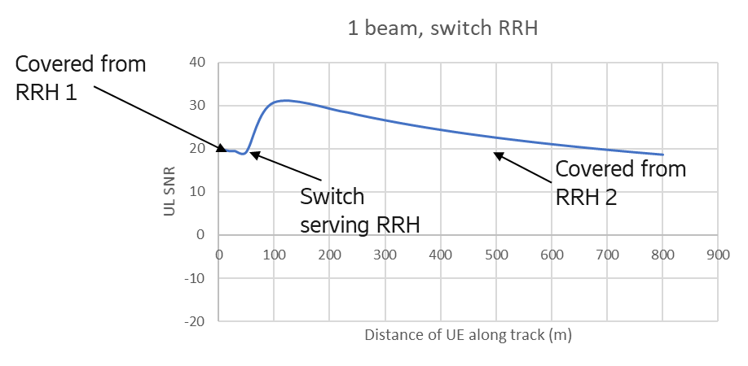
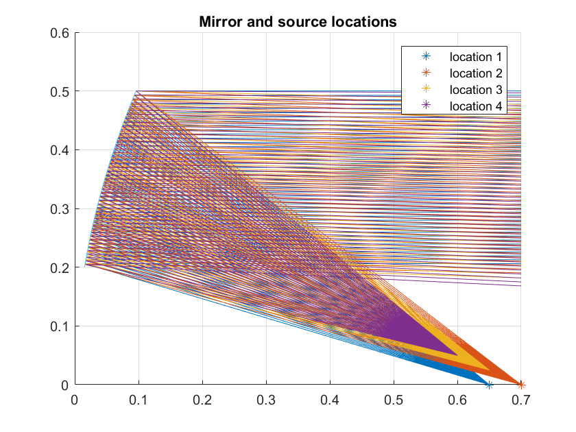
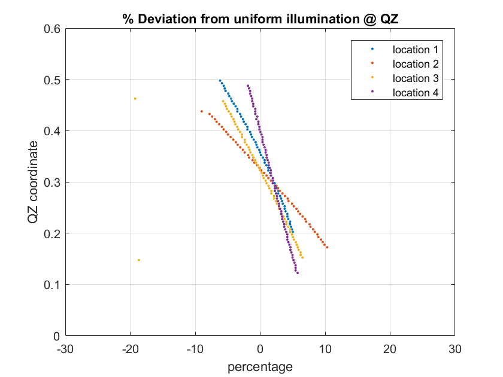
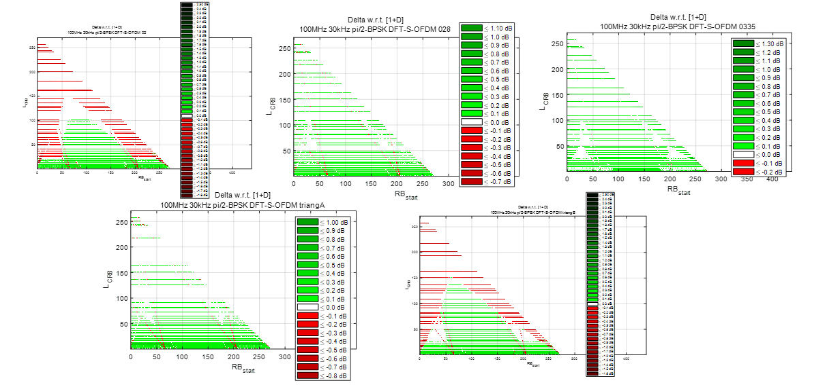
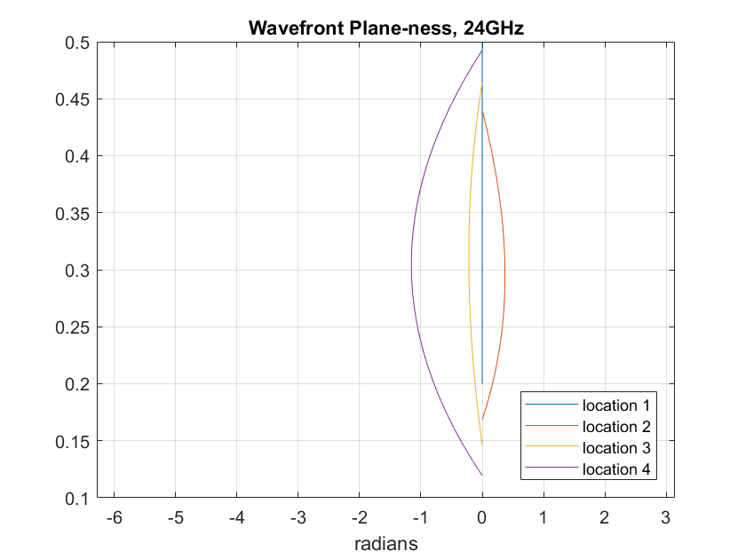
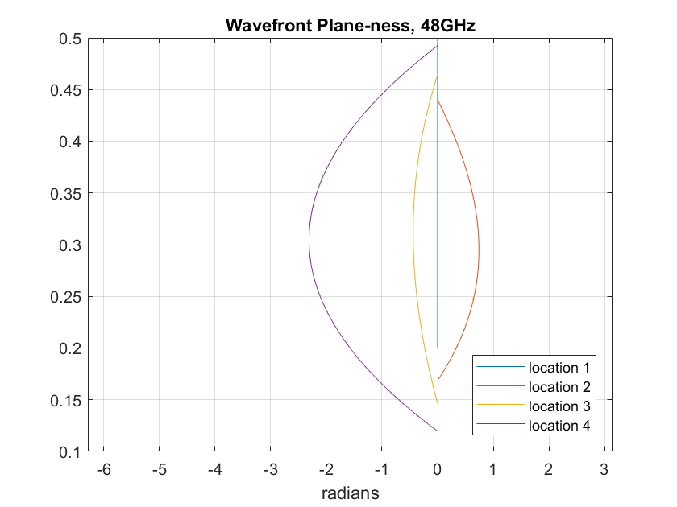
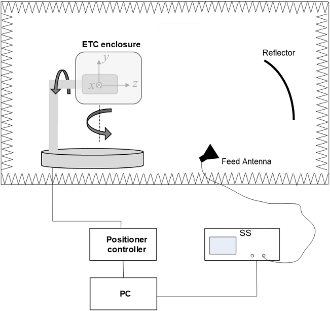
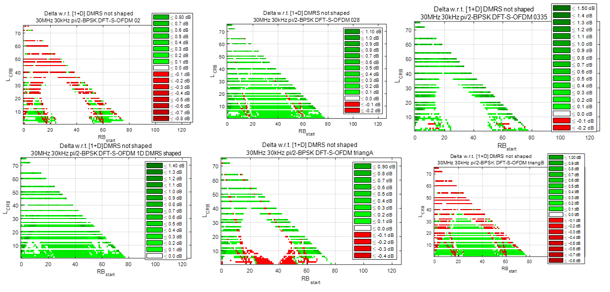

+-------------------------------------------+-------------------------+
| 3GPP TS 38.115-1 V17.7.0 (2025-03)        |                         |
+===========================================+=========================+
| Technical Specification                   |                         |
+-------------------------------------------+-------------------------+
| 3rd Generation Partnership Project;       |                         |
|                                           |                         |
| Technical Specification Group Radio       |                         |
| Access Network;                           |                         |
|                                           |                         |
| NR;                                       |                         |
|                                           |                         |
| Repeater conformance testing - Part 1:    |                         |
| Conducted conformance testing;            |                         |
|                                           |                         |
| (Release 17)                              |                         |
+-------------------------------------------+-------------------------+
|                                           |                         |
+-------------------------------------------+-------------------------+
|                   |  |
+-------------------------------------------+-------------------------+
|                                           |                         |
+-------------------------------------------+-------------------------+
| The present document has been developed   |                         |
| within the 3rd Generation Partnership     |                         |
| Project (3GPP ^TM^) and may be further    |                         |
| elaborated for the purposes of 3GPP.\     |                         |
| The present document has not been subject |                         |
| to any approval process by the 3GPP       |                         |
| Organizational Partners and shall not be  |                         |
| implemented.\                             |                         |
| This Specification is provided for future |                         |
| development work within 3GPP only. The    |                         |
| Organizational Partners accept no         |                         |
| liability for any use of this             |                         |
| Specification.\                           |                         |
| Specifications and Reports for            |                         |
| implementation of the 3GPP ^TM^ system    |                         |
| should be obtained via the 3GPP           |                         |
| Organizational Partners\' Publications    |                         |
| Offices.                                  |                         |
+-------------------------------------------+-------------------------+

+----------------------------------------------------------------------+
|                                                                      |
+======================================================================+
| > ***3GPP***                                                         |
| >                                                                    |
| > Postal address                                                     |
| >                                                                    |
| > 3GPP support office address                                        |
| >                                                                    |
| > 650 Route des Lucioles - Sophia Antipolis                          |
| >                                                                    |
| > Valbonne - FRANCE                                                  |
| >                                                                    |
| > Tel.: +33 4 92 94 42 00 Fax: +33 4 93 65 47 16                     |
| >                                                                    |
| > Internet                                                           |
| >                                                                    |
| > http://www.3gpp.org                                                |
+----------------------------------------------------------------------+
| ***Copyright Notification***                                         |
|                                                                      |
| No part may be reproduced except as authorized by written            |
| permission.\                                                         |
| The copyright and the foregoing restriction extend to reproduction   |
| in all media.                                                        |
|                                                                      |
| © 2025, 3GPP Organizational Partners (ARIB, ATIS, CCSA, ETSI, TSDSI, |
| TTA, TTC).                                                           |
|                                                                      |
| All rights reserved.                                                 |
|                                                                      |
| UMTS™ is a Trade Mark of ETSI registered for the benefit of its      |
| members                                                              |
|                                                                      |
| 3GPP™ is a Trade Mark of ETSI registered for the benefit of its      |
| Members and of the 3GPP Organizational Partners\                     |
| LTE™ is a Trade Mark of ETSI registered for the benefit of its       |
| Members and of the 3GPP Organizational Partners                      |
|                                                                      |
| GSM® and the GSM logo are registered and owned by the GSM            |
| Association                                                          |
+----------------------------------------------------------------------+

 Contents {#contents .TT}
========

Foreword 12

1 Scope 14

2 References 14

3 Definitions of terms, symbols and abbreviations 15

3.1 Terms 15

3.2 Symbols 16

3.3 Abbreviations 16

4 General conducted test conditions and declarations 17

4.1 Measurement uncertainties and test requirements 17

4.1.1 General 17

4.1.2 Acceptable uncertainty of Test System 17

4.1.2.1 General 17

4.1.2.2 Conducted characteristics measurements 18

4.1.3 Interpretation of measurement results 19

4.2 Conducted requirement reference points 19

4.3 Repeater classes 19

4.3.1 Repeater class for downlink 19

4.3.2 Repeater class for uplink 20

4.4 Regional requirements 20

4.5 Repeater configurations 20

4.5.1 General configurations 20

4.5.2 Transmission with multiple BS-side antenna connectors 20

4.5.3 Transmission with multiple UE-side antenna connectors 21

4.5.4 Duplexers 21

4.5.5 Power supply options 21

4.5.6 Ancillary RF amplifiers 21

4.5.7 Combining of repeaters 22

4.6 Manufacturer declarations 22

4.7 Test configurations 24

4.7.1 General 24

4.7.2 Test signal used to build Test Configurations 24

4.7.3 RTC1: Contiguous spectrum operation 24

4.7.3.1 RTC1 generation 24

4.7.3.2 RTC1 power allocation 25

4.7.5 RTC2: Non-contiguous spectrum operation 25

4.7.5.1 RTC2 generation 25

4.7.5.2 RTC2 power allocation 25

4.7.6 RTC3: Multi-band test configuration for full carrier allocation 25

4.7.6.1 RTC3 generation 25

4.7.6.2 RTC3 power allocation 26

4.7.7 RTC4: Multi-band test configuration with high PSD per carrier 26

4.7.7.1 RTC4 generation 26

4.7.7.2 RTC4 power allocation 26

4.8 Applicability of requirements 26

4.8.1 General 26

4.8.2 Applicability of test configurations for single-band operation 26

4.8.4 Applicability of test configurations for *multi-band* operation 27

4.9 RF channels and test models 28

4.9.1 RF channels 28

4.9.2 Test models 29

4.9.2.1 General 29

4.9.2.2 FR1 test models for repeater type 1-C for DL 29

4.9.2.3 FR1 test models for repeater type 1-C for UL 29

4.9.2.3.1 General 29

4.9.2.3.2 FR1 test model 1.1 (RUL-FR1-TM1.1) 30

4.9.2.3.3 FR1 test model 2 (RUL-FR1-TM2) 31

4.9.2.3.3a FR1 test model 2a (RUL-FR1-TM2a) 31

4.9.2.3.4 FR1 test model 3.1 (RUL-FR1-TM3.1) 31

4.9.2.3.5 FR1 test model 3.1a (RUL-FR1-TM3.1a) 31

4.9.2.4 Data content of Physical channels and Signals for RUL-FR1-TM 32

4.9.2.4.1 General 32

4.9.2.4.2 PUSCH 32

4.10 Requirements for contiguous and non-contiguous spectrum 32

4.11 Requirements for repeater capable of multi-band operation 33

4.12 Format and interpretation of tests 33

5 Operating bands and channel arrangement 34

6 Conducted characteristics 34

6.1 General 34

6.2 Repeater output power 34

6.2.1 Definition and applicability 34

6.2.2 Minimum requirement 35

6.2.3 Test purpose 35

6.2.4 Method of test 35

*6.2.4.1* *Initial conditions* 35

*6.2.4.2* *Procedure* 36

6.2.5 Test requirement 36

6.3 Frequency stability 36

6.3.1 Definition and applicability 36

6.3.2 Minimum Requirement 36

6.3.3 Test purpose 37

6.3.4 Method of test 37

6.3.5 Test Requirements 37

6.4 Out of band gain 37

6.4.1 Definition and applicability 37

6.4.2 Minimum Requirement 37

6.4.3 Test purpose 37

6.4.4 Method of test 37

6.4.4.1 Initial conditions 37

6.4.4.2 Procedure 37

6.4.5 Test Requirements 37

6.5 Unwanted emissions 38

6.5.1 General 38

6.5.2 Adjacent Channel Leakage Power Ratio (ACLR) 39

6.5.2.1 Definition and applicability 39

6.5.2.2 Minimum requirement 39

6.5.2.3 Test purpose 39

6.5.2.4 Method of test 39

6.5.2.4.1 Initial conditions 39

6.5.2.4.2 Procedure 39

6.5.2.5 Test requirements 40

6.5.3 Operating band unwanted emissions 44

6.5.3.1 Definition and applicability 44

6.5.3.2 Minimum requirement 45

6.5.3.3 Test purpose 45

6.5.3.4 Method of test 46

6.5.3.4.1 Initial conditions 46

6.5.3.4.2 Procedure 46

6.5.3.5 Test requirements 46

6.5.3.5.1 Minimum requirements for Wide Area *repeater type 1-C*
(Category A) 46

6.5.3.5.2 Minimum requirements for Wide Area *repeater type 1-C*
(Category B) 48

6.5.3.5.3 Minimum requirements for Medium Range *repeater type 1-C*
(Category A and B) for DL 50

6.5.3.5.4 Minimum requirements for Local Area *repeater type 1-C*
(Category A and B) 52

6.5.3.5.5 Minimum requirements for additional requirements 53

6.5.4 Transmitter spurious emissions 53

6.5.4.1 Definition and applicability 53

6.5.4.2 Minimum requirement 54

6.5.4.3 Test purpose 54

6.5.4.4 Method of test 54

6.5.4.4.1 Initial conditions 54

6.5.4.4.2 Procedure 54

6.5.4.5 Test requirements 55

6.5.4.5.1 General transmitter spurious emissions requirements 55

6.5.4.5.2 Additional spurious emissions requirements 56

6.5.4.5.3 Co-location with base stations and *repeater type 1-C* Nodes
65

6.5.5 Receiver spurious emissions 70

6.5.5.1 Definition and applicability 70

6.5.5.2 Minimum requirement 70

6.5.5.3 Test purpose 70

6.5.5.4 Method of test 70

6.5.5.4.1 Initial conditions 70

6.5.5.4.2 Procedure 70

6.5.5.5 Test requirements 71

6.6 Repeater Error Vector Magnitude 71

6.6.1 Downlink repeater error vector magnitude 71

6.6.1.1 General 71

6.6.1.2 Minimum requirements 72

6.6.1.3 Test purpose 72

6.6.1.4 Method of test 72

6.6.1.4.1 Initial conditions 72

6.6.1.4.2 Procedure 72

6.6.1.5 Test requirement 73

6.6.2 Uplink repeater error vector magnitude 73

6.6.2.1 General 73

6.6.2.2 Minimum requirement 73

6.6.2.3 Test purpose 73

6.6.2.3 Method of test 74

6.6.2.3.1 Initial conditions 74

6.6.2.3.2 Procedure 74

6.6.2.4 Test requirement 74

6.7 Input intermodulation 75

6.7.1 Definition and applicability 75

6.7.1.1 General 75

6.7.1.2 Minimum requirements 75

6.7.1.3 Test purpose 75

6.7.1.4 Method of test 75

6.7.1.4.1 Initial conditions 75

6.7.1.4.2 Procedure 75

6.7.1.5 Test requirements 76

6.7.1.5.1 General requirement 76

6.7.1.5.2 Co-location with BS/Repeater in other systems 76

6.7.1.5.3 Co-existence with other systems 77

6.8 Output intermodulation 78

6.8.1 Definition and applicability 78

6.8.1.1 General 78

6.8.1.2 Minimum requirements 78

6.8.1.3 Test purpose 78

6.8.1.4 Method of test 78

6.8.1.4.1 Initial conditions 78

6.8.1.4.2 Procedure 78

6.8.1.5 Test requirements 79

6.8.1.5.1 General requirements 79

6.8.1.5.2 Additional requirements 79

6.9 Adjacent Channel Rejection Ratio (ACRR) 80

6.9.1 Definitions and applicability 80

6.9.2 Co-existence with UTRA, E-UTRA and NR 80

6.9.2.1 Minimum requirements 80

6.9.2.2 Test purpose 80

6.9.2.3 Method of test 80

6.9.2.3.1 Initial conditions 80

6.9.2.3.2 Procedure 80

6.9.2.3.3 Test Requirements 81

6.10 Transmit ON/OFF power 82

6.10.1 Transmitter OFF power 82

6.10.1.1 Definition and applicability 82

6.10.1.2 Minimum requirement 82

6.10.1.3 Test purpose 82

6.10.1.4 Method of test 83

6.10.1.5 Test requirements 83

6.10.2 Transmitter transient period 83

6.10.2.1 Definition and applicability 83

6.10.2.2 Minimum requirement 83

6.10.2.3 Test purpose 83

6.10.2.4 Method of test 84

6.10.2.4.1 Initial conditions 84

6.10.2.4.2 Procedure 84

Annex A (normative): Repeater stimulus signals 85

A.1 Repeater stimulus signal 1 85

A.2 Repeater stimulus signal 2 85

A.3 Repeater stimulus signal spectral purity requirements 85

Annex B (normative): Environmental requirements for the repeater 86

B.1 General 86

B.2 Normal test environment 86

B.3 Extreme test environment 87

B.3.1 Extreme temperature 87

B.4 Vibration 87

B.5 Power supply 88

B.6 Measurement of test environments 88

Annex C (informative): Test tolerances and derivation of test
requirements 88

C.1 Measurement of conducted characteristics 89

Annex D (informative): Measurement system set-up 89

D.1 Repeater output power and transmit ON/OFF power 90

D.2 Out of band gain 90

D.3 Unwanted emission: Operating band unwanted emission, transmitter
spurious emission, and ACLR 91

D.4 Modulation Accuracy: Repeater Error Vector Magnitude and Frequency
Stability 91

D.5 Input intermodulation 92

D.6 Output Intermodulation 92

D.7 Adjacent Channel Rejection Ratio 93

D.8 Rx spurious emission requirement 93

Annex E (normative): In-channel TX tests 93

E.1 General 94

E.2 Basic principles 94

E.2.1 Output signal of the repeater under test 94

E.2.2 Ideal signal 94

E.2.3 Measurement results 95

E.2.4 Measurement points 95

E.3 Pre-FFT minimization process 96

E.4 Timing of the FFT window 96

E.5 Resource element TX power 97

E.6 Post-FFT equalisation 97

E.7 EVM 99

E.7.0 General 99

E.7.1 Averaged EVM (FDD) 99

E.7.2 Averaged EVM (TDD) 100

Annex F (informative): Change history 101

Foreword
========

This Technical Specification has been produced by the 3rd Generation
Partnership Project (3GPP).

The contents of the present document are subject to continuing work
within the TSG and may change following formal TSG approval. Should the
TSG modify the contents of the present document, it will be re-released
by the TSG with an identifying change of release date and an increase in
version number as follows:

Version x.y.z

where:

x the first digit:

1 presented to TSG for information;

2 presented to TSG for approval;

3 or greater indicates TSG approved document under change control.

y the second digit is incremented for all changes of substance, i.e.
technical enhancements, corrections, updates, etc.

z the third digit is incremented when editorial only changes have been
incorporated in the document.

In the present document, modal verbs have the following meanings:

**shall** indicates a mandatory requirement to do something

**shall not** indicates an interdiction (prohibition) to do something

The constructions \"shall\" and \"shall not\" are confined to the
context of normative provisions, and do not appear in Technical Reports.

The constructions \"must\" and \"must not\" are not used as substitutes
for \"shall\" and \"shall not\". Their use is avoided insofar as
possible, and they are not used in a normative context except in a
direct citation from an external, referenced, non-3GPP document, or so
as to maintain continuity of style when extending or modifying the
provisions of such a referenced document.

**should** indicates a recommendation to do something

**should not** indicates a recommendation not to do something

**may** indicates permission to do something

**need not** indicates permission not to do something

The construction \"may not\" is ambiguous and is not used in normative
elements. The unambiguous constructions \"might not\" or \"shall not\"
are used instead, depending upon the meaning intended.

**can** indicates that something is possible

**cannot** indicates that something is impossible

The constructions \"can\" and \"cannot\" are not substitutes for \"may\"
and \"need not\".

**will** indicates that something is certain or expected to happen as a
result of action taken by an agency the behaviour of which is outside
the scope of the present document

**will not** indicates that something is certain or expected not to
happen as a result of action taken by an agency the behaviour of which
is outside the scope of the present document

**might** indicates a likelihood that something will happen as a result
of action taken by some agency the behaviour of which is outside the
scope of the present document

**might not** indicates a likelihood that something will not happen as a
result of action taken by some agency the behaviour of which is outside
the scope of the present document

In addition:

**is** (or any other verb in the indicative mood) indicates a statement
of fact

**is not** (or any other negative verb in the indicative mood) indicates
a statement of fact

The constructions \"is\" and \"is not\" do not indicate requirements.

 1 Scope
=======

The present document specifies the Radio Frequency (RF) test methods and
conformance requirements for NR repeater *type 1-C*. These have been
derived from, and are consistent with the conducted requirements for
*repeater type 1-C* in NR repeater specification defined in
TS 38.106 \[2\].

A *repeater type 1-C* only has conducted requirements so it requires
compliance to this specification only.

*Arepeater type 2-O* has only radiated requirements so it requires
compliance to TS 38.115-2 \[3\] only.

2 References
============

The following documents contain provisions which, through reference in
this text, constitute provisions of the present document.

\- References are either specific (identified by date of publication,
edition number, version number, etc.) or non‑specific.

\- For a specific reference, subsequent revisions do not apply.

\- For a non-specific reference, the latest version applies. In the case
of a reference to a 3GPP document (including a GSM document), a
non-specific reference implicitly refers to the latest version of that
document *in the same Release as the present document*.

\[1\] 3GPP TR 21.905: \"Vocabulary for 3GPP Specifications\".

\[2\] 3GPP TS 38.106: \"NR; Repeater Radio Transmission and Reception\"

\[3\] 3GPP TS 38.115-2: \"NR; Repeater conformance testing, Part 2:
Radiated conformance testing\"

\[4\] ITU-R Recommendation SM.329: \"Unwanted emissions in the spurious
domain\"

\[5\] 3GPP TS 38.104: \"NR; Base Station (BS) radio transmission and
reception\"

\[6\] 3GPP TS 36.104: \"Evolved Universal Terrestrial Radio Access
(E-UTRA); Base Station (BS) radio transmission and reception\"

\[7\] 3GPP TS 38.141-1: \"NR; Base Station (BS) conformance testing,
Part 1: Conducted conformance testing\"

\[8\] 3GPP TS 38.211: \"NR; Physical channels and modulation\"

\[9\] 3GPP TS 38.101-1: \"NR; User Equipment (UE) radio transmission and
reception; Part 1: Range 1 Standalone\"

\[10\] 3GPP TS 38.331: \"NR; Radio Resource Control (RRC) protocol
specification\"

\[11\] ITU-R Recommendation M.1545: "Measurement uncertainty as it
applies to test limits for the terrestrial component of International
Mobile Telecommunications -- 2000"

\[12\] ITU-T Recommendation O.150, \"Equipment for the measurement of
digital and analogue/digital parameters\"

\[13\] Federal Communications Commission: \"Title 47 of the Code of
Federal Regulations (CFR) \"

\[14\] ECC/DEC/(17)06: \"The harmonised use of the frequency bands
1427-1452 MHz and 1492-1518 MHz for Mobile/Fixed Communications Networks
Supplemental Downlink (MFCN SDL)\"

\[15\] 3GPP TR 25.942: \"RF system scenarios\"

\[16\] IEC 60 721-3-3: \"Classification of environmental conditions -
Part 3-3: Classification of groups of environmental parameters and their
severities - Stationary use at weather protected locations\"

\[17\] IEC 60 721-3-4: \"Classification of environmental conditions -
Part 3: Classification of groups of environmental parameters and their
severities - Clause 4: Stationary use at non-weather protected
locations\"

\[18\] IEC 60 721: \"Classification of environmental conditions\"

\[19\] IEC 60 068-2-1 (2007): \"Environmental testing - Part 2: Tests.
Tests A: Cold\"

\[20\] IEC 60 068-2-2: (2007): \"Environmental testing - Part 2: Tests.
Tests B: Dry heat\"

\[21\] IEC 60 068-2-6: (2007): \"Environmental testing - Part 2: Tests -
Test Fc: Vibration (sinusoidal)\"

3 Definitions of terms, symbols and abbreviations
=================================================

3.1 Terms
---------

For the purposes of the present document, the terms given in 3GPP
TR 21.905 \[1\] and the following apply. A term defined in the present
document takes precedence over the definition of the same term, if any,
in 3GPP TR 21.905 \[1\].

**Antenna connector:** connector at the conducted interface of the
*repeater type 1-C*

**Fractional bandwidth: *fractional bandwidth* FBW is defined as**

**gap between passbands:** frequency gap between two consecutive
passbands that belong to the same *operating band*, where the RF
requirements in the gap are based on co-existence for un-coordinated
operation

**Inter-passband gap**: The frequency gap between two supported
consecutive *passbands* that belong to different operating bands.

**Maximum passband output power:** mean power level measured per
*passband* at the *antenna connector*, during the *transmitter ON state*
in a specified reference condition.

**multi-band connector**: *Antenna Connector* for a *Multi-band
repeater*.

**Multi-band repeater:** *Repeater Type 1-C* whose *antenna connector*
is associated with a transmitter and/or receiver that is characterized
by the ability to process two or more *passband(s)* in common active RF
components simultaneously, where at least one *passband* is configured
at a different operating band than the other *passband(s)* and where
this different operating band is not a sub-band or superseding-band of
another supported operating band

**Nominal channel bandwidth: Bandwidth calculated as** min(100MHz,
BW~passband~) in FR1 or min(400MHz, BW~passband~) in FR2. If this
bandwidth is not defined for BS channel bandwidth for the operating
band, *nominal channel bandwidth* shall be defined as the widest BS
channel bandwidth for the operating band which is narrower than
BW~passband~.

**Non-contiguous spectrum**: spectrum consisting of two or more
*passbands* separated by *inter-passband gap*(s).

**Operating band:** frequency range in which NR operates (paired or
unpaired), that is defined with a specific set of technical requirements

**passband edge***:* Frequency at the edge of the passband

**Repeater RF Bandwidth**: RF bandwidth in which a repeater transmits
and/or receives single or multiple passband(s) within a supported
operating band

> NOTE: In single passband operation, the Repeater RF Bandwidth is equal
> to the passband bandwidth.

**Repeater type 1-C**: Repeater operating at FR1 with a requirement set
consisting only of conducted requirements defined at individual *antenna
connectors*.

***Requirement set:*** one of the NR requirements set as defined for *NR
repeater*

**single-band connector:** *Repeater type 1-C* *antenna connector*
supporting operation either in a single *operating band* only, or in
multiple *operating bands* but does not meet the conditions for a
*multi-band connector*.

**Sub-band**: A *sub-band* of an operating band contains a part of the
uplink and downlink frequency range of the operating band.

**sub-block:** one contiguous allocated block of spectrum for
transmission and reception by the repeater.

**Superseding-band**: A *superseding-band* of an operating band includes
the whole of the uplink and downlink frequency range of the operating
band.

**Transmitter OFF state:** Time period during which the repeater
downlink or uplink is not allowed to transmit in the corresponding
direction.

**Transmitter ON state:** Time period during which the repeater **is
transmitting** downlink or uplink signals in the corresponding
direction.

**Transmitter transient period:** Time period during which the repeater
is changing from the OFF state to the ON state or vice versa.

3.2 Symbols
-----------

For the purposes of the present document, the following symbols apply:

BW~Config~ Transmission bandwidth configuration, where BW~Config~ =
*N*~RB~ x SCS x 12

BW~Nominal~ Nominal channel *bandwidth*

BW~Passband~ *Passband bandwidth*

∆f Separation between the *passband edge* frequency and the nominal
-3 dB point of the measuring filter closest to the carrier frequency

∆f~max~ f\_offset~max~ minus half of the bandwidth of the measuring
filter

Δf~OBUE~ Maximum offset of the *operating band* unwanted emissions mask
from the *operating band* edge

F~DL,low~ The lowest frequency of the downlink *operating band*

F~DL,high~ The highest frequency of the downlink *operating band*

F~FBWhigh~ Highest supported frequency within supported operating band,
for which *fractional bandwidth* support was declared

F~FBWlow~ Lowest supported frequency within supported operating band,
for which *fractional bandwidth* support was declared

F~filter~ Filter centre frequency

F~offset,high~ Frequency offset from F~C,high~ to the upper *passband
edge*

F~offset,low~ Frequency offset from F~C,low~ to the lower *passband
edge*

f\_offset Separation between the *passband edge* frequency and the
centre of the measuring

f\_offset~max~ The offset to the frequency Δf~OBUE~ outside the
*operating band*

F~UL,low~ The lowest frequency of the uplink *operating band*

F~UL,high~ The highest frequency of the uplink *operating band*

P~EM,n50/n75,ind~ Declared emission level for Band n50/n75; ind = a,
bP~max,p,AC~ *Maximum passband output power* measured per *antenna
connector*

P~rated,in~ Rated pass band input power to the repeater for the test per
antenna connector

P~rated,p,AC~ Rated passband output power per antenna connector

P~rated,t,AC~ Rated total output power declared per antenna
connectorW~gap~ *Inter passband Bandwidth gap* size

3.3 Abbreviations
-----------------

For the purposes of the present document, the abbreviations given in
3GPP TR 21.905 \[1\] and the following apply. An abbreviation defined in
the present document takes precedence over the definition of the same
abbreviation, if any, in 3GPP TR 21.905 \[1\].

ACLR Adjacent Channel Leakage Ratio

BW Bandwidth

CACLR Cumulative ACLR

CP-OFDM Cyclic Prefix-OFDM

DFT-s-OFDM Discrete Fourier Transform-spread-OFDM

DL Downlink

EVM Error Vector Magnitude

FBW Fractional Bandwidth

FR Frequency Range

ITU‑R Radiocommunication Sector of the International Telecommunication
Union

LA Local Area

MR Medium Range

NR New Radio

OBUE Operating Band Unwanted Emissions

OOB Out-of-band

QAM Quadrature Amplitude Modulation

RF Radio Frequency

RX Receiver

SCS Sub-Carrier Spacing

TX Transmitter

UL Uplink

WA Wide Area

4 General conducted test conditions and declarations
====================================================

4.1 Measurement uncertainties and test requirements
---------------------------------------------------

### 4.1.1 General

The requirements of this clause apply to all applicable tests in part 1
of this specification, i.e. to all conducted tests defined for FR1. The
frequency ranges FR1 and FR2 are defined in clause 5.1 of
TS 38.106 \[2\].

The minimum requirements are given in TS 38.106 \[2\]. Test Tolerances
for the conducted test requirements explicitly stated in the present
document are given in annex C of the present document.

Test Tolerances are individually calculated for each test. The Test
Tolerances are used to relax the minimum requirements to create test
requirements.

When a test requirement differs from the corresponding minimum
requirement, then the Test Tolerance applied for the test is non-zero.
The Test Tolerance for the test and the explanation of how the minimum
requirement has been relaxed by the Test Tolerance are given in annex C.

### 4.1.2 Acceptable uncertainty of Test System

#### 4.1.2.1 General

The maximum acceptable uncertainty of the Test System is specified below
for each test defined explicitly in the present specification, where
appropriate. The maximum acceptable uncertainty of the Test System for
test requirements included by reference is defined in the respective
referred test specification.

The Test System shall enable the stimulus signals in the test case to be
adjusted to within the specified tolerance and the equipment under test
to be measured with an uncertainty not exceeding the specified values.
All tolerances and uncertainties are absolute values, and are valid for
a confidence level of 95 %, unless otherwise stated.

A confidence level of 95 % is the measurement uncertainty tolerance
interval for a specific measurement that contains 95 % of the
performance of a population of test equipment.

For RF tests, it should be noted that the uncertainties in clause 4.1.2
apply to the Test System operating into a nominal 50 ohm load and do not
include system effects due to mismatch between the DUT and the Test
System.

#### 4.1.2.2 Conducted characteristics measurements

Table 4.1.2.2-1: Maximum Test System uncertainty for conducted
characteristics tests

+----------------------+----------------------+----------------------+
| Clause               | Maximum Test System  | Derivation of Test   |
|                      | Uncertainty          | System Uncertainty   |
+======================+======================+======================+
| 6.2 Repeater output  | ±0.7 dB, f ≤ 3 GHz   |                      |
| power                |                      |                      |
|                      | ±1.0 dB, 3 GHz \< f  |                      |
|                      | ≤ 7.125 GHz          |                      |
+----------------------+----------------------+----------------------+
| 6.3 Frequency        | ±12 Hz               |                      |
| stability            |                      |                      |
|                      | Measurement results  |                      |
|                      | of ± 500 Hz          |                      |
+----------------------+----------------------+----------------------+
| 6.4 Out of band gain | ±0,5 dB, f ≤ 3.0 GHz |                      |
|                      |                      |                      |
|                      | ±0,8 dB, 3.0 GHz \<  |                      |
|                      | f ≤ 4.2 GHz          |                      |
|                      |                      |                      |
|                      | Calibration of test  |                      |
|                      | set-up shall be made |                      |
|                      | without DUT in order |                      |
|                      | to achieve the       |                      |
|                      | accuracy             |                      |
+----------------------+----------------------+----------------------+
| 6.5.2 ACLR/ CACLR    | BW ≤ 20MHz: ±0.8 dB  |                      |
|                      |                      |                      |
|                      | BW \> 20MHz: ±1.2 dB |                      |
|                      |                      |                      |
|                      | Absolute power ±2.0  |                      |
|                      | dB, f ≤ 3 GHz        |                      |
|                      |                      |                      |
|                      | Absolute power ±2.5  |                      |
|                      | dB, 3 GHz \< f ≤     |                      |
|                      | 7.125 GHz            |                      |
+----------------------+----------------------+----------------------+
| 6.5.3 Operating band | ±1,5 dB, f ≤ 3.0 GHz |                      |
| unwanted emission    |                      |                      |
|                      | ±1,8 dB, 3.0 GHz \<  |                      |
|                      | f ≤ 4.2 GHz          |                      |
|                      |                      |                      |
|                      | The interference     |                      |
|                      | from the signal      |                      |
|                      | generator ACLR shall |                      |
|                      | be minimum 10 dB     |                      |
|                      | below that of a NR   |                      |
|                      | repeater according   |                      |
|                      | to clause 6.5.2.     |                      |
+----------------------+----------------------+----------------------+
| 6.5.4 Spurious       | In NR and            |                      |
| emissions            | coexistence receive  |                      |
|                      | bands:\              |                      |
|                      | for results \> -60   |                      |
|                      | dBm ±2,0 dB\         |                      |
|                      | for results \< -60   |                      |
|                      | dBm ±3,0 dB          |                      |
|                      |                      |                      |
|                      | Outside above range: |                      |
|                      |                      |                      |
|                      | emission power;\     |                      |
|                      | 9 kHz \< f ≤ 4 GHz   |                      |
|                      | ±2,0 dB              |                      |
|                      |                      |                      |
|                      | 4 GHz \< f ≤ 19 GHz  |                      |
|                      | ±4,0 dB.             |                      |
|                      |                      |                      |
|                      | The interference     |                      |
|                      | from the signal      |                      |
|                      | generator ACLR shall |                      |
|                      | be minimum 10 dB     |                      |
|                      | below that of a NR   |                      |
|                      | repeater according   |                      |
|                      | to clause 6.5.2.     |                      |
+----------------------+----------------------+----------------------+
| 6.6 EVM              | 1% signal analyser   |                      |
|                      |                      |                      |
|                      | 2% stimulus signal   |                      |
+----------------------+----------------------+----------------------+
| 6.7 Input            | ±1,2 dB              | Formula:             |
| intermodulation      |                      |                      |
|                      |                      | RSS CW1 level error, |
|                      |                      | 2 x CW2 level error, |
|                      |                      | and measurement      |
|                      |                      | error (using all     |
|                      |                      | errors = ±0,5 dB)    |
+----------------------+----------------------+----------------------+
| 6.8 Output           | For operating band   | Formula:             |
| intermodulation      | unwanted emission:   |                      |
|                      |                      | RSS 2x Interference  |
|                      | ±2,1 dB              | signal level error   |
|                      |                      | and operating band   |
|                      | The interference     | unwanted emission    |
|                      | from the signal      | measurement level    |
|                      | generator ACLR shall | error.\              |
|                      | be minimum 10 dB     | (1 dB interference   |
|                      | below that of a NR   | signal level error   |
|                      | repeater according   | is assumed).         |
|                      | to clause 6.5.2.     |                      |
|                      |                      |                      |
|                      | For spurious         |                      |
|                      | emission:            |                      |
|                      |                      |                      |
|                      | In NR and            |                      |
|                      | coexistence receive  |                      |
|                      | bands:\              |                      |
|                      | for results \> -60   |                      |
|                      | dBm ±2,0 dB\         |                      |
|                      | for results \< -60   |                      |
|                      | dBm ±3,0 dB          |                      |
|                      |                      |                      |
|                      | Outside above        |                      |
|                      | range:\              |                      |
|                      | emission power;\     |                      |
|                      | 9 kHz \< f ≤ 4 GHz   |                      |
|                      | ±2,0 dB;\            |                      |
|                      | 4GHz \< f ≤ 19 GHz   |                      |
|                      | ±4,0 dB.             |                      |
|                      |                      |                      |
|                      | The interference     |                      |
|                      | signal must have a   |                      |
|                      | spurious emission    |                      |
|                      | level at least 10 dB |                      |
|                      | below the spurious   |                      |
|                      | levels required in   |                      |
|                      | 6.5.4 and 6.5.5.     |                      |
+----------------------+----------------------+----------------------+
| 6.9 ACRR             | ±0,7 dB              |                      |
+----------------------+----------------------+----------------------+
| 6.10.1 Transmit      | ±2.0 dB , f ≤ 3 GHz  |                      |
| ON/OFF power         |                      |                      |
|                      | ±2.5 dB, 3 GHz \< f  |                      |
|                      | ≤ 7.125 GHz          |                      |
+----------------------+----------------------+----------------------+
| 6.10.1 Transmit OFF  | N/A                  |                      |
| power                |                      |                      |
+----------------------+----------------------+----------------------+

### 4.1.3 Interpretation of measurement results

The measurement results returned by the Test System are compared -
without any modification - against the test requirements as defined by
the Shared Risk principle.

The Shared Risk principle is defined in Recommendation ITU-R M.1545
\[11\].

The actual measurement uncertainty of the Test System for the
measurement of each parameter shall be included in the test report.

The recorded value for the Test System uncertainty shall be, for each
measurement, equal to or lower than the appropriate figure in
clause 4.1.2 of the present document.

If the Test System for a test is known to have a measurement uncertainty
greater than that specified in clause 4.1.2, it is still permitted to
use this apparatus provided that an adjustment is made as follows.

Any additional uncertainty in the Test System over and above that
specified in clause 4.1.2 shall be used to tighten the test requirement,
making the test harder to pass. For some tests e.g. receiver tests, this
may require modification of stimulus signals. This procedure will ensure
that a Test System not compliant with clause 4.1.2 does not increase the
chance of passing a device under test where that device would otherwise
have failed the test if a Test System compliant with clause 4.1.2 had
been used.

4.2 Conducted requirement reference points
------------------------------------------

For *repeater type 1-C*, the requirements are applied at the repeater
*antenna connector* (BS-side connector or UE-side connector) for
downlink or uplink for the configuration in normal operating conditions.

Figure 4.2-1: *Repeater type 1-C* downlink and uplink interface

4.3 Repeater classes
--------------------

### 4.3.1 Repeater class for downlink

The requirements in this specification apply to downlink Wide Area
repeaters, downlink Medium Range repeaters and downlink Local Area
repeaters unless otherwise stated. The associated deployment scenarios
for each class are exactly the same for repeater with and without
connectors.

For *repeater type 1-C*, repeater downlink classes are defined as
indicated below:

\- Wide Area repeaters are characterised by requirements derived from
Macro Cell scenarios with a repeater to UE minimum distance along the
ground equal to 35 m.

\- Medium Range repeaters are characterised by requirements derived from
Micro Cell scenarios with a repeater to UE minimum distance along the
ground equal to 5 m.

\- Local Area repeaters are characterised by requirements derived from
Pico Cell scenarios with a repeater to UE minimum distance along the
ground equal to 2 m.

### 4.3.2 Repeater class for uplink

The requirements in this specification apply to uplink Wide Area
repeaters and uplink Local Area repeaters unless otherwise stated. The
associated deployment scenarios for each class are exactly the same for
repeater with and without connectors.

For *repeater type 1-C*, repeater uplink classes are defined as
indicated below:

\- Wide Area repeaters are characterised by requirements derived from
Macro Cell and/or Micro Cell scenarios.

\- Local Area repeaters are characterised by requirements derived from
Pico Cell and/or Micro Cell scenarios.

4.4 Regional requirements
-------------------------

Some requirements in the present document may only apply in certain
regions either as optional requirements, or as mandatory requirements
set by local and regional regulation. It is normally not stated in the
3GPP specifications under what exact circumstances the regional
requirements apply, since this is defined by local or regional
regulation.

Table 4.4-1 lists all requirements in the present specification that may
be applied differently in different regions.

4.5 Repeater configurations
---------------------------

### 4.5.1 General configurations

For *repeater type 1-C*, the requirements are applied at the repeater
*antenna connector* (BS-side connector or UE-side connector) for
downlink or uplink for the configuration in normal operating conditions.

Figure 4.5.1-1: *Repeater type 1-C* test ports

### 4.5.2 Transmission with multiple BS-side antenna connectors

Unless otherwise stated, for the tests in clause 6 of the present
document, the requirement applies for each BS-side *antenna connector*
in the case of transmission with multiple BS-side *antenna connectors*.

Requirements are tested at the *antenna connector*, with the remaining
*antenna connector(s)* being terminated. If the manufacturer has
declared the antenna connectors to be equivalent (D.13), it is
sufficient to measure the signal at any one of the BS-side *antenna
connectors*.

### 4.5.3 Transmission with multiple UE-side antenna connectors

Unless otherwise stated, for the tests in clause 6 of the present
document, the requirement applies for each UE-side *antenna connector*
in the case of transmission with multiple UE-side *antenna connectors*.

Requirements are tested at the *antenna connector*, with the remaining
*antenna connector(s)* being terminated. If the manufacturer has
declared the antenna connectors to be equivalent (D.13), it is
sufficient to measure the signal at any one of the UE-side *antenna
connectors*.

### 4.5.4 Duplexers

The requirements of the present document shall be met with a duplexer
fitted, if a duplexer is supplied as part of the repeater. If the
duplexer is supplied as an option by the manufacturer, sufficient tests
should be repeated with and without the duplexer fitted to verify that
the repeater meets the requirements of the present document in both
cases.

The following tests shall be performed with the duplexer fitted, and
without it fitted if this is an option:

1\) clause 6.2, repeater output power, for the highest static power step
only, if this is measured at the antenna connector;

2\) clause 6.4, out of band gain; outside the repeater downlink or
uplink band;

3\) clause 6.5, unwanted emissions; outside the repeater downlink or
uplink band;

4\) clause 6.7, output intermodulation; for the testing of conformance,
the carrier frequencies should be selected to minimize intermodulation
products from the transmitters falling in receive channels.

5\) clause 6.9, Adjacent Channel Rejection Ratio; outside the repeater
downlink or uplink band.

The remaining tests may be performed with or without the duplexer
fitted.

NOTE 1: When performing receiver tests with a duplexer fitted, it is
important to ensure that the output from the transmitters does not
affect the test apparatus. This can be achieved using a combination of
attenuators, isolators and filters.

NOTE 2: When duplexers are used, intermodulation products will be
generated, not only in the duplexer but also in the antenna system. The
intermodulation products generated in the antenna system are not
controlled by 3GPP specifications, and may degrade during operation
(e.g. due to moisture ingress). Therefore, to ensure continued
satisfactory operation of a repeater, an operator will normally select
NR-ARFCNs to minimize intermodulation products falling on receive
channels. For testing of complete conformance, an operator may specify
the NR-ARFCNs to be used.

### 4.5.5 Power supply options

If the repeater is supplied with a number of different power supply
configurations, it may not be necessary to test RF parameters for each
of the power supply options, provided that it can be demonstrated that
the range of conditions over which the equipment is tested is at least
as great as the range of conditions due to any of the power supply
configurations.

### 4.5.6 Ancillary RF amplifiers

The *repeater type 1-C* requirements of the present document shall be
met with the ancillary RF amplifier fitted. At tests, the ancillary
amplifier is connected to the repeater by a connecting network
(including any cable(s), attenuator(s), etc.) with applicable loss to
make sure the appropriate operating conditions of the ancillary
amplifier and the repeater. The applicable connecting network loss range
is declared by the manufacturer (D.14). Other characteristics and the
temperature dependence of the attenuation of the connecting network are
neglected. The actual attenuation value of the connecting network is
chosen for each test as one of the applicable extreme values. The lowest
value is used unless otherwise stated.

Sufficient tests should be repeated with the ancillary amplifier fitted
and, if it is optional, without the ancillary RF amplifier to verify
that the repeater meets the requirements of the present document in both
cases.

When testing, the following tests shall be repeated with the optional
ancillary amplifier fitted according to the table below, where \"x\"
denotes that the test is applicable:

Table 4.5.6-1: Tests applicable to ancillary RF amplifiers

  Clause   Ancillary RF amplifier needed
  -------- -------------------------------
  6.2      x
  6.4      x
  6.5      x
  6.7      x
  6.8      x
  6.9      x

In repeater output power test (clause 6.2) highest applicable
attenuation value is applied.

### 4.5.7 Combining of repeaters

If the repeater is intended for combination with additional apparatus
connected to a repeater port and this combination is supplied as a
system, the combination of repeater together with the additional
apparatus shall also fulfil the repeater requirements. E.g. if the
repeater is intended for combination such that multiple repeaters
amplify the same signals into the same ports the combination shall also
fulfil the repeater requirements.

An example of such a configuration is shown in figure 4.5.7-1.

Figure 4.5.7-1: Example of repeater configuration

4.6 Manufacturer declarations
-----------------------------

The following repeater declarations listed in table 4.6-1, when
applicable to the repeater under test, are required to be provided by
the manufacturer for the conducted requirements testing of the *repeater
type 1-C*. Declarations can be made independently for UL and DL.

Table 4.6-1: Manufacturer declarations for *repeater type 1-C* conducted
test requirements

+----------------------+----------------------+----------------------+
| Declaration          | Declaration          | Description          |
| identifier           |                      |                      |
+======================+======================+======================+
| D.1                  | Repeater class       | Repeater class of    |
|                      |                      | the repeater,        |
|                      |                      | declared as Wide     |
|                      |                      | Area repeater,       |
|                      |                      | Medium Range         |
|                      |                      | repeater, or Local   |
|                      |                      | Area repeater.       |
+----------------------+----------------------+----------------------+
| D.2                  | *Operating bands*    | List of NR           |
|                      | and passband         | *operating band(s)*  |
|                      | frequency ranges     | supported by         |
|                      |                      | *single-band         |
|                      |                      | connector(s)* and/or |
|                      |                      | *multi-band          |
|                      |                      | connector(s)* of the |
|                      |                      | repeater and         |
|                      |                      | passband frequency   |
|                      |                      | range(s) within the  |
|                      |                      | *operating band(s)*  |
|                      |                      | that the repeater    |
|                      |                      | can operate in.      |
|                      |                      |                      |
|                      |                      | Declarations shall   |
|                      |                      | be made per *antenna |
|                      |                      | connector*.          |
+----------------------+----------------------+----------------------+
| D.3                  | Spurious emission    | Declare the repeater |
|                      | category             | spurious emission    |
|                      |                      | category as either   |
|                      |                      | category A or B with |
|                      |                      | respect to the       |
|                      |                      | limits for spurious  |
|                      |                      | emissions, as        |
|                      |                      | defined in           |
|                      |                      | Recommendation ITU-R |
|                      |                      | SM.329 \[4\].        |
+----------------------+----------------------+----------------------+
| D.4                  | Additional operating | The manufacturer     |
|                      | band unwanted        | shall declare        |
|                      | emissions            | whether the repeater |
|                      |                      | under test is        |
|                      |                      | intended to operate  |
|                      |                      | in geographic areas  |
|                      |                      | where the additional |
|                      |                      | operating band       |
|                      |                      | unwanted emission    |
|                      |                      | limits defined in    |
|                      |                      | clause 6.6.4.5.6     |
|                      |                      | apply. (Note 2, Note |
|                      |                      | 3).                  |
+----------------------+----------------------+----------------------+
| D.5                  | Co-existence with    | The manufacturer     |
|                      | other systems        | shall declare        |
|                      |                      | whether the repeater |
|                      |                      | under test is        |
|                      |                      | intended to operate  |
|                      |                      | in geographic areas  |
|                      |                      | where one or more of |
|                      |                      | the systems GSM850,  |
|                      |                      | GSM900, DCS1800,     |
|                      |                      | PCS1900, UTRA FDD,   |
|                      |                      | UTRA TDD, E-UTRA,    |
|                      |                      | PHS and/or NR        |
|                      |                      | operating in another |
|                      |                      | band are deployed.   |
+----------------------+----------------------+----------------------+
| D.6                  | Co-location with     | The manufacturer     |
|                      | other base stations, | shall declare        |
|                      | repeaters and IABs   | whether the repeater |
|                      |                      | under test is        |
|                      |                      | intended to operate  |
|                      |                      | co-located with Base |
|                      |                      | Stations, repeaters  |
|                      |                      | and IABs of one or   |
|                      |                      | more of the systems  |
|                      |                      | GSM850, GSM900,      |
|                      |                      | DCS1800, PCS1900,    |
|                      |                      | UTRA FDD, UTRA TDD,  |
|                      |                      | E-UTRA and/or NR     |
|                      |                      | operating in another |
|                      |                      | band.                |
+----------------------+----------------------+----------------------+
| D.7                  | *Single band         | Declaration of the   |
|                      | connector* or        | single band or       |
|                      | *multi-band          | multi-band           |
|                      | connector*           | capability of        |
|                      |                      | *single band         |
|                      |                      | connector(s)* or     |
|                      |                      | *multi-band          |
|                      |                      | connector(s),*       |
|                      |                      | declared for every   |
|                      |                      | connector.           |
+----------------------+----------------------+----------------------+
| D.8                  | Other band           | Declare any other    |
|                      | combination          | limitations under    |
|                      | multi-band           | simultaneous         |
|                      | restrictions         | operation in the     |
|                      |                      | declared band        |
|                      |                      | combinations (D.12)  |
|                      |                      | for each *multi-band |
|                      |                      | connector* which     |
|                      |                      | have any impact on   |
|                      |                      | the test             |
|                      |                      | configuration        |
|                      |                      | generation.          |
|                      |                      |                      |
|                      |                      | Declared for every   |
|                      |                      | *multi-band          |
|                      |                      | connector*.          |
+----------------------+----------------------+----------------------+
| D.9                  | Rated output power   | Conducted rated      |
|                      | *per passband*       | output power per     |
|                      | (P~rated,p,AC~)      | passband, per        |
|                      |                      | *single band         |
|                      |                      | connector* or        |
|                      |                      | *multi-band          |
|                      |                      | connector.*          |
|                      |                      |                      |
|                      |                      | Declared per         |
|                      |                      | supported            |
|                      |                      | *passband*, per      |
|                      |                      | *antenna connector.* |
|                      |                      | (Note 1)             |
+----------------------+----------------------+----------------------+
| D.10                 | R*ated total output  | Conducted total      |
|                      | power*               | rated output         |
|                      | (P~rated,t,AC~)      | power*.*             |
|                      |                      |                      |
|                      |                      | Declared per         |
|                      |                      | supported *operating |
|                      |                      | band*, per *antenna  |
|                      |                      | connector.*          |
|                      |                      |                      |
|                      |                      | For *multi-band      |
|                      |                      | connectors* declared |
|                      |                      | for each supported   |
|                      |                      | *operating band* in  |
|                      |                      | each supported band  |
|                      |                      | combination. (Note   |
|                      |                      | 1)                   |
+----------------------+----------------------+----------------------+
| D.11                 | Rated multi-band     | Conducted multi-band |
|                      | total output power,  | rated total output   |
|                      | P~rated,MB,AC~       | power*.*             |
|                      |                      |                      |
|                      |                      | Declared per         |
|                      |                      | supported operating  |
|                      |                      | band combinations,   |
|                      |                      | per *multi-band      |
|                      |                      | connector*. (Note 1) |
+----------------------+----------------------+----------------------+
| D.12                 | Operating band       | List of operating    |
|                      | combination support  | bands combinations   |
|                      |                      | supported by         |
|                      |                      | *single-band         |
|                      |                      | connector(s)* and/or |
|                      |                      | *multi-band          |
|                      |                      | connector(s)* of the |
|                      |                      | repeater. Declared   |
|                      |                      | per *antenna         |
|                      |                      | connector.*          |
+----------------------+----------------------+----------------------+
| D.13                 | Equivalent           | List of *antenna     |
|                      | connectors           | connectors* which    |
|                      |                      | have been declared   |
|                      |                      | equivalent.          |
|                      |                      |                      |
|                      |                      | Equivalent           |
|                      |                      | connectors imply     |
|                      |                      | that the *antenna    |
|                      |                      | connector* are       |
|                      |                      | expected to behave   |
|                      |                      | in the same way when |
|                      |                      | presented with       |
|                      |                      | identical signals    |
|                      |                      | under the same       |
|                      |                      | operating            |
|                      |                      | conditions. All      |
|                      |                      | declarations made    |
|                      |                      | for the *antenna     |
|                      |                      | connector* are       |
|                      |                      | identical and the    |
|                      |                      | transmitter unit     |
|                      |                      | and/or receiver unit |
|                      |                      | driving the *antenna |
|                      |                      | connector* are of    |
|                      |                      | identical design.    |
+----------------------+----------------------+----------------------+
| D.14                 | Connecting network   | Declaration of the   |
|                      | loss range for       | range of connecting  |
|                      | repeater testing     | network losses (in   |
|                      | with ancillary RF    | dB) for *repeater    |
|                      | amplifiers           | type 1-C* testing    |
|                      |                      | with ancillary Tx RF |
|                      |                      | amplifier only, or   |
|                      |                      | with Rx RF amplifier |
|                      |                      | only, or with        |
|                      |                      | combined Tx/Rx RF    |
|                      |                      | amplifiers. (Note 4) |
+----------------------+----------------------+----------------------+
| D.15                 | Long delay repeater  | Declared only if the |
|                      |                      | repeater internal    |
|                      |                      | delay between the    |
|                      |                      | input and output for |
|                      |                      | this repeater does   |
|                      |                      | not fit within the   |
|                      |                      | TDD transient time.  |
|                      |                      | The repeater is      |
|                      |                      | intended for         |
|                      |                      | situations in which  |
|                      |                      | it will not cause    |
|                      |                      | interference to      |
|                      |                      | other nodes. This is |
|                      |                      | achieved by RF       |
|                      |                      | isolation or by      |
|                      |                      | reservation of       |
|                      |                      | longer guard         |
|                      |                      | periods, which       |
|                      |                      | degrades frame       |
|                      |                      | utilization. The     |
|                      |                      | length of repeaters  |
|                      |                      | internal delay is    |
|                      |                      | declared using this  |
|                      |                      | declaration.         |
+----------------------+----------------------+----------------------+
| D.16                 | Input signal power   | Declaration of input |
|                      | level for maximum    | signal power level   |
|                      | output power         | required to reach    |
|                      |                      | maximum output       |
|                      |                      | power. Declared per  |
|                      |                      | passband.            |
+----------------------+----------------------+----------------------+
| D.17                 | Repeater radiating   | Declaration on       |
|                      | direction            | whether the repeater |
|                      |                      | is intended to       |
|                      |                      | radiate in DL, UL or |
|                      |                      | both. Testing shall  |
|                      |                      | be performed only    |
|                      |                      | for the direction(s) |
|                      |                      | in which the         |
|                      |                      | repeater radiates.   |
+----------------------+----------------------+----------------------+
| D.18                 | Maximum repeater RF  | Maximum *repeater RF |
|                      | Bandwidth            | Bandwidth* in the    |
|                      |                      | *operating band* for |
|                      |                      | single-band          |
|                      |                      | operation. Declared  |
|                      |                      | per supported        |
|                      |                      | *operating band,*    |
|                      |                      | per *antenna         |
|                      |                      | connector* for       |
|                      |                      | *repeater type 1-C.* |
|                      |                      | (Note 5)             |
+----------------------+----------------------+----------------------+
| D.19                 | Maximum repeater RF  | Maximum *repeater RF |
|                      | Bandwidth for        | Bandwidth* for       |
|                      | multi-band operation | multi-band           |
|                      |                      | operation. Declared  |
|                      |                      | per supported        |
|                      |                      | *operating band,*    |
|                      |                      | per *antenna         |
|                      |                      | connector* for       |
|                      |                      | *repeater type       |
|                      |                      | 1-C*,*.*             |
+----------------------+----------------------+----------------------+
| NOTE 1: If a         |                      |                      |
| repeater is capable  |                      |                      |
| of 256QAM operation  |                      |                      |
| then up to two rated |                      |                      |
| output power         |                      |                      |
| declarations may be  |                      |                      |
| made. One            |                      |                      |
| declaration is       |                      |                      |
| applicable when      |                      |                      |
| configured for       |                      |                      |
| 256QAM operation,    |                      |                      |
| and the other        |                      |                      |
| declaration is       |                      |                      |
| applicable when not  |                      |                      |
| configured for       |                      |                      |
| 256QAM operation. If |                      |                      |
| a repeater is not    |                      |                      |
| capable of 256QAM    |                      |                      |
| operation, only one  |                      |                      |
| declaration can be   |                      |                      |
| made.                |                      |                      |
|                      |                      |                      |
| NOTE 2: If repeater  |                      |                      |
| is declared to       |                      |                      |
| support Band n20     |                      |                      |
| (D.2), the           |                      |                      |
| manufacturer shall   |                      |                      |
| declare if the       |                      |                      |
| repeater may operate |                      |                      |
| in geographical      |                      |                      |
| areas allocated to   |                      |                      |
| broadcasting (DTT).  |                      |                      |
| Additionally,        |                      |                      |
| related declarations |                      |                      |
| of the emission      |                      |                      |
| levels and maximum   |                      |                      |
| output power shall   |                      |                      |
| be declared.         |                      |                      |
|                      |                      |                      |
| NOTE 3: If repeater  |                      |                      |
| is declared to       |                      |                      |
| support Band n24     |                      |                      |
| (D.2), the           |                      |                      |
| manufacturer shall   |                      |                      |
| declare if the       |                      |                      |
| repeater may operate |                      |                      |
| in geographical      |                      |                      |
| areas where FCC      |                      |                      |
| regulations apply.   |                      |                      |
| Additionally,        |                      |                      |
| related declarations |                      |                      |
| of the emission      |                      |                      |
| levels and maximum   |                      |                      |
| output power shall   |                      |                      |
| be declared.         |                      |                      |
|                      |                      |                      |
| NOTE 4: This         |                      |                      |
| manufacturer         |                      |                      |
| declaration is       |                      |                      |
| optional.            |                      |                      |
|                      |                      |                      |
| NOTE 5: Parameters   |                      |                      |
| for contiguous or    |                      |                      |
| non-contiguous       |                      |                      |
| spectrum operation   |                      |                      |
| in the operating     |                      |                      |
| band are assumed to  |                      |                      |
| be the same unless   |                      |                      |
| they are separately  |                      |                      |
| declared. When       |                      |                      |
| separately declared, |                      |                      |
| they shall still use |                      |                      |
| the same declaration |                      |                      |
| identifier.          |                      |                      |
+----------------------+----------------------+----------------------+

4.7 Test configurations
-----------------------

### 4.7.1 General

Test configurations in this specification refer to the configuration of
test signals from test equipment that are provided to the repeater
input.

The test configurations shall be constructed using the methods defined
below, subject to the parameters declared by the manufacturer for the
supported RF configurations as listed in clause 4.6. The test
configurations to use for conformance testing are defined for each
supported RF configuration in clauses 4.8.3 and 4.8.4.

The applicable test models for generation of the carrier transmit test
signal are defined in clause 4.9.

NOTE: If required, carriers are shifted to align with the channel
raster.

### 4.7.2 Test signal used to build Test Configurations

The signal\'s channel bandwidth and subcarrier spacing used to build NR
Test Configurations shall be selected according to table 4.7.2-1.

Table 4.7.2-1: Signal to be used to build NR repeater TCs

+----------------+----------------+----------------+----------------+
| Operating Band | F~DL\_high~ -- | F~DL\_high~ -- |                |
| c              | F~DL\_low~ or  | F~DL\_low~ or  |                |
| haracteristics | F~UL\_high~ -- | F~UL\_high~ -- |                |
|                | F~UL\_low~     | F~UL\_low~ ≥   |                |
|                | \<100 MHz      | 100 MHz (Note  |                |
|                | (Note 2)       | 2)             |                |
+================+================+================+================+
| TC signal      | BW~channel~    | 5 MHz (Note 1) | 20 MHz (Note   |
|                |                |                | 1)             |
+----------------+----------------+----------------+----------------+
| c              | Subcarrier     | Smallest       |                |
| haracteristics | spacing        | supported      |                |
|                |                | subcarrier     |                |
|                |                | spacing of the |                |
|                |                | operating band |                |
+----------------+----------------+----------------+----------------+
| NOTE 1: If     |                |                |                |
| this channel   |                |                |                |
| bandwidth is   |                |                |                |
| not supported  |                |                |                |
| for the        |                |                |                |
| operating      |                |                |                |
| band, the      |                |                |                |
| narrowest      |                |                |                |
| supported      |                |                |                |
| channel        |                |                |                |
| bandwidth      |                |                |                |
| shall be used. |                |                |                |
|                |                |                |                |
| NOTE 2: Either |                |                |                |
| the DL         |                |                |                |
| operating band |                |                |                |
| c              |                |                |                |
| haracteristics |                |                |                |
| or the UL      |                |                |                |
| operating band |                |                |                |
| c              |                |                |                |
| haracteristics |                |                |                |
| should be      |                |                |                |
| considered (if |                |                |                |
| different)     |                |                |                |
| depending on   |                |                |                |
| the tested     |                |                |                |
| transmission   |                |                |                |
| direction.     |                |                |                |
+----------------+----------------+----------------+----------------+

### 4.7.3 RTC1: Contiguous spectrum operation

The purpose of test configuration RTC1 is to test all repeater
requirements that need an input signal in the *passband* when there is
only one *passband* per *operating band*.

#### 4.7.3.1 RTC1 generation

RTC1 shall be constructed on a per band basis using the following
method:

> \- Declared maximum repeater RF Bandwidth supported shall be used
> (D.18);

\- Select the carrier to be tested according to 4.7.2 and place it
adjacent to the lower *passband* edge. If the width of the *passband* is
at least twice the bandwidth of the signal to be tested then place a
second signal adjacent to the upper *passband* edge. Otherwise
reposition the carrier to be tested according to the single carrier test
frequencies described in section 4.9.1.

The test configuration should be constructed sequentially on a per band
basis using the same *antenna connector*. All configured component
carriers are transmitted simultaneously in the tests where the repeater
should be ON.

#### 4.7.3.2 RTC1 power allocation

Set the power spectral density of each carrier to the same level so that
the sum of the carrier powers equals the expected input power to the
repeater for the test (i.e., either P~rated,in~ or P~rated,in~ + 10dB)
according to the manufacturer\'s declaration in clause 4.6.

### 4.7.5 RTC2: Non-contiguous spectrum operation

The purpose of RTC2 is to test all repeater requirements that need an
input signal in the *passband* when there is more than one *passband*
per *operating band*.

#### 4.7.5.1 RTC2 generation

RTC2 is constructed on a per band basis using the following method:

\- The repeater *passband* bandwidths shall be the declared maximum
repeater RF Bandwidth supported for multiple passbands (D.18). The
repeater RF Bandwidth consists of one sub-block gap and the two highest
and lowest declared *passbands* .

\- For each *passband*, select the carrier to be tested according to
4.7.2. If the the width of the *passband* is at least twice that of the
carrier to be tested then place a carrier adjacent to the upper
*passband* edge and another carrier (as described in 4.7.2) adjacent to
the lower *passband* edge. Otherwise, tests shall be applied with one
carrier adjacent to the lower sub-block edge and one carrier adjacent to
the upper sub-block edge for each sub-block gap.

\- The sub-block edges adjacent to the sub-block gap shall be determined
using the specified F~offset\_high~ and F~offset\_low~ for the carriers
adjacent to the sub-block gap.

#### 4.7.5.2 RTC2 power allocation

Set the power of each carrier to the same level so that the sum of the
carrier powers equals the expected input power to the repeater for the
test (i.e., either P~rated,in~ or P~rated,in~ + 10dB) according to the
manufacturer\'s declaration in clause 4.6.

### 4.7.6 RTC3: Multi-band test configuration for full carrier allocation

The purpose of RTC3 is to test multi-band operation aspects.

#### 4.7.6.1 RTC3 generation

RTC3 is based on re-using the previously specified test configurations
applicable per band involved in multi-band operation. It is constructed
using the following method:

\- The repeater RF Bandwidth of each supported operating band shall be
the declared maximum repeater RF Bandwidth in multi-band operation
(D.19).

\- The number of carriers of each supported *operating band* shall be
sufficient to fill all of the *passbands* with one or two carriers
(depending on the passband bandwidth). Carriers shall be selected
according to 4.7.2 and shall first be placed at the outermost edges of
the declared repeater Radio Bandwidth. Additional carriers shall next be
placed at the repeater RF Bandwidths edges, if possible.

\- Each concerned band shall be considered as an independent band and
the carrier placement in each band shall be according to RTC1, where the
declared parameters for multi-band operation shall apply. The mirror
image of the single-band test configuration shall be used in each
alternate band(s) and in the highest band.

\- If the bandwidth of any *passband* is insufficient to accommodate two
carriers then tests shall be repeated with the test carriers positioned
such that there is a carrier adjacent to the lower edge of a sub-block
gap or inter-band gap and a carrier adjacent to the upper edge of the
sub-block gap or inter-band gap, for each sub-block gap or inter-block
gap.

#### 4.7.6.2 RTC3 power allocation

Unless otherwise stated, set the power of each carrier in all supported
*operating bands* to the same level so that the sum of the carrier
powers equals the expected input power to the repeater for the test
(i.e., either P~rated,in~ or P~rated,in~ + 10dB) according to the
manufacturer\'s declaration in clause 4.6.

### 4.7.7 RTC4: Multi-band test configuration with high PSD per carrier

The purpose of RTC4 is to test multi-band operation aspects considering
higher PSD cases with reduced number of carriers and non-contiguous
operation (if supported) in multi-band mode.

#### 4.7.7.1 RTC4 generation

RTC4 is based on re-using the existing test configuration applicable per
band involved in multi-band operation. It is constructed using the
following method:

\- The repeater RF Bandwidth of each supported *operating band* shall be
the declared maximum repeater RF Bandwidth in multi-band operation
(D.19).

\- The allocated repeater RF Bandwidth of the outermost bands shall be
located at the outermost edges of the declared Maximum Radio Bandwidth.

\- The maximum number of carriers is limited to two per band. Carriers
shall be selected according to 4.7.2 and shall first be placed at the
outermost edges of the declared Maximum Radio Bandwidth for outermost
bands and at the Repeater RF Bandwidths edges for middle band(s) if any.
Additional carriers shall next be placed at the Repeater RF Bandwidths
edges, if possible.

\- Each concerned band shall be considered as an independent band and
the carrier placement in each band shall be according to RTC3, where the
declared parameters for multi-band operation shall apply. Narrowest
supported NR channel bandwidth and smallest subcarrier spacing shall be
used in the test configuration.

\- If only one carrier can be placed for the concerned band(s), the
carrier(s) shall be placed at the outermost edges of the declared
maximum radio bandwidth for outermost band(s) and at one of the
outermost edges of the supported frequency range within the Base Station
RF Bandwidths for middle band(s) if any.

#### 4.7.7.2 RTC4 power allocation

Unless otherwise stated, set the power of each carrier in all supported
operating bands to the same level so that the sum of the carrier powers
equals the expected input power to the repeater for the test (i.e.,
either P~rated,in~ or P~rated,in~ + 10dB) according to the
manufacturer\'s declaration in clause 4.6.

4.8 Applicability of requirements
---------------------------------

### 4.8.1 General

### 4.8.2 Applicability of test configurations for single-band operation

The applicable test configurations are specified in the tables below for
each the supported RF configuration, which shall be declared according
to clause 4.6. The generation and power allocation for each test
configuration is defined in clause 4.7. This clause contains the test
configurations for a repeater capable of single carrier, and/or
multi-carrier operation in both contiguous and non-contiguous spectrum
in single band.

For a repeater declared to support a single *passband* within a single
band (D.2), the test configurations in the second column of table
4.8.3-1 shall be used for testing.

For a repeater declared to support more than one *passband* within a
single band (D.2) and where the parameters in the manufacture\'s
declaration according to clause 4.6 are identical for all passbands, the
test configurations in the third column of table 4.8.3-1 shall be used
for testing.

For a repeater declared to support more than one *passband* within a
single band (D.2) and where the parameters in the manufacture\'s
declaration according to clause 4.6 are not identical for all passbands,
the test configurations in the fourth column of table 4.8.3-1 shall be
used for testing.

Table 4.8.3-1: Test configurations for a repeater capable of single or
multiple *passbands* in a single band

  Test case                                                  Single passband repeater             Multiple passband capable repeater with identical parameters per passband   Multiple passband capable repeater with different parameters per passband
  ---------------------------------------------------------- ------------------------------------ --------------------------------------------------------------------------- ---------------------------------------------------------------------------
  Repeater output power                                      RTC1                                 RTC1                                                                        RTC1, RTC2
  Frequency stability                                        Tested with Error Vector Magnitude   Tested with Error Vector Magnitude                                          Tested with Error Vector Magnitude
  Out of band gain                                           N/A                                  N/A                                                                         N/A
  Transmit ON/OFF power (only applied for NR TDD repeater)   RTC1                                 RTC1                                                                        RTC1, RTC2
  Error Vector Magnitude                                     RTC1                                 RTC1                                                                        RTC1, RTC2
  Adjacent Channel Leakage power Ratio (ACLR)                RTC1                                 RTC1, RTC2                                                                  RTC1, RTC2
  Cumulative ACLR requirement in non-contiguous spectrum     \-                                   RTC2                                                                        RTC2
  Operating band unwanted emissions                          RTC1                                 RTC1, RTC2                                                                  RTC1, RTC2
  Transmitter spurious emissions                             RTC1                                 RTC1, RTC2                                                                  RTC1, RTC2
  Output intermodulation                                     RTC1                                 RTC1, RTC2                                                                  RTC1, RTC2
  Input intermodulation                                      N/A                                  N/A                                                                         N/A
  Adjacent Channel Rejection Ratio (ACRR)                    RTC1                                 RTC2                                                                        RTC1, RTC2
  Receiver spurious emissions                                RTC1                                 RTC1, RTC2                                                                  RTC1, RTC2

### 4.8.4 Applicability of test configurations for *multi-band* operation

For a repeater declared to be capable of multi-band operation, the test
configuration in table 4.8.4-1 and/or table 4.8.3-1 shall be used for
testing. In the case where multiple bands are mapped on common
*multi-band connector*, the test configuration in the second column of
table 4.8.4-1 shall be used. In the case where multiple bands are mapped
on common *single-band connector*, the test configuration in table
4.8.3-1 shall be used. In the case where multiple bands are mapped on
separate *single-band connector* or *multi-band connector*, the test
configuration in the third column of table 4.8.4-1 shall be used.

Table 4.8.4-1: Test configuration for a Repeater capable of multi-band
operation

+----------------------+----------------------+----------------------+
| Repeater test case   | Test configuration   |                      |
+======================+======================+======================+
|                      | Common connector     | Separate connectors  |
+----------------------+----------------------+----------------------+
| Repeater output      | RTC1/2 (Note 1),     | RTC1/2 (Note 1),     |
| power                | RTC3                 | RTC3                 |
+----------------------+----------------------+----------------------+
| Frequency stability  | Tested with Error    | Tested with Error    |
|                      | Vector Magnitude     | Vector Magnitude     |
+----------------------+----------------------+----------------------+
| Out of band gain     | N/A                  | N/A                  |
+----------------------+----------------------+----------------------+
| Transmit ON/OFF      | RTC3                 | RTC3                 |
| power (only applied  |                      |                      |
| for NR TDD Repeater) |                      |                      |
+----------------------+----------------------+----------------------+
| Frequency error      | Tested with Error    | Tested with Error    |
|                      | Vector Magnitude     | Vector Magnitude     |
+----------------------+----------------------+----------------------+
| Error Vector         | RTC1/2 (Note 1),     | RTC1/2 (Note 1),     |
| Magnitude (Note 8)   | RTC3                 | RTC3                 |
+----------------------+----------------------+----------------------+
| Adjacent Channel     | RTC1/2 (Note 1),     | RTC1/2 (Note 1, 3),  |
| Leakage power Ratio  | RTC4 (Note 2)        | RTC4 (Note 2, 3)     |
| (ACLR)               |                      |                      |
+----------------------+----------------------+----------------------+
| Cumulative ACLR      | RTC2 (Note 1), RTC4  | RTC2 (Note 1, 3)     |
| requirement in       | (Note 2)             |                      |
| non-contiguous       |                      |                      |
| spectrum             |                      |                      |
+----------------------+----------------------+----------------------+
| Operating band       | RTC1/2 (Note 1),     | RTC1/2 (Note 1, 3),  |
| unwanted emissions   | RTC4                 | RTC4 (Note 3)        |
+----------------------+----------------------+----------------------+
| Transmitter spurious | RTC1/2 (Note 1),     | RTC1/2 (Note 1, 3),  |
| emissions            | RTC4                 | RTC4 (Note 3)        |
+----------------------+----------------------+----------------------+
| Output               | RTC1/2 (Note 1)      | RTC1/2 (Note 1, 3)   |
| intermodulation      |                      |                      |
+----------------------+----------------------+----------------------+
| Input                | N/A                  | N/A                  |
| Intermodulation      |                      |                      |
+----------------------+----------------------+----------------------+
| Adjacent Channel     | RTC1/2 (Note 1),     | RTC1/2 (Note 1, 3),  |
| Rejection Ratio      | RTC4 (Note 2)        | RTC4 (Note 2, 3)     |
+----------------------+----------------------+----------------------+
| Receiver spurious    | RTC1/2 (Note 1),     | RTC1/2 (Note 1, 3),  |
| emissions            | RTC4                 | RTC4 (Note 3)        |
+----------------------+----------------------+----------------------+
| Note 1: RTC1 and/or  |                      |                      |
| RTC2 shall be        |                      |                      |
| applied in each      |                      |                      |
| supported operating  |                      |                      |
| band.                |                      |                      |
|                      |                      |                      |
| Note 2: RTC4 may be  |                      |                      |
| applied for Inter RF |                      |                      |
| Bandwidth gap only.  |                      |                      |
|                      |                      |                      |
| Note 3: For          |                      |                      |
| single-band          |                      |                      |
| operation test,      |                      |                      |
| other antenna        |                      |                      |
| connector(s) is      |                      |                      |
| (are) terminated.    |                      |                      |
+----------------------+----------------------+----------------------+

4.9 RF channels and test models
-------------------------------

### 4.9.1 RF channels

For the single passband testing many tests in this TS are performed with
appropriate frequencies in the bottom, middle and top channels of the
supported frequency range of the repeater. These are denoted as RF
channels B (bottom), M (middle) and T (top).

Unless otherwise stated, the test shall be performed with a single
passband at each of the RF channels B, M and T.

Many tests in this TS are performed with the maximum repeater RF
Bandwidth located at the bottom, middle and top of the supported
frequency range in the operating band. These are denoted as B~RFBW~
(bottom), M~RFBW~ (middle) and T~RFBW~ (top).

Unless otherwise stated, the test shall be performed at B~RFBW~, M~RFBW~
and T~RFBW~ defined as following:

\- B~RFBW~: maximum repeater RF Bandwidth located at the bottom of the
supported frequency range in the operating band.

\- M~RFBW~: maximum repeater RF Bandwidth located in the middle of the
supported frequency range in the operating band.

\- T~RFBW~: maximum repeater RF Bandwidth located at the top of the
supported frequency range in the operating band.

For repeater capable of multi-band operation, unless otherwise stated,
the test shall be performed at B~RFBW~\_T\'~RFBW~ and B\'~RFBW~\_T~RFBW~
defined as following:

\- B~RFBW~\_T\'~RFBW~: the *repeater RF Bandwidths* located at the
bottom of the supported frequency range in the lowest operating band and
at the highest possible simultaneous frequency position, within the
Maximum Radio Bandwidth, in the highest operating band.

\- B\'~RFBW~\_T~RFBW:~ the *repeater RF Bandwidths* located at the top
of the supported frequency range in the highest operating band and at
the lowest possible simultaneous frequency position, within the Maximum
Radio Bandwidth, in the lowest operating band.

NOTE: B~RFBW~\_T\'~RFBW~ = B\'~RFBW~\_T~RFBW~ = B~RFBW~\_T~RFBW~ when
the declared Maximum Radio Bandwidth spans all operating bands.
B~RFBW~\_T~RFBW~ means the *repeater RF Bandwidths* are located at the
bottom of the supported frequency range in the lower operating band and
at the top of the supported frequency range in the upper operating band.

When a test is performed by a test laboratory, the position of B, M and
T for single passband, B~RFBW~, M~RFBW~ and T~RFBW~ for single band
operation, the position of B~RFBW~\_T\'~RFBW~ and B\'~RFBW~\_T~RFBW~ in
the supported operating band combinations shall be specified by the
laboratory. The laboratory may consult with operators, the manufacturer
or other bodies.

### 4.9.2 Test models

#### 4.9.2.1 General

The following clauses will describe the FR1 test models needed for
*repeater type 1-C*.

#### 4.9.2.2 FR1 test models for repeater type 1-C for DL

FR1 test model in clause 4.9.2.2 in TS 38.141-1\[7\] applies to
*repeater type 1-C* as below:

\- NR-FR1-TM1.1 applies to RDL-FR1-TM1.1

\- NR-FR1-TM1.2 applies to RDL-FR1-TM1.2

\- NR-FR1-TM2 applies to RDL-FR1-TM2

\- NR-FR1-TM2a applies to RDL-FR1-TM2a

\- NR-FR1-TM3.1 applies to RDL-FR1-TM3.1

\- NR-FR1-TM3.1a applies to RDL-FR1-TM3.1a

\- NR-FR1-TM3.2 applies to RDL-FR1-TM3.2

\- NR-FR1-TM3.3 applies to RDL-FR1-TM3.3

Testing models applying to NB-IoT operation in clause 4.9.2.2 in TS
38.141-1\[7\] are not applicable to repeaters.

#### 4.9.2.3 FR1 test models for repeater type 1-C for UL

##### 4.9.2.3.1 General

The set-up of physical channels for transmitter tests shall be according
to one of the FR1 test models (R‑TMs) below. A reference to the
applicable test model is made within each test.

The following general parameters are used by all repeater test models:

\- Duration is 2 radio frames for TDD (20 ms)

\- The slots are numbered 0 to 10×2^µ^ -- 1 where µ is the numerology
corresponding to the subcarrier spacing

\- N~RB~ is the maximum transmission bandwidth configuration seen in
clause 5.3.2 in TS 38.106 \[2\].

\- Normal CP

\- Virtual resource blocks of localized type

Repeater test models are derived based on the uplink/downlink
configuration as shown in the table 4.9.2.2.1-1 using information
element *TDD-UL-DL-ConfigCommon* as defined in TS 38.331 \[10\].

Table 4.9.2.3.1-1: Configurations of TDD for *repeater type 1-C* test
models

  ---------------------------------------------------- ------- ---- ----
  Field name                                           Value        
  referenceSubcarrierSpacing (kHz)                     15      30   60
  Periodicity (ms) for dl-UL-TransmissionPeriodicity   5       5    5
  nrofDownlinkSlots                                    3       7    14
  nrofDownlinkSymbols                                  10      6    12
  nrofUplinkSlots                                      1       2    4
  nrofUplinkSymbols                                    2       4    8
  ---------------------------------------------------- ------- ---- ----

Common physical channel parameters for all repeater FR1 test models are
specified in table 4.9.2.3.1-2 and table 4.9.2.3.1-3 for PUSCH. Specific
physical channel parameters for repeater FR1 test models are described
in clauses 4.9.2.3.2 to 4.9.2.3.5.

Table 4.9.2.3.1-2: Common physical channel parameters for PUSCH for
*repeater type 1-C* test models

  Parameter                                                  Value
  ---------------------------------------------------------- ----------------------
  Mapping type                                               PUSCH mapping type A
  *dmrs-TypeA-Position* for the first DM-RS symbol           pos2
  *dmrs-AdditionalPosition* for additional DM-RS symbol(s)   Pos1
  *dmrs-Type* for comb pattern                               Configuration type 1
  *maxLength*                                                1
  Ratio of PUSCH EPRE to DM-RS EPRE                          0 dB

Table 4.9.2.3.1-3: Common physical channel parameters for PUSCH by RNTI
for *repeater type 1-C* test models

  Parameter                                              Value
  ------------------------------------------------------ -------
  PUSCH    

##### 4.9.2.3.2 FR1 test model 1.1 (RUL-FR1-TM1.1)

This model shall be used for tests on:

\- Repeater output power

\- Out of band gain

\- Unwanted emissions

\- ACLR

\- Operating band unwanted emissions

\- Transmitter spurious emissions

\- Receiver spurious emissions

\- Transmitter intermodulation

\-

\- Input intermodulation

\- Output intermodulation

\- ACRR

\- Transmitter ON/OFF power

Common physical channel parameters are defined in clause 4.9.2.3.1.
Specific physical channel parameters for RUL-FR1-TM1.1 are defined in
table 4.9.2.3.2-1.

Table 4.9.2.2.2-1: Specific physical channel parameters of RUL-FR1-TM1.1

  Parameter          Value
  ------------------ -------
  \# of PRBs PUSCH   N~RB~
  Modulation PUSCH   QPSK

##### 4.9.2.3.3 FR1 test model 2 (RUL-FR1-TM2)

This model shall be used for tests on:

\- Transmitted signal quality

\- Uplink repeater EVM of single 64QAM PRB allocation (at lower PSD TX
power limit at min power)- Frequency stability (at min power)

Common physical channel parameters are defined in clause 4.9.2.3.1.
Specific physical channel parameters for RUL-FR1-TM2 are defined in
table 4.9.2.3.3-1.

Table 4.9.2.3.3-1: Specific physical channel parameters of RUL-FR1-TM2

+----------------------------------+----------------------------------+
| Parameter                        | Value                            |
+==================================+==================================+
| \# of 64QAM PUSCH PRBs           | 1                                |
+----------------------------------+----------------------------------+
| Level of boosting (dB)           | 0                                |
+----------------------------------+----------------------------------+
| Location of 64QAM PRB            |   Slot                           |
|                                  |     RB                         n |
|                                  |   -------- --------------------- |
|                                  | ----- -------------------------- |
|                                  |   3*n*     0                     |
|                                  |           |
|                                  |   3*n*+1        |
|                                  |   3*n*+2       |
+----------------------------------+----------------------------------+
| \# of PUSCH PRBs which are not   |          |
| allocated                        |                                  |
+----------------------------------+----------------------------------+

##### 4.9.2.3.3a FR1 test model 2a (RUL-FR1-TM2a)

This model shall be used for tests on:

\- Uplink repeater EVM of single 256QAM PRB allocation (at min power)

\- Frequency stability (at min power)

Common physical channel parameters are defined in clause 4.9.2.3.3.
Physical channel parameters and numbers of the allocated PRB are defined
in table 4.9.2.3.3-1 with all 64QAM PUSCH PRBs replaced by 256QAM PUSCH
PRBs.

##### 4.9.2.3.4 FR1 test model 3.1 (RUL-FR1-TM3.1)

This model shall be used for tests on:

\- Transmitted signal quality

\- Frequency stability (at max power)

\- Uplink repeater EVM for modulation (at max power)

Common physical channel parameters are defined in clause 4.9.2.3.1.
Physical channel parameters are defined in table 4.9.2.3.2-1 with all
QPSK PUSCH PRBs replaced with selected modulation order PUSCH PRBs
according to the corresponding test procedure.

##### 4.9.2.3.5 FR1 test model 3.1a (RUL-FR1-TM3.1a)

This model shall be used for tests on:

\- Transmitted signal quality

\- Frequency stability (at max power)

\- Uplink repeater EVM for 256QAM modulation (at max power)

Common physical channel parameters are defined in clause 4.9.2.3.1.
Physical channel parameters are defined in table 4.9.2.3.2-1 with all
QPSK PUSCH PRBs replaced by 256QAM PUSCH PRBs.

#### 4.9.2.4 Data content of Physical channels and Signals for RUL-FR1-TM

##### 4.9.2.4.1 General

Randomisation of the data content is obtained by utilizing a PN sequence
generator and the length-31 Gold sequence scrambling of TS 38.211 \[8\],
clause 5.2.1 which is invoked by all physical channels prior to
modulation and mapping to the RE grid.

Initialization of the scrambler and RE-mappers as defined in
TS 38.211 \[8\] use the following additional parameters:

\- , Physical layer cell identity = 1 is used as the default physical
layer cell identity

\- *q* = 0 (single code word)

\- Rank 1, single layer

##### 4.9.2.4.2 PUSCH

\- Generate the required amount of bits from the output of the PN23
sequence generator \[12\]. The PN sequence generator is initialized with
a starting seed of \"all ones\" in the first allocated slot of each
frame. The PN sequence is continuous over the slot boundaries.

\- Perform user specific scrambling according to TS 38.211 \[8\],
clause 6.3.1.1.

\- Perform modulation of the scrambled bits with the modulation scheme
defined for each user according to TS 38.211 \[8\], clause 6.3.1.2

\- 

\- Perform mapping of the complex-valued symbols to layer according to
TS 38.211 \[8\], clause 6.3.1.3.

\- Perform PUSCH mapping according to TS 38.211 \[8\] using parameters
listed in table 4.9.2.3-2.

\- DM-RS sequence generation according to TS 38.211 \[8\],
clause 6.4.1.1.1 where *l* is the OFDM symbol number within the slot
with the symbols indicated by table 4.9.2.2-3.

\- 

\- 

\- DM-RS mapping according to TS 38.211 \[8\], clause 6.4.1.1.3 using
parameters listed in table 4.9.2.2-3.

4.10 Requirements for contiguous and non-contiguous spectrum
------------------------------------------------------------

A spectrum allocation where a repeater operates can either be contiguous
or non-contiguous. Unless otherwise stated, the requirements in the
present specification apply for repeater configured for both contiguous
spectrum operation and non-contiguous spectrum operation.

For repeater operation in non-contiguous spectrum, some requirements
apply both at the repeater *passband* edges and inside the sub-block
gaps. For each such requirement, it is stated how the limits apply
relative to the repeater *passband* edges and the sub-block edges
respectively.

4.11 Requirements for repeater capable of multi-band operation
--------------------------------------------------------------

For *multi-band connector* the conducted test requirements in clause 6
and 7 apply separately to each supported *operating band* unless
otherwise stated. For some conducted test requirements, it is explicitly
stated that specific additions or exclusions to the requirement apply at
*multi-band connector(s)* as detailed in the requirement clause. For
repeater capable of multi-band operation, various structures in terms of
combinations of different transceivers in downlink and transceivers in
uplink implementations (multi-band or single band) with mapping of
transceivers to one or more *antenna* *connectors* for *repeater type
1-C* in different ways are possible. For *multi-band connector(s)* the
exclusions or provisions for multi-band apply. For *single-band
connector(s)*, the following applies:

\- Single-band transmitter spurious emissions, *operating band* unwanted
emissions, ACLR, output intermodulation, ACRR and receiver spurious
emissions requirements apply to this *connector* that is mapped to
single-band.

\- If the repeater is configured for single-band operation, *single-band
requirements* shall apply to this connector configured for single-band
operation and no exclusions or provisions for multi-band capable
repeater are applicable. *Single-band requirements* are tested
separately at the connector configured for single-band operation, with
all other connectors terminated.

For *multi-band connectors* supporting the bands for TDD, the RF
requirements in the present specification assume no simultaneous uplink
and downlink occur between the bands.

NOTE 1: The conducted test requirements for multi-band connectors
supporting bands for both FDD and TDD are not covered by the present
release of this specification.

4.12 Format and interpretation of tests
---------------------------------------

Each test has a standard format:

**X Title**

All tests are applicable to all equipment within the scope of the
present document, unless otherwise stated.

**X.1 Definition and applicability**

This clause gives the general definition of the parameter under
consideration and specifies whether the test is applicable to all
equipment or only to a certain subset. Required manufacturer
declarations may be included here.

**X.2 Minimum requirement**

This clause contains the reference to the clause to the 3GPP reference
(or core) specification which defines the minimum requirement.

**X.3 Test purpose**

This clause defines the purpose of the test.

**X.4 Method of test**

**X.4.1 General**

In some cases there are alternative test procedures or initial
conditions. In such cases, guidance for which initial conditions and
test procedures can be applied are stated here. In the case only one
test procedure is applicable, that is stated here.

**X.4.2y First test method**

**X.4.2y.1 Initial conditions**

This clause defines the initial conditions for each test, including the
test environment, the RF channels to be tested and the basic measurement
set-up.

**X.4.2y.2 Procedure**

This clause describes the steps necessary to perform the test and
provides further details of the test definition like domain (e.g.
frequency-span), range, weighting (e.g. bandwidth), and algorithms
(e.g. averaging). The procedure may comprise data processing of the
measurement result before comparison with the test requirement (e.g.
average result from several measurement positions).

**X.4.3y Alternative test method (if any)**

If there are alternative test methods, each is described with its
initial conditions and procedures.

**X.5 Test requirement**

This clause defines the pass/fail criteria for the equipment under test,
see clause 4.1.3 (Interpretation of measurement results). Test
requirements for every minimum requirement referred in clause X.2 are
listed here. Cases where minimum requirements do not apply need not be
mentioned.

5 Operating bands and channel arrangement
=========================================

For the NR operation in NR operating bands specification, their channel
bandwidth configurations, channel spacing and raster, as well as
synchronization raster specification, refer to TS 38.106 \[2\], clause 5
and its relevant clauses.

For the conducted testing purposes in this specification, only FR1
operating bands are considered.

6 Conducted characteristics
===========================

6.1 General
-----------

Unless otherwise stated, the conducted transmitter characteristics are
specified at the *antenna connector* for *repeater type 1-C*
configuration in normal operating conditions.

Requirements apply in both DL and UL.

For the DL the *antenna connector* on the BS side is the input and the
*antenna connector* on the UE side is the output.

For the UL the *antenna connector* on the UE side is the input and the
*antenna connector* on the BS side is the output.

General test conditions for conducted tests of the *repeater type 1-C*
are given in clause 4, including interpretation of measurement results
and configurations for testing. Repeater configurations for the tests
are defined in clause 4.5.

If a number of *single-band connectors, or multi-band connectors* have
been declared equivalent (D.13), only a representative one is necessary
to be tested to demonstrate conformance.

6.2 Repeater output power
-------------------------

### 6.2.1 Definition and applicability

The repeater conducted output power requirements are specified at
*single-band connector*, or at *multi-band connector*.

The *rated passband output power* P~rated,p,AC~ of the *repeater type
1-C* shall be as specified in table 6.2.1-1 and table 6.2.1-2.

Table 6.2.1-1: *Repeater type 1-C* DL transmission classes rated output
power limits for repeater classes

+----------------------------------------------+----------------------+
| Repeater class                               | P~rated,p,AC~        |
+----------------------------------------------+----------------------+
| Wide Area repeater                           | Note 1               |
+----------------------------------------------+----------------------+
| Medium Range repeater                        | ≤ 38 dBm + X, Note 2 |
+----------------------------------------------+----------------------+
| Local Area repeater                          | ≤ 24 dBm + X, Note 2 |
+----------------------------------------------+----------------------+
| NOTE 1: There is no upper limit for the      |                      |
| P~rated,p,AC~ *rated passband output power*  |                      |
| of the Wide Area repeater.                   |                      |
|                                              |                      |
| NOTE 2: X = 10\*log (ceil (*passband*        |                      |
| bandwidth/20MHz))                            |                      |
+----------------------------------------------+----------------------+

Table 6.2.1-2: *Repeater type 1-C* UL transmission classes rated output
power limits for repeater classes

+-----------------------------------------------+---------------------+
| Repeater class                                | P~rated,p,AC~       |
+-----------------------------------------------+---------------------+
| Wide Area repeater                            | Note 1              |
+-----------------------------------------------+---------------------+
| Local Area repeater                           | ≤ 24 dBm+ X, Note 2 |
+-----------------------------------------------+---------------------+
| NOTE 1: There is no upper limit for the       |                     |
| P~rated,p,AC~ *rated passband output power*   |                     |
| of the Wide Area repeater.                    |                     |
|                                               |                     |
| NOTE 2: X = 10\*log (ceil (*passband*         |                     |
| bandwidth/20MHz))                             |                     |
+-----------------------------------------------+---------------------+

The output power limit for the respective repeater classes in tables
6.2.1-1 and 6.2.1-2 shall be compared to the rated output power and the
declared repeater class. It is not subject to testing.

### 6.2.2 Minimum requirement

The minimum requirement applies per *single-band connector*, or per
*multi-band connector* supporting transmission in the *passband*.

The minimum requirement for *repeater type 1-C* is defined for normal
and extreme conditions in TS 38.106 \[2\], clause 6.2.2.

### 6.2.3 Test purpose

The test purpose is to verify that the repeater output power accuracy of
the *rated passband output power* across the frequency range and under
normal and extreme conditions is within the limit specified by the
minimum requirement in 6.2.2.

### 6.2.4 Method of test

#### *6.2.4.1 Initial conditions*

Test environment:

\- Normal, see annex B.2,

\- Extreme, see annexes B.3 and B.5.

A measurement system set-up is shown in annex x.

RF channels to be tested for single carrier: B, M and T; see
clause 4.9.1.

RF channels positions to be tested for multi-carrier and/or CA:

\- B~RFBW~, M~RFBW~ and T~RFBW~ for *single-band connector(s)*, see
clause 4.9.1.

\- B~RFBW~\_T\'~RFBW~ and B\'~RFBW~\_T~RFBW~ for *multi-band
connector(s)*, see clause 4.9.1.

Under extreme test environment, it is sufficient to test on one NR-ARFCN
or one RF bandwidth position, and with one applicable test configuration
defined in clauses 4.7 and 4.8. Testing shall be performed under extreme
power supply conditions, as defined in annex B.5.

NOTE: Tests under extreme power supply conditions also test extreme
temperatures.

Power levels to be tested:

\- The lowest input power (P~in,p,AC~) that produces the *rated passband
output power* (P~rated,p,AC~).

\- The lowest input power (P~in,p,AC~) that produces the *rated passband
output power* (P~rated,p,AC~), plus 10 dB.

#### *6.2.4.2 Procedure*

1\) Connect the power measuring equipment to the output *single-band
connector(s)* or to *multi-band connector(s)* and the signal generator
equipment to the input *single-band connector(s)* or to *multi-band
connector(s)* under test as shown in annex D.1.1. All connectors not
under test shall be terminated.

2\) For single carrier set the signal generator to transmit according to
the applicable test configuration in clause 4.8 using the corresponding
test models or set of physical channels in clause 4.9.2 at power levels
to be tested, as in clause 6.2.4.1.

For a connector under test declared to be capable of multi-carrier
and/or CA operation set the connector under test to transmit on all
carriers configured using the applicable test configuration and
corresponding power setting specified in clauses 4.7 and 4.8 using the
corresponding test models or set of physical channels in clause 4.9.2.

3\) Measure the *maximum passband output power measured per antenna
connector* (P~max,p,AC~) for each carrier at each connector under test.

In addition, for *multi-band connectors*, the following steps shall
apply:

4\) For a *multi-band connectors* and single band tests, repeat the
steps above per involved *operating band* where single band test
configurations and test models shall apply with no carrier activated in
the other *operating band*.

### 6.2.5 Test requirement

For each *single-band connector* or *multi-band connector* under test,
the power measured in clause 6.2.4.2 in step 3 (P~max,p,AC~) shall
remain within the values provided in table 6.2.5-1 for normal and
extreme test environments, relative to the manufacturer\'s declared
P~rated,p,AC~ for *repeater type 1-C* (D.9):

Table 6.2.5-1: Test requirements for conducted repeater output power
accuracy

  Normal test environment              Extreme test environment
  ------------------------------------ ------------------------------------
  f ≤ 3.0 GHz: ± 2.7 dB                f ≤ 3.0 GHz: ± 3.2 dB
  3.0 GHz \< f ≤ 7.125 GHz: ± 3.0 dB   3.0 GHz \< f ≤ 7.125 GHz: ± 3.5 dB

6.3 Frequency stability
-----------------------

### 6.3.1 Definition and applicability

Frequency stability is the ability to maintain the same frequency on the
output signal with respect to the input signal.

### 6.3.2 Minimum Requirement

The minimum requirement is in TS 38.106 \[2\], clause 6.3.2.

### 6.3.3 Test purpose

The test purpose is to verify that frequency stability is within the
limit specified by the minimum requirement.

### 6.3.4 Method of test

Requirement is tested together with modulation quality test, as
described in clause 6.6.

### 6.3.5 Test Requirements

The frequency deviation of the output signal with respect to the input
signal shall be accurate to within ±(0.01 ppm + 12 Hz) observed over 1
ms.

6.4 Out of band gain
--------------------

### 6.4.1 Definition and applicability

Out of band gain refers to the gain of the repeater outside the
*passband*.

### 6.4.2 Minimum Requirement

The minimum requirement is in TS 38.106 \[2\], clause 6.4.2.

### 6.4.3 Test purpose

The test purpose is to verify that out of band gain is within the limit
specified by the minimum requirement.

### 6.4.4 Method of test

#### 6.4.4.1 Initial conditions

Test environment:

\- Normal, see annex B.2,

#### 6.4.4.2 Procedure

1\) Connect the CW generator to the input and power measuring equipment
to the output *single-band connector(s)* or to *multi-band connector(s)*
under test as shown in annex D.1.1. All connectors not under test shall
be terminated.

2\) Set the CW generator to generate a test signal with an input power
equivalent to P~in,p,AC.~

3\) Measure the for each carrier at each connector under test. The out
of band gain at the frequency under test is given by the difference in
dB between the measured output power and the power of the input signal.

4\) Repeat steps 2-3, shifting the offset frequency of the CW from the
edge of the *passband* from 200kHz to 10MHz in steps of 200kHz for each
*passband* and, for the case of multi-band connectors each operating
band.

### 6.4.5 Test Requirements

The gain outside the *passband* shall not exceed the maximum level
specified in table 6.4.5-1 or table 6.4.5-2 or table 6.4.5-3, where:

\- f\_offset\_CW is the offset between the outer channel edge frequency
of the outer channel in the *passband* and a CW signal.

Table 6.4.5-1: Out of band gain limits 1 for bands below 2496 MHz

  Frequency offset, f\_offset\_CW   Maximum gain
  --------------------------------- --------------
  0,2 ≤ f\_offset\_CW \< 1,0 MHz    60.5 dB
  1,0 ≤ f\_offset\_CW \< 5,0 MHz    45.5 dB
  5,0 ≤ f\_offset\_CW \< 10,0 MHz   45.5 dB
  10,0 MHz ≤ f\_offset\_CW          35.5 dB

Table 6.4.5-2: Out of band gain limits 1 for bands above 2496 MHz and
below 3000 MHz

  Frequency offset, f\_offset\_CW       Maximum gain
  ------------------------------------- --------------
  \[0,2\] \< f\_offset\_CW \< 4,0 MHz   60.5 dB
  4,0 \< f\_offset\_CW \< 15,0 MHz      45.5 dB
  15,0 MHz \< f\_offset\_CW             35.5 dB

Table 6.4.5-3: Out of band gain limits 1 for bands above above 3000 MHz

  Frequency offset, f\_offset\_CW       Maximum gain
  ------------------------------------- --------------
  \[0,2\] \< f\_offset\_CW \< 4,0 MHz   60.8 dB
  4,0 \< f\_offset\_CW \< 15,0 MHz      45.8 dB
  15,0 MHz \< f\_offset\_CW             35.8 dB

6.5 Unwanted emissions
----------------------

### 6.5.1 General

Unwanted emissions consist of out-of-band emissions and spurious
emissions according to ITU definitions \[4\]. In ITU terminology, out of
band emissions are unwanted emissions immediately outside the *channel
bandwidth* resulting from the modulation process and non-linearity in
the transmitter but excluding spurious emissions. Spurious emissions are
emissions which are caused by unwanted transmitter effects such as
harmonics emission, parasitic emission, intermodulation products and
frequency conversion products, but exclude out of band emissions.

The out-of-band emissions requirement for the Repeater transmitter is
specified both in terms of Adjacent Channel Leakage power Ratio (ACLR)
and *operating band* unwanted emissions (OBUE).

The maximum offset of the *operating band* unwanted emissions mask from
the *operating band* edge is Δf~OBUE~. The Operating band unwanted
emissions define all unwanted emissions in each supported downlink
*operating band* of *repeater type 1-C* DL and uplink *operating band*
of *repeater type 1-C* UL, plus the frequency ranges Δf~OBUE~ above and
Δf~OBUE~ below each band. Unwanted emissions outside of this frequency
range are limited by a spurious emissions requirement.

The values of Δf~OBUE~ are defined in tables 6.5.1-1 and 6.5.1-2 for the
NR *operating bands*.

Table 6.5.1-1: Maximum offset of OBUE outside the downlink *operating
band of repeater type 1-C DL*

  Repeater type       *Operating band* characteristics              Δf~OBUE~ (MHz)
  ------------------- --------------------------------------------- ----------------
  Repeater type 1-C   F~DL,high~ -- F~DL,low~ \< 200 MHz            10
                      200 MHz ≤ F~DL,high~ -- F~DL,low~ ≤ 900 MHz   40

Table 6.5.1-2: Maximum offset of OBUE outside the uplink *operating band
of repeater 1-C UL*

  Repeater type       *Operating band* characteristics              Δf~OBUE~ (MHz)
  ------------------- --------------------------------------------- ----------------
  Repeater type 1-C   F~UL,high~ -- F~UL,low~ \< 200 MHz            10
                      200 MHz ≤ F~UL,high~ -- F~UL,low~ ≤ 900 MHz   40

### 6.5.2 Adjacent Channel Leakage Power Ratio (ACLR)

#### 6.5.2.1 Definition and applicability

Adjacent Channel Leakage power Ratio (ACLR) is the ratio of the filtered
mean power centred on the assigned channel frequency to the filtered
mean power centred on an adjacent channel frequency.

The requirements shall apply outside the *repeater type 1-C passband*
whatever the type of transmitter considered (single carrier or
multi-carrier) and for all transmission modes foreseen by the
manufacturer's specification.

For a *repeater* operating in *non-contiguous spectrum*, the ACLR
requirement in clause 6.5.2.5 shall apply in *gaps between passbands*
for the frequency ranges defined in table 6.5.2.5-3 or 6.5.2.5-3a, while
the CACLR requirement in clause 6.5.2.5 shall apply in *gaps between
passbands* for the frequency ranges defined in table 6.5.2.5-4 or
6.5.2.5-4a.

For a *multi-band connector*, the ACLR requirement in clause 6.5.2.5
shall apply in *inter-passband gaps* for the frequency ranges defined in
table 6.5.2.5-3 or 6.5.2.5-3a, while the CACLR requirement in clause
6.5.2.5 shall apply in *inter-passband gaps* for the frequency ranges
defined in table 6.5.2.5-4 or 6.5.2.5-4a.

The requirement shall apply during the *transmitter ON state*.

#### 6.5.2.2 Minimum requirement

The minimum requirement applies per *single-band connector*, or per
*multi-band connector* supporting transmission in the *operating band*.

The minimum requirement in TS 38.106 \[2\], clause 6.5.2.2.

#### 6.5.2.3 Test purpose

To verify that the adjacent channel leakage power ratio requirement
shall be met as specified by the minimum requirement.

#### 6.5.2.4 Method of test

##### 6.5.2.4.1 Initial conditions

Test environment: Normal; see annex B.2.

RF channels to be tested for single carrier: B, M and T; see
clause 4.9.1.

##### 6.5.2.4.2 Procedure

1\) Connect the *single-band connector* or *multi-band connector* under
test to measurement equipment as shown in annex D.3. All connectors not
under test shall be terminated.

The measurement device characteristics shall be:

> \- Measurement filter bandwidth: defined in clause 6.5.2.5.

\- Detection mode: true RMS voltage or true average power.

2\) Set the input signal to the representative connectors under test
according to the applicable test configuration in clause 4.7 using the
corresponding test models RDL-FR1-TM1.1 and RUL-FR1-TM1.1 in
clause 4.9.2 at the input power intended to produce the maximum rated
output power, P~in,p,AC~ + 10dB.

3\) Measure ACLR for the frequency offsets both side of the passband
edge as specified in clause 6.5.2.5. In multiple carrier case only
offset frequencies below the lowest and above the highest carrier
frequency used shall be measured.

4\) For the ACLR requirement applied inside *gap between passbands*, or
inside *Inter passband gap* for multi-band operation:

a\) Measure ACLR inside *gap between passbands* or *Inter passband gap*
as specified in clause 6.5.2.5, if applicable.

b\) Measure CACLR inside *gap between passbands* or *Inter passband gap*
as specified in clause 6.5.2.5, if applicable.

5\) Repeat the test with the channel set-up according to RDL-FR1-TM1.2
for DL and RUL-FR1-TM1.2 for UL in clause 4.9.2.

In addition, for *multi-band connectors*, the following steps shall
apply:

6\) For a *multi-band connectors* and single band tests, repeat the
steps above per involved *operating band* where single band test
configurations and test models shall apply with no carrier activated in
the other *operating band*.

#### 6.5.2.5 Test requirements

The ACLR is defined with a square filter of bandwidth equal to the
transmission bandwidth configuration of the transmitted signal
(BW~Config~) centred on the assigned channel frequency and a filter
centred on the adjacent channel frequency according to the tables below.

The ACLR shall be higher than the value specified in table 6.5.2.5‑1 for
*repeater type 1-C* for DL and UL for Wide Area class.

For *repeater type 1-C* for DL and for UL for WA class, the ACLR (CACLR)
absolute limits in table 6.5.2.5-2, 6.5.2.5-5 or the ACLR (CACLR)
*limits* in table 6.5.2.5-1, 6.5.2.5-3 or 6.5.2.5-4, whichever is less
stringent, shall apply for each *antenna connector*.

For Band n41 and n90 operation in Japan, absolute ACLR limits shall be
applied to the sum of the absolute ACLR power over all *antenna
connectors* for *repeater type 1-C*.

Table 6.5.2.5-1: *Repeater type 1-C* ACLR limit for DL and for UL for
Wide Area class

+-------------+-------------+-------------+-------------+-------------+
| *Repeater   | *Repeater   | Assumed     | Filter on   | ACLR limit  |
| type 1-C*   | type 1-C*   | adjacent    | the         |             |
| nominal     | adjacent    | channel     | adjacent    |             |
| channel     | channel     | carrier     | channel     |             |
| bandwidth   | centre      | (i          | frequency   |             |
| BW~Nominal~ | frequency   | nformative) | and         |             |
| (MHz)       | offset      |             | co          |             |
|             | below t or  |             | rresponding |             |
|             | above the   |             | filter      |             |
|             | passband    |             | bandwidth   |             |
|             | edge        |             |             |             |
+=============+=============+=============+=============+=============+
| 5, 10, 15,  | BW          | NR of same  | Square      | 44.2 dB     |
| 20          | ~Nominal~/2 | BW (Note 2) | (           | (Note 4)    |
|             |             |             | BW~Config~) |             |
|             |             |             |             | 37.2 dB     |
|             |             |             |             | (Note 5)    |
+-------------+-------------+-------------+-------------+-------------+
|             | 1.5 x       | NR of same  | Square      | 44.2 dB     |
|             | BW~Nominal~ | BW (Note 2) | (           | (Note 4)    |
|             |             |             | BW~Config~) |             |
|             |             |             |             | 37.2 dB     |
|             |             |             |             | (Note 5)    |
+-------------+-------------+-------------+-------------+-------------+
|             | 2.5 MHz     | 5 MHz       | Square (4.5 | 44.2 dB     |
|             |             | E-UTRA      | MHz)        | (Note 3)    |
+-------------+-------------+-------------+-------------+-------------+
|             | 7.5 MHz     | 5 MHz       | Square (4.5 | 44.2 dB     |
|             |             | E-UTRA      | MHz)        | (Note 3)    |
+-------------+-------------+-------------+-------------+-------------+
| 25, 30, 35, | BW          | NR of same  | Square      | 43.8 dB     |
| 40, 45, 50, | ~Nominal~/2 | BW (Note 2) | (           | (Note 4)    |
| 60, 70, 80, |             |             | BW~Config~) |             |
| 90, 100     |             |             |             | 36.8 dB     |
|             |             |             |             | (Note 5)    |
+-------------+-------------+-------------+-------------+-------------+
|             | 1.5 x       | NR of same  | Square      | 43.8 dB     |
|             | BW~Nominal~ | BW (Note 2) | (           | (Note 4)    |
|             |             |             | BW~Config~) |             |
|             |             |             |             | 36.8 dB     |
|             |             |             |             | (Note 5)    |
+-------------+-------------+-------------+-------------+-------------+
|             | 2.5 MHz     | 5 MHz       | Square (4.5 | 43.8 dB     |
|             |             | E-UTRA      | MHz)        | (Note 3)    |
+-------------+-------------+-------------+-------------+-------------+
|             | 7.5 MHz     | 5 MHz       | Square (4.5 | 43.8 dB     |
|             |             | E-UTRA      | MHz)        | (Note 3)    |
+-------------+-------------+-------------+-------------+-------------+
| NOTE 1:     |             |             |             |             |
| BW~No       |             |             |             |             |
| minal~ is t |             |             |             |             |
| he *nominal |             |             |             |             |
| channel     |             |             |             |             |
| bandw       |             |             |             |             |
| idth. *BW~C |             |             |             |             |
| onfig~* *is |             |             |             |             |
| the *t      |             |             |             |             |
| ransmission |             |             |             |             |
| bandwidth   |             |             |             |             |
| con         |             |             |             |             |
| figuration* |             |             |             |             |
| assumed for |             |             |             |             |
| the         |             |             |             |             |
| adjacent    |             |             |             |             |
| channel.    |             |             |             |             |
|             |             |             |             |             |
| NOTE 2:     |             |             |             |             |
| With SCS    |             |             |             |             |
| that        |             |             |             |             |
| provides    |             |             |             |             |
| largest     |             |             |             |             |
| t           |             |             |             |             |
| ransmission |             |             |             |             |
| bandwidth   |             |             |             |             |
| co          |             |             |             |             |
| nfiguration |             |             |             |             |
| (B          |             |             |             |             |
| W~Config~). |             |             |             |             |
|             |             |             |             |             |
| NOTE 3: The |             |             |             |             |
| r           |             |             |             |             |
| equirements |             |             |             |             |
| are         |             |             |             |             |
| applicable  |             |             |             |             |
| when the    |             |             |             |             |
| band is     |             |             |             |             |
| also        |             |             |             |             |
| defined for |             |             |             |             |
| E-UTRA or   |             |             |             |             |
| UTRA.       |             |             |             |             |
|             |             |             |             |             |
| NOTE 4:     |             |             |             |             |
| Applicable  |             |             |             |             |
| to bands    |             |             |             |             |
| other than  |             |             |             |             |
| n104.       |             |             |             |             |
|             |             |             |             |             |
| NOTE 5:     |             |             |             |             |
| Applicable  |             |             |             |             |
| to band     |             |             |             |             |
| n104.       |             |             |             |             |
+-------------+-------------+-------------+-------------+-------------+

The ACLR absolute limit is specified in table 6.5.2.5‑2.

The ACLR shall be higher than the value specified in table 6.5.2.5‑1a
for *repeater type 1-C* for UL Local Area.

Table 6.5.2.5-1a: *Repeater type 1-C* ACLR limit for UL for Local Area

+-------------+-------------+-------------+-------------+------------+
| *Repeater   | *Repeater   | Assumed     | Filter on   | ACLR limit |
| type 1-C*   | type 1-C*   | adjacent    | the         |            |
| nominal     | adjacent    | channel     | adjacent    |            |
| channel     | channel     | carrier     | channel     |            |
| bandwidth   | centre      | (i          | frequency   |            |
| **BW        | frequency   | nformative) | and         |            |
| ~Nominal~** | offset      |             | co          |            |
| (MHz)       | below above |             | rresponding |            |
|             | the         |             | filter      |            |
|             | passband    |             | bandwidth   |            |
|             | edge        |             |             |            |
+=============+=============+=============+=============+============+
| 5, 10, 15,  | BW          | NR of same  | Square      | 30.2 dB    |
| 20          | ~Nominal~/2 | BW (Note 2) | (           |            |
|             |             |             | BW~Config~) |            |
+-------------+-------------+-------------+-------------+------------+
|             | 1.5 x       | NR of same  | Square      | 30.2 dB    |
|             | BW~Nominal~ | BW (Note 2) | (           |            |
|             |             |             | BW~Config~) |            |
+-------------+-------------+-------------+-------------+------------+
|             | 2.5 MHz     | 5 MHz       | Square (4.5 | 30.2 dB    |
|             |             | E-UTRA      | MHz)        |            |
+-------------+-------------+-------------+-------------+------------+
|             | 7.5 MHz     | 5 MHz       | Square (4.5 | 30.2 dB    |
|             |             | E-UTRA      | MHz)        |            |
+-------------+-------------+-------------+-------------+------------+
| 25, 30, 35, | BW          | NR of same  | Square      | 29.8 dB    |
| 40, 45, 50, | ~Nominal~/2 | BW (Note 2) | (           |            |
| 60, 70, 80, |             |             | BW~Config~) |            |
| 90, 100     |             |             |             |            |
+-------------+-------------+-------------+-------------+------------+
|             | 1.5 x       | NR of same  | Square      | 29.8 dB    |
|             | BW~Nominal~ | BW (Note 2) | (           |            |
|             |             |             | BW~Config~) |            |
+-------------+-------------+-------------+-------------+------------+
|             | 2.5 MHz     | 5 MHz       | Square (4.5 | 29.8 dB    |
|             |             | E-UTRA      | MHz)        |            |
+-------------+-------------+-------------+-------------+------------+
|             | 7.5 MHz     | 5 MHz       | Square (4.5 | 29.8 dB    |
|             |             | E-UTRA      | MHz)        |            |
+-------------+-------------+-------------+-------------+------------+
| NOTE 1:     |             |             |             |            |
| BW~No       |             |             |             |            |
| minal~ is t |             |             |             |            |
| he *nominal |             |             |             |            |
| channel     |             |             |             |            |
| bandw       |             |             |             |            |
| idth. *BW~C |             |             |             |            |
| onfig~* *is |             |             |             |            |
| the *t      |             |             |             |            |
| ransmission |             |             |             |            |
| bandwidth   |             |             |             |            |
| con         |             |             |             |            |
| figuration* |             |             |             |            |
| assumed for |             |             |             |            |
| the         |             |             |             |            |
| adjacent    |             |             |             |            |
| channel.    |             |             |             |            |
|             |             |             |             |            |
| NOTE 2:     |             |             |             |            |
| With SCS    |             |             |             |            |
| that        |             |             |             |            |
| provides    |             |             |             |            |
| the largest |             |             |             |            |
| *t          |             |             |             |            |
| ransmission |             |             |             |            |
| bandwidth   |             |             |             |            |
| con         |             |             |             |            |
| figuration* |             |             |             |            |
| (B          |             |             |             |            |
| W~Config~). |             |             |             |            |
|             |             |             |             |            |
| NOTE 3: The |             |             |             |            |
| r           |             |             |             |            |
| equirements |             |             |             |            |
| are         |             |             |             |            |
| applicable  |             |             |             |            |
| when the    |             |             |             |            |
| band is     |             |             |             |            |
| also        |             |             |             |            |
| defined for |             |             |             |            |
| E-UTRA or   |             |             |             |            |
| UTRA.       |             |             |             |            |
+-------------+-------------+-------------+-------------+------------+

Table 6.5.2.5-2: *Repeater type 1-C* ACLR absolute limit for DL and UL
for WA class, for DL for MR class and for DL for LA class

  Repeater category / class        ACLR absolute *limit*
  -------------------------------- -----------------------
  Category A Wide Area DL and UL   -13 dBm/MHz
  Category B Wide Area DL and UL   -15 dBm/MHz
  Medium Range DL                  -25 dBm/MHz
  Local Area DL                    -32 dBm/MHz

For operation in non-contiguous spectrum or multiple bands, the ACLR
shall be higher than the value specified in Table 6.5.2.5‑3 or Table
6.5.2.5-3a.

Table 6.5.2.5-3: *Repeater type 1-C* ACLR limit in non-contiguous
spectrum or multiple bands for DL (all repeater classes) and for UL for
Wide Area class

+----------+----------+----------+----------+----------+----------+
| *        | *Gap     | *        | Assumed  | Filter   | ACLR     |
| Repeater | between  | Repeater | adjacent | on the   | limit    |
| type     | pa       | type     | channel  | adjacent |          |
| 1-C*     | ssbands* | 1-C*     | carrier  | channel  |          |
| nominal  | or       | adjacent |          | f        |          |
| channel  | inter-*p | channel  |          | requency |          |
| b        | assband* | centre   |          | and      |          |
| andwidth | *gap*    | f        |          | corre    |          |
| **BW~No  | size     | requency |          | sponding |          |
| minal~** | (W~gap~) | offset   |          | filter   |          |
| (MHz)    | where    | below or |          | b        |          |
|          | the      | above    |          | andwidth |          |
|          | limit    | the      |          |          |          |
|          | applies  | *p       |          |          |          |
|          | (MHz)    | assband* |          |          |          |
|          |          | edge     |          |          |          |
|          |          | (inside  |          |          |          |
|          |          | the gap) |          |          |          |
+==========+==========+==========+==========+==========+==========+
| 5, 10,   | W~gap~ ≥ | 2.5 MHz  | 5 MHz NR | Square   | 44.2 dB  |
| 15, 20   | 15 (Note |          | (Note 2) | (BW~     | (Note 5) |
|          | 3)       |          |          | Config~) |          |
|          |          |          |          |          | 37.2 dB  |
|          | W~gap~ ≥ |          |          |          | (Note 6) |
|          | 45 (Note |          |          |          |          |
|          | 4)       |          |          |          |          |
+----------+----------+----------+----------+----------+----------+
|          | W~gap~ ≥ | 7.5 MHz  | 5 MHz NR | Square   | 44.2 dB  |
|          | 20 (Note |          | (Note 2) | (BW~     | (Note 5) |
|          | 3)       |          |          | Config~) |          |
|          |          |          |          |          | 37.2 dB  |
|          | W~gap~ ≥ |          |          |          | (Note 6) |
|          | 50 (Note |          |          |          |          |
|          | 4)       |          |          |          |          |
+----------+----------+----------+----------+----------+----------+
| 25, 30,  | W~gap~ ≥ | 10 MHz   | 20 MHz   | Square   | 43.8 dB  |
| 35, 40,  | 60 (Note |          | NR (Note | (BW~     | (Note 5) |
| 45, 50,  | 4)       |          | 2)       | Config~) |          |
| 60, 70,  |          |          |          |          | 36.8 dB  |
| 80, 90,  | W~gap~ ≥ |          |          |          | (Note 6) |
| 100      | 30 (Note |          |          |          |          |
|          | 3)       |          |          |          |          |
+----------+----------+----------+----------+----------+----------+
|          | W~gap~ ≥ | 30 MHz   | 20 MHz   | Square   | 43.8 dB  |
|          | 80 (Note |          | NR (Note | (BW~     | (Note 5) |
|          | 4)       |          | 2)       | Config~) |          |
|          |          |          |          |          | 36.8 dB  |
|          | W~gap~ ≥ |          |          |          | (Note 6) |
|          | 50 (Note |          |          |          |          |
|          | 3)       |          |          |          |          |
+----------+----------+----------+----------+----------+----------+
| NOTE 1:  |          |          |          |          |          |
| BW~      |          |          |          |          |          |
| Nominal~ |          |          |          |          |          |
|  is the  |          |          |          |          |          |
| *nominal |          |          |          |          |          |
| channel  |          |          |          |          |          |
| ban      |          |          |          |          |          |
| dwidth.  |          |          |          |          |          |
| *BW~Conf |          |          |          |          |          |
| ig~* *is |          |          |          |          |          |
| t        |          |          |          |          |          |
| he *tran |          |          |          |          |          |
| smission |          |          |          |          |          |
| b        |          |          |          |          |          |
| andwidth |          |          |          |          |          |
| config   |          |          |          |          |          |
| uration* |          |          |          |          |          |
| assumed  |          |          |          |          |          |
| for the  |          |          |          |          |          |
| adjacent |          |          |          |          |          |
| channel. |          |          |          |          |          |
|          |          |          |          |          |          |
| NOTE 2:  |          |          |          |          |          |
| With SCS |          |          |          |          |          |
| that     |          |          |          |          |          |
| provides |          |          |          |          |          |
| the      |          |          |          |          |          |
| largest  |          |          |          |          |          |
| *tran    |          |          |          |          |          |
| smission |          |          |          |          |          |
| b        |          |          |          |          |          |
| andwidth |          |          |          |          |          |
| config   |          |          |          |          |          |
| uration* |          |          |          |          |          |
| (BW~C    |          |          |          |          |          |
| onfig~). |          |          |          |          |          |
|          |          |          |          |          |          |
| NOTE 3:  |          |          |          |          |          |
| Ap       |          |          |          |          |          |
| plicable |          |          |          |          |          |
| in case  |          |          |          |          |          |
| the      |          |          |          |          |          |
| *        |          |          |          |          |          |
| repeater |          |          |          |          |          |
| type 1-C |          |          |          |          |          |
| nominal  |          |          |          |          |          |
| channel  |          |          |          |          |          |
| ba       |          |          |          |          |          |
| ndwidth* |          |          |          |          |          |
| at the   |          |          |          |          |          |
| other    |          |          |          |          |          |
| edge of  |          |          |          |          |          |
| the gap  |          |          |          |          |          |
| is ≤ 20  |          |          |          |          |          |
| MHz.     |          |          |          |          |          |
|          |          |          |          |          |          |
| NOTE 4:  |          |          |          |          |          |
| Ap       |          |          |          |          |          |
| plicable |          |          |          |          |          |
| in case  |          |          |          |          |          |
| the      |          |          |          |          |          |
| *        |          |          |          |          |          |
| repeater |          |          |          |          |          |
| type 1-C |          |          |          |          |          |
| nominal  |          |          |          |          |          |
| channel  |          |          |          |          |          |
| ba       |          |          |          |          |          |
| ndwidth* |          |          |          |          |          |
| at the   |          |          |          |          |          |
| other    |          |          |          |          |          |
| edge of  |          |          |          |          |          |
| the gap  |          |          |          |          |          |
| is \> 20 |          |          |          |          |          |
| MHz.     |          |          |          |          |          |
|          |          |          |          |          |          |
| NOTE 5:  |          |          |          |          |          |
| Ap       |          |          |          |          |          |
| plicable |          |          |          |          |          |
| to bands |          |          |          |          |          |
| other    |          |          |          |          |          |
| than     |          |          |          |          |          |
| n104.    |          |          |          |          |          |
|          |          |          |          |          |          |
| NOTE 6:  |          |          |          |          |          |
| Ap       |          |          |          |          |          |
| plicable |          |          |          |          |          |
| to band  |          |          |          |          |          |
| n104.    |          |          |          |          |          |
+----------+----------+----------+----------+----------+----------+

Table 6.5.2.5-3a: *Repeater type 1-C* ACLR limit in non-contiguous
spectrum or multiple bands for UL for Local Area class

+----------+----------+----------+----------+----------+----------+
| *        | *Gap     | *        | Assumed  | Filter   | ACLR     |
| Repeater | between  | Repeater | adjacent | on the   | limit    |
| type     | pa       | type     | channel  | adjacent |          |
| 1-C*     | ssbands* | 1-C*     | carrier  | channel  |          |
| nominal  | or       | adjacent |          | f        |          |
| channel  | inter-*p | channel  |          | requency |          |
| b        | assband* | centre   |          | and      |          |
| andwidth | *gap*    | f        |          | corre    |          |
| **BW~N   | size     | requency |          | sponding |          |
| ominal\  | (W~gap~) | offset   |          | filter   |          |
| ~**(MHz) | where    | below or |          | b        |          |
|          | the      | above    |          | andwidth |          |
|          | limit    | the      |          |          |          |
|          | applies  | passband |          |          |          |
|          | (MHz)    | edge     |          |          |          |
|          |          | (inside  |          |          |          |
|          |          | the gap) |          |          |          |
+==========+==========+==========+==========+==========+==========+
| 5, 10,   | W~gap~ ≥ | 2.5 MHz  | 5 MHz NR | Square   | 30.2 dB  |
| 15, 20   | 15 (Note |          | (Note 2) | (BW~     |          |
|          | 3)       |          |          | Config~) |          |
|          |          |          |          |          |          |
|          | W~gap~ ≥ |          |          |          |          |
|          | 45 (Note |          |          |          |          |
|          | 4)       |          |          |          |          |
+----------+----------+----------+----------+----------+----------+
|          | W~gap~ ≥ | 7.5 MHz  | 5 MHz NR | Square   | 30.2 dB  |
|          | 20 (Note |          | (Note 2) | (BW~     |          |
|          | 3)       |          |          | Config~) |          |
|          |          |          |          |          |          |
|          | W~gap~ ≥ |          |          |          |          |
|          | 50 (Note |          |          |          |          |
|          | 4)       |          |          |          |          |
+----------+----------+----------+----------+----------+----------+
| 25, 30,  | W~gap~ ≥ | 10 MHz   | 20 MHz   | Square   | 29.8 dB  |
| 35, 40,  | 60 (Note |          | NR (Note | (BW~     |          |
| 45, 50,  | 4)       |          | 2)       | Config~) |          |
| 60, 70,  |          |          |          |          |          |
| 80, 90,  | W~gap~ ≥ |          |          |          |          |
| 100      | 30 (Note |          |          |          |          |
|          | 3)       |          |          |          |          |
+----------+----------+----------+----------+----------+----------+
|          | W~gap~ ≥ | 30 MHz   | 20 MHz   | Square   | 29.8 dB  |
|          | 80 (Note |          | NR (Note | (BW~     |          |
|          | 4)       |          | 2)       | Config~) |          |
|          |          |          |          |          |          |
|          | W~gap~ ≥ |          |          |          |          |
|          | 50 (Note |          |          |          |          |
|          | 3)       |          |          |          |          |
+----------+----------+----------+----------+----------+----------+
| NOTE 1:  |          |          |          |          |          |
| BW~      |          |          |          |          |          |
| Nominal~ |          |          |          |          |          |
| is the   |          |          |          |          |          |
| *nominal |          |          |          |          |          |
| channel  |          |          |          |          |          |
| ban      |          |          |          |          |          |
| dwidth*. |          |          |          |          |          |
| BW       |          |          |          |          |          |
| ~Config~ |          |          |          |          |          |
| is the   |          |          |          |          |          |
| *tran    |          |          |          |          |          |
| smission |          |          |          |          |          |
| b        |          |          |          |          |          |
| andwidth |          |          |          |          |          |
| config   |          |          |          |          |          |
| uration* |          |          |          |          |          |
| assumed  |          |          |          |          |          |
| for the  |          |          |          |          |          |
| adjacent |          |          |          |          |          |
| channel. |          |          |          |          |          |
|          |          |          |          |          |          |
| NOTE 2:  |          |          |          |          |          |
| With SCS |          |          |          |          |          |
| that     |          |          |          |          |          |
| provides |          |          |          |          |          |
| the      |          |          |          |          |          |
| largest  |          |          |          |          |          |
| *tran    |          |          |          |          |          |
| smission |          |          |          |          |          |
| b        |          |          |          |          |          |
| andwidth |          |          |          |          |          |
| config   |          |          |          |          |          |
| uration* |          |          |          |          |          |
| (BW~C    |          |          |          |          |          |
| onfig~). |          |          |          |          |          |
|          |          |          |          |          |          |
| NOTE 3:  |          |          |          |          |          |
| Ap       |          |          |          |          |          |
| plicable |          |          |          |          |          |
| in case  |          |          |          |          |          |
| the      |          |          |          |          |          |
| *        |          |          |          |          |          |
| repeater |          |          |          |          |          |
| type 1-C |          |          |          |          |          |
| nominal  |          |          |          |          |          |
| channel  |          |          |          |          |          |
| ba       |          |          |          |          |          |
| ndwidth* |          |          |          |          |          |
| at the   |          |          |          |          |          |
| other    |          |          |          |          |          |
| edge of  |          |          |          |          |          |
| the gap  |          |          |          |          |          |
| is ≤ 20  |          |          |          |          |          |
| MHz.     |          |          |          |          |          |
|          |          |          |          |          |          |
| NOTE 4:  |          |          |          |          |          |
| Ap       |          |          |          |          |          |
| plicable |          |          |          |          |          |
| in case  |          |          |          |          |          |
| the      |          |          |          |          |          |
| *        |          |          |          |          |          |
| repeater |          |          |          |          |          |
| type 1-C |          |          |          |          |          |
| nominal  |          |          |          |          |          |
| channel  |          |          |          |          |          |
| ba       |          |          |          |          |          |
| ndwidth* |          |          |          |          |          |
| at the   |          |          |          |          |          |
| other    |          |          |          |          |          |
| edge of  |          |          |          |          |          |
| the gap  |          |          |          |          |          |
| is \> 20 |          |          |          |          |          |
| MHz.     |          |          |          |          |          |
+----------+----------+----------+----------+----------+----------+

The Cumulative Adjacent Channel Leakage power Ratio (CACLR) in a *gap
between passband* or the *inter-passband gap* is the ratio of:

a\) the sum of the filtered mean power centred on the assigned channel
frequencies for the two carriers adjacent to each side of the *gap
between passband* or the *inter-passband gap*, and

b\) the filtered mean power centred on a frequency channel adjacent to
one of the respective *repeater type 1-C passband edges*.

The assumed filter for the adjacent channel frequency is defined in
table6.5.2.5-4 and 6.5.2.5-4a and the filters on the assigned channels
are defined in table 6.5.2.5-6.

For operation in *non-contiguous spectrum* or multiple bands, the CACLR
for *repeater type 1-C* for DL and for UL for WA class for NR carriers
located on either side of the *gap between passband* or the
*inter-passband gap* shall be higher than the value specified in table
6.5.2.5-4.

Table 6.5.2.5-4: *Repeater type 1-C* CACLR limit for DL and for UL for
Wide Area class

+----------+----------+----------+----------+----------+----------+
| *        | *Gap     | *        | Assumed  | Filter   | CACLR    |
| Repeater | between  | Repeater | adjacent | on the   | limit    |
| type     | pa       | type     | channel  | adjacent |          |
| 1-C*     | ssbands* | 1-C*     | carrier  | channel  |          |
| nominal  | or       | adjacent |          | f        |          |
| channel  | inter-*p | channel  |          | requency |          |
| b        | assband* | centre   |          | and      |          |
| andwidth | *gap*    | f        |          | corre    |          |
| BW~      | size     | requency |          | sponding |          |
| Nominal~ | (W~gap~) | offset   |          | filter   |          |
|          | where    | below or |          | b        |          |
| (MHz)    | the      | above    |          | andwidth |          |
|          | limit    | the      |          |          |          |
|          | applies  | *p       |          |          |          |
|          | (MHz)    | assband* |          |          |          |
|          |          | edge     |          |          |          |
|          |          | (inside  |          |          |          |
|          |          | the gap) |          |          |          |
+==========+==========+==========+==========+==========+==========+
| 5, 10,   | 5        | 2.5 MHz  | 5 MHz NR | Square   | 44.2 dB  |
| 15, 20   | ≤        |          | (Note 2) | (BW~     |          |
|          | W~gap~\< |          |          | Config~) |          |
|          | 15 (Note |          |          |          |          |
|          | 3)       |          |          |          |          |
|          |          |          |          |          |          |
|          | 5        |          |          |          |          |
|          | ≤        |          |          |          |          |
|          | W~gap~\< |          |          |          |          |
|          | 45 (Note |          |          |          |          |
|          | 4)       |          |          |          |          |
+----------+----------+----------+----------+----------+----------+
|          | 10 \<    | 7.5 MHz  | 5 MHz NR | Square   | 44.2 dB  |
|          | W~gap~\< |          | (Note 2) | (BW~     |          |
|          | 20 (Note |          |          | Config~) |          |
|          | 3)       |          |          |          |          |
|          |          |          |          |          |          |
|          | 10       |          |          |          |          |
|          | ≤        |          |          |          |          |
|          | W~gap~\< |          |          |          |          |
|          | 50 (Note |          |          |          |          |
|          | 4)       |          |          |          |          |
+----------+----------+----------+----------+----------+----------+
| 25, 30,  | 20       | 10 MHz   | 20 MHz   | Square   | 43.8 dB  |
| 35, 40,  | ≤        |          | NR (Note | (BW~     |          |
| 45, 50,  | W~gap~\< |          | 2)       | Config~) |          |
| 60, 70,  | 60 (Note |          |          |          |          |
| 80, 90,  | 4)       |          |          |          |          |
| 100      |          |          |          |          |          |
|          | 20       |          |          |          |          |
|          | ≤        |          |          |          |          |
|          | W~gap~\< |          |          |          |          |
|          | 30 (Note |          |          |          |          |
|          | 3)       |          |          |          |          |
+----------+----------+----------+----------+----------+----------+
|          | 40 \<    | 30 MHz   | 20 MHz   | Square   | 43.8 dB  |
|          | W~gap~\< |          | NR (Note | (BW~     |          |
|          | 80 (Note |          | 2)       | Config~) |          |
|          | 4)       |          |          |          |          |
|          |          |          |          |          |          |
|          | 40       |          |          |          |          |
|          | ≤        |          |          |          |          |
|          | W~gap~\< |          |          |          |          |
|          | 50 (Note |          |          |          |          |
|          | 3)       |          |          |          |          |
+----------+----------+----------+----------+----------+----------+
| NOTE 1:  |          |          |          |          |          |
| BW~      |          |          |          |          |          |
| Nominal~ |          |          |          |          |          |
|  is the  |          |          |          |          |          |
| *nominal |          |          |          |          |          |
| channel  |          |          |          |          |          |
| ban      |          |          |          |          |          |
| dwidth.  |          |          |          |          |          |
| *BW~Conf |          |          |          |          |          |
| ig~* *is |          |          |          |          |          |
| t        |          |          |          |          |          |
| he *tran |          |          |          |          |          |
| smission |          |          |          |          |          |
| b        |          |          |          |          |          |
| andwidth |          |          |          |          |          |
| config   |          |          |          |          |          |
| uration* |          |          |          |          |          |
| assumed  |          |          |          |          |          |
| for the  |          |          |          |          |          |
| adjacent |          |          |          |          |          |
| channel. |          |          |          |          |          |
|          |          |          |          |          |          |
| NOTE 2:  |          |          |          |          |          |
| With SCS |          |          |          |          |          |
| that     |          |          |          |          |          |
| provides |          |          |          |          |          |
| the      |          |          |          |          |          |
| largest  |          |          |          |          |          |
| *tran    |          |          |          |          |          |
| smission |          |          |          |          |          |
| b        |          |          |          |          |          |
| andwidth |          |          |          |          |          |
| config   |          |          |          |          |          |
| uration* |          |          |          |          |          |
| (BW~C    |          |          |          |          |          |
| onfig~). |          |          |          |          |          |
|          |          |          |          |          |          |
| NOTE 3:  |          |          |          |          |          |
| Ap       |          |          |          |          |          |
| plicable |          |          |          |          |          |
| in case  |          |          |          |          |          |
| the      |          |          |          |          |          |
| *        |          |          |          |          |          |
| repeater |          |          |          |          |          |
| type     |          |          |          |          |          |
| 1-C*     |          |          |          |          |          |
| *nominal |          |          |          |          |          |
| channel  |          |          |          |          |          |
| ba       |          |          |          |          |          |
| ndwidth* |          |          |          |          |          |
| at the   |          |          |          |          |          |
| other    |          |          |          |          |          |
| edge of  |          |          |          |          |          |
| the gap  |          |          |          |          |          |
| is ≤ 20  |          |          |          |          |          |
| MHz.     |          |          |          |          |          |
|          |          |          |          |          |          |
| NOTE 4:  |          |          |          |          |          |
| Ap       |          |          |          |          |          |
| plicable |          |          |          |          |          |
| in case  |          |          |          |          |          |
| the      |          |          |          |          |          |
| *        |          |          |          |          |          |
| repeater |          |          |          |          |          |
| type 1-C |          |          |          |          |          |
| nominal  |          |          |          |          |          |
| channel  |          |          |          |          |          |
| ba       |          |          |          |          |          |
| ndwidth* |          |          |          |          |          |
| at the   |          |          |          |          |          |
| other    |          |          |          |          |          |
| edge of  |          |          |          |          |          |
| the gap  |          |          |          |          |          |
| is \>    |          |          |          |          |          |
| 20MHz.   |          |          |          |          |          |
+----------+----------+----------+----------+----------+----------+

The CACLR shall be higher than the value specified in table 6.5.2.5-4a
for *repeater type 1-C* for UL Local Area.

Table 6.5.2.5-4a: *Repeater type 1-C C*ACLR limit for UL for Local Area

+----------+----------+----------+----------+----------+----------+
| *        | *Gap     | *        | Assumed  | Filter   | CACLR    |
| Repeater | between  | Repeater | adjacent | on the   | limit    |
| type     | pa       | type     | channel  | adjacent |          |
| 1-C*     | ssbands* | 1-C*     | carrier  | channel  |          |
| nominal  | or       | adjacent |          | f        |          |
| channel  | *inter-p | channel  |          | requency |          |
| b        | assband* | centre   |          | and      |          |
| andwidth | *gap*    | f        |          | corre    |          |
| **BW~No  | size     | requency |          | sponding |          |
| minal~** | (W~gap~) | offset   |          | filter   |          |
| (MHz)    | where    | below or |          | b        |          |
|          | the      | above    |          | andwidth |          |
|          | limit    | the      |          |          |          |
|          | applies  | *p       |          |          |          |
|          | (MHz)    | assband* |          |          |          |
|          |          | edge     |          |          |          |
|          |          | (inside  |          |          |          |
|          |          | the gap) |          |          |          |
+==========+==========+==========+==========+==========+==========+
| 5, 10,   | 5        | 2.5 MHz  | 5 MHz NR | Square   | 30.2 dB  |
| 15, 20   | ≤        |          | (Note 2) | (BW~     |          |
|          | W~gap~\< |          |          | Config~) |          |
|          | 15 (Note |          |          |          |          |
|          | 3)       |          |          |          |          |
|          |          |          |          |          |          |
|          | 5        |          |          |          |          |
|          | ≤        |          |          |          |          |
|          | W~gap~\< |          |          |          |          |
|          | 45 (Note |          |          |          |          |
|          | 4)       |          |          |          |          |
+----------+----------+----------+----------+----------+----------+
|          | 10 \<    | 7.5 MHz  | 5 MHz NR | Square   | 30.2 dB  |
|          | W~gap~\< |          | (Note 2) | (BW~     |          |
|          | 20 (Note |          |          | Config~) |          |
|          | 3)       |          |          |          |          |
|          |          |          |          |          |          |
|          | 10       |          |          |          |          |
|          | ≤        |          |          |          |          |
|          | W~gap~\< |          |          |          |          |
|          | 50 (Note |          |          |          |          |
|          | 4)       |          |          |          |          |
+----------+----------+----------+----------+----------+----------+
| 25, 30,  | 20       | 10 MHz   | 20 MHz   | Square   | 29.8 dB  |
| 35, 40,  | ≤        |          | NR (Note | (BW~     |          |
| 45, 50,  | W~gap~\< |          | 2)       | Config~) |          |
| 60, 70,  | 60 (Note |          |          |          |          |
| 80, 90,  | 4)       |          |          |          |          |
| 100      |          |          |          |          |          |
|          | 20       |          |          |          |          |
|          | ≤        |          |          |          |          |
|          | W~gap~\< |          |          |          |          |
|          | 30 (Note |          |          |          |          |
|          | 3)       |          |          |          |          |
+----------+----------+----------+----------+----------+----------+
|          | 40 \<    | 30 MHz   | 20 MHz   | Square   | 29.8 dB  |
|          | W~gap~\< |          | NR (Note | (BW~     |          |
|          | 80 (Note |          | 2)       | Config~) |          |
|          | 4)       |          |          |          |          |
|          |          |          |          |          |          |
|          | 40       |          |          |          |          |
|          | ≤        |          |          |          |          |
|          | W~gap~\< |          |          |          |          |
|          | 50 (Note |          |          |          |          |
|          | 3)       |          |          |          |          |
+----------+----------+----------+----------+----------+----------+
| NOTE 1:  |          |          |          |          |          |
| BW~      |          |          |          |          |          |
| Nominal~ |          |          |          |          |          |
|  is the  |          |          |          |          |          |
| *nominal |          |          |          |          |          |
| channel  |          |          |          |          |          |
| ban      |          |          |          |          |          |
| dwidth.  |          |          |          |          |          |
| *BW~Conf |          |          |          |          |          |
| ig~* *is |          |          |          |          |          |
| t        |          |          |          |          |          |
| he *tran |          |          |          |          |          |
| smission |          |          |          |          |          |
| b        |          |          |          |          |          |
| andwidth |          |          |          |          |          |
| config   |          |          |          |          |          |
| uration* |          |          |          |          |          |
| assumed  |          |          |          |          |          |
| for the  |          |          |          |          |          |
| adjacent |          |          |          |          |          |
| channel. |          |          |          |          |          |
|          |          |          |          |          |          |
| NOTE 2:  |          |          |          |          |          |
| With SCS |          |          |          |          |          |
| that     |          |          |          |          |          |
| provides |          |          |          |          |          |
| the      |          |          |          |          |          |
| largest  |          |          |          |          |          |
| *tran    |          |          |          |          |          |
| smission |          |          |          |          |          |
| b        |          |          |          |          |          |
| andwidth |          |          |          |          |          |
| config   |          |          |          |          |          |
| uration* |          |          |          |          |          |
| (BW~C    |          |          |          |          |          |
| onfig~). |          |          |          |          |          |
|          |          |          |          |          |          |
| NOTE 3:  |          |          |          |          |          |
| Ap       |          |          |          |          |          |
| plicable |          |          |          |          |          |
| in case  |          |          |          |          |          |
| the      |          |          |          |          |          |
| *        |          |          |          |          |          |
| repeater |          |          |          |          |          |
| type     |          |          |          |          |          |
| 1-C*     |          |          |          |          |          |
| *nominal |          |          |          |          |          |
| channel  |          |          |          |          |          |
| ba       |          |          |          |          |          |
| ndwidth* |          |          |          |          |          |
| at the   |          |          |          |          |          |
| other    |          |          |          |          |          |
| edge of  |          |          |          |          |          |
| the gap  |          |          |          |          |          |
| is ≤ 20  |          |          |          |          |          |
| MHz.     |          |          |          |          |          |
|          |          |          |          |          |          |
| NOTE 4:  |          |          |          |          |          |
| Ap       |          |          |          |          |          |
| plicable |          |          |          |          |          |
| in case  |          |          |          |          |          |
| the      |          |          |          |          |          |
| *        |          |          |          |          |          |
| repeater |          |          |          |          |          |
| type 1-C |          |          |          |          |          |
| nominal  |          |          |          |          |          |
| channel  |          |          |          |          |          |
| ba       |          |          |          |          |          |
| ndwidth* |          |          |          |          |          |
| at the   |          |          |          |          |          |
| other    |          |          |          |          |          |
| edge of  |          |          |          |          |          |
| the gap  |          |          |          |          |          |
| is \> 20 |          |          |          |          |          |
| MHz.     |          |          |          |          |          |
+----------+----------+----------+----------+----------+----------+

The CACLR absolute limit is specified in table 6.5.2.5‑5.

Table 6.5.2.5-5: *Repeater type 1-C* CACLR absolute *limit* for DL and
UL for WA class, for DL for MR class and for DL for LA class

  *Repeater type 1-C* category / class   CACLR absolute *limit*
  -------------------------------------- ------------------------
  Category A Wide Area DL and UL         -13 dBm/MHz
  Category B Wide Area DL and UL         -15 dBm/MHz
  Medium Range DL                        -25 dBm/MHz
  Local Area DL                          -32 dBm/MHz

Table 6.5.2.5-6: Filter parameters for the assigned channel

  RAT of the carrier adjacent to the gap between passbands or inter-passband gap   Filter on the assigned channel frequency and corresponding filter bandwidth
  -------------------------------------------------------------------------------- -------------------------------------------------------------------------------------
  NR                                                                               NR of same BW with SCS that provides largest *transmission bandwidth configuration*

### 6.5.3 Operating band unwanted emissions

#### 6.5.3.1 Definition and applicability

Unless otherwise stated, the operating band unwanted emission (OBUE)
limits for *repeater type 1-C* DL are defined from Δf~OBUE~ below the
lowest frequency of each supported downlink *operating band* up to
Δf~OBUE~ above the highest frequency of each supported downlink
*operating band*. The values of Δf~OBUE~ are defined in table 6.5.1‑1
for the NR *operating bands*.

Unless otherwise stated, the operating band unwanted emission (OBUE)
limits for *repeater type 1-C* UL are defined from Δf~OBUE~ below the
lowest frequency of each supported uplink *operating band* up to
Δf~OBUE~ above the highest frequency of each supported uplink *operating
band*. The values of Δf~OBUE~ are defined in table 6.5.1‑2 for the NR
*operating bands*.

The requirements shall apply whatever the type of transmitter considered
and for all transmission modes foreseen by the manufacturer's
specification. In addition, for *repeater type 1-C* operating in
*non-contiguous spectrum*, the requirements apply inside any *gap
between passband*. In addition, for a *repeater type 1-C* operating in
multiple bands, the requirements apply inside any *inter-passband*
*gap*.

*Limits* are specified in the tables below, where:

\- ∆f is the separation between the *passband edge* frequency and the
nominal -3dB point of the measuring filter closest to the carrier
frequency.

\- f\_offset is the separation between the *passband edge* frequency and
the centre of the measuring filter.

\- f\_offset~max~ is the offset to the frequency Δf~OBUE~ outside the
downlink *operating band of repeater type 1-C DL and uplink operating
band of repeater type 1-C UL*, where Δf~OBUE~ is defined in tables
6.5.1-1 and 6.5.1-2.

\- ∆f~max~ is equal to f\_offset~max~ minus half of the bandwidth of the
measuring filter.

For a *multi-band connector* inside any ***inter-passband** gaps* with
W~gap~ \< 2\*Δf~OBUE~, a combined minimum requirement shall be applied
which is the cumulative sum of the minimum requirement specified at the
*repeater type 1-C passband edges* on each side of the
***inter-passband** gap*.

\- ∆f is the separation between the *repeater type 1-C passband edge*
frequency and the nominal -3 dB point of the measuring filter closest to
the *repeater type 1-C passband edge*.

\- f\_offset is the separation from the *repeater type 1-C passband
edge* frequency to the centre of the measuring filter.

\- f\_offset~max~ is equal to the *inter-passband gap* minus half of the
bandwidth of the measuring filter.

\- ∆f~max~ is equal to f\_offset~max~ minus half of the bandwidth of the
measuring filter.

For a *multi-band connector of repeater type 1-C DL*, the operating band
unwanted emission limits apply also in a supported downlink *operating
band* without any carrier transmitted, in the case where there are
carrier(s) transmitted in another supported downlink *operating band*.
In this case, no cumulative minimum requirement is applied in the
*inter-band gap* between a supported downlink *operating band* with
carrier(s) transmitted and a supported downlink *operating band* without
any carrier transmitted and

\- In case the *inter-band gap* between a supported downlink *operating
band* with carrier(s) transmitted and a supported downlink *operating
band* without any carrier transmitted is less than 2\*Δf~OBUE~,
f\_offset~max~ shall be the offset to the frequency Δf~OBUE~ MHz outside
the outermost edges of the two supported downlink *operating bands* and
the operating band unwanted emission minimum requirement of the band
where there are carriers transmitted, as defined in the tables of the
present clause, shall apply across both downlink bands.

\- In other cases, the operating band unwanted emission minimum
requirement of the band where there are carriers transmitted, as defined
in the tables of the present clause for the largest frequency offset
(∆f~max~), shall apply from Δf~OBUE~ MHz below the lowest frequency, up
to Δf~OBUE~ MHz above the highest frequency of the supported downlink
*operating band* without any carrier transmitted.

For a *multi-band connector of repeater type 1-C UL*, the operating band
unwanted emission limits apply also in a supported uplink *operating
band* without any carrier transmitted, in the case where there are
carrier(s) transmitted in another supported uplink *operating band*. In
this case, no cumulative minimum requirement is applied in the
*inter-band gap* between a supported uplink *operating band* with
carrier(s) transmitted and a supported uplink *operating band* without
any carrier transmitted and

\- In case the inter-band gap between a supported uplink operating band
with carrier(s) transmitted and a supported uplink operating band
without any carrier transmitted is less than 2\* Δf~OBUE~, f\_offsetmax
shall be the offset to the frequency Δf~OBUE~ MHz outside the outermost
edges of the two supported uplink operating bands and the operating band
unwanted emission minimum requirement of the band where there are
carriers transmitted, as defined in the tables of the present clause,
shall apply across both uplink bands.

\- In other cases, the operating band unwanted emission minimum
requirements of the band where there are carriers transmitted, as
defined in the tables of the present clause for the largest frequency
offset (∆fmax), shall apply from Δf~OBUE~ MHz below the lowest
frequency, up to Δf~OBUE~ MHz above the highest frequency of the
supported uplink operating band without any carrier transmitted.

In addition, inside any *gap between passband* for a *single-band
connector* operating in *non-contiguous spectrum*, a combined minimum
requirement shall be applied which is the cumulative sum of the minimum
requirement specified for the adjacent *sub-blocks* on each side of the
*gap between passband*.

\- ∆f is the separation between the *sub-block* edge frequency and the
nominal -3 dB point of the measuring filter closest to the *sub-block*
edge.

\- f\_offset is the separation between the *sub-block* edge frequency
and the centre of the measuring filter.

\- f\_offset~max~ is equal to the *gap between passband* bandwidth minus
half of the bandwidth of the measuring filter.

\- ∆f~max~ is equal to f\_offset~max~ minus half of the bandwidth of the
measuring filter.

#### 6.5.3.2 Minimum requirement

The minimum requirement applies per *single-band connector*, or per
*multi-band connector* supporting transmission in the *operating band*.

The minimum requirement is defined in TS 38.106 \[2\], clause 6.5.3.2

#### 6.5.3.3 Test purpose

This test measures the emissions close to the assigned channel bandwidth
of the wanted signal, while the transmitter is in operation.

#### 6.5.3.4 Method of test

##### 6.5.3.4.1 Initial conditions

Test environment: Normal; see annex B.2.

RF channels to be tested for single carrier: B, M and T; see
clause 4.9.1.

##### 6.5.3.4.2 Procedure

1\) Connect the *single-band connector* or *multi-band connector* under
test to measurement equipment as shown in annex D.1.1. All connectors
not under test shall be terminated.

As a general rule, the resolution bandwidth of the measuring equipment
should be equal to the measurement bandwidth. However, to improve
measurement accuracy, sensitivity, efficiency and avoiding e.g. carrier
leakage, the resolution bandwidth may be smaller than the measurement
bandwidth. When the resolution bandwidth is smaller than the measurement
bandwidth, the result should be integrated over the measurement
bandwidth in order to obtain the equivalent noise bandwidth of the
measurement bandwidth.

The measurement device characteristics shall be:

Detection mode: True RMS.

2\) Set the input signal to the representative connectors under test
according to the applicable test configuration in clause 4.8 using the
corresponding test models NR-FR1‑TM 1.1 in clause 4.9.2 at the input
power intended to produce the maximum rated output power, P~in,p,AC~ +
10dB.

3\) Step the centre frequency of the measurement filter in contiguous
steps and measure the emission within the specified frequency ranges
with the specified measurement bandwidth. For connector under test
declared to operate in multiple bands or non-contiguous spectrum, the
emission within the *Inter passband Bandwidth* or *sub-block gap* shall
be measured using the specified measurement bandwidth from the closest
RF Bandwidth or sub block edge.

4\) Repeat the test for the remaining test cases, with the channel
set-up according to NR-FR1-TM 1.2.

In addition, for *multi-band connectors*, the following steps shall
apply:

5\) For a *multi-band connectors* and single band tests, repeat the
steps above per involved *operating band* where single band test
configurations and test models shall apply with no carrier activated in
the other *operating band*.

#### 6.5.3.5 Test requirements

##### 6.5.3.5.1 Minimum requirements for Wide Area *repeater type 1-C* (Category A)

For repeater operating in Bands n5, n8, n12, n13, n14, n18, n26, n28,
n29, n71, n85, minimum requirements are specified in table 6.5.3.5.1‑1.

Table 6.5.3.5.1-1: Wide Area *repeater type 1-C* operating band unwanted
emission minimum requirements (NR bands below 1 GHz) for Category A

+----------------+----------------+----------------+----------------+
| Frequency      | Frequency      | Minimum        | *Measurement   |
| offset of      | offset of      | requirements   | bandwidth*     |
| measurement    | measurement    | (Note 1, 2)    |                |
| filter ‑3dB    | filter centre  |                |                |
| point, ∆f      | frequency,     |                |                |
|                | f\_offset      |                |                |
+================+================+================+================+
| 0 MHz ≤ ∆f \<  | 0.05 MHz ≤     |                | 100 kHz        |
| 5 MHz          | f\_offset \<   |                |                |
|                | 5.05 MHz       |                |                |
+----------------+----------------+----------------+----------------+
| 5 MHz ≤ ∆f \<  | 5.05 MHz ≤     | -12.5 dBm      | 100 kHz        |
|                | f\_offset \<   |                |                |
| min(10 MHz,    |                |                |                |
| ∆f~max~)       | min(10.05 MHz, |                |                |
|                | f              |                |                |
|                | \_offset~max~) |                |                |
+----------------+----------------+----------------+----------------+
| 10 MHz ≤ ∆f ≤  | 10.05 MHz ≤    | -13 dBm (Note  | 100 kHz        |
| ∆f~max~        | f\_offset \<   | 3)             |                |
|                | f\_offset~max~ |                |                |
+----------------+----------------+----------------+----------------+
| NOTE 1: For a  |                |                |                |
| *repeater type |                |                |                |
| 1-C*           |                |                |                |
| supporting     |                |                |                |
| *              |                |                |                |
| non-contiguous |                |                |                |
| spectrum*      |                |                |                |
| operation      |                |                |                |
| within any     |                |                |                |
| *operating     |                |                |                |
| band*, the     |                |                |                |
| emission       |                |                |                |
| limits within  |                |                |                |
| *gaps between  |                |                |                |
| passbands* is  |                |                |                |
| calculated as  |                |                |                |
| a cumulative   |                |                |                |
| sum of         |                |                |                |
| contributions  |                |                |                |
| from adjacent  |                |                |                |
| *sub-blocks*   |                |                |                |
| on each side   |                |                |                |
| of the *gap    |                |                |                |
| between        |                |                |                |
| passband*.     |                |                |                |
| Exception is   |                |                |                |
| ∆f ≥ 10MHz     |                |                |                |
| from both      |                |                |                |
| adjacent       |                |                |                |
| *sub-blocks*   |                |                |                |
| on each side   |                |                |                |
| of the *gap    |                |                |                |
| between        |                |                |                |
| passband*,     |                |                |                |
| where the      |                |                |                |
| emission       |                |                |                |
| limits within  |                |                |                |
| *gaps between  |                |                |                |
| passbands*     |                |                |                |
| shall be       |                |                |                |
| ‑13 dBm/1 MHz. |                |                |                |
|                |                |                |                |
| NOTE 2: For a  |                |                |                |
| *multi-band    |                |                |                |
| connector*     |                |                |                |
| with           |                |                |                |
| *              |                |                |                |
| inter-passband |                |                |                |
| gap* \<        |                |                |                |
| 2\*Δf~OBUE~    |                |                |                |
| the emission   |                |                |                |
| limits within  |                |                |                |
| the            |                |                |                |
| *              |                |                |                |
| inter-passband |                |                |                |
| gaps* is       |                |                |                |
| calculated as  |                |                |                |
| a cumulative   |                |                |                |
| sum of         |                |                |                |
| contributions  |                |                |                |
| from adjacent  |                |                |                |
| *sub-blocks*   |                |                |                |
| or *passband*  |                |                |                |
| on each side   |                |                |                |
| of the         |                |                |                |
| *              |                |                |                |
| inter-passband |                |                |                |
| gap*, where    |                |                |                |
| the            |                |                |                |
| contribution   |                |                |                |
| from the       |                |                |                |
| far-end        |                |                |                |
| *sub-block* or |                |                |                |
| *passband*     |                |                |                |
| shall be       |                |                |                |
| scaled         |                |                |                |
| according to   |                |                |                |
| the            |                |                |                |
| *measurement   |                |                |                |
| bandwidth* of  |                |                |                |
| the near-end   |                |                |                |
| *sub-block* or |                |                |                |
| *passband*.    |                |                |                |
|                |                |                |                |
| NOTE 3: The    |                |                |                |
| requirement is |                |                |                |
| not applicable |                |                |                |
| when ∆f~max~   |                |                |                |
| \< 10 MHz.     |                |                |                |
+----------------+----------------+----------------+----------------+

For *repeater type 1-C* operating in Bands n1, n2, n3, n7, n24, n25,
n30, n34, n38, n39, n40, n41, n50, n65, n66, n70, n74, n75, n92, n94
minimum requirements are specified in table 6.5.3.5.1-2:

Table 6.5.3.5.1-2: Wide Area *repeater type 1-C* *operating band*
unwanted emission minimum requirements (1GHz \< NR bands ≤ 3GHz) for
Category A

+----------------+----------------+----------------+----------------+
| Frequency      | Frequency      | *Minimum       | Measurement    |
| offset of      | offset of      | requirement*   | bandwidth      |
| measurement    | measurement    | (Note 1, 2)    |                |
| filter ‑3dB    | filter centre  |                |                |
| point, ∆f      | frequency,     |                |                |
|                | f\_offset      |                |                |
+================+================+================+================+
| 0 MHz ≤ ∆f \<  | 0.05 MHz ≤     |                | 100 kHz        |
| 5 MHz          | f\_offset \<   |                |                |
|                | 5.05 MHz       |                |                |
+----------------+----------------+----------------+----------------+
| 5 MHz ≤ ∆f \<  | 5.05 MHz ≤     | -12.5 dBm      | 100 kHz        |
|                | f\_offset \<   |                |                |
| min(10 MHz,    |                |                |                |
| ∆f~max~)       | min(10.05 MHz, |                |                |
|                | f              |                |                |
|                | \_offset~max~) |                |                |
+----------------+----------------+----------------+----------------+
| 10 MHz ≤ ∆f ≤  | 10.5 MHz ≤     | -13 dBm (Note  | 1MHz           |
| ∆f~max~        | f\_offset \<   | 3)             |                |
|                | f\_offset~max~ |                |                |
+----------------+----------------+----------------+----------------+
| NOTE 1: For a  |                |                |                |
| repeater       |                |                |                |
| supporting     |                |                |                |
| non-contiguous |                |                |                |
| spectrum       |                |                |                |
| operation      |                |                |                |
| within any     |                |                |                |
| *operating     |                |                |                |
| band*, the     |                |                |                |
| emission       |                |                |                |
| limits within  |                |                |                |
| sub-block gaps |                |                |                |
| is calculated  |                |                |                |
| as a           |                |                |                |
| cumulative sum |                |                |                |
| of             |                |                |                |
| contributions  |                |                |                |
| from adjacent  |                |                |                |
| sub blocks on  |                |                |                |
| each side of   |                |                |                |
| the sub block  |                |                |                |
| gap, where the |                |                |                |
| contribution   |                |                |                |
| from the       |                |                |                |
| far-end        |                |                |                |
| sub-block      |                |                |                |
| shall be       |                |                |                |
| scaled         |                |                |                |
| according to   |                |                |                |
| the            |                |                |                |
| measurement    |                |                |                |
| bandwidth of   |                |                |                |
| the near-end   |                |                |                |
| sub-block.     |                |                |                |
| Exception is   |                |                |                |
| ∆f ≥ 10MHz     |                |                |                |
| from both      |                |                |                |
| adjacent sub   |                |                |                |
| blocks on each |                |                |                |
| side of the    |                |                |                |
| sub-block gap, |                |                |                |
| where the      |                |                |                |
| emission       |                |                |                |
| limits within  |                |                |                |
| sub-block gaps |                |                |                |
| shall be       |                |                |                |
| ‑13 dBm/1 MHz. |                |                |                |
|                |                |                |                |
| NOTE 2: For a  |                |                |                |
| *multi-band    |                |                |                |
| connector*     |                |                |                |
| with Inter RF  |                |                |                |
| Bandwidth gap  |                |                |                |
| \< 2\*Δf~OBUE~ |                |                |                |
| the emission   |                |                |                |
| limits within  |                |                |                |
| the Inter RF   |                |                |                |
| Bandwidth gaps |                |                |                |
| is calculated  |                |                |                |
| as a           |                |                |                |
| cumulative sum |                |                |                |
| of             |                |                |                |
| contributions  |                |                |                |
| from adjacent  |                |                |                |
| sub-blocks or  |                |                |                |
| RF Bandwidth   |                |                |                |
| on each side   |                |                |                |
| of the Inter   |                |                |                |
| RF Bandwidth   |                |                |                |
| gap, where the |                |                |                |
| contribution   |                |                |                |
| from the       |                |                |                |
| far-end        |                |                |                |
| sub-block or   |                |                |                |
| RF Bandwidth   |                |                |                |
| shall be       |                |                |                |
| scaled         |                |                |                |
| according to   |                |                |                |
| the            |                |                |                |
| measurement    |                |                |                |
| bandwidth of   |                |                |                |
| the near-end   |                |                |                |
| sub-block or   |                |                |                |
| RF Bandwidth.  |                |                |                |
|                |                |                |                |
| NOTE 3: The    |                |                |                |
| requirement is |                |                |                |
| not applicable |                |                |                |
| when ∆f~max~   |                |                |                |
| \< 10 MHz.     |                |                |                |
+----------------+----------------+----------------+----------------+

For *repeater type 1-C* operating in Bands n48, n77, n78, n79, *minimum
requirements* are specified in table 6.5.3.5.1‑3:

Table 6.5.3.5.1-3: Wide Area *repeater type 1-C operating band* unwanted
emission limits\
(NR bands \>3GHz) for Category A

+----------------+----------------+----------------+----------------+
| Frequency      | Frequency      | *Minimum       | Measurement    |
| offset of      | offset of      | requirement*   | bandwidth      |
| measurement    | measurement    | (Note 1, 2)    |                |
| filter ‑3dB    | filter centre  |                |                |
| point, ∆f      | frequency,     |                |                |
|                | f\_offset      |                |                |
+================+================+================+================+
| 0 MHz ≤ ∆f \<  | 0.05 MHz ≤     |                | 100 kHz        |
| 5 MHz          | f\_offset \<   |                |                |
|                | 5.05 MHz       |                |                |
+----------------+----------------+----------------+----------------+
| 5 MHz ≤ ∆f \<  | 5.05 MHz ≤     | -12.2 dBm      | 100 kHz        |
|                | f\_offset \<   |                |                |
| min(10 MHz,    |                |                |                |
| ∆f~max~)       | min(10.05 MHz, |                |                |
|                | f              |                |                |
|                | \_offset~max~) |                |                |
+----------------+----------------+----------------+----------------+
| 10 MHz ≤ ∆f ≤  | 10.5 MHz ≤     | -13 dBm (Note  | 1MHz           |
| ∆f~max~        | f\_offset \<   | 3)             |                |
|                | f\_offset~max~ |                |                |
+----------------+----------------+----------------+----------------+
| NOTE 1: For a  |                |                |                |
| repeater       |                |                |                |
| supporting     |                |                |                |
| non-contiguous |                |                |                |
| spectrum       |                |                |                |
| operation      |                |                |                |
| within any     |                |                |                |
| *operating     |                |                |                |
| band*, the     |                |                |                |
| emission       |                |                |                |
| limits within  |                |                |                |
| sub-block gaps |                |                |                |
| is calculated  |                |                |                |
| as a           |                |                |                |
| cumulative sum |                |                |                |
| of             |                |                |                |
| contributions  |                |                |                |
| from adjacent  |                |                |                |
| sub blocks on  |                |                |                |
| each side of   |                |                |                |
| the sub block  |                |                |                |
| gap, where the |                |                |                |
| contribution   |                |                |                |
| from the       |                |                |                |
| far-end        |                |                |                |
| sub-block      |                |                |                |
| shall be       |                |                |                |
| scaled         |                |                |                |
| according to   |                |                |                |
| the            |                |                |                |
| measurement    |                |                |                |
| bandwidth of   |                |                |                |
| the near-end   |                |                |                |
| sub-block.     |                |                |                |
| Exception is   |                |                |                |
| ∆f ≥ 10MHz     |                |                |                |
| from both      |                |                |                |
| adjacent sub   |                |                |                |
| blocks on each |                |                |                |
| side of the    |                |                |                |
| sub-block gap, |                |                |                |
| where the      |                |                |                |
| emission       |                |                |                |
| limits within  |                |                |                |
| sub-block gaps |                |                |                |
| shall be       |                |                |                |
| ‑13 dBm/1 MHz. |                |                |                |
|                |                |                |                |
| NOTE 2: For a  |                |                |                |
| *multi-band    |                |                |                |
| connector*     |                |                |                |
| with Inter RF  |                |                |                |
| Bandwidth gap  |                |                |                |
| \< 2\*Δf~OBUE~ |                |                |                |
| the emission   |                |                |                |
| limits within  |                |                |                |
| the Inter RF   |                |                |                |
| Bandwidth gaps |                |                |                |
| is calculated  |                |                |                |
| as a           |                |                |                |
| cumulative sum |                |                |                |
| of             |                |                |                |
| contributions  |                |                |                |
| from adjacent  |                |                |                |
| sub-blocks or  |                |                |                |
| RF Bandwidth   |                |                |                |
| on each side   |                |                |                |
| of the Inter   |                |                |                |
| RF Bandwidth   |                |                |                |
| gap, where the |                |                |                |
| contribution   |                |                |                |
| from the       |                |                |                |
| far-end        |                |                |                |
| sub-block or   |                |                |                |
| RF Bandwidth   |                |                |                |
| shall be       |                |                |                |
| scaled         |                |                |                |
| according to   |                |                |                |
| the            |                |                |                |
| measurement    |                |                |                |
| bandwidth of   |                |                |                |
| the near-end   |                |                |                |
| sub-block or   |                |                |                |
| RF Bandwidth.  |                |                |                |
|                |                |                |                |
| NOTE 3: The    |                |                |                |
| requirement is |                |                |                |
| not applicable |                |                |                |
| when ∆f~max~   |                |                |                |
| \< 10 MHz.     |                |                |                |
+----------------+----------------+----------------+----------------+

##### 6.5.3.5.2 Minimum requirements for Wide Area *repeater type 1-C* (Category B)

For Category B Operating band unwanted emissions, there are two options
for the *minimum requirements* that may be applied regionally. Either
the *minimum requirements* in clause 6.5.3.5.2.1 or clause 6.5.3.5.2.2
shall be applied.

##### 6.5.3.5.2.1 Category B requirements (Option 1) {#category-b-requirements-option-1 .H6}

For *repeater type 1-C* operating in Bands n5, n8, n12, n20, n26, n28,
n29, n67, n71, n85, the minimum requirements are specified in table
6.5.3.5.2.1-1:

Table 6.5.3.5.2.1-1: Wide Area *repeater type 1-C* operating band
unwanted emission minimum requirements (NR bands below 1 GHz) for
Category B

+----------------+----------------+----------------+----------------+
| Frequency      | Frequency      | Minimum        | *Measurement   |
| offset of      | offset of      | requirement    | bandwidth*     |
| measurement    | measurement    | (Note 1, 2)    |                |
| filter ‑3dB    | filter centre  |                |                |
| point, ∆f      | frequency,     |                |                |
|                | f\_offset      |                |                |
+================+================+================+================+
| 0 MHz ≤ ∆f \<  | 0.05 MHz ≤     |                | 100 kHz        |
| 5 MHz          | f\_offset \<   |                |                |
|                | 5.05 MHz       |                |                |
+----------------+----------------+----------------+----------------+
| 5 MHz ≤ ∆f \<  | 5.05 MHz ≤     | -12.5 dBm      | 100 kHz        |
|                | f\_offset \<   |                |                |
| min(10 MHz,    |                |                |                |
| ∆f~max~)       | min(10.05 MHz, |                |                |
|                | f              |                |                |
|                | \_offset~max~) |                |                |
+----------------+----------------+----------------+----------------+
| 10 MHz ≤ ∆f ≤  | 10.05 MHz ≤    | -16 dBm (Note  | 100 kHz        |
| ∆f~max~        | f\_offset \<   | 3)             |                |
|                | f\_offset~max~ |                |                |
+----------------+----------------+----------------+----------------+
| NOTE 1: For a  |                |                |                |
| *repeater type |                |                |                |
| 1-C*           |                |                |                |
| supporting     |                |                |                |
| *              |                |                |                |
| non-contiguous |                |                |                |
| spectrum*      |                |                |                |
| operation      |                |                |                |
| within any     |                |                |                |
| *operating     |                |                |                |
| band*, the     |                |                |                |
| emission       |                |                |                |
| limits within  |                |                |                |
| *gaps between  |                |                |                |
| passbands* is  |                |                |                |
| calculated as  |                |                |                |
| a cumulative   |                |                |                |
| sum of         |                |                |                |
| contributions  |                |                |                |
| from adjacent  |                |                |                |
| *sub-blocks*   |                |                |                |
| on each side   |                |                |                |
| of the *gap    |                |                |                |
| between        |                |                |                |
| passband*.     |                |                |                |
| Exception is   |                |                |                |
| ∆f ≥ 10MHz     |                |                |                |
| from both      |                |                |                |
| adjacent       |                |                |                |
| *sub-blocks*   |                |                |                |
| on each side   |                |                |                |
| of the *gap    |                |                |                |
| between        |                |                |                |
| passband*,     |                |                |                |
| where the      |                |                |                |
| emission       |                |                |                |
| limits within  |                |                |                |
| *gaps between  |                |                |                |
| passbands*     |                |                |                |
| shall be       |                |                |                |
| ‑15 dBm/1 MHz. |                |                |                |
|                |                |                |                |
| NOTE 2: For a  |                |                |                |
| *multi-band    |                |                |                |
| connector*     |                |                |                |
| with           |                |                |                |
| *              |                |                |                |
| inter-passband |                |                |                |
| gap* \<        |                |                |                |
| 2\*Δf~OBUE~    |                |                |                |
| the emission   |                |                |                |
| limits within  |                |                |                |
| the            |                |                |                |
| *              |                |                |                |
| inter-passband |                |                |                |
| gaps* is       |                |                |                |
| calculated as  |                |                |                |
| a cumulative   |                |                |                |
| sum of         |                |                |                |
| contributions  |                |                |                |
| from adjacent  |                |                |                |
| *sub-blocks*   |                |                |                |
| or *passband*  |                |                |                |
| on each side   |                |                |                |
| of the         |                |                |                |
| *              |                |                |                |
| inter-passband |                |                |                |
| gap*.          |                |                |                |
|                |                |                |                |
| NOTE 3: The    |                |                |                |
| requirement is |                |                |                |
| not applicable |                |                |                |
| when ∆f~max~   |                |                |                |
| \< 10 MHz.     |                |                |                |
+----------------+----------------+----------------+----------------+

For *repeater type 1-C* operating in Bands n1, n2, n3, n7, n25, n34,
n38, n39, n40, n41, n48, n50, n65, n66, n70, n75, n92, n94, minimum
requirements are specified in table 6.5.3.5.2.1-2:

Table 6.5.3.5.2.1-2: Wide Area *repeater type 1-C* operating band
unwanted emission limits\
(1GHz \< NR bands ≤ 3GHz) for Category B

+----------------+----------------+----------------+----------------+
| Frequency      | Frequency      | *Minimum       | *Measurement   |
| offset of      | offset of      | requirements*  | bandwidth*     |
| measurement    | measurement    | (Note 1, 2)    |                |
| filter ‑3dB    | filter centre  |                |                |
| point, ∆f      | frequency,     |                |                |
|                | f\_offset      |                |                |
+================+================+================+================+
| 0 MHz ≤ ∆f \<  | 0.05 MHz ≤     |                | 100 kHz        |
| 5 MHz          | f\_offset \<   |                |                |
|                | 5.05 MHz       |                |                |
+----------------+----------------+----------------+----------------+
| 5 MHz ≤ ∆f \<  | 5.05 MHz ≤     | -12.5 dBm      | 100 kHz        |
|                | f\_offset \<   |                |                |
| min(10 MHz,    |                |                |                |
| ∆f~max~)       | min(10.05 MHz, |                |                |
|                | f              |                |                |
|                | \_offset~max~) |                |                |
+----------------+----------------+----------------+----------------+
| 10 MHz ≤ ∆f ≤  | 10.5 MHz ≤     | -15 dBm (Note  | 1MHz           |
| ∆f~max~        | f\_offset \<   | 3)             |                |
|                | f\_offset~max~ |                |                |
+----------------+----------------+----------------+----------------+
| NOTE 1: For a  |                |                |                |
| *repeater type |                |                |                |
| 1-C*           |                |                |                |
| supporting     |                |                |                |
| *              |                |                |                |
| non-contiguous |                |                |                |
| spectrum*      |                |                |                |
| operation      |                |                |                |
| within any     |                |                |                |
| *operating     |                |                |                |
| band*, the     |                |                |                |
| emission       |                |                |                |
| limits within  |                |                |                |
| *gaps between  |                |                |                |
| passbands* is  |                |                |                |
| calculated as  |                |                |                |
| a cumulative   |                |                |                |
| sum of         |                |                |                |
| contributions  |                |                |                |
| from adjacent  |                |                |                |
| *sub-blocks*   |                |                |                |
| on each side   |                |                |                |
| of the *gap    |                |                |                |
| between        |                |                |                |
| passband*,     |                |                |                |
| where the      |                |                |                |
| contribution   |                |                |                |
| from the       |                |                |                |
| far-end        |                |                |                |
| *sub-block*    |                |                |                |
| shall be       |                |                |                |
| scaled         |                |                |                |
| according to   |                |                |                |
| the            |                |                |                |
| *measurement   |                |                |                |
| bandwidth* of  |                |                |                |
| the near-end   |                |                |                |
| *sub-block*.   |                |                |                |
| Exception is f |                |                |                |
| ≥ 10MHz from   |                |                |                |
| both adjacent  |                |                |                |
| *sub-blocks*   |                |                |                |
| on each side   |                |                |                |
| of the *gap    |                |                |                |
| between        |                |                |                |
| passband*,     |                |                |                |
| where the      |                |                |                |
| emission       |                |                |                |
| limits within  |                |                |                |
| *gaps between  |                |                |                |
| passbands*     |                |                |                |
| shall be       |                |                |                |
| ‑15 dBm/1 MHz. |                |                |                |
|                |                |                |                |
| NOTE 2: For a  |                |                |                |
| *multi-band    |                |                |                |
| connector*     |                |                |                |
| with           |                |                |                |
| *              |                |                |                |
| inter-passband |                |                |                |
| gap* \<        |                |                |                |
| 2\*Δf~OBUE~    |                |                |                |
| the emission   |                |                |                |
| limits within  |                |                |                |
| the            |                |                |                |
| *              |                |                |                |
| inter-passband |                |                |                |
| gaps* is       |                |                |                |
| calculated as  |                |                |                |
| a cumulative   |                |                |                |
| sum of         |                |                |                |
| contributions  |                |                |                |
| from adjacent  |                |                |                |
| *sub-blocks*   |                |                |                |
| or *passband*  |                |                |                |
| on each side   |                |                |                |
| of the         |                |                |                |
| *              |                |                |                |
| inter-passband |                |                |                |
| gap*, where    |                |                |                |
| the            |                |                |                |
| contribution   |                |                |                |
| from the       |                |                |                |
| far-end        |                |                |                |
| *sub-block* or |                |                |                |
| *passband*     |                |                |                |
| shall be       |                |                |                |
| scaled         |                |                |                |
| according to   |                |                |                |
| the            |                |                |                |
| *measurement   |                |                |                |
| bandwidth* of  |                |                |                |
| the near-end   |                |                |                |
| *sub-block* or |                |                |                |
| *passband*.    |                |                |                |
|                |                |                |                |
| NOTE 3: The    |                |                |                |
| requirement is |                |                |                |
| not applicable |                |                |                |
| when ∆f~max~   |                |                |                |
| \< 10 MHz.     |                |                |                |
+----------------+----------------+----------------+----------------+

For *repeater type 1-C* operating in Bands n48, n77, n78, n79, *minimum
requirements* are specified in tables 6.5.3.5.2.1-3:

Table 6.5.3.5.2.1-3: Wide Area repeater operating band unwanted emission
limits\
(NR bands \>3GHz) for Category B

+----------------+----------------+----------------+----------------+
| Frequency      | Frequency      | *Minimum       | Measurement    |
| offset of      | offset of      | requirement*   | bandwidth      |
| measurement    | measurement    | (Note 1, 2)    |                |
| filter ‑3dB    | filter centre  |                |                |
| point, ∆f      | frequency,     |                |                |
|                | f\_offset      |                |                |
+================+================+================+================+
| 0 MHz ≤ ∆f \<  | 0.05 MHz ≤     |                | 100 kHz        |
| 5 MHz          | f\_offset \<   |                |                |
|                | 5.05 MHz       |                |                |
+----------------+----------------+----------------+----------------+
| 5 MHz ≤ ∆f \<  | 5.05 MHz ≤     | -12.2 dBm      | 100 kHz        |
|                | f\_offset \<   |                |                |
| min(10 MHz,    |                |                |                |
| ∆f~max~)       | min(10.05 MHz, |                |                |
|                | f              |                |                |
|                | \_offset~max~) |                |                |
+----------------+----------------+----------------+----------------+
| 10 MHz ≤ ∆f ≤  | 10.5 MHz ≤     | -15 dBm (Note  | 1MHz           |
| ∆f~max~        | f\_offset \<   | 3)             |                |
|                | f\_offset~max~ |                |                |
+----------------+----------------+----------------+----------------+
| NOTE 1: For a  |                |                |                |
| repeater       |                |                |                |
| supporting     |                |                |                |
| non-contiguous |                |                |                |
| spectrum       |                |                |                |
| operation      |                |                |                |
| within any     |                |                |                |
| *operating     |                |                |                |
| band*, the     |                |                |                |
| emission       |                |                |                |
| limits within  |                |                |                |
| sub-block gaps |                |                |                |
| is calculated  |                |                |                |
| as a           |                |                |                |
| cumulative sum |                |                |                |
| of             |                |                |                |
| contributions  |                |                |                |
| from adjacent  |                |                |                |
| sub blocks on  |                |                |                |
| each side of   |                |                |                |
| the sub block  |                |                |                |
| gap, where the |                |                |                |
| contribution   |                |                |                |
| from the       |                |                |                |
| far-end        |                |                |                |
| sub-block      |                |                |                |
| shall be       |                |                |                |
| scaled         |                |                |                |
| according to   |                |                |                |
| the            |                |                |                |
| measurement    |                |                |                |
| bandwidth of   |                |                |                |
| the near-end   |                |                |                |
| sub-block.     |                |                |                |
| Exception is   |                |                |                |
| ∆f ≥ 10MHz     |                |                |                |
| from both      |                |                |                |
| adjacent sub   |                |                |                |
| blocks on each |                |                |                |
| side of the    |                |                |                |
| sub-block gap, |                |                |                |
| where the      |                |                |                |
| emission       |                |                |                |
| limits within  |                |                |                |
| sub-block gaps |                |                |                |
| shall be       |                |                |                |
| ‑15 dBm/1 MHz. |                |                |                |
|                |                |                |                |
| NOTE 2: For a  |                |                |                |
| *multi-band    |                |                |                |
| connector*     |                |                |                |
| with Inter RF  |                |                |                |
| Bandwidth gap  |                |                |                |
| \< 2\*Δf~OBUE~ |                |                |                |
| the emission   |                |                |                |
| limits within  |                |                |                |
| the Inter RF   |                |                |                |
| Bandwidth gaps |                |                |                |
| is calculated  |                |                |                |
| as a           |                |                |                |
| cumulative sum |                |                |                |
| of             |                |                |                |
| contributions  |                |                |                |
| from adjacent  |                |                |                |
| sub-blocks or  |                |                |                |
| RF Bandwidth   |                |                |                |
| on each side   |                |                |                |
| of the Inter   |                |                |                |
| RF Bandwidth   |                |                |                |
| gap, where the |                |                |                |
| contribution   |                |                |                |
| from the       |                |                |                |
| far-end        |                |                |                |
| sub-block or   |                |                |                |
| RF Bandwidth   |                |                |                |
| shall be       |                |                |                |
| scaled         |                |                |                |
| according to   |                |                |                |
| the            |                |                |                |
| measurement    |                |                |                |
| bandwidth of   |                |                |                |
| the near-end   |                |                |                |
| sub-block or   |                |                |                |
| RF Bandwidth.  |                |                |                |
|                |                |                |                |
| NOTE 3: The    |                |                |                |
| requirement is |                |                |                |
| not applicable |                |                |                |
| when ∆f~max~   |                |                |                |
| \< 10 MHz.     |                |                |                |
+----------------+----------------+----------------+----------------+

##### 6.5.3.5.2.2 Category B requirements (Option 2) {#category-b-requirements-option-2 .H6}

The limits in this clause are intended for Europe and may be applied
regionally for *repeater type 1-C* operating in bands n1, n3, n7, n8,
n38, n65.

For a *repeater type 1-C* operating in bands n1, n3, n7, n8, n38 or n65,
minimum requirements are specified in Table 6.5.3.5.2.2-1:

Table 6.5.3.5.2.2-1: Regional Wide Area *repeater type 1-C* operating
band unwanted emission minimum requirements for Category B

+----------------+----------------+----------------+----------------+
| Frequency      | Frequency      | Minimum        | *Measurement   |
| offset of      | offset of      | requirements   | bandwidth*     |
| measurement    | measurement    | (Note 1, 2)    |                |
| filter ‑3dB    | filter centre  |                |                |
| point, ∆f      | frequency,     |                |                |
|                | f\_offset      |                |                |
+================+================+================+================+
| 0 MHz ≤ ∆f \<  | 0.015 MHz ≤    | -12.5 dBm      | 30 kHz         |
| 0.2 MHz        | f\_offset \<   |                |                |
|                | 0.215 MHz      |                |                |
+----------------+----------------+----------------+----------------+
| 0.2 MHz ≤ ∆f   | 0.215 MHz ≤    |                | 30 kHz         |
| \< 1 MHz       | f\_offset \<   |                |                |
|                | 1.015 MHz      |                |                |
+----------------+----------------+----------------+----------------+
| (Note 4)       | 1.015 MHz ≤    | -24.5 dBm      | 30 kHz         |
|                | f\_offset \<   |                |                |
|                | 1.5 MHz        |                |                |
+----------------+----------------+----------------+----------------+
| 1 MHz ≤ ∆f ≤   | 1.5 MHz ≤      | -11.5 dBm      | 1 MHz          |
|                | f\_offset \<   |                |                |
| min(10 MHz,    |                |                |                |
| ∆f~max~)       | min(10.5 MHz,  |                |                |
|                | f              |                |                |
|                | \_offset~max~) |                |                |
+----------------+----------------+----------------+----------------+
| 10 MHz ≤ ∆f ≤  | 10.5 MHz ≤     | -15 dBm (Note  | 1 MHz          |
| ∆f~max~        | f\_offset \<   | 3)             |                |
|                | f\_offset~max~ |                |                |
+----------------+----------------+----------------+----------------+
| NOTE 1: For a  |                |                |                |
| *repeater type |                |                |                |
| 1-C*           |                |                |                |
| supporting     |                |                |                |
| *              |                |                |                |
| non-contiguous |                |                |                |
| spectrum*      |                |                |                |
| operation      |                |                |                |
| within any     |                |                |                |
| *operating     |                |                |                |
| band*, the     |                |                |                |
| emission       |                |                |                |
| limits within  |                |                |                |
| *gaps between  |                |                |                |
| passbands* is  |                |                |                |
| calculated as  |                |                |                |
| a cumulative   |                |                |                |
| sum of         |                |                |                |
| contributions  |                |                |                |
| from adjacent  |                |                |                |
| *sub-blocks*   |                |                |                |
| on each side   |                |                |                |
| of the *gap    |                |                |                |
| between        |                |                |                |
| passband*,     |                |                |                |
| where the      |                |                |                |
| contribution   |                |                |                |
| from the       |                |                |                |
| far-end        |                |                |                |
| *sub-block*    |                |                |                |
| shall be       |                |                |                |
| scaled         |                |                |                |
| according to   |                |                |                |
| the            |                |                |                |
| *measurement   |                |                |                |
| bandwidth* of  |                |                |                |
| the near-end   |                |                |                |
| *sub-block*.   |                |                |                |
| Exception is   |                |                |                |
| ∆f ≥ 10MHz     |                |                |                |
| from both      |                |                |                |
| adjacent       |                |                |                |
| *sub-blocks*   |                |                |                |
| on each side   |                |                |                |
| of the *gap    |                |                |                |
| between        |                |                |                |
| passband*,     |                |                |                |
| where the      |                |                |                |
| emission       |                |                |                |
| limits within  |                |                |                |
| *gaps between  |                |                |                |
| passbands*     |                |                |                |
| shall be       |                |                |                |
| ‑15 dBm/1 MHz. |                |                |                |
|                |                |                |                |
| NOTE 2: For a  |                |                |                |
| *multi-band    |                |                |                |
| connector*     |                |                |                |
| with           |                |                |                |
| *              |                |                |                |
| inter-passband |                |                |                |
| gap* \<        |                |                |                |
| 2\*Δf~OBUE~    |                |                |                |
| the emission   |                |                |                |
| limits within  |                |                |                |
| the            |                |                |                |
| *              |                |                |                |
| inter-passband |                |                |                |
| gaps* is       |                |                |                |
| calculated as  |                |                |                |
| a cumulative   |                |                |                |
| sum of         |                |                |                |
| contributions  |                |                |                |
| from adjacent  |                |                |                |
| *sub-blocks*   |                |                |                |
| or *passband*  |                |                |                |
| on each side   |                |                |                |
| of the         |                |                |                |
| *              |                |                |                |
| inter-passband |                |                |                |
| gap*, where    |                |                |                |
| the            |                |                |                |
| contribution   |                |                |                |
| from the       |                |                |                |
| far-end        |                |                |                |
| *sub-block* or |                |                |                |
| *passband*     |                |                |                |
| shall be       |                |                |                |
| scaled         |                |                |                |
| according to   |                |                |                |
| the            |                |                |                |
| *measurement   |                |                |                |
| bandwidth* of  |                |                |                |
| the near-end   |                |                |                |
| *sub-block* or |                |                |                |
| *passband*.    |                |                |                |
|                |                |                |                |
| NOTE 3: The    |                |                |                |
| requirement is |                |                |                |
| not applicable |                |                |                |
| when ∆f~max~   |                |                |                |
| \< 10 MHz.     |                |                |                |
|                |                |                |                |
| NOTE 4: This   |                |                |                |
| frequency      |                |                |                |
| range ensures  |                |                |                |
| that the range |                |                |                |
| of values of   |                |                |                |
| f\_offset is   |                |                |                |
| continuous.    |                |                |                |
+----------------+----------------+----------------+----------------+

##### 6.5.3.5.3 Minimum requirements for Medium Range *repeater type 1-C* (Category A and B) for DL

For Medium Range *repeater type 1-C* for DL, minimum requirements are
specified in table 6.5.3.5.3-1 to table 6.5.3.5.3-4.

For the tables in this clause for *repeater type 1-C,* P~rated,x~ =
P~rated,p,AC~ - 10\*log (ceil (BW~Passband~/20MHz))

Table 6.5.3.5.3-1: Medium Range *repeater type 1-C* *operating band*
unwanted emission minimum requirements, 31\< **P~rated,x~** ≤ 38 dBm (NR
bands ≤ 3 GHz)

+----------------+----------------+----------------+----------------+
| Frequency      | Frequency      | *Minimum       | *Measurement   |
| offset of      | offset of      | requirements*  | bandwidth*     |
| measurement    | measurement    | (Note 1, 2)    |                |
| filter ‑3dB    | filter centre  |                |                |
| point, ∆f      | frequency,     |                |                |
|                | f\_offset      |                |                |
+================+================+================+================+
| 0 MHz ≤ ∆f \<  | 0.05 MHz ≤     |  |                |
|                | 5.05 MHz       |                |                |
+----------------+----------------+----------------+----------------+
| 5 MHz ≤ ∆f \<  | 5.05 MHz ≤     | P~rated,x~ -   | 100 kHz        |
| min(10 MHz,    | f\_offset \<   | 58.5dB         |                |
| Δf~max~)       | min(10.05 MHz, |                |                |
|                | f              |                |                |
|                | \_offset~max~) |                |                |
+----------------+----------------+----------------+----------------+
| 10 MHz ≤ ∆f ≤  | 10.05 MHz ≤    | Min(P~rated,x~ | 100 kHz        |
| ∆f~max~        | f\_offset \<   | - 60dB,        |                |
|                | f\_offset~max~ | -25dBm) (Note  |                |
|                |                | 3)             |                |
+----------------+----------------+----------------+----------------+
| NOTE 1: For a  |                |                |                |
| *repeater type |                |                |                |
| 1-C* DL        |                |                |                |
| supporting     |                |                |                |
| *              |                |                |                |
| non-contiguous |                |                |                |
| spectrum*      |                |                |                |
| operation      |                |                |                |
| within any     |                |                |                |
| *operating     |                |                |                |
| band* the      |                |                |                |
| emission       |                |                |                |
| limits within  |                |                |                |
| *gaps between  |                |                |                |
| passbands* is  |                |                |                |
| calculated as  |                |                |                |
| a cumulative   |                |                |                |
| sum of         |                |                |                |
| contributions  |                |                |                |
| from adjacent  |                |                |                |
| *sub-blocks*   |                |                |                |
| on each side   |                |                |                |
| of the *gap    |                |                |                |
| between        |                |                |                |
| passband*.     |                |                |                |
| Exception is   |                |                |                |
| ∆f ≥ 10MHz     |                |                |                |
| from both      |                |                |                |
| adjacent       |                |                |                |
| *sub-blocks*   |                |                |                |
| on each side   |                |                |                |
| of the *gap    |                |                |                |
| between        |                |                |                |
| passband*,     |                |                |                |
| where the      |                |                |                |
| emission       |                |                |                |
| limits within  |                |                |                |
| *gaps between  |                |                |                |
| passbands*     |                |                |                |
| shall be       |                |                |                |
| Min(P~rated,x~ |                |                |                |
| -60dB,         |                |                |                |
| ‑              |                |                |                |
| 25dBm)/100kHz. |                |                |                |
|                |                |                |                |
| NOTE 2: For a  |                |                |                |
| *multi-band    |                |                |                |
| connector*     |                |                |                |
| with           |                |                |                |
| *              |                |                |                |
| inter-passband |                |                |                |
| gap* \<        |                |                |                |
| 2\*Δf~OBUE~    |                |                |                |
| the emission   |                |                |                |
| limits within  |                |                |                |
| the            |                |                |                |
| *              |                |                |                |
| inter-passband |                |                |                |
| gaps* is       |                |                |                |
| calculated as  |                |                |                |
| a cumulative   |                |                |                |
| sum of         |                |                |                |
| contributions  |                |                |                |
| from adjacent  |                |                |                |
| *sub-blocks*   |                |                |                |
| or *passband*  |                |                |                |
| on each side   |                |                |                |
| of the         |                |                |                |
| *              |                |                |                |
| inter-passband |                |                |                |
| gap*.          |                |                |                |
|                |                |                |                |
| NOTE 3: The    |                |                |                |
| requirement is |                |                |                |
| not applicable |                |                |                |
| when ∆f~max~   |                |                |                |
| \< 10 MHz.     |                |                |                |
+----------------+----------------+----------------+----------------+

Table 6.5.3.5.3-2: Medium Range *repeater type 1-C* operating band
unwanted emission minimum requirements, **P~rated,x~** ≤ 31 dBm (NR
bands ≤ 3 GHz)

+----------------+----------------+----------------+----------------+
| Frequency      | Frequency      | *Minimum       | *Measurement   |
| offset of      | offset of      | requirements*  | bandwidth*     |
| measurement    | measurement    | (Note 1, 2)    |                |
| filter ‑3dB    | filter centre  |                |                |
| point, ∆f      | frequency,     |                |                |
|                | f\_offset      |                |                |
+================+================+================+================+
| 0 MHz ≤ ∆f \<  | 0.05 MHz ≤     |                | 100 kHz        |
| 5 MHz          | f\_offset \<   |                |                |
|                | 5.05 MHz       |                |                |
+----------------+----------------+----------------+----------------+
| 5 MHz ≤ ∆f \<  | 5.05 MHz ≤     | -27.5 dBm      | 100 kHz        |
| min(10 MHz,    | f\_offset \<   |                |                |
| Δf~max~)       | min(10.05 MHz, |                |                |
|                | f              |                |                |
|                | \_offset~max~) |                |                |
+----------------+----------------+----------------+----------------+
| 10 MHz ≤ ∆f ≤  | 10.05 MHz ≤    | -29 dBm (Note  | 100 kHz        |
| ∆f~max~        | f\_offset \<   | 3)             |                |
|                | f\_offset~max~ |                |                |
+----------------+----------------+----------------+----------------+
| NOTE 1: For a  |                |                |                |
| *repeater type |                |                |                |
| 1-C* DL        |                |                |                |
| supporting     |                |                |                |
| *              |                |                |                |
| non-contiguous |                |                |                |
| spectrum*      |                |                |                |
| operation      |                |                |                |
| within any     |                |                |                |
| *operating     |                |                |                |
| band* the      |                |                |                |
| emission       |                |                |                |
| limits within  |                |                |                |
| *gaps between  |                |                |                |
| passbands* is  |                |                |                |
| calculated as  |                |                |                |
| a cumulative   |                |                |                |
| sum of         |                |                |                |
| contributions  |                |                |                |
| from adjacent  |                |                |                |
| *sub-blocks*   |                |                |                |
| on each side   |                |                |                |
| of the *gap    |                |                |                |
| between        |                |                |                |
| passband*.     |                |                |                |
| Exception is f |                |                |                |
| ≥ 10MHz from   |                |                |                |
| both adjacent  |                |                |                |
| *sub-blocks*   |                |                |                |
| on each side   |                |                |                |
| of the *gap    |                |                |                |
| between        |                |                |                |
| passband*,     |                |                |                |
| where the      |                |                |                |
| emission       |                |                |                |
| limits within  |                |                |                |
| *gaps between  |                |                |                |
| passbands*     |                |                |                |
| shall be       |                |                |                |
| -29dBm/100kHz. |                |                |                |
|                |                |                |                |
| NOTE 2: For a  |                |                |                |
| *multi-band    |                |                |                |
| connector*     |                |                |                |
| with           |                |                |                |
| *              |                |                |                |
| inter-passband |                |                |                |
| gap* \<        |                |                |                |
| 2\*Δf~OBUE~    |                |                |                |
| the emission   |                |                |                |
| limits within  |                |                |                |
| the            |                |                |                |
| *              |                |                |                |
| inter-passband |                |                |                |
| gaps* is       |                |                |                |
| calculated as  |                |                |                |
| a cumulative   |                |                |                |
| sum of         |                |                |                |
| contributions  |                |                |                |
| from adjacent  |                |                |                |
| *sub-blocks*   |                |                |                |
| or *passband*  |                |                |                |
| on each side   |                |                |                |
| of the         |                |                |                |
| *              |                |                |                |
| inter-passband |                |                |                |
| gap*.          |                |                |                |
|                |                |                |                |
| NOTE 3: The    |                |                |                |
| requirement is |                |                |                |
| not applicable |                |                |                |
| when ∆f~max~   |                |                |                |
| \< 10 MHz.     |                |                |                |
+----------------+----------------+----------------+----------------+

Table 6.5.3.5.3-3: Medium Range repeater *operating band* unwanted
emission limits, 31\< **P~rated,x~** ≤ 38 dBm (NR bands \>3GHz)

+----------------+----------------+----------------+----------------+
| Frequency      | Frequency      | *Minimum       | Measurement    |
| offset of      | offset of      | requirements*  | bandwidth      |
| measurement    | measurement    | (Note 1, 2)    |                |
| filter ‑3dB    | filter centre  |                |                |
| point, ∆f      | frequency,     |                |                |
|                | f\_offset      |                |                |
+================+================+================+================+
| 0 MHz ≤ ∆f \<  | 0.05 MHz ≤     |  |                |
|                | 5.05 MHz       |                |                |
+----------------+----------------+----------------+----------------+
| 5 MHz ≤ ∆f \<  | 5.05 MHz ≤     | P~rated,x~ -   | 100 kHz        |
| min(10 MHz,    | f\_offset \<   | 58.2dB         |                |
| Δf~max~)       | min(10.05 MHz, |                |                |
|                | f              |                |                |
|                | \_offset~max~) |                |                |
+----------------+----------------+----------------+----------------+
| 10 MHz ≤ ∆f ≤  | 10.05 MHz ≤    | Min(P~rated,x~ | 100 kHz        |
| ∆f~max~        | f\_offset \<   | - 60dB,        |                |
|                | f\_offset~max~ | -25dBm) (Note  |                |
|                |                | 3)             |                |
+----------------+----------------+----------------+----------------+
| NOTE 1: For a  |                |                |                |
| repeater       |                |                |                |
| supporting     |                |                |                |
| non-contiguous |                |                |                |
| spectrum       |                |                |                |
| operation      |                |                |                |
| within any     |                |                |                |
| *operating     |                |                |                |
| band* the      |                |                |                |
| emission       |                |                |                |
| limits within  |                |                |                |
| sub-block gaps |                |                |                |
| is calculated  |                |                |                |
| as a           |                |                |                |
| cumulative sum |                |                |                |
| of             |                |                |                |
| contributions  |                |                |                |
| from adjacent  |                |                |                |
| sub blocks on  |                |                |                |
| each side of   |                |                |                |
| the sub block  |                |                |                |
| gap. Exception |                |                |                |
| is ∆f ≥ 10MHz  |                |                |                |
| from both      |                |                |                |
| adjacent sub   |                |                |                |
| blocks on each |                |                |                |
| side of the    |                |                |                |
| sub-block gap, |                |                |                |
| where the      |                |                |                |
| emission       |                |                |                |
| limits within  |                |                |                |
| sub-block gaps |                |                |                |
| shall be       |                |                |                |
| Min(P~rated,x~ |                |                |                |
| -60dB,         |                |                |                |
| ‑              |                |                |                |
| 25dBm)/100kHz. |                |                |                |
|                |                |                |                |
| NOTE 2: For a  |                |                |                |
| *multi-band    |                |                |                |
| connector*     |                |                |                |
| with Inter RF  |                |                |                |
| Bandwidth gap  |                |                |                |
| \< 2\*Δf~OBUE~ |                |                |                |
| the emission   |                |                |                |
| limits within  |                |                |                |
| the Inter RF   |                |                |                |
| Bandwidth gaps |                |                |                |
| is calculated  |                |                |                |
| as a           |                |                |                |
| cumulative sum |                |                |                |
| of             |                |                |                |
| contributions  |                |                |                |
| from adjacent  |                |                |                |
| sub-blocks or  |                |                |                |
| RF Bandwidth   |                |                |                |
| on each side   |                |                |                |
| of the Inter   |                |                |                |
| RF Bandwidth   |                |                |                |
| gap.           |                |                |                |
|                |                |                |                |
| NOTE 3: The    |                |                |                |
| requirement is |                |                |                |
| not applicable |                |                |                |
| when ∆f~max~   |                |                |                |
| \< 10 MHz.     |                |                |                |
+----------------+----------------+----------------+----------------+

Table 6.5.3.5.3-4: Medium Range repeater operating band unwanted
emission limits, **P~rated,x~** ≤ 31 dBm (NR bands \>3GHz)

+----------------+----------------+----------------+----------------+
| Frequency      | Frequency      | *Minimum       | Measurement    |
| offset of      | offset of      | requirements*  | bandwidth      |
| measurement    | measurement    | (Note 1, 2)    |                |
| filter ‑3dB    | filter centre  |                |                |
| point, ∆f      | frequency,     |                |                |
|                | f\_offset      |                |                |
+================+================+================+================+
| 0 MHz ≤ ∆f \<  | 0.05 MHz ≤     |                | 100 kHz        |
| 5 MHz          | f\_offset \<   |                |                |
|                | 5.05 MHz       |                |                |
+----------------+----------------+----------------+----------------+
| 5 MHz ≤ ∆f \<  | 5.05 MHz ≤     | -27.2 dBm      | 100 kHz        |
| min(10 MHz,    | f\_offset \<   |                |                |
| Δf~max~)       | min(10.05 MHz, |                |                |
|                | f              |                |                |
|                | \_offset~max~) |                |                |
+----------------+----------------+----------------+----------------+
| 10 MHz ≤ ∆f ≤  | 10.05 MHz ≤    | -29 dBm (Note  | 100 kHz        |
| ∆f~max~        | f\_offset \<   | 3)             |                |
|                | f\_offset~max~ |                |                |
+----------------+----------------+----------------+----------------+
| NOTE 1: For a  |                |                |                |
| repeater       |                |                |                |
| supporting     |                |                |                |
| non-contiguous |                |                |                |
| spectrum       |                |                |                |
| operation      |                |                |                |
| within any     |                |                |                |
| *operating     |                |                |                |
| band* the      |                |                |                |
| emission       |                |                |                |
| limits within  |                |                |                |
| sub-block gaps |                |                |                |
| is calculated  |                |                |                |
| as a           |                |                |                |
| cumulative sum |                |                |                |
| of             |                |                |                |
| contributions  |                |                |                |
| from adjacent  |                |                |                |
| sub blocks on  |                |                |                |
| each side of   |                |                |                |
| the sub block  |                |                |                |
| gap. Exception |                |                |                |
| is ∆f ≥ 10MHz  |                |                |                |
| from both      |                |                |                |
| adjacent sub   |                |                |                |
| blocks on each |                |                |                |
| side of the    |                |                |                |
| sub-block gap, |                |                |                |
| where the      |                |                |                |
| emission       |                |                |                |
| limits within  |                |                |                |
| sub-block gaps |                |                |                |
| shall be       |                |                |                |
| -29dBm/100kHz. |                |                |                |
|                |                |                |                |
| NOTE 2: For a  |                |                |                |
| *multi-band    |                |                |                |
| connector*     |                |                |                |
| with Inter RF  |                |                |                |
| Bandwidth gap  |                |                |                |
| \< 2\*Δf~OBUE~ |                |                |                |
| the emission   |                |                |                |
| limits within  |                |                |                |
| the Inter RF   |                |                |                |
| Bandwidth gaps |                |                |                |
| is calculated  |                |                |                |
| as a           |                |                |                |
| cumulative sum |                |                |                |
| of             |                |                |                |
| contributions  |                |                |                |
| from adjacent  |                |                |                |
| sub-blocks or  |                |                |                |
| RF Bandwidth   |                |                |                |
| on each side   |                |                |                |
| of the Inter   |                |                |                |
| RF Bandwidth   |                |                |                |
| gap.           |                |                |                |
|                |                |                |                |
| NOTE 3: The    |                |                |                |
| requirement is |                |                |                |
| not applicable |                |                |                |
| when ∆f~max~   |                |                |                |
| \< 10 MHz.     |                |                |                |
+----------------+----------------+----------------+----------------+

##### 6.5.3.5.4 Minimum requirements for Local Area *repeater type 1-C* (Category A and B)

For Local Area *repeater type 1-C* in NR bands ≤ 3 GHz, *minimum
requirements* are specified in table 6.5.3.5.4-1.

For Local Area *repeater type 1-C* in NR bands \> 3 GHz, *minimum
requirements* are specified in table 6.5.3.5.4-2.

Table 6.5.3.5.4-1: Local Area *repeater type 1-C* operating band
unwanted emission limits (NR bands ≤3GHz)

+----------------+----------------+----------------+----------------+
| Frequency      | Frequency      | *Minimum       | *Measurement   |
| offset of      | offset of      | requirements*  | bandwidth*     |
| measurement    | measurement    | (Note 1, 2)    |                |
| filter ‑3dB    | filter centre  |                |                |
| point, ∆f      | frequency,     |                |                |
|                | f\_offset      |                |                |
+================+================+================+================+
| 0 MHz ≤ ∆f \<  | 0.05 MHz ≤     |                | 100 kHz        |
| 5 MHz          | f\_offset \<   |                |                |
|                | 5.05 MHz       |                |                |
+----------------+----------------+----------------+----------------+
| 5 MHz ≤ ∆f \<  | 5.05 MHz ≤     | -35.5 dBm      | 100 kHz        |
| min(10 MHz,    | f\_offset \<   |                |                |
| Δf~max~)       | min(10.05 MHz, |                |                |
|                | f              |                |                |
|                | \_offset~max~) |                |                |
+----------------+----------------+----------------+----------------+
| 10 MHz ≤ ∆f ≤  | 10.05 MHz ≤    | -37 dBm (Note  | 100 kHz        |
| ∆f~max~        | f\_offset \<   | 10)            |                |
|                | f\_offset~max~ |                |                |
+----------------+----------------+----------------+----------------+
| NOTE 1: For a  |                |                |                |
| *repeater type |                |                |                |
| 1-C*           |                |                |                |
| supporting     |                |                |                |
| *              |                |                |                |
| non-contiguous |                |                |                |
| spectrum*      |                |                |                |
| operation      |                |                |                |
| within any     |                |                |                |
| *operating     |                |                |                |
| band* the      |                |                |                |
| emission       |                |                |                |
| limits within  |                |                |                |
| *gaps between  |                |                |                |
| passbands* is  |                |                |                |
| calculated as  |                |                |                |
| a cumulative   |                |                |                |
| sum of         |                |                |                |
| contributions  |                |                |                |
| from adjacent  |                |                |                |
| *sub-blocks*   |                |                |                |
| on each side   |                |                |                |
| of the *gap    |                |                |                |
| between        |                |                |                |
| passband*.     |                |                |                |
| Exception is f |                |                |                |
| ≥ 10MHz from   |                |                |                |
| both adjacent  |                |                |                |
| *sub-blocks*   |                |                |                |
| on each side   |                |                |                |
| of the *gap    |                |                |                |
| between        |                |                |                |
| passband*,     |                |                |                |
| where the      |                |                |                |
| emission       |                |                |                |
| limits within  |                |                |                |
| *gaps between  |                |                |                |
| passbands*     |                |                |                |
| shall be       |                |                |                |
| -37dBm/100kHz. |                |                |                |
|                |                |                |                |
| NOTE 2: For a  |                |                |                |
| *multi-band    |                |                |                |
| connector*     |                |                |                |
| with           |                |                |                |
| *              |                |                |                |
| inter-passband |                |                |                |
| gap* \<        |                |                |                |
| 2\*Δf~OBUE~    |                |                |                |
| the emission   |                |                |                |
| limits within  |                |                |                |
| the            |                |                |                |
| *              |                |                |                |
| inter-passband |                |                |                |
| gaps* is       |                |                |                |
| calculated as  |                |                |                |
| a cumulative   |                |                |                |
| sum of         |                |                |                |
| contributions  |                |                |                |
| from adjacent  |                |                |                |
| *sub-blocks*   |                |                |                |
| or *passband*  |                |                |                |
| on each side   |                |                |                |
| of the         |                |                |                |
| *              |                |                |                |
| inter-passband |                |                |                |
| gap*           |                |                |                |
|                |                |                |                |
| NOTE 3: The    |                |                |                |
| requirement is |                |                |                |
| not applicable |                |                |                |
| when ∆f~max~   |                |                |                |
| \< 10 MHz.     |                |                |                |
+----------------+----------------+----------------+----------------+

Table 6.5.3.5.4-2: Local Area repeater operating band unwanted emission
limits (NR bands \>3GHz)

+----------------+----------------+----------------+----------------+
| Frequency      | Frequency      | *Minimum       | Measurement    |
| offset of      | offset of      | requirements*  | bandwidth      |
| measurement    | measurement    | (Note 1, 2)    |                |
| filter ‑3dB    | filter centre  |                |                |
| point, ∆f      | frequency,     |                |                |
|                | f\_offset      |                |                |
+================+================+================+================+
| 0 MHz ≤ ∆f \<  | 0.05 MHz ≤     |                |                |
| 5 MHz          | f\_offset \<   |                |                |
|                | 5.05 MHz       |                |                |
+----------------+----------------+----------------+----------------+
| 5 MHz ≤ ∆f \<  | 5.05 MHz ≤     | -35.2 dBm      | 100 kHz        |
| min(10 MHz,    | f\_offset \<   |                |                |
| Δf~max~)       | min(10.05 MHz, |                |                |
|                | f              |                |                |
|                | \_offset~max~) |                |                |
+----------------+----------------+----------------+----------------+
| 10 MHz ≤ ∆f ≤  | 10.05 MHz ≤    | -37 dBm (Note  |                |
| ∆f~max~        | f\_offset \<   | 3)             |                |
|                | f\_offset~max~ |                |                |
+----------------+----------------+----------------+----------------+
| NOTE 1: For a  |                |                |                |
| repeater       |                |                |                |
| supporting     |                |                |                |
| non-contiguous |                |                |                |
| spectrum       |                |                |                |
| operation      |                |                |                |
| within any     |                |                |                |
| *operating     |                |                |                |
| band* the      |                |                |                |
| emission       |                |                |                |
| limits within  |                |                |                |
| sub-block gaps |                |                |                |
| is calculated  |                |                |                |
| as a           |                |                |                |
| cumulative sum |                |                |                |
| of             |                |                |                |
| contributions  |                |                |                |
| from adjacent  |                |                |                |
| sub blocks on  |                |                |                |
| each side of   |                |                |                |
| the sub block  |                |                |                |
| gap. Exception |                |                |                |
| is ∆f ≥ 10MHz  |                |                |                |
| from both      |                |                |                |
| adjacent sub   |                |                |                |
| blocks on each |                |                |                |
| side of the    |                |                |                |
| sub-block gap, |                |                |                |
| where the      |                |                |                |
| emission       |                |                |                |
| limits within  |                |                |                |
| sub-block gaps |                |                |                |
| shall be       |                |                |                |
| -37dBm/100kHz. |                |                |                |
|                |                |                |                |
| NOTE 2: For a  |                |                |                |
| *multi-band    |                |                |                |
| connector*     |                |                |                |
| with Inter RF  |                |                |                |
| Bandwidth gap  |                |                |                |
| \< 2\*Δf~OBUE~ |                |                |                |
| the emission   |                |                |                |
| limits within  |                |                |                |
| the Inter RF   |                |                |                |
| Bandwidth gaps |                |                |                |
| is calculated  |                |                |                |
| as a           |                |                |                |
| cumulative sum |                |                |                |
| of             |                |                |                |
| contributions  |                |                |                |
| from adjacent  |                |                |                |
| sub-blocks or  |                |                |                |
| RF Bandwidth   |                |                |                |
| on each side   |                |                |                |
| of the Inter   |                |                |                |
| RF Bandwidth   |                |                |                |
| gap            |                |                |                |
|                |                |                |                |
| NOTE 3: The    |                |                |                |
| requirement is |                |                |                |
| not applicable |                |                |                |
| when ∆f~max~   |                |                |                |
| \< 10 MHz.     |                |                |                |
+----------------+----------------+----------------+----------------+

##### 6.5.3.5.5 Minimum requirements for additional requirements

##### 6.5.3.5.5.1 Limits in FCC Title 47 {#limits-in-fcc-title-47 .H6}

In addition to the requirements in clauses 6.5.3.5.1, 6.5.3.5.2,
6.5.3.5.3 and 6.5.3.5.4, the *repeater type 1-C* may have to comply with
the applicable emission limits established by FCC Title 47 \[13\], when
deployed in regions where those limits are applied, and under the
conditions declared by the manufacturer.

##### 6.5.3.5.5.2 Protection of DTT {#protection-of-dtt .H6}

In certain regions the following requirement may apply for protection of
DTT. For *repeater type 1-C* operating in Band n20, the level of
emissions in the band 470-790 MHz, measured in an 8 MHz filter bandwidth
on centre frequencies F~filter~ according to table 6.5.3.5.5.2-1, a
minimum requirements P~EM,N~ is declared by the manufacturer. This
requirement applies in the frequency range 470-790 MHz even though part
of the range falls in the spurious domain.

Table 6.5.3.5.5.2-1: Declared emissions *minimum requirement* for
protection of DTT

  --------------------------------------------------------------------------------------------------------------
  Filter centre frequency, F~filter~   *Measurement bandwidth*   Declared emission *minimum requirement* (dBm)
  ------------------------------------ ------------------------- -----------------------------------------------
  F~filter~ = 8\*N + 306 (MHz);\       8 MHz                     P~EM,N~
  21 ≤ N ≤ 60                                                    

  --------------------------------------------------------------------------------------------------------------

Note: The regional requirement is defined in terms of EIRP (effective
isotropic radiated power), which is dependent on both the repeater
emissions at the *antenna connector* and the deployment (including
antenna gain and feeder loss). The requirement defined above provides
the characteristics of the repeater needed to verify compliance with the
regional requirement. Compliance with the regional requirement can be
determined using the method outlined in TS 36.104 \[5\], annex E.

### 6.5.4 Transmitter spurious emissions

#### 6.5.4.1 Definition and applicability

For *repeater type 1-C*, the transmitter spurious emission limits shall
apply from 9 kHz to 12.75 GHz, excluding

\- the frequency range from Δf~OBUE~ below the lowest frequency of each
supported downlink *operating band*, up to Δf~OBUE~ above the highest
frequency of each supported downlink *operating band*, where the
Δf~OBUE~ is defined in table 6.5.1-1 for downlink, or

\- the frequency range from ΔfOBUE below the lowest frequency of each
supported uplink operating band, up to ΔfOBUE above the highest
frequency of each supported uplink operating band, where the ΔfOBUE is
defined in table 6.5.1-2 for uplink

. For some *operating bands*, the upper limit is higher than 12.75 GHz
in order to comply with the 5^th^ harmonic limit of the downlink
*operating band*, as specified in ITU-R recommendation SM.329 \[4\].

For a *multi-band connector*, for each supported *operating band*
together with Δf~OBUE~ around the band is excluded from the transmitter
spurious emissions requirement.

The requirements shall apply whatever the type of transmitter considered
(single carrier or multi-carrier). It applies for all transmission modes
foreseen by the manufacturer\'s specification.

Unless otherwise stated, all requirements are measured as mean power
(RMS).

For Band n41 and n90 operation in Japan, the sum of the spurious
emissions over all *antenna connectors* for *Repeater type 1-C* shall
not exceed the *minimum requirements* defined in clause 6.5.4.5.

#### 6.5.4.2 Minimum requirement

The minimum requirement applies per *single-band connector*, or per
*multi-band connector* supporting transmission in the *operating band*.

The minimum requirement is defined in TS 38.106 \[2\], clause 6.5.4.2.

#### 6.5.4.3 Test purpose

This test measures conducted spurious emissions while the transmitter is
in operation.

#### 6.5.4.4 Method of test

##### 6.5.4.4.1 Initial conditions

Test environment: Normal; see annex B.2.

RF channels to be tested for single carrier:

\- B when testing the spurious emissions below F~DL\_low~ - Δf~OBUE,~

\- T when testing the spurious emissions above F~DL\_high~ + Δf~OBUE~;
see clause 4.9.1.

##### 6.5.4.4.2 Procedure

1\) Connect the *single-band connector* or *multi-band connector* under
test to measurement equipment as shown in annex D.1.1. All connectors
not under test shall be terminated.

2\) Measurements shall use a measurement bandwidth in accordance to the
conditions in clause 6.5.4.5.

The measurement device characteristics shall be:

\- Detection mode: True RMS.

3\) Set the input signal to the representative connectors under test
according to the applicable test configuration in clause 4.8 using the
corresponding test models NR-FR1‑TM 1.1 in clause 4.9.2 at the input
power intended to produce the maximum rated output power, P~in,p,AC~ +
10dB.

4\) Measure the emission at the specified frequencies with specified
measurement bandwidth.

In addition, for *multi-band connectors*, the following steps shall
apply:

5\) For a *multi-band connectors* and single band tests, repeat the
steps above per involved *operating band* where single band test
configurations and test models shall apply with no carrier activated in
the other *operating band*.

#### 6.5.4.5 Test requirements

##### 6.5.4.5.1 General transmitter spurious emissions requirements

The *minimum requirements* of either table 6.5.4.5.1-1, table
6.5.4.5.1-2 (Category A limits) or table 6.5.4.5.1-3 (Category B limits)
shall apply. The application of either Category A or Category B limits
shall be the same as for operating band unwanted emissions in clause
6.5.3.

Table 6.5.4.5.1-1: General *repeater type 1-C* transmitter spurious
emission minimum requirements for DL in FR1, Category A

+----------------+----------------+----------------+----------------+
| Spurious       | Minimum        | *Measurement   | Notes          |
| frequency      | requirements   | bandwidth*     |                |
| range          |                |                |                |
+================+================+================+================+
| 9 kHz -- 150   | -13 dBm        | 1 kHz          | Note 1         |
| kHz            |                |                |                |
+----------------+----------------+----------------+----------------+
| 150 kHz -- 30  |                | 10 kHz         | Note 1         |
| MHz            |                |                |                |
+----------------+----------------+----------------+----------------+
| 30 MHz -- 1    |                | 100 kHz        | Note 1         |
| GHz            |                |                |                |
+----------------+----------------+----------------+----------------+
| 1 GHz 12.75    |                | 1 MHz          | Note 1, Note 2 |
| GHz            |                |                |                |
+----------------+----------------+----------------+----------------+
| 12.75 GHz --   |                | 1 MHz          | Note 1, Note   |
| 5^th^ harmonic |                |                | 2, Note 3      |
| of the upper   |                |                |                |
| frequency edge |                |                |                |
| of the DL      |                |                |                |
| *operating     |                |                |                |
| band* in GHz   |                |                |                |
+----------------+----------------+----------------+----------------+
| NOTE 1:        |                |                |                |
| *Measurement   |                |                |                |
| bandwidth*s as |                |                |                |
| in ITU-R       |                |                |                |
| SM.329 \[4\],  |                |                |                |
| s4.1.          |                |                |                |
|                |                |                |                |
| NOTE 2: Upper  |                |                |                |
| frequency as   |                |                |                |
| in ITU-R       |                |                |                |
| SM.329 \[4\],  |                |                |                |
| s2.5 table 1.  |                |                |                |
|                |                |                |                |
| NOTE 3: For    |                |                |                |
| *repeater type |                |                |                |
| 1-C* DL, this  |                |                |                |
| spurious       |                |                |                |
| frequency      |                |                |                |
| range applies  |                |                |                |
| only for       |                |                |                |
| *operating     |                |                |                |
| bands* for     |                |                |                |
| which the      |                |                |                |
| 5^th^ harmonic |                |                |                |
| of the upper   |                |                |                |
| frequency edge |                |                |                |
| of the DL      |                |                |                |
| *operating     |                |                |                |
| band* is       |                |                |                |
| reaching       |                |                |                |
| beyond 12.75   |                |                |                |
| GHz.           |                |                |                |
+----------------+----------------+----------------+----------------+

Table 6.5.4.5.1-2: General *repeater type 1-C* transmitter spurious
emission minimum requirements for UL in FR1, Category A

+----------------+----------------+----------------+----------------+
| Spurious       | *Minimum       | *Measurement   | Notes          |
| frequency      | requirements*  | bandwidth*     |                |
| range          |                |                |                |
+================+================+================+================+
| 9 kHz -- 150   | -36 dBm        | 1 kHz          | Note 1         |
| kHz            |                |                |                |
+----------------+----------------+----------------+----------------+
| 150 kHz -- 30  |                | 10 kHz         | Note 1         |
| MHz            |                |                |                |
+----------------+----------------+----------------+----------------+
| 30 MHz -- 1    |                | 100 kHz        | Note 1         |
| GHz            |                |                |                |
+----------------+----------------+----------------+----------------+
| 1 GHz -- 12.75 | -30 dBm        | 1 MHz          | Note 1, Note 2 |
| GHz            |                |                |                |
+----------------+----------------+----------------+----------------+
| 12.75 GHz --   |                | 1 MHz          | Note 1, Note   |
| 5^th^ harmonic |                |                | 2, Note 3      |
| of the upper   |                |                |                |
| frequency edge |                |                |                |
| of the UL      |                |                |                |
| *operating     |                |                |                |
| band* in GHz   |                |                |                |
+----------------+----------------+----------------+----------------+
| NOTE 1:        |                |                |                |
| *Measurement   |                |                |                |
| bandwidth*s as |                |                |                |
| in ITU-R       |                |                |                |
| SM.329 \[4\],  |                |                |                |
| s4.1.          |                |                |                |
|                |                |                |                |
| NOTE 2: Upper  |                |                |                |
| frequency as   |                |                |                |
| in ITU-R       |                |                |                |
| SM.329 \[4\],  |                |                |                |
| s2.5 table 1.  |                |                |                |
|                |                |                |                |
| NOTE 3: For    |                |                |                |
| *repeater type |                |                |                |
| 1-C* UL, this  |                |                |                |
| spurious       |                |                |                |
| frequency      |                |                |                |
| range applies  |                |                |                |
| only for       |                |                |                |
| *operating     |                |                |                |
| bands* for     |                |                |                |
| which the      |                |                |                |
| 5^th^ harmonic |                |                |                |
| of the upper   |                |                |                |
| frequency edge |                |                |                |
| of the UL      |                |                |                |
| *operating     |                |                |                |
| band* is       |                |                |                |
| reaching       |                |                |                |
| beyond 12.75   |                |                |                |
| GHz.           |                |                |                |
+----------------+----------------+----------------+----------------+

**Table 6.5.4.5.1-3: General *repeater type 1-C* transmitter spurious
emission minimum requirements in FR1, Category B**

+----------------+----------------+----------------+----------------+
| Spurious       | *minimum       | *Measurement   | Notes          |
| frequency      | requirements*  | bandwidth*     |                |
| range          |                |                |                |
+================+================+================+================+
| 9 kHz -- 150   | -36 dBm        | 1 kHz          | Note 1         |
| kHz            |                |                |                |
+----------------+----------------+----------------+----------------+
| 150 kHz -- 30  |                | 10 kHz         | Note 1         |
| MHz            |                |                |                |
+----------------+----------------+----------------+----------------+
| 30 MHz -- 1    |                | 100 kHz        | Note 1         |
| GHz            |                |                |                |
+----------------+----------------+----------------+----------------+
| 1 GHz -- 12.75 | -30 dBm        | 1 MHz          | Note 1, Note 2 |
| GHz            |                |                |                |
+----------------+----------------+----------------+----------------+
| 12.75 GHz --   |                | 1 MHz          | Note 1, Note   |
| 5^th^ harmonic |                |                | 2, Note 3      |
| of the upper   |                |                |                |
| frequency edge |                |                |                |
| of the         |                |                |                |
| *operating     |                |                |                |
| band* in GHz   |                |                |                |
+----------------+----------------+----------------+----------------+
| NOTE 1:        |                |                |                |
| *Measurement   |                |                |                |
| bandwidth*s as |                |                |                |
| in ITU-R       |                |                |                |
| SM.329 \[4\],  |                |                |                |
| s4.1.          |                |                |                |
|                |                |                |                |
| NOTE 2: Upper  |                |                |                |
| frequency as   |                |                |                |
| in ITU-R       |                |                |                |
| SM.329 \[4\],  |                |                |                |
| s2.5 table 1.  |                |                |                |
|                |                |                |                |
| NOTE 3: For    |                |                |                |
| *repeater type |                |                |                |
| 1-C* DL, this  |                |                |                |
| spurious       |                |                |                |
| frequency      |                |                |                |
| range applies  |                |                |                |
| only for       |                |                |                |
| *operating     |                |                |                |
| bands* for     |                |                |                |
| which the      |                |                |                |
| 5^th^ harmonic |                |                |                |
| of the upper   |                |                |                |
| frequency edge |                |                |                |
| of the DL      |                |                |                |
| *operating     |                |                |                |
| band* is       |                |                |                |
| reaching       |                |                |                |
| beyond 12.75   |                |                |                |
| GHz.\          |                |                |                |
| For *repeater  |                |                |                |
| type 1-C* UL,  |                |                |                |
| this spurious  |                |                |                |
| frequency      |                |                |                |
| range applies  |                |                |                |
| only for       |                |                |                |
| *operating     |                |                |                |
| bands* for     |                |                |                |
| which the      |                |                |                |
| 5^th^ harmonic |                |                |                |
| of the upper   |                |                |                |
| frequency edge |                |                |                |
| of the UL      |                |                |                |
| *operating     |                |                |                |
| band* is       |                |                |                |
| reaching       |                |                |                |
| beyond 12.75   |                |                |                |
| GHz.           |                |                |                |
+----------------+----------------+----------------+----------------+

##### 6.5.4.5.2 Additional spurious emissions requirements

These requirements may be applied for the protection of system operating
in other frequency ranges. The limits may apply as an optional
protection of such systems that are deployed in the same geographical
area as the repeater-Node, or they may be set by local or regional
regulation as a mandatory requirement for an NR *operating band*. It is
in some cases not stated in the present document whether a requirement
is mandatory or under what exact circumstances that a limit applies,
since this is set by local or regional regulation.

Some requirements may apply for the protection of specific equipment
(UE, MS and/or BS) or equipment operating in specific systems (GSM,
CDMA, UTRA, E-UTRA, NR, etc.) as listed below.

The spurious emission *minimum requirements* are provided in table
6.5.4.5.2-1 where requirements for co-existence with the system listed
in the first column apply for *repeater type 1-C*. For a *multi-band
connector*, the exclusions and conditions in the Note column of table
6.5.4.5.2-1 apply for each supported *operating band*.

Table 6.5.4.5.2-1: *Repeater type 1-C* spurious emissions minimum
requirements for co-existence with systems operating in other frequency
bands

+-------------+-------------+-------------+-------------+-------------+
| System type | Frequency   | *Minimum    | *           | Note        |
| to co-exist | range for   | re          | Measurement |             |
| with        | c           | quirements* | bandwidth*  |             |
|             | o-existence |             |             |             |
|             | requirement |             |             |             |
+=============+=============+=============+=============+=============+
| GSM900      | 921 -- 960  | -57 dBm     | 100 kHz     | This        |
|             | MHz         |             |             | requirement |
|             |             |             |             | does not    |
|             |             |             |             | apply to    |
|             |             |             |             | repeater    |
|             |             |             |             | operating   |
|             |             |             |             | in band n8  |
+-------------+-------------+-------------+-------------+-------------+
|             | 876 -- 915  | -61 dBm     | 100 kHz     | For the     |
|             | MHz         |             |             | frequency   |
|             |             |             |             | range       |
|             |             |             |             | 880-915     |
|             |             |             |             | MHz, this   |
|             |             |             |             | requirement |
|             |             |             |             | does not    |
|             |             |             |             | apply to    |
|             |             |             |             | repeater    |
|             |             |             |             | operating   |
|             |             |             |             | in band n8. |
+-------------+-------------+-------------+-------------+-------------+
| DCS1800     | 1805 --     | -47 dBm     | 100 kHz     | This        |
|             | 1880 MHz    |             |             | requirement |
|             |             |             |             | does not    |
|             |             |             |             | apply to    |
|             |             |             |             | repeater    |
|             |             |             |             | operating   |
|             |             |             |             | in band n3. |
+-------------+-------------+-------------+-------------+-------------+
|             | 1710 --     | -61 dBm     | 100 kHz     | This        |
|             | 1785 MHz    |             |             | requirement |
|             |             |             |             | does not    |
|             |             |             |             | apply to    |
|             |             |             |             | repeater    |
|             |             |             |             | operating   |
|             |             |             |             | in band n3. |
+-------------+-------------+-------------+-------------+-------------+
| PCS1900     | 1930 --     | -47 dBm     | 100 kHz     | This        |
|             | 1990 MHz    |             |             | requirement |
|             |             |             |             | does not    |
|             |             |             |             | apply to    |
|             |             |             |             | repeater    |
|             |             |             |             | operating   |
|             |             |             |             | in band n2, |
|             |             |             |             | n25 or band |
|             |             |             |             | n70.        |
+-------------+-------------+-------------+-------------+-------------+
|             | 1850 --     | -61 dBm     | 100 kHz     | This        |
|             | 1910 MHz    |             |             | requirement |
|             |             |             |             | does not    |
|             |             |             |             | apply to    |
|             |             |             |             | repeater    |
|             |             |             |             | operating   |
|             |             |             |             | in band n2  |
|             |             |             |             | or n25.     |
+-------------+-------------+-------------+-------------+-------------+
| GSM850 or   | 869 -- 894  | -57 dBm     | 100 kHz     | This        |
|             | MHz         |             |             | requirement |
|             |             |             |             | does not    |
|             |             |             |             | apply to    |
|             |             |             |             | repeater    |
|             |             |             |             | operating   |
|             |             |             |             | in band n5  |
|             |             |             |             | or n26.     |
+-------------+-------------+-------------+-------------+-------------+
| CDMA850     | 824 -- 849  | -61 dBm     | 100 kHz     | This        |
|             | MHz         |             |             | requirement |
|             |             |             |             | does not    |
|             |             |             |             | apply to    |
|             |             |             |             | repeater    |
|             |             |             |             | operating   |
|             |             |             |             | in band n5  |
|             |             |             |             | or n26.     |
+-------------+-------------+-------------+-------------+-------------+
| UTRA FDD    | 2110 --     | -52 dBm     | 1 MHz       | This        |
|             | 2170 MHz    |             |             | requirement |
|             |             |             |             | does not    |
|             |             |             |             | apply to    |
|             |             |             |             | repeater    |
|             |             |             |             | operating   |
|             |             |             |             | in band n1  |
|             |             |             |             | or n65      |
+-------------+-------------+-------------+-------------+-------------+
| Band I or   | 1920 --     | -49 dBm     | 1 MHz       | This        |
|             | 1980 MHz    |             |             | requirement |
| E-UTRA Band |             |             |             | does not    |
| 1 or NR     |             |             |             | apply to    |
| Band n1     |             |             |             | repeater    |
|             |             |             |             | operating   |
|             |             |             |             | in band n1  |
|             |             |             |             | or n65.     |
+-------------+-------------+-------------+-------------+-------------+
| UTRA FDD    | 1930 --     | -52 dBm     | 1 MHz       | This        |
|             | 1990 MHz    |             |             | requirement |
|             |             |             |             | does not    |
|             |             |             |             | apply to    |
|             |             |             |             | repeater    |
|             |             |             |             | operating   |
|             |             |             |             | in band n2  |
|             |             |             |             | or n70.     |
+-------------+-------------+-------------+-------------+-------------+
| Band II or  | 1850 --     | -49 dBm     | 1 MHz       | This        |
|             | 1910 MHz    |             |             | requirement |
| E-UTRA Band |             |             |             | does not    |
| 2 or NR     |             |             |             | apply to    |
| Band n2     |             |             |             | repeater    |
|             |             |             |             | operating   |
|             |             |             |             | in band n2. |
+-------------+-------------+-------------+-------------+-------------+
| UTRA FDD    | 1805 --     | -52 dBm     | 1 MHz       | This        |
|             | 1880 MHz    |             |             | requirement |
|             |             |             |             | does not    |
|             |             |             |             | apply to    |
|             |             |             |             | repeater    |
|             |             |             |             | operating   |
|             |             |             |             | in band n3. |
+-------------+-------------+-------------+-------------+-------------+
| Band III or | 1710 --     | -49 dBm     | 1 MHz       | This        |
|             | 1785 MHz    |             |             | requirement |
| E-UTRA Band |             |             |             | does not    |
| 3 or NR     |             |             |             | apply to    |
| Band n3     |             |             |             | repeater    |
|             |             |             |             | operating   |
|             |             |             |             | in band n3. |
+-------------+-------------+-------------+-------------+-------------+
| UTRA FDD    | 2110 --     | -52 dBm     | 1 MHz       | This        |
| Band IV or  | 2155 MHz    |             |             | requirement |
|             |             |             |             | does not    |
| E-UTRA Band |             |             |             | apply to    |
| 4           |             |             |             | repeater    |
|             |             |             |             | operating   |
|             |             |             |             | in band n66 |
+-------------+-------------+-------------+-------------+-------------+
|             | 1710 --     | -49 dBm     | 1 MHz       | This        |
|             | 1755 MHz    |             |             | requirement |
|             |             |             |             | does not    |
|             |             |             |             | apply to    |
|             |             |             |             | repeater    |
|             |             |             |             | operating   |
|             |             |             |             | in band     |
|             |             |             |             | n66.        |
+-------------+-------------+-------------+-------------+-------------+
| UTRA FDD    | 869 -- 894  | -52 dBm     | 1 MHz       | This        |
| Band V or   | MHz         |             |             | requirement |
|             |             |             |             | does not    |
| E-UTRA Band |             |             |             | apply to    |
| 5 or NR     |             |             |             | repeater    |
| Band n5     |             |             |             | operating   |
|             |             |             |             | in band n5  |
|             |             |             |             | or n26.     |
+-------------+-------------+-------------+-------------+-------------+
|             | 824 -- 849  | -49 dBm     | 1 MHz       | This        |
|             | MHz         |             |             | requirement |
|             |             |             |             | does not    |
|             |             |             |             | apply to    |
|             |             |             |             | repeater    |
|             |             |             |             | operating   |
|             |             |             |             | in band n5  |
|             |             |             |             | or n26.     |
+-------------+-------------+-------------+-------------+-------------+
| UTRA FDD    | 860 -- 890  | -52 dBm     | 1 MHz       | This        |
|             | MHz         |             |             | requirement |
|             |             |             |             | does not    |
|             |             |             |             | apply to    |
|             |             |             |             | repeater    |
|             |             |             |             | operating   |
|             |             |             |             | in band     |
|             |             |             |             | n18.        |
+-------------+-------------+-------------+-------------+-------------+
| Band VI,    | 815 -- 830  | -49 dBm     | 1 MHz       | This        |
| XIX or      | MHz         |             |             | requirement |
|             |             |             |             | does not    |
|             |             |             |             | apply to    |
|             |             |             |             | repeater    |
|             |             |             |             | operating   |
|             |             |             |             | in band     |
|             |             |             |             | n18.        |
+-------------+-------------+-------------+-------------+-------------+
| E-UTRA Band | 830 -- 845  | -49 dBm     | 1 MHz       |             |
| 6, 18, 19   | MHz         |             |             |             |
| or NR Band  |             |             |             |             |
| n18         |             |             |             |             |
+-------------+-------------+-------------+-------------+-------------+
| UTRA FDD    | 2620 --     | -52 dBm     | 1 MHz       | This        |
| Band VII or | 2690 MHz    |             |             | requirement |
|             |             |             |             | does not    |
| E-UTRA Band |             |             |             | apply to    |
| 7 or NR     |             |             |             | repeater    |
| Band n7     |             |             |             | operating   |
|             |             |             |             | in band n7. |
+-------------+-------------+-------------+-------------+-------------+
|             | 2500 --     | -49 dBm     | 1 MHz       | This        |
|             | 2570 MHz    |             |             | requirement |
|             |             |             |             | does not    |
|             |             |             |             | apply to    |
|             |             |             |             | repeater    |
|             |             |             |             | operating   |
|             |             |             |             | in band n7. |
+-------------+-------------+-------------+-------------+-------------+
| UTRA FDD    | 925 -- 960  | -52 dBm     | 1 MHz       | This        |
| Band VIII   | MHz         |             |             | requirement |
| or          |             |             |             | does not    |
|             |             |             |             | apply to    |
| E-UTRA Band |             |             |             | repeater    |
| 8 or NR     |             |             |             | operating   |
| Band n8     |             |             |             | in band n8. |
+-------------+-------------+-------------+-------------+-------------+
|             | 880 -- 915  | -49 dBm     | 1 MHz       | This        |
|             | MHz         |             |             | requirement |
|             |             |             |             | does not    |
|             |             |             |             | apply to    |
|             |             |             |             | repeater    |
|             |             |             |             | operating   |
|             |             |             |             | in band n8. |
+-------------+-------------+-------------+-------------+-------------+
| UTRA FDD    | 1844.9 --   | -52 dBm     | 1 MHz       | This        |
| Band IX or  | 1879.9 MHz  |             |             | requirement |
|             |             |             |             | does not    |
| E-UTRA Band |             |             |             | apply to    |
| 9           |             |             |             | repeater    |
|             |             |             |             | operating   |
|             |             |             |             | in band n3. |
+-------------+-------------+-------------+-------------+-------------+
|             | 1749.9 --   | -49 dBm     | 1 MHz       | This        |
|             | 1784.9 MHz  |             |             | requirement |
|             |             |             |             | does not    |
|             |             |             |             | apply to    |
|             |             |             |             | repeater    |
|             |             |             |             | operating   |
|             |             |             |             | in band n3. |
+-------------+-------------+-------------+-------------+-------------+
| UTRA FDD    | 2110 --     | -52 dBm     | 1 MHz       | This        |
| Band X or   | 2170 MHz    |             |             | requirement |
|             |             |             |             | does not    |
| E-UTRA Band |             |             |             | apply to    |
| 10          |             |             |             | repeater    |
|             |             |             |             | operating   |
|             |             |             |             | in band n66 |
+-------------+-------------+-------------+-------------+-------------+
|             | 1710 --     | -49 dBm     | 1 MHz       | This        |
|             | 1770 MHz    |             |             | requirement |
|             |             |             |             | does not    |
|             |             |             |             | apply to    |
|             |             |             |             | repeater    |
|             |             |             |             | operating   |
|             |             |             |             | in band     |
|             |             |             |             | n66.        |
+-------------+-------------+-------------+-------------+-------------+
| UTRA FDD    | 1475.9 --   | -52 dBm     | 1 MHz       | This        |
| Band XI or  | 1510.9 MHz  |             |             | requirement |
| XXI or      |             |             |             | does not    |
|             |             |             |             | apply to    |
| E-UTRA Band |             |             |             | repeater    |
| 11 or 21    |             |             |             | operating   |
|             |             |             |             | in band     |
|             |             |             |             | n50, n74,   |
|             |             |             |             | n75, n92 or |
|             |             |             |             | n94.        |
+-------------+-------------+-------------+-------------+-------------+
|             | 1427.9 --   | -49 dBm     | 1 MHz       | This        |
|             | 1447.9 MHz  |             |             | requirement |
|             |             |             |             | does not    |
|             |             |             |             | apply to    |
|             |             |             |             | repeater    |
|             |             |             |             | operating   |
|             |             |             |             | in band     |
|             |             |             |             | n50, n51,   |
|             |             |             |             | n74, n75,   |
|             |             |             |             | n76, n91,   |
|             |             |             |             | n92, n93 or |
|             |             |             |             | n94.        |
+-------------+-------------+-------------+-------------+-------------+
|             | 1447.9 --   | -49 dBm     | 1 MHz       | This        |
|             | 1462.9 MHz  |             |             | requirement |
|             |             |             |             | does not    |
|             |             |             |             | apply to    |
|             |             |             |             | repeater    |
|             |             |             |             | operating   |
|             |             |             |             | in band     |
|             |             |             |             | n50, n74,   |
|             |             |             |             | n75, n92 or |
|             |             |             |             | n94.        |
+-------------+-------------+-------------+-------------+-------------+
| UTRA FDD    | 729 -- 746  | -52 dBm     | 1 MHz       | This        |
| Band XII or | MHz         |             |             | requirement |
|             |             |             |             | does not    |
| E-UTRA Band |             |             |             | apply to    |
| 12 or NR    |             |             |             | repeater    |
| Band n12    |             |             |             | operating   |
|             |             |             |             | in band n12 |
|             |             |             |             | or n85.     |
+-------------+-------------+-------------+-------------+-------------+
|             | 699 -- 716  | -49 dBm     | 1 MHz       | This        |
|             | MHz         |             |             | requirement |
|             |             |             |             | does not    |
|             |             |             |             | apply to    |
|             |             |             |             | repeater    |
|             |             |             |             | operating   |
|             |             |             |             | in band n12 |
|             |             |             |             | or n85.     |
|             |             |             |             |             |
|             |             |             |             | For NR      |
|             |             |             |             | repeater    |
|             |             |             |             | operating   |
|             |             |             |             | in n29, it  |
|             |             |             |             | applies     |
|             |             |             |             | 1 MHz below |
|             |             |             |             | the Band    |
|             |             |             |             | n29         |
|             |             |             |             | downlink    |
|             |             |             |             | operating   |
|             |             |             |             | band (Note  |
|             |             |             |             | 5).         |
+-------------+-------------+-------------+-------------+-------------+
| UTRA FDD    | 746 -- 756  | -52 dBm     | 1 MHz       | This        |
| Band XIII   | MHz         |             |             | requirement |
| or          |             |             |             | does not    |
|             |             |             |             | apply to    |
| E-UTRA Band |             |             |             | repeater    |
| 13          |             |             |             | operating   |
|             |             |             |             | in band     |
|             |             |             |             | n13.        |
+-------------+-------------+-------------+-------------+-------------+
|             | 777 -- 787  | -49 dBm     | 1 MHz       | This        |
|             | MHz         |             |             | requirement |
|             |             |             |             | does not    |
|             |             |             |             | apply to    |
|             |             |             |             | repeater    |
|             |             |             |             | operating   |
|             |             |             |             | in band     |
|             |             |             |             | n13.        |
+-------------+-------------+-------------+-------------+-------------+
| UTRA FDD    | 758 -- 768  | -52 dBm     | 1 MHz       | This        |
| Band XIV or | MHz         |             |             | requirement |
|             |             |             |             | does not    |
| E-UTRA Band |             |             |             | apply to    |
| 14 or NR    |             |             |             | repeater    |
| band n14    |             |             |             | operating   |
|             |             |             |             | in band     |
|             |             |             |             | n14.        |
+-------------+-------------+-------------+-------------+-------------+
|             | 788 -- 798  | -49 dBm     | 1 MHz       | This        |
|             | MHz         |             |             | requirement |
|             |             |             |             | does not    |
|             |             |             |             | apply to    |
|             |             |             |             | repeater    |
|             |             |             |             | operating   |
|             |             |             |             | in band     |
|             |             |             |             | n14.        |
+-------------+-------------+-------------+-------------+-------------+
| E-UTRA Band | 734 -- 746  | -52 dBm     | 1 MHz       |             |
| 17          | MHz         |             |             |             |
+-------------+-------------+-------------+-------------+-------------+
|             | 704 -- 716  | -49 dBm     | 1 MHz       | For NR      |
|             | MHz         |             |             | repeater    |
|             |             |             |             | operating   |
|             |             |             |             | in n29, it  |
|             |             |             |             | applies     |
|             |             |             |             | 1 MHz below |
|             |             |             |             | the Band    |
|             |             |             |             | n29         |
|             |             |             |             | downlink    |
|             |             |             |             | operating   |
|             |             |             |             | band (Note  |
|             |             |             |             | 5).         |
+-------------+-------------+-------------+-------------+-------------+
| UTRA FDD    | 791 -- 821  | -52 dBm     | 1 MHz       | This        |
| Band XX or  | MHz         |             |             | requirement |
| E-UTRA Band |             |             |             | does not    |
| 20 or NR    |             |             |             | apply to    |
| Band n20    |             |             |             | repeater    |
|             |             |             |             | operating   |
|             |             |             |             | in band n20 |
|             |             |             |             | or n28.     |
+-------------+-------------+-------------+-------------+-------------+
|             | 832 -- 862  | -49 dBm     | 1 MHz       | This        |
|             | MHz         |             |             | requirement |
|             |             |             |             | does not    |
|             |             |             |             | apply to    |
|             |             |             |             | repeater    |
|             |             |             |             | operating   |
|             |             |             |             | in band     |
|             |             |             |             | n20.        |
+-------------+-------------+-------------+-------------+-------------+
| UTRA FDD    | 3510 --     | -52 dBm     | 1 MHz       | This        |
| Band XXII   | 3590 MHz    |             |             | requirement |
| or E-UTRA   |             |             |             | does not    |
| Band 22     |             |             |             | apply to    |
|             |             |             |             | repeater    |
|             |             |             |             | operating   |
|             |             |             |             | in band     |
|             |             |             |             | n48, n77 or |
|             |             |             |             | n78.        |
+-------------+-------------+-------------+-------------+-------------+
|             | 3410 --     | -49 dBm     | 1 MHz       | This        |
|             | 3490 MHz    |             |             | requirement |
|             |             |             |             | does not    |
|             |             |             |             | apply to    |
|             |             |             |             | repeater    |
|             |             |             |             | operating   |
|             |             |             |             | in band n77 |
|             |             |             |             | or n78.     |
+-------------+-------------+-------------+-------------+-------------+
| E-UTRA Band | 1525 --     | -52 dBm     | 1 MHz       | This        |
| 24          | 1559 MHz    |             |             | requirement |
|             |             |             |             | does not    |
|             |             |             |             | apply to    |
|             |             |             |             | repeater    |
|             |             |             |             | operating   |
|             |             |             |             | in band     |
|             |             |             |             | n24.        |
+-------------+-------------+-------------+-------------+-------------+
|             | 1626.5 --   | -49 dBm     | 1 MHz       | This        |
|             | 1660.5 MHz  |             |             | requirement |
|             |             |             |             | does not    |
|             |             |             |             | apply to    |
|             |             |             |             | repeater    |
|             |             |             |             | operating   |
|             |             |             |             | in band     |
|             |             |             |             | n24.        |
+-------------+-------------+-------------+-------------+-------------+
| UTRA FDD    | 1930 --     | -52 dBm     | 1 MHz       | This        |
| Band XXV or | 1995 MHz    |             |             | requirement |
|             |             |             |             | does not    |
| E-UTRA Band |             |             |             | apply to    |
| 25 or NR    |             |             |             | repeater    |
| band n25    |             |             |             | operating   |
|             |             |             |             | in band n2, |
|             |             |             |             | n25 or n70. |
+-------------+-------------+-------------+-------------+-------------+
|             | 1850 --     | -49 dBm     | 1 MHz       | This        |
|             | 1915 MHz    |             |             | requirement |
|             |             |             |             | does not    |
|             |             |             |             | apply to    |
|             |             |             |             | repeater    |
|             |             |             |             | operating   |
|             |             |             |             | in band n25 |
|             |             |             |             | since it is |
|             |             |             |             | already     |
|             |             |             |             | covered by  |
|             |             |             |             | the         |
|             |             |             |             | requirement |
|             |             |             |             | in clause   |
|             |             |             |             | 6.5.4.5.2.  |
|             |             |             |             | For         |
|             |             |             |             | repeater    |
|             |             |             |             | operating   |
|             |             |             |             | in Band n2, |
|             |             |             |             | it applies  |
|             |             |             |             | for         |
|             |             |             |             | 1910 MHz to |
|             |             |             |             | 1915 MHz,   |
|             |             |             |             | while the   |
|             |             |             |             | rest is     |
|             |             |             |             | covered in  |
|             |             |             |             | clause      |
|             |             |             |             | 6.5.4.5.2.  |
+-------------+-------------+-------------+-------------+-------------+
| UTRA FDD    | 859 -- 894  | -52 dBm     | 1 MHz       | This        |
| Band XXVI   | MHz         |             |             | requirement |
| or          |             |             |             | does not    |
|             |             |             |             | apply to    |
| E-UTRA Band |             |             |             | repeater    |
| 26 or NR    |             |             |             | operating   |
| Band n26    |             |             |             | in band n5  |
|             |             |             |             | or n26.     |
+-------------+-------------+-------------+-------------+-------------+
|             | 814 -- 849  | -49 dBm     | 1 MHz       | This        |
|             | MHz         |             |             | requirement |
|             |             |             |             | does not    |
|             |             |             |             | apply to    |
|             |             |             |             | repeater    |
|             |             |             |             | operating   |
|             |             |             |             | in band n26 |
|             |             |             |             | since it is |
|             |             |             |             | already     |
|             |             |             |             | covered by  |
|             |             |             |             | the         |
|             |             |             |             | requirement |
|             |             |             |             | in clause   |
|             |             |             |             | 6.5.4.5.2.  |
|             |             |             |             | For         |
|             |             |             |             | repeater    |
|             |             |             |             | operating   |
|             |             |             |             | in Band n5, |
|             |             |             |             | it applies  |
|             |             |             |             | for 814 MHz |
|             |             |             |             | to 824 MHz, |
|             |             |             |             | while the   |
|             |             |             |             | rest is     |
|             |             |             |             | covered in  |
|             |             |             |             | clause      |
|             |             |             |             | 6.5.4.5.2.  |
+-------------+-------------+-------------+-------------+-------------+
| E-UTRA Band | 852 -- 869  | -52 dBm     | 1 MHz       | This        |
| 27          | MHz         |             |             | requirement |
|             |             |             |             | does not    |
|             |             |             |             | apply to    |
|             |             |             |             | repeater    |
|             |             |             |             | operating   |
|             |             |             |             | in Band n5. |
+-------------+-------------+-------------+-------------+-------------+
|             | 807 -- 824  | -49 dBm     | 1 MHz       | This        |
|             | MHz         |             |             | requirement |
|             |             |             |             | also        |
|             |             |             |             | applies to  |
|             |             |             |             | repeater    |
|             |             |             |             | operating   |
|             |             |             |             | in Band     |
|             |             |             |             | n28,        |
|             |             |             |             | starting    |
|             |             |             |             | 4 MHz above |
|             |             |             |             | the Band    |
|             |             |             |             | n28         |
|             |             |             |             | downlink    |
|             |             |             |             | operating   |
|             |             |             |             | band (Note  |
|             |             |             |             | 5).         |
+-------------+-------------+-------------+-------------+-------------+
| E-UTRA Band | 758 -- 803  | -52 dBm     | 1 MHz       | This        |
| 28 or NR    | MHz         |             |             | requirement |
| Band n28    |             |             |             | does not    |
|             |             |             |             | apply to    |
|             |             |             |             | repeater    |
|             |             |             |             | operating   |
|             |             |             |             | in band     |
|             |             |             |             | n20, n67 or |
|             |             |             |             | n28.        |
+-------------+-------------+-------------+-------------+-------------+
|             | 703 -- 748  | -49 dBm     | 1 MHz       | This        |
|             | MHz         |             |             | requirement |
|             |             |             |             | does not    |
|             |             |             |             | apply to    |
|             |             |             |             | repeater    |
|             |             |             |             | operating   |
|             |             |             |             | in band     |
|             |             |             |             | n28..       |
|             |             |             |             |             |
|             |             |             |             | For         |
|             |             |             |             | repeater    |
|             |             |             |             | operating   |
|             |             |             |             | in band     |
|             |             |             |             | n67, it     |
|             |             |             |             | applies for |
|             |             |             |             | 703 MHz to  |
|             |             |             |             | 736 MHz.    |
+-------------+-------------+-------------+-------------+-------------+
| E-UTRA Band | 717 -- 728  | -52 dBm     | 1 MHz       | This        |
| 29 or NR    | MHz         |             |             | requirement |
| Band n29    |             |             |             | does not    |
|             |             |             |             | apply to    |
|             |             |             |             | repeater    |
|             |             |             |             | operating   |
|             |             |             |             | in Band n29 |
|             |             |             |             | or n85      |
+-------------+-------------+-------------+-------------+-------------+
| E-UTRA Band | 2350 --     | -52 dBm     | 1 MHz       | This        |
| 30 or NR    | 2360 MHz    |             |             | requirement |
| Band n30    |             |             |             | does not    |
|             |             |             |             | apply to    |
|             |             |             |             | repeater    |
|             |             |             |             | operating   |
|             |             |             |             | in band n30 |
+-------------+-------------+-------------+-------------+-------------+
|             | 2305 --     | -49 dBm     | 1 MHz       | This        |
|             | 2315 MHz    |             |             | requirement |
|             |             |             |             | does not    |
|             |             |             |             | apply to    |
|             |             |             |             | repeater    |
|             |             |             |             | operating   |
|             |             |             |             | in band     |
|             |             |             |             | n30.        |
+-------------+-------------+-------------+-------------+-------------+
| E-UTRA Band | 462.5 --    | -52 dBm     | 1 MHz       |             |
| 31          | 467.5 MHz   |             |             |             |
+-------------+-------------+-------------+-------------+-------------+
|             | 452.5 --    | -49 dBm     | 1 MHz       |             |
|             | 457.5 MHz   |             |             |             |
+-------------+-------------+-------------+-------------+-------------+
| UTRA FDD    | 1452 --     | -52 dBm     | 1 MHz       | This        |
| band XXXII  | 1496 MHz    |             |             | requirement |
| or E-UTRA   |             |             |             | does not    |
| band 32     |             |             |             | apply to    |
|             |             |             |             | repeater    |
|             |             |             |             | operating   |
|             |             |             |             | in band     |
|             |             |             |             | n50, n74,   |
|             |             |             |             | n75, n92 or |
|             |             |             |             | n94.        |
+-------------+-------------+-------------+-------------+-------------+
| UTRA TDD    | 1900 --     | -52 dBm     | 1 MHz       |             |
| Band a) or  | 1920 MHz    |             |             |             |
| E-UTRA Band |             |             |             |             |
| 33          |             |             |             |             |
+-------------+-------------+-------------+-------------+-------------+
| UTRA TDD    | 2010 --     | -52 dBm     | 1 MHz       | This        |
| Band a) or  | 2025 MHz    |             |             | requirement |
| E-UTRA Band |             |             |             | does not    |
| 34 or NR    |             |             |             | apply to    |
| band n34    |             |             |             | repeater    |
|             |             |             |             | operating   |
|             |             |             |             | in Band     |
|             |             |             |             | n34.        |
+-------------+-------------+-------------+-------------+-------------+
| UTRA TDD    | 1850 --     | -52 dBm     | 1 MHz       |             |
| Band b) or  | 1910 MHz    |             |             |             |
| E-UTRA Band |             |             |             |             |
| 35          |             |             |             |             |
+-------------+-------------+-------------+-------------+-------------+
| UTRA TDD    | 1930 --     | -52 dBm     | 1 MHz       | This        |
| Band b) or  | 1990 MHz    |             |             | requirement |
| E-UTRA Band |             |             |             | does not    |
| 36          |             |             |             | apply to    |
|             |             |             |             | repeater    |
|             |             |             |             | operating   |
|             |             |             |             | in Band n2  |
|             |             |             |             | or n25.     |
+-------------+-------------+-------------+-------------+-------------+
| UTRA TDD    | 1910 --     | -52 dBm     | 1 MHz       |             |
| Band c) or  | 1930 MHz    |             |             |             |
| E-UTRA Band |             |             |             |             |
| 37          |             |             |             |             |
+-------------+-------------+-------------+-------------+-------------+
| UTRA TDD    | 2570 --     | -52 dBm     | 1 MHz       | This        |
| Band d) or  | 2620 MHz    |             |             | requirement |
| E-UTRA Band |             |             |             | does not    |
| 38 or NR    |             |             |             | apply to    |
| Band n38    |             |             |             | repeater    |
|             |             |             |             | operating   |
|             |             |             |             | in Band     |
|             |             |             |             | n38.        |
+-------------+-------------+-------------+-------------+-------------+
| UTRA TDD    | 1880 --     | -52 dBm     | 1 MHz       | This        |
| Band f) or  | 1920MHz     |             |             | requirement |
| E-UTRA Band |             |             |             | does not    |
| 39 or NR    |             |             |             | apply to    |
| band n39    |             |             |             | repeater    |
|             |             |             |             | operating   |
|             |             |             |             | in Band     |
|             |             |             |             | n39.        |
+-------------+-------------+-------------+-------------+-------------+
| UTRA TDD    | 2300 --     | -52 dBm     | 1 MHz       | This        |
| Band e) or  | 2400MHz     |             |             | requirement |
| E-UTRA Band |             |             |             | does not    |
| 40 or NR    |             |             |             | apply to    |
| Band n40    |             |             |             | repeater    |
|             |             |             |             | operating   |
|             |             |             |             | in Band n30 |
|             |             |             |             | or n40.     |
+-------------+-------------+-------------+-------------+-------------+
| E-UTRA Band | 2496 --     | -52 dBm     | 1 MHz       | This is not |
| 41 or NR    | 2690 MHz    |             |             | applicable  |
| Band n41,   |             |             |             | to repeater |
| n90         |             |             |             | operating   |
|             |             |             |             | in Band     |
|             |             |             |             | n41, n53 or |
|             |             |             |             | \[n90\].    |
+-------------+-------------+-------------+-------------+-------------+
| E-UTRA Band | 3400 --     | -52 dBm     | 1 MHz       | This is not |
| 42          | 3600 MHz    |             |             | applicable  |
|             |             |             |             | to repeater |
|             |             |             |             | operating   |
|             |             |             |             | in Band     |
|             |             |             |             | n48, n77 or |
|             |             |             |             | n78.        |
+-------------+-------------+-------------+-------------+-------------+
| E-UTRA Band | 3600 --     | -52 dBm     | 1 MHz       | This is not |
| 43          | 3800 MHz    |             |             | applicable  |
|             |             |             |             | to repeater |
|             |             |             |             | operating   |
|             |             |             |             | in Band     |
|             |             |             |             | n48, n77 or |
|             |             |             |             | n78.        |
+-------------+-------------+-------------+-------------+-------------+
| E-UTRA Band | 703 -- 803  | -52 dBm     | 1 MHz       | This is not |
| 44          | MHz         |             |             | applicable  |
|             |             |             |             | to repeater |
|             |             |             |             | operating   |
|             |             |             |             | in Band     |
|             |             |             |             | n28.        |
+-------------+-------------+-------------+-------------+-------------+
| E-UTRA Band | 1447 --     | -52 dBm     | 1 MHz       |             |
| 45          | 1467 MHz    |             |             |             |
+-------------+-------------+-------------+-------------+-------------+
| E-UTRA Band | 5150 --     | -52 dBm     | 1 MHz       |             |
| 46          | 5925 MHz    |             |             |             |
+-------------+-------------+-------------+-------------+-------------+
| E-UTRA Band | 5855 --     | -52 dBm     | 1 MHz       |             |
| 47          | 5925 MHz    |             |             |             |
+-------------+-------------+-------------+-------------+-------------+
| E-UTRA Band | 3550 --     | -52 dBm     | 1 MHz       | This is not |
| 48 or NR    | 3700 MHz    |             |             | applicable  |
| Band n48    |             |             |             | to repeater |
|             |             |             |             | operating   |
|             |             |             |             | in Band     |
|             |             |             |             | n48, n77 or |
|             |             |             |             | n78.        |
+-------------+-------------+-------------+-------------+-------------+
| E-UTRA Band | 1432 --     | -52 dBm     | 1 MHz       | This        |
| 50 or NR    | 1517 MHz    |             |             | requirement |
| band n50    |             |             |             | does not    |
|             |             |             |             | apply to    |
|             |             |             |             | repeater    |
|             |             |             |             | operating   |
|             |             |             |             | in Band     |
|             |             |             |             | n50, n51,   |
|             |             |             |             | n74, n75,   |
|             |             |             |             | n76, n91,   |
|             |             |             |             | n92, n93 or |
|             |             |             |             | n94.        |
+-------------+-------------+-------------+-------------+-------------+
| E-UTRA Band | 1427 --     | -52 dBm     | 1 MHz       | This        |
| 51 or NR    | 1432 MHz    |             |             | requirement |
| Band n51    |             |             |             | does not    |
|             |             |             |             | apply to    |
|             |             |             |             | repeater    |
|             |             |             |             | operating   |
|             |             |             |             | in Band     |
|             |             |             |             | n50, n51,   |
|             |             |             |             | n75, n76,   |
|             |             |             |             | n91, n92,   |
|             |             |             |             | n93 or n94. |
+-------------+-------------+-------------+-------------+-------------+
| E-UTRA Band | 2483.5 -    | -52 dBm     | 1 MHz       | This        |
| 53 or NR    | 2495 MHz    |             |             | requirement |
| Band n53    |             |             |             | does not    |
|             |             |             |             | apply to    |
|             |             |             |             | repeater    |
|             |             |             |             | operating   |
|             |             |             |             | in Band     |
|             |             |             |             | n41, n53 or |
|             |             |             |             | n90.        |
+-------------+-------------+-------------+-------------+-------------+
| E-UTRA Band | 2110 --     | -52 dBm     | 1 MHz       | This        |
| 65 or NR    | 2200 MHz    |             |             | requirement |
| Band n65    |             |             |             | does not    |
|             |             |             |             | apply to    |
|             |             |             |             | repeater    |
|             |             |             |             | operating   |
|             |             |             |             | in band n1  |
|             |             |             |             | or n65.     |
+-------------+-------------+-------------+-------------+-------------+
|             | 1920 --     | -49 dBm     | 1 MHz       | For         |
|             | 2010 MHz    |             |             | repeater    |
|             |             |             |             | operating   |
|             |             |             |             | in Band n1, |
|             |             |             |             | it applies  |
|             |             |             |             | for 1980    |
|             |             |             |             | MHz to 2010 |
|             |             |             |             | MHz, while  |
|             |             |             |             | the rest is |
|             |             |             |             | covered in  |
|             |             |             |             | clause      |
|             |             |             |             | 6.5.4.5.2.  |
|             |             |             |             |             |
|             |             |             |             | This        |
|             |             |             |             | requirement |
|             |             |             |             | does not    |
|             |             |             |             | apply to    |
|             |             |             |             | repeater    |
|             |             |             |             | operating   |
|             |             |             |             | in band     |
|             |             |             |             | n65.        |
+-------------+-------------+-------------+-------------+-------------+
| E-UTRA Band | 2110 --     | -52 dBm     | 1 MHz       | This        |
| 66 or NR    | 2200 MHz    |             |             | requirement |
| Band n66    |             |             |             | does not    |
|             |             |             |             | apply to    |
|             |             |             |             | repeater    |
|             |             |             |             | operating   |
|             |             |             |             | in band     |
|             |             |             |             | n66.        |
+-------------+-------------+-------------+-------------+-------------+
|             | 1710 --     | -49 dBm     | 1 MHz       | This        |
|             | 1780 MHz    |             |             | requirement |
|             |             |             |             | does not    |
|             |             |             |             | apply to    |
|             |             |             |             | repeater    |
|             |             |             |             | operating   |
|             |             |             |             | in band     |
|             |             |             |             | n66.        |
+-------------+-------------+-------------+-------------+-------------+
| E-UTRA Band | 738 -- 758  | -52 dBm     | 1 MHz       | This        |
| 67 or NR    | MHz         |             |             | requirement |
| Band n67    |             |             |             | does not    |
|             |             |             |             | apply to    |
|             |             |             |             | repeater    |
|             |             |             |             | operating   |
|             |             |             |             | in Band n28 |
|             |             |             |             | or n67.     |
+-------------+-------------+-------------+-------------+-------------+
| E-UTRA Band | 753 -783    | -52 dBm     | 1 MHz       | This        |
| 68          | MHz         |             |             | requirement |
|             |             |             |             | does not    |
|             |             |             |             | apply to    |
|             |             |             |             | repeater    |
|             |             |             |             | operating   |
|             |             |             |             | in band     |
|             |             |             |             | n28.        |
+-------------+-------------+-------------+-------------+-------------+
|             | 698-728 MHz | -49 dBm     | 1 MHz       | For         |
|             |             |             |             | repeater    |
|             |             |             |             | operating   |
|             |             |             |             | in Band     |
|             |             |             |             | n28, this   |
|             |             |             |             | requirement |
|             |             |             |             | applies     |
|             |             |             |             | between     |
|             |             |             |             | 698 MHz and |
|             |             |             |             | 703 MHz,    |
|             |             |             |             | while the   |
|             |             |             |             | rest is     |
|             |             |             |             | covered in  |
|             |             |             |             | clause      |
|             |             |             |             | 6.5.4.5.2.  |
+-------------+-------------+-------------+-------------+-------------+
| E-UTRA Band | 2570 --     | -52 dBm     | 1 MHz       | This        |
| 69          | 2620 MHz    |             |             | requirement |
|             |             |             |             | does not    |
|             |             |             |             | apply to    |
|             |             |             |             | repeater    |
|             |             |             |             | operating   |
|             |             |             |             | in Band     |
|             |             |             |             | n38.        |
+-------------+-------------+-------------+-------------+-------------+
| E-UTRA Band | 1995 --     | -52 dBm     | 1 MHz       | This        |
| 70 or NR    | 2020 MHz    |             |             | requirement |
| Band n70    |             |             |             | does not    |
|             |             |             |             | apply to    |
|             |             |             |             | repeater    |
|             |             |             |             | operating   |
|             |             |             |             | in band n2, |
|             |             |             |             | n25 or n70  |
+-------------+-------------+-------------+-------------+-------------+
|             | 1695 --     | -49 dBm     | 1 MHz       | This        |
|             | 1710 MHz    |             |             | requirement |
|             |             |             |             | does not    |
|             |             |             |             | apply to    |
|             |             |             |             | repeater    |
|             |             |             |             | operating   |
|             |             |             |             | in band     |
|             |             |             |             | n70..       |
+-------------+-------------+-------------+-------------+-------------+
| E-UTRA Band | 617 -- 652  | -52 dBm     | 1 MHz       | This        |
| 71 or NR    | MHz         |             |             | requirement |
| Band n71    |             |             |             | does not    |
|             |             |             |             | apply to    |
|             |             |             |             | repeater    |
|             |             |             |             | operating   |
|             |             |             |             | in band n71 |
+-------------+-------------+-------------+-------------+-------------+
|             | 663 -- 698  | -49 dBm     | 1 MHz       | This        |
|             | MHz         |             |             | requirement |
|             |             |             |             | does not    |
|             |             |             |             | apply to    |
|             |             |             |             | repeater    |
|             |             |             |             | operating   |
|             |             |             |             | in band     |
|             |             |             |             | n71.        |
+-------------+-------------+-------------+-------------+-------------+
| E-UTRA Band | 461 -- 466  | -52 dBm     | 1 MHz       |             |
| 72          | MHz         |             |             |             |
+-------------+-------------+-------------+-------------+-------------+
|             | 451 -- 456  | -49 dBm     | 1 MHz       |             |
|             | MHz         |             |             |             |
+-------------+-------------+-------------+-------------+-------------+
| E-UTRA Band | 1475 --     | -52 dBm     | 1 MHz       | This        |
| 74 or NR    | 1518 MHz    |             |             | requirement |
| Band n74    |             |             |             | does not    |
|             |             |             |             | apply to    |
|             |             |             |             | repeater    |
|             |             |             |             | operating   |
|             |             |             |             | in band     |
|             |             |             |             | n50, n74,   |
|             |             |             |             | n75, n92 or |
|             |             |             |             | n94.        |
+-------------+-------------+-------------+-------------+-------------+
|             | 1427 --     | -49 dBm     | 1MHz        | This        |
|             | 1470 MHz    |             |             | requirement |
|             |             |             |             | does not    |
|             |             |             |             | apply to    |
|             |             |             |             | repeater    |
|             |             |             |             | operating   |
|             |             |             |             | in band     |
|             |             |             |             | n50, n51,   |
|             |             |             |             | n74, n75,   |
|             |             |             |             | n76, n91,   |
|             |             |             |             | n92, n93 or |
|             |             |             |             | n94.        |
+-------------+-------------+-------------+-------------+-------------+
| E-UTRA Band | 1432 --     | -52 dBm     | 1 MHz       | This        |
| 75 or NR    | 1517 MHz    |             |             | requirement |
| Band n75    |             |             |             | does not    |
|             |             |             |             | apply to    |
|             |             |             |             | repeater    |
|             |             |             |             | operating   |
|             |             |             |             | in Band     |
|             |             |             |             | n50, n51,   |
|             |             |             |             | n74, n75,   |
|             |             |             |             | n76, n91,   |
|             |             |             |             | n92, n93 or |
|             |             |             |             | n94.        |
+-------------+-------------+-------------+-------------+-------------+
| E-UTRA Band | 1427 --     | -52 dBm     | 1 MHz       | This        |
| 76 or NR    | 1432 MHz    |             |             | requirement |
| Band n76    |             |             |             | does not    |
|             |             |             |             | apply to    |
|             |             |             |             | repeater    |
|             |             |             |             | operating   |
|             |             |             |             | in Band     |
|             |             |             |             | n50, n51,   |
|             |             |             |             | n75, n76,   |
|             |             |             |             | n91, n92,   |
|             |             |             |             | n93 or n94. |
+-------------+-------------+-------------+-------------+-------------+
| NR Band n77 | 3.3 -- 4.2  | -52 dBm     | 1 MHz       | This        |
|             | GHz         |             |             | requirement |
|             |             |             |             | does not    |
|             |             |             |             | apply to    |
|             |             |             |             | repeater    |
|             |             |             |             | operating   |
|             |             |             |             | in Band     |
|             |             |             |             | n48, n77 or |
|             |             |             |             | n78         |
+-------------+-------------+-------------+-------------+-------------+
| NR Band n78 | 3.3 -- 3.8  | -52 dBm     | 1 MHz       | This        |
|             | GHz         |             |             | requirement |
|             |             |             |             | does not    |
|             |             |             |             | apply to    |
|             |             |             |             | repeater    |
|             |             |             |             | operating   |
|             |             |             |             | in Band     |
|             |             |             |             | n48, n77 or |
|             |             |             |             | n78         |
+-------------+-------------+-------------+-------------+-------------+
| NR Band n79 | 4.4 -- 5.0  | -52 dBm     | 1 MHz       | This        |
|             | GHz         |             |             | requirement |
|             |             |             |             | does not    |
|             |             |             |             | apply to    |
|             |             |             |             | repeater    |
|             |             |             |             | operating   |
|             |             |             |             | in Band n79 |
+-------------+-------------+-------------+-------------+-------------+
| NR Band n80 | 1710 --     | -49 dBm     | 1 MHz       | This        |
|             | 1785 MHz    |             |             | requirement |
|             |             |             |             | does not    |
|             |             |             |             | apply to    |
|             |             |             |             | repeater    |
|             |             |             |             | operating   |
|             |             |             |             | in band n3. |
+-------------+-------------+-------------+-------------+-------------+
| NR Band n81 | 880 -- 915  | -49 dBm     | 1 MHz       | This        |
|             | MHz         |             |             | requirement |
|             |             |             |             | does not    |
|             |             |             |             | apply to    |
|             |             |             |             | repeater    |
|             |             |             |             | operating   |
|             |             |             |             | in band n8. |
+-------------+-------------+-------------+-------------+-------------+
| NR Band n82 | 832 -- 862  | -49 dBm     | 1 MHz       | This        |
|             | MHz         |             |             | requirement |
|             |             |             |             | does not    |
|             |             |             |             | apply to    |
|             |             |             |             | repeater    |
|             |             |             |             | operating   |
|             |             |             |             | in band     |
|             |             |             |             | n20.        |
+-------------+-------------+-------------+-------------+-------------+
| NR Band n83 | 703 -- 748  | -49 dBm     | 1 MHz       | This        |
|             | MHz         |             |             | requirement |
|             |             |             |             | does not    |
|             |             |             |             | apply to    |
|             |             |             |             | repeater    |
|             |             |             |             | operating   |
|             |             |             |             | in band     |
|             |             |             |             | n28.        |
|             |             |             |             |             |
|             |             |             |             | For         |
|             |             |             |             | repeater    |
|             |             |             |             | operating   |
|             |             |             |             | in Band     |
|             |             |             |             | n67, it     |
|             |             |             |             | applies for |
|             |             |             |             | 703 MHz to  |
|             |             |             |             | 736 MHz.    |
+-------------+-------------+-------------+-------------+-------------+
| NR Band n84 | 1920 --     | -49 dBm     | 1 MHz       | This        |
|             | 1980 MHz    |             |             | requirement |
|             |             |             |             | does not    |
|             |             |             |             | apply to    |
|             |             |             |             | repeater    |
|             |             |             |             | operating   |
|             |             |             |             | in band n1. |
+-------------+-------------+-------------+-------------+-------------+
| E-UTRA Band | 728 -- 746  | -52 dBm     | 1 MHz       | This        |
| 85 and NR   | MHz         |             |             | requirement |
| Band n85    |             |             |             | does not    |
|             |             |             |             | apply to    |
|             |             |             |             | repeater    |
|             |             |             |             | operating   |
|             |             |             |             | in band n12 |
|             |             |             |             | or n85.     |
|             |             |             |             |             |
|             |             |             |             | For NR      |
|             |             |             |             | repeater    |
|             |             |             |             | operating   |
|             |             |             |             | in n29, it  |
|             |             |             |             | applies     |
|             |             |             |             | 1 MHz below |
|             |             |             |             | the Band    |
|             |             |             |             | n29         |
|             |             |             |             | downlink    |
|             |             |             |             | operating   |
|             |             |             |             | band (Note  |
|             |             |             |             | 5).         |
+-------------+-------------+-------------+-------------+-------------+
|             | 698 -- 716  | -49 dBm     | 1 MHz       | This        |
|             | MHz         |             |             | requirement |
|             |             |             |             | does not    |
|             |             |             |             | apply to    |
|             |             |             |             | repeater    |
|             |             |             |             | operating   |
|             |             |             |             | in band n12 |
|             |             |             |             | or n85.     |
+-------------+-------------+-------------+-------------+-------------+
| NR Band n86 | 1710 --     | -49 dBm     | 1 MHz       | This        |
|             | 1780 MHz    |             |             | requirement |
|             |             |             |             | does not    |
|             |             |             |             | apply to    |
|             |             |             |             | repeater    |
|             |             |             |             | operating   |
|             |             |             |             | in band     |
|             |             |             |             | n66.        |
+-------------+-------------+-------------+-------------+-------------+
| E-UTRA Band | 420 - 425   | -52 dBm     | 1 MHz       |             |
| 87          | MHz         |             |             |             |
+-------------+-------------+-------------+-------------+-------------+
|             | 410 - 415   | -49 dBm     | 1 MHz       |             |
|             | MHz         |             |             |             |
+-------------+-------------+-------------+-------------+-------------+
| E-UTRA Band | 422 - 427   | -52 dBm     | 1 MHz       |             |
| 88          | MHz         |             |             |             |
+-------------+-------------+-------------+-------------+-------------+
|             | 412 - 417   | -49 dBm     | 1 MHz       |             |
|             | MHz         |             |             |             |
+-------------+-------------+-------------+-------------+-------------+
| NR Band n89 | 824 -- 849  | -49 dBm     | 1 MHz       | This        |
|             | MHz         |             |             | requirement |
|             |             |             |             | does not    |
|             |             |             |             | apply to    |
|             |             |             |             | repeater    |
|             |             |             |             | operating   |
|             |             |             |             | in band n5. |
+-------------+-------------+-------------+-------------+-------------+
| NR Band n91 | 1427 --     | -52 dBm     | 1 MHz       | This        |
|             | 1432 MHz    |             |             | requirement |
|             |             |             |             | does not    |
|             |             |             |             | apply to    |
|             |             |             |             | repeater    |
|             |             |             |             | operating   |
|             |             |             |             | in Band     |
|             |             |             |             | n50, n51,   |
|             |             |             |             | n75 or n76. |
+-------------+-------------+-------------+-------------+-------------+
|             | 832 -- 862  | -49 dBm     | 1 MHz       | This        |
|             | MHz         |             |             | requirement |
|             |             |             |             | does not    |
|             |             |             |             | apply to    |
|             |             |             |             | repeater    |
|             |             |             |             | operating   |
|             |             |             |             | in band     |
|             |             |             |             | n20, since  |
|             |             |             |             | it is       |
|             |             |             |             | already     |
|             |             |             |             | covered by  |
|             |             |             |             | the         |
|             |             |             |             | requirement |
|             |             |             |             | in clause   |
|             |             |             |             | 6.5.4.5.2.  |
+-------------+-------------+-------------+-------------+-------------+
| NR Band n92 | 1432 --     | -52 dBm     | 1 MHz       | This        |
|             | 1517 MHz    |             |             | requirement |
|             |             |             |             | does not    |
|             |             |             |             | apply to    |
|             |             |             |             | repeater    |
|             |             |             |             | operating   |
|             |             |             |             | in Band     |
|             |             |             |             | n50, n51,   |
|             |             |             |             | n74, n75 or |
|             |             |             |             | n76.        |
+-------------+-------------+-------------+-------------+-------------+
|             | 832 -- 862  | -49 dBm     | 1 MHz       | This        |
|             | MHz         |             |             | requirement |
|             |             |             |             | does not    |
|             |             |             |             | apply to    |
|             |             |             |             | repeater    |
|             |             |             |             | operating   |
|             |             |             |             | in band     |
|             |             |             |             | n20, since  |
|             |             |             |             | it is       |
|             |             |             |             | already     |
|             |             |             |             | covered by  |
|             |             |             |             | the         |
|             |             |             |             | requirement |
|             |             |             |             | in clause   |
|             |             |             |             | 6.5.4.5.2.  |
+-------------+-------------+-------------+-------------+-------------+
| NR Band n93 | 1427 --     | -52 dBm     | 1 MHz       | This        |
|             | 1432 MHz    |             |             | requirement |
|             |             |             |             | does not    |
|             |             |             |             | apply to    |
|             |             |             |             | repeater    |
|             |             |             |             | operating   |
|             |             |             |             | in Band     |
|             |             |             |             | n50, n51,   |
|             |             |             |             | n75 or n76. |
+-------------+-------------+-------------+-------------+-------------+
|             | 880 -- 915  | -49 dBm     | 1 MHz       | This        |
|             | MHz         |             |             | requirement |
|             |             |             |             | does not    |
|             |             |             |             | apply to    |
|             |             |             |             | repeater    |
|             |             |             |             | operating   |
|             |             |             |             | in band n8, |
|             |             |             |             | since it is |
|             |             |             |             | already     |
|             |             |             |             | covered by  |
|             |             |             |             | the         |
|             |             |             |             | requirement |
|             |             |             |             | in clause   |
|             |             |             |             | 6.5.4.5.2.  |
+-------------+-------------+-------------+-------------+-------------+
| NR Band n94 | 1432 --     | -52 dBm     | 1 MHz       | This        |
|             | 1517 MHz    |             |             | requirement |
|             |             |             |             | does not    |
|             |             |             |             | apply to    |
|             |             |             |             | repeater    |
|             |             |             |             | operating   |
|             |             |             |             | in Band     |
|             |             |             |             | n50, n51,   |
|             |             |             |             | n74, n75 or |
|             |             |             |             | n76.        |
+-------------+-------------+-------------+-------------+-------------+
|             | 880 -- 915  | -49 dBm     | 1 MHz       | This        |
|             | MHz         |             |             | requirement |
|             |             |             |             | does not    |
|             |             |             |             | apply to    |
|             |             |             |             | repeater    |
|             |             |             |             | operating   |
|             |             |             |             | in band n8, |
|             |             |             |             | since it is |
|             |             |             |             | already     |
|             |             |             |             | covered by  |
|             |             |             |             | the         |
|             |             |             |             | requirement |
|             |             |             |             | in clause   |
|             |             |             |             | 6.5.4.5.2.  |
+-------------+-------------+-------------+-------------+-------------+
| NR Band n95 | 2010 --     | -52 dBm     | 1 MHz       |             |
|             | 2025 MHz    |             |             |             |
+-------------+-------------+-------------+-------------+-------------+
| NR Band n96 | 5925 --     | -52 dBm     | 1 MHz       |             |
|             | 7125 MHz    |             |             |             |
+-------------+-------------+-------------+-------------+-------------+
| NR Band n97 | 2300 --     | -52 dBm     | 1 MHz       |             |
|             | 2400MHz     |             |             |             |
+-------------+-------------+-------------+-------------+-------------+
| NR Band n98 | 1880 --     | -52 dBm     | 1 MHz       |             |
|             | 1920MHz     |             |             |             |
+-------------+-------------+-------------+-------------+-------------+
| NR Band n99 | 1626.5 --   | -49 dBm     | 1 MHz       | This        |
|             | 1660.5 MHz  |             |             | requirement |
|             |             |             |             | does not    |
|             |             |             |             | apply to    |
|             |             |             |             | repeater    |
|             |             |             |             | operating   |
|             |             |             |             | in band     |
|             |             |             |             | n24.        |
+-------------+-------------+-------------+-------------+-------------+
| NR Band     | 919.4 --    | -52 dBm     | 1 MHz       | This        |
| n100        | 925 MHz     |             |             | requirement |
|             |             |             |             | does not    |
|             |             |             |             | apply to    |
|             |             |             |             | repeater    |
|             |             |             |             | operating   |
|             |             |             |             | in Band n8  |
|             |             |             |             | or n100.    |
+-------------+-------------+-------------+-------------+-------------+
|             | 874.4 --    | -49 dBm     | 1 MHz       | This        |
|             | 880 MHz     |             |             | requirement |
|             |             |             |             | does not    |
|             |             |             |             | apply to    |
|             |             |             |             | repeater    |
|             |             |             |             | operating   |
|             |             |             |             | in band     |
|             |             |             |             | n100.       |
+-------------+-------------+-------------+-------------+-------------+
| NR band     | 1900 --     | -52 dBm     | 1 MHz       | This        |
| n101        | 1910 MHz    |             |             | requirement |
|             |             |             |             | does not    |
|             |             |             |             | apply to    |
|             |             |             |             | repeater    |
|             |             |             |             | operating   |
|             |             |             |             | in Band     |
|             |             |             |             | n101.       |
+-------------+-------------+-------------+-------------+-------------+
| NR Band     | 5925 --     | -52 dBm     | 1 MHz       |             |
| n102        | 6425 MHz    |             |             |             |
+-------------+-------------+-------------+-------------+-------------+
| E-UTRA Band | 757 -- 758  | -52 dBm     | 1 MHz       |             |
| 103         | MHz         |             |             |             |
+-------------+-------------+-------------+-------------+-------------+
|             | 787 -- 788  | -49 dBm     | 1 MHz       |             |
|             | MHz         |             |             |             |
+-------------+-------------+-------------+-------------+-------------+
| NR Band     | 6425 --     | -52 dBm     | 1 MHz       | This        |
| n104        | 7125 MHz    |             |             | requirement |
|             |             |             |             | does not    |
|             |             |             |             | apply to    |
|             |             |             |             | repeater    |
|             |             |             |             | operating   |
|             |             |             |             | in Band     |
|             |             |             |             | n104        |
+-------------+-------------+-------------+-------------+-------------+

> NOTE 1: As defined in the scope for spurious emissions in this clause,
> except for the cases where the noted requirements apply to a repeater
> operating in Band n28, the co-existence requirements in
> table 6.5.4.5.2 -1 do not apply for the Δf~OBUE~ frequency range
> immediately outside the downlink *operating band*. Emission limits for
> this excluded frequency range may be covered by local or regional
> requirements.
>
> NOTE 2: Table 6.5.4.5.2 -1 assumes that two *operating bands*, where
> the frequency ranges would be overlapping, are not deployed in the
> same geographical area. For such a case of operation with overlapping
> frequency arrangements in the same geographical area, special
> co-existence requirements may apply that are not covered by the 3GPP
> specifications.
>
> NOTE 3: For unsynchronized operation, special co-existence
> requirements may apply that are not covered by the 3GPP
> specifications.
>
> NOTE 4: For NR Band n28 repeater, specific solutions may be required
> to fulfil the spurious emissions limits for repeater for co-existence
> with E-UTRA Band 27 UL *operating band*.
>
> NOTE 5: For NR Band n29 repeater, specific solutions may be required
> to fulfil the spurious emissions limits for NR repeater for
> co-existence with UTRA Band XII, E-UTRA Band 12 or NR Band n12 UL
> operating band, E-UTRA Band 17 UL operating band or E-UTRA Band 85 UL
> or NR Band n85 UL operating band.

The following requirement may be applied for the protection of PHS. This
requirement is also applicable at specified frequencies falling between
Δf~OBUE~ below the lowest repeater transmitter frequency of the downlink
*operating band* and Δf~OBUE~ above the highest repeater transmitter
frequency of the downlink *operating band*. Δf~OBUE~ is defined in
clause 6.5.1.

The spurious emission *minimum requirements* for this requirement are:

**Table 6.5.4.5.2-2: Repeater spurious emissions minimum requirements
for repeater for co-existence with PHS for DL**

  **Frequency range**    ***minimum requirements***   ***Measurement Bandwidth***   **Note**
  ---------------------- ---------------------------- ----------------------------- --------------------------------------------------------------------------------
  1884.5 -- 1915.7 MHz   -41 dBm                      300 kHz                       Applicable when co-existence with PHS system operating in 1884.5 -- 1915.7 MHz

In certain regions, the following requirement may apply to NR repeater
operating in Band n50 and n75 within the 1432 -- 1452 MHz, and in Band
n51 and Band n76. The *minimum requirements are* specified in Table
6.5.4.5.2-3. This requirement is also applicable at the frequency range
from Δf~OBUE~ below the lowest frequency of the repeater downlink
*operating band* up to Δf~OBUE~ above the highest frequency of the
repeater downlink *operating band*.

**Table 6.5.4.5.2-3: Additional operating band unwanted emission minimum
requirement for NR repeater operating in Band n50 and n75 within 1432 --
1452 MHz, and in Band n51 and n76**

  **Filter centre frequency, F~filter~**   ***Minimum requirements***   ***Measurement Bandwidth***
  ---------------------------------------- ---------------------------- -----------------------------
  F~filter~ = 1413.5 MHz                   -42 dBm                      27 MHz

In certain regions, the following requirement may apply to repeater
operating in NR Band n50 and n75 within 1492-1517 MHz and in Band n74
within 1492-1518 MHz. The maximum level of emissions, measured on centre
frequencies F~filter~ with filter bandwidth according to Table
6.5.4.5.2-4, shall be defined according to the *minimum requirements*
P~EM,n50/n75,a~ nor P~EM,n50/n75,b~ declared by the manufacturer.

**Table 6.5.4.5.2-4: *Operating band* n50, n74 and n75 declared emission
above 1518 MHz**

  **Filter centre frequency, F~filter~**   **Declared *minimum requirements* (dBm)**   ***Measurement bandwidth***
  ---------------------------------------- ------------------------------------------- -----------------------------
  1518.5 MHz ≤ F~filter~ ≤ 1519.5 MHz      P~EM,\ n50/n75,a~                           1 MHz
  1520.5 MHz ≤ F~filter~ ≤ 1558.5 MHz      P~EM,n50/n75,b~                             1 MHz

In certain regions, the following requirement shall be applied to
repeater operating in Band n13 and n14 to ensure that appropriate
interference protection is provided to 700 MHz public safety operations.
This requirement is also applicable at the frequency range from 10 MHz
below the lowest frequency of the repeater downlink operating band up to
10 MHz above the highest frequency of the repeater downlink operating
band.

The power of any spurious emission shall not exceed:

**Table 6.5.4.5.2-5: Repeater spurious emissions limits for protection
of 700 MHz public safety operations**

  **Operating Band**   **Frequency range**   **Maximum Level**   ***Measurement Bandwidth***
  -------------------- --------------------- ------------------- -----------------------------
  n13                  763 - 775 MHz         -46 dBm             6.25 kHz
  n13                  793 - 805 MHz         -46 dBm             6.25 kHz
  n14                  769 - 775 MHz         -46 dBm             6.25 kHz
  n14                  799 - 805 MHz         -46 dBm             6.25 kHz

In certain regions, the following requirement may apply to NR repeater
operating in Band n30. This requirement is also applicable at the
frequency range from 10 MHz below the lowest frequency of the repeater
downlink operating band up to 10 MHz above the highest frequency of the
repeater downlink operating band.

The power of any spurious emission shall not exceed:

**Table 6.5.4.5.2-6: Additional NR repeater spurious emissions minimum
requirements for Band n30**

  **Frequency range**   ***Minimum requirements***   ***Measurement Bandwidth***   **Note**
  --------------------- ---------------------------- ----------------------------- ----------
  2200 -- 2345 MHz      -45 dBm                      1 MHz                         
  2362.5 -- 2365 MHz    -25 dBm                      1 MHz                         
  2365 -- 2367.5 MHz    -40 dBm                      1 MHz                         
  2367.5 -- 2370 MHz    -42 dBm                      1 MHz                         
  2370 -- 2395 MHz      -45 dBm                      1 MHz                         

The following requirement may apply to repeater operating in Band n48 in
certain regions. The power of any spurious emission shall not exceed:

**Table 6.5.4.5.2-7: Additional repeater spurious emissions limits for
Band n48**

+----------------+----------------+----------------+----------------+
| **Frequency    | **Maximum      | ***Measurement | **Note**       |
| range**        | Level**        | Bandwidth*     |                |
|                |                | (NOTE)**       |                |
+================+================+================+================+
| 3530 MHz --    | -25 dBm        | 1 MHz          | Applicable     |
| 3720 MHz       |                |                | 10 MHz from    |
|                |                |                | the assigned   |
|                |                |                | *passband      |
|                |                |                | edge*          |
+----------------+----------------+----------------+----------------+
| 3100 MHz --    | -40 dBm        | 1 MHz          |                |
| 3530 MHz       |                |                |                |
|                |                |                |                |
| 3720 MHz --    |                |                |                |
| 4200 MHz       |                |                |                |
+----------------+----------------+----------------+----------------+

NOTE: The resolution bandwidth of the measuring equipment should be
equal to the measurement bandwidth. However, to improve measurement
accuracy, sensitivity and efficiency, the resolution bandwidth may be
smaller than the measurement bandwidth. When the resolution bandwidth is
smaller than the measurement bandwidth, the result should be integrated
over the measurement bandwidth in order to obtain the equivalent noise
bandwidth of the measurement bandwidth.

NOTE: The regional requirement, included in \[14\], is defined in terms
of EIRP, which is dependent on both the repeater emissions at the
*antenna connector* and the deployment (including antenna gain and
feeder loss). The requirement defined above provides the characteristics
of the base station needed to verify compliance with the regional
requirement. The assessment of the EIRP level is described in Annex F.

The following requirement shall be applied to repeater operating in Band
n26 to ensure that appropriate interference protection is provided to
800 MHz public safety operations. This requirement is also applicable at
the frequency range from 10 MHz below the lowest frequency of the
repeater downlink operating band up to 10 MHz above the highest
frequency of the repeater downlink operating band.

The power of any spurious emission shall not exceed:

Table 6.5.4.5.2-8: Repeater spurious emissions limits for protection of
800 MHz public safety operations

  Operating Band   Frequency range   Maximum Level   Measurement Bandwidth   Note
  ---------------- ----------------- --------------- ----------------------- ------------------------------------------------------------
  n26              851 - 859 MHz     -13 dBm         100 kHz                 Applicable for offsets \> 37.5kHz from the *passband* edge

The following requirement may apply to Repeater for Band n41 and n90
operation in Japan. This requirement is also applicable at the frequency
range from Δf~OBUE~ below the lowest frequency of the Repeater downlink
operating band up to Δf~OBUE~ above the highest frequency of the
Repeater downlink operating band.

The power of any spurious emission shall not exceed:

Table 6.5.4.5.2-9: Additional repeater spurious emissions minimum
requirements for Band n41 and n90

  Frequency range                                                               *Minimum requirement*   *Measurement Bandwidth*
  ----------------------------------------------------------------------------- ----------------------- -------------------------
  2505 MHz -- 2535 MHz                                                          -42 dBm                 1 MHz
  NOTE: This requirement applies for carriers allocated within 2545-2645 MHz.                           

The following requirement may apply to repeater operating in 3.45-3.55
GHz in Band n77 in certain regions. Emissions shall not exceed the
maximum levels specified in table 6.5.4.2.3-11.

Table 6.5.4.5.2-10: Additional repeater spurious emissions limits for
Band n77

+-------------+-------------+-------------+-------------+-------------+
| Channel     | Frequency   | Filter      | Minimum     | *           |
| bandwidth   | range       | centre      | requirement | Measurement |
| \[MHz\]     | \[MHz\]     | frequency,  | \[dBm\]     | bandwidth*  |
|             |             | F~filter~   |             | \[MHz\]     |
|             |             | \[MHz\]     |             |             |
+=============+=============+=============+=============+=============+
| All         | 3430 --     | 3430.5 ≤    | -25         | 1           |
|             | 3440        | F~filter~   |             |             |
|             |             | \< 3439.5   |             |             |
|             | 3560 --     |             |             |             |
|             | 3570        | 3560.5 ≤    |             |             |
|             |             | F~filter~   |             |             |
|             |             | \< 3569.5   |             |             |
+-------------+-------------+-------------+-------------+-------------+
| All         | ≤ 3430      | F~filter~   | -40         | 1           |
|             |             | \< 3429.5   |             |             |
|             | \> 3570     |             |             |             |
|             |             | 3570.5 ≤    |             |             |
|             |             | F~filter~   |             |             |
+-------------+-------------+-------------+-------------+-------------+

NOTE: The resolution bandwidth of the measuring equipment should be
equal to the measurement bandwidth. However, to improve measurement
accuracy, sensitivity and efficiency, the resolution bandwidth may be
smaller than the measurement bandwidth. When the resolution bandwidth is
smaller than the measurement bandwidth, the result should be integrated
over the measurement bandwidth in order to obtain the equivalent noise
bandwidth of the measurement bandwidth.

##### 6.5.4.5.3 Co-location with base stations and *repeater type 1-C* Nodes

These requirements may be applied for the protection of other BS,
IAB-DU, IAB-MT and *repeater type 1-C* receivers when GSM900, DCS1800,
PCS1900, GSM850, CDMA850, UTRA FDD, UTRA TDD, E-UTRA, NR BS, IAB-DU,
IAB-MT, or *repeater type 1-C* are co-located with *repeater type 1-C*.

The requirements assume a 30 dB coupling loss between transmitter and
receiver and are based on co-location with same class.

The *minimum requirements* are in table 6.5.4.5.3-1 for a *repeater type
1-C*. Requirements for co-location with a system listed in the first
column apply, depending on the declared *repeater type 1-C* class. For a
*multi-band connector*, the exclusions and conditions in the Note column
of table 6.5.4.5.3-1 shall apply for each supported *operating band*.

Table 6.5.4.5.3-1: *Repeater type 1-C* spurious emissions minimum
requirements for co-location with BS, IAB-Node or repeater-Node

+---------+---------+---------+---------+---------+---------+---------+
| Type of | Fr      | *       | Meas    | Note    |         |         |
| co-     | equency | Minimum | urement |         |         |         |
| located | range   | requir  |         |         |         |         |
| BS      | for     | ements* |         |         |         |         |
+=========+=========+=========+=========+=========+=========+=========+
|         | co-l    | WA      | MR      | LA      | ba      |         |
|         | ocation | r       | r       | r       | ndwidth |         |
|         | requ    | epeater | epeater | epeater |         |         |
|         | irement |         |         |         |         |         |
+---------+---------+---------+---------+---------+---------+---------+
| GSM900  | 876 --  | -98 dBm | -91 dBm | -70 dBm | 100 kHz |         |
|         | 915 MHz |         |         |         |         |         |
+---------+---------+---------+---------+---------+---------+---------+
| DCS1800 | 1710 -- | -98 dBm | -91 dBm | -80 dBm | 100 kHz |         |
|         | 1785    |         |         |         |         |         |
|         | MHz     |         |         |         |         |         |
+---------+---------+---------+---------+---------+---------+---------+
| PCS1900 | 1850 -- | -98 dBm | -91 dBm | -80 dBm | 100 kHz |         |
|         | 1910    |         |         |         |         |         |
|         | MHz     |         |         |         |         |         |
+---------+---------+---------+---------+---------+---------+---------+
| GSM850  | 824 --  | -98 dBm | -91 dBm | -70 dBm | 100 kHz |         |
| or      | 849 MHz |         |         |         |         |         |
| CDMA850 |         |         |         |         |         |         |
+---------+---------+---------+---------+---------+---------+---------+
| UTRA    | 1920 -- | -96 dBm | -91 dBm | -88 dBm | 100 kHz |         |
| FDD     | 1980    |         |         |         |         |         |
| Band I  | MHz     |         |         |         |         |         |
| or      |         |         |         |         |         |         |
| E-UTRA  |         |         |         |         |         |         |
| Band 1  |         |         |         |         |         |         |
| or NR   |         |         |         |         |         |         |
| Band n1 |         |         |         |         |         |         |
+---------+---------+---------+---------+---------+---------+---------+
| UTRA    | 1850 -- | -96 dBm | -91 dBm | -88 dBm | 100 kHz |         |
| FDD     | 1910    |         |         |         |         |         |
| Band II | MHz     |         |         |         |         |         |
| or      |         |         |         |         |         |         |
| E-UTRA  |         |         |         |         |         |         |
| Band 2  |         |         |         |         |         |         |
| or NR   |         |         |         |         |         |         |
| Band n2 |         |         |         |         |         |         |
+---------+---------+---------+---------+---------+---------+---------+
| UTRA    | 1710 -- | -96 dBm | -91 dBm | -88 dBm | 100 kHz |         |
| FDD     | 1785    |         |         |         |         |         |
| Band    | MHz     |         |         |         |         |         |
| III or  |         |         |         |         |         |         |
| E-UTRA  |         |         |         |         |         |         |
| Band 3  |         |         |         |         |         |         |
| or NR   |         |         |         |         |         |         |
| Band n3 |         |         |         |         |         |         |
+---------+---------+---------+---------+---------+---------+---------+
| UTRA    | 1710 -- | -96 dBm | -91 dBm | -88 dBm | 100 kHz |         |
| FDD     | 1755    |         |         |         |         |         |
| Band IV | MHz     |         |         |         |         |         |
| or      |         |         |         |         |         |         |
| E-UTRA  |         |         |         |         |         |         |
| Band 4  |         |         |         |         |         |         |
+---------+---------+---------+---------+---------+---------+---------+
| UTRA    | 824 --  | -96 dBm | -91 dBm | -88 dBm | 100 kHz |         |
| FDD     | 849 MHz |         |         |         |         |         |
| Band V  |         |         |         |         |         |         |
| or      |         |         |         |         |         |         |
| E-UTRA  |         |         |         |         |         |         |
| Band 5  |         |         |         |         |         |         |
| or NR   |         |         |         |         |         |         |
| Band n5 |         |         |         |         |         |         |
+---------+---------+---------+---------+---------+---------+---------+
| UTRA    | 830 --  | -96 dBm | -91 dBm | -88 dBm | 100 kHz |         |
| FDD     | 845 MHz |         |         |         |         |         |
| Band    |         |         |         |         |         |         |
| VI, XIX |         |         |         |         |         |         |
| or      |         |         |         |         |         |         |
| E-UTRA  |         |         |         |         |         |         |
| Band 6, |         |         |         |         |         |         |
| 19      |         |         |         |         |         |         |
+---------+---------+---------+---------+---------+---------+---------+
| UTRA    | 2500 -- | -96 dBm | -91 dBm | -88 dBm | 100 kHz |         |
| FDD     | 2570    |         |         |         |         |         |
| Band    | MHz     |         |         |         |         |         |
| VII or  |         |         |         |         |         |         |
| E-UTRA  |         |         |         |         |         |         |
| Band 7  |         |         |         |         |         |         |
| or NR   |         |         |         |         |         |         |
| Band n7 |         |         |         |         |         |         |
+---------+---------+---------+---------+---------+---------+---------+
| UTRA    | 880 --  | -96 dBm | -91 dBm | -88 dBm | 100 kHz |         |
| FDD     | 915 MHz |         |         |         |         |         |
| Band    |         |         |         |         |         |         |
| VIII or |         |         |         |         |         |         |
| E-UTRA  |         |         |         |         |         |         |
| Band 8  |         |         |         |         |         |         |
| or NR   |         |         |         |         |         |         |
| Band n8 |         |         |         |         |         |         |
+---------+---------+---------+---------+---------+---------+---------+
| UTRA    | 1749.9  | -96 dBm | -91 dBm | -88 dBm | 100 kHz |         |
| FDD     | --      |         |         |         |         |         |
| Band IX | 1784.9  |         |         |         |         |         |
| or      | MHz     |         |         |         |         |         |
| E-UTRA  |         |         |         |         |         |         |
| Band 9  |         |         |         |         |         |         |
+---------+---------+---------+---------+---------+---------+---------+
| UTRA    | 1710 -- | -96 dBm | -91 dBm | -88 dBm | 100 kHz |         |
| FDD     | 1770    |         |         |         |         |         |
| Band X  | MHz     |         |         |         |         |         |
| or      |         |         |         |         |         |         |
| E-UTRA  |         |         |         |         |         |         |
| Band 10 |         |         |         |         |         |         |
+---------+---------+---------+---------+---------+---------+---------+
| UTRA    | 1427.9  | -96 dBm | -91 dBm | -88 dBm | 100 kHz | This is |
| FDD     | -       |         |         |         |         | not     |
| Band XI | -1447.9 |         |         |         |         | app     |
| or      | MHz     |         |         |         |         | licable |
| E-UTRA  |         |         |         |         |         | to      |
| Band 11 |         |         |         |         |         | r       |
|         |         |         |         |         |         | epeater |
|         |         |         |         |         |         | op      |
|         |         |         |         |         |         | erating |
|         |         |         |         |         |         | in Band |
|         |         |         |         |         |         | n50,    |
|         |         |         |         |         |         | n75,    |
|         |         |         |         |         |         | n91,    |
|         |         |         |         |         |         | n92,    |
|         |         |         |         |         |         | n93 or  |
|         |         |         |         |         |         | n94     |
+---------+---------+---------+---------+---------+---------+---------+
| UTRA    | 699 --  | -96 dBm | -91 dBm | -88 dBm | 100 kHz |         |
| FDD     | 716 MHz |         |         |         |         |         |
| Band    |         |         |         |         |         |         |
| XII or  |         |         |         |         |         |         |
|         |         |         |         |         |         |         |
| E-UTRA  |         |         |         |         |         |         |
| Band 12 |         |         |         |         |         |         |
| or NR   |         |         |         |         |         |         |
| Band    |         |         |         |         |         |         |
| n12     |         |         |         |         |         |         |
+---------+---------+---------+---------+---------+---------+---------+
| UTRA    | 777 --  | -96 dBm | -91 dBm | -88 dBm | 100 kHz |         |
| FDD     | 787 MHz |         |         |         |         |         |
| Band    |         |         |         |         |         |         |
| XIII or |         |         |         |         |         |         |
|         |         |         |         |         |         |         |
| E-UTRA  |         |         |         |         |         |         |
| Band 13 |         |         |         |         |         |         |
| or NR   |         |         |         |         |         |         |
| Band    |         |         |         |         |         |         |
| n13     |         |         |         |         |         |         |
+---------+---------+---------+---------+---------+---------+---------+
| UTRA    | 788 --  | -96 dBm | -91 dBm | -88 dBm | 100 kHz |         |
| FDD     | 798 MHz |         |         |         |         |         |
| Band    |         |         |         |         |         |         |
| XIV or  |         |         |         |         |         |         |
|         |         |         |         |         |         |         |
| E-UTRA  |         |         |         |         |         |         |
| Band 14 |         |         |         |         |         |         |
| or NR   |         |         |         |         |         |         |
| Band    |         |         |         |         |         |         |
| n14     |         |         |         |         |         |         |
+---------+---------+---------+---------+---------+---------+---------+
| E-UTRA  | 704 --  | -96 dBm | -91 dBm | -88 dBm | 100 kHz |         |
| Band 17 | 716 MHz |         |         |         |         |         |
+---------+---------+---------+---------+---------+---------+---------+
| E-UTRA  | 815 --  | -96 dBm | -91 dBm | -88 dBm | 100 kHz |         |
| Band 18 | 830 MHz |         |         |         |         |         |
| or NR   |         |         |         |         |         |         |
| Band    |         |         |         |         |         |         |
| n18     |         |         |         |         |         |         |
+---------+---------+---------+---------+---------+---------+---------+
| UTRA    | 832 --  | -96 dBm | -91 dBm | -88 dBm | 100 kHz |         |
| FDD     | 862 MHz |         |         |         |         |         |
| Band XX |         |         |         |         |         |         |
| or      |         |         |         |         |         |         |
| E-UTRA  |         |         |         |         |         |         |
| Band 20 |         |         |         |         |         |         |
| or NR   |         |         |         |         |         |         |
| Band    |         |         |         |         |         |         |
| n20     |         |         |         |         |         |         |
+---------+---------+---------+---------+---------+---------+---------+
| UTRA    | 1447.9  | -96 dBm | -91 dBm | -88 dBm | 100 kHz | This is |
| FDD     | --      |         |         |         |         | not     |
| Band    | 1462.9  |         |         |         |         | app     |
| XXI or  | MHz     |         |         |         |         | licable |
| E-UTRA  |         |         |         |         |         | to      |
| Band 21 |         |         |         |         |         | r       |
|         |         |         |         |         |         | epeater |
|         |         |         |         |         |         | op      |
|         |         |         |         |         |         | erating |
|         |         |         |         |         |         | in Band |
|         |         |         |         |         |         | n50,    |
|         |         |         |         |         |         | n75,    |
|         |         |         |         |         |         | n92 or  |
|         |         |         |         |         |         | n94     |
+---------+---------+---------+---------+---------+---------+---------+
| UTRA    | 3410 -- | -96 dBm | -91 dBm | -88 dBm | 100 kHz | This is |
| FDD     | 3490    |         |         |         |         | not     |
| Band    | MHz     |         |         |         |         | app     |
| XXII or |         |         |         |         |         | licable |
| E-UTRA  |         |         |         |         |         | to      |
| Band 22 |         |         |         |         |         | r       |
|         |         |         |         |         |         | epeater |
|         |         |         |         |         |         | op      |
|         |         |         |         |         |         | erating |
|         |         |         |         |         |         | in Band |
|         |         |         |         |         |         | n48,    |
|         |         |         |         |         |         | n77 or  |
|         |         |         |         |         |         | n78     |
+---------+---------+---------+---------+---------+---------+---------+
| E-UTRA  | 1626.5  | -96 dBm | -91 dBm | -88 dBm | 100 kHz |         |
| Band 24 | --      |         |         |         |         |         |
| or NR   | 1660.5  |         |         |         |         |         |
| Band    | MHz     |         |         |         |         |         |
| n24     |         |         |         |         |         |         |
+---------+---------+---------+---------+---------+---------+---------+
| UTRA    | 1850 -- | -96 dBm | -91 dBm | -88 dBm | 100 kHz |         |
| FDD     | 1915    |         |         |         |         |         |
| Band    | MHz     |         |         |         |         |         |
| XXV or  |         |         |         |         |         |         |
|         |         |         |         |         |         |         |
| E-UTRA  |         |         |         |         |         |         |
| Band 25 |         |         |         |         |         |         |
| or NR   |         |         |         |         |         |         |
| Band    |         |         |         |         |         |         |
| n25     |         |         |         |         |         |         |
+---------+---------+---------+---------+---------+---------+---------+
| UTRA    | 814 --  | -96 dBm | -91 dBm | -88 dBm | 100 kHz |         |
| FDD     | 849 MHz |         |         |         |         |         |
| Band    |         |         |         |         |         |         |
| XXVI or |         |         |         |         |         |         |
|         |         |         |         |         |         |         |
| E-UTRA  |         |         |         |         |         |         |
| Band 26 |         |         |         |         |         |         |
| or NR   |         |         |         |         |         |         |
| Band    |         |         |         |         |         |         |
| n26     |         |         |         |         |         |         |
+---------+---------+---------+---------+---------+---------+---------+
| E-UTRA  | 807 --  | -96 dBm | -91 dBm | -88 dBm | 100 kHz |         |
| Band 27 | 824 MHz |         |         |         |         |         |
+---------+---------+---------+---------+---------+---------+---------+
| E-UTRA  | 703 --  | -96 dBm | -91 dBm | -88 dBm | 100 kHz |         |
| Band 28 | 748 MHz |         |         |         |         |         |
| or NR   |         |         |         |         |         |         |
| Band    |         |         |         |         |         |         |
| n28     |         |         |         |         |         |         |
+---------+---------+---------+---------+---------+---------+---------+
| E-UTRA  | 2305 -- | -96 dBm | -91 dBm | -88 dBm | 100 kHz |         |
| Band 30 | 2315    |         |         |         |         |         |
| or NR   | MHz     |         |         |         |         |         |
| Band    |         |         |         |         |         |         |
| n30     |         |         |         |         |         |         |
+---------+---------+---------+---------+---------+---------+---------+
| E-UTRA  | 452.5   | -96 dBm | -91 dBm | -88 dBm | 100 kHz |         |
| Band 31 | --      |         |         |         |         |         |
|         | 457.5   |         |         |         |         |         |
|         | MHz     |         |         |         |         |         |
+---------+---------+---------+---------+---------+---------+---------+
| UTRA    | 1900 -- | -96 dBm | -91 dBm | -88 dBm | 100 kHz |         |
| TDD     | 1920    |         |         |         |         |         |
| Band a) | MHz     |         |         |         |         |         |
| or      |         |         |         |         |         |         |
| E-UTRA  |         |         |         |         |         |         |
| Band 33 |         |         |         |         |         |         |
+---------+---------+---------+---------+---------+---------+---------+
| UTRA    | 2010 -- | -96 dBm | -91 dBm | -88 dBm | 100 kHz | This is |
| TDD     | 2025    |         |         |         |         | not     |
| Band a) | MHz     |         |         |         |         | app     |
| or      |         |         |         |         |         | licable |
| E-UTRA  |         |         |         |         |         | to      |
| Band 34 |         |         |         |         |         | r       |
| or NR   |         |         |         |         |         | epeater |
| band    |         |         |         |         |         | op      |
| n34     |         |         |         |         |         | erating |
|         |         |         |         |         |         | in Band |
|         |         |         |         |         |         | n34     |
+---------+---------+---------+---------+---------+---------+---------+
| UTRA    | 1850 -- | -96 dBm | -91 dBm | -88 dBm | 100 kHz |         |
| TDD     | 1910    |         |         |         |         |         |
| Band b) | MHz     |         |         |         |         |         |
| or      |         |         |         |         |         |         |
| E-UTRA  |         |         |         |         |         |         |
| Band 35 |         |         |         |         |         |         |
+---------+---------+---------+---------+---------+---------+---------+
| UTRA    | 1930 -- | -96 dBm | -91 dBm | -88 dBm | 100 kHz | This is |
| TDD     | 1990    |         |         |         |         | not     |
| Band b) | MHz     |         |         |         |         | app     |
| or      |         |         |         |         |         | licable |
| E-UTRA  |         |         |         |         |         | to      |
| Band 36 |         |         |         |         |         | r       |
|         |         |         |         |         |         | epeater |
|         |         |         |         |         |         | op      |
|         |         |         |         |         |         | erating |
|         |         |         |         |         |         | in Band |
|         |         |         |         |         |         | n2 or   |
|         |         |         |         |         |         | band    |
|         |         |         |         |         |         | n25     |
+---------+---------+---------+---------+---------+---------+---------+
| UTRA    | 1910 -- | -96 dBm | -91 dBm | -88 dBm | 100 kHz |         |
| TDD     | 1930    |         |         |         |         |         |
| Band c) | MHz     |         |         |         |         |         |
| or      |         |         |         |         |         |         |
| E-UTRA  |         |         |         |         |         |         |
| Band 37 |         |         |         |         |         |         |
+---------+---------+---------+---------+---------+---------+---------+
| UTRA    | 2570 -- | -96 dBm | -91 dBm | -88 dBm | 100 kHz | This is |
| TDD     | 2620    |         |         |         |         | not     |
| Band d) | MHz     |         |         |         |         | app     |
| or      |         |         |         |         |         | licable |
| E-UTRA  |         |         |         |         |         | to      |
| Band 38 |         |         |         |         |         | r       |
| or NR   |         |         |         |         |         | epeater |
| Band    |         |         |         |         |         | op      |
| n38     |         |         |         |         |         | erating |
|         |         |         |         |         |         | in Band |
|         |         |         |         |         |         | n38.    |
+---------+---------+---------+---------+---------+---------+---------+
| UTRA    | 1880 -- | -96 dBm | -91 dBm | -88 dBm | 100 kHz | This is |
| TDD     | 1920MHz |         |         |         |         | not     |
| Band f) |         |         |         |         |         | app     |
| or      |         |         |         |         |         | licable |
| E-UTRA  |         |         |         |         |         | to      |
| Band 39 |         |         |         |         |         | r       |
| or NR   |         |         |         |         |         | epeater |
| band    |         |         |         |         |         | op      |
| n39     |         |         |         |         |         | erating |
|         |         |         |         |         |         | in Band |
|         |         |         |         |         |         | n39     |
+---------+---------+---------+---------+---------+---------+---------+
| UTRA    | 2300 -- | -96 dBm | -91 dBm | -88 dBm | 100 kHz | This is |
| TDD     | 2400MHz |         |         |         |         | not     |
| Band e) |         |         |         |         |         | app     |
| or      |         |         |         |         |         | licable |
| E-UTRA  |         |         |         |         |         | to      |
| Band 40 |         |         |         |         |         | r       |
| or NR   |         |         |         |         |         | epeater |
| Band    |         |         |         |         |         | op      |
| n40     |         |         |         |         |         | erating |
|         |         |         |         |         |         | in Band |
|         |         |         |         |         |         | n30 or  |
|         |         |         |         |         |         | n40.    |
+---------+---------+---------+---------+---------+---------+---------+
| E-UTRA  | 2496 -- | -96 dBm | -91 dBm | -88 dBm | 100 kHz | This is |
| Band 41 | 2690    |         |         |         |         | not     |
| or NR   | MHz     |         |         |         |         | app     |
| Band    |         |         |         |         |         | licable |
| n41,    |         |         |         |         |         | to      |
| n90     |         |         |         |         |         | r       |
|         |         |         |         |         |         | epeater |
|         |         |         |         |         |         | op      |
|         |         |         |         |         |         | erating |
|         |         |         |         |         |         | in Band |
|         |         |         |         |         |         | n41,    |
|         |         |         |         |         |         | n53 or  |
|         |         |         |         |         |         | \[n90\] |
+---------+---------+---------+---------+---------+---------+---------+
| E-UTRA  | 3400 -- | -96 dBm | -91 dBm | -88 dBm | 100 kHz | This is |
| Band 42 | 3600    |         |         |         |         | not     |
|         | MHz     |         |         |         |         | app     |
|         |         |         |         |         |         | licable |
|         |         |         |         |         |         | to      |
|         |         |         |         |         |         | r       |
|         |         |         |         |         |         | epeater |
|         |         |         |         |         |         | op      |
|         |         |         |         |         |         | erating |
|         |         |         |         |         |         | in Band |
|         |         |         |         |         |         | n48,    |
|         |         |         |         |         |         | n77 or  |
|         |         |         |         |         |         | n78     |
+---------+---------+---------+---------+---------+---------+---------+
| E-UTRA  | 3600 -- | -96 dBm | -91 dBm | -88 dBm | 100 kHz | This is |
| Band 43 | 3800    |         |         |         |         | not     |
|         | MHz     |         |         |         |         | app     |
|         |         |         |         |         |         | licable |
|         |         |         |         |         |         | to      |
|         |         |         |         |         |         | r       |
|         |         |         |         |         |         | epeater |
|         |         |         |         |         |         | op      |
|         |         |         |         |         |         | erating |
|         |         |         |         |         |         | in Band |
|         |         |         |         |         |         | n48,    |
|         |         |         |         |         |         | n77 or  |
|         |         |         |         |         |         | n78     |
+---------+---------+---------+---------+---------+---------+---------+
| E-UTRA  | 703 --  | -96 dBm | -91 dBm | -88 dBm | 100 kHz | This is |
| Band 44 | 803 MHz |         |         |         |         | not     |
|         |         |         |         |         |         | app     |
|         |         |         |         |         |         | licable |
|         |         |         |         |         |         | to      |
|         |         |         |         |         |         | r       |
|         |         |         |         |         |         | epeater |
|         |         |         |         |         |         | op      |
|         |         |         |         |         |         | erating |
|         |         |         |         |         |         | in Band |
|         |         |         |         |         |         | n28     |
+---------+---------+---------+---------+---------+---------+---------+
| E-UTRA  | 1447 -- | -96 dBm | -91 dBm | -88 dBm | 100 kHz |         |
| Band 45 | 1467    |         |         |         |         |         |
|         | MHz     |         |         |         |         |         |
+---------+---------+---------+---------+---------+---------+---------+
| E-UTRA  | 5150 -- | N/A     | -91 dBm | -88 dBm | 100 kHz | This is |
| Band 46 | 5925    |         |         |         |         | not     |
| or NR   | MHz     |         |         |         |         | app     |
| Band    |         |         |         |         |         | licable |
| n46     |         |         |         |         |         | to      |
|         |         |         |         |         |         | r       |
|         |         |         |         |         |         | epeater |
|         |         |         |         |         |         | op      |
|         |         |         |         |         |         | erating |
|         |         |         |         |         |         | in Band |
|         |         |         |         |         |         | n46 or  |
|         |         |         |         |         |         | n96     |
+---------+---------+---------+---------+---------+---------+---------+
| E-UTRA  | 3550 -- | -96 dBm | -91 dBm | -88 dBm | 100 kHz | This is |
| Band 48 | 3700    |         |         |         |         | not     |
| or NR   | MHz     |         |         |         |         | app     |
| Band    |         |         |         |         |         | licable |
| n48     |         |         |         |         |         | to      |
|         |         |         |         |         |         | r       |
|         |         |         |         |         |         | epeater |
|         |         |         |         |         |         | op      |
|         |         |         |         |         |         | erating |
|         |         |         |         |         |         | in Band |
|         |         |         |         |         |         | n48,    |
|         |         |         |         |         |         | n77 or  |
|         |         |         |         |         |         | n78     |
+---------+---------+---------+---------+---------+---------+---------+
| E-UTRA  | 1432 -- | -96 dBm | -91 dBm | -88 dBm | 100 kHz | This is |
| Band 50 | 1517    |         |         |         |         | not     |
| or NR   | MHz     |         |         |         |         | app     |
| Band    |         |         |         |         |         | licable |
| n50     |         |         |         |         |         | to      |
|         |         |         |         |         |         | r       |
|         |         |         |         |         |         | epeater |
|         |         |         |         |         |         | op      |
|         |         |         |         |         |         | erating |
|         |         |         |         |         |         | in Band |
|         |         |         |         |         |         | n51,    |
|         |         |         |         |         |         | n74,    |
|         |         |         |         |         |         | n75,    |
|         |         |         |         |         |         | n91,    |
|         |         |         |         |         |         | n92,    |
|         |         |         |         |         |         | n93 or  |
|         |         |         |         |         |         | n94     |
+---------+---------+---------+---------+---------+---------+---------+
| E-UTRA  | 1427 -- | N/A     | N/A     | -88 dBm | 100 kHz | This is |
| Band 51 | 1432    |         |         |         |         | not     |
| or NR   | MHz     |         |         |         |         | app     |
| Band    |         |         |         |         |         | licable |
| n51     |         |         |         |         |         | to      |
|         |         |         |         |         |         | r       |
|         |         |         |         |         |         | epeater |
|         |         |         |         |         |         | op      |
|         |         |         |         |         |         | erating |
|         |         |         |         |         |         | in Band |
|         |         |         |         |         |         | n50,    |
|         |         |         |         |         |         | n74,    |
|         |         |         |         |         |         | n75,    |
|         |         |         |         |         |         | n76,    |
|         |         |         |         |         |         | n91,    |
|         |         |         |         |         |         | n92,    |
|         |         |         |         |         |         | n93 or  |
|         |         |         |         |         |         | n94     |
+---------+---------+---------+---------+---------+---------+---------+
| E-UTRA  | 2483.5  | N/A     | -91 dBm | -88 dBm | 100 kHz | This is |
| Band 53 | -- 2495 |         |         |         |         | not     |
| or NR   | MHz     |         |         |         |         | app     |
| Band    |         |         |         |         |         | licable |
| n53     |         |         |         |         |         | to      |
|         |         |         |         |         |         | r       |
|         |         |         |         |         |         | epeater |
|         |         |         |         |         |         | op      |
|         |         |         |         |         |         | erating |
|         |         |         |         |         |         | in Band |
|         |         |         |         |         |         | n41,    |
|         |         |         |         |         |         | n53 or  |
|         |         |         |         |         |         | n90     |
+---------+---------+---------+---------+---------+---------+---------+
| E-UTRA  | 1920 -- | -96 dBm | -91 dBm | -88 dBm | 100 kHz |         |
| Band 65 | 2010    |         |         |         |         |         |
| or NR   | MHz     |         |         |         |         |         |
| Band    |         |         |         |         |         |         |
| n65     |         |         |         |         |         |         |
+---------+---------+---------+---------+---------+---------+---------+
| E-UTRA  | 1710 -- | -96 dBm | -91 dBm | -88 dBm | 100 kHz |         |
| Band 66 | 1780    |         |         |         |         |         |
| or NR   | MHz     |         |         |         |         |         |
| Band    |         |         |         |         |         |         |
| n66     |         |         |         |         |         |         |
+---------+---------+---------+---------+---------+---------+---------+
| E-UTRA  | 698 --  | -96 dBm | -91 dBm | -88 dBm | 100 kHz |         |
| Band 68 | 728 MHz |         |         |         |         |         |
+---------+---------+---------+---------+---------+---------+---------+
| E-UTRA  | 1695 -- | -96 dBm | -91 dBm | -88 dBm | 100 kHz |         |
| Band 70 | 1710    |         |         |         |         |         |
| or NR   | MHz     |         |         |         |         |         |
| Band    |         |         |         |         |         |         |
| n70     |         |         |         |         |         |         |
+---------+---------+---------+---------+---------+---------+---------+
| E-UTRA  | 663 --  | -96 dBm | -91 dBm | -88 dBm | 100 kHz |         |
| Band 71 | 698 MHz |         |         |         |         |         |
| or NR   |         |         |         |         |         |         |
| Band    |         |         |         |         |         |         |
| n71     |         |         |         |         |         |         |
+---------+---------+---------+---------+---------+---------+---------+
| E-UTRA  | 451 --  | -96 dBm | -91 dBm | -88 dBm | 100 kHz |         |
| Band 72 | 456 MHz |         |         |         |         |         |
+---------+---------+---------+---------+---------+---------+---------+
| E-UTRA  | 1427 -- | -96 dBm | -91 dBm | -88 dBm | 100 kHz | This is |
| Band 74 | 1470    |         |         |         |         | not     |
| or NR   | MHz     |         |         |         |         | app     |
| Band    |         |         |         |         |         | licable |
| n74     |         |         |         |         |         | to      |
|         |         |         |         |         |         | r       |
|         |         |         |         |         |         | epeater |
|         |         |         |         |         |         | op      |
|         |         |         |         |         |         | erating |
|         |         |         |         |         |         | in Band |
|         |         |         |         |         |         | n50,    |
|         |         |         |         |         |         | n51,    |
|         |         |         |         |         |         | n91,    |
|         |         |         |         |         |         | n92,    |
|         |         |         |         |         |         | n93 or  |
|         |         |         |         |         |         | n94     |
+---------+---------+---------+---------+---------+---------+---------+
| NR Band | 3.3 --  | -96 dBm | -91 dBm | -88 dBm | 100 kHz | This is |
| n77     | 4.2 GHz |         |         |         |         | not     |
|         |         |         |         |         |         | app     |
|         |         |         |         |         |         | licable |
|         |         |         |         |         |         | to      |
|         |         |         |         |         |         | r       |
|         |         |         |         |         |         | epeater |
|         |         |         |         |         |         | op      |
|         |         |         |         |         |         | erating |
|         |         |         |         |         |         | in Band |
|         |         |         |         |         |         | n48,    |
|         |         |         |         |         |         | n77 or  |
|         |         |         |         |         |         | n78     |
+---------+---------+---------+---------+---------+---------+---------+
| NR Band | 3.3 --  | -96 dBm | -91 dBm | -88 dBm | 100 kHz | This is |
| n78     | 3.8 GHz |         |         |         |         | not     |
|         |         |         |         |         |         | app     |
|         |         |         |         |         |         | licable |
|         |         |         |         |         |         | to      |
|         |         |         |         |         |         | r       |
|         |         |         |         |         |         | epeater |
|         |         |         |         |         |         | op      |
|         |         |         |         |         |         | erating |
|         |         |         |         |         |         | in Band |
|         |         |         |         |         |         | n48,    |
|         |         |         |         |         |         | n77 or  |
|         |         |         |         |         |         | n78     |
+---------+---------+---------+---------+---------+---------+---------+
| NR Band | 4.4 --  | -96 dBm | -91 dBm | -88 dBm | 100 kHz |         |
| n79     | 5.0 GHz |         |         |         |         |         |
+---------+---------+---------+---------+---------+---------+---------+
| NR Band | 1710 -- | -96 dBm | -91 dBm | -88 dBm | 100 kHz |         |
| n80     | 1785    |         |         |         |         |         |
|         | MHz     |         |         |         |         |         |
+---------+---------+---------+---------+---------+---------+---------+
| NR Band | 880 --  | -96 dBm | -91 dBm | -88 dBm | 100 kHz |         |
| n81     | 915 MHz |         |         |         |         |         |
+---------+---------+---------+---------+---------+---------+---------+
| NR Band | 832 --  | -96 dBm | -91 dBm | -88 dBm | 100 kHz |         |
| n82     | 862 MHz |         |         |         |         |         |
+---------+---------+---------+---------+---------+---------+---------+
| NR Band | 703 --  | -96 dBm | -91 dBm | -88 dBm | 100 kHz |         |
| n83     | 748 MHz |         |         |         |         |         |
+---------+---------+---------+---------+---------+---------+---------+
| NR Band | 1920 -- | -96 dBm | -91 dBm | -88 dBm | 100 kHz |         |
| n84     | 1980    |         |         |         |         |         |
|         | MHz     |         |         |         |         |         |
+---------+---------+---------+---------+---------+---------+---------+
| E-UTRA  | 698 --  | -96 dBm | -91 dBm | -88 dBm | 100 kHz |         |
| Band 85 | 716 MHz |         |         |         |         |         |
| or NR   |         |         |         |         |         |         |
| Band    |         |         |         |         |         |         |
| n85     |         |         |         |         |         |         |
+---------+---------+---------+---------+---------+---------+---------+
| NR Band | 1710 -- | -96 dBm | -91 dBm | -88 dBm | 100 kHz |         |
| n86     | 1780    |         |         |         |         |         |
|         | MHz     |         |         |         |         |         |
+---------+---------+---------+---------+---------+---------+---------+
| E-UTRA  | 410 --  | -96 dBm | -91 dBm | -88 dBm | 100 kHz |         |
| Band 87 | 415 MHz |         |         |         |         |         |
+---------+---------+---------+---------+---------+---------+---------+
| E-UTRA  | 412 --  | -96 dBm | -91 dBm | -88 dBm | 100 kHz |         |
| Band 88 | 417 MHz |         |         |         |         |         |
+---------+---------+---------+---------+---------+---------+---------+
| NR Band | 824 --  | -96 dBm | -91 dBm | -88 dBm | 100 kHz |         |
| n89     | 849 MHz |         |         |         |         |         |
+---------+---------+---------+---------+---------+---------+---------+
| NR Band | 832 --  | N/A     | N/A     | -88 dBm | 100 kHz |         |
| n91     | 862 MHz |         |         |         |         |         |
+---------+---------+---------+---------+---------+---------+---------+
| NR Band | 832 --  | -96 dBm | -91 dBm | -88 dBm | 100 kHz |         |
| n92     | 862 MHz |         |         |         |         |         |
+---------+---------+---------+---------+---------+---------+---------+
| NR Band | 880 --  | N/A     | N/A     | -88 dBm | 100 kHz |         |
| n93     | 915 MHz |         |         |         |         |         |
+---------+---------+---------+---------+---------+---------+---------+
| NR Band | 880 --  | -96 dBm | -91 dBm | -88 dBm | 100 kHz |         |
| n94     | 915 MHz |         |         |         |         |         |
+---------+---------+---------+---------+---------+---------+---------+
| NR Band | 2010 -- | -96 dBm | -91 dBm | -88 dBm | 100 kHz |         |
| n95     | 2025    |         |         |         |         |         |
|         | MHz     |         |         |         |         |         |
+---------+---------+---------+---------+---------+---------+---------+
| NR Band | 5925 -- | N/A     | -90 dBm | -87 dBm | 100 kHz |         |
| n96     | 7125    |         |         |         |         |         |
|         | MHz     |         |         |         |         |         |
+---------+---------+---------+---------+---------+---------+---------+
| NR Band | 2300 -- | -96 dBm | -91 dBm | -88 dBm | 100 kHz |         |
| n97     | 2400MHz |         |         |         |         |         |
+---------+---------+---------+---------+---------+---------+---------+
| NR Band | 1880 -- | -96 dBm | -91 dBm | -88 dBm | 100 kHz |         |
| n98     | 1920MHz |         |         |         |         |         |
+---------+---------+---------+---------+---------+---------+---------+
| NR Band | 1626.5  | -96 dBm | -91 dBm | -88 dBm | 100 kHz |         |
| n99     | --      |         |         |         |         |         |
|         | 1660.5  |         |         |         |         |         |
|         | MHz     |         |         |         |         |         |
+---------+---------+---------+---------+---------+---------+---------+
| NR Band | 5925 -- | N/A     | -90 dBm | -87 dBm | 100 kHz |         |
| n102    | 6425    |         |         |         |         |         |
|         | MHz     |         |         |         |         |         |
+---------+---------+---------+---------+---------+---------+---------+
| E-UTRA  | 787 --  | -96 dBm | -91 dBm | -88 dBm | 100 kHz |         |
| Band    | 788 MHz |         |         |         |         |         |
| 103     |         |         |         |         |         |         |
+---------+---------+---------+---------+---------+---------+---------+
| NR Band | 6425 -- | -95 dBm | -90 dBm | -87 dBm | 100 kHz | This    |
| n104    | 7125    |         |         |         |         | requ    |
|         | MHz     |         |         |         |         | irement |
|         |         |         |         |         |         | does    |
|         |         |         |         |         |         | not     |
|         |         |         |         |         |         | apply   |
|         |         |         |         |         |         | to      |
|         |         |         |         |         |         | r       |
|         |         |         |         |         |         | epeater |
|         |         |         |         |         |         | op      |
|         |         |         |         |         |         | erating |
|         |         |         |         |         |         | in Band |
|         |         |         |         |         |         | n104.   |
+---------+---------+---------+---------+---------+---------+---------+

NOTE 1: As defined in the scope for spurious emissions in this clause,
the co-location requirements in table 6.5.4.5.3-1 do not apply for the
frequency range extending Δf~OBUE~ immediately outside the transmit
frequency range of a *repeater type 1-C*. The current state-of-the-art
technology does not allow a single generic solution for co-location with
other system on adjacent frequencies for 30dB antenna to antenna minimum
coupling loss. However, there are certain site-engineering solutions
that can be used. These techniques are addressed in TR 25.942 \[15\].

NOTE 2: Table 6.5.4.5.3-1 assumes that two *operating bands*, where the
corresponding transmit and receive frequency ranges would be
overlapping, are not deployed in the same geographical area. For such a
case of operation with overlapping frequency arrangements in the same
geographical area, special co-location requirements may apply that are
not covered by the 3GPP specifications.

### 6.5.5 Receiver spurious emissions

#### 6.5.5.1 Definition and applicability

The receiver spurious emissions power is the power of emissions
generated or amplified in a receiver unit that appear at the *antenna
connector*. The requirements only apply to *repeater type 1-C* for TDD
operation.

For each a*ntenna connectors* on BS-side and UE-side supporting both RX
and TX in TDD, the requirements apply during the *transmitter OFF
state*. For *antenna connectors* both BS-side and UE-side in FDD, the RX
spurious emissions requirements are superseded by the TX spurious
emissions requirements, as specified in clause 6.5.4.5.

For *multi-band* *connectors* that both transmit and receive in
*operating band* supporting TDD, RX spurious emissions requirements are
applicable during the *TX OFF state*, and are subject to exclusion zones
in each supported *operating band*.

For Band n41 and n90 operation in Japan, the sum of receiver spurious
emissions requirements over all *antenna connectors* for *repeater type
1-C* shall not exceed *minimum requirements* defined in clause 6.5.5.5.

#### 6.5.5.2 Minimum requirement

The minimum requirements are in TS 38.106 \[2\], clause 6.5.5.2.

#### 6.5.5.3 Test purpose

The test purpose is to verify the ability of the repeater to limit the
interference caused by receiver spurious emissions to other systems.

#### 6.5.5.4 Method of test

##### 6.5.5.4.1 Initial conditions

Test environment: Normal; see annex B.2.

RF channels to be tested for single carrier: M; see clause 4.9.1.

##### 6.5.5.4.2 Procedure

The minimum requirement is applied to all connectors under test,

1\) Connect the connector under test to measurement equipment as shown
in annex D.9.

2\) Ensure the transmitter is OFF.

3\) Set the measurement equipment parameters as specified in table
6.5.5.5-1.

4\) Measure the spurious emissions over each frequency range described
in table 6.5.5.5-1.

In addition, for a *multi-band* *connector*, the following steps shall
apply:

5\) For *multi-band* *connector* and single band tests, repeat the steps
above per involved band where single band test configurations and test
models shall apply with no carrier activated in the other band.

#### 6.5.5.5 Test requirements

The receiver spurious emissions requirements for *repeater type 1-C* are
that for each *antenna connector,* the power of emissions shall not
exceed the value specified in table 6.5.5.5-1.

**Table 6.5.5.5-1: *Repeater type 1-C* receiver spurious emissions
limits**

+----------------+----------------+----------------+----------------+
| Spurious       | *Basic limits* | *Measurement   | Note           |
| frequency      |                | bandwidth*     |                |
| range          |                |                |                |
+================+================+================+================+
| 30 MHz -- 1    | -57 dBm        | 100 kHz        | Note 1         |
| GHz            |                |                |                |
+----------------+----------------+----------------+----------------+
| 1 GHz -- 12.75 | -47 dBm        | 1 MHz          | Note 1, Note 2 |
| GHz            |                |                |                |
+----------------+----------------+----------------+----------------+
| 12.75 GHz --   | -47 dBm        | 1 MHz          | Note 1, Note   |
| 5^th^ harmonic |                |                | 2, Note 3      |
| of the upper   |                |                |                |
| frequency edge |                |                |                |
| of the UL      |                |                |                |
| *operating     |                |                |                |
| band* in GHz   |                |                |                |
+----------------+----------------+----------------+----------------+
| 12.75 GHz ‑ 26 | -47 dBm        | 1 MHz          | Note 1, Note 2 |
| GHz            |                |                |                |
+----------------+----------------+----------------+----------------+
| NOTE 1:        |                |                |                |
| *Measurement   |                |                |                |
| bandwidth*s as |                |                |                |
| in ITU-R       |                |                |                |
| SM.329 \[4\],  |                |                |                |
| s4.1.          |                |                |                |
|                |                |                |                |
| NOTE 2: Upper  |                |                |                |
| frequency as   |                |                |                |
| in ITU-R       |                |                |                |
| SM.329 \[4\],  |                |                |                |
| s2.5 table 1.  |                |                |                |
|                |                |                |                |
| NOTE 3: This   |                |                |                |
| spurious       |                |                |                |
| frequency      |                |                |                |
| range applies  |                |                |                |
| only for       |                |                |                |
| *operating     |                |                |                |
| bands* for     |                |                |                |
| which the      |                |                |                |
| 5^th^ harmonic |                |                |                |
| of the upper   |                |                |                |
| frequency edge |                |                |                |
| of the UL      |                |                |                |
| *operating     |                |                |                |
| band* is       |                |                |                |
| reaching       |                |                |                |
| beyond 12.75   |                |                |                |
| GHz.           |                |                |                |
|                |                |                |                |
| NOTE 4: The    |                |                |                |
| frequency      |                |                |                |
| range from     |                |                |                |
| Δf~OBUE~ below |                |                |                |
| the lowest     |                |                |                |
| frequency of   |                |                |                |
| the repeater   |                |                |                |
| transmitter    |                |                |                |
| *operating     |                |                |                |
| band* to       |                |                |                |
| Δf~OBUE~ above |                |                |                |
| the highest    |                |                |                |
| frequency of   |                |                |                |
| the repeater   |                |                |                |
| transmitter    |                |                |                |
| *operating     |                |                |                |
| band* may be   |                |                |                |
| excluded from  |                |                |                |
| the            |                |                |                |
| requirement.   |                |                |                |
| Δf~OBUE~ is    |                |                |                |
| defined in     |                |                |                |
| clause 6.5.1.  |                |                |                |
| For            |                |                |                |
| *multi-band*   |                |                |                |
| *connectors*,  |                |                |                |
| the exclusion  |                |                |                |
| applies for    |                |                |                |
| all supported  |                |                |                |
| *operating     |                |                |                |
| bands*.        |                |                |                |
+----------------+----------------+----------------+----------------+

6.6 Repeater Error Vector Magnitude
-----------------------------------

### 6.6.1 Downlink repeater error vector magnitude

#### 6.6.1.1 General

The Repeater Error Vector Magnitude (EVM) is a measure of the difference
between the symbols provided at the input of repeater and the measured
signal symbols at the output of the repeater after the equalization by
the measurement equipment. This difference is called the error vector.
Details about how the repeater EVM is determined are the same as
specified in TS 38.104 Annex B for FR1. The repeater EVM result is
defined as the square root of the ratio of the mean error vector power
to the mean reference power expressed in percent. The accuracy of the
input symbols is counted in the measurement uncertainty.

The repeater EVM requirement is applicable for a repeater operating at
an input power in the range from what is required to reach the maximum
output power to the minimum power level in table 6.6.1.1-1.

Table 6.6.1.1-1: Minimum input power for repeater EVM

  Repeater DL class                                       Minimum input power spectral density (dBm/MHz)   
  ------------------------------------------------------- ------------------------------------------------ -----------
                                                          QPSK, 16 QAM, 64QAM                              256QAM^1^
  WA                                                      -82                                              -75
  MR                                                      -77                                              -70
  LA                                                      -74                                              -67
  Note 1: support of 256QAM is based on the declaration                                                    

#### 6.6.1.2 Minimum requirements

The minimum requirement is in TS 38.106 \[2\] clause 6.6.1.2.

#### 6.6.1.3 Test purpose

To verify that the downlink repeater EVM deterioration is within the
limit specified by the minimum requirements after the signal passed
through the Repeater.

#### 6.6.1.4 Method of test

##### 6.6.1.4.1 Initial conditions

Test environment: Normal; see annex B.2.

RF channels to be tested for single carrier: B, M and T; see
clause 4.9.1.

RF bandwidth positions to be tested for multi-carrier and/or CA:

\- B~RFBW~, M~RFBW~ and T~RFBW~ in single-band operation, see
clause 4.9.1;

\- B~RFBW~\_T\'~RFBW~ and B\'~RFBW~\_T~RFBW~ in multi-band operation,
see clause 4.9.1.

##### 6.6.1.4.2 Procedure

The minimum requirement is applied to all *antenna connectors*, they may
be tested one at a time or multiple *antenna connectors* may be tested
in parallel as shown in annex D.1.1 for *repeater type 1-C*. Whichever
method is used the procedure is repeated until all *antenna connectors*
necessary to demonstrate conformance have been tested.

1\) For an *antenna connector* declared to be capable of single carrier
operation only (D.16), set the *antenna connector* under test to
transmit a signal according to the applicable test configuration in
clause 4.8 using the corresponding test models:

\- RDL-FR1-TM3.1a if 256QAM is supported by repeater without power back
off, or

\- RDL-FR1-TM3.1a at manufacturer\'s declared rated output power if
256QAM is supported by repeater with power back off, and RDL-FR1-TM3.1
at maximum power, or

\- RDL-FR1-TM3.1 if highest modulation order supported by repeater is
64QAM, or

\- RDL-FR1-TM3.2 if highest modulation order supported by repeater is
16QAM, or

\- RDL-FR1-TM3.3 if highest modulation order supported by repeater is
QPSK.

For an *antenna connector* declared to be capable of multi-carrier
operation (D.15-D.16), set the *antenna connector* under test to
transmit according to the applicable test configuration and
corresponding power setting specified in clauses 4.7 and 4.8 using the
corresponding test models on all carriers configured:

\- RDL-FR1-TM3.1a if 256QAM is supported by repeater without power back
off, or

\- RDL-FR1-TM3.1a at manufacturer\'s declared rated output power if
256QAM is supported by repeater with power back off, and RDL-FR1-TM3.1
at maximum power, or

\- RDL-FR1-TM3.1 if highest modulation order supported by repeater is
64QAM, or

\- RDL-FR1-TM3.2 if highest modulation order supported by repeater is
16QAM, or

\- RDL-FR1-TM3.3 if highest modulation order supported by repeater is
QPSK.

For RDL-FR1-TM3.1a, power back-off shall be applied if it is declared.

2\) Measure the repeater EVM and frequency error as defined in annex H.

3\) Repeat steps 1 and 2 for RDL-FR1-TM2 if 256QAM is not supported by
repeater or for RDL-FR1-TM2a if 256QAM is supported by repeater . For
RDL-FR1-TM2 and RDL-FR1-TM2a, the OFDM symbol TX power (OSTP) shall be
at the lower limit of the dynamic range according to the test procedure
in clause 6.3.3.4 and test requirements in clause 6.3.3.5.

In addition, for *multi-band connector(s)*, the following steps shall
apply:

4\) For *multi-band connectors* and single band tests, repeat the steps
above per involved band where single band test configurations and test
models shall apply with no carrier activated in the other band.

#### 6.6.1.5 Test requirement

The downlink of the Repeater EVM levels for different modulation schemes
shall not exceed values in table 6.6.1.5-1.

Table 6.6.1.5-1: Repeater EVM test requirements

  **Parameter**                                            **Required test repeater EVM**
  -------------------------------------------------------- --------------------------------
  QPSK, 16QAM, 64QAM                                       \[9.25 %\]
  256QAM                                                   \[4.75 %\] ^1^
  Note 1: support of 256QAM is based on the declaration.   

### 6.6.2 Uplink repeater error vector magnitude

#### 6.6.2.1 General

The Repeater Error Vector Magnitude is a measure of the difference
between the reference waveform provided at the input of the repeater and
the measured waveform at the output of the repeater. This difference is
called the error vector. Details about how the repeater EVM is
determined are the same as specified in TS 38.101-1\[9\] Annex F. Before
calculating the repeater EVM the measured waveform is corrected by the
sample timing offset and RF frequency offset. Then the carrier leakage
shall be removed from the measured waveform before calculating the
repeater EVM.

The measured waveform is further equalised using the channel estimates
subjected to the repeater EVM equaliser spectrum flatness requirement
specified in TS 38.101-1\[9\] clause 6.4.2.4. For DFT-s-OFDM waveforms,
the repeater EVM result is defined after the front-end FFT and IDFT as
the square root of the ratio of the mean error vector power to the mean
reference power expressed as a %. For CP-OFDM waveforms, the repeater
EVM result is defined after the front-end FFT as the square root of the
ratio of the mean error vector power to the mean reference power
expressed as a %. The accuracy of the input waveform is counted in the
measurement uncertainty.

The basic repeater EVM measurement interval in one slot in the time
domain. The repeater EVM measurement interval is reduced by any symbols
that contains an allowable power transient in the measurement interval,
as defined in TS 38.101-1 \[9\] clause 6.3.3 for EVM for UE.

The repeater EVM requirement is applicable for a repeater operating at
an input power in the range from what is required to reach the maximum
output power to the minimum power level in table 6.6.2.1-1.

Table 6.6.2.1-1: Minimum input power for repeater EVM

  Repeater UL class                                       Minimum input power spectral density (dBm/MHz)   
  ------------------------------------------------------- ------------------------------------------------ -----------
                                                          QPSK, 16 QAM, 64QAM                              256QAM^1^
  WA                                                      -82                                              -75
  LA                                                      -74                                              -67
  Note 1: support of 256QAM is based on the declaration                                                    

#### 6.6.2.2 Minimum requirement

The minimum requirement is in TS 38.106 \[9\] clause 6.6.2.2.

#### 6.6.2.3 Test purpose

To verify that the uplink repeater EVM deterioration is within the limit
specified by the minimum requirements after the signal passed through
the Repeater.

#### 6.6.2.3 Method of test

##### 6.6.2.3.1 Initial conditions

Test environment: Normal; see annex B.2.

RF channels to be tested for single carrier: B, M and T; see
clause 4.9.1.

RF bandwidth positions to be tested for multi-carrier and/or CA:

\- B~RFBW~, M~RFBW~ and T~RFBW~ in single-band operation, see
clause 4.9.1;

\- B~RFBW~\_T\'~RFBW~ and B\'~RFBW~\_T~RFBW~ in multi-band operation,
see clause 4.9.1.

##### 6.6.2.3.2 Procedure

For repeater, the minimum requirement is applied to all *antenna*
*connectors*, they may be tested one at a time or multiple *antenna
connectors* may be tested in parallel as shown in annex D.1.1 for
*repeater type 1-C*. Whichever method is used the procedure is repeated
until all *antenna connectors* necessary to demonstrate conformance have
been tested.

1\) For an *antenna connector* declared to be capable of single carrier
operation only (D.16), set the *antenna connector* under test to
transmit a signal according to the applicable test configuration in
clause 4.8 using the corresponding test models:

\- RUL-TM3.1a if 256QAM is supported by repeater without power back off,
or

\- RUL-FR1-TM3.1a at manufacturer\'s declared rated output power if
256QAM is supported by repeater with power back off, and RUL-FR1-TM3.1
at maximum power, or

\- RUL-FR1-TM3.1 with highest modulation order supported by repeater.

For an *antenna connector* declared to be capable of multi-carrier
operation (D.15-D.16), set the *antenna connector* under test to
transmit according to the applicable test configuration and
corresponding power setting specified in clauses 4.7 and 4.8 using the
corresponding test models on all carriers configured:

\- RUL-FR1-TM3.1a if 256QAM is supported by repeater without power back
off, or

\- RUL-FR1-TM3.1a at manufacturer\'s declared rated output power if
256QAM is supported by repeater with power back off, and RUL-FR1-TM3.1
at maximum power, or

\- RUL-FR1-TM3.1 with highest modulation order supported by repeater.

For RUL-FR1-TM3.1a, power back-off shall be applied if it is declared.

2\) Measure the repeater EVM and frequency error as defined in annex H.

3\) Repeat steps 1 and 2 for RUL-FR1-TM2 if 256QAM is not supported by
repeater or for RUL-FR1-TM2a if 256QAM is supported by repeater. For
RUL-FR1-TM2 and RUL-FR1-TM2a the OFDM symbol TX power (OSTP) shall be at
the lower limit of the dynamic range according to the test procedure in
clause 6.3.3.4 and test requirements in clause 6.3.3.5.

In addition, for *multi-band connector(s)*, the following steps shall
apply:

4\) For *multi-band connectors* and single band tests, repeat the steps
above per involved band where single band test configurations and test
models shall apply with no carrier activated in the other band.

#### 6.6.2.4 Test requirement

The uplink of the Repeater EVM levels for different modulation schemes
shall not exceed values in table 6.6.2.4-1.

Table 6.6.2.4-1: Repeater EVM test requirements

  **Parameter**                                            **Required test repeater EVM**
  -------------------------------------------------------- --------------------------------
  QPSK, 16QAM, 64QAM                                       \[9.25 %\]
  256QAM                                                   \[4.75 %\] ^1^
  Note 1: support of 256QAM is based on the declaration.   

6.7 Input intermodulation
-------------------------

### 6.7.1 Definition and applicability

#### 6.7.1.1 General

The input intermodulation is a measure of the capability of the Repeater
to inhibit the generation of interference in the passband, in the
presence of interfering signals on frequencies other than the passband.

Third and higher order mixing of the two interfering RF signals can
produce an interfering signal in the band of the desired channel.
Intermodulation response rejection is a measure of the capability of the
Repeater to maintain the wanted frequency free of internally created
interference.

The measurements shall apply to both uplink and downlink paths of the
Repeater, during the *transmitter ON state* at maximum gain.

#### 6.7.1.2 Minimum requirements

The minimum requirement is in TS 38.106 \[2\] clauses 6.7.1.2, 6.7.2.2
and 6.7.3.2.

#### 6.7.1.3 Test purpose

The purpose of this test is to verify that the Repeater meets the
intermodulation characteristics requirements as specified by the minimum
requirements.

#### 6.7.1.4 Method of test

##### 6.7.1.4.1 Initial conditions

Test environment: normal; see Annex A.2

A measurement system set-up is shown in Annex D.

1\) Set the Repeater to maximum gain.

2\) Connect two signal generators with a combining circuit or one signal
generator with the ability to generate several CW carriers to the input.

3\) Connect a spectrum analyser to the output of the Repeater.

##### 6.7.1.4.2 Procedure

1\) Adjust the frequency of the input signals, either below or above the
passband, so that one carrier, f~1~, is 1 MHz outside the channel edge
frequency of the first or last channel in the passband, and the lowest
order intermodulation product from the two carriers is positioned in the
centre of the passband.

2\) Measure the increase in output power in the passband when the
interferer is applied.

3\) Repeat the measurement for the opposite path of the Repeater.

#### 6.7.1.5 Test requirements

##### 6.7.1.5.1 General requirement

The intermodulation performance should be met when the following signals
are applied to the NR Repeater:

Table 6.7.1.5.1-1: Input intermodulation requirement

  f~1~ offset   Interfering Signal Levels   Type of signals   Measurement bandwidth
  ------------- --------------------------- ----------------- -----------------------
  1,0 MHz       -40 dBm                     2 CW carriers     1 MHz

f~1~ offset is the offset from the channel edge frequency of the first
or last channel in the passband of the closer carrier.

For the parameters specified in Table 6.7.1.5.1-1, the power in the pass
band shall not increase by more than \[10+TT\] dB at the output of the
Repeater as measured in the centre of the pass band, compared to the
level obtained without interfering signals applied.

##### 6.7.1.5.2 Co-location with BS/Repeater in other systems 

This additional input intermodulation requirement may be applied for the
protection of NR repeater receivers when GSM, CDMA, UTRA, E-UTRA, NR BS
or repeater operating in a different frequency band are co-located with
a NR repeater.

The following requirement applies for interfering signals depending on
the repeaters *passband*.

This requirement applies to the uplink and downlink of the repeater. If
the BS side is declared to meet co-location requirements, then it should
meet input intermodulation co-location requirements for the downlink. If
the UE side is declared to meet co-location requirements, then it should
meet input intermodulation co-location requirements for the uplink.

Table 6.7.1.5.2-1: input intermodulation requirement for NR repeater DL
when co-located with BS/repeater in other frequency bands.

+-------------+-------------+-------------+-------------+-------------+
| **Frequency | **          | **          | **          | **Type of   |
| range of    | Interfering | Interfering | Interfering | interfering |
| interfering | signal mean | signal mean | signal mean | signals**   |
| signal**    | power for   | power for   | power for   |             |
|             | repeater    | repeater    | repeater    |             |
|             | with WA UE  | with MR UE  | with LA UE  |             |
|             | side        | side(dBm)** | side(dBm)** |             |
|             | (dBm)**     |             |             |             |
+=============+=============+=============+=============+=============+
| Frequency   | +16         | +8          | x (Note 1)  | 2 CW        |
| range of    |             |             |             | carriers    |
| co-located  |             |             |             |             |
| BS's        |             |             |             |             |
| downlink    |             |             |             |             |
| *operating  |             |             |             |             |
| band or     |             |             |             |             |
| located     |             |             |             |             |
| repeater's  |             |             |             |             |
| passband*   |             |             |             |             |
+-------------+-------------+-------------+-------------+-------------+
| NOTE 1: x = |             |             |             |             |
| -7 dBm for  |             |             |             |             |
| NR repeater |             |             |             |             |
| co-located  |             |             |             |             |
| with Pico   |             |             |             |             |
| GSM850 or   |             |             |             |             |
| Pico        |             |             |             |             |
| CDMA850     |             |             |             |             |
|             |             |             |             |             |
| x = -4 dBm  |             |             |             |             |
| for NR      |             |             |             |             |
| repeater    |             |             |             |             |
| co-located  |             |             |             |             |
| with Pico   |             |             |             |             |
| DCS1800 or  |             |             |             |             |
| Pico        |             |             |             |             |
| PCS1900     |             |             |             |             |
|             |             |             |             |             |
| x = -6 dBm  |             |             |             |             |
| for NR      |             |             |             |             |
| repeater    |             |             |             |             |
| co-located  |             |             |             |             |
| with UTRA   |             |             |             |             |
| bands or    |             |             |             |             |
| E-UTRA      |             |             |             |             |
| bands or NR |             |             |             |             |
| bands       |             |             |             |             |
|             |             |             |             |             |
| NOTE 2: The |             |             |             |             |
| requirement |             |             |             |             |
| does not    |             |             |             |             |
| apply when  |             |             |             |             |
| the         |             |             |             |             |
| interfering |             |             |             |             |
| signal      |             |             |             |             |
| falls       |             |             |             |             |
| within the  |             |             |             |             |
| *passband*. |             |             |             |             |
|             |             |             |             |             |
| NOTE 3: For |             |             |             |             |
| uns         |             |             |             |             |
| ynchronized |             |             |             |             |
| base        |             |             |             |             |
| stations or |             |             |             |             |
| repeaters   |             |             |             |             |
| (except in  |             |             |             |             |
| band n46    |             |             |             |             |
| and n96),   |             |             |             |             |
| special     |             |             |             |             |
| co-location |             |             |             |             |
| r           |             |             |             |             |
| equirements |             |             |             |             |
| may apply   |             |             |             |             |
| that are    |             |             |             |             |
| not covered |             |             |             |             |
| by the 3GPP |             |             |             |             |
| spec        |             |             |             |             |
| ifications. |             |             |             |             |
+-------------+-------------+-------------+-------------+-------------+

Table 6.7.1.5.2-2: input intermodulation requirement for NR repeater UL
when co-located with BS/repeater in other frequency bands.

+----------------+----------------+----------------+----------------+
| **Frequency    | **Interfering  | **Interfering  | **Type of      |
| range of       | signal mean    | signal mean    | interfering    |
| interfering    | power for      | power for      | signals**      |
| signal**       | repeater with  | repeater with  |                |
|                | WA BS          | LA BS          |                |
|                | side(dBm)**    | side(dBm)**    |                |
+================+================+================+================+
| Frequency      | +16            | P~rated,p,AC~  | 2 CW carriers  |
| range of       |                | -30            |                |
| co-located     |                |                |                |
| BS's downlink  |                |                |                |
| *operating     |                |                |                |
| band or        |                |                |                |
| located        |                |                |                |
| repeater's     |                |                |                |
| passband*      |                |                |                |
+----------------+----------------+----------------+----------------+
| NOTE 1: The    |                |                |                |
| requirement    |                |                |                |
| does not apply |                |                |                |
| when the       |                |                |                |
| interfering    |                |                |                |
| signal falls   |                |                |                |
| within the     |                |                |                |
| *passband*.    |                |                |                |
|                |                |                |                |
| NOTE 2: For    |                |                |                |
| unsynchronized |                |                |                |
| base stations  |                |                |                |
| or repeaters   |                |                |                |
| (except in     |                |                |                |
| band n46 and   |                |                |                |
| n96), special  |                |                |                |
| co-location    |                |                |                |
| requirements   |                |                |                |
| may apply that |                |                |                |
| are not        |                |                |                |
| covered by the |                |                |                |
| 3GPP           |                |                |                |
| s              |                |                |                |
| pecifications. |                |                |                |
+----------------+----------------+----------------+----------------+

NOTE 1: The co-location requirements in Table 6.7.1.5.2-1 and
6.7.1.5.2-2 do not apply when the Repeaters passband frequency range is
adjacent to the frequency range of the co-location requirement in the
Table 6.7.1.5.2-1 or Table 6.7.1.5.2-2. The current state-of-the-art
technology does not allow a single generic solution for co-location with
other system on adjacent frequencies for 30dB Repeater-BS minimum
coupling loss. However, there are certain site-engineering solutions
that can be used. These techniques are addressed in TR 25.942 \[15\].

NOTE 2: The Table 6.7.1.5.2-1 and Table 6.7.1.5.2-2 assumes that two
operating bands, where the corresponding BS or Repeater transmit and
receive frequency ranges would be overlapping, are not deployed in the
same geographical area. For such a case of operation with overlapping
frequency arrangements in the same geographical area, special
co-location requirements may apply that are not covered by the 3GPP
specifications.

For the parameters specified in table Table 6.7.1.5.2-1 and 6.7.1.5.2-2,
the power in the passband shall not increase with more than \[10 + TT\]
dB B at the output of the repeater as measured in the centre of the
passband, compared to the level obtained without interfering signals
applied.

##### 6.7.1.5.3 Co-existence with other systems

This input intermodulation existence requirement may be applied for the
protection of NR repeater receivers when GSM, CDMA, UTRA, E-UTRA, NR BS
or repeater operating in another frequency band co-exist with a NR
repeater.

The intermodulation performance should be met when the signals in Table
6.7.1.5.3-1 are applied to the Repeater:

Table 6.7.1.5.3-1: input intermodulation requirement for NR repeater
when co-exist with BS/repeater in other non-overlapping frequency bands

  Frequency range of interfering signal                                                                                                                                                                                                                                    Interfering signal mean power (dBm)   Type of interfering signals   Measurement bandwidth
  ------------------------------------------------------------------------------------------------------------------------------------------------------------------------------------------------------------------------------------------------------------------------ ------------------------------------- ----------------------------- -----------------------
  Frequency range of co-existence system *operating band*                                                                                                                                                                                                                  -15                                   2 CW carriers                 1MHz
  NOTE 1: All the interfering signals should be limited into the frequency ranges that are either X MHz higher than F~UL,high~ or X MHz lower than F~UL,low~, where X equals to 20MHz when F~UL,high~ - F~UL,low~ is not larger than 200MHz, otherwise X equals to 60MHz                                                                       

NOTE 1: The co-existence requirements in Table 6.7.1.5.3-1 do not apply
when the repeaters pass band frequency range is adjacent to the
frequency range of the co-existence requirement in the
Table 6.7.1.5.3-1. The current state-of-the-art technology does not
allow a single generic solution for co-existence.

NOTE 2: The Table 6.7.1.5.3-1 assumes that two operating bands, where
the frequency ranges would be overlapping, are not deployed in the same
geographical area. For such a case of operation with overlapping
frequency arrangements in the same geographical area, special
co-existence requirements may apply that are not covered by the 3GPP
specifications.

For the parameters specified in Table 6.7.1.5.3-1, the power in the pass
band shall not increase with more than \[10 + TT\] dB at the output of
the repeater as measured in the centre of the pass band, compared to the
level obtained without interfering signals applied.

6.8 Output intermodulation
--------------------------

### 6.8.1 Definition and applicability

#### 6.8.1.1 General

The output intermodulation requirement is a measure of the capability of
the repeater to inhibit the generation of signals in its non-linear
elements caused by presence of the wanted signal and an interfering
signal reaching the repeater via the output port. The requirement shall
apply during the *transmitter ON state*and the *transmitter transient
period*.

The requirement shall apply to the uplink and downlink of the Repeater.

For *repeater type 1-C*, the output intermodulation level is the power
of the intermodulation products when an interfering signal is injected
into the *antenna connector*.

#### 6.8.1.2 Minimum requirements

The minimum requirement is in TS 38.106 \[2\] clause 6.8.2.

#### 6.8.1.3 Test purpose

The test purpose is to verify the ability of the repeater to restrict
the generation of intermodulation products in the presence of a subject
signal on the repeater input and output ports, and an interfering signal
applied at the repeater output port.

#### 6.8.1.4 Method of test

##### 6.8.1.4.1 Initial conditions

Test environment: normal; see Annex A.2

A measurement system set-up is shown in Annex D.

1\) Connect a signal generator to the input port of the Repeater (wanted
signal). Connect a signal generator to the output port (interfering
signal) and make sure the signal generator power is directed to the
repeater output port.

> 2\) Detection mode: True RMS.

##### 6.8.1.4.2 Procedure

1\) Set the Repeater to maximum gain.

2\) Set the signal generator at the repeater input port (wanted signal)
to generate a signal in accordance to test model R-FR1-TM1.1, with a
bandwidth as defined in Table 6.8.1.5.1-1, at the level which produce
the manufacturer specified maximum output power at maximum gain.

3\) Set the signal generator at the repeater output port (interference
signal) to generate a signal in accordance to test model R-FR1-TM1.1,
with a bandwidth, level and frequency offset as defined in Table
6.8.1.5.1-1.

4\) Measure the emission at the specified frequencies with specified
measurement bandwidth as described in the test requirements and note
that the measured value does not exceed the specified value.
Measurements in the band of the interfering signal shall be excluded.
The measurements can be limited to the power of all third and fifth
order intermodulation products.

5\) Repeat the test from step 3 on until all interfering signal centre
frequency offsets in Table 6.8.1.5.1-1 has been tested, but exclude
interfering signal frequencies that are outside of the allocated
frequency band for NR downlink.

6\) For repeater supporting Band n41 and n90 operation in Japan, repeat
the test using wanted and interfering signal parameters as defined in
Table 6.8.1.5.2-1.

NOTE: As a general rule the resolution bandwidth of the measuring
equipment should be equal to the measurement bandwidth. However, to
improve measurement accuracy, sensitivity and efficiency, the resolution
bandwidth can be smaller than the measurement bandwidth. When the
resolution bandwidth is smaller than the measurement bandwidth, the
result should be integrated over the measurement bandwidth in order to
obtain the equivalent noise bandwidth of the measurement bandwidth.

#### 6.8.1.5 Test requirements

##### 6.8.1.5.1 General requirements

Test requirement shall be met using interfering and wanted signal
parameters according to Table 6.8.1.5.1-1

Table 6.8.1.5.1-1: Interfering and wanted signals for the output
intermodulation requirement

+----------------------------------+----------------------------------+
| Parameter                        | Value                            |
+==================================+==================================+
| Wanted signal type               | NR signal, filling all supported |
|                                  | *passbands* in the operating     |
|                                  | band and with sufficient         |
|                                  | carriers to fill each            |
|                                  | *passband*. Minimum defined SCS  |
|                                  | for the operating band           |
+----------------------------------+----------------------------------+
| Interfering signal type          | NR signal, with the minimum SCS  |
|                                  | and channel bandwidth defined in |
|                                  | the operating band in \[2\]      |
+----------------------------------+----------------------------------+
| Interfering signal level         | *Rated total output power*       |
|                                  | (P~rated,t,AC~) in the           |
|                                  | *passband* -- 30 dB              |
+----------------------------------+----------------------------------+
| Interfering signal centre        | , for n=1, 2 and 3               |
| frequency offset from the        |                                  |
| lower/upper edge of the wanted   |                                  |
| signal or edge of *sub-block*    |                                  |
| inside a *sub-block gap*         |                                  |
+----------------------------------+----------------------------------+
| NOTE 1: Interfering signal       |                                  |
| positions that are partially or  |                                  |
| completely outside of any        |                                  |
| downlink operating band of the   |                                  |
| repeater are excluded from the   |                                  |
| requirement, unless the          |                                  |
| interfering signal positions     |                                  |
| fall within the frequency range  |                                  |
| of adjacent downlink operating   |                                  |
| bands in the same geographical   |                                  |
| area. In case that none of the   |                                  |
| interfering signal positions     |                                  |
| fall completely within the       |                                  |
| frequency range of the downlink  |                                  |
| operating band, TS 38.115-1      |                                  |
| \[7\] provides further guidance  |                                  |
| regarding appropriate test       |                                  |
| requirements.                    |                                  |
|                                  |                                  |
| NOTE 2: In Japan, NOTE 1 is not  |                                  |
| applied in Band n77, n78, n79.   |                                  |
+----------------------------------+----------------------------------+

In all measurements, the requirements according to either clause
\[6.5.3\] Operating band unwanted emission (Category A) and the downlink
requirements of \[6.5.4\] Spurious emission (Category A) or \[6.5.3\]
Operating band unwanted emissions (Category B) and the downlink
requirements of \[6.5.4\] Spurious emission (Category B) shall be
fulfilled.

##### 6.8.1.5.2 Additional requirements

For repeater supporting Band n41 and n90 operation in Japan, the sum of
output intermodulation level over all *antenna connectors* shall not
exceed the unwanted emission limits in clauses 6.5 in the presence of an
NR interfering signal according to table 6.8.1.5.2-1.

Table 6.8.1.5.2-1: Interfering and wanted signals for the additional
output intermodulation requirement for Band n41 and n90

+----------------------------------+----------------------------------+
| **Parameter**                    | **Value**                        |
+==================================+==================================+
| Wanted signal                    | NR signal (NOTE)                 |
+----------------------------------+----------------------------------+
| Interfering signal type          | NR signal of 10 MHz *passband    |
|                                  | bandwidth*                       |
+----------------------------------+----------------------------------+
| Interfering signal level         | *Rated total output power        |
|                                  | (P~rated,t,AC~) in the passband  |
|                                  | -- 30 dB*                        |
+----------------------------------+----------------------------------+
| Interfering signal centre        | ± 5 MHz                          |
| frequency offset from the        |                                  |
| lower/upper *passband* centre    | ± 15 MHz                         |
| frequency of the wanted signal   |                                  |
|                                  | ± 25 MHz                         |
+----------------------------------+----------------------------------+
| NOTE: This requirement applies   |                                  |
| for *passband* allocated within  |                                  |
| 2545-2645 MHz.                   |                                  |
+----------------------------------+----------------------------------+

6.9 Adjacent Channel Rejection Ratio (ACRR)
-------------------------------------------

### 6.9.1 Definitions and applicability

Adjacent Channel Rejection Ratio (ACRR) is the ratio of the average gain
over a carrier of the repeater in the *passband* to the average gain of
the repeater over an adjacent channel outside the repeater *passband*.
The carrier in the *passband* and in the adjacent channel shall be of
the same type (reference carrier) with bandwidths as defined by *nominal
channel bandwidth*. In case of Local Area repeater above 2496 MHz, the
channel within the *passband* and the adjacent channel are assumed to
have a bandwidth of 10 MHz

The requirement is differentiated between uplink and downlink.

The requirement shall apply during the *transmitter ON state*.

### 6.9.2 Co-existence with UTRA, E-UTRA and NR

This requirement shall be applied for the protection of UTRA, E-UTRA and
NR signals in geographic areas in which NR Repeater, NR BS, E-UTRA BS
and UTRA BS are deployed so that they serve adjacent channels. The
reference carrier is a NR carrier.

#### 6.9.2.1 Minimum requirements

The minimum requirement is in TS 38.106 \[2\] sub-clause 6.9.2.

#### 6.9.2.2 Test purpose

To verify that the Repeater ACRR requirement is met as specified in
sub-clause 6.9.2.1.

#### 6.9.2.3 Method of test

##### 6.9.2.3.1 Initial conditions

Test environment: normal; see Annex A2. \[RF channels to be updated\]

RF channels to be tested for single carrier: B, T; see clause 4.9.1.

*Repeater RF Bandwidth* positions to be tested for multi-carrier:

\- B~RFBW~ and T~RFBW~ in single-band operation, see clause 4.9.1;

\- B~RFBW~\_T\'~RFBW~ and B\'~RFBW~\_T~RFBW~ in multi-band operation,
see clause 4.9.1.

##### 6.9.2.3.2 Procedure

1\) Set the signal generator to transmit a signal modulated with test
model XX for downlink and test model XX for uplink as defined in section
4.9 at the first or last channel with channel offset from frequency
range of passband defined in section 6.9.2.3.3 within the pass band.

2\) Adjust the input power to the Repeater to create the maximum nominal
Repeater output power at maximum gain

3\) Measure the RRC filtered mean power at the RF output port over a
certain slot.

4\) Set the signal generator to transmit the same signal and the same
input power at one of the channel offsets outside the repeater pass band
according to Tables in section 6.9.2.3.3.

5\) Measure the filtered mean power at the RF output port over a certain
slot.

6\) Calculate the ratio of the measured power in the pass band to the
measured power at the channel offset.

7\) Repeat step 4) to 6) until all channel offsets in Tables in section
6.9.2.3.3 are measured.

##### 6.9.2.3.3 Test Requirements

For a repeater operating at *passband* below 2496 MHz, the ACRR
requirements in table 6.9.2.3.3-1 shall apply in downlink. In normal
conditions the ACRR for downlink shall be higher than the value
specified in the Table 6.9.2.3.3-1.

Table 6.9.2.3.3-1: Repeater Downlink ACRR below 2496MHz

+-------------+-------------+-------------+-------------+------------+
| C           | Repeater    | Channel     | Filter on   | ACRR limit |
| o-existence | Class       | offset from | the         |            |
| with other  |             | frequency   | adjacent    |            |
| systems     |             | edge of     | channel     |            |
|             |             | *passband*  | frequency   |            |
|             |             | (MHz)       | and         |            |
|             |             |             | co          |            |
|             |             |             | rresponding |            |
|             |             |             | filter      |            |
|             |             |             | bandwidth   |            |
+=============+=============+=============+=============+============+
| UTRA,       | Wide Area   | BW          | Square      | 44.3dB     |
| E-UTRA, NR  | repeater    | ~Nominal~/2 | (           |            |
|             |             |             | BW~Config~) |            |
+-------------+-------------+-------------+-------------+------------+
|             | Medium      | BW          | Square      | 44.3dB     |
|             | Range       | ~Nominal~/2 | (           |            |
|             | repeater    |             | BW~Config~) |            |
+-------------+-------------+-------------+-------------+------------+
|             | Local Area  | BW          | Square      | 32.3dB     |
|             | repeater    | ~Nominal~/2 | (           |            |
|             |             |             | BW~Config~) | (Note 1)   |
+-------------+-------------+-------------+-------------+------------+
| NOTE 1:     |             |             |             |            |
| This        |             |             |             |            |
| requirement |             |             |             |            |
| does not    |             |             |             |            |
| applicable  |             |             |             |            |
| if the      |             |             |             |            |
| *passband*  |             |             |             |            |
| occupies    |             |             |             |            |
| the entire  |             |             |             |            |
| *operating  |             |             |             |            |
| band*.      |             |             |             |            |
|             |             |             |             |            |
| NOTE 2:     |             |             |             |            |
| BW~No       |             |             |             |            |
| minal~ is t |             |             |             |            |
| he *nominal |             |             |             |            |
| channel     |             |             |             |            |
| bandw       |             |             |             |            |
| idth. *BW~C |             |             |             |            |
| onfig~* *is |             |             |             |            |
| the *t      |             |             |             |            |
| ransmission |             |             |             |            |
| bandwidth   |             |             |             |            |
| co          |             |             |             |            |
| nfiguration |             |             |             |            |
| assumed for |             |             |             |            |
| the         |             |             |             |            |
| adjacent    |             |             |             |            |
| channel*.   |             |             |             |            |
|             |             |             |             |            |
| NOTE 3:     |             |             |             |            |
| With SCS    |             |             |             |            |
| that        |             |             |             |            |
| provides    |             |             |             |            |
| largest     |             |             |             |            |
| *t          |             |             |             |            |
| ransmission |             |             |             |            |
| bandwidth   |             |             |             |            |
| con         |             |             |             |            |
| figuration* |             |             |             |            |
| (B          |             |             |             |            |
| W~Config~). |             |             |             |            |
+-------------+-------------+-------------+-------------+------------+

For a repeater operating at passband above 2496 MHz, the ACRR
requirements in table 6.9.2.3.3-1a shall apply in downlink. In normal
conditions the ACRR for downlink shall be higher than the value
specified in the Table 6.9.2.3.3-1a.

Table 6.9.2.3.3-1a: Repeater Downlink ACRR above 2496 MHz

+-------------+-------------+-------------+-------------+------------+
| C           | Repeater    | Channel     | Filter on   | ACRR limit |
| o-existence | Class       | offset from | the         |            |
| with other  |             | frequency   | adjacent    |            |
| systems     |             | edge of     | channel     |            |
|             |             | *passband*  | frequency   |            |
|             |             | (MHz)       | and         |            |
|             |             |             | co          |            |
|             |             |             | rresponding |            |
|             |             |             | filter      |            |
|             |             |             | bandwidth   |            |
+=============+=============+=============+=============+============+
| UTRA,       | Wide Area   | BW          | Square      | 32.3dB     |
| E-UTRA, NR  | repeater    | ~Nominal~/2 | (           |            |
|             |             |             | BW~Config~) |            |
+-------------+-------------+-------------+-------------+------------+
|             | Medium      | BW          | Square      | 32.3dB     |
|             | Range       | ~Nominal~/2 | (           |            |
|             | repeater    |             | BW~Config~) |            |
+-------------+-------------+-------------+-------------+------------+
|             | Local Area  | BW          | Square      | 32.3dB     |
|             | repeater    | ~Nominal~/2 | (           |            |
|             |             |             | BW~Config~) | (Note 1)   |
+-------------+-------------+-------------+-------------+------------+
| NOTE 1:     |             |             |             |            |
| This        |             |             |             |            |
| requirement |             |             |             |            |
| does not    |             |             |             |            |
| applicable  |             |             |             |            |
| if the      |             |             |             |            |
| *passband*  |             |             |             |            |
| occupies    |             |             |             |            |
| the entire  |             |             |             |            |
| *operating  |             |             |             |            |
| band*.      |             |             |             |            |
|             |             |             |             |            |
| NOTE 2:     |             |             |             |            |
| BW~No       |             |             |             |            |
| minal~ is t |             |             |             |            |
| he *nominal |             |             |             |            |
| channel     |             |             |             |            |
| bandw       |             |             |             |            |
| idth. *BW~C |             |             |             |            |
| onfig~* *is |             |             |             |            |
| the *t      |             |             |             |            |
| ransmission |             |             |             |            |
| bandwidth   |             |             |             |            |
| co          |             |             |             |            |
| nfiguration |             |             |             |            |
| assumed for |             |             |             |            |
| the         |             |             |             |            |
| adjacent    |             |             |             |            |
| channel*.   |             |             |             |            |
|             |             |             |             |            |
| NOTE 3:     |             |             |             |            |
| With SCS    |             |             |             |            |
| that        |             |             |             |            |
| provides    |             |             |             |            |
| largest     |             |             |             |            |
| *t          |             |             |             |            |
| ransmission |             |             |             |            |
| bandwidth   |             |             |             |            |
| con         |             |             |             |            |
| figuration* |             |             |             |            |
| (B          |             |             |             |            |
| W~Config~). |             |             |             |            |
+-------------+-------------+-------------+-------------+------------+

For a repeater operating at *passband* below 2496 MHz, the ACRR
requirements in table 6.9.2.3.3-2 shall apply in uplink. In normal
conditions the ACRR for uplink shall be higher than the value specified
in the Table 6.9.2.3.3-2.

Table 6.9.2.3.3-2: Repeater Uplink ACRR below 2496 MHz

+-------------+-------------+-------------+-------------+------------+
| C           | Repeater    | Channel     | Filter on   | ACRR limit |
| o-existence | Class       | offset from | the         |            |
| with other  |             | frequency   | adjacent    |            |
| systems     |             | edge of     | channel     |            |
|             |             | *passband*  | frequency   |            |
|             |             | (MHz)       | and         |            |
|             |             |             | co          |            |
|             |             |             | rresponding |            |
|             |             |             | filter      |            |
|             |             |             | bandwidth   |            |
+=============+=============+=============+=============+============+
| UTRA,       | Wide Area   | BW          | Square      | 32.3dB     |
| E-UTRA, NR  | repeater    | ~Nominal~/2 | (           |            |
|             |             |             | BW~Config~) |            |
+-------------+-------------+-------------+-------------+------------+
|             | Local Area  | BW          | Square      | 32.3dB     |
|             | repeater    | ~Nominal~/2 | (           |            |
|             |             |             | BW~Config~) | (Note 1)   |
+-------------+-------------+-------------+-------------+------------+
| NOTE 1:     |             |             |             |            |
| This        |             |             |             |            |
| requirement |             |             |             |            |
| does not    |             |             |             |            |
| applicable  |             |             |             |            |
| if the      |             |             |             |            |
| *passband*  |             |             |             |            |
| occupies    |             |             |             |            |
| the entire  |             |             |             |            |
| *operating  |             |             |             |            |
| band*.      |             |             |             |            |
|             |             |             |             |            |
| NOTE 2:     |             |             |             |            |
| BW~No       |             |             |             |            |
| minal~ is t |             |             |             |            |
| he *nominal |             |             |             |            |
| channel     |             |             |             |            |
| bandw       |             |             |             |            |
| idth. *BW~C |             |             |             |            |
| onfig~* *is |             |             |             |            |
| the *t      |             |             |             |            |
| ransmission |             |             |             |            |
| bandwidth   |             |             |             |            |
| co          |             |             |             |            |
| nfiguration |             |             |             |            |
| assumed for |             |             |             |            |
| the         |             |             |             |            |
| adjacent    |             |             |             |            |
| channel*.   |             |             |             |            |
|             |             |             |             |            |
| NOTE 3:     |             |             |             |            |
| With SCS    |             |             |             |            |
| that        |             |             |             |            |
| provides    |             |             |             |            |
| largest     |             |             |             |            |
| *t          |             |             |             |            |
| ransmission |             |             |             |            |
| bandwidth   |             |             |             |            |
| con         |             |             |             |            |
| figuration* |             |             |             |            |
| (B          |             |             |             |            |
| W~Config~). |             |             |             |            |
+-------------+-------------+-------------+-------------+------------+

For a repeater operating at *passband* above 2496 MHz, the ACRR
requirements in table 6.9.2.3.3-2a shall apply in uplink. In normal
conditions the ACRR for uplink shall be higher than the value specified
in the Table 6.9.2.3.3-2a.

Table 6.9.2.3.3-2a: Repeater Uplink ACRR above 2496 MHz

+-------------+-------------+-------------+-------------+-------------+
| C           | Repeater    | Channel     | Filter on   | ACRR limit  |
| o-existence | Class       | offset from | the         |             |
| with other  |             | frequency   | adjacent    |             |
| systems     |             | edge of     | channel     |             |
|             |             | *passband*  | frequency   |             |
|             |             | (MHz)       | and         |             |
|             |             |             | co          |             |
|             |             |             | rresponding |             |
|             |             |             | filter      |             |
|             |             |             | bandwidth   |             |
+=============+=============+=============+=============+=============+
| UTRA,       | Wide Area   | BW          | Square      | 32.3dB      |
| E-UTRA, NR  | repeater    | ~Nominal~/2 | (           |             |
|             |             |             | BW~Config~) |             |
+-------------+-------------+-------------+-------------+-------------+
|             | Local Area  | 5MHz        | 9 MHz       | 19.3dB      |
|             | repeater    |             |             | (Note 1,    |
|             |             |             |             | Note 2)     |
+-------------+-------------+-------------+-------------+-------------+
|             |             | BW          | Square      | 32.3dB      |
|             |             | ~Nominal~/2 | (           |             |
|             |             |             | BW~Config~) | (Note 1)    |
+-------------+-------------+-------------+-------------+-------------+
| NOTE 1:     |             |             |             |             |
| This        |             |             |             |             |
| requirement |             |             |             |             |
| does not    |             |             |             |             |
| applicable  |             |             |             |             |
| if the      |             |             |             |             |
| *passband*  |             |             |             |             |
| occupies    |             |             |             |             |
| the entire  |             |             |             |             |
| *operating  |             |             |             |             |
| band*.      |             |             |             |             |
|             |             |             |             |             |
| NOTE 2: In  |             |             |             |             |
| this case,  |             |             |             |             |
| the channel |             |             |             |             |
| within the  |             |             |             |             |
| *passband*  |             |             |             |             |
| and the     |             |             |             |             |
| adjacent    |             |             |             |             |
| channel are |             |             |             |             |
| assumed to  |             |             |             |             |
| have a      |             |             |             |             |
| bandwidth   |             |             |             |             |
| of 10 MHz   |             |             |             |             |
|             |             |             |             |             |
| NOTE 3:     |             |             |             |             |
| BW~No       |             |             |             |             |
| minal~ is t |             |             |             |             |
| he *nominal |             |             |             |             |
| channel     |             |             |             |             |
| bandw       |             |             |             |             |
| idth. *BW~C |             |             |             |             |
| onfig~* *is |             |             |             |             |
| the *t      |             |             |             |             |
| ransmission |             |             |             |             |
| bandwidth   |             |             |             |             |
| co          |             |             |             |             |
| nfiguration |             |             |             |             |
| assumed for |             |             |             |             |
| the         |             |             |             |             |
| adjacent    |             |             |             |             |
| channel*.   |             |             |             |             |
|             |             |             |             |             |
| NOTE 4:     |             |             |             |             |
| With SCS    |             |             |             |             |
| that        |             |             |             |             |
| provides    |             |             |             |             |
| largest     |             |             |             |             |
| *t          |             |             |             |             |
| ransmission |             |             |             |             |
| bandwidth   |             |             |             |             |
| con         |             |             |             |             |
| figuration* |             |             |             |             |
| (B          |             |             |             |             |
| W~Config~). |             |             |             |             |
+-------------+-------------+-------------+-------------+-------------+

6.10 Transmit ON/OFF power
--------------------------

### 6.10.1 Transmitter OFF power

#### 6.10.1.1 Definition and applicability

Transmit OFF power requirements apply only to TDD operation of the
repeater. The requirement applies to both downlink and uplink of the
repeater.

Transmitter OFF power is defined as the mean power measured over 70/N us
filtered with a square filter of bandwidth equal to the *passband
bandwidth* of the repeater (BW~passband~) centred on the assigned
channel frequency during the *transmitter OFF state*. N = SCS/15, where
SCS is Sub Carrier Spacing in kHz of the input signal.

For *multi-band connectors* and for *single band connectors* supporting
transmission in multiple *operating bands*, the requirement is only
applicable during the *transmitter OFF state* in all supported
*operating bands*.

#### 6.10.1.2 Minimum requirement

The minimum requirement for *repeater type 1-C* is in TS 38.106 \[2\],
clause 6.10.1.2.

#### 6.10.1.3 Test purpose

The purpose of this test is to verify the transmitter OFF power is
within the limits of the minimum requirements.

#### 6.10.1.4 Method of test

Requirement is tested together with transmitter transient period, as
described in clause 6.10.2.4.

#### 6.10.1.5 Test requirements

The conformance testing of transmit OFF power is included in the
conformance testing of transmitter transient period; therefore, see
clause 6.10.2.5 for test requirements.

### 6.10.2 Transmitter transient period

#### 6.10.2.1 Definition and applicability

*Transmitter transient period* requirements apply only to TDD operation
of the repeater. The requirement applies to both downlink and uplink of
the repeater.

The *transmitter transient period* is the time period during which the
transmitter is changing from the *transmitter OFF state* to the
*transmitter ON state* or vice versa. The *transmitter transient period*
is illustrated in figure 6.10.2.1-1.

Figure 6.10.2.1-1: Example of relations between transmitter *ON state*,
transmitter *OFF state* and *transmitter transient period*

For *repeater type 1-C* this requirement shall be applied at the
*antenna connector* supporting transmission in the *operating ban*d.

For a repeater that is not declared to be a long delay repeater (D.15),
the beginning and end point of downlink and uplink bursts are referenced
to the slot timing at the input.

For a repeater that is declared to be a long delay repeater (D.15), the
beginning and end point of downlink and uplink bursts are referenced to
the slot timing at the input plus the declared repeater delay.

#### 6.10.2.2 Minimum requirement

The minimum requirement for *repeater type 1-C* is in TS 38.106 \[2\],
clause 6.10.2.2.

#### 6.10.2.3 Test purpose

The purpose of this test is to verify the transmitter transient periods
are within the limits of the minimum requirements.

#### 6.10.2.4 Method of test

##### 6.10.2.4.1 Initial conditions

Test environment:

\- normal; see annex B.2.

RF channels to be tested for single carrier:

\- M; see clause 4.9.1.

##### 6.10.2.4.2 Procedure

The minimum requirement is applied to all *antenna connectors*, they may
be tested one at a time or multiple *antenna connectors* may be tested
in parallel as shown in annex D.1.1. Whichever method is used the
procedure is repeated until all *antenna connectors* necessary to
demonstrate conformance have been tested.

1\) Connect *antenna connector* for input and output signals to
measurement equipment as shown in annex D.1.1. All *antenna connectors*
not under test shall be terminated.

As a general rule, the resolution bandwidth of the measuring equipment
should be equal to the measurement bandwidth. However, to improve
measurement accuracy, sensitivity, efficiency and avoiding e.g. carrier
leakage, the resolution bandwidth may be smaller than the measurement
bandwidth. When the resolution bandwidth is smaller than the measurement
bandwidth, the result should be integrated over the measurement
bandwidth in order to obtain the equivalent noise bandwidth of the
measurement bandwidth.

2\) Set the input signal to the representative connectors under test
according to the applicable test configuration in clause 4.8 using the
corresponding test models in clause 4.9.2 at the input power intended to
produce the maximum rated output power, P~rated,in,\ AC~ + 10dB.

3\) Measure the mean power spectral density over 70/N μs filtered with a
square filter of bandwidth equal to the RF bandwidth of the *antenna
connector* centred on the central frequency of the RF bandwidth. 70/N μs
average window centre is set from 35/N μs after end of one transmitter
ON state + 10 μs to 35/N μs before start of next transmitter ON state --
10 μs. N = SCS/15, where SCS is Sub Carrier Spacing in kHz.

In addition, for *multi-band connector(s)*, the following steps shall
apply:

4\) For *multi-band connectors* and single band tests, repeat the steps
above per involved band where single band test configurations and test
models shall apply with no carrier activated in the other band.

6.10.2.5 Test requirements

For *repeater type 1-C downlink*, the requirements for transmitter OFF
power spectral density shall be less than -83 dBm/MHz per *antenna
connector* for carrier frequency f ≤ 3.0 GHz.

For *repeater type 1-C downlink*, the requirements for transmitter OFF
power spectral density shall be less than -82.5 dBm/MHz per *antenna
connector* for carrier frequency 3.0 GHz \< f ≤ 6.0 GHz.

For *repeater type 1-C uplink*, the requirements for transmitter OFF
power spectral density shall be less than -48dBm /
(SCS\*(12\*N~RB~+1)/1000) MHz per *antenna connector,* where SCS is Sub
Carrier Spacing in kHz for carrier frequency f ≤ 3.0 GHz.

For *repeater type 1-C uplink*, the requirements for transmitter OFF
power spectral density shall be less than -47.5dBm /
(SCS\*(12\*N~RB~+1)/1000) MHz per *antenna connector,* where SCS is Sub
Carrier Spacing in kHz for carrier frequency 3.0 GHz \< f ≤ 6.0 GHz.

For *multi-band connector*, the requirement is only applicable during
the transmitter OFF state in all supported operating bands.

########  Annex A (normative): Repeater stimulus signals

A.1 Repeater stimulus signal 1
==============================

This repeater stimulus signal shall be used for the following tests:

\- Uplink maximum output power

\- Uplink operating band unwanted emissions

\- Uplink spurious emissions

Two uplink fixed reference channels for performance requirements (16QAM
¾) for FDD according to the TS38.141-1 \[7\], \[A.4 table A.4-1, channel
reference AX-X of 5\] MHz bandwidth generated on separate centre
frequencies with equal power and combined with a time difference of
266,7 us (4 OFDM symbols)

The PUSCH data payload shall contain only zeroes (0000 0000).

Each reference channel shall be subjected to time windowing and
filtering so that it fulfils the spectral purity requirements defined in
A.3.

A.2 Repeater stimulus signal 2
==============================

This repeater stimulus signal shall be used for the following tests:

\- Downlink operating band unwanted emissions

\- Downlink spurious emissions

Two NR-FR1-TM1.1 channels according to the TS38.141-1 \[7\] of 5 MHz
bandwidth generated on separate centre frequencies with equal power and
combined with a time difference of \[1400 us (21 OFDM symbols)\].

Each NR-FR1-TM1.1 channel shall be subjected to time windowing and
filtering so that it fulfils the spectral purity requirements defined in
A.3.

A.3 Repeater stimulus signal spectral purity requirements
=========================================================

The reference channels or test models constituting the repeater stimulus
signal shall fulfil the spectral purity requirements defined in table
A.3-1 and A.3-2, where:

\- the minimum spectral density suppression is related to the reference
spectral density.

Table A.3-1: Repeater stimulus signal spectral purity requirements for
nominal channel bandwidth of passband \<=20MHz

+----------------+----------------+----------------+----------------+
| Center         | *Minimum       | *Measurement   | *Integration   |
| frequency of   | requirements*  | filter type    | bandwidth*     |
| measurement    |                | and filter     |                |
| filter         |                | bandwidth*     |                |
+================+================+================+================+
| 50.0 kHz       | 46.8 dBc (Note | Square (100    | 100 kHz        |
| outside from   | 1)             | kHz)           |                |
| channel edge   |                |                |                |
+----------------+----------------+----------------+----------------+
| Center of      | 46.8 dBc (Note | Square         | Nominal        |
| adjacent       | 2)             | (nominal       | channel BW     |
| channel        |                | channel BW)    |                |
| frequency with |                |                |                |
| same nominal   |                |                |                |
| channel BW     |                |                |                |
+----------------+----------------+----------------+----------------+
| NOTE 1: the    |                |                |                |
| reference      |                |                |                |
| spectral       |                |                |                |
| density shall  |                |                |                |
| be taken at    |                |                |                |
| the carrier    |                |                |                |
| center         |                |                |                |
| frequency with |                |                |                |
| an integration |                |                |                |
| bandwidth of   |                |                |                |
| 100 kHz.       |                |                |                |
|                |                |                |                |
| NOTE 2: the    |                |                |                |
| reference      |                |                |                |
| spectral       |                |                |                |
| densigy shall  |                |                |                |
| be taken at    |                |                |                |
| the carrier    |                |                |                |
| center         |                |                |                |
| frequency with |                |                |                |
| an integration |                |                |                |
| bandwidth of   |                |                |                |
| nominal        |                |                |                |
| carrier BW     |                |                |                |
+----------------+----------------+----------------+----------------+

Table A.3-2: Repeater stimulus signal spectral purity requirements for
nominal channel bandwidth of passband \>20MHz

+----------------+----------------+----------------+----------------+
| Center         | *Minimum       | *Measurement   | *Integration   |
| frequency of   | requirements*  | filter type    | bandwidth*     |
| measurement    |                | and filter     |                |
| filter         |                | bandwidth*     |                |
+================+================+================+================+
| 50.0 kHz       | 47.2 dBc (Note | Square (100    | 100 kHz        |
| outside from   | 1)             | kHz)           |                |
| channel edge   |                |                |                |
+----------------+----------------+----------------+----------------+
| Center of      | 47.2 dBc (Note | Square         | Nominal        |
| adjacent       | 2)             | (nominal       | channel BW     |
| channel        |                | channel BW)    |                |
| frequency with |                |                |                |
| same nominal   |                |                |                |
| channel BW     |                |                |                |
+----------------+----------------+----------------+----------------+
| NOTE 1: the    |                |                |                |
| reference      |                |                |                |
| spectral       |                |                |                |
| density shall  |                |                |                |
| be taken at    |                |                |                |
| the carrier    |                |                |                |
| center         |                |                |                |
| frequency with |                |                |                |
| an integration |                |                |                |
| bandwidth of   |                |                |                |
| 100 kHz.       |                |                |                |
|                |                |                |                |
| NOTE 2: the    |                |                |                |
| reference      |                |                |                |
| spectral       |                |                |                |
| densigy shall  |                |                |                |
| be taken at    |                |                |                |
| the carrier    |                |                |                |
| center         |                |                |                |
| frequency with |                |                |                |
| an integration |                |                |                |
| bandwidth of   |                |                |                |
| nominal        |                |                |                |
| carrier BW     |                |                |                |
+----------------+----------------+----------------+----------------+

######## Annex B (normative): Environmental requirements for the repeater

B.1 General
===========

For each test in the present document, the environmental conditions
under which the repeater is to be tested are defined.

B.2 Normal test environment
===========================

When a normal test environment is specified for a test, the test should
be performed within the minimum and maximum limits of the conditions
stated in table B.1.

Table B.1: Limits of conditions for normal test environment

  Condition             Minimum                                    Maximum
  --------------------- ------------------------------------------ ---------
  Barometric pressure   86 kPa                                     106 kPa
  Temperature           15 °C                                      30 °C
  Relative humidity     20 %                                       85 %
  Power supply          Nominal, as declared by the manufacturer   
  Vibration             Negligible                                 

The ranges of barometric pressure, temperature and humidity represent
the maximum variation expected in the uncontrolled environment of a test
laboratory. If it is not possible to maintain these parameters within
the specified limits, the actual values shall be recorded in the test
report.

NOTE: This may, for instance, be the case for measurements of radiated
emissions performed on an open field test site.

B.3 Extreme test environment
============================

The manufacturer shall declare one of the following:

1\) The equipment class for the equipment under test, as defined in the
IEC 60 721-3-3 \[16\];

2\) The equipment class for the equipment under test, as defined in the
IEC 60 721-3-4 \[17\];

3\) The equipment that does not comply with the mentioned classes, the
relevant classes from IEC 60 721 \[18\] documentation for temperature,
humidity and vibration shall be declared.

NOTE: Reduced functionality for conditions that fall outside of the
standard operational conditions is not tested in the present document.
These may be stated and tested separately.

B.3.1 Extreme temperature
-------------------------

When an extreme temperature test environment is specified for a test,
the test shall be performed at the standard minimum and maximum
operating temperatures defined by the manufacturer\'s declaration for
the equipment under test.

**Minimum temperature:**

The test shall be performed with the environment test equipment and
methods including the required environmental phenomena into the
equipment, conforming to the test procedure of IEC 60 068-2-1 \[19\].

**Maximum temperature:**

The test shall be performed with the environmental test equipment and
methods including the required environmental phenomena into the
equipment, conforming to the test procedure of IEC 60 068-2-2 \[20\].

NOTE: It is recommended that the equipment is made fully operational
prior to the equipment being taken to its lower operating temperature.

B.4 Vibration
=============

When vibration conditions are specified for a test, the test shall be
performed while the equipment is subjected to a vibration sequence as
defined by the manufacturer\'s declaration for the equipment under test.
This shall use the environmental test equipment and methods of inducing
the required environmental phenomena in to the equipment, conforming to
the test procedure of IEC 60 068-2-6 \[21\]. Other environmental
conditions shall be within the ranges specified in annex B.2.

NOTE: The higher levels of vibration may induce undue physical stress in
to equipment after a prolonged series of tests. The testing body should
only vibrate the equipment during the RF measurement process.

B.5 Power supply
================

When extreme power supply conditions are specified for a test, the test
shall be performed at the standard upper and lower limits of operating
voltage defined by manufacturer\'s declaration for the equipment under
test.

**Upper voltage limit:**

The equipment shall be supplied with a voltage equal to the upper limit
declared by the manufacturer (as measured at the input terminals to the
equipment). The tests shall be carried out at the steady state minimum
and maximum temperature limits declared by the manufacturer for the
equipment, to the methods described in IEC 60 068-2-1 \[19\] Test Ab/Ad
and IEC 60 068-2-2 \[20\] Test Bb/Bd: Dry heat.

**Lower voltage limit:**

The equipment shall be supplied with a voltage equal to the lower limit
declared by the manufacturer (as measured at the input terminals to the
equipment). The tests shall be carried out at the steady state minimum
and maximum temperature limits declared by the manufacturer for the
equipment, to the methods described in IEC 60 068-2-1 \[19\] Test Ab/Ad
and IEC 60 068-2-2 \[20\] Test Bb/Bd: Dry heat.

B.6 Measurement of test environments
====================================

The measurement accuracy of the repeater test environments defined in
annex B shall be:

Pressure: ±5 kPa

Temperature: ±2 degrees

Relative humidity: ±5 %

DC voltage: ±1.0 %

AC voltage: ±1.5 %

Vibration: 10 %

Vibration frequency: 0.1 Hz

The above values shall apply unless the test environment is otherwise
controlled and the specification for the control of the test environment
specifies the uncertainty for the parameter.

######## Annex C (informative): Test tolerances and derivation of test requirements

C.1 Measurement of conducted characteristics
============================================

Table C.1-1: Derivation of test requirements (conducted tests)

+----------------+----------------+----------------+----------------+
| Test           | Minimum        | Test           | Test           |
|                | requirement in | Tolerance\     | requirement in |
|                | T              | (TT)           | the present    |
|                | S 38.106 \[2\] |                | document       |
+================+================+================+================+
| 6.2 Repeater   | See            | Normal and     | Formula:       |
| output power   | TS             | extreme        |                |
|                |  38.106 \[2\], | conditions:    | Upper limit +  |
|                | clause 6.2     |                | TT,            |
|                |                | 0.7 dB, f ≤    |                |
|                |                | 3.0 GHz        | Lower limit -- |
|                |                |                | TT             |
|                |                | 1.0 dB, 3.0    |                |
|                |                | GHz \< f ≤     |                |
|                |                | 7.125GHz       |                |
+----------------+----------------+----------------+----------------+
| 6.3 Frequency  | See            | 12 Hz          | Formula:       |
| stability      | TS             |                |                |
|                |  38.106 \[2\], |                | Frequency      |
|                | clause 6.3     |                | Error limit +  |
|                |                |                | TT             |
+----------------+----------------+----------------+----------------+
| 6.4 Out of     | See            | 0.5 dB, f ≤    | Formula:       |
| band gain      | TS             | 3.0 GHz        |                |
|                |  38.106 \[2\], |                | Minimum        |
|                | clause 6.4     | 0.8 dB, 3.0    | Requirement +  |
|                |                | GHz \< f ≤     | TT             |
|                |                | 7.125GHz       |                |
+----------------+----------------+----------------+----------------+
| 6.5.2 ACLR/    | See            | Relative       | Formula:       |
| CACLR          | TS             | ACLR/CACLR:    |                |
|                |  38.106 \[2\], |                | ACLR Minimum   |
|                | clause 6.5.2   | BW ≤ 20MHz:    | Requirement -  |
|                |                | 0.8 dB         | TT             |
|                |                |                |                |
|                |                | BW \> 20MHz:   | Absolute limit |
|                |                | 1.2 dB         | +TT            |
|                |                |                |                |
|                |                | Absolute       |                |
|                |                | ACLR/CACLR: 0  |                |
|                |                | dB             |                |
+----------------+----------------+----------------+----------------+
| 6.5.3          | See            | Offsets \<     | Formula:       |
| Operating band | TS             | 10MHz:         |                |
| unwanted       |  38.106 \[2\], |                | Minimum        |
| emission       | clause 6.5.3   | 1.5 dB, f ≤    | Requirement +  |
|                |                | 3.0GHz         | TT             |
|                |                |                |                |
|                |                | 1.8 dB, 3.0GHz |                |
|                |                | \< f ≤ 7.125   |                |
|                |                | GHz            |                |
|                |                |                |                |
|                |                | Offsets ≥      |                |
|                |                | 10MHz: 0 dB    |                |
+----------------+----------------+----------------+----------------+
| 6.5.4 Spurious | See            | 0 dB           | Formula:       |
| emissions      | TS             |                |                |
|                |  38.106 \[2\], |                | Minimum        |
|                | clause 6.5.4   |                | Requirement +  |
|                |                |                | TT             |
+----------------+----------------+----------------+----------------+
| 6.6 EVM        | See            | 1.25%          | Formula:       |
|                | TS             |                |                |
|                |  38.106 \[2\], |                | EVM limit + TT |
|                | clause 6.6     |                |                |
+----------------+----------------+----------------+----------------+
| 6.7 Input      | See            | 0 dB           | Formula:       |
| i              | TS             |                |                |
| ntermodulation |  38.106 \[2\], |                | Minimum        |
|                | clause 6.7     |                | Requirement +  |
|                |                |                | TT             |
+----------------+----------------+----------------+----------------+
| 6.8 Output     | See            | 0 dB           | Formula:       |
| i              | TS             |                |                |
| ntermodulation |  38.106 \[2\], |                | Minimum        |
|                | clause 6.8     |                | Requirement +  |
|                |                |                | TT             |
+----------------+----------------+----------------+----------------+
| 6.9 ACRR       | See            | 0.7 dB         | Formula:\      |
|                | TS             |                | Minimum        |
|                |  38.106 \[2\], |                | Requirement -- |
|                | clause 6.9     |                | TT             |
+----------------+----------------+----------------+----------------+
| 6.10.1         | See            | 2.0 dB, f ≤    | Formula:       |
| Transmit       | TS             | 3.0 GHz        |                |
| ON/OFF power   |  38.106 \[2\], |                | Minimum        |
|                | clause 6.10.1  | 2.5 dB, 3.0    | Requirement +  |
|                |                | GHz \< f ≤     | TT             |
|                |                | 7.125 GHz      |                |
+----------------+----------------+----------------+----------------+
| 6.10.2         | See            | N/A            |                |
| Transmitter    | TS             |                |                |
| transient      |  38.106 \[2\], |                |                |
| period         | clause 6.10.2  |                |                |
+----------------+----------------+----------------+----------------+
| NOTE: TT       |                |                |                |
| values are     |                |                |                |
| applicable for |                |                |                |
| normal         |                |                |                |
| condition      |                |                |                |
| unless         |                |                |                |
| otherwise      |                |                |                |
| stated.        |                |                |                |
+----------------+----------------+----------------+----------------+

######## Annex D (informative): Measurement system set-up

Example of measurement system set-ups are attached below as an
informative annex.

D.1 Repeater output power and transmit ON/OFF power
===================================================

Figure D.1-1: Measuring system set-up for repeater output power and
tansmit ON/OFF power

Note 1: The repeater is a bi-directional device. The signal generator
may need protection.

Note 2: UL/DL timing can be provided to the repeater.

D.2 Out of band gain
====================

Figure D.2-1: Measuring system set-up for out of band gain

Note: The repeater is a bi-directional device. The signal generator may
need protection.

D.3 Unwanted emission: Operating band unwanted emission, transmitter spurious emission, and ACLR
================================================================================================

Figure D.3-1: Measuring system set-up for unwanted emission: Operating
band unwanted emission, transmitter spurious emission, and ACLR

Note 1: The repeater is a bi-directional device. The signal generator
may need protection.

Note 2: UL/DL timing can be provided to the repeater.

D.4 Modulation Accuracy: Repeater Error Vector Magnitude and Frequency Stability
================================================================================

Figure D.4-1: Measuring system set-up for repeater error vector
magnitude and frequency stability

Note 1: The repeater is a bi-directional device. The signal generator
may need protection.

Note 2: UL/DL timing can be provided to the repeater.

D.5 Input intermodulation
=========================

Figure D.5-1: Measuring system set-up for input intermodulation.

Note: The repeater is a bi-directional device. The signal generator may
need protection.

D.6 Output Intermodulation
==========================

Figure D.6-1: Measuring system set-up for output intermodulation.

Note 1: The repeater is a bi-directional device. The signal generator
may need protection.

Note 2: UL/DL timing can be provided to the repeater.

D.7 Adjacent Channel Rejection Ratio
====================================

Figure D.7-1: Measuring system set-up for Adjacent Channel Rejection
Ratio

Note 1: The repeater is a bi-directional device. The signal generator
may need protection.

Note 2: UL/DL timing can be provided to the repeater.

D.8 Rx spurious emission requirement
====================================

Figure D.8-1: Measuring system set-up for receiver spurious emission

Note 1: The repeater is a bi-directional device. The signal generator
may need protection.

Note 2: UL/DL timing can be provided to the repeater.

######## Annex E (normative): In-channel TX tests

E.1 General
===========

The in-channel TX test enables the measurement of all relevant
parameters that describe the in-channel quality of the output signal of
the repeater under test in a single measurement process.

The parameters describing the in-channel quality of a transmitter,
however, are not necessarily independent. The algorithm chosen for
description inside this annex places particular emphasis on the
exclusion of all interdependencies among the parameters.

E.2 Basic principles
====================

The process is based on the comparison of the actual output signal of
the repeater under test, received by an ideal receiver, with an ideal
signal, that is generated by the measuring equipment and represents an
ideal error free received signal. All signals are represented as
equivalent (generally complex) baseband signals.

The description below uses numbers and illustrations as examples only.
These numbers are taken from a FDD frame structure with normal CP
length, 30 kHz SCS and a transmission bandwidth configuration of 100 MHz
(*N*~RB~ = 273). The application of the text below, however, is not
restricted to this parameter set.

E.2.1 Output signal of the repeater under test
----------------------------------------------

The output signal of the repeater under test is acquired by the
measuring equipment and stored for further processsing. It is sampled at
a sampling rate which is the product of the SCS and the *FFT size*, and
it is named . The *FFT
size* is determined by the transmission bandwidth in table 6.6.3.5-2 for
15 kHz SCS, table 6.6.3.5-3 for 30 kHz SCS and table 6.5.3.5-4 for 60
kHz SCS in \[6\]. In the time domain, it comprises at least 10 ms. It is
modelled as a signal with the following parameters:

\- demodulated data content,

\- carrier frequency,

\- amplitude and phase for each subcarrier.

For the example in the annex, the *FFT size* is 4096 based on table
6.6.3.5-3 in \[6\]. The sampling rate of 122.88 Msps is the product of
the *FFT size* and SCS.

E.2.2 Ideal signal
------------------

Two types of ideal signals are defined:

The first ideal signal 
is constructed by the measuring equipment according to the relevant TX
specifications, using the following parameters:

\- demodulated data content,

\- nominal carrier frequency,

\- nominal amplitude and phase for each subcarrier.

It is represented as a sequence of samples at the sampling rate
determined from annex E.2.1 in the time domain. The structure of the
signal is described in the test models.

The second ideal signal 
is constructed by the measuring equipment according to the relevant TX
specifications, using the following parameters:

\- nominal demodulation reference signals (all other modulation symbols
are set to 0 V),

\- nominal carrier frequency,

\- nominal amplitude and phase for each applicable subcarrier,

\- nominal timing.

It is represented as a sequence of samples at the sampling rate
determined from annex E.2.1 in the time domain.

E.2.3 Measurement results
-------------------------

The measurement results, achieved by the in-channel TX test are the
following:

\- Carrier frequency stability

\- EVM

E.2.4 Measurement points
------------------------

The EVM shall be measured at the point after the FFT and a zero-forcing
(ZF) equalizer in the receiver, as depicted for FR1 in figure F.2.4-1.
The FFT window of *FFT size* samples out of (*FFT size* + cyclic prefix
length) samples in the time domain is selected in the \"Remove CP\" box.
The *FFT size* and the cyclic prefix length are obtained from table
6.6.3.5-2 for 15 kHz SCS, table 6.6.3.5-3 for 30 kHz SCS and table
6.6.3.5-4 for 60 kHz SCS in \[6\].

In one subframe, there are two symbols with the length of the cyclic
prefix larger than the values listed in tables 6.6.3.5-2, 6.6.3.5-3 and
6.6.3.5-4 in \[6\]. Table F.2.4-1 lists the slot number and the symbol
number and the formula how to compute the length of cyclic prefix for
those two symbols according to the sampling rate.

Table E.2.4-1: Slot number and symbol number identifying the longer CP
length for normal CP

  --------------------------------------------------------------------------------------------------------
  SCS (kHz)   \# slots in subframe   Symbol \# and slot \# with longer CP   Longer CP length
  ----------- ---------------------- -------------------------------------- ------------------------------
  15          1                      (symbol 0, slot 0)\                    CP length + *FFT size* / 128
                                     (symbol 7, slot 0)                     

  30          2                      (symbol 0, slot 0)\                    CP length + *FFT size* / 64
                                     (symbol 0, slot 1)                     

  60          4                      (symbol 0, slot 0)\                    CP length + *FFT size* / 32
                                     (symbol 0, slot 2)                     
  --------------------------------------------------------------------------------------------------------

For the example used in the annex, the \"Remove CP\" box selects 4096
samples out of 4384 samples. Symbol 0 has 64 more samples in the cyclic
prefix than the other 13 symbols in the slot (the longer CP length =
352).

Figure E.2.4-1: Reference point for FR1 EVM measurements

E.3 Pre-FFT minimization process
================================

Sample Timing, Carrier Frequency in
 are varied in order to
minimise the difference between
 and
, after the amplitude
ratio of  and
 has been scaled. Best
fit (minimum difference) is achieved when the RMS difference value
between  and
 is an absolute minimum.

The carrier frequency variation is the measurement result: carrier
frequency stability.

From the acquired samples, one value of carrier frequency stability can
be derived.

NOTE 1: The minimisation process, to derive the RF error can be
supported by post-FFT operations. However the minimisation process
defined in the pre-FFT domain comprises all acquired samples (i.e. it
does not exclude the samples inbetween the FFT widths and it does not
exclude the bandwidth outside the transmission bandwidth configuration).

NOTE 2: The algorithm would allow to derive carrier frequency error and
sample frequency error of the TX under test separately. However there
are no requirements for sample frequeny error. Hence the algorithm
models the RF and the sample frequency commonly (not independently). It
returns one error and does not distinuish between both.

After this process, the samples
 are called
.

E.4 Timing of the FFT window
============================

The FFT window length is *FFT size* samples per OFDM symbol. For FDD,
there are  FFTs
performed where  is the
number of slots in a 10 ms measurement interval, and the number of
symbols in a slot for normal CP is 14.

The position in time for the FFT shall be determined.

For the example used in the annex, the FFT window length is 4096 samples
per OFDM symbol. 280 FFTs (i.e. 1,146,880 samples) cover less than the
acquired number of samples (i.e. 1,228,800 samples in 10 ms).

In an ideal signal, the FFT may start at any instant within the cyclic
prefix without causing an error. The TX filter, however, reduces the
window. The EVM requirements shall be met within a window *W* \< CP.
There are three different instants for FFT:

\- Centre of the reduced window, called
,

\- , and

\- .

The value of EVM window length *W* is obtained from tables 6.6.3.5-2 for
15 kHz SCS, 6.6.3.5-3 for 30 kHz SCS and 6.6.3.5-4 for 60 kHz SCS in
\[6\]and the transmission bandwidth.

The repeater shall transmit a signal according to the test models
intended for EVM. The demodulation reference signal of the second ideal
signal shall be used to find the centre of the FFT window.

The timing of the measured signal is determined in the pre-FFT domain as
follows, using  and
:

1\. The measured signal is delay spread by the TX filter. Hence the
distinct borders between the OFDM symbols and between data and CP are
also spread and the timing is not obvious.

2\. In the ideal signal
, the timing is known.

Correlation between bullet (1) and (2) will result in a correlation
peak. The meaning of the correlation peak is approximately the \"impulse
response\" of the TX filter.

3\. The meaning of \"impulse response\" assumes that the autocorrelation
of the ideal signal  is
a Dirac peak and that the correlation between the ideal signal
 and the data in the
measured signal is 0. The correlation peak, (the highest, or in case of
more than one highest, the earliest) indicates the timing in the
measured signal.

The number of samples used for FFT is reduced compared to
. This subset of samples
is called .

From the acquired samples one timing can be derived.

The timing of the centre
 is determined according
to the cyclic prefix length of the OFDM symbols. For normal CP, there
are two values for  in a
1 ms period:

\-  = length of cylic
prefix / 2,

\-  = Longer CP length -
length of cylic prefix / 2,

Where the length of cyclic prefix is obtained from table 6.6.3.5-2 for
15 kHz SCS, table 6.6.3.5-3 for 30 kHz SCS and table 6.6.3.5-4 for 60
kHz SCS in \[6\], and the longer CP length is obtained from table
F.2.4-1.

As per the example values:

\-  = 144 within the CP
of length 288 for OFDM symbols 1 to 13 of a slot,

\-  = 208= 352 - 144)
within the CP of length 352 for OFDM symbol 0 of a slot.

E.5 Resource element TX power
=============================

Perform FFT on  with the
FFT window timing . The
result is called . The
RE TX power (RETP) is then defined as:

Where SCS is the subcarrier spacing in Hz.

From RETP the OFDM Symbol TX power (OSTP) is derived as follows:

Where the summation accumulates
 RETP values of all
*N~sym~* OFDM symbols that carry PDSCH and not containing PDCCH, RS or
SSB within a slot.

From the acquired samples,
 values for each OSTP
can be obtained and averaged where
 is the number of slots
in a 10 ms measurement interval for FDD. For TDD,
 is the number of slots
with downlink symbols in a 10 ms measurement interval and is computed
according to the values in table 4.9.2.2-1 in \[6\].

For the example used in the annex,
 and
.

E.6 Post-FFT equalisation
=========================

Perform FFTs on
, one for each OFDM
symbol within 10 ms measurement interval with the FFT window timing to
produce an array of samples,
 in the time axis *t* by
*FFT size* in the frequency axis *f*.

For the example in the annex, 280 FFTs are performed on
. The result is an array
of samples, 280 in the time axis by 4096 in the frequency axis.

The equalizer coefficients
 and
are determined as
follows:

1\. Calculate the complex ratios (amplitude and phase) of the post-FFT
acquired signal and the
post-FFT ideal signal 
for each demodulation reference signal, over 10 ms measurement interval.
This process creates a set of complex ratios:

2\. Perform time averaging at each demodulation reference signal
subcarrier of the complex ratios, the time-averaging length is 10 ms
measurement interval. Prior to the averaging of the phases
 an unwrap operation
must be performed according to the following definition:

\- The unwrap operation corrects the radian phase angles of
 by adding multiples of
2 \* π when absolute phase jumps between consecutive time instances
 are greater than or
equal to the jump tolerance of π radians.

\- This process creates an average amplitude and phase for each
demodulation reference signal subcarrier (i.e. every second subcarrier).

> and

> Where *N* is the number of demodulation reference signals time-domain
> locations  from
>  for each demodulation
> reference signal subcarrier *f*.

3\. The equalizer coefficients for amplitude and phase
 and
 at the demodulation
reference signal subcarriers are obtained by computing the moving
average in the frequency domain of the time-averaged demodulation
reference signal subcarriers. The moving average window size is 19 and
averaging is over the DM-RS subcarriers in the allocated RBs. For DM-RS
subcarriers at or near the edge of the channel, or when the number of
available DM-RS subcarriers within a set of contiguously allocated RBs
is smaller than the moving average window size, the window size is
reduced accordingly as per figure F.6-1.

4\. Perform linear interpolation from the equalizer coefficients
 and
 to compute
coefficients,
 for each subcarrier.

Figure E.6-1: Reference subcarrier smoothing in the frequency domain

E.7 EVM
=======

E.7.0 General
-------------

For EVM create two sets of
, according to the
timing  and
, using the equalizer
coefficients from F.6.

The equivalent ideal samples are calculated from
 (annex E.2.2) and are
called .

The EVM is the difference between the ideal signal and the equalized
measured signal.

Where:

\- T is the set of symbols with the considered modulation scheme being
active within the slot,

\-  is the set of
subcarriers within the resource blocks with the considered modulation
scheme being active in symbol *t*,

\-  *is* the ideal
signal reconstructed by the measurement equipment in accordance with
relevant test models,

\-  is the equalized
signal under test.

NOTE: Although the basic unit of measurement is one slot, the equalizer
is calculated over the entire 10 ms measurement interval to reduce the
impact of noise in the reference signals.

E.7.1 Averaged EVM (FDD)
------------------------

EVM is averaged over all allocated downlink resource blocks with the
considered modulation scheme in the frequency domain, and a minimum of
 slots where
 is the number of slots
in a 10 ms measurement interval. The averaging in the time domain equals
the  slot duration of
the 10 ms measurement interval from the equalizer estimation step.

*Where*  is the number
of resource blocks with the considered modulation scheme in slot *i*.

The EVM requirements shall be tested against the maximum of the RMS
average at the window *W* extremities of the EVM measurements:

Thus  is calculated
using  in the
expressions above and 
is calculated using  in
the  calculation where
(*l* and *h*, low and high; where low is the timing
 and high is the timing
).

Thus:

The resulting  is
compared against the limit.

E.7.2 Averaged EVM (TDD)
------------------------

Let  be the number of
slots with downlink symbols within a 10 ms measurement interval. For
TDD, the averaging in the time domain can be calculated from
 slots of different 10
ms measurement intervals and should have a minimum of
 slots averaging length
where  is the number of
slots in a 10 ms measurement interval.

 is derived by: Square
the EVM results in each 10 ms measurement interval. Sum the squares,
divide the sum by the number of EVM relevant locations, square-root the
quotient (RMS).

*Where*  is the number
of resource blocks with the considered modulation scheme in slot *i*.

The  is calculated,
using the maximum of  at
the window *W* extremities. Thus
 is calculated using
 and
 is calculated using
 (*l* and *h*, low and
high; where low is the timing
 and and high is the
timing ).

In order to unite at least
 slots, consider the
minimum integer number of 10 ms measurement intervals, where
 is determined by.

and  for 15 kHz SCS,
 for 30 kHz SCS and
 for 60 kHz SCS normal
CP.

Unite by RMS.

The resulting  is
compared against the limit.

########  Annex F (informative): Change history

  -------------------- ------------- ------------ -------- --------- --------- --------------------------------------------------------------------------------- -----------------
  **Change history**                                                                                                                                             
  **Date**             **Meeting**   **TDoc**     **CR**   **Rev**   **Cat**   **Subject/Comment**                                                               **New version**
  2022-05              RAN4\#103e                                              TS skeleton                                                                       0.0.1
  2022-08              RAN4\#104e    R4-2211701                                TP for TS 38.115-1: Clause 5 operating bands                                      0.1.0
  2022-08              RAN4\#104e    R4-2212840                                TP to TS 38.115-1 clause 6.8 Output intermodulation - conducted                   0.1.0
  2022-08              RAN4\#104e    R4-2213719                                TP for TS 38.115-1: section 4.10\~4.12                                            0.1.0
  2022-08              RAN4\#104e    R4-2213976                                TP to TS 38.115-1 Annex A Repeater stimulus signals                               0.1.0
  2022-08              RAN4\#104e    R4-2214740                                TP for TS 38.115-1: Clause 3 definitions                                          0.1.0
  2022-08              RAN4\#104e    R4-2214741                                TP for TS 38.115-1: Clause 4.2-4.5                                                0.1.0
  2022-08              RAN4\#104e    R4-2214785                                TP to TS 38.115-1: Test Configurations and Requirement applicability              0.1.0
  2022-08              RAN4\#104e    R4-2214787                                TP to TS 38.115-1: Frequency Stability, Out of band gain, unwanted emissions      0.1.0
  2022-08              RAN4\#104e    R4-2214789                                TP to TS 38.115-1: In-band measurements Annex                                     0.1.0
  2022-08              RAN4\#104e    R4-2214791                                TP to TS 38.115-1: TDD Switching                                                  0.1.0
  2022-08              RAN4\#104e    R4-2214801                                TP to TS 38.115-1: Manufacturer declarations for NR FR1 repeaters                 0.1.0
  2022-08              RAN4\#104e    R4-2214803                                TP to TS 38.115-1 clause 6.7 Input intermodulation - conducted                    0.1.0
  2022-08              RAN4\#104e    R4-2214840                                TP for TS 38.115-1: Section 6.9                                                   0.1.0
  2022-08              RAN4\#104e    R4-2214841                                TP for TS 38.115-1: Annex D                                                       0.1.0
  2022-08              RAN4\#104e    R4-2214865                                TP to TS 38.115-1 clause 4.9 RF channels and test models                          0.1.0
  2022-08              RAN4\#104e    R4-2214867                                TP to TS 38.115-1 clause 6.6 EVM - conducted                                      0.1.0
  2022-10              RAN4\#104be   R4-2216839                                TP to TS 38.115-1: Annex B: Environmental requirements for the repeater           0.2.0
  2022-10              RAN4\#104be   R4-2216840                                TP to TS 38.115-1: Annex C: Test tolerances and derivation of test requirements   0.2.0
  2022-10              RAN4\#104be   R4-2216841                                TP to TS 38.115-1: Annex E: Characteristics of interfering signals                0.2.0
  2022-10              RAN4\#104be   R4-2217293                                TP to TS 38.115-1: Repeater output power (6.1, 6.2)                               0.2.0
  2022-10              RAN4\#104be   R4-2217296                                TP for TS 38.115-1: scope and reference                                           0.2.0
  2022-10              RAN4\#104be   R4-2217297                                TP to TS 38.115-1: Measurement uncertainties and test requirements (4.1)          0.2.0
  2022-11              RAN4\#105     R4-2218486                                Correction TP for TS 38.115-1                                                     0.3.0
  2022-11              RAN4\#105     R4-2220214                                TP to 38.115-1: ACLR requirement                                                  0.3.0
  2022-11              RAN4\#105     R4-2220217                                TP to 38.115-1: EVM requirement                                                   0.3.0
  2022-11              RAN4\#105     R4-2220226                                Draft CR to 38.115-1: Spectrum purity                                             0.3.0
  2022-11              RAN4\#105     R4-2220270                                TP to 38.115-1: ACRR requirement                                                  0.3.0
  2022-12              RAN\#98e      RP-222843                                 Editorial update for 1.0.0 version                                                1.0.0
  -------------------- ------------- ------------ -------- --------- --------- --------------------------------------------------------------------------------- -----------------

  **Change history**                                                                                                                                                                
  -------------------- ------------- ----------- -------- --------- --------- ----------------------------------------------------------------------------------------------------- -----------------
  **Date**             **Meeting**   **TDoc**    **CR**   **Rev**   **Cat**   **Subject/Comment**                                                                                   **New version**
  2022-12              RAN\#98-e                                              Approved by plenary -- Rel-17 spec under change control                                               17.0.0
  2023-03              RAN\#99       RP-230518   0001     1         F         CR for TS 38.115-1: Correction of some errors                                                         17.1.0
  2023-03              RAN\#99       RP-230518   0003     1         B         CR to TS38.106 the introduction of band n104                                                          17.1.0
  2023-03              RAN\#99       RP-230518   0005               F         CR to 38.115-1: Correction on repeater EVM test procedure                                             17.1.0
  2023-03              RAN\#99       RP-230518   0006               F         CR to 38.115-1: Correction on repeater ACLR requirement                                               17.1.0
  2023-03              RAN\#99       RP-230518   0007               F         CR to 38.115-1: NR repeater measurement system set-up                                                 17.1.0
  2023-06              RAN\#100      RP-231339   0008     1         F         CR for TS 38.115-1, Add manufacturer declarations for test configurations and RF channels             17.2.0
  2023-06              RAN\#100      RP-231339   0010               F         CR to 38.115-1: Corrections on repeater transient period requirements (Rel-17)                        17.2.0
  2023-06              RAN\#100      RP-231339   0012     1         F         CR to TS 38.115-1: Addition of missing bands for repeater co-existence and co-location requirements   17.2.0
  2023-06              RAN\#100      RP-231339   0014     1         F         CR to TS 38.115-1: Clarifcations for repeater test models                                             17.2.0
  2023-09              RAN\#101      RP-232496   0016     1         F         \[NR\_repeaters\] CR to 38.115-1: Input intermodulation                                               17.3.0
  2023-12              RAN\#102      RP-233350   0021     1         F         CR to 38.115-1: Correction of terminologies for NR repeaters (Rel-17)                                 17.4.0
  2023-12              RAN\#102      RP-233350   0023               F         CR to TS 38.115-1 with correction of co-existence and co-location requirements                        17.4.0
  2024-03              RAN\#102      RP-240574   0025               F         (NR\_repeaters-Perf) CR for TS 38.115-1, Correction on manufacturer declarations                      17.5.0
  2024-03              RAN\#102      RP-240574   0027     1         F         CR to 38.115-1: NR repeater transmitter spurious emissions requirements (rel-17)                      17.5.0
  2024-12              RAN\#106      RP-243031   0046               F         (LTE410\_Europe\_PPDR-Perf) CR to Rel-17 38.115-1: Add missing LTE band 87 and band 88                17.6.0
  2025-03              RAN\#107      RP-250592   0057               F         CR to TS 38.115-1 with clauses corrections                                                            17.7.0
