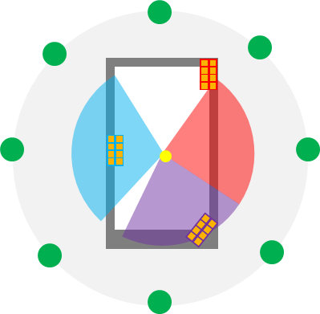
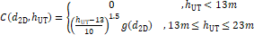

A.10 EN-DC Tests with NR PSCell under CCA and Other NR Cells in FR1
===================================================================

*Editor's note: Test cases for EN-DC with NR PSCell under CCA and SCell
under CCA are also included here.*

A.10.1 RRC\_CONNECTED state mobility
------------------------------------

### A.10.1.1 RRC connection mobility control

#### A.10.1.1.1 Random Access

##### A.10.1.1.1.1 4-step RA type contention-based random access for NR PSCell with CCA

###### A.10.1.1.1.1.1 Test Purpose and Environment

The purpose of this test is to verify that the behavior of the random
access procedure is according to the requirements and that the PRACH
power settings and timing are within specified limits when subject to
CCA. This test will verify the requirements in clause 6.2.2A.2 and
clause 7.1.2 in an AWGN model.

For this test two cells are used, with the configuration of Cell 1
(E-UTRA PCell) specified in clause A.3.7A.2.1 and Cell 2 configured as
PSCell in FR1. Cell 1 is on a licensed band and cell 2 is subjected to
CCA. Supported test parameters are shown in Table A.10.1.1.1.1.1-1. UE
capable of EN-DC with PSCell in FR1 needs to be tested by using the
parameters in Table A.10.1.1.1.1.1-2.

Table A.10.1.1.1.1.1-1: Supported test configurations for contention
based random access test in FR1 for PSCell with CCA

  Config                                                                                                              Description
  ------------------------------------------------------------------------------------------------------------------- ---------------------------------------------------------------
  1                                                                                                                   LTE FDD, NR 30 kHz SSB SCS, 40 MHz bandwidth, TDD duplex mode
  2                                                                                                                   LTE TDD, NR 30 kHz SSB SCS, 40 MHz bandwidth, TDD duplex mode
  Note: The UE is only required to be tested in one of the supported test configurations depending on UE capability   

Table A.10.1.1.1.1.1-2: General test parameters for contention based
random access test in FR1 for PSCell with CCA

+----------+----------+----------+----------+----------+----------+
| P        | Unit     | Test-1   | Comments |          |          |
| arameter |          |          |          |          |          |
+==========+==========+==========+==========+==========+==========+
| SSB      | Note 4,  | **Config |          | **SSB.1  | As       |
| Confi    | 6        | 1,2**    |          | CCA**    | defined  |
| guration |          |          |          |          | in       |
|          |          |          |          |          | A.3.10A  |
+----------+----------+----------+----------+----------+----------+
|          | Note 5,  | **Config |          | **SSB.2  | As       |
|          | 6        | 1,2**    |          | CCA**    | defined  |
|          |          |          |          |          | in       |
|          |          |          |          |          | A.3.10A  |
+----------+----------+----------+----------+----------+----------+
| DBT      | **Config |          | *        | As       |          |
| Window   | 1,2**    |          | *DBT.1** | s        |          |
| Confi    |          |          |          | pecified |          |
| guration |          |          |          | in       |          |
|          |          |          |          | A.3.28.1 |          |
+----------+----------+----------+----------+----------+----------+
| DL CCA   | **Config |          | **As     |          |          |
| model    | 1,2**    |          | s        |          |          |
|          |          |          | pecified |          |          |
|          |          |          | in       |          |          |
|          |          |          | A.3.     |          |          |
|          |          |          | 26.2.1** |          |          |
+----------+----------+----------+----------+----------+----------+
| UL CCA   | **Config |          | **As     |          |          |
| model    | 1,2**    |          | s        |          |          |
|          |          |          | pecified |          |          |
|          |          |          | in       |          |          |
|          |          |          | A.3.     |          |          |
|          |          |          | 26.2.2** |          |          |
+----------+----------+----------+----------+----------+----------+
| Duplex   | **Config |          | **TDD**  |          |          |
| Mode for | 1,2**    |          |          |          |          |
| Cell 2   |          |          |          |          |          |
+----------+----------+----------+----------+----------+----------+
| TDD      | **Config |          | TDD      |          |          |
| Confi    | 1,2**    |          | Conf.1.1 |          |          |
| guration |          |          | CCA      |          |          |
+----------+----------+----------+----------+----------+----------+
| OCNG     |          | OCNG     | As       |          |          |
| Pattern  |          | pattern  | defined  |          |          |
| ^        |          | 1        | in       |          |          |
| Note\ 1^ |          |          | A.3.2.1. |          |          |
+----------+----------+----------+----------+----------+----------+
| PDSCH    | Config   |          | SR.1.1   | As       |          |
| pa       | 1,2      |          | CCA      | defined  |          |
| rameters |          |          |          | in       |          |
| ^        |          |          |          | A        |          |
| Note\ 3^ |          |          |          | .3.1A.1. |          |
+----------+----------+----------+----------+----------+----------+
| NR RF    |          | **1**    |          |          |          |
| Channel  |          |          |          |          |          |
| Number   |          |          |          |          |          |
+----------+----------+----------+----------+----------+----------+
| EPRE     | **dB**   |          |          |          |          |
| ratio of |          |          |          |          |          |
| PSS to   |          |          |          |          |          |
| SSS      |          |          |          |          |          |
+----------+----------+----------+----------+----------+----------+
| EPRE     | **dB**   |          |          |          |          |
| ratio of |          |          |          |          |          |
| PB       |          |          |          |          |          |
| CH\_DMRS |          |          |          |          |          |
| to SSS   |          |          |          |          |          |
+----------+----------+----------+----------+----------+----------+
| EPRE     | **dB**   |          |          |          |          |
| ratio of |          |          |          |          |          |
| PBCH to  |          |          |          |          |          |
| PB       |          |          |          |          |          |
| CH\_DMRS |          |          |          |          |          |
+----------+----------+----------+----------+----------+----------+
| EPRE     | **dB**   | 0        |          |          |          |
| ratio of |          |          |          |          |          |
| PDC      |          |          |          |          |          |
| CH\_DMRS |          |          |          |          |          |
| to SSS   |          |          |          |          |          |
+----------+----------+----------+----------+----------+----------+
| EPRE     | **dB**   |          |          |          |          |
| ratio of |          |          |          |          |          |
| PDCCH to |          |          |          |          |          |
| PDC      |          |          |          |          |          |
| CH\_DMRS |          |          |          |          |          |
+----------+----------+----------+----------+----------+----------+
| EPRE     | **dB**   |          |          |          |          |
| ratio of |          |          |          |          |          |
| PDS      |          |          |          |          |          |
| CH\_DMRS |          |          |          |          |          |
| to SSS   |          |          |          |          |          |
+----------+----------+----------+----------+----------+----------+
| EPRE     | **dB**   |          |          |          |          |
| ratio of |          |          |          |          |          |
| PDSCH to |          |          |          |          |          |
| PDS      |          |          |          |          |          |
| CH\_DMRS |          |          |          |          |          |
+----------+----------+----------+----------+----------+----------+
| SSB with |          | dB       | **3**    | Power of |          |
| index 0  |          |          |          | SSB with |          |
|          |          |          |          | index 0  |          |
|          |          |          |          | is set   |          |
|          |          |          |          | to be    |          |
|          |          |          |          | above    |          |
|          |          |          |          | co       |          |
|          |          |          |          | nfigured |          |
|          |          |          |          | *rs      |          |
|          |          |          |          | rp-Thres |          |
|          |          |          |          | holdSSB* |          |
+----------+----------+----------+----------+----------+----------+
|          |          | Config   | d        | -101     |          |
|          |          | 1,2      | Bm/15kHz |          |          |
+----------+----------+----------+----------+----------+----------+
|          |          | dB       | 3        |          |          |
+----------+----------+----------+----------+----------+----------+
|          | SS-RSRP  | dBm/ SCS | -95      |          |          |
+----------+----------+----------+----------+----------+----------+
| SSB with |          | dB       | **-17**  | Power of |          |
| index 1  |          |          |          | SSB with |          |
|          |          |          |          | index 1  |          |
|          |          |          |          | is set   |          |
|          |          |          |          | to be    |          |
|          |          |          |          | below    |          |
|          |          |          |          | co       |          |
|          |          |          |          | nfigured |          |
|          |          |          |          | *rs      |          |
|          |          |          |          | rp-Thres |          |
|          |          |          |          | holdSSB* |          |
+----------+----------+----------+----------+----------+----------+
|          |          | Config   | d        | -101     |          |
|          |          | 1,2      | Bm/15kHz |          |          |
+----------+----------+----------+----------+----------+----------+
|          |          | dB       | -17      |          |          |
+----------+----------+----------+----------+----------+----------+
|          | SS-RSRP  | dBm/ SCS | -115     |          |          |
+----------+----------+----------+----------+----------+----------+
| Io       | Config   | dBm      | -62.2/   | For      |          |
| ^        | 1,2      |          | 38.16MHz | symbols  |          |
| Note\ 2^ |          |          |          | without  |          |
|          |          |          |          | SSB      |          |
|          |          |          |          | index 1  |          |
+----------+----------+----------+----------+----------+----------+
| ss       | dBm/ SCS | **-5**   | As       |          |          |
| -PBCH-Bl |          |          | defined  |          |          |
| ockPower |          |          | in       |          |          |
|          |          |          | clause   |          |          |
|          |          |          | 6.3.2 in |          |          |
|          |          |          | TS       |          |          |
|          |          |          | 38.331   |          |          |
|          |          |          | \[2\].   |          |          |
+----------+----------+----------+----------+----------+----------+
| Co       | dBm      | **23**   | As       |          |          |
| nfigured |          |          | defined  |          |          |
| UE       |          |          | in       |          |          |
| tra      |          |          | clause   |          |          |
| nsmitted |          |          | 6.2.4 in |          |          |
| power () |          |          | TS       |          |          |
|          |          |          | 3        |          |          |
|          |          |          | 8.101-1. |          |          |
+----------+----------+----------+----------+----------+----------+
| PRACH    |          | **FR1    | As       |          |          |
| Confi    |          | PRACH    | defined  |          |          |
| guration |          | confi    | in       |          |          |
|          |          | guration | A        |          |          |
|          |          | 1 under  | .3.8A.2. |          |          |
|          |          | CCA**    |          |          |          |
+----------+----------+----------+----------+----------+----------+
| DL CCA   | Note 4,  |          | **       |          |          |
| pro      | 6        |          | 0.9375** |          |          |
| bability |          |          |          |          |          |
+----------+----------+----------+----------+----------+----------+
| P~       | Note 5,  |          | **0.7    |          |          |
| CCA\_DL~ | 6        |          | 5/0.75** |          |          |
+----------+----------+----------+----------+----------+----------+
| L~       |          | **4**    |          |          |          |
| CCA\_DL~ |          |          |          |          |          |
| ^        |          |          |          |          |          |
| Note\ 7^ |          |          |          |          |          |
+----------+----------+----------+----------+----------+----------+
| W~       |          | **Inf**  |          |          |          |
| CCA\_DL~ |          |          |          |          |          |
| ^        |          |          |          |          |          |
| Note\ 8^ |          |          |          |          |          |
+----------+----------+----------+----------+----------+----------+
| UL CCA   | Note 4,  |          | **0.87** |          |          |
| pro      | 6        |          |          |          |          |
| bability |          |          |          |          |          |
+----------+----------+----------+----------+----------+----------+
| P~       | Note 5,  |          | **0.75** |          |          |
| CCA\_UL~ | 6        |          |          |          |          |
+----------+----------+----------+----------+----------+----------+
| L~       |          | **5**    |          |          |          |
| CCA\_UL~ |          |          |          |          |          |
| ^        |          |          |          |          |          |
| Note\ 7^ |          |          |          |          |          |
+----------+----------+----------+----------+----------+----------+
| W~       |          | **Inf**  |          |          |          |
| CCA\_UL~ |          |          |          |          |          |
| ^        |          |          |          |          |          |
| Note\ 8^ |          |          |          |          |          |
+----------+----------+----------+----------+----------+----------+
| Sem      | ms       | **2**    |          |          |          |
| i-static |          |          |          |          |          |
| channel  |          |          |          |          |          |
| access   |          |          |          |          |          |
| config   |          |          |          |          |          |
| period   |          |          |          |          |          |
| ^Note    |          |          |          |          |          |
| \ 4,\ 6^ |          |          |          |          |          |
+----------+----------+----------+----------+----------+----------+
| Pro      | \-       | **AWGN** |          |          |          |
| pagation |          |          |          |          |          |
| C        |          |          |          |          |          |
| ondition |          |          |          |          |          |
+----------+----------+----------+----------+----------+----------+
| Note 1:  |          |          |          |          |          |
| OCNG     |          |          |          |          |          |
| shall be |          |          |          |          |          |
| used     |          |          |          |          |          |
| such     |          |          |          |          |          |
| that the |          |          |          |          |          |
| cell is  |          |          |          |          |          |
| fully    |          |          |          |          |          |
| a        |          |          |          |          |          |
| llocated |          |          |          |          |          |
| and a    |          |          |          |          |          |
| constant |          |          |          |          |          |
| total    |          |          |          |          |          |
| tra      |          |          |          |          |          |
| nsmitted |          |          |          |          |          |
| power    |          |          |          |          |          |
| spectral |          |          |          |          |          |
| density  |          |          |          |          |          |
| is       |          |          |          |          |          |
| achieved |          |          |          |          |          |
| for all  |          |          |          |          |          |
| OFDM     |          |          |          |          |          |
| symbols. |          |          |          |          |          |
| The OCNG |          |          |          |          |          |
| pattern  |          |          |          |          |          |
| is       |          |          |          |          |          |
| chosen   |          |          |          |          |          |
| during   |          |          |          |          |          |
| the test |          |          |          |          |          |
| a        |          |          |          |          |          |
| ccording |          |          |          |          |          |
| to the   |          |          |          |          |          |
| presence |          |          |          |          |          |
| of a DL  |          |          |          |          |          |
| r        |          |          |          |          |          |
| eference |          |          |          |          |          |
| mea      |          |          |          |          |          |
| surement |          |          |          |          |          |
| channel. |          |          |          |          |          |
|          |          |          |          |          |          |
| Note 2:  |          |          |          |          |          |
| SS-RSRP, |          |          |          |          |          |
| Es/Iot   |          |          |          |          |          |
| and Io   |          |          |          |          |          |
| levels   |          |          |          |          |          |
| have     |          |          |          |          |          |
| been     |          |          |          |          |          |
| derived  |          |          |          |          |          |
| from     |          |          |          |          |          |
| other    |          |          |          |          |          |
| pa       |          |          |          |          |          |
| rameters |          |          |          |          |          |
| for      |          |          |          |          |          |
| inf      |          |          |          |          |          |
| ormation |          |          |          |          |          |
| purpose. |          |          |          |          |          |
| They are |          |          |          |          |          |
| not      |          |          |          |          |          |
| settable |          |          |          |          |          |
| par      |          |          |          |          |          |
| ameters. |          |          |          |          |          |
|          |          |          |          |          |          |
| Note 3:  |          |          |          |          |          |
| The DL   |          |          |          |          |          |
| PDSCH    |          |          |          |          |          |
| r        |          |          |          |          |          |
| eference |          |          |          |          |          |
| mea      |          |          |          |          |          |
| surement |          |          |          |          |          |
| channel  |          |          |          |          |          |
| is used  |          |          |          |          |          |
| in the   |          |          |          |          |          |
| test     |          |          |          |          |          |
| only     |          |          |          |          |          |
| when a   |          |          |          |          |          |
| downlink |          |          |          |          |          |
| tran     |          |          |          |          |          |
| smission |          |          |          |          |          |
| d        |          |          |          |          |          |
| edicated |          |          |          |          |          |
| to the   |          |          |          |          |          |
| UE under |          |          |          |          |          |
| test is  |          |          |          |          |          |
| r        |          |          |          |          |          |
| equired. |          |          |          |          |          |
|          |          |          |          |          |          |
| Note 4:  |          |          |          |          |          |
| For UE   |          |          |          |          |          |
| su       |          |          |          |          |          |
| pporting |          |          |          |          |          |
| sem      |          |          |          |          |          |
| i-static |          |          |          |          |          |
| channel  |          |          |          |          |          |
| access   |          |          |          |          |          |
| and      |          |          |          |          |          |
| network  |          |          |          |          |          |
| con      |          |          |          |          |          |
| figuring |          |          |          |          |          |
| sem      |          |          |          |          |          |
| i-static |          |          |          |          |          |
| channel  |          |          |          |          |          |
| oc       |          |          |          |          |          |
| cupancy. |          |          |          |          |          |
|          |          |          |          |          |          |
| Note 5:  |          |          |          |          |          |
| For UE   |          |          |          |          |          |
| su       |          |          |          |          |          |
| pporting |          |          |          |          |          |
| dynamic  |          |          |          |          |          |
| channel  |          |          |          |          |          |
| access   |          |          |          |          |          |
| and      |          |          |          |          |          |
| network  |          |          |          |          |          |
| con      |          |          |          |          |          |
| figuring |          |          |          |          |          |
| dynamic  |          |          |          |          |          |
| channel  |          |          |          |          |          |
| oc       |          |          |          |          |          |
| cupancy. |          |          |          |          |          |
| The      |          |          |          |          |          |
| first    |          |          |          |          |          |
| value    |          |          |          |          |          |
| cor      |          |          |          |          |          |
| responds |          |          |          |          |          |
| P~C      |          |          |          |          |          |
| CA\_DL1~ |          |          |          |          |          |
| and the  |          |          |          |          |          |
| second   |          |          |          |          |          |
| value    |          |          |          |          |          |
| cor      |          |          |          |          |          |
| responds |          |          |          |          |          |
| to the   |          |          |          |          |          |
| P~CC     |          |          |          |          |          |
| A\_DL2~. |          |          |          |          |          |
|          |          |          |          |          |          |
| Note 6:  |          |          |          |          |          |
| For UE   |          |          |          |          |          |
| su       |          |          |          |          |          |
| pporting |          |          |          |          |          |
| both     |          |          |          |          |          |
| sem      |          |          |          |          |          |
| i-static |          |          |          |          |          |
| and      |          |          |          |          |          |
| dynamic  |          |          |          |          |          |
| cannel   |          |          |          |          |          |
| access,  |          |          |          |          |          |
| the UE   |          |          |          |          |          |
| must be  |          |          |          |          |          |
| tested   |          |          |          |          |          |
| under    |          |          |          |          |          |
| both     |          |          |          |          |          |
| dynamic  |          |          |          |          |          |
| channel  |          |          |          |          |          |
| o        |          |          |          |          |          |
| ccupancy |          |          |          |          |          |
| and      |          |          |          |          |          |
| sem      |          |          |          |          |          |
| i-static |          |          |          |          |          |
| channel  |          |          |          |          |          |
| o        |          |          |          |          |          |
| ccupancy |          |          |          |          |          |
| config   |          |          |          |          |          |
| uration. |          |          |          |          |          |
|          |          |          |          |          |          |
| Note 7:  |          |          |          |          |          |
| L~       |          |          |          |          |          |
| CCA\_DL~ |          |          |          |          |          |
| and      |          |          |          |          |          |
| L~       |          |          |          |          |          |
| CCA\_UL~ |          |          |          |          |          |
| are      |          |          |          |          |          |
| chosen   |          |          |          |          |          |
| such     |          |          |          |          |          |
| that     |          |          |          |          |          |
| preamble |          |          |          |          |          |
| TransMax |          |          |          |          |          |
| \> 5 +   |          |          |          |          |          |
| L~       |          |          |          |          |          |
| CCA\_DL~ |          |          |          |          |          |
| +        |          |          |          |          |          |
| L~C      |          |          |          |          |          |
| CA\_UL~. |          |          |          |          |          |
|          |          |          |          |          |          |
| Note 8:  |          |          |          |          |          |
| A window |          |          |          |          |          |
| W        |          |          |          |          |          |
| ~CCA\_DL |          |          |          |          |          |
| ~=W~CCA\ |          |          |          |          |          |
| _UL~=Inf |          |          |          |          |          |
| is used  |          |          |          |          |          |
| to       |          |          |          |          |          |
| indicate |          |          |          |          |          |
| that     |          |          |          |          |          |
| L~       |          |          |          |          |          |
| CCA\_DL~ |          |          |          |          |          |
| and      |          |          |          |          |          |
| L~       |          |          |          |          |          |
| CCA\_UL~ |          |          |          |          |          |
| are      |          |          |          |          |          |
| co       |          |          |          |          |          |
| nsidered |          |          |          |          |          |
| during   |          |          |          |          |          |
| the      |          |          |          |          |          |
| entire   |          |          |          |          |          |
| duration |          |          |          |          |          |
| of a     |          |          |          |          |          |
| test     |          |          |          |          |          |
| run.     |          |          |          |          |          |
+----------+----------+----------+----------+----------+----------+

###### A.10.1.1.1.1.2 Test Requirements

Contention based random access is triggered by *not* explicitly
assigning a random access preamble via dedicated signalling in the
downlink.

####### A.10.1.1.1.1.2.1 Random Access Preamble Transmission

To test the UE behavior specified in Clause 6.2.2A.2.1.1 the System
Simulator shall receive the Random Access Preamble which belongs to one
of the Random Access Preambles associated with the SSB with index 0,
which has SS-RSRP above the configured *rsrp-ThresholdSSB*, if the UL
CCA is successful.

The three requirements below are relevant for all cases of PRACH
transmissions described within the whole clause A.10.1.1.1.1.2:

-   The System Simulator shall implement the UL CCA model of A.3.26.2
    for the RACH occasions where PRACH transmissions are expected. The
    System Simulator shall monitor the RACH occasions to detect if the
    UE is transmitting PRACH preambles. If a PRACH transmission is
    detected on a RACH occasion that is expected to have UL CCA failure,
    the test is considered as failed.

-   In case of CCA DL failure, the test equipment should verify that the
    UE does not transmit PRACH for semi-static channel access mode; for
    dynamic channel access mode it is assumed that RACH occasions are
    always scheduled within a UE-initiated COT.

-   In case of UL CCA failure, The UE shall again perform the Random
    Access Resource selection procedure specified in clause 5.1.2 in
    TS38.321 \[7\], and transmit with the calculated PRACH transmission
    power.

In addition, the power applied to all preambles shall be in accordance
with what is specified in Clause 6.2.2A.2. The power of the first
preamble shall be -16 dBm with an accuracy specified in clause 6.3.4.2
of TS 38.101-1 \[18\]. The relative power applied to additional
preambles shall have an accuracy specified in clause 6.3.4.3 of TS
38.101-1 \[18\].

The transmit timing of all PRACH transmissions shall be within the
accuracy specified in Clause 7.1.2.

####### A.10.1.1.1.1.2.2 Random Access Response Reception

To test the UE behavior specified in Clause 6.2.2A.2.1.2 the System
Simulator shall transmit a Random Access Response containing a Random
Access Preamble identifier corresponding to the transmitted Random
Access Preamble after 5 preambles have been received by the System
Simulator. In response to the first 4 preambles, the System Simulator
shall transmit a Random Access Response *not* corresponding to the
transmitted Random Access Preamble. In case of CCA DL failure, the test
equipment should delay the transmission of Random Access Response.

The UE may stop monitoring for Random Access Response(s) and shall
transmit the msg3 if the Random Access Response contains a Random Access
Preamble identifier corresponding to the transmitted Random Access
Preamble if UL CCA is successful. The System Simulator shall monitor if
the UE is transmitting msg3 when CCA UL failure. If a msg3 transmission
is detected on a grant expected to have UL CCA failure, the test is
considered as failed.

The UE shall again perform the Random Access Resource selection
procedure specified in clause 5.1.2 in TS38.321 \[7\], and transmit with
the calculated PRACH transmission power when the backoff time expires if
all received Random Access Responses contain Random Access Preamble
identifiers that do not match the transmitted Random Access Preamble.

In addition, the power applied to all preambles shall be in accordance
with what is specified in Clause 6.2.2A.2. The power of the first
preamble shall be -16 dBm with an accuracy specified in clause 6.3.4.2
of TS 38.101-1 \[18\]. The relative power applied to additional
preambles shall have an accuracy specified in clause 6.3.4.3 of TS
38.101-1 \[18\].

The transmit timing of all PRACH transmissions shall be within the
accuracy specified in Clause 7.1.2.

####### A.10.1.1.1.1.2.3 No Random Access Response Reception

To test the UE behavior specified in clause 6.2.2A.2.1.3 the System
Simulator shall transmit a Random Access Response containing a Random
Access Preamble identifier corresponding to the transmitted Random
Access Preamble after 5 preambles have been received by the System
Simulator. The System Simulator shall *not* respond to the first 4
preambles. In case of CCA DL failure, the test equipment should delay
the transmission of Random Access Response.

The UE shall again perform the Random Access Resource selection
procedure specified in clause 5.1.2 in TS38.321 \[7\], and transmit with
the calculated PRACH transmission power when the backoff time expires if
no Random Access Response is received within the RA Response window.

In addition, the power applied to all preambles shall be in accordance
with what is specified in Clause 6.2.2A.2. The power of the first
preamble shall be -16 dBm with an accuracy specified in clause 6.3.4.2
of TS 38.101-1 \[18\]. The relative power applied to additional
preambles shall have an accuracy specified in clause 6.3.4.3 of TS
38.101-1 \[18\].

The transmit timing of all PRACH transmissions shall be within the
accuracy specified in Clause 7.1.2.

####### A.10.1.1.1.1.2.4 Receiving an UL grant for msg3 retransmission

To test the UE behavior specified in clause 6.2.2A.2.1.4, the System
Simulator shall provide an UL grant for msg3 retransmission following a
successful Random Access Response if UL CCA is successful. The System
Simulator shall monitor if the UE is transmitting msg3 when CCA UL
failure. If a msg3 is detected on a grant expected to have UL CCA
failure, the test is considered as failed.

The UE shall re-transmit the msg3 upon the reception of an UL grant for
msg3 retransmission.

####### A.10.1.1.1.1.2.5 Contention Resolution Timer expiry

To test the UE behavior specified in Clause 6.2.2A.2.1.6 the System
Simulator shall *not* send a response to a msg3.

The UE shall again perform the Random Access Resource selection
procedure specified in clause 5.1.2 in TS38.321 \[7\], and transmit with
the calculated PRACH transmission power when the backoff time expires if
the Contention Resolution Timer expires.

##### A.10.1.1.1.2 4-step RA type non-contention based random access for NR PSCell with CCA

###### A.10.1.1.1.2.1 Test Purpose and Environment

The purpose of this test is to verify that the behavior of the random
access procedure is according to the requirements and that the PRACH
power settings and timing are within specified limits when subject to
CCA. This test will verify the requirements in clause 6.2.2A.2 and
clause 7.1.2 in an AWGN model.

For this test two cells are used, with the configuration of Cell 1
(E-UTRA PCell) specified in clause A.3.7A.2.1 and Cell 2 configured as
PSCell in FR1. Cell 1 is on a licensed band and cell 2 is subjected to
CCA. Supported test parameters are shown in Table A.10.1.1.1.2.1-1. UE
capable of EN-DC with PSCell in FR1 needs to be tested by using the
parameters in Table A.10.1.1.1.2.1-2.

Table A.10.1.1.1.2.1-1: Supported test configurations for non-contention
based random access test in FR1 for PSCell with CCA

  Config                                                                                                              Description
  ------------------------------------------------------------------------------------------------------------------- ---------------------------------------------------------------
  1                                                                                                                   LTE FDD, NR 30 kHz SSB SCS, 40 MHz bandwidth, TDD duplex mode
  2                                                                                                                   LTE TDD, NR 30 kHz SSB SCS, 40 MHz bandwidth, TDD duplex mode
  Note: The UE is only required to be tested in one of the supported test configurations depending on UE capability   

Table A.10.1.1.1.2.1-2: General test parameters for non-contention based
random access test in FR1 for PSCell with CCA

+----------+----------+----------+----------+----------+----------+
| P        | Unit     | Test-1   | Comments |          |          |
| arameter |          |          |          |          |          |
+==========+==========+==========+==========+==========+==========+
| SSB      | Note 4,  | **Config |          | **SSB.1  | As       |
| Confi    | 6        | 1,2**    |          | CCA**    | defined  |
| guration |          |          |          |          | in       |
|          |          |          |          |          | A.3.10A  |
+----------+----------+----------+----------+----------+----------+
|          | Note 5,  | **Config |          | **SSB.2  | As       |
|          | 6        | 1,2**    |          | CCA**    | defined  |
|          |          |          |          |          | in       |
|          |          |          |          |          | A.3.10A  |
+----------+----------+----------+----------+----------+----------+
| DBT      | **Config |          | *        | As       |          |
| Window   | 1,2**    |          | *DBT.1** | s        |          |
| Confi    |          |          |          | pecified |          |
| guration |          |          |          | in       |          |
|          |          |          |          | A.3.28.1 |          |
+----------+----------+----------+----------+----------+----------+
| DL CCA   | **Config |          | **As     |          |          |
| model    | 1,2**    |          | s        |          |          |
|          |          |          | pecified |          |          |
|          |          |          | in       |          |          |
|          |          |          | A.3.     |          |          |
|          |          |          | 26.2.1** |          |          |
+----------+----------+----------+----------+----------+----------+
| UL CCA   | **Config |          | **As     |          |          |
| model    | 1,2**    |          | s        |          |          |
|          |          |          | pecified |          |          |
|          |          |          | in       |          |          |
|          |          |          | A.3.     |          |          |
|          |          |          | 26.2.2** |          |          |
+----------+----------+----------+----------+----------+----------+
| Duplex   | **Config |          | **TDD**  |          |          |
| Mode for | 1,2**    |          |          |          |          |
| Cell 2   |          |          |          |          |          |
+----------+----------+----------+----------+----------+----------+
| TDD      | **Config |          | TDD      |          |          |
| Confi    | 1,2**    |          | Conf.1.1 |          |          |
| guration |          |          | CCA      |          |          |
+----------+----------+----------+----------+----------+----------+
| OCNG     |          | OCNG     | As       |          |          |
| Pattern  |          | pattern  | defined  |          |          |
| ^        |          | 1        | in       |          |          |
| Note\ 1^ |          |          | A.3.2.1. |          |          |
+----------+----------+----------+----------+----------+----------+
| PDSCH    | Config   |          | SR.1.1   | As       |          |
| pa       | 1,2      |          | CCA      | defined  |          |
| rameters |          |          |          | in       |          |
| ^        |          |          |          | A        |          |
| Note\ 3^ |          |          |          | .3.1A.1. |          |
+----------+----------+----------+----------+----------+----------+
| NR RF    |          | **1**    |          |          |          |
| Channel  |          |          |          |          |          |
| Number   |          |          |          |          |          |
+----------+----------+----------+----------+----------+----------+
| EPRE     | **dB**   |          |          |          |          |
| ratio of |          |          |          |          |          |
| PSS to   |          |          |          |          |          |
| SSS      |          |          |          |          |          |
+----------+----------+----------+----------+----------+----------+
| EPRE     | **dB**   |          |          |          |          |
| ratio of |          |          |          |          |          |
| PB       |          |          |          |          |          |
| CH\_DMRS |          |          |          |          |          |
| to SSS   |          |          |          |          |          |
+----------+----------+----------+----------+----------+----------+
| EPRE     | **dB**   |          |          |          |          |
| ratio of |          |          |          |          |          |
| PBCH to  |          |          |          |          |          |
| PB       |          |          |          |          |          |
| CH\_DMRS |          |          |          |          |          |
+----------+----------+----------+----------+----------+----------+
| EPRE     | **dB**   | 0        |          |          |          |
| ratio of |          |          |          |          |          |
| PDC      |          |          |          |          |          |
| CH\_DMRS |          |          |          |          |          |
| to SSS   |          |          |          |          |          |
+----------+----------+----------+----------+----------+----------+
| EPRE     | **dB**   |          |          |          |          |
| ratio of |          |          |          |          |          |
| PDCCH to |          |          |          |          |          |
| PDC      |          |          |          |          |          |
| CH\_DMRS |          |          |          |          |          |
+----------+----------+----------+----------+----------+----------+
| EPRE     | **dB**   |          |          |          |          |
| ratio of |          |          |          |          |          |
| PDS      |          |          |          |          |          |
| CH\_DMRS |          |          |          |          |          |
| to SSS   |          |          |          |          |          |
+----------+----------+----------+----------+----------+----------+
| EPRE     | **dB**   |          |          |          |          |
| ratio of |          |          |          |          |          |
| PDSCH to |          |          |          |          |          |
| PDS      |          |          |          |          |          |
| CH\_DMRS |          |          |          |          |          |
+----------+----------+----------+----------+----------+----------+
| SSB with |          | dB       | **3**    | Power of |          |
| index 0  |          |          |          | SSB with |          |
|          |          |          |          | index 0  |          |
|          |          |          |          | is set   |          |
|          |          |          |          | to be    |          |
|          |          |          |          | above    |          |
|          |          |          |          | co       |          |
|          |          |          |          | nfigured |          |
|          |          |          |          | *rs      |          |
|          |          |          |          | rp-Thres |          |
|          |          |          |          | holdSSB* |          |
+----------+----------+----------+----------+----------+----------+
|          |          | Config   | d        | -101     |          |
|          |          | 1,2      | Bm/15kHz |          |          |
+----------+----------+----------+----------+----------+----------+
|          |          | dB       | 3        |          |          |
+----------+----------+----------+----------+----------+----------+
|          | SS-RSRP  | dBm/ SCS | -95      |          |          |
+----------+----------+----------+----------+----------+----------+
| SSB with |          | dB       | **-17**  | Power of |          |
| index 1  |          |          |          | SSB with |          |
|          |          |          |          | index 1  |          |
|          |          |          |          | is set   |          |
|          |          |          |          | to be    |          |
|          |          |          |          | below    |          |
|          |          |          |          | co       |          |
|          |          |          |          | nfigured |          |
|          |          |          |          | *rs      |          |
|          |          |          |          | rp-Thres |          |
|          |          |          |          | holdSSB* |          |
+----------+----------+----------+----------+----------+----------+
|          |          | Config   | d        | -101     |          |
|          |          | 1,2      | Bm/15kHz |          |          |
+----------+----------+----------+----------+----------+----------+
|          |          | dB       | -17      |          |          |
+----------+----------+----------+----------+----------+----------+
|          | SS-RSRP  | dBm/ SCS | -115     |          |          |
+----------+----------+----------+----------+----------+----------+
| Io       | Config   | dBm      | -62.2/   | For      |          |
| ^        | 1,2      |          | 38.16MHz | symbols  |          |
| Note\ 2^ |          |          |          | without  |          |
|          |          |          |          | SSB      |          |
|          |          |          |          | index 1  |          |
+----------+----------+----------+----------+----------+----------+
| ss       | dBm/ SCS | **-5**   | As       |          |          |
| -PBCH-Bl |          |          | defined  |          |          |
| ockPower |          |          | in       |          |          |
|          |          |          | clause   |          |          |
|          |          |          | 6.3.2 in |          |          |
|          |          |          | TS       |          |          |
|          |          |          | 38.331   |          |          |
|          |          |          | \[2\].   |          |          |
+----------+----------+----------+----------+----------+----------+
| Co       | dBm      | **23**   | As       |          |          |
| nfigured |          |          | defined  |          |          |
| UE       |          |          | in       |          |          |
| tra      |          |          | clause   |          |          |
| nsmitted |          |          | 6.2.4 in |          |          |
| power () |          |          | TS       |          |          |
|          |          |          | 3        |          |          |
|          |          |          | 8.101-1. |          |          |
+----------+----------+----------+----------+----------+----------+
| PRACH    |          | **FR1    | As       |          |          |
| Confi    |          | PRACH    | defined  |          |          |
| guration |          | confi    | in       |          |          |
|          |          | guration | A        |          |          |
|          |          | 2 under  | .3.8A.2. |          |          |
|          |          | CCA**    |          |          |          |
+----------+----------+----------+----------+----------+----------+
| DL CCA   | Note 4,  |          | **       |          |          |
| pro      | 6        |          | 0.9375** |          |          |
| bability |          |          |          |          |          |
+----------+----------+----------+----------+----------+----------+
| P~       | Note 5,  |          | **0.7    |          |          |
| CCA\_DL~ | 6        |          | 5/0.75** |          |          |
+----------+----------+----------+----------+----------+----------+
| L~       |          | **4**    |          |          |          |
| CCA\_DL~ |          |          |          |          |          |
| ^        |          |          |          |          |          |
| Note\ 7^ |          |          |          |          |          |
+----------+----------+----------+----------+----------+----------+
| W~       |          | **Inf**  |          |          |          |
| CCA\_DL~ |          |          |          |          |          |
| ^        |          |          |          |          |          |
| Note\ 8^ |          |          |          |          |          |
+----------+----------+----------+----------+----------+----------+
| UL CCA   | Note 4,  |          | **0.87** |          |          |
| pro      | 6        |          |          |          |          |
| bability |          |          |          |          |          |
+----------+----------+----------+----------+----------+----------+
| P~       | Note 5,  |          | **0.75** |          |          |
| CCA\_UL~ | 6        |          |          |          |          |
+----------+----------+----------+----------+----------+----------+
| L~       |          | **5**    |          |          |          |
| CCA\_UL~ |          |          |          |          |          |
| ^        |          |          |          |          |          |
| Note\ 7^ |          |          |          |          |          |
+----------+----------+----------+----------+----------+----------+
| W~       |          | **Inf**  |          |          |          |
| CCA\_UL~ |          |          |          |          |          |
| ^        |          |          |          |          |          |
| Note\ 8^ |          |          |          |          |          |
+----------+----------+----------+----------+----------+----------+
| Sem      | ms       | **2**    |          |          |          |
| i-static |          |          |          |          |          |
| channel  |          |          |          |          |          |
| access   |          |          |          |          |          |
| config   |          |          |          |          |          |
| period   |          |          |          |          |          |
| ^Note    |          |          |          |          |          |
| \ 4,\ 6^ |          |          |          |          |          |
+----------+----------+----------+----------+----------+----------+
| Pro      | \-       | **AWGN** |          |          |          |
| pagation |          |          |          |          |          |
| C        |          |          |          |          |          |
| ondition |          |          |          |          |          |
+----------+----------+----------+----------+----------+----------+
| Note 1:  |          |          |          |          |          |
| OCNG     |          |          |          |          |          |
| shall be |          |          |          |          |          |
| used     |          |          |          |          |          |
| such     |          |          |          |          |          |
| that the |          |          |          |          |          |
| cell is  |          |          |          |          |          |
| fully    |          |          |          |          |          |
| a        |          |          |          |          |          |
| llocated |          |          |          |          |          |
| and a    |          |          |          |          |          |
| constant |          |          |          |          |          |
| total    |          |          |          |          |          |
| tra      |          |          |          |          |          |
| nsmitted |          |          |          |          |          |
| power    |          |          |          |          |          |
| spectral |          |          |          |          |          |
| density  |          |          |          |          |          |
| is       |          |          |          |          |          |
| achieved |          |          |          |          |          |
| for all  |          |          |          |          |          |
| OFDM     |          |          |          |          |          |
| symbols. |          |          |          |          |          |
| The OCNG |          |          |          |          |          |
| pattern  |          |          |          |          |          |
| is       |          |          |          |          |          |
| chosen   |          |          |          |          |          |
| during   |          |          |          |          |          |
| the test |          |          |          |          |          |
| a        |          |          |          |          |          |
| ccording |          |          |          |          |          |
| to the   |          |          |          |          |          |
| presence |          |          |          |          |          |
| of a DL  |          |          |          |          |          |
| r        |          |          |          |          |          |
| eference |          |          |          |          |          |
| mea      |          |          |          |          |          |
| surement |          |          |          |          |          |
| channel. |          |          |          |          |          |
|          |          |          |          |          |          |
| Note 2:  |          |          |          |          |          |
| SS-RSRP, |          |          |          |          |          |
| Es/Iot   |          |          |          |          |          |
| and Io   |          |          |          |          |          |
| levels   |          |          |          |          |          |
| have     |          |          |          |          |          |
| been     |          |          |          |          |          |
| derived  |          |          |          |          |          |
| from     |          |          |          |          |          |
| other    |          |          |          |          |          |
| pa       |          |          |          |          |          |
| rameters |          |          |          |          |          |
| for      |          |          |          |          |          |
| inf      |          |          |          |          |          |
| ormation |          |          |          |          |          |
| purpose. |          |          |          |          |          |
| They are |          |          |          |          |          |
| not      |          |          |          |          |          |
| settable |          |          |          |          |          |
| par      |          |          |          |          |          |
| ameters. |          |          |          |          |          |
|          |          |          |          |          |          |
| Note 3:  |          |          |          |          |          |
| The DL   |          |          |          |          |          |
| PDSCH    |          |          |          |          |          |
| r        |          |          |          |          |          |
| eference |          |          |          |          |          |
| mea      |          |          |          |          |          |
| surement |          |          |          |          |          |
| channel  |          |          |          |          |          |
| is used  |          |          |          |          |          |
| in the   |          |          |          |          |          |
| test     |          |          |          |          |          |
| only     |          |          |          |          |          |
| when a   |          |          |          |          |          |
| downlink |          |          |          |          |          |
| tran     |          |          |          |          |          |
| smission |          |          |          |          |          |
| d        |          |          |          |          |          |
| edicated |          |          |          |          |          |
| to the   |          |          |          |          |          |
| UE under |          |          |          |          |          |
| test is  |          |          |          |          |          |
| r        |          |          |          |          |          |
| equired. |          |          |          |          |          |
|          |          |          |          |          |          |
| Note 4:  |          |          |          |          |          |
| For UE   |          |          |          |          |          |
| su       |          |          |          |          |          |
| pporting |          |          |          |          |          |
| sem      |          |          |          |          |          |
| i-static |          |          |          |          |          |
| channel  |          |          |          |          |          |
| access   |          |          |          |          |          |
| and      |          |          |          |          |          |
| network  |          |          |          |          |          |
| con      |          |          |          |          |          |
| figuring |          |          |          |          |          |
| sem      |          |          |          |          |          |
| i-static |          |          |          |          |          |
| channel  |          |          |          |          |          |
| oc       |          |          |          |          |          |
| cupancy. |          |          |          |          |          |
|          |          |          |          |          |          |
| Note 5:  |          |          |          |          |          |
| For UE   |          |          |          |          |          |
| su       |          |          |          |          |          |
| pporting |          |          |          |          |          |
| dynamic  |          |          |          |          |          |
| channel  |          |          |          |          |          |
| access   |          |          |          |          |          |
| and      |          |          |          |          |          |
| network  |          |          |          |          |          |
| con      |          |          |          |          |          |
| figuring |          |          |          |          |          |
| dynamic  |          |          |          |          |          |
| channel  |          |          |          |          |          |
| oc       |          |          |          |          |          |
| cupancy. |          |          |          |          |          |
| The      |          |          |          |          |          |
| first    |          |          |          |          |          |
| value    |          |          |          |          |          |
| cor      |          |          |          |          |          |
| responds |          |          |          |          |          |
| P~C      |          |          |          |          |          |
| CA\_DL1~ |          |          |          |          |          |
| and the  |          |          |          |          |          |
| second   |          |          |          |          |          |
| value    |          |          |          |          |          |
| cor      |          |          |          |          |          |
| responds |          |          |          |          |          |
| to the   |          |          |          |          |          |
| P~CC     |          |          |          |          |          |
| A\_DL2~. |          |          |          |          |          |
|          |          |          |          |          |          |
| Note 6:  |          |          |          |          |          |
| For UE   |          |          |          |          |          |
| su       |          |          |          |          |          |
| pporting |          |          |          |          |          |
| both     |          |          |          |          |          |
| sem      |          |          |          |          |          |
| i-static |          |          |          |          |          |
| and      |          |          |          |          |          |
| dynamic  |          |          |          |          |          |
| cannel   |          |          |          |          |          |
| access,  |          |          |          |          |          |
| the UE   |          |          |          |          |          |
| must be  |          |          |          |          |          |
| tested   |          |          |          |          |          |
| under    |          |          |          |          |          |
| both     |          |          |          |          |          |
| dynamic  |          |          |          |          |          |
| channel  |          |          |          |          |          |
| o        |          |          |          |          |          |
| ccupancy |          |          |          |          |          |
| and      |          |          |          |          |          |
| sem      |          |          |          |          |          |
| i-static |          |          |          |          |          |
| channel  |          |          |          |          |          |
| o        |          |          |          |          |          |
| ccupancy |          |          |          |          |          |
| config   |          |          |          |          |          |
| uration. |          |          |          |          |          |
|          |          |          |          |          |          |
| Note 7:  |          |          |          |          |          |
| L~       |          |          |          |          |          |
| CCA\_DL~ |          |          |          |          |          |
| and      |          |          |          |          |          |
| L~       |          |          |          |          |          |
| CCA\_UL~ |          |          |          |          |          |
| are      |          |          |          |          |          |
| chosen   |          |          |          |          |          |
| such     |          |          |          |          |          |
| that     |          |          |          |          |          |
| preamble |          |          |          |          |          |
| TransMax |          |          |          |          |          |
| \> 5 +   |          |          |          |          |          |
| L~       |          |          |          |          |          |
| CCA\_DL~ |          |          |          |          |          |
| +        |          |          |          |          |          |
| L~C      |          |          |          |          |          |
| CA\_UL~. |          |          |          |          |          |
|          |          |          |          |          |          |
| Note 8:  |          |          |          |          |          |
| A window |          |          |          |          |          |
| W        |          |          |          |          |          |
| ~CCA\_DL |          |          |          |          |          |
| ~=W~CCA\ |          |          |          |          |          |
| _UL~=Inf |          |          |          |          |          |
| is used  |          |          |          |          |          |
| to       |          |          |          |          |          |
| indicate |          |          |          |          |          |
| that     |          |          |          |          |          |
| L~       |          |          |          |          |          |
| CCA\_DL~ |          |          |          |          |          |
| and      |          |          |          |          |          |
| L~       |          |          |          |          |          |
| CCA\_UL~ |          |          |          |          |          |
| are      |          |          |          |          |          |
| co       |          |          |          |          |          |
| nsidered |          |          |          |          |          |
| during   |          |          |          |          |          |
| the      |          |          |          |          |          |
| entire   |          |          |          |          |          |
| duration |          |          |          |          |          |
| of a     |          |          |          |          |          |
| test     |          |          |          |          |          |
| run.     |          |          |          |          |          |
+----------+----------+----------+----------+----------+----------+

###### A.10.1.1.1.2.2 Test Requirements

Non-Contention based random access is triggered by explicitly assigning
a random access preamble via dedicated signalling in the downlink. In
the test, the non-contention based random access procedure is not
initialized for Other SI requested from UE or beam failure recovery.

####### A.10.1.1.1.2.2.1 SSB-based Random Access Preamble Transmission

In Test-1, to test the UE behavior specified in Clause 6.2.2A.2.2.1 for
SSB-based Random Access Preamble transmission, with the contention-free
Random Access Resources and the contention-free PRACH occasions
associated with SSBs configured, the System Simulator shall receive the
Random Access Preamble which has the Preamble Index associated with the
SSB with index 0.

The three requirements below are relevant for all cases of PRACH
transmissions described within the whole clause A.10.1.1.1.2.2:

-   The System Simulator shall implement the UL CCA model of A.3.26.2
    for the RACH occasions where PRACH transmissions are expected. The
    System Simulator shall monitor the RACH occasions to detect if the
    UE is transmitting PRACH preambles. If a PRACH transmission is
    detected on a RACH occasion that is expected to have UL CCA failure,
    the test is considered as failed.

-   In case of CCA DL failure, the test equipment should verify that the
    UE does not transmit PRACH for semi-static channel access mode; for
    dynamic channel access mode it is assumed that RACH occasions are
    always scheduled within a UE-initiated COT.

-   In case of UL CCA failure, The UE shall again perform the Random
    Access Resource selection procedure specified in clause 5.1.2 in
    TS38.321 \[7\], and transmit with the calculated PRACH transmission
    power.

In addition, the System Simulator shall receive the Random Access
Preamble on the PRACH occasion which belongs to the PRACH occasions
corresponding to the SSB with index 0, and the selected PRACH occasion
shall belong to the PRACH occasions permitted by the restrictions given
by the *ra-ssb-OccasionMaskIndex*.

In addition, the power applied to all preambles shall be in accordance
with what is specified in Clause 6.2.2A.2. The power of the first
preamble shall be -16 dBm with an accuracy specified in clause 6.3.4.2
of TS 38.101-1 \[18\]. The relative power applied to additional
preambles shall have an accuracy specified in clause 6.3.4.3 of
TS 38.101-1 \[18\].

The transmit timing of all PRACH transmissions shall be within the
accuracy specified in Clause 7.1.2.

####### A.10.1.1.1.2.2.2 Random Access Response Reception

To test the UE behavior specified in Clause 6.2.2A.2.2.2 the System
Simulator shall transmit a Random Access Response containing a Random
Access Preamble identifier corresponding to the transmitted Random
Access Preamble after 5 preambles have been received by the System
Simulator. In response to the first 4 preambles, the System Simulator
shall transmit a Random Access Response *not* corresponding to the
transmitted Random Access Preamble. In case of CCA DL failure, the test
equipment should delay the transmission of Random Access Response.

The UE may stop monitoring for Random Access Response(s) if the Random
Access Response contains a Random Access Preamble identifier
corresponding to the transmitted Random Access Preamble if UL CCA is
successful. The System Simulator shall monitor if the UE is transmitting
msg3 when CCA UL failure. If a msg3 is detected on a grant expected to
have UL CCA failure, the test is considered as failed.

The UE shall again perform the Random Access Resource selection
procedure specified in clause 5.1.2 in TS38.321 \[7\], and transmit with
the calculated PRACH transmission power if all received Random Access
Responses contain Random Access Preamble identifiers that do not match
the transmitted Random Access Preamble.

In addition, the power applied to all preambles shall be in accordance
with what is specified in Clause 6.2.2A.2. The power of the first
preamble shall be -16 dBm with an accuracy specified in clause 6.3.4.2
of TS 38.101-1 \[18\]. The relative power applied to additional
preambles shall have an accuracy specified in clause 6.3.4.3 of TS
38.101-1 \[18\].

The transmit timing of all PRACH transmissions shall be within the
accuracy specified in Clause 7.1.2.

####### A.10.1.1.1.2.2.3 No Random Access Response Reception

To test the UE behavior specified in clause 6.2.2A.2.2.3 the System
Simulator shall transmit a Random Access Response containing a Random
Access Preamble identifier corresponding to the transmitted Random
Access Preamble after 5 preambles have been received by the System
Simulator. The System Simulator shall *not* respond to the first 4
preambles. In case of CCA DL failure, the test equipment should delay
the transmission of Random Access Response.

The UE shall again perform the Random Access Resource selection
procedure specified in clause 5.1.2 in TS38.321 \[7\], and transmit with
the calculated PRACH transmission power when the backoff time expires if
no Random Access Response is received within the RA Response window
configured in *RACH-ConfigCommon*.

In addition, the power applied to all preambles shall be in accordance
with what is specified in Clause 6.2.2A.2. The power of the first
preamble shall be -16 dBm with an accuracy specified in clause 6.3.4.2
of TS 38.101-1 \[18\]. The relative power applied to additional
preambles shall have an accuracy specified in clause 6.3.4.3 of TS
38.101-1 \[18\].

The transmit timing of all PRACH transmissions shall be within the
accuracy specified in Clause 7.1.2.

##### A.10.1.1.1.3 2-step RA type contention-based random access for NR PSCell with CCA

###### A.10.1.1.1.3.1 Test Purpose and Environment

The purpose of this test is to verify that the behaviour of the random
access procedure is according to the requirements and that the MsgA
PRACH, MsgA PUSCH power settings and timing are within specified limits
when subject to CCA. This test will verify the requirements in
clause 6.2.2A.3 and clause 7.1.2 in an AWGN model.

For this test two cells are used, with the configuration of Cell 1
(E-UTRA PCell) specified in clause A.3.7A.2.1 and Cell 2 configured as
PSCell in FR1. Cell 1 is on a licensed band and cell 2 is subjected to
CCA. Supported test parameters are shown in Table A.10.1.1.1.3.1-1. UE
capable of EN-DC with PSCell in FR1 needs to be tested by using the
parameters in Table A.10.1.1.1.3.1-2.

Table A.10.1.1.1.3.1-1: Supported test configurations for 2-step RA type
contention based random access test in FR1 for PSCell with CCA

  Config                                                                                                              Description
  ------------------------------------------------------------------------------------------------------------------- ---------------------------------------------------------------
  1                                                                                                                   LTE FDD, NR 30 kHz SSB SCS, 40 MHz bandwidth, TDD duplex mode
  2                                                                                                                   LTE TDD, NR 30 kHz SSB SCS, 40 MHz bandwidth, TDD duplex mode
  Note: The UE is only required to be tested in one of the supported test configurations depending on UE capability   

Table A.10.1.1.1.3.1-2: General test parameters for 2-step RA type
contention based random access test in FR1 for PSCell with CCA

+----------+----------+----------+----------+----------+----------+
| P        | Unit     | Test-1   | Comments |          |          |
| arameter |          |          |          |          |          |
+==========+==========+==========+==========+==========+==========+
| SSB      | Note 4,  | **Config |          | **SSB.1  | As       |
| Confi    | 6        | 1,2**    |          | CCA**    | defined  |
| guration |          |          |          |          | in       |
|          |          |          |          |          | A.3.10A  |
+----------+----------+----------+----------+----------+----------+
|          | Note 5,  | **Config |          | **SSB.2  | As       |
|          | 6        | 1,2**    |          | CCA**    | defined  |
|          |          |          |          |          | in       |
|          |          |          |          |          | A.3.10A  |
+----------+----------+----------+----------+----------+----------+
| DBT      | **Config |          | *        | As       |          |
| Window   | 1,2**    |          | *DBT.1** | s        |          |
| Confi    |          |          |          | pecified |          |
| guration |          |          |          | in       |          |
|          |          |          |          | A.3.28.1 |          |
+----------+----------+----------+----------+----------+----------+
| DL CCA   | **Config |          | **As     |          |          |
| model    | 1,2**    |          | s        |          |          |
|          |          |          | pecified |          |          |
|          |          |          | in       |          |          |
|          |          |          | A.3.     |          |          |
|          |          |          | 26.2.1** |          |          |
+----------+----------+----------+----------+----------+----------+
| UL CCA   | **Config |          | **As     |          |          |
| model    | 1,2**    |          | s        |          |          |
|          |          |          | pecified |          |          |
|          |          |          | in       |          |          |
|          |          |          | A.3.     |          |          |
|          |          |          | 26.2.2** |          |          |
+----------+----------+----------+----------+----------+----------+
| Duplex   | **Config |          | **TDD**  |          |          |
| Mode for | 1,2**    |          |          |          |          |
| Cell 2   |          |          |          |          |          |
+----------+----------+----------+----------+----------+----------+
| TDD      | **Config |          | TDD      |          |          |
| Confi    | 3,4**    |          | Conf.1.1 |          |          |
| guration |          |          | CCA      |          |          |
+----------+----------+----------+----------+----------+----------+
| OCNG     |          | OCNG     | As       |          |          |
| Pattern  |          | pattern  | defined  |          |          |
| ^        |          | 1        | in       |          |          |
| Note\ 1^ |          |          | A.3.2.1. |          |          |
+----------+----------+----------+----------+----------+----------+
| PDSCH    | Config   |          | SR.1.1   | As       |          |
| pa       | 1,2      |          | CCA      | defined  |          |
| rameters |          |          |          | in       |          |
| ^        |          |          |          | A        |          |
| Note\ 3^ |          |          |          | .3.1A.1. |          |
| ­        |          |          |          |          |          |
+----------+----------+----------+----------+----------+----------+
| NR RF    |          | **1**    |          |          |          |
| Channel  |          |          |          |          |          |
| Number   |          |          |          |          |          |
+----------+----------+----------+----------+----------+----------+
| EPRE     | **dB**   |          |          |          |          |
| ratio of |          |          |          |          |          |
| PSS to   |          |          |          |          |          |
| SSS      |          |          |          |          |          |
+----------+----------+----------+----------+----------+----------+
| EPRE     | **dB**   |          |          |          |          |
| ratio of |          |          |          |          |          |
| PB       |          |          |          |          |          |
| CH\_DMRS |          |          |          |          |          |
| to SSS   |          |          |          |          |          |
+----------+----------+----------+----------+----------+----------+
| EPRE     | **dB**   |          |          |          |          |
| ratio of |          |          |          |          |          |
| PBCH to  |          |          |          |          |          |
| PB       |          |          |          |          |          |
| CH\_DMRS |          |          |          |          |          |
+----------+----------+----------+----------+----------+----------+
| EPRE     | **dB**   | 0        |          |          |          |
| ratio of |          |          |          |          |          |
| PDC      |          |          |          |          |          |
| CH\_DMRS |          |          |          |          |          |
| to SSS   |          |          |          |          |          |
+----------+----------+----------+----------+----------+----------+
| EPRE     | **dB**   |          |          |          |          |
| ratio of |          |          |          |          |          |
| PDCCH to |          |          |          |          |          |
| PDC      |          |          |          |          |          |
| CH\_DMRS |          |          |          |          |          |
+----------+----------+----------+----------+----------+----------+
| EPRE     | **dB**   |          |          |          |          |
| ratio of |          |          |          |          |          |
| PDS      |          |          |          |          |          |
| CH\_DMRS |          |          |          |          |          |
| to SSS   |          |          |          |          |          |
+----------+----------+----------+----------+----------+----------+
| EPRE     | **dB**   |          |          |          |          |
| ratio of |          |          |          |          |          |
| PDSCH to |          |          |          |          |          |
| PDS      |          |          |          |          |          |
| CH\_DMRS |          |          |          |          |          |
+----------+----------+----------+----------+----------+----------+
| SSB with |          | dB       | **3**    | Power of |          |
| index 0  |          |          |          | SSB with |          |
|          |          |          |          | index 0  |          |
|          |          |          |          | is set   |          |
|          |          |          |          | to be    |          |
|          |          |          |          | above    |          |
|          |          |          |          | co       |          |
|          |          |          |          | nfigured |          |
|          |          |          |          | *msgA-RS |          |
|          |          |          |          | RP-Thres |          |
|          |          |          |          | holdSSB* |          |
+----------+----------+----------+----------+----------+----------+
|          |          | Config   | d        | -101     |          |
|          |          | 1,2      | Bm/15kHz |          |          |
+----------+----------+----------+----------+----------+----------+
|          |          | dB       | 3        |          |          |
+----------+----------+----------+----------+----------+----------+
|          | SS-RSRP  | dBm/ SCS | -95      |          |          |
|          | ^        |          |          |          |          |
|          | Note\ 2^ |          |          |          |          |
+----------+----------+----------+----------+----------+----------+
| SSB with |          | dB       | **-17**  | Power of |          |
| index 1  |          |          |          | SSB with |          |
|          |          |          |          | index 1  |          |
|          |          |          |          | is set   |          |
|          |          |          |          | to be    |          |
|          |          |          |          | below    |          |
|          |          |          |          | co       |          |
|          |          |          |          | nfigured |          |
|          |          |          |          | *msgA-RS |          |
|          |          |          |          | RP-Thres |          |
|          |          |          |          | holdSSB* |          |
+----------+----------+----------+----------+----------+----------+
|          |          | Config   | d        | -101     |          |
|          |          | 1,2      | Bm/15kHz |          |          |
+----------+----------+----------+----------+----------+----------+
|          |          | dB       | -17      |          |          |
+----------+----------+----------+----------+----------+----------+
|          | SS-RSRP  | dBm/ SCS | -115     |          |          |
|          | ^        |          |          |          |          |
|          | Note\ 2^ |          |          |          |          |
+----------+----------+----------+----------+----------+----------+
| Io       | Config   | dBm      | -62.2/   | For      |          |
|          | 1,2      |          | 38.16MHz | symbols  |          |
|          |          |          |          | without  |          |
|          |          |          |          | SSB      |          |
|          |          |          |          | index 1  |          |
+----------+----------+----------+----------+----------+----------+
| ss       | dBm/ SCS | **-5**   | As       |          |          |
| -PBCH-Bl |          |          | defined  |          |          |
| ockPower |          |          | in       |          |          |
|          |          |          | clause   |          |          |
|          |          |          | 6.3.2 in |          |          |
|          |          |          | TS       |          |          |
|          |          |          | 38.331   |          |          |
|          |          |          | \[2\].   |          |          |
+----------+----------+----------+----------+----------+----------+
| Co       | dBm      | **23**   | As       |          |          |
| nfigured |          |          | defined  |          |          |
| UE       |          |          | in       |          |          |
| tra      |          |          | clause   |          |          |
| nsmitted |          |          | 6.2.4 in |          |          |
| power () |          |          | TS       |          |          |
|          |          |          | 3        |          |          |
|          |          |          | 8.101-1. |          |          |
+----------+----------+----------+----------+----------+----------+
| MsgA     |          | **FR1    | As       |          |          |
| Confi    |          | MsgA     | defined  |          |          |
| guration |          | confi    | in       |          |          |
|          |          | guration | A.       |          |          |
|          |          | 1 under  | 3.20A.2. |          |          |
|          |          | CCA**    |          |          |          |
+----------+----------+----------+----------+----------+----------+
| *msgA-RS | dBm      | **RS     | **The    |          |          |
| RP-Thres |          | RP\_51** | actual   |          |          |
| holdSSB* |          |          | value of |          |          |
|          |          |          | the      |          |          |
|          |          |          | t        |          |          |
|          |          |          | hreshold |          |          |
|          |          |          | is       |          |          |
|          |          |          | -105dBm, |          |          |
|          |          |          | as       |          |          |
|          |          |          | defined  |          |          |
|          |          |          | in TS    |          |          |
|          |          |          | 38.331   |          |          |
|          |          |          | \[2\].** |          |          |
+----------+----------+----------+----------+----------+----------+
| DL CCA   | Note 4,  |          | **       |          |          |
| pro      | 6        |          | 0.9375** |          |          |
| bability |          |          |          |          |          |
+----------+----------+----------+----------+----------+----------+
| P~       | Note 5,  |          | **0.7    |          |          |
| CCA\_DL~ | 6        |          | 5/0.75** |          |          |
+----------+----------+----------+----------+----------+----------+
| L~       |          | **4**    |          |          |          |
| CCA\_DL~ |          |          |          |          |          |
| ^        |          |          |          |          |          |
| Note\ 7^ |          |          |          |          |          |
+----------+----------+----------+----------+----------+----------+
| W~       |          | **Inf**  |          |          |          |
| CCA\_DL~ |          |          |          |          |          |
| ^        |          |          |          |          |          |
| Note\ 8^ |          |          |          |          |          |
+----------+----------+----------+----------+----------+----------+
| UL CCA   | Note 4,  |          | **0.87** |          |          |
| pro      | 6        |          |          |          |          |
| bability |          |          |          |          |          |
+----------+----------+----------+----------+----------+----------+
| P~       | Note 5,  |          | **0.75** |          |          |
| CCA\_UL~ | 6        |          |          |          |          |
+----------+----------+----------+----------+----------+----------+
| L~       |          | **5**    |          |          |          |
| CCA\_UL~ |          |          |          |          |          |
| ^        |          |          |          |          |          |
| Note\ 7^ |          |          |          |          |          |
+----------+----------+----------+----------+----------+----------+
| W~       |          | **Inf**  |          |          |          |
| CCA\_UL~ |          |          |          |          |          |
| ^        |          |          |          |          |          |
| Note\ 8^ |          |          |          |          |          |
+----------+----------+----------+----------+----------+----------+
| Sem      | ms       | **2**    |          |          |          |
| i-static |          |          |          |          |          |
| channel  |          |          |          |          |          |
| access   |          |          |          |          |          |
| config   |          |          |          |          |          |
| period   |          |          |          |          |          |
| ^Note    |          |          |          |          |          |
| \ 4,\ 6^ |          |          |          |          |          |
+----------+----------+----------+----------+----------+----------+
| Pro      | \-       | **AWGN** |          |          |          |
| pagation |          |          |          |          |          |
| C        |          |          |          |          |          |
| ondition |          |          |          |          |          |
+----------+----------+----------+----------+----------+----------+
| Note 1:  |          |          |          |          |          |
| OCNG     |          |          |          |          |          |
| shall be |          |          |          |          |          |
| used     |          |          |          |          |          |
| such     |          |          |          |          |          |
| that the |          |          |          |          |          |
| cell is  |          |          |          |          |          |
| fully    |          |          |          |          |          |
| a        |          |          |          |          |          |
| llocated |          |          |          |          |          |
| and a    |          |          |          |          |          |
| constant |          |          |          |          |          |
| total    |          |          |          |          |          |
| tra      |          |          |          |          |          |
| nsmitted |          |          |          |          |          |
| power    |          |          |          |          |          |
| spectral |          |          |          |          |          |
| density  |          |          |          |          |          |
| is       |          |          |          |          |          |
| achieved |          |          |          |          |          |
| for all  |          |          |          |          |          |
| OFDM     |          |          |          |          |          |
| symbols. |          |          |          |          |          |
| The OCNG |          |          |          |          |          |
| pattern  |          |          |          |          |          |
| is       |          |          |          |          |          |
| chosen   |          |          |          |          |          |
| during   |          |          |          |          |          |
| the test |          |          |          |          |          |
| a        |          |          |          |          |          |
| ccording |          |          |          |          |          |
| to the   |          |          |          |          |          |
| presence |          |          |          |          |          |
| of a DL  |          |          |          |          |          |
| r        |          |          |          |          |          |
| eference |          |          |          |          |          |
| mea      |          |          |          |          |          |
| surement |          |          |          |          |          |
| channel. |          |          |          |          |          |
|          |          |          |          |          |          |
| Note 2:  |          |          |          |          |          |
| SS-RSRP, |          |          |          |          |          |
| Es/Iot   |          |          |          |          |          |
| and Io   |          |          |          |          |          |
| levels   |          |          |          |          |          |
| have     |          |          |          |          |          |
| been     |          |          |          |          |          |
| derived  |          |          |          |          |          |
| from     |          |          |          |          |          |
| other    |          |          |          |          |          |
| pa       |          |          |          |          |          |
| rameters |          |          |          |          |          |
| for      |          |          |          |          |          |
| inf      |          |          |          |          |          |
| ormation |          |          |          |          |          |
| purpose. |          |          |          |          |          |
| They are |          |          |          |          |          |
| not      |          |          |          |          |          |
| settable |          |          |          |          |          |
| par      |          |          |          |          |          |
| ameters. |          |          |          |          |          |
|          |          |          |          |          |          |
| Note 3:  |          |          |          |          |          |
| The DL   |          |          |          |          |          |
| PDSCH    |          |          |          |          |          |
| r        |          |          |          |          |          |
| eference |          |          |          |          |          |
| mea      |          |          |          |          |          |
| surement |          |          |          |          |          |
| channel  |          |          |          |          |          |
| is used  |          |          |          |          |          |
| in the   |          |          |          |          |          |
| test     |          |          |          |          |          |
| only     |          |          |          |          |          |
| when a   |          |          |          |          |          |
| downlink |          |          |          |          |          |
| tran     |          |          |          |          |          |
| smission |          |          |          |          |          |
| d        |          |          |          |          |          |
| edicated |          |          |          |          |          |
| to the   |          |          |          |          |          |
| UE under |          |          |          |          |          |
| test is  |          |          |          |          |          |
| r        |          |          |          |          |          |
| equired. |          |          |          |          |          |
|          |          |          |          |          |          |
| Note 4:  |          |          |          |          |          |
| For UE   |          |          |          |          |          |
| su       |          |          |          |          |          |
| pporting |          |          |          |          |          |
| sem      |          |          |          |          |          |
| i-static |          |          |          |          |          |
| channel  |          |          |          |          |          |
| access   |          |          |          |          |          |
| and      |          |          |          |          |          |
| network  |          |          |          |          |          |
| con      |          |          |          |          |          |
| figuring |          |          |          |          |          |
| sem      |          |          |          |          |          |
| i-static |          |          |          |          |          |
| channel  |          |          |          |          |          |
| oc       |          |          |          |          |          |
| cupancy. |          |          |          |          |          |
|          |          |          |          |          |          |
| Note 5:  |          |          |          |          |          |
| For UE   |          |          |          |          |          |
| su       |          |          |          |          |          |
| pporting |          |          |          |          |          |
| dynamic  |          |          |          |          |          |
| channel  |          |          |          |          |          |
| access   |          |          |          |          |          |
| and      |          |          |          |          |          |
| network  |          |          |          |          |          |
| con      |          |          |          |          |          |
| figuring |          |          |          |          |          |
| dynamic  |          |          |          |          |          |
| channel  |          |          |          |          |          |
| oc       |          |          |          |          |          |
| cupancy. |          |          |          |          |          |
| The      |          |          |          |          |          |
| first    |          |          |          |          |          |
| value    |          |          |          |          |          |
| cor      |          |          |          |          |          |
| responds |          |          |          |          |          |
| P~C      |          |          |          |          |          |
| CA\_DL1~ |          |          |          |          |          |
| and the  |          |          |          |          |          |
| second   |          |          |          |          |          |
| value    |          |          |          |          |          |
| cor      |          |          |          |          |          |
| responds |          |          |          |          |          |
| to the   |          |          |          |          |          |
| P~CC     |          |          |          |          |          |
| A\_DL2~. |          |          |          |          |          |
|          |          |          |          |          |          |
| Note 6:  |          |          |          |          |          |
| For UE   |          |          |          |          |          |
| su       |          |          |          |          |          |
| pporting |          |          |          |          |          |
| both     |          |          |          |          |          |
| sem      |          |          |          |          |          |
| i-static |          |          |          |          |          |
| and      |          |          |          |          |          |
| dynamic  |          |          |          |          |          |
| cannel   |          |          |          |          |          |
| access,  |          |          |          |          |          |
| the UE   |          |          |          |          |          |
| must be  |          |          |          |          |          |
| tested   |          |          |          |          |          |
| under    |          |          |          |          |          |
| both     |          |          |          |          |          |
| dynamic  |          |          |          |          |          |
| channel  |          |          |          |          |          |
| o        |          |          |          |          |          |
| ccupancy |          |          |          |          |          |
| and      |          |          |          |          |          |
| sem      |          |          |          |          |          |
| i-static |          |          |          |          |          |
| channel  |          |          |          |          |          |
| o        |          |          |          |          |          |
| ccupancy |          |          |          |          |          |
| config   |          |          |          |          |          |
| uration. |          |          |          |          |          |
|          |          |          |          |          |          |
| Note 7:  |          |          |          |          |          |
| L~       |          |          |          |          |          |
| CCA\_DL~ |          |          |          |          |          |
| and      |          |          |          |          |          |
| L~       |          |          |          |          |          |
| CCA\_UL~ |          |          |          |          |          |
| are      |          |          |          |          |          |
| chosen   |          |          |          |          |          |
| such     |          |          |          |          |          |
| that     |          |          |          |          |          |
| preamble |          |          |          |          |          |
| TransMax |          |          |          |          |          |
| \> 5 +   |          |          |          |          |          |
| L~       |          |          |          |          |          |
| CCA\_DL~ |          |          |          |          |          |
| +        |          |          |          |          |          |
| L~C      |          |          |          |          |          |
| CA\_UL~. |          |          |          |          |          |
|          |          |          |          |          |          |
| Note 8:  |          |          |          |          |          |
| A window |          |          |          |          |          |
| W        |          |          |          |          |          |
| ~CCA\_DL |          |          |          |          |          |
| ~=W~CCA\ |          |          |          |          |          |
| _UL~=Inf |          |          |          |          |          |
| is used  |          |          |          |          |          |
| to       |          |          |          |          |          |
| indicate |          |          |          |          |          |
| that     |          |          |          |          |          |
| L~       |          |          |          |          |          |
| CCA\_DL~ |          |          |          |          |          |
| and      |          |          |          |          |          |
| L~       |          |          |          |          |          |
| CCA\_UL~ |          |          |          |          |          |
| are      |          |          |          |          |          |
| co       |          |          |          |          |          |
| nsidered |          |          |          |          |          |
| during   |          |          |          |          |          |
| the      |          |          |          |          |          |
| entire   |          |          |          |          |          |
| duration |          |          |          |          |          |
| of a     |          |          |          |          |          |
| test     |          |          |          |          |          |
| run.     |          |          |          |          |          |
+----------+----------+----------+----------+----------+----------+

###### A.10.1.1.1.3.2 Test Requirements

Contention based random access is triggered by *not* explicitly
assigning a random access preamble via dedicated signalling in the
downlink.

####### A.10.1.1.1.3.2.1 MsgA Transmission

To test the UE behaviour specified in Clause 6.2.2A.3.1.1 the System
Simulator shall receive the MsgA with a preamble which belongs to one of
the Random Access Preambles associated with the SSB with index 0, which
has SS-RSRP above the configured *msgA-RSRP-ThresholdSSB*, if the UL CCA
is successful.

below are relevant for all cases of MsgA transmissions described within
the clause A.10.1.1.1.3.2:

-   The System Simulator shall implement the UL CCA model for the MsgA
    occasions (i.e. both MsgA PRACH and MsgA PUSCH occasions) where MsgA
    transmissions are expected. The System Simulator shall monitor the
    MsgA occasions to detect if the UE is transmitting MsgA. If a MsgA
    transmission is detected on MsgA occasions that are expected to have
    UL CCA failure, the test is considered as failed.

-   In case of CCA DL failure, the test equipment should verify that the
    UE does not transmit MsgA for semi-static channel access mode; for
    dynamic channel access mode it is assumed that MsgA occasions are
    always scheduled within a UE-initiated COT.

-   The UE shall again perform the Random Access Resource selection
    procedure specified in clause 5.1.2a in TS38.321 \[7\], and transmit
    with the calculated PRACH transmission power in case of UL CCA
    failure.

The UE shall again perform the Random Access Resource selection
procedure specified in clause 5.1.2a in TS38.321 \[7\], and transmit
with the calculated PRACH transmission power in case of UL CCA failure.
In addition, the power applied to all MsgA transmission shall be in
accordance with what is specified in Clause 6.2.2A.2. The power of the
first MsgA preamble shall be -16 dBm with an accuracy specified in
clause 6.3.4.2 of TS 38.101-1 \[18\]. The power of the first MsgA PUSCH
transmission shall be $0.6 + 3\left( \mu + 2 \right)$ dBm with an
accuracy specified in clause 6.3.4.2 of TS 38.101-1 \[18\], where $\mu$
indicates the MsgA PUSCH numerology. The relative power applied to
additional MsgA transmissions shall have an accuracy specified in
clause 6.3.4.3 of TS 38.101-1 \[18\].

The transmit timing of all MsgA transmissions shall be within the
accuracy specified in Clause 7.1.2.

####### A.10.1.1.1.3.2.2 MsgB Reception

To test the UE behaviour specified in Clause 6.2.2A.3.1.2 the System
Simulator shall transmit a MsgB with fallbackRAR containing a Random
Access Preamble identifier corresponding to the transmitted Random
Access Preamble after 5 preambles have been received by the System
Simulator. In response to the first 4 preambles, the System Simulator
shall transmit a MsgB *not* corresponding to the transmitted Random
Access Preamble. In case of CCA DL failure, the test equipment should
delay the transmission of MsgB.

The UE may stop monitoring for MsgB(s) and shall transmit the msg3 if
the MsgB with a fallbackRAR contains a Random Access Preamble identifier
corresponding to the transmitted Random Access Preamble if UL CCA is
successful. The System Simulator shall monitor if the UE is transmitting
msg3 when CCA UL failure. If a msg3 is detected on a grant expected to
have UL CCA failure, the test is considered as failed.

The UE shall again perform the Random Access Resource selection
procedure specified in clause 5.1.2a in TS 38.321 \[7\], and transmit
with the calculated MsgA PRACH and MsgA PUSCH transmission power when
the backoff time expires if all received MsgB's contain Random Access
Preamble identifiers that do not match the transmitted Random Access
Preamble .

In addition, the power applied to all MsgA transmission shall be in
accordance with what is specified in Clause 6.2.2A.2. The power of the
first MsgA preamble shall be -16 dBm with an accuracy specified in
clause 6.3.4.2 of TS 38.101-1 \[18\]. The power of the first MsgA PUSCH
transmission shall be $0.6 + 3\left( \mu + 2 \right)$ dBm with an
accuracy specified in clause 6.3.4.2 of TS 38.101-1 \[18\], where $\mu$
indicates the MsgA PUSCH numerology. The relative power applied to
additional MsgA transmissions shall have an accuracy specified in
clause 6.3.4.3 of TS 38.101-1 \[18\].

The transmit timing of all MsgA transmissions shall be within the
accuracy specified in Clause 7.1.2.

####### A.10.1.1.1.3.2.3 No MsgB Reception

To test the UE behavior specified in clause 6.2.2A.3.1.3 the System
Simulator shall transmit a MsgB with fallbackRAR containing a successRAR
message and a Random Access Preamble identifier corresponding to the
transmitted Random Access Preamble after 5 preambles have been received
by the System Simulator. The System Simulator shall *not* respond to the
first 4 preambles. In case of CCA DL failure, the test equipment should
delay the transmission of MsgB.

The UE shall again perform the Random Access Resource selection
procedure specified in clause 5.1.2a in TS 38.321 \[7\], and transmit
with the calculated MsgA PRACH and MsgA PUSCH transmission power when
the backoff time expires if no MsgB is received within the MsgB Response
window.

In addition, the power applied to all MsgA transmission shall be in
accordance with what is specified in Clause 6.2.2A.2. The power of the
first MsgA preamble shall be -16 dBm with an accuracy specified in
clause 6.3.4.2 of TS 38.101-1 \[18\]. The power of the first MsgA PUSCH
transmission shall be $0.6 + 3\left( \mu + 2 \right)$ dBm with an
accuracy specified in clause 6.3.4.2 of TS 38.101-1 \[18\], where $\mu$
indicates the MsgA PUSCH numerology. The relative power applied to
additional MsgA transmissions shall have an accuracy specified in
clause 6.3.4.3 of TS 38.101-1 \[18\].

The transmit timing of all MsgA transmissions shall be within the
accuracy specified in Clause 7.1.2.

##### A.10.1.1.1.4 2-step RA type non-contention based random access for NR PSCell with CCA

###### A.10.1.1.1.4.1 Test Purpose and Environment

The purpose of this test is to verify that the behavior of the random
access procedure is according to the requirements and that the MsgA
PRACH, MsgA PUSCH power settings and timing are within specified limits
when subject to CCA. This test will verify the requirements in
clause 6.2.2A.3 and clause 7.1.2 in an AWGN model.

For this test two cells are used, with the configuration of Cell 1
(E-UTRA PCell) specified in clause A.3.7.2.1 and Cell 2 configured as
PSCell in FR1. Cell 1 is on a licensed band and cell 2 is subjected to
CCA. Supported test parameters are shown in Table A.10.1.1.1.4.1-1. UE
capable of EN-DC with PSCell in FR1 needs to be tested by using the
parameters in Table A.10.1.1.1.4.1-2.

Table A.10.1.1.1.4.1-1: Supported test configurations for non-contention
based random access test for 2-step RA type in FR1 for PSCell with CCA

  Config                                                                                                              Description
  ------------------------------------------------------------------------------------------------------------------- ---------------------------------------------------------------
  1                                                                                                                   LTE FDD, NR 30 kHz SSB SCS, 40 MHz bandwidth, TDD duplex mode
  2                                                                                                                   LTE TDD, NR 30 kHz SSB SCS, 40 MHz bandwidth, TDD duplex mode
  Note: The UE is only required to be tested in one of the supported test configurations depending on UE capability   

Table A.10.1.1.1.4.1-2: General test parameters for non-contention based
random access test for 2-step RA type in FR1 for PSCell with CCA

+----------+----------+----------+----------+----------+----------+
| P        | Unit     | Test-1   | Comments |          |          |
| arameter |          |          |          |          |          |
+==========+==========+==========+==========+==========+==========+
| SSB      | Note 4,  | Config   |          | **SSB.1  | As       |
| Confi    | 6        | 1,2      |          | CCA**    | defined  |
| guration |          |          |          |          | in       |
|          |          |          |          |          | A.3.10A  |
+----------+----------+----------+----------+----------+----------+
|          | Note 5,  | Config   |          | **SSB.2  | As       |
|          | 6        | 1,2      |          | CCA**    | defined  |
|          |          |          |          |          | in       |
|          |          |          |          |          | A.3.10A  |
+----------+----------+----------+----------+----------+----------+
| DBT      | **Config |          | *        | As       |          |
| Window   | 1,2**    |          | *DBT.1** | s        |          |
| Confi    |          |          |          | pecified |          |
| guration |          |          |          | in       |          |
|          |          |          |          | A.3.28.1 |          |
+----------+----------+----------+----------+----------+----------+
| DL CCA   | **Config |          | **As     |          |          |
| model    | 1,2**    |          | s        |          |          |
|          |          |          | pecified |          |          |
|          |          |          | in       |          |          |
|          |          |          | A.3.     |          |          |
|          |          |          | 26.2.1** |          |          |
+----------+----------+----------+----------+----------+----------+
| UL CCA   | **Config |          | **As     |          |          |
| model    | 1,2**    |          | s        |          |          |
|          |          |          | pecified |          |          |
|          |          |          | in       |          |          |
|          |          |          | A.3.     |          |          |
|          |          |          | 26.2.2** |          |          |
+----------+----------+----------+----------+----------+----------+
| Duplex   | Config   |          | **TDD**  |          |          |
| Mode for | 1,2      |          |          |          |          |
| Cell 2   |          |          |          |          |          |
+----------+----------+----------+----------+----------+----------+
| TDD      | Config   |          | TDD      |          |          |
| Confi    | 1,2      |          | Conf.1.1 |          |          |
| guration |          |          | CCA      |          |          |
+----------+----------+----------+----------+----------+----------+
| OCNG     |          | OCNG     | As       |          |          |
| Pattern  |          | pattern  | defined  |          |          |
| ^        |          | 1        | in       |          |          |
| Note\ 1^ |          |          | A.3.2.1. |          |          |
+----------+----------+----------+----------+----------+----------+
| PDSCH    | Config   |          | SR.1.1   | As       |          |
| pa       | 1,2      |          | CCA      | defined  |          |
| rameters |          |          |          | in       |          |
| ^        |          |          |          | A        |          |
| Note\ 3^ |          |          |          | .3.1A.1. |          |
+----------+----------+----------+----------+----------+----------+
| NR RF    |          | **1**    |          |          |          |
| Channel  |          |          |          |          |          |
| Number   |          |          |          |          |          |
+----------+----------+----------+----------+----------+----------+
| EPRE     | dB       |          |          |          |          |
| ratio of |          |          |          |          |          |
| PSS to   |          |          |          |          |          |
| SSS      |          |          |          |          |          |
+----------+----------+----------+----------+----------+----------+
| EPRE     | dB       |          |          |          |          |
| ratio of |          |          |          |          |          |
| PB       |          |          |          |          |          |
| CH\_DMRS |          |          |          |          |          |
| to SSS   |          |          |          |          |          |
+----------+----------+----------+----------+----------+----------+
| EPRE     | dB       |          |          |          |          |
| ratio of |          |          |          |          |          |
| PBCH to  |          |          |          |          |          |
| PB       |          |          |          |          |          |
| CH\_DMRS |          |          |          |          |          |
+----------+----------+----------+----------+----------+----------+
| EPRE     | dB       | 0        |          |          |          |
| ratio of |          |          |          |          |          |
| PDC      |          |          |          |          |          |
| CH\_DMRS |          |          |          |          |          |
| to SSS   |          |          |          |          |          |
+----------+----------+----------+----------+----------+----------+
| EPRE     | dB       |          |          |          |          |
| ratio of |          |          |          |          |          |
| PDCCH to |          |          |          |          |          |
| PDC      |          |          |          |          |          |
| CH\_DMRS |          |          |          |          |          |
+----------+----------+----------+----------+----------+----------+
| EPRE     | dB       |          |          |          |          |
| ratio of |          |          |          |          |          |
| PDS      |          |          |          |          |          |
| CH\_DMRS |          |          |          |          |          |
| to SSS   |          |          |          |          |          |
+----------+----------+----------+----------+----------+----------+
| EPRE     | dB       |          |          |          |          |
| ratio of |          |          |          |          |          |
| PDSCH to |          |          |          |          |          |
| PDS      |          |          |          |          |          |
| CH\_DMRS |          |          |          |          |          |
+----------+----------+----------+----------+----------+----------+
| SSB with |          | dB       | **3**    | Power of |          |
| index 0  |          |          |          | SSB with |          |
|          |          |          |          | index 0  |          |
|          |          |          |          | is set   |          |
|          |          |          |          | to be    |          |
|          |          |          |          | above    |          |
|          |          |          |          | co       |          |
|          |          |          |          | nfigured |          |
|          |          |          |          | *msgA-RS |          |
|          |          |          |          | RP-Thres |          |
|          |          |          |          | holdSSB* |          |
+----------+----------+----------+----------+----------+----------+
|          |          | Config   | d        | -101     |          |
|          |          | 1,2      | Bm/15kHz |          |          |
+----------+----------+----------+----------+----------+----------+
|          |          | dB       | 3        |          |          |
+----------+----------+----------+----------+----------+----------+
|          | SS-RSRP  | dBm/ SCS | -95      |          |          |
+----------+----------+----------+----------+----------+----------+
| SSB with |          | dB       | **-17**  | Power of |          |
| index 1  |          |          |          | SSB with |          |
|          |          |          |          | index 1  |          |
|          |          |          |          | is set   |          |
|          |          |          |          | to be    |          |
|          |          |          |          | below    |          |
|          |          |          |          | co       |          |
|          |          |          |          | nfigured |          |
|          |          |          |          | *msgA-RS |          |
|          |          |          |          | RP-Thres |          |
|          |          |          |          | holdSSB* |          |
+----------+----------+----------+----------+----------+----------+
|          |          | Config   | d        | -101     |          |
|          |          | 1,2      | Bm/15kHz |          |          |
+----------+----------+----------+----------+----------+----------+
|          |          | dB       | -17      |          |          |
+----------+----------+----------+----------+----------+----------+
|          | SS-RSRP  | dBm/ SCS | -115     |          |          |
+----------+----------+----------+----------+----------+----------+
| Io       | Config   | dBm      | -62.2/   | For      |          |
| ^        | 1,2      |          | 38.16MHz | symbols  |          |
| Note\ 2^ |          |          |          | without  |          |
|          |          |          |          | SSB      |          |
|          |          |          |          | index 1  |          |
+----------+----------+----------+----------+----------+----------+
| ss       | dBm/ SCS | **-5**   | As       |          |          |
| -PBCH-Bl |          |          | defined  |          |          |
| ockPower |          |          | in       |          |          |
|          |          |          | clause   |          |          |
|          |          |          | 6.3.2 in |          |          |
|          |          |          | TS       |          |          |
|          |          |          | 38.331   |          |          |
|          |          |          | \[2\].   |          |          |
+----------+----------+----------+----------+----------+----------+
| Co       | dBm      | **23**   | As       |          |          |
| nfigured |          |          | defined  |          |          |
| UE       |          |          | in       |          |          |
| tra      |          |          | clause   |          |          |
| nsmitted |          |          | 6.2.4 in |          |          |
| power    |          |          | TS       |          |          |
| (P~CM    |          |          | 3        |          |          |
| AX,f,c~) |          |          | 8.101-1. |          |          |
+----------+----------+----------+----------+----------+----------+
| MsgA     |          | **FR1    | As       |          |          |
| Confi    |          | MsgA     | defined  |          |          |
| guration |          | confi    | in       |          |          |
|          |          | guration | A.       |          |          |
|          |          | 2 under  | 3.20A.2. |          |          |
|          |          | CCA**    |          |          |          |
+----------+----------+----------+----------+----------+----------+
| *msgA-RS | dBm      | RSRP\_51 | The      |          |          |
| RP-Thres |          |          | actual   |          |          |
| holdSSB* |          |          | value of |          |          |
|          |          |          | the      |          |          |
|          |          |          | t        |          |          |
|          |          |          | hreshold |          |          |
|          |          |          | is       |          |          |
|          |          |          | -105dBm, |          |          |
|          |          |          | as       |          |          |
|          |          |          | defined  |          |          |
|          |          |          | in TS    |          |          |
|          |          |          | 38.331   |          |          |
|          |          |          | \[2\].   |          |          |
+----------+----------+----------+----------+----------+----------+
| DL CCA   | Note 4,  |          | **       |          |          |
| pro      | 6        |          | 0.9375** |          |          |
| bability |          |          |          |          |          |
+----------+----------+----------+----------+----------+----------+
| P~       | Note 5,  |          | **0.7    |          |          |
| CCA\_DL~ | 6        |          | 5/0.75** |          |          |
+----------+----------+----------+----------+----------+----------+
| L~       |          | **4**    |          |          |          |
| CCA\_DL~ |          |          |          |          |          |
| ^        |          |          |          |          |          |
| Note\ 7^ |          |          |          |          |          |
+----------+----------+----------+----------+----------+----------+
| W~       |          | **Inf**  |          |          |          |
| CCA\_DL~ |          |          |          |          |          |
| ^        |          |          |          |          |          |
| Note\ 8^ |          |          |          |          |          |
+----------+----------+----------+----------+----------+----------+
| UL CCA   | Note 4,  |          | **0.87** |          |          |
| pro      | 6        |          |          |          |          |
| bability |          |          |          |          |          |
+----------+----------+----------+----------+----------+----------+
| P~       | Note 5,  |          | **0.75** |          |          |
| CCA\_UL~ | 6        |          |          |          |          |
+----------+----------+----------+----------+----------+----------+
| L~       |          | **5**    |          |          |          |
| CCA\_UL~ |          |          |          |          |          |
| ^        |          |          |          |          |          |
| Note\ 7^ |          |          |          |          |          |
+----------+----------+----------+----------+----------+----------+
| W~       |          | **Inf**  |          |          |          |
| CCA\_UL~ |          |          |          |          |          |
| ^        |          |          |          |          |          |
| Note\ 8^ |          |          |          |          |          |
+----------+----------+----------+----------+----------+----------+
| Sem      | ms       | **2**    |          |          |          |
| i-static |          |          |          |          |          |
| channel  |          |          |          |          |          |
| access   |          |          |          |          |          |
| config   |          |          |          |          |          |
| period   |          |          |          |          |          |
| ^Note    |          |          |          |          |          |
| \ 4,\ 6^ |          |          |          |          |          |
+----------+----------+----------+----------+----------+----------+
| Pro      | \-       | **AWGN** |          |          |          |
| pagation |          |          |          |          |          |
| C        |          |          |          |          |          |
| ondition |          |          |          |          |          |
+----------+----------+----------+----------+----------+----------+
| Note 1:  |          |          |          |          |          |
| OCNG     |          |          |          |          |          |
| shall be |          |          |          |          |          |
| used     |          |          |          |          |          |
| such     |          |          |          |          |          |
| that the |          |          |          |          |          |
| cell is  |          |          |          |          |          |
| fully    |          |          |          |          |          |
| a        |          |          |          |          |          |
| llocated |          |          |          |          |          |
| and a    |          |          |          |          |          |
| constant |          |          |          |          |          |
| total    |          |          |          |          |          |
| tra      |          |          |          |          |          |
| nsmitted |          |          |          |          |          |
| power    |          |          |          |          |          |
| spectral |          |          |          |          |          |
| density  |          |          |          |          |          |
| is       |          |          |          |          |          |
| achieved |          |          |          |          |          |
| for all  |          |          |          |          |          |
| OFDM     |          |          |          |          |          |
| symbols. |          |          |          |          |          |
| The OCNG |          |          |          |          |          |
| pattern  |          |          |          |          |          |
| is       |          |          |          |          |          |
| chosen   |          |          |          |          |          |
| during   |          |          |          |          |          |
| the test |          |          |          |          |          |
| a        |          |          |          |          |          |
| ccording |          |          |          |          |          |
| to the   |          |          |          |          |          |
| presence |          |          |          |          |          |
| of a DL  |          |          |          |          |          |
| r        |          |          |          |          |          |
| eference |          |          |          |          |          |
| mea      |          |          |          |          |          |
| surement |          |          |          |          |          |
| channel. |          |          |          |          |          |
|          |          |          |          |          |          |
| Note 2:  |          |          |          |          |          |
| SS-RSRP, |          |          |          |          |          |
| Es/Iot   |          |          |          |          |          |
| and Io   |          |          |          |          |          |
| levels   |          |          |          |          |          |
| have     |          |          |          |          |          |
| been     |          |          |          |          |          |
| derived  |          |          |          |          |          |
| from     |          |          |          |          |          |
| other    |          |          |          |          |          |
| pa       |          |          |          |          |          |
| rameters |          |          |          |          |          |
| for      |          |          |          |          |          |
| inf      |          |          |          |          |          |
| ormation |          |          |          |          |          |
| purpose. |          |          |          |          |          |
| They are |          |          |          |          |          |
| not      |          |          |          |          |          |
| settable |          |          |          |          |          |
| par      |          |          |          |          |          |
| ameters. |          |          |          |          |          |
|          |          |          |          |          |          |
| Note 3:  |          |          |          |          |          |
| The DL   |          |          |          |          |          |
| PDSCH    |          |          |          |          |          |
| r        |          |          |          |          |          |
| eference |          |          |          |          |          |
| mea      |          |          |          |          |          |
| surement |          |          |          |          |          |
| channel  |          |          |          |          |          |
| is used  |          |          |          |          |          |
| in the   |          |          |          |          |          |
| test     |          |          |          |          |          |
| only     |          |          |          |          |          |
| when a   |          |          |          |          |          |
| downlink |          |          |          |          |          |
| tran     |          |          |          |          |          |
| smission |          |          |          |          |          |
| d        |          |          |          |          |          |
| edicated |          |          |          |          |          |
| to the   |          |          |          |          |          |
| UE under |          |          |          |          |          |
| test is  |          |          |          |          |          |
| r        |          |          |          |          |          |
| equired. |          |          |          |          |          |
|          |          |          |          |          |          |
| Note 4:  |          |          |          |          |          |
| For UE   |          |          |          |          |          |
| su       |          |          |          |          |          |
| pporting |          |          |          |          |          |
| sem      |          |          |          |          |          |
| i-static |          |          |          |          |          |
| channel  |          |          |          |          |          |
| access   |          |          |          |          |          |
| and      |          |          |          |          |          |
| network  |          |          |          |          |          |
| con      |          |          |          |          |          |
| figuring |          |          |          |          |          |
| sem      |          |          |          |          |          |
| i-static |          |          |          |          |          |
| channel  |          |          |          |          |          |
| oc       |          |          |          |          |          |
| cupancy. |          |          |          |          |          |
|          |          |          |          |          |          |
| Note 5:  |          |          |          |          |          |
| For UE   |          |          |          |          |          |
| su       |          |          |          |          |          |
| pporting |          |          |          |          |          |
| dynamic  |          |          |          |          |          |
| channel  |          |          |          |          |          |
| access   |          |          |          |          |          |
| and      |          |          |          |          |          |
| network  |          |          |          |          |          |
| con      |          |          |          |          |          |
| figuring |          |          |          |          |          |
| dynamic  |          |          |          |          |          |
| channel  |          |          |          |          |          |
| oc       |          |          |          |          |          |
| cupancy. |          |          |          |          |          |
| The      |          |          |          |          |          |
| first    |          |          |          |          |          |
| value    |          |          |          |          |          |
| cor      |          |          |          |          |          |
| responds |          |          |          |          |          |
| P~C      |          |          |          |          |          |
| CA\_DL1~ |          |          |          |          |          |
| and the  |          |          |          |          |          |
| second   |          |          |          |          |          |
| value    |          |          |          |          |          |
| cor      |          |          |          |          |          |
| responds |          |          |          |          |          |
| to the   |          |          |          |          |          |
| P~CC     |          |          |          |          |          |
| A\_DL2~. |          |          |          |          |          |
|          |          |          |          |          |          |
| Note 6:  |          |          |          |          |          |
| For UE   |          |          |          |          |          |
| su       |          |          |          |          |          |
| pporting |          |          |          |          |          |
| both     |          |          |          |          |          |
| sem      |          |          |          |          |          |
| i-static |          |          |          |          |          |
| and      |          |          |          |          |          |
| dynamic  |          |          |          |          |          |
| cannel   |          |          |          |          |          |
| access,  |          |          |          |          |          |
| the UE   |          |          |          |          |          |
| must be  |          |          |          |          |          |
| tested   |          |          |          |          |          |
| under    |          |          |          |          |          |
| both     |          |          |          |          |          |
| dynamic  |          |          |          |          |          |
| channel  |          |          |          |          |          |
| o        |          |          |          |          |          |
| ccupancy |          |          |          |          |          |
| and      |          |          |          |          |          |
| sem      |          |          |          |          |          |
| i-static |          |          |          |          |          |
| channel  |          |          |          |          |          |
| o        |          |          |          |          |          |
| ccupancy |          |          |          |          |          |
| config   |          |          |          |          |          |
| uration. |          |          |          |          |          |
|          |          |          |          |          |          |
| Note 7:  |          |          |          |          |          |
| L~       |          |          |          |          |          |
| CCA\_DL~ |          |          |          |          |          |
| and      |          |          |          |          |          |
| L~       |          |          |          |          |          |
| CCA\_UL~ |          |          |          |          |          |
| are      |          |          |          |          |          |
| chosen   |          |          |          |          |          |
| such     |          |          |          |          |          |
| that     |          |          |          |          |          |
| preamble |          |          |          |          |          |
| TransMax |          |          |          |          |          |
| \> 5 +   |          |          |          |          |          |
| L~       |          |          |          |          |          |
| CCA\_DL~ |          |          |          |          |          |
| +        |          |          |          |          |          |
| L~C      |          |          |          |          |          |
| CA\_UL~. |          |          |          |          |          |
|          |          |          |          |          |          |
| Note 8:  |          |          |          |          |          |
| A window |          |          |          |          |          |
| W        |          |          |          |          |          |
| ~CCA\_DL |          |          |          |          |          |
| ~=W~CCA\ |          |          |          |          |          |
| _UL~=Inf |          |          |          |          |          |
| is used  |          |          |          |          |          |
| to       |          |          |          |          |          |
| indicate |          |          |          |          |          |
| that     |          |          |          |          |          |
| L~       |          |          |          |          |          |
| CCA\_DL~ |          |          |          |          |          |
| and      |          |          |          |          |          |
| L~       |          |          |          |          |          |
| CCA\_UL~ |          |          |          |          |          |
| are      |          |          |          |          |          |
| co       |          |          |          |          |          |
| nsidered |          |          |          |          |          |
| during   |          |          |          |          |          |
| the      |          |          |          |          |          |
| entire   |          |          |          |          |          |
| duration |          |          |          |          |          |
| of a     |          |          |          |          |          |
| test     |          |          |          |          |          |
| run.     |          |          |          |          |          |
+----------+----------+----------+----------+----------+----------+

###### A.10.1.1.1.4.2 Test Requirements

Non-Contention based random access is triggered by explicitly assigning
a random access preamble via dedicated signalling in the downlink. In
the test, the non-contention based random access procedure is not
initialized for Other SI requested from UE or beam failure recovery.

####### A.10.1.1.1.4.2.1 MsgA Transmission

In Test-1, to test the UE behavior specified in Clause 6.2.2A.3.2.1 for
MsgA transmission, with the contention-free Random Access Resources and
the contention-free PRACH occasions associated with SSBs configured, the
System Simulator shall receive the MsgA which has the Preamble Index
associated with the SSB with index 0.

In addition, the System Simulator shall receive the MsgA on the PRACH
occasion which belongs to the PRACH occasions corresponding to the SSB
with index 0, and the selected PRACH occasion shall belong to the PRACH
occasions permitted by the restrictions given first by the
*msgA-SSB-SharedRO-MaskIndex* if configured, or next by the
*ra-ssb-OccasionMaskIndex* if configured.

The three requirements below are relevant for all cases of MsgA
transmissions described within the clause A.10.1.1.1.4.2:

-   The System Simulator shall implement the UL CCA model for the MsgA
    occasions (i.e. both MsgA PRACH and MsgA PUSCH occasions) where MsgA
    transmissions are expected. The System Simulator shall monitor the
    MsgA occasions to detect if the UE is transmitting MsgA. If a MsgA
    transmission is detected on MsgA occasions that are expected to have
    UL CCA failure, the test is considered as failed.

-   In case of CCA DL failure, the test equipment should verify that the
    UE does not transmit MsgA for semi-static channel access mode; for
    dynamic channel access mode it is assumed that MsgA occasions are
    always scheduled within a UE-initiated COT.

-   The UE shall again perform the Random Access Resource selection
    procedure specified in clause 5.1.2a in TS38.321 \[7\], and transmit
    with the calculated PRACH transmission power in case of UL CCA
    failure.

In addition, the power applied to all MsgA transmission shall be in
accordance with what is specified in Clause 6.2.2A.2. The power of the
first MsgA preamble shall be -16 dBm with an accuracy specified in
clause 6.3.4.2 of TS 38.101-1 \[18\]. The power of the first MsgA PUSCH
transmission shall be $0.6 + 3\left( \mu + 2 \right)$ dBm with an
accuracy specified in clause 6.3.4.2 of TS 38.101-1 \[18\], where $\mu$
indicates the MsgA PUSCH numerology. The relative power applied to
additional MsgA transmissions shall have an accuracy specified in
clause 6.3.4.3 of TS 38.101-1 \[18\].

The transmit timing of all MsgA transmissions shall be within the
accuracy specified in Clause 7.1.2.

####### A.10.1.1.1.4.2.2 MsgB Reception

To test the UE behavior specified in Clause 6.2.2A.3.2.2 the System
Simulator shall transmit a MsgB containing a successRAR MAC subPDU
corresponding to the transmitted Random Access Preamble after 5 MsgA
transmissions have been received by the System Simulator. In response to
the first 4 preambles, the System Simulator shall transmit a MsgB *not*
corresponding to the transmitted Random Access Preamble. In case of CCA
DL failure, the test equipment should delay the transmission of MsgB.

The UE may stop monitoring for MsgB if the MsgB contains a successRAR
MAC subPDU corresponding to the transmitted Random Access Preamble.

The UE shall again perform the Random Access Resource selection
procedure specified in clause 5.1.2a in TS38.321 \[7\], and transmit
with the calculated MsgA transmission power if Random Access Responses
Reception has not been considered as successful.

In addition, the power applied to all MsgA transmissions shall be in
accordance with what is specified in Clause 6.2.2A.3. The power of the
first MsgA preamble shall be -16 dBm with an accuracy specified in
clause 6.3.4.2 of TS 38.101-1 \[18\]. The power of the first MsgA PUSCH
transmission shall be $0.6 + 3\left( \mu + 2 \right)$ dBm with an
accuracy specified in clause 6.3.4.2 of TS 38.101-1 \[18\], where $\mu$
indicates the MsgA PUSCH numerology. The relative power applied to
additional MsgA transmissions shall have an accuracy specified in
clause 6.3.4.3 of TS 38.101-1 \[18\].

The transmit timing of all MsgA transmissions shall be within the
accuracy specified in Clause 7.1.2.

####### A.10.1.1.1.4.2.3 No MsgB Reception

To test the UE behavior specified in clause 6.2.2A.3.2.3 the System
Simulator shall transmit a MsgB corresponding to the transmitted Random
Access Preamble after 5 preambles have been received by the System
Simulator. The System Simulator shall *not* respond to the first 4
preambles. In case of CCA DL failure, the test equipment should delay
the transmission of MsgB.

The UE shall again perform the Random Access Resource selection
procedure specified in clause 5.1.2a in TS38.321 \[7\], and transmit
with the calculated MsgA transmission power when the backoff time
expires if no MsgB is received within the MsgB Response window
configured in *RACH-ConfigGenericTwoStepRA*.

In addition, the power applied to all MsgA transmissions shall be in
accordance with what is specified in Clause 6.2.2A.3. The power of the
first MsgA preamble shall be -16 dBm with an accuracy specified in
clause 6.3.4.2 of TS 38.101-1 \[18\]. The power of the first MsgA PUSCH
transmission shall be $0.6 + 3\left( \mu + 2 \right)$ dBm with an
accuracy specified in clause 6.3.4.2 of TS 38.101-1 \[18\], where $\mu$
indicates the MsgA PUSCH numerology. The relative power applied to
additional MsgA transmissions shall have an accuracy specified in
clause 6.3.4.3 of TS 38.101-1 \[18\].

The transmit timing of all MsgA transmissions shall be within the
accuracy specified in Clause 7.1.2.

#### **A.10.1.2 Handover with PSCell from EN-DC to EN-DC with known target PSCell using CCA**

##### A.10.1.2.1 Test Purpose and Environment {#a.10.1.2.1-test-purpose-and-environment .list-paragraph}

This test is to verify the requirement for E-UTRA handover with NR
PSCell change, where NR PSCell is on carrier with CCA. The requirements
for EN-DC HO with PSCell change on CCA are specified in clause 5.9 in
E-UTRA RRM specification \[15\] for the case when the target PSCell is
on carrier with CCA. Supported test configurations are shown in table
A.**10.1**.2.1-1.

Table A.10.1.2.1-1 gives general test configurations for Handover with
PSCell from EN-DC to EN-DC, Table A.10.1.2.1-2 provides general test
parameters for Handover from E-UTRA to E-UTRA cell in EN-DC to EN-DC,
Table A.**10.1**.2.1-3 provides E-UTRAN cell specific test parameters
for Handover with PSCell from EN-DC to EN-DC, Table A.**10.1**.2.1-4
provides general test parameters for PSCell change from FR1 carrier
under CCA to FR1 carrier under CCA, Table A.**10.1**.2.1-5 provides cell
specific test parameters for PSCell change from FR1 carrier under CCA to
FR1 carrier under CCA.

In the test there are four cells: Cell1 and Cell2 are PCell and target
PCell on E-UTRA carrier, Cell3 and Cell4 are PSCell and target PSCell on
NR CCA carrier. The test consists of three successive time periods, with
time durations of T1, T2 and T3 respectively. Before the test starts the
UE is connected to Cell1 (E-UTRA PCell) and Cell3 (NR PSCell) with EN-DC
mode.

At the start of time duration T1, the UE do not have any information of
cell 2 and cell 4. AT the end of T1, UE is configured with neighbour
cell measurements on the Cell 3 and Cell 4 for Event A3 conditional
measurement report.

During T2, UE acquires the timing information of Cell3 and Cell 4 and
performs L3-RSRP measurements on the configured neighbour cells. UE
sends measurement report to the Cell1 to indicate the event triggering
condition A3 is satisfied for the configured for neighbour cells. By end
of T2, E-UTRA PCell (Cell1) shall send a RRC message implying handover
with PSCell change.

The start of T3 is defined as the end of the last TTI containing the RRC
message implying handover with PSCell. UE shall complete PRACH
transmission to PCell and PSCell by end of T3.

Table A.10.1.2.1-1: General test configurations for Handover with PSCell
from EN-DC to EN-DC with CCA on NR Cell

  Config                                                                                                                  Description
  ----------------------------------------------------------------------------------------------------------------------- ---------------------------------------------------------------
  1                                                                                                                       LTE FDD, NR 30 kHz SSB SCS, 40 MHz bandwidth, TDD duplex mode
  2                                                                                                                       LTE TDD, NR 30 kHz SSB SCS, 40 MHz bandwidth, TDD duplex mode
  Note: The UE is only required to be tested in one of the supported test configurations depending on the UE capability   

Table A.10.1.2.1-2: General test parameters for Handover from E-UTRA to
E-UTRA cell in EN-DC to EN-DC

  Parameter                            Unit                       Value      Comment                                             
  ------------------------------------ -------------------------- ---------- --------------------------------------------------- --------------------------------
  RF Channel Number                                               1, 2       One is E-UTRA RF channel and one is NR RF channel   
  Initial conditions                   Active PCell                          Cell1                                               On E-UTRA RF channel number 1.
                                       E-UTRA Neighbouring cell              Cell2                                               On E-UTRA RF channel number 1.
  Final conditions                     Active PCell                          Cell2                                               
  CP length                                                       Normal     Applicable to Cell1, Cell2, Cell3 and Cell4.        
  A3-Offset                            dB                         0                                                              
  Hysteresis                           dB                         0                                                              
  Time To Trigger                      s                          0                                                              
  Filter coefficient                                              0          L3 filtering is not used                            
  DRX                                                             OFF        Continuous monitoring of primary cell               
  Access Barring Information           \-                         Not Sent   No additional delays in random access procedure.    
  Time offset between same RAT cells   µs                         3          Synchronous cells                                   
  T1                                   s                          5                                                              
  T2                                   s                          ≤5                                                             
  T3                                   s                          1          Tinterrupt is defined in clause 6.1B.1.2            

Table A.**10.1**.2.1-3: E-UTRAN cell specific test parameters for
Handover with PSCell from EN-DC to EN-DC

+-------+-------+-------+-------+-------+-------+------+------+
| Para  | Unit  | Cell1 | Cell2 |       |       |      |      |
| meter |       |       |       |       |       |      |      |
+=======+=======+=======+=======+=======+=======+======+======+
|       |       | T1    | T2    | T3    | T1    | T2   | T3   |
+-------+-------+-------+-------+-------+-------+------+------+
| D     |       | FDD   | FDD   |       |       |      |      |
| uplex |       | or    | or    |       |       |      |      |
| mode  |       | TDD   | TDD   |       |       |      |      |
+-------+-------+-------+-------+-------+-------+------+------+
| TDD   |       | **6** | **6** |       |       |      |      |
| sp    |       |       |       |       |       |      |      |
| ecial |       |       |       |       |       |      |      |
| sub   |       |       |       |       |       |      |      |
| frame |       |       |       |       |       |      |      |
| confi |       |       |       |       |       |      |      |
| gurat |       |       |       |       |       |      |      |
| ion^N |       |       |       |       |       |      |      |
| ote1^ |       |       |       |       |       |      |      |
+-------+-------+-------+-------+-------+-------+------+------+
| TDD   |       | **1** | **1** |       |       |      |      |
| uplin |       |       |       |       |       |      |      |
| k-dow |       |       |       |       |       |      |      |
| nlink |       |       |       |       |       |      |      |
| confi |       |       |       |       |       |      |      |
| gurat |       |       |       |       |       |      |      |
| ion^N |       |       |       |       |       |      |      |
| ote1^ |       |       |       |       |       |      |      |
+-------+-------+-------+-------+-------+-------+------+------+
| B     |       | 5     | 5     |       |       |      |      |
| W~cha |       | MHz:  | MHz:  |       |       |      |      |
| nnel~ |       | N~    | N~    |       |       |      |      |
|       |       | RB,c~ | RB,c~ |       |       |      |      |
|       |       | = 25  | = 25  |       |       |      |      |
|       |       |       |       |       |       |      |      |
|       |       | 10    | 10    |       |       |      |      |
|       |       | MHz:  | MHz:  |       |       |      |      |
|       |       | N~    | N~    |       |       |      |      |
|       |       | RB,c~ | RB,c~ |       |       |      |      |
|       |       | = 50  | = 50  |       |       |      |      |
|       |       |       |       |       |       |      |      |
|       |       | 20    | 20    |       |       |      |      |
|       |       | MHz:  | MHz:  |       |       |      |      |
|       |       | N~    | N~    |       |       |      |      |
|       |       | RB,c~ | RB,c~ |       |       |      |      |
|       |       | = 100 | = 100 |       |       |      |      |
+-------+-------+-------+-------+-------+-------+------+------+
| PDSCH |       | 5     | 5     |       |       |      |      |
| p     |       | MHz:  | MHz:  |       |       |      |      |
| arame |       | R.7   | R.7   |       |       |      |      |
| ters: |       | FDD   | FDD   |       |       |      |      |
|       |       |       |       |       |       |      |      |
| DL    |       | 10    | 10    |       |       |      |      |
| Refe  |       | MHz:  | MHz:  |       |       |      |      |
| rence |       | R.3   | R.3   |       |       |      |      |
| M     |       | FDD   | FDD   |       |       |      |      |
| easur |       |       |       |       |       |      |      |
| ement |       | 20    | 20    |       |       |      |      |
| Chan  |       | MHz:  | MHz:  |       |       |      |      |
| nel^N |       | R.6   | R.6   |       |       |      |      |
| ote2^ |       | FDD   | FDD   |       |       |      |      |
|       |       |       |       |       |       |      |      |
|       |       | 5     | 5     |       |       |      |      |
|       |       | MHz:  | MHz:  |       |       |      |      |
|       |       | R.4   | R.4   |       |       |      |      |
|       |       | TDD   | TDD   |       |       |      |      |
|       |       |       |       |       |       |      |      |
|       |       | 10    | 10    |       |       |      |      |
|       |       | MHz:  | MHz:  |       |       |      |      |
|       |       | R.0   | R.0   |       |       |      |      |
|       |       | TDD   | TDD   |       |       |      |      |
|       |       |       |       |       |       |      |      |
|       |       | 20    | 20    |       |       |      |      |
|       |       | MHz:  | MHz:  |       |       |      |      |
|       |       | R.3   | R.3   |       |       |      |      |
|       |       | TDD   | TDD   |       |       |      |      |
+-------+-------+-------+-------+-------+-------+------+------+
| PCF   |       | 5     | 5     |       |       |      |      |
| ICH/P |       | MHz:  | MHz:  |       |       |      |      |
| DCCH/ |       | R.11  | R.11  |       |       |      |      |
| PHICH |       | FDD   | FDD   |       |       |      |      |
| p     |       |       |       |       |       |      |      |
| arame |       | 10    | 10    |       |       |      |      |
| ters: |       | MHz:  | MHz:  |       |       |      |      |
|       |       | R.6   | R.6   |       |       |      |      |
| DL    |       | FDD   | FDD   |       |       |      |      |
| Refe  |       |       |       |       |       |      |      |
| rence |       | 20    | 20    |       |       |      |      |
| M     |       | MHz:  | MHz:  |       |       |      |      |
| easur |       | R.10  | R.10  |       |       |      |      |
| ement |       | FDD   | FDD   |       |       |      |      |
| Chan  |       |       |       |       |       |      |      |
| nel^N |       | 5     | 5     |       |       |      |      |
| ote2^ |       | MHz:  | MHz:  |       |       |      |      |
|       |       | R.11  | R.11  |       |       |      |      |
|       |       | TDD   | TDD   |       |       |      |      |
|       |       |       |       |       |       |      |      |
|       |       | 10    | 10    |       |       |      |      |
|       |       | MHz:  | MHz:  |       |       |      |      |
|       |       | R.6   | R.6   |       |       |      |      |
|       |       | TDD   | TDD   |       |       |      |      |
|       |       |       |       |       |       |      |      |
|       |       | 20    | 20    |       |       |      |      |
|       |       | MHz:  | MHz:  |       |       |      |      |
|       |       | R.10  | R.10  |       |       |      |      |
|       |       | TDD   | TDD   |       |       |      |      |
+-------+-------+-------+-------+-------+-------+------+------+
| OCNG  |       | 5     | OP.18 | 5MHz: | OP.20 |      |      |
| Pat   |       | MHz:  | FDD   | OP.18 | FDD   |      |      |
| terns |       | OP.20 |       | FDD   |       |      |      |
| de    |       | FDD   | OP.2  |       | OP.1  |      |      |
| fined |       |       | FDD   | 1     | FDD   |      |      |
| in    |       | 1     |       | 0MHz: |       |      |      |
| A.    |       | 0MHz: | OP.14 | OP.2  | OP.17 |      |      |
| 3.2.1 |       | OP.1  | FDD   | FDD   | FDD   |      |      |
| (FDD) |       | FDD   |       |       |       |      |      |
| and   |       |       | OP.10 | 2     | OP.9  |      |      |
| in    |       | 20    | TDD   | 0MHz: | TDD   |      |      |
| A.    |       | MHz:  |       | OP.14 |       |      |      |
| 3.2.2 |       | OP.17 | OP.2  | FDD   | OP.1  |      |      |
| (TDD) |       | FDD   | TDD   |       | TDD   |      |      |
| ^N    |       |       |       | 5MHz: |       |      |      |
| ote2^ |       | 5     | OP.8  | OP.10 | OP.7  |      |      |
|       |       | MHz:  | TDD   | TDD   | TDD   |      |      |
|       |       | OP.9  |       |       |       |      |      |
|       |       | TDD   |       | 1     |       |      |      |
|       |       |       |       | 0MHz: |       |      |      |
|       |       | 10    |       | OP.2  |       |      |      |
|       |       | MHz:  |       | TDD   |       |      |      |
|       |       | OP.1  |       |       |       |      |      |
|       |       | TDD   |       | 2     |       |      |      |
|       |       |       |       | 0MHz: |       |      |      |
|       |       | 20    |       | OP.8  |       |      |      |
|       |       | MHz:  |       | TDD   |       |      |      |
|       |       | OP.7  |       |       |       |      |      |
|       |       | TDD   |       |       |       |      |      |
+-------+-------+-------+-------+-------+-------+------+------+
| PRACH |       | \-    | 4, As |       |       |      |      |
| con   |       |       | spec  |       |       |      |      |
| figur |       |       | ified |       |       |      |      |
| ation |       |       | in    |       |       |      |      |
|       |       |       | table |       |       |      |      |
|       |       |       | 5.    |       |       |      |      |
|       |       |       | 7.1-2 |       |       |      |      |
|       |       |       | in TS |       |       |      |      |
|       |       |       | 3     |       |       |      |      |
|       |       |       | 6.211 |       |       |      |      |
+-------+-------+-------+-------+-------+-------+------+------+
| PBC   | dB    | 0     | 0     |       |       |      |      |
| H\_RA |       |       |       |       |       |      |      |
+-------+-------+-------+-------+-------+-------+------+------+
| PBC   | dB    |       |       |       |       |      |      |
| H\_RB |       |       |       |       |       |      |      |
+-------+-------+-------+-------+-------+-------+------+------+
| PS    | dB    |       |       |       |       |      |      |
| S\_RA |       |       |       |       |       |      |      |
+-------+-------+-------+-------+-------+-------+------+------+
| SS    | dB    |       |       |       |       |      |      |
| S\_RA |       |       |       |       |       |      |      |
+-------+-------+-------+-------+-------+-------+------+------+
| PCFIC | dB    |       |       |       |       |      |      |
| H\_RB |       |       |       |       |       |      |      |
+-------+-------+-------+-------+-------+-------+------+------+
| PHIC  | dB    |       |       |       |       |      |      |
| H\_RA |       |       |       |       |       |      |      |
+-------+-------+-------+-------+-------+-------+------+------+
| PHIC  | dB    |       |       |       |       |      |      |
| H\_RB |       |       |       |       |       |      |      |
+-------+-------+-------+-------+-------+-------+------+------+
| PDCC  | dB    |       |       |       |       |      |      |
| H\_RA |       |       |       |       |       |      |      |
+-------+-------+-------+-------+-------+-------+------+------+
| PDCC  | dB    |       |       |       |       |      |      |
| H\_RB |       |       |       |       |       |      |      |
+-------+-------+-------+-------+-------+-------+------+------+
| PDSC  | dB    |       |       |       |       |      |      |
| H\_RA |       |       |       |       |       |      |      |
+-------+-------+-------+-------+-------+-------+------+------+
| PDSC  | dB    |       |       |       |       |      |      |
| H\_RB |       |       |       |       |       |      |      |
+-------+-------+-------+-------+-------+-------+------+------+
| OCNG\ | dB    |       |       |       |       |      |      |
| _RA^N |       |       |       |       |       |      |      |
| ote3^ |       |       |       |       |       |      |      |
+-------+-------+-------+-------+-------+-------+------+------+
| OCNG\ | dB    |       |       |       |       |      |      |
| _RB^N |       |       |       |       |       |      |      |
| ote3^ |       |       |       |       |       |      |      |
+-------+-------+-------+-------+-------+-------+------+------+
| N~    | d     | -98   |       |       |       |      |      |
| oc~^N | Bm/15 |       |       |       |       |      |      |
| ote4^ | kHz   |       |       |       |       |      |      |
+-------+-------+-------+-------+-------+-------+------+------+
| Ê~s~/ | dB    | 8     | 8     | 8     | -inf  | 11   | 11   |
| N~oc~ |       |       |       |       | inite |      |      |
+-------+-------+-------+-------+-------+-------+------+------+
| Ê~s~/ | dB    | 8     | -3.3  | -3.3  | -inf  | 2.36 | 2.36 |
| I~ot~ |       |       |       |       | inite |      |      |
+-------+-------+-------+-------+-------+-------+------+------+
| RSRP  | d     | -90   | -90   | -90   | -inf  | -87  | -87  |
| ^N    | Bm/15 |       |       |       | inite |      |      |
| ote5^ | kHz   |       |       |       |       |      |      |
+-------+-------+-------+-------+-------+-------+------+------+
| SC    | d     | -90   | -90   | -90   | -inf  | -87  | -87  |
| H\_RP | Bm/15 |       |       |       | inite |      |      |
| ^N    | kHz   |       |       |       |       |      |      |
| ote5^ |       |       |       |       |       |      |      |
+-------+-------+-------+-------+-------+-------+------+------+
| Io    | d     | -     | -57.2 | N/A   | -57.2 |      |      |
| ^N    | Bm/Ch | 61.58 | 3+10l |       | 3+10l |      |      |
| ote5^ | BW    |       | og(N~ |       | og(N~ |      |      |
|       |       |       | RB,c~ |       | RB,c~ |      |      |
|       |       |       | /50)  |       | /50)  |      |      |
+-------+-------+-------+-------+-------+-------+------+------+
| P     |       | AWGN  |       |       |       |      |      |
| ropag |       |       |       |       |       |      |      |
| ation |       |       |       |       |       |      |      |
| Cond  |       |       |       |       |       |      |      |
| ition |       |       |       |       |       |      |      |
+-------+-------+-------+-------+-------+-------+------+------+
| **An  |       | 1x2   |       |       |       |      |      |
| tenna |       |       |       |       |       |      |      |
| Confi |       |       |       |       |       |      |      |
| gurat |       |       |       |       |       |      |      |
| ion** |       |       |       |       |       |      |      |
+-------+-------+-------+-------+-------+-------+------+------+
| Note  |       |       |       |       |       |      |      |
| 1:    |       |       |       |       |       |      |      |
| Sp    |       |       |       |       |       |      |      |
| ecial |       |       |       |       |       |      |      |
| sub   |       |       |       |       |       |      |      |
| frame |       |       |       |       |       |      |      |
| and   |       |       |       |       |       |      |      |
| uplin |       |       |       |       |       |      |      |
| k-dow |       |       |       |       |       |      |      |
| nlink |       |       |       |       |       |      |      |
| conf  |       |       |       |       |       |      |      |
| igura |       |       |       |       |       |      |      |
| tions |       |       |       |       |       |      |      |
| are   |       |       |       |       |       |      |      |
| spec  |       |       |       |       |       |      |      |
| ified |       |       |       |       |       |      |      |
| in    |       |       |       |       |       |      |      |
| table |       |       |       |       |       |      |      |
| 4.2-1 |       |       |       |       |       |      |      |
| in TS |       |       |       |       |       |      |      |
| 36    |       |       |       |       |       |      |      |
| .211. |       |       |       |       |       |      |      |
|       |       |       |       |       |       |      |      |
| Note  |       |       |       |       |       |      |      |
| 2: DL |       |       |       |       |       |      |      |
| RMCs  |       |       |       |       |       |      |      |
| and   |       |       |       |       |       |      |      |
| OCNG  |       |       |       |       |       |      |      |
| pat   |       |       |       |       |       |      |      |
| terns |       |       |       |       |       |      |      |
| are   |       |       |       |       |       |      |      |
| spec  |       |       |       |       |       |      |      |
| ified |       |       |       |       |       |      |      |
| in    |       |       |       |       |       |      |      |
| cl    |       |       |       |       |       |      |      |
| auses |       |       |       |       |       |      |      |
| A 3.1 |       |       |       |       |       |      |      |
| and A |       |       |       |       |       |      |      |
| 3.2   |       |       |       |       |       |      |      |
| of TS |       |       |       |       |       |      |      |
| 3     |       |       |       |       |       |      |      |
| 6.133 |       |       |       |       |       |      |      |
| res   |       |       |       |       |       |      |      |
| pecti |       |       |       |       |       |      |      |
| vely. |       |       |       |       |       |      |      |
|       |       |       |       |       |       |      |      |
| Note  |       |       |       |       |       |      |      |
| 3:    |       |       |       |       |       |      |      |
| OCNG  |       |       |       |       |       |      |      |
| shall |       |       |       |       |       |      |      |
| be    |       |       |       |       |       |      |      |
| used  |       |       |       |       |       |      |      |
| such  |       |       |       |       |       |      |      |
| that  |       |       |       |       |       |      |      |
| all   |       |       |       |       |       |      |      |
| cells |       |       |       |       |       |      |      |
| are   |       |       |       |       |       |      |      |
| fully |       |       |       |       |       |      |      |
| allo  |       |       |       |       |       |      |      |
| cated |       |       |       |       |       |      |      |
| and a |       |       |       |       |       |      |      |
| con   |       |       |       |       |       |      |      |
| stant |       |       |       |       |       |      |      |
| total |       |       |       |       |       |      |      |
| t     |       |       |       |       |       |      |      |
| ransm |       |       |       |       |       |      |      |
| itted |       |       |       |       |       |      |      |
| power |       |       |       |       |       |      |      |
| spe   |       |       |       |       |       |      |      |
| ctral |       |       |       |       |       |      |      |
| de    |       |       |       |       |       |      |      |
| nsity |       |       |       |       |       |      |      |
| is    |       |       |       |       |       |      |      |
| ach   |       |       |       |       |       |      |      |
| ieved |       |       |       |       |       |      |      |
| for   |       |       |       |       |       |      |      |
| all   |       |       |       |       |       |      |      |
| OFDM  |       |       |       |       |       |      |      |
| sym   |       |       |       |       |       |      |      |
| bols. |       |       |       |       |       |      |      |
|       |       |       |       |       |       |      |      |
| Note  |       |       |       |       |       |      |      |
| 4:    |       |       |       |       |       |      |      |
| In    |       |       |       |       |       |      |      |
| terfe |       |       |       |       |       |      |      |
| rence |       |       |       |       |       |      |      |
| from  |       |       |       |       |       |      |      |
| other |       |       |       |       |       |      |      |
| cells |       |       |       |       |       |      |      |
| and   |       |       |       |       |       |      |      |
| noise |       |       |       |       |       |      |      |
| so    |       |       |       |       |       |      |      |
| urces |       |       |       |       |       |      |      |
| not   |       |       |       |       |       |      |      |
| spec  |       |       |       |       |       |      |      |
| ified |       |       |       |       |       |      |      |
| in    |       |       |       |       |       |      |      |
| the   |       |       |       |       |       |      |      |
| test  |       |       |       |       |       |      |      |
| is    |       |       |       |       |       |      |      |
| as    |       |       |       |       |       |      |      |
| sumed |       |       |       |       |       |      |      |
| to be |       |       |       |       |       |      |      |
| con   |       |       |       |       |       |      |      |
| stant |       |       |       |       |       |      |      |
| over  |       |       |       |       |       |      |      |
| s     |       |       |       |       |       |      |      |
| ubcar |       |       |       |       |       |      |      |
| riers |       |       |       |       |       |      |      |
| and   |       |       |       |       |       |      |      |
| time  |       |       |       |       |       |      |      |
| and   |       |       |       |       |       |      |      |
| shall |       |       |       |       |       |      |      |
| be    |       |       |       |       |       |      |      |
| mod   |       |       |       |       |       |      |      |
| elled |       |       |       |       |       |      |      |
| as    |       |       |       |       |       |      |      |
| AWGN  |       |       |       |       |       |      |      |
| of    |       |       |       |       |       |      |      |
| a     |       |       |       |       |       |      |      |
| pprop |       |       |       |       |       |      |      |
| riate |       |       |       |       |       |      |      |
| power |       |       |       |       |       |      |      |
| for   |       |       |       |       |       |      |      |
| N~oc~ |       |       |       |       |       |      |      |
| to be |       |       |       |       |       |      |      |
| fulfi |       |       |       |       |       |      |      |
| lled. |       |       |       |       |       |      |      |
|       |       |       |       |       |       |      |      |
| Note  |       |       |       |       |       |      |      |
| 5:    |       |       |       |       |       |      |      |
| E     |       |       |       |       |       |      |      |
| ~s~/I |       |       |       |       |       |      |      |
| ~ot~, |       |       |       |       |       |      |      |
| RSRP, |       |       |       |       |       |      |      |
| SC    |       |       |       |       |       |      |      |
| H\_RP |       |       |       |       |       |      |      |
| and   |       |       |       |       |       |      |      |
| Io    |       |       |       |       |       |      |      |
| l     |       |       |       |       |       |      |      |
| evels |       |       |       |       |       |      |      |
| have  |       |       |       |       |       |      |      |
| been  |       |       |       |       |       |      |      |
| de    |       |       |       |       |       |      |      |
| rived |       |       |       |       |       |      |      |
| from  |       |       |       |       |       |      |      |
| other |       |       |       |       |       |      |      |
| param |       |       |       |       |       |      |      |
| eters |       |       |       |       |       |      |      |
| for   |       |       |       |       |       |      |      |
| i     |       |       |       |       |       |      |      |
| nform |       |       |       |       |       |      |      |
| ation |       |       |       |       |       |      |      |
| purp  |       |       |       |       |       |      |      |
| oses. |       |       |       |       |       |      |      |
| They  |       |       |       |       |       |      |      |
| are   |       |       |       |       |       |      |      |
| not   |       |       |       |       |       |      |      |
| set   |       |       |       |       |       |      |      |
| table |       |       |       |       |       |      |      |
| param |       |       |       |       |       |      |      |
| eters |       |       |       |       |       |      |      |
| t     |       |       |       |       |       |      |      |
| hemse |       |       |       |       |       |      |      |
| lves. |       |       |       |       |       |      |      |
+-------+-------+-------+-------+-------+-------+------+------+

Table A.**10.1**.2.1-4: General test parameters for PSCell change from
FR1 carrier under CCA to FR1 carrier under CCA

+-------------+-------------+-------------+-------------+-------------+
| Parameter   | Unit        | Value       | Comment     |             |
+=============+=============+=============+=============+=============+
| Initial     | Active cell |             | Cell 3      | On the      |
| conditions  |             |             |             | carrier     |
|             |             |             |             | under CCA   |
+-------------+-------------+-------------+-------------+-------------+
|             | N           |             | Cell 4      | On the      |
|             | eighbouring |             |             | carrier     |
|             | cell        |             |             | under CCA   |
+-------------+-------------+-------------+-------------+-------------+
| Final       | Active cell |             | Cell 4      | On the      |
| condition   |             |             |             | carrier     |
|             |             |             |             | under CCA   |
+-------------+-------------+-------------+-------------+-------------+
| DL CCA      | Dynamic     |             | As          |             |
| model       | channel     |             | specified   |             |
|             | access^N    |             | in clause   |             |
|             | ote\ 1,\ 3^ |             | A.3.20.2.1  |             |
+-------------+-------------+-------------+-------------+-------------+
|             | Semi-static |             |             |             |
|             | channel     |             |             |             |
|             | access      |             |             |             |
|             | ^N          |             |             |             |
|             | ote\ 2,\ 3^ |             |             |             |
+-------------+-------------+-------------+-------------+-------------+
| UL CCA      | Dynamic     |             | As          |             |
| model       | channel     |             | specified   |             |
|             | access      |             | in clause   |             |
|             | ^N          |             | A.3.20.2.2  |             |
|             | ote\ 1,\ 3^ |             |             |             |
+-------------+-------------+-------------+-------------+-------------+
|             | Semi-static |             |             |             |
|             | channel     |             |             |             |
|             | access      |             |             |             |
|             | ^Note\ 2,3^ |             |             |             |
+-------------+-------------+-------------+-------------+-------------+
| A3-Offset   | dB          | 0           |             |             |
+-------------+-------------+-------------+-------------+-------------+
| Hysteresis  | dB          | 0           |             |             |
+-------------+-------------+-------------+-------------+-------------+
| Time To     | s           | 0           |             |             |
| Trigger     |             |             |             |             |
+-------------+-------------+-------------+-------------+-------------+
| Filter      |             | 0           | L3          |             |
| coefficient |             |             | filtering   |             |
|             |             |             | is not used |             |
+-------------+-------------+-------------+-------------+-------------+
| Access      | \-          | Not Sent    | No          |             |
| Barring     |             |             | additional  |             |
| Information |             |             | delays in   |             |
|             |             |             | random      |             |
|             |             |             | access      |             |
|             |             |             | procedure.  |             |
+-------------+-------------+-------------+-------------+-------------+
| Time offset |             | 3 μs        | Synchronous |             |
| between     |             |             | cells       |             |
| cells       |             |             |             |             |
+-------------+-------------+-------------+-------------+-------------+
| T304        | ms          | 500         |             |             |
+-------------+-------------+-------------+-------------+-------------+
| L~CCA\_DL~  |             | 5           |             |             |
+-------------+-------------+-------------+-------------+-------------+
| W~CCA\_DL~  | ms          | T304        |             |             |
+-------------+-------------+-------------+-------------+-------------+
| L~CCA\_UL~  |             | 5           |             |             |
+-------------+-------------+-------------+-------------+-------------+
| W~CCA\_UL~  | ms          | T304        |             |             |
+-------------+-------------+-------------+-------------+-------------+
| T1          | s           | 5           |             |             |
+-------------+-------------+-------------+-------------+-------------+
| T2          | s           | ≤ 5         |             |             |
+-------------+-------------+-------------+-------------+-------------+
| T3          | s           | ≥           | T           |             |
|             |             | T           | ~interrupt~ |             |
|             |             | ~interrupt~ | is defined  |             |
|             |             |             | in clause   |             |
|             |             |             | 6.1B.1.2    |             |
+-------------+-------------+-------------+-------------+-------------+
| NOTE 1: For |             |             |             |             |
| a UE        |             |             |             |             |
| supporting  |             |             |             |             |
| dynamic     |             |             |             |             |
| channel     |             |             |             |             |
| access and  |             |             |             |             |
| network     |             |             |             |             |
| configuring |             |             |             |             |
| dynamic     |             |             |             |             |
| channel     |             |             |             |             |
| occupancy.  |             |             |             |             |
|             |             |             |             |             |
| NOTE 2: For |             |             |             |             |
| a UE        |             |             |             |             |
| supporting  |             |             |             |             |
| semi-static |             |             |             |             |
| channel     |             |             |             |             |
| access and  |             |             |             |             |
| network     |             |             |             |             |
| configuring |             |             |             |             |
| semi-static |             |             |             |             |
| channel     |             |             |             |             |
| occupancy.  |             |             |             |             |
|             |             |             |             |             |
| NOTE 3: For |             |             |             |             |
| a UE        |             |             |             |             |
| supporting  |             |             |             |             |
| both        |             |             |             |             |
| semi-static |             |             |             |             |
| and dynamic |             |             |             |             |
| channel     |             |             |             |             |
| access, the |             |             |             |             |
| UE can be   |             |             |             |             |
| tested      |             |             |             |             |
| under       |             |             |             |             |
| dynamic     |             |             |             |             |
| channel     |             |             |             |             |
| occupancy   |             |             |             |             |
| only.       |             |             |             |             |
+-------------+-------------+-------------+-------------+-------------+

Table A.**10.1**.2.1-5: Cell specific test parameters for PSCell change
from FR1 carrier under CCA to FR1 carrier under CCA

+-------+-------+-------+-------+-------+-------+-------+-------+-------+
| Para  | Unit  | Cell  | Cell  |       |       |       |       |       |
| meter |       | 3     | 4     |       |       |       |       |       |
+=======+=======+=======+=======+=======+=======+=======+=======+=======+
|       |       | T1    | T2    | T3    | T1    | T2    | T3    |       |
+-------+-------+-------+-------+-------+-------+-------+-------+-------+
| NR RF |       | 1     | 1     |       |       |       |       |       |
| Ch    |       |       |       |       |       |       |       |       |
| annel |       |       |       |       |       |       |       |       |
| N     |       |       |       |       |       |       |       |       |
| umber |       |       |       |       |       |       |       |       |
+-------+-------+-------+-------+-------+-------+-------+-------+-------+
| P~CCA | \-    | P~C   | P~C   |       |       |       |       |       |
| \_DL~ |       | CA\_D | CA\_D |       |       |       |       |       |
| for   |       | L\_1~ | L\_1~ |       |       |       |       |       |
| dy    |       | =0.75 | =0.75 |       |       |       |       |       |
| namic |       |       |       |       |       |       |       |       |
| ch    |       | P~C   | P~C   |       |       |       |       |       |
| annel |       | CA\_D | CA\_D |       |       |       |       |       |
| a     |       | L\_2~ | L\_2~ |       |       |       |       |       |
| ccess |       | =0.75 | =0.75 |       |       |       |       |       |
| ^     |       |       |       |       |       |       |       |       |
| Note\ |       |       |       |       |       |       |       |       |
|  4,6^ |       |       |       |       |       |       |       |       |
+-------+-------+-------+-------+-------+-------+-------+-------+-------+
| P~CCA | \-    | P~    | P~    |       |       |       |       |       |
| \_DL~ |       | CCA\_ | CCA\_ |       |       |       |       |       |
| for   |       | DL~=0 | DL~=0 |       |       |       |       |       |
| s     |       | .9375 | .9375 |       |       |       |       |       |
| emi-s |       |       |       |       |       |       |       |       |
| tatic |       |       |       |       |       |       |       |       |
| ch    |       |       |       |       |       |       |       |       |
| annel |       |       |       |       |       |       |       |       |
| a     |       |       |       |       |       |       |       |       |
| ccess |       |       |       |       |       |       |       |       |
| ^     |       |       |       |       |       |       |       |       |
| Note\ |       |       |       |       |       |       |       |       |
|  5,6^ |       |       |       |       |       |       |       |       |
+-------+-------+-------+-------+-------+-------+-------+-------+-------+
| P~CCA | \-    | 0.75  | 0.75  |       |       |       |       |       |
| \_UL~ |       |       |       |       |       |       |       |       |
| for   |       |       |       |       |       |       |       |       |
| dy    |       |       |       |       |       |       |       |       |
| namic |       |       |       |       |       |       |       |       |
| ch    |       |       |       |       |       |       |       |       |
| annel |       |       |       |       |       |       |       |       |
| a     |       |       |       |       |       |       |       |       |
| ccess |       |       |       |       |       |       |       |       |
| ^     |       |       |       |       |       |       |       |       |
| Note\ |       |       |       |       |       |       |       |       |
|  4,6^ |       |       |       |       |       |       |       |       |
+-------+-------+-------+-------+-------+-------+-------+-------+-------+
| P~CCA | \-    | 0.87  | 0.87  |       |       |       |       |       |
| \_UL~ |       |       |       |       |       |       |       |       |
| for   |       |       |       |       |       |       |       |       |
| s     |       |       |       |       |       |       |       |       |
| emi-s |       |       |       |       |       |       |       |       |
| tatic |       |       |       |       |       |       |       |       |
| ch    |       |       |       |       |       |       |       |       |
| annel |       |       |       |       |       |       |       |       |
| a     |       |       |       |       |       |       |       |       |
| ccess |       |       |       |       |       |       |       |       |
| ^     |       |       |       |       |       |       |       |       |
| Note\ |       |       |       |       |       |       |       |       |
|  5,6^ |       |       |       |       |       |       |       |       |
+-------+-------+-------+-------+-------+-------+-------+-------+-------+
| TDD   | C     |       | T     |       |       |       |       |       |
| con   | onfig |       | DDCon |       |       |       |       |       |
| figur | 1, 2  |       | f.1.1 |       |       |       |       |       |
| ation |       |       | CCA   |       |       |       |       |       |
+-------+-------+-------+-------+-------+-------+-------+-------+-------+
| B     | C     |       | 40:   |       |       |       |       |       |
| W~cha | onfig |       | N~    |       |       |       |       |       |
| nnel~ | 1, 2  |       | RB,c~ |       |       |       |       |       |
|       |       |       | = 106 |       |       |       |       |       |
+-------+-------+-------+-------+-------+-------+-------+-------+-------+
| BWP   | C     |       | 40:   |       |       |       |       |       |
| BW    | onfig |       | N~    |       |       |       |       |       |
|       | 1, 2  |       | RB,c~ |       |       |       |       |       |
|       |       |       | = 106 |       |       |       |       |       |
+-------+-------+-------+-------+-------+-------+-------+-------+-------+
| DRX   | ms    | Not   |       |       |       |       |       |       |
| Cycle |       | Appli |       |       |       |       |       |       |
|       |       | cable |       |       |       |       |       |       |
+-------+-------+-------+-------+-------+-------+-------+-------+-------+
| PDSCH | C     |       | S     |       |       |       |       |       |
| Refe  | onfig |       | R.1.1 |       |       |       |       |       |
| rence | 1, 2  |       | CCA   |       |       |       |       |       |
+-------+-------+-------+-------+-------+-------+-------+-------+-------+
| CO    | C     |       | C     |       |       |       |       |       |
| RESET | onfig |       | R.1.1 |       |       |       |       |       |
| Refe  | 1, 2  |       | CCA   |       |       |       |       |       |
| rence |       |       |       |       |       |       |       |       |
| Ch    |       |       |       |       |       |       |       |       |
| annel |       |       |       |       |       |       |       |       |
+-------+-------+-------+-------+-------+-------+-------+-------+-------+
| Dedi  | C     |       | CC    |       |       |       |       |       |
| cated | onfig |       | R.1.1 |       |       |       |       |       |
| CO    | 1, 2  |       | CCA   |       |       |       |       |       |
| RESET |       |       |       |       |       |       |       |       |
| RMC   |       |       |       |       |       |       |       |       |
| con   |       |       |       |       |       |       |       |       |
| figur |       |       |       |       |       |       |       |       |
| ation |       |       |       |       |       |       |       |       |
+-------+-------+-------+-------+-------+-------+-------+-------+-------+
| TRS   | C     |       | TR    |       |       |       |       |       |
| con   | onfig |       | S.1.1 |       |       |       |       |       |
| figur | 1, 2  |       | TDD   |       |       |       |       |       |
| ation |       |       |       |       |       |       |       |       |
+-------+-------+-------+-------+-------+-------+-------+-------+-------+
| OCNG  |       | OP.1  |       |       |       |       |       |       |
| Pat   |       |       |       |       |       |       |       |       |
| terns |       |       |       |       |       |       |       |       |
+-------+-------+-------+-------+-------+-------+-------+-------+-------+
| SMTC  |       | S     |       |       |       |       |       |       |
| Con   |       | MTC.1 |       |       |       |       |       |       |
| figur |       |       |       |       |       |       |       |       |
| ation |       |       |       |       |       |       |       |       |
+-------+-------+-------+-------+-------+-------+-------+-------+-------+
| DBT   | C     |       | DBT.1 |       |       |       |       |       |
| w     | onfig |       |       |       |       |       |       |       |
| indow | 1, 2  |       |       |       |       |       |       |       |
| con   |       |       |       |       |       |       |       |       |
| figur |       |       |       |       |       |       |       |       |
| ation |       |       |       |       |       |       |       |       |
+-------+-------+-------+-------+-------+-------+-------+-------+-------+
| SSB   | C     |       | SSB.1 |       |       |       |       |       |
| con   | onfig |       | CCA   |       |       |       |       |       |
| figur | 1, 2  |       |       |       |       |       |       |       |
| ation |       |       |       |       |       |       |       |       |
| for   |       |       |       |       |       |       |       |       |
| s     |       |       |       |       |       |       |       |       |
| emi-s |       |       |       |       |       |       |       |       |
| tatic |       |       |       |       |       |       |       |       |
| ch    |       |       |       |       |       |       |       |       |
| annel |       |       |       |       |       |       |       |       |
| acce  |       |       |       |       |       |       |       |       |
| ss^No |       |       |       |       |       |       |       |       |
| te\ 4 |       |       |       |       |       |       |       |       |
| ,\ 6^ |       |       |       |       |       |       |       |       |
+-------+-------+-------+-------+-------+-------+-------+-------+-------+
| SSB   | C     |       | SSB.2 |       |       |       |       |       |
| con   | onfig |       | CCA   |       |       |       |       |       |
| figur | 1, 2  |       |       |       |       |       |       |       |
| ation |       |       |       |       |       |       |       |       |
| for   |       |       |       |       |       |       |       |       |
| dy    |       |       |       |       |       |       |       |       |
| namic |       |       |       |       |       |       |       |       |
| ch    |       |       |       |       |       |       |       |       |
| annel |       |       |       |       |       |       |       |       |
| acce  |       |       |       |       |       |       |       |       |
| ss^No |       |       |       |       |       |       |       |       |
| te\ 5 |       |       |       |       |       |       |       |       |
| ,\ 6^ |       |       |       |       |       |       |       |       |
+-------+-------+-------+-------+-------+-------+-------+-------+-------+
| ssb-P | C     |       | \[1\] |       |       |       |       |       |
| ositi | onfig |       |       |       |       |       |       |       |
| onQCL | 1, 2  |       |       |       |       |       |       |       |
+-------+-------+-------+-------+-------+-------+-------+-------+-------+
| P     | C     | kHz   | 30    |       |       |       |       |       |
| DSCH/ | onfig |       | kHz   |       |       |       |       |       |
| PDCCH | 1, 2  |       |       |       |       |       |       |       |
| subca |       |       |       |       |       |       |       |       |
| rrier |       |       |       |       |       |       |       |       |
| sp    |       |       |       |       |       |       |       |       |
| acing |       |       |       |       |       |       |       |       |
+-------+-------+-------+-------+-------+-------+-------+-------+-------+
| P     | C     | kHz   | 30    |       |       |       |       |       |
| UCCH/ | onfig |       | kHz   |       |       |       |       |       |
| PUSCH | 1, 2  |       |       |       |       |       |       |       |
| subca |       |       |       |       |       |       |       |       |
| rrier |       |       |       |       |       |       |       |       |
| sp    |       |       |       |       |       |       |       |       |
| acing |       |       |       |       |       |       |       |       |
+-------+-------+-------+-------+-------+-------+-------+-------+-------+
| PRACH |       | FR1   |       |       |       |       |       |       |
| con   |       | PRACH |       |       |       |       |       |       |
| figur |       | con   |       |       |       |       |       |       |
| ation |       | figur |       |       |       |       |       |       |
|       |       | ation |       |       |       |       |       |       |
|       |       | 1     |       |       |       |       |       |       |
|       |       | under |       |       |       |       |       |       |
|       |       | CCA   |       |       |       |       |       |       |
+-------+-------+-------+-------+-------+-------+-------+-------+-------+
| BWP   | In    |       | DLBW  |       |       |       |       |       |
| con   | itial |       | P.0.1 |       |       |       |       |       |
| figur | DL    |       |       |       |       |       |       |       |
| ation | BWP   |       |       |       |       |       |       |       |
+-------+-------+-------+-------+-------+-------+-------+-------+-------+
|       | Dedi  |       | DLBW  |       |       |       |       |       |
|       | cated |       | P.1.1 |       |       |       |       |       |
|       | DL    |       |       |       |       |       |       |       |
|       | BWP   |       |       |       |       |       |       |       |
+-------+-------+-------+-------+-------+-------+-------+-------+-------+
|       | In    |       | ULBW  |       |       |       |       |       |
|       | itial |       | P.0.1 |       |       |       |       |       |
|       | UL    |       |       |       |       |       |       |       |
|       | BWP   |       |       |       |       |       |       |       |
+-------+-------+-------+-------+-------+-------+-------+-------+-------+
|       | Dedi  |       | ULBW  |       |       |       |       |       |
|       | cated |       | P.1.1 |       |       |       |       |       |
|       | UL    |       |       |       |       |       |       |       |
|       | BWP   |       |       |       |       |       |       |       |
+-------+-------+-------+-------+-------+-------+-------+-------+-------+
| EPRE  | dB    | 0     |       |       |       |       |       |       |
| ratio |       |       |       |       |       |       |       |       |
| of    |       |       |       |       |       |       |       |       |
| PSS   |       |       |       |       |       |       |       |       |
| to    |       |       |       |       |       |       |       |       |
| SSS   |       |       |       |       |       |       |       |       |
+-------+-------+-------+-------+-------+-------+-------+-------+-------+
| EPRE  |       |       |       |       |       |       |       |       |
| ratio |       |       |       |       |       |       |       |       |
| of    |       |       |       |       |       |       |       |       |
| PBCH  |       |       |       |       |       |       |       |       |
| DMRS  |       |       |       |       |       |       |       |       |
| to    |       |       |       |       |       |       |       |       |
| SSS   |       |       |       |       |       |       |       |       |
+-------+-------+-------+-------+-------+-------+-------+-------+-------+
| EPRE  |       |       |       |       |       |       |       |       |
| ratio |       |       |       |       |       |       |       |       |
| of    |       |       |       |       |       |       |       |       |
| PBCH  |       |       |       |       |       |       |       |       |
| to    |       |       |       |       |       |       |       |       |
| PBCH  |       |       |       |       |       |       |       |       |
| DMRS  |       |       |       |       |       |       |       |       |
+-------+-------+-------+-------+-------+-------+-------+-------+-------+
| EPRE  |       |       |       |       |       |       |       |       |
| ratio |       |       |       |       |       |       |       |       |
| of    |       |       |       |       |       |       |       |       |
| PDCCH |       |       |       |       |       |       |       |       |
| DMRS  |       |       |       |       |       |       |       |       |
| to    |       |       |       |       |       |       |       |       |
| SSS   |       |       |       |       |       |       |       |       |
+-------+-------+-------+-------+-------+-------+-------+-------+-------+
| EPRE  |       |       |       |       |       |       |       |       |
| ratio |       |       |       |       |       |       |       |       |
| of    |       |       |       |       |       |       |       |       |
| PDCCH |       |       |       |       |       |       |       |       |
| to    |       |       |       |       |       |       |       |       |
| PDCCH |       |       |       |       |       |       |       |       |
| DMRS  |       |       |       |       |       |       |       |       |
+-------+-------+-------+-------+-------+-------+-------+-------+-------+
| EPRE  |       |       |       |       |       |       |       |       |
| ratio |       |       |       |       |       |       |       |       |
| of    |       |       |       |       |       |       |       |       |
| PDSCH |       |       |       |       |       |       |       |       |
| DMRS  |       |       |       |       |       |       |       |       |
| to    |       |       |       |       |       |       |       |       |
| SSS   |       |       |       |       |       |       |       |       |
+-------+-------+-------+-------+-------+-------+-------+-------+-------+
| EPRE  |       |       |       |       |       |       |       |       |
| ratio |       |       |       |       |       |       |       |       |
| of    |       |       |       |       |       |       |       |       |
| PDSCH |       |       |       |       |       |       |       |       |
| to    |       |       |       |       |       |       |       |       |
| PDSCH |       |       |       |       |       |       |       |       |
+-------+-------+-------+-------+-------+-------+-------+-------+-------+
| EPRE  |       |       |       |       |       |       |       |       |
| ratio |       |       |       |       |       |       |       |       |
| of    |       |       |       |       |       |       |       |       |
| OCNG  |       |       |       |       |       |       |       |       |
| DMRS  |       |       |       |       |       |       |       |       |
| to    |       |       |       |       |       |       |       |       |
| SSS   |       |       |       |       |       |       |       |       |
| (Note |       |       |       |       |       |       |       |       |
| 1)    |       |       |       |       |       |       |       |       |
+-------+-------+-------+-------+-------+-------+-------+-------+-------+
| EPRE  |       |       |       |       |       |       |       |       |
| ratio |       |       |       |       |       |       |       |       |
| of    |       |       |       |       |       |       |       |       |
| OCNG  |       |       |       |       |       |       |       |       |
| to    |       |       |       |       |       |       |       |       |
| OCNG  |       |       |       |       |       |       |       |       |
| DMRS  |       |       |       |       |       |       |       |       |
| (Note |       |       |       |       |       |       |       |       |
| 1)    |       |       |       |       |       |       |       |       |
+-------+-------+-------+-------+-------+-------+-------+-------+-------+
| ^N    | dBm/  | -98   |       |       |       |       |       |       |
| ote2^ | 15kHz |       |       |       |       |       |       |       |
+-------+-------+-------+-------+-------+-------+-------+-------+-------+
| ^N    | C     | dB    | -95   |       |       |       |       |       |
| ote2^ | onfig | m/SCS |       |       |       |       |       |       |
|       | 1, 2  |       |       |       |       |       |       |       |
+-------+-------+-------+-------+-------+-------+-------+-------+-------+
|       | dB    | 8     | -3.3  | -3.3  | -Inf  | 2.36  | 2.36  |       |
|       |       |       |       |       | inity |       |       |       |
+-------+-------+-------+-------+-------+-------+-------+-------+-------+
|       | dB    | 8     | 8     | 8     | -Inf  | 11    | 11    |       |
|       |       |       |       |       | inity |       |       |       |
+-------+-------+-------+-------+-------+-------+-------+-------+-------+
| SS    | C     | dB    | -87   | -87   | -87   | -Inf  | -84   | -84   |
| B\_RP | onfig | m/SCS |       |       |       | inity |       |       |
|       | 1, 2  |       |       |       |       |       |       |       |
+-------+-------+-------+-------+-------+-------+-------+-------+-------+
| Io^N  | C     | dBm/  | -     | -     | -     | -     | -     | -     |
| ote3^ | onfig |       | 55.31 | 50.96 | 50.96 | 55.31 | 50.96 | 50.96 |
|       | 1, 2  | 38.   |       |       |       |       |       |       |
|       |       | 16MHz |       |       |       |       |       |       |
+-------+-------+-------+-------+-------+-------+-------+-------+-------+
| P     | \-    | AWGN  | AWGN  |       |       |       |       |       |
| ropag |       |       |       |       |       |       |       |       |
| ation |       |       |       |       |       |       |       |       |
| cond  |       |       |       |       |       |       |       |       |
| ition |       |       |       |       |       |       |       |       |
+-------+-------+-------+-------+-------+-------+-------+-------+-------+
| Note  |       |       |       |       |       |       |       |       |
| 1:    |       |       |       |       |       |       |       |       |
| OCNG  |       |       |       |       |       |       |       |       |
| shall |       |       |       |       |       |       |       |       |
| be    |       |       |       |       |       |       |       |       |
| used  |       |       |       |       |       |       |       |       |
| such  |       |       |       |       |       |       |       |       |
| that  |       |       |       |       |       |       |       |       |
| both  |       |       |       |       |       |       |       |       |
| cells |       |       |       |       |       |       |       |       |
| are   |       |       |       |       |       |       |       |       |
| fully |       |       |       |       |       |       |       |       |
| allo  |       |       |       |       |       |       |       |       |
| cated |       |       |       |       |       |       |       |       |
| and a |       |       |       |       |       |       |       |       |
| con   |       |       |       |       |       |       |       |       |
| stant |       |       |       |       |       |       |       |       |
| total |       |       |       |       |       |       |       |       |
| t     |       |       |       |       |       |       |       |       |
| ransm |       |       |       |       |       |       |       |       |
| itted |       |       |       |       |       |       |       |       |
| power |       |       |       |       |       |       |       |       |
| spe   |       |       |       |       |       |       |       |       |
| ctral |       |       |       |       |       |       |       |       |
| de    |       |       |       |       |       |       |       |       |
| nsity |       |       |       |       |       |       |       |       |
| is    |       |       |       |       |       |       |       |       |
| ach   |       |       |       |       |       |       |       |       |
| ieved |       |       |       |       |       |       |       |       |
| for   |       |       |       |       |       |       |       |       |
| all   |       |       |       |       |       |       |       |       |
| OFDM  |       |       |       |       |       |       |       |       |
| sym   |       |       |       |       |       |       |       |       |
| bols. |       |       |       |       |       |       |       |       |
|       |       |       |       |       |       |       |       |       |
| Note  |       |       |       |       |       |       |       |       |
| 2:    |       |       |       |       |       |       |       |       |
| In    |       |       |       |       |       |       |       |       |
| terfe |       |       |       |       |       |       |       |       |
| rence |       |       |       |       |       |       |       |       |
| from  |       |       |       |       |       |       |       |       |
| other |       |       |       |       |       |       |       |       |
| cells |       |       |       |       |       |       |       |       |
| and   |       |       |       |       |       |       |       |       |
| noise |       |       |       |       |       |       |       |       |
| so    |       |       |       |       |       |       |       |       |
| urces |       |       |       |       |       |       |       |       |
| not   |       |       |       |       |       |       |       |       |
| spec  |       |       |       |       |       |       |       |       |
| ified |       |       |       |       |       |       |       |       |
| in    |       |       |       |       |       |       |       |       |
| the   |       |       |       |       |       |       |       |       |
| test  |       |       |       |       |       |       |       |       |
| is    |       |       |       |       |       |       |       |       |
| as    |       |       |       |       |       |       |       |       |
| sumed |       |       |       |       |       |       |       |       |
| to be |       |       |       |       |       |       |       |       |
| con   |       |       |       |       |       |       |       |       |
| stant |       |       |       |       |       |       |       |       |
| over  |       |       |       |       |       |       |       |       |
| s     |       |       |       |       |       |       |       |       |
| ubcar |       |       |       |       |       |       |       |       |
| riers |       |       |       |       |       |       |       |       |
| and   |       |       |       |       |       |       |       |       |
| time  |       |       |       |       |       |       |       |       |
| and   |       |       |       |       |       |       |       |       |
| shall |       |       |       |       |       |       |       |       |
| be    |       |       |       |       |       |       |       |       |
| mod   |       |       |       |       |       |       |       |       |
| elled |       |       |       |       |       |       |       |       |
| as    |       |       |       |       |       |       |       |       |
| AWGN  |       |       |       |       |       |       |       |       |
| of    |       |       |       |       |       |       |       |       |
| a     |       |       |       |       |       |       |       |       |
| pprop |       |       |       |       |       |       |       |       |
| riate |       |       |       |       |       |       |       |       |
| power |       |       |       |       |       |       |       |       |
| for   |       |       |       |       |       |       |       |       |
| to be |       |       |       |       |       |       |       |       |
| fulfi |       |       |       |       |       |       |       |       |
| lled. |       |       |       |       |       |       |       |       |
|       |       |       |       |       |       |       |       |       |
| Note  |       |       |       |       |       |       |       |       |
| 3: Io |       |       |       |       |       |       |       |       |
| l     |       |       |       |       |       |       |       |       |
| evels |       |       |       |       |       |       |       |       |
| have  |       |       |       |       |       |       |       |       |
| been  |       |       |       |       |       |       |       |       |
| de    |       |       |       |       |       |       |       |       |
| rived |       |       |       |       |       |       |       |       |
| from  |       |       |       |       |       |       |       |       |
| other |       |       |       |       |       |       |       |       |
| param |       |       |       |       |       |       |       |       |
| eters |       |       |       |       |       |       |       |       |
| for   |       |       |       |       |       |       |       |       |
| i     |       |       |       |       |       |       |       |       |
| nform |       |       |       |       |       |       |       |       |
| ation |       |       |       |       |       |       |       |       |
| purp  |       |       |       |       |       |       |       |       |
| oses. |       |       |       |       |       |       |       |       |
| They  |       |       |       |       |       |       |       |       |
| are   |       |       |       |       |       |       |       |       |
| not   |       |       |       |       |       |       |       |       |
| set   |       |       |       |       |       |       |       |       |
| table |       |       |       |       |       |       |       |       |
| param |       |       |       |       |       |       |       |       |
| eters |       |       |       |       |       |       |       |       |
| t     |       |       |       |       |       |       |       |       |
| hemse |       |       |       |       |       |       |       |       |
| lves. |       |       |       |       |       |       |       |       |
|       |       |       |       |       |       |       |       |       |
| Note  |       |       |       |       |       |       |       |       |
| 4:    |       |       |       |       |       |       |       |       |
| For   |       |       |       |       |       |       |       |       |
| UE    |       |       |       |       |       |       |       |       |
| suppo |       |       |       |       |       |       |       |       |
| rting |       |       |       |       |       |       |       |       |
| s     |       |       |       |       |       |       |       |       |
| emi-s |       |       |       |       |       |       |       |       |
| tatic |       |       |       |       |       |       |       |       |
| ch    |       |       |       |       |       |       |       |       |
| annel |       |       |       |       |       |       |       |       |
| a     |       |       |       |       |       |       |       |       |
| ccess |       |       |       |       |       |       |       |       |
| and   |       |       |       |       |       |       |       |       |
| ne    |       |       |       |       |       |       |       |       |
| twork |       |       |       |       |       |       |       |       |
| c     |       |       |       |       |       |       |       |       |
| onfig |       |       |       |       |       |       |       |       |
| uring |       |       |       |       |       |       |       |       |
| s     |       |       |       |       |       |       |       |       |
| emi-s |       |       |       |       |       |       |       |       |
| tatic |       |       |       |       |       |       |       |       |
| ch    |       |       |       |       |       |       |       |       |
| annel |       |       |       |       |       |       |       |       |
| occup |       |       |       |       |       |       |       |       |
| ancy. |       |       |       |       |       |       |       |       |
|       |       |       |       |       |       |       |       |       |
| Note  |       |       |       |       |       |       |       |       |
| 5:    |       |       |       |       |       |       |       |       |
| For   |       |       |       |       |       |       |       |       |
| UE    |       |       |       |       |       |       |       |       |
| suppo |       |       |       |       |       |       |       |       |
| rting |       |       |       |       |       |       |       |       |
| dy    |       |       |       |       |       |       |       |       |
| namic |       |       |       |       |       |       |       |       |
| ch    |       |       |       |       |       |       |       |       |
| annel |       |       |       |       |       |       |       |       |
| a     |       |       |       |       |       |       |       |       |
| ccess |       |       |       |       |       |       |       |       |
| and   |       |       |       |       |       |       |       |       |
| ne    |       |       |       |       |       |       |       |       |
| twork |       |       |       |       |       |       |       |       |
| c     |       |       |       |       |       |       |       |       |
| onfig |       |       |       |       |       |       |       |       |
| uring |       |       |       |       |       |       |       |       |
| dy    |       |       |       |       |       |       |       |       |
| namic |       |       |       |       |       |       |       |       |
| ch    |       |       |       |       |       |       |       |       |
| annel |       |       |       |       |       |       |       |       |
| occup |       |       |       |       |       |       |       |       |
| ancy. |       |       |       |       |       |       |       |       |
|       |       |       |       |       |       |       |       |       |
| Note  |       |       |       |       |       |       |       |       |
| 6:    |       |       |       |       |       |       |       |       |
| For a |       |       |       |       |       |       |       |       |
| UE    |       |       |       |       |       |       |       |       |
| suppo |       |       |       |       |       |       |       |       |
| rting |       |       |       |       |       |       |       |       |
| both  |       |       |       |       |       |       |       |       |
| s     |       |       |       |       |       |       |       |       |
| emi-s |       |       |       |       |       |       |       |       |
| tatic |       |       |       |       |       |       |       |       |
| and   |       |       |       |       |       |       |       |       |
| dy    |       |       |       |       |       |       |       |       |
| namic |       |       |       |       |       |       |       |       |
| ch    |       |       |       |       |       |       |       |       |
| annel |       |       |       |       |       |       |       |       |
| ac    |       |       |       |       |       |       |       |       |
| cess, |       |       |       |       |       |       |       |       |
| the   |       |       |       |       |       |       |       |       |
| UE    |       |       |       |       |       |       |       |       |
| can   |       |       |       |       |       |       |       |       |
| be    |       |       |       |       |       |       |       |       |
| t     |       |       |       |       |       |       |       |       |
| ested |       |       |       |       |       |       |       |       |
| under |       |       |       |       |       |       |       |       |
| dy    |       |       |       |       |       |       |       |       |
| namic |       |       |       |       |       |       |       |       |
| ch    |       |       |       |       |       |       |       |       |
| annel |       |       |       |       |       |       |       |       |
| occu  |       |       |       |       |       |       |       |       |
| pancy |       |       |       |       |       |       |       |       |
| only. |       |       |       |       |       |       |       |       |
+-------+-------+-------+-------+-------+-------+-------+-------+-------+

##### A.**10.1**.2.2 Test Requirements {#a.10.1.2.2-test-requirements .list-paragraph}

The UE shall start to transmit the PRACH to Cell 2 less than 60 ms from
the beginning of time period T3.

The rate of correct handovers observed during repeated tests shall be at
least 90%.

NOTE: The handover requirements for handover with PSCell for EN-DC is
defined in clause 5.9 in \[15\] as:

D~HOwithPSCel\_PCell~ = T~RRC\_delay~ + T~search~ + T~IU~ +
T~processing~

Where:

T~RRC\_delay~ = 20 ms for 'RRC connection reconfiguration (NR SCG
establishment/ /modification/release)'.

T~search~ = 0 ms for known cell.

T~IU~ = 15 ms in the test configuration.

T~processing~ = 25ms for source Cell and target Cell are in the same FR.

This gives a total of 60ms for handover delay.

The UE shall transmit the PRACH preamble to Cell 4 less than
D~HOwithPSCell\_PSCell~ from the beginning of time period T3.

NOTE: The PSCell change delay for handover with PSCell for EN-DC is
defined in clause 5.8 in \[15\] as:

D~HOwithPSCell\_PSCell~ = T~RRC\_delay~ + T~processing~ + T~search~ +
T~∆~ + T~IU\_PSCell~ + 2 ms

Where:

T~RRC\_delay~ = 20 ms for 'RRC connection reconfiguration (NR SCG
establishment/ /modification/release)'.

T~processing~ = 25ms for source Cell and target Cell are in the same FR.

T~search~ = 0 ms for known cell.

T~∆~ = (1+ L~2~) \*20 ms.

T~IU~ = (1+ **L~3~**) \*10 + 10 ms

L~2~ is the number of SMTC occasions not available at the UE during the
time tracking period where L~2~ ≤ L~CCA\_DL~, and L~3~ is the number of
consecutive SSB to PRACH occasion association periods during which no
PRACH occasion is available for PRACH transmission due to UL CCA
failure, where L~3~ ≤ L~CCA\_UL~. L~3~ = 0 for Type 2C UL channel access
procedure as defined in TS 37.213 \[33\]. The interruption time
considering the potential extensions caused by L~1~, L~2,~ L~3~ and *by
the UL CCA failure detection/recovery mechanism* is limited by the T304
timer. The UE behaviour at the T304 timer expiry is detailed in TS
38.331 \[2\]. Test equipment should make sure that L~CCA\_DL~ and
L~CCA\_UL~ are not exceeded during a test by monitoring the number of
CCA failures and preventing additional CCA failures from happening after
L~CCA\_DL~ or L~CCA\_UL~ is reached.

The rate of correct PSCell addition observed during repeated tests shall
be at least 90%.

A.10.2 Timing
-------------

### A.10.2.1 UE transmit timing

#### A.10.2.1.1 UE Transmit Timing Test with PSCell under DL CCA

##### A.10.2.1.1.1 Test Purpose and environment

The purpose of this test is to verify that the UE can follow frame
timing change of the connected gNodeb when PSCell is subject to DL CCA
and that the UE initial transmit timing accuracy, maximum amount of
timing change in one adjustment, minimum and maximum adjustment rate are
within the specified limits. This test will verify the requirements in
clause 7.1.2. Supported test configurations are shown in Table
10.2.1.1.1-1.

Table A.10.2.1.1.1-1: Supported test configurations for UE transmit
timing test

+----------------------------------+----------------------------------+
| Config                           | Description                      |
+==================================+==================================+
| 1                                | LTE FDD,                         |
|                                  |                                  |
|                                  | With CCA: NR TDD, SSB SCS 30     |
|                                  | kHz, data SCS 30 kHz, BW 40 MHz  |
+----------------------------------+----------------------------------+
| 2                                | LTE TDD,                         |
|                                  |                                  |
|                                  | With CCA: NR TDD, SSB SCS 30     |
|                                  | kHz, data SCS 30 kHz, BW 40 MHz  |
+----------------------------------+----------------------------------+
| Note 1: The UE is only required  |                                  |
| to be tested in one of the       |                                  |
| supported test configurations.   |                                  |
+----------------------------------+----------------------------------+

The test consists of E-UTRA PCell and NR PSCell, which is subject to DL
CCA. The configuration for E-UTRA is given in A.3.7.2.1. Table
A.10.2.1.1.1-2 defines the parameters to be configured and strength of
the transmitted signals. The transmit timing is verified by the UE
transmitting SRS using the configuration defined in Table
A.10.2.1.1.1-3.

Table A.10.2.1.1.1-2: Cell Specific Test Parameters for UE Transmit
Timing test

+--------------+--------------+--------+--------------+--------------+
| Parameter    | Unit         | Config | Test1        | Test2        |
+==============+==============+========+==============+==============+
| SSB ARFCN    |              | 1,2    | Freq1        | Freq1        |
+--------------+--------------+--------+--------------+--------------+
| TDD          |              | 1,2    | TDDConf.1.1  |              |
| c            |              |        | CCA          |              |
| onfiguration |              |        |              |              |
+--------------+--------------+--------+--------------+--------------+
| BW~channel~  | MHz          | 1,2    | 40: N~RB,c~  |              |
|              |              |        | = 106        |              |
+--------------+--------------+--------+--------------+--------------+
| Initial BWP  |              | 1,2    | DLBWP.0.1    |              |
| C            |              |        |              |              |
| onfiguration |              |        | ULBWP.0.1    |              |
+--------------+--------------+--------+--------------+--------------+
| Dedicated    |              | 1,2    | DLBWP.1.1    |              |
| BWP          |              |        |              |              |
| C            |              |        | ULBWP.1.1    |              |
| onfiguration |              |        |              |              |
+--------------+--------------+--------+--------------+--------------+
| DRX Cycle    | ms           | 1,2    | N/A          | DRX.8^Note5^ |
+--------------+--------------+--------+--------------+--------------+
| DL CCA model |              | 1,2    | As specified |              |
|              |              |        | in clause    |              |
|              |              |        | A.3.26.2.1   |              |
+--------------+--------------+--------+--------------+--------------+
| UL CCA model |              | 1,2    | As specified |              |
|              |              |        | in clause    |              |
|              |              |        | A.3.26.2.2   |              |
+--------------+--------------+--------+--------------+--------------+
| PDSCH        |              | 1,2    | SR.1.1 CCA   |              |
| Reference    |              |        |              |              |
+--------------+--------------+--------+--------------+--------------+
| CORESET      |              | 1,2    | CR.1.1 CCA   |              |
| Reference    |              |        |              |              |
+--------------+--------------+--------+--------------+--------------+
| OCNG         |              | 1,2    | OCNG pattern |              |
| Patterns     |              |        | 1            |              |
+--------------+--------------+--------+--------------+--------------+
| SSB          | Semi- static |        | 1,2          | SSB.1 CCA    |
| c            | channel      |        |              |              |
| onfiguration | acces        |        |              |              |
+--------------+--------------+--------+--------------+--------------+
|              | Dymamic      |        | 1,2          | SSB.2 CCA    |
|              | channel      |        |              |              |
|              | acces        |        |              |              |
+--------------+--------------+--------+--------------+--------------+
| SMTC         |              | 1,2    | SMTC.1 FR1   |              |
| c            |              |        |              |              |
| onfiguration |              |        |              |              |
+--------------+--------------+--------+--------------+--------------+
| TRS          |              | 1,2    | TRS.1.2 TDD  |              |
| c            |              |        |              |              |
| onfiguration |              |        |              |              |
+--------------+--------------+--------+--------------+--------------+
| DL CCA       |              | 1,2    | 0.9375       | 0.9375       |
| probability  |              |        |              |              |
| for          |              |        |              |              |
| semi-static  |              |        |              |              |
| channel      |              |        |              |              |
| access       |              |        |              |              |
| (P~CCA\_DL~) |              |        |              |              |
+--------------+--------------+--------+--------------+--------------+
| DL CCA model |              | 1,2    | 0.75         | 0.75         |
| probability  |              |        |              |              |
| for dynamic  |              |        |              |              |
| static       |              |        |              |              |
| channel      |              |        |              |              |
| access       |              |        |              |              |
| (P~          |              |        |              |              |
| CCA\_DL\_1~) |              |        |              |              |
+--------------+--------------+--------+--------------+--------------+
| DL CCA model |              | 1,2    | 0.75         | 0.75         |
| probability  |              |        |              |              |
| for dynamic  |              |        |              |              |
| static       |              |        |              |              |
| channel      |              |        |              |              |
| access       |              |        |              |              |
| (P~          |              |        |              |              |
| CCA\_DL\_2~) |              |        |              |              |
+--------------+--------------+--------+--------------+--------------+
| UL CCA       |              | 1,2    | 1            | 1            |
| probability  |              |        |              |              |
| (P~CCA\_UL~) |              |        |              |              |
+--------------+--------------+--------+--------------+--------------+
| EPRE ratio   |              |        |              |              |
| of PSS to    |              |        |              |              |
| SSS          |              |        |              |              |
+--------------+--------------+--------+--------------+--------------+
| EPRE ratio   |              |        |              |              |
| of PBCH DMRS |              |        |              |              |
| to SSS       |              |        |              |              |
+--------------+--------------+--------+--------------+--------------+
| EPRE ratio   |              |        |              |              |
| of PBCH to   |              |        |              |              |
| PBCH DMRS    |              |        |              |              |
+--------------+--------------+--------+--------------+--------------+
| EPRE ratio   |              |        |              |              |
| of PDCCH     |              |        |              |              |
| DMRS to SSS  |              |        |              |              |
+--------------+--------------+--------+--------------+--------------+
| EPRE ratio   | dB           | 1,2    | 0            | 0            |
| of PDCCH to  |              |        |              |              |
| PDCCH DMRS   |              |        |              |              |
+--------------+--------------+--------+--------------+--------------+
| EPRE ratio   |              |        |              |              |
| of PDSCH     |              |        |              |              |
| DMRS to SSS  |              |        |              |              |
+--------------+--------------+--------+--------------+--------------+
| EPRE ratio   |              |        |              |              |
| of PDSCH to  |              |        |              |              |
| PDSCH        |              |        |              |              |
+--------------+--------------+--------+--------------+--------------+
| EPRE ratio   |              |        |              |              |
| of OCNG DMRS |              |        |              |              |
| to SSS (Note |              |        |              |              |
| 1)           |              |        |              |              |
+--------------+--------------+--------+--------------+--------------+
| EPRE ratio   |              |        |              |              |
| of OCNG to   |              |        |              |              |
| OCNG DMRS    |              |        |              |              |
| (Note 1)     |              |        |              |              |
+--------------+--------------+--------+--------------+--------------+
| ^Note2^      | dBm/30 kHz   | 1,2    | -95          | -95          |
+--------------+--------------+--------+--------------+--------------+
|              |              | 1,2    | 3            | 3            |
+--------------+--------------+--------+--------------+--------------+
|              |              | 1,2    | 3            | 3            |
+--------------+--------------+--------+--------------+--------------+
| SS           | dBm/30 kHz   | 1,2    | -92          | -92          |
| -RSRP^Note3^ |              |        |              |              |
+--------------+--------------+--------+--------------+--------------+
| Io^Note3^    | dBm/38.1MHz  | 1,2    | -59.2        | -59.2        |
+--------------+--------------+--------+--------------+--------------+
| Propagation  |              | 1,2    | AWGN         |              |
| condition    |              |        |              |              |
+--------------+--------------+--------+--------------+--------------+
| SRS Config   |              | 1,2    | SRSC         | SRSC         |
|              |              |        | onf.1^Note6^ | onf.2^Note6^ |
+--------------+--------------+--------+--------------+--------------+
| Note 1: OCNG |              |        |              |              |
| shall be     |              |        |              |              |
| used such    |              |        |              |              |
| that both    |              |        |              |              |
| cells are    |              |        |              |              |
| fully        |              |        |              |              |
| allocated    |              |        |              |              |
| and a        |              |        |              |              |
| constant     |              |        |              |              |
| total        |              |        |              |              |
| transmitted  |              |        |              |              |
| power        |              |        |              |              |
| spectral     |              |        |              |              |
| density is   |              |        |              |              |
| achieved for |              |        |              |              |
| all OFDM     |              |        |              |              |
| symbols.     |              |        |              |              |
|              |              |        |              |              |
| Note 2:      |              |        |              |              |
| Interference |              |        |              |              |
| from other   |              |        |              |              |
| cells and    |              |        |              |              |
| noise        |              |        |              |              |
| sources not  |              |        |              |              |
| specified in |              |        |              |              |
| the test is  |              |        |              |              |
| assumed to   |              |        |              |              |
| be constant  |              |        |              |              |
| over         |              |        |              |              |
| subcarriers  |              |        |              |              |
| and time and |              |        |              |              |
| shall be     |              |        |              |              |
| modelled as  |              |        |              |              |
| AWGN of      |              |        |              |              |
| appropriate  |              |        |              |              |
| power for to |              |        |              |              |
| be           |              |        |              |              |
| fulfilled.   |              |        |              |              |
|              |              |        |              |              |
| Note 3:      |              |        |              |              |
| SS-RSRP and  |              |        |              |              |
| Io levels    |              |        |              |              |
| have been    |              |        |              |              |
| derived from |              |        |              |              |
| other        |              |        |              |              |
| parameters   |              |        |              |              |
| for          |              |        |              |              |
| information  |              |        |              |              |
| purposes.    |              |        |              |              |
| They are not |              |        |              |              |
| settable     |              |        |              |              |
| parameters   |              |        |              |              |
| themselves.  |              |        |              |              |
|              |              |        |              |              |
| Note 4:      |              |        |              |              |
| SS-RSRP      |              |        |              |              |
| minimum      |              |        |              |              |
| requirements |              |        |              |              |
| are          |              |        |              |              |
| specified    |              |        |              |              |
| assuming     |              |        |              |              |
| independent  |              |        |              |              |
| interference |              |        |              |              |
| and noise at |              |        |              |              |
| each         |              |        |              |              |
| receiver     |              |        |              |              |
| antenna      |              |        |              |              |
| port.        |              |        |              |              |
|              |              |        |              |              |
| Note 5: DRX  |              |        |              |              |
| related      |              |        |              |              |
| parameters   |              |        |              |              |
| are given in |              |        |              |              |
| Table        |              |        |              |              |
| A.3.3.8-1    |              |        |              |              |
|              |              |        |              |              |
| Note 6: SRS  |              |        |              |              |
| configs are  |              |        |              |              |
| given in     |              |        |              |              |
| Table        |              |        |              |              |
| A.1          |              |        |              |              |
| 0.2.1.1.1-3. |              |        |              |              |
|              |              |        |              |              |
| Note 7:      |              |        |              |              |
| Parameters   |              |        |              |              |
| P~CCA\_DL,~  |              |        |              |              |
| P~           |              |        |              |              |
| CCA\_DL\_1~, |              |        |              |              |
| P            |              |        |              |              |
| ~CCA\_DL\_2~ |              |        |              |              |
| and          |              |        |              |              |
| P~CCA\_UL~   |              |        |              |              |
| are defined  |              |        |              |              |
| in clause    |              |        |              |              |
| A.3.26.2.    |              |        |              |              |
|              |              |        |              |              |
| Note 8: For  |              |        |              |              |
| UE           |              |        |              |              |
| supporting   |              |        |              |              |
| both         |              |        |              |              |
| semi-static  |              |        |              |              |
| and dynamic  |              |        |              |              |
| cannel       |              |        |              |              |
| access, the  |              |        |              |              |
| UE must be   |              |        |              |              |
| tested under |              |        |              |              |
| both dynamic |              |        |              |              |
| and          |              |        |              |              |
| semi-static  |              |        |              |              |
| channel      |              |        |              |              |
| occupancy    |              |        |              |              |
| con          |              |        |              |              |
| figurations. |              |        |              |              |
+--------------+--------------+--------+--------------+--------------+

Table A.10.2.1.1.1-3: SRS Configuration for UE transmit timing

+-------------+-------------+-------------+-----------+-------------+
|             | Field       | SRSConf.1   | SRSConf.2 | Comments    |
+=============+=============+=============+===========+=============+
| SRS-        | srs-Re      | 0           | 0         |             |
| ResourceSet | sourceSetId |             |           |             |
+-------------+-------------+-------------+-----------+-------------+
|             | srs-Res     | 0           | 0         |             |
|             | ourceIdList |             |           |             |
+-------------+-------------+-------------+-----------+-------------+
|             | r           | Periodic    | Periodic  |             |
|             | esourceType |             |           |             |
+-------------+-------------+-------------+-----------+-------------+
|             | Usage       | Codebook    | Codebook  |             |
+-------------+-------------+-------------+-----------+-------------+
| S           | SRS         | 0           | 0         |             |
| RS-Resource | -ResourceId |             |           |             |
+-------------+-------------+-------------+-----------+-------------+
|             | nr          | Port1       | Port1     |             |
|             | ofSRS-Ports |             |           |             |
+-------------+-------------+-------------+-----------+-------------+
|             | trans       | n2          | n2        |             |
|             | missionComb |             |           |             |
+-------------+-------------+-------------+-----------+-------------+
|             | co          | 0           | 0         |             |
|             | mbOffset-n2 |             |           |             |
+-------------+-------------+-------------+-----------+-------------+
|             | cyc         | 0           | 0         |             |
|             | licShift-n2 |             |           |             |
+-------------+-------------+-------------+-----------+-------------+
|             | reso        | 0           | 0         |             |
|             | urceMapping |             |           |             |
|             | st          |             |           |             |
|             | artPosition |             |           |             |
+-------------+-------------+-------------+-----------+-------------+
|             | reso        | n1          | n1        |             |
|             | urceMapping |             |           |             |
|             | nrofSymbols |             |           |             |
+-------------+-------------+-------------+-----------+-------------+
|             | reso        | n1          | n1        |             |
|             | urceMapping |             |           |             |
|             |             |             |           |             |
|             | repet       |             |           |             |
|             | itionFactor |             |           |             |
+-------------+-------------+-------------+-----------+-------------+
|             | freqDom     | 0           | 0         |             |
|             | ainPosition |             |           |             |
+-------------+-------------+-------------+-----------+-------------+
|             | freq        | 0           | 0         |             |
|             | DomainShift |             |           |             |
+-------------+-------------+-------------+-----------+-------------+
|             | freqHopping | 14 for test | 25        | Matches     |
|             | c-SRS       | co          |           | N~RB,c~     |
|             |             | nfiguration |           |             |
|             |             | 1,2         |           |             |
|             |             |             |           |             |
|             |             | 25 for test |           |             |
|             |             | co          |           |             |
|             |             | nfiguration |           |             |
|             |             | 3           |           |             |
+-------------+-------------+-------------+-----------+-------------+
|             | freqHopping | 0           | 0         |             |
|             | b-SRS       |             |           |             |
+-------------+-------------+-------------+-----------+-------------+
|             | freqHopping | 0           | 0         |             |
|             | b-hop       |             |           |             |
+-------------+-------------+-------------+-----------+-------------+
|             | groupOrSequ | Neither     | Neither   |             |
|             | enceHopping |             |           |             |
+-------------+-------------+-------------+-----------+-------------+
|             | r           | Periodic    | Periodic  |             |
|             | esourceType |             |           |             |
+-------------+-------------+-------------+-----------+-------------+
|             | periodicity | sl1, 0      | sl640, 0  | Offset to   |
|             | AndOffset-p |             |           | align with  |
|             |             |             |           | DRx         |
|             |             |             |           | periodicity |
+-------------+-------------+-------------+-----------+-------------+
|             | sequenceId  | 0           | 0         | Any 10 bit  |
|             |             |             |           | number      |
+-------------+-------------+-------------+-----------+-------------+

##### A.10.2.1.1.2 Test requirements

The test sequence shall be carried out in RRC\_CONNECTED for every test
case.

Following will be the test sequence for this test

1\) Set up E-UTRA PCell according to parameters given in Table
A.3.7.2.1-1 and setup NR PSCell according to parameters given in Table
A.10.2.1.1.1-1.

2\) After connection set up with the cell, the test equipment will
verify that the timing of the NR cell is within (N~TA~ +
N~TA\_offset~)×T~c~ ± T~e~ of the first detected path of DL SSB.

a\. The N~TA~ offset value (in T~c~ units) is 25600

b\. The T~e~ values depend on the DL and UL SCS for which the test is
being run and are given in Table 7.1.2-1

3\) The test system shall adjust the timing of the DL path by values
given in Table A.10.2.1.1.2-1

Table A.10.2.1.1.2-1: Adjustment Value for DL Timing

  SCS of SSB signals (kHz)   Adjustment Value   
  -------------------------- ------------------ -------------
                             Test1              Test2
  30                         +32\*64T~c~        +16\*64T~c~

4\) The test system shall verify that the adjustment step size and the
adjustment rate shall be according to requirements specified in Clause
7.1.2 Table 7.1.2.1-1 until the UE transmit timing offset is within
(N~TA~ + N~TA\_offset~) ×T~c~ ± T~e~ respective to the first detected
path (in time) of DL SSB. Skip this step for test 2 with DRX configured.

5\) The test system shall verify that the UE transmit timing offset
stays within (N~TA~ + N~TA\_offset~) ×T~c~ ± T~e~ of the first detected
path of DL SSB. For Test 2 the UE transmit timing offset shall be
verified for the first transmission in the DRX cycle immediately after
DL timing adjustment.

### A.10.2.2 UE timing advance

#### A.10.2.2.1 UE Timing Advance Adjustment Accuracy with PSCell under DL CCA

##### A.10.2.2.1.1 Test Purpose and Environment

The purpose of the test is to verify UE Timing Advance adjustment delay
and accuracy requirement defined in clause 7.3.

##### A.10.2.2.1.2 Test Parameters

Supported test configurations are shown in table A.10.2.2.1.2-1. Both
timing advance adjustment delay and accuracy are tested by using the
parameters in table A.10.2.2.1.2-2, A.10.2.2.1.2-3 and A.10.2.2.1.2-4.
The configuration of Cell 1 (LTE PCell) is specified in clause
A.3.7.2.1.

In all test cases, two cells are used. Cell 1 is the PCell in the
primary Timing Advance Group (pTAG) and cell 2 is the PSCell which is
subject to DL CCA is in the secondary Timing Advance Group (sTAG). Each
test consists of two successive time periods, with time duration of T1
and T2 respectively. In each time period, timing advance commands for
sTAG are sent to the UE and Sounding Reference Signals (SRS), as
specified in table A.10.2.2.1.2-3, are sent from the UE and received by
the test equipment. By measuring the reception of the SRS, the transmit
timing, and hence the timing advance adjustment accuracy, can be
measured for PSCell in sTAG.

During time period T1, the test equipment shall send one message with a
Timing Advance Command MAC Control Element for sTAG, as specified in
clause 6.1.3.4 in TS 38.321 \[7\]. The Timing Advance Command value
shall be set to 31, which according to clause 4.2 in TS 38.213 \[3\]
results in zero adjustment of the Timing Advance. In this way, a
reference value for the timing advance for sTAG used by the UE is
established.

During time period T2, the test equipment shall send a sequence of
messages with Timing Advance Command MAC Control Elements for sTAG, with
Timing Advance Command value specified in table A.10.2.2.1.2-2. This
value shall result in changes of the timing advance for sTAG used by the
UE, and the accuracy of the change shall then be measured, using the SRS
sent from the UE.

As specified in clause 7.3.2.1, the UE adjusts its uplink timing at slot
n+k for a timing advance command received in slot n. This delay must be
taken into account when measuring the timing advance adjustment
accuracy, via the SRS sent from the UE.

The UE Time Alignment Timer, described in clause 5.2 in TS 38.321, shall
be configured so that it does not expire in the duration of the test.

Table A.10.2.2.1.2-1: Supported test configurations for timing advance
test

+----------------------------------+----------------------------------+
| Config                           | Description                      |
+==================================+==================================+
| 1                                | LTE FDD,                         |
|                                  |                                  |
|                                  | With CCA: NR TDD, SSB SCS 30     |
|                                  | kHz, data SCS 30 kHz, BW 40 MHz  |
+----------------------------------+----------------------------------+
| 2                                | LTE TDD,                         |
|                                  |                                  |
|                                  | With CCA: NR TDD, SSB SCS 30     |
|                                  | kHz, data SCS 30 kHz, BW 40 MHz  |
+----------------------------------+----------------------------------+
| Note 1: The UE is only required  |                                  |
| to be tested in one of the       |                                  |
| supported test configurations.   |                                  |
|                                  |                                  |
| Note 2: The UE supporting EN-DC  |                                  |
| only on NR band(s) with shared   |                                  |
| spectrum access is required to   |                                  |
| be tested                        |                                  |
+----------------------------------+----------------------------------+

Table A.10.2.2.1.2-2: General test parameters for timing advance test

+-----------------------+------+-----------+-----------------------+
| Parameter             | Unit | Value     | Comment               |
+=======================+======+===========+=======================+
| RF channel number     |      | Cell 1: 1 | 1 for E-UTRAN PCell   |
|                       |      |           |                       |
|                       |      | Cell 2: 2 | 2 for NR PSCell       |
+-----------------------+------+-----------+-----------------------+
| Initial DL BWP        |      | DLBWP.0.1 | As specified in Table |
|                       |      |           | A.3.9.2.1-1           |
+-----------------------+------+-----------+-----------------------+
| Dedicated DL BWP      |      | DLBWP.1.1 | As specified in Table |
|                       |      |           | A.3.9.2.2-1           |
+-----------------------+------+-----------+-----------------------+
| Initial UL BWP        |      | ULBWP.0.1 | As specified in Table |
|                       |      |           | A.3.9.3.1-1           |
+-----------------------+------+-----------+-----------------------+
| Dedicated UL BWP      |      | ULBWP.1.1 | As specified in Table |
|                       |      |           | A.3.9.3.2-1           |
+-----------------------+------+-----------+-----------------------+
| Timing Advance        |      | 31        | *N~TA\_new\ =~        |
| Command (*T~A~*)      |      |           | N~TA\_old\ ~*for the  |
| value during T1       |      |           | purpose of            |
|                       |      |           | establishing a        |
|                       |      |           | reference value from  |
|                       |      |           | which the timing      |
|                       |      |           | advance adjustment    |
|                       |      |           | accuracy can be       |
|                       |      |           | measured during T2    |
+-----------------------+------+-----------+-----------------------+
| Timing Advance        |      | 39        | *For 30 kHz SCS       |
| Command (*T~A~*)      |      |           | N~TA\_new\ =~         |
| value during T2       |      |           | N~TA\_old~ +          |
|                       |      |           | 4096\*T~c\ ~*         |
|                       |      |           |                       |
|                       |      |           | (based on equation in |
|                       |      |           | clause 4.2 of         |
|                       |      |           | TS 38.213 \[3\])      |
+-----------------------+------+-----------+-----------------------+
| T1                    | s    | 5         |                       |
+-----------------------+------+-----------+-----------------------+
| T2                    | s    | 5         |                       |
+-----------------------+------+-----------+-----------------------+

Table A.10.2.2.1.2-3: Cell specific test parameters for timing advance
test

+-------------+-------------+-------------+-------------+-----------+
| Parameter   | Unit        | Test1       |             |           |
+=============+=============+=============+=============+===========+
|             |             | T1          | T2          |           |
+-------------+-------------+-------------+-------------+-----------+
| TDD         | Config 1,2  |             | TDDConf.1.1 |           |
| co          |             |             | CCA         |           |
| nfiguration |             |             |             |           |
+-------------+-------------+-------------+-------------+-----------+
| BW~channel~ | Config 1,2  | MHz         | 40: N~RB,c~ |           |
|             |             |             | = 106       |           |
+-------------+-------------+-------------+-------------+-----------+
| BWP BW      | Config 1,2  | MHz         | 40: N~RB,c~ |           |
|             |             |             | = 106       |           |
+-------------+-------------+-------------+-------------+-----------+
| DRX Cycle   | Config 1,2  | ms          | Not         |           |
|             |             |             | Applicable  |           |
+-------------+-------------+-------------+-------------+-----------+
| DL CCA      | Config 1,2  |             | As          |           |
| model       |             |             | specified   |           |
|             |             |             | in          |           |
|             |             |             | claus       |           |
|             |             |             | eA.3.26.2.1 |           |
+-------------+-------------+-------------+-------------+-----------+
| UL CCA      | Config 1,2  |             | As          |           |
| model       |             |             | specified   |           |
|             |             |             | in clause   |           |
|             |             |             | A.3.26.2.2  |           |
+-------------+-------------+-------------+-------------+-----------+
| PDSCH       | Config 1,2  |             | SR.1.1 CCA  |           |
| Reference   |             |             |             |           |
+-------------+-------------+-------------+-------------+-----------+
| CORESET     | Config 1,2  |             | CR.1.1 CCA  |           |
| Reference   |             |             |             |           |
+-------------+-------------+-------------+-------------+-----------+
| **TRS       | Config 1,2  |             | TRS.1.2 TDD |           |
| conf        |             |             |             |           |
| iguration** |             |             |             |           |
+-------------+-------------+-------------+-------------+-----------+
| OCNG        | Config 1,2  |             | OCNG        |           |
| Patterns    |             |             | pattern 1   |           |
+-------------+-------------+-------------+-------------+-----------+
| SSB         | Semi-       | Config 1,2  |             | SSB.1 CCA |
| Co          | static      |             |             |           |
| nfiguration | channel     |             |             |           |
|             | acces       |             |             |           |
+-------------+-------------+-------------+-------------+-----------+
|             | Dymamic     | Config 1,2  |             | SSB.2 CCA |
|             | channel     |             |             |           |
|             | acces       |             |             |           |
+-------------+-------------+-------------+-------------+-----------+
| SMTC        | Config 1,2  |             | SMTC.1 FR1  |           |
| co          |             |             |             |           |
| nfiguration |             |             |             |           |
+-------------+-------------+-------------+-------------+-----------+
| DL CCA      | Config 1,2  |             | 1           |           |
| probability |             |             |             |           |
| for         |             |             |             |           |
| semi-static |             |             |             |           |
| channel     |             |             |             |           |
| access      |             |             |             |           |
| (           |             |             |             |           |
| P~CCA\_DL~) |             |             |             |           |
+-------------+-------------+-------------+-------------+-----------+
| DL CCA      | Config 1,2  |             | 1           |           |
| model       |             |             |             |           |
| probability |             |             |             |           |
| for dynamic |             |             |             |           |
| static      |             |             |             |           |
| channel     |             |             |             |           |
| access      |             |             |             |           |
| (P~C        |             |             |             |           |
| CA\_DL\_1~) |             |             |             |           |
+-------------+-------------+-------------+-------------+-----------+
| DL CCA      | Config 1,2  |             | 1           |           |
| model       |             |             |             |           |
| probability |             |             |             |           |
| for dynamic |             |             |             |           |
| static      |             |             |             |           |
| channel     |             |             |             |           |
| access      |             |             |             |           |
| (P~C        |             |             |             |           |
| CA\_DL\_2~) |             |             |             |           |
+-------------+-------------+-------------+-------------+-----------+
| UL CCA      | Config 1,2  |             | 1           |           |
| probability |             |             |             |           |
| P~CCA~      |             |             |             |           |
+-------------+-------------+-------------+-------------+-----------+
| EPRE ratio  |             |             |             |           |
| of PSS to   |             |             |             |           |
| SSS         |             |             |             |           |
+-------------+-------------+-------------+-------------+-----------+
| EPRE ratio  |             |             |             |           |
| of PBCH     |             |             |             |           |
| DMRS to SSS |             |             |             |           |
+-------------+-------------+-------------+-------------+-----------+
| EPRE ratio  |             |             |             |           |
| of PBCH to  |             |             |             |           |
| PBCH DMRS   |             |             |             |           |
+-------------+-------------+-------------+-------------+-----------+
| EPRE ratio  |             |             |             |           |
| of PDCCH    |             |             |             |           |
| DMRS to SSS |             |             |             |           |
+-------------+-------------+-------------+-------------+-----------+
| EPRE ratio  | dB          | 0           |             |           |
| of PDCCH to |             |             |             |           |
| PDCCH DMRS  |             |             |             |           |
+-------------+-------------+-------------+-------------+-----------+
| EPRE ratio  |             |             |             |           |
| of PDSCH    |             |             |             |           |
| DMRS to SSS |             |             |             |           |
+-------------+-------------+-------------+-------------+-----------+
| EPRE ratio  |             |             |             |           |
| of PDSCH to |             |             |             |           |
| PDSCH       |             |             |             |           |
+-------------+-------------+-------------+-------------+-----------+
| EPRE ratio  |             |             |             |           |
| of OCNG     |             |             |             |           |
| DMRS to     |             |             |             |           |
| SSS(Note 1) |             |             |             |           |
+-------------+-------------+-------------+-------------+-----------+
| EPRE ratio  |             |             |             |           |
| of OCNG to  |             |             |             |           |
| OCNG DMRS   |             |             |             |           |
| (Note 1)    |             |             |             |           |
+-------------+-------------+-------------+-------------+-----------+
| ^Note2^     | Config 1,2  | dBm/30 kHz  | -95         |           |
+-------------+-------------+-------------+-------------+-----------+
|             | Config 3,6  |             | -95         |           |
+-------------+-------------+-------------+-------------+-----------+
|             | dB          | 3           |             |           |
+-------------+-------------+-------------+-------------+-----------+
|             | dB          | 3           |             |           |
+-------------+-------------+-------------+-------------+-----------+
| Io^Note3^   | Config 1,2  | d           | -62.58      |           |
|             |             | Bm/38.16MHz |             |           |
+-------------+-------------+-------------+-------------+-----------+
| Propagation | \-          | AWGN        |             |           |
| condition   |             |             |             |           |
+-------------+-------------+-------------+-------------+-----------+
| Note 1:     |             |             |             |           |
| OCNG shall  |             |             |             |           |
| be used     |             |             |             |           |
| such that   |             |             |             |           |
| both cells  |             |             |             |           |
| are fully   |             |             |             |           |
| allocated   |             |             |             |           |
| and a       |             |             |             |           |
| constant    |             |             |             |           |
| total       |             |             |             |           |
| transmitted |             |             |             |           |
| power       |             |             |             |           |
| spectral    |             |             |             |           |
| density is  |             |             |             |           |
| achieved    |             |             |             |           |
| for all     |             |             |             |           |
| OFDM        |             |             |             |           |
| symbols.    |             |             |             |           |
|             |             |             |             |           |
| Note 2:     |             |             |             |           |
| I           |             |             |             |           |
| nterference |             |             |             |           |
| from other  |             |             |             |           |
| cells and   |             |             |             |           |
| noise       |             |             |             |           |
| sources not |             |             |             |           |
| specified   |             |             |             |           |
| in the test |             |             |             |           |
| is assumed  |             |             |             |           |
| to be       |             |             |             |           |
| constant    |             |             |             |           |
| over        |             |             |             |           |
| subcarriers |             |             |             |           |
| and time    |             |             |             |           |
| and shall   |             |             |             |           |
| be modelled |             |             |             |           |
| as AWGN of  |             |             |             |           |
| appropriate |             |             |             |           |
| power for   |             |             |             |           |
| to be       |             |             |             |           |
| fulfilled.  |             |             |             |           |
|             |             |             |             |           |
| Note 3: Io  |             |             |             |           |
| levels have |             |             |             |           |
| been        |             |             |             |           |
| derived     |             |             |             |           |
| from other  |             |             |             |           |
| parameters  |             |             |             |           |
| for         |             |             |             |           |
| information |             |             |             |           |
| purposes.   |             |             |             |           |
| They are    |             |             |             |           |
| not         |             |             |             |           |
| settable    |             |             |             |           |
| parameters  |             |             |             |           |
| themselves. |             |             |             |           |
|             |             |             |             |           |
| Note 4:     |             |             |             |           |
| Parameters  |             |             |             |           |
| P~CCA\_DL,~ |             |             |             |           |
| P~C         |             |             |             |           |
| CA\_DL\_1~, |             |             |             |           |
| P~          |             |             |             |           |
| CCA\_DL\_2~ |             |             |             |           |
| and         |             |             |             |           |
| P~CCA\_UL~  |             |             |             |           |
| are defined |             |             |             |           |
| in clause   |             |             |             |           |
| A.3.26.2.   |             |             |             |           |
|             |             |             |             |           |
| Note 5: For |             |             |             |           |
| UE          |             |             |             |           |
| supporting  |             |             |             |           |
| both        |             |             |             |           |
| semi-static |             |             |             |           |
| and dynamic |             |             |             |           |
| cannel      |             |             |             |           |
| access, the |             |             |             |           |
| UE must be  |             |             |             |           |
| tested      |             |             |             |           |
| under both  |             |             |             |           |
| dynamic and |             |             |             |           |
| semi-static |             |             |             |           |
| channel     |             |             |             |           |
| occupancy   |             |             |             |           |
| conf        |             |             |             |           |
| igurations. |             |             |             |           |
+-------------+-------------+-------------+-------------+-----------+

Table A.10.2.2.1.2-4: Sounding Reference Symbol Configuration for timing
advance test

  Field                                                                Value                 Comment                                                                                         
  -------------------------------------------------------------------- --------------------- ----------------------------------------------------------------------------------------------- -------------------------------
  c-SRS                                                                Config 1,2            24                                                                                              Frequency hopping is disabled
  b-SRS                                                                0                                                                                                                     
  b-hop                                                                0                                                                                                                     
  freqDomainPosition                                                   0                     Frequency domain position of SRS                                                                
  freqDomainShift                                                      0                                                                                                                     
  groupOrSequenceHopping                                               neither               No group or sequence hopping                                                                    
  SRS-PeriodicityAndOffset                                             sl5=4 for SCS 30kHz   Once every 5 slots                                                                              
  pathlossReferenceRS                                                  ssb-Index=0           SSB \#0 is used for SRS path loss estimation                                                    
  usage                                                                Codebook              Codebook based UL transmission                                                                  
  startPosition                                                        0                     resourceMapping setting: SRS on last symbol of slot, and 1symbols for SRS without repetition.   
  nrofSymbols                                                          n1                                                                                                                    
  repetitionFactor                                                     n1                                                                                                                    
  combOffset-n2                                                        0                     transmissionComb setting                                                                        
  cyclicShift-n2                                                       0                                                                                                                     
  nrofSRS-Ports                                                        port1                 Number of antenna ports used for SRS transmission                                               
  Note: For further information see clause 6.3.2 in TS 38.331 \[2\].                                                                                                                         

##### A.10.2.2.1.3 Test Requirements

The UE shall apply the signalled Timing Advance value for PSCell in sTAG
to the transmission timing at the designated activation time i.e. *k+1*
slots after the reception of the timing advance command, where k=5.

The Timing Advance adjustment accuracy for PSCell in sTAG shall be
within the limits specified in clause 7.3.2.2.

The rate of correct Timing Advance adjustments observed during repeated
tests shall be at least 90%.

A.10.3 Signalling characteristics
---------------------------------

### A.10.3.1 Radio link monitoring

#### A.10.3.1.1 Introduction

In the test cases specified in clause A.10.3.1, any uplink signal
transmitted by the UE is used for detecting the in-/out-of-sync state of
the UE. In terms of measurement, the uplink signal is verified based on
the UE output power:

\- UE output power higher than Transmit OFF power -50 dBm (as defined in
TS 38.101-3 \[20\]) means uplink signal

\- UE output power equal to or less than Transmit OFF power -50 dBm (as
defined in TS 38.101-3 \[20\]) means no uplink signal.

For intra-band contiguous carrier aggregation, transmit OFF power is
measured as the mean power per component carrier.

For UE with multiple transmit antennas, transmit OFF power is measured
as the mean power at each transmit connector.

#### A.10.3.1.2 Radio link monitoring out-of-sync test for PSCell configured with SSB-based RLM RS in non-DRX mode

##### A.10.3.1.2.1 Test purpose and environment

The purpose of this test is to verify that the UE properly detects the
out-of-sync and in-sync for the purpose of monitoring downlink radio
link quality of the PSCell. This test will partly verify the FR1 PSCell
radio link monitoring requirements in clause 8.1A.

In the test, UE is configured to perform RLM based on SSB, with
*detectionResource* included in *RadioLinkMonitoringRS* set to SSB\#0
and SSB\#1, and *purpose* set to '*rlf*'. Supported test configurations
are shown in table A.10.3.1.2.1-1. The test parameters are given in
Tables A.10.3.1.2.1-2, A.10.3.1.2.1-3, and A.10.3.1.2.1-4 below. There
are two cells in the test: Cell 1 is the E-UTRAN PCell, and Cell 2 is
the FR1 PSCell which operates on a carrier frequency with CCA and
transmits SSBs in DBT windows according to DL CCA model. The E-UTRAN
PCell setting refers to Table A.3.7.2.1-1.

The test consists of three successive time periods, with time duration
of T1, T2 and T3, respectively. Figure A.10.3.1.2.1-1 shows the
variation of the downlink SNR in the active Cell 2 to emulate
out-of-sync and in-sync states. Prior to the start of the time duration
T1, the UE shall be fully synchronized to Cell 1 and Cell 2. The UE
shall be configured for periodic CSI reporting with a reporting
periodicity of 5 ms. The UE transmits according to UL CCA model. The UE
is configured to perform inter-frequency measurements using Gap Pattern
ID \#0 (40 ms) in the test.

Table A.10.3.1.2.1-1: Supported test configurations.

  Configuration                                                                              Description
  ------------------------------------------------------------------------------------------ --------------------------------------------------------------
  1                                                                                          LTE FDD; NR: TDD, SSB SCS 30 kHz, data SCS 30 kHz, BW 40 MHz
  2                                                                                          LTE TDD; NR: TDD, SSB SCS 30 kHz, data SCS 30 kHz, BW 40 MHz
  NOTE: The UE is only required to pass in one of the supported test configurations above.   

Table A.10.3.1.2.1-2: General test parameters for PSCell out-of-sync
testing in non-DRX mode.

+----------------+----------------+----------------+----------------+
| Parameter      | Unit           | Value          |                |
+================+================+================+================+
|                |                | Test 1         |                |
+----------------+----------------+----------------+----------------+
| Active E-UTRA  |                | Cell 1         |                |
| PCell          |                |                |                |
+----------------+----------------+----------------+----------------+
| E-UTRA RF      |                | 1              |                |
| Channel Number |                |                |                |
+----------------+----------------+----------------+----------------+
| Active PSCell  |                | Cell 2         |                |
+----------------+----------------+----------------+----------------+
| RF Channel     |                | 2              |                |
| Number         |                |                |                |
+----------------+----------------+----------------+----------------+
| DL CCA model   |                | As specified   |                |
|                |                | in clause      |                |
|                |                | A.3.26.2.1     |                |
+----------------+----------------+----------------+----------------+
| UL CCA model   |                | As specified   |                |
|                |                | in clause      |                |
|                |                | A.3.26.2.2     |                |
+----------------+----------------+----------------+----------------+
| Duplex mode    | Config 1,2     |                | TDD            |
+----------------+----------------+----------------+----------------+
| BW~channel~    | Config 1,2     | MHz            | 40: N~RB,c~ =  |
|                |                |                | 106            |
+----------------+----------------+----------------+----------------+
| **DL initial   | Config 1,2     |                | DLBWP.0.1      |
| BWP            |                |                |                |
| c              |                |                |                |
| onfiguration** |                |                |                |
+----------------+----------------+----------------+----------------+
| **DL dedicated | Config 1,2     |                | DLBWP.1.1      |
| BWP            |                |                |                |
| c              |                |                |                |
| onfiguration** |                |                |                |
+----------------+----------------+----------------+----------------+
| **UL initial   | Config 1,2     |                | ULBWP.0.1      |
| BWP            |                |                |                |
| c              |                |                |                |
| onfiguration** |                |                |                |
+----------------+----------------+----------------+----------------+
| **UL dedicated | Config 1,2     |                | ULBWP.1.1      |
| BWP            |                |                |                |
| c              |                |                |                |
| onfiguration** |                |                |                |
+----------------+----------------+----------------+----------------+
| TDD            | Config 1,2     |                | TDDConf.1.1    |
| configuration  |                |                | CCA            |
+----------------+----------------+----------------+----------------+
| CORESET        | Config 1,2     |                | CR.1.1 CCA     |
| Reference      |                |                |                |
| Channel        |                |                |                |
+----------------+----------------+----------------+----------------+
| SSB            | Config 1,2     |                | SSB.1 CCA      |
| configuration  |                |                |                |
| for            |                |                |                |
| semi-static    |                |                |                |
| channel        |                |                |                |
| acces          |                |                |                |
| s^Note\ 4,\ 6^ |                |                |                |
+----------------+----------------+----------------+----------------+
| SSB            | Config 1,2     |                | SSB.2 CCA      |
| configuration  |                |                |                |
| for dynamic    |                |                |                |
| channel        |                |                |                |
| acces          |                |                |                |
| s^Note\ 5,\ 6^ |                |                |                |
+----------------+----------------+----------------+----------------+
| DBT window     | Config 1,2     |                | DBT.1          |
| configuration  |                |                |                |
+----------------+----------------+----------------+----------------+
| PDSCH/PDCCH    | Config 1,2     |                | 30 kHz         |
| subcarrier     |                |                |                |
| spacing        |                |                |                |
+----------------+----------------+----------------+----------------+
| PRACH          | Config 1,2     |                | FR1 PRACH      |
| Configuration  |                |                | configuration  |
|                |                |                | 1 under CCA    |
+----------------+----------------+----------------+----------------+
| SSB index      |                | 0              |                |
| assigned as    |                |                |                |
| RLM RS         |                |                |                |
+----------------+----------------+----------------+----------------+
| OCNG           |                | \[OP.1\]       |                |
| parameters     |                |                |                |
+----------------+----------------+----------------+----------------+
| CP length      |                | Normal         |                |
+----------------+----------------+----------------+----------------+
| Correlation    |                | 2x2 Low        |                |
| Matrix and     |                |                |                |
| Antenna        |                |                |                |
| Configuration  |                |                |                |
+----------------+----------------+----------------+----------------+
| Out of sync    | DCI format     |                | 1-0            |
| transmission   |                |                |                |
| parameters     |                |                |                |
+----------------+----------------+----------------+----------------+
|                | Number of      |                | 2              |
|                | Control OFDM   |                |                |
|                | symbols        |                |                |
+----------------+----------------+----------------+----------------+
|                | Aggregation    | CCE            | 8              |
|                | level          |                |                |
+----------------+----------------+----------------+----------------+
|                | Ratio of       | dB             | 4              |
|                | hypothetical   |                |                |
|                | PDCCH RE       |                |                |
|                | energy to      |                |                |
|                | average SSS RE |                |                |
|                | energy         |                |                |
+----------------+----------------+----------------+----------------+
|                | Ratio of       | dB             | 4              |
|                | hypothetical   |                |                |
|                | PDCCH DMRS     |                |                |
|                | energy to      |                |                |
|                | average SSS RE |                |                |
|                | energy         |                |                |
+----------------+----------------+----------------+----------------+
|                | DMRS precoder  |                | REG bundle     |
|                | granularity    |                | size           |
+----------------+----------------+----------------+----------------+
|                | REG bundle     |                | 6              |
|                | size           |                |                |
+----------------+----------------+----------------+----------------+
| DRX            |                | OFF            |                |
+----------------+----------------+----------------+----------------+
| Gap pattern ID |                | gp0            |                |
+----------------+----------------+----------------+----------------+
| Layer 3        |                | Enabled        |                |
| filtering      |                |                |                |
+----------------+----------------+----------------+----------------+
| T310 timer     | *ms*           | 0              |                |
+----------------+----------------+----------------+----------------+
| T311 timer     | ms             | 1000           |                |
+----------------+----------------+----------------+----------------+
| N310           |                | 1              |                |
+----------------+----------------+----------------+----------------+
| N311           |                | 1              |                |
+----------------+----------------+----------------+----------------+
| CSI-RS         | Config 1,2     |                | CSI-RS.2.1 TDD |
| configuration  |                |                |                |
| for CSI        |                |                |                |
| reporting      |                |                |                |
+----------------+----------------+----------------+----------------+
| CSI-RS for     | Config 1,2     |                | TRS.1.2 TDD    |
| tracking       |                |                |                |
+----------------+----------------+----------------+----------------+
| T1             | s              | 0.2            |                |
+----------------+----------------+----------------+----------------+
| T2             | s              | 1.04           |                |
+----------------+----------------+----------------+----------------+
| T3             | s              | 1.04           |                |
+----------------+----------------+----------------+----------------+
| D1             | s              | 1              |                |
+----------------+----------------+----------------+----------------+
| NOTE 1: All    |                |                |                |
| configurations |                |                |                |
| are assigned   |                |                |                |
| to the UE      |                |                |                |
| prior to the   |                |                |                |
| start of time  |                |                |                |
| period T1.     |                |                |                |
|                |                |                |                |
| NOTE 2:        |                |                |                |
| UE-specific    |                |                |                |
| PDCCH is not   |                |                |                |
| transmitted    |                |                |                |
| after T1       |                |                |                |
| starts.        |                |                |                |
|                |                |                |                |
| NOTE 3:        |                |                |                |
| E-UTRAN is in  |                |                |                |
| non-DRX mode   |                |                |                |
| under test.    |                |                |                |
|                |                |                |                |
| Note 4: For UE |                |                |                |
| supporting     |                |                |                |
| semi-static    |                |                |                |
| channel access |                |                |                |
| and network    |                |                |                |
| configuring    |                |                |                |
| semi-static    |                |                |                |
| channel        |                |                |                |
| occupancy.     |                |                |                |
|                |                |                |                |
| Note 5: For UE |                |                |                |
| supporting     |                |                |                |
| dynamic        |                |                |                |
| channel access |                |                |                |
| and network    |                |                |                |
| configuring    |                |                |                |
| dynamic        |                |                |                |
| channel        |                |                |                |
| occupancy.     |                |                |                |
|                |                |                |                |
| Note 6: For a  |                |                |                |
| UE supporting  |                |                |                |
| both           |                |                |                |
| semi-static    |                |                |                |
| and dynamic    |                |                |                |
| channel        |                |                |                |
| access, the UE |                |                |                |
| can be tested  |                |                |                |
| under dynamic  |                |                |                |
| channel        |                |                |                |
| occupancy      |                |                |                |
| only.          |                |                |                |
+----------------+----------------+----------------+----------------+

Table A.10.3.1.2.1-3: Cell-specific test parameters for PSCell
out-of-sync testing in non-DRX mode.

+-----------+-----------+-----------+-----------+----+-----+---+---+---+
| Parameter | Unit      | Test 1    |           |    |     |   |   |   |
+-----------+-----------+-----------+-----------+----+-----+---+---+---+
|           |           | T1        | T2        | T3 |     |   |   |   |
+-----------+-----------+-----------+-----------+----+-----+---+---+---+
| DL CCA    | Note 6,8  |           | P~CCA\_D  |    |     |   |   |   |
| pr        |           |           | L~=0.9375 |    |     |   |   |   |
| obability |           |           |           |    |     |   |   |   |
| P         |           |           |           |    |     |   |   |   |
| ~CCA\_DL~ |           |           |           |    |     |   |   |   |
+-----------+-----------+-----------+-----------+----+-----+---+---+---+
|           | Note 7,8  |           | P~CCA\_DL |    |     |   |   |   |
|           |           |           | \_1~=0.75 |    |     |   |   |   |
|           |           |           |           |    |     |   |   |   |
|           |           |           | P~CCA\_DL |    |     |   |   |   |
|           |           |           | \_2~=0.75 |    |     |   |   |   |
+-----------+-----------+-----------+-----------+----+-----+---+---+---+
| UL CCA    |           | 1         |           |    |     |   |   |   |
| pr        |           |           |           |    |     |   |   |   |
| obability |           |           |           |    |     |   |   |   |
| P         |           |           |           |    |     |   |   |   |
| ~CCA\_UL~ |           |           |           |    |     |   |   |   |
+-----------+-----------+-----------+-----------+----+-----+---+---+---+
| EPRE      | dB        | 4         |           |    |     |   |   |   |
| ratio of  |           |           |           |    |     |   |   |   |
| PDCCH     |           |           |           |    |     |   |   |   |
| DMRS to   |           |           |           |    |     |   |   |   |
| SSS       |           |           |           |    |     |   |   |   |
+-----------+-----------+-----------+-----------+----+-----+---+---+---+
| EPRE      | dB        | 0         |           |    |     |   |   |   |
| ratio of  |           |           |           |    |     |   |   |   |
| PDCCH to  |           |           |           |    |     |   |   |   |
| PDCCH     |           |           |           |    |     |   |   |   |
| DMRS      |           |           |           |    |     |   |   |   |
+-----------+-----------+-----------+-----------+----+-----+---+---+---+
| EPRE      | dB        | 0         |           |    |     |   |   |   |
| ratio of  |           |           |           |    |     |   |   |   |
| PBCH DMRS |           |           |           |    |     |   |   |   |
| to SSS    |           |           |           |    |     |   |   |   |
+-----------+-----------+-----------+-----------+----+-----+---+---+---+
| EPRE      | dB        |           |           |    |     |   |   |   |
| ratio of  |           |           |           |    |     |   |   |   |
| PBCH to   |           |           |           |    |     |   |   |   |
| PBCH DMRS |           |           |           |    |     |   |   |   |
+-----------+-----------+-----------+-----------+----+-----+---+---+---+
| EPRE      | dB        |           |           |    |     |   |   |   |
| ratio of  |           |           |           |    |     |   |   |   |
| PSS to    |           |           |           |    |     |   |   |   |
| SSS       |           |           |           |    |     |   |   |   |
+-----------+-----------+-----------+-----------+----+-----+---+---+---+
| EPRE      | dB        |           |           |    |     |   |   |   |
| ratio of  |           |           |           |    |     |   |   |   |
| PDSCH     |           |           |           |    |     |   |   |   |
| DMRS to   |           |           |           |    |     |   |   |   |
| SSS       |           |           |           |    |     |   |   |   |
+-----------+-----------+-----------+-----------+----+-----+---+---+---+
| EPRE      | dB        |           |           |    |     |   |   |   |
| ratio of  |           |           |           |    |     |   |   |   |
| PDSCH to  |           |           |           |    |     |   |   |   |
| PDSCH     |           |           |           |    |     |   |   |   |
| DMRS      |           |           |           |    |     |   |   |   |
+-----------+-----------+-----------+-----------+----+-----+---+---+---+
| EPRE      | dB        |           |           |    |     |   |   |   |
| ratio of  |           |           |           |    |     |   |   |   |
| OCNG DMRS |           |           |           |    |     |   |   |   |
| to SSS    |           |           |           |    |     |   |   |   |
+-----------+-----------+-----------+-----------+----+-----+---+---+---+
| EPRE      | dB        |           |           |    |     |   |   |   |
| ratio of  |           |           |           |    |     |   |   |   |
| OCNG to   |           |           |           |    |     |   |   |   |
| OCNG DMRS |           |           |           |    |     |   |   |   |
+-----------+-----------+-----------+-----------+----+-----+---+---+---+
| SNR^N     | Config    | dB        | 1         | -7 | -15 |   |   |   |
| ote\ 3,4^ | 1,2       |           |           |    |     |   |   |   |
| on RLM-RS |           |           |           |    |     |   |   |   |
+-----------+-----------+-----------+-----------+----+-----+---+---+---+
| SNR on    | Config    | dB        | 1         |    |     |   |   |   |
| other     | 1,2       |           |           |    |     |   |   |   |
| channels  |           |           |           |    |     |   |   |   |
| and       |           |           |           |    |     |   |   |   |
| signals   |           |           |           |    |     |   |   |   |
+-----------+-----------+-----------+-----------+----+-----+---+---+---+
|           | Config    | dBm/SCS   | -95       |    |     |   |   |   |
|           | 1,2       |           |           |    |     |   |   |   |
+-----------+-----------+-----------+-----------+----+-----+---+---+---+
| Pr        |           | TDL-C 300 |           |    |     |   |   |   |
| opagation |           | ns 100 Hz |           |    |     |   |   |   |
| condition |           |           |           |    |     |   |   |   |
+-----------+-----------+-----------+-----------+----+-----+---+---+---+
| NOTE 1:   |           |           |           |    |     |   |   |   |
| OCNG      |           |           |           |    |     |   |   |   |
| shall be  |           |           |           |    |     |   |   |   |
| used such |           |           |           |    |     |   |   |   |
| that the  |           |           |           |    |     |   |   |   |
| resources |           |           |           |    |     |   |   |   |
| in Cell 1 |           |           |           |    |     |   |   |   |
| are fully |           |           |           |    |     |   |   |   |
| allocated |           |           |           |    |     |   |   |   |
| and a     |           |           |           |    |     |   |   |   |
| constant  |           |           |           |    |     |   |   |   |
| total     |           |           |           |    |     |   |   |   |
| tr        |           |           |           |    |     |   |   |   |
| ansmitted |           |           |           |    |     |   |   |   |
| power     |           |           |           |    |     |   |   |   |
| spectral  |           |           |           |    |     |   |   |   |
| density   |           |           |           |    |     |   |   |   |
| is        |           |           |           |    |     |   |   |   |
| achieved  |           |           |           |    |     |   |   |   |
| for all   |           |           |           |    |     |   |   |   |
| OFDM      |           |           |           |    |     |   |   |   |
| symbols.  |           |           |           |    |     |   |   |   |
| For cells |           |           |           |    |     |   |   |   |
| with CCA  |           |           |           |    |     |   |   |   |
| model,    |           |           |           |    |     |   |   |   |
| OCNG is   |           |           |           |    |     |   |   |   |
| tr        |           |           |           |    |     |   |   |   |
| ansmitted |           |           |           |    |     |   |   |   |
| only in   |           |           |           |    |     |   |   |   |
| slots     |           |           |           |    |     |   |   |   |
| with RMC  |           |           |           |    |     |   |   |   |
| burst     |           |           |           |    |     |   |   |   |
| tra       |           |           |           |    |     |   |   |   |
| nsmission |           |           |           |    |     |   |   |   |
| and is    |           |           |           |    |     |   |   |   |
| not       |           |           |           |    |     |   |   |   |
| tr        |           |           |           |    |     |   |   |   |
| ansmitted |           |           |           |    |     |   |   |   |
| during    |           |           |           |    |     |   |   |   |
| muted     |           |           |           |    |     |   |   |   |
| slots or  |           |           |           |    |     |   |   |   |
| during    |           |           |           |    |     |   |   |   |
| DBT       |           |           |           |    |     |   |   |   |
| windows.  |           |           |           |    |     |   |   |   |
|           |           |           |           |    |     |   |   |   |
| NOTE 2:   |           |           |           |    |     |   |   |   |
| The       |           |           |           |    |     |   |   |   |
| signal    |           |           |           |    |     |   |   |   |
| contains  |           |           |           |    |     |   |   |   |
| PDCCH for |           |           |           |    |     |   |   |   |
| UEs other |           |           |           |    |     |   |   |   |
| than the  |           |           |           |    |     |   |   |   |
| device    |           |           |           |    |     |   |   |   |
| under     |           |           |           |    |     |   |   |   |
| test as   |           |           |           |    |     |   |   |   |
| part of   |           |           |           |    |     |   |   |   |
| OCNG.     |           |           |           |    |     |   |   |   |
|           |           |           |           |    |     |   |   |   |
| NOTE 3:   |           |           |           |    |     |   |   |   |
| SNR       |           |           |           |    |     |   |   |   |
| levels    |           |           |           |    |     |   |   |   |
| c         |           |           |           |    |     |   |   |   |
| orrespond |           |           |           |    |     |   |   |   |
| to the    |           |           |           |    |     |   |   |   |
| signal to |           |           |           |    |     |   |   |   |
| noise     |           |           |           |    |     |   |   |   |
| ratio     |           |           |           |    |     |   |   |   |
| over the  |           |           |           |    |     |   |   |   |
| tr        |           |           |           |    |     |   |   |   |
| ansmitted |           |           |           |    |     |   |   |   |
| SSS REs   |           |           |           |    |     |   |   |   |
| during    |           |           |           |    |     |   |   |   |
| DBT       |           |           |           |    |     |   |   |   |
| windows.  |           |           |           |    |     |   |   |   |
|           |           |           |           |    |     |   |   |   |
| NOTE 4:   |           |           |           |    |     |   |   |   |
| The SNR   |           |           |           |    |     |   |   |   |
| in time   |           |           |           |    |     |   |   |   |
| periods   |           |           |           |    |     |   |   |   |
| T1, T2    |           |           |           |    |     |   |   |   |
| and T3 is |           |           |           |    |     |   |   |   |
| denoted   |           |           |           |    |     |   |   |   |
| as SNR1,  |           |           |           |    |     |   |   |   |
| SNR2 and  |           |           |           |    |     |   |   |   |
| SNR3,     |           |           |           |    |     |   |   |   |
| resp      |           |           |           |    |     |   |   |   |
| ectively, |           |           |           |    |     |   |   |   |
| in Figure |           |           |           |    |     |   |   |   |
| A.10.3    |           |           |           |    |     |   |   |   |
| .1.2.1-1. |           |           |           |    |     |   |   |   |
|           |           |           |           |    |     |   |   |   |
| NOTE 5:   |           |           |           |    |     |   |   |   |
| The SNR   |           |           |           |    |     |   |   |   |
| values    |           |           |           |    |     |   |   |   |
| are       |           |           |           |    |     |   |   |   |
| specified |           |           |           |    |     |   |   |   |
| for       |           |           |           |    |     |   |   |   |
| testing a |           |           |           |    |     |   |   |   |
| UE which  |           |           |           |    |     |   |   |   |
| supports  |           |           |           |    |     |   |   |   |
| 2 RX on   |           |           |           |    |     |   |   |   |
| at least  |           |           |           |    |     |   |   |   |
| one band. |           |           |           |    |     |   |   |   |
| For       |           |           |           |    |     |   |   |   |
| testing   |           |           |           |    |     |   |   |   |
| of a UE   |           |           |           |    |     |   |   |   |
| which     |           |           |           |    |     |   |   |   |
| supports  |           |           |           |    |     |   |   |   |
| 4 RX on   |           |           |           |    |     |   |   |   |
| all       |           |           |           |    |     |   |   |   |
| bands,    |           |           |           |    |     |   |   |   |
| the SNR   |           |           |           |    |     |   |   |   |
| during T3 |           |           |           |    |     |   |   |   |
| is A.3.6. |           |           |           |    |     |   |   |   |
|           |           |           |           |    |     |   |   |   |
| NOTE 6:   |           |           |           |    |     |   |   |   |
| For UE    |           |           |           |    |     |   |   |   |
| s         |           |           |           |    |     |   |   |   |
| upporting |           |           |           |    |     |   |   |   |
| se        |           |           |           |    |     |   |   |   |
| mi-static |           |           |           |    |     |   |   |   |
| channel   |           |           |           |    |     |   |   |   |
| access    |           |           |           |    |     |   |   |   |
| and       |           |           |           |    |     |   |   |   |
| network   |           |           |           |    |     |   |   |   |
| co        |           |           |           |    |     |   |   |   |
| nfiguring |           |           |           |    |     |   |   |   |
| se        |           |           |           |    |     |   |   |   |
| mi-static |           |           |           |    |     |   |   |   |
| channel   |           |           |           |    |     |   |   |   |
| o         |           |           |           |    |     |   |   |   |
| ccupancy. |           |           |           |    |     |   |   |   |
|           |           |           |           |    |     |   |   |   |
| NOTE 7:   |           |           |           |    |     |   |   |   |
| For UE    |           |           |           |    |     |   |   |   |
| s         |           |           |           |    |     |   |   |   |
| upporting |           |           |           |    |     |   |   |   |
| dynamic   |           |           |           |    |     |   |   |   |
| channel   |           |           |           |    |     |   |   |   |
| access    |           |           |           |    |     |   |   |   |
| and       |           |           |           |    |     |   |   |   |
| network   |           |           |           |    |     |   |   |   |
| co        |           |           |           |    |     |   |   |   |
| nfiguring |           |           |           |    |     |   |   |   |
| dynamic   |           |           |           |    |     |   |   |   |
| channel   |           |           |           |    |     |   |   |   |
| o         |           |           |           |    |     |   |   |   |
| ccupancy. |           |           |           |    |     |   |   |   |
|           |           |           |           |    |     |   |   |   |
| NOTE 8:   |           |           |           |    |     |   |   |   |
| For UE    |           |           |           |    |     |   |   |   |
| s         |           |           |           |    |     |   |   |   |
| upporting |           |           |           |    |     |   |   |   |
| both      |           |           |           |    |     |   |   |   |
| se        |           |           |           |    |     |   |   |   |
| mi-static |           |           |           |    |     |   |   |   |
| and       |           |           |           |    |     |   |   |   |
| dynamic   |           |           |           |    |     |   |   |   |
| channel   |           |           |           |    |     |   |   |   |
| access,   |           |           |           |    |     |   |   |   |
| the UE    |           |           |           |    |     |   |   |   |
| can be    |           |           |           |    |     |   |   |   |
| tested    |           |           |           |    |     |   |   |   |
| under     |           |           |           |    |     |   |   |   |
| dynamic   |           |           |           |    |     |   |   |   |
| channel   |           |           |           |    |     |   |   |   |
| occupancy |           |           |           |    |     |   |   |   |
| only.     |           |           |           |    |     |   |   |   |
+-----------+-----------+-----------+-----------+----+-----+---+---+---+

Table A.10.3.1.2.1-4: Measurement gap configuration for PSCell
out-of-sync testing in non-DRX mode.

+-------------------------------------------------------+--------+---+
| Field                                                 | Test 1 |   |
+-------------------------------------------------------+--------+---+
|                                                       | Value  |   |
+-------------------------------------------------------+--------+---+
| *gapOffset*                                           | 0      |   |
+-------------------------------------------------------+--------+---+
| NOTE 1: E-UTRAN PCell and PSCell are SFN-synchronous  |        |   |
| and frame boundary aligned.                           |        |   |
|                                                       |        |   |
| NOTE 2: Ensure that RLM RS is partially overlapped    |        |   |
| with measurement gap.                                 |        |   |
+-------------------------------------------------------+--------+---+

{width="5.852284558180227in"
height="3.543307086614173in"}

Figure A.10.3.1.2.1-1: SNR variation for out-of-sync testing.

##### A.10.3.1.2.2 Test requirements

The UE behaviour in each test during time durations T1, T2 and T3 shall
be as follows:

\- During the period from time point A to time point B the UE shall
transmit uplink signal at least in all uplink slots configured for CSI
transmission according to the configured periodic CSI reporting.

\- The UE shall stop transmitting uplink signal no later than time point
C (D1 second after the start of the time duration T3).

The rate of correct events observed during repeated tests shall be at
least 90%.

#### A.10.3.1.3 Radio link monitoring in-sync test for PSCell configured with SSB-based RLM RS in non-DRX mode

##### A.10.3.1.3.1 Test purpose and environment

The purpose of this test is to verify that the UE properly detects the
out of sync and in sync for the purpose of monitoring downlink radio
link quality of the PSCell. This test will partly verify the FR1 PSCell
radio link monitoring requirements in clause 8.1A.

In the test, UE is configured to perform RLM on SSB, with
*detectionResource* included in *RadioLinkMonitoringRS* set to SSB\#0
and SSB\#1, and *purpose* set to '*rlf*'. Supported test configurations
are shown in table A.10.3.1.3.1-1. The test parameters are given in
Tables A.10.3.1.3.1-2, and A.10.3.1.3.1-3 below. There are two cells in
the test: Cell 1 is the E-UTRAN PCell, and Cell 2 is the FR1 PSCell
which operates on a carrier frequency with CCA and transmits SSBs in DBT
windows according to DL CCA model. The E-UTRAN PCell setting refers to
Table A.3.7.2.1-1.

The test consists of five successive time periods, with time duration of
T1, T2, T3, T4 and T5 respectively. Figure A.10.3.1.3.1-1 shows the
variation of the downlink SNR in the active cell to emulate out-of-sync
and in-sync states. Prior to the start of the time duration T1, the UE
shall be fully synchronized to Cell 1. The UE shall be configured for
periodic CSI reporting with a reporting periodicity of 5 ms. The UE
transmits according to UL CCA model.

Table A.10.3.1.3.1-1: Supported test configurations.

  Configuration                                                                              Description
  ------------------------------------------------------------------------------------------ --------------------------------------------------------------
  1                                                                                          LTE FDD; NR: TDD, SSB SCS 30 kHz, data SCS 30 kHz, BW 40 MHz
  2                                                                                          LTE TDD; NR: TDD, SSB SCS 30 kHz, data SCS 30 kHz, BW 40 MHz
  NOTE: The UE is only required to pass in one of the supported test configurations above.   

Table A.10.3.1.3.1-2: General test parameters for PSCell in-sync testing
in non-DRX mode.

+----------------+----------------+----------------+----------------+
| Parameter      | Unit           | Value          |                |
+================+================+================+================+
|                |                | Test 1         |                |
+----------------+----------------+----------------+----------------+
| Active E-UTRA  |                | Cell 1         |                |
| PCell          |                |                |                |
+----------------+----------------+----------------+----------------+
| E-UTRA RF      |                | 1              |                |
| Channel Number |                |                |                |
+----------------+----------------+----------------+----------------+
| Active PSCell  |                | Cell 2         |                |
+----------------+----------------+----------------+----------------+
| RF Channel     |                | 2              |                |
| Number         |                |                |                |
+----------------+----------------+----------------+----------------+
| DL CCA model   |                | As specified   |                |
|                |                | in clause      |                |
|                |                | A.3.26.2.1     |                |
+----------------+----------------+----------------+----------------+
| UL CCA model   |                | As specified   |                |
|                |                | in clause      |                |
|                |                | A.3.26.2.2     |                |
+----------------+----------------+----------------+----------------+
| Duplex mode    | Config 1,2     |                | TDD            |
+----------------+----------------+----------------+----------------+
| BW~channel~    | Config 1,2     | MHz            | 40: N~RB,c~ =  |
|                |                |                | 106            |
+----------------+----------------+----------------+----------------+
| **DL initial   | Config 1,2     |                | DLBWP.0.1      |
| BWP            |                |                |                |
| c              |                |                |                |
| onfiguration** |                |                |                |
+----------------+----------------+----------------+----------------+
| **DL dedicated | Config 1,2     |                | DLBWP.1.1      |
| BWP            |                |                |                |
| c              |                |                |                |
| onfiguration** |                |                |                |
+----------------+----------------+----------------+----------------+
| **UL initial   | Config 1,2     |                | ULBWP.0.1      |
| BWP            |                |                |                |
| c              |                |                |                |
| onfiguration** |                |                |                |
+----------------+----------------+----------------+----------------+
| **UL dedicated | Config 1,2     |                | ULBWP.1.1      |
| BWP            |                |                |                |
| c              |                |                |                |
| onfiguration** |                |                |                |
+----------------+----------------+----------------+----------------+
| TDD            | Config 1,2     |                | TDDConf.1.1    |
| Configuration  |                |                | CCA            |
+----------------+----------------+----------------+----------------+
| CORESET        | Config 1,2     |                | CR.1.1 CCA     |
| Reference      |                |                |                |
| Channel        |                |                |                |
+----------------+----------------+----------------+----------------+
| SSB            | Config 1,2     |                | SSB.1 CCA      |
| configuration  |                |                |                |
| for            |                |                |                |
| semi-static    |                |                |                |
| channel        |                |                |                |
| acces          |                |                |                |
| s^Note\ 3,\ 5^ |                |                |                |
+----------------+----------------+----------------+----------------+
| SSB            | Config 1,2     |                | SSB.2 CCA      |
| configuration  |                |                |                |
| for dynamic    |                |                |                |
| channel        |                |                |                |
| acc            |                |                |                |
| ess^Note\ 4,5^ |                |                |                |
+----------------+----------------+----------------+----------------+
| DBT window     | Config 1,2     |                | DBT.1          |
| configuration  |                |                |                |
+----------------+----------------+----------------+----------------+
| PDSCH/PDCCH    | Config 1,2     |                | 30 kHz         |
| subcarrier     |                |                |                |
| spacing        |                |                |                |
+----------------+----------------+----------------+----------------+
| PRACH          | Config 1,2     |                | FR1 PRACH      |
| Configuration  |                |                | configuration  |
|                |                |                | 1 under CCA    |
+----------------+----------------+----------------+----------------+
| SSB index      |                | 0              |                |
| assigned as    |                |                |                |
| RLM RS         |                |                |                |
+----------------+----------------+----------------+----------------+
| OCNG           |                | OP.1           |                |
| parameters     |                |                |                |
+----------------+----------------+----------------+----------------+
| CP length      |                | Normal         |                |
+----------------+----------------+----------------+----------------+
| Correlation    |                | 2x2 Low        |                |
| Matrix and     |                |                |                |
| Antenna        |                |                |                |
| Configuration  |                |                |                |
+----------------+----------------+----------------+----------------+
| In sync        | DCI format     |                | 1-0            |
| transmission   |                |                |                |
| parameters     |                |                |                |
+----------------+----------------+----------------+----------------+
|                | Number of      |                | 2              |
|                | Control OFDM   |                |                |
|                | symbols        |                |                |
+----------------+----------------+----------------+----------------+
|                | Aggregation    | CCE            | 4              |
|                | level          |                |                |
+----------------+----------------+----------------+----------------+
|                | Ratio of       | dB             | 0              |
|                | hypothetical   |                |                |
|                | PDCCH RE       |                |                |
|                | energy to      |                |                |
|                | average SSS RE |                |                |
|                | energy         |                |                |
+----------------+----------------+----------------+----------------+
|                | Ratio of       | dB             | 0              |
|                | hypothetical   |                |                |
|                | PDCCH DMRS     |                |                |
|                | energy to      |                |                |
|                | average SSS RE |                |                |
|                | energy         |                |                |
+----------------+----------------+----------------+----------------+
|                | DMRS precoder  |                | REG bundle     |
|                | granularity    |                | size           |
+----------------+----------------+----------------+----------------+
|                | REG bundle     |                | 6              |
|                | size           |                |                |
+----------------+----------------+----------------+----------------+
| Out of sync    | DCI format     |                | 1-0            |
| transmission   |                |                |                |
| parameters     |                |                |                |
+----------------+----------------+----------------+----------------+
|                | Number of      |                | 2              |
|                | Control OFDM   |                |                |
|                | symbols        |                |                |
+----------------+----------------+----------------+----------------+
|                | Aggregation    | CCE            | 8              |
|                | level          |                |                |
+----------------+----------------+----------------+----------------+
|                | Ratio of       | dB             | 4              |
|                | hypothetical   |                |                |
|                | PDCCH RE       |                |                |
|                | energy to      |                |                |
|                | average SSS RE |                |                |
|                | energy         |                |                |
+----------------+----------------+----------------+----------------+
|                | Ratio of       | dB             | 4              |
|                | hypothetical   |                |                |
|                | PDCCH DMRS     |                |                |
|                | energy to      |                |                |
|                | average SSS RE |                |                |
|                | energy         |                |                |
+----------------+----------------+----------------+----------------+
|                | DMRS precoder  |                | REG bundle     |
|                | granularity    |                | size           |
+----------------+----------------+----------------+----------------+
|                | REG bundle     |                | 6              |
|                | size           |                |                |
+----------------+----------------+----------------+----------------+
| DRX            |                | *OFF*          |                |
+----------------+----------------+----------------+----------------+
| Gap pattern ID |                | *N/A*          |                |
+----------------+----------------+----------------+----------------+
| Layer 3        |                | *Enabled*      |                |
| filtering      |                |                |                |
+----------------+----------------+----------------+----------------+
| T310 timer     | *ms*           | 2000           |                |
+----------------+----------------+----------------+----------------+
| T311 timer     | ms             | 1000           |                |
+----------------+----------------+----------------+----------------+
| N310           |                | 1              |                |
+----------------+----------------+----------------+----------------+
| N311           |                | 1              |                |
+----------------+----------------+----------------+----------------+
| CSI-RS         | Config 1,2     |                | CSI-RS.2.1 TDD |
| configuration  |                |                |                |
| for CSI        |                |                |                |
| reporting      |                |                |                |
+----------------+----------------+----------------+----------------+
| CSI-RS for     | Config 1,2     |                | TRS.1.2 TDD    |
| tracking       |                |                |                |
+----------------+----------------+----------------+----------------+
| T1             | s              | 0.2            |                |
+----------------+----------------+----------------+----------------+
| T2             | s              | 0.2            |                |
+----------------+----------------+----------------+----------------+
| T3             | s              | 0.52           |                |
+----------------+----------------+----------------+----------------+
| T4             | s              | 0.2            |                |
+----------------+----------------+----------------+----------------+
| T5             | s              | 2.04           |                |
+----------------+----------------+----------------+----------------+
| D1             | s              | 2              |                |
+----------------+----------------+----------------+----------------+
| NOTE 1: All    |                |                |                |
| configurations |                |                |                |
| are assigned   |                |                |                |
| to the UE      |                |                |                |
| prior to the   |                |                |                |
| start of time  |                |                |                |
| period T1.     |                |                |                |
|                |                |                |                |
| NOTE 2:        |                |                |                |
| UE-specific    |                |                |                |
| PDCCH is not   |                |                |                |
| transmitted    |                |                |                |
| after T1       |                |                |                |
| starts.        |                |                |                |
|                |                |                |                |
| NOTE 3: For UE |                |                |                |
| supporting     |                |                |                |
| semi-static    |                |                |                |
| channel access |                |                |                |
| and network    |                |                |                |
| configuring    |                |                |                |
| semi-static    |                |                |                |
| channel        |                |                |                |
| occupancy.     |                |                |                |
|                |                |                |                |
| NOTE 4: For UE |                |                |                |
| supporting     |                |                |                |
| dynamic        |                |                |                |
| channel access |                |                |                |
| and network    |                |                |                |
| configuring    |                |                |                |
| dynamic        |                |                |                |
| channel        |                |                |                |
| occupancy.     |                |                |                |
|                |                |                |                |
| NOTE 5: For a  |                |                |                |
| UE supporting  |                |                |                |
| both           |                |                |                |
| semi-static    |                |                |                |
| and dynamic    |                |                |                |
| channel        |                |                |                |
| access, the UE |                |                |                |
| can be tested  |                |                |                |
| under dynamic  |                |                |                |
| channel        |                |                |                |
| occupancy      |                |                |                |
| only.          |                |                |                |
+----------------+----------------+----------------+----------------+

Table A.10.3.1.3.1-3: Cell-specific test parameters for PSCell in-sync
testing in non-DRX mode.

+---------+---------+---------+---------+----+-----+------+---+
| Pa      | Unit    | Test 1  |         |    |     |      |   |
| rameter |         |         |         |    |     |      |   |
+---------+---------+---------+---------+----+-----+------+---+
|         |         | T1      | T2      | T3 | T4  | T5   |   |
+---------+---------+---------+---------+----+-----+------+---+
| DL CCA  | Note    |         | P~C     |    |     |      |   |
| prob    | 6,8     |         | CA\_DL~ |    |     |      |   |
| ability |         |         | =0.9375 |    |     |      |   |
| P~C     |         |         |         |    |     |      |   |
| CA\_DL~ |         |         |         |    |     |      |   |
+---------+---------+---------+---------+----+-----+------+---+
|         | Note    |         | P~CC    |    |     |      |   |
|         | 7,8     |         | A\_DL\_ |    |     |      |   |
|         |         |         | 1~=0.75 |    |     |      |   |
|         |         |         |         |    |     |      |   |
|         |         |         | P~CC    |    |     |      |   |
|         |         |         | A\_DL\_ |    |     |      |   |
|         |         |         | 2~=0.75 |    |     |      |   |
+---------+---------+---------+---------+----+-----+------+---+
| UL CCA  |         | 1       |         |    |     |      |   |
| prob    |         |         |         |    |     |      |   |
| ability |         |         |         |    |     |      |   |
| P~C     |         |         |         |    |     |      |   |
| CA\_UL~ |         |         |         |    |     |      |   |
+---------+---------+---------+---------+----+-----+------+---+
| L~C     |         | 7       |         |    |     |      |   |
| CA\_DL~ |         |         |         |    |     |      |   |
+---------+---------+---------+---------+----+-----+------+---+
| W~C     | ms      | T~Eva   |         |    |     |      |   |
| CA\_DL~ |         | luate\_ |         |    |     |      |   |
|         |         | in\_SSB |         |    |     |      |   |
|         |         | ,CCA~^N |         |    |     |      |   |
|         |         | OTE\ 9^ |         |    |     |      |   |
+---------+---------+---------+---------+----+-----+------+---+
| EPRE    | dB      | 4       |         |    |     |      |   |
| ratio   |         |         |         |    |     |      |   |
| of      |         |         |         |    |     |      |   |
| PDCCH   |         |         |         |    |     |      |   |
| DMRS to |         |         |         |    |     |      |   |
| SSS     |         |         |         |    |     |      |   |
+---------+---------+---------+---------+----+-----+------+---+
| EPRE    | dB      | 0       |         |    |     |      |   |
| ratio   |         |         |         |    |     |      |   |
| of      |         |         |         |    |     |      |   |
| PDCCH   |         |         |         |    |     |      |   |
| to      |         |         |         |    |     |      |   |
| PDCCH   |         |         |         |    |     |      |   |
| DMRS    |         |         |         |    |     |      |   |
+---------+---------+---------+---------+----+-----+------+---+
| EPRE    | dB      | 0       |         |    |     |      |   |
| ratio   |         |         |         |    |     |      |   |
| of PBCH |         |         |         |    |     |      |   |
| DMRS to |         |         |         |    |     |      |   |
| SSS     |         |         |         |    |     |      |   |
+---------+---------+---------+---------+----+-----+------+---+
| EPRE    | dB      |         |         |    |     |      |   |
| ratio   |         |         |         |    |     |      |   |
| of PBCH |         |         |         |    |     |      |   |
| to PBCH |         |         |         |    |     |      |   |
| DMRS    |         |         |         |    |     |      |   |
+---------+---------+---------+---------+----+-----+------+---+
| EPRE    | dB      |         |         |    |     |      |   |
| ratio   |         |         |         |    |     |      |   |
| of PSS  |         |         |         |    |     |      |   |
| to SSS  |         |         |         |    |     |      |   |
+---------+---------+---------+---------+----+-----+------+---+
| EPRE    | dB      |         |         |    |     |      |   |
| ratio   |         |         |         |    |     |      |   |
| of      |         |         |         |    |     |      |   |
| PDSCH   |         |         |         |    |     |      |   |
| DMRS to |         |         |         |    |     |      |   |
| SSS     |         |         |         |    |     |      |   |
+---------+---------+---------+---------+----+-----+------+---+
| EPRE    | dB      |         |         |    |     |      |   |
| ratio   |         |         |         |    |     |      |   |
| of      |         |         |         |    |     |      |   |
| PDSCH   |         |         |         |    |     |      |   |
| to      |         |         |         |    |     |      |   |
| PDSCH   |         |         |         |    |     |      |   |
| DMRS    |         |         |         |    |     |      |   |
+---------+---------+---------+---------+----+-----+------+---+
| EPRE    | dB      |         |         |    |     |      |   |
| ratio   |         |         |         |    |     |      |   |
| of OCNG |         |         |         |    |     |      |   |
| DMRS to |         |         |         |    |     |      |   |
| SSS     |         |         |         |    |     |      |   |
+---------+---------+---------+---------+----+-----+------+---+
| EPRE    | dB      |         |         |    |     |      |   |
| ratio   |         |         |         |    |     |      |   |
| of OCNG |         |         |         |    |     |      |   |
| to OCNG |         |         |         |    |     |      |   |
| DMRS    |         |         |         |    |     |      |   |
+---------+---------+---------+---------+----+-----+------+---+
| SNR on  | Config  | dB      | 1       | -7 | -15 | -4.5 | 1 |
| RLM-RS  | 1,2     |         |         |    |     |      |   |
+---------+---------+---------+---------+----+-----+------+---+
| SNR on  | Config  | dB      | 1       |    |     |      |   |
| other   | 1,2     |         |         |    |     |      |   |
| c       |         |         |         |    |     |      |   |
| hannels |         |         |         |    |     |      |   |
| and     |         |         |         |    |     |      |   |
| signals |         |         |         |    |     |      |   |
+---------+---------+---------+---------+----+-----+------+---+
|         | Config  | dBm/SCS | -95     |    |     |      |   |
|         | 1,2     |         |         |    |     |      |   |
+---------+---------+---------+---------+----+-----+------+---+
| Prop    |         | TDL-C   |         |    |     |      |   |
| agation |         | 300ns   |         |    |     |      |   |
| co      |         | 100Hz   |         |    |     |      |   |
| ndition |         |         |         |    |     |      |   |
+---------+---------+---------+---------+----+-----+------+---+
| NOTE 1: |         |         |         |    |     |      |   |
| OCNG    |         |         |         |    |     |      |   |
| shall   |         |         |         |    |     |      |   |
| be used |         |         |         |    |     |      |   |
| such    |         |         |         |    |     |      |   |
| that    |         |         |         |    |     |      |   |
| the     |         |         |         |    |     |      |   |
| re      |         |         |         |    |     |      |   |
| sources |         |         |         |    |     |      |   |
| in Cell |         |         |         |    |     |      |   |
| 1 are   |         |         |         |    |     |      |   |
| fully   |         |         |         |    |     |      |   |
| al      |         |         |         |    |     |      |   |
| located |         |         |         |    |     |      |   |
| and a   |         |         |         |    |     |      |   |
| c       |         |         |         |    |     |      |   |
| onstant |         |         |         |    |     |      |   |
| total   |         |         |         |    |     |      |   |
| tran    |         |         |         |    |     |      |   |
| smitted |         |         |         |    |     |      |   |
| power   |         |         |         |    |     |      |   |
| s       |         |         |         |    |     |      |   |
| pectral |         |         |         |    |     |      |   |
| density |         |         |         |    |     |      |   |
| is      |         |         |         |    |     |      |   |
| a       |         |         |         |    |     |      |   |
| chieved |         |         |         |    |     |      |   |
| for all |         |         |         |    |     |      |   |
| OFDM    |         |         |         |    |     |      |   |
| s       |         |         |         |    |     |      |   |
| ymbols. |         |         |         |    |     |      |   |
| For     |         |         |         |    |     |      |   |
| cells   |         |         |         |    |     |      |   |
| with    |         |         |         |    |     |      |   |
| CCA     |         |         |         |    |     |      |   |
| model,  |         |         |         |    |     |      |   |
| OCNG is |         |         |         |    |     |      |   |
| tran    |         |         |         |    |     |      |   |
| smitted |         |         |         |    |     |      |   |
| only in |         |         |         |    |     |      |   |
| slots   |         |         |         |    |     |      |   |
| with    |         |         |         |    |     |      |   |
| RMC     |         |         |         |    |     |      |   |
| burst   |         |         |         |    |     |      |   |
| trans   |         |         |         |    |     |      |   |
| mission |         |         |         |    |     |      |   |
| and is  |         |         |         |    |     |      |   |
| not     |         |         |         |    |     |      |   |
| tran    |         |         |         |    |     |      |   |
| smitted |         |         |         |    |     |      |   |
| during  |         |         |         |    |     |      |   |
| muted   |         |         |         |    |     |      |   |
| slots   |         |         |         |    |     |      |   |
| or      |         |         |         |    |     |      |   |
| during  |         |         |         |    |     |      |   |
| DBT     |         |         |         |    |     |      |   |
| w       |         |         |         |    |     |      |   |
| indows. |         |         |         |    |     |      |   |
|         |         |         |         |    |     |      |   |
| NOTE 2: |         |         |         |    |     |      |   |
| The     |         |         |         |    |     |      |   |
| signal  |         |         |         |    |     |      |   |
| c       |         |         |         |    |     |      |   |
| ontains |         |         |         |    |     |      |   |
| PDCCH   |         |         |         |    |     |      |   |
| for UEs |         |         |         |    |     |      |   |
| other   |         |         |         |    |     |      |   |
| than    |         |         |         |    |     |      |   |
| the     |         |         |         |    |     |      |   |
| device  |         |         |         |    |     |      |   |
| under   |         |         |         |    |     |      |   |
| test as |         |         |         |    |     |      |   |
| part of |         |         |         |    |     |      |   |
| OCNG.   |         |         |         |    |     |      |   |
|         |         |         |         |    |     |      |   |
| NOTE 3: |         |         |         |    |     |      |   |
| SNR     |         |         |         |    |     |      |   |
| levels  |         |         |         |    |     |      |   |
| cor     |         |         |         |    |     |      |   |
| respond |         |         |         |    |     |      |   |
| to the  |         |         |         |    |     |      |   |
| signal  |         |         |         |    |     |      |   |
| to      |         |         |         |    |     |      |   |
| noise   |         |         |         |    |     |      |   |
| ratio   |         |         |         |    |     |      |   |
| over    |         |         |         |    |     |      |   |
| the     |         |         |         |    |     |      |   |
| tran    |         |         |         |    |     |      |   |
| smitted |         |         |         |    |     |      |   |
| SSS REs |         |         |         |    |     |      |   |
| during  |         |         |         |    |     |      |   |
| DBT     |         |         |         |    |     |      |   |
| w       |         |         |         |    |     |      |   |
| indows. |         |         |         |    |     |      |   |
|         |         |         |         |    |     |      |   |
| NOTE 4: |         |         |         |    |     |      |   |
| The SNR |         |         |         |    |     |      |   |
| in time |         |         |         |    |     |      |   |
| periods |         |         |         |    |     |      |   |
| T1, T2, |         |         |         |    |     |      |   |
| T3, T4  |         |         |         |    |     |      |   |
| and T5  |         |         |         |    |     |      |   |
| is      |         |         |         |    |     |      |   |
| denoted |         |         |         |    |     |      |   |
| as      |         |         |         |    |     |      |   |
| SNR1,   |         |         |         |    |     |      |   |
| SNR2,   |         |         |         |    |     |      |   |
| SNR3,   |         |         |         |    |     |      |   |
| SNR4    |         |         |         |    |     |      |   |
| and     |         |         |         |    |     |      |   |
| SNR5    |         |         |         |    |     |      |   |
| respe   |         |         |         |    |     |      |   |
| ctively |         |         |         |    |     |      |   |
| in      |         |         |         |    |     |      |   |
| Figure  |         |         |         |    |     |      |   |
| A       |         |         |         |    |     |      |   |
| .10.3.1 |         |         |         |    |     |      |   |
| .2.1-1. |         |         |         |    |     |      |   |
|         |         |         |         |    |     |      |   |
| Note 5: |         |         |         |    |     |      |   |
| The SNR |         |         |         |    |     |      |   |
| values  |         |         |         |    |     |      |   |
| are     |         |         |         |    |     |      |   |
| sp      |         |         |         |    |     |      |   |
| ecified |         |         |         |    |     |      |   |
| for     |         |         |         |    |     |      |   |
| testing |         |         |         |    |     |      |   |
| a UE    |         |         |         |    |     |      |   |
| which   |         |         |         |    |     |      |   |
| s       |         |         |         |    |     |      |   |
| upports |         |         |         |    |     |      |   |
| 2RX on  |         |         |         |    |     |      |   |
| at      |         |         |         |    |     |      |   |
| least   |         |         |         |    |     |      |   |
| one     |         |         |         |    |     |      |   |
| band.   |         |         |         |    |     |      |   |
| For     |         |         |         |    |     |      |   |
| testing |         |         |         |    |     |      |   |
| of a UE |         |         |         |    |     |      |   |
| which   |         |         |         |    |     |      |   |
| s       |         |         |         |    |     |      |   |
| upports |         |         |         |    |     |      |   |
| 4 RX on |         |         |         |    |     |      |   |
| all     |         |         |         |    |     |      |   |
| bands,  |         |         |         |    |     |      |   |
| the SNR |         |         |         |    |     |      |   |
| during  |         |         |         |    |     |      |   |
| T3 and  |         |         |         |    |     |      |   |
| T4 is   |         |         |         |    |     |      |   |
| m       |         |         |         |    |     |      |   |
| odified |         |         |         |    |     |      |   |
| as      |         |         |         |    |     |      |   |
| sp      |         |         |         |    |     |      |   |
| ecified |         |         |         |    |     |      |   |
| in      |         |         |         |    |     |      |   |
| clause  |         |         |         |    |     |      |   |
| A.3.6.  |         |         |         |    |     |      |   |
|         |         |         |         |    |     |      |   |
| NOTE 6: |         |         |         |    |     |      |   |
| For UE  |         |         |         |    |     |      |   |
| sup     |         |         |         |    |     |      |   |
| porting |         |         |         |    |     |      |   |
| semi    |         |         |         |    |     |      |   |
| -static |         |         |         |    |     |      |   |
| channel |         |         |         |    |     |      |   |
| access  |         |         |         |    |     |      |   |
| and     |         |         |         |    |     |      |   |
| network |         |         |         |    |     |      |   |
| conf    |         |         |         |    |     |      |   |
| iguring |         |         |         |    |     |      |   |
| semi    |         |         |         |    |     |      |   |
| -static |         |         |         |    |     |      |   |
| channel |         |         |         |    |     |      |   |
| occ     |         |         |         |    |     |      |   |
| upancy. |         |         |         |    |     |      |   |
|         |         |         |         |    |     |      |   |
| NOTE 7: |         |         |         |    |     |      |   |
| For UE  |         |         |         |    |     |      |   |
| sup     |         |         |         |    |     |      |   |
| porting |         |         |         |    |     |      |   |
| dynamic |         |         |         |    |     |      |   |
| channel |         |         |         |    |     |      |   |
| access  |         |         |         |    |     |      |   |
| and     |         |         |         |    |     |      |   |
| network |         |         |         |    |     |      |   |
| conf    |         |         |         |    |     |      |   |
| iguring |         |         |         |    |     |      |   |
| dynamic |         |         |         |    |     |      |   |
| channel |         |         |         |    |     |      |   |
| occ     |         |         |         |    |     |      |   |
| upancy. |         |         |         |    |     |      |   |
|         |         |         |         |    |     |      |   |
| NOTE 8: |         |         |         |    |     |      |   |
| For UE  |         |         |         |    |     |      |   |
| sup     |         |         |         |    |     |      |   |
| porting |         |         |         |    |     |      |   |
| both    |         |         |         |    |     |      |   |
| semi    |         |         |         |    |     |      |   |
| -static |         |         |         |    |     |      |   |
| and     |         |         |         |    |     |      |   |
| dynamic |         |         |         |    |     |      |   |
| channel |         |         |         |    |     |      |   |
| access, |         |         |         |    |     |      |   |
| the UE  |         |         |         |    |     |      |   |
| can be  |         |         |         |    |     |      |   |
| tested  |         |         |         |    |     |      |   |
| under   |         |         |         |    |     |      |   |
| dynamic |         |         |         |    |     |      |   |
| channel |         |         |         |    |     |      |   |
| oc      |         |         |         |    |     |      |   |
| cupancy |         |         |         |    |     |      |   |
| only.   |         |         |         |    |     |      |   |
|         |         |         |         |    |     |      |   |
| NOTE 9: |         |         |         |    |     |      |   |
| As      |         |         |         |    |     |      |   |
| defined |         |         |         |    |     |      |   |
| in      |         |         |         |    |     |      |   |
| Table   |         |         |         |    |     |      |   |
| 8.1A    |         |         |         |    |     |      |   |
| .2.2-1. |         |         |         |    |     |      |   |
+---------+---------+---------+---------+----+-----+------+---+

{width="6.183106955380578in"
height="3.1496062992125986in"}

Figure A.10.3.1.2.1-1: SNR variation for in-sync testing.

##### A.10.3.1.3.2 Test requirements

The UE behaviour in each test during time durations T1, T2, T3, T4 and
T5 shall be as follows:

During the period from time point A to time point F (D1 second after the
start of time duration T5) the UE shall transmit uplink signal at least
in all uplink slots configured for CSI transmission according to the
configured periodic CSI reporting.

The rate of correct events observed during repeated tests shall be at
least 90%.

#### A.10.3.1.4 Void

##### A.10.3.1.4.1 Void

##### A.10.3.1.4.2 Void

#### A.10.3.1.5 Void

##### A.10.3.1.5.1 Void

##### A.10.3.1.5.2 Void

### A.10.3.2 Void

### A.10.3.3 SCell activation and deactivation delay

#### A.10.3.3.1 SCell Activation and Deactivation of known NR SCell with NR PSCell and NR SCell under CCA, 160 ms SCell measurement cycle

##### A.10.3.3.1.1 Test Purpose and Environment

The purpose of this test is to verify that SCell activation and
deactivation delays for NR SCell, with NR PSCell and NR SCell both under
CCA, are within the requirements stated in clause 8.3A, when the SCell
is known by the UE at the time of activation and the configured SCell
measurement cycle is 160 ms.

The supported test configurations are shown in Table A.10.3.3.1.1-1.

The test parameters are given in Table A.10.3.3.1.1-2 and cell-specific
parameters for NR cells are provided in Table A.10.3.3.1.1-3 below.
Cell-specific parameters for EUTRA PCell are provided in clause
A.3.7.2.1.

The test consists of three successive time periods, with duration of T1,
T2 and T3, respectively. There are three carriers, each with one cell:
Cell 1 (PCell) on radio channel 1 (PCC) in E-UTRA, Cell 2 (PSCell) on
radio channel 2 (PSCC) in NR, and Cell3 (SCell) on radio channel 3 (SCC)
in NR. Before the test starts the UE is connected to Cell 1 and Cell 2,
but is not aware of Cell 3, as the UE is only monitoring PCC and PSCC.
The UE shall be continuously scheduled in the PCell and PSCell
throughout the whole test.

At the beginning of T1 the UE receives an RRC message by which the SCell
(Cell 3) becomes configured on radio channel 2. The UE now starts
monitoring the SCC. At the end of T1, the test equipment sends a MAC
message for activation of the SCell.

The point in time at which the MAC message is received at the UE antenna
connector, in a slot \# denoted *m*, defines the start of time period
T2. The UE shall be able to report a valid CSI in PSCell for the
activated SCell at latest in slot *m* + (T~HARQ~+
T~activation\_time\_withCCA~ +
T~CSI\_Reporting\_withCCA~)/NR\_slot\_length, as defined in clause
8.3A.2. The UE shall start reporting CSI in PSCell in first available
uplink resource for CSI reporting after at least one CSI-RS transmission
occasion for channel measurement and reporting following slot *m+*
$\frac{T_{\text{HARQ}} + 3\text{ms}}{\text{NR\ slot\ length}}$ and shall
report CQI index 0 (out-of-range) until the SCell activation has been
completed. Any PSCell interruption shall fall within the time window
specified in clause 8.3A.2.

The point in time at which the MAC message is received by at the UE
antenna connector, in a slot \# denoted *n*, defines the start of time
period T3. The UE shall complete the activation at latest in slot
$n + \frac{T_{\text{HARQ}} + 3\text{ms}}{\text{NR\ slot\ length}}$. Any
PSCell interruption shall fall within the time window specified in
clause 8.3A.3.

The test equipment verifies that potential interruption is carried out
in the correct time span by monitoring ACK/NACK sent in PSCell during
activation and deactivation of SCell, respectively.

The test equipment verifies the activation time by counting the slots
from the time when the SCell activation command is sent until a CSI
report with other than CQI index 0 is received, while taking into
account CCA failures on SCC.

The test equipment verifies the deactivation time by counting the slots
from the time when the SCell deactivation command is sent until CQI
reporting for SCell is discontinued.

Table A.10.3.3.1.1-1: Supported test configurations for SCell Activation
and Deactivation of known NR SCell with NR PSCell and SCell under CCA,
160 ms SCell measurement cycle

+----------------------------------+----------------------------------+
| Configuration                    | Description                      |
+==================================+==================================+
| 1                                | PCC: LTE FDD duplex mode;        |
|                                  |                                  |
|                                  | With CCA: 30 kHz SSB SCS, 40 MHz |
|                                  | bandwidth, TDD duplex mode;      |
|                                  |                                  |
|                                  | With CCA: 30 kHz SSB SCS, 40 MHz |
|                                  | bandwidth, TDD duplex mode       |
+----------------------------------+----------------------------------+
| 2                                | PCC: LTE TDD duplex mode;        |
|                                  |                                  |
|                                  | With CCA: 30 kHz SSB SCS, 40 MHz |
|                                  | bandwidth, TDD duplex mode;      |
|                                  |                                  |
|                                  | With CCA: 30 kHz SSB SCS, 40 MHz |
|                                  | bandwidth, TDD duplex mode       |
+----------------------------------+----------------------------------+
| Note: The UE is only required to |                                  |
| be tested in one of the          |                                  |
| supported test configurations    |                                  |
+----------------------------------+----------------------------------+

Table A.10.3.3.1.1-2: General test parameters for known SCell activation
case with NR PSCell and SCell under CCA, 160 ms SCell measurement cycle

+------------------+--------+------------------+------------------+
| Parameter        | Unit   | Value            | Comment          |
+==================+========+==================+==================+
| RF Channel       |        | 1,2,3            | Three radio      |
| Number           |        |                  | channels (1, 2,  |
|                  |        |                  | 3) are used for  |
|                  |        |                  | this test        |
+------------------+--------+------------------+------------------+
| Active PCell     |        | Cell 1           | Primary cell on  |
|                  |        |                  | E-UTRAN RF       |
|                  |        |                  | channel number   |
|                  |        |                  | 1.               |
+------------------+--------+------------------+------------------+
| Active PSCell    |        | Cell 2           | Primary          |
|                  |        |                  | secondary cell   |
|                  |        |                  | on NR RF channel |
|                  |        |                  | number 2.        |
+------------------+--------+------------------+------------------+
| Configured       |        | Cell 3           | Configured       |
| deactivated      |        |                  | deactivated      |
| SCell            |        |                  | secondary cell   |
|                  |        |                  | on NR RF channel |
|                  |        |                  | number 3         |
+------------------+--------+------------------+------------------+
| CP length        |        | Normal           |                  |
+------------------+--------+------------------+------------------+
| DRX              |        | OFF              | Continuous       |
|                  |        |                  | monitoring of    |
|                  |        |                  | primary cell     |
+------------------+--------+------------------+------------------+
| CQI/PMI          |        | 0                | CQI reporting    |
| periodicity and  |        |                  | for SCell every  |
| offset           |        |                  | second subframe  |
| configuration    |        |                  |                  |
| index            |        |                  |                  |
+------------------+--------+------------------+------------------+
| SCell            | ms     | 160              |                  |
| measurement      |        |                  |                  |
| cycle            |        |                  |                  |
| (measCycleSCell) |        |                  |                  |
+------------------+--------+------------------+------------------+
| Cell 3 timing    | **μs** | 0                |                  |
| offset to Cell 2 |        |                  |                  |
+------------------+--------+------------------+------------------+
| Time alignment   | **μs** | ≤ TAE as         | The value of     |
| error between    |        | specified in TS  | time alignment   |
| Cell 3 and Cell  |        | 38.104 \[13\]    | error depends    |
| 2                |        | clause 6.5.3.1.  | upon the type of |
|                  |        |                  | carrier          |
|                  |        |                  | aggregation.     |
+------------------+--------+------------------+------------------+
| T1               | s      | 7                | During this time |
|                  |        |                  | PCell and PSCell |
|                  |        |                  | shall be known   |
|                  |        |                  | and the SCell    |
|                  |        |                  | configured and   |
|                  |        |                  | detected.        |
+------------------+--------+------------------+------------------+
| T2               | s      | 1                | During this time |
|                  |        |                  | the UE shall     |
|                  |        |                  | activate the     |
|                  |        |                  | SCell.           |
+------------------+--------+------------------+------------------+
| T3               | s      | 1                | During this time |
|                  |        |                  | the UE shall     |
|                  |        |                  | deactivate the   |
|                  |        |                  | SCell.           |
+------------------+--------+------------------+------------------+
| T~HARQ~          | ms     | k~1~$\times$NR   | k~1~ is a number |
|                  |        | slot length      | of slots and is  |
|                  |        |                  | indicated by the |
|                  |        |                  | PDSCH-to-HARQ-   |
|                  |        |                  | timing-indicator |
|                  |        |                  | field in the DCI |
|                  |        |                  | format, if       |
|                  |        |                  | present, or      |
|                  |        |                  | provided by      |
|                  |        |                  | *d               |
|                  |        |                  | l-DataToUL-ACK*, |
|                  |        |                  | the value of k   |
|                  |        |                  | should be the    |
|                  |        |                  | minimum value    |
|                  |        |                  | defined in       |
|                  |        |                  | TS 38.213 \[3\]  |
|                  |        |                  | depends on UE's  |
|                  |        |                  | capability       |
+------------------+--------+------------------+------------------+
| T                | ms     | $$               | The delay (in    |
| ~CSI\_Reporting~ |        | 10 + 5 \cdot 2^{ | ms) including    |
|                  |        | µ_{\text{DL}}}$$ | uncertainty in   |
|                  |        |                  | acquiring the    |
|                  |        |                  | first available  |
|                  |        |                  | downlink CSI     |
|                  |        |                  | reference        |
|                  |        |                  | resource, UE     |
|                  |        |                  | processing time  |
|                  |        |                  | for CSI          |
|                  |        |                  | reporting        |
|                  |        |                  | (clause 5.2.2.5  |
|                  |        |                  | in TS 38.214)    |
|                  |        |                  | and uncertainty  |
|                  |        |                  | in acquiring the |
|                  |        |                  | first available  |
|                  |        |                  | CSI reporting    |
|                  |        |                  | resources as     |
|                  |        |                  | specified in     |
|                  |        |                  | TS 38.331 \[2\]  |
|                  |        |                  |                  |
|                  |        |                  | $µ_{\text{DL}}$  |
|                  |        |                  | is the           |
|                  |        |                  | subcarrier       |
|                  |        |                  | spacing          |
|                  |        |                  | configuration    |
|                  |        |                  | for DL           |
+------------------+--------+------------------+------------------+

Table A.10.3.3.1.1-3: Cell specific test parameters for known SCell
activation case with NR PSCell and SCell under CCA, 160 ms SCell
measurement cycle

+--------+--------+--------+--------+--------+----+----+----+
| Par    | Unit   | Cell 2 | Cell 3 |        |    |    |    |
| ameter |        |        |        |        |    |    |    |
+========+========+========+========+========+====+====+====+
|        |        | T1     | T2     | T3     | T1 | T2 | T3 |
+--------+--------+--------+--------+--------+----+----+----+
| Duplex | Config |        | TDD    | TDD    |    |    |    |
| mode   | 1,2    |        |        |        |    |    |    |
+--------+--------+--------+--------+--------+----+----+----+
| TDD    | Config |        | TDDCo  | TDDCo  |    |    |    |
| c      | 1,2    |        | nf.1.1 | nf.1.1 |    |    |    |
| onfigu |        |        | CCA    | CCA    |    |    |    |
| ration |        |        |        |        |    |    |    |
+--------+--------+--------+--------+--------+----+----+----+
| BW~ch  | Config | MHz    | 40:    | 40:    |    |    |    |
| annel~ | 1,2    |        | N      | N      |    |    |    |
|        |        |        | ~RB,c~ | ~RB,c~ |    |    |    |
|        |        |        | = 106  | = 106  |    |    |    |
+--------+--------+--------+--------+--------+----+----+----+
| DL CCA |        | As     | As     |        |    |    |    |
| model  |        | spe    | spe    |        |    |    |    |
|        |        | cified | cified |        |    |    |    |
|        |        | in     | in     |        |    |    |    |
|        |        | clause | clause |        |    |    |    |
|        |        | A.3.   | A.3.   |        |    |    |    |
|        |        | 26.2.1 | 26.2.1 |        |    |    |    |
+--------+--------+--------+--------+--------+----+----+----+
| UL CCA |        | As     | As     |        |    |    |    |
| model  |        | spe    | spe    |        |    |    |    |
|        |        | cified | cified |        |    |    |    |
|        |        | in     | in     |        |    |    |    |
|        |        | clause | clause |        |    |    |    |
|        |        | A.3.   | A.3.   |        |    |    |    |
|        |        | 26.2.2 | 26.2.2 |        |    |    |    |
+--------+--------+--------+--------+--------+----+----+----+
| DL CCA | P~CC   |        | 0.9375 | 0.9375 |    |    |    |
| proba  | A\_DL~ |        |        |        |    |    |    |
| bility |        |        |        |        |    |    |    |
| for    |        |        |        |        |    |    |    |
| semi-  |        |        |        |        |    |    |    |
| static |        |        |        |        |    |    |    |
| c      |        |        |        |        |    |    |    |
| hannel |        |        |        |        |    |    |    |
| acc    |        |        |        |        |    |    |    |
| ess^No |        |        |        |        |    |    |    |
| te5,7^ |        |        |        |        |    |    |    |
+--------+--------+--------+--------+--------+----+----+----+
| DL CCA | P      |        | 0.75   | 0.75   |    |    |    |
| proba  | ~CCA\_ |        |        |        |    |    |    |
| bility | DL\_1~ |        |        |        |    |    |    |
| for    |        |        |        |        |    |    |    |
| d      |        |        |        |        |    |    |    |
| ynamic |        |        |        |        |    |    |    |
| c      |        |        |        |        |    |    |    |
| hannel |        |        |        |        |    |    |    |
| acc    |        |        |        |        |    |    |    |
| ess^No |        |        |        |        |    |    |    |
| te6,7^ |        |        |        |        |    |    |    |
+--------+--------+--------+--------+--------+----+----+----+
|        | P      |        | 0.75   | 0.75   |    |    |    |
|        | ~CCA\_ |        |        |        |    |    |    |
|        | DL\_2~ |        |        |        |    |    |    |
+--------+--------+--------+--------+--------+----+----+----+
| UL CCA | P~CC   |        | 0.87   | 0.87   |    |    |    |
| proba  | A\_UL~ |        |        |        |    |    |    |
| bility |        |        |        |        |    |    |    |
| for    |        |        |        |        |    |    |    |
| semi-  |        |        |        |        |    |    |    |
| static |        |        |        |        |    |    |    |
| c      |        |        |        |        |    |    |    |
| hannel |        |        |        |        |    |    |    |
| access |        |        |        |        |    |    |    |
+--------+--------+--------+--------+--------+----+----+----+
| UL CCA | P~CC   |        | 0.75   | 0.75   |    |    |    |
| proba  | A\_UL~ |        |        |        |    |    |    |
| bility |        |        |        |        |    |    |    |
| for    |        |        |        |        |    |    |    |
| d      |        |        |        |        |    |    |    |
| ynamic |        |        |        |        |    |    |    |
| c      |        |        |        |        |    |    |    |
| hannel |        |        |        |        |    |    |    |
| access |        |        |        |        |    |    |    |
+--------+--------+--------+--------+--------+----+----+----+
| L~CC   |        | 2      | 2      |        |    |    |    |
| A\_DL~ |        |        |        |        |    |    |    |
| ^No    |        |        |        |        |    |    |    |
| te\ 8^ |        |        |        |        |    |    |    |
+--------+--------+--------+--------+--------+----+----+----+
| W~CC   |        | T~ac   | T~ac   |        |    |    |    |
| A\_DL~ |        | tivati | tivati |        |    |    |    |
| ^No    |        | on\_ti | on\_ti |        |    |    |    |
| te\ 8^ |        | me\_wi | me\_wi |        |    |    |    |
|        |        | thCCA~ | thCCA~ |        |    |    |    |
+--------+--------+--------+--------+--------+----+----+----+
| I      |        | DLB    | DLB    |        |    |    |    |
| nitial |        | WP.0.2 | WP.0.2 |        |    |    |    |
| do     |        |        |        |        |    |    |    |
| wnlink |        |        |        |        |    |    |    |
| BWP    |        |        |        |        |    |    |    |
| c      |        |        |        |        |    |    |    |
| onfigu |        |        |        |        |    |    |    |
| ration |        |        |        |        |    |    |    |
+--------+--------+--------+--------+--------+----+----+----+
| I      |        | ULB    | ULB    |        |    |    |    |
| nitial |        | WP.0.1 | WP.0.1 |        |    |    |    |
| uplink |        |        |        |        |    |    |    |
| BWP    |        |        |        |        |    |    |    |
| c      |        |        |        |        |    |    |    |
| onfigu |        |        |        |        |    |    |    |
| ration |        |        |        |        |    |    |    |
+--------+--------+--------+--------+--------+----+----+----+
| Ded    |        | DLB    | DLB    |        |    |    |    |
| icated |        | WP.0.2 | WP.0.2 |        |    |    |    |
| do     |        |        |        |        |    |    |    |
| wnlink |        |        |        |        |    |    |    |
| BWP    |        |        |        |        |    |    |    |
| c      |        |        |        |        |    |    |    |
| onfigu |        |        |        |        |    |    |    |
| ration |        |        |        |        |    |    |    |
+--------+--------+--------+--------+--------+----+----+----+
| Ded    |        | ULB    | ULB    |        |    |    |    |
| icated |        | WP.0.1 | WP.0.1 |        |    |    |    |
| uplink |        |        |        |        |    |    |    |
| BWP    |        |        |        |        |    |    |    |
| c      |        |        |        |        |    |    |    |
| onfigu |        |        |        |        |    |    |    |
| ration |        |        |        |        |    |    |    |
+--------+--------+--------+--------+--------+----+----+----+
| TCI    |        | TCI.S  | TCI.S  |        |    |    |    |
| state  |        | tate.0 | tate.0 |        |    |    |    |
+--------+--------+--------+--------+--------+----+----+----+
| TRS    | Config |        | T      | T      |    |    |    |
| C      | 1,2    |        | RS.1.2 | RS.1.2 |    |    |    |
| onfigu |        |        | TDD    | TDD    |    |    |    |
| ration |        |        |        |        |    |    |    |
+--------+--------+--------+--------+--------+----+----+----+
| PDSCH  | Config |        | SR.1.1 | SR.1.1 |    |    |    |
| Ref    | 1,2    |        | CCA    | CCA    |    |    |    |
| erence |        |        |        |        |    |    |    |
| measu  |        |        |        |        |    |    |    |
| rement |        |        |        |        |    |    |    |
| c      |        |        |        |        |    |    |    |
| hannel |        |        |        |        |    |    |    |
+--------+--------+--------+--------+--------+----+----+----+
| Ded    | Config |        | C      | C      |    |    |    |
| icated | 1,2    |        | CR.1.3 | CR.1.3 |    |    |    |
| C      |        |        | CCA    | CCA    |    |    |    |
| ORESET |        |        |        |        |    |    |    |
| para   |        |        |        |        |    |    |    |
| meters |        |        |        |        |    |    |    |
+--------+--------+--------+--------+--------+----+----+----+
| RMSI   | Config |        | CR.1.1 | CR.1.1 |    |    |    |
| C      | 1,2    |        | CCA    | CCA    |    |    |    |
| ORESET |        |        |        |        |    |    |    |
| para   |        |        |        |        |    |    |    |
| meters |        |        |        |        |    |    |    |
+--------+--------+--------+--------+--------+----+----+----+
| OCNG   |        | OP.1   | OP.1   |        |    |    |    |
| Pa     |        |        |        |        |    |    |    |
| tterns |        |        |        |        |    |    |    |
| ^      |        |        |        |        |    |    |    |
| Note1^ |        |        |        |        |    |    |    |
+--------+--------+--------+--------+--------+----+----+----+
| SSB    | Config |        | SSB.1  | SSB.1  |    |    |    |
| C      | 1,2    |        | CCA    | CCA    |    |    |    |
| onfigu |        |        |        |        |    |    |    |
| ration |        |        |        |        |    |    |    |
| for    |        |        |        |        |    |    |    |
| semi-  |        |        |        |        |    |    |    |
| static |        |        |        |        |    |    |    |
| c      |        |        |        |        |    |    |    |
| hannel |        |        |        |        |    |    |    |
| acc    |        |        |        |        |    |    |    |
| ess^No |        |        |        |        |    |    |    |
| te5,7^ |        |        |        |        |    |    |    |
+--------+--------+--------+--------+--------+----+----+----+
| SSB    | Config |        | SSB.2  | SSB.2  |    |    |    |
| C      | 1,2    |        | CCA    | CCA    |    |    |    |
| onfigu |        |        |        |        |    |    |    |
| ration |        |        |        |        |    |    |    |
| for    |        |        |        |        |    |    |    |
| d      |        |        |        |        |    |    |    |
| ynamic |        |        |        |        |    |    |    |
| c      |        |        |        |        |    |    |    |
| hannel |        |        |        |        |    |    |    |
| acc    |        |        |        |        |    |    |    |
| ess^No |        |        |        |        |    |    |    |
| te6,7^ |        |        |        |        |    |    |    |
+--------+--------+--------+--------+--------+----+----+----+
| SMTC   |        | SMTC.1 | SMTC.1 |        |    |    |    |
| c      |        |        |        |        |    |    |    |
| onfigu |        |        |        |        |    |    |    |
| ration |        |        |        |        |    |    |    |
+--------+--------+--------+--------+--------+----+----+----+
| DBT    |        | DBT.1  | DBT.1  |        |    |    |    |
| window |        |        |        |        |    |    |    |
| c      |        |        |        |        |    |    |    |
| onfigu |        |        |        |        |    |    |    |
| ration |        |        |        |        |    |    |    |
+--------+--------+--------+--------+--------+----+----+----+
| EPRE   | dB     | 0      | 0      |        |    |    |    |
| ratio  |        |        |        |        |    |    |    |
| of PSS |        |        |        |        |    |    |    |
| to SSS |        |        |        |        |    |    |    |
+--------+--------+--------+--------+--------+----+----+----+
| EPRE   |        |        |        |        |    |    |    |
| ratio  |        |        |        |        |    |    |    |
| of     |        |        |        |        |    |    |    |
| PBCH   |        |        |        |        |    |    |    |
| DMRS   |        |        |        |        |    |    |    |
| to SSS |        |        |        |        |    |    |    |
+--------+--------+--------+--------+--------+----+----+----+
| EPRE   |        |        |        |        |    |    |    |
| ratio  |        |        |        |        |    |    |    |
| of     |        |        |        |        |    |    |    |
| PBCH   |        |        |        |        |    |    |    |
| to     |        |        |        |        |    |    |    |
| PBCH   |        |        |        |        |    |    |    |
| DMRS   |        |        |        |        |    |    |    |
+--------+--------+--------+--------+--------+----+----+----+
| EPRE   |        |        |        |        |    |    |    |
| ratio  |        |        |        |        |    |    |    |
| of     |        |        |        |        |    |    |    |
| PDCCH  |        |        |        |        |    |    |    |
| DMRS   |        |        |        |        |    |    |    |
| to SSS |        |        |        |        |    |    |    |
+--------+--------+--------+--------+--------+----+----+----+
| EPRE   |        |        |        |        |    |    |    |
| ratio  |        |        |        |        |    |    |    |
| of     |        |        |        |        |    |    |    |
| PDCCH  |        |        |        |        |    |    |    |
| to     |        |        |        |        |    |    |    |
| PDCCH  |        |        |        |        |    |    |    |
| DMRS   |        |        |        |        |    |    |    |
+--------+--------+--------+--------+--------+----+----+----+
| EPRE   |        |        |        |        |    |    |    |
| ratio  |        |        |        |        |    |    |    |
| of     |        |        |        |        |    |    |    |
| PDSCH  |        |        |        |        |    |    |    |
| DMRS   |        |        |        |        |    |    |    |
| to SSS |        |        |        |        |    |    |    |
+--------+--------+--------+--------+--------+----+----+----+
| EPRE   |        |        |        |        |    |    |    |
| ratio  |        |        |        |        |    |    |    |
| of     |        |        |        |        |    |    |    |
| PDSCH  |        |        |        |        |    |    |    |
| to     |        |        |        |        |    |    |    |
| PDSCH  |        |        |        |        |    |    |    |
+--------+--------+--------+--------+--------+----+----+----+
| EPRE   |        |        |        |        |    |    |    |
| ratio  |        |        |        |        |    |    |    |
| of     |        |        |        |        |    |    |    |
| OCNG   |        |        |        |        |    |    |    |
| DMRS   |        |        |        |        |    |    |    |
| to     |        |        |        |        |    |    |    |
| SSS^   |        |        |        |        |    |    |    |
| Note1^ |        |        |        |        |    |    |    |
+--------+--------+--------+--------+--------+----+----+----+
| EPRE   |        |        |        |        |    |    |    |
| ratio  |        |        |        |        |    |    |    |
| of     |        |        |        |        |    |    |    |
| OCNG   |        |        |        |        |    |    |    |
| to     |        |        |        |        |    |    |    |
| OCNG   |        |        |        |        |    |    |    |
| DMRS^  |        |        |        |        |    |    |    |
| Note1^ |        |        |        |        |    |    |    |
+--------+--------+--------+--------+--------+----+----+----+
| *N~oc~ | Config | dBm    | -104   | -104   |    |    |    |
| ^N     | 1,2    | /15kHz |        |        |    |    |    |
| ote2^* |        |        |        |        |    |    |    |
+--------+--------+--------+--------+--------+----+----+----+
| *N~oc~ | *      | d      | -101   | -101   |    |    |    |
| ^N     | Config | Bm/SCS |        |        |    |    |    |
| ote2^* | 1,2*   |        |        |        |    |    |    |
+--------+--------+--------+--------+--------+----+----+----+
| *Ê~s~/ | dB     | 17     | 17     |        |    |    |    |
| I~ot~* |        |        |        |        |    |    |    |
+--------+--------+--------+--------+--------+----+----+----+
| *Ê~s~/ | dB     | 17     | 17     |        |    |    |    |
| N~oc~* |        |        |        |        |    |    |    |
+--------+--------+--------+--------+--------+----+----+----+
| S      | Config | d      | -84    | -84    |    |    |    |
| S-RSRP | 1,2    | Bm/SCS |        |        |    |    |    |
| ^      |        |        |        |        |    |    |    |
| Note3^ |        |        |        |        |    |    |    |
+--------+--------+--------+--------+--------+----+----+----+
| Io^    | Config | dBm/   | -52.87 | -52.87 |    |    |    |
| Note3^ | 1,2    |        |        |        |    |    |    |
|        |        | 38     |        |        |    |    |    |
|        |        | .16MHz |        |        |    |    |    |
+--------+--------+--------+--------+--------+----+----+----+
| Propa  | \-     | AWGN   |        |        |    |    |    |
| gation |        |        |        |        |    |    |    |
| con    |        |        |        |        |    |    |    |
| dition |        |        |        |        |    |    |    |
+--------+--------+--------+--------+--------+----+----+----+
| Note   |        |        |        |        |    |    |    |
| 1:     |        |        |        |        |    |    |    |
| OCNG   |        |        |        |        |    |    |    |
| shall  |        |        |        |        |    |    |    |
| be     |        |        |        |        |    |    |    |
| used   |        |        |        |        |    |    |    |
| such   |        |        |        |        |    |    |    |
| that   |        |        |        |        |    |    |    |
| res    |        |        |        |        |    |    |    |
| ources |        |        |        |        |    |    |    |
| in the |        |        |        |        |    |    |    |
| cells  |        |        |        |        |    |    |    |
| are    |        |        |        |        |    |    |    |
| fully  |        |        |        |        |    |    |    |
| all    |        |        |        |        |    |    |    |
| ocated |        |        |        |        |    |    |    |
| and a  |        |        |        |        |    |    |    |
| co     |        |        |        |        |    |    |    |
| nstant |        |        |        |        |    |    |    |
| total  |        |        |        |        |    |    |    |
| trans  |        |        |        |        |    |    |    |
| mitted |        |        |        |        |    |    |    |
| power  |        |        |        |        |    |    |    |
| sp     |        |        |        |        |    |    |    |
| ectral |        |        |        |        |    |    |    |
| d      |        |        |        |        |    |    |    |
| ensity |        |        |        |        |    |    |    |
| is     |        |        |        |        |    |    |    |
| ac     |        |        |        |        |    |    |    |
| hieved |        |        |        |        |    |    |    |
| for    |        |        |        |        |    |    |    |
| all    |        |        |        |        |    |    |    |
| OFDM   |        |        |        |        |    |    |    |
| s      |        |        |        |        |    |    |    |
| ymbols |        |        |        |        |    |    |    |
| in     |        |        |        |        |    |    |    |
| slots  |        |        |        |        |    |    |    |
| with   |        |        |        |        |    |    |    |
| do     |        |        |        |        |    |    |    |
| wnlink |        |        |        |        |    |    |    |
| transm |        |        |        |        |    |    |    |
| ission |        |        |        |        |    |    |    |
| b      |        |        |        |        |    |    |    |
| ursts. |        |        |        |        |    |    |    |
| OCNG   |        |        |        |        |    |    |    |
| is not |        |        |        |        |    |    |    |
| trans  |        |        |        |        |    |    |    |
| mitted |        |        |        |        |    |    |    |
| during |        |        |        |        |    |    |    |
| muted  |        |        |        |        |    |    |    |
| slots  |        |        |        |        |    |    |    |
| or     |        |        |        |        |    |    |    |
| during |        |        |        |        |    |    |    |
| DBT    |        |        |        |        |    |    |    |
| wi     |        |        |        |        |    |    |    |
| ndows. |        |        |        |        |    |    |    |
|        |        |        |        |        |    |    |    |
| Note   |        |        |        |        |    |    |    |
| 2:     |        |        |        |        |    |    |    |
| Interf |        |        |        |        |    |    |    |
| erence |        |        |        |        |    |    |    |
| from   |        |        |        |        |    |    |    |
| other  |        |        |        |        |    |    |    |
| cells  |        |        |        |        |    |    |    |
| and    |        |        |        |        |    |    |    |
| noise  |        |        |        |        |    |    |    |
| s      |        |        |        |        |    |    |    |
| ources |        |        |        |        |    |    |    |
| not    |        |        |        |        |    |    |    |
| spe    |        |        |        |        |    |    |    |
| cified |        |        |        |        |    |    |    |
| in the |        |        |        |        |    |    |    |
| test   |        |        |        |        |    |    |    |
| is     |        |        |        |        |    |    |    |
| a      |        |        |        |        |    |    |    |
| ssumed |        |        |        |        |    |    |    |
| to be  |        |        |        |        |    |    |    |
| co     |        |        |        |        |    |    |    |
| nstant |        |        |        |        |    |    |    |
| over   |        |        |        |        |    |    |    |
| subca  |        |        |        |        |    |    |    |
| rriers |        |        |        |        |    |    |    |
| and    |        |        |        |        |    |    |    |
| time   |        |        |        |        |    |    |    |
| and    |        |        |        |        |    |    |    |
| shall  |        |        |        |        |    |    |    |
| be     |        |        |        |        |    |    |    |
| mo     |        |        |        |        |    |    |    |
| delled |        |        |        |        |    |    |    |
| as     |        |        |        |        |    |    |    |
| AWGN   |        |        |        |        |    |    |    |
| of     |        |        |        |        |    |    |    |
| appro  |        |        |        |        |    |    |    |
| priate |        |        |        |        |    |    |    |
| power  |        |        |        |        |    |    |    |
| for    |        |        |        |        |    |    |    |
| *      |        |        |        |        |    |    |    |
| N~oc~* |        |        |        |        |    |    |    |
| to be  |        |        |        |        |    |    |    |
| fulf   |        |        |        |        |    |    |    |
| illed. |        |        |        |        |    |    |    |
|        |        |        |        |        |    |    |    |
| Note   |        |        |        |        |    |    |    |
| 3:     |        |        |        |        |    |    |    |
| SS     |        |        |        |        |    |    |    |
| -RSRP, |        |        |        |        |    |    |    |
| S      |        |        |        |        |    |    |    |
| CH\_RP |        |        |        |        |    |    |    |
| and Io |        |        |        |        |    |    |    |
| levels |        |        |        |        |    |    |    |
| have   |        |        |        |        |    |    |    |
| been   |        |        |        |        |    |    |    |
| d      |        |        |        |        |    |    |    |
| erived |        |        |        |        |    |    |    |
| from   |        |        |        |        |    |    |    |
| other  |        |        |        |        |    |    |    |
| para   |        |        |        |        |    |    |    |
| meters |        |        |        |        |    |    |    |
| for    |        |        |        |        |    |    |    |
| infor  |        |        |        |        |    |    |    |
| mation |        |        |        |        |    |    |    |
| pur    |        |        |        |        |    |    |    |
| poses. |        |        |        |        |    |    |    |
| They   |        |        |        |        |    |    |    |
| are    |        |        |        |        |    |    |    |
| not    |        |        |        |        |    |    |    |
| se     |        |        |        |        |    |    |    |
| ttable |        |        |        |        |    |    |    |
| para   |        |        |        |        |    |    |    |
| meters |        |        |        |        |    |    |    |
| thems  |        |        |        |        |    |    |    |
| elves. |        |        |        |        |    |    |    |
|        |        |        |        |        |    |    |    |
| Note   |        |        |        |        |    |    |    |
| 4: The |        |        |        |        |    |    |    |
| uplink |        |        |        |        |    |    |    |
| res    |        |        |        |        |    |    |    |
| ources |        |        |        |        |    |    |    |
| for    |        |        |        |        |    |    |    |
| CSI    |        |        |        |        |    |    |    |
| rep    |        |        |        |        |    |    |    |
| orting |        |        |        |        |    |    |    |
| are    |        |        |        |        |    |    |    |
| as     |        |        |        |        |    |    |    |
| signed |        |        |        |        |    |    |    |
| to the |        |        |        |        |    |    |    |
| UE     |        |        |        |        |    |    |    |
| prior  |        |        |        |        |    |    |    |
| to the |        |        |        |        |    |    |    |
| start  |        |        |        |        |    |    |    |
| of     |        |        |        |        |    |    |    |
| time   |        |        |        |        |    |    |    |
| period |        |        |        |        |    |    |    |
| T2.    |        |        |        |        |    |    |    |
|        |        |        |        |        |    |    |    |
| Note   |        |        |        |        |    |    |    |
| 5: For |        |        |        |        |    |    |    |
| UE     |        |        |        |        |    |    |    |
| supp   |        |        |        |        |    |    |    |
| orting |        |        |        |        |    |    |    |
| semi-  |        |        |        |        |    |    |    |
| static |        |        |        |        |    |    |    |
| c      |        |        |        |        |    |    |    |
| hannel |        |        |        |        |    |    |    |
| access |        |        |        |        |    |    |    |
| and    |        |        |        |        |    |    |    |
| n      |        |        |        |        |    |    |    |
| etwork |        |        |        |        |    |    |    |
| confi  |        |        |        |        |    |    |    |
| guring |        |        |        |        |    |    |    |
| semi-  |        |        |        |        |    |    |    |
| static |        |        |        |        |    |    |    |
| c      |        |        |        |        |    |    |    |
| hannel |        |        |        |        |    |    |    |
| occu   |        |        |        |        |    |    |    |
| pancy. |        |        |        |        |    |    |    |
|        |        |        |        |        |    |    |    |
| Note   |        |        |        |        |    |    |    |
| 6: For |        |        |        |        |    |    |    |
| UE     |        |        |        |        |    |    |    |
| supp   |        |        |        |        |    |    |    |
| orting |        |        |        |        |    |    |    |
| d      |        |        |        |        |    |    |    |
| ynamic |        |        |        |        |    |    |    |
| c      |        |        |        |        |    |    |    |
| hannel |        |        |        |        |    |    |    |
| access |        |        |        |        |    |    |    |
| and    |        |        |        |        |    |    |    |
| n      |        |        |        |        |    |    |    |
| etwork |        |        |        |        |    |    |    |
| confi  |        |        |        |        |    |    |    |
| guring |        |        |        |        |    |    |    |
| d      |        |        |        |        |    |    |    |
| ynamic |        |        |        |        |    |    |    |
| c      |        |        |        |        |    |    |    |
| hannel |        |        |        |        |    |    |    |
| occu   |        |        |        |        |    |    |    |
| pancy. |        |        |        |        |    |    |    |
|        |        |        |        |        |    |    |    |
| Note   |        |        |        |        |    |    |    |
| 7: For |        |        |        |        |    |    |    |
| UE     |        |        |        |        |    |    |    |
| supp   |        |        |        |        |    |    |    |
| orting |        |        |        |        |    |    |    |
| both   |        |        |        |        |    |    |    |
| semi-  |        |        |        |        |    |    |    |
| static |        |        |        |        |    |    |    |
| and    |        |        |        |        |    |    |    |
| d      |        |        |        |        |    |    |    |
| ynamic |        |        |        |        |    |    |    |
| cannel |        |        |        |        |    |    |    |
| a      |        |        |        |        |    |    |    |
| ccess, |        |        |        |        |    |    |    |
| the UE |        |        |        |        |    |    |    |
| must   |        |        |        |        |    |    |    |
| be     |        |        |        |        |    |    |    |
| tested |        |        |        |        |    |    |    |
| under  |        |        |        |        |    |    |    |
| both   |        |        |        |        |    |    |    |
| d      |        |        |        |        |    |    |    |
| ynamic |        |        |        |        |    |    |    |
| and    |        |        |        |        |    |    |    |
| semi-  |        |        |        |        |    |    |    |
| static |        |        |        |        |    |    |    |
| c      |        |        |        |        |    |    |    |
| hannel |        |        |        |        |    |    |    |
| occ    |        |        |        |        |    |    |    |
| upancy |        |        |        |        |    |    |    |
| con    |        |        |        |        |    |    |    |
| figura |        |        |        |        |    |    |    |
| tions. |        |        |        |        |    |    |    |
|        |        |        |        |        |    |    |    |
| Note   |        |        |        |        |    |    |    |
| 8: As  |        |        |        |        |    |    |    |
| spe    |        |        |        |        |    |    |    |
| cified |        |        |        |        |    |    |    |
| in     |        |        |        |        |    |    |    |
| clause |        |        |        |        |    |    |    |
| 8.3A   |        |        |        |        |    |    |    |
| for    |        |        |        |        |    |    |    |
| L~1    |        |        |        |        |    |    |    |
| ,max~, |        |        |        |        |    |    |    |
| L~2,1  |        |        |        |        |    |    |    |
| ,max~, |        |        |        |        |    |    |    |
| L~2,2  |        |        |        |        |    |    |    |
| ,max~, |        |        |        |        |    |    |    |
| L~3,1  |        |        |        |        |    |    |    |
| ,max~, |        |        |        |        |    |    |    |
| and    |        |        |        |        |    |    |    |
| L~3,   |        |        |        |        |    |    |    |
| 2,max~ |        |        |        |        |    |    |    |
+--------+--------+--------+--------+--------+----+----+----+

##### A.10.3.3.1.2 Test Requirements

During T2, starting after at least one CSI-RS transmission occasion for
channel measurement and reporting from the slot specified in clause 4.3
of TS 38.213 \[3\] and until the UE has completed the SCell activation,
the UE shall report out of range if the UE has available uplink
resources to report CQI for the SCell.

During T2, the UE shall send the first valid CSI report (non-zero CQI)
for the SCell in first available uplink resource for CSI reporting no
later than slot *m +* (T~HARQ~+ T~activation\_time\_withCCA~ +
T~CSI\_Reporting\_withCCA~)/NR\_slot\_length, where
T~activation\_time\_withCCA~ = T~FirstSSB~ + L~1~\*T~rs~ + 5ms, as
specified in clause 8.3A.2.

During T3, the UE shall stop sending CSI reports for SCell at latest in
slot $n + \frac{T_{\text{HARQ}} + 3\text{ms}}{\text{NR\ slot\ length}}$,
as defined in clause 8.3A.3.

During T2, interruption on PSCell shall not occur outside slot *m*
+1+$\frac{T_{\text{HARQ}}}{\text{NR\ slot\ length}}$ to slot *m*
+1+$\frac{T_{\text{HARQ}} + {3 + T}_{X}}{\text{NR\ slot\ length}}$ with
T~X~ = T~FirstSSB.~

During T3, interruption on PSCell shall not occur outside slot *n*
+1+T~HARQ~/NR\_slot\_length to slot *n*+1+(T~HARQ~
+3ms)/NR\_slot\_length.

The interruption on PSCell shall not be more than specified for EN-DC in
clause 8.2.1.2.4.

The rate of correctly observed SCell activation delays and SCell
deactivation delays shall for repeated tests be at least 90%.

#### A.10.3.3.2 SCell Activation and Deactivation of known NR SCell with NR PSCell and NR SCell under CCA, 640 ms SCell measurement cycle

##### A.10.3.3.2.1 Test Purpose and Environment

The purpose of this test is to verify that SCell activation and
deactivation delays for NR SCell, with NR PSCell and NR SCell both under
CCA, are within the requirements stated in clause 8.3A, when the SCell
is known by the UE at the time of activation and the configured SCell
measurement cycle is 640 ms.

The supported test configurations are same as in Table A.10.3.3.1.1-1
above.

The test parameters are same as in Table A.10.3.3.1.1-2 above, except
for parameters listed below in Table A.10.3.3.2.1-1. The cell-specific
parameters are same as in Table A.10.3.3.1.1-3 above.

The test execution is the same as described in clause A.10.3.3.1 above.

Table A.10.3.3.2.1-1: General test parameters for known NR SCell
activation with NR PSCell and SCell under CCA, 640 ms SCell measurement
cycle

  Parameter                                  Unit   Value   Comment
  ------------------------------------------ ------ ------- ---------
  SCell measurement cycle (measCycleSCell)   ms     640     

##### A.10.3.3.2.2 Test Requirements

During T2, starting after at least one CSI-RS transmission occasion for
channel measurement and reporting from the slot specified in clause 4.3
of TS 38.213 \[3\] and until the UE has completed the SCell activation,
the UE shall report out of range if the UE has available uplink
resources to report CQI for the SCell.

During T2, the UE shall send the first valid CSI report (non-zero CQI)
for the SCell in first available uplink resource for CSI reporting no
later than slot *m +* (T~HARQ~+ T~activation\_time\_withCCA~ +
T~CSI\_reporting\_withCCA~)/NR\_slot\_length, where
T~activation\_time\_withCCA~ = T~FirstSSB\_MAX~ + L~2,1~\*T~SMTC\_MAX~ +
(1 +L~2,2~)\*T~rs~ + 5ms, as specified in clause 8.3A.2.

During T3, the UE shall stop sending CSI reports for SCell at latest in
slot $n + \frac{T_{\text{HARQ}} + 3\text{ms}}{\text{NR\ slot\ length}}$,
as defined in clause 8.3A.3.

During T2, interruption on PSCell shall not occur outside slot *m*
+1+$\frac{T_{\text{HARQ}}}{\text{NR\ slot\ length}}$ to slot *m*
+1+$\frac{T_{\text{HARQ}} + {3 + T}_{X}}{\text{NR\ slot\ length}}$ with
T~X~ = T~FirstSSB\_MAX~ + L~2,1~\* T~SMTC\_MAX.~

During T3, interruption on PSCell shall not occur outside slot *n*
+1+T~HARQ~/NR\_slot\_length to slot *n*+1+(T~HARQ~
+3ms)/NR\_slot\_length.

The interruption on PSCell shall not be more than specified for EN-DC in
clause 8.2.1.2.4.

The rate of correctly observed SCell activation delays and SCell
deactivation delays shall for repeated tests be at least 90%.

#### A.10.3.3.3 SCell Activation and Deactivation of unknown NR SCell with NR PSCell and NR SCell under CCA

##### A.10.3.3.3.1 Test Purpose and Environment

The purpose of this test is to verify that SCell activation and
deactivation delays for NR SCell, with NR PSCell and NR SCell both under
CCA, are within the requirements stated in clause 8.3A, when the SCell
is unknown to the UE at the time of activation.

The supported test configurations are same as in Table A.10.3.3.1.1-1
above.

The test parameters are same as in Table A.10.3.3.1.1-2 above, except
for parameters listed below in Table A.10.3.3.3.1-1. The cell-specific
parameters are same as in Table A.10.3.3.1.1-3 above.

The test execution is the same as described in clause A.10.3.3.1 above.

Table A.10.3.3.3.1-1: General test parameters for unknown NR SCell
activation with NR PSCell and SCell under CCA

  Parameter   Unit   Value   Comment
  ----------- ------ ------- -----------------------------------------------------------------------------------------------------
  T1          s      0.1     During this time period PCell and PSCell shall be known and the SCell configured, but not detected.

##### A.10.3.3.3.2 Test Requirements

During T2, starting after at least one CSI-RS transmission occasion for
channel measurement and reporting from the slot specified in clause 4.3
of TS 38.213 \[3\] and until the UE has completed the SCell activation,
the UE shall report out of range if the UE has available uplink
resources to report CQI for the SCell.

During T2, the UE shall send the first valid CSI report (non-zero CQI)
for the SCell in first available uplink resource for CSI reporting no
later than slot *m +* (T~HARQ~+ T~activation\_time\_withCCA~ +
T~CSI\_reporting\_withCCA~)/NR\_slot\_length, where
T~activation\_time\_withCCA~ = T~FirstSSB\_MAX~ + (1 +
L~3,1~)\*T~SMTC\_MAX~ + (2 + L~3,2~)\*T~rs~ + 5ms, as specified in
clause 8.3A.2.

During T3, the UE shall stop sending CSI reports for SCell at latest in
slot $n + \frac{T_{\text{HARQ}} + 3\text{ms}}{\text{NR\ slot\ length}}$,
as defined in clause 8.3A.3.

During T2, interruption on PSCell shall not occur outside slot *m*
+1+$\frac{T_{\text{HARQ}}}{\text{NR\ slot\ length}}$ to slot *m*
+1+$\frac{T_{\text{HARQ}} + {3 + T}_{X}}{\text{NR\ slot\ length}}$ with
T~X~ = T~FirstSSB\_MAX~ + L~3,1~\* T~SMTC\_MAX.~

During T3, interruption on PSCell shall not occur outside slot *n*
+1+T~HARQ~/NR\_slot\_length to slot *n*+1+(T~HARQ~
+3ms)/NR\_slot\_length.

The interruption on PSCell shall not be more than specified for EN-DC in
clause 8.2.1.2.4.

The rate of correctly observed SCell activation delays and SCell
deactivation delays shall for repeated tests be at least 90%.

### A.10.3.4 Beam failure detection and link recovery procedures

#### A.10.3.4.1 EN-DC Beam Failure Detection and Link Recovery Test for FR1 PSCell configured with SSB-based BFD and LR in non-DRX mode

##### A.10.3.4.1.1 Test Purpose and Environment

The purpose of this test is to verify that the UE properly detects
SSB-based beam failure in the set q~0~ configured for a serving PSCell
and that the UE performs correct SSB-based link recovery based on beam
candidate set q~1~. The purpose is to test the downlink monitoring for
beam failure detection within the UEs active DL BWP of the PSCell,
during the evaluation period, and link recovery, when no DRX is used.
This test will partly verify the SSB based beam failure detection and
link recovery for an FR1 serving cell requirements in clause 8.5A.

The test parameters are given in Tables A.10.3.4.1.1-1, A.10.3.4.1.1-2,
and A.10.3.4.1.1-3 below. There are two cells, cell 1 is the E-UTRAN
PCell, and cell 2 is the PSCell which operates on a carrier frequency
with CCA and transmits SSBs in DBT windows according to DL CCA model.
The test consists of five successive time periods, with time duration of
T1, T2, T3, T4 and T5 respectively. Figure A.10.3.4.1.1-1 shows the
variation of the downlink SNR of the PCell and the SNR of the SSB in set
q~0~ in the active PSCell to emulate SSB based beam failure. Figure
A.10.3.4.1.1-1 additionally shows the variation of the downlink L1-RSRP
of the SSB in set q~1~ of the candidate beam used for link recovery.
Prior to the start of the time duration T1, the UE shall be fully
synchronized to cell 1 and cell 2. The UE shall be configured for
periodic CSI reporting with a reporting periodicity of 2 ms. The UE
transmits the reporting according to UL CCA model. In the test, DRX
configuration is not enabled. The UE is configured to perform
inter-frequency measurements using GP ID \#0 (40 ms) in test 1.

Table A.10.3.4.1.1-1: Supported test configurations for FR1 PSCell with
CCA

  Configuration                                                                              Description
  ------------------------------------------------------------------------------------------ ---------------------------------------------------------------
  1                                                                                          LTE FDD, NR 30 kHz SSB SCS, 40 MHz bandwidth, TDD duplex mode
  2                                                                                          LTE TDD, NR 30 kHz SSB SCS, 40 MHz bandwidth, TDD duplex mode
  Note: The UE is only required to pass in one of the supported test configurations in FR1   

Table A.10.3.4.1.1-2: General test parameters for FR1 PSCell for
SSB-based beam failure detection and link recovery testing in non-DRX
mode

+-------------+-------------+-------------+-------------+-------------+
| **          | **Unit**    | **Value**   | **Comment** |             |
| Parameter** |             |             |             |             |
+=============+=============+=============+=============+=============+
|             |             | **Test 1**  |             |             |
+-------------+-------------+-------------+-------------+-------------+
| Active      |             | Cell 1      |             |             |
| E-UTRA      |             |             |             |             |
| PCell       |             |             |             |             |
+-------------+-------------+-------------+-------------+-------------+
| E-UTRA RF   |             | 1           |             |             |
| Channel     |             |             |             |             |
| Number      |             |             |             |             |
+-------------+-------------+-------------+-------------+-------------+
| Active      |             | Cell 2      |             |             |
| PSCell      |             |             |             |             |
+-------------+-------------+-------------+-------------+-------------+
| RF Channel  |             | 2           |             |             |
| Number      |             |             |             |             |
+-------------+-------------+-------------+-------------+-------------+
| DL CCA      |             | As          |             |             |
| model       |             | specified   |             |             |
|             |             | in          |             |             |
|             |             | A.3.26.2.1  |             |             |
+-------------+-------------+-------------+-------------+-------------+
| UL CCA      |             | As          |             |             |
| model       |             | specified   |             |             |
|             |             | in          |             |             |
|             |             | A.3.26.2.2  |             |             |
+-------------+-------------+-------------+-------------+-------------+
| Duplex mode | Config 1, 2 |             | TDD         |             |
+-------------+-------------+-------------+-------------+-------------+
| BWchannel   | Config 1, 2 | MHz         | 40: NRB,c = |             |
|             |             |             | 106         |             |
+-------------+-------------+-------------+-------------+-------------+
| DL initial  | Config 1, 2 |             | DLBWP.0.1   |             |
| BWP         |             |             |             |             |
| co          |             |             |             |             |
| nfiguration |             |             |             |             |
+-------------+-------------+-------------+-------------+-------------+
| DL          | Config 1, 2 |             | DLBWP.1.1   |             |
| dedicated   |             |             |             |             |
| BWP         |             |             |             |             |
| co          |             |             |             |             |
| nfiguration |             |             |             |             |
+-------------+-------------+-------------+-------------+-------------+
| UL initial  | Config 1, 2 |             | ULBWP.0.1   |             |
| BWP         |             |             |             |             |
| co          |             |             |             |             |
| nfiguration |             |             |             |             |
+-------------+-------------+-------------+-------------+-------------+
| UL          | Config 1, 2 |             | ULBWP.1.1   |             |
| dedicated   |             |             |             |             |
| BWP         |             |             |             |             |
| co          |             |             |             |             |
| nfiguration |             |             |             |             |
+-------------+-------------+-------------+-------------+-------------+
| TDD         | Config 1, 2 |             | TDDConf.1.1 |             |
| co          |             |             | CCA         |             |
| nfiguration |             |             |             |             |
+-------------+-------------+-------------+-------------+-------------+
| CORESET     | Config 1, 2 |             | CR.1.1 CCA  |             |
| Reference   |             |             |             |             |
| Channel     |             |             |             |             |
+-------------+-------------+-------------+-------------+-------------+
| SSB         | Config 1, 2 |             | SSB.3 CCA   |             |
| Co          |             |             | for         |             |
| nfiguration |             |             | semi-static |             |
|             |             |             | channel     |             |
|             |             |             | access      |             |
|             |             |             |             |             |
|             |             |             | SSB.4 CCA   |             |
|             |             |             | for dynamic |             |
|             |             |             | channel     |             |
|             |             |             | access      |             |
+-------------+-------------+-------------+-------------+-------------+
| DBT Window  | Config 1, 2 |             | DBT.1       |             |
| Co          |             |             |             |             |
| nfiguration |             |             |             |             |
+-------------+-------------+-------------+-------------+-------------+
| PDSCH/PDCCH | Config 1, 2 |             | 30 KHz      |             |
| subcarrier  |             |             |             |             |
| spacing     |             |             |             |             |
+-------------+-------------+-------------+-------------+-------------+
| PRACH       | Config 1, 2 |             | Table       |             |
| Co          |             |             | A.3.8.2.2-1 |             |
| nfiguration |             |             |             |             |
+-------------+-------------+-------------+-------------+-------------+
| SSB Index   |             | 0           |             |             |
| assigned as |             |             |             |             |
| BFD RS      |             |             |             |             |
| (q~0~)      |             |             |             |             |
+-------------+-------------+-------------+-------------+-------------+
| SSB Index   |             | 1           |             |             |
| assigned as |             |             |             |             |
| CBD RS      |             |             |             |             |
| (q~1~)      |             |             |             |             |
+-------------+-------------+-------------+-------------+-------------+
| OCNG        |             | OP.1        |             |             |
| parameters  |             |             |             |             |
+-------------+-------------+-------------+-------------+-------------+
| CP length   |             | Normal      |             |             |
+-------------+-------------+-------------+-------------+-------------+
| Correlation |             | 2x2 Low     |             |             |
| Matrix and  |             |             |             |             |
| Antenna     |             |             |             |             |
| Co          |             |             |             |             |
| nfiguration |             |             |             |             |
+-------------+-------------+-------------+-------------+-------------+
| Beam        | DCI format  |             | 1-0         |             |
| failure     |             |             |             |             |
+-------------+-------------+-------------+-------------+-------------+
| detection   | Number of   |             | 2           |             |
| t           | Control     |             |             |             |
| ransmission | OFDM        |             |             |             |
| parameters  | symbols     |             |             |             |
+-------------+-------------+-------------+-------------+-------------+
|             | Aggregation | CCE         | 8           |             |
|             | level       |             |             |             |
+-------------+-------------+-------------+-------------+-------------+
|             | Ratio of    | dB          | 0           |             |
|             | h           |             |             |             |
|             | ypothetical |             |             |             |
|             | PDCCH RE    |             |             |             |
|             | energy to   |             |             |             |
|             | average SSS |             |             |             |
|             | RE energy   |             |             |             |
+-------------+-------------+-------------+-------------+-------------+
|             | Ratio of    | dB          | 0           |             |
|             | h           |             |             |             |
|             | ypothetical |             |             |             |
|             | PDCCH DMRS  |             |             |             |
|             | energy to   |             |             |             |
|             | average SSS |             |             |             |
|             | RE energy   |             |             |             |
+-------------+-------------+-------------+-------------+-------------+
|             | DMRS        |             | REG bundle  |             |
|             | precoder    |             | size        |             |
|             | granularity |             |             |             |
+-------------+-------------+-------------+-------------+-------------+
|             | REG bundle  |             | 6           |             |
|             | size        |             |             |             |
+-------------+-------------+-------------+-------------+-------------+
| DRX         |             | *OFF*       |             |             |
+-------------+-------------+-------------+-------------+-------------+
| Gap pattern |             | *gp0*       |             |             |
| ID          |             |             |             |             |
+-------------+-------------+-------------+-------------+-------------+
| gapOffset   |             | *0*         |             |             |
+-------------+-------------+-------------+-------------+-------------+
| rlmIn       |             | *absent*    | *When the   |             |
| SyncOutOfSy |             |             | field is    |             |
| ncThreshold |             |             | absent, the |             |
|             |             |             | UE applies  |             |
|             |             |             | the value   |             |
|             |             |             | 0. (Table   |             |
|             |             |             | 8.1.1-1).*  |             |
+-------------+-------------+-------------+-------------+-------------+
| rsrp-T      | Config 1, 2 | dBm/SCS kHz | *-95*       | Threshold   |
| hresholdSSB |             |             |             | used for    |
|             |             |             |             | Q~i         |
|             |             |             |             | n\_LR\_SSB~ |
+-------------+-------------+-------------+-------------+-------------+
| powerCont   |             | *db0*       | Used for    |             |
| rolOffsetSS |             |             | deriving    |             |
|             |             |             | rsrp-Thre   |             |
|             |             |             | sholdCSI-RS |             |
+-------------+-------------+-------------+-------------+-------------+
| beamF       |             | *n1*        | *see TS     |             |
| ailureInsta |             |             | 38.321      |             |
| nceMaxCount |             |             | \[7\],      |             |
|             |             |             | clause      |             |
|             |             |             | 5.17*       |             |
+-------------+-------------+-------------+-------------+-------------+
| bea         |             | pbfd4       | *see TS     |             |
| mFailureDet |             |             | 38.321      |             |
| ectionTimer |             |             | \[7\],      |             |
|             |             |             | clause      |             |
|             |             |             | 5.17*       |             |
+-------------+-------------+-------------+-------------+-------------+
| CSI-RS      | Config 1, 2 |             | CSI-RS.2.1  |             |
| co          |             |             | TDD         |             |
| nfiguration |             |             |             |             |
| for CSI     |             |             |             |             |
| reporting   |             |             |             |             |
+-------------+-------------+-------------+-------------+-------------+
| CSI-RS for  | Config 1, 2 |             | TRS.1.2 TDD |             |
| tracking    |             |             |             |             |
+-------------+-------------+-------------+-------------+-------------+
| SSB Index   |             | 0,1         |             |             |
| assigned as |             |             |             |             |
| RLM RS      |             |             |             |             |
+-------------+-------------+-------------+-------------+-------------+
| T310 timer  | ms          | 1000        |             |             |
+-------------+-------------+-------------+-------------+-------------+
| N310        |             | 2           |             |             |
+-------------+-------------+-------------+-------------+-------------+
| T1          | s           | 0.2         | During this |             |
|             |             |             | time the    |             |
|             |             |             | the UE      |             |
|             |             |             | shall be    |             |
|             |             |             | fully       |             |
|             |             |             | s           |             |
|             |             |             | ynchronized |             |
|             |             |             | to cell 1   |             |
+-------------+-------------+-------------+-------------+-------------+
| T2          | s           | 0.93        |             |             |
+-------------+-------------+-------------+-------------+-------------+
| T3          | s           | 0.52        |             |             |
+-------------+-------------+-------------+-------------+-------------+
| T4          | s           | 0           |             |             |
+-------------+-------------+-------------+-------------+-------------+
| T5          | s           | 0.45        |             |             |
+-------------+-------------+-------------+-------------+-------------+
| D1          | s           | 0.41        |             |             |
+-------------+-------------+-------------+-------------+-------------+
| Note 1: All |             |             |             |             |
| con         |             |             |             |             |
| figurations |             |             |             |             |
| are         |             |             |             |             |
| assigned to |             |             |             |             |
| the UE      |             |             |             |             |
| prior to    |             |             |             |             |
| the start   |             |             |             |             |
| of time     |             |             |             |             |
| period T1.  |             |             |             |             |
|             |             |             |             |             |
| Note 2:     |             |             |             |             |
| UE-specific |             |             |             |             |
| PDCCH is    |             |             |             |             |
| not         |             |             |             |             |
| transmitted |             |             |             |             |
| after T1    |             |             |             |             |
| starts.     |             |             |             |             |
|             |             |             |             |             |
| Note 3:     |             |             |             |             |
| **E-UTRAN   |             |             |             |             |
| is in       |             |             |             |             |
| non-DRX     |             |             |             |             |
| mode under  |             |             |             |             |
| test.**     |             |             |             |             |
+-------------+-------------+-------------+-------------+-------------+

Table A.10.3.4.1.1-3: Cell specific test parameters for FR1 PSCell for
SSB-based beam failure detection and link recovery testing in non-DRX
mode

+-------+-------+-------+-------+-------+-------+-------+-------+
| **P   | **U   | *     |       |       |       |       |       |
| arame | nit** | *Test |       |       |       |       |       |
| ter** |       | 1**   |       |       |       |       |       |
+=======+=======+=======+=======+=======+=======+=======+=======+
|       |       | *     | *     | *     | *     | *     |       |
|       |       | *T1** | *T2** | *T3** | *T4** | *T5** |       |
+-------+-------+-------+-------+-------+-------+-------+-------+
| DL    | Note  |       | 1.0   | 0     | 0     | 0     | 0     |
| CCA   | 10,   |       |       | .9375 | .9375 | .9375 | .9375 |
| p     | 12    |       |       |       |       |       |       |
| robab |       |       |       |       |       |       |       |
| ility |       |       |       |       |       |       |       |
| P~CC  |       |       |       |       |       |       |       |
| A,DL~ |       |       |       |       |       |       |       |
+-------+-------+-------+-------+-------+-------+-------+-------+
|       | Note  |       | 1.    | 0.75  | 0.75  | 0.75  | 0.75  |
|       | 11,   |       | 0/1.0 | /0.75 | /0.75 | /0.75 | /0.75 |
|       | 12    |       |       |       |       |       |       |
+-------+-------+-------+-------+-------+-------+-------+-------+
| UL    |       | 1.0   | 1.0   | 1.0   | 1.0   | 1.0   |       |
| CCA   |       |       |       |       |       |       |       |
| p     |       |       |       |       |       |       |       |
| robab |       |       |       |       |       |       |       |
| ility |       |       |       |       |       |       |       |
| P~CC  |       |       |       |       |       |       |       |
| A,UL~ |       |       |       |       |       |       |       |
+-------+-------+-------+-------+-------+-------+-------+-------+
| L~CCA |       | N/A   | **7** |       |       |       |       |
| \_DL~ |       |       |       |       |       |       |       |
+-------+-------+-------+-------+-------+-------+-------+-------+
| W~CCA | *     | N/A   | T     |       |       |       |       |
| \_DL~ | *ms** |       | ~Eval |       |       |       |       |
|       |       |       | uate\ |       |       |       |       |
|       |       |       | _CBD\ |       |       |       |       |
|       |       |       | _SSB\ |       |       |       |       |
|       |       |       | _CCA~ |       |       |       |       |
|       |       |       | ^Note |       |       |       |       |
|       |       |       | \ 13^ |       |       |       |       |
+-------+-------+-------+-------+-------+-------+-------+-------+
| EPRE  | dB    |       |       |       |       |       |       |
| ratio |       |       |       |       |       |       |       |
| of    |       |       |       |       |       |       |       |
| PDCCH |       |       |       |       |       |       |       |
| DMRS  |       |       |       |       |       |       |       |
| to    |       |       |       |       |       |       |       |
| SSS   |       |       |       |       |       |       |       |
+-------+-------+-------+-------+-------+-------+-------+-------+
| EPRE  | dB    |       |       |       |       |       |       |
| ratio |       |       |       |       |       |       |       |
| of    |       |       |       |       |       |       |       |
| PDCCH |       |       |       |       |       |       |       |
| to    |       |       |       |       |       |       |       |
| PDCCH |       |       |       |       |       |       |       |
| DMRS  |       |       |       |       |       |       |       |
+-------+-------+-------+-------+-------+-------+-------+-------+
| EPRE  | dB    |       |       |       |       |       |       |
| ratio |       |       |       |       |       |       |       |
| of    |       |       |       |       |       |       |       |
| PBCH  |       |       |       |       |       |       |       |
| DMRS  |       |       |       |       |       |       |       |
| to    |       |       |       |       |       |       |       |
| SSS   |       |       |       |       |       |       |       |
+-------+-------+-------+-------+-------+-------+-------+-------+
| EPRE  | dB    |       |       |       |       |       |       |
| ratio |       |       |       |       |       |       |       |
| of    |       |       |       |       |       |       |       |
| PBCH  |       |       |       |       |       |       |       |
| to    |       |       |       |       |       |       |       |
| PBCH  |       |       |       |       |       |       |       |
| DMRS  |       |       |       |       |       |       |       |
+-------+-------+-------+-------+-------+-------+-------+-------+
| EPRE  | dB    | 0     |       |       |       |       |       |
| ratio |       |       |       |       |       |       |       |
| of    |       |       |       |       |       |       |       |
| PSS   |       |       |       |       |       |       |       |
| to    |       |       |       |       |       |       |       |
| SSS   |       |       |       |       |       |       |       |
+-------+-------+-------+-------+-------+-------+-------+-------+
| EPRE  | dB    |       |       |       |       |       |       |
| ratio |       |       |       |       |       |       |       |
| of    |       |       |       |       |       |       |       |
| PDSCH |       |       |       |       |       |       |       |
| DMRS  |       |       |       |       |       |       |       |
| to    |       |       |       |       |       |       |       |
| SSS   |       |       |       |       |       |       |       |
+-------+-------+-------+-------+-------+-------+-------+-------+
| EPRE  | dB    |       |       |       |       |       |       |
| ratio |       |       |       |       |       |       |       |
| of    |       |       |       |       |       |       |       |
| PDSCH |       |       |       |       |       |       |       |
| to    |       |       |       |       |       |       |       |
| PDSCH |       |       |       |       |       |       |       |
| DMRS  |       |       |       |       |       |       |       |
+-------+-------+-------+-------+-------+-------+-------+-------+
| EPRE  | dB    |       |       |       |       |       |       |
| ratio |       |       |       |       |       |       |       |
| of    |       |       |       |       |       |       |       |
| OCNG  |       |       |       |       |       |       |       |
| DMRS  |       |       |       |       |       |       |       |
| to    |       |       |       |       |       |       |       |
| SSS   |       |       |       |       |       |       |       |
+-------+-------+-------+-------+-------+-------+-------+-------+
| EPRE  | dB    |       |       |       |       |       |       |
| ratio |       |       |       |       |       |       |       |
| of    |       |       |       |       |       |       |       |
| OCNG  |       |       |       |       |       |       |       |
| to    |       |       |       |       |       |       |       |
| OCNG  |       |       |       |       |       |       |       |
| DMRS  |       |       |       |       |       |       |       |
+-------+-------+-------+-------+-------+-------+-------+-------+
| SNR   | C     | dB    | 5     | -3    | -12   | -12   | -12   |
| \_SSB | onfig |       |       |       |       |       |       |
| of    | 1, 2  |       |       |       |       |       |       |
| set   |       |       |       |       |       |       |       |
| q~0~  |       |       |       |       |       |       |       |
+-------+-------+-------+-------+-------+-------+-------+-------+
| SNR   | C     | dB    | -10   | -10   | 10    | 10    | 10    |
| \_SSB | onfig |       |       |       |       |       |       |
| of    | 1, 2  |       |       |       |       |       |       |
| set   |       |       |       |       |       |       |       |
| q~1~  |       |       |       |       |       |       |       |
+-------+-------+-------+-------+-------+-------+-------+-------+
| SS    | C     | dB    | -105  | -105  | -85   | -85   | -85   |
| B\_RP | onfig | m/SCS |       |       |       |       |       |
| of    | 1, 2  | kHz   |       |       |       |       |       |
| set   |       |       |       |       |       |       |       |
| q~1~  |       |       |       |       |       |       |       |
+-------+-------+-------+-------+-------+-------+-------+-------+
|       | C     | d     | -98   |       |       |       |       |
|       | onfig | Bm/15 |       |       |       |       |       |
|       | 1, 2  | KHz   |       |       |       |       |       |
+-------+-------+-------+-------+-------+-------+-------+-------+
| P     |       | TDL-C |       |       |       |       |       |
| ropag |       | 300ns |       |       |       |       |       |
| ation |       | 100Hz |       |       |       |       |       |
| cond  |       |       |       |       |       |       |       |
| ition |       |       |       |       |       |       |       |
+-------+-------+-------+-------+-------+-------+-------+-------+
| Note  |       |       |       |       |       |       |       |
| 1:    |       |       |       |       |       |       |       |
| OCNG  |       |       |       |       |       |       |       |
| shall |       |       |       |       |       |       |       |
| be    |       |       |       |       |       |       |       |
| used  |       |       |       |       |       |       |       |
| such  |       |       |       |       |       |       |       |
| that  |       |       |       |       |       |       |       |
| the   |       |       |       |       |       |       |       |
| reso  |       |       |       |       |       |       |       |
| urces |       |       |       |       |       |       |       |
| in    |       |       |       |       |       |       |       |
| Cell  |       |       |       |       |       |       |       |
| 1 are |       |       |       |       |       |       |       |
| fully |       |       |       |       |       |       |       |
| allo  |       |       |       |       |       |       |       |
| cated |       |       |       |       |       |       |       |
| and a |       |       |       |       |       |       |       |
| con   |       |       |       |       |       |       |       |
| stant |       |       |       |       |       |       |       |
| total |       |       |       |       |       |       |       |
| t     |       |       |       |       |       |       |       |
| ransm |       |       |       |       |       |       |       |
| itted |       |       |       |       |       |       |       |
| power |       |       |       |       |       |       |       |
| spe   |       |       |       |       |       |       |       |
| ctral |       |       |       |       |       |       |       |
| de    |       |       |       |       |       |       |       |
| nsity |       |       |       |       |       |       |       |
| is    |       |       |       |       |       |       |       |
| ach   |       |       |       |       |       |       |       |
| ieved |       |       |       |       |       |       |       |
| for   |       |       |       |       |       |       |       |
| all   |       |       |       |       |       |       |       |
| OFDM  |       |       |       |       |       |       |       |
| sym   |       |       |       |       |       |       |       |
| bols. |       |       |       |       |       |       |       |
| For   |       |       |       |       |       |       |       |
| cells |       |       |       |       |       |       |       |
| with  |       |       |       |       |       |       |       |
| CCA   |       |       |       |       |       |       |       |
| m     |       |       |       |       |       |       |       |
| odel, |       |       |       |       |       |       |       |
| OCNG  |       |       |       |       |       |       |       |
| is    |       |       |       |       |       |       |       |
| t     |       |       |       |       |       |       |       |
| ransm |       |       |       |       |       |       |       |
| itted |       |       |       |       |       |       |       |
| only  |       |       |       |       |       |       |       |
| in    |       |       |       |       |       |       |       |
| the   |       |       |       |       |       |       |       |
| slots |       |       |       |       |       |       |       |
| with  |       |       |       |       |       |       |       |
| dow   |       |       |       |       |       |       |       |
| nlink |       |       |       |       |       |       |       |
| tr    |       |       |       |       |       |       |       |
| ansmi |       |       |       |       |       |       |       |
| ssion |       |       |       |       |       |       |       |
| burst |       |       |       |       |       |       |       |
| and   |       |       |       |       |       |       |       |
| is    |       |       |       |       |       |       |       |
| not   |       |       |       |       |       |       |       |
| t     |       |       |       |       |       |       |       |
| ransm |       |       |       |       |       |       |       |
| itted |       |       |       |       |       |       |       |
| d     |       |       |       |       |       |       |       |
| uring |       |       |       |       |       |       |       |
| the   |       |       |       |       |       |       |       |
| muted |       |       |       |       |       |       |       |
| slots |       |       |       |       |       |       |       |
| or    |       |       |       |       |       |       |       |
| d     |       |       |       |       |       |       |       |
| uring |       |       |       |       |       |       |       |
| DBT   |       |       |       |       |       |       |       |
| wi    |       |       |       |       |       |       |       |
| ndow. |       |       |       |       |       |       |       |
|       |       |       |       |       |       |       |       |
| Note  |       |       |       |       |       |       |       |
| 2:    |       |       |       |       |       |       |       |
| The   |       |       |       |       |       |       |       |
| u     |       |       |       |       |       |       |       |
| plink |       |       |       |       |       |       |       |
| reso  |       |       |       |       |       |       |       |
| urces |       |       |       |       |       |       |       |
| for   |       |       |       |       |       |       |       |
| CSI   |       |       |       |       |       |       |       |
| repo  |       |       |       |       |       |       |       |
| rting |       |       |       |       |       |       |       |
| are   |       |       |       |       |       |       |       |
| ass   |       |       |       |       |       |       |       |
| igned |       |       |       |       |       |       |       |
| to    |       |       |       |       |       |       |       |
| the   |       |       |       |       |       |       |       |
| UE    |       |       |       |       |       |       |       |
| prior |       |       |       |       |       |       |       |
| to    |       |       |       |       |       |       |       |
| the   |       |       |       |       |       |       |       |
| start |       |       |       |       |       |       |       |
| of    |       |       |       |       |       |       |       |
| time  |       |       |       |       |       |       |       |
| p     |       |       |       |       |       |       |       |
| eriod |       |       |       |       |       |       |       |
| T1.   |       |       |       |       |       |       |       |
|       |       |       |       |       |       |       |       |
| Note  |       |       |       |       |       |       |       |
| 3:    |       |       |       |       |       |       |       |
| NZP   |       |       |       |       |       |       |       |
| C     |       |       |       |       |       |       |       |
| SI-RS |       |       |       |       |       |       |       |
| res   |       |       |       |       |       |       |       |
| ource |       |       |       |       |       |       |       |
| set   |       |       |       |       |       |       |       |
| con   |       |       |       |       |       |       |       |
| figur |       |       |       |       |       |       |       |
| ation |       |       |       |       |       |       |       |
| for   |       |       |       |       |       |       |       |
| CSI   |       |       |       |       |       |       |       |
| repo  |       |       |       |       |       |       |       |
| rting |       |       |       |       |       |       |       |
| are   |       |       |       |       |       |       |       |
| ass   |       |       |       |       |       |       |       |
| igned |       |       |       |       |       |       |       |
| to    |       |       |       |       |       |       |       |
| the   |       |       |       |       |       |       |       |
| UE    |       |       |       |       |       |       |       |
| prior |       |       |       |       |       |       |       |
| to    |       |       |       |       |       |       |       |
| the   |       |       |       |       |       |       |       |
| start |       |       |       |       |       |       |       |
| of    |       |       |       |       |       |       |       |
| time  |       |       |       |       |       |       |       |
| p     |       |       |       |       |       |       |       |
| eriod |       |       |       |       |       |       |       |
| T1.   |       |       |       |       |       |       |       |
|       |       |       |       |       |       |       |       |
| Note  |       |       |       |       |       |       |       |
| 4:    |       |       |       |       |       |       |       |
| M     |       |       |       |       |       |       |       |
| easur |       |       |       |       |       |       |       |
| ement |       |       |       |       |       |       |       |
| gap   |       |       |       |       |       |       |       |
| con   |       |       |       |       |       |       |       |
| figur |       |       |       |       |       |       |       |
| ation |       |       |       |       |       |       |       |
| is    |       |       |       |       |       |       |       |
| ass   |       |       |       |       |       |       |       |
| igned |       |       |       |       |       |       |       |
| to    |       |       |       |       |       |       |       |
| the   |       |       |       |       |       |       |       |
| UE    |       |       |       |       |       |       |       |
| prior |       |       |       |       |       |       |       |
| to    |       |       |       |       |       |       |       |
| the   |       |       |       |       |       |       |       |
| start |       |       |       |       |       |       |       |
| of    |       |       |       |       |       |       |       |
| time  |       |       |       |       |       |       |       |
| p     |       |       |       |       |       |       |       |
| eriod |       |       |       |       |       |       |       |
| T1.   |       |       |       |       |       |       |       |
|       |       |       |       |       |       |       |       |
| Note  |       |       |       |       |       |       |       |
| 5:    |       |       |       |       |       |       |       |
| The   |       |       |       |       |       |       |       |
| t     |       |       |       |       |       |       |       |
| imers |       |       |       |       |       |       |       |
| and   |       |       |       |       |       |       |       |
| layer |       |       |       |       |       |       |       |
| 3     |       |       |       |       |       |       |       |
| filt  |       |       |       |       |       |       |       |
| ering |       |       |       |       |       |       |       |
| re    |       |       |       |       |       |       |       |
| lated |       |       |       |       |       |       |       |
| param |       |       |       |       |       |       |       |
| eters |       |       |       |       |       |       |       |
| are   |       |       |       |       |       |       |       |
| confi |       |       |       |       |       |       |       |
| gured |       |       |       |       |       |       |       |
| prior |       |       |       |       |       |       |       |
| to    |       |       |       |       |       |       |       |
| the   |       |       |       |       |       |       |       |
| start |       |       |       |       |       |       |       |
| of    |       |       |       |       |       |       |       |
| time  |       |       |       |       |       |       |       |
| p     |       |       |       |       |       |       |       |
| eriod |       |       |       |       |       |       |       |
| T1.   |       |       |       |       |       |       |       |
|       |       |       |       |       |       |       |       |
| Note  |       |       |       |       |       |       |       |
| 6:    |       |       |       |       |       |       |       |
| The   |       |       |       |       |       |       |       |
| s     |       |       |       |       |       |       |       |
| ignal |       |       |       |       |       |       |       |
| con   |       |       |       |       |       |       |       |
| tains |       |       |       |       |       |       |       |
| PDCCH |       |       |       |       |       |       |       |
| for   |       |       |       |       |       |       |       |
| UEs   |       |       |       |       |       |       |       |
| other |       |       |       |       |       |       |       |
| than  |       |       |       |       |       |       |       |
| the   |       |       |       |       |       |       |       |
| d     |       |       |       |       |       |       |       |
| evice |       |       |       |       |       |       |       |
| under |       |       |       |       |       |       |       |
| test  |       |       |       |       |       |       |       |
| as    |       |       |       |       |       |       |       |
| part  |       |       |       |       |       |       |       |
| of    |       |       |       |       |       |       |       |
| OCNG. |       |       |       |       |       |       |       |
|       |       |       |       |       |       |       |       |
| Note  |       |       |       |       |       |       |       |
| 7:    |       |       |       |       |       |       |       |
| SNR   |       |       |       |       |       |       |       |
| l     |       |       |       |       |       |       |       |
| evels |       |       |       |       |       |       |       |
| corre |       |       |       |       |       |       |       |
| spond |       |       |       |       |       |       |       |
| to    |       |       |       |       |       |       |       |
| the   |       |       |       |       |       |       |       |
| s     |       |       |       |       |       |       |       |
| ignal |       |       |       |       |       |       |       |
| to    |       |       |       |       |       |       |       |
| noise |       |       |       |       |       |       |       |
| ratio |       |       |       |       |       |       |       |
| over  |       |       |       |       |       |       |       |
| the   |       |       |       |       |       |       |       |
| t     |       |       |       |       |       |       |       |
| ransm |       |       |       |       |       |       |       |
| itted |       |       |       |       |       |       |       |
| SSS   |       |       |       |       |       |       |       |
| REs   |       |       |       |       |       |       |       |
| d     |       |       |       |       |       |       |       |
| uring |       |       |       |       |       |       |       |
| DBT   |       |       |       |       |       |       |       |
| wi    |       |       |       |       |       |       |       |
| ndow. |       |       |       |       |       |       |       |
|       |       |       |       |       |       |       |       |
| Note  |       |       |       |       |       |       |       |
| 8:    |       |       |       |       |       |       |       |
| The   |       |       |       |       |       |       |       |
| SNR   |       |       |       |       |       |       |       |
| in    |       |       |       |       |       |       |       |
| time  |       |       |       |       |       |       |       |
| pe    |       |       |       |       |       |       |       |
| riods |       |       |       |       |       |       |       |
| T1,   |       |       |       |       |       |       |       |
| T2,   |       |       |       |       |       |       |       |
| T3,   |       |       |       |       |       |       |       |
| T4    |       |       |       |       |       |       |       |
| and   |       |       |       |       |       |       |       |
| T5 is |       |       |       |       |       |       |       |
| de    |       |       |       |       |       |       |       |
| noted |       |       |       |       |       |       |       |
| as    |       |       |       |       |       |       |       |
| SNR1, |       |       |       |       |       |       |       |
| SNR2  |       |       |       |       |       |       |       |
| and   |       |       |       |       |       |       |       |
| SNR3  |       |       |       |       |       |       |       |
| re    |       |       |       |       |       |       |       |
| spect |       |       |       |       |       |       |       |
| ively |       |       |       |       |       |       |       |
| in    |       |       |       |       |       |       |       |
| f     |       |       |       |       |       |       |       |
| igure |       |       |       |       |       |       |       |
| A.4.  |       |       |       |       |       |       |       |
| 5.5.1 |       |       |       |       |       |       |       |
| .1-1. |       |       |       |       |       |       |       |
|       |       |       |       |       |       |       |       |
| Note  |       |       |       |       |       |       |       |
| 9:    |       |       |       |       |       |       |       |
| The   |       |       |       |       |       |       |       |
| SNR   |       |       |       |       |       |       |       |
| v     |       |       |       |       |       |       |       |
| alues |       |       |       |       |       |       |       |
| are   |       |       |       |       |       |       |       |
| spec  |       |       |       |       |       |       |       |
| ified |       |       |       |       |       |       |       |
| for   |       |       |       |       |       |       |       |
| te    |       |       |       |       |       |       |       |
| sting |       |       |       |       |       |       |       |
| a UE  |       |       |       |       |       |       |       |
| which |       |       |       |       |       |       |       |
| sup   |       |       |       |       |       |       |       |
| ports |       |       |       |       |       |       |       |
| 2RX   |       |       |       |       |       |       |       |
| on at |       |       |       |       |       |       |       |
| least |       |       |       |       |       |       |       |
| one   |       |       |       |       |       |       |       |
| band. |       |       |       |       |       |       |       |
| For   |       |       |       |       |       |       |       |
| te    |       |       |       |       |       |       |       |
| sting |       |       |       |       |       |       |       |
| of a  |       |       |       |       |       |       |       |
| UE    |       |       |       |       |       |       |       |
| which |       |       |       |       |       |       |       |
| sup   |       |       |       |       |       |       |       |
| ports |       |       |       |       |       |       |       |
| 4RX   |       |       |       |       |       |       |       |
| on    |       |       |       |       |       |       |       |
| all   |       |       |       |       |       |       |       |
| b     |       |       |       |       |       |       |       |
| ands, |       |       |       |       |       |       |       |
| the   |       |       |       |       |       |       |       |
| SNR   |       |       |       |       |       |       |       |
| d     |       |       |       |       |       |       |       |
| uring |       |       |       |       |       |       |       |
| T3 is |       |       |       |       |       |       |       |
| mod   |       |       |       |       |       |       |       |
| ified |       |       |       |       |       |       |       |
| as    |       |       |       |       |       |       |       |
| spec  |       |       |       |       |       |       |       |
| ified |       |       |       |       |       |       |       |
| in    |       |       |       |       |       |       |       |
| c     |       |       |       |       |       |       |       |
| lause |       |       |       |       |       |       |       |
| A.    |       |       |       |       |       |       |       |
| 3.6A. |       |       |       |       |       |       |       |
|       |       |       |       |       |       |       |       |
| Note  |       |       |       |       |       |       |       |
| 10:   |       |       |       |       |       |       |       |
| For   |       |       |       |       |       |       |       |
| UE    |       |       |       |       |       |       |       |
| suppo |       |       |       |       |       |       |       |
| rting |       |       |       |       |       |       |       |
| s     |       |       |       |       |       |       |       |
| emi-s |       |       |       |       |       |       |       |
| tatic |       |       |       |       |       |       |       |
| ch    |       |       |       |       |       |       |       |
| annel |       |       |       |       |       |       |       |
| a     |       |       |       |       |       |       |       |
| ccess |       |       |       |       |       |       |       |
| and   |       |       |       |       |       |       |       |
| ne    |       |       |       |       |       |       |       |
| twork |       |       |       |       |       |       |       |
| c     |       |       |       |       |       |       |       |
| onfig |       |       |       |       |       |       |       |
| uring |       |       |       |       |       |       |       |
| s     |       |       |       |       |       |       |       |
| emi-s |       |       |       |       |       |       |       |
| tatic |       |       |       |       |       |       |       |
| ch    |       |       |       |       |       |       |       |
| annel |       |       |       |       |       |       |       |
| occup |       |       |       |       |       |       |       |
| ancy. |       |       |       |       |       |       |       |
|       |       |       |       |       |       |       |       |
| Note  |       |       |       |       |       |       |       |
| 11:   |       |       |       |       |       |       |       |
| For   |       |       |       |       |       |       |       |
| UE    |       |       |       |       |       |       |       |
| suppo |       |       |       |       |       |       |       |
| rting |       |       |       |       |       |       |       |
| dy    |       |       |       |       |       |       |       |
| namic |       |       |       |       |       |       |       |
| ch    |       |       |       |       |       |       |       |
| annel |       |       |       |       |       |       |       |
| a     |       |       |       |       |       |       |       |
| ccess |       |       |       |       |       |       |       |
| and   |       |       |       |       |       |       |       |
| ne    |       |       |       |       |       |       |       |
| twork |       |       |       |       |       |       |       |
| c     |       |       |       |       |       |       |       |
| onfig |       |       |       |       |       |       |       |
| uring |       |       |       |       |       |       |       |
| dy    |       |       |       |       |       |       |       |
| namic |       |       |       |       |       |       |       |
| ch    |       |       |       |       |       |       |       |
| annel |       |       |       |       |       |       |       |
| occup |       |       |       |       |       |       |       |
| ancy. |       |       |       |       |       |       |       |
| The   |       |       |       |       |       |       |       |
| first |       |       |       |       |       |       |       |
| value |       |       |       |       |       |       |       |
| c     |       |       |       |       |       |       |       |
| orres |       |       |       |       |       |       |       |
| ponds |       |       |       |       |       |       |       |
| P     |       |       |       |       |       |       |       |
| ~CCA\ |       |       |       |       |       |       |       |
| _DL1~ |       |       |       |       |       |       |       |
| and   |       |       |       |       |       |       |       |
| the   |       |       |       |       |       |       |       |
| s     |       |       |       |       |       |       |       |
| econd |       |       |       |       |       |       |       |
| value |       |       |       |       |       |       |       |
| c     |       |       |       |       |       |       |       |
| orres |       |       |       |       |       |       |       |
| ponds |       |       |       |       |       |       |       |
| to    |       |       |       |       |       |       |       |
| the   |       |       |       |       |       |       |       |
| P~    |       |       |       |       |       |       |       |
| CCA\_ |       |       |       |       |       |       |       |
| DL2~. |       |       |       |       |       |       |       |
|       |       |       |       |       |       |       |       |
| Note  |       |       |       |       |       |       |       |
| 12:   |       |       |       |       |       |       |       |
| For   |       |       |       |       |       |       |       |
| UE    |       |       |       |       |       |       |       |
| suppo |       |       |       |       |       |       |       |
| rting |       |       |       |       |       |       |       |
| both  |       |       |       |       |       |       |       |
| s     |       |       |       |       |       |       |       |
| emi-s |       |       |       |       |       |       |       |
| tatic |       |       |       |       |       |       |       |
| and   |       |       |       |       |       |       |       |
| dy    |       |       |       |       |       |       |       |
| namic |       |       |       |       |       |       |       |
| c     |       |       |       |       |       |       |       |
| annel |       |       |       |       |       |       |       |
| ac    |       |       |       |       |       |       |       |
| cess, |       |       |       |       |       |       |       |
| the   |       |       |       |       |       |       |       |
| UE    |       |       |       |       |       |       |       |
| can   |       |       |       |       |       |       |       |
| be    |       |       |       |       |       |       |       |
| t     |       |       |       |       |       |       |       |
| ested |       |       |       |       |       |       |       |
| under |       |       |       |       |       |       |       |
| dy    |       |       |       |       |       |       |       |
| namic |       |       |       |       |       |       |       |
| ch    |       |       |       |       |       |       |       |
| annel |       |       |       |       |       |       |       |
| occu  |       |       |       |       |       |       |       |
| pancy |       |       |       |       |       |       |       |
| only. |       |       |       |       |       |       |       |
|       |       |       |       |       |       |       |       |
| Note  |       |       |       |       |       |       |       |
| 13:   |       |       |       |       |       |       |       |
| As    |       |       |       |       |       |       |       |
| de    |       |       |       |       |       |       |       |
| fined |       |       |       |       |       |       |       |
| in    |       |       |       |       |       |       |       |
| Table |       |       |       |       |       |       |       |
| 8     |       |       |       |       |       |       |       |
| .5A.5 |       |       |       |       |       |       |       |
| .2-1. |       |       |       |       |       |       |       |
+-------+-------+-------+-------+-------+-------+-------+-------+

{width="4.925108267716536in"
height="2.317351268591426in"}

Figure A.10.3.4.1.1-1: SNR and L1-RSRP variation SSB for SSB-based beam
failure detection and link recovery testing in non-DRX mode

##### A.10.3.4.1.2 Test Requirements

The UE behaviour during time durations T1, T2, T3, T4 and T5 shall be as
follows:

During the time duration T1 and T2, the UE shall transmit uplink signal
at least in all subframes configured for CSI transmission on Cell 1.

During the period from time point A to time point B the UE shall
transmit uplink signal in Cell 1 in all uplink slots configured for CSI
transmission according to the configured periodic CSI reporting for Cell
1.

During T3 the UE shall detect beam failure and initiate link recovery.
During T4 and T5 the UE measures and evaluate beam candidate from beam
candidate set q~1~.

No later than time point F occurring no later than D1 = 410 ms after the
start of T5, the UE shall transmit preamble on a beam associated with
the candidate beam set q~1~. The UE shall not transmit preamble on a
beam associated with the candidate beam set q~1~ earlier than time point
B.

Test is concluded once the test equipment has received the initial
preamble transmission from the UE. The rate of correct events observed
during repeated tests shall be at least 90%.

#### A.10.3.4.2 EN-DC Beam Failure Detection and Link Recovery Test for FR1 PSCell configured with SSB-based BFD and LR in DRX mode

##### A.10.3.4.2.1 Test Purpose and Environment

The purpose of this test is to verify that the UE properly detects
SSB-based beam failure in the set q~0~ configured for a serving PSCell
and that the UE performs correct SSB-based link recovery based on beam
candidate set q~1~. The purpose is to test the downlink monitoring for
beam failure detection within the UEs active DL BWP of the PSCell,
during the evaluation period, and link recovery, when DRX is used. This
test will partly verify the SSB based beam failure detection and link
recovery for an FR1 serving cell requirements in clause 8.5A.

The test parameters are given in Tables A.10.3.4.2.1-1, A.10.3.4.2.1-2,
and A.4.5.5.2.1-3 below. There are two cells, cell 1 is the E-UTRAN
PCell, and cell 2 is the PSCell which operates on a carrier frequency
with CCA and transmits SSBs in DBT windows according to DL CCA model, in
the test. The test consists of five successive time periods, with time
duration of T1, T2, T3, T4 and T5 respectively. Figure A.10.3.4.2.1-1
shows the variation of the downlink SNR of the PCell and the SNR of the
SSB in set q~0~ in the active PSCell to emulate SSB based beam failure.
Figure A.10.3.4.2.1-1 additionally shows the variation of the downlink
L1-RSRP of the SSB in set q~1~ of the candidate beam used for link
recovery. Prior to the start of the time duration T1, the UE shall be
fully synchronized to cell 1 and cell 2. The UE shall be configured for
periodic CSI reporting with a reporting periodicity of 2 ms. The UE
transmits the reporting according to UL CCA model. In the test, DRX
configuration is enabled in PSCell and DRX inactivity timer has already
been expired, i.e. UE tries to decode PDCCH and to send periodic CQI
during the period when On-duration timer is running. Time alignment
timers shall be set to "infinity" so that UL timing alignment is
maintained during the test.

Table A.10.3.4.2.1-1: Supported test configurations for FR1 PSCell with
CCA

  Configuration                                                                              Description
  ------------------------------------------------------------------------------------------ ---------------------------------------------------------------
  1                                                                                          LTE FDD, NR 30 kHz SSB SCS, 40 MHz bandwidth, TDD duplex mode
  2                                                                                          LTE TDD, NR 30 kHz SSB SCS, 40 MHz bandwidth, TDD duplex mode
  Note: The UE is only required to pass in one of the supported test configurations in FR1   

Table A.10.3.4.2.1-2: General test parameters for FR1 PSCell for
SSB-based beam failure detection and link recovery testing in DRX mode

+-------------+-------------+-------------+-------------+-------------+
| Parameter   | Unit        | Value       | Comment     |             |
+=============+=============+=============+=============+=============+
|             |             | Test 1      |             |             |
+-------------+-------------+-------------+-------------+-------------+
| Active      |             | Cell 1      |             |             |
| E-UTRA      |             |             |             |             |
| PCell       |             |             |             |             |
+-------------+-------------+-------------+-------------+-------------+
| E-UTRA RF   |             | 1           |             |             |
| Channel     |             |             |             |             |
| Number      |             |             |             |             |
+-------------+-------------+-------------+-------------+-------------+
| Active      |             | Cell 2      |             |             |
| PSCell      |             |             |             |             |
+-------------+-------------+-------------+-------------+-------------+
| RF Channel  |             | 2           |             |             |
| Number      |             |             |             |             |
+-------------+-------------+-------------+-------------+-------------+
| DL CCA      |             | As          |             |             |
| model       |             | specified   |             |             |
|             |             | in          |             |             |
|             |             | A.3.26.2.1  |             |             |
+-------------+-------------+-------------+-------------+-------------+
| UL CCA      |             | As          |             |             |
| model       |             | specified   |             |             |
|             |             | in          |             |             |
|             |             | A.3.26.2.2  |             |             |
+-------------+-------------+-------------+-------------+-------------+
| Duplex mode | Config 1, 2 |             | TDD         |             |
+-------------+-------------+-------------+-------------+-------------+
| BWchannel   | Config 1, 2 | MHz         | 40: NRB,c = |             |
|             |             |             | 106         |             |
+-------------+-------------+-------------+-------------+-------------+
| DL initial  | Config 1, 2 |             | DLBWP.0.1   |             |
| BWP         |             |             |             |             |
| co          |             |             |             |             |
| nfiguration |             |             |             |             |
+-------------+-------------+-------------+-------------+-------------+
| DL          | Config 1, 2 |             | DLBWP.1.1   |             |
| dedicated   |             |             |             |             |
| BWP         |             |             |             |             |
| co          |             |             |             |             |
| nfiguration |             |             |             |             |
+-------------+-------------+-------------+-------------+-------------+
| UL initial  | Config 1, 2 |             | ULBWP.0.1   |             |
| BWP         |             |             |             |             |
| co          |             |             |             |             |
| nfiguration |             |             |             |             |
+-------------+-------------+-------------+-------------+-------------+
| UL          | Config 1, 2 |             | ULBWP.1.1   |             |
| dedicated   |             |             |             |             |
| BWP         |             |             |             |             |
| co          |             |             |             |             |
| nfiguration |             |             |             |             |
+-------------+-------------+-------------+-------------+-------------+
| TDD         | Config 1, 2 |             | TDDConf.1.1 |             |
| co          |             |             | CCA         |             |
| nfiguration |             |             |             |             |
+-------------+-------------+-------------+-------------+-------------+
| CORESET     | Config 1, 2 |             | CR.1.1 CCA  |             |
| Reference   |             |             |             |             |
| Channel     |             |             |             |             |
+-------------+-------------+-------------+-------------+-------------+
| SSB         | Config 1, 2 |             | SSB.3 CCA   |             |
| Co          |             |             | for         |             |
| nfiguration |             |             | semi-static |             |
|             |             |             | channel     |             |
|             |             |             | access      |             |
|             |             |             |             |             |
|             |             |             | SSB.4 CCA   |             |
|             |             |             | for dynamic |             |
|             |             |             | channel     |             |
|             |             |             | access      |             |
+-------------+-------------+-------------+-------------+-------------+
| DBT Window  | Config 1, 2 |             | DBT.1       |             |
| Co          |             |             |             |             |
| nfiguration |             |             |             |             |
+-------------+-------------+-------------+-------------+-------------+
| PDSCH/PDCCH | Config 1, 2 |             | 30 KHz      |             |
| subcarrier  |             |             |             |             |
| spacing     |             |             |             |             |
+-------------+-------------+-------------+-------------+-------------+
| PRACH       | Config 1, 2 |             | Table       |             |
| Co          |             |             | A.3.8.2.2-1 |             |
| nfiguration |             |             |             |             |
+-------------+-------------+-------------+-------------+-------------+
| SSB Index   |             | 0           |             |             |
| assigned as |             |             |             |             |
| BFD RS      |             |             |             |             |
| (q~0~)      |             |             |             |             |
+-------------+-------------+-------------+-------------+-------------+
| SSB Index   |             | 1           |             |             |
| assigned as |             |             |             |             |
| CBD RS      |             |             |             |             |
| (q~1~)      |             |             |             |             |
+-------------+-------------+-------------+-------------+-------------+
| OCNG        |             | OP.1        |             |             |
| parameters  |             |             |             |             |
+-------------+-------------+-------------+-------------+-------------+
| CP length   |             | Normal      |             |             |
+-------------+-------------+-------------+-------------+-------------+
| Correlation |             | 2x2 Low     |             |             |
| Matrix and  |             |             |             |             |
| Antenna     |             |             |             |             |
| Co          |             |             |             |             |
| nfiguration |             |             |             |             |
+-------------+-------------+-------------+-------------+-------------+
| Beam        | DCI format  |             | 1-0         |             |
| failure     |             |             |             |             |
+-------------+-------------+-------------+-------------+-------------+
| detection   | Number of   |             | 2           |             |
| t           | Control     |             |             |             |
| ransmission | OFDM        |             |             |             |
| parameters  | symbols     |             |             |             |
+-------------+-------------+-------------+-------------+-------------+
|             | Aggregation | CCE         | 8           |             |
|             | level       |             |             |             |
+-------------+-------------+-------------+-------------+-------------+
|             | Ratio of    | dB          | 0           |             |
|             | h           |             |             |             |
|             | ypothetical |             |             |             |
|             | PDCCH RE    |             |             |             |
|             | energy to   |             |             |             |
|             | average SSS |             |             |             |
|             | RE energy   |             |             |             |
+-------------+-------------+-------------+-------------+-------------+
|             | Ratio of    | dB          | 0           |             |
|             | h           |             |             |             |
|             | ypothetical |             |             |             |
|             | PDCCH DMRS  |             |             |             |
|             | energy to   |             |             |             |
|             | average SSS |             |             |             |
|             | RE energy   |             |             |             |
+-------------+-------------+-------------+-------------+-------------+
|             | DMRS        |             | REG bundle  |             |
|             | precoder    |             | size        |             |
|             | granularity |             |             |             |
+-------------+-------------+-------------+-------------+-------------+
|             | REG bundle  |             | 6           |             |
|             | size        |             |             |             |
+-------------+-------------+-------------+-------------+-------------+
| DRX         |             | *DRX.7*     | *A.3.3.7*   |             |
+-------------+-------------+-------------+-------------+-------------+
| Gap pattern |             | *N.A.*      |             |             |
| ID          |             |             |             |             |
+-------------+-------------+-------------+-------------+-------------+
| rlmIn       |             | *absent*    | *When the   |             |
| SyncOutOfSy |             |             | field is    |             |
| ncThreshold |             |             | absent, the |             |
|             |             |             | UE applies  |             |
|             |             |             | the value   |             |
|             |             |             | 0. (Table   |             |
|             |             |             | 8.1.1-1).*  |             |
+-------------+-------------+-------------+-------------+-------------+
| rsrp-T      | Config 1, 2 | *dBm/SCS    | *-95*       | Threshold   |
| hresholdSSB |             | kHz*        |             | used for    |
|             |             |             |             | Q~i         |
|             |             |             |             | n\_LR\_SSB~ |
+-------------+-------------+-------------+-------------+-------------+
| powerCont   |             | *db0*       | Used for    |             |
| rolOffsetSS |             |             | deriving    |             |
|             |             |             | rsrp-Thre   |             |
|             |             |             | sholdCSI-RS |             |
+-------------+-------------+-------------+-------------+-------------+
| beamF       |             | *n1*        | *see TS     |             |
| ailureInsta |             |             | 38.321      |             |
| nceMaxCount |             |             | \[7\],      |             |
|             |             |             | clause      |             |
|             |             |             | 5.17*       |             |
+-------------+-------------+-------------+-------------+-------------+
| bea         |             | pbfd4       | *see TS     |             |
| mFailureDet |             |             | 38.321      |             |
| ectionTimer |             |             | \[7\],      |             |
|             |             |             | clause      |             |
|             |             |             | 5.17*       |             |
+-------------+-------------+-------------+-------------+-------------+
| CSI-RS      | Config 1, 2 |             | CSI-RS.2.1  |             |
| co          |             |             | TDD         |             |
| nfiguration |             |             |             |             |
| for CSI     |             |             |             |             |
| reporting   |             |             |             |             |
+-------------+-------------+-------------+-------------+-------------+
| CSI-RS for  | Config 1, 2 |             | TRS.1.2 TDD |             |
| tracking    |             |             |             |             |
+-------------+-------------+-------------+-------------+-------------+
| SSB Index   |             | 0,1         |             |             |
| assigned as |             |             |             |             |
| RLM RS      |             |             |             |             |
+-------------+-------------+-------------+-------------+-------------+
| T310 timer  | ms          | 1000        |             |             |
+-------------+-------------+-------------+-------------+-------------+
| N310        |             | 2           |             |             |
+-------------+-------------+-------------+-------------+-------------+
| T1          | s           | 1           | During this |             |
|             |             |             | time the    |             |
|             |             |             | the UE      |             |
|             |             |             | shall be    |             |
|             |             |             | fully       |             |
|             |             |             | s           |             |
|             |             |             | ynchronized |             |
|             |             |             | to cell 1   |             |
+-------------+-------------+-------------+-------------+-------------+
| T2          | s           | 9.01        |             |             |
+-------------+-------------+-------------+-------------+-------------+
| T3          | s           | 5.16        |             |             |
+-------------+-------------+-------------+-------------+-------------+
| T4          | s           | 0           |             |             |
+-------------+-------------+-------------+-------------+-------------+
| T5          | s           | 3.89        |             |             |
+-------------+-------------+-------------+-------------+-------------+
| D1          | s           | 3.85        |             |             |
+-------------+-------------+-------------+-------------+-------------+
| Note 1: All |             |             |             |             |
| con         |             |             |             |             |
| figurations |             |             |             |             |
| are         |             |             |             |             |
| assigned to |             |             |             |             |
| the UE      |             |             |             |             |
| prior to    |             |             |             |             |
| the start   |             |             |             |             |
| of time     |             |             |             |             |
| period T1.  |             |             |             |             |
|             |             |             |             |             |
| Note 2:     |             |             |             |             |
| UE-specific |             |             |             |             |
| PDCCH is    |             |             |             |             |
| not         |             |             |             |             |
| transmitted |             |             |             |             |
| after T1    |             |             |             |             |
| starts.     |             |             |             |             |
|             |             |             |             |             |
| Note 3:     |             |             |             |             |
| **E-UTRAN   |             |             |             |             |
| is in       |             |             |             |             |
| non-DRX     |             |             |             |             |
| mode under  |             |             |             |             |
| test.**     |             |             |             |             |
+-------------+-------------+-------------+-------------+-------------+

Table A.10.3.4.2.1-3: Cell specific test parameters for FR1 PSCell for
SSB-based beam failure detection and link recovery testing in DRX mode

+-------+-------+-------+-------+-------+-------+-------+-------+
| Para  | Unit  | Test  |       |       |       |       |       |
| meter |       | 1     |       |       |       |       |       |
+=======+=======+=======+=======+=======+=======+=======+=======+
|       |       | T1    | T2    | T3    | T4    | T5    |       |
+-------+-------+-------+-------+-------+-------+-------+-------+
| DL    | Note  |       | 1.0   | 0     | 0     | 0     | 0     |
| CCA   | 10,   |       |       | .9375 | .9375 | .9375 | .9375 |
| p     | 12    |       |       |       |       |       |       |
| robab |       |       |       |       |       |       |       |
| ility |       |       |       |       |       |       |       |
| P~CC  |       |       |       |       |       |       |       |
| A,DL~ |       |       |       |       |       |       |       |
+-------+-------+-------+-------+-------+-------+-------+-------+
|       | Note  |       | 1.    | 0.75  | 0.75  | 0.75  | 0.75  |
|       | 11,   |       | 0/1.0 | /0.75 | /0.75 | /0.75 | /0.75 |
|       | 12    |       |       |       |       |       |       |
+-------+-------+-------+-------+-------+-------+-------+-------+
| UL    |       | 1.0   | 1.0   | 1.0   | 1.0   | 1.0   |       |
| CCA   |       |       |       |       |       |       |       |
| p     |       |       |       |       |       |       |       |
| robab |       |       |       |       |       |       |       |
| ility |       |       |       |       |       |       |       |
| P~CC  |       |       |       |       |       |       |       |
| A,UL~ |       |       |       |       |       |       |       |
+-------+-------+-------+-------+-------+-------+-------+-------+
| EPRE  | dB    |       |       |       |       |       |       |
| ratio |       |       |       |       |       |       |       |
| of    |       |       |       |       |       |       |       |
| PDCCH |       |       |       |       |       |       |       |
| DMRS  |       |       |       |       |       |       |       |
| to    |       |       |       |       |       |       |       |
| SSS   |       |       |       |       |       |       |       |
+-------+-------+-------+-------+-------+-------+-------+-------+
| EPRE  | dB    |       |       |       |       |       |       |
| ratio |       |       |       |       |       |       |       |
| of    |       |       |       |       |       |       |       |
| PDCCH |       |       |       |       |       |       |       |
| to    |       |       |       |       |       |       |       |
| PDCCH |       |       |       |       |       |       |       |
| DMRS  |       |       |       |       |       |       |       |
+-------+-------+-------+-------+-------+-------+-------+-------+
| EPRE  | dB    |       |       |       |       |       |       |
| ratio |       |       |       |       |       |       |       |
| of    |       |       |       |       |       |       |       |
| PBCH  |       |       |       |       |       |       |       |
| DMRS  |       |       |       |       |       |       |       |
| to    |       |       |       |       |       |       |       |
| SSS   |       |       |       |       |       |       |       |
+-------+-------+-------+-------+-------+-------+-------+-------+
| EPRE  | dB    |       |       |       |       |       |       |
| ratio |       |       |       |       |       |       |       |
| of    |       |       |       |       |       |       |       |
| PBCH  |       |       |       |       |       |       |       |
| to    |       |       |       |       |       |       |       |
| PBCH  |       |       |       |       |       |       |       |
| DMRS  |       |       |       |       |       |       |       |
+-------+-------+-------+-------+-------+-------+-------+-------+
| EPRE  | dB    | 0     |       |       |       |       |       |
| ratio |       |       |       |       |       |       |       |
| of    |       |       |       |       |       |       |       |
| PSS   |       |       |       |       |       |       |       |
| to    |       |       |       |       |       |       |       |
| SSS   |       |       |       |       |       |       |       |
+-------+-------+-------+-------+-------+-------+-------+-------+
| EPRE  | dB    |       |       |       |       |       |       |
| ratio |       |       |       |       |       |       |       |
| of    |       |       |       |       |       |       |       |
| PDSCH |       |       |       |       |       |       |       |
| DMRS  |       |       |       |       |       |       |       |
| to    |       |       |       |       |       |       |       |
| SSS   |       |       |       |       |       |       |       |
+-------+-------+-------+-------+-------+-------+-------+-------+
| EPRE  | dB    |       |       |       |       |       |       |
| ratio |       |       |       |       |       |       |       |
| of    |       |       |       |       |       |       |       |
| PDSCH |       |       |       |       |       |       |       |
| to    |       |       |       |       |       |       |       |
| PDSCH |       |       |       |       |       |       |       |
| DMRS  |       |       |       |       |       |       |       |
+-------+-------+-------+-------+-------+-------+-------+-------+
| EPRE  | dB    |       |       |       |       |       |       |
| ratio |       |       |       |       |       |       |       |
| of    |       |       |       |       |       |       |       |
| OCNG  |       |       |       |       |       |       |       |
| DMRS  |       |       |       |       |       |       |       |
| to    |       |       |       |       |       |       |       |
| SSS   |       |       |       |       |       |       |       |
+-------+-------+-------+-------+-------+-------+-------+-------+
| EPRE  | dB    |       |       |       |       |       |       |
| ratio |       |       |       |       |       |       |       |
| of    |       |       |       |       |       |       |       |
| OCNG  |       |       |       |       |       |       |       |
| to    |       |       |       |       |       |       |       |
| OCNG  |       |       |       |       |       |       |       |
| DMRS  |       |       |       |       |       |       |       |
+-------+-------+-------+-------+-------+-------+-------+-------+
| SNR   | C     | dB    | 5     | -3    | -12   | -12   | -12   |
| \_SSB | onfig |       |       |       |       |       |       |
| of    | 1, 2  |       |       |       |       |       |       |
| set   |       |       |       |       |       |       |       |
| q~0~  |       |       |       |       |       |       |       |
+-------+-------+-------+-------+-------+-------+-------+-------+
| SNR   | C     | dB    | -10   | -10   | 10    | 10    | 10    |
| \_SSB | onfig |       |       |       |       |       |       |
| of    | 1, 2  |       |       |       |       |       |       |
| set   |       |       |       |       |       |       |       |
| q~1~  |       |       |       |       |       |       |       |
+-------+-------+-------+-------+-------+-------+-------+-------+
| SS    | C     | dB    | -105  | -105  | -85   | -85   | -85   |
| B\_RP | onfig | m/SCS |       |       |       |       |       |
| of    | 1, 2  | kHz   |       |       |       |       |       |
| set   |       |       |       |       |       |       |       |
| q~1~  |       |       |       |       |       |       |       |
+-------+-------+-------+-------+-------+-------+-------+-------+
|       | C     | d     | -98   |       |       |       |       |
|       | onfig | Bm/15 |       |       |       |       |       |
|       | 1, 2  | KHz   |       |       |       |       |       |
+-------+-------+-------+-------+-------+-------+-------+-------+
| P     |       | TDL-C |       |       |       |       |       |
| ropag |       | 300ns |       |       |       |       |       |
| ation |       | 100Hz |       |       |       |       |       |
| cond  |       |       |       |       |       |       |       |
| ition |       |       |       |       |       |       |       |
+-------+-------+-------+-------+-------+-------+-------+-------+
| Note  |       |       |       |       |       |       |       |
| 1:    |       |       |       |       |       |       |       |
| OCNG  |       |       |       |       |       |       |       |
| shall |       |       |       |       |       |       |       |
| be    |       |       |       |       |       |       |       |
| used  |       |       |       |       |       |       |       |
| such  |       |       |       |       |       |       |       |
| that  |       |       |       |       |       |       |       |
| the   |       |       |       |       |       |       |       |
| reso  |       |       |       |       |       |       |       |
| urces |       |       |       |       |       |       |       |
| in    |       |       |       |       |       |       |       |
| Cell  |       |       |       |       |       |       |       |
| 1 are |       |       |       |       |       |       |       |
| fully |       |       |       |       |       |       |       |
| allo  |       |       |       |       |       |       |       |
| cated |       |       |       |       |       |       |       |
| and a |       |       |       |       |       |       |       |
| con   |       |       |       |       |       |       |       |
| stant |       |       |       |       |       |       |       |
| total |       |       |       |       |       |       |       |
| t     |       |       |       |       |       |       |       |
| ransm |       |       |       |       |       |       |       |
| itted |       |       |       |       |       |       |       |
| power |       |       |       |       |       |       |       |
| spe   |       |       |       |       |       |       |       |
| ctral |       |       |       |       |       |       |       |
| de    |       |       |       |       |       |       |       |
| nsity |       |       |       |       |       |       |       |
| is    |       |       |       |       |       |       |       |
| ach   |       |       |       |       |       |       |       |
| ieved |       |       |       |       |       |       |       |
| for   |       |       |       |       |       |       |       |
| all   |       |       |       |       |       |       |       |
| OFDM  |       |       |       |       |       |       |       |
| sym   |       |       |       |       |       |       |       |
| bols. |       |       |       |       |       |       |       |
| For   |       |       |       |       |       |       |       |
| cells |       |       |       |       |       |       |       |
| with  |       |       |       |       |       |       |       |
| CCA   |       |       |       |       |       |       |       |
| m     |       |       |       |       |       |       |       |
| odel, |       |       |       |       |       |       |       |
| OCNG  |       |       |       |       |       |       |       |
| is    |       |       |       |       |       |       |       |
| t     |       |       |       |       |       |       |       |
| ransm |       |       |       |       |       |       |       |
| itted |       |       |       |       |       |       |       |
| only  |       |       |       |       |       |       |       |
| in    |       |       |       |       |       |       |       |
| the   |       |       |       |       |       |       |       |
| slots |       |       |       |       |       |       |       |
| with  |       |       |       |       |       |       |       |
| dow   |       |       |       |       |       |       |       |
| nlink |       |       |       |       |       |       |       |
| tr    |       |       |       |       |       |       |       |
| ansmi |       |       |       |       |       |       |       |
| ssion |       |       |       |       |       |       |       |
| burst |       |       |       |       |       |       |       |
| and   |       |       |       |       |       |       |       |
| is    |       |       |       |       |       |       |       |
| not   |       |       |       |       |       |       |       |
| t     |       |       |       |       |       |       |       |
| ransm |       |       |       |       |       |       |       |
| itted |       |       |       |       |       |       |       |
| d     |       |       |       |       |       |       |       |
| uring |       |       |       |       |       |       |       |
| the   |       |       |       |       |       |       |       |
| muted |       |       |       |       |       |       |       |
| slots |       |       |       |       |       |       |       |
| or    |       |       |       |       |       |       |       |
| d     |       |       |       |       |       |       |       |
| uring |       |       |       |       |       |       |       |
| DBT   |       |       |       |       |       |       |       |
| wi    |       |       |       |       |       |       |       |
| ndow. |       |       |       |       |       |       |       |
|       |       |       |       |       |       |       |       |
| Note  |       |       |       |       |       |       |       |
| 2:    |       |       |       |       |       |       |       |
| The   |       |       |       |       |       |       |       |
| u     |       |       |       |       |       |       |       |
| plink |       |       |       |       |       |       |       |
| reso  |       |       |       |       |       |       |       |
| urces |       |       |       |       |       |       |       |
| for   |       |       |       |       |       |       |       |
| CSI   |       |       |       |       |       |       |       |
| repo  |       |       |       |       |       |       |       |
| rting |       |       |       |       |       |       |       |
| are   |       |       |       |       |       |       |       |
| ass   |       |       |       |       |       |       |       |
| igned |       |       |       |       |       |       |       |
| to    |       |       |       |       |       |       |       |
| the   |       |       |       |       |       |       |       |
| UE    |       |       |       |       |       |       |       |
| prior |       |       |       |       |       |       |       |
| to    |       |       |       |       |       |       |       |
| the   |       |       |       |       |       |       |       |
| start |       |       |       |       |       |       |       |
| of    |       |       |       |       |       |       |       |
| time  |       |       |       |       |       |       |       |
| p     |       |       |       |       |       |       |       |
| eriod |       |       |       |       |       |       |       |
| T1.   |       |       |       |       |       |       |       |
|       |       |       |       |       |       |       |       |
| Note  |       |       |       |       |       |       |       |
| 3:    |       |       |       |       |       |       |       |
| NZP   |       |       |       |       |       |       |       |
| C     |       |       |       |       |       |       |       |
| SI-RS |       |       |       |       |       |       |       |
| res   |       |       |       |       |       |       |       |
| ource |       |       |       |       |       |       |       |
| set   |       |       |       |       |       |       |       |
| con   |       |       |       |       |       |       |       |
| figur |       |       |       |       |       |       |       |
| ation |       |       |       |       |       |       |       |
| for   |       |       |       |       |       |       |       |
| CSI   |       |       |       |       |       |       |       |
| repo  |       |       |       |       |       |       |       |
| rting |       |       |       |       |       |       |       |
| are   |       |       |       |       |       |       |       |
| ass   |       |       |       |       |       |       |       |
| igned |       |       |       |       |       |       |       |
| to    |       |       |       |       |       |       |       |
| the   |       |       |       |       |       |       |       |
| UE    |       |       |       |       |       |       |       |
| prior |       |       |       |       |       |       |       |
| to    |       |       |       |       |       |       |       |
| the   |       |       |       |       |       |       |       |
| start |       |       |       |       |       |       |       |
| of    |       |       |       |       |       |       |       |
| time  |       |       |       |       |       |       |       |
| p     |       |       |       |       |       |       |       |
| eriod |       |       |       |       |       |       |       |
| T1.   |       |       |       |       |       |       |       |
|       |       |       |       |       |       |       |       |
| Note  |       |       |       |       |       |       |       |
| 4:    |       |       |       |       |       |       |       |
| M     |       |       |       |       |       |       |       |
| easur |       |       |       |       |       |       |       |
| ement |       |       |       |       |       |       |       |
| gap   |       |       |       |       |       |       |       |
| con   |       |       |       |       |       |       |       |
| figur |       |       |       |       |       |       |       |
| ation |       |       |       |       |       |       |       |
| is    |       |       |       |       |       |       |       |
| ass   |       |       |       |       |       |       |       |
| igned |       |       |       |       |       |       |       |
| to    |       |       |       |       |       |       |       |
| the   |       |       |       |       |       |       |       |
| UE    |       |       |       |       |       |       |       |
| prior |       |       |       |       |       |       |       |
| to    |       |       |       |       |       |       |       |
| the   |       |       |       |       |       |       |       |
| start |       |       |       |       |       |       |       |
| of    |       |       |       |       |       |       |       |
| time  |       |       |       |       |       |       |       |
| p     |       |       |       |       |       |       |       |
| eriod |       |       |       |       |       |       |       |
| T1.   |       |       |       |       |       |       |       |
|       |       |       |       |       |       |       |       |
| Note  |       |       |       |       |       |       |       |
| 5:    |       |       |       |       |       |       |       |
| The   |       |       |       |       |       |       |       |
| t     |       |       |       |       |       |       |       |
| imers |       |       |       |       |       |       |       |
| and   |       |       |       |       |       |       |       |
| layer |       |       |       |       |       |       |       |
| 3     |       |       |       |       |       |       |       |
| filt  |       |       |       |       |       |       |       |
| ering |       |       |       |       |       |       |       |
| re    |       |       |       |       |       |       |       |
| lated |       |       |       |       |       |       |       |
| param |       |       |       |       |       |       |       |
| eters |       |       |       |       |       |       |       |
| are   |       |       |       |       |       |       |       |
| confi |       |       |       |       |       |       |       |
| gured |       |       |       |       |       |       |       |
| prior |       |       |       |       |       |       |       |
| to    |       |       |       |       |       |       |       |
| the   |       |       |       |       |       |       |       |
| start |       |       |       |       |       |       |       |
| of    |       |       |       |       |       |       |       |
| time  |       |       |       |       |       |       |       |
| p     |       |       |       |       |       |       |       |
| eriod |       |       |       |       |       |       |       |
| T1.   |       |       |       |       |       |       |       |
|       |       |       |       |       |       |       |       |
| Note  |       |       |       |       |       |       |       |
| 6:    |       |       |       |       |       |       |       |
| The   |       |       |       |       |       |       |       |
| s     |       |       |       |       |       |       |       |
| ignal |       |       |       |       |       |       |       |
| con   |       |       |       |       |       |       |       |
| tains |       |       |       |       |       |       |       |
| PDCCH |       |       |       |       |       |       |       |
| for   |       |       |       |       |       |       |       |
| UEs   |       |       |       |       |       |       |       |
| other |       |       |       |       |       |       |       |
| than  |       |       |       |       |       |       |       |
| the   |       |       |       |       |       |       |       |
| d     |       |       |       |       |       |       |       |
| evice |       |       |       |       |       |       |       |
| under |       |       |       |       |       |       |       |
| test  |       |       |       |       |       |       |       |
| as    |       |       |       |       |       |       |       |
| part  |       |       |       |       |       |       |       |
| of    |       |       |       |       |       |       |       |
| OCNG. |       |       |       |       |       |       |       |
|       |       |       |       |       |       |       |       |
| Note  |       |       |       |       |       |       |       |
| 7:    |       |       |       |       |       |       |       |
| SNR   |       |       |       |       |       |       |       |
| l     |       |       |       |       |       |       |       |
| evels |       |       |       |       |       |       |       |
| corre |       |       |       |       |       |       |       |
| spond |       |       |       |       |       |       |       |
| to    |       |       |       |       |       |       |       |
| the   |       |       |       |       |       |       |       |
| s     |       |       |       |       |       |       |       |
| ignal |       |       |       |       |       |       |       |
| to    |       |       |       |       |       |       |       |
| noise |       |       |       |       |       |       |       |
| ratio |       |       |       |       |       |       |       |
| over  |       |       |       |       |       |       |       |
| the   |       |       |       |       |       |       |       |
| t     |       |       |       |       |       |       |       |
| ransm |       |       |       |       |       |       |       |
| itted |       |       |       |       |       |       |       |
| SSS   |       |       |       |       |       |       |       |
| REs   |       |       |       |       |       |       |       |
| d     |       |       |       |       |       |       |       |
| uring |       |       |       |       |       |       |       |
| DBT   |       |       |       |       |       |       |       |
| wi    |       |       |       |       |       |       |       |
| ndow. |       |       |       |       |       |       |       |
|       |       |       |       |       |       |       |       |
| Note  |       |       |       |       |       |       |       |
| 8:    |       |       |       |       |       |       |       |
| The   |       |       |       |       |       |       |       |
| SNR   |       |       |       |       |       |       |       |
| in    |       |       |       |       |       |       |       |
| time  |       |       |       |       |       |       |       |
| pe    |       |       |       |       |       |       |       |
| riods |       |       |       |       |       |       |       |
| T1,   |       |       |       |       |       |       |       |
| T2,   |       |       |       |       |       |       |       |
| T3,   |       |       |       |       |       |       |       |
| T4    |       |       |       |       |       |       |       |
| and   |       |       |       |       |       |       |       |
| T5 is |       |       |       |       |       |       |       |
| de    |       |       |       |       |       |       |       |
| noted |       |       |       |       |       |       |       |
| as    |       |       |       |       |       |       |       |
| SNR1, |       |       |       |       |       |       |       |
| SNR2  |       |       |       |       |       |       |       |
| and   |       |       |       |       |       |       |       |
| SNR3  |       |       |       |       |       |       |       |
| re    |       |       |       |       |       |       |       |
| spect |       |       |       |       |       |       |       |
| ively |       |       |       |       |       |       |       |
| in    |       |       |       |       |       |       |       |
| f     |       |       |       |       |       |       |       |
| igure |       |       |       |       |       |       |       |
| A.4.  |       |       |       |       |       |       |       |
| 5.5.1 |       |       |       |       |       |       |       |
| .1-1. |       |       |       |       |       |       |       |
|       |       |       |       |       |       |       |       |
| Note  |       |       |       |       |       |       |       |
| 9:    |       |       |       |       |       |       |       |
| The   |       |       |       |       |       |       |       |
| SNR   |       |       |       |       |       |       |       |
| v     |       |       |       |       |       |       |       |
| alues |       |       |       |       |       |       |       |
| are   |       |       |       |       |       |       |       |
| spec  |       |       |       |       |       |       |       |
| ified |       |       |       |       |       |       |       |
| for   |       |       |       |       |       |       |       |
| te    |       |       |       |       |       |       |       |
| sting |       |       |       |       |       |       |       |
| a UE  |       |       |       |       |       |       |       |
| which |       |       |       |       |       |       |       |
| sup   |       |       |       |       |       |       |       |
| ports |       |       |       |       |       |       |       |
| 2RX   |       |       |       |       |       |       |       |
| on at |       |       |       |       |       |       |       |
| least |       |       |       |       |       |       |       |
| one   |       |       |       |       |       |       |       |
| band. |       |       |       |       |       |       |       |
| For   |       |       |       |       |       |       |       |
| te    |       |       |       |       |       |       |       |
| sting |       |       |       |       |       |       |       |
| of a  |       |       |       |       |       |       |       |
| UE    |       |       |       |       |       |       |       |
| which |       |       |       |       |       |       |       |
| sup   |       |       |       |       |       |       |       |
| ports |       |       |       |       |       |       |       |
| 4RX   |       |       |       |       |       |       |       |
| on    |       |       |       |       |       |       |       |
| all   |       |       |       |       |       |       |       |
| b     |       |       |       |       |       |       |       |
| ands, |       |       |       |       |       |       |       |
| the   |       |       |       |       |       |       |       |
| SNR   |       |       |       |       |       |       |       |
| d     |       |       |       |       |       |       |       |
| uring |       |       |       |       |       |       |       |
| T3 is |       |       |       |       |       |       |       |
| mod   |       |       |       |       |       |       |       |
| ified |       |       |       |       |       |       |       |
| as    |       |       |       |       |       |       |       |
| spec  |       |       |       |       |       |       |       |
| ified |       |       |       |       |       |       |       |
| in    |       |       |       |       |       |       |       |
| c     |       |       |       |       |       |       |       |
| lause |       |       |       |       |       |       |       |
| A.    |       |       |       |       |       |       |       |
| 3.6A. |       |       |       |       |       |       |       |
|       |       |       |       |       |       |       |       |
| Note  |       |       |       |       |       |       |       |
| 10:   |       |       |       |       |       |       |       |
| For   |       |       |       |       |       |       |       |
| UE    |       |       |       |       |       |       |       |
| suppo |       |       |       |       |       |       |       |
| rting |       |       |       |       |       |       |       |
| s     |       |       |       |       |       |       |       |
| emi-s |       |       |       |       |       |       |       |
| tatic |       |       |       |       |       |       |       |
| ch    |       |       |       |       |       |       |       |
| annel |       |       |       |       |       |       |       |
| a     |       |       |       |       |       |       |       |
| ccess |       |       |       |       |       |       |       |
| and   |       |       |       |       |       |       |       |
| ne    |       |       |       |       |       |       |       |
| twork |       |       |       |       |       |       |       |
| c     |       |       |       |       |       |       |       |
| onfig |       |       |       |       |       |       |       |
| uring |       |       |       |       |       |       |       |
| s     |       |       |       |       |       |       |       |
| emi-s |       |       |       |       |       |       |       |
| tatic |       |       |       |       |       |       |       |
| ch    |       |       |       |       |       |       |       |
| annel |       |       |       |       |       |       |       |
| occup |       |       |       |       |       |       |       |
| ancy. |       |       |       |       |       |       |       |
|       |       |       |       |       |       |       |       |
| Note  |       |       |       |       |       |       |       |
| 11:   |       |       |       |       |       |       |       |
| For   |       |       |       |       |       |       |       |
| UE    |       |       |       |       |       |       |       |
| suppo |       |       |       |       |       |       |       |
| rting |       |       |       |       |       |       |       |
| dy    |       |       |       |       |       |       |       |
| namic |       |       |       |       |       |       |       |
| ch    |       |       |       |       |       |       |       |
| annel |       |       |       |       |       |       |       |
| a     |       |       |       |       |       |       |       |
| ccess |       |       |       |       |       |       |       |
| and   |       |       |       |       |       |       |       |
| ne    |       |       |       |       |       |       |       |
| twork |       |       |       |       |       |       |       |
| c     |       |       |       |       |       |       |       |
| onfig |       |       |       |       |       |       |       |
| uring |       |       |       |       |       |       |       |
| dy    |       |       |       |       |       |       |       |
| namic |       |       |       |       |       |       |       |
| ch    |       |       |       |       |       |       |       |
| annel |       |       |       |       |       |       |       |
| occup |       |       |       |       |       |       |       |
| ancy. |       |       |       |       |       |       |       |
| The   |       |       |       |       |       |       |       |
| first |       |       |       |       |       |       |       |
| value |       |       |       |       |       |       |       |
| c     |       |       |       |       |       |       |       |
| orres |       |       |       |       |       |       |       |
| ponds |       |       |       |       |       |       |       |
| P     |       |       |       |       |       |       |       |
| ~CCA\ |       |       |       |       |       |       |       |
| _DL1~ |       |       |       |       |       |       |       |
| and   |       |       |       |       |       |       |       |
| the   |       |       |       |       |       |       |       |
| s     |       |       |       |       |       |       |       |
| econd |       |       |       |       |       |       |       |
| value |       |       |       |       |       |       |       |
| c     |       |       |       |       |       |       |       |
| orres |       |       |       |       |       |       |       |
| ponds |       |       |       |       |       |       |       |
| to    |       |       |       |       |       |       |       |
| the   |       |       |       |       |       |       |       |
| P~    |       |       |       |       |       |       |       |
| CCA\_ |       |       |       |       |       |       |       |
| DL2~. |       |       |       |       |       |       |       |
|       |       |       |       |       |       |       |       |
| Note  |       |       |       |       |       |       |       |
| 12:   |       |       |       |       |       |       |       |
| For   |       |       |       |       |       |       |       |
| UE    |       |       |       |       |       |       |       |
| suppo |       |       |       |       |       |       |       |
| rting |       |       |       |       |       |       |       |
| both  |       |       |       |       |       |       |       |
| s     |       |       |       |       |       |       |       |
| emi-s |       |       |       |       |       |       |       |
| tatic |       |       |       |       |       |       |       |
| and   |       |       |       |       |       |       |       |
| dy    |       |       |       |       |       |       |       |
| namic |       |       |       |       |       |       |       |
| c     |       |       |       |       |       |       |       |
| annel |       |       |       |       |       |       |       |
| ac    |       |       |       |       |       |       |       |
| cess, |       |       |       |       |       |       |       |
| the   |       |       |       |       |       |       |       |
| UE    |       |       |       |       |       |       |       |
| can   |       |       |       |       |       |       |       |
| be    |       |       |       |       |       |       |       |
| t     |       |       |       |       |       |       |       |
| ested |       |       |       |       |       |       |       |
| under |       |       |       |       |       |       |       |
| dy    |       |       |       |       |       |       |       |
| namic |       |       |       |       |       |       |       |
| ch    |       |       |       |       |       |       |       |
| annel |       |       |       |       |       |       |       |
| occu  |       |       |       |       |       |       |       |
| pancy |       |       |       |       |       |       |       |
| only. |       |       |       |       |       |       |       |
+-------+-------+-------+-------+-------+-------+-------+-------+

{width="5.0809306649168855in"
height="2.389705818022747in"}

Figure A.10.3.4.2.1-1: SNR and L1-RSRP variation for SSB-based beam
failure detection and link recovery testing in DRX mode

##### A.10.3.4.2.2 Test Requirements

The UE behaviour during time durations T1, T2, T3, T4 and T5 shall be as
follows:

During the time duration T1 and T2, the UE shall transmit uplink signal
at least in all subframes configured for CSI transmission on Cell 1.

During the period from time point A to time point B the UE shall
transmit uplink signal in Cell 1 in all uplink slots configured for CSI
transmission according to the configured periodic CSI reporting for Cell
1.

During T3 the UE shall detect beam failure and initiate link recovery.
During T4 and T5 the UE measures and evaluate beam candidate from beam
candidate set q~1~.

No later than time point F occurring no later than D1 = 3850 ms after
the start of T5, the UE shall transmit preamble on a beam associated
with the candidate beam set q~1~. The UE shall not transmit preamble on
a beam associated with the candidate beam set q~1~ earlier than time
point B.

Test is concluded once the test equipment has received the initial
preamble transmission from the UE. The rate of correct events observed
during repeated tests shall be at least 90%.

### A.10.3.5 Active BWP switching

#### A.10.3.5.1 UL active BWP switch delay with consistent UL LBT failure on PSCell subject to UL CCA in EN-DC

A.10.3.5.1.1 Test Purpose and Environment

The purpose of this test is to verify the UL BWP switch delay
requirement defined in clause 8.6.4.

The supported test configurations are shown in Table A.**10.3.5.1**.1-1.

The test scenario comprises of one E-UTRA PCell (Cell 1), and one NR
PSCell (Cell 2) as given in A.**10.3.5.1**.1-2. Cell-specific parameters
of E-UTRA PCell are specified in Table A.3.7.2.1-1 and Cell-specific
parameters of NR PSCell is specified in Table A.**10.3.5.1**.1-2. SRS
configuration used in the test is specified in Table A.10.3.5.1.1-4.

The UE shall be configured with PRACH configuration on UL BWP on which
the UE shall switch after the consistent UL LBT failure detection.

Before the test starts,

\- UE is connected to Cell 1 on radio channel 1 and Cell 2 on radio
channel 2.

\- UE is configured with 2 different UE-specific downlink and uplink
bandwidth parts on Cell 2: DL BWP-1, DL BWP-2, UL BWP-1 and UL BWP-2
before starting the test. DL BWP-1 and DL BWP-2 always include bandwidth
of the initial DL BWP and SSB. UL BWP-1 and UL BWP-2 always include
bandwidth of the SRS.

\- UE is indicated in *firstActiveDownlinkBWP-Id* that the active DL BWP
is DL BWP-1.

\- UE is indicated in *firstActiveUplinkBWP-Id* that the active UL BWP
is UL BWP-1.

\- UE is configured with *LBT-FailureRecoveryConfig* parameters for Cell
2.

The cell has constant signal levels throughout the test. The test
consists of 2 successive time periods, with durations of T1 and T2,
respectively.

During T1,

\- Time period T1 starts when the UE has received the SRS configuration
for periodic SRS transmission on active UL BWP-1.

\- The UE shall perform UL CCA before SRS transmission.

\- The parameter UL CCA probability P~CCA~ is set to 0 during T1. This
requires the test system to set energy level above the detection level
during portion of the UL slot where the UE performs UL CCA. This in turn
forces the UE to fail the UL CCA. The UE consistently fails UL CCA
during T1 and is therefore unable to transmit SRS.

During T2,

\- T2 starts when the UE detects consistent UL LBT failures i.e. when
total number of UL LBT failures in Cell 2 on active UL BWP-1 exceeds
*lbt-FailureInstanceMaxCount* during *lbt-FailureDetectionTimer.*

\- The UE upon detected consistent UL LBT failure starts the LBT
recovery mechanism, which requires the UE to switch to active UL BWP-2
in Cell 2 and to send PRACH in the active UL BWP-2.

\- Staring from T2, the UE shall be able to send PRACH in the active UL
BWP-2 within the delay specified in clause 8.6.4.

Table A.10.3.5.1.1-1: Supported test configurations for UL BWP switch
test in EN-DC

+----------------------------------+----------------------------------+
| Config                           | Description                      |
+==================================+==================================+
| 1                                | LTE FDD,                         |
|                                  |                                  |
|                                  | With CCA: NR TDD, SSB SCS 30     |
|                                  | kHz, data SCS 30 kHz, BW 40 MHz  |
+----------------------------------+----------------------------------+
| 2                                | LTE TDD,                         |
|                                  |                                  |
|                                  | With CCA: NR TDD, SSB SCS 30     |
|                                  | kHz, data SCS 30 kHz, BW 40 MHz  |
+----------------------------------+----------------------------------+
| Note 1: The UE is only required  |                                  |
| to be tested in one of the       |                                  |
| supported test configurations.   |                                  |
+----------------------------------+----------------------------------+

Table A.**10.3.5.1.1**-2: General test parameters for UL BWP switch in
EN-DC

  Parameter                             Unit   Value    Comment
  ------------------------------------- ------ -------- -----------------------------------------------------------------
  E-UTRA RF Channel Number                     1        One E-UTRA radio channel is used for this test
  NR RF Channel Number                         2        One NR radio channel is used for this test
  Active PCell                                 Cell 1   PCell on RF channel number 1.
  Active PSCell                                Cell 2   PSCell on RF channel number 2.
  CP length                                    Normal   
  DRX                                          OFF      
  *lbt-FailureDetectionTimer* \[2\]     ms     80       Parameter configured by IE: *LBT-FailureRecoveryConfig* \[1\]
  *lbt-FailureInstanceMaxCount* \[2\]          4        Parameter configured by IE: *LBT-FailureRecoveryConfig* \[1\]
  T1                                    s      0.1      During T1 consistent LBT failure is detected on active UL BWP-1
  T2                                    s      0.1      During T2 UE sends PRACH on active UL BWP-2

Table A.**10.3.5.1**.1-3: NR Cell specific test parameters for UL BWP
switch test in EN-DC

+-------------+-------------+-------------+-------------+-------------+
| Parameter   | Unit        | Cell 2      |             |             |
+=============+=============+=============+=============+=============+
|             |             | T1          | T2          |             |
+-------------+-------------+-------------+-------------+-------------+
| TDD         | Config 1, 2 |             | TDDConf.1.1 |             |
| co          |             |             | CCA         |             |
| nfiguration |             |             |             |             |
+-------------+-------------+-------------+-------------+-------------+
| BW~channel~ | Config 1, 2 |             | 40 MHz:     |             |
|             |             |             | N~RB,c~ =   |             |
|             |             |             | 106         |             |
+-------------+-------------+-------------+-------------+-------------+
| DL CCA      | Config 1, 2 |             | As          |             |
| model       |             |             | specified   |             |
|             |             |             | in clause   |             |
|             |             |             | A.3.20.2.1  |             |
+-------------+-------------+-------------+-------------+-------------+
| UL CCA      | Config 1, 2 |             | As          |             |
| model       |             |             | specified   |             |
|             |             |             | in clause   |             |
|             |             |             | A.3.20.2.2  |             |
+-------------+-------------+-------------+-------------+-------------+
| Active BWP  | Config 1, 2 |             | 1, 2        |             |
| ID          |             |             |             |             |
+-------------+-------------+-------------+-------------+-------------+
| Initial DL  | Config 1, 2 |             | DLBWP.0.2   |             |
| BWP         |             |             | ^Note\ 4^   |             |
| Co          |             |             |             |             |
| nfiguration |             |             |             |             |
+-------------+-------------+-------------+-------------+-------------+
| Active DL   | Config 1, 2 |             | DLBWP.1.1   |             |
| BWP-1       |             |             | ^Note\ 4^   |             |
| Co          |             |             |             |             |
| nfiguration |             |             |             |             |
+-------------+-------------+-------------+-------------+-------------+
| Active DL   | Config 1, 2 |             | DLBWP.1.3   |             |
| BWP-2       |             |             | ^Note\ 4^   |             |
| Co          |             |             |             |             |
| nfiguration |             |             |             |             |
+-------------+-------------+-------------+-------------+-------------+
| Initial UL  | Config 1, 2 |             | ULBWP.0.2   |             |
| BWP         |             |             | ^Note\ 4^   |             |
| Co          |             |             |             |             |
| nfiguration |             |             |             |             |
+-------------+-------------+-------------+-------------+-------------+
| Active UL   | Config 1, 2 |             | ULBWP.1.1   |             |
| BWP-1       |             |             | ^Note\ 4^   |             |
| Co          |             |             |             |             |
| nfiguration |             |             |             |             |
+-------------+-------------+-------------+-------------+-------------+
| Active UL   | Config 1, 2 |             | ULBWP.1.3   |             |
| BWP-2       |             |             | ^Note\ 4^   |             |
| Co          |             |             |             |             |
| nfiguration |             |             |             |             |
+-------------+-------------+-------------+-------------+-------------+
| PDSCH       | Config 1, 2 |             | SR.1.1 CCA  |             |
| Reference   |             |             |             |             |
| measurement |             |             |             |             |
| channel     |             |             |             |             |
+-------------+-------------+-------------+-------------+-------------+
| RMSI        | Config 1, 2 |             | CR.1.1 CCA  |             |
| CORESET     |             |             |             |             |
| parameters  |             |             |             |             |
+-------------+-------------+-------------+-------------+-------------+
| Dedicated   | Config 1, 2 |             | CCR.1.1 CCA |             |
| CORESET     |             |             |             |             |
| parameters  |             |             |             |             |
+-------------+-------------+-------------+-------------+-------------+
| **OCNG      | Config 1, 2 |             | OP.1        |             |
| Patterns**  |             |             |             |             |
+-------------+-------------+-------------+-------------+-------------+
| **SSB       | Semi-       | Config 1, 2 |             | SSB.1 CCA   |
| Conf        | static      |             |             |             |
| iguration** | channel     |             |             |             |
|             | acces       |             |             |             |
+-------------+-------------+-------------+-------------+-------------+
|             | Dymamic     | Config 1, 2 |             | SSB.2 CCA   |
|             | channel     |             |             |             |
|             | acces       |             |             |             |
+-------------+-------------+-------------+-------------+-------------+
| **SMTC      | Config 1, 2 |             | SMTC.1 FR1  |             |
| Conf        |             |             |             |             |
| iguration** |             |             |             |             |
+-------------+-------------+-------------+-------------+-------------+
| **          | Config 1, 2 |             | 1x2 Low     |             |
| Correlation |             |             |             |             |
| Matrix and  |             |             |             |             |
| Antenna     |             |             |             |             |
| Conf        |             |             |             |             |
| iguration** |             |             |             |             |
+-------------+-------------+-------------+-------------+-------------+
| **TRS       | Config 1, 2 |             | TRS.1.2 TDD |             |
| Conf        |             |             |             |             |
| iguration** |             |             |             |             |
+-------------+-------------+-------------+-------------+-------------+
| DL CCA      | Config 1, 2 |             | 1           | 1           |
| probability |             |             |             |             |
| for         |             |             |             |             |
| semi-static |             |             |             |             |
| channel     |             |             |             |             |
| access      |             |             |             |             |
| (           |             |             |             |             |
| P~CCA\_DL~) |             |             |             |             |
+-------------+-------------+-------------+-------------+-------------+
| DL CCA      | Config 1, 2 |             | 1           | 1           |
| model       |             |             |             |             |
| probability |             |             |             |             |
| for dynamic |             |             |             |             |
| static      |             |             |             |             |
| channel     |             |             |             |             |
| access      |             |             |             |             |
| (P~C        |             |             |             |             |
| CA\_DL\_1~) |             |             |             |             |
+-------------+-------------+-------------+-------------+-------------+
| DL CCA      | Config 1, 2 |             | 1           | 1           |
| model       |             |             |             |             |
| probability |             |             |             |             |
| for dynamic |             |             |             |             |
| static      |             |             |             |             |
| channel     |             |             |             |             |
| access      |             |             |             |             |
| (P~C        |             |             |             |             |
| CA\_DL\_2~) |             |             |             |             |
+-------------+-------------+-------------+-------------+-------------+
| UL CCA      | Config 1, 2 |             | 0           | 1           |
| probability |             |             |             |             |
| (           |             |             |             |             |
| P~CCA\_UL~) |             |             |             |             |
+-------------+-------------+-------------+-------------+-------------+
| PRACH       | Config 1, 2 |             | N/A         | Co          |
| co          |             |             |             | nfiguration |
| nfiguration |             |             |             | \#1 in      |
|             |             |             |             | Table       |
|             |             |             |             | A.3.8.2.1-1 |
+-------------+-------------+-------------+-------------+-------------+
| EPRE ratio  | dB          | 0           |             |             |
| of PSS to   |             |             |             |             |
| SSS         |             |             |             |             |
+-------------+-------------+-------------+-------------+-------------+
| EPRE ratio  |             |             |             |             |
| of PBCH     |             |             |             |             |
| DMRS to SSS |             |             |             |             |
+-------------+-------------+-------------+-------------+-------------+
| EPRE ratio  |             |             |             |             |
| of PBCH to  |             |             |             |             |
| PBCH DMRS   |             |             |             |             |
+-------------+-------------+-------------+-------------+-------------+
| EPRE ratio  |             |             |             |             |
| of PDCCH    |             |             |             |             |
| DMRS to SSS |             |             |             |             |
+-------------+-------------+-------------+-------------+-------------+
| EPRE ratio  |             |             |             |             |
| of PDCCH to |             |             |             |             |
| PDCCH DMRS  |             |             |             |             |
+-------------+-------------+-------------+-------------+-------------+
| EPRE ratio  |             |             |             |             |
| of PDSCH    |             |             |             |             |
| DMRS to SSS |             |             |             |             |
+-------------+-------------+-------------+-------------+-------------+
| EPRE ratio  |             |             |             |             |
| of PDSCH to |             |             |             |             |
| PDSCH       |             |             |             |             |
+-------------+-------------+-------------+-------------+-------------+
| EPRE ratio  |             |             |             |             |
| of OCNG     |             |             |             |             |
| DMRS to     |             |             |             |             |
| SSS(Note 1) |             |             |             |             |
+-------------+-------------+-------------+-------------+-------------+
| EPRE ratio  |             |             |             |             |
| of OCNG to  |             |             |             |             |
| OCNG DMRS   |             |             |             |             |
| (Note 1)    |             |             |             |             |
+-------------+-------------+-------------+-------------+-------------+
| N~o         | Config 1, 2 | dBm/SCS     | -101        |             |
| c~^Note\ 2^ |             |             |             |             |
+-------------+-------------+-------------+-------------+-------------+
| SS-RSRP     | Config 1, 2 | dBm/SCS     | -84         |             |
| ^Note\ 3^   |             |             |             |             |
+-------------+-------------+-------------+-------------+-------------+
| Ê~s~/I~ot~  | Config 1, 2 | dB          | 17          |             |
+-------------+-------------+-------------+-------------+-------------+
| Ê~s~/N~oc~  | Config 1, 2 | dB          | 17          |             |
+-------------+-------------+-------------+-------------+-------------+
| Io^Note3^   | Config 1, 2 | dBm/        | -52.86      |             |
|             |             |             |             |             |
|             |             | 38.16MHz    |             |             |
+-------------+-------------+-------------+-------------+-------------+
| Propagation |             | AWGN        |             |             |
| Condition   |             |             |             |             |
+-------------+-------------+-------------+-------------+-------------+
| Note 1:     |             |             |             |             |
| OCNG shall  |             |             |             |             |
| be used     |             |             |             |             |
| such that   |             |             |             |             |
| the         |             |             |             |             |
| resources   |             |             |             |             |
| in Cell 1   |             |             |             |             |
| are fully   |             |             |             |             |
| allocated   |             |             |             |             |
| and a       |             |             |             |             |
| constant    |             |             |             |             |
| total       |             |             |             |             |
| transmitted |             |             |             |             |
| power       |             |             |             |             |
| spectral    |             |             |             |             |
| density is  |             |             |             |             |
| achieved    |             |             |             |             |
| for all     |             |             |             |             |
| OFDM        |             |             |             |             |
| symbols.    |             |             |             |             |
|             |             |             |             |             |
| Note 2:     |             |             |             |             |
| I           |             |             |             |             |
| nterference |             |             |             |             |
| from other  |             |             |             |             |
| cells and   |             |             |             |             |
| noise       |             |             |             |             |
| sources not |             |             |             |             |
| specified   |             |             |             |             |
| in the test |             |             |             |             |
| is assumed  |             |             |             |             |
| to be       |             |             |             |             |
| constant    |             |             |             |             |
| over        |             |             |             |             |
| subcarriers |             |             |             |             |
| and time    |             |             |             |             |
| and shall   |             |             |             |             |
| be modelled |             |             |             |             |
| as AWGN of  |             |             |             |             |
| appropriate |             |             |             |             |
| power for   |             |             |             |             |
| N~oc~ to be |             |             |             |             |
| fulfilled.  |             |             |             |             |
|             |             |             |             |             |
| Note 3:     |             |             |             |             |
| SS-RSRP and |             |             |             |             |
| Io levels   |             |             |             |             |
| have been   |             |             |             |             |
| derived     |             |             |             |             |
| from other  |             |             |             |             |
| parameters  |             |             |             |             |
| for         |             |             |             |             |
| information |             |             |             |             |
| purposes.   |             |             |             |             |
| They are    |             |             |             |             |
| not         |             |             |             |             |
| settable    |             |             |             |             |
| parameters  |             |             |             |             |
| themselves. |             |             |             |             |
|             |             |             |             |             |
| Note 4: For |             |             |             |             |
| unpaired    |             |             |             |             |
| spectrum, a |             |             |             |             |
| DL BWP is   |             |             |             |             |
| linked with |             |             |             |             |
| an UL BWP.  |             |             |             |             |
| DLBWP.0.2   |             |             |             |             |
| is linked   |             |             |             |             |
| with        |             |             |             |             |
| ULBWP.0.2;  |             |             |             |             |
| DLBWP.1.1   |             |             |             |             |
| is linked   |             |             |             |             |
| with        |             |             |             |             |
| ULBWP.1.1;  |             |             |             |             |
| DLBWP.1.3   |             |             |             |             |
| is linked   |             |             |             |             |
| with        |             |             |             |             |
| ULBWP.1.3   |             |             |             |             |
| defined in  |             |             |             |             |
| clause 12   |             |             |             |             |
| of TS       |             |             |             |             |
| 38.213      |             |             |             |             |
| \[3\].      |             |             |             |             |
|             |             |             |             |             |
| Note 5:     |             |             |             |             |
| Parameters  |             |             |             |             |
| P~CCA\_DL,~ |             |             |             |             |
| P~C         |             |             |             |             |
| CA\_DL\_1~, |             |             |             |             |
| P~          |             |             |             |             |
| CCA\_DL\_2~ |             |             |             |             |
| and         |             |             |             |             |
| P~CCA\_UL~  |             |             |             |             |
| are defined |             |             |             |             |
| in clause   |             |             |             |             |
| A.3.20.2.   |             |             |             |             |
|             |             |             |             |             |
| Note 6: For |             |             |             |             |
| UE          |             |             |             |             |
| supporting  |             |             |             |             |
| both        |             |             |             |             |
| semi-static |             |             |             |             |
| and dynamic |             |             |             |             |
| cannel      |             |             |             |             |
| access, the |             |             |             |             |
| UE must be  |             |             |             |             |
| tested      |             |             |             |             |
| under both  |             |             |             |             |
| dynamic and |             |             |             |             |
| semi-static |             |             |             |             |
| channel     |             |             |             |             |
| occupancy   |             |             |             |             |
| conf        |             |             |             |             |
| igurations. |             |             |             |             |
+-------------+-------------+-------------+-------------+-------------+

Table A.10.3.5.1.1-4: Sounding Reference Symbol Configuration for UL BWP
Switch Test in EN-DC

  Field                                                                Value                 Comment
  -------------------------------------------------------------------- --------------------- -----------------------------------------------------------------------------------------------
  c-SRS                                                                24                    Frequency hopping is disabled
  b-SRS                                                                0                     
  b-hop                                                                0                     
  freqDomainPosition                                                   0                     Frequency domain position of SRS
  freqDomainShift                                                      0                     
  groupOrSequenceHopping                                               neither               No group or sequence hopping
  SRS-PeriodicityAndOffset                                             sl5=4 for SCS 30kHz   Once every 5 slots
  pathlossReferenceRS                                                  ssb-Index=0           SSB \#0 is used for SRS path loss estimation
  usage                                                                Codebook              Codebook based UL transmission
  startPosition                                                        0                     resourceMapping setting: SRS on last symbol of slot, and 1symbols for SRS without repetition.
  nrofSymbols                                                          n1                    
  repetitionFactor                                                     n1                    
  combOffset-n2                                                        0                     transmissionComb setting
  cyclicShift-n2                                                       0                     
  nrofSRS-Ports                                                        port1                 Number of antenna ports used for SRS transmission
  Note: For further information see clause 6.3.2 in TS 38.331 \[2\].                         

##### A.10.3.5.1.2 Test Requirements

The UE capable of *bwp-SwitchingDelay* *type1* \[2\] shall start to
transmit the PRACH on active UL BWP-2 of Cell 2 (PSCell) less than 21.5
ms from the beginning of time period T1.

The UE capable of *bwp-SwitchingDelay* *type2* \[2\] shall start to
transmit the PRACH on active UL BWP-2 of Cell 2 (PSCell) less than 23 ms
from the beginning of time period T1.

The rate of correct events observed during repeated tests shall be at
least 90%.

NOTE: The above delay is calculated as follows:'

The active UL BWP switch delay from UL BWP-1 to UL BWP-2 can be
expressed as:

T~BWPswitchDelay~\*T~slot~ +1\*T~slot~ + (1+ **L~3~**)\*T~SSB,RO~ + 10
ms

Where:

\- T~BWPswitchDelay~ = 1 ms (2 slots) and 2.5 ms (5 slots) for
*bwp-SwitchingDelay* \[2\] *type1* and *type2* UE capabilities according
to clause 8.6.4.

\- T~slot~ = It is the slot length. It is 0.5 ms for 30 kHz.

\- L3 = It is the number of consecutive SSB to PRACH occasion
association periods during which no PRACH occasion is available for
PRACH transmission due to UL CCA failure. L3= 0 during T2 since P~CCA~ =
1.

\- T~SSB,RO~ = 10 ms according to FR1 PRACH configuration 1.

This gives a total of 21.5 ms and 23 ms for *type1* and *type2* UE
respectively.

#### A.10.3.5.2 DCI-based and Timer-based Active BWP Switch

##### A.10.3.5.2.1 E-UTRAN -- NR PSCell FR1 DL active BWP switch in non-DRX in synchronous EN-DC

##### A.10.3.5.2.1.1 Test Purpose and Environment {#a.10.3.5.2.1.1-test-purpose-and-environment .H6}

The purpose of this test is to verify the DL BWP switch delay
requirement defined in TS38.133 clause 8.6, and interruption requirement
for E-UTRA victim cell defined in TS36.133 clause 7.32.2.7. Supported
test configurations are shown in Table A.10.3.5.2**.1**.1-1.

The test scenario comprises of one E-UTRA PCell (Cell 1), and one NR
PSCell (Cell 2) as given in Table A.10.3.5.2**.1**.1-2. Cell-specific
parameters of E-UTRA PCell are specified in Table A.3.7.2.1-1 and
Cell-specific parameters of NR PSCell is specified in Table
A.10.3.5.2**.1**.1-3 below.

PDCCHs indicating new transmissions shall be sent continuously on PCell
(Cell 1) to ensure that the UE will have ACK/NACK sending.

PDCCHs indicating new transmissions shall be sent continuously on PSCell
(Cell 2) to ensure that the UE would have ACK/NACK sending except for
the time duration when BWP is switching on Cell 2 and the time duration
of T2.

Before the test starts,

\- UE is connected to Cell 1 (PCell) on radio channel 1 (PCC), and Cell
2 (PSCell) on radio channel 2 (PSCC).

\- UE is configured with 2 different UE-specific downlink bandwidth
parts for PSCell, BWP-1 and BWP-2, in Cell 2 before starting the test.
BWP-1 and BWP-2 always include bandwidth of the initial DL BWP and SSB.

\- UE is indicated in *firstActiveDownlinkBWP-Id* that the active DL BWP
is BWP-1 in PSCell.

\- UE is configured with a *bwp-InactivityTimer* timer value for PSCell.

All cells have constant signal levels throughout the test.

The test consists of 3 successive time periods, with durations of T1,
T2, and T3, respectively.

During T1,

Time period T1 starts when a DCI format 1\_1 command for PSCell DL BWP
switch, sent from the test equipment to the UE, is received at the UE
side in PSCell's slot \# denoted *i*. The UE shall switch its bandwidth
part from BWP-1 to BWP-2.

The UE shall be able to receive PDSCH at the beginning of the DL slot
right after PSCell's DL slot (*i+T~BWPswitchDelay~*) as defined in
clause 8.6 and starts to report valid ACK/NACK for the PSCell no later
than at the beginning of the DL slot right after DL slot
(*i+T~BWPswitchDelay~+k1*). The UE shall be continuously scheduled on
PSCell's BWP-2 starting from the beginning of the DL slot right after DL
slot (*i+T~BWPswitchDelay~*).

The starting time of PCell(Cell 1) interruption due to BWP switch on
PSCell shall occur within the BWP switch delay.

During T2, the test equipment won't transmit DCI format for PDSCH
reception on PSCell(Cell 2).

During T3,

The time period T3 starts from the slot \#*j*, where j is the beginning
slot of the DL subframe immediately after the *bwp-InactivityTimer*
timer expires. The UE shall switch its bandwidth part from BWP-2 back to
the default bandwidth part -- BWP-1.

The UE shall be able to receive PDSCH at the beginning of the DL slot
right after PSCell's DL slot (*j+T~BWPswitchDelay~*) as defined in
clause 8.6 and starts to report valid ACK/NACK for the PSCell at latest
at the beginning of the DL slot right after DL slot
(*j+T~BWPswitchDelay~+k1*). The UE shall be continuously scheduled on
PSCell's BWP-1 starting from the beginning of the DL slot right after DL
slot (*j+T~BWPswitchDelay~*).

The starting time of PCell(Cell 1) interruption due to BWP switch of
PSCell shall occur within the BWP switch delay.

The test equipment verifies the DL BWP switch time in PSCell by counting
the slots from the time when the BWP switch command is received or
*bwp-InactivityTimer* timer expires till an ACK is received.

The test equipment verifies that potential interruption to E-UTRA PCell
is carried out in the correct time span by monitoring ACK/NACK sent in
PCell during BWP switch of PSCell, respectively.

Table A.10.3.5.2.1.1-1: DL BWP switch supported test configurations

+----------------------------------+----------------------------------+
| Config                           | Description                      |
+==================================+==================================+
| 1                                | LTE FDD,                         |
|                                  |                                  |
|                                  | With CCA: NR TDD, SSB SCS 30     |
|                                  | kHz, data SCS 30 kHz, BW 40 MHz  |
+----------------------------------+----------------------------------+
| 2                                | LTE TDD,                         |
|                                  |                                  |
|                                  | With CCA: NR TDD, SSB SCS 30     |
|                                  | kHz, data SCS 30 kHz, BW 40 MHz  |
+----------------------------------+----------------------------------+
| Note 1: The UE is only required  |                                  |
| to be tested in one of the       |                                  |
| supported test configurations.   |                                  |
|                                  |                                  |
| Note 2: A UE which fulfils the   |                                  |
| requirements in test case        |                                  |
| A.10.3.5.2.2 can skip the test   |                                  |
| cases in A.10.3.5.2.1.           |                                  |
|                                  |                                  |
| Note 3: The UE supporting EN-DC  |                                  |
| with only NR band(s) with shared |                                  |
| spectrum access is required to   |                                  |
| be test.                         |                                  |
+----------------------------------+----------------------------------+

Table A.10.3.5.2**.1.1**-2: General test parameters for DL BWP switch in
synchronous EN-DC

  Parameter                                                 Unit     Value                               Comment
  --------------------------------------------------------- -------- ----------------------------------- ------------------------------------------------
  E-UTRA RF Channel Number                                           1                                   One E-UTRA radio channel is used for this test
  NR RF Channel Number                                               2                                   One NR radio channel is used for this test
  Active PCell                                                       Cell 1                              PCell on RF channel number 1.
  Active PSCell                                                      Cell 2                              PSCell on RF channel number 2.
  CP length                                                          Normal                              
  DRX                                                                OFF                                 For both PCell and PSCell
  DL CCA model                                                       As specified in clause A.3.26.2.1   
  UL CCA model                                                       As specified in clause A.3.26.2.2   
  *bwp-InactivityTimer*                                     ms       200                                 
  Cell-individual offset for cells on RF channel number 1   dB       0                                   Individual offset for cells on PCC.
  Cell-individual offset for cells on RF channel number 2   dB       0                                   Individual offset for cells on PSCC.
  Cell2 timing offset to cell1                              **μs**   3                                   Synchronous EN-DC
  T1                                                        s        0.2                                 
  T2                                                        s        0.2                                 
  T3                                                        s        0.2                                 

Table A.10.3.5.2.1.1-3.: NR Cell specific test parameters for DL BWP
switch in synchronous EN-DC

+-------------+-------------+-------------+-------------+-----------+
| Parameter   | Unit        | Cell 2      |             |           |
+=============+=============+=============+=============+===========+
| Frequency   |             | FR1         |             |           |
| Range       |             |             |             |           |
+-------------+-------------+-------------+-------------+-----------+
| Duplex mode | Config 1,2  |             | TDD         |           |
+-------------+-------------+-------------+-------------+-----------+
| TDD         | Config 1,2  |             | TDDConf.1.1 |           |
| co          |             |             | CCA         |           |
| nfiguration |             |             |             |           |
+-------------+-------------+-------------+-------------+-----------+
| BW~channel~ | Config 1,2  |             | 40 MHz:     |           |
|             |             |             | N~RB,c~ =   |           |
|             |             |             | 106         |           |
+-------------+-------------+-------------+-------------+-----------+
| Active BWP  |             | 1, 2        |             |           |
| ID          |             |             |             |           |
+-------------+-------------+-------------+-------------+-----------+
| Initial DL  | Config 1,2  |             | DLBWP.0.2   |           |
| BWP         |             |             | ^Note\ 4^   |           |
| Co          |             |             |             |           |
| nfiguration |             |             |             |           |
+-------------+-------------+-------------+-------------+-----------+
| Active DL   | Config 1,2  |             | DLBWP.1.1   |           |
| BWP-1       |             |             | ^Note\ 4^   |           |
| Co          |             |             |             |           |
| nfiguration |             |             |             |           |
+-------------+-------------+-------------+-------------+-----------+
| Active DL   | Config 1,2  |             | DLBWP.1.3   |           |
| BWP-2       |             |             | ^Note\ 4^   |           |
| Co          |             |             |             |           |
| nfiguration |             |             |             |           |
+-------------+-------------+-------------+-------------+-----------+
| Initial UL  | Config 1,2  |             | ULBWP.0.2   |           |
| BWP         |             |             | ^Note\ 4^   |           |
| Co          |             |             |             |           |
| nfiguration |             |             |             |           |
+-------------+-------------+-------------+-------------+-----------+
| Active UL   | Config 1,2  |             | ULBWP.1.1   |           |
| BWP-1       |             |             | ^Note\ 4^   |           |
| Co          |             |             |             |           |
| nfiguration |             |             |             |           |
+-------------+-------------+-------------+-------------+-----------+
| Active UL   | Config 1,2  |             | ULBWP.1.3   |           |
| BWP-2       |             |             | ^Note\ 4^   |           |
| Co          |             |             |             |           |
| nfiguration |             |             |             |           |
+-------------+-------------+-------------+-------------+-----------+
| PDSCH       | Config 1,2  |             | SR.1.1 CCA  |           |
| Reference   |             |             |             |           |
| measurement |             |             |             |           |
| channel     |             |             |             |           |
+-------------+-------------+-------------+-------------+-----------+
| RMSI        | Config 1,2  |             | CR.1.1 CCA  |           |
| CORESET     |             |             |             |           |
| parameters  |             |             |             |           |
+-------------+-------------+-------------+-------------+-----------+
| Dedicated   | Config 1,2  |             | CCR.1.1 CCA |           |
| CORESET     |             |             |             |           |
| parameters  |             |             |             |           |
+-------------+-------------+-------------+-------------+-----------+
| **OCNG      | Config 1,2  |             | OP.1        |           |
| Patterns**  |             |             |             |           |
+-------------+-------------+-------------+-------------+-----------+
| **SSB       | **Semi-     | Config 1,2  |             | SSB.1 CCA |
| Conf        | static      |             |             |           |
| iguration** | channel     |             |             |           |
|             | acces**     |             |             |           |
+-------------+-------------+-------------+-------------+-----------+
|             | **Dymamic   | Config 1,2  |             | SSB.2 CCA |
|             | channel     |             |             |           |
|             | acces**     |             |             |           |
+-------------+-------------+-------------+-------------+-----------+
| **SMTC      | Config 1,2  |             | SMTC.1      |           |
| Conf        |             |             |             |           |
| iguration** |             |             |             |           |
+-------------+-------------+-------------+-------------+-----------+
| **TRS       | Config 1,2  |             | TRS.1.2 TDD |           |
| Conf        |             |             |             |           |
| iguration** |             |             |             |           |
+-------------+-------------+-------------+-------------+-----------+
| DL CCA      | Config 1,2  |             | 1           |           |
| probability |             |             |             |           |
| for         |             |             |             |           |
| semi-static |             |             |             |           |
| channel     |             |             |             |           |
| access      |             |             |             |           |
| (           |             |             |             |           |
| P~CCA\_DL~) |             |             |             |           |
+-------------+-------------+-------------+-------------+-----------+
| DL CCA      | Config 1,2  |             | 1           |           |
| model       |             |             |             |           |
| probability |             |             |             |           |
| for dynamic |             |             |             |           |
| static      |             |             |             |           |
| channel     |             |             |             |           |
| access      |             |             |             |           |
| (P~C        |             |             |             |           |
| CA\_DL\_1~) |             |             |             |           |
+-------------+-------------+-------------+-------------+-----------+
| DL CCA      | Config 1,2  |             | 1           |           |
| model       |             |             |             |           |
| probability |             |             |             |           |
| for dynamic |             |             |             |           |
| static      |             |             |             |           |
| channel     |             |             |             |           |
| access      |             |             |             |           |
| (P~C        |             |             |             |           |
| CA\_DL\_2~) |             |             |             |           |
+-------------+-------------+-------------+-------------+-----------+
| DL CCA      | Config 1,2  |             | 1           |           |
| probability |             |             |             |           |
| for         |             |             |             |           |
| semi-static |             |             |             |           |
| channel     |             |             |             |           |
| access      |             |             |             |           |
| (           |             |             |             |           |
| P~CCA\_DL~) |             |             |             |           |
+-------------+-------------+-------------+-------------+-----------+
| **          |             | 1x2 Low     |             |           |
| Correlation |             |             |             |           |
| Matrix and  |             |             |             |           |
| Antenna     |             |             |             |           |
| Conf        |             |             |             |           |
| iguration** |             |             |             |           |
+-------------+-------------+-------------+-------------+-----------+
| EPRE ratio  |             |             |             |           |
| of PSS to   |             |             |             |           |
| SSS         |             |             |             |           |
+-------------+-------------+-------------+-------------+-----------+
| EPRE ratio  |             |             |             |           |
| of PBCH     |             |             |             |           |
| DMRS to SSS |             |             |             |           |
+-------------+-------------+-------------+-------------+-----------+
| EPRE ratio  |             |             |             |           |
| of PBCH to  |             |             |             |           |
| PBCH DMRS   |             |             |             |           |
+-------------+-------------+-------------+-------------+-----------+
| EPRE ratio  |             |             |             |           |
| of PDCCH    |             |             |             |           |
| DMRS to SSS |             |             |             |           |
+-------------+-------------+-------------+-------------+-----------+
| EPRE ratio  | dB          | 0           |             |           |
| of PDCCH to |             |             |             |           |
| PDCCH DMRS  |             |             |             |           |
+-------------+-------------+-------------+-------------+-----------+
| EPRE ratio  |             |             |             |           |
| of PDSCH    |             |             |             |           |
| DMRS to SSS |             |             |             |           |
+-------------+-------------+-------------+-------------+-----------+
| EPRE ratio  |             |             |             |           |
| of PDSCH to |             |             |             |           |
| PDSCH       |             |             |             |           |
+-------------+-------------+-------------+-------------+-----------+
| EPRE ratio  |             |             |             |           |
| of OCNG     |             |             |             |           |
| DMRS to SSS |             |             |             |           |
| (Note 1)    |             |             |             |           |
+-------------+-------------+-------------+-------------+-----------+
| EPRE ratio  |             |             |             |           |
| of OCNG to  |             |             |             |           |
| OCNG DMRS   |             |             |             |           |
| (Note 1)    |             |             |             |           |
+-------------+-------------+-------------+-------------+-----------+
| N~o         | Config 1,2  | dBm/SCS     | -101        |           |
| c~^Note\ 2^ |             |             |             |           |
+-------------+-------------+-------------+-------------+-----------+
| SS-RSRP     | Config 1,2  | dBm/SCS     | -84         |           |
| ^Note\ 3^   |             |             |             |           |
+-------------+-------------+-------------+-------------+-----------+
| Ê~s~/I~ot~  | Config 1,2  | dB          | 17          |           |
+-------------+-------------+-------------+-------------+-----------+
| Ê~s~/N~oc~  | Config 1,2  | dB          | 17          |           |
+-------------+-------------+-------------+-------------+-----------+
| Io^Note3^   | Config 1,2  | d           | -59         |           |
|             |             | Bm/38.16MHz |             |           |
+-------------+-------------+-------------+-------------+-----------+
| Propagation |             | AWGN        |             |           |
| Condition   |             |             |             |           |
+-------------+-------------+-------------+-------------+-----------+
| Note 1:     |             |             |             |           |
| OCNG shall  |             |             |             |           |
| be used     |             |             |             |           |
| such that   |             |             |             |           |
| both cells  |             |             |             |           |
| are fully   |             |             |             |           |
| allocated   |             |             |             |           |
| and a       |             |             |             |           |
| constant    |             |             |             |           |
| total       |             |             |             |           |
| transmitted |             |             |             |           |
| power       |             |             |             |           |
| spectral    |             |             |             |           |
| density is  |             |             |             |           |
| achieved    |             |             |             |           |
| for all     |             |             |             |           |
| OFDM        |             |             |             |           |
| symbols.    |             |             |             |           |
|             |             |             |             |           |
| Note 2:     |             |             |             |           |
| I           |             |             |             |           |
| nterference |             |             |             |           |
| from other  |             |             |             |           |
| cells and   |             |             |             |           |
| noise       |             |             |             |           |
| sources not |             |             |             |           |
| specified   |             |             |             |           |
| in the test |             |             |             |           |
| is assumed  |             |             |             |           |
| to be       |             |             |             |           |
| constant    |             |             |             |           |
| over        |             |             |             |           |
| subcarriers |             |             |             |           |
| and time    |             |             |             |           |
| and shall   |             |             |             |           |
| be modelled |             |             |             |           |
| as AWGN of  |             |             |             |           |
| appropriate |             |             |             |           |
| power for   |             |             |             |           |
| Noc to be   |             |             |             |           |
| fulfilled.  |             |             |             |           |
|             |             |             |             |           |
| Note 3:     |             |             |             |           |
| SS-RSRP and |             |             |             |           |
| Io levels   |             |             |             |           |
| have been   |             |             |             |           |
| derived     |             |             |             |           |
| from other  |             |             |             |           |
| parameters  |             |             |             |           |
| for         |             |             |             |           |
| information |             |             |             |           |
| purposes.   |             |             |             |           |
| They are    |             |             |             |           |
| not         |             |             |             |           |
| settable    |             |             |             |           |
| parameters  |             |             |             |           |
| themselves. |             |             |             |           |
|             |             |             |             |           |
| Note 4: For |             |             |             |           |
| unpaired    |             |             |             |           |
| spectrum, a |             |             |             |           |
| DL BWP is   |             |             |             |           |
| linked with |             |             |             |           |
| an UL BWP.  |             |             |             |           |
| DLBWP.0.2   |             |             |             |           |
| is linked   |             |             |             |           |
| with        |             |             |             |           |
| ULBWP.0.2;  |             |             |             |           |
| DLBWP.1.1   |             |             |             |           |
| is linked   |             |             |             |           |
| with        |             |             |             |           |
| ULBWP.1.1;  |             |             |             |           |
| DLBWP.1.3   |             |             |             |           |
| is linked   |             |             |             |           |
| with        |             |             |             |           |
| ULBWP.1.3   |             |             |             |           |
| defined in  |             |             |             |           |
| clause 12   |             |             |             |           |
| of TS       |             |             |             |           |
| 38          |             |             |             |           |
| .213 \[3\]. |             |             |             |           |
|             |             |             |             |           |
| Note 5:     |             |             |             |           |
| Parameters  |             |             |             |           |
| P~CCA\_DL,~ |             |             |             |           |
| P~C         |             |             |             |           |
| CA\_DL\_1~, |             |             |             |           |
| P~          |             |             |             |           |
| CCA\_DL\_2~ |             |             |             |           |
| and         |             |             |             |           |
| P~CCA\_UL~  |             |             |             |           |
| are defined |             |             |             |           |
| in clause   |             |             |             |           |
| A.3.26.2.   |             |             |             |           |
|             |             |             |             |           |
| Note 6: For |             |             |             |           |
| UE          |             |             |             |           |
| supporting  |             |             |             |           |
| both        |             |             |             |           |
| semi-static |             |             |             |           |
| and dynamic |             |             |             |           |
| cannel      |             |             |             |           |
| access, the |             |             |             |           |
| UE must be  |             |             |             |           |
| tested      |             |             |             |           |
| under both  |             |             |             |           |
| dynamic and |             |             |             |           |
| semi-static |             |             |             |           |
| channel     |             |             |             |           |
| occupancy   |             |             |             |           |
| conf        |             |             |             |           |
| igurations. |             |             |             |           |
+-------------+-------------+-------------+-------------+-----------+

##### A.10.3.5.2**.1.**2 Test Requirements {#a.10.3.5.2.1.2-test-requirements .H6}

During T1, the UE shall start to send the ACK for PSCell in the DL slot
right after DL slot (*i+T~BWPswitchDelay~*+*k1*).

During T3, the UE shall start to send the ACK for PSCell in the DL slot
right after DL slot (*j+T~BWPswitchDelay~*+*k1*).

Where, *k1* is the timing between DL data receiving and acknowledgement
as specified in \[7\].

Depending on UE capability *bwp-SwitchingDelay* \[2\], UE shall finish
BWP switch within the time duration *T~BWPswitchDelay~* defined in Table
8.6.2-1.

All of the above test requirements shall be fulfilled in order for the
observed PSCell active BWP switch delay to be counted as correct.

The rate of correct events observed during repeated tests shall be at
least 90%.

During T1, the start time of PCell interruption during PSCell active BWP
switch shall not happen outside the BWP switch delay.

During T3, the start time of PCell interruption of during PSCell active
BWP switch shall not happen outside the BWP switch delay.

The interruption of PCell shall not be longer than the interruption
duration specified for active BWP switch in TS36.133 Clause 7.32.2.7.

All of the above test requirements shall be fulfilled in order for the
observed PCell active BWP switch interruption to be counted as correct.

The rate of correct events observed during repeated tests shall be at
least 90%.

NOTE: During T1, T3 if there are no uplink resources for reporting the
ACK in the DL slot right after DL slot (*i+T~BWPswitchDelay~*+*k1*),
(*j+T~BWPswitchDelay~*+*k1*), then the UE shall use the next available
uplink resource for reporting the corresponding ACK.

##### A.10.3.5.2.2 E-UTRAN -- NR PSCell FR1 DL active BWP switch with FR1 SCell in non-DRX in synchronous EN-DC

##### A.10.3.5.2.2.1 Test Purpose and Environment {#a.10.3.5.2.2.1-test-purpose-and-environment .H6}

The purpose of this test is to verify the DL BWP switch delay
requirement defined in clause 8.6, and interruption requirements for NR
victim cell defined in clause 8.2.1.2.7 and interruption requirement for
E-UTRA victim cell defined in clause 7.32.2.7 of TS 36.133 \[15\].
Supported test configurations are shown in Table A.10.3.5.2.2.1-1.

The test scenario comprises of one E-UTRA PCell (Cell 1), one NR PSCell
(Cell 2) and one NR SCell (Cell 3) as given in Table A.10.3.5.2.2.1-2.
Cell-specific parameters of E-UTRA PCell are specified in Table
A.3.7.2.1-1 and Cell-specific parameters of NR PSCell and SCell are
specified in Table A.10.3.5.2.2.1-3 below.

PDCCHs indicating new transmissions shall be sent continuously on PCell
(Cell 1) and SCell (Cell 3) to ensure that the UE will have ACK/NACK
sending.

PDCCHs indicating new transmissions shall be sent continuously on PSCell
(Cell 2) to ensure that the UE would have ACK/NACK sending except for
the time duration when BWP is switching on Cell 2 and the time duration
of T2.

Before the test starts,

\- UE is connected to Cell 1 (PCell) on radio channel 1 (PCC), Cell 2
(PSCell) on radio channel 2 (PSCC) and Cell 3 (SCell) on radio channel 3
(SCC).

\- UE is configured with 2 different UE-specific downlink bandwidth
parts for PSCell, BWP-1 and BWP-2, in Cell 2 before starting the test.
BWP-1 and BWP-2 always include bandwidth of the initial DL BWP and SSB.

\- UE is configured with 1 UE-specific downlink bandwidth parts the same
as initial BWP for SCell, BWP-0 in Cell 3 before starting the test.

\- UE is indicated in *firstActiveDownlinkBWP-Id* that the active DL BWP
is BWP-1 in PSCell.

\- UE is indicated in *firstActiveDownlinkBWP-Id* that the active DL BWP
is BWP-0 in SCell.

\- UE is configured with a *bwp-InactivityTimer* timer value for PSCell.

All cells have constant signal levels throughout the test.

The test consists of 3 successive time periods, with durations of T1,
T2, and T3, respectively.

During T1,

Time period T1 starts when a DCI format 1\_1 command for PSCell DL BWP
switch, sent from the test equipment to the UE, is received at the UE
side in PSCell's slot \# denoted *i*. The UE shall switch its bandwidth
part from BWP-1 to BWP-2.

The UE shall be able to receive PDSCH at the beginning of the DL slot
right after PSCell's DL slot (*i+T~BWPswitchDelay~*) as defined in
clause 8.6 and starts to report valid ACK/NACK for the PSCell no later
than at the beginning of the DL slot right after slot
(*i+T~BWPswitchDelay~+k1*). The UE shall be continuously scheduled on
PSCell's BWP-2 starting from the beginning of the DL slot right after
slot (*i+T~BWPswitchDelay~*).

PCell(Cell 1) interruption due to BWP switch on PSCell shall occur
within the BWP switch delay.

SCell(Cell 3) interruption due to BWP switch on PSCell shall occur
within the BWP switch delay.

During T2, the test equipment won't transmit DCI format for PDSCH
reception on PSCell(Cell 2).

During T3,

The time period T3 starts from the slot \#*j*, where j is the beginning
slot of the DL subframe immediately after the slot wherein
*bwp-InactivityTimer* timer expires. The UE shall switch its bandwidth
part from BWP-2 back to the default bandwidth part -- BWP-1.

The UE shall be able to receive PDSCH at the beginning of the DL slot
right after PSCell's DL slot (*j+T~BWPswitchDelay~*) as defined in
clause 8.6 and starts to report valid ACK/NACK for the PSCell at latest
at the beginning of the DL slot right after slot
(*j+T~BWPswitchDelay~+k1*). The UE shall be continuously scheduled on
PSCell's BWP-1 starting from the beginning of the DL slot right after
slot (*j+T~BWPswitchDelay~*).

PCell(Cell 1) interruption due to BWP switch of PSCell shall occur
within the BWP switch delay.

SCell(Cell 3) interruption due to BWP switch of PSCell shall occur
within the BWP switch delay.

The test equipment verifies the DL BWP switch time in PSCell by counting
the slots from the time when the BWP switch command is received or
*bwp-InactivityTimer* timer expires till an ACK is received.

The test equipment verifies that potential interruption to E-UTRA PCell
and NR SCell is carried out in the correct time span by monitoring
ACK/NACK sent in PCell and SCell during BWP switch of PSCell,
respectively.

Table A.10.3.5.2.2.1-1: DL BWP switch supported test configurations

+----------------------------------+----------------------------------+
| Config                           | Description                      |
+==================================+==================================+
| 1                                | LTE FDD,                         |
|                                  |                                  |
|                                  | With CCA: NR TDD, SSB SCS 30     |
|                                  | kHz, data SCS 30 kHz, BW 40 MHz  |
+----------------------------------+----------------------------------+
| 2                                | LTE TDD,                         |
|                                  |                                  |
|                                  | With CCA: NR TDD, SSB SCS 30     |
|                                  | kHz, data SCS 30 kHz, BW 40 MHz  |
+----------------------------------+----------------------------------+
| Note 1: The UE is only required  |                                  |
| to be tested in one of the       |                                  |
| supported test configurations    |                                  |
|                                  |                                  |
| Note 2: A UE which fulfils the   |                                  |
| requirements in test case        |                                  |
| A.10.3.5.2.2 can skip the test   |                                  |
| cases in A.10.3.5.2.1.           |                                  |
|                                  |                                  |
| Note 3: NR configuration is the  |                                  |
| same for PSCell and SCells.      |                                  |
|                                  |                                  |
| Note 4: The UE supporting EN-DC  |                                  |
| with only NR band(s) with shared |                                  |
| spectrum access is required to   |                                  |
| be tested.                       |                                  |
+----------------------------------+----------------------------------+

Table A.10.3.5.2.2.1-2: General test parameters for DL BWP switch in
synchronous EN-DC

  Parameter                                                 Unit     Value                               Comment
  --------------------------------------------------------- -------- ----------------------------------- ------------------------------------------------
  E-UTRA RF Channel Number                                           1                                   One E-UTRA radio channel is used for this test
  NR RF Channel Number                                               2, 3                                Two NR radio channel is used for this test
  Active PCell                                                       Cell 1                              PCell on RF channel number 1.
  Active PSCell                                                      Cell 2                              PSCell on RF channel number 2.
  Active SCell                                                       Cell 3                              SCell on RF channel number 3.
  CP length                                                          Normal                              
  DRX                                                                OFF                                 
  DL CCA model                                                       As specified in clause A.3.26.2.1   
  UL CCA model                                                       As specified in clause A.3.26.2.2   
  Cell-individual offset for cells on RF channel number 2   dB       0                                   Individual offset for cells on PSCC.
  Cell-individual offset for cells on RF channel number 3   dB       0                                   Individual offset for cells on SCC.
  Cell2 timing offset to cell1                              **μs**   3                                   Synchronous EN-DC
  Cell3 timing offset to cell2                              **μs**   3                                   Synchronous cells
  T1                                                        s        0.2                                 
  T2                                                        s        0.2                                 
  T3                                                        s        0.2                                 

Table A.10.3.5.2.2.1-3: NR Cell specific test parameters for DL BWP
switch in synchronous EN-DC

+-------------+-------------+-------------+-------------+-----------+
| Parameter   | Unit        | Cell 2      | Cell 3      |           |
+=============+=============+=============+=============+===========+
| Frequency   |             | FR1         |             |           |
| Range       |             |             |             |           |
+-------------+-------------+-------------+-------------+-----------+
| Duplex mode | Config 1,2  |             | TDD         |           |
+-------------+-------------+-------------+-------------+-----------+
| TDD         | Config 1,2  |             | TDDConf.1.1 |           |
| co          |             |             | CCA         |           |
| nfiguration |             |             |             |           |
+-------------+-------------+-------------+-------------+-----------+
| BW~channel~ | Config 1,2  |             | 40 MHz:     |           |
|             |             |             | N~RB,c~ =   |           |
|             |             |             | 106         |           |
+-------------+-------------+-------------+-------------+-----------+
| Active BWP  |             | 1, 2        | 0           |           |
| ID          |             |             |             |           |
+-------------+-------------+-------------+-------------+-----------+
| Initial BWP | Config 1,2  |             | DLBWP.0.2   | DLBWP.0.2 |
| **Conf      |             |             |             |           |
| iguration** |             |             |             |           |
+-------------+-------------+-------------+-------------+-----------+
| Active      | Config 1,2  |             | NA          | DLBWP.0.2 |
| BWP-0       |             |             |             |           |
| **Conf      |             |             |             |           |
| iguration** |             |             |             |           |
+-------------+-------------+-------------+-------------+-----------+
| Active      | Config 1,2  |             | DLBWP.1.3   | NA        |
| BWP-1       |             |             |             |           |
| **Conf      |             |             |             |           |
| iguration** |             |             |             |           |
+-------------+-------------+-------------+-------------+-----------+
| Active      | Config 1,2  |             | DLBWP.1.1   | NA        |
| BWP-2       |             |             |             |           |
| **Conf      |             |             |             |           |
| iguration** |             |             |             |           |
+-------------+-------------+-------------+-------------+-----------+
| PDSCH       | Config 1,2  |             | SR.1.1 CCA  |           |
| Reference   |             |             |             |           |
| measurement |             |             |             |           |
| channel     |             |             |             |           |
+-------------+-------------+-------------+-------------+-----------+
| RMSI        | Config 1,2  |             | CR.1.1 CCA  |           |
| CORESET     |             |             |             |           |
| parameters  |             |             |             |           |
+-------------+-------------+-------------+-------------+-----------+
| Dedicated   | Config 1,2  |             | CCR.1.1 CCA |           |
| CORESET     |             |             |             |           |
| parameters  |             |             |             |           |
+-------------+-------------+-------------+-------------+-----------+
| **OCNG      | Config 1,2  |             | OP.1        |           |
| Patterns**  |             |             |             |           |
+-------------+-------------+-------------+-------------+-----------+
| **SSB       | **Semi-     | Config 1,2  |             | SSB.1 CCA |
| Conf        | static      |             |             |           |
| iguration** | channel     |             |             |           |
|             | acces**     |             |             |           |
+-------------+-------------+-------------+-------------+-----------+
|             | **Dymamic   | Config 1,2  |             | SSB.2 CCA |
|             | channel     |             |             |           |
|             | acces**     |             |             |           |
+-------------+-------------+-------------+-------------+-----------+
| **SMTC      | Config 1,2  |             | SMTC.1      |           |
| Conf        |             |             |             |           |
| iguration** |             |             |             |           |
+-------------+-------------+-------------+-------------+-----------+
| TRS         | Config 1,2  |             | TRS.1.2 TDD |           |
| Co          |             |             |             |           |
| nfiguration |             |             |             |           |
+-------------+-------------+-------------+-------------+-----------+
| DL CCA      | Config 1,2  |             | 1           | 1         |
| probability |             |             |             |           |
| for         |             |             |             |           |
| semi-static |             |             |             |           |
| channel     |             |             |             |           |
| access      |             |             |             |           |
| (           |             |             |             |           |
| P~CCA\_DL~) |             |             |             |           |
+-------------+-------------+-------------+-------------+-----------+
| DL CCA      | Config 1,2  |             | 1           | 1         |
| model       |             |             |             |           |
| probability |             |             |             |           |
| for dynamic |             |             |             |           |
| static      |             |             |             |           |
| channel     |             |             |             |           |
| access      |             |             |             |           |
| (P~C        |             |             |             |           |
| CA\_DL\_1~) |             |             |             |           |
+-------------+-------------+-------------+-------------+-----------+
| DL CCA      | Config 1,2  |             | 1           | 1         |
| model       |             |             |             |           |
| probability |             |             |             |           |
| for dynamic |             |             |             |           |
| static      |             |             |             |           |
| channel     |             |             |             |           |
| access      |             |             |             |           |
| (P~C        |             |             |             |           |
| CA\_DL\_2~) |             |             |             |           |
+-------------+-------------+-------------+-------------+-----------+
| DL CCA      | Config 1,2  |             | 1           | 1         |
| probability |             |             |             |           |
| for         |             |             |             |           |
| semi-static |             |             |             |           |
| channel     |             |             |             |           |
| access      |             |             |             |           |
| (           |             |             |             |           |
| P~CCA\_DL~) |             |             |             |           |
+-------------+-------------+-------------+-------------+-----------+
| **          |             | 1x2         |             |           |
| Correlation |             |             |             |           |
| Matrix and  |             |             |             |           |
| Antenna     |             |             |             |           |
| Conf        |             |             |             |           |
| iguration** |             |             |             |           |
+-------------+-------------+-------------+-------------+-----------+
| **          |             | AWGN        |             |           |
| Propagation |             |             |             |           |
| Condition** |             |             |             |           |
+-------------+-------------+-------------+-------------+-----------+
| EPRE ratio  |             |             |             |           |
| of PSS to   |             |             |             |           |
| SSS         |             |             |             |           |
+-------------+-------------+-------------+-------------+-----------+
| EPRE ratio  |             |             |             |           |
| of PBCH     |             |             |             |           |
| DMRS to SSS |             |             |             |           |
+-------------+-------------+-------------+-------------+-----------+
| EPRE ratio  |             |             |             |           |
| of PBCH to  |             |             |             |           |
| PBCH DMRS   |             |             |             |           |
+-------------+-------------+-------------+-------------+-----------+
| EPRE ratio  |             |             |             |           |
| of PDCCH    |             |             |             |           |
| DMRS to SSS |             |             |             |           |
+-------------+-------------+-------------+-------------+-----------+
| EPRE ratio  | dB          | 0           | 0           |           |
| of PDCCH to |             |             |             |           |
| PDCCH DMRS  |             |             |             |           |
+-------------+-------------+-------------+-------------+-----------+
| EPRE ratio  |             |             |             |           |
| of PDSCH    |             |             |             |           |
| DMRS to SSS |             |             |             |           |
+-------------+-------------+-------------+-------------+-----------+
| EPRE ratio  |             |             |             |           |
| of PDSCH to |             |             |             |           |
| PDSCH       |             |             |             |           |
+-------------+-------------+-------------+-------------+-----------+
| EPRE ratio  |             |             |             |           |
| of OCNG     |             |             |             |           |
| DMRS to SSS |             |             |             |           |
| ^Note\ 1^   |             |             |             |           |
+-------------+-------------+-------------+-------------+-----------+
| EPRE ratio  |             |             |             |           |
| of OCNG to  |             |             |             |           |
| OCNG DMRS   |             |             |             |           |
| ^Note\ 1^   |             |             |             |           |
+-------------+-------------+-------------+-------------+-----------+
| N~o         | Config 1,2  | dBm/SCS kHz | -101        | -101      |
| c~^Note\ 2^ |             |             |             |           |
+-------------+-------------+-------------+-------------+-----------+
| SS-RSRP     | Config 1,2  | dBm/SCS kHz | -84         | -84       |
| ^Note\ 3^   |             |             |             |           |
+-------------+-------------+-------------+-------------+-----------+
| Ê~s~/I~ot~  | Config 1,2  | dB          | 17          | 17        |
+-------------+-------------+-------------+-------------+-----------+
| Ê~s~/N~oc~  | Config 1,2  | dB          | 17          | 17        |
+-------------+-------------+-------------+-------------+-----------+
| Io^Note3^   | Config 1,2  | d           | -59         | -59       |
|             |             | Bm/38.16MHz |             |           |
+-------------+-------------+-------------+-------------+-----------+
| Note 1:     |             |             |             |           |
| OCNG shall  |             |             |             |           |
| be used     |             |             |             |           |
| such that   |             |             |             |           |
| both cells  |             |             |             |           |
| are fully   |             |             |             |           |
| allocated   |             |             |             |           |
| and a       |             |             |             |           |
| constant    |             |             |             |           |
| total       |             |             |             |           |
| transmitted |             |             |             |           |
| power       |             |             |             |           |
| spectral    |             |             |             |           |
| density is  |             |             |             |           |
| achieved    |             |             |             |           |
| for all     |             |             |             |           |
| OFDM        |             |             |             |           |
| symbols.    |             |             |             |           |
|             |             |             |             |           |
| Note 2:     |             |             |             |           |
| I           |             |             |             |           |
| nterference |             |             |             |           |
| from other  |             |             |             |           |
| cells and   |             |             |             |           |
| noise       |             |             |             |           |
| sources not |             |             |             |           |
| specified   |             |             |             |           |
| in the test |             |             |             |           |
| is assumed  |             |             |             |           |
| to be       |             |             |             |           |
| constant    |             |             |             |           |
| over        |             |             |             |           |
| subcarriers |             |             |             |           |
| and time    |             |             |             |           |
| and shall   |             |             |             |           |
| be modelled |             |             |             |           |
| as AWGN of  |             |             |             |           |
| appropriate |             |             |             |           |
| power for   |             |             |             |           |
| N~oc~ to be |             |             |             |           |
| fulfilled.  |             |             |             |           |
|             |             |             |             |           |
| Note 3:     |             |             |             |           |
| SS-RSRP and |             |             |             |           |
| Io levels   |             |             |             |           |
| have been   |             |             |             |           |
| derived     |             |             |             |           |
| from other  |             |             |             |           |
| parameters  |             |             |             |           |
| for         |             |             |             |           |
| information |             |             |             |           |
| purposes.   |             |             |             |           |
| They are    |             |             |             |           |
| not         |             |             |             |           |
| settable    |             |             |             |           |
| parameters  |             |             |             |           |
| themselves. |             |             |             |           |
|             |             |             |             |           |
| Note 4: For |             |             |             |           |
| unpaired    |             |             |             |           |
| spectrum, a |             |             |             |           |
| DL BWP is   |             |             |             |           |
| linked with |             |             |             |           |
| an UL BWP.  |             |             |             |           |
| DLBWP.0.2   |             |             |             |           |
| is linked   |             |             |             |           |
| with        |             |             |             |           |
| ULBWP.0.2;  |             |             |             |           |
| DLBWP.1.1   |             |             |             |           |
| is linked   |             |             |             |           |
| with        |             |             |             |           |
| ULBWP.1.1;  |             |             |             |           |
| DLBWP.1.3   |             |             |             |           |
| is linked   |             |             |             |           |
| with        |             |             |             |           |
| ULBWP.1.3   |             |             |             |           |
| defined in  |             |             |             |           |
| clause 12   |             |             |             |           |
| of          |             |             |             |           |
| TS 38       |             |             |             |           |
| .213 \[3\]. |             |             |             |           |
|             |             |             |             |           |
| Note 5:     |             |             |             |           |
| Parameters  |             |             |             |           |
| P~CCA\_DL,~ |             |             |             |           |
| P~C         |             |             |             |           |
| CA\_DL\_1~, |             |             |             |           |
| P~          |             |             |             |           |
| CCA\_DL\_2~ |             |             |             |           |
| and         |             |             |             |           |
| P~CCA\_UL~  |             |             |             |           |
| are defined |             |             |             |           |
| in clause   |             |             |             |           |
| A.3.26.2.   |             |             |             |           |
|             |             |             |             |           |
| Note 6: For |             |             |             |           |
| UE          |             |             |             |           |
| supporting  |             |             |             |           |
| both        |             |             |             |           |
| semi-static |             |             |             |           |
| and dynamic |             |             |             |           |
| cannel      |             |             |             |           |
| access, the |             |             |             |           |
| UE must be  |             |             |             |           |
| tested      |             |             |             |           |
| under both  |             |             |             |           |
| dynamic and |             |             |             |           |
| semi-static |             |             |             |           |
| channel     |             |             |             |           |
| occupancy   |             |             |             |           |
| conf        |             |             |             |           |
| igurations. |             |             |             |           |
+-------------+-------------+-------------+-------------+-----------+

##### A.10.3.5.2.2.2 Test Requirements {#a.10.3.5.2.2.2-test-requirements .H6}

During T1, the UE shall start to send the ACK for PSCell in the DL slot
right after slot (*i+T~BWPswitchDelay~+k1*).

During T3, the UE shall start to send the ACK for PSCell in the DL slot
right after slot (*j+T~BWPswitchDelay~+k11*).

All of the above test requirements shall be fulfilled in order for the
observed PSCell active BWP switch delay to be counted as correct.

The rate of correct events observed during repeated tests shall be at
least 90%.

During T1, the start of the interruption of PCell during PSCell active
BWP switch shall not happen outside the BWP switch delay.

During T3, the start of the interruption of PCell during PSCell active
BWP switch shall not happen outside the BWP switch delay.

The interruption of PCell shall not be longer than the interruption
duration specified for active BWP switch in clause 7.32.2.7 of
TS 36.133 \[15\].

During T1, the start of the interruption of SCell during PSCell active
BWP switch shall not happen outside the BWP switch delay.

During T3, the start of the interruption of SCell during PSCell active
BWP switch shall not happen outside the BWP switch delay.

The interruption of SCell shall not be longer than the interruption
duration specified for active BWP switch in clause 8.6.2.

All of the above test requirements shall be fulfilled in order for the
observed PCell active BWP switch interruption to be counted as correct.

The rate of correct events observed during repeated tests shall be at
least 90%.

NOTE: During T1, T3 if there are no uplink resources for reporting the
ACK in the DL slot right after slot (*i+T~BWPswitchDelay~+k1*),
(*j+T~BWPswitchDelay~+k1*), then the UE shall use the next available
uplink resource for reporting the corresponding ACK.

*Editor's note: FFS value of k1 for type 1 and type 2 UE.*

#### A.10.3.5.3 RRC-based Active BWP Switch

##### A.10.3.5.3.1 E-UTRAN -- NR PSCell FR1 DL active BWP switch in non-DRX in synchronous EN-DC

##### A.10.3.5.3.1.1 Test Purpose and Environment {#a.10.3.5.3.1.1-test-purpose-and-environment .H6}

The purpose of this test is to verify the DL BWP switch delay
requirement for RRC-based BWP switch defined in clause 8.6.3. Supported
test configurations are shown in Table A.10.3.5.3.1.1-1.

The test scenario comprises of one E-UTRA PCell (Cell 1) and one NR
PSCell (Cell 2) as given in Table A.10.3.5.3.1.1-2. Cell-specific
parameters of E-UTRA PCell are specified in Table A.3.7.2.1-1 and
Cell-specific parameters of NR PSCell are specified in Table
A.10.3.5.3.1.1-3 below.

PDCCHs indicating new transmissions shall be sent continuously on PCell
(Cell 1) to ensure that the UE will have ACK/NACK sending.

Before the test starts,

\- UE is connected to Cell 1 (PCell) on radio channel 1 (PCC) and to
Cell 2 (PSCell) on radio channel 2 (PSCC).

\- UE has bandwidth part BWP-1 in its RRC-configuration for Cell 1
(PSCell).

\- UE is indicated in *firstActiveDownlinkBWP-Id* that the active DL BWP
is BWP-1 of initial condition in PSCell.

All cells have constant signal levels throughout the test.

The test consists of 1 time period, with duration of T1.

During T1,

Time period T1 starts when a *RRCReconfiguration* with updated bandwidth
part configuration, sent from the test equipment to the UE, is
completely received at the UE side in PSCell's slot \# denoted *i*. The
UE shall reconfigure its bandwidth part with the updated bandwidth part
BWP-1 of final condition.

The UE shall be able to receive PDSCH at the beginning of the DL slot
right after PSCell's DL slot
(*i+T~RRCprocessingDelay~+T~BWPswitchDelayRRC~*) as defined in clause
8.6.3 and be ready for the reception of uplink grant for the PSCell no
later than at the beginning of the DL slot right after slot
(*i+T~RRCprocessingDelay~+T~BWPswitchDelayRRC~*). The UE shall be
continuously scheduled on PSCell's BWP-1 starting from the beginning of
the DL slot right after slot
(*i+T~RRCprocessingDelay~+T~BWPswitchDelayRRC~*).

*T~RRCprocessingDelay\ ~*and *T~BWPswitchDelayRRC~* are defined in
clause 8.6.3.

The test equipment verifies the DL BWP switch time in PSCell by counting
the time from the time when the RRC Reconfiguration message including
updated BWP configurationis sent till the time when RRC Reconfiguration
Complete message is received.

Table A.10.3.5.3.1.1-1: DL BWP switch supported test configurations

+----------------------------------+----------------------------------+
| Config                           | Description                      |
+==================================+==================================+
| 1                                | LTE FDD,                         |
|                                  |                                  |
|                                  | With CCA: NR TDD, SSB SCS 30     |
|                                  | kHz, data SCS 30 kHz, BW 40 MHz  |
+----------------------------------+----------------------------------+
| 2                                | LTE TDD,                         |
|                                  |                                  |
|                                  | With CCA: NR TDD, SSB SCS 30     |
|                                  | kHz, data SCS 30 kHz, BW 40 MHz  |
+----------------------------------+----------------------------------+
| Note 1: The UE is only required  |                                  |
| to be tested in one of the       |                                  |
| supported test configurations.   |                                  |
|                                  |                                  |
| Note 2: The UE supporting EN-DC  |                                  |
| with only NR band(s) with shared |                                  |
| spectrum access is required to   |                                  |
| be tested.                       |                                  |
+----------------------------------+----------------------------------+

Table A.10.3.5.3.1.1-2: General test parameters for DL BWP switch in
synchronous EN-DC

  Parameter                                                 Unit     Value                               Comment
  --------------------------------------------------------- -------- ----------------------------------- ------------------------------------------------
  E-UTRA RF Channel Number                                           1                                   One E-UTRA radio channel is used for this test
  NR RF Channel Number                                               2                                   One NR radio channel is used for this test
  Active PCell                                                       Cell 1                              PCell on RF channel number 1.
  Active PSCell                                                      Cell 2                              PSCell on RF channel number 2.
  CP length                                                          Normal                              
  DRX                                                                OFF                                 
  DL CCA model                                                       As specified in clause A.3.26.2.1   
  UL CCA model                                                       As specified in clause A.3.26.2.2   
  Cell-individual offset for cells on RF channel number 1   dB       0                                   Individual offset for cells on PCC.
  Cell-individual offset for cells on RF channel number 2   dB       0                                   Individual offset for cells on PSCC.
  Cell2 timing offset to cell1                              **μs**   3                                   Synchronous EN-DC
  T1                                                        s        0.2                                 

Table A.10.3.5.3.1.1-3: NR Cell specific test parameters for DL BWP
switch in synchronous EN-DC

+-------------+-------------+-------------+-------------+-----------+
| Parameter   | Unit        | Cell 2      |             |           |
+=============+=============+=============+=============+===========+
| Frequency   |             | FR1         |             |           |
| Range       |             |             |             |           |
+-------------+-------------+-------------+-------------+-----------+
| Duplex mode | Config 1,2  |             | TDD         |           |
+-------------+-------------+-------------+-------------+-----------+
| TDD         | Config 1,2  |             | TDDConf.1.1 |           |
| co          |             |             | CCA         |           |
| nfiguration |             |             |             |           |
+-------------+-------------+-------------+-------------+-----------+
| BW~channel~ | Config 1,2  |             | 40 MHz:     |           |
|             |             |             | N~RB,c~ =   |           |
|             |             |             | 106         |           |
+-------------+-------------+-------------+-------------+-----------+
| Active DL   |             | 1, 2        |             |           |
| BWP ID      |             |             |             |           |
+-------------+-------------+-------------+-------------+-----------+
| Initial DL  | Config 1,2  |             | DLBWP.0.2   |           |
| BWP         |             |             |             |           |
| Co          |             |             |             |           |
| nfiguration |             |             |             |           |
+-------------+-------------+-------------+-------------+-----------+
| Initial UL  | Config 1,2  |             | ULBWP.0.2   |           |
| BWP         |             |             |             |           |
| Co          |             |             |             |           |
| nfiguration |             |             |             |           |
+-------------+-------------+-------------+-------------+-----------+
| Initial     | Active DL   | Config 1,2  |             | DLBWP.1.3 |
| Condition   | BWP-1       |             |             |           |
|             | Co          |             |             |           |
|             | nfiguration |             |             |           |
+-------------+-------------+-------------+-------------+-----------+
| Final       | Active DL   | Config 1,2  |             | DLBWP.1.1 |
| Condition   | BWP-1       |             |             |           |
|             | Co          |             |             |           |
|             | nfiguration |             |             |           |
+-------------+-------------+-------------+-------------+-----------+
| Initial UL  | Config 1,2  |             | ULBWP.0.2   |           |
| BWP         |             |             |             |           |
| Co          |             |             |             |           |
| nfiguration |             |             |             |           |
+-------------+-------------+-------------+-------------+-----------+
| Active UL   | Config 1,2  |             | ULBWP.1.3   |           |
| BWP-1       |             |             |             |           |
| Co          |             |             |             |           |
| nfiguration |             |             |             |           |
+-------------+-------------+-------------+-------------+-----------+
| Active UL   | Config 1,2  |             | ULBWP.1.1   |           |
| BWP-2       |             |             |             |           |
| Co          |             |             |             |           |
| nfiguration |             |             |             |           |
+-------------+-------------+-------------+-------------+-----------+
| PDSCH       | Config 1,2  |             | SR.1.1 CCA  |           |
| Reference   |             |             |             |           |
| measurement |             |             |             |           |
| channel     |             |             |             |           |
+-------------+-------------+-------------+-------------+-----------+
| RMSI        | Config 1,2  |             | CR.1.1 CCA  |           |
| CORESET     |             |             |             |           |
| parameters  |             |             |             |           |
+-------------+-------------+-------------+-------------+-----------+
| Dedicated   | Config 1,2  |             | CCR.1.1 CCA |           |
| CORESET     |             |             |             |           |
| parameters  |             |             |             |           |
+-------------+-------------+-------------+-------------+-----------+
| **OCNG      | Config 1,2  |             | OP.1        |           |
| Patterns**  |             |             |             |           |
+-------------+-------------+-------------+-------------+-----------+
| **SSB       | **Semi-     | Config 1,2  |             | SSB.1 CCA |
| Conf        | static      |             |             |           |
| iguration** | channel     |             |             |           |
|             | acces**     |             |             |           |
+-------------+-------------+-------------+-------------+-----------+
|             | **Dymamic   | Config 1,2  |             | SSB.2 CCA |
|             | channel     |             |             |           |
|             | acces**     |             |             |           |
+-------------+-------------+-------------+-------------+-----------+
| **SMTC      | Config 1,2  |             | SMTC.1      |           |
| Conf        |             |             |             |           |
| iguration** |             |             |             |           |
+-------------+-------------+-------------+-------------+-----------+
| **TRS       | Config 1,2  |             | TRS.1.2 TDD |           |
| Conf        |             |             |             |           |
| iguration** |             |             |             |           |
+-------------+-------------+-------------+-------------+-----------+
| DL CCA      | Config 1,2  |             | 1           |           |
| probability |             |             |             |           |
| for         |             |             |             |           |
| semi-static |             |             |             |           |
| channel     |             |             |             |           |
| access      |             |             |             |           |
| (           |             |             |             |           |
| P~CCA\_DL~) |             |             |             |           |
+-------------+-------------+-------------+-------------+-----------+
| DL CCA      | Config 1,2  |             | 1           |           |
| model       |             |             |             |           |
| probability |             |             |             |           |
| for dynamic |             |             |             |           |
| static      |             |             |             |           |
| channel     |             |             |             |           |
| access      |             |             |             |           |
| (P~C        |             |             |             |           |
| CA\_DL\_1~) |             |             |             |           |
+-------------+-------------+-------------+-------------+-----------+
| DL CCA      | Config 1,2  |             | 1           |           |
| model       |             |             |             |           |
| probability |             |             |             |           |
| for dynamic |             |             |             |           |
| static      |             |             |             |           |
| channel     |             |             |             |           |
| access      |             |             |             |           |
| (P~C        |             |             |             |           |
| CA\_DL\_2~) |             |             |             |           |
+-------------+-------------+-------------+-------------+-----------+
| DL CCA      | Config 1,2  |             | 1           |           |
| probability |             |             |             |           |
| for         |             |             |             |           |
| semi-static |             |             |             |           |
| channel     |             |             |             |           |
| access      |             |             |             |           |
| (           |             |             |             |           |
| P~CCA\_DL~) |             |             |             |           |
+-------------+-------------+-------------+-------------+-----------+
| **Antenna   |             | 1x2         |             |           |
| Conf        |             |             |             |           |
| iguration** |             |             |             |           |
+-------------+-------------+-------------+-------------+-----------+
| **          |             | AWGN        |             |           |
| Propagation |             |             |             |           |
| Condition** |             |             |             |           |
+-------------+-------------+-------------+-------------+-----------+
| EPRE ratio  |             |             |             |           |
| of PSS to   |             |             |             |           |
| SSS         |             |             |             |           |
+-------------+-------------+-------------+-------------+-----------+
| EPRE ratio  |             |             |             |           |
| of PBCH     |             |             |             |           |
| DMRS to SSS |             |             |             |           |
+-------------+-------------+-------------+-------------+-----------+
| EPRE ratio  |             |             |             |           |
| of PBCH to  |             |             |             |           |
| PBCH DMRS   |             |             |             |           |
+-------------+-------------+-------------+-------------+-----------+
| EPRE ratio  |             |             |             |           |
| of PDCCH    |             |             |             |           |
| DMRS to SSS |             |             |             |           |
+-------------+-------------+-------------+-------------+-----------+
| EPRE ratio  | dB          | 0           |             |           |
| of PDCCH to |             |             |             |           |
| PDCCH DMRS  |             |             |             |           |
+-------------+-------------+-------------+-------------+-----------+
| EPRE ratio  |             |             |             |           |
| of PDSCH    |             |             |             |           |
| DMRS to SSS |             |             |             |           |
+-------------+-------------+-------------+-------------+-----------+
| EPRE ratio  |             |             |             |           |
| of PDSCH to |             |             |             |           |
| PDSCH       |             |             |             |           |
+-------------+-------------+-------------+-------------+-----------+
| EPRE ratio  |             |             |             |           |
| of OCNG     |             |             |             |           |
| DMRS to     |             |             |             |           |
| SSS(Note 1) |             |             |             |           |
+-------------+-------------+-------------+-------------+-----------+
| EPRE ratio  |             |             |             |           |
| of OCNG to  |             |             |             |           |
| OCNG DMRS   |             |             |             |           |
| (Note 1)    |             |             |             |           |
+-------------+-------------+-------------+-------------+-----------+
| N~o         | Config 1,2  | dBm/SCS kHz | -101        |           |
| c~^Note\ 2^ |             |             |             |           |
+-------------+-------------+-------------+-------------+-----------+
| SS-RSRP     | Config 1,2  | dBm/SCS kHz | -84         |           |
| ^Note\ 3^   |             |             |             |           |
+-------------+-------------+-------------+-------------+-----------+
| Ê~s~/I~ot~  | Config 1,2  | dB          | 17          |           |
+-------------+-------------+-------------+-------------+-----------+
| Ê~s~/N~oc~  | Config 1,2  | dB          | 17          |           |
+-------------+-------------+-------------+-------------+-----------+
| Io^Note3^   | Config 1,2  | d           | -59         |           |
|             |             | Bm/38.16MHz |             |           |
+-------------+-------------+-------------+-------------+-----------+
| Note 1:     |             |             |             |           |
| OCNG shall  |             |             |             |           |
| be used     |             |             |             |           |
| such that   |             |             |             |           |
| both cells  |             |             |             |           |
| are fully   |             |             |             |           |
| allocated   |             |             |             |           |
| and a       |             |             |             |           |
| constant    |             |             |             |           |
| total       |             |             |             |           |
| transmitted |             |             |             |           |
| power       |             |             |             |           |
| spectral    |             |             |             |           |
| density is  |             |             |             |           |
| achieved    |             |             |             |           |
| for all     |             |             |             |           |
| OFDM        |             |             |             |           |
| symbols.    |             |             |             |           |
|             |             |             |             |           |
| Note 2:     |             |             |             |           |
| I           |             |             |             |           |
| nterference |             |             |             |           |
| from other  |             |             |             |           |
| cells and   |             |             |             |           |
| noise       |             |             |             |           |
| sources not |             |             |             |           |
| specified   |             |             |             |           |
| in the test |             |             |             |           |
| is assumed  |             |             |             |           |
| to be       |             |             |             |           |
| constant    |             |             |             |           |
| over        |             |             |             |           |
| subcarriers |             |             |             |           |
| and time    |             |             |             |           |
| and shall   |             |             |             |           |
| be modelled |             |             |             |           |
| as AWGN of  |             |             |             |           |
| appropriate |             |             |             |           |
| power for   |             |             |             |           |
| N~oc~ to be |             |             |             |           |
| fulfilled.  |             |             |             |           |
|             |             |             |             |           |
| Note 3:     |             |             |             |           |
| SS-RSRP and |             |             |             |           |
| Io levels   |             |             |             |           |
| have been   |             |             |             |           |
| derived     |             |             |             |           |
| from other  |             |             |             |           |
| parameters  |             |             |             |           |
| for         |             |             |             |           |
| information |             |             |             |           |
| purposes.   |             |             |             |           |
| They are    |             |             |             |           |
| not         |             |             |             |           |
| settable    |             |             |             |           |
| parameters  |             |             |             |           |
| themselves. |             |             |             |           |
|             |             |             |             |           |
| Note 4: For |             |             |             |           |
| unpaired    |             |             |             |           |
| spectrum, a |             |             |             |           |
| DL BWP is   |             |             |             |           |
| linked with |             |             |             |           |
| an UL BWP.  |             |             |             |           |
| DLBWP.0.2   |             |             |             |           |
| is linked   |             |             |             |           |
| with        |             |             |             |           |
| ULBWP.0.2;  |             |             |             |           |
| DLBWP.1.1   |             |             |             |           |
| is linked   |             |             |             |           |
| with        |             |             |             |           |
| ULBWP.1.1;  |             |             |             |           |
| DLBWP.1.3   |             |             |             |           |
| is linked   |             |             |             |           |
| with        |             |             |             |           |
| ULBWP.1.3   |             |             |             |           |
| defined in  |             |             |             |           |
| clause 12   |             |             |             |           |
| of          |             |             |             |           |
| TS 38       |             |             |             |           |
| .213 \[3\]. |             |             |             |           |
|             |             |             |             |           |
| Note 5:     |             |             |             |           |
| Parameters  |             |             |             |           |
| P~CCA\_DL,~ |             |             |             |           |
| P~C         |             |             |             |           |
| CA\_DL\_1~, |             |             |             |           |
| P~          |             |             |             |           |
| CCA\_DL\_2~ |             |             |             |           |
| and         |             |             |             |           |
| P~CCA\_UL~  |             |             |             |           |
| are defined |             |             |             |           |
| in clause   |             |             |             |           |
| A.3.26.2.   |             |             |             |           |
|             |             |             |             |           |
| Note 6: For |             |             |             |           |
| UE          |             |             |             |           |
| supporting  |             |             |             |           |
| both        |             |             |             |           |
| semi-static |             |             |             |           |
| and dynamic |             |             |             |           |
| cannel      |             |             |             |           |
| access, the |             |             |             |           |
| UE must be  |             |             |             |           |
| tested      |             |             |             |           |
| under both  |             |             |             |           |
| dynamic and |             |             |             |           |
| semi-static |             |             |             |           |
| channel     |             |             |             |           |
| occupancy   |             |             |             |           |
| conf        |             |             |             |           |
| igurations. |             |             |             |           |
+-------------+-------------+-------------+-------------+-----------+

##### A.10.3.5.3.1.2 Test Requirements {#a.10.3.5.3.1.2-test-requirements .H6}

During T1, the UE shall be ready for the reception of uplink grant for
PSCell in the beginning of the DL slot right after slot (*i+
T~RRCprocessingDelay~+T~BWPswitchDelayRRC~* ).

All of the above test requirements shall be fulfilled in order for the
observed PSCell active BWP switch delay to be counted as correct.

The rate of correct events observed during repeated tests shall be at
least 90%.

### A.10.3.6 PSCell addition and release delay

#### A.10.3.6.1 Addition and Release Delay of known NR PSCell on the carrier under CCA

##### A.10.3.6.1.1 Test purpose and environment

The purpose of this test is to verify that the NR PSCell addition and
release delays on the carrier under CCA under EN-DC are within the
requirements stated in clause 7.31A.2 \[15\] for the case when the
PSCell is known by the UE at the time of addition.

Supported test configurations are shown in A.10.3.6.1.1-1. The test
parameters for the E-UTRA cell are given in Table A.3.7.2.1-1. The
E-UTRA cell once set up is not changed across time.

The test parameters for NR cell are given in Tables A.10.3.6.1.1-2 and
cell-specific parameters in A.10.3.6.1.1-3 below. The test consists of
five successive time periods with duration of T1, T2, T3, T4 and T5
respectively. There are two carriers each with one cell. Before the test
starts the UE is connected to Cell 1 (E-UTRA PCell) on radio channel 1
(PCC) but is not aware of Cell 2 (NR PSCell) on radio channel 2. The UE
is only monitoring the PCC. During T1 only Cell1 is known to the UE.

Before the start of T2, the UE in the measurement control information
that event-triggered reporting with Event B1 is configured for neighbour
cell (Cell2). Before the start of T2 the UE is configured with the
measurement gaps (gap pattern Id \# 0). The Cell2 becomes known to the
UE during T2. Therefore, during T2 the UE shall report Event B1. The
point in time at which the RRC message to release measurement gap is
transmitted from the test system defines the start of period T3. During
T3, after measurement gap is released, the test system transmits the RRC
message to the UE to add PSCell on radio channel 2.

The RRC message (to add PSCell) also includes a request for the UE to
start periodic CSI reporting for the PSCell after the PSCell has been
successfully added. The point in time at which the RRC message to add
PSCell (Cell2) is received at the UE antenna connector defines the start
of period T4.

The test system shall observe the periodic reporting of CSI for PSCell
during T5. The point in time at which the UE has sent PRACH to the
PSCell (Cell 2) defines the start of period T5.

The test system shall send a RRC message to the UE to release PSCell
(Cell 2) on radio channel 2. The RRC message to release PSCell (Cell2)
shall be sent to the UE during period T5, after the UE has sent at least
one CQI report with non-zero CQI index for PSCell (Cell 2). The point in
time at which the RRC message to release PSCell (Cell2) is received at
the UE antenna connector defines the start of period T6.

Table A.10.3.6.1.1-1: Supported test configurations for FR1 PSCell

  Configuration                                                                              Description
  ------------------------------------------------------------------------------------------ ----------------------------------------
  1                                                                                          LTE FDD, NR SCS 30 kHz, BW 40 MHz, TDD
  2                                                                                          LTE TDD, NR SCS 30 kHz, BW 40 MHz, TDD
  Note: The UE is only required to pass in one of the supported test configurations in FR1   

Table A.10.3.6.1.1-2: General Test Parameters for PSCell Addition and
Release

+-------------+-------------+-------------+-------------+-------------+
| Parameter   | Unit        | Value       | Comment     |             |
+=============+=============+=============+=============+=============+
| RF Channel  |             | 1, 2        | Two radio   |             |
| Number      |             |             | channels    |             |
|             |             |             | are used    |             |
|             |             |             | for this    |             |
|             |             |             | test. One   |             |
|             |             |             | for E-UTRA  |             |
|             |             |             | cell and    |             |
|             |             |             | second for  |             |
|             |             |             | NR Cell on  |             |
|             |             |             | the carrier |             |
|             |             |             | under CCA   |             |
+-------------+-------------+-------------+-------------+-------------+
| Initial     | Active      |             | Cell1       | PCell on RF |
|             | PCell       |             |             | channel     |
|             |             |             |             | number 1.   |
+-------------+-------------+-------------+-------------+-------------+
|             | Neighbour   |             | Cell2       | Neighbour   |
|             | cell        |             |             | cell on RF  |
|             |             |             |             | channel     |
|             |             |             |             | number 2.   |
+-------------+-------------+-------------+-------------+-------------+
| Final       | Active      |             | Cell1       | PCell on RF |
|             | PCell       |             |             | channel     |
|             |             |             |             | number 1.   |
+-------------+-------------+-------------+-------------+-------------+
| Condition   | Neighbour   |             | Cell2       | PSCell      |
|             | Cell        |             |             | released on |
|             |             |             |             | RF channel  |
|             |             |             |             | number 2.   |
+-------------+-------------+-------------+-------------+-------------+
| B1          | Hysteresis  | dB          | 0           | *           |
|             |             |             |             | *Hysteresis |
|             |             |             |             | for         |
|             |             |             |             | evaluation  |
|             |             |             |             | of event    |
|             |             |             |             | B1.**       |
+-------------+-------------+-------------+-------------+-------------+
|             | Threshold   | dBm         | -93         | Actual RSRP |
|             | RSRP        |             |             | threshold   |
|             |             |             |             | for event   |
|             |             |             |             | B1. Needs   |
|             |             |             |             | to take     |
|             |             |             |             | absolute    |
|             |             |             |             | accuracy    |
|             |             |             |             | tolerance   |
|             |             |             |             | in clause   |
|             |             |             |             | 9.1.11.1    |
|             |             |             |             | into        |
|             |             |             |             | account     |
|             |             |             |             | plus        |
|             |             |             |             | margin.     |
+-------------+-------------+-------------+-------------+-------------+
|             | Time to     | S           | 0           |             |
|             | Trigger     |             |             |             |
+-------------+-------------+-------------+-------------+-------------+
| DRX         |             | OFF         | Continuous  |             |
|             |             |             | monitoring  |             |
|             |             |             | of primary  |             |
|             |             |             | cell        |             |
+-------------+-------------+-------------+-------------+-------------+
| DL CCA      | Dynamic     |             |             | As          |
| model       | channel     |             |             | specified   |
|             | access^N    |             |             | in clause   |
|             | ote\ 1,\ 3^ |             |             | A.3.20.2.1  |
+-------------+-------------+-------------+-------------+-------------+
|             | Semi-static |             |             |             |
|             | channel     |             |             |             |
|             | access      |             |             |             |
|             | ^N          |             |             |             |
|             | ote\ 2,\ 3^ |             |             |             |
+-------------+-------------+-------------+-------------+-------------+
| UL CCA      | Dynamic     |             |             | As          |
| model       | channel     |             |             | specified   |
|             | access      |             |             | in clause   |
|             | ^N          |             |             | A.3.20.2.2  |
|             | ote\ 1,\ 3^ |             |             |             |
+-------------+-------------+-------------+-------------+-------------+
|             | Semi-static |             |             |             |
|             | channel     |             |             |             |
|             | access      |             |             |             |
|             | ^Note\ 2,3^ |             |             |             |
+-------------+-------------+-------------+-------------+-------------+
| Measurement |             | 0           | Gaps are    |             |
| gap pattern |             |             | configured  |             |
| Id          |             |             | before T2   |             |
|             |             |             | and         |             |
|             |             |             | released    |             |
|             |             |             | before T3.  |             |
+-------------+-------------+-------------+-------------+-------------+
| PRACH       |             | FR1 PRACH   | Captured in |             |
| co          |             | co          | A.3.8.2.1   |             |
| nfiguration |             | nfiguration |             |             |
| on cell2    |             | 2           |             |             |
+-------------+-------------+-------------+-------------+-------------+
| CQI/PMI     |             | 2ms         | CQI         |             |
| periodicity |             |             | reporting   |             |
| and offset  |             |             | for PSCell  |             |
| co          |             |             | every       |             |
| nfiguration |             |             | uplink      |             |
| index on    |             |             | subframe    |             |
| cell2       |             |             |             |             |
+-------------+-------------+-------------+-------------+-------------+
| Cell        | dB          | 0           | Individual  |             |
| -individual |             |             | offset for  |             |
| offset for  |             |             | cells on    |             |
| cells on RF |             |             | primary     |             |
| channel     |             |             | component   |             |
| number 1    |             |             | carrier.    |             |
+-------------+-------------+-------------+-------------+-------------+
| Cell        | dB          | 0           | Individual  |             |
| -individual |             |             | offset for  |             |
| offset for  |             |             | cells on    |             |
| cells on RF |             |             | carrier     |             |
| channel     |             |             | frequency   |             |
| number 2    |             |             | of cell2.   |             |
+-------------+-------------+-------------+-------------+-------------+
| T304        | ms          | 500         |             |             |
+-------------+-------------+-------------+-------------+-------------+
| L~CCA\_DL~  |             | 5           |             |             |
+-------------+-------------+-------------+-------------+-------------+
| T1          | s           | 1           | During this |             |
|             |             |             | time the    |             |
|             |             |             | PCell shall |             |
|             |             |             | be known    |             |
|             |             |             | and cell2   |             |
|             |             |             | shall be    |             |
|             |             |             | unknown.    |             |
+-------------+-------------+-------------+-------------+-------------+
| T2          | s           | ≥           | T~ide       |             |
|             |             | T~ide       | ntify\_irat |             |
|             |             | ntify\_irat | \_cca\_with |             |
|             |             | \_cca\_with | out\_index~ |             |
|             |             | out\_index~ | is defined  |             |
|             |             |             | in clause   |             |
|             |             |             | 8.1.2.4.21A |             |
|             |             |             | and         |             |
|             |             |             | 8.1.2.4.22A |             |
|             |             |             | in TS       |             |
|             |             |             | 36.133      |             |
|             |             |             |             |             |
|             |             |             | During this |             |
|             |             |             | time the UE |             |
|             |             |             | shall       |             |
|             |             |             | identify    |             |
|             |             |             | neighbour   |             |
|             |             |             | cell        |             |
|             |             |             | (cell2) and |             |
|             |             |             | report      |             |
|             |             |             | event B1.   |             |
+-------------+-------------+-------------+-------------+-------------+
| T3          | s           | 3           | During this |             |
|             |             |             | time the    |             |
|             |             |             | test system |             |
|             |             |             | transmit    |             |
|             |             |             | the RRC     |             |
|             |             |             | messages to |             |
|             |             |             | release     |             |
|             |             |             | measurement |             |
|             |             |             | gap and add |             |
|             |             |             | the PSCell  |             |
+-------------+-------------+-------------+-------------+-------------+
| T4          | s           | ≥           | During this |             |
|             |             | T~co        | time the UE |             |
|             |             | nfig\_PSCel | adds the    |             |
|             |             | l\_withCCA~ | PSCell.     |             |
|             |             |             | T~co        |             |
|             |             |             | nfig\_PSCel |             |
|             |             |             | l\_withCCA~ |             |
|             |             |             | is defined  |             |
|             |             |             | in clause   |             |
|             |             |             | 7.31A.2     |             |
+-------------+-------------+-------------+-------------+-------------+
| T5          | s           | 0.5         | During this |             |
|             |             |             | time the UE |             |
|             |             |             | sends CSI   |             |
|             |             |             | reports for |             |
|             |             |             | PSCell.     |             |
+-------------+-------------+-------------+-------------+-------------+
| T6          | s           | 0.5         | During this |             |
|             |             |             | time the UE |             |
|             |             |             | releases    |             |
|             |             |             | the PSCell. |             |
+-------------+-------------+-------------+-------------+-------------+
| NOTE 1: For |             |             |             |             |
| a UE        |             |             |             |             |
| supporting  |             |             |             |             |
| dynamic     |             |             |             |             |
| channel     |             |             |             |             |
| access and  |             |             |             |             |
| network     |             |             |             |             |
| configuring |             |             |             |             |
| dynamic     |             |             |             |             |
| channel     |             |             |             |             |
| occupancy.  |             |             |             |             |
|             |             |             |             |             |
| NOTE 2: For |             |             |             |             |
| a UE        |             |             |             |             |
| supporting  |             |             |             |             |
| semi-static |             |             |             |             |
| channel     |             |             |             |             |
| access and  |             |             |             |             |
| network     |             |             |             |             |
| configuring |             |             |             |             |
| semi-static |             |             |             |             |
| channel     |             |             |             |             |
| occupancy.  |             |             |             |             |
|             |             |             |             |             |
| NOTE 3: For |             |             |             |             |
| a UE        |             |             |             |             |
| supporting  |             |             |             |             |
| both        |             |             |             |             |
| semi-static |             |             |             |             |
| and dynamic |             |             |             |             |
| channel     |             |             |             |             |
| access, the |             |             |             |             |
| UE can be   |             |             |             |             |
| tested      |             |             |             |             |
| under       |             |             |             |             |
| dynamic     |             |             |             |             |
| channel     |             |             |             |             |
| occupancy   |             |             |             |             |
| only.       |             |             |             |             |
+-------------+-------------+-------------+-------------+-------------+

Table A.10.3.6.1.1-3: Cell Specific Parameters for PSCell Addition and
Release

+---------+---------+---------+---------+-----+----+----+----+
| Pa      | Unit    | Config  | Test    |     |    |    |    |
| rameter |         |         |         |     |    |    |    |
+=========+=========+=========+=========+=====+====+====+====+
|         |         |         | T1      | T2  | T3 | T4 | T5 |
+---------+---------+---------+---------+-----+----+----+----+
| P~C     | \-      | P~CC    | P~CC    |     |    |    |    |
| CA\_DL~ |         | A\_DL\_ | A\_DL\_ |     |    |    |    |
| for     |         | 1~=0.75 | 1~=0.75 |     |    |    |    |
| dynamic |         |         |         |     |    |    |    |
| channel |         | P~CC    | P~CC    |     |    |    |    |
| access  |         | A\_DL\_ | A\_DL\_ |     |    |    |    |
| ^Not    |         | 2~=0.75 | 2~=0.75 |     |    |    |    |
| e\ 5,7^ |         |         |         |     |    |    |    |
+---------+---------+---------+---------+-----+----+----+----+
| P~C     | \-      | P~C     | P~C     |     |    |    |    |
| CA\_DL~ |         | CA\_DL~ | CA\_DL~ |     |    |    |    |
| for     |         | =0.9375 | =0.9375 |     |    |    |    |
| semi    |         |         |         |     |    |    |    |
| -static |         |         |         |     |    |    |    |
| channel |         |         |         |     |    |    |    |
| access  |         |         |         |     |    |    |    |
| ^Not    |         |         |         |     |    |    |    |
| e\ 6,7^ |         |         |         |     |    |    |    |
+---------+---------+---------+---------+-----+----+----+----+
| P~C     | \-      | 1       | 1       |     |    |    |    |
| CA\_UL~ |         |         |         |     |    |    |    |
| for     |         |         |         |     |    |    |    |
| dynamic |         |         |         |     |    |    |    |
| channel |         |         |         |     |    |    |    |
| access  |         |         |         |     |    |    |    |
| ^Not    |         |         |         |     |    |    |    |
| e\ 5,7^ |         |         |         |     |    |    |    |
+---------+---------+---------+---------+-----+----+----+----+
| P~C     | \-      | 1       | 1       |     |    |    |    |
| CA\_UL~ |         |         |         |     |    |    |    |
| for     |         |         |         |     |    |    |    |
| semi    |         |         |         |     |    |    |    |
| -static |         |         |         |     |    |    |    |
| channel |         |         |         |     |    |    |    |
| access  |         |         |         |     |    |    |    |
| ^Not    |         |         |         |     |    |    |    |
| e\ 6,7^ |         |         |         |     |    |    |    |
+---------+---------+---------+---------+-----+----+----+----+
| E-UTRA  |         | 1,2     | 1       |     |    |    |    |
| RF      |         |         |         |     |    |    |    |
| Channel |         |         |         |     |    |    |    |
| Number  |         |         |         |     |    |    |    |
+---------+---------+---------+---------+-----+----+----+----+
| NR RF   |         | 1,2     | 2       |     |    |    |    |
| Channel |         |         |         |     |    |    |    |
| Number  |         |         |         |     |    |    |    |
+---------+---------+---------+---------+-----+----+----+----+
| TDD     |         | 1,2     | TDDC    |     |    |    |    |
| config  |         |         | onf.1.1 |     |    |    |    |
| uration |         |         | CCA     |     |    |    |    |
+---------+---------+---------+---------+-----+----+----+----+
| BW~c    |         | 1,2     | 40:     |     |    |    |    |
| hannel~ |         |         | N~RB,c~ |     |    |    |    |
|         |         |         | = 106   |     |    |    |    |
+---------+---------+---------+---------+-----+----+----+----+
| Initial |         | 1,2     | DL      |     |    |    |    |
| BWP     |         |         | BWP.0.1 |     |    |    |    |
| Config  |         |         |         |     |    |    |    |
| uration |         |         | UL      |     |    |    |    |
|         |         |         | BWP.0.1 |     |    |    |    |
+---------+---------+---------+---------+-----+----+----+----+
| De      |         | 1,2     | DL      |     |    |    |    |
| dicated |         |         | BWP.1.1 |     |    |    |    |
| BWP     |         |         |         |     |    |    |    |
| Config  |         |         | UL      |     |    |    |    |
| uration |         |         | BWP.1.1 |     |    |    |    |
+---------+---------+---------+---------+-----+----+----+----+
| PDSCH   |         | 1,2     | SR1.1   |     |    |    |    |
| Re      |         |         | CCA     |     |    |    |    |
| ference |         |         |         |     |    |    |    |
+---------+---------+---------+---------+-----+----+----+----+
| RMSI    |         | 1,2     | CR1.1   |     |    |    |    |
| CORESET |         |         | CCA     |     |    |    |    |
| Re      |         |         |         |     |    |    |    |
| ference |         |         |         |     |    |    |    |
+---------+---------+---------+---------+-----+----+----+----+
| De      |         | 1,2     | CCR1.1  |     |    |    |    |
| dicated |         |         | CCA     |     |    |    |    |
| CORESET |         |         |         |     |    |    |    |
| Re      |         |         |         |     |    |    |    |
| ference |         |         |         |     |    |    |    |
+---------+---------+---------+---------+-----+----+----+----+
| OCNG    |         | 1,2     | OP.1    |     |    |    |    |
| P       |         |         |         |     |    |    |    |
| atterns |         |         |         |     |    |    |    |
+---------+---------+---------+---------+-----+----+----+----+
| DBT     |         | 1, 2    | DBT.1   |     |    |    |    |
| window  |         |         |         |     |    |    |    |
| config  |         |         |         |     |    |    |    |
| uration |         |         |         |     |    |    |    |
+---------+---------+---------+---------+-----+----+----+----+
| SSB     |         | 1, 2    | SSB.1   |     |    |    |    |
| config  |         |         | CCA     |     |    |    |    |
| uration |         |         |         |     |    |    |    |
| for     |         |         |         |     |    |    |    |
| semi    |         |         |         |     |    |    |    |
| -static |         |         |         |     |    |    |    |
| channel |         |         |         |     |    |    |    |
| access  |         |         |         |     |    |    |    |
+---------+---------+---------+---------+-----+----+----+----+
| SSB     |         | 1, 2    | SSB.2   |     |    |    |    |
| config  |         |         | CCA     |     |    |    |    |
| uration |         |         |         |     |    |    |    |
| for     |         |         |         |     |    |    |    |
| dynamic |         |         |         |     |    |    |    |
| channel |         |         |         |     |    |    |    |
| access  |         |         |         |     |    |    |    |
+---------+---------+---------+---------+-----+----+----+----+
| SMTC    |         | 1,2     | SMTC.1  |     |    |    |    |
| config  |         |         |         |     |    |    |    |
| uration |         |         |         |     |    |    |    |
+---------+---------+---------+---------+-----+----+----+----+
| TRS     |         | 1,2     | TRS.1.2 |     |    |    |    |
| Config  |         |         | TDD     |     |    |    |    |
| uration |         |         |         |     |    |    |    |
+---------+---------+---------+---------+-----+----+----+----+
| EPRE    |         |         |         |     |    |    |    |
| ratio   |         |         |         |     |    |    |    |
| of PSS  |         |         |         |     |    |    |    |
| to SSS  |         |         |         |     |    |    |    |
+---------+---------+---------+---------+-----+----+----+----+
| EPRE    |         |         |         |     |    |    |    |
| ratio   |         |         |         |     |    |    |    |
| of PBCH |         |         |         |     |    |    |    |
| DMRS to |         |         |         |     |    |    |    |
| SSS     |         |         |         |     |    |    |    |
+---------+---------+---------+---------+-----+----+----+----+
| EPRE    |         |         |         |     |    |    |    |
| ratio   |         |         |         |     |    |    |    |
| of PBCH |         |         |         |     |    |    |    |
| to PBCH |         |         |         |     |    |    |    |
| DMRS    |         |         |         |     |    |    |    |
+---------+---------+---------+---------+-----+----+----+----+
| EPRE    |         |         |         |     |    |    |    |
| ratio   |         |         |         |     |    |    |    |
| of      |         |         |         |     |    |    |    |
| PDCCH   |         |         |         |     |    |    |    |
| DMRS to |         |         |         |     |    |    |    |
| SSS     |         |         |         |     |    |    |    |
+---------+---------+---------+---------+-----+----+----+----+
| EPRE    | dB      | 1,2     | 0       |     |    |    |    |
| ratio   |         |         |         |     |    |    |    |
| of      |         |         |         |     |    |    |    |
| PDCCH   |         |         |         |     |    |    |    |
| to      |         |         |         |     |    |    |    |
| PDCCH   |         |         |         |     |    |    |    |
| DMRS    |         |         |         |     |    |    |    |
+---------+---------+---------+---------+-----+----+----+----+
| EPRE    |         |         |         |     |    |    |    |
| ratio   |         |         |         |     |    |    |    |
| of      |         |         |         |     |    |    |    |
| PDSCH   |         |         |         |     |    |    |    |
| DMRS to |         |         |         |     |    |    |    |
| SSS     |         |         |         |     |    |    |    |
+---------+---------+---------+---------+-----+----+----+----+
| EPRE    |         |         |         |     |    |    |    |
| ratio   |         |         |         |     |    |    |    |
| of      |         |         |         |     |    |    |    |
| PDSCH   |         |         |         |     |    |    |    |
| to      |         |         |         |     |    |    |    |
| PDSCH   |         |         |         |     |    |    |    |
+---------+---------+---------+---------+-----+----+----+----+
| EPRE    |         |         |         |     |    |    |    |
| ratio   |         |         |         |     |    |    |    |
| of OCNG |         |         |         |     |    |    |    |
| DMRS to |         |         |         |     |    |    |    |
| S       |         |         |         |     |    |    |    |
| SS(Note |         |         |         |     |    |    |    |
| 1)      |         |         |         |     |    |    |    |
+---------+---------+---------+---------+-----+----+----+----+
| EPRE    |         |         |         |     |    |    |    |
| ratio   |         |         |         |     |    |    |    |
| of OCNG |         |         |         |     |    |    |    |
| to OCNG |         |         |         |     |    |    |    |
| DMRS    |         |         |         |     |    |    |    |
| (Note   |         |         |         |     |    |    |    |
| 1)      |         |         |         |     |    |    |    |
+---------+---------+---------+---------+-----+----+----+----+
| ^Note2^ | dBm/15  | 1,2     | N/A     | -85 |    |    |    |
|         | kHz     |         |         |     |    |    |    |
+---------+---------+---------+---------+-----+----+----+----+
| ^Note2^ | dBm/SCS | 1,2     | N/A     | -82 |    |    |    |
+---------+---------+---------+---------+-----+----+----+----+
|         |         | 1,2     | -i      | 0   |    |    |    |
|         |         |         | nfinity |     |    |    |    |
+---------+---------+---------+---------+-----+----+----+----+
|         |         | 1,2     | -i      | 0   |    |    |    |
|         |         |         | nfinity |     |    |    |    |
+---------+---------+---------+---------+-----+----+----+----+
| SS-RSRP | dBm/SCS | 1,2     | -i      | -82 |    |    |    |
| ^Note3^ |         |         | nfinity |     |    |    |    |
+---------+---------+---------+---------+-----+----+----+----+
| Io      | dBm/    | 1,2     | N/A     | -51 |    |    |    |
| ^Note3^ | 38.1MHz |         |         |     |    |    |    |
+---------+---------+---------+---------+-----+----+----+----+
| Prop    |         | 1,2     | AWGN    |     |    |    |    |
| agation |         |         |         |     |    |    |    |
| co      |         |         |         |     |    |    |    |
| ndition |         |         |         |     |    |    |    |
+---------+---------+---------+---------+-----+----+----+----+
| Note 1: |         |         |         |     |    |    |    |
| OCNG    |         |         |         |     |    |    |    |
| shall   |         |         |         |     |    |    |    |
| be used |         |         |         |     |    |    |    |
| such    |         |         |         |     |    |    |    |
| that    |         |         |         |     |    |    |    |
| both    |         |         |         |     |    |    |    |
| cells   |         |         |         |     |    |    |    |
| are     |         |         |         |     |    |    |    |
| fully   |         |         |         |     |    |    |    |
| al      |         |         |         |     |    |    |    |
| located |         |         |         |     |    |    |    |
| and a   |         |         |         |     |    |    |    |
| c       |         |         |         |     |    |    |    |
| onstant |         |         |         |     |    |    |    |
| total   |         |         |         |     |    |    |    |
| tran    |         |         |         |     |    |    |    |
| smitted |         |         |         |     |    |    |    |
| power   |         |         |         |     |    |    |    |
| s       |         |         |         |     |    |    |    |
| pectral |         |         |         |     |    |    |    |
| density |         |         |         |     |    |    |    |
| is      |         |         |         |     |    |    |    |
| a       |         |         |         |     |    |    |    |
| chieved |         |         |         |     |    |    |    |
| for all |         |         |         |     |    |    |    |
| OFDM    |         |         |         |     |    |    |    |
| s       |         |         |         |     |    |    |    |
| ymbols. |         |         |         |     |    |    |    |
| For     |         |         |         |     |    |    |    |
| cells   |         |         |         |     |    |    |    |
| with    |         |         |         |     |    |    |    |
| CCA     |         |         |         |     |    |    |    |
| model,  |         |         |         |     |    |    |    |
| OCNG is |         |         |         |     |    |    |    |
| tran    |         |         |         |     |    |    |    |
| smitted |         |         |         |     |    |    |    |
| only in |         |         |         |     |    |    |    |
| slots   |         |         |         |     |    |    |    |
| with    |         |         |         |     |    |    |    |
| RMC     |         |         |         |     |    |    |    |
| burst   |         |         |         |     |    |    |    |
| trans   |         |         |         |     |    |    |    |
| mission |         |         |         |     |    |    |    |
| and is  |         |         |         |     |    |    |    |
| not     |         |         |         |     |    |    |    |
| tran    |         |         |         |     |    |    |    |
| smitted |         |         |         |     |    |    |    |
| during  |         |         |         |     |    |    |    |
| muted   |         |         |         |     |    |    |    |
| slots   |         |         |         |     |    |    |    |
| or      |         |         |         |     |    |    |    |
| during  |         |         |         |     |    |    |    |
| DBT     |         |         |         |     |    |    |    |
| w       |         |         |         |     |    |    |    |
| indows. |         |         |         |     |    |    |    |
|         |         |         |         |     |    |    |    |
| Note 2: |         |         |         |     |    |    |    |
| Inter   |         |         |         |     |    |    |    |
| ference |         |         |         |     |    |    |    |
| from    |         |         |         |     |    |    |    |
| other   |         |         |         |     |    |    |    |
| cells   |         |         |         |     |    |    |    |
| and     |         |         |         |     |    |    |    |
| noise   |         |         |         |     |    |    |    |
| sources |         |         |         |     |    |    |    |
| not     |         |         |         |     |    |    |    |
| sp      |         |         |         |     |    |    |    |
| ecified |         |         |         |     |    |    |    |
| in the  |         |         |         |     |    |    |    |
| test is |         |         |         |     |    |    |    |
| assumed |         |         |         |     |    |    |    |
| to be   |         |         |         |     |    |    |    |
| c       |         |         |         |     |    |    |    |
| onstant |         |         |         |     |    |    |    |
| over    |         |         |         |     |    |    |    |
| subc    |         |         |         |     |    |    |    |
| arriers |         |         |         |     |    |    |    |
| and     |         |         |         |     |    |    |    |
| time    |         |         |         |     |    |    |    |
| and     |         |         |         |     |    |    |    |
| shall   |         |         |         |     |    |    |    |
| be      |         |         |         |     |    |    |    |
| m       |         |         |         |     |    |    |    |
| odelled |         |         |         |     |    |    |    |
| as AWGN |         |         |         |     |    |    |    |
| of      |         |         |         |     |    |    |    |
| appr    |         |         |         |     |    |    |    |
| opriate |         |         |         |     |    |    |    |
| power   |         |         |         |     |    |    |    |
| for to  |         |         |         |     |    |    |    |
| be      |         |         |         |     |    |    |    |
| ful     |         |         |         |     |    |    |    |
| filled. |         |         |         |     |    |    |    |
|         |         |         |         |     |    |    |    |
| Note 3: |         |         |         |     |    |    |    |
| SS-RSRP |         |         |         |     |    |    |    |
| and Io  |         |         |         |     |    |    |    |
| levels  |         |         |         |     |    |    |    |
| have    |         |         |         |     |    |    |    |
| been    |         |         |         |     |    |    |    |
| derived |         |         |         |     |    |    |    |
| from    |         |         |         |     |    |    |    |
| other   |         |         |         |     |    |    |    |
| par     |         |         |         |     |    |    |    |
| ameters |         |         |         |     |    |    |    |
| for     |         |         |         |     |    |    |    |
| info    |         |         |         |     |    |    |    |
| rmation |         |         |         |     |    |    |    |
| pu      |         |         |         |     |    |    |    |
| rposes. |         |         |         |     |    |    |    |
| They    |         |         |         |     |    |    |    |
| are not |         |         |         |     |    |    |    |
| s       |         |         |         |     |    |    |    |
| ettable |         |         |         |     |    |    |    |
| par     |         |         |         |     |    |    |    |
| ameters |         |         |         |     |    |    |    |
| them    |         |         |         |     |    |    |    |
| selves. |         |         |         |     |    |    |    |
|         |         |         |         |     |    |    |    |
| Note 4: |         |         |         |     |    |    |    |
| SS-RSRP |         |         |         |     |    |    |    |
| minimum |         |         |         |     |    |    |    |
| requi   |         |         |         |     |    |    |    |
| rements |         |         |         |     |    |    |    |
| are     |         |         |         |     |    |    |    |
| sp      |         |         |         |     |    |    |    |
| ecified |         |         |         |     |    |    |    |
| a       |         |         |         |     |    |    |    |
| ssuming |         |         |         |     |    |    |    |
| inde    |         |         |         |     |    |    |    |
| pendent |         |         |         |     |    |    |    |
| inter   |         |         |         |     |    |    |    |
| ference |         |         |         |     |    |    |    |
| and     |         |         |         |     |    |    |    |
| noise   |         |         |         |     |    |    |    |
| at each |         |         |         |     |    |    |    |
| r       |         |         |         |     |    |    |    |
| eceiver |         |         |         |     |    |    |    |
| antenna |         |         |         |     |    |    |    |
| port.   |         |         |         |     |    |    |    |
|         |         |         |         |     |    |    |    |
| Note 5: |         |         |         |     |    |    |    |
| For UE  |         |         |         |     |    |    |    |
| sup     |         |         |         |     |    |    |    |
| porting |         |         |         |     |    |    |    |
| semi    |         |         |         |     |    |    |    |
| -static |         |         |         |     |    |    |    |
| channel |         |         |         |     |    |    |    |
| access  |         |         |         |     |    |    |    |
| and     |         |         |         |     |    |    |    |
| network |         |         |         |     |    |    |    |
| conf    |         |         |         |     |    |    |    |
| iguring |         |         |         |     |    |    |    |
| semi    |         |         |         |     |    |    |    |
| -static |         |         |         |     |    |    |    |
| channel |         |         |         |     |    |    |    |
| occ     |         |         |         |     |    |    |    |
| upancy. |         |         |         |     |    |    |    |
|         |         |         |         |     |    |    |    |
| Note 6: |         |         |         |     |    |    |    |
| For UE  |         |         |         |     |    |    |    |
| sup     |         |         |         |     |    |    |    |
| porting |         |         |         |     |    |    |    |
| dynamic |         |         |         |     |    |    |    |
| channel |         |         |         |     |    |    |    |
| access  |         |         |         |     |    |    |    |
| and     |         |         |         |     |    |    |    |
| network |         |         |         |     |    |    |    |
| conf    |         |         |         |     |    |    |    |
| iguring |         |         |         |     |    |    |    |
| dynamic |         |         |         |     |    |    |    |
| channel |         |         |         |     |    |    |    |
| occ     |         |         |         |     |    |    |    |
| upancy. |         |         |         |     |    |    |    |
|         |         |         |         |     |    |    |    |
| Note 7: |         |         |         |     |    |    |    |
| For a   |         |         |         |     |    |    |    |
| UE      |         |         |         |     |    |    |    |
| sup     |         |         |         |     |    |    |    |
| porting |         |         |         |     |    |    |    |
| both    |         |         |         |     |    |    |    |
| semi    |         |         |         |     |    |    |    |
| -static |         |         |         |     |    |    |    |
| and     |         |         |         |     |    |    |    |
| dynamic |         |         |         |     |    |    |    |
| channel |         |         |         |     |    |    |    |
| access, |         |         |         |     |    |    |    |
| the UE  |         |         |         |     |    |    |    |
| can be  |         |         |         |     |    |    |    |
| tested  |         |         |         |     |    |    |    |
| under   |         |         |         |     |    |    |    |
| dynamic |         |         |         |     |    |    |    |
| channel |         |         |         |     |    |    |    |
| oc      |         |         |         |     |    |    |    |
| cupancy |         |         |         |     |    |    |    |
| only.   |         |         |         |     |    |    |    |
+---------+---------+---------+---------+-----+----+----+----+

##### A.10.3.6.1.2 Test Requirements

The UE shall transmit the PRACH to PSCell at latest
T~config\_PSCell\_withCCA~ ^Note1^ into T4.

The UE shall send at least one CSI report for PSCell with non-zero CQI
index during T5.

The UE shall periodically send CSI reports for PSCell after the UE has
sent first CQI report with non-zero CQI index during T5

The UE shall stop sending CSI reports for PSCell in at latest 20 ms into
T6.

All the above test requirements shall be fulfilled in order for the
observed PSCell addition delay and PSCell release delay to be counted as
correct. The rate of correct observed PSCell addition delay and PSCell
release delay during repeated tests shall be at least 90%.

Note1: The PSCell addition delay can be expressed as **follows as
specified in clause 7.31A.2 \[15\]**:

T~config\_PSCell\_withCCA~ = T~RRC\_delay~ + T~processing~ +
T~search\_withCCA~ + T~∆\_withCCA~ + T~PSCell\_\ DU\_withCCA~ + 2 ms

Where:

T~RRC\_delay~ = 20 ms

T~processing~ = 20 ms

T~search\_withCCA~ = 0

T~∆\_withCCA~ = (1+ L~2~)\*20 ms

T~PSCell\_\ DU\_withCCA~ = 20 ms.

> L~2~ is the number of SMTC occasions not available at the UE for fine
> time tracking and acquiring full timing information, where L~2~ ≤
> L~CCA\_DL~.

### A.10.3.7 Void

A.10.4 Measurement procedure
----------------------------

### A.10.4.1 Intra-frequency measurements

#### A.10.4.1.1 Event-triggered reporting tests on PSCC without gaps under non-DRX

##### A.10.4.1.1.1 Test purpose and environment

The purpose of this test is to verify that the UE makes correct
reporting of an event. This test will partly verify the intra-frequency
cell search requirements in clauses 9.2A.5.1 and 9.2A.5.2.

##### A.10.4.1.1.2 Test parameters

Three cells are deployed in the test, which are E-UTRAN PCell (Cell 1)
and two cells on the same carrier frequency with CCA transmitting SSBs
in DBT windows according to DL CCA model: PSCell (Cell 2) and a
neighbour cell (Cell 3). The test parameters for the three cells are
given in Table A.10.4.1.1.2-1 and A.10.4.1.1.2-2 below. In the
measurement control information, a measurement object is configured for
the frequency of the PSCell, and it is indicated to the UE that
event-triggered reporting with Event A3 is used. The test consists of
two successive time periods, with time duration of T1 and T2,
respectively. During time duration T1, the UE shall not have any timing
information of Cell 3.

Table A.10.4.1.1.2-1: Supported test configurations

  Configuration                                                                             Description
  ----------------------------------------------------------------------------------------- ----------------------------------------------------------------
  1                                                                                         LTE FDD; NR: 30 kHz SSB SCS, 40 MHz bandwidth, TDD duplex mode
  2                                                                                         LTE TDD; NR: 30 kHz SSB SCS, 40 MHz bandwidth, TDD duplex mode
  NOTE: The UE is only required to be tested in one of the supported test configurations.   

Table A.10.4.1.1.2-2: General test parameters for intra-frequency event
triggered reporting without gaps

+--------------+------+--------------+--------------+--------------+
| Parameter    | Unit | Test         | Value        | Comment      |
|              |      | c            |              |              |
|              |      | onfiguration |              |              |
+==============+======+==============+==============+==============+
| E-UTRA RF    |      | Config 1,2   | 1            |              |
| Channel      |      |              |              |              |
| Number       |      |              |              |              |
+--------------+------+--------------+--------------+--------------+
| NR RF        |      | Config 1,2   | 1, 2         |              |
| Channel      |      |              |              |              |
| Number       |      |              |              |              |
+--------------+------+--------------+--------------+--------------+
| Active cell  |      | Config 1,2   | LTE Cell 1   | LTE Cell 1   |
|              |      |              | (PCell) and  | is on E-UTRA |
|              |      |              |              | RF channel   |
|              |      |              | NR cell 2    | number 1.    |
|              |      |              | with CCA     |              |
|              |      |              | (PScell)     | NR Cell 2 is |
|              |      |              |              | on NR RF     |
|              |      |              |              | channel      |
|              |      |              |              | number 2     |
|              |      |              |              | with CCA.    |
+--------------+------+--------------+--------------+--------------+
| Neighbour    |      | Config 1,2   | NR cell 3    | NR cell 3 is |
| cell         |      |              |              | on NR RF     |
|              |      |              |              | channel      |
|              |      |              |              | number 2     |
|              |      |              |              | with CCA.    |
+--------------+------+--------------+--------------+--------------+
| DL CCA model |      | Config 1,2   | As specified |              |
|              |      |              | in clause    |              |
|              |      |              | A.3.26.2.1   |              |
+--------------+------+--------------+--------------+--------------+
| UL CCA model |      | Config 1,2   | As specified |              |
|              |      |              | in clause    |              |
|              |      |              | A.3.26.2.2   |              |
+--------------+------+--------------+--------------+--------------+
| A3-Offset    | dB   | Config 1,2   | -6           |              |
+--------------+------+--------------+--------------+--------------+
| Hysteresis   | dB   | Config 1,2   | 0            |              |
+--------------+------+--------------+--------------+--------------+
| CP length    |      | Config 1,2   | Normal       |              |
+--------------+------+--------------+--------------+--------------+
| T            | s    | Config 1,2   | 0            |              |
| imeToTrigger |      |              |              |              |
+--------------+------+--------------+--------------+--------------+
| Filter       |      | Config 1,2   | 0            | L3 filtering |
| coefficient  |      |              |              | is not used  |
+--------------+------+--------------+--------------+--------------+
| DRX          |      | Config 1,2   | OFF          | DRX is not   |
|              |      |              |              | used         |
+--------------+------+--------------+--------------+--------------+
| Time offset  |      | Config 1,2   | 3 μs         | Synchronous  |
| between      |      |              |              | EN-DC        |
| PCell and    |      |              |              |              |
| PSCell       |      |              |              |              |
+--------------+------+--------------+--------------+--------------+
| Time offset  |      | Config 1,2   | 3 μs         | Synchronous  |
| between      |      |              |              | cells.       |
| serving and  |      |              |              |              |
| neighbour    |      |              |              |              |
| cells        |      |              |              |              |
+--------------+------+--------------+--------------+--------------+
| T1           | s    | Config 1,2   | 5            |              |
+--------------+------+--------------+--------------+--------------+
| T2           | s    | Config 1,2   | 5            |              |
+--------------+------+--------------+--------------+--------------+

Table A.10.4.1.1.2-3: Cell-specific test parameters for intra-frequency
event-triggered reporting without gaps

+---------+---------+---------+---------+---------+---------+--------+
| Pa      | Unit    | Test    | Cell 2  | Cell 3  |         |        |
| rameter |         |         |         |         |         |        |
+=========+=========+=========+=========+=========+=========+========+
|         |         | config  | T1      | T2      | T1      | T2     |
|         |         | uration |         |         |         |        |
+---------+---------+---------+---------+---------+---------+--------+
| NR RF   |         | Config  | 2       | 2       |         |        |
| Channel |         | 1,2     |         |         |         |        |
| Number  |         |         |         |         |         |        |
+---------+---------+---------+---------+---------+---------+--------+
| Duplex  |         | Config  | TDD     |         |         |        |
| mode    |         | 1,2     |         |         |         |        |
+---------+---------+---------+---------+---------+---------+--------+
| *       | MHz     | Config  | 40:     |         |         |        |
| *BW**~c |         | 1,2     | N~RB,c~ |         |         |        |
| hannel~ |         |         | = 106   |         |         |        |
+---------+---------+---------+---------+---------+---------+--------+
| BWP BW  | MHz     | Config  | 40:     |         |         |        |
|         |         | 1,2     | N~RB,c~ |         |         |        |
|         |         |         | = 106   |         |         |        |
+---------+---------+---------+---------+---------+---------+--------+
| **TDD   |         | Config  | TDDC    | TDDC    |         |        |
| c       |         | 1,2     | onf.1.1 | onf.1.1 |         |        |
| onfigur |         |         | CCA     | CCA     |         |        |
| ation** |         |         |         |         |         |        |
+---------+---------+---------+---------+---------+---------+--------+
| **      |         | Config  | **DLBW  | **NA**  |         |        |
| Initial |         | 1,2     | P.0.1** |         |         |        |
| DL      |         |         |         |         |         |        |
| BWP**   |         |         |         |         |         |        |
+---------+---------+---------+---------+---------+---------+--------+
| **      |         | Config  | **ULBW  | **NA**  |         |        |
| Initial |         | 1,2     | P.0.1** |         |         |        |
| UL      |         |         |         |         |         |        |
| BWP**   |         |         |         |         |         |        |
+---------+---------+---------+---------+---------+---------+--------+
| **De    |         | Config  | **DLBW  | **NA**  |         |        |
| dicated |         | 1,2     | P.1.1** |         |         |        |
| DL      |         |         |         |         |         |        |
| BWP**   |         |         |         |         |         |        |
+---------+---------+---------+---------+---------+---------+--------+
| **De    |         | Config  | **ULBW  | **NA**  |         |        |
| dicated |         | 1,2     | P.1.1** |         |         |        |
| UL      |         |         |         |         |         |        |
| BWP**   |         |         |         |         |         |        |
+---------+---------+---------+---------+---------+---------+--------+
| **TRS   |         | Config  | **      | **NA**  |         |        |
| c       |         | 1,2     | TRS.1.2 |         |         |        |
| onfigur |         |         | TDD**   |         |         |        |
| ation** |         |         |         |         |         |        |
+---------+---------+---------+---------+---------+---------+--------+
| **OCNG  |         | Config  | OP.1    | OP.1    |         |        |
| P       |         | 1,2     |         |         |         |        |
| atterns |         |         |         |         |         |        |
| defined |         |         |         |         |         |        |
| in      |         |         |         |         |         |        |
| A.      |         |         |         |         |         |        |
| 3.2.1.1 |         |         |         |         |         |        |
| (       |         |         |         |         |         |        |
| OP.1)** |         |         |         |         |         |        |
+---------+---------+---------+---------+---------+---------+--------+
| PDSCH   |         | Config  | *       | \-      |         |        |
| Re      |         | 1,2     | *SR.1.1 |         |         |        |
| ference |         |         | CCA**   |         |         |        |
| meas    |         |         |         |         |         |        |
| urement |         |         |         |         |         |        |
| channel |         |         |         |         |         |        |
+---------+---------+---------+---------+---------+---------+--------+
| CORESET |         | Config  | *       | \-      |         |        |
| Re      |         | 1,2     | *CR.1.1 |         |         |        |
| ference |         |         | CCA**   |         |         |        |
| Channel |         |         |         |         |         |        |
+---------+---------+---------+---------+---------+---------+--------+
| SSB     | Semi    |         | Config  | **SSB.1 | **SSB.1 |        |
| par     | -static |         | 1,2     | CCA**   | CCA**   |        |
| ameters | channel |         |         |         |         |        |
|         | access  |         |         |         |         |        |
|         | ^Not    |         |         |         |         |        |
|         | e\ 5,7^ |         |         |         |         |        |
+---------+---------+---------+---------+---------+---------+--------+
|         | Dynamic |         | Config  | **SSB.2 | **SSB.2 |        |
|         | channel |         | 1,2     | CCA**   | CCA**   |        |
|         | access  |         |         |         |         |        |
|         | ^Not    |         |         |         |         |        |
|         | e\ 6,7^ |         |         |         |         |        |
+---------+---------+---------+---------+---------+---------+--------+
| DBT     |         | Config  | **As    | **As    |         |        |
| window  |         | 1,2     | defined | defined |         |        |
| config  |         |         | in      | in      |         |        |
| uration |         |         | A.3     | A.3     |         |        |
|         |         |         | .28.1** | .28.1** |         |        |
+---------+---------+---------+---------+---------+---------+--------+
| SMTC    |         | Config  | SMTC.1  | SMTC.4  |         |        |
| config  |         | 1,2     |         |         |         |        |
| uration |         |         |         |         |         |        |
+---------+---------+---------+---------+---------+---------+--------+
| PDSC    | kHz     | Config  | 30      | 30      |         |        |
| H/PDCCH |         | 1,2     |         |         |         |        |
+---------+---------+---------+---------+---------+---------+--------+
| DL CCA  | Semi    |         | Config  | P~C     | P~C     |        |
| prob    | -static |         | 1,2     | CA\_DL~ | CA\_DL~ |        |
| ability | channel |         |         | =0.9375 | =0.9375 |        |
| P~C     | access  |         |         |         |         |        |
| CA\_DL~ | ^Not    |         |         |         |         |        |
|         | e\ 5,7^ |         |         |         |         |        |
+---------+---------+---------+---------+---------+---------+--------+
|         | Dynamic |         | Config  | P~CC    | P~CC    |        |
|         | channel |         | 1,2     | A\_DL\_ | A\_DL\_ |        |
|         | access  |         |         | 1~=0.75 | 1~=0.75 |        |
|         | ^Not    |         |         |         |         |        |
|         | e\ 6,7^ |         |         | P~CC    | P~CC    |        |
|         |         |         |         | A\_DL\_ | A\_DL\_ |        |
|         |         |         |         | 2~=0.75 | 2~=0.75 |        |
+---------+---------+---------+---------+---------+---------+--------+
| UL CCA  | Semi    |         | Config  | P~CCA   | P~CCA   |        |
| prob    | -static |         | 1,2     | \_UL~=1 | \_UL~=1 |        |
| ability | channel |         |         |         |         |        |
| P~C     | access  |         |         |         |         |        |
| CA\_UL~ | ^Not    |         |         |         |         |        |
|         | e\ 5,7^ |         |         |         |         |        |
+---------+---------+---------+---------+---------+---------+--------+
|         | Dynamic |         | Config  | P~CCA   | P~CCA   |        |
|         | channel |         | 1,2     | \_UL~=1 | \_UL~=1 |        |
|         | access  |         |         |         |         |        |
|         | ^Not    |         |         |         |         |        |
|         | e\ 6,7^ |         |         |         |         |        |
+---------+---------+---------+---------+---------+---------+--------+
| L~C     |         | Config  | 12      | 12      |         |        |
| CA\_DL~ |         | 1,2     |         |         |         |        |
+---------+---------+---------+---------+---------+---------+--------+
| W~C     | ms      | Config  | T~PSS/S | T~PSS/S |         |        |
| CA\_DL~ |         | 1,2     | SS\_syn | SS\_syn |         |        |
|         |         |         | c\_intr | c\_intr |         |        |
|         |         |         | a\_cca~ | a\_cca~ |         |        |
+---------+---------+---------+---------+---------+---------+--------+
| EPRE    |         |         |         |         |         |        |
| ratio   |         |         |         |         |         |        |
| of PSS  |         |         |         |         |         |        |
| to SSS  |         |         |         |         |         |        |
+---------+---------+---------+---------+---------+---------+--------+
| EPRE    |         |         |         |         |         |        |
| ratio   |         |         |         |         |         |        |
| of PBCH |         |         |         |         |         |        |
| DMRS to |         |         |         |         |         |        |
| SSS     |         |         |         |         |         |        |
+---------+---------+---------+---------+---------+---------+--------+
| EPRE    |         |         |         |         |         |        |
| ratio   |         |         |         |         |         |        |
| of PBCH |         |         |         |         |         |        |
| to PBCH |         |         |         |         |         |        |
| DMRS    |         |         |         |         |         |        |
+---------+---------+---------+---------+---------+---------+--------+
| EPRE    |         |         |         |         |         |        |
| ratio   |         |         |         |         |         |        |
| of      |         |         |         |         |         |        |
| PDCCH   |         |         |         |         |         |        |
| DMRS to |         |         |         |         |         |        |
| SSS     |         |         |         |         |         |        |
+---------+---------+---------+---------+---------+---------+--------+
| EPRE    |         | Config  | 0       | 0       |         |        |
| ratio   |         | 1,2     |         |         |         |        |
| of      |         |         |         |         |         |        |
| PDCCH   |         |         |         |         |         |        |
| to      |         |         |         |         |         |        |
| PDCCH   |         |         |         |         |         |        |
| DMRS    |         |         |         |         |         |        |
+---------+---------+---------+---------+---------+---------+--------+
| EPRE    |         |         |         |         |         |        |
| ratio   |         |         |         |         |         |        |
| of      |         |         |         |         |         |        |
| PDSCH   |         |         |         |         |         |        |
| DMRS to |         |         |         |         |         |        |
| SSS     |         |         |         |         |         |        |
+---------+---------+---------+---------+---------+---------+--------+
| EPRE    |         |         |         |         |         |        |
| ratio   |         |         |         |         |         |        |
| of      |         |         |         |         |         |        |
| PDSCH   |         |         |         |         |         |        |
| to      |         |         |         |         |         |        |
| PDSCH   |         |         |         |         |         |        |
+---------+---------+---------+---------+---------+---------+--------+
| EPRE    |         |         |         |         |         |        |
| ratio   |         |         |         |         |         |        |
| of OCNG |         |         |         |         |         |        |
| DMRS to |         |         |         |         |         |        |
| S       |         |         |         |         |         |        |
| SS(Note |         |         |         |         |         |        |
| 1)      |         |         |         |         |         |        |
+---------+---------+---------+---------+---------+---------+--------+
| **EPRE  |         |         |         |         |         |        |
| ratio   |         |         |         |         |         |        |
| of OCNG |         |         |         |         |         |        |
| to OCNG |         |         |         |         |         |        |
| DMRS    |         |         |         |         |         |        |
| (Note   |         |         |         |         |         |        |
| 1)**    |         |         |         |         |         |        |
+---------+---------+---------+---------+---------+---------+--------+
| ^Note2^ | dB      | Config  | -98     | -98     |         |        |
|         | m/15kHz | 1,2     |         |         |         |        |
+---------+---------+---------+---------+---------+---------+--------+
| ^Note2^ | dBm/SCS | Config  | -95     | -95     |         |        |
|         |         | 1,2     |         |         |         |        |
+---------+---------+---------+---------+---------+---------+--------+
| SS-RSRP | dBm/SCS | Config  | -91     | -91     | -I      | -88    |
| ^N      |         | 1,2     |         |         | nfinity |        |
| ote\ 3^ |         |         |         |         |         |        |
+---------+---------+---------+---------+---------+---------+--------+
|         | dB      | Config  | 4       | 4       | -I      | 7      |
|         |         | 1,2     |         |         | nfinity |        |
+---------+---------+---------+---------+---------+---------+--------+
|         | dB      | Config  | 4       | 4       | -I      | 7      |
|         |         | 1,2     |         |         | nfinity |        |
+---------+---------+---------+---------+---------+---------+--------+
| Io      | dBm/3   | Config  | -58.49  | -54.64  | -58.49  | -54.64 |
| ^Note3^ | 8.16MHz | 1,2     |         |         |         |        |
+---------+---------+---------+---------+---------+---------+--------+
| Prop    |         | Config  | AWGN    |         |         |        |
| agation |         | 1,2     |         |         |         |        |
| Co      |         |         |         |         |         |        |
| ndition |         |         |         |         |         |        |
+---------+---------+---------+---------+---------+---------+--------+
| Note 1: |         |         |         |         |         |        |
| OCNG    |         |         |         |         |         |        |
| shall   |         |         |         |         |         |        |
| be used |         |         |         |         |         |        |
| such    |         |         |         |         |         |        |
| that    |         |         |         |         |         |        |
| both    |         |         |         |         |         |        |
| cells   |         |         |         |         |         |        |
| are     |         |         |         |         |         |        |
| fully   |         |         |         |         |         |        |
| al      |         |         |         |         |         |        |
| located |         |         |         |         |         |        |
| and a   |         |         |         |         |         |        |
| c       |         |         |         |         |         |        |
| onstant |         |         |         |         |         |        |
| total   |         |         |         |         |         |        |
| tran    |         |         |         |         |         |        |
| smitted |         |         |         |         |         |        |
| power   |         |         |         |         |         |        |
| s       |         |         |         |         |         |        |
| pectral |         |         |         |         |         |        |
| density |         |         |         |         |         |        |
| is      |         |         |         |         |         |        |
| a       |         |         |         |         |         |        |
| chieved |         |         |         |         |         |        |
| for all |         |         |         |         |         |        |
| OFDM    |         |         |         |         |         |        |
| s       |         |         |         |         |         |        |
| ymbols. |         |         |         |         |         |        |
| For     |         |         |         |         |         |        |
| cells   |         |         |         |         |         |        |
| with    |         |         |         |         |         |        |
| CCA     |         |         |         |         |         |        |
| model,  |         |         |         |         |         |        |
| OCNG is |         |         |         |         |         |        |
| tran    |         |         |         |         |         |        |
| smitted |         |         |         |         |         |        |
| only in |         |         |         |         |         |        |
| the     |         |         |         |         |         |        |
| slots   |         |         |         |         |         |        |
| with    |         |         |         |         |         |        |
| d       |         |         |         |         |         |        |
| ownlink |         |         |         |         |         |        |
| trans   |         |         |         |         |         |        |
| mission |         |         |         |         |         |        |
| burst   |         |         |         |         |         |        |
| and is  |         |         |         |         |         |        |
| not     |         |         |         |         |         |        |
| tran    |         |         |         |         |         |        |
| smitted |         |         |         |         |         |        |
| during  |         |         |         |         |         |        |
| the     |         |         |         |         |         |        |
| muted   |         |         |         |         |         |        |
| slots   |         |         |         |         |         |        |
| or      |         |         |         |         |         |        |
| during  |         |         |         |         |         |        |
| DBT     |         |         |         |         |         |        |
| window. |         |         |         |         |         |        |
|         |         |         |         |         |         |        |
| Note 2: |         |         |         |         |         |        |
| Inter   |         |         |         |         |         |        |
| ference |         |         |         |         |         |        |
| from    |         |         |         |         |         |        |
| other   |         |         |         |         |         |        |
| cells   |         |         |         |         |         |        |
| and     |         |         |         |         |         |        |
| noise   |         |         |         |         |         |        |
| sources |         |         |         |         |         |        |
| not     |         |         |         |         |         |        |
| sp      |         |         |         |         |         |        |
| ecified |         |         |         |         |         |        |
| in the  |         |         |         |         |         |        |
| test is |         |         |         |         |         |        |
| assumed |         |         |         |         |         |        |
| to be   |         |         |         |         |         |        |
| c       |         |         |         |         |         |        |
| onstant |         |         |         |         |         |        |
| over    |         |         |         |         |         |        |
| subc    |         |         |         |         |         |        |
| arriers |         |         |         |         |         |        |
| and     |         |         |         |         |         |        |
| time    |         |         |         |         |         |        |
| and     |         |         |         |         |         |        |
| shall   |         |         |         |         |         |        |
| be      |         |         |         |         |         |        |
| m       |         |         |         |         |         |        |
| odelled |         |         |         |         |         |        |
| as AWGN |         |         |         |         |         |        |
| of      |         |         |         |         |         |        |
| appr    |         |         |         |         |         |        |
| opriate |         |         |         |         |         |        |
| power   |         |         |         |         |         |        |
| for to  |         |         |         |         |         |        |
| be      |         |         |         |         |         |        |
| ful     |         |         |         |         |         |        |
| filled. |         |         |         |         |         |        |
|         |         |         |         |         |         |        |
| Note 3: |         |         |         |         |         |        |
| SS-RSRP |         |         |         |         |         |        |
| and Io  |         |         |         |         |         |        |
| levels  |         |         |         |         |         |        |
| have    |         |         |         |         |         |        |
| been    |         |         |         |         |         |        |
| derived |         |         |         |         |         |        |
| from    |         |         |         |         |         |        |
| other   |         |         |         |         |         |        |
| par     |         |         |         |         |         |        |
| ameters |         |         |         |         |         |        |
| for     |         |         |         |         |         |        |
| info    |         |         |         |         |         |        |
| rmation |         |         |         |         |         |        |
| pu      |         |         |         |         |         |        |
| rposes. |         |         |         |         |         |        |
| They    |         |         |         |         |         |        |
| are not |         |         |         |         |         |        |
| s       |         |         |         |         |         |        |
| ettable |         |         |         |         |         |        |
| par     |         |         |         |         |         |        |
| ameters |         |         |         |         |         |        |
| them    |         |         |         |         |         |        |
| selves. |         |         |         |         |         |        |
|         |         |         |         |         |         |        |
| Note 4: |         |         |         |         |         |        |
| SS-RSRP |         |         |         |         |         |        |
| minimum |         |         |         |         |         |        |
| requi   |         |         |         |         |         |        |
| rements |         |         |         |         |         |        |
| are     |         |         |         |         |         |        |
| sp      |         |         |         |         |         |        |
| ecified |         |         |         |         |         |        |
| a       |         |         |         |         |         |        |
| ssuming |         |         |         |         |         |        |
| inde    |         |         |         |         |         |        |
| pendent |         |         |         |         |         |        |
| inter   |         |         |         |         |         |        |
| ference |         |         |         |         |         |        |
| and     |         |         |         |         |         |        |
| noise   |         |         |         |         |         |        |
| at each |         |         |         |         |         |        |
| r       |         |         |         |         |         |        |
| eceiver |         |         |         |         |         |        |
| antenna |         |         |         |         |         |        |
| port.   |         |         |         |         |         |        |
|         |         |         |         |         |         |        |
| Note 5: |         |         |         |         |         |        |
| For UE  |         |         |         |         |         |        |
| sup     |         |         |         |         |         |        |
| porting |         |         |         |         |         |        |
| semi    |         |         |         |         |         |        |
| -static |         |         |         |         |         |        |
| channel |         |         |         |         |         |        |
| access  |         |         |         |         |         |        |
| and     |         |         |         |         |         |        |
| network |         |         |         |         |         |        |
| conf    |         |         |         |         |         |        |
| iguring |         |         |         |         |         |        |
| semi    |         |         |         |         |         |        |
| -static |         |         |         |         |         |        |
| channel |         |         |         |         |         |        |
| occ     |         |         |         |         |         |        |
| upancy. |         |         |         |         |         |        |
|         |         |         |         |         |         |        |
| Note 6: |         |         |         |         |         |        |
| For UE  |         |         |         |         |         |        |
| sup     |         |         |         |         |         |        |
| porting |         |         |         |         |         |        |
| dynamic |         |         |         |         |         |        |
| channel |         |         |         |         |         |        |
| access  |         |         |         |         |         |        |
| and     |         |         |         |         |         |        |
| network |         |         |         |         |         |        |
| conf    |         |         |         |         |         |        |
| iguring |         |         |         |         |         |        |
| dynamic |         |         |         |         |         |        |
| channel |         |         |         |         |         |        |
| occ     |         |         |         |         |         |        |
| upancy. |         |         |         |         |         |        |
|         |         |         |         |         |         |        |
| Note 7: |         |         |         |         |         |        |
| For UE  |         |         |         |         |         |        |
| sup     |         |         |         |         |         |        |
| porting |         |         |         |         |         |        |
| both    |         |         |         |         |         |        |
| semi    |         |         |         |         |         |        |
| -static |         |         |         |         |         |        |
| and     |         |         |         |         |         |        |
| dynamic |         |         |         |         |         |        |
| channel |         |         |         |         |         |        |
| access, |         |         |         |         |         |        |
| the UE  |         |         |         |         |         |        |
| must be |         |         |         |         |         |        |
| tested  |         |         |         |         |         |        |
| under   |         |         |         |         |         |        |
| dynamic |         |         |         |         |         |        |
| channel |         |         |         |         |         |        |
| access  |         |         |         |         |         |        |
| configu |         |         |         |         |         |        |
| ration. |         |         |         |         |         |        |
+---------+---------+---------+---------+---------+---------+--------+

##### A.10.4.1.1.3 Test Requirements

The UE shall send one Event A3 triggered measurement report, with a
measurement reporting delay less than
T~identify\_intra\_without\_index\_CCA~ ms from the beginning of time
period T2. The UE is not required to read the neighbour cell SSB index
in this test. The UE shall not send event triggered measurement reports,
as long as the reporting criteria are not fulfilled. The rate of correct
events observed during repeated tests shall be at least 90%.

T~identify\_intra\_cca\_without\_index~ = (T~PSS/SSS\_sync\_intra\_cca~
+ T ~SSB\_measurement\_period\_intra\_cca~) ms, where

T~PSS/SSS\_sync\_intra\_cca~: it is the time period used in PSS/SSS
detection given in table 9.2A.5.1-1.

> T ~SSB\_measurement\_period\_intra\_cca~: equal to a measurement
> period of SSB based measurement given in table 9.2A.5.2-1.

NOTE: The actual overall delays measured in the test may be up to
2xTTI~DCCH~ higher than the measurement reporting delays above because
of TTI insertion uncertainty of the measurement report in DCCH.

#### A.10.4.1.2 Void

#### A.10.4.1.3 Void

#### A.10.4.1.4 Event-triggered reporting tests on PSCC with per-UE gaps under DRX

##### A.10.4.1.4.1 Test purpose and environment

The purpose of this test is to verify that the UE makes correct
reporting of an event. This test will partly verify the intra-frequency
cell search requirements in clauses 9.2A.6.1 and 9.2A.6.2.

##### A.10.4.1.4.2 Test parameters

Three cells are deployed in the test, which are E-UTRAN PCell (Cell 1)
and two cells on the same carrier frequency with CCA transmitting SSBs
in DBT windows according to DL CCA model: PSCell (Cell 2) and a
neighbour cell (Cell 3). The test parameters for the three cells are
given in Table A.10.4.1.4.2-1, A.10.4.1.4.2-2 and A.10.4.1.4.2-3 below.
In the measurement control information, a measurement object is
configured for the frequency of the PSCell, and it is indicated to the
UE that event-triggered reporting with Event A3 is used. The test
consists of two successive time periods, with time duration of T1 and
T2, respectively. During time duration T1, the UE shall not have any
timing information of Cell 3.

There are two BWPs configured in Cell 2, BWP1 which contains the cell
defining SSB, and BWP2 which does not contain any SSB of Cell 2. During
the whole test, BWP2 is always scheduled as the active BWP for the UE.

UE needs to be provided with new Timing Advance Command MAC control
element at least once during each time alignment timer period to
maintain uplink time alignment. Furhtermore UE is allocated with PUSCH
resource at every DRX cycle.

Table A.10.4.1.4.2-1: Supported test configurations

  Configuration                                                                             Description
  ----------------------------------------------------------------------------------------- ----------------------------------------------------------------
  1                                                                                         LTE FDD; NR: 30 kHz SSB SCS, 40 MHz bandwidth, TDD duplex mode
  2                                                                                         LTE TDD; NR: 30 kHz SSB SCS, 40 MHz bandwidth, TDD duplex mode
  NOTE: The UE is only required to be tested in one of the supported test configurations.   

Table A.10.4.1.4.2-2: General test parameters for intra-frequency event
triggered reporting with per-UE gaps

+--------------+------+--------------+--------------+--------------+
| Parameter    | Unit | Test         | Value        | Comment      |
|              |      | c            |              |              |
|              |      | onfiguration |              |              |
+==============+======+==============+==============+==============+
| E-UTRA RF    |      | Config 1,2   | 1            |              |
| Channel      |      |              |              |              |
| Number       |      |              |              |              |
+--------------+------+--------------+--------------+--------------+
| NR RF        |      | Config 1,2   | 1, 2         |              |
| Channel      |      |              |              |              |
| Number       |      |              |              |              |
+--------------+------+--------------+--------------+--------------+
| Active cell  |      | Config 1,2   | LTE Cell 1   | LTE Cell 1   |
|              |      |              | (PCell) and  | is on E-UTRA |
|              |      |              |              | RF channel   |
|              |      |              | NR cell 2    | number 1.    |
|              |      |              | with CCA     |              |
|              |      |              | (PScell)     | NR Cell 2 is |
|              |      |              |              | on NR RF     |
|              |      |              |              | channel      |
|              |      |              |              | number 2     |
|              |      |              |              | with CCA.    |
+--------------+------+--------------+--------------+--------------+
| Neighbour    |      | Config 1,2   | NR cell 3    | NR cell 3 is |
| cell         |      |              |              | on NR RF     |
|              |      |              |              | channel      |
|              |      |              |              | number 2     |
|              |      |              |              | with CCA.    |
+--------------+------+--------------+--------------+--------------+
| DL CCA model |      | Config 1,2   | As specified |              |
|              |      |              | in clause    |              |
|              |      |              | A.3.26.2.1   |              |
+--------------+------+--------------+--------------+--------------+
| UL CCA model |      | Config 1,2   | As specified |              |
|              |      |              | in clause    |              |
|              |      |              | A.3.26.2.2   |              |
+--------------+------+--------------+--------------+--------------+
| Measurement  |      | Config 1,2   | **Per-UE     |              |
| gap type     |      |              | gaps**       |              |
+--------------+------+--------------+--------------+--------------+
| Measurement  | ms   | Config 1,2   | **40**       |              |
| gap          |      |              |              |              |
| repitition   |      |              |              |              |
| periodicity  |      |              |              |              |
+--------------+------+--------------+--------------+--------------+
| Measurement  | ms   | Config 1,2   | **6**        |              |
| gap length   |      |              |              |              |
+--------------+------+--------------+--------------+--------------+
| Measurement  | ms   | Config 1,2   | **39**       |              |
| gap offset   |      |              |              |              |
+--------------+------+--------------+--------------+--------------+
| A3-Offset    | dB   | Config 1,2   | -6           |              |
+--------------+------+--------------+--------------+--------------+
| Hysteresis   | dB   | Config 1,2   | 0            |              |
+--------------+------+--------------+--------------+--------------+
| CP length    |      | Config 1,2   | Normal       |              |
+--------------+------+--------------+--------------+--------------+
| T            | s    | Config 1,2   | 0            |              |
| imeToTrigger |      |              |              |              |
+--------------+------+--------------+--------------+--------------+
| Filter       |      | Config 1,2   | 0            | L3 filtering |
| coefficient  |      |              |              | is not used  |
+--------------+------+--------------+--------------+--------------+
| DRX          |      | Config 1,2   | DRX.1        |              |
+--------------+------+--------------+--------------+--------------+
| Time offset  |      | Config 1,2   | 3 μs         | Synchronous  |
| between      |      |              |              | EN-DC        |
| PCell and    |      |              |              |              |
| PSCell       |      |              |              |              |
+--------------+------+--------------+--------------+--------------+
| Time offset  |      | Config 1,2   | 3 μs         | Synchronous  |
| between      |      |              |              | cells.       |
| serving and  |      |              |              |              |
| neighbour    |      |              |              |              |
| cells        |      |              |              |              |
+--------------+------+--------------+--------------+--------------+
| T1           | s    | Config 1,2   | 5            |              |
+--------------+------+--------------+--------------+--------------+
| T2           | s    | Config 1,2   | 5            |              |
+--------------+------+--------------+--------------+--------------+

Table A.10.4.1.1.2-3: Cell-specific test parameters for intra-frequency
event-triggered reporting without gaps

+---------+---------+---------+---------+---------+---------+--------+
| Pa      | Unit    | Test    | Cell 2  | Cell 3  |         |        |
| rameter |         |         |         |         |         |        |
+=========+=========+=========+=========+=========+=========+========+
|         |         | config  | T1      | T2      | T1      | T2     |
|         |         | uration |         |         |         |        |
+---------+---------+---------+---------+---------+---------+--------+
| NR RF   |         | Config  | 2       | 2       |         |        |
| Channel |         | 1,2     |         |         |         |        |
| Number  |         |         |         |         |         |        |
+---------+---------+---------+---------+---------+---------+--------+
| Duplex  |         | Config  | TDD     |         |         |        |
| mode    |         | 1,2     |         |         |         |        |
+---------+---------+---------+---------+---------+---------+--------+
| *       | MHz     | Config  | 40:     |         |         |        |
| *BW**~c |         | 1,2     | N~RB,c~ |         |         |        |
| hannel~ |         |         | = 106   |         |         |        |
+---------+---------+---------+---------+---------+---------+--------+
| BWP BW  | MHz     | Config  | 40:     |         |         |        |
|         |         | 1,2     | N~RB,c~ |         |         |        |
|         |         |         | = 106   |         |         |        |
+---------+---------+---------+---------+---------+---------+--------+
| **TDD   |         | Config  | TDDC    | TDDC    |         |        |
| c       |         | 1,2     | onf.1.1 | onf.1.1 |         |        |
| onfigur |         |         | CCA     | CCA     |         |        |
| ation** |         |         |         |         |         |        |
+---------+---------+---------+---------+---------+---------+--------+
| **      |         | Config  | **DLBW  | **NA**  |         |        |
| Initial |         | 1,2     | P.0.1** |         |         |        |
| DL      |         |         |         |         |         |        |
| BWP**   |         |         |         |         |         |        |
+---------+---------+---------+---------+---------+---------+--------+
| **      |         | Config  | **ULBW  | **NA**  |         |        |
| Initial |         | 1,2     | P.0.1** |         |         |        |
| UL      |         |         |         |         |         |        |
| BWP**   |         |         |         |         |         |        |
+---------+---------+---------+---------+---------+---------+--------+
| **De    |         | Config  | **DLBW  | **NA**  |         |        |
| dicated |         | 1,2     | P.1.1** |         |         |        |
| DL      |         |         |         |         |         |        |
| BWP**   |         |         |         |         |         |        |
+---------+---------+---------+---------+---------+---------+--------+
| **De    |         | Config  | **ULBW  | **NA**  |         |        |
| dicated |         | 1,2     | P.1.1** |         |         |        |
| UL      |         |         |         |         |         |        |
| BWP**   |         |         |         |         |         |        |
+---------+---------+---------+---------+---------+---------+--------+
| **TRS   |         | Config  | **      | **NA**  |         |        |
| c       |         | 1,2     | TRS.1.2 |         |         |        |
| onfigur |         |         | TDD**   |         |         |        |
| ation** |         |         |         |         |         |        |
+---------+---------+---------+---------+---------+---------+--------+
| **OCNG  |         | Config  | OP.1    | OP.1    |         |        |
| P       |         | 1,2     |         |         |         |        |
| atterns |         |         |         |         |         |        |
| defined |         |         |         |         |         |        |
| in      |         |         |         |         |         |        |
| A.      |         |         |         |         |         |        |
| 3.2.1.1 |         |         |         |         |         |        |
| (       |         |         |         |         |         |        |
| OP.1)** |         |         |         |         |         |        |
+---------+---------+---------+---------+---------+---------+--------+
| PDSCH   |         | Config  | *       | \-      |         |        |
| Re      |         | 1,2     | *SR.1.1 |         |         |        |
| ference |         |         | CCA**   |         |         |        |
| meas    |         |         |         |         |         |        |
| urement |         |         |         |         |         |        |
| channel |         |         |         |         |         |        |
+---------+---------+---------+---------+---------+---------+--------+
| CORESET |         | Config  | *       | \-      |         |        |
| Re      |         | 1,2     | *CR.1.1 |         |         |        |
| ference |         |         | CCA**   |         |         |        |
| Channel |         |         |         |         |         |        |
+---------+---------+---------+---------+---------+---------+--------+
| SSB     | Semi    |         | Config  | **SSB.1 | **SSB.1 |        |
| par     | -static |         | 1,2     | CCA**   | CCA**   |        |
| ameters | channel |         |         |         |         |        |
|         | access  |         |         |         |         |        |
|         | ^Not    |         |         |         |         |        |
|         | e\ 5,7^ |         |         |         |         |        |
+---------+---------+---------+---------+---------+---------+--------+
|         | Dynamic |         | Config  | **SSB.2 | **SSB.2 |        |
|         | channel |         | 1,2     | CCA**   | CCA**   |        |
|         | access  |         |         |         |         |        |
|         | ^Not    |         |         |         |         |        |
|         | e\ 6,7^ |         |         |         |         |        |
+---------+---------+---------+---------+---------+---------+--------+
| DBT     |         | Config  | **As    | **As    |         |        |
| window  |         | 1,2     | defined | defined |         |        |
| config  |         |         | in      | in      |         |        |
| uration |         |         | A.3     | A.3     |         |        |
|         |         |         | .28.1** | .28.1** |         |        |
+---------+---------+---------+---------+---------+---------+--------+
| SMTC    |         | Config  | SMTC.1  | SMTC.4  |         |        |
| config  |         | 1,2     |         |         |         |        |
| uration |         |         |         |         |         |        |
+---------+---------+---------+---------+---------+---------+--------+
| PDSC    | kHz     | Config  | 30      | 30      |         |        |
| H/PDCCH |         | 1,2     |         |         |         |        |
+---------+---------+---------+---------+---------+---------+--------+
| DL CCA  | Semi    |         | Config  | P~C     | P~C     |        |
| prob    | -static |         | 1,2     | CA\_DL~ | CA\_DL~ |        |
| ability | channel |         |         | =0.9375 | =0.9375 |        |
| P~C     | access  |         |         |         |         |        |
| CA\_DL~ | ^Not    |         |         |         |         |        |
|         | e\ 5,7^ |         |         |         |         |        |
+---------+---------+---------+---------+---------+---------+--------+
|         | Dynamic |         | Config  | P~CC    | P~CC    |        |
|         | channel |         | 1,2     | A\_DL\_ | A\_DL\_ |        |
|         | access  |         |         | 1~=0.75 | 1~=0.75 |        |
|         | ^Not    |         |         |         |         |        |
|         | e\ 6,7^ |         |         | P~CC    | P~CC    |        |
|         |         |         |         | A\_DL\_ | A\_DL\_ |        |
|         |         |         |         | 2~=0.75 | 2~=0.75 |        |
+---------+---------+---------+---------+---------+---------+--------+
| UL CCA  | Semi    |         | Config  | P~CCA   | P~CCA   |        |
| prob    | -static |         | 1,2     | \_UL~=1 | \_UL~=1 |        |
| ability | channel |         |         |         |         |        |
| P~C     | access  |         |         |         |         |        |
| CA\_UL~ | ^Not    |         |         |         |         |        |
|         | e\ 5,7^ |         |         |         |         |        |
+---------+---------+---------+---------+---------+---------+--------+
|         | Dynamic |         | Config  | P~CCA   | P~CCA   |        |
|         | channel |         | 1,2     | \_UL~=1 | \_UL~=1 |        |
|         | access  |         |         |         |         |        |
|         | ^Not    |         |         |         |         |        |
|         | e\ 6,7^ |         |         |         |         |        |
+---------+---------+---------+---------+---------+---------+--------+
| L~C     |         | Config  | 12      | 12      |         |        |
| CA\_DL~ |         | 1,2     |         |         |         |        |
+---------+---------+---------+---------+---------+---------+--------+
| W~C     | ms      | Config  | T~PSS/S | T~PSS/S |         |        |
| CA\_DL~ |         | 1,2     | SS\_syn | SS\_syn |         |        |
|         |         |         | c\_intr | c\_intr |         |        |
|         |         |         | a\_cca~ | a\_cca~ |         |        |
+---------+---------+---------+---------+---------+---------+--------+
| EPRE    |         |         |         |         |         |        |
| ratio   |         |         |         |         |         |        |
| of PSS  |         |         |         |         |         |        |
| to SSS  |         |         |         |         |         |        |
+---------+---------+---------+---------+---------+---------+--------+
| EPRE    |         |         |         |         |         |        |
| ratio   |         |         |         |         |         |        |
| of PBCH |         |         |         |         |         |        |
| DMRS to |         |         |         |         |         |        |
| SSS     |         |         |         |         |         |        |
+---------+---------+---------+---------+---------+---------+--------+
| EPRE    |         |         |         |         |         |        |
| ratio   |         |         |         |         |         |        |
| of PBCH |         |         |         |         |         |        |
| to PBCH |         |         |         |         |         |        |
| DMRS    |         |         |         |         |         |        |
+---------+---------+---------+---------+---------+---------+--------+
| EPRE    |         |         |         |         |         |        |
| ratio   |         |         |         |         |         |        |
| of      |         |         |         |         |         |        |
| PDCCH   |         |         |         |         |         |        |
| DMRS to |         |         |         |         |         |        |
| SSS     |         |         |         |         |         |        |
+---------+---------+---------+---------+---------+---------+--------+
| EPRE    |         | Config  | 0       | 0       |         |        |
| ratio   |         | 1,2     |         |         |         |        |
| of      |         |         |         |         |         |        |
| PDCCH   |         |         |         |         |         |        |
| to      |         |         |         |         |         |        |
| PDCCH   |         |         |         |         |         |        |
| DMRS    |         |         |         |         |         |        |
+---------+---------+---------+---------+---------+---------+--------+
| EPRE    |         |         |         |         |         |        |
| ratio   |         |         |         |         |         |        |
| of      |         |         |         |         |         |        |
| PDSCH   |         |         |         |         |         |        |
| DMRS to |         |         |         |         |         |        |
| SSS     |         |         |         |         |         |        |
+---------+---------+---------+---------+---------+---------+--------+
| EPRE    |         |         |         |         |         |        |
| ratio   |         |         |         |         |         |        |
| of      |         |         |         |         |         |        |
| PDSCH   |         |         |         |         |         |        |
| to      |         |         |         |         |         |        |
| PDSCH   |         |         |         |         |         |        |
+---------+---------+---------+---------+---------+---------+--------+
| EPRE    |         |         |         |         |         |        |
| ratio   |         |         |         |         |         |        |
| of OCNG |         |         |         |         |         |        |
| DMRS to |         |         |         |         |         |        |
| S       |         |         |         |         |         |        |
| SS(Note |         |         |         |         |         |        |
| 1)      |         |         |         |         |         |        |
+---------+---------+---------+---------+---------+---------+--------+
| **EPRE  |         |         |         |         |         |        |
| ratio   |         |         |         |         |         |        |
| of OCNG |         |         |         |         |         |        |
| to OCNG |         |         |         |         |         |        |
| DMRS    |         |         |         |         |         |        |
| (Note   |         |         |         |         |         |        |
| 1)**    |         |         |         |         |         |        |
+---------+---------+---------+---------+---------+---------+--------+
| ^Note2^ | dB      | Config  | -98     | -98     |         |        |
|         | m/15kHz | 1,2     |         |         |         |        |
+---------+---------+---------+---------+---------+---------+--------+
| ^Note2^ | dBm/SCS | Config  | -95     | -95     |         |        |
|         |         | 1,2     |         |         |         |        |
+---------+---------+---------+---------+---------+---------+--------+
| SS-RSRP | dBm/SCS | Config  | -91     | -91     | -I      | -88    |
| ^N      |         | 1,2     |         |         | nfinity |        |
| ote\ 3^ |         |         |         |         |         |        |
+---------+---------+---------+---------+---------+---------+--------+
|         | dB      | Config  | 4       | 4       | -I      | 7      |
|         |         | 1,2     |         |         | nfinity |        |
+---------+---------+---------+---------+---------+---------+--------+
|         | dB      | Config  | 4       | 4       | -I      | 7      |
|         |         | 1,2     |         |         | nfinity |        |
+---------+---------+---------+---------+---------+---------+--------+
| Io      | dBm/3   | Config  | -58.49  | -54.64  | -58.49  | -54.64 |
| ^Note3^ | 8.16MHz | 1,2     |         |         |         |        |
+---------+---------+---------+---------+---------+---------+--------+
| Prop    |         | Config  | AWGN    |         |         |        |
| agation |         | 1,2     |         |         |         |        |
| Co      |         |         |         |         |         |        |
| ndition |         |         |         |         |         |        |
+---------+---------+---------+---------+---------+---------+--------+
| Note 1: |         |         |         |         |         |        |
| OCNG    |         |         |         |         |         |        |
| shall   |         |         |         |         |         |        |
| be used |         |         |         |         |         |        |
| such    |         |         |         |         |         |        |
| that    |         |         |         |         |         |        |
| both    |         |         |         |         |         |        |
| cells   |         |         |         |         |         |        |
| are     |         |         |         |         |         |        |
| fully   |         |         |         |         |         |        |
| al      |         |         |         |         |         |        |
| located |         |         |         |         |         |        |
| and a   |         |         |         |         |         |        |
| c       |         |         |         |         |         |        |
| onstant |         |         |         |         |         |        |
| total   |         |         |         |         |         |        |
| tran    |         |         |         |         |         |        |
| smitted |         |         |         |         |         |        |
| power   |         |         |         |         |         |        |
| s       |         |         |         |         |         |        |
| pectral |         |         |         |         |         |        |
| density |         |         |         |         |         |        |
| is      |         |         |         |         |         |        |
| a       |         |         |         |         |         |        |
| chieved |         |         |         |         |         |        |
| for all |         |         |         |         |         |        |
| OFDM    |         |         |         |         |         |        |
| s       |         |         |         |         |         |        |
| ymbols. |         |         |         |         |         |        |
| For     |         |         |         |         |         |        |
| cells   |         |         |         |         |         |        |
| with    |         |         |         |         |         |        |
| CCA     |         |         |         |         |         |        |
| model,  |         |         |         |         |         |        |
| OCNG is |         |         |         |         |         |        |
| tran    |         |         |         |         |         |        |
| smitted |         |         |         |         |         |        |
| only in |         |         |         |         |         |        |
| the     |         |         |         |         |         |        |
| slots   |         |         |         |         |         |        |
| with    |         |         |         |         |         |        |
| d       |         |         |         |         |         |        |
| ownlink |         |         |         |         |         |        |
| trans   |         |         |         |         |         |        |
| mission |         |         |         |         |         |        |
| burst   |         |         |         |         |         |        |
| and is  |         |         |         |         |         |        |
| not     |         |         |         |         |         |        |
| tran    |         |         |         |         |         |        |
| smitted |         |         |         |         |         |        |
| during  |         |         |         |         |         |        |
| the     |         |         |         |         |         |        |
| muted   |         |         |         |         |         |        |
| slots   |         |         |         |         |         |        |
| or      |         |         |         |         |         |        |
| during  |         |         |         |         |         |        |
| DBT     |         |         |         |         |         |        |
| window. |         |         |         |         |         |        |
|         |         |         |         |         |         |        |
| Note 2: |         |         |         |         |         |        |
| Inter   |         |         |         |         |         |        |
| ference |         |         |         |         |         |        |
| from    |         |         |         |         |         |        |
| other   |         |         |         |         |         |        |
| cells   |         |         |         |         |         |        |
| and     |         |         |         |         |         |        |
| noise   |         |         |         |         |         |        |
| sources |         |         |         |         |         |        |
| not     |         |         |         |         |         |        |
| sp      |         |         |         |         |         |        |
| ecified |         |         |         |         |         |        |
| in the  |         |         |         |         |         |        |
| test is |         |         |         |         |         |        |
| assumed |         |         |         |         |         |        |
| to be   |         |         |         |         |         |        |
| c       |         |         |         |         |         |        |
| onstant |         |         |         |         |         |        |
| over    |         |         |         |         |         |        |
| subc    |         |         |         |         |         |        |
| arriers |         |         |         |         |         |        |
| and     |         |         |         |         |         |        |
| time    |         |         |         |         |         |        |
| and     |         |         |         |         |         |        |
| shall   |         |         |         |         |         |        |
| be      |         |         |         |         |         |        |
| m       |         |         |         |         |         |        |
| odelled |         |         |         |         |         |        |
| as AWGN |         |         |         |         |         |        |
| of      |         |         |         |         |         |        |
| appr    |         |         |         |         |         |        |
| opriate |         |         |         |         |         |        |
| power   |         |         |         |         |         |        |
| for to  |         |         |         |         |         |        |
| be      |         |         |         |         |         |        |
| ful     |         |         |         |         |         |        |
| filled. |         |         |         |         |         |        |
|         |         |         |         |         |         |        |
| Note 3: |         |         |         |         |         |        |
| SS-RSRP |         |         |         |         |         |        |
| and Io  |         |         |         |         |         |        |
| levels  |         |         |         |         |         |        |
| have    |         |         |         |         |         |        |
| been    |         |         |         |         |         |        |
| derived |         |         |         |         |         |        |
| from    |         |         |         |         |         |        |
| other   |         |         |         |         |         |        |
| par     |         |         |         |         |         |        |
| ameters |         |         |         |         |         |        |
| for     |         |         |         |         |         |        |
| info    |         |         |         |         |         |        |
| rmation |         |         |         |         |         |        |
| pu      |         |         |         |         |         |        |
| rposes. |         |         |         |         |         |        |
| They    |         |         |         |         |         |        |
| are not |         |         |         |         |         |        |
| s       |         |         |         |         |         |        |
| ettable |         |         |         |         |         |        |
| par     |         |         |         |         |         |        |
| ameters |         |         |         |         |         |        |
| them    |         |         |         |         |         |        |
| selves. |         |         |         |         |         |        |
|         |         |         |         |         |         |        |
| Note 4: |         |         |         |         |         |        |
| SS-RSRP |         |         |         |         |         |        |
| minimum |         |         |         |         |         |        |
| requi   |         |         |         |         |         |        |
| rements |         |         |         |         |         |        |
| are     |         |         |         |         |         |        |
| sp      |         |         |         |         |         |        |
| ecified |         |         |         |         |         |        |
| a       |         |         |         |         |         |        |
| ssuming |         |         |         |         |         |        |
| inde    |         |         |         |         |         |        |
| pendent |         |         |         |         |         |        |
| inter   |         |         |         |         |         |        |
| ference |         |         |         |         |         |        |
| and     |         |         |         |         |         |        |
| noise   |         |         |         |         |         |        |
| at each |         |         |         |         |         |        |
| r       |         |         |         |         |         |        |
| eceiver |         |         |         |         |         |        |
| antenna |         |         |         |         |         |        |
| port.   |         |         |         |         |         |        |
|         |         |         |         |         |         |        |
| Note 5: |         |         |         |         |         |        |
| For UE  |         |         |         |         |         |        |
| sup     |         |         |         |         |         |        |
| porting |         |         |         |         |         |        |
| semi    |         |         |         |         |         |        |
| -static |         |         |         |         |         |        |
| channel |         |         |         |         |         |        |
| access  |         |         |         |         |         |        |
| and     |         |         |         |         |         |        |
| network |         |         |         |         |         |        |
| conf    |         |         |         |         |         |        |
| iguring |         |         |         |         |         |        |
| semi    |         |         |         |         |         |        |
| -static |         |         |         |         |         |        |
| channel |         |         |         |         |         |        |
| occ     |         |         |         |         |         |        |
| upancy. |         |         |         |         |         |        |
|         |         |         |         |         |         |        |
| Note 6: |         |         |         |         |         |        |
| For UE  |         |         |         |         |         |        |
| sup     |         |         |         |         |         |        |
| porting |         |         |         |         |         |        |
| dynamic |         |         |         |         |         |        |
| channel |         |         |         |         |         |        |
| access  |         |         |         |         |         |        |
| and     |         |         |         |         |         |        |
| network |         |         |         |         |         |        |
| conf    |         |         |         |         |         |        |
| iguring |         |         |         |         |         |        |
| dynamic |         |         |         |         |         |        |
| channel |         |         |         |         |         |        |
| occ     |         |         |         |         |         |        |
| upancy. |         |         |         |         |         |        |
|         |         |         |         |         |         |        |
| Note 7: |         |         |         |         |         |        |
| For UE  |         |         |         |         |         |        |
| sup     |         |         |         |         |         |        |
| porting |         |         |         |         |         |        |
| both    |         |         |         |         |         |        |
| semi    |         |         |         |         |         |        |
| -static |         |         |         |         |         |        |
| and     |         |         |         |         |         |        |
| dynamic |         |         |         |         |         |        |
| channel |         |         |         |         |         |        |
| access, |         |         |         |         |         |        |
| the UE  |         |         |         |         |         |        |
| must be |         |         |         |         |         |        |
| tested  |         |         |         |         |         |        |
| under   |         |         |         |         |         |        |
| dynamic |         |         |         |         |         |        |
| channel |         |         |         |         |         |        |
| access  |         |         |         |         |         |        |
| configu |         |         |         |         |         |        |
| ration. |         |         |         |         |         |        |
+---------+---------+---------+---------+---------+---------+--------+

##### 

##### A.10.4.1.4.3 Test Requirements

The UE shall send one Event A3 triggered measurement report, with a
measurement reporting delay less than
T~identify\_intra\_without\_index\_CCA~ ms from the beginning of time
period T2. The UE is not required to read the neighbour cell SSB index
in this test. The UE shall not send event triggered measurement reports,
as long as the reporting criteria are not fulfilled. The rate of correct
events observed during repeated tests shall be at least 90%.

T~identify\_intra\_cca\_without\_index~ = (T~PSS/SSS\_sync\_intra\_cca~
+ T ~SSB\_measurement\_period\_intra\_cca~) ms, where

T~PSS/SSS\_sync\_intra\_cca~: it is the time period used in PSS/SSS
detection given in table 9.2A.6.1-1.

> T ~SSB\_measurement\_period\_intra\_cca~: equal to a measurement
> period of SSB based measurement given in table 9.2A.6.2-1.

NOTE: The actual overall delays measured in the test may be up to
2xTTI~DCCH~ higher than the measurement reporting delays above because
of TTI insertion uncertainty of the measurement report in DCCH.

#### A.10.4.1.5 Void

#### A.10.4.1.6 Void

#### A.10.4.1.7 Void

#### A.10.4.1.8 Void

#### A.10.4.1.9 Void

#### A.10.4.1.10 Void

#### A.10.4.1.11 Void

#### A.10.4.1.12 Void

### A.10.4.2 Inter-frequency measurements

#### A.10.4.2.1 Void

#### A.10.4.2.2 Void

#### A.10.4.2.3 EN-DC event triggered reporting tests for FR1 with CCA cell without SSB time index detection when DRX is not used

##### A.10.4.2.3.1 Test Purpose and Environment

The purpose of this test is to verify that the UE makes correct
reporting of an event. This test will partly verify the EN-DC
inter-frequency NR cell search requirements in clause 9.3A.4 and 9.3A.5.

In this test, there are three cells: LTE cell 1 as PCell on E-UTRA RF
channel 1, NR cell 2 as PSCell in FR1 with CCA on NR RF channel 1 and NR
cell 3 as neighbour cell in FR1 with CCA on NR RF channel 2. The test
parameters and configurations are given in Tables A.10.4.2.3.1-1,
A.10.4.2.3.1-2, and A.10.4.2.3.1-3.

In this test measurement gap pattern configuration \# 0 as defined in
Table A.10.4.2.3.1-2 is provided.

In the measurement control information, it is indicated to the UE that
event-triggered reporting with Event A3 is used. The test consists of
two successive time periods, with time duration of T1, and T2
respectively. During time duration T1, the UE shall not have any timing
information of NR cell 3.

The configuration of LTE cell 1 is defined in table A.3.7.2.1-1.
Supported test configurations are shown in table A.10.4.2.3.1-1.

Table A.10.4.2.3.1-1: EN-DC event triggered reporting tests without SSB
index reading for FR1-FR1

+----------------------------------+----------------------------------+
| Config                           | Description                      |
+==================================+==================================+
| 1                                | E-UTRAN cell: LTE FDD            |
|                                  |                                  |
|                                  | NR cell with CCA: 30 kHz SSB     |
|                                  | SCS, 40 MHz bandwidth, TDD       |
|                                  | duplex mode                      |
+----------------------------------+----------------------------------+
| 2                                | E-UTRAN cell: LTE TDD            |
|                                  |                                  |
|                                  | NR cell with CCA: 30 kHz SSB     |
|                                  | SCS, 40 MHz bandwidth, TDD       |
|                                  | duplex mode                      |
+----------------------------------+----------------------------------+
| Note 1: The UE is only required  |                                  |
| to be tested in one of the       |                                  |
| supported test configurations    |                                  |
+----------------------------------+----------------------------------+

Table A.10.4.2.3.1-2: General test parameters for EN-DC inter-frequency
event triggered reporting without SSB time index detection

+--------------+------+--------------+--------------+--------------+
| Parameter    | Unit | Test         | Value        | Comment      |
|              |      | c            |              |              |
|              |      | onfiguration |              |              |
+==============+======+==============+==============+==============+
| E-UTRA RF    |      | Config 1,2   | 1            | One E-UTRAN  |
| Channel      |      |              |              | carrier      |
| Number       |      |              |              | frequency is |
|              |      |              |              | used.        |
+--------------+------+--------------+--------------+--------------+
| NR RF        |      | Config 1,2   | 1, 2         | Two FR1 NR   |
| Channel      |      |              |              | carrier      |
| Number       |      |              |              | frequencies  |
|              |      |              |              | are used.    |
|              |      |              |              | Channels 1   |
|              |      |              |              | and 2 are    |
|              |      |              |              | with CCA.    |
+--------------+------+--------------+--------------+--------------+
| Active cell  |      | Config 1,2   | LTE Cell 1   | LTE Cell 1   |
|              |      |              | (PCell) and  | is on E-UTRA |
|              |      |              | NR cell 2    | RF channel   |
|              |      |              | with CCA     | number 1.    |
|              |      |              | (PScell)     |              |
|              |      |              |              | NR Cell 2    |
|              |      |              |              | with CCA is  |
|              |      |              |              | on NR RF     |
|              |      |              |              | channel      |
|              |      |              |              | number 1.    |
+--------------+------+--------------+--------------+--------------+
| Neighbour    |      | Config 1,2   | NR cell 3    | NR cell 3 is |
| cell         |      |              |              | on NR RF     |
|              |      |              |              | channel      |
|              |      |              |              | number 2     |
|              |      |              |              | with CCA.    |
+--------------+------+--------------+--------------+--------------+
| DL CCA model |      | Config 1,2   | As specified |              |
|              |      |              | in clause    |              |
|              |      |              | A.3.26.2.1   |              |
+--------------+------+--------------+--------------+--------------+
| UL CCA model |      | Config 1,2   | As specified |              |
|              |      |              | in clause    |              |
|              |      |              | A.3.26.2.2   |              |
+--------------+------+--------------+--------------+--------------+
| Gap Pattern  |      | Config 1,2   | 0            | As specified |
| Id           |      |              |              | in           |
|              |      |              |              | cla          |
|              |      |              |              | use 9.1.2-1. |
+--------------+------+--------------+--------------+--------------+
| Measurement  |      | Config 1,2   | 9            |              |
| gap offset   |      |              |              |              |
+--------------+------+--------------+--------------+--------------+
| A3-Offset    | dB   | Config 1,2   | -6           |              |
+--------------+------+--------------+--------------+--------------+
| Hysteresis   | dB   | Config 1,2   | 0            |              |
+--------------+------+--------------+--------------+--------------+
| CP length    |      | Config 1,2   | Normal       |              |
+--------------+------+--------------+--------------+--------------+
| T            | s    | Config 1,2   | 0            |              |
| imeToTrigger |      |              |              |              |
+--------------+------+--------------+--------------+--------------+
| Filter       |      | Config 1,2   | 0            | L3 filtering |
| coefficient  |      |              |              | is not used  |
+--------------+------+--------------+--------------+--------------+
| DRX          |      | Config 1,2   | OFF          | DRX is not   |
|              |      |              |              | used         |
+--------------+------+--------------+--------------+--------------+
| Time offset  |      | Config 1,2   | 3 μs         | Synchronous  |
| between      |      |              |              | EN-DC        |
| PCell and    |      |              |              |              |
| PSCell       |      |              |              |              |
+--------------+------+--------------+--------------+--------------+
| Time offset  |      | Config 1,2   | 3 μs         | Synchronous  |
| between      |      |              |              | cells.       |
| serving and  |      |              |              |              |
| neighbour    |      |              |              |              |
| cells        |      |              |              |              |
+--------------+------+--------------+--------------+--------------+
| T1           | s    | Config 1,2   | 5            |              |
+--------------+------+--------------+--------------+--------------+
| T2           | s    | Config 1,2   | 1.7          |              |
+--------------+------+--------------+--------------+--------------+

Table A.10.4.2.3.1-3: Cell specific test parameters for EN-DC
inter-frequency event triggered reporting without SSB time index
detection

+---------+---------+---------+---------+---------+---------+--------+
| Pa      | Unit    | Test    | Cell 2  | Cell 3  |         |        |
| rameter |         |         |         |         |         |        |
+=========+=========+=========+=========+=========+=========+========+
|         |         | config  | T1      | T2      | T1      | T2     |
|         |         | uration |         |         |         |        |
+---------+---------+---------+---------+---------+---------+--------+
| NR RF   |         | Config  | 1       | 2       |         |        |
| Channel |         | 1,2     |         |         |         |        |
| Number  |         |         |         |         |         |        |
+---------+---------+---------+---------+---------+---------+--------+
| Duplex  |         | Config  | TDD     |         |         |        |
| mode    |         | 1,2     |         |         |         |        |
+---------+---------+---------+---------+---------+---------+--------+
| *       | MHz     | Config  | 40:     |         |         |        |
| *BW**~c |         | 1,2     | N~RB,c~ |         |         |        |
| hannel~ |         |         | = 106   |         |         |        |
+---------+---------+---------+---------+---------+---------+--------+
| BWP BW  | MHz     | Config  | 40:     |         |         |        |
|         |         | 1,2     | N~RB,c~ |         |         |        |
|         |         |         | = 106   |         |         |        |
+---------+---------+---------+---------+---------+---------+--------+
| **TDD   |         | Config  | TDDC    | TDDC    |         |        |
| c       |         | 1,2     | onf.1.1 | onf.1.1 |         |        |
| onfigur |         |         | CCA     | CCA     |         |        |
| ation** |         |         |         |         |         |        |
+---------+---------+---------+---------+---------+---------+--------+
| **      |         | Config  | **DLBW  | **NA**  |         |        |
| Initial |         | 1,2     | P.0.1** |         |         |        |
| DL      |         |         |         |         |         |        |
| BWP**   |         |         |         |         |         |        |
+---------+---------+---------+---------+---------+---------+--------+
| **      |         | Config  | **ULBW  | **NA**  |         |        |
| Initial |         | 1,2     | P.0.1** |         |         |        |
| UL      |         |         |         |         |         |        |
| BWP**   |         |         |         |         |         |        |
+---------+---------+---------+---------+---------+---------+--------+
| **De    |         | Config  | **DLBW  | **NA**  |         |        |
| dicated |         | 1,2     | P.1.1** |         |         |        |
| DL      |         |         |         |         |         |        |
| BWP**   |         |         |         |         |         |        |
+---------+---------+---------+---------+---------+---------+--------+
| **De    |         | Config  | **ULBW  | **NA**  |         |        |
| dicated |         | 1,2     | P.1.1** |         |         |        |
| UL      |         |         |         |         |         |        |
| BWP**   |         |         |         |         |         |        |
+---------+---------+---------+---------+---------+---------+--------+
| **TRS   |         | Config  | **      | **NA**  |         |        |
| c       |         | 1,2     | TRS.1.2 |         |         |        |
| onfigur |         |         | TDD**   |         |         |        |
| ation** |         |         |         |         |         |        |
+---------+---------+---------+---------+---------+---------+--------+
| **OCNG  |         | Config  | OP.1    | OP.1    |         |        |
| P       |         | 1,2     |         |         |         |        |
| atterns |         |         |         |         |         |        |
| defined |         |         |         |         |         |        |
| in      |         |         |         |         |         |        |
| A.      |         |         |         |         |         |        |
| 3.2.1.1 |         |         |         |         |         |        |
| (       |         |         |         |         |         |        |
| OP.1)** |         |         |         |         |         |        |
+---------+---------+---------+---------+---------+---------+--------+
| PDSCH   |         | Config  | *       | \-      |         |        |
| Re      |         | 1,2     | *SR.1.1 |         |         |        |
| ference |         |         | CCA**   |         |         |        |
| meas    |         |         |         |         |         |        |
| urement |         |         |         |         |         |        |
| channel |         |         |         |         |         |        |
+---------+---------+---------+---------+---------+---------+--------+
| CORESET |         | Config  | *       | \-      |         |        |
| Re      |         | 1,2     | *CR.1.1 |         |         |        |
| ference |         |         | CCA**   |         |         |        |
| Channel |         |         |         |         |         |        |
+---------+---------+---------+---------+---------+---------+--------+
| SSB     | Semi    |         | Config  | **SSB.1 | **SSB.1 |        |
| par     | -static |         | 1,2     | CCA**   | CCA**   |        |
| ameters | channel |         |         |         |         |        |
|         | access  |         |         |         |         |        |
|         | ^Not    |         |         |         |         |        |
|         | e\ 5,7^ |         |         |         |         |        |
+---------+---------+---------+---------+---------+---------+--------+
|         | Dynamic |         | Config  | **SSB.2 | **SSB.2 |        |
|         | channel |         | 1,2     | CCA**   | CCA**   |        |
|         | access  |         |         |         |         |        |
|         | ^Not    |         |         |         |         |        |
|         | e\ 6,7^ |         |         |         |         |        |
+---------+---------+---------+---------+---------+---------+--------+
| DBT     |         | Config  | **As    | **As    |         |        |
| window  |         | 1,2     | defined | defined |         |        |
| config  |         |         | in      | in      |         |        |
| uration |         |         | A.3     | A.3     |         |        |
|         |         |         | .28.1** | .28.1** |         |        |
+---------+---------+---------+---------+---------+---------+--------+
| SMTC    |         | Config  | SMTC.1  | SMTC.4  |         |        |
| config  |         | 1,2     |         |         |         |        |
| uration |         |         |         |         |         |        |
+---------+---------+---------+---------+---------+---------+--------+
| PDSC    | kHz     | Config  | 30      | 30      |         |        |
| H/PDCCH |         | 1,2     |         |         |         |        |
+---------+---------+---------+---------+---------+---------+--------+
| DL CCA  | Semi    |         | Config  | P~C     | P~C     |        |
| prob    | -static |         | 1,2     | CA\_DL~ | CA\_DL~ |        |
| ability | channel |         |         | =0.9375 | =0.9375 |        |
| P~C     | access  |         |         |         |         |        |
| CA\_DL~ | ^Not    |         |         |         |         |        |
|         | e\ 5,7^ |         |         |         |         |        |
+---------+---------+---------+---------+---------+---------+--------+
|         | Dynamic |         | Config  | P~CC    | P~CC    |        |
|         | channel |         | 1,2     | A\_DL\_ | A\_DL\_ |        |
|         | access  |         |         | 1~=0.75 | 1~=0.75 |        |
|         | ^Not    |         |         |         |         |        |
|         | e\ 6,7^ |         |         | P~CC    | P~CC    |        |
|         |         |         |         | A\_DL\_ | A\_DL\_ |        |
|         |         |         |         | 2~=0.75 | 2~=0.75 |        |
+---------+---------+---------+---------+---------+---------+--------+
| UL CCA  | Semi    |         | Config  | P~CCA   | P~CCA   |        |
| prob    | -static |         | 1,2     | \_UL~=1 | \_UL~=1 |        |
| ability | channel |         |         |         |         |        |
| P~C     | access  |         |         |         |         |        |
| CA\_UL~ | ^Not    |         |         |         |         |        |
|         | e\ 5,7^ |         |         |         |         |        |
+---------+---------+---------+---------+---------+---------+--------+
|         | Dynamic |         | Config  | P~CCA   | P~CCA   |        |
|         | channel |         | 1,2     | \_UL~=1 | \_UL~=1 |        |
|         | access  |         |         |         |         |        |
|         | ^Not    |         |         |         |         |        |
|         | e\ 6,7^ |         |         |         |         |        |
+---------+---------+---------+---------+---------+---------+--------+
| L~C     |         | Config  | 12      | 12      |         |        |
| CA\_DL~ |         | 1,2     |         |         |         |        |
+---------+---------+---------+---------+---------+---------+--------+
| W~C     | ms      | Config  | T~PSS/S | T~PSS/S |         |        |
| CA\_DL~ |         | 1,2     | SS\_syn | SS\_syn |         |        |
|         |         |         | c\_inte | c\_inte |         |        |
|         |         |         | r\_cca~ | r\_cca~ |         |        |
+---------+---------+---------+---------+---------+---------+--------+
| EPRE    |         |         |         |         |         |        |
| ratio   |         |         |         |         |         |        |
| of PSS  |         |         |         |         |         |        |
| to SSS  |         |         |         |         |         |        |
+---------+---------+---------+---------+---------+---------+--------+
| EPRE    |         |         |         |         |         |        |
| ratio   |         |         |         |         |         |        |
| of PBCH |         |         |         |         |         |        |
| DMRS to |         |         |         |         |         |        |
| SSS     |         |         |         |         |         |        |
+---------+---------+---------+---------+---------+---------+--------+
| EPRE    |         |         |         |         |         |        |
| ratio   |         |         |         |         |         |        |
| of PBCH |         |         |         |         |         |        |
| to PBCH |         |         |         |         |         |        |
| DMRS    |         |         |         |         |         |        |
+---------+---------+---------+---------+---------+---------+--------+
| EPRE    |         |         |         |         |         |        |
| ratio   |         |         |         |         |         |        |
| of      |         |         |         |         |         |        |
| PDCCH   |         |         |         |         |         |        |
| DMRS to |         |         |         |         |         |        |
| SSS     |         |         |         |         |         |        |
+---------+---------+---------+---------+---------+---------+--------+
| EPRE    |         | Config  | 0       | 0       |         |        |
| ratio   |         | 1,2     |         |         |         |        |
| of      |         |         |         |         |         |        |
| PDCCH   |         |         |         |         |         |        |
| to      |         |         |         |         |         |        |
| PDCCH   |         |         |         |         |         |        |
| DMRS    |         |         |         |         |         |        |
+---------+---------+---------+---------+---------+---------+--------+
| EPRE    |         |         |         |         |         |        |
| ratio   |         |         |         |         |         |        |
| of      |         |         |         |         |         |        |
| PDSCH   |         |         |         |         |         |        |
| DMRS to |         |         |         |         |         |        |
| SSS     |         |         |         |         |         |        |
+---------+---------+---------+---------+---------+---------+--------+
| EPRE    |         |         |         |         |         |        |
| ratio   |         |         |         |         |         |        |
| of      |         |         |         |         |         |        |
| PDSCH   |         |         |         |         |         |        |
| to      |         |         |         |         |         |        |
| PDSCH   |         |         |         |         |         |        |
+---------+---------+---------+---------+---------+---------+--------+
| EPRE    |         |         |         |         |         |        |
| ratio   |         |         |         |         |         |        |
| of OCNG |         |         |         |         |         |        |
| DMRS to |         |         |         |         |         |        |
| S       |         |         |         |         |         |        |
| SS(Note |         |         |         |         |         |        |
| 1)      |         |         |         |         |         |        |
+---------+---------+---------+---------+---------+---------+--------+
| **EPRE  |         |         |         |         |         |        |
| ratio   |         |         |         |         |         |        |
| of OCNG |         |         |         |         |         |        |
| to OCNG |         |         |         |         |         |        |
| DMRS    |         |         |         |         |         |        |
| (Note   |         |         |         |         |         |        |
| 1)**    |         |         |         |         |         |        |
+---------+---------+---------+---------+---------+---------+--------+
| ^Note2^ | dB      | Config  | -98     | -98     |         |        |
|         | m/15kHz | 1,2     |         |         |         |        |
+---------+---------+---------+---------+---------+---------+--------+
| ^Note2^ | dBm/SCS | Config  | -95     | -95     |         |        |
|         |         | 1,2     |         |         |         |        |
+---------+---------+---------+---------+---------+---------+--------+
| SS-RSRP | dBm/SCS | Config  | -91     | -91     | -I      | -88    |
| ^N      |         | 1,2     |         |         | nfinity |        |
| ote\ 3^ |         |         |         |         |         |        |
+---------+---------+---------+---------+---------+---------+--------+
|         | dB      | Config  | 4       | 4       | -I      | 7      |
|         |         | 1,2     |         |         | nfinity |        |
+---------+---------+---------+---------+---------+---------+--------+
|         | dB      | Config  | 4       | 4       | -I      | 7      |
|         |         | 1,2     |         |         | nfinity |        |
+---------+---------+---------+---------+---------+---------+--------+
| Io      | dBm/3   | Config  | -58.49  | -58.49  | -63.94  | -56.15 |
| ^Note3^ | 8.16MHz | 1,2     |         |         |         |        |
+---------+---------+---------+---------+---------+---------+--------+
| Prop    |         | Config  | AWGN    |         |         |        |
| agation |         | 1,2     |         |         |         |        |
| Co      |         |         |         |         |         |        |
| ndition |         |         |         |         |         |        |
+---------+---------+---------+---------+---------+---------+--------+
| Note 1: |         |         |         |         |         |        |
| OCNG    |         |         |         |         |         |        |
| shall   |         |         |         |         |         |        |
| be used |         |         |         |         |         |        |
| such    |         |         |         |         |         |        |
| that    |         |         |         |         |         |        |
| both    |         |         |         |         |         |        |
| cells   |         |         |         |         |         |        |
| are     |         |         |         |         |         |        |
| fully   |         |         |         |         |         |        |
| al      |         |         |         |         |         |        |
| located |         |         |         |         |         |        |
| and a   |         |         |         |         |         |        |
| c       |         |         |         |         |         |        |
| onstant |         |         |         |         |         |        |
| total   |         |         |         |         |         |        |
| tran    |         |         |         |         |         |        |
| smitted |         |         |         |         |         |        |
| power   |         |         |         |         |         |        |
| s       |         |         |         |         |         |        |
| pectral |         |         |         |         |         |        |
| density |         |         |         |         |         |        |
| is      |         |         |         |         |         |        |
| a       |         |         |         |         |         |        |
| chieved |         |         |         |         |         |        |
| for all |         |         |         |         |         |        |
| OFDM    |         |         |         |         |         |        |
| s       |         |         |         |         |         |        |
| ymbols. |         |         |         |         |         |        |
| For     |         |         |         |         |         |        |
| cells   |         |         |         |         |         |        |
| with    |         |         |         |         |         |        |
| CCA     |         |         |         |         |         |        |
| model,  |         |         |         |         |         |        |
| OCNG is |         |         |         |         |         |        |
| tran    |         |         |         |         |         |        |
| smitted |         |         |         |         |         |        |
| only in |         |         |         |         |         |        |
| the     |         |         |         |         |         |        |
| slots   |         |         |         |         |         |        |
| with    |         |         |         |         |         |        |
| d       |         |         |         |         |         |        |
| ownlink |         |         |         |         |         |        |
| trans   |         |         |         |         |         |        |
| mission |         |         |         |         |         |        |
| burst   |         |         |         |         |         |        |
| and is  |         |         |         |         |         |        |
| not     |         |         |         |         |         |        |
| tran    |         |         |         |         |         |        |
| smitted |         |         |         |         |         |        |
| during  |         |         |         |         |         |        |
| the     |         |         |         |         |         |        |
| muted   |         |         |         |         |         |        |
| slots   |         |         |         |         |         |        |
| or      |         |         |         |         |         |        |
| during  |         |         |         |         |         |        |
| DBT     |         |         |         |         |         |        |
| window. |         |         |         |         |         |        |
|         |         |         |         |         |         |        |
| Note 2: |         |         |         |         |         |        |
| Inter   |         |         |         |         |         |        |
| ference |         |         |         |         |         |        |
| from    |         |         |         |         |         |        |
| other   |         |         |         |         |         |        |
| cells   |         |         |         |         |         |        |
| and     |         |         |         |         |         |        |
| noise   |         |         |         |         |         |        |
| sources |         |         |         |         |         |        |
| not     |         |         |         |         |         |        |
| sp      |         |         |         |         |         |        |
| ecified |         |         |         |         |         |        |
| in the  |         |         |         |         |         |        |
| test is |         |         |         |         |         |        |
| assumed |         |         |         |         |         |        |
| to be   |         |         |         |         |         |        |
| c       |         |         |         |         |         |        |
| onstant |         |         |         |         |         |        |
| over    |         |         |         |         |         |        |
| subc    |         |         |         |         |         |        |
| arriers |         |         |         |         |         |        |
| and     |         |         |         |         |         |        |
| time    |         |         |         |         |         |        |
| and     |         |         |         |         |         |        |
| shall   |         |         |         |         |         |        |
| be      |         |         |         |         |         |        |
| m       |         |         |         |         |         |        |
| odelled |         |         |         |         |         |        |
| as AWGN |         |         |         |         |         |        |
| of      |         |         |         |         |         |        |
| appr    |         |         |         |         |         |        |
| opriate |         |         |         |         |         |        |
| power   |         |         |         |         |         |        |
| for to  |         |         |         |         |         |        |
| be      |         |         |         |         |         |        |
| ful     |         |         |         |         |         |        |
| filled. |         |         |         |         |         |        |
|         |         |         |         |         |         |        |
| Note 3: |         |         |         |         |         |        |
| SS-RSRP |         |         |         |         |         |        |
| and Io  |         |         |         |         |         |        |
| levels  |         |         |         |         |         |        |
| have    |         |         |         |         |         |        |
| been    |         |         |         |         |         |        |
| derived |         |         |         |         |         |        |
| from    |         |         |         |         |         |        |
| other   |         |         |         |         |         |        |
| par     |         |         |         |         |         |        |
| ameters |         |         |         |         |         |        |
| for     |         |         |         |         |         |        |
| info    |         |         |         |         |         |        |
| rmation |         |         |         |         |         |        |
| pu      |         |         |         |         |         |        |
| rposes. |         |         |         |         |         |        |
| They    |         |         |         |         |         |        |
| are not |         |         |         |         |         |        |
| s       |         |         |         |         |         |        |
| ettable |         |         |         |         |         |        |
| par     |         |         |         |         |         |        |
| ameters |         |         |         |         |         |        |
| them    |         |         |         |         |         |        |
| selves. |         |         |         |         |         |        |
|         |         |         |         |         |         |        |
| Note 4: |         |         |         |         |         |        |
| SS-RSRP |         |         |         |         |         |        |
| minimum |         |         |         |         |         |        |
| requi   |         |         |         |         |         |        |
| rements |         |         |         |         |         |        |
| are     |         |         |         |         |         |        |
| sp      |         |         |         |         |         |        |
| ecified |         |         |         |         |         |        |
| a       |         |         |         |         |         |        |
| ssuming |         |         |         |         |         |        |
| inde    |         |         |         |         |         |        |
| pendent |         |         |         |         |         |        |
| inter   |         |         |         |         |         |        |
| ference |         |         |         |         |         |        |
| and     |         |         |         |         |         |        |
| noise   |         |         |         |         |         |        |
| at each |         |         |         |         |         |        |
| r       |         |         |         |         |         |        |
| eceiver |         |         |         |         |         |        |
| antenna |         |         |         |         |         |        |
| port.   |         |         |         |         |         |        |
|         |         |         |         |         |         |        |
| Note 5: |         |         |         |         |         |        |
| For UE  |         |         |         |         |         |        |
| sup     |         |         |         |         |         |        |
| porting |         |         |         |         |         |        |
| semi    |         |         |         |         |         |        |
| -static |         |         |         |         |         |        |
| channel |         |         |         |         |         |        |
| access  |         |         |         |         |         |        |
| and     |         |         |         |         |         |        |
| network |         |         |         |         |         |        |
| conf    |         |         |         |         |         |        |
| iguring |         |         |         |         |         |        |
| semi    |         |         |         |         |         |        |
| -static |         |         |         |         |         |        |
| channel |         |         |         |         |         |        |
| occ     |         |         |         |         |         |        |
| upancy. |         |         |         |         |         |        |
|         |         |         |         |         |         |        |
| Note 6: |         |         |         |         |         |        |
| For UE  |         |         |         |         |         |        |
| sup     |         |         |         |         |         |        |
| porting |         |         |         |         |         |        |
| dynamic |         |         |         |         |         |        |
| channel |         |         |         |         |         |        |
| access  |         |         |         |         |         |        |
| and     |         |         |         |         |         |        |
| network |         |         |         |         |         |        |
| conf    |         |         |         |         |         |        |
| iguring |         |         |         |         |         |        |
| dynamic |         |         |         |         |         |        |
| channel |         |         |         |         |         |        |
| occ     |         |         |         |         |         |        |
| upancy. |         |         |         |         |         |        |
|         |         |         |         |         |         |        |
| Note 7: |         |         |         |         |         |        |
| For UE  |         |         |         |         |         |        |
| sup     |         |         |         |         |         |        |
| porting |         |         |         |         |         |        |
| both    |         |         |         |         |         |        |
| semi    |         |         |         |         |         |        |
| -static |         |         |         |         |         |        |
| and     |         |         |         |         |         |        |
| dynamic |         |         |         |         |         |        |
| channel |         |         |         |         |         |        |
| access, |         |         |         |         |         |        |
| the UE  |         |         |         |         |         |        |
| must be |         |         |         |         |         |        |
| tested  |         |         |         |         |         |        |
| under   |         |         |         |         |         |        |
| dynamic |         |         |         |         |         |        |
| channel |         |         |         |         |         |        |
| access  |         |         |         |         |         |        |
| configu |         |         |         |         |         |        |
| ration. |         |         |         |         |         |        |
+---------+---------+---------+---------+---------+---------+--------+

##### A.10.4.2.3.2 Test Requirements

The UE shall send one Event A3 triggered measurement report, with a
measurement reporting delay less than
T~identify\_inter\_cca\_without\_index~ from the beginning of time
period T2. The UE shall not send event triggered measurement reports, as
long as the reporting criteria are not fulfilled. The rate of correct
events observed during repeated tests shall be at least 90%.

The UE is not required to report SSB time index.

T~identify\_inter\_cca\_without\_index~ = (T~PSS/SSS\_sync\_inter\_cca~
+ T ~SSB\_measurement\_period\_inter\_cca~) ms, where

T~PSS/SSS\_sync\_inter\_cca~: it is the time period used in PSS/SSS
detection given in table 9.3A.4-1.

> T ~SSB\_measurement\_period\_inter\_cca~: equal to a measurement
> period of SSB based measurement given in table 9.3A.5-1.
>
> MGRP = 40 ms.

SMTC period = 20 ms.

NOTE: The actual overall delays measured in the test may be up to
2xTTI~DCCH~ higher than the measurement reporting delays above because
of TTI insertion uncertainty of the measurement report in DCCH.

#### A.10.4.2.4 EN-DC event triggered reporting tests for FR1 cell with CCA without SSB time index detection when DRX is used

##### A.10.4.2.4.1 Test Purpose and Environment

The purpose of this test is to verify that the UE makes correct
reporting of an event. This test will partly verify the EN-DC
inter-frequency NR cell search requirements in clause 9.3A.4 and 9.3A.5.

In this test, there are three cells: LTE cell 1 as PCell on E-UTRA RF
channel 1, NR cell 2 as PSCell in FR1 with CCA on NR RF channel 1 and NR
cell 3 as neighbour cell in FR1 with CCA on NR RF channel 2. The test
parameters and configurations are given in Tables A.10.4.2.4.1-1,
A.10.4.2.4.1-2, and A.10.4.2.4.1-3.

In test 1&2 measurement gap pattern configuration \# 0 as defined in
Table A.10.4.2.4.1-2 is provided.

In the measurement control information, it is indicated to the UE that
event-triggered reporting with Event A3 is used. The test consists of
two successive time periods, with time duration of T1, and T2
respectively. During time duration T1, the UE shall not have any timing
information of NR cell 3.

The configuration of LTE cell 1 is defined in table A.3.7.2.1-1.
Supported test configurations are shown in table A.10.4.2.4.1-1.

UE needs to be provided at least once every 500ms with new Timing
Advance Command MAC control element to restart the Time alignment timer
to keep UE uplink time alignment. Furthermore, UE is allocated with
PUSCH resource at every DRX cycle.

Table A.10.4.2.4.1-1: EN-DC event triggered reporting tests without SSB
index reading for FR1-FR1

+----------------------------------+----------------------------------+
| Config                           | Description                      |
+==================================+==================================+
| 1                                | E-UTRAN cell: LTE FDD            |
|                                  |                                  |
|                                  | NR cell with CCA: 30 kHz SSB     |
|                                  | SCS, 40 MHz bandwidth, TDD       |
|                                  | duplex mode                      |
+----------------------------------+----------------------------------+
| 2                                | E-UTRAN cell: LTE TDD            |
|                                  |                                  |
|                                  | NR cell with CCA: 30 kHz SSB     |
|                                  | SCS, 40 MHz bandwidth, TDD       |
|                                  | duplex mode                      |
+----------------------------------+----------------------------------+
| Note 1: The UE is only required  |                                  |
| to be tested in one of the       |                                  |
| supported test configurations    |                                  |
+----------------------------------+----------------------------------+

Table A.10.4.2.4.1-2: General test parameters for EN-DC inter-frequency
event triggered reporting without SSB time index detection

+----------+------+----------+----------+----------+----------+
| P        | Unit | Test     | Value    | Comment  |          |
| arameter |      |          |          |          |          |
+==========+======+==========+==========+==========+==========+
|          |      | confi    | Test 1   | Test 2   |          |
|          |      | guration |          |          |          |
+----------+------+----------+----------+----------+----------+
| E-UTRA   |      | Config   | 1        | One      |          |
| RF       |      | 1,2      |          | E-UTRAN  |          |
| Channel  |      |          |          | carrier  |          |
| Number   |      |          |          | f        |          |
|          |      |          |          | requency |          |
|          |      |          |          | is used. |          |
+----------+------+----------+----------+----------+----------+
| NR RF    |      | Config   | 1, 2     | Two FR1  |          |
| Channel  |      | 1,2      |          | NR       |          |
| Number   |      |          |          | carrier  |          |
|          |      |          |          | fre      |          |
|          |      |          |          | quencies |          |
|          |      |          |          | are      |          |
|          |      |          |          | used.    |          |
|          |      |          |          | Channels |          |
|          |      |          |          | 1 and 2  |          |
|          |      |          |          | are with |          |
|          |      |          |          | CCA.     |          |
+----------+------+----------+----------+----------+----------+
| Active   |      | Config   | LTE Cell | LTE Cell |          |
| cell     |      | 1,2      | 1        | 1 is on  |          |
|          |      |          | (PCell)  | E-UTRA   |          |
|          |      |          | and NR   | RF       |          |
|          |      |          | cell 2   | channel  |          |
|          |      |          | with CCA | number   |          |
|          |      |          | (PScell) | 1.       |          |
|          |      |          |          |          |          |
|          |      |          |          | NR Cell  |          |
|          |      |          |          | 2 with   |          |
|          |      |          |          | CCA is   |          |
|          |      |          |          | on NR RF |          |
|          |      |          |          | channel  |          |
|          |      |          |          | number   |          |
|          |      |          |          | 1.       |          |
+----------+------+----------+----------+----------+----------+
| N        |      | Config   | NR cell  | NR cell  |          |
| eighbour |      | 1,2      | 3        | 3 is on  |          |
| cell     |      |          |          | NR RF    |          |
|          |      |          |          | channel  |          |
|          |      |          |          | number 2 |          |
|          |      |          |          | with     |          |
|          |      |          |          | CCA.     |          |
+----------+------+----------+----------+----------+----------+
| DL CCA   |      | Config   | As       |          |          |
| model    |      | 1,2      | s        |          |          |
|          |      |          | pecified |          |          |
|          |      |          | in       |          |          |
|          |      |          | clause   |          |          |
|          |      |          | A.       |          |          |
|          |      |          | 3.26.2.1 |          |          |
+----------+------+----------+----------+----------+----------+
| UL CCA   |      | Config   | As       |          |          |
| model    |      | 1,2      | s        |          |          |
|          |      |          | pecified |          |          |
|          |      |          | in       |          |          |
|          |      |          | clause   |          |          |
|          |      |          | A.       |          |          |
|          |      |          | 3.26.2.2 |          |          |
+----------+------+----------+----------+----------+----------+
| Gap      |      | Config   | 0        | As       |          |
| Pattern  |      | 1,2      |          | s        |          |
| Id       |      |          |          | pecified |          |
|          |      |          |          | in       |          |
|          |      |          |          | clause   |          |
|          |      |          |          | A.3.3    |          |
+----------+------+----------+----------+----------+----------+
| Mea      |      | Config   | 9        |          |          |
| surement |      | 1,2      |          |          |          |
| gap      |      |          |          |          |          |
| offset   |      |          |          |          |          |
+----------+------+----------+----------+----------+----------+
| A        | dB   | Config   | -6       |          |          |
| 3-Offset |      | 1,2      |          |          |          |
+----------+------+----------+----------+----------+----------+
| Hy       | dB   | Config   | 0        |          |          |
| steresis |      | 1,2      |          |          |          |
+----------+------+----------+----------+----------+----------+
| CP       |      | Config   | Normal   |          |          |
| length   |      | 1,2      |          |          |          |
+----------+------+----------+----------+----------+----------+
| TimeT    | s    | Config   | 0        |          |          |
| oTrigger |      | 1,2      |          |          |          |
+----------+------+----------+----------+----------+----------+
| Filter   |      | Config   | 0        | L3       |          |
| coe      |      | 1,2      |          | f        |          |
| fficient |      |          |          | iltering |          |
|          |      |          |          | is not   |          |
|          |      |          |          | used     |          |
+----------+------+----------+----------+----------+----------+
| DRX      |      | Config   | DRX.1    | DRX.2    | DRX is   |
|          |      | 1,2      |          |          | not used |
+----------+------+----------+----------+----------+----------+
| Time     |      | Config   | 3 μs     | Syn      |          |
| offset   |      | 1,2      |          | chronous |          |
| between  |      |          |          | EN-DC    |          |
| PCell    |      |          |          |          |          |
| and      |      |          |          |          |          |
| PSCell   |      |          |          |          |          |
+----------+------+----------+----------+----------+----------+
| Time     |      | Config   | 3 μs     | Syn      |          |
| offset   |      | 1,2      |          | chronous |          |
| between  |      |          |          | cells.   |          |
| serving  |      |          |          |          |          |
| and      |      |          |          |          |          |
| n        |      |          |          |          |          |
| eighbour |      |          |          |          |          |
| cells    |      |          |          |          |          |
+----------+------+----------+----------+----------+----------+
| T1       | s    | Config   | 5        |          |          |
|          |      | 1,2      |          |          |          |
+----------+------+----------+----------+----------+----------+
| T2       | s    | Config   | 2.5      | 17       |          |
|          |      | 1,2      |          |          |          |
+----------+------+----------+----------+----------+----------+

Table A.10.4.2.4.1-3: Cell specific test parameters for EN-DC
inter-frequency event triggered reporting without SSB time index
detection

+---------+---------+---------+---------+---------+---------+--------+
| Pa      | Unit    | Test    | Cell 2  | Cell 3  |         |        |
| rameter |         |         |         |         |         |        |
+=========+=========+=========+=========+=========+=========+========+
|         |         | config  | T1      | T2      | T1      | T2     |
|         |         | uration |         |         |         |        |
+---------+---------+---------+---------+---------+---------+--------+
| NR RF   |         | Config  | 1       | 2       |         |        |
| Channel |         | 1,2     |         |         |         |        |
| Number  |         |         |         |         |         |        |
+---------+---------+---------+---------+---------+---------+--------+
| Duplex  |         | Config  | TDD     |         |         |        |
| mode    |         | 1,2     |         |         |         |        |
+---------+---------+---------+---------+---------+---------+--------+
| *       | MHz     | Config  | 40:     |         |         |        |
| *BW**~c |         | 1,2     | N~RB,c~ |         |         |        |
| hannel~ |         |         | = 106   |         |         |        |
+---------+---------+---------+---------+---------+---------+--------+
| BWP BW  | MHz     | Config  | 40:     |         |         |        |
|         |         | 1,2     | N~RB,c~ |         |         |        |
|         |         |         | = 106   |         |         |        |
+---------+---------+---------+---------+---------+---------+--------+
| **TDD   |         | Config  | TDDC    | TDDC    |         |        |
| c       |         | 1,2     | onf.1.1 | onf.1.1 |         |        |
| onfigur |         |         | CCA     | CCA     |         |        |
| ation** |         |         |         |         |         |        |
+---------+---------+---------+---------+---------+---------+--------+
| **      |         | Config  | **DLBW  | **NA**  |         |        |
| Initial |         | 1,2     | P.0.1** |         |         |        |
| DL      |         |         |         |         |         |        |
| BWP**   |         |         |         |         |         |        |
+---------+---------+---------+---------+---------+---------+--------+
| **      |         | Config  | **ULBW  | **NA**  |         |        |
| Initial |         | 1,2     | P.0.1** |         |         |        |
| UL      |         |         |         |         |         |        |
| BWP**   |         |         |         |         |         |        |
+---------+---------+---------+---------+---------+---------+--------+
| **De    |         | Config  | **DLBW  | **NA**  |         |        |
| dicated |         | 1,2     | P.1.1** |         |         |        |
| DL      |         |         |         |         |         |        |
| BWP**   |         |         |         |         |         |        |
+---------+---------+---------+---------+---------+---------+--------+
| **De    |         | Config  | **ULBW  | **NA**  |         |        |
| dicated |         | 1,2     | P.1.1** |         |         |        |
| UL      |         |         |         |         |         |        |
| BWP**   |         |         |         |         |         |        |
+---------+---------+---------+---------+---------+---------+--------+
| **TRS   |         | Config  | **      | **NA**  |         |        |
| c       |         | 1,2     | TRS.1.2 |         |         |        |
| onfigur |         |         | TDD**   |         |         |        |
| ation** |         |         |         |         |         |        |
+---------+---------+---------+---------+---------+---------+--------+
| **OCNG  |         | Config  | OP.1    | OP.1    |         |        |
| P       |         | 1,2     |         |         |         |        |
| atterns |         |         |         |         |         |        |
| defined |         |         |         |         |         |        |
| in      |         |         |         |         |         |        |
| A.      |         |         |         |         |         |        |
| 3.2.1.1 |         |         |         |         |         |        |
| (       |         |         |         |         |         |        |
| OP.1)** |         |         |         |         |         |        |
+---------+---------+---------+---------+---------+---------+--------+
| PDSCH   |         | Config  | *       | \-      |         |        |
| Re      |         | 1,2     | *SR.1.1 |         |         |        |
| ference |         |         | CCA**   |         |         |        |
+---------+---------+---------+---------+---------+---------+--------+
| CORESET |         | Config  | *       | \-      |         |        |
| Re      |         | 1,2     | *CR.1.1 |         |         |        |
| ference |         |         | CCA**   |         |         |        |
| Channel |         |         |         |         |         |        |
+---------+---------+---------+---------+---------+---------+--------+
| SSB     | Semi    |         | Config  | **SSB.1 | **SSB.1 |        |
| par     | -static |         | 1,2     | CCA**   | CCA**   |        |
| ameters | channel |         |         |         |         |        |
|         | access  |         |         |         |         |        |
|         | ^Not    |         |         |         |         |        |
|         | e\ 5,7^ |         |         |         |         |        |
+---------+---------+---------+---------+---------+---------+--------+
|         | Dynamic |         | Config  | **SSB.2 | **SSB.2 |        |
|         | channel |         | 1,2     | CCA**   | CCA**   |        |
|         | access  |         |         |         |         |        |
|         | ^Not    |         |         |         |         |        |
|         | e\ 6,7^ |         |         |         |         |        |
+---------+---------+---------+---------+---------+---------+--------+
| DBT     |         | Config  | **As    | **As    |         |        |
| window  |         | 1,2     | defined | defined |         |        |
| config  |         |         | in      | in      |         |        |
| uration |         |         | A.3     | A.3     |         |        |
|         |         |         | .28.1** | .28.1** |         |        |
+---------+---------+---------+---------+---------+---------+--------+
| SMTC    |         | Config  | SMTC.1  | SMTC.4  |         |        |
| config  |         | 1,2     |         |         |         |        |
| uration |         |         |         |         |         |        |
+---------+---------+---------+---------+---------+---------+--------+
| PDSC    | kHz     | Config  | 30      | 30      |         |        |
| H/PDCCH |         | 1,2     |         |         |         |        |
+---------+---------+---------+---------+---------+---------+--------+
| DL CCA  | Semi    |         | Config  | P~C     | P~C     |        |
| prob    | -static |         | 1,2     | CA\_DL~ | CA\_DL~ |        |
| ability | channel |         |         | =0.9375 | =0.9375 |        |
| P~C     | access  |         |         |         |         |        |
| CA\_DL~ | ^Not    |         |         |         |         |        |
|         | e\ 5,7^ |         |         |         |         |        |
+---------+---------+---------+---------+---------+---------+--------+
|         | Dynamic |         | Config  | P~CC    | P~CC    |        |
|         | channel |         | 1,2     | A\_DL\_ | A\_DL\_ |        |
|         | access  |         |         | 1~=0.75 | 1~=0.75 |        |
|         | ^Not    |         |         |         |         |        |
|         | e\ 6,7^ |         |         | P~CC    | P~CC    |        |
|         |         |         |         | A\_DL\_ | A\_DL\_ |        |
|         |         |         |         | 2~=0.75 | 2~=0.75 |        |
+---------+---------+---------+---------+---------+---------+--------+
| UL CCA  | Semi    |         | Config  | P~CCA   | P~CCA   |        |
| prob    | -static |         | 1,2     | \_UL~=1 | \_UL~=1 |        |
| ability | channel |         |         |         |         |        |
| P~C     | access  |         |         |         |         |        |
| CA\_UL~ | ^Not    |         |         |         |         |        |
|         | e\ 5,7^ |         |         |         |         |        |
+---------+---------+---------+---------+---------+---------+--------+
|         | Dynamic |         | Config  | P~CCA   | P~CCA   |        |
|         | channel |         | 1,2     | \_UL~=1 | \_UL~=1 |        |
|         | access  |         |         |         |         |        |
|         | ^Not    |         |         |         |         |        |
|         | e\ 6,7^ |         |         |         |         |        |
+---------+---------+---------+---------+---------+---------+--------+
| L~C     |         | Config  | 5       | 5       |         |        |
| CA\_DL~ |         | 1,2     |         |         |         |        |
+---------+---------+---------+---------+---------+---------+--------+
| W~C     | ms      | Config  | T~PSS/S | T~PSS/S |         |        |
| CA\_DL~ |         | 1,2     | SS\_syn | SS\_syn |         |        |
|         |         |         | c\_inte | c\_inte |         |        |
|         |         |         | r\_cca~ | r\_cca~ |         |        |
+---------+---------+---------+---------+---------+---------+--------+
| EPRE    |         |         |         |         |         |        |
| ratio   |         |         |         |         |         |        |
| of PSS  |         |         |         |         |         |        |
| to SSS  |         |         |         |         |         |        |
+---------+---------+---------+---------+---------+---------+--------+
| EPRE    |         |         |         |         |         |        |
| ratio   |         |         |         |         |         |        |
| of PBCH |         |         |         |         |         |        |
| DMRS to |         |         |         |         |         |        |
| SSS     |         |         |         |         |         |        |
+---------+---------+---------+---------+---------+---------+--------+
| EPRE    |         |         |         |         |         |        |
| ratio   |         |         |         |         |         |        |
| of PBCH |         |         |         |         |         |        |
| to PBCH |         |         |         |         |         |        |
| DMRS    |         |         |         |         |         |        |
+---------+---------+---------+---------+---------+---------+--------+
| EPRE    |         |         |         |         |         |        |
| ratio   |         |         |         |         |         |        |
| of      |         |         |         |         |         |        |
| PDCCH   |         |         |         |         |         |        |
| DMRS to |         |         |         |         |         |        |
| SSS     |         |         |         |         |         |        |
+---------+---------+---------+---------+---------+---------+--------+
| EPRE    |         | Config  | 0       | 0       |         |        |
| ratio   |         | 1,2     |         |         |         |        |
| of      |         |         |         |         |         |        |
| PDCCH   |         |         |         |         |         |        |
| to      |         |         |         |         |         |        |
| PDCCH   |         |         |         |         |         |        |
| DMRS    |         |         |         |         |         |        |
+---------+---------+---------+---------+---------+---------+--------+
| EPRE    |         |         |         |         |         |        |
| ratio   |         |         |         |         |         |        |
| of      |         |         |         |         |         |        |
| PDSCH   |         |         |         |         |         |        |
| DMRS to |         |         |         |         |         |        |
| SSS     |         |         |         |         |         |        |
+---------+---------+---------+---------+---------+---------+--------+
| EPRE    |         |         |         |         |         |        |
| ratio   |         |         |         |         |         |        |
| of      |         |         |         |         |         |        |
| PDSCH   |         |         |         |         |         |        |
| to      |         |         |         |         |         |        |
| PDSCH   |         |         |         |         |         |        |
+---------+---------+---------+---------+---------+---------+--------+
| EPRE    |         |         |         |         |         |        |
| ratio   |         |         |         |         |         |        |
| of OCNG |         |         |         |         |         |        |
| DMRS to |         |         |         |         |         |        |
| S       |         |         |         |         |         |        |
| SS(Note |         |         |         |         |         |        |
| 1)      |         |         |         |         |         |        |
+---------+---------+---------+---------+---------+---------+--------+
| **EPRE  |         |         |         |         |         |        |
| ratio   |         |         |         |         |         |        |
| of OCNG |         |         |         |         |         |        |
| to OCNG |         |         |         |         |         |        |
| DMRS    |         |         |         |         |         |        |
| (Note   |         |         |         |         |         |        |
| 1)**    |         |         |         |         |         |        |
+---------+---------+---------+---------+---------+---------+--------+
| ^Note2^ | dB      | Config  | -98     | -98     |         |        |
|         | m/15kHz | 1,2     |         |         |         |        |
+---------+---------+---------+---------+---------+---------+--------+
| ^Note2^ | dBm/SCS | Config  | -95     | -95     |         |        |
|         |         | 1,2     |         |         |         |        |
+---------+---------+---------+---------+---------+---------+--------+
| SS-RSRP | dBm/SCS | Config  | -91     | -91     | -I      | -88    |
| ^N      |         | 1,2     |         |         | nfinity |        |
| ote\ 3^ |         |         |         |         |         |        |
+---------+---------+---------+---------+---------+---------+--------+
|         | dB      | Config  | 4       | 4       | -I      | 7      |
|         |         | 1,2     |         |         | nfinity |        |
+---------+---------+---------+---------+---------+---------+--------+
|         | dB      | Config  | 4       | 4       | -I      | 7      |
|         |         | 1,2     |         |         | nfinity |        |
+---------+---------+---------+---------+---------+---------+--------+
| Io      | dBm/3   | Config  | -58.49  | -58.49  | -63.94  | -56.15 |
| ^Note3^ | 8.16MHz | 1,2     |         |         |         |        |
+---------+---------+---------+---------+---------+---------+--------+
| Prop    |         | Config  | AWGN    |         |         |        |
| agation |         | 1,2     |         |         |         |        |
| Co      |         |         |         |         |         |        |
| ndition |         |         |         |         |         |        |
+---------+---------+---------+---------+---------+---------+--------+
| Note 1: |         |         |         |         |         |        |
| OCNG    |         |         |         |         |         |        |
| shall   |         |         |         |         |         |        |
| be used |         |         |         |         |         |        |
| such    |         |         |         |         |         |        |
| that    |         |         |         |         |         |        |
| both    |         |         |         |         |         |        |
| cells   |         |         |         |         |         |        |
| are     |         |         |         |         |         |        |
| fully   |         |         |         |         |         |        |
| al      |         |         |         |         |         |        |
| located |         |         |         |         |         |        |
| and a   |         |         |         |         |         |        |
| c       |         |         |         |         |         |        |
| onstant |         |         |         |         |         |        |
| total   |         |         |         |         |         |        |
| tran    |         |         |         |         |         |        |
| smitted |         |         |         |         |         |        |
| power   |         |         |         |         |         |        |
| s       |         |         |         |         |         |        |
| pectral |         |         |         |         |         |        |
| density |         |         |         |         |         |        |
| is      |         |         |         |         |         |        |
| a       |         |         |         |         |         |        |
| chieved |         |         |         |         |         |        |
| for all |         |         |         |         |         |        |
| OFDM    |         |         |         |         |         |        |
| s       |         |         |         |         |         |        |
| ymbols. |         |         |         |         |         |        |
| For     |         |         |         |         |         |        |
| cells   |         |         |         |         |         |        |
| with    |         |         |         |         |         |        |
| CCA     |         |         |         |         |         |        |
| model,  |         |         |         |         |         |        |
| OCNG is |         |         |         |         |         |        |
| tran    |         |         |         |         |         |        |
| smitted |         |         |         |         |         |        |
| only in |         |         |         |         |         |        |
| the     |         |         |         |         |         |        |
| slots   |         |         |         |         |         |        |
| with    |         |         |         |         |         |        |
| d       |         |         |         |         |         |        |
| ownlink |         |         |         |         |         |        |
| trans   |         |         |         |         |         |        |
| mission |         |         |         |         |         |        |
| burst   |         |         |         |         |         |        |
| and is  |         |         |         |         |         |        |
| not     |         |         |         |         |         |        |
| tran    |         |         |         |         |         |        |
| smitted |         |         |         |         |         |        |
| during  |         |         |         |         |         |        |
| the     |         |         |         |         |         |        |
| muted   |         |         |         |         |         |        |
| slots   |         |         |         |         |         |        |
| or      |         |         |         |         |         |        |
| during  |         |         |         |         |         |        |
| DBT     |         |         |         |         |         |        |
| window  |         |         |         |         |         |        |
|         |         |         |         |         |         |        |
| Note 2: |         |         |         |         |         |        |
| Inter   |         |         |         |         |         |        |
| ference |         |         |         |         |         |        |
| from    |         |         |         |         |         |        |
| other   |         |         |         |         |         |        |
| cells   |         |         |         |         |         |        |
| and     |         |         |         |         |         |        |
| noise   |         |         |         |         |         |        |
| sources |         |         |         |         |         |        |
| not     |         |         |         |         |         |        |
| sp      |         |         |         |         |         |        |
| ecified |         |         |         |         |         |        |
| in the  |         |         |         |         |         |        |
| test is |         |         |         |         |         |        |
| assumed |         |         |         |         |         |        |
| to be   |         |         |         |         |         |        |
| c       |         |         |         |         |         |        |
| onstant |         |         |         |         |         |        |
| over    |         |         |         |         |         |        |
| subc    |         |         |         |         |         |        |
| arriers |         |         |         |         |         |        |
| and     |         |         |         |         |         |        |
| time    |         |         |         |         |         |        |
| and     |         |         |         |         |         |        |
| shall   |         |         |         |         |         |        |
| be      |         |         |         |         |         |        |
| m       |         |         |         |         |         |        |
| odelled |         |         |         |         |         |        |
| as AWGN |         |         |         |         |         |        |
| of      |         |         |         |         |         |        |
| appr    |         |         |         |         |         |        |
| opriate |         |         |         |         |         |        |
| power   |         |         |         |         |         |        |
| for to  |         |         |         |         |         |        |
| be      |         |         |         |         |         |        |
| ful     |         |         |         |         |         |        |
| filled. |         |         |         |         |         |        |
|         |         |         |         |         |         |        |
| Note 3: |         |         |         |         |         |        |
| SS-RSRP |         |         |         |         |         |        |
| and Io  |         |         |         |         |         |        |
| levels  |         |         |         |         |         |        |
| have    |         |         |         |         |         |        |
| been    |         |         |         |         |         |        |
| derived |         |         |         |         |         |        |
| from    |         |         |         |         |         |        |
| other   |         |         |         |         |         |        |
| par     |         |         |         |         |         |        |
| ameters |         |         |         |         |         |        |
| for     |         |         |         |         |         |        |
| info    |         |         |         |         |         |        |
| rmation |         |         |         |         |         |        |
| pu      |         |         |         |         |         |        |
| rposes. |         |         |         |         |         |        |
| They    |         |         |         |         |         |        |
| are not |         |         |         |         |         |        |
| s       |         |         |         |         |         |        |
| ettable |         |         |         |         |         |        |
| par     |         |         |         |         |         |        |
| ameters |         |         |         |         |         |        |
| them    |         |         |         |         |         |        |
| selves. |         |         |         |         |         |        |
|         |         |         |         |         |         |        |
| Note 4: |         |         |         |         |         |        |
| SS-RSRP |         |         |         |         |         |        |
| minimum |         |         |         |         |         |        |
| requi   |         |         |         |         |         |        |
| rements |         |         |         |         |         |        |
| are     |         |         |         |         |         |        |
| sp      |         |         |         |         |         |        |
| ecified |         |         |         |         |         |        |
| a       |         |         |         |         |         |        |
| ssuming |         |         |         |         |         |        |
| inde    |         |         |         |         |         |        |
| pendent |         |         |         |         |         |        |
| inter   |         |         |         |         |         |        |
| ference |         |         |         |         |         |        |
| and     |         |         |         |         |         |        |
| noise   |         |         |         |         |         |        |
| at each |         |         |         |         |         |        |
| r       |         |         |         |         |         |        |
| eceiver |         |         |         |         |         |        |
| antenna |         |         |         |         |         |        |
| port.   |         |         |         |         |         |        |
|         |         |         |         |         |         |        |
| Note 5: |         |         |         |         |         |        |
| For UE  |         |         |         |         |         |        |
| sup     |         |         |         |         |         |        |
| porting |         |         |         |         |         |        |
| semi    |         |         |         |         |         |        |
| -static |         |         |         |         |         |        |
| channel |         |         |         |         |         |        |
| access  |         |         |         |         |         |        |
| and     |         |         |         |         |         |        |
| network |         |         |         |         |         |        |
| conf    |         |         |         |         |         |        |
| iguring |         |         |         |         |         |        |
| semi    |         |         |         |         |         |        |
| -static |         |         |         |         |         |        |
| channel |         |         |         |         |         |        |
| occ     |         |         |         |         |         |        |
| upancy. |         |         |         |         |         |        |
|         |         |         |         |         |         |        |
| Note 6: |         |         |         |         |         |        |
| For UE  |         |         |         |         |         |        |
| sup     |         |         |         |         |         |        |
| porting |         |         |         |         |         |        |
| dynamic |         |         |         |         |         |        |
| channel |         |         |         |         |         |        |
| access  |         |         |         |         |         |        |
| and     |         |         |         |         |         |        |
| network |         |         |         |         |         |        |
| conf    |         |         |         |         |         |        |
| iguring |         |         |         |         |         |        |
| dynamic |         |         |         |         |         |        |
| channel |         |         |         |         |         |        |
| occ     |         |         |         |         |         |        |
| upancy. |         |         |         |         |         |        |
|         |         |         |         |         |         |        |
| Note 7: |         |         |         |         |         |        |
| For UE  |         |         |         |         |         |        |
| sup     |         |         |         |         |         |        |
| porting |         |         |         |         |         |        |
| both    |         |         |         |         |         |        |
| semi    |         |         |         |         |         |        |
| -static |         |         |         |         |         |        |
| and     |         |         |         |         |         |        |
| dynamic |         |         |         |         |         |        |
| channel |         |         |         |         |         |        |
| access, |         |         |         |         |         |        |
| the UE  |         |         |         |         |         |        |
| must be |         |         |         |         |         |        |
| tested  |         |         |         |         |         |        |
| under   |         |         |         |         |         |        |
| dynamic |         |         |         |         |         |        |
| channel |         |         |         |         |         |        |
| access  |         |         |         |         |         |        |
| configu |         |         |         |         |         |        |
| ration. |         |         |         |         |         |        |
+---------+---------+---------+---------+---------+---------+--------+

Table A.10.4.2.4.1-4: DRX-Configuration for SA inter-frequency event
triggered reporting without SSB time index detection

  Field                       Test1&3   Test2&4   Comment
  --------------------------- --------- --------- -------------------------------------------------
                              Value     Value     
  drx-onDurationTimer         ms1       ms1       As specified in clause 6.3.2 in TS 38.331 \[2\]
  drx-InactivityTimer         ms1       ms1       
  drx-RetransmissionTimerDL   sl1       sl1       
  drx-RetransmissionTimerUL   sl1       sl1       
  drx-LongCycleStartOffset    ms40      Ms640     
  shortDRX                    disable   disable   

Table A.10.4.2.4.1-5: *TimeAlignmentTimer* -Configuration SA
inter-frequency event triggered reporting without SSB time index
detection

  Field                Value   Comment
  -------------------- ------- -------------------------------------------------
  TimeAlignmentTimer   ms500   As specified in clause 6.3.2 in TS 38.331 \[2\]

##### A.10.4.2.4.2 Test Requirements

In test 1, the UE shall send one Event A3 triggered measurement report,
with a measurement reporting delay less than
T~identify\_inter\_cca\_without\_index~ from the beginning of time
period T2. The UE shall not send event triggered measurement reports, as
long as the reporting criteria are not fulfilled. The rate of correct
events observed during repeated tests shall be at least 90%.

In test 2, the UE shall send one Event A3 triggered measurement report,
with a measurement reporting delay less than
T~identify\_inter\_cca\_without\_index~ from the beginning of time
period T2. The UE shall not send event triggered measurement reports, as
long as the reporting criteria are not fulfilled. The rate of correct
events observed during repeated tests shall be at least 90%.

In test 1 and 2, the UE is not required to report SSB time index.

T~identify\_inter\_cca\_without\_index~ = (T~PSS/SSS\_sync\_inter\_cca~
+ T ~SSB\_measurement\_period\_inter\_cca~) ms, where

T~PSS/SSS\_sync\_inter\_cca~: it is the time period used in PSS/SSS
detection given in table 9.3A.4-1.

> T ~SSB\_measurement\_period\_inter\_cca~: equal to a measurement
> period of SSB based measurement given in table 9.3A.5-1.
>
> MGRP = 40 ms.
>
> For test 1, DRX cycle = 40 ms and for test 2, DRX cycle = 640 ms.
>
> SMTC period = 20 ms.

NOTE: The actual overall delays measured in the test may be up to
2xTTI~DCCH~ higher than the measurement reporting delays above because
of TTI insertion uncertainty of the measurement report in DCCH.

#### A.10.4.2.5 EN-DC event triggered reporting tests for FR1 cell with CCA with SSB time index detection when DRX is not used

##### A.10.4.2.5.1 Test Purpose and Environment

The purpose of this test is to verify that the UE makes correct
reporting of an event. This test will partly verify the EN-DC
inter-frequency NR cell search requirements in clause 9.3A.4 and 9.3A.5.

In this test, there are three cells: LTE cell 1 as PCell on E-UTRA RF
channel 1, NR cell 2 as PSCell in FR1 with CCA on NR RF channel 1 and NR
cell 3 as neighbour cell in FR1 with CCA on NR RF channel 2. The test
parameters and configurations are given in Tables A.10.4.2.5.1-1,
A.10.4.2.5.1-2, and A.10.4.2.5.1-3.

In this test, measurement gap pattern configuration \# 0 as defined in
Table A.10.4.2.5.1-2 is provided.

In the measurement control information, it is indicated to the UE that
event-triggered reporting with Event A3 is used. The test consists of
two successive time periods, with time duration of T1, and T2
respectively. During time duration T1, the UE shall not have any timing
information of NR cell 3.

The configuration of LTE cell 1 is defined in table A.3.7.2.1-1.
Supported test configurations are shown in table A.10.4.2.5.1-1.

Table A.10.4.2.5.1-1: EN-DC event triggered reporting tests without SSB
index reading for FR1-FR1

+----------------------------------+----------------------------------+
| Config                           | Description                      |
+==================================+==================================+
| 1                                | E-UTRAN cell: LTE FDD            |
|                                  |                                  |
|                                  | NR cell with CCA: 30 kHz SSB     |
|                                  | SCS, 40 MHz bandwidth, TDD       |
|                                  | duplex mode                      |
+----------------------------------+----------------------------------+
| 2                                | E-UTRAN cell: LTE TDD            |
|                                  |                                  |
|                                  | NR cell with CCA: 30 kHz SSB     |
|                                  | SCS, 40 MHz bandwidth, TDD       |
|                                  | duplex mode                      |
+----------------------------------+----------------------------------+
| Note 1: The UE is only required  |                                  |
| to be tested in one of the       |                                  |
| supported test configurations    |                                  |
+----------------------------------+----------------------------------+

Table A.10.4.2.5.1-2: General test parameters for EN-DC inter-frequency
event triggered reporting with SSB time index detection

+--------------+------+--------------+--------------+--------------+
| Parameter    | Unit | Test         | Value        | Comment      |
|              |      | c            |              |              |
|              |      | onfiguration |              |              |
+==============+======+==============+==============+==============+
| E-UTRA RF    |      | Config 1,2   | 1            | One E-UTRAN  |
| Channel      |      |              |              | carrier      |
| Number       |      |              |              | frequency is |
|              |      |              |              | used.        |
+--------------+------+--------------+--------------+--------------+
| NR RF        |      | Config 1,2   | 1, 2         | Two FR1 NR   |
| Channel      |      |              |              | carrier      |
| Number       |      |              |              | frequencies  |
|              |      |              |              | are used.    |
|              |      |              |              | Channels 1   |
|              |      |              |              | and 2 are    |
|              |      |              |              | with CCA.    |
+--------------+------+--------------+--------------+--------------+
| Active cell  |      | Config 1,2   | LTE Cell 1   | LTE Cell 1   |
|              |      |              | (PCell) and  | is on E-UTRA |
|              |      |              | NR cell 2    | RF channel   |
|              |      |              | with CCA     | number 1.    |
|              |      |              | (PScell)     |              |
|              |      |              |              | NR Cell 2    |
|              |      |              |              | with CCA is  |
|              |      |              |              | on NR RF     |
|              |      |              |              | channel      |
|              |      |              |              | number 1.    |
+--------------+------+--------------+--------------+--------------+
| Neighbour    |      | Config 1,2   | NR cell 3    | NR cell 3 is |
| cell         |      |              |              | on NR RF     |
|              |      |              |              | channel      |
|              |      |              |              | number 2     |
|              |      |              |              | with CCA.    |
+--------------+------+--------------+--------------+--------------+
| DL CCA model |      | Config 1,2   | As specified |              |
|              |      |              | in clause    |              |
|              |      |              | A.3.26.2.1   |              |
+--------------+------+--------------+--------------+--------------+
| UL CCA model |      | Config 1,2   | As specified |              |
|              |      |              | in clause    |              |
|              |      |              | A.3.26.2.2   |              |
+--------------+------+--------------+--------------+--------------+
| Gap Pattern  |      | Config 1,2   | 0            | As specified |
| Id           |      |              |              | in           |
|              |      |              |              | cla          |
|              |      |              |              | use 9.1.2-1. |
+--------------+------+--------------+--------------+--------------+
| Measurement  |      | Config 1,2   | 9            |              |
| gap offset   |      |              |              |              |
+--------------+------+--------------+--------------+--------------+
| A3-Offset    | dB   | Config 1,2   | -6           |              |
+--------------+------+--------------+--------------+--------------+
| Hysteresis   | dB   | Config 1,2   | 0            |              |
+--------------+------+--------------+--------------+--------------+
| CP length    |      | Config 1,2   | Normal       |              |
+--------------+------+--------------+--------------+--------------+
| T            | s    | Config 1,2   | 0            |              |
| imeToTrigger |      |              |              |              |
+--------------+------+--------------+--------------+--------------+
| Filter       |      | Config 1,2   | 0            | L3 filtering |
| coefficient  |      |              |              | is not used  |
+--------------+------+--------------+--------------+--------------+
| DRX          |      | Config 1,2   | OFF          | DRX is not   |
|              |      |              |              | used         |
+--------------+------+--------------+--------------+--------------+
| Time offset  |      | Config 1,2   | 3 μs         | Synchronous  |
| between      |      |              |              | EN-DC        |
| PCell and    |      |              |              |              |
| PSCell       |      |              |              |              |
+--------------+------+--------------+--------------+--------------+
| Time offset  |      | Config 1,2   | 3 μs         | Synchronous  |
| between      |      |              |              | cells.       |
| serving and  |      |              |              |              |
| neighbour    |      |              |              |              |
| cells        |      |              |              |              |
+--------------+------+--------------+--------------+--------------+
| T1           | s    | Config 1,2   | 5            |              |
+--------------+------+--------------+--------------+--------------+
| T2           | s    | Config 1,2   | 2            |              |
+--------------+------+--------------+--------------+--------------+

Table A.10.4.2.5.1-3: Cell specific test parameters for EN-DC
inter-frequency event triggered reporting with SSB time index detection

+---------+---------+---------+---------+---------+---------+--------+
| Pa      | Unit    | Test    | Cell 2  | Cell 3  |         |        |
| rameter |         |         |         |         |         |        |
+=========+=========+=========+=========+=========+=========+========+
|         |         | config  | T1      | T2      | T1      | T2     |
|         |         | uration |         |         |         |        |
+---------+---------+---------+---------+---------+---------+--------+
| NR RF   |         | Config  | 1       | 2       |         |        |
| Channel |         | 1,2     |         |         |         |        |
| Number  |         |         |         |         |         |        |
+---------+---------+---------+---------+---------+---------+--------+
| Duplex  |         | Config  | TDD     |         |         |        |
| mode    |         | 1,2     |         |         |         |        |
+---------+---------+---------+---------+---------+---------+--------+
| *       | MHz     | Config  | 40:     |         |         |        |
| *BW**~c |         | 1,2     | N~RB,c~ |         |         |        |
| hannel~ |         |         | = 106   |         |         |        |
+---------+---------+---------+---------+---------+---------+--------+
| BWP BW  | MHz     | Config  | 40:     |         |         |        |
|         |         | 1,2     | N~RB,c~ |         |         |        |
|         |         |         | = 106   |         |         |        |
+---------+---------+---------+---------+---------+---------+--------+
| **TDD   |         | Config  | TDDC    | TDDC    |         |        |
| c       |         | 1,2     | onf.1.1 | onf.1.1 |         |        |
| onfigur |         |         | CCA     | CCA     |         |        |
| ation** |         |         |         |         |         |        |
+---------+---------+---------+---------+---------+---------+--------+
| **      |         | Config  | **DLBW  | **NA**  |         |        |
| Initial |         | 1,2     | P.0.1** |         |         |        |
| DL      |         |         |         |         |         |        |
| BWP**   |         |         |         |         |         |        |
+---------+---------+---------+---------+---------+---------+--------+
| **      |         | Config  | **ULBW  | **NA**  |         |        |
| Initial |         | 1,2     | P.0.1** |         |         |        |
| UL      |         |         |         |         |         |        |
| BWP**   |         |         |         |         |         |        |
+---------+---------+---------+---------+---------+---------+--------+
| **De    |         | Config  | **DLBW  | **NA**  |         |        |
| dicated |         | 1,2     | P.1.1** |         |         |        |
| DL      |         |         |         |         |         |        |
| BWP**   |         |         |         |         |         |        |
+---------+---------+---------+---------+---------+---------+--------+
| **De    |         | Config  | **ULBW  | **NA**  |         |        |
| dicated |         | 1,2     | P.1.1** |         |         |        |
| UL      |         |         |         |         |         |        |
| BWP**   |         |         |         |         |         |        |
+---------+---------+---------+---------+---------+---------+--------+
| **TRS   |         | Config  | **      | **NA**  |         |        |
| c       |         | 1,2     | TRS.1.2 |         |         |        |
| onfigur |         |         | TDD**   |         |         |        |
| ation** |         |         |         |         |         |        |
+---------+---------+---------+---------+---------+---------+--------+
| **OCNG  |         | Config  | OP.1    | OP.1    |         |        |
| P       |         | 1,2     |         |         |         |        |
| atterns |         |         |         |         |         |        |
| defined |         |         |         |         |         |        |
| in      |         |         |         |         |         |        |
| A.      |         |         |         |         |         |        |
| 3.2.1.1 |         |         |         |         |         |        |
| (       |         |         |         |         |         |        |
| OP.1)** |         |         |         |         |         |        |
+---------+---------+---------+---------+---------+---------+--------+
| PDSCH   |         | Config  | *       | \-      |         |        |
| Re      |         | 1,2     | *SR.1.1 |         |         |        |
| ference |         |         | CCA**   |         |         |        |
+---------+---------+---------+---------+---------+---------+--------+
| CORESET |         | Config  | *       | \-      |         |        |
| Re      |         | 1,2     | *CR.1.1 |         |         |        |
| ference |         |         | CCA**   |         |         |        |
| Channel |         |         |         |         |         |        |
+---------+---------+---------+---------+---------+---------+--------+
| SSB     | Semi    |         | Config  | **SSB.1 | **SSB.1 |        |
| par     | -static |         | 1,2     | CCA**   | CCA**   |        |
| ameters | channel |         |         |         |         |        |
|         | access  |         |         |         |         |        |
|         | ^Not    |         |         |         |         |        |
|         | e\ 5,7^ |         |         |         |         |        |
+---------+---------+---------+---------+---------+---------+--------+
|         | Dynamic |         | Config  | **SSB.2 | **SSB.2 |        |
|         | channel |         | 1,2     | CCA**   | CCA**   |        |
|         | access  |         |         |         |         |        |
|         | ^Not    |         |         |         |         |        |
|         | e\ 6,7^ |         |         |         |         |        |
+---------+---------+---------+---------+---------+---------+--------+
| DBT     |         | Config  | **As    | **As    |         |        |
| window  |         | 1,2     | defined | defined |         |        |
| config  |         |         | in      | in      |         |        |
| uration |         |         | A.3     | A.3     |         |        |
|         |         |         | .28.1** | .28.1** |         |        |
+---------+---------+---------+---------+---------+---------+--------+
| SMTC    |         | Config  | SMTC.1  | SMTC.4  |         |        |
| config  |         | 1,2     |         |         |         |        |
| uration |         |         |         |         |         |        |
+---------+---------+---------+---------+---------+---------+--------+
| PDSC    | kHz     | Config  | 30      | 30      |         |        |
| H/PDCCH |         | 1,2     |         |         |         |        |
+---------+---------+---------+---------+---------+---------+--------+
| DL CCA  | Semi    |         | Config  | P~C     | P~C     |        |
| prob    | -static |         | 1,2     | CA\_DL~ | CA\_DL~ |        |
| ability | channel |         |         | =0.9375 | =0.9375 |        |
| P~C     | access  |         |         |         |         |        |
| CA\_DL~ | ^Not    |         |         |         |         |        |
|         | e\ 5,7^ |         |         |         |         |        |
+---------+---------+---------+---------+---------+---------+--------+
|         | Dynamic |         | Config  | P~CC    | P~CC    |        |
|         | channel |         | 1,2     | A\_DL\_ | A\_DL\_ |        |
|         | access  |         |         | 1~=0.75 | 1~=0.75 |        |
|         | ^Not    |         |         |         |         |        |
|         | e\ 6,7^ |         |         | P~CC    | P~CC    |        |
|         |         |         |         | A\_DL\_ | A\_DL\_ |        |
|         |         |         |         | 2~=0.75 | 2~=0.75 |        |
+---------+---------+---------+---------+---------+---------+--------+
| UL CCA  | Semi    |         | Config  | P~CCA   | P~CCA   |        |
| prob    | -static |         | 1,2     | \_UL~=1 | \_UL~=1 |        |
| ability | channel |         |         |         |         |        |
| P~C     | access  |         |         |         |         |        |
| CA\_UL~ | ^Not    |         |         |         |         |        |
|         | e\ 5,7^ |         |         |         |         |        |
+---------+---------+---------+---------+---------+---------+--------+
|         | Dynamic |         | Config  | P~CCA   | P~CCA   |        |
|         | channel |         | 1,2     | \_UL~=1 | \_UL~=1 |        |
|         | access  |         |         |         |         |        |
|         | ^Not    |         |         |         |         |        |
|         | e\ 6,7^ |         |         |         |         |        |
+---------+---------+---------+---------+---------+---------+--------+
| L~C     |         | Config  | 5       | 5       |         |        |
| CA\_DL~ |         | 1,2     |         |         |         |        |
+---------+---------+---------+---------+---------+---------+--------+
| W~C     | ms      | Config  | T~PSS/S | T~PSS/S |         |        |
| CA\_DL~ |         | 1,2     | SS\_syn | SS\_syn |         |        |
|         |         |         | c\_inte | c\_inte |         |        |
|         |         |         | r\_cca~ | r\_cca~ |         |        |
+---------+---------+---------+---------+---------+---------+--------+
| EPRE    |         |         |         |         |         |        |
| ratio   |         |         |         |         |         |        |
| of PSS  |         |         |         |         |         |        |
| to SSS  |         |         |         |         |         |        |
+---------+---------+---------+---------+---------+---------+--------+
| EPRE    |         |         |         |         |         |        |
| ratio   |         |         |         |         |         |        |
| of PBCH |         |         |         |         |         |        |
| DMRS to |         |         |         |         |         |        |
| SSS     |         |         |         |         |         |        |
+---------+---------+---------+---------+---------+---------+--------+
| EPRE    |         |         |         |         |         |        |
| ratio   |         |         |         |         |         |        |
| of PBCH |         |         |         |         |         |        |
| to PBCH |         |         |         |         |         |        |
| DMRS    |         |         |         |         |         |        |
+---------+---------+---------+---------+---------+---------+--------+
| EPRE    |         |         |         |         |         |        |
| ratio   |         |         |         |         |         |        |
| of      |         |         |         |         |         |        |
| PDCCH   |         |         |         |         |         |        |
| DMRS to |         |         |         |         |         |        |
| SSS     |         |         |         |         |         |        |
+---------+---------+---------+---------+---------+---------+--------+
| EPRE    |         | Config  | 0       | 0       |         |        |
| ratio   |         | 1,2     |         |         |         |        |
| of      |         |         |         |         |         |        |
| PDCCH   |         |         |         |         |         |        |
| to      |         |         |         |         |         |        |
| PDCCH   |         |         |         |         |         |        |
| DMRS    |         |         |         |         |         |        |
+---------+---------+---------+---------+---------+---------+--------+
| EPRE    |         |         |         |         |         |        |
| ratio   |         |         |         |         |         |        |
| of      |         |         |         |         |         |        |
| PDSCH   |         |         |         |         |         |        |
| DMRS to |         |         |         |         |         |        |
| SSS     |         |         |         |         |         |        |
+---------+---------+---------+---------+---------+---------+--------+
| EPRE    |         |         |         |         |         |        |
| ratio   |         |         |         |         |         |        |
| of      |         |         |         |         |         |        |
| PDSCH   |         |         |         |         |         |        |
| to      |         |         |         |         |         |        |
| PDSCH   |         |         |         |         |         |        |
+---------+---------+---------+---------+---------+---------+--------+
| EPRE    |         |         |         |         |         |        |
| ratio   |         |         |         |         |         |        |
| of OCNG |         |         |         |         |         |        |
| DMRS to |         |         |         |         |         |        |
| S       |         |         |         |         |         |        |
| SS(Note |         |         |         |         |         |        |
| 1)      |         |         |         |         |         |        |
+---------+---------+---------+---------+---------+---------+--------+
| **EPRE  |         |         |         |         |         |        |
| ratio   |         |         |         |         |         |        |
| of OCNG |         |         |         |         |         |        |
| to OCNG |         |         |         |         |         |        |
| DMRS    |         |         |         |         |         |        |
| (Note   |         |         |         |         |         |        |
| 1)**    |         |         |         |         |         |        |
+---------+---------+---------+---------+---------+---------+--------+
| ^Note2^ | dB      | Config  | -98     | -98     |         |        |
|         | m/15kHz | 1,2     |         |         |         |        |
+---------+---------+---------+---------+---------+---------+--------+
| ^Note2^ | dBm/SCS | Config  | -95     | -95     |         |        |
|         |         | 1,2     |         |         |         |        |
+---------+---------+---------+---------+---------+---------+--------+
| SS-RSRP | dBm/SCS | Config  | -91     | -91     | -I      | -88    |
| ^N      |         | 1,2     |         |         | nfinity |        |
| ote\ 3^ |         |         |         |         |         |        |
+---------+---------+---------+---------+---------+---------+--------+
|         | dB      | Config  | 4       | 4       | -I      | 7      |
|         |         | 1,2     |         |         | nfinity |        |
+---------+---------+---------+---------+---------+---------+--------+
|         | dB      | Config  | 4       | 4       | -I      | 7      |
|         |         | 1,2     |         |         | nfinity |        |
+---------+---------+---------+---------+---------+---------+--------+
| Io      | dBm/3   | Config  | -58.49  | -58.49  | -63.94  | -56.15 |
| ^Note3^ | 8.16MHz | 1,2     |         |         |         |        |
+---------+---------+---------+---------+---------+---------+--------+
| Prop    |         | Config  | AWGN    |         |         |        |
| agation |         | 1,2     |         |         |         |        |
| Co      |         |         |         |         |         |        |
| ndition |         |         |         |         |         |        |
+---------+---------+---------+---------+---------+---------+--------+
| Note 1: |         |         |         |         |         |        |
| OCNG    |         |         |         |         |         |        |
| shall   |         |         |         |         |         |        |
| be used |         |         |         |         |         |        |
| such    |         |         |         |         |         |        |
| that    |         |         |         |         |         |        |
| both    |         |         |         |         |         |        |
| cells   |         |         |         |         |         |        |
| are     |         |         |         |         |         |        |
| fully   |         |         |         |         |         |        |
| al      |         |         |         |         |         |        |
| located |         |         |         |         |         |        |
| and a   |         |         |         |         |         |        |
| c       |         |         |         |         |         |        |
| onstant |         |         |         |         |         |        |
| total   |         |         |         |         |         |        |
| tran    |         |         |         |         |         |        |
| smitted |         |         |         |         |         |        |
| power   |         |         |         |         |         |        |
| s       |         |         |         |         |         |        |
| pectral |         |         |         |         |         |        |
| density |         |         |         |         |         |        |
| is      |         |         |         |         |         |        |
| a       |         |         |         |         |         |        |
| chieved |         |         |         |         |         |        |
| for all |         |         |         |         |         |        |
| OFDM    |         |         |         |         |         |        |
| s       |         |         |         |         |         |        |
| ymbols. |         |         |         |         |         |        |
| For     |         |         |         |         |         |        |
| cells   |         |         |         |         |         |        |
| with    |         |         |         |         |         |        |
| CCA     |         |         |         |         |         |        |
| model,  |         |         |         |         |         |        |
| OCNG is |         |         |         |         |         |        |
| tran    |         |         |         |         |         |        |
| smitted |         |         |         |         |         |        |
| only in |         |         |         |         |         |        |
| the     |         |         |         |         |         |        |
| slots   |         |         |         |         |         |        |
| with    |         |         |         |         |         |        |
| d       |         |         |         |         |         |        |
| ownlink |         |         |         |         |         |        |
| trans   |         |         |         |         |         |        |
| mission |         |         |         |         |         |        |
| burst   |         |         |         |         |         |        |
| and is  |         |         |         |         |         |        |
| not     |         |         |         |         |         |        |
| tran    |         |         |         |         |         |        |
| smitted |         |         |         |         |         |        |
| during  |         |         |         |         |         |        |
| the     |         |         |         |         |         |        |
| muted   |         |         |         |         |         |        |
| slots   |         |         |         |         |         |        |
| or      |         |         |         |         |         |        |
| during  |         |         |         |         |         |        |
| DBT     |         |         |         |         |         |        |
| window. |         |         |         |         |         |        |
|         |         |         |         |         |         |        |
| Note 2: |         |         |         |         |         |        |
| Inter   |         |         |         |         |         |        |
| ference |         |         |         |         |         |        |
| from    |         |         |         |         |         |        |
| other   |         |         |         |         |         |        |
| cells   |         |         |         |         |         |        |
| and     |         |         |         |         |         |        |
| noise   |         |         |         |         |         |        |
| sources |         |         |         |         |         |        |
| not     |         |         |         |         |         |        |
| sp      |         |         |         |         |         |        |
| ecified |         |         |         |         |         |        |
| in the  |         |         |         |         |         |        |
| test is |         |         |         |         |         |        |
| assumed |         |         |         |         |         |        |
| to be   |         |         |         |         |         |        |
| c       |         |         |         |         |         |        |
| onstant |         |         |         |         |         |        |
| over    |         |         |         |         |         |        |
| subc    |         |         |         |         |         |        |
| arriers |         |         |         |         |         |        |
| and     |         |         |         |         |         |        |
| time    |         |         |         |         |         |        |
| and     |         |         |         |         |         |        |
| shall   |         |         |         |         |         |        |
| be      |         |         |         |         |         |        |
| m       |         |         |         |         |         |        |
| odelled |         |         |         |         |         |        |
| as AWGN |         |         |         |         |         |        |
| of      |         |         |         |         |         |        |
| appr    |         |         |         |         |         |        |
| opriate |         |         |         |         |         |        |
| power   |         |         |         |         |         |        |
| for     |         |         |         |         |         |        |
| *N~OC~* |         |         |         |         |         |        |
| to be   |         |         |         |         |         |        |
| ful     |         |         |         |         |         |        |
| filled. |         |         |         |         |         |        |
|         |         |         |         |         |         |        |
| Note 3: |         |         |         |         |         |        |
| SS-RSRP |         |         |         |         |         |        |
| and Io  |         |         |         |         |         |        |
| levels  |         |         |         |         |         |        |
| have    |         |         |         |         |         |        |
| been    |         |         |         |         |         |        |
| derived |         |         |         |         |         |        |
| from    |         |         |         |         |         |        |
| other   |         |         |         |         |         |        |
| par     |         |         |         |         |         |        |
| ameters |         |         |         |         |         |        |
| for     |         |         |         |         |         |        |
| info    |         |         |         |         |         |        |
| rmation |         |         |         |         |         |        |
| pu      |         |         |         |         |         |        |
| rposes. |         |         |         |         |         |        |
| They    |         |         |         |         |         |        |
| are not |         |         |         |         |         |        |
| s       |         |         |         |         |         |        |
| ettable |         |         |         |         |         |        |
| par     |         |         |         |         |         |        |
| ameters |         |         |         |         |         |        |
| them    |         |         |         |         |         |        |
| selves. |         |         |         |         |         |        |
|         |         |         |         |         |         |        |
| Note 4: |         |         |         |         |         |        |
| SS-RSRP |         |         |         |         |         |        |
| minimum |         |         |         |         |         |        |
| requi   |         |         |         |         |         |        |
| rements |         |         |         |         |         |        |
| are     |         |         |         |         |         |        |
| sp      |         |         |         |         |         |        |
| ecified |         |         |         |         |         |        |
| a       |         |         |         |         |         |        |
| ssuming |         |         |         |         |         |        |
| inde    |         |         |         |         |         |        |
| pendent |         |         |         |         |         |        |
| inter   |         |         |         |         |         |        |
| ference |         |         |         |         |         |        |
| and     |         |         |         |         |         |        |
| noise   |         |         |         |         |         |        |
| at each |         |         |         |         |         |        |
| r       |         |         |         |         |         |        |
| eceiver |         |         |         |         |         |        |
| antenna |         |         |         |         |         |        |
| port.   |         |         |         |         |         |        |
|         |         |         |         |         |         |        |
| Note 5: |         |         |         |         |         |        |
| For UE  |         |         |         |         |         |        |
| sup     |         |         |         |         |         |        |
| porting |         |         |         |         |         |        |
| semi    |         |         |         |         |         |        |
| -static |         |         |         |         |         |        |
| channel |         |         |         |         |         |        |
| access  |         |         |         |         |         |        |
| and     |         |         |         |         |         |        |
| network |         |         |         |         |         |        |
| conf    |         |         |         |         |         |        |
| iguring |         |         |         |         |         |        |
| semi    |         |         |         |         |         |        |
| -static |         |         |         |         |         |        |
| channel |         |         |         |         |         |        |
| occ     |         |         |         |         |         |        |
| upancy. |         |         |         |         |         |        |
|         |         |         |         |         |         |        |
| Note 6: |         |         |         |         |         |        |
| For UE  |         |         |         |         |         |        |
| sup     |         |         |         |         |         |        |
| porting |         |         |         |         |         |        |
| dynamic |         |         |         |         |         |        |
| channel |         |         |         |         |         |        |
| access  |         |         |         |         |         |        |
| and     |         |         |         |         |         |        |
| network |         |         |         |         |         |        |
| conf    |         |         |         |         |         |        |
| iguring |         |         |         |         |         |        |
| dynamic |         |         |         |         |         |        |
| channel |         |         |         |         |         |        |
| occ     |         |         |         |         |         |        |
| upancy. |         |         |         |         |         |        |
|         |         |         |         |         |         |        |
| Note 7: |         |         |         |         |         |        |
| For UE  |         |         |         |         |         |        |
| sup     |         |         |         |         |         |        |
| porting |         |         |         |         |         |        |
| both    |         |         |         |         |         |        |
| semi    |         |         |         |         |         |        |
| -static |         |         |         |         |         |        |
| and     |         |         |         |         |         |        |
| dynamic |         |         |         |         |         |        |
| channel |         |         |         |         |         |        |
| access, |         |         |         |         |         |        |
| the UE  |         |         |         |         |         |        |
| must be |         |         |         |         |         |        |
| tested  |         |         |         |         |         |        |
| under   |         |         |         |         |         |        |
| dynamic |         |         |         |         |         |        |
| channel |         |         |         |         |         |        |
| access  |         |         |         |         |         |        |
| configu |         |         |         |         |         |        |
| ration. |         |         |         |         |         |        |
+---------+---------+---------+---------+---------+---------+--------+

##### A.10.4.2.5.2 Test Requirements

The UE shall send one Event A3 triggered measurement report, with a
measurement reporting delay less than
T~identify\_inter\_cca\_with\_index~ from the beginning of time period
T2. The UE shall not send event triggered measurement reports, as long
as the reporting criteria are not fulfilled. The rate of correct events
observed during repeated tests shall be at least 90%.

In test 1, the UE is required to report SSB time index.

T~identify\_inter\_cca\_with\_index~ = (T~PSS/SSS\_sync\_inter\_cca~ + T
~SSB\_measurement\_period\_inter\_cca~ +
T~SSB\_time\_index\_inter\_cca~) ms, where

T~PSS/SSS\_sync\_inter\_cca~: it is the time period used in PSS/SSS
detection given in table 9.3A.4-1.

> T~SSB\_time\_index\_inter\_cca~: it is the time period used to acquire
> the index of the SSB being measured given in table 9.3A.4-2.
>
> T ~SSB\_measurement\_period\_inter\_cca~: equal to a measurement
> period of SSB based measurement given in table 9.3A.5-1.
>
> MGRP = 40 ms.

SMTC period = 20 ms.

NOTE: The actual overall delays measured in the test may be up to
2xTTI~DCCH~ higher than the measurement reporting delays above because
of TTI insertion uncertainty of the measurement report in DCCH.

#### A.10.4.2.6 EN-DC event triggered reporting tests for FR1 cell with CCA with SSB time index detection when DRX is used

##### A.10.4.2.6.1 Test Purpose and Environment

The purpose of this test is to verify that the UE makes correct
reporting of an event. This test will partly verify the EN-DC
inter-frequency NR cell search requirements in clause 9.3A.4 and 9.3A.5.

In this test, there are three cells: LTE cell 1 as PCell on E-UTRA RF
channel 1, NR cell 2 as PSCell in FR1 with CCA on NR RF channel 1 and NR
cell 3 as neighbour cell in FR1 with CCA on NR RF channel 2. The test
parameters and configurations are given in Tables A.10.4.2.6.1-1,
A.10.4.2.6.1-2, and A.10.4.2.6.1-3.

In test 1&2 measurement gap pattern configuration \# 0 as defined in
Table A.10.4.2.6.1-2 is provided.

In the measurement control information, it is indicated to the UE that
event-triggered reporting with Event A3 is used. The test consists of
two successive time periods, with time duration of T1, and T2
respectively. During time duration T1, the UE shall not have any timing
information of NR cell 3.

The configuration of LTE cell 1 is defined in table A.3.7.2.1-1.
Supported test configurations are shown in table A.10.4.2.6.1-1.

UE needs to be provided at least once every 500ms with new Timing
Advance Command MAC control element to restart the Time alignment timer
to keep UE uplink time alignment. Furthermore, UE is allocated with
PUSCH resource at every DRX cycle.

Table A.10.4.2.6.1-1: EN-DC event triggered reporting tests without SSB
index reading for FR1-FR1

+----------------------------------+----------------------------------+
| Config                           | Description                      |
+==================================+==================================+
| 1                                | E-UTRAN cell: LTE FDD            |
|                                  |                                  |
|                                  | NR cell with CCA: 30 kHz SSB     |
|                                  | SCS, 40 MHz bandwidth, TDD       |
|                                  | duplex mode                      |
+----------------------------------+----------------------------------+
| 2                                | E-UTRAN cell: LTE TDD            |
|                                  |                                  |
|                                  | NR cell with CCA: 30 kHz SSB     |
|                                  | SCS, 40 MHz bandwidth, TDD       |
|                                  | duplex mode                      |
+----------------------------------+----------------------------------+
| Note 1: The UE is only required  |                                  |
| to be tested in one of the       |                                  |
| supported test configurations    |                                  |
+----------------------------------+----------------------------------+

Table A.10.4.2.6.1-2: General test parameters for EN-DC inter-frequency
event triggered reporting with SSB time index detection

+----------+------+----------+----------+----------+----------+
| P        | Unit | Test     | Value    | Comment  |          |
| arameter |      |          |          |          |          |
+==========+======+==========+==========+==========+==========+
|          |      | confi    | Test 1   | Test 2   |          |
|          |      | guration |          |          |          |
+----------+------+----------+----------+----------+----------+
| E-UTRA   |      | Config   | 1        | One      |          |
| RF       |      | 1,2      |          | E-UTRAN  |          |
| Channel  |      |          |          | carrier  |          |
| Number   |      |          |          | f        |          |
|          |      |          |          | requency |          |
|          |      |          |          | is used. |          |
+----------+------+----------+----------+----------+----------+
| NR RF    |      | Config   | 1, 2     | Two FR1  |          |
| Channel  |      | 1,2      |          | NR       |          |
| Number   |      |          |          | carrier  |          |
|          |      |          |          | fre      |          |
|          |      |          |          | quencies |          |
|          |      |          |          | are      |          |
|          |      |          |          | used.    |          |
|          |      |          |          | Channels |          |
|          |      |          |          | 1 and 2  |          |
|          |      |          |          | are with |          |
|          |      |          |          | CCA.     |          |
+----------+------+----------+----------+----------+----------+
| Active   |      | Config   | LTE Cell | LTE Cell |          |
| cell     |      | 1,2      | 1        | 1 is on  |          |
|          |      |          | (PCell)  | E-UTRA   |          |
|          |      |          | and NR   | RF       |          |
|          |      |          | cell 2   | channel  |          |
|          |      |          | with CCA | number   |          |
|          |      |          | (PScell) | 1.       |          |
|          |      |          |          |          |          |
|          |      |          |          | NR Cell  |          |
|          |      |          |          | 2 with   |          |
|          |      |          |          | CCA is   |          |
|          |      |          |          | on NR RF |          |
|          |      |          |          | channel  |          |
|          |      |          |          | number   |          |
|          |      |          |          | 1.       |          |
+----------+------+----------+----------+----------+----------+
| N        |      | Config   | NR cell  | NR cell  |          |
| eighbour |      | 1,2      | 3        | 3 is on  |          |
| cell     |      |          |          | NR RF    |          |
|          |      |          |          | channel  |          |
|          |      |          |          | number 2 |          |
|          |      |          |          | with     |          |
|          |      |          |          | CCA.     |          |
+----------+------+----------+----------+----------+----------+
| DL CCA   |      | Config   | As       |          |          |
| model    |      | 1,2      | s        |          |          |
|          |      |          | pecified |          |          |
|          |      |          | in       |          |          |
|          |      |          | clause   |          |          |
|          |      |          | A.       |          |          |
|          |      |          | 3.26.2.1 |          |          |
+----------+------+----------+----------+----------+----------+
| UL CCA   |      | Config   | As       |          |          |
| model    |      | 1,2      | s        |          |          |
|          |      |          | pecified |          |          |
|          |      |          | in       |          |          |
|          |      |          | clause   |          |          |
|          |      |          | A.       |          |          |
|          |      |          | 3.26.2.2 |          |          |
+----------+------+----------+----------+----------+----------+
| Gap      |      | Config   | 0        | As       |          |
| Pattern  |      | 1,2      |          | s        |          |
| Id       |      |          |          | pecified |          |
|          |      |          |          | in       |          |
|          |      |          |          | clause   |          |
|          |      |          |          | 9.1.2-1. |          |
+----------+------+----------+----------+----------+----------+
| Mea      |      | Config   | 9        |          |          |
| surement |      | 1,2      |          |          |          |
| gap      |      |          |          |          |          |
| offset   |      |          |          |          |          |
+----------+------+----------+----------+----------+----------+
| A        | dB   | Config   | -6       |          |          |
| 3-Offset |      | 1,2      |          |          |          |
+----------+------+----------+----------+----------+----------+
| Hy       | dB   | Config   | 0        |          |          |
| steresis |      | 1,2      |          |          |          |
+----------+------+----------+----------+----------+----------+
| CP       |      | Config   | Normal   |          |          |
| length   |      | 1,2      |          |          |          |
+----------+------+----------+----------+----------+----------+
| TimeT    | s    | Config   | 0        |          |          |
| oTrigger |      | 1,2      |          |          |          |
+----------+------+----------+----------+----------+----------+
| Filter   |      | Config   | 0        | L3       |          |
| coe      |      | 1,2      |          | f        |          |
| fficient |      |          |          | iltering |          |
|          |      |          |          | is not   |          |
|          |      |          |          | used     |          |
+----------+------+----------+----------+----------+----------+
| DRX      |      | Config   | DRX.1    | DRX.2    | As       |
|          |      | 1,2      |          |          | s        |
|          |      |          |          |          | pecified |
|          |      |          |          |          | in       |
|          |      |          |          |          | clause   |
|          |      |          |          |          | A.3.3    |
+----------+------+----------+----------+----------+----------+
| Time     |      | Config   | 3 μs     | Syn      |          |
| offset   |      | 1,2      |          | chronous |          |
| between  |      |          |          | EN-DC    |          |
| PCell    |      |          |          |          |          |
| and      |      |          |          |          |          |
| PSCell   |      |          |          |          |          |
+----------+------+----------+----------+----------+----------+
| Time     |      | Config   | 3 μs     | Syn      |          |
| offset   |      | 1,2      |          | chronous |          |
| between  |      |          |          | cells.   |          |
| serving  |      |          |          |          |          |
| and      |      |          |          |          |          |
| n        |      |          |          |          |          |
| eighbour |      |          |          |          |          |
| cells    |      |          |          |          |          |
+----------+------+----------+----------+----------+----------+
| T1       | s    | Config   | 5        |          |          |
|          |      | 1,2      |          |          |          |
+----------+------+----------+----------+----------+----------+
| T2       | s    | Config   | 3        | 20       |          |
|          |      | 1,2      |          |          |          |
+----------+------+----------+----------+----------+----------+

Table A.10.4.2.6.1-3: Cell specific test parameters for EN-DC
inter-frequency event triggered reporting with SSB time index detection

+---------+---------+---------+---------+---------+---------+--------+
| Pa      | Unit    | Test    | Cell 2  | Cell 3  |         |        |
| rameter |         |         |         |         |         |        |
+=========+=========+=========+=========+=========+=========+========+
|         |         | config  | T1      | T2      | T1      | T2     |
|         |         | uration |         |         |         |        |
+---------+---------+---------+---------+---------+---------+--------+
| NR RF   |         | Config  | 1       | 2       |         |        |
| Channel |         | 1,2     |         |         |         |        |
| Number  |         |         |         |         |         |        |
+---------+---------+---------+---------+---------+---------+--------+
| Duplex  |         | Config  | TDD     |         |         |        |
| mode    |         | 1,2     |         |         |         |        |
+---------+---------+---------+---------+---------+---------+--------+
| *       | MHz     | Config  | 40:     |         |         |        |
| *BW**~c |         | 1,2     | N~RB,c~ |         |         |        |
| hannel~ |         |         | = 106   |         |         |        |
+---------+---------+---------+---------+---------+---------+--------+
| BWP BW  | MHz     | Config  | 40:     |         |         |        |
|         |         | 1,2     | N~RB,c~ |         |         |        |
|         |         |         | = 106   |         |         |        |
+---------+---------+---------+---------+---------+---------+--------+
| **TDD   |         | Config  | TDDC    | TDDC    |         |        |
| c       |         | 1,2     | onf.1.1 | onf.1.1 |         |        |
| onfigur |         |         | CCA     | CCA     |         |        |
| ation** |         |         |         |         |         |        |
+---------+---------+---------+---------+---------+---------+--------+
| **      |         | Config  | **DLBW  | **NA**  |         |        |
| Initial |         | 1,2     | P.0.1** |         |         |        |
| DL      |         |         |         |         |         |        |
| BWP**   |         |         |         |         |         |        |
+---------+---------+---------+---------+---------+---------+--------+
| **      |         | Config  | **ULBW  | **NA**  |         |        |
| Initial |         | 1,2     | P.0.1** |         |         |        |
| UL      |         |         |         |         |         |        |
| BWP**   |         |         |         |         |         |        |
+---------+---------+---------+---------+---------+---------+--------+
| **De    |         | Config  | **DLBW  | **NA**  |         |        |
| dicated |         | 1,2     | P.1.1** |         |         |        |
| DL      |         |         |         |         |         |        |
| BWP**   |         |         |         |         |         |        |
+---------+---------+---------+---------+---------+---------+--------+
| **De    |         | Config  | **ULBW  | **NA**  |         |        |
| dicated |         | 1,2     | P.1.1** |         |         |        |
| UL      |         |         |         |         |         |        |
| BWP**   |         |         |         |         |         |        |
+---------+---------+---------+---------+---------+---------+--------+
| **TRS   |         | Config  | **      | **NA**  |         |        |
| c       |         | 1,2     | TRS.1.2 |         |         |        |
| onfigur |         |         | TDD**   |         |         |        |
| ation** |         |         |         |         |         |        |
+---------+---------+---------+---------+---------+---------+--------+
| **OCNG  |         | Config  | OP.1    | OP.1    |         |        |
| P       |         | 1,2     |         |         |         |        |
| atterns |         |         |         |         |         |        |
| defined |         |         |         |         |         |        |
| in      |         |         |         |         |         |        |
| A.      |         |         |         |         |         |        |
| 3.2.1.1 |         |         |         |         |         |        |
| (       |         |         |         |         |         |        |
| OP.1)** |         |         |         |         |         |        |
+---------+---------+---------+---------+---------+---------+--------+
| PDSCH   |         | Config  | *       | \-      |         |        |
| Re      |         | 1,2     | *SR.1.1 |         |         |        |
| ference |         |         | CCA**   |         |         |        |
+---------+---------+---------+---------+---------+---------+--------+
| CORESET |         | Config  | *       | \-      |         |        |
| Re      |         | 1,2     | *CR.1.1 |         |         |        |
| ference |         |         | CCA**   |         |         |        |
| Channel |         |         |         |         |         |        |
+---------+---------+---------+---------+---------+---------+--------+
| SSB     | Semi    |         | Config  | **SSB.1 | **SSB.1 |        |
| par     | -static |         | 1,2     | CCA**   | CCA**   |        |
| ameters | channel |         |         |         |         |        |
|         | access  |         |         |         |         |        |
|         | ^Not    |         |         |         |         |        |
|         | e\ 5,7^ |         |         |         |         |        |
+---------+---------+---------+---------+---------+---------+--------+
|         | Dynamic |         | Config  | **SSB.2 | **SSB.2 |        |
|         | channel |         | 1,2     | CCA**   | CCA**   |        |
|         | access  |         |         |         |         |        |
|         | ^Not    |         |         |         |         |        |
|         | e\ 6,7^ |         |         |         |         |        |
+---------+---------+---------+---------+---------+---------+--------+
| DBT     |         | Config  | **As    | **As    |         |        |
| window  |         | 1,2     | defined | defined |         |        |
| config  |         |         | in      | in      |         |        |
| uration |         |         | A.3     | A.3     |         |        |
|         |         |         | .28.1** | .28.1** |         |        |
+---------+---------+---------+---------+---------+---------+--------+
| SMTC    |         | Config  | SMTC.1  | SMTC.4  |         |        |
| config  |         | 1,2     |         |         |         |        |
| uration |         |         |         |         |         |        |
+---------+---------+---------+---------+---------+---------+--------+
| PDSC    | kHz     | Config  | 30      | 30      |         |        |
| H/PDCCH |         | 1,2     |         |         |         |        |
+---------+---------+---------+---------+---------+---------+--------+
| DL CCA  | Semi    |         | Config  | P~C     | P~C     |        |
| prob    | -static |         | 1,2     | CA\_DL~ | CA\_DL~ |        |
| ability | channel |         |         | =0.9375 | =0.9375 |        |
| P~C     | access  |         |         |         |         |        |
| CA\_DL~ | ^Not    |         |         |         |         |        |
|         | e\ 5,7^ |         |         |         |         |        |
+---------+---------+---------+---------+---------+---------+--------+
|         | Dynamic |         | Config  | P~CC    | P~CC    |        |
|         | channel |         | 1,2     | A\_DL\_ | A\_DL\_ |        |
|         | access  |         |         | 1~=0.75 | 1~=0.75 |        |
|         | ^Not    |         |         |         |         |        |
|         | e\ 6,7^ |         |         | P~CC    | P~CC    |        |
|         |         |         |         | A\_DL\_ | A\_DL\_ |        |
|         |         |         |         | 2~=0.75 | 2~=0.75 |        |
+---------+---------+---------+---------+---------+---------+--------+
| UL CCA  | Semi    |         | Config  | P~CCA   | P~CCA   |        |
| prob    | -static |         | 1,2     | \_UL~=1 | \_UL~=1 |        |
| ability | channel |         |         |         |         |        |
| P~C     | access  |         |         |         |         |        |
| CA\_UL~ | ^Not    |         |         |         |         |        |
|         | e\ 5,7^ |         |         |         |         |        |
+---------+---------+---------+---------+---------+---------+--------+
|         | Dynamic |         | Config  | P~CCA   | P~CCA   |        |
|         | channel |         | 1,2     | \_UL~=1 | \_UL~=1 |        |
|         | access  |         |         |         |         |        |
|         | ^Not    |         |         |         |         |        |
|         | e\ 6,7^ |         |         |         |         |        |
+---------+---------+---------+---------+---------+---------+--------+
| L~C     |         | Config  | 2       | 2       |         |        |
| CA\_DL~ |         | 1,2     |         |         |         |        |
+---------+---------+---------+---------+---------+---------+--------+
| W~C     | ms      | Config  | T~PSS/S | T~PSS/S |         |        |
| CA\_DL~ |         | 1,2     | SS\_syn | SS\_syn |         |        |
|         |         |         | c\_inte | c\_inte |         |        |
|         |         |         | r\_cca~ | r\_cca~ |         |        |
+---------+---------+---------+---------+---------+---------+--------+
| EPRE    |         |         |         |         |         |        |
| ratio   |         |         |         |         |         |        |
| of PSS  |         |         |         |         |         |        |
| to SSS  |         |         |         |         |         |        |
+---------+---------+---------+---------+---------+---------+--------+
| EPRE    |         |         |         |         |         |        |
| ratio   |         |         |         |         |         |        |
| of PBCH |         |         |         |         |         |        |
| DMRS to |         |         |         |         |         |        |
| SSS     |         |         |         |         |         |        |
+---------+---------+---------+---------+---------+---------+--------+
| EPRE    |         |         |         |         |         |        |
| ratio   |         |         |         |         |         |        |
| of PBCH |         |         |         |         |         |        |
| to PBCH |         |         |         |         |         |        |
| DMRS    |         |         |         |         |         |        |
+---------+---------+---------+---------+---------+---------+--------+
| EPRE    |         |         |         |         |         |        |
| ratio   |         |         |         |         |         |        |
| of      |         |         |         |         |         |        |
| PDCCH   |         |         |         |         |         |        |
| DMRS to |         |         |         |         |         |        |
| SSS     |         |         |         |         |         |        |
+---------+---------+---------+---------+---------+---------+--------+
| EPRE    |         | Config  | 0       | 0       |         |        |
| ratio   |         | 1,2     |         |         |         |        |
| of      |         |         |         |         |         |        |
| PDCCH   |         |         |         |         |         |        |
| to      |         |         |         |         |         |        |
| PDCCH   |         |         |         |         |         |        |
| DMRS    |         |         |         |         |         |        |
+---------+---------+---------+---------+---------+---------+--------+
| EPRE    |         |         |         |         |         |        |
| ratio   |         |         |         |         |         |        |
| of      |         |         |         |         |         |        |
| PDSCH   |         |         |         |         |         |        |
| DMRS to |         |         |         |         |         |        |
| SSS     |         |         |         |         |         |        |
+---------+---------+---------+---------+---------+---------+--------+
| EPRE    |         |         |         |         |         |        |
| ratio   |         |         |         |         |         |        |
| of      |         |         |         |         |         |        |
| PDSCH   |         |         |         |         |         |        |
| to      |         |         |         |         |         |        |
| PDSCH   |         |         |         |         |         |        |
+---------+---------+---------+---------+---------+---------+--------+
| EPRE    |         |         |         |         |         |        |
| ratio   |         |         |         |         |         |        |
| of OCNG |         |         |         |         |         |        |
| DMRS to |         |         |         |         |         |        |
| S       |         |         |         |         |         |        |
| SS(Note |         |         |         |         |         |        |
| 1)      |         |         |         |         |         |        |
+---------+---------+---------+---------+---------+---------+--------+
| **EPRE  |         |         |         |         |         |        |
| ratio   |         |         |         |         |         |        |
| of OCNG |         |         |         |         |         |        |
| to OCNG |         |         |         |         |         |        |
| DMRS    |         |         |         |         |         |        |
| (Note   |         |         |         |         |         |        |
| 1)**    |         |         |         |         |         |        |
+---------+---------+---------+---------+---------+---------+--------+
| ^Note2^ | dB      | Config  | -98     | -98     |         |        |
|         | m/15kHz | 1,2     |         |         |         |        |
+---------+---------+---------+---------+---------+---------+--------+
| ^Note2^ | dBm/SCS | Config  | -95     | -95     |         |        |
|         |         | 1,2     |         |         |         |        |
+---------+---------+---------+---------+---------+---------+--------+
| SS-RSRP | dBm/SCS | Config  | -91     | -91     | -I      | -88    |
| ^N      |         | 1,2     |         |         | nfinity |        |
| ote\ 3^ |         |         |         |         |         |        |
+---------+---------+---------+---------+---------+---------+--------+
|         | dB      | Config  | 4       | 4       | -I      | 7      |
|         |         | 1,2     |         |         | nfinity |        |
+---------+---------+---------+---------+---------+---------+--------+
|         | dB      | Config  | 4       | 4       | -I      | 7      |
|         |         | 1,2     |         |         | nfinity |        |
+---------+---------+---------+---------+---------+---------+--------+
| Io      | dBm/3   | Config  | -58.49  | -58.49  | -63.94  | -56.15 |
| ^Note3^ | 8.16MHz | 1,2     |         |         |         |        |
+---------+---------+---------+---------+---------+---------+--------+
| Prop    |         | Config  | AWGN    |         |         |        |
| agation |         | 1,2     |         |         |         |        |
| Co      |         |         |         |         |         |        |
| ndition |         |         |         |         |         |        |
+---------+---------+---------+---------+---------+---------+--------+
| Note 1: |         |         |         |         |         |        |
| OCNG    |         |         |         |         |         |        |
| shall   |         |         |         |         |         |        |
| be used |         |         |         |         |         |        |
| such    |         |         |         |         |         |        |
| that    |         |         |         |         |         |        |
| both    |         |         |         |         |         |        |
| cells   |         |         |         |         |         |        |
| are     |         |         |         |         |         |        |
| fully   |         |         |         |         |         |        |
| al      |         |         |         |         |         |        |
| located |         |         |         |         |         |        |
| and a   |         |         |         |         |         |        |
| c       |         |         |         |         |         |        |
| onstant |         |         |         |         |         |        |
| total   |         |         |         |         |         |        |
| tran    |         |         |         |         |         |        |
| smitted |         |         |         |         |         |        |
| power   |         |         |         |         |         |        |
| s       |         |         |         |         |         |        |
| pectral |         |         |         |         |         |        |
| density |         |         |         |         |         |        |
| is      |         |         |         |         |         |        |
| a       |         |         |         |         |         |        |
| chieved |         |         |         |         |         |        |
| for all |         |         |         |         |         |        |
| OFDM    |         |         |         |         |         |        |
| s       |         |         |         |         |         |        |
| ymbols. |         |         |         |         |         |        |
| For     |         |         |         |         |         |        |
| cells   |         |         |         |         |         |        |
| with    |         |         |         |         |         |        |
| CCA     |         |         |         |         |         |        |
| model,  |         |         |         |         |         |        |
| OCNG is |         |         |         |         |         |        |
| tran    |         |         |         |         |         |        |
| smitted |         |         |         |         |         |        |
| only in |         |         |         |         |         |        |
| the     |         |         |         |         |         |        |
| slots   |         |         |         |         |         |        |
| with    |         |         |         |         |         |        |
| d       |         |         |         |         |         |        |
| ownlink |         |         |         |         |         |        |
| trans   |         |         |         |         |         |        |
| mission |         |         |         |         |         |        |
| burst   |         |         |         |         |         |        |
| and is  |         |         |         |         |         |        |
| not     |         |         |         |         |         |        |
| tran    |         |         |         |         |         |        |
| smitted |         |         |         |         |         |        |
| during  |         |         |         |         |         |        |
| the     |         |         |         |         |         |        |
| muted   |         |         |         |         |         |        |
| slots   |         |         |         |         |         |        |
| or      |         |         |         |         |         |        |
| during  |         |         |         |         |         |        |
| DBT     |         |         |         |         |         |        |
| window. |         |         |         |         |         |        |
|         |         |         |         |         |         |        |
| Note 2: |         |         |         |         |         |        |
| Inter   |         |         |         |         |         |        |
| ference |         |         |         |         |         |        |
| from    |         |         |         |         |         |        |
| other   |         |         |         |         |         |        |
| cells   |         |         |         |         |         |        |
| and     |         |         |         |         |         |        |
| noise   |         |         |         |         |         |        |
| sources |         |         |         |         |         |        |
| not     |         |         |         |         |         |        |
| sp      |         |         |         |         |         |        |
| ecified |         |         |         |         |         |        |
| in the  |         |         |         |         |         |        |
| test is |         |         |         |         |         |        |
| assumed |         |         |         |         |         |        |
| to be   |         |         |         |         |         |        |
| c       |         |         |         |         |         |        |
| onstant |         |         |         |         |         |        |
| over    |         |         |         |         |         |        |
| subc    |         |         |         |         |         |        |
| arriers |         |         |         |         |         |        |
| and     |         |         |         |         |         |        |
| time    |         |         |         |         |         |        |
| and     |         |         |         |         |         |        |
| shall   |         |         |         |         |         |        |
| be      |         |         |         |         |         |        |
| m       |         |         |         |         |         |        |
| odelled |         |         |         |         |         |        |
| as AWGN |         |         |         |         |         |        |
| of      |         |         |         |         |         |        |
| appr    |         |         |         |         |         |        |
| opriate |         |         |         |         |         |        |
| power   |         |         |         |         |         |        |
| for     |         |         |         |         |         |        |
| *N~OC~* |         |         |         |         |         |        |
| to be   |         |         |         |         |         |        |
| ful     |         |         |         |         |         |        |
| filled. |         |         |         |         |         |        |
|         |         |         |         |         |         |        |
| Note 3: |         |         |         |         |         |        |
| SS-RSRP |         |         |         |         |         |        |
| and Io  |         |         |         |         |         |        |
| levels  |         |         |         |         |         |        |
| have    |         |         |         |         |         |        |
| been    |         |         |         |         |         |        |
| derived |         |         |         |         |         |        |
| from    |         |         |         |         |         |        |
| other   |         |         |         |         |         |        |
| par     |         |         |         |         |         |        |
| ameters |         |         |         |         |         |        |
| for     |         |         |         |         |         |        |
| info    |         |         |         |         |         |        |
| rmation |         |         |         |         |         |        |
| pu      |         |         |         |         |         |        |
| rposes. |         |         |         |         |         |        |
| They    |         |         |         |         |         |        |
| are not |         |         |         |         |         |        |
| s       |         |         |         |         |         |        |
| ettable |         |         |         |         |         |        |
| par     |         |         |         |         |         |        |
| ameters |         |         |         |         |         |        |
| them    |         |         |         |         |         |        |
| selves. |         |         |         |         |         |        |
|         |         |         |         |         |         |        |
| Note 4: |         |         |         |         |         |        |
| SS-RSRP |         |         |         |         |         |        |
| minimum |         |         |         |         |         |        |
| requi   |         |         |         |         |         |        |
| rements |         |         |         |         |         |        |
| are     |         |         |         |         |         |        |
| sp      |         |         |         |         |         |        |
| ecified |         |         |         |         |         |        |
| a       |         |         |         |         |         |        |
| ssuming |         |         |         |         |         |        |
| inde    |         |         |         |         |         |        |
| pendent |         |         |         |         |         |        |
| inter   |         |         |         |         |         |        |
| ference |         |         |         |         |         |        |
| and     |         |         |         |         |         |        |
| noise   |         |         |         |         |         |        |
| at each |         |         |         |         |         |        |
| r       |         |         |         |         |         |        |
| eceiver |         |         |         |         |         |        |
| antenna |         |         |         |         |         |        |
| port.   |         |         |         |         |         |        |
|         |         |         |         |         |         |        |
| Note 5: |         |         |         |         |         |        |
| For UE  |         |         |         |         |         |        |
| sup     |         |         |         |         |         |        |
| porting |         |         |         |         |         |        |
| semi    |         |         |         |         |         |        |
| -static |         |         |         |         |         |        |
| channel |         |         |         |         |         |        |
| access  |         |         |         |         |         |        |
| and     |         |         |         |         |         |        |
| network |         |         |         |         |         |        |
| conf    |         |         |         |         |         |        |
| iguring |         |         |         |         |         |        |
| semi    |         |         |         |         |         |        |
| -static |         |         |         |         |         |        |
| channel |         |         |         |         |         |        |
| occ     |         |         |         |         |         |        |
| upancy. |         |         |         |         |         |        |
|         |         |         |         |         |         |        |
| Note 6: |         |         |         |         |         |        |
| For UE  |         |         |         |         |         |        |
| sup     |         |         |         |         |         |        |
| porting |         |         |         |         |         |        |
| dynamic |         |         |         |         |         |        |
| channel |         |         |         |         |         |        |
| access  |         |         |         |         |         |        |
| and     |         |         |         |         |         |        |
| network |         |         |         |         |         |        |
| conf    |         |         |         |         |         |        |
| iguring |         |         |         |         |         |        |
| dynamic |         |         |         |         |         |        |
| channel |         |         |         |         |         |        |
| occ     |         |         |         |         |         |        |
| upancy. |         |         |         |         |         |        |
|         |         |         |         |         |         |        |
| Note 7: |         |         |         |         |         |        |
| For UE  |         |         |         |         |         |        |
| sup     |         |         |         |         |         |        |
| porting |         |         |         |         |         |        |
| both    |         |         |         |         |         |        |
| semi    |         |         |         |         |         |        |
| -static |         |         |         |         |         |        |
| and     |         |         |         |         |         |        |
| dynamic |         |         |         |         |         |        |
| channel |         |         |         |         |         |        |
| access, |         |         |         |         |         |        |
| the UE  |         |         |         |         |         |        |
| must be |         |         |         |         |         |        |
| tested  |         |         |         |         |         |        |
| under   |         |         |         |         |         |        |
| dynamic |         |         |         |         |         |        |
| channel |         |         |         |         |         |        |
| access  |         |         |         |         |         |        |
| configu |         |         |         |         |         |        |
| ration. |         |         |         |         |         |        |
+---------+---------+---------+---------+---------+---------+--------+

Table A.10.4.2.6.1-4: DRX-Configuration for SA inter-frequency event
triggered reporting without SSB time index detection

+-----------------------+---------+---------+-----------------------+
| Field                 | Test1   | Test2   | Comment               |
|                       |         |         |                       |
|                       | Value   | Value   |                       |
+=======================+=========+=========+=======================+
|                       |         |         |                       |
+-----------------------+---------+---------+-----------------------+
| drx-onDurationTimer   | ms1     | ms1     | As specified in       |
|                       |         |         | clause 6.3.2 in TS    |
|                       |         |         | 38.331 \[2\]          |
+-----------------------+---------+---------+-----------------------+
| drx-InactivityTimer   | ms1     | ms1     |                       |
+-----------------------+---------+---------+-----------------------+
| drx-                  | sl1     | sl1     |                       |
| RetransmissionTimerDL |         |         |                       |
+-----------------------+---------+---------+-----------------------+
| drx-                  | sl1     | sl1     |                       |
| RetransmissionTimerUL |         |         |                       |
+-----------------------+---------+---------+-----------------------+
| drx                   | ms40    | Ms640   |                       |
| -LongCycleStartOffset |         |         |                       |
+-----------------------+---------+---------+-----------------------+
| shortDRX              | disable | disable |                       |
+-----------------------+---------+---------+-----------------------+

Table A.10.4.2.6.1-5: *TimeAlignmentTimer* -Configuration SA
inter-frequency event triggered reporting without SSB time index
detection

  Field                Value   Comment
  -------------------- ------- -------------------------------------------------
  TimeAlignmentTimer   ms500   As specified in clause 6.3.2 in TS 38.331 \[2\]

##### A.10.4.2.6.2 Test Requirements

In test 1, the UE shall send one Event A3 triggered measurement report,
with a measurement reporting delay less than
T~identify\_inter\_cca\_with\_~from the beginning of time period T2. The
UE shall not send event triggered measurement reports, as long as the
reporting criteria are not fulfilled. The rate of correct events
observed during repeated tests shall be at least 90%.

In test 2, the UE shall send one Event A3 triggered measurement report,
with a measurement reporting delay less than
T~identify\_inter\_cca\_with\_~from the beginning of time period T2. The
UE shall not send event triggered measurement reports, as long as the
reporting criteria are not fulfilled. The rate of correct events
observed during repeated tests shall be at least 90%.

In test 1 and 2, the UE is required to report SSB time index.

T~identify\_inter\_cca\_with\_index~ = (T~PSS/SSS\_sync\_inter\_cca~ + T
~SSB\_measurement\_period\_inter\_cca~ +
T~SSB\_time\_index\_inter\_cca~) ms, where

T~PSS/SSS\_sync\_inter\_cca~: it is the time period used in PSS/SSS
detection given in table 9.3A.4-1.

T~SSB\_time\_index\_inter\_cca~: it is the time period used to acquire
the index of the SSB being measured given in table 9.3A.4-2.

T ~SSB\_measurement\_period\_inter\_cca~: equal to a measurement period
of SSB based measurement given in table 9.3A.5-1.

MGRP = 40 ms.

For test 1, DRX cycle = 40 ms and for test 2, DRX cycle = 640 ms.

SMTC period = 20 ms.

NOTE: The actual overall delays measured in the test may be up to
2xTTI~DCCH~ higher than the measurement reporting delays above because
of TTI insertion uncertainty of the measurement report in DCCH.

#### A.10.4.2.7 EN-DC event triggered reporting tests for FR1 cell without SSB time index detection when DRX is not used

##### A.10.4.2.7.1 Test Purpose and Environment

The purpose of this test is to verify that the UE makes correct
reporting of an event. This test will partly verify the EN-DC
inter-frequency NR cell search requirements in clause 9.3A.4 and 9.3A.5.

In this test, there are three cells: LTE cell 1 as PCell on E-UTRA RF
channel 1, NR cell 2 as PSCell in FR1 with CCA on NR RF channel 1 and NR
cell 3 as neighbour cell in FR1 on NR RF channel 2. The test parameters
and configurations are given in Tables A.10.4.2.7.1-1, A.10.4.2.7.1-2,
and A.10.4.2.7.1-3.

In test 1 measurement gap pattern configuration \# 0 as defined in Table
A.10.4.2.7.1-2 is provided.

In the measurement control information, it is indicated to the UE that
event-triggered reporting with Event A3 is used. The test consists of
two successive time periods, with time duration of T1, and T2
respectively. During time duration T1, the UE shall not have any timing
information of NR cell 3.

The configuration of LTE cell 1 is defined in table A.3.7.2.1-1.
Supported test configurations are shown in table A.10.4.2.7.1-1.

Table A.10.4.2.7.1-1: EN-DC event triggered reporting tests without SSB
index reading for FR1-FR1

+----------------------------------+----------------------------------+
| Config                           | Description                      |
+==================================+==================================+
| 1                                | E-UTRAN cell: LTE FDD            |
|                                  |                                  |
|                                  | NR cell without CCA: 15 kHz SSB  |
|                                  | SCS, 10 MHz bandwidth, FDD       |
|                                  | duplex mode                      |
|                                  |                                  |
|                                  | NR cell with CCA: 30 kHz SSB     |
|                                  | SCS, 40 MHz bandwidth, TDD       |
|                                  | duplex mode                      |
+----------------------------------+----------------------------------+
| 2                                | E-UTRAN cell: LTE FDD            |
|                                  |                                  |
|                                  | NR cell without CCA: 15 kHz SSB  |
|                                  | SCS, 10 MHz bandwidth, TDD       |
|                                  | duplex mode                      |
|                                  |                                  |
|                                  | NR cell with CCA: 30 kHz SSB     |
|                                  | SCS, 40 MHz bandwidth, TDD       |
|                                  | duplex mode                      |
+----------------------------------+----------------------------------+
| 3                                | E-UTRAN cell: LTE FDD            |
|                                  |                                  |
|                                  | NR cell without CCA: 30 kHz SSB  |
|                                  | SCS, 40 MHz bandwidth, TDD       |
|                                  | duplex mode                      |
|                                  |                                  |
|                                  | NR cell with CCA: 30 kHz SSB     |
|                                  | SCS, 40 MHz bandwidth, TDD       |
|                                  | duplex mode                      |
+----------------------------------+----------------------------------+
| 4                                | E-UTRAN cell: LTE TDD            |
|                                  |                                  |
|                                  | NR cell without CCA: 15 kHz SSB  |
|                                  | SCS, 10 MHz bandwidth, FDD       |
|                                  | duplex mode                      |
|                                  |                                  |
|                                  | NR cell with CCA: 30 kHz SSB     |
|                                  | SCS, 40 MHz bandwidth, TDD       |
|                                  | duplex mode                      |
+----------------------------------+----------------------------------+
| 5                                | E-UTRAN cell: LTE TDD            |
|                                  |                                  |
|                                  | NR cell without CCA: 15 kHz SSB  |
|                                  | SCS, 10 MHz bandwidth, TDD       |
|                                  | duplex mode,                     |
|                                  |                                  |
|                                  | NR cell with CCA: 30 kHz SSB     |
|                                  | SCS, 40 MHz bandwidth, TDD       |
|                                  | duplex mode                      |
+----------------------------------+----------------------------------+
| 6                                | E-UTRAN cell: LTE TDD            |
|                                  |                                  |
|                                  | NR cell without CCA: 30 kHz SSB  |
|                                  | SCS, 40 MHz bandwidth, TDD       |
|                                  | duplex mode                      |
|                                  |                                  |
|                                  | NR cell with CCA: 30 kHz SSB     |
|                                  | SCS, 40 MHz bandwidth, TDD       |
|                                  | duplex mode                      |
+----------------------------------+----------------------------------+
| Note 1: The UE is only required  |                                  |
| to be tested in one of the       |                                  |
| supported test configurations    |                                  |
+----------------------------------+----------------------------------+

Table A.10.4.2.7.1-2: General test parameters for EN-DC inter-frequency
event triggered reporting without SSB time index detection

+--------------+------+--------------+--------------+--------------+
| Parameter    | Unit | Test         | Value        | Comment      |
+==============+======+==============+==============+==============+
|              |      | c            |              |              |
|              |      | onfiguration |              |              |
+--------------+------+--------------+--------------+--------------+
| E-UTRA RF    |      | Config       | 1            | One E-UTRAN  |
| Channel      |      | 1,2,3,4,5,6  |              | carrier      |
| Number       |      |              |              | frequency is |
|              |      |              |              | used.        |
+--------------+------+--------------+--------------+--------------+
| NR RF        |      | Config       | 1, 2         | Two FR1 NR   |
| Channel      |      | 1,2,3,4,5,6  |              | carrier      |
| Number       |      |              |              | frequencies  |
|              |      |              |              | are used. NR |
|              |      |              |              | RF channel 1 |
|              |      |              |              | is with CCA. |
+--------------+------+--------------+--------------+--------------+
| Active cell  |      | Config       | LTE Cell 1   | LTE Cell 1   |
|              |      | 1,2,3,4,5,6  | (PCell) and  | is on E-UTRA |
|              |      |              | NR cell 2    | RF channel   |
|              |      |              | (PScell)     | number 1.    |
|              |      |              |              |              |
|              |      |              |              | NR Cell 2 is |
|              |      |              |              | on NR RF     |
|              |      |              |              | channel      |
|              |      |              |              | number 1     |
|              |      |              |              | with CCA.    |
+--------------+------+--------------+--------------+--------------+
| Neighbour    |      | Config       | NR cell 3    | NR cell 3 is |
| cell         |      | 1,2,3,4,5,6  |              | on NR RF     |
|              |      |              |              | channel      |
|              |      |              |              | number 2.    |
+--------------+------+--------------+--------------+--------------+
| DL CCA model |      | Config       | As specified |              |
|              |      | 1,2,3,4,5,6  | in clause    |              |
|              |      |              | A.3.26.2.1   |              |
+--------------+------+--------------+--------------+--------------+
| UL CCA model |      | Config       | As specified |              |
|              |      | 1,2,3,4,5,6  | in clause    |              |
|              |      |              | A.3.26.2.2   |              |
+--------------+------+--------------+--------------+--------------+
| Gap Pattern  |      | Config       | 0            | As specified |
| Id           |      | 1,2,3,4,5,6  |              | in           |
|              |      |              |              | cla          |
|              |      |              |              | use 9.1.2-1. |
+--------------+------+--------------+--------------+--------------+
| Measurement  |      | Config       | 9            |              |
| gap offset   |      | 1,2,3,4,5,6  |              |              |
+--------------+------+--------------+--------------+--------------+
| A3-Offset    | dB   | Config       | -6           |              |
|              |      | 1,2,3,4,5,6  |              |              |
+--------------+------+--------------+--------------+--------------+
| Hysteresis   | dB   | Config       | 0            |              |
|              |      | 1,2,3,4,5,6  |              |              |
+--------------+------+--------------+--------------+--------------+
| CP length    |      | Config       | Normal       |              |
|              |      | 1,2,3,4,5,6  |              |              |
+--------------+------+--------------+--------------+--------------+
| T            | s    | Config       | 0            |              |
| imeToTrigger |      | 1,2,3,4,5,6  |              |              |
+--------------+------+--------------+--------------+--------------+
| Filter       |      | Config       | 0            | L3 filtering |
| coefficient  |      | 1,2,3,4,5,6  |              | is not used  |
+--------------+------+--------------+--------------+--------------+
| DRX          |      | Config       | OFF          | DRX is not   |
|              |      | 1,2,3,4,5,6  |              | used         |
+--------------+------+--------------+--------------+--------------+
| Time offset  |      | Config       | 3 μs         | Synchronous  |
| between      |      | 1,2,3,4,5,6  |              | EN-DC        |
| PCell and    |      |              |              |              |
| PSCell       |      |              |              |              |
+--------------+------+--------------+--------------+--------------+
| Time offset  |      | Config       | 3 ms         | Asynchronous |
| between      |      | 1,2,3,4,5,6  |              | cells.       |
| serving and  |      |              |              |              |
| neighbour    |      |              |              | The timing   |
| cells        |      |              |              | of Cell 3 is |
|              |      |              |              | 3ms later    |
|              |      |              |              | than the     |
|              |      |              |              | timing of    |
|              |      |              |              | Cell 2.      |
+--------------+------+--------------+--------------+--------------+
|              |      | Config       | 3 μs         | Synchronous  |
|              |      | 1,2,3,4,5,6  |              | cells.       |
+--------------+------+--------------+--------------+--------------+
| T1           | s    | Config       | 5            |              |
|              |      | 1,2,3,4,5,6  |              |              |
+--------------+------+--------------+--------------+--------------+
| T2           | s    | Config       | 1.7          |              |
|              |      | 1,2,3,4,5,6  |              |              |
+--------------+------+--------------+--------------+--------------+

Table A.10.4.2.7.1-3: Cell specific test parameters for EN-DC
inter-frequency event triggered reporting without SSB time index
detection

+---------+---------+---------+---------+---------+---------+--------+
| Pa      | Unit    | Test    | Cell 2  | Cell 3  |         |        |
| rameter |         |         |         |         |         |        |
+=========+=========+=========+=========+=========+=========+========+
|         |         | config  | T1      | T2      | T1      | T2     |
|         |         | uration |         |         |         |        |
+---------+---------+---------+---------+---------+---------+--------+
| NR RF   |         | Config  | 1       | 2       |         |        |
| Channel |         | 1,2,    |         |         |         |        |
| Number  |         | 3,4,5,6 |         |         |         |        |
+---------+---------+---------+---------+---------+---------+--------+
| Duplex  |         | Config  | TDD     | FDD     |         |        |
| mode    |         | 1,4     |         |         |         |        |
+---------+---------+---------+---------+---------+---------+--------+
|         |         | Config  | TDD     | TDD     |         |        |
|         |         | 2,3,5,6 |         |         |         |        |
+---------+---------+---------+---------+---------+---------+--------+
| *       | MHz     | Config  | 40:     | 10:     |         |        |
| *BW**~c |         | 1,2,4,5 | N~RB,c~ | N~RB,c~ |         |        |
| hannel~ |         |         | = 106   | = 52    |         |        |
+---------+---------+---------+---------+---------+---------+--------+
|         |         | Config  | 40:     | 40:     |         |        |
|         |         | 3,6     | N~RB,c~ | N~RB,c~ |         |        |
|         |         |         | = 106   | = 106   |         |        |
+---------+---------+---------+---------+---------+---------+--------+
| BWP BW  | MHz     | Config  | 40:     | 10:     |         |        |
|         |         | 1,2,4,5 | N~RB,c~ | N~RB,c~ |         |        |
|         |         |         | = 106   | = 52    |         |        |
+---------+---------+---------+---------+---------+---------+--------+
|         |         | Config  | 40:     | 40:     |         |        |
|         |         | 3,6     | N~RB,c~ | N~RB,c~ |         |        |
|         |         |         | = 106   | = 106   |         |        |
+---------+---------+---------+---------+---------+---------+--------+
| **TDD   |         | Config  | TDDC    | **NA**  |         |        |
| c       |         | 1,4     | onf.1.1 |         |         |        |
| onfigur |         |         | CCA     |         |         |        |
| ation** |         |         |         |         |         |        |
+---------+---------+---------+---------+---------+---------+--------+
|         |         | Config  | TDDC    | *       |         |        |
|         |         | 2,5     | onf.1.1 | *TDDCon |         |        |
|         |         |         | CCA     | f.1.1** |         |        |
+---------+---------+---------+---------+---------+---------+--------+
|         |         | Config  | TDDC    | *       |         |        |
|         |         | 3,6     | onf.1.1 | *TDDCon |         |        |
|         |         |         | CCA     | f.2.1** |         |        |
+---------+---------+---------+---------+---------+---------+--------+
| **      |         | Config  | **DLBW  | **NA**  |         |        |
| Initial |         | 1,2,    | P.0.1** |         |         |        |
| DL      |         | 3,4,5,6 |         |         |         |        |
| BWP**   |         |         |         |         |         |        |
+---------+---------+---------+---------+---------+---------+--------+
| **      |         | Config  | **ULBW  | **NA**  |         |        |
| Initial |         | 1,2,    | P.0.1** |         |         |        |
| UL      |         | 3,4,5,6 |         |         |         |        |
| BWP**   |         |         |         |         |         |        |
+---------+---------+---------+---------+---------+---------+--------+
| **De    |         | Config  | **DLBW  | **NA**  |         |        |
| dicated |         | 1,2,    | P.1.1** |         |         |        |
| DL      |         | 3,4,5,6 |         |         |         |        |
| BWP**   |         |         |         |         |         |        |
+---------+---------+---------+---------+---------+---------+--------+
| **De    |         | Config  | **ULBW  | **NA**  |         |        |
| dicated |         | 1,2,    | P.1.1** |         |         |        |
| UL      |         | 3,4,5,6 |         |         |         |        |
| BWP**   |         |         |         |         |         |        |
+---------+---------+---------+---------+---------+---------+--------+
| **TRS   |         | Config  | **      | **NA**  |         |        |
| c       |         | 1,2,    | TRS.1.2 |         |         |        |
| onfigur |         | 3,4,5,6 | TDD**   |         |         |        |
| ation** |         |         |         |         |         |        |
+---------+---------+---------+---------+---------+---------+--------+
| **OCNG  |         | Config  | OP.1    | OP.1    |         |        |
| P       |         | 1,2,    |         |         |         |        |
| atterns |         | 3,4,5,6 |         |         |         |        |
| defined |         |         |         |         |         |        |
| in      |         |         |         |         |         |        |
| A.      |         |         |         |         |         |        |
| 3.2.1.1 |         |         |         |         |         |        |
| (       |         |         |         |         |         |        |
| OP.1)** |         |         |         |         |         |        |
+---------+---------+---------+---------+---------+---------+--------+
| PDSCH   |         | Config  | *       | *       |         |        |
| Re      |         | 1,4     | *SR.1.1 | *SR.1.1 |         |        |
| ference |         |         | CCA**   | FDD**   |         |        |
|         |         |         |         |         |         |        |
| meas    |         |         |         |         |         |        |
| urement |         |         |         |         |         |        |
| channel |         |         |         |         |         |        |
+---------+---------+---------+---------+---------+---------+--------+
|         |         | Config  | *       | *       |         |        |
|         |         | 2,5     | *SR.1.1 | *SR.1.1 |         |        |
|         |         |         | CCA**   | TDD**   |         |        |
+---------+---------+---------+---------+---------+---------+--------+
|         |         | Config  | *       | *       |         |        |
|         |         | 3,6     | *SR.1.1 | *SR.2.1 |         |        |
|         |         |         | CCA**   | TDD**   |         |        |
+---------+---------+---------+---------+---------+---------+--------+
| CORESET |         | Config  | *       | CR.1.1  |         |        |
| Re      |         | 1,4     | *CR.1.1 | FDD     |         |        |
| ference |         |         | CCA**   |         |         |        |
| Channel |         |         |         |         |         |        |
+---------+---------+---------+---------+---------+---------+--------+
|         |         | Config  | *       | CR.1.1  |         |        |
|         |         | 2,5     | *CR.1.1 | TDD     |         |        |
|         |         |         | CCA**   |         |         |        |
+---------+---------+---------+---------+---------+---------+--------+
|         |         | Config  | *       | CR.2.1  |         |        |
|         |         | 3,6     | *CR.1.1 | TDD     |         |        |
|         |         |         | CCA**   |         |         |        |
+---------+---------+---------+---------+---------+---------+--------+
| SSB     | Semi    |         | Config  | **SSB.1 | SSB.1   |        |
|         | -static |         | 1,4     | CCA**   | FR1     |        |
|         | channel |         |         |         |         |        |
|         | access  |         |         |         |         |        |
|         | ^Not    |         |         |         |         |        |
|         | e\ 5,7^ |         |         |         |         |        |
+---------+---------+---------+---------+---------+---------+--------+
| par     |         |         | Config  | **SSB.1 | SSB.1   |        |
| ameters |         |         | 2,5     | CCA**   | FR1     |        |
+---------+---------+---------+---------+---------+---------+--------+
|         |         |         | Config  | **SSB.1 | SSB.2   |        |
|         |         |         | 3,6     | CCA**   | FR1     |        |
+---------+---------+---------+---------+---------+---------+--------+
|         | Dynamic |         | Config  | **SSB.2 | SSB.1   |        |
|         | channel |         | 1,4     | CCA**   | FR1     |        |
|         | access  |         |         |         |         |        |
|         | ^Not    |         |         |         |         |        |
|         | e\ 6,7^ |         |         |         |         |        |
+---------+---------+---------+---------+---------+---------+--------+
|         |         |         | Config  | **SSB.2 | SSB.1   |        |
|         |         |         | 2,5     | CCA**   | FR1     |        |
+---------+---------+---------+---------+---------+---------+--------+
|         |         |         | Config  | **SSB.2 | SSB.2   |        |
|         |         |         | 3,6     | CCA**   | FR1     |        |
+---------+---------+---------+---------+---------+---------+--------+
| DBT     |         | Config  | **As    | **Not   |         |        |
| window  |         | 1,2,    | defined | appli   |         |        |
| config  |         | 3,4,5,6 | in      | cable** |         |        |
| uration |         |         | A.3     |         |         |        |
|         |         |         | .28.1** |         |         |        |
+---------+---------+---------+---------+---------+---------+--------+
| SMTC    |         | Config  | SMTC.2  | SMTC.5  |         |        |
| config  |         | 1,4     |         |         |         |        |
| uration |         |         |         |         |         |        |
+---------+---------+---------+---------+---------+---------+--------+
| defined |         | Config  | SMTC.1  | SMTC.4  |         |        |
| in      |         | 2,3,5,6 |         |         |         |        |
| A.3.11  |         |         |         |         |         |        |
+---------+---------+---------+---------+---------+---------+--------+
| PDSC    | kHz     | Config  | 30      | 15      |         |        |
| H/PDCCH |         | 1,2,4,5 |         |         |         |        |
+---------+---------+---------+---------+---------+---------+--------+
| sub     |         | Config  | 30      | 30      |         |        |
| carrier |         | 3,6     |         |         |         |        |
| spacing |         |         |         |         |         |        |
+---------+---------+---------+---------+---------+---------+--------+
| DL CCA  | Semi    |         | Config  | P~C     | **Not   |        |
| prob    | -static |         | 1,2,    | CA\_DL~ | appli   |        |
| ability | channel |         | 3,4,5,6 | =0.9375 | cable** |        |
| P~C     | access  |         |         |         |         |        |
| CA\_DL~ | ^Not    |         |         |         |         |        |
|         | e\ 5,7^ |         |         |         |         |        |
+---------+---------+---------+---------+---------+---------+--------+
|         | Dynamic |         | Config  | P~CC    | **Not   |        |
|         | channel |         | 1,2,    | A\_DL\_ | appli   |        |
|         | access  |         | 3,4,5,6 | 1~=0.75 | cable** |        |
|         | ^Not    |         |         |         |         |        |
|         | e\ 6,7^ |         |         | P~CC    |         |        |
|         |         |         |         | A\_DL\_ |         |        |
|         |         |         |         | 2~=0.75 |         |        |
+---------+---------+---------+---------+---------+---------+--------+
| UL CCA  | Semi    |         | Config  | P~CCA   | **Not   |        |
| prob    | -static |         | 1,2,    | \_UL~=1 | appli   |        |
| ability | channel |         | 3,4,5,6 |         | cable** |        |
| P~C     | access  |         |         |         |         |        |
| CA\_UL~ | ^Not    |         |         |         |         |        |
|         | e\ 5,7^ |         |         |         |         |        |
+---------+---------+---------+---------+---------+---------+--------+
|         | Dynamic |         | Config  | P~CCA   | **Not   |        |
|         | channel |         | 1,2,    | \_UL~=1 | appli   |        |
|         | access  |         | 3,4,5,6 |         | cable** |        |
|         | ^Not    |         |         |         |         |        |
|         | e\ 6,7^ |         |         |         |         |        |
+---------+---------+---------+---------+---------+---------+--------+
| L~C     |         | Config  | 12      | 12      |         |        |
| CA\_DL~ |         | 1,2,    |         |         |         |        |
|         |         | 3,4,5,6 |         |         |         |        |
+---------+---------+---------+---------+---------+---------+--------+
| W~C     | ms      | Config  | T~PSS/S | T~PSS/S |         |        |
| CA\_DL~ |         | 1,2,    | SS\_syn | SS\_syn |         |        |
|         |         | 3,4,5,6 | c\_inte | c\_inte |         |        |
|         |         |         | r\_cca~ | r\_cca~ |         |        |
+---------+---------+---------+---------+---------+---------+--------+
| EPRE    |         |         |         |         |         |        |
| ratio   |         |         |         |         |         |        |
| of PSS  |         |         |         |         |         |        |
| to SSS  |         |         |         |         |         |        |
+---------+---------+---------+---------+---------+---------+--------+
| EPRE    |         |         |         |         |         |        |
| ratio   |         |         |         |         |         |        |
| of PBCH |         |         |         |         |         |        |
| DMRS to |         |         |         |         |         |        |
| SSS     |         |         |         |         |         |        |
+---------+---------+---------+---------+---------+---------+--------+
| EPRE    |         |         |         |         |         |        |
| ratio   |         |         |         |         |         |        |
| of PBCH |         |         |         |         |         |        |
| to PBCH |         |         |         |         |         |        |
| DMRS    |         |         |         |         |         |        |
+---------+---------+---------+---------+---------+---------+--------+
| EPRE    |         |         |         |         |         |        |
| ratio   |         |         |         |         |         |        |
| of      |         |         |         |         |         |        |
| PDCCH   |         |         |         |         |         |        |
| DMRS to |         |         |         |         |         |        |
| SSS     |         |         |         |         |         |        |
+---------+---------+---------+---------+---------+---------+--------+
| EPRE    |         | Config  | 0       | 0       |         |        |
| ratio   |         | 1,2,    |         |         |         |        |
| of      |         | 3,4,5,6 |         |         |         |        |
| PDCCH   |         |         |         |         |         |        |
| to      |         |         |         |         |         |        |
| PDCCH   |         |         |         |         |         |        |
| DMRS    |         |         |         |         |         |        |
+---------+---------+---------+---------+---------+---------+--------+
| EPRE    |         |         |         |         |         |        |
| ratio   |         |         |         |         |         |        |
| of      |         |         |         |         |         |        |
| PDSCH   |         |         |         |         |         |        |
| DMRS to |         |         |         |         |         |        |
| SSS     |         |         |         |         |         |        |
+---------+---------+---------+---------+---------+---------+--------+
| EPRE    |         |         |         |         |         |        |
| ratio   |         |         |         |         |         |        |
| of      |         |         |         |         |         |        |
| PDSCH   |         |         |         |         |         |        |
| to      |         |         |         |         |         |        |
| PDSCH   |         |         |         |         |         |        |
+---------+---------+---------+---------+---------+---------+--------+
| EPRE    |         |         |         |         |         |        |
| ratio   |         |         |         |         |         |        |
| of OCNG |         |         |         |         |         |        |
| DMRS to |         |         |         |         |         |        |
| S       |         |         |         |         |         |        |
| SS(Note |         |         |         |         |         |        |
| 1)      |         |         |         |         |         |        |
+---------+---------+---------+---------+---------+---------+--------+
| **EPRE  |         |         |         |         |         |        |
| ratio   |         |         |         |         |         |        |
| of OCNG |         |         |         |         |         |        |
| to OCNG |         |         |         |         |         |        |
| DMRS    |         |         |         |         |         |        |
| (Note   |         |         |         |         |         |        |
| 1)**    |         |         |         |         |         |        |
+---------+---------+---------+---------+---------+---------+--------+
| ^Note2^ | dB      | Config  | -98     | -98     |         |        |
|         | m/15kHz | 1,2,    |         |         |         |        |
|         |         | 3,4,5,6 |         |         |         |        |
+---------+---------+---------+---------+---------+---------+--------+
| ^Note2^ | dBm/SCS | Config  | -98     | -95     |         |        |
|         |         | 1,2,4,5 |         |         |         |        |
+---------+---------+---------+---------+---------+---------+--------+
|         |         | Config  | -95     | -95     |         |        |
|         |         | 3,6     |         |         |         |        |
+---------+---------+---------+---------+---------+---------+--------+
| SS-RSRP | dBm/SCS | Config  | -94     | -94     | -I      | -88    |
| ^N      |         | 1,2,4,5 |         |         | nfinity |        |
| ote\ 3^ |         |         |         |         |         |        |
+---------+---------+---------+---------+---------+---------+--------+
|         |         | Config  | -91     | -91     | -I      | -88    |
|         |         | 3,6     |         |         | nfinity |        |
+---------+---------+---------+---------+---------+---------+--------+
|         | dB      | Config  | 4       | 4       | -I      | 7      |
|         |         | 1,2,    |         |         | nfinity |        |
|         |         | 3,4,5,6 |         |         |         |        |
+---------+---------+---------+---------+---------+---------+--------+
|         | dB      | Config  | 4       | 4       | -I      | 7      |
|         |         | 1,2,    |         |         | nfinity |        |
|         |         | 3,4,5,6 |         |         |         |        |
+---------+---------+---------+---------+---------+---------+--------+
| Io      | dBm/    | NR      | -64.59  | -64.59  | -63.94  | -56.15 |
| ^Note3^ | 9.36MHz | Config  |         |         |         |        |
|         |         | 1,2,4,5 |         |         |         |        |
+---------+---------+---------+---------+---------+---------+--------+
|         | dBm/3   | NR      | -58.49  | -58.49  | -63.94  | -56.15 |
|         | 8.16MHz | Config  |         |         |         |        |
|         |         | 3,6     |         |         |         |        |
+---------+---------+---------+---------+---------+---------+--------+
| Prop    |         | Config  | AWGN    |         |         |        |
| agation |         | 1,2,    |         |         |         |        |
| Co      |         | 3,4,5,6 |         |         |         |        |
| ndition |         |         |         |         |         |        |
+---------+---------+---------+---------+---------+---------+--------+
| Note 1: |         |         |         |         |         |        |
| OCNG    |         |         |         |         |         |        |
| shall   |         |         |         |         |         |        |
| be used |         |         |         |         |         |        |
| such    |         |         |         |         |         |        |
| that    |         |         |         |         |         |        |
| both    |         |         |         |         |         |        |
| cells   |         |         |         |         |         |        |
| are     |         |         |         |         |         |        |
| fully   |         |         |         |         |         |        |
| al      |         |         |         |         |         |        |
| located |         |         |         |         |         |        |
| and a   |         |         |         |         |         |        |
| c       |         |         |         |         |         |        |
| onstant |         |         |         |         |         |        |
| total   |         |         |         |         |         |        |
| tran    |         |         |         |         |         |        |
| smitted |         |         |         |         |         |        |
| power   |         |         |         |         |         |        |
| s       |         |         |         |         |         |        |
| pectral |         |         |         |         |         |        |
| density |         |         |         |         |         |        |
| is      |         |         |         |         |         |        |
| a       |         |         |         |         |         |        |
| chieved |         |         |         |         |         |        |
| for all |         |         |         |         |         |        |
| OFDM    |         |         |         |         |         |        |
| s       |         |         |         |         |         |        |
| ymbols. |         |         |         |         |         |        |
| For     |         |         |         |         |         |        |
| cells   |         |         |         |         |         |        |
| with    |         |         |         |         |         |        |
| CCA     |         |         |         |         |         |        |
| model,  |         |         |         |         |         |        |
| OCNG is |         |         |         |         |         |        |
| tran    |         |         |         |         |         |        |
| smitted |         |         |         |         |         |        |
| only in |         |         |         |         |         |        |
| the     |         |         |         |         |         |        |
| slots   |         |         |         |         |         |        |
| with    |         |         |         |         |         |        |
| d       |         |         |         |         |         |        |
| ownlink |         |         |         |         |         |        |
| trans   |         |         |         |         |         |        |
| mission |         |         |         |         |         |        |
| burst   |         |         |         |         |         |        |
| and is  |         |         |         |         |         |        |
| not     |         |         |         |         |         |        |
| tran    |         |         |         |         |         |        |
| smitted |         |         |         |         |         |        |
| during  |         |         |         |         |         |        |
| the     |         |         |         |         |         |        |
| muted   |         |         |         |         |         |        |
| slots   |         |         |         |         |         |        |
| or      |         |         |         |         |         |        |
| during  |         |         |         |         |         |        |
| DBT     |         |         |         |         |         |        |
| window. |         |         |         |         |         |        |
|         |         |         |         |         |         |        |
| Note 2: |         |         |         |         |         |        |
| Inter   |         |         |         |         |         |        |
| ference |         |         |         |         |         |        |
| from    |         |         |         |         |         |        |
| other   |         |         |         |         |         |        |
| cells   |         |         |         |         |         |        |
| and     |         |         |         |         |         |        |
| noise   |         |         |         |         |         |        |
| sources |         |         |         |         |         |        |
| not     |         |         |         |         |         |        |
| sp      |         |         |         |         |         |        |
| ecified |         |         |         |         |         |        |
| in the  |         |         |         |         |         |        |
| test is |         |         |         |         |         |        |
| assumed |         |         |         |         |         |        |
| to be   |         |         |         |         |         |        |
| c       |         |         |         |         |         |        |
| onstant |         |         |         |         |         |        |
| over    |         |         |         |         |         |        |
| subc    |         |         |         |         |         |        |
| arriers |         |         |         |         |         |        |
| and     |         |         |         |         |         |        |
| time    |         |         |         |         |         |        |
| and     |         |         |         |         |         |        |
| shall   |         |         |         |         |         |        |
| be      |         |         |         |         |         |        |
| m       |         |         |         |         |         |        |
| odelled |         |         |         |         |         |        |
| as AWGN |         |         |         |         |         |        |
| of      |         |         |         |         |         |        |
| appr    |         |         |         |         |         |        |
| opriate |         |         |         |         |         |        |
| power   |         |         |         |         |         |        |
| for to  |         |         |         |         |         |        |
| be      |         |         |         |         |         |        |
| ful     |         |         |         |         |         |        |
| filled. |         |         |         |         |         |        |
|         |         |         |         |         |         |        |
| Note 3: |         |         |         |         |         |        |
| SS-RSRP |         |         |         |         |         |        |
| and Io  |         |         |         |         |         |        |
| levels  |         |         |         |         |         |        |
| have    |         |         |         |         |         |        |
| been    |         |         |         |         |         |        |
| derived |         |         |         |         |         |        |
| from    |         |         |         |         |         |        |
| other   |         |         |         |         |         |        |
| par     |         |         |         |         |         |        |
| ameters |         |         |         |         |         |        |
| for     |         |         |         |         |         |        |
| info    |         |         |         |         |         |        |
| rmation |         |         |         |         |         |        |
| pu      |         |         |         |         |         |        |
| rposes. |         |         |         |         |         |        |
| They    |         |         |         |         |         |        |
| are not |         |         |         |         |         |        |
| s       |         |         |         |         |         |        |
| ettable |         |         |         |         |         |        |
| par     |         |         |         |         |         |        |
| ameters |         |         |         |         |         |        |
| them    |         |         |         |         |         |        |
| selves. |         |         |         |         |         |        |
|         |         |         |         |         |         |        |
| Note 4: |         |         |         |         |         |        |
| SS-RSRP |         |         |         |         |         |        |
| minimum |         |         |         |         |         |        |
| requi   |         |         |         |         |         |        |
| rements |         |         |         |         |         |        |
| are     |         |         |         |         |         |        |
| sp      |         |         |         |         |         |        |
| ecified |         |         |         |         |         |        |
| a       |         |         |         |         |         |        |
| ssuming |         |         |         |         |         |        |
| inde    |         |         |         |         |         |        |
| pendent |         |         |         |         |         |        |
| inter   |         |         |         |         |         |        |
| ference |         |         |         |         |         |        |
| and     |         |         |         |         |         |        |
| noise   |         |         |         |         |         |        |
| at each |         |         |         |         |         |        |
| r       |         |         |         |         |         |        |
| eceiver |         |         |         |         |         |        |
| antenna |         |         |         |         |         |        |
| port.   |         |         |         |         |         |        |
|         |         |         |         |         |         |        |
| Note 5: |         |         |         |         |         |        |
| For UE  |         |         |         |         |         |        |
| sup     |         |         |         |         |         |        |
| porting |         |         |         |         |         |        |
| semi    |         |         |         |         |         |        |
| -static |         |         |         |         |         |        |
| channel |         |         |         |         |         |        |
| access  |         |         |         |         |         |        |
| and     |         |         |         |         |         |        |
| network |         |         |         |         |         |        |
| conf    |         |         |         |         |         |        |
| iguring |         |         |         |         |         |        |
| semi    |         |         |         |         |         |        |
| -static |         |         |         |         |         |        |
| channel |         |         |         |         |         |        |
| occ     |         |         |         |         |         |        |
| upancy. |         |         |         |         |         |        |
|         |         |         |         |         |         |        |
| Note 6: |         |         |         |         |         |        |
| For UE  |         |         |         |         |         |        |
| sup     |         |         |         |         |         |        |
| porting |         |         |         |         |         |        |
| dynamic |         |         |         |         |         |        |
| channel |         |         |         |         |         |        |
| access  |         |         |         |         |         |        |
| and     |         |         |         |         |         |        |
| network |         |         |         |         |         |        |
| conf    |         |         |         |         |         |        |
| iguring |         |         |         |         |         |        |
| dynamic |         |         |         |         |         |        |
| channel |         |         |         |         |         |        |
| occ     |         |         |         |         |         |        |
| upancy. |         |         |         |         |         |        |
|         |         |         |         |         |         |        |
| Note 7: |         |         |         |         |         |        |
| For UE  |         |         |         |         |         |        |
| sup     |         |         |         |         |         |        |
| porting |         |         |         |         |         |        |
| both    |         |         |         |         |         |        |
| semi    |         |         |         |         |         |        |
| -static |         |         |         |         |         |        |
| and     |         |         |         |         |         |        |
| dynamic |         |         |         |         |         |        |
| channel |         |         |         |         |         |        |
| access, |         |         |         |         |         |        |
| the UE  |         |         |         |         |         |        |
| must be |         |         |         |         |         |        |
| tested  |         |         |         |         |         |        |
| under   |         |         |         |         |         |        |
| dynamic |         |         |         |         |         |        |
| channel |         |         |         |         |         |        |
| access  |         |         |         |         |         |        |
| configu |         |         |         |         |         |        |
| ration. |         |         |         |         |         |        |
+---------+---------+---------+---------+---------+---------+--------+

##### A.10.4.2.7.2 Test Requirements

The UE shall send one Event A3 triggered measurement report, with a
measurement reporting delay less than
T~identify\_inter\_cca\_without\_index~ from the beginning of time
period T2. The UE shall not send event triggered measurement reports, as
long as the reporting criteria are not fulfilled. The rate of correct
events observed during repeated tests shall be at least 90%.

The UE is not required to report SSB time index.

T~identify\_inter\_cca\_without\_index~ = (T~PSS/SSS\_sync\_inter\_cca~
+ T ~SSB\_measurement\_period\_inter\_cca~) ms, where

T~PSS/SSS\_sync\_inter\_cca~: it is the time period used in PSS/SSS
detection given in table 9.3A.4-1.

> T ~SSB\_measurement\_period\_inter\_cca~: equal to a measurement
> period of SSB based measurement given in table 9.3A.5-1.
>
> MGRP = 40 ms.

SMTC period = 20 ms.

NOTE: The actual overall delays measured in the test may be up to
2xTTI~DCCH~ higher than the measurement reporting delays above because
of TTI insertion uncertainty of the measurement report in DCCH.

#### A.10.4.2.8 EN-DC event triggered reporting tests for FR1 cell without SSB time index detection when DRX is used

##### A.10.4.2.8.1 Test Purpose and Environment

The purpose of this test is to verify that the UE makes correct
reporting of an event. This test will partly verify the EN-DC
inter-frequency NR cell search requirements in clause 9.3A.4 and 9.3A.5.

In this test, there are three cells: LTE cell 1 as PCell on E-UTRA RF
channel 1, NR cell 2 as PSCell in FR1 on NR RF channel 1 and NR cell 3
as neighbour cell in FR1 on NR RF channel 2. The test parameters and
configurations are given in Tables A.10.4.2.8.1-1, A.10.4.2.8.1-2, and
A.10.4.2.8.1-3.

In test 1&2 measurement gap pattern configuration \# 0 as defined in
Table A.10.4.2.8.1-2 is provided.

In the measurement control information, it is indicated to the UE that
event-triggered reporting with Event A3 is used. The test consists of
two successive time periods, with time duration of T1, and T2
respectively. During time duration T1, the UE shall not have any timing
information of NR cell 3.

The configuration of LTE cell 1 is defined in table A.3.7.2.1-1.
Supported test configurations are shown in table A.10.4.2.8.1-1.

UE needs to be provided at least once every 500ms with new Timing
Advance Command MAC control element to restart the Time alignment timer
to keep UE uplink time alignment. Furthermore, UE is allocated with
PUSCH resource at every DRX cycle.

Table A.10.4.2.8.1-1: EN-DC event triggered reporting tests without SSB
index reading for FR1-FR1

+----------------------------------+----------------------------------+
| Config                           | Description                      |
+==================================+==================================+
| 1                                | E-UTRAN cell: LTE FDD            |
|                                  |                                  |
|                                  | NR cell without CCA: 15 kHz SSB  |
|                                  | SCS, 10 MHz bandwidth, FDD       |
|                                  | duplex mode                      |
|                                  |                                  |
|                                  | NR cell with CCA: 30 kHz SSB     |
|                                  | SCS, 40 MHz bandwidth, TDD       |
|                                  | duplex mode                      |
+----------------------------------+----------------------------------+
| 2                                | E-UTRAN cell: LTE FDD            |
|                                  |                                  |
|                                  | NR cell without CCA: 15 kHz SSB  |
|                                  | SCS, 10 MHz bandwidth, TDD       |
|                                  | duplex mode                      |
|                                  |                                  |
|                                  | NR cell with CCA: 30 kHz SSB     |
|                                  | SCS, 40 MHz bandwidth, TDD       |
|                                  | duplex mode                      |
+----------------------------------+----------------------------------+
| 3                                | E-UTRAN cell: LTE FDD            |
|                                  |                                  |
|                                  | NR cell without CCA: 30 kHz SSB  |
|                                  | SCS, 40 MHz bandwidth, TDD       |
|                                  | duplex mode                      |
|                                  |                                  |
|                                  | NR cell with CCA: 30 kHz SSB     |
|                                  | SCS, 40 MHz bandwidth, TDD       |
|                                  | duplex mode                      |
+----------------------------------+----------------------------------+
| 4                                | E-UTRAN cell: LTE TDD            |
|                                  |                                  |
|                                  | NR cell without CCA: 15 kHz SSB  |
|                                  | SCS, 10 MHz bandwidth, FDD       |
|                                  | duplex mode                      |
|                                  |                                  |
|                                  | NR cell with CCA: 30 kHz SSB     |
|                                  | SCS, 40 MHz bandwidth, TDD       |
|                                  | duplex mode                      |
+----------------------------------+----------------------------------+
| 5                                | E-UTRAN cell: LTE TDD            |
|                                  |                                  |
|                                  | NR cell without CCA: 15 kHz SSB  |
|                                  | SCS, 10 MHz bandwidth, TDD       |
|                                  | duplex mode,                     |
|                                  |                                  |
|                                  | NR cell with CCA: 30 kHz SSB     |
|                                  | SCS, 40 MHz bandwidth, TDD       |
|                                  | duplex mod                       |
+----------------------------------+----------------------------------+
| 6                                | E-UTRAN cell: LTE TDD            |
|                                  |                                  |
|                                  | NR cell without CCA: 30 kHz SSB  |
|                                  | SCS, 40 MHz bandwidth, TDD       |
|                                  | duplex mode                      |
|                                  |                                  |
|                                  | NR cell with CCA: 30 kHz SSB     |
|                                  | SCS, 40 MHz bandwidth, TDD       |
|                                  | duplex mode                      |
+----------------------------------+----------------------------------+
| Note 1: The UE is only required  |                                  |
| to be tested in one of the       |                                  |
| supported test configurations    |                                  |
+----------------------------------+----------------------------------+

Table A.10.4.2.8.1-2: General test parameters for EN-DC inter-frequency
event triggered reporting without SSB time index detection

+----------+------+----------+----------+----------+----------+
| P        | Unit | Test     | Value    | Comment  |          |
| arameter |      |          |          |          |          |
+==========+======+==========+==========+==========+==========+
|          |      | confi    | Test 1   | Test 2   |          |
|          |      | guration |          |          |          |
+----------+------+----------+----------+----------+----------+
| E-UTRA   |      | Config   | 1        | One      |          |
| RF       |      | 1,2      |          | E-UTRAN  |          |
| Channel  |      | ,3,4,5,6 |          | carrier  |          |
| Number   |      |          |          | f        |          |
|          |      |          |          | requency |          |
|          |      |          |          | is used. |          |
+----------+------+----------+----------+----------+----------+
| NR RF    |      | Config   | 1, 2     | Two FR1  |          |
| Channel  |      | 1,2      |          | NR       |          |
| Number   |      | ,3,4,5,6 |          | carrier  |          |
|          |      |          |          | fre      |          |
|          |      |          |          | quencies |          |
|          |      |          |          | are      |          |
|          |      |          |          | used. NR |          |
|          |      |          |          | RF       |          |
|          |      |          |          | channel  |          |
|          |      |          |          | 1 is     |          |
|          |      |          |          | with     |          |
|          |      |          |          | CCA.     |          |
+----------+------+----------+----------+----------+----------+
| Active   |      | Config   | LTE Cell | LTE Cell |          |
| cell     |      | 1,2      | 1        | 1 is on  |          |
|          |      | ,3,4,5,6 | (PCell)  | E-UTRA   |          |
|          |      |          | and NR   | RF       |          |
|          |      |          | cell 2   | channel  |          |
|          |      |          | (PScell) | number   |          |
|          |      |          |          | 1.       |          |
|          |      |          |          |          |          |
|          |      |          |          | NR Cell  |          |
|          |      |          |          | 2 is on  |          |
|          |      |          |          | NR RF    |          |
|          |      |          |          | channel  |          |
|          |      |          |          | number 1 |          |
|          |      |          |          | with     |          |
|          |      |          |          | CCA.     |          |
+----------+------+----------+----------+----------+----------+
| N        |      | Config   | NR cell  | NR cell  |          |
| eighbour |      | 1,2      | 3        | 3 is on  |          |
| cell     |      | ,3,4,5,6 |          | NR RF    |          |
|          |      |          |          | channel  |          |
|          |      |          |          | number   |          |
|          |      |          |          | 2.       |          |
+----------+------+----------+----------+----------+----------+
| DL CCA   |      | Config   | As       |          |          |
| model    |      | 1,2      | s        |          |          |
|          |      | ,3,4,5,6 | pecified |          |          |
|          |      |          | in       |          |          |
|          |      |          | clause   |          |          |
|          |      |          | A.       |          |          |
|          |      |          | 3.26.2.1 |          |          |
+----------+------+----------+----------+----------+----------+
| UL CCA   |      | Config   | As       |          |          |
| model    |      | 1,2      | s        |          |          |
|          |      | ,3,4,5,6 | pecified |          |          |
|          |      |          | in       |          |          |
|          |      |          | clause   |          |          |
|          |      |          | A.       |          |          |
|          |      |          | 3.26.2.2 |          |          |
+----------+------+----------+----------+----------+----------+
| Gap      |      | Config   | 0        | As       |          |
| Pattern  |      | 1,2      |          | s        |          |
| Id       |      | ,3,4,5,6 |          | pecified |          |
|          |      |          |          | in       |          |
|          |      |          |          | clause   |          |
|          |      |          |          | 9.1.2-1. |          |
+----------+------+----------+----------+----------+----------+
| Mea      |      | Config   | 9        |          |          |
| surement |      | 1,2      |          |          |          |
| gap      |      | ,3,4,5,6 |          |          |          |
| offset   |      |          |          |          |          |
+----------+------+----------+----------+----------+----------+
| A        | dB   | Config   | -6       |          |          |
| 3-Offset |      | 1,2      |          |          |          |
|          |      | ,3,4,5,6 |          |          |          |
+----------+------+----------+----------+----------+----------+
| Hy       | dB   | Config   | 0        |          |          |
| steresis |      | 1,2      |          |          |          |
|          |      | ,3,4,5,6 |          |          |          |
+----------+------+----------+----------+----------+----------+
| CP       |      | Config   | Normal   |          |          |
| length   |      | 1,2      |          |          |          |
|          |      | ,3,4,5,6 |          |          |          |
+----------+------+----------+----------+----------+----------+
| TimeT    | s    | Config   | 0        |          |          |
| oTrigger |      | 1,2      |          |          |          |
|          |      | ,3,4,5,6 |          |          |          |
+----------+------+----------+----------+----------+----------+
| Filter   |      | Config   | 0        | L3       |          |
| coe      |      | 1,2      |          | f        |          |
| fficient |      | ,3,4,5,6 |          | iltering |          |
|          |      |          |          | is not   |          |
|          |      |          |          | used     |          |
+----------+------+----------+----------+----------+----------+
| DRX      |      | Config   | DRX.1    | DRX.2    | As       |
|          |      | 1,2      |          |          | s        |
|          |      | ,3,4,5,6 |          |          | pecified |
|          |      |          |          |          | in       |
|          |      |          |          |          | clause   |
|          |      |          |          |          | A.3.3    |
+----------+------+----------+----------+----------+----------+
| Time     |      | Config   | 3 μs     | Syn      |          |
| offset   |      | 1,2      |          | chronous |          |
| between  |      | ,3,4,5,6 |          | EN-DC    |          |
| PCell    |      |          |          |          |          |
| and      |      |          |          |          |          |
| PSCell   |      |          |          |          |          |
+----------+------+----------+----------+----------+----------+
| Time     |      | Config   | 3 ms     | Asyn     |          |
| offset   |      | 1,2      |          | chronous |          |
| between  |      | ,3,4,5,6 |          | cells.   |          |
| serving  |      |          |          |          |          |
| and      |      |          |          | The      |          |
| n        |      |          |          | timing   |          |
| eighbour |      |          |          | of Cell  |          |
| cells    |      |          |          | 3 is 3ms |          |
|          |      |          |          | later    |          |
|          |      |          |          | than the |          |
|          |      |          |          | timing   |          |
|          |      |          |          | of Cell  |          |
|          |      |          |          | 2.       |          |
+----------+------+----------+----------+----------+----------+
|          |      | Config   | 3 μs     | Syn      |          |
|          |      | 1,2      |          | chronous |          |
|          |      | ,3,4,5,6 |          | cells.   |          |
+----------+------+----------+----------+----------+----------+
| T1       | s    | Config   | 5        |          |          |
|          |      | 1,2      |          |          |          |
|          |      | ,3,4,5,6 |          |          |          |
+----------+------+----------+----------+----------+----------+
| T2       | s    | Config   | 2.5      | 17       |          |
|          |      | 1,2      |          |          |          |
|          |      | ,3,4,5,6 |          |          |          |
+----------+------+----------+----------+----------+----------+

Table A.10.4.2.8.1-3: Cell specific test parameters for EN-DC
inter-frequency event triggered reporting without SSB time index
detection

+---------+---------+---------+---------+---------+---------+--------+
| Pa      | Unit    | Test    | Cell 2  | Cell 3  |         |        |
| rameter |         |         |         |         |         |        |
+=========+=========+=========+=========+=========+=========+========+
|         |         | config  | T1      | T2      | T1      | T2     |
|         |         | uration |         |         |         |        |
+---------+---------+---------+---------+---------+---------+--------+
| NR RF   |         | Config  | 1       | 2       |         |        |
| Channel |         | 1,2,    |         |         |         |        |
| Number  |         | 3,4,5,6 |         |         |         |        |
+---------+---------+---------+---------+---------+---------+--------+
| Duplex  |         | Config  | TDD     | FDD     |         |        |
| mode    |         | 1,4     |         |         |         |        |
+---------+---------+---------+---------+---------+---------+--------+
|         |         | Config  | TDD     | TDD     |         |        |
|         |         | 2,3,5,6 |         |         |         |        |
+---------+---------+---------+---------+---------+---------+--------+
| *       | MHz     | Config  | 40:     | 10:     |         |        |
| *BW**~c |         | 1,2,4,5 | N~RB,c~ | N~RB,c~ |         |        |
| hannel~ |         |         | = 106   | = 52    |         |        |
+---------+---------+---------+---------+---------+---------+--------+
|         |         | Config  | 40:     | 40:     |         |        |
|         |         | 3,6     | N~RB,c~ | N~RB,c~ |         |        |
|         |         |         | = 106   | = 106   |         |        |
+---------+---------+---------+---------+---------+---------+--------+
| BWP BW  | MHz     | Config  | 40:     | 10:     |         |        |
|         |         | 1,2,4,5 | N~RB,c~ | N~RB,c~ |         |        |
|         |         |         | = 106   | = 52    |         |        |
+---------+---------+---------+---------+---------+---------+--------+
|         |         | Config  | 40:     | 40:     |         |        |
|         |         | 3,6     | N~RB,c~ | N~RB,c~ |         |        |
|         |         |         | = 106   | = 106   |         |        |
+---------+---------+---------+---------+---------+---------+--------+
| **TDD   |         | Config  | TDDC    | **NA**  |         |        |
| c       |         | 1,4     | onf.1.1 |         |         |        |
| onfigur |         |         | CCA     |         |         |        |
| ation** |         |         |         |         |         |        |
+---------+---------+---------+---------+---------+---------+--------+
|         |         | Config  | TDDC    | *       |         |        |
|         |         | 2,5     | onf.1.1 | *TDDCon |         |        |
|         |         |         | CCA     | f.1.1** |         |        |
+---------+---------+---------+---------+---------+---------+--------+
|         |         | Config  | TDDC    | *       |         |        |
|         |         | 3,6     | onf.1.1 | *TDDCon |         |        |
|         |         |         | CCA     | f.2.1** |         |        |
+---------+---------+---------+---------+---------+---------+--------+
| **      |         | Config  | **DLBW  | **NA**  |         |        |
| Initial |         | 1,2,    | P.0.1** |         |         |        |
| DL      |         | 3,4,5,6 |         |         |         |        |
| BWP**   |         |         |         |         |         |        |
+---------+---------+---------+---------+---------+---------+--------+
| **      |         | Config  | **ULBW  | **NA**  |         |        |
| Initial |         | 1,2,    | P.0.1** |         |         |        |
| UL      |         | 3,4,5,6 |         |         |         |        |
| BWP**   |         |         |         |         |         |        |
+---------+---------+---------+---------+---------+---------+--------+
| **De    |         | Config  | **DLBW  | **NA**  |         |        |
| dicated |         | 1,2,    | P.1.1** |         |         |        |
| DL      |         | 3,4,5,6 |         |         |         |        |
| BWP**   |         |         |         |         |         |        |
+---------+---------+---------+---------+---------+---------+--------+
| **De    |         | Config  | **ULBW  | **NA**  |         |        |
| dicated |         | 1,2,    | P.1.1** |         |         |        |
| UL      |         | 3,4,5,6 |         |         |         |        |
| BWP**   |         |         |         |         |         |        |
+---------+---------+---------+---------+---------+---------+--------+
| **TRS   |         | Config  | **      | **NA**  |         |        |
| c       |         | 1,2,    | TRS.1.2 |         |         |        |
| onfigur |         | 3,4,5,6 | TDD**   |         |         |        |
| ation** |         |         |         |         |         |        |
+---------+---------+---------+---------+---------+---------+--------+
| **OCNG  |         | Config  | OP.1    | OP.1    |         |        |
| P       |         | 1,2,    |         |         |         |        |
| atterns |         | 3,4,5,6 |         |         |         |        |
| defined |         |         |         |         |         |        |
| in      |         |         |         |         |         |        |
| A.      |         |         |         |         |         |        |
| 3.2.1.1 |         |         |         |         |         |        |
| (       |         |         |         |         |         |        |
| OP.1)** |         |         |         |         |         |        |
+---------+---------+---------+---------+---------+---------+--------+
| PDSCH   |         | Config  | *       | *       |         |        |
| Re      |         | 1,4     | *SR.1.1 | *SR.1.1 |         |        |
| ference |         |         | CCA**   | FDD**   |         |        |
|         |         |         |         |         |         |        |
| meas    |         |         |         |         |         |        |
| urement |         |         |         |         |         |        |
| channel |         |         |         |         |         |        |
+---------+---------+---------+---------+---------+---------+--------+
|         |         | Config  | *       | *       |         |        |
|         |         | 2,5     | *SR.1.1 | *SR.1.1 |         |        |
|         |         |         | CCA**   | TDD**   |         |        |
+---------+---------+---------+---------+---------+---------+--------+
|         |         | Config  | *       | *       |         |        |
|         |         | 3,6     | *SR.1.1 | *SR.2.1 |         |        |
|         |         |         | CCA**   | TDD**   |         |        |
+---------+---------+---------+---------+---------+---------+--------+
| CORESET |         | Config  | *       | CR.1.1  |         |        |
| Re      |         | 1,4     | *CR.1.1 | FDD     |         |        |
| ference |         |         | CCA**   |         |         |        |
|         |         |         |         |         |         |        |
| Channel |         |         |         |         |         |        |
+---------+---------+---------+---------+---------+---------+--------+
|         |         | Config  | *       | CR.1.1  |         |        |
|         |         | 2,5     | *CR.1.1 | TDD     |         |        |
|         |         |         | CCA**   |         |         |        |
+---------+---------+---------+---------+---------+---------+--------+
|         |         | Config  | *       | CR.2.1  |         |        |
|         |         | 3,6     | *CR.1.1 | TDD     |         |        |
|         |         |         | CCA**   |         |         |        |
+---------+---------+---------+---------+---------+---------+--------+
| SSB     | Semi    |         | Config  | **SSB.1 | SSB.1   |        |
|         | -static |         | 1,4     | CCA**   | FR1     |        |
|         | channel |         |         |         |         |        |
|         | access  |         |         |         |         |        |
|         | ^Not    |         |         |         |         |        |
|         | e\ 5,7^ |         |         |         |         |        |
+---------+---------+---------+---------+---------+---------+--------+
| par     |         |         | Config  | **SSB.1 | SSB.1   |        |
| ameters |         |         | 2,5     | CCA**   | FR1     |        |
+---------+---------+---------+---------+---------+---------+--------+
|         |         |         | Config  | **SSB.1 | SSB.2   |        |
|         |         |         | 3,6     | CCA**   | FR1     |        |
+---------+---------+---------+---------+---------+---------+--------+
|         | Dynamic |         | Config  | **SSB.2 | SSB.1   |        |
|         | channel |         | 1,4     | CCA**   | FR1     |        |
|         | access  |         |         |         |         |        |
|         | ^Not    |         |         |         |         |        |
|         | e\ 6,7^ |         |         |         |         |        |
+---------+---------+---------+---------+---------+---------+--------+
|         |         |         | Config  | **SSB.2 | SSB.1   |        |
|         |         |         | 2,5     | CCA**   | FR1     |        |
+---------+---------+---------+---------+---------+---------+--------+
|         |         |         | Config  | **SSB.2 | SSB.2   |        |
|         |         |         | 3,6     | CCA**   | FR1     |        |
+---------+---------+---------+---------+---------+---------+--------+
| DBT     |         | Config  | **As    | **Not   |         |        |
| window  |         | 1,2,    | defined | appli   |         |        |
| config  |         | 3,4,5,6 | in      | cable** |         |        |
| uration |         |         | A.3     |         |         |        |
|         |         |         | .28.1** |         |         |        |
+---------+---------+---------+---------+---------+---------+--------+
| SMTC    |         | Config  | SMTC.2  | SMTC.5  |         |        |
| config  |         | 1,4     |         |         |         |        |
| uration |         |         |         |         |         |        |
+---------+---------+---------+---------+---------+---------+--------+
| defined |         | Config  | SMTC.1  | SMTC.4  |         |        |
| in      |         | 2,3,5,6 |         |         |         |        |
| A.3.11  |         |         |         |         |         |        |
+---------+---------+---------+---------+---------+---------+--------+
| PDSC    | kHz     | Config  | 30      | 15      |         |        |
| H/PDCCH |         | 1,2,4,5 |         |         |         |        |
+---------+---------+---------+---------+---------+---------+--------+
| sub     |         | Config  | 30      | 30      |         |        |
| carrier |         | 3,6     |         |         |         |        |
| spacing |         |         |         |         |         |        |
+---------+---------+---------+---------+---------+---------+--------+
| DL CCA  | Semi    |         | Config  | P~C     | **Not   |        |
| prob    | -static |         | 1,2,    | CA\_DL~ | appli   |        |
| ability | channel |         | 3,4,5,6 | =0.9375 | cable** |        |
| P~C     | access  |         |         |         |         |        |
| CA\_DL~ | ^Not    |         |         |         |         |        |
|         | e\ 5,7^ |         |         |         |         |        |
+---------+---------+---------+---------+---------+---------+--------+
|         | Dynamic |         | Config  | P~CC    | **Not   |        |
|         | channel |         | 1,2,    | A\_DL\_ | appli   |        |
|         | access  |         | 3,4,5,6 | 1~=0.75 | cable** |        |
|         | ^Not    |         |         |         |         |        |
|         | e\ 6,7^ |         |         | P~CC    |         |        |
|         |         |         |         | A\_DL\_ |         |        |
|         |         |         |         | 2~=0.75 |         |        |
+---------+---------+---------+---------+---------+---------+--------+
| UL CCA  | Semi    |         | Config  | P~CCA   | **Not   |        |
| prob    | -static |         | 1,2,    | \_UL~=1 | appli   |        |
| ability | channel |         | 3,4,5,6 |         | cable** |        |
| P~C     | access  |         |         |         |         |        |
| CA\_UL~ | ^Not    |         |         |         |         |        |
|         | e\ 5,7^ |         |         |         |         |        |
+---------+---------+---------+---------+---------+---------+--------+
|         | Dynamic |         | Config  | P~CCA   | **Not   |        |
|         | channel |         | 1,2,    | \_UL~=1 | appli   |        |
|         | access  |         | 3,4,5,6 |         | cable** |        |
|         | ^Not    |         |         |         |         |        |
|         | e\ 6,7^ |         |         |         |         |        |
+---------+---------+---------+---------+---------+---------+--------+
| L~C     |         | Config  | 5       | 5       |         |        |
| CA\_DL~ |         | 1,2,    |         |         |         |        |
|         |         | 3,4,5,6 |         |         |         |        |
+---------+---------+---------+---------+---------+---------+--------+
| W~C     | ms      | Config  | T~PSS/S | T~PSS/S |         |        |
| CA\_DL~ |         | 1,2,    | SS\_syn | SS\_syn |         |        |
|         |         | 3,4,5,6 | c\_inte | c\_inte |         |        |
|         |         |         | r\_cca~ | r\_cca~ |         |        |
+---------+---------+---------+---------+---------+---------+--------+
| EPRE    |         |         |         |         |         |        |
| ratio   |         |         |         |         |         |        |
| of PSS  |         |         |         |         |         |        |
| to SSS  |         |         |         |         |         |        |
+---------+---------+---------+---------+---------+---------+--------+
| EPRE    |         |         |         |         |         |        |
| ratio   |         |         |         |         |         |        |
| of PBCH |         |         |         |         |         |        |
| DMRS to |         |         |         |         |         |        |
| SSS     |         |         |         |         |         |        |
+---------+---------+---------+---------+---------+---------+--------+
| EPRE    |         |         |         |         |         |        |
| ratio   |         |         |         |         |         |        |
| of PBCH |         |         |         |         |         |        |
| to PBCH |         |         |         |         |         |        |
| DMRS    |         |         |         |         |         |        |
+---------+---------+---------+---------+---------+---------+--------+
| EPRE    |         |         |         |         |         |        |
| ratio   |         |         |         |         |         |        |
| of      |         |         |         |         |         |        |
| PDCCH   |         |         |         |         |         |        |
| DMRS to |         |         |         |         |         |        |
| SSS     |         |         |         |         |         |        |
+---------+---------+---------+---------+---------+---------+--------+
| EPRE    |         | Config  | 0       | 0       |         |        |
| ratio   |         | 1,2,    |         |         |         |        |
| of      |         | 3,4,5,6 |         |         |         |        |
| PDCCH   |         |         |         |         |         |        |
| to      |         |         |         |         |         |        |
| PDCCH   |         |         |         |         |         |        |
| DMRS    |         |         |         |         |         |        |
+---------+---------+---------+---------+---------+---------+--------+
| EPRE    |         |         |         |         |         |        |
| ratio   |         |         |         |         |         |        |
| of      |         |         |         |         |         |        |
| PDSCH   |         |         |         |         |         |        |
| DMRS to |         |         |         |         |         |        |
| SSS     |         |         |         |         |         |        |
+---------+---------+---------+---------+---------+---------+--------+
| EPRE    |         |         |         |         |         |        |
| ratio   |         |         |         |         |         |        |
| of      |         |         |         |         |         |        |
| PDSCH   |         |         |         |         |         |        |
| to      |         |         |         |         |         |        |
| PDSCH   |         |         |         |         |         |        |
+---------+---------+---------+---------+---------+---------+--------+
| EPRE    |         |         |         |         |         |        |
| ratio   |         |         |         |         |         |        |
| of OCNG |         |         |         |         |         |        |
| DMRS to |         |         |         |         |         |        |
| S       |         |         |         |         |         |        |
| SS(Note |         |         |         |         |         |        |
| 1)      |         |         |         |         |         |        |
+---------+---------+---------+---------+---------+---------+--------+
| **EPRE  |         |         |         |         |         |        |
| ratio   |         |         |         |         |         |        |
| of OCNG |         |         |         |         |         |        |
| to OCNG |         |         |         |         |         |        |
| DMRS    |         |         |         |         |         |        |
| (Note   |         |         |         |         |         |        |
| 1)**    |         |         |         |         |         |        |
+---------+---------+---------+---------+---------+---------+--------+
| ^Note2^ | dB      | Config  | -98     | -98     |         |        |
|         | m/15kHz | 1,2,    |         |         |         |        |
|         |         | 3,4,5,6 |         |         |         |        |
+---------+---------+---------+---------+---------+---------+--------+
| ^Note2^ | dBm/SCS | Config  | -98     | -95     |         |        |
|         |         | 1,2,4,5 |         |         |         |        |
+---------+---------+---------+---------+---------+---------+--------+
|         |         | Config  | -95     | -95     |         |        |
|         |         | 3,6     |         |         |         |        |
+---------+---------+---------+---------+---------+---------+--------+
| SS-RSRP | dBm/SCS | Config  | -94     | -94     | -I      | -88    |
| ^N      |         | 1,2,4,5 |         |         | nfinity |        |
| ote\ 3^ |         |         |         |         |         |        |
+---------+---------+---------+---------+---------+---------+--------+
|         |         | Config  | -91     | -91     | -I      | -88    |
|         |         | 3,6     |         |         | nfinity |        |
+---------+---------+---------+---------+---------+---------+--------+
|         | dB      | Config  | 4       | 4       | -I      | 7      |
|         |         | 1,2,    |         |         | nfinity |        |
|         |         | 3,4,5,6 |         |         |         |        |
+---------+---------+---------+---------+---------+---------+--------+
|         | dB      | Config  | 4       | 4       | -I      | 7      |
|         |         | 1,2,    |         |         | nfinity |        |
|         |         | 3,4,5,6 |         |         |         |        |
+---------+---------+---------+---------+---------+---------+--------+
| Io      | dBm/    | NR      | -64.59  | -64.59  | -63.94  | -56.15 |
| ^Note3^ | 9.36MHz | Config  |         |         |         |        |
|         |         | 1,2,4,5 |         |         |         |        |
+---------+---------+---------+---------+---------+---------+--------+
|         | dBm/3   | NR      | -58.49  | -58.49  | -63.94  | -56.15 |
|         | 8.16MHz | Config  |         |         |         |        |
|         |         | 3,6     |         |         |         |        |
+---------+---------+---------+---------+---------+---------+--------+
| Prop    |         | Config  | AWGN    |         |         |        |
| agation |         | 1,2,    |         |         |         |        |
| Co      |         | 3,4,5,6 |         |         |         |        |
| ndition |         |         |         |         |         |        |
+---------+---------+---------+---------+---------+---------+--------+
| Note 1: |         |         |         |         |         |        |
| OCNG    |         |         |         |         |         |        |
| shall   |         |         |         |         |         |        |
| be used |         |         |         |         |         |        |
| such    |         |         |         |         |         |        |
| that    |         |         |         |         |         |        |
| both    |         |         |         |         |         |        |
| cells   |         |         |         |         |         |        |
| are     |         |         |         |         |         |        |
| fully   |         |         |         |         |         |        |
| al      |         |         |         |         |         |        |
| located |         |         |         |         |         |        |
| and a   |         |         |         |         |         |        |
| c       |         |         |         |         |         |        |
| onstant |         |         |         |         |         |        |
| total   |         |         |         |         |         |        |
| tran    |         |         |         |         |         |        |
| smitted |         |         |         |         |         |        |
| power   |         |         |         |         |         |        |
| s       |         |         |         |         |         |        |
| pectral |         |         |         |         |         |        |
| density |         |         |         |         |         |        |
| is      |         |         |         |         |         |        |
| a       |         |         |         |         |         |        |
| chieved |         |         |         |         |         |        |
| for all |         |         |         |         |         |        |
| OFDM    |         |         |         |         |         |        |
| s       |         |         |         |         |         |        |
| ymbols. |         |         |         |         |         |        |
| For     |         |         |         |         |         |        |
| cells   |         |         |         |         |         |        |
| with    |         |         |         |         |         |        |
| CCA     |         |         |         |         |         |        |
| model,  |         |         |         |         |         |        |
| OCNG is |         |         |         |         |         |        |
| tran    |         |         |         |         |         |        |
| smitted |         |         |         |         |         |        |
| only in |         |         |         |         |         |        |
| the     |         |         |         |         |         |        |
| slots   |         |         |         |         |         |        |
| with    |         |         |         |         |         |        |
| d       |         |         |         |         |         |        |
| ownlink |         |         |         |         |         |        |
| trans   |         |         |         |         |         |        |
| mission |         |         |         |         |         |        |
| burst   |         |         |         |         |         |        |
| and is  |         |         |         |         |         |        |
| not     |         |         |         |         |         |        |
| tran    |         |         |         |         |         |        |
| smitted |         |         |         |         |         |        |
| during  |         |         |         |         |         |        |
| the     |         |         |         |         |         |        |
| muted   |         |         |         |         |         |        |
| slots   |         |         |         |         |         |        |
| or      |         |         |         |         |         |        |
| during  |         |         |         |         |         |        |
| DBT     |         |         |         |         |         |        |
| window. |         |         |         |         |         |        |
|         |         |         |         |         |         |        |
| Note 2: |         |         |         |         |         |        |
| Inter   |         |         |         |         |         |        |
| ference |         |         |         |         |         |        |
| from    |         |         |         |         |         |        |
| other   |         |         |         |         |         |        |
| cells   |         |         |         |         |         |        |
| and     |         |         |         |         |         |        |
| noise   |         |         |         |         |         |        |
| sources |         |         |         |         |         |        |
| not     |         |         |         |         |         |        |
| sp      |         |         |         |         |         |        |
| ecified |         |         |         |         |         |        |
| in the  |         |         |         |         |         |        |
| test is |         |         |         |         |         |        |
| assumed |         |         |         |         |         |        |
| to be   |         |         |         |         |         |        |
| c       |         |         |         |         |         |        |
| onstant |         |         |         |         |         |        |
| over    |         |         |         |         |         |        |
| subc    |         |         |         |         |         |        |
| arriers |         |         |         |         |         |        |
| and     |         |         |         |         |         |        |
| time    |         |         |         |         |         |        |
| and     |         |         |         |         |         |        |
| shall   |         |         |         |         |         |        |
| be      |         |         |         |         |         |        |
| m       |         |         |         |         |         |        |
| odelled |         |         |         |         |         |        |
| as AWGN |         |         |         |         |         |        |
| of      |         |         |         |         |         |        |
| appr    |         |         |         |         |         |        |
| opriate |         |         |         |         |         |        |
| power   |         |         |         |         |         |        |
| for to  |         |         |         |         |         |        |
| be      |         |         |         |         |         |        |
| ful     |         |         |         |         |         |        |
| filled. |         |         |         |         |         |        |
|         |         |         |         |         |         |        |
| Note 3: |         |         |         |         |         |        |
| SS-RSRP |         |         |         |         |         |        |
| and Io  |         |         |         |         |         |        |
| levels  |         |         |         |         |         |        |
| have    |         |         |         |         |         |        |
| been    |         |         |         |         |         |        |
| derived |         |         |         |         |         |        |
| from    |         |         |         |         |         |        |
| other   |         |         |         |         |         |        |
| par     |         |         |         |         |         |        |
| ameters |         |         |         |         |         |        |
| for     |         |         |         |         |         |        |
| info    |         |         |         |         |         |        |
| rmation |         |         |         |         |         |        |
| pu      |         |         |         |         |         |        |
| rposes. |         |         |         |         |         |        |
| They    |         |         |         |         |         |        |
| are not |         |         |         |         |         |        |
| s       |         |         |         |         |         |        |
| ettable |         |         |         |         |         |        |
| par     |         |         |         |         |         |        |
| ameters |         |         |         |         |         |        |
| them    |         |         |         |         |         |        |
| selves. |         |         |         |         |         |        |
|         |         |         |         |         |         |        |
| Note 4: |         |         |         |         |         |        |
| SS-RSRP |         |         |         |         |         |        |
| minimum |         |         |         |         |         |        |
| requi   |         |         |         |         |         |        |
| rements |         |         |         |         |         |        |
| are     |         |         |         |         |         |        |
| sp      |         |         |         |         |         |        |
| ecified |         |         |         |         |         |        |
| a       |         |         |         |         |         |        |
| ssuming |         |         |         |         |         |        |
| inde    |         |         |         |         |         |        |
| pendent |         |         |         |         |         |        |
| inter   |         |         |         |         |         |        |
| ference |         |         |         |         |         |        |
| and     |         |         |         |         |         |        |
| noise   |         |         |         |         |         |        |
| at each |         |         |         |         |         |        |
| r       |         |         |         |         |         |        |
| eceiver |         |         |         |         |         |        |
| antenna |         |         |         |         |         |        |
| port.   |         |         |         |         |         |        |
|         |         |         |         |         |         |        |
| Note 5: |         |         |         |         |         |        |
| For UE  |         |         |         |         |         |        |
| sup     |         |         |         |         |         |        |
| porting |         |         |         |         |         |        |
| semi    |         |         |         |         |         |        |
| -static |         |         |         |         |         |        |
| channel |         |         |         |         |         |        |
| access  |         |         |         |         |         |        |
| and     |         |         |         |         |         |        |
| network |         |         |         |         |         |        |
| conf    |         |         |         |         |         |        |
| iguring |         |         |         |         |         |        |
| semi    |         |         |         |         |         |        |
| -static |         |         |         |         |         |        |
| channel |         |         |         |         |         |        |
| occ     |         |         |         |         |         |        |
| upancy. |         |         |         |         |         |        |
|         |         |         |         |         |         |        |
| Note 6: |         |         |         |         |         |        |
| For UE  |         |         |         |         |         |        |
| sup     |         |         |         |         |         |        |
| porting |         |         |         |         |         |        |
| dynamic |         |         |         |         |         |        |
| channel |         |         |         |         |         |        |
| access  |         |         |         |         |         |        |
| and     |         |         |         |         |         |        |
| network |         |         |         |         |         |        |
| conf    |         |         |         |         |         |        |
| iguring |         |         |         |         |         |        |
| dynamic |         |         |         |         |         |        |
| channel |         |         |         |         |         |        |
| occ     |         |         |         |         |         |        |
| upancy. |         |         |         |         |         |        |
|         |         |         |         |         |         |        |
| Note 7: |         |         |         |         |         |        |
| For UE  |         |         |         |         |         |        |
| sup     |         |         |         |         |         |        |
| porting |         |         |         |         |         |        |
| both    |         |         |         |         |         |        |
| semi    |         |         |         |         |         |        |
| -static |         |         |         |         |         |        |
| and     |         |         |         |         |         |        |
| dynamic |         |         |         |         |         |        |
| channel |         |         |         |         |         |        |
| access, |         |         |         |         |         |        |
| the UE  |         |         |         |         |         |        |
| must be |         |         |         |         |         |        |
| tested  |         |         |         |         |         |        |
| under   |         |         |         |         |         |        |
| dynamic |         |         |         |         |         |        |
| channel |         |         |         |         |         |        |
| access  |         |         |         |         |         |        |
| configu |         |         |         |         |         |        |
| ration. |         |         |         |         |         |        |
+---------+---------+---------+---------+---------+---------+--------+

Table A.10.4.2.8.1-4: DRX-Configuration for SA inter-frequency event
triggered reporting without SSB time index detection

  Field                       Test1&3   Test2&4   Comment
  --------------------------- --------- --------- -------------------------------------------------
                              Value     Value     
  drx-onDurationTimer         ms1       ms1       As specified in clause 6.3.2 in TS 38.331 \[2\]
  drx-InactivityTimer         ms1       ms1       
  drx-RetransmissionTimerDL   sl1       sl1       
  drx-RetransmissionTimerUL   sl1       sl1       
  drx-LongCycleStartOffset    ms40      Ms640     
  shortDRX                    disable   disable   

Table A.10.4.2.8.1-5: *TimeAlignmentTimer* -Configuration SA
inter-frequency event triggered reporting without SSB time index
detection

  Field                Value   Comment
  -------------------- ------- -------------------------------------------------
  TimeAlignmentTimer   ms500   As specified in clause 6.3.2 in TS 38.331 \[2\]

##### A.10.4.2.8.2 Test Requirements

In test 1, the UE shall send one Event A3 triggered measurement report,
with a measurement reporting delay less than
T~identify\_inter\_cca\_without\_index~ from the beginning of time
period T2. The UE shall not send event triggered measurement reports, as
long as the reporting criteria are not fulfilled. The rate of correct
events observed during repeated tests shall be at least 90%.

In test 2, the UE shall send one Event A3 triggered measurement report,
with a measurement reporting delay less than
T~identify\_inter\_cca\_without\_index~ from the beginning of time
period T2. The UE shall not send event triggered measurement reports, as
long as the reporting criteria are not fulfilled. The rate of correct
events observed during repeated tests shall be at least 90%.

In test 1 and 2, the UE is not required to report SSB time index.

T~identify\_inter\_cca\_without\_index~ = (T~PSS/SSS\_sync\_inter\_cca~
+ T ~SSB\_measurement\_period\_inter\_cca~) ms, where

T~PSS/SSS\_sync\_inter\_cca~: it is the time period used in PSS/SSS
detection given in table 9.3A.4-1.

> T ~SSB\_measurement\_period\_inter\_cca~: equal to a measurement
> period of SSB based measurement given in table 9.3A.5-1.
>
> MGRP = 40 ms.
>
> For test 1, DRX cycle = 40 ms and for test 2, DRX cycle = 640 ms.
>
> SMTC period = 20 ms.

NOTE: The actual overall delays measured in the test may be up to
2xTTI~DCCH~ higher than the measurement reporting delays above because
of TTI insertion uncertainty of the measurement report in DCCH.

#### A.10.4.2.9 EN-DC event triggered reporting tests for FR1 cell with SSB time index detection when DRX is not used

##### A.10.4.2.9.1 Test Purpose and Environment

The purpose of this test is to verify that the UE makes correct
reporting of an event. This test will partly verify the EN-DC
inter-frequency NR cell search requirements in clause 9.3A.4 and 9.3A.5.

In this test, there are three cells: LTE cell 1 as PCell on E-UTRA RF
channel 1, NR cell 2 as PSCell in FR1 on NR RF channel 1 and NR cell 3
as neighbour cell in FR1 on NR RF channel 2. The test parameters and
configurations are given in Tables A.10.4.2.9.1-1, A.10.4.2.9.1-2, and
A.10.4.2.9.1-3.

In test 1 measurement gap pattern configuration \# 0 as defined in Table
A.10.4.2.9.1-2 is provided.

In the measurement control information, it is indicated to the UE that
event-triggered reporting with Event A3 is used. The test consists of
two successive time periods, with time duration of T1, and T2
respectively. During time duration T1, the UE shall not have any timing
information of NR cell 3.

The configuration of LTE cell 1 is defined in table A.3.7.2.1-1.
Supported test configurations are shown in table A.10.4.2.9.1-1.

Table A.10.4.2.9.1-1: EN-DC event triggered reporting tests without SSB
index reading for FR1-FR1

+----------------------------------+----------------------------------+
| Config                           | Description                      |
+==================================+==================================+
| 1                                | E-UTRAN cell: LTE FDD            |
|                                  |                                  |
|                                  | NR cell without CCA: 15 kHz SSB  |
|                                  | SCS, 10 MHz bandwidth, FDD       |
|                                  | duplex mode                      |
|                                  |                                  |
|                                  | NR cell with CCA: 30 kHz SSB     |
|                                  | SCS, 40 MHz bandwidth, TDD       |
|                                  | duplex mode                      |
+----------------------------------+----------------------------------+
| 2                                | E-UTRAN cell: LTE FDD            |
|                                  |                                  |
|                                  | NR cell without CCA: 15 kHz SSB  |
|                                  | SCS, 10 MHz bandwidth, TDD       |
|                                  | duplex mode                      |
|                                  |                                  |
|                                  | NR cell with CCA: 30 kHz SSB     |
|                                  | SCS, 40 MHz bandwidth, TDD       |
|                                  | duplex mode                      |
+----------------------------------+----------------------------------+
| 3                                | E-UTRAN cell: LTE FDD            |
|                                  |                                  |
|                                  | NR cell without CCA: 30 kHz SSB  |
|                                  | SCS, 40 MHz bandwidth, TDD       |
|                                  | duplex mode                      |
|                                  |                                  |
|                                  | NR cell with CCA: 30 kHz SSB     |
|                                  | SCS, 40 MHz bandwidth, TDD       |
|                                  | duplex mode                      |
+----------------------------------+----------------------------------+
| 4                                | E-UTRAN cell: LTE TDD            |
|                                  |                                  |
|                                  | NR cell without CCA: 15 kHz SSB  |
|                                  | SCS, 10 MHz bandwidth, FDD       |
|                                  | duplex mode                      |
|                                  |                                  |
|                                  | NR cell with CCA: 30 kHz SSB     |
|                                  | SCS, 40 MHz bandwidth, TDD       |
|                                  | duplex mode                      |
+----------------------------------+----------------------------------+
| 5                                | E-UTRAN cell: LTE TDD            |
|                                  |                                  |
|                                  | NR cell without CCA: 15 kHz SSB  |
|                                  | SCS, 10 MHz bandwidth, TDD       |
|                                  | duplex mode,                     |
|                                  |                                  |
|                                  | NR cell with CCA: 30 kHz SSB     |
|                                  | SCS, 40 MHz bandwidth, TDD       |
|                                  | duplex mod                       |
+----------------------------------+----------------------------------+
| 6                                | E-UTRAN cell: LTE TDD            |
|                                  |                                  |
|                                  | NR cell without CCA: 30 kHz SSB  |
|                                  | SCS, 40 MHz bandwidth, TDD       |
|                                  | duplex mode                      |
|                                  |                                  |
|                                  | NR cell with CCA: 30 kHz SSB     |
|                                  | SCS, 40 MHz bandwidth, TDD       |
|                                  | duplex mode                      |
+----------------------------------+----------------------------------+
| Note 1: The UE is only required  |                                  |
| to be tested in one of the       |                                  |
| supported test configurations    |                                  |
+----------------------------------+----------------------------------+

Table A.10.4.2.9.1-2: General test parameters for EN-DC inter-frequency
event triggered reporting with SSB time index detection

+--------------+------+--------------+--------------+--------------+
| Parameter    | Unit | Test         | Value        | Comment      |
+==============+======+==============+==============+==============+
|              |      | c            |              |              |
|              |      | onfiguration |              |              |
+--------------+------+--------------+--------------+--------------+
| E-UTRA RF    |      | Config       | 1            | One E-UTRAN  |
| Channel      |      | 1,2,3,4,5,6  |              | carrier      |
| Number       |      |              |              | frequency is |
|              |      |              |              | used.        |
+--------------+------+--------------+--------------+--------------+
| NR RF        |      | Config       | 1, 2         | Two FR1 NR   |
| Channel      |      | 1,2,3,4,5,6  |              | carrier      |
| Number       |      |              |              | frequencies  |
|              |      |              |              | are used. NR |
|              |      |              |              | RF channel 1 |
|              |      |              |              | is with CCA. |
+--------------+------+--------------+--------------+--------------+
| Active cell  |      | Config       | LTE Cell 1   | LTE Cell 1   |
|              |      | 1,2,3,4,5,6  | (PCell) and  | is on E-UTRA |
|              |      |              | NR cell 2    | RF channel   |
|              |      |              | (PScell)     | number 1.    |
|              |      |              |              |              |
|              |      |              |              | NR Cell 2 is |
|              |      |              |              | on NR RF     |
|              |      |              |              | channel      |
|              |      |              |              | number 1     |
|              |      |              |              | with CCA.    |
+--------------+------+--------------+--------------+--------------+
| Neighbour    |      | Config       | NR cell 3    | NR cell 3 is |
| cell         |      | 1,2,3,4,5,6  |              | on NR RF     |
|              |      |              |              | channel      |
|              |      |              |              | number 2.    |
+--------------+------+--------------+--------------+--------------+
| DL CCA model |      | Config       | As specified |              |
|              |      | 1,2,3,4,5,6  | in clause    |              |
|              |      |              | A.3.26.2.1   |              |
+--------------+------+--------------+--------------+--------------+
| UL CCA model |      | Config       | As specified |              |
|              |      | 1,2,3,4,5,6  | in clause    |              |
|              |      |              | A.3.26.2.2   |              |
+--------------+------+--------------+--------------+--------------+
| Gap Pattern  |      | Config       | 0            | As specified |
| Id           |      | 1,2,3,4,5,6  |              | in           |
|              |      |              |              | cla          |
|              |      |              |              | use 9.1.2-1. |
+--------------+------+--------------+--------------+--------------+
| Measurement  |      | Config       | 9            |              |
| gap offset   |      | 1,2,3,4,5,6  |              |              |
+--------------+------+--------------+--------------+--------------+
| A3-Offset    | dB   | Config       | -6           |              |
|              |      | 1,2,3,4,5,6  |              |              |
+--------------+------+--------------+--------------+--------------+
| Hysteresis   | dB   | Config       | 0            |              |
|              |      | 1,2,3,4,5,6  |              |              |
+--------------+------+--------------+--------------+--------------+
| CP length    |      | Config       | Normal       |              |
|              |      | 1,2,3,4,5,6  |              |              |
+--------------+------+--------------+--------------+--------------+
| T            | s    | Config       | 0            |              |
| imeToTrigger |      | 1,2,3,4,5,6  |              |              |
+--------------+------+--------------+--------------+--------------+
| Filter       |      | Config       | 0            | L3 filtering |
| coefficient  |      | 1,2,3,4,5,6  |              | is not used  |
+--------------+------+--------------+--------------+--------------+
| DRX          |      | Config       | OFF          | DRX is not   |
|              |      | 1,2,3,4,5,6  |              | used         |
+--------------+------+--------------+--------------+--------------+
| Time offset  |      | Config       | 3 μs         | Synchronous  |
| between      |      | 1,2,3,4,5,6  |              | EN-DC        |
| PCell and    |      |              |              |              |
| PSCell       |      |              |              |              |
+--------------+------+--------------+--------------+--------------+
| Time offset  |      | Config       | 3 ms         | Asynchronous |
| between      |      | 1,2,3,4,5,6  |              | cells.       |
| serving and  |      |              |              |              |
| neighbour    |      |              |              | The timing   |
| cells        |      |              |              | of Cell 3 is |
|              |      |              |              | 3ms later    |
|              |      |              |              | than the     |
|              |      |              |              | timing of    |
|              |      |              |              | Cell 2.      |
+--------------+------+--------------+--------------+--------------+
|              |      | Config       | 3 μs         | Synchronous  |
|              |      | 1,2,3,4,5,6  |              | cells.       |
+--------------+------+--------------+--------------+--------------+
| T1           | s    | Config       | 5            |              |
|              |      | 1,2,3,4,5,6  |              |              |
+--------------+------+--------------+--------------+--------------+
| T2           | s    | Config       | 2            |              |
|              |      | 1,2,3,4,5,6  |              |              |
+--------------+------+--------------+--------------+--------------+

Table A.10.4.2.9.1-3: Cell specific test parameters for EN-DC
inter-frequency event triggered reporting with SSB time index detection

+---------+---------+---------+---------+---------+---------+--------+
| Pa      | Unit    | Test    | Cell 2  | Cell 3  |         |        |
| rameter |         |         |         |         |         |        |
+=========+=========+=========+=========+=========+=========+========+
|         |         | config  | T1      | T2      | T1      | T2     |
|         |         | uration |         |         |         |        |
+---------+---------+---------+---------+---------+---------+--------+
| NR RF   |         | Config  | 1       | 2       |         |        |
| Channel |         | 1,2,    |         |         |         |        |
| Number  |         | 3,4,5,6 |         |         |         |        |
+---------+---------+---------+---------+---------+---------+--------+
| Duplex  |         | Config  | TDD     | FDD     |         |        |
| mode    |         | 1,4     |         |         |         |        |
+---------+---------+---------+---------+---------+---------+--------+
|         |         | Config  | TDD     | TDD     |         |        |
|         |         | 2,3,5,6 |         |         |         |        |
+---------+---------+---------+---------+---------+---------+--------+
| *       | MHz     | Config  | 40:     | 10:     |         |        |
| *BW**~c |         | 1,2,4,5 | N~RB,c~ | N~RB,c~ |         |        |
| hannel~ |         |         | = 106   | = 52    |         |        |
+---------+---------+---------+---------+---------+---------+--------+
|         |         | Config  | 40:     | 40:     |         |        |
|         |         | 3,6     | N~RB,c~ | N~RB,c~ |         |        |
|         |         |         | = 106   | = 106   |         |        |
+---------+---------+---------+---------+---------+---------+--------+
| BWP BW  | MHz     | Config  | 40:     | 10:     |         |        |
|         |         | 1,2,4,5 | N~RB,c~ | N~RB,c~ |         |        |
|         |         |         | = 106   | = 52    |         |        |
+---------+---------+---------+---------+---------+---------+--------+
|         |         | Config  | 40:     | 40:     |         |        |
|         |         | 3,6     | N~RB,c~ | N~RB,c~ |         |        |
|         |         |         | = 106   | = 106   |         |        |
+---------+---------+---------+---------+---------+---------+--------+
| **TDD   |         | Config  | TDDC    | **NA**  |         |        |
| c       |         | 1,4     | onf.1.1 |         |         |        |
| onfigur |         |         | CCA     |         |         |        |
| ation** |         |         |         |         |         |        |
+---------+---------+---------+---------+---------+---------+--------+
|         |         | Config  | TDDC    | *       |         |        |
|         |         | 2,5     | onf.1.1 | *TDDCon |         |        |
|         |         |         | CCA     | f.1.1** |         |        |
+---------+---------+---------+---------+---------+---------+--------+
|         |         | Config  | TDDC    | *       |         |        |
|         |         | 3,6     | onf.1.1 | *TDDCon |         |        |
|         |         |         | CCA     | f.2.1** |         |        |
+---------+---------+---------+---------+---------+---------+--------+
| **      |         | Config  | **DLBW  | **NA**  |         |        |
| Initial |         | 1,2,    | P.0.1** |         |         |        |
| DL      |         | 3,4,5,6 |         |         |         |        |
| BWP**   |         |         |         |         |         |        |
+---------+---------+---------+---------+---------+---------+--------+
| **      |         | Config  | **ULBW  | **NA**  |         |        |
| Initial |         | 1,2,    | P.0.1** |         |         |        |
| UL      |         | 3,4,5,6 |         |         |         |        |
| BWP**   |         |         |         |         |         |        |
+---------+---------+---------+---------+---------+---------+--------+
| **De    |         | Config  | **DLBW  | **NA**  |         |        |
| dicated |         | 1,2,    | P.1.1** |         |         |        |
| DL      |         | 3,4,5,6 |         |         |         |        |
| BWP**   |         |         |         |         |         |        |
+---------+---------+---------+---------+---------+---------+--------+
| **De    |         | Config  | **ULBW  | **NA**  |         |        |
| dicated |         | 1,2,    | P.1.1** |         |         |        |
| UL      |         | 3,4,5,6 |         |         |         |        |
| BWP**   |         |         |         |         |         |        |
+---------+---------+---------+---------+---------+---------+--------+
| **TRS   |         | Config  | **      | **NA**  |         |        |
| c       |         | 1,2,    | TRS.1.2 |         |         |        |
| onfigur |         | 3,4,5,6 | TDD**   |         |         |        |
| ation** |         |         |         |         |         |        |
+---------+---------+---------+---------+---------+---------+--------+
| **OCNG  |         | Config  | OP.1    | OP.1    |         |        |
| P       |         | 1,2,    |         |         |         |        |
| atterns |         | 3,4,5,6 |         |         |         |        |
| defined |         |         |         |         |         |        |
| in      |         |         |         |         |         |        |
| A.      |         |         |         |         |         |        |
| 3.2.1.1 |         |         |         |         |         |        |
| (       |         |         |         |         |         |        |
| OP.1)** |         |         |         |         |         |        |
+---------+---------+---------+---------+---------+---------+--------+
| PDSCH   |         | Config  | *       | *       |         |        |
| Re      |         | 1,4     | *SR.1.1 | *SR.1.1 |         |        |
| ference |         |         | CCA**   | FDD**   |         |        |
|         |         |         |         |         |         |        |
| meas    |         |         |         |         |         |        |
| urement |         |         |         |         |         |        |
| channel |         |         |         |         |         |        |
+---------+---------+---------+---------+---------+---------+--------+
|         |         | Config  | *       | *       |         |        |
|         |         | 2,5     | *SR.1.1 | *SR.1.1 |         |        |
|         |         |         | CCA**   | TDD**   |         |        |
+---------+---------+---------+---------+---------+---------+--------+
|         |         | Config  | *       | *       |         |        |
|         |         | 3,6     | *SR.1.1 | *SR.2.1 |         |        |
|         |         |         | CCA**   | TDD**   |         |        |
+---------+---------+---------+---------+---------+---------+--------+
| CORESET |         | Config  | *       | CR.1.1  |         |        |
| Re      |         | 1,4     | *CR.1.1 | FDD     |         |        |
| ference |         |         | CCA**   |         |         |        |
|         |         |         |         |         |         |        |
| Channel |         |         |         |         |         |        |
+---------+---------+---------+---------+---------+---------+--------+
|         |         | Config  | *       | CR.1.1  |         |        |
|         |         | 2,5     | *CR.1.1 | TDD     |         |        |
|         |         |         | CCA**   |         |         |        |
+---------+---------+---------+---------+---------+---------+--------+
|         |         | Config  | *       | CR.2.1  |         |        |
|         |         | 3,6     | *CR.1.1 | TDD     |         |        |
|         |         |         | CCA**   |         |         |        |
+---------+---------+---------+---------+---------+---------+--------+
| SSB     | Semi    |         | Config  | **SSB.1 | SSB.1   |        |
|         | -static |         | 1,4     | CCA**   | FR1     |        |
|         | channel |         |         |         |         |        |
|         | access  |         |         |         |         |        |
|         | ^Not    |         |         |         |         |        |
|         | e\ 5,7^ |         |         |         |         |        |
+---------+---------+---------+---------+---------+---------+--------+
| par     |         |         | Config  | **SSB.1 | SSB.1   |        |
| ameters |         |         | 2,5     | CCA**   | FR1     |        |
+---------+---------+---------+---------+---------+---------+--------+
|         |         |         | Config  | **SSB.1 | SSB.2   |        |
|         |         |         | 3,6     | CCA**   | FR1     |        |
+---------+---------+---------+---------+---------+---------+--------+
|         | Dynamic |         | Config  | **SSB.2 | SSB.1   |        |
|         | channel |         | 1,4     | CCA**   | FR1     |        |
|         | access  |         |         |         |         |        |
|         | ^Not    |         |         |         |         |        |
|         | e\ 6,7^ |         |         |         |         |        |
+---------+---------+---------+---------+---------+---------+--------+
|         |         |         | Config  | **SSB.2 | SSB.1   |        |
|         |         |         | 2,5     | CCA**   | FR1     |        |
+---------+---------+---------+---------+---------+---------+--------+
|         |         |         | Config  | **SSB.2 | SSB.2   |        |
|         |         |         | 3,6     | CCA**   | FR1     |        |
+---------+---------+---------+---------+---------+---------+--------+
| DBT     |         | Config  | **As    | **Not   |         |        |
| window  |         | 1,2,    | defined | appli   |         |        |
| config  |         | 3,4,5,6 | in      | cable** |         |        |
| uration |         |         | A.3     |         |         |        |
|         |         |         | .28.1** |         |         |        |
+---------+---------+---------+---------+---------+---------+--------+
| SMTC    |         | Config  | SMTC.2  | SMTC.5  |         |        |
| config  |         | 1,4     |         |         |         |        |
| uration |         |         |         |         |         |        |
+---------+---------+---------+---------+---------+---------+--------+
| defined |         | Config  | SMTC.1  | SMTC.4  |         |        |
| in      |         | 2,3,5,6 |         |         |         |        |
| A.3.11  |         |         |         |         |         |        |
+---------+---------+---------+---------+---------+---------+--------+
| PDSC    | kHz     | Config  | 30      | 15      |         |        |
| H/PDCCH |         | 1,2,4,5 |         |         |         |        |
+---------+---------+---------+---------+---------+---------+--------+
| sub     |         | Config  | 30      | 30      |         |        |
| carrier |         | 3,6     |         |         |         |        |
| spacing |         |         |         |         |         |        |
+---------+---------+---------+---------+---------+---------+--------+
| DL CCA  | Semi    |         | Config  | P~C     | **Not   |        |
| prob    | -static |         | 1,2,    | CA\_DL~ | appli   |        |
| ability | channel |         | 3,4,5,6 | =0.9375 | cable** |        |
| P~C     | access  |         |         |         |         |        |
| CA\_DL~ | ^Not    |         |         |         |         |        |
|         | e\ 5,7^ |         |         |         |         |        |
+---------+---------+---------+---------+---------+---------+--------+
|         | Dynamic |         | Config  | P~CC    | **Not   |        |
|         | channel |         | 1,2,    | A\_DL\_ | appli   |        |
|         | access  |         | 3,4,5,6 | 1~=0.75 | cable** |        |
|         | ^Not    |         |         |         |         |        |
|         | e\ 6,7^ |         |         | P~CC    |         |        |
|         |         |         |         | A\_DL\_ |         |        |
|         |         |         |         | 2~=0.75 |         |        |
+---------+---------+---------+---------+---------+---------+--------+
| UL CCA  | Semi    |         | Config  | P~CCA   | **Not   |        |
| prob    | -static |         | 1,2,    | \_UL~=1 | appli   |        |
| ability | channel |         | 3,4,5,6 |         | cable** |        |
| P~C     | access  |         |         |         |         |        |
| CA\_UL~ | ^Not    |         |         |         |         |        |
|         | e\ 5,7^ |         |         |         |         |        |
+---------+---------+---------+---------+---------+---------+--------+
|         | Dynamic |         | Config  | P~CCA   | **Not   |        |
|         | channel |         | 1,2,    | \_UL~=1 | appli   |        |
|         | access  |         | 3,4,5,6 |         | cable** |        |
|         | ^Not    |         |         |         |         |        |
|         | e\ 6,7^ |         |         |         |         |        |
+---------+---------+---------+---------+---------+---------+--------+
| L~C     |         | Config  | 5       | 5       |         |        |
| CA\_DL~ |         | 1,2,    |         |         |         |        |
|         |         | 3,4,5,6 |         |         |         |        |
+---------+---------+---------+---------+---------+---------+--------+
| W~C     | ms      | Config  | T~PSS/S | T~PSS/S |         |        |
| CA\_DL~ |         | 1,2,    | SS\_syn | SS\_syn |         |        |
|         |         | 3,4,5,6 | c\_inte | c\_inte |         |        |
|         |         |         | r\_cca~ | r\_cca~ |         |        |
+---------+---------+---------+---------+---------+---------+--------+
| EPRE    |         |         |         |         |         |        |
| ratio   |         |         |         |         |         |        |
| of PSS  |         |         |         |         |         |        |
| to SSS  |         |         |         |         |         |        |
+---------+---------+---------+---------+---------+---------+--------+
| EPRE    |         |         |         |         |         |        |
| ratio   |         |         |         |         |         |        |
| of PBCH |         |         |         |         |         |        |
| DMRS to |         |         |         |         |         |        |
| SSS     |         |         |         |         |         |        |
+---------+---------+---------+---------+---------+---------+--------+
| EPRE    |         |         |         |         |         |        |
| ratio   |         |         |         |         |         |        |
| of PBCH |         |         |         |         |         |        |
| to PBCH |         |         |         |         |         |        |
| DMRS    |         |         |         |         |         |        |
+---------+---------+---------+---------+---------+---------+--------+
| EPRE    |         |         |         |         |         |        |
| ratio   |         |         |         |         |         |        |
| of      |         |         |         |         |         |        |
| PDCCH   |         |         |         |         |         |        |
| DMRS to |         |         |         |         |         |        |
| SSS     |         |         |         |         |         |        |
+---------+---------+---------+---------+---------+---------+--------+
| EPRE    |         | Config  | 0       | 0       |         |        |
| ratio   |         | 1,2,    |         |         |         |        |
| of      |         | 3,4,5,6 |         |         |         |        |
| PDCCH   |         |         |         |         |         |        |
| to      |         |         |         |         |         |        |
| PDCCH   |         |         |         |         |         |        |
| DMRS    |         |         |         |         |         |        |
+---------+---------+---------+---------+---------+---------+--------+
| EPRE    |         |         |         |         |         |        |
| ratio   |         |         |         |         |         |        |
| of      |         |         |         |         |         |        |
| PDSCH   |         |         |         |         |         |        |
| DMRS to |         |         |         |         |         |        |
| SSS     |         |         |         |         |         |        |
+---------+---------+---------+---------+---------+---------+--------+
| EPRE    |         |         |         |         |         |        |
| ratio   |         |         |         |         |         |        |
| of      |         |         |         |         |         |        |
| PDSCH   |         |         |         |         |         |        |
| to      |         |         |         |         |         |        |
| PDSCH   |         |         |         |         |         |        |
+---------+---------+---------+---------+---------+---------+--------+
| EPRE    |         |         |         |         |         |        |
| ratio   |         |         |         |         |         |        |
| of OCNG |         |         |         |         |         |        |
| DMRS to |         |         |         |         |         |        |
| S       |         |         |         |         |         |        |
| SS(Note |         |         |         |         |         |        |
| 1)      |         |         |         |         |         |        |
+---------+---------+---------+---------+---------+---------+--------+
| **EPRE  |         |         |         |         |         |        |
| ratio   |         |         |         |         |         |        |
| of OCNG |         |         |         |         |         |        |
| to OCNG |         |         |         |         |         |        |
| DMRS    |         |         |         |         |         |        |
| (Note   |         |         |         |         |         |        |
| 1)**    |         |         |         |         |         |        |
+---------+---------+---------+---------+---------+---------+--------+
| ^Note2^ | dB      | Config  | -98     | -98     |         |        |
|         | m/15kHz | 1,2,    |         |         |         |        |
|         |         | 3,4,5,6 |         |         |         |        |
+---------+---------+---------+---------+---------+---------+--------+
| ^Note2^ | dBm/SCS | Config  | -98     | -95     |         |        |
|         |         | 1,2,4,5 |         |         |         |        |
+---------+---------+---------+---------+---------+---------+--------+
|         |         | Config  | -95     | -95     |         |        |
|         |         | 3,6     |         |         |         |        |
+---------+---------+---------+---------+---------+---------+--------+
| SS-RSRP | dBm/SCS | Config  | -94     | -94     | -I      | -88    |
| ^N      |         | 1,2,4,5 |         |         | nfinity |        |
| ote\ 3^ |         |         |         |         |         |        |
+---------+---------+---------+---------+---------+---------+--------+
|         |         | Config  | -91     | -91     | -I      | -88    |
|         |         | 3,6     |         |         | nfinity |        |
+---------+---------+---------+---------+---------+---------+--------+
|         | dB      | Config  | 4       | 4       | -I      | 7      |
|         |         | 1,2,    |         |         | nfinity |        |
|         |         | 3,4,5,6 |         |         |         |        |
+---------+---------+---------+---------+---------+---------+--------+
|         | dB      | Config  | 4       | 4       | -I      | 7      |
|         |         | 1,2,    |         |         | nfinity |        |
|         |         | 3,4,5,6 |         |         |         |        |
+---------+---------+---------+---------+---------+---------+--------+
| Io      | dBm/    | NR      | -64.59  | -64.59  | -63.94  | -56.15 |
| ^Note3^ | 9.36MHz | Config  |         |         |         |        |
|         |         | 1,2,4,5 |         |         |         |        |
+---------+---------+---------+---------+---------+---------+--------+
|         | dBm/3   | NR      | -58.49  | -58.49  | -63.94  | -56.15 |
|         | 8.16MHz | Config  |         |         |         |        |
|         |         | 3,6     |         |         |         |        |
+---------+---------+---------+---------+---------+---------+--------+
| Prop    |         | Config  | AWGN    |         |         |        |
| agation |         | 1,2,    |         |         |         |        |
| Co      |         | 3,4,5,6 |         |         |         |        |
| ndition |         |         |         |         |         |        |
+---------+---------+---------+---------+---------+---------+--------+
| Note 1: |         |         |         |         |         |        |
| OCNG    |         |         |         |         |         |        |
| shall   |         |         |         |         |         |        |
| be used |         |         |         |         |         |        |
| such    |         |         |         |         |         |        |
| that    |         |         |         |         |         |        |
| both    |         |         |         |         |         |        |
| cells   |         |         |         |         |         |        |
| are     |         |         |         |         |         |        |
| fully   |         |         |         |         |         |        |
| al      |         |         |         |         |         |        |
| located |         |         |         |         |         |        |
| and a   |         |         |         |         |         |        |
| c       |         |         |         |         |         |        |
| onstant |         |         |         |         |         |        |
| total   |         |         |         |         |         |        |
| tran    |         |         |         |         |         |        |
| smitted |         |         |         |         |         |        |
| power   |         |         |         |         |         |        |
| s       |         |         |         |         |         |        |
| pectral |         |         |         |         |         |        |
| density |         |         |         |         |         |        |
| is      |         |         |         |         |         |        |
| a       |         |         |         |         |         |        |
| chieved |         |         |         |         |         |        |
| for all |         |         |         |         |         |        |
| OFDM    |         |         |         |         |         |        |
| s       |         |         |         |         |         |        |
| ymbols. |         |         |         |         |         |        |
| For     |         |         |         |         |         |        |
| cells   |         |         |         |         |         |        |
| with    |         |         |         |         |         |        |
| CCA     |         |         |         |         |         |        |
| model,  |         |         |         |         |         |        |
| OCNG is |         |         |         |         |         |        |
| tran    |         |         |         |         |         |        |
| smitted |         |         |         |         |         |        |
| only in |         |         |         |         |         |        |
| the     |         |         |         |         |         |        |
| slots   |         |         |         |         |         |        |
| with    |         |         |         |         |         |        |
| d       |         |         |         |         |         |        |
| ownlink |         |         |         |         |         |        |
| trans   |         |         |         |         |         |        |
| mission |         |         |         |         |         |        |
| burst   |         |         |         |         |         |        |
| and is  |         |         |         |         |         |        |
| not     |         |         |         |         |         |        |
| tran    |         |         |         |         |         |        |
| smitted |         |         |         |         |         |        |
| during  |         |         |         |         |         |        |
| the     |         |         |         |         |         |        |
| muted   |         |         |         |         |         |        |
| slots   |         |         |         |         |         |        |
| or      |         |         |         |         |         |        |
| during  |         |         |         |         |         |        |
| DBT     |         |         |         |         |         |        |
| window. |         |         |         |         |         |        |
|         |         |         |         |         |         |        |
| Note 2: |         |         |         |         |         |        |
| Inter   |         |         |         |         |         |        |
| ference |         |         |         |         |         |        |
| from    |         |         |         |         |         |        |
| other   |         |         |         |         |         |        |
| cells   |         |         |         |         |         |        |
| and     |         |         |         |         |         |        |
| noise   |         |         |         |         |         |        |
| sources |         |         |         |         |         |        |
| not     |         |         |         |         |         |        |
| sp      |         |         |         |         |         |        |
| ecified |         |         |         |         |         |        |
| in the  |         |         |         |         |         |        |
| test is |         |         |         |         |         |        |
| assumed |         |         |         |         |         |        |
| to be   |         |         |         |         |         |        |
| c       |         |         |         |         |         |        |
| onstant |         |         |         |         |         |        |
| over    |         |         |         |         |         |        |
| subc    |         |         |         |         |         |        |
| arriers |         |         |         |         |         |        |
| and     |         |         |         |         |         |        |
| time    |         |         |         |         |         |        |
| and     |         |         |         |         |         |        |
| shall   |         |         |         |         |         |        |
| be      |         |         |         |         |         |        |
| m       |         |         |         |         |         |        |
| odelled |         |         |         |         |         |        |
| as AWGN |         |         |         |         |         |        |
| of      |         |         |         |         |         |        |
| appr    |         |         |         |         |         |        |
| opriate |         |         |         |         |         |        |
| power   |         |         |         |         |         |        |
| for to  |         |         |         |         |         |        |
| be      |         |         |         |         |         |        |
| ful     |         |         |         |         |         |        |
| filled. |         |         |         |         |         |        |
|         |         |         |         |         |         |        |
| Note 3: |         |         |         |         |         |        |
| SS-RSRP |         |         |         |         |         |        |
| and Io  |         |         |         |         |         |        |
| levels  |         |         |         |         |         |        |
| have    |         |         |         |         |         |        |
| been    |         |         |         |         |         |        |
| derived |         |         |         |         |         |        |
| from    |         |         |         |         |         |        |
| other   |         |         |         |         |         |        |
| par     |         |         |         |         |         |        |
| ameters |         |         |         |         |         |        |
| for     |         |         |         |         |         |        |
| info    |         |         |         |         |         |        |
| rmation |         |         |         |         |         |        |
| pu      |         |         |         |         |         |        |
| rposes. |         |         |         |         |         |        |
| They    |         |         |         |         |         |        |
| are not |         |         |         |         |         |        |
| s       |         |         |         |         |         |        |
| ettable |         |         |         |         |         |        |
| par     |         |         |         |         |         |        |
| ameters |         |         |         |         |         |        |
| them    |         |         |         |         |         |        |
| selves. |         |         |         |         |         |        |
|         |         |         |         |         |         |        |
| Note 4: |         |         |         |         |         |        |
| SS-RSRP |         |         |         |         |         |        |
| minimum |         |         |         |         |         |        |
| requi   |         |         |         |         |         |        |
| rements |         |         |         |         |         |        |
| are     |         |         |         |         |         |        |
| sp      |         |         |         |         |         |        |
| ecified |         |         |         |         |         |        |
| a       |         |         |         |         |         |        |
| ssuming |         |         |         |         |         |        |
| inde    |         |         |         |         |         |        |
| pendent |         |         |         |         |         |        |
| inter   |         |         |         |         |         |        |
| ference |         |         |         |         |         |        |
| and     |         |         |         |         |         |        |
| noise   |         |         |         |         |         |        |
| at each |         |         |         |         |         |        |
| r       |         |         |         |         |         |        |
| eceiver |         |         |         |         |         |        |
| antenna |         |         |         |         |         |        |
| port.   |         |         |         |         |         |        |
|         |         |         |         |         |         |        |
| Note 5: |         |         |         |         |         |        |
| For UE  |         |         |         |         |         |        |
| sup     |         |         |         |         |         |        |
| porting |         |         |         |         |         |        |
| semi    |         |         |         |         |         |        |
| -static |         |         |         |         |         |        |
| channel |         |         |         |         |         |        |
| access  |         |         |         |         |         |        |
| and     |         |         |         |         |         |        |
| network |         |         |         |         |         |        |
| conf    |         |         |         |         |         |        |
| iguring |         |         |         |         |         |        |
| semi    |         |         |         |         |         |        |
| -static |         |         |         |         |         |        |
| channel |         |         |         |         |         |        |
| occ     |         |         |         |         |         |        |
| upancy. |         |         |         |         |         |        |
|         |         |         |         |         |         |        |
| Note 6: |         |         |         |         |         |        |
| For UE  |         |         |         |         |         |        |
| sup     |         |         |         |         |         |        |
| porting |         |         |         |         |         |        |
| dynamic |         |         |         |         |         |        |
| channel |         |         |         |         |         |        |
| access  |         |         |         |         |         |        |
| and     |         |         |         |         |         |        |
| network |         |         |         |         |         |        |
| conf    |         |         |         |         |         |        |
| iguring |         |         |         |         |         |        |
| dynamic |         |         |         |         |         |        |
| channel |         |         |         |         |         |        |
| occ     |         |         |         |         |         |        |
| upancy. |         |         |         |         |         |        |
|         |         |         |         |         |         |        |
| Note 7: |         |         |         |         |         |        |
| For UE  |         |         |         |         |         |        |
| sup     |         |         |         |         |         |        |
| porting |         |         |         |         |         |        |
| both    |         |         |         |         |         |        |
| semi    |         |         |         |         |         |        |
| -static |         |         |         |         |         |        |
| and     |         |         |         |         |         |        |
| dynamic |         |         |         |         |         |        |
| channel |         |         |         |         |         |        |
| access, |         |         |         |         |         |        |
| the UE  |         |         |         |         |         |        |
| must be |         |         |         |         |         |        |
| tested  |         |         |         |         |         |        |
| under   |         |         |         |         |         |        |
| dynamic |         |         |         |         |         |        |
| channel |         |         |         |         |         |        |
| access  |         |         |         |         |         |        |
| configu |         |         |         |         |         |        |
| ration. |         |         |         |         |         |        |
+---------+---------+---------+---------+---------+---------+--------+

##### A.10.4.2.9.2 Test Requirements

The UE shall send one Event A3 triggered measurement report, with a
measurement reporting delay less than
T~identify\_inter\_cca\_with\_index~ from the beginning of time period
T2. The UE shall not send event triggered measurement reports, as long
as the reporting criteria are not fulfilled. The rate of correct events
observed during repeated tests shall be at least 90%.

The UE is required to report SSB time index.

T~identify\_inter\_cca\_with\_index~ = (T~PSS/SSS\_sync\_inter\_cca~ + T
~SSB\_measurement\_period\_inter\_cca~ +
T~SSB\_time\_index\_inter\_cca~) ms, where

T~PSS/SSS\_sync\_inter\_cca~: it is the time period used in PSS/SSS
detection given in table 9.3A.4-1.

> T~SSB\_time\_index\_inter\_cca~: it is the time period used to acquire
> the index of the SSB being measured given in table 9.3A.4-2.
>
> T ~SSB\_measurement\_period\_inter\_cca~: equal to a measurement
> period of SSB based measurement given in table 9.3A.5-1.
>
> MGRP = 40 ms.

SMTC period = 20 ms.

NOTE: The actual overall delays measured in the test may be up to
2xTTI~DCCH~ higher than the measurement reporting delays above because
of TTI insertion uncertainty of the measurement report in DCCH.

#### A.10.4.2.10 EN-DC event triggered reporting tests for FR1 cell with SSB time index detection when DRX is used

##### A.10.4.2.10.1 Test Purpose and Environment

The purpose of this test is to verify that the UE makes correct
reporting of an event. This test will partly verify the EN-DC
inter-frequency NR cell search requirements in clause 9.3A.4 and 9.3A.5.

In this test, there are three cells: LTE cell 1 as PCell on E-UTRA RF
channel 1, NR cell 2 as PSCell in FR1 on NR RF channel 1 and NR cell 3
as neighbour cell in FR1 on NR RF channel 2. The test parameters and
configurations are given in Tables A.10.4.2.10.1-1, A.10.4.2.10.1-2, and
A.10.4.2.10.1-3.

In test 1&2 measurement gap pattern configuration \# 0 as defined in
Table A.10.4.2.10.1-2 is provided.

In the measurement control information, it is indicated to the UE that
event-triggered reporting with Event A3 is used. The test consists of
two successive time periods, with time duration of T1, and T2
respectively. During time duration T1, the UE shall not have any timing
information of NR cell 3.

The configuration of LTE cell 1 is defined in table A.3.7.2.1-1.
Supported test configurations are shown in table A.10.4.2.10.1-1.

UE needs to be provided at least once every 500ms with new Timing
Advance Command MAC control element to restart the Time alignment timer
to keep UE uplink time alignment. Furthermore, UE is allocated with
PUSCH resource at every DRX cycle.

Table A.10.4.2.10.1-1: EN-DC event triggered reporting tests without SSB
index reading for FR1-FR1

+----------------------------------+----------------------------------+
| Config                           | Description                      |
+==================================+==================================+
| 1                                | E-UTRAN cell: LTE FDD            |
|                                  |                                  |
|                                  | NR cell without CCA: 15 kHz SSB  |
|                                  | SCS, 10 MHz bandwidth, FDD       |
|                                  | duplex mode                      |
|                                  |                                  |
|                                  | NR cell with CCA: 30 kHz SSB     |
|                                  | SCS, 40 MHz bandwidth, TDD       |
|                                  | duplex mode                      |
+----------------------------------+----------------------------------+
| 2                                | E-UTRAN cell: LTE FDD            |
|                                  |                                  |
|                                  | NR cell without CCA: 15 kHz SSB  |
|                                  | SCS, 10 MHz bandwidth, TDD       |
|                                  | duplex mode                      |
|                                  |                                  |
|                                  | NR cell with CCA: 30 kHz SSB     |
|                                  | SCS, 40 MHz bandwidth, TDD       |
|                                  | duplex mode                      |
+----------------------------------+----------------------------------+
| 3                                | E-UTRAN cell: LTE FDD            |
|                                  |                                  |
|                                  | NR cell without CCA: 30 kHz SSB  |
|                                  | SCS, 40 MHz bandwidth, TDD       |
|                                  | duplex mode                      |
|                                  |                                  |
|                                  | NR cell with CCA: 30 kHz SSB     |
|                                  | SCS, 40 MHz bandwidth, TDD       |
|                                  | duplex mode                      |
+----------------------------------+----------------------------------+
| 4                                | E-UTRAN cell: LTE TDD            |
|                                  |                                  |
|                                  | NR cell without CCA: 15 kHz SSB  |
|                                  | SCS, 10 MHz bandwidth, FDD       |
|                                  | duplex mode                      |
|                                  |                                  |
|                                  | NR cell with CCA: 30 kHz SSB     |
|                                  | SCS, 40 MHz bandwidth, TDD       |
|                                  | duplex mode                      |
+----------------------------------+----------------------------------+
| 5                                | E-UTRAN cell: LTE TDD            |
|                                  |                                  |
|                                  | NR cell without CCA: 15 kHz SSB  |
|                                  | SCS, 10 MHz bandwidth, TDD       |
|                                  | duplex mode,                     |
|                                  |                                  |
|                                  | NR cell with CCA: 30 kHz SSB     |
|                                  | SCS, 40 MHz bandwidth, TDD       |
|                                  | duplex mod                       |
+----------------------------------+----------------------------------+
| 6                                | E-UTRAN cell: LTE TDD            |
|                                  |                                  |
|                                  | NR cell without CCA: 30 kHz SSB  |
|                                  | SCS, 40 MHz bandwidth, TDD       |
|                                  | duplex mode                      |
|                                  |                                  |
|                                  | NR cell with CCA: 30 kHz SSB     |
|                                  | SCS, 40 MHz bandwidth, TDD       |
|                                  | duplex mode                      |
+----------------------------------+----------------------------------+
| Note 1: The UE is only required  |                                  |
| to be tested in one of the       |                                  |
| supported test configurations    |                                  |
+----------------------------------+----------------------------------+

Table A.10.4.2.10.1-2: General test parameters for EN-DC inter-frequency
event triggered reporting with SSB time index detection

+----------+------+----------+----------+----------+----------+
| P        | Unit | Test     | Value    | Comment  |          |
| arameter |      |          |          |          |          |
+==========+======+==========+==========+==========+==========+
|          |      | confi    | Test 1   | Test 2   |          |
|          |      | guration |          |          |          |
+----------+------+----------+----------+----------+----------+
| E-UTRA   |      | Config   | 1        | One      |          |
| RF       |      | 1,2      |          | E-UTRAN  |          |
| Channel  |      | ,3,4,5,6 |          | carrier  |          |
| Number   |      |          |          | f        |          |
|          |      |          |          | requency |          |
|          |      |          |          | is used. |          |
+----------+------+----------+----------+----------+----------+
| NR RF    |      | Config   | 1, 2     | Two FR1  |          |
| Channel  |      | 1,2      |          | NR       |          |
| Number   |      | ,3,4,5,6 |          | carrier  |          |
|          |      |          |          | fre      |          |
|          |      |          |          | quencies |          |
|          |      |          |          | are      |          |
|          |      |          |          | used. NR |          |
|          |      |          |          | RF       |          |
|          |      |          |          | channel  |          |
|          |      |          |          | 1 is     |          |
|          |      |          |          | with     |          |
|          |      |          |          | CCA.     |          |
+----------+------+----------+----------+----------+----------+
| Active   |      | Config   | LTE Cell | LTE Cell |          |
| cell     |      | 1,2      | 1        | 1 is on  |          |
|          |      | ,3,4,5,6 | (PCell)  | E-UTRA   |          |
|          |      |          | and NR   | RF       |          |
|          |      |          | cell 2   | channel  |          |
|          |      |          | (PScell) | number   |          |
|          |      |          |          | 1.       |          |
|          |      |          |          |          |          |
|          |      |          |          | NR Cell  |          |
|          |      |          |          | 2 is on  |          |
|          |      |          |          | NR RF    |          |
|          |      |          |          | channel  |          |
|          |      |          |          | number 1 |          |
|          |      |          |          | with     |          |
|          |      |          |          | CCA.     |          |
+----------+------+----------+----------+----------+----------+
| N        |      | Config   | NR cell  | NR cell  |          |
| eighbour |      | 1,2      | 3        | 3 is on  |          |
| cell     |      | ,3,4,5,6 |          | NR RF    |          |
|          |      |          |          | channel  |          |
|          |      |          |          | number   |          |
|          |      |          |          | 2.       |          |
+----------+------+----------+----------+----------+----------+
| DL CCA   |      | Config   | As       |          |          |
| model    |      | 1,2      | s        |          |          |
|          |      | ,3,4,5,6 | pecified |          |          |
|          |      |          | in       |          |          |
|          |      |          | clause   |          |          |
|          |      |          | A.       |          |          |
|          |      |          | 3.26.2.1 |          |          |
+----------+------+----------+----------+----------+----------+
| UL CCA   |      | Config   | As       |          |          |
| model    |      | 1,2      | s        |          |          |
|          |      | ,3,4,5,6 | pecified |          |          |
|          |      |          | in       |          |          |
|          |      |          | clause   |          |          |
|          |      |          | A.       |          |          |
|          |      |          | 3.26.2.2 |          |          |
+----------+------+----------+----------+----------+----------+
| Gap      |      | Config   | 0        | As       |          |
| Pattern  |      | 1,2      |          | s        |          |
| Id       |      | ,3,4,5,6 |          | pecified |          |
|          |      |          |          | in       |          |
|          |      |          |          | clause   |          |
|          |      |          |          | 9.1.2-1. |          |
+----------+------+----------+----------+----------+----------+
| Mea      |      | Config   | 9        |          |          |
| surement |      | 1,2      |          |          |          |
| gap      |      | ,3,4,5,6 |          |          |          |
| offset   |      |          |          |          |          |
+----------+------+----------+----------+----------+----------+
| A        | dB   | Config   | -6       |          |          |
| 3-Offset |      | 1,2      |          |          |          |
|          |      | ,3,4,5,6 |          |          |          |
+----------+------+----------+----------+----------+----------+
| Hy       | dB   | Config   | 0        |          |          |
| steresis |      | 1,2      |          |          |          |
|          |      | ,3,4,5,6 |          |          |          |
+----------+------+----------+----------+----------+----------+
| CP       |      | Config   | Normal   |          |          |
| length   |      | 1,2      |          |          |          |
|          |      | ,3,4,5,6 |          |          |          |
+----------+------+----------+----------+----------+----------+
| TimeT    | s    | Config   | 0        |          |          |
| oTrigger |      | 1,2      |          |          |          |
|          |      | ,3,4,5,6 |          |          |          |
+----------+------+----------+----------+----------+----------+
| Filter   |      | Config   | 0        | L3       |          |
| coe      |      | 1,2      |          | f        |          |
| fficient |      | ,3,4,5,6 |          | iltering |          |
|          |      |          |          | is not   |          |
|          |      |          |          | used     |          |
+----------+------+----------+----------+----------+----------+
| DRX      |      | Config   | DRX.1    | DRX.2    | As       |
|          |      | 1,2      |          |          | s        |
|          |      | ,3,4,5,6 |          |          | pecified |
|          |      |          |          |          | in       |
|          |      |          |          |          | clause   |
|          |      |          |          |          | A.3.3    |
+----------+------+----------+----------+----------+----------+
| Time     |      | Config   | 3 μs     | Syn      |          |
| offset   |      | 1,2      |          | chronous |          |
| between  |      | ,3,4,5,6 |          | EN-DC    |          |
| PCell    |      |          |          |          |          |
| and      |      |          |          |          |          |
| PSCell   |      |          |          |          |          |
+----------+------+----------+----------+----------+----------+
| Time     |      | Config   | 3 ms     | Asyn     |          |
| offset   |      | 1,2      |          | chronous |          |
| between  |      | ,3,4,5,6 |          | cells.   |          |
| serving  |      |          |          |          |          |
| and      |      |          |          | The      |          |
| n        |      |          |          | timing   |          |
| eighbour |      |          |          | of Cell  |          |
| cells    |      |          |          | 3 is 3ms |          |
|          |      |          |          | later    |          |
|          |      |          |          | than the |          |
|          |      |          |          | timing   |          |
|          |      |          |          | of Cell  |          |
|          |      |          |          | 2.       |          |
+----------+------+----------+----------+----------+----------+
|          |      | Config   | 3 μs     | Syn      |          |
|          |      | 1,2      |          | chronous |          |
|          |      | ,3,4,5,6 |          | cells.   |          |
+----------+------+----------+----------+----------+----------+
| T1       | s    | Config   | 5        |          |          |
|          |      | 1,2      |          |          |          |
|          |      | ,3,4,5,6 |          |          |          |
+----------+------+----------+----------+----------+----------+
| T2       | s    | Config   | 3        | 20       |          |
|          |      | 1,2      |          |          |          |
|          |      | ,3,4,5,6 |          |          |          |
+----------+------+----------+----------+----------+----------+

Table A.10.4.2.10.1-3: Cell specific test parameters for EN-DC
inter-frequency event triggered reporting with SSB time index detection

+---------+---------+---------+---------+---------+---------+--------+
| Pa      | Unit    | Test    | Cell 2  | Cell 3  |         |        |
| rameter |         |         |         |         |         |        |
+=========+=========+=========+=========+=========+=========+========+
|         |         | config  | T1      | T2      | T1      | T2     |
|         |         | uration |         |         |         |        |
+---------+---------+---------+---------+---------+---------+--------+
| NR RF   |         | Config  | 1       | 2       |         |        |
| Channel |         | 1,2,    |         |         |         |        |
| Number  |         | 3,4,5,6 |         |         |         |        |
+---------+---------+---------+---------+---------+---------+--------+
| Duplex  |         | Config  | TDD     | FDD     |         |        |
| mode    |         | 1,4     |         |         |         |        |
+---------+---------+---------+---------+---------+---------+--------+
|         |         | Config  | TDD     | TDD     |         |        |
|         |         | 2,3,5,6 |         |         |         |        |
+---------+---------+---------+---------+---------+---------+--------+
| *       | MHz     | Config  | 40:     | 10:     |         |        |
| *BW**~c |         | 1,2,4,5 | N~RB,c~ | N~RB,c~ |         |        |
| hannel~ |         |         | = 106   | = 52    |         |        |
+---------+---------+---------+---------+---------+---------+--------+
|         |         | Config  | 40:     | 40:     |         |        |
|         |         | 3,6     | N~RB,c~ | N~RB,c~ |         |        |
|         |         |         | = 106   | = 106   |         |        |
+---------+---------+---------+---------+---------+---------+--------+
| BWP BW  | MHz     | Config  | 40:     | 10:     |         |        |
|         |         | 1,2,4,5 | N~RB,c~ | N~RB,c~ |         |        |
|         |         |         | = 106   | = 52    |         |        |
+---------+---------+---------+---------+---------+---------+--------+
|         |         | Config  | 40:     | 40:     |         |        |
|         |         | 3,6     | N~RB,c~ | N~RB,c~ |         |        |
|         |         |         | = 106   | = 106   |         |        |
+---------+---------+---------+---------+---------+---------+--------+
| **TDD   |         | Config  | TDDC    | **NA**  |         |        |
| c       |         | 1,4     | onf.1.1 |         |         |        |
| onfigur |         |         | CCA     |         |         |        |
| ation** |         |         |         |         |         |        |
+---------+---------+---------+---------+---------+---------+--------+
|         |         | Config  | TDDC    | *       |         |        |
|         |         | 2,5     | onf.1.1 | *TDDCon |         |        |
|         |         |         | CCA     | f.1.1** |         |        |
+---------+---------+---------+---------+---------+---------+--------+
|         |         | Config  | TDDC    | *       |         |        |
|         |         | 3,6     | onf.1.1 | *TDDCon |         |        |
|         |         |         | CCA     | f.2.1** |         |        |
+---------+---------+---------+---------+---------+---------+--------+
| **      |         | Config  | **DLBW  | **NA**  |         |        |
| Initial |         | 1,2,    | P.0.1** |         |         |        |
| DL      |         | 3,4,5,6 |         |         |         |        |
| BWP**   |         |         |         |         |         |        |
+---------+---------+---------+---------+---------+---------+--------+
| **      |         | Config  | **ULBW  | **NA**  |         |        |
| Initial |         | 1,2,    | P.0.1** |         |         |        |
| UL      |         | 3,4,5,6 |         |         |         |        |
| BWP**   |         |         |         |         |         |        |
+---------+---------+---------+---------+---------+---------+--------+
| **De    |         | Config  | **DLBW  | **NA**  |         |        |
| dicated |         | 1,2,    | P.1.1** |         |         |        |
| DL      |         | 3,4,5,6 |         |         |         |        |
| BWP**   |         |         |         |         |         |        |
+---------+---------+---------+---------+---------+---------+--------+
| **De    |         | Config  | **ULBW  | **NA**  |         |        |
| dicated |         | 1,2,    | P.1.1** |         |         |        |
| UL      |         | 3,4,5,6 |         |         |         |        |
| BWP**   |         |         |         |         |         |        |
+---------+---------+---------+---------+---------+---------+--------+
| **TRS   |         | Config  | **      | **NA**  |         |        |
| c       |         | 1,2,    | TRS.1.2 |         |         |        |
| onfigur |         | 3,4,5,6 | TDD**   |         |         |        |
| ation** |         |         |         |         |         |        |
+---------+---------+---------+---------+---------+---------+--------+
| **OCNG  |         | Config  | OP.1    | OP.1    |         |        |
| P       |         | 1,2,    |         |         |         |        |
| atterns |         | 3,4,5,6 |         |         |         |        |
| defined |         |         |         |         |         |        |
| in      |         |         |         |         |         |        |
| A.      |         |         |         |         |         |        |
| 3.2.1.1 |         |         |         |         |         |        |
| (       |         |         |         |         |         |        |
| OP.1)** |         |         |         |         |         |        |
+---------+---------+---------+---------+---------+---------+--------+
| PDSCH   |         | Config  | *       | *       |         |        |
| Re      |         | 1,4     | *SR.1.1 | *SR.1.1 |         |        |
| ference |         |         | CCA**   | FDD**   |         |        |
|         |         |         |         |         |         |        |
| meas    |         |         |         |         |         |        |
| urement |         |         |         |         |         |        |
| channel |         |         |         |         |         |        |
+---------+---------+---------+---------+---------+---------+--------+
|         |         | Config  | *       | *       |         |        |
|         |         | 2,5     | *SR.1.1 | *SR.1.1 |         |        |
|         |         |         | CCA**   | TDD**   |         |        |
+---------+---------+---------+---------+---------+---------+--------+
|         |         | Config  | *       | *       |         |        |
|         |         | 3,6     | *SR.1.1 | *SR.2.1 |         |        |
|         |         |         | CCA**   | TDD**   |         |        |
+---------+---------+---------+---------+---------+---------+--------+
| CORESET |         | Config  | *       | CR.1.1  |         |        |
| Re      |         | 1,4     | *CR.1.1 | FDD     |         |        |
| ference |         |         | CCA**   |         |         |        |
|         |         |         |         |         |         |        |
| Channel |         |         |         |         |         |        |
+---------+---------+---------+---------+---------+---------+--------+
|         |         | Config  | *       | CR.1.1  |         |        |
|         |         | 2,5     | *CR.1.1 | TDD     |         |        |
|         |         |         | CCA**   |         |         |        |
+---------+---------+---------+---------+---------+---------+--------+
|         |         | Config  | *       | CR.2.1  |         |        |
|         |         | 3,6     | *CR.1.1 | TDD     |         |        |
|         |         |         | CCA**   |         |         |        |
+---------+---------+---------+---------+---------+---------+--------+
| SSB     | Semi    |         | Config  | **SSB.1 | SSB.1   |        |
|         | -static |         | 1,4     | CCA**   | FR1     |        |
|         | channel |         |         |         |         |        |
|         | access  |         |         |         |         |        |
|         | ^Not    |         |         |         |         |        |
|         | e\ 5,7^ |         |         |         |         |        |
+---------+---------+---------+---------+---------+---------+--------+
| par     |         |         | Config  | **SSB.1 | SSB.1   |        |
| ameters |         |         | 2,5     | CCA**   | FR1     |        |
+---------+---------+---------+---------+---------+---------+--------+
|         |         |         | Config  | **SSB.1 | SSB.2   |        |
|         |         |         | 3,6     | CCA**   | FR1     |        |
+---------+---------+---------+---------+---------+---------+--------+
|         | Dynamic |         | Config  | **SSB.2 | SSB.1   |        |
|         | channel |         | 1,4     | CCA**   | FR1     |        |
|         | access  |         |         |         |         |        |
|         | ^Not    |         |         |         |         |        |
|         | e\ 6,7^ |         |         |         |         |        |
+---------+---------+---------+---------+---------+---------+--------+
|         |         |         | Config  | **SSB.2 | SSB.1   |        |
|         |         |         | 2,5     | CCA**   | FR1     |        |
+---------+---------+---------+---------+---------+---------+--------+
|         |         |         | Config  | **SSB.2 | SSB.2   |        |
|         |         |         | 3,6     | CCA**   | FR1     |        |
+---------+---------+---------+---------+---------+---------+--------+
| DBT     |         | Config  | **As    | **Not   |         |        |
| window  |         | 1,2,    | defined | appli   |         |        |
| config  |         | 3,4,5,6 | in      | cable** |         |        |
| uration |         |         | A.3     |         |         |        |
|         |         |         | .28.1** |         |         |        |
+---------+---------+---------+---------+---------+---------+--------+
| SMTC    |         | Config  | SMTC.2  | SMTC.5  |         |        |
| config  |         | 1,4     |         |         |         |        |
| uration |         |         |         |         |         |        |
+---------+---------+---------+---------+---------+---------+--------+
| defined |         | Config  | SMTC.1  | SMTC.4  |         |        |
| in      |         | 2,3,5,6 |         |         |         |        |
| A.3.11  |         |         |         |         |         |        |
+---------+---------+---------+---------+---------+---------+--------+
| PDSC    | kHz     | Config  | 30      | 15      |         |        |
| H/PDCCH |         | 1,2,4,5 |         |         |         |        |
+---------+---------+---------+---------+---------+---------+--------+
| sub     |         | Config  | 30      | 30      |         |        |
| carrier |         | 3,6     |         |         |         |        |
| spacing |         |         |         |         |         |        |
+---------+---------+---------+---------+---------+---------+--------+
| DL CCA  | Semi    |         | Config  | P~C     | **Not   |        |
| prob    | -static |         | 1,2,    | CA\_DL~ | appli   |        |
| ability | channel |         | 3,4,5,6 | =0.9375 | cable** |        |
| P~C     | access  |         |         |         |         |        |
| CA\_DL~ | ^Not    |         |         |         |         |        |
|         | e\ 5,7^ |         |         |         |         |        |
+---------+---------+---------+---------+---------+---------+--------+
|         | Dynamic |         | Config  | P~CC    | **Not   |        |
|         | channel |         | 1,2,    | A\_DL\_ | appli   |        |
|         | access  |         | 3,4,5,6 | 1~=0.75 | cable** |        |
|         | ^Not    |         |         |         |         |        |
|         | e\ 6,7^ |         |         | P~CC    |         |        |
|         |         |         |         | A\_DL\_ |         |        |
|         |         |         |         | 2~=0.75 |         |        |
+---------+---------+---------+---------+---------+---------+--------+
| UL CCA  | Semi    |         | Config  | P~CCA   | **Not   |        |
| prob    | -static |         | 1,2,    | \_UL~=1 | appli   |        |
| ability | channel |         | 3,4,5,6 |         | cable** |        |
| P~C     | access  |         |         |         |         |        |
| CA\_UL~ | ^Not    |         |         |         |         |        |
|         | e\ 5,7^ |         |         |         |         |        |
+---------+---------+---------+---------+---------+---------+--------+
|         | Dynamic |         | Config  | P~CCA   | **Not   |        |
|         | channel |         | 1,2,    | \_UL~=1 | appli   |        |
|         | access  |         | 3,4,5,6 |         | cable** |        |
|         | ^Not    |         |         |         |         |        |
|         | e\ 6,7^ |         |         |         |         |        |
+---------+---------+---------+---------+---------+---------+--------+
| L~C     |         | Config  | 2       | 2       |         |        |
| CA\_DL~ |         | 1,2,    |         |         |         |        |
|         |         | 3,4,5,6 |         |         |         |        |
+---------+---------+---------+---------+---------+---------+--------+
| W~C     | ms      | Config  | T~PSS/S | T~PSS/S |         |        |
| CA\_DL~ |         | 1,2,    | SS\_syn | SS\_syn |         |        |
|         |         | 3,4,5,6 | c\_inte | c\_inte |         |        |
|         |         |         | r\_cca~ | r\_cca~ |         |        |
+---------+---------+---------+---------+---------+---------+--------+
| EPRE    |         |         |         |         |         |        |
| ratio   |         |         |         |         |         |        |
| of PSS  |         |         |         |         |         |        |
| to SSS  |         |         |         |         |         |        |
+---------+---------+---------+---------+---------+---------+--------+
| EPRE    |         |         |         |         |         |        |
| ratio   |         |         |         |         |         |        |
| of PBCH |         |         |         |         |         |        |
| DMRS to |         |         |         |         |         |        |
| SSS     |         |         |         |         |         |        |
+---------+---------+---------+---------+---------+---------+--------+
| EPRE    |         |         |         |         |         |        |
| ratio   |         |         |         |         |         |        |
| of PBCH |         |         |         |         |         |        |
| to PBCH |         |         |         |         |         |        |
| DMRS    |         |         |         |         |         |        |
+---------+---------+---------+---------+---------+---------+--------+
| EPRE    |         |         |         |         |         |        |
| ratio   |         |         |         |         |         |        |
| of      |         |         |         |         |         |        |
| PDCCH   |         |         |         |         |         |        |
| DMRS to |         |         |         |         |         |        |
| SSS     |         |         |         |         |         |        |
+---------+---------+---------+---------+---------+---------+--------+
| EPRE    |         | Config  | 0       | 0       |         |        |
| ratio   |         | 1,2,    |         |         |         |        |
| of      |         | 3,4,5,6 |         |         |         |        |
| PDCCH   |         |         |         |         |         |        |
| to      |         |         |         |         |         |        |
| PDCCH   |         |         |         |         |         |        |
| DMRS    |         |         |         |         |         |        |
+---------+---------+---------+---------+---------+---------+--------+
| EPRE    |         |         |         |         |         |        |
| ratio   |         |         |         |         |         |        |
| of      |         |         |         |         |         |        |
| PDSCH   |         |         |         |         |         |        |
| DMRS to |         |         |         |         |         |        |
| SSS     |         |         |         |         |         |        |
+---------+---------+---------+---------+---------+---------+--------+
| EPRE    |         |         |         |         |         |        |
| ratio   |         |         |         |         |         |        |
| of      |         |         |         |         |         |        |
| PDSCH   |         |         |         |         |         |        |
| to      |         |         |         |         |         |        |
| PDSCH   |         |         |         |         |         |        |
+---------+---------+---------+---------+---------+---------+--------+
| EPRE    |         |         |         |         |         |        |
| ratio   |         |         |         |         |         |        |
| of OCNG |         |         |         |         |         |        |
| DMRS to |         |         |         |         |         |        |
| S       |         |         |         |         |         |        |
| SS(Note |         |         |         |         |         |        |
| 1)      |         |         |         |         |         |        |
+---------+---------+---------+---------+---------+---------+--------+
| **EPRE  |         |         |         |         |         |        |
| ratio   |         |         |         |         |         |        |
| of OCNG |         |         |         |         |         |        |
| to OCNG |         |         |         |         |         |        |
| DMRS    |         |         |         |         |         |        |
| (Note   |         |         |         |         |         |        |
| 1)**    |         |         |         |         |         |        |
+---------+---------+---------+---------+---------+---------+--------+
| ^Note2^ | dB      | Config  | -98     | -98     |         |        |
|         | m/15kHz | 1,2,    |         |         |         |        |
|         |         | 3,4,5,6 |         |         |         |        |
+---------+---------+---------+---------+---------+---------+--------+
| ^Note2^ | dBm/SCS | Config  | -98     | -95     |         |        |
|         |         | 1,2,4,5 |         |         |         |        |
+---------+---------+---------+---------+---------+---------+--------+
|         |         | Config  | -95     | -95     |         |        |
|         |         | 3,6     |         |         |         |        |
+---------+---------+---------+---------+---------+---------+--------+
| SS-RSRP | dBm/SCS | Config  | -94     | -94     | -I      | -88    |
| ^N      |         | 1,2,4,5 |         |         | nfinity |        |
| ote\ 3^ |         |         |         |         |         |        |
+---------+---------+---------+---------+---------+---------+--------+
|         |         | Config  | -91     | -91     | -I      | -88    |
|         |         | 3,6     |         |         | nfinity |        |
+---------+---------+---------+---------+---------+---------+--------+
|         | dB      | Config  | 4       | 4       | -I      | 7      |
|         |         | 1,2,    |         |         | nfinity |        |
|         |         | 3,4,5,6 |         |         |         |        |
+---------+---------+---------+---------+---------+---------+--------+
|         | dB      | Config  | 4       | 4       | -I      | 7      |
|         |         | 1,2,    |         |         | nfinity |        |
|         |         | 3,4,5,6 |         |         |         |        |
+---------+---------+---------+---------+---------+---------+--------+
| Io      | dBm/    | NR      | -64.59  | -64.59  | -63.94  | -56.15 |
| ^Note3^ | 9.36MHz | Config  |         |         |         |        |
|         |         | 1,2,4,5 |         |         |         |        |
+---------+---------+---------+---------+---------+---------+--------+
|         | dBm/3   | NR      | -58.49  | -58.49  | -63.94  | -56.15 |
|         | 8.16MHz | Config  |         |         |         |        |
|         |         | 3,6     |         |         |         |        |
+---------+---------+---------+---------+---------+---------+--------+
| Prop    |         | Config  | AWGN    |         |         |        |
| agation |         | 1,2,    |         |         |         |        |
| Co      |         | 3,4,5,6 |         |         |         |        |
| ndition |         |         |         |         |         |        |
+---------+---------+---------+---------+---------+---------+--------+
| Note 1: |         |         |         |         |         |        |
| OCNG    |         |         |         |         |         |        |
| shall   |         |         |         |         |         |        |
| be used |         |         |         |         |         |        |
| such    |         |         |         |         |         |        |
| that    |         |         |         |         |         |        |
| both    |         |         |         |         |         |        |
| cells   |         |         |         |         |         |        |
| are     |         |         |         |         |         |        |
| fully   |         |         |         |         |         |        |
| al      |         |         |         |         |         |        |
| located |         |         |         |         |         |        |
| and a   |         |         |         |         |         |        |
| c       |         |         |         |         |         |        |
| onstant |         |         |         |         |         |        |
| total   |         |         |         |         |         |        |
| tran    |         |         |         |         |         |        |
| smitted |         |         |         |         |         |        |
| power   |         |         |         |         |         |        |
| s       |         |         |         |         |         |        |
| pectral |         |         |         |         |         |        |
| density |         |         |         |         |         |        |
| is      |         |         |         |         |         |        |
| a       |         |         |         |         |         |        |
| chieved |         |         |         |         |         |        |
| for all |         |         |         |         |         |        |
| OFDM    |         |         |         |         |         |        |
| s       |         |         |         |         |         |        |
| ymbols. |         |         |         |         |         |        |
| For     |         |         |         |         |         |        |
| cells   |         |         |         |         |         |        |
| with    |         |         |         |         |         |        |
| CCA     |         |         |         |         |         |        |
| model,  |         |         |         |         |         |        |
| OCNG is |         |         |         |         |         |        |
| tran    |         |         |         |         |         |        |
| smitted |         |         |         |         |         |        |
| only in |         |         |         |         |         |        |
| the     |         |         |         |         |         |        |
| slots   |         |         |         |         |         |        |
| with    |         |         |         |         |         |        |
| d       |         |         |         |         |         |        |
| ownlink |         |         |         |         |         |        |
| trans   |         |         |         |         |         |        |
| mission |         |         |         |         |         |        |
| burst   |         |         |         |         |         |        |
| and is  |         |         |         |         |         |        |
| not     |         |         |         |         |         |        |
| tran    |         |         |         |         |         |        |
| smitted |         |         |         |         |         |        |
| during  |         |         |         |         |         |        |
| the     |         |         |         |         |         |        |
| muted   |         |         |         |         |         |        |
| slots   |         |         |         |         |         |        |
| or      |         |         |         |         |         |        |
| during  |         |         |         |         |         |        |
| DBT     |         |         |         |         |         |        |
| window. |         |         |         |         |         |        |
|         |         |         |         |         |         |        |
| Note 2: |         |         |         |         |         |        |
| Inter   |         |         |         |         |         |        |
| ference |         |         |         |         |         |        |
| from    |         |         |         |         |         |        |
| other   |         |         |         |         |         |        |
| cells   |         |         |         |         |         |        |
| and     |         |         |         |         |         |        |
| noise   |         |         |         |         |         |        |
| sources |         |         |         |         |         |        |
| not     |         |         |         |         |         |        |
| sp      |         |         |         |         |         |        |
| ecified |         |         |         |         |         |        |
| in the  |         |         |         |         |         |        |
| test is |         |         |         |         |         |        |
| assumed |         |         |         |         |         |        |
| to be   |         |         |         |         |         |        |
| c       |         |         |         |         |         |        |
| onstant |         |         |         |         |         |        |
| over    |         |         |         |         |         |        |
| subc    |         |         |         |         |         |        |
| arriers |         |         |         |         |         |        |
| and     |         |         |         |         |         |        |
| time    |         |         |         |         |         |        |
| and     |         |         |         |         |         |        |
| shall   |         |         |         |         |         |        |
| be      |         |         |         |         |         |        |
| m       |         |         |         |         |         |        |
| odelled |         |         |         |         |         |        |
| as AWGN |         |         |         |         |         |        |
| of      |         |         |         |         |         |        |
| appr    |         |         |         |         |         |        |
| opriate |         |         |         |         |         |        |
| power   |         |         |         |         |         |        |
| for to  |         |         |         |         |         |        |
| be      |         |         |         |         |         |        |
| ful     |         |         |         |         |         |        |
| filled. |         |         |         |         |         |        |
|         |         |         |         |         |         |        |
| Note 3: |         |         |         |         |         |        |
| SS-RSRP |         |         |         |         |         |        |
| and Io  |         |         |         |         |         |        |
| levels  |         |         |         |         |         |        |
| have    |         |         |         |         |         |        |
| been    |         |         |         |         |         |        |
| derived |         |         |         |         |         |        |
| from    |         |         |         |         |         |        |
| other   |         |         |         |         |         |        |
| par     |         |         |         |         |         |        |
| ameters |         |         |         |         |         |        |
| for     |         |         |         |         |         |        |
| info    |         |         |         |         |         |        |
| rmation |         |         |         |         |         |        |
| pu      |         |         |         |         |         |        |
| rposes. |         |         |         |         |         |        |
| They    |         |         |         |         |         |        |
| are not |         |         |         |         |         |        |
| s       |         |         |         |         |         |        |
| ettable |         |         |         |         |         |        |
| par     |         |         |         |         |         |        |
| ameters |         |         |         |         |         |        |
| them    |         |         |         |         |         |        |
| selves. |         |         |         |         |         |        |
|         |         |         |         |         |         |        |
| Note 4: |         |         |         |         |         |        |
| SS-RSRP |         |         |         |         |         |        |
| minimum |         |         |         |         |         |        |
| requi   |         |         |         |         |         |        |
| rements |         |         |         |         |         |        |
| are     |         |         |         |         |         |        |
| sp      |         |         |         |         |         |        |
| ecified |         |         |         |         |         |        |
| a       |         |         |         |         |         |        |
| ssuming |         |         |         |         |         |        |
| inde    |         |         |         |         |         |        |
| pendent |         |         |         |         |         |        |
| inter   |         |         |         |         |         |        |
| ference |         |         |         |         |         |        |
| and     |         |         |         |         |         |        |
| noise   |         |         |         |         |         |        |
| at each |         |         |         |         |         |        |
| r       |         |         |         |         |         |        |
| eceiver |         |         |         |         |         |        |
| antenna |         |         |         |         |         |        |
| port.   |         |         |         |         |         |        |
|         |         |         |         |         |         |        |
| Note 5: |         |         |         |         |         |        |
| For UE  |         |         |         |         |         |        |
| sup     |         |         |         |         |         |        |
| porting |         |         |         |         |         |        |
| semi    |         |         |         |         |         |        |
| -static |         |         |         |         |         |        |
| channel |         |         |         |         |         |        |
| access  |         |         |         |         |         |        |
| and     |         |         |         |         |         |        |
| network |         |         |         |         |         |        |
| conf    |         |         |         |         |         |        |
| iguring |         |         |         |         |         |        |
| semi    |         |         |         |         |         |        |
| -static |         |         |         |         |         |        |
| channel |         |         |         |         |         |        |
| occ     |         |         |         |         |         |        |
| upancy. |         |         |         |         |         |        |
|         |         |         |         |         |         |        |
| Note 6: |         |         |         |         |         |        |
| For UE  |         |         |         |         |         |        |
| sup     |         |         |         |         |         |        |
| porting |         |         |         |         |         |        |
| dynamic |         |         |         |         |         |        |
| channel |         |         |         |         |         |        |
| access  |         |         |         |         |         |        |
| and     |         |         |         |         |         |        |
| network |         |         |         |         |         |        |
| conf    |         |         |         |         |         |        |
| iguring |         |         |         |         |         |        |
| dynamic |         |         |         |         |         |        |
| channel |         |         |         |         |         |        |
| occ     |         |         |         |         |         |        |
| upancy. |         |         |         |         |         |        |
|         |         |         |         |         |         |        |
| Note 7: |         |         |         |         |         |        |
| For UE  |         |         |         |         |         |        |
| sup     |         |         |         |         |         |        |
| porting |         |         |         |         |         |        |
| both    |         |         |         |         |         |        |
| semi    |         |         |         |         |         |        |
| -static |         |         |         |         |         |        |
| and     |         |         |         |         |         |        |
| dynamic |         |         |         |         |         |        |
| channel |         |         |         |         |         |        |
| access, |         |         |         |         |         |        |
| the UE  |         |         |         |         |         |        |
| must be |         |         |         |         |         |        |
| tested  |         |         |         |         |         |        |
| under   |         |         |         |         |         |        |
| dynamic |         |         |         |         |         |        |
| channel |         |         |         |         |         |        |
| access  |         |         |         |         |         |        |
| configu |         |         |         |         |         |        |
| ration. |         |         |         |         |         |        |
+---------+---------+---------+---------+---------+---------+--------+

Table A.10.4.2.10.1-4: DRX-Configuration for SA inter-frequency event
triggered reporting without SSB time index detection

  Field                       Test1&3   Test2&4   Comment
  --------------------------- --------- --------- -------------------------------------------------
                              Value     Value     
  drx-onDurationTimer         ms1       ms1       As specified in clause 6.3.2 in TS 38.331 \[2\]
  drx-InactivityTimer         ms1       ms1       
  drx-RetransmissionTimerDL   sl1       sl1       
  drx-RetransmissionTimerUL   sl1       sl1       
  drx-LongCycleStartOffset    ms40      Ms640     
  shortDRX                    disable   disable   

Table A.10.4.2.10.1-5: *TimeAlignmentTimer* -Configuration SA
inter-frequency event triggered reporting without SSB time index
detection

  Field                Value   Comment
  -------------------- ------- -------------------------------------------------
  TimeAlignmentTimer   ms500   As specified in clause 6.3.2 in TS 38.331 \[2\]

##### A.10.4.2.10.2 Test Requirements

In test 1, the UE shall send one Event A3 triggered measurement report,
with a measurement reporting delay less than
T~identify\_inter\_cca\_with\_~from the beginning of time period T2. The
UE shall not send event triggered measurement reports, as long as the
reporting criteria are not fulfilled. The rate of correct events
observed during repeated tests shall be at least 90%.

In test 2, the UE shall send one Event A3 triggered measurement report,
with a measurement reporting delay less than
T~identify\_inter\_cca\_with\_~from the beginning of time period T2. The
UE shall not send event triggered measurement reports, as long as the
reporting criteria are not fulfilled. The rate of correct events
observed during repeated tests shall be at least 90%.

In test 1 and 2, the UE is required to report SSB time index.

T~identify\_inter\_cca\_with\_index~ = (T~PSS/SSS\_sync\_inter\_cca~ + T
~SSB\_measurement\_period\_inter\_cca~ +
T~SSB\_time\_index\_inter\_cca~) ms, where

T~PSS/SSS\_sync\_inter\_cca~: it is the time period used in PSS/SSS
detection given in table 9.3A.4-1.

T~SSB\_time\_index\_inter\_cca~: it is the time period used to acquire
the index of the SSB being measured given in table 9.3A.4-2.

T ~SSB\_measurement\_period\_inter\_cca~: equal to a measurement period
of SSB based measurement given in table 9.3A.5-1.

MGRP = 40 ms.

For test 1, DRX cycle = 40 ms and for test 2, DRX cycle = 640 ms.

SMTC period = 20 ms.

NOTE: The actual overall delays measured in the test may be up to
2xTTI~DCCH~ higher than the measurement reporting delays above because
of TTI insertion uncertainty of the measurement report in DCCH.

### A.10.4.3 L1-RSRP measurements for beam reporting

#### A.10.4.3.1 SSB based L1-RSRP measurement on PSCC when DRX is not used

##### A.10.4.3.1.1 Test Purpose and Environment

The purpose of this test is to verify that the UE makes correct
reporting of L1-RSRP measurement. This test will partly verify the
L1-RSRP measurement requirements in clause 9.5A.4.1, with the testing
configurations for NR cells in Table A.10.4.3.1.1-1.

Table A.10.4.3.1.1-1: Applicable NR configurations for FR1 SSB based
L1-RSRP test

+----------------------------------+----------------------------------+
| Config                           | Description                      |
+==================================+==================================+
| 1                                | LTE FDD                          |
|                                  |                                  |
|                                  | With CCA: NR 30 kHz SSB SCS,     |
|                                  | 40 MHz bandwidth, TDD duplex     |
|                                  | mode                             |
+----------------------------------+----------------------------------+
| 2                                | LTE TDD                          |
|                                  |                                  |
|                                  | With CCA: NR 30 kHz SSB SCS,     |
|                                  | 40 MHz bandwidth, TDD duplex     |
|                                  | mode                             |
+----------------------------------+----------------------------------+
| Note: The UE is only required to |                                  |
| be tested in one of the          |                                  |
| supported test configurations    |                                  |
+----------------------------------+----------------------------------+

##### A.10.4.3.1.2 Test parameters

There are two cells in the test, E-UTRAN Pcell (Cell 1) and FR1 PSCell
(Cell 2) which operates on a carrier frequency with CCA and transmits
SSBs in DBT window according to DL CCA model. The test parameters and
applicability for Cell 1 are defined in A.3.7A.2. The test parameters
for the Cell 2 are given in Table A.10.4.3.1.2-1 and Table
A.10.4.3.1.2-2 below.

In CSI measurement configuration, UE is indicated to perform L1-RSRP
measurement on the SSBs and report periodically. The UE transmits the
reporting according to UL CCA model. The test consists of two successive
time periods, with time duration of T1 and T2 respectively. The test has
higher layer parameter *timeRestrictionForChannelMeasurements*
configured*.*

The same test is applicable for UE supporting any one or both
semi-static channel access or dynamic channel access and for network
configuring any of semi-static channel occupancy or dynamic channel
occupancy.

There is no measurement gap configured in the test. Before the test, UE
is configured to perform RLM, BFD and L1-RSRP measurement based on the
SSBs.

Table A.10.4.3.1.2-1: General test parameters

+-------------------------+--------+------+-------------------------+
| Parameter               | Config | Unit | Value                   |
+=========================+========+======+=========================+
| SSB GSCN                | 1,2    |      | freq1                   |
+-------------------------+--------+------+-------------------------+
| DL CCA model            | 1,2    |      | As specifieed in        |
|                         |        |      | A.3.20.2.1              |
+-------------------------+--------+------+-------------------------+
| UL CCA model            | 1,2    |      | As specified in         |
|                         |        |      | A.3.20.2.2              |
+-------------------------+--------+------+-------------------------+
| Duplex mode             | 1,2    |      | TDD                     |
+-------------------------+--------+------+-------------------------+
| TDD Configuration       | 1,2    |      | TDDConf.1.1 CCA         |
+-------------------------+--------+------+-------------------------+
| BW~channel~             | 1,2    | MHz  | 40: N~RB,c~ = 106       |
+-------------------------+--------+------+-------------------------+
| PDSCH Reference         | 1,2    |      | SR.1.1 CCA              |
| measurement channel     |        |      |                         |
+-------------------------+--------+------+-------------------------+
| RMSI CORESET Reference  | 1,2    |      | CR.1.1 CCA              |
| Channel                 |        |      |                         |
+-------------------------+--------+------+-------------------------+
| Dedicated CORESET       | 1,2    |      | CCR.1.1 CCA             |
| Reference Channel       |        |      |                         |
+-------------------------+--------+------+-------------------------+
| SSB configuration       | 1,2    |      | SSB.3 CCA for           |
|                         |        |      | semi-static channel     |
|                         |        |      | access                  |
|                         |        |      |                         |
|                         |        |      | SSB.4 CCA for dynamic   |
|                         |        |      | channel access          |
+-------------------------+--------+------+-------------------------+
| OCNG Patterns           | 1,2    |      | OP.1                    |
+-------------------------+--------+------+-------------------------+
| Initial BWP             | 1,2    |      | DLBWP.0.1 ULBWP.0.1     |
| Configuration           |        |      |                         |
+-------------------------+--------+------+-------------------------+
| Dedicated BWP           | 1,2    |      | DLBWP.1.1 ULBWP.1.1     |
| configuration           |        |      |                         |
+-------------------------+--------+------+-------------------------+
| DBT Window              | 1,2    |      | DBT.1                   |
| Configuration           |        |      |                         |
+-------------------------+--------+------+-------------------------+
| TRS Configuration       | 1,2    |      | TRS.1.2 TDD             |
+-------------------------+--------+------+-------------------------+
| DRX configuration       | 1,2    |      | Off                     |
+-------------------------+--------+------+-------------------------+
| reportConfigType        | 1,2    |      | periodic                |
+-------------------------+--------+------+-------------------------+
| reportQuantity          | 1,2    |      | ssb-Index-RSRP          |
+-------------------------+--------+------+-------------------------+
| Number of reported RS   | 1,2    |      | 2                       |
+-------------------------+--------+------+-------------------------+
| L1-RSRP reporting       | 1,2    | slot | 80                      |
| period                  |        |      |                         |
+-------------------------+--------+------+-------------------------+
| T1                      | 1,2    | s    | 5                       |
+-------------------------+--------+------+-------------------------+
| T2                      | 1,2    | s    | 1                       |
+-------------------------+--------+------+-------------------------+
| EPRE ratio of PSS to    |        |      |                         |
| SSS                     |        |      |                         |
+-------------------------+--------+------+-------------------------+
| EPRE ratio of PBCH DMRS |        |      |                         |
| to SSS                  |        |      |                         |
+-------------------------+--------+------+-------------------------+
| EPRE ratio of PBCH to   |        |      |                         |
| PBCH DMRS               |        |      |                         |
+-------------------------+--------+------+-------------------------+
| EPRE ratio of PDCCH     |        |      |                         |
| DMRS to SSS             |        |      |                         |
+-------------------------+--------+------+-------------------------+
| EPRE ratio of PDCCH to  | 1,2    | dB   | 0                       |
| PDCCH DMRS              |        |      |                         |
+-------------------------+--------+------+-------------------------+
| EPRE ratio of PDSCH     |        |      |                         |
| DMRS to SSS             |        |      |                         |
+-------------------------+--------+------+-------------------------+
| EPRE ratio of PDSCH to  |        |      |                         |
| PDSCH DMRS              |        |      |                         |
+-------------------------+--------+------+-------------------------+
| EPRE ratio of OCNG DMRS |        |      |                         |
| to SSS^Note\ 1^         |        |      |                         |
+-------------------------+--------+------+-------------------------+
| EPRE ratio of OCNG to   |        |      |                         |
| OCNG DMRS ^Note\ 1^     |        |      |                         |
+-------------------------+--------+------+-------------------------+
| Propagation condition   | 1,2    |      | AWGN                    |
+-------------------------+--------+------+-------------------------+
| Note 1: OCNG shall be   |        |      |                         |
| used such that both     |        |      |                         |
| cells are fully         |        |      |                         |
| allocated and a         |        |      |                         |
| constant total          |        |      |                         |
| transmitted power       |        |      |                         |
| spectral density is     |        |      |                         |
| achieved for all OFDM   |        |      |                         |
| symbols. For cells with |        |      |                         |
| CCA model, OCNG is      |        |      |                         |
| transmitted only in the |        |      |                         |
| slots with downlink     |        |      |                         |
| transmission burst and  |        |      |                         |
| is not transmitted      |        |      |                         |
| during the muted slots  |        |      |                         |
| or during DBT window.   |        |      |                         |
+-------------------------+--------+------+-------------------------+

Table A.10.4.3.1.2-2: SSB specific test parameters

+---------+--------+---------+---------+---------+---------+---------+
| Pa      | Config | Unit    | SSB\#0  | SSB\#1  |         |         |
| rameter |        |         |         |         |         |         |
+=========+========+=========+=========+=========+=========+=========+
|         |        |         | T1      | T2      | T1      | T2      |
+---------+--------+---------+---------+---------+---------+---------+
| DL CCA  | 1,2    |         | 0.9375  | 0.9375  | 0.9375  | 0.9375  |
| Prob    |        |         |         |         |         |         |
| ability |        |         |         |         |         |         |
| P~C     |        |         |         |         |         |         |
| CA\_DL~ |        |         |         |         |         |         |
| ^Not    |        |         |         |         |         |         |
| e\ 4,6^ |        |         |         |         |         |         |
+---------+--------+---------+---------+---------+---------+---------+
| DL CCA  | 1,2    |         | 0.      | 0.      | 0.      | 0.      |
| Prob    |        |         | 75/0.75 | 75/0.75 | 75/0.75 | 75/0.75 |
| ability |        |         |         |         |         |         |
| P~C     |        |         |         |         |         |         |
| CA\_DL~ |        |         |         |         |         |         |
| ^Not    |        |         |         |         |         |         |
| e\ 4.7^ |        |         |         |         |         |         |
+---------+--------+---------+---------+---------+---------+---------+
| UL CCA  | 1,2    |         | 1.0     | 1.0     | 1.0     | 1.0     |
| prob    |        |         |         |         |         |         |
| ability |        |         |         |         |         |         |
| P~C     |        |         |         |         |         |         |
| CA\_UL~ |        |         |         |         |         |         |
+---------+--------+---------+---------+---------+---------+---------+
| { |        |         |         |         |         |         |
| width=" |        |         |         |         |         |         |
| 0.25in" |        |         |         |         |         |         |
| he      |        |         |         |         |         |         |
| ight="0 |        |         |         |         |         |         |
| .25in"} |        |         |         |         |         |         |
| ^Note2^ |        |         |         |         |         |         |
+---------+--------+---------+---------+---------+---------+---------+
| { |        |         |         |         |         |         |
| width=" |        |         |         |         |         |         |
| 0.25in" |        |         |         |         |         |         |
| he      |        |         |         |         |         |         |
| ight="0 |        |         |         |         |         |         |
| .25in"} |        |         |         |         |         |         |
| ^Note2^ |        |         |         |         |         |         |
+---------+--------+---------+---------+---------+---------+---------+
| { |        |         |         |         |         |         |
| width=" |        |         |         |         |         |         |
| 0.41666 |        |         |         |         |         |         |
| 6666666 |        |         |         |         |         |         |
| 6667in" |        |         |         |         |         |         |
| he      |        |         |         |         |         |         |
| ight="0 |        |         |         |         |         |         |
| .25in"} |        |         |         |         |         |         |
+---------+--------+---------+---------+---------+---------+---------+
| SSB     | 1,2    | dBm/SSB | -91.65  | -91.65  | -I      | -88.65  |
| RSRP    |        | SCS     |         |         | nfinity |         |
| ^Note3^ |        |         |         |         |         |         |
+---------+--------+---------+---------+---------+---------+---------+
| Io      | 1,2    | dB      | -57.59  | -57.59  | -60.61  | -55.84  |
| ^Note3^ |        | m/38.16 |         |         |         |         |
|         |        | MHz     |         |         |         |         |
+---------+--------+---------+---------+---------+---------+---------+
| { |        |         |         |         |         |         |
| width=" |        |         |         |         |         |         |
| 0.58333 |        |         |         |         |         |         |
| 3333333 |        |         |         |         |         |         |
| 3334in" |        |         |         |         |         |         |
| he      |        |         |         |         |         |         |
| ight="0 |        |         |         |         |         |         |
| .25in"} |        |         |         |         |         |         |
+---------+--------+---------+---------+---------+---------+---------+
| Note 1: |        |         |         |         |         |         |
| The     |        |         |         |         |         |         |
| re      |        |         |         |         |         |         |
| sources |        |         |         |         |         |         |
| for     |        |         |         |         |         |         |
| uplink  |        |         |         |         |         |         |
| trans   |        |         |         |         |         |         |
| mission |        |         |         |         |         |         |
| are     |        |         |         |         |         |         |
| a       |        |         |         |         |         |         |
| ssigned |        |         |         |         |         |         |
| to the  |        |         |         |         |         |         |
| UE      |        |         |         |         |         |         |
| prior   |        |         |         |         |         |         |
| to the  |        |         |         |         |         |         |
| start   |        |         |         |         |         |         |
| of time |        |         |         |         |         |         |
| period  |        |         |         |         |         |         |
| T2.     |        |         |         |         |         |         |
|         |        |         |         |         |         |         |
| Note 2: |        |         |         |         |         |         |
| Inter   |        |         |         |         |         |         |
| ference |        |         |         |         |         |         |
| from    |        |         |         |         |         |         |
| other   |        |         |         |         |         |         |
| cells   |        |         |         |         |         |         |
| and     |        |         |         |         |         |         |
| noise   |        |         |         |         |         |         |
| sources |        |         |         |         |         |         |
| not     |        |         |         |         |         |         |
| sp      |        |         |         |         |         |         |
| ecified |        |         |         |         |         |         |
| in the  |        |         |         |         |         |         |
| test is |        |         |         |         |         |         |
| assumed |        |         |         |         |         |         |
| to be   |        |         |         |         |         |         |
| c       |        |         |         |         |         |         |
| onstant |        |         |         |         |         |         |
| over    |        |         |         |         |         |         |
| subc    |        |         |         |         |         |         |
| arriers |        |         |         |         |         |         |
| and     |        |         |         |         |         |         |
| time    |        |         |         |         |         |         |
| and     |        |         |         |         |         |         |
| shall   |        |         |         |         |         |         |
| be      |        |         |         |         |         |         |
| m       |        |         |         |         |         |         |
| odelled |        |         |         |         |         |         |
| as AWGN |        |         |         |         |         |         |
| of      |        |         |         |         |         |         |
| appr    |        |         |         |         |         |         |
| opriate |        |         |         |         |         |         |
| power   |        |         |         |         |         |         |
| for to  |        |         |         |         |         |         |
| be      |        |         |         |         |         |         |
| ful     |        |         |         |         |         |         |
| filled. |        |         |         |         |         |         |
|         |        |         |         |         |         |         |
| Note 3: |        |         |         |         |         |         |
| SS-RSRP |        |         |         |         |         |         |
| and Io  |        |         |         |         |         |         |
| levels  |        |         |         |         |         |         |
| have    |        |         |         |         |         |         |
| been    |        |         |         |         |         |         |
| derived |        |         |         |         |         |         |
| from    |        |         |         |         |         |         |
| other   |        |         |         |         |         |         |
| par     |        |         |         |         |         |         |
| ameters |        |         |         |         |         |         |
| for     |        |         |         |         |         |         |
| info    |        |         |         |         |         |         |
| rmation |        |         |         |         |         |         |
| pu      |        |         |         |         |         |         |
| rposes. |        |         |         |         |         |         |
| They    |        |         |         |         |         |         |
| are not |        |         |         |         |         |         |
| s       |        |         |         |         |         |         |
| ettable |        |         |         |         |         |         |
| par     |        |         |         |         |         |         |
| ameters |        |         |         |         |         |         |
| them    |        |         |         |         |         |         |
| selves. |        |         |         |         |         |         |
|         |        |         |         |         |         |         |
| Note 4: |        |         |         |         |         |         |
| DL and  |        |         |         |         |         |         |
| UL CCA  |        |         |         |         |         |         |
| probab  |        |         |         |         |         |         |
| ilities |        |         |         |         |         |         |
| apply   |        |         |         |         |         |         |
| for UE  |        |         |         |         |         |         |
| sup     |        |         |         |         |         |         |
| porting |        |         |         |         |         |         |
| any one |        |         |         |         |         |         |
| or both |        |         |         |         |         |         |
| semi    |        |         |         |         |         |         |
| -static |        |         |         |         |         |         |
| channel |        |         |         |         |         |         |
| access  |        |         |         |         |         |         |
| or      |        |         |         |         |         |         |
| dynamic |        |         |         |         |         |         |
| channel |        |         |         |         |         |         |
| access  |        |         |         |         |         |         |
| and for |        |         |         |         |         |         |
| network |        |         |         |         |         |         |
| conf    |        |         |         |         |         |         |
| iguring |        |         |         |         |         |         |
| any of  |        |         |         |         |         |         |
| semi    |        |         |         |         |         |         |
| -static |        |         |         |         |         |         |
| channel |        |         |         |         |         |         |
| oc      |        |         |         |         |         |         |
| cupancy |        |         |         |         |         |         |
| or      |        |         |         |         |         |         |
| dynamic |        |         |         |         |         |         |
| channel |        |         |         |         |         |         |
| occ     |        |         |         |         |         |         |
| upancy. |        |         |         |         |         |         |
|         |        |         |         |         |         |         |
| Note 5: |        |         |         |         |         |         |
| The     |        |         |         |         |         |         |
| signal  |        |         |         |         |         |         |
| levels  |        |         |         |         |         |         |
| apply   |        |         |         |         |         |         |
| for SSS |        |         |         |         |         |         |
| Res     |        |         |         |         |         |         |
| when    |        |         |         |         |         |         |
| the     |        |         |         |         |         |         |
| di      |        |         |         |         |         |         |
| scovery |        |         |         |         |         |         |
| burst   |        |         |         |         |         |         |
| is      |        |         |         |         |         |         |
| tran    |        |         |         |         |         |         |
| smitted |        |         |         |         |         |         |
| during  |        |         |         |         |         |         |
| DBT     |        |         |         |         |         |         |
| w       |        |         |         |         |         |         |
| indows. |        |         |         |         |         |         |
|         |        |         |         |         |         |         |
| Note 6: |        |         |         |         |         |         |
| For UE  |        |         |         |         |         |         |
| sup     |        |         |         |         |         |         |
| porting |        |         |         |         |         |         |
| semi    |        |         |         |         |         |         |
| -static |        |         |         |         |         |         |
| channel |        |         |         |         |         |         |
| access  |        |         |         |         |         |         |
| and     |        |         |         |         |         |         |
| network |        |         |         |         |         |         |
| conf    |        |         |         |         |         |         |
| iguring |        |         |         |         |         |         |
| semi    |        |         |         |         |         |         |
| -static |        |         |         |         |         |         |
| channel |        |         |         |         |         |         |
| occ     |        |         |         |         |         |         |
| upancy. |        |         |         |         |         |         |
|         |        |         |         |         |         |         |
| Note 7: |        |         |         |         |         |         |
| For UE  |        |         |         |         |         |         |
| sup     |        |         |         |         |         |         |
| porting |        |         |         |         |         |         |
| dynamic |        |         |         |         |         |         |
| channel |        |         |         |         |         |         |
| access  |        |         |         |         |         |         |
| and     |        |         |         |         |         |         |
| network |        |         |         |         |         |         |
| conf    |        |         |         |         |         |         |
| iguring |        |         |         |         |         |         |
| dynamic |        |         |         |         |         |         |
| channel |        |         |         |         |         |         |
| occ     |        |         |         |         |         |         |
| upancy. |        |         |         |         |         |         |
| The     |        |         |         |         |         |         |
| first   |        |         |         |         |         |         |
| value   |        |         |         |         |         |         |
| corr    |        |         |         |         |         |         |
| esponds |        |         |         |         |         |         |
| P~CC    |        |         |         |         |         |         |
| A\_DL1~ |        |         |         |         |         |         |
| and the |        |         |         |         |         |         |
| second  |        |         |         |         |         |         |
| value   |        |         |         |         |         |         |
| corr    |        |         |         |         |         |         |
| esponds |        |         |         |         |         |         |
| to the  |        |         |         |         |         |         |
| P~CCA   |        |         |         |         |         |         |
| \_DL2~. |        |         |         |         |         |         |
+---------+--------+---------+---------+---------+---------+---------+

##### A.10.4.3.1.3 Test Requirements

The UE shall send L1-RSRP report every 80 slots. No later than 640 ms
plus 80 slots from the beginning of time period T2, UE shall send
L1-RSRP report including results of both SSB0 and SSB1 while meeting the
absolute accuracy requirement in clause 10.1.19.1.1 and relative
accuracy requirement in clause 10.1.19.1.2. The rate of correct events
observed during repeated tests shall be at least 90%.

The UE shall send L1-RSRP report of both SSB0 and SSB1 in Cell 2.

NOTE: The actual overall delays measured in the test may be up to
2xTTI~DCCH~ higher than the measurement reporting delays above because
of TTI insertion uncertainty of the measurement report in DCCH.

#### A.10.4.3.2 SSB based L1-RSRP measurement on PSCC when DRX is used

##### A.10.4.3.2.1 Test Purpose and Environment

The purpose of this test is to verify that the UE makes correct
reporting of L1-RSRP measurement. This test will partly verify the
L1-RSRP measurement requirements in clause 9.5A.4.1, with the testing
configurations for NR cells in Table A.10.4.3.1.1-1.

Table A.10.4.3.2.1-1: Applicable NR configurations for FR1 SSB based
L1-RSRP test

+----------------------------------+----------------------------------+
| Config                           | Description                      |
+==================================+==================================+
| 1                                | LTE FDD                          |
|                                  |                                  |
|                                  | With CCA: NR 30 kHz SSB SCS,     |
|                                  | 40 MHz bandwidth, TDD duplex     |
|                                  | mode                             |
+----------------------------------+----------------------------------+
| 2                                | LTE TDD                          |
|                                  |                                  |
|                                  | With CCA: NR 30 kHz SSB SCS,     |
|                                  | 40 MHz bandwidth, TDD duplex     |
|                                  | mode                             |
+----------------------------------+----------------------------------+
| Note: The UE is only required to |                                  |
| be tested in one of the          |                                  |
| supported test configurations    |                                  |
+----------------------------------+----------------------------------+

##### A.10.4.3.2.2 Test parameters

There are two cells in the test, E-UTRAN Pcell (Cell 1) and FR1 PSCell
(Cell 2) which operates on a carrier frequency with CCA and transmits
SSBs in DBT window according to DL CCA model. The test parameters and
applicability for Cell 1 are defined in A.3.7A.2. The test parameters
for the Cell 2 are given in Table A.10.4.3.2.2-1 and Table
A.10.4.3.2.2-2 below.

In CSI measurement configuration, UE is indicated to perform L1-RSRP
measurement on the SSBs and report periodically. The UE transmits the
reporting according to UL CCA model. The test consists of two successive
time periods, with time duration of T1 and T2 respectively. The test has
higher layer parameter *timeRestrictionForChannelMeasurements*
configured*.*

The same test is applicable for UE supporting any one or both
semi-static channel access or dynamic channel access and for network
configuring any of semi-static channel occupancy or dynamic channel
occupancy.

There is no measurement gap configured in the test. Before the test, UE
is configured to perform RLM, BFD and L1-RSRP measurement based on the
SSBs.

Table A.10.4.3.2.2-1: General test parameters

+-------------------------+--------+------+-------------------------+
| Parameter               | Config | Unit | Value                   |
+=========================+========+======+=========================+
| SSB GSCN                | 1,2    |      | freq1                   |
+-------------------------+--------+------+-------------------------+
| DL CCA model            | 1,2    |      | As specifieed in        |
|                         |        |      | A.3.20.2.1              |
+-------------------------+--------+------+-------------------------+
| UL CCA model            | 1,2    |      | As specified in         |
|                         |        |      | A.3.20.2.2              |
+-------------------------+--------+------+-------------------------+
| Duplex mode             | 1,2    |      | TDD                     |
+-------------------------+--------+------+-------------------------+
| TDD Configuration       | 1,2    |      | TDDConf.1.1 CCA         |
+-------------------------+--------+------+-------------------------+
| BW~channel~             | 1,2    | MHz  | 40: N~RB,c~ = 106       |
+-------------------------+--------+------+-------------------------+
| PDSCH Reference         | 1,2    |      | SR.1.1 CCA              |
| measurement channel     |        |      |                         |
+-------------------------+--------+------+-------------------------+
| RMSI CORESET Reference  | 1,2    |      | CR.1.1 CCA              |
| Channel                 |        |      |                         |
+-------------------------+--------+------+-------------------------+
| Dedicated CORESET       | 1,2    |      | CCR.1.1 CCA             |
| Reference Channel       |        |      |                         |
+-------------------------+--------+------+-------------------------+
| SSB configuration       | 1,2    |      | SSB.3 CCA for           |
|                         |        |      | semi-static channel     |
|                         |        |      | access                  |
|                         |        |      |                         |
|                         |        |      | SSB.4 CCA for dynamic   |
|                         |        |      | channel access          |
+-------------------------+--------+------+-------------------------+
| OCNG Patterns           | 1,2    |      | OP.1                    |
+-------------------------+--------+------+-------------------------+
| Initial BWP             | 1,2    |      | DLBWP.0.1 ULBWP.0.1     |
| Configuration           |        |      |                         |
+-------------------------+--------+------+-------------------------+
| Dedicated BWP           | 1,2    |      | DLBWP.1.1 ULBWP.1.1     |
| configuration           |        |      |                         |
+-------------------------+--------+------+-------------------------+
| DBT Window              | 1,2    |      | DBT.1                   |
| Configuration           |        |      |                         |
+-------------------------+--------+------+-------------------------+
| TRS Configuration       | 1,2    |      | TRS.1.2 TDD             |
+-------------------------+--------+------+-------------------------+
| DRX configuration       | 1,2    |      | DRX.3                   |
+-------------------------+--------+------+-------------------------+
| reportConfigType        | 1,2    |      | periodic                |
+-------------------------+--------+------+-------------------------+
| reportQuantity          | 1,2    |      | ssb-Index-RSRP          |
+-------------------------+--------+------+-------------------------+
| Number of reported RS   | 1,2    |      | 2                       |
+-------------------------+--------+------+-------------------------+
| L1-RSRP reporting       | 1,2    | slot | 80                      |
| period                  |        |      |                         |
+-------------------------+--------+------+-------------------------+
| T1                      | 1,2    | s    | 5                       |
+-------------------------+--------+------+-------------------------+
| T2                      | 1,2    | s    | 1                       |
+-------------------------+--------+------+-------------------------+
| EPRE ratio of PSS to    |        |      |                         |
| SSS                     |        |      |                         |
+-------------------------+--------+------+-------------------------+
| EPRE ratio of PBCH DMRS |        |      |                         |
| to SSS                  |        |      |                         |
+-------------------------+--------+------+-------------------------+
| EPRE ratio of PBCH to   |        |      |                         |
| PBCH DMRS               |        |      |                         |
+-------------------------+--------+------+-------------------------+
| EPRE ratio of PDCCH     |        |      |                         |
| DMRS to SSS             |        |      |                         |
+-------------------------+--------+------+-------------------------+
| EPRE ratio of PDCCH to  | 1,2    | dB   | 0                       |
| PDCCH DMRS              |        |      |                         |
+-------------------------+--------+------+-------------------------+
| EPRE ratio of PDSCH     |        |      |                         |
| DMRS to SSS             |        |      |                         |
+-------------------------+--------+------+-------------------------+
| EPRE ratio of PDSCH to  |        |      |                         |
| PDSCH DMRS              |        |      |                         |
+-------------------------+--------+------+-------------------------+
| EPRE ratio of OCNG DMRS |        |      |                         |
| to SSS^Note\ 1^         |        |      |                         |
+-------------------------+--------+------+-------------------------+
| EPRE ratio of OCNG to   |        |      |                         |
| OCNG DMRS ^Note\ 1^     |        |      |                         |
+-------------------------+--------+------+-------------------------+
| Propagation condition   | 1,2    |      | AWGN                    |
+-------------------------+--------+------+-------------------------+
| Note 1: OCNG shall be   |        |      |                         |
| used such that both     |        |      |                         |
| cells are fully         |        |      |                         |
| allocated and a         |        |      |                         |
| constant total          |        |      |                         |
| transmitted power       |        |      |                         |
| spectral density is     |        |      |                         |
| achieved for all OFDM   |        |      |                         |
| symbols. For cells with |        |      |                         |
| CCA model, OCNG is      |        |      |                         |
| transmitted only in the |        |      |                         |
| slots with downlink     |        |      |                         |
| transmission burst and  |        |      |                         |
| is not transmitted      |        |      |                         |
| during the muted slots  |        |      |                         |
| or during DBT window.   |        |      |                         |
+-------------------------+--------+------+-------------------------+

Table A.10.4.3.2.2-2: SSB specific test parameters

+---------+--------+---------+---------+---------+---------+---------+
| Pa      | Config | Unit    | SSB\#0  | SSB\#1  |         |         |
| rameter |        |         |         |         |         |         |
+=========+========+=========+=========+=========+=========+=========+
|         |        |         | T1      | T2      | T1      | T2      |
+---------+--------+---------+---------+---------+---------+---------+
| DL CCA  | 1,2    |         | 0.9375  | 0.9375  | 0.9375  | 0.9375  |
| Prob    |        |         |         |         |         |         |
| ability |        |         |         |         |         |         |
| P~C     |        |         |         |         |         |         |
| CA\_DL~ |        |         |         |         |         |         |
| ^Not    |        |         |         |         |         |         |
| e\ 4,6^ |        |         |         |         |         |         |
+---------+--------+---------+---------+---------+---------+---------+
| DL CCA  | 1,2    |         | 0.      | 0.      | 0.      | 0.      |
| Prob    |        |         | 75/0.75 | 75/0.75 | 75/0.75 | 75/0.75 |
| ability |        |         |         |         |         |         |
| P~C     |        |         |         |         |         |         |
| CA\_DL~ |        |         |         |         |         |         |
| ^Not    |        |         |         |         |         |         |
| e\ 4.7^ |        |         |         |         |         |         |
+---------+--------+---------+---------+---------+---------+---------+
| UL CCA  | 1,2    |         | 1.0     | 1.0     | 1.0     | 1.0     |
| prob    |        |         |         |         |         |         |
| ability |        |         |         |         |         |         |
| P~C     |        |         |         |         |         |         |
| CA\_UL~ |        |         |         |         |         |         |
+---------+--------+---------+---------+---------+---------+---------+
| { |        |         |         |         |         |         |
| width=" |        |         |         |         |         |         |
| 0.25in" |        |         |         |         |         |         |
| he      |        |         |         |         |         |         |
| ight="0 |        |         |         |         |         |         |
| .25in"} |        |         |         |         |         |         |
| ^Note2^ |        |         |         |         |         |         |
+---------+--------+---------+---------+---------+---------+---------+
| { |        |         |         |         |         |         |
| width=" |        |         |         |         |         |         |
| 0.25in" |        |         |         |         |         |         |
| he      |        |         |         |         |         |         |
| ight="0 |        |         |         |         |         |         |
| .25in"} |        |         |         |         |         |         |
| ^Note2^ |        |         |         |         |         |         |
+---------+--------+---------+---------+---------+---------+---------+
| { |        |         |         |         |         |         |
| width=" |        |         |         |         |         |         |
| 0.41666 |        |         |         |         |         |         |
| 6666666 |        |         |         |         |         |         |
| 6667in" |        |         |         |         |         |         |
| he      |        |         |         |         |         |         |
| ight="0 |        |         |         |         |         |         |
| .25in"} |        |         |         |         |         |         |
+---------+--------+---------+---------+---------+---------+---------+
| SSB     | 1,2    | dBm/SSB | -91.65  | -91.65  | -I      | -88.65  |
| RSRP    |        | SCS     |         |         | nfinity |         |
| ^Note3^ |        |         |         |         |         |         |
+---------+--------+---------+---------+---------+---------+---------+
| Io      | 1,2    | dB      | -57.59  | -57.59  | -60.61  | -55.84  |
| ^Note3^ |        | m/38.16 |         |         |         |         |
|         |        | MHz     |         |         |         |         |
+---------+--------+---------+---------+---------+---------+---------+
| { |        |         |         |         |         |         |
| width=" |        |         |         |         |         |         |
| 0.58333 |        |         |         |         |         |         |
| 3333333 |        |         |         |         |         |         |
| 3334in" |        |         |         |         |         |         |
| he      |        |         |         |         |         |         |
| ight="0 |        |         |         |         |         |         |
| .25in"} |        |         |         |         |         |         |
+---------+--------+---------+---------+---------+---------+---------+
| Note 1: |        |         |         |         |         |         |
| The     |        |         |         |         |         |         |
| re      |        |         |         |         |         |         |
| sources |        |         |         |         |         |         |
| for     |        |         |         |         |         |         |
| uplink  |        |         |         |         |         |         |
| trans   |        |         |         |         |         |         |
| mission |        |         |         |         |         |         |
| are     |        |         |         |         |         |         |
| a       |        |         |         |         |         |         |
| ssigned |        |         |         |         |         |         |
| to the  |        |         |         |         |         |         |
| UE      |        |         |         |         |         |         |
| prior   |        |         |         |         |         |         |
| to the  |        |         |         |         |         |         |
| start   |        |         |         |         |         |         |
| of time |        |         |         |         |         |         |
| period  |        |         |         |         |         |         |
| T2.     |        |         |         |         |         |         |
|         |        |         |         |         |         |         |
| Note 2: |        |         |         |         |         |         |
| Inter   |        |         |         |         |         |         |
| ference |        |         |         |         |         |         |
| from    |        |         |         |         |         |         |
| other   |        |         |         |         |         |         |
| cells   |        |         |         |         |         |         |
| and     |        |         |         |         |         |         |
| noise   |        |         |         |         |         |         |
| sources |        |         |         |         |         |         |
| not     |        |         |         |         |         |         |
| sp      |        |         |         |         |         |         |
| ecified |        |         |         |         |         |         |
| in the  |        |         |         |         |         |         |
| test is |        |         |         |         |         |         |
| assumed |        |         |         |         |         |         |
| to be   |        |         |         |         |         |         |
| c       |        |         |         |         |         |         |
| onstant |        |         |         |         |         |         |
| over    |        |         |         |         |         |         |
| subc    |        |         |         |         |         |         |
| arriers |        |         |         |         |         |         |
| and     |        |         |         |         |         |         |
| time    |        |         |         |         |         |         |
| and     |        |         |         |         |         |         |
| shall   |        |         |         |         |         |         |
| be      |        |         |         |         |         |         |
| m       |        |         |         |         |         |         |
| odelled |        |         |         |         |         |         |
| as AWGN |        |         |         |         |         |         |
| of      |        |         |         |         |         |         |
| appr    |        |         |         |         |         |         |
| opriate |        |         |         |         |         |         |
| power   |        |         |         |         |         |         |
| for to  |        |         |         |         |         |         |
| be      |        |         |         |         |         |         |
| ful     |        |         |         |         |         |         |
| filled. |        |         |         |         |         |         |
|         |        |         |         |         |         |         |
| Note 3: |        |         |         |         |         |         |
| SS-RSRP |        |         |         |         |         |         |
| and Io  |        |         |         |         |         |         |
| levels  |        |         |         |         |         |         |
| have    |        |         |         |         |         |         |
| been    |        |         |         |         |         |         |
| derived |        |         |         |         |         |         |
| from    |        |         |         |         |         |         |
| other   |        |         |         |         |         |         |
| par     |        |         |         |         |         |         |
| ameters |        |         |         |         |         |         |
| for     |        |         |         |         |         |         |
| info    |        |         |         |         |         |         |
| rmation |        |         |         |         |         |         |
| pu      |        |         |         |         |         |         |
| rposes. |        |         |         |         |         |         |
| They    |        |         |         |         |         |         |
| are not |        |         |         |         |         |         |
| s       |        |         |         |         |         |         |
| ettable |        |         |         |         |         |         |
| par     |        |         |         |         |         |         |
| ameters |        |         |         |         |         |         |
| them    |        |         |         |         |         |         |
| selves. |        |         |         |         |         |         |
|         |        |         |         |         |         |         |
| Note 4: |        |         |         |         |         |         |
| DL and  |        |         |         |         |         |         |
| UL CCA  |        |         |         |         |         |         |
| probab  |        |         |         |         |         |         |
| ilities |        |         |         |         |         |         |
| apply   |        |         |         |         |         |         |
| for UE  |        |         |         |         |         |         |
| sup     |        |         |         |         |         |         |
| porting |        |         |         |         |         |         |
| any one |        |         |         |         |         |         |
| or both |        |         |         |         |         |         |
| semi    |        |         |         |         |         |         |
| -static |        |         |         |         |         |         |
| channel |        |         |         |         |         |         |
| access  |        |         |         |         |         |         |
| or      |        |         |         |         |         |         |
| dynamic |        |         |         |         |         |         |
| channel |        |         |         |         |         |         |
| access  |        |         |         |         |         |         |
| and for |        |         |         |         |         |         |
| network |        |         |         |         |         |         |
| conf    |        |         |         |         |         |         |
| iguring |        |         |         |         |         |         |
| any of  |        |         |         |         |         |         |
| semi    |        |         |         |         |         |         |
| -static |        |         |         |         |         |         |
| channel |        |         |         |         |         |         |
| oc      |        |         |         |         |         |         |
| cupancy |        |         |         |         |         |         |
| or      |        |         |         |         |         |         |
| dynamic |        |         |         |         |         |         |
| channel |        |         |         |         |         |         |
| occ     |        |         |         |         |         |         |
| upancy. |        |         |         |         |         |         |
|         |        |         |         |         |         |         |
| Note 5: |        |         |         |         |         |         |
| The     |        |         |         |         |         |         |
| signal  |        |         |         |         |         |         |
| levels  |        |         |         |         |         |         |
| apply   |        |         |         |         |         |         |
| for SSS |        |         |         |         |         |         |
| REs     |        |         |         |         |         |         |
| when    |        |         |         |         |         |         |
| the     |        |         |         |         |         |         |
| di      |        |         |         |         |         |         |
| scovery |        |         |         |         |         |         |
| burst   |        |         |         |         |         |         |
| is      |        |         |         |         |         |         |
| tran    |        |         |         |         |         |         |
| smitted |        |         |         |         |         |         |
| during  |        |         |         |         |         |         |
| DBT     |        |         |         |         |         |         |
| w       |        |         |         |         |         |         |
| indows. |        |         |         |         |         |         |
|         |        |         |         |         |         |         |
| Note 6: |        |         |         |         |         |         |
| For UE  |        |         |         |         |         |         |
| sup     |        |         |         |         |         |         |
| porting |        |         |         |         |         |         |
| semi    |        |         |         |         |         |         |
| -static |        |         |         |         |         |         |
| channel |        |         |         |         |         |         |
| access  |        |         |         |         |         |         |
| and     |        |         |         |         |         |         |
| network |        |         |         |         |         |         |
| conf    |        |         |         |         |         |         |
| iguring |        |         |         |         |         |         |
| semi    |        |         |         |         |         |         |
| -static |        |         |         |         |         |         |
| channel |        |         |         |         |         |         |
| occ     |        |         |         |         |         |         |
| upancy. |        |         |         |         |         |         |
|         |        |         |         |         |         |         |
| Note 7: |        |         |         |         |         |         |
| For UE  |        |         |         |         |         |         |
| sup     |        |         |         |         |         |         |
| porting |        |         |         |         |         |         |
| dynamic |        |         |         |         |         |         |
| channel |        |         |         |         |         |         |
| access  |        |         |         |         |         |         |
| and     |        |         |         |         |         |         |
| network |        |         |         |         |         |         |
| conf    |        |         |         |         |         |         |
| iguring |        |         |         |         |         |         |
| dynamic |        |         |         |         |         |         |
| channel |        |         |         |         |         |         |
| occ     |        |         |         |         |         |         |
| upancy. |        |         |         |         |         |         |
| The     |        |         |         |         |         |         |
| first   |        |         |         |         |         |         |
| value   |        |         |         |         |         |         |
| corr    |        |         |         |         |         |         |
| esponds |        |         |         |         |         |         |
| P~CC    |        |         |         |         |         |         |
| A\_DL1~ |        |         |         |         |         |         |
| and the |        |         |         |         |         |         |
| second  |        |         |         |         |         |         |
| value   |        |         |         |         |         |         |
| corr    |        |         |         |         |         |         |
| esponds |        |         |         |         |         |         |
| to the  |        |         |         |         |         |         |
| P~CCA   |        |         |         |         |         |         |
| \_DL2~. |        |         |         |         |         |         |
+---------+--------+---------+---------+---------+---------+---------+

##### A.10.4.3.2.3 Test Requirements

The UE shall send L1-RSRP report every 80 slots. No later than 640 ms
plus 80 slots from the beginning of time period T2, UE shall send
L1-RSRP report including results of both SSB0 and SSB1 while meeting the
absolute accuracy requirement in clause 10.1.19.1.1 and relative
accuracy requirement in clause 10.1.19.1.2. The rate of correct events
observed during repeated tests shall be at least 90%.

The UE shall send L1-RSRP report of both SSB0 and SSB1 in Cell 2.

NOTE: The actual overall delays measured in the test may be up to
2xTTI~DCCH~ higher than the measurement reporting delays above because
of TTI insertion uncertainty of the measurement report in DCCH.

#### A.10.4.3.3 SSB based L1-RSRP measurement on SCC when DRX is not used

##### A.10.4.3.3.1 Test Purpose and Environment

The purpose of this test is to verify that the UE makes correct
reporting of L1-RSRP measurement. This test will partly verify the
L1-RSRP measurement requirements in clause 9.5A.4.1, with the testing
configurations for NR cells in Table A.10.4.3.1.1-1.

Table A.10.4.3.3.1-1: Applicable NR configurations for FR1 SSB based
L1-RSRP test

+----------------------------------+----------------------------------+
| Config                           | Description                      |
+==================================+==================================+
| 1                                | LTE FDD                          |
|                                  |                                  |
|                                  | With CCA: NR 30 kHz SSB SCS, 40  |
|                                  | MHz bandwidth, TDD duplex mode   |
+----------------------------------+----------------------------------+
| 2                                | LTE TDD                          |
|                                  |                                  |
|                                  | With CCA: NR 30 kHz SSB SCS, 40  |
|                                  | MHz bandwidth, TDD duplex mode   |
+----------------------------------+----------------------------------+
| Note: The UE is only required to |                                  |
| be tested in one of the          |                                  |
| supported test configurations    |                                  |
+----------------------------------+----------------------------------+

##### A.10.4.3.3.2 Test parameters

There are three cells in the test, E-UTRAN PCell (Cell 1), FR1 PSCell
(Cell 2), and FR1 SCell (Cell 3). Cell 2 and Cell 3 operate on a carrier
frequency with CCA and transmits SSBs in DBT window according to DL CCA
model. The test parameters and applicability for Cell 1 are defined in
A.3.7A.2. The test parameters for the Cell 2 and Cell 3 are given in
Table A.10.4.3.3.2-1 and Table A.10.4.3.3.2-2 below.

In CSI measurement configuration, UE is indicated to perform L1-RSRP
measurement on the SSBs and report periodically. The UE transmits the
reporting according to UL CCA model. The test consists of two successive
time periods, with time duration of T1 and T2 respectively. The test has
higher layer parameter *timeRestrictionForChannelMeasurements*
configured*.*

The same test is applicable for UE supporting any one or both
semi-static channel access or dynamic channel access and for network
configuring any of semi-static channel occupancy or dynamic channel
occupancy.

There is no measurement gap configured in the test. Before the test, UE
is configured to perform RLM, BFD and L1-RSRP measurement based on the
SSBs.

Table A.10.4.3.3.2-1: General test parameters

+-------------------------+--------+------+-------------------------+
| Parameter               | Config | Unit | Value                   |
+=========================+========+======+=========================+
| Active PScell           | 1,2    |      | Cell 2                  |
+-------------------------+--------+------+-------------------------+
| Active Scell            | 1,2    |      | Cell 3                  |
+-------------------------+--------+------+-------------------------+
| RF Channel Number       | 1,2    |      | 1: Cell 2               |
|                         |        |      |                         |
|                         |        |      | 2: Cell 3               |
+-------------------------+--------+------+-------------------------+
| DL CCA model            | 1,2    |      | As specifieed in        |
|                         |        |      | A.3.20.2.1              |
+-------------------------+--------+------+-------------------------+
| UL CCA model            | 1,2    |      | As specified in         |
|                         |        |      | A.3.20.2.2              |
+-------------------------+--------+------+-------------------------+
| Duplex mode             | 1,2    |      | TDD                     |
+-------------------------+--------+------+-------------------------+
| TDD Configuration       | 1,2    |      | TDDConf.1.1 CCA         |
+-------------------------+--------+------+-------------------------+
| BW~channel~             | 1,2    | MHz  | 40: N~RB,c~ = 106       |
+-------------------------+--------+------+-------------------------+
| PDSCH Reference         | 1,2    |      | SR.1.1 CCA              |
| measurement channel     |        |      |                         |
+-------------------------+--------+------+-------------------------+
| RMSI CORESET Reference  | 1,2    |      | CR.1.1 CCA              |
| Channel                 |        |      |                         |
+-------------------------+--------+------+-------------------------+
| Dedicated CORESET       | 1,2    |      | CCR.1.1 CCA             |
| Reference Channel       |        |      |                         |
+-------------------------+--------+------+-------------------------+
| SSB configuration       | 1,2    |      | SSB.3 CCA for           |
|                         |        |      | semi-static channel     |
|                         |        |      | access                  |
|                         |        |      |                         |
|                         |        |      | SSB.4 CCA for dynamic   |
|                         |        |      | channel access          |
+-------------------------+--------+------+-------------------------+
| OCNG Patterns           | 1,2    |      | OP.1                    |
+-------------------------+--------+------+-------------------------+
| Initial BWP             | 1,2    |      | DLBWP.0.1 ULBWP.0.1     |
| Configuration           |        |      |                         |
+-------------------------+--------+------+-------------------------+
| Dedicated BWP           | 1,2    |      | DLBWP.1.1 ULBWP.1.1     |
| configuration           |        |      |                         |
+-------------------------+--------+------+-------------------------+
| DBT Window              | 1,2    |      | DBT.1                   |
| Configuration           |        |      |                         |
+-------------------------+--------+------+-------------------------+
| TRS Configuration       | 1,2    |      | TRS.1.2 TDD             |
+-------------------------+--------+------+-------------------------+
| DRX configuration       | 1,2    |      | Off                     |
+-------------------------+--------+------+-------------------------+
| reportConfigType        | 1,2    |      | periodic                |
+-------------------------+--------+------+-------------------------+
| reportQuantity          | 1,2    |      | ssb-Index-RSRP          |
+-------------------------+--------+------+-------------------------+
| Number of reported RS   | 1,2    |      | 2                       |
+-------------------------+--------+------+-------------------------+
| L1-RSRP reporting       | 1,2    | slot | 80                      |
| period                  |        |      |                         |
+-------------------------+--------+------+-------------------------+
| T1                      | 1,2    | s    | 5                       |
+-------------------------+--------+------+-------------------------+
| T2                      | 1,2    | s    | 1                       |
+-------------------------+--------+------+-------------------------+
| EPRE ratio of PSS to    |        |      |                         |
| SSS                     |        |      |                         |
+-------------------------+--------+------+-------------------------+
| EPRE ratio of PBCH DMRS |        |      |                         |
| to SSS                  |        |      |                         |
+-------------------------+--------+------+-------------------------+
| EPRE ratio of PBCH to   |        |      |                         |
| PBCH DMRS               |        |      |                         |
+-------------------------+--------+------+-------------------------+
| EPRE ratio of PDCCH     |        |      |                         |
| DMRS to SSS             |        |      |                         |
+-------------------------+--------+------+-------------------------+
| EPRE ratio of PDCCH to  | 1,2    | dB   | 0                       |
| PDCCH DMRS              |        |      |                         |
+-------------------------+--------+------+-------------------------+
| EPRE ratio of PDSCH     |        |      |                         |
| DMRS to SSS             |        |      |                         |
+-------------------------+--------+------+-------------------------+
| EPRE ratio of PDSCH to  |        |      |                         |
| PDSCH DMRS              |        |      |                         |
+-------------------------+--------+------+-------------------------+
| EPRE ratio of OCNG DMRS |        |      |                         |
| to SSS^Note\ 1^         |        |      |                         |
+-------------------------+--------+------+-------------------------+
| EPRE ratio of OCNG to   |        |      |                         |
| OCNG DMRS ^Note\ 1^     |        |      |                         |
+-------------------------+--------+------+-------------------------+
| Propagation condition   | 1,2    |      | AWGN                    |
+-------------------------+--------+------+-------------------------+
| Note 1: OCNG shall be   |        |      |                         |
| used such that both     |        |      |                         |
| cells are fully         |        |      |                         |
| allocated and a         |        |      |                         |
| constant total          |        |      |                         |
| transmitted power       |        |      |                         |
| spectral density is     |        |      |                         |
| achieved for all OFDM   |        |      |                         |
| symbols. For cells with |        |      |                         |
| CCA model, OCNG is      |        |      |                         |
| transmitted only in the |        |      |                         |
| slots with downlink     |        |      |                         |
| transmission burst and  |        |      |                         |
| is not transmitted      |        |      |                         |
| during the muted slots  |        |      |                         |
| or during DBT window.   |        |      |                         |
+-------------------------+--------+------+-------------------------+

Table A.10.4.3.3.2-2: SSB specific test parameters

+---------+---------+---------+---------+---------+---------+---------+
| Pa      | Config  | Unit    | SSB\#0  | SSB\#1  |         |         |
| rameter |         |         |         |         |         |         |
+=========+=========+=========+=========+=========+=========+=========+
|         |         |         | T1      | T2      | T1      | T2      |
+---------+---------+---------+---------+---------+---------+---------+
| DL CCA  | 1, 2    |         | 0.9375  | 0.9375  | 0.9375  | 0.9375  |
| Prob    |         |         |         |         |         |         |
| ability |         |         |         |         |         |         |
| P~C     |         |         |         |         |         |         |
| CA\_DL~ |         |         |         |         |         |         |
| ^Not    |         |         |         |         |         |         |
| e\ 4,6^ |         |         |         |         |         |         |
+---------+---------+---------+---------+---------+---------+---------+
| DL CCA  | 1, 2    |         | 0.      | 0.      | 0.      | 0.      |
| Prob    |         |         | 75/0.75 | 75/0.75 | 75/0.75 | 75/0.75 |
| ability |         |         |         |         |         |         |
| P~C     |         |         |         |         |         |         |
| CA\_DL~ |         |         |         |         |         |         |
| ^Not    |         |         |         |         |         |         |
| e\ 4.7^ |         |         |         |         |         |         |
+---------+---------+---------+---------+---------+---------+---------+
| UL CCA  | 1, 2    |         | 1.0     | 1.0     | 1.0     | 1.0     |
| prob    |         |         |         |         |         |         |
| ability |         |         |         |         |         |         |
| P~C     |         |         |         |         |         |         |
| CA\_UL~ |         |         |         |         |         |         |
+---------+---------+---------+---------+---------+---------+---------+
| { |         |         |         |         |         |         |
| width=" |         |         |         |         |         |         |
| 0.25in" |         |         |         |         |         |         |
| he      |         |         |         |         |         |         |
| ight="0 |         |         |         |         |         |         |
| .25in"} |         |         |         |         |         |         |
| ^Note2^ |         |         |         |         |         |         |
+---------+---------+---------+---------+---------+---------+---------+
| { |         |         |         |         |         |         |
| width=" |         |         |         |         |         |         |
| 0.25in" |         |         |         |         |         |         |
| he      |         |         |         |         |         |         |
| ight="0 |         |         |         |         |         |         |
| .25in"} |         |         |         |         |         |         |
| ^Note2^ |         |         |         |         |         |         |
+---------+---------+---------+---------+---------+---------+---------+
| { |         |         |         |         |         |         |
| width=" |         |         |         |         |         |         |
| 0.41666 |         |         |         |         |         |         |
| 6666666 |         |         |         |         |         |         |
| 6667in" |         |         |         |         |         |         |
| he      |         |         |         |         |         |         |
| ight="0 |         |         |         |         |         |         |
| .25in"} |         |         |         |         |         |         |
+---------+---------+---------+---------+---------+---------+---------+
| SSB     | 1, 2    | dBm/SSB | -91.65  | -91.65  | -I      | -88.65  |
| RSRP    |         | SCS     |         |         | nfinity |         |
| ^Note3^ |         |         |         |         |         |         |
+---------+---------+---------+---------+---------+---------+---------+
| Io      | 1, 2    | dB      | -57.59  | -57.59  | -60.61  | -55.84  |
| ^Note3^ |         | m/38.16 |         |         |         |         |
|         |         | MHz     |         |         |         |         |
+---------+---------+---------+---------+---------+---------+---------+
| { |         |         |         |         |         |         |
| width=" |         |         |         |         |         |         |
| 0.58333 |         |         |         |         |         |         |
| 3333333 |         |         |         |         |         |         |
| 3334in" |         |         |         |         |         |         |
| he      |         |         |         |         |         |         |
| ight="0 |         |         |         |         |         |         |
| .25in"} |         |         |         |         |         |         |
+---------+---------+---------+---------+---------+---------+---------+
| Note 1: |         |         |         |         |         |         |
| The     |         |         |         |         |         |         |
| re      |         |         |         |         |         |         |
| sources |         |         |         |         |         |         |
| for     |         |         |         |         |         |         |
| uplink  |         |         |         |         |         |         |
| trans   |         |         |         |         |         |         |
| mission |         |         |         |         |         |         |
| are     |         |         |         |         |         |         |
| a       |         |         |         |         |         |         |
| ssigned |         |         |         |         |         |         |
| to the  |         |         |         |         |         |         |
| UE      |         |         |         |         |         |         |
| prior   |         |         |         |         |         |         |
| to the  |         |         |         |         |         |         |
| start   |         |         |         |         |         |         |
| of time |         |         |         |         |         |         |
| period  |         |         |         |         |         |         |
| T2.     |         |         |         |         |         |         |
|         |         |         |         |         |         |         |
| Note 2: |         |         |         |         |         |         |
| Inter   |         |         |         |         |         |         |
| ference |         |         |         |         |         |         |
| from    |         |         |         |         |         |         |
| other   |         |         |         |         |         |         |
| cells   |         |         |         |         |         |         |
| and     |         |         |         |         |         |         |
| noise   |         |         |         |         |         |         |
| sources |         |         |         |         |         |         |
| not     |         |         |         |         |         |         |
| sp      |         |         |         |         |         |         |
| ecified |         |         |         |         |         |         |
| in the  |         |         |         |         |         |         |
| test is |         |         |         |         |         |         |
| assumed |         |         |         |         |         |         |
| to be   |         |         |         |         |         |         |
| c       |         |         |         |         |         |         |
| onstant |         |         |         |         |         |         |
| over    |         |         |         |         |         |         |
| subc    |         |         |         |         |         |         |
| arriers |         |         |         |         |         |         |
| and     |         |         |         |         |         |         |
| time    |         |         |         |         |         |         |
| and     |         |         |         |         |         |         |
| shall   |         |         |         |         |         |         |
| be      |         |         |         |         |         |         |
| m       |         |         |         |         |         |         |
| odelled |         |         |         |         |         |         |
| as AWGN |         |         |         |         |         |         |
| of      |         |         |         |         |         |         |
| appr    |         |         |         |         |         |         |
| opriate |         |         |         |         |         |         |
| power   |         |         |         |         |         |         |
| for to  |         |         |         |         |         |         |
| be      |         |         |         |         |         |         |
| ful     |         |         |         |         |         |         |
| filled. |         |         |         |         |         |         |
|         |         |         |         |         |         |         |
| Note 3: |         |         |         |         |         |         |
| SS-RSRP |         |         |         |         |         |         |
| and Io  |         |         |         |         |         |         |
| levels  |         |         |         |         |         |         |
| have    |         |         |         |         |         |         |
| been    |         |         |         |         |         |         |
| derived |         |         |         |         |         |         |
| from    |         |         |         |         |         |         |
| other   |         |         |         |         |         |         |
| par     |         |         |         |         |         |         |
| ameters |         |         |         |         |         |         |
| for     |         |         |         |         |         |         |
| info    |         |         |         |         |         |         |
| rmation |         |         |         |         |         |         |
| pu      |         |         |         |         |         |         |
| rposes. |         |         |         |         |         |         |
| They    |         |         |         |         |         |         |
| are not |         |         |         |         |         |         |
| s       |         |         |         |         |         |         |
| ettable |         |         |         |         |         |         |
| par     |         |         |         |         |         |         |
| ameters |         |         |         |         |         |         |
| them    |         |         |         |         |         |         |
| selves. |         |         |         |         |         |         |
|         |         |         |         |         |         |         |
| Note 4: |         |         |         |         |         |         |
| DL and  |         |         |         |         |         |         |
| UL CCA  |         |         |         |         |         |         |
| probab  |         |         |         |         |         |         |
| ilities |         |         |         |         |         |         |
| apply   |         |         |         |         |         |         |
| for UE  |         |         |         |         |         |         |
| sup     |         |         |         |         |         |         |
| porting |         |         |         |         |         |         |
| any one |         |         |         |         |         |         |
| or both |         |         |         |         |         |         |
| semi    |         |         |         |         |         |         |
| -static |         |         |         |         |         |         |
| channel |         |         |         |         |         |         |
| access  |         |         |         |         |         |         |
| or      |         |         |         |         |         |         |
| dynamic |         |         |         |         |         |         |
| channel |         |         |         |         |         |         |
| access  |         |         |         |         |         |         |
| and for |         |         |         |         |         |         |
| network |         |         |         |         |         |         |
| conf    |         |         |         |         |         |         |
| iguring |         |         |         |         |         |         |
| any of  |         |         |         |         |         |         |
| semi    |         |         |         |         |         |         |
| -static |         |         |         |         |         |         |
| channel |         |         |         |         |         |         |
| oc      |         |         |         |         |         |         |
| cupancy |         |         |         |         |         |         |
| or      |         |         |         |         |         |         |
| dynamic |         |         |         |         |         |         |
| channel |         |         |         |         |         |         |
| occ     |         |         |         |         |         |         |
| upancy. |         |         |         |         |         |         |
|         |         |         |         |         |         |         |
| Note 5: |         |         |         |         |         |         |
| The     |         |         |         |         |         |         |
| signal  |         |         |         |         |         |         |
| levels  |         |         |         |         |         |         |
| apply   |         |         |         |         |         |         |
| for SSS |         |         |         |         |         |         |
| REs     |         |         |         |         |         |         |
| when    |         |         |         |         |         |         |
| the     |         |         |         |         |         |         |
| di      |         |         |         |         |         |         |
| scovery |         |         |         |         |         |         |
| burst   |         |         |         |         |         |         |
| is      |         |         |         |         |         |         |
| tran    |         |         |         |         |         |         |
| smitted |         |         |         |         |         |         |
| during  |         |         |         |         |         |         |
| DBT     |         |         |         |         |         |         |
| w       |         |         |         |         |         |         |
| indows. |         |         |         |         |         |         |
|         |         |         |         |         |         |         |
| Note 6: |         |         |         |         |         |         |
| For UE  |         |         |         |         |         |         |
| sup     |         |         |         |         |         |         |
| porting |         |         |         |         |         |         |
| semi    |         |         |         |         |         |         |
| -static |         |         |         |         |         |         |
| channel |         |         |         |         |         |         |
| access  |         |         |         |         |         |         |
| and     |         |         |         |         |         |         |
| network |         |         |         |         |         |         |
| conf    |         |         |         |         |         |         |
| iguring |         |         |         |         |         |         |
| semi    |         |         |         |         |         |         |
| -static |         |         |         |         |         |         |
| channel |         |         |         |         |         |         |
| occ     |         |         |         |         |         |         |
| upancy. |         |         |         |         |         |         |
|         |         |         |         |         |         |         |
| Note 7: |         |         |         |         |         |         |
| For UE  |         |         |         |         |         |         |
| sup     |         |         |         |         |         |         |
| porting |         |         |         |         |         |         |
| dynamic |         |         |         |         |         |         |
| channel |         |         |         |         |         |         |
| access  |         |         |         |         |         |         |
| and     |         |         |         |         |         |         |
| network |         |         |         |         |         |         |
| conf    |         |         |         |         |         |         |
| iguring |         |         |         |         |         |         |
| dynamic |         |         |         |         |         |         |
| channel |         |         |         |         |         |         |
| occ     |         |         |         |         |         |         |
| upancy. |         |         |         |         |         |         |
| The     |         |         |         |         |         |         |
| first   |         |         |         |         |         |         |
| value   |         |         |         |         |         |         |
| corr    |         |         |         |         |         |         |
| esponds |         |         |         |         |         |         |
| P~CC    |         |         |         |         |         |         |
| A\_DL1~ |         |         |         |         |         |         |
| and the |         |         |         |         |         |         |
| second  |         |         |         |         |         |         |
| value   |         |         |         |         |         |         |
| corr    |         |         |         |         |         |         |
| esponds |         |         |         |         |         |         |
| to the  |         |         |         |         |         |         |
| P~CCA   |         |         |         |         |         |         |
| \_DL2~. |         |         |         |         |         |         |
+---------+---------+---------+---------+---------+---------+---------+

##### A.10.4.3.3.3 Test Requirements

The UE shall send L1-RSRP report every 80 slots. No later than 640 ms
plus 80 slots from the beginning of time period T2, UE shall send
L1-RSRP report including results of both SSB0 and SSB1 while meeting the
absolute accuracy requirement in clause 10.1.19.1.1 and relative
accuracy requirement in clause 10.1.19.1.2. The rate of correct events
observed during repeated tests shall be at least 90%.

The UE shall send L1-RSRP report of both SSB0 and SSB1 in Cell 3.

NOTE: The actual overall delays measured in the test may be up to
2xTTI~DCCH~ higher than the measurement reporting delays above because
of TTI insertion uncertainty of the measurement report in DCCH.

#### A.10.4.3.4 SSB based L1-RSRP measurement on SCC when DRX is used

##### A.10.4.3.4.1 Test Purpose and Environment

The purpose of this test is to verify that the UE makes correct
reporting of L1-RSRP measurement. This test will partly verify the
L1-RSRP measurement requirements in clause 9.5A.4.1, with the testing
configurations for NR cells in Table A.10.4.3.4.1-1.

Table A.10.4.3.4.1-1: Applicable NR configurations for FR1 SSB based
L1-RSRP test

+----------------------------------+----------------------------------+
| Config                           | Description                      |
+==================================+==================================+
| 1                                | LTE FDD                          |
|                                  |                                  |
|                                  | With CCA: NR 30 kHz SSB SCS, 40  |
|                                  | MHz bandwidth, TDD duplex mode   |
+----------------------------------+----------------------------------+
| 2                                | LTE TDD                          |
|                                  |                                  |
|                                  | With CCA: NR 30 kHz SSB SCS, 40  |
|                                  | MHz bandwidth, TDD duplex mode   |
+----------------------------------+----------------------------------+
| Note: The UE is only required to |                                  |
| be tested in one of the          |                                  |
| supported test configurations    |                                  |
+----------------------------------+----------------------------------+

##### A.10.4.3.4.2 Test parameters

There are three cells in the test, E-UTRAN PCell (Cell 1), FR1 PSCell
(Cell 2), and FR1 SCell (Cell 3). Cell 2 and Cell 3 operate on a carrier
frequency with CCA and transmits SSBs in DBT window according to DL CCA
model. The test parameters and applicability for Cell 1 are defined in
A.3.7A.2. The test parameters for the Cell 2 and Cell 3 are given in
Table A.10.4.3.4.2-1 and Table A.10.4.3.4.2-2 below.

In CSI measurement configuration, UE is indicated to perform L1-RSRP
measurement on the SSBs and report periodically. The UE transmits the
reporting according to UL CCA model. The test consists of two successive
time periods, with time duration of T1 and T2 respectively. The test has
higher layer parameter *timeRestrictionForChannelMeasurements*
configured*.*

The same test is applicable for UE supporting any one or both
semi-static channel access or dynamic channel access and for network
configuring any of semi-static channel occupancy or dynamic channel
occupancy.

There is no measurement gap configured in the test. Before the test, UE
is configured to perform RLM, BFD and L1-RSRP measurement based on the
SSBs.

Table A.10.4.3.4.2-1: General test parameters

+-------------------------+--------+------+-------------------------+
| Parameter               | Config | Unit | Value                   |
+=========================+========+======+=========================+
| Active PScell           | 1,2    |      | Cell 2                  |
+-------------------------+--------+------+-------------------------+
| Active Scell            | 1,2    |      | Cell 3                  |
+-------------------------+--------+------+-------------------------+
| RF Channel Number       | 1,2    |      | 1: Cell 2               |
|                         |        |      |                         |
|                         |        |      | 2: Cell 3               |
+-------------------------+--------+------+-------------------------+
| DL CCA model            | 1,2    |      | As specifieed in        |
|                         |        |      | A.3.20.2.1              |
+-------------------------+--------+------+-------------------------+
| UL CCA model            | 1,2    |      | As specified in         |
|                         |        |      | A.3.20.2.2              |
+-------------------------+--------+------+-------------------------+
| Duplex mode             | 1,2    |      | TDD                     |
+-------------------------+--------+------+-------------------------+
| TDD Configuration       | 1,2    |      | TDDConf.1.1 CCA         |
+-------------------------+--------+------+-------------------------+
| BW~channel~             | 1,2    | MHz  | 40: N~RB,c~ = 106       |
+-------------------------+--------+------+-------------------------+
| PDSCH Reference         | 1,2    |      | SR.1.1 CCA              |
| measurement channel     |        |      |                         |
+-------------------------+--------+------+-------------------------+
| RMSI CORESET Reference  | 1,2    |      | CR.1.1 CCA              |
| Channel                 |        |      |                         |
+-------------------------+--------+------+-------------------------+
| Dedicated CORESET       | 1,2    |      | CCR.1.1 CCA             |
| Reference Channel       |        |      |                         |
+-------------------------+--------+------+-------------------------+
| SSB configuration       | 1,2    |      | SSB.3 CCA for           |
|                         |        |      | semi-static channel     |
|                         |        |      | access                  |
|                         |        |      |                         |
|                         |        |      | SSB.4 CCA for dynamic   |
|                         |        |      | channel access          |
+-------------------------+--------+------+-------------------------+
| OCNG Patterns           | 1,2    |      | OP.1                    |
+-------------------------+--------+------+-------------------------+
| Initial BWP             | 1,2    |      | DLBWP.0.1 ULBWP.0.1     |
| Configuration           |        |      |                         |
+-------------------------+--------+------+-------------------------+
| Dedicated BWP           | 1,2    |      | DLBWP.1.1 ULBWP.1.1     |
| configuration           |        |      |                         |
+-------------------------+--------+------+-------------------------+
| DBT Window              | 1,2    |      | DBT.1                   |
| Configuration           |        |      |                         |
+-------------------------+--------+------+-------------------------+
| TRS Configuration       | 1,2    |      | TRS.1.2 TDD             |
+-------------------------+--------+------+-------------------------+
| DRX configuration       | 1,2    |      | DRX.3                   |
+-------------------------+--------+------+-------------------------+
| reportConfigType        | 1,2    |      | periodic                |
+-------------------------+--------+------+-------------------------+
| reportQuantity          | 1,2    |      | ssb-Index-RSRP          |
+-------------------------+--------+------+-------------------------+
| Number of reported RS   | 1,2    |      | 2                       |
+-------------------------+--------+------+-------------------------+
| L1-RSRP reporting       | 1,2    | slot | 80                      |
| period                  |        |      |                         |
+-------------------------+--------+------+-------------------------+
| T1                      | 1,2    | s    | 5                       |
+-------------------------+--------+------+-------------------------+
| T2                      | 1,2    | s    | 1                       |
+-------------------------+--------+------+-------------------------+
| EPRE ratio of PSS to    |        |      |                         |
| SSS                     |        |      |                         |
+-------------------------+--------+------+-------------------------+
| EPRE ratio of PBCH DMRS |        |      |                         |
| to SSS                  |        |      |                         |
+-------------------------+--------+------+-------------------------+
| EPRE ratio of PBCH to   |        |      |                         |
| PBCH DMRS               |        |      |                         |
+-------------------------+--------+------+-------------------------+
| EPRE ratio of PDCCH     |        |      |                         |
| DMRS to SSS             |        |      |                         |
+-------------------------+--------+------+-------------------------+
| EPRE ratio of PDCCH to  | 1,2    | dB   | 0                       |
| PDCCH DMRS              |        |      |                         |
+-------------------------+--------+------+-------------------------+
| EPRE ratio of PDSCH     |        |      |                         |
| DMRS to SSS             |        |      |                         |
+-------------------------+--------+------+-------------------------+
| EPRE ratio of PDSCH to  |        |      |                         |
| PDSCH DMRS              |        |      |                         |
+-------------------------+--------+------+-------------------------+
| EPRE ratio of OCNG DMRS |        |      |                         |
| to SSS^Note\ 1^         |        |      |                         |
+-------------------------+--------+------+-------------------------+
| EPRE ratio of OCNG to   |        |      |                         |
| OCNG DMRS ^Note\ 1^     |        |      |                         |
+-------------------------+--------+------+-------------------------+
| Propagation condition   | 1,2    |      | AWGN                    |
+-------------------------+--------+------+-------------------------+
| Note 1: OCNG shall be   |        |      |                         |
| used such that both     |        |      |                         |
| cells are fully         |        |      |                         |
| allocated and a         |        |      |                         |
| constant total          |        |      |                         |
| transmitted power       |        |      |                         |
| spectral density is     |        |      |                         |
| achieved for all OFDM   |        |      |                         |
| symbols. For cells with |        |      |                         |
| CCA model, OCNG is      |        |      |                         |
| transmitted only in the |        |      |                         |
| slots with downlink     |        |      |                         |
| transmission burst and  |        |      |                         |
| is not transmitted      |        |      |                         |
| during the muted slots  |        |      |                         |
| or during DBT window.   |        |      |                         |
+-------------------------+--------+------+-------------------------+

Table A.10.4.3.4.2-2: SSB specific test parameters

+---------+--------+---------+---------+---------+---------+---------+
| Pa      | Config | Unit    | SSB\#0  | SSB\#1  |         |         |
| rameter |        |         |         |         |         |         |
+=========+========+=========+=========+=========+=========+=========+
|         |        |         | T1      | T2      | T1      | T2      |
+---------+--------+---------+---------+---------+---------+---------+
| DL CCA  | 1, 2   |         | 0.9375  | 0.9375  | 0.9375  | 0.9375  |
| Prob    |        |         |         |         |         |         |
| ability |        |         |         |         |         |         |
| P~C     |        |         |         |         |         |         |
| CA\_DL~ |        |         |         |         |         |         |
| ^Not    |        |         |         |         |         |         |
| e\ 4,6^ |        |         |         |         |         |         |
+---------+--------+---------+---------+---------+---------+---------+
| DL CCA  | 1, 2   |         | 0.      | 0.      | 0.      | 0.      |
| Prob    |        |         | 75/0.75 | 75/0.75 | 75/0.75 | 75/0.75 |
| ability |        |         |         |         |         |         |
| P~C     |        |         |         |         |         |         |
| CA\_DL~ |        |         |         |         |         |         |
| ^Not    |        |         |         |         |         |         |
| e\ 4.7^ |        |         |         |         |         |         |
+---------+--------+---------+---------+---------+---------+---------+
| UL CCA  | 1, 2   |         | 1.0     | 1.0     | 1.0     | 1.0     |
| prob    |        |         |         |         |         |         |
| ability |        |         |         |         |         |         |
| P~C     |        |         |         |         |         |         |
| CA\_UL~ |        |         |         |         |         |         |
+---------+--------+---------+---------+---------+---------+---------+
| { |        |         |         |         |         |         |
| width=" |        |         |         |         |         |         |
| 0.25in" |        |         |         |         |         |         |
| he      |        |         |         |         |         |         |
| ight="0 |        |         |         |         |         |         |
| .25in"} |        |         |         |         |         |         |
| ^Note2^ |        |         |         |         |         |         |
+---------+--------+---------+---------+---------+---------+---------+
| { |        |         |         |         |         |         |
| width=" |        |         |         |         |         |         |
| 0.25in" |        |         |         |         |         |         |
| he      |        |         |         |         |         |         |
| ight="0 |        |         |         |         |         |         |
| .25in"} |        |         |         |         |         |         |
| ^Note2^ |        |         |         |         |         |         |
+---------+--------+---------+---------+---------+---------+---------+
| { |        |         |         |         |         |         |
| width=" |        |         |         |         |         |         |
| 0.41666 |        |         |         |         |         |         |
| 6666666 |        |         |         |         |         |         |
| 6667in" |        |         |         |         |         |         |
| he      |        |         |         |         |         |         |
| ight="0 |        |         |         |         |         |         |
| .25in"} |        |         |         |         |         |         |
+---------+--------+---------+---------+---------+---------+---------+
| SSB     | 1, 2   | dBm/SSB | -91.65  | -91.65  | -I      | -88.65  |
| RSRP    |        | SCS     |         |         | nfinity |         |
| ^Note3^ |        |         |         |         |         |         |
+---------+--------+---------+---------+---------+---------+---------+
| Io      | 1, 2   | dB      | -57.59  | -57.59  | -60.61  | -55.84  |
| ^Note3^ |        | m/38.16 |         |         |         |         |
|         |        | MHz     |         |         |         |         |
+---------+--------+---------+---------+---------+---------+---------+
| { |        |         |         |         |         |         |
| width=" |        |         |         |         |         |         |
| 0.58333 |        |         |         |         |         |         |
| 3333333 |        |         |         |         |         |         |
| 3334in" |        |         |         |         |         |         |
| he      |        |         |         |         |         |         |
| ight="0 |        |         |         |         |         |         |
| .25in"} |        |         |         |         |         |         |
+---------+--------+---------+---------+---------+---------+---------+
| Note 1: |        |         |         |         |         |         |
| The     |        |         |         |         |         |         |
| re      |        |         |         |         |         |         |
| sources |        |         |         |         |         |         |
| for     |        |         |         |         |         |         |
| uplink  |        |         |         |         |         |         |
| trans   |        |         |         |         |         |         |
| mission |        |         |         |         |         |         |
| are     |        |         |         |         |         |         |
| a       |        |         |         |         |         |         |
| ssigned |        |         |         |         |         |         |
| to the  |        |         |         |         |         |         |
| UE      |        |         |         |         |         |         |
| prior   |        |         |         |         |         |         |
| to the  |        |         |         |         |         |         |
| start   |        |         |         |         |         |         |
| of time |        |         |         |         |         |         |
| period  |        |         |         |         |         |         |
| T2.     |        |         |         |         |         |         |
|         |        |         |         |         |         |         |
| Note 2: |        |         |         |         |         |         |
| Inter   |        |         |         |         |         |         |
| ference |        |         |         |         |         |         |
| from    |        |         |         |         |         |         |
| other   |        |         |         |         |         |         |
| cells   |        |         |         |         |         |         |
| and     |        |         |         |         |         |         |
| noise   |        |         |         |         |         |         |
| sources |        |         |         |         |         |         |
| not     |        |         |         |         |         |         |
| sp      |        |         |         |         |         |         |
| ecified |        |         |         |         |         |         |
| in the  |        |         |         |         |         |         |
| test is |        |         |         |         |         |         |
| assumed |        |         |         |         |         |         |
| to be   |        |         |         |         |         |         |
| c       |        |         |         |         |         |         |
| onstant |        |         |         |         |         |         |
| over    |        |         |         |         |         |         |
| subc    |        |         |         |         |         |         |
| arriers |        |         |         |         |         |         |
| and     |        |         |         |         |         |         |
| time    |        |         |         |         |         |         |
| and     |        |         |         |         |         |         |
| shall   |        |         |         |         |         |         |
| be      |        |         |         |         |         |         |
| m       |        |         |         |         |         |         |
| odelled |        |         |         |         |         |         |
| as AWGN |        |         |         |         |         |         |
| of      |        |         |         |         |         |         |
| appr    |        |         |         |         |         |         |
| opriate |        |         |         |         |         |         |
| power   |        |         |         |         |         |         |
| for to  |        |         |         |         |         |         |
| be      |        |         |         |         |         |         |
| ful     |        |         |         |         |         |         |
| filled. |        |         |         |         |         |         |
|         |        |         |         |         |         |         |
| Note 3: |        |         |         |         |         |         |
| SS-RSRP |        |         |         |         |         |         |
| and Io  |        |         |         |         |         |         |
| levels  |        |         |         |         |         |         |
| have    |        |         |         |         |         |         |
| been    |        |         |         |         |         |         |
| derived |        |         |         |         |         |         |
| from    |        |         |         |         |         |         |
| other   |        |         |         |         |         |         |
| par     |        |         |         |         |         |         |
| ameters |        |         |         |         |         |         |
| for     |        |         |         |         |         |         |
| info    |        |         |         |         |         |         |
| rmation |        |         |         |         |         |         |
| pu      |        |         |         |         |         |         |
| rposes. |        |         |         |         |         |         |
| They    |        |         |         |         |         |         |
| are not |        |         |         |         |         |         |
| s       |        |         |         |         |         |         |
| ettable |        |         |         |         |         |         |
| par     |        |         |         |         |         |         |
| ameters |        |         |         |         |         |         |
| them    |        |         |         |         |         |         |
| selves. |        |         |         |         |         |         |
|         |        |         |         |         |         |         |
| Note 4: |        |         |         |         |         |         |
| DL and  |        |         |         |         |         |         |
| UL CCA  |        |         |         |         |         |         |
| probab  |        |         |         |         |         |         |
| ilities |        |         |         |         |         |         |
| apply   |        |         |         |         |         |         |
| for UE  |        |         |         |         |         |         |
| sup     |        |         |         |         |         |         |
| porting |        |         |         |         |         |         |
| any one |        |         |         |         |         |         |
| or both |        |         |         |         |         |         |
| semi    |        |         |         |         |         |         |
| -static |        |         |         |         |         |         |
| channel |        |         |         |         |         |         |
| access  |        |         |         |         |         |         |
| or      |        |         |         |         |         |         |
| dynamic |        |         |         |         |         |         |
| channel |        |         |         |         |         |         |
| access  |        |         |         |         |         |         |
| and for |        |         |         |         |         |         |
| network |        |         |         |         |         |         |
| conf    |        |         |         |         |         |         |
| iguring |        |         |         |         |         |         |
| any of  |        |         |         |         |         |         |
| semi    |        |         |         |         |         |         |
| -static |        |         |         |         |         |         |
| channel |        |         |         |         |         |         |
| oc      |        |         |         |         |         |         |
| cupancy |        |         |         |         |         |         |
| or      |        |         |         |         |         |         |
| dynamic |        |         |         |         |         |         |
| channel |        |         |         |         |         |         |
| occ     |        |         |         |         |         |         |
| upancy. |        |         |         |         |         |         |
|         |        |         |         |         |         |         |
| Note 5: |        |         |         |         |         |         |
| The     |        |         |         |         |         |         |
| signal  |        |         |         |         |         |         |
| levels  |        |         |         |         |         |         |
| apply   |        |         |         |         |         |         |
| for SSS |        |         |         |         |         |         |
| REs     |        |         |         |         |         |         |
| when    |        |         |         |         |         |         |
| the     |        |         |         |         |         |         |
| di      |        |         |         |         |         |         |
| scovery |        |         |         |         |         |         |
| burst   |        |         |         |         |         |         |
| is      |        |         |         |         |         |         |
| tran    |        |         |         |         |         |         |
| smitted |        |         |         |         |         |         |
| during  |        |         |         |         |         |         |
| DBT     |        |         |         |         |         |         |
| w       |        |         |         |         |         |         |
| indows. |        |         |         |         |         |         |
|         |        |         |         |         |         |         |
| Note 6: |        |         |         |         |         |         |
| For UE  |        |         |         |         |         |         |
| sup     |        |         |         |         |         |         |
| porting |        |         |         |         |         |         |
| semi    |        |         |         |         |         |         |
| -static |        |         |         |         |         |         |
| channel |        |         |         |         |         |         |
| access  |        |         |         |         |         |         |
| and     |        |         |         |         |         |         |
| network |        |         |         |         |         |         |
| conf    |        |         |         |         |         |         |
| iguring |        |         |         |         |         |         |
| semi    |        |         |         |         |         |         |
| -static |        |         |         |         |         |         |
| channel |        |         |         |         |         |         |
| occ     |        |         |         |         |         |         |
| upancy. |        |         |         |         |         |         |
|         |        |         |         |         |         |         |
| Note 7: |        |         |         |         |         |         |
| For UE  |        |         |         |         |         |         |
| sup     |        |         |         |         |         |         |
| porting |        |         |         |         |         |         |
| dynamic |        |         |         |         |         |         |
| channel |        |         |         |         |         |         |
| access  |        |         |         |         |         |         |
| and     |        |         |         |         |         |         |
| network |        |         |         |         |         |         |
| conf    |        |         |         |         |         |         |
| iguring |        |         |         |         |         |         |
| dynamic |        |         |         |         |         |         |
| channel |        |         |         |         |         |         |
| occ     |        |         |         |         |         |         |
| upancy. |        |         |         |         |         |         |
| The     |        |         |         |         |         |         |
| first   |        |         |         |         |         |         |
| value   |        |         |         |         |         |         |
| corr    |        |         |         |         |         |         |
| esponds |        |         |         |         |         |         |
| P~CC    |        |         |         |         |         |         |
| A\_DL1~ |        |         |         |         |         |         |
| and the |        |         |         |         |         |         |
| second  |        |         |         |         |         |         |
| value   |        |         |         |         |         |         |
| corr    |        |         |         |         |         |         |
| esponds |        |         |         |         |         |         |
| to the  |        |         |         |         |         |         |
| P~CCA   |        |         |         |         |         |         |
| \_DL2~. |        |         |         |         |         |         |
+---------+--------+---------+---------+---------+---------+---------+

##### A.10.4.3.4.3 Test Requirements

The UE shall send L1-RSRP report every 80 slots. No later than 640 ms
plus 80 slots from the beginning of time period T2, UE shall send
L1-RSRP report including results of both SSB0 and SSB1 while meeting the
absolute accuracy requirement in clause 10.1.19.1.1 and relative
accuracy requirement in clause 10.1.19.1.2. The rate of correct events
observed during repeated tests shall be at least 90%.

The UE shall send L1-RSRP report of both SSB0 and SSB1 in Cell 3.

NOTE: The actual overall delays measured in the test may be up to
2xTTI~DCCH~ higher than the measurement reporting delays above because
of TTI insertion uncertainty of the measurement report in DCCH.

### A.10.4.4 E-UTRAN−NR inter-RAT measurements on NR carrier frequency under CCA

#### A.10.4.4.1 E-UTRA-NR inter-RAT event triggered reporting tests for FR1 without SSB time index detection when DRX is not used

##### A.10.4.4.1.1 Test Purpose and Environment

The purpose of this test is to verify that the UE makes correct
reporting of an event. This test will partly verify the NR inter-RAT
cell search requirements in clause 8.1.2.4.21A of TS 36.133 \[15\] for
E-UTRAN FDD-NR measurements under CCA and clause 8.1.2.4.22A of
TS 36.133 \[15\] for E-UTRAN TDD-NR measurements under CCA.

In this test, there are three cells: LTE cell 1 as PCell on E-UTRA RF
channel 1, NR cell 2 as PSCell in FR1 with CCA on NR RF channel 1 and NR
cell 3 as neighbour cell in FR1 with CCA on NR RF channel 2. The test
parameters are given in Tables A.10.4.4.1.1-1, A.10.4.4.1.1-2,
A.10.4.4.1.1-3 and A.10.4.4.1.1-4. Cell transmits SSBs in DBT windows
according to DL CCA model.

In this test, measurement gap pattern configuration \# 0 as defined in
Table A.10.4.4.1.1-2 is provided.

In the measurement control information, it is indicated to the UE that
event-triggered reporting with Event B2 (PCell becomes worse than
threshold1 and inter RAT neighbour becomes better than threshold2)
\[16\] is used. The test consists of two successive time periods, with
time duration of T1, and T2 respectively. During time duration T1, the
UE shall not have any timing information of NR cell 3.

Table A.10.4.4.1.1-1: NR inter-RAT event triggered reporting tests
without SSB index reading for FR1

  Configuration                                                                              Description
  ------------------------------------------------------------------------------------------ --------------------------------------------------
  1                                                                                          LTE FDD; NR with CCA: SCS 30 kHz, BW 40 MHz, TDD
  2                                                                                          LTE TDD; NR with CCA: SCS 30 kHz, BW 40 MHz, TDD
  NOTE: The UE is only required to pass in one of the supported test configurations in FR1   

Table A.10.4.4.1.1-2: General test parameters for NR inter-RAT event
triggered reporting for FR1 without SSB time index detection

+-----------+-----------+-----------+-----------+-----------+---+
| Parameter | Unit      | Test      | Value     | Comment   |   |
|           |           | conf      |           |           |   |
|           |           | iguration |           |           |   |
+===========+===========+===========+===========+===========+===+
|           |           |           |           |           |   |
+-----------+-----------+-----------+-----------+-----------+---+
| E-UTRA RF |           | 1, 2      | **1**     | **One     |   |
| Channel   |           |           |           | E-UT      |   |
| Number    |           |           |           | RAcarrier |   |
|           |           |           |           | frequency |   |
|           |           |           |           | is        |   |
|           |           |           |           | used.**   |   |
+-----------+-----------+-----------+-----------+-----------+---+
| NR RF     |           | 1, 2      | **1,2**   | **Two FR1 |   |
| Chanel    |           |           |           | NR        |   |
| Number    |           |           |           | carrier   |   |
|           |           |           |           | frequency |   |
|           |           |           |           | under CCA |   |
|           |           |           |           | is        |   |
|           |           |           |           | used.**   |   |
+-----------+-----------+-----------+-----------+-----------+---+
| DL CCA    | Dynamic   |           |           | As        |   |
| model     | channel   |           |           | specified |   |
|           | a         |           |           | in clause |   |
|           | ccess^Not |           |           | A         |   |
|           | e\ 3,\ 5^ |           |           | .3.26.2.1 |   |
+-----------+-----------+-----------+-----------+-----------+---+
|           | Se        |           |           |           |   |
|           | mi-static |           |           |           |   |
|           | channel   |           |           |           |   |
|           | access    |           |           |           |   |
|           | ^Not      |           |           |           |   |
|           | e\ 4,\ 5^ |           |           |           |   |
+-----------+-----------+-----------+-----------+-----------+---+
| UL CCA    | Dynamic   |           |           | As        |   |
| model     | channel   |           |           | specified |   |
|           | a         |           |           | in clause |   |
|           | ccess^Not |           |           | A         |   |
|           | e\ 3,\ 5^ |           |           | .3.26.2.2 |   |
+-----------+-----------+-----------+-----------+-----------+---+
|           | Se        |           |           |           |   |
|           | mi-static |           |           |           |   |
|           | channel   |           |           |           |   |
|           | access    |           |           |           |   |
|           | ^Not      |           |           |           |   |
|           | e\ 4,\ 5^ |           |           |           |   |
+-----------+-----------+-----------+-----------+-----------+---+
| L         |           | 1, 2      | 12        |           |   |
| ~CCA\_DL~ |           |           |           |           |   |
+-----------+-----------+-----------+-----------+-----------+---+
| W         | ms        | 1, 2      | T~PSS/SSS |           |   |
| ~CCA\_DL~ |           |           | \_sync\_i |           |   |
|           |           |           | rat\_cca~ |           |   |
+-----------+-----------+-----------+-----------+-----------+---+
| Active    |           | 1, 2      | E-UTRA    | E-UTRA    |   |
| cell      |           |           | cell 1    | cell 1 is |   |
|           |           |           | (PCell)   | on E-UTRA |   |
|           |           |           | and NR    | RF        |   |
|           |           |           | cell 2    | channel   |   |
|           |           |           | with CCA  | number 1. |   |
|           |           |           | (PSCell)  |           |   |
+-----------+-----------+-----------+-----------+-----------+---+
| Neighbour |           | 1, 2      | NR cell 3 | NR cell 3 |   |
| cell      |           |           |           | is on NR  |   |
|           |           |           |           | RF        |   |
|           |           |           |           | channel   |   |
|           |           |           |           | number 2. |   |
+-----------+-----------+-----------+-----------+-----------+---+
| Gap       |           | 1, 2      | 0         | As        |   |
| Pattern   |           |           |           | specified |   |
| Id        |           |           |           | in        |   |
|           |           |           |           | cla       |   |
|           |           |           |           | use Table |   |
|           |           |           |           | 8.1.2.1-1 |   |
|           |           |           |           | of        |   |
|           |           |           |           | TS 36.13  |   |
|           |           |           |           | 3 \[15\]. |   |
+-----------+-----------+-----------+-----------+-----------+---+
| Me        |           | 1, 2      | 39        | As        |   |
| asurement |           |           |           | specified |   |
| gap       |           |           |           | in TS     |   |
| offset    |           |           |           | 36.331    |   |
|           |           |           |           | \[16\].   |   |
+-----------+-----------+-----------+-----------+-----------+---+
| b2-T      | dBm       | 1, 2      | Note 1    | E-UTRA    |   |
| hreshold1 |           |           |           | RSRP/     |   |
|           |           |           |           | RSRQ/SINR |   |
|           |           |           |           | threshold |   |
|           |           |           |           | for       |   |
|           |           |           |           | E-UTRA    |   |
|           |           |           |           | RSRP      |   |
|           |           |           |           | me        |   |
|           |           |           |           | asurement |   |
|           |           |           |           | on cell 1 |   |
|           |           |           |           | for event |   |
|           |           |           |           | B2 \[16\] |   |
+-----------+-----------+-----------+-----------+-----------+---+
| b2-Thr    | dBm       | 1, 2      | Note 2    | SS-RSRP/  |   |
| eshold2NR |           |           |           | SS-RSRQ/  |   |
|           |           |           |           | SS-SINR   |   |
|           |           |           |           | threshold |   |
|           |           |           |           | me        |   |
|           |           |           |           | asurement |   |
|           |           |           |           | on cell 3 |   |
|           |           |           |           | for event |   |
|           |           |           |           | B2 \[16\] |   |
+-----------+-----------+-----------+-----------+-----------+---+
| H         | dB        | 1, 2      | 0         |           |   |
| ysteresis |           |           |           |           |   |
+-----------+-----------+-----------+-----------+-----------+---+
| CP length |           | 1, 2      | Normal    |           |   |
+-----------+-----------+-----------+-----------+-----------+---+
| Time      | s         | 1, 2      | 0         |           |   |
| ToTrigger |           |           |           |           |   |
+-----------+-----------+-----------+-----------+-----------+---+
| Filter    |           | 1, 2      | 0         | L3        |   |
| co        |           |           |           | filtering |   |
| efficient |           |           |           | is not    |   |
|           |           |           |           | used      |   |
+-----------+-----------+-----------+-----------+-----------+---+
| DRX       |           | 1, 2      | OFF       | DRX is    |   |
|           |           |           |           | not used  |   |
+-----------+-----------+-----------+-----------+-----------+---+
| Time      |           | 1, 2      | 3μs       | Sy        |   |
| offset    |           |           |           | nchronous |   |
| between   |           |           |           | cells.    |   |
| serving   |           |           |           |           |   |
| and       |           |           |           |           |   |
| neighbour |           |           |           |           |   |
| cells     |           |           |           |           |   |
+-----------+-----------+-----------+-----------+-----------+---+
| T1        | s         | 1, 2      | 5         |           |   |
+-----------+-----------+-----------+-----------+-----------+---+
| T2        | s         | 1, 2      | ≥T~       | T~i       |   |
|           |           |           | identify\ | dentify\_ |   |
|           |           |           | _irat\_cc | irat\_cca |   |
|           |           |           | a\_withou | \_without |   |
|           |           |           | t\_index~ | \_index­~ |   |
|           |           |           |           | is        |   |
|           |           |           |           | defined   |   |
|           |           |           |           | in clause |   |
|           |           |           |           | 8.1.      |   |
|           |           |           |           | 2.4.21A.1 |   |
|           |           |           |           | and       |   |
|           |           |           |           | 8.1.      |   |
|           |           |           |           | 2.4.22A.1 |   |
|           |           |           |           | in TS     |   |
|           |           |           |           | 36.133    |   |
+-----------+-----------+-----------+-----------+-----------+---+
| NOTE 1:   |           |           |           |           |   |
| The value |           |           |           |           |   |
| of        |           |           |           |           |   |
| b2-T      |           |           |           |           |   |
| hreshold1 |           |           |           |           |   |
| is        |           |           |           |           |   |
| defined   |           |           |           |           |   |
| in Table  |           |           |           |           |   |
| A.10.     |           |           |           |           |   |
| 4.4.1.1-3 |           |           |           |           |   |
|           |           |           |           |           |   |
| NOTE 2:   |           |           |           |           |   |
| The value |           |           |           |           |   |
| of        |           |           |           |           |   |
| b2-Thr    |           |           |           |           |   |
| eshold2NR |           |           |           |           |   |
| is        |           |           |           |           |   |
| defined   |           |           |           |           |   |
| in Table  |           |           |           |           |   |
| A.10.     |           |           |           |           |   |
| 4.4.1.1-4 |           |           |           |           |   |
|           |           |           |           |           |   |
| NOTE 3:   |           |           |           |           |   |
| For a UE  |           |           |           |           |   |
| s         |           |           |           |           |   |
| upporting |           |           |           |           |   |
| dynamic   |           |           |           |           |   |
| channel   |           |           |           |           |   |
| access    |           |           |           |           |   |
| and       |           |           |           |           |   |
| network   |           |           |           |           |   |
| co        |           |           |           |           |   |
| nfiguring |           |           |           |           |   |
| dynamic   |           |           |           |           |   |
| channel   |           |           |           |           |   |
| o         |           |           |           |           |   |
| ccupancy. |           |           |           |           |   |
|           |           |           |           |           |   |
| NOTE 4:   |           |           |           |           |   |
| For a UE  |           |           |           |           |   |
| s         |           |           |           |           |   |
| upporting |           |           |           |           |   |
| se        |           |           |           |           |   |
| mi-static |           |           |           |           |   |
| channel   |           |           |           |           |   |
| access    |           |           |           |           |   |
| and       |           |           |           |           |   |
| network   |           |           |           |           |   |
| co        |           |           |           |           |   |
| nfiguring |           |           |           |           |   |
| se        |           |           |           |           |   |
| mi-static |           |           |           |           |   |
| channel   |           |           |           |           |   |
| o         |           |           |           |           |   |
| ccupancy. |           |           |           |           |   |
|           |           |           |           |           |   |
| NOTE 5:   |           |           |           |           |   |
| For a UE  |           |           |           |           |   |
| s         |           |           |           |           |   |
| upporting |           |           |           |           |   |
| both      |           |           |           |           |   |
| se        |           |           |           |           |   |
| mi-static |           |           |           |           |   |
| and       |           |           |           |           |   |
| dynamic   |           |           |           |           |   |
| channel   |           |           |           |           |   |
| access,   |           |           |           |           |   |
| the UE    |           |           |           |           |   |
| can be    |           |           |           |           |   |
| tested    |           |           |           |           |   |
| under     |           |           |           |           |   |
| dynamic   |           |           |           |           |   |
| channel   |           |           |           |           |   |
| occupancy |           |           |           |           |   |
| only.     |           |           |           |           |   |
+-----------+-----------+-----------+-----------+-----------+---+

Table A.10.4.4.1.1-3: E-UTRAN PCell specific test parameters for NR
inter-RAT event triggered reporting in non-DRX with NR neigbour cell in
FR1 without SSB time index detection

+-------------+-----------+-------------+-------------+-------------+
| Parameter   | Unit      | Co          | Cell 1      |             |
|             |           | nfiguration |             |             |
+=============+===========+=============+=============+=============+
|             |           |             | T1          | T2          |
+-------------+-----------+-------------+-------------+-------------+
| RF channel  |           | 1, 2        | 1           |             |
| number      |           |             |             |             |
+-------------+-----------+-------------+-------------+-------------+
| Duplex mode |           | 1           | FDD         |             |
+-------------+-----------+-------------+-------------+-------------+
|             |           | 2           | TDD         |             |
+-------------+-----------+-------------+-------------+-------------+
| TDD special |           | 2           | 6           |             |
| subframe    |           |             |             |             |
| configura   |           |             |             |             |
| tion^Note1^ |           |             |             |             |
+-------------+-----------+-------------+-------------+-------------+
| TDD         |           | 2           | 1           |             |
| upli        |           |             |             |             |
| nk-downlink |           |             |             |             |
| configura   |           |             |             |             |
| tion^Note1^ |           |             |             |             |
+-------------+-----------+-------------+-------------+-------------+
| BW~channel~ | MHz       | 1, 2        | 5 MHz:      |             |
|             |           |             | N~RB,c~ =   |             |
|             |           |             | 25          |             |
|             |           |             |             |             |
|             |           |             | 10 MHz:     |             |
|             |           |             | N~RB,c~ =   |             |
|             |           |             | 50          |             |
|             |           |             |             |             |
|             |           |             | 20 MHz:     |             |
|             |           |             | N~RB,c~ =   |             |
|             |           |             | 100         |             |
+-------------+-----------+-------------+-------------+-------------+
| PDSCH       |           | 1           | 5 MHz: R.7  |             |
| parameters: |           |             | FDD         |             |
|             |           |             |             |             |
| DL          |           |             | 10 MHz: R.3 |             |
| Reference   |           |             | FDD         |             |
| Measurement |           |             |             |             |
| Cha         |           |             | 20 MHz: R.6 |             |
| nnel^Note2^ |           |             | FDD         |             |
+-------------+-----------+-------------+-------------+-------------+
|             |           | 2           | 5 MHz: R.4  |             |
|             |           |             | TDD         |             |
|             |           |             |             |             |
|             |           |             | 10 MHz: R.0 |             |
|             |           |             | TDD         |             |
|             |           |             |             |             |
|             |           |             | 20 MHz: R.3 |             |
|             |           |             | TDD         |             |
+-------------+-----------+-------------+-------------+-------------+
| PCFICH/     |           | 1           | 5 MHz: R.11 |             |
| PDCCH/PHICH |           |             | FDD         |             |
| parameters: |           |             |             |             |
|             |           |             | 10 MHz: R.6 |             |
| DL          |           |             | FDD         |             |
| Reference   |           |             |             |             |
| Measurement |           |             | 20 MHz:     |             |
| Cha         |           |             | R.10 FDD    |             |
| nnel^Note2^ |           |             |             |             |
+-------------+-----------+-------------+-------------+-------------+
|             |           | 2           | 5 MHz: R.11 |             |
|             |           |             | TDD         |             |
|             |           |             |             |             |
|             |           |             | 10 MHz: R.6 |             |
|             |           |             | TDD         |             |
|             |           |             |             |             |
|             |           |             | 20 MHz:     |             |
|             |           |             | R.10 TDD    |             |
+-------------+-----------+-------------+-------------+-------------+
| OCNG        |           | 1           | 5 MHz:      |             |
| Patt        |           |             | OP.20 FDD   |             |
| erns^Note2^ |           |             |             |             |
|             |           |             | 10 MHz:     |             |
|             |           |             | OP.10 FDD   |             |
|             |           |             |             |             |
|             |           |             | 20 MHz:     |             |
|             |           |             | OP.17 FDD   |             |
+-------------+-----------+-------------+-------------+-------------+
|             |           | 2           | 5 MHz: OP.9 |             |
|             |           |             | TDD         |             |
|             |           |             |             |             |
|             |           |             | 10 MHz:     |             |
|             |           |             | OP.1 TDD    |             |
|             |           |             |             |             |
|             |           |             | 20 MHz:     |             |
|             |           |             | OP.7 TDD    |             |
+-------------+-----------+-------------+-------------+-------------+
| b2          | dBm       | 1, 2        | -77         |             |
| -Threshold1 |           |             |             |             |
+-------------+-----------+-------------+-------------+-------------+
| PBCH\_RA    | dB        | 1, 2        | 0           |             |
+-------------+-----------+-------------+-------------+-------------+
| PBCH\_RB    |           |             |             |             |
+-------------+-----------+-------------+-------------+-------------+
| PSS\_RA     |           |             |             |             |
+-------------+-----------+-------------+-------------+-------------+
| SSS\_RA     |           |             |             |             |
+-------------+-----------+-------------+-------------+-------------+
| PCFICH\_RB  |           |             |             |             |
+-------------+-----------+-------------+-------------+-------------+
| PHICH\_RA   |           |             |             |             |
+-------------+-----------+-------------+-------------+-------------+
| PHICH\_RB   |           |             |             |             |
+-------------+-----------+-------------+-------------+-------------+
| PDCCH\_RA   |           |             |             |             |
+-------------+-----------+-------------+-------------+-------------+
| PDCCH\_RB   |           |             |             |             |
+-------------+-----------+-------------+-------------+-------------+
| PDSCH\_RA   |           |             |             |             |
+-------------+-----------+-------------+-------------+-------------+
| PDSCH\_RB   |           |             |             |             |
+-------------+-----------+-------------+-------------+-------------+
| OCNG        |           |             |             |             |
| \_RA^Note3^ |           |             |             |             |
+-------------+-----------+-------------+-------------+-------------+
| OCNG        |           |             |             |             |
| \_RB^Note3^ |           |             |             |             |
+-------------+-----------+-------------+-------------+-------------+
| N           | dBm/15kHz | 1, 2        | -104        |             |
| ~oc~^Note4^ |           |             |             |             |
+-------------+-----------+-------------+-------------+-------------+
| Ê~s~/N~oc~  | dB        | 1, 2        | 17          | 17          |
+-------------+-----------+-------------+-------------+-------------+
| Ê~s~/I      | dB        | 1, 2        | 17          | 17          |
| ~ot~^Note5^ |           |             |             |             |
+-------------+-----------+-------------+-------------+-------------+
| RSRP^Note5^ | dBm/15kHz | 1, 2        | -87         | -87         |
+-------------+-----------+-------------+-------------+-------------+
| SCH         | dBm/15kHz | 1, 2        | -87         | -87         |
| \_RP^Note5^ |           |             |             |             |
+-------------+-----------+-------------+-------------+-------------+
| Io^Note5^   | dBm/9MHz  | 1, 2        | -           | -           |
|             |           |             | 59.13+10log | 59.13+10log |
|             |           |             | (N~RB,c~    | (N~RB,c~    |
|             |           |             | /50)        | /50)        |
+-------------+-----------+-------------+-------------+-------------+
| Propagation |           | 1, 2        | AWGN        |             |
| Condition   |           |             |             |             |
| ^Note6^     |           |             |             |             |
+-------------+-----------+-------------+-------------+-------------+
| Antenna     |           | 1, 2        | 1x2 Low     |             |
| Co          |           |             |             |             |
| nfiguration |           |             |             |             |
| and         |           |             |             |             |
| Correlation |           |             |             |             |
| Matrix      |           |             |             |             |
| ^Note6^     |           |             |             |             |
+-------------+-----------+-------------+-------------+-------------+
| Note 1:     |           |             |             |             |
| Special     |           |             |             |             |
| subframe    |           |             |             |             |
| and         |           |             |             |             |
| upli        |           |             |             |             |
| nk-downlink |           |             |             |             |
| con         |           |             |             |             |
| figurations |           |             |             |             |
| are         |           |             |             |             |
| specified   |           |             |             |             |
| in table    |           |             |             |             |
| 4.2-1 in    |           |             |             |             |
| TS 36.      |           |             |             |             |
| 211 \[23\]. |           |             |             |             |
|             |           |             |             |             |
| Note 2: DL  |           |             |             |             |
| RMCs and    |           |             |             |             |
| OCNG        |           |             |             |             |
| patterns    |           |             |             |             |
| are         |           |             |             |             |
| specified   |           |             |             |             |
| in clauses  |           |             |             |             |
| A 3.1 and A |           |             |             |             |
| 3.2 of      |           |             |             |             |
| TS 36       |           |             |             |             |
| .133 \[15\] |           |             |             |             |
| re          |           |             |             |             |
| spectively. |           |             |             |             |
|             |           |             |             |             |
| Note 3:     |           |             |             |             |
| OCNG shall  |           |             |             |             |
| be used     |           |             |             |             |
| such that   |           |             |             |             |
| all cells   |           |             |             |             |
| are fully   |           |             |             |             |
| allocated   |           |             |             |             |
| and a       |           |             |             |             |
| constant    |           |             |             |             |
| total       |           |             |             |             |
| transmitted |           |             |             |             |
| power       |           |             |             |             |
| spectral    |           |             |             |             |
| density is  |           |             |             |             |
| achieved    |           |             |             |             |
| for all     |           |             |             |             |
| OFDM        |           |             |             |             |
| symbols.    |           |             |             |             |
|             |           |             |             |             |
| Note 4:     |           |             |             |             |
| I           |           |             |             |             |
| nterference |           |             |             |             |
| from other  |           |             |             |             |
| cells and   |           |             |             |             |
| noise       |           |             |             |             |
| sources not |           |             |             |             |
| specified   |           |             |             |             |
| in the test |           |             |             |             |
| is assumed  |           |             |             |             |
| to be       |           |             |             |             |
| constant    |           |             |             |             |
| over        |           |             |             |             |
| subcarriers |           |             |             |             |
| and time    |           |             |             |             |
| and shall   |           |             |             |             |
| be modelled |           |             |             |             |
| as AWGN of  |           |             |             |             |
| appropriate |           |             |             |             |
| power for   |           |             |             |             |
| N~oc~ to be |           |             |             |             |
| fulfilled.  |           |             |             |             |
|             |           |             |             |             |
| Note 5:     |           |             |             |             |
| Ê~s~/I~ot~, |           |             |             |             |
| RSRP,       |           |             |             |             |
| SCH\_RP and |           |             |             |             |
| Io levels   |           |             |             |             |
| have been   |           |             |             |             |
| derived     |           |             |             |             |
| from other  |           |             |             |             |
| parameters  |           |             |             |             |
| for         |           |             |             |             |
| information |           |             |             |             |
| purposes.   |           |             |             |             |
| They are    |           |             |             |             |
| not         |           |             |             |             |
| settable    |           |             |             |             |
| parameters  |           |             |             |             |
| themselves. |           |             |             |             |
|             |           |             |             |             |
| Note 6:     |           |             |             |             |
| Propagation |           |             |             |             |
| condition   |           |             |             |             |
| and         |           |             |             |             |
| correlation |           |             |             |             |
| matrix are  |           |             |             |             |
| defined in  |           |             |             |             |
| clause B.2  |           |             |             |             |
| in TS       |           |             |             |             |
| 36.101      |           |             |             |             |
| \[25\].     |           |             |             |             |
+-------------+-----------+-------------+-------------+-------------+

Table A.10.4.4.1.1-4: NR neighbour cell specific test parameters for NR
inter-RAT event triggered reporting for FR1 without SSB time index
detection

+---------+---------+---------+---------+---------+---------+--------+
| Pa      | Unit    | Test    | Cell 2  | Cell 3  |         |        |
| rameter |         | config  |         |         |         |        |
|         |         | uration |         |         |         |        |
+=========+=========+=========+=========+=========+=========+========+
|         |         |         | T1      | T2      | T2      | T2     |
+---------+---------+---------+---------+---------+---------+--------+
| NR RF   |         | 1, 2    | 2       | 3       |         |        |
| Channel |         |         |         |         |         |        |
| Number  |         |         |         |         |         |        |
+---------+---------+---------+---------+---------+---------+--------+
| **TDD   |         | 1, 2    | TDDC    | TDDC    |         |        |
| c       |         |         | onf.1.1 | onf.1.1 |         |        |
| onfigur |         |         | CCA     | CCA     |         |        |
| ation** |         |         |         |         |         |        |
+---------+---------+---------+---------+---------+---------+--------+
| *       | MHz     | 1, 2    | 40:     | 40:     |         |        |
| *BW**~c |         |         | N~RB,c~ | N~RB,c~ |         |        |
| hannel~ |         |         | = 106   | = 106   |         |        |
+---------+---------+---------+---------+---------+---------+--------+
| P~C     |         | 1, 2    | P~CC    | P~CC    |         |        |
| CA\_DL~ |         |         | A\_DL\_ | A\_DL\_ |         |        |
| for     |         |         | 1~=0.75 | 1~=0.75 |         |        |
| dynamic |         |         |         |         |         |        |
| channel |         |         | P~CC    | P~CC    |         |        |
| access  |         |         | A\_DL\_ | A\_DL\_ |         |        |
| ^Not    |         |         | 2~=0.75 | 2~=0.75 |         |        |
| e\ 6,8^ |         |         |         |         |         |        |
+---------+---------+---------+---------+---------+---------+--------+
| P~C     |         | 1, 2    | P~C     | P~C     |         |        |
| CA\_DL~ |         |         | CA\_DL~ | CA\_DL~ |         |        |
| for     |         |         | =0.9375 | =0.9375 |         |        |
| semi    |         |         |         |         |         |        |
| -static |         |         |         |         |         |        |
| channel |         |         |         |         |         |        |
| access  |         |         |         |         |         |        |
| ^Not    |         |         |         |         |         |        |
| e\ 7,8^ |         |         |         |         |         |        |
+---------+---------+---------+---------+---------+---------+--------+
| P~C     |         | 1, 2    | 1       | 1       |         |        |
| CA\_UL~ |         |         |         |         |         |        |
| for     |         |         |         |         |         |        |
| dynamic |         |         |         |         |         |        |
| channel |         |         |         |         |         |        |
| access  |         |         |         |         |         |        |
| ^Not    |         |         |         |         |         |        |
| e\ 6,8^ |         |         |         |         |         |        |
+---------+---------+---------+---------+---------+---------+--------+
| P~C     |         | 1, 2    | 1       | 1       |         |        |
| CA\_UL~ |         |         |         |         |         |        |
| for     |         |         |         |         |         |        |
| semi    |         |         |         |         |         |        |
| -static |         |         |         |         |         |        |
| channel |         |         |         |         |         |        |
| access  |         |         |         |         |         |        |
| ^Not    |         |         |         |         |         |        |
| e\ 7,8^ |         |         |         |         |         |        |
+---------+---------+---------+---------+---------+---------+--------+
| **OCNG  |         | 1, 2    | OP.1    | OP.1    |         |        |
| P       |         |         |         |         |         |        |
| atterns |         |         |         |         |         |        |
| defined |         |         |         |         |         |        |
| in      |         |         |         |         |         |        |
| A.      |         |         |         |         |         |        |
| 3.2.1.1 |         |         |         |         |         |        |
| (       |         |         |         |         |         |        |
| OP.1)** |         |         |         |         |         |        |
+---------+---------+---------+---------+---------+---------+--------+
| SMTC    |         | 1, 2    | SMTC.1  | SMTC.1  |         |        |
| config  |         |         |         |         |         |        |
| uration |         |         |         |         |         |        |
| defined |         |         |         |         |         |        |
| in      |         |         |         |         |         |        |
| A       |         |         |         |         |         |        |
| .3.11.1 |         |         |         |         |         |        |
| and     |         |         |         |         |         |        |
| A       |         |         |         |         |         |        |
| .3.11.2 |         |         |         |         |         |        |
+---------+---------+---------+---------+---------+---------+--------+
| DBT     |         | 1, 2    | DBT.1   | DBT.1   |         |        |
| window  |         |         |         |         |         |        |
| config  |         |         |         |         |         |        |
| uration |         |         |         |         |         |        |
+---------+---------+---------+---------+---------+---------+--------+
| SSB     |         | 1, 2    | SSB.1   | SSB.1   |         |        |
| config  |         |         | CCA     | CCA     |         |        |
| uration |         |         |         |         |         |        |
| for     |         |         |         |         |         |        |
| semi    |         |         |         |         |         |        |
| -static |         |         |         |         |         |        |
| channel |         |         |         |         |         |        |
| access  |         |         |         |         |         |        |
+---------+---------+---------+---------+---------+---------+--------+
| SSB     |         | 1, 2    | SSB.2   | SSB.2   |         |        |
| config  |         |         | CCA     | CCA     |         |        |
| uration |         |         |         |         |         |        |
| for     |         |         |         |         |         |        |
| dynamic |         |         |         |         |         |        |
| channel |         |         |         |         |         |        |
| access  |         |         |         |         |         |        |
+---------+---------+---------+---------+---------+---------+--------+
| PDSC    | kHz     | 1, 2    | 30      | 30      |         |        |
| H/PDCCH |         |         |         |         |         |        |
| sub     |         |         |         |         |         |        |
| carrier |         |         |         |         |         |        |
| spacing |         |         |         |         |         |        |
+---------+---------+---------+---------+---------+---------+--------+
| b       | dBm     | 1, 2    | NA      | -98     |         |        |
| 2-Thres |         |         |         |         |         |        |
| hold2NR |         |         |         |         |         |        |
+---------+---------+---------+---------+---------+---------+--------+
| EPRE    |         | 1, 2    | 0       | 0       |         |        |
| ratio   |         |         |         |         |         |        |
| of PSS  |         |         |         |         |         |        |
| to SSS  |         |         |         |         |         |        |
+---------+---------+---------+---------+---------+---------+--------+
| EPRE    |         |         |         |         |         |        |
| ratio   |         |         |         |         |         |        |
| of PBCH |         |         |         |         |         |        |
| DMRS to |         |         |         |         |         |        |
| SSS     |         |         |         |         |         |        |
+---------+---------+---------+---------+---------+---------+--------+
| EPRE    |         |         |         |         |         |        |
| ratio   |         |         |         |         |         |        |
| of PBCH |         |         |         |         |         |        |
| to PBCH |         |         |         |         |         |        |
| DMRS    |         |         |         |         |         |        |
+---------+---------+---------+---------+---------+---------+--------+
| EPRE    |         |         |         |         |         |        |
| ratio   |         |         |         |         |         |        |
| of      |         |         |         |         |         |        |
| PDCCH   |         |         |         |         |         |        |
| DMRS to |         |         |         |         |         |        |
| SSS     |         |         |         |         |         |        |
+---------+---------+---------+---------+---------+---------+--------+
| EPRE    |         |         |         |         |         |        |
| ratio   |         |         |         |         |         |        |
| of      |         |         |         |         |         |        |
| PDCCH   |         |         |         |         |         |        |
| to      |         |         |         |         |         |        |
| PDCCH   |         |         |         |         |         |        |
| DMRS    |         |         |         |         |         |        |
+---------+---------+---------+---------+---------+---------+--------+
| EPRE    |         |         |         |         |         |        |
| ratio   |         |         |         |         |         |        |
| of      |         |         |         |         |         |        |
| PDSCH   |         |         |         |         |         |        |
| DMRS to |         |         |         |         |         |        |
| SSS     |         |         |         |         |         |        |
+---------+---------+---------+---------+---------+---------+--------+
| EPRE    |         |         |         |         |         |        |
| ratio   |         |         |         |         |         |        |
| of      |         |         |         |         |         |        |
| PDSCH   |         |         |         |         |         |        |
| to      |         |         |         |         |         |        |
| PDSCH   |         |         |         |         |         |        |
+---------+---------+---------+---------+---------+---------+--------+
| EPRE    |         |         |         |         |         |        |
| ratio   |         |         |         |         |         |        |
| of OCNG |         |         |         |         |         |        |
| DMRS to |         |         |         |         |         |        |
| SSS     |         |         |         |         |         |        |
| (Note   |         |         |         |         |         |        |
| 1)      |         |         |         |         |         |        |
+---------+---------+---------+---------+---------+---------+--------+
| **EPRE  |         |         |         |         |         |        |
| ratio   |         |         |         |         |         |        |
| of OCNG |         |         |         |         |         |        |
| to OCNG |         |         |         |         |         |        |
| DMRS    |         |         |         |         |         |        |
| (Note   |         |         |         |         |         |        |
| 1)**    |         |         |         |         |         |        |
+---------+---------+---------+---------+---------+---------+--------+
| ^Note2^ | dB      | 1, 2    | -98     | -98     |         |        |
|         | m/15kHz |         |         |         |         |        |
+---------+---------+---------+---------+---------+---------+--------+
| ^Note2^ | dBm/SCS | 1, 2    | -95     | -95     |         |        |
+---------+---------+---------+---------+---------+---------+--------+
| SS-RSRP | dBm/SCS | 1, 2    | -91     | -91     | -I      | -88    |
| ^Not    |         |         |         |         | nfinity |        |
| e\ 3,5^ |         |         |         |         |         |        |
+---------+---------+---------+---------+---------+---------+--------+
| ^N      | dB      | 1, 2    | 4       | 4       | -I      | 7      |
| ote\ 5^ |         |         |         |         | nfinity |        |
+---------+---------+---------+---------+---------+---------+--------+
| ^N      | dB      | 1, 2    | 4       | 4       | -I      | 7      |
| ote\ 5^ |         |         |         |         | nfinity |        |
+---------+---------+---------+---------+---------+---------+--------+
| Io      | dBm/3   | 1, 2    | -58.49  | -58.49  | -63.95  | -56.16 |
| ^Note3^ | 8.16MHz |         |         |         |         |        |
+---------+---------+---------+---------+---------+---------+--------+
| Prop    |         | 1, 2    | AWGN    | AWGN    |         |        |
| agation |         |         |         |         |         |        |
| Co      |         |         |         |         |         |        |
| ndition |         |         |         |         |         |        |
+---------+---------+---------+---------+---------+---------+--------+
| Antenna |         | 1, 2,   | 1x2 Low | 1x2 Low |         |        |
| Config  |         |         |         |         |         |        |
| uration |         |         |         |         |         |        |
| and     |         |         |         |         |         |        |
| Corr    |         |         |         |         |         |        |
| elation |         |         |         |         |         |        |
| Matrix  |         |         |         |         |         |        |
+---------+---------+---------+---------+---------+---------+--------+
| NOTE 1: |         |         |         |         |         |        |
| OCNG    |         |         |         |         |         |        |
| shall   |         |         |         |         |         |        |
| be used |         |         |         |         |         |        |
| such    |         |         |         |         |         |        |
| that    |         |         |         |         |         |        |
| the     |         |         |         |         |         |        |
| cell is |         |         |         |         |         |        |
| fully   |         |         |         |         |         |        |
| al      |         |         |         |         |         |        |
| located |         |         |         |         |         |        |
| and a   |         |         |         |         |         |        |
| c       |         |         |         |         |         |        |
| onstant |         |         |         |         |         |        |
| total   |         |         |         |         |         |        |
| tran    |         |         |         |         |         |        |
| smitted |         |         |         |         |         |        |
| power   |         |         |         |         |         |        |
| s       |         |         |         |         |         |        |
| pectral |         |         |         |         |         |        |
| density |         |         |         |         |         |        |
| is      |         |         |         |         |         |        |
| a       |         |         |         |         |         |        |
| chieved |         |         |         |         |         |        |
| for all |         |         |         |         |         |        |
| OFDM    |         |         |         |         |         |        |
| s       |         |         |         |         |         |        |
| ymbols. |         |         |         |         |         |        |
| For     |         |         |         |         |         |        |
| cells   |         |         |         |         |         |        |
| with    |         |         |         |         |         |        |
| CCA     |         |         |         |         |         |        |
| model,  |         |         |         |         |         |        |
| OCNG is |         |         |         |         |         |        |
| tran    |         |         |         |         |         |        |
| smitted |         |         |         |         |         |        |
| only in |         |         |         |         |         |        |
| the     |         |         |         |         |         |        |
| slots   |         |         |         |         |         |        |
| with    |         |         |         |         |         |        |
| d       |         |         |         |         |         |        |
| ownlink |         |         |         |         |         |        |
| trans   |         |         |         |         |         |        |
| mission |         |         |         |         |         |        |
| burst   |         |         |         |         |         |        |
| and is  |         |         |         |         |         |        |
| not     |         |         |         |         |         |        |
| tran    |         |         |         |         |         |        |
| smitted |         |         |         |         |         |        |
| during  |         |         |         |         |         |        |
| the     |         |         |         |         |         |        |
| muted   |         |         |         |         |         |        |
| slots   |         |         |         |         |         |        |
| or      |         |         |         |         |         |        |
| during  |         |         |         |         |         |        |
| DBT     |         |         |         |         |         |        |
| window. |         |         |         |         |         |        |
|         |         |         |         |         |         |        |
| NOTE 2: |         |         |         |         |         |        |
| Inter   |         |         |         |         |         |        |
| ference |         |         |         |         |         |        |
| from    |         |         |         |         |         |        |
| other   |         |         |         |         |         |        |
| cells   |         |         |         |         |         |        |
| and     |         |         |         |         |         |        |
| noise   |         |         |         |         |         |        |
| sources |         |         |         |         |         |        |
| not     |         |         |         |         |         |        |
| sp      |         |         |         |         |         |        |
| ecified |         |         |         |         |         |        |
| in the  |         |         |         |         |         |        |
| test is |         |         |         |         |         |        |
| assumed |         |         |         |         |         |        |
| to be   |         |         |         |         |         |        |
| c       |         |         |         |         |         |        |
| onstant |         |         |         |         |         |        |
| over    |         |         |         |         |         |        |
| subc    |         |         |         |         |         |        |
| arriers |         |         |         |         |         |        |
| and     |         |         |         |         |         |        |
| time    |         |         |         |         |         |        |
| and     |         |         |         |         |         |        |
| shall   |         |         |         |         |         |        |
| be      |         |         |         |         |         |        |
| m       |         |         |         |         |         |        |
| odelled |         |         |         |         |         |        |
| as AWGN |         |         |         |         |         |        |
| of      |         |         |         |         |         |        |
| appr    |         |         |         |         |         |        |
| opriate |         |         |         |         |         |        |
| power   |         |         |         |         |         |        |
| for to  |         |         |         |         |         |        |
| be      |         |         |         |         |         |        |
| ful     |         |         |         |         |         |        |
| filled. |         |         |         |         |         |        |
|         |         |         |         |         |         |        |
| NOTE 3: |         |         |         |         |         |        |
| SS-RSRP |         |         |         |         |         |        |
| and Io  |         |         |         |         |         |        |
| levels  |         |         |         |         |         |        |
| have    |         |         |         |         |         |        |
| been    |         |         |         |         |         |        |
| derived |         |         |         |         |         |        |
| from    |         |         |         |         |         |        |
| other   |         |         |         |         |         |        |
| par     |         |         |         |         |         |        |
| ameters |         |         |         |         |         |        |
| for     |         |         |         |         |         |        |
| info    |         |         |         |         |         |        |
| rmation |         |         |         |         |         |        |
| pu      |         |         |         |         |         |        |
| rposes. |         |         |         |         |         |        |
| They    |         |         |         |         |         |        |
| are not |         |         |         |         |         |        |
| s       |         |         |         |         |         |        |
| ettable |         |         |         |         |         |        |
| par     |         |         |         |         |         |        |
| ameters |         |         |         |         |         |        |
| them    |         |         |         |         |         |        |
| selves. |         |         |         |         |         |        |
|         |         |         |         |         |         |        |
| NOTE 4: |         |         |         |         |         |        |
| SS-RSRP |         |         |         |         |         |        |
| minimum |         |         |         |         |         |        |
| requi   |         |         |         |         |         |        |
| rements |         |         |         |         |         |        |
| are     |         |         |         |         |         |        |
| sp      |         |         |         |         |         |        |
| ecified |         |         |         |         |         |        |
| a       |         |         |         |         |         |        |
| ssuming |         |         |         |         |         |        |
| inde    |         |         |         |         |         |        |
| pendent |         |         |         |         |         |        |
| inter   |         |         |         |         |         |        |
| ference |         |         |         |         |         |        |
| and     |         |         |         |         |         |        |
| noise   |         |         |         |         |         |        |
| at each |         |         |         |         |         |        |
| r       |         |         |         |         |         |        |
| eceiver |         |         |         |         |         |        |
| antenna |         |         |         |         |         |        |
| port.   |         |         |         |         |         |        |
|         |         |         |         |         |         |        |
| NOTE 5: |         |         |         |         |         |        |
| The     |         |         |         |         |         |        |
| signal  |         |         |         |         |         |        |
| levels  |         |         |         |         |         |        |
| apply   |         |         |         |         |         |        |
| for SSS |         |         |         |         |         |        |
| REs     |         |         |         |         |         |        |
| when    |         |         |         |         |         |        |
| the     |         |         |         |         |         |        |
| di      |         |         |         |         |         |        |
| scovery |         |         |         |         |         |        |
| burst   |         |         |         |         |         |        |
| is      |         |         |         |         |         |        |
| tran    |         |         |         |         |         |        |
| smitted |         |         |         |         |         |        |
| during  |         |         |         |         |         |        |
| DBT     |         |         |         |         |         |        |
| w       |         |         |         |         |         |        |
| indows. |         |         |         |         |         |        |
|         |         |         |         |         |         |        |
| NOTE 6: |         |         |         |         |         |        |
| For UE  |         |         |         |         |         |        |
| sup     |         |         |         |         |         |        |
| porting |         |         |         |         |         |        |
| semi    |         |         |         |         |         |        |
| -static |         |         |         |         |         |        |
| channel |         |         |         |         |         |        |
| access  |         |         |         |         |         |        |
| and     |         |         |         |         |         |        |
| network |         |         |         |         |         |        |
| conf    |         |         |         |         |         |        |
| iguring |         |         |         |         |         |        |
| semi    |         |         |         |         |         |        |
| -static |         |         |         |         |         |        |
| channel |         |         |         |         |         |        |
| occ     |         |         |         |         |         |        |
| upancy. |         |         |         |         |         |        |
|         |         |         |         |         |         |        |
| NOTE 7: |         |         |         |         |         |        |
| For UE  |         |         |         |         |         |        |
| sup     |         |         |         |         |         |        |
| porting |         |         |         |         |         |        |
| dynamic |         |         |         |         |         |        |
| channel |         |         |         |         |         |        |
| access  |         |         |         |         |         |        |
| and     |         |         |         |         |         |        |
| network |         |         |         |         |         |        |
| conf    |         |         |         |         |         |        |
| iguring |         |         |         |         |         |        |
| dynamic |         |         |         |         |         |        |
| channel |         |         |         |         |         |        |
| occ     |         |         |         |         |         |        |
| upancy. |         |         |         |         |         |        |
|         |         |         |         |         |         |        |
| NOTE 8: |         |         |         |         |         |        |
| For a   |         |         |         |         |         |        |
| UE      |         |         |         |         |         |        |
| sup     |         |         |         |         |         |        |
| porting |         |         |         |         |         |        |
| both    |         |         |         |         |         |        |
| semi    |         |         |         |         |         |        |
| -static |         |         |         |         |         |        |
| and     |         |         |         |         |         |        |
| dynamic |         |         |         |         |         |        |
| channel |         |         |         |         |         |        |
| access, |         |         |         |         |         |        |
| the UE  |         |         |         |         |         |        |
| can be  |         |         |         |         |         |        |
| tested  |         |         |         |         |         |        |
| under   |         |         |         |         |         |        |
| dynamic |         |         |         |         |         |        |
| channel |         |         |         |         |         |        |
| oc      |         |         |         |         |         |        |
| cupancy |         |         |         |         |         |        |
| only.   |         |         |         |         |         |        |
+---------+---------+---------+---------+---------+---------+--------+

##### A.10.4.4.1.2 Test Requirements

The UE shall send one Event B2 triggered measurement report, with a
measurement reporting delay less than
T~identify\_irat\_cca\_without\_index~ ms from the beginning of time
period T2. The UE shall not send event triggered measurement reports, as
long as the reporting criteria are not fulfilled. The rate of correct
events observed during repeated tests shall be at least 90%.

The UE is not required to report SSB time index.
T~identify\_irat\_cca\_without\_index~ is defined in defined in clause
8.1.2.4.21A.1 and 8.1.2.4.22A.1 in TS 36.133.

NOTE: The actual overall delays measured in the test may be up to
2xTTI~DCCH~ higher than the measurement reporting delays above because
of TTI insertion uncertainty of the measurement report in DCCH.

#### A.10.4.4.2 E-UTRA-NR inter-RAT event triggered reporting tests for FR1 without SSB time index detection when DRX is used

##### A.10.4.4.2.1 Test Purpose and Environment

The purpose of this test is to verify that the UE makes correct
reporting of an event. This test will partly verify the NR inter-RAT
cell search requirements in clause 8.1.2.4.21 of TS 36.133 \[15\] for
E-UTRAN FDD-NR measurements and clause 8.1.2.4.22 of TS 36.133 \[15\]
for E-UTRAN TDD-NR measurements.

In this test, there are three cells: LTE cell 1 as PCell on E-UTRA RF
channel 1, NR cell 2 as PSCell in FR1 with CCA on NR RF channel 1 and NR
cell 3 as neighbour cell in FR1 with CCA on NR RF channel 2. The test
parameters are given in Tables A.10.4.4.2.1-1, A.10.4.4.2.1-2,
A.10.4.4.2.1-3 and A.10.4.4.2.1-4. Cell transmits SSBs in DBT windows
according to DL CCA model.

In tests 1 and 2, measurement gap pattern configuration \# 0 as defined
in Table A.10.4.4.2.1-2 is provided.

In the measurement control information, it is indicated to the UE that
event-triggered reporting with Event B2 (PCell becomes worse than
threshold1 and inter RAT neighbour becomes better than threshold2)
\[16\] is used. The test consists of two successive time periods, with
time duration of T1, and T2 respectively. During time duration T1, the
UE shall not have any timing information of NR cell 3.

Table A.10.4.4.2.1-1: NR inter-RAT event triggered reporting tests
without SSB index reading for FR1

  Configuration                                                                              Description
  ------------------------------------------------------------------------------------------ --------------------------------------------------
  1                                                                                          LTE FDD; NR with CCA: SCS 30 kHz, BW 40 MHz, TDD
  2                                                                                          LTE TDD; NR with CCA: SCS 30 kHz, BW 40 MHz, TDD
  NOTE: The UE is only required to pass in one of the supported test configurations in FR1   

Table A.10.4.4.2.1-2: General test parameters for NR inter-RAT event
triggered reporting for FR1 without SSB time index detection

+----------+----------+----------+----------+----------+----------+
| P        | Unit     | Test     | Value    | Comment  |          |
| arameter |          | confi    |          |          |          |
|          |          | guration |          |          |          |
+==========+==========+==========+==========+==========+==========+
|          |          |          | Test 1   | Test 2   |          |
+----------+----------+----------+----------+----------+----------+
| E-UTRA   |          | 1, 2     | **1**    | **One    |          |
| RF       |          |          |          | E-UTR    |          |
| Channel  |          |          |          | Acarrier |          |
| Number   |          |          |          | f        |          |
|          |          |          |          | requency |          |
|          |          |          |          | is       |          |
|          |          |          |          | used.**  |          |
+----------+----------+----------+----------+----------+----------+
| NR RF    |          | 1, 2     | **1,2**  | **Two    |          |
| Chanel   |          |          |          | FR1 NR   |          |
| Number   |          |          |          | carrier  |          |
|          |          |          |          | f        |          |
|          |          |          |          | requency |          |
|          |          |          |          | under    |          |
|          |          |          |          | CCA is   |          |
|          |          |          |          | used.**  |          |
+----------+----------+----------+----------+----------+----------+
| Active   |          | 1, 2     | E-UTRA   | E-UTRA   |          |
| cell     |          |          | cell 1   | cell 1   |          |
|          |          |          | (PCell)  | is on    |          |
|          |          |          | and NR   | E-UTRA   |          |
|          |          |          | cell 2   | RF       |          |
|          |          |          | with CCA | channel  |          |
|          |          |          | (PSCell) |          |          |
|          |          |          |          | number   |          |
|          |          |          |          | 1.       |          |
+----------+----------+----------+----------+----------+----------+
| DL CCA   | Dynamic  |          |          | As       |          |
| model    | channel  |          |          | s        |          |
|          | acc      |          |          | pecified |          |
|          | ess^Note |          |          | in       |          |
|          | \ 3,\ 5^ |          |          | clause   |          |
|          |          |          |          | A.       |          |
|          |          |          |          | 3.26.2.1 |          |
+----------+----------+----------+----------+----------+----------+
|          | Sem      |          |          |          |          |
|          | i-static |          |          |          |          |
|          | channel  |          |          |          |          |
|          | access   |          |          |          |          |
|          | ^Note    |          |          |          |          |
|          | \ 4,\ 5^ |          |          |          |          |
+----------+----------+----------+----------+----------+----------+
| UL CCA   | Dynamic  |          |          | As       |          |
| model    | channel  |          |          | s        |          |
|          | acc      |          |          | pecified |          |
|          | ess^Note |          |          | in       |          |
|          | \ 3,\ 5^ |          |          | clause   |          |
|          |          |          |          | A.       |          |
|          |          |          |          | 3.26.2.2 |          |
+----------+----------+----------+----------+----------+----------+
|          | Sem      |          |          |          |          |
|          | i-static |          |          |          |          |
|          | channel  |          |          |          |          |
|          | access   |          |          |          |          |
|          | ^Note    |          |          |          |          |
|          | \ 4,\ 5^ |          |          |          |          |
+----------+----------+----------+----------+----------+----------+
| L~       |          | 1, 2     | 12       | 5        |          |
| CCA\_DL~ |          |          |          |          |          |
+----------+----------+----------+----------+----------+----------+
| W~       | ms       | 1, 2     | T~P      |          |          |
| CCA\_DL~ |          |          | SS/SSS\_ |          |          |
|          |          |          | sync\_ir |          |          |
|          |          |          | at\_cca~ |          |          |
+----------+----------+----------+----------+----------+----------+
| N        |          | 1, 2     | NR cell  | NR cell  |          |
| eighbour |          |          | 3        | 3 is on  |          |
| cell     |          |          |          | NR RF    |          |
|          |          |          |          | channel  |          |
|          |          |          |          | number   |          |
|          |          |          |          | 2.       |          |
+----------+----------+----------+----------+----------+----------+
| Gap      |          | 1, 2     | 0        | As       |          |
| Pattern  |          |          |          | s        |          |
| Id       |          |          |          | pecified |          |
|          |          |          |          | in       |          |
|          |          |          |          | clau     |          |
|          |          |          |          | se Table |          |
|          |          |          |          | 8        |          |
|          |          |          |          | .1.2.1-1 |          |
|          |          |          |          | of       |          |
|          |          |          |          | T        |          |
|          |          |          |          | S 36.133 |          |
|          |          |          |          |  \[15\]. |          |
+----------+----------+----------+----------+----------+----------+
| Mea      |          | 1, 2     | 39       | As       |          |
| surement |          |          |          | s        |          |
| gap      |          |          |          | pecified |          |
| offset   |          |          |          | in TS    |          |
|          |          |          |          | 36.331   |          |
|          |          |          |          | \[16\].  |          |
+----------+----------+----------+----------+----------+----------+
| b2-Th    | dBm      | 1, 2     | Note 1   | E-UTRA   |          |
| reshold1 |          |          |          | RSRP     |          |
|          |          |          |          | t        |          |
|          |          |          |          | hreshold |          |
|          |          |          |          | for      |          |
|          |          |          |          | mea      |          |
|          |          |          |          | surement |          |
|          |          |          |          | on cell  |          |
|          |          |          |          | 1 for    |          |
|          |          |          |          | event B2 |          |
|          |          |          |          | \[16\]   |          |
+----------+----------+----------+----------+----------+----------+
| b2-Thre  | dBm      | 1, 2     | Note 2   | SS-RSRP  |          |
| shold2NR |          |          |          | t        |          |
|          |          |          |          | hreshold |          |
|          |          |          |          | mea      |          |
|          |          |          |          | surement |          |
|          |          |          |          | on cell  |          |
|          |          |          |          | 3 for    |          |
|          |          |          |          | event B2 |          |
|          |          |          |          | \[16\]   |          |
+----------+----------+----------+----------+----------+----------+
| Hy       | dB       | 1, 2     | 0        |          |          |
| steresis |          |          |          |          |          |
+----------+----------+----------+----------+----------+----------+
| CP       |          | 1, 2     | Normal   |          |          |
| length   |          |          |          |          |          |
+----------+----------+----------+----------+----------+----------+
| TimeT    | s        | 1, 2     | 0        |          |          |
| oTrigger |          |          |          |          |          |
+----------+----------+----------+----------+----------+----------+
| Filter   |          | 1, 2     | 0        | L3       |          |
| coe      |          |          |          | f        |          |
| fficient |          |          |          | iltering |          |
|          |          |          |          | is not   |          |
|          |          |          |          | used     |          |
+----------+----------+----------+----------+----------+----------+
| DRX      |          | 1, 2     | DRX.9    | DRX.12   | As       |
|          |          |          |          |          | s        |
|          |          |          |          |          | pecified |
|          |          |          |          |          | in       |
|          |          |          |          |          | clause   |
|          |          |          |          |          | A.3.3    |
+----------+----------+----------+----------+----------+----------+
| Time     |          | 1, 2     | 3μs      | Syn      |          |
| offset   |          |          |          | chronous |          |
| between  |          |          |          | cells.   |          |
| serving  |          |          |          |          |          |
| and      |          |          |          |          |          |
| n        |          |          |          |          |          |
| eighbour |          |          |          |          |          |
| cells    |          |          |          |          |          |
+----------+----------+----------+----------+----------+----------+
| T1       | s        | 1, 2     | 5        |          |          |
+----------+----------+----------+----------+----------+----------+
| T2       | s        | 1, 2     | ≥T~iden  | T~ident  |          |
|          |          |          | tify\_ir | ify\_ira |          |
|          |          |          | at\_cca\ | t\_cca\_ |          |
|          |          |          | _without | without\ |          |
|          |          |          | \_index~ | _index­~ |          |
|          |          |          |          | is       |          |
|          |          |          |          | defined  |          |
|          |          |          |          | in       |          |
|          |          |          |          | clause   |          |
|          |          |          |          | 8.1.2    |          |
|          |          |          |          | .4.21A.1 |          |
|          |          |          |          | and      |          |
|          |          |          |          | 8.1.2    |          |
|          |          |          |          | .4.22A.1 |          |
|          |          |          |          | in TS    |          |
|          |          |          |          | 36.133   |          |
+----------+----------+----------+----------+----------+----------+
| NOTE 1:  |          |          |          |          |          |
| The      |          |          |          |          |          |
| value of |          |          |          |          |          |
| b2-Th    |          |          |          |          |          |
| reshold1 |          |          |          |          |          |
| is       |          |          |          |          |          |
| defined  |          |          |          |          |          |
| in Table |          |          |          |          |          |
| A.10.4   |          |          |          |          |          |
| .4.1.1-3 |          |          |          |          |          |
|          |          |          |          |          |          |
| NOTE 2:  |          |          |          |          |          |
| The      |          |          |          |          |          |
| value of |          |          |          |          |          |
| b2-Thre  |          |          |          |          |          |
| shold2NR |          |          |          |          |          |
| is       |          |          |          |          |          |
| defined  |          |          |          |          |          |
| in Table |          |          |          |          |          |
| A.10.4   |          |          |          |          |          |
| .4.1.1-4 |          |          |          |          |          |
|          |          |          |          |          |          |
| NOTE 3:  |          |          |          |          |          |
| For a UE |          |          |          |          |          |
| su       |          |          |          |          |          |
| pporting |          |          |          |          |          |
| dynamic  |          |          |          |          |          |
| channel  |          |          |          |          |          |
| access   |          |          |          |          |          |
| and      |          |          |          |          |          |
| network  |          |          |          |          |          |
| con      |          |          |          |          |          |
| figuring |          |          |          |          |          |
| dynamic  |          |          |          |          |          |
| channel  |          |          |          |          |          |
| oc       |          |          |          |          |          |
| cupancy. |          |          |          |          |          |
|          |          |          |          |          |          |
| NOTE 4:  |          |          |          |          |          |
| For a UE |          |          |          |          |          |
| su       |          |          |          |          |          |
| pporting |          |          |          |          |          |
| sem      |          |          |          |          |          |
| i-static |          |          |          |          |          |
| channel  |          |          |          |          |          |
| access   |          |          |          |          |          |
| and      |          |          |          |          |          |
| network  |          |          |          |          |          |
| con      |          |          |          |          |          |
| figuring |          |          |          |          |          |
| sem      |          |          |          |          |          |
| i-static |          |          |          |          |          |
| channel  |          |          |          |          |          |
| oc       |          |          |          |          |          |
| cupancy. |          |          |          |          |          |
|          |          |          |          |          |          |
| NOTE 5:  |          |          |          |          |          |
| For a UE |          |          |          |          |          |
| su       |          |          |          |          |          |
| pporting |          |          |          |          |          |
| both     |          |          |          |          |          |
| sem      |          |          |          |          |          |
| i-static |          |          |          |          |          |
| and      |          |          |          |          |          |
| dynamic  |          |          |          |          |          |
| channel  |          |          |          |          |          |
| access,  |          |          |          |          |          |
| the UE   |          |          |          |          |          |
| can be   |          |          |          |          |          |
| tested   |          |          |          |          |          |
| under    |          |          |          |          |          |
| dynamic  |          |          |          |          |          |
| channel  |          |          |          |          |          |
| o        |          |          |          |          |          |
| ccupancy |          |          |          |          |          |
| only.    |          |          |          |          |          |
+----------+----------+----------+----------+----------+----------+

Table A.10.4.4.2.1-3: E-UTRAN PCell specific test parameters for NR
inter-RAT event triggered reporting in non-DRX with NR neigbour cell in
FR1 without SSB time index detection

+-------------+-----------+-------------+-------------+-------------+
| Parameter   | Unit      | Co          | Cell 1      |             |
|             |           | nfiguration |             |             |
+=============+===========+=============+=============+=============+
|             |           |             | T1          | T2          |
+-------------+-----------+-------------+-------------+-------------+
| RF channel  |           | 1, 2        | 1           |             |
| number      |           |             |             |             |
+-------------+-----------+-------------+-------------+-------------+
| Duplex mode |           | 1           | FDD         |             |
+-------------+-----------+-------------+-------------+-------------+
|             |           | 2           | TDD         |             |
+-------------+-----------+-------------+-------------+-------------+
| TDD special |           | 2           | 6           |             |
| subframe    |           |             |             |             |
| configura   |           |             |             |             |
| tion^Note1^ |           |             |             |             |
+-------------+-----------+-------------+-------------+-------------+
| TDD         |           | 2           | 1           |             |
| upli        |           |             |             |             |
| nk-downlink |           |             |             |             |
| configura   |           |             |             |             |
| tion^Note1^ |           |             |             |             |
+-------------+-----------+-------------+-------------+-------------+
| BW~channel~ | MHz       | 1, 2        | 5 MHz:      |             |
|             |           |             | N~RB,c~ =   |             |
|             |           |             | 25          |             |
|             |           |             |             |             |
|             |           |             | 10 MHz:     |             |
|             |           |             | N~RB,c~ =   |             |
|             |           |             | 50          |             |
|             |           |             |             |             |
|             |           |             | 20 MHz:     |             |
|             |           |             | N~RB,c~ =   |             |
|             |           |             | 100         |             |
+-------------+-----------+-------------+-------------+-------------+
| PDSCH       |           | 1           | 5 MHz: R.7  |             |
| parameters: |           |             | FDD         |             |
|             |           |             |             |             |
| DL          |           |             | 10 MHz: R.3 |             |
| Reference   |           |             | FDD         |             |
| Measurement |           |             |             |             |
| Cha         |           |             | 20 MHz: R.6 |             |
| nnel^Note2^ |           |             | FDD         |             |
+-------------+-----------+-------------+-------------+-------------+
|             |           | 2           | 5 MHz: R.4  |             |
|             |           |             | TDD         |             |
|             |           |             |             |             |
|             |           |             | 10 MHz: R.0 |             |
|             |           |             | TDD         |             |
|             |           |             |             |             |
|             |           |             | 20 MHz: R.3 |             |
|             |           |             | TDD         |             |
+-------------+-----------+-------------+-------------+-------------+
| PCFICH/     |           | 1           | 5 MHz: R.11 |             |
| PDCCH/PHICH |           |             | FDD         |             |
| parameters: |           |             |             |             |
|             |           |             | 10 MHz: R.6 |             |
| DL          |           |             | FDD         |             |
| Reference   |           |             |             |             |
| Measurement |           |             | 20 MHz:     |             |
| Cha         |           |             | R.10 FDD    |             |
| nnel^Note2^ |           |             |             |             |
+-------------+-----------+-------------+-------------+-------------+
|             |           | 2           | 5 MHz: R.11 |             |
|             |           |             | TDD         |             |
|             |           |             |             |             |
|             |           |             | 10 MHz: R.6 |             |
|             |           |             | TDD         |             |
|             |           |             |             |             |
|             |           |             | 20 MHz:     |             |
|             |           |             | R.10 TDD    |             |
+-------------+-----------+-------------+-------------+-------------+
| OCNG        |           | 1           | 5 MHz:      |             |
| Patt        |           |             | OP.20 FDD   |             |
| erns^Note2^ |           |             |             |             |
|             |           |             | 10 MHz:     |             |
|             |           |             | OP.10 FDD   |             |
|             |           |             |             |             |
|             |           |             | 20 MHz:     |             |
|             |           |             | OP.17 FDD   |             |
+-------------+-----------+-------------+-------------+-------------+
|             |           | 2           | 5 MHz: OP.9 |             |
|             |           |             | TDD         |             |
|             |           |             |             |             |
|             |           |             | 10 MHz:     |             |
|             |           |             | OP.1 TDD    |             |
|             |           |             |             |             |
|             |           |             | 20 MHz:     |             |
|             |           |             | OP.7 TDD    |             |
+-------------+-----------+-------------+-------------+-------------+
| b2          | dBm       | 1, 2        | -77         |             |
| -Threshold1 |           |             |             |             |
+-------------+-----------+-------------+-------------+-------------+
| PBCH\_RA    | dB        | 1, 2        | 0           |             |
+-------------+-----------+-------------+-------------+-------------+
| PBCH\_RB    |           |             |             |             |
+-------------+-----------+-------------+-------------+-------------+
| PSS\_RA     |           |             |             |             |
+-------------+-----------+-------------+-------------+-------------+
| SSS\_RA     |           |             |             |             |
+-------------+-----------+-------------+-------------+-------------+
| PCFICH\_RB  |           |             |             |             |
+-------------+-----------+-------------+-------------+-------------+
| PHICH\_RA   |           |             |             |             |
+-------------+-----------+-------------+-------------+-------------+
| PHICH\_RB   |           |             |             |             |
+-------------+-----------+-------------+-------------+-------------+
| PDCCH\_RA   |           |             |             |             |
+-------------+-----------+-------------+-------------+-------------+
| PDCCH\_RB   |           |             |             |             |
+-------------+-----------+-------------+-------------+-------------+
| PDSCH\_RA   |           |             |             |             |
+-------------+-----------+-------------+-------------+-------------+
| PDSCH\_RB   |           |             |             |             |
+-------------+-----------+-------------+-------------+-------------+
| OCNG        |           |             |             |             |
| \_RA^Note3^ |           |             |             |             |
+-------------+-----------+-------------+-------------+-------------+
| OCNG        |           |             |             |             |
| \_RB^Note3^ |           |             |             |             |
+-------------+-----------+-------------+-------------+-------------+
| N           | dBm/15kHz | 1, 2        | -104        |             |
| ~oc~^Note4^ |           |             |             |             |
+-------------+-----------+-------------+-------------+-------------+
| Ê~s~/N~oc~  | dB        | 1, 2        | 17          | 17          |
+-------------+-----------+-------------+-------------+-------------+
| Ê~s~/I      | dB        | 1, 2        | 17          | 17          |
| ~ot~^Note5^ |           |             |             |             |
+-------------+-----------+-------------+-------------+-------------+
| RSRP^Note5^ | dBm/15kHz | 1, 2        | -87         | -87         |
+-------------+-----------+-------------+-------------+-------------+
| SCH         | dBm/15kHz | 1, 2        | -87         | -87         |
| \_RP^Note5^ |           |             |             |             |
+-------------+-----------+-------------+-------------+-------------+
| Io^Note5^   | dBm/9MHz  | 1, 2        | -           | -           |
|             |           |             | 59.13+10log | 59.13+10log |
|             |           |             | (N~RB,c~    | (N~RB,c~    |
|             |           |             | /50)        | /50)        |
+-------------+-----------+-------------+-------------+-------------+
| Propagation |           | 1, 2        | AWGN        |             |
| Condition   |           |             |             |             |
| ^Note6^     |           |             |             |             |
+-------------+-----------+-------------+-------------+-------------+
| Antenna     |           | 1, 2        | 1x2 Low     |             |
| Co          |           |             |             |             |
| nfiguration |           |             |             |             |
| and         |           |             |             |             |
| Correlation |           |             |             |             |
| Matrix      |           |             |             |             |
| ^Note6^     |           |             |             |             |
+-------------+-----------+-------------+-------------+-------------+
| Note 1:     |           |             |             |             |
| Special     |           |             |             |             |
| subframe    |           |             |             |             |
| and         |           |             |             |             |
| upli        |           |             |             |             |
| nk-downlink |           |             |             |             |
| con         |           |             |             |             |
| figurations |           |             |             |             |
| are         |           |             |             |             |
| specified   |           |             |             |             |
| in table    |           |             |             |             |
| 4.2-1 in    |           |             |             |             |
| TS 36.      |           |             |             |             |
| 211 \[23\]. |           |             |             |             |
|             |           |             |             |             |
| Note 2: DL  |           |             |             |             |
| RMCs and    |           |             |             |             |
| OCNG        |           |             |             |             |
| patterns    |           |             |             |             |
| are         |           |             |             |             |
| specified   |           |             |             |             |
| in clauses  |           |             |             |             |
| A 3.1 and A |           |             |             |             |
| 3.2 of      |           |             |             |             |
| TS 36       |           |             |             |             |
| .133 \[15\] |           |             |             |             |
| re          |           |             |             |             |
| spectively. |           |             |             |             |
|             |           |             |             |             |
| Note 3:     |           |             |             |             |
| OCNG shall  |           |             |             |             |
| be used     |           |             |             |             |
| such that   |           |             |             |             |
| all cells   |           |             |             |             |
| are fully   |           |             |             |             |
| allocated   |           |             |             |             |
| and a       |           |             |             |             |
| constant    |           |             |             |             |
| total       |           |             |             |             |
| transmitted |           |             |             |             |
| power       |           |             |             |             |
| spectral    |           |             |             |             |
| density is  |           |             |             |             |
| achieved    |           |             |             |             |
| for all     |           |             |             |             |
| OFDM        |           |             |             |             |
| symbols.    |           |             |             |             |
|             |           |             |             |             |
| Note 4:     |           |             |             |             |
| I           |           |             |             |             |
| nterference |           |             |             |             |
| from other  |           |             |             |             |
| cells and   |           |             |             |             |
| noise       |           |             |             |             |
| sources not |           |             |             |             |
| specified   |           |             |             |             |
| in the test |           |             |             |             |
| is assumed  |           |             |             |             |
| to be       |           |             |             |             |
| constant    |           |             |             |             |
| over        |           |             |             |             |
| subcarriers |           |             |             |             |
| and time    |           |             |             |             |
| and shall   |           |             |             |             |
| be modelled |           |             |             |             |
| as AWGN of  |           |             |             |             |
| appropriate |           |             |             |             |
| power for   |           |             |             |             |
| N~oc~ to be |           |             |             |             |
| fulfilled.  |           |             |             |             |
|             |           |             |             |             |
| Note 5:     |           |             |             |             |
| Ê~s~/I~ot~, |           |             |             |             |
| RSRP,       |           |             |             |             |
| SCH\_RP and |           |             |             |             |
| Io levels   |           |             |             |             |
| have been   |           |             |             |             |
| derived     |           |             |             |             |
| from other  |           |             |             |             |
| parameters  |           |             |             |             |
| for         |           |             |             |             |
| information |           |             |             |             |
| purposes.   |           |             |             |             |
| They are    |           |             |             |             |
| not         |           |             |             |             |
| settable    |           |             |             |             |
| parameters  |           |             |             |             |
| themselves. |           |             |             |             |
|             |           |             |             |             |
| Note 6:     |           |             |             |             |
| Propagation |           |             |             |             |
| condition   |           |             |             |             |
| and         |           |             |             |             |
| correlation |           |             |             |             |
| matrix are  |           |             |             |             |
| defined in  |           |             |             |             |
| clause B.2  |           |             |             |             |
| in TS       |           |             |             |             |
| 36.101      |           |             |             |             |
| \[25\].     |           |             |             |             |
+-------------+-----------+-------------+-------------+-------------+

Table A.10.4.4.2.1-4: NR neighbour cell specific test parameters for NR
inter-RAT event triggered reporting for FR1 without SSB time index
detection

+---------+---------+---------+---------+---------+---------+--------+
| Pa      | Unit    | Test    | Cell 2  | Cell 3  |         |        |
| rameter |         | config  |         |         |         |        |
|         |         | uration |         |         |         |        |
+=========+=========+=========+=========+=========+=========+========+
|         |         |         | T1      | T2      | T1      | T2     |
+---------+---------+---------+---------+---------+---------+--------+
| NR RF   |         | 1, 2    | 2       | 3       |         |        |
| Channel |         |         |         |         |         |        |
| Number  |         |         |         |         |         |        |
+---------+---------+---------+---------+---------+---------+--------+
| **TDD   |         | 1, 2    | TDDC    | TDDC    |         |        |
| c       |         |         | onf.1.1 | onf.1.1 |         |        |
| onfigur |         |         | CCA     | CCA     |         |        |
| ation** |         |         |         |         |         |        |
+---------+---------+---------+---------+---------+---------+--------+
| *       | MHz     | 1, 2    | 40:     | 40:     |         |        |
| *BW**~c |         |         | N~RB,c~ | N~RB,c~ |         |        |
| hannel~ |         |         | = 106   | = 106   |         |        |
+---------+---------+---------+---------+---------+---------+--------+
| P~C     |         | 1, 2    | P~CC    | P~CC    |         |        |
| CA\_DL~ |         |         | A\_DL\_ | A\_DL\_ |         |        |
| for     |         |         | 1~=0.75 | 1~=0.75 |         |        |
| dynamic |         |         |         |         |         |        |
| channel |         |         | P~CC    | P~CC    |         |        |
| access  |         |         | A\_DL\_ | A\_DL\_ |         |        |
| ^Not    |         |         | 2~=0.75 | 2~=0.75 |         |        |
| e\ 6,8^ |         |         |         |         |         |        |
+---------+---------+---------+---------+---------+---------+--------+
| P~C     |         | 1, 2    | P~C     | P~C     |         |        |
| CA\_DL~ |         |         | CA\_DL~ | CA\_DL~ |         |        |
| for     |         |         | =0.9375 | =0.9375 |         |        |
| semi    |         |         |         |         |         |        |
| -static |         |         |         |         |         |        |
| channel |         |         |         |         |         |        |
| access  |         |         |         |         |         |        |
| ^Not    |         |         |         |         |         |        |
| e\ 7,8^ |         |         |         |         |         |        |
+---------+---------+---------+---------+---------+---------+--------+
| P~C     |         | 1, 2    | 1       | 1       |         |        |
| CA\_UL~ |         |         |         |         |         |        |
| for     |         |         |         |         |         |        |
| dynamic |         |         |         |         |         |        |
| channel |         |         |         |         |         |        |
| access  |         |         |         |         |         |        |
| ^Not    |         |         |         |         |         |        |
| e\ 6,8^ |         |         |         |         |         |        |
+---------+---------+---------+---------+---------+---------+--------+
| P~C     |         | 1, 2    | 1       | 1       |         |        |
| CA\_UL~ |         |         |         |         |         |        |
| for     |         |         |         |         |         |        |
| semi    |         |         |         |         |         |        |
| -static |         |         |         |         |         |        |
| channel |         |         |         |         |         |        |
| access  |         |         |         |         |         |        |
| ^Not    |         |         |         |         |         |        |
| e\ 7,8^ |         |         |         |         |         |        |
+---------+---------+---------+---------+---------+---------+--------+
| **OCNG  |         | 1, 2    | OP.1    | OP.1    |         |        |
| P       |         |         |         |         |         |        |
| atterns |         |         |         |         |         |        |
| defined |         |         |         |         |         |        |
| in      |         |         |         |         |         |        |
| A.      |         |         |         |         |         |        |
| 3.2.1.1 |         |         |         |         |         |        |
| (       |         |         |         |         |         |        |
| OP.1)** |         |         |         |         |         |        |
+---------+---------+---------+---------+---------+---------+--------+
| SMTC    |         | 1, 2    | SMTC.1  | SMTC.1  |         |        |
| config  |         |         |         |         |         |        |
| uration |         |         |         |         |         |        |
| defined |         |         |         |         |         |        |
| in      |         |         |         |         |         |        |
| A       |         |         |         |         |         |        |
| .3.11.1 |         |         |         |         |         |        |
| and     |         |         |         |         |         |        |
| A       |         |         |         |         |         |        |
| .3.11.2 |         |         |         |         |         |        |
+---------+---------+---------+---------+---------+---------+--------+
| DBT     |         | 1, 2    | DBT.1   | DBT.1   |         |        |
| window  |         |         |         |         |         |        |
| config  |         |         |         |         |         |        |
| uration |         |         |         |         |         |        |
+---------+---------+---------+---------+---------+---------+--------+
| SSB     |         | 1, 2    | SSB.1   | SSB.1   |         |        |
| config  |         |         | CCA     | CCA     |         |        |
| uration |         |         |         |         |         |        |
| for     |         |         |         |         |         |        |
| semi    |         |         |         |         |         |        |
| -static |         |         |         |         |         |        |
| channel |         |         |         |         |         |        |
| access  |         |         |         |         |         |        |
+---------+---------+---------+---------+---------+---------+--------+
| SSB     |         | 1, 2    | SSB.2   | SSB.2   |         |        |
| config  |         |         | CCA     | CCA     |         |        |
| uration |         |         |         |         |         |        |
| for     |         |         |         |         |         |        |
| dynamic |         |         |         |         |         |        |
| channel |         |         |         |         |         |        |
| access  |         |         |         |         |         |        |
+---------+---------+---------+---------+---------+---------+--------+
| PDSC    | kHz     | 1, 2    | 30      | 30      |         |        |
| H/PDCCH |         |         |         |         |         |        |
| sub     |         |         |         |         |         |        |
| carrier |         |         |         |         |         |        |
| spacing |         |         |         |         |         |        |
+---------+---------+---------+---------+---------+---------+--------+
| b       | dBm     | 1, 2    | NA      | -98 for |         |        |
| 2-Thres |         |         |         | SS-RSRP |         |        |
| hold2NR |         |         |         |         |         |        |
+---------+---------+---------+---------+---------+---------+--------+
| EPRE    |         | 1, 2    | 0       | 0       |         |        |
| ratio   |         |         |         |         |         |        |
| of PSS  |         |         |         |         |         |        |
| to SSS  |         |         |         |         |         |        |
+---------+---------+---------+---------+---------+---------+--------+
| EPRE    |         |         |         |         |         |        |
| ratio   |         |         |         |         |         |        |
| of PBCH |         |         |         |         |         |        |
| DMRS to |         |         |         |         |         |        |
| SSS     |         |         |         |         |         |        |
+---------+---------+---------+---------+---------+---------+--------+
| EPRE    |         |         |         |         |         |        |
| ratio   |         |         |         |         |         |        |
| of PBCH |         |         |         |         |         |        |
| to PBCH |         |         |         |         |         |        |
| DMRS    |         |         |         |         |         |        |
+---------+---------+---------+---------+---------+---------+--------+
| EPRE    |         |         |         |         |         |        |
| ratio   |         |         |         |         |         |        |
| of      |         |         |         |         |         |        |
| PDCCH   |         |         |         |         |         |        |
| DMRS to |         |         |         |         |         |        |
| SSS     |         |         |         |         |         |        |
+---------+---------+---------+---------+---------+---------+--------+
| EPRE    |         |         |         |         |         |        |
| ratio   |         |         |         |         |         |        |
| of      |         |         |         |         |         |        |
| PDCCH   |         |         |         |         |         |        |
| to      |         |         |         |         |         |        |
| PDCCH   |         |         |         |         |         |        |
| DMRS    |         |         |         |         |         |        |
+---------+---------+---------+---------+---------+---------+--------+
| EPRE    |         |         |         |         |         |        |
| ratio   |         |         |         |         |         |        |
| of      |         |         |         |         |         |        |
| PDSCH   |         |         |         |         |         |        |
| DMRS to |         |         |         |         |         |        |
| SSS     |         |         |         |         |         |        |
+---------+---------+---------+---------+---------+---------+--------+
| EPRE    |         |         |         |         |         |        |
| ratio   |         |         |         |         |         |        |
| of      |         |         |         |         |         |        |
| PDSCH   |         |         |         |         |         |        |
| to      |         |         |         |         |         |        |
| PDSCH   |         |         |         |         |         |        |
+---------+---------+---------+---------+---------+---------+--------+
| EPRE    |         |         |         |         |         |        |
| ratio   |         |         |         |         |         |        |
| of OCNG |         |         |         |         |         |        |
| DMRS to |         |         |         |         |         |        |
| SSS     |         |         |         |         |         |        |
| (Note   |         |         |         |         |         |        |
| 1)      |         |         |         |         |         |        |
+---------+---------+---------+---------+---------+---------+--------+
| **EPRE  |         |         |         |         |         |        |
| ratio   |         |         |         |         |         |        |
| of OCNG |         |         |         |         |         |        |
| to OCNG |         |         |         |         |         |        |
| DMRS    |         |         |         |         |         |        |
| (Note   |         |         |         |         |         |        |
| 1)**    |         |         |         |         |         |        |
+---------+---------+---------+---------+---------+---------+--------+
| ^Note2^ | dB      | 1, 2    | -98     | -98     |         |        |
|         | m/15kHz |         |         |         |         |        |
+---------+---------+---------+---------+---------+---------+--------+
| ^Note2^ | dBm/SCS | 1, 2    | -95     | -95     |         |        |
+---------+---------+---------+---------+---------+---------+--------+
| SS-RSRP | dBm/SCS | 1, 2    | -91     | -91     | -I      | -88    |
| ^Not    |         |         |         |         | nfinity |        |
| e\ 3,5^ |         |         |         |         |         |        |
+---------+---------+---------+---------+---------+---------+--------+
| ^N      | dB      | 1, 2    | 4       | 4       | -I      | 7      |
| ote\ 5^ |         |         |         |         | nfinity |        |
+---------+---------+---------+---------+---------+---------+--------+
| ^N      | dB      | 1, 2    | 4       | 4       | -I      | 7      |
| ote\ 5^ |         |         |         |         | nfinity |        |
+---------+---------+---------+---------+---------+---------+--------+
| Io      | dBm/3   | 1, 2    | -58.49  | -58.49  | -63.95  | -56.16 |
| ^Note3^ | 8.16MHz |         |         |         |         |        |
+---------+---------+---------+---------+---------+---------+--------+
| Prop    |         | 1, 2    | AWGN    | AWGN    |         |        |
| agation |         |         |         |         |         |        |
| Co      |         |         |         |         |         |        |
| ndition |         |         |         |         |         |        |
+---------+---------+---------+---------+---------+---------+--------+
| Antenna |         | 1, 2,   | 1x2 Low | 1x2 Low |         |        |
| Config  |         |         |         |         |         |        |
| uration |         |         |         |         |         |        |
| and     |         |         |         |         |         |        |
| Corr    |         |         |         |         |         |        |
| elation |         |         |         |         |         |        |
| Matrix  |         |         |         |         |         |        |
+---------+---------+---------+---------+---------+---------+--------+
| NOTE 1: |         |         |         |         |         |        |
| OCNG    |         |         |         |         |         |        |
| shall   |         |         |         |         |         |        |
| be used |         |         |         |         |         |        |
| such    |         |         |         |         |         |        |
| that    |         |         |         |         |         |        |
| the     |         |         |         |         |         |        |
| cell is |         |         |         |         |         |        |
| fully   |         |         |         |         |         |        |
| al      |         |         |         |         |         |        |
| located |         |         |         |         |         |        |
| and a   |         |         |         |         |         |        |
| c       |         |         |         |         |         |        |
| onstant |         |         |         |         |         |        |
| total   |         |         |         |         |         |        |
| tran    |         |         |         |         |         |        |
| smitted |         |         |         |         |         |        |
| power   |         |         |         |         |         |        |
| s       |         |         |         |         |         |        |
| pectral |         |         |         |         |         |        |
| density |         |         |         |         |         |        |
| is      |         |         |         |         |         |        |
| a       |         |         |         |         |         |        |
| chieved |         |         |         |         |         |        |
| for all |         |         |         |         |         |        |
| OFDM    |         |         |         |         |         |        |
| s       |         |         |         |         |         |        |
| ymbols. |         |         |         |         |         |        |
| For     |         |         |         |         |         |        |
| cells   |         |         |         |         |         |        |
| with    |         |         |         |         |         |        |
| CCA     |         |         |         |         |         |        |
| model,  |         |         |         |         |         |        |
| OCNG is |         |         |         |         |         |        |
| tran    |         |         |         |         |         |        |
| smitted |         |         |         |         |         |        |
| only in |         |         |         |         |         |        |
| the     |         |         |         |         |         |        |
| slots   |         |         |         |         |         |        |
| with    |         |         |         |         |         |        |
| d       |         |         |         |         |         |        |
| ownlink |         |         |         |         |         |        |
| trans   |         |         |         |         |         |        |
| mission |         |         |         |         |         |        |
| burst   |         |         |         |         |         |        |
| and is  |         |         |         |         |         |        |
| not     |         |         |         |         |         |        |
| tran    |         |         |         |         |         |        |
| smitted |         |         |         |         |         |        |
| during  |         |         |         |         |         |        |
| the     |         |         |         |         |         |        |
| muted   |         |         |         |         |         |        |
| slots   |         |         |         |         |         |        |
| or      |         |         |         |         |         |        |
| during  |         |         |         |         |         |        |
| DBT     |         |         |         |         |         |        |
| window. |         |         |         |         |         |        |
|         |         |         |         |         |         |        |
| NOTE 2: |         |         |         |         |         |        |
| Inter   |         |         |         |         |         |        |
| ference |         |         |         |         |         |        |
| from    |         |         |         |         |         |        |
| other   |         |         |         |         |         |        |
| cells   |         |         |         |         |         |        |
| and     |         |         |         |         |         |        |
| noise   |         |         |         |         |         |        |
| sources |         |         |         |         |         |        |
| not     |         |         |         |         |         |        |
| sp      |         |         |         |         |         |        |
| ecified |         |         |         |         |         |        |
| in the  |         |         |         |         |         |        |
| test is |         |         |         |         |         |        |
| assumed |         |         |         |         |         |        |
| to be   |         |         |         |         |         |        |
| c       |         |         |         |         |         |        |
| onstant |         |         |         |         |         |        |
| over    |         |         |         |         |         |        |
| subc    |         |         |         |         |         |        |
| arriers |         |         |         |         |         |        |
| and     |         |         |         |         |         |        |
| time    |         |         |         |         |         |        |
| and     |         |         |         |         |         |        |
| shall   |         |         |         |         |         |        |
| be      |         |         |         |         |         |        |
| m       |         |         |         |         |         |        |
| odelled |         |         |         |         |         |        |
| as AWGN |         |         |         |         |         |        |
| of      |         |         |         |         |         |        |
| appr    |         |         |         |         |         |        |
| opriate |         |         |         |         |         |        |
| power   |         |         |         |         |         |        |
| for to  |         |         |         |         |         |        |
| be      |         |         |         |         |         |        |
| ful     |         |         |         |         |         |        |
| filled. |         |         |         |         |         |        |
|         |         |         |         |         |         |        |
| NOTE 3: |         |         |         |         |         |        |
| SS-RSRP |         |         |         |         |         |        |
| and Io  |         |         |         |         |         |        |
| levels  |         |         |         |         |         |        |
| have    |         |         |         |         |         |        |
| been    |         |         |         |         |         |        |
| derived |         |         |         |         |         |        |
| from    |         |         |         |         |         |        |
| other   |         |         |         |         |         |        |
| par     |         |         |         |         |         |        |
| ameters |         |         |         |         |         |        |
| for     |         |         |         |         |         |        |
| info    |         |         |         |         |         |        |
| rmation |         |         |         |         |         |        |
| pu      |         |         |         |         |         |        |
| rposes. |         |         |         |         |         |        |
| They    |         |         |         |         |         |        |
| are not |         |         |         |         |         |        |
| s       |         |         |         |         |         |        |
| ettable |         |         |         |         |         |        |
| par     |         |         |         |         |         |        |
| ameters |         |         |         |         |         |        |
| them    |         |         |         |         |         |        |
| selves. |         |         |         |         |         |        |
|         |         |         |         |         |         |        |
| NOTE 4: |         |         |         |         |         |        |
| SS-RSRP |         |         |         |         |         |        |
| minimum |         |         |         |         |         |        |
| requi   |         |         |         |         |         |        |
| rements |         |         |         |         |         |        |
| are     |         |         |         |         |         |        |
| sp      |         |         |         |         |         |        |
| ecified |         |         |         |         |         |        |
| a       |         |         |         |         |         |        |
| ssuming |         |         |         |         |         |        |
| inde    |         |         |         |         |         |        |
| pendent |         |         |         |         |         |        |
| inter   |         |         |         |         |         |        |
| ference |         |         |         |         |         |        |
| and     |         |         |         |         |         |        |
| noise   |         |         |         |         |         |        |
| at each |         |         |         |         |         |        |
| r       |         |         |         |         |         |        |
| eceiver |         |         |         |         |         |        |
| antenna |         |         |         |         |         |        |
| port.   |         |         |         |         |         |        |
|         |         |         |         |         |         |        |
| NOTE 5: |         |         |         |         |         |        |
| The     |         |         |         |         |         |        |
| signal  |         |         |         |         |         |        |
| levels  |         |         |         |         |         |        |
| apply   |         |         |         |         |         |        |
| for SSS |         |         |         |         |         |        |
| REs     |         |         |         |         |         |        |
| when    |         |         |         |         |         |        |
| the     |         |         |         |         |         |        |
| di      |         |         |         |         |         |        |
| scovery |         |         |         |         |         |        |
| burst   |         |         |         |         |         |        |
| is      |         |         |         |         |         |        |
| tran    |         |         |         |         |         |        |
| smitted |         |         |         |         |         |        |
| during  |         |         |         |         |         |        |
| DBT     |         |         |         |         |         |        |
| w       |         |         |         |         |         |        |
| indows. |         |         |         |         |         |        |
|         |         |         |         |         |         |        |
| NOTE 6: |         |         |         |         |         |        |
| For UE  |         |         |         |         |         |        |
| sup     |         |         |         |         |         |        |
| porting |         |         |         |         |         |        |
| semi    |         |         |         |         |         |        |
| -static |         |         |         |         |         |        |
| channel |         |         |         |         |         |        |
| access  |         |         |         |         |         |        |
| and     |         |         |         |         |         |        |
| network |         |         |         |         |         |        |
| conf    |         |         |         |         |         |        |
| iguring |         |         |         |         |         |        |
| semi    |         |         |         |         |         |        |
| -static |         |         |         |         |         |        |
| channel |         |         |         |         |         |        |
| occ     |         |         |         |         |         |        |
| upancy. |         |         |         |         |         |        |
|         |         |         |         |         |         |        |
| NOTE 7: |         |         |         |         |         |        |
| For UE  |         |         |         |         |         |        |
| sup     |         |         |         |         |         |        |
| porting |         |         |         |         |         |        |
| dynamic |         |         |         |         |         |        |
| channel |         |         |         |         |         |        |
| access  |         |         |         |         |         |        |
| and     |         |         |         |         |         |        |
| network |         |         |         |         |         |        |
| conf    |         |         |         |         |         |        |
| iguring |         |         |         |         |         |        |
| dynamic |         |         |         |         |         |        |
| channel |         |         |         |         |         |        |
| occ     |         |         |         |         |         |        |
| upancy. |         |         |         |         |         |        |
|         |         |         |         |         |         |        |
| NOTE 8: |         |         |         |         |         |        |
| For a   |         |         |         |         |         |        |
| UE      |         |         |         |         |         |        |
| sup     |         |         |         |         |         |        |
| porting |         |         |         |         |         |        |
| both    |         |         |         |         |         |        |
| semi    |         |         |         |         |         |        |
| -static |         |         |         |         |         |        |
| and     |         |         |         |         |         |        |
| dynamic |         |         |         |         |         |        |
| channel |         |         |         |         |         |        |
| access, |         |         |         |         |         |        |
| the UE  |         |         |         |         |         |        |
| can be  |         |         |         |         |         |        |
| tested  |         |         |         |         |         |        |
| under   |         |         |         |         |         |        |
| dynamic |         |         |         |         |         |        |
| channel |         |         |         |         |         |        |
| oc      |         |         |         |         |         |        |
| cupancy |         |         |         |         |         |        |
| only.   |         |         |         |         |         |        |
+---------+---------+---------+---------+---------+---------+--------+

##### A.10.4.4.2.2 Test Requirements

In test, the UE shall send one Event B2 triggered measurement report,
with a measurement reporting delay less than
T~identify\_irat\_cca\_without\_index~ ms from the beginning of time
period T2. The UE shall not send event triggered measurement reports, as
long as the reporting criteria are not fulfilled. The rate of correct
events observed during repeated tests shall be at least 90%.

In test 2, the UE shall send one Event B2 triggered measurement report,
with a measurement reporting delay less than
T~identify\_irat\_cca\_without\_index~ ms from the beginning of time
period T2. The UE shall not send event triggered measurement reports, as
long as the reporting criteria are not fulfilled. The rate of correct
events observed during repeated tests shall be at least 90%.

In tests 1 and 2, the UE is not required to report SSB time index.

NOTE: The actual overall delays measured in the test may be up to
2xTTI~DCCH~ higher than the measurement reporting delays above because
of TTI insertion uncertainty of the measurement report in DCCH.

#### A.10.4.4.3 NR Inter-RAT event triggered reporting tests for FR1 with SSB time index detection when DRX is not used

##### A.10.4.4.3.1 Test Purpose and Environment

The purpose of this test is to verify that the UE makes correct
reporting of an event. This test will partly verify the NR inter-RAT
cell search requirements in clause 8.1.2.4.21of TS 36.133 \[15\] for
E-UTRAN FDD-NR measurements and clause 8.1.2.4.22 of TS 36.133 \[15\]
for E-UTRAN TDD-NR measurements.

In this test, there are three cells: LTE cell 1 as PCell on E-UTRA RF
channel 1, NR cell 2 as PSCell in FR1 with CCA on NR RF channel 1 and NR
cell 3 as neighbour cell in FR1 with CCA on NR RF channel 2. The test
parameters are given in Tables A.10.4.4.3.1-1, A.10.4.4.3.1-2,
A.10.4.4.3.1-3 and A.10.4.4.3.1-4. Cell transmits SSBs in DBT windows
according to DL CCA model.

In test 1 measurement gap pattern configuration \# 0 as defined in Table
A.10.4.4.3.1-2 is provided.

In the measurement control information, it is indicated to the UE that
event-triggered reporting with Event B2 (PCell becomes worse than
threshold1 and inter RAT neighbour becomes better than threshold2)
\[16\] is used. In the measurement configuration the UE shall be
indicated to report the SSB index of the identified NR cell. The test
consists of two successive time periods, with time duration of T1, and
T2 respectively. During time duration T1, the UE shall not have any
timing information of NR cell 3.

Table A.10.4.4.3.1-1: NR inter-RAT event triggered reporting tests with
SSB index reading for FR1

  Configuration                                                                              Description
  ------------------------------------------------------------------------------------------ --------------------------------------------------
  1                                                                                          LTE FDD; NR with CCA: SCS 30 kHz, BW 40 MHz, TDD
  2                                                                                          LTE TDD; NR with CCA: SCS 30 kHz, BW 40 MHz, TDD
  NOTE: The UE is only required to pass in one of the supported test configurations in FR1   

Table A.10.4.4.3.1-2: General test parameters for NR inter-RAT event
triggered reporting for FR1 with SSB time index detection

+-----------+-----------+-----------+-----------+-----------+---+
| Parameter | Unit      | Test      | Value     | Comment   |   |
|           |           | conf      |           |           |   |
|           |           | iguration |           |           |   |
+===========+===========+===========+===========+===========+===+
|           |           |           |           |           |   |
+-----------+-----------+-----------+-----------+-----------+---+
| E-UTRA RF |           | 1, 2      | **1**     | **One     |   |
| Channel   |           |           |           | E-UT      |   |
| Number    |           |           |           | RAcarrier |   |
|           |           |           |           | frequency |   |
|           |           |           |           | is        |   |
|           |           |           |           | used.**   |   |
+-----------+-----------+-----------+-----------+-----------+---+
| NR RF     |           | 1, 2      | **1,2**   | **Two FR1 |   |
| Chanel    |           |           |           | NR        |   |
| Number    |           |           |           | carrier   |   |
|           |           |           |           | frequency |   |
|           |           |           |           | under CCA |   |
|           |           |           |           | is        |   |
|           |           |           |           | used.**   |   |
+-----------+-----------+-----------+-----------+-----------+---+
| DL CCA    | Dynamic   |           |           | As        |   |
| model     | channel   |           |           | specified |   |
|           | a         |           |           | in clause |   |
|           | ccess^Not |           |           | A         |   |
|           | e\ 3,\ 5^ |           |           | .3.26.2.1 |   |
+-----------+-----------+-----------+-----------+-----------+---+
|           | Se        |           |           |           |   |
|           | mi-static |           |           |           |   |
|           | channel   |           |           |           |   |
|           | access    |           |           |           |   |
|           | ^Not      |           |           |           |   |
|           | e\ 4,\ 5^ |           |           |           |   |
+-----------+-----------+-----------+-----------+-----------+---+
| UL CCA    | Dynamic   |           |           | As        |   |
| model     | channel   |           |           | specified |   |
|           | a         |           |           | in clause |   |
|           | ccess^Not |           |           | A         |   |
|           | e\ 3,\ 5^ |           |           | .3.26.2.2 |   |
+-----------+-----------+-----------+-----------+-----------+---+
|           | Se        |           |           |           |   |
|           | mi-static |           |           |           |   |
|           | channel   |           |           |           |   |
|           | access    |           |           |           |   |
|           | ^Not      |           |           |           |   |
|           | e\ 4,\ 5^ |           |           |           |   |
+-----------+-----------+-----------+-----------+-----------+---+
| L         |           | 1, 2      | 12        |           |   |
| ~CCA\_DL~ |           |           |           |           |   |
+-----------+-----------+-----------+-----------+-----------+---+
| W         | ms        | 1, 2      | T~PSS/SSS |           |   |
| ~CCA\_DL~ |           |           | \_sync\_i |           |   |
|           |           |           | rat\_cca~ |           |   |
+-----------+-----------+-----------+-----------+-----------+---+
| Active    |           | 1, 2      | E-UTRA    | E-UTRA    |   |
| cell      |           |           | cell 1    | cell 1 is |   |
|           |           |           | (PCell)   | on E-UTRA |   |
|           |           |           | and NR    | RF        |   |
|           |           |           | cell 2    | channel   |   |
|           |           |           | with CCA  | number 1. |   |
|           |           |           | (PSCell)  |           |   |
+-----------+-----------+-----------+-----------+-----------+---+
| Neighbour |           | 1, 2      | NR cell 3 | NR cell 3 |   |
| cell      |           |           |           | is on NR  |   |
|           |           |           |           | RF        |   |
|           |           |           |           | channel   |   |
|           |           |           |           | number 2. |   |
+-----------+-----------+-----------+-----------+-----------+---+
| Gap       |           | 1, 2      | 0         | As        |   |
| Pattern   |           |           |           | specified |   |
| Id        |           |           |           | in        |   |
|           |           |           |           | cla       |   |
|           |           |           |           | use Table |   |
|           |           |           |           | 8.1.2.1-1 |   |
|           |           |           |           | of        |   |
|           |           |           |           | TS 36.13  |   |
|           |           |           |           | 3 \[15\]. |   |
+-----------+-----------+-----------+-----------+-----------+---+
| Me        |           | 1, 2      | 39        | As        |   |
| asurement |           |           |           | specified |   |
| gap       |           |           |           | in TS     |   |
| offset    |           |           |           | 36.331    |   |
|           |           |           |           | \[16\].   |   |
+-----------+-----------+-----------+-----------+-----------+---+
| b2-T      | dBm       | 1, 2      | Note 1    | E-UTRA    |   |
| hreshold1 |           |           |           | RSRP      |   |
|           |           |           |           | threshold |   |
|           |           |           |           | for       |   |
|           |           |           |           | me        |   |
|           |           |           |           | asurement |   |
|           |           |           |           | on cell 1 |   |
|           |           |           |           | for event |   |
|           |           |           |           | B2 \[16\] |   |
+-----------+-----------+-----------+-----------+-----------+---+
| b2-Thr    | dBm       | 1, 2      | Note 2    | SS-RSRP   |   |
| eshold2NR |           |           |           | threshold |   |
|           |           |           |           | me        |   |
|           |           |           |           | asurement |   |
|           |           |           |           | on cell 3 |   |
|           |           |           |           | for event |   |
|           |           |           |           | B2 \[16\] |   |
+-----------+-----------+-----------+-----------+-----------+---+
| H         | dB        | 1, 2      | 0         |           |   |
| ysteresis |           |           |           |           |   |
+-----------+-----------+-----------+-----------+-----------+---+
| CP length |           | 1, 2      | Normal    |           |   |
+-----------+-----------+-----------+-----------+-----------+---+
| Time      | s         | 1, 2      | 0         |           |   |
| ToTrigger |           |           |           |           |   |
+-----------+-----------+-----------+-----------+-----------+---+
| Filter    |           | 1, 2      | 0         | L3        |   |
| co        |           |           |           | filtering |   |
| efficient |           |           |           | is not    |   |
|           |           |           |           | used      |   |
+-----------+-----------+-----------+-----------+-----------+---+
| DRX       |           | 1, 2      | OFF       | DRX is    |   |
|           |           |           |           | not used  |   |
+-----------+-----------+-----------+-----------+-----------+---+
| Time      |           | 1, 2      | 3μs       | Sy        |   |
| offset    |           |           |           | nchronous |   |
| between   |           |           |           | cells.    |   |
| serving   |           |           |           |           |   |
| and       |           |           |           |           |   |
| neighbour |           |           |           |           |   |
| cells     |           |           |           |           |   |
+-----------+-----------+-----------+-----------+-----------+---+
| T1        | s         | 1, 2      | 5         |           |   |
+-----------+-----------+-----------+-----------+-----------+---+
| T2        | s         | 1, 2      | ≥         | T~identi  |   |
|           |           |           | T~identi  | fy\_irat\ |   |
|           |           |           | fy\_irat\ | _cca\_wit |   |
|           |           |           | _cca\_wit | h\_index~ |   |
|           |           |           | h\_index~ | is        |   |
|           |           |           |           | defined   |   |
|           |           |           |           | in clause |   |
|           |           |           |           | 8.1.      |   |
|           |           |           |           | 2.4.21A.1 |   |
|           |           |           |           | and       |   |
|           |           |           |           | 8.1.      |   |
|           |           |           |           | 2.4.22A.1 |   |
|           |           |           |           | in TS     |   |
|           |           |           |           | 36.133    |   |
+-----------+-----------+-----------+-----------+-----------+---+
| NOTE 1:   |           |           |           |           |   |
| The value |           |           |           |           |   |
| of        |           |           |           |           |   |
| b2-T      |           |           |           |           |   |
| hreshold1 |           |           |           |           |   |
| is        |           |           |           |           |   |
| defined   |           |           |           |           |   |
| in Table  |           |           |           |           |   |
| A.10.     |           |           |           |           |   |
| 4.4.3.1-3 |           |           |           |           |   |
|           |           |           |           |           |   |
| NOTE 2:   |           |           |           |           |   |
| The value |           |           |           |           |   |
| of        |           |           |           |           |   |
| b2-Thr    |           |           |           |           |   |
| eshold2NR |           |           |           |           |   |
| is        |           |           |           |           |   |
| defined   |           |           |           |           |   |
| in Table  |           |           |           |           |   |
| A.10.     |           |           |           |           |   |
| 4.4.3.1-4 |           |           |           |           |   |
|           |           |           |           |           |   |
| NOTE 3:   |           |           |           |           |   |
| For a UE  |           |           |           |           |   |
| s         |           |           |           |           |   |
| upporting |           |           |           |           |   |
| dynamic   |           |           |           |           |   |
| channel   |           |           |           |           |   |
| access    |           |           |           |           |   |
| and       |           |           |           |           |   |
| network   |           |           |           |           |   |
| co        |           |           |           |           |   |
| nfiguring |           |           |           |           |   |
| dynamic   |           |           |           |           |   |
| channel   |           |           |           |           |   |
| o         |           |           |           |           |   |
| ccupancy. |           |           |           |           |   |
|           |           |           |           |           |   |
| NOTE 4:   |           |           |           |           |   |
| For a UE  |           |           |           |           |   |
| s         |           |           |           |           |   |
| upporting |           |           |           |           |   |
| se        |           |           |           |           |   |
| mi-static |           |           |           |           |   |
| channel   |           |           |           |           |   |
| access    |           |           |           |           |   |
| and       |           |           |           |           |   |
| network   |           |           |           |           |   |
| co        |           |           |           |           |   |
| nfiguring |           |           |           |           |   |
| se        |           |           |           |           |   |
| mi-static |           |           |           |           |   |
| channel   |           |           |           |           |   |
| o         |           |           |           |           |   |
| ccupancy. |           |           |           |           |   |
|           |           |           |           |           |   |
| NOTE 5:   |           |           |           |           |   |
| For a UE  |           |           |           |           |   |
| s         |           |           |           |           |   |
| upporting |           |           |           |           |   |
| both      |           |           |           |           |   |
| se        |           |           |           |           |   |
| mi-static |           |           |           |           |   |
| and       |           |           |           |           |   |
| dynamic   |           |           |           |           |   |
| channel   |           |           |           |           |   |
| access,   |           |           |           |           |   |
| the UE    |           |           |           |           |   |
| can be    |           |           |           |           |   |
| tested    |           |           |           |           |   |
| under     |           |           |           |           |   |
| dynamic   |           |           |           |           |   |
| channel   |           |           |           |           |   |
| occupancy |           |           |           |           |   |
| only.     |           |           |           |           |   |
+-----------+-----------+-----------+-----------+-----------+---+

Table A.10.4.4.3.1-3: E-UTRAN PCell specific test parameters for NR
inter-RAT event triggered reporting in non-DRX with NR neigbour cell in
FR1 with SSB time index detection

+-------------+-----------+-------------+-------------+-------------+
| Parameter   | Unit      | Co          | Cell 1      |             |
|             |           | nfiguration |             |             |
+=============+===========+=============+=============+=============+
|             |           |             | T1          | T2          |
+-------------+-----------+-------------+-------------+-------------+
| RF channel  |           | 1, 2        | 1           |             |
| number      |           |             |             |             |
+-------------+-----------+-------------+-------------+-------------+
| Duplex mode |           | 1           | FDD         |             |
+-------------+-----------+-------------+-------------+-------------+
|             |           | 2           | TDD         |             |
+-------------+-----------+-------------+-------------+-------------+
| TDD special |           | 2           | 6           |             |
| subframe    |           |             |             |             |
| configura   |           |             |             |             |
| tion^Note1^ |           |             |             |             |
+-------------+-----------+-------------+-------------+-------------+
| TDD         |           | 2           | 1           |             |
| upli        |           |             |             |             |
| nk-downlink |           |             |             |             |
| configura   |           |             |             |             |
| tion^Note1^ |           |             |             |             |
+-------------+-----------+-------------+-------------+-------------+
| BW~channel~ | MHz       | 1, 2        | 5 MHz:      |             |
|             |           |             | N~RB,c~ =   |             |
|             |           |             | 25          |             |
|             |           |             |             |             |
|             |           |             | 10 MHz:     |             |
|             |           |             | N~RB,c~ =   |             |
|             |           |             | 50          |             |
|             |           |             |             |             |
|             |           |             | 20 MHz:     |             |
|             |           |             | N~RB,c~ =   |             |
|             |           |             | 100         |             |
+-------------+-----------+-------------+-------------+-------------+
| PDSCH       |           | 1           | 5 MHz: R.7  |             |
| parameters: |           |             | FDD         |             |
|             |           |             |             |             |
| DL          |           |             | 10 MHz: R.3 |             |
| Reference   |           |             | FDD         |             |
| Measurement |           |             |             |             |
| Cha         |           |             | 20 MHz: R.6 |             |
| nnel^Note2^ |           |             | FDD         |             |
+-------------+-----------+-------------+-------------+-------------+
|             |           | 2           | 5 MHz: R.4  |             |
|             |           |             | TDD         |             |
|             |           |             |             |             |
|             |           |             | 10 MHz: R.0 |             |
|             |           |             | TDD         |             |
|             |           |             |             |             |
|             |           |             | 20 MHz: R.3 |             |
|             |           |             | TDD         |             |
+-------------+-----------+-------------+-------------+-------------+
| PCFICH/     |           | 1           | 5 MHz: R.11 |             |
| PDCCH/PHICH |           |             | FDD         |             |
| parameters: |           |             |             |             |
|             |           |             | 10 MHz: R.6 |             |
| DL          |           |             | FDD         |             |
| Reference   |           |             |             |             |
| Measurement |           |             | 20 MHz:     |             |
| Cha         |           |             | R.10 FDD    |             |
| nnel^Note2^ |           |             |             |             |
+-------------+-----------+-------------+-------------+-------------+
|             |           | 2           | 5 MHz: R.11 |             |
|             |           |             | TDD         |             |
|             |           |             |             |             |
|             |           |             | 10 MHz: R.6 |             |
|             |           |             | TDD         |             |
|             |           |             |             |             |
|             |           |             | 20 MHz:     |             |
|             |           |             | R.10 TDD    |             |
+-------------+-----------+-------------+-------------+-------------+
| OCNG        |           | 1           | 5 MHz:      |             |
| Patt        |           |             | OP.20 FDD   |             |
| erns^Note2^ |           |             |             |             |
|             |           |             | 10 MHz:     |             |
|             |           |             | OP.10 FDD   |             |
|             |           |             |             |             |
|             |           |             | 20 MHz:     |             |
|             |           |             | OP.17 FDD   |             |
+-------------+-----------+-------------+-------------+-------------+
|             |           | 2           | 5 MHz: OP.9 |             |
|             |           |             | TDD         |             |
|             |           |             |             |             |
|             |           |             | 10 MHz:     |             |
|             |           |             | OP.1 TDD    |             |
|             |           |             |             |             |
|             |           |             | 20 MHz:     |             |
|             |           |             | OP.7 TDD    |             |
+-------------+-----------+-------------+-------------+-------------+
| b2          | dBm       | 1, 2        | -77         |             |
| -Threshold1 |           |             |             |             |
+-------------+-----------+-------------+-------------+-------------+
| PBCH\_RA    | dB        | 1, 2        | 0           |             |
+-------------+-----------+-------------+-------------+-------------+
| PBCH\_RB    |           |             |             |             |
+-------------+-----------+-------------+-------------+-------------+
| PSS\_RA     |           |             |             |             |
+-------------+-----------+-------------+-------------+-------------+
| SSS\_RA     |           |             |             |             |
+-------------+-----------+-------------+-------------+-------------+
| PCFICH\_RB  |           |             |             |             |
+-------------+-----------+-------------+-------------+-------------+
| PHICH\_RA   |           |             |             |             |
+-------------+-----------+-------------+-------------+-------------+
| PHICH\_RB   |           |             |             |             |
+-------------+-----------+-------------+-------------+-------------+
| PDCCH\_RA   |           |             |             |             |
+-------------+-----------+-------------+-------------+-------------+
| PDCCH\_RB   |           |             |             |             |
+-------------+-----------+-------------+-------------+-------------+
| PDSCH\_RA   |           |             |             |             |
+-------------+-----------+-------------+-------------+-------------+
| PDSCH\_RB   |           |             |             |             |
+-------------+-----------+-------------+-------------+-------------+
| OCNG        |           |             |             |             |
| \_RA^Note3^ |           |             |             |             |
+-------------+-----------+-------------+-------------+-------------+
| OCNG        |           |             |             |             |
| \_RB^Note3^ |           |             |             |             |
+-------------+-----------+-------------+-------------+-------------+
| N           | dBm/15kHz | 1, 2        | -104        |             |
| ~oc~^Note4^ |           |             |             |             |
+-------------+-----------+-------------+-------------+-------------+
| Ê~s~/N~oc~  | dB        | 1, 2        | 17          | 17          |
+-------------+-----------+-------------+-------------+-------------+
| Ê~s~/I      | dB        | 1, 2        | 17          | 17          |
| ~ot~^Note5^ |           |             |             |             |
+-------------+-----------+-------------+-------------+-------------+
| RSRP^Note5^ | dBm/15kHz | 1, 2        | -87         | -87         |
+-------------+-----------+-------------+-------------+-------------+
| SCH         | dBm/15kHz | 1, 2        | -87         | -87         |
| \_RP^Note5^ |           |             |             |             |
+-------------+-----------+-------------+-------------+-------------+
| Io^Note5^   | dBm/9MHz  | 1, 2        | -           | -           |
|             |           |             | 59.13+10log | 59.13+10log |
|             |           |             | (N~RB,c~    | (N~RB,c~    |
|             |           |             | /50)        | /50)        |
+-------------+-----------+-------------+-------------+-------------+
| Propagation |           | 1, 2        | AWGN        |             |
| Condition   |           |             |             |             |
| ^Note6^     |           |             |             |             |
+-------------+-----------+-------------+-------------+-------------+
| Antenna     |           | 1, 2        | 1x2 Low     |             |
| Co          |           |             |             |             |
| nfiguration |           |             |             |             |
| and         |           |             |             |             |
| Correlation |           |             |             |             |
| Matrix      |           |             |             |             |
| ^Note6^     |           |             |             |             |
+-------------+-----------+-------------+-------------+-------------+
| Note 1:     |           |             |             |             |
| Special     |           |             |             |             |
| subframe    |           |             |             |             |
| and         |           |             |             |             |
| upli        |           |             |             |             |
| nk-downlink |           |             |             |             |
| con         |           |             |             |             |
| figurations |           |             |             |             |
| are         |           |             |             |             |
| specified   |           |             |             |             |
| in table    |           |             |             |             |
| 4.2-1 in    |           |             |             |             |
| TS 36.      |           |             |             |             |
| 211 \[23\]. |           |             |             |             |
|             |           |             |             |             |
| Note 2: DL  |           |             |             |             |
| RMCs and    |           |             |             |             |
| OCNG        |           |             |             |             |
| patterns    |           |             |             |             |
| are         |           |             |             |             |
| specified   |           |             |             |             |
| in clauses  |           |             |             |             |
| A 3.1 and A |           |             |             |             |
| 3.2 of      |           |             |             |             |
| TS 36       |           |             |             |             |
| .133 \[15\] |           |             |             |             |
| re          |           |             |             |             |
| spectively. |           |             |             |             |
|             |           |             |             |             |
| Note 3:     |           |             |             |             |
| OCNG shall  |           |             |             |             |
| be used     |           |             |             |             |
| such that   |           |             |             |             |
| all cells   |           |             |             |             |
| are fully   |           |             |             |             |
| allocated   |           |             |             |             |
| and a       |           |             |             |             |
| constant    |           |             |             |             |
| total       |           |             |             |             |
| transmitted |           |             |             |             |
| power       |           |             |             |             |
| spectral    |           |             |             |             |
| density is  |           |             |             |             |
| achieved    |           |             |             |             |
| for all     |           |             |             |             |
| OFDM        |           |             |             |             |
| symbols.    |           |             |             |             |
|             |           |             |             |             |
| Note 4:     |           |             |             |             |
| I           |           |             |             |             |
| nterference |           |             |             |             |
| from other  |           |             |             |             |
| cells and   |           |             |             |             |
| noise       |           |             |             |             |
| sources not |           |             |             |             |
| specified   |           |             |             |             |
| in the test |           |             |             |             |
| is assumed  |           |             |             |             |
| to be       |           |             |             |             |
| constant    |           |             |             |             |
| over        |           |             |             |             |
| subcarriers |           |             |             |             |
| and time    |           |             |             |             |
| and shall   |           |             |             |             |
| be modelled |           |             |             |             |
| as AWGN of  |           |             |             |             |
| appropriate |           |             |             |             |
| power for   |           |             |             |             |
| N~oc~ to be |           |             |             |             |
| fulfilled.  |           |             |             |             |
|             |           |             |             |             |
| Note 5:     |           |             |             |             |
| Ê~s~/I~ot~, |           |             |             |             |
| RSRP,       |           |             |             |             |
| SCH\_RP and |           |             |             |             |
| Io levels   |           |             |             |             |
| have been   |           |             |             |             |
| derived     |           |             |             |             |
| from other  |           |             |             |             |
| parameters  |           |             |             |             |
| for         |           |             |             |             |
| information |           |             |             |             |
| purposes.   |           |             |             |             |
| They are    |           |             |             |             |
| not         |           |             |             |             |
| settable    |           |             |             |             |
| parameters  |           |             |             |             |
| themselves. |           |             |             |             |
|             |           |             |             |             |
| Note 6:     |           |             |             |             |
| Propagation |           |             |             |             |
| condition   |           |             |             |             |
| and         |           |             |             |             |
| correlation |           |             |             |             |
| matrix are  |           |             |             |             |
| defined in  |           |             |             |             |
| clause B.2  |           |             |             |             |
| in TS       |           |             |             |             |
| 36.101      |           |             |             |             |
| \[25\].     |           |             |             |             |
+-------------+-----------+-------------+-------------+-------------+

Table A.10.4.4.3.1-4: NR neighbour cell specific test parameters for NR
inter-RAT event triggered reporting for FR1 with SSB time index
detection

+---------+---------+---------+---------+---------+---------+--------+
| Pa      | Unit    | Test    | Cell 2  | Cell 3  |         |        |
| rameter |         | config  |         |         |         |        |
|         |         | uration |         |         |         |        |
+=========+=========+=========+=========+=========+=========+========+
|         |         |         | T1      | T2      | T1      | T2     |
+---------+---------+---------+---------+---------+---------+--------+
| NR RF   |         | 1, 2    | 2       | 3       |         |        |
| Channel |         |         |         |         |         |        |
| Number  |         |         |         |         |         |        |
+---------+---------+---------+---------+---------+---------+--------+
| **TDD   |         | 1, 2    | TDDC    | TDDC    |         |        |
| c       |         |         | onf.1.1 | onf.1.1 |         |        |
| onfigur |         |         | CCA     | CCA     |         |        |
| ation** |         |         |         |         |         |        |
+---------+---------+---------+---------+---------+---------+--------+
| *       | MHz     | 1, 2    | 40:     | 40:     |         |        |
| *BW**~c |         |         | N~RB,c~ | N~RB,c~ |         |        |
| hannel~ |         |         | = 106   | = 106   |         |        |
+---------+---------+---------+---------+---------+---------+--------+
| P~C     |         | 1, 2    | P~CC    | P~CC    |         |        |
| CA\_DL~ |         |         | A\_DL\_ | A\_DL\_ |         |        |
| for     |         |         | 1~=0.75 | 1~=0.75 |         |        |
| dynamic |         |         |         |         |         |        |
| channel |         |         | P~CC    | P~CC    |         |        |
| access  |         |         | A\_DL\_ | A\_DL\_ |         |        |
| ^Not    |         |         | 2~=0.75 | 2~=0.75 |         |        |
| e\ 6,8^ |         |         |         |         |         |        |
+---------+---------+---------+---------+---------+---------+--------+
| P~C     |         | 1, 2    | P~C     | P~C     |         |        |
| CA\_DL~ |         |         | CA\_DL~ | CA\_DL~ |         |        |
| for     |         |         | =0.9375 | =0.9375 |         |        |
| semi    |         |         |         |         |         |        |
| -static |         |         |         |         |         |        |
| channel |         |         |         |         |         |        |
| access  |         |         |         |         |         |        |
| ^Not    |         |         |         |         |         |        |
| e\ 7,8^ |         |         |         |         |         |        |
+---------+---------+---------+---------+---------+---------+--------+
| P~C     |         | 1, 2    | 1       | 1       |         |        |
| CA\_UL~ |         |         |         |         |         |        |
| for     |         |         |         |         |         |        |
| dynamic |         |         |         |         |         |        |
| channel |         |         |         |         |         |        |
| access  |         |         |         |         |         |        |
| ^Not    |         |         |         |         |         |        |
| e\ 6,8^ |         |         |         |         |         |        |
+---------+---------+---------+---------+---------+---------+--------+
| P~C     |         | 1, 2    | 1       | 1       |         |        |
| CA\_UL~ |         |         |         |         |         |        |
| for     |         |         |         |         |         |        |
| semi    |         |         |         |         |         |        |
| -static |         |         |         |         |         |        |
| channel |         |         |         |         |         |        |
| access  |         |         |         |         |         |        |
| ^Not    |         |         |         |         |         |        |
| e\ 7,8^ |         |         |         |         |         |        |
+---------+---------+---------+---------+---------+---------+--------+
| **OCNG  |         | 1, 2    | OP.1    | OP.1    |         |        |
| P       |         |         |         |         |         |        |
| atterns |         |         |         |         |         |        |
| defined |         |         |         |         |         |        |
| in      |         |         |         |         |         |        |
| A.      |         |         |         |         |         |        |
| 3.2.1.1 |         |         |         |         |         |        |
| (       |         |         |         |         |         |        |
| OP.1)** |         |         |         |         |         |        |
+---------+---------+---------+---------+---------+---------+--------+
| SMTC    |         | 1, 2    | SMTC.1  | SMTC.1  |         |        |
| config  |         |         |         |         |         |        |
| uration |         |         |         |         |         |        |
| defined |         |         |         |         |         |        |
| in      |         |         |         |         |         |        |
| A       |         |         |         |         |         |        |
| .3.11.1 |         |         |         |         |         |        |
| and     |         |         |         |         |         |        |
| A       |         |         |         |         |         |        |
| .3.11.2 |         |         |         |         |         |        |
+---------+---------+---------+---------+---------+---------+--------+
| DBT     |         | 1, 2    | DBT.1   | DBT.1   |         |        |
| window  |         |         |         |         |         |        |
| config  |         |         |         |         |         |        |
| uration |         |         |         |         |         |        |
+---------+---------+---------+---------+---------+---------+--------+
| SSB     |         | 1, 2    | SSB.1   | SSB.1   |         |        |
| config  |         |         | CCA     | CCA     |         |        |
| uration |         |         |         |         |         |        |
| for     |         |         |         |         |         |        |
| semi    |         |         |         |         |         |        |
| -static |         |         |         |         |         |        |
| channel |         |         |         |         |         |        |
| access  |         |         |         |         |         |        |
+---------+---------+---------+---------+---------+---------+--------+
| SSB     |         | 1, 2    | SSB.2   | SSB.2   |         |        |
| config  |         |         | CCA     | CCA     |         |        |
| uration |         |         |         |         |         |        |
| for     |         |         |         |         |         |        |
| dynamic |         |         |         |         |         |        |
| channel |         |         |         |         |         |        |
| access  |         |         |         |         |         |        |
+---------+---------+---------+---------+---------+---------+--------+
| PDSC    | kHz     | 1, 2    | 30      | 30      |         |        |
| H/PDCCH |         |         |         |         |         |        |
| sub     |         |         |         |         |         |        |
| carrier |         |         |         |         |         |        |
| spacing |         |         |         |         |         |        |
+---------+---------+---------+---------+---------+---------+--------+
| b       | dBm     | 1, 2    | NA      | -98     |         |        |
| 2-Thres |         |         |         |         |         |        |
| hold2NR |         |         |         |         |         |        |
+---------+---------+---------+---------+---------+---------+--------+
| EPRE    |         | 1, 2    | 0       | 0       |         |        |
| ratio   |         |         |         |         |         |        |
| of PSS  |         |         |         |         |         |        |
| to SSS  |         |         |         |         |         |        |
+---------+---------+---------+---------+---------+---------+--------+
| EPRE    |         |         |         |         |         |        |
| ratio   |         |         |         |         |         |        |
| of PBCH |         |         |         |         |         |        |
| DMRS to |         |         |         |         |         |        |
| SSS     |         |         |         |         |         |        |
+---------+---------+---------+---------+---------+---------+--------+
| EPRE    |         |         |         |         |         |        |
| ratio   |         |         |         |         |         |        |
| of PBCH |         |         |         |         |         |        |
| to PBCH |         |         |         |         |         |        |
| DMRS    |         |         |         |         |         |        |
+---------+---------+---------+---------+---------+---------+--------+
| EPRE    |         |         |         |         |         |        |
| ratio   |         |         |         |         |         |        |
| of      |         |         |         |         |         |        |
| PDCCH   |         |         |         |         |         |        |
| DMRS to |         |         |         |         |         |        |
| SSS     |         |         |         |         |         |        |
+---------+---------+---------+---------+---------+---------+--------+
| EPRE    |         |         |         |         |         |        |
| ratio   |         |         |         |         |         |        |
| of      |         |         |         |         |         |        |
| PDCCH   |         |         |         |         |         |        |
| to      |         |         |         |         |         |        |
| PDCCH   |         |         |         |         |         |        |
| DMRS    |         |         |         |         |         |        |
+---------+---------+---------+---------+---------+---------+--------+
| EPRE    |         |         |         |         |         |        |
| ratio   |         |         |         |         |         |        |
| of      |         |         |         |         |         |        |
| PDSCH   |         |         |         |         |         |        |
| DMRS to |         |         |         |         |         |        |
| SSS     |         |         |         |         |         |        |
+---------+---------+---------+---------+---------+---------+--------+
| EPRE    |         |         |         |         |         |        |
| ratio   |         |         |         |         |         |        |
| of      |         |         |         |         |         |        |
| PDSCH   |         |         |         |         |         |        |
| to      |         |         |         |         |         |        |
| PDSCH   |         |         |         |         |         |        |
+---------+---------+---------+---------+---------+---------+--------+
| EPRE    |         |         |         |         |         |        |
| ratio   |         |         |         |         |         |        |
| of OCNG |         |         |         |         |         |        |
| DMRS to |         |         |         |         |         |        |
| SSS     |         |         |         |         |         |        |
| (Note   |         |         |         |         |         |        |
| 1)      |         |         |         |         |         |        |
+---------+---------+---------+---------+---------+---------+--------+
| **EPRE  |         |         |         |         |         |        |
| ratio   |         |         |         |         |         |        |
| of OCNG |         |         |         |         |         |        |
| to OCNG |         |         |         |         |         |        |
| DMRS    |         |         |         |         |         |        |
| (Note   |         |         |         |         |         |        |
| 1)**    |         |         |         |         |         |        |
+---------+---------+---------+---------+---------+---------+--------+
| ^Note2^ | dB      | 1, 2    | -98     | -98     |         |        |
|         | m/15kHz |         |         |         |         |        |
+---------+---------+---------+---------+---------+---------+--------+
| ^Note2^ | dBm/SCS | 1, 2    | -95     | -95     |         |        |
+---------+---------+---------+---------+---------+---------+--------+
| SS-RSRP | dBm/SCS | 1, 2    | -91     | -91     | -I      | -88    |
| ^Not    |         |         |         |         | nfinity |        |
| e\ 3,5^ |         |         |         |         |         |        |
+---------+---------+---------+---------+---------+---------+--------+
| ^N      | dB      | 1, 2    | 4       | 4       | -I      | 7      |
| ote\ 5^ |         |         |         |         | nfinity |        |
+---------+---------+---------+---------+---------+---------+--------+
| ^N      | dB      | 1, 2    | 4       | 4       | -I      | 7      |
| ote\ 5^ |         |         |         |         | nfinity |        |
+---------+---------+---------+---------+---------+---------+--------+
| Io      | dBm/3   | 1, 2    | -58.49  | -58.49  | -63.95  | -56.16 |
| ^Note3^ | 8.16MHz |         |         |         |         |        |
+---------+---------+---------+---------+---------+---------+--------+
| Prop    |         | 1, 2    | AWGN    | AWGN    |         |        |
| agation |         |         |         |         |         |        |
| Co      |         |         |         |         |         |        |
| ndition |         |         |         |         |         |        |
+---------+---------+---------+---------+---------+---------+--------+
| Antenna |         | 1, 2,   | 1x2 Low | 1x2 Low |         |        |
| Config  |         |         |         |         |         |        |
| uration |         |         |         |         |         |        |
| and     |         |         |         |         |         |        |
| Corr    |         |         |         |         |         |        |
| elation |         |         |         |         |         |        |
| Matrix  |         |         |         |         |         |        |
+---------+---------+---------+---------+---------+---------+--------+
| NOTE 1: |         |         |         |         |         |        |
| OCNG    |         |         |         |         |         |        |
| shall   |         |         |         |         |         |        |
| be used |         |         |         |         |         |        |
| such    |         |         |         |         |         |        |
| that    |         |         |         |         |         |        |
| the     |         |         |         |         |         |        |
| cell is |         |         |         |         |         |        |
| fully   |         |         |         |         |         |        |
| al      |         |         |         |         |         |        |
| located |         |         |         |         |         |        |
| and a   |         |         |         |         |         |        |
| c       |         |         |         |         |         |        |
| onstant |         |         |         |         |         |        |
| total   |         |         |         |         |         |        |
| tran    |         |         |         |         |         |        |
| smitted |         |         |         |         |         |        |
| power   |         |         |         |         |         |        |
| s       |         |         |         |         |         |        |
| pectral |         |         |         |         |         |        |
| density |         |         |         |         |         |        |
| is      |         |         |         |         |         |        |
| a       |         |         |         |         |         |        |
| chieved |         |         |         |         |         |        |
| for all |         |         |         |         |         |        |
| OFDM    |         |         |         |         |         |        |
| s       |         |         |         |         |         |        |
| ymbols. |         |         |         |         |         |        |
| For     |         |         |         |         |         |        |
| cells   |         |         |         |         |         |        |
| with    |         |         |         |         |         |        |
| CCA     |         |         |         |         |         |        |
| model,  |         |         |         |         |         |        |
| OCNG is |         |         |         |         |         |        |
| tran    |         |         |         |         |         |        |
| smitted |         |         |         |         |         |        |
| only in |         |         |         |         |         |        |
| the     |         |         |         |         |         |        |
| slots   |         |         |         |         |         |        |
| with    |         |         |         |         |         |        |
| d       |         |         |         |         |         |        |
| ownlink |         |         |         |         |         |        |
| trans   |         |         |         |         |         |        |
| mission |         |         |         |         |         |        |
| burst   |         |         |         |         |         |        |
| and is  |         |         |         |         |         |        |
| not     |         |         |         |         |         |        |
| tran    |         |         |         |         |         |        |
| smitted |         |         |         |         |         |        |
| during  |         |         |         |         |         |        |
| the     |         |         |         |         |         |        |
| muted   |         |         |         |         |         |        |
| slots   |         |         |         |         |         |        |
| or      |         |         |         |         |         |        |
| during  |         |         |         |         |         |        |
| DBT     |         |         |         |         |         |        |
| window. |         |         |         |         |         |        |
|         |         |         |         |         |         |        |
| NOTE 2: |         |         |         |         |         |        |
| Inter   |         |         |         |         |         |        |
| ference |         |         |         |         |         |        |
| from    |         |         |         |         |         |        |
| other   |         |         |         |         |         |        |
| cells   |         |         |         |         |         |        |
| and     |         |         |         |         |         |        |
| noise   |         |         |         |         |         |        |
| sources |         |         |         |         |         |        |
| not     |         |         |         |         |         |        |
| sp      |         |         |         |         |         |        |
| ecified |         |         |         |         |         |        |
| in the  |         |         |         |         |         |        |
| test is |         |         |         |         |         |        |
| assumed |         |         |         |         |         |        |
| to be   |         |         |         |         |         |        |
| c       |         |         |         |         |         |        |
| onstant |         |         |         |         |         |        |
| over    |         |         |         |         |         |        |
| subc    |         |         |         |         |         |        |
| arriers |         |         |         |         |         |        |
| and     |         |         |         |         |         |        |
| time    |         |         |         |         |         |        |
| and     |         |         |         |         |         |        |
| shall   |         |         |         |         |         |        |
| be      |         |         |         |         |         |        |
| m       |         |         |         |         |         |        |
| odelled |         |         |         |         |         |        |
| as AWGN |         |         |         |         |         |        |
| of      |         |         |         |         |         |        |
| appr    |         |         |         |         |         |        |
| opriate |         |         |         |         |         |        |
| power   |         |         |         |         |         |        |
| for to  |         |         |         |         |         |        |
| be      |         |         |         |         |         |        |
| ful     |         |         |         |         |         |        |
| filled. |         |         |         |         |         |        |
|         |         |         |         |         |         |        |
| NOTE 3: |         |         |         |         |         |        |
| SS-RSRP |         |         |         |         |         |        |
| and Io  |         |         |         |         |         |        |
| levels  |         |         |         |         |         |        |
| have    |         |         |         |         |         |        |
| been    |         |         |         |         |         |        |
| derived |         |         |         |         |         |        |
| from    |         |         |         |         |         |        |
| other   |         |         |         |         |         |        |
| par     |         |         |         |         |         |        |
| ameters |         |         |         |         |         |        |
| for     |         |         |         |         |         |        |
| info    |         |         |         |         |         |        |
| rmation |         |         |         |         |         |        |
| pu      |         |         |         |         |         |        |
| rposes. |         |         |         |         |         |        |
| They    |         |         |         |         |         |        |
| are not |         |         |         |         |         |        |
| s       |         |         |         |         |         |        |
| ettable |         |         |         |         |         |        |
| par     |         |         |         |         |         |        |
| ameters |         |         |         |         |         |        |
| them    |         |         |         |         |         |        |
| selves. |         |         |         |         |         |        |
|         |         |         |         |         |         |        |
| NOTE 4: |         |         |         |         |         |        |
| SS-RSRP |         |         |         |         |         |        |
| minimum |         |         |         |         |         |        |
| requi   |         |         |         |         |         |        |
| rements |         |         |         |         |         |        |
| are     |         |         |         |         |         |        |
| sp      |         |         |         |         |         |        |
| ecified |         |         |         |         |         |        |
| a       |         |         |         |         |         |        |
| ssuming |         |         |         |         |         |        |
| inde    |         |         |         |         |         |        |
| pendent |         |         |         |         |         |        |
| inter   |         |         |         |         |         |        |
| ference |         |         |         |         |         |        |
| and     |         |         |         |         |         |        |
| noise   |         |         |         |         |         |        |
| at each |         |         |         |         |         |        |
| r       |         |         |         |         |         |        |
| eceiver |         |         |         |         |         |        |
| antenna |         |         |         |         |         |        |
| port.   |         |         |         |         |         |        |
|         |         |         |         |         |         |        |
| NOTE 5: |         |         |         |         |         |        |
| The     |         |         |         |         |         |        |
| signal  |         |         |         |         |         |        |
| levels  |         |         |         |         |         |        |
| apply   |         |         |         |         |         |        |
| for SSS |         |         |         |         |         |        |
| REs     |         |         |         |         |         |        |
| when    |         |         |         |         |         |        |
| the     |         |         |         |         |         |        |
| di      |         |         |         |         |         |        |
| scovery |         |         |         |         |         |        |
| burst   |         |         |         |         |         |        |
| is      |         |         |         |         |         |        |
| tran    |         |         |         |         |         |        |
| smitted |         |         |         |         |         |        |
| during  |         |         |         |         |         |        |
| DBT     |         |         |         |         |         |        |
| w       |         |         |         |         |         |        |
| indows. |         |         |         |         |         |        |
|         |         |         |         |         |         |        |
| NOTE 6: |         |         |         |         |         |        |
| For UE  |         |         |         |         |         |        |
| sup     |         |         |         |         |         |        |
| porting |         |         |         |         |         |        |
| semi    |         |         |         |         |         |        |
| -static |         |         |         |         |         |        |
| channel |         |         |         |         |         |        |
| access  |         |         |         |         |         |        |
| and     |         |         |         |         |         |        |
| network |         |         |         |         |         |        |
| conf    |         |         |         |         |         |        |
| iguring |         |         |         |         |         |        |
| semi    |         |         |         |         |         |        |
| -static |         |         |         |         |         |        |
| channel |         |         |         |         |         |        |
| occ     |         |         |         |         |         |        |
| upancy. |         |         |         |         |         |        |
|         |         |         |         |         |         |        |
| NOTE 7: |         |         |         |         |         |        |
| For UE  |         |         |         |         |         |        |
| sup     |         |         |         |         |         |        |
| porting |         |         |         |         |         |        |
| dynamic |         |         |         |         |         |        |
| channel |         |         |         |         |         |        |
| access  |         |         |         |         |         |        |
| and     |         |         |         |         |         |        |
| network |         |         |         |         |         |        |
| conf    |         |         |         |         |         |        |
| iguring |         |         |         |         |         |        |
| dynamic |         |         |         |         |         |        |
| channel |         |         |         |         |         |        |
| occ     |         |         |         |         |         |        |
| upancy. |         |         |         |         |         |        |
|         |         |         |         |         |         |        |
| NOTE 8: |         |         |         |         |         |        |
| For a   |         |         |         |         |         |        |
| UE      |         |         |         |         |         |        |
| sup     |         |         |         |         |         |        |
| porting |         |         |         |         |         |        |
| both    |         |         |         |         |         |        |
| semi    |         |         |         |         |         |        |
| -static |         |         |         |         |         |        |
| and     |         |         |         |         |         |        |
| dynamic |         |         |         |         |         |        |
| channel |         |         |         |         |         |        |
| access, |         |         |         |         |         |        |
| the UE  |         |         |         |         |         |        |
| can be  |         |         |         |         |         |        |
| tested  |         |         |         |         |         |        |
| under   |         |         |         |         |         |        |
| dynamic |         |         |         |         |         |        |
| channel |         |         |         |         |         |        |
| oc      |         |         |         |         |         |        |
| cupancy |         |         |         |         |         |        |
| only.   |         |         |         |         |         |        |
+---------+---------+---------+---------+---------+---------+--------+

##### A.10.4.4.3.2 Test Requirements

The UE shall send one Event B2 triggered measurement report, with a
measurement reporting delay less than
T~identify\_irat\_cca\_with\_index~ ms from the beginning of time period
T2. The UE shall not send event triggered measurement reports, as long
as the reporting criteria are not fulfilled. The rate of correct events
observed during repeated tests shall be at least 90%.

The UE is required to report SSB time index.

NOTE: The actual overall delays measured in the test may be up to
2xTTI~DCCH~ higher than the measurement reporting delays above because
of TTI insertion uncertainty of the measurement report in DCCH.

#### A.10.4.4.4 NR Inter-RAT event triggered reporting tests for FR1 with SSB time index detection when DRX is used

##### A.10.4.4.4.1 Test Purpose and Environment

The purpose of this test is to verify that the UE makes correct
reporting of an event. This test will partly verify the NR inter-RAT
cell search requirements in clause 8.1.2.4.21of TS 36.133 \[15\] for
E-UTRAN FDD-NR measurements and clause 8.1.2.4.22 of TS 36.133 \[15\]
for E-UTRAN TDD-NR measurements.

In this test, there are three cells: LTE cell 1 as PCell on E-UTRA RF
channel 1, NR cell 2 as PSCell in FR1 with CCA on NR RF channel 1 and NR
cell 3 as neighbour cell in FR1 with CCA on NR RF channel 2. The test
parameters are given in Tables A.10.4.4.4.1-1, A.10.4.4.4.1-2,
A.10.4.4.4.1-3 and A.10.4.4.4.1-4. Cell transmits SSBs in DBT windows
according to DL CCA model.

In tests 1 and 2, measurement gap pattern configuration \# 0 as defined
in Table A.10.4.4.4.1-2 is provided.

In the measurement control information, it is indicated to the UE that
event-triggered reporting with Event B2 (PCell becomes worse than
threshold1 and inter RAT neighbour becomes better than threshold2)
\[16\] is used. In the measurement configuration the UE shall be
indicated to report the SSB index of the identified NR cell. The test
consists of two successive time periods, with time duration of T1, and
T2 respectively. During time duration T1, the UE shall not have any
timing information of NR cell 3.

Table A.10.4.4.4.1-1: NR inter-RAT event triggered reporting tests with
SSB index reading for FR1

  Configuration                                                                              Description
  ------------------------------------------------------------------------------------------ --------------------------------------------------
  1                                                                                          LTE FDD; NR with CCA: SCS 30 kHz, BW 40 MHz, TDD
  2                                                                                          LTE TDD; NR with CCA: SCS 30 kHz, BW 40 MHz, TDD
  NOTE: The UE is only required to pass in one of the supported test configurations in FR1   

Table A.10.4.4.4.1-2: General test parameters for NR inter-RAT event
triggered reporting for FR1 with SSB time index detection

+----------+----------+----------+----------+----------+----------+
| P        | Unit     | Test     | Value    | Comment  |          |
| arameter |          | confi    |          |          |          |
|          |          | guration |          |          |          |
+==========+==========+==========+==========+==========+==========+
|          |          |          | Test 1   | Test 2   |          |
+----------+----------+----------+----------+----------+----------+
| E-UTRA   |          | 1, 2     | **1**    | **One    |          |
| RF       |          |          |          | E-UTR    |          |
| Channel  |          |          |          | Acarrier |          |
| Number   |          |          |          | f        |          |
|          |          |          |          | requency |          |
|          |          |          |          | is       |          |
|          |          |          |          | used.**  |          |
+----------+----------+----------+----------+----------+----------+
| NR RF    |          | 1, 2     | **1,2**  | **Two    |          |
| Chanel   |          |          |          | FR1 NR   |          |
| Number   |          |          |          | carrier  |          |
|          |          |          |          | f        |          |
|          |          |          |          | requency |          |
|          |          |          |          | under    |          |
|          |          |          |          | CCA is   |          |
|          |          |          |          | used.**  |          |
+----------+----------+----------+----------+----------+----------+
| DL CCA   | Dynamic  |          |          | As       |          |
| model    | channel  |          |          | s        |          |
|          | acc      |          |          | pecified |          |
|          | ess^Note |          |          | in       |          |
|          | \ 3,\ 5^ |          |          | clause   |          |
|          |          |          |          | A.       |          |
|          |          |          |          | 3.26.2.1 |          |
+----------+----------+----------+----------+----------+----------+
|          | Sem      |          |          |          |          |
|          | i-static |          |          |          |          |
|          | channel  |          |          |          |          |
|          | access   |          |          |          |          |
|          | ^Note    |          |          |          |          |
|          | \ 4,\ 5^ |          |          |          |          |
+----------+----------+----------+----------+----------+----------+
| UL CCA   | Dynamic  |          |          | As       |          |
| model    | channel  |          |          | s        |          |
|          | acc      |          |          | pecified |          |
|          | ess^Note |          |          | in       |          |
|          | \ 3,\ 5^ |          |          | clause   |          |
|          |          |          |          | A.       |          |
|          |          |          |          | 3.26.2.2 |          |
+----------+----------+----------+----------+----------+----------+
|          | Sem      |          |          |          |          |
|          | i-static |          |          |          |          |
|          | channel  |          |          |          |          |
|          | access   |          |          |          |          |
|          | ^Note    |          |          |          |          |
|          | \ 4,\ 5^ |          |          |          |          |
+----------+----------+----------+----------+----------+----------+
| Active   |          | 1, 2     | E-UTRA   | E-UTRA   |          |
| cell     |          |          | cell 1   | cell 1   |          |
|          |          |          | (PCell)  | is on    |          |
|          |          |          | and NR   | E-UTRA   |          |
|          |          |          | cell 2   | RF       |          |
|          |          |          | with CCA | channel  |          |
|          |          |          | (PSCell) | number   |          |
|          |          |          |          | 1.       |          |
+----------+----------+----------+----------+----------+----------+
| L~       |          | 1, 2     | 12       | 5        |          |
| CCA\_DL~ |          |          |          |          |          |
+----------+----------+----------+----------+----------+----------+
| W~       | ms       | 1, 2     | T~P      |          |          |
| CCA\_DL~ |          |          | SS/SSS\_ |          |          |
|          |          |          | sync\_ir |          |          |
|          |          |          | at\_cca~ |          |          |
+----------+----------+----------+----------+----------+----------+
| N        |          | 1, 2     | NR cell  | NR cell  |          |
| eighbour |          |          | 3        | 3 is on  |          |
| cell     |          |          |          | NR RF    |          |
|          |          |          |          | channel  |          |
|          |          |          |          | number   |          |
|          |          |          |          | 2.       |          |
+----------+----------+----------+----------+----------+----------+
| Gap      |          | 1, 2     | 0        | As       |          |
| Pattern  |          |          |          | s        |          |
| Id       |          |          |          | pecified |          |
|          |          |          |          | in       |          |
|          |          |          |          | clau     |          |
|          |          |          |          | se Table |          |
|          |          |          |          | 8        |          |
|          |          |          |          | .1.2.1-1 |          |
|          |          |          |          | of       |          |
|          |          |          |          | T        |          |
|          |          |          |          | S 36.133 |          |
|          |          |          |          |  \[15\]. |          |
+----------+----------+----------+----------+----------+----------+
| Mea      |          | 1, 2     | 39       | As       |          |
| surement |          |          |          | s        |          |
| gap      |          |          |          | pecified |          |
| offset   |          |          |          | in TS    |          |
|          |          |          |          | 36.331   |          |
|          |          |          |          | \[16\].  |          |
+----------+----------+----------+----------+----------+----------+
| b2-Th    | dBm      | 1, 2     | Note 1   | E-UTRA   |          |
| reshold1 |          |          |          | RSRP/R   |          |
|          |          |          |          | SRQ/SINR |          |
|          |          |          |          | t        |          |
|          |          |          |          | hreshold |          |
|          |          |          |          | for      |          |
|          |          |          |          | E-UTRA   |          |
|          |          |          |          | RSRP     |          |
|          |          |          |          | mea      |          |
|          |          |          |          | surement |          |
|          |          |          |          | on cell  |          |
|          |          |          |          | 1 for    |          |
|          |          |          |          | event B2 |          |
|          |          |          |          | \[16\]   |          |
+----------+----------+----------+----------+----------+----------+
| b2-Thre  | dBm      | 1, 2     | Note 2   | SS-RSRP/ |          |
| shold2NR |          |          |          | SS-RSRQ/ |          |
|          |          |          |          | SS-SINR  |          |
|          |          |          |          | t        |          |
|          |          |          |          | hreshold |          |
|          |          |          |          | mea      |          |
|          |          |          |          | surement |          |
|          |          |          |          | on cell  |          |
|          |          |          |          | 3 for    |          |
|          |          |          |          | event B2 |          |
|          |          |          |          | \[16\]   |          |
+----------+----------+----------+----------+----------+----------+
| Hy       | dB       | 1, 2     | 0        |          |          |
| steresis |          |          |          |          |          |
+----------+----------+----------+----------+----------+----------+
| CP       |          | 1, 2     | Normal   |          |          |
| length   |          |          |          |          |          |
+----------+----------+----------+----------+----------+----------+
| TimeT    | s        | 1, 2     | 0        |          |          |
| oTrigger |          |          |          |          |          |
+----------+----------+----------+----------+----------+----------+
| Filter   |          | 1, 2     | 0        | L3       |          |
| coe      |          |          |          | f        |          |
| fficient |          |          |          | iltering |          |
|          |          |          |          | is not   |          |
|          |          |          |          | used     |          |
+----------+----------+----------+----------+----------+----------+
| DRX      |          | 1, 2     | DRX.9    | DRX.12   | As       |
|          |          |          |          |          | s        |
|          |          |          |          |          | pecified |
|          |          |          |          |          | in       |
|          |          |          |          |          | clause   |
|          |          |          |          |          | A.3.3    |
+----------+----------+----------+----------+----------+----------+
| Time     |          | 1, 2     | 3μs      | Syn      |          |
| offset   |          |          |          | chronous |          |
| between  |          |          |          | cells.   |          |
| serving  |          |          |          |          |          |
| and      |          |          |          |          |          |
| n        |          |          |          |          |          |
| eighbour |          |          |          |          |          |
| cells    |          |          |          |          |          |
+----------+----------+----------+----------+----------+----------+
| T1       | s        | 1, 2     | 5        |          |          |
+----------+----------+----------+----------+----------+----------+
| T2       | s        | 1, 2     | ≥T~i     | T~id     |          |
|          |          |          | dentify\ | entify\_ |          |
|          |          |          | _irat\_c | irat\_cc |          |
|          |          |          | ca\_with | a\_with\ |          |
|          |          |          | \_index~ | _index­~ |          |
|          |          |          |          | is       |          |
|          |          |          |          | defined  |          |
|          |          |          |          | in       |          |
|          |          |          |          | clause   |          |
|          |          |          |          | 8.1.2    |          |
|          |          |          |          | .4.21A.1 |          |
|          |          |          |          | and      |          |
|          |          |          |          | 8.1.2    |          |
|          |          |          |          | .4.22A.1 |          |
|          |          |          |          | in TS    |          |
|          |          |          |          | 36.133   |          |
+----------+----------+----------+----------+----------+----------+
| NOTE 1:  |          |          |          |          |          |
| The      |          |          |          |          |          |
| value of |          |          |          |          |          |
| b2-Th    |          |          |          |          |          |
| reshold1 |          |          |          |          |          |
| is       |          |          |          |          |          |
| defined  |          |          |          |          |          |
| in Table |          |          |          |          |          |
| A.10.4   |          |          |          |          |          |
| .4.4.1-3 |          |          |          |          |          |
|          |          |          |          |          |          |
| NOTE 2:  |          |          |          |          |          |
| The      |          |          |          |          |          |
| value of |          |          |          |          |          |
| b2-Thre  |          |          |          |          |          |
| shold2NR |          |          |          |          |          |
| is       |          |          |          |          |          |
| defined  |          |          |          |          |          |
| in Table |          |          |          |          |          |
| A.10.4   |          |          |          |          |          |
| .4.4.1-4 |          |          |          |          |          |
|          |          |          |          |          |          |
| NOTE 3:  |          |          |          |          |          |
| For a UE |          |          |          |          |          |
| su       |          |          |          |          |          |
| pporting |          |          |          |          |          |
| dynamic  |          |          |          |          |          |
| channel  |          |          |          |          |          |
| access   |          |          |          |          |          |
| and      |          |          |          |          |          |
| network  |          |          |          |          |          |
| con      |          |          |          |          |          |
| figuring |          |          |          |          |          |
| dynamic  |          |          |          |          |          |
| channel  |          |          |          |          |          |
| oc       |          |          |          |          |          |
| cupancy. |          |          |          |          |          |
|          |          |          |          |          |          |
| NOTE 4:  |          |          |          |          |          |
| For a UE |          |          |          |          |          |
| su       |          |          |          |          |          |
| pporting |          |          |          |          |          |
| sem      |          |          |          |          |          |
| i-static |          |          |          |          |          |
| channel  |          |          |          |          |          |
| access   |          |          |          |          |          |
| and      |          |          |          |          |          |
| network  |          |          |          |          |          |
| con      |          |          |          |          |          |
| figuring |          |          |          |          |          |
| sem      |          |          |          |          |          |
| i-static |          |          |          |          |          |
| channel  |          |          |          |          |          |
| oc       |          |          |          |          |          |
| cupancy. |          |          |          |          |          |
|          |          |          |          |          |          |
| NOTE 5:  |          |          |          |          |          |
| For a UE |          |          |          |          |          |
| su       |          |          |          |          |          |
| pporting |          |          |          |          |          |
| both     |          |          |          |          |          |
| sem      |          |          |          |          |          |
| i-static |          |          |          |          |          |
| and      |          |          |          |          |          |
| dynamic  |          |          |          |          |          |
| channel  |          |          |          |          |          |
| access,  |          |          |          |          |          |
| the UE   |          |          |          |          |          |
| can be   |          |          |          |          |          |
| tested   |          |          |          |          |          |
| under    |          |          |          |          |          |
| dynamic  |          |          |          |          |          |
| channel  |          |          |          |          |          |
| o        |          |          |          |          |          |
| ccupancy |          |          |          |          |          |
| only.    |          |          |          |          |          |
+----------+----------+----------+----------+----------+----------+

Table A.10.4.4.4.1-3: E-UTRAN PCell specific test parameters for NR
inter-RAT event triggered reporting in non-DRX with NR neigbour cell in
FR1 with SSB time index detection

+-------------+-----------+-------------+-------------+-------------+
| Parameter   | Unit      | Co          | Cell 1      |             |
|             |           | nfiguration |             |             |
+=============+===========+=============+=============+=============+
|             |           |             | T1          | T2          |
+-------------+-----------+-------------+-------------+-------------+
| RF channel  |           | 1, 2        | 1           |             |
| number      |           |             |             |             |
+-------------+-----------+-------------+-------------+-------------+
| Duplex mode |           | 1           | FDD         |             |
+-------------+-----------+-------------+-------------+-------------+
|             |           | 2           | TDD         |             |
+-------------+-----------+-------------+-------------+-------------+
| TDD special |           | 2           | 6           |             |
| subframe    |           |             |             |             |
| configura   |           |             |             |             |
| tion^Note1^ |           |             |             |             |
+-------------+-----------+-------------+-------------+-------------+
| TDD         |           | 2           | 1           |             |
| upli        |           |             |             |             |
| nk-downlink |           |             |             |             |
| configura   |           |             |             |             |
| tion^Note1^ |           |             |             |             |
+-------------+-----------+-------------+-------------+-------------+
| BW~channel~ | MHz       | 1, 2        | 5 MHz:      |             |
|             |           |             | N~RB,c~ =   |             |
|             |           |             | 25          |             |
|             |           |             |             |             |
|             |           |             | 10 MHz:     |             |
|             |           |             | N~RB,c~ =   |             |
|             |           |             | 50          |             |
|             |           |             |             |             |
|             |           |             | 20 MHz:     |             |
|             |           |             | N~RB,c~ =   |             |
|             |           |             | 100         |             |
+-------------+-----------+-------------+-------------+-------------+
| PDSCH       |           | 1           | 5 MHz: R.7  |             |
| parameters: |           |             | FDD         |             |
|             |           |             |             |             |
| DL          |           |             | 10 MHz: R.3 |             |
| Reference   |           |             | FDD         |             |
| Measurement |           |             |             |             |
| Cha         |           |             | 20 MHz: R.6 |             |
| nnel^Note2^ |           |             | FDD         |             |
+-------------+-----------+-------------+-------------+-------------+
|             |           | 2           | 5 MHz: R.4  |             |
|             |           |             | TDD         |             |
|             |           |             |             |             |
|             |           |             | 10 MHz: R.0 |             |
|             |           |             | TDD         |             |
|             |           |             |             |             |
|             |           |             | 20 MHz: R.3 |             |
|             |           |             | TDD         |             |
+-------------+-----------+-------------+-------------+-------------+
| PCFICH/     |           | 1           | 5 MHz: R.11 |             |
| PDCCH/PHICH |           |             | FDD         |             |
| parameters: |           |             |             |             |
|             |           |             | 10 MHz: R.6 |             |
| DL          |           |             | FDD         |             |
| Reference   |           |             |             |             |
| Measurement |           |             | 20 MHz:     |             |
| Cha         |           |             | R.10 FDD    |             |
| nnel^Note2^ |           |             |             |             |
+-------------+-----------+-------------+-------------+-------------+
|             |           | 2           | 5 MHz: R.11 |             |
|             |           |             | TDD         |             |
|             |           |             |             |             |
|             |           |             | 10 MHz: R.6 |             |
|             |           |             | TDD         |             |
|             |           |             |             |             |
|             |           |             | 20 MHz:     |             |
|             |           |             | R.10 TDD    |             |
+-------------+-----------+-------------+-------------+-------------+
| OCNG        |           | 1           | 5 MHz:      |             |
| Patt        |           |             | OP.20 FDD   |             |
| erns^Note2^ |           |             |             |             |
|             |           |             | 10 MHz:     |             |
|             |           |             | OP.10 FDD   |             |
|             |           |             |             |             |
|             |           |             | 20 MHz:     |             |
|             |           |             | OP.17 FDD   |             |
+-------------+-----------+-------------+-------------+-------------+
|             |           | 2           | 5 MHz: OP.9 |             |
|             |           |             | TDD         |             |
|             |           |             |             |             |
|             |           |             | 10 MHz:     |             |
|             |           |             | OP.1 TDD    |             |
|             |           |             |             |             |
|             |           |             | 20 MHz:     |             |
|             |           |             | OP.7 TDD    |             |
+-------------+-----------+-------------+-------------+-------------+
| b2          | dBm       | 1, 2        | -77         |             |
| -Threshold1 |           |             |             |             |
+-------------+-----------+-------------+-------------+-------------+
| PBCH\_RA    | dB        | 1, 2        | 0           |             |
+-------------+-----------+-------------+-------------+-------------+
| PBCH\_RB    |           |             |             |             |
+-------------+-----------+-------------+-------------+-------------+
| PSS\_RA     |           |             |             |             |
+-------------+-----------+-------------+-------------+-------------+
| SSS\_RA     |           |             |             |             |
+-------------+-----------+-------------+-------------+-------------+
| PCFICH\_RB  |           |             |             |             |
+-------------+-----------+-------------+-------------+-------------+
| PHICH\_RA   |           |             |             |             |
+-------------+-----------+-------------+-------------+-------------+
| PHICH\_RB   |           |             |             |             |
+-------------+-----------+-------------+-------------+-------------+
| PDCCH\_RA   |           |             |             |             |
+-------------+-----------+-------------+-------------+-------------+
| PDCCH\_RB   |           |             |             |             |
+-------------+-----------+-------------+-------------+-------------+
| PDSCH\_RA   |           |             |             |             |
+-------------+-----------+-------------+-------------+-------------+
| PDSCH\_RB   |           |             |             |             |
+-------------+-----------+-------------+-------------+-------------+
| OCNG        |           |             |             |             |
| \_RA^Note3^ |           |             |             |             |
+-------------+-----------+-------------+-------------+-------------+
| OCNG        |           |             |             |             |
| \_RB^Note3^ |           |             |             |             |
+-------------+-----------+-------------+-------------+-------------+
| N           | dBm/15kHz | 1, 2        | -104        |             |
| ~oc~^Note4^ |           |             |             |             |
+-------------+-----------+-------------+-------------+-------------+
| Ê~s~/N~oc~  | dB        | 1, 2        | 17          | 17          |
+-------------+-----------+-------------+-------------+-------------+
| Ê~s~/I      | dB        | 1, 2        | 17          | 17          |
| ~ot~^Note5^ |           |             |             |             |
+-------------+-----------+-------------+-------------+-------------+
| RSRP^Note5^ | dBm/15kHz | 1, 2        | -87         | -87         |
+-------------+-----------+-------------+-------------+-------------+
| SCH         | dBm/15kHz | 1, 2        | -87         | -87         |
| \_RP^Note5^ |           |             |             |             |
+-------------+-----------+-------------+-------------+-------------+
| Io^Note5^   | dBm/9MHz  | 1, 2        | -           | -           |
|             |           |             | 59.13+10log | 59.13+10log |
|             |           |             | (N~RB,c~    | (N~RB,c~    |
|             |           |             | /50)        | /50)        |
+-------------+-----------+-------------+-------------+-------------+
| Propagation |           | 1, 2        | AWGN        |             |
| Condition   |           |             |             |             |
| ^Note6^     |           |             |             |             |
+-------------+-----------+-------------+-------------+-------------+
| Antenna     |           | 1, 2        | 1x2 Low     |             |
| Co          |           |             |             |             |
| nfiguration |           |             |             |             |
| and         |           |             |             |             |
| Correlation |           |             |             |             |
| Matrix      |           |             |             |             |
| ^Note6^     |           |             |             |             |
+-------------+-----------+-------------+-------------+-------------+
| Note 1:     |           |             |             |             |
| Special     |           |             |             |             |
| subframe    |           |             |             |             |
| and         |           |             |             |             |
| upli        |           |             |             |             |
| nk-downlink |           |             |             |             |
| con         |           |             |             |             |
| figurations |           |             |             |             |
| are         |           |             |             |             |
| specified   |           |             |             |             |
| in table    |           |             |             |             |
| 4.2-1 in    |           |             |             |             |
| TS 36.      |           |             |             |             |
| 211 \[23\]. |           |             |             |             |
|             |           |             |             |             |
| Note 2: DL  |           |             |             |             |
| RMCs and    |           |             |             |             |
| OCNG        |           |             |             |             |
| patterns    |           |             |             |             |
| are         |           |             |             |             |
| specified   |           |             |             |             |
| in clauses  |           |             |             |             |
| A 3.1 and A |           |             |             |             |
| 3.2 of      |           |             |             |             |
| TS 36       |           |             |             |             |
| .133 \[15\] |           |             |             |             |
| re          |           |             |             |             |
| spectively. |           |             |             |             |
|             |           |             |             |             |
| Note 3:     |           |             |             |             |
| OCNG shall  |           |             |             |             |
| be used     |           |             |             |             |
| such that   |           |             |             |             |
| all cells   |           |             |             |             |
| are fully   |           |             |             |             |
| allocated   |           |             |             |             |
| and a       |           |             |             |             |
| constant    |           |             |             |             |
| total       |           |             |             |             |
| transmitted |           |             |             |             |
| power       |           |             |             |             |
| spectral    |           |             |             |             |
| density is  |           |             |             |             |
| achieved    |           |             |             |             |
| for all     |           |             |             |             |
| OFDM        |           |             |             |             |
| symbols.    |           |             |             |             |
|             |           |             |             |             |
| Note 4:     |           |             |             |             |
| I           |           |             |             |             |
| nterference |           |             |             |             |
| from other  |           |             |             |             |
| cells and   |           |             |             |             |
| noise       |           |             |             |             |
| sources not |           |             |             |             |
| specified   |           |             |             |             |
| in the test |           |             |             |             |
| is assumed  |           |             |             |             |
| to be       |           |             |             |             |
| constant    |           |             |             |             |
| over        |           |             |             |             |
| subcarriers |           |             |             |             |
| and time    |           |             |             |             |
| and shall   |           |             |             |             |
| be modelled |           |             |             |             |
| as AWGN of  |           |             |             |             |
| appropriate |           |             |             |             |
| power for   |           |             |             |             |
| N~oc~ to be |           |             |             |             |
| fulfilled.  |           |             |             |             |
|             |           |             |             |             |
| Note 5:     |           |             |             |             |
| Ê~s~/I~ot~, |           |             |             |             |
| RSRP,       |           |             |             |             |
| SCH\_RP and |           |             |             |             |
| Io levels   |           |             |             |             |
| have been   |           |             |             |             |
| derived     |           |             |             |             |
| from other  |           |             |             |             |
| parameters  |           |             |             |             |
| for         |           |             |             |             |
| information |           |             |             |             |
| purposes.   |           |             |             |             |
| They are    |           |             |             |             |
| not         |           |             |             |             |
| settable    |           |             |             |             |
| parameters  |           |             |             |             |
| themselves. |           |             |             |             |
|             |           |             |             |             |
| Note 6:     |           |             |             |             |
| Propagation |           |             |             |             |
| condition   |           |             |             |             |
| and         |           |             |             |             |
| correlation |           |             |             |             |
| matrix are  |           |             |             |             |
| defined in  |           |             |             |             |
| clause B.2  |           |             |             |             |
| in TS       |           |             |             |             |
| 36.101      |           |             |             |             |
| \[25\].     |           |             |             |             |
+-------------+-----------+-------------+-------------+-------------+

Table A.10.4.4.4.1-4: NR neighbour cell specific test parameters for NR
inter-RAT event triggered reporting for FR1 with SSB time index
detection

+---------+---------+---------+---------+---------+---------+--------+
| Pa      | Unit    | Test    | Cell 2  | Cell 3  |         |        |
| rameter |         | config  |         |         |         |        |
|         |         | uration |         |         |         |        |
+=========+=========+=========+=========+=========+=========+========+
|         |         |         | T1      | T2      | T1      | T2     |
+---------+---------+---------+---------+---------+---------+--------+
| NR RF   |         | 1, 2    | 2       | 3       |         |        |
| Channel |         |         |         |         |         |        |
| Number  |         |         |         |         |         |        |
+---------+---------+---------+---------+---------+---------+--------+
| **TDD   |         | 1, 2    | TDDC    | TDDC    |         |        |
| c       |         |         | onf.1.1 | onf.1.1 |         |        |
| onfigur |         |         | CCA     | CCA     |         |        |
| ation** |         |         |         |         |         |        |
+---------+---------+---------+---------+---------+---------+--------+
| *       | MHz     | 1, 2    | 40:     | 40:     |         |        |
| *BW**~c |         |         | N~RB,c~ | N~RB,c~ |         |        |
| hannel~ |         |         | = 106   | = 106   |         |        |
+---------+---------+---------+---------+---------+---------+--------+
| P~C     |         | 1, 2    | P~CC    | P~CC    |         |        |
| CA\_DL~ |         |         | A\_DL\_ | A\_DL\_ |         |        |
| for     |         |         | 1~=0.75 | 1~=0.75 |         |        |
| dynamic |         |         |         |         |         |        |
| channel |         |         | P~CC    | P~CC    |         |        |
| access  |         |         | A\_DL\_ | A\_DL\_ |         |        |
| ^Not    |         |         | 2~=0.75 | 2~=0.75 |         |        |
| e\ 6,8^ |         |         |         |         |         |        |
+---------+---------+---------+---------+---------+---------+--------+
| P~C     |         | 1, 2    | P~C     | P~C     |         |        |
| CA\_DL~ |         |         | CA\_DL~ | CA\_DL~ |         |        |
| for     |         |         | =0.9375 | =0.9375 |         |        |
| semi    |         |         |         |         |         |        |
| -static |         |         |         |         |         |        |
| channel |         |         |         |         |         |        |
| access  |         |         |         |         |         |        |
| ^Not    |         |         |         |         |         |        |
| e\ 7,8^ |         |         |         |         |         |        |
+---------+---------+---------+---------+---------+---------+--------+
| P~C     |         | 1, 2    | 1       | 1       |         |        |
| CA\_UL~ |         |         |         |         |         |        |
| for     |         |         |         |         |         |        |
| dynamic |         |         |         |         |         |        |
| channel |         |         |         |         |         |        |
| access  |         |         |         |         |         |        |
| ^Not    |         |         |         |         |         |        |
| e\ 6,8^ |         |         |         |         |         |        |
+---------+---------+---------+---------+---------+---------+--------+
| P~C     |         | 1, 2    | 1       | 1       |         |        |
| CA\_UL~ |         |         |         |         |         |        |
| for     |         |         |         |         |         |        |
| semi    |         |         |         |         |         |        |
| -static |         |         |         |         |         |        |
| channel |         |         |         |         |         |        |
| access  |         |         |         |         |         |        |
| ^Not    |         |         |         |         |         |        |
| e\ 7,8^ |         |         |         |         |         |        |
+---------+---------+---------+---------+---------+---------+--------+
| **OCNG  |         | 1, 2    | OP.1    | OP.1    |         |        |
| P       |         |         |         |         |         |        |
| atterns |         |         |         |         |         |        |
| defined |         |         |         |         |         |        |
| in      |         |         |         |         |         |        |
| A.      |         |         |         |         |         |        |
| 3.2.1.1 |         |         |         |         |         |        |
| (       |         |         |         |         |         |        |
| OP.1)** |         |         |         |         |         |        |
+---------+---------+---------+---------+---------+---------+--------+
| SMTC    |         | 1, 2    | SMTC.1  | SMTC.1  |         |        |
| config  |         |         |         |         |         |        |
| uration |         |         |         |         |         |        |
| defined |         |         |         |         |         |        |
| in      |         |         |         |         |         |        |
| A       |         |         |         |         |         |        |
| .3.11.1 |         |         |         |         |         |        |
| and     |         |         |         |         |         |        |
| A       |         |         |         |         |         |        |
| .3.11.2 |         |         |         |         |         |        |
+---------+---------+---------+---------+---------+---------+--------+
| DBT     |         | 1, 2    | DBT.1   | DBT.1   |         |        |
| window  |         |         |         |         |         |        |
| config  |         |         |         |         |         |        |
| uration |         |         |         |         |         |        |
+---------+---------+---------+---------+---------+---------+--------+
| SSB     |         | 1, 2    | SSB.1   | SSB.1   |         |        |
| config  |         |         | CCA     | CCA     |         |        |
| uration |         |         |         |         |         |        |
| for     |         |         |         |         |         |        |
| semi    |         |         |         |         |         |        |
| -static |         |         |         |         |         |        |
| channel |         |         |         |         |         |        |
| access  |         |         |         |         |         |        |
+---------+---------+---------+---------+---------+---------+--------+
| SSB     |         | 1, 2    | SSB.2   | SSB.2   |         |        |
| config  |         |         | CCA     | CCA     |         |        |
| uration |         |         |         |         |         |        |
| for     |         |         |         |         |         |        |
| dynamic |         |         |         |         |         |        |
| channel |         |         |         |         |         |        |
| access  |         |         |         |         |         |        |
+---------+---------+---------+---------+---------+---------+--------+
| PDSC    | kHz     | 1, 2    | 30      | 30      |         |        |
| H/PDCCH |         |         |         |         |         |        |
| sub     |         |         |         |         |         |        |
| carrier |         |         |         |         |         |        |
| spacing |         |         |         |         |         |        |
+---------+---------+---------+---------+---------+---------+--------+
| b       | dBm     | 1, 2    | NA      | -98     |         |        |
| 2-Thres |         |         |         |         |         |        |
| hold2NR |         |         |         |         |         |        |
+---------+---------+---------+---------+---------+---------+--------+
| EPRE    |         | 1, 2    | 0       | 0       |         |        |
| ratio   |         |         |         |         |         |        |
| of PSS  |         |         |         |         |         |        |
| to SSS  |         |         |         |         |         |        |
+---------+---------+---------+---------+---------+---------+--------+
| EPRE    |         |         |         |         |         |        |
| ratio   |         |         |         |         |         |        |
| of PBCH |         |         |         |         |         |        |
| DMRS to |         |         |         |         |         |        |
| SSS     |         |         |         |         |         |        |
+---------+---------+---------+---------+---------+---------+--------+
| EPRE    |         |         |         |         |         |        |
| ratio   |         |         |         |         |         |        |
| of PBCH |         |         |         |         |         |        |
| to PBCH |         |         |         |         |         |        |
| DMRS    |         |         |         |         |         |        |
+---------+---------+---------+---------+---------+---------+--------+
| EPRE    |         |         |         |         |         |        |
| ratio   |         |         |         |         |         |        |
| of      |         |         |         |         |         |        |
| PDCCH   |         |         |         |         |         |        |
| DMRS to |         |         |         |         |         |        |
| SSS     |         |         |         |         |         |        |
+---------+---------+---------+---------+---------+---------+--------+
| EPRE    |         |         |         |         |         |        |
| ratio   |         |         |         |         |         |        |
| of      |         |         |         |         |         |        |
| PDCCH   |         |         |         |         |         |        |
| to      |         |         |         |         |         |        |
| PDCCH   |         |         |         |         |         |        |
| DMRS    |         |         |         |         |         |        |
+---------+---------+---------+---------+---------+---------+--------+
| EPRE    |         |         |         |         |         |        |
| ratio   |         |         |         |         |         |        |
| of      |         |         |         |         |         |        |
| PDSCH   |         |         |         |         |         |        |
| DMRS to |         |         |         |         |         |        |
| SSS     |         |         |         |         |         |        |
+---------+---------+---------+---------+---------+---------+--------+
| EPRE    |         |         |         |         |         |        |
| ratio   |         |         |         |         |         |        |
| of      |         |         |         |         |         |        |
| PDSCH   |         |         |         |         |         |        |
| to      |         |         |         |         |         |        |
| PDSCH   |         |         |         |         |         |        |
+---------+---------+---------+---------+---------+---------+--------+
| EPRE    |         |         |         |         |         |        |
| ratio   |         |         |         |         |         |        |
| of OCNG |         |         |         |         |         |        |
| DMRS to |         |         |         |         |         |        |
| SSS     |         |         |         |         |         |        |
| (Note   |         |         |         |         |         |        |
| 1)      |         |         |         |         |         |        |
+---------+---------+---------+---------+---------+---------+--------+
| **EPRE  |         |         |         |         |         |        |
| ratio   |         |         |         |         |         |        |
| of OCNG |         |         |         |         |         |        |
| to OCNG |         |         |         |         |         |        |
| DMRS    |         |         |         |         |         |        |
| (Note   |         |         |         |         |         |        |
| 1)**    |         |         |         |         |         |        |
+---------+---------+---------+---------+---------+---------+--------+
| ^Note2^ | dB      | 1, 2    | -98     | -98     |         |        |
|         | m/15kHz |         |         |         |         |        |
+---------+---------+---------+---------+---------+---------+--------+
| ^Note2^ | dBm/SCS | 1, 2    | -95     | -95     |         |        |
+---------+---------+---------+---------+---------+---------+--------+
| SS-RSRP | dBm/SCS | 1, 2    | -91     | -91     | -I      | -88    |
| ^Not    |         |         |         |         | nfinity |        |
| e\ 3,5^ |         |         |         |         |         |        |
+---------+---------+---------+---------+---------+---------+--------+
| ^N      | dB      | 1, 2    | 4       | 4       | -I      | 7      |
| ote\ 5^ |         |         |         |         | nfinity |        |
+---------+---------+---------+---------+---------+---------+--------+
| ^N      | dB      | 1, 2    | 4       | 4       | -I      | 7      |
| ote\ 5^ |         |         |         |         | nfinity |        |
+---------+---------+---------+---------+---------+---------+--------+
| Io      | dBm/3   | 1, 2    | -58.49  | -58.49  | -63.95  | -56.16 |
| ^Note3^ | 8.16MHz |         |         |         |         |        |
+---------+---------+---------+---------+---------+---------+--------+
| Prop    |         | 1, 2    | AWGN    | AWGN    |         |        |
| agation |         |         |         |         |         |        |
| Co      |         |         |         |         |         |        |
| ndition |         |         |         |         |         |        |
+---------+---------+---------+---------+---------+---------+--------+
| Antenna |         | 1, 2,   | 1x2 Low | 1x2 Low |         |        |
| Config  |         |         |         |         |         |        |
| uration |         |         |         |         |         |        |
| and     |         |         |         |         |         |        |
| Corr    |         |         |         |         |         |        |
| elation |         |         |         |         |         |        |
| Matrix  |         |         |         |         |         |        |
+---------+---------+---------+---------+---------+---------+--------+
| NOTE 1: |         |         |         |         |         |        |
| OCNG    |         |         |         |         |         |        |
| shall   |         |         |         |         |         |        |
| be used |         |         |         |         |         |        |
| such    |         |         |         |         |         |        |
| that    |         |         |         |         |         |        |
| the     |         |         |         |         |         |        |
| cell is |         |         |         |         |         |        |
| fully   |         |         |         |         |         |        |
| al      |         |         |         |         |         |        |
| located |         |         |         |         |         |        |
| and a   |         |         |         |         |         |        |
| c       |         |         |         |         |         |        |
| onstant |         |         |         |         |         |        |
| total   |         |         |         |         |         |        |
| tran    |         |         |         |         |         |        |
| smitted |         |         |         |         |         |        |
| power   |         |         |         |         |         |        |
| s       |         |         |         |         |         |        |
| pectral |         |         |         |         |         |        |
| density |         |         |         |         |         |        |
| is      |         |         |         |         |         |        |
| a       |         |         |         |         |         |        |
| chieved |         |         |         |         |         |        |
| for all |         |         |         |         |         |        |
| OFDM    |         |         |         |         |         |        |
| s       |         |         |         |         |         |        |
| ymbols. |         |         |         |         |         |        |
| For     |         |         |         |         |         |        |
| cells   |         |         |         |         |         |        |
| with    |         |         |         |         |         |        |
| CCA     |         |         |         |         |         |        |
| model,  |         |         |         |         |         |        |
| OCNG is |         |         |         |         |         |        |
| tran    |         |         |         |         |         |        |
| smitted |         |         |         |         |         |        |
| only in |         |         |         |         |         |        |
| the     |         |         |         |         |         |        |
| slots   |         |         |         |         |         |        |
| with    |         |         |         |         |         |        |
| d       |         |         |         |         |         |        |
| ownlink |         |         |         |         |         |        |
| trans   |         |         |         |         |         |        |
| mission |         |         |         |         |         |        |
| burst   |         |         |         |         |         |        |
| and is  |         |         |         |         |         |        |
| not     |         |         |         |         |         |        |
| tran    |         |         |         |         |         |        |
| smitted |         |         |         |         |         |        |
| during  |         |         |         |         |         |        |
| the     |         |         |         |         |         |        |
| muted   |         |         |         |         |         |        |
| slots   |         |         |         |         |         |        |
| or      |         |         |         |         |         |        |
| during  |         |         |         |         |         |        |
| DBT     |         |         |         |         |         |        |
| window. |         |         |         |         |         |        |
|         |         |         |         |         |         |        |
| NOTE 2: |         |         |         |         |         |        |
| Inter   |         |         |         |         |         |        |
| ference |         |         |         |         |         |        |
| from    |         |         |         |         |         |        |
| other   |         |         |         |         |         |        |
| cells   |         |         |         |         |         |        |
| and     |         |         |         |         |         |        |
| noise   |         |         |         |         |         |        |
| sources |         |         |         |         |         |        |
| not     |         |         |         |         |         |        |
| sp      |         |         |         |         |         |        |
| ecified |         |         |         |         |         |        |
| in the  |         |         |         |         |         |        |
| test is |         |         |         |         |         |        |
| assumed |         |         |         |         |         |        |
| to be   |         |         |         |         |         |        |
| c       |         |         |         |         |         |        |
| onstant |         |         |         |         |         |        |
| over    |         |         |         |         |         |        |
| subc    |         |         |         |         |         |        |
| arriers |         |         |         |         |         |        |
| and     |         |         |         |         |         |        |
| time    |         |         |         |         |         |        |
| and     |         |         |         |         |         |        |
| shall   |         |         |         |         |         |        |
| be      |         |         |         |         |         |        |
| m       |         |         |         |         |         |        |
| odelled |         |         |         |         |         |        |
| as AWGN |         |         |         |         |         |        |
| of      |         |         |         |         |         |        |
| appr    |         |         |         |         |         |        |
| opriate |         |         |         |         |         |        |
| power   |         |         |         |         |         |        |
| for to  |         |         |         |         |         |        |
| be      |         |         |         |         |         |        |
| ful     |         |         |         |         |         |        |
| filled. |         |         |         |         |         |        |
|         |         |         |         |         |         |        |
| NOTE 3: |         |         |         |         |         |        |
| SS-RSRP |         |         |         |         |         |        |
| and Io  |         |         |         |         |         |        |
| levels  |         |         |         |         |         |        |
| have    |         |         |         |         |         |        |
| been    |         |         |         |         |         |        |
| derived |         |         |         |         |         |        |
| from    |         |         |         |         |         |        |
| other   |         |         |         |         |         |        |
| par     |         |         |         |         |         |        |
| ameters |         |         |         |         |         |        |
| for     |         |         |         |         |         |        |
| info    |         |         |         |         |         |        |
| rmation |         |         |         |         |         |        |
| pu      |         |         |         |         |         |        |
| rposes. |         |         |         |         |         |        |
| They    |         |         |         |         |         |        |
| are not |         |         |         |         |         |        |
| s       |         |         |         |         |         |        |
| ettable |         |         |         |         |         |        |
| par     |         |         |         |         |         |        |
| ameters |         |         |         |         |         |        |
| them    |         |         |         |         |         |        |
| selves. |         |         |         |         |         |        |
|         |         |         |         |         |         |        |
| NOTE 4: |         |         |         |         |         |        |
| SS-RSRP |         |         |         |         |         |        |
| minimum |         |         |         |         |         |        |
| requi   |         |         |         |         |         |        |
| rements |         |         |         |         |         |        |
| are     |         |         |         |         |         |        |
| sp      |         |         |         |         |         |        |
| ecified |         |         |         |         |         |        |
| a       |         |         |         |         |         |        |
| ssuming |         |         |         |         |         |        |
| inde    |         |         |         |         |         |        |
| pendent |         |         |         |         |         |        |
| inter   |         |         |         |         |         |        |
| ference |         |         |         |         |         |        |
| and     |         |         |         |         |         |        |
| noise   |         |         |         |         |         |        |
| at each |         |         |         |         |         |        |
| r       |         |         |         |         |         |        |
| eceiver |         |         |         |         |         |        |
| antenna |         |         |         |         |         |        |
| port.   |         |         |         |         |         |        |
|         |         |         |         |         |         |        |
| NOTE 5: |         |         |         |         |         |        |
| The     |         |         |         |         |         |        |
| signal  |         |         |         |         |         |        |
| levels  |         |         |         |         |         |        |
| apply   |         |         |         |         |         |        |
| for SSS |         |         |         |         |         |        |
| REs     |         |         |         |         |         |        |
| when    |         |         |         |         |         |        |
| the     |         |         |         |         |         |        |
| di      |         |         |         |         |         |        |
| scovery |         |         |         |         |         |        |
| burst   |         |         |         |         |         |        |
| is      |         |         |         |         |         |        |
| tran    |         |         |         |         |         |        |
| smitted |         |         |         |         |         |        |
| during  |         |         |         |         |         |        |
| DBT     |         |         |         |         |         |        |
| w       |         |         |         |         |         |        |
| indows. |         |         |         |         |         |        |
+---------+---------+---------+---------+---------+---------+--------+

##### A.10.4.4.4.2 Test Requirements

In test 1, the UE shall send one Event B2 triggered measurement report,
with a measurement reporting delay less than
T~identify\_irat\_cca\_with\_index~ ms from the beginning of time period
T2. The UE shall not send event triggered measurement reports, as long
as the reporting criteria are not fulfilled. The rate of correct events
observed during repeated tests shall be at least 90%.

In test 2, the UE shall send one Event B2 triggered measurement report,
with a measurement reporting delay less than
T~identify\_irat\_cca\_with\_index~ ms from the beginning of time period
T2. The UE shall not send event triggered measurement reports, as long
as the reporting criteria are not fulfilled. The rate of correct events
observed during repeated tests shall be at least 90%.

In tests 1 and 2, the UE is required to report SSB time index.

NOTE: The actual overall delays measured in the test may be up to
2xTTI~DCCH~ higher than the measurement reporting delays above because
of TTI insertion uncertainty of the measurement report in DCCH.

A.10.5 Measurement performance
------------------------------

### A.10.5.1 SS-RSRP

#### A.10.5.1.1 Intra-frequency measurement accuracy on a CCA serving cell

##### A.10.5.1.1.1 Test Purpose and Environment

The purpose of this test is to verify that the SS-RSRP measurement
accuracy is within the specified limits. This test will verify the
requirements in clause 10.1.36.1.1 and 10.1.36.1.2 when the serving cell
is subject to CCA.

##### A.10.5.1.1.2 Test parameters

In this set of test cases there are two cells in the test, E-UTRAN PCell
(Cell 1), FR1 PSCell under CCA (Cell 2). Cell 2 operates on a carrier
frequency with CCA and transmits SSBs in DBT window according to DL CCA
model. Supported test configurations are shown in Table A.10.5.1.1.1-1.
Both absolute and relative accuracy of SS-RSRP intra-frequency
measurements are tested by using the parameters in Table A.10.5.1.1.1-2.
The configuration of cell 1 (E-UTRA PCell) is specified in clause
A.3.7A.2.1. In all test cases, Cell 2 is the PSCell, and Cell 3 is the
target cell.

Table A.10.5.1.1.2-1: SS-RSRP Intra frequency SS-RSRP supported test
configurations

  Config                                                                                                           Description
  ---------------------------------------------------------------------------------------------------------------- --------------------------------------------------------------
  1                                                                                                                LTE FDD, NR 30kHz SSB SCS, 40 MHz bandwidth, TDD duplex mode
  2                                                                                                                LTE TDD, NR 30kHz SSB SCS, 40 MHz bandwidth, TDD duplex mode
  Note: The UE is only required to be tested in one of the supported test configurations for each supported band   

Table A.10.5.1.1.2-2: SS-RSRP Intra frequency test parameters

+-------+-------+-------+-------+-------+-------+-------+-------+
| Para  | Unit  | Test  | Test  |       |       |       |       |
| meter |       | 1     | 2     |       |       |       |       |
+=======+=======+=======+=======+=======+=======+=======+=======+
|       |       | Cell  | Cell  | Cell  | Cell  |       |       |
|       |       | 2     | 3     | 2     | 3     |       |       |
+-------+-------+-------+-------+-------+-------+-------+-------+
| Phy   |       | 489   | 0     | 489   | 0     |       |       |
| sical |       |       |       |       |       |       |       |
| cell  |       |       |       |       |       |       |       |
| ID    |       |       |       |       |       |       |       |
+-------+-------+-------+-------+-------+-------+-------+-------+
| SSB   |       | freq1 |       |       |       |       |       |
| ARFCN |       |       |       |       |       |       |       |
+-------+-------+-------+-------+-------+-------+-------+-------+
| D     | C     |       | TDD   |       |       |       |       |
| uplex | onfig |       |       |       |       |       |       |
| mode  | 1, 2  |       |       |       |       |       |       |
+-------+-------+-------+-------+-------+-------+-------+-------+
| TDD   | C     |       | T     |       |       |       |       |
| con   | onfig |       | DDCon |       |       |       |       |
| figur | 1, 2  |       | f.1.1 |       |       |       |       |
| ation |       |       | CCA   |       |       |       |       |
+-------+-------+-------+-------+-------+-------+-------+-------+
| B     | C     | MHz   | 40:   |       |       |       |       |
| W~cha | onfig |       | N~    |       |       |       |       |
| nnel~ | 1, 2  |       | RB,c~ |       |       |       |       |
|       |       |       | = 106 |       |       |       |       |
+-------+-------+-------+-------+-------+-------+-------+-------+
| Dow   |       | DLBW  |       |       |       |       |       |
| nlink |       | P.0.1 |       |       |       |       |       |
| in    |       |       |       |       |       |       |       |
| itial |       |       |       |       |       |       |       |
| BWP   |       |       |       |       |       |       |       |
| con   |       |       |       |       |       |       |       |
| figur |       |       |       |       |       |       |       |
| ation |       |       |       |       |       |       |       |
+-------+-------+-------+-------+-------+-------+-------+-------+
| Dow   |       | DLBW  |       |       |       |       |       |
| nlink |       | P.1.1 |       |       |       |       |       |
| dedi  |       |       |       |       |       |       |       |
| cated |       |       |       |       |       |       |       |
| BWP   |       |       |       |       |       |       |       |
| con   |       |       |       |       |       |       |       |
| figur |       |       |       |       |       |       |       |
| ation |       |       |       |       |       |       |       |
+-------+-------+-------+-------+-------+-------+-------+-------+
| U     |       | ULBW  |       |       |       |       |       |
| plink |       | P.0.1 |       |       |       |       |       |
| in    |       |       |       |       |       |       |       |
| itial |       |       |       |       |       |       |       |
| BWP   |       |       |       |       |       |       |       |
| con   |       |       |       |       |       |       |       |
| figur |       |       |       |       |       |       |       |
| ation |       |       |       |       |       |       |       |
+-------+-------+-------+-------+-------+-------+-------+-------+
| U     |       | ULBW  |       |       |       |       |       |
| plink |       | P.1.1 |       |       |       |       |       |
| dedi  |       |       |       |       |       |       |       |
| cated |       |       |       |       |       |       |       |
| BWP   |       |       |       |       |       |       |       |
| con   |       |       |       |       |       |       |       |
| figur |       |       |       |       |       |       |       |
| ation |       |       |       |       |       |       |       |
+-------+-------+-------+-------+-------+-------+-------+-------+
| TRS   | C     |       | **TR  | NA    | **TR  | NA    |       |
| con   | onfig |       | S.1.2 |       | S.1.2 |       |       |
| figur | 1, 2  |       | TDD** |       | TDD** |       |       |
| ation |       |       |       |       |       |       |       |
+-------+-------+-------+-------+-------+-------+-------+-------+
| DRX   | ms    | Not   |       |       |       |       |       |
| Cycle |       | Appli |       |       |       |       |       |
|       |       | cable |       |       |       |       |       |
+-------+-------+-------+-------+-------+-------+-------+-------+
| PDSCH | C     |       | S     |       | S     |       |       |
| Refe  | onfig |       | R.1.1 |       | R.1.1 |       |       |
| rence | 1, 2  |       | CCA   |       | CCA   |       |       |
| m     |       |       |       |       |       |       |       |
| easur |       |       |       |       |       |       |       |
| ement |       |       |       |       |       |       |       |
| ch    |       |       |       |       |       |       |       |
| annel |       |       |       |       |       |       |       |
+-------+-------+-------+-------+-------+-------+-------+-------+
| RMSI  | C     |       | C     |       | C     |       |       |
| CO    | onfig |       | R.1.1 |       | R.1.1 |       |       |
| RESET | 1, 2  |       | CCA   |       | CCA   |       |       |
| Refe  |       |       |       |       |       |       |       |
| rence |       |       |       |       |       |       |       |
| Ch    |       |       |       |       |       |       |       |
| annel |       |       |       |       |       |       |       |
+-------+-------+-------+-------+-------+-------+-------+-------+
| Co    | C     |       | CC    |       | CC    |       |       |
| ntrol | onfig |       | R.1.1 |       | R.1.1 |       |       |
| Ch    | 1, 2  |       | CCA   |       | CCA   |       |       |
| annel |       |       |       |       |       |       |       |
| RMC   |       |       |       |       |       |       |       |
+-------+-------+-------+-------+-------+-------+-------+-------+
| DL    |       |       | As    |       |       |       |       |
| CCA   |       |       | spec  |       |       |       |       |
| model |       |       | ified |       |       |       |       |
|       |       |       | in    |       |       |       |       |
|       |       |       | c     |       |       |       |       |
|       |       |       | lause |       |       |       |       |
|       |       |       | A.3.2 |       |       |       |       |
|       |       |       | 6.2.1 |       |       |       |       |
+-------+-------+-------+-------+-------+-------+-------+-------+
| UL    |       |       | As    |       |       |       |       |
| CCA   |       |       | spec  |       |       |       |       |
| model |       |       | ified |       |       |       |       |
|       |       |       | in    |       |       |       |       |
|       |       |       | c     |       |       |       |       |
|       |       |       | lause |       |       |       |       |
|       |       |       | A.3.2 |       |       |       |       |
|       |       |       | 6.2.2 |       |       |       |       |
+-------+-------+-------+-------+-------+-------+-------+-------+
| P~CCA | C     |       | P~C   | P~C   | P~C   | P~C   |       |
| \_DL~ | onfig |       | CA\_D | CA\_D | CA\_D | CA\_D |       |
| for   | 1, 2  |       | L\_1~ | L\_1~ | L\_1~ | L\_1~ |       |
| dy    |       |       | =0.75 | =0.75 | =0.75 | =0.75 |       |
| namic |       |       |       |       |       |       |       |
| ch    |       |       | P~C   | P~C   | P~C   | P~C   |       |
| annel |       |       | CA\_D | CA\_D | CA\_D | CA\_D |       |
| a     |       |       | L\_2~ | L\_2~ | L\_2~ | L\_2~ |       |
| ccess |       |       | =0.75 | =0.75 | =0.75 | =0.75 |       |
| ^     |       |       |       |       |       |       |       |
| Note\ |       |       |       |       |       |       |       |
|  7,8^ |       |       |       |       |       |       |       |
+-------+-------+-------+-------+-------+-------+-------+-------+
| P~CCA | C     |       | P~    | P~    | P~    | P~    |       |
| \_DL~ | onfig |       | CCA\_ | CCA\_ | CCA\_ | CCA\_ |       |
| for   | 1, 2  |       | DL~=0 | DL~=0 | DL~=0 | DL~=0 |       |
| s     |       |       | .9375 | .9375 | .9375 | .9375 |       |
| emi-s |       |       |       |       |       |       |       |
| tatic |       |       |       |       |       |       |       |
| ch    |       |       |       |       |       |       |       |
| annel |       |       |       |       |       |       |       |
| a     |       |       |       |       |       |       |       |
| ccess |       |       |       |       |       |       |       |
| ^     |       |       |       |       |       |       |       |
| Note\ |       |       |       |       |       |       |       |
|  6.8^ |       |       |       |       |       |       |       |
+-------+-------+-------+-------+-------+-------+-------+-------+
| P~CCA | C     |       | 1     | 1     | 1     | 1     |       |
| \_UL~ | onfig |       |       |       |       |       |       |
|       | 1, 2  |       |       |       |       |       |       |
+-------+-------+-------+-------+-------+-------+-------+-------+
| SSB   | S     | C     |       | SSB.1 | SSB.1 | SSB.1 | SSB.1 |
| con   | emi-s | onfig |       | CCA \ | CCA \ | CCA \ | CCA \ |
| figur | tatic | 1, 2  |       | (As   | (As   | (As   | (As   |
| ation | ch    |       |       | de    | de    | de    | de    |
|       | annel |       |       | fined | fined | fined | fined |
|       | a     |       |       | in    | in    | in    | in    |
|       | ccess |       |       | A.3.  | A.3.  | A.3.  | A.3.  |
|       |       |       |       | 10A ) | 10A ) | 10A ) | 10A ) |
+-------+-------+-------+-------+-------+-------+-------+-------+
|       | Dy    |       |       | SSB.2 | SSB.2 | SSB.2 | SSB.2 |
|       | namic |       |       | CCA \ | CCA \ | CCA \ | CCA \ |
|       | ch    |       |       | (As   | (As   | (As   | (As   |
|       | annel |       |       | de    | de    | de    | de    |
|       | a     |       |       | fined | fined | fined | fined |
|       | ccess |       |       | in    | in    | in    | in    |
|       |       |       |       | A.3.  | A.3.  | A.3.  | A.3.  |
|       |       |       |       | 10A ) | 10A ) | 10A ) | 10A ) |
+-------+-------+-------+-------+-------+-------+-------+-------+
| Time  | C     | μs    | \-    | 3     | \-    | 3     |       |
| o     | onfig |       |       |       |       |       |       |
| ffset | 1, 2  |       |       |       |       |       |       |
| with  |       |       |       |       |       |       |       |
| Cell  |       |       |       |       |       |       |       |
| 2     |       |       |       |       |       |       |       |
+-------+-------+-------+-------+-------+-------+-------+-------+
| SMTC  | C     |       | S     |       |       |       |       |
| con   | onfig |       | MTC.1 |       |       |       |       |
| figur | 1, 2  |       |       |       |       |       |       |
| ation |       |       |       |       |       |       |       |
+-------+-------+-------+-------+-------+-------+-------+-------+
| DBT   | C     |       | **As  |       |       |       |       |
| W     | onfig |       | de    |       |       |       |       |
| indow | 1, 2  |       | fined |       |       |       |       |
| Con   |       |       | in    |       |       |       |       |
| figur |       |       | A.3.2 |       |       |       |       |
| ation |       |       | 8.1** |       |       |       |       |
+-------+-------+-------+-------+-------+-------+-------+-------+
| DL    | C     |       | As    |       |       |       |       |
| CCA   | onfig |       | spec  |       |       |       |       |
| model | 1, 2  |       | ified |       |       |       |       |
|       |       |       | in    |       |       |       |       |
|       |       |       | c     |       |       |       |       |
|       |       |       | lause |       |       |       |       |
|       |       |       | A.3.2 |       |       |       |       |
|       |       |       | 6.2.1 |       |       |       |       |
+-------+-------+-------+-------+-------+-------+-------+-------+
| UL    | C     |       | As    |       |       |       |       |
| CCA   | onfig |       | spec  |       |       |       |       |
| model | 1, 2  |       | ified |       |       |       |       |
|       |       |       | in    |       |       |       |       |
|       |       |       | c     |       |       |       |       |
|       |       |       | lause |       |       |       |       |
|       |       |       | A.3.2 |       |       |       |       |
|       |       |       | 6.2.2 |       |       |       |       |
+-------+-------+-------+-------+-------+-------+-------+-------+
| OCNG  |       | OP.1  |       |       |       |       |       |
| Pat   |       |       |       |       |       |       |       |
| terns |       |       |       |       |       |       |       |
+-------+-------+-------+-------+-------+-------+-------+-------+
| P     | C     | kHz   | 30kHz |       |       |       |       |
| DSCH/ | onfig |       |       |       |       |       |       |
| PDCCH | 1, 2  |       |       |       |       |       |       |
| subca |       |       |       |       |       |       |       |
| rrier |       |       |       |       |       |       |       |
| sp    |       |       |       |       |       |       |       |
| acing |       |       |       |       |       |       |       |
+-------+-------+-------+-------+-------+-------+-------+-------+
| EPRE  | dB    | 0     | 0     | 0     | 0     |       |       |
| ratio |       |       |       |       |       |       |       |
| of    |       |       |       |       |       |       |       |
| PSS   |       |       |       |       |       |       |       |
| to    |       |       |       |       |       |       |       |
| SSS   |       |       |       |       |       |       |       |
+-------+-------+-------+-------+-------+-------+-------+-------+
| EPRE  |       |       |       |       |       |       |       |
| ratio |       |       |       |       |       |       |       |
| of    |       |       |       |       |       |       |       |
| PBCH  |       |       |       |       |       |       |       |
| DMRS  |       |       |       |       |       |       |       |
| to    |       |       |       |       |       |       |       |
| SSS   |       |       |       |       |       |       |       |
+-------+-------+-------+-------+-------+-------+-------+-------+
| EPRE  |       |       |       |       |       |       |       |
| ratio |       |       |       |       |       |       |       |
| of    |       |       |       |       |       |       |       |
| PBCH  |       |       |       |       |       |       |       |
| to    |       |       |       |       |       |       |       |
| PBCH  |       |       |       |       |       |       |       |
| DMRS  |       |       |       |       |       |       |       |
+-------+-------+-------+-------+-------+-------+-------+-------+
| EPRE  |       |       |       |       |       |       |       |
| ratio |       |       |       |       |       |       |       |
| of    |       |       |       |       |       |       |       |
| PDCCH |       |       |       |       |       |       |       |
| DMRS  |       |       |       |       |       |       |       |
| to    |       |       |       |       |       |       |       |
| SSS   |       |       |       |       |       |       |       |
+-------+-------+-------+-------+-------+-------+-------+-------+
| EPRE  |       |       |       |       |       |       |       |
| ratio |       |       |       |       |       |       |       |
| of    |       |       |       |       |       |       |       |
| PDCCH |       |       |       |       |       |       |       |
| to    |       |       |       |       |       |       |       |
| PDCCH |       |       |       |       |       |       |       |
| DMRS  |       |       |       |       |       |       |       |
+-------+-------+-------+-------+-------+-------+-------+-------+
| EPRE  |       |       |       |       |       |       |       |
| ratio |       |       |       |       |       |       |       |
| of    |       |       |       |       |       |       |       |
| PDSCH |       |       |       |       |       |       |       |
| DMRS  |       |       |       |       |       |       |       |
| to    |       |       |       |       |       |       |       |
| SSS   |       |       |       |       |       |       |       |
+-------+-------+-------+-------+-------+-------+-------+-------+
| EPRE  |       |       |       |       |       |       |       |
| ratio |       |       |       |       |       |       |       |
| of    |       |       |       |       |       |       |       |
| PDSCH |       |       |       |       |       |       |       |
| to    |       |       |       |       |       |       |       |
| PDSCH |       |       |       |       |       |       |       |
+-------+-------+-------+-------+-------+-------+-------+-------+
| EPRE  |       |       |       |       |       |       |       |
| ratio |       |       |       |       |       |       |       |
| of    |       |       |       |       |       |       |       |
| OCNG  |       |       |       |       |       |       |       |
| DMRS  |       |       |       |       |       |       |       |
| to    |       |       |       |       |       |       |       |
| SSS   |       |       |       |       |       |       |       |
| (Note |       |       |       |       |       |       |       |
| 1)    |       |       |       |       |       |       |       |
+-------+-------+-------+-------+-------+-------+-------+-------+
| EPRE  |       |       |       |       |       |       |       |
| ratio |       |       |       |       |       |       |       |
| of    |       |       |       |       |       |       |       |
| OCNG  |       |       |       |       |       |       |       |
| to    |       |       |       |       |       |       |       |
| OCNG  |       |       |       |       |       |       |       |
| DMRS  |       |       |       |       |       |       |       |
| (Note |       |       |       |       |       |       |       |
| 1)    |       |       |       |       |       |       |       |
+-------+-------+-------+-------+-------+-------+-------+-------+
| ^N    | C     | NR\_C | dBm/  | -94   | -110  |       |       |
| ote2^ | onfig | CA\_F | 15KhZ |       |       |       |       |
|       | 1, 2  | R1\_I |       |       |       |       |       |
+-------+-------+-------+-------+-------+-------+-------+-------+
|       |       | NR\_C |       |       | -     |       |       |
|       |       | CA\_F |       |       | 109.5 |       |       |
|       |       | R1\_J |       |       |       |       |       |
+-------+-------+-------+-------+-------+-------+-------+-------+
|       |       |       |       |       |       |       |       |
+-------+-------+-------+-------+-------+-------+-------+-------+
|       |       |       |       |       |       |       |       |
+-------+-------+-------+-------+-------+-------+-------+-------+
|       |       |       |       |       |       |       |       |
+-------+-------+-------+-------+-------+-------+-------+-------+
|       |       |       |       |       |       |       |       |
+-------+-------+-------+-------+-------+-------+-------+-------+
|       |       |       |       |       |       |       |       |
+-------+-------+-------+-------+-------+-------+-------+-------+
|       |       |       |       |       |       |       |       |
+-------+-------+-------+-------+-------+-------+-------+-------+
| ^N    | C     | NR\_C | dB    | -91   | -     |       |       |
| ote2^ | onfig | CA\_F | m/SCS |       | 107.0 |       |       |
|       | 1, 2  | R1\_I |       |       |       |       |       |
+-------+-------+-------+-------+-------+-------+-------+-------+
|       |       |       |       |       |       |       |       |
+-------+-------+-------+-------+-------+-------+-------+-------+
|       |       |       |       |       |       |       |       |
+-------+-------+-------+-------+-------+-------+-------+-------+
|       |       |       |       |       |       |       |       |
+-------+-------+-------+-------+-------+-------+-------+-------+
|       |       | NR\_C |       |       | -     |       |       |
|       |       | CA\_F |       |       | 106.5 |       |       |
|       |       | R1\_J |       |       |       |       |       |
+-------+-------+-------+-------+-------+-------+-------+-------+
|       |       |       |       |       |       |       |       |
+-------+-------+-------+-------+-------+-------+-------+-------+
|       |       |       |       |       |       |       |       |
+-------+-------+-------+-------+-------+-------+-------+-------+
|       |       |       |       |       |       |       |       |
+-------+-------+-------+-------+-------+-------+-------+-------+
|       | dB    | 2.46  | -5.97 | -2.01 | -3.54 |       |       |
+-------+-------+-------+-------+-------+-------+-------+-------+
|       | dB    | 6     | 1     | 1     | 0     |       |       |
+-------+-------+-------+-------+-------+-------+-------+-------+
| SS-R  | C     | NR\_C | dB    | -85   | -90   | -1    | -1    |
| SRP^N | onfig | CA\_F | m/SCS |       |       | 06.00 | 07.00 |
| ote3^ | 1, 2  | R1\_I |       |       |       |       |       |
+-------+-------+-------+-------+-------+-------+-------+-------+
|       |       | NR\_C |       |       |       | -1    | -1    |
|       |       | CA\_F |       |       |       | 05.50 | 06.50 |
|       |       | R1\_J |       |       |       |       |       |
+-------+-------+-------+-------+-------+-------+-------+-------+
|       |       |       |       |       |       |       |       |
+-------+-------+-------+-------+-------+-------+-------+-------+
|       |       |       |       |       |       |       |       |
+-------+-------+-------+-------+-------+-------+-------+-------+
|       |       |       |       |       |       |       |       |
+-------+-------+-------+-------+-------+-------+-------+-------+
|       |       |       |       |       |       |       |       |
+-------+-------+-------+-------+-------+-------+-------+-------+
|       |       |       |       |       |       |       |       |
+-------+-------+-------+-------+-------+-------+-------+-------+
|       |       |       |       |       |       |       |       |
+-------+-------+-------+-------+-------+-------+-------+-------+
| Io^N  | C     | NR\_C | dBm/  | -     | -     |       |       |
| ote3^ | onfig | CA\_F |       | 51.99 | 70.82 |       |       |
|       | 1, 2  | R1\_I | 38.   |       |       |       |       |
|       |       |       | 16MHz |       |       |       |       |
+-------+-------+-------+-------+-------+-------+-------+-------+
|       |       | NR\_C |       |       | -     |       |       |
|       |       | CA\_F |       |       | 70.32 |       |       |
|       |       | R1\_J |       |       |       |       |       |
+-------+-------+-------+-------+-------+-------+-------+-------+
|       |       |       |       |       |       |       |       |
+-------+-------+-------+-------+-------+-------+-------+-------+
|       |       |       |       |       |       |       |       |
+-------+-------+-------+-------+-------+-------+-------+-------+
|       |       |       |       |       |       |       |       |
+-------+-------+-------+-------+-------+-------+-------+-------+
|       |       |       |       |       |       |       |       |
+-------+-------+-------+-------+-------+-------+-------+-------+
|       |       |       |       |       |       |       |       |
+-------+-------+-------+-------+-------+-------+-------+-------+
|       |       |       |       |       |       |       |       |
+-------+-------+-------+-------+-------+-------+-------+-------+
| P     | \-    | AWGN  |       |       |       |       |       |
| ropag |       |       |       |       |       |       |       |
| ation |       |       |       |       |       |       |       |
| cond  |       |       |       |       |       |       |       |
| ition |       |       |       |       |       |       |       |
+-------+-------+-------+-------+-------+-------+-------+-------+
| An    |       | 1x2   |       |       |       |       |       |
| tenna |       |       |       |       |       |       |       |
| con   |       |       |       |       |       |       |       |
| figur |       |       |       |       |       |       |       |
| ation |       |       |       |       |       |       |       |
+-------+-------+-------+-------+-------+-------+-------+-------+
| Note  |       |       |       |       |       |       |       |
| 1:    |       |       |       |       |       |       |       |
| OCNG  |       |       |       |       |       |       |       |
| shall |       |       |       |       |       |       |       |
| be    |       |       |       |       |       |       |       |
| used  |       |       |       |       |       |       |       |
| such  |       |       |       |       |       |       |       |
| that  |       |       |       |       |       |       |       |
| both  |       |       |       |       |       |       |       |
| cells |       |       |       |       |       |       |       |
| are   |       |       |       |       |       |       |       |
| fully |       |       |       |       |       |       |       |
| allo  |       |       |       |       |       |       |       |
| cated |       |       |       |       |       |       |       |
| and a |       |       |       |       |       |       |       |
| con   |       |       |       |       |       |       |       |
| stant |       |       |       |       |       |       |       |
| total |       |       |       |       |       |       |       |
| t     |       |       |       |       |       |       |       |
| ransm |       |       |       |       |       |       |       |
| itted |       |       |       |       |       |       |       |
| power |       |       |       |       |       |       |       |
| spe   |       |       |       |       |       |       |       |
| ctral |       |       |       |       |       |       |       |
| de    |       |       |       |       |       |       |       |
| nsity |       |       |       |       |       |       |       |
| is    |       |       |       |       |       |       |       |
| ach   |       |       |       |       |       |       |       |
| ieved |       |       |       |       |       |       |       |
| for   |       |       |       |       |       |       |       |
| all   |       |       |       |       |       |       |       |
| OFDM  |       |       |       |       |       |       |       |
| sym   |       |       |       |       |       |       |       |
| bols. |       |       |       |       |       |       |       |
|       |       |       |       |       |       |       |       |
| Note  |       |       |       |       |       |       |       |
| 2:    |       |       |       |       |       |       |       |
| In    |       |       |       |       |       |       |       |
| terfe |       |       |       |       |       |       |       |
| rence |       |       |       |       |       |       |       |
| from  |       |       |       |       |       |       |       |
| other |       |       |       |       |       |       |       |
| cells |       |       |       |       |       |       |       |
| and   |       |       |       |       |       |       |       |
| noise |       |       |       |       |       |       |       |
| so    |       |       |       |       |       |       |       |
| urces |       |       |       |       |       |       |       |
| not   |       |       |       |       |       |       |       |
| spec  |       |       |       |       |       |       |       |
| ified |       |       |       |       |       |       |       |
| in    |       |       |       |       |       |       |       |
| the   |       |       |       |       |       |       |       |
| test  |       |       |       |       |       |       |       |
| is    |       |       |       |       |       |       |       |
| as    |       |       |       |       |       |       |       |
| sumed |       |       |       |       |       |       |       |
| to be |       |       |       |       |       |       |       |
| con   |       |       |       |       |       |       |       |
| stant |       |       |       |       |       |       |       |
| over  |       |       |       |       |       |       |       |
| s     |       |       |       |       |       |       |       |
| ubcar |       |       |       |       |       |       |       |
| riers |       |       |       |       |       |       |       |
| and   |       |       |       |       |       |       |       |
| time  |       |       |       |       |       |       |       |
| and   |       |       |       |       |       |       |       |
| shall |       |       |       |       |       |       |       |
| be    |       |       |       |       |       |       |       |
| mod   |       |       |       |       |       |       |       |
| elled |       |       |       |       |       |       |       |
| as    |       |       |       |       |       |       |       |
| AWGN  |       |       |       |       |       |       |       |
| of    |       |       |       |       |       |       |       |
| a     |       |       |       |       |       |       |       |
| pprop |       |       |       |       |       |       |       |
| riate |       |       |       |       |       |       |       |
| power |       |       |       |       |       |       |       |
| for   |       |       |       |       |       |       |       |
| to be |       |       |       |       |       |       |       |
| fulfi |       |       |       |       |       |       |       |
| lled. |       |       |       |       |       |       |       |
|       |       |       |       |       |       |       |       |
| Note  |       |       |       |       |       |       |       |
| 3:    |       |       |       |       |       |       |       |
| SS    |       |       |       |       |       |       |       |
| -RSRP |       |       |       |       |       |       |       |
| and   |       |       |       |       |       |       |       |
| Io    |       |       |       |       |       |       |       |
| l     |       |       |       |       |       |       |       |
| evels |       |       |       |       |       |       |       |
| have  |       |       |       |       |       |       |       |
| been  |       |       |       |       |       |       |       |
| de    |       |       |       |       |       |       |       |
| rived |       |       |       |       |       |       |       |
| from  |       |       |       |       |       |       |       |
| other |       |       |       |       |       |       |       |
| param |       |       |       |       |       |       |       |
| eters |       |       |       |       |       |       |       |
| for   |       |       |       |       |       |       |       |
| i     |       |       |       |       |       |       |       |
| nform |       |       |       |       |       |       |       |
| ation |       |       |       |       |       |       |       |
| purp  |       |       |       |       |       |       |       |
| oses. |       |       |       |       |       |       |       |
| They  |       |       |       |       |       |       |       |
| are   |       |       |       |       |       |       |       |
| not   |       |       |       |       |       |       |       |
| set   |       |       |       |       |       |       |       |
| table |       |       |       |       |       |       |       |
| param |       |       |       |       |       |       |       |
| eters |       |       |       |       |       |       |       |
| t     |       |       |       |       |       |       |       |
| hemse |       |       |       |       |       |       |       |
| lves. |       |       |       |       |       |       |       |
|       |       |       |       |       |       |       |       |
| Note  |       |       |       |       |       |       |       |
| 4:    |       |       |       |       |       |       |       |
| SS    |       |       |       |       |       |       |       |
| -RSRP |       |       |       |       |       |       |       |
| mi    |       |       |       |       |       |       |       |
| nimum |       |       |       |       |       |       |       |
| re    |       |       |       |       |       |       |       |
| quire |       |       |       |       |       |       |       |
| ments |       |       |       |       |       |       |       |
| are   |       |       |       |       |       |       |       |
| spec  |       |       |       |       |       |       |       |
| ified |       |       |       |       |       |       |       |
| ass   |       |       |       |       |       |       |       |
| uming |       |       |       |       |       |       |       |
| i     |       |       |       |       |       |       |       |
| ndepe |       |       |       |       |       |       |       |
| ndent |       |       |       |       |       |       |       |
| in    |       |       |       |       |       |       |       |
| terfe |       |       |       |       |       |       |       |
| rence |       |       |       |       |       |       |       |
| and   |       |       |       |       |       |       |       |
| noise |       |       |       |       |       |       |       |
| at    |       |       |       |       |       |       |       |
| each  |       |       |       |       |       |       |       |
| rec   |       |       |       |       |       |       |       |
| eiver |       |       |       |       |       |       |       |
| an    |       |       |       |       |       |       |       |
| tenna |       |       |       |       |       |       |       |
| port. |       |       |       |       |       |       |       |
|       |       |       |       |       |       |       |       |
| Note  |       |       |       |       |       |       |       |
| 5:    |       |       |       |       |       |       |       |
| For   |       |       |       |       |       |       |       |
| UE    |       |       |       |       |       |       |       |
| suppo |       |       |       |       |       |       |       |
| rting |       |       |       |       |       |       |       |
| both  |       |       |       |       |       |       |       |
| s     |       |       |       |       |       |       |       |
| emi-s |       |       |       |       |       |       |       |
| tatic |       |       |       |       |       |       |       |
| and   |       |       |       |       |       |       |       |
| dy    |       |       |       |       |       |       |       |
| namic |       |       |       |       |       |       |       |
| c     |       |       |       |       |       |       |       |
| annel |       |       |       |       |       |       |       |
| ac    |       |       |       |       |       |       |       |
| cess, |       |       |       |       |       |       |       |
| the   |       |       |       |       |       |       |       |
| UE    |       |       |       |       |       |       |       |
| must  |       |       |       |       |       |       |       |
| be    |       |       |       |       |       |       |       |
| t     |       |       |       |       |       |       |       |
| ested |       |       |       |       |       |       |       |
| under |       |       |       |       |       |       |       |
| both  |       |       |       |       |       |       |       |
| dy    |       |       |       |       |       |       |       |
| namic |       |       |       |       |       |       |       |
| and   |       |       |       |       |       |       |       |
| s     |       |       |       |       |       |       |       |
| emi-s |       |       |       |       |       |       |       |
| tatic |       |       |       |       |       |       |       |
| ch    |       |       |       |       |       |       |       |
| annel |       |       |       |       |       |       |       |
| occu  |       |       |       |       |       |       |       |
| pancy |       |       |       |       |       |       |       |
| confi |       |       |       |       |       |       |       |
| gurat |       |       |       |       |       |       |       |
| ions. |       |       |       |       |       |       |       |
|       |       |       |       |       |       |       |       |
| Note  |       |       |       |       |       |       |       |
| 6:    |       |       |       |       |       |       |       |
| For   |       |       |       |       |       |       |       |
| UE    |       |       |       |       |       |       |       |
| suppo |       |       |       |       |       |       |       |
| rting |       |       |       |       |       |       |       |
| s     |       |       |       |       |       |       |       |
| emi-s |       |       |       |       |       |       |       |
| tatic |       |       |       |       |       |       |       |
| ch    |       |       |       |       |       |       |       |
| annel |       |       |       |       |       |       |       |
| a     |       |       |       |       |       |       |       |
| ccess |       |       |       |       |       |       |       |
| and   |       |       |       |       |       |       |       |
| ne    |       |       |       |       |       |       |       |
| twork |       |       |       |       |       |       |       |
| c     |       |       |       |       |       |       |       |
| onfig |       |       |       |       |       |       |       |
| uring |       |       |       |       |       |       |       |
| s     |       |       |       |       |       |       |       |
| emi-s |       |       |       |       |       |       |       |
| tatic |       |       |       |       |       |       |       |
| ch    |       |       |       |       |       |       |       |
| annel |       |       |       |       |       |       |       |
| occup |       |       |       |       |       |       |       |
| ancy. |       |       |       |       |       |       |       |
|       |       |       |       |       |       |       |       |
| Note  |       |       |       |       |       |       |       |
| 7:    |       |       |       |       |       |       |       |
| For   |       |       |       |       |       |       |       |
| UE    |       |       |       |       |       |       |       |
| suppo |       |       |       |       |       |       |       |
| rting |       |       |       |       |       |       |       |
| dy    |       |       |       |       |       |       |       |
| namic |       |       |       |       |       |       |       |
| ch    |       |       |       |       |       |       |       |
| annel |       |       |       |       |       |       |       |
| a     |       |       |       |       |       |       |       |
| ccess |       |       |       |       |       |       |       |
| and   |       |       |       |       |       |       |       |
| ne    |       |       |       |       |       |       |       |
| twork |       |       |       |       |       |       |       |
| c     |       |       |       |       |       |       |       |
| onfig |       |       |       |       |       |       |       |
| uring |       |       |       |       |       |       |       |
| dy    |       |       |       |       |       |       |       |
| namic |       |       |       |       |       |       |       |
| ch    |       |       |       |       |       |       |       |
| annel |       |       |       |       |       |       |       |
| occup |       |       |       |       |       |       |       |
| ancy. |       |       |       |       |       |       |       |
|       |       |       |       |       |       |       |       |
| Note  |       |       |       |       |       |       |       |
| 8:    |       |       |       |       |       |       |       |
| For a |       |       |       |       |       |       |       |
| UE    |       |       |       |       |       |       |       |
| suppo |       |       |       |       |       |       |       |
| rting |       |       |       |       |       |       |       |
| both  |       |       |       |       |       |       |       |
| s     |       |       |       |       |       |       |       |
| emi-s |       |       |       |       |       |       |       |
| tatic |       |       |       |       |       |       |       |
| and   |       |       |       |       |       |       |       |
| dy    |       |       |       |       |       |       |       |
| namic |       |       |       |       |       |       |       |
| ch    |       |       |       |       |       |       |       |
| annel |       |       |       |       |       |       |       |
| ac    |       |       |       |       |       |       |       |
| cess, |       |       |       |       |       |       |       |
| the   |       |       |       |       |       |       |       |
| UE    |       |       |       |       |       |       |       |
| can   |       |       |       |       |       |       |       |
| be    |       |       |       |       |       |       |       |
| t     |       |       |       |       |       |       |       |
| ested |       |       |       |       |       |       |       |
| under |       |       |       |       |       |       |       |
| dy    |       |       |       |       |       |       |       |
| namic |       |       |       |       |       |       |       |
| ch    |       |       |       |       |       |       |       |
| annel |       |       |       |       |       |       |       |
| occu  |       |       |       |       |       |       |       |
| pancy |       |       |       |       |       |       |       |
| only. |       |       |       |       |       |       |       |
+-------+-------+-------+-------+-------+-------+-------+-------+

##### A.10.5.1.1.3 Test Requirements

The SS-RSRP measurement accuracy for cell 2 and cell 3 shall fulfil
absolute requirement in clause 10.1.2.1.1 and relative requirement in
clause 10.1.36.1.1 and 10.1.36.1.2.

#### A.10.5.1.2 Inter-frequency measurement accuracy with FR1 CCA serving cell and FR1 CCA target cell

##### A.10.5.1.2.1 Test Purpose and Environment

The purpose of this test is to verify that the SS-RSRP measurement
accuracy is within the specified limits. This test will verify the
requirements in clauses 10.1.37.1.1 and 10.1.37.1.2 for inter-frequency
measurements with the testing configurations in Table A.10.5.1.2.1-1.

Table A.10.5.1.2.1-1: Applicable NR configurations for FR1
inter-frequency SS-RSRP accuracy test

  Config                                                                                                          Description
  --------------------------------------------------------------------------------------------------------------- ---------------------------------------------------------------
  1                                                                                                               LTE FDD, NR 30 kHz SSB SCS, 40 MHz bandwidth, TDD duplex mode
  2                                                                                                               LTE TDD, NR 30 kHz SSB SCS, 40 MHz bandwidth, TDD duplex mode
  Note: The UE is only required to be tested in one of the supported test configurations on each supported band   

##### A.10.5.1.2.2 Test parameters

In this set of test cases there are three cells in the test, E-UTRAN
PCell (Cell 1), FR1 PSCell (Cell 2) and a FR1 neighbour cell (Cell 3) on
a different frequency than the PSCell. The test parameters and
applicability for Cell 1 are defined in A.3.7A.2.1. The test parameters
for the Cell 2 and Cell 3 are given in Table A.10.5.1.2.2-1 below. Both
absolute and relative accuracy of RSRP inter-frequency measurements are
tested by using the parameters in Table A.10.5.1.2.2-1. The
inter-frequency measurements are supported by a measurement gap.

Table A.10.5.1.2.2-1: SS-RSRP inter-frequency test parameters

+---------+---------+------+---------+---------+---------+---------+
| Pa      | Config  | Unit | Test 1  | Test 2  |         |         |
| rameter |         |      |         |         |         |         |
+=========+=========+======+=========+=========+=========+=========+
|         |         |      | Cell 2  | Cell 3  | Cell 2  | Cell 3  |
+---------+---------+------+---------+---------+---------+---------+
| SSB     | 1, 2    |      | freq1   | freq2   | freq1   | freq2   |
| ARFCN   |         |      |         |         |         |         |
+---------+---------+------+---------+---------+---------+---------+
| BW~c    | 1, 2    | MHz  | 40:     | 40:     |         |         |
| hannel~ |         |      | N~RB,c~ | N~RB,c~ |         |         |
|         |         |      | = 106   | = 106   |         |         |
+---------+---------+------+---------+---------+---------+---------+
| Gap     |         |      | 0       | 0       |         |         |
| pattern |         |      |         |         |         |         |
| ID      |         |      |         |         |         |         |
+---------+---------+------+---------+---------+---------+---------+
| Duplex  | 1, 2    |      | TDD     | TDD     |         |         |
| mode    |         |      |         |         |         |         |
+---------+---------+------+---------+---------+---------+---------+
| TDD     | 1, 2    |      | TDDC    | TDDC    |         |         |
| config  |         |      | onf.1.1 | onf.1.1 |         |         |
| uration |         |      | CCA     | CCA     |         |         |
+---------+---------+------+---------+---------+---------+---------+
| PDSCH   | 1, 2    |      | SR.1.1  |         | SR.1.1  |         |
| Re      |         |      | CCA     |         | CCA     |         |
| ference |         |      |         |         |         |         |
| meas    |         |      |         |         |         |         |
| urement |         |      |         |         |         |         |
| channel |         |      |         |         |         |         |
+---------+---------+------+---------+---------+---------+---------+
| RMSI    | 1, 2    |      | CR.1.1  | \-      | CR.1.1  | \-      |
| CORESET |         |      | CCA     |         | CCA     |         |
| Re      |         |      |         |         |         |         |
| ference |         |      |         |         |         |         |
| Channel |         |      |         |         |         |         |
+---------+---------+------+---------+---------+---------+---------+
| De      | 1, 2    |      | CCR.1.1 | \-      | CCR.1.1 | \-      |
| dicated |         |      | CCA     |         | CCA     |         |
| CORESET |         |      |         |         |         |         |
| Re      |         |      |         |         |         |         |
| ference |         |      |         |         |         |         |
| Channel |         |      |         |         |         |         |
+---------+---------+------+---------+---------+---------+---------+
| SSB     | Semi    | 1, 2 |         | SSB.1   | SSB.1   |         |
| config  | -static |      |         | CCA \   | CCA \   |         |
| uration | channel |      |         | (As     | (As     |         |
|         | access  |      |         | defined | defined |         |
|         |         |      |         | in      | in      |         |
|         |         |      |         | A.      | A.      |         |
|         |         |      |         | 3.10A ) | 3.10A ) |         |
+---------+---------+------+---------+---------+---------+---------+
|         | Dynamic |      |         | SSB.2   | SSB.2   |         |
|         | channel |      |         | CCA \   | CCA \   |         |
|         | access  |      |         | (As     | (As     |         |
|         |         |      |         | defined | defined |         |
|         |         |      |         | in      | in      |         |
|         |         |      |         | A.      | A.      |         |
|         |         |      |         | 3.10A ) | 3.10A ) |         |
+---------+---------+------+---------+---------+---------+---------+
| OCNG    | 1, 2    |      | OP.1    | OP.1    |         |         |
| P       |         |      |         |         |         |         |
| atterns |         |      |         |         |         |         |
+---------+---------+------+---------+---------+---------+---------+
| TRS     | 1, 2    |      | TRS.1.2 |         | TRS.1.2 |         |
| config  |         |      | TDD     |         | TDD     |         |
| uration |         |      |         |         |         |         |
+---------+---------+------+---------+---------+---------+---------+
| Initial | 1, 2    |      | DL      | DL      |         |         |
| BWP     |         |      | BWP.0.1 | BWP.0.1 |         |         |
| Config  |         |      |         |         |         |         |
| uration |         |      | UL      | UL      |         |         |
|         |         |      | BWP.0.1 | BWP.0.1 |         |         |
+---------+---------+------+---------+---------+---------+---------+
| De      | 1, 2    |      | DL      | DL      |         |         |
| dicated |         |      | BWP.1.1 | BWP.1.1 |         |         |
| BWP     |         |      |         |         |         |         |
| config  |         |      | UL      | UL      |         |         |
| uration |         |      | BWP.1.1 | BWP.1.1 |         |         |
+---------+---------+------+---------+---------+---------+---------+
| Time    | 1, 2    | μs   | \-      | 3       | \-      | 3       |
| offset  |         |      |         |         |         |         |
| with    |         |      |         |         |         |         |
| Cell 2  |         |      |         |         |         |         |
+---------+---------+------+---------+---------+---------+---------+
| SMTC    | 1, 2    |      | SMTC.1  | SMTC.1  |         |         |
| config  |         |      |         |         |         |         |
| uration |         |      |         |         |         |         |
+---------+---------+------+---------+---------+---------+---------+
| DBT     | 1, 2    |      | **      | **      |         |         |
| Window  |         |      | DBT.1** | DBT.1** |         |         |
| Config  |         |      |         |         |         |         |
| uration |         |      | **(As   | **(As   |         |         |
|         |         |      | defined | defined |         |         |
|         |         |      | in      | in      |         |         |
|         |         |      | A.3.    | A.3.    |         |         |
|         |         |      | 28.1)** | 28.1)** |         |         |
+---------+---------+------+---------+---------+---------+---------+
| DL CCA  |         |      | As      |         |         |         |
| model   |         |      | sp      |         |         |         |
|         |         |      | ecified |         |         |         |
|         |         |      | in      |         |         |         |
|         |         |      | clause  |         |         |         |
|         |         |      | A.3     |         |         |         |
|         |         |      | .26.2.1 |         |         |         |
+---------+---------+------+---------+---------+---------+---------+
| UL CCA  |         |      | As      |         |         |         |
| model   |         |      | sp      |         |         |         |
|         |         |      | ecified |         |         |         |
|         |         |      | in      |         |         |         |
|         |         |      | clause  |         |         |         |
|         |         |      | A.3     |         |         |         |
|         |         |      | .26.2.2 |         |         |         |
+---------+---------+------+---------+---------+---------+---------+
| EPRE    |         |      |         |         |         |         |
| ratio   |         |      |         |         |         |         |
| of PSS  |         |      |         |         |         |         |
| to SSS  |         |      |         |         |         |         |
+---------+---------+------+---------+---------+---------+---------+
| EPRE    |         |      |         |         |         |         |
| ratio   |         |      |         |         |         |         |
| of PBCH |         |      |         |         |         |         |
| DMRS to |         |      |         |         |         |         |
| SSS     |         |      |         |         |         |         |
+---------+---------+------+---------+---------+---------+---------+
| EPRE    |         |      |         |         |         |         |
| ratio   |         |      |         |         |         |         |
| of PBCH |         |      |         |         |         |         |
| to PBCH |         |      |         |         |         |         |
| DMRS    |         |      |         |         |         |         |
+---------+---------+------+---------+---------+---------+---------+
| EPRE    |         |      |         |         |         |         |
| ratio   |         |      |         |         |         |         |
| of      |         |      |         |         |         |         |
| PDCCH   |         |      |         |         |         |         |
| DMRS to |         |      |         |         |         |         |
| SSS     |         |      |         |         |         |         |
+---------+---------+------+---------+---------+---------+---------+
| EPRE    | 1, 2    | dB   | 0       | 0       | 0       | 0       |
| ratio   |         |      |         |         |         |         |
| of      |         |      |         |         |         |         |
| PDCCH   |         |      |         |         |         |         |
| to      |         |      |         |         |         |         |
| PDCCH   |         |      |         |         |         |         |
| DMRS    |         |      |         |         |         |         |
+---------+---------+------+---------+---------+---------+---------+
| EPRE    |         |      |         |         |         |         |
| ratio   |         |      |         |         |         |         |
| of      |         |      |         |         |         |         |
| PDSCH   |         |      |         |         |         |         |
| DMRS to |         |      |         |         |         |         |
| SSS     |         |      |         |         |         |         |
+---------+---------+------+---------+---------+---------+---------+
| EPRE    |         |      |         |         |         |         |
| ratio   |         |      |         |         |         |         |
| of      |         |      |         |         |         |         |
| PDSCH   |         |      |         |         |         |         |
| to      |         |      |         |         |         |         |
| PDSCH   |         |      |         |         |         |         |
| DMRS    |         |      |         |         |         |         |
+---------+---------+------+---------+---------+---------+---------+
| EPRE    |         |      |         |         |         |         |
| ratio   |         |      |         |         |         |         |
| of OCNG |         |      |         |         |         |         |
| DMRS to |         |      |         |         |         |         |
| SSS^N   |         |      |         |         |         |         |
| ote\ 1^ |         |      |         |         |         |         |
+---------+---------+------+---------+---------+---------+---------+
| EPRE    |         |      |         |         |         |         |
| ratio   |         |      |         |         |         |         |
| of OCNG |         |      |         |         |         |         |
| to OCNG |         |      |         |         |         |         |
| DMRS    |         |      |         |         |         |         |
| ^N      |         |      |         |         |         |         |
| ote\ 1^ |         |      |         |         |         |         |
+---------+---------+------+---------+---------+---------+---------+
|    |         |
| .wmf){w |         |      |         |         |         |         |
| idth="0 |         |      |         |         |         |         |
| .191666 |         |      |         |         |         |         |
| 6666666 |         |      |         |         |         |         |
| 6668in" |         |      |         |         |         |         |
| hei     |         |      |         |         |         |         |
| ght="0. |         |      |         |         |         |         |
| 1583333 |         |      |         |         |         |         |
| 3333333 |         |      |         |         |         |         |
| 333in"} |         |      |         |         |         |         |
| ^Note2^ |         |      |         |         |         |         |
+---------+---------+------+---------+---------+---------+---------+
|         | N       |      |         |         |         | -110.5  |
|         | R\_CCA\ |      |         |         |         |         |
|         | _FR1\_J |      |         |         |         |         |
+---------+---------+------+---------+---------+---------+---------+
|         |         |      |         |         |         |         |
+---------+---------+------+---------+---------+---------+---------+
|         |         |      |         |         |         |         |
+---------+---------+------+---------+---------+---------+---------+
|         |         |      |         |         |         |         |
+---------+---------+------+---------+---------+---------+---------+
|         |         |      |         |         |         |         |
+---------+---------+------+---------+---------+---------+---------+
|         |         |      |         |         |         |         |
+---------+---------+------+---------+---------+---------+---------+
|         |         |      |         |         |         |         |
+---------+---------+------+---------+---------+---------+---------+
|  |         |
| image11 | _FR1\_I |      |         |         |         |         |
| .wmf){w |         |      |         |         |         |         |
| idth="0 |         |      |         |         |         |         |
| .191666 |         |      |         |         |         |         |
| 6666666 |         |      |         |         |         |         |
| 6668in" |         |      |         |         |         |         |
| hei     |         |      |         |         |         |         |
| ght="0. |         |      |         |         |         |         |
| 1583333 |         |      |         |         |         |         |
| 3333333 |         |      |         |         |         |         |
| 333in"} |         |      |         |         |         |         |
| ^Note2^ |         |      |         |         |         |         |
+---------+---------+------+---------+---------+---------+---------+
|         | N       |      |         |         |         | -108.50 |
|         | R\_CCA\ |      |         |         |         |         |
|         | _FR1\_J |      |         |         |         |         |
+---------+---------+------+---------+---------+---------+---------+
| {w |         |      |         |         |         |         |
| idth="0 |         |      |         |         |         |         |
| .425in" |         |      |         |         |         |         |
| hei     |         |      |         |         |         |         |
| ght="0. |         |      |         |         |         |         |
| 275in"} |         |      |         |         |         |         |
+---------+---------+------+---------+---------+---------+---------+
| SS-RSRP | N       | 1, 2 | dBm/SCS | -81.65  | (RSRP   | -111.00 |
| ^Note3^ | R\_CCA\ |      |         |         | for     |         |
|         | _FR1\_I |      |         |         | Cell 3  |         |
|         |         |      |         |         | +24dB)  |         |
+---------+---------+------+---------+---------+---------+---------+
|         | N       |      |         |         |         | -110.50 |
|         | R\_CCA\ |      |         |         |         |         |
|         | _FR1\_J |      |         |         |         |         |
+---------+---------+------+---------+---------+---------+---------+
|         |         |      |         |         |         |         |
+---------+---------+------+---------+---------+---------+---------+
|         |         |      |         |         |         |         |
+---------+---------+------+---------+---------+---------+---------+
|         |         |      |         |         |         |         |
+---------+---------+------+---------+---------+---------+---------+
|         |         |      |         |         |         |         |
+---------+---------+------+---------+---------+---------+---------+
|         |         |      |         |         |         |         |
+---------+---------+------+---------+---------+---------+---------+
|         |         |      |         |         |         |         |
+---------+---------+------+---------+---------+---------+---------+
| Io      | R\_CCA\ | 1, 2 | dBm/    | -50.19  | (Io for | -75.19  |
| ^Note3^ | _FR1\_I |      |         |         | Channel |         |
|         |         |      | 3       |         | 3       |         |
|         |         |      | 8.16MHz |         | +1      |         |
|         |         |      |         |         | 9.45dB) |         |
+---------+---------+------+---------+---------+---------+---------+
|         | N       |      |         |         |         | -74.69  |
|         | R\_CCA\ |      |         |         |         |         |
|         | _FR1\_J |      |         |         |         |         |
+---------+---------+------+---------+---------+---------+---------+
|         |         |      |         |         |         |         |
+---------+---------+------+---------+---------+---------+---------+
|         |         |      |         |         |         |         |
+---------+---------+------+---------+---------+---------+---------+
|         |         |      |         |         |         |         |
+---------+---------+------+---------+---------+---------+---------+
|         |         |      |         |         |         |         |
+---------+---------+------+---------+---------+---------+---------+
|         |         |      |         |         |         |         |
+---------+---------+------+---------+---------+---------+---------+
|         |         |      |         |         |         |         |
+---------+---------+------+---------+---------+---------+---------+
| { |         |      |         |         |         |         |
| width=" |         |      |         |         |         |         |
| 0.56666 |         |      |         |         |         |         |
| 6666666 |         |      |         |         |         |         |
| 6667in" |         |      |         |         |         |         |
| hei     |         |      |         |         |         |         |
| ght="0. |         |      |         |         |         |         |
| 275in"} |         |      |         |         |         |         |
+---------+---------+------+---------+---------+---------+---------+
| Prop    | 1, 2    | \-   | AWGN    | AWGN    |         |         |
| agation |         |      |         |         |         |         |
| co      |         |      |         |         |         |         |
| ndition |         |      |         |         |         |         |
+---------+---------+------+---------+---------+---------+---------+
| Antenna |         |      | 1x2     | 1x2     |         |         |
| config  |         |      |         |         |         |         |
| uration |         |      |         |         |         |         |
+---------+---------+------+---------+---------+---------+---------+
| Note 1: |         |      |         |         |         |         |
| OCNG    |         |      |         |         |         |         |
| shall   |         |      |         |         |         |         |
| be used |         |      |         |         |         |         |
| such    |         |      |         |         |         |         |
| that    |         |      |         |         |         |         |
| both    |         |      |         |         |         |         |
| cells   |         |      |         |         |         |         |
| are     |         |      |         |         |         |         |
| fully   |         |      |         |         |         |         |
| al      |         |      |         |         |         |         |
| located |         |      |         |         |         |         |
| and a   |         |      |         |         |         |         |
| c       |         |      |         |         |         |         |
| onstant |         |      |         |         |         |         |
| total   |         |      |         |         |         |         |
| tran    |         |      |         |         |         |         |
| smitted |         |      |         |         |         |         |
| power   |         |      |         |         |         |         |
| s       |         |      |         |         |         |         |
| pectral |         |      |         |         |         |         |
| density |         |      |         |         |         |         |
| is      |         |      |         |         |         |         |
| a       |         |      |         |         |         |         |
| chieved |         |      |         |         |         |         |
| for all |         |      |         |         |         |         |
| OFDM    |         |      |         |         |         |         |
| s       |         |      |         |         |         |         |
| ymbols. |         |      |         |         |         |         |
|         |         |      |         |         |         |         |
| Note 2: |         |      |         |         |         |         |
| Inter   |         |      |         |         |         |         |
| ference |         |      |         |         |         |         |
| from    |         |      |         |         |         |         |
| other   |         |      |         |         |         |         |
| cells   |         |      |         |         |         |         |
| and     |         |      |         |         |         |         |
| noise   |         |      |         |         |         |         |
| sources |         |      |         |         |         |         |
| not     |         |      |         |         |         |         |
| sp      |         |      |         |         |         |         |
| ecified |         |      |         |         |         |         |
| in the  |         |      |         |         |         |         |
| test is |         |      |         |         |         |         |
| assumed |         |      |         |         |         |         |
| to be   |         |      |         |         |         |         |
| c       |         |      |         |         |         |         |
| onstant |         |      |         |         |         |         |
| over    |         |      |         |         |         |         |
| subc    |         |      |         |         |         |         |
| arriers |         |      |         |         |         |         |
| and     |         |      |         |         |         |         |
| time    |         |      |         |         |         |         |
| and     |         |      |         |         |         |         |
| shall   |         |      |         |         |         |         |
| be      |         |      |         |         |         |         |
| m       |         |      |         |         |         |         |
| odelled |         |      |         |         |         |         |
| as AWGN |         |      |         |         |         |         |
| of      |         |      |         |         |         |         |
| appr    |         |      |         |         |         |         |
| opriate |         |      |         |         |         |         |
| power   |         |      |         |         |         |         |
| for     |         |      |         |         |         |         |
| { |         |      |         |         |         |         |
| width=" |         |      |         |         |         |         |
| 0.28333 |         |      |         |         |         |         |
| 3333333 |         |      |         |         |         |         |
| 3333in" |         |      |         |         |         |         |
| hei     |         |      |         |         |         |         |
| ght="0. |         |      |         |         |         |         |
| 2416666 |         |      |         |         |         |         |
| 6666666 |         |      |         |         |         |         |
| 667in"} |         |      |         |         |         |         |
| to be   |         |      |         |         |         |         |
| ful     |         |      |         |         |         |         |
| filled. |         |      |         |         |         |         |
|         |         |      |         |         |         |         |
| Note 3: |         |      |         |         |         |         |
| RSRP    |         |      |         |         |         |         |
| and Io  |         |      |         |         |         |         |
| levels  |         |      |         |         |         |         |
| have    |         |      |         |         |         |         |
| been    |         |      |         |         |         |         |
| derived |         |      |         |         |         |         |
| from    |         |      |         |         |         |         |
| other   |         |      |         |         |         |         |
| par     |         |      |         |         |         |         |
| ameters |         |      |         |         |         |         |
| for     |         |      |         |         |         |         |
| info    |         |      |         |         |         |         |
| rmation |         |      |         |         |         |         |
| pu      |         |      |         |         |         |         |
| rposes. |         |      |         |         |         |         |
| They    |         |      |         |         |         |         |
| are not |         |      |         |         |         |         |
| s       |         |      |         |         |         |         |
| ettable |         |      |         |         |         |         |
| par     |         |      |         |         |         |         |
| ameters |         |      |         |         |         |         |
| them    |         |      |         |         |         |         |
| selves. |         |      |         |         |         |         |
|         |         |      |         |         |         |         |
| Note 4: |         |      |         |         |         |         |
| RSRP    |         |      |         |         |         |         |
| minimum |         |      |         |         |         |         |
| requi   |         |      |         |         |         |         |
| rements |         |      |         |         |         |         |
| are     |         |      |         |         |         |         |
| sp      |         |      |         |         |         |         |
| ecified |         |      |         |         |         |         |
| a       |         |      |         |         |         |         |
| ssuming |         |      |         |         |         |         |
| inde    |         |      |         |         |         |         |
| pendent |         |      |         |         |         |         |
| inter   |         |      |         |         |         |         |
| ference |         |      |         |         |         |         |
| and     |         |      |         |         |         |         |
| noise   |         |      |         |         |         |         |
| at each |         |      |         |         |         |         |
| r       |         |      |         |         |         |         |
| eceiver |         |      |         |         |         |         |
| antenna |         |      |         |         |         |         |
| port.   |         |      |         |         |         |         |
|         |         |      |         |         |         |         |
| Note 5: |         |      |         |         |         |         |
| For UE  |         |      |         |         |         |         |
| sup     |         |      |         |         |         |         |
| porting |         |      |         |         |         |         |
| both    |         |      |         |         |         |         |
| semi    |         |      |         |         |         |         |
| -static |         |      |         |         |         |         |
| and     |         |      |         |         |         |         |
| dynamic |         |      |         |         |         |         |
| cannel  |         |      |         |         |         |         |
| access, |         |      |         |         |         |         |
| the UE  |         |      |         |         |         |         |
| must be |         |      |         |         |         |         |
| tested  |         |      |         |         |         |         |
| under   |         |      |         |         |         |         |
| both    |         |      |         |         |         |         |
| dynamic |         |      |         |         |         |         |
| and     |         |      |         |         |         |         |
| semi    |         |      |         |         |         |         |
| -static |         |      |         |         |         |         |
| channel |         |      |         |         |         |         |
| oc      |         |      |         |         |         |         |
| cupancy |         |      |         |         |         |         |
| c       |         |      |         |         |         |         |
| onfigur |         |      |         |         |         |         |
| ations. |         |      |         |         |         |         |
+---------+---------+------+---------+---------+---------+---------+

##### A.10.5.1.2.3 Test Requirements

The SS-RSRP measurement accuracy for Cell 2 and Cell 3 shall fulfil the
Absolute requirement in clause 10.1.4.1.1 and Relative requirement in
clause 10.1.37.1.1 and 10.1.37.1.2.

### A.10.5.2 SS-RSRQ

#### **A.10.5.2.1 Intra-frequency measurement accuracy with FR1 CCA serving cell and FR1 CCA target cell**

##### A.10.5.2.1.1 Test Purpose and Environment

The purpose of this test is to verify that the SS-RSRQ measurement
accuracy is within the specified limits. This test will verify the
requirements in clause 10.1.29.1.1.

##### A.10.5.2.1.2 Test Parameters

In this test case all cells are on the same carrier frequency. Supported
test configuration are shown in Table A.10.5.2.1.2-1. The absolute
accuracy of SS-RSRQ intra-frequency measurement is test by using the
parameters in Table A.10.5.2.1.2-2. The configuration of cell 1 (E-UTRA
PCell) is specified in clause A.3.7A.2.1. In all test cases, Cell 2 is
the PSCell and Cell 3 is the target cell.

Table A.10.5.2.1.2-1: SS-RSRQ Intra frequency SS-RSRQ supported test
configurations

  Config                                                                                                          Description
  --------------------------------------------------------------------------------------------------------------- -------------------------------------------------------------
  1                                                                                                               LTE FDD, NR 30kHz SSB SCS, 40MHz bandwidth, TDD duplex mode
  2                                                                                                               LTE TDD, NR 30kHz SSB SCS, 40MHz bandwidth, TDD duplex mode
  Note: The UE is only required to be tested in one of the supported test configurations in each supported band   

Table A.10.5.2.1.2-2: SS-RSRQ Intra frequency test parameters

+-------+-------+-------+-------+-------+-------+-------+-------+
| Para  | Unit  | Test  | Test  |       |       |       |       |
| meter |       | 1     | 3     |       |       |       |       |
+=======+=======+=======+=======+=======+=======+=======+=======+
|       |       | Cell  | Cell  | Cell  | Cell  |       |       |
|       |       | 2     | 3     | 2     | 3     |       |       |
+-------+-------+-------+-------+-------+-------+-------+-------+
| SSB   |       | freq1 |       |       |       |       |       |
| ARFCN |       |       |       |       |       |       |       |
+-------+-------+-------+-------+-------+-------+-------+-------+
| D     | C     |       | TDD   |       |       |       |       |
| uplex | onfig |       |       |       |       |       |       |
| mode  | 1, 2  |       |       |       |       |       |       |
+-------+-------+-------+-------+-------+-------+-------+-------+
| TDD   | C     |       | T     |       |       |       |       |
| con   | onfig |       | DDCon |       |       |       |       |
| figur | 1, 2  |       | f.1.1 |       |       |       |       |
| ation |       |       | CCA   |       |       |       |       |
+-------+-------+-------+-------+-------+-------+-------+-------+
| B     | C     | MHz   | 40:   |       |       |       |       |
| W~cha | onfig |       | N~    |       |       |       |       |
| nnel~ | 1, 2  |       | RB,c~ |       |       |       |       |
|       |       |       | = 106 |       |       |       |       |
+-------+-------+-------+-------+-------+-------+-------+-------+
| BWP   | In    |       | DLBW  |       |       |       |       |
| con   | itial |       | P.0.1 |       |       |       |       |
| figur | DL    |       |       |       |       |       |       |
| ation | BWP   |       |       |       |       |       |       |
+-------+-------+-------+-------+-------+-------+-------+-------+
|       | Dedi  |       | DLBW  |       |       |       |       |
|       | cated |       | P.1.1 |       |       |       |       |
|       | DL    |       |       |       |       |       |       |
|       | BWP   |       |       |       |       |       |       |
+-------+-------+-------+-------+-------+-------+-------+-------+
|       | In    |       | ULBW  |       |       |       |       |
|       | itial |       | P.0.1 |       |       |       |       |
|       | UL    |       |       |       |       |       |       |
|       | BWP   |       |       |       |       |       |       |
+-------+-------+-------+-------+-------+-------+-------+-------+
|       | Dedi  |       | ULBW  |       |       |       |       |
|       | cated |       | P.1.1 |       |       |       |       |
|       | UL    |       |       |       |       |       |       |
|       | BWP   |       |       |       |       |       |       |
+-------+-------+-------+-------+-------+-------+-------+-------+
| DRX   | ms    | Not   |       |       |       |       |       |
| Cycle |       | Appli |       |       |       |       |       |
|       |       | cable |       |       |       |       |       |
+-------+-------+-------+-------+-------+-------+-------+-------+
| PDSCH | C     |       | S     |       | S     |       |       |
| Refe  | onfig |       | R.1.1 |       | R.1.1 |       |       |
| rence | 1, 2  |       | CCA   |       | CCA   |       |       |
| m     |       |       |       |       |       |       |       |
| easur |       |       |       |       |       |       |       |
| ement |       |       |       |       |       |       |       |
| ch    |       |       |       |       |       |       |       |
| annel |       |       |       |       |       |       |       |
+-------+-------+-------+-------+-------+-------+-------+-------+
| RMSI  | C     |       | C     |       | C     |       |       |
| CO    | onfig |       | R.1.1 |       | R.1.1 |       |       |
| RESET | 1, 2  |       | CCA   |       | CCA   |       |       |
| Refe  |       |       |       |       |       |       |       |
| rence |       |       |       |       |       |       |       |
| Ch    |       |       |       |       |       |       |       |
| annel |       |       |       |       |       |       |       |
+-------+-------+-------+-------+-------+-------+-------+-------+
| Co    | C     |       | CC    |       | CC    |       |       |
| ntrol | onfig |       | R.1.1 |       | R.1.1 |       |       |
| Ch    | 1, 2  |       | CCA   |       | CCA   |       |       |
| annel |       |       |       |       |       |       |       |
| RMC   |       |       |       |       |       |       |       |
+-------+-------+-------+-------+-------+-------+-------+-------+
| TRS   | C     |       | TR    |       | TR    |       |       |
| con   | onfig |       | S.1.2 |       | S.1.2 |       |       |
| figur | 1, 2  |       | TDD   |       | TDD   |       |       |
| ation |       |       |       |       |       |       |       |
+-------+-------+-------+-------+-------+-------+-------+-------+
| OCNG  |       | OP. 1 |       |       |       |       |       |
| Pat   |       |       |       |       |       |       |       |
| terns |       |       |       |       |       |       |       |
+-------+-------+-------+-------+-------+-------+-------+-------+
| SS-R  |       | Not   |       |       |       |       |       |
| SSI-M |       | Appli |       |       |       |       |       |
| easur |       | cable |       |       |       |       |       |
| ement |       |       |       |       |       |       |       |
+-------+-------+-------+-------+-------+-------+-------+-------+
| Time  | C     | μs    | \-    | 3     | \-    | 3     |       |
| o     | onfig |       |       |       |       |       |       |
| ffset | 1, 2  |       |       |       |       |       |       |
| with  |       |       |       |       |       |       |       |
| Cell  |       |       |       |       |       |       |       |
| 2     |       |       |       |       |       |       |       |
+-------+-------+-------+-------+-------+-------+-------+-------+
| SMTC  | C     |       | S     |       |       |       |       |
| con   | onfig |       | MTC.1 |       |       |       |       |
| figur | 1, 2  |       |       |       |       |       |       |
| ation |       |       |       |       |       |       |       |
+-------+-------+-------+-------+-------+-------+-------+-------+
| SSB   | S     | C     |       | SSB.1 |       |       |       |
| con   | emi-s | onfig |       | CCA \ |       |       |       |
| figur | tatic | 1, 2  |       | (As   |       |       |       |
| ation | ch    |       |       | de    |       |       |       |
|       | annel |       |       | fined |       |       |       |
|       | a     |       |       | in    |       |       |       |
|       | ccess |       |       | A.3.  |       |       |       |
|       |       |       |       | 10A ) |       |       |       |
+-------+-------+-------+-------+-------+-------+-------+-------+
|       | Dy    |       |       | SSB.2 |       |       |       |
|       | namic |       |       | CCA \ |       |       |       |
|       | ch    |       |       | (As   |       |       |       |
|       | annel |       |       | de    |       |       |       |
|       | a     |       |       | fined |       |       |       |
|       | ccess |       |       | in    |       |       |       |
|       |       |       |       | A.3.  |       |       |       |
|       |       |       |       | 10A ) |       |       |       |
+-------+-------+-------+-------+-------+-------+-------+-------+
| P     | C     | kHz   | 30kHz |       |       |       |       |
| DSCH/ | onfig |       |       |       |       |       |       |
| PDCCH | 1, 2  |       |       |       |       |       |       |
+-------+-------+-------+-------+-------+-------+-------+-------+
| subca |       |       |       |       |       |       |       |
| rrier |       |       |       |       |       |       |       |
| sp    |       |       |       |       |       |       |       |
| acing |       |       |       |       |       |       |       |
+-------+-------+-------+-------+-------+-------+-------+-------+
| DBT   | C     |       | **DB  |       |       |       |       |
| W     | onfig |       | T.1** |       |       |       |       |
| indow | 1, 2  |       |       |       |       |       |       |
| Con   |       |       | **(As |       |       |       |       |
| figur |       |       | de    |       |       |       |       |
| ation |       |       | fined |       |       |       |       |
|       |       |       | in    |       |       |       |       |
|       |       |       | A     |       |       |       |       |
|       |       |       | .3.28 |       |       |       |       |
|       |       |       | .1)** |       |       |       |       |
+-------+-------+-------+-------+-------+-------+-------+-------+
| DL    | C     |       | As    |       |       |       |       |
| CCA   | onfig |       | spec  |       |       |       |       |
| model | 1, 2  |       | ified |       |       |       |       |
|       |       |       | in    |       |       |       |       |
|       |       |       | c     |       |       |       |       |
|       |       |       | lause |       |       |       |       |
|       |       |       | A.3.2 |       |       |       |       |
|       |       |       | 6.2.1 |       |       |       |       |
+-------+-------+-------+-------+-------+-------+-------+-------+
| UL    | C     |       | As    |       |       |       |       |
| CCA   | onfig |       | spec  |       |       |       |       |
| model | 1, 2  |       | ified |       |       |       |       |
|       |       |       | in    |       |       |       |       |
|       |       |       | c     |       |       |       |       |
|       |       |       | lause |       |       |       |       |
|       |       |       | A.3.2 |       |       |       |       |
|       |       |       | 6.2.2 |       |       |       |       |
+-------+-------+-------+-------+-------+-------+-------+-------+
| EPRE  | dB    | 0     | 0     | 0     | 0     |       |       |
| ratio |       |       |       |       |       |       |       |
| of    |       |       |       |       |       |       |       |
| PSS   |       |       |       |       |       |       |       |
| to    |       |       |       |       |       |       |       |
| SSS   |       |       |       |       |       |       |       |
+-------+-------+-------+-------+-------+-------+-------+-------+
| EPRE  |       |       |       |       |       |       |       |
| ratio |       |       |       |       |       |       |       |
| of    |       |       |       |       |       |       |       |
| PBCH  |       |       |       |       |       |       |       |
| DMRS  |       |       |       |       |       |       |       |
| to    |       |       |       |       |       |       |       |
| SSS   |       |       |       |       |       |       |       |
+-------+-------+-------+-------+-------+-------+-------+-------+
| EPRE  |       |       |       |       |       |       |       |
| ratio |       |       |       |       |       |       |       |
| of    |       |       |       |       |       |       |       |
| PBCH  |       |       |       |       |       |       |       |
| to    |       |       |       |       |       |       |       |
| PBCH  |       |       |       |       |       |       |       |
| DMRS  |       |       |       |       |       |       |       |
+-------+-------+-------+-------+-------+-------+-------+-------+
| EPRE  |       |       |       |       |       |       |       |
| ratio |       |       |       |       |       |       |       |
| of    |       |       |       |       |       |       |       |
| PDCCH |       |       |       |       |       |       |       |
| DMRS  |       |       |       |       |       |       |       |
| to    |       |       |       |       |       |       |       |
| SSS   |       |       |       |       |       |       |       |
+-------+-------+-------+-------+-------+-------+-------+-------+
| EPRE  |       |       |       |       |       |       |       |
| ratio |       |       |       |       |       |       |       |
| of    |       |       |       |       |       |       |       |
| PDCCH |       |       |       |       |       |       |       |
| to    |       |       |       |       |       |       |       |
| PDCCH |       |       |       |       |       |       |       |
| DMRS  |       |       |       |       |       |       |       |
+-------+-------+-------+-------+-------+-------+-------+-------+
| EPRE  |       |       |       |       |       |       |       |
| ratio |       |       |       |       |       |       |       |
| of    |       |       |       |       |       |       |       |
| PDSCH |       |       |       |       |       |       |       |
| DMRS  |       |       |       |       |       |       |       |
| to    |       |       |       |       |       |       |       |
| SSS   |       |       |       |       |       |       |       |
+-------+-------+-------+-------+-------+-------+-------+-------+
| EPRE  |       |       |       |       |       |       |       |
| ratio |       |       |       |       |       |       |       |
| of    |       |       |       |       |       |       |       |
| PDSCH |       |       |       |       |       |       |       |
| to    |       |       |       |       |       |       |       |
| PDSCH |       |       |       |       |       |       |       |
+-------+-------+-------+-------+-------+-------+-------+-------+
| EPRE  |       |       |       |       |       |       |       |
| ratio |       |       |       |       |       |       |       |
| of    |       |       |       |       |       |       |       |
| OCNG  |       |       |       |       |       |       |       |
| DMRS  |       |       |       |       |       |       |       |
| to    |       |       |       |       |       |       |       |
| SSS   |       |       |       |       |       |       |       |
| (Note |       |       |       |       |       |       |       |
| 1)    |       |       |       |       |       |       |       |
+-------+-------+-------+-------+-------+-------+-------+-------+
| EPRE  |       |       |       |       |       |       |       |
| ratio |       |       |       |       |       |       |       |
| of    |       |       |       |       |       |       |       |
| OCNG  |       |       |       |       |       |       |       |
| to    |       |       |       |       |       |       |       |
| OCNG  |       |       |       |       |       |       |       |
| DMRS  |       |       |       |       |       |       |       |
| (Note |       |       |       |       |       |       |       |
| 1)    |       |       |       |       |       |       |       |
+-------+-------+-------+-------+-------+-------+-------+-------+
| ^N    | Con   | NR\_C | Bm/   | -91   | -110  |       |       |
| ote2^ | fig1, | CA\_F | 15kHz |       |       |       |       |
|       | 2     | R1\_I |       |       |       |       |       |
+-------+-------+-------+-------+-------+-------+-------+-------+
|       |       | NR\_C |       |       | -     |       |       |
|       |       | CA\_F |       |       | 109.5 |       |       |
|       |       | R1\_J |       |       |       |       |       |
+-------+-------+-------+-------+-------+-------+-------+-------+
| ^N    | C     | NR\_C | d     | -88   | -107  |       |       |
| ote2^ | onfig | CA\_F | Bm/SC |       |       |       |       |
|       | 1, 2  | R1\_I | S     |       |       |       |       |
+-------+-------+-------+-------+-------+-------+-------+-------+
|       |       | NR\_C |       |       | -     |       |       |
|       |       | CA\_F |       |       | 106.5 |       |       |
|       |       | R1\_J |       |       |       |       |       |
+-------+-------+-------+-------+-------+-------+-------+-------+
|       | dB    | -1.76 | -5.46 | -5.46 |       |       |       |
+-------+-------+-------+-------+-------+-------+-------+-------+
|       | dB    | 3     | 3     | -4    | -4    |       |       |
+-------+-------+-------+-------+-------+-------+-------+-------+
| SS-R  | C     | NR\_C | dB    | -85   | -85   | -111  | -111  |
| SRP^N | onfig | CA\_F | m/SCS |       |       |       |       |
| ote3^ | 1, 2  | R1\_I |       |       |       |       |       |
+-------+-------+-------+-------+-------+-------+-------+-------+
|       |       | NR\_C |       |       |       | -     | -     |
|       |       | CA\_F |       |       |       | 110.5 | 110.5 |
|       |       | R1\_J |       |       |       |       |       |
+-------+-------+-------+-------+-------+-------+-------+-------+
| SS    | NR\_C | dB    | -     | -     | -     | -     |       |
| -RSRQ | CA\_F |       | 14.77 | 14.77 | 17.34 | 17.34 |       |
| ^N    | R1\_I |       |       |       |       |       |       |
| ote3^ |       |       |       |       |       |       |       |
+-------+-------+-------+-------+-------+-------+-------+-------+
|       | NR\_C |       |       |       |       |       |       |
|       | CA\_F |       |       |       |       |       |       |
|       | R1\_J |       |       |       |       |       |       |
+-------+-------+-------+-------+-------+-------+-------+-------+
|       |       |       |       |       |       |       |       |
+-------+-------+-------+-------+-------+-------+-------+-------+
|       |       |       |       |       |       |       |       |
+-------+-------+-------+-------+-------+-------+-------+-------+
|       |       |       |       |       |       |       |       |
+-------+-------+-------+-------+-------+-------+-------+-------+
|       |       |       |       |       |       |       |       |
+-------+-------+-------+-------+-------+-------+-------+-------+
|       |       |       |       |       |       |       |       |
+-------+-------+-------+-------+-------+-------+-------+-------+
|       |       |       |       |       |       |       |       |
+-------+-------+-------+-------+-------+-------+-------+-------+
| Io^N  | C     | NR\_C | dBm/  | -50   |       | -73.4 |       |
| ote3^ | onfig | CA\_F |       |       |       |       |       |
|       | 1, 2  | R1\_I | 38.   |       |       |       |       |
|       |       |       | 16MHz |       |       |       |       |
+-------+-------+-------+-------+-------+-------+-------+-------+
|       |       | NR\_C |       |       |       | -72.9 |       |
|       |       | CA\_F |       |       |       |       |       |
|       |       | R1\_J |       |       |       |       |       |
+-------+-------+-------+-------+-------+-------+-------+-------+
| P     | \-    | AWGN  | AWGN  | AWGN  | AWGN  |       |       |
| ropag |       |       |       |       |       |       |       |
| ation |       |       |       |       |       |       |       |
| cond  |       |       |       |       |       |       |       |
| ition |       |       |       |       |       |       |       |
+-------+-------+-------+-------+-------+-------+-------+-------+
| An    |       | 1x2   | 1x2   | 1x2   | 1x2   |       |       |
| tenna |       |       |       |       |       |       |       |
| con   |       |       |       |       |       |       |       |
| figur |       |       |       |       |       |       |       |
| ation |       |       |       |       |       |       |       |
+-------+-------+-------+-------+-------+-------+-------+-------+
| Note  |       |       |       |       |       |       |       |
| 1:    |       |       |       |       |       |       |       |
| OCNG  |       |       |       |       |       |       |       |
| shall |       |       |       |       |       |       |       |
| be    |       |       |       |       |       |       |       |
| used  |       |       |       |       |       |       |       |
| such  |       |       |       |       |       |       |       |
| that  |       |       |       |       |       |       |       |
| both  |       |       |       |       |       |       |       |
| cells |       |       |       |       |       |       |       |
| are   |       |       |       |       |       |       |       |
| fully |       |       |       |       |       |       |       |
| allo  |       |       |       |       |       |       |       |
| cated |       |       |       |       |       |       |       |
| and a |       |       |       |       |       |       |       |
| con   |       |       |       |       |       |       |       |
| stant |       |       |       |       |       |       |       |
| total |       |       |       |       |       |       |       |
| t     |       |       |       |       |       |       |       |
| ransm |       |       |       |       |       |       |       |
| itted |       |       |       |       |       |       |       |
| power |       |       |       |       |       |       |       |
| spe   |       |       |       |       |       |       |       |
| ctral |       |       |       |       |       |       |       |
| de    |       |       |       |       |       |       |       |
| nsity |       |       |       |       |       |       |       |
| is    |       |       |       |       |       |       |       |
| ach   |       |       |       |       |       |       |       |
| ieved |       |       |       |       |       |       |       |
| for   |       |       |       |       |       |       |       |
| all   |       |       |       |       |       |       |       |
| OFDM  |       |       |       |       |       |       |       |
| sym   |       |       |       |       |       |       |       |
| bols. |       |       |       |       |       |       |       |
|       |       |       |       |       |       |       |       |
| Note  |       |       |       |       |       |       |       |
| 2:    |       |       |       |       |       |       |       |
| In    |       |       |       |       |       |       |       |
| terfe |       |       |       |       |       |       |       |
| rence |       |       |       |       |       |       |       |
| from  |       |       |       |       |       |       |       |
| other |       |       |       |       |       |       |       |
| cells |       |       |       |       |       |       |       |
| and   |       |       |       |       |       |       |       |
| noise |       |       |       |       |       |       |       |
| so    |       |       |       |       |       |       |       |
| urces |       |       |       |       |       |       |       |
| not   |       |       |       |       |       |       |       |
| spec  |       |       |       |       |       |       |       |
| ified |       |       |       |       |       |       |       |
| in    |       |       |       |       |       |       |       |
| the   |       |       |       |       |       |       |       |
| test  |       |       |       |       |       |       |       |
| is    |       |       |       |       |       |       |       |
| as    |       |       |       |       |       |       |       |
| sumed |       |       |       |       |       |       |       |
| to be |       |       |       |       |       |       |       |
| con   |       |       |       |       |       |       |       |
| stant |       |       |       |       |       |       |       |
| over  |       |       |       |       |       |       |       |
| s     |       |       |       |       |       |       |       |
| ubcar |       |       |       |       |       |       |       |
| riers |       |       |       |       |       |       |       |
| and   |       |       |       |       |       |       |       |
| time  |       |       |       |       |       |       |       |
| and   |       |       |       |       |       |       |       |
| shall |       |       |       |       |       |       |       |
| be    |       |       |       |       |       |       |       |
| mod   |       |       |       |       |       |       |       |
| elled |       |       |       |       |       |       |       |
| as    |       |       |       |       |       |       |       |
| AWGN  |       |       |       |       |       |       |       |
| of    |       |       |       |       |       |       |       |
| a     |       |       |       |       |       |       |       |
| pprop |       |       |       |       |       |       |       |
| riate |       |       |       |       |       |       |       |
| power |       |       |       |       |       |       |       |
| for   |       |       |       |       |       |       |       |
| to be |       |       |       |       |       |       |       |
| fulfi |       |       |       |       |       |       |       |
| lled. |       |       |       |       |       |       |       |
|       |       |       |       |       |       |       |       |
| Note  |       |       |       |       |       |       |       |
| 3:    |       |       |       |       |       |       |       |
| SS-   |       |       |       |       |       |       |       |
| RSRQ, |       |       |       |       |       |       |       |
| SS-   |       |       |       |       |       |       |       |
| RSRP, |       |       |       |       |       |       |       |
| and   |       |       |       |       |       |       |       |
| Io    |       |       |       |       |       |       |       |
| l     |       |       |       |       |       |       |       |
| evels |       |       |       |       |       |       |       |
| have  |       |       |       |       |       |       |       |
| been  |       |       |       |       |       |       |       |
| de    |       |       |       |       |       |       |       |
| rived |       |       |       |       |       |       |       |
| from  |       |       |       |       |       |       |       |
| other |       |       |       |       |       |       |       |
| param |       |       |       |       |       |       |       |
| eters |       |       |       |       |       |       |       |
| for   |       |       |       |       |       |       |       |
| i     |       |       |       |       |       |       |       |
| nform |       |       |       |       |       |       |       |
| ation |       |       |       |       |       |       |       |
| purp  |       |       |       |       |       |       |       |
| oses. |       |       |       |       |       |       |       |
| They  |       |       |       |       |       |       |       |
| are   |       |       |       |       |       |       |       |
| not   |       |       |       |       |       |       |       |
| set   |       |       |       |       |       |       |       |
| table |       |       |       |       |       |       |       |
| param |       |       |       |       |       |       |       |
| eters |       |       |       |       |       |       |       |
| t     |       |       |       |       |       |       |       |
| hemse |       |       |       |       |       |       |       |
| lves. |       |       |       |       |       |       |       |
|       |       |       |       |       |       |       |       |
| Note  |       |       |       |       |       |       |       |
| 4:    |       |       |       |       |       |       |       |
| SS-   |       |       |       |       |       |       |       |
| RSRQ, |       |       |       |       |       |       |       |
| SS    |       |       |       |       |       |       |       |
| -RSRP |       |       |       |       |       |       |       |
| mi    |       |       |       |       |       |       |       |
| nimum |       |       |       |       |       |       |       |
| re    |       |       |       |       |       |       |       |
| quire |       |       |       |       |       |       |       |
| ments |       |       |       |       |       |       |       |
| are   |       |       |       |       |       |       |       |
| spec  |       |       |       |       |       |       |       |
| ified |       |       |       |       |       |       |       |
| ass   |       |       |       |       |       |       |       |
| uming |       |       |       |       |       |       |       |
| i     |       |       |       |       |       |       |       |
| ndepe |       |       |       |       |       |       |       |
| ndent |       |       |       |       |       |       |       |
| in    |       |       |       |       |       |       |       |
| terfe |       |       |       |       |       |       |       |
| rence |       |       |       |       |       |       |       |
| and   |       |       |       |       |       |       |       |
| noise |       |       |       |       |       |       |       |
| at    |       |       |       |       |       |       |       |
| each  |       |       |       |       |       |       |       |
| rec   |       |       |       |       |       |       |       |
| eiver |       |       |       |       |       |       |       |
| an    |       |       |       |       |       |       |       |
| tenna |       |       |       |       |       |       |       |
| port. |       |       |       |       |       |       |       |
|       |       |       |       |       |       |       |       |
| Note  |       |       |       |       |       |       |       |
| 5: NR |       |       |       |       |       |       |       |
| oper  |       |       |       |       |       |       |       |
| ating |       |       |       |       |       |       |       |
| band  |       |       |       |       |       |       |       |
| g     |       |       |       |       |       |       |       |
| roups |       |       |       |       |       |       |       |
| are   |       |       |       |       |       |       |       |
| as    |       |       |       |       |       |       |       |
| de    |       |       |       |       |       |       |       |
| fined |       |       |       |       |       |       |       |
| in    |       |       |       |       |       |       |       |
| C     |       |       |       |       |       |       |       |
| lause |       |       |       |       |       |       |       |
| 3     |       |       |       |       |       |       |       |
| .5.2. |       |       |       |       |       |       |       |
|       |       |       |       |       |       |       |       |
| Note  |       |       |       |       |       |       |       |
| 6:    |       |       |       |       |       |       |       |
| For   |       |       |       |       |       |       |       |
| UE    |       |       |       |       |       |       |       |
| suppo |       |       |       |       |       |       |       |
| rting |       |       |       |       |       |       |       |
| both  |       |       |       |       |       |       |       |
| s     |       |       |       |       |       |       |       |
| emi-s |       |       |       |       |       |       |       |
| tatic |       |       |       |       |       |       |       |
| and   |       |       |       |       |       |       |       |
| dy    |       |       |       |       |       |       |       |
| namic |       |       |       |       |       |       |       |
| c     |       |       |       |       |       |       |       |
| annel |       |       |       |       |       |       |       |
| ac    |       |       |       |       |       |       |       |
| cess, |       |       |       |       |       |       |       |
| the   |       |       |       |       |       |       |       |
| UE    |       |       |       |       |       |       |       |
| must  |       |       |       |       |       |       |       |
| be    |       |       |       |       |       |       |       |
| t     |       |       |       |       |       |       |       |
| ested |       |       |       |       |       |       |       |
| under |       |       |       |       |       |       |       |
| both  |       |       |       |       |       |       |       |
| dy    |       |       |       |       |       |       |       |
| namic |       |       |       |       |       |       |       |
| and   |       |       |       |       |       |       |       |
| s     |       |       |       |       |       |       |       |
| emi-s |       |       |       |       |       |       |       |
| tatic |       |       |       |       |       |       |       |
| ch    |       |       |       |       |       |       |       |
| annel |       |       |       |       |       |       |       |
| occu  |       |       |       |       |       |       |       |
| pancy |       |       |       |       |       |       |       |
| confi |       |       |       |       |       |       |       |
| gurat |       |       |       |       |       |       |       |
| ions. |       |       |       |       |       |       |       |
+-------+-------+-------+-------+-------+-------+-------+-------+

##### A.10.5.2.1.3 Test Requirements

The SS-RSRQ measurement accuracy shall fulfil the requirements in clause
10.1.29.1.1.

#### **A.10.5.2.2 Inter-frequency measurement accuracy with FR1 CCA serving cell and FR1 CCA target cell**

##### A.10.5.2.2.1 Test Purpose and Environment

The purpose of this test is to verify that the SS-RSRQ measurement
accuracy is within the specified limitsThis test will verify the
requirements in clause 10.1.30.1.1 and 10.1.30.1.2 for inter-frequency
measurements with the testing configurations in Table A.10.5.2.2.2-1.

##### A.10.5.2.2.2 Test Parameters

In this set of test cases there are three cells in the test, E-UTRAN
PCell (Cell 1), FR1 PSCell (Cell 2) and a FR1 neighbour cell (Cell 3) on
a different frequency than the PSCell. The test parameters and
applicability for Cell 1 are defined in A.3.7.2. The test parameters for
the Cell 2 and Cell 3 are given in Table A.4.7.1.2.2-1 below. Both
absolute and relative accuracy of RSRP inter-frequency measurements are
tested by using the parameters in Table A.10.5.2.2.2-2. The
inter-frequency measurements are supported by a measurement gap.

Table A.10.5.2.2.2-1: SS-RSRQ Inter frequency SS-RSRQ supported test
configurations

  Config                                                                                                          Description
  --------------------------------------------------------------------------------------------------------------- -------------------------------------------------------------
  1                                                                                                               LTE FDD, NR 30kHz SSB SCS, 40MHz bandwidth, TDD duplex mode
  2                                                                                                               LTE TDD, NR 30kHz SSB SCS, 40MHz bandwidth, TDD duplex mode
  Note: The UE is only required to be tested in one of the supported test configurations in each supported band   

Table A.10.5.2.2.2-2: SS-RSRQ Inter frequency test parameters

<table>
<thead>
<tr class="header">
<th>Parameter</th>
<th>Unit</th>
<th>Test 1</th>
<th>Test 2</th>
<th>Test 3</th>
<th></th>
<th></th>
<th></th>
<th></th>
<th></th>
</tr>
</thead>
<tbody>
<tr class="odd">
<td></td>
<td></td>
<td>Cell 2</td>
<td>Cell 3</td>
<td>Cell 2</td>
<td>Cell 3</td>
<td>Cell 2</td>
<td>Cell 3</td>
<td></td>
<td></td>
</tr>
<tr class="even">
<td>SSB ARFCN</td>
<td></td>
<td>freq1</td>
<td>freq2</td>
<td>freq1</td>
<td>freq2</td>
<td>freq1</td>
<td>freq2</td>
<td></td>
<td></td>
</tr>
<tr class="odd">
<td>Duplex mode</td>
<td>Config 1, 2</td>
<td></td>
<td>TDD</td>
<td></td>
<td></td>
<td></td>
<td></td>
<td></td>
<td></td>
</tr>
<tr class="even">
<td>TDD configuration</td>
<td>Config 1, 2</td>
<td></td>
<td>TDDConf.1.1 CCA</td>
<td></td>
<td></td>
<td></td>
<td></td>
<td></td>
<td></td>
</tr>
<tr class="odd">
<td>BWchannel</td>
<td>Config 1, 2</td>
<td></td>
<td>40: NRB,c = 106</td>
<td></td>
<td></td>
<td></td>
<td></td>
<td></td>
<td></td>
</tr>
<tr class="even">
<td>BWP BW</td>
<td>Config 1, 2</td>
<td>MHz</td>
<td>40: NRB,c = 106</td>
<td></td>
<td></td>
<td></td>
<td></td>
<td></td>
<td></td>
</tr>
<tr class="odd">
<td>Gap pattern ID</td>
<td></td>
<td></td>
<td>0</td>
<td></td>
<td></td>
<td></td>
<td></td>
<td></td>
<td></td>
</tr>
<tr class="even">
<td>DRX Cycle</td>
<td>ms</td>
<td>Not Applicable</td>
<td></td>
<td></td>
<td></td>
<td></td>
<td></td>
<td></td>
<td></td>
</tr>
<tr class="odd">
<td>PDSCH Reference measurement channel</td>
<td>Config 1, 2</td>
<td></td>
<td>SR.1.1 CCA </td>
<td></td>
<td>SR.1.1 CCA </td>
<td></td>
<td>SR.1.1 CCA </td>
<td></td>
<td></td>
</tr>
<tr class="even">
<td>RMSI CORESET Reference Channel</td>
<td>Config 1, 2</td>
<td></td>
<td>CR.1.1 CCA</td>
<td></td>
<td>CR.1.1 CCA</td>
<td></td>
<td>CR.1.1 CCA</td>
<td></td>
<td></td>
</tr>
<tr class="odd">
<td>Dedicated CORESET Reference Channel</td>
<td>Config 1, 2</td>
<td></td>
<td>CCR.1.1 CCA</td>
<td></td>
<td>CCR.1.1 CCA</td>
<td></td>
<td>CCR.1.1 CCA</td>
<td></td>
<td></td>
</tr>
<tr class="even">
<td>TRS configuration</td>
<td>Config 1, 2</td>
<td></td>
<td>TRS.1.2 TDD</td>
<td></td>
<td>TRS.1.2 TDD</td>
<td></td>
<td>TRS.1.2 TDD</td>
<td></td>
<td></td>
</tr>
<tr class="odd">
<td>OCNG Patterns</td>
<td></td>
<td>OCNG pattern 1</td>
<td></td>
<td></td>
<td></td>
<td></td>
<td></td>
<td></td>
<td></td>
</tr>
<tr class="even">
<td>Time offset with Cell 2</td>
<td>Config 1, 2</td>
<td>μs</td>
<td>-</td>
<td>3</td>
<td>-</td>
<td>3</td>
<td>-</td>
<td>3</td>
<td></td>
</tr>
<tr class="odd">
<td>SMTC configuration</td>
<td>Config 1, 2</td>
<td></td>
<td>SMTC.1</td>
<td></td>
<td></td>
<td></td>
<td></td>
<td></td>
<td></td>
</tr>
<tr class="even">
<td>SSB configuration</td>
<td>Semi-static channel access</td>
<td>Config 1, 2</td>
<td></td>
<td>SSB.1 CCA  
(As defined in A.3.10A)</td>
<td></td>
<td></td>
<td></td>
<td></td>
<td></td>
</tr>
<tr class="odd">
<td></td>
<td>Dynamic channel access</td>
<td></td>
<td></td>
<td>SSB.2 CCA  
(As defined in A.3.10A)</td>
<td></td>
<td></td>
<td></td>
<td></td>
<td></td>
</tr>
<tr class="even">
<td>DBT Window Configuration</td>
<td>Config 1, 2</td>
<td></td>
<td>
<strong>DBT.1</strong>

<strong>(As defined in A.3.28.1)</strong>
</td>
<td></td>
<td></td>
<td></td>
<td></td>
<td></td>
<td></td>
</tr>
<tr class="odd">
<td>DL CCA model</td>
<td>Config 1, 2</td>
<td></td>
<td>As specified in clause A.3.26.2.1</td>
<td></td>
<td></td>
<td></td>
<td></td>
<td></td>
<td></td>
</tr>
<tr class="even">
<td>UL CCA model</td>
<td>Config 1, 2</td>
<td></td>
<td>As specified in clause A.3.26.2.2</td>
<td></td>
<td></td>
<td></td>
<td></td>
<td></td>
<td></td>
</tr>
<tr class="odd">
<td>PDSCH/PDCCH subcarrier spacing</td>
<td>Config 1, 2</td>
<td>kHz</td>
<td>30 kHz</td>
<td></td>
<td></td>
<td></td>
<td></td>
<td></td>
<td></td>
</tr>
<tr class="even">
<td>EPRE ratio of PSS to SSS</td>
<td>dB</td>
<td>0</td>
<td>0</td>
<td>0</td>
<td>0</td>
<td>0</td>
<td>0</td>
<td></td>
<td></td>
</tr>
<tr class="odd">
<td>EPRE ratio of PBCH DMRS to SSS</td>
<td></td>
<td></td>
<td></td>
<td></td>
<td></td>
<td></td>
<td></td>
<td></td>
<td></td>
</tr>
<tr class="even">
<td>EPRE ratio of PBCH to PBCH DMRS</td>
<td></td>
<td></td>
<td></td>
<td></td>
<td></td>
<td></td>
<td></td>
<td></td>
<td></td>
</tr>
<tr class="odd">
<td>EPRE ratio of PDCCH DMRS to SSS</td>
<td></td>
<td></td>
<td></td>
<td></td>
<td></td>
<td></td>
<td></td>
<td></td>
<td></td>
</tr>
<tr class="even">
<td>EPRE ratio of PDCCH to PDCCH DMRS</td>
<td></td>
<td></td>
<td></td>
<td></td>
<td></td>
<td></td>
<td></td>
<td></td>
<td></td>
</tr>
<tr class="odd">
<td>EPRE ratio of PDSCH DMRS to SSS</td>
<td></td>
<td></td>
<td></td>
<td></td>
<td></td>
<td></td>
<td></td>
<td></td>
<td></td>
</tr>
<tr class="even">
<td>EPRE ratio of PDSCH to PDSCH</td>
<td></td>
<td></td>
<td></td>
<td></td>
<td></td>
<td></td>
<td></td>
<td></td>
<td></td>
</tr>
<tr class="odd">
<td>EPRE ratio of OCNG DMRS to SSS(Note 1)</td>
<td></td>
<td></td>
<td></td>
<td></td>
<td></td>
<td></td>
<td></td>
<td></td>
<td></td>
</tr>
<tr class="even">
<td>EPRE ratio of OCNG to OCNG DMRS (Note 1)</td>
<td></td>
<td></td>
<td></td>
<td></td>
<td></td>
<td></td>
<td></td>
<td></td>
<td></td>
</tr>
<tr class="odd">
<td>Note2</td>
<td>Config 1, 2</td>
<td>NR_CCA_FR1_I</td>
<td>dBm/15kHz</td>
<td>-86.27</td>
<td>-86.27</td>
<td>-113</td>
<td>-113</td>
<td>-112</td>
<td>-112</td>
</tr>
<tr class="even">
<td></td>
<td></td>
<td>NR_CCA_FR1_J</td>
<td></td>
<td></td>
<td></td>
<td></td>
<td></td>
<td>-111.5</td>
<td>-111.5</td>
</tr>
<tr class="odd">
<td>Note2</td>
<td>Config 1, 2</td>
<td>NR_CCA_FR1_I</td>
<td>dBm/SCS</td>
<td>-83.27</td>
<td>-83.27</td>
<td>-110</td>
<td>-110</td>
<td>-109</td>
<td>-109</td>
</tr>
<tr class="even">
<td></td>
<td></td>
<td>NR_CCA_FR1_J</td>
<td></td>
<td></td>
<td></td>
<td></td>
<td></td>
<td>-108.5</td>
<td>-108.5</td>
</tr>
<tr class="odd">
<td></td>
<td>dB</td>
<td>-1.75</td>
<td>-1.75</td>
<td>-1.75</td>
<td>-1.75</td>
<td>3</td>
<td>-1.75</td>
<td></td>
<td></td>
</tr>
<tr class="even">
<td></td>
<td>dB</td>
<td>-1.75</td>
<td>-1.75</td>
<td>-1.75</td>
<td>-1.75</td>
<td>3</td>
<td>-1.75</td>
<td></td>
<td></td>
</tr>
<tr class="odd">
<td>SS-RSRPNote3</td>
<td>Config 1, 2</td>
<td>NR_CCA_FR1_I</td>
<td>dBm/SCS</td>
<td>-85.02</td>
<td>-85.02</td>
<td>-111.75</td>
<td>-111.75</td>
<td>-106</td>
<td>-110.75</td>
</tr>
<tr class="even">
<td></td>
<td></td>
<td>NR_CCA_FR1_J</td>
<td></td>
<td></td>
<td></td>
<td></td>
<td></td>
<td>-105.5</td>
<td>-110.25</td>
</tr>
<tr class="odd">
<td>SS-RSRQ Note3</td>
<td>NR_CCA_FR1_I</td>
<td>dB</td>
<td>-14.77</td>
<td>-14.77</td>
<td>-40.59</td>
<td>-40.59</td>
<td>-12.56</td>
<td>-14.76</td>
<td></td>
</tr>
<tr class="even">
<td></td>
<td>NR_CCA_FR1_J</td>
<td></td>
<td></td>
<td></td>
<td></td>
<td></td>
<td></td>
<td></td>
<td></td>
</tr>
<tr class="odd">
<td>IoNote3</td>
<td>Config 1, 2</td>
<td>NR_CCA_FR1_I</td>
<td>
dBm/

38.16MHz
</td>
<td>-50</td>
<td>-50</td>
<td>-76.73</td>
<td>-76.73</td>
<td>-73.19</td>
<td>-75.23</td>
</tr>
<tr class="even">
<td></td>
<td></td>
<td>NR_CCA_FR1_J</td>
<td></td>
<td></td>
<td></td>
<td></td>
<td></td>
<td>-72.69</td>
<td>-74.73</td>
</tr>
<tr class="odd">
<td>Propagation condition</td>
<td></td>
<td>AWGN</td>
<td>AWGN</td>
<td>AWGN</td>
<td>AWGN</td>
<td>AWGN</td>
<td>AWGN</td>
<td></td>
<td></td>
</tr>
<tr class="even">
<td>
Note 1: OCNG shall be used such that both cells are fully allocated and a constant total transmitted power spectral density is achieved for all OFDM symbols.

Note 2: Interference from other cells and noise sources not specified in the test is assumed to be constant over subcarriers and time and shall be modelled as AWGN of appropriate power for to be fulfilled.

Note 3: SS-RSRQ, SS-RSRP, and Io levels have been derived from other parameters for information purposes. They are not settable parameters themselves.

Note 4: SS-RSRQ, SS-RSRP minimum requirements are specified assuming independent interference and noise at each receiver antenna port.

Note 5: NR operating band groups are as defined in Section 3.5.2.

Note 6: For UE supporting both semi-static and dynamic cannel access, the UE must be tested under both dynamic and semi-static channel occupancy configurations.
</td>
<td></td>
<td></td>
<td></td>
<td></td>
<td></td>
<td></td>
<td></td>
<td></td>
<td></td>
</tr>
</tbody>
</table>

##### A.10.5.2.2.3 Test Requirements

The SS-RSRQ measurement accuracy shall fulfil the requirements in clause
10.1.30.1.1 and 10.1.30.1.2.

### A.10.5.3 SS-SINR

#### A.10.5.3.1 Intra-frequency measurement accuracy on PSCC

##### A.10.5.3.1.1 Test Purpose and Environment

The purpose of this test is to verify that the SS-SINR measurement
accuracy is within the specified limits. This test will verify the
requirements in clause 10.1.31.1.

##### A.10.5.3.1.2 Test Parameters

In this test case all cells are on the same carrier frequency. Supported
test configuration are shown in Table A.10.5.3.1.2-1. The absolute
accuracy of SS-SINR intra-frequency measurement is tested by using the
parameters in Table A.10.5.3.1.2-2. The configuration of cell 1 (E-UTRA
PCell) is specified in clause A.3.7A.2.1. In all test cases, Cell 2 is
the PSCell with CCA and Cell 3 is the target cell with CCA. Two
sub-tests (Test 1 and Test 2) are provided different N~oc~ on Cells 2
and 3.

Table A.10.5.3.1.2-1: SS-SINR Intra frequency SS-SINR supported test
configurations

+----------------------------------+----------------------------------+
| Config                           | Description                      |
+==================================+==================================+
| 1                                | LTE FDD                          |
|                                  |                                  |
|                                  | NR 30 kHz SSB SCS, 40 MHz        |
|                                  | bandwidth, TDD duplex mode       |
+----------------------------------+----------------------------------+
| 2                                | LTE TDD                          |
|                                  |                                  |
|                                  | NR 30 kHz SSB SCS, 40 MHz        |
|                                  | bandwidth, TDD duplex mode       |
+----------------------------------+----------------------------------+
| Note: The UE is only required to |                                  |
| be tested in one of the          |                                  |
| supported test configurations    |                                  |
+----------------------------------+----------------------------------+

Table A.10.5.3.1.2-2: SS-SINR Intra frequency test parameters

+-------+-------+-------+-------+-------+-------+-------+-------+
| Para  | Unit  | Test  | Test  |       |       |       |       |
| meter |       | 1     | 2     |       |       |       |       |
+=======+=======+=======+=======+=======+=======+=======+=======+
|       |       | Cell  | Cell  | Cell  | Cell  |       |       |
|       |       | 2     | 3     | 2     | 3     |       |       |
+-------+-------+-------+-------+-------+-------+-------+-------+
| SSB   |       | freq1 | freq1 |       |       |       |       |
| ARFCN |       |       |       |       |       |       |       |
+-------+-------+-------+-------+-------+-------+-------+-------+
| DL    | C     |       | As    |       |       |       |       |
| CCA   | onfig |       | spec  |       |       |       |       |
| model | 1,2   |       | ified |       |       |       |       |
|       |       |       | in    |       |       |       |       |
|       |       |       | c     |       |       |       |       |
|       |       |       | lause |       |       |       |       |
|       |       |       | A.3.2 |       |       |       |       |
|       |       |       | 6.2.1 |       |       |       |       |
+-------+-------+-------+-------+-------+-------+-------+-------+
| UL    | C     |       | As    |       |       |       |       |
| CCA   | onfig |       | spec  |       |       |       |       |
| model | 1,2   |       | ified |       |       |       |       |
|       |       |       | in    |       |       |       |       |
|       |       |       | c     |       |       |       |       |
|       |       |       | lause |       |       |       |       |
|       |       |       | A.3.2 |       |       |       |       |
|       |       |       | 6.2.2 |       |       |       |       |
+-------+-------+-------+-------+-------+-------+-------+-------+
| UL    | P~CCA |       | 1.0   | \-    | 1.0   | \-    |       |
| CCA   | \_UL~ |       |       |       |       |       |       |
| p     |       |       |       |       |       |       |       |
| robab |       |       |       |       |       |       |       |
| ility |       |       |       |       |       |       |       |
+-------+-------+-------+-------+-------+-------+-------+-------+
| DL    | P~CCA |       | 0     | \-    | 0     | \-    |       |
| CCA   | \_DL~ |       | .9375 |       | .9375 |       |       |
| p     |       |       |       |       |       |       |       |
| robab |       |       |       |       |       |       |       |
| ility |       |       |       |       |       |       |       |
| for   |       |       |       |       |       |       |       |
| s     |       |       |       |       |       |       |       |
| emi-s |       |       |       |       |       |       |       |
| tatic |       |       |       |       |       |       |       |
| ch    |       |       |       |       |       |       |       |
| annel |       |       |       |       |       |       |       |
| a     |       |       |       |       |       |       |       |
| ccess |       |       |       |       |       |       |       |
| ^No   |       |       |       |       |       |       |       |
| te\ 7 |       |       |       |       |       |       |       |
| ,\ 8^ |       |       |       |       |       |       |       |
+-------+-------+-------+-------+-------+-------+-------+-------+
| DL    | P~C   |       | 0.75  | \-    | 0.75  | \-    |       |
| CCA   | CA\_D |       |       |       |       |       |       |
| p     | L\_1~ |       |       |       |       |       |       |
| robab |       |       |       |       |       |       |       |
| ility |       |       |       |       |       |       |       |
| for   |       |       |       |       |       |       |       |
|       |       |       |       |       |       |       |       |
| dy    |       |       |       |       |       |       |       |
| namic |       |       |       |       |       |       |       |
| ch    |       |       |       |       |       |       |       |
| annel |       |       |       |       |       |       |       |
| a     |       |       |       |       |       |       |       |
| ccess |       |       |       |       |       |       |       |
| ^No   |       |       |       |       |       |       |       |
| te\ 8 |       |       |       |       |       |       |       |
| ,\ 9^ |       |       |       |       |       |       |       |
+-------+-------+-------+-------+-------+-------+-------+-------+
|       | P~C   |       | 0.75  | \-    | 0.75  | \-    |       |
|       | CA\_D |       |       |       |       |       |       |
|       | L\_2~ |       |       |       |       |       |       |
+-------+-------+-------+-------+-------+-------+-------+-------+
| D     | C     |       | TDD   |       |       |       |       |
| uplex | onfig |       |       |       |       |       |       |
| mode  | 1,2   |       |       |       |       |       |       |
+-------+-------+-------+-------+-------+-------+-------+-------+
| TDD   | C     |       | T     |       |       |       |       |
| con   | onfig |       | DDCon |       |       |       |       |
| figur | 1,2   |       | f.1.1 |       |       |       |       |
| ation |       |       | CCA   |       |       |       |       |
+-------+-------+-------+-------+-------+-------+-------+-------+
| Dow   |       | DLBW  |       |       |       |       |       |
| nlink |       | P.0.1 |       |       |       |       |       |
| in    |       |       |       |       |       |       |       |
| itial |       |       |       |       |       |       |       |
| BWP   |       |       |       |       |       |       |       |
| con   |       |       |       |       |       |       |       |
| figur |       |       |       |       |       |       |       |
| ation |       |       |       |       |       |       |       |
+-------+-------+-------+-------+-------+-------+-------+-------+
| Dow   |       | DLBW  |       |       |       |       |       |
| nlink |       | P.1.1 |       |       |       |       |       |
| dedi  |       |       |       |       |       |       |       |
| cated |       |       |       |       |       |       |       |
| BWP   |       |       |       |       |       |       |       |
| con   |       |       |       |       |       |       |       |
| figur |       |       |       |       |       |       |       |
| ation |       |       |       |       |       |       |       |
+-------+-------+-------+-------+-------+-------+-------+-------+
| U     |       | ULBW  |       |       |       |       |       |
| plink |       | P.0.1 |       |       |       |       |       |
| in    |       |       |       |       |       |       |       |
| itial |       |       |       |       |       |       |       |
| BWP   |       |       |       |       |       |       |       |
| con   |       |       |       |       |       |       |       |
| figur |       |       |       |       |       |       |       |
| ation |       |       |       |       |       |       |       |
+-------+-------+-------+-------+-------+-------+-------+-------+
| U     |       | ULBW  |       |       |       |       |       |
| plink |       | P.1.1 |       |       |       |       |       |
| dedi  |       |       |       |       |       |       |       |
| cated |       |       |       |       |       |       |       |
| BWP   |       |       |       |       |       |       |       |
| con   |       |       |       |       |       |       |       |
| figur |       |       |       |       |       |       |       |
| ation |       |       |       |       |       |       |       |
+-------+-------+-------+-------+-------+-------+-------+-------+
| DRX   | ms    | Not   |       |       |       |       |       |
| Cycle |       | Appli |       |       |       |       |       |
| con   |       | cable |       |       |       |       |       |
| figur |       |       |       |       |       |       |       |
| ation |       |       |       |       |       |       |       |
+-------+-------+-------+-------+-------+-------+-------+-------+
| TRS   | C     |       | TR    |       | TR    |       |       |
| Con   | onfig |       | S.1.2 |       | S.1.2 |       |       |
| figur | 1,2   |       | TDD   |       | TDD   |       |       |
| ation |       |       |       |       |       |       |       |
+-------+-------+-------+-------+-------+-------+-------+-------+
| PDSCH | C     |       | S     |       | SR1.1 |       |       |
| Refe  | onfig |       | R.1.1 |       | CCA   |       |       |
| rence | 1,2   |       | CCA   |       |       |       |       |
| m     |       |       |       |       |       |       |       |
| easur |       |       |       |       |       |       |       |
| ement |       |       |       |       |       |       |       |
| ch    |       |       |       |       |       |       |       |
| annel |       |       |       |       |       |       |       |
+-------+-------+-------+-------+-------+-------+-------+-------+
| RMSI  | C     |       | C     |       | C     |       |       |
| CO    | onfig |       | R.1.1 |       | R.1.1 |       |       |
| RESET | 1,2   |       | CCA   |       | CCA   |       |       |
| Refe  |       |       |       |       |       |       |       |
| rence |       |       |       |       |       |       |       |
| Ch    |       |       |       |       |       |       |       |
| annel |       |       |       |       |       |       |       |
+-------+-------+-------+-------+-------+-------+-------+-------+
| Dedi  | C     |       | CC    |       | CC    |       |       |
| cated | onfig |       | R.1.1 |       | R.1.1 |       |       |
| CO    | 1,2   |       | CCA   |       | CCA   |       |       |
| RESET |       |       |       |       |       |       |       |
| Refe  |       |       |       |       |       |       |       |
| rence |       |       |       |       |       |       |       |
| Ch    |       |       |       |       |       |       |       |
| annel |       |       |       |       |       |       |       |
+-------+-------+-------+-------+-------+-------+-------+-------+
| OCNG  |       | OP.1  |       |       |       |       |       |
| Pat   |       |       |       |       |       |       |       |
| terns |       |       |       |       |       |       |       |
+-------+-------+-------+-------+-------+-------+-------+-------+
| SS-R  |       | Not   |       |       |       |       |       |
| SSI-M |       | Appli |       |       |       |       |       |
| easur |       | cable |       |       |       |       |       |
| ement |       |       |       |       |       |       |       |
+-------+-------+-------+-------+-------+-------+-------+-------+
| Time  | C     | μs    | \-    | 3     | \-    | 3     |       |
| o     | onfig |       |       |       |       |       |       |
| ffset | 1,2   |       |       |       |       |       |       |
| with  |       |       |       |       |       |       |       |
| Cell  |       |       |       |       |       |       |       |
| 2     |       |       |       |       |       |       |       |
+-------+-------+-------+-------+-------+-------+-------+-------+
| DBT   | C     |       | DBT.1 |       |       |       |       |
| W     | onfig |       |       |       |       |       |       |
| indow | 1,2   |       |       |       |       |       |       |
| Con   |       |       |       |       |       |       |       |
| figur |       |       |       |       |       |       |       |
| ation |       |       |       |       |       |       |       |
+-------+-------+-------+-------+-------+-------+-------+-------+
| SSB   | C     |       | SSB.1 |       |       |       |       |
| con   | onfig |       | CCA   |       |       |       |       |
| figur | 1,2   |       | for   |       |       |       |       |
| ation |       |       | s     |       |       |       |       |
|       |       |       | emi-s |       |       |       |       |
|       |       |       | tatic |       |       |       |       |
|       |       |       | ch    |       |       |       |       |
|       |       |       | annel |       |       |       |       |
|       |       |       | a     |       |       |       |       |
|       |       |       | ccess |       |       |       |       |
|       |       |       |       |       |       |       |       |
|       |       |       | SSB.2 |       |       |       |       |
|       |       |       | CCA   |       |       |       |       |
|       |       |       | for   |       |       |       |       |
|       |       |       | dy    |       |       |       |       |
|       |       |       | namic |       |       |       |       |
|       |       |       | ch    |       |       |       |       |
|       |       |       | annel |       |       |       |       |
|       |       |       | a     |       |       |       |       |
|       |       |       | ccess |       |       |       |       |
+-------+-------+-------+-------+-------+-------+-------+-------+
| SMTC  | C     |       | S     |       |       |       |       |
| con   | onfig |       | MTC.1 |       |       |       |       |
| figur | 1,2   |       |       |       |       |       |       |
| ation |       |       |       |       |       |       |       |
+-------+-------+-------+-------+-------+-------+-------+-------+
| P     | C     | kHz   | 30    |       |       |       |       |
| DSCH/ | onfig |       |       |       |       |       |       |
| PDCCH | 1,2   |       |       |       |       |       |       |
| subca |       |       |       |       |       |       |       |
| rrier |       |       |       |       |       |       |       |
| sp    |       |       |       |       |       |       |       |
| acing |       |       |       |       |       |       |       |
+-------+-------+-------+-------+-------+-------+-------+-------+
| EPRE  | dB    | 0     | 0     | 0     | 0     |       |       |
| ratio |       |       |       |       |       |       |       |
| of    |       |       |       |       |       |       |       |
| PSS   |       |       |       |       |       |       |       |
| to    |       |       |       |       |       |       |       |
| SSS   |       |       |       |       |       |       |       |
+-------+-------+-------+-------+-------+-------+-------+-------+
| EPRE  |       |       |       |       |       |       |       |
| ratio |       |       |       |       |       |       |       |
| of    |       |       |       |       |       |       |       |
| PBCH  |       |       |       |       |       |       |       |
| DMRS  |       |       |       |       |       |       |       |
| to    |       |       |       |       |       |       |       |
| SSS   |       |       |       |       |       |       |       |
+-------+-------+-------+-------+-------+-------+-------+-------+
| EPRE  |       |       |       |       |       |       |       |
| ratio |       |       |       |       |       |       |       |
| of    |       |       |       |       |       |       |       |
| PBCH  |       |       |       |       |       |       |       |
| to    |       |       |       |       |       |       |       |
| PBCH  |       |       |       |       |       |       |       |
| DMRS  |       |       |       |       |       |       |       |
+-------+-------+-------+-------+-------+-------+-------+-------+
| EPRE  |       |       |       |       |       |       |       |
| ratio |       |       |       |       |       |       |       |
| of    |       |       |       |       |       |       |       |
| PDCCH |       |       |       |       |       |       |       |
| DMRS  |       |       |       |       |       |       |       |
| to    |       |       |       |       |       |       |       |
| SSS   |       |       |       |       |       |       |       |
+-------+-------+-------+-------+-------+-------+-------+-------+
| EPRE  |       |       |       |       |       |       |       |
| ratio |       |       |       |       |       |       |       |
| of    |       |       |       |       |       |       |       |
| PDCCH |       |       |       |       |       |       |       |
| to    |       |       |       |       |       |       |       |
| PDCCH |       |       |       |       |       |       |       |
| DMRS  |       |       |       |       |       |       |       |
+-------+-------+-------+-------+-------+-------+-------+-------+
| EPRE  |       |       |       |       |       |       |       |
| ratio |       |       |       |       |       |       |       |
| of    |       |       |       |       |       |       |       |
| PDSCH |       |       |       |       |       |       |       |
| DMRS  |       |       |       |       |       |       |       |
| to    |       |       |       |       |       |       |       |
| SSS   |       |       |       |       |       |       |       |
+-------+-------+-------+-------+-------+-------+-------+-------+
| EPRE  |       |       |       |       |       |       |       |
| ratio |       |       |       |       |       |       |       |
| of    |       |       |       |       |       |       |       |
| PDSCH |       |       |       |       |       |       |       |
| to    |       |       |       |       |       |       |       |
| PDSCH |       |       |       |       |       |       |       |
+-------+-------+-------+-------+-------+-------+-------+-------+
| EPRE  |       |       |       |       |       |       |       |
| ratio |       |       |       |       |       |       |       |
| of    |       |       |       |       |       |       |       |
| OCNG  |       |       |       |       |       |       |       |
| DMRS  |       |       |       |       |       |       |       |
| to    |       |       |       |       |       |       |       |
| SSS   |       |       |       |       |       |       |       |
| (Note |       |       |       |       |       |       |       |
| 1)    |       |       |       |       |       |       |       |
+-------+-------+-------+-------+-------+-------+-------+-------+
| EPRE  |       |       |       |       |       |       |       |
| ratio |       |       |       |       |       |       |       |
| of    |       |       |       |       |       |       |       |
| OCNG  |       |       |       |       |       |       |       |
| to    |       |       |       |       |       |       |       |
| OCNG  |       |       |       |       |       |       |       |
| DMRS  |       |       |       |       |       |       |       |
| (Note |       |       |       |       |       |       |       |
| 1)    |       |       |       |       |       |       |       |
+-------+-------+-------+-------+-------+-------+-------+-------+
| ^N    | NR\_C | dBm/  | -93   | -112  |       |       |       |
| ote2^ | CA\_F | 15kHz |       |       |       |       |       |
|       | R1\_I |       |       |       |       |       |       |
+-------+-------+-------+-------+-------+-------+-------+-------+
|       | NR\_C |       |       | -     |       |       |       |
|       | CA\_F |       |       | 111.5 |       |       |       |
|       | R1\_J |       |       |       |       |       |       |
+-------+-------+-------+-------+-------+-------+-------+-------+
| ^N    | C     | NR\_C | dB    | -90   | -109  |       |       |
| ote2^ | onfig | CA\_F | m/SCS |       |       |       |       |
|       | 1,2   | R1\_I |       |       |       |       |       |
+-------+-------+-------+-------+-------+-------+-------+-------+
|       |       | NR\_C |       |       | -     |       |       |
|       |       | CA\_F |       |       | 108.5 |       |       |
|       |       | R1\_J |       |       |       |       |       |
+-------+-------+-------+-------+-------+-------+-------+-------+
|       | dB    | 0     | -3.19 | -5.46 | -5.46 |       |       |
+-------+-------+-------+-------+-------+-------+-------+-------+
|       | dB    | 4.54  | 2.66  | -4    | -4    |       |       |
+-------+-------+-------+-------+-------+-------+-------+-------+
| SS-R  | C     | NR\_C | dB    | -     | -     | -113  | -113  |
| SRP^N | onfig | CA\_F | m/SCS | 85.46 | 87.34 |       |       |
| ote3^ | 1,2   | R1\_I |       |       |       |       |       |
+-------+-------+-------+-------+-------+-------+-------+-------+
|       |       | NR\_C |       |       |       | -     | -     |
|       |       | CA\_F |       |       |       | 112.5 | 112.5 |
|       |       | R1\_J |       |       |       |       |       |
+-------+-------+-------+-------+-------+-------+-------+-------+
| SS    | NR\_C | dB    | 0     | -3.19 | -5.46 | -5.46 |       |
| -SINR | CA\_F |       |       |       |       |       |       |
| ^N    | R1\_I |       |       |       |       |       |       |
| ote3^ |       |       |       |       |       |       |       |
+-------+-------+-------+-------+-------+-------+-------+-------+
|       | NR\_C |       |       |       |       |       |       |
|       | CA\_F |       |       |       |       |       |       |
|       | R1\_J |       |       |       |       |       |       |
+-------+-------+-------+-------+-------+-------+-------+-------+
| Io^N  | C     | NR\_C | dBm/  | -     | -     |       |       |
| ote3^ | onfig | CA\_F |       | 51.41 | 75.41 |       |       |
|       | 1,2   | R1\_I | 38.   |       |       |       |       |
|       |       |       | 16MHz |       |       |       |       |
+-------+-------+-------+-------+-------+-------+-------+-------+
|       |       | NR\_C |       |       | -     |       |       |
|       |       | CA\_F |       |       | 74.91 |       |       |
|       |       | R1\_J |       |       |       |       |       |
+-------+-------+-------+-------+-------+-------+-------+-------+
| P     | \-    | AWGN  |       |       |       |       |       |
| ropag |       |       |       |       |       |       |       |
| ation |       |       |       |       |       |       |       |
| cond  |       |       |       |       |       |       |       |
| ition |       |       |       |       |       |       |       |
+-------+-------+-------+-------+-------+-------+-------+-------+
| An    | \-    | 1x2   |       |       |       |       |       |
| tenna |       |       |       |       |       |       |       |
| con   |       |       |       |       |       |       |       |
| figur |       |       |       |       |       |       |       |
| ation |       |       |       |       |       |       |       |
+-------+-------+-------+-------+-------+-------+-------+-------+
| Note  |       |       |       |       |       |       |       |
| 1:    |       |       |       |       |       |       |       |
| OCNG  |       |       |       |       |       |       |       |
| shall |       |       |       |       |       |       |       |
| be    |       |       |       |       |       |       |       |
| used  |       |       |       |       |       |       |       |
| such  |       |       |       |       |       |       |       |
| that  |       |       |       |       |       |       |       |
| both  |       |       |       |       |       |       |       |
| cells |       |       |       |       |       |       |       |
| are   |       |       |       |       |       |       |       |
| fully |       |       |       |       |       |       |       |
| allo  |       |       |       |       |       |       |       |
| cated |       |       |       |       |       |       |       |
| and a |       |       |       |       |       |       |       |
| con   |       |       |       |       |       |       |       |
| stant |       |       |       |       |       |       |       |
| total |       |       |       |       |       |       |       |
| t     |       |       |       |       |       |       |       |
| ransm |       |       |       |       |       |       |       |
| itted |       |       |       |       |       |       |       |
| power |       |       |       |       |       |       |       |
| spe   |       |       |       |       |       |       |       |
| ctral |       |       |       |       |       |       |       |
| de    |       |       |       |       |       |       |       |
| nsity |       |       |       |       |       |       |       |
| is    |       |       |       |       |       |       |       |
| ach   |       |       |       |       |       |       |       |
| ieved |       |       |       |       |       |       |       |
| for   |       |       |       |       |       |       |       |
| all   |       |       |       |       |       |       |       |
| OFDM  |       |       |       |       |       |       |       |
| sym   |       |       |       |       |       |       |       |
| bols. |       |       |       |       |       |       |       |
|       |       |       |       |       |       |       |       |
| Note  |       |       |       |       |       |       |       |
| 2:    |       |       |       |       |       |       |       |
| In    |       |       |       |       |       |       |       |
| terfe |       |       |       |       |       |       |       |
| rence |       |       |       |       |       |       |       |
| from  |       |       |       |       |       |       |       |
| other |       |       |       |       |       |       |       |
| cells |       |       |       |       |       |       |       |
| and   |       |       |       |       |       |       |       |
| noise |       |       |       |       |       |       |       |
| so    |       |       |       |       |       |       |       |
| urces |       |       |       |       |       |       |       |
| not   |       |       |       |       |       |       |       |
| spec  |       |       |       |       |       |       |       |
| ified |       |       |       |       |       |       |       |
| in    |       |       |       |       |       |       |       |
| the   |       |       |       |       |       |       |       |
| test  |       |       |       |       |       |       |       |
| is    |       |       |       |       |       |       |       |
| as    |       |       |       |       |       |       |       |
| sumed |       |       |       |       |       |       |       |
| to be |       |       |       |       |       |       |       |
| con   |       |       |       |       |       |       |       |
| stant |       |       |       |       |       |       |       |
| over  |       |       |       |       |       |       |       |
| s     |       |       |       |       |       |       |       |
| ubcar |       |       |       |       |       |       |       |
| riers |       |       |       |       |       |       |       |
| and   |       |       |       |       |       |       |       |
| time  |       |       |       |       |       |       |       |
| and   |       |       |       |       |       |       |       |
| shall |       |       |       |       |       |       |       |
| be    |       |       |       |       |       |       |       |
| mod   |       |       |       |       |       |       |       |
| elled |       |       |       |       |       |       |       |
| as    |       |       |       |       |       |       |       |
| AWGN  |       |       |       |       |       |       |       |
| of    |       |       |       |       |       |       |       |
| a     |       |       |       |       |       |       |       |
| pprop |       |       |       |       |       |       |       |
| riate |       |       |       |       |       |       |       |
| power |       |       |       |       |       |       |       |
| for   |       |       |       |       |       |       |       |
| to be |       |       |       |       |       |       |       |
| fulfi |       |       |       |       |       |       |       |
| lled. |       |       |       |       |       |       |       |
|       |       |       |       |       |       |       |       |
| Note  |       |       |       |       |       |       |       |
| 3:    |       |       |       |       |       |       |       |
| SS-   |       |       |       |       |       |       |       |
| SINR, |       |       |       |       |       |       |       |
| SS-   |       |       |       |       |       |       |       |
| RSRP, |       |       |       |       |       |       |       |
| and   |       |       |       |       |       |       |       |
| Io    |       |       |       |       |       |       |       |
| l     |       |       |       |       |       |       |       |
| evels |       |       |       |       |       |       |       |
| have  |       |       |       |       |       |       |       |
| been  |       |       |       |       |       |       |       |
| de    |       |       |       |       |       |       |       |
| rived |       |       |       |       |       |       |       |
| from  |       |       |       |       |       |       |       |
| other |       |       |       |       |       |       |       |
| param |       |       |       |       |       |       |       |
| eters |       |       |       |       |       |       |       |
| for   |       |       |       |       |       |       |       |
| i     |       |       |       |       |       |       |       |
| nform |       |       |       |       |       |       |       |
| ation |       |       |       |       |       |       |       |
| purp  |       |       |       |       |       |       |       |
| oses. |       |       |       |       |       |       |       |
| They  |       |       |       |       |       |       |       |
| are   |       |       |       |       |       |       |       |
| not   |       |       |       |       |       |       |       |
| set   |       |       |       |       |       |       |       |
| table |       |       |       |       |       |       |       |
| param |       |       |       |       |       |       |       |
| eters |       |       |       |       |       |       |       |
| t     |       |       |       |       |       |       |       |
| hemse |       |       |       |       |       |       |       |
| lves. |       |       |       |       |       |       |       |
|       |       |       |       |       |       |       |       |
| Note  |       |       |       |       |       |       |       |
| 4:    |       |       |       |       |       |       |       |
| SS-   |       |       |       |       |       |       |       |
| SINR, |       |       |       |       |       |       |       |
| SS    |       |       |       |       |       |       |       |
| -RSRP |       |       |       |       |       |       |       |
| mi    |       |       |       |       |       |       |       |
| nimum |       |       |       |       |       |       |       |
| re    |       |       |       |       |       |       |       |
| quire |       |       |       |       |       |       |       |
| ments |       |       |       |       |       |       |       |
| are   |       |       |       |       |       |       |       |
| spec  |       |       |       |       |       |       |       |
| ified |       |       |       |       |       |       |       |
| ass   |       |       |       |       |       |       |       |
| uming |       |       |       |       |       |       |       |
| i     |       |       |       |       |       |       |       |
| ndepe |       |       |       |       |       |       |       |
| ndent |       |       |       |       |       |       |       |
| in    |       |       |       |       |       |       |       |
| terfe |       |       |       |       |       |       |       |
| rence |       |       |       |       |       |       |       |
| and   |       |       |       |       |       |       |       |
| noise |       |       |       |       |       |       |       |
| at    |       |       |       |       |       |       |       |
| each  |       |       |       |       |       |       |       |
| rec   |       |       |       |       |       |       |       |
| eiver |       |       |       |       |       |       |       |
| an    |       |       |       |       |       |       |       |
| tenna |       |       |       |       |       |       |       |
| port. |       |       |       |       |       |       |       |
|       |       |       |       |       |       |       |       |
| Note  |       |       |       |       |       |       |       |
| 5: NR |       |       |       |       |       |       |       |
| oper  |       |       |       |       |       |       |       |
| ating |       |       |       |       |       |       |       |
| band  |       |       |       |       |       |       |       |
| g     |       |       |       |       |       |       |       |
| roups |       |       |       |       |       |       |       |
| are   |       |       |       |       |       |       |       |
| as    |       |       |       |       |       |       |       |
| de    |       |       |       |       |       |       |       |
| fined |       |       |       |       |       |       |       |
| in    |       |       |       |       |       |       |       |
| C     |       |       |       |       |       |       |       |
| lause |       |       |       |       |       |       |       |
| 3     |       |       |       |       |       |       |       |
| .5.2. |       |       |       |       |       |       |       |
|       |       |       |       |       |       |       |       |
| Note  |       |       |       |       |       |       |       |
| 6:    |       |       |       |       |       |       |       |
| For   |       |       |       |       |       |       |       |
| UE    |       |       |       |       |       |       |       |
| suppo |       |       |       |       |       |       |       |
| rting |       |       |       |       |       |       |       |
| both  |       |       |       |       |       |       |       |
| s     |       |       |       |       |       |       |       |
| emi-s |       |       |       |       |       |       |       |
| tatic |       |       |       |       |       |       |       |
| and   |       |       |       |       |       |       |       |
| dy    |       |       |       |       |       |       |       |
| namic |       |       |       |       |       |       |       |
| c     |       |       |       |       |       |       |       |
| annel |       |       |       |       |       |       |       |
| ac    |       |       |       |       |       |       |       |
| cess, |       |       |       |       |       |       |       |
| the   |       |       |       |       |       |       |       |
| UE    |       |       |       |       |       |       |       |
| must  |       |       |       |       |       |       |       |
| be    |       |       |       |       |       |       |       |
| t     |       |       |       |       |       |       |       |
| ested |       |       |       |       |       |       |       |
| under |       |       |       |       |       |       |       |
| both  |       |       |       |       |       |       |       |
| dy    |       |       |       |       |       |       |       |
| namic |       |       |       |       |       |       |       |
| and   |       |       |       |       |       |       |       |
| s     |       |       |       |       |       |       |       |
| emi-s |       |       |       |       |       |       |       |
| tatic |       |       |       |       |       |       |       |
| ch    |       |       |       |       |       |       |       |
| annel |       |       |       |       |       |       |       |
| occu  |       |       |       |       |       |       |       |
| pancy |       |       |       |       |       |       |       |
| conf  |       |       |       |       |       |       |       |
| igura |       |       |       |       |       |       |       |
| tion. |       |       |       |       |       |       |       |
|       |       |       |       |       |       |       |       |
| Note  |       |       |       |       |       |       |       |
| 7:    |       |       |       |       |       |       |       |
| For   |       |       |       |       |       |       |       |
| UE    |       |       |       |       |       |       |       |
| suppo |       |       |       |       |       |       |       |
| rting |       |       |       |       |       |       |       |
| s     |       |       |       |       |       |       |       |
| emi-s |       |       |       |       |       |       |       |
| tatic |       |       |       |       |       |       |       |
| ch    |       |       |       |       |       |       |       |
| annel |       |       |       |       |       |       |       |
| a     |       |       |       |       |       |       |       |
| ccess |       |       |       |       |       |       |       |
| and   |       |       |       |       |       |       |       |
| ne    |       |       |       |       |       |       |       |
| twork |       |       |       |       |       |       |       |
| c     |       |       |       |       |       |       |       |
| onfig |       |       |       |       |       |       |       |
| uring |       |       |       |       |       |       |       |
| s     |       |       |       |       |       |       |       |
| emi-s |       |       |       |       |       |       |       |
| tatic |       |       |       |       |       |       |       |
| ch    |       |       |       |       |       |       |       |
| annel |       |       |       |       |       |       |       |
| occup |       |       |       |       |       |       |       |
| ancy. |       |       |       |       |       |       |       |
|       |       |       |       |       |       |       |       |
| Note  |       |       |       |       |       |       |       |
| 8:    |       |       |       |       |       |       |       |
| For   |       |       |       |       |       |       |       |
| UE    |       |       |       |       |       |       |       |
| suppo |       |       |       |       |       |       |       |
| rting |       |       |       |       |       |       |       |
| dy    |       |       |       |       |       |       |       |
| namic |       |       |       |       |       |       |       |
| ch    |       |       |       |       |       |       |       |
| annel |       |       |       |       |       |       |       |
| a     |       |       |       |       |       |       |       |
| ccess |       |       |       |       |       |       |       |
| and   |       |       |       |       |       |       |       |
| ne    |       |       |       |       |       |       |       |
| twork |       |       |       |       |       |       |       |
| c     |       |       |       |       |       |       |       |
| onfig |       |       |       |       |       |       |       |
| uring |       |       |       |       |       |       |       |
| dy    |       |       |       |       |       |       |       |
| namic |       |       |       |       |       |       |       |
| ch    |       |       |       |       |       |       |       |
| annel |       |       |       |       |       |       |       |
| occup |       |       |       |       |       |       |       |
| ancy. |       |       |       |       |       |       |       |
|       |       |       |       |       |       |       |       |
| Note  |       |       |       |       |       |       |       |
| 9:    |       |       |       |       |       |       |       |
| For   |       |       |       |       |       |       |       |
| UE    |       |       |       |       |       |       |       |
| suppo |       |       |       |       |       |       |       |
| rting |       |       |       |       |       |       |       |
| both  |       |       |       |       |       |       |       |
| s     |       |       |       |       |       |       |       |
| emi-s |       |       |       |       |       |       |       |
| tatic |       |       |       |       |       |       |       |
| and   |       |       |       |       |       |       |       |
| dy    |       |       |       |       |       |       |       |
| namic |       |       |       |       |       |       |       |
| c     |       |       |       |       |       |       |       |
| annel |       |       |       |       |       |       |       |
| ac    |       |       |       |       |       |       |       |
| cess, |       |       |       |       |       |       |       |
| the   |       |       |       |       |       |       |       |
| UE    |       |       |       |       |       |       |       |
| must  |       |       |       |       |       |       |       |
| be    |       |       |       |       |       |       |       |
| t     |       |       |       |       |       |       |       |
| ested |       |       |       |       |       |       |       |
| under |       |       |       |       |       |       |       |
| both  |       |       |       |       |       |       |       |
| dy    |       |       |       |       |       |       |       |
| namic |       |       |       |       |       |       |       |
| and   |       |       |       |       |       |       |       |
| s     |       |       |       |       |       |       |       |
| emi-s |       |       |       |       |       |       |       |
| tatic |       |       |       |       |       |       |       |
| ch    |       |       |       |       |       |       |       |
| annel |       |       |       |       |       |       |       |
| occu  |       |       |       |       |       |       |       |
| pancy |       |       |       |       |       |       |       |
| confi |       |       |       |       |       |       |       |
| gurat |       |       |       |       |       |       |       |
| ions. |       |       |       |       |       |       |       |
+-------+-------+-------+-------+-------+-------+-------+-------+

##### A.10.5.3.1.3 Test Requirements

The SS-SINR measurement accuracy shall fulfil the requirements in clause
10.1.31.1.1.

#### A.10.5.3.2 Inter-frequency measurement accuracy on PSCC

##### A.10.5.3.2.1 Test Purpose and Environment

The purpose of this test is to verify that the SS-SINR measurement
accuracy is within the specified limits. This test will verify the
requirements in clause 10.1.32.1.1 and 10.1.32.1.2 for inter-frequency
measurement.

##### A.10.5.3.2.2 Test Parameters

In this test case the two NR cells (i.e., Cell 2 and Cell 3) are on
different carrier frequencies and measurement gaps are provided.
Supported test configurations are shown in Table A.10.5.3.2.2-1. Both
absolute accuracy and relative accuracy requirements of SS-SINR
inter-frequency measurement are tested by using test parameters in Table
A.10.5.3.2.2-2. In all test cases, Cell 2 is the PSCell with CCA and
Cell 3 is target cell with CCA. Cell 1 is the E-UTRA cell of which
specific test parameters for this test case are specified in Table
A.3.7A.2.1-1. Three sub-tests (Test 1, Test 2 and Test 3) are provided
different N~oc~ on Cells 2 and 3.

Table A.10.5.3.2.2-1: SS-SINR Inter frequency SS-SINR supported test
configurations

+----------------------------------+----------------------------------+
| Config                           | Description                      |
+==================================+==================================+
| 1                                | LTE FDD                          |
|                                  |                                  |
|                                  | NR 30 kHz SSB SCS, 40 MHz        |
|                                  | bandwidth, TDD duplex mode       |
+----------------------------------+----------------------------------+
| 2                                | LTE TDD                          |
|                                  |                                  |
|                                  | NR 30 kHz SSB SCS, 40 MHz        |
|                                  | bandwidth, TDD duplex mode       |
+----------------------------------+----------------------------------+
| Note: The UE is only required to |                                  |
| be tested in one of the          |                                  |
| supported test configurations    |                                  |
+----------------------------------+----------------------------------+

Table A.10.5.3.2.2-2: SS-SINR Inter frequency test parameters

+-------+-------+-------+-------+-------+-------+-------+-------+----+
| Para  | Unit  | Test  | Test  | Test  |       |       |       |    |
| meter |       | 1     | 2     | 3     |       |       |       |    |
+=======+=======+=======+=======+=======+=======+=======+=======+====+
|       |       | Cell  | Cell  | Cell  | Cell  | Cell  | Cell  |    |
|       |       | 2     | 3     | 2     | 3     | 2     | 3     |    |
+-------+-------+-------+-------+-------+-------+-------+-------+----+
| SSB   |       | freq1 | freq2 | freq1 | freq2 | freq1 | freq2 |    |
| ARFCN |       |       |       |       |       |       |       |    |
+-------+-------+-------+-------+-------+-------+-------+-------+----+
| DL    | C     |       | As    |       |       |       |       |    |
| CCA   | onfig |       | spec  |       |       |       |       |    |
| model | 1,2   |       | ified |       |       |       |       |    |
|       |       |       | in    |       |       |       |       |    |
|       |       |       | c     |       |       |       |       |    |
|       |       |       | lause |       |       |       |       |    |
|       |       |       | A.3.2 |       |       |       |       |    |
|       |       |       | 6.2.1 |       |       |       |       |    |
+-------+-------+-------+-------+-------+-------+-------+-------+----+
| UL    | C     |       | As    |       |       |       |       |    |
| CCA   | onfig |       | spec  |       |       |       |       |    |
| model | 1,2   |       | ified |       |       |       |       |    |
|       |       |       | in    |       |       |       |       |    |
|       |       |       | c     |       |       |       |       |    |
|       |       |       | lause |       |       |       |       |    |
|       |       |       | A.3.2 |       |       |       |       |    |
|       |       |       | 6.2.2 |       |       |       |       |    |
+-------+-------+-------+-------+-------+-------+-------+-------+----+
| UL    | P~CCA |       | 1.0   | \-    | 1.0   | \-    | 1.0   | \- |
| CCA   | \_UL~ |       |       |       |       |       |       |    |
| p     |       |       |       |       |       |       |       |    |
| robab |       |       |       |       |       |       |       |    |
| ility |       |       |       |       |       |       |       |    |
+-------+-------+-------+-------+-------+-------+-------+-------+----+
| DL    | P~CCA |       | 0     | \-    | 0     | \-    | 0     | \- |
| CCA   | \_DL~ |       | .9375 |       | .9375 |       | .9375 |    |
| p     |       |       |       |       |       |       |       |    |
| robab |       |       |       |       |       |       |       |    |
| ility |       |       |       |       |       |       |       |    |
| for   |       |       |       |       |       |       |       |    |
| s     |       |       |       |       |       |       |       |    |
| emi-s |       |       |       |       |       |       |       |    |
| tatic |       |       |       |       |       |       |       |    |
| ch    |       |       |       |       |       |       |       |    |
| annel |       |       |       |       |       |       |       |    |
| a     |       |       |       |       |       |       |       |    |
| ccess |       |       |       |       |       |       |       |    |
| ^No   |       |       |       |       |       |       |       |    |
| te\ 7 |       |       |       |       |       |       |       |    |
| ,\ 8^ |       |       |       |       |       |       |       |    |
+-------+-------+-------+-------+-------+-------+-------+-------+----+
| DL    | P~C   |       | 0.75  | \-    | 0.75  | \-    | 0.75  | \- |
| CCA   | CA\_D |       |       |       |       |       |       |    |
| p     | L\_1~ |       |       |       |       |       |       |    |
| robab |       |       |       |       |       |       |       |    |
| ility |       |       |       |       |       |       |       |    |
| for   |       |       |       |       |       |       |       |    |
|       |       |       |       |       |       |       |       |    |
| dy    |       |       |       |       |       |       |       |    |
| namic |       |       |       |       |       |       |       |    |
| ch    |       |       |       |       |       |       |       |    |
| annel |       |       |       |       |       |       |       |    |
| a     |       |       |       |       |       |       |       |    |
| ccess |       |       |       |       |       |       |       |    |
| ^No   |       |       |       |       |       |       |       |    |
| te\ 8 |       |       |       |       |       |       |       |    |
| ,\ 9^ |       |       |       |       |       |       |       |    |
+-------+-------+-------+-------+-------+-------+-------+-------+----+
|       | P~C   |       | 0.75  | \-    | 0.75  | \-    | 0.75  | \- |
|       | CA\_D |       |       |       |       |       |       |    |
|       | L\_2~ |       |       |       |       |       |       |    |
+-------+-------+-------+-------+-------+-------+-------+-------+----+
| D     | C     |       | TDD   |       |       |       |       |    |
| uplex | onfig |       |       |       |       |       |       |    |
| mode  | 1,2   |       |       |       |       |       |       |    |
+-------+-------+-------+-------+-------+-------+-------+-------+----+
| TDD   | C     |       | T     |       |       |       |       |    |
| con   | onfig |       | DDCon |       |       |       |       |    |
| figur | 1,2   |       | f.1.1 |       |       |       |       |    |
| ation |       |       | CCA   |       |       |       |       |    |
+-------+-------+-------+-------+-------+-------+-------+-------+----+
| Dow   |       | DLBW  |       |       |       |       |       |    |
| nlink |       | P.0.1 |       |       |       |       |       |    |
| in    |       |       |       |       |       |       |       |    |
| itial |       |       |       |       |       |       |       |    |
| BWP   |       |       |       |       |       |       |       |    |
| con   |       |       |       |       |       |       |       |    |
| figur |       |       |       |       |       |       |       |    |
| ation |       |       |       |       |       |       |       |    |
+-------+-------+-------+-------+-------+-------+-------+-------+----+
| Dow   |       | DLBW  |       |       |       |       |       |    |
| nlink |       | P.1.1 |       |       |       |       |       |    |
| dedi  |       |       |       |       |       |       |       |    |
| cated |       |       |       |       |       |       |       |    |
| BWP   |       |       |       |       |       |       |       |    |
| con   |       |       |       |       |       |       |       |    |
| figur |       |       |       |       |       |       |       |    |
| ation |       |       |       |       |       |       |       |    |
+-------+-------+-------+-------+-------+-------+-------+-------+----+
| U     |       | ULBW  |       |       |       |       |       |    |
| plink |       | P.0.1 |       |       |       |       |       |    |
| in    |       |       |       |       |       |       |       |    |
| itial |       |       |       |       |       |       |       |    |
| BWP   |       |       |       |       |       |       |       |    |
| con   |       |       |       |       |       |       |       |    |
| figur |       |       |       |       |       |       |       |    |
| ation |       |       |       |       |       |       |       |    |
+-------+-------+-------+-------+-------+-------+-------+-------+----+
| U     |       | ULBW  |       |       |       |       |       |    |
| plink |       | P.1.1 |       |       |       |       |       |    |
| dedi  |       |       |       |       |       |       |       |    |
| cated |       |       |       |       |       |       |       |    |
| BWP   |       |       |       |       |       |       |       |    |
| con   |       |       |       |       |       |       |       |    |
| figur |       |       |       |       |       |       |       |    |
| ation |       |       |       |       |       |       |       |    |
+-------+-------+-------+-------+-------+-------+-------+-------+----+
| DRX   | ms    | Not   |       |       |       |       |       |    |
| Cycle |       | Appli |       |       |       |       |       |    |
| con   |       | cable |       |       |       |       |       |    |
| figur |       |       |       |       |       |       |       |    |
| ation |       |       |       |       |       |       |       |    |
+-------+-------+-------+-------+-------+-------+-------+-------+----+
| Gap   |       |       | 0     | \-    | 0     | \-    | 0     | \- |
| pa    |       |       |       |       |       |       |       |    |
| ttern |       |       |       |       |       |       |       |    |
| ID    |       |       |       |       |       |       |       |    |
+-------+-------+-------+-------+-------+-------+-------+-------+----+
| TRS   | C     |       | TR    |       | TR    |       | TR    |    |
| con   | onfig |       | S.1.2 |       | S.1.2 |       | S.1.2 |    |
| figur | 1,2   |       | TDD   |       | TDD   |       | TDD   |    |
| ation |       |       |       |       |       |       |       |    |
+-------+-------+-------+-------+-------+-------+-------+-------+----+
| PDSCH | C     |       | S     |       | S     |       | S     |    |
| Refe  | onfig |       | R.1.1 |       | R.1.1 |       | R.1.1 |    |
| rence | 1,2   |       | CCA   |       | CCA   |       | CCA   |    |
| m     |       |       |       |       |       |       |       |    |
| easur |       |       |       |       |       |       |       |    |
| ement |       |       |       |       |       |       |       |    |
| ch    |       |       |       |       |       |       |       |    |
| annel |       |       |       |       |       |       |       |    |
+-------+-------+-------+-------+-------+-------+-------+-------+----+
| RMSI  | C     |       | C     |       | C     |       | C     |    |
| CO    | onfig |       | R.1.1 |       | R.1.1 |       | R.1.1 |    |
| RESET | 1,2   |       | CCA   |       | CCA   |       | CCA   |    |
| Refe  |       |       |       |       |       |       |       |    |
| rence |       |       |       |       |       |       |       |    |
| Ch    |       |       |       |       |       |       |       |    |
| annel |       |       |       |       |       |       |       |    |
+-------+-------+-------+-------+-------+-------+-------+-------+----+
| Dedi  | C     |       | CC    |       | CC    |       | CC    |    |
| cated | onfig |       | R.1.1 |       | R.1.1 |       | R.1.1 |    |
| CO    | 1,2   |       | CCA   |       | CCA   |       | CCA   |    |
| RESET |       |       |       |       |       |       |       |    |
| Refe  |       |       |       |       |       |       |       |    |
| rence |       |       |       |       |       |       |       |    |
| Ch    |       |       |       |       |       |       |       |    |
| annel |       |       |       |       |       |       |       |    |
+-------+-------+-------+-------+-------+-------+-------+-------+----+
| OCNG  |       | OP.1  |       |       |       |       |       |    |
| Pat   |       |       |       |       |       |       |       |    |
| terns |       |       |       |       |       |       |       |    |
+-------+-------+-------+-------+-------+-------+-------+-------+----+
| SS-R  |       | Not   |       |       |       |       |       |    |
| SSI-M |       | Appli |       |       |       |       |       |    |
| easur |       | cable |       |       |       |       |       |    |
| ement |       |       |       |       |       |       |       |    |
+-------+-------+-------+-------+-------+-------+-------+-------+----+
| Time  | C     | μs    | \-    | 3     | \-    | 3     | \-    | 3  |
| o     | onfig |       |       |       |       |       |       |    |
| ffset | 1,2   |       |       |       |       |       |       |    |
| with  |       |       |       |       |       |       |       |    |
| Cell  |       |       |       |       |       |       |       |    |
| 2     |       |       |       |       |       |       |       |    |
+-------+-------+-------+-------+-------+-------+-------+-------+----+
| DBT   | C     |       | DBT.1 |       |       |       |       |    |
| W     | onfig |       |       |       |       |       |       |    |
| indow | 1,2   |       |       |       |       |       |       |    |
| con   |       |       |       |       |       |       |       |    |
| figur |       |       |       |       |       |       |       |    |
| ation |       |       |       |       |       |       |       |    |
+-------+-------+-------+-------+-------+-------+-------+-------+----+
| SSB   | C     |       | SSB.1 |       |       |       |       |    |
| con   | onfig |       | CCA   |       |       |       |       |    |
| figur | 1,2   |       | for   |       |       |       |       |    |
| ation |       |       | s     |       |       |       |       |    |
|       |       |       | emi-s |       |       |       |       |    |
|       |       |       | tatic |       |       |       |       |    |
|       |       |       | ch    |       |       |       |       |    |
|       |       |       | annel |       |       |       |       |    |
|       |       |       | a     |       |       |       |       |    |
|       |       |       | ccess |       |       |       |       |    |
|       |       |       |       |       |       |       |       |    |
|       |       |       | SSB.2 |       |       |       |       |    |
|       |       |       | CCA   |       |       |       |       |    |
|       |       |       | for   |       |       |       |       |    |
|       |       |       | dy    |       |       |       |       |    |
|       |       |       | namic |       |       |       |       |    |
|       |       |       | ch    |       |       |       |       |    |
|       |       |       | annel |       |       |       |       |    |
|       |       |       | a     |       |       |       |       |    |
|       |       |       | ccess |       |       |       |       |    |
+-------+-------+-------+-------+-------+-------+-------+-------+----+
| SMTC  | C     |       | S     |       |       |       |       |    |
| con   | onfig |       | MTC.1 |       |       |       |       |    |
| figur | 1,2   |       |       |       |       |       |       |    |
| ation |       |       |       |       |       |       |       |    |
+-------+-------+-------+-------+-------+-------+-------+-------+----+
| P     | C     | kHz   | 30    |       |       |       |       |    |
| DSCH/ | onfig |       |       |       |       |       |       |    |
| PDCCH | 1,2   |       |       |       |       |       |       |    |
| subca |       |       |       |       |       |       |       |    |
| rrier |       |       |       |       |       |       |       |    |
| sp    |       |       |       |       |       |       |       |    |
| acing |       |       |       |       |       |       |       |    |
+-------+-------+-------+-------+-------+-------+-------+-------+----+
| EPRE  | dB    | 0     | 0     | 0     | 0     | 0     | 0     |    |
| ratio |       |       |       |       |       |       |       |    |
| of    |       |       |       |       |       |       |       |    |
| PSS   |       |       |       |       |       |       |       |    |
| to    |       |       |       |       |       |       |       |    |
| SSS   |       |       |       |       |       |       |       |    |
+-------+-------+-------+-------+-------+-------+-------+-------+----+
| EPRE  |       |       |       |       |       |       |       |    |
| ratio |       |       |       |       |       |       |       |    |
| of    |       |       |       |       |       |       |       |    |
| PBCH  |       |       |       |       |       |       |       |    |
| DMRS  |       |       |       |       |       |       |       |    |
| to    |       |       |       |       |       |       |       |    |
| SSS   |       |       |       |       |       |       |       |    |
+-------+-------+-------+-------+-------+-------+-------+-------+----+
| EPRE  |       |       |       |       |       |       |       |    |
| ratio |       |       |       |       |       |       |       |    |
| of    |       |       |       |       |       |       |       |    |
| PBCH  |       |       |       |       |       |       |       |    |
| to    |       |       |       |       |       |       |       |    |
| PBCH  |       |       |       |       |       |       |       |    |
| DMRS  |       |       |       |       |       |       |       |    |
+-------+-------+-------+-------+-------+-------+-------+-------+----+
| EPRE  |       |       |       |       |       |       |       |    |
| ratio |       |       |       |       |       |       |       |    |
| of    |       |       |       |       |       |       |       |    |
| PDCCH |       |       |       |       |       |       |       |    |
| DMRS  |       |       |       |       |       |       |       |    |
| to    |       |       |       |       |       |       |       |    |
| SSS   |       |       |       |       |       |       |       |    |
+-------+-------+-------+-------+-------+-------+-------+-------+----+
| EPRE  |       |       |       |       |       |       |       |    |
| ratio |       |       |       |       |       |       |       |    |
| of    |       |       |       |       |       |       |       |    |
| PDCCH |       |       |       |       |       |       |       |    |
| to    |       |       |       |       |       |       |       |    |
| PDCCH |       |       |       |       |       |       |       |    |
| DMRS  |       |       |       |       |       |       |       |    |
+-------+-------+-------+-------+-------+-------+-------+-------+----+
| EPRE  |       |       |       |       |       |       |       |    |
| ratio |       |       |       |       |       |       |       |    |
| of    |       |       |       |       |       |       |       |    |
| PDSCH |       |       |       |       |       |       |       |    |
| DMRS  |       |       |       |       |       |       |       |    |
| to    |       |       |       |       |       |       |       |    |
| SSS   |       |       |       |       |       |       |       |    |
+-------+-------+-------+-------+-------+-------+-------+-------+----+
| EPRE  |       |       |       |       |       |       |       |    |
| ratio |       |       |       |       |       |       |       |    |
| of    |       |       |       |       |       |       |       |    |
| PDSCH |       |       |       |       |       |       |       |    |
| to    |       |       |       |       |       |       |       |    |
| PDSCH |       |       |       |       |       |       |       |    |
+-------+-------+-------+-------+-------+-------+-------+-------+----+
| EPRE  |       |       |       |       |       |       |       |    |
| ratio |       |       |       |       |       |       |       |    |
| of    |       |       |       |       |       |       |       |    |
| OCNG  |       |       |       |       |       |       |       |    |
| DMRS  |       |       |       |       |       |       |       |    |
| to    |       |       |       |       |       |       |       |    |
| SSS   |       |       |       |       |       |       |       |    |
| (Note |       |       |       |       |       |       |       |    |
| 1)    |       |       |       |       |       |       |       |    |
+-------+-------+-------+-------+-------+-------+-------+-------+----+
| EPRE  |       |       |       |       |       |       |       |    |
| ratio |       |       |       |       |       |       |       |    |
| of    |       |       |       |       |       |       |       |    |
| OCNG  |       |       |       |       |       |       |       |    |
| to    |       |       |       |       |       |       |       |    |
| OCNG  |       |       |       |       |       |       |       |    |
| DMRS  |       |       |       |       |       |       |       |    |
| (Note |       |       |       |       |       |       |       |    |
| 1)    |       |       |       |       |       |       |       |    |
+-------+-------+-------+-------+-------+-------+-------+-------+----+
| ^N    |       | NR\_C | dBm/  | -88   | -     | -     |       |    |
| ote2^ |       | CA\_F | 15kHz |       | 108.5 | 115.5 |       |    |
|       |       | R1\_I |       |       |       |       |       |    |
+-------+-------+-------+-------+-------+-------+-------+-------+----+
|       |       | NR\_C |       |       |       | -116  |       |    |
|       |       | CA\_F |       |       |       |       |       |    |
|       |       | R1\_J |       |       |       |       |       |    |
+-------+-------+-------+-------+-------+-------+-------+-------+----+
| ^N    | C     | NR\_C | dB    | -85   | -     | -     |       |    |
| ote2^ | onfig | CA\_F | m/SCS |       | 105.5 | 112.5 |       |    |
|       | 1,2   | R1\_I |       |       |       |       |       |    |
+-------+-------+-------+-------+-------+-------+-------+-------+----+
|       |       | NR\_C |       |       |       | -113  |       |    |
|       |       | CA\_F |       |       |       |       |       |    |
|       |       | R1\_J |       |       |       |       |       |    |
+-------+-------+-------+-------+-------+-------+-------+-------+----+
|       | dB    | -1.75 | 20    | -4.0  |       |       |       |    |
+-------+-------+-------+-------+-------+-------+-------+-------+----+
|       | dB    | -1.75 | 20    | -4.0  |       |       |       |    |
+-------+-------+-------+-------+-------+-------+-------+-------+----+
| SS-R  | C     | NR\_C |       | -     | -85.5 | -     |       |    |
| SRP^N | onfig | CA\_F |       | 86.75 |       | 116.5 |       |    |
| ote3^ | 1,2   | R1\_I |       |       |       |       |       |    |
+-------+-------+-------+-------+-------+-------+-------+-------+----+
|       |       | NR\_C |       |       |       | -116  |       |    |
|       |       | CA\_F |       |       |       |       |       |    |
|       |       | R1\_J |       |       |       |       |       |    |
+-------+-------+-------+-------+-------+-------+-------+-------+----+
| SS    | NR\_C | dB    | -1.75 | 20    | -4.0  |       |       |    |
| -SINR | CA\_F |       |       |       |       |       |       |    |
| ^N    | R1\_I |       |       |       |       |       |       |    |
| ote3^ |       |       |       |       |       |       |       |    |
+-------+-------+-------+-------+-------+-------+-------+-------+----+
|       | NR\_C |       |       |       |       |       |       |    |
|       | CA\_F |       |       |       |       |       |       |    |
|       | R1\_J |       |       |       |       |       |       |    |
+-------+-------+-------+-------+-------+-------+-------+-------+----+
| Io^N  | C     | NR\_C | dBm/  | -     | -     | -80   |       |    |
| ote3^ | onfig | CA\_F |       | 51.73 | 54.41 |       |       |    |
|       | 1,2   | R1\_I | 38.   |       |       |       |       |    |
|       |       |       | 16MHz |       |       |       |       |    |
+-------+-------+-------+-------+-------+-------+-------+-------+----+
|       |       | NR\_C |       |       |       | -79.5 |       |    |
|       |       | CA\_F |       |       |       |       |       |    |
|       |       | R1\_J |       |       |       |       |       |    |
+-------+-------+-------+-------+-------+-------+-------+-------+----+
| P     | \-    | AWGN  |       |       |       |       |       |    |
| ropag |       |       |       |       |       |       |       |    |
| ation |       |       |       |       |       |       |       |    |
| cond  |       |       |       |       |       |       |       |    |
| ition |       |       |       |       |       |       |       |    |
+-------+-------+-------+-------+-------+-------+-------+-------+----+
| An    | \-    | 1x2   |       |       |       |       |       |    |
| tenna |       |       |       |       |       |       |       |    |
| con   |       |       |       |       |       |       |       |    |
| figur |       |       |       |       |       |       |       |    |
| ation |       |       |       |       |       |       |       |    |
+-------+-------+-------+-------+-------+-------+-------+-------+----+
| Note  |       |       |       |       |       |       |       |    |
| 1:    |       |       |       |       |       |       |       |    |
| OCNG  |       |       |       |       |       |       |       |    |
| shall |       |       |       |       |       |       |       |    |
| be    |       |       |       |       |       |       |       |    |
| used  |       |       |       |       |       |       |       |    |
| such  |       |       |       |       |       |       |       |    |
| that  |       |       |       |       |       |       |       |    |
| both  |       |       |       |       |       |       |       |    |
| cells |       |       |       |       |       |       |       |    |
| are   |       |       |       |       |       |       |       |    |
| fully |       |       |       |       |       |       |       |    |
| allo  |       |       |       |       |       |       |       |    |
| cated |       |       |       |       |       |       |       |    |
| and a |       |       |       |       |       |       |       |    |
| con   |       |       |       |       |       |       |       |    |
| stant |       |       |       |       |       |       |       |    |
| total |       |       |       |       |       |       |       |    |
| t     |       |       |       |       |       |       |       |    |
| ransm |       |       |       |       |       |       |       |    |
| itted |       |       |       |       |       |       |       |    |
| power |       |       |       |       |       |       |       |    |
| spe   |       |       |       |       |       |       |       |    |
| ctral |       |       |       |       |       |       |       |    |
| de    |       |       |       |       |       |       |       |    |
| nsity |       |       |       |       |       |       |       |    |
| is    |       |       |       |       |       |       |       |    |
| ach   |       |       |       |       |       |       |       |    |
| ieved |       |       |       |       |       |       |       |    |
| for   |       |       |       |       |       |       |       |    |
| all   |       |       |       |       |       |       |       |    |
| OFDM  |       |       |       |       |       |       |       |    |
| sym   |       |       |       |       |       |       |       |    |
| bols. |       |       |       |       |       |       |       |    |
|       |       |       |       |       |       |       |       |    |
| Note  |       |       |       |       |       |       |       |    |
| 2:    |       |       |       |       |       |       |       |    |
| In    |       |       |       |       |       |       |       |    |
| terfe |       |       |       |       |       |       |       |    |
| rence |       |       |       |       |       |       |       |    |
| from  |       |       |       |       |       |       |       |    |
| other |       |       |       |       |       |       |       |    |
| cells |       |       |       |       |       |       |       |    |
| and   |       |       |       |       |       |       |       |    |
| noise |       |       |       |       |       |       |       |    |
| so    |       |       |       |       |       |       |       |    |
| urces |       |       |       |       |       |       |       |    |
| not   |       |       |       |       |       |       |       |    |
| spec  |       |       |       |       |       |       |       |    |
| ified |       |       |       |       |       |       |       |    |
| in    |       |       |       |       |       |       |       |    |
| the   |       |       |       |       |       |       |       |    |
| test  |       |       |       |       |       |       |       |    |
| is    |       |       |       |       |       |       |       |    |
| as    |       |       |       |       |       |       |       |    |
| sumed |       |       |       |       |       |       |       |    |
| to be |       |       |       |       |       |       |       |    |
| con   |       |       |       |       |       |       |       |    |
| stant |       |       |       |       |       |       |       |    |
| over  |       |       |       |       |       |       |       |    |
| s     |       |       |       |       |       |       |       |    |
| ubcar |       |       |       |       |       |       |       |    |
| riers |       |       |       |       |       |       |       |    |
| and   |       |       |       |       |       |       |       |    |
| time  |       |       |       |       |       |       |       |    |
| and   |       |       |       |       |       |       |       |    |
| shall |       |       |       |       |       |       |       |    |
| be    |       |       |       |       |       |       |       |    |
| mod   |       |       |       |       |       |       |       |    |
| elled |       |       |       |       |       |       |       |    |
| as    |       |       |       |       |       |       |       |    |
| AWGN  |       |       |       |       |       |       |       |    |
| of    |       |       |       |       |       |       |       |    |
| a     |       |       |       |       |       |       |       |    |
| pprop |       |       |       |       |       |       |       |    |
| riate |       |       |       |       |       |       |       |    |
| power |       |       |       |       |       |       |       |    |
| for   |       |       |       |       |       |       |       |    |
| to be |       |       |       |       |       |       |       |    |
| fulfi |       |       |       |       |       |       |       |    |
| lled. |       |       |       |       |       |       |       |    |
|       |       |       |       |       |       |       |       |    |
| Note  |       |       |       |       |       |       |       |    |
| 3:    |       |       |       |       |       |       |       |    |
| SS-   |       |       |       |       |       |       |       |    |
| SINR, |       |       |       |       |       |       |       |    |
| SS-   |       |       |       |       |       |       |       |    |
| RSRP, |       |       |       |       |       |       |       |    |
| and   |       |       |       |       |       |       |       |    |
| Io    |       |       |       |       |       |       |       |    |
| l     |       |       |       |       |       |       |       |    |
| evels |       |       |       |       |       |       |       |    |
| have  |       |       |       |       |       |       |       |    |
| been  |       |       |       |       |       |       |       |    |
| de    |       |       |       |       |       |       |       |    |
| rived |       |       |       |       |       |       |       |    |
| from  |       |       |       |       |       |       |       |    |
| other |       |       |       |       |       |       |       |    |
| param |       |       |       |       |       |       |       |    |
| eters |       |       |       |       |       |       |       |    |
| for   |       |       |       |       |       |       |       |    |
| i     |       |       |       |       |       |       |       |    |
| nform |       |       |       |       |       |       |       |    |
| ation |       |       |       |       |       |       |       |    |
| purp  |       |       |       |       |       |       |       |    |
| oses. |       |       |       |       |       |       |       |    |
| They  |       |       |       |       |       |       |       |    |
| are   |       |       |       |       |       |       |       |    |
| not   |       |       |       |       |       |       |       |    |
| set   |       |       |       |       |       |       |       |    |
| table |       |       |       |       |       |       |       |    |
| param |       |       |       |       |       |       |       |    |
| eters |       |       |       |       |       |       |       |    |
| t     |       |       |       |       |       |       |       |    |
| hemse |       |       |       |       |       |       |       |    |
| lves. |       |       |       |       |       |       |       |    |
|       |       |       |       |       |       |       |       |    |
| Note  |       |       |       |       |       |       |       |    |
| 4:    |       |       |       |       |       |       |       |    |
| SS-   |       |       |       |       |       |       |       |    |
| SINR, |       |       |       |       |       |       |       |    |
| SS    |       |       |       |       |       |       |       |    |
| -RSRP |       |       |       |       |       |       |       |    |
| mi    |       |       |       |       |       |       |       |    |
| nimum |       |       |       |       |       |       |       |    |
| re    |       |       |       |       |       |       |       |    |
| quire |       |       |       |       |       |       |       |    |
| ments |       |       |       |       |       |       |       |    |
| are   |       |       |       |       |       |       |       |    |
| spec  |       |       |       |       |       |       |       |    |
| ified |       |       |       |       |       |       |       |    |
| ass   |       |       |       |       |       |       |       |    |
| uming |       |       |       |       |       |       |       |    |
| i     |       |       |       |       |       |       |       |    |
| ndepe |       |       |       |       |       |       |       |    |
| ndent |       |       |       |       |       |       |       |    |
| in    |       |       |       |       |       |       |       |    |
| terfe |       |       |       |       |       |       |       |    |
| rence |       |       |       |       |       |       |       |    |
| and   |       |       |       |       |       |       |       |    |
| noise |       |       |       |       |       |       |       |    |
| at    |       |       |       |       |       |       |       |    |
| each  |       |       |       |       |       |       |       |    |
| rec   |       |       |       |       |       |       |       |    |
| eiver |       |       |       |       |       |       |       |    |
| an    |       |       |       |       |       |       |       |    |
| tenna |       |       |       |       |       |       |       |    |
| port. |       |       |       |       |       |       |       |    |
|       |       |       |       |       |       |       |       |    |
| Note  |       |       |       |       |       |       |       |    |
| 5: NR |       |       |       |       |       |       |       |    |
| oper  |       |       |       |       |       |       |       |    |
| ating |       |       |       |       |       |       |       |    |
| band  |       |       |       |       |       |       |       |    |
| g     |       |       |       |       |       |       |       |    |
| roups |       |       |       |       |       |       |       |    |
| are   |       |       |       |       |       |       |       |    |
| as    |       |       |       |       |       |       |       |    |
| de    |       |       |       |       |       |       |       |    |
| fined |       |       |       |       |       |       |       |    |
| in    |       |       |       |       |       |       |       |    |
| C     |       |       |       |       |       |       |       |    |
| lause |       |       |       |       |       |       |       |    |
| 3     |       |       |       |       |       |       |       |    |
| .5.2. |       |       |       |       |       |       |       |    |
|       |       |       |       |       |       |       |       |    |
| Note  |       |       |       |       |       |       |       |    |
| 6:    |       |       |       |       |       |       |       |    |
| For   |       |       |       |       |       |       |       |    |
| UE    |       |       |       |       |       |       |       |    |
| suppo |       |       |       |       |       |       |       |    |
| rting |       |       |       |       |       |       |       |    |
| both  |       |       |       |       |       |       |       |    |
| s     |       |       |       |       |       |       |       |    |
| emi-s |       |       |       |       |       |       |       |    |
| tatic |       |       |       |       |       |       |       |    |
| and   |       |       |       |       |       |       |       |    |
| dy    |       |       |       |       |       |       |       |    |
| namic |       |       |       |       |       |       |       |    |
| c     |       |       |       |       |       |       |       |    |
| annel |       |       |       |       |       |       |       |    |
| ac    |       |       |       |       |       |       |       |    |
| cess, |       |       |       |       |       |       |       |    |
| the   |       |       |       |       |       |       |       |    |
| UE    |       |       |       |       |       |       |       |    |
| must  |       |       |       |       |       |       |       |    |
| be    |       |       |       |       |       |       |       |    |
| t     |       |       |       |       |       |       |       |    |
| ested |       |       |       |       |       |       |       |    |
| under |       |       |       |       |       |       |       |    |
| both  |       |       |       |       |       |       |       |    |
| dy    |       |       |       |       |       |       |       |    |
| namic |       |       |       |       |       |       |       |    |
| and   |       |       |       |       |       |       |       |    |
| s     |       |       |       |       |       |       |       |    |
| emi-s |       |       |       |       |       |       |       |    |
| tatic |       |       |       |       |       |       |       |    |
| ch    |       |       |       |       |       |       |       |    |
| annel |       |       |       |       |       |       |       |    |
| occu  |       |       |       |       |       |       |       |    |
| pancy |       |       |       |       |       |       |       |    |
| con   |       |       |       |       |       |       |       |    |
| figur |       |       |       |       |       |       |       |    |
| ation |       |       |       |       |       |       |       |    |
|       |       |       |       |       |       |       |       |    |
| Note  |       |       |       |       |       |       |       |    |
| 7:    |       |       |       |       |       |       |       |    |
| For   |       |       |       |       |       |       |       |    |
| UE    |       |       |       |       |       |       |       |    |
| suppo |       |       |       |       |       |       |       |    |
| rting |       |       |       |       |       |       |       |    |
| s     |       |       |       |       |       |       |       |    |
| emi-s |       |       |       |       |       |       |       |    |
| tatic |       |       |       |       |       |       |       |    |
| ch    |       |       |       |       |       |       |       |    |
| annel |       |       |       |       |       |       |       |    |
| a     |       |       |       |       |       |       |       |    |
| ccess |       |       |       |       |       |       |       |    |
| and   |       |       |       |       |       |       |       |    |
| ne    |       |       |       |       |       |       |       |    |
| twork |       |       |       |       |       |       |       |    |
| c     |       |       |       |       |       |       |       |    |
| onfig |       |       |       |       |       |       |       |    |
| uring |       |       |       |       |       |       |       |    |
| s     |       |       |       |       |       |       |       |    |
| emi-s |       |       |       |       |       |       |       |    |
| tatic |       |       |       |       |       |       |       |    |
| ch    |       |       |       |       |       |       |       |    |
| annel |       |       |       |       |       |       |       |    |
| occup |       |       |       |       |       |       |       |    |
| ancy. |       |       |       |       |       |       |       |    |
|       |       |       |       |       |       |       |       |    |
| Note  |       |       |       |       |       |       |       |    |
| 8:    |       |       |       |       |       |       |       |    |
| For   |       |       |       |       |       |       |       |    |
| UE    |       |       |       |       |       |       |       |    |
| suppo |       |       |       |       |       |       |       |    |
| rting |       |       |       |       |       |       |       |    |
| dy    |       |       |       |       |       |       |       |    |
| namic |       |       |       |       |       |       |       |    |
| ch    |       |       |       |       |       |       |       |    |
| annel |       |       |       |       |       |       |       |    |
| a     |       |       |       |       |       |       |       |    |
| ccess |       |       |       |       |       |       |       |    |
| and   |       |       |       |       |       |       |       |    |
| ne    |       |       |       |       |       |       |       |    |
| twork |       |       |       |       |       |       |       |    |
| c     |       |       |       |       |       |       |       |    |
| onfig |       |       |       |       |       |       |       |    |
| uring |       |       |       |       |       |       |       |    |
| dy    |       |       |       |       |       |       |       |    |
| namic |       |       |       |       |       |       |       |    |
| ch    |       |       |       |       |       |       |       |    |
| annel |       |       |       |       |       |       |       |    |
| occup |       |       |       |       |       |       |       |    |
| ancy. |       |       |       |       |       |       |       |    |
|       |       |       |       |       |       |       |       |    |
| Note  |       |       |       |       |       |       |       |    |
| 9:    |       |       |       |       |       |       |       |    |
| For   |       |       |       |       |       |       |       |    |
| UE    |       |       |       |       |       |       |       |    |
| suppo |       |       |       |       |       |       |       |    |
| rting |       |       |       |       |       |       |       |    |
| both  |       |       |       |       |       |       |       |    |
| s     |       |       |       |       |       |       |       |    |
| emi-s |       |       |       |       |       |       |       |    |
| tatic |       |       |       |       |       |       |       |    |
| and   |       |       |       |       |       |       |       |    |
| dy    |       |       |       |       |       |       |       |    |
| namic |       |       |       |       |       |       |       |    |
| c     |       |       |       |       |       |       |       |    |
| annel |       |       |       |       |       |       |       |    |
| ac    |       |       |       |       |       |       |       |    |
| cess, |       |       |       |       |       |       |       |    |
| the   |       |       |       |       |       |       |       |    |
| UE    |       |       |       |       |       |       |       |    |
| must  |       |       |       |       |       |       |       |    |
| be    |       |       |       |       |       |       |       |    |
| t     |       |       |       |       |       |       |       |    |
| ested |       |       |       |       |       |       |       |    |
| under |       |       |       |       |       |       |       |    |
| both  |       |       |       |       |       |       |       |    |
| dy    |       |       |       |       |       |       |       |    |
| namic |       |       |       |       |       |       |       |    |
| and   |       |       |       |       |       |       |       |    |
| s     |       |       |       |       |       |       |       |    |
| emi-s |       |       |       |       |       |       |       |    |
| tatic |       |       |       |       |       |       |       |    |
| ch    |       |       |       |       |       |       |       |    |
| annel |       |       |       |       |       |       |       |    |
| occu  |       |       |       |       |       |       |       |    |
| pancy |       |       |       |       |       |       |       |    |
| confi |       |       |       |       |       |       |       |    |
| gurat |       |       |       |       |       |       |       |    |
| ions. |       |       |       |       |       |       |       |    |
+-------+-------+-------+-------+-------+-------+-------+-------+----+

##### A.10.5.3.2.3 Test Requirements

The SS-SINR measurement accuracy shall fulfil the requirements in clause
10.1.32.1.1 and 10.1.32.1.2.

#### A.10.5.3.3 Intra-frequency measurement accuracy on SCC

##### A.10.5.3.3.1 Test Purpose and Environment

The purpose of this test is to verify that the SS-SINR measurement
accuracy is within the specified limits. This test will verify the
requirements in clause 10.1.31.1.

##### A.10.5.3.3.2 Test Parameters

In this test case, Cell2 (PSCell) is on frequency 1 while Cell 3 (SCell)
and Cell 4 (target cell) which are intra-frequency neighbors, are on
frequency 2 Supported test configuration are shown in Table
A.10.5.3.3.2-1. The absolute accuracy of SS-SINR intra-frequency
measurement is tested by using the parameters in Table A.10.5.3.3.2-2.
The configuration of cell 1 (E-UTRA PCell) is specified in clause
A.3.7A.2.1. In all test cases, Cell 2 is the PSCell with CCA, Cell 3 is
the SCell with CCA, and Cell 4 is the target cell with CCA. Two
sub-tests (Test 1 and Test 2) are provided different N~oc~ on Cells 2, 3
and 4.

Table A.10.5.3.3.2-1: SS-SINR Intra frequency SS-SINR supported test
configurations

+----------------------------------+----------------------------------+
| Config                           | Description                      |
+==================================+==================================+
| 1                                | LTE FDD                          |
|                                  |                                  |
|                                  | NR 30 kHz SSB SCS, 40 MHz        |
|                                  | bandwidth, TDD duplex mode       |
+----------------------------------+----------------------------------+
| 2                                | LTE TDD                          |
|                                  |                                  |
|                                  | NR 30 kHz SSB SCS, 40 MHz        |
|                                  | bandwidth, TDD duplex mode       |
+----------------------------------+----------------------------------+
| Note: The UE is only required to |                                  |
| be tested in one of the          |                                  |
| supported test configurations    |                                  |
+----------------------------------+----------------------------------+

Table A.10.5.3.3.2-2: SS-SINR Intra frequency test parameters

+-------+-------+-------+-------+-------+-------+-------+-------+
| Para  | Unit  | Test  | Test  |       |       |       |       |
| meter |       | 1     | 2     |       |       |       |       |
+=======+=======+=======+=======+=======+=======+=======+=======+
|       |       | Cell  | Cell  | Cell  | Cell  |       |       |
|       |       | 2 /   | 4     | 2 /   | 4     |       |       |
|       |       | Cell  |       | Cell  |       |       |       |
|       |       | 3     |       | 3     |       |       |       |
+-------+-------+-------+-------+-------+-------+-------+-------+
| SSB   |       | freq1 | freq2 | freq1 | freq2 |       |       |
| ARFCN |       | for   |       | for   |       |       |       |
|       |       | Cell  |       | Cell  |       |       |       |
|       |       | 2     |       | 2     |       |       |       |
|       |       |       |       |       |       |       |       |
|       |       | freq2 |       | freq2 |       |       |       |
|       |       | for   |       | for   |       |       |       |
|       |       | Cell  |       | Cell  |       |       |       |
|       |       | 3     |       | 3     |       |       |       |
+-------+-------+-------+-------+-------+-------+-------+-------+
| DL    | C     |       | As    |       |       |       |       |
| CCA   | onfig |       | spec  |       |       |       |       |
| model | 1,2   |       | ified |       |       |       |       |
|       |       |       | in    |       |       |       |       |
|       |       |       | c     |       |       |       |       |
|       |       |       | lause |       |       |       |       |
|       |       |       | A.3.2 |       |       |       |       |
|       |       |       | 6.2.1 |       |       |       |       |
+-------+-------+-------+-------+-------+-------+-------+-------+
| UL    | C     |       | As    |       |       |       |       |
| CCA   | onfig |       | spec  |       |       |       |       |
| model | 1,2   |       | ified |       |       |       |       |
|       |       |       | in    |       |       |       |       |
|       |       |       | c     |       |       |       |       |
|       |       |       | lause |       |       |       |       |
|       |       |       | A.3.2 |       |       |       |       |
|       |       |       | 6.2.2 |       |       |       |       |
+-------+-------+-------+-------+-------+-------+-------+-------+
| UL    | P~CCA |       | 1.0   | \-    | 1.0   | \-    |       |
| CCA   | \_UL~ |       |       |       |       |       |       |
| p     |       |       |       |       |       |       |       |
| robab |       |       |       |       |       |       |       |
| ility |       |       |       |       |       |       |       |
+-------+-------+-------+-------+-------+-------+-------+-------+
| DL    | P~CCA |       | 0     | \-    | 0     | \-    |       |
| CCA   | \_DL~ |       | .9375 |       | .9375 |       |       |
| p     |       |       |       |       |       |       |       |
| robab |       |       |       |       |       |       |       |
| ility |       |       |       |       |       |       |       |
| for   |       |       |       |       |       |       |       |
| s     |       |       |       |       |       |       |       |
| emi-s |       |       |       |       |       |       |       |
| tatic |       |       |       |       |       |       |       |
| ch    |       |       |       |       |       |       |       |
| annel |       |       |       |       |       |       |       |
| a     |       |       |       |       |       |       |       |
| ccess |       |       |       |       |       |       |       |
| ^No   |       |       |       |       |       |       |       |
| te\ 7 |       |       |       |       |       |       |       |
| ,\ 8^ |       |       |       |       |       |       |       |
+-------+-------+-------+-------+-------+-------+-------+-------+
| DL    | P~C   |       | 0.75  | \-    | 0.75  | \-    |       |
| CCA   | CA\_D |       |       |       |       |       |       |
| p     | L\_1~ |       |       |       |       |       |       |
| robab |       |       |       |       |       |       |       |
| ility |       |       |       |       |       |       |       |
| for   |       |       |       |       |       |       |       |
|       |       |       |       |       |       |       |       |
| dy    |       |       |       |       |       |       |       |
| namic |       |       |       |       |       |       |       |
| ch    |       |       |       |       |       |       |       |
| annel |       |       |       |       |       |       |       |
| a     |       |       |       |       |       |       |       |
| ccess |       |       |       |       |       |       |       |
| ^No   |       |       |       |       |       |       |       |
| te\ 8 |       |       |       |       |       |       |       |
| ,\ 9^ |       |       |       |       |       |       |       |
+-------+-------+-------+-------+-------+-------+-------+-------+
|       | P~C   |       | 0.75  | \-    | 0.75  | \-    |       |
|       | CA\_D |       |       |       |       |       |       |
|       | L\_2~ |       |       |       |       |       |       |
+-------+-------+-------+-------+-------+-------+-------+-------+
| D     | C     |       | TDD   |       |       |       |       |
| uplex | onfig |       |       |       |       |       |       |
| mode  | 1,2   |       |       |       |       |       |       |
+-------+-------+-------+-------+-------+-------+-------+-------+
| TDD   | C     |       | T     |       |       |       |       |
| con   | onfig |       | DDCon |       |       |       |       |
| figur | 1,2   |       | f.1.1 |       |       |       |       |
| ation |       |       | CCA   |       |       |       |       |
+-------+-------+-------+-------+-------+-------+-------+-------+
| Dow   |       | DLBW  |       |       |       |       |       |
| nlink |       | P.0.1 |       |       |       |       |       |
| in    |       |       |       |       |       |       |       |
| itial |       |       |       |       |       |       |       |
| BWP   |       |       |       |       |       |       |       |
| con   |       |       |       |       |       |       |       |
| figur |       |       |       |       |       |       |       |
| ation |       |       |       |       |       |       |       |
+-------+-------+-------+-------+-------+-------+-------+-------+
| Dow   |       | DLBW  |       |       |       |       |       |
| nlink |       | P.1.1 |       |       |       |       |       |
| dedi  |       |       |       |       |       |       |       |
| cated |       |       |       |       |       |       |       |
| BWP   |       |       |       |       |       |       |       |
| con   |       |       |       |       |       |       |       |
| figur |       |       |       |       |       |       |       |
| ation |       |       |       |       |       |       |       |
+-------+-------+-------+-------+-------+-------+-------+-------+
| U     |       | ULBW  |       |       |       |       |       |
| plink |       | P.0.1 |       |       |       |       |       |
| in    |       |       |       |       |       |       |       |
| itial |       |       |       |       |       |       |       |
| BWP   |       |       |       |       |       |       |       |
| con   |       |       |       |       |       |       |       |
| figur |       |       |       |       |       |       |       |
| ation |       |       |       |       |       |       |       |
+-------+-------+-------+-------+-------+-------+-------+-------+
| U     |       | ULBW  |       |       |       |       |       |
| plink |       | P.1.1 |       |       |       |       |       |
| dedi  |       |       |       |       |       |       |       |
| cated |       |       |       |       |       |       |       |
| BWP   |       |       |       |       |       |       |       |
| con   |       |       |       |       |       |       |       |
| figur |       |       |       |       |       |       |       |
| ation |       |       |       |       |       |       |       |
+-------+-------+-------+-------+-------+-------+-------+-------+
| DRX   | ms    | Not   |       |       |       |       |       |
| Cycle |       | Appli |       |       |       |       |       |
| con   |       | cable |       |       |       |       |       |
| figur |       |       |       |       |       |       |       |
| ation |       |       |       |       |       |       |       |
+-------+-------+-------+-------+-------+-------+-------+-------+
| TRS   | C     |       | TR    |       | TR    |       |       |
| Con   | onfig |       | S.1.2 |       | S.1.2 |       |       |
| figur | 1,2   |       | TDD   |       | TDD   |       |       |
| ation |       |       |       |       |       |       |       |
+-------+-------+-------+-------+-------+-------+-------+-------+
| PDSCH | C     |       | S     |       | SR1.1 |       |       |
| Refe  | onfig |       | R.1.1 |       | CCA   |       |       |
| rence | 1,2   |       | CCA   |       |       |       |       |
| m     |       |       |       |       |       |       |       |
| easur |       |       |       |       |       |       |       |
| ement |       |       |       |       |       |       |       |
| ch    |       |       |       |       |       |       |       |
| annel |       |       |       |       |       |       |       |
+-------+-------+-------+-------+-------+-------+-------+-------+
| RMSI  | C     |       | C     |       | C     |       |       |
| CO    | onfig |       | R.1.1 |       | R.1.1 |       |       |
| RESET | 1,2   |       | CCA   |       | CCA   |       |       |
| Refe  |       |       |       |       |       |       |       |
| rence |       |       |       |       |       |       |       |
| Ch    |       |       |       |       |       |       |       |
| annel |       |       |       |       |       |       |       |
+-------+-------+-------+-------+-------+-------+-------+-------+
| Dedi  | C     |       | CC    |       | CC    |       |       |
| cated | onfig |       | R.1.1 |       | R.1.1 |       |       |
| CO    | 1,2   |       | CCA   |       | CCA   |       |       |
| RESET |       |       |       |       |       |       |       |
| Refe  |       |       |       |       |       |       |       |
| rence |       |       |       |       |       |       |       |
| Ch    |       |       |       |       |       |       |       |
| annel |       |       |       |       |       |       |       |
+-------+-------+-------+-------+-------+-------+-------+-------+
| OCNG  |       | OP.1  |       |       |       |       |       |
| Pat   |       |       |       |       |       |       |       |
| terns |       |       |       |       |       |       |       |
+-------+-------+-------+-------+-------+-------+-------+-------+
| SS-R  |       | Not   |       |       |       |       |       |
| SSI-M |       | Appli |       |       |       |       |       |
| easur |       | cable |       |       |       |       |       |
| ement |       |       |       |       |       |       |       |
+-------+-------+-------+-------+-------+-------+-------+-------+
| Time  | C     | μs    | 3     | 3     | 3     | 3     |       |
| o     | onfig |       | (for  |       | (for  |       |       |
| ffset | 1,2   |       | Cell  |       | Cell  |       |       |
| with  |       |       | 3)    |       | 3)    |       |       |
| Cell  |       |       |       |       |       |       |       |
| 2     |       |       |       |       |       |       |       |
+-------+-------+-------+-------+-------+-------+-------+-------+
| DBT   | C     |       | DBT.1 |       |       |       |       |
| W     | onfig |       |       |       |       |       |       |
| indow | 1,2   |       |       |       |       |       |       |
| Con   |       |       |       |       |       |       |       |
| figur |       |       |       |       |       |       |       |
| ation |       |       |       |       |       |       |       |
+-------+-------+-------+-------+-------+-------+-------+-------+
| SSB   | C     |       | SSB.1 |       |       |       |       |
| con   | onfig |       | CCA   |       |       |       |       |
| figur | 1,2   |       | for   |       |       |       |       |
| ation |       |       | s     |       |       |       |       |
|       |       |       | emi-s |       |       |       |       |
|       |       |       | tatic |       |       |       |       |
|       |       |       | ch    |       |       |       |       |
|       |       |       | annel |       |       |       |       |
|       |       |       | a     |       |       |       |       |
|       |       |       | ccess |       |       |       |       |
|       |       |       |       |       |       |       |       |
|       |       |       | SSB.2 |       |       |       |       |
|       |       |       | CCA   |       |       |       |       |
|       |       |       | for   |       |       |       |       |
|       |       |       | dy    |       |       |       |       |
|       |       |       | namic |       |       |       |       |
|       |       |       | ch    |       |       |       |       |
|       |       |       | annel |       |       |       |       |
|       |       |       | a     |       |       |       |       |
|       |       |       | ccess |       |       |       |       |
+-------+-------+-------+-------+-------+-------+-------+-------+
| SMTC  | C     |       | S     |       |       |       |       |
| con   | onfig |       | MTC.1 |       |       |       |       |
| figur | 1,2   |       |       |       |       |       |       |
| ation |       |       |       |       |       |       |       |
+-------+-------+-------+-------+-------+-------+-------+-------+
| P     | C     | kHz   | 30    |       |       |       |       |
| DSCH/ | onfig |       |       |       |       |       |       |
| PDCCH | 1,2   |       |       |       |       |       |       |
| subca |       |       |       |       |       |       |       |
| rrier |       |       |       |       |       |       |       |
| sp    |       |       |       |       |       |       |       |
| acing |       |       |       |       |       |       |       |
+-------+-------+-------+-------+-------+-------+-------+-------+
| EPRE  | dB    | 0     | 0     | 0     | 0     |       |       |
| ratio |       |       |       |       |       |       |       |
| of    |       |       |       |       |       |       |       |
| PSS   |       |       |       |       |       |       |       |
| to    |       |       |       |       |       |       |       |
| SSS   |       |       |       |       |       |       |       |
+-------+-------+-------+-------+-------+-------+-------+-------+
| EPRE  |       |       |       |       |       |       |       |
| ratio |       |       |       |       |       |       |       |
| of    |       |       |       |       |       |       |       |
| PBCH  |       |       |       |       |       |       |       |
| DMRS  |       |       |       |       |       |       |       |
| to    |       |       |       |       |       |       |       |
| SSS   |       |       |       |       |       |       |       |
+-------+-------+-------+-------+-------+-------+-------+-------+
| EPRE  |       |       |       |       |       |       |       |
| ratio |       |       |       |       |       |       |       |
| of    |       |       |       |       |       |       |       |
| PBCH  |       |       |       |       |       |       |       |
| to    |       |       |       |       |       |       |       |
| PBCH  |       |       |       |       |       |       |       |
| DMRS  |       |       |       |       |       |       |       |
+-------+-------+-------+-------+-------+-------+-------+-------+
| EPRE  |       |       |       |       |       |       |       |
| ratio |       |       |       |       |       |       |       |
| of    |       |       |       |       |       |       |       |
| PDCCH |       |       |       |       |       |       |       |
| DMRS  |       |       |       |       |       |       |       |
| to    |       |       |       |       |       |       |       |
| SSS   |       |       |       |       |       |       |       |
+-------+-------+-------+-------+-------+-------+-------+-------+
| EPRE  |       |       |       |       |       |       |       |
| ratio |       |       |       |       |       |       |       |
| of    |       |       |       |       |       |       |       |
| PDCCH |       |       |       |       |       |       |       |
| to    |       |       |       |       |       |       |       |
| PDCCH |       |       |       |       |       |       |       |
| DMRS  |       |       |       |       |       |       |       |
+-------+-------+-------+-------+-------+-------+-------+-------+
| EPRE  |       |       |       |       |       |       |       |
| ratio |       |       |       |       |       |       |       |
| of    |       |       |       |       |       |       |       |
| PDSCH |       |       |       |       |       |       |       |
| DMRS  |       |       |       |       |       |       |       |
| to    |       |       |       |       |       |       |       |
| SSS   |       |       |       |       |       |       |       |
+-------+-------+-------+-------+-------+-------+-------+-------+
| EPRE  |       |       |       |       |       |       |       |
| ratio |       |       |       |       |       |       |       |
| of    |       |       |       |       |       |       |       |
| PDSCH |       |       |       |       |       |       |       |
| to    |       |       |       |       |       |       |       |
| PDSCH |       |       |       |       |       |       |       |
+-------+-------+-------+-------+-------+-------+-------+-------+
| EPRE  |       |       |       |       |       |       |       |
| ratio |       |       |       |       |       |       |       |
| of    |       |       |       |       |       |       |       |
| OCNG  |       |       |       |       |       |       |       |
| DMRS  |       |       |       |       |       |       |       |
| to    |       |       |       |       |       |       |       |
| SSS   |       |       |       |       |       |       |       |
| (Note |       |       |       |       |       |       |       |
| 1)    |       |       |       |       |       |       |       |
+-------+-------+-------+-------+-------+-------+-------+-------+
| EPRE  |       |       |       |       |       |       |       |
| ratio |       |       |       |       |       |       |       |
| of    |       |       |       |       |       |       |       |
| OCNG  |       |       |       |       |       |       |       |
| to    |       |       |       |       |       |       |       |
| OCNG  |       |       |       |       |       |       |       |
| DMRS  |       |       |       |       |       |       |       |
| (Note |       |       |       |       |       |       |       |
| 1)    |       |       |       |       |       |       |       |
+-------+-------+-------+-------+-------+-------+-------+-------+
| ^N    | NR\_C | dBm/  | -93   | -112  |       |       |       |
| ote2^ | CA\_F | 15kHz |       |       |       |       |       |
|       | R1\_I |       |       |       |       |       |       |
+-------+-------+-------+-------+-------+-------+-------+-------+
|       | NR\_C |       |       | -     |       |       |       |
|       | CA\_F |       |       | 111.5 |       |       |       |
|       | R1\_J |       |       |       |       |       |       |
+-------+-------+-------+-------+-------+-------+-------+-------+
| ^N    | C     | NR\_C | dB    | -90   | -109  |       |       |
| ote2^ | onfig | CA\_F | m/SCS |       |       |       |       |
|       | 1,2   | R1\_I |       |       |       |       |       |
+-------+-------+-------+-------+-------+-------+-------+-------+
|       |       | NR\_C |       |       | -     |       |       |
|       |       | CA\_F |       |       | 108.5 |       |       |
|       |       | R1\_J |       |       |       |       |       |
+-------+-------+-------+-------+-------+-------+-------+-------+
|       | dB    | 0     | -3.19 | -5.46 | -5.46 |       |       |
+-------+-------+-------+-------+-------+-------+-------+-------+
|       | dB    | 4.54  | 2.66  | -4    | -4    |       |       |
+-------+-------+-------+-------+-------+-------+-------+-------+
| SS-R  | C     | NR\_C | dB    | -     | -     | -113  | -113  |
| SRP^N | onfig | CA\_F | m/SCS | 85.46 | 87.34 |       |       |
| ote3^ | 1,2   | R1\_I |       |       |       |       |       |
+-------+-------+-------+-------+-------+-------+-------+-------+
|       |       | NR\_C |       |       |       | -     | -     |
|       |       | CA\_F |       |       |       | 112.5 | 112.5 |
|       |       | R1\_J |       |       |       |       |       |
+-------+-------+-------+-------+-------+-------+-------+-------+
| SS    | NR\_C | dB    | 0     | -3.19 | -5.46 | -5.46 |       |
| -SINR | CA\_F |       |       |       |       |       |       |
| ^N    | R1\_I |       |       |       |       |       |       |
| ote3^ |       |       |       |       |       |       |       |
+-------+-------+-------+-------+-------+-------+-------+-------+
|       | NR\_C |       |       |       |       |       |       |
|       | CA\_F |       |       |       |       |       |       |
|       | R1\_J |       |       |       |       |       |       |
+-------+-------+-------+-------+-------+-------+-------+-------+
| Io^N  | C     | NR\_C | dBm/  | -     | -     |       |       |
| ote3^ | onfig | CA\_F |       | 51.41 | 75.41 |       |       |
|       | 1,2   | R1\_I | 38.   |       |       |       |       |
|       |       |       | 16MHz |       |       |       |       |
+-------+-------+-------+-------+-------+-------+-------+-------+
|       |       | NR\_C |       |       | -     |       |       |
|       |       | CA\_F |       |       | 74.91 |       |       |
|       |       | R1\_J |       |       |       |       |       |
+-------+-------+-------+-------+-------+-------+-------+-------+
| P     | \-    | AWGN  |       |       |       |       |       |
| ropag |       |       |       |       |       |       |       |
| ation |       |       |       |       |       |       |       |
| cond  |       |       |       |       |       |       |       |
| ition |       |       |       |       |       |       |       |
+-------+-------+-------+-------+-------+-------+-------+-------+
| An    | \-    | 1x2   |       |       |       |       |       |
| tenna |       |       |       |       |       |       |       |
| con   |       |       |       |       |       |       |       |
| figur |       |       |       |       |       |       |       |
| ation |       |       |       |       |       |       |       |
+-------+-------+-------+-------+-------+-------+-------+-------+
| Note  |       |       |       |       |       |       |       |
| 1:    |       |       |       |       |       |       |       |
| OCNG  |       |       |       |       |       |       |       |
| shall |       |       |       |       |       |       |       |
| be    |       |       |       |       |       |       |       |
| used  |       |       |       |       |       |       |       |
| such  |       |       |       |       |       |       |       |
| that  |       |       |       |       |       |       |       |
| both  |       |       |       |       |       |       |       |
| cells |       |       |       |       |       |       |       |
| are   |       |       |       |       |       |       |       |
| fully |       |       |       |       |       |       |       |
| allo  |       |       |       |       |       |       |       |
| cated |       |       |       |       |       |       |       |
| and a |       |       |       |       |       |       |       |
| con   |       |       |       |       |       |       |       |
| stant |       |       |       |       |       |       |       |
| total |       |       |       |       |       |       |       |
| t     |       |       |       |       |       |       |       |
| ransm |       |       |       |       |       |       |       |
| itted |       |       |       |       |       |       |       |
| power |       |       |       |       |       |       |       |
| spe   |       |       |       |       |       |       |       |
| ctral |       |       |       |       |       |       |       |
| de    |       |       |       |       |       |       |       |
| nsity |       |       |       |       |       |       |       |
| is    |       |       |       |       |       |       |       |
| ach   |       |       |       |       |       |       |       |
| ieved |       |       |       |       |       |       |       |
| for   |       |       |       |       |       |       |       |
| all   |       |       |       |       |       |       |       |
| OFDM  |       |       |       |       |       |       |       |
| sym   |       |       |       |       |       |       |       |
| bols. |       |       |       |       |       |       |       |
|       |       |       |       |       |       |       |       |
| Note  |       |       |       |       |       |       |       |
| 2:    |       |       |       |       |       |       |       |
| In    |       |       |       |       |       |       |       |
| terfe |       |       |       |       |       |       |       |
| rence |       |       |       |       |       |       |       |
| from  |       |       |       |       |       |       |       |
| other |       |       |       |       |       |       |       |
| cells |       |       |       |       |       |       |       |
| and   |       |       |       |       |       |       |       |
| noise |       |       |       |       |       |       |       |
| so    |       |       |       |       |       |       |       |
| urces |       |       |       |       |       |       |       |
| not   |       |       |       |       |       |       |       |
| spec  |       |       |       |       |       |       |       |
| ified |       |       |       |       |       |       |       |
| in    |       |       |       |       |       |       |       |
| the   |       |       |       |       |       |       |       |
| test  |       |       |       |       |       |       |       |
| is    |       |       |       |       |       |       |       |
| as    |       |       |       |       |       |       |       |
| sumed |       |       |       |       |       |       |       |
| to be |       |       |       |       |       |       |       |
| con   |       |       |       |       |       |       |       |
| stant |       |       |       |       |       |       |       |
| over  |       |       |       |       |       |       |       |
| s     |       |       |       |       |       |       |       |
| ubcar |       |       |       |       |       |       |       |
| riers |       |       |       |       |       |       |       |
| and   |       |       |       |       |       |       |       |
| time  |       |       |       |       |       |       |       |
| and   |       |       |       |       |       |       |       |
| shall |       |       |       |       |       |       |       |
| be    |       |       |       |       |       |       |       |
| mod   |       |       |       |       |       |       |       |
| elled |       |       |       |       |       |       |       |
| as    |       |       |       |       |       |       |       |
| AWGN  |       |       |       |       |       |       |       |
| of    |       |       |       |       |       |       |       |
| a     |       |       |       |       |       |       |       |
| pprop |       |       |       |       |       |       |       |
| riate |       |       |       |       |       |       |       |
| power |       |       |       |       |       |       |       |
| for   |       |       |       |       |       |       |       |
| to be |       |       |       |       |       |       |       |
| fulfi |       |       |       |       |       |       |       |
| lled. |       |       |       |       |       |       |       |
|       |       |       |       |       |       |       |       |
| Note  |       |       |       |       |       |       |       |
| 3:    |       |       |       |       |       |       |       |
| SS-   |       |       |       |       |       |       |       |
| SINR, |       |       |       |       |       |       |       |
| SS-   |       |       |       |       |       |       |       |
| RSRP, |       |       |       |       |       |       |       |
| and   |       |       |       |       |       |       |       |
| Io    |       |       |       |       |       |       |       |
| l     |       |       |       |       |       |       |       |
| evels |       |       |       |       |       |       |       |
| have  |       |       |       |       |       |       |       |
| been  |       |       |       |       |       |       |       |
| de    |       |       |       |       |       |       |       |
| rived |       |       |       |       |       |       |       |
| from  |       |       |       |       |       |       |       |
| other |       |       |       |       |       |       |       |
| param |       |       |       |       |       |       |       |
| eters |       |       |       |       |       |       |       |
| for   |       |       |       |       |       |       |       |
| i     |       |       |       |       |       |       |       |
| nform |       |       |       |       |       |       |       |
| ation |       |       |       |       |       |       |       |
| purp  |       |       |       |       |       |       |       |
| oses. |       |       |       |       |       |       |       |
| They  |       |       |       |       |       |       |       |
| are   |       |       |       |       |       |       |       |
| not   |       |       |       |       |       |       |       |
| set   |       |       |       |       |       |       |       |
| table |       |       |       |       |       |       |       |
| param |       |       |       |       |       |       |       |
| eters |       |       |       |       |       |       |       |
| t     |       |       |       |       |       |       |       |
| hemse |       |       |       |       |       |       |       |
| lves. |       |       |       |       |       |       |       |
|       |       |       |       |       |       |       |       |
| Note  |       |       |       |       |       |       |       |
| 4:    |       |       |       |       |       |       |       |
| SS-   |       |       |       |       |       |       |       |
| SINR, |       |       |       |       |       |       |       |
| SS    |       |       |       |       |       |       |       |
| -RSRP |       |       |       |       |       |       |       |
| mi    |       |       |       |       |       |       |       |
| nimum |       |       |       |       |       |       |       |
| re    |       |       |       |       |       |       |       |
| quire |       |       |       |       |       |       |       |
| ments |       |       |       |       |       |       |       |
| are   |       |       |       |       |       |       |       |
| spec  |       |       |       |       |       |       |       |
| ified |       |       |       |       |       |       |       |
| ass   |       |       |       |       |       |       |       |
| uming |       |       |       |       |       |       |       |
| i     |       |       |       |       |       |       |       |
| ndepe |       |       |       |       |       |       |       |
| ndent |       |       |       |       |       |       |       |
| in    |       |       |       |       |       |       |       |
| terfe |       |       |       |       |       |       |       |
| rence |       |       |       |       |       |       |       |
| and   |       |       |       |       |       |       |       |
| noise |       |       |       |       |       |       |       |
| at    |       |       |       |       |       |       |       |
| each  |       |       |       |       |       |       |       |
| rec   |       |       |       |       |       |       |       |
| eiver |       |       |       |       |       |       |       |
| an    |       |       |       |       |       |       |       |
| tenna |       |       |       |       |       |       |       |
| port. |       |       |       |       |       |       |       |
|       |       |       |       |       |       |       |       |
| Note  |       |       |       |       |       |       |       |
| 5: NR |       |       |       |       |       |       |       |
| oper  |       |       |       |       |       |       |       |
| ating |       |       |       |       |       |       |       |
| band  |       |       |       |       |       |       |       |
| g     |       |       |       |       |       |       |       |
| roups |       |       |       |       |       |       |       |
| are   |       |       |       |       |       |       |       |
| as    |       |       |       |       |       |       |       |
| de    |       |       |       |       |       |       |       |
| fined |       |       |       |       |       |       |       |
| in    |       |       |       |       |       |       |       |
| C     |       |       |       |       |       |       |       |
| lause |       |       |       |       |       |       |       |
| 3     |       |       |       |       |       |       |       |
| .5.2. |       |       |       |       |       |       |       |
|       |       |       |       |       |       |       |       |
| Note  |       |       |       |       |       |       |       |
| 6:    |       |       |       |       |       |       |       |
| For   |       |       |       |       |       |       |       |
| UE    |       |       |       |       |       |       |       |
| suppo |       |       |       |       |       |       |       |
| rting |       |       |       |       |       |       |       |
| both  |       |       |       |       |       |       |       |
| s     |       |       |       |       |       |       |       |
| emi-s |       |       |       |       |       |       |       |
| tatic |       |       |       |       |       |       |       |
| and   |       |       |       |       |       |       |       |
| dy    |       |       |       |       |       |       |       |
| namic |       |       |       |       |       |       |       |
| c     |       |       |       |       |       |       |       |
| annel |       |       |       |       |       |       |       |
| ac    |       |       |       |       |       |       |       |
| cess, |       |       |       |       |       |       |       |
| the   |       |       |       |       |       |       |       |
| UE    |       |       |       |       |       |       |       |
| must  |       |       |       |       |       |       |       |
| be    |       |       |       |       |       |       |       |
| t     |       |       |       |       |       |       |       |
| ested |       |       |       |       |       |       |       |
| under |       |       |       |       |       |       |       |
| both  |       |       |       |       |       |       |       |
| dy    |       |       |       |       |       |       |       |
| namic |       |       |       |       |       |       |       |
| and   |       |       |       |       |       |       |       |
| s     |       |       |       |       |       |       |       |
| emi-s |       |       |       |       |       |       |       |
| tatic |       |       |       |       |       |       |       |
| ch    |       |       |       |       |       |       |       |
| annel |       |       |       |       |       |       |       |
| occu  |       |       |       |       |       |       |       |
| pancy |       |       |       |       |       |       |       |
| con   |       |       |       |       |       |       |       |
| figur |       |       |       |       |       |       |       |
| ation |       |       |       |       |       |       |       |
|       |       |       |       |       |       |       |       |
| Note  |       |       |       |       |       |       |       |
| 7:    |       |       |       |       |       |       |       |
| For   |       |       |       |       |       |       |       |
| UE    |       |       |       |       |       |       |       |
| suppo |       |       |       |       |       |       |       |
| rting |       |       |       |       |       |       |       |
| s     |       |       |       |       |       |       |       |
| emi-s |       |       |       |       |       |       |       |
| tatic |       |       |       |       |       |       |       |
| ch    |       |       |       |       |       |       |       |
| annel |       |       |       |       |       |       |       |
| a     |       |       |       |       |       |       |       |
| ccess |       |       |       |       |       |       |       |
| and   |       |       |       |       |       |       |       |
| ne    |       |       |       |       |       |       |       |
| twork |       |       |       |       |       |       |       |
| c     |       |       |       |       |       |       |       |
| onfig |       |       |       |       |       |       |       |
| uring |       |       |       |       |       |       |       |
| s     |       |       |       |       |       |       |       |
| emi-s |       |       |       |       |       |       |       |
| tatic |       |       |       |       |       |       |       |
| ch    |       |       |       |       |       |       |       |
| annel |       |       |       |       |       |       |       |
| occup |       |       |       |       |       |       |       |
| ancy. |       |       |       |       |       |       |       |
|       |       |       |       |       |       |       |       |
| Note  |       |       |       |       |       |       |       |
| 8:    |       |       |       |       |       |       |       |
| For   |       |       |       |       |       |       |       |
| UE    |       |       |       |       |       |       |       |
| suppo |       |       |       |       |       |       |       |
| rting |       |       |       |       |       |       |       |
| dy    |       |       |       |       |       |       |       |
| namic |       |       |       |       |       |       |       |
| ch    |       |       |       |       |       |       |       |
| annel |       |       |       |       |       |       |       |
| a     |       |       |       |       |       |       |       |
| ccess |       |       |       |       |       |       |       |
| and   |       |       |       |       |       |       |       |
| ne    |       |       |       |       |       |       |       |
| twork |       |       |       |       |       |       |       |
| c     |       |       |       |       |       |       |       |
| onfig |       |       |       |       |       |       |       |
| uring |       |       |       |       |       |       |       |
| dy    |       |       |       |       |       |       |       |
| namic |       |       |       |       |       |       |       |
| ch    |       |       |       |       |       |       |       |
| annel |       |       |       |       |       |       |       |
| occup |       |       |       |       |       |       |       |
| ancy. |       |       |       |       |       |       |       |
|       |       |       |       |       |       |       |       |
| Note  |       |       |       |       |       |       |       |
| 9:    |       |       |       |       |       |       |       |
| For   |       |       |       |       |       |       |       |
| UE    |       |       |       |       |       |       |       |
| suppo |       |       |       |       |       |       |       |
| rting |       |       |       |       |       |       |       |
| both  |       |       |       |       |       |       |       |
| s     |       |       |       |       |       |       |       |
| emi-s |       |       |       |       |       |       |       |
| tatic |       |       |       |       |       |       |       |
| and   |       |       |       |       |       |       |       |
| dy    |       |       |       |       |       |       |       |
| namic |       |       |       |       |       |       |       |
| c     |       |       |       |       |       |       |       |
| annel |       |       |       |       |       |       |       |
| ac    |       |       |       |       |       |       |       |
| cess, |       |       |       |       |       |       |       |
| the   |       |       |       |       |       |       |       |
| UE    |       |       |       |       |       |       |       |
| must  |       |       |       |       |       |       |       |
| be    |       |       |       |       |       |       |       |
| t     |       |       |       |       |       |       |       |
| ested |       |       |       |       |       |       |       |
| under |       |       |       |       |       |       |       |
| both  |       |       |       |       |       |       |       |
| dy    |       |       |       |       |       |       |       |
| namic |       |       |       |       |       |       |       |
| and   |       |       |       |       |       |       |       |
| s     |       |       |       |       |       |       |       |
| emi-s |       |       |       |       |       |       |       |
| tatic |       |       |       |       |       |       |       |
| ch    |       |       |       |       |       |       |       |
| annel |       |       |       |       |       |       |       |
| occu  |       |       |       |       |       |       |       |
| pancy |       |       |       |       |       |       |       |
| confi |       |       |       |       |       |       |       |
| gurat |       |       |       |       |       |       |       |
| ions. |       |       |       |       |       |       |       |
+-------+-------+-------+-------+-------+-------+-------+-------+

##### A.10.5.3.3.3 Test Requirements

The SS-SINR measurement accuracy shall fulfil the requirements in clause
10.1.31.1.1.

### A.10.5.4 L1-RSRP measurement for beam reporting with CCA serving cell

#### A.10.5.4.1 SSB based L1-RSRP measurement

##### A.10.5.4.1.1 Test Purpose and Environment

The purpose of this test is to verify that the L1-RSRP measurement
accuracy is within the specified limits. This test will verify the
requirements in clause 10.1.33.1 for L1-RSRP measurements based on SSB
with the testing configurations for NR cells in Table A.10.5.4.1.1-1.

Table A.10.5.4.1.1-1: Applicable NR configurations for FR1 SSB based
L1-RSRP test

+----------------------------------+----------------------------------+
| Config                           | Description                      |
+==================================+==================================+
| 1                                | LTE FDD,                         |
|                                  |                                  |
|                                  | NR 30kHz SSB SCS, 40 MHz         |
|                                  | bandwidth, TDD duplex mode       |
+----------------------------------+----------------------------------+
| 2                                | LTE TDD,                         |
|                                  |                                  |
|                                  | NR 30kHz SSB SCS, 40 MHz         |
|                                  | bandwidth, TDD duplex mode       |
+----------------------------------+----------------------------------+
| Note: The UE is only required to |                                  |
| pass in one of the supported     |                                  |
| test configurations              |                                  |
+----------------------------------+----------------------------------+

##### A.10.5.4.1.2 Test parameters

In this set of test cases there are two cells in the test, E-UTRAN PCell
(Cell 1), FR1 PSCell under CCA (Cell 2). Cell 2 operates on a carrier
frequency with CCA and transmits SSBs in DBT window according to DL CCA
model.

Two sub-tests (Test 1 and Test 2) are provided with different
*N~oc\ ~*on Cell 2. The test parameters and applicability for Cell 1 are
defined in A.3.7A.2. The test parameters for the Cell 2 are given in
Table A.10.5.4.1.2-1 below. The absolute and relative accuracy of
L1-RSRP measurements are tested by using the parameters in Table
A.10.5.4.1.2-1.

The same test is applicable for UE supporting any one or both
semi-static channel access or dynamic channel access and for network
configuring any of semi-static channel occupancy or dynamic channel
occupancy.

There is no measurement gap configured in the test. Before the test, UE
is configured one SSB resource set with two SSB resources. UE is
configured to perform RLM, BFD and L1-RSRP measurement based on the SSB
resources 0 and 1.

Table A.10.5.4.1.2-1: FR1 SSB based L1-RSRP test parameters

+----------+----------+----------+----------+----------+--------+
| **Par    | **       | **Unit** | **Test   | **Test   |        |
| ameter** | Config** |          | 1**      | 2**      |        |
+==========+==========+==========+==========+==========+========+
| SSB GSCN | 1,2      |          | freq1    | freq1    |        |
+----------+----------+----------+----------+----------+--------+
| DL CCA   | 1,2      |          | As       | As       |        |
| model    |          |          | sp       | sp       |        |
|          |          |          | ecifieed | ecifieed |        |
|          |          |          | in       | in       |        |
|          |          |          | A.       | A.       |        |
|          |          |          | 3.26.2.1 | 3.26.2.1 |        |
+----------+----------+----------+----------+----------+--------+
| UL CCA   | 1,2      |          | As       | As       |        |
| model    |          |          | s        | s        |        |
|          |          |          | pecified | pecified |        |
|          |          |          | in       | in       |        |
|          |          |          | A.       | A.       |        |
|          |          |          | 3.26.2.2 | 3.26.2.2 |        |
+----------+----------+----------+----------+----------+--------+
| Duplex   | 1,2      |          | TDD      | TDD      |        |
| mode     |          |          |          |          |        |
+----------+----------+----------+----------+----------+--------+
| TDD      | 1,2      |          | TDD      | TDD      |        |
| Confi    |          |          | Conf.1.1 | Conf.1.1 |        |
| guration |          |          | CCA      | CCA      |        |
+----------+----------+----------+----------+----------+--------+
| BW~      | 1,2      | MHz      | 40:      | 40:      |        |
| channel~ |          |          | N~RB,c~  | N~RB,c~  |        |
|          |          |          | = 106    | = 106    |        |
+----------+----------+----------+----------+----------+--------+
| Duplex   | 1,2      |          | TDD      | TDD      |        |
| mode     |          |          |          |          |        |
+----------+----------+----------+----------+----------+--------+
| TDD      | 1,2      |          | TDD      | TDD      |        |
| confi    |          |          | Conf.1.1 | Conf.1.1 |        |
| guration |          |          | CCA      | CCA      |        |
+----------+----------+----------+----------+----------+--------+
| PDSCH    | 1,2      |          | SR.1.1   | SR.1.1   |        |
| R        |          |          | CCA      | CCA      |        |
| eference |          |          |          |          |        |
| mea      |          |          |          |          |        |
| surement |          |          |          |          |        |
| channel  |          |          |          |          |        |
+----------+----------+----------+----------+----------+--------+
| RMSI     | 1,2      |          | CR.1.1   | CR.1.1   |        |
| CORESET  |          |          | CCA      | CCA      |        |
| R        |          |          |          |          |        |
| eference |          |          |          |          |        |
| Channel  |          |          |          |          |        |
+----------+----------+----------+----------+----------+--------+
| D        | 1,2      |          | CCR.1.1  | CCR.1.1  |        |
| edicated |          |          | CCA      | CCA      |        |
| CORESET  |          |          |          |          |        |
| R        |          |          |          |          |        |
| eference |          |          |          |          |        |
| Channel  |          |          |          |          |        |
+----------+----------+----------+----------+----------+--------+
| SSB      | 1,2      |          | SSB.3    | SSB.3    |        |
| confi    |          |          | CCA      | CCA      |        |
| guration |          |          |          |          |        |
| for      |          |          |          |          |        |
| Sem      |          |          |          |          |        |
| i-static |          |          |          |          |        |
| channel  |          |          |          |          |        |
| access   |          |          |          |          |        |
+----------+----------+----------+----------+----------+--------+
| SSB      | 1,2      |          | SSB.4    | SSB.4    |        |
| confi    |          |          | CCA      | CCA      |        |
| guration |          |          |          |          |        |
| for      |          |          |          |          |        |
| Dynamic  |          |          |          |          |        |
| channel  |          |          |          |          |        |
| access   |          |          |          |          |        |
+----------+----------+----------+----------+----------+--------+
| OCNG     | 1,2      |          | OP.1     | OP.1     |        |
| Patterns |          |          |          |          |        |
+----------+----------+----------+----------+----------+--------+
| TRS      | 1,2      |          | TRS.1.2  | TRS.1.2  |        |
| confi    |          |          | TDD      | TDD      |        |
| guration |          |          |          |          |        |
+----------+----------+----------+----------+----------+--------+
| Initial  | 1,2      |          | D        | D        |        |
| BWP      |          |          | LBWP.0.1 | LBWP.0.1 |        |
| Confi    |          |          |          |          |        |
| guration |          |          | U        | U        |        |
|          |          |          | LBWP.0.1 | LBWP.0.1 |        |
+----------+----------+----------+----------+----------+--------+
| D        | 1,2      |          | D        | D        |        |
| edicated |          |          | LBWP.1.1 | LBWP.1.1 |        |
| BWP      |          |          |          |          |        |
| confi    |          |          | U        | U        |        |
| guration |          |          | LBWP.1.1 | LBWP.1.1 |        |
+----------+----------+----------+----------+----------+--------+
| DBT      | 1,2      |          | DBT.1    | DBT.1    |        |
| Window   |          |          |          |          |        |
| Confi    |          |          |          |          |        |
| guration |          |          |          |          |        |
+----------+----------+----------+----------+----------+--------+
| reportCo | 1,2      |          | periodic | periodic |        |
| nfigType |          |          |          |          |        |
+----------+----------+----------+----------+----------+--------+
| report   | 1,2      |          | ssb-In   | ssb-In   |        |
| Quantity |          |          | dex-RSRP | dex-RSRP |        |
+----------+----------+----------+----------+----------+--------+
| Number   | 1,2      |          | 2        | 2        |        |
| of       |          |          |          |          |        |
| reported |          |          |          |          |        |
| RS       |          |          |          |          |        |
+----------+----------+----------+----------+----------+--------+
| L1-RSRP  | 1,2      |          | slot80   | slot80   |        |
| r        |          |          |          |          |        |
| eporting |          |          |          |          |        |
| period   |          |          |          |          |        |
+----------+----------+----------+----------+----------+--------+
| EPRE     | 1,2      | dB       | 0        | 0        |        |
| ratio of |          |          |          |          |        |
| PSS to   |          |          |          |          |        |
| SSS      |          |          |          |          |        |
+----------+----------+----------+----------+----------+--------+
| EPRE     | 1,2      |          |          |          |        |
| ratio of |          |          |          |          |        |
| PBCH     |          |          |          |          |        |
| DMRS to  |          |          |          |          |        |
| SSS      |          |          |          |          |        |
+----------+----------+----------+----------+----------+--------+
| EPRE     |          |          |          |          |        |
| ratio of |          |          |          |          |        |
| PBCH to  |          |          |          |          |        |
| PBCH     |          |          |          |          |        |
| DMRS     |          |          |          |          |        |
+----------+----------+----------+----------+----------+--------+
| EPRE     |          |          |          |          |        |
| ratio of |          |          |          |          |        |
| PDCCH    |          |          |          |          |        |
| DMRS to  |          |          |          |          |        |
| SSS      |          |          |          |          |        |
+----------+----------+----------+----------+----------+--------+
| EPRE     |          |          |          |          |        |
| ratio of |          |          |          |          |        |
| PDCCH to |          |          |          |          |        |
| PDCCH    |          |          |          |          |        |
| DMRS     |          |          |          |          |        |
+----------+----------+----------+----------+----------+--------+
| EPRE     |          |          |          |          |        |
| ratio of |          |          |          |          |        |
| PDSCH    |          |          |          |          |        |
| DMRS to  |          |          |          |          |        |
| SSS      |          |          |          |          |        |
+----------+----------+----------+----------+----------+--------+
| EPRE     |          |          |          |          |        |
| ratio of |          |          |          |          |        |
| PDSCH to |          |          |          |          |        |
| PDSCH    |          |          |          |          |        |
| DMRS     |          |          |          |          |        |
+----------+----------+----------+----------+----------+--------+
| EPRE     |          |          |          |          |        |
| ratio of |          |          |          |          |        |
| OCNG     |          |          |          |          |        |
| DMRS to  |          |          |          |          |        |
| SSS^     |          |          |          |          |        |
| Note\ 1^ |          |          |          |          |        |
+----------+----------+----------+----------+----------+--------+
| EPRE     |          |          |          |          |        |
| ratio of |          |          |          |          |        |
| OCNG to  |          |          |          |          |        |
| OCNG     |          |          |          |          |        |
| DMRS     |          |          |          |          |        |
| ^        |          |          |          |          |        |
| Note\ 1^ |          |          |          |          |        |
+----------+----------+----------+----------+----------+--------+
| {width |          |          |          |          |        |
| ="0.1916 |          |          |          |          |        |
| 66666666 |          |          |          |          |        |
| 66668in" |          |          |          |          |        |
| height   |          |          |          |          |        |
| ="0.1583 |          |          |          |          |        |
| 33333333 |          |          |          |          |        |
| 33333in" |          |          |          |          |        |
| }^Note2^ |          |          |          |          |        |
+----------+----------+----------+----------+----------+--------+
| {width |          |          |          |          |        |
| ="0.1916 |          |          |          |          |        |
| 66666666 |          |          |          |          |        |
| 66668in" |          |          |          |          |        |
| height   |          |          |          |          |        |
| ="0.1583 |          |          |          |          |        |
| 33333333 |          |          |          |          |        |
| 33333in" |          |          |          |          |        |
| }^Note2^ |          |          |          |          |        |
+----------+----------+----------+----------+----------+--------+
| {widt |          |          |          |          |        |
| h="0.416 |          |          |          |          |        |
| 66666666 |          |          |          |          |        |
| 66667in" |          |          |          |          |        |
| height=" |          |          |          |          |        |
| 0.25in"} |          |          |          |          |        |
+----------+----------+----------+----------+----------+--------+
| SS-RSR   | NR\_TDD  | 1,2      | dBm/SCS  | -81.65   | -113   |
| P^Note3^ | \_FR1\_I |          |          |          |        |
+----------+----------+----------+----------+----------+--------+
| I        | NR\_TDD  | 1,2      | dBm/     | -50.19   | -77.19 |
| o^Note3^ | \_FR1\_I |          |          |          |        |
|          |          |          | 38.16MHz |          |        |
+----------+----------+----------+----------+----------+--------+
| {widt |          |          |          |          |        |
| h="0.583 |          |          |          |          |        |
| 33333333 |          |          |          |          |        |
| 33334in" |          |          |          |          |        |
| height=" |          |          |          |          |        |
| 0.25in"} |          |          |          |          |        |
+----------+----------+----------+----------+----------+--------+
| Pro      | 1,2      |          | AWGN     | AWGN     |        |
| pagation |          |          |          |          |        |
| c        |          |          |          |          |        |
| ondition |          |          |          |          |        |
+----------+----------+----------+----------+----------+--------+
| Antenna  | 1,2      |          | 1x2      | 1x2      |        |
| confi    |          |          |          |          |        |
| guration |          |          |          |          |        |
+----------+----------+----------+----------+----------+--------+
| Note 1:  |          |          |          |          |        |
| OCNG     |          |          |          |          |        |
| shall be |          |          |          |          |        |
| used     |          |          |          |          |        |
| such     |          |          |          |          |        |
| that     |          |          |          |          |        |
| both     |          |          |          |          |        |
| cells    |          |          |          |          |        |
| are      |          |          |          |          |        |
| fully    |          |          |          |          |        |
| a        |          |          |          |          |        |
| llocated |          |          |          |          |        |
| and a    |          |          |          |          |        |
| constant |          |          |          |          |        |
| total    |          |          |          |          |        |
| tra      |          |          |          |          |        |
| nsmitted |          |          |          |          |        |
| power    |          |          |          |          |        |
| spectral |          |          |          |          |        |
| density  |          |          |          |          |        |
| is       |          |          |          |          |        |
| achieved |          |          |          |          |        |
| for all  |          |          |          |          |        |
| OFDM     |          |          |          |          |        |
| symbols. |          |          |          |          |        |
|          |          |          |          |          |        |
| Note 2:  |          |          |          |          |        |
| Inte     |          |          |          |          |        |
| rference |          |          |          |          |        |
| from     |          |          |          |          |        |
| other    |          |          |          |          |        |
| cells    |          |          |          |          |        |
| and      |          |          |          |          |        |
| noise    |          |          |          |          |        |
| sources  |          |          |          |          |        |
| not      |          |          |          |          |        |
| s        |          |          |          |          |        |
| pecified |          |          |          |          |        |
| in the   |          |          |          |          |        |
| test is  |          |          |          |          |        |
| assumed  |          |          |          |          |        |
| to be    |          |          |          |          |        |
| constant |          |          |          |          |        |
| over     |          |          |          |          |        |
| sub      |          |          |          |          |        |
| carriers |          |          |          |          |        |
| and time |          |          |          |          |        |
| and      |          |          |          |          |        |
| shall be |          |          |          |          |        |
| modelled |          |          |          |          |        |
| as AWGN  |          |          |          |          |        |
| of       |          |          |          |          |        |
| app      |          |          |          |          |        |
| ropriate |          |          |          |          |        |
| power    |          |          |          |          |        |
| for      |          |          |          |          |        |
| {width= |          |          |          |          |        |
| "0.25in" |          |          |          |          |        |
| height=" |          |          |          |          |        |
| 0.25in"} |          |          |          |          |        |
| to be    |          |          |          |          |        |
| fu       |          |          |          |          |        |
| lfilled. |          |          |          |          |        |
|          |          |          |          |          |        |
| Note 3:  |          |          |          |          |        |
| RSRP and |          |          |          |          |        |
| Io       |          |          |          |          |        |
| levels   |          |          |          |          |        |
| have     |          |          |          |          |        |
| been     |          |          |          |          |        |
| derived  |          |          |          |          |        |
| from     |          |          |          |          |        |
| other    |          |          |          |          |        |
| pa       |          |          |          |          |        |
| rameters |          |          |          |          |        |
| for      |          |          |          |          |        |
| inf      |          |          |          |          |        |
| ormation |          |          |          |          |        |
| p        |          |          |          |          |        |
| urposes. |          |          |          |          |        |
| They are |          |          |          |          |        |
| not      |          |          |          |          |        |
| settable |          |          |          |          |        |
| pa       |          |          |          |          |        |
| rameters |          |          |          |          |        |
| the      |          |          |          |          |        |
| mselves. |          |          |          |          |        |
|          |          |          |          |          |        |
| Note 4:  |          |          |          |          |        |
| RSRP     |          |          |          |          |        |
| minimum  |          |          |          |          |        |
| requ     |          |          |          |          |        |
| irements |          |          |          |          |        |
| are      |          |          |          |          |        |
| s        |          |          |          |          |        |
| pecified |          |          |          |          |        |
| assuming |          |          |          |          |        |
| ind      |          |          |          |          |        |
| ependent |          |          |          |          |        |
| inte     |          |          |          |          |        |
| rference |          |          |          |          |        |
| and      |          |          |          |          |        |
| noise at |          |          |          |          |        |
| each     |          |          |          |          |        |
| receiver |          |          |          |          |        |
| antenna  |          |          |          |          |        |
| port.    |          |          |          |          |        |
|          |          |          |          |          |        |
| Note 5:  |          |          |          |          |        |
| The test |          |          |          |          |        |
| confi    |          |          |          |          |        |
| guration |          |          |          |          |        |
| excludes |          |          |          |          |        |
| support  |          |          |          |          |        |
| for band |          |          |          |          |        |
| n51 and  |          |          |          |          |        |
| it is    |          |          |          |          |        |
| not      |          |          |          |          |        |
| required |          |          |          |          |        |
| to run   |          |          |          |          |        |
| this     |          |          |          |          |        |
| test on  |          |          |          |          |        |
| band n51 |          |          |          |          |        |
| in this  |          |          |          |          |        |
| release  |          |          |          |          |        |
| of the   |          |          |          |          |        |
| speci    |          |          |          |          |        |
| fication |          |          |          |          |        |
+----------+----------+----------+----------+----------+--------+

##### A.10.5.4.1.3 Test Requirements

In both Test 1 and Test 2, the L1-RSRP measurement accuracy for SSB\#0
and SSB\#1 of Cell 2 shall fulfil the requirements in clauses 10.1.33.1.

### A.10.5.5 RSSI

#### A.10.5.5.1 RSSI measurement accuracy on PSCC with CCA

##### A.10.5.5.1.1 Test Purpose and Environment

The purpose of this test is to verify that the RSSI measurement accuracy
is within the specified limits. This test will partially verify the RSSI
measurement accuracy requirements in Section 10.1.34.1.

##### A.10.5.5.1.2 Test parameters

In all test cases, Cell 1 is E-UTRAN PCell on a licensed band, and Cell
2 is PSCell operating on a carrier frequency under CCA. RSSI is measured
on channel number 1. Supported test configurations are shown in table
A.10.5.5.1.2-1. The accuracy of RSSI intra-frequency measurements is
tested by using the parameters in A.10.5.5.1.2-2 and A.10.5.5.1.2-3. The
E-UTRAN PCell setting refers to Table A.3.7.2.1-1.

Table A.10.5.5.1.2-1: RSSI supported test configurations

  Configuration                                                                              Description
  ------------------------------------------------------------------------------------------ --------------------------------------------------------------
  1                                                                                          LTE FDD; NR: TDD, SSB SCS 30 kHz, data SCS 30 kHz, BW 40 MHz
  2                                                                                          LTE TDD; NR: TDD, SSB SCS 30 kHz, data SCS 30 kHz, BW 40 MHz
  NOTE: The UE is only required to pass in one of the supported test configurations above.   

Table A.10.5.5.1.2-2: RSSI test parameters

+--------------+--------------+------------+--------------+-----------+
| Parameter    | Co           | Unit       | Test 1       |           |
|              | nfigurations |            |              |           |
+--------------+--------------+------------+--------------+-----------+
|              |              |            | Cell 2       |           |
+--------------+--------------+------------+--------------+-----------+
| RF Channel   |              |            | 1            |           |
| Number       |              |            |              |           |
+--------------+--------------+------------+--------------+-----------+
| BW~channel~  |              | MHz        | 40           |           |
+--------------+--------------+------------+--------------+-----------+
| SSB          | Semi-static  | 1,2        |              | SSB.1 CCA |
| c            | channel      |            |              |           |
| onfiguration | access       |            |              |           |
|              | ^            |            |              |           |
|              | Note\ 1,\ 3^ |            |              |           |
+--------------+--------------+------------+--------------+-----------+
|              | Dynamic      | 1,2        |              | SSB.2 CCA |
|              | channel      |            |              |           |
|              | access       |            |              |           |
|              | ^            |            |              |           |
|              | Note\ 2,\ 3^ |            |              |           |
+--------------+--------------+------------+--------------+-----------+
| P~CCA\_DL~   |              |            | **0.9375     |           |
|              |              |            | (Note 1,     |           |
|              |              |            | 3)**\        |           |
|              |              |            | **0.75 /     |           |
|              |              |            | 0.75 (Note   |           |
|              |              |            | 2, 3)**      |           |
+--------------+--------------+------------+--------------+-----------+
| P~CCA\_UL~   |              |            | **0.87 (Note |           |
|              |              |            | 1, 3)**\     |           |
|              |              |            | **0.75 (Note |           |
|              |              |            | 2, 3)**      |           |
+--------------+--------------+------------+--------------+-----------+
| DL CCA model |              |            | As specified |           |
|              |              |            | in           |           |
|              |              |            | A.3.26.2.1   |           |
+--------------+--------------+------------+--------------+-----------+
| UL CCA model |              |            | As specified |           |
|              |              |            | in           |           |
|              |              |            | A.3.26.2.2   |           |
+--------------+--------------+------------+--------------+-----------+
| Measurement  |              |            | Same as      |           |
| bandwidth    |              |            | channel      |           |
|              |              |            | access       |           |
|              |              |            | bandwidth    |           |
+--------------+--------------+------------+--------------+-----------+
| Channel      |              | MHz        | 20           |           |
| access       |              |            |              |           |
| bandwidth    |              |            |              |           |
+--------------+--------------+------------+--------------+-----------+
| DRX Cycle    |              | ms         | Not          |           |
| c            |              |            | Applicable   |           |
| onfiguration |              |            |              |           |
+--------------+--------------+------------+--------------+-----------+
| PDSCH        |              |            | SR.1.1 CCA   |           |
| Reference    |              |            |              |           |
| measurement  |              |            |              |           |
| channel      |              |            |              |           |
+--------------+--------------+------------+--------------+-----------+
| RMSI CORESET |              |            | CR.1.1 CCA   |           |
| Reference    |              |            |              |           |
| Channel      |              |            |              |           |
+--------------+--------------+------------+--------------+-----------+
| Dedicated    |              |            | CCR.1.1 CCA  |           |
| CORESET      |              |            |              |           |
| Reference    |              |            |              |           |
| Channel      |              |            |              |           |
+--------------+--------------+------------+--------------+-----------+
| OCNG         |              |            | OP.1         |           |
| Patterns     |              |            |              |           |
+--------------+--------------+------------+--------------+-----------+
| EPRE ratio   |              | dB         | 0            |           |
| of PSS to    |              |            |              |           |
| SSS          |              |            |              |           |
+--------------+--------------+------------+--------------+-----------+
| EPRE ratio   |              |            |              |           |
| of PBCH DMRS |              |            |              |           |
| to SSS       |              |            |              |           |
+--------------+--------------+------------+--------------+-----------+
| EPRE ratio   |              |            |              |           |
| of PBCH to   |              |            |              |           |
| PBCH DMRS    |              |            |              |           |
+--------------+--------------+------------+--------------+-----------+
| EPRE ratio   |              |            |              |           |
| of PDCCH     |              |            |              |           |
| DMRS to SSS  |              |            |              |           |
+--------------+--------------+------------+--------------+-----------+
| EPRE ratio   |              |            |              |           |
| of PDCCH to  |              |            |              |           |
| PDCCH DMRS   |              |            |              |           |
+--------------+--------------+------------+--------------+-----------+
| EPRE ratio   |              |            |              |           |
| of PDSCH     |              |            |              |           |
| DMRS to SSS  |              |            |              |           |
+--------------+--------------+------------+--------------+-----------+
| EPRE ratio   |              |            |              |           |
| of PDSCH to  |              |            |              |           |
| PDSCH        |              |            |              |           |
+--------------+--------------+------------+--------------+-----------+
| EPRE ratio   |              |            |              |           |
| of OCNG DMRS |              |            |              |           |
| to SSS(Note  |              |            |              |           |
| 1)           |              |            |              |           |
+--------------+--------------+------------+--------------+-----------+
| EPRE ratio   |              |            |              |           |
| of OCNG to   |              |            |              |           |
| OCNG DMRS    |              |            |              |           |
| (Note 1)     |              |            |              |           |
+--------------+--------------+------------+--------------+-----------+
| in slots not |              | dBm/SCS    | -106         |           |
| c            |              |            |              |           |
| orresponding |              |            |              |           |
| to RSSI      |              |            |              |           |
| measurement  |              |            |              |           |
| time         |              |            |              |           |
| c            |              |            |              |           |
| onfiguration |              |            |              |           |
| (RMTC)       |              |            |              |           |
+--------------+--------------+------------+--------------+-----------+
| in slots     |              | dBm/SCS    | -87          |           |
| c            |              |            |              |           |
| orresponding |              |            |              |           |
| to RSSI      |              |            |              |           |
| measurement  |              |            |              |           |
| time         |              |            |              |           |
| c            |              |            |              |           |
| onfiguration |              |            |              |           |
| (RMTC)       |              |            |              |           |
+--------------+--------------+------------+--------------+-----------+
| in slots not |              | dB         | 2.5          |           |
| c            |              |            |              |           |
| orresponding |              |            |              |           |
| to RSSI      |              |            |              |           |
| measurement  |              |            |              |           |
| time         |              |            |              |           |
| c            |              |            |              |           |
| onfiguration |              |            |              |           |
| (RMTC)       |              |            |              |           |
+--------------+--------------+------------+--------------+-----------+
| in slots     |              | dB         | -Infinity    |           |
| c            |              |            |              |           |
| orresponding |              |            |              |           |
| to RSSI      |              |            |              |           |
| measurement  |              |            |              |           |
| time         |              |            |              |           |
| c            |              |            |              |           |
| onfiguration |              |            |              |           |
| (RMTC)       |              |            |              |           |
+--------------+--------------+------------+--------------+-----------+
| SS-RSRP in   |              | dBm/SCS    | -103.5       |           |
| slots not    |              |            |              |           |
| c            |              |            |              |           |
| orresponding |              |            |              |           |
| to RSSI      |              |            |              |           |
| measurement  |              |            |              |           |
| time         |              |            |              |           |
| c            |              |            |              |           |
| onfiguration |              |            |              |           |
| (RMTC)       |              |            |              |           |
+--------------+--------------+------------+--------------+-----------+
| SS-RSRP in   |              |            | -Infinity    |           |
| slots        |              |            |              |           |
| c            |              |            |              |           |
| orresponding |              |            |              |           |
| to RSSI      |              |            |              |           |
| measurement  |              |            |              |           |
| time         |              |            |              |           |
| c            |              |            |              |           |
| onfiguration |              |            |              |           |
| (RMTC)       |              |            |              |           |
+--------------+--------------+------------+--------------+-----------+
| Io within    |              | dBm/measBW | -77.96       |           |
| measurement  |              |            |              |           |
| bandwidth in |              |            |              |           |
| slots not    |              |            |              |           |
| c            |              |            |              |           |
| orresponding |              |            |              |           |
| to RSSI      |              |            |              |           |
| measurement  |              |            |              |           |
| time         |              |            |              |           |
| c            |              |            |              |           |
| onfiguration |              |            |              |           |
| (RMTC)       |              |            |              |           |
+--------------+--------------+------------+--------------+-----------+
| Io within    |              | dBm/measBW | -58.96       |           |
| measurement  |              |            |              |           |
| bandwidth in |              |            |              |           |
| slots        |              |            |              |           |
| c            |              |            |              |           |
| orresponding |              |            |              |           |
| to RSSI      |              |            |              |           |
| measurement  |              |            |              |           |
| time         |              |            |              |           |
| c            |              |            |              |           |
| onfiguration |              |            |              |           |
| (RMTC)       |              |            |              |           |
+--------------+--------------+------------+--------------+-----------+
| Propagation  |              | \-         | AWGN         |           |
| condition    |              |            |              |           |
+--------------+--------------+------------+--------------+-----------+
| Note 1: For  |              |            |              |           |
| UE           |              |            |              |           |
| supporting   |              |            |              |           |
| semi-static  |              |            |              |           |
| channel      |              |            |              |           |
| access and   |              |            |              |           |
| network      |              |            |              |           |
| configuring  |              |            |              |           |
| semi-static  |              |            |              |           |
| channel      |              |            |              |           |
| occupancy.   |              |            |              |           |
|              |              |            |              |           |
| Note 2: For  |              |            |              |           |
| UE           |              |            |              |           |
| supporting   |              |            |              |           |
| dynamic      |              |            |              |           |
| channel      |              |            |              |           |
| access and   |              |            |              |           |
| network      |              |            |              |           |
| configuring  |              |            |              |           |
| dynamic      |              |            |              |           |
| channel      |              |            |              |           |
| occupancy.   |              |            |              |           |
|              |              |            |              |           |
| Note 3: For  |              |            |              |           |
| a UE         |              |            |              |           |
| supporting   |              |            |              |           |
| both         |              |            |              |           |
| semi-static  |              |            |              |           |
| and dynamic  |              |            |              |           |
| channel      |              |            |              |           |
| access, the  |              |            |              |           |
| UE can be    |              |            |              |           |
| tested under |              |            |              |           |
| dynamic      |              |            |              |           |
| channel      |              |            |              |           |
| occupancy    |              |            |              |           |
| only.        |              |            |              |           |
+--------------+--------------+------------+--------------+-----------+

Table A.10.5.5.1.2-3: RSSI RMTC parameters

  measDurationSymbols-r16   sym14or12
  ------------------------- -----------
  rmtc-Periodicity-r16      ms40
  rmtc-SubframeOffset-r16   20
  ref-SCS-CP-r16            kHz15
  ReportInterval            ms120

##### A.10.5.5.1.3 Test Requirements

The average RSSI measurement accuracy shall fulfil the requirements in
sections 10.1.34.1. The nominal RSSI used to evaluate the requirement
shall be based on Io in slots corresponding to RSSI measurement time
configuration (RMTC).

#### A.10.5.5.2 RSSI measurement accuracy on SCC with CCA

##### A.10.5.5.2.1 Test Purpose and Environment

The purpose of this test is to verify that the RSSI measurement accuracy
is within the specified limits. This test will partially verify the RSSI
measurement accuracy requirements in Section 10.1.34.1.

##### A.10.5.5.2.2 Test parameters

In all test cases, Cell 1 is E-UTRAN PCell on a licensed band, Cell 2 is
PSCell operating on a carrier frequency under CCA, Cell 3 is SCell on a
carrier frequency under CCA. RSSI is measured on channel number 2.
Supported test configurations are shown in table A.10.5.5.2.2-1. The
accuracy of RSSI intra-frequency measurements is tested by using the
parameters in A.10.5.5.2.2-2 and A.10.5.5.2.2-3. The E-UTRAN PCell
setting refers to Table A.3.7.2.1-1.

Table A.10.5.5.2.2-1: RSSI supported test configurations

  Configuration                                                                              Description
  ------------------------------------------------------------------------------------------ --------------------------------------------------------------
  1                                                                                          LTE FDD; NR: TDD, SSB SCS 30 kHz, data SCS 30 kHz, BW 40 MHz
  2                                                                                          LTE TDD; NR: TDD, SSB SCS 30 kHz, data SCS 30 kHz, BW 40 MHz
  NOTE: The UE is only required to pass in one of the supported test configurations above.   

Table A.10.5.5.2.2-2: RSSI test parameters

+----------+----------+----------+----------+----------+----------+
| P        | Config   | Unit     | Test 1   |          |          |
| arameter | urations |          |          |          |          |
+----------+----------+----------+----------+----------+----------+
|          |          |          | Cell 2   | Cell 3   |          |
+----------+----------+----------+----------+----------+----------+
| RF       |          |          | 1        | 2        |          |
| Channel  |          |          |          |          |          |
| Number   |          |          |          |          |          |
+----------+----------+----------+----------+----------+----------+
| BW~      |          | MHz      | 40       | 40       |          |
| channel~ |          |          |          |          |          |
+----------+----------+----------+----------+----------+----------+
| SSB      | Sem      | 1,2      |          | SSB.1    | SSB.1    |
| confi    | i-static |          |          | CCA      | CCA      |
| guration | channel  |          |          |          |          |
|          | access   |          |          |          |          |
|          | ^Note    |          |          |          |          |
|          | \ 1,\ 3^ |          |          |          |          |
+----------+----------+----------+----------+----------+----------+
|          | Dynamic  | 1,2      |          | SSB.2    | SSB.2    |
|          | channel  |          |          | CCA      | CCA      |
|          | access   |          |          |          |          |
|          | ^Note    |          |          |          |          |
|          | \ 2,\ 3^ |          |          |          |          |
+----------+----------+----------+----------+----------+----------+
| P~       |          |          | 1        | **0.9375 |          |
| CCA\_DL~ |          |          |          | (Note 1, |          |
|          |          |          |          | 3)**\    |          |
|          |          |          |          | **0.75 / |          |
|          |          |          |          | 0.75     |          |
|          |          |          |          | (Note 2, |          |
|          |          |          |          | 3)**     |          |
+----------+----------+----------+----------+----------+----------+
| P~       |          |          | 1        | **0.87   |          |
| CCA\_UL~ |          |          |          | (Note 1, |          |
|          |          |          |          | 3)**\    |          |
|          |          |          |          | **0.75   |          |
|          |          |          |          | (Note 2, |          |
|          |          |          |          | 3)**     |          |
+----------+----------+----------+----------+----------+----------+
| DL CCA   |          |          | N/A      | As       |          |
| model    |          |          |          | s        |          |
|          |          |          |          | pecified |          |
|          |          |          |          | in       |          |
|          |          |          |          | A.       |          |
|          |          |          |          | 3.26.2.1 |          |
+----------+----------+----------+----------+----------+----------+
| UL CCA   |          |          | N/A      | As       |          |
| model    |          |          |          | s        |          |
|          |          |          |          | pecified |          |
|          |          |          |          | in       |          |
|          |          |          |          | A.       |          |
|          |          |          |          | 3.26.2.2 |          |
+----------+----------+----------+----------+----------+----------+
| Mea      |          |          | Same as  |          |          |
| surement |          |          | channel  |          |          |
| b        |          |          | access   |          |          |
| andwidth |          |          | b        |          |          |
|          |          |          | andwidth |          |          |
+----------+----------+----------+----------+----------+----------+
| Channel  |          | MHz      | 20       |          |          |
| access   |          |          |          |          |          |
| b        |          |          |          |          |          |
| andwidth |          |          |          |          |          |
+----------+----------+----------+----------+----------+----------+
| DRX      |          | ms       | Not      |          |          |
| Cycle    |          |          | Ap       |          |          |
| confi    |          |          | plicable |          |          |
| guration |          |          |          |          |          |
+----------+----------+----------+----------+----------+----------+
| PDSCH    |          |          | SR.1.1   | SR.1.1   |          |
| R        |          |          | CCA      | CCA      |          |
| eference |          |          |          |          |          |
| mea      |          |          |          |          |          |
| surement |          |          |          |          |          |
| channel  |          |          |          |          |          |
+----------+----------+----------+----------+----------+----------+
| RMSI     |          |          | CR.1.1   | CR.1.1   |          |
| CORESET  |          |          | CCA      | CCA      |          |
| R        |          |          |          |          |          |
| eference |          |          |          |          |          |
| Channel  |          |          |          |          |          |
+----------+----------+----------+----------+----------+----------+
| D        |          |          | CCR.1.1  | CCR.1.1  |          |
| edicated |          |          | CCA      | CCA      |          |
| CORESET  |          |          |          |          |          |
| R        |          |          |          |          |          |
| eference |          |          |          |          |          |
| Channel  |          |          |          |          |          |
+----------+----------+----------+----------+----------+----------+
| OCNG     |          |          | OP.1     | OP.1     |          |
| Patterns |          |          |          |          |          |
+----------+----------+----------+----------+----------+----------+
| EPRE     |          | dB       | 0        | 0        |          |
| ratio of |          |          |          |          |          |
| PSS to   |          |          |          |          |          |
| SSS      |          |          |          |          |          |
+----------+----------+----------+----------+----------+----------+
| EPRE     |          |          |          |          |          |
| ratio of |          |          |          |          |          |
| PBCH     |          |          |          |          |          |
| DMRS to  |          |          |          |          |          |
| SSS      |          |          |          |          |          |
+----------+----------+----------+----------+----------+----------+
| EPRE     |          |          |          |          |          |
| ratio of |          |          |          |          |          |
| PBCH to  |          |          |          |          |          |
| PBCH     |          |          |          |          |          |
| DMRS     |          |          |          |          |          |
+----------+----------+----------+----------+----------+----------+
| EPRE     |          |          |          |          |          |
| ratio of |          |          |          |          |          |
| PDCCH    |          |          |          |          |          |
| DMRS to  |          |          |          |          |          |
| SSS      |          |          |          |          |          |
+----------+----------+----------+----------+----------+----------+
| EPRE     |          |          |          |          |          |
| ratio of |          |          |          |          |          |
| PDCCH to |          |          |          |          |          |
| PDCCH    |          |          |          |          |          |
| DMRS     |          |          |          |          |          |
+----------+----------+----------+----------+----------+----------+
| EPRE     |          |          |          |          |          |
| ratio of |          |          |          |          |          |
| PDSCH    |          |          |          |          |          |
| DMRS to  |          |          |          |          |          |
| SSS      |          |          |          |          |          |
+----------+----------+----------+----------+----------+----------+
| EPRE     |          |          |          |          |          |
| ratio of |          |          |          |          |          |
| PDSCH to |          |          |          |          |          |
| PDSCH    |          |          |          |          |          |
+----------+----------+----------+----------+----------+----------+
| EPRE     |          |          |          |          |          |
| ratio of |          |          |          |          |          |
| OCNG     |          |          |          |          |          |
| DMRS to  |          |          |          |          |          |
| SSS(Note |          |          |          |          |          |
| 1)       |          |          |          |          |          |
+----------+----------+----------+----------+----------+----------+
| EPRE     |          |          |          |          |          |
| ratio of |          |          |          |          |          |
| OCNG to  |          |          |          |          |          |
| OCNG     |          |          |          |          |          |
| DMRS     |          |          |          |          |          |
| (Note 1) |          |          |          |          |          |
+----------+----------+----------+----------+----------+----------+
| in slots |          | dBm/SCS  | -106     | -106     |          |
| not      |          |          |          |          |          |
| corre    |          |          |          |          |          |
| sponding |          |          |          |          |          |
| to RSSI  |          |          |          |          |          |
| mea      |          |          |          |          |          |
| surement |          |          |          |          |          |
| time     |          |          |          |          |          |
| confi    |          |          |          |          |          |
| guration |          |          |          |          |          |
| (RMTC)   |          |          |          |          |          |
+----------+----------+----------+----------+----------+----------+
| in slots |          | dBm/SCS  | -106     | -87      |          |
| corre    |          |          |          |          |          |
| sponding |          |          |          |          |          |
| to RSSI  |          |          |          |          |          |
| mea      |          |          |          |          |          |
| surement |          |          |          |          |          |
| time     |          |          |          |          |          |
| confi    |          |          |          |          |          |
| guration |          |          |          |          |          |
| (RMTC)   |          |          |          |          |          |
+----------+----------+----------+----------+----------+----------+
| in slots |          | dB       | 2.5      | 2.5      |          |
| not      |          |          |          |          |          |
| corre    |          |          |          |          |          |
| sponding |          |          |          |          |          |
| to RSSI  |          |          |          |          |          |
| mea      |          |          |          |          |          |
| surement |          |          |          |          |          |
| time     |          |          |          |          |          |
| confi    |          |          |          |          |          |
| guration |          |          |          |          |          |
| (RMTC)   |          |          |          |          |          |
+----------+----------+----------+----------+----------+----------+
| in slots |          | dB       | 2.5      | -        |          |
| corre    |          |          |          | Infinity |          |
| sponding |          |          |          |          |          |
| to RSSI  |          |          |          |          |          |
| mea      |          |          |          |          |          |
| surement |          |          |          |          |          |
| time     |          |          |          |          |          |
| confi    |          |          |          |          |          |
| guration |          |          |          |          |          |
| (RMTC)   |          |          |          |          |          |
+----------+----------+----------+----------+----------+----------+
| SS-RSRP  |          | dBm/SCS  | -103.5   | -103.5   |          |
| in slots |          |          |          |          |          |
| not      |          |          |          |          |          |
| corre    |          |          |          |          |          |
| sponding |          |          |          |          |          |
| to RSSI  |          |          |          |          |          |
| mea      |          |          |          |          |          |
| surement |          |          |          |          |          |
| time     |          |          |          |          |          |
| confi    |          |          |          |          |          |
| guration |          |          |          |          |          |
| (RMTC)   |          |          |          |          |          |
+----------+----------+----------+----------+----------+----------+
| SS-RSRP  |          |          | -103.5   | -        |          |
| in slots |          |          |          | Infinity |          |
| corre    |          |          |          |          |          |
| sponding |          |          |          |          |          |
| to RSSI  |          |          |          |          |          |
| mea      |          |          |          |          |          |
| surement |          |          |          |          |          |
| time     |          |          |          |          |          |
| confi    |          |          |          |          |          |
| guration |          |          |          |          |          |
| (RMTC)   |          |          |          |          |          |
+----------+----------+----------+----------+----------+----------+
| Io       |          | dB       | -77.96   | -77.96   |          |
| within   |          | m/measBW |          |          |          |
| mea      |          |          |          |          |          |
| surement |          |          |          |          |          |
| b        |          |          |          |          |          |
| andwidth |          |          |          |          |          |
| in slots |          |          |          |          |          |
| not      |          |          |          |          |          |
| corre    |          |          |          |          |          |
| sponding |          |          |          |          |          |
| to RSSI  |          |          |          |          |          |
| mea      |          |          |          |          |          |
| surement |          |          |          |          |          |
| time     |          |          |          |          |          |
| confi    |          |          |          |          |          |
| guration |          |          |          |          |          |
| (RMTC)   |          |          |          |          |          |
+----------+----------+----------+----------+----------+----------+
| Io       |          | dB       | -77.96   | -58.96   |          |
| within   |          | m/measBW |          |          |          |
| mea      |          |          |          |          |          |
| surement |          |          |          |          |          |
| b        |          |          |          |          |          |
| andwidth |          |          |          |          |          |
| in slots |          |          |          |          |          |
| corre    |          |          |          |          |          |
| sponding |          |          |          |          |          |
| to RSSI  |          |          |          |          |          |
| mea      |          |          |          |          |          |
| surement |          |          |          |          |          |
| time     |          |          |          |          |          |
| confi    |          |          |          |          |          |
| guration |          |          |          |          |          |
| (RMTC)   |          |          |          |          |          |
+----------+----------+----------+----------+----------+----------+
| Pro      |          | \-       | AWGN     |          |          |
| pagation |          |          |          |          |          |
| c        |          |          |          |          |          |
| ondition |          |          |          |          |          |
+----------+----------+----------+----------+----------+----------+
| Note 1:  |          |          |          |          |          |
| For UE   |          |          |          |          |          |
| su       |          |          |          |          |          |
| pporting |          |          |          |          |          |
| sem      |          |          |          |          |          |
| i-static |          |          |          |          |          |
| channel  |          |          |          |          |          |
| access   |          |          |          |          |          |
| and      |          |          |          |          |          |
| network  |          |          |          |          |          |
| con      |          |          |          |          |          |
| figuring |          |          |          |          |          |
| sem      |          |          |          |          |          |
| i-static |          |          |          |          |          |
| channel  |          |          |          |          |          |
| oc       |          |          |          |          |          |
| cupancy. |          |          |          |          |          |
|          |          |          |          |          |          |
| Note 2:  |          |          |          |          |          |
| For UE   |          |          |          |          |          |
| su       |          |          |          |          |          |
| pporting |          |          |          |          |          |
| dynamic  |          |          |          |          |          |
| channel  |          |          |          |          |          |
| access   |          |          |          |          |          |
| and      |          |          |          |          |          |
| network  |          |          |          |          |          |
| con      |          |          |          |          |          |
| figuring |          |          |          |          |          |
| dynamic  |          |          |          |          |          |
| channel  |          |          |          |          |          |
| oc       |          |          |          |          |          |
| cupancy. |          |          |          |          |          |
|          |          |          |          |          |          |
| Note 3:  |          |          |          |          |          |
| For a UE |          |          |          |          |          |
| su       |          |          |          |          |          |
| pporting |          |          |          |          |          |
| both     |          |          |          |          |          |
| sem      |          |          |          |          |          |
| i-static |          |          |          |          |          |
| and      |          |          |          |          |          |
| dynamic  |          |          |          |          |          |
| channel  |          |          |          |          |          |
| access,  |          |          |          |          |          |
| the UE   |          |          |          |          |          |
| can be   |          |          |          |          |          |
| tested   |          |          |          |          |          |
| under    |          |          |          |          |          |
| dynamic  |          |          |          |          |          |
| channel  |          |          |          |          |          |
| o        |          |          |          |          |          |
| ccupancy |          |          |          |          |          |
| only.    |          |          |          |          |          |
+----------+----------+----------+----------+----------+----------+

Table A.10.5.5.2.2-3: RSSI RMTC parameters

  measDurationSymbols-r16   sym14or12
  ------------------------- -----------
  rmtc-Periodicity-r16      ms40
  rmtc-SubframeOffset-r16   20
  ref-SCS-CP-r16            kHz15
  ReportInterval            ms120

##### A.10.5.5.2.3 Test Requirements

The average RSSI measurement accuracy shall fulfil the requirements in
sections 10.1.34.1. The nominal RSSI used to evaluate the requirement
shall be based on Io in slots corresponding to RSSI measurement time
configuration (RMTC).

#### A.10.5.5.3 Inter-frequency RSSI measurement accuracy on a carrier with CCA 

##### A.10.5.5.3.1 Test Purpose and Environment

The purpose of this test is to verify that the RSSI measurement accuracy
is within the specified limits. This test will partially verify the RSSI
measurement accuracy requirements in Section 10.1.34.2.

##### A.10.5.5.3.2 Test parameters

In all test cases, Cell 1 is E-UTRAN PCell on a licensed band, Cell 2 is
PSCell operating on a carrier frequency under CCA, and Cell 3 is the
neighbour with CCA. RSSI is measured on channel number 2. Supported test
configurations are shown in table A.10.5.5.3.2-1. The accuracy of RSSI
inter-frequency measurements is tested by using the parameters in
A.10.5.5.3.2-2 and A.10.5.5.3.2-3. The E-UTRAN PCell setting refers to
Table A.3.7.2.1-1.

Table A.10.5.5.3.2-1: RSSI supported test configurations

  Configuration                                                                              Description
  ------------------------------------------------------------------------------------------ --------------------------------------------------------------
  1                                                                                          LTE FDD; NR: TDD, SSB SCS 30 kHz, data SCS 30 kHz, BW 40 MHz
  2                                                                                          LTE TDD; NR: TDD, SSB SCS 30 kHz, data SCS 30 kHz, BW 40 MHz
  NOTE: The UE is only required to pass in one of the supported test configurations above.   

Table A.10.5.5.3.2-2: RSSI test parameters

+----------+----------+----------+----------+----------+----------+
| P        | Config   | Unit     | Test 1   |          |          |
| arameter | urations |          |          |          |          |
+----------+----------+----------+----------+----------+----------+
|          |          |          | Cell 2   | Cell 3   |          |
+----------+----------+----------+----------+----------+----------+
| RF       |          |          | 1        | 2        |          |
| Channel  |          |          |          |          |          |
| Number   |          |          |          |          |          |
+----------+----------+----------+----------+----------+----------+
| BW~      |          | MHz      | 40       | 40       |          |
| channel~ |          |          |          |          |          |
+----------+----------+----------+----------+----------+----------+
| SSB      | Sem      | 1,2      |          | SSB.1    | SSB.1    |
| confi    | i-static |          |          | CCA      | CCA      |
| guration | channel  |          |          |          |          |
|          | access   |          |          |          |          |
|          | ^Note    |          |          |          |          |
|          | \ 1,\ 3^ |          |          |          |          |
+----------+----------+----------+----------+----------+----------+
|          | Dynamic  | 1,2      |          | SSB.2    | SSB.2    |
|          | channel  |          |          | CCA      | CCA      |
|          | access   |          |          |          |          |
|          | ^Note    |          |          |          |          |
|          | \ 2,\ 3^ |          |          |          |          |
+----------+----------+----------+----------+----------+----------+
| P~       |          |          | 1        | **0.9375 |          |
| CCA\_DL~ |          |          |          | (Note 1, |          |
|          |          |          |          | 3)**\    |          |
|          |          |          |          | **0.75 / |          |
|          |          |          |          | 0.75     |          |
|          |          |          |          | (Note 2, |          |
|          |          |          |          | 3)**     |          |
+----------+----------+----------+----------+----------+----------+
| P~       |          |          | 1        | **0.87   |          |
| CCA\_UL~ |          |          |          | (Note 1, |          |
|          |          |          |          | 3)**\    |          |
|          |          |          |          | **0.75   |          |
|          |          |          |          | (Note 2, |          |
|          |          |          |          | 3)**     |          |
+----------+----------+----------+----------+----------+----------+
| DL CCA   |          |          | N/A      | As       |          |
| model    |          |          |          | s        |          |
|          |          |          |          | pecified |          |
|          |          |          |          | in       |          |
|          |          |          |          | A.       |          |
|          |          |          |          | 3.26.2.1 |          |
+----------+----------+----------+----------+----------+----------+
| UL CCA   |          |          | N/A      | As       |          |
| model    |          |          |          | s        |          |
|          |          |          |          | pecified |          |
|          |          |          |          | in       |          |
|          |          |          |          | A.       |          |
|          |          |          |          | 3.26.2.2 |          |
+----------+----------+----------+----------+----------+----------+
| Mea      |          |          | Same as  |          |          |
| surement |          |          | channel  |          |          |
| b        |          |          | access   |          |          |
| andwidth |          |          | b        |          |          |
|          |          |          | andwidth |          |          |
+----------+----------+----------+----------+----------+----------+
| Channel  |          | MHz      | 20       |          |          |
| access   |          |          |          |          |          |
| b        |          |          |          |          |          |
| andwidth |          |          |          |          |          |
+----------+----------+----------+----------+----------+----------+
| DRX      |          | ms       | Not      |          |          |
| Cycle    |          |          | Ap       |          |          |
| confi    |          |          | plicable |          |          |
| guration |          |          |          |          |          |
+----------+----------+----------+----------+----------+----------+
| PDSCH    |          |          | SR.1.1   | NA       |          |
| R        |          |          | TDD      |          |          |
| eference |          |          |          |          |          |
| mea      |          |          |          |          |          |
| surement |          |          |          |          |          |
| channel  |          |          |          |          |          |
+----------+----------+----------+----------+----------+----------+
| RMSI     |          |          | CR.1.1   | NA       |          |
| CORESET  |          |          | TDD      |          |          |
| R        |          |          |          |          |          |
| eference |          |          |          |          |          |
| Channel  |          |          |          |          |          |
+----------+----------+----------+----------+----------+----------+
| D        |          |          | CCR.1.1  | NA       |          |
| edicated |          |          | TDD      |          |          |
| CORESET  |          |          |          |          |          |
| R        |          |          |          |          |          |
| eference |          |          |          |          |          |
| Channel  |          |          |          |          |          |
+----------+----------+----------+----------+----------+----------+
| OCNG     |          |          | OP.1     | NA       |          |
| Patterns |          |          |          |          |          |
+----------+----------+----------+----------+----------+----------+
| EPRE     |          | dB       | 0        | NA       |          |
| ratio of |          |          |          |          |          |
| PSS to   |          |          |          |          |          |
| SSS      |          |          |          |          |          |
+----------+----------+----------+----------+----------+----------+
| EPRE     |          |          |          |          |          |
| ratio of |          |          |          |          |          |
| PBCH     |          |          |          |          |          |
| DMRS to  |          |          |          |          |          |
| SSS      |          |          |          |          |          |
+----------+----------+----------+----------+----------+----------+
| EPRE     |          |          |          |          |          |
| ratio of |          |          |          |          |          |
| PBCH to  |          |          |          |          |          |
| PBCH     |          |          |          |          |          |
| DMRS     |          |          |          |          |          |
+----------+----------+----------+----------+----------+----------+
| EPRE     |          |          |          |          |          |
| ratio of |          |          |          |          |          |
| PDCCH    |          |          |          |          |          |
| DMRS to  |          |          |          |          |          |
| SSS      |          |          |          |          |          |
+----------+----------+----------+----------+----------+----------+
| EPRE     |          |          |          |          |          |
| ratio of |          |          |          |          |          |
| PDCCH to |          |          |          |          |          |
| PDCCH    |          |          |          |          |          |
| DMRS     |          |          |          |          |          |
+----------+----------+----------+----------+----------+----------+
| EPRE     |          |          |          |          |          |
| ratio of |          |          |          |          |          |
| PDSCH    |          |          |          |          |          |
| DMRS to  |          |          |          |          |          |
| SSS      |          |          |          |          |          |
+----------+----------+----------+----------+----------+----------+
| EPRE     |          |          |          |          |          |
| ratio of |          |          |          |          |          |
| PDSCH to |          |          |          |          |          |
| PDSCH    |          |          |          |          |          |
+----------+----------+----------+----------+----------+----------+
| EPRE     |          |          |          |          |          |
| ratio of |          |          |          |          |          |
| OCNG     |          |          |          |          |          |
| DMRS to  |          |          |          |          |          |
| SSS(Note |          |          |          |          |          |
| 1)       |          |          |          |          |          |
+----------+----------+----------+----------+----------+----------+
| EPRE     |          |          |          |          |          |
| ratio of |          |          |          |          |          |
| OCNG to  |          |          |          |          |          |
| OCNG     |          |          |          |          |          |
| DMRS     |          |          |          |          |          |
| (Note 1) |          |          |          |          |          |
+----------+----------+----------+----------+----------+----------+
| in slots |          | dBm/SCS  | -106     | -106     |          |
| not      |          |          |          |          |          |
| corre    |          |          |          |          |          |
| sponding |          |          |          |          |          |
| to RSSI  |          |          |          |          |          |
| mea      |          |          |          |          |          |
| surement |          |          |          |          |          |
| time     |          |          |          |          |          |
| confi    |          |          |          |          |          |
| guration |          |          |          |          |          |
| (RMTC)   |          |          |          |          |          |
+----------+----------+----------+----------+----------+----------+
| in slots |          | dBm/SCS  | -106     | -87      |          |
| corre    |          |          |          |          |          |
| sponding |          |          |          |          |          |
| to RSSI  |          |          |          |          |          |
| mea      |          |          |          |          |          |
| surement |          |          |          |          |          |
| time     |          |          |          |          |          |
| confi    |          |          |          |          |          |
| guration |          |          |          |          |          |
| (RMTC)   |          |          |          |          |          |
+----------+----------+----------+----------+----------+----------+
| in slots |          | dB       | 2.5      | 2.5      |          |
| not      |          |          |          |          |          |
| corre    |          |          |          |          |          |
| sponding |          |          |          |          |          |
| to RSSI  |          |          |          |          |          |
| mea      |          |          |          |          |          |
| surement |          |          |          |          |          |
| time     |          |          |          |          |          |
| confi    |          |          |          |          |          |
| guration |          |          |          |          |          |
| (RMTC)   |          |          |          |          |          |
+----------+----------+----------+----------+----------+----------+
| in slots |          | dB       | 2.5      | -        |          |
| corre    |          |          |          | Infinity |          |
| sponding |          |          |          |          |          |
| to RSSI  |          |          |          |          |          |
| mea      |          |          |          |          |          |
| surement |          |          |          |          |          |
| time     |          |          |          |          |          |
| confi    |          |          |          |          |          |
| guration |          |          |          |          |          |
| (RMTC)   |          |          |          |          |          |
+----------+----------+----------+----------+----------+----------+
| SS-RSRP  |          | dBm/SCS  | -103.5   | -103.5   |          |
| in slots |          |          |          |          |          |
| not      |          |          |          |          |          |
| corre    |          |          |          |          |          |
| sponding |          |          |          |          |          |
| to RSSI  |          |          |          |          |          |
| mea      |          |          |          |          |          |
| surement |          |          |          |          |          |
| time     |          |          |          |          |          |
| confi    |          |          |          |          |          |
| guration |          |          |          |          |          |
| (RMTC)   |          |          |          |          |          |
+----------+----------+----------+----------+----------+----------+
| SS-RSRP  |          |          | -103.5   | -        |          |
| in slots |          |          |          | Infinity |          |
| corre    |          |          |          |          |          |
| sponding |          |          |          |          |          |
| to RSSI  |          |          |          |          |          |
| mea      |          |          |          |          |          |
| surement |          |          |          |          |          |
| time     |          |          |          |          |          |
| confi    |          |          |          |          |          |
| guration |          |          |          |          |          |
| (RMTC)   |          |          |          |          |          |
+----------+----------+----------+----------+----------+----------+
| Io       |          | dB       | -77.96   | -77.96   |          |
| within   |          | m/measBW |          |          |          |
| mea      |          |          |          |          |          |
| surement |          |          |          |          |          |
| b        |          |          |          |          |          |
| andwidth |          |          |          |          |          |
| in slots |          |          |          |          |          |
| not      |          |          |          |          |          |
| corre    |          |          |          |          |          |
| sponding |          |          |          |          |          |
| to RSSI  |          |          |          |          |          |
| mea      |          |          |          |          |          |
| surement |          |          |          |          |          |
| time     |          |          |          |          |          |
| confi    |          |          |          |          |          |
| guration |          |          |          |          |          |
| (RMTC)   |          |          |          |          |          |
+----------+----------+----------+----------+----------+----------+
| Io       |          | dB       | -77.96   | -58.96   |          |
| within   |          | m/measBW |          |          |          |
| mea      |          |          |          |          |          |
| surement |          |          |          |          |          |
| b        |          |          |          |          |          |
| andwidth |          |          |          |          |          |
| in slots |          |          |          |          |          |
| corre    |          |          |          |          |          |
| sponding |          |          |          |          |          |
| to RSSI  |          |          |          |          |          |
| mea      |          |          |          |          |          |
| surement |          |          |          |          |          |
| time     |          |          |          |          |          |
| confi    |          |          |          |          |          |
| guration |          |          |          |          |          |
| (RMTC)   |          |          |          |          |          |
+----------+----------+----------+----------+----------+----------+
| Pro      |          | \-       | AWGN     |          |          |
| pagation |          |          |          |          |          |
| c        |          |          |          |          |          |
| ondition |          |          |          |          |          |
+----------+----------+----------+----------+----------+----------+
| Note 1:  |          |          |          |          |          |
| For UE   |          |          |          |          |          |
| su       |          |          |          |          |          |
| pporting |          |          |          |          |          |
| sem      |          |          |          |          |          |
| i-static |          |          |          |          |          |
| channel  |          |          |          |          |          |
| access   |          |          |          |          |          |
| and      |          |          |          |          |          |
| network  |          |          |          |          |          |
| con      |          |          |          |          |          |
| figuring |          |          |          |          |          |
| sem      |          |          |          |          |          |
| i-static |          |          |          |          |          |
| channel  |          |          |          |          |          |
| oc       |          |          |          |          |          |
| cupancy. |          |          |          |          |          |
|          |          |          |          |          |          |
| Note 2:  |          |          |          |          |          |
| For UE   |          |          |          |          |          |
| su       |          |          |          |          |          |
| pporting |          |          |          |          |          |
| dynamic  |          |          |          |          |          |
| channel  |          |          |          |          |          |
| access   |          |          |          |          |          |
| and      |          |          |          |          |          |
| network  |          |          |          |          |          |
| con      |          |          |          |          |          |
| figuring |          |          |          |          |          |
| dynamic  |          |          |          |          |          |
| channel  |          |          |          |          |          |
| oc       |          |          |          |          |          |
| cupancy. |          |          |          |          |          |
|          |          |          |          |          |          |
| Note 3:  |          |          |          |          |          |
| For a UE |          |          |          |          |          |
| su       |          |          |          |          |          |
| pporting |          |          |          |          |          |
| both     |          |          |          |          |          |
| sem      |          |          |          |          |          |
| i-static |          |          |          |          |          |
| and      |          |          |          |          |          |
| dynamic  |          |          |          |          |          |
| channel  |          |          |          |          |          |
| access,  |          |          |          |          |          |
| the UE   |          |          |          |          |          |
| can be   |          |          |          |          |          |
| tested   |          |          |          |          |          |
| under    |          |          |          |          |          |
| dynamic  |          |          |          |          |          |
| channel  |          |          |          |          |          |
| o        |          |          |          |          |          |
| ccupancy |          |          |          |          |          |
| only.    |          |          |          |          |          |
+----------+----------+----------+----------+----------+----------+

Table A.10.5.5.3.2-3: RSSI RMTC parameters

  measDurationSymbols-r16   sym14or12
  ------------------------- -----------
  rmtc-Periodicity-r16      ms40
  rmtc-SubframeOffset-r16   20
  ref-SCS-CP-r16            kHz15
  ReportInterval            ms120

##### A.10.5.5.3.3 Test Requirements

The average RSSI measurement accuracy shall fulfil the requirements in
sections 10.1.34.2. The nominal RSSI used to evaluate the requirement
shall be based on Io in slots corresponding to RSSI measurement time
configuration (RMTC).

### A.10.5.6 Channel occupancy

#### A.10.5.6.1 Channel occupancy measurement accuracy on PSCC with CCA

##### A.10.5.6.1.1 Test Purpose and Environment

The purpose of this test is to verify that the channel occupancy
measurement accuracy is within the specified limits. This test will
partially verify the channel occupancy measurement accuracy requirements
in Section 10.1.35.1.

##### A.10.5.6.1.2 Test parameters

In all test cases, Cell 1 is E-UTRAN PCell on a licensed band, and Cell
2 is PSCell operating on a carrier frequency under CCA. Channel
occupancy is measured on channel number 1. Supported test configurations
are shown in table A.10.5.6.1.2-1. The accuracy of channel occupancy
intra-frequency measurements is tested by using the parameters in
A.10.5.6.1.2-2 and A.10.5.6.1.2-3. The E-UTRAN PCell setting refers to
Table A.3.7.2.1-1.

Table A.10.5.6.1.2-1: CO supported test configurations

  Configuration                                                                              Description
  ------------------------------------------------------------------------------------------ --------------------------------------------------------------
  1                                                                                          LTE FDD; NR: TDD, SSB SCS 30 kHz, data SCS 30 kHz, BW 40 MHz
  2                                                                                          LTE TDD; NR: TDD, SSB SCS 30 kHz, data SCS 30 kHz, BW 40 MHz
  NOTE: The UE is only required to pass in one of the supported test configurations above.   

Table A.10.5.6.1.2-2: CO test parameters

+--------------+--------------+------------+--------------+-----------+
| Parameter    | Co           | Unit       | Test 1       |           |
|              | nfigurations |            |              |           |
+--------------+--------------+------------+--------------+-----------+
|              |              |            | Cell 2       |           |
+--------------+--------------+------------+--------------+-----------+
| RF Channel   |              |            | 1            |           |
| Number       |              |            |              |           |
+--------------+--------------+------------+--------------+-----------+
| BW~channel~  |              | MHz        | 40           |           |
+--------------+--------------+------------+--------------+-----------+
| SSB          | Semi-static  | 1,2        |              | SSB.1 CCA |
| c            | channel      |            |              |           |
| onfiguration | access       |            |              |           |
|              | ^            |            |              |           |
|              | Note\ 1,\ 3^ |            |              |           |
+--------------+--------------+------------+--------------+-----------+
|              | Dynamic      | 1,2        |              | SSB.2 CCA |
|              | channel      |            |              |           |
|              | access       |            |              |           |
|              | ^            |            |              |           |
|              | Note\ 2,\ 3^ |            |              |           |
+--------------+--------------+------------+--------------+-----------+
| P~CCA\_DL~   |              |            | **0.9375     |           |
|              |              |            | (Note 1,     |           |
|              |              |            | 3)**\        |           |
|              |              |            | **0.75 /     |           |
|              |              |            | 0.75 (Note   |           |
|              |              |            | 2, 3)**      |           |
+--------------+--------------+------------+--------------+-----------+
| P~CCA\_UL~   |              |            | **0.87 (Note |           |
|              |              |            | 1, 3)**\     |           |
|              |              |            | **0.75 (Note |           |
|              |              |            | 2, 3)**      |           |
+--------------+--------------+------------+--------------+-----------+
| DL CCA model |              |            | As specified |           |
|              |              |            | in           |           |
|              |              |            | A.3.26.2.1   |           |
+--------------+--------------+------------+--------------+-----------+
| UL CCA model |              |            | As specified |           |
|              |              |            | in           |           |
|              |              |            | A.3.26.2.2   |           |
+--------------+--------------+------------+--------------+-----------+
| Measurement  |              |            | Same as      |           |
| bandwidth    |              |            | channel      |           |
|              |              |            | access       |           |
|              |              |            | bandwidth    |           |
+--------------+--------------+------------+--------------+-----------+
| Channel      |              | MHz        | 20           |           |
| access       |              |            |              |           |
| bandwidth    |              |            |              |           |
+--------------+--------------+------------+--------------+-----------+
| DRX Cycle    |              | ms         | Not          |           |
| c            |              |            | Applicable   |           |
| onfiguration |              |            |              |           |
+--------------+--------------+------------+--------------+-----------+
| PDSCH        |              |            | SR.1.1 CCA   |           |
| Reference    |              |            |              |           |
| measurement  |              |            |              |           |
| channel      |              |            |              |           |
+--------------+--------------+------------+--------------+-----------+
| RMSI CORESET |              |            | CR.1.1 CCA   |           |
| Reference    |              |            |              |           |
| Channel      |              |            |              |           |
+--------------+--------------+------------+--------------+-----------+
| Dedicated    |              |            | CCR.1.1 CCA  |           |
| CORESET      |              |            |              |           |
| Reference    |              |            |              |           |
| Channel      |              |            |              |           |
+--------------+--------------+------------+--------------+-----------+
| OCNG         |              |            | OP.1         |           |
| Patterns     |              |            |              |           |
+--------------+--------------+------------+--------------+-----------+
| EPRE ratio   |              | dB         | 0            |           |
| of PSS to    |              |            |              |           |
| SSS          |              |            |              |           |
+--------------+--------------+------------+--------------+-----------+
| EPRE ratio   |              |            |              |           |
| of PBCH DMRS |              |            |              |           |
| to SSS       |              |            |              |           |
+--------------+--------------+------------+--------------+-----------+
| EPRE ratio   |              |            |              |           |
| of PBCH to   |              |            |              |           |
| PBCH DMRS    |              |            |              |           |
+--------------+--------------+------------+--------------+-----------+
| EPRE ratio   |              |            |              |           |
| of PDCCH     |              |            |              |           |
| DMRS to SSS  |              |            |              |           |
+--------------+--------------+------------+--------------+-----------+
| EPRE ratio   |              |            |              |           |
| of PDCCH to  |              |            |              |           |
| PDCCH DMRS   |              |            |              |           |
+--------------+--------------+------------+--------------+-----------+
| EPRE ratio   |              |            |              |           |
| of PDSCH     |              |            |              |           |
| DMRS to SSS  |              |            |              |           |
+--------------+--------------+------------+--------------+-----------+
| EPRE ratio   |              |            |              |           |
| of PDSCH to  |              |            |              |           |
| PDSCH        |              |            |              |           |
+--------------+--------------+------------+--------------+-----------+
| EPRE ratio   |              |            |              |           |
| of OCNG DMRS |              |            |              |           |
| to SSS(Note  |              |            |              |           |
| 1)           |              |            |              |           |
+--------------+--------------+------------+--------------+-----------+
| EPRE ratio   |              |            |              |           |
| of OCNG to   |              |            |              |           |
| OCNG DMRS    |              |            |              |           |
| (Note 1)     |              |            |              |           |
+--------------+--------------+------------+--------------+-----------+
| in slots not |              | dBm/SCS    | -106         |           |
| c            |              |            |              |           |
| orresponding |              |            |              |           |
| to RSSI      |              |            |              |           |
| measurement  |              |            |              |           |
| time         |              |            |              |           |
| c            |              |            |              |           |
| onfiguration |              |            |              |           |
| (RMTC)       |              |            |              |           |
+--------------+--------------+------------+--------------+-----------+
| in slots     |              | dBm/SCS    | -87          |           |
| c            |              |            |              |           |
| orresponding |              |            |              |           |
| to RSSI      |              |            |              |           |
| measurement  |              |            |              |           |
| time         |              |            |              |           |
| c            |              |            |              |           |
| onfiguration |              |            |              |           |
| (RMTC)       |              |            |              |           |
+--------------+--------------+------------+--------------+-----------+
| in slots not |              | dB         | 2.5          |           |
| c            |              |            |              |           |
| orresponding |              |            |              |           |
| to RSSI      |              |            |              |           |
| measurement  |              |            |              |           |
| time         |              |            |              |           |
| c            |              |            |              |           |
| onfiguration |              |            |              |           |
| (RMTC)       |              |            |              |           |
+--------------+--------------+------------+--------------+-----------+
| in slots     |              | dB         | -Infinity    |           |
| c            |              |            |              |           |
| orresponding |              |            |              |           |
| to RSSI      |              |            |              |           |
| measurement  |              |            |              |           |
| time         |              |            |              |           |
| c            |              |            |              |           |
| onfiguration |              |            |              |           |
| (RMTC)       |              |            |              |           |
+--------------+--------------+------------+--------------+-----------+
| SS-RSRP in   |              | dBm/SCS    | -103.5       |           |
| slots not    |              |            |              |           |
| c            |              |            |              |           |
| orresponding |              |            |              |           |
| to RSSI      |              |            |              |           |
| measurement  |              |            |              |           |
| time         |              |            |              |           |
| c            |              |            |              |           |
| onfiguration |              |            |              |           |
| (RMTC)       |              |            |              |           |
+--------------+--------------+------------+--------------+-----------+
| SS-RSRP in   |              |            | -Infinity    |           |
| slots        |              |            |              |           |
| c            |              |            |              |           |
| orresponding |              |            |              |           |
| to RSSI      |              |            |              |           |
| measurement  |              |            |              |           |
| time         |              |            |              |           |
| c            |              |            |              |           |
| onfiguration |              |            |              |           |
| (RMTC)       |              |            |              |           |
+--------------+--------------+------------+--------------+-----------+
| Io within    |              | dBm/measBW | -77.96       |           |
| measurement  |              |            |              |           |
| bandwidth in |              |            |              |           |
| slots not    |              |            |              |           |
| c            |              |            |              |           |
| orresponding |              |            |              |           |
| to RSSI      |              |            |              |           |
| measurement  |              |            |              |           |
| time         |              |            |              |           |
| c            |              |            |              |           |
| onfiguration |              |            |              |           |
| (RMTC)       |              |            |              |           |
+--------------+--------------+------------+--------------+-----------+
| Io within    |              | dBm/measBW | -58.96       |           |
| measurement  |              |            |              |           |
| bandwidth in |              |            |              |           |
| slots        |              |            |              |           |
| c            |              |            |              |           |
| orresponding |              |            |              |           |
| to RSSI      |              |            |              |           |
| measurement  |              |            |              |           |
| time         |              |            |              |           |
| c            |              |            |              |           |
| onfiguration |              |            |              |           |
| (RMTC)       |              |            |              |           |
+--------------+--------------+------------+--------------+-----------+
| Propagation  |              | \-         | AWGN         |           |
| condition    |              |            |              |           |
+--------------+--------------+------------+--------------+-----------+
| c            |              | dBm        | -83          |           |
| hannelOccupa |              |            |              |           |
| ncyThreshold |              |            |              |           |
+--------------+--------------+------------+--------------+-----------+
| Note 1: For  |              |            |              |           |
| UE           |              |            |              |           |
| supporting   |              |            |              |           |
| semi-static  |              |            |              |           |
| channel      |              |            |              |           |
| access and   |              |            |              |           |
| network      |              |            |              |           |
| configuring  |              |            |              |           |
| semi-static  |              |            |              |           |
| channel      |              |            |              |           |
| occupancy.   |              |            |              |           |
|              |              |            |              |           |
| Note 2: For  |              |            |              |           |
| UE           |              |            |              |           |
| supporting   |              |            |              |           |
| dynamic      |              |            |              |           |
| channel      |              |            |              |           |
| access and   |              |            |              |           |
| network      |              |            |              |           |
| configuring  |              |            |              |           |
| dynamic      |              |            |              |           |
| channel      |              |            |              |           |
| occupancy.   |              |            |              |           |
|              |              |            |              |           |
| Note 3: For  |              |            |              |           |
| a UE         |              |            |              |           |
| supporting   |              |            |              |           |
| both         |              |            |              |           |
| semi-static  |              |            |              |           |
| and dynamic  |              |            |              |           |
| channel      |              |            |              |           |
| access, the  |              |            |              |           |
| UE can be    |              |            |              |           |
| tested under |              |            |              |           |
| dynamic      |              |            |              |           |
| channel      |              |            |              |           |
| occupancy    |              |            |              |           |
| only.        |              |            |              |           |
+--------------+--------------+------------+--------------+-----------+

Table A.10.5.6.1.2-3: CO RMTC parameters

  measDurationSymbols-r16   sym14or12
  ------------------------- -----------
  rmtc-Periodicity-r16      ms40
  rmtc-SubframeOffset-r16   20
  ref-SCS-CP-r16            kHz15
  ReportInterval            ms120

##### A.10.5.6.1.3 Test Requirements

The nominal reported *channelOccupancy s*hall be 100%. At least 90% of
channel occupancy reports made by the UE shall indicate this value.

#### A.10.5.6.2 Channel occupancy measurement accuracy on SCC with CCA

##### A.10.5.6.2.1 Test Purpose and Environment

The purpose of this test is to verify that the channel occupancy
measurement accuracy is within the specified limits. This test will
partially verify the channel occupancy measurement accuracy requirements
in Section 10.1.35.1.

##### A.10.5.6.2.2 Test parameters

In all test cases, Cell 1 is E-UTRAN PCell on a licensed band, Cell 2 is
PSCell operating on a carrier frequency under CCA, Cell 3 is SCell on a
carrier frequency under CCA. Channel occupancy is measured on channel
number 2. Supported test configurations are shown in table
A.10.5.6.2.2-1. The accuracy of channel occupancy intra-frequency
measurements is tested by using the parameters in A.10.5.6.2.2-2 and
A.10.5.6.2.2-3. The E-UTRAN PCell setting refers to Table A.3.7.2.1-1.

Table A.10.5.6.2.2-1: CO supported test configurations

  Configuration                                                                              Description
  ------------------------------------------------------------------------------------------ --------------------------------------------------------------
  1                                                                                          LTE FDD; NR: TDD, SSB SCS 30 kHz, data SCS 30 kHz, BW 40 MHz
  2                                                                                          LTE TDD; NR: TDD, SSB SCS 30 kHz, data SCS 30 kHz, BW 40 MHz
  NOTE: The UE is only required to pass in one of the supported test configurations above.   

Table A.10.5.6.2.2-2: CO test parameters

+----------+----------+----------+----------+----------+----------+
| P        | Config   | Unit     | Test 1   |          |          |
| arameter | urations |          |          |          |          |
+----------+----------+----------+----------+----------+----------+
|          |          |          | Cell 2   | Cell 3   |          |
+----------+----------+----------+----------+----------+----------+
| RF       |          |          | 1        | 2        |          |
| Channel  |          |          |          |          |          |
| Number   |          |          |          |          |          |
+----------+----------+----------+----------+----------+----------+
| BW~      |          | MHz      | 40       | 40       |          |
| channel~ |          |          |          |          |          |
+----------+----------+----------+----------+----------+----------+
| SSB      | Sem      | 1,2      |          | SSB.1    | SSB.1    |
| confi    | i-static |          |          | CCA      | CCA      |
| guration | channel  |          |          |          |          |
|          | access   |          |          |          |          |
|          | ^Note    |          |          |          |          |
|          | \ 1,\ 3^ |          |          |          |          |
+----------+----------+----------+----------+----------+----------+
|          | Dynamic  | 1,2      |          | SSB.2    | SSB.2    |
|          | channel  |          |          | CCA      | CCA      |
|          | access   |          |          |          |          |
|          | ^Note    |          |          |          |          |
|          | \ 2,\ 3^ |          |          |          |          |
+----------+----------+----------+----------+----------+----------+
| P~       |          |          | 1        | **0.9375 |          |
| CCA\_DL~ |          |          |          | (Note 1, |          |
|          |          |          |          | 3)**\    |          |
|          |          |          |          | **0.75 / |          |
|          |          |          |          | 0.75     |          |
|          |          |          |          | (Note 2, |          |
|          |          |          |          | 3)**     |          |
+----------+----------+----------+----------+----------+----------+
| P~       |          |          | 1        | **0.87   |          |
| CCA\_UL~ |          |          |          | (Note 1, |          |
|          |          |          |          | 3)**\    |          |
|          |          |          |          | **0.75   |          |
|          |          |          |          | (Note 2, |          |
|          |          |          |          | 3)**     |          |
+----------+----------+----------+----------+----------+----------+
| DL CCA   |          |          | N/A      | As       |          |
| model    |          |          |          | s        |          |
|          |          |          |          | pecified |          |
|          |          |          |          | in       |          |
|          |          |          |          | A.       |          |
|          |          |          |          | 3.26.2.1 |          |
+----------+----------+----------+----------+----------+----------+
| UL CCA   |          |          | N/A      | As       |          |
| model    |          |          |          | s        |          |
|          |          |          |          | pecified |          |
|          |          |          |          | in       |          |
|          |          |          |          | A.       |          |
|          |          |          |          | 3.26.2.2 |          |
+----------+----------+----------+----------+----------+----------+
| Mea      |          |          | Same as  |          |          |
| surement |          |          | channel  |          |          |
| b        |          |          | access   |          |          |
| andwidth |          |          | b        |          |          |
|          |          |          | andwidth |          |          |
+----------+----------+----------+----------+----------+----------+
| Channel  |          | MHz      | 20       |          |          |
| access   |          |          |          |          |          |
| b        |          |          |          |          |          |
| andwidth |          |          |          |          |          |
+----------+----------+----------+----------+----------+----------+
| DRX      |          | ms       | Not      |          |          |
| Cycle    |          |          | Ap       |          |          |
| confi    |          |          | plicable |          |          |
| guration |          |          |          |          |          |
+----------+----------+----------+----------+----------+----------+
| PDSCH    |          |          | SR.1.1   | SR.1.1   |          |
| R        |          |          | CCA      | CCA      |          |
| eference |          |          |          |          |          |
| mea      |          |          |          |          |          |
| surement |          |          |          |          |          |
| channel  |          |          |          |          |          |
+----------+----------+----------+----------+----------+----------+
| RMSI     |          |          | CR.1.1   | CR.1.1   |          |
| CORESET  |          |          | CCA      | CCA      |          |
| R        |          |          |          |          |          |
| eference |          |          |          |          |          |
| Channel  |          |          |          |          |          |
+----------+----------+----------+----------+----------+----------+
| D        |          |          | CCR.1.1  | CCR.1.1  |          |
| edicated |          |          | CCA      | CCA      |          |
| CORESET  |          |          |          |          |          |
| R        |          |          |          |          |          |
| eference |          |          |          |          |          |
| Channel  |          |          |          |          |          |
+----------+----------+----------+----------+----------+----------+
| OCNG     |          |          | OP.1     | OP.1     |          |
| Patterns |          |          |          |          |          |
+----------+----------+----------+----------+----------+----------+
| EPRE     |          | dB       | 0        | 0        |          |
| ratio of |          |          |          |          |          |
| PSS to   |          |          |          |          |          |
| SSS      |          |          |          |          |          |
+----------+----------+----------+----------+----------+----------+
| EPRE     |          |          |          |          |          |
| ratio of |          |          |          |          |          |
| PBCH     |          |          |          |          |          |
| DMRS to  |          |          |          |          |          |
| SSS      |          |          |          |          |          |
+----------+----------+----------+----------+----------+----------+
| EPRE     |          |          |          |          |          |
| ratio of |          |          |          |          |          |
| PBCH to  |          |          |          |          |          |
| PBCH     |          |          |          |          |          |
| DMRS     |          |          |          |          |          |
+----------+----------+----------+----------+----------+----------+
| EPRE     |          |          |          |          |          |
| ratio of |          |          |          |          |          |
| PDCCH    |          |          |          |          |          |
| DMRS to  |          |          |          |          |          |
| SSS      |          |          |          |          |          |
+----------+----------+----------+----------+----------+----------+
| EPRE     |          |          |          |          |          |
| ratio of |          |          |          |          |          |
| PDCCH to |          |          |          |          |          |
| PDCCH    |          |          |          |          |          |
| DMRS     |          |          |          |          |          |
+----------+----------+----------+----------+----------+----------+
| EPRE     |          |          |          |          |          |
| ratio of |          |          |          |          |          |
| PDSCH    |          |          |          |          |          |
| DMRS to  |          |          |          |          |          |
| SSS      |          |          |          |          |          |
+----------+----------+----------+----------+----------+----------+
| EPRE     |          |          |          |          |          |
| ratio of |          |          |          |          |          |
| PDSCH to |          |          |          |          |          |
| PDSCH    |          |          |          |          |          |
+----------+----------+----------+----------+----------+----------+
| EPRE     |          |          |          |          |          |
| ratio of |          |          |          |          |          |
| OCNG     |          |          |          |          |          |
| DMRS to  |          |          |          |          |          |
| SSS(Note |          |          |          |          |          |
| 1)       |          |          |          |          |          |
+----------+----------+----------+----------+----------+----------+
| EPRE     |          |          |          |          |          |
| ratio of |          |          |          |          |          |
| OCNG to  |          |          |          |          |          |
| OCNG     |          |          |          |          |          |
| DMRS     |          |          |          |          |          |
| (Note 1) |          |          |          |          |          |
+----------+----------+----------+----------+----------+----------+
| in slots |          | dBm/SCS  | -106     | -106     |          |
| not      |          |          |          |          |          |
| corre    |          |          |          |          |          |
| sponding |          |          |          |          |          |
| to RSSI  |          |          |          |          |          |
| mea      |          |          |          |          |          |
| surement |          |          |          |          |          |
| time     |          |          |          |          |          |
| confi    |          |          |          |          |          |
| guration |          |          |          |          |          |
| (RMTC)   |          |          |          |          |          |
+----------+----------+----------+----------+----------+----------+
| in slots |          | dBm/SCS  | -106     | -87      |          |
| corre    |          |          |          |          |          |
| sponding |          |          |          |          |          |
| to RSSI  |          |          |          |          |          |
| mea      |          |          |          |          |          |
| surement |          |          |          |          |          |
| time     |          |          |          |          |          |
| confi    |          |          |          |          |          |
| guration |          |          |          |          |          |
| (RMTC)   |          |          |          |          |          |
+----------+----------+----------+----------+----------+----------+
| in slots |          | dB       | 2.5      | 2.5      |          |
| not      |          |          |          |          |          |
| corre    |          |          |          |          |          |
| sponding |          |          |          |          |          |
| to RSSI  |          |          |          |          |          |
| mea      |          |          |          |          |          |
| surement |          |          |          |          |          |
| time     |          |          |          |          |          |
| confi    |          |          |          |          |          |
| guration |          |          |          |          |          |
| (RMTC)   |          |          |          |          |          |
+----------+----------+----------+----------+----------+----------+
| in slots |          | dB       | 2.5      | -        |          |
| corre    |          |          |          | Infinity |          |
| sponding |          |          |          |          |          |
| to RSSI  |          |          |          |          |          |
| mea      |          |          |          |          |          |
| surement |          |          |          |          |          |
| time     |          |          |          |          |          |
| confi    |          |          |          |          |          |
| guration |          |          |          |          |          |
| (RMTC)   |          |          |          |          |          |
+----------+----------+----------+----------+----------+----------+
| SS-RSRP  |          | dBm/SCS  | -103.5   | -103.5   |          |
| in slots |          |          |          |          |          |
| not      |          |          |          |          |          |
| corre    |          |          |          |          |          |
| sponding |          |          |          |          |          |
| to RSSI  |          |          |          |          |          |
| mea      |          |          |          |          |          |
| surement |          |          |          |          |          |
| time     |          |          |          |          |          |
| confi    |          |          |          |          |          |
| guration |          |          |          |          |          |
| (RMTC)   |          |          |          |          |          |
+----------+----------+----------+----------+----------+----------+
| SS-RSRP  |          |          | -103.5   | -        |          |
| in slots |          |          |          | Infinity |          |
| corre    |          |          |          |          |          |
| sponding |          |          |          |          |          |
| to RSSI  |          |          |          |          |          |
| mea      |          |          |          |          |          |
| surement |          |          |          |          |          |
| time     |          |          |          |          |          |
| confi    |          |          |          |          |          |
| guration |          |          |          |          |          |
| (RMTC)   |          |          |          |          |          |
+----------+----------+----------+----------+----------+----------+
| Io       |          | dB       | -77.96   | -77.96   |          |
| within   |          | m/measBW |          |          |          |
| mea      |          |          |          |          |          |
| surement |          |          |          |          |          |
| b        |          |          |          |          |          |
| andwidth |          |          |          |          |          |
| in slots |          |          |          |          |          |
| not      |          |          |          |          |          |
| corre    |          |          |          |          |          |
| sponding |          |          |          |          |          |
| to RSSI  |          |          |          |          |          |
| mea      |          |          |          |          |          |
| surement |          |          |          |          |          |
| time     |          |          |          |          |          |
| confi    |          |          |          |          |          |
| guration |          |          |          |          |          |
| (RMTC)   |          |          |          |          |          |
+----------+----------+----------+----------+----------+----------+
| Io       |          | dB       | -77.96   | -58.96   |          |
| within   |          | m/measBW |          |          |          |
| mea      |          |          |          |          |          |
| surement |          |          |          |          |          |
| b        |          |          |          |          |          |
| andwidth |          |          |          |          |          |
| in slots |          |          |          |          |          |
| corre    |          |          |          |          |          |
| sponding |          |          |          |          |          |
| to RSSI  |          |          |          |          |          |
| mea      |          |          |          |          |          |
| surement |          |          |          |          |          |
| time     |          |          |          |          |          |
| confi    |          |          |          |          |          |
| guration |          |          |          |          |          |
| (RMTC)   |          |          |          |          |          |
+----------+----------+----------+----------+----------+----------+
| Pro      |          | \-       | AWGN     |          |          |
| pagation |          |          |          |          |          |
| c        |          |          |          |          |          |
| ondition |          |          |          |          |          |
+----------+----------+----------+----------+----------+----------+
| c        |          | dBm      | -83      |          |          |
| hannelOc |          |          |          |          |          |
| cupancyT |          |          |          |          |          |
| hreshold |          |          |          |          |          |
+----------+----------+----------+----------+----------+----------+
| Note 1:  |          |          |          |          |          |
| For UE   |          |          |          |          |          |
| su       |          |          |          |          |          |
| pporting |          |          |          |          |          |
| sem      |          |          |          |          |          |
| i-static |          |          |          |          |          |
| channel  |          |          |          |          |          |
| access   |          |          |          |          |          |
| and      |          |          |          |          |          |
| network  |          |          |          |          |          |
| con      |          |          |          |          |          |
| figuring |          |          |          |          |          |
| sem      |          |          |          |          |          |
| i-static |          |          |          |          |          |
| channel  |          |          |          |          |          |
| oc       |          |          |          |          |          |
| cupancy. |          |          |          |          |          |
|          |          |          |          |          |          |
| Note 2:  |          |          |          |          |          |
| For UE   |          |          |          |          |          |
| su       |          |          |          |          |          |
| pporting |          |          |          |          |          |
| dynamic  |          |          |          |          |          |
| channel  |          |          |          |          |          |
| access   |          |          |          |          |          |
| and      |          |          |          |          |          |
| network  |          |          |          |          |          |
| con      |          |          |          |          |          |
| figuring |          |          |          |          |          |
| dynamic  |          |          |          |          |          |
| channel  |          |          |          |          |          |
| oc       |          |          |          |          |          |
| cupancy. |          |          |          |          |          |
|          |          |          |          |          |          |
| Note 3:  |          |          |          |          |          |
| For a UE |          |          |          |          |          |
| su       |          |          |          |          |          |
| pporting |          |          |          |          |          |
| both     |          |          |          |          |          |
| sem      |          |          |          |          |          |
| i-static |          |          |          |          |          |
| and      |          |          |          |          |          |
| dynamic  |          |          |          |          |          |
| channel  |          |          |          |          |          |
| access,  |          |          |          |          |          |
| the UE   |          |          |          |          |          |
| can be   |          |          |          |          |          |
| tested   |          |          |          |          |          |
| under    |          |          |          |          |          |
| dynamic  |          |          |          |          |          |
| channel  |          |          |          |          |          |
| o        |          |          |          |          |          |
| ccupancy |          |          |          |          |          |
| only.    |          |          |          |          |          |
+----------+----------+----------+----------+----------+----------+

Table A.10.5.6.2.2-3: CO RMTC parameters

  measDurationSymbols-r16   sym14or12
  ------------------------- -----------
  rmtc-Periodicity-r16      ms40
  rmtc-SubframeOffset-r16   20
  ref-SCS-CP-r16            kHz15
  ReportInterval            ms120

##### A.10.5.6.2.3 Test Requirements

The nominal reported *channelOccupancy s*hall be 100%. At least 90% of
channel occupancy reports made by the UE shall indicate this value.

#### A.10.5.6.3 Inter-frequency channel occupancy measurement accuracy on a carrier with CCA 

##### A.10.5.6.3.1 Test Purpose and Environment

The purpose of this test is to verify that the channel occupancy
measurement accuracy is within the specified limits. This test will
partially verify the channel occupancy measurement accuracy requirements
in Section 10.1.35.2.

##### A.10.5.6.3.2 Test parameters

In all test cases, Cell 1 is E-UTRAN PCell on a licensed band, Cell 2 is
PSCell operating on a carrier frequency under CCA, and Cell 3 is the
neighbour with CCA. Channel occupancy is measured on channel number 2.
Supported test configurations are shown in table A.10.5.6.3.2-1. The
accuracy of channel occupancy inter-frequency measurements is tested by
using the parameters in A.10.5.6.3.2-2 and A.10.5.6.3.2-3. The E-UTRAN
PCell setting refers to Table A.3.7.2.1-1.

Table A.10.5.6.3.2-1: CO supported test configurations

  Configuration                                                                              Description
  ------------------------------------------------------------------------------------------ --------------------------------------------------------------
  1                                                                                          LTE FDD; NR: TDD, SSB SCS 30 kHz, data SCS 30 kHz, BW 40 MHz
  2                                                                                          LTE TDD; NR: TDD, SSB SCS 30 kHz, data SCS 30 kHz, BW 40 MHz
  NOTE: The UE is only required to pass in one of the supported test configurations above.   

Table A.10.5.5.3.2-2: CO test parameters

+----------+----------+----------+----------+----------+----------+
| P        | Config   | Unit     | Test 1   |          |          |
| arameter | urations |          |          |          |          |
+----------+----------+----------+----------+----------+----------+
|          |          |          | Cell 2   | Cell 3   |          |
+----------+----------+----------+----------+----------+----------+
| RF       |          |          | 1        | 2        |          |
| Channel  |          |          |          |          |          |
| Number   |          |          |          |          |          |
+----------+----------+----------+----------+----------+----------+
| BW~      |          | MHz      | 40       | 40       |          |
| channel~ |          |          |          |          |          |
+----------+----------+----------+----------+----------+----------+
| SSB      | Sem      | 1,2      |          | SSB.1    | SSB.1    |
| confi    | i-static |          |          | CCA      | CCA      |
| guration | channel  |          |          |          |          |
|          | access   |          |          |          |          |
|          | ^Note    |          |          |          |          |
|          | \ 1,\ 3^ |          |          |          |          |
+----------+----------+----------+----------+----------+----------+
|          | Dynamic  | 1,2      |          | SSB.2    | SSB.2    |
|          | channel  |          |          | CCA      | CCA      |
|          | access   |          |          |          |          |
|          | ^Note    |          |          |          |          |
|          | \ 2,\ 3^ |          |          |          |          |
+----------+----------+----------+----------+----------+----------+
| P~       |          |          | 1        | **0.9375 |          |
| CCA\_DL~ |          |          |          | (Note 1, |          |
|          |          |          |          | 3)**\    |          |
|          |          |          |          | **0.75 / |          |
|          |          |          |          | 0.75     |          |
|          |          |          |          | (Note 2, |          |
|          |          |          |          | 3)**     |          |
+----------+----------+----------+----------+----------+----------+
| P~       |          |          | 1        | **0.87   |          |
| CCA\_UL~ |          |          |          | (Note 1, |          |
|          |          |          |          | 3)**\    |          |
|          |          |          |          | **0.75   |          |
|          |          |          |          | (Note 2, |          |
|          |          |          |          | 3)**     |          |
+----------+----------+----------+----------+----------+----------+
| DL CCA   |          |          | N/A      | As       |          |
| model    |          |          |          | s        |          |
|          |          |          |          | pecified |          |
|          |          |          |          | in       |          |
|          |          |          |          | A.       |          |
|          |          |          |          | 3.26.2.1 |          |
+----------+----------+----------+----------+----------+----------+
| UL CCA   |          |          | N/A      | As       |          |
| model    |          |          |          | s        |          |
|          |          |          |          | pecified |          |
|          |          |          |          | in       |          |
|          |          |          |          | A.       |          |
|          |          |          |          | 3.26.2.2 |          |
+----------+----------+----------+----------+----------+----------+
| Mea      |          |          | Same as  |          |          |
| surement |          |          | channel  |          |          |
| b        |          |          | access   |          |          |
| andwidth |          |          | b        |          |          |
|          |          |          | andwidth |          |          |
+----------+----------+----------+----------+----------+----------+
| Channel  |          | MHz      | 20       |          |          |
| access   |          |          |          |          |          |
| b        |          |          |          |          |          |
| andwidth |          |          |          |          |          |
+----------+----------+----------+----------+----------+----------+
| DRX      |          | ms       | Not      |          |          |
| Cycle    |          |          | Ap       |          |          |
| confi    |          |          | plicable |          |          |
| guration |          |          |          |          |          |
+----------+----------+----------+----------+----------+----------+
| PDSCH    |          |          | SR.1.1   | NA       |          |
| R        |          |          | TDD      |          |          |
| eference |          |          |          |          |          |
| mea      |          |          |          |          |          |
| surement |          |          |          |          |          |
| channel  |          |          |          |          |          |
+----------+----------+----------+----------+----------+----------+
| RMSI     |          |          | CR.1.1   | NA       |          |
| CORESET  |          |          | TDD      |          |          |
| R        |          |          |          |          |          |
| eference |          |          |          |          |          |
| Channel  |          |          |          |          |          |
+----------+----------+----------+----------+----------+----------+
| D        |          |          | CCR.1.1  | NA       |          |
| edicated |          |          | TDD      |          |          |
| CORESET  |          |          |          |          |          |
| R        |          |          |          |          |          |
| eference |          |          |          |          |          |
| Channel  |          |          |          |          |          |
+----------+----------+----------+----------+----------+----------+
| OCNG     |          |          | OP.1     | NA       |          |
| Patterns |          |          |          |          |          |
+----------+----------+----------+----------+----------+----------+
| EPRE     |          | dB       | 0        | NA       |          |
| ratio of |          |          |          |          |          |
| PSS to   |          |          |          |          |          |
| SSS      |          |          |          |          |          |
+----------+----------+----------+----------+----------+----------+
| EPRE     |          |          |          |          |          |
| ratio of |          |          |          |          |          |
| PBCH     |          |          |          |          |          |
| DMRS to  |          |          |          |          |          |
| SSS      |          |          |          |          |          |
+----------+----------+----------+----------+----------+----------+
| EPRE     |          |          |          |          |          |
| ratio of |          |          |          |          |          |
| PBCH to  |          |          |          |          |          |
| PBCH     |          |          |          |          |          |
| DMRS     |          |          |          |          |          |
+----------+----------+----------+----------+----------+----------+
| EPRE     |          |          |          |          |          |
| ratio of |          |          |          |          |          |
| PDCCH    |          |          |          |          |          |
| DMRS to  |          |          |          |          |          |
| SSS      |          |          |          |          |          |
+----------+----------+----------+----------+----------+----------+
| EPRE     |          |          |          |          |          |
| ratio of |          |          |          |          |          |
| PDCCH to |          |          |          |          |          |
| PDCCH    |          |          |          |          |          |
| DMRS     |          |          |          |          |          |
+----------+----------+----------+----------+----------+----------+
| EPRE     |          |          |          |          |          |
| ratio of |          |          |          |          |          |
| PDSCH    |          |          |          |          |          |
| DMRS to  |          |          |          |          |          |
| SSS      |          |          |          |          |          |
+----------+----------+----------+----------+----------+----------+
| EPRE     |          |          |          |          |          |
| ratio of |          |          |          |          |          |
| PDSCH to |          |          |          |          |          |
| PDSCH    |          |          |          |          |          |
+----------+----------+----------+----------+----------+----------+
| EPRE     |          |          |          |          |          |
| ratio of |          |          |          |          |          |
| OCNG     |          |          |          |          |          |
| DMRS to  |          |          |          |          |          |
| SSS(Note |          |          |          |          |          |
| 1)       |          |          |          |          |          |
+----------+----------+----------+----------+----------+----------+
| EPRE     |          |          |          |          |          |
| ratio of |          |          |          |          |          |
| OCNG to  |          |          |          |          |          |
| OCNG     |          |          |          |          |          |
| DMRS     |          |          |          |          |          |
| (Note 1) |          |          |          |          |          |
+----------+----------+----------+----------+----------+----------+
| in slots |          | dBm/SCS  | -106     | -106     |          |
| not      |          |          |          |          |          |
| corre    |          |          |          |          |          |
| sponding |          |          |          |          |          |
| to RSSI  |          |          |          |          |          |
| mea      |          |          |          |          |          |
| surement |          |          |          |          |          |
| time     |          |          |          |          |          |
| confi    |          |          |          |          |          |
| guration |          |          |          |          |          |
| (RMTC)   |          |          |          |          |          |
+----------+----------+----------+----------+----------+----------+
| in slots |          | dBm/SCS  | -106     | -87      |          |
| corre    |          |          |          |          |          |
| sponding |          |          |          |          |          |
| to RSSI  |          |          |          |          |          |
| mea      |          |          |          |          |          |
| surement |          |          |          |          |          |
| time     |          |          |          |          |          |
| confi    |          |          |          |          |          |
| guration |          |          |          |          |          |
| (RMTC)   |          |          |          |          |          |
+----------+----------+----------+----------+----------+----------+
| in slots |          | dB       | 2.5      | 2.5      |          |
| not      |          |          |          |          |          |
| corre    |          |          |          |          |          |
| sponding |          |          |          |          |          |
| to RSSI  |          |          |          |          |          |
| mea      |          |          |          |          |          |
| surement |          |          |          |          |          |
| time     |          |          |          |          |          |
| confi    |          |          |          |          |          |
| guration |          |          |          |          |          |
| (RMTC)   |          |          |          |          |          |
+----------+----------+----------+----------+----------+----------+
| in slots |          | dB       | 2.5      | -        |          |
| corre    |          |          |          | Infinity |          |
| sponding |          |          |          |          |          |
| to RSSI  |          |          |          |          |          |
| mea      |          |          |          |          |          |
| surement |          |          |          |          |          |
| time     |          |          |          |          |          |
| confi    |          |          |          |          |          |
| guration |          |          |          |          |          |
| (RMTC)   |          |          |          |          |          |
+----------+----------+----------+----------+----------+----------+
| SS-RSRP  |          | dBm/SCS  | -103.5   | -103.5   |          |
| in slots |          |          |          |          |          |
| not      |          |          |          |          |          |
| corre    |          |          |          |          |          |
| sponding |          |          |          |          |          |
| to RSSI  |          |          |          |          |          |
| mea      |          |          |          |          |          |
| surement |          |          |          |          |          |
| time     |          |          |          |          |          |
| confi    |          |          |          |          |          |
| guration |          |          |          |          |          |
| (RMTC)   |          |          |          |          |          |
+----------+----------+----------+----------+----------+----------+
| SS-RSRP  |          |          | -103.5   | -        |          |
| in slots |          |          |          | Infinity |          |
| corre    |          |          |          |          |          |
| sponding |          |          |          |          |          |
| to RSSI  |          |          |          |          |          |
| mea      |          |          |          |          |          |
| surement |          |          |          |          |          |
| time     |          |          |          |          |          |
| confi    |          |          |          |          |          |
| guration |          |          |          |          |          |
| (RMTC)   |          |          |          |          |          |
+----------+----------+----------+----------+----------+----------+
| Io       |          | dB       | -77.96   | -77.96   |          |
| within   |          | m/measBW |          |          |          |
| mea      |          |          |          |          |          |
| surement |          |          |          |          |          |
| b        |          |          |          |          |          |
| andwidth |          |          |          |          |          |
| in slots |          |          |          |          |          |
| not      |          |          |          |          |          |
| corre    |          |          |          |          |          |
| sponding |          |          |          |          |          |
| to RSSI  |          |          |          |          |          |
| mea      |          |          |          |          |          |
| surement |          |          |          |          |          |
| time     |          |          |          |          |          |
| confi    |          |          |          |          |          |
| guration |          |          |          |          |          |
| (RMTC)   |          |          |          |          |          |
+----------+----------+----------+----------+----------+----------+
| Io       |          | dB       | -77.96   | -58.96   |          |
| within   |          | m/measBW |          |          |          |
| mea      |          |          |          |          |          |
| surement |          |          |          |          |          |
| b        |          |          |          |          |          |
| andwidth |          |          |          |          |          |
| in slots |          |          |          |          |          |
| corre    |          |          |          |          |          |
| sponding |          |          |          |          |          |
| to RSSI  |          |          |          |          |          |
| mea      |          |          |          |          |          |
| surement |          |          |          |          |          |
| time     |          |          |          |          |          |
| confi    |          |          |          |          |          |
| guration |          |          |          |          |          |
| (RMTC)   |          |          |          |          |          |
+----------+----------+----------+----------+----------+----------+
| Pro      |          | \-       | AWGN     |          |          |
| pagation |          |          |          |          |          |
| c        |          |          |          |          |          |
| ondition |          |          |          |          |          |
+----------+----------+----------+----------+----------+----------+
| c        |          | dBm      | -83      |          |          |
| hannelOc |          |          |          |          |          |
| cupancyT |          |          |          |          |          |
| hreshold |          |          |          |          |          |
+----------+----------+----------+----------+----------+----------+
| Note 1:  |          |          |          |          |          |
| For UE   |          |          |          |          |          |
| su       |          |          |          |          |          |
| pporting |          |          |          |          |          |
| sem      |          |          |          |          |          |
| i-static |          |          |          |          |          |
| channel  |          |          |          |          |          |
| access   |          |          |          |          |          |
| and      |          |          |          |          |          |
| network  |          |          |          |          |          |
| con      |          |          |          |          |          |
| figuring |          |          |          |          |          |
| sem      |          |          |          |          |          |
| i-static |          |          |          |          |          |
| channel  |          |          |          |          |          |
| oc       |          |          |          |          |          |
| cupancy. |          |          |          |          |          |
|          |          |          |          |          |          |
| Note 2:  |          |          |          |          |          |
| For UE   |          |          |          |          |          |
| su       |          |          |          |          |          |
| pporting |          |          |          |          |          |
| dynamic  |          |          |          |          |          |
| channel  |          |          |          |          |          |
| access   |          |          |          |          |          |
| and      |          |          |          |          |          |
| network  |          |          |          |          |          |
| con      |          |          |          |          |          |
| figuring |          |          |          |          |          |
| dynamic  |          |          |          |          |          |
| channel  |          |          |          |          |          |
| oc       |          |          |          |          |          |
| cupancy. |          |          |          |          |          |
|          |          |          |          |          |          |
| Note 3:  |          |          |          |          |          |
| For a UE |          |          |          |          |          |
| su       |          |          |          |          |          |
| pporting |          |          |          |          |          |
| both     |          |          |          |          |          |
| sem      |          |          |          |          |          |
| i-static |          |          |          |          |          |
| and      |          |          |          |          |          |
| dynamic  |          |          |          |          |          |
| channel  |          |          |          |          |          |
| access,  |          |          |          |          |          |
| the UE   |          |          |          |          |          |
| can be   |          |          |          |          |          |
| tested   |          |          |          |          |          |
| under    |          |          |          |          |          |
| dynamic  |          |          |          |          |          |
| channel  |          |          |          |          |          |
| o        |          |          |          |          |          |
| ccupancy |          |          |          |          |          |
| only.    |          |          |          |          |          |
+----------+----------+----------+----------+----------+----------+

Table A.10.5.6.3.2-3: CO RMTC parameters

  measDurationSymbols-r16   sym14or12
  ------------------------- -----------
  rmtc-Periodicity-r16      ms40
  rmtc-SubframeOffset-r16   20
  ref-SCS-CP-r16            kHz15
  ReportInterval            ms120

##### A.10.5.6.3.3 Test Requirements

The nominal reported *channelOccupancy s*hall be 100%. At least 90% of
channel occupancy reports made by the UE shall indicate this value.
