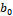
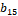

3GPP TS 38.214 V17.14.0 (2025-06)

Technical Specification

3rd Generation Partnership Project;

Technical Specification Group Radio Access Network;

NR;

Physical layer procedures for data

(Release 17)

{width="1.3243055555555556in"
height="0.9166666666666666in"}
{width="1.7777777777777777in"
height="1.0368055555555555in"}

The present document has been developed within the 3rd Generation
Partnership Project (3GPP ^TM^) and may be further elaborated for the
purposes of 3GPP..\
The present document has not been subject to any approval process by the
3GPP Organizational Partners and shall not be implemented.\
This Specification is provided for future development work within 3GPP
only. The Organizational Partners accept no liability for any use of
this Specification.\
Specifications and Reports for implementation of the 3GPP ^TM^ system
should be obtained via the 3GPP Organizational Partners\' Publications
Offices.

> Keywords
>
> 3GPP, New Radio, Layer 1
>
> ***3GPP***
>
> Postal address
>
> 3GPP support office address
>
> 650 Route des Lucioles - Sophia Antipolis
>
> Valbonne - FRANCE
>
> Tel.: +33 4 92 94 42 00 Fax: +33 4 93 65 47 16
>
> Internet
>
> http://www.3gpp.org

***Copyright Notification***

No part may be reproduced except as authorized by written permission.\
The copyright and the foregoing restriction extend to reproduction in
all media.

© 2025, 3GPP Organizational Partners (ARIB, ATIS, CCSA, ETSI, TSDSI,
TTA, TTC).

All rights reserved.

UMTS™ is a Trade Mark of ETSI registered for the benefit of its members

3GPP™ is a Trade Mark of ETSI registered for the benefit of its Members
and of the 3GPP Organizational Partners\
LTE™ is a Trade Mark of ETSI registered for the benefit of its Members
and of the 3GPP Organizational Partners

GSM® and the GSM logo are registered and owned by the GSM Association

 Contents {#contents .TT}
========

Foreword 6

1 Scope 7

2 References 7

3 Definitions, symbols and abbreviations 8

3.1 Definitions 8

3.2 Symbols 8

3.3 Abbreviations 8

4 Power control 9

4.1 Power allocation for downlink 9

5 Physical downlink shared channel related procedures 10

5.1 UE procedure for receiving the physical downlink shared channel 10

5.1.1 Transmission schemes 14

5.1.1.1 Transmission scheme 1 15

5.1.2 Resource allocation 15

5.1.2.1 Resource allocation in time domain 15

5.1.2.1.1 Determination of the resource allocation table to be used for
PDSCH 19

5.1.2.2 Resource allocation in frequency domain 23

5.1.2.2.1 Downlink resource allocation type 0 24

5.1.2.2.2 Downlink resource allocation type 1 24

5.1.2.2.3 Downlink resource allocation type 1 for multicast/broadcast 26

5.1.2.3 Physical resource block (PRB) bundling 26

5.1.3 Modulation order, target code rate, redundancy version and
transport block size determination 28

5.1.3.1 Modulation order and target code rate determination 30

5.1.3.2 Transport block size determination 36

5.1.4 PDSCH resource mapping 39

5.1.4.1 PDSCH resource mapping with RB symbol level granularity 40

5.1.4.2 PDSCH resource mapping with RE level granularity 41

5.1.5 Antenna ports quasi co-location 43

5.1.6 UE procedure for receiving reference signals 51

5.1.6.1 CSI-RS reception procedure 51

5.1.6.1.1 CSI-RS for tracking 51

5.1.6.1.2 CSI-RS for L1-RSRP and L1-SINR computation 54

5.1.6.1.3 CSI-RS for mobility 54

5.1.6.2 DM-RS reception procedure 55

5.1.6.3 PT-RS reception procedure 57

5.1.6.4 SRS reception procedure for CLI 59

5.1.6.5 PRS reception procedure 59

5.1.7 Code block group based PDSCH transmission 66

5.1.7.1 UE procedure for grouping of code blocks to code block groups 66

5.1.7.2 UE procedure for receiving code block group based transmissions
67

5.2 UE procedure for reporting channel state information (CSI) 67

5.2.1 Channel state information framework 67

5.2.1.1 Reporting settings 67

5.2.1.2 Resource settings 68

5.2.1.3 (void) 69

5.2.1.4 Reporting configurations 69

5.2.1.4.1 Resource Setting configuration 71

5.2.1.4.2 Report Quantity Configurations 73

5.2.1.4.3 L1-RSRP Reporting 77

5.2.1.4.4 L1-SINR Reporting 77

5.2.1.5 Triggering/activation of CSI Reports and CSI-RS 78

5.2.1.5.1 Aperiodic CSI Reporting/Aperiodic CSI-RS when the triggering
PDCCH and the CSI-RS have the same numerology 78

5.2.1.5.1a Aperiodic CSI Reporting/Aperiodic CSI-RS when the triggering
PDCCH and the CSI-RS have different numerologies 82

5.2.1.5.2 Semi-persistent CSI/Semi-persistent CSI-RS 85

5.2.1.5.3 Aperiodic CSI-RS for tracking for fast SCell activation 86

5.2.1.6 CSI processing criteria 86

5.2.2 Channel state information 88

5.2.2.1 Channel quality indicator (CQI) 88

5.2.2.1.1 (void) 91

5.2.2.2 Precoding matrix indicator (PMI) 91

5.2.2.2.1 Type I Single-Panel Codebook 91

5.2.2.2.2 Type I Multi-Panel Codebook 97

5.2.2.2.3 Type II Codebook 101

5.2.2.2.4 Type II Port Selection Codebook 108

5.2.2.2.5 Enhanced Type II Codebook 110

5.2.2.2.6 Enhanced Type II Port Selection Codebook 117

5.2.2.2.7 Further enhanced Type II port selection codebook 119

5.2.2.3 Reference signal (CSI-RS) 123

5.2.2.3.1 NZP CSI-RS 123

5.2.2.4 Channel State Information -- Interference Measurement (CSI-IM)
124

5.2.2.5 CSI reference resource definition 125

5.2.3 CSI reporting using PUSCH 128

5.2.4 CSI reporting using PUCCH 132

5.2.5 Priority rules for CSI reports 133

5.3 UE PDSCH processing procedure time 133

5.3.1 Application delay of the minimum scheduling offset restriction 135

5.4 UE CSI computation time 136

5.5 UE PDSCH reception preparation time with cross carrier scheduling
with different subcarrier spacings for PDCCH and PDSCH 138

6 Physical uplink shared channel related procedure 138

6.1 UE procedure for transmitting the physical uplink shared channel 138

6.1.1 Transmission schemes 140

6.1.1.1 Codebook based UL transmission 141

6.1.1.2 Non-Codebook based UL transmission 142

6.1.2 Resource allocation 144

6.1.2.1 Resource allocation in time domain 144

6.1.2.1.1 Determination of the resource allocation table to be used for
PUSCH 154

6.1.2.2 Resource allocation in frequency domain 157

6.1.2.2.1 Uplink resource allocation type 0 157

6.1.2.2.2 Uplink resource allocation type 1 158

6.1.2.2.3 Uplink resource allocation type 2 159

6.1.2.3 Resource allocation for uplink transmission with configured
grant 160

6.1.2.3.1 Transport Block repetition for uplink transmissions of PUSCH
repetition Type A with a configured grant 163

6.1.2.3.2 Transport Block repetition for uplink transmissions of PUSCH
repetition Type B with a configured grant 164

6.1.2.3.3 Transport Block repetition for uplink transmissions of TB
processing over multiple slots with a configured grant 165

6.1.3 UE procedure for applying transform precoding on PUSCH 166

6.1.4 Modulation order, redundancy version and transport block size
determination 166

6.1.4.1 Modulation order and target code rate determination 168

6.1.4.2 Transport block size determination 173

6.1.5 Code block group based PUSCH transmission 174

6.1.5.1 UE procedure for grouping of code blocks to code block groups
174

6.1.5.2 UE procedure for transmitting code block group based
transmissions 175

6.1.6 Uplink switching 175

6.1.6.1 Uplink switching for EN-DC 175

6.1.6.2 Uplink switching for carrier aggregation 176

6.1.6.2.1 void 177

6.1.6.3 Uplink switching for supplementary uplink 177

6.1.7 UE procedure for determining time domain windows for bundling
DM-RS 177

6.2 UE reference signal (RS) procedure 180

6.2.1 UE sounding procedure 180

6.2.1.1 UE SRS frequency hopping procedure 187

6.2.1.2 UE sounding procedure for DL CSI acquisition 188

6.2.1.3 UE sounding procedure between component carriers 193

6.2.1.4 UE sounding procedure for positioning purposes 195

6.2.2 UE DM-RS transmission procedure 196

6.2.3 UE PT-RS transmission procedure 198

6.2.3.1 UE PT-RS transmission procedure when transform precoding is not
enabled 198

6.2.3.2 UE PT-RS transmission procedure when transform precoding is
enabled 200

6.3 UE PUSCH frequency hopping procedure 201

6.3.1 Frequency hopping for PUSCH repetition Type A and for TB
processing over multiple slots 201

6.3.2 Frequency hopping for PUSCH repetition Type B 203

6.4 UE PUSCH preparation procedure time 203

7 UE procedures for transmitting and receiving on a carrier with
intra-cell guard bands 205

8 Physical sidelink shared channel related procedures 205

8.1 UE procedure for transmitting the physical sidelink shared channel
206

8.1.1 Transmission schemes 208

8.1.2 Resource allocation 208

8.1.2.1 Resource allocation in time domain 208

8.1.2.2 Resource allocation in frequency domain 209

8.1.3 Modulation order, target code rate, redundancy version and
transport block size determination 209

8.1.3.1 Modulation order and target code rate determination 209

8.1.3.2 Transport block size determination 210

8.1.4 UE procedure for determining the subset of resources to be
reported to higher layers in PSSCH resource selection in sidelink
resource allocation mode 2 210

8.1.4A UE procedure for determining a set of preferred or non-preferred
resources for another UE\'s transmission 216

8.1.4B Void 217

8.1.4C UE procedure for using a received non-preferred resource set 217

8.1.5 UE procedure for determining slots and resource blocks for PSSCH
transmission associated with an SCI format 1-A 217

8.1.5A UE procedure for determining slots and resource blocks indicated
by a preferred or non-preferred resource set 218

8.1.6 Sidelink congestion control in sidelink resource allocation mode 2
219

8.1.7 UE procedure for determining the number of logical slots for a
reservation period 219

8.2 UE procedure for transmitting sidelink reference signals 219

8.2.1 CSI-RS transmission procedure 219

8.2.2 PSSCH DM-RS transmission procedure 220

8.2.3 PT-RS transmission procedure 220

8.3 UE procedure for receiving the physical sidelink shared channel 220

8.4 UE procedure for receiving reference signals 220

8.4.1 CSI-RS reception procedure 220

8.4.2 DM-RS reception procedure for RSRP computation 221

8.4.3 PT-RS reception procedure 221

8.5 UE procedure for reporting channel state information (CSI) 221

8.5.1 Channel state information framework 221

8.5.1.1 Reporting configurations 221

8.5.1.2 Triggering of sidelink CSI reports 221

8.5.2 Channel state information 222

8.5.2.1 CSI reporting quantities 222

8.5.2.1.1 Channel quality indicator (CQI) 222

8.5.2.2 Reference signal (CSI-RS) 222

8.5.2.3 CSI reference resource definition 222

8.5.3 CSI reporting 223

8.6 UE PSSCH preparation procedure time 223

9 UE procedures for transmitting and receiving for RTT-based propagation
delay compensation 224

9.1 PRS reception procedure for RTT-based propagation delay compensation
224

Annex A (informative): Change history 226

 Foreword
========

This Technical Specification has been produced by the 3rd Generation
Partnership Project (3GPP).

The contents of the present document are subject to continuing work
within the TSG and may change following formal TSG approval. Should the
TSG modify the contents of the present document, it will be re-released
by the TSG with an identifying change of release date and an increase in
version number as follows:

Version x.y.z

where:

x the first digit:

1 presented to TSG for information;

2 presented to TSG for approval;

3 or greater indicates TSG approved document under change control.

y the second digit is incremented for all changes of substance, i.e.
technical enhancements, corrections, updates, etc.

z the third digit is incremented when editorial only changes have been
incorporated in the document.

 1 Scope
=======

The present document specifies and establishes the characteristics of
the physicals layer procedures of data channels for 5G-NR.

2 References
============

The following documents contain provisions which, through reference in
this text, constitute provisions of the present document.

\[1\] 3GPP TR 21.905: \"Vocabulary for 3GPP Specifications\"

\[2\] 3GPP TS 38.201: \" NR; Physical Layer -- General Description\"

\[3\] 3GPP TS 38.202: \"NR; Services provided by the physical layer\"

\[4\] 3GPP TS 38.211: \"NR; Physical channels and modulation\"

\[5\] 3GPP TS 38.212: \"NR; Multiplexing and channel coding\"

\[6\] 3GPP TS 38.213: \"NR; Physical layer procedures for control\"

\[7\] 3GPP TS 38.215: \"NR; Physical layer measurements\"

\[8\] 3GPP TS 38.101: \"NR; User Equipment (UE) radio transmission and
reception\"

\[9\] 3GPP TS 38.104: \"NR; Base Station (BS) radio transmission and
reception\"

\[10\] 3GPP TS 38.321: \"NR; Medium Access Control (MAC) protocol
specification\"

\[11\] 3GPP TS 38.133: \"NR; Requirements for support of radio resource
management\"

\[12\] 3GPP TS 38.331: \"NR; Radio Resource Control (RRC); Protocol
specification\"

\[13\] 3GPP TS 38.306: \"NR; User Equipment (UE) radio access
capabilities\"

\[14\] 3GPP TS 38.423: \"NG-RAN; Xn Application Protocol (XnAP)\"

\[15\] 3GPP TS 36.211: \"Evolved Universal Terrestrial Radio Access
(E-UTRA); Physical channels and modulation\"

\[16\] 3GPP TS 37.213: \"Physical layer procedures for shared spectrum
channel access\"

\[17\] 3GPP TS 37.355: \"LTE Positioning Protocol (LPP)\"

\[18\] 3GPP TS 38.822: \"NR; User Equipment (UE) feature list\"

3 Definitions, symbols and abbreviations
========================================

3.1 Definitions
---------------

For the purposes of the present document, the terms and definitions
given in TR 21.905 \[1\] and the following apply. A term defined in the
present document takes precedence over the definition of the same term,
if any, in TR 21.905 \[1\].

3.2 Symbols
-----------

For the purposes of the present document, the following symbols apply:

3.3 Abbreviations
-----------------

For the purposes of the present document, the abbreviations given in
TR 21.905 \[1\] and the following apply. An abbreviation defined in the
present document takes precedence over the definition of the same
abbreviation, if any, in TR 21.905 \[1\].

BWP Bandwidth part

CBG Code block group

CLI Cross Link Interference

CP Cyclic prefix

CQI Channel quality indicator

CPU CSI processing unit

CRB Common resource block

CRC Cyclic redundancy check

CRI CSI-RS Resource Indicator

CSI Channel state information

CSI-RS Channel state information reference signal

CSI-RSRP CSI reference signal received power

CSI-RSRQ CSI reference signal received quality

CSI-SINR CSI signal-to-noise and interference ratio

CW Codeword

DCI Downlink control information

DL Downlink

DM-RS Demodulation reference signals

DRX Discontinuous Reception

EPRE Energy per resource element

IAB-MT Integrated Access and Backhaul -- Mobile Terminal

L1-RSRP Layer 1 reference signal received power

LI Layer Indicator

MCS Modulation and coding scheme

PDCCH Physical downlink control channel

PDSCH Physical downlink shared channel

PSS Primary Synchronisation signal

PUCCH Physical uplink control channel

QCL Quasi co-location

PMI Precoding Matrix Indicator

PRB Physical resource block

PRG Precoding resource block group

PRS Positioning reference signal

PT-RS Phase-tracking reference signal

RB Resource block

RBG Resource block group

RI Rank Indicator

RIV Resource indicator value

RS Reference signal

SCI Sidelink control information

SLIV Start and length indicator value

SR Scheduling Request

SRS Sounding reference signal

SS Synchronisation signal

SSS Secondary Synchronisation signal

SS-RSRP SS reference signal received power

SS-RSRQ SS reference signal received quality

SS-SINR SS signal-to-noise and interference ratio

TB Transport Block

TCI Transmission Configuration Indicator

TDM Time division multiplexing

UE User equipment

UL Uplink

4 Power control 
===============

Throughout this specification, unless otherwise noted, statements using
the term \"UE\" in clauses 4, 5, or 6 are equally applicable to the
IAB-MT part of an IAB node.

4.1 Power allocation for downlink 
---------------------------------

The gNB determines the downlink transmit EPRE.

For the purpose of SS-RSRP, SS-RSRQ and SS-SINR measurements, the UE may
assume downlink EPRE is constant across the bandwidth. For the purpose
of SS-RSRP, SS-RSRQ and SS-SINR measurements, the UE may assume downlink
EPRE is constant over SSS carried in different SS/PBCH blocks. For the
purpose of SS-RSRP, SS-RSRQ and SS-SINR measurements, the UE may assume
that the ratio of SSS EPRE to PBCH DM-RS EPRE is 0 dB.

For the purpose of CSI-RSRP, CSI-RSRQ and CSI-SINR measurements, the UE
may assume downlink EPRE of a port of CSI-RS resource configuration is
constant across the configured downlink bandwidth and constant across
all configured OFDM symbols.

The downlink SS/PBCH SSS EPRE can be derived from the SS/PBCH downlink
transmit power given by the parameter *ss-PBCH-BlockPower* provided by
higher layers. The downlink SSS transmit power is defined as the linear
average over the power contributions (in \[W\]) of all resource elements
that carry the SSS within the operating system bandwidth.

The downlink CSI-RS EPRE can be derived from the SS/PBCH block downlink
transmit power given by the parameter *ss-PBCH-BlockPower* and CSI-RS
power offset given by the parameter *powerControlOffsetSS* provided by
higher layers if the SS/PBCH block is associated with serving cell PCI,
or derived from *ss-PBCH-BlockPower-r17* in *SSB-MTC-AdditionalPCI-r17*
and *powerControlOffsetSS* provided by higher layers if the SS/PBCH
block is associated with additional PCI different from serving cell PCI,
where the CSI-RS is QCLed with the SS/PBCH block. The downlink
reference-signal transmit power is defined as the linear average over
the power contributions (in \[W\]) of the resource elements that carry
the configured CSI-RS within the operating system bandwidth.

For downlink DM-RS associated with PDSCH, the UE may assume the ratio of
PDSCH EPRE to DM-RS EPRE ( \[dB\]) is given by Table 4.1-1 according to
the number of DM-RS CDM groups without data as described in Clause
5.1.6.2. The DM-RS scaling factor specified in Clause 7.4.1.1.2 of \[4,
TS 38.211\] is given by .

Table 4.1-1: The ratio of PDSCH EPRE to DM-RS EPRE

  Number of DM-RS CDM groups without data   DM-RS configuration type 1   DM-RS configuration type 2
  ----------------------------------------- ---------------------------- ----------------------------
  1                                         0 dB                         0 dB
  2                                         -3 dB                        -3 dB
  3                                         \-                           -4.77 dB

When the UE is scheduled with one or two PT-RS ports associated with the
PDSCH,

\- if the UE is configured with the higher layer parameter *epre-Ratio*,
the ratio of PT-RS EPRE to PDSCH EPRE per layer per RE for each PT-RS
port () is given by Table 4.1-2 according to the *epre-Ratio*, the PT-RS
scaling factor specified in clause 7.4.1.2.2 of \[4, TS 38.211\] is
given by.

\- otherwise, the UE shall assume *epre-Ratio* is set to state \'0\' in
Table 4.1-2 if not configured.

Table 4.1-2: PT-RS EPRE to PDSCH EPRE per layer per RE ()

  *epre-Ratio*   The number of PDSCH layers with DM-RS associated to the PT-RS port                      
  -------------- -------------------------------------------------------------------- --- ------ --- --- ------
                 1                                                                    2   3      4   5   6
  0              0                                                                    3   4.77   6   7   7.78
  1              0                                                                    0   0      0   0   0
  2              reserved                                                                                
  3              reserved                                                                                

For link recovery, as described in clause 6 of \[6, TS 38.213\] the
ratio of the PDCCH EPRE to NZP CSI-RS EPRE is assumed as 0 dB.

5 Physical downlink shared channel related procedures
=====================================================

5.1 UE procedure for receiving the physical downlink shared channel
-------------------------------------------------------------------

For downlink, a maximum of 16 HARQ processes per cell are supported by
the UE, or subject to UE capability, **a maximum of 32 HARQ processes
per cell as defined in \[13, TS 38.306\].** The number of processes the
UE may assume will at most be used for the downlink is configured to the
UE for each cell separately by higher layer parameter
*nrofHARQ-ProcessesForPDSCH* or *nrofHARQ-ProcessesForPDSCH-v1700*, and
when no configuration is provided the UE may assume a default number of
8 processes.

A UE shall upon detection of a PDCCH with a configured DCI format 1\_0,
1\_1, 4\_0, 4\_1, 4\_2 or 1\_2 decode the corresponding PDSCHs as
indicated by that DCI. When the UE is scheduled with multiple PDSCHs by
a DCI, HARQ process ID indicated by this DCI applies to the first PDSCH
not overlapping with a UL symbol indicated by
*tdd-UL-DL-ConfigurationCommon* or *tdd-UL-DL-ConfigurationDedicated* if
provided, HARQ process ID is then incremented by 1 for each subsequent
PDSCH(s) in the scheduled order, with modulo operation of
*nrofHARQ-ProcessesForPDSCH* applied if *nrofHARQ-ProcessesForPDSCH* is
provided, or with modulo operation of *nrofHARQ-ProcessesForPDSCH-v1700*
applied if or *nrofHARQ-ProcessesForPDSCH-v1700* is provided, or with
modulo operation of 8 applied, otherwise. HARQ process ID is not
incremented for PDSCH(s) not received if at least one of the symbols
indicated by the indexed row of the used resource allocation table in
the slot overlaps with a UL symbol indicated by
*tdd-UL-DL-ConfigurationCommon* or *tdd-UL-DL-ConfigurationDedicated* if
provided. When a UE is configured by the higher layer parameter
*repetitionScheme* set to \'tdmSchemeA\', the PDSCH includes two PDSCH
transmission occasions. For each PDSCH, if either PDSCH occasion
overlaps with a UL symbol indicated by *tdd-UL-DL-ConfigurationCommon*
or *tdd-UL-DL-ConfigurationDedicated* if provided, the PDSCH is not
received and HARQ process ID is not increment for the PDSCH. For any
HARQ process ID(s) in a given scheduled cell, the UE is not expected to
receive a PDSCH that overlaps in time with another PDSCH if the UE is
not capable of receiving FDMed unicast and multicast PDSCH per slot per
carrier. When HARQ feedback for the HARQ process ID is not disabled, or
for the HARQ process associated with the first SPS PDSCH when
*HARQ-feedbackEnablingforSPSactive* is provided and enabled, the UE is
not expected to receive another PDSCH for a given HARQ process until
after the end of the expected transmission of HARQ-ACK for that HARQ
process, where the timing is given by Clause 9.2.3 of \[6, TS 38.213\].
For HARQ-ACK subject to HARQ-ACK deferral described in Clause 9.2.5.4 of
\[6 TS 38.213\], the expected transmission of HARQ-ACK corresponds to
the expected transmission HARQ-ACK in a first slot. When HARQ feedback
for the HARQ process ID is disabled, the UE is not expected to receive
another PDCCH carrying a DCI scheduling a PDSCH or set of
slot-aggregated PDSCH scheduled for the given HARQ process or to receive
another PDSCH without corresponding PDCCH for the given HARQ process
that starts until T~proc,1~ after the end of the reception of the last
PDSCH or slot-aggregated PDSCH for that HARQ process. Except for the
case when a UE is configured by higher layer parameter *PDCCH-Config*
that contains two different values of *coresetPoolIndex* in
*ControlResourceSet* and PDCCHs that schedule two PDSCHs are associated
to different *ControlResourceSets* having different values of
*coresetPoolIndex* and the UE reports its capability of
*outOfOrderOperationDL-r16,* in a given scheduled cell, the UE is not
expected to receive a first PDSCH and a second PDSCH, starting later
than the first PDSCH, with its corresponding HARQ-ACK assigned to be
transmitted on a resource ending before the start of a different
resource for the HARQ-ACK assigned to be transmitted for the first
PDSCH, where the two resources are in different slots for the associated
HARQ-ACK transmissions, each slot is composed of symbols \[4\] or a
number of symbols indicated by *subslotLengthForPUCCH* if provided, and
the HARQ-ACK for the two PDSCHs are associated with the HARQ-ACK
codebook of the same priority. Except for the case when a UE is
configured by higher layer parameter *PDCCH-Config* that contains two
different values of *coresetPoolIndex* in *ControlResourceSet* and
PDCCHs that schedule two PDSCHs are associated to different
*ControlResourceSets* having different values of *coresetPoolIndex* and
the UE reports its capability of *outOfOrderOperationDL-r16,* in a given
scheduled cell, the UE is not expected to receive a first PDSCH, and a
second PDSCH, starting later than the first PDSCH, with its
corresponding HARQ-ACK assigned to be transmitted on a resource ending
before the start of a different resource for the HARQ-ACK assigned to be
transmitted for the first PDSCH if the HARQ-ACK for the two PDSCHs are
associated with HARQ-ACK codebooks of different priorities. For any two
HARQ process IDs in a given scheduled cell, if the UE is scheduled to
start receiving a first PDSCH starting in symbol *j* by a PDCCH ending
in symbol *i on a scheduling cell*, the UE is not expected to be
scheduled to receive a PDSCH starting earlier than the end of the first
PDSCH with a PDCCH that ends later than symbol *i of a scheduling
cell*,. When the PDCCH reception includes two PDCCH candidates from two
respective search space sets, as described in clause 10.1 of \[6, TS
38.213\], the PDCCH ending in symbol *i* is determined based on the
PDCCH candidate that ends later in time. In a given scheduled cell, for
any PDSCH corresponding to SI-RNTI, the UE is not expected to decode a
re-transmission of an earlier PDSCH with a starting symbol less than *N*
symbols after the last symbol of that PDSCH, where the value of *N*
depends on the PDSCH subcarrier spacing configuration *μ,* with *N*=13
for *μ*=0, *N*=13 for *μ*=1, *N*=20 for *μ*=2, *N*=24 for *μ*=3, *N*=96
for *μ*=5, and *N*=192 for *μ*=6.

When receiving PDSCH scheduled with SI-RNTI, P-RNTI, G-RNTI for
broadcast or MCCH-RNTI, the UE may assume that the DM-RS port of PDSCH
is quasi co-located with the associated SS/PBCH block with respect to
Doppler shift, Doppler spread, average delay, delay spread, spatial RX
parameters when applicable.

When receiving PDSCH scheduled with RA-RNTI, or MSGB-RNTI, the UE may
assume that the DM-RS port of PDSCH is quasi co-located with the SS/PBCH
block or the CSI-RS resource the UE used for RACH association as
applicable, and transmission with respect to Doppler shift, Doppler
spread, average delay, delay spread, spatial RX parameters when
applicable. When receiving a PDSCH scheduled with RA-RNTI in response to
a random access procedure triggered by a PDCCH order which triggers
contention-free random access procedure for the SpCell \[10, TS
38.321\], the UE may assume that the DM-RS port of the received PDCCH
order and the DM-RS ports of the corresponding PDSCH scheduled with
RA-RNTI are quasi co-located with the same SS/PBCH block or CSI-RS with
respect to Doppler shift, Doppler spread, average delay, delay spread,
spatial RX parameters when applicable.

When receiving PDSCH in response to a PUSCH transmission scheduled by a
RAR UL grant or corresponding PUSCH retransmission, or when receiving
PDSCH in response to a PUSCH for Type-2 random access procedure, or a
PUSCH scheduled by a fallbackRAR UL grant or corresponding PUSCH
retransmission, the UE may assume that the DM-RS port of PDSCH is quasi
co-located with the SS/PBCH block the UE selected for RACH association
and transmission with respect to Doppler shift, Doppler spread, average
delay, delay spread, spatial RX parameters when applicable.

If the UE is not configured for PUSCH/PUCCH transmission for at least
one serving cell configured with slot formats comprised of DL and UL
symbols, and if the UE is not capable of simultaneous reception and
transmission on serving cell *c~1~* and serving cell *c~2~*, the UE is
not expected to receive PDSCH on serving cell *c~1~* if the PDSCH
overlaps in time with SRS transmission (including any interruption due
to uplink or downlink RF retuning time \[10\]) on serving cell *c~2~*
not configured for PUSCH/PUCCH transmission.

The UE is not expected to decode a PDSCH in a serving cell scheduled by
a PDCCH with C-RNTI, CS-RNTI, MCS-C-RNTI, G-RNTI, G-CS-RNTI or MCCH-RNTI
and one or multiple PDSCH(s) required to be received according to this
Clause in the same serving cell without a corresponding PDCCH
transmission if the PDSCHs partially or fully overlap in time except if
the PDCCH scheduling the PDSCH ends at least
14$\bullet 2^{max(0,\mu - 3)}$ symbols before the earliest starting
symbol of the PDSCH(s) without the corresponding PDCCH transmission,
where* μ* and the symbol duration are based on the smallest numerology
between the scheduling PDCCH and the PDSCH, in which case the UE shall
decode the PDSCH scheduled by the PDCCH. When the PDCCH reception
incudes two PDCCH candidates from two respectvie search space sets, as
described in clause 10 of \[6, TS 38.213\], for the purpose of
determining the PDCCH with C-RNTI, CS-RNTI or MCS-C-RNTI scheduling the
PDSCH ends at least 14$\bullet 2^{max(0,\mu - 3)}$ symbols before the
earliest starting symbol of the PDSCH(s) without the corresponding PDCCH
transmission, the PDCCH candidate that ends later in time is used.

The UE is not expected to decode a PDSCH scheduled with C-RNTI,
MCS-C-RNTI, G-RNTI for multicast or broadcast, MCCH-RNTI, G-CS-RNTI or
CS-RNTI if another PDSCH in the same cell scheduled with RA-RNTI or
MSGB-RNTI partially or fully overlap in time.

The UE in RRC\_IDLE and RRC\_INACTIVE modes shall be able to decode two
PDSCHs each scheduled with SI-RNTI, P-RNTI, RA-RNTI or TC-RNTI, with the
two PDSCHs partially or fully overlapping in time in non-overlapping
PRBs.

The UE:

\- is expected to decode PDSCH scheduled with MCCH-RNTI and PBCH in
PCell that partially or fully overlaps in time in non-overlapping PRBs
in PCell.

\- is not expected to decode PDSCH scheduled with G-RNTI for broadcast
and PBCH in PCell that partially or fully overlaps in time in
non-overlapping PRBs in PCell.

\- is not expected to decode PDSCH scheduled with G-RNTI for multicast
and PBCH in PCell that partially or fully overlaps in time in
non-overlapping PRBs in PCell.

On a frequency range 1 cell, the UE shall be able to decode a PDSCH
scheduled with C-RNTI, MCS-C-RNTI, or CS-RNTI and, during a process of
P-RNTI triggered SI acquisition, another PDSCH scheduled with SI-RNTI
that partially or fully overlap in time in non-overlapping PRBs, unless
the PDSCH scheduled with C-RNTI, MCS-C-RNTI, or CS-RNTI requires
Capability 2 processing time according to clause 5.3 in which case the
UE may skip decoding of the scheduled PDSCH with C-RNTI, MCS-C-RNTI, or
CS-RNTI.

On a frequency range 2 cell, the UE is not expected to decode a PDSCH
scheduled with C-RNTI, MCS-C-RNTI, or CS-RNTI if in the same cell,
during a process of P-RNTI triggered SI acquisition, another PDSCH
scheduled with SI-RNTI partially or fully overlap in time.

The UE is expected to decode a PDSCH scheduled with C-RNTI, MCS-C-RNTI,
or CS-RNTI during a process of autonomous SI acquisition.

The maximum number of PDSCHs scheduled per slot per component carrier
with C-RNTI/CS-RNTI and G-RNTI/G-CS-RNTI/MCCH-RNTI that the UE shall be
able to decode is the same as the indicated UE capability for the number
of unicast PDSCHs per slot per component carrier. If the UE is capable
of receiving FDMed unicast and multicast PDSCH per slot per carrier, the
UE shall be able to decode a PDSCH scheduled by a DCI format with C-RNTI
or a PDSCH scheduled for a retransmission of a TB by a DCI format with
CS-RNTI and a PDSCH scheduled by a DCI format with G-RNTI for multicast
or a PDSCH scheduled for a retransmission of a TB by a DCI format with
G-CS-RNTI that partially or fully overlap in time in non-overlapping
PRBs. If the UE is capable of receiving FDMed unicast and broadcast
PDSCH per slot per carrier, the UE shall be able to decode a PDSCH
scheduled by a DCI format with C-RNTI or a PDSCH scheduled for a
retransmission of a TB by a DCI format with CS-RNTI and a PDSCH
scheduled with G-RNTI for broadcast/MCCH-RNTI that partially or fully
overlap in time in non-overlapping PRBs.

If the UE is configured by higher layers to decode a PDCCH with its CRC
scrambled by a CS-RNTI or G-CS-RNTI, the UE shall receive PDSCH
transmissions without corresponding PDCCH transmissions using the
higher-layer-provided PDSCH configuration for those PDSCHs.

The UE it is not expected to support reception of FDMed MCCH PDSCH and
broadcast MTCH PDSCH in PCell or SCell, or FDMed multiple broadcast MTCH
PDSCHs in PCell or SCell, or FDMed MCCH/broadcast MTCH/multicast PDSCH
and SIB PDSCH in PCell, or FDMed multicast PDSCHs in PCell or SCell, or
FDMed multicast PDSCH and MCCH/broadcast MTCH PDSCH in PCell or SCell,
or FDMed MCCH/broadcast MTCH/multicast PDSCH and paging PDSCH.

If a UE is configured by higher layer parameter *PDCCH-Config* that
contains two different values of *coresetPoolIndex* in
*ControlResourceSet*, the UE may expect to receive multiple PDCCHs
scheduling fully/partially/non-overlapped PDSCHs in time and frequency
domain. The UE may expect the reception of full/partially-overlapped
PDSCHs in time, only when PDCCHs that schedule two PDSCHs are associated
to different *ControlResourceSets* having different values of
*coresetPoolIndex*. For a CORESET without *coresetPoolIndex*, the UE may
assume that the CORESET is assigned with *coresetPoolIndex* as 0. When
the UE is configured with *SSB-MTC-AdditionalPCI*, *ControlResourceSets*
corresponding to different *coresetPoolIndex* values may be associated
with different physical cell IDs via activated TCI states of the
*ControlResourceSets*, where *ControlResourceSets* corresponding to one
*coresetPoolIndex* is associated with the serving cell physical cell ID
and *ControlResourceSets* corresponding to another *coresetPoolIndex*
can be associated with another physical cell ID. When the UE is
scheduled with full/partially/non-overlapped PDSCHs in time and
frequency domain, the full scheduling information for receiving a PDSCH
is indicated and carried only by the corresponding PDCCH, the UE is
expected to be scheduled with the same active BWP and the same SCS. When
the UE is scheduled with full/partially-overlapped PDSCHs in time and
frequency domain, the UE can be scheduled with at most two codewords
simultaneously. When PDCCHs that schedule two PDSCHs are associated to
different *ControlResourceSets* having different values of
*coresetPoolIndex* and the UE reports its capability of
*outOfOrderOperationDL-r16,* the following operations are allowed:

\- For any two HARQ process IDs in a given scheduled cell, if the UE is
scheduled to start receiving a first PDSCH starting in symbol *j* by a
PDCCH associated with a value of *coresetPoolIndex* ending in symbol
*i*, the UE can be scheduled to receive a PDSCH starting earlier than
the end of the first PDSCH with a PDCCH associated with a different
value of *coresetPoolIndex* that ends later than symbol *i*.

\- In a given scheduled cell, the UE can receive a first PDSCH in slot
*i*, with the corresponding HARQ-ACK assigned to be transmitted in slot
*j*, and a second PDSCH associated with a value of *coresetPoolIndex*
different from that of the first PDSCH starting later than the first
PDSCH with its corresponding HARQ-ACK assigned to be transmitted in a
slot before slot *j*.

If PDCCHs that schedule corresponding PDSCHs are associated to the same
or different *ControlResourceSets* having the same value of
*coresetPoolIndex*, the UE procedure for receiving the PDSCH upon
detection of a PDCCH follows Clause 5.1.

A UE does not expect to be configured with *repetitionScheme* if the UE
is configured with higher layer parameter *repetitionNumber for the same
PDSCH.*

When a UE is configured by higher layer parameter *repetitionScheme* set
to one of \'*fdmSchemeA\'*, \'*fdmSchemeB\'*, \'*tdmSchemeA\'*, if the
UE is indicated with two TCI states in a codepoint of the DCI field
*\'Transmission Configuration Indication\'* and DM-RS port(s) within one
CDM group in the DCI field \'*Antenna Port(s)\'*.

\- When two TCI states are indicated in a DCI and the UE is set to
\'*fdmSchemeA\',* the UE shall receive a single PDSCH transmission
occasion of the TB with each TCI state associated to a non-overlapping
frequency domain resource allocation as described in Clause 5.1.2.3.

\- When two TCI states are indicated in a DCI and the UE is set to
\'*fdmSchemeB\'*, the UE shall receive two PDSCH transmission occasions
of the same TB with each TCI state associated to a PDSCH transmission
occasion which has non-overlapping frequency domain resource allocation
with respect to the other PDSCH transmission occasion as described in
Clause 5.1.2.3.

\- When two TCI states are indicated in a DCI and the UE is set to
\'*tdmSchemeA\'*, the UE shall receive two PDSCH transmission occasions
of the same TB with each TCI state associated to a PDSCH transmission
occasion which has non-overlapping time domain resource allocation with
respect to the other PDSCH transmission occasion and both PDSCH
transmission occasions shall be received within a given slot as
described in Clause 5.1.2.1.

When a UE is configured by the higher layer parameter *repetitionNumber*
in *PDSCH-TimeDomainResourceAllocation*, the UE may expect to be
indicated with one or two TCI states in a codepoint of the DCI field
*\'Transmission Configuration Indication\'* together with the DCI field
\'*Time domain resource assignment*\' indicating an entry *which
contains repetitionNumber* in *PDSCH-TimeDomainResourceAllocation* and
DM-RS port(s) within one CDM group in the DCI field \'*Antenna
Port(s)\'*.

\- When two TCI states are indicated in a DCI with \'*Transmission
Configuration Indication*\' field, the UE may expect to receive multiple
slot level PDSCH transmission occasions of the same TB with two TCI
states used across multiple PDSCH transmission occasions in the
*repetitionNumber* consecutive slots as defined in Clause 5.1.2.1.

\- When one TCI state is indicated in a DCI with \'*Transmission
Configuration Indication*\' field, the UE may expect to receive multiple
slot level PDSCH transmission occasions of the same TB with one TCI
state used across multiple PDSCH transmission occasions in the
*repetitionNumber* consecutive slots as defined in Clause 5.1.2.1.

When a UE is not indicated with a DCI that DCI field \'*Time domain
resource assignment*\' indicating an entry *which contains
repetitionNumber* in *PDSCH-TimeDomainResourceAllocation*, and it is
indicated with two TCI states in a codepoint of the DCI field
*\'Transmission Configuration Indication\'* and DM-RS port(s) within two
CDM groups in the DCI field \'*Antenna Port(s)\' and it is not
configured with higher layer parameter sfnSchemePDSCH*, the UE may
expect to receive a single PDSCH where the association between the DM-RS
ports and the TCI states are as defined in Clause 5.1.6.2.

When a UE is not indicated with a DCI that DCI field \'*Time domain
resource assignment*\' indicating an entry *which contains
repetitionNumber* in *PDSCH-TimeDomainResourceAllocation*, and it is
indicated with one TCI states in a codepoint of the DCI field
*\'Transmission Configuration Indication\',* the UE procedure for
receiving the PDSCH upon detection of a PDCCH follows Clause 5.1.

When a UE *is configured with higher layer parameter sfnSchemePDSCH* set
to either *\'*sfnSchemeA*\'* or *\'*sfnSchemeB*\'* and

\- if the UE reports its capability of
*sfn-SchemeA-DynamicSwitching-r17* or
*sfn-SchemeB-DynamicSwitching-r17*, the UE is indicated with one or two
TCI state(s) in a codepoint of the DCI field *\'Transmission
Configuration Indication\' in DCI format 1\_1/1\_2*, or

\- otherwise, the UE is not expected to be indicated with one TCI state
per any of TCI codepoint by MAC CE, and the UE is indicated with two TCI
states in a codepoint of the DCI field *\'Transmission Configuration
Indication\' in DCI format 1\_1/1\_2*, and

the UE procedure for receiving the PDSCH upon detection of a PDCCH
follows clause 5.1 and the QCL assumption for the PDSCH as defined in
clause 5.1.5.

When a UE is configured with both *sfnSchemePDSCH* and *sfnSchemePDCCH*,
the UE shall expect that *sfnSchemePDSCH* and *sfnSchemePDCCH* are set
to the same scheme, either *\'*sfnSchemeA*\'* or *\'*sfnSchemeB*\'*.

If a UE is configured with *sfnSchemePDCCH* set to \'sfnSchemeA\' and
activated with two TCI states by MAC CE, and the UE does not report its
capability of *sfn-SchemeA-PDCCH-only*, the UE is expected to be
configured with *sfnSchemePDSCH* set to *\'sfnSchemeA\'* and indicated
with two TCI states in a codepoint of the DCI field *\'Transmission
Configuration Indication\',* if the PDSCH is scheduled by DCI format
1\_1/1\_2.

If a UE is configured with *sfnSchemePDCCH* set to \'sfnSchemeB\' and
activated with two TCI states by MAC CE, the UE is expected to be
configured with *sfnSchemePDSCH* set to *\'sfnSchemeB\'* and indicated
with two TCI states in a codepoint of the DCI field *\'Transmission
Configuration Indication\',* if the PDSCH is scheduled by DCI format
1\_1/1\_2.

When a UE is configured with *sfnSchemePDSCH* and/or *sfnSchemePDCCH*,
the UE shall expect that the *sfnSchemePDSCH* and/or *sfnSchemePDCCH*
configuration are the same within a CC, and the UE shall expect that the
*sfnSchemePDSCH* and/or *sfnSchemePDCCH* configuration are the same in
all CCs in a same frequency band if the UE is configured with CA, where
the UE does not expect to be configured with *sfnSchemePDSCH* and/or
*sfnSchemePDCCH* in initial BWP in each CC.

For the PDSCH scheduled by PDCCH with DCI format 4\_0 with CRC scrambled
by MCCH-RNTI, the parameter *pdsch-TimeDomainAllocationList,*
*mcs-Table*, *xOverhead*, *rateMatchPatternToAddModList* and
*RateMatchPatternLTE-CRS* are provided by *pdsch-ConfigMCCH*. For the
PDSCH scheduled by PDCCH with DCI format 4\_0 with CRC scrambled by
G-RNTI for broadcast, the parameter *pdsch-TimeDomainAllocationList,*
*mcs-Table*, *xOverhead*, *rateMatchPatternToAddModList* and
*RateMatchPatternLTE-CRS* are provided by *pdsch-ConfigMTCH*, if
configured; or by *pdsch-ConfigMCCH*, otherwise.

If more than one PDSCH on a serving cell each without a corresponding
PDCCH transmission are in a slot, after resolving overlapping with
symbols in the slot indicated as uplink by
*tdd-UL-DL-ConfigurationCommon*, or by
*tdd-UL-DL-ConfigurationDedicated*, a UE receives one or more PDSCHs
without corresponding PDCCH transmissions in the slot as specified
below.

‒ Step 0: set *j=0*, where *j* is the number of selected PDSCH(s) for
decoding. *Q* is the set of activated PDSCHs without corresponding PDCCH
transmissions within the slot

‒ Step 1: A UE receives one PDSCH with the lowest configured
*sps-ConfigIndex* within *Q*, set *j=j+1*. Designate the received PDSCH
as survivor PDSCH.

‒ Step 2: The survivor PDSCH in step 1 and any other PDSCH(s)
overlapping (even partially) with the survivor PDSCH in step 1 are
excluded from *Q*.

‒ Step 3: Repeat step 1 and 2 until *Q* is empty or *j* is equal to the
number of unicast/multicast PDSCHs in a slot supported by the UE

### 5.1.1 Transmission schemes

Only one transmission scheme is defined for the PDSCH, and is used for
all PDSCH transmissions.

#### 5.1.1.1 Transmission scheme 1

For transmission scheme 1 of the PDSCH, the UE may assume that a gNB
transmission on the PDSCH would be performed with up to 8 transmission
layers on antenna ports 1000-1011 as defined in Clause 7.3.1.4 of \[4,
TS 38.211\], subject to the DM-RS reception procedures in Clause
5.1.6.2.

### 5.1.2 Resource allocation

#### 5.1.2.1 Resource allocation in time domain

When the UE is scheduled to receive PDSCH by a DCI, the *Time domain
resource assignment* field value *m* of the DCI provides a row index *m*
+ 1 to an allocation table. The determination of the used resource
allocation table is defined in Clause 5.1.2.1.1. The indexed row defines
the slot offset *K~0~*, the start and length indicator *SLIV*, or
directly the start symbol *S* and the allocation length *L*, and the
PDSCH mapping type to be assumed in the PDSCH reception.

Given the parameter values of the indexed row:

\- The slot allocated for the PDSCH is *K~s~*, where , if UE is
configured with *ca-SlotOffset* for at least one of the scheduled and
scheduling cell, and *K~s\ ~*=
{width="1.0284722222222222in"
height="0.5145833333333333in"}, otherwise, and where *n* is the slot
with the scheduling DCI, and *K~0~* is based on the numerology of PDSCH,
and and are the subcarrier spacing configurations for PDSCH and PDCCH,
respectively, and

\- $N_{\text{slot,\ offset,\ }\text{PDCCH}}^{\text{CA}}$ and
$\mu_{\text{offset}\text{,}\text{PDCCH}}$ are the
$N_{\text{slot,\ offset}}^{\text{CA}}$ and the, respectively, which are
determined by higher-layer configured *ca-SlotOffset,* for the cell
receiving the PDCCH
respectively,$\ N_{\text{slot,\ offset,\ }\text{PD}\text{S}\text{CH}}^{\text{CA}}$
and $\mu_{\text{offset}\text{,}\text{PDSCH}}$ are the
$N_{\text{slot,\ offset}}^{\text{CA}}$ and the, respectively, which are
determined by higher-layer configured *ca-SlotOffset* for the cell
receiving the PDSCH, as defined in clause 4.5 of \[4, TS 38.211\].

\- The reference point *S~0~* for starting symbol *S* is defined as:

> \- if configured with *referenceOfSLIVDCI-1-2*, and when receiving
> PDSCH scheduled by DCI format 1\_2 with CRC scrambled by C-RNTI,
> MCS-C-RNTI, CS-RNTI with *K~0~=0*, and PDSCH mapping Type B, the
> starting symbol *S* is relative to the starting symbol *S~0~* of the
> PDCCH monitoring occasion where DCI format 1\_2 is detected; when the
> PDCCH reception includes two PDCCH candidates from two respective
> search space sets, as described in clause 10.1 of \[6, TS 38.213\],
> the PDCCH candidate that starts later in time is used for the purpose
> of determining the starting symbol *S*;

\- otherwise, the starting symbol *S* is relative to the start of the
slot using *S~0~=0.*

\- The number of consecutive symbols *L* counting from the starting
symbol *S* allocated for the PDSCH are determined from the start and
length indicator *SLIV*:

if then

else

where, and

\- the PDSCH mapping type is set to Type A or Type B as defined in
Clause 7.4.1.1.2 of \[4, TS 38.211\].

The UE shall consider the *S* and *L* combinations defined in table
5.1.2.1-1 satisfying for normal cyclic prefix and for extended cyclic
prefix as valid PDSCH allocations:

Table 5.1.2.1-1: Valid *S* and *L* combinations

+---------+---------+---------+---------+---------+---------+---------+
| PDSCH   | Normal  | E       |         |         |         |         |
| mapping | cyclic  | xtended |         |         |         |         |
| type    | prefix  | cyclic  |         |         |         |         |
|         |         | prefix  |         |         |         |         |
+=========+=========+=========+=========+=========+=========+=========+
|         | *S*     | *L*     | *S+L*   | *S*     | *L*     | *S+L*   |
+---------+---------+---------+---------+---------+---------+---------+
| Type A  | {0      | {3,     | {3,     | {0      | {3,     | {3,     |
|         | ,1,2,3} | ...,14} | ...,14} | ,1,2,3} | ...,12} | ...,12} |
|         |         |         |         |         |         |         |
|         | (Note   |         |         | (Note   |         |         |
|         | 1)      |         |         | 1)      |         |         |
+---------+---------+---------+---------+---------+---------+---------+
| Type B  | {0,     | {2,     | {2,     | {0,     | {2,4,6} | {2,     |
|         | ...,12} | ...,13} | ...,14} | ...,10} |         | ...,12} |
+---------+---------+---------+---------+---------+---------+---------+
| Note 1: |         |         |         |         |         |         |
| S = 3   |         |         |         |         |         |         |
| is      |         |         |         |         |         |         |
| app     |         |         |         |         |         |         |
| licable |         |         |         |         |         |         |
| only if |         |         |         |         |         |         |
| *dmrs-T |         |         |         |         |         |         |
| ypeA-Po |         |         |         |         |         |         |
| sition* |         |         |         |         |         |         |
| = 3     |         |         |         |         |         |         |
+---------+---------+---------+---------+---------+---------+---------+

When configured with SCS **μ = 5 or μ = 6, t***he* UE does not expect to
be scheduled with more than one unicast PDSCH in a slot, by a single DCI
scheduling multiple PDSCHs or by multiple DCIs, where multiple DCIs are
not associated with CORESETs having different *coresetpoolIndex*.

When receiving PDSCH scheduled by DCI format 1\_1 or 1\_2 in PDCCH with
CRC scrambled by C-RNTI, MCS-C-RNTI, or CS-RNTI with NDI=1, if the UE is
configured with *pdsch-AggregationFactor* in *pdsch-config*, the same
symbol allocation is applied across the *pdsch-AggregationFactor*
consecutive slots. When receiving PDSCH scheduled by DCI format 1\_1 or
1\_2 in PDCCH with CRC scrambled by CS-RNTI with NDI=0, or PDSCH
scheduled without corresponding PDCCH transmission using *sps-Config*
and activated by DCI format 1\_1 or 1\_2, the same symbol allocation is
applied across the *pdsch-AggregationFactor*, in *sps-Config* if
configured, or across the *pdsch-AggregationFactor* in *pdsch-config*
otherwise, consecutive slots. The UE may expect that the TB is repeated
within each symbol allocation among each of the
*pdsch-AggregationFactor* consecutive slots and the PDSCH is limited to
a single transmission layer. For PDSCH scheduled by DCI format 1\_1 or
1\_2 in PDCCH with CRC scrambled by CS-RNTI with NDI=0, or PDSCH
scheduled without corresponding PDCCH transmission using *sps-Config*
and activated by DCI format 1\_1 or 1\_2, the UE is not expected to be
configured with the time duration for the reception of
*pdsch-AggregationFactor* repetitions, in *sps-Config* if configured, or
across the *pdsch-AggregationFactor* in *pdsch-config* otherwise, larger
than the time duration derived by the periodicity P obtained from the
corresponding *sps-Config*. The redundancy version to be applied on the
*n*^th^ transmission occasion of the TB, where *n* = 0, 1,
...*pdsch-AggregationFactor* -1, is determined according to table
5.1.2.1-2 and \"*rv~id~* indicated by the DCI scheduling the PDSCH\" in
table 5.1.2.1-2 is assumed to be 0 for PDSCH scheduled without
corresponding PDCCH transmission using *sps-Config* and activated by DCI
format 1\_1 or 1\_2.

When receiving PDSCH scheduled by DCI format 4\_1, or 4\_2 in PDCCH with
CRC scrambled by G-RNTI for multicast, if the UE is configured with
*pdsch-AggregationFactor* in the *MBS-RNTI-SpecificConfig* associated
with the corresponding G-RNTI for multicast, the same symbol allocation
is applied across the *pdsch-AggregationFactor* consecutive slots. When
receiving PDSCH scheduled by DCI format 4\_1 or 4\_2 for multicast
reception in PDCCH with CRC scrambled by G-CS-RNTI, or PDSCH without
corresponding PDCCH transmission using associated *SPS-Config* and
activated by the DCI format 4\_1 or 4\_2 in PDCCH with CRC scrambled by
G-CS-RNTI, the same symbol allocation is applied across the
*pdsch-AggregationFactor* in associated *SPS-Config* if configured, or
across *repetitionNumber* in *PDSCH-TimeDomainResourceAllocation* in
*pdsch-ConfigMulticast* if provided by an entry indicated by the \'Time
domain resource assignment\' field of the activating DCI, or 1
otherwise, consecutive slots. The redundancy version to be applied on
the *n*th transmission occasion of the TB, where *n* = 0, 1,
...*pdsch-AggregationFactor* -1, is determined according to table
5.1.2.1-2 and \"rvid indicated by the DCI scheduling the PDSCH\" in
table 5.1.2.1-2 is assumed to be 0 for PDSCH scheduled without
corresponding PDCCH transmission using *SPS-Config* and activated by DCI
format 4\_1 or 4\_2. When receiving PDSCH scheduled by DCI format 4\_0
in PDCCH with CRC scrambled by G-RNTI for broadcast, if the UE is
configured with *pdsch-AggregationFactor* in the *PDSCH-ConfigPTM*, the
same symbol allocation is applied across the *pdsch-AggregationFactor*
consecutive slots, and the redundancy version to be applied on the *nth*
transmission occasion of the TB, where *n* = 0, 1,
...*pdsch-AggregationFactor* -1, is determined according to table
5.1.2.1-2.

When receiving PDSCH scheduled by DCI in PDCCH with CRC scrambled by
G-CS-RNTI for multicast reception or G-RNTI, if the DCI field \'Time
domain resource assignment\' indicates an entry *which contains
repetitionNumber* in *PDSCH-TimeDomainResourceAllocation* in the
*pdsch-ConfigMulticast* or *PDSCH-Config-Broadcast*, the same SLIV is
applied for all PDSCH transmission occasions across the
*repetitionNumber* consecutive slots. When receiving PDSCH scheduled
without corresponding PDCCH transmission using associated *SPS-Config*
and activated by DCI in PDCCH with CRC scrambled by G-CS-RNTI for
multicast reception, if the DCI field \'Time domain resource
assignment\' of the activating DCI indicates an entry *which contains
repetitionNumber* in *PDSCH-TimeDomainResourceAllocation* in the
*pdsch-ConfigMulticast*, the same SLIV is applied for all PDSCH
transmission occasions across the *repetitionNumber* consecutive slots.
The redundancy version to be applied on the *n*^th^ transmission
occasion of the TB, where *n* = 0, 1, ...*repetitionNumber* -1, is
determined according to table 5.1.2.1-2 and \"*rv~id~* indicated by the
DCI scheduling the PDSCH\" in table 5.1.2.1-2 is assumed to be 0 for
PDSCH scheduled without corresponding PDCCH transmission using
*sps-Config* and activated by DCI format with CRC scrambled by
G-CS-RNTI.

*If a UE is configured with higher layer parameter repetitionNumber or
if the UE is configured by repetitionScheme set to one of \'
fdmSchemeA\', \' fdmSchemeB\' and \'tdmSchemeA\', the* UE does not
expect to be configured with *pdsch-AggregationFactor for the same
PDSCH*.

If a UE is configured with *pdsch-TimeDomainAllocationListForMultiPDSCH
in which one or more rows contain multiple SLIVs for PDSCH*, the UE does
not expect to be configured with higher layer parameter
*repetitionNumber* in *pdsch-TimeDomainAllocationListForMultiPDSCH*.

If a UE is configured with *pdsch-TimeDomainAllocationListForMultiPDSCH*
in which one or more rows contain multiple SLIVs for PDSCH on a DL BWP
of a serving cell, the UE does not apply *pdsch-AggregationFactor* in
*PDSCH-config*, if configured, to DCI format 1\_1 on the DL BWP of the
serving cell.

If a UE is configured with *pdsch-TimeDomainAllocationListForMultiPDSCH*
in which one or more rows contain multiple *SLIV*s for PDSCH on a DL BWP
of a serving cell, when any two DL DCIs end in the same symbol and at
least one of the DCIs schedules multiple PDSCHs, the UE does not expect
that the scheduled PDSCH(s) by the two DCIs have overlapping spans,
where the span associated with a DCI is defined from the beginning of
the first scheduled PDSCH or up to the end of the last scheduled PDSCH.

Table 5.1.2.1-2: Applied redundancy version when
*pdsch-AggregationFactor* or *repetitionNumber* is present

  *rv~id\ ~*indicated by the DCI scheduling the PDSCH   *rv~id~* to be applied to *n*^th^ transmission occasion                                   
  ----------------------------------------------------- --------------------------------------------------------- --------------- --------------- ---------------
                                                        *n* mod 4 = 0                                             *n* mod 4 = 1   *n* mod 4 = 2   *n* mod 4 = 3
  0                                                     0                                                         2               3               1
  2                                                     2                                                         3               1               0
  3                                                     3                                                         1               0               2
  1                                                     1                                                         0               2               3

A PDSCH reception in a slot of a multi-slot PDSCH reception is omitted
according to the conditions in clause 11.1 and clause 17.2 of \[6,
TS38.213\].

The UE is not expected to receive a PDSCH with mapping type A in a slot,
if the PDCCH scheduling the PDSCH was received in the same slot and was
not contained within the first three symbols of the slot. When the PDCCH
reception includes two PDCCH candidates from two respective search space
sets, as described in clause 10.1 of \[6, TS 38.213\], if the two PDCCH
candidates scheduling the PDSCH with mapping Type A were received in the
same slot as the PDSCH, ***both PDCCH candidates are expected to be
contained within the first three symbols of the slot.***

The UE is not expected to receive a PDSCH with mapping type B in a slot,
if the first symbol of the PDCCH scheduling the PDSCH was received in a
later symbol than the first symbol indicated in the PDSCH time domain
resource allocation. When the PDCCH reception includes two PDCCH
candidates from two respective search space sets, as described in clause
10.1 of \[6, TS 38.213\], the UE is not expected to receive a PDSCH with
mapping type B in a slot, if the first symbol of the PDCCH candidate
that starts later in time scheduling the PDSCH was received in a later
symbol than the first symbol indicated in the PDSCH time domain resource
allocation.

When the UE is configured with *minimumSchedulingOffsetK0* in an active
DL BWP it applies a minimum scheduling offset restriction indicated by
the \'Minimum applicable scheduling offset indicator\' field in DCI
format 1\_1 or DCI format 0\_1 if the same field is available. When the
UE is configured with *minimumSchedulingOffsetK0* in an active DL BWP
and it has not received \'Minimum applicable scheduling offset
indicator\' field in DCI format 0\_1 or 1\_1, the UE shall apply a
minimum scheduling offset restriction indicated based on \'Minimum
applicable scheduling offset indicator\' value \'0\'. When the *minimum
scheduling offset restriction* is applied the UE is not expected to be
scheduled with a DCI in slot *n* to receive a PDSCH scheduled with
C-RNTI, CS-RNTI or MCS-C-RNTI with *K*~0~ smaller than
$\ \left\lceil K_{0min} \cdot \frac{2^{\mu^{'}}}{2^{\mu}} \right\rceil$,
where *K*~0min~ and $\mu$ are the applied minimum scheduling offset
restriction and the numerology of the active DL BWP of the scheduled
cell when receiving the DCI in slot *n,* respectively, and $\mu^{'}$ is
the numerology of the new active DL BWP in case of active DL BWP change
in the scheduled cell and is equal to $\mu$, otherwise. The minimum
scheduling offset restriction is not applied when PDSCH transmission is
scheduled with C-RNTI, CS-RNTI or MCS-C-RNTI in common search space
associated with CORESET0 and default PDSCH time domain resource
allocation is used, in the search space set provided by
*recoverySearchSpaceId* when monitoring PDCCH as described in \[6, TS
38.213\] or when PDSCH transmission is scheduled with SI-RNTI, MSGB-RNTI
or RA-RNTI. The application delay of the change of the minimum
scheduling offset restriction is determined in Clause 5.3.1.

The UE is not expected to be configured with *referenceOfSLIVDCI-1-2*
for serving cells configured for cross-carrier scheduling with a
scheduling cell of a different downlink SCS configuration.

When a UE is configured by the higher layer parameter *repetitionScheme*
set to \'*tdmSchemeA\'* and indicated DM-RS port(s) within one CDM group
in the DCI field \'*Antenna Port(s)\'*, the number of PDSCH transmission
occasions is derived by the number of TCI states indicated by the DCI
field *\'Transmission Configuration Indication\'* of the scheduling
DCI*.*

\- If two TCI states are indicated by the DCI field \'*Transmission
Configuration Indication*\', the UE is expected to receive two PDSCH
transmission occasions, where the first TCI state is applied to the
first PDSCH transmission occasion and resource allocation in time domain
for the first PDSCH transmission occasion follows Clause 5.1.2.1. The
second TCI state is applied to the second PDSCH transmission occasion,
and the second PDSCH transmission occasion shall have the same number of
symbols as the first PDSCH transmission occasion. If the UE is
configured by the higher layers with a value$\ \overline{K}$ in
*StartingSymbolOffsetK*, it shall determine that the first symbol of the
second PDSCH transmission occasion starts after $\overline{K}$ symbols
from the last symbol of the first PDSCH transmission occasion. If the
value$\ \overline{K}$ is not configured via the higher layer parameter
*StartingSymbolOffsetK*, $\overline{K}$ = 0 shall be assumed by the UE.
The UE is not expected to receive more than two PDSCH transmission
layers for each PDSCH transmission occasion. For two PDSCH transmission
occasions, the redundancy version to be applied is derived according to
Table 5.1.2.1-2, where $n = 0,\ 1$ applied respectively to the first and
second TCI state. The UE expects the PDSCH mapping type indicated by DCI
field \'*Time domain resource assignment*\' to be mapping type B, and
the indicated PDSCH mapping type is applied to both PDSCH transmission
occasions.

\- Otherwise, the UE is expected to receive a single PDSCH transmission
occasion, and the resource allocation in the time domain follows Clause
5.1.2.1.

When a UE configured by the higher layer parameter *PDSCH-config* that
indicates at least one entry *contains* *repetitionNumber* in
*PDSCH-TimeDomainResourceAllocation*,

\- If two TCI states are indicated by the DCI field \'Transmission
Configuration Indication\' together with the DCI field \'Time domain
resource assignment\' indicating an entry *which contains
repetitionNumber* in *PDSCH-TimeDomainResourceAllocation* and DM-RS
port(s) within one CDM group in the DCI field \'Antenna Port(s)\', the
same SLIV is applied for all PDSCH transmission occasions across the
*repetitionNumber* consecutive slots, the first TCI state is applied to
the first PDSCH transmission occasion and resource allocation in time
domain for the first PDSCH transmission occasion follows Clause 5.1.2.1.

When the value indicated by *repetitionNumber* in
*PDSCH-TimeDomainResourceAllocation* equals to two, the second TCI state
is applied to the second PDSCH transmission occasion. When the value
indicated by *repetitionNumber* in *PDSCH-TimeDomainResourceAllocation*
is larger than two, the UE may be further configured to enable
*cyclicMapping* or *sequenticalMapping* in *tciMapping*.

\- When *cyclicMapping* is enabled, the first and second TCI states are
applied to the first and second PDSCH transmission occasions,
respectively, and the same TCI mapping pattern continues to the
remaining PDSCH transmission occasions.

\- When *sequenticalMapping* is enabled, first TCI state is applied to
the first and second PDSCH transmission occasions, and the second TCI
state is applied to the third and fourth PDSCH transmission occasions,
and the same TCI mapping pattern continues to the remaining PDSCH
transmission occasions.

The UE may expect that each PDSCH transmission occasion is limited to
two transmission layers. For all PDSCH transmission occasions associated
with the first TCI state, the redundancy version to be applied is
derived according to Table 5.1.2.1-2, where $n$ is counted only
considering PDSCH transmission occasions associated with the first TCI
state. The redundancy version for PDSCH transmission occasions
associated with the second TCI state is derived according to Table
5.1.2.1-3, where additional shifting operation for each redundancy
version $\text{rv}_{s}\ $is configured by higher layer parameter
*sequenceOffsetforRV* and $n$ is counted only considering PDSCH
transmission occasions associated with the second TCI state.

Table 5.1.2.1-3: Applied redundancy version for the second TCI state
when *sequenceOffsetforRV* is present

  *rv~id\ ~*indicated by the DCI scheduling the PDSCH   *rv~id~* to be applied to *n*^th^ transmission occasion with second TCI state                                                                                         
  ----------------------------------------------------- ------------------------------------------------------------------------------- ------------------------------------------ ------------------------------------------ ------------------------------------------
                                                        *n* mod 4 = 0                                                                   *n* mod 4 = 1                              *n* mod 4 = 2                              *n* mod 4 = 3
  $$0$$                                                 $$(0 + \ \text{rv}_{s})\ \text{mod}\ 4$$                                        $$(2 + \ \text{rv}_{s})\ \text{mod}\ 4$$   $$(3 + \ \text{rv}_{s})\ \text{mod}\ 4$$   $$(1 + \ \text{rv}_{s})\ \text{mod}\ 4$$
  $$2$$                                                 $$(2 + \ \text{rv}_{s})\ \text{mod}\ 4$$                                        $$(3 + \ \text{rv}_{s})\ \text{mod}\ 4$$   $$(1 + \ \text{rv}_{s})\ \text{mod}\ 4$$   $$(0 + \ \text{rv}_{s})\ \text{mod}\ 4$$
  $$3$$                                                 $$(3 + \ \text{rv}_{s})\ \text{mod}\ 4$$                                        $$(1 + \ \text{rv}_{s})\ \text{mod}\ 4$$   $$(0 + \ \text{rv}_{s})\ \text{mod}\ 4$$   $$(2 + \ \text{rv}_{s})\ \text{mod}\ 4$$
  $$1$$                                                 $$(1 + \ \text{rv}_{s})\ \text{mod}\ 4$$                                        $$(0 + \ \text{rv}_{s})\ \text{mod}\ 4$$   $$(2 + \ \text{rv}_{s})\ \text{mod}\ 4$$   $$(3 + \ \text{rv}_{s})\ \text{mod}\ 4$$

\- If one TCI state is indicated by the DCI field \'Transmission
Configuration Indication\' together with the DCI field \'Time domain
resource assignment\' indicating an entry *which contains
repetitionNumber* in *PDSCH-TimeDomainResourceAllocation* and DM-RS
port(s) within one CDM group in the DCI field \'Antenna Port(s)\', the
same SLIV is applied for all PDSCH transmission occasions across the
*repetitionNumber* consecutive slots, the first PDSCH transmission
occasion follows Clause 5.1.2.1, the same TCI state is applied to all
PDSCH transmission occasions. The UE may expect that each PDSCH
transmission occasion is limited to two transmission layers. For all
PDSCH transmission occasions, the redundancy version to be applied is
derived according to Table 5.1.2.1-2, where $n$ is counted considering
PDSCH transmission occasions.

\- Otherwise, the UE is expected to receive a single PDSCH transmission
occasion, and the resource allocation in the time domain follows Clause
5.1.2.1.

For *pdsch-TimeDomainAllocationListForMultiPDSCH* in *pdsch-Config* each
PDSCH has a separate SLIV, mapping type and *K~0~*. The number of
scheduled PDSCHs is signalled by the number of indicated SLIVs in the
row of the *pdsch-TimeDomainAllocationListForMultiPDSCH* signalled in
DCI format 1\_1.

If a UE is configured with *pdsch-TimeDomainAllocationListForMultiPDSCH*
in which one or more rows contain multiple *SLIV*s for PDSCH on a DL BWP
of a serving cell, and the UE is indicated re-transmission of PDSCH
corresponding to a DL SPS by DCI format 1\_1, the UE does not expect
that the number of indicated *SLIV*s in the row of **the**
*pdsch-TimeDomainAllocationListForMultiPDSCH by the DCI* **is** more
than one.

If a UE is configured with *pdsch-TimeDomainAllocationListForMultiPDSCH*
in which one or more rows contain multiple *SLIV*s for PDSCH on a DL BWP
of a serving cell, the UE does not expect to be scheduled with one or
multiple PDSCH receptions by a single DCI format 1\_1, where each PDSCH
reception overlaps with a UL symbol indicated by
*tdd-UL-DL-ConfigurationCommon* or *tdd-UL-DL-ConfigurationDedicated* if
provided.

##### 5.1.2.1.1 Determination of the resource allocation table to be used for PDSCH

Table 5.1.2.1.1-1 and Table 5.1.2.1.1-1A define which PDSCH time domain
resource allocation configuration to apply. Either a default PDSCH time
domain allocation A, B or C according to tables 5.1.2.1.1-2,
5.1.2.1.1-3, 5.1.2.1.1-4 and 5.1.2.1.1-5 is applied, or the higher layer
configured *pdsch-TimeDomainAllocationList* or
*pdsch-TimeDomainAllocationListForMultiPDSCH* or
*pdsch-TimeDomainAllocationListDCI-1-2* is applied. For operation with
shared spectrum channel access in frequency range 1, as described in
\[16, TS 37.213\], UE reinterprets *S* and *L* in row 9 of Table
5.1.2.1.1-2 as *S=6* and *L=7*.

Table 5.1.2.1.1-1: Applicable PDSCH time domain resource allocation for
DCI formats 1\_0, 1\_1, 4\_0, 4\_1 and 4\_2

+-------+-------+-------+-------+-------+-------+-------+-------+
| **R   | **    | **SS  | **    | *     | ***p  | ***PD | **    |
| NTI** | PDCCH | /PBCH | *PDSC | **PDS | dsch- | SCH-C | PDSCH |
|       | s     | block | H-Con | CH-Co | Confi | onfig | time  |
|       | earch | and   | figCo | nfig* | gMCCH | inc   | d     |
|       | sp    | CO    | mmon* | inc   | /     | ludes | omain |
|       | ace** | RESET | inc   | ludes | pd    | p     | res   |
|       |       | mu    | ludes | *pds  | sch-C | dsch- | ource |
|       |       | ltipl | *pds  | ch-Ti | onfig | TimeD | alloc |
|       |       | exing | ch-Ti | meDom | MTCH* | omain | ation |
|       |       | patt  | meDom | ainAl | inc   | Alloc | to    |
|       |       | ern** | ainAl | locat | ludes | ation | ap    |
|       |       |       | locat | ionLi | *pds  | ListF | ply** |
|       |       |       | ionLi | st*** | ch-Ti | orMul |       |
|       |       |       | st*** |       | meDom | tiPDS |       |
|       |       |       |       |       | ainAl | CH*** |       |
|       |       |       |       |       | locat |       |       |
|       |       |       |       |       | ionLi |       |       |
|       |       |       |       |       | st*** |       |       |
|       |       |       |       |       |       |       |       |
|       |       |       |       |       | ***   |       |       |
|       |       |       |       |       | Or*** |       |       |
|       |       |       |       |       |       |       |       |
|       |       |       |       |       | ***pd |       |       |
|       |       |       |       |       | sch-C |       |       |
|       |       |       |       |       | onfig |       |       |
|       |       |       |       |       | Multi |       |       |
|       |       |       |       |       | cast* |       |       |
|       |       |       |       |       | inc   |       |       |
|       |       |       |       |       | ludes |       |       |
|       |       |       |       |       | *pds  |       |       |
|       |       |       |       |       | ch-Ti |       |       |
|       |       |       |       |       | meDom |       |       |
|       |       |       |       |       | ainAl |       |       |
|       |       |       |       |       | locat |       |       |
|       |       |       |       |       | ionLi |       |       |
|       |       |       |       |       | st*** |       |       |
+=======+=======+=======+=======+=======+=======+=======+=======+
| SI    | Type0 | 1     | \-    | \-    | \-    | *-*   | De    |
| -RNTI | c     |       |       |       |       |       | fault |
|       | ommon |       |       |       |       |       | A for |
|       |       |       |       |       |       |       | n     |
|       |       |       |       |       |       |       | ormal |
|       |       |       |       |       |       |       | CP    |
+-------+-------+-------+-------+-------+-------+-------+-------+
|       |       | 2     | \-    | \-    | \-    | *-*   | De    |
|       |       |       |       |       |       |       | fault |
|       |       |       |       |       |       |       | B     |
+-------+-------+-------+-------+-------+-------+-------+-------+
|       |       | 3     | \-    | \-    | \-    | *-*   | De    |
|       |       |       |       |       |       |       | fault |
|       |       |       |       |       |       |       | C     |
+-------+-------+-------+-------+-------+-------+-------+-------+
| SI    | T     | 1     | No    | \-    | \-    | *-*   | De    |
| -RNTI | ype0A |       |       |       |       |       | fault |
|       | c     |       |       |       |       |       | A     |
|       | ommon |       |       |       |       |       |       |
+-------+-------+-------+-------+-------+-------+-------+-------+
|       |       | 2     | No    | \-    | \-    | *-*   | De    |
|       |       |       |       |       |       |       | fault |
|       |       |       |       |       |       |       | B     |
+-------+-------+-------+-------+-------+-------+-------+-------+
|       |       | 3     | No    | \-    | \-    | *-*   | De    |
|       |       |       |       |       |       |       | fault |
|       |       |       |       |       |       |       | C     |
+-------+-------+-------+-------+-------+-------+-------+-------+
|       |       | 1,2,3 | Yes   | \-    | \-    | *-*   | *P    |
|       |       |       |       |       |       |       | dsch- |
|       |       |       |       |       |       |       | TimeD |
|       |       |       |       |       |       |       | omain |
|       |       |       |       |       |       |       | Alloc |
|       |       |       |       |       |       |       | ation |
|       |       |       |       |       |       |       | List* |
|       |       |       |       |       |       |       | pro   |
|       |       |       |       |       |       |       | vided |
|       |       |       |       |       |       |       | in    |
|       |       |       |       |       |       |       | *PDSC |
|       |       |       |       |       |       |       | H-Con |
|       |       |       |       |       |       |       | figCo |
|       |       |       |       |       |       |       | mmon* |
+-------+-------+-------+-------+-------+-------+-------+-------+
| RA-   | Type1 | 1,2,3 | No    | \-    | \-    | *-*   | De    |
| RNTI, | c     |       |       |       |       |       | fault |
| MSGB- | ommon |       |       |       |       |       | A     |
| RNTI, |       |       |       |       |       |       |       |
| TC    |       |       |       |       |       |       |       |
| -RNTI |       |       |       |       |       |       |       |
+-------+-------+-------+-------+-------+-------+-------+-------+
|       |       | 1,2,3 | Yes   | \-    | \-    | *-*   | *P    |
|       |       |       |       |       |       |       | dsch- |
|       |       |       |       |       |       |       | TimeD |
|       |       |       |       |       |       |       | omain |
|       |       |       |       |       |       |       | Alloc |
|       |       |       |       |       |       |       | ation |
|       |       |       |       |       |       |       | List* |
|       |       |       |       |       |       |       | pro   |
|       |       |       |       |       |       |       | vided |
|       |       |       |       |       |       |       | in    |
|       |       |       |       |       |       |       | *PDSC |
|       |       |       |       |       |       |       | H-Con |
|       |       |       |       |       |       |       | figCo |
|       |       |       |       |       |       |       | mmon* |
+-------+-------+-------+-------+-------+-------+-------+-------+
| P     | Type2 | 1     | No    | \-    | \-    | *-*   | De    |
| -RNTI | c     |       |       |       |       |       | fault |
|       | ommon |       |       |       |       |       | A     |
+-------+-------+-------+-------+-------+-------+-------+-------+
|       |       | 2     | No    | \-    | \-    | *-*   | De    |
|       |       |       |       |       |       |       | fault |
|       |       |       |       |       |       |       | B     |
+-------+-------+-------+-------+-------+-------+-------+-------+
|       |       | 3     | No    | \-    | \-    | *-*   | De    |
|       |       |       |       |       |       |       | fault |
|       |       |       |       |       |       |       | C     |
+-------+-------+-------+-------+-------+-------+-------+-------+
|       |       | 1,2,3 | Yes   | \-    | \-    | *-*   | *P    |
|       |       |       |       |       |       |       | dsch- |
|       |       |       |       |       |       |       | TimeD |
|       |       |       |       |       |       |       | omain |
|       |       |       |       |       |       |       | Alloc |
|       |       |       |       |       |       |       | ation |
|       |       |       |       |       |       |       | List* |
|       |       |       |       |       |       |       | pro   |
|       |       |       |       |       |       |       | vided |
|       |       |       |       |       |       |       | in    |
|       |       |       |       |       |       |       | *PDSC |
|       |       |       |       |       |       |       | H-Con |
|       |       |       |       |       |       |       | figCo |
|       |       |       |       |       |       |       | mmon* |
+-------+-------+-------+-------+-------+-------+-------+-------+
| MCCH  | Type  | 1     | No    | \-    | No    | *-*   | De    |
| -RNTI | 0     |       |       |       |       |       | fault |
|       | /0B/3 |       |       |       |       |       | A     |
|       | c     |       |       |       |       |       |       |
|       | ommon |       |       |       |       |       |       |
|       | for   |       |       |       |       |       |       |
|       | broa  |       |       |       |       |       |       |
|       | dcast |       |       |       |       |       |       |
+-------+-------+-------+-------+-------+-------+-------+-------+
|       |       | 2     | No    | \-    | No    | *-*   | De    |
|       |       |       |       |       |       |       | fault |
|       |       |       |       |       |       |       | B     |
+-------+-------+-------+-------+-------+-------+-------+-------+
|       |       | 3     | No    | \-    | No    | *-*   | De    |
|       |       |       |       |       |       |       | fault |
|       |       |       |       |       |       |       | C     |
+-------+-------+-------+-------+-------+-------+-------+-------+
|       |       | 1,2,3 | Yes   | \-    | *No*  | *-*   | *p    |
|       |       |       |       |       |       |       | dsch- |
|       |       |       |       |       |       |       | TimeD |
|       |       |       |       |       |       |       | omain |
|       |       |       |       |       |       |       | Alloc |
|       |       |       |       |       |       |       | ation |
|       |       |       |       |       |       |       | List* |
|       |       |       |       |       |       |       | pro   |
|       |       |       |       |       |       |       | vided |
|       |       |       |       |       |       |       | in    |
|       |       |       |       |       |       |       | *PDSC |
|       |       |       |       |       |       |       | H-Con |
|       |       |       |       |       |       |       | figCo |
|       |       |       |       |       |       |       | mmon* |
+-------+-------+-------+-------+-------+-------+-------+-------+
|       |       | 1,2,3 | N     | \-    | *Yes* | *-*   | *     |
|       |       |       | o/Yes |       |       |       | pdsch |
|       |       |       |       |       |       |       | -Time |
|       |       |       |       |       |       |       | Domai |
|       |       |       |       |       |       |       | nAllo |
|       |       |       |       |       |       |       | catio |
|       |       |       |       |       |       |       | nList |
|       |       |       |       |       |       |       | pro   |
|       |       |       |       |       |       |       | vided |
|       |       |       |       |       |       |       | in    |
|       |       |       |       |       |       |       | pd    |
|       |       |       |       |       |       |       | sch-C |
|       |       |       |       |       |       |       | onfig |
|       |       |       |       |       |       |       | MCCH* |
+-------+-------+-------+-------+-------+-------+-------+-------+
| G     | Type  | 1     | No    | \-    | No    | *-*   | De    |
| -RNTI | 0     |       |       |       |       |       | fault |
| for   | /0B/3 |       |       |       |       |       | A     |
| broa  | c     |       |       |       |       |       |       |
| dcast | ommon |       |       |       |       |       |       |
|       | for   |       |       |       |       |       |       |
|       | broa  |       |       |       |       |       |       |
|       | dcast |       |       |       |       |       |       |
+-------+-------+-------+-------+-------+-------+-------+-------+
|       |       | 2     | No    | \-    | No    | *-*   | De    |
|       |       |       |       |       |       |       | fault |
|       |       |       |       |       |       |       | B     |
+-------+-------+-------+-------+-------+-------+-------+-------+
|       |       | 3     | No    | \-    | No    | *-*   | De    |
|       |       |       |       |       |       |       | fault |
|       |       |       |       |       |       |       | C     |
+-------+-------+-------+-------+-------+-------+-------+-------+
|       |       | 1,2,3 | Yes   | \-    | *No*  | *-*   | *p    |
|       |       |       |       |       |       |       | dsch- |
|       |       |       |       |       |       |       | TimeD |
|       |       |       |       |       |       |       | omain |
|       |       |       |       |       |       |       | Alloc |
|       |       |       |       |       |       |       | ation |
|       |       |       |       |       |       |       | List* |
|       |       |       |       |       |       |       | pro   |
|       |       |       |       |       |       |       | vided |
|       |       |       |       |       |       |       | in    |
|       |       |       |       |       |       |       | *PDSC |
|       |       |       |       |       |       |       | H-Con |
|       |       |       |       |       |       |       | figCo |
|       |       |       |       |       |       |       | mmon* |
+-------+-------+-------+-------+-------+-------+-------+-------+
|       |       | 1,2,3 | N     | \-    | *Yes* | *-*   | *p    |
|       |       |       | o/Yes |       |       |       | dsch- |
|       |       |       |       |       |       |       | TimeD |
|       |       |       |       |       |       |       | omain |
|       |       |       |       |       |       |       | Alloc |
|       |       |       |       |       |       |       | ation |
|       |       |       |       |       |       |       | List* |
|       |       |       |       |       |       |       | pro   |
|       |       |       |       |       |       |       | vided |
|       |       |       |       |       |       |       | in    |
|       |       |       |       |       |       |       | *pds  |
|       |       |       |       |       |       |       | ch-Co |
|       |       |       |       |       |       |       | nfigM |
|       |       |       |       |       |       |       | TCH,* |
|       |       |       |       |       |       |       | if    |
|       |       |       |       |       |       |       | c     |
|       |       |       |       |       |       |       | onfig |
|       |       |       |       |       |       |       | ured, |
|       |       |       |       |       |       |       | othe  |
|       |       |       |       |       |       |       | rwise |
|       |       |       |       |       |       |       | *p    |
|       |       |       |       |       |       |       | dsch- |
|       |       |       |       |       |       |       | TimeD |
|       |       |       |       |       |       |       | omain |
|       |       |       |       |       |       |       | Alloc |
|       |       |       |       |       |       |       | ation |
|       |       |       |       |       |       |       | List* |
|       |       |       |       |       |       |       | pro   |
|       |       |       |       |       |       |       | vided |
|       |       |       |       |       |       |       | in    |
|       |       |       |       |       |       |       | *pd   |
|       |       |       |       |       |       |       | sch-C |
|       |       |       |       |       |       |       | onfig |
|       |       |       |       |       |       |       | MCCH* |
+-------+-------+-------+-------+-------+-------+-------+-------+
| C-    | Any   | 1, 2, | No    | \-    | \-    | \-    | De    |
| RNTI, | c     | 3     |       |       |       |       | fault |
| M     | ommon |       |       |       |       |       | A     |
| CS-C- | s     |       |       |       |       |       |       |
| RNTI, | earch |       |       |       |       |       |       |
| CS    | space |       |       |       |       |       |       |
| -RNTI | assoc |       |       |       |       |       |       |
|       | iated |       |       |       |       |       |       |
|       | with  |       |       |       |       |       |       |
|       | CO    |       |       |       |       |       |       |
|       | RESET |       |       |       |       |       |       |
|       | 0     |       |       |       |       |       |       |
+-------+-------+-------+-------+-------+-------+-------+-------+
|       |       | 1, 2, | Yes   | \-    | \-    | *-*   | *p    |
|       |       | 3     |       |       |       |       | dsch- |
|       |       |       |       |       |       |       | TimeD |
|       |       |       |       |       |       |       | omain |
|       |       |       |       |       |       |       | Alloc |
|       |       |       |       |       |       |       | ation |
|       |       |       |       |       |       |       | List* |
|       |       |       |       |       |       |       | pro   |
|       |       |       |       |       |       |       | vided |
|       |       |       |       |       |       |       | in    |
|       |       |       |       |       |       |       | *PDSC |
|       |       |       |       |       |       |       | H-Con |
|       |       |       |       |       |       |       | figCo |
|       |       |       |       |       |       |       | mmon* |
+-------+-------+-------+-------+-------+-------+-------+-------+
| C-    | Any   | 1,2,3 | No    | No    | \-    | \-    | De    |
| RNTI, | c     |       |       |       |       |       | fault |
| M     | ommon |       |       |       |       |       | A     |
| CS-C- | s     |       |       |       |       |       |       |
| RNTI, | earch |       |       |       |       |       |       |
| CS    | space |       |       |       |       |       |       |
| -RNTI | not   |       |       |       |       |       |       |
|       | assoc |       |       |       |       |       |       |
|       | iated |       |       |       |       |       |       |
|       | with  |       |       |       |       |       |       |
|       | CO    |       |       |       |       |       |       |
|       | RESET |       |       |       |       |       |       |
|       | 0     |       |       |       |       |       |       |
|       |       |       |       |       |       |       |       |
|       | UE    |       |       |       |       |       |       |
|       | spe   |       |       |       |       |       |       |
|       | cific |       |       |       |       |       |       |
|       | s     |       |       |       |       |       |       |
|       | earch |       |       |       |       |       |       |
|       | space |       |       |       |       |       |       |
+-------+-------+-------+-------+-------+-------+-------+-------+
|       |       | 1,2,3 | Yes   | No    | \-    | *-*   | *p    |
|       |       |       |       |       |       |       | dsch- |
|       |       |       |       |       |       |       | TimeD |
|       |       |       |       |       |       |       | omain |
|       |       |       |       |       |       |       | Alloc |
|       |       |       |       |       |       |       | ation |
|       |       |       |       |       |       |       | List* |
|       |       |       |       |       |       |       | pro   |
|       |       |       |       |       |       |       | vided |
|       |       |       |       |       |       |       | in    |
|       |       |       |       |       |       |       | *PDSC |
|       |       |       |       |       |       |       | H-Con |
|       |       |       |       |       |       |       | figCo |
|       |       |       |       |       |       |       | mmon* |
+-------+-------+-------+-------+-------+-------+-------+-------+
|       |       | 1,2,3 | N     | Yes   | \-    | *-*   | *p    |
|       |       |       | o/Yes |       |       |       | dsch- |
|       |       |       |       |       |       |       | TimeD |
|       |       |       |       |       |       |       | omain |
|       |       |       |       |       |       |       | Alloc |
|       |       |       |       |       |       |       | ation |
|       |       |       |       |       |       |       | List* |
|       |       |       |       |       |       |       | pro   |
|       |       |       |       |       |       |       | vided |
|       |       |       |       |       |       |       | in    |
|       |       |       |       |       |       |       | *PDS  |
|       |       |       |       |       |       |       | CH-Co |
|       |       |       |       |       |       |       | nfig* |
+-------+-------+-------+-------+-------+-------+-------+-------+
|       |       | 1,2,3 | N     | \-    | \-    | Yes   | *pdsc |
|       |       |       | o/Yes |       |       |       | h-Tim |
|       |       |       |       |       |       |       | eDoma |
|       |       |       |       |       |       |       | inAll |
|       |       |       |       |       |       |       | ocati |
|       |       |       |       |       |       |       | onLis |
|       |       |       |       |       |       |       | tForM |
|       |       |       |       |       |       |       | ultiP |
|       |       |       |       |       |       |       | DSCH* |
|       |       |       |       |       |       |       | pro   |
|       |       |       |       |       |       |       | vided |
|       |       |       |       |       |       |       | in    |
|       |       |       |       |       |       |       | *PD   |
|       |       |       |       |       |       |       | SCH-C |
|       |       |       |       |       |       |       | onfig |
|       |       |       |       |       |       |       | (Note |
|       |       |       |       |       |       |       | 2)*   |
+-------+-------+-------+-------+-------+-------+-------+-------+
| G     | Type  | 1,2,3 | No    | \-    | *No*  | \-    | *De   |
| -RNTI | 3     |       |       |       |       |       | fault |
| for   | c     |       |       |       |       |       | A*    |
| multi | ommon |       |       |       |       |       |       |
| cast, | s     |       |       |       |       |       |       |
| G-CS  | earch |       |       |       |       |       |       |
| -RNTI | space |       |       |       |       |       |       |
|       | for   |       |       |       |       |       |       |
|       | mult  |       |       |       |       |       |       |
|       | icast |       |       |       |       |       |       |
+-------+-------+-------+-------+-------+-------+-------+-------+
|       |       | 1,2,3 | Yes   | \-    | *No*  | \-    | *p    |
|       |       |       |       |       |       |       | dsch- |
|       |       |       |       |       |       |       | TimeD |
|       |       |       |       |       |       |       | omain |
|       |       |       |       |       |       |       | Alloc |
|       |       |       |       |       |       |       | ation |
|       |       |       |       |       |       |       | List* |
|       |       |       |       |       |       |       | pro   |
|       |       |       |       |       |       |       | vided |
|       |       |       |       |       |       |       | in    |
|       |       |       |       |       |       |       | *PDS  |
|       |       |       |       |       |       |       | CH-Co |
|       |       |       |       |       |       |       | nfigC |
|       |       |       |       |       |       |       | ommon |
|       |       |       |       |       |       |       | (Note |
|       |       |       |       |       |       |       | 1)*   |
+-------+-------+-------+-------+-------+-------+-------+-------+
|       |       | 1,2,3 | N     | \-    | *Yes* | \-    | *p    |
|       |       |       | o/Yes |       |       |       | dsch- |
|       |       |       |       |       |       |       | TimeD |
|       |       |       |       |       |       |       | omain |
|       |       |       |       |       |       |       | Alloc |
|       |       |       |       |       |       |       | ation |
|       |       |       |       |       |       |       | List* |
|       |       |       |       |       |       |       | pro   |
|       |       |       |       |       |       |       | vided |
|       |       |       |       |       |       |       | in    |
|       |       |       |       |       |       |       | *pd   |
|       |       |       |       |       |       |       | sch-C |
|       |       |       |       |       |       |       | onfig |
|       |       |       |       |       |       |       | Multi |
|       |       |       |       |       |       |       | cast* |
|       |       |       |       |       |       |       |       |
|       |       |       |       |       |       |       | *     |
|       |       |       |       |       |       |       | (Note |
|       |       |       |       |       |       |       | 1)*   |
+-------+-------+-------+-------+-------+-------+-------+-------+
| Note  |       |       |       |       |       |       |       |
| 1:    |       |       |       |       |       |       |       |
| For a |       |       |       |       |       |       |       |
| UE    |       |       |       |       |       |       |       |
| that  |       |       |       |       |       |       |       |
| sup   |       |       |       |       |       |       |       |
| ports |       |       |       |       |       |       |       |
| multi |       |       |       |       |       |       |       |
| cast, |       |       |       |       |       |       |       |
| the   |       |       |       |       |       |       |       |
| same  |       |       |       |       |       |       |       |
| TDRA  |       |       |       |       |       |       |       |
| table |       |       |       |       |       |       |       |
| ap    |       |       |       |       |       |       |       |
| plies |       |       |       |       |       |       |       |
| to    |       |       |       |       |       |       |       |
| all   |       |       |       |       |       |       |       |
| G-    |       |       |       |       |       |       |       |
| RNTIs |       |       |       |       |       |       |       |
| and   |       |       |       |       |       |       |       |
| G-CS- |       |       |       |       |       |       |       |
| RNTIs |       |       |       |       |       |       |       |
| (     |       |       |       |       |       |       |       |
| confi |       |       |       |       |       |       |       |
| gured |       |       |       |       |       |       |       |
| for   |       |       |       |       |       |       |       |
| multi |       |       |       |       |       |       |       |
| cast) |       |       |       |       |       |       |       |
| if    |       |       |       |       |       |       |       |
| confi |       |       |       |       |       |       |       |
| gured |       |       |       |       |       |       |       |
| on a  |       |       |       |       |       |       |       |
| given |       |       |       |       |       |       |       |
| se    |       |       |       |       |       |       |       |
| rving |       |       |       |       |       |       |       |
| cell. |       |       |       |       |       |       |       |
|       |       |       |       |       |       |       |       |
| Note  |       |       |       |       |       |       |       |
| 2: If |       |       |       |       |       |       |       |
| *pdsc |       |       |       |       |       |       |       |
| h-Tim |       |       |       |       |       |       |       |
| eDoma |       |       |       |       |       |       |       |
| inAll |       |       |       |       |       |       |       |
| ocati |       |       |       |       |       |       |       |
| onLis |       |       |       |       |       |       |       |
| tForM |       |       |       |       |       |       |       |
| ultiP |       |       |       |       |       |       |       |
| DSCH* |       |       |       |       |       |       |       |
| is    |       |       |       |       |       |       |       |
| prov  |       |       |       |       |       |       |       |
| ided, |       |       |       |       |       |       |       |
| it is |       |       |       |       |       |       |       |
| appli |       |       |       |       |       |       |       |
| cable |       |       |       |       |       |       |       |
| to    |       |       |       |       |       |       |       |
| DCI   |       |       |       |       |       |       |       |
| f     |       |       |       |       |       |       |       |
| ormat |       |       |       |       |       |       |       |
| 1\_1  |       |       |       |       |       |       |       |
| only. |       |       |       |       |       |       |       |
+-------+-------+-------+-------+-------+-------+-------+-------+

Table 5.1.2.1.1-1A: Applicable PDSCH time domain resource allocation for
DCI format 1\_2

  *PDSCH-ConfigCommon* includes *pdsch-TimeDomainAllocationList*   *PDSCH-Config includes pdsch-TimeDomainAllocationList*   *PDSCH-Config* includes *pdsch- TimeDomainAllocationListDCI-1-2*   PDSCH time domain resource allocation to apply
  ---------------------------------------------------------------- -------------------------------------------------------- ------------------------------------------------------------------ --------------------------------------------------------------------
  No                                                               No                                                       No                                                                 Default A
  Yes                                                              No                                                       No                                                                 *pdsch-TimeDomainAllocationList* provided in *PDSCH-ConfigCommon*
  No/Yes                                                           Yes                                                      No                                                                 *pdsch-TimeDomainAllocationList* provided in *PDSCH-Config*
  No/Yes                                                           No/Yes                                                   Yes                                                                *pdsch-TimeDomainAllocationListDCI-1-2* provided in *PDSCH-Config*

Table 5.1.2.1.1-2: Default PDSCH time domain resource allocation A for
normal CP

  Row index   *dmrs-TypeA-Position*   PDSCH mapping type   *K~0~*   *S*   *L*
  ----------- ----------------------- -------------------- -------- ----- -----
  1           2                       Type A               0        2     12
              3                       Type A               0        3     11
  2           2                       Type A               0        2     10
              3                       Type A               0        3     9
  3           2                       Type A               0        2     9
              3                       Type A               0        3     8
  4           2                       Type A               0        2     7
              3                       Type A               0        3     6
  5           2                       Type A               0        2     5
              3                       Type A               0        3     4
  6           2                       Type B               0        9     4
              3                       Type B               0        10    4
  7           2                       Type B               0        4     4
              3                       Type B               0        6     4
  8           2,3                     Type B               0        5     7
  9           2,3                     Type B               0        5     2
  10          2,3                     Type B               0        9     2
  11          2,3                     Type B               0        12    2
  12          2,3                     Type A               0        1     13
  13          2,3                     Type A               0        1     6
  14          2,3                     Type A               0        2     4
  15          2,3                     Type B               0        4     7
  16          2,3                     Type B               0        8     4

Table 5.1.2.1.1-3: Default PDSCH time domain resource allocation A for
extended CP

  Row index   *dmrs-TypeA-Position*   PDSCH mapping type   *K~0~*   *S*   *L*
  ----------- ----------------------- -------------------- -------- ----- -----
  1           2                       Type A               0        2     6
              3                       Type A               0        3     5
  2           2                       Type A               0        2     10
              3                       Type A               0        3     9
  3           2                       Type A               0        2     9
              3                       Type A               0        3     8
  4           2                       Type A               0        2     7
              3                       Type A               0        3     6
  5           2                       Type A               0        2     5
              3                       Type A               0        3     4
  6           2                       Type B               0        6     4
              3                       Type B               0        8     2
  7           2                       Type B               0        4     4
              3                       Type B               0        6     4
  8           2,3                     Type B               0        5     6
  9           2,3                     Type B               0        5     2
  10          2,3                     Type B               0        9     2
  11          2,3                     Type B               0        10    2
  12          2,3                     Type A               0        1     11
  13          2,3                     Type A               0        1     6
  14          2,3                     Type A               0        2     4
  15          2,3                     Type B               0        4     6
  16          2,3                     Type B               0        8     4

Table 5.1.2.1.1-4: Default PDSCH time domain resource allocation B

  **Row index**                                                                                                                                              ***dmrs-TypeA-Position***   **PDSCH mapping type**   ***K~0~***   ***S***   ***L***
  ---------------------------------------------------------------------------------------------------------------------------------------------------------- --------------------------- ------------------------ ------------ --------- ---------
  1                                                                                                                                                          2,3                         Type B                   0            2         2
  2                                                                                                                                                          2,3                         Type B                   0            4         2
  3                                                                                                                                                          2,3                         Type B                   0            6         2
  4                                                                                                                                                          2,3                         Type B                   0            8         2
  5                                                                                                                                                          2,3                         Type B                   0            10        2
  6                                                                                                                                                          2,3                         Type B                   1            2         2
  7                                                                                                                                                          2,3                         Type B                   1            4         2
  8                                                                                                                                                          2,3                         Type B                   0            2         4
  9                                                                                                                                                          2,3                         Type B                   0            4         4
  10                                                                                                                                                         2,3                         Type B                   0            6         4
  11                                                                                                                                                         2,3                         Type B                   0            8         4
  12 (Note 1)                                                                                                                                                2,3                         Type B                   0            10        4
  13 (Note 1)                                                                                                                                                2,3                         Type B                   0            2         7
  14 (Note 1)                                                                                                                                                2                           Type A                   0            2         12
                                                                                                                                                             3                           Type A                   0            3         11
  15                                                                                                                                                         2,3                         Type B                   1            2         4
  16                                                                                                                                                         Reserved                                                                    
  Note 1: If the PDSCH was scheduled with SI-RNTI in PDCCH Type0 common search space, the UE may assume that this PDSCH resource allocation is not applied                                                                               

Table 5.1.2.1.1-5: Default PDSCH time domain resource allocation C

+----------+----------+----------+----------+---------+---------+
| **Row    | *        | **PDSCH  | **       | ***S*** | ***L*** |
| index**  | **dmrs-T | mapping  | *K~0~*** |         |         |
|          | ypeA-Pos | type**   |          |         |         |
|          | ition*** |          |          |         |         |
+==========+==========+==========+==========+=========+=========+
| 1 (Note  | 2,3      | Type B   | 0        | 2       | 2       |
| 1)       |          |          |          |         |         |
+----------+----------+----------+----------+---------+---------+
| 2        | 2,3      | Type B   | 0        | 4       | 2       |
+----------+----------+----------+----------+---------+---------+
| 3        | 2,3      | Type B   | 0        | 6       | 2       |
+----------+----------+----------+----------+---------+---------+
| 4        | 2,3      | Type B   | 0        | 8       | 2       |
+----------+----------+----------+----------+---------+---------+
| 5        | 2,3      | Type B   | 0        | 10      | 2       |
+----------+----------+----------+----------+---------+---------+
| 6 (Note  | 2,3      | Type B   | 0        | 11      | 2       |
| 2)       |          |          |          |         |         |
+----------+----------+----------+----------+---------+---------+
| 7        | Reserved |          |          |         |         |
+----------+----------+----------+----------+---------+---------+
| 8        | 2,3      | Type B   | 0        | 2       | 4       |
+----------+----------+----------+----------+---------+---------+
| 9        | 2,3      | Type B   | 0        | 4       | 4       |
+----------+----------+----------+----------+---------+---------+
| 10       | 2,3      | Type B   | 0        | 6       | 4       |
+----------+----------+----------+----------+---------+---------+
| 11       | 2,3      | Type B   | 0        | 8       | 4       |
+----------+----------+----------+----------+---------+---------+
| 12       | 2,3      | Type B   | 0        | 10      | 4       |
+----------+----------+----------+----------+---------+---------+
| 13 (Note | 2,3      | Type B   | 0        | 2       | 7       |
| 1)       |          |          |          |         |         |
+----------+----------+----------+----------+---------+---------+
| 14 (Note | 2        | Type A   | 0        | 2       | 12      |
| 1)       |          |          |          |         |         |
+----------+----------+----------+----------+---------+---------+
|          | 3        | Type A   | 0        | 3       | 11      |
+----------+----------+----------+----------+---------+---------+
| 15 (Note | 2,3      | Type A   | 0        | 0       | 6       |
| 1)       |          |          |          |         |         |
+----------+----------+----------+----------+---------+---------+
| 16 (Note | 2,3      | Type A   | 0        | 2       | 6       |
| 1)       |          |          |          |         |         |
+----------+----------+----------+----------+---------+---------+
| Note 1:  |          |          |          |         |         |
| The UE   |          |          |          |         |         |
| may      |          |          |          |         |         |
| assume   |          |          |          |         |         |
| that     |          |          |          |         |         |
| this     |          |          |          |         |         |
| PDSCH    |          |          |          |         |         |
| resource |          |          |          |         |         |
| al       |          |          |          |         |         |
| location |          |          |          |         |         |
| is not   |          |          |          |         |         |
| used, if |          |          |          |         |         |
| the      |          |          |          |         |         |
| PDSCH    |          |          |          |         |         |
| was      |          |          |          |         |         |
| s        |          |          |          |         |         |
| cheduled |          |          |          |         |         |
| with     |          |          |          |         |         |
| SI-RNTI  |          |          |          |         |         |
| in PDCCH |          |          |          |         |         |
| Type0    |          |          |          |         |         |
| common   |          |          |          |         |         |
| search   |          |          |          |         |         |
| space    |          |          |          |         |         |
|          |          |          |          |         |         |
| Note 2:  |          |          |          |         |         |
| This     |          |          |          |         |         |
| applies  |          |          |          |         |         |
| for Case |          |          |          |         |         |
| F and    |          |          |          |         |         |
| Case G   |          |          |          |         |         |
| c        |          |          |          |         |         |
| andidate |          |          |          |         |         |
| SS/PBCH  |          |          |          |         |         |
| block    |          |          |          |         |         |
| pattern  |          |          |          |         |         |
| d        |          |          |          |         |         |
| escribed |          |          |          |         |         |
| in       |          |          |          |         |         |
| clause 4 |          |          |          |         |         |
| of \[6,  |          |          |          |         |         |
| TS       |          |          |          |         |         |
| 38.213\] |          |          |          |         |         |
+----------+----------+----------+----------+---------+---------+

#### 5.1.2.2 Resource allocation in frequency domain

Two downlink resource allocation schemes, type 0 and type 1, are
supported. The UE shall assume that when the scheduling grant is
received with DCI format 1\_0, 4\_0 or 4\_1 then downlink resource
allocation type 1 is used.

If the scheduling DCI is configured to indicate the downlink resource
allocation type as part of the \'*Frequency domain resource
assignment\'* field by setting a higher layer parameter
*resourceAllocation* in *PDSCH-Config* to \'dynamicSwitch\', for DCI
format 1\_1 or setting a higher layer parameter
*resourceAllocationDCI-1-2* in *PDSCH-Config* to \'dynamicSwitch\' for
DCI format 1\_2 or setting a higher layer parameter *resourceAllocation*
in *pdsch-ConfigMulticast* to \'dynamicSwitch\' for DCI format 4\_2, the
UE shall use downlink resource allocation type 0 or type 1 as defined by
this DCI field. Otherwise the UE shall use the downlink frequency
resource allocation type as defined by the higher layer parameter
*resourceAllocation* in *PDSCH-Config* for DCI format 1\_1 or by the
higher layer parameter *resourceAllocationDCI-1-2* for DCI format 1\_2
or by the higher layer parameter *resourceAllocation* in
*pdsch-ConfigMulticast* for DCI format 4\_2.

If a bandwidth part indicator field is not configured in the scheduling
DCI or the UE does not support active BWP change via DCI, the RB
indexing for downlink type 0 and type 1 resource allocation is
determined within the UE\'s active bandwidth part. If a bandwidth part
indicator field is configured in the scheduling DCI and the UE supports
active BWP change via DCI, the RB indexing for downlink type 0 and type
1 resource allocation is determined within the UE\'s bandwidth part
indicated by bandwidth part indicator field value in the DCI. The UE
shall upon detection of PDCCH intended for the UE determine first the
downlink bandwidth part and then the resource allocation within the
bandwidth part.

For a PDSCH scheduled with a DCI format 1\_0 in any type of PDCCH common
search space, regardless of which bandwidth part is the active bandwidth
part, RB numbering starts from the lowest RB of the CORESET in which the
DCI was received; otherwise RB numbering starts from the lowest RB in
the determined downlink bandwidth part. When the PDCCH reception
includes two PDCCH candidates from two respective search space sets, as
described in clause 10.1 of \[6, TS 38.213\], for the purpose of
determining the downlink RB set of a PDSCH when scheduled by DCI format
1\_0, the CORESET with lower ID among two CORESETs associated with two
PDCCH candidates is used.

##### 5.1.2.2.1 Downlink resource allocation type 0

In downlink resource allocation of type 0, the resource block assignment
information includes a bitmap indicating the Resource Block Groups
(RBGs) that are allocated to the scheduled UE where a RBG is a set of
consecutive virtual resource blocks defined by higher layer parameter
*rbg-Size* configured by *PDSCH-Config* and the size of the bandwidth
part as defined in Table 5.1.2.2.1-1.

Table 5.1.2.2.1-1: Nominal RBG size *P*

  Bandwidth Part Size   Configuration 1   Configuration 2
  --------------------- ----------------- -----------------
  1 -- 36               2                 4
  37 -- 72              4                 8
  73 -- 144             8                 16
  145 -- 275            16                16

The total number of RBGs ($N_{\text{RBG}}$) for a downlink bandwidth
part *i* of size $N_{\text{BWP,i}}^{\text{size}}$ PRBs is given by
$N_{\text{RBG}} = \left\lceil \left( N_{BWP,i}^{\text{size}} + \left( N_{BWP,i}^{\text{start}}\text{mod}P \right) \right)/P \right\rceil$,
where

\- the size of the first RBG is
$\text{RB}G_{0}^{\text{size}} = P - N_{BWP,i}^{\text{start}}\text{mod}P$,

\- the size of last RBG is
$\text{RB}G_{\text{last}}^{\text{size}} = \left( N_{BWP,i}^{\text{start}} + N_{BWP,i}^{\text{size}} \right)\text{mod}P$
if
$\left( N_{BWP,i}^{\text{start}} + N_{BWP,i}^{\text{size}} \right)\text{mod}P > 0$
and *P* otherwise,

\- the size of all other RBGs is *P*.

In downlink resource allocation of type 0 scheduled using a DCI with CRC
scrambled by G-RNTI for multicast or G-CS-RNTI, the resource block
assignment information bitmap is calculated based on the description
above with the following changes: the parameter
$N_{BWP,i}^{\text{start}}$ is the starting PRB of the CFR,
$N_{BWP,i}^{\text{size}}$ is the size of the common frequency resource
(CFR) and the value of the higher layer parameter *rbg-Size is*
configured by *pdsch-ConfigMulticast*.

The bitmap is of size bits with one bitmap bit per RBG such that each
RBG is addressable. The RBGs shall be indexed in the order of increasing
frequency and starting at the lowest frequency of the bandwidth part.
The order of RBG bitmap is such that RBG 0 to RBG are mapped from MSB to
LSB. The RBG is allocated to the UE if the corresponding bit value in
the bitmap is 1, the RBG is not allocated to the UE otherwise.

##### 5.1.2.2.2 Downlink resource allocation type 1

In downlink resource allocation of type 1, the resource block assignment
information indicates to a scheduled UE a set of contiguously allocated
non-interleaved or interleaved virtual resource blocks within the active
bandwidth part of size PRBs except for the case when DCI format 1\_0 is
decoded in any common search space in which case the size of CORESET 0
shall be used if CORESET 0 is configured for the cell and the size of
initial DL bandwidth part shall be used if CORESET 0 is not configured
for the cell.

A downlink type 1 resource allocation field consists of a resource
indication value (*RIV*) corresponding to a starting virtual resource
block () and a length in terms of contiguously allocated resource
blocks. The resource indication value is defined by

if then

else

where≥ 1 and shall not exceed .

When the DCI size for DCI format 1\_0 in USS is derived from the size of
DCI format 1\_0 in CSS but applied to an active BWP with size of , a
downlink type 1 resource block assignment field consists of a resource
indication value (*RIV*) corresponding to a starting resource block and
a length in terms of virtually contiguously allocated resource blocks ,
where is given by

\- the size of CORESET 0 if CORESET 0 is configured for the cell;

\- the size of initial DL bandwidth part if CORESET 0 is not configured
for the cell.

The resource indication value is defined by:

if then

else

where, and where shall not exceed .

If , *K* is the maximum value from set {1, 2, 4, 8} which satisfies ;
otherwise *K* = 1.

When the scheduling grant is received with DCI format 1\_2, a downlink
type 1 resource allocation field consists of a resource indication value
(*RIV*) corresponding to a starting resource block group *RBG~start~*=0,
1, ..., *N~RBG~*-1 and a length in terms of virtually contiguously
allocated resource block groups *L~RBGs~*=1, ..., *N~RBG~*, where the
resource block groups are defined as in 5.1.2.2.1 with *P* defined by
*resourceAllocationType1GranularityDCI-1-2* if the UE is configured with
higher layer parameter *resourceAllocationType1GranularityDCI-1-2*, and
*P=1* otherwise*.* The resource indication value is defined by

if then

else

where≥ 1 and shall not exceed .

##### 5.1.2.2.3 Downlink resource allocation type 1 for multicast/broadcast

In downlink resource allocation of type 1 scheduled using DCI format
4\_0 or DCI format 4\_1 with CRC scrambled by G-RNTI, G-CS-RNTI or
MCCH-RNTI, the resource block assignment information indicates to a
scheduled UE a set of contiguously allocated non-interleaved or
interleaved virtual resource blocks.

A downlink type 1 resource block assignment field in the DCI format 4\_0
or DCI format 4\_1 consists of a *RIV* corresponding to a starting
resource block in reference to the lowest RB of the CFR and a length in
terms of virtually contiguously allocated resource blocks L~RBs~, where
is given by

\- the size of CORESET 0 if CORESET 0 is configured for the cell;

\- the size of initial DL bandwidth part if CORESET 0 is not configured
for the cell.

The resource indication value is defined by:

if then

else

where, and where shall not exceed .

If $N_{\text{CFR}} > N_{\text{BWP}}^{\text{initial}}$, *K* is the
maximum value from set {1, 2, 4, 6, 8, 10, 12} which satisfies
$K \leq \left\lfloor N_{\text{CFR}}/N_{\text{BWP}}^{\text{initial}} \right\rfloor$;
otherwise *K* = 1.

In downlink resource allocation of type 1 scheduled using DCI format
4\_2 with CRC scrambled by G-RNTI for multicast or G-CS-RNTI, the
description in clause 5.1.2.2.2 with the following changes: corresponds
to a starting resource block in reference to the lowest RB of the CFR
and is the size of the CFR.

#### 5.1.2.3 Physical resource block (PRB) bundling

The PRB bundling procedures for PDSCH scheduled by PDCCH with DCI format
1\_1 described in this clause equally apply to PDSCH scheduled by PDCCH
with DCI format 1\_2, by applying the parameters of
*prb-BundlingTypeDCI-1-2* instead of *prb-BundlingType* as well as
*vrb-ToPRB-InterleaverDCI-1-2* instead of *vrb-ToPRB-Interleaver*. The
PRB bundling procedures for PDSCH scheduled by PDCCH with DCI format
1\_1 described in this clause equally apply to PDSCH scheduled by PDCCH
with DCI format 4\_2, by applying the parameters of *prb-BundlingType*
given by *pdsch-ConfigMulticast* as well as *vrb-ToPRB-Interleaver*
given by *pdsch-ConfigMulticast*.

A UE may assume that precoding granularity is consecutive resource
blocks in the frequency domain. can be equal to one of the values among
{2, 4, wideband}.

If is determined as \"wideband\", the UE is not expected to be scheduled
with non-contiguous PRBs and the UE may assume that the same precoding
is applied to the allocated resource associated with a same TCI state or
a same QCL assumption.

If is determined as one of the values among {2, 4}, Precoding Resource
Block Group (PRGs) partitions the bandwidth part *i* with consecutive
PRBs. Actual number of consecutive PRBs in each PRG could be one or
more.

The first PRG size is given by and the last PRG size given by if , and
the last PRG size is if . For PDSCH scheduled by PDCCH with DCI
scrambled using G-RNTI or G-CS-RNTI, $N_{BWP,i}^{\text{start}}$ is the
starting PRB of the CFR and $N_{BWP,i}^{\text{size}}$ is the CFR.

The UE may assume the same precoding is applied for any downlink
contiguous allocation of PRBs in a PRG.

For PDSCH carrying SIB1 scheduled by PDCCH with CRC scrambled by
SI-RNTI, a PRG is partitioned from the lowest numbered resource block of
CORESET 0 if the corresponding PDCCH is associated with CORESET 0 and
Type0-PDCCH common search space and is addressed to SI-RNTI; otherwise,
a PRG is partitioned from common resource block 0.

If a UE is scheduled a PDSCH with DCI format 1\_0 or 4\_0, the UE shall
assume that is equal to 2 PRBs.

When receiving PDSCH scheduled by PDCCH with DCI format 1\_1 with CRC
scrambled by C-RNTI, MCS-C-RNTI, or CS-RNTI, for bandwidth part is equal
to 2 PRBs unless configured by the higher layer parameter
*prb-BundlingType* given by *PDSCH-Config*.

When receiving PDSCH scheduled by PDCCH with DCI format 1\_1 with CRC
scrambled by C-RNTI, MCS-C-RNTI, or CS-RNTI, if the higher layer
parameter *prb-BundlingType* is set to \'dynamicBundling\', the higher
layer parameters *bundleSizeSet1* and *bundleSizeSet2* configure two
sets of values, the first set can take one or two values among {2, 4,
wideband}, and the second set can take one value among {2, 4, wideband}.

If the *PRB \'bundling size indicator\'* signalled in DCI format 1\_1 as
defined in Clause 7.3.1.2.2 of \[5, TS 38.212\]

\- is set to \'0\', the UE shall use the value from the second set of
values when receiving PDSCH scheduled by the same DCI.

\- is set to \'1\' and one value is configured for the first set of
values, the UE shall use this value when receiving PDSCH scheduled by
the same DCI

\- is set to \'1\' and two values are configured for the first set of
values as \'n2-wideband\' (corresponding to two values 2 and wideband)
or \'n4-wideband\' (corresponding to two values 4 and wideband), the UE
shall use the value when receiving PDSCH scheduled by the same DCI as
follows:

\- If the scheduled PRBs are contiguous and the size of the scheduled
PRBs is larger than , is the same as the scheduled bandwidth, otherwise
is set to the remaining configured value of 2 or 4, respectively.

When receiving PDSCH scheduled by PDCCH with DCI format 1\_1 with CRC
scrambled by C-RNTI, MCS-C-RNTI, or CS-RNTI, if the higher layer
parameter *prb-BundlingType* is set to \'staticBundling\', the value is
configured with the single value indicated by the higher layer parameter
*bundleSize*.

When a UE is configured with nominal RBG size $P = 2$ for bandwidth part
*i* according to Clause 5.1.2.2.1, or when a UE is configured with
interleaving unit of 2 for VRB to PRB mapping provided by the higher
layer parameter *vrb-ToPRB-Interleaver* given by *PDSCH-Config* for
bandwidth part *i*, the UE is not expected to be configured with = 4.

For a UE configured by the higher layer parameter *repetitionScheme* set
to \'fdmSchemeA*\' or* \'fdmSchemeB*\', and* when the UE is indicated
with two TCI states in a codepoint of the DCI field *\'Transmission
Configuration Indication\'* and DM-RS port(s) within one CDM group in
the DCI field \'*Antenna Port(s)*\',

\- If is determined as \"wideband\", the first
$\left\lceil \frac{n_{\text{PRB}}}{2} \right\rceil$ PRBs are assigned to
the first TCI state and the remaining
$\left\lfloor \frac{n_{\text{PRB}}}{2} \right\rfloor$ PRBs are assigned
to the second TCI state, where $n_{\text{PRB}}\ $is the total number of
allocated PRBs for the UE.

\- If is determined as one of the values among {2, 4}, even PRGs within
the allocated frequency domain resources are assigned to the first TCI
state and odd PRGs within the allocated frequency domain resources are
assigned to the second TCI state, wherein the PRGs are numbered
continuously in increasing order with the first PRG index equal to 0.

\- The UE is not expected to receive more than two PDSCH transmission
layers for each PDSCH transmission occasion.

For a UE configured by the higher layer parameter *repetitionScheme* set
to \'fdmSchemeB*\',* and when the UE is indicated with two TCI states in
a codepoint of the DCI field *\'Transmission Configuration Indication\'*
and DM-RS port(s) within one CDM group in the DCI field \'*Antenna
Port(s)\',* each PDSCH transmission occasion shall follow the Clause
7.3.1 of \[4, TS 38.211\] with the mapping to resource elements
determined by the assigned PRBs for corresponding TCI state of the PDSCH
transmission occasion, and the UE shall only expect at most two code
blocks per PDSCH transmission occasion when a single transmission layer
is scheduled and a single code block per PDSCH transmission occasion
when two transmission layers are scheduled. For two PDSCH transmission
occasions, the redundancy version to be applied is derived according to
Table 5.1.2.1-2, where $n = 0,\ 1$ are applied to the first and second
TCI state, respectively.

### 5.1.3 Modulation order, target code rate, redundancy version and transport block size determination

To determine the modulation order, target code rate, and transport block
size(s) in the physical downlink shared channel, the UE shall first

\- read the 5-bit modulation and coding scheme field (*I~MCS~*) in the
DCI to determine the modulation order (*Q~m~*) and target code rate
(*R*) based on the procedure defined in Clause 5.1.3.1, and

\- read \'*redundancy version\'* field (*rv*) in the DCI to determine
the redundancy version.

and second

\- the UE shall use the number of layers (ʋ), the total number of
allocated PRBs before rate matching (*n~PRB~*) to determine to the
transport block size based on the procedure defined in Clause 5.1.3.2.

The UE may skip decoding a transport block in an initial transmission if
the effective channel code rate is higher than 0.95, where the effective
channel code rate is defined as the number of downlink information bits
(including CRC bits) divided by the number of physical channel bits on
PDSCH.

When the UE is scheduled with multiple PDSCHs by a DCI, as described in
clause 5.1.2.1, the bits of *rv* field and NDI field, respectively, in
the DCI are one-to-one mapped to the scheduled PDSCH(s) indicated by the
TDRA information field with the corresponding transport block(s) in the
scheduled order, where the LSB bits of the *rv* field and NDI field,
respectively, correspond to the last scheduled PDSCH indicated by the
TDRA information field.

The UE is not expected to handle any transport blocks (TBs) in a 14
consecutive-symbol duration for normal CP (or 12 for extended CP) ending
at the last symbol of the latest PDSCH transmission within an active BWP
on a serving cell whenever

$$2^{max(0,\mu - \mu^{'})}.\sum_{i \in S}^{}{\left\lfloor \frac{C_{i}^{'}}{L_{i}} \right\rfloor x_{i}.F_{i}} > \left\lceil \frac{X}{4} \right\rceil.\frac{1}{R_{\text{LBRM}}}.\text{TB}S_{\text{LBRM}}$$

where, for the serving cell,

\- S is the set of TBs belonging to PDSCH(s) that are partially or fully
contained in the consecutive-symbol duration

\- for the *i*th TB

*- C~i~\'* is the number of scheduled code blocks for as defined in \[5,
38.212\].

*- L~i~* is the number of OFDM symbols assigned to the PDSCH

*- x~i~* is the number of OFDM symbols of the PDSCH contained in the
consecutive-symbol duration

\-
$F_{i} = \max_{j = 0,...,J - 1}{(\min{(k_{0,i}^{j} + E_{i}^{j},\ N_{cb,i})})}$
based on the values defined in Clause 5.4.2.1 \[5, TS 38.212\]

\- $k_{0,i}^{j}$ is the starting location of RV for the $j$th
transmission

\- $E_{\text{i\ }}^{j} = \min{(E_{r})\ }$*of the scheduled code* blocks
for the $j\text{th}$ transmission

\- $N_{cb,i}$ is the circular buffer length

\- $J - 1$ is the current (re)transmission for the *i*th TB

\- $\mu^{'}$ corresponds to the subcarrier spacing of the BWP (across
all configured BWPs of a carrier) that has the largest configured number
of PRBs

\- in case there is more than one BWP corresponding to the largest
configured number of PRBs, *µ\'* follows the BWP with the largest
subcarrier spacing.

\- $\mu$ corresponds to the subcarrier spacing of the active BWP

\- R~LBRM~ = 2/3 as defined in Clause 5.4.2.1 \[5, TS 38.212\]

> \- TBS~LBRM~ as defined based on the parameters for unicast in Clause
> 5.4.2.1 \[5, TS 38.212\]

\- X as defined for downlink max MIMO layer for unicast in Clause
5.4.2.1 \[5, TS 38.212\].

If the UE skips decoding, the physical layer indicates to higher layer
that the transport block is not successfully decoded.

Within a cell group, a UE is not required to handle PDSCH(s)
transmissions including unicast and/or multicast/broadcast in slot
*s~j~* in serving cell-*j*, and for *j* = 0,1,2.. *J-1*, slot *s~j~*
overlapping with any given point in time, if the following condition is
not satisfied at that point in time:

$$\sum_{j = 0}^{J - 1}\frac{\sum_{m = 0}^{M - 1}V_{j,m}}{T_{\text{slot}}^{\mu(j)}} \leq \text{DataRate}$$

where,

\- *J* is the number of configured serving cells belonging to a
frequency range

\- for the *j-th* serving cell,

*- M* is the number of TB(s) transmitted in slot *s~j~*. If there are
two PDSCH transmission occasions of the same TB (in time domain or in
frequency domain) in the slot *s~j~*, each transmission occasion is
counted separately.

*- T~slot~^μ(j)^* =10^-3^/2*^μ(j)^*, where *μ(j)* is the numerology for
PDSCH(s) in slot *s~j~* of the *j*-th serving cell.

\- for the *m*-th TB,
$V_{j,m} = C' \bullet \left\lfloor \frac{A}{C} \right\rfloor$

*- A* is the number of bits in the transport block as defined in Clause
7.2.1 \[5, TS 38.212\]

*- C* *is the total number of code blocks for the transport block*
defined in Clause 5.2.2 \[5, TS 38.212\].$\ $

*-* $C'$ is the number of scheduled code blocks for the transport block
as defined in Clause 5.4.2.1 \[5, TS 38.212\]

\- $\text{DataRate}$ \[Mbps\] is computed as the maximum data rate
summed over all the carriers in the frequency range for any signaled
band combination and feature set consistent with the configured servings
cells, where the data rate value is given by the formula in Clause 4.1.2
in \[13, TS 38.306\], including the scaling factor *f(i).*

For a *j-*th serving cell, if higher layer parameter
*processingType2Enabled* of *PDSCH-ServingCellConfig* is configured for
the serving cell and set to \'*enable\',* or if at least one *I~MCS~ \>*
*W* for a PDSCH for unicast or multicast, where *W* = 28 for MCS tables
5.1.3.1-1 and 5.1.3.1-3, and *W* = 27 for MCS table 5.1.3.1-2, and *W* =
26 for MCS table 5.1.3.1-4, or for a j-th serving cell where UE supports
FDM-ed unicast and MBS PDSCH, the UE is not required to handle PDSCH
transmissions, if the following condition is not satisfied:

$$\frac{\sum_{m = 0}^{M - 1}V_{j,m}}{L \times T_{s}^{\mu}} \leq \text{DataRateCC}$$

*where*

\- $\text{L\ }$is the number of symbols assigned to the PDSCH(s). For a
PDSCH that consists of two PDSCH transmission occasions in time domain
in one slot, $L$ is the number of symbols of one transmission occasion.
For FDMed unicast and MBS PDSCHs in one slot, $L$ is the total number of
symbols of the unicast and MBS PDSCHs with fully or partially-overlapped
in time domain.

\- M is the number of TB(s) in the PDSCH(s)

\-
$T_{s}^{\mu} = \frac{10^{- 3}}{{2^{\mu} \bullet N}_{\text{symb}}^{\text{slot}}}$
where *μ* is the numerology of the PDSCH(s)

\- for the *m*-th TB,
$V_{j,m} = C' \bullet \left\lfloor \frac{A}{C} \right\rfloor$

*- A* is the number of bits in the transport block as defined in Clause
7.2.1 \[5, TS 38.212\]

*- C* is the total number of code blocks for the transport block defined
in Clause 5.2.2 \[5, TS 38.212\]

*-* $C'$ is the number of scheduled code blocks for the transport block
as defined in Clause 5.4.2.1 \[5, TS 38.212\]

\- $\text{DataRateCC}$ \[Mbps\] is computed as the maximum data rate for
a carrier in the frequency band of the serving cell for any signaled
band combination and feature set consistent with the serving cell, where
the data rate value is given by the formula in Clause 4.1.2 in \[13, TS
38.306\], including the scaling factor *f(i).*

#### 5.1.3.1 Modulation order and target code rate determination

For the PDSCH scheduled by a PDCCH with DCI format 1\_0, format 1\_1,
format 1\_2, format 4\_0, format 4\_1 or format 4\_2 with CRC scrambled
by C-RNTI, MCS-C-RNTI, TC-RNTI, CS-RNTI, SI-RNTI, RA-RNTI, MSGB-RNTI,
G-RNTI, G-CS-RNTI, MCCH-RNTI or P-RNTI, or for the PDSCH scheduled
without corresponding PDCCH transmissions using the
higher-layer-provided PDSCH configuration *SPS-Config*,

if the higher layer parameter *mcs-Table-r17* given by *PDSCH-Config* is
set to \'qam1024\', and the PDSCH is scheduled by a PDCCH with DCI
format 1\_1 with CRC scrambled by C-RNTI

\- the UE shall use *I~MCS~* and Table 5.1.3.1-4 to determine the
modulation order (*Q~m~*) and Target code rate (*R*) used in the
physical downlink shared channel.

elseif *mcs-TableDCI-1-2-r17* given by *PDSCH-Config* is set to
\'qam1024\', and the PDSCH is scheduled by a PDCCH with DCI format 1\_2
with CRC scrambled by C-RNTI

\- the UE shall use *I~MCS~* and Table 5.1.3.1-4 to determine the
modulation order (*Q~m~*) and Target code rate (*R*) used in the
physical downlink shared channel.

elseif the higher layer parameter *mcs-TableDCI-1-2* given by
*PDSCH-Config* is set to \'qam256\', and the PDSCH is scheduled by a
PDCCH with DCI format 1\_2 with CRC scrambled by C-RNTI

\- the UE shall use *I~MCS~* and Table 5.1.3.1-2 to determine the
modulation order (*Q~m~*) and Target code rate (*R*) used in the
physical downlink shared channel.

elseif the UE is not configured with MCS-C-RNTI, the higher layer
parameter *mcs-TableDCI-1-2* given by *PDSCH-Config* is set to
\'qam64LowSE\', and the PDSCH is scheduled by a PDCCH with DCI format
1\_2 scrambled by C-RNTI

\- the UE shall use *I~MCS~* and Table 5.1.3.1-3 to determine the
modulation order (*Q~m~*) and Target code rate (*R*) used in the
physical downlink shared channel.

elseif the higher layer parameter *mcs-Table* given by *PDSCH-Config* is
set to \'qam256\', and the PDSCH is scheduled by a PDCCH with DCI format
1\_1 with CRC scrambled by C-RNTI

\- the UE shall use *I~MCS~* and Table 5.1.3.1-2 to determine the
modulation order (*Q~m~*) and Target code rate (*R*) used in the
physical downlink shared channel.

elseif the higher layer parameter *mcs-Table* given by
*pdsch-ConfigMulticast* is set to \'qam256\', and the PDSCH is scheduled
by a PDCCH with DCI format 4\_1 or 4\_2 with CRC scrambled by G-RNTI for
multicast

\- the UE shall use *I~MCS~* and Table 5.1.3.1-2 to determine the
modulation order (*Q~m~*) and Target code rate (*R*) used in the
physical downlink shared channel.

elseif the higher layer parameter *mcs-Table* given by
*pdsch-ConfigMCCH* or *pdsch-ConfigMTCH* is set to \'qam256\', and the
PDSCH is scheduled by a PDCCH with DCI format 4\_0 with CRC scrambled by
MCCH-RNTI or G-RNTI for broadcast

\- the UE shall use *I~MCS~* and Table 5.1.3.1-2 to determine the
modulation order (*Q~m~*) and Target code rate (*R*) used in the
physical downlink shared channel.

elseif the higher layer parameter *mcs-Table* given by
*pdsch-ConfigMulticast* is set to \'qam64LowSE\', and the PDSCH is
scheduled by a PDCCH with DCI format 4\_1 or 4\_2 with CRC scrambled by
G-RNTI for multicast

\- the UE shall use *I~MCS~* and Table 5.1.3.1-3 to determine the
modulation order (*Q~m~*) and Target code rate (*R*) used in the
physical downlink shared channel.

elseif the higher layer parameter *mcs-Table* given by
*pdsch-ConfigMCCH* or *pdsch-ConfigMTCH* for broadcast is set to
\'qam64LowSE\', and the PDSCH is scheduled by a PDCCH with DCI format
4\_0 with CRC scrambled by MCCH-RNTI or G-RNTI for broadcast

\- the UE shall use *I~MCS~* and Table 5.1.3.1-3 to determine the
modulation order (*Q~m~*) and Target code rate (*R*) used in the
physical downlink shared channel.

elseif the UE is not configured with MCS-C-RNTI, the higher layer
parameter *mcs-Table* given by *PDSCH-Config* is set to \'qam64LowSE\',
and the PDSCH is scheduled by a PDCCH with a DCI format other than DCI
format 1\_2 in a UE-specific search space with CRC scrambled by C-RNTI

\- the UE shall use *I~MCS~* and Table 5.1.3.1-3 to determine the
modulation order (*Q~m~*) and Target code rate (*R*) used in the
physical downlink shared channel.

elseif the UE is configured with MCS-C-RNTI, and the PDSCH is scheduled
by a PDCCH with CRC scrambled by MCS-C-RNTI

\- the UE shall use *I~MCS~* and Table 5.1.3.1-3 to determine the
modulation order (*Q~m~*) and Target code rate (*R*) used in the
physical downlink shared channel.

elseif the UE is not configured with the higher layer parameter
*mcs-Table* given by *SPS-config*, and the higher layer parameter
*mcs-Table-r17* given by *PDSCH-Config* is set to \'qam1024\',

\- if the PDSCH is scheduled by a PDCCH with DCI format 1\_1 with CRC
scrambled by CS-RNTI or

\- if the PDSCH with SPS activated by DCI format 1\_1 is scheduled
without corresponding PDCCH transmission using *SPS-Config*,

\- the UE shall use *I~MCS~* and Table 5.1.3.1-4 to determine the
modulation order (*Q~m~*) and Target code rate (*R*) used in the
physical downlink shared channel.

elseif the UE is not configured with the higher layer parameter
*mcs-Table* given by *SPS-config*, and the higher layer parameter
*mcs-TableDCI-1-2-r17* given by *PDSCH-Config* is set to \'qam1024\',

\- if the PDSCH is scheduled by a PDCCH with DCI format 1\_2 with CRC
scrambled by CS-RNTI or

\- if the PDSCH with SPS activated by DCI format 1\_2 is scheduled
without corresponding PDCCH transmission using *SPS-Config*,

\- the UE shall use *I~MCS~* and Table 5.1.3.1-4 to determine the
modulation order (*Q~m~*) and Target code rate (*R*) used in the
physical downlink shared channel.

elseif the UE is not configured with the higher layer parameter
*mcs-Table* given by *SPS-config*, and the higher layer parameter
*mcs-TableDCI-1-2* given by *PDSCH-Config* is set to \'qam256\',

\- if the PDSCH is scheduled by a PDCCH with DCI format 1\_2 with CRC
scrambled by CS-RNTI or

\- if the PDSCH with SPS activated by DCI format 1\_2 is scheduled
without corresponding PDCCH transmission using *SPS-Config*,

\- the UE shall use *I~MCS~* and Table 5.1.3.1-2 to determine the
modulation order (*Q~m~*) and Target code rate (*R*) used in the
physical downlink shared channel.

elseif the UE is not configured with the higher layer parameter
*mcs-Table* given by *SPS-Config*, and the higher layer parameter
*mcs-Table* given by *PDSCH-Config* is set to \'qam256\',

\- if the PDSCH is scheduled by a PDCCH with DCI format 1\_1 with CRC
scrambled by CS-RNTI or

\- if the PDSCH with SPS activated by DCI format 1\_1 is scheduled
without corresponding PDCCH transmission using *SPS-Config*,

\- the UE shall use *I~MCS~* and Table 5.1.3.1-2 to determine the
modulation order (*Q~m~*) and Target code rate (*R*) used in the
physical downlink shared channel.

elseif the UE is configured with the higher layer parameter *mcs-Table*
given by *SPS-Config* set to \'qam64LowSE\'

\- if the PDSCH is scheduled by a PDCCH with CRC scrambled by CS-RNTI or

\- if the PDSCH is scheduled without corresponding PDCCH transmission
using *SPS-Config*,

\- the UE shall use *I~MCS~* and Table 5.1.3.1-3 to determine the
modulation order (*Q~m~*) and Target code rate (*R*) used in the
physical downlink shared channel.

elseif the UE is configured with the higher layer parameter *mcs-Table*
given by *SPS-Config* or *mcs-Table* of *pdsch-ConfigMulticast* in the
same *CFR-ConfigMulticast* set to \'qam64LowSE\'

\- if the GC-PDSCH is scheduled by a GC-PDCCH with CRC scrambled by
G-CS-RNTI or

\- if the GC-PDSCH is scheduled without corresponding GC-PDCCH
transmission using *SPS-Config*,

\- the UE shall use *I~MCS~* and Table 5.1.3.1-3 to determine the
modulation order (*Q~m~*) and Target code rate (*R*) used in the
physical downlink shared channel.

else

\- the UE shall use *I~MCS~* and Table 5.1.3.1-1 to determine the
modulation order (*Q~m~*) and Target code rate (*R*) used in the
physical downlink shared channel.

end

The UE is not expected to decode a PDSCH scheduled with P-RNTI, RA-RNTI,
SI-RNTI and *Q~m~* \> 2

For a UE configured with the higher layer parameter *repetitionScheme*
set to \'fdmSchemeB\', and when the UE is indicated with two TCI states
in a codepoint of the DCI field *\'Transmission Configuration
Indication\'* and DM-RS port(s) within one CDM group in the DCI field
\'*Antenna Port(s)*\', the determined modulation order of PDSCH
transmission occasion associated with the first TCI state is applied to
the PDSCH transmission occasion associated with the second TCI state.

Table 5.1.3.1-1: MCS index table 1 for PDSCH

+------------+-------------------+---------------------------------+------------+
| MCS Index\ | Modulation Order\ | Target code Rate *R* x \[1024\] | Spectral   |
| *I~MCS~*   | *Q~m~*            |                                 |            |
|            |                   |                                 | efficiency |
+============+===================+=================================+============+
| **0**      | 2                 | 120                             | 0.2344     |
+------------+-------------------+---------------------------------+------------+
| **1**      | 2                 | 157                             | 0.3066     |
+------------+-------------------+---------------------------------+------------+
| **2**      | 2                 | 193                             | 0.3770     |
+------------+-------------------+---------------------------------+------------+
| **3**      | 2                 | 251                             | 0.4902     |
+------------+-------------------+---------------------------------+------------+
| **4**      | 2                 | 308                             | 0.6016     |
+------------+-------------------+---------------------------------+------------+
| **5**      | 2                 | 379                             | 0.7402     |
+------------+-------------------+---------------------------------+------------+
| **6**      | 2                 | 449                             | 0.8770     |
+------------+-------------------+---------------------------------+------------+
| **7**      | 2                 | 526                             | 1.0273     |
+------------+-------------------+---------------------------------+------------+
| **8**      | 2                 | 602                             | 1.1758     |
+------------+-------------------+---------------------------------+------------+
| **9**      | 2                 | 679                             | 1.3262     |
+------------+-------------------+---------------------------------+------------+
| **10**     | 4                 | 340                             | 1.3281     |
+------------+-------------------+---------------------------------+------------+
| **11**     | 4                 | 378                             | 1.4766     |
+------------+-------------------+---------------------------------+------------+
| **12**     | 4                 | 434                             | 1.6953     |
+------------+-------------------+---------------------------------+------------+
| **13**     | 4                 | 490                             | 1.9141     |
+------------+-------------------+---------------------------------+------------+
| **14**     | 4                 | 553                             | 2.1602     |
+------------+-------------------+---------------------------------+------------+
| **15**     | 4                 | 616                             | 2.4063     |
+------------+-------------------+---------------------------------+------------+
| **16**     | 4                 | 658                             | 2.5703     |
+------------+-------------------+---------------------------------+------------+
| **17**     | 6                 | 438                             | 2.5664     |
+------------+-------------------+---------------------------------+------------+
| **18**     | 6                 | 466                             | 2.7305     |
+------------+-------------------+---------------------------------+------------+
| **19**     | 6                 | 517                             | 3.0293     |
+------------+-------------------+---------------------------------+------------+
| **20**     | 6                 | 567                             | 3.3223     |
+------------+-------------------+---------------------------------+------------+
| **21**     | 6                 | 616                             | 3.6094     |
+------------+-------------------+---------------------------------+------------+
| **22**     | 6                 | 666                             | 3.9023     |
+------------+-------------------+---------------------------------+------------+
| **23**     | 6                 | 719                             | 4.2129     |
+------------+-------------------+---------------------------------+------------+
| **24**     | 6                 | 772                             | 4.5234     |
+------------+-------------------+---------------------------------+------------+
| **25**     | 6                 | 822                             | 4.8164     |
+------------+-------------------+---------------------------------+------------+
| **26**     | 6                 | 873                             | 5.1152     |
+------------+-------------------+---------------------------------+------------+
| **27**     | 6                 | 910                             | 5.3320     |
+------------+-------------------+---------------------------------+------------+
| **28**     | 6                 | 948                             | 5.5547     |
+------------+-------------------+---------------------------------+------------+
| **29**     | 2                 | reserved                        |            |
+------------+-------------------+---------------------------------+------------+
| **30**     | 4                 | reserved                        |            |
+------------+-------------------+---------------------------------+------------+
| **31**     | 6                 | reserved                        |            |
+------------+-------------------+---------------------------------+------------+

Table 5.1.3.1-2: MCS index table 2 for PDSCH

+--------------+----------------+----------------+----------------+
| **MCS Index\ | **Modulation   | **Target code  | **Spectral**   |
| ***I~MCS~*   | Order\         | Rate *R ***x   |                |
|              | ** *Q~m~*      | \[1024\]       | **efficiency** |
+==============+================+================+================+
| **0**        | 2              | 120            | 0.2344         |
+--------------+----------------+----------------+----------------+
| **1**        | 2              | 193            | 0.3770         |
+--------------+----------------+----------------+----------------+
| **2**        | 2              | 308            | 0.6016         |
+--------------+----------------+----------------+----------------+
| **3**        | 2              | 449            | 0.8770         |
+--------------+----------------+----------------+----------------+
| **4**        | 2              | 602            | 1.1758         |
+--------------+----------------+----------------+----------------+
| **5**        | 4              | 378            | 1.4766         |
+--------------+----------------+----------------+----------------+
| **6**        | 4              | 434            | 1.6953         |
+--------------+----------------+----------------+----------------+
| **7**        | 4              | 490            | 1.9141         |
+--------------+----------------+----------------+----------------+
| **8**        | 4              | 553            | 2.1602         |
+--------------+----------------+----------------+----------------+
| **9**        | 4              | 616            | 2.4063         |
+--------------+----------------+----------------+----------------+
| **10**       | 4              | 658            | 2.5703         |
+--------------+----------------+----------------+----------------+
| **11**       | 6              | 466            | 2.7305         |
+--------------+----------------+----------------+----------------+
| **12**       | 6              | 517            | 3.0293         |
+--------------+----------------+----------------+----------------+
| **13**       | 6              | 567            | 3.3223         |
+--------------+----------------+----------------+----------------+
| **14**       | 6              | 616            | 3.6094         |
+--------------+----------------+----------------+----------------+
| **15**       | 6              | 666            | 3.9023         |
+--------------+----------------+----------------+----------------+
| **16**       | 6              | 719            | 4.2129         |
+--------------+----------------+----------------+----------------+
| **17**       | 6              | 772            | 4.5234         |
+--------------+----------------+----------------+----------------+
| **18**       | 6              | 822            | 4.8164         |
+--------------+----------------+----------------+----------------+
| **19**       | 6              | 873            | 5.1152         |
+--------------+----------------+----------------+----------------+
| **20**       | 8              | 682.5          | 5.3320         |
+--------------+----------------+----------------+----------------+
| **21**       | 8              | 711            | 5.5547         |
+--------------+----------------+----------------+----------------+
| **22**       | 8              | 754            | 5.8906         |
+--------------+----------------+----------------+----------------+
| **23**       | 8              | 797            | 6.2266         |
+--------------+----------------+----------------+----------------+
| **24**       | 8              | 841            | 6.5703         |
+--------------+----------------+----------------+----------------+
| **25**       | 8              | 885            | 6.9141         |
+--------------+----------------+----------------+----------------+
| **26**       | 8              | 916.5          | 7.1602         |
+--------------+----------------+----------------+----------------+
| **27**       | 8              | 948            | 7.4063         |
+--------------+----------------+----------------+----------------+
| **28**       | 2              | reserved       |                |
+--------------+----------------+----------------+----------------+
| **29**       | 4              | reserved       |                |
+--------------+----------------+----------------+----------------+
| **30**       | 6              | reserved       |                |
+--------------+----------------+----------------+----------------+
| **31**       | 8              | reserved       |                |
+--------------+----------------+----------------+----------------+

Table 5.1.3.1-3: MCS index table 3 for PDSCH

+------------+-------------------+---------------------------------+------------+
| MCS Index\ | Modulation Order\ | Target code Rate *R* x \[1024\] | Spectral   |
| *I~MCS~*   | *Q~m~*            |                                 |            |
|            |                   |                                 | efficiency |
+============+===================+=================================+============+
| **0**      | 2                 | 30                              | 0.0586     |
+------------+-------------------+---------------------------------+------------+
| **1**      | 2                 | 40                              | 0.0781     |
+------------+-------------------+---------------------------------+------------+
| **2**      | 2                 | 50                              | 0.0977     |
+------------+-------------------+---------------------------------+------------+
| **3**      | 2                 | 64                              | 0.1250     |
+------------+-------------------+---------------------------------+------------+
| **4**      | 2                 | 78                              | 0.1523     |
+------------+-------------------+---------------------------------+------------+
| **5**      | 2                 | 99                              | 0.1934     |
+------------+-------------------+---------------------------------+------------+
| **6**      | 2                 | 120                             |  0.2344    |
+------------+-------------------+---------------------------------+------------+
| **7**      | 2                 | 157                             |  0.3066    |
+------------+-------------------+---------------------------------+------------+
| **8**      | 2                 | 193                             |  0.3770    |
+------------+-------------------+---------------------------------+------------+
| **9**      | 2                 | 251                             |  0.4902    |
+------------+-------------------+---------------------------------+------------+
| **10**     | 2                 | 308                             |  0.6016    |
+------------+-------------------+---------------------------------+------------+
| **11**     | 2                 | 379                             |  0.7402    |
+------------+-------------------+---------------------------------+------------+
| **12**     | 2                 | 449                             |  0.8770    |
+------------+-------------------+---------------------------------+------------+
| **13**     | 2                 | 526                             |  1.0273    |
+------------+-------------------+---------------------------------+------------+
| **14**     | 2                 | 602                             |  1.1758    |
+------------+-------------------+---------------------------------+------------+
| **15**     | 4                 | 340                             |  1.3281    |
+------------+-------------------+---------------------------------+------------+
| **16**     | 4                 | 378                             | 1.4766     |
+------------+-------------------+---------------------------------+------------+
| **17**     | 4                 | 434                             |  1.6953    |
+------------+-------------------+---------------------------------+------------+
| **18**     | 4                 | 490                             |  1.9141    |
+------------+-------------------+---------------------------------+------------+
| **19**     | 4                 | 553                             |  2.1602    |
+------------+-------------------+---------------------------------+------------+
| **20**     | 4                 | 616                             |  2.4063    |
+------------+-------------------+---------------------------------+------------+
| **21**     | 6                 | 438                             |  2.5664    |
+------------+-------------------+---------------------------------+------------+
| **22**     | 6                 | 466                             |  2.7305    |
+------------+-------------------+---------------------------------+------------+
| **23**     | 6                 | 517                             |  3.0293    |
+------------+-------------------+---------------------------------+------------+
| **24**     | 6                 | 567                             |  3.3223    |
+------------+-------------------+---------------------------------+------------+
| **25**     | 6                 | 616                             |  3.6094    |
+------------+-------------------+---------------------------------+------------+
| **26**     | 6                 | 666                             |  3.9023    |
+------------+-------------------+---------------------------------+------------+
| **27**     | 6                 | 719                             |  4.2129    |
+------------+-------------------+---------------------------------+------------+
| **28**     | 6                 | 772                             |  4.5234    |
+------------+-------------------+---------------------------------+------------+
| **29**     | 2                 | reserved                        |            |
+------------+-------------------+---------------------------------+------------+
| **30**     | 4                 | reserved                        |            |
+------------+-------------------+---------------------------------+------------+
| **31**     | 6                 | reserved                        |            |
+------------+-------------------+---------------------------------+------------+

Table 5.1.3.1-4: MCS index table 4 for PDSCH

+----------------+----------------+----------------+----------------+
| [**MCS Index\  | [**Modulation  | [**Target code | **[Spectral]   |
| ***I~MCS~      | Order\         | Rate *R ***x   | {.underline}** |
| *]{.underline} | **             | \[1024\        |                |
|                | *Q~m~          | ]]{.underline} | **[efficiency] |
|                | *]{.underline} |                | {.underline}** |
+================+================+================+================+
| **[0]          | [              | [12            | [0.234         |
| {.underline}** | 2]{.underline} | 0]{.underline} | 4]{.underline} |
+----------------+----------------+----------------+----------------+
| **[1]          | [              | [19            | [0.377         |
| {.underline}** | 2]{.underline} | 3]{.underline} | 0]{.underline} |
+----------------+----------------+----------------+----------------+
| **[2]          | [              | [44            | [0.877         |
| {.underline}** | 2]{.underline} | 9]{.underline} | 0]{.underline} |
+----------------+----------------+----------------+----------------+
| **[3]          | [              | [37            | [1.476         |
| {.underline}** | 4]{.underline} | 8]{.underline} | 6]{.underline} |
+----------------+----------------+----------------+----------------+
| **[4]          | [              | [49            | [1.914         |
| {.underline}** | 4]{.underline} | 0]{.underline} | 1]{.underline} |
+----------------+----------------+----------------+----------------+
| **[5]          | [              | [61            | [2.406         |
| {.underline}** | 4]{.underline} | 6]{.underline} | 3]{.underline} |
+----------------+----------------+----------------+----------------+
| **[6]          | [              | [46            | [2.730         |
| {.underline}** | 6]{.underline} | 6]{.underline} | 5]{.underline} |
+----------------+----------------+----------------+----------------+
| **[7]          | [              | [51            | [3.029         |
| {.underline}** | 6]{.underline} | 7]{.underline} | 3]{.underline} |
+----------------+----------------+----------------+----------------+
| **[8]          | [              | [56            | [3.322         |
| {.underline}** | 6]{.underline} | 7]{.underline} | 3]{.underline} |
+----------------+----------------+----------------+----------------+
| **[9]          | [              | [61            | [3.609         |
| {.underline}** | 6]{.underline} | 6]{.underline} | 4]{.underline} |
+----------------+----------------+----------------+----------------+
| **[10]         | [              | [66            | [3.902         |
| {.underline}** | 6]{.underline} | 6]{.underline} | 3]{.underline} |
+----------------+----------------+----------------+----------------+
| **[11]         | [              | [71            | [4.212         |
| {.underline}** | 6]{.underline} | 9]{.underline} | 9]{.underline} |
+----------------+----------------+----------------+----------------+
| **[12]         | [              | [77            | [4.523         |
| {.underline}** | 6]{.underline} | 2]{.underline} | 4]{.underline} |
+----------------+----------------+----------------+----------------+
| **[13]         | [              | [82            | [4.816         |
| {.underline}** | 6]{.underline} | 2]{.underline} | 4]{.underline} |
+----------------+----------------+----------------+----------------+
| **[14]         | [              | [87            | [5.115         |
| {.underline}** | 6]{.underline} | 3]{.underline} | 2]{.underline} |
+----------------+----------------+----------------+----------------+
| **[15]         | [              | [682.          | [5.332         |
| {.underline}** | 8]{.underline} | 5]{.underline} | 0]{.underline} |
+----------------+----------------+----------------+----------------+
| **[16]         | [              | [71            | [5.554         |
| {.underline}** | 8]{.underline} | 1]{.underline} | 7]{.underline} |
+----------------+----------------+----------------+----------------+
| **[17]         | [              | [75            | [5.890         |
| {.underline}** | 8]{.underline} | 4]{.underline} | 6]{.underline} |
+----------------+----------------+----------------+----------------+
| **[18]         | [              | [79            | [6.226         |
| {.underline}** | 8]{.underline} | 7]{.underline} | 6]{.underline} |
+----------------+----------------+----------------+----------------+
| **[19]         | [              | [84            | [6.570         |
| {.underline}** | 8]{.underline} | 1]{.underline} | 3]{.underline} |
+----------------+----------------+----------------+----------------+
| **[20]         | [              | [88            | [6.914         |
| {.underline}** | 8]{.underline} | 5]{.underline} | 1]{.underline} |
+----------------+----------------+----------------+----------------+
| **[21]         | [              | [916.          | [7.160         |
| {.underline}** | 8]{.underline} | 5]{.underline} | 2]{.underline} |
+----------------+----------------+----------------+----------------+
| **[22]         | [              | [94            | [7.406         |
| {.underline}** | 8]{.underline} | 8]{.underline} | 3]{.underline} |
+----------------+----------------+----------------+----------------+
| **[23]         | [1             | [805.          | [7.866         |
| {.underline}** | 0]{.underline} | 5]{.underline} | 2]{.underline} |
+----------------+----------------+----------------+----------------+
| **[24]         | [1             | [85            | [8.330         |
| {.underline}** | 0]{.underline} | 3]{.underline} | 1]{.underline} |
+----------------+----------------+----------------+----------------+
| **[25]         | [1             | [900.          | [8.793         |
| {.underline}** | 0]{.underline} | 5]{.underline} | 9]{.underline} |
+----------------+----------------+----------------+----------------+
| **[26]         | [1             | [94            | [9.257         |
| {.underline}** | 0]{.underline} | 8]{.underline} | 8]{.underline} |
+----------------+----------------+----------------+----------------+
| **[27]         | [              | [reserve       |                |
| {.underline}** | 2]{.underline} | d]{.underline} |                |
+----------------+----------------+----------------+----------------+
| **[28]         | [              | [reserve       |                |
| {.underline}** | 4]{.underline} | d]{.underline} |                |
+----------------+----------------+----------------+----------------+
| **[29]         | [              | [reserve       |                |
| {.underline}** | 6]{.underline} | d]{.underline} |                |
+----------------+----------------+----------------+----------------+
| **[30]         | [              | [reserve       |                |
| {.underline}** | 8]{.underline} | d]{.underline} |                |
+----------------+----------------+----------------+----------------+
| **[31]         | [1             | [reserve       |                |
| {.underline}** | 0]{.underline} | d]{.underline} |                |
+----------------+----------------+----------------+----------------+

#### 5.1.3.2 Transport block size determination

In case the higher layer parameter *maxNrofCodeWordsScheduledByDCI in
PDSCH-config* indicates that two codeword transmission is enabled, then
one of the two transport blocks is disabled by DCI format 1\_1 if
*I~MCS\ ~*= 26 and if *rv~id~* = 1 for the corresponding transport
block. In case the higher layer parameter
*maxNrofCodeWordsScheduledByDCI* in *pdsch-ConfigMulticast* indicates
that two codeword transmission is enabled, then one of the two transport
blocks is disabled by DCI format 4\_2 if *I~MCS\ ~*= 26 and if *rv~id~*
= 1 for the corresponding transport block. When the UE is configured
with higher layer parameter
*pdsch-TimeDomainAllocationListForMultiPDSCH*, either the first or the
second transport block of all scheduled PDSCHs is disabled by the DCI
format 1\_1 *if I~MCS~ = 26 and if rv~id~* = 2 *for the corresponding
transport block of all scheduled PDSCHs.* If both transport blocks are
enabled, transport block 1 and 2 are mapped to codeword 0 and 1
respectively. If only one transport block is enabled, then the enabled
transport block is always mapped to the first codeword.

For the PDSCH assigned by a PDCCH with DCI format 1\_0, 1\_1, 4\_0,
4\_1, 4\_2 or 1\_2 with CRC scrambled by C-RNTI, MCS-C-RNTI, TC-RNTI,
CS-RNTI, G-RNTI, G-CS-RNTI, MCCH-RNTI or SI-RNTI, if Table 5.1.3.1-2 is
used and $0\  \leq \ I_{\text{MCS\ }} \leq 27$*,* else if Table
5.1.3.1-4 is used and $0 \leq I_{\text{MCS}} \leq 26$ or a table other
than Table 5.1.3.1-2 and Table 5.1.3.1-4 is used and
$0\  \leq \ I_{\text{MCS\ }} \leq 28$*,* the UE shall, except if the
transport block is disabled in DCI format 1\_1, first determine the TBS
as specified below:

1\) The UE shall first determine the number of REs (*N~RE~*)
$N_{\text{RE}})$within the slot.

\- A UE first determines the number of REs allocated for PDSCH within a
PRB () by , where is the number of subcarriers in a physical resource
block, $N_{\text{symb}}^{\text{slot}}$ is the number of symbols of the
PDSCH allocation within the slot, $N_{\text{DMRS}}^{\text{PRB}}$ is the
number of REs for DM-RS per PRB in the scheduled duration including the
overhead of the DM-RS CDM groups without data, as indicated by DCI
format 1\_1 or format 1\_2 or as described for format 1\_0 in Clause
5.1.6.2, and

\- $N_{\text{oh}}^{\text{PRB}}$is the overhead configured by higher
layer parameter *xOverhead in PDSCH-ServingCellConfig*. If the
*xOverhead* in *PDSCH-ServingCellconfig* is not configured (a value from
6, 12, or 18), the is set to 0.

\- If the PDSCH is scheduled by PDCCH with a CRC scrambled by SI-RNTI,
RA-RNTI, MSGB-RNTI or P-RNTI, $N_{oh}^{\text{PRB}}$ is assumed to be 0.

\- For the PDSCH scheduled by PDCCH with a CRC scrambled by G-RNTI for
multicast or G-CS-RNTI or PDSCH without PDCCH is activated by PDCCH with
a CRC scrambled by G-CS-RNTI, $N_{oh}^{\text{PRB}}$
$N_{\text{oh}}^{\text{PRB}}$is the overhead configured by higher layer
parameter *xOverhead-Multicast in pdsch-ConfigMulticast*. If the
*xOverhead-Multicast* in *pdsch-ConfigMulticast* is not configured, the
$N_{oh}^{\text{PRB}}$ is set to 0.

\- For the PDSCH scheduled by PDCCH with a CRC scrambled by MCCH-RNTI,
$N_{oh}^{\text{PRB}}$ $N_{\text{oh}}^{\text{PRB}}$is the overhead
configured by higher layer parameter *xOverhead in pdsch-ConfigMCCH*. If
the *xOverhead* in *pdsch-ConfigMCCH* is not configured, the
$N_{oh}^{\text{PRB}}$ is set to 0.

\- For the PDSCH scheduled by PDCCH with a CRC scrambled by G-RNTI for
broadcast, $N_{oh}^{\text{PRB}}$ $N_{\text{oh}}^{\text{PRB}}$is the
overhead configured by higher layer parameter *xOverhead in
pdsch-ConfigMTCH, if configured; or by pdsch-ConfigMCCH otherwise.*

\- A UE determines the total number of REs allocated for PDSCH
()$N_{\text{RE}})$ by
$N_{\text{RE}} = \ {\overline{N}}_{\text{RE}}^{'}*\ n_{\text{PRB}}$,
where *n~PRB~* is the total number of allocated PRBs for the UE.

2\) Unquantized intermediate variable (*N~info~*)
$\text{TBS}_{\text{temp}})\ $is obtained by
$\text{TBS}_{\text{temp}} = \ N_{\text{RE}}*R*Q_{m}*ʋ$.

If

Use step 3 as the next step of the TBS determination

else

Use step 4 as the next step of the TBS determination

end if

3\) When , TBS is determined as follows

\- quantized intermediate number of information bits , where .

\- use Table 5.1.3.2-1 find the closest TBS that is not less than .

Table 5.1.3.2-1: TBS for

  Index   TBS   Index   TBS    Index   TBS    Index   TBS
  ------- ----- ------- ------ ------- ------ ------- ------
  1       24    31      336    61      1288   91      3624
  2       32    32      352    62      1320   92      3752
  3       40    33      368    63      1352   93      3824
  4       48    34      384    64      1416           
  5       56    35      408    65      1480           
  6       64    36      432    66      1544           
  7       72    37      456    67      1608           
  8       80    38      480    68      1672           
  9       88    39      504    69      1736           
  10      96    40      528    70      1800           
  11      104   41      552    71      1864           
  12      112   42      576    72      1928           
  13      120   43      608    73      2024           
  14      128   44      640    74      2088           
  15      136   45      672    75      2152           
  16      144   46      704    76      2216           
  17      152   47      736    77      2280           
  18      160   48      768    78      2408           
  19      168   49      808    79      2472           
  20      176   50      848    80      2536           
  21      184   51      888    81      2600           
  22      192   52      928    82      2664           
  23      208   53      984    83      2728           
  24      224   54      1032   84      2792           
  25      240   55      1064   85      2856           
  26      256   56      1128   86      2976           
  27      272   57      1160   87      3104           
  28      288   58      1192   88      3240           
  29      304   59      1224   89      3368           
  30      320   60      1256   90      3496           

4\) When , TBS is determined as follows.

\- quantized intermediate number of information bits , where and ties in
the round function are broken towards the next largest integer.

\- if

, where

else

if

, where

else

end if

end if

else if Table 5.1.3.1-2 is used and *,*

\- the TBS is assumed to be as determined from the DCI transported in
the latest PDCCH for the same transport block using
$0\  \leq \ I_{\text{MCS\ }} \leq 27$. If there is no PDCCH for the same
transport block using $0\  \leq \ I_{\text{MCS\ }} \leq 27$, and if the
initial PDSCH for the same transport block is semi-persistently
scheduled, the TBS shall be determined from the most recent
semi-persistent scheduling assignment PDCCH.

else if Table 5.1.3.1-4 is used and $27 \leq I_{\text{MCS}} \leq 31$*,*

\- the TBS is assumed to be as determined from the DCI transported in
the latest PDCCH for the same transport block using
$0 \leq I_{\text{MCS}} \leq 26$$0\  \leq \ I_{\text{MCS\ }} \leq 27$. If
there is no PDCCH for the same transport block using
$0 \leq I_{\text{MCS}} \leq 26$$0\  \leq \ I_{\text{MCS\ }} \leq 27$,
and if the initial PDSCH for the same transport block is
semi-persistently scheduled, the TBS shall be determined from the most
recent semi-persistent scheduling assignment PDCCH.

else

\- the TBS is assumed to be as determined from the DCI transported in
the latest PDCCH for the same transport block using
$0\  \leq \ I_{\text{MCS\ }} \leq 28$. If there is no PDCCH for the same
transport block using$\ 0\  \leq \ I_{\text{MCS\ }} \leq 28$, and if the
initial PDSCH for the same transport block is semi-persistently
scheduled, the TBS shall be determined from the most recent
semi-persistent scheduling assignment PDCCH.

The UE is not expected to receive a PDSCH assigned by a PDCCH with CRC
scrambled by SI-RNTI with a TBS exceeding 2976 bits.

For a UE configured with the higher layer parameter *repetitionScheme*
set to \'fdmSchemeB\' and indicated with two TCI states in a codepoint
of the DCI field *\'Transmission Configuration Indication\'* and DM-RS
port(s) within one CDM group in the DCI field \'*Antenna Port(s)*\', the
TBS determination follows the steps 1-4 with the following modification
in step 1: a UE determines the total number of REs allocated for PDSCH
()$N_{\text{RE}})$ by
$N_{\text{RE}} = \ {\overline{N}}_{\text{RE}}^{'}*\ n_{\text{PRB}}$,
where *n~PRB~* is the total number of allocated PRBs corresponding to
the first TCI state, and the determined TBS of PDSCH transmission
occasion associated with the first TCI state is also applied to the
PDSCH transmission occasion associated with the second TCI state. For a
UE configured with the higher layer parameter *repetitionScheme* set to
\'tdmSchemeA\' and indicated with two TCI states in a codepoint of the
DCI field *\'Transmission Configuration Indication\'* and DM-RS port(s)
within one CDM group in the DCI field \'*Antenna Port(s)*\', the TBS
determination follows the steps 1-4 with the following modification in
step 1: a UE determines the number of REs allocated for PDSCH within a
PRB () by , where  is the number of symbols of the PDSCH allocation
within the slot corresponding to the first TCI state, and the determined
TBS of PDSCH transmission occasion associated with the first TCI state
is also applied to the PDSCH transmission occasion associated with the
second TCI state.

For the PDSCH assigned by a PDCCH with DCI format 1\_0 with CRC
scrambled by P-RNTI, or RA-RNTI, MsgB-RNTI, TBS determination follows
the steps 1-4 with the following modification in step 2: a scaling is
applied in the calculation of *N~info~*, where the scaling factor is
determined based on the *TB scaling* field in the DCI as in Table
5.1.3.2-2.

Table 5.1.3.2-2: Scaling factor of *N~info~* for P-RNTI, RA-RNTI and
MSGB-RNTI

  TB scaling field   Scaling factor S
  ------------------ ------------------
  00                 1
  01                 0.5
  10                 0.25
  11                 

The NDI and HARQ process ID, as signalled on PDCCH, and the TBS, as
determined above, shall be reported to higher layers.

### 5.1.4 PDSCH resource mapping

When receiving the PDSCH scheduled with SI-RNTI and the system
information indicator in DCI is set to 0, the UE shall assume that no
SS/PBCH block is transmitted in REs used by the UE for a reception of
the PDSCH.

When receiving the PDSCH scheduled with SI-RNTI and the system
information indicator in DCI is set to 1, RA-RNTI, MSGB-RNTI, P-RNTI or
TC-RNTI, the UE assumes SS/PBCH block transmission according to
*ssb-PositionsInBurst*, and if the PDSCH resource allocation overlaps
with PRBs containing SS/PBCH block transmission resources the UE shall
assume that the PRBs containing SS/PBCH block transmission resources are
not available for PDSCH in the OFDM symbols where SS/PBCH block is
transmitted.

A UE expects a configuration provided by *ssb-PositionsInBurst* in
*ServingCellConfigCommon* to be same as a configuration provided by
*ssb-PositionsInBurst* in *SIB1*.

When receiving PDSCH scheduled by PDCCH with CRC scrambled by C-RNTI,
MCS-C-RNTI, CS-RNTI, G-RNTI, G-CS-RNTI, MCCH-RNTI or PDSCHs with SPS,
the REs corresponding to the configured or dynamically indicated
resources in Clauses 5.1.4.1, 5.1.4.2 are not available for PDSCH.
Furthermore, the UE assumes SS/PBCH block transmission according to
*ssb-PositionsInBurst* if the PDSCH resource allocation overlaps with
PRBs containing SS/PBCH block transmission resources, and the UE shall
assume that the PRBs containing SS/PBCH block transmission resources are
not available for PDSCH in the OFDM symbols where SS/PBCH block
associated with the same PCI is transmitted.

A UE is not expected to handle the case where PDSCH DM-RS REs are
overlapping, even partially, with any RE(s) not available for PDSCH*.*

For operation with shared spectrum channel access, SS/PBCH block
transmission according to *ssb-PositionsInBurst* represents all of the
candidate SS/PBCH blocks corresponding to SS/PBCH block indices provided
by *ssb-PositionsInBurst* as described in Clause 4.1 of \[6, TS
38.213\].

#### 5.1.4.1 PDSCH resource mapping with RB symbol level granularity

The procedures for PDSCH scheduled by PDCCH with DCI format 1\_1
described in this clause equally apply to PDSCH scheduled by PDCCH with
DCI format 1\_2, by applying only the parameters of
*rateMatchPatternGroup1DCI-1-2*, *rateMatchPatternGroup2DCI-1-2* instead
of *rateMatchPatternGroup1* and *rateMatchPatternGroup2*. The procedures
for PDSCH scheduled by PDCCH with DCI format 1\_0 described in this
clause equally apply to PDSCH scheduled by PDCCH with DCI format 4\_0,
by applying only the parameters of *rateMatchPatternToAddModList*
configured in *pdsch-ConfigMCCH or pdsch-ConfigMTCH*.

The procedures for PDSCH scheduled by PDCCH with DCI format 1\_0
described in this clause equally apply to PDSCH scheduled by PDCCH with
DCI format 4\_1, and the procedures for PDSCH scheduled by DCI format
1\_1 described in this clause equally apply to PDSCH scheduled by PDCCH
with DCI format 4\_2 by applying only the parameters of
*rateMatchPatternToAddModList, rateMatchPatternGroup1* and
*rateMatchPatternGroup2* configured in *pdsch-ConfigMulticast*.

A UE may be configured with any of the following higher layer parameters
indicating REs declared as not available for PDSCH:

\- *rateMatchPatternToAddModList* given by *PDSCH-Config, by
pdsch-ConfigMulticast*, by *ServingCellConfig* or by
*ServingCellConfigCommon, or* *by pdsch-ConfigMCCH or pdsch-ConfigMTCH*
and configuring up to 4 *RateMatchPattern(s)* per BWP and up to 4
*RateMatchPattern(s)* per serving-cell. The *RateMatchPatterns*
configured for MBS multicast are counted into the ones that are
configured per BWP. The *RateMatchPattern(s)* configured for MBS
broadcast is counted into the ones that are configured per serving-cell.
A *RateMatchPattern* may contain:

\- within a BWP, when provided by *PDSCH-Config* or
*pdsch-ConfigMulticast* or within a serving cell when provided by
*ServingCellConfig* or *ServingCellConfigCommon*, *or* *by
pdsch-ConfigMCCH or pdsch-ConfigMTCH,* a pair of reserved resources with
numerology provided by higher layer parameter *subcarrierSpacing* given
by *RateMatchPattern* when configured per serving cell or by numerology
of associated BWP when configured per BWP. The pair of reserved
resources are respectively indicated by an RB level bitmap (higher layer
parameter *resourceBlocks* given by *RateMatchPattern*) with 1RB
granularity and a symbol level bitmap spanning one or two slots (higher
layer parameters *symbolsInResourceBlock* given by *RateMatchPattern*)
for which the reserved RBs apply. A bit value equal to 1 in the RB and
symbol level bitmaps indicates that the corresponding resource is not
available for PDSCH. For each pair of RB and symbol level bitmaps, a UE
may be configured with a time-domain pattern (higher layer parameter
*periodicityAndPattern* given by *RateMatchPattern*), where each bit of
*periodicityAndPattern* corresponds to a unit equal to a duration of the
symbol level bitmap, and a bit value equal to 1 indicates that the pair
is present in the unit. The *periodicityAndPattern* can be {1, 2, 4, 5,
8, 10, 20 or 40} units long, but maximum of 40 msec. The first symbol of
*periodicityAndPattern* every 40 msec/P periods is a first symbol in
frame $n_{f}$ mod 4 = 0, where P is the duration of
*periodicityAndPattern* in units of msec. When *periodicityAndPattern*
is not configured for a pair, for a symbol level bitmap spanning two
slots, the bits of the first and second slots correspond respectively to
even and odd slots of a radio frame, and for a symbol level bitmap
spanning one slot, the bits of the slot correspond to every slot of a
radio frame. The pair can be included in one or two groups of resource
sets (higher layer parameters *rateMatchPatternGroup1* and
*rateMatchPatternGroup2*). The *rateMatchPatternToAddModList* given by
*ServingCellConfig* or *ServingCellConfigCommon* configuration in
numerology *µ* applies only to PDSCH of the same numerology *µ*.

\- within a BWP, a frequency domain resource of a CORESET configured by
*ControlResourceSet* with *controlResourceSetId* or
*ControlResourceSetZero* and time domain resource determined by the
higher layer parameters *monitoringSlotPeriodicityAndOffset,* *duration*
and *monitoringSymbolsWithinSlot* of all search-space-sets configured by
*SearchSpace* and time domain resource of search-space-set zero
configured by *searchSpaceZero* associated with the CORESET as well as
CORESET duration configured by *ControlResourceSet* with
*controlResourceSetId* or *ControlResourceSetZero.* This resource not
available for PDSCH can be included in one or two groups of resource
sets (higher layer parameters *rateMatchPatternGroup1* and
*rateMatchPatternGroup2*).

A configured group *rateMatchPatternGroup1* or *rateMatchPatternGroup2*
contains a list of indices of *RateMatchPattern(s)* forming a union of
resource-sets not available for a PDSCH dynamically if a corresponding
bit of the \'*Rate matching indicator*\' field of the DCI format 1\_1
scheduling the PDSCH is equal to 1. The REs corresponding to the union
of resource-sets configured by *RateMatchPattern(s)* that are not
included in either of the two groups are not available for a PDSCH
scheduled by a DCI format 1\_0, a PDSCH scheduled by a DCI format 1\_1,
and PDSCHs with SPS. When receiving a PDSCH scheduled by a DCI format
1\_0 or PDSCHs with SPS activated by a DCI format 1\_0, the REs
corresponding to configured resources in *rateMatchPatternGroup1* or
*rateMatchPatternGroup2* are not available for the scheduled PDSCH or
the activated PDSCHs with SPS. When receiving PDSCHs with SPS activated
by a DCI format 1\_1, the REs corresponding to configured resources in
*rateMatchPatternGroup1* or *rateMatchPatternGroup2* are not available
for the PDSCHs with SPS if a corresponding bit of the Rate matching
indicator field of the DCI format 1\_1 activating the PDSCHs with SPS is
equal to 1.

For a bitmap pair included in one or two groups of resource sets, the
dynamic indication of availability for PDSCH applies to a set of slot(s)
where the *rateMatchPatternToAddModList* is present among the slots of
scheduled PDSCH.

If a UE monitors PDCCH candidates of aggregation levels 8 and 16 with
the same starting CCE index in non-interleaved CORESET spanning one OFDM
symbol:

\- and if a detected PDCCH scheduling the PDSCH has aggregation level 8,
the resources corresponding to the aggregation level 16 PDCCH candidate
are not available for the PDSCH;

*- whe*n at least one of the PDCCH candidates of aggregation levels 8
and 16 linked as indicated by higher layer parameter
*searchSpaceLinkingId*, the PDCCH candidates of aggregation level 16 and
any other PDCCH candidate(s) linked with any of the PDCCH candidates of
aggregation level 8 and 16 are not available for the PDSCH reception at
the UE, if a detected PDCCH scheduling the PDSCH is associated with the
PDCCH candidates of aggregation level 8 or 16.

If a PDSCH scheduled by a PDCCH would overlap with resources in the
CORESET containing the PDCCH, the resources corresponding to a union of
the detected PDCCH that scheduled the PDSCH and associated PDCCH DM-RS
are not available for the PDSCH. When the PDCCH reception includes two
PDCCH candidates from two respective search space sets, as described in
clause 10.1 of \[6, TS 38.213\], the resources corresponding to a union
of the two PDCCH candidates scheduling the PDSCH and the associated
PDCCH DM-RS are not available for the PDSCH. When *precoderGranularity*
configured in a CORESET where the PDCCH was detected is set to
\'*allContiguousRBs\'*, the associated PDCCH DM-RS are DM-RS in all REGs
of the CORESET. Otherwise, the associated DM-RS are the DM-RS in REGs of
the PDCCH.

#### 5.1.4.2 PDSCH resource mapping with RE level granularity

The procedures for PDSCH scheduled by PDCCH with DCI format 1\_1
described in this clause equally apply to PDSCH scheduled by PDCCH with
DCI format 1\_2, by applying the parameters of
*aperiodicZP-CSI-RS-ResourceSetsToAddModListDCI-1-2* instead of
*aperiodic-ZP-CSI-RS-ResourceSetsToAddModList*.

The procedures for PDSCH scheduled by PDCCH with DCI format 1\_0
described in this clause equally apply to PDSCH scheduled by PDCCH with
DCI format 4\_1 and the procedures for PDSCH scheduled by PDCCH with DCI
format 1\_1 described in this clause equally apply to PDSCH scheduled by
PDCCH with DCI format 4\_2, by applying the parameters of
*aperiodicZP-CSI-RS-ResourceSetsToAddModList in pdsch-ConfigMulticast*
instead of *aperiodic-ZP-CSI-RS-ResourceSetsToAddModList in
PDSCH-Config*.

A UE may be configured with any of the following higher layer
parameters:

*-* REs indicated by the \'*RateMatchPatternLTE-CRS\'* in
*lte-CRS-ToMatchAround* in *ServingCellConfig* or
*ServingCellConfigCommon* configuring cell-specific RS, in 15 kHz
subcarrier spacing applicable only to 15 kHz subcarrier spacing PDSCH,
of one LTE carrier in a serving cell are declared as not available for
PDSCH.

*-* REs indicated by *\'RateMatchPatternLTE-CRS\'* in
*lte-CRS-PatternList1-r16* in *ServingCellConfig* configuring
cell-specific RS, in 15 kHz subcarrier spacing applicable only to 15 kHz
subcarrier spacing PDSCH, of one LTE carrier in a serving cell are
declared as not available for PDSCH.

*- For the UE for broadcast reception, REs indicated by
\'RateMatchPatternLTE-CRS\'* in *pdsch-ConfigMCCH* or *pdsch-ConfigMTCH*
configuring cell-specific RS, in 15 kHz subcarrier spacing applicable
only to 15 kHz subcarrier spacing PDSCH, of one LTE carrier in a serving
cell are declared as not available for broadcast PDSCH. The total number
of *RateMatchPatternLTE-CRS* for broadcast reception that a UE can be
configured with is the same as for unicast in Rel-15.

\- Each *RateMatchPatternLTE-CRS* configuration contains *v-Shift*
consisting of LTE-CRS-vshift(s), *nrofCRS-Ports* consisting of LTE-CRS
antenna ports 1, 2 or 4 ports, *carrierFreqDL* representing the offset
in units of 15 kHz subcarriers from (reference) point A to the LTE
carrier centre subcarrier location, *carrierBandwidthDL* representing
the LTE carrier bandwidth, and may also configure
*mbsfn-SubframeConfigList* representing MBSFN subframe configuration. A
UE determines the CRS position within the slot according to Clause
6.10.1.2 in \[15, TS 36.211\], where slot corresponds to LTE subframe.

\- If the UE is configured by higher layer parameter *PDCCH-Config* with
two different values of *coresetPoolIndex* in *ControlResourceSet* and
is also configured by the higher layer parameter
*lte-CRS-PatternList1-r16* and *lte-CRS-PatternList2-r16* in
*ServingCellConfig*, the following REs are declared as not available for
PDSCH:

\- if the UE is configured with *crs-RateMatch-PerCoresetPoolIndex*, REs
indicated by the CRS pattern(s) in *lte-CRS-PatternList1-r16* if the
PDSCH is associated with *coresetPoolIndex* set to \'0\', or the CRS
pattern(s) in *lte-CRS-PatternList2-r16* if PDSCH is associated with
*coresetPoolIndex* set to \'1\';

\- otherwise, REs indicated by *lte-CRS-PatternList1-r16* and
*lte-CRS-PatternList2-r16,* in *ServingCellConfig*.

\- Within a BWP, the UE can be configured with one or more ZP CSI-RS
resource set configuration(s) for aperiodic, semi-persistent and
periodic time-domain behaviours (higher layer parameters
*aperiodic-ZP-CSI-RS-ResourceSetsToAddModList,*
*sp-ZP-CSI-RS-ResourceSetsToAddModList* and *p-ZP-CSI-RS-ResourceSet*
respectively comprised in *PDSCH-Config*), with each ZP CSI-RS resource
set consisting of at most 16 ZP CSI-RS resources (higher layer parameter
*ZP-CSI-RS-Resource*) in numerology of the BWP. The REs indicated by
*p-ZP-CSI-RS-ResourceSet* are declared as not available for PDSCH. The
REs indicated by *sp-ZP-CSI-RS-ResourceSetsToAddModList* and
aperiodic-ZP-CSI-RS-ResourceSetsToAddModList are declared as not
available for PDSCH when their triggering and activation are applied,
respectively. The following parameters are configured via higher layer
signaling for each ZP CSI-RS resource configuration:

\- *zp-CSI-RS-ResourceId* in *ZP-CSI-RS-Resource* determines ZP CSI-RS
resource configuration identity.

\- *nrofPorts* in *CSI-RS-ResourceMapping* defines the number of CSI-RS
ports, where the allowable values are given in Clause 7.4.1.5 of \[4, TS
38.211\].

\- *cdm-Type* in *CSI-RS-ResourceMapping* *defines CDM values and
pattern, where the allowable values are given in Clause 7.4.1.5 of \[4,
TS 38.211\].*

*- resourceMapping in ZP-CSI-RS-Resource defines t*he OFDM symbol and
subcarrier occupancy of the ZP CSI-RS resource within a slot that are
given in Clause 7.4.1.5 of \[4, TS 38.211\].

*- periodicityAndOffset in* *ZP-CSI-RS-Resource defines the ZP-CSI-RS
periodicity and slot offset for periodic/semi-persistent ZP CSI-RS.*

\- For the UE in RRC\_CONNECTED mode for multicast reception,
*p-ZP-CSI-RS-ResourceSet* can be configured in *pdsch-ConfigMulticast*
for GC-PDSCH rate matching, subject to UE capability. The REs indicated
by *p-ZP-CSI-RS-ResourceSet* are declared as not available for GC-PDSCH.
The REs indicated by *p-ZP-CSI-RS-ResourceSet* configured in
*PDSCH-Config for unicast do not apply for* GC-PDSCH and the REs
indicated by *p-ZP-CSI-RS-ResourceSet* configured in
*pdsch-ConfigMulticast for multicast do not apply for unicast* PDSCH.
The total number of periodic *ZP-CSI-RS-Resources* that a UE can be
configured with is the same as for unicast in Rel-16. If
*p-ZP-CSI-RS-ResourceSet* is configured in both *PDSCH-Config* and
*pdsch-ConfigMulticast*, it is subject to UE capability whether the
*p-ZP-CSI-RS-ResourceSet* configured in *pdsch-ConfigMulticast* can be
different from the *p-ZP-CSI-RS-ResourceSet* configured in
*PDSCH-Config*.

\- For the UE in RRC\_CONNECTED mode for multicast reception,
s*p-ZP-CSI-RS-ResourceSet* can be configured in *pdsch-ConfigMulticast*
for GC-PDSCH rate matching, subject to UE capability. The REs indicated
by s*p-ZP-CSI-RS-ResourceSet* are declared as not available for GC-PDSCH
when their triggering and activation delivered by unicast PDSCH are
applied. The REs indicated by s*p-ZP-CSI-RS-ResourceSet* configured in
*PDSCH-Config for unicast do not apply for* GC-PDSCH and the REs
indicated by s*p-ZP-CSI-RS-ResourceSet* configured in
*pdsch-ConfigMulticast for multicast do not apply for unicast* PDSCH.
The total number of semi-persistent *ZP-CSI-RS-Resources* that a UE can
be configured with is the same as for unicast.

The UE may be configured with a DCI field for triggering the aperiodic
ZP CSI-RS. A list of *ZP-CSI-RS-ResourceSet(s)*, provided by higher
layer parameter *aperiodic-ZP-CSI-RS-ResourceSetsToAddModList* in
*PDSCH-Config*, is configured for aperiodic triggering. The maximum
number of aperiodic *ZP-CSI-RS-ResourceSet(s)* configured per BWP is 3.
The bit-length of DCI field *ZP CSI-RS trigger* depends on the number of
aperiodic *ZP-CSI-RS-ResourceSet(s)*configured (up to 2 bits). Each
non-zero codepoint of \'*ZP CSI-RS\' trigger* in DCI format 1\_1
triggers one aperiodic \'*ZP-CSI-RS-ResourceSet*\' in the list
*aperiodic-ZP-CSI-RS-ResourceSetsToAddModList* by indicating the
aperiodic ZP CSI-RS resource set ID. The DCI codepoint \'01\' triggers
the resource set with \'ZP-CSI-RS-ResourceSetId\' set to \'1\', the DCI
codepoint \'10\' triggers the resource set with
\'ZP-CSI-RS-ResourceSetId\' set to \'2\', and the DCI codepoint \'11\'
triggers the resource set with \'ZP-CSI-RS-ResourceSetId\' set to \'3\'.
Codepoint \'00\' is reserved for not triggering aperiodic ZP CSI-RS.
When receiving PDSCH scheduled by DCI format 1\_0 or PDSCHs with SPS
activated by DCI format 1\_0, the REs corresponding to configured
resources in *aperiodic-ZP-CSI-RS-ResourceSetsToAddModList* or in
*aperiodicZP-CSI-RS-ResourceSetsToAddModListDCI-1-2* are available for
PDSCH.

When the UE is configured with multi-slot and single-slot PDSCH
scheduling or *pdsch-TimeDomainAllocationListForMultiPDSCH*, the
triggered aperiodic ZP CSI-RS is applied to all the slot(s) of the
PDSCH(s) scheduled or the PDSCHs with SPS activated by the PDCCH
containing the trigger.

For a UE configured with a list of semi-persistent
*ZP-CSI-RS-ResourceSet(s)* provided by higher layer parameter
*sp-ZP-CSI-RS-ResourceSetsToAddModList*:

\- when the UE would transmit a PUCCH with HARQ-ACK information in slot
*n* corresponding to the PDSCH carrying the activation command, as
described in clause 6.1.3.19 of \[10, TS 38.321\], for ZP CSI-RS
resource(s), the corresponding action in \[10, TS 38.321\] and the UE
assumption on the PDSCH RE mapping corresponding to the activated ZP
CSI-RS resource(s) shall be applied starting from the first slot that is
after slot
$n + {3N}_{\text{slot}}^{subframe,µ} + {\frac{2^{\mu}}{2^{\mu_{K_{\text{mac}}}}} \bullet k}_{\text{mac}}$
where *μ* is the SCS configuration for the PUCCH and
$\mu_{K_{\text{mac}}}\ $is the subcarrier spacing configuration for
$k_{\text{mac}}$ with a value of 0 for frequency range 1, and
$k_{\text{mac}}$ is provided by *K-Mac* or $k_{\text{mac}} = 0$ if
*K-Mac* is not provided.

\- when the UE would transmit a PUCCH with HARQ-ACK information in slot
*n* corresponding to the PDSCH carrying the deactivation command, as
described in clause 6.1.3.19 of \[10, TS 38.321\], for activated ZP
CSI-RS resource(s), the corresponding action in \[10, TS 38.321\] and
the UE assumption on cessation of the PDSCH RE mapping corresponding to
the de-activated ZP CSI-RS resource(s) shall be applied starting from
the first slot that is after slot
$n + {3N}_{\text{slot}}^{subframe,µ} + {\frac{2^{\mu}}{2^{\mu_{K_{\text{mac}}}}} \bullet k}_{\text{mac}}$
where *μ* is the SCS configuration for the PUCCH and
$\mu_{K_{\text{mac}}}\ $is the subcarrier spacing configuration for
$k_{\text{mac}}$ with a value of 0 for frequency range 1, and
$k_{\text{mac}}$ is provided by *K-Mac* or $k_{\text{mac}} = 0$ if
*K-Mac* is not provided.

### 5.1.5 Antenna ports quasi co-location

The UE can be configured with a list of up to *M* *TCI-State*
configurations within the higher layer parameter *PDSCH-Config* to
decode PDSCH according to a detected PDCCH with DCI intended for the UE
and the given serving cell, where M depends on the UE capability
*maxNumberConfiguredTCIstatesPerCC*. Each *TCI-State* contains
parameters for configuring a quasi co-location relationship between one
or two downlink reference signals and the DM-RS ports of the PDSCH, the
DM-RS port of PDCCH or the CSI-RS port(s) of a CSI-RS resource. The
quasi co-location relationship is configured by the higher layer
parameter *qcl-Type1* for the first DL RS, and *qcl-Type2* for the
second DL RS (if configured). For the case of two DL RSs, the QCL types
shall not be the same, regardless of whether the references are to the
same DL RS or different DL RSs. The quasi co-location types
corresponding to each DL RS are given by the higher layer parameter
*qcl-Type* in *QCL-Info* and may take one of the following values:

\- \'typeA\': {Doppler shift, Doppler spread, average delay, delay
spread}

\- \'typeB\': {Doppler shift, Doppler spread}

\- \'typeC\': {Doppler shift, average delay}

\- \'typeD\': {Spatial Rx parameter}

The UE can be configured with a list of up to *128* *TCI-State*
configurations, within the higher layer parameter
*dl-OrJointTCI-StateList* in *PDSCH-Config* for providing a reference
signal for the quasi co-location for DM-RS of PDSCH and DM-RS of PDCCH
in a BWP/CC, for CSI-RS, and to provide a reference signal with
*qcl-Type* set to \'typeD\', if applicable, for determining UL TX
spatial filter for dynamic-grant and configured-grant based PUSCH and
PUCCH resource in a BWP/CC, and SRS.

If the *TCI-State* or *TCI-UL-State* configurations are absent in a BWP
of the CC, the UE can apply the *TCI-State* or *TCI-UL-State*
configurations from a reference BWP of a reference CC configured by
*unifiedTCI-StateRef*. The UE is not expected to be configured with
*tci-StatesToAddModList*, *SpatialRelationInfo* or
*PUCCH-SpatialRelationInfo*, **except *SpatialRelationInfoPos in a CC in
a band*,** if the UE is configured with *dl-OrJointTCI-StateList* or
*ul-TCI-StateList* in any CC in the same band. The UE can assume that
when the UE is configured with *tci-StatesToAddModList* in any CC in the
CC list configured by *simultaneousTCI-UpdateList1-r16,
simultaneousTCI-UpdateList2-r16,* *simultaneousSpatial-UpdatedList1-r16,
or simultaneousSpatial-UpdatedList2-r16,* the UE is not configured with
*dl-OrJointTCI-StateList* or *ul-TCI-StateList* in any CC within the
same band in the CC list.

The UE receives an activation command, as described in clause 6.1.3.14
of \[10, TS 38.321\] or 6.1.3.47 of \[10, TS 38.321\], used to map up to
8 TCI states and/or pairs of TCI states, with one TCI state for DL
channels/signals and/or one TCI state for UL channels/signals to the
codepoints of the DCI field *\'Transmission Configuration Indication\'*
for one or for a set of CCs/DL BWPs, and if applicable, for one or for a
set of CCs/UL BWPs. When a set of TCI state IDs are activated for a set
of CCs/DL BWPs and if applicable, for a set of CCs/UL BWPs, where the
applicable list of CCs is determined by the indicated CC in the
activation command, the same set of TCI state IDs are applied for all DL
and/or UL BWPs in the indicated CCs. If the activation command maps
*TCI-State* and/or *TCI-UL-State* to only one TCI codepoint, the UE
shall apply the indicated *TCI-State* and/or *TCI-UL-State* to one or to
a set of CCs /DL BWPs, and if applicable, to one or to a set of CCs /UL
BWPs once the indicated mapping for the one single TCI codepoint is
applied as described in \[11, TS 38.133\].

When the *bwp-id* or *cell* for QCL-TypeA/D source RS in a QCL-Info of
the TCI state is not configured, the UE assumes that QCL-TypeA/D source
RS is configured in the CC/DL BWP where TCI state applies.

When *tci-PresentInDCI* is set as \'enabled\' or *tci-PresentDCI-1-2* is
configured for the CORESET, a UE configured with
*dl-OrJointTCI-StateList* with activated *TCI-State* or
*ul-TCI-StateList* with activated *TCI-UL-State* receives DCI format
1\_1/1\_2 providing indicated *TCI-State* and/or *TCI-UL-State* for a CC
or all CCs in the same CC list configured by
*simultaneousU-TCI-UpdateList1-r17, simultaneousU-TCI-UpdateList2-r17,
simultaneousU-TCI-UpdateList3-r17, simultaneousU-TCI-UpdateList4-r17*.
The DCI format 1\_1/1\_2 can be with or without, if applicable, DL
assignment. If the DCI format 1\_1/1\_2/ is without DL assignment, the
UE can assume the following:

\- CS-RNTI is used to scramble the CRC for the DCI

\- The values of the following DCI fields are set as follows:

\- RV = all \'1\'s

\- MCS = all \'1\'s

\- NDI = 0

\- Set to all \'0\'s for FDRA Type 0, or all \'1\'s for FDRA Type 1, or
all \'0\'s for dynamicSwitch (same as in Table 10.2-4 of \[6, TS
38.213\]).

After a UE receives an initial higher layer configuration of
*dl-OrJointTCI-StateList* where more than one *TCI-State* can be used as
an indicated TCI state and before application of an indicated TCI state
from the configured TCI states:

\- The UE assumes that DM-RS of PDSCH and DM-RS of PDCCH and the CSI-RS
applying the indicated TCI state are quasi co-located with the SS/PBCH
block the UE identified during the initial access procedure

After a UE receives an initial higher layer configuration of
*dl-OrJointTCI-StateList* where more than one *TCI-State* can be used as
an indicated TCI state or an initial higher layer configuration of
*ul-TCI-StateList* where more than one *TCI-UL-State* can be used as an
indicated TCI state and before application of an indicated TCI state
from the configured TCI states:

\- The UE assumes that the UL TX spatial filter, if applicable, for
dynamic-grant and configured-grant based PUSCH and PUCCH, and for SRS
applying the indicated TCI state, is the same as that for a PUSCH
transmission scheduled by a RAR UL grant or a MsgA PUSCH transmission
during the initial access procedure

After a UE receives a higher layer configuration of
*dl-OrJointTCI-StateList* where more than one *TCI-State* can be used as
an indicated TCI state as part of a Reconfiguration with sync procedure
as described in \[12, TS 38.331\] and before applying an indicated TCI
state from the configured TCI states:

\- The UE assumes that DM-RS of PDSCH and DM-RS of PDCCH, and the CSI-RS
applying the indicated TCI state are quasi co-located with the SS/PBCH
block or the CSI-RS resource the UE identified during the random access
procedure initiated by the Reconfiguration with sync procedure as
described in \[12, TS 38.331\].

After a UE receives a higher layer configuration of
*dl-OrJointTCI-StateList* where more than one *TCI-State* can be used as
an indicated TCI state or a higher layer configuration of
*ul-TCI-StateList* where more than one *TCI-UL-State* can be used as an
indicated TCI state as part of a Reconfiguration with sync procedure as
described in \[12, TS 38.331\] and before applying an indicated TCI
state from the configured TCI states:

\- The UE assumes that the UL TX spatial filter, if applicable, for
dynamic-grant and configured-grant based PUSCH and PUCCH, and for SRS
applying the indicated TCI state, is the same as that for a PUSCH
transmission scheduled by a RAR UL grant or a MsgA PUSCH transmission
during random access procedure initiated by the Reconfiguration with
sync procedure as described in \[12, TS 38.331\].

If a UE receives a higher layer configuration of
*dl-OrJointTCI-StateList* where only one *TCI-State* can be used as an
indicated TCI state*,* the UE obtains the QCL assumptions from that TCI
state for DM-RS of PDSCH and DM-RS of PDCCH, and the CSI -RS applying
the indicated TCI state.

If a UE receives a higher layer configuration of
*dl-OrJointTCI-StateList* where only one *TCI-State* can be used as an
indicated TCI state or a higher layer configuration of
*ul-TCI-StateList* where only one *TCI-UL-State* can be used as an
indicated TCI state, the UE determines an UL TX spatial filter, if
applicable, from that TCI state for dynamic-grant and configured-grant
based PUSCH and PUCCH, and SRS applying the indicated TCI state.

When a UE configured with *dl-OrJointTCI-StateList* would transmit a
PUCCH with positive HARQ-ACK or a PUSCH with positive HARQ-ACK
corresponding to the DCI carrying the TCI State indication and without
DL assignment, or corresponding to the PDSCH scheduled by the DCI
carrying the TCI State indication, and if the indicated TCI State is
different from the previously indicated one, the indicated *TCI-State*
and/or *TCI-UL-State* should be applied starting from the first slot
that is at least $\ \text{beamAppTime}$ symbols after the last symbol of
the PUCCH or the PUSCH, and if the UE receives more than one indicated
TCI state for a CC/BWP to be applied starting from the first slot that
is at least $\ \text{beamAppTime}$ symbols after the last symbol of the
PUCCH or the PUSCH, the indicated TCI state carried in the latest DCI in
time corresponding to positive HARQ-ACK value is applied. The first slot
and the $\ \text{beamAppTime}$ symbols are both determined on the active
BWP with the smallest SCS among the BWP(s) from the CCs applying the
indicated *TCI-State* or *TCI-UL-State* that are active at the end of
the PUCCH or the PUSCH carrying the positive HARQ-ACK. The indicated
*TCI-State* or *TCI-UL-State* is based on the activated TCI states in
each slot where the UE applies the indicated *TCI-State* or
*TCI-UL-State* to DL channel(s)/signal(s) or UL channel(s)/signal(s).

When a UE is configured with *dl-OrJointTCI-StateList*, and if the UE is
configured with *unifiedTCI-StateType* is set as \'separate\', and if
the UE receives a TCI codepoint mapped with either of {*TCI-State*,
*TCI-UL-State}*, the UE shall update the one indicated {*TCI-State*,
*TCI-UL-State}* and maintain the other {*TCI-State*, *TCI-UL-State}*
that is not updated by the received TCI codepoint.

If a UE is configured with *pdsch-TimeDomainAllocationListForMultiPDSCH*
in which one or more rows contain multiple *SLIV*s for PDSCH on a DL BWP
of a serving cell, and the UE is receiving a DCI carrying the
*TCI-State* indication and without DL assignment, the UE does not expect
that the number of indicated *SLIV*s in the row of **the**
*pdsch-TimeDomainAllocationListForMultiPDSCH* by the DCI **is** more
than one.

If the UE is configured with *PDCCH-Config* that contains two different
values of *coresetPoolIndex* in *ControlResourceSet*, the UE receives an
activation command for CORESET associated with each *coresetPoolIndex*,
as described in clause 6.1.3.14 of \[10, TS 38.321\], used to map up to
8 TCI states to the codepoints of the DCI field *\'Transmission
Configuration Indication\'* in one CC/DL BWP. When a set of TCI state
IDs are activated for a *coresetPoolIndex*, the activated TCI states
corresponding to one *coresetPoolIndex* is associated with the serving
cell physical cell ID and activated TCI states corresponding to another
*coresetPoolIndex* can be associated with another physical cell ID, if
the UE is further configured with *SSB-MTC-AddtionalPCI*.

When a UE supports two TCI states in a codepoint of the DCI field
\'*Transmission Configuration Indication\'* the UE may receive an
activation command, as described in clause 6.1.3.24 of \[10, TS
38.321\], the activation command is used to map up to 8 combinations of
one or two TCI states to the codepoints of the DCI field *\'Transmission
Configuration Indication\'*. The UE is not expected to receive more than
8 TCI states in the activation command.

When the DCI field *\'Transmission Configuration Indication\'* is
present in DCI format 1\_2 and when the number of codepoints S in the
DCI field *\'Transmission Configuration Indication\'* of DCI format 1\_2
is smaller than the number of TCI codepoints that are activated by the
activation command, as described in clause 6.1.3.14, 6.1.3.24 and
6.1.3.47 of \[10, TS38.321\], only the first S activated codepoints are
applied for DCI format 1\_2.

When the UE would transmit a PUCCH with HARQ-ACK information in slot *n*
corresponding to the PDSCH carrying the activation command, the
indicated mapping between TCI states and codepoints of the DCI field
*\'Transmission Configuration Indication\'* should be applied starting
from the first slot that is after
slot$\ n + {3N}_{\text{slot}}^{subframe,µ} + {\frac{2^{\mu}}{2^{\mu_{K_{\text{mac}}}}} \bullet k}_{\text{mac}}$
where *μ* is the SCS configuration for the PUCCH and
$\mu_{K_{\text{mac}}}\ $is the subcarrier spacing configuration for
$k_{\text{mac}}$ with a value of 0 for frequency range 1, and
$k_{\text{mac}}$ is provided by *K-Mac* or $k_{\text{mac}} = 0$ if
*K-Mac* is not provided. If *tci-PresentInDCI* is set to \'enabled\' or
*tci-PresentDCI-1-2* is configured for the CORESET scheduling the PDSCH,
and the time offset between the reception of the DL DCI and the
corresponding PDSCH is equal to or greater than *timeDurationForQCL* if
applicable, after a UE receives an initial higher layer configuration of
TCI states and before reception of the activation command, the UE may
assume that the DM-RS ports of PDSCH of a serving cell are quasi
co-located with the SS/PBCH block determined in the initial access
procedure with respect to *qcl-Type* set to \'typeA\', and when
applicable, also with respect to *qcl-Type* set to \'typeD\'.

If a UE is configured with the higher layer parameter *tci-PresentInDCI*
that is set as \'enabled\' for the CORESET scheduling a PDSCH, the UE
assumes that the TCI field is present in the DCI format 1\_1 of the
PDCCH transmitted on the CORESET. If a UE is configured with the higher
layer parameter *tci-PresentDCI-1-2* for the CORESET scheduling the
PDSCH, the UE assumes that the TCI field with a DCI field size indicated
by *tci-PresentDCI-1-2* is present in the DCI format 1\_2 of the PDCCH
transmitted on the CORESET. If a UE is configured with the higher layer
parameter *tci-PresentInDCI* that is set as \'enabled\' for the CORESET
scheduling the multicast PDSCH, the UE assumes that the TCI field is
present in the DCI format 4\_2 of the PDCCH transmitted on the CORESET.
If the PDSCH is scheduled by a DCI format not having the TCI field
present, and the time offset between the reception of the DL DCI and the
corresponding PDSCH of a serving cell is equal to or greater than a
threshold *timeDurationForQCL* if applicable, where the threshold is
based on reported UE capability \[13, TS 38.306\], for determining PDSCH
antenna port quasi co-location, the UE assumes that the TCI state or the
QCL assumption for the PDSCH is identical to the TCI state or QCL
assumption whichever is applied for the CORESET used for the PDCCH
transmission within the active BWP of the serving cell.

When a UE is configured with both *sfnSchemePDCCH* and *sfnSchemePDSCH*
scheduled by DCI format 1\_0 or by DCI format 1\_1/1\_2, if the time
offset between the reception of the DL DCI and the corresponding PDSCH
of a serving cell is equal to or greater than a threshold
*timeDurationForQCL* if applicable:

\- if the UE supports *sfn-DefaultDL-BeamSetup-r17* for DCI scheduling
without TCI field, the UE assumes that the TCI state(s) or the QCL
assumption(s) for the PDSCH is identical to the TCI state(s) or QCL
assumption(s) whichever is applied for the CORESET used for the
reception of the DL DCI within the active BWP of the serving cell
regardless of the number of active TCI states of the CORESET. If the UE
does not support *sfn-SchemeA-DynamicSwitching-r17* or
*sfn-SchemeB-DynamicSwitching-r17*, the UE should be activated with the
CORESET with two TCI states.

\- else if the UE does not support *sfn-DefaultDL-BeamSetup-r17* for DCI
scheduling without TCI field, the UE shall expect TCI field present when
scheduled by DCI format 1\_1/1\_2.

When a UE is configured with *sfnSchemePDSCH* and *sfnSchemePDCCH* is
not configured, when scheduled by DCI format 1\_1/1\_2, if the time
offset between the reception of the DL DCI and the corresponding PDSCH
of a serving cell is equal to or greater than a threshold
*timeDurationForQCL* if applicable, the UE shall expect TCI field
present.

For PDSCH scheduled by DCI format 1\_0 or by DCI format 1\_1/1\_2
without TCI field, when a UE is configured with *sfnSchemePDCCH* set to
\'sfnSchemeA\' and *sfnSchemePDSCH* is not configured, and there is no
TCI codepoint with two TCI states in the activation command, and if the
time offset between the reception of the DL DCI and the corresponding
PDSCH is equal or larger than the threshold *timeDurationForQCL* if
applicable and the CORESET which schedules the PDSCH is indicated with
two TCI states, the UE assumes that the TCI state or the QCL assumption
for the PDSCH is identical to the first TCI state or QCL assumption
which is applied for the CORESET used for the PDCCH transmission within
the active BWP of the serving cell.

If a UE is not provided *dl-OrJointTCI-StateList-r17*, and if a PDSCH is
scheduled by a DCI format having the TCI field present, the TCI field in
DCI in the scheduling component carrier points to the activated TCI
states in the scheduled component carrier or DL BWP, the UE shall use
the *TCI-State* according to the value of the \'*Transmission
Configuration Indication*\' field in the detected PDCCH with DCI for
determining PDSCH antenna port quasi co-location. The UE may assume that
the DM-RS ports of PDSCH of a serving cell are quasi co-located with the
RS(s) in the TCI state with respect to the QCL type parameter(s) given
by the indicated TCI state if the time offset between the reception of
the DL DCI and the corresponding PDSCH is equal to or greater than a
threshold *timeDurationForQCL*, where the threshold is based on reported
UE capability \[13, TS 38.306\]. For a single slot PDSCH, the indicated
TCI state(s) should be based on the activated TCI states in the slot
with the scheduled PDSCH. For a multi-slot PDSCH or the UE is configured
with higher layer parameter
*pdsch-TimeDomainAllocationListForMultiPDSCH*, the indicated TCI
state(s) should be based on the activated TCI states in the first slot
with the scheduled PDSCH(s), and UE shall expect the activated TCI
states are the same across the slots with the scheduled PDSCH(s). When
the UE is configured with CORESET associated with a search space set for
cross-carrier scheduling and the UE is not configured with
*enableDefaultBeamForCCS*, the UE expects *tci-PresentInDCI* is set as
\'enabled\' or *tci-PresentDCI-1-2* is configured for the CORESET, and
if one or more of the TCI states configured for the serving cell
scheduled by the search space set contains *qcl-Type* set to \'typeD\',
the UE expects the time offset between the reception of the detected
PDCCH in the search space set and a corresponding PDSCH is larger than
or equal to the threshold *timeDurationForQCL.*

Independent of the configuration of *tci-PresentInDCI* and
*tci-PresentDCI-1-2* in RRC connected mode, if the UE is not provided
*dl-OrJointTCI-StateList-r17*, and if the offset between the reception
of the DL DCI and the corresponding PDSCH is less than the threshold
*timeDurationForQCL* and at least one configured TCI state for the
serving cell of scheduled PDSCH contains *qcl-Type* set to \'typeD\',

\- the UE may assume that the DM-RS ports of PDSCH(s) of a serving cell
are quasi co-located with the RS(s) with respect to the QCL parameter(s)
used for PDCCH quasi co-location indication of the CORESET associated
with a monitored search space with the lowest *controlResourceSetId* in
the latest slot in which one or more CORESETs within the active BWP of
the serving cell are monitored by the UE. In this case, if the
*qcl-Type* is set to \'typeD\' of the PDSCH DM-RS is different from that
of the PDCCH DM-RS with which they overlap in at least one symbol, the
UE is expected to prioritize the reception of PDCCH associated with that
CORESET. This also applies to the intra-band CA case (when PDSCH and the
CORESET are in different component carriers).

\- If a UE is configured with
*enableDefaultTCI-StatePerCoresetPoolIndex* and the UE is configured by
higher layer parameter *PDCCH-Config* that contains two different values
of *coresetPoolIndex* in different *ControlResourceSets,*

\- the UE may assume that the DM-RS ports of PDSCH associated with a
value of *coresetPoolIndex* of a serving cell are quasi co-located with
the RS(s) with respect to the QCL parameter(s) used for PDCCH quasi
co-location indication of the CORESET associated with a monitored search
space with the lowest *controlResourceSetId* among CORESETs, which are
configured with the same value of *coresetPoolIndex* as the PDCCH
scheduling that PDSCH, in the latest slot in which one or more CORESETs
associated with the same value of *coresetPoolIndex* as the PDCCH
scheduling that PDSCH within the active BWP of the serving cell are
monitored by the UE. In this case, if the \'QCL-TypeD\' of the PDSCH
DM-RS is different from that of the PDCCH DM-RS with which they overlap
in at least one symbol and they are associated with same value of
*coresetPoolIndex*, the UE is expected to prioritize the reception of
PDCCH associated with that CORESET. This also applies to the intra-band
CA case (when PDSCH and the CORESET are in different component
carriers).

\- If a UE is configured with *enableTwoDefaultTCI-States*, and at least
one TCI codepoint indicates two TCI states, the UE may assume that the
DM-RS ports of PDSCH or PDSCH transmission occasions of a serving cell
are quasi co-located with the RS(s) with respect to the QCL parameter(s)
associated with the TCI states corresponding to the lowest codepoint
among the TCI codepoints containing two different TCI states. When the
UE is configured by higher layer parameter *repetitionScheme* set to
\'tdmSchemeA\' or is configured with higher layer parameter
*repetitionNumber*, and the offset between the reception of the DL DCI
and the first PDSCH transmission occasion is less than the threshold
*timeDurationForQCL,* the mapping of the TCI states to PDSCH
transmission occasions is determined according to clause 5.1.2.1 by
replacing the indicated TCI states with the TCI states corresponding to
the lowest codepoint among the TCI codepoints containing two different
TCI states based on the activated TCI states in the slot with the first
PDSCH transmission occasion. In this case, if the \'QCL-TypeD\' in both
of the TCI states corresponding to the lowest codepoint among the TCI
codepoints containing two different TCI states is different from that of
the PDCCH DM-RS with which they overlap in at least one symbol, the UE
is expected to prioritize the reception of PDCCH associated with that
CORESET. This also applies to the intra-band CA case (when PDSCH and the
CORESET are in different component carriers)

\- If a UE is not configured with *sfnSchemePDSCH*, and the UE is
configured with *sfnSchemePDCCH* set to \'sfnSchemeA\' and there is no
TCI codepoint with two TCI states in the activation command and the
CORESET associated with a monitored search space with the lowest CORESET
ID in the latest slot is indicated with two TCI states, the UE may
assume that the DM-RS ports of PDSCH of a serving cell are quasi
co-located with the RS(s) with respect to the QCL parameter(s)
associated with the first TCI state of two TCI states indicated for the
CORESET. In this case, if the *qcl-Type* is set to \'typeD\' of the
PDSCH DM-RS is different from that of the PDCCH DM-RS with which they
overlap in at least one symbol, the UE is expected to prioritize the
reception of PDCCH associated with that CORESET with single active TCI
state. This also applies to the intra-band CA case (when PDSCH and the
CORESET are in different component carriers).

\- In all cases above, if none of configured TCI states for the serving
cell of scheduled PDSCH is configured with *qcl-Type* set to \'typeD\',
the UE shall obtain the other QCL assumptions from the indicated TCI
state(s) for its scheduled PDSCH irrespective of the time offset between
the reception of the DL DCI and the corresponding PDSCH.

Independent of the configuration of *tci-PresentInDCI* and
*tci-PresentDCI-1-2* in RRC connected mode, if the UE is provided
*dl-OrJointTCI-StateList-r17*, and if the offset between the reception
of the DL DCI and the corresponding PDSCH is less than the threshold
*timeDurationForQCL* and at least one configured TCI state for the
serving cell of scheduled PDSCH contains *qcl-Type* set to \'typeD\',
regardless of configuration of *followUnifiedTCI-State*,

\- if the indicated TCI state is associated with the PCI of the serving
cell, the indicated TCI state is applied to PDSCH reception.

\- if the indicated TCI state is associated with a PCI different from
the serving cell, the UE may assume that the DM-RS ports of PDSCH(s) of
a serving cell are quasi co-located with the RS(s) with respect to the
QCL parameter(s) used for PDCCH quasi co-location indication of the
CORESET associated with a monitored search space with the lowest
*controlResourceSetId* in the latest slot in which one or more CORESETs
within the active BWP of the serving cell are monitored by the UE. In
the CA case, if the \'QCL-TypeD\' of the PDSCH DM-RSs from respective
CCs in a band are different in a slot, the QCL-TypeD assumption of the
PDSCH DM-RS in the CC with lowest CC ID in the band is applied to all
the PDSCH DM-RSs in the CCs in the band. In this case, if the *qcl-Type*
is set to \'typeD\' of the PDSCH DM-RS is different from that of the
PDCCH DM-RS with which they overlap in at least one symbol, the UE is
expected to prioritize the reception of PDCCH associated with that
CORESET. This also applies to the intra-band CA case (when PDSCH and the
CORESET are in different component carriers).

Independent of the configuration of *tci-PresentInDCI* and
*tci-PresentDCI-1-2* in RRC connected mode, for a UE that is provided
*dl-OrJointTCI-StateList-r17*, if a PDSCH of a serving cell is scheduled
by a CORESET that does not follow the indicated TCI state, and if the
time offset between the reception of the DL DCI and the corresponding
PDSCH is equal to or greater than a threshold *timeDurationForQCL* if
applicable, the indicated TCI state is applied to the PDSCH of the
serving cell.

If the PDCCH carrying the scheduling DCI is received on one component
carrier, and a PDSCH scheduled by that DCI is on another component
carrier:

\- The *timeDurationForQCL* is determined based on the subcarrier
spacing of the scheduled PDSCH. If µ~PDCCH~ \< µ~PDSCH~ an additional
timing delay $d\frac{2^{\mu_{\text{PDSCH}}}}{2^{\mu_{\text{PDCCH}}}}$ is
added to the *timeDurationForQCL*, where *d* is defined in 5.2.1.5.1a-1,
otherwise *d* is zero;

\- When the UE is configured with *enableDefaultBeamForCCS*, if the
offset between the reception of the DL DCI and the corresponding PDSCH
is less than the threshold *timeDurationForQCL,* or if the DL DCI does
not have the TCI field present, the UE obtains its QCL assumption for
the scheduled PDSCH from the activated TCI state with the lowest ID
applicable to PDSCH in the active BWP of the scheduled cell.

A UE that has indicated a capability
*beamCorrespondenceWithoutUL-BeamSweeping* set to \'supported\', as
described in \[13, TS 38.306\], can determine a spatial domain filter to
be used while performing the applicable channel access procedures
described in \[16, TS 37.213\] prior to a UL transmission on the channel
as follows:

\- if UE is indicated with an SRI corresponding to the UL transmission,
the UE may use a spatial domain filter that is same as the spatial
domain transmission filter associated with the indicated SRI,

\- if UE is configured with *SRS-spatialRelationInfo* for the UL
transmission, the UE may use a spatial domain filter that is same as the
spatial domain filter associated with *referenceSignal* in the
corresponding *SRS-spatialRelationInfo*,

\- if UE is configured with *TCI-State* in *dl-OrJointTCI-StateList* or
*TCI-UL-State* in *ul-TCI-StateList*, the UE may use a spatial domain
filter that is same as the spatial domain receive filter the UE may use
to receive the DL reference signal associated with the indicated TCI
state.

When the PDCCH reception includes two PDCCH from two respective search
space sets, as described in clause 10.1 of \[6, TS 38.213\], for the
purpose of determining the time offset between the reception of the DL
DCI and the corresponding PDSCH, the PDCCH candidate that ends later in
time is used. When the PDCCH reception includes two PDCCH candidates
from two respective search space sets, as described in clause 10.1 of
\[6, TS 38.213\], for the configuration of *tci-PresentInDCI* or
*tci-PresentDCI-1-2*, the UE expects the same configuration in the first
and second CORESETs associated with the two PDCCH candidates; and if the
PDSCH is scheduled by a DCI format not having the TCI field present and
if the scheduling offset is equal to or larger than
*timeDurationForQCL,* if applicable, PDSCH QCL assumption is based on
the CORESET with lower ID among the first and second CORESETs associated
with the two PDCCH candidates.

For a periodic CSI-RS resource in an *NZP-CSI-RS-ResourceSet* configured
with higher layer parameter *trs-Info*, the UE shall expect that a
TCI-State indicates one of the following quasi co-location type(s):

\- \'typeC\' with an SS/PBCH block and, when applicable, \'typeD\' with
the same SS/PBCH block where SS/PBCH block may have a PCI different from
the PCI of the serving cell. The UE can assume center frequency, SCS,
SFN offset are the same for SS/PBCH block from the serving cell and
SS/PBCH block having a PCI different from the serving cell, or

\- \'typeC\' with an SS/PBCH block and, when applicable,\'typeD\' with a
CSI-RS resource in an *NZP-CSI-RS-ResourceSet* configured with higher
layer parameter *repetition, where SS/PBCH block may have a PCI
different from the PCI of the serving cell. The UE can assume center
frequency, SCS, SFN offset are the same for SS/PBCH block from the
serving cell and SS/PBCH block having a PCI different from the serving
cell*.

**For periodic/semi-persistent CSI-RS,** if the UE is configured with
*dl-OrJointTCI-StateList,* **the UE can assume that** the indicated
*TCI-State* is not applied.

For an aperiodic CSI-RS resource in an *NZP-CSI-RS-ResourceSet*
configured with higher layer parameter *trs-Info,* the UE shall expect
that a *TCI-State* indicates *qcl-Type* set to \'typeA\' with a periodic
CSI-RS resource in a *NZP-CSI-RS-ResourceSet* configured with higher
layer parameter *trs-Info* and, when applicable, *qcl-Type* set to
\'typeD\' with the same periodic CSI-RS resource.

For a CSI-RS resource in an *NZP-CSI-RS-ResourceSet* configured without
higher layer parameter *trs-Info* and without the higher layer parameter
*repetition*, the UE shall expect that a *TCI-State* indicates one of
the following quasi co-location type(s):

\- \'typeA\' with a CSI-RS resource in a *NZP-CSI-RS-ResourceSet*
configured with higher layer parameter *trs-Info* and, when applicable,
\'typeD\' with the same CSI-RS resource, or

\- \'typeA\' with a CSI-RS resource in a *NZP-CSI-RS-ResourceSet*
configured with higher layer parameter *trs-Info* and, when applicable,
\'typeD\' with an SS/PBCH block, where SS/PBCH block may have a PCI
different from the PCI of the serving cell. The UE can assume center
frequency, SCS, SFN offset are the same for SS/PBCH block from the
serving cell and SS/PBCH block having a PCI different from the serving
cell, or

\- \'typeA\' with a CSI-RS resource in a *NZP-CSI-RS-ResourceSet*
configured with higher layer parameter *trs-Info* and, when applicable,
\'typeD\' with a CSI-RS resource in a *NZP-CSI-RS-ResourceSet*
configured with higher layer parameter *repetition*, or

\- \'typeB\' with a CSI-RS resource in a *NZP-CSI-RS-ResourceSet*
configured with higher layer parameter *trs-Info* when \'typeD\' is not
applicable.

For a CSI-RS resource in an *NZP-CSI-RS-ResourceSet* configured with
higher layer parameter *repetition,* the UE shall expect that a
*TCI-State* indicates one of the following quasi co-location type(s):

\- \'typeA\' with a CSI-RS resource in a *NZP-CSI-RS-ResourceSet*
configured with higher layer parameter *trs-Info* and, when applicable,
\'typeD\' with the same CSI-RS resource, or

\- \'typeA\' with a CSI-RS resource in a *NZP-CSI-RS-ResourceSet*
configured with higher layer parameter *trs-Info* and, when applicable,
\'typeD\' with a CSI-RS resource in a *NZP-CSI-RS-ResourceSet*
configured with higher layer parameter *repetition*, or

\- \'typeC\' with an SS/PBCH block and, when applicable, \'typeD\' with
the same SS/PBCH block, the reference RS may additionally be an SS/PBCH
block having a PCI different from the PCI of the serving cell. The UE
can assume center frequency, SCS, SFN offset are the same for SS/PBCH
block from the serving cell and SS/PBCH block having a PCI different
from the serving cell.

For the DM-RS of PDCCH, if the UE is not configured with
*dl-OrJointTCI-StateList,* the UE shall expect that a *TCI-State*
indicates one of the following quasi co-location type(s):

\- \'typeA\' with a CSI-RS resource in a *NZP-CSI-RS-ResourceSet*
configured with higher layer parameter *trs-Info* and, when applicable,
\'typeD\' with the same CSI-RS resource, or

\- \'typeA\' with a CSI-RS resource in a *NZP-CSI-RS-ResourceSet*
configured with higher layer parameter *trs-Info* and, when applicable,
\'typeD\' with a CSI-RS resource in an *NZP-CSI-RS-ResourceSet*
configured with higher layer parameter *repetition*, or

\- \'typeA\' with a CSI-RS resource in a *NZP-CSI-RS-ResourceSet*
configured without higher layer parameter trs-Info and without higher
layer parameter *repetition* and, when applicable, \'typeD\' with the
same CSI-RS resource.

When a UE is configured with *sfnSchemePdcch* set to \'sfnSchemeA\', and
CORESET is activated with two TCI states, the UE shall assume that the
DM-RS port(s)of the PDCCH in the CORESET is quasi co-located with the
DL-RSs of the two TCI states. When a UE is configured with
*sfnSchemePdcch* set to \'sfnSchemeB\', and a CORESET is activated with
two TCI states, the UE shall assume that the DM-RS port(s)of the PDCCH
is quasi co-located with the DL-RSs of the two TCI states except for
quasi co-location parameters {Doppler shift, Doppler spread} of the
second indicated TCI state.

For the DM-RS of PDSCH, if the UE is not configured with
*dl-OrJointTCI-StateList,* the UE shall expect that a *TCI-State*
indicates one of the following quasi co-location type(s):

\- \'typeA\' with a CSI-RS resource in a *NZP-CSI-RS-ResourceSet*
configured with higher layer parameter *trs-Info* and, when applicable,
\'typeD\' with the same CSI-RS resource*,* or

\- \'typeA\' with a CSI-RS resource in a *NZP-CSI-RS-ResourceSet*
configured with higher layer parameter *trs-Info* and, when applicable,
\'typeD\' with a CSI-RS resource in an *NZP-CSI-RS-ResourceSet*
configured with higher layer parameter *repetition*,or

\- typeA\' with a CSI-RS resource in a *NZP-CSI-RS-ResourceSet*
configured without higher layer parameter *trs-Info* and without higher
layer parameter *repetition* and, when applicable, \'typeD\' with the
same CSI-RS resource.

For the DM-RS of PDCCH, if the UE is configured with
*dl-OrJointTCI-StateList,* the UE shall expect that an indicated
*TCI-State* indicates one of the following quasi co-location type(s):

\- \'typeA\' with a CSI-RS resource in a *NZP-CSI-RS-ResourceSet*
configured with higher layer parameter *trs-Info* and, when applicable,
\'typeD\' with the same CSI-RS resource, or

\- \'typeA\' with a CSI-RS resource in a *NZP-CSI-RS-ResourceSet*
configured with higher layer parameter *trs-Info* and, when applicable,
\'typeD\' with a CSI-RS resource in an *NZP-CSI-RS-ResourceSet*
configured with higher layer parameter *repetition.*

For the DM-RS of PDSCH, if the UE is configured with
*dl-OrJointTCI-StateList,* the UE shall expect that an indicated
*TCI-State* indicates one of the following quasi co-location type(s):

\- \'typeA\' with a CSI-RS resource in a *NZP-CSI-RS-ResourceSet*
configured with higher layer parameter *trs-Info* and, when applicable,
\'typeD\' with the same CSI-RS resource*,* or

\- \'typeA\' with a CSI-RS resource in a *NZP-CSI-RS-ResourceSet*
configured with higher layer parameter *trs-Info* and, when applicable,
\'typeD\' with a CSI-RS resource in an *NZP-CSI-RS-ResourceSet*
configured with higher layer parameter *repetition.*

When a UE is configured with *sfnSchemePDSCH* set to \'sfnSchemeA\', and
the UE is indicated with two TCI states in a codepoint of the DCI field
\'Transmission Configuration Indication\' in a DCI scheduling a PDSCH,
the UE shall assume that the DM-RS port(s)of the PDSCH is quasi
co-located with the DL-RSs of the two TCI states. When a UE is
configured with *sfnSchemePDSCH* set to \'sfnSchemeB\', and the UE is
indicated with two TCI states in a codepoint of the DCI field
\'Transmission Configuration Indication\' in a DCI scheduling a PDSCH,
the UE shall assume that the DM-RS port(s)of the PDSCH is quasi
co-located with the DL-RSs of the two TCI states except for quasi
co-location parameters {Doppler shift, Doppler spread} of the second
indicated TCI state.

### 5.1.6 UE procedure for receiving reference signals

#### 5.1.6.1 CSI-RS reception procedure

The CSI-RS defined in Clause 7.4.1.5 of \[4, TS 38.211\], may be used
for time/frequency tracking, CSI computation, L1-RSRP computation,
L1-SINR computation, mobility, and tracking during fast SCell
activation.

For a CSI-RS resource associated with a *NZP-CSI-RS-ResourceSet* with
the higher layer parameter *repetition* set to \'on\', the UE shall not
expect to be configured with CSI-RS over the symbols during which the UE
is also configured to monitor the CORESET, while for other
*NZP-CSI-RS-ResourceSet* configurations, if the UE is configured with a
CSI-RS resource and a search space set associated with a CORESET in the
same OFDM symbol(s), the UE may assume that the CSI-RS and a PDCCH DM-RS
transmitted in all the search space sets associated with CORESET are
quasi co-located with \'typeD\', if \'typeD\' is applicable. If the
CORESET is activated with two TCI states, UE may assume that the first
TCI state of the CORESET as the default QCL assumption for the CSI-RS.
This also applies to the case when CSI-RS and the CORESET are in
different intra-band component carriers, if \'typeD\' is applicable.
Furthermore, the UE shall not expect to be configured with the CSI-RS in
PRBs that overlap those of the CORESET in the OFDM symbols occupied by
the search space set(s).

The UE is not expected to receive CSI-RS and *SIB1* message in the
overlapping PRBs in the OFDM symbols where *SIB1* is transmitted.

If the UE is configured with DRX,

\- if the UE is configured to monitor DCI format 2\_6 and configured by
higher layer parameter *ps-TransmitOtherPeriodicCSI* to report CSI with
the higher layer parameter *reportConfigType* set to \'periodic\' and
*reportQuantity* set to quantities other than \'cri-RSRP\',
*\'cri-RSRP-Index\',* \'ssb-Index-RSRP\' and *\'ssb-Index-RSRP-Index\'*
when *drx-onDurationTimer* in *DRX-Config* is not started, the most
recent CSI measurement occasion occurs in DRX active time or during the
time duration indicated by *drx-onDurationTimer* in *DRX-Config* also
outside DRX active time for CSI to be reported;

\- if the UE is configured to monitor DCI format 2\_6 and configured by
higher layer parameter *ps-TransmitPeriodicL1-RSRP* to report L1-RSRP
with the higher layer parameter *reportConfigType* set to \'periodic\'
and *reportQuantity* set to \'cri-RSRP\' or *\'cri-RSRP-Index\'* when
*drx-onDurationTimer* in *DRX-Config* is not started, the most recent
CSI measurement occasion occurs in DRX active time or during the time
duration indicated by *drx-onDurationTimer* in *DRX-Config* also outside
DRX active time for CSI to be reported;

\- otherwise, the most recent CSI measurement occasion occurs in DRX
active time for CSI to be reported.

##### 5.1.6.1.1 CSI-RS for tracking

A UE in RRC connected mode is expected to receive the higher layer UE
specific configuration of a *NZP-CSI-RS-ResourceSet* configured with
higher layer parameter *trs-Info*.

For a *NZP-CSI-RS-ResourceSet* configured with the higher layer
parameter *trs-Info*, the UE shall assume the antenna port with the same
port index of the configured NZP CSI-RS resources in the
*NZP-CSI-RS-ResourceSet* is the same.

\- For frequency range 1, the UE may be configured with one or more NZP
CSI-RS set(s), where a *NZP-CSI-RS-ResourceSet* consists of four
periodic NZP CSI-RS resources in two consecutive slots with two periodic
NZP CSI-RS resources in each slot. If no two consecutive slots are
indicated as downlink slots by *tdd-UL-DL-ConfigurationCommon* or
*tdd-UL-DL-ConfigDedicated*, then the UE may be configured with one or
more NZP CSI-RS set(s), where a *NZP-CSI-RS-ResourceSet* consists of two
periodic NZP CSI-RS resources in one slot.

\- For frequency range 2 the UE may be configured with one or more NZP
CSI-RS set(s), where a *NZP-CSI-RS-ResourceSet* consists of two periodic
CSI-RS resources in one slot or with a *NZP-CSI-RS-ResourceSet* of four
periodic NZP CSI-RS resources in two consecutive slots with two periodic
NZP CSI-RS resources in each slot.

A UE configured with *NZP-CSI-RS-ResourceSet(s)* configured with higher
layer parameter *trs-Info* may have the CSI-RS resources configured as:

\- Periodic, with the CSI-RS resources in the *NZP-CSI-RS-ResourceSet*
configured with same periodicity, bandwidth and subcarrier location.

\- Periodic CSI-RS resource in one set and aperiodic CSI-RS resources in
a second set, with the aperiodic CSI-RS and periodic CSI-RS resource
having the same bandwidth (with same RB location) and the aperiodic
CSI-RS being configured with *qcl-Type* set to \'typeA\' and \'typeD\',
where applicable, with the periodic CSI-RS resources. For frequency
range 2, the UE does not expect that the scheduling offset between the
last symbol of the PDCCH carrying the triggering DCI and the first
symbol of the aperiodic CSI-RS resources is smaller than
*beamSwitchTiming* + *d*
$\bullet 2^{\mu_{\text{CSIRS}}}/2^{\mu_{\text{PDCCH}}}$ *in CSI-RS
symbols,* where *beamSwitchTiming is* UE reported value defined in \[13,
TS 38.306\], the reported value is one of the values of {14, 28,
48}$\bullet 2^{{max(0,\ \mu}_{\text{CSIRS}} - 3)}$, and the beam
switching timing delay *d* is defined in Table 5.2.1.5.1a-1 if µ~PDCCH~
\< µ~CSIRS~ , else *d* is zero. The UE shall expect that the periodic
CSI-RS resource set and aperiodic CSI-RS resource set are configured
with the same number of CSI-RS resources and with the same number of
CSI-RS resources in a slot. For the aperiodic CSI-RS resource set if
triggered, and if the associated periodic CSI-RS resource set is
configured with four periodic CSI-RS resources with two consecutive
slots with two periodic CSI-RS resources in each slot, the higher layer
parameter *aperiodicTriggeringOffset* indicates the triggering offset
for the first slot for the first two CSI-RS resources in the set.

A UE does not expect to be configured with a *CSI-ReportConfig* that is
linked to a *CSI-ResourceConfig* containing an *NZP-CSI-RS-ResourceSet*
configured with *trs-Info* and with the *CSI-ReportConfig* configured
with the higher layer parameter *timeRestrictionForChannelMeasurements*
set to \'configured\'.

A UE does not expect to be configured with a *CSI-ReportConfig* with the
higher layer parameter *reportQuantity* set to other than \'none\' for
aperiodic NZP CSI-RS resource set configured with *trs-Info.*

A UE does not expect to be configured with a *CSI-ReportConfig* for
periodic NZP CSI-RS resource set configured with *trs-Info*.

A UE does not expect to be configured with a *NZP-CSI-RS-ResourceSet*
configured both with *trs-Info* and *repetition*.

Each CSI-RS resource, defined in Clause 7.4.1.5.3 of \[4, TS 38.211\],
is configured by the higher layer parameter *NZP-CSI-RS-Resource* with
the following restrictions:

\- the time-domain locations of the two CSI-RS resources in a slot, or
of the four CSI-RS resources in two consecutive slots (which are the
same across two consecutive slots), as defined by higher layer parameter
*CSI-RS-resourceMapping*, is given by one of

\- , , or for frequency range 1 and frequency range 2,

\- , , , , , or for frequency range 2.

\- a single port CSI-RS resource with density given by Table 7.4.1.5.3-1
from \[4, TS 38.211\] and higher layer parameter *density* configured by
*CSI-RS-ResourceMapping.*

\- if carrier $N_{\text{grid}}^{\text{size},\mu} = 52$,
$N_{\text{BWP,i}}^{\text{size}} = 52$, $\mu = 0$ and the carrier is
configured in paired spectrum, the bandwidth of the CSI-RS resource, as
given by the higher layer parameter *freqBand* configured by
*CSI-RS-ResourceMapping*, is *X* resource blocks, where $X\  \geq \ 28$
resource blocks if the UE indicates *trs-AddBW-Set1* for the
*trs-AdditionalBandwidth* capability for CSI-RS for tracking or
*addBW-Set1* for the *aperiodicCSI-RS*-*AdditionalBandwidth* capability
for aperiodic CSI-RS for fast SCell activation and $X\  \geq \ 32$ if
the UE indicates *trs-AddBW-Set2* for the *AdditionalBandwidth*
capability for CSI-RS for tracking or *addBW-Set2* for the
*aperiodicCSI-RS*-*AdditionalBandwidth* capability for aperiodic CSI-RS
for fast SCell activation; in these cases, if the UE is configured with
CSI-RS comprising X\<52 resource blocks, the UE *does not expect that
the total number of PRBs allocated for DL transmissions but not
overlapped with the PRBs carrying CSI-RS for tracking is more than 4,
where* all CSI-RS resource configurations shall span the same set of
resource blocks; otherwise, the bandwidth of the CSI-RS resource, as
given by the higher layer parameter *freqBand* configured by
*CSI-RS-ResourceMapping*, is the minimum of 52 and
$N_{\text{BWP,i}}^{\text{size}}$ resource blocks, or is equal to
$N_{\text{BWP,i}}^{\text{size}}$ resource blocks. For operation with
shared spectrum channel access in FR1, *freqBand* configured by
*CSI-RS-ResourceMapping*, is the minimum of 48 and
$N_{\text{BWP,i}}^{\text{size}}$ resource blocks, or is equal to
$N_{\text{BWP,i}}^{\text{size}}$ resource blocks.

\- the UE is not expected to be configured with the periodicity of slots
if the bandwidth of CSI-RS resource is larger than 52 resource blocks.

\- the periodicity and slot offset for periodic NZP CSI-RS resources, as
given by the higher layer parameter *periodicityAndOffset* configured
b*y NZP-CSI-RS-Resource*, is one of slots where 10, 20, 40, or 80 and
where µ is defined in Clause 4.3 of \[4, TS 38.211\].

\- same *powerControlOffset* and *powerControlOffsetSS* given by
*NZP-CSI-RS-Resource* value across all resources.

A UE in RRC\_IDLE or RRC\_INACTIVE can receive a higher layer
configuration of TRS occasions via a *trs-ResourceSetConfig*.

\- For frequency range 1, the UE may be configured with one or more TRS
resource set(s), where each TRS resource set configured by a
*TRS-ResourceSet* consists of four periodic NZP CSI-RS resources in two
consecutive slots with two periodic NZP CSI-RS resources in each slot.
If no two consecutive slots are indicated as downlink slots by
*tdd-UL-DL-ConfigurationCommon*, then the UE may be configured with one
or more TRS resource set(s), where a *TRS-ResourceSet* consists of two
periodic NZP CSI-RS resources in one slot.

\- For frequency range 2 the UE may be configured with one or more TRS
resource set(s), where each TRS resource set configured by a
*TRS-ResourceSet* consists of two periodic NZP CSI-RS resources in one
slot or by a *TRS-ResourceSet* of four periodic NZP CSI-RS resources in
two consecutive slots with two periodic NZP CSI-RS resources in each
slot.

Each NZP CSI-RS resource, defined in Clause 7.4.1.5.3 of \[4, TS
38.211\], is configured by the higher layer parameter *TRS-ResourceSet*
with the following restrictions for a UE in RRC\_IDLE or RRC\_INACTIVE:

\- the number of periodic NZP CSI-RS resources configured by a
*TRS-ResourceSet* is given by *nrofResources*

\- the time-domain locations of the two CSI-RS resources in a slot, or
of the four CSI-RS resources in two consecutive slots (which are the
same across two consecutive slots), is one of

\- , , or for frequency range 1 and frequency range 2,

\- , , , , , or for frequency range 2.

\- where the first symbol location in a slot is indicated by
*firstOFDMSymbolInTimeDomain* in the *TRS-ResourceSet* and the second
symbol location in a slot is *firstOFDMSymbolInTimeDomain +* 4

\- a single port CSI-RS resource with density given by Table 7.4.1.5.3-1
from \[4, TS 38.211\]*.*

\- the bandwidth and the frequency location of the NZP CSI-RS resource,
is given by the higher layer parameter *nrofRBs*, *startingRB* and
*frequencyDomainAllocation* in a *TRS-ResourceSet* and applies to all
resources in a *TRS-ResourceSet*. Bandwidth, *nrofRBs*, and the initial
CRB index, *startingRB*, of the NZP CSI-RS resource configured by
*TRS-ResourceSet* are not restricted by initial DL BWP.

\- UE is not required to receive TRS occasions outside the initial DL
BWP.

\- the periodicity for periodic NZP CSI-RS resources, is given by the
higher layer parameter *periodicityAndOffset* configured b*y* a
*TRS-ResourceSet*, is one of slots where 10, 20, 40, or 80 and where µ
is defined in Clause 4.3 of \[4, TS 38.211\], applies to all resources
in a *TRS-ResourceSet*. The slot offset given by the higher layer
parameter *periodicityAndOffset configured* b*y* a *TRS-ResourceSet
provides the location of the first slot containing the periodic NZP
CSI-RS resources configured by* b*y* a *TRS-ResourceSet.*

\- the UE does not expect the *TRS-ResourceSet* to be configured with
the periodicity of slots if the bandwidth of NZP CSI-RS resource is
larger than 52 resource blocks.

> \- the UE may assume the sub-carrier spacing of the NZP CSI-RS
> resources configured by *TRS-ResourceSet* to be same as the
> sub-carrier spacing of the initial DL BWP.

\- *powerControlOffsetSS* given by a *TRS-ResourceSet* applies to all
resources in a *TRS-ResourceSet*.

\- the QCL information for periodic NZP CSI-RS resources, is given by
the higher layer parameter *ssb-Index* configured by a
*TRS-ResourceSet*, is a SS/PBCH block, applies to all resources in a
*TRS-ResourceSet*.

\- One or more scrambling IDs according to *scramblingID-Info* where if
a single *scramblingIDforCommon* is configured, it applies to all
NZP-CSI-RS resources in the resource set, otherwise, each NZP-CSI-RS
resource is provided with a scrambling IDs according to
*scramblingIDperResourceListWith2* or
*scramblingIDperResourceListWith4*.

\- the UE may assume the following quasi co-location type(s):

\- \'typeC\' with an SS/PBCH block and, when applicable, \'typeD\' with
the same SS/PBCH block.

For each *TRS-ResourceSet* the index of the associated bit in TRS
availability indication field \[5, TS 38.212\], is given by the higher
layer parameter *indBitID*.

##### 5.1.6.1.1.1 Aperiodic CSI-RS for tracking for fast SCell activation {#aperiodic-csi-rs-for-tracking-for-fast-scell-activation .H6}

A UE can be configured with aperiodic CSI-RS resources for tracking for
an SCell for fast SCell activation using *NZP-CSI-RS-ResourceSet(s)*
with the higher layer parameter *scellActivationRS-ConfigToAddModList*,
with the QCL relation, provided by higher layer parameter *qcl-Info*
given by *SCellActivationRS-Config* as with aperiodic CSI-RS for
tracking in clause 5.1.6.1.1.

Each CSI-RS resource, defined in clause 7.4.1.5.3 of \[4, TS 38.211\],
for fast SCell activation is configured by the higher layer parameter
*NZP-CSI-RS-Resource* with the same restrictions as defined for CSI-RS
for tracking in clause 5.1.6.1.1.

##### 5.1.6.1.2 CSI-RS for L1-RSRP and L1-SINR computation

If a UE is configured with a *NZP-CSI-RS-ResourceSet* configured with
the higher layer parameter *repetition* set to \'on\', the UE may assume
that the CSI-RS resources, described in Clause 5.2.2.3.1, within the
*NZP-CSI-RS-ResourceSet* are transmitted with the same downlink spatial
domain transmission filter, where the CSI-RS resources in the
*NZP-CSI-RS-ResourceSet* are transmitted in different OFDM symbols. If
*repetition* is set to \'off\', the UE shall not assume that the CSI-RS
resources within the *NZP-CSI-RS-ResourceSet* are transmitted with the
same downlink spatial domain transmission filter.

If the UE is configured with a *CSI-ReportConfig* with *reportQuantity*
set to \'cri-RSRP\', \'cri-SINR\', *\'cri-RSRP-Index\',
\'cri-SINR-Index\' or* \'none\'*,* and if the *CSI-ResourceConfig* for
channel measurement (higher layer parameter
*resourcesForChannelMeasurement*) contains a *NZP-CSI-RS-ResourceSet*
that is configured with the higher layer parameter *repetition* and
without the higher layer parameter *trs-Info*, the UE can only be
configured with the same number (1 or 2) of ports with the higher layer
parameter *nrofPorts* for all CSI-RS resources within the set. If the UE
is configured with the CSI-RS resource in the same OFDM symbol(s) as an
SS/PBCH block, the UE may assume that the CSI-RS and the SS/PBCH block
are quasi co-located with \'typeD\' if \'typeD\' is applicable.
Furthermore, the UE shall not expect to be configured with the CSI-RS in
PRBs that overlap with those of the SS/PBCH block, and the UE shall
expect that the same subcarrier spacing is used for both the CSI-RS and
the SS/PBCH block.

##### 5.1.6.1.3 CSI-RS for mobility

If a UE is configured with the higher layer parameter
*CSI-RS-Resource-Mobility* and the higher layer parameter
*associatedSSB* is not configured, the UE shall perform measurements
based on *CSI-RS-Resource-Mobility* and the UE may base the timing of
the CSI-RS resource on the timing of the serving cell.

If a UE is configured with the higher layer parameters
*CSI-RS-Resource-Mobility* and *associatedSSB*, the UE may base the
timing of the CSI-RS resource on the timing of the cell given by the
*cellId* of the CSI-RS resource configuration. Additionally, for a given
CSI-RS resource, if the associated SS/PBCH block is configured but not
detected by the UE, the UE is not required to monitor the corresponding
CSI-RS resource. The higher layer parameter *isQuasiColocated* indicates
whether the associated SS/PBCH block given by the *associatedSSB* and
the CSI-RS resource(s) are quasi co-located with respect to \'typeD\',
when applicable.

If a UE is configured with the higher layer parameter
*CSI-RS-Resource-Mobility* and with periodicity greater than 10 msec in
paired spectrum, the UE may assume the absolute value of the time
difference between radio frame *i* between any two cells, listed in the
configuration with the higher layer parameter *CSI-RS-CellMobility* and
with same *refFreqCSI-RS*, is less than 153600 *T~s~*.

If the UE is configured with DRX, the UE is not required to perform
measurement of CSI-RS resources other than during the active time for
measurements based on *CSI-RS-Resource-Mobility*. When the UE is
configured to monitor DCI format 2\_6, the UE is not required to perform
measurements other than during the active time and during the timer
duration indicated by *drx-onDurationTimer* in *DRX-Config* also outside
active time based on *CSI-RS-Resource-Mobility*.

If the UE is configured with DRX and DRX cycle in use is larger than 80
msec, the UE may not expect CSI-RS resources are available other than
during the active time for measurements based on
*CSI-RS-Resource-Mobility*. If the UE is configured with DRX and
configured to monitor DCI format 2\_6 and DRX cycle in use is larger
than 80 msec, the UE may not expect that the CSI-RS resources are
available other than during the active time and during the time duration
indicated by *drx-onDurationTimer* in *DRX-Config* also outside active
time for measurements based on *CSI-RS-Resource-Mobility.* Otherwise,
the UE may assume CSI-RS are available for measurements based on
*CSI-RS-Resource-Mobility*.

A UE configured with the higher layer parameters
*CSI-RS-Resource-Mobility* may expect to be configured

\- with no more than 96 CSI-RS resources per higher layer parameter
*MeasObjectNR* for UEs not supporting
\[*increasedNumberofCSIRSPerMO-r16*\] when all CSI-RS resources
configured by the same higher layer parameter *MeasObjectNR* have been
configured with *associatedSSB*, or,

\- with no more than 192 CSI-RS resources per higher layer parameter
*MeasObjectNR* for UEs supporting \[*increasedNumberofCSIRSPerMO-r16*\]
when all CSI-RS resources configured by the same higher layer parameter
*MeasObjectNR* have been configured with *associatedSSB*, or,

\- with no more than 64 CSI-RS resources per higher layer parameter
*MeasObjectNR* when all CSI-RS resources have been configured without
*associatedSSB* or when only some of the CSI-RS resources have been
configured with associatedSSB by the same higher layer parameter
*MeasObjectNR*

\- For frequency range 1 the *associatedSSB* is optionally present for
each CSI-RS resource.

\- For frequency range 2 the *associatedSSB* is either present for all
configured CSI-RS resources or not present for any configured CSI-RS
resource per higher layer parameter *MeasObjectNR*.

For any CSI-RS resource configuration, the UE shall assume that the
value for parameter *cdm-Type* is \'noCDM\', and there is only one
antenna port.

#### 5.1.6.2 DM-RS reception procedure

The DM-RS reception procedures for PDSCH scheduled by PDCCH with DCI
format 1\_1 described in this clause equally apply to PDSCH scheduled by
PDCCH with DCI format 1\_2, by applying the parameters of
*dmrs-DownlinkForPDSCH-MappingTypeA-DCI-1-2* and
*dmrs-DownlinkForPDSCH-MappingTypeB-DCI-1-2* instead of
*dmrs-DownlinkForPDSCH-MappingTypeA* and
*dmrs-DownlinkForPDSCH-MappingTypeB*.

The DM-RS reception procedures for PDSCH scheduled by PDCCH with DCI
format 1\_1 described in this clause equally apply to PDSCH scheduled by
PDCCH with DCI format 4\_2, by applying the parameters of
*dmrs-DownlinkForPDSCH-MappingTypeA* and
*dmrs-DownlinkForPDSCH-MappingTypeB* in *pdsch-ConfigMulticast* instead
of *dmrs-DownlinkForPDSCH-MappingTypeA* and
*dmrs-DownlinkForPDSCH-MappingTypeB in PDSCH-Config*.

When receiving PDSCH scheduled by DCI format 1\_0, 4\_0, or 4\_1, or
receiving PDSCH before dedicated higher layer configuration of any of
the parameters *dmrs-AdditionalPosition*, *maxLength* and *dmrs-Type,*
the UE shall assume that the PDSCH is not present in any symbol carrying
DM-RS except for PDSCH with allocation duration of 2 symbols with PDSCH
mapping type B (described in clause 7.4.1.1.2 of \[4, TS 38.211\]), and
a single symbol front-loaded DM-RS of configuration type 1 on DM-RS port
1000 is transmitted, and that all the remaining orthogonal antenna ports
are not associated with transmission of PDSCH to another UE and in
addition

\- For PDSCH with mapping type A and type B, the UE shall assume
*dmrs-AdditionalPosition*=\'pos2\' and up to two additional
single-symbol DM-RS present in a slot according to the PDSCH duration
indicated in the DCI as defined in Clause 7.4.1.1 of \[4, TS 38.211\],
and

\- For PDSCH with allocation duration of 2 symbols with mapping type B,
the UE shall assume that the PDSCH is present in the symbol carrying
DM-RS.

When receiving PDSCH scheduled by DCI format 1\_1 by PDCCH with CRC
scrambled by C-RNTI, MCS-C-RNTI, or CS-RNTI or DCI format 4\_2 by PDCCH
with CRC scrambled by G-RNTI for multicast or G-CS-RNTI,

\- the UE may be configured with the higher layer parameter *dmrs-Type*,
and the configured DM-RS configuration type is used for receiving PDSCH
in as defined in Clause 7.4.1.1 of \[4, TS 38.211\].

\- the UE may be configured with the maximum number of front-loaded
DM-RS symbols for PDSCH by higher layer parameter *maxLength* given by
*DMRS-DownlinkConfig..*

\- if *maxLength* is set to \'len1\', single-symbol DM-RS can be
scheduled for the UE by DCI, and the UE can be configured with a number
of additional DM-RS for PDSCH by higher layer parameter
*dmrs-AdditionalPosition,* which can be set to \'pos0\', \'pos1\',
\'pos2\' or \'pos3\'.

\- if *maxLength* is set to \'len2\', both single-symbol DM-RS and
double symbol DM-RS can be scheduled for the UE by DCI, and the UE can
be configured with a number of additional DM-RS for PDSCH by higher
layer parameter *dmrs-AdditionalPosition,* which can be set to \'pos0\'
or \'pos1\'.

\- and the UE shall assume to receive additional DM-RS as specified in
Table 7.4.1.1.2-3 and Table 7.4.1.1.2-4 as described in Clause 7.4.1.1.2
of \[4, TS 38.211\].

For the UE-specific reference signals generation as defined in Clause
7.4.1.1 of \[4, TS 38.211\], a UE can be configured by higher layers
with one or two scrambling identity(s), $n_{\text{ID}}^{DMRS,i}\ $*i* =
0,1 which are the same for both PDSCH mapping Type A and Type B.

A UE may be scheduled with a number of DM-RS ports by the antenna port
index in DCI format 1\_1 as described in Clause 7.3.1.2 of \[5, TS
38.212\].

For DM-RS configuration type 1,

\- if a UE is scheduled with one codeword and assigned with the antenna
port mapping with indices of {2, 9, 10, 11 or 30} in Table 7.3.1.2.2-1
and Table 7.3.1.2.2-2 of Clause 7.3.1.2 of \[5, TS 38.212\], or

\- if a UE is scheduled with one codeword and assigned with the antenna
port mapping with indices of {2, 9, 10, 11 or 12} in Table 7.3.1.2.2-1A
and {2, 9, 10, 11, 30 or 31} in Table 7.3.1.2.2-2A of Clause 7.3.1.2 of
\[5, TS 38.212\], or

\- if a UE is scheduled with two codewords,

the UE may assume that all the remaining orthogonal antenna ports are
not associated with transmission of PDSCH to another UE.

For DM-RS configuration type 2,

\- if a UE is scheduled with one codeword and assigned with the antenna
port mapping with indices of {2, 10 or 23} in Table 7.3.1.2.2-3 and
Table 7.3.1.2.2-4 of Clause 7.3.1.2 of \[5, TS38.212\], or

\- if a UE is scheduled with one codeword and assigned with the antenna
port mapping with indices of {2, 10, 23 or 24} in Table 7.3.1.2.2-3A and
{2, 10, 23 or 58} in Table 7.3.1.2.2-4A of Clause 7.3.1.2 of \[5, TS
38.212\], or

\- if a UE is scheduled with two codewords,

the UE may assume that all the remaining orthogonal antenna ports are
not associated with transmission of PDSCH to another UE.

If a UE receiving PDSCH scheduled by DCI format 1\_2 is configured with
the higher layer parameter *phaseTrackingRS* in
*dmrs-DownlinkForPDSCH-MappingTypeA-DCI-1-2 or
dmrs-DownlinkForPDSCH-MappingTypeB-DCI-1-2* or a UE receiving PDSCH
scheduled by DCI format 1\_0 or DCI format 1\_1 is configured with the
higher layer parameter *phaseTrackingRS* in
*dmrs-DownlinkForPDSCH-MappingTypeA or
dmrs-DownlinkForPDSCH-MappingTypeB*, the UE may assume that the
following configurations are not occurring simultaneously for the
received PDSCH:

\- any DM-RS ports among 1004-1007 or 1006-1011 for DM-RS configurations
type 1 and type 2, respectively are scheduled for the UE and the other
UE(s) sharing the DM-RS REs on the same CDM group(s), and

\- PT-RS is transmitted to the UE.

The UE is not expected to simultaneously be configured with the maximum
number of front-loaded DM-RS symbols for PDSCH by higher layer parameter
*maxLength being set* equal to \'len2\' and more than one additional
DM-RS symbol as given by the higher layer parameter
*dmrs-AdditionalPosition*.

*The UE is not expected to assume co-scheduled UE(s) with different
DM-RS configuration with respect to the actual number of front-loaded
DM-RS symbol(s), the actual number of additional DM-RS, the DM-RS symbol
location, and DM-RS configuration type as described in Clause 7.4.1.1 of
\[4, TS 38.211\].*

*The UE does not expect the precoding of the potential co-scheduled
UE(s) in other DM-RS ports of the same CDM group to be different in the
PRG-level grid configured to this UE with PRG =2 or 4.*

*The UE does not expect the resource allocation of the potential
co-scheduled UE(s) in other DM-RS ports of the same CDM group to be
misaligned in the PRG-level grid to this UE with PRG=2 or 4.*

When receiving PDSCH scheduled by DCI format 1\_1, the UE shall assume
that the CDM groups indicated in the configured index from Tables
7.3.1.2.2-1, 7.3.1.2.2-1A, 7.3.1.2.2-2, 7.3.1.2.2-2A, 7.3.1.2.2-3,
7.3.1.2.2-3A, 7.3.1.2.2-4, 7.3.1.2.2-4A of \[5, TS. 38.212\] contain
potential co-scheduled downlink DM-RS and are not used for data
transmission, where \"1\", \"2\" and \"3\" for the number of DM-RS CDM
group(s) in Tables 7.3.1.2.2-1, 7.3.1.2.2-1A, 7.3.1.2.2-2, 7.3.1.2.2-3,
7.3.1.2.2-3A, 7.3.1.2.2-4, 7.3.1.2.2-4A of \[5, TS. 38.212\] correspond
to CDM group 0, {0,1}, {0,1,2}, respectively.

When receiving PDSCH scheduled by DCI format 1\_0, 4\_0, or 4\_1, the UE
shall assume the number of DM-RS CDM groups without data is 1 which
corresponds to CDM group 0 for the case of PDSCH with allocation
duration of 2 symbols, and the UE shall assume that the number of DM-RS
CDM groups without data is 2 which corresponds to CDM group {0,1} for
all other cases.

The UE is not expected to receive PDSCH scheduling DCI which indicates
CDM group(s) with potential DM-RS ports which overlap with any
configured CSI-RS resource(s) for that UE.

If the UE receives the DM-RS for PDSCH and an SS/PBCH block associated
with the same PCI in the same OFDM symbol(s), then the UE may assume
that the DM-RS and SS/PBCH block are quasi co-located with \'typeD\', if
\'typeD\' is applicable. Furthermore, the UE shall not expect to receive
DM-RS in resource elements that overlap with those of the SS/PBCH block
associated with the same PCI as the DM-RS, and the UE can expect that
the same or different subcarrier spacing is configured for the DM-RS and
SS/PBCH block in a CC except for the case of 240 kHz where only
different subcarrier spacing is supported. A DM-RS for PDSCH is said to
be associated with an additional PCI if the indicated TCI state for the
PDSCH is associated with the additional PCI, otherwise a DM-RS for PDSCH
is associated with serving cell PCI.

If at least one TCI codepoint indicates two TCI states and the UE
receives the DM-RS for PDSCH and an SS/PBCH block in the same OFDM
symbol(s), then the UE may assume that at least one DM-RS port for the
PDSCH and SS/PBCH block are quasi co-located with \'QCL-TypeD\', if
\'QCL-TypeD\' is applicable.

If the UE is configured by higher layer parameter *PDCCH-Config* that
contains two different values of CORESETPoolIndex in different
ControlResourceSets, and the UE receives the DM-RS for PDSCH(s) and an
SS/PBCH block in the same OFDM symbol(s), then the UE may assume that at
least one DM-RS port for the PDSCH(s) and SS/PBCH block are quasi
co-located with \'QCL-TypeD\', if \'QCL-TypeD\' is applicable.

If a UE is configured by the higher layer parameter *PDCCH-Config* that
contains two different values of *coresetPoolIndex* in
*ControlResourceSet*, the UE may be scheduled with fully or partially
overlapping PDSCHs in the time and frequency domain by multiple PDCCHs
with the following restrictions,

\- the UE is not expected to assume different DM-RS configuration with
respect to the actual number of front-loaded DM-RS symbol(s), the actual
number of additional DM-RS symbol(s), the actual DM-RS symbol location,
and DM-RS configuration type.

\- the UE is not expected to assume DM-RS ports in a CDM group indicated
by two TCI states.

When a UE is not indicated with a DCI that DCI field \'*Time domain
resource assignment*\' indicating an entry *which contains
repetitionNumber* in *PDSCH-TimeDomainResourceAllocation, the UE is not
configured with sfnSchemePDSCH* and it is indicated with two TCI states
in a codepoint of the DCI field *\'Transmission Configuration
Indication\'* and DM-RS port(s) within two CDM groups in the DCI field
\'*Antenna Port(s)\',*

\- the first TCI state corresponds to the CDM group of the first antenna
port indicated by the antenna port indication table, and the second TCI
state corresponds to the other CDM group.

If a UE is configured with higher layer parameter
*dmrs-FD-OCC-DisabledForRank1-PDSCH* and the UE is scheduled with PDSCH
with single DM-RS port, the UE may assume that set of orthogonal DM-RS
antenna ports from the same CDM group using different set of
*w*~f~(*k*\') codes are not associated with the transmission of PDSCH to
another UE.

#### 5.1.6.3 PT-RS reception procedure

The procedures on PT-RS reception described in this clause apply to a UE
receiving PDSCH scheduled by DCI format 1\_2 configured with the higher
layer parameter *phaseTrackingRS* in
*dmrs-DownlinkForPDSCH-MappingTypeA-DCI-1-2 or
dmrs-DownlinkForPDSCH-MappingTypeB-DCI-1-2* and to a UE receiving PDSCH
scheduled by DCI format 1\_0 or DCI format 1\_1 configured with the
higher layer parameter *phaseTrackingRS* in
*dmrs-DownlinkForPDSCH-MappingTypeA or
dmrs-DownlinkForPDSCH-MappingTypeB*. The procedures on PT-RS reception
described in this clause apply to a UE receiving PDSCH scheduled by DCI
format 4\_1 or 4\_2 configured with the higher layer parameter
*phaseTrackingRS* in *dmrs-DownlinkForPDSCH-MappingTypeA or
dmrs-DownlinkForPDSCH-MappingTypeB* in *pdsch-ConfigMulticast*.

A UE shall report the preferred MCS and bandwidth thresholds based on
the UE capability at a given carrier frequency, for each subcarrier
spacing applicable to data channel at this carrier frequency, assuming
the MCS table with the maximum Modulation Order as it reported to
support.

If a UE is configured with the higher layer parameter *phaseTrackingRS*
in *DMRS-DownlinkConfig*,

\- the higher layer parameters *timeDensity* and *frequencyDensity* in
*PTRS-DownlinkConfig* indicate the threshold values *ptrs-MCS~i~*,
*i*=1,2,3 and *N~RB,i~* , *i*=0,1, as shown in Table 5.1.6.3-1 and Table
5.1.6.3-2, respectively.

\- if either or both of the additional higher layer parameters
*timeDensity* and *frequencyDensity* are configured, and the RNTI equals
MCS-C-RNTI, C-RNTI or CS-RNTI, the UE shall assume the PT-RS antenna
port\' presence and pattern is a function of the corresponding scheduled
MCS of the corresponding codeword and scheduled bandwidth in
corresponding bandwidth part as shown in Table 5.1.6.3-1 and Table
5.1.6.3-2,

\- if the higher layer parameter *timeDensity* given by
*PTRS-DownlinkConfig* is not configured, the UE shall assume
*L~PT-RS\ ~*= 1.

\- if the higher layer parameter *frequencyDensity* given by
*PTRS-DownlinkConfig* is not configured, the UE shall assume *K~PT-RS~*
= 2.

\- otherwise, if neither of the additional higher layer parameters
*timeDensity* and *frequencyDensity* are configured and the RNTI equals
MCS-C-RNTI, C-RNTI or CS-RNTI, the UE shall assume the PT-RS is present
with *L~PT-RS\ ~*= 1, *K~PT-RS~* = 2, and the UE shall assume PT-RS is
not present when

\- the scheduled MCS from Table 5.1.3.1-1 is smaller than 10, or

\- the scheduled MCS from Table 5.1.3.1-2 is smaller than 5, or

\- the scheduled MCS from Table 5.1.3.1-3 is smaller than 15, or

\- the scheduled MCS from Table 5.1.3.1-4 is smaller than 3, or

\- the number of scheduled RBs is smaller than 3, or

\- otherwise, if the RNTI equals RA-RNTI, MSGB-RNTI, SI-RNTI, or P-RNTI,
the UE shall assume PT-RS is not present

Table 5.1.6.3-1: Time density of PT-RS as a function of scheduled MCS

  Scheduled MCS                   Time density ()
  ------------------------------- ----------------------
  I~MCS~ \< ptrs-MCS~1~           PT-RS is not present
  ptrs-MCS1 I~MCS~ \< ptrs-MCS2   4
  ptrs-MCS2 I~MCS~ \< ptrs-MCS3   2
  ptrs-MCS3 I~MCS~ \< ptrs-MCS4   1

Table 5.1.6.3-2: Frequency density of PT-RS as a function of scheduled
bandwidth

  Scheduled bandwidth            Frequency density ()
  ------------------------------ ----------------------
  *N~RB~* \< *N~RB0~*            PT-RS is not present
  *N~RB0~* *N~RB~* \< *N~RB1~*   2
  *N~RB1~* *N~RB~*               4

If a UE is not configured with the higher layer parameter
*phaseTrackingRS* in *DMRS-DownlinkConfig*, the UE assumes PT-RS is not
present.

The higher layer parameter *PTRS-DownlinkConfig* provides the parameters
*ptrs-MCS~i~*, *i=1,2,3* and with values in range 0-29 when MCS Table
5.1.3.1-1 or MCS Table 5.1.3.1-3 is used and 0-28 when MCS Table
5.1.3.1-2 is used, and 0-27 when MCS Table 5.1.3.1-4 is used,
respectively. *ptrs-MCS4* is not explicitly configured by higher layers
but assumed 29 when MCS Table 5.1.3.1-1 or MCS Table 5.1.3.1-3 is used
and 28 when MCS Table 5.1.3.1-2 is used and 27 when MCS Table 5.1.3.1-4
is used, respectively. The higher layer parameter *frequencyDensity in
PTRS-DownlinkConfig* provides the parameters *N~RBi~* *i=0,1* with
values in range 1-276.

If the higher layer parameter *PTRS-DownlinkConfig* indicates that the
time density thresholds *ptrs-MCS~i~* = *ptrs-MCS~i+1~*, then the time
density *L~PT-RS~* of the associated row where both these thresholds
appear in Table 5.1.6.3-1 is disabled. If the higher layer parameter
*PTRS-DownlinkConfig* indicates that the frequency density thresholds
*N~RBi~* = *N~RBi~* *~+1~*, then the frequency density *K~PTRS~* of the
associated row where both these thresholds appear in Table 5.1.6.3-2 is
disabled.

If either or both of the parameters PT-RS time density (*L~PT-RS~*) and
PT-RS frequency density (*K~PT-RS~*), shown in Table 5.1.6.3-1 and Table
5.1.6.3-2, indicates that \'PT-RS not present\', the UE shall assume
that PT-RS is not present.

When the UE is receiving a PDSCH with allocation duration of 2 symbols
as defined in Clause 7.4.1.1.2 of \[4, TS 38.211\] and if *L~PT-RS~* is
set to 2 or 4, the UE shall assume PT-RS is not transmitted.

When the UE is receiving a PDSCH with allocation duration of 4 symbols
and if *L~PT-RS~* is set to 4, the UE shall assume PT-RS is not
transmitted.

When a UE is receiving PDSCH for retransmission, if the UE is scheduled
with an MCS index greater than V, where V=28 for MCS Table 5.1.3.1-1 and
Table 5.1.3.1-3, and V=27 for MCS Table 5.1.3.1-2, and V=26 for MCS
Table 5.1.3.1-4 respectively, the MCS for the PT-RS time-density
determination is obtained from the DCI received for the same transport
block in the initial transmission, which is smaller than or equal to V.

The DL DM-RS port(s) associated with a PT-RS port are assumed to be
quasi co-located with respect to \'typeA\' and \'typeD\'. If a UE is
scheduled with one codeword, the PT-RS antenna port is associated with
the lowest indexed DM-RS antenna port among the DM-RS antenna ports
assigned for the PDSCH.

If a UE is scheduled with two codewords, the PT-RS antenna port is
associated with the lowest indexed DM-RS antenna port among the DM-RS
antenna ports assigned for the codeword with the higher MCS. If the MCS
indices of the two codewords are the same, the PT-RS antenna port is
associated with the lowest indexed DM-RS antenna port assigned for
codeword 0.

When a UE is not indicated with a DCI that DCI field \'*Time domain
resource assignment*\' indicating an entry *which contains
repetitionNumber* in *PDSCH-TimeDomainResourceAllocation*, and if the UE
is configured with the higher layer parameter *maxNrofPorts* equal to
*n2*, *the UE is not configured with sfnSchemePDSCH* and if the UE is
indicated with two TCI states by the codepoints of the DCI field
*\'Transmission Configuration Indication\'* and DM-RS port(s) within two
CDM groups in the DCI field \'*Antenna Port(s)\'*, the UE shall receive
two PT-RS ports which are associated to the lowest indexed DM-RS port
among the DM-RS ports corresponding to the first/second indicated TCI
state, respectively.

When a UE configured by the higher layer parameter *repetitionScheme*
set to \'*fdmSchemeA\'* or \'*fdmSchemeB\',* and the UE is indicated
with two TCI states in a codepoint of the DCI field *\'Transmission
Configuration Indication\'* and DM-RS port(s) within one CDM group in
the DCI field \'*Antenna Port(s)*\', the UE shall receive a single PT-RS
port which is associated with the lowest indexed DM-RS antenna port
among the DM-RS antenna ports assigned for the PDSCH, a PT-RS frequency
density is determined by the number of PRBs associated to each TCI
state, and a PT-RS resource element mapping is associated to the
allocated PRBs for each TCI state.

#### 5.1.6.4 SRS reception procedure for CLI

The SRS resources defined in Clause 6.4.1.4 of \[4, TS 38.211\] may be
configured for SRS-RSRP measurement for CLI, as defined in Clause 5.1.19
of \[7, TS 38.215\]. The UE is not expected to measure SRS-RSRP with a
subcarrier spacing other than the one configured for the active BWP
confining the SRS resource. The UE is not expected to measure SRS-RSRP
using the SRS-RSRP measurement resource which is not fully confined
within the DL active BWP. The UE is not expected to measure more than 32
SRS resources, and the UE is not expected to receive more than 8 SRS
resources in a slot.

#### 5.1.6.5 PRS reception procedure

The UE can be configured with one or more DL PRS resource set
configuration(s) as indicated by the higher layer parameters
*NR-DL-PRS-ResourceSet* and *NR-DL-PRS-Resource as* defined by Clause
6.4.3 \[17, TS 37.355\]. Each DL PRS resource set consists of K≥1 DL PRS
resource(s) where each has an associated spatial transmission filter.
The UE can be configured with one or more DL PRS positioning frequency
layer configuration(s) as indicated by the higher layer parameter
*NR-DL-PRS-PositioningFrequencyLayer.* A DL PRS positioning frequency
layer is defined as a collection of DL PRS resource sets which have
common parameters configured by *NR-DL-PRS-PositioningFrequencyLayer*.

The UE assumes that the following parameters for each DL PRS resource(s)
are configured via higher layer parameters
*NR-DL-PRS-PositioningFrequencyLayer, NR-DL-PRS-ResourceSet* and
*NR-DL-PRS-Resource*.

A DL PRS positioning frequency layer is configured by
*NR-DL-PRS-PositioningFrequencyLayer,* consists of one or more DL PRS
resource sets and it is defined by:

*- dl-PRS-SubcarrierSpacing* defines the subcarrier spacing for the DL
PRS resource. All DL PRS resources and DL PRS resource sets in the same
DL PRS positioning frequency layer have the same value of
*dl-PRS-SubcarrierSpacing*. The supported values of
*dl-PRS-SubcarrierSpacing* are given in Table 4.2-1 of \[4, TS38.211\],
excluding the values of 240kHz, 480 kHz, and 960 kHz.

*- dl-PRS-CyclicPrefix* defines the cyclic prefix for the DL PRS
resource. All DL PRS Resources and DL PRS Resource sets in the same DL
PRS positioning frequency layer have the same value of
*dl-PRS-CyclicPrefix.* The supported values of *dl-PRS-CyclicPrefix* are
given in Table 4.2-1 of \[4, TS38.211\].

*- dl-PRS-PointA* defines the absolute frequency of the reference
resource block. Its lowest subcarrier is also known as Point A. All DL
PRS resources belonging to the same DL PRS resource set have common
Point A and all DL PRS resources sets belonging to the same DL PRS
positioning frequency layer have a common Point A.

The UE expects that it will be configured with *dl-PRS-ID* each of which
is defined such that it is associated with multiple DL PRS resource
sets. The UE expects that one of these *dl-PRS-ID* along with a
*nr-DL-PRS-ResourceSetID* and a *nr-DL-PRS-ResourceID-r16* can be used
to uniquely identify a DL PRS resource.

The UE may be configured by the network with *nr-PhysCellID*,
*nr-CellGlobalID*, and *nr-ARFCN* \[17, TS 37.355\] associated with a
*dl-PRS-ID*.

\- If *nr-PhysCellID* or *nr-CellGlobalID* is provided, and if
*nr-PhysCellID*, *nr-CellGlobalID* and *nr-ARFCN* associated with the
*dl-PRS-ID*, if provided, are the same as the corresponding information
of a serving cell, the UE may assume that the DL PRS is transmitted from
the serving cell;

\- Otherwise, the UE may assume that the DL PRS is not transmitted from
a serving cell.

If the UE assumes that the DL PRS is transmitted from a serving cell,
and if the serving cell is the same as the serving cell defined by the
SS/PBCH block, the UE may assume that the DL PRS and the SS/PBCH block
are transmitted from the same serving cell.

If the UE assumes that the DL PRS is not transmitted from a serving
cell, and if *nr-PhysCellID* is provided, and is the same as physical
cell ID of the SS/PBCH block from a non-serving cell of the same band as
the DL PRS, the UE may assume that the DL PRS and the SS/PBCH block are
transmitted from the same non-serving cell.

A DL PRS resource set is configured by *NR-DL-PRS-ResourceSet*, consists
of one or more DL PRS resources and it is defined by:

*- nr-DL-PRS-ResourceSetID* defines the identity of the DL PRS resource
set configuration.

*- dl-PRS-Periodicity-and-ResourceSetSlotOffset* defines the DL PRS
resource periodicity and takes values
$T_{\text{per}}^{\text{PRS}} \in 2^{\mu}\left\{ 4,\ 5,\ 8,\ 10,\ 16,\ 20,\ 32,\ 40,\ 64,\ 80,\ 160,\ 320,\ 640,\ 1280,\ 2560,\ 5120,\ 10240 \right\}\ $slots,
where $\mu = 0,\ 1,\ 2,\ 3\ $for *dl-PRS-SubcarrierSpacing*=15, 30, 60
and 120 kHz respectively and the slot offset for DL PRS resource set
with respect to SFN0 slot 0. All the DL PRS resources within one DL PRS
resource set are configured with the same DL PRS resource periodicity.
The UE does not expect that the product of DL PRS resource periodicity
$T_{\text{per}}^{\text{PRS}}$*, the* higher layer parameter
*dl-prs-MutingBitRepetitionFactor* and the size of the bitmap of
*dl-PRS-MutingOption1* exceeds $2^{\mu} \times 10240$, where
$\mu = 0,\ 1,\ 2,\ 3\ $for *dl-PRS-SubcarrierSpacing*=15, 30, 60 and 120
kHz respectively.

*- dl-PRS-ResourceRepetitionFactor* defines how many times each DL-PRS
resource is repeated for a single instance of the DL-PRS resource set
and takes values
$T_{\text{rep}}^{\text{PRS}} \in \left\{ 1,2,4,6,8,16,32 \right\}$. All
the DL PRS resources within one resource set have the same resource
repetition factor.

*- dl-PRS-ResourceTimeGap* defines the offset in number of slots between
two repeated instances of a DL PRS resource with the same
*nr-DL-PRS-ResourceID* within a single instance of the DL PRS resource
set. The UE only expects to be configured with *dl-PRS-ResourceTimeGap*
if *dl-PRS-ResourceRepetitionFactor* is configured with value greater
than 1. The time duration spanned by one instance of a
*nr-DL-PRS-ResourceSet* is not expected to exceed the configured value
of DL PRS periodicity. All the DL PRS resources within one resource set
have the same value of *dl-PRS-ResourceTimeGap.*

*- dl-PRS-MutingOption1* and *dl-PRS-MutingOption2* define the time
locations where the DL PRS resource is expected to not be transmitted
for a DL PRS resource set. If *dl-PRS-MutingOption1* is configured, each
bit in the bitmap of *dl-PRS-MutingOption1* corresponds to a
configurable number provided by higher layer parameter
*dl-prs-MutingBitRepetitionFactor* of consecutive instances of a DL PRS
resource set where all the DL PRS resources within the set are muted for
the instance that is indicated to be muted. The length of the bitmap can
be {2, 4, 6, 8, 16, 32} bits. If *dl-PRS-MutingOption2* is configured
each bit in the bitmap of *dl-PRS-MutingOption2* corresponds to a single
repetition index for each of the DL PRS resources within each instance
of a *nr-DL-PRS-ResourceSet* and the length of the bitmap is equal to
the values of *dl-PRS-ResourceRepetitionFactor*. Both
*dl-PRS-MutingOption1* and *dl-PRS-MutingOption2* may be configured at
the same time in which case the logical AND operation is applied to the
bit maps as described in Clause 7.4.1.7.4 of \[4, TS 38.211\].

*- NR-DL-PRS-SFN0-Offset* defines the time offset of the SFN0 slot 0 for
the DL PRS resource set with respect to SFN0 slot 0 of reference
provided by *nr-DL-PRS-ReferenceInfo*.

*- dl-PRS-ResourceList* determines the DL PRS resources that are
contained within one DL PRS resource set.

*- dl-PRS-CombSizeN* defines the comb size of a DL PRS resource where
the allowable values are given in Clause 7.4.1.7.3 of \[TS38.211\]. All
DL PRS resource sets belonging to the same DL PRS positioning frequency
layer have the same value of *dl-PRS-CombSizeN*.

*- dl-PRS-ResourceBandwidth* defines the number of resource blocks
configured for DL PRS transmission. The parameter has a granularity of 4
PRBs with a minimum of 24 PRBs and a maximum of 272 PRBs. All DL PRS
resources sets within a DL PRS positioning frequency layer have the same
value of *dl-PRS-ResourceBandwidth*.

*- dl-PRS-StartPRB* defines the starting PRB index of the DL PRS
resource with respect to reference Point A, where reference Point A is
given by the higher-layer parameter *dl-PRS-PointA*. The starting PRB
index has a granularity of one PRB with a minimum value of 0 and a
maximum value of 2176 PRBs. All DL PRS resource sets belonging to the
same DL PRS positioning frequency layer have the same value of
*dl-PRS-StartPRB*.

*- dl-PRS-NumSymbols* defines the number of symbols of the DL PRS
resource within a slot where the allowable values are given in Clause
7.4.1.7.3 of \[4, TS38.211\].

A DL PRS resource is defined by:

*- nr-DL-PRS-ResourceID* determines the DL PRS resource configuration
identity. All DL PRS resource IDs are locally defined within a DL PRS
resource set.

*- dl-PRS-SequenceID* is used to initialize c~init~ value used in pseudo
random generator as described in Clause 7.4.1.7.2 of \[4, TS 38.211\]
for generation of DL PRS sequence for a given DL PRS resource.

*- dl-PRS-CombSizeN-AndReOffset* defines the starting RE offset of the
first symbol within a DL PRS resource in frequency. The relative RE
offsets of the remaining symbols within a DL PRS resource are defined
based on the initial offset and the rule described in Clause 7.4.1.7.3
of \[4, TS 38.211\].

*- dl-PRS-ResourceSlotOffset* determines the starting slot of the DL PRS
resource with respect to corresponding DL PRS resource set slot offset.

*- dl-PRS-ResourceSymbolOffset* determines the starting symbol of a slot
configured with the DL PRS resource.

*- dl-PRS-QCL-Info* defines any quasi co-location information of the DL
PRS resource with other reference signals. The DL PRS may be configured
with QCL \'typeD\' with a DL PRS associated with the same *dl-PRS-ID*,
or with *rs-Type* set to \'typeC\', \'typeD\', or \'typeC-plus-typeD\'
with a SS/PBCH Block from a serving or non-serving cell.

\- *dl-PRS-ResourcePrioritySubset* defines a subset of DL-PRS resources
for the DL PRS resource for the purpose of prioritization of measurement
reporting as described in \[17, TS 37.355\].

The UE assumes constant EPRE is used for all REs of a given DL PRS
resource.

The UE may be indicated by the network that DL PRS resource(s) can be
used as the reference for the DL RSTD, DL PRS-RSRP, DL PRS-RSRPP, and UE
Rx-Tx time difference measurements in a higher layer parameter
*nr-DL-PRS-ReferenceInfo*. The reference indicated by the network to the
UE can also be used by the UE to determine how to apply higher layer
parameters *nr-DL-PRS-ExpectedRSTD* and
*nr-DL-PRS-ExpectedRSTD-Uncertainty*. The UE expects the reference to be
indicated whenever it is expected to receive the DL PRS. This reference
provided by *nr-DL-PRS-ReferenceInfo* may include a *dl-PRS-ID*, a DL
PRS resource set ID, and optionally a single DL PRS resource ID or a
list of DL PRS resource IDs \[17, TS 37.355\]. The UE may use different
DL PRS resources or a different DL PRS resource set to determine the
reference for the RSTD measurement as long as the condition that the DL
PRS resources used belong to a single DL PRS resource set is met. If the
UE chooses to use a different reference than indicated by the network,
then it is expected to report the *dl-PRS-ID*, the DL PRS resource ID(s)
or the DL PRS resource set ID used to determine the reference.

The UE may be configured to report quality metrics *NR-TimingQuality*
corresponding to the DL RSTD and UE Rx-Tx time difference measurements
which include the following fields:

*- timingQualityValue* which provides the best estimate of the
uncertainty of the measurement

*- timingQualityResolution* which specifies the resolution levels used
in the *timingQualityValue* field.

The UE expects to be configured with higher layer parameter
*nr-DL-PRS-ExpectedRSTD*, which defines the time difference with respect
to the received DL subframe timing the UE is expected to receive DL PRS,
and *nr-DL-PRS-ExpectedRSTD-Uncertainty*, which defines a search window
around the *nr-DL-PRS-ExpectedRSTD*.

For DL UE positioning measurement reporting in higher layer parameters
***NR-DL-TDOA-SignalMeasurementInformation*** or
***NR-Multi-RTT-SignalMeasurementInformation*** the UE can be configured
to report the DL PRS resource ID(s) or the DL PRS resource set ID(s)
associated with the DL PRS resource(s) or the DL PRS resource set(s)
which are used in determining the UE measurements DL RSTD, or UE Rx-Tx
time difference, respectively.

For the DL RSTD, DL PRS-RSRP, DL PRS-RSRPP, and UE Rx-Tx time difference
measurements the UE reports an associated higher layer parameter
*nr-TimeStamp*. The *nr-TimeStamp* can include the *dl-PRS-ID*, the SFN
and the slot number for a subcarrier spacing. These values correspond to
the reference which is provided by *nr-DL-PRS-ReferenceInfo*.

The UE is expected to measure the DL PRS resource outside the active DL
BWP or with a numerology different from the numerology of the active DL
BWP if the measurement is made during a configured measurement gap. When
the UE is expected to measure the DL PRS resource, the UE may request a
measurement gap via higher layer parameter *NR-PRS-MeasurementInfoList
\[12, TS 38.331\] or as specified in clause 6.1.3.40 of \[10,* TS
38.321\]. The UE may be preconfigured with one or more measurement gaps
each associated with a *measPosPreConfigGapId*. When the UE requests
activation or deactivation of a measurement gap as specified in clause
6.1.3.40 of \[10, TS 38.321\] *it can request one of the preconfigured
measurement gaps by referring to the measPosPreConfigGapId. The UE may
have one of the preconfigured measurement gap(s) activated or
deactivated as specified in clause* 6.1.3.41 *of \[*10, TS 38.321*\]*.

The UE assumes that the DL PRS from the serving cell is not mapped to
any symbol that contains SS/PBCH block from the serving cell. If the
time frequency location of the SS/PBCH block transmissions from
non-serving cells are provided to the UE then the UE also assumes that
the DL PRS from a non-serving cell is not mapped to any symbol that
contains the SS/PBCH block of the same non-serving cell.

The UE may be configured to measure and report, subject to UE
capability, up to 4 DL RSTD measurements per pair of *dl-PRS-ID* with
each measurement between a different pair of DL PRS resources or DL PRS
resource sets within the DL PRS configured for those *dl-PRS-ID*. If the
UE is not configured to report with *multiMeasInSameReport-r17*, the up
to 4 measurements being performed on the same pair of *dl-PRS-ID* and
all DL RSTD measurements in the same report use a single reference
timing. If the UE is configured to report with
*multiMeasInSameReport-r17*, the up to 4 measurements being performed on
the same pair of *dl-PRS-ID* and all DL RSTD measurements in the same
measurement instance of the same report use a single reference timing.

The UE may be configured to measure and report, subject to UE
capability, up to 24 DL PRS-RSRP measurements on DL PRS resources
associated with the same *dl-PRS-ID*. When the UE reports DL PRS-RSRP
measurements from one DL PRS resource set, the UE may indicate which DL
PRS-RSRP measurements associated with the same higher layer parameter
*nr-DL-PRS-RxBeamIndex* *\[17, TS 37.355\]* have been performed using
the same spatial domain filter for reception if for each
*nr-DL-PRS-RxBeamIndex* reported there are at least 2 DL PRS-RSRP
measurements associated with it within the DL PRS resource set. When the
UE reports DL PRS-RSRP measurements for a DL PRS resource, the reported
multiple DL PRS-RSRP measurements associated with the same or different
higher layer parameter *nr-DL-PRS-RxBeamIndex* may have the same or
different timestamps.

The UE may be configured to measure and optionally report, subject to UE
capability, up to 24 DL PRS-RSRPP for the first detected path on DL PRS
resources associated with the same *dl-PRS-ID*. When the UE reports DL
PRS-RSRPP measurements for a DL PRS resource, the reported multiple DL
PRS-RSRPP measurements associated with the same or different higher
layer parameter *nr-DL-PRS-RxBeamIndex* may have the same or different
timestamps. When the UE reports DL PRS-RSRPP measurements from one DL
PRS resource set, the UE may indicate which DL PRS-RSRPP measurements
associated with the same higher layer parameter *nr-DL-PRS-RxBeamIndex*
*\[17, TS 37.355\]* have been performed using the same spatial domain
filter for reception if for each *nr-DL-PRS-RxBeamIndex* reported there
are at least 2 DL PRS-RSRPP measurements associated with it within the
DL PRS resource set.

The UE may be configured to optionally report a differential DL
PRS-RSRPP for a DL PRS resource with reference to
*nr-DL-PRS-FirstPathRSRP-Result* and/or a differential DL PRS RSRP with
reference to *nr-DL-PRS-RSRP-Result* via higher layer parameter
*NR-DL-AoD-AdditionalMeasurementElement*.

For each DL PRS resource, the UE may be configured, subject to UE
capability, with *dl-PRS-ResourcePrioritySubset* that is associated with
this DL PRS resource, where the subset of DL PRS resources associated
with the DL PRS resource can be in the same or different DL PRS resource
set than the DL PRS resource. The UE may include UE measurements for the
subset of DL PRS resources in *NR-DL-AoD-AdditionalMeasurementElement*
if the UE measurements of the associated PRS resource are reported,
where the UE measurement can be DL PRS-RSRP and/or DL PRS-RSRPP. The UE
may report DL PRS-RSRP and/or DL PRS-RSRPP measurements only for the
subset of DL PRS resources. Subject to UE capability, the UE may be
configured with boresight direction via higher layer parameter
*DL-PRS-BeamInfoElement* for each DL PRS resource.

The UE may be provided with beam/antenna information via higher layer
parameter *NR-TRP-BeamAntennaInfo*.

The UE may request to be provided with either expected DL-AoD/ZoD and
uncertainty range(s) of expected DL-AoD/ZoD, or expected DL-AoA/ZoA and
uncertainty range(s) of the expected DL-AoA/ZoA. The UE may be provided
with expected DL-AoD/ZoD and uncertainty range(s) of the expected
DL-AoD/ZoD. The UE may be provided with expected DL-AoA/ZoA and
uncertainty range(s) of the expected DL-AoA/ZoA. The uncertainty
range(s) of the expected DL-AoD/DL-AoA may be configured within \[0,
60\]. The uncertainty range(s) of expected DL-ZoD/DL-ZoA may be
configured within \[0, 30\].

The UE may be configured to measure and report, subject to UE
capability, up to 4 UE Rx-Tx time difference measurements corresponding
to a single configured SRS resource or resource set for positioning.
Each measurement corresponds to a single received DL PRS resource or
resource set which can be in different DL PRS positioning frequency
layers.

The UE may be configured to measure and report via higher layer
parameter *additionalPaths* or *additionalPathsExt*, subject to UE
capability, the timing and the quality metrics of up to 8 additional
detected paths, that are associated with each RSTD or UE Rx -- Tx time
difference. The timing of each additional path is reported relative to
the path timing used for determining *nr-RSTD* or *nr-UE-RxTxTimeDiff*.
For UE positioning measurement reporting in higher layer parameters
*NR-DL-TDOA-SignalMeasurementInformation* or
*NR-Multi-RTT-SignalMeasurementInformation*, the UE may be configured to
measure and report, subject to UE capability, the DL PRS-RSRPP of the
first path and the up to 8 additional paths that are associated with
each RSTD or UE Rx -- Tx time difference.

The UE may be requested, subject to UE capability, to measure and report
one or more of the DL RSTD, DL PRS-RSRP, DL PRS-RSRPP, or UE Rx-Tx time
difference measurements with either $N_{\text{sample}}$ or 4 samples,
where $N_{\text{sample}}$ = 1 or 2 is as defined in \[11, TS 38.133\],
via higher layer parameter *reducedDL-PRS-ProcessingSamples* \[17, TS
37.355\] which applies for all DL PRS positioning frequency layers.

The UE may be requested, subject to UE capability, to report LoS/NLoS
indicator(s) via higher layer parameter *nr-los-nlos-IndicatorRequest*.
The UE can report LoS/NLoS indicator(s) via higher layer parameter
*nr-los-nlos-Indicator* associated with each DL RSTD, DL PRS-RSRP, DL
PRS-RSRPP, and UE Rx-Tx time difference measurements. The UE can report
LoS/NLoS indicator(s) via higher layer parameter *nr-los-nlos-Indicator*
associated with each *dl-PRS-ID* in a measurement report. For the
LoS/NLoS indicator(s) associated with DL RSTD, the UE may report one
indicator associated with the *dl-PRS-ID* indicated by higher layer
parameter *dl-PRS-ReferenceInfo* and one indicator associated with the
*dl-PRS-ID* of the DL RSTD measurement. A UE may be provided with
LoS/NLoS indicator(s) via higher layer parameter
*nr-los-nlos-Indicator*, and it may be associated with each DL PRS
resource of each configured *dl-PRS-ID* or may be associated with each
configured *dl-PRS-ID*. The values of the higher layer parameter
*LOS-NLOS-Indicator* may be soft values (0, 0.1, ..., 0.9, 1) or hard
values (0, 1) with the values corresponding to the likelihood of LoS,
with a value of 1 corresponding to LoS and a value of 0 corresponding to
NLoS.

If the UE is configured with *DL-PRS-QCL-Info* and the QCL relation is
between two DL PRS resources, then the UE assumes those DL PRS resources
are associated with the same *dl-PRS-ID*. If *DL-PRS-QCL-Info* is
configured to the UE with *QCL* set to \'type-D\' with a source DL PRS
resource then the *nr-DL-PRS-ResourceSetId* and the
*nr-DL-PRS-ResourceId* of the source DL PRS resource are expected to be
indicated to the UE.

The UE is expected to measure the DL PRS outside the measurement gap,
subject to UE capability, if the DL PRS is inside the active DL BWP and
has the same numerology as the active DL BWP and is within the DL PRS
processing window indicated by higher layer parameter
*DL-PPW-PreConfig*. The UE is not expected to measure the DL PRS outside
the measurement gap if the expected received timing difference between
the DL PRS from the non-serving cell and that from the serving cell,
determined by the higher layer parameters *nr-DL-PRS-ExpectedRSTD* and
*nr-DL-PRS-ExpectedRSTD-Uncertainty,* is larger than maximum Rx timing
difference provided by UE capability*.* For receiving the DL PRS outside
the measurement gap and within the DL PRS processing window, the
priority between DL PRS and SSB is defined in \[11, TS 38.133\] and the
UE determines the DL PRS priority as indicated by higher layer parameter
*priority* subject to UE capability or as implied by UE capability,
except for SSB:

\- with value *\'st1\'* where the DL PRS is higher priority than all the
DL signals and channels, or

\- with value *\'st2\'* where the DL PRS is lower priority than PDCCH
and the PDSCH scheduled by DCI formats 1\_1 or 1\_2 or 4\_2 with the
priority indicator field in the corresponding DCI format set to 1, and
is higher priority than other DL signals and channels, or

\- with value *\'st3\'* where the DL PRS is lower priority than all the
DL signals and channels.

Inside one *DL-PPW-PreConfig* the UE is only expected to measure a
single DL PRS positioning frequency layer.

When the UE is expected to measure the DL PRS outside the measurement
gap in a configured DL PRS processing window with *type1A* and if the DL
PRS is determined to be higher priority than the DL signals and channels
inside the DL PRS processing window, those DL signals and channels are
not expected to be measured by the UE. When the UE is expected to
measure the DL PRS outside the measurement gap in a configured DL PRS
processing window with *type1B* and if the DL PRS is determined to be
higher priority than the DL signals and channels inside the DL PRS
processing window, those DL signals and channels in the same band as the
DL PRS are not expected to be measured by the UE. When the UE is
expected to measure the DL PRS outside the measurement gap in a
configured DL PRS processing window with *type2* if the DL PRS is
determined to be higher priority than the DL signals and channels inside
the DL PRS processing window, those DL signals and channels from the
impacted serving cells are not expected to be measured by the UE on the
overlapped symbols with the DL PRS, where impacted serving cells refer
to the serving cell on which the *DL-PPW-PreConfig* is configured for a
frequency range 1 band, and all the serving cells in the same band as
the DL PRS for a frequency range 2 band. When the UE is expected to
measure the DL PRS outside the measurement gap in a configured DL PRS
processing window with *type1B* or *type2,* and if the DL PRS is
determined to be higher priority than the DL signals and channels inside
the DL PRS processing window, the UE behavior is described in \[11, TS
38.133\] for inter-band case for frequency range 2 for the DL
signals/channels from a different frequency range 2 band than the
frequency range 2 band of the DL PRS.

When the UE has an activated DL PRS processing window with *type1A* or
*type1B* and the UE determines the presence of other DL signals and
channels, except SSB, of higher priority than the DL PRS in the DL PRS
processing window no later than *N~2~* symbols, defined in clause 6.4
for the subcarrier spacing $\mu$ of the DL PRS, before the first symbol
of the DL PRS processing window, the UE is expected to receive the other
DL signals and channels and drop all PRS within the DL PRS processing
window. When the UE has an activated DL PRS processing window with
*type2* and the UE determines the presence of other DL signals and
channels, except SSB, of higher priority than the DL PRS on a symbol
configured with the DL PRS no later than *N~2~* symbols, defined in
clause 6.4 for the subcarrier spacing $\mu$ of the DL PRS, before the DL
PRS symbol, the UE is expected to receive the other DL signals and
channels and drop the DL PRS symbol.

When the UE has an activated DL PRS processing window with *type1A* or
*type1B* and the UE determines the presence of other DL signals and
channels, except SSB, of higher priority than the DL PRS in the DL PRS
processing window later than *N~2~* symbols, defined in clause 6.4 for
the subcarrier spacing $\mu$ of the DL PRS, before the first symbol of
the DL PRS processing window, the UE is not required to receive the
other DL signals and channels and may receive the DL PRS and consider
the DL PRS as higher priority in the DL PRS processing window. When the
UE has an activated DL PRS processing window with *type2* and the UE
determines the presence of other DL signals and channels, except SSB, of
higher priority than the DL PRS on a symbol configured with the DL PRS
later than *N~2~* symbols, defined in clause 6.4 for the subcarrier
spacing $\mu$ of the DL PRS, before the DL PRS symbols, the UE is not
required to receive the other DL signals and channels and may receive
the DL PRS symbol and consider the DL PRS as higher priority in that
symbol.

Within a positioning frequency layer, the DL PRS resources are sorted in
the decreasing order of priority for measurement to be performed by the
UE, with the reference indicated by *nr-DL-PRS-ReferenceInfo* being the
highest priority for measurement, and the following priority is assumed:

\- Up to 64 *NR-SelectedDL-PRS-IndexPerTRP* of the DL PRS positioning
frequency layer are sorted according to priority if
*nr-SelectedDL-PRS-IndexListPerFreq* is provided, or up to 64
*NR-DL-PRS-AssistanceDataPerTRP* of the frequency layer are sorted
according to priority otherwise;

\- Up to 2 *DL-SelectedPRS-ResourceSetIndex* per *dl-PRS-ID* of the DL
PRS positioning frequency layer are sorted according to priority if
*dl-SelectedPRS-ResourceSetIndexList* is provided, or up to 2
*NR-DL-PRS-ResourceSet* per *dl-PRS-ID* of the DL PRS positioning
frequency layer are sorted according to priority otherwise.

The UE DL PRS processing capability is defined in \[TS 37.355\]. For the
purpose of DL PRS processing capability, the duration *K* *msec* of DL
PRS symbols within *P* *msec* window, is calculated by

*-* Type 1 duration calculation with UE symbol level buffering
capability

$${K = \sum_{s \in S}^{}K_{s}
}{K_{s} = T_{s}^{\text{end}} - T_{s}^{\text{start}}}$$

*-* Type 2 duration calculation with UE slot level buffering capability

$$K = \frac{1}{2^{\mu}}\left| S \right|$$

*- S* is the set of slots based on the numerology of the DL PRS of a
serving cell within the *P* msec window in the positioning frequency
layer that contains potential DL PRS resources considering the actual
*nr-DL-PRS-ExpectedRSTD*, *nr-DL-PRS-ExpectedRSTD-Uncertainty* provided
for each pair of DL PRS Resource Sets.

*-* For Type 1,
$\left\lbrack T_{s}^{\text{start}},\ T_{s}^{\text{end}} \right\rbrack$
is the smallest interval in *msec* within slot $s$ corresponding to an
integer number of OFDM symbols based on the numerology of the DL PRS of
a serving cell that covers the union of the potential DL PRS symbols and
determines the DL PRS symbol occupancy within slot $s$, where the
interval
$\left\lbrack T_{s}^{\text{start}},\ T_{s}^{\text{end}} \right\rbrack$
considers the actual *nr-DL-PRS-ExpectedRSTD*,
*nr-DL-PRS-ExpectedRSTD-Uncertainty* provided for each pair of DL PRS
resource sets (target and reference).

*-* For Type 2, $\mu$ is the numerology of the DL PRS, and
$\left| S \right|$ is the cardinality of the set $S$.

The UE may be configured to report one or more measurement instances,
each with its own timestamp, on DL RSTD, DL PRS-RSRP, DL PRS-RSRPP,
and/or UE Rx-Tx time difference measurements, in a single measurement
report.

Timing Error Group(s) (TEG(s)) at UE side are defined:

*-* UE Rx TEG is associated with one or more DL measurements, which have
the Rx timing error difference within a certain margin.

*-* UE RxTx TEG is associated with one or more UE Rx-Tx time difference
measurements, which have the \'Rx timing errors+Tx timing errors\'
difference within a certain margin.

The UE may be configured to report, subject to UE capability, via high
layer parameter *nr-UE-RxTEG-Request*, the association information of DL
RSTD measurement(s) with UE Rx TEG(s) via higher layer parameter
*nr-UE-Rx-TEG-ID* when the UE reports the DL RSTD measurement(s). The UE
may report up to 4 RSTD measurements associated with different DL PRS
resources per UE Rx TEG per *dl-PRS-ID*.

The UE may report a UE Rx TEG ID via higher layer parameter
*nr-UE-Rx-TEG-ID* for a RSTD reference time *dl-PRS-ReferenceInfo* and a
UE Rx TEG ID for each DL RSTD measurement, where the DL RSTD can be DL
RSTD measurement in *NR-DL-TDOA-MeasElement* and/or
*NR-DL-TDOA-AdditionalMeasurementElement*.

If the UE reports a UE Rx TEG ID with a DL RSTD measurement, the UE may
report a UE Rx TEG timing error margin value, via high layer parameter
*nr-UE-RxTEG-TimingErrorMargin*, for all the UE Rx TEGs within one
*NR-DL-TDOASignalMeasurementInformation.*

The UE may be configured to measure and report, via high layer parameter
*measureSameDL-PRS-ResourceWithDifferentRxTEGs* subject to UE
capability, RSTD measurements on a DL PRS resource associated with a
*dl-PRS-ID* using up to 8 different UE Rx TEGs with the same
*dl-PRS-ReferenceInfo.* The higher layer parameter
*measureSameDL-PRS-ResourceWithDifferentRxTEGs* applies to all DL PRS
positioning frequency layers.

The UE may be provided with association information of DL PRS
resource(s) with TRP Tx TEGs via higher layer parameter
*dl-prs-trp-Tx-TEG-ID* for a *dl-PRS-ID*.

The UE may be configured to report, via high layer parameter
*nr-UE-RxTxTEG-Request*, subject to UE capability, the association
information of UE Rx-Tx time difference measurement(s) with UE RxTx
TEG(s) via higher layer parameter *nr-UE-RxTx-TEG-ID*. The UE may report
up to 4 UE Rx-Tx time difference measurements associated with different
DL PRS resources per UE RxTx TEG per *dl-PRS-ID*.

If the UE reports a UE RxTx TEG ID with a UE Rx-Tx time difference
measurement, the UE may report a UE RxTx TEG timing error margin value,
via high layer parameter *nr-UE-RxTxTEG-TimingErrorMargin*, for all the
UE RxTx TEGs within one *NR-Multi-RTT-SignalMeasurementInformation.*

The UE may be configured to report, via high layer parameter
*nr-UE-RxTxTEG-Request*, subject to UE capability, the association
information of UE Rx-Tx time difference measurement(s) with the UE Rx
TEG(s) and UE Tx TEG(s) via the higher layer parameters of
*nr-UE-Rx-TEG-ID*, and *nr-UE-Tx-TEG-Index*. The UE may report up to 4
UE Rx-Tx time difference measurements associated with different DL PRS
resources per UE Rx TEG per *dl-PRS-ID*.

If the UE reports a UE Rx TEG ID with a UE Rx-Tx time difference
measurement, the UE may report a UE Rx TEG timing error margin value,
via high layer parameter *nr-UE-RxTEG-TimingErrorMargin*, for all the UE
Rx TEGs within one *NR-Multi-RTT-SignalMeasurementInformation*.

The UE may be configured to measure and report, via high layer parameter
*measureSameDL-PRS-ResourceWithDifferentRxTEGs* subject to UE
capability, UE Rx-Tx time difference measurements on a PRS resource
associated with a *dl-PRS-ID* using up to 8 different UE Rx TEGs. The
high layer parameter *measureSameDL-PRS-ResourceWithDifferentRxTEGs*
applies to all DL PRS positioning frequency layers.

The UE may be configured to measure and report, via high layer parameter
*measureSameDL-PRS-ResourceWithDifferentRxTxTEGs* subject to UE
capability, UE Rx-Tx time difference measurements with the same UE Tx
TEG using up to 8 different UE RxTx TEGs*.* The high layer parameter
*measureSameDL-PRS-ResourceWithDifferentRxTxTEGs* applies to all DL PRS
positioning frequency layers.

The UE in RRC\_INACTIVE mode is expected to prioritize the reception of
any other DL signals and DL channels than the reception of DL PRS.

The UE in RRC\_INACTIVE mode, subject to UE capability, is expected to
process DL PRS outside or inside of the initial DL BWP. For DL PRS
processing outside of the initial DL BWP, the UE may be configured with
the same or different subcarrier spacing and CP for DL PRS resources
than those of the initial DL BWP. For DL PRS processing inside of the
initial DL BWP, the UE is configured with the same subcarrier spacing
and CP for DL PRS resources as those of the initial DL BWP.

For a UE configured with preconfigured Measurement gap(s) for
Positioning, when the UE receives an activation command, as described in
clause 6.1.3.41 of \[10, TS 38.321\], for a preconfigured Measurement
Gap for Positioning activation/deactivation, and when the UE would
transmit a PUCCH with HARQ-ACK information in slot n corresponding to
the PDSCH carrying the command, the corresponding actions in \[10, TS
38.321\] and the UE assumptions shall be applied starting from the first
slot that is after slot $n + {3N}_{\text{slot}}^{subframe,µ}$ where *μ*
is the SCS configuration for the PUCCH.

For a UE configured with DL PRS Processing Window(s), when the UE
receives an activation/deactivation command, as described in clause
6.1.3.42 of \[10, TS 38.321\], for a DL PRS processing window
activation, and when the UE would transmit a PUCCH with HARQ-ACK
information in slot n corresponding to the PDSCH carrying the command,
the corresponding actions in \[10, TS 38.321\] and the UE assumptions
shall be applied starting from the first slot that is after slot
$n + {3N}_{\text{slot}}^{subframe,µ}$ where *μ* is the SCS configuration
for the PUCCH. The UE is not expected to be indicated with more than 4
activated DL PRS processing windows across all active DL BWPs and is not
expected to be indicated with the activated DL PRS processing windows
that overlap in time.

### 5.1.7 Code block group based PDSCH transmission

#### 5.1.7.1 UE procedure for grouping of code blocks to code block groups

If a UE is configured to receive code block group (CBG) based
transmissions by receiving the higher layer parameter
*PDSCH-CodeBlockGroupTransmission* for PDSCH, the UE shall determine the
number of CBGs for a transport block reception as

,

where *N* is the maximum number of CBGs per transport block as
configured by *maxCodeBlockGroupsPerTransportBlock* for PDSCH, and *C*
is the number of code blocks in the transport block according to the
procedure defined in Clause 7.2.3 of \[5, TS 38.212\].

Define , , and .

If , CBG *m*, , consists of code blocks with indices . CBG *m*, ,
consists of code blocks with indices .

#### 5.1.7.2 UE procedure for receiving code block group based transmissions

If a UE is configured to receive code block group-based transmissions by
receiving the higher layer parameter *PDSCH-CodeBlockGroupTransmission*
for PDSCH,

\- The *\'CBG transmission information\'* (CBGTI) field of DCI format
1\_1 is of length $N_{\text{TB}} \bullet N\ $ bits, where
$N_{\text{TB}}$ is the value of the higher layer parameter
*maxNrofCodeWordsScheduledByDCI*. If $N_{\text{TB}} = 2$ the CBGTI field
bits are mapped such that the first set of $N\ $ bits starting from the
MSB corresponds to the first TB while the second set of $N\ $ bits
corresponds to a second TB, if scheduled. The first *M* bits of each set
of $N\ $ bits in the CBGTI field have an in-order one-to-one mapping
with the *M* CBGs of the TB, with the MSB mapped to CBG\#0.

\- For initial transmission of a TB as indicated by the \'*New Data
Indicator\'* field of the scheduling DCI, the UE may assume that all the
code block groups of the TB are present.

\- For a retransmission of a TB as indicated by the \'*New Data
Indicator\'* field of the scheduling DCI, the UE may assume that

\- The \'*CBGTI\'* field of the scheduling DCI indicates which CBGs of
the TB are present in the transmission. A bit value of \'0\' in the
*CBGTI* field indicates that the corresponding CBG is not transmitted
and \'1\' indicates that it is transmitted.

\- If the *\'CBG flushing out information\'* *(CBGFI)* field of the
scheduling DCI is present, \'*CBGFI\'* set to \'0\' indicates that the
earlier received instances of the same CBGs being transmitted may be
corrupted, and \'*CBGFI\'* set to \'1\' indicates that the CBGs being
retransmitted are combinable with the earlier received instances of the
same CBGs.

\- A CBG contains the same CBs as in the initial transmission of the TB.

5.2 UE procedure for reporting channel state information (CSI)
--------------------------------------------------------------

### 5.2.1 Channel state information framework

The procedures on aperiodic CSI reporting described in this clause
assume that the CSI reporting is triggered by DCI format 0\_1, but they
equally apply to CSI reporting triggered by DCI format 0\_2, by applying
the higher layer parameter *reportTriggerSizeDCI-0-2* instead of
*reportTriggerSize*.

The time and frequency resources that can be used by the UE to report
CSI are controlled by the gNB. CSI may consist of Channel Quality
Indicator (CQI), precoding matrix indicator (PMI), CSI-RS resource
indicator (CRI), SS/PBCH Block Resource indicator (SSBRI), layer
indicator (LI), rank indicator (RI), L1-RSRP, L1-SINR or
CapabilityIndex.

For CQI, PMI, CRI, SSBRI, LI, RI, L1-RSRP, L1-SINR, CapabilityIndex a UE
is configured by higher layers with N≥1 *CSI-ReportConfig* Reporting
Settings, M≥1 *CSI-ResourceConfig* Resource Settings, and one or two
list(s) of trigger states (given by the higher layer parameters
*CSI-AperiodicTriggerStateList* and
*CSI-SemiPersistentOnPUSCH-TriggerStateList*). Each trigger state in
*CSI-AperiodicTriggerStateList* contains a list of associated
*CSI-ReportConfigs* indicating the Resource Set IDs for channel and
optionally for interference. Each trigger state in
*CSI-SemiPersistentOnPUSCH-TriggerStateList* contains one associated
*CSI-ReportConfig*.

#### 5.2.1.1 Reporting settings

Each Reporting Setting *CSI-ReportConfig* is associated with a single
downlink BWP (indicated by higher layer parameter *BWP-Id*) given in the
associated *CSI-ResourceConfig* for channel measurement and contains the
parameter(s) for one CSI reporting band: codebook configuration
including codebook subset restriction, time-domain behavior, frequency
granularity for CQI and PMI, measurement restriction configurations, and
the CSI-related quantities to be reported by the UE such as the layer
indicator (LI), L1-RSRP, L1-SINR, CRI, and SSBRI (SSB Resource
Indicator) and CapabilityIndex.

The time domain behavior of the *CSI-ReportConfig* is indicated by the
higher layer parameter *reportConfigType* and can be set to
\'aperiodic\', \'semiPersistentOnPUCCH\', \'semiPersistentOnPUSCH\', or
\'periodic\'. For \'periodic\' and
\'semiPersistentOnPUCCH\'/\'semiPersistentOnPUSCH\' CSI reporting, the
configured periodicity and slot offset applies in the numerology of the
UL BWP in which the CSI report is configured to be transmitted on. The
higher layer parameter *reportQuantity* indicates the CSI-related,
L1-RSRP-related, L1-SINR-related or CapabilityIndex-related quantities
to report. The *reportFreqConfiguration* indicates the reporting
granularity in the frequency domain, including the CSI reporting band
and if PMI/CQI reporting is wideband or sub-band. The
*timeRestrictionForChannelMeasurements* parameter in *CSI-ReportConfig*
can be configured to enable time domain restriction for channel
measurements and *timeRestrictionForInterferenceMeasurements* can be
configured to enable time domain restriction for interference
measurements. The *CSI-ReportConfig* can also contain *CodebookConfig*,
which contains configuration parameters for Type-I, Type II, Enhanced
Type II CSI, or Further Enhanced Type II Port Selection including
codebook subset restriction when applicable, and configurations of
group-based reporting. A UE is not expected to be configured with a CSI
report setting associated with a dormant DL BWP if the
*reportConfigType* is set to \'aperiodic\'.

#### 5.2.1.2 Resource settings

Each CSI Resource Setting *CSI-ResourceConfig* contains a configuration
of a list of S≥1 CSI Resource Sets (given by higher layer parameter
*csi-RS-ResourceSetList*), where the list is comprised of references to
either or both of NZP CSI-RS resource set(s) and SS/PBCH block set(s) or
the list is comprised of references to CSI-IM resource set(s). Each CSI
Resource Setting is located in the DL BWP identified by the higher layer
parameter *BWP-id*, and all CSI Resource Settings linked to a CSI Report
Setting have the same DL BWP.

The time domain behavior of the CSI-RS resources within a CSI Resource
Setting are indicated by the higher layer parameter *resourceType* and
can be set to aperiodic, periodic, or semi-persistent. For periodic and
semi-persistent CSI Resource Settings, when the UE is configured with
*groupBasedBeamReporting-v1710*, the number of CSI Resource Sets
configured is S=2, otherwise the number of CSI-RS Resource Sets
configured is limited to S=1. For periodic and semi-persistent CSI
Resource Settings, the configured periodicity and slot offset is given
in the numerology of its associated DL BWP, as given by *BWP-id.* When a
UE is configured with multiple *CSI-ResourceConfigs* consisting the same
NZP CSI-RS resource ID, the same time domain behavior shall be
configured for the *CSI-ResourceConfigs*. When a UE is configured with
multiple *CSI-ResourceConfigs* consisting the same CSI-IM resource ID,
the same time-domain behavior shall be configured for the
*CSI-ResourceConfigs*. All CSI Resource Settings linked to a CSI Report
Setting shall have the same time domain behavior.

The following are configured via higher layer signaling for one or more
CSI Resource Settings for channel and interference measurement:

\- CSI-IM resource for interference measurement as described in Clause
5.2.2.4.

\- NZP CSI-RS resource for interference measurement as described in
Clause 5.2.2.3.1.

\- NZP CSI-RS resource for channel measurement as described in Clause
5.2.2.3.1.

The UE may assume that the NZP CSI-RS resource(s) for channel
measurement and the CSI-IM resource(s) for interference measurement
configured for one CSI reporting are resource-wise QCLed with respect to
\'typeD\'. When NZP CSI-RS resource(s) is used for interference
measurement, the UE may assume that the NZP CSI-RS resource for channel
measurement and the CSI- IM resource or NZP CSI-RS resource(s) for
interference measurement configured for one CSI reporting are QCLed with
respect to \'typeD\'.

For L1-SINR measurement:

\- When one Resource Setting is configured, the Resource Setting (given
by higher layer parameter *resourcesForChannelMeasurement*) is for
channel and interference measurement on NZP CSI-RS for L1-SINR
computation. UE may assume that same 1 port NZP CSI-RS resource(s) with
density 3 REs/RB is used for both channel and interference measurements.

\- When two Resource Settings are configured, the first one Resource
Setting (given by higher layer parameter
*resourcesForChannelMeasurement*) is for channel measurement on SSB or
NZP CSI-RS and the second one (given by either higher layer parameter
*csi-IM-ResourcesForInterference* or higher layer parameter
*nzp-CSI-RS-ResourcesForInterference*) is for interference measurement
performed on CSI-IM or on 1 port NZP CSI-RS with density 3 REs/RB, where
each SSB or NZP CSI-RS resource for channel measurement is associated
with one CSI-IM resource or one NZP CSI-RS resource for interference
measurement by the ordering of the SSB or NZP CSI-RS resource for
channel measurement and CSI-IM resource or NZP CSI-RS resource for
interference measurement in the corresponding resource sets. The number
of SSB(s) or CSI-RS resources for channel measurement equals to the
number of CSI-IM resources or the number of NZP CSI-RS resource for
interference measurement.

\- UE may apply the SSB, or \'typeD\' RS configured with *qcl-Type* set
to \'typeD\' to the NZP CSI-RS resource for channel measurement, as the
reference RS for determining \'typeD\' assumption for the
corresponding CSI-IM resource or the corresponding NZP CSI-RS resource
for interference measurement configured for one CSI reporting.

\- UE may expect that the NZP CSI-RS resource set for channel
measurement and the NZP-CSI-RS resource set for interference
measurement, if any, are configured with the higher layer parameter
*repetition*.

#### 5.2.1.3 (void)

#### 5.2.1.4 Reporting configurations

The UE shall calculate CSI parameters (if reported) assuming the
following dependencies between CSI parameters (if reported)

\- LI shall be calculated conditioned on the reported CQI, PMI, RI and
CRI

\- CQI shall be calculated conditioned on the reported PMI, RI and CRI

\- PMI shall be calculated conditioned on the reported RI and CRI

\- RI shall be calculated conditioned on the reported CRI.

The Reporting configuration for CSI can be aperiodic (using PUSCH),
periodic (using PUCCH) or semi-persistent (using PUCCH, and DCI
activated PUSCH). The CSI-RS Resources can be periodic, semi-persistent,
or aperiodic. Table 5.2.1.4-1 shows the supported combinations of CSI
Reporting configurations and CSI-RS Resource configurations and how the
CSI Reporting is triggered for each CSI-RS Resource configuration.
Periodic CSI-RS is configured by higher layers. Semi-persistent CSI-RS
is activated and deactivated as described in Clause 5.2.1.5.2. Aperiodic
CSI-RS is configured and triggered/activated as described in Clause
5.2.1.5.1.

Table 5.2.1.4-1: Triggering/Activation of CSI Reporting for the possible
CSI-RS Configurations.

  CSI-RS Configuration     Periodic CSI Reporting             Semi-Persistent CSI Reporting                                                                                                                                                    Aperiodic CSI Reporting
  ------------------------ ---------------------------------- -------------------------------------------------------------------------------------------------------------------------------------------------------------------------------- -------------------------------------------------------------------------------------------------------------------------------------------------------
  Periodic CSI-RS          No dynamic triggering/activation   For reporting on PUCCH, the UE receives an activation command, as described in clause 6.1.3.16 of \[10, TS 38.321\]; for reporting on PUSCH, the UE receives triggering on DCI   Triggered by DCI; additionally, subselection indication as described in clause 6.1.3.13 of \[10, TS 38.321\] possible as defined in Clause 5.2.1.5.1.
  Semi-Persistent CSI-RS   Not Supported                      For reporting on PUCCH, the UE receives an activation command, as described in clause 6.1.3.16 of \[10, TS 38.321\]; for reporting on PUSCH, the UE receives triggering on DCI   Triggered by DCI; additionally, subselection indication as described in clause 6.1.3.13 of \[10, TS 38.321\] possible as defined in Clause 5.2.1.5.1.
  Aperiodic CSI-RS         Not Supported                      Not Supported                                                                                                                                                                    Triggered by DCI; additionally, subselection indication as described in clause 6.1.3.13 of \[10, TS 38.321\] possible as defined in Clause 5.2.1.5.1.

When the UE is configured with higher layer parameter
*NZP-CSI-RS-ResourceSet* and when the higher layer parameter
*repetition* is set to \'off\', the UE shall determine a CRI from the
supported set of CRI values as defined in Clause 6.3.1.1.2 of \[5, TS
38.212\] and report the number in each CRI report. When the higher layer
parameter *repetition for a CSI-RS Resource Set for channel measurement*
is set to \'on\', CRI for the CSI-RS Resource Set for channel
measurement is not reported. CRI reporting is not supported when the
higher layer parameter *codebookType* is set to \'typeII\',
\'typeII-PortSelection\', \'typeII-r16\', to
\'typeII-PortSelection-r16\', or \'typeII-PortSelection-r17\'.

For a periodic or semi-persistent CSI report on PUCCH, the periodicity
$T_{\text{CSI}}$ (measured in slots) and the slot offset
$T_{\text{offset}}$ are configured by the higher layer parameter
*reportSlotConfig*. Unless specified otherwise, the UE shall transmit
the CSI report in frames with SFN $n_{f}$ and slot number within the
frame $n_{s,f}^{\mu}$ satisfying

$\left( N_{\text{slot}}^{frame,\mu}n_{f} + n_{s,f}^{\mu} - T_{\text{offset}} \right)\text{mod\ }T_{\text{CSI}} = 0$

where $\text{\ μ}$ is the SCS configuration of the UL BWP the CSI report
is transmitted on.

For a semi-persistent CSI report on PUSCH, the periodicity
$T_{\text{CSI}}$ (measured in slots) is configured by the higher layer
parameter *reportSlotConfig.* Unless specified otherwise, the UE shall
transmit the CSI report in frames with SFN $n_{f}$ and slot number
within the frame $n_{s,f}^{\mu}$ satisfying

$\left( N_{\text{slot}}^{frame,\mu}(n_{f} - n_{f}^{\text{start}})\  + n_{s,f}^{\mu} - n_{s,f}^{\text{start}} \right)\text{mod\ }T_{\text{CSI}} = 0$

where $n_{f}^{\text{start}}$ and $n_{s,f}^{\text{start}}$ are the SFN
and slot number within the frame respectively of the initial
semi-persistent PUSCH transmission according to the activating DCI.

For a semi-persistent or aperiodic CSI report on PUSCH, the allowed slot
offsets are configured by the following higher layer parameters:

\- if triggered/activated by DCI format 0\_2 and the higher layer
parameter *reportSlotOffsetListDCI-0-2 or
reportSlotOffsetListDCI-0-2-r17* is configured, the allowed slot offsets
are configured by *reportSlotOffsetListDCI-0-2 or
reportSlotOffsetListDCI-0-2-r17*, and

\- if triggered/activated by DCI format 0\_1 and the higher layer
parameter *reportSlotOffsetListDCI-0-1 or
reportSlotOffsetListDCI-0-1-r17* is configured, the allowed slot offsets
are configured by *reportSlotOffsetListDCI-0-1 or
reportSlotOffsetListDCI-0-1-r17,* and

\- otherwise, the allowed slot offsets are configured by the higher
layer parameter *reportSlotOffsetList* or *reportSlotOffsetList-r17.*

The offset is selected in the activating/triggering DCI.

For CSI reporting, a UE can be configured via higher layer signaling
with one out of two possible subband sizes, where a subband is defined
as contiguous PRBs and depends on the total number of PRBs in the
bandwidth part according to Table 5.2.1.4-2.

Table 5.2.1.4-2: Configurable subband sizes

  **Bandwidth part (PRBs)**   **Subband size (PRBs)**
  --------------------------- -------------------------
  24 -- 72                    4, 8
  73 -- 144                   8, 16
  145 -- 275                  16, 32

The *reportFreqConfiguration* contained in a *CSI-ReportConfig*
indicates the frequency granularity of the CSI Report. A CSI Reporting
Setting configuration defines a CSI reporting band as a subset of
subbands of the bandwidth part, where the *reportFreqConfiguration*
indicates:

\- the *csi-ReportingBand* as a contiguous or non-contiguous subset of
subbands in the bandwidth part for which CSI shall be reported.

\- A UE is not expected to be configured with *csi-ReportingBand* which
contains a subband where a CSI-RS resource linked to the CSI Report
setting has the frequency density of each CSI-RS port per PRB in the
subband less than the configured density of the CSI-RS resource.

\- If a CSI-IM resource is linked to the CSI Report Setting, a UE is not
expected to be configured with *csi-ReportingBand* which contains a
subband where not all PRBs in the subband have the CSI-IM REs present.

\- wideband CQI or subband CQI reporting, as configured by the higher
layer parameter *cqi-FormatIndicator*. When wideband CQI reporting is
configured, a wideband CQI is reported for each codeword for the entire
CSI reporting band. When subband CQI reporting is configured, one CQI
for each codeword is reported for each subband in the CSI reporting
band.

\- wideband PMI or subband PMI reporting as configured by the higher
layer parameter *pmi-FormatIndicator*. When wideband PMI reporting is
configured, a wideband PMI is reported for the entire CSI reporting
band. When subband PMI reporting is configured, except with 2 antenna
ports, a single wideband indication (*i~1~* in Clause 5.2.2.2) is
reported for the entire CSI reporting band and one subband indication
(*i~2~* in clause 5.2.2.2) is reported for each subband in the CSI
reporting band. When subband PMIs are configured with 2 antenna ports, a
PMI is reported for each subband in the CSI reporting band.

\- a UE is not expected to be configured with *pmi-FormatIndicator* if
*codebookType* is set to \'typeII-r16\' or \'typeII-PortSelection-r16\'
or \'typeII-PortSelection-r17\'.

A CSI Reporting Setting is said to have a wideband frequency-granularity
if

\- *reportQuantity* is set to \'cri-RI-PMI-CQI\', or
\'cri-RI-LI-PMI-CQI\', *cqi-FormatIndicator* is set to \'widebandCQI\'
and *pmi-FormatIndicator* is set to \'widebandPMI\', or

\- *reportQuantity* is set to \'cri-RI-PMI-CQI\', *codebookType* is set
to \'typeII-PortSelection-r17\' with $M = 1$ and *cqi-FormatIndicator*
is set to \'widebandCQI\', or

\- *reportQuantity* is set to \'cri-RI-i1\' or

\- *reportQuantity* is set to \'cri-RI-CQI\' or \'cri-RI-i1-CQI\' and
*cqi-FormatIndicator* is set to \'widebandCQI\', or

\- *reportQuantity* is set to \'cri-RSRP\' or \'ssb-Index-RSRP\' or
\'cri-SINR\', or \'ssb-Index-SINR\' or *\'cri-RSRP-Index\' or*
*\'ssb-Index-RSRP-Index\' or \'cri-SINR-Index\', or
\'ssb-Index-SINR-Index\'*

otherwise, the CSI Reporting Setting is said to have a subband
frequency-granularity.

A CSI Reporting Setting with *codebookType* set to \'typeI-SinglePanel\'
and the corresponding CSI-RS Resource Set for channel measurement
configured with two Resource Groups and $N$ Resource Pairs, as described
in clause 5.2.1.4.1, can be configured with wideband
frequency-granularity only if *csi-ReportMode* is set to \'Mode1\' and
*numberOfSingleTRP-CSI-Mode1* is set to $X = 0$, as described in clause
5.2.1.4.2.

If the UE is configured with a CSI Reporting Setting for a bandwidth
part with fewer than 24 PRBs, the CSI reporting setting is expected to
have a wideband frequency-granularity, and, if applicable, the higher
layer parameter *codebookType* is set to \'typeI-SinglePanel\'.

The first subband size is given by and the last subband size given by if
and if

If a UE is configured with semi-persistent CSI reporting, the UE shall
report CSI when both CSI-IM and NZP CSI-RS resources are configured as
periodic or semi-persistent. If a UE is configured with aperiodic CSI
reporting, the UE shall report CSI when both CSI-IM and NZP CSI-RS
resources are configured as periodic, semi-persistent or aperiodic.

A UE configured with DCI format 0\_1 or 0\_2 does not expect to be
triggered with multiple CSI reports with the same *CSI-ReportConfigId*.

##### 5.2.1.4.1 Resource Setting configuration

For aperiodic CSI, each trigger state configured using the higher layer
parameter *CSI-AperiodicTriggerState* is associated with one or multiple
*CSI-ReportConfig* where the *CSI-ReportConfig* not configured with
*groupBasedBeamReporting-v1710* is linked to periodic, or
semi-persistent, or aperiodic resource setting(s):

\- When one Resource Setting is configured, the Resource Setting (given
by higher layer parameter *resourcesForChannelMeasurement*) is for
channel measurement for L1-RSRP or for channel and interference
measurement for L1-SINR computation.

\- When two Resource Settings are configured, the first one Resource
Setting (given by higher layer parameter
*resourcesForChannelMeasurement*) is for channel measurement and the
second one (given by either higher layer parameter
*csi-IM-ResourcesForInterference* or higher layer parameter
*nzp-CSI-RS-ResourcesForInterference*) is for interference measurement
performed on CSI-IM or on NZP CSI-RS.

\- When three Resource Settings are configured, the first Resource
Setting (higher layer parameter *resourcesForChannelMeasurement*) is for
channel measurement, the second one (given by higher layer parameter
*csi-IM-ResourcesForInterference*) is for CSI-IM based interference
measurement and the third one (given by higher layer parameter
*nzp-CSI-RS-ResourcesForInterference*) is for NZP CSI-RS based
interference measurement.

For aperiodic CSI, and for periodic and semi-persistent CSI resource
settings, each trigger state configured using the higher layer parameter
*CSI-AperiodicTriggerState* is associated with one or multiple
*CSI-ReportConfig* where the *CSI-ReportConfig* configured with
*groupBasedBeamReporting-v1710* is linked to periodic or
semi-persistent, setting(s):

\- When one Resource Setting is configured, the Resource setting is
given by *resourcesForChannelMeasurement* for L1-RSRP measurement. In
such a case, the number of configured CSI Resource Sets in the Resource
Setting is S=2

For aperiodic CSI, and for aperiodic CSI resource settings, each trigger
state configured using the higher layer parameter
*CSI-AperiodicTriggerState* is associated with one or multiple
*CSI-ReportConfig* where the *CSI-ReportConfig* configured with
*groupBasedBeamReporting-v1710* is associated with *resourcesForChannel*
and *resourcesForChannel2*, which correspond to first and second
resource sets, respectively, for L1-RSRP measurement.

*For semi-persistent or periodic CSI,* each *CSI-ReportConfig* is linked
to periodic or semi-persistent Resource Setting(s):

\- When one Resource Setting (given by higher layer parameter
*resourcesForChannelMeasurement*) is configured, the Resource Setting is
for channel measurement for L1-RSRP or for channel and interference
measurement for L1-SINR computation.

\- When two Resource Settings are configured, the first Resource Setting
(given by higher layer parameter *resourcesForChannelMeasurement*) is
for channel measurement and the second Resource Setting (given by higher
layer parameter *csi-IM-ResourcesForInterference*) is used for
interference measurement performed on CSI-IM. For L1-SINR computation,
the second Resource Setting (given by higher layer parameter
*csi-IM-ResourcesForInterference* or higher layer parameter
*nzp-CSI-RS-ResourceForInterference*) is used for interference
measurement performed on CSI-IM or on NZP CSI-RS.

A UE is not expected to be configured with more than one CSI-RS resource
in resource set for channel measurement for a *CSI-ReportConfig* with
the higher layer parameter *codebookType* set to \'typeII\',
\'typeII-PortSelection\', \'typeII-r16\', \'typeII-PortSelection-r16\',
or \'typeII-PortSelection-r17\'. A UE is not expected to be configured
with more than 64 NZP CSI-RS resources and/or SS/PBCH block resources in
resource setting for channel measurement for a *CSI-ReportConfig* with
the higher layer parameter *reportQuantity* set to \'none\',
\'cri-RI-CQI\', \'cri-RSRP\', \'ssb-Index-RSRP\', \'cri-SINR\' or
\'ssb-Index-SINR\', *\'cri-RSRP- Index\', \'ssb-Index-RSRP- Index\',
\'cri-SINR- Index\' or \'ssb-Index-SINR- Index\'*. If interference
measurement is performed on CSI-IM, each CSI-RS resource for channel
measurement is resource-wise associated with a CSI-IM resource by the
ordering of the CSI-RS resource and CSI-IM resource in the corresponding
resource sets. The number of CSI-RS resources for channel measurement
equals to the number of CSI-IM resources.

An NZP CSI-RS Resource Set for channel measurement with
$2 \leq K_{s} \leq 8$ resources can be configured with two Resource
Groups, with $K_{1} \geq 1$ resources in Group 1 and $K_{2} \geq 1$
resources in Group 2, such that $K_{1} + K_{2} = K_{s}$, and with
$N \in \{ 1,2\}$ Resource Pairs. Each Resource Pair consists of one
resource from Group 1 and one resource from Group 2. The same resource
can be associated with two Resource Pairs in frequency range 1 but not
in frequency range 2.

Except for L1-SINR, if interference measurement is performed on NZP
CSI-RS, a UE does not expect to be configured with more than one NZP
CSI-RS resource in the associated resource set within the resource
setting for channel measurement. Except for L1-SINR, the UE configured
with the higher layer parameter *nzp-CSI-RS-ResourcesForInterference*
may expect no more than 18 NZP CSI-RS ports configured in a NZP CSI-RS
resource set.

For CSI measurement(s) other than L1-SINR, a UE assumes:

\- each NZP CSI-RS port configured for interference measurement
corresponds to an interference transmission layer.

\- all interference transmission layers on NZP CSI-RS ports for
interference measurement take into account the associated EPRE ratios
configured in 5.2.2.3.1;

> \- other interference signal on REs of NZP CSI-RS resource for channel
> measurement, NZP CSI-RS resource for interference measurement, or
> CSI-IM resource for interference measurement.

For L1-SINR measurement with dedicated interference measurement
resources, a UE assumes:

\- the total received power on dedicated NZP CSI-RS resource for
interference measurement or dedicated CSI-IM resource for interference
measurement corresponds to interference and noise.

##### 5.2.1.4.2 Report Quantity Configurations

A UE may be configured with a *CSI-ReportConfig* with the higher layer
parameter *reportQuantity* set to either \'none\', \'cri-RI-PMI-CQI \',
\'cri-RI-i1\', \'cri-RI-i1-CQI\', \'cri-RI-CQI\', \'cri-RSRP\',
\'cri-SINR\', \'ssb-Index-RSRP\', \'ssb-Index-SINR\',
\'cri-RI-LI-PMI-CQI\', *\'cri-RSRP- Index\', \'ssb-Index-RSRP- Index\',
\'cri-SINR- Index\' or \'ssb-Index-SINR- Index\'*.

If the UE is configured with a *CSI-ReportConfig* with the higher layer
parameter *reportQuantity set to \'none\', then the UE shall not report
any quantity for the CSI-ReportConfig.*

If the UE is configured with a *CSI-ReportConfig* with the higher layer
parameter *reportQuantity* set to \'cri-RI-PMI-CQI\', or
\'cri-RI-LI-PMI-CQI\', the UE shall report a preferred precoder matrix
for the entire reporting band, or a preferred precoder matrix per
subband, according to Clause 5.2.2.2.

If the UE is configured with a *CSI-ReportConfig* with the higher layer
parameter *reportQuantity* set to \'cri-RI-i1\',

\- the UE expects, for that *CSI-ReportConfig,* to be configured with
higher layer parameter *codebookType* set to \'typeI-SinglePanel\' and
*pmi-FormatIndicator* set to \'widebandPMI\' and,

\- the UE shall report a PMI consisting of a single wideband indication
( in Clause 5.2.2.2.1) for the entire CSI reporting band.

If the UE is configured with a *CSI-ReportConfig* with the higher layer
parameter *reportQuantity* set to \'cri-RI-i1-CQI\',

\- the UE expects, for that *CSI-ReportConfig,* to be configured with
higher layer parameter *codebookType* set to \'typeI-SinglePanel\' and
*pmi-FormatIndicator* set to \'widebandPMI\' and,

\- the UE shall report a PMI consisting of a single wideband indication
( in Clause 5.2.2.2.1) for the entire CSI reporting band. The CQI is
calculated conditioned on the reported assuming PDSCH transmission with
precoders (corresponding to the same but different in Clause 5.2.2.2.1),
where the UE assumes that one precoder is randomly selected from the set
of precoders for each PRG on PDSCH, where the PRG size for CQI
calculation is configured by the higher layer parameter
*pdsch-BundleSizeForCSI*.

If the UE is configured with a *CSI-ReportConfig* with the higher layer
parameter *reportQuantity* set to \'cri-RI-CQI*\',*

\- if the UE is configured with higher layer parameter
*non-PMI-PortIndication* contained in a *CSI-ReportConfig,* *r* ports
are indicated in the order of layer ordering for rank *r* and each
CSI-RS resource in the CSI resource setting is linked to the
*CSI-ReportConfig* based on the order of the associated
*NZP-CSI-RS-ResourceId* in the linked CSI resource setting for channel
measurement given by higher layer parameter
*resourcesForChannelMeasurement*. The configured higher layer parameter
*non-PMI-PortIndication* contains a sequence of port indices, where are
the CSI-RS port indices associated with rank ν and where is the number
of ports in the CSI-RS resource. The UE shall only report RI
corresponding to the configured fields of *PortIndexFor8Ranks*.

\- if the UE is not configured with higher layer parameter
*non-PMI-PortIndication,* the UE assumes, for each CSI-RS resource in
the CSI resource setting linked to the *CSI-ReportConfig*, that the
CSI-RS port indices are associated with ranks where is the number of
ports in the CSI-RS resource.

\- When calculating the CQI for a rank, the UE shall use the ports
indicated for that rank for the selected CSI-RS resource. The precoder
for the indicated ports shall be assumed to be the identity matrix
scaled by .

If the UE is configured with a *CSI-ReportConfig* with the higher layer
parameter *reportQuantity set to \'cri-RSRP\', \'ssb-Index-RSRP\'*,
*\'cri-RSRP- Index\' or \'ssb-Index-RSRP- Index\',*

\- if the UE is configured with the higher layer parameter
*groupBasedBeamReporting* set to \'disabled\', the UE is not required to
update measurements for more than 64 CSI-RS and/or SSB resources, and
the UE shall report in a single report *nrofReportedRS* (higher layer
configured) different CRI or SSBRI for each report setting.

\- if the UE is configured with the higher layer parameter
*groupBasedBeamReporting* set to \'enabled\', the UE is not required to
update measurements for more than 64 CSI-RS and/or SSB resources, and
the UE shall report in a single reporting instance two different CRI or
SSBRI for each report setting, where CSI-RS and/or SSB resources can be
received simultaneously by the UE either with a single spatial domain
receive filter, or with multiple simultaneous spatial domain receive
filters.

\- if the UE is configured with the higher layer parameter
*groupBasedBeamReporting-v1710*, the UE is not required to update
measurements for more than 64 CSI-RS and/or SSB resources, and the UE
shall report in a single reporting instance *nrofReportedGroups-r17*,
group(s) of two CRIs or SSBRIs selecting one CSI-RS or SSB from each of
the two CSI Resource Sets for the report setting, where CSI-RS and/or
SSB resources of each group can be received simultaneously by the UE.

If the UE is configured with a *CSI-ReportConfig* with the higher layer
parameter *reportQuantity set to \'cri-SINR\', \'ssb-Index-SINR\'*,
*\'cri-SINR- Index\' or \'ssb-Index-SINR- Index\',*

\- if the UE is configured with the higher layer parameter
*groupBasedBeamReporting* set to \'disabled\', *the UE shall report in a
single report* *nrofReportedRS* (higher layer configured) different CRI
or SSBRI for each report setting.

\- if the UE is configured with the higher layer parameter
*groupBasedBeamReporting* set to \'enabled\', the UE shall report in a
single reporting instance two different CRI or SSBRI for each report
setting, where CSI-RS and/or SSB resources can be received
simultaneously by the UE.

If the UE is configured with a *CSI-ReportConfig* with the higher layer
parameter *reportQuantity* set to \'cri-RSRP\', *\'cri-RSRP-Index\',*
\'cri-RI-PMI-CQI \', \'cri-RI-i1\', \'cri-RI-i1-CQI\', \'cri-RI-CQI\',
\'cri-RI-LI-PMI-CQI\', \'cri-SINR\', or \'cri-SINR*- Index* \', and
$K_{s} > 1\ $resources are configured in the corresponding resource set
for channel measurement, then the UE shall derive the CSI parameters
other than CRI conditioned on the reported CRI, where CRI *k* (*k* ≥ 0)
corresponds to the configured (*k*+1)-th entry of associated
*nzp-CSI-RS-Resources* in the corresponding *NZP-CSI-RS-ResourceSet* for
channel measurement, and (*k*+1)-th entry of associated
*csi-IM-Resource* in the corresponding *csi-IM-ResourceSet* (if
configured) or (*k*+1)-th entry of associated *nzp-CSI-RS-Resources* in
the corresponding *NZP-CSI-RS-ResourceSet* (if configured
for *CSI-ReportConfig* with *reportQuantity* set to \'cri-SINR\' or
\'cri-SINR*- Index* \') for interference measurement. If
$K_{s} = 2\ $CSI-RS resources are configured, each resource shall
contain at most 16 CSI-RS ports. If $2 < K_{s} \leq 8\ $CSI-RS resources
are configured, each resource shall contain at most 8 CSI-RS ports.

If the UE is configured with a *CSI-ReportConfig* with the higher layer
parameter *reportQuantity* set to \'cri-RI-PMI-CQI\', or
\'cri-RI-LI-PMI-CQI\' and the corresponding *NZP-CSI-RS-ResourceSet* for
channel measurement is configured with $K_{s} \geq 2$ resources, two
Resource Groups with $K_{1} \geq 1$ resources in Group 1, $K_{2} \geq 1$
resources in Group 2, $K_{1} + K_{2} = K_{s}$, and $N$ Resource Pairs:

\- each resource can contain, subject to UE capability, at most 32
CSI-RS ports. For two Resource Groups with $K_{i}$ resources (i=1,2), if
$\max\left\{ K_{1},K_{2} \right\} = 1$, the resource in
NZP-CSI-RS-ResourceSet shall contain at most 32 CSI-RS ports; if
$\text{\ max}\left\{ K_{1},K_{2} \right\} = 2$, each resource in
NZP-CSI-RS-ResourceSet shall contain at most 16 CSI-RS ports; if
$2 < \max\left\{ K_{1},K_{2} \right\} < 8$, each resource in
NZP-CSI-RS-ResourceSet shall contain at most 8 CSI-RS ports.

\- each of the $N$ Resource Pairs is associated to a CRI value.

\- The *CSI-ReportConfig* may be configured with higher layer parameter
*sharedCMR*. $M_{1}$ and $M_{2}$ are the numbers of resources associated
to a CRI value, other than the *N* CRIs defined above, in Group 1 and
Group 2, respectively, with $M = M_{1} + M_{2}$, such that the total
number of CRI values configured for the *CSI-ReportConfig* is $M + N$.

\- If the higher layer parameter *csi-ReportMode* is set to \'Mode1\'
and the higher layer parameter *numberOfSingleTRP-CSI-Mode1* is set to
$X \in \{ 0\}$, $M_{1} = M_{2} = 0$; otherwise,

\- if the higher layer parameter *csi-ReportMode* is set to \'Mode1\'
and the higher layer parameter *numberOfSingleTRP-CSI-Mode1* is set to
$X \in \{ 1,2\}$, or if *csi-ReportMode* is set to \'Mode2\',

\- if *sharedCMR* is configured: $M_{1} = K_{1}$ and $M_{2} = K_{2}$;
otherwise

\- if *sharedCMR* is not configured, only the resources in Group 1 and
Group 2 that are not referred to in any Resource Pair are associated to
*M* CRI values other than the *N* CRIs defined above.

\- If interference measurement is performed on CSI-IM, $M + N$ resources
are configured in the corresponding *csi-IM-ResourceSet. The* $M$
*resources for channel measurement defined above are resource-wise
associated with the first* $M$ *CSI-IM resources by the ordering of the
CSI-RS resources and CSI-IM resources in the corresponding Resource Set.
The* $N$ *Resource Pairs for channel measurement are associated to the
last* $N$ *CSI-IM resources by the ordering of the CSI-RS Resource Pairs
and CSI-IM resources in the CSI-IM Resource Set. The UE may assume that
the two CSI-RS resources for channel measurement in a Resource Pair and
the associated CSI-IM resource for interference measurement are
resource-wise QCLed with respect to* \'typeD\'.

\- The UE is not expected to be configured with NZP CSI-RS for
interference measurement other than the NZP CSI-RS resources for channel
measurement configured in the $N$ Resource Pairs.

\- The UE expects, for that *CSI-ReportConfig,* to be configured with
higher layer parameter *codebookType* set to \'typeI-SinglePanel\', and

\- The UE shall derive the CSI parameters other than CRI(s) conditioned
on the reported CRI(s), as follows:

\- If the higher layer parameter *csi-ReportMode* is set to \'Mode1\'
and the higher layer parameter *numberOfSingleTRP-CSI-Mode1* is set to
$X \in \{ 0,1,2\}$, $X + 1$ CRI(s) are reported:

\- one CRI $k_{1}\ \left( k_{1} \geq 0 \right)$ corresponds to the
configured $(k_{1} + 1)$-th entry of the associated $N$ Resource Pairs
in the corresponding CSI-RS Resource Set for channel measurement, and
$({M + k}_{1} + 1)$-th entry of the corresponding CSI-IM Resource Set,
if configured. The UE shall report two RIs, two PMIs, two LIs (if
configured), associated to the resource in Group 1 and the resource in
Group 2, respectively, of the $(k_{1} + 1)$-th Resource Pair, and one
CQI; and

\- if $X = 1$, one CRI $k_{2}$ ($k_{2} \geq 0$) corresponds to the
configured $(k_{2} + 1)$-th entry of the associated $M$ resources in the
corresponding CSI-RS Resource Set for channel measurement, and
$(k_{2} + 1)$-th entry of the corresponding CSI-IM Resource Set, if
configured. The UE shall report one RI, one PMI, one LI (if configured)
and one or two CQIs conditioned on CRI $k_{2}$; or

\- if $X = 2$, one CRI $k_{2}$ $(k_{2} \geq 0)$ corresponds to the
configured $(k_{2} + 1)$-th entry of the associated $M_{1}$ resources in
Group 1 of the corresponding CSI-RS Resource Set for channel
measurement, and $(k_{2} + 1)$-th entry of the associated resources in
the corresponding CSI-IM Resource Set, if configured, and one CRI
$k_{3}$ $(k_{3} \geq 0)$ corresponds to the configured $(k_{3} + 1)$-th
entry of the associated $M_{2}$ resources in Group 2 of the
corresponding CSI-RS Resource Set for channel measurement, and
$(M_{1} + k_{3} + 1)$-th entry of the corresponding CSI-IM Resource Set,
if configured. The UE shall report one RI, one PMI, one LI (if
configured) and one or two CQIs conditioned on CRI $k_{2}$ and one RI,
one PMI, one LI (if configured) and one or two CQIs conditioned on CRI
$k_{3}$.

\- If the higher layer parameter *csi-ReportMode* is set to \'Mode2\',
one CRI $k_{1}$ $(k_{1} \geq 0)$ is reported, which corresponds to the
$(k_{1} + 1)$-th entry of the $M + N$ resources or Resource Pairs in the
corresponding CSI-RS Resource Set for channel measurement, and
$(k_{1} + 1)$-th entry of the associated resources in the corresponding
CSI-IM Resource Set, if configured. The first $M$ codepoints of the CRI
correspond to resources associated to Group 1 and Group 2. The last $N$
codepoints of the CRI correspond to the $N$ configured Resource Pairs.
The UE shall report one RI, one PMI, one LI, if configured, and one or
two CQIs conditioned on CRI $k_{1}$ if $k_{1} < M$; or two RIs, two
PMIs, two LIs, if configured, associated to the resource in Group 1 and
the resource in Group 2, respectively, of the $(k_{1} - M + 1)$-th
Resource Pair, and one CQI, otherwise.

\- For a reported CRI corresponding to an entry of the $N$ Resource
Pairs configured in the corresponding CSI-RS Resource Set for channel
measurement:

\- the UE shall not report a total number of layers larger than four.

\- the two RIs are reported with a joint RI index corresponding to one
of the four rank combinations:
$\left\{ 1,1 \right\},\ \left\{ 1,2 \right\},\ \left\{ 2,1 \right\},\ \{ 2,2\}$.

\- The *CodebookConfig* in *CSI-ReportConfig* can be configured with two
RI restriction parameters *typeI-SinglePanel-ri-RestrictionSTRP* and
*typeI-SinglePanel-ri-RestrictionSDM*. The parameter
*typeI-SinglePanel-ri-RestrictionSTRP* applies to a reported RI when
conditioned on a CRI corresponding to an entry of the $M$ CSI-RS
resources defined above. The bitmap parameter
*typeI-SinglePanel-ri-RestrictionSTRP* forms the bit sequence where is
the LSB and is the MSB. When is zero, , PMI and RI reporting are not
allowed to correspond to any precoder associated with layers. The
parameter *typeI-SinglePanel-ri-RestrictionSDM* applies to a reported
joint RI index when conditioned on a CRI corresponding to an entry of
the $N$ Resource Pairs and indicates one or more of the four rank
combinations that are allowed to correspond to the reported PMIs and
RIs. The bitmap parameter *typeI-SinglePanel-ri-RestrictionSDM* forms
the bit sequence where is the LSB and is the MSB. When is zero, , PMI
and RI reporting are not allowed to correspond to any precoder
associated with the $(i + 1)$-th rank combination in the following
order: {1,1}, {1,2}, {2,1},{2,2}.

\- The *CodebookConfig* in *CSI-ReportConfig* can be configured with two
Codebook Subset Restrictions. The first restriction applies to a
reported PMI associated to a CSI-RS resource in Group 1. The second
restriction applies to a reported PMI associated to a CSI-RS resource in
Group 2.

If the UE is configured with a *CSI-ReportConfig* with the higher layer
parameter *reportQuantity* set to \'ssb-Index-RSRP\' or
*\'ssb-Index-RSRP- Index\'*, the UE shall report SSBRI, where SSBRI *k*
(*k* ≥ 0) corresponds to the configured (*k*+1)-th entry of the
associated *csi-SSB-ResourceList* in the corresponding
*CSI-SSB-ResourceSet.*

If the UE is configured with a *CSI-ReportConfig* with the higher layer
parameter *reportQuantity* set to \'ssb-Index-SINR\' or
*\'ssb-Index-SINR- Index\'*, the UE shall derive L1-SINR conditioned on
the reported SSBRI, where SSBRI *k* (*k* ≥ 0) corresponds to the
configured (*k*+1)-th entry of the associated *csi-SSB-ResourceList* in
the corresponding *CSI-SSB-ResourceSet* for channel measurement, and
(*k*+1)-th entry of associated *csi-IM-Resource* in the corresponding
*csi-IM-ResourceSet* (if configured) or (*k*+1)-th entry of associated
*nzp-CSI-RS-Resources* in the corresponding *NZP-CSI-RS-ResourceSet* (if
configured) for interference measurement.

If the UE is configured with a *CSI-ReportConfig* with the higher layer
parameter *reportQuantity* set to \'cri-RI-PMI-CQI\', \' cri-RI-i1\',
\'cri-RI-i1-CQI\', \'cri-RI-CQI\' or \'cri-RI-LI-PMI-CQI\', then the UE
is not expected to be configured with more than 8 CSI-RS resources in a
CSI-RS resource set contained within a resource setting that is linked
to the *CSI-ReportConfig*.

If the UE is configured with a *CSI-ReportConfig* with the higher layer
parameter *reportQuantity* set to \'cri-RI-LI-PMI-CQI\', UE does not
expect the *CSI-ReportConfig* to be configured with higher layer
parameter *codebookType* set to \'*typeII-r16*\' or
\'*typeII-PortSelection-r16*\' or \'*typeII-PortSelection-r17\'*.

If the UE is configured with a *CSI-ReportConfig* with higher layer
parameter *reportQuantity* set to \'cri-RSRP\', \'cri-SINR\', \'none\',
*\'cri-RSRP- Index\' or \'cri-SINR- Index* and the *CSI-ReportConfig* is
linked to a resource setting configured with the higher layer parameter
*resourceType* set to \'aperiodic\', then the UE is not expected to be
configured with more than 16 CSI-RS resources in a CSI-RS resource set
contained within the resource setting.

The LI indicates which column of the precoder matrix of the reported PMI
corresponds to the strongest layer of the codeword corresponding to the
largest reported wideband CQI. If two wideband CQIs are reported and
have equal value, the LI corresponds to strongest layer of the first
codeword. If the UE is configured with a *CSI-ReportConfig* with
*reportQuantity* set to \'cri-RI-LI-PMI-CQI\' and the corresponding
*NZP-CSI-RS-ResourceSet* for channel measurement is configured with two
Resource Groups and $N$ Resource Pairs, and the UE reports a CRI
associated to a Resource Pair, and a rank combination
$\{\nu_{1},\nu_{2}\}$, the first LI indicates which column of the
precoder matrix of the first reported PMI corresponds to the strongest
of the first $\nu_{1}$ layers of the codeword and the second LI
indicates which column of the precoder matrix of the second reported PMI
corresponds to the strongest of the last $\nu_{2}$ layers of the
codeword.

For operation with shared spectrum channel access in FR1, or in FR2-2
when the UE is provided *ChannelAccessMode2-r17* = \'*enabled*\', if the
UE is configured with a *CSI-ReportConfig* with higher layer parameter
*reportQuantity* set to \'cri-RI-PMI-CQI \', \'cri-RI-i1\',
\'cri-RI-i1-CQI\', \'cri-RI-CQI\' or \'cri-RI-LI-PMI-CQI\', the UE shall
derive:

\- the CSI parameters without averaging two or more instances of any
periodic or semi-persistent *nzp-CSI-RS-Resources* in the corresponding
*NZP-CSI-RS-ResourceSet* for channel measurement or for interference
measurement located in different DL transmissions,

\- the instances of the *nzp-CSI-RS-Resources* are not in the same
channel occupancy duration indicated by DCI format 2\_0, if the UE is
provided at least one of *SlotFormatIndicator* or co*-DurationList*; or

\- the instances of the *nzp-CSI-RS-Resources occur within a set of
consecutive symbols which are not all occupied by PDSCH(s) and/or
aperiodic CSI-RS(s) indicated by DCI formats, if any, and the
corresponding PDCCH(s), if the UE is neither provided with
CO-DurationsPerCell* nor *SlotFormatIndicator*, but is provided with
*csi-RS-ValidationWithDCI*

\- the interference measurements for computing CSI value based on
periodic/semi-persistent CSI-IM measured only in OFDM symbol(s) that
fulfill the same conditions under which the UE is expected to receive
periodic/semi-persistent CSI-RS as described in Clause 11.1 and Clause
11.1.1 of \[6, TS 38.213\].

If the UE is configured with the higher layer parameter
*SSB-MTC-AdditionalPCI*, the UE is allowed to report in a single
reporting instance up to four SSBRIs for each report setting, where SSB
resources are associated with PCI indices referring to the PCI of the
serving cell and PCI(s) different from the PCI of the serving cell
within the set of PCIs configured.

##### 5.2.1.4.3 L1-RSRP Reporting

For L1-RSRP computation

\- the UE may be configured with CSI-RS resources, SS/PBCH Block
resources or both CSI-RS and SS/PBCH block resources, when resource-wise
quasi co-located with \'type C\' and \'typeD\' when applicable.

\- the UE may be configured with CSI-RS resource setting up to 16 CSI-RS
resource sets having up to 64 resources within each set. The total
number of different CSI-RS resources over all resource sets is no more
than 128.

For L1-RSRP reporting, if the higher layer parameter *nrofReportedRS* in
*CSI-ReportConfig* is configured to be one, the reported L1-RSRP value
is defined by a 7-bit value in the range \[-140, -44\] dBm with 1dB step
size, if the higher layer parameter *nrofReportedRS* is configured to be
larger than one, or if the higher layer parameter
*groupBasedBeamReporting* is configured as \'enabled\', or if the higher
layer parameter *groupBasedBeamReporting-v1710* is configured*,* the UE
shall use differential L1-RSRP based reporting, where the largest
measured value of L1-RSRP is quantized to a 7-bit value in the range
\[-140, -44\] dBm with 1dB step size, and the differential L1-RSRP is
quantized to a 4-bit value. The differential L1-RSRP value is computed
with 2 dB step size with a reference to the largest measured L1-RSRP
value which is part of the same L1-RSRP reporting instance. The mapping
between the reported L1-RSRP value and the measured quantity is
described in \[11, TS 38.133\].

When the higher layer parameter *groupBasedBeamReporting-v1710* in
*CSI-ReportConfig* is configured, the UE shall indicate the CSI Resource
Set associated with the largest measured value of L1-RSRP, and for each
group, CRI or SSBRI of the indicated CSI Resource Set is present first.

If the higher layer parameter *timeRestrictionForChannelMeasurements* in
*CSI-ReportConfig* is set to \"*notConfigured*\", the UE shall derive
the channel measurements for computing L1-RSRP value reported in uplink
slot *n* based on only the SS/PBCH or NZP CSI-RS, no later than the CSI
reference resource, (defined in TS 38.211\[4\]) associated with the CSI
resource setting.

If the higher layer parameter *timeRestrictionForChannelMeasurements* in
*CSI-ReportConfig* is set to \"*Configured*\", the UE shall derive the
channel measurements for computing L1-RSRP reported in uplink slot *n*
based on only the most recent, no later than the CSI reference resource,
occasion of SS/PBCH or NZP CSI-RS (defined in \[4, TS 38.211\])
associated with the CSI resource setting.

When the UE is configured with *SSB-MTC-AddtionalPCI*, a
CSI-SSB-ResourceSet configured for L1-RSRP reporting includes one set of
SSB indices and one set of PCI indices, where each SSB index is
associated with a PCI index.

**When the UE is configured with** a *CSI-ReportConfig* with the higher
layer parameter *reportQuantity* set to \' cri-RSRP- Index\' or
\'ssb-Index-RSRP- Index\' an index of UE capability value set,
indicating the maximum supported number of SRS antenna ports, is
reported along with the pair of SSBRI/CRI and L1-RSRP.

##### 5.2.1.4.4 L1-SINR Reporting

For L1-SINR computation, for channel measurement the UE may be
configured with NZP CSI-RS resources and/or SS/PBCH Block resources, for
interference measurement the UE may be configured with NZP CSI-RS or
CSI-IM resources.

\- for channel measurement, the UE may be configured with CSI-RS
resource setting with up to 16 resource sets, with a total of up to 64
CSI-RS resources or up to 64 SS/PBCH Block resources.

For L1-SINR reporting, if the higher layer parameter *nrofReportedRS* in
*CSI-ReportConfig* is configured to be one, the reported L1-SINR value
is defined by a 7-bit value in the range \[-23, 40\] dB with 0.5 dB step
size, and if the higher layer parameter *nrofReportedRS* is configured
to be larger than one, or if the higher layer parameter
*groupBasedBeamReporting* is configured as \'enabled\', the UE shall use
differential L1-SINR based reporting, where the largest measured value
of L1-SINR is quantized to a 7-bit value in the range \[-23, 40\] dB
with 0.5 dB step size, and the differential L1-SINR is quantized to a
4-bit value. The differential L1-SINR is computed with 1 dB step size
with a reference to the largest measured L1-SINR value which is part of
the same L1-SINR reporting instance. When NZP CSI-RS is configured for
channel measurement and/or interference measurement, the reported
L1-SINR values should not be compensated by the power offset(s) given by
higher layer parameter *powerControOffsetSS* or *powerControlOffset*.

When one or two resource settings are configured for L1-SINR measurement

\- If the higher layer parameter *timeRestrictionForChannelMeasurements*
in *CSI-ReportConfig* is set to *\'notConfigured\'*, the UE shall derive
the channel measurements for computing L1-SINR reported in uplink slot n
based on only the SSB or NZP CSI-RS, no later than the CSI reference
resource, (defined in TS 38.211\[4\]) associated with the CSI resource
setting.

\- If the higher layer parameter *timeRestrictionForChannelMeasurements*
in *CSI-ReportConfig* is set to *\'configured\'*, the UE shall derive
the channel measurements for computing L1-SINR reported in uplink slot n
based on only the most recent, no later than the CSI reference resource,
occasion of SSB or NZP CSI-RS (defined in \[4, TS 38.211\]) associated
with the CSI resource setting.

\- If the higher layer parameter
*timeRestrictionForInterferenceMeasurements* in *CSI-ReportConfig* is
set to *\'notConfigured\'*, the UE shall derive the interference
measurements for computing L1-SINR reported in uplink slot n based on
only the CSI-IM or NZP CSI-RS for interference measurement (defined in
\[4, TS 38.211\]) or NZP CSI-RS for channel and interference measurement
no later than the CSI reference resource associated with the CSI
resource setting.

\- If the higher layer parameter
*timeRestrictionForInterferenceMeasurements* in *CSI-ReportConfig* is
set to *\'configured\'*, the UE shall derive the interference
measurements for computing the L1-SINR reported in uplink slot n based
on the most recent, no later than the CSI reference resource, occasion
of CSI-IM or NZP CSI-RS for interference measurement (defined in \[4, TS
38.211\]) or NZP CSI-RS for channel and interference measurement
associated with the CSI resource setting.

**When the UE is configured** a *CSI-ReportConfig* with the higher layer
parameter *reportQuantity* set to \' cri-SINR- Index\' or
\'ssb-Index-SINR- Index\' an index of UE capability value, indicating
the maximum supported number of SRS antenna ports, is reported along
with the pair of SSBRI/CRI and L1-SINR.

#### 5.2.1.5 Triggering/activation of CSI Reports and CSI-RS

##### 5.2.1.5.1 Aperiodic CSI Reporting/Aperiodic CSI-RS when the triggering PDCCH and the CSI-RS have the same numerology

For CSI-RS resource sets associated with Resource Settings configured
with the higher layer parameter *resourceType* set to \'aperiodic\',
\'periodic\', or \'semi-persistent\', trigger states for Reporting
Setting(s) (configured with the higher layer parameter
*reportConfigType* set to \'aperiodic\') and/or Resource Setting for
channel and/or interference measurement on one or more component
carriers are configured using the higher layer parameter
*CSI-AperiodicTriggerStateList*. For aperiodic CSI report triggering, a
single set of CSI triggering states are higher layer configured, wherein
the CSI triggering states can be associated with any candidate DL BWP. A
UE is not expected to receive more than one DCI with non-zero *CSI
request* field per slot per cell. A UE is not expected to receive DCI
with non-zero *CSI request* field within a cell group in a slot
overlapping with any slot receiving DCI with non-zero *CSI request*
field in the same cell group. A UE is not expected to be configured with
different *TCI-StateId*\'s for the same aperiodic CSI-RS resource ID
configured in multiple aperiodic CSI-RS resource sets with the same
triggering offset in the same aperiodic trigger state. A UE is not
expected to receive more than one aperiodic CSI report request for
transmission in a given slot per cell. A UE is not expected to receive
an aperiodic CSI report request for transmission in a slot overlapping
with any slot having an aperiodic CSI report transmission in the same
cell group. If a UE does not indicate its capability of
*csi-TriggerStateNon-ActiveBWP* the UE is not expected to be triggered
with a CSI report for a non-active DL BWP. Otherwise, when a UE is
triggered with a CSI report for a DL BWP that is non-active when
expecting to receive the most recent occasion, no later than the CSI
reference resource, of the associated NZP CSI-RS, the UE is not expected
to report the CSI for the non-active DL BWP and the CSI report
associated with that BWP is omitted. When a UE is triggered with
aperiodic NZP CSI-RS in a DL BWP that is non-active when expecting to
receive the NZP CSI-RS, the UE is not expected to measure the aperiodic
CSI-RS. In the carrier of the serving cell expecting to receive that
associated NZP CSI-RS, if the active DL BWP when receiving the NZP
CSI-RS is different from the active DL BWP when receiving the triggering
DCI,

\- the last symbol of the PDCCH span of the DCI carrying the BWP
switching shall be no later than the last symbol of the PDCCH span of
the DCI carrying the CSI trigger, irrespective of whether they are in
the same carrier of a serving cell or not and irrespective of whether
they are in the same SCS or not;

\- the UE is not expected to have any other BWP switching in that
carrier after the last symbol of the PDCCH span covering the DCI
carrying the CSI trigger and before the first symbol of the triggered
NZP CSI-RS or CSI-IM.

\- when the PDCCH reception includes two PDCCH candidates from two
respective search space sets, as described in clause 10.1 of \[6, TS
38.213\], the span that involves the PDCCH candidate that ends later in
time is used.

A trigger state is initiated using the *CSI request* field in DCI.

\- When all the bits of *CSI request* field in DCI are set to zero, no
CSI is requested.

\- When the number of configured CSI triggering states in
*CSI-AperiodicTriggerStateList* is greater than , where is the number of
bits in the DCI *CSI request* field, the UE receives a subselection
indication, as described in clause 6.1.3.13 of \[10, TS 38.321\], used
to map up to trigger states to the codepoints of the *CSI request* field
in DCI. is configured by the higher layer parameter *reportTriggerSize*
where . When the UE would transmit a PUCCH with HARQ-ACK information in
slot *n* corresponding to the PDSCH carrying the subselection
indication, the corresponding action in \[10, TS 38.321\] and UE
assumption on the mapping of the selected CSI trigger state(s) to the
codepoint(s) of DCI CSI request field shall be applied starting from the
first slot that is after slot
$n + {3N}_{\text{slot}}^{subframe,µ} + {\frac{2^{\mu}}{2^{\mu_{K_{\text{mac}}}}} \bullet k}_{\text{mac}}$
where *μ* is the SCS configuration for the PUCCH and
$\mu_{K_{\text{mac}}}\ $is the subcarrier spacing configuration for
$k_{\text{mac}}$ with a value of 0 for frequency range 1, and
$k_{\text{mac}}$ is provided by *K-Mac* or $k_{\text{mac}} = 0$ if
*K-Mac* is not provided..

\- When the number of CSI triggering states in
*CSI-AperiodicTriggerStateList* is less than or equal to , the *CSI
request* field in DCI directly indicates the triggering state.

\- For each aperiodic CSI-RS resource in a CSI-RS resource set
associated with each CSI triggering state, the UE is indicated the quasi
co-location configuration of quasi co-location RS source(s) and quasi
co-location type(s), as described in clause 5.1.5, through higher layer
signaling of *qcl-info* or *qcl-info2* which contains a list of
references to *TCI-State\'s* for the aperiodic CSI-RS resources
associated with the CSI triggering state. If a *TCI*-*State* referred to
in the list is configured with a reference to an RS configured with
*qcl-Type* set to \'*typeD*\', that RS may be an SS/PBCH block located
in the same or different CC/DL BWP or a CSI-RS resource configured as
periodic or semi-persistent located in the same or different CC/DL BWP.

\- If the scheduling offset between the last symbol of the PDCCH
carrying the triggering DCI and the first symbol of the aperiodic CSI-RS
resources in a *NZP-CSI-RS-ResourceSet* configured without higher layer
parameter *trs-Info* is smaller than the UE reported threshold
*beamSwitchTiming,* as defined in \[13, TS 38.306\], when the reported
value is one of the values of {14, 28,
48}$\bullet 2^{{max(0,\ \mu}_{\text{CSIRS}} - 3)}$ and
*enableBeamSwitchTiming* is not provided, or is smaller than
48$\bullet 2^{{max(0,\ \mu}_{\text{CSIRS}} - 3)}$ when the UE provides
*beamSwitchTiming-r16*, *enableBeamSwitchTiming* is provided and the
*NZP-CSI-RS-ResourceSet* is configured with the higher layer parameter
*repetition* set to \'off\' or configured without the higher layer
parameter *repetition,* or is smaller than the UE reported threshold
*beamSwitchTiming-r16, when enableBeamSwitchTiming* is provided and the
*NZP-CSI-RS-ResourceSet* is configured with the higher layer parameter
*repetition* set to \'on\'.

\- If a UE is configured with
*enableDefaultTCI-StatePerCoresetPoolIndex* and the UE is configured by
higher layer parameter *PDCCH-Config* that contains two different values
of *coresetPoolIndex* in *ControlResourceSet*

\- if there is any other DL signal with an indicated TCI state in the
same symbols as the CSI-RS, the UE applies the QCL assumption of the
other DL signal also when receiving the aperiodic CSI-RS. The other DL
signal refers to PDSCH scheduled by a PDCCH associated with the same
*coresetPoolIndex* as the PDCCH triggering the aperiodic CSI-RS and
scheduled with offset larger than or equal to the threshold
*timeDurationForQCL,* as defined in \[13, TS 38.306\], aperiodic CSI-RS
triggered by a PDCCH associated with the same *coresetPoolIndex* as the
PDCCH triggering the aperiodic CSI-RS and scheduled with offset larger
than or equal to the UE reported threshold *beamSwitchTiming* when the
reported value is one of the values
{14,28,48}$\bullet 2^{{max(0,\ \mu}_{\text{CSIRS}} - 3)}$ and
*enableBeamSwitchTiming* is not provided, aperiodic CSI-RS triggered by
a PDCCH associated with the same *coresetPoolIndex* as the PDCCH
triggering the aperiodic CSI-RS and scheduled with offset larger than or
equal to 48$\bullet 2^{{max(0,\ \mu}_{\text{CSIRS}} - 3)}$ when the
reported value of *beamSwitchTiming-r16* is one of the values {224,
336}$\bullet 2^{{max(0,\ \mu}_{\text{CSIRS}} - 3)}$ and
*enableBeamSwitchTiming* is provided, periodic CSI-RS, semi-persistent
CSI-RS;

\- else, the UE applies the QCL parameter(s) of the CORESET associated
with a monitored search space with the lowest *controlResourceSetId*
among CORESETs, which are configured with the same value of
*coresetPoolIndex* as the PDCCH triggering that aperiodic CSI-RS, in the
latest slot in which one or more CORESETs are associated with the same
value of *coresetPoolIndex* as the PDCCH triggering that aperiodic
CSI-RS

\- else if **a UE is configured with** *enableTwoDefaultTCI-States*
**and at least one TCI codepoint is mapped to two TCI states**

\- if there is any other DL signal with an indicated TCI state in the
same symbols as the CSI-RS, the UE applies the QCL assumption of the
other DL signal also when receiving the aperiodic CSI-RS. The other DL
signal refers to PDSCH scheduled with offset larger than or equal to the
threshold *timeDurationForQCL,* as defined in \[13, TS 38.306\],
aperiodic CSI-RS scheduled with offset larger than or equal to the UE
reported threshold *beamSwitchTiming* when the reported value is one of
the values {14,28,48}$\bullet 2^{{max(0,\ \mu}_{\text{CSIRS}} - 3)}$ and
*enableBeamSwitchTiming* is not provided, aperiodic CSI-RS scheduled
with offset larger than or equal to
48$\bullet 2^{{max(0,\ \mu}_{\text{CSIRS}} - 3)}$ when the reported
value of *beamSwitchTiming-r16* is one of the values {224,
336}$\bullet 2^{{max(0,\ \mu}_{\text{CSIRS}} - 3)}$ and
*enableBeamSwitchTiming* is provided, periodic CSI-RS, semi-persistent
CSI-RS. If there is a PDSCH indicated with two TCI states in the same
symbols as the CSI-RS, the UE applies the first TCI state of the two TCI
states when receiving the aperiodic CSI-RS.

\- else, the UE applies the first one of two TCI states corresponding to
the lowest TCI codepoint among those **mapped to two TCI states** and
applicable to the PDSCH within the active BWP of the cell in which the
CSI-RS is to be received when receiving the aperiodic CSI-RS.

\- else if **a UE is configured with *sfnSchemePdcch* set to
*\'*sfnSchemeA\' or \'sfnSchemeB\', it is not configured with**
*enableTwoDefaultTCI-States,* **and the two TCI states are activated for
the CORESET by the activation command as described in clause 6.1.3.44 of
\[10,** TS 38.321**\]**

**-** if there is any other DL signal with an indicated TCI state in the
same symbols as the CSI-RS, the UE applies the QCL assumption of the
other DL signal also when receiving the aperiodic CSI-RS. The other DL
signal refers to PDSCH scheduled with an offset larger than or equal to
the threshold *timeDurationForQCL,* as defined in \[13, TS 38.306\],
periodic CSI-RS, semi-persistent CSI-RS, aperiodic CSI-RS in a
*NZP-CSI-RS-ResourceSet* scheduled with offset larger than or equal to
the UE reported threshold *beamSwitchTiming* when the reported value is
one of the values {14,28,48} and when *enableBeamSwitchTiming* is not
provided or the *NZP-CSI-RS-ResourceSet* is configured with the higher
layer parameter *trs-Info* , aperiodic CSI-RS in a
*NZP-CSI-RS-ResourceSet* configured with the higher layer parameter
*repetition* set to \'off\' or configured without the higher layer
parameters *repetition* and *trs-Info* scheduled with offset larger than
or equal to 48 when the UE provides *beamSwitchTiming-r16* and
*enableBeamSwitchTiming* is provided, aperiodic CSI-RS in a
*NZP-CSI-RS-ResourceSet* configured with the higher layer parameter
*repetition* set to \'on\' scheduled with offset larger than or equal to
the UE reported threshold *beamSwitchTiming-r16 and
enableBeamSwitchTiming* is provided;

\- else, the UE applies the first one of TCI states indicated for the
CORESET associated with a monitored search space with the lowest CORESET
ID in the latest slot within the active BWP of the cell in which the
CSI-RS is to be received when receiving the aperiodic CSI-RS, if two TCI
states are activated for the CORESET. Otherwise, the UE applies the
single activated TCI state of the CORESET associated with a monitored
search space with the lowest CORESET ID in the latest slot within the
active BWP of the cell in which the CSI-RS is to be received, when
receiving the aperiodic CSI-RS

\- else if there is any other DL signal with an indicated TCI state in
the same symbols as the CSI-RS, the UE applies the QCL assumption of the
other DL signal also when receiving the aperiodic CSI-RS. The other DL
signal refers to PDSCH scheduled with offset larger than or equal to the
threshold *timeDurationForQCL,* as defined in \[13, TS 38.306\],
periodic CSI-RS, semi-persistent CSI-RS, aperiodic CSI-RS in a
*NZP-CSI-RS-ResourceSet* scheduled with offset larger than or equal to
the UE reported threshold *beamSwitchTiming* when the reported value is
one of the values
{14,28,48}$\bullet 2^{{max(0,\ \mu}_{\text{CSIRS}} - 3)}$ and when
*enableBeamSwitchTiming* is not provided or the *NZP-CSI-RS-ResourceSet*
is configured with the higher layer parameter *trs-Info* , aperiodic
CSI-RS in a *NZP-CSI-RS-ResourceSet* configured with the higher layer
parameter *repetition* set to \'off\' or configured without the higher
layer parameters *repetition* and *trs-Info* scheduled with offset
larger than or equal to
48$\bullet 2^{{max(0,\ \mu}_{\text{CSIRS}} - 3)}$ when the UE provides
*beamSwitchTiming-r16* and *enableBeamSwitchTiming* is provided,
aperiodic CSI-RS in a *NZP-CSI-RS-ResourceSet* configured with the
higher layer parameter *repetition* set to \'on\' scheduled with offset
larger than or equal to the UE reported threshold *beamSwitchTiming-r16
and enableBeamSwitchTiming* is provided;

\- else if the UE is not provided *dl-OrJointTCI-StateList*, and if at
least one CORESET is configured for the BWP in which the aperiodic
CSI-RS is received, when receiving the aperiodic CSI-RS, the UE applies
the QCL assumption used for the CORESET associated with a monitored
search space with the lowest *controlResourceSetId* in the latest slot
in which one or more CORESETs within the active BWP of the serving cell
are monitored;

\- else if the UE is provided *dl-OrJointTCI-StateList* and if the
indicated TCI state is associated with a PCI different from the serving
cell, regardless of configuration of *followUnifiedTCI-State*, and if at
least one CORESET is configured for the BWP in which the aperiodic
CSI-RS is received, when receiving the aperiodic CSI-RS, the UE applies
the QCL assumption used for the CORESET associated with a monitored
search space with the lowest *controlResourceSetId* in the latest slot
in which one or more CORESETs within the active BWP of the serving cell
are monitored. In the CA case, if the \'QCL-TypeD\' of the aperiodic
CSI-RSs from respective CCs in a band are different in a slot, the
QCL-TypeD assumption of the CSI-RS in the CC with lowest CC ID in the
band is applied to all the aperiodic CSI-RSs in the CCs in the band;

\- else if the UE is provided *dl-OrJointTCI-StateList* and the
indicated TCI state is associated with the PCI of the serving cell,
regardless of configuration of *followUnifiedTCI-State*, the indicated
TCI state is applied to the aperiodic CSI-RS;

> \- else if the UE is configured with *enableDefaultBeamForCCS* and
> when receiving the aperiodic CSI-RS, the UE applies the QCL assumption
> of the lowest-ID activated TCI state applicable to the PDSCH within
> the active BWP of the cell in which the CSI-RS is to be received.

\- If the scheduling offset between the last symbol of the PDCCH
carrying the triggering DCI and the first symbol of the aperiodic CSI-RS
resources in a *NZP-CSI-RS-ResourceSet* is equal to or greater than the
UE reported threshold *beamSwitchTiming* when the reported value is one
of the values of
{14,28,48}$\bullet 2^{{max(0,\ \mu}_{\text{CSIRS}} - 3)}$ and
*enableBeamSwitchTiming* is not provided and the
*NZP-CSI-RS-ResourceSet* is not configured with higher layer parameter
*trs-Info*, or is equal to or greater than the UE reported threshold
*beamSwitchTiming* when the reported value is one of the values of
{14,28,48}$\bullet 2^{{max(0,\ \mu}_{\text{CSIRS}} - 3)}$ and the
*NZP-CSI-RS-ResourceSet* is configured with higher layer parameter
*trs-Info*, or is equal to or greater than
48$\bullet 2^{{max(0,\ \mu}_{\text{CSIRS}} - 3)}$ when the UE provides
*beamSwitchTiming-r16* and *enableBeamSwitchTiming* is provided and the
*NZP-CSI-RS-ResourceSet* is configured with the higher layer parameter
*repetition* set to \'off\' or configured without the higher layer
parameters *repetition* and *trs-Info*, or is equal to or greater than
the UE reported threshold *beamSwitchTiming-r16, when
enableBeamSwitchTiming* is provided and the *NZP-CSI-RS-ResourceSet* is
configured with the higher layer parameter *repetition* set to \'on\',
the UE is expected to apply the QCL assumptions in the indicated TCI
states for the aperiodic CSI-RS resources in the CSI triggering state
indicated by the CSI trigger field in DCI.

\- The UE is not expected to receive aperiodic CSI-RS and
PDSCH/aperiodic CSI-RS associated with different values of
*coresetPoolIndex* in overlapped symbol(s). The UE is not expected to
receive aperiodic CSI-RS and semi-persistent/periodic CSI-RS with
different \'QCL-type D\' in overlapped symbol(s).

> \- If *dl-OrJointTCI-StateList-r17 is provided*, the UE may assume
> that a CSI-RS resource in an aperiodic CSI-RS resource set configured
> without *trs-Info* is quasi co-located with the RS(s) in the indicated
> TCI state.

\- A non-zero codepoint of the CSI request field in the DCI is mapped to
a CSI triggering state according to the order of the associated
positions of the up to $2^{N_{\text{TS}}} - 1$ trigger states in
*CSI-AperiodicTriggerStateList* with codepoint \'1\' mapped to the
triggering state in the first position.

For a UE configured with the higher layer parameter
*CSI-AperiodicTriggerStateList*, if a Resource Setting linked to a
*CSI-ReportConfig* has multiple aperiodic resource sets, only one of the
aperiodic CSI-RS resource sets from the Resource Setting is associated
with the trigger state, and the UE is higher layer configured per
trigger state per Resource Setting to select the one CSI-IM/NZP CSI-RS
resource set from the Resource Setting.

When aperiodic CSI-RS is used with aperiodic reporting, the CSI-RS
offset is configured per resource set by the higher layer parameter
*aperiodicTriggeringOffset* or *aperiodicTriggeringOffset-r16* or
*aperiodicTriggeringOffset-r17*. The CSI-RS triggering offset has the
values of {0, 1, 2, 3, 4, 5, 6, ..., 15, 16, 24} slots for
$\mu_{\text{CSIRS}} \leq 3$ or {0, 4, 8, 12, ..., 60, 64, 96} slots for
$\mu_{\text{CSIRS}} = 5$ and $\mu_{\text{CSIRS}} = 6$, where
$\mu_{\text{CSIRS}}$ is the subcarrier spacing configurations for
CSI-RS. If the UE is not configured with *minimumSchedulingOffsetK0* for
any DL BWP and *minimumSchedulingOffsetK2* for any UL BWP and if all the
associated trigger states do not have the higher layer parameter
*qcl-Type* set to \'typeD\' in the corresponding TCI states, the CSI-RS
triggering offset is fixed to zero. The aperiodic triggering offset of
the CSI-IM follows offset of the associated NZP CSI-RS for channel
measurement. The aperiodic CSI-RS is transmitted in a slot ,
$K_{s} = n + X + \left\lfloor \left( \frac{N_{slot,offset,PDCCH}^{\text{CA}}}{2^{\mu_{offset,PDCCH}}} - \frac{N_{slot,offset,CSIRS}^{\text{CA}}}{2^{\mu_{offset,CSIRS}}} \right) \bullet 2^{\mu_{\text{CSIRS}}} \right\rfloor$,
if UE is configured with *ca-SlotOffset* for at least one of the
triggered and triggering cell, and in slot , otherwise, and where

*- n* is the slot containing the triggering DCI, *X* is the CSI-RS
triggering offset according to the higher layer parameter
*aperiodicTriggeringOffset* or *aperiodicTriggeringOffset-r16* or
*aperiodicTriggeringOffset-r17*,

*-* $N_{\text{slot,\ offset,\ }\text{PDCCH}}^{\text{CA}}\ $and
$\mu_{\text{offset}\text{,PDCCH}}$ are
the$\text{\ N}_{\text{slot,\ offset}}^{\text{CA}}$ and the which are
determined by higher-layer configured *ca-SlotOffset* for the cell
receiving the PDCCH,
$N_{\text{slot,\ offset,\ }\text{CSIRS}}^{\text{CA}}\ $and
$\mu_{\text{offset}\text{,CSIRS}}$ are
the$\text{\ N}_{\text{slot,\ offset}}^{\text{CA}}$ and the which are
determined by higher-layer configured *ca-SlotOffset* for the cell
transmitting the CSI-RS respectively, as defined in \[4, TS 38.211\]
clause 4.5.

The UE does not expect that aperiodic CSI-RS is transmitted before the
OFDM symbol(s) carrying its triggering DCI. When the minimum scheduling
offset restriction is applied, UE is not expected to be triggered by CSI
triggering state indicated by the CSI request field in DCI in which
CSI-RS triggering offset is smaller than the currently applicable
minimum scheduling offset restriction *K*~0min~.

If interference measurement is performed on aperiodic NZP CSI-RS, a UE
is not expected to be configured with a different aperiodic triggering
offset of the NZP CSI-RS for interference measurement from the
associated NZP CSI-RS for channel measurement.

If the UE is configured with a single carrier for uplink, the UE is not
expected to transmit more than one aperiodic CSI report triggered by
different DCIs on overlapping OFDM symbols.

When the PDCCH reception includes two PDCCH candidates from two
respective search space sets, as described in clause 10.1 of \[6, TS
38.213\], for the purpose of determining scheduling offset between the
last symbol of the PDCCH carrying the triggering DCI and the first
symbol of the aperiodic CSI-RS resources, the PDCCH candidate that ends
later in time is used, and ***the UE does not expect that the***
aperiodic ***CSI-RS is transmitted before the first symbol of the PDCCH
candidate that starts later in time.***

##### 5.2.1.5.1a Aperiodic CSI Reporting/Aperiodic CSI-RS when the triggering PDCCH and the CSI-RS have different numerologies

When the triggering PDCCH and the triggered aperiodic CSI-RS are of
different numerologies, the behavior defined in 5.2.1.5.1 for the case
where the numerologies are the same applies with the following
exceptions:

Beam switch timing:

\- If the scheduling offset between the last symbol of the PDCCH
carrying the triggering DCI and the first symbol of the aperiodic CSI-RS
resources in a *NZP-CSI-RS-ResourceSet* configured without higher layer
parameter *trs-Info* is smaller than *beamSwitchTiming* + *d*
$\bullet 2^{\mu_{\text{CSIRS}}}/2^{\mu_{\text{PDCCH}}}$ in CSI-RS
symbols*,* as defined in \[13, TS 38.306\], when the reported value is
one of the values of {14, 28,
48}$\bullet 2^{{max(0,\ \mu}_{\text{CSIRS}} - 3)}$ and
*enableBeamSwitchTiming* is not provided, or is smaller than
48$\bullet 2^{{max(0,\ \mu}_{\text{CSIRS}} - 3)}$+
$d \bullet 2^{\mu_{\text{CSIRS}}}/2^{\mu_{\text{PDCCH}}}$ in CSI-RS
symbols when the UE provides *beamSwitchTiming-r16* and
*enableBeamSwitchTiming* is provided and the *NZP-CSI-RS-ResourceSet* is
configured with the higher layer parameter *repetition* set to \'off\'
or configured without the higher layer parameter *repetition,* or is
smaller than *beamSwitchTiming-r16 +*
$d \bullet 2^{\mu_{\text{CSIRS}}}/2^{\mu_{\text{PDCCH}}}$ in CSI-RS
symbols*, when enableBeamSwitchTiming* is provided and the
*NZP-CSI-RS-ResourceSet* is configured with the higher layer parameter
*repetition* set to \'on\', where if the µ~PDCCH~ \< µ~CSIRS,~ the beam
switching timing delay *d* is defined in Table 5.2.1.5.1a-1, else *d* is
zero

\- if one of the associated trigger states has the higher layer
parameter *qcl-Type* set to \'typeD\',

\- if there is any other DL signal with an indicated TCI state in the
same symbols as the CSI-RS, the UE applies the QCL assumption of the
other DL signal also when receiving the aperiodic CSI-RS. The other DL
signal refers to PDSCH scheduled with offset larger than or equal to the
threshold *timeDurationForQCL,* as defined in \[13, TS 38.306\],
periodic CSI-RS, semi-persistent CSI-RS, aperiodic CSI-RS scheduled with
offset larger than or equal to *beamSwitchTiming* + *d*
$\bullet 2^{\mu_{\text{CSIRS}}}/2^{\mu_{\text{PDCCH}}}$ in CSI-RS
symbols when the reported value is one of the values
{14,28,48}$\bullet 2^{{max(0,\ \mu}_{\text{CSIRS}} - 3)}$ and when
*enableBeamSwitchTiming* is not provided or the *NZP-CSI-RS-ResourceSet*
is configured with the higher layer parameter *trs-Info*, aperiodic
CSI-RS in a *NZP-CSI-RS-ResourceSet* configured with the higher layer
parameter *repetition* set to \'off\' or configured without the higher
layer parameters *repetition and trs-Info* scheduled with offset larger
than or equal to 48$\bullet 2^{{max(0,\ \mu}_{\text{CSIRS}} - 3)}$+
$d \bullet 2^{\mu_{\text{CSIRS}}}/2^{\mu_{\text{PDCCH}}}$ in CSI-RS
symbols when the UE provides *beamSwitchTiming-r16* and
*enableBeamSwitchTiming* is provided, aperiodic CSI-RS in a
*NZP-CSI-RS-ResourceSet* configured with the higher layer parameter
*repetition* set to \'on\' and scheduled with offset larger than or
equal to *beamSwitchTiming-r16* + *d*
$\bullet 2^{\mu_{\text{CSIRS}}}/2^{\mu_{\text{PDCCH}}}$ *in CSI-RS
symbols when enableBeamSwitchTiming* is provided;

\- else,

\- if at least one CORESET is configured for the BWP in which the
aperiodic CSI-RS is to be received, when receiving the aperiodic CSI-RS,
the UE applies the QCL assumption used for the CORESET associated with a
monitored search space with the lowest *controlResourceSetId* in the
latest slot in which one or more CORESETs within the active BWP of the
serving cell are monitored.

\- else if the UE is configured with *enableDefaultBeamForCCS*, when
receiving the aperiodic CSI-RS, the UE applies the QCL assumption of the
lowest-ID activated TCI state applicable to the PDSCH within the active
BWP of the cell in which the CSI-RS is to be received.

\- If the scheduling offset between the last symbol of the PDCCH
carrying the triggering DCI and the first symbol of the aperiodic CSI-RS
resources in a *NZP-CSI-RS-ResourceSet* is equal to or greater than
*beamSwitchTiming* + *d*
$\bullet 2^{\mu_{\text{CSIRS}}}/2^{\mu_{\text{PDCCH}}}$ in CSI-RS
symbols, when the reported value is one of the values of
{14,28,48}$\bullet 2^{{max(0,\ \mu}_{\text{CSIRS}} - 3)}$ and
*enableBeamSwitchTiming* is not provided and the
*NZP-CSI-RS-ResourceSet* is not configured with higher layer parameter
*trs-Info*, or is equal to or greater than *beamSwitchTiming* + *d*
$\bullet 2^{\mu_{\text{CSIRS}}}/2^{\mu_{\text{PDCCH}}}$ in CSI-RS
symbols when the reported value is one of the values of
{14,28,48}$\bullet 2^{{max(0,\ \mu}_{\text{CSIRS}} - 3)}$ and the
*NZP-CSI-RS-ResourceSet* is configured with higher layer parameter
*trs-Info*, or is equal to or greater than
48$\bullet 2^{{max(0,\ \mu}_{\text{CSIRS}} - 3)}$+$d \bullet 2^{\mu_{\text{CSIRS}}}/2^{\mu_{\text{PDCCH}}}$
in CSI-RS symbols when the UE provides *beamSwitchTiming-r16* and
*enableBeamSwitchTiming* is provided and the *NZP-CSI-RS-ResourceSet* is
configured with the higher layer parameter *repetition* set to \'off\'
or configured without the higher layer parameters *repetition* and
*trs-Info*, or is equal to or greater than *beamSwitchTiming-r16* + *d*
$2^{\mu_{\text{CSIRS}}}/2^{\mu_{\text{PDCCH}}}$ *in CSI-RS symbols when
enableBeamSwitchTiming* is provided and the *NZP-CSI-RS-ResourceSet* is
configured with the higher layer parameter *repetition* set to \'on\',
where if the µ~PDCCH~ \< µ~CSIRS,~ the beam switching timing delay *d*
is defined in Table 5.2.1.5.1a-1, else *d* is zero, the UE is expected
to apply the QCL assumptions in the indicated TCI states for the
aperiodic CSI-RS resources in the CSI triggering state indicated by the
CSI trigger field in DCI. For ***µ~PDCCH~*** = 5, UE shall report one of
values of {56, 112} for additional beam switching time delay *d*.

Table 5.2.1.5.1a-1: Additional beam switching timing delay *d*

  ***µ~PDCCH~***   ***d* \[PDCCH symbols\]**
  ---------------- ---------------------------
  0                8
  1                8
  2                14
  3                28
  5                {56, 112}

Aperiodic CSI-RS timing:

\- When the aperiodic CSI-RS is used with aperiodic CSI reporting, the
CSI-RS triggering offset *X* is configured per resource set by the
higher layer parameter *aperiodicTriggeringOffset* or
*aperiodicTriggeringOffset-r16* or *aperiodicTriggeringOffset-r17,*
including the case that the UE is not configured with
*minimumSchedulingOffsetK0* for any DL BWP or *minimumSchedulingOffsetK2
for any* UL BWP and all the associated trigger states do not have the
higher layer parameter *qcl-Type* set to \'typeD\' in the corresponding
TCI states. The CSI-RS triggering offset has the values of {0, 1, ...,
31} slots for $\mu_{\text{CSIRS}} \leq 3$ or {0, 4, 8, ..., 124} slots
for $\mu_{\text{CSIRS}} = 5$ and $\mu_{\text{CSIRS}} = 6$ when the
µ~PDCCH~ \< µ~CSIRS~ and {0, 1, 2, 3, 4, 5, 6, ..., 15, 16, 24} for
$\mu_{\text{CSIRS}} \leq 3$ or {0, 4, 8, 12, ..., 60, 64, 96} slots for
$\mu_{\text{CSIRS}} = 5$ and $\mu_{\text{CSIRS}} = 6$ when the µ~PDCCH~
\> µ~CSIRS~.. The aperiodic CSI-RS is transmitted in a slot , if UE is
configured with *ca-SlotOffset* for at least one of the triggered and
triggering cell, and *K~s\ ~*= {width="1.0in"
height="0.5145833333333333in"}, otherwise, and where

*- n* is the slot containing the triggering DCI, *X* is the CSI-RS
triggering offset in the numerology of CSI-RS according to the higher
layer parameter *aperiodicTriggeringOffset* or
*aperiodicTriggeringOffset-r16* or *aperiodicTriggeringOffset-r17*,

\- $\mu_{\text{CSIRS}}$ and $\mu_{\text{PDCCH}}$ are the subcarrier
spacing configurations for CSI-RS and PDCCH, respectively,

\- $N_{\text{slot,\ offset,\ }\text{PDCCH}}^{\text{CA}}$
and $\mu_{\text{offset}\text{,}\text{PDCCH}}$are
the$\text{\ N}_{\text{slot,\ offset}}^{\text{CA}}$ and the,
respectively, which are determined by higher-layer configured
*ca-SlotOffset* for the cell receiving the PDCCH
respectively, $N_{\text{slot,\ offset,\ }\text{CSIRS}}^{\text{CA}}\ $and
 $\mu_{\text{offset}\text{,}\text{CSIRS}}$ are
the$\text{\ N}_{\text{slot,\ offset}}^{\text{CA}}$ and the,
respectively, which are determined by higher-layer configured
*ca-SlotOffset* for the cell transmitting the CSI-RS respectively, as
defined in \[4, TS 38.211\] clause 4.5

\- If the µ~PDCCH~ \< µ~CSIRS~, the UE is expected to be able to measure
the aperiodic CSI RS, if the CSI-RS starts no earlier than the first
symbol of the CSI-RS carrier\'s slot that starts at least *Ncsirs* PDCCH
symbols after the end of the PDCCH triggering the aperiodic CSI-RS.

\- If the µ~PDCCH~ \> µ~CSIRS~, the UE is expected to be able to measure
the aperiodic CSI RS, if the CSI-RS starts no earlier than at least
*Ncsirs* PDCCH symbols after the end of the PDCCH triggering the
aperiodic CSI-RS.

When the PDCCH reception includes two PDCCH candidates from two
respective search space sets, as described in clause 10.1 of \[6, TS
38.213\], for the purpose of determining *Ncsirs*, the PDCCH candidate
that ends later in time is used.

Table 5.2.1.5.1a: *N~csirs~* as a function of the subcarrier spacing of
the triggering PDCCH

  ***µ~PDCCH~***   ***N~csirs~* \[symbols\]**
  ---------------- ----------------------------
  0                4
  1                5
  2                10
  3                14
  5                56
  6                112

When the triggering PDCCH and the triggered aperiodic CSI-RS are of
different numerologies, the CSI request constraint and CSI reporting
constraint defined in 5.2.1.5.1 for the case where the numerologies are
the same applies with the following additions:

\- CSI request constraints:

\- A UE is not expected to receive more than one CSI request per
reference slot length across all CCs in a cell group, where the SCS of
the reference slot is the minimum of SCS of the PDCCH with which the DCI
was transmitted, the SCS of the PUSCH with which the CSI report is to be
transmitted, and the SCS of the minimum SCS of the CSI-RS associated to
the CSI reports triggered by the DCI. The beginning of a slot length is
defined according the PDCCH cell with which the DCI carrying the CSI
request is transmitted.

\- CSI reporting constraints:

\- A UE is not expected to receive more than one CSI request for
transmission in a given reference slot length across all CCs in a cell
group, where the SCS of the reference slot is the minimum of SCS of the
PDCCH with which the DCI was transmitted, the SCS of the PUSCH with
which the CSI report is to be transmitted, and the SCS of the minimum
SCS of the CSI-RS associated to the CSI reports triggered by the DCI.
The beginning of a slot length is defined according the PUSCH cell with
which the CSI report is transmitted.

##### 5.2.1.5.2 Semi-persistent CSI/Semi-persistent CSI-RS

For semi-persistent reporting on PUSCH, a set of trigger states are
higher layer configured by *CSI-SemiPersistentOnPUSCH-TriggerStateList,*
where the CSI request field in DCI scrambled with SP-CSI-RNTI activates
one of the trigger states. A UE is not expected to receive a DCI
scrambled with SP-CSI-RNTI activating one semi-persistent CSI report
with the same *CSI-ReportConfigId* as in a semi-persistent CSI report
which is activated by a previously received DCI scrambled with
SP-CSI-RNTI.

For semi-persistent reporting on PUCCH, the PUCCH resource used for
transmitting the CSI report are configured by *reportConfigType*.
Semi-persistent reporting on PUCCH is activated by an activation command
as described in clause 6.1.3.16 of \[10, TS 38.321\], which selects one
of the semi-persistent Reporting Settings for use by the UE on the
PUCCH. When the UE would transmit a PUCCH with HARQ-ACK information in
slot *n* corresponding to the PDSCH carrying the activation command, the
indicated semi-persistent Reporting Setting should be applied starting
from the first slot that is after slot
$n + {3N}_{\text{slot}}^{subframe,µ}$ where *μ* is the SCS configuration
for the PUCCH.

For a UE configured with CSI resource setting(s) where the higher layer
parameter *resourceType* set to \'semiPersistent\'.

\- when a UE receives an activation command, as described in clause
6.1.3.12 of \[10, TS 38.321\], for CSI-RS resource set(s) for channel
measurement and CSI-IM/NZP CSI-RS resource set(s) for interference
measurement associated with configured CSI resource setting(s), and when
the UE would transmit a PUCCH with HARQ-ACK information in slot *n*
corresponding to the PDSCH carrying the selection command, the
corresponding actions in \[10, TS 38.321\] and the UE assumptions
(including QCL assumptions provided by a list of reference to
*TCI-State\'s,* one per activated resource) on CSI-RS/CSI-IM
transmission corresponding to the configured CSI-RS/CSI-IM resource
configuration(s) shall be applied starting from the first slot that is
after slot
$n + {3N}_{\text{slot}}^{subframe,µ} + {\frac{2^{\mu}}{2^{\mu_{K_{\text{mac}}}}} \bullet k}_{\text{mac}}$
where *μ* is the SCS configuration for the PUCCH and
$\mu_{K_{\text{mac}}}\ $is the subcarrier spacing configuration for
$k_{\text{mac}}$ with a value of 0 for frequency range 1, and
$k_{\text{mac}}$ is provided by *K-Mac* or $k_{\text{mac}} = 0$ if
*K-Mac* is not provided. If a *TCI-State* referred to in the list is
configured with a reference to an RS configured with *qcl-Type* set to
\'*typeD*\', that RS can be an SS/PBCH block, periodic or
semi-persistent CSI-RS located in same or different CC/DL BWP.

\- when a UE receives a deactivation command, as described in clause
6.1.3.12 of \[10, TS 38.321\], for activated CSI-RS/CSI-IM resource
set(s) associated with configured CSI resource setting(s), and when the
UE would transmit a PUCCH with HARQ-ACK information in slot *n*
corresponding to the PDSCH carrying the deactivation command, the
corresponding actions in \[10, TS 38.321\] and UE assumption on
cessation of CSI-RS/CSI-IM transmission corresponding to the deactivated
CSI-RS/CSI-IM resource set(s) shall apply starting from the first slot
that is after slot
$n + {3N}_{\text{slot}}^{subframe,µ} + {\frac{2^{\mu}}{2^{\mu_{K_{\text{mac}}}}} \bullet k}_{\text{mac}}$
where *μ* is the SCS configuration for the PUCCH and
$\mu_{K_{\text{mac}}}\ $is the subcarrier spacing configuration for
$k_{\text{mac}}$ with a value of 0 for frequency range 1, and
$k_{\text{mac}}$ is provided by *K-Mac* or $k_{\text{mac}} = 0$ if
*K-Mac* is not provided.

A codepoint of the CSI request field in the DCI is mapped to a SP-CSI
triggering state according to the order of the positions of the
configured trigger states in
*CSI-SemiPersistentOnPUSCH-TriggerStateList*, with codepoint \'0\'
mapped to the triggering state in the first position. A UE validates,
for semi-persistent CSI activation or release, a PDCCH on a DCI only if
the following conditions are met:

> \- the CRC parity bits of the DCI format are scrambled with a
> SP-CSI-RNTI provided by higher layer parameter *sp-CSI-RNTI*

\- Special fields for the DCI format are set according to Table
5.2.1.5.2-1 or Table 5.2.1.5.2-2.

If validation is achieved, the UE considers the information in the DCI
format as a valid activation or valid release of semi-persistent CSI
transmission on PUSCH, and the UE activates or deactivates a CSI
Reporting Setting indicated by CSI request field in the DCI. If
validation is not achieved, the UE considers the DCI format as having
been detected with a non-matching CRC.

**Table 5.2.1.5.2-1: Special fields for semi-persistent CSI activation
PDCCH validation**

+---------------------+----------------------+
|                     | DCI format 0\_1/0\_2 |
+---------------------+----------------------+
| HARQ process number | set to all \'0\'s    |
|                     |                      |
| (if present)        |                      |
+---------------------+----------------------+
| Redundancy version  | set to all \'0\'s    |
|                     |                      |
| (if present)        |                      |
+---------------------+----------------------+

Table 5.2.1.5.2-2: Special fields for semi-persistent CSI deactivation
PDCCH validation

+------------------------------+--------------------------------------+
|                              | DCI format 0\_1/0\_2                 |
+------------------------------+--------------------------------------+
| HARQ process number          | set to all \'0\'s                    |
|                              |                                      |
| (if present)                 |                                      |
+------------------------------+--------------------------------------+
| Modulation and coding scheme | set to all \'1\'s                    |
+------------------------------+--------------------------------------+
| Resource block assignment    | If higher layer configures RA type 0 |
|                              | only, set to all \'0\'s;             |
|                              |                                      |
|                              | If higher layer configures RA type 1 |
|                              | only, set to all \'1\'s;             |
|                              |                                      |
|                              | If higher layer configures dynamic   |
|                              | switch between RA type 0 and 1, then |
|                              | if MSB is\'0\', set to all \'0\'s;   |
|                              | else, set to all \'1\'s              |
|                              |                                      |
|                              | For DCI 0\_1, if higher layer        |
|                              | configures RA type 2, set to all     |
|                              | \'1\'s if *µ* = 0; set to all \'0\'s |
|                              | if *µ* = 1                           |
+------------------------------+--------------------------------------+
| Redundancy version           | set to all \'0\'s                    |
|                              |                                      |
| (if present)                 |                                      |
+------------------------------+--------------------------------------+

If the UE has an active semi-persistent CSI-RS/CSI-IM resource
configuration, or an active semi-persistent ZP CSI-RS resource set
configuration, and has not received a deactivation command, the
activated semi-persistent CSI-RS/CSI-IM resource set or the activated
semi-persistent ZP CSI-RS resource set configurations are considered to
be active when the corresponding DL BWP is active, otherwise they are
considered suspended.

If the UE is configured with carrier deactivation, the following
configurations in the carrier in activated state would also be
deactivated and need re-activation configuration(s): semi-persistent
CSI-RS/CSI- IM resource, semi-persistent CSI reporting on PUCCH,
semi-persistent SRS, semi-persistent ZP CSI-RS resource set.

##### 5.2.1.5.3 Aperiodic CSI-RS for tracking for fast SCell activation

When the UE receives an *Enhanced Scell Activation/Deactivation* MAC-CE
that triggers one or two CSI-RS bursts for fast SCell activation for a
(set of) deactivated SCell(s),

\- if the MAC-CE indicates that the first CSI-RS burst for SCell
activation is present in an SCell, then the UE may assume that the first
CSI-RS burst for SCell activation is present in that SCell. The first
slot of the first CSI-RS burst starts at the *m~1~*^th^ SCell slot after
the last SCell slot coinciding with the reference slot *n+k*, as defined
in clause 4.3 of \[6, TS38.213\].

\- if the MAC-CE indicates that the second CSI-RS burst for SCell
activation is present in an SCell, then the UE may assume that the
second CSI-RS burst for SCell activation is present in that SCell. The
first slot of the second CSI-RS burst starts at the *m~2~*^th^ SCell
slot after the end of the first CSI-RS burst. The CSI-RS of the second
burst shall have the same antenna port index, OFDM symbol allocations in
a slot, same PRB allocation location as the CSI-RS of the first burst.

*- where* the CSI-RS burst is defined as four CSI-RS resources in two
consecutive slots in clause 5.1.6.1.1.1, and *m~1~ and m~2~ are provided
by aperiodicTriggeringOffsetL2 in NZP-CSI-RS-ResourceSet and
gapBetweenBursts, respectively, associated with the CSI-RS burst(s)
triggered by the MAC-CE.*

#### 5.2.1.6 CSI processing criteria

The UE indicates the number of supported simultaneous CSI calculations
$N_{\text{CPU}}$ with parameter *simultaneousCSI-ReportsPerCC* in a
component carrier, and *simultaneousCSI-ReportsAllCC* across all
component carriers. If a UE supports $N_{\text{CPU}}$ simultaneous CSI
calculations it is said to have $N_{\text{CPU}}$ CSI processing units
for processing CSI reports. If *L* CPUs are occupied for calculation of
CSI reports in a given OFDM symbol, the UE has $N_{\text{CPU}} - L$
unoccupied CPUs. If *N* CSI reports start occupying their respective
CPUs on the same OFDM symbol on which $N_{\text{CPU}} - L$ CPUs are
unoccupied, where each CSI report $n = 0,\ \ldots,\ N - 1$ corresponds
to $O_{\text{CPU}}^{(n)}$, the UE is not required to update the $N - M$
requested CSI reports with lowest priority (according to Clause 5.2.5),
where $0 \leq M \leq N\ $is the largest value such that
$\sum_{n = 0}^{M - 1}O_{\text{CPU}}^{(n)} \leq N_{\text{CPU}} - L\ $
holds.

A UE is not expected to be configured with an aperiodic CSI trigger
state containing more than $N_{\text{CPU}}$ Reporting Settings.
Processing of a CSI report occupies a number of CPUs for a number of
symbols as follows:

\- $O_{\text{CPU}} = 0\ \ $for a CSI report with CSI-ReportConfig with
higher layer parameter *reportQuantity* set to \'none\' and
*CSI-RS-ResourceSet* with higher layer parameter *trs-Info* configured

\- $O_{\text{CPU}} = 1\ $ for a CSI report with *CSI-ReportConfig* with
higher layer parameter *reportQuantity* set to \'cri-RSRP\',
\'ssb-Index-RSRP\', \'cri-SINR\', \'ssb-Index-SINR\', \'cri-RSRP-
Index\', \'ssb-Index-RSRP- Index\', \'cri-SINR- Index\',
\'ssb-Index-SINR- Index \' or \'none\' (and *CSI-RS-ResourceSet* with
higher layer parameter *trs-Info* not configured)

\- for a CSI report with *CSI-ReportConfig* with higher layer parameter
*reportQuantity* set to \'cri-RI-PMI-CQI\', \'cri-RI-i1\',
\'cri-RI-i1-CQI\', \'cri-RI-CQI\', or \'cri-RI-LI-PMI-CQI\',

\- if max{ *µ~PDCCH~*, *µ~CSI-RS~, µ~UL~*} ≤ 3, and if a CSI report is
aperiodically triggered without transmitting a PUSCH with either
transport block or HARQ-ACK or both when *L* = 0 CPUs are occupied,
where the CSI corresponds to a single CSI with wideband
frequency-granularity and to at most 4 CSI-RS ports in a single resource
without CRI report and where *codebookType* is set to
\'typeI-SinglePanel\' or where *reportQuantity* is set to
\'cri-RI-CQI\',
$O_{\text{CPU}} = N_{\text{CPU}}$$O_{\text{CPU}} = N_{\text{CPU}}$,

\- If a *CSI-ReportConfig* is configured with *codebookType* set to
\'typeI-SinglePanel\' and the corresponding CSI-RS Resource Set for
channel measurement is configured with two Resource Groups and $N$
Resource Pairs, $O_{\text{CPU}} = X \cdot N + M$, where $X$ is the
number of CPUs occupied by a pair of CMRs subject to
*mTRP-CSI-numCPU-r17* and $M$ is defined in clause 5.2.1.4.2.

\- otherwise, $O_{\text{CPU}} = K_{s}$$O_{\text{CPU}} = K_{S}$, where
$K_{s}\ $$K_{s}\ $is the number of CSI-RS resources in the CSI-RS
resource set for channel measurement.

For a CSI report with *CSI-ReportConfig* with higher layer parameter
*reportQuantity* not set to \'none\', the CPU(s) are occupied for a
number of OFDM symbols as follows:

\- A periodic or semi-persistent CSI report (excluding an initial
semi-persistent CSI report on PUSCH after the PDCCH triggering the
report) occupies CPU(s) from the first symbol of the earliest one of
each CSI-RS/CSI-IM/SSB resource for channel or interference measurement,
respective latest CSI-RS/CSI-IM/SSB occasion no later than the
corresponding CSI reference resource, until the last symbol of the
configured PUSCH/PUCCH carrying the report.

\- An aperiodic CSI report occupies CPU(s) from the first symbol after
the PDCCH triggering the CSI report until the last symbol of the
scheduled PUSCH carrying the report. When the PDCCH reception includes
two PDCCH candidates from two respective search space sets, as described
in clause 10.1 of \[6, TS 38.213\], for the purpose of determining the
CPU occupation duration, the PDCCH candidate that ends later in time is
used.

\- An initial semi-persistent CSI report on PUSCH after the PDCCH
trigger occupies CPU(s) from the first symbol after the PDCCH until the
last symbol of the scheduled PUSCH carrying the report. When the PDCCH
reception includes two PDCCH candidates from two respective search space
sets, as described in clause 10.1 of \[6, TS 38.213\], for the purpose
of determining the CPU occupation duration, the PDCCH candidate that
ends later in time is used.

For a CSI report with *CSI-ReportConfig* with higher layer parameter
*reportQuantity* set to \'none\' and *CSI-RS-ResourceSet* with higher
layer parameter *trs-Info* not configured, the CPU(s) are occupied for a
number of OFDM symbols as follows:

\- A semi-persistent CSI report (excluding an initial semi-persistent
CSI report on PUSCH after the PDCCH triggering the report) occupies
CPU(s) from the first symbol of the earliest one of each transmission
occasion of periodic or semi-persistent CSI-RS/SSB resource for channel
measurement for L1-RSRP computation, until $Z_{3}^{'}$ symbols after the
last symbol of the latest one of the CSI-RS/SSB resource for channel
measurement for L1-RSRP computation in each transmission occasion.

\- An aperiodic CSI report occupies CPU(s) from the first symbol after
the PDCCH triggering the CSI report until the last symbol between
$Z_{3}$ symbols after the first symbol after the PDCCH triggering the
CSI report and $Z_{3}^{'}$ symbols after the last symbol of the latest
one of each CSI-RS/SSB resource for channel measurement for L1-RSRP
computation.

where $(Z_{3},Z_{3}^{'})$ are defined in the table 5.4-2.

In any slot, the UE is not expected to have more active CSI-RS ports or
active CSI-RS resources in active BWPs than reported as capability. NZP
CSI-RS resource is active in a duration of time defined as follows. For
aperiodic CSI-RS, starting from the end of the PDCCH containing the
request and ending at the end of the scheduled PUSCH containing the
report associated with this aperiodic CSI-RS. When the PDCCH candidates
are associated with a search space set configured with
*searchSpaceLinkingId*, for the purpose of determining the NZP CSI-RS
resource active duration, the PDCCH candidate that ends later in time
among the two linked PDCCH candidates is used. For semi-persistent
CSI-RS, starting from the end of when the activation command is applied,
and ending at the end of when the deactivation command is applied. For
periodic CSI-RS, starting when the periodic CSI-RS is configured by
higher layer signalling, and ending when the periodic CSI-RS
configuration is released. If a CSI-RS resource is referred *N* times by
one or more CSI Reporting Settings, the CSI-RS resource and the CSI-RS
ports within the CSI-RS resource are counted *N* times. For a CSI-RS
Resource Set for channel measurement configured with two Resource Groups
and $N$ Resource Pairs, if a CSI-RS resource is referred $X$ times by
one of the $M$ CSI-RS resources, where $M$ is defined in clause
5.2.1.4.2, and/or one or two Resource Pairs, the CSI-RS resource and the
CSI-RS ports within the CSI-RS resource are counted $X$ times.

### 5.2.2 Channel state information

#### 5.2.2.1 Channel quality indicator (CQI) 

The CQI indices and their interpretations are given in Table 5.2.2.1-2
or Table 5.2.2.1-4 for reporting CQI based on QPSK, 16QAM and 64QAM. The
CQI indices and their interpretations are given in Table 5.2.2.1-3 for
reporting CQI based on QPSK, 16QAM, 64QAM and 256QAM. The CQI indices
and their interpretations are given in Table 5.2.2.1-5 for reporting CQI
based on QPSK, 16QAM, 64QAM, 256QAM and 1024 QAM.

Based on an unrestricted observation interval in time unless specified
otherwise in this Clause, and an unrestricted observation interval in
frequency, the UE shall derive for each CQI value reported in uplink
slot *n* the highest CQI index which satisfies the following condition:

\- A single PDSCH transport block with a combination of modulation
scheme, target code rate and transport block size corresponding to the
CQI index, and occupying a group of downlink physical resource blocks
termed the CSI reference resource, could be received with a transport
block error probability not exceeding:

\- 0.1, if the higher layer parameter *cqi-Table* in *CSI-ReportConfig*
configures \'table1\' (corresponding to Table 5.2.2.1-2), or \'table2\'
(corresponding to Table 5.2.2.1-3), or if the higher layer parameter
*cqi-Table* in *CSI-ReportConfig* configures \'table4-r17\'
(corresponding to Table 5.2.2.1-5), or

\- 0.00001, if the higher layer parameter *cqi-Table* in
*CSI-ReportConfig* configures \'table3\' (corresponding to Table
5.2.2.1-4).

If the higher layer parameter *timeRestrictionForChannelMeasurements* is
set to \"*notConfigured*\", the UE shall derive the channel measurements
for computing CSI value reported in uplink slot *n* based on only the
NZP CSI-RS, no later than the CSI reference resource, (defined in TS
38.211\[4\]) associated with the CSI resource setting.

If the higher layer parameter *timeRestrictionForChannelMeasurements* in
*CSI-ReportConfig* is set to \"*Configured*\", the UE shall derive the
channel measurements for computing CSI reported in uplink slot *n* based
on only the most recent, no later than the CSI reference resource,
occasion of NZP CSI-RS (defined in \[4, TS 38.211\]) associated with the
CSI resource setting.

If the higher layer parameter
*timeRestrictionForInterferenceMeasurements* is set to
\"*notConfigured*\", the UE shall derive the interference measurements
for computing CSI value reported in uplink slot *n* based on only the
CSI-IM and/or NZP CSI-RS for interference measurement no later than the
CSI reference resource associated with the CSI resource setting.

If the higher layer parameter
*timeRestrictionForInterferenceMeasurements* in *CSI-ReportConfig* is
set to \"*Configured*\", the UE shall derive the interference
measurements for computing the CSI value reported in uplink slot *n*
based on the most recent, no later than the CSI reference resource,
occasion of CSI-IM and/or NZP CSI-RS for interference measurement
(defined in \[4, TS 38.211\]) associated with the CSI resource setting.

If the higher layer parameter *cqi-BitsPerSubband* in *CSI-ReportConfig*
is not configured, for each sub-band index *s,* a 2-bit sub-band
differential CQI is defined as:

\- Sub-band Offset level (*s*) = sub-band CQI index (*s*) - wideband CQI
index.

The mapping from the 2-bit sub-band differential CQI values to the
offset level is shown in Table 5.2.2.1-1

Table 5.2.2.1-1: Mapping sub-band differential CQI value to offset level

  Sub-band differential CQI value   Offset level
  --------------------------------- --------------
  0                                 0
  1                                 1
  2                                 ≥ 2
  3                                 ≤-1

If the higher layer parameter *cqi-BitsPerSubband* in *CSI-ReportConfig*
is configured, for each sub-band index *s*, a 4-bit sub-band CQI is
reported*.* The 4-bit sub-band CQI for each sub-band *s* is a CQI index
in Table 5.2.2.1-2, Table 5.2.2.1-3, or Table 5.2.2.1-4 as configured by
the higher layer parameter *cqi-Table* in *CSI-ReportConfig*.

A combination of modulation scheme and transport block size corresponds
to a CQI index if:

\- the combination could be signaled for transmission on the PDSCH in
the CSI reference resource according to the Transport Block Size
determination described in Clause 5.1.3.2, and

\- the modulation scheme is indicated by the CQI index, and

\- the combination of transport block size and modulation scheme when
applied to the reference resource results in the effective channel code
rate which is the closest possible to the code rate indicated by the CQI
index. If more than one combination of transport block size and
modulation scheme results in an effective channel code rate equally
close to the code rate indicated by the CQI index, only the combination
with the smallest of such transport block sizes is relevant.

Table 5.2.2.1-2: 4-bit CQI Table

  ----------- -------------- ------------------ ------------
  CQI index   modulation     code rate x 1024   efficiency
  0           out of range                      
  1           QPSK           78                 0.1523
  2           QPSK           120                0.2344
  3           QPSK           193                0.3770
  4           QPSK           308                0.6016
  5           QPSK           449                0.8770
  6           QPSK           602                1.1758
  7           16QAM          378                1.4766
  8           16QAM          490                1.9141
  9           16QAM          616                2.4063
  10          64QAM          466                2.7305
  11          64QAM          567                3.3223
  12          64QAM          666                3.9023
  13          64QAM          772                4.5234
  14          64QAM          873                5.1152
  15          64QAM          948                5.5547
  ----------- -------------- ------------------ ------------

Table 5.2.2.1-3: 4-bit CQI Table 2

  ----------- -------------- ------------------ ------------
  CQI index   modulation     code rate x 1024   efficiency
  0           out of range                      
  1           QPSK           78                 0.1523
  2           QPSK           193                0.3770
  3           QPSK           449                0.8770
  4           16QAM          378                1.4766
  5           16QAM          490                1.9141
  6           16QAM          616                2.4063
  7           64QAM          466                2.7305
  8           64QAM          567                3.3223
  9           64QAM          666                3.9023
  10          64QAM          772                4.5234
  11          64QAM          873                5.1152
  12          256QAM         711                5.5547
  13          256QAM         797                6.2266
  14          256QAM         885                6.9141
  15          256QAM         948                7.4063
  ----------- -------------- ------------------ ------------

Table 5.2.2.1-4: 4-bit CQI Table 3

  ----------- -------------- ------------------ ------------
  CQI index   modulation     code rate x 1024   efficiency
  0           out of range                      
  1           QPSK           30                 0.0586
  2           QPSK           50                 0.0977
  3           QPSK           78                 0.1523
  4           QPSK           120                0.2344
  5           QPSK           193                0.3770
  6           QPSK           308                0.6016
  7           QPSK           449                0.8770
  8           QPSK           602                1.1758
  9           16QAM          378                1.4766
  10          16QAM          490                1.9141
  11          16QAM          616                2.4063
  12          64QAM          466                2.7305
  13          64QAM          567                3.3223
  14          64QAM          666                3.9023
  15          64QAM          772                4.5234
  ----------- -------------- ------------------ ------------

Table 5.2.2.1-5: 4-bit CQI Table 4

  ------------------ ----------------------- ------------------- ----------------------
  CQI index          modulation              code rate x 1024    efficiency
  0                  out of range                                
  [1]{.underline}    [QPSK]{.underline}      [78]{.underline}    [0.1523]{.underline}
  [2]{.underline}    [QPSK]{.underline}      [193]{.underline}   [0.377]{.underline}
  [3]{.underline}    [QPSK]{.underline}      [449]{.underline}   [0.877]{.underline}
  [4]{.underline}    [16QAM]{.underline}     [378]{.underline}   [1.4766]{.underline}
  [5]{.underline}    [16QAM]{.underline}     [616]{.underline}   [2.4063]{.underline}
  [6]{.underline}    [64QAM]{.underline}     [567]{.underline}   [3.3223]{.underline}
  [7]{.underline}    [64QAM]{.underline}     [666]{.underline}   [3.9023]{.underline}
  [8]{.underline}    [64QAM]{.underline}     [772]{.underline}   [4.5234]{.underline}
  [9]{.underline}    [64QAM]{.underline}     [873]{.underline}   [5.1152]{.underline}
  [10]{.underline}   [256QAM]{.underline}    [711]{.underline}   [5.5547]{.underline}
  [11]{.underline}   [256QAM]{.underline}    [797]{.underline}   [6.2266]{.underline}
  [12]{.underline}   [256QAM]{.underline}    [885]{.underline}   [6.9141]{.underline}
  [13]{.underline}   [256QAM]{.underline}    [948]{.underline}   [7.4063]{.underline}
  [14]{.underline}   [1024QAM]{.underline}   [853]{.underline}   [8.3301]{.underline}
  [15]{.underline}   [1024QAM]{.underline}   [948]{.underline}   [9.2578]{.underline}
  ------------------ ----------------------- ------------------- ----------------------

##### 5.2.2.1.1 (void)

#### 5.2.2.2 Precoding matrix indicator (PMI) 

##### 5.2.2.2.1 Type I Single-Panel Codebook

For 2 antenna ports {3000, 3001} and the UE configured with higher layer
parameter *codebookType* set to \'typeI-SinglePanel\' each PMI value
corresponds to a codebook index given in Table 5.2.2.2.1-1. The UE is
configured with the higher layer parameter
*twoTX-CodebookSubsetRestriction*. The bitmap parameter
*twoTX-CodebookSubsetRestriction* forms the bit sequence where is the
LSB and is the MSB and where a bit value of zero indicates that PMI
reporting is not allowed to correspond to the precoder associated with
the bit. Bits 0 to 3 are associated respectively with the codebook
indices 0 to 3 for layer, and bits 4 and 5 are associated respectively
with the codebook indices 0 and 1 for layers.

Table 5.2.2.2.1-1: Codebooks for 1-layer and 2-layer CSI reporting using
antenna ports 3000 to 3001

  Codebook index   Number of layers   
  ---------------- ------------------ ----
                   1                  2
  0                                   
  1                                   
  2                                   \-
  3                                   \-

For 4 antenna ports {3000, 3001, 3002, 3003}, 8 antenna ports {3000,
3001, ..., 3007}, 12 antenna ports {3000, 3001, ..., 3011}, 16 antenna
ports {3000, 3001, ..., 3015}, 24 antenna ports {3000, 3001, ..., 3023},
and 32 antenna ports {3000, 3001, ..., 3031}, and the UE configured with
higher layer parameter *codebookType* set to \'typeI-SinglePanel\',
except when the number of layers (where is the associated RI value),
each PMI value corresponds to three codebook indices ,,. When the number
of layers , each PMI value corresponds to four codebook indices ,,,. The
composite codebook index is defined by

The codebooks for 1-8 layers are given respectively in Tables
5.2.2.2.1-5, 5.2.2.2.1-6, 5.2.2.2.1-7, 5.2.2.2.1-8, 5.2.2.2.1-9,
5.2.2.2.1-10, 5.2.2.2.1-11, and 5.2.2.2.1-12. The mapping from to and
for 2-layer reporting is given in Table 5.2.2.2.1-3. The mapping from to
and for 3-layer and 4-layer reporting when is given in Table
5.2.2.2.1-4. The quantities , , , , and are given by

\- The values of and are configured with the higher layer parameter
*n1-n2*, respectively. The supported configurations of for a given
number of CSI-RS ports and the corresponding values of are given in
Table 5.2.2.2.1-2. The number of CSI-RS ports, , is.

\- UE shall only use and shall not report if the value of *N~2~* is 1.

The bitmap parameter *n1-n2* forms the bit sequence where is the LSB and
is the MSB and where a bit value of zero indicates that PMI reporting is
not allowed to correspond to any precoder associated with the bit. The
number of bits is given by . Except when the number of layers and the
number of antenna ports is 16, 24, or 32, bit is associated with all
precoders based on the quantity , , . When the number of layers and the
number of antenna ports is 16, 24, or 32,

\- bits , , and are each associated with all precoders based on the
quantity , , ;

\- if one or more of the associated bits is zero, then PMI reporting is
not allowed to correspond to any precoder based on .

For UE configured with higher layer parameter *codebookType* set to
\'typeI-SinglePanel\', the bitmap parameter
*typeI-SinglePanel-ri‑Restriction* forms the bit sequence where is the
LSB and is the MSB. When is zero, , PMI and RI reporting are not allowed
to correspond to any precoder associated with layers.

For UE configured with higher layer parameter *reportQuantity* set to
\'cri-RI-i1-CQI\', the bitmap parameter
*typeI-SinglePanel-codebookSubsetRestriction-i2* forms the bit sequence
$b_{15},\ldots$,$b_{1},\ b_{0}$ where
$b_{0}$ is the LSB and
$b_{15}$ is the MSB. The bit
$b_{i}$ is associated with precoders
corresponding to codebook index $i_{2} = i$.
When $b_{i}$ is zero, the randomly selected
precoder for CQI calculation is not allowed to correspond to any
precoder associated with the bit $b_{i}$.

Table 5.2.2.2.1-2: Supported configurations of and

  ----------------------- -------- -------
  Number of\                       
  CSI-RS antenna ports,            

                                   

  4                       (2,1)    (4,1)

  8                       (2,2)    (4,4)

                          (4,1)    (4,1)

  12                      (3,2)    (4,4)

                          (6,1)    (4,1)

  16                      (4,2)    (4,4)

                          (8,1)    (4,1)

  24                      (4,3)    (4,4)

                          (6,2)    (4,4)

                          (12,1)   (4,1)

  32                      (4,4)    (4,4)

                          (8,2)    (4,4)

                          (16,1)   (4,1)
  ----------------------- -------- -------

Table 5.2.2.2.1-3: Mapping of to and for 2-layer CSI reporting

  --- --- --- --- --- --- --- --- ---
                                  
  0   0   0   0   0   0   0   0   0
  1       0       0       0       0
  2   0       0                   0
  3       0                       0
  --- --- --- --- --- --- --- --- ---

Table 5.2.2.2.1-4: Mapping of to and for 3-layer and 4-layer CSI
reporting when

  --- -- --- -- --- -- --- --- --- --- ---
                                       
  0      0      0      0       0       0
  1             0      0   0       0   
  2             0      0               
  3                    0               0
  --- -- --- -- --- -- --- --- --- --- ---

Table 5.2.2.2.1-5: Codebook for 1-layer CSI reporting using antenna
ports 3000 to 2999+*P*~CSI-RS~

  *codebookMode* = 1         
  -------------------- -- -- --
                             
                             
  where .                    

  *codebookMode* = 2,                     
  --------------------- -- ---- ---- ---- ----
                                          
                           0    1    2    3
                                          
                                          
                           4    5    6    7
                                          
                                          
                           8    9    10   11
                                          
                                          
                           12   13   14   15
                                          
  where .                                 

  *codebookMode =* 2,                     
  --------------------- -- ---- ---- ---- ----
                                          
                           0    1    2    3
                                          
                                          
                           4    5    6    7
                                          
                                          
                           8    9    10   11
                                          
                                          
                           12   13   14   15
                                          
  where .                                 

Table 5.2.2.2.1-6: Codebook for 2-layer CSI reporting using antenna
ports 3000 to 2999+*P*~CSI-RS~

+------------------------------------------------------------+---+---+---+
| *codebookMode* = 1                                         |   |   |   |
+============================================================+===+===+===+
|                                                            |   |   |   |
+------------------------------------------------------------+---+---+---+
|                                                            |   |   |   |
+------------------------------------------------------------+---+---+---+
| where .                                                    |   |   |   |
|                                                            |   |   |   |
| and the mapping from to and is given in Table 5.2.2.2.1-3. |   |   |   |
+------------------------------------------------------------+---+---+---+

+------------------------------------------------------------+---+---+---+
| *codebookMode =* 2,                                        |   |   |   |
+============================================================+===+===+===+
|                                                            |   |   |   |
+------------------------------------------------------------+---+---+---+
|                                                            |   | 0 | 1 |
+------------------------------------------------------------+---+---+---+
|                                                            |   |   |   |
+------------------------------------------------------------+---+---+---+
|                                                            |   |   |   |
+------------------------------------------------------------+---+---+---+
|                                                            |   | 2 | 3 |
+------------------------------------------------------------+---+---+---+
|                                                            |   |   |   |
+------------------------------------------------------------+---+---+---+
|                                                            |   |   |   |
+------------------------------------------------------------+---+---+---+
|                                                            |   | 4 | 5 |
+------------------------------------------------------------+---+---+---+
|                                                            |   |   |   |
+------------------------------------------------------------+---+---+---+
|                                                            |   |   |   |
+------------------------------------------------------------+---+---+---+
|                                                            |   | 6 | 7 |
+------------------------------------------------------------+---+---+---+
|                                                            |   |   |   |
+------------------------------------------------------------+---+---+---+
| where .                                                    |   |   |   |
|                                                            |   |   |   |
| and the mapping from to and is given in Table 5.2.2.2.1-3. |   |   |   |
+------------------------------------------------------------+---+---+---+

+--------------------------------------------------------+---+---+---+---+---+
| *codebookMode =* 2,                                    |   |   |   |   |   |
+========================================================+===+===+===+===+===+
|                                                        |   |   |   |   |   |
+--------------------------------------------------------+---+---+---+---+---+
|                                                        |   | 0 | 1 | 2 | 3 |
+--------------------------------------------------------+---+---+---+---+---+
|                                                        |   |   |   |   |   |
+--------------------------------------------------------+---+---+---+---+---+
|                                                        |   |   |   |   |   |
+--------------------------------------------------------+---+---+---+---+---+
|                                                        |   | 4 | 5 | 6 | 7 |
+--------------------------------------------------------+---+---+---+---+---+
|                                                        |   |   |   |   |   |
+--------------------------------------------------------+---+---+---+---+---+
| where .                                                |   |   |   |   |   |
|                                                        |   |   |   |   |   |
| and the mapping from to is given in Table 5.2.2.2.1-3. |   |   |   |   |   |
+--------------------------------------------------------+---+---+---+---+---+

Table 5.2.2.2.1-7: Codebook for 3-layer CSI reporting using antenna
ports 3000 to 2999+*P*~CSI-RS~

+------------------------------------------------------------+---+---+---+
| *codebookMode =* 1-2,                                      |   |   |   |
+============================================================+===+===+===+
|                                                            |   |   |   |
+------------------------------------------------------------+---+---+---+
|                                                            |   |   |   |
+------------------------------------------------------------+---+---+---+
| where .                                                    |   |   |   |
|                                                            |   |   |   |
| and the mapping from to and is given in Table 5.2.2.2.1-4. |   |   |   |
+------------------------------------------------------------+---+---+---+

  *codebookMode* = 1-2,            
  ----------------------- -- -- -- --
                                   
                                   
  where .                          

Table 5.2.2.2.1-8: Codebook for 4-layer CSI reporting using antenna
ports 3000 to 2999+*P*~CSI-RS~

+------------------------------------------------------------+---+---+---+
| *codebookMode =* 1-2,                                      |   |   |   |
+============================================================+===+===+===+
|                                                            |   |   |   |
+------------------------------------------------------------+---+---+---+
|                                                            |   |   |   |
+------------------------------------------------------------+---+---+---+
| where .                                                    |   |   |   |
|                                                            |   |   |   |
| and the mapping from to and is given in Table 5.2.2.2.1-4. |   |   |   |
+------------------------------------------------------------+---+---+---+

  *codebookMode* = 1-2,            
  ----------------------- -- -- -- --
                                   
                                   
  where .                          

Table 5.2.2.2.1-9: Codebook for 5-layer CSI reporting using antenna
ports 3000 to 2999+*P*~CSI-RS~

  *codebookMode* = 1-2            
  ---------------------- -- -- -- --
                                  
                                  
                                  
  where .                         

Table 5.2.2.2.1-10: Codebook for 6-layer CSI reporting using antenna
ports 3000 to 2999+*P*~CSI-RS~

  *codebookMode* = 1-2            
  ---------------------- -- -- -- --
                                  
                                  
                                  
  where .                         

Table 5.2.2.2.1-11: Codebook for 7-layer CSI reporting using antenna
ports 3000 to 2999+*P*~CSI-RS~

  *codebookMode* = 1-2            
  ---------------------- -- -- -- --
                                  
                                  
                                  
                                  
                                  
                                  
  where .                         

Table 5.2.2.2.1-12: Codebook for 8-layer CSI reporting using antenna
ports 3000 to 2999+*P*~CSI-RS~

  *codebookMode* = 1-2            
  ---------------------- -- -- -- --
                                  
                                  
                                  
                                  
                                  
                                  
  where .                         

##### 5.2.2.2.2 Type I Multi-Panel Codebook

For 8 antenna ports {3000, 3001, ..., 3007}, 16 antenna ports {3000,
3001, ..., 3015}, and 32 antenna ports {3000, 3001, ..., 3031}, and the
UE configured with higher layer parameter *codebookType* set to
\'typeI-MultiPanel\',

\- The values of , and are configured with the higher layer parameters
*ng-n1-n2*. The supported configurations of for a given number of CSI-RS
ports and the corresponding values of are given in Table 5.2.2.2.2-1.
The number of CSI-RS ports, , is .

\- When , *codebookMode* shall be set to either \'1\' or \'2\'. When ,
*codebookMode* shall be set to \'1\'.

The bitmap parameter *ng-n1-n2* forms the bit sequence where is the LSB
and is the MSB and where a bit value of zero indicates that PMI
reporting is not allowed to correspond to any precoder associated with
the bit. The number of bits is given by . Bit is associated with all
precoders based on the quantity , , , as defined below. The bitmap
parameter *ri‑Restriction* forms the bit sequence where is the LSB and
is the MSB. When is zero, , PMI and RI reporting are not allowed to
correspond to any precoder associated with layers.

Table 5.2.2.2.2-1: Supported configurations of and

  ----------------------- --------- -------
  Number of\                        
  CSI-RS antenna ports,             

                                    

  8                       (2,2,1)   (4,1)

  16                      (2,4,1)   (4,1)

                          (4,2,1)   (4,1)

                          (2,2,2)   (4,4)

  32                      (2,8,1)   (4,1)

                          (4,4,1)   (4,1)

                          (2,4,2)   (4,4)

                          (4,2,2)   (4,4)
  ----------------------- --------- -------

Each PMI value corresponds to the codebook indices and , where is the
vector

and is the associated RI value. When *codebookMode* is set to \'1\', is

.

When *codebookMode* is set to \'2\', and are

.

The mapping from to and for 2-layer reporting is given in Table
5.2.2.2.1-3. The mapping from to and for 3-layer and 4-layer reporting
is given in Table 5.2.2.2.2-2.

\- UE shall only use and shall not report if the value of *N~2~* is 1.

Table 5.2.2.2.2-2: Mapping of to and for 3-layer and 4-layer CSI
reporting

  --- -- --- -- --- -- --- --- --- --- ---
                                       
  0      0      0      0       0       0
  1             0      0   0       0   
  2             0      0               
  3                    0               0
  --- -- --- -- --- -- --- --- --- --- ---

Several quantities are used to define the codebook elements. The
quantities , , , , and are given by

Furthermore, the quantities and () are given by

where

,

and the quantities and () are given by

where

.

The codebooks for 1-4 layers are given respectively in Tables
5.2.2.2.2-3, 5.2.2.2.2-4, 5.2.2.2.2-5, and 5.2.2.2.2-6.

Table 5.2.2.2.2-3: Codebook for 1-layer CSI reporting using antenna
ports 3000 to 2999+*P*~CSI-RS~

  *codebookMode* = 1,             
  --------------------- -- --- -- --
                           ,      
                                  
  where .                         

  *codebookMode* = 2,               
  --------------------- -- -- -- -- --
                                    
                                    
  where .                           

Table 5.2.2.2.2-4: Codebook for 2-layer CSI reporting using antenna
ports 3000 to 2999+*P*~CSI-RS~

+------------------------------------------------------------+---+---+---+---+
| *codebookMode* = 1,                                        |   |   |   |   |
+============================================================+===+===+===+===+
|                                                            |   | , |   |   |
+------------------------------------------------------------+---+---+---+---+
|                                                            |   |   |   |   |
+------------------------------------------------------------+---+---+---+---+
| where                                                      |   |   |   |   |
|                                                            |   |   |   |   |
| and the mapping from to and is given in Table 5.2.2.2.1-3. |   |   |   |   |
+------------------------------------------------------------+---+---+---+---+

+------------------------------------------------------------+---+---+---+---+
| *codebookMode* = 2,                                        |   |   |   |   |
+============================================================+===+===+===+===+
|                                                            |   |   |   |   |
+------------------------------------------------------------+---+---+---+---+
|                                                            |   |   |   |   |
+------------------------------------------------------------+---+---+---+---+
| where                                                      |   |   |   |   |
|                                                            |   |   |   |   |
| and the mapping from to and is given in Table 5.2.2.2.1-3. |   |   |   |   |
+------------------------------------------------------------+---+---+---+---+

Table 5.2.2.2.2-5: Codebook for 3-layer CSI reporting using antenna
ports 3000 to 2999+*P*~CSI-RS~

+------------------------------------------------------------+---+---+---+---+
| *codebookMode* = 1,                                        |   |   |   |   |
+============================================================+===+===+===+===+
|                                                            |   | , |   |   |
+------------------------------------------------------------+---+---+---+---+
|                                                            |   |   |   |   |
+------------------------------------------------------------+---+---+---+---+
| where                                                      |   |   |   |   |
|                                                            |   |   |   |   |
| and the mapping from to and is given in Table 5.2.2.2.2-2. |   |   |   |   |
+------------------------------------------------------------+---+---+---+---+

+------------------------------------------------------------+---+---+---+---+
| *codebookMode* = 2,                                        |   |   |   |   |
+============================================================+===+===+===+===+
|                                                            |   |   |   |   |
+------------------------------------------------------------+---+---+---+---+
|                                                            |   |   |   |   |
+------------------------------------------------------------+---+---+---+---+
| where                                                      |   |   |   |   |
|                                                            |   |   |   |   |
| and the mapping from to and is given in Table 5.2.2.2.2-2. |   |   |   |   |
+------------------------------------------------------------+---+---+---+---+

Table 5.2.2.2.2-6: Codebook for 4-layer CSI reporting using antenna
ports 3000 to 2999+*P*~CSI-RS~

+------------------------------------------------------------+---+---+---+---+
| *codebookMode* = 1,                                        |   |   |   |   |
+============================================================+===+===+===+===+
|                                                            |   | , |   |   |
+------------------------------------------------------------+---+---+---+---+
|                                                            |   |   |   |   |
+------------------------------------------------------------+---+---+---+---+
| where                                                      |   |   |   |   |
|                                                            |   |   |   |   |
| and the mapping from to and is given in Table 5.2.2.2.2-2. |   |   |   |   |
+------------------------------------------------------------+---+---+---+---+

+------------------------------------------------------------+---+---+---+---+
| *codebookMode* = 2,                                        |   |   |   |   |
+============================================================+===+===+===+===+
|                                                            |   |   |   |   |
+------------------------------------------------------------+---+---+---+---+
|                                                            |   |   |   |   |
+------------------------------------------------------------+---+---+---+---+
| where                                                      |   |   |   |   |
|                                                            |   |   |   |   |
| and the mapping from to and is given in Table 5.2.2.2.2-2. |   |   |   |   |
+------------------------------------------------------------+---+---+---+---+

##### 5.2.2.2.3 Type II Codebook

For 4 antenna ports {3000, 3001, ..., 3003}, 8 antenna ports {3000,
3001, ..., 3007}, 12 antenna ports {3000, 3001, ..., 3011}, 16 antenna
ports {3000, 3001, ..., 3015}, 24 antenna ports {3000, 3001, ..., 3023},
and 32 antenna ports {3000, 3001, ..., 3031}, and the UE configured with
higher layer parameter *codebookType* set to \'typeII\'

\- The values of and are configured with the higher layer parameter
*n1-n2-codebookSubsetRestriction*. The supported configurations of for a
given number of CSI-RS ports and the corresponding values of are given
in Table 5.2.2.2.1-2. The number of CSI-RS ports, , is .

\- The value of is configured with the higher layer parameter
*numberOfBeams*, where when and when .

\- The value of is configured with the higher layer parameter
*phaseAlphabetSize*, where .

\- The UE is configured with the higher layer parameter
*subbandAmplitude* set to \'true\' or \'false\'.

\- The UE shall not report RI \> 2.

When , where is the associated RI value, each PMI value corresponds to
the codebook indices and where

..

The vectors combined by the codebook are identified by the indices and ,
where

.

Let

and

.

where the values of are given in Table 5.2.2.2.3-1.

Then the elements of and are found from using the algorithm:

> for
>
> Find the largest in Table 5.2.2.2.3-1 such that

When and are known, is found using:

> where the indices are assigned such that increases as increases
>
> , where is given in Table 5.2.2.2.3-1.

\- If , and for , and is not reported.

\- When , and , and is not reported.

\- When and , and , and is not reported.

\- When and , and, and is not reported.

Table 5.2.2.2.3-1: Combinatorial coefficients

       1    2     3     4
  ---- ---- ----- ----- ------
  0    0    0     0     0
  1    1    0     0     0
  2    2    1     0     0
  3    3    3     1     0
  4    4    6     4     1
  5    5    10    10    5
  6    6    15    20    15
  7    7    21    35    35
  8    8    28    56    70
  9    9    36    84    126
  10   10   45    120   210
  11   11   55    165   330
  12   12   66    220   495
  13   13   78    286   715
  14   14   91    364   1001
  15   15   105   455   1365

The strongest coefficient on layer is identified by .

The amplitude coefficient indicators and are

for . The mapping from to the amplitude coefficient is given in Table
5.2.2.2.3-2 and the mapping from to the amplitude coefficient is given
in Table 5.2.2.2.3-3. The amplitude coefficients are represented by

for .

Table 5.2.2.2.3-2: Mapping of elements of : to

  --- --
      
      
  0   
  1   
  2   
  3   
  4   
  5   
  6   
  7   
  --- --

Table 5.2.2.2.3-3: Mapping of elements of : to

  --- --
      
      
  0   
  1   
  --- --

The phase coefficient indicators are

for .

The amplitude and phase coefficient indicators are reported as follows:

\- The indicators , , and (). , , and are not reported for .

\- The remaining elements of () are reported, where . Let () be the
number of elements of that satisfy .

\- The remaining elements of and () are reported as follows:

\- When *subbandAmplitude* is set to \'false\',

\- for , and . is not reported for .

\- For , the elements of corresponding to the coefficients that satisfy
, , as determined by the reported elements of , are reported, where and
the remaining elements of are not reported and are set to .

\- When *subbandAmplitude* is set to \'true\',

\- For , the elements of and corresponding to the strongest coefficients
(excluding the strongest coefficient indicated by), as determined by the
corresponding reported elements of , are reported, where and . The
values of are given in Table 5.2.2.2.3-4. The remaining elements of are
not reported and are set to . The elements of corresponding to the
weakest non-zero coefficients are reported, where . The remaining
elements of are not reported and are set to .

\- When two elements, and , of the reported elements of are identical
(), then element is prioritized to be included in the set of the
strongest coefficients for and () reporting.

Table 5.2.2.2.3-4: Full resolution subband coefficients when
*subbandAmplitude* is set to \'true\'

  --- ---
      
      
  2   4
  3   4
  4   6
  --- ---

The codebooks for 1-2 layers are given in Table 5.2.2.2.3-5, where the
indices and are given by

for , and the quantities , , and are given by

.

Table 5.2.2.2.3-5: Codebook for 1-layer and 2-layer CSI reporting using
antenna ports 3000 to 2999+*P*~CSI‑RS~

+-----------------------------------------------------------------+---+
| Layers                                                          |   |
+-----------------------------------------------------------------+---+
|                                                                 |   |
+-----------------------------------------------------------------+---+
|                                                                 |   |
+-----------------------------------------------------------------+---+
|                                                                 |   |
+-----------------------------------------------------------------+---+
| where ,                                                         |   |
|                                                                 |   |
| and the mappings from to , , , , , and , and from to , , and    |   |
| are as described above, including the ranges of the constituent |   |
| indices of and .                                                |   |
+-----------------------------------------------------------------+---+

When the UE is configured with higher layer parameter *codebookType* set
to \'typeII\', thebitmap parameter *typeII-RI‑Restriction* forms the bit
sequence where is the LSB and is the MSB. When is zero, , PMI and RI
reporting are not allowed to correspond to any precoder associated with
layers. The bitmap parameter *n1-n2‑codebookSubsetRestriction* forms the
bit sequence where bit sequences , and are concatenated to form . To
define and , first define the vector groups as

for

.

The UE shall be configured with restrictions for 4 vector groups
indicated by for and identified by the group indices

for , where the indices are assigned such that increases as increases.
The remaining vector groups are not restricted.

\- If , for , and is empty.

\- If , is the binary representation of the integer where is the MSB and
is the LSB. is found using:

,

> where is defined in Table 5.2.2.2.3-1. The group indices and
> indicators for may be found from using the algorithm:
>
> for
>
> Find the largest such that

The bit sequence is the concatenation of the bit sequences for ,
corresponding to the group indices . The bit sequence is defined as

Bits indicate the maximum allowed amplitude coefficient for the vector
in group indexed by , where the maximum amplitude coefficients are given
in Table 5.2.2.2.3-6. A UE that does not report parameter
*amplitudeSubsetRestriction* = \'supported\' in its capability signaling
is not expected to be configured with = 01 or 10.

Table 5.2.2.2.3-6: Maximum allowed amplitude coefficients for restricted
vectors

  ------ -------------------------------
  Bits   Maximum Amplitude Coefficient
         
  00     
  01     
  10     
  11     
  ------ -------------------------------

##### 5.2.2.2.4 Type II Port Selection Codebook

For 4 antenna ports {3000, 3001, ..., 3003}, 8 antenna ports {3000,
3001, ..., 3007}, 12 antenna ports {3000, 3001, ..., 3011}, 16 antenna
ports {3000, 3001, ..., 3015}, 24 antenna ports {3000, 3001, ..., 3023},
and 32 antenna ports {3000, 3001, ..., 3031}, and the UE configured with
higher layer parameter *codebookType* set to \'typeII-PortSelection\'

\- The number of CSI-RS ports is given by as configured by higher layer
parameter *nrofPorts*.

\- The value of is configured with the higher layer parameter
*numberOfBeams* , where when and when .

\- The value of is configured with the higher layer parameter
*portSelectionSamplingSize*, where and .

\- The value of is configured with the higher layer parameter
*phaseAlphabetSize*, where .

\- The UE is configured with the higher layer parameter
*subbandAmplitude* set to \'true\' or \'false\'.

\- The UE shall not report RI \> 2.

The UE is also configured with the higher layer parameter
*typeII-PortSelectionRI‑Restriction*. The bitmap parameter
*typeII-PortSelectionRI‑Restriction* forms the bit sequence where is the
LSB and is the MSB. When is zero, , PMI and RI reporting are not allowed
to correspond to any precoder associated with layers.

When , where is the associated RI value, each PMI value corresponds to
the codebook indices and where

.

The antenna ports per polarization are selected by the index , where

.

The strongest coefficient on layer is identified by .

The amplitude coefficient indicators and are

for . The mapping from to the amplitude coefficient is given in Table
5.2.2.2.3-2 and the mapping from to the amplitude coefficient is given
in Table 5.2.2.2.3-3. The amplitude coefficients are represented by

for .

The phase coefficient indicators are

for .

The amplitude and phase coefficient indicators are reported as follows:

\- The indicators , , and (). , , and are not reported for .

\- The remaining elements of () are reported, where . Let () be the
number of elements of that satisfy .

\- The remaining elements of and () are reported as follows:

\- When *subbandAmplitude* is set to \'false\',

\- for , and . is not reported for .

\- For , the elements of corresponding to the coefficients that satisfy
, , as determined by the reported elements of , are reported, where and
the remaining elements of are not reported and are set to .

\- When *subbandAmplitude* is set to \'true\',

\- For , the elements of and corresponding to the strongest coefficients
(excluding the strongest coefficient indicated by), as determined by the
corresponding reported elements of , are reported, where and . The
values of are given in Table 5.2.2.2.3-4. The remaining elements of are
not reported and are set to . The elements of corresponding to the
weakest non-zero coefficients are reported, where . The remaining
elements of are not reported and are set to .

\- When two elements, and , of the reported elements of are identical
(), then element is prioritized to be included in the set of the
strongest coefficients for and () reporting.

The codebooks for 1-2 layers are given in Table 5.2.2.2.4-1, where the
quantity is given by

and is a -element column vector containing a value of 1 in element and
zeros elsewhere (where the first element is element 0).

Table 5.2.2.2.4-1: Codebook for 1-layer and 2-layer CSI reporting using
antenna ports 3000 to 2999+*P*~CSI‑RS~

+-----------------------------------------------------------------+---+
| Layers                                                          |   |
+-----------------------------------------------------------------+---+
|                                                                 |   |
+-----------------------------------------------------------------+---+
|                                                                 |   |
+-----------------------------------------------------------------+---+
|                                                                 |   |
+-----------------------------------------------------------------+---+
| where ,                                                         |   |
|                                                                 |   |
| and the mappings from to , , and and from to , , , and are as   |   |
| described above, including the ranges of the constituent        |   |
| indices of and .                                                |   |
+-----------------------------------------------------------------+---+

##### 5.2.2.2.5 Enhanced Type II Codebook

For 4 antenna ports {3000, 3001, ..., 3003}, 8 antenna ports {3000,
3001, ..., 3007}, 12 antenna ports {3000, 3001, ..., 3011}, 16 antenna
ports {3000, 3001, ..., 3015}, 24 antenna ports {3000, 3001, ..., 3023},
and 32 antenna ports {3000, 3001, ..., 3031}, and UE configured with
higher layer parameter *codebookType* set to \' typeII-r16\'

\- The values of $N_{1}$ and $N_{2}$ are configured with the higher
layer parameter *n1-n2-codebookSubsetRestriction-r16*. The supported
configurations of $\left( N_{1},N_{2} \right)$ for a given number of
CSI-RS ports and the corresponding values of
$\left( O_{1},O_{2} \right)$ are given in Table 5.2.2.2.1-2. The number
of CSI-RS ports, $P_{CSI - RS}$, is $2N_{1}N_{2}$.

\- The values of $L$, $\beta$ and $p_{\upsilon}$ are determined by the
higher layer parameter *paramCombination-r16*, where the mapping is
given in Table 5.2.2.2.5-1.

\- The UE is not expected to be configured with *paramCombination-r16*
equal to

\- 3, 4, 5, 6, 7, or 8 when $P_{CSI - RS} = 4$,

\- 7 or 8 when $P_{CSI - RS} < 32$

\- 7 or 8 when higher layer parameter t*ypeII-RI-Restriction-r16* is
configured with $r_{i} = 1$ for any $i > 1$.

\- 7 or 8 when $R = 2$.

\- The parameter $R$ is configured with the higher-layer parameter
*numberOfPMI-SubbandsPerCQI-Subband*. This parameter controls the total
number of precoding matrices $N_{3}$ indicated by the PMI as a function
of the number of configured subbands in *csi-ReportingBand*, the subband
size configured by the higher-level parameter ***subbandSize and of the
total number of PRBs in the bandwidth part according to Table
5.2.1.4-2***, as follows:

\- When $R = 1$:

\- One precoding matrix is indicated by the PMI for each subband in
*csi-ReportingBand*.

\- When $R = 2$:

\- For each subband in *csi-ReportingBand* that is not the first or last
subband of a BWP, two precoding matrices are indicated by the PMI: the
first precoding matrix corresponds to the first
$N_{\text{PRB}}^{\text{SB}}/2$ PRBs of the subband and the second
precoding matrix corresponds to the last $N_{\text{PRB}}^{\text{SB}}/2$
PRBs of the subband.

\- For each subband in *csi-ReportingBand* that is the first or last
subband of a BWP

\- If
$\left( N_{\text{BWP},i}^{\text{start}}\text{\ mod\ }N_{\text{PRB}}^{\text{SB}} \right) \geq \frac{N_{\text{PRB}}^{\text{SB}}}{2}$,
one precoding matrix is indicated by the PMI corresponding to the first
subband. If
$\left( N_{\text{BWP},i}^{\text{start}}\text{\ mod\ }N_{\text{PRB}}^{\text{SB}} \right) < \frac{N_{\text{PRB}}^{\text{SB}}}{2}$,
two precoding matrices are indicated by the PMI corresponding to the
first subband: the first precoding matrix corresponds to the first
$\frac{N_{\text{PRB}}^{\text{SB}}}{2} - \left( N_{\text{BWP},i}^{\text{start}}\text{\ mod\ }N_{\text{PRB}}^{\text{SB}} \right)$
PRBs of the first subband and the second precoding matrix corresponds to
the last $\frac{N_{\text{PRB}}^{\text{SB}}}{2}$ PRBs of the first
subband.

\- If
$1 + \left( N_{\text{BWP},i}^{\text{start}} + N_{\text{BWP},i}^{\text{size}} - 1 \right){\text{mod\ }N}_{\text{PRB}}^{\text{SB}} \leq \frac{N_{\text{PRB}}^{\text{SB}}}{2}$,
one precoding matrix is indicated by the PMI corresponding to the last
subband. If
$1 + \left( N_{\text{BWP},i}^{\text{start}} + N_{\text{BWP},i}^{\text{size}} - 1 \right){\text{mod\ }N}_{\text{PRB}}^{\text{SB}} > \frac{N_{\text{PRB}}^{\text{SB}}}{2}$,
two precoding matrices are indicated by the PMI corresponding to the
last subband: the first precoding matrix corresponds to the first
$\frac{N_{\text{PRB}}^{\text{SB}}}{2}$ PRBs of the last subband and the
second precoding matrix corresponds to the last
$1 + \left( N_{\text{BWP},i}^{\text{start}} + N_{\text{BWP},i}^{\text{size}} - 1 \right){\text{mod\ }N}_{\text{PRB}}^{\text{SB}} - \frac{N_{\text{PRB}}^{\text{SB}}}{2}$
PRBs of the last subband.

Table 5.2.2.2.5-1: Codebook parameter configurations for
$\mathbf{L}\mathbf{,\ }$ $\mathbf{\beta}$ and
$\mathbf{p}_{\mathbf{\upsilon}}$

  *paramCombination-r16*   $$L$$   $$p_{\upsilon}$$                          $$\beta$$                                 
  ------------------------ ------- ----------------------------------------- ----------------------------------------- ---
                                   $$\upsilon\  \in \left\{ 1,2 \right\}$$   $$\upsilon\  \in \left\{ 3,4 \right\}$$   
  1                        2       ¼                                         1/8                                       ¼
  2                        2       ¼                                         1/8                                       ½
  3                        4       ¼                                         1/8                                       ¼
  4                        4       ¼                                         1/8                                       ½
  5                        4       ¼                                         ¼                                         ¾
  6                        4       ½                                         ¼                                         ½
  7                        6       ¼                                         \-                                        ½
  8                        6       ¼                                         \-                                        ¾

\- The UE shall report the RI value $\upsilon$ according to the
configured higher layer parameter *typeII-RI-Restriction-r16*. The UE
shall not report $\upsilon > 4$.

The PMI value corresponds to the codebook indices of and where

$$\begin{matrix}
i_{1} = \left\{ \begin{matrix}
\begin{matrix}
\begin{bmatrix}
\begin{matrix}
i_{1,1} & i_{1,2} & i_{1,5} \\
\end{matrix} & \begin{matrix}
i_{1,6,1} & i_{1,7,1} & i_{1,8,1} \\
\end{matrix} \\
\end{bmatrix} & \ \ \ \ \ \ \ \ \ \ \ \ \ \ \ \ \ \ \ \ \ \ \ \ \ \ \ \ \ \ \ \ \ \ \ \ \ \ \ \ \ \ \ \ \ \ \ \ \ \ \ \ \ \ \ \ \ \ \ \ \ \ \ \ \ \ \ \ \ \ \ \ \ \ \ \ \ \ \ \ \ \upsilon = 1 \\
\left\lbrack \begin{matrix}
i_{1,1} & i_{1,2} \\
\end{matrix}\text{\ \ \ \ \ }\begin{matrix}
i_{1,5} & i_{1,6,1} & i_{1,7,1} \\
\end{matrix}\text{\ \ \ \ }\begin{matrix}
i_{1,8,1} & i_{1,6,2}\text{\ \ \ \ \ }i_{1,7,2}\text{\ \ \ \ \ }i_{1,8,2} \\
\end{matrix} \right\rbrack & \upsilon = 2 \\
\end{matrix} \\
\begin{matrix}
\left\lbrack \begin{matrix}
i_{1,1} & i_{1,2} \\
\end{matrix}\text{\ \ \ \ \ }\begin{matrix}
i_{1,5} & i_{1,6,1} & i_{1,7,1} \\
\end{matrix}\text{\ \ \ \ }\begin{matrix}
i_{1,8,1} & i_{1,6,2}\text{\ \ \ \ \ }i_{1,7,2}\text{\ \ \ \ \ }i_{1,8,2}\text{\ \ \ \ \ }i_{1,6,3} \\
\end{matrix}\text{\ \ \ \ \ }i_{1,7,3}\text{\ \ \ \ \ }i_{1,8,3} \right\rbrack & \ \ \ \upsilon = 3 \\
\left\lbrack \begin{matrix}
i_{1,1} & i_{1,2} \\
\end{matrix}\text{\ \ \ \ \ }\begin{matrix}
i_{1,5} & i_{1,6,1} & i_{1,7,1} \\
\end{matrix}\text{\ \ \ \ }\begin{matrix}
i_{1,8,1} & i_{1,6,2} & i_{1,7,2} \\
\end{matrix}\text{\ \ \ \ \ }i_{1,8,2}\text{\ \ \ \ \ }\begin{matrix}
i_{1,6,3} & i_{1,7,3} & i_{1,8,3}\text{\ \ \ \ \ }\begin{matrix}
i_{1,6,4} & i_{1,7,4}\text{\ \ \ \ \ }i_{1,8,4} \\
\end{matrix} \\
\end{matrix} \right\rbrack & \upsilon = 4 \\
\end{matrix} \\
\end{matrix} \right.\  \\
i_{2} = \left\{ \begin{matrix}
\begin{matrix}
\begin{bmatrix}
i_{2,3,1} & i_{2,4,1} & i_{2,5,1} \\
\end{bmatrix} & \ \ \ \ \ \ \ \ \ \ \ \ \ \ \ \ \ \ \ \ \ \ \ \ \ \ \ \ \ \ \ \ \ \ \ \ \ \ \ \ \ \ \ \ \ \ \ \ \ \ \ \ \ \ \ \ \ \ \ \ \ \ \ \ \ \ \ \ \ \ \ \ \ \ \ \ \ \ \ \ \ \ \ \ \ \ \ \ \ \ \ \ \ \ \ \ \ \ \ \ \ \ \ \ \ \ \ \ \ \ \ \ \ \upsilon = 1 \\
\left\lbrack \begin{matrix}
i_{2,3,1} & i_{2,4,1} & i_{2,5,1} \\
\end{matrix}\text{\ \ \ \ }\begin{matrix}
i_{2,3,2} & i_{2,4,2} & i_{2,5,2} \\
\end{matrix} \right\rbrack & \upsilon = 2 \\
\end{matrix} \\
\begin{matrix}
\left\lbrack \begin{matrix}
i_{2,3,1} & i_{2,4,1} & i_{2,5,1} \\
\end{matrix}\text{\ \ \ \ }\begin{matrix}
i_{2,3,2} & i_{2,4,2} & i_{2,5,2} \\
\end{matrix}\text{\ \ \ \ }\begin{matrix}
i_{2,3,3} & i_{2,4,3} & i_{2,5,3} \\
\end{matrix} \right\rbrack & \ \ \ \ \ \ \ \ \ \ \ \ \ \ \ \ \ \ \ \ \ \ \ \ \ \ \ \ \ \ \ \ \ \ \ \upsilon = 3 \\
\left\lbrack \begin{matrix}
i_{2,3,1} & i_{2,4,1} & i_{2,5,1} \\
\end{matrix}\text{\ \ \ \ }\begin{matrix}
i_{2,3,2} & i_{2,4,2} & i_{2,5,2} \\
\end{matrix}\text{\ \ \ \ }\begin{matrix}
i_{2,3,3} & i_{2,4,3} & i_{2,5,3} \\
\end{matrix}\text{\ \ \ \ \ }\begin{matrix}
i_{2,3,4} & i_{2,4,4} & i_{2,5,4} \\
\end{matrix} \right\rbrack & \upsilon = 4 \\
\end{matrix} \\
\end{matrix} \right.\  \\
\end{matrix}$$

The precoding matrices indicated by the PMI are determined from
$L + M_{\upsilon}$ vectors.

$L$ vectors,
$v_{m_{1}^{\left( i \right)},m_{2}^{(i)}},i = 0,1,\ldots,L - 1$, are
identified by the indices $q_{1},q_{2},\ n_{1}$, $n_{2}$, indicated by
$i_{1,1}$, $i_{1,2}$, obtained as in 5.2.2.2.3, where the values of
$C\left( x,y \right)$ are given in Table 5.2.2.2.5-4.

$M_{\upsilon} = \left\lceil p_{\upsilon}\frac{N_{3}}{R} \right\rceil$
vectors,
$\left\lbrack y_{0,l}^{\left( f \right)},y_{1,l}^{\left( f \right)},\ldots,y_{N_{3} - 1,l}^{\left( f \right)} \right\rbrack^{T}$,
$f = 0,1,\ldots,M_{\upsilon} - 1$, are identified by
$M_{\text{initial}}$ (for $N_{3} > 19$) and
$n_{3,l}\ \left( l = 1,\ldots,\ \upsilon \right)\ $where

$$M_{\text{initial}} \in \left\{ - 2M_{\upsilon} + 1, - 2M_{\upsilon} + 2,\ldots,0 \right\}$$

$$n_{3,l} = \left\lbrack n_{3,l}^{(0)},\ldots,n_{3,l}^{(M_{\upsilon} - 1)} \right\rbrack$$

$${\ n}_{3,l}^{\left( f \right)} \in \left\{ 0,1,\ldots,N_{3} - 1 \right\}$$

which are indicated by means of the indices $i_{1,5}$ (for $N_{3} > 19$)
and $i_{1,6,l}$
$\left( \text{for\ }M_{\upsilon} > 1\text{\ and\ }l = 1,\ldots,\ \upsilon \right)$,
where

$$i_{1,5} \in \left\{ 0,1,\ldots,2M_{\upsilon} - 1 \right\}$$

$${\ i}_{1,6,l} \in \left\{ \begin{matrix}
\left\{ 0,1,\ldots,\begin{pmatrix}
N_{3} - 1 \\
M_{\upsilon} - 1 \\
\end{pmatrix} - 1 \right\} & N_{3} \leq 19 \\
\left\{ 0,1,\ldots,\begin{pmatrix}
2M_{\upsilon} - 1 \\
M_{\upsilon} - 1 \\
\end{pmatrix} - 1 \right\} & N_{3} > 19 \\
\end{matrix} \right.\ $$

The amplitude coefficient indicators $i_{2,3,l}$ and $i_{2,4,l}$ are

$$i_{2,3,l} = \begin{bmatrix}
k_{l,0}^{\left( 1 \right)} & k_{l,1}^{\left( 1 \right)} \\
\end{bmatrix}$$

$$i_{2,4,l} = \left\lbrack k_{l,0}^{(2)}\ldots k_{l,M_{\upsilon} - 1}^{(2)} \right\rbrack$$

$$k_{l,f}^{(2)} = \left\lbrack k_{l,0,f}^{(2)}\ldots k_{l,2L - 1,f}^{(2)} \right\rbrack$$

$$k_{l,p}^{(1)} \in \left\{ 1,\ldots,15 \right\}$$

$$k_{l,i,f}^{(2)} \in \left\{ 0,\ldots,7 \right\}$$

for $l = 1,\ldots,\upsilon$.

The phase coefficient indicator $i_{2,5,l}\ $is

$$i_{2,5,l} = \left\lbrack c_{l,0}\ldots c_{l,M_{\upsilon} - 1} \right\rbrack$$

$$c_{l,f} = \left\lbrack c_{l,0,f}\ldots c_{l,2L - 1,f} \right\rbrack$$

$$c_{l,i,f} \in \left\{ 0,\ldots,15 \right\}$$

for $l = 1,\ldots,\upsilon.$

Let $K_{0} = \left\lceil \beta 2LM_{1} \right\rceil$. The bitmap whose
nonzero bits identify which coefficients in $i_{2,4,l}$ and
$i_{2,5,l}\ $are reported, is indicated by $i_{1,7,l}$

$$i_{1,7,l} = \left\lbrack k_{l,0}^{\left( 3 \right)}\ldots k_{l,M_{\upsilon} - 1}^{\left( 3 \right)} \right\rbrack$$

$$k_{l,f}^{\left( 3 \right)} = \left\lbrack k_{l,0,f}^{\left( 3 \right)}\ldots k_{l,2L - 1,f}^{\left( 3 \right)} \right\rbrack$$

$$k_{l,i,f}^{(3)} \in \left\{ 0,1 \right\}$$

for $l = 1,\ldots,\upsilon$, such that
$K_{l}^{\text{NZ}} = \sum_{i = 0}^{2L - 1}{\sum_{f = 0}^{M_{\upsilon} - 1}k_{l,i,f}^{(3)}} \leq K_{0}$
is the number of nonzero coefficients for layer $l = 1,\ldots,\upsilon$
and
$K^{\text{NZ}} = \sum_{l = 1}^{\upsilon}K_{l}^{\text{NZ}} \leq 2K_{0}$
is the total number of nonzero coefficients.

The indices of $i_{2,4,l}$, $i_{2,5,l}$ and $i_{1,7,l}$ are associated
to the $M_{\upsilon}$ codebook indices in $n_{3,l}$.

The mapping from $k_{l,p}^{(1)}$ to the amplitude coefficient
$p_{l,p}^{(1)}$ is given in Table 5.2.2.2.5-2 and the mapping from
$k_{l,i,f}^{(2)}$ to the amplitude coefficient $p_{l,i,f}^{(2)}$ is
given in Table 5.2.2.2.5-3. The amplitude coefficients are represented
by

$$p_{l}^{\left( 1 \right)} = \begin{bmatrix}
p_{l,0}^{\left( 1 \right)} & p_{l,1}^{\left( 1 \right)} \\
\end{bmatrix}$$

$$p_{l}^{(2)} = \left\lbrack p_{l,0}^{(2)}\ldots p_{l,M_{\upsilon} - 1}^{(2)} \right\rbrack$$

$$p_{l,f}^{(2)} = \left\lbrack p_{l,0,f}^{(2)}\ldots p_{l,2L - 1,f}^{(2)} \right\rbrack$$

for$\ l = 1,\ldots,\upsilon$.

Let $f_{l}^{*} \in \left\{ 0,1,\ldots,M_{\upsilon} - 1 \right\}$ be the
index of $i_{2,4,l}$ and
$i_{l}^{*} \in \left\{ 0,1,\ldots,2L - 1 \right\}$ be the index of
$k_{l,f_{l}^{*}}^{(2)}$ which identify the strongest coefficient of
layer $l$, i.e., the element $k_{l,i_{l}^{*},f_{l}^{*}}^{(2)}$ of
$i_{2,4,l}$, for $\text{\ l} = 1,\ldots,\upsilon$. The codebook indices
of $n_{3,l}$$k_{m_{i}}$ are remapped with respect to
$n_{3,l}^{(f_{l}^{*})}$ as
$n_{3,l}^{(f)} = \left( n_{3,l}^{(f)} - n_{3,l}^{(f_{l}^{*})} \right)\text{mod\ }N_{3}$${\widetilde{k}}_{m_{i}^{*}} = 0$,
such that $n_{3,l}^{(f_{l}^{*})} = 0$, after remapping. The index $f$ is
remapped with respect to $f_{l}^{*}$ as
$f = \left( f - f_{l}^{*} \right)\text{mod\ }M_{\upsilon}$, such that
the index of the strongest coefficient is $f_{l}^{*} = 0$
($l = 1,\ldots,\upsilon$), after remapping. The indices of $i_{2,4,l}$,
$i_{2,5,l}$ and $i_{1,7,l}$ indicate amplitude coefficients, phase
coefficients and bitmap after remapping.

The strongest coefficient of layer $l$ is identified by
$i_{1,8,l} \in \left\{ 0,1,\ldots,2L - 1 \right\}$, which is obtained as
follows

$i_{1,8,l} = \left\{ \begin{matrix}
\sum_{i = 0}^{i_{1}^{*}}k_{1,i,0}^{(3)} - 1 & \upsilon\mathbf{=}1 \\
i_{l}^{*} & 1 < \upsilon\mathbf{\leq}4 \\
\end{matrix} \right.\ \ $

for $l = 1,\ldots,\ \upsilon$.

Table 5.2.2.2.5-2: Mapping of elements of $\mathbf{i}_{\mathbf{2,3,l}}$:
$\mathbf{k}_{\mathbf{l,p}}^{\mathbf{(1)}}$ to
$\mathbf{p}_{\mathbf{l,p}}^{\mathbf{(1)}}$

+----------------+----------------+----------------+----------------+
|   $$\math      |   $$\math      |   $$\math      |   $$\math      |
| bf{k}_{\mathbf | bf{k}_{\mathbf | bf{k}_{\mathbf | bf{k}_{\mathbf |
| {l,p}}^{\mathb | {l,p}}^{\mathb | {l,p}}^{\mathb | {l,p}}^{\mathb |
| f{(1)}}$$   $$ | f{(1)}}$$   $$ | f{(1)}}$$   $$ | f{(1)}}$$   $$ |
| \mathbf{p}_{\m | \mathbf{p}_{\m | \mathbf{p}_{\m | \mathbf{p}_{\m |
| athbf{l,p}}^{\ | athbf{l,p}}^{\ | athbf{l,p}}^{\ | athbf{l,p}}^{\ |
| mathbf{(1)}}$$ | mathbf{(1)}}$$ | mathbf{(1)}}$$ | mathbf{(1)}}$$ |
|   ---------    |   ---------    |   ---------    |   ---------    |
| -------------- | -------------- | -------------- | -------------- |
| -------------- | -------------- | -------------- | -------------- |
| --------- ---- | --------- ---- | --------- ---- | --------- ---- |
| -------------- | -------------- | -------------- | -------------- |
| -------------- | -------------- | -------------- | -------------- |
| -------------- | -------------- | -------------- | -------------- |
|                |                |                |                |
|                |                |                |                |
|                |                |                |                |
|                |                |                |                |
|                |   4            |   8            |                |
|  0             |                |                |  12            |
|                |                |                |                |
|                |                |                |                |
|       Reserved |    $$\left( \f |     $$\left( \ |       $$\left( |
|   1            | rac{1}{2048} \ | frac{1}{128} \ |  \frac{1}{8} \ |
|                | right)^{1/4}$$ | right)^{1/4}$$ | right)^{1/4}$$ |
|                |                |                |                |
|                | 5              |  9             |  13            |
|     $$\frac{1} |                |                |                |
| {\sqrt{128}}$$ |                |                |                |
|   2            |      $$\frac{1 |       $$\frac{ |       $$\frac{ |
|                | }{2\sqrt{8}}$$ | 1}{\sqrt{8}}$$ | 1}{\sqrt{2}}$$ |
|                |   6            |                |                |
|                |                | 10             |  14            |
|    $$\left( \f |                |                |                |
| rac{1}{8192} \ |                |                |                |
| right)^{1/4}$$ |     $$\left( \ |      $$\left(  |       $$\left( |
|   3            | frac{1}{512} \ | \frac{1}{32} \ |  \frac{1}{2} \ |
|                | right)^{1/4}$$ | right)^{1/4}$$ | right)^{1/4}$$ |
|                |   7            |   11           |   15           |
|              $ |                |                |                |
| $\frac{1}{8}$$ |                |                |                |
|                |              $ |              $ |              1 |
|                | $\frac{1}{4}$$ | $\frac{1}{2}$$ |                |
+----------------+----------------+----------------+----------------+

The amplitude and phase coefficient indicators are reported as follows:

\- $k_{l,\left\lfloor \frac{i_{l}^{*}}{L} \right\rfloor}^{(1)} = 15$,
$k_{l,i_{l}^{*},0}^{(2)} = 7$, $k_{l,i_{l}^{*},0}^{(3)} = 1$ and
$c_{l,i_{l}^{*},0} = 0$ $\left( l = 1,\ldots,\upsilon \right)$. The
indicators $k_{l,\left\lfloor \frac{i_{l}^{*}}{L} \right\rfloor}^{(1)}$,
$k_{l,i_{l}^{*},0}^{(2)}$ and $c_{l,i_{l}^{*},0}$ are not reported for
$l = 1,\ldots,\upsilon$.

\- The indicator
$k_{l,\left( \left\lfloor \frac{i_{l}^{*}}{L} \right\rfloor + 1 \right)\ \text{mod}\ 2}^{(1)}$
is reported for $l = 1,\ldots,\upsilon$.

\- The $K^{\text{NZ}} - \upsilon$ indicators $k_{l,i,f}^{(2)}$ for which
$k_{l,i,f}^{(3)} = 1$, $i \neq i_{l}^{*},\ f \neq 0$ are reported.

\- The $K^{\text{NZ}} - \upsilon$ indicators $c_{l,i,f}$ for which
$k_{l,i,f}^{(3)} = 1$, $i \neq i_{l}^{*},\ f \neq 0$ are reported.

\- The remaining $2L \cdot M_{\nu} \cdot \nu - K^{\text{NZ}}$ indicators
$k_{l,i,f}^{(2)}$ are not reported.

\- The remaining $2L \cdot M_{\nu} \cdot \nu - K^{\text{NZ}}$ indicators
$c_{l,i,f}$ are not reported.

Table 5.2.2.2.5-3: Mapping of elements of $\mathbf{i}_{\mathbf{2,4,l}}$:
$\mathbf{k}_{\mathbf{l,i,f}}^{\mathbf{(2)}}$ to
$\mathbf{p}_{\mathbf{l,i,f}}^{\mathbf{(2)}}$

  $$\mathbf{k}_{\mathbf{l,i,f}}^{\mathbf{(2)}}$$   $$\mathbf{p}_{\mathbf{l,i,f}}^{\mathbf{(2)}}$$
  ------------------------------------------------ ------------------------------------------------
                                                   
  0                                                $$\frac{1}{8\sqrt{2}}$$
  1                                                $$\frac{1}{8}$$
  2                                                $$\frac{1}{4\sqrt{2}}$$
  3                                                $$\frac{1}{4}$$
  4                                                $$\frac{1}{2\sqrt{2}}$$
  5                                                $$\frac{1}{2}$$
  6                                                $$\frac{1}{\sqrt{2}}$$
  7                                                1

The elements of $n_{1}$ and $n_{2}$ are found from $i_{1,2}\ $using the
algorithm described in 5.2.2.2.3, where the values of
$C\left( x,y \right)$ are given in Table 5.2.2.2.5-4.

For $N_{3} > 19$, $M_{\text{initial}}$ is identified by $i_{1,5}$.

For all values of $N_{3}$, $n_{3,l}^{(0)} = 0$ for
$l = 1,\ldots,\upsilon$. If $M_{\upsilon} > 1$, the nonzero elements of
$n_{3,l}$, identified by
$n_{3,l}^{(1)},\ \ldots,\ n_{3,l}^{\left( M_{\upsilon} - 1 \right)},\ $are
found from $i_{1,6,l}$ $(l = 1,\ldots,\upsilon)$, for $N_{3} \leq 19$,
and from $i_{1,6,l}$ $(l = 1,\ldots,\upsilon)$ and $M_{\text{initial}}$,
for $N_{3} > 19$, using $C\left( x,y \right)$ as defined in Table
5.2.2.2.5-4 and the algorithm:

$s_{0} = 0$

for $f = 1,\ldots,M_{\upsilon} - 1$

Find the largest
$x^{*} \in \left\{ M_{\upsilon} - 1 - f,\ldots,N_{3} - 1 - f \right\}$
in Table 5.2.2.2.5-4 such that

$i_{1,6,l}\  - s_{f - 1} \geq C\left( x^{*},M_{\upsilon} - f \right)$

$e_{f} = C\left( x^{*},M_{\upsilon} - f \right)$

$s_{f} = s_{f - 1} + e_{f}$

if $N_{3} \leq 19$

$n_{3,l}^{(f)} = N_{3} - 1 - x^{*}$

else

$n_{l}^{(f)} = 2M_{\upsilon} - 1 - x^{*}$

if $n_{l}^{(f)} \leq M_{\text{initial}} + 2M_{\upsilon} - 1$

$n_{3,l}^{(f)} = n_{l}^{(f)}$

else

$n_{3,l}^{(f)} = n_{l}^{(f)} + (N_{3} - 2M_{\upsilon})$

end if

end if

Table 5.2.2.2.5-4: Combinatorial coefficients
$\mathbf{C}\left( \mathbf{x}\mathbf{,y} \right)$

       **1**   **2**   **3**   **4**   **5**   **6**   **7**   **8**   **9**
  ---- ------- ------- ------- ------- ------- ------- ------- ------- -------
  0    0       0       0       0       0       0       0       0       0
  1    1       0       0       0       0       0       0       0       0
  2    2       1       0       0       0       0       0       0       0
  3    3       3       1       0       0       0       0       0       0
  4    4       6       4       1       0       0       0       0       0
  5    5       10      10      5       1       0       0       0       0
  6    6       15      20      15      6       1       0       0       0
  7    7       21      35      35      21      7       1       0       0
  8    8       28      56      70      56      28      8       1       0
  9    9       36      84      126     126     84      36      9       1
  10   10      45      120     210     252     210     120     45      10
  11   11      55      165     330     462     462     330     165     55
  12   12      66      220     495     792     924     792     495     220
  13   13      78      286     715     1287    1716    1716    1287    715
  14   14      91      364     1001    2002    3003    3432    3003    2002
  15   15      105     455     1365    3003    5005    6435    6435    5005
  16   16      120     560     1820    4368    8008    11440   12870   11440
  17   17      136     680     2380    6188    12376   19448   24310   24310
  18   18      153     816     3060    8568    18564   31824   43758   48620

When $n_{3,l}$ and $M_{\text{initial}}$ are known, $i_{1,5}\ $and
$i_{1,6,l}\ (l = 1,\ldots,\upsilon)$ are found as follows:

\- If $N_{3} \leq 19$, $i_{1,5} = 0$ and is not reported. If
$M_{\nu} = 1$, $i_{1,6,l} = 0$, for $l = 1,\ldots,\nu$, and is not
reported. If $M_{\nu} > 1$,
$i_{1,6,l} = \sum_{f = 1}^{M_{\upsilon} - 1}{C\left( N_{3} - 1 - n_{3,l}^{\left( f \right)},M_{\upsilon} - f \right)}$,
where $C\left( x,y \right)$ is given in Table 5.2.2.2.5-4 and where the
indices $f = 1,\ldots,M_{\upsilon} - 1$ are assigned such that
$n_{3,l}^{(f)}$ increases as $f$ increases.

\- If $N_{3} > 19$, $M_{\text{initial}}$ is indicated by $i_{1,5}$,
which is reported and given by

$i_{1,5} = \left\{ \begin{matrix}
M_{\text{initial}} & M_{\text{initial}} = 0\  \\
M_{\text{initial}} + 2M_{\upsilon} & M_{\text{initial}} < 0 \\
\end{matrix} \right.\ $

Only the nonzero indices $n_{3,l}^{(f)} \in IntS$,
where$\ IntS = \{\left( M_{\text{initial}} + i \right)\ \text{mod}\ N_{3},\ i = 0,1,\ldots,2M_{\upsilon} - 1\}$,
are reported, where the indices $f = 1,\ldots,M_{\upsilon} - 1$ are
assigned such that $n_{3,l}^{(f)}$ increases as $f$ increases. Let

$n_{l}^{(f)} = \left\{ \begin{matrix}
n_{3,l}^{\left( f \right)} & \ n_{3,l}^{\left( f \right)} \leq M_{\text{initial}} + 2M_{\upsilon} - 1\  \\
n_{3,l}^{\left( f \right)} - (N_{3} - 2M_{\upsilon}) & n_{3,l}^{\left( f \right)} > M_{\text{initial}} + N_{3} - \ 1 \\
\end{matrix} \right.\ ,$

then
$i_{1,6,l} = \sum_{f = 1}^{M_{\upsilon} - 1}{C\left( 2M_{\upsilon} - 1 - n_{l}^{\left( f \right)},M_{\upsilon} - f \right)}$,
where $C\left( x,y \right)$ is given in Table 5.2.2.2.5-4.

The codebooks for 1-4 layers are given in Table 5.2.2.2.5-5, where
$m_{1}^{(i)}$, $m_{2}^{(i)}$, for $i = 0,1,\ldots,L - 1,$
$v_{m_{1}^{\left( i \right)},m_{2}^{(i)}}\ $ are obtained as in clause
5.2.2.2.3, and the quantities $\varphi_{l,i,f}$ and $y_{t,l}\ $are given
by

$$\varphi_{l,i,f} = \ e^{j\frac{2\pi c_{l,i,f}}{16}}$$

$$y_{t,l} = \left\lbrack y_{t,l}^{(0)}\text{\ \ \ \ }y_{t,l}^{(1)}\ \ \ \ldots\ \ \ \ y_{t,l}^{(M_{\upsilon} - 1)} \right\rbrack$$

where $t = \left\{ 0,1,\ldots,N_{3} - 1 \right\}$, is the index
associated with the precoding matrix,
$l = \left\{ 1,\ldots,\ \upsilon \right\}$, and with

${y_{t,l}^{(f)} = e}^{j\frac{2\pi tn_{3,l}^{(f)}}{N_{3}}}\text{\ \ \ }$

for$\ f = 0,1,\ldots,M_{\upsilon} - 1$.

Table 5.2.2.2.5-5: Codebook for 1-layer. 2-layer, 3-layer and 4-layer
CSI reporting using antenna ports 3000 to 2999+*P*~CSI‑RS~

+----------------------------------+----------------------------------+
| **Layers**                       |                                  |
+==================================+==================================+
|                                  |                                  |
+----------------------------------+----------------------------------+
| $$                               | $                                |
| {\upsilon = 1}$$                 | $W_{q_{1},q_{2},\ n_{1},\ n_{2}, |
|                                  | n_{3,1},p_{1}^{(1)},p_{1}^{\left |
|                                  | ( 2 \right)},i_{2,5,1},t}^{(1)}  |
|                                  | = W_{q_{1},q_{2},\ n_{1},\ n_{2} |
|                                  | ,n_{3,1},p_{1}^{(1)},p_{1}^{\lef |
|                                  | t( 2 \right)},i_{2,5,1},t}^{1}$$ |
+----------------------------------+----------------------------------+
| $$                               | $$W_{q_{1},q_{                   |
| {\upsilon = 2}$$                 | 2},\ n_{1},\ n_{2},n_{3,1},p_{1} |
|                                  | ^{(1)},p_{1}^{\left( 2 \right)}, |
|                                  | i_{2,5,1},\ n_{3,2},p_{2}^{(1)}, |
|                                  | p_{2}^{\left( 2 \right)},i_{2,5, |
|                                  | 2},t}^{(2)} = \frac{1}{\sqrt{2}} |
|                                  | \left\lbrack W_{q_{1},q_{2},\ n_ |
|                                  | {1},\ n_{2},n_{3,1},p_{1}^{(1)}, |
|                                  | p_{1}^{\left( 2 \right)},i_{2,5, |
|                                  | 1},t}^{1}\text{\ \ }W_{q_{1},q_{ |
|                                  | 2},\ n_{1},\ n_{2},n_{3,2},p_{2} |
|                                  | ^{(1)},p_{2}^{\left( 2 \right)}, |
|                                  | i_{2,5,2},t}^{2} \right\rbrack$$ |
+----------------------------------+----------------------------------+
| $$\upsilon = 3$$                 | $$W_{q_{1}                       |
|                                  | ,q_{2},\ n_{1},\ n_{2},n_{3,1},p |
|                                  | _{1}^{(1)},p_{1}^{\left( 2 \righ |
|                                  | t)},i_{2,5,1},n_{3,2},p_{2}^{(1) |
|                                  | },p_{2}^{\left( 2 \right)},i_{2, |
|                                  | 5,2},n_{3,3},p_{3}^{(1)},p_{3}^{ |
|                                  | \left( 2 \right)},i_{2,5,3},t}^{ |
|                                  | (3)} = \frac{1}{\sqrt{3}}\left\l |
|                                  | brack W_{q_{1},q_{2},\ n_{1},\ n |
|                                  | _{2},n_{3,1},p_{1}^{(1)},p_{1}^{ |
|                                  | \left( 2 \right)},i_{2,5,1},t}^{ |
|                                  | 1}\text{\ \ }W_{q_{1},q_{2},\ n_ |
|                                  | {1},\ n_{2},n_{3,2},p_{2}^{(1)}, |
|                                  | p_{2}^{\left( 2 \right)},i_{2,5, |
|                                  | 2},t}^{2}\text{\ \ }W_{q_{1},q_{ |
|                                  | 2},\ n_{1},\ n_{2},n_{3,3},p_{3} |
|                                  | ^{(1)},p_{3}^{\left( 2 \right)}, |
|                                  | i_{2,5,3},t}^{3} \right\rbrack$$ |
+----------------------------------+----------------------------------+
| $$\upsilon = 4$$                 | $$W                              |
|                                  | _{q_{1},q_{2},\ n_{1},\ n_{2},n_ |
|                                  | {3,1},p_{1}^{(1)},p_{1}^{\left(  |
|                                  | 2 \right)},i_{2,5,1},n_{3,2},p_{ |
|                                  | 2}^{(1)},p_{2}^{\left( 2 \right) |
|                                  | },i_{2,5,2},n_{3,3},p_{3}^{(1)}, |
|                                  | p_{3}^{\left( 2 \right)},i_{2,5, |
|                                  | 3},{n_{3,4},p}_{4}^{(1)},p_{4}^{ |
|                                  | \left( 2 \right)},i_{2,5,4},t}^{ |
|                                  | (4)} = \frac{1}{2}\left\lbrack W |
|                                  | _{q_{1},q_{2},\ n_{1},\ n_{2},n_ |
|                                  | {3,1},p_{1}^{(1)},p_{1}^{\left(  |
|                                  | 2 \right)},i_{2,5,1},t}^{1}\text |
|                                  | {\ \ }W_{q_{1},q_{2},\ n_{1},\ n |
|                                  | _{2},n_{3,2},p_{2}^{(1)},p_{2}^{ |
|                                  | \left( 2 \right)},i_{2,5,2},t}^{ |
|                                  | 2}\text{\ \ }W_{q_{1},q_{2},\ n_ |
|                                  | {1},\ n_{2},n_{3,3},p_{3}^{(1)}, |
|                                  | p_{3}^{\left( 2 \right)},i_{2,5, |
|                                  | 3},t}^{3}\text{\ \ }W_{q_{1},q_{ |
|                                  | 2},\ n_{1},\ n_{2},n_{3,4},p_{4} |
|                                  | ^{(1)},p_{4}^{\left( 2 \right)}, |
|                                  | i_{2,5,4},t}^{4} \right\rbrack$$ |
+----------------------------------+----------------------------------+
| Where                            |                                  |
| $W_{q_{1},q_{2},\ n_{1           |                                  |
| },\ n_{2},n_{3,l},p_{l}^{(1)},p_ |                                  |
| {l}^{\left( 2 \right)},i_{2,5,l} |                                  |
| ,t}^{l} = \frac{1}{\sqrt{N_{1}N_ |                                  |
| {2}\gamma_{t,l}}}\begin{bmatrix} |                                  |
| \sum_{i = 0}^{L - 1}{v_{m_       |                                  |
| {1}^{\left( i \right)},m_{2}^{(i |                                  |
| )}}p_{l,0}^{(1)}\sum_{f = 0}^{M_ |                                  |
| {\upsilon} - 1}{y_{t,l}^{(f)}p_{ |                                  |
| l,i,f}^{(2)}\varphi_{l,i,f}}} \\ |                                  |
| \s                               |                                  |
| um_{i = 0}^{L - 1}{v_{m_{1}^{\le |                                  |
| ft( i \right)},m_{2}^{(i)}}p_{l, |                                  |
| 1}^{(1)}\sum_{f = 0}^{M_{\upsilo |                                  |
| n} - 1}{y_{t,l}^{(f)}p_{l,i + L, |                                  |
| f}^{(2)}\varphi_{l,i + L,f}}} \\ |                                  |
| \end{bmatrix},\ l = 1,2,3,4,$    |                                  |
|                                  |                                  |
| $$\gamma_{t,l} = {\sum_{i = 0    |                                  |
| }^{2L - 1}{\left( p_{l,\left\lfl |                                  |
| oor \frac{i}{L} \right\rfloor}^{ |                                  |
| \left( 1 \right)} \right)^{2}\le |                                  |
| ft| \sum_{f = 0}^{M_{\upsilon} - |                                  |
|  1}{y_{t,l}^{(f)}p_{l,i,f}^{(2)} |                                  |
| \varphi_{l,i,f}} \right|}}^{2}$$ |                                  |
|                                  |                                  |
| and the mappings from $i_{1}$ to |                                  |
| $q_{1}$, $q_{2}$, $n_{1}$,       |                                  |
| $n_{2}$, $n_{3,1}$, $n_{3,2}$,   |                                  |
| $n_{3,3}$, $n_{3,4}$, and from   |                                  |
| $i_{2}$ to $i_{2,5,1}$,          |                                  |
| $i_{2,5,2}$,                     |                                  |
| $i_{2,5,3}$,$\ i_{2,5,4},$       |                                  |
| $p_{1}^{(1)}$, $p_{2}^{(1)}$,    |                                  |
| $p_{3}^{(1)}$and                 |                                  |
| $p_{4}^{(1)},\ \ p_{1}^{(2)}$,   |                                  |
| $p_{2}^{(2)}$, $p_{3}^{(2)}$ and |                                  |
| $p_{4}^{(2)}$ are as described   |                                  |
| above, including the ranges of   |                                  |
| the constituent indices of       |                                  |
| $i_{1}$ and $i_{2}$.             |                                  |
+----------------------------------+----------------------------------+

For coefficients with $k_{l,i,f}^{(3)} = 0$, amplitude and phase are set
to zero, i.e., $p_{l,i,f}^{(2)} = 0$ and $\varphi_{l,i,f} = 0$.

The bitmap parameter *typeII-RI‑Restriction-r16* forms the bit sequence
$r_{3},r_{2},r_{1},r_{0}$ where $r_{0}$ is the LSB and $r_{3}$ is the
MSB. When $r_{i}$ is zero, $i \in \left\{ 0,1,\ldots,3 \right\}$, PMI
and RI reporting are not allowed to correspond to any precoder
associated with $\upsilon = i + 1$ layers.

The bitmap parameter *n1-n2‑codebookSubsetRestriction-r16* forms the bit
sequence $B = B_{1}B_{2}$ and configures the vector group indices
$g^{(k)}$ as in clause 5.2.2.2.3. Bits
$b_{2}^{\left( k,{2(N}_{1}x_{2} + x_{1} \right) + 1)}b_{2}^{\left( k,{2(N}_{1}x_{2} + x_{1} \right))}$
indicate the maximum allowed average amplitude, $\gamma_{i + pL}$
($p = 0,1$), with $i \in \{ 0,1,\ldots,L - 1\}$, of the coefficients
associated with the vector in group $g^{(k)}$ indexed by $x_{1},x_{2}$,
where the maximum amplitudes are given in Table 5.2.2.2.5-6 and the
average coefficient amplitude is restricted as follows

$\sqrt{\frac{1}{\sum_{f = 0}^{M_{\upsilon} - 1}k_{l,i + \text{pL},f}^{(3)}}\sum_{f = 0}^{M_{\upsilon} - 1}{k_{l,i + \text{pL},f}^{(3)}\left( p_{l,p}^{\left( 1 \right)}p_{l,i + \text{pL},f}^{\left( 2 \right)} \right)^{2}}} \leq \gamma_{i + \text{pL}}$

for $l = 1,\ldots,\upsilon$, and $p = 0,1$. A UE that does not report
the parameter *amplitudeSubsetRestriction-r16* = \'supported\' in its
capability signaling is not expected to be configured with
$b_{2}^{\left( k,{2(N}_{1}x_{2} + x_{1} \right) + 1)}b_{2}^{\left( k,{2(N}_{1}x_{2} + x_{1} \right))} = 01$
or $10$.

Table 5.2.2.2.5-6: Maximum allowed average coefficient amplitudes for
restricted vectors

+----------------------------------+----------------------------------+
| Bit                              | Maximum                          |
|                                  |                                  |
| $$\ma                            | Average Coefficient Amplitude    |
| thbf{b}_{\mathbf{2}}^{\left( \ma | $\mathbf{\gamma}_{\mathbf{       |
| thbf{k,}\mathbf{2(N}_{\mathbf{1} | i}\mathbf{+}\mathbf{\text{pL}}}$ |
| }\mathbf{x}_{\mathbf{2}}\mathbf{ |                                  |
| +}\mathbf{x}_{\mathbf{1}} \right |                                  |
| )\mathbf{+ 1)}}\mathbf{b}_{\math |                                  |
| bf{2}}^{\left( \mathbf{k,}\mathb |                                  |
| f{2(N}_{\mathbf{1}}\mathbf{x}_{\ |                                  |
| mathbf{2}}\mathbf{+}\mathbf{x}_{ |                                  |
| \mathbf{1}} \right)\mathbf{)}}$$ |                                  |
+==================================+==================================+
|                                  |                                  |
+----------------------------------+----------------------------------+
| 00                               | 0                                |
+----------------------------------+----------------------------------+
| 01                               | $$\sqrt{1/4}$$                   |
+----------------------------------+----------------------------------+
| 10                               | $$\sqrt{1/2}$$                   |
+----------------------------------+----------------------------------+
| 11                               | 1                                |
+----------------------------------+----------------------------------+

##### 5.2.2.2.6 Enhanced Type II Port Selection Codebook

For 4 antenna ports {3000, 3001, ..., 3003}, 8 antenna ports {3000,
3001, ..., 3007}, 12 antenna ports {3000, 3001, ..., 3011}, 16 antenna
ports {3000, 3001, ..., 3015}, 24 antenna ports {3000, 3001, ..., 3023},
and 32 antenna ports {3000, 3001, ..., 3031}, and the UE configured with
higher layer parameter *codebookType* set to \' typeII-PortSelection-r16
\'

\- The number of CSI-RS ports is configured as in Clause 5.2.2.2.4

\- The value of $d$ is configured with the higher layer parameter
*portSelectionSamplingSize-r16*, where $d \in \left\{ 1,2,3,4 \right\}$
and $d \leq L$.

\- The values $L$, $\beta$ and $p_{\upsilon}$ are configured as in
Clause 5.2.2.2.5, where the supported configurations are given in Table
5.2.2.2.6-1.

Table 5.2.2.2.6-1: Codebook parameter configurations for $\mathbf{L}$,
$\mathbf{\beta}$ and$\mathbf{p}_{\mathbf{\upsilon}}$

  *paramCombination-r16*   $$L$$   $$p_{\upsilon}$$                          $$\beta$$                                 
  ------------------------ ------- ----------------------------------------- ----------------------------------------- ---
                                   $$\upsilon\  \in \left\{ 1,2 \right\}$$   $$\upsilon\  \in \left\{ 3,4 \right\}$$   
  1                        2       ¼                                         1/8                                       ¼
  2                        2       ¼                                         1/8                                       ½
  3                        4       ¼                                         1/8                                       ¼
  4                        4       ¼                                         1/8                                       ½
  5                        4       ¼                                         ¼                                         ¾
  6                        4       ½                                         ¼                                         ½

\- The UE shall report the RI value $\upsilon$ according to the
configured higher layer parameter
*typeII-PortSelectionRI-Restriction-r16*. The UE shall not report
$\upsilon > 4$.

\- The value of $R$ is configured as in Clause 5.2.2.2.5.

The UE is also configured with the higher layer bitmap parameter
*typeII-PortSelectionRI-Restriction-r16*, which forms the bit sequence
$r_{3},r_{2},r_{1},r_{0}$, where $r_{0}\ $is the LSB and $r_{3}$ is the
MSB. When $r_{i}$ is zero, $i \in \left\{ 0,1,\ldots,\ 3 \right\}$, PMI
and RI reporting are not allowed to correspond to any precoder
associated with $\upsilon = i + 1$ layers.

The PMI value corresponds to the codebook indices $i_{1}$ and $i_{2}$
where

$$\begin{matrix}
i_{1} = \left\{ \begin{matrix}
\begin{matrix}
\begin{bmatrix}
i_{1,1}\text{\ \ \ \ \ }i_{1,5} & \begin{matrix}
i_{1,6,1} & i_{1,7,1} & i_{1,8,1} \\
\end{matrix} \\
\end{bmatrix} & \ \ \ \ \ \ \ \ \ \ \ \ \ \ \ \ \ \ \ \ \ \ \ \ \ \ \ \ \ \ \ \ \ \ \ \ \ \ \ \ \ \ \ \ \ \ \ \ \ \ \ \ \ \ \ \ \ \ \ \ \ \ \ \ \ \ \ \ \ \ \ \ \ \ \ \ \ \ \ \ \ \ \ \ \ \ \ \ \ \ \ \ \ \upsilon = 1 \\
\left\lbrack \begin{matrix}
i_{1,1} & i_{1,5} \\
\end{matrix}\text{\ \ \ \ \ }\begin{matrix}
i_{1,6,1} & i_{1,7,1} & i_{1,8,1} \\
\end{matrix}\text{\ \ \ \ }\begin{matrix}
i_{1,6,2} & i_{1,7,2}\text{\ \ \ \ \ }i_{1,8,2} \\
\end{matrix} \right\rbrack & \ \upsilon = 2 \\
\end{matrix} \\
\begin{matrix}
\left\lbrack \begin{matrix}
i_{1,1} & i_{1,5} \\
\end{matrix}\text{\ \ \ \ \ }\begin{matrix}
i_{1,6,1} & i_{1,7,1} & i_{1,8,1} \\
\end{matrix}\text{\ \ \ }\begin{matrix}
i_{1,6,2} & i_{1,7,2}\text{\ \ \ \ \ }i_{1,8,2}\text{\ \ \ \ \ }i_{1,6,3} \\
\end{matrix}\text{\ \ \ \ \ }i_{1,7,3}\text{\ \ \ \ \ }i_{1,8,3} \right\rbrack & \ \ \ \ \ \ \ \ \ \ \ \upsilon = 3 \\
\left\lbrack \begin{matrix}
i_{1,1} & i_{1,5} \\
\end{matrix}\text{\ \ \ \ \ }\begin{matrix}
i_{1,6,1} & i_{1,7,1} & i_{1,8,1} \\
\end{matrix}\text{\ \ \ }\begin{matrix}
i_{1,6,2} & i_{1,7,2} & i_{1,8,2} \\
\end{matrix}\text{\ \ \ \ \ }\begin{matrix}
i_{1,6,3} & \ i_{1,7,3} & \ i_{1,8,3}\text{\ \ \ \ \ }\begin{matrix}
i_{1,6,4} & i_{1,7,4}\text{\ \ \ \ \ }i_{1,8,4} \\
\end{matrix} \\
\end{matrix} \right\rbrack & \upsilon = 4 \\
\end{matrix} \\
\end{matrix} \right.\  \\
i_{2} = \left\{ \begin{matrix}
\begin{matrix}
\begin{bmatrix}
i_{2,3,1} & i_{2,4,1} & i_{2,5,1} \\
\end{bmatrix} & \ \ \ \ \ \ \ \ \ \ \ \ \ \ \ \ \ \ \ \ \ \ \ \ \ \ \ \ \ \ \ \ \ \ \ \ \ \ \ \ \ \ \ \ \ \ \ \ \ \ \ \ \ \ \ \ \ \ \ \ \ \ \ \ \ \ \ \ \ \ \ \ \ \ \ \ \ \ \ \ \ \ \ \ \ \ \ \ \ \ \ \ \ \ \ \ \ \ \ \ \ \ \ \ \ \ \ \ \ \ \ \ \ \ \ \upsilon = 1 \\
\left\lbrack \begin{matrix}
i_{2,3,1} & i_{2,4,1} & i_{2,5,1} \\
\end{matrix}\text{\ \ \ \ }\begin{matrix}
i_{2,3,2} & i_{2,4,2} & i_{2,5,2} \\
\end{matrix} \right\rbrack & \upsilon = 2 \\
\end{matrix} \\
\begin{matrix}
\left\lbrack \begin{matrix}
i_{2,3,1} & i_{2,4,1} & i_{2,5,1} \\
\end{matrix}\text{\ \ \ \ }\begin{matrix}
i_{2,3,2} & i_{2,4,2} & i_{2,5,2} \\
\end{matrix}\text{\ \ \ \ }\begin{matrix}
i_{2,3,3} & i_{2,4,3} & i_{2,5,3} \\
\end{matrix} \right\rbrack & \ \ \ \ \ \ \ \ \ \ \ \ \ \ \ \ \ \ \ \ \ \ \ \ \ \ \ \ \ \ \ \ \ \ \ \upsilon = 3 \\
\left\lbrack \begin{matrix}
i_{2,3,1} & i_{2,4,1} & i_{2,5,1} \\
\end{matrix}\text{\ \ \ \ }\begin{matrix}
i_{2,3,2} & i_{2,4,2} & i_{2,5,2} \\
\end{matrix}\text{\ \ \ \ }\begin{matrix}
i_{2,3,3} & i_{2,4,3} & i_{2,5,3} \\
\end{matrix}\text{\ \ \ \ \ }\begin{matrix}
i_{2,3,4} & i_{2,4,4} & i_{2,5,4} \\
\end{matrix} \right\rbrack & \upsilon = 4 \\
\end{matrix} \\
\end{matrix} \right.\  \\
\end{matrix}$$

The $2L$ antenna ports are selected by the index $i_{1,1}$ as in clause
5.2.2.2.4.

Parameters $N_{3},\ M_{\upsilon}$, $M_{\text{initial}}$ (for
$N_{3} > 19$) and $K_{0}$ are defined as in clause 5.2.2.2.5.

For layer $l$, $l = 1,\ldots,\upsilon$, the strongest coefficient
$i_{1,8,l},$ the amplitude coefficient indicators $i_{2,3,l}$ and
$i_{2,4,l}$, the phase coefficient indicator $i_{2,5,l}$ and the bitmap
indicator $i_{1,7,l}$ are defined and indicated as in clause 5.2.2.2.5,
where the mapping from $k_{l,p}^{(1)}$ to the amplitude coefficient
$p_{l,p}^{(1)}$ is given in Table 5.2.2.2.5-2 and the mapping from
$k_{l,i,f}^{(2)}$ to the amplitude coefficient $p_{l,i,f}^{(2)}$ is
given in Table 5.2.2.2.5-3.

The number of nonzero coefficients for layer $l$, $K_{l}^{\text{NZ}}$,
and the total number of nonzero coefficients $K^{\text{NZ}}$ are defined
as in Clause 5.2.2.2.5.

The amplitude coefficients $p_{l}^{(1)}$ and $p_{l}^{(2)}$
$\left( l = 1,\ldots,\upsilon\  \right)$ are represented as in clause
5.2.2.2.5.

The amplitude and phase coefficient indicators are reported as in clause
5.2.2.2.5.

Codebook indicators $i_{1,5}\ $and $i_{1,6,l}\ (l = 1,\ldots,\upsilon)$
are found as in clause 5.2.2.2.5.

The codebooks for 1-4 layers are given in Table 5.2.2.2.6-2, where
$v_{m}$ is a $P_{CSI - RS}/2\ $-element column vector containing a value
of 1 in element $\left( \text{m\ }\text{mod}\ P_{CSI - RS}/2\  \right)$
and zeros elsewhere (where the first element is element 0), and the
quantities $\varphi_{l,i,f}$ and $y_{t,l}\ \ $are defined as in clause
5.2.2.2.5.

Table 5.2.2.2.6-2: Codebook for 1-layer. 2-layer, 3-layer and 4-layer
CSI reporting using antenna ports 3000 to 2999+*P*~CSI‑RS~

+----------------------------------+----------------------------------+
| **Layers**                       |                                  |
+==================================+==================================+
|                                  |                                  |
+----------------------------------+----------------------------------+
| $$                               | $$W_{i_{1,1},n_{3,1},p_{1        |
| {\upsilon = 1}$$                 | }^{(1)},p_{1}^{\left( 2 \right)} |
|                                  | ,i_{2,5,1},t}^{(1)} = W_{i_{1,1} |
|                                  | ,n_{3,1},p_{1}^{(1)},p_{1}^{\lef |
|                                  | t( 2 \right)},i_{2,5,1},t}^{1}$$ |
+----------------------------------+----------------------------------+
| $$                               | $$W_{i_{1,1},n_{3,               |
| {\upsilon = 2}$$                 | 1},p_{1}^{(1)},p_{1}^{\left( 2 \ |
|                                  | right)},i_{2,5,1},\ n_{3,2},p_{2 |
|                                  | }^{(1)},p_{2}^{\left( 2 \right)} |
|                                  | ,i_{2,5,2},t}^{(2)} = \frac{1}{\ |
|                                  | sqrt{2}}\left\lbrack W_{i_{1,1}, |
|                                  | n_{3,1},p_{1}^{(1)},p_{1}^{\left |
|                                  | ( 2 \right)},i_{2,5,1},t}^{1}\te |
|                                  | xt{\ \ }W_{i_{1,1},n_{3,2},p_{2} |
|                                  | ^{(1)},p_{2}^{\left( 2 \right)}, |
|                                  | i_{2,5,2},t}^{2} \right\rbrack$$ |
+----------------------------------+----------------------------------+
| $$\upsilon = 3$$                 | $$W_{i_{1,1},n_{3,1},p_{1}       |
|                                  | ^{(1)},p_{1}^{\left( 2 \right)}, |
|                                  | i_{2,5,1},n_{3,2},p_{2}^{(1)},p_ |
|                                  | {2}^{\left( 2 \right)},i_{2,5,2} |
|                                  | ,n_{3,3},p_{3}^{(1)},p_{3}^{\lef |
|                                  | t( 2 \right)},i_{2,5,3},t}^{(3)} |
|                                  |  = \frac{1}{\sqrt{3}}\left\lbrac |
|                                  | k W_{i_{1,1},n_{3,1},p_{1}^{(1)} |
|                                  | ,p_{1}^{\left( 2 \right)},i_{2,5 |
|                                  | ,1},t}^{1}\text{\ \ }W_{i_{1,1}, |
|                                  | n_{3,2},p_{2}^{(1)},p_{2}^{\left |
|                                  | ( 2 \right)},i_{2,5,2},t}^{2}\te |
|                                  | xt{\ \ }W_{i_{1,1},n_{3,3},p_{3} |
|                                  | ^{(1)},p_{3}^{\left( 2 \right)}, |
|                                  | i_{2,5,3},t}^{3} \right\rbrack$$ |
+----------------------------------+----------------------------------+
| $$\upsilon = 4$$                 | $$W_{i_{1,1},n_{3,1},p_{1}^{(1)  |
|                                  | },p_{1}^{\left( 2 \right)},i_{2, |
|                                  | 5,1},n_{3,2},p_{2}^{(1)},p_{2}^{ |
|                                  | \left( 2 \right)},i_{2,5,2},n_{3 |
|                                  | ,3},p_{3}^{(1)},p_{3}^{\left( 2  |
|                                  | \right)},i_{2,5,3},{n_{3,4},p}_{ |
|                                  | 4}^{(1)},p_{4}^{\left( 2 \right) |
|                                  | },i_{2,5,4},t}^{(4)} = \frac{1}{ |
|                                  | 2}\left\lbrack W_{i_{1,1},n_{3,1 |
|                                  | },p_{1}^{(1)},p_{1}^{\left( 2 \r |
|                                  | ight)},i_{2,5,1},t}^{1}\text{\ \ |
|                                  |  }W_{i_{1,1},n_{3,2},p_{2}^{(1)} |
|                                  | ,p_{2}^{\left( 2 \right)},i_{2,5 |
|                                  | ,2},t}^{2}\text{\ \ }W_{i_{1,1}, |
|                                  | n_{3,3},p_{3}^{(1)},p_{3}^{\left |
|                                  | ( 2 \right)},i_{2,5,3},t}^{3}\te |
|                                  | xt{\ \ }W_{i_{1,1},n_{3,4},p_{4} |
|                                  | ^{(1)},p_{4}^{\left( 2 \right)}, |
|                                  | i_{2,5,4},t}^{4} \right\rbrack$$ |
+----------------------------------+----------------------------------+
| Where                            |                                  |
| $W_{i_{1,1},n_{3,l},p_{l         |                                  |
| }^{(1)},p_{l}^{\left( 2 \right)} |                                  |
| ,i_{2,5,l},t}^{l} = \frac{1}{\sq |                                  |
| rt{\gamma_{t,l}}}\begin{bmatrix} |                                  |
| \s                               |                                  |
| um_{i = 0}^{L - 1}{v_{i_{1,1}d + |                                  |
|  i}p_{l,0}^{(1)}\sum_{f = 0}^{M_ |                                  |
| {\upsilon} - 1}{y_{t,l}^{(f)}p_{ |                                  |
| l,i,f}^{(2)}\varphi_{l,i,f}}} \\ |                                  |
| \sum_{i =                        |                                  |
| 0}^{L - 1}{v_{i_{1,1}d + i}p_{l, |                                  |
| 1}^{(1)}\sum_{f = 0}^{M_{\upsilo |                                  |
| n} - 1}{y_{t,l}^{(f)}p_{l,i + L, |                                  |
| f}^{(2)}\varphi_{l,i + L,f}}} \\ |                                  |
| \end{bmatrix},\ \ l = 1,2,3,4$,  |                                  |
|                                  |                                  |
| $$\gamma_{t,l} = {\sum_{i = 0    |                                  |
| }^{2L - 1}{\left( p_{l,\left\lfl |                                  |
| oor \frac{i}{L} \right\rfloor}^{ |                                  |
| \left( 1 \right)} \right)^{2}\le |                                  |
| ft| \sum_{f = 0}^{M_{\upsilon} - |                                  |
|  1}{y_{t,l}^{(f)}p_{l,i,f}^{(2)} |                                  |
| \varphi_{l,i,f}} \right|}}^{2}$$ |                                  |
|                                  |                                  |
| and the mappings from $i_{1}$    |                                  |
| to$\ i_{1,1}$, $n_{3,1}$,        |                                  |
| $n_{3,2}$, $n_{3,3}$, $n_{3,4}$, |                                  |
| and from $i_{2}$ to $i_{2,5,1}$, |                                  |
| $i_{2,5,2}$,                     |                                  |
| $i_{2,5,3}$,$\ i_{2,5,4},$       |                                  |
| $p_{1}^{(1)}$, $p_{2}^{(1)}$,    |                                  |
| $p_{3}^{(1)}$and $p_{4}^{(1)}$,  |                                  |
| $\ p_{1}^{(2)}$, $p_{2}^{(2)}$,  |                                  |
| $p_{3}^{(2)}$ and $p_{4}^{(2)}$  |                                  |
| are as described above,          |                                  |
| including the ranges of the      |                                  |
| constituent indices of $i_{1}$   |                                  |
| and $i_{2}$.                     |                                  |
+----------------------------------+----------------------------------+

For coefficients with $k_{l,i,f}^{(3)} = 0$, amplitude and phase are set
to zero, i.e., $p_{l,i,f}^{(2)} = 0$ and $\varphi_{l,i,f} = 0$.

##### 5.2.2.2.7 Further enhanced Type II port selection codebook

For 4 antenna ports {3000, 3001, ..., 3003}, 8 antenna ports {3000,
3001, ..., 3007}, 12 antenna ports {3000, 3001, ..., 3011}, 16 antenna
ports {3000, 3001, ..., 3015}, 24 antenna ports {3000, 3001, ..., 3023},
and 32 antenna ports {3000, 3001, ..., 3031}, and the UE configured with
higher layer parameter *codebookType* set to \' typeII-PortSelection-r17
\'

\- The number of CSI-RS ports, $P_{CSI - RS}$, is configured as in
clause 5.2.2.2.4.

\- The values $\alpha$, $M$ and $\beta$ are determined by the higher
layer parameter *paramCombination-r17*, where the mapping is given in
Table 5.2.2.2.7-1.

\- The UE is not expected to be configured with *paramCombination-r17*
equal to

\- 1 or 6 when $P_{\text{CSI} - \text{RS}} \in \{ 4,12\}$,

\- 7 or 8 when $P_{\text{CSI} - \text{RS}} = 32$,

\- 5 when $P_{\text{CSI} - \text{RS}} = 4$ and higher layer parameter
t*ypeII-PortSelectionRI-Restriction-r17* is configured with $r_{i} = 1$
for any $i > 1$.

Table 5.2.2.2.7-1: Codebook parameter configurations for
$\mathbf{\alpha}$, $\mathbf{M}$ and $\mathbf{\beta}$

  *paramCombination-r17*   $$M$$   $$\alpha$$   $$\beta$$
  ------------------------ ------- ------------ -----------
  1                        1       ¾            ½
  2                        1       1            ½
  3                        1       1            ¾
  4                        1       1            1
  5                        2       ½            ½
  6                        2       ¾            ½
  7                        2       1            ½
  8                        2       1            ¾

\- The parameter $N \in \{ 2,4\}$ is configured with the higher-layer
parameter *valueOfN*, when $M = 2$.

\- The parameter $R \in \{ 1,2\}$ is configured with the higher-layer
parameter *numberOfPMI-SubbandsPerCQI-Subband-r17*, when $M = 2$, and
$R = 1$ when $M = 1$, where $R$ is defined as in clause 5.2.2.2.5.

\- The UE shall report the RI value $\upsilon$ according to the
configured higher layer parameter
*typeII-PortSelectionRI-Restriction-r17*. The UE shall not report
$\upsilon > 4$. The bitmap parameter
*typeII-PortSelectionRI-Restriction-r17* forms the bit sequence
$r_{3},r_{2},r_{1},r_{0}$, where $r_{0}\ $is the LSB and $r_{3}$ is the
MSB. When $r_{i}$ is zero, $i \in \left\{ 0,1,\ldots,\ 3 \right\}$, PMI
and RI reporting are not allowed to correspond to any precoder
associated with $\upsilon = i + 1$ layers.

The PMI value corresponds to the codebook indices $i_{1}$ and $i_{2}$
where

$$\begin{matrix}
i_{1} = \left\{ \begin{matrix}
\begin{matrix}
\begin{bmatrix}
i_{1,2} & \begin{matrix}
i_{1,6} & i_{1,7,1} & i_{1,8,1} \\
\end{matrix} \\
\end{bmatrix} & \upsilon = 1 \\
\begin{bmatrix}
i_{1,2} & i_{1,6} & i_{1,7,1} & i_{1,8,1} & i_{1,7,2} & i_{1,8,2} \\
\end{bmatrix} & \upsilon = 2 \\
\end{matrix} \\
\begin{matrix}
\begin{bmatrix}
i_{1,2} & i_{1,6} & i_{1,7,1} & i_{1,8,1} & i_{1,7,2} & i_{1,8,2} & i_{1,7,3} & i_{1,8,3} \\
\end{bmatrix} & \upsilon = 3 \\
\begin{bmatrix}
i_{1,2} & i_{1,6} & i_{1,7,1} & i_{1,8,1} & i_{1,7,2} & i_{1,8,2} & i_{1,7,3} & i_{1,8,3} & i_{1,7,4} & i_{1,8,4} \\
\end{bmatrix} & \upsilon = 4 \\
\end{matrix} \\
\end{matrix} \right.\  \\
i_{2} = \left\{ \begin{matrix}
\begin{matrix}
\begin{bmatrix}
i_{2,3,1} & i_{2,4,1} & i_{2,5,1} \\
\end{bmatrix} & \upsilon = 1 \\
\left\lbrack \begin{matrix}
i_{2,3,1} & i_{2,4,1} & i_{2,5,1} \\
\end{matrix}\text{\ \ \ \ }\begin{matrix}
i_{2,3,2} & i_{2,4,2} & i_{2,5,2} \\
\end{matrix} \right\rbrack & \upsilon = 2 \\
\end{matrix} \\
\begin{matrix}
\left\lbrack \begin{matrix}
i_{2,3,1} & i_{2,4,1} & i_{2,5,1} \\
\end{matrix}\text{\ \ \ \ }\begin{matrix}
i_{2,3,2} & i_{2,4,2} & i_{2,5,2} \\
\end{matrix}\text{\ \ \ \ }\begin{matrix}
i_{2,3,3} & i_{2,4,3} & i_{2,5,3} \\
\end{matrix} \right\rbrack & \upsilon = 3 \\
\left\lbrack \begin{matrix}
i_{2,3,1} & i_{2,4,1} & i_{2,5,1} \\
\end{matrix}\text{\ \ \ \ }\begin{matrix}
i_{2,3,2} & i_{2,4,2} & i_{2,5,2} \\
\end{matrix}\text{\ \ \ \ }\begin{matrix}
i_{2,3,3} & i_{2,4,3} & i_{2,5,3} \\
\end{matrix}\text{\ \ \ \ \ }\begin{matrix}
i_{2,3,4} & i_{2,4,4} & i_{2,5,4} \\
\end{matrix} \right\rbrack & \upsilon = 4 \\
\end{matrix} \\
\end{matrix} \right.\  \\
\end{matrix}$$

The precoding matrices indicated by the PMI are determined from $L + M$
vectors, where $L = K_{1}/2$ and $K_{1} = \alpha P_{CSI - RS}$.

$K_{1}$ ports are selected from $P_{CSI - RS}$ ports based on $L$
vectors, $v_{m^{(i)}},i = 0,1,\ldots,L - 1$, which are identified by

$$m = \lbrack m^{\left( 0 \right)}\ldots m^{(L - 1)}\rbrack$$

$$m^{(i)} \in \left\{ 0,1,\ldots,\frac{P_{CSI - RS}}{2} - 1 \right\}$$

which are indicated by the index $i_{1,2}$, where

$$i_{1,2} \in \left\{ 0,1,\ldots,\begin{pmatrix}
P_{CSI - RS}/2 \\
L \\
\end{pmatrix} - 1 \right\}.$$

The elements of $m$ are found from $i_{1,2}$ using $C\left( x,y \right)$
as defined in Tables 5.2.2.2.5-4 and 5.2.2.2.7-2 and the algorithm:

$s_{- 1} = 0$

for $i = 0,\ldots,L - 1$

> Find the largest
> $x^{*} \in \left\{ L - 1 - i,\ldots,\frac{P_{CSI - RS}}{2} - 1 - i \right\}$
> in Table 5.2.2.2.5-4, if $L - i \leq 9$, or in Table 5.2.2.2.7-2, if
> $L - i > 9$, such that
> $i_{1,2}\  - s_{i - 1} \geq C\left( x^{*},L - i \right)$

$e_{i} = C\left( x^{*},L - i \right)$

$s_{i} = s_{i - 1} + e_{i}$

$m^{(i)} = \frac{P_{CSI - RS}}{2} - 1 - x^{*}.$

When $m^{(i)}$ are known, $i_{1,2}$ is found using
$i_{1,2} = \sum_{i = 0}^{L - 1}{C\left( \frac{P_{CSI - RS}}{2} - 1 - m^{(i)},L - i \right)}$,
where $C\left( x,y \right)$ is given in Tables 5.2.2.2.5-4 and
5.2.2.2.7-2, and where the indices $i = 0,\ldots,L - 1$ are assigned
such that $m^{(i)}$ increases as $i$ increases.

\- If $\alpha = 1$, $m^{(i)} = i$,
$i = 0,1,\ldots,\frac{P_{\text{CSI} - \text{RS}}}{2} - 1$, and $i_{1,2}$
is not reported.

Table 5.2.2.2.7-2: Combinatorial coefficients
$\mathbf{C}\left( \mathbf{x}\mathbf{,y} \right)$

+--------+--------+--------+--------+
| $$y$$  | **10** | **11** | **12** |
|        |        |        |        |
| $$x$$  |        |        |        |
+========+========+========+========+
| **0**  | 0      | 0      | 0      |
+--------+--------+--------+--------+
| **1**  | 0      | 0      | 0      |
+--------+--------+--------+--------+
| **2**  | 0      | 0      | 0      |
+--------+--------+--------+--------+
| **3**  | 0      | 0      | 0      |
+--------+--------+--------+--------+
| **4**  | 0      | 0      | 0      |
+--------+--------+--------+--------+
| **5**  | 0      | 0      | 0      |
+--------+--------+--------+--------+
| **6**  | 0      | 0      | 0      |
+--------+--------+--------+--------+
| **7**  | 0      | 0      | 0      |
+--------+--------+--------+--------+
| **8**  | 0      | 0      | 0      |
+--------+--------+--------+--------+
| **9**  | 0      | 0      | 0      |
+--------+--------+--------+--------+
| **10** | 1      | 0      | 0      |
+--------+--------+--------+--------+
| **11** | 11     | 1      | 0      |
+--------+--------+--------+--------+
| **12** | 66     | 12     | 1      |
+--------+--------+--------+--------+
| **13** | 286    | 78     | 13     |
+--------+--------+--------+--------+
| **14** | 1001   | 364    | 91     |
+--------+--------+--------+--------+
| **15** | 3003   | 1365   | 455    |
+--------+--------+--------+--------+

$M$ vectors,
$\left\lbrack y_{0}^{\left( f \right)},y_{1}^{\left( f \right)},\ldots,y_{N_{3} - 1}^{\left( f \right)} \right\rbrack^{T}$,
$f \in \{ 0,\ldots,M - 1\}$, are identified by $n_{3}$, where $N_{3}$ is
defined as in clause 5.2.2.2.5, and where

$$n_{3} = \left\lbrack n_{3}^{\left( 0 \right)}\ldots\ n_{3}^{\left( M - 1 \right)} \right\rbrack$$

$$n_{3}^{(f)} \in \left\{ \begin{matrix}
\{ 0\} & M = 1 \\
\left\{ 0,1,\ldots,min(N,N_{3}) - 1 \right\} & M = 2 \\
\end{matrix} \right.\ .$$

with the indices $f \in \{ 0,\ldots,M - 1\}$ assigned such that
$n_{3}^{(f)}$ increases with $f$. $n_{3}$ is indicated by the index
$i_{1,6}$, when $M = 2$ and $N = 4$, where

$$i_{1,6} \in \left\{ 0,1,2 \right\}.$$

\- If $M = 1$, or $M = 2$ and $N = 2$, $i_{1,6}$ is not reported.

\- If $M = 2$ and $N = 4$, the nonzero offset between $n_{3}^{(0)}$ and
$n_{3}^{(1)}$ is reported with $i_{1,6}$ assuming that $n_{3}^{(0)}$
(reference for the offset) is 0. The nonzero offset values are mapped to
the index values of $i_{1,6}$ in increasing order with offset value 1
mapped to index value \'0\'.

The amplitude coefficient indicators $i_{2,3,l}$ and $i_{2,4,l}$, for
$l = 1,\ldots,\upsilon$, are

$$i_{2,3,l} = \begin{bmatrix}
k_{l,0}^{\left( 1 \right)} & k_{l,1}^{\left( 1 \right)} \\
\end{bmatrix}$$

$$i_{2,4,l} = \left\lbrack k_{l,0}^{(2)}\ldots k_{l,M - 1}^{(2)} \right\rbrack$$

$$k_{l,f}^{(2)} = \left\lbrack k_{l,0,f}^{(2)}\ldots k_{l,K_{1} - 1,f}^{(2)} \right\rbrack$$

$$k_{l,p}^{(1)} \in \left\{ 1,\ldots,15 \right\}$$

$$k_{l,i,f}^{(2)} \in \left\{ 0,\ldots,7 \right\}.$$

The phase coefficient indicator $i_{2,5,l}$, for $l = 1,\ldots,\nu$, is

$$i_{2,5,l} = \left\lbrack c_{l,0}\ldots c_{l,M - 1} \right\rbrack$$

$$c_{l,f} = \left\lbrack c_{l,0,f}\ldots c_{l,K_{1} - 1,f} \right\rbrack$$

$$c_{l,i,f} \in \left\{ 0,\ldots,15 \right\}.$$

Let $K_{0} = \left\lceil \beta K_{1}M \right\rceil$. The bitmap whose
nonzero bits identify which coefficients in $i_{2,4,l}$ and
$i_{2,5,l}\ $are reported, is indicated by $i_{1,7,l}$, for
$l = 1,\ldots,\nu$

$$i_{1,7,l} = \left\lbrack k_{l,0}^{\left( 3 \right)}\ldots k_{l,M - 1}^{\left( 3 \right)} \right\rbrack$$

$$k_{l,f}^{\left( 3 \right)} = \left\lbrack k_{l,0,f}^{\left( 3 \right)}\ldots k_{l,K_{1} - 1,f}^{\left( 3 \right)} \right\rbrack$$

$$k_{l,i,f}^{(3)} \in \left\{ 0,1 \right\}$$

such that
$K_{l}^{\text{NZ}} = \sum_{i = 0}^{K_{1} - 1}{\sum_{f = 0}^{M - 1}k_{l,i,f}^{(3)}} \leq K_{0}$
is the number of nonzero coefficients for layer $l = 1,\ldots,\upsilon$
and
$K^{\text{NZ}} = \sum_{l = 1}^{\upsilon}K_{l}^{\text{NZ}} \leq 2K_{0}$
is the total number of nonzero coefficients.

\- If $\nu \leq 2$ and $K^{\text{NZ}} = K_{1}\text{Mν}$, $i_{1,7,l}$ is
not reported, for $l = 1,\ldots,\nu$.

The indices of $i_{2,4,l}$, $i_{2,5,l}$ and $i_{1,7,l}$ are associated
to the $M$ codebook indices in $n_{3}$.

The mapping from $k_{l,p}^{(1)}$ to the amplitude coefficient
$p_{l,p}^{(1)}$ is given in Table 5.2.2.2.5-2 and the mapping from
$k_{l,i,f}^{(2)}$ to the amplitude coefficient $p_{l,i,f}^{(2)}$ is
given in Table 5.2.2.2.5-3. The amplitude coefficients are represented
by

$$p_{l}^{\left( 1 \right)} = \begin{bmatrix}
p_{l,0}^{\left( 1 \right)} & p_{l,1}^{\left( 1 \right)} \\
\end{bmatrix}$$

$$p_{l}^{(2)} = \left\lbrack p_{l,0}^{(2)}\ldots p_{l,M - 1}^{(2)} \right\rbrack$$

$$p_{l,f}^{(2)} = \left\lbrack p_{l,0,f}^{(2)}\ldots p_{l,K_{1} - 1,f}^{(2)} \right\rbrack.$$

Let $f_{l}^{*} \in \left\{ 0,\ldots,M - 1 \right\}$ be the index of
$i_{2,4,l}$ and $i_{l}^{*} \in \left\{ 0,1,\ldots,K_{1} - 1 \right\}$ be
the index of $k_{l,f_{l}^{*}}^{(2)}$ which identify the strongest
coefficient of layer $l$, i.e., the element
$k_{l,i_{l}^{*},f_{l}^{*}}^{(2)}$ of $i_{2,4,l}$, for
$\text{\ l} = 1,\ldots,\upsilon$. The strongest coefficient of layer
$l = 1,\ldots,\nu$ is identified by the index

$$i_{1,8,l} \in \left\{ 0,1,\ldots,K_{1}M - 1 \right\}$$

which is found from

$$i_{1,8,l} = K_{1}f_{l}^{*} + i_{l}^{*}.$$

The amplitude and phase coefficient indicators are reported as follows:

\- $k_{l,\left\lfloor \frac{i_{l}^{*}}{L} \right\rfloor}^{(1)} = 15$,
$k_{l,i_{l}^{*},f_{l}^{*}}^{(2)} = 7$,
$k_{l,i_{l}^{*},f_{l}^{*}}^{(3)} = 1$ and
$c_{l,i_{l}^{*},f_{l}^{*}} = 0$ $\left( l = 1,\ldots,\upsilon \right)$.
The elements
$k_{l,\left\lfloor \frac{i_{l}^{*}}{L} \right\rfloor}^{(1)}$,
$k_{l,i_{l}^{*},f_{l}^{*}}^{(2)}$ and $c_{l,i_{l}^{*},f_{l}^{*}}$ are
not reported for $l = 1,\ldots,\upsilon$.

\- The element
$k_{l,\left( \left\lfloor \frac{i_{l}^{*}}{L} \right\rfloor + 1 \right)\ \text{mod}\ 2}^{(1)}$
is reported for $l = 1,\ldots,\upsilon$.

\- The $K^{\text{NZ}} - \upsilon$ elements $k_{l,i,f}^{(2)}$ for which
$k_{l,i,f}^{(3)} = 1$, $i \neq i_{l}^{*},\ f \neq f_{l}^{*}$ are
reported.

\- The $K^{\text{NZ}} - \upsilon$ elements $c_{l,i,f}$ for which
$k_{l,i,f}^{(3)} = 1$, $i \neq i_{l}^{*},\ f \neq f_{l}^{*}$ are
reported.

\- The remaining $K_{1}\text{Mν} - K^{\text{NZ}}$ elements
$k_{l,i,f}^{(2)}$ are not reported.

\- The remaining $K_{1}M\nu - K^{\text{NZ}}$ elements $c_{l,i,f}$ are
not reported.

The codebooks for 1-4 layers are given in Table 5.2.2.2.7-3, where
$v_{m^{(i)}}$ is a $P_{CSI - RS}/2\ $-element column vector containing a
value of 1 in the element of index $m^{(i)}$ and zeros elsewhere (where
the first element is the element of index 0), the quantities
$y_{t}\ $are given by

$$y_{t} = \left\lbrack y_{t}^{(0)}\ldots\ y_{t}^{(M - 1)} \right\rbrack$$

where $t = \left\{ 0,1,\ldots,N_{3} - 1 \right\}$, is the index
associated with the precoding matrix and where

$${y_{t}^{(f)} = e}^{j\frac{2\pi tn_{3}^{(f)}}{N_{3}}}$$

for $f = 0,\ldots,M - 1$, and the quantities $\varphi_{l,i,f}$ are given
by

$$\varphi_{l,i,f} = \ e^{j\frac{2\pi c_{l,i,f}}{16}}.$$

Table 5.2.2.2.7-3: Codebook for 1-layer. 2-layer, 3-layer and 4-layer
CSI reporting using antenna ports 3000 to 2999+*P*~CSI‑RS~

+----------------------------------+----------------------------------+
| **Layers**                       |                                  |
+==================================+==================================+
|                                  |                                  |
+----------------------------------+----------------------------------+
| $$                               | $$W_{m,n_                        |
| {\upsilon = 1}$$                 | {3},p_{1}^{(1)},p_{1}^{\left( 2  |
|                                  | \right)},i_{2,5,1},t}^{(1)} = W_ |
|                                  | {m,n_{3},p_{1}^{(1)},p_{1}^{\lef |
|                                  | t( 2 \right)},i_{2,5,1},t}^{1}$$ |
+----------------------------------+----------------------------------+
| $$                               | $$W_{m,n_{3},p_{                 |
| {\upsilon = 2}$$                 | 1}^{(1)},p_{1}^{\left( 2 \right) |
|                                  | },i_{2,5,1},p_{2}^{(1)},p_{2}^{\ |
|                                  | left( 2 \right)},i_{2,5,2},t}^{( |
|                                  | 2)} = \frac{1}{\sqrt{2}}\left\lb |
|                                  | rack W_{m,n_{3},p_{1}^{(1)},p_{1 |
|                                  | }^{\left( 2 \right)},i_{2,5,1},t |
|                                  | }^{1}\text{\ \ }W_{m,n_{3},p_{2} |
|                                  | ^{(1)},p_{2}^{\left( 2 \right)}, |
|                                  | i_{2,5,2},t}^{2} \right\rbrack$$ |
+----------------------------------+----------------------------------+
| $$\upsilon = 3$$                 | $$W_{m,n_{                       |
|                                  | 3},p_{1}^{(1)},p_{1}^{\left( 2 \ |
|                                  | right)},i_{2,5,1},p_{2}^{(1)},p_ |
|                                  | {2}^{\left( 2 \right)},i_{2,5,2} |
|                                  | ,p_{3}^{(1)},p_{3}^{\left( 2 \ri |
|                                  | ght)},i_{2,5,3},t}^{(3)} = \frac |
|                                  | {1}{\sqrt{3}}\left\lbrack W_{m,n |
|                                  | _{3},p_{1}^{(1)},p_{1}^{\left( 2 |
|                                  |  \right)},i_{2,5,1},t}^{1}\text{ |
|                                  | \ \ }W_{m,n_{3},p_{2}^{(1)},p_{2 |
|                                  | }^{\left( 2 \right)},i_{2,5,2},t |
|                                  | }^{2}\text{\ \ }W_{m,n_{3},p_{3} |
|                                  | ^{(1)},p_{3}^{\left( 2 \right)}, |
|                                  | i_{2,5,3},t}^{3} \right\rbrack$$ |
+----------------------------------+----------------------------------+
| $$\upsilon = 4$$                 | $$W_{m,n_{3},p_{1}^{(1)},p_{1    |
|                                  | }^{\left( 2 \right)},i_{2,5,1},p |
|                                  | _{2}^{(1)},p_{2}^{\left( 2 \righ |
|                                  | t)},i_{2,5,2},p_{3}^{(1)},p_{3}^ |
|                                  | {\left( 2 \right)},i_{2,5,3},p_{ |
|                                  | 4}^{(1)},p_{4}^{\left( 2 \right) |
|                                  | },i_{2,5,4},t}^{(4)} = \frac{1}{ |
|                                  | 2}\left\lbrack W_{m,n_{3},p_{1}^ |
|                                  | {(1)},p_{1}^{\left( 2 \right)},i |
|                                  | _{2,5,1},t}^{1}\text{\ \ }W_{m,n |
|                                  | _{3},p_{2}^{(1)},p_{2}^{\left( 2 |
|                                  |  \right)},i_{2,5,2},t}^{2}\text{ |
|                                  | \ \ }W_{m,n_{3},p_{3}^{(1)},p_{3 |
|                                  | }^{\left( 2 \right)},i_{2,5,3},t |
|                                  | }^{3}\text{\ \ }W_{m,n_{3},p_{4} |
|                                  | ^{(1)},p_{4}^{\left( 2 \right)}, |
|                                  | i_{2,5,4},t}^{4} \right\rbrack$$ |
+----------------------------------+----------------------------------+
| Where                            |                                  |
| $W_{m,n_{3},p_{l                 |                                  |
| }^{(1)},p_{l}^{\left( 2 \right)} |                                  |
| ,i_{2,5,l},t}^{l} = \frac{1}{\sq |                                  |
| rt{\gamma_{t,l}}}\begin{bmatrix} |                                  |
| \sum_{i = 0}^{L                  |                                  |
| - 1}{v_{m^{(i)}}p_{l,0}^{(1)}\su |                                  |
| m_{f = 0}^{M - 1}{y_{t}^{(f)}p_{ |                                  |
| l,i,f}^{(2)}\varphi_{l,i,f}}} \\ |                                  |
| \sum_{i = 0}^{L - 1}{v_{         |                                  |
| m^{(i)}}p_{l,1}^{(1)}\sum_{f = 0 |                                  |
| }^{M - 1}{y_{t}^{(f)}p_{l,i + L, |                                  |
| f}^{(2)}\varphi_{l,i + L,f}}} \\ |                                  |
| \end{bmatrix},\ \ l = 1,2,3,4$,  |                                  |
|                                  |                                  |
| $$\gamma_{t,l} =                 |                                  |
|  {\sum_{i = 0}^{2L - 1}{\left( p |                                  |
| _{l,\left\lfloor \frac{i}{L} \ri |                                  |
| ght\rfloor}^{\left( 1 \right)} \ |                                  |
| right)^{2}\left| \sum_{f = 0}^{M |                                  |
|  - 1}{y_{t}^{(f)}p_{l,i,f}^{(2)} |                                  |
| \varphi_{l,i,f}} \right|}}^{2}$$ |                                  |
|                                  |                                  |
| and the mappings from $i_{1}$    |                                  |
| to$\ m$, $n_{3}$, and from       |                                  |
| $i_{2}$ to $i_{2,5,1}$,          |                                  |
| $i_{2,5,2}$,                     |                                  |
| $i_{2,5,3}$,$\ i_{2,5,4},$       |                                  |
| $p_{1}^{(1)}$, $p_{2}^{(1)}$,    |                                  |
| $p_{3}^{(1)}$, $p_{4}^{(1)}$,    |                                  |
| $\ p_{1}^{(2)}$, $p_{2}^{(2)}$,  |                                  |
| $p_{3}^{(2)}$, $p_{4}^{(2)}$ are |                                  |
| as described above, including    |                                  |
| the ranges of the constituent    |                                  |
| indices of $i_{1}$ and $i_{2}$.  |                                  |
+----------------------------------+----------------------------------+

For coefficients with $k_{l,i,f}^{(3)} = 0$, amplitude and phase are set
to zero, i.e., $p_{l,i,f}^{(2)} = 0$ and $\varphi_{l,i,f} = 0$.

#### 5.2.2.3 Reference signal (CSI-RS) 

##### 5.2.2.3.1 NZP CSI-RS

The UE can be configured with one or more NZP CSI-RS resource set
configuration(s) as indicated by the higher layer parameters
*CSI-ResourceConfig, and NZP-CSI-RS-ResourceSet.* Each NZP CSI-RS
resource set consists of *K*≥1 NZP CSI-RS resource(s).

The following parameters for which the UE shall assume non-zero
transmission power for CSI-RS resource are configured via the higher
layer parameter *NZP-CSI-RS-Resource, CSI-ResourceConfig* and
*NZP-CSI-RS-ResourceSet* for each CSI-RS resource configuration:

*- nzp-CSI-RS-ResourceId determines CSI-RS resource configuration
identity.*

*- periodicityAndOffset defines the CSI-RS periodicity and slot offset
for periodic/semi-persistent CSI-RS. All the CSI-RS resources within one
set are configured with the same periodicity, while the slot offset can
be same or different for different CSI-RS resources.*

*- resourceMapping defines t*he number of ports, CDM-type, and OFDM
symbol and subcarrier occupancy of the CSI-RS resource within a slot
that are given in Clause 7.4.1.5 of \[4, TS 38.211\].

*- nrofPorts* in *resourceMapping* *defines the number of CSI-RS ports,
where the allowable values are given in* Clause 7.4.1.5 of \[4, TS
38.211\].

*- density in resourceMapping* *defines CSI-RS frequency density of each
CSI-RS port per PRB*, *and CSI-RS PRB offset in case of the density
value of 1/2,* where the *allowable values are given in* Clause 7.4.1.5
of \[4, TS 38.211\]. For density 1/2, the odd/even PRB allocation
indicated in *density* is with respect to the common resource block
grid.

*- cdm-Type* *in resourceMapping* *defines CDM values and pattern, where
the allowable values are given in Clause 7.4.1.5 of \[4, TS 38.211\].*

*- powerControlOffset: which is the assumed ratio of PDSCH EPRE to* NZP
*CSI-RS EPRE when UE derives CSI feedback and takes values in the range
of \[-8, 15\] dB with 1 dB step size. For CQI calculation based on a
pair of NZP CSI-RS resources, powerControlOffset of each NZP CSI-RS
resource in the pair of NZP CSI-RS resources for channel measurement is
the assumed ratio of EPRE when UE derives CSI feedback and takes values
in the range of \[-8, 15\] dB with 1 dB step size.*

*- powerControlOffsetSS: which is the assumed ratio of* NZP *CSI-RS EPRE
to SS/PBCH block EPRE.*

*- scramblingID defines scrambling ID of CSI-RS with length of 10 bits.*

*- BWP-Id in CSI-ResourceConfig defines which bandwidth part the
configured CSI-RS is located in.*

\- *repetition* in *NZP-CSI-RS-ResourceSet* is associated with a CSI-RS
resource set and defines whether UE can assume the CSI-RS resources
within the NZP CSI-RS Resource Set are transmitted with the same
downlink spatial domain transmission filter or not as described in
Clause 5.1.6.1.2. and can be configured only when the higher layer
parameter *reportQuantity* associated with all the reporting settings
linked with the CSI-RS resource set is set to \'cri-RSRP\',
\'cri-SINR\', *\'cri-RSRP- Index\', \'cri-SINR- Index\'* or \'none\'.

\- *qcl-InfoPeriodicCSI-RS* contains a reference to a *TCI-State*
indicating QCL source RS(s) and QCL type(s). If the *TCI-State* is
configured with a reference to an RS configured with *qcl-Type* set to
\'typeD\' association, that RS may be an SS/PBCH block located in the
same or different CC/DL BWP or a CSI-RS resource configured as periodic
located in the same or different CC/DL BWP. The reference RS may
additionally be an SS/PBCH block associated with a PCI different from
the PCI of the serving cell.

\- *trs-Info* in *NZP-CSI-RS-ResourceSet* is associated with a CSI-RS
resource set and for which the UE can assume that the antenna port with
the same port index of the configured NZP CSI-RS resources in the
*NZP-CSI-RS-ResourceSet* is the same as described in Clause 5.1.6.1.1
and can be configured when reporting setting is not configured or when
the higher layer parameter *reportQuantity* associated with all the
reporting settings linked with the CSI-RS resource set is set to
\'none\'.

All CSI-RS resources within one set are configured with same *density*
and same *nrofPorts*, except for the NZP CSI-RS resources used for
interference measurement.

The UE expects that all the CSI-RS resources of a resource set are
configured with the same starting RB and number of RBs and the same
*cdm-type*.

For a CSI-RS Resource Set for channel measurement configured with two
Resource Groups and $N$ Resource Pairs, the slot offsets of the two
resources in a Resource Pair are configured within $\ X \in \{ 1,2\}\ $
slots, without DL/UL switching in between the two resources, where
$X = 1$ implies that the two resources are configured in the same slot,
and $X = 2$ implies that the two resources are configured within two
adjacent slots.

The bandwidth and initial common resource block (CRB) index of a CSI-RS
resource within a BWP, as defined in Clause 7.4.1.5 of \[4, TS 38.211\],
are determined based on the higher layer parameters *nrofRBs* and
*startingRB*, respectively, within the CSI-FrequencyOccupation IE
configured by the higher layer parameter *freqBand* within the
*CSI-RS-ResourceMapping* IE. Both *nrofRBs* and *startingRB* are
configured as integer multiples of 4 RBs, and the reference point for
*startingRB* is CRB 0 on the common resource block grid. If
$\text{startingRB} < N_{\text{BWP}}^{\text{start}},$ the UE shall assume
that the initial CRB index of the CSI-RS resource is
$N_{\text{initial}\ \text{RB}} = N_{\text{BWP}}^{\text{start}}$,
otherwise $N_{\text{initial}\ \text{RB}} = \text{startingRB}$. If
$\text{nrofRBs} > N_{\text{BWP}}^{\text{size}} + N_{\text{BWP}}^{\text{start}} - N_{\text{initial}\ \text{RB}}$,
the UE shall assume that the bandwidth of the CSI-RS resource is
$N_{\text{CSI} - \text{RS}}^{\text{BW}} = N_{\text{BWP}}^{\text{size}} + N_{\text{BWP}}^{\text{start}} - N_{\text{initial}\ \text{RB}}$,
otherwise $N_{\text{CSI} - \text{RS}}^{\text{BW}} = \text{nrofRBs}$. In
all cases, the UE shall expect that
$N_{\text{CSI} - \text{RS}}^{\text{BW}} \geq min(24,\ N_{\text{BWP}}^{\text{size}})$.

#### 5.2.2.4 Channel State Information -- Interference Measurement (CSI-IM) 

The UE can be configured with one or more CSI-IM resource set
configuration(s) as indicated by the higher layer parameter
*CSI-IM-ResourceSet*. Each CSI-IM resource set consists of *K*≥1 CSI-IM
resource(s).

The following parameters are configured via higher layer parameter
*CSI-IM-Resource* for each CSI-IM resource configuration:

*- csi-IM-ResourceId* determines CSI-IM resource configuration identity

*- subcarrierLocation-p0* or *subcarrierLocation-p1* defines subcarrier
occupancy of the CSI-IM resource within a slot for
*csi-IM-ResourceElementPattern* set to \'pattern0\' or \'pattern1\',
respectively.

*- symbolLocation-p0* or *symbolLocation-p1* defines OFDM symbol
location of the CSI-IM resource within a slot for
*csi-IM-ResourceElementPattern* set to \'pattern0\' or \'pattern1\',
respectively.

*- periodicityAndOffset* defines the CSI-IM periodicity and slot offset
for periodic/semi-persistent CSI-IM.

*-* f*reqBand* includes parameters to enable configuration of
frequency-occupancy of CSI-IM

In each of the PRBs configured by f*reqBand,* the UE shall assume each
CSI-IM resource is located in,

\- resource elements , , and , if *csi-IM-ResourceElementPattern* is set
to \'pattern0\',

\- resource elements , , and if *csi-IM-ResourceElementPattern* is set
to \'pattern1\',

where and are the configured frequency-domain location and time-domain
location, respectively, given by the higher layer parameters in the
above list.

#### 5.2.2.5 CSI reference resource definition

The CSI reference resource for a serving cell is defined as follows:

\- In the frequency domain, the CSI reference resource is defined by the
group of downlink physical resource blocks corresponding to the band to
which the derived CSI relates.

\- In the time domain, the CSI reference resource for a CSI reporting in
uplink slot *n\'* is defined by a single downlink slot
$n - n_{CSI\_ ref} - K_{\text{offset}} \cdot \frac{2^{\mu_{\text{DL}}}}{2^{\mu_{K_{\text{offset}}}}}$*,*
where $K_{\text{offset}}$ is a parameter configured by higher layer as
specified in clause 4.2 of \[6 TS 38.213\], and where
$\mu_{K_{\text{offset}}}$is the subcarrier spacing configuration for
$K_{\text{offset}}$ with a value of 0 for frequency range 1,

\- where
$+ \left\lfloor \left( \frac{N_{\text{slot},\text{offset},\text{UL}}^{\text{CA}}}{2^{\mu_{\text{offset},\text{UL}}}} - \frac{N_{\text{slot},\text{offset},\text{DL}}^{\text{CA}}}{2^{\mu_{\text{offset},\text{DL}}}} \right) \bullet 2^{\mu_{\text{DL}}} \right\rfloor\ $and
and are the subcarrier spacing configurations for DL and UL,
respectively, and $N_{\text{slot,\ offset}}^{\text{CA}}$ and are
determined by higher-layer configured *ca-SlotOffset* for the cells
transmitting the uplink and downlink, as defined in clause 4.5 of \[4,
TS 38.211\]

\- where for periodic and semi-persistent CSI reporting

\- if a single CSI-RS/SSB resource is configured for channel measurement
*n~CSI\_ref~* is the smallest value greater than or equal to
$4 \cdot 2^{µ_{\text{DL}}}$, such that it corresponds to a valid
downlink slot, or

\- if multiple CSI-RS/SSB resources are configured for channel
measurement *n~CSI\_ref~* is the smallest value greater than or equal to
, such that it corresponds to a valid downlink slot.

\- where for aperiodic CSI reporting, if the UE is indicated by the DCI
to report CSI in the same slot as the CSI request, *n~CSI\_ref~* is such
that the reference resource is in the same valid downlink slot as the
corresponding CSI request, otherwise *n~CSI\_ref~* is the smallest value
greater than or equal to , such that slot *n*- *n~CSI\_ref~* corresponds
to a valid downlink slot, where *Z\'* corresponds to the delay
requirement as defined in Clause 5.4.

\- when periodic or semi-persistent CSI-RS/CSI-IM or SSB is used for
channel/interference measurements, the UE is not expected to measure
channel/interference on the CSI-RS/CSI-IM/SSB whose last OFDM symbol is
received up to *Z\'* symbols before transmission time of the first OFDM
symbol of the aperiodic CSI reporting.

A slot in a serving cell shall be considered to be a valid downlink slot
if:

\- it comprises at least one higher layer configured downlink or
flexible symbol, and

\- it does not fall within a configured measurement gap for that UE

If there is no valid downlink slot for the CSI reference resource
corresponding to a CSI Report Setting in a serving cell, CSI reporting
is omitted for the serving cell in uplink slot *n\'*.

For a CSI report with *reportQuantity* not set to \'ssb-Index-RSRP\',
\'ssb-Index-SINR\', \'ssb-Index-RSRP-Index\' or
\'ssb-Index-SINR-Index\', after the CSI report (re)configuration,
serving cell activation, BWP change, or activation of SP-CSI, the UE
reports a CSI report only after receiving at least one CSI-RS
transmission occasion for channel measurement and CSI-RS and/or CSI-IM
occasion for interference measurement no later than CSI reference
resource and drops the report otherwise.

For a CSI-ReportConfig configured with two Resource Groups and $N$
Resource Pairs for channel measurement in the corresponding CSI-RS
Resource Set, as described in clause 5.2.1.4.1, after the CSI report
(re)configuration, serving cell activation, BWP change, or activation of
SP-CSI, the UE reports a CSI report only after receiving at least one
CSI-RS transmission occasion for each of the CSI-RS resources in the
corresponding CSI-RS Resource Set for channel measurement and one CSI-IM
occasion for each of the CSI-IM resources in the corresponding Resource
Set for interference measurement no later than the CSI reference
resource and within the same DRX Active Time when DRX is configured, and
drops the report otherwise.

When DRX is configured, the UE reports a CSI report with the
*reportQuantity* not set to \'ssb-Index-RSRP\', \'ssb-Index-SINR\',
\'ssb-Index-RSRP-Index\' or \'ssb-Index-SINR-Index\' only if receiving
at least one CSI-RS transmission occasion for channel measurement and
CSI-RS and/or CSI-IM occasion for interference measurement in DRX Active
Time no later than CSI reference resource and drops the report
otherwise. When the UE is configured to monitor DCI format 2\_6 and if
the UE configured by higher layer parameter
*ps-TransmitOtherPeriodicCSI* to report CSI with the higher layer
parameter *reportConfigType* set to \'periodic\' and *reportQuantity*
set to quantities other than \'cri-RSRP\', \'ssb-Index-RSRP\',
\'cri-RSRP-Index\', and \'ssb-Index-RSRP-Index \' when
*drx-onDurationTimer* is not started, the UE shall report CSI with the
*reportQuantity* not set to \'ssb-Index-SINR\' or
\'ssb-Index-SINR-Index\' during the time duration indicated by
*drx-onDurationTimer* in *DRX-Config also outside active time according
to the procedure described in Clause 5.2.1.4* if receiving at least one
CSI-RS transmission occasion for channel measurement and CSI-RS and/or
CSI-IM occasion for interference measurement during the time duration
indicated by *drx-onDurationTimer* in *DRX-Config* outside DRX active
time or in DRX Active Time [ ]{.underline} no later than CSI reference
resource and drops the report otherwise. When the UE is configured to
monitor DCI format 2\_6 and if the UE configured by higher layer
parameter *ps-TransmitPeriodicL1-RSRP* to report L1-RSRP with the higher
layer parameter *reportConfigType* set to \'periodic\' and
*reportQuantity* set to \'cri-RSRP\', \'ssb-Index-RSRP\', \'cri-RSRP-
Index\', or \'ssb-Index-RSRP- Index\' when *drx-onDurationTimer* is not
started, the UE shall report L1-RSRP during the time duration indicated
by *drx-onDurationTimer* in *DRX-Config* *also outside active time
according to the procedure described in clause 5.2.1.4* and when
*reportQuantity* set to \'*cri-RSRP\'* or *\'cri-RSRP*- *Index\'* if
receiving at least one CSI-RS transmission occasion for channel
measurement during the time duration indicated by *drx-onDurationTimer*
in *DRX-Config* outside DRX active time or in DRX Active Time no later
than CSI reference resource and drops the report otherwise.

When deriving CSI feedback, the UE is not expected that a NZP CSI -RS
resource for channel measurement overlaps with CSI-IM resource for
interference measurement or NZP CSI -RS resource for interference
measurement.

If configured to report CQI index, in the CSI reference resource, the UE
shall assume the following for the purpose of deriving the CQI index,
and if also configured, for deriving PMI and RI:

\- The first 2 OFDM symbols are occupied by control signaling.

\- The number of PDSCH and DM-RS symbols is equal to 12.

\- The same bandwidth part subcarrier spacing configured as for the
PDSCH reception

\- The bandwidth as configured for the corresponding CQI report.

\- The IAB-MT shall only assume the frequency resources as indicated by
the DL TX power adjustment MAC CE, if indicated for the slot of the CSI
reference resource by DL Tx Power Adjustment MAC CE as described in
\[10, TS 38.321\].

\- The reference resource uses the CP length and subcarrier spacing
configured for PDSCH reception

\- No resource elements used by primary or secondary synchronization
signals or PBCH.

\- Redundancy Version 0.

\- The ratio of PDSCH EPRE to CSI-RS EPRE is as given in Clause
5.2.2.3.1.

\- In addition, the IAB-MT shall apply the provided DL TX power
adjustment, if indicated for the slot of the CSI reference resource by
DL Tx Power Adjustment MAC CE as described in \[10, TS 38.321\].

\- Assume no REs allocated for NZP CSI-RS and ZP CSI-RS.

\- Assume the same number of front-loaded DM-RS symbols as the maximum
front-loaded symbols configured by the higher layer parameter
*maxLength* in *DMRS-DownlinkConfig.*

\- Assume the same number of additional DM-RS symbols as the additional
symbols configured by the higher layer parameter
*dmrs-AdditionalPosition*.

\- Assume the PDSCH symbols are not containing DM-RS.

\- Assume PRB bundling size of 2 PRBs.

\- The PDSCH transmission scheme where the UE may assume that PDSCH
transmission would be performed with up to 8 transmission layers as
defined in Clause 7.3.1.4 of \[4, TS 38.211\]. For CQI calculation, the
UE should assume that PDSCH signals on antenna ports in the set
\[1000,..., 1000+ν-1\] for ν layers would result in signals equivalent
to corresponding symbols transmitted on antenna ports \[3000,...,
3000+*P*-1\], as given by

$\begin{bmatrix}
y^{\left( 3000 \right)}(i) \\
\cdots \\
y^{\left( 3000 + P - 1 \right)}(i) \\
\end{bmatrix} = W(i)\begin{bmatrix}
x^{\left( 0 \right)}(i) \\
\cdots \\
x^{\left( \nu - 1 \right)}(i) \\
\end{bmatrix}$

where is a vector of PDSCH symbols from the layer mapping defined in
Clause 7.3.1.4 of \[4, TS 38.211\], is the number of CSI-RS ports. If
only one CSI-RS port is configured, *W(i)* is 1. If the higher layer
parameter *reportQuantity* in *CSI-ReportConfig* for which the CQI is
reported is set to either \'cri-RI-PMI-CQI\' or \'cri-RI-LI-PMI-CQI\',
*W(i)* is the precoding matrix corresponding to the reported PMI
applicable to *x(i)*. If the higher layer parameter *reportQuantity* in
*CSI-ReportConfig* for which the CQI is reported is set to
\'cri-RI-CQI\', *W(i)* is the precoding matrix corresponding to the
procedure described in Clause 5.2.1.4.2. If the higher layer parameter
*reportQuantity* in *CSI-ReportConfig* for which the CQI is reported is
set to \'cri-RI-i1-CQI\', *W(i)* is the precoding matrix corresponding
to the reported i1 according to the procedure described in Clause
5.2.1.4.2*.* The corresponding PDSCH signals transmitted on antenna
ports \[3000,...,3000 + *P* - 1\] would have a ratio of EPRE to CSI-RS
EPRE equal to the ratio given in Clause 5.2.2.3.1. If the higher layer
parameter *reportQuantity* in *CSI-ReportConfig* for which the CQI is
reported is set to either \'cri-RI-PMI-CQI\' or \'cri-RI-LI-PMI-CQI\',
the corresponding CSI-RS Resource Set for channel measurement is
configured with two Resource Groups and $N$ Resource Pairs, as described
in clause 5.2.1.4.1, the reported CRI corresponds to an entry of the $N$
Resource Pairs, and the reported rank combination is
$\{\nu_{1},\nu_{2}\}$, as described in clause 5.2.1.4.2, for CQI
calculation, the UE should assume that

\- PDSCH signals on antenna ports in the set
$\lbrack 1000,\ldots,1000 + \nu_{1} - 1\rbrack$ for $\nu_{1}$ layers
would result in signals equivalent to corresponding symbols transmitted
on antenna ports $\lbrack 3000,\ldots,3000 + P - 1\rbrack$ of the Group
1 CSI-RS resource in the Resource Pair indicated by the CRI, and PDSCH
signals on antenna ports in the set
$\lbrack 1000 + \nu_{1},\ldots,1000 + \nu_{1} + \nu_{2} - 1\rbrack$ for
$\nu_{2}$ layers would result in signals equivalent to corresponding
symbols transmitted on antenna ports
$\lbrack 3000,\ldots,3000 + P - 1\rbrack$ of the Group 2 CSI-RS resource
in the Resource Pair indicated by the CRI, as given by

$\begin{bmatrix}
y_{j}^{\left( 3000 \right)}(i) \\
\cdots \\
y_{j}^{\left( 3000 + P - 1 \right)}(i) \\
\end{bmatrix} = W_{j}\left( i \right)\begin{bmatrix}
x^{\left( (j - 1) \cdot \nu_{1} \right)}\left( i \right) \\
\cdots \\
x^{\left( \nu_{1} + (j - 1) \cdot \nu_{2} - 1 \right)}\left( i \right) \\
\end{bmatrix}$

where $W_{j}(i)$, $j = 1,2$ are the two precoding matrices corresponding
to the two reported PMIs applicable to $x(i)$, as described in clause
5.2.1.4.2; and the indices $j = 1,2$ are associated to the two Resource
Groups configured in the corresponding CSI-RS Resource Set for channel
measurement; that the signals $y_{j}$, $j = 1,2$, fully overlap in time
and frequency, and that, for the calculation of RI, PMI and LI (if
configured) of $\nu_{j}$ layers, $j = 1,2$, the interference from the
other $\nu_{\left( \text{j\ }\text{mod}\ 2 \right) + 1}$ layers is
derived from channel measurement and precoding matrix corresponding to
the other $\nu_{\left( \text{j\ }\text{mod}\ 2 \right) + 1}$ layers.

\- The UE shall assume that the corresponding PDSCH signals for
$\nu_{j}$ layers transmitted on the $P$ antenna ports of the CSI-RS
resource in Group $j$ would have a ratio of EPRE to CSI-RS EPRE equal to
the *powerControlOffset* of the respective CSI-RS resource, for
$j = 1,2$.

### 5.2.3 CSI reporting using PUSCH

A UE shall perform aperiodic CSI reporting using PUSCH on serving cell c
upon successful decoding of a DCI format 0\_1 or DCI format 0\_2 which
triggers an aperiodic CSI trigger state.

When a DCI format 0\_1 schedules two PUSCH allocations, the aperiodic
CSI report is carried on the second scheduled PUSCH. When a DCI format
0\_1 schedules more than two PUSCH allocations, the aperiodic CSI report
is carried on the penultimate scheduled PUSCH.

An aperiodic CSI report carried on the PUSCH supports wideband, and
sub-band frequency granularities. An aperiodic CSI report carried on the
PUSCH supports Type I, Type II, Enhanced Type II and Further Enhanced
Type II Port Selection CSI.

A UE shall perform semi-persistent CSI reporting on the PUSCH upon
successful decoding of a DCI format 0\_1 or DCI format 0\_2 which
activates a semi-persistent CSI trigger state. DCI format 0\_1 and DCI
format 0\_2 contains a CSI request field which indicates the
semi-persistent CSI trigger state to activate or deactivate.
Semi-persistent CSI reporting on the PUSCH supports Type I, Type II with
wideband, and sub-band frequency granularities, Enhanced Type II and
Further Enhanced Type II Port Selection CSI. The PUSCH resources and MCS
shall be allocated semi-persistently by an uplink DCI.

CSI reporting on PUSCH can be multiplexed with uplink data on PUSCH
except that semi-persistent CSI reporting on PUSCH activated by a DCI
format is not expected to be multiplexed with uplink data on the PUSCH.
CSI reporting on PUSCH can also be performed without any multiplexing
with uplink data from the UE.

Type I CSI feedback is supported for CSI Reporting on PUSCH. Type I
wideband and sub-band CSI is supported for CSI Reporting on the PUSCH.
Type II CSI is supported for CSI Reporting on the PUSCH.

For Type I, Type II, Enhanced Type II and Further Enhanced Type II Port
Selection CSI feedback on PUSCH, a CSI report comprises of two parts.
Part 1 has a fixed payload size and is used to identify the number of
information bits in Part 2. Part 1 shall be transmitted in its entirety
before Part 2.

\- For Type I CSI feedback, Part 1 contains RI (if reported), CRI (if
reported), CQI for the first codeword (if reported). Part 2 contains PMI
(if reported), LI (if reported) and contains the CQI for the second
codeword (if reported) when RI is larger than 4. For a
*CSI-ReportConfig* configured with *codebookType* set to
\'typeI-SinglePanel\' and the corresponding CSI-RS Resource Set for
channel measurement configured with two Resource Groups and $N$ Resource
Pairs, Part 1 contains RI(s), CRI(s), CQI(s) for the first codeword and
is zero padded to a fixed payload size (if needed). Part 2 contains the
CQI(s) for the second codeword (if reported) when RI is larger than 4,
LIs (if reported) and PMI(s).

\- For Type II CSI feedback, Part 1 contains RI (if reported), CQI, and
an indication of the number of non-zero wideband amplitude coefficients
per layer for the Type II CSI (see Clause 5.2.2.2.3). The fields of Part
1 -- RI (if reported), CQI, and the indication of the number of non-zero
wideband amplitude coefficients for each layer -- are separately
encoded. Part 2 contains the PMI and LI (if reported) of the Type II
CSI. The elements of $i_{1,1}$ are reported in the increasing order of
their indices, where the element of the lowest index is mapped to the
most significant bits and the element of the highest index is mapped to
the least significant bits. The elements of $i_{1,4,l}$, $i_{2,1,l}$ (if
reported) and $i_{2,2,l}$ (if reported) are reported in the increasing
order of their indices, $i = 0,1,\ldots,\ 2L - 1$, where the element of
the lowest index is mapped to the most significant bits and the element
of the highest index is mapped to the least significant bits. Part 1 and
2 are separately encoded.

\- For Enhanced Type II CSI feedback (see Clause 5.2.2.2.5) and Further
Enhanced Type II Port Selection CSI feedback (see Clause 5.2.2.2.7),
Part 1 contains RI (if reported), CQI, and an indication of the overall
number of non-zero amplitude coefficients across layers. The fields of
Part 1 -- RI (if reported), CQI, and the indication of the overall
number of non-zero amplitude coefficients across layers -- are
separately encoded. Part 2 contains the PMI of the Enhanced Type II or
Further Enhanced Type II Port Selection CSI. Part 1 and 2 are separately
encoded.

A Type II CSI report that is carried on the PUSCH shall be computed
independently from any Type II CSI report that is carried on the PUCCH
formats 3 or 4 (see Clause 5.2.4 and 5.2.2).

When the higher layer parameter *reportQuantity* is configured with one
of the values \'cri-RSRP\', \'ssb-Index-RSRP\', \'cri-SINR\' or
\'ssb-Index-SINR\', or \'cri-RSRP- Index\', \'ssb-Index-RSRP- Index \',
\'cri-SINR- Index \', \'ssb-Index-SINR- Index \',the CSI feedback
consists of a single part.

For both Type I and Type II reports configured for PUCCH but transmitted
on PUSCH, the determination of the payload for CSI part 1 and CSI part 2
follows that of PUCCH as described in Clause 5.2.4.

When CSI reporting on PUSCH comprises two parts, the UE may omit a
portion of the Part 2 CSI. Omission of Part 2 CSI is according to the
priority order shown in Table 5.2.3-1, where is the number of CSI
reports configured to be carried on the PUSCH. Priority 0 is the highest
priority and priority is the lowest priority and the CSI report *n*
corresponds to the CSI report with the *n*th smallest
Pri~i,CSI~(*y,k,c,s*) value among the CSI reports as defined in Clause
5.2.5. The subbands for a given CSI report *n* indicated by the higher
layer parameter *csi-ReportingBand* with value \'1\' are numbered
continuously in increasing order with the lowest subband of
*csi-ReportingBand* with value set to \'1\' as subband 0. When omitting
Part 2 CSI information for a particular priority level, the UE shall
omit all of the information at that priority level.

\- For Enhanced Type II reports, for a given CSI report $n$, each
reported element of indices $i_{2,4,l}$ $i_{2,5,l}\ $and $i_{1,7,l}$,
indexed by $l,i$ and $f$, is associated with a priority value
$\text{Pri}\left( l,i,f \right) = 2 \cdot L \cdot \upsilon \cdot \pi\left( f \right) + \upsilon \cdot i + l$,
with
$\pi(f) = min(2 \cdot n_{3,l}^{\left( f \right)},2 \cdot \left( N_{3} - n_{3,l}^{(f)} \right) - 1)$
with $l = 1,2,\ldots,\upsilon$, $i = 0,1,\ldots,2L - 1$, and
$f = 0,1,\ldots,M_{\upsilon} - 1$, and where $n_{3,l}^{(f)}$ is defined
in Clause 5.2.2.2.5. The element with the highest priority has the
lowest associated value $\text{Pri}\left( l,i,f \right)$. Omission of
Part 2 CSI is according to the priority order shown in Table 5.2.3-1,
where

\- Group 0 includes indices $i_{1,1}$ (if reported), $i_{1,2}$ (if
reported) and $i_{1,8,l}$ ($l = 1,\ldots,\upsilon$).

\- Group 1 includes indices $i_{1,5}$ (if reported), $i_{1,6,l}$ (if
reported), the
$\upsilon 2LM_{\upsilon} - \left\lfloor K^{\text{NZ}}/2 \right\rfloor$
highest priority elements of $i_{1,7,l}$, $i_{2,3,l}$, the
$\max\left( 0,\left\lceil \frac{K^{\text{NZ}}}{2} \right\rceil - \upsilon \right)$
highest priority elements of $i_{2,4,l}$ and the
$\max\left( 0,\left\lceil \frac{K^{\text{NZ}}}{2} \right\rceil - \upsilon \right)$
highest priority elements of $i_{2,5,l}$ ($l = 1,\ldots,\upsilon$).

\- Group 2 includes the $\left\lfloor K^{\text{NZ}}/2 \right\rfloor$
lowest priority elements of $i_{1,7,l}$, the
$\min\left( K^{\text{NZ}} - \nu,\left\lfloor \frac{K^{\text{NZ}}}{2} \right\rfloor \right)$
lowest priority elements of $i_{2,4,l}$ and the
$\min\left( K^{\text{NZ}} - \nu,\left\lfloor \frac{K^{\text{NZ}}}{2} \right\rfloor \right)$
lowest priority elements of $i_{2,5,l}$ ($l = 1,\ldots,\upsilon$).

\- For Further Enhanced Type II Port Selection reports, for a given CSI
report $n$, each reported element of $i_{2,4,l}$ $i_{2,5,l}\ $and
$i_{1,7,l}$, indexed by $l$, $i$ and $f$, is associated with a priority
value
$\text{Pri}\left( l,i,f \right) = K_{1} \cdot \upsilon \cdot f + \upsilon \cdot i + l$,
with $l = 1,2,\ldots,\nu$, $i = 0,1,\ldots,K_{1} - 1$ and
$f = 0,\ldots,M - 1$. The element with the highest priority has the
lowest associated value $\text{Pri}\left( l,i,f \right)$. Omission of
Part 2 CSI is according to the priority order shown in Table 5.2.3-1,
where:

\- Group 0 includes $i_{1,2}$ (if reported), $i_{1,8,l}$
($l = 1,\ldots,\upsilon$) and $i_{1,6}$ (if reported).

\- Group 1 includes the
$\upsilon K_{1}M - \left\lfloor K^{\text{NZ}}/2 \right\rfloor$ highest
priority elements of $i_{1,7,l}$ (if reported), $i_{2,3,l}$, the
$\max\left( 0,\left\lceil \frac{K^{\text{NZ}}}{2} \right\rceil - \upsilon \right)$
highest priority elements of $i_{2,4,l}$ and the
$\max\left( 0,\left\lceil \frac{K^{\text{NZ}}}{2} \right\rceil - \upsilon \right)$
highest priority elements of $i_{2,5,l}$ ($l = 1,\ldots,\upsilon$).

\- Group 2 includes the $\left\lfloor K^{\text{NZ}}/2 \right\rfloor$
lowest priority elements of $i_{1,7,l}$ (if reported), the
$\min\left( K^{\text{NZ}} - \nu,\left\lfloor \frac{K^{\text{NZ}}}{2} \right\rfloor \right)$
lowest priority elements of $i_{2,4,l}$ and the
$\min\left( K^{\text{NZ}} - \nu,\left\lfloor \frac{K^{\text{NZ}}}{2} \right\rfloor \right)$
lowest priority elements of $i_{2,5,l}$ ($l = 1,\ldots,\upsilon$).

Table 5.2.3-1: Priority reporting levels for Part 2 CSI

+----------------------------------------------------------------------+
| Priority 0:                                                          |
|                                                                      |
| For CSI reports 1 to $N_{\text{Rep}}$, Group 0 CSI for CSI reports   |
| configured as \'typeII-r16\', \'typeII-PortSelection-r16\' or        |
| \'typeII-PortSelection-r17\'; Part 2 wideband CSI for CSI reports    |
| configured otherwise                                                 |
+======================================================================+
| Priority 1:                                                          |
|                                                                      |
| Group 1 CSI for CSI report 1, if configured as \'typeII-r16\',       |
| \'typeII-PortSelection-r16\' or \'typeII-PortSelection-r17\'; Part 2 |
| subband CSI of even subbands for CSI report 1, if configured         |
| otherwise                                                            |
+----------------------------------------------------------------------+
| Priority 2:                                                          |
|                                                                      |
| Group 2 CSI for CSI report 1, if configured as \'typeII-r16\',       |
| \'typeII-PortSelection-r16\' or \'typeII-PortSelection-r17\'; Part 2 |
| subband CSI of odd subbands for CSI report 1, if configured          |
| otherwise                                                            |
+----------------------------------------------------------------------+
| Priority 3:                                                          |
|                                                                      |
| Group 1 CSI for CSI report 2, if configured as \'typeII-r16\',       |
| \'typeII-PortSelection-r16\' or \'typeII-PortSelection-r17\'; Part 2 |
| subband CSI of even subbands for CSI report 2, if configured         |
| otherwise                                                            |
+----------------------------------------------------------------------+
| Priority 4:                                                          |
|                                                                      |
| Group 2 CSI for CSI report 2, if configured as \'typeII-r16\',       |
| \'typeII-PortSelection-r16\' or \'typeII-PortSelection-r17\'. Part 2 |
| subband CSI of odd subbands for CSI report 2, if configured          |
| otherwise                                                            |
+----------------------------------------------------------------------+
| ⁞                                                                    |
+----------------------------------------------------------------------+
| Priority $2N_{\text{Rep}} - 1$:                                      |
|                                                                      |
| Group 1 CSI for CSI report $N_{\text{Rep}}$, if configured as        |
| \'typeII-r16\', \'typeII-PortSelection-r16\' or                      |
| \'typeII-PortSelection-r17\'; Part 2 subband CSI of even subbands    |
| for CSI report $N_{\text{Rep}}$, if configured otherwise             |
+----------------------------------------------------------------------+
| Priority $2N_{\text{Rep}}$:                                          |
|                                                                      |
| Group 2 CSI for CSI report $N_{\text{Rep}}$, if configured as        |
| \'typeII-r16\', \'typeII-PortSelection-r16\' or                      |
| \'typeII-PortSelection-r17\'; Part 2 subband CSI of odd subbands for |
| CSI report $N_{\text{Rep}}$, if configured otherwise                 |
+----------------------------------------------------------------------+

When the UE is scheduled to transmit a transport block on PUSCH not
using repetition type B multiplexed with a CSI report(s) and if
*numberOfSlotsTBoMS* is not present in the resource allocation table, or
if *numberOfSlotsTBoMS* is present in the resource allocation table and
the value of *numberOfSlotsTBoMS* in the row indicated by the Time
domain resource assignment field in DCI is equal to 1, Part 2 CSI is
omitted only when {width="2.8506944444444446in"
height="0.4673611111111111in"} is larger than
$\left\lceil \alpha \bullet \sum_{l = 0}^{N_{\text{symb,all}}^{\text{PUSCH}} - 1}{M_{\text{sc}}^{\text{UCI}}\left( l \right)} \right\rceil - Q_{ACK/CG - UCI}^{'} - Q_{\text{CSI-1}}^{'}$,
where parameters {width="0.38958333333333334in"
height="0.2534722222222222in"},
{width="0.325in"
height="0.23402777777777778in"},
{width="0.49375in"
height="0.2465277777777778in"},
{width="0.4284722222222222in"
height="0.2534722222222222in"},
{width="0.50625in"
height="0.2534722222222222in"},
{width="0.5194444444444445in"
height="0.2534722222222222in"},
{width="0.22708333333333333in"
height="0.2534722222222222in"},
{width="0.44166666666666665in"
height="0.2534722222222222in"}, $Q_{ACK/CG - UCI}^{'}$ and
{width="0.15555555555555556in"
height="0.1361111111111111in"}are defined in Clause 6.3.2.4 of \[5, TS
38.212\].

Part 2 CSI is omitted level by level, beginning with the lowest priority
level until the lowest priority level is reached which causes the
{width="2.8506944444444446in"
height="0.4673611111111111in"} to be less than or equal to
$\left\lceil \alpha \bullet \sum_{l = 0}^{N_{\text{symb,all}}^{\text{PUSCH}} - 1}{M_{\text{sc}}^{\text{UCI}}\left( l \right)} \right\rceil - Q_{ACK/CG - UCI}^{'} - Q_{\text{CSI-1}}^{'}$.

When the UE is scheduled to transmit a transport block on PUSCH not
using repetition type B multiplexed with a CSI report(s) and if
*numberOfSlotsTBoMS* is present in the resource allocation table and the
value of *numberOfSlotsTBoMS* in the row indicated by the Time domain
resource assignment field in DCI is larger than 1, Part 2 CSI is omitted
only when
$\left\lceil \frac{\left( O_{\text{CSI} - 2} + L_{CSI - 2} \right) \bullet \beta_{\text{offset}}^{\text{PUSCH}} \bullet \sum_{l = 0}^{N_{symb,all}^{\text{PUSCH}} - 1}{M_{\text{sc}}^{\text{UCI}}\left( l \right)}}{\frac{1}{N_{s}}\sum_{r = 0}^{C_{UL - SCH} - 1}K_{r}} \right\rceil$
is larger than
$\left\lceil \alpha \bullet \sum_{l = 0}^{N_{\text{symb,all}}^{\text{PUSCH}} - 1}{M_{\text{sc}}^{\text{UCI}}\left( l \right)} \right\rceil - Q_{ACK/CG - UCI}^{'} - Q_{\text{CSI-1}}^{'}$,
where parameters {width="0.38958333333333334in"
height="0.2534722222222222in"},
{width="0.325in"
height="0.23402777777777778in"},
{width="0.49375in"
height="0.2465277777777778in"},
{width="0.4284722222222222in"
height="0.2534722222222222in"},
{width="0.50625in"
height="0.2534722222222222in"},
{width="0.5194444444444445in"
height="0.2534722222222222in"},
{width="0.22708333333333333in"
height="0.2534722222222222in"},
$N_{s}\ $,{width="0.44166666666666665in"
height="0.2534722222222222in"}, $Q_{ACK/CG - UCI}^{'}$ and
{width="0.15555555555555556in"
height="0.1361111111111111in"}are defined in Clause 6.3.2.4 of \[5, TS
38.212\].

Part 2 CSI is omitted level by level, beginning with the lowest priority
level until the lowest priority level is reached which causes the
$\left\lceil \frac{\left( O_{\text{CSI} - 2} + L_{CSI - 2} \right) \bullet \beta_{\text{offset}}^{\text{PUSCH}} \bullet \sum_{l = 0}^{N_{symb,all}^{\text{PUSCH}} - 1}{M_{\text{sc}}^{\text{UCI}}\left( l \right)}}{\frac{1}{N_{s}}\sum_{r = 0}^{C_{UL - SCH} - 1}K_{r}} \right\rceil\ $to
be less than or equal to
$\left\lceil \alpha \bullet \sum_{l = 0}^{N_{\text{symb,all}}^{\text{PUSCH}} - 1}{M_{\text{sc}}^{\text{UCI}}\left( l \right)} \right\rceil - Q_{ACK/CG - UCI}^{'} - Q_{\text{CSI-1}}^{'}$.

When the UE is scheduled to transmit a transport block on PUSCH using
repetition type B multiplexed with a CSI report(s), Part 2 CSI is
omitted only when

$$\left\lceil \frac{\left( O_{\text{CSI-2}} + L_{\text{CSI-2}} \right) \bullet \beta_{\text{offset}}^{\text{PUSCH}} \bullet \sum_{l = 0}^{N_{\text{symb,nominal}}^{\text{PUSCH}} - 1}{M_{\text{sc,nominal}}^{\text{UCI}}\left( l \right)}}{\sum_{r = 0}^{C_{\text{UL-SCH}} - 1}K_{r}} \right\rceil$$

is larger than

$\min\begin{Bmatrix}
\left\lceil \alpha \bullet \sum_{l = 0}^{N_{\text{symb,nominal}}^{\text{PUSCH}} - 1}{M_{\text{sc,nominal}}^{\text{UCI}}\left( l \right)} \right\rceil - Q_{\text{ACK}/\text{CG} - \text{UCI}}^{'} - Q_{\text{CSI-1}}^{'}\ ,\ \  \\
\sum_{l = 0}^{N_{\text{symb,actual}}^{\text{PUSCH}} - 1}{M_{\text{sc,actual}}^{\text{UCI}}\left( l \right)} - Q_{\text{ACK}/\text{CG} - \text{UCI}}^{'} - Q_{\text{CSI-1}}^{'} \\
\end{Bmatrix}$,

where parameters {width="0.38958333333333334in"
height="0.2534722222222222in"},
{width="0.325in"
height="0.23402777777777778in"},
{width="0.49375in"
height="0.2465277777777778in"},
$N_{\text{symb}\text{,nominal}}^{\text{PUSCH}}$,
$N_{\text{symb}\text{,actual}}^{\text{PUSCH}}$,
$M_{\text{sc}\text{,nominal}}^{\text{UCI}}\left( l \right)$,
$M_{\text{sc}\text{,actual}}^{\text{UCI}}\left( l \right)$,
{width="0.5194444444444445in"
height="0.2534722222222222in"},
{width="0.22708333333333333in"
height="0.2534722222222222in"}, $Q_{ACK/CG - UCI}^{'}$,
{width="0.44166666666666665in"
height="0.2534722222222222in"}, and
{width="0.15555555555555556in"
height="0.1361111111111111in"}are defined in Clause 6.3.2.4 of \[5, TS
38.212\].

Part 2 CSI is omitted level by level, beginning with the lowest priority
level until the lowest priority level is reached which causes

$$\left\lceil \frac{\left( O_{\text{CSI-2}} + L_{\text{CSI-2}} \right) \bullet \beta_{\text{offset}}^{\text{PUSCH}} \bullet \sum_{l = 0}^{N_{\text{symb,nominal}}^{\text{PUSCH}} - 1}{M_{\text{sc,nominal}}^{\text{UCI}}\left( l \right)}}{\sum_{r = 0}^{C_{\text{UL-SCH}} - 1}K_{r}} \right\rceil$$

to be less than or equal to

$\min\begin{Bmatrix}
\left\lceil \alpha \bullet \sum_{l = 0}^{N_{\text{symb,nominal}}^{\text{PUSCH}} - 1}{M_{\text{sc,nominal}}^{\text{UCI}}\left( l \right)} \right\rceil - Q_{\text{ACK}/\text{CG} - \text{UCI}}^{'} - Q_{\text{CSI-1}}^{'}\ ,\ \  \\
\sum_{l = 0}^{N_{\text{symb,actual}}^{\text{PUSCH}} - 1}{M_{\text{sc,actual}}^{\text{UCI}}\left( l \right)} - Q_{\text{ACK}/\text{CG} - \text{UCI}}^{'} - Q_{\text{CSI-1}}^{'} \\
\end{Bmatrix}$.

When part 2 CSI is transmitted on PUSCH with no transport block, lower
priority bits are omitted until Part 2 CSI code rate, which is given by
$\left( O_{\text{CSI-2}} + L_{\text{CSI-2}} \right)/(N_{L} \cdot Q'_{\text{CSI,2}} \cdot Q_{m})$
where $O_{\text{CSI-2}}$, $L_{\text{CSI-2}}$,
$N_{L},Q'_{\text{CSI,2}},Q_{m}$ are given in clause 6.3.2.4 of \[5,
38.212\] before HARQ-ACK puncturing part 2 CSI if any, is below a
threshold code rate lower than one, where

\- is the CSI offset value from Table 9.3-2 of \[6, TS 38.213\]

\- *R* is signaled code rate in DCI

If the UE is in an active semi-persistent CSI reporting configuration on
PUSCH, the CSI reporting is deactivated when either the downlink BWP or
the uplink BWP is changed. Another activation command is required to
enable the semi-persistent CSI reporting.

### 5.2.4 CSI reporting using PUCCH

A UE is semi-statically configured by higher layers to perform periodic
CSI Reporting on the PUCCH. A UE can be configured by higher layers for
multiple periodic CSI Reports corresponding to multiple higher layer
configured CSI Reporting Settings, where the associated CSI Resource
Settings are higher layer configured. Periodic CSI reporting on PUCCH
formats 2, 3, 4 supports Type I CSI with wideband granularity.

A UE shall perform semi-persistent CSI reporting on the PUCCH applied
starting from the first slot that is after slot
$n + {3N}_{\text{slot}}^{subframe,µ}$ when the UE would transmit a PUCCH
with HARQ-ACK information in slot *n* corresponding to the PDSCH
carrying the activation command described in clause 6.1.3.16 of \[10, TS
38.321\] where *μ* is the SCS configuration for the PUCCH. The
activation command will contain one or more Reporting Settings where the
associated CSI Resource Settings are configured. Semi-persistent CSI
reporting on the PUCCH supports Type I CSI. Semi-persistent CSI
reporting on the PUCCH format 2 supports Type I CSI with wideband
frequency granularity. Semi-persistent CSI reporting on PUCCH formats 3
or 4 supports Type I CSI with wideband and sub-band frequency
granularities and Type II CSI Part 1.

When the PUCCH carry Type I CSI with wideband frequency granularity, the
CSI payload carried by the PUCCH format 2 and PUCCH formats 3, or 4 are
identical and the same irrespective of RI (if reported), CRI (if
reported). A CSI-ReportConfig with *codebookType* set to
\'typeI-SinglePanel\' and the corresponding CSI-RS Resource Set for
channel measurement configured with two Resource Groups and $N$ Resource
Pairs can be configured with wideband frequency granularity only with
*csi-ReportMode* set to \'Mode1\' and *numberOfSingleTRP-CSI-Mode1* set
to $X = 0$. For type I CSI sub-band reporting on PUCCH formats 3, or 4,
the payload is split into two parts. The first part contains RI (if
reported), CRI (if reported), CQI for the first codeword. The second
part contains PMI (if reported), LI (if reported) and contains the CQI
for the second codeword (if reported) when RI \> 4. For a
*CSI-ReportConfig* configured with subband reporting, *codebookType* set
to \'typeI-SinglePanel\' and the corresponding CSI-RS Resource Set for
channel measurement configured with two Resource Groups and $N$ Resource
Pairs, Part 1 contains RI(s), CRI(s), CQI(s) for the first codeword and
is zero padded to a fixed payload size (if needed). Part 2 contains the
CQI(s) for the second codeword (if reported) when RI is larger than 4,
LIs (if reported) and PMI(s).

A semi-persistent report carried on the PUCCH formats 3 or 4 supports
Type II CSI feedback, but only Part 1 of Type II CSI feedback (See
Clause 5.2.2 and 5.2.3). Supporting Type II CSI reporting on the PUCCH
formats 3 or 4 is a UE capability *type2-SP-CSI-Feedback-LongPUCCH*. A
Type II CSI report (Part 1 only) carried on PUCCH formats 3 or 4 shall
be calculated independently of any Type II CSI reports carried on the
PUSCH (see Clause 5.2.3).

When the UE is configured with CSI Reporting on PUCCH formats 2, 3 or 4,
each PUCCH resource is configured for each candidate UL BWP.

If the UE is in an active semi-persistent CSI reporting configuration on
PUCCH and has not received a deactivation command, the CSI reporting
takes place when the BWP in which the reporting is configured to take
place is the active BWP, otherwise the CSI reporting is suspended.

A UE is not expected to report CSI with a total number of UCI bits and
CRC bits larger than 115 bits when configured with PUCCH format 4. For
CSI reports transmitted on a PUCCH, if all CSI reports consist of one
part, the UE may omit a portion of CSI reports. Omission of CSI is
according to the priority order determined from the
Pri~i,CSI~(*y,k,c,s*) value as defined in Clause 5.2.5. CSI report is
omitted beginning with the lowest priority level until the CSI report
code rate is less or equal to the one configured by the higher layer
parameter *maxCodeRate*.

If any of the CSI reports consist of two parts, the UE may omit a
portion of Part 2 CSI. Omission of Part 2 CSI is according to the
priority order shown in Table 5.2.3-1. Part 2 CSI is omitted beginning
with the lowest priority level until the Part 2 CSI code rate is less or
equal to the one configured by higher layer parameter *maxCodeRate*.

### 5.2.5 Priority rules for CSI reports

For two overlapping PUSCHs, the priority rules in this clause are
applied for physical channels with same priority index according to
clause 9 in \[6, TS 38.213\].

CSI reports are associated with a priority value
$\text{Pri}_{\text{iCSI}}\left( y,k,c,s \right) = 2 \bullet N_{\text{cells}} \bullet M_{s} \bullet y + N_{\text{cells}} \bullet M_{s} \bullet k + M_{s} \bullet c + s$
where

\- for aperiodic CSI reports to be carried on PUSCH for semi-persistent
CSI reports to be carried on PUSCH, for semi-persistent CSI reports to
be carried on PUCCH and for periodic CSI reports to be carried on PUCCH;

\- for CSI reports carrying L1-RSRP or L1-SINR and for CSI reports not
carrying L1-RSRP or L1-SINR;

\- *c* is the serving cell index and $N_{\text{cells}}$ is the value of
the higher layer parameter *maxNrofServingCells*;

> \- *s* is the *reportConfigID* and is the value of the higher layer
> parameter *maxNrofCSI-ReportConfigurations.*

A first CSI report is said to have priority over second CSI report if
the associated value is lower for the first report than for the second
report.

Two CSI reports are said to collide if the time occupancy of the
physical channels scheduled to carry the CSI reports overlap in at least
one OFDM symbol and are transmitted on the same carrier. When a UE is
configured to transmit two colliding CSI reports,

\- if *y* values are different between the two CSI reports, the
following rules apply except for the case when one of the *y* value is 2
and the other *y* value is 3 (for CSI reports transmitted on PUSCH, as
described in Clause 5.2.3; for CSI reports transmitted on PUCCH, as
described in Clause 5.2.4):

\- The CSI report with higher value shall not be sent by the UE.

\- otherwise, the two CSI reports are multiplexed or either is dropped
based on the priority values, as described in Clause 9.2.5.2 in \[6, TS
38.213\].

If a semi-persistent CSI report to be carried on PUSCH overlaps in time
with PUSCH data transmission in one or more symbols on the same carrier,
and if the earliest symbol of these PUSCH channels starts no earlier
than N~2~+d~2,1~ symbols after the last symbol of the DCI scheduling the
PUSCH where d~2,1~ is the maximum of the d~2,1~ associated with the
PUSCH carrying semi-persistent CSI report and the PUSCH with data
transmission, the CSI report shall not be transmitted by the UE.
Otherwise, if the timeline requirement is not satisfied this is an error
case.

If a UE would transmit a first PUSCH that includes semi-persistent CSI
reports and a second PUSCH that includes an UL-SCH on the same carrier,
and the first PUSCH transmission would overlap in time with the second
PUSCH transmission, the UE does not transmit the first PUSCH and
transmits the second PUSCH. The UE expects that the first and second
PUSCH transmissions satisfy the above timing conditions for PUSCH
transmissions that overlap in time when at least one of the first or
second PUSCH transmissions is in response to a DCI format detection by
the UE.

5.3 UE PDSCH processing procedure time
--------------------------------------

If the first uplink symbol of the PUCCH which carries the HARQ-ACK
information, as defined by the assigned HARQ-ACK timing *K~1\ ~*and
K~offset~, if configured, and the PUCCH resource to be used and
including the effect of the timing advance, starts no earlier than at
symbol *L~1~*, where *L~1~* is defined as the next uplink symbol with
its CP starting after after the end of the last symbol of the PDSCH
carrying the TB being acknowledged, then the UE shall provide a valid
HARQ-ACK message. For a PDSCH with disabled HARQ-ACK
feedback,$\ T_{proc,1} = (N_{1} + d_{1,1} + d_{2})(2048 + 144) \cdot \kappa 2^{- \mu} \cdot T_{C} + T_{\text{ext}}$.

*- N~1~* is based on *µ* of table 5.3-1 and table 5.3-2 for UE
processing capability 1 and 2 respectively, where *µ* corresponds to the
one of (*µ~PDCCH~*, *µ~PDSCH~*, *µ~UL~*) resulting with the largest
*T~proc,1~*, where the *µ~PDCCH~* corresponds to the subcarrier spacing
of the PDCCH scheduling the PDSCH, the *µ~PDSCH~* corresponds to the
subcarrier spacing of the scheduled PDSCH, and *µ~UL~* corresponds to
the subcarrier spacing of the uplink channel with which the HARQ-ACK is
assumed to be transmitted, for PDSCH with or without disabled HARQ-ACK
feedback, and κ is defined in clause 4.1 of \[4, TS 38.211\].

*-* For operation with shared spectrum channel access in FR1, is
calculated according to \[4, TS 38.211\], otherwise =0.

*-* If the PDSCH DM-RS position $l_{1}$ for the additional DM-RS in
Table 7.4.1.1.2-3 in clause 7.4.1.1.2 of \[4, TS 38.211\] is
$l_{1} = 12$ then *N~1,0~=14* in Table 5.3-1*,* otherwise *N~1,0~=13.*

\- If the UE is configured with multiple active component carriers, the
first uplink symbol which carries the HARQ-ACK information further
includes the effect of timing difference between the component carriers
as given in \[11, TS 38.133\].

\- For the PDSCH mapping type A as given in clause 7.4.1.1 of \[4, TS
38.211\]: if the last symbol of PDSCH is on the *i-*th symbol of the
slot where *i* \< 7, then *d~1,1~ = 7 - i*, otherwise *d~1,1~ = 0*

\- If a PUCCH of a larger priority index would overlap with a PUCCH of a
smaller priority index, or with a PUSCH of a smaller priority index and
the PUCCH of a larger priority index and the PUSCH of a smaller priority
index are not simultaneously transmitted and the UE is not provided
*uci-MuxWithDiffPrio* for the primary PUCCH group or
*uci-MuxWithDiffPrioSecondaryPUCCHgroup* for the secondary PUCCH group,
*d~2~* for the PUCCH of a larger priority is set as reported by the UE;
otherwise *d~2~ = 0.*

\- For UE processing capability 1: If the PDSCH is mapping type B as
given in clause 7.4.1.1 of \[4, TS 38.211\], and

\- if the number of PDSCH symbols allocated is *L* ≥ 7, then *d~1,1~* =
0,

\- if the number of PDSCH symbols allocated is *L* ≥ 4 and *L* ≤ 6, then
*d~1,1~* = 7- *L.*

\- if the number of PDSCH symbols allocated is *L* = *3* then *d~1,1~ =
3 +* min *(d,1)*, where *d* is the number of overlapping symbols of the
scheduling PDCCH and the scheduled PDSCH.

\- if the number of PDSCH symbols allocated is 2, then *d~1,1~* = 3*+d*,
where *d* is the number of overlapping symbols of the scheduling PDCCH
and the scheduled PDSCH.

\- For UE processing capability 2: If the PDSCH is mapping type B as
given in clause 7.4.1.1 of \[4, TS 38.211\],

\- if the number of PDSCH symbols allocated is *L* ≥ 7, then *d~1,1~* =
0,

\- if the number of PDSCH symbols allocated is *L* ≥ 3 and *L* ≤ 6, then
*d~1,1~* is the number of overlapping symbols of the scheduling PDCCH
and the scheduled PDSCH,

\- if the number of PDSCH symbols allocated is 2,

\- if the scheduling PDCCH was in a 3-symbol CORESET and the CORESET and
the PDSCH had the same starting symbol, then *d~1,1~* = 3,

\- otherwise *d~1,1~* is the number of overlapping symbols of the
scheduling PDCCH and the scheduled PDSCH.

\- For UE processing capability 2 with scheduling limitation when
*µ~PDSCH~* = 1, if the scheduled RB allocation exceeds 136 RBs, the UE
defaults to capability 1 processing time. The UE may skip decoding a
number of PDSCHs with last symbol within 10 symbols before the start of
a PDSCH that is scheduled to follow Capability 2, if any of those PDSCHs
are scheduled with more than 136 RBs with 30kHz SCS and following
Capability 1 processing time.

\- For a UE that supports capability 2 on a given cell, the processing
time according to UE processing capability 2 is applied if the high
layer parameter *processingType2Enabled* in *PDSCH-ServingCellConfig* is
configured for the cell and set to \'*enable\'*.

\- PDSCH processing capability 2 is not applied to PDSCH scheduled by
PDCCH with DCI format 4\_0, 4\_1, or 4\_2.

\- If this PUCCH resource is overlapping with another PUCCH or PUSCH
resource, then HARQ-ACK is multiplexed following the procedure in clause
9.2.5 of \[6, TS 38.213\], otherwise the HARQ-ACK message is transmitted
on PUCCH.

\- UE is not expected to be scheduled to transmit PUCCH carrying the
HARQ-ACK information for PDSCH scheduled by a PDCCH if uplink switching
gap is triggered for the PUCCH as defined in clause 6.1.6 and the first
uplink symbol of the PUCCH starts earlier than the duration of
{$T_{\text{switch}}$ + $T_{proc,1}$} from the last symbol of the PDCCH,
where $T_{\text{switch}}$ equals to the switching gap duration.

Otherwise the UE may not provide a valid HARQ-ACK corresponding to the
scheduled PDSCH. The value of *T~proc,1~* is used both in the case of
normal and extended cyclic prefix.

For a PDSCH that consists of two PDSCH transmission occasions in time
domain in one slot, *d~1,1~* is calculated based on the first PDSCH
transmission occasion in the slot, and as described above.

For PDSCH with mapping Type B, if PDSCH is scheduled by a PDCCH
reception that includes two PDCCH candidates from two respective search
space sets, as described in clause 10.1 of \[6, TS 38.213\], *d~1,1~*
for PDSCH processing time is determined by considering the PDCCH
candidate that results in larger d~1,1~ value.

Table 5.3-1: PDSCH processing time for PDSCH processing capability 1

+---+-------------------------------+-------------------------------+
|   | PDSCH decoding time *N~1~*    |                               |
|   | \[symbols\]                   |                               |
+===+===============================+===============================+
|   | *dmrs-AdditionalPosition* =   | *dmrs-AdditionalPosition* ≠   |
|   | \'pos0\' in\                  | \'pos0\' in\                  |
|   | *DMRS-DownlinkConfig* in\     | *DMRS-DownlinkConfig* in any  |
|   | *dmrs-                        | of\                           |
|   | DownlinkForPDSCH-MappingTypeA | *dmrs-Do                      |
|   | and                           | wnlinkForPDSCH-MappingTypeA*, |
|   | dmrs-                         | *dmrs-D                       |
|   | DownlinkForPDSCH-MappingTypeB | ownlinkForPDSCH-MappingTypeB, |
|   | if either higher layer        | dmrs-DownlinkF                |
|   | parameter is configured, and  | orPDSCH-MappingTypeA-DCI-1-2, |
|   | in                            | dmrs-DownlinkFo               |
|   | dmrs-Downlink                 | rPDSCH-MappingTypeB-DCI-1-2,* |
|   | ForPDSCH-MappingTypeA-DCI-1-2 |                               |
|   | and                           | *or if none of the higher     |
|   | dmrs-Downlink                 | layer parameters is           |
|   | ForPDSCH-MappingTypeB-DCI-1-2 | configured*                   |
|   | if either higher layer        |                               |
|   | parameter is configured*      |                               |
+---+-------------------------------+-------------------------------+
| 0 | 8                             | *N~1,0~*                      |
+---+-------------------------------+-------------------------------+
| 1 | 10                            | 13                            |
+---+-------------------------------+-------------------------------+
| 2 | 17                            | 20                            |
+---+-------------------------------+-------------------------------+
| 3 | 20                            | 24                            |
+---+-------------------------------+-------------------------------+
| 5 | 80                            | 96                            |
+---+-------------------------------+-------------------------------+
| 6 | 160                           | 192                           |
+---+-------------------------------+-------------------------------+

Table 5.3-2: PDSCH processing time for PDSCH processing capability 2

  ---------------------------------------------------------------------------------------------------------------------------------------------------------------------------------------------------------------------------------------------------------------------------------
      PDSCH decoding time *N~1~* \[symbols\]
  --- -----------------------------------------------------------------------------------------------------------------------------------------------------------------------------------------------------------------------------------------------------------------------------
      *dmrs-AdditionalPosition* = \'pos0\' in\
      *DMRS-DownlinkConfig* in\
      *dmrs-DownlinkForPDSCH-MappingTypeA and dmrs-DownlinkForPDSCH-MappingTypeB if either higher layer parameter is configured, and in dmrs-DownlinkForPDSCH-MappingTypeA-DCI-1-2 and dmrs-DownlinkForPDSCH-MappingTypeB-DCI-1-2 if either higher layer parameter is configured*

  0   3

  1   4.5

  2   9 for frequency range 1
  ---------------------------------------------------------------------------------------------------------------------------------------------------------------------------------------------------------------------------------------------------------------------------------

### 5.3.1 Application delay of the minimum scheduling offset restriction

When the UE is scheduled with DCI format 0\_1 or 1\_1 with a \'*Minimum
applicable scheduling offset indicator*\' field in slot *n*, it shall
determine the *K*~0min~ and *K*~2min~ values, if configured
respectively, to be applied, while the previously applied *K*~0min~
and/or *K*~2min~ values are applied until the new values take effect. If
the DCI in slot *n* also indicates an active DL (UL) BWP change for a
serving cell, the indicated *K*~0min~ (*K*~2min~) value in the new
active DL (UL) BWP, if configured, is applied from the slot indicated by
the slot offset value of the time domain resource assignment field in
the DCI. Otherwise, change of applied minimum scheduling offset
restriction indication carried by DCI in slot *n*, shall be applied in
slot *n*+*X* of the scheduling cell. The UE does not expect to be
scheduled with DCI format 0\_1 or 1\_1 with \'*Minimum applicable
scheduling offset indicator*\' field indicating another change to
*K*~0min~ or *K*~2min~ for the same active BWP of the scheduled cell
before slot *n+X* of the scheduling cell.

When the DCI format 0\_1 or 1\_1 with \'*Minimum applicable scheduling
offset indicator*\' field indicating a change to the applied *K*~0min~
or *K*~2min~ is contained within the first three symbols of slot *n*,
the value of application delay *X* is determined by,
$X = \max\left( \left\lceil K_{0minOld} \bullet \frac{2^{\mu_{\text{PDCCH}}}}{2^{\mu_{\text{PDSCH}}}} \right\rceil,Z_{\mu} \right)\ $where
*K*~0minOld~ is the currently applied *K*~0min~ value of the active DL
BWP in the scheduled cell and is zero, if *minimumSchedulingOffsetK0* is
not configured for the active DL BWP in the scheduled cell, *Z~µ~* is
determined by the subcarrier spacing of the active DL BWP in the
scheduling cell in slot *n*, and given in Table 5.3.1-1, and *µ*~PDCCH~
and *µ*~PDSCH~ are the sub-carrier spacing configurations for PDCCH of
the active DL BWP in the scheduling cell and PDSCH of the active DL BWP
in the scheduled cell, respectively, in slot *n*. After indication of a
change to the applied *K*~0min~ or *K*~2min~ of the scheduled cell in
slot *n* of the scheduling cell, if there is an active DL BWP change in
the scheduling cell before slot *n+X*, the new *K*~0min~ and/or
*K*~2min~ values are applied from the first slot no earlier than the
start of slot *n+X* based on the sub-carrier spacing configuration of
the active DL BWP in the scheduling cell in slot *n*.

When the DCI format 0\_1 or 1\_1 with \'*Minimum applicable scheduling
offset indicator*\' field is received outside the first three symbols of
the slot, value of *Z~µ~* from Table 5.3.1-1 is incremented by one
before determining the application delay *X*. When the PDCCH reception
includes two PDCCH candidates from two respective search space sets, as
described in clause 10.1 of \[6, TS 38.213\], for the purpose of
determining \'*Minimum applicable scheduling offset indicator*\' field
is received outside the first three symbols of the slot, the PDCCH
candidate that ends later in time is used.

Table 5.3.1-1: Definition of *Z~µ~*

  *µ*   *Z~µ~*
  ----- --------
  0     1
  1     1
  2     2
  3     2
  5     8
  6     16

5.4 UE CSI computation time
---------------------------

When the *CSI request* field on a DCI triggers a CSI report(s) on PUSCH,
the UE shall provide a valid CSI report for the *n*-th triggered report,

\- if the first uplink symbol to carry the corresponding CSI report(s)
including the effect of the timing advance, starts no earlier than at
symbol *Z~ref~*, and

\- if the first uplink symbol to carry the *n*-th CSI report including
the effect of the timing advance, starts no earlier than at symbol
*Z\'~ref~(n),*

where *Z~ref~* is defined as the next uplink symbol with its CP starting
after the end of the last symbol of the PDCCH triggering the CSI
report(s), and where *Z\'~ref~(n),* is defined as the next uplink symbol
with its CP starting after the end of the last symbol in time of the
latest of: aperiodic CSI-RS resource for channel measurements, aperiodic
CSI-IM used for interference measurements, and aperiodic NZP CSI-RS for
interference measurement, when aperiodic CSI-RS is used for channel
measurement for the *n*-th triggered CSI report, and where *T~switch~*
is defined in clause 6.4 and is applied only if $Z_{1}$ of table 5.4-1
is applied.

If the PUSCH indicated by the DCI is overlapping with another PUCCH or
PUSCH, then the CSI report(s) are multiplexed following the procedure in
clause 9.2.5 of \[6, TS 38.213\] and clause 5.2.5 when applicable,
otherwise the CSI report(s) are transmitted on the PUSCH indicated by
the DCI.

When the *CSI request* field on a DCI triggers a CSI report(s) on PUSCH,
if the first uplink symbol to carry the corresponding CSI report(s)
including the effect of the timing advance, starts earlier than at
symbol *Z~ref~*,

\- the UE may ignore the scheduling DCI if no HARQ-ACK or transport
block is multiplexed on the PUSCH.

When the *CSI request* field on a DCI triggers a CSI report(s) on PUSCH,
if the first uplink symbol to carry the *n*-th CSI report including the
effect of the timing advance, starts earlier than at symbol
*Z\'~ref~(n),*

\- the UE may ignore the scheduling DCI if the number of triggered
reports is one and no HARQ-ACK or transport block is multiplexed on the
PUSCH

\- Otherwise, the UE is not required to update the CSI for the *n*-th
triggered CSI report.

When the PDCCH reception includes two PDCCH candidates from two
respective search space sets, as described in clause 10.1 of \[6, TS
38.213\], for the purpose of determining the last symbol of the PDCCH
triggering the CSI report(s), the PDCCH candidate that ends later in
time is used.

*Z,* *Z\'* and *µ* are defined as:

$Z = \max_{m = 0,\ldots,M - 1}{(Z(m))}$ and
$Z' = \max_{m = 0,\ldots,M - 1}{(Z'(m))}$, where *M* is the number of
updated CSI report(s) according to Clause 5.2.1.6, $(Z(m),Z'(m))$
corresponds to the *m*-th updated CSI report and is defined as

\- $(Z_{1},Z_{1}^{'})$ of the table 5.4-1 if max{ *µ~PDCCH~*,
*µ~CSI-RS~, µ~UL~*} ≤ 3 and if the CSI is triggered without a PUSCH with
either transport block or HARQ-ACK or both when *L* = 0 CPUs are
occupied (according to Clause 5.2.1.6) and the CSI to be transmitted is
a single CSI and corresponds to wideband frequency-granularity where the
CSI corresponds to at most 4 CSI-RS ports in a single resource without
CRI report and where *CodebookType* is set to \'typeI-SinglePanel\' or
where *reportQuantity* is set to \'cri-RI-CQI\', or

\- $(Z_{1},Z_{1}^{'})$ of the table 5.4-2 if the CSI to be transmitted
corresponds to wideband frequency-granularity where the CSI corresponds
to at most 4 CSI-RS ports in a single resource without CRI report and
where *CodebookType* is set to \'typeI-SinglePanel\' or where
*reportQuantity* is set to \'cri-RI-CQI\', or

\- $(Z_{1},Z_{1}^{'})$ of the table 5.4-2 if the CSI to be transmitted
corresponds to wideband frequency-granularity where the *reportQuantity*
is set to \'*ssb-Index-SINR\'*, \'*cri-SINR\',* \'*ssb-Index-SINR*-
Index *\'*, or \'*cri-SINR*- Index *\',* or

\- $(Z_{3},Z_{3}^{'})$ of the table 5.4-2 if *reportQuantity* is set to
\'cri-RSRP\', \'ssb-Index-RSRP\', \'cri-RSRP- Index\' or
\'ssb-Index-RSRP- Index \', $\text{\ where\ }\text{Xµ}\ $is according to
UE reported capability *beamReportTiming* and *KB~l~* is according to UE
reported capability *beamSwitchTiming* as defined in \[13, TS 38.306\],
or

\- $(Z_{2},Z_{2}^{'})$ of table 5.4-2 otherwise.

*- µ* of table 5.4-1 and table 5.4-2 corresponds to the min (*µ~PDCCH~*,
*µ~CSI-RS~, µ~UL~*) where the *µ~PDCCH~* corresponds to the subcarrier
spacing of the PDCCH with which the DCI was transmitted and *µ~UL~*
corresponds to the subcarrier spacing of the PUSCH with which the CSI
report is to be transmitted and *µ~CSI-RS~* corresponds to the minimum
subcarrier spacing of the aperiodic CSI-RS triggered by the DCI

Table 5.4-1: CSI computation delay requirement 1

      *Z~1~* \[symbols\]   
  --- -------------------- ----------
      *Z~1~*               *Z\'~1~*
  0   10                   8
  1   13                   11
  2   25                   21
  3   43                   36

Table 5.4-2: CSI computation delay requirement 2

      *Z~1~* \[symbols\]   *Z~2~* \[symbols\]   *Z~3~* \[symbols\]                                                                                  
  --- -------------------- -------------------- -------------------- ---------- ------------------------------------------------------------------- ----------
      *Z~1~*               *Z\'~1~*             *Z~2~*               *Z\'~2~*   *Z~3~*                                                              *Z\'~3~*
  0   22                   16                   40                   37         22                                                                  *X*~0~
  1   33                   30                   72                   69         33                                                                  *X*~1~
  2   44                   42                   141                  140        [min(44,]{.underline}$\text{\ X}_{3}$[*X*~2~+ KB~1~)]{.underline}   *X*~2~
  3   97                   85                   152                  140        [min(97, *X*~3~+ KB~2~)]{.underline}                                *X*~3~
  5   388                  340                  608                  560        [min(388, X5+ KB3) ]{.underline}                                    *X5 *
  6   776                  680                  1216                 1120       [min(776, X6+ KB4) ]{.underline}                                    *X6 *

5.5 UE PDSCH reception preparation time with cross carrier scheduling with different subcarrier spacings for PDCCH and PDSCH
----------------------------------------------------------------------------------------------------------------------------

This clause applies only if the PDCCH carrying the scheduling DCI is
received on one carrier with one OFDM subcarrier spacing (µ~PDCCH~), and
the PDSCH scheduled to be received by the DCI is on another carrier with
another OFDM subcarrier spacing (µ~PDSCH~).

If the µ~PDCCH~ \< µ~PDSCH~, the UE is expected to receive the scheduled
PDSCH, if the first symbol in the PDSCH allocation, including the DM-RS,
as defined by the slot offset *K~0~* and the start and length indicator
*SLIV* of the scheduling DCI starts no earlier than the first symbol of
the slot of the PDSCH reception starting at least *N~pdsch~* PDCCH
symbols after the end of the PDCCH scheduling the PDSCH, not taking into
account the effect of receive timing difference between the scheduling
cell and the scheduled cell.

If the µ~PDCCH~ \> µ~PDSCH~, the UE is expected to receive the scheduled
PDSCH, if the first symbol in the PDSCH allocation, including the DM-RS,
as defined by the slot offset *K~0~* and the start and length indicator
*SLIV* of the scheduling DCI starts no earlier than *N~pdsch~* PDCCH
symbols after the end of the PDCCH scheduling the PDSCH, not taking into
account the effect of receive timing difference between the scheduling
cell and the scheduled cell.

When the PDCCH reception includes two PDCCH candidates from two
respective search space sets, as described in clause 10.1 of \[6, TS
38.213\], for the purpose of determining *N~pdsch~*, the PDCCH candidate
that ends later in time is used.

Table 5.5-1: *N~pdsch~* as a function of the subcarrier spacing of the
scheduling PDCCH

  ***µ~PDCCH~***   ***N~pdsch~* \[symbols\]**
  ---------------- ----------------------------
  0                4
  1                5
  2                10
  3                14
  5                56
  6                112

6 Physical uplink shared channel related procedure
==================================================

6.1 UE procedure for transmitting the physical uplink shared channel
--------------------------------------------------------------------

PUSCH transmission(s) can be dynamically scheduled by an UL grant in a
DCI, or the transmission can correspond to a configured grant Type 1 or
Type 2. The configured grant Type 1 PUSCH transmission is
semi-statically configured to operate upon the reception of higher layer
parameter of *configuredGrantConfig including rrc-ConfiguredUplinkGrant*
without the detection of an UL grant in a DCI. The configured grant Type
2 PUSCH transmission is semi-persistently scheduled by an UL grant in a
valid activation DCI according to clause 10.2 of \[6, TS 38.213\] after
the reception of higher layer parameter *configuredGrantConfig* not
including *rrc-ConfiguredUplinkGrant*. If
*configuredGrantConfigToAddModList* is configured, more than one
configured grant configuration of configured grant Type 1 and/or
configured grant Type 2 may be active at the same time on an active BWP
of a serving cell.

The UE can be configured with a list of up to 64 *TCI-UL-State*
configurations within the higher layer parameter *BWP-UplinkDedicated.*
Each *TCI-UL-State* configuration contains a parameter for configuring
one reference signal, if applicable, for determining UL TX spatial
filter for dynamic-grant and configured-grant based PUSCH and PUCCH
resource in a CC, and SRS.

For the PUSCH transmission corresponding to a Type 1 configured grant or
a Type 2 configured grant activated by DCI format 0\_0 or 0\_1, the
parameters applied for the transmission are provided by
*configuredGrantConfig* except for *dataScramblingIdentityPUSCH*,
*txConfig*, *codebookSubset*, *maxRank*, *scaling* of *UCI-OnPUSCH,*
which are provided by *pusch-Config*. For the PUSCH transmission
corresponding to a Type 2 configured grant activated by DCI format 0\_2,
the parameters applied for the transmission are provided by
*configuredGrantConfig* except for *dataScramblingIdentityPUSCH*,
*txConfig*, *codebookSubsetDCI-0-2*, *maxRankDCI-0-2*, *scaling* of
*UCI-OnPUSCH, resourceAllocationType1GranularityDCI-0-2* provided by
*pusch-Config*. If the UE is provided with *transformPrecoder in
configuredGrantConfig, the UE applies the higher layer parameter
tp-pi2BPSK*, if provided in *pusch-Config*, according to the procedure
described in clause 6.1.4 for the PUSCH transmission corresponding to a
configured grant. When the UE is configured *dl-OrJointTCI-StateList* or
*ul-TCI-StateList*, the UE shall perform PUSCH transmission
corresponding to a Type 1 configured grant or a Type 2 configured grant
or a dynamic grant according to the spatial relation, if applicable,
with a reference to the RS for determining UL Tx spatial filter. The RS
is determined based on an RS configured with *qcl-Type* set to \'typeD\'
of the indicated *TCI-State* or an RS in the indicated *TCI-UL-State*.
The reference RS in the indicated *TCI-State* can be a CSI-RS resource
in a *NZP-CSI-RS-ResourceSet* configured with higher layer parameter
*repetition*, or a CSI-RS resource in an *NZP-CSI-RS-ResourceSet*
configured with higher layer parameter *trs-Info.* The reference RS in
the indicated *TCI-UL-State* can be a CSI-RS resource in a
*NZP-CSI-RS-ResourceSet* configured with higher layer parameter
*repetition*, a CSI-RS resource in an *NZP-CSI-RS-ResourceSet*
configured with higher layer parameter *trs-Info*, an SRS resource in an
SRS resource set with the higher layer parameter *usage* set to
\'beamManagement\', or SS/PBCH block associated with the same or
different PCI from the PCI of the serving cell.

For the PUSCH retransmission scheduled by a PDCCH with CRC scrambled by
CS-RNTI with NDI=1, the parameters in *pusch-Config* are applied for the
PUSCH transmission except for *p0-NominalWithoutGrant, p0-PUSCH-Alpha,
powerControlLoopToUse,* *pathlossReferenceIndex* described in clause 7.1
of \[6, TS 38.213\], *mcs-Table, mcs-TableTransformPrecoder* described
in clause 6.1.4.1 and *transformPrecoder* described in clause 6.1.3.

For a UE configured with two uplinks in a serving cell, PUSCH
retransmission for a TB on the serving cell is not expected to be on a
different uplink than the uplink used for the PUSCH initial transmission
of that TB.

A UE shall upon detection of a PDCCH with a configured DCI format 0\_0,
0\_1 or 0\_2 transmit the corresponding PUSCH as indicated by that DCI
unless the UE does not generate a transport block as described in \[10,
TS38.321\]. Upon detection of a DCI format 0\_1 or 0\_2 with \'*UL-SCH
indicator*\' set to \'0\' and with a non-zero \'*CSI request*\' where
the associated *reportQuantity* in *CSI-ReportConfig* set to \'*none*\'
for all CSI report(s) triggered by \'*CSI request*\' in this DCI format
0\_1 or 0\_2, the UE ignores all fields in this DCI except the \'*CSI
request*\' and the UE shall not transmit the corresponding PUSCH as
indicated by this DCI format 0\_1 or 0\_2. When the UE is scheduled with
multiple PUSCHs by a DCI, HARQ process ID indicated by this DCI applies
to the first PUSCH not overlapping with a DL symbol indicated by
*tdd-UL-DL-ConfigurationCommon* or *tdd-UL-DL-ConfigurationDedicated* if
provided, or a symbol of an SS/PBCH block with index provided by
*ssb-PositionsInBurst*, HARQ process ID is then incremented by 1 for
each subsequent PUSCH(s) in the scheduled order, with modulo operation
of *nrofHARQ-ProcessesForPUSCH* applied if *nrofHARQ-ProcessesForPUSCH*
is provided, or with modulo operation of 16 applied, otherwise. HARQ
process ID is not incremented for PUSCH(s) not transmitted if at least
one of the symbols indicated by the indexed row of the used resource
allocation table in the slot overlaps with a DL symbol indicated by
*tdd-UL-DL-ConfigurationCommon* or *tdd-UL-DL-ConfigurationDedicated* if
provided, or a symbol of an SS/PBCH block with index provided by
*ssb-PositionsInBurst*. For any HARQ process ID(s) in a given scheduled
cell, the UE is not expected to transmit a PUSCH that overlaps in time
with another PUSCH. Except for the case when a UE is configured by
higher layer parameter *PDCCH-Config* that contains two different values
of *coresetPoolIndex* in *ControlResourceSet* for the active BWP of a
serving cell and PDCCHs that schedule two non-overlapping in time domain
PUSCHs are associated to different *ControlResourceSets* having
different values of *coresetPoolIndex* and the UE reports its capability
of *outOfOrderOperationUL-r16,* for any two HARQ process IDs in a given
scheduled cell, if the UE is scheduled to start a first PUSCH
transmission starting in symbol *j* by a PDCCH ending in symbol *i on a
scheduling cell*,, the UE is not expected to be scheduled to transmit a
PUSCH starting earlier than the end of the first PUSCH by a PDCCH that
ends later than symbol *i of the scheduling cell*. When the PDCCH
reception includes two PDCCH candidates from two respective search space
sets, as described in clause 10.1 of \[6, TS 38.213\], for the purpose
of determining the PDCCH ending in symbol *i*, the PDCCH candidate that
ends later in time is used. The UE is not expected to be scheduled to
transmit another PUSCH by a DCI format 0\_0 with CRC scrambled by
TC-RNTI, for a given HARQ process with the DCI received before the end
of the expected transmission of the last PUSCH for that HARQ process if
the latter is scheduled by a DCI format 0\_0 with CRC scrambled by
TC-RNTI or by an UL grant in RA Response. The UE is not expected to be
scheduled to transmit another PUSCH by DCI format 0\_0, 0\_1 or 0\_2
scrambled by C-RNTI, CS-RNTI or MCS-C-RNTI for a given HARQ process with
the DCI received before the end of the expected transmission of the last
PUSCH for that HARQ process if the latter is scheduled by a DCI with CRC
scrambled by C-RNTI, CS-RNTI or MCS-C-RNTI.

If a UE is configured by higher layer parameter *PDCCH-Config* that
contains two different values of *coresetPoolIndex* in
*ControlResourceSet* for the active BWP of a serving cell and PDCCHs
that schedule two non-overlapping in time domain PUSCHs are associated
to different *ControlResourceSets* having different values of
*coresetPoolIndex* and the UE reports its capability of
*outOfOrderOperationUL-r16,* for any two HARQ process IDs in a given
scheduled cell, if the UE is scheduled to start a first PUSCH
transmission starting in symbol *j* by a PDCCH associated with a value
of *coresetPoolIndex* ending in symbol *i*, the UE can be scheduled to
transmit a PUSCH starting earlier than the end of the first PUSCH by a
PDCCH associated with a different value of *coresetPoolIndex* that ends
later than symbol *i*.

A UE is not expected to be scheduled by a PDCCH ending in symbol $i$ to
transmit a PUSCH on a given serving cell overlapping in time with a
transmission occasion, where the UE is allowed to transmit a PUSCH with
configured grant according to \[10, TS38.321\], starting in a symbol $j$
on the same serving cell if the end of symbol $i$ is not at least
$N_{2}$ symbols and an additional time duration *T~switch~* before the
beginning of symbol $j$, if the UE is not provided *prioLowDG-HighCG* or
*prioHighDG-LowCG*, or the UE is provided *prioLowDG-HighCG* or
*prioHighDG-LowCG* and the two PUSCHs have the same priority index as
described in Clause 9 of \[6, TS 38.213\]. The value $N_{2}$ in symbols
is determined according to the UE processing capability defined in
Clause 6.4, and $N_{2}\ $and the symbol duration are based on the
minimum of the subcarrier spacing corresponding to the PUSCH with
configured grant and the subcarrier spacing of the PDCCH scheduling the
PUSCH. The value *T~switch~* is defined in Clause 6.4.

If a UE receives an ACK for a given HARQ process in CG-DFI in a PDCCH
ending in symbol *i* to terminate a transport block repetition in a
PUSCH transmission with a configured grant on a given serving cell with
the same HARQ process after symbol *i*, the UE is expected to terminate
the repetition of the transport block in a PUSCH transmission starting
from a symbol *j* if the gap between the end of PDCCH of symbol *i* and
the start of the PUSCH transmission in symbol *j* is equal to or more
than *N2* symbols. The value *N2* in symbols is determined according to
the UE processing capability defined in Clause 6.4, and *N2* and the
symbol duration are based on the minimum of the subcarrier spacing
corresponding to the PUSCH and the subcarrier spacing of the PDCCH
indicating CG-DFI. A UE is not expected to be scheduled by a PDCCH
ending in symbol $i$ to transmit a PUSCH on a given serving cell for a
given HARQ process, if there is a transmission occasion where the UE is
allowed to transmit a PUSCH with configured grant according to \[10,
TS38.321\] with the same HARQ process on the same serving cell starting
in a symbol $j$ after symbol $i$, and if the gap between the end of
PDCCH and the beginning of symbol $j$ is less than $N_{2}$ symbols and
an additional time duration *T~switch~*. The value $N_{2}$ in symbols is
determined according to the UE processing capability defined in clause
6.4, and $N_{2}\ $and the symbol duration are based on the minimum of
the subcarrier spacing corresponding to the PUSCH with configured grant
and the subcarrier spacing of the PDCCH scheduling the PUSCH. The value
*T~switch~* is defined in Clause 6.4.

For PUSCH scheduled by DCI format 0\_0 on a cell, the UE shall transmit
PUSCH according to the spatial relation, if applicable, corresponding to
the dedicated PUCCH resource with the lowest ID within the active UL BWP
of the cell, as described in Clause 9.2.1 of \[6, TS 38.213\]. If the
dedicated PUCCH resource with the lowest ID within the active UL BWP of
the cell corresponds to two spatial relations, the UE shall transmit the
PUSCH according to the spatial relation with the lower ID.

For PUSCH scheduled by DCI format 0\_0 on a cell and if the higher layer
parameter *enableDefaultBeamPL-ForPUSCH0-0* is set \'enabled\', the UE
is not configured with PUCCH resources on the active UL BWP and the UE
is in RRC connected mode, the UE shall transmit PUSCH according to the
spatial relation, if applicable, with a reference to the RS configured
with *qcl-Type* set to \'typeD\' corresponding to the QCL assumption of
the CORESET with the lowest ID on the active DL BWP of the cell. If the
CORESET is indicated with two TCI states, *sfnSchemePdcch* is configured
and the UE supports *sfn-DefaultUL-BeamSetup-r17*, the UE shall use the
first TCI state as the QCL assumption.

For PUSCH scheduled by DCI format 0\_0 on a cell and if the higher layer
parameter *enableDefaultBeamPL-ForPUSCH0-0* is set \'enabled\', the UE
is configured with PUCCH resources on the active UL BWP where all the
PUCCH resource(s) are not configured with any spatial relation and the
UE is in RRC connected mode, the UE shall transmit PUSCH according to
the spatial relation, if applicable, with a reference to the RS
configured with *qcl-Type* set to \'typeD\' corresponding to the QCL
assumption of the CORESET with the lowest ID on the active DL BWP of the
cell in case CORESET(s) are configured on the cell. If the CORESET is
indicated with two TCI states, *sfnSchemePdcch* is configured and the UE
supports *sfn-DefaultUL-BeamSetup-r17*, the UE shall use the first TCI
state as the QCL assumption.

For uplink, 16 HARQ processes per cell are supported by the UE, or
subject to UE capability, **a maximum of 32 HARQ processes per cell as
defined in \[13, TS 38.306\]**. The number of processes the UE may
assume will at most be used for the uplink is configured to the UE for
each cell separately by higher layer parameter
*nrofHARQ-ProcessesForPUSCH,* and when no configuration is provided the
UE may assume a default number of 16 processes.

### 6.1.1 Transmission schemes

Two transmission schemes are supported for PUSCH: codebook based
transmission and non-codebook based transmission. The UE is configured
with codebook based transmission when the higher layer parameter
*txConfig* in *pusch-Config* is set to \'codebook\', the UE is
configured non-codebook based transmission when the higher layer
parameter *txConfig* is set to \'nonCodebook\'. If the higher layer
parameter *txConfig* is not configured, the UE is not expected to be
scheduled by DCI format 0\_1 or 0\_2. If PUSCH is scheduled by DCI
format 0\_0, the PUSCH transmission is based on a single antenna port.
Except if the higher layer parameter *enableDefaultBeamPL-ForPUSCH0-0*
is set \'enabled\', the UE shall not expect PUSCH scheduled by DCI
format 0\_0 in a BWP without configured PUCCH resource with
*PUCCH-SpatialRelationInfo* in frequency range 2 in RRC connected mode.

#### 6.1.1.1 Codebook based UL transmission

For codebook based transmission, PUSCH can be scheduled by DCI format
0\_0, DCI format 0\_1, DCI format 0\_2 or semi-statically configured to
operate according to Clause 6.1.2.3. If this PUSCH is scheduled by DCI
format 0\_1, DCI format 0\_2, or semi-statically configured to operate
according to Clause 6.1.2.3, the UE determines its PUSCH transmission
precoder(s) based on SRI(s), TPMI(s) and the transmission rank, where
the SRI(s), TPMI(s) and the transmission rank are given by DCI fields of
one or two SRS resource indicators and one or two Precoding information
and number of layers in clause 7.3.1.1.2 and 7.3.1.1.3 of \[5, TS
38.212\] for DCI format 0\_1 and 0\_2 or given by
*srs-ResourceIndicator* and *precodingAndNumberOfLayers* according to
clause 6.1.2.3 or given by *srs-ResourceIndicator,
srs-ResourceIndicator2,* *precodingAndNumberOfLayers, and
precodingAndNumberOfLayers2* according to clause 6.1.2.3. The
*SRS-ResourceSet(s)* applicable for PUSCH scheduled by DCI format 0\_1
and DCI format 0\_2 are defined by the entries of the higher layer
parameter *srs-ResourceSetToAddModList* and
*srs-ResourceSetToAddModListDCI-0-2* in *SRS-config*, respectively. Only
one or two SRS resource sets can be configured in
*srs-ResourceSetToAddModList* with higher layer parameter *usage* in
*SRS-ResourceSet* set to \'codebook\', and only one or two SRS resource
sets can be configured in *srs-ResourceSetToAddModListDCI-0-2* with
higher layer parameter *usage* in *SRS-ResourceSet* set to \'codebook\'.

When only one SRS resource set is configured in
*srs-ResourceSetToAddModList* or *srs-ResourceSetToAddModListDCI-0-2*
with higher layer parameter *usage* in *SRS-ResourceSet* set to
\'codebook\', SRI and TPMI are given by the DCI fields of one SRS
resource indicator and one Precoding information and number of layers in
clause 7.3.1.1.2 and 7.3.1.1.3 of \[5, TS 38.212\] for DCI format 0\_1
and 0\_2 or given by *srs-ResourceIndicator* and
*precodingAndNumberOfLayers* according to clause 6.1.2.3. The TPMI is
used to indicate the precoder to be applied over the layers {0...*ν*-1}
and that corresponds to the SRS resource selected by the SRI when
multiple SRS resources are configured, or if a single SRS resource is
configured TPMI is used to indicate the precoder to be applied over the
layers {0...*ν*-1} and that corresponds to the SRS resource. The
transmission precoder is selected from the uplink codebook that has a
number of antenna ports equal to higher layer parameter *nrofSRS-Ports*
in SRS-Config, as defined in Clause 6.3.1.5 of \[4, TS 38.211\]. When
the UE is configured with the higher layer parameter *txConfig* set to
\'codebook\', the UE is configured with at least one SRS resource. The
indicated SRI in slot *n* is associated with the most recent
transmission of SRS resource identified by the SRI, where the SRS
resource is prior to the PDCCH carrying the SRI.

When two SRS resource sets are configured in
*srs-ResourceSetToAddModList* or *srs-ResourceSetToAddModListDCI-0-2*
with higher layer parameter *usage* in *SRS-ResourceSet* set to
\'codebook\', one or two SRI(s), and one or two TPMI(s) are given by the
DCI fields of two SRS resource indicator and two Precoding information
and number of layers in clause 7.3.1.1.2 and 7.3.1.1.3 of \[5, TS
38.212\] for DCI format 0\_1 and 0\_2. The UE applies the indicated
SRI(s) and TPMI(s) to one or more PUSCH repetitions according to the
associated SRS resource set of a PUSCH repetition according to clause
6.1.2.1. Each TPMI, based on indicated codepoint of *SRS Resource Set*
*indicator*, is used to indicate the precoder to be applied over the
layers {0...*ν*-1} and that corresponds to the SRS resource selected by
the corresponding SRI when multiple SRS resources are configured for the
applicable SRS resource set, or if a single SRS resource is configured
for the applicable SRS resource set TPMI is used to indicate the
precoder to be applied over the layers {0...*ν*-1} and that corresponds
to the SRS resource. For one or two TPMI(s), the transmission precoder
is selected from the uplink codebook that has a number of antenna ports
equal to the higher layer parameter *nrofSRS-Ports* in SRS-Config for
the indicated SRI(s), as defined in Clause 6.3.1.5 of \[4, TS 38.211\].
When two SRIs are indicated, the UE shall expect the *nrofSRS-Ports* for
the two indicated SRS resources to be the same. When the UE is
configured with the higher layer parameter *txConfig* set to
\'codebook\', the UE is configured with at least one SRS resource. Each
of the indicated one or two SRI(s) in slot *n* is associated with the
most recent transmission of SRS resource of associated SRS resource set
identified by the SRI, where the SRS resource is prior to the PDCCH
carrying the SRI. When two SRS resource sets are configured in
*srs-ResourceSetToAddModList* or *srs-ResourceSetToAddModListDCI-0-2*
with higher layer parameter *usage* in *SRS-ResourceSet* set to
\'codebook\', the UE is not expected to be configured with different
number of SRS resources in the two SRS resource sets.

When the PDCCH reception includes two PDCCH candidates from two
respective search space sets, as described in clause 10.1 of \[6, TS
38.213\], for the purpose of determining the most recent transmission of
SRS resource identified by the SRI, the PDCCH candidate that starts
earlier in time is used.

For codebook based transmission, the UE determines its codebook subsets
based on TPMI(s) and upon the reception of higher layer parameter
*codebookSubset* in *pusch-Config* for PUSCH associated with DCI format
0\_1 and *codebookSubsetDCI-0-2* in *pusch-Config* for PUSCH associated
with DCI format 0\_2 which may be configured with
*\'*fullyAndPartialAndNonCoherent*\'*, or *\'*partialAndNonCoherent*\'*,
or \'nonCoherent\' depending on the UE capability. When higher layer
parameter *ul-FullPowerTransmission* is set to \'*fullpowerMode2\'* and
the higher layer parameter *codebookSubset* or the higher layer
parameter *codebookSubsetDCI-0-2* is set to *\'*partialAndNonCoherent\',
and when the SRS-resourceSet with usage set to \"codebook\" includes at
least one SRS resource with 4 ports and one SRS resource with 2 ports,
the codebookSubset associated with the 2-port SRS resource is
\'nonCoherent\'. The maximum transmission rank may be configured by the
higher layer parameter *maxRank* in *pusch-Config* for PUSCH scheduled
with DCI format 0\_1 and *maxRankDCI-0-2* for PUSCH scheduled with DCI
format 0\_2*.*

A UE reporting its UE capability of \'partialAndNonCoherent\'
transmission shall not expect to be configured by either
*codebookSubset* or *codebookSubsetDCI-0-2* with
\'fullyAndPartialAndNonCoherent*\'*.

A UE reporting its UE capability of \'nonCoherent\' transmission shall
not expect to be configured by either *codebookSubset* or
*codebookSubsetDCI-0-2* with *\'*fullyAndPartialAndNonCoherent*\'* or
with *\'*partialAndNonCoherent\'.

A UE shall not expect to be configured with the higher layer parameter
*codebookSubset* or the higher layer parameter *codebookSubsetDCI-0-2*
set to *\'*partialAndNonCoherent\' when higher layer parameter
*nrofSRS-Ports* in an *SRS-ResourceSet* with *usage* set to \'codebook\'
indicates that the maximum number of the configured SRS antenna ports in
the *SRS-ResourceSet* is two.

For codebook based transmission, only one SRS resource can be indicated
based on the SRI from within the SRS resource set. Except when higher
layer parameter *ul-FullPowerTransmission* is set to
\'*fullpowerMode2*\', the maximum number of configured SRS resources for
codebook based transmission is 2. If aperiodic SRS is configured for a
UE, the SRS request field in DCI triggers the transmission of aperiodic
SRS resources.

A UE shall not expect to be configured with higher layer parameter
*ul-FullPowerTransmission* set to \'fullpowerMode1*\'* and
*codebookSubset* or *codebookSubsetDCI-0-2* set to
*\'*fullAndPartialAndNonCoherent*\'* simultaneously.

The UE shall transmit PUSCH using the same antenna port(s) as the SRS
port(s) in the SRS resource indicated by the DCI format 0\_1 or 0\_2 or
by *configuredGrantConfig* according to clause 6.1.2.3.

The DM-RS antenna ports
{width="0.6479166666666667in"
height="0.21736111111111112in"} in Clause 6.4.1.1.3 of \[4, TS38.211\]
are determined according to the ordering of DM-RS port(s) given by
Tables 7.3.1.1.2-6 to 7.3.1.1.2-23 in Clause 7.3.1.1.2 of \[5, TS
38.212\].

Except when higher layer parameter *ul-FullPowerTransmission* is set to
\'*fullpowerMode2*\', when multiple SRS resources are configured by
*SRS-ResourceSet* with *usage* set to \'codebook\', the UE shall expect
that higher layer parameters *nrofSRS-Ports* in *SRS-Resource* in
*SRS-ResourceSet* shall be configured with the same value for all these
SRS resources.

When higher layer parameter *ul-FullPowerTransmission* is set to
\'*fullpowerMode2*\',

\- the UE can be configured with one SRS resource or multiple SRS
resources with same or different number of SRS ports within an SRS
resource set with *usage* set to \'codebook\'.

**- up to 2 different spatial relations can be configured for all SRS
resources in the SRS resource set with *usage* set to \'codebook\'
when** multiple SRS resources are configured in the SRS resource
set**.**

**-** subject to UE capability, **a maximum of 2 or 4 SRS resources are
supported in an SRS resource set with *usage* set to \'codebook\'.**

#### 6.1.1.2 Non-Codebook based UL transmission

For non-codebook based transmission, PUSCH can be scheduled by DCI
format 0\_0, DCI format 0\_1, DCI format 0\_2 or semi-statically
configured to operate according to Clause 6.1.2.3. If this PUSCH is
scheduled by DCI format 0\_1, DCI format 0\_2, or semi-statically
configured to operate according to Clause 6.1.2.3, the UE can determine
its PUSCH precoder(s) and transmission rank based on the SRI(s) when
multiple SRS resources are configured, where the SRI(s) is given by one
or two SRS resource indicator(s) in DCI according to clause 7.3.1.1.2
and 7.3.1.1.3 of \[5, 38.212\] for DCI format 0\_1 and DCI format 0\_2,
or the SRI is given by *srs-ResourceIndicator* according to clause
6.1.2.3, or SRIs given by *srs-ResourceIndicator and
srs-ResourceIndicator2* according to clause 6.1.2.3.. The
*SRS-ResourceSet(s)* applicable for PUSCH scheduled by DCI format 0\_1
and DCI format 0\_2 are defined by the entries of the higher layer
parameter *srs-ResourceSetToAddModList* and
*srs-ResourceSetToAddModListDCI-0-2* in *SRS-config*, respectively. The
UE shall use one or multiple SRS resources for SRS transmission, where,
in a SRS resource set, the maximum number of SRS resources which can be
configured to the UE for simultaneous transmission in the same symbol
and the maximum number of SRS resources are UE capabilities. The SRS
resources transmitted simultaneously occupy the same RBs. *For a given
CC, multiple SRS resources in a set with usage \"nonCodebook\" are not
expected to be partially overlapped in time.* Only one SRS port for each
SRS resource is configured. Only one or two SRS resource sets can be
configured in *srs-ResourceSetToAddModList* with higher layer parameter
*usage* in *SRS-ResourceSet* set to \'nonCodebook\', and only one or two
SRS resource sets can be configured in
*srs-ResourceSetToAddModListDCI-0-2* with higher layer parameter *usage*
in *SRS-ResourceSet* set to \'nonCodebook\'. When two SRS resource sets
are configured in *srs-ResourceSetToAddModList* or
*srs-ResourceSetToAddModListDCI-0-2* with higher layer parameter *usage*
in *SRS-ResourceSet* set to \'nonCodebook\', SRIs are given by the DCI
fields of two SRS resource indicators in clause 7.3.1.1.2 and 7.3.1.1.3
of \[5, TS 38.212\] for DCI format 0\_1 and 0\_2. The UE applies the
indicated SRI(s) to one or more PUSCH repetitions according to the
associated SRS resource set of a PUSCH repetition according to clause
6.1.2.1. The maximum number of SRS resources per SRS resource set that
can be configured for non-codebook based uplink transmission is 4. Each
of the indicated SRIs in slot *n* is associated with the most recent
transmission of SRS resource(s) of associated SRS resource set
identified by the SRI, where the SRS transmission is prior to the PDCCH
carrying the SRI. When two SRS resource sets are configured in
*srs-ResourceSetToAddModList* or *srs-ResourceSetToAddModListDCI-0-2*
with higher layer parameter *usage* in *SRS-ResourceSet* set to
\'nonCodebook\', the UE is not expected to be configured with different
number of SRS resources in the two SRS resource sets.

When the PDCCH reception includes two PDCCH candidates from two
respective search space sets, as described in clause 10.1 of \[6, TS
38.213\], for the purpose of determining the most recent transmission of
SRS resource(s) identified by the SRI, the PDCCH candidate that starts
earlier in time is used.

For non-codebook based transmission, the UE can calculate the precoder
used for the transmission of SRS based on measurement of an associated
NZP CSI-RS resource. A UE can be configured with only one NZP CSI-RS
resource for each of the SRS resource set(s) with higher layer parameter
usage in *SRS-ResourceSet* set to \'nonCodebook\' if configured.

\- If aperiodic SRS resource set is configured, the associated
NZP-CSI-RS is indicated via SRS request field in DCI format 0\_1 and
1\_1, as well as DCI format 0\_2 (if SRS request field is present) and
DCI format 1\_2 (if SRS request field is present), where
*AperiodicSRS-ResourceTrigger* and *AperiodicSRS-ResourceTriggerList*
(indicating the association between aperiodic SRS triggering state(s)
and SRS resource sets), triggered SRS resource(s) *srs-ResourceSetId*,
*csi-RS (indicating the associated NZP-CSI-RS-ResourceId)* are higher
layer configured in *SRS-ResourceSet*. The *SRS-ResourceSet(s)*
associated with the SRS request by DCI format 0\_1 and 1\_1 are defined
by the entries of the higher layer parameter
*srs-ResourceSetToAddModList* and the *SRS-ResourceSet(s)* associated
with the SRS request by DCI format 0\_2 and 1\_2 are defined by the
entries of the higher layer parameter
*srs-ResourceSetToAddModListDCI-0-2*. A UE is not expected to update the
SRS precoding information if the gap from the last symbol of the
reception of the aperiodic NZP-CSI-RS resource and the first symbol of
the aperiodic SRS transmission is less than
42$\bullet 2^{max(0,\mu - 3)}$ OFDM symbols, where the SCS configuration
*μ* is the smallest SCS configuration between the NZP-CSI-RS resource
and the SRS transmission.

\- If the UE configured with aperiodic SRS associated with aperiodic NZP
CSI-RS resource, the presence of the associated CSI-RS is indicated by
the SRS request field if the value of the SRS request field is not
\'00\' as in Table 7.3.1.1.2-24 of \[5, TS 38.212\] and if the
scheduling DCI is not used for cross carrier or cross bandwidth part
scheduling. If UE is configured with *minimumSchedulingOffsetK0* in the
active DL BWP and the currently applicable minimum scheduling offset
restriction *K~0,min~* is larger than 0, the UE does not expected to
receive the scheduling DCI with the SRS request field value other than
\'00\'. The CSI-RS is located in the same slot as the SRS request field.
If the UE configured with aperiodic SRS associated with aperiodic NZP
CSI-RS resource, any of the TCI states configured in the scheduled CC
shall not be configured with *qcl-Type* set to \'typeD\'.

\- If periodic or semi-persistent SRS resource set is configured, the
*NZP-CSI-RS-ResourceId* for measurement is indicated via higher layer
parameter *associatedCSI-RS* in *SRS-ResourceSet*.

The UE shall perform one-to-one mapping from the indicated SRI(s) to the
indicated DM-RS ports(s) and their corresponding PUSCH layers {0 ...
ν-1} given by DCI format 0\_1 or 0\_2 or by *configuredGrantConfig*
according to clause 6.1.2.3 in increasing order.

The UE shall transmit PUSCH using the same antenna ports as the SRS
port(s) in the SRS resource(s) indicated by SRI(s) given by DCI format
0\_1 or 0\_2 or by *configuredGrantConfig* according to clause 6.1.2.3,
where the SRS port in (*i*+1)-th SRS resource in the SRS resource set is
indexed as .

The DM-RS antenna ports
{width="0.6479166666666667in"
height="0.21736111111111112in"} in Clause 6.4.1.1.3 of \[4, TS 38.211\]
are determined according to the ordering of DM-RS port(s) given by
Tables 7.3.1.1.2-6 to 7.3.1.1.2-23 in Clause 7.3.1.1.2 of \[5, TS
38.212\].

For non-codebook based transmission, the UE does not expect to be
configured with both *spatialRelationInfo* for SRS resource and
*associatedCSI-RS* in *SRS-ResourceSet* for SRS resource set.

For non-codebook based transmission, the UE can be scheduled with DCI
format 0\_1 or 0\_2 when at least one SRS resource is configured in
*SRS-ResourceSet* with *usage* set to \'nonCodebook\'.

### 6.1.2 Resource allocation 

#### 6.1.2.1 Resource allocation in time domain

When the UE is scheduled to transmit a transport block and no CSI report
by a DCI or by a RAR UL grant or fallbackRAR UL grant, or the UE is
scheduled to transmit a transport block and a CSI report(s) on PUSCH by
a DCI, the \'*Time domain resource assignment\'* field value *m* of the
DCI or the *PUSCH time resource allocation* field value *m* of the RAR
UL grant or of the fallbackRAR UL grant provides a row index *m* + 1 to
an allocated table. The determination of the used resource allocation
table is defined in Clause 6.1.2.1.1. The indexed row defines the slot
offset *K~2~*, the start and length indicator *SLIV*, or directly the
start symbol *S* and the allocation length *L*, the PUSCH mapping type,
the number of slots used for TBS determination (if *numberOfSlotsTBoMS*
is present in the resource allocation table), and the number of
repetitions (if *numberOfRepetitions* is present in the resource
allocation table) to be applied in the PUSCH transmission.

When the UE is scheduled to transmit a PUSCH with no transport block and
with a CSI report(s) by a \'*CSI request\'* field on a DCI, the \'*Time
domain resource assignment\'* field value *m* of the DCI provides a row
index *m* + 1 to the allocated table as defined in Clause 6.1.2.1.1. The
indexed row defines the start and length indicator SLIV, or directly the
start symbol *S* and the allocation length *L*, and the PUSCH mapping
type to be applied in the PUSCH transmission and the *K~2~* value is
determined as , where are the corresponding list entries of the higher
layer parameter

\- *reportSlotOffsetListDCI-0-2 or reportSlotOffsetListDCI-0-2-r17*, if
PUSCH is scheduled by DCI format 0\_2 and *reportSlotOffsetListDCI-0-2
or reportSlotOffsetListDCI-0-2-r17* is configured;

\- *reportSlotOffsetListDCI-0-1 or reportSlotOffsetListDCI-0-1-r17*, if
PUSCH is scheduled by DCI format 0\_1 and *reportSlotOffsetListDCI-0-1*
*or reportSlotOffsetListDCI-0-1-r17* is configured;

\- *reportSlotOffsetList or reportSlotOffsetList-r17*, otherwise;

in *CSI-ReportConfig* for the triggered CSI Reporting Settings and is
the *(m+1)*th entry of including the omitted CSI Reporting Settings
triggered for non-active DL BWPs, where the UE does not expect that
*(m+1)* is larger than 16.

\- The slot *K~s~* where the UE shall transmit the PUSCH is determined
by *K~2~* as *K~s\ ~*=, if UE is configured with *ca-SlotOffset* for at
least one of the scheduled and scheduling cell,
$K_{s} = \left\lfloor n \cdot \frac{2^{\mu_{\text{PUSCH}}}}{2^{\mu_{\text{PDCCH}}}} \right\rfloor + K_{2} + K_{\text{offset}} \cdot \frac{2^{\mu_{\text{PUSCH}}}}{2^{\mu_{K_{\text{offset}}}}}$,
otherwise, where $\mu_{K_{\text{offset}}}$is the subcarrier spacing
configuration for $K_{\text{offset}}$ with a value of 0 for frequency
range 1, *n* is the slot with the scheduling DCI, K*~2~* is based on the
numerology of PUSCH, and are the subcarrier spacing configurations for
PUSCH and PDCCH, respectively, and where

\- if the scheduling DCI is DCI format 0\_0 with CRC scrambled by
TC-RNTI, $K_{\text{offset}}$ is provided by *cellSpecificKoffset if
configured and otherwise* $K_{\text{offset}} = 0$;

\- otherwise, $K_{\text{offset}}$ is a parameter configured by higher
layer as specified in clause 4.2 of \[6 TS 38.213\].

\- $N_{\text{slot,\ offset,\ }\text{PDCCH}}^{\text{CA}}$ and
$\mu_{\text{offset}\text{,}\text{PDCCH}}\ $are
the$\text{\ N}_{\text{slot,\ offset}}^{\text{CA}}$ and the,
respectively, which are determined by higher-layer configured
*ca-SlotOffset* for the cell receiving the
PDCCH,$\ N_{\text{slot,\ offset,\ }\text{PU}\text{S}\text{CH}}^{\text{CA}}$ and$\ \mu_{\text{offset}\text{,}\text{P}\text{U}\text{SCH}}$
are the $N_{\text{slot,\ offset}}^{\text{CA}}$ and the,respectively,
which are determined by higher-layer configured *ca-SlotOffset* for the
cell transmitting the PUSCH, as defined in clause 4.5 of \[4, TS
38.211\], and

\- for PUSCH scheduled by DCI format 0\_1, if
*pusch-RepTypeIndicatorDCI-0-1* is set to \'*pusch-RepTypeB*\', the UE
applies PUSCH repetition Type B procedure when determining the time
domain resource allocation. For PUSCH scheduled by DCI format 0\_2, if
*pusch-RepTypeIndicatorDCI-0-2* is set to \'*pusch-RepTypeB*\', the UE
applies PUSCH repetition Type B procedure when determining the time
domain resource allocation. Otherwise, the UE applies PUSCH repetition
Type A procedure when determining the time domain resource allocation
for PUSCH scheduled by PDCCH, by RAR UL grant, or by fallbackRAR UL
grant.

\- for PUSCH scheduled by DCI format 0\_1 or DCI format 0\_2, if
*numberOfSlotsTBoMS* is present and larger than 1, the UE applies TB
processing over multiple slots procedure when determining the time
domain resource allocation.

\- For PUSCH repetition Type A and TB processing over multiple slots,
the starting symbol *S* relative to the start of the slot, and the
number of consecutive symbols *L* counting from the symbol *S* allocated
for the PUSCH are determined from the start and length indicator *SLIV*
of the indexed row:

> if then
>
> else
>
> where, and

\- For PUSCH repetition Type B, the starting symbol *S* relative to the
start of the slot, and the number of consecutive symbols *L* counting
from the symbol *S* allocated for the PUSCH are provided by
*startSymbol* and *length* of the indexed row of the resource allocation
table, respectively.

\- For PUSCH repetition Type A and TB processing over multiple slots,
the PUSCH mapping type is set to Type A or Type B as defined in Clause
6.4.1.1.3 of \[4, TS 38.211\] as given by the indexed row.

\- For PUSCH repetition Type B, the PUSCH mapping type is set to Type B.

The UE shall consider the *S* and *L* combinations defined in table
6.1.2.1-1 as valid PUSCH allocations

Table 6.1.2.1-1: Valid *S* and *L* combinations

  PUSCH mapping type                Normal cyclic prefix   Extended cyclic prefix                                                                                                   
  --------------------------------- ---------------------- ------------------------ -------------------------------------------------------------------- ------------- ------------ --------------------------------------------------------------------
                                    *S*                    *L*                      *S+L*                                                                *S*           *L*          *S+L*
  Type A (repetition Type A only)   0                      {4,...,14}               {4,...,14}                                                           0             {4,...,12}   {4,...,12}
  Type B                            {0,...,13}             {1,...,14}               {1,...,14} for repetition Type A, {1,...,27} for repetition Type B   {0,..., 11}   {1,...,12}   {1,...,12} for repetition Type A, {1,...,23} for repetition Type B

For TB processing over multiple slots, when transmitting PUSCH scheduled
by DCI format 0\_1 or 0\_2 in PDCCH with CRC scrambled with C-RNTI,
MCS-C-RNTI, or CS-RNTI with NDI=1,

> \- the number of slots used for TBS determination *N* is indicated by
> *numberOfSlotsTBoMS.*
>
> \- the number of repetitions *K* of the number of slots *N* used for
> TBS determination is determined as
>
> \- if *numberOfRepetitions* is present in the resource allocation
> table, the number of repetitions *K* is equal to
> *numberOfRepetitions*;
>
> \- otherwise, *K=1*.
>
> \- when the UE supports repetition of TB processing over multiple
> slots, the UE does not expect that $N \bullet K$ is larger than 32.

When configured **with μ= 5 or 6** *the* UE does not expect to be
scheduled with more than one PUSCH in a slot, by a single DCI or
multiple DCIs[, where multiple DCIs are not associated with CORESETs
having different *coresetpoolIndex*]{.underline}.

For PUSCH repetition Type A, when transmitting PUSCH scheduled by DCI
format 0\_1 or 0\_2 in PDCCH with CRC scrambled with C-RNTI, MCS-C-RNTI,
or CS-RNTI with NDI=1, the number of repetitions *K* is determined as

\- if *numberOfRepetitions* is present in the resource allocation table,
the number of repetitions K is equal to *numberOfRepetitions*;

\- elseif the UE is configured with *pusch-AggregationFactor*, the
number of repetitions *K* is equal to *pusch-AggregationFactor*;

\- otherwise *K=1*.

\- the number of slots used for TBS determination *N* is equal to 1.

For PUSCH repetition type A, when transmitting PUSCH scheduled by RAR UL
grant, the 2 MSBs of the MCS information field of the RAR UL grant
provide a codepoint to determine the number of repetitions *K* according
to Table 6.1.2.1-1A, based on whether or not the higher layer parameter
*numberOfMsg3-RepetitionsList* is configured. The number of slots used
for TBS determination N is equal to 1.

For PUSCH repetition type A, when transmitting PUSCH scheduled by DCI
format 0\_0 with CRC scrambled by TC-RNTI, the 2 MSBs of the MCS
information field of the DCI format 0\_0 with CRC scrambled by TC-RNTI
provide a codepoint to determine the number of repetitions *K* according
to Table 6.1.2.1-1A, based on whether or not the higher layer parameter
*numberOfMsg3-RepetitionsList* is configured. The number of slots used
for TBS determination N is equal to 1.

Table 6.1.2.1-1A: Number of repetition *K* as a function of 2 MSBs of
MCS information field

  *numberOfMsg3-RepetitionsList is configured*                                                    *numberOfMsg3-RepetitionsList is not configured*               
  ---------------------------------------------- ------------------------------------------------ -------------------------------------------------- ----------- -----
  *Codepoint*                                    *K*                                                                                                 Codepoint   *K*
  00                                             First value of *numberOfMsg3-RepetitionsList*                                                       00          1
  01                                             Second value of *numberOfMsg3-RepetitionsList*                                                      01          2
  10                                             Third value of *numberOfMsg3-RepetitionsList*                                                       10          3
  11                                             Fourth value of *numberOfMsg3-RepetitionsList*                                                      11          4

If a UE is configured with higher layer parameter
*pusch-TimeDomainAllocationListForMultiPUSCH but not configured with
extendedK2 in pusch-TimeDomainAllocationListForMultiPUSCH,* the UE does
not expect to be configured with *pusch-AggregationFactor.*

If a UE is configured with *extendedK2 in*
*pusch-TimeDomainAllocationListForMultiPUSCH* in which one or more rows
contain multiple SLIVs for PUSCH on a UL BWP of a serving cell, the UE
does not apply *pusch-AggregationFactor,* if configured, to DCI format
0\_1 on the UL BWP of the serving cell and the UE does not expect to be
configured with *numberOfRepetitions* in
*pusch-TimeDomainAllocationListForMultiPUSCH*.

If a UE is configured with *extendedK2 in*
*pusch-TimeDomainAllocationListForMultiPUSCH* in which one or more rows
contain multiple *SLIV*s for PUSCH on a UL BWP of a serving cell, when
any two UL DCIs end in the same symbol and at least one of the DCIs
scheduling multiple PUSCHs, the UE does not expect that the any
scheduled multiple PUSCHs have overlapping spans, where the span
associated with a DCI is defined from the beginning of the first
scheduled PUSCH till the end of the last scheduled PUSCH.

For unpaired spectrum:

\- When *AvailableSlotCounting* is enabled, and in case *K\>1,* the UE
determines $N \bullet K$ slots for a PUSCH transmission of a PUSCH
repetition type A scheduled by DCI format 0\_1 or 0\_2, based on
*tdd-UL-DL-ConfigurationCommon*, *tdd-UL-DL-ConfigurationDedicated* *and
ssb-PositionsInBurst*, and the TDRA information field value in the DCI
format 0\_1 or 0\_2.

\- A slot is not counted in the number of $N \bullet K$ slots for PUSCH
transmission of a PUSCH repetition Type A scheduled by DCI format 0\_1
or 0\_2 if at least one of the symbols indicated by the indexed row of
the used resource allocation table in the slot overlaps with a DL symbol
indicated by *tdd-UL-DL-ConfigurationCommon* or
*tdd-UL-DL-ConfigurationDedicated* if provided, or a symbol of an
SS/PBCH block with index provided by *ssb-PositionsInBurst*.

\- Otherwise, the UE determines $N \bullet K$ consecutive slots for a
PUSCH transmission of a PUSCH repetition type A scheduled by DCI format
0\_1 or 0\_2, based on the TDRA information field value in the DCI
format 0\_1 or 0\_2.

\- The UE determines $N \bullet K$ slots for a PUSCH transmission of TB
processing over multiple slots scheduled by DCI format 0\_1 or 0\_2,
based on *tdd-UL-DL-ConfigurationCommon*,
*tdd-UL-DL-ConfigurationDedicated* and *ssb-PositionsInBurst*, and the
TDRA information field value in the DCI format 0\_1 or 0\_2.

\- A slot is not counted in the number of $N \bullet K$ slots for a
PUSCH transmission of TB processing over multiple slots if at least one
of the symbols indicated by the indexed row of the used resource
allocation table in the slot overlaps with a DL symbol indicated by
*tdd-UL-DL-ConfigurationCommon* or *tdd-UL-DL-ConfigurationDedicated* if
provided, or a symbol of an SS/PBCH block with index provided by
*ssb-PositionsInBurst*.

\- The UE determines $N \bullet K$ slots for a PUSCH transmission of a
PUSCH repetition Type A scheduled by RAR UL grant, based on
*tdd-UL-DL-ConfigurationCommon* and *ssb-PositionsInBurst,* and the TDRA
information field value in the RAR UL grant.

\- A slot is not counted in the number of $N \bullet K$ slots for a
PUSCH transmission of a PUSCH repetition Type A scheduled by RAR UL
grant, if at least one of the symbols indicated by the indexed row of
the used resource allocation table in the slot overlaps with a DL symbol
indicated by *tdd-UL-DL-ConfigurationCommon* if provided, or a symbol of
an SS/PBCH block with index provided by *ssb-PositionsInBurst*.

\- The UE determines $N \bullet K$ slots for a PUSCH transmission of a
PUSCH repetition Type A scheduled by DCI format 0\_0 with CRC scrambled
by TC-RNTI, based on *tdd-UL-DL-ConfigurationCommon* and
*ssb-PositionsInBurst* and the TDRA information field value in the DCI
scheduling the PUSCH.

\- A slot is not counted in the number of $N \bullet K$ slots for a
PUSCH transmission of a PUSCH repetition Type A scheduled by DCI format
0\_0 scrambled by TC-RNTI, if at least one of the symbols indicated by
the indexed row of the used resource allocation table in the slot
overlaps with a DL symbol indicated by *tdd-UL-DL-ConfigurationCommon*
if provided, or a symbol of an SS/PBCH block with index provided by
*ssb-PositionsInBurst*.

For paired spectrum and SUL band:

\- The UE determines $N \bullet K$ consecutive slots for a PUSCH
transmission of a PUSCH repetition type A scheduled by DCI format 0\_1
or 0\_2, or for a PUSCH transmission of TB processing over multiple
slots scheduled by DCI format 0\_1 or 0\_2, based on the TDRA
information field value in the DCI format 0\_1 or 0\_2.

\- For the case of a reduced capability half-duplex UE, the UE
determines $N \bullet K$ slots for a PUSCH transmission of a PUSCH
repetition type A scheduled by DCI format 0\_1 or 0\_2 when
*AvailableSlotCounting* is enabled and K\>1, or for a PUSCH transmission
of TB processing over multiple slots scheduled by DCI format 0\_1 or
0\_2, based on the TDRA information field value in the DCI format 0\_1
or 0\_2. A slot is not counted in the number of $N \bullet K$ slots if
at least one of the symbols indicated by the indexed row of the used
resource allocation table in the slot does not start or end at least
$N_{\text{R}\text{x-}\text{T}\text{x}} \cdot T_{\text{c}}$ or
$N_{\text{T}\text{x-}\text{R}\text{x}} \cdot T_{\text{c}}$,
respectively, from the last or first symbol of an SS/PBCH block with
index provided by *ssb-PositionsInBurst*.

\- The UE determines $N \bullet K$ consecutive slots for a PUSCH
transmission of a PUSCH repetition Type A scheduled by RAR UL grant,
based on the TDRA information field value in the RAR UL grant.

\- The UE determines $N \bullet K$ consecutive slots for a PUSCH
transmission of a PUSCH repetition Type A scheduled by DCI format 0\_0
with CRC scrambled by TC-RNTI, based on the TDRA information field value
in the DCI scheduling the PUSCH.

If a UE would transmit a PUSCH of PUSCH repetition Type A when
*AvailableSlotCounting* is enabled and K\>1 or a TB processing over
multiple slots over $N \bullet K$ slots, and the UE does not transmit
the PUSCH of a TB processing over multiple slots or the PUSCH repetition
Type A in a slot from the $N \bullet K$ slots, according to Clause 9,
Clause 11.1, Clause 11.2A, Clause 15 and Clause 17.2 of \[6, TS
38.213\], the UE counts the slots in the number of $N \bullet K$ slots.

For PUSCH repetition Type A, in case *K\>1,*

\- If the PUSCH is scheduled by DCI format 0\_1 or 0\_2

\- if *AvailableSlotCounting* is enabled, the same symbol allocation is
applied across the $N \bullet K$ slots determined for the PUSCH
transmission and the PUSCH is limited to a single transmission layer.
The UE shall repeat the TB across the $N \bullet K$ slots determined for
the PUSCH transmission, applying the same symbol allocation in each
slot.

\- Otherwise, *t*he same symbol allocation is applied across the
$N \bullet K$ consecutive slots and the PUSCH is limited to a single
transmission layer. The UE shall repeat the TB across the $N \bullet K$
consecutive slots applying the same symbol allocation in each slot.

\- Else if the PUSCH is scheduled by RAR UL grant or by DCI format 0\_0
with CRC scrambled by TC-RNTI, the same symbol allocation is applied
across the $N \bullet K$ slots determined for the PUSCH transmission and
the PUSCH is limited to a single transmission layer. The UE shall repeat
the TB across the $N \bullet K$ slots determined for the PUSCH
transmission, applying the same symbol allocation in each slot.

For PUSCH repetition Type B:

\- If *pusch-DMRS-Bundling* is enabled, the PUSCH is limited to a single
transmission layer.

For TB processing over multiple slots:

\- For unpaired spectrum, the same symbol allocation is applied across
the $N \bullet K$ slots determined for the PUSCH transmission and the
PUSCH is limited to a single transmission layer. The UE shall transmit
the TB across the $N \bullet K$ slots determined for the PUSCH
transmission, applying the same symbol allocation in each slot.

\- For paired spectrum or supplementary uplink band, the same symbol
allocation is applied across the $\ N \bullet K$ consecutive slots and
the PUSCH is limited to a single transmission layer. The UE shall
transmit the TB across the $N \bullet K$ consecutive slots applying the
same symbol allocation in each slot.

\- For the case of reduced capability half-duplex UE, the same symbol
allocation is applied across the $N \bullet K$ slots determined for the
PUSCH transmission and the PUSCH is limited to a single transmission
layer. The UE shall transmit the TB across the $N \bullet K$ slots
determined for the PUSCH transmission, applying the same symbol
allocation in each slot.

For a PUSCH transmission scheduled by DCI format 0\_1, or 0\_2, or 0\_0
with CRC scrambled by TC-RNTI, the redundancy version to be applied on
the *n*th transmission occasion of the TB, where n = 0, 1, ...
$N \bullet K$ -1, is determined according to table 6.1.2.1-2.

For a PUSCH transmission of a PUSCH repetition Type A scheduled by RAR
UL grant, the redundancy version to be applied on the *n*th transmission
occasion of the TB, where n = 0, 1, ... $N \bullet K$ -1, is determined
according to the first row of Table 6.1.2.1-2.

Table 6.1.2.1-2: Redundancy version for PUSCH transmission

  *rv~id\ ~*indicated by the DCI scheduling the PUSCH   *rv~id~* to be applied to *n*^th^ transmission occasion (repetition Type A) or TB processing over multiple slots) or *n*^th^ actual repetition (repetition Type B)                                                                   
  ----------------------------------------------------- -------------------------------------------------------------------------------------------------------------------------------------------------------------------- ------------------------------- ------------------------------- -------------------------------
                                                        *((n-(n mod N))/N)* mod 4 = 0                                                                                                                                        *((n-(n mod N))/N)* mod 4 = 1   *((n-(n mod N))/N)* mod 4 = 2   *((n-(n mod N))/N)* mod 4 = 3
  0                                                     0                                                                                                                                                                    2                               3                               1
  2                                                     2                                                                                                                                                                    3                               1                               0
  3                                                     3                                                                                                                                                                    1                               0                               2
  1                                                     1                                                                                                                                                                    0                               2                               3

When transmitting MsgA PUSCH on a non-initial UL BWP, if the UE is
configured with *startSymbolAndLengthMsgA-PO*, the UE shall determine
the *S* and *L* from *startSymbolAndLengthMsgA-PO*.

When transmitting MsgA PUSCH, if the UE is not configured with
*startSymbolAndLengthMsgA-PO*, and if the TDRA list
*PUSCH-TimeDomainResourceAllocationList* is provided in
*PUSCH-ConfigCommon*, the UE shall use *msgA-PUSCH-TimeDomainAllocation*
to indicate which values are used in the list. If
*PUSCH-TimeDomainResourceAllocationList* is not provided in
*PUSCH-ConfigCommon*, the UE shall use parameters *S* and *L* from table
6.1.2.1.1-2 or table 6.1.2.1.1-3 where *msgA-PUSCH-TimeDomainAllocation*
indicates which values are used in the list. The time offset for PUSCH
transmission is described in \[6, TS 38.213\].

For PUSCH repetition Type A and TB processing over multiple slots, a
PUSCH transmission in a slot of a multi-slot PUSCH transmission is
omitted according to the conditions in Clause 9, Clause 11.1, Clause
11.2A, Clause 15 and Clause 17.2 of \[6, TS 38.213\].

For PUSCH repetition Type B, except for PUSCH transmitting CSI report(s)
with no transport block, the number of nominal repetitions is given by
*numberOfRepetitions*. For the *n*-th nominal repetition, *n* = *0*,
..., *numberOfRepetitions* - 1,

\- The slot where the nominal repetition starts is given by , and the
starting symbol relative to the start of the slot is given by .

\- The slot where the nominal repetition ends is given by , and the
ending symbol relative to the start of the slot is given by .

Here is the slot where the PUSCH transmission starts, and is the number
of symbols per slot as defined in Clause 4.3.2 of \[4, TS38.211\].

For PUSCH repetition Type B, the UE determines invalid symbol(s) for
PUSCH repetition Type B transmission as follows:

\- A symbol that is indicated as downlink by
*tdd-UL-DL-ConfigurationCommon* or *tdd-UL-DL-ConfigurationDedicated* is
considered as an invalid symbol for PUSCH repetition Type B
transmission.

\- For operation in unpaired spectrum, symbols indicated by
*ssb-PositionsInBurst* in SIB1 or *ssb-PositionsInBurst* in
*ServingCellConfigCommon* for reception of SS/PBCH blocks are considered
as invalid symbols for PUSCH repetition Type B transmission.

\- For a reduced capability half-duplex UE in paired spectrum, symbols
that do not start or end at least $N_{\text{Rx-Tx}} \cdot T_{\text{c}}$
or $N_{\text{Tx-Rx}} \cdot T_{\text{c}}$, respectively, from the last or
first symbol of an SS/PBCH block with index indicated by
*ssb-PositionsInBurst* in SIB1 or by *ssb-PositionsInBurst* in
*ServingCellConfigCommon* or by *NonCellDefiningSSB*, or by
*ssb-PositionsInBurst* in *SSB-MTC-AdditionalPCI* associated to physical
cell ID with active TCI states for PDCCH or PDSCH, or for a set of
symbols of a slot corresponding to SS/PBCH blocks configured for L1 beam
measurement/reporting for reception of SS/PBCH blocks are considered as
invalid symbols for PUSCH repetition Type B transmission.

\- For operation in unpaired spectrum, symbol(s) indicated by
*pdcch-ConfigSIB1* in *MIB* for a CORESET for Type0-PDCCH CSS set are
considered as invalid symbol(s) for PUSCH repetition Type B
transmission.

\- For operation in unpaired spectrum, if
*numberOfInvalidSymbolsForDL-UL-Switching* is configured,
*numberOfInvalidSymbolsForDL-UL-Switching* symbol(s) after the last
symbol that is indicated as downlink in each consecutive set of all
symbols that are indicated as downlink by
*tdd-UL-DL-ConfigurationCommon* or *tdd-UL-DL-ConfigurationDedicated*
are considered as invalid symbol(s) for PUSCH repetition Type B
transmission. The symbol(s) given by
*numberOfInvalidSymbolsForDL-UL-Switching* are defined using the
reference SCS configuration *referenceSubcarrierSpacing* provided in
*tdd-UL-DL-ConfigurationCommon*.

\- For operation with shared spectrum channel access with semi-static
channel occupancy, symbols in an idle duration associated with a
periodic channel occupancy as described in Clause 4.3.1.1 of \[16,
37.213\], or in an idle duration in a period associated with an
initiated channel occupancy as described in Clause 4.3.2. of \[16, TS
37.213\] are considered as invalid symbol(s) for PUSCH repetition Type B
transmission.

\- The UE may be configured with the higher layer parameter
*invalidSymbolPattern*, which provides a symbol level bitmap spanning
one or two slots (higher layer parameter *symbols* given by
*invalidSymbolPattern*). A bit value equal to 1 in the symbol level
bitmap *symbols* indicates that the corresponding symbol is an invalid
symbol for PUSCH repetition Type B transmission. The UE may be
additionally configured with a time-domain pattern (higher layer
parameter *periodicityAndPattern* given by *invalidSymbolPattern*),
where each bit of *periodicityAndPattern* corresponds to a unit equal to
a duration of the symbol level bitmap *symbols*, and a bit value equal
to 1 indicates that the symbol level bitmap *symbols* is present in the
unit. The *periodicityAndPattern* can be {1, 2, 4, 5, 8, 10, 20 or 40}
units long, but maximum of 40 msec. The first symbol of
*periodicityAndPattern* every 40 msec/P periods is a first symbol in
frame 𝑛𝑓 mod 4 = 0, where P is the duration of
*periodicityAndPattern-r16* in units of msec. When
*periodicityAndPattern* is not configured, for a symbol level bitmap
spanning two slots, the bits of the first and second slots correspond
respectively to even and odd slots of a radio frame, and for a symbol
level bitmap spanning one slot, the bits of the slot correspond to every
slot of a radio frame. If *invalidSymbolPattern* is configured, when the
UE applies the invalid symbol pattern is determined as follows:

\- if the PUSCH is scheduled by DCI format 0\_1, or corresponds to a
Type 2 configured grant activated by DCI format 0\_1, and if
*invalidSymbolPatternIndicatorDCI-0-1* is configured,

\- if invalid symbol pattern indicator field is set 1, the UE applies
the invalid symbol pattern;

\- otherwise, the UE does not apply the invalid symbol pattern;

\- if the PUSCH is scheduled by DCI format 0\_2, or corresponds to a
Type 2 configured grant activated by DCI format 0\_2, and if
*invalidSymbolPatternIndicatorDCI-0-2* is configured,

\- if invalid symbol pattern indicator field is set 1, the UE applies
the invalid symbol pattern;

\- otherwise, the UE does not apply the invalid symbol pattern;

\- otherwise, the UE applies the invalid symbol pattern.

\- If the UE

\- is configured with multiple serving cells within a cell group and is
provided with *directionalCollisionHandling-r16* = \'enabled\' for a set
of serving cell(s) among the multiple serving cells, and

\- indicates support of *half-DuplexTDD-CA-SameSCS-r16* capability, and

\- is not configured to monitor PDCCH for detection of DCI format 2-0 on
any of the multiple serving cells,

\- a symbol indicated to the UE for reception of SS/PBCH blocks in a
first cell of the multiple serving cells by *ssb-PositionsInBurst* in
*SIB1* or by *ssb-PositionsInBurst* in *ServingCellConfigCommon*, or by
*ssb-PositionsInBurst* in *SSB-MTC-AdditionalPCI* associated to physical
cell ID with active TCI states for PDCCH or PDSCH, or for a set of
symbols of a slot corresponding to SS/PBCH blocks configured for L1 beam
measurement/reporting *is considered as an invalid symbol for PUSCH
repetition Type B transmission in*

\- any of the multiple serving cells if the UE is not capable of
simultaneous transmission and reception as indicated by
*simultaneousRxTxInterBandCA* among the multiple serving cells, and

\- any one of the cells corresponding to the same band as the first
cell, irrespective of any capability indicated by
*simultaneousRxTxInterBandCA*

and

\- a symbol is considered as an invalid symbol in another cell among the
set of serving cell(s) provided with
***directionalCollisionHandling-r16*** for PUSCH repetition Type B
transmission with Type 1 or Type 2 configured grant except for the first
Type 2 PUSCH transmission (including all repetitions) after activation
if the symbol is indicated as downlink by
*tdd-UL-DL-ConfigurationCommon* or *tdd-UL-DL-ConfigurationDedicated* on
the reference cell as defined in Clause 11.1 of \[6, TS 38.213\], or the
UE is configured by higher layers to receive PDCCH, PDSCH, or CSI-RS on
the reference cell in the symbol.

For PUSCH repetition Type B, after determining the invalid symbol(s) for
PUSCH repetition type B transmission for each of the *K* nominal
repetitions, the remaining symbols are considered as potentially valid
symbols for PUSCH repetition Type B transmission. If the number of
potentially valid symbols for PUSCH repetition type B transmission is
greater than zero for a nominal repetition, the nominal repetition
consists of one or more actual repetitions, where each actual repetition
consists of a consecutive set of all potentially valid symbols that can
be used for PUSCH repetition Type B transmission within a slot. An
actual repetition with a single symbol is omitted except for the case of
*L*=1. An actual repetition is omitted according to the conditions in
Clause 9, Clause 11.1, Clause 11.2A, Clause 15 and Clause 17.2 of \[6,
TS 38.213\]. The UE shall repeat the TB across actual repetitions. The
redundancy version to be applied on the *n*th actual repetition (with
the counting including the actual repetitions that are omitted) is
determined according to table 6.1.2.1-2, where *N*=1.

For PUSCH repetition Type B, when a UE receives a DCI that schedules
aperiodic CSI report(s) or activates semi-persistent CSI report(s) on
PUSCH with no transport block by a \'*CSI request\'* field on a DCI, the
number of nominal repetitions is always assumed to be 1, regardless of
the value of *numberOfRepetitions*. When the UE is scheduled to transmit
a PUSCH repetition Type B with no transport block and with aperiodic or
semi-persistent CSI report(s) by a \'*CSI request\'* field on a DCI, the
first nominal repetition is expected to be the same as the first actual
repetition. For PUSCH repetition Type B carrying semi-persistent CSI
report(s) without a corresponding PDCCH after being activated on PUSCH
by a \'*CSI request\'* field on a DCI, if the first nominal repetition
is not the same as the first actual repetition, the first nominal
repetition is omitted; otherwise, the first nominal repetition is
omitted according to the conditions in Clause 9, Clause 11.1, Clause
11.2A, Clause 15 and Clause 17.2 of \[6, TS 38.213\].

For PUSCH repetition Type B, when a UE is scheduled to transmit a
transport block and aperiodic CSI report(s) on PUSCH by a \'*CSI
request\'* field on a DCI, the CSI report(s) is multiplexed only on the
first actual repetition. The UE does not expect that the first actual
repetition has a single symbol duration.

For *pusch-TimeDomainAllocationListForMultiPUSCH* in *pusch-Config, if
a* row indicates resource allocation for two to eight contiguous PUSCHs
and *extendedK2* is not configured, *K~2~* given by *k2-r16* indicates
the slot where UE shall transmit the first PUSCH of the multiple PUSCHs.
**Each PUSCH has a separate SLIV and mapping type. The number of
scheduled PUSCHs is signalled by the number of indicated valid SLIVs in
the row of the** *pusch-TimeDomainAllocationListForMultiPUSCH*
**signalled in DCI format 0\_1.**

For *pusch-TimeDomainAllocationListForMultiPUSCH* in *pusch-Config,* *if
a row indicates resource allocation of more than one PUSCH and
extendedK2 is configured,* e**ach PUSCH has a separate SLIV, mapping
type and** *K~2\ ~*given by *extendedK2***. If a row indicates resource
allocation of a single PUSCH, the PUSCH has a single SLIV, mapping type,
and** *K~2~***, where** *K~2~* **is given by *extendedK2*, if
configured, otherwise** *K~2~* **is given by *k2-r16*. The number of
scheduled PUSCHs is signalled by the number of indicated SLIVs in the
row of the** *pusch-TimeDomainAllocationListForMultiPUSCH* **signalled
in DCI format 0\_1.**

If a UE is configured with *extendedK2 in*
*pusch-TimeDomainAllocationListForMultiPUSCH* in which one or more rows
contain multiple *SLIV*s for PUSCH on a UL BWP of a serving cell, and
the UE is indicated re-transmission of PUSCH by DCI format 0\_1, where
the PUSCH is correspond to a configured grant Type 1 or Type 2, the UE
does not expect that the number of indicated *SLIV*s in the row of
**the** *pusch-TimeDomainAllocationListForMultiPUSCH* by the DCI **is**
more than one.

If a UE is configured with *pusch-TimeDomainAllocationListForMultiPUSCH*
in which one or more rows contain multiple *SLIV*s for PUSCH on a UL BWP
of a serving cell, the UE does not expect to be scheduled with one or
multiple PUSCH transmissions by a single DCI format 0\_1, where each
PUSCH transmission overlaps with a DL symbol indicated by
*tdd-UL-DL-ConfigurationCommon* or *tdd-UL-DL-ConfigurationDedicated* if
provided, or a symbol of an SS/PBCH block with index provided by
*ssb-PositionsInBurst*.

When the UE is configured with *minimumSchedulingOffsetK2* in an active
UL BWP it applies a minimum scheduling offset restriction indicated by
the \'*Minimum applicable scheduling offset indicator*\' field in DCI
format 0\_1 or DCI format 1\_1 if the same field is available. When the
UE is configured with *minimumSchedulingOffsetK2* in an active UL BWP
and it has not received \'*Minimum applicable scheduling offset
indicator*\' field in DCI format 0\_1 or 1\_1, the UE shall apply a
minimum scheduling offset restriction indicated based on \'*Minimum
applicable scheduling offset indicator*\' value \'0\'. When the minimum
scheduling offset restriction is applied the UE is not expected to be
scheduled with a DCI in slot *n* to transmit a PUSCH scheduled with
C-RNTI, CS-RNTI, MCS-C-RNTI or SP-CSI-RNTI with *K*~2~ smaller than
$\left\lceil K_{2min} \cdot \frac{2^{\mu^{'}}}{2^{\mu}} \right\rceil$,
where *K*~2min~ and $\mu$ are the applied minimum scheduling offset
restriction and the numerology of the active UL BWP of the scheduled
cell when receiving the DCI in slot *n*, respectively, and $\mu^{'}$ is
the numerology of the new active UL BWP in case of active UL BWP change
in the scheduled cell and is equal to $\mu$, otherwise. The minimum
scheduling offset restriction is not applied when PUSCH transmission is
scheduled by RAR UL grant or fallbackRAR UL grant for RACH procedure, or
when PUSCH is scheduled with TC-RNTI. The application delay of the
change of the minimum scheduling offset restriction is determined in
Clause 5.3.1.

When two SRS resource sets are configured in
*srs-ResourceSetToAddModList* or *srs-ResourceSetToAddModListDCI-0-2*
with higher layer parameter *usage* in *SRS-ResourceSet* set to
\'codebook\' or \'noncodebook\', for PUSCH repetition Type A, in case
*K\>1,* the same symbol allocation is applied across the *K* consecutive
slots and the PUSCH is limited to a single transmission layer. The UE
shall repeat the TB across the *K* consecutive slots applying the same
symbol allocation in each slot, and the association of the first and
second SRS resource set in *srs-ResourceSetToAddModList* or
*srs-ResourceSetToAddModListDCI-0-2 to* each slot is determined as
follows:

\- if a DCI format 0\_1 or DCI format 0\_2 indicates codepoint \"00\"
for the *SRS resource set indicator*, the first SRS resource set is
associated with all K consecutive slots,

\- if a DCI format 0\_1 or DCI format 0\_2 indicates codepoint \"01\"
for the *SRS resource set indicator*, the second SRS resource set is
associated with all K consecutive slots,

\- if a DCI format 0\_1 or DCI format 0\_2 indicates codepoint \"10\"
for the *SRS resource set indicator*, the first and second SRS resource
set association to K consecutive slots is determined as follows:

\- When K = 2, the first and second SRS resource sets are applied to the
first and second slot of 2 consecutive slots, respectively.

\- When K \> 2 and *cyclicMapping* in *PUSCH-Config* is enabled, the
first and second SRS resource sets are applied to the first and second
slot of K consecutive slots, respectively, and the same SRS resource set
mapping pattern continues to the remaining slots of K consecutive slots.

\- When K \> 2 and *sequentialMapping* in *PUSCH-Config* is enabled,
first SRS resource set is applied to the first and second slots of K
consecutive slots, and the second SRS resource set is applied to the
third and fourth slot of K consecutive slots, and the same SRS resource
set mapping pattern continues to the remaining slots of K consecutive
slots.

\- Otherwise, a DCI format 0\_1 or DCI format 0\_2 indicates codepoint
\"11\" for the *SRS resource set indicator*, and the first and second
SRS resource set association to K consecutive slots is determined as
follows,

\- When K = 2, the second and first SRS resource set are applied to the
first and second slot of 2 consecutive slots, respectively.

\- When K \> 2 and *cyclicMapping* in *PUSCH-Config* is enabled, the
second and first SRS resource sets are applied to the first and second
slot of K consecutive slots, respectively, and the same SRS resource set
mapping pattern continues to the remaining slots of the K consecutive
slots.

\- When K \> 2 and *sequentialMapping* in *PUSCH-Config* is enabled, the
second SRS resource set is applied to the first and second slot of K
consecutive slots, and the first SRS resource set is applied to the
third and fourth slot of K consecutive slots, and the same SRS resource
set mapping pattern continues to the remaining slots of the K
consecutive slots.

For PUSCH repetition Type B, when two SRS resource sets are configured
in *srs-ResourceSetToAddModList* or *srs-ResourceSetToAddModListDCI-0-2*
with higher layer parameter *usage* in *SRS-ResourceSet* set to
\'codebook\' or \'noncodebook\', the SRS resource set association to
nominal PUSCH repetitions follows the same method as SRS resource set
association to slots in PUSCH Type A repetition by considering nominal
repetitions instead of slots.

For both PUSCH repetition Type A and PUSCH repetition Type B, when a DCI
format 0\_1 or DCI format 0\_2 indicates codepoint \"10\" or \"11\" for
the *SRS resource set indicator*, the redundancy version to be applied
on the *n*th transmission occasion (for PUSCH repetition Type A) of the
TB, where n = 0, 1, ... *K*-1, or *n*th actual repetition (for PUSCH
repetition Type B, with the counting including the actual repetitions
that are omitted) is determined according to Table 6.1.2.1-2 and Table
6.1.2.1-3. For all PUSCH repetitions associated with the SRS resource
set of the first transmission occasion or actual repetition, the
redundancy version to be applied is derived according to Table
6.1.2.1-2, where n is counted only considering PUSCH transmission
occasions or actual repetitions associated with the same SRS resource
set as the first transmission occasion or actual repetition. The
redundancy version for PUSCH transmission occasions or actual
repetitions that are associated with an SRS resource set other than the
SRS resource set of the first transmission occasion or actual repetition
is derived according to Table 6.1.2.1-3, where additional shifting
operation for each redundancy version $\text{rv}_{s}\ $is configured by
higher layer parameter *sequenceOffsetforRV* in *PUSCH-Config* and $n$
is counted only considering PUSCH transmission occasions or actual
repetitions that are not associated with the SRS resource set of the
first transmission occasion or actual repetition.

Table 6.1.2.1-3: Applied redundancy version for the other SRS resource
set (SRS resource set not associated with the first transmission
occasion or actual repetition) when *sequenceOffsetforRV* is present

  *rv~id\ ~*indicated by the DCI scheduling the PUSCH   *rv~id~* to be applied to *n*^th^ transmission occasion (repetition Type A) or *n*^th^ actual repetition (repetition Type B)                                                                                         
  ----------------------------------------------------- ------------------------------------------------------------------------------------------------------------------------------ ------------------------------------------ ------------------------------------------ ------------------------------------------
                                                        *n* mod 4 = 0                                                                                                                  *n* mod 4 = 1                              *n* mod 4 = 2                              *n* mod 4 = 3
  $$0$$                                                 $$(0 + \ \text{rv}_{s})\ \text{mod}\ 4$$                                                                                       $$(2 + \ \text{rv}_{s})\ \text{mod}\ 4$$   $$(3 + \ \text{rv}_{s})\ \text{mod}\ 4$$   $$(1 + \ \text{rv}_{s})\ \text{mod}\ 4$$
  $$2$$                                                 $$(2 + \ \text{rv}_{s})\ \text{mod}\ 4$$                                                                                       $$(3 + \ \text{rv}_{s})\ \text{mod}\ 4$$   $$(1 + \ \text{rv}_{s})\ \text{mod}\ 4$$   $$(0 + \ \text{rv}_{s})\ \text{mod}\ 4$$
  $$3$$                                                 $$(3 + \ \text{rv}_{s})\ \text{mod}\ 4$$                                                                                       $$(1 + \ \text{rv}_{s})\ \text{mod}\ 4$$   $$(0 + \ \text{rv}_{s})\ \text{mod}\ 4$$   $$(2 + \ \text{rv}_{s})\ \text{mod}\ 4$$
  $$1$$                                                 $$(1 + \ \text{rv}_{s})\ \text{mod}\ 4$$                                                                                       $$(0 + \ \text{rv}_{s})\ \text{mod}\ 4$$   $$(2 + \ \text{rv}_{s})\ \text{mod}\ 4$$   $$(3 + \ \text{rv}_{s})\ \text{mod}\ 4$$

For PUSCH repetition Type A, when a DCI format 0\_1 and DCI format 0\_2
indicate codepoint \"10\" or \"11\" for the *SRS resource set indicator*
and schedule aperiodic CSI report(s) on PUSCH with transport block by a
\'*CSI request\'* field on a DCI, the CSI report(s) multiplexing is
determined as follows

\- if higher layer parameter *ap-CSI-MultiplexingMode* in
*CSI-AperiodicTriggerState* is enabled and UCI other than CSI report(s)
are not multiplexed on PUSCH, the CSI report(s) is transmitted
separately only on the first transmission occasion associated with the
first SRS resource set and the first transmission occasion associated
with the second SRS resource set.

\- otherwise, the CSI report(s) is transmitted only on the first
transmission occasion.

For PUSCH transmissions of TB processing over multiple slots, when a DCI
format 0\_1 and DCI format 0\_2 schedule aperiodic CSI report(s) on
PUSCH with transport block by a \'CSI request\' field on a DCI, the CSI
report(s) is transmitted only on the first slot of the 𝑁 ∙ 𝐾 slots
determined for the PUSCH transmission.

For PUSCH repetition Type B, when a DCI format 0\_1 and DCI format 0\_2
indicate codepoint \"10\" or \"11\" for the *SRS resource set indicator*
and schedule aperiodic CSI report(s) on PUSCH with transport block by a
\'*CSI request\'* field on a DCI, CSI report(s) multiplexing is
determined as follows

\- if higher layer parameter *ap-CSI-MultiplexingMode* in
*CSI-AperiodicTriggerState* is enabled and the first actual repetition
associated with the first SRS resource set and the first actual
repetition associated with the second SRS resource set have the same
number of symbols and UCI other than CSI report(s) are not multiplexed
on PUSCH, the CSI report(s) is multiplexed separately only on the first
actual repetition associated with the first SRS resource set and first
actual repetition associated with the second SRS resource set.

\- otherwise, the CSI report(s) is multiplexed only on the first actual
repetition.

The UE does not expect a different number of actual PT-RS ports for the
two actual repetitions when the CSI report(s) is transmitted separately
on two actual repetitions.

For PUSCH repetition Type A, when a DCI format 0\_1 and DCI format 0\_2
indicate codepoint \"10\" or \"11\" for the *SRS resource set indicator*
and schedule aperiodic CSI report(s) on PUSCH with no transport block by
a \'*CSI request\'* field on a DCI, the number of repetitions is assumed
to be 2 regardless of the value of *numberOfRepetitions* or
*pusch-AggregationFactor* (if *numberOfRepetitions* is not present in
the time domain resource allocation table), and transmission of CSI
report(s) is determined as follows

\- if higher layer parameter *ap-CSI-MultiplexingMode* in
*CSI-AperiodicTriggerState* is enabled and UCI other than CSI report(s)
are not multiplexed on PUSCH, the CSI report(s) is transmitted
separately on the first transmission occasion and the second
transmission occasion

\- otherwise, the CSI report(s) is transmitted only on the first
transmission occasion.

For PUSCH repetition Type B, when a DCI format 0\_1 and DCI format 0\_2
indicate codepoint \"10\" or \"11\" for the *SRS resource set indicator*
and schedule aperiodic CSI report(s) or activates semi-persistent CSI
report(s) on PUSCH with no transport block by a \'*CSI request\'* field
on a DCI, the number of nominal repetitions is always assumed to be 2
regardless of the value of *numberOfRepetitions*, and the first and
second nominal repetitions are expected to be the same as the first and
second actual repetitions, and transmission of CSI report(s) is
determined as follows:

\- if higher layer parameter *ap-CSI-MultiplexingMode* in
*CSI-AperiodicTriggerState* is enabled for aperiodic CSI report(s) or
higher layer paremeter *SP-CSI-MultiplexingMode* in
*CSI-SemiPersistentOnPUSCH-TriggerState* is enabled for semi-persistent
CSI report(s) and UCI other than CSI report(s) are not multiplexed on
PUSCH, the CSI report(s) is transmitted separately on the first actual
repetition and the second actual repetition

\- otherwise, the CSI report(s) is transmitted only on the first actual
repetition.

The UE does not expect a different number of actual PT-RS ports for the
two actual repetitions when the CSI report(s) is transmitted separately
on two actual repetitions.

For PUSCH repetition Type A, when a DCI format 0\_1 and DCI format 0\_2
indicate codepoint \"10\" or \"11\" for the *SRS resource set indicator*
and activate semi-persistent CSI report(s) on PUSCH with no transport
block by a \'*CSI request\'* field on a DCI, *or indicate the PUSCH
repetition Type A carrying semi-persistent CSI report(s) without a
corresponding PDCCH after being activated on PUSCH by a \'CSI request\'
field on a DCI*, the number of repetitions is always assumed to be 2
regardless of the value of *numberOfRepetitions* or
*pusch-AggregationFactor* (if *numberOfRepetitions* is not present in
the time domain resource allocation table), and transmission of CSI
report(s) is determined as follows

\- if higher layer parameter *SP-CSI-MultiplexingMode* in
*CSI-SemiPersistentOnPUSCH-TriggerState* is enabled and UCI other than
CSI report(s) are not multiplexed on PUSCH, the CSI report(s) is
transmitted separately on the first transmission occasion and the second
transmission occasion

\- otherwise, the CSI report(s) is transmitted only on the first
transmission occasion.

For PUSCH repetition Type B, when a DCI format 0\_1 and DCI format 0\_2
indicate codepoint \"10\" or \"11\" for the *SRS resource set indicator*
and the PUSCH repetition Type B carrying semi-persistent CSI report(s)
without a corresponding PDCCH after being activated on PUSCH by a \'*CSI
request\'* field on a DCI, the number of nominal repetitions is always
assumed to be 2 regardless of the value of *numberOfRepetitions*, and
transmission of CSI report(s) is determined as follows

\- if higher layer parameter *SP-CSI-MultiplexingMode* in
*CSI-SemiPersistentOnPUSCH-TriggerState* is enabled and one of the first
or second nominal repetition is the same as corresponding first or
second actual repetition, the nominal repetition that is not having same
actual repetition is omitted and the CSI report(s) is transmitted on the
actual repetition that is not omitted.

\- if higher layer parameter *SP-CSI-MultiplexingMode* in
*CSI-SemiPersistentOnPUSCH-TriggerState* is enabled and the first and
second nominal repetitions are the same as the first and second actual
repetitions and the UCI other than CSI report(s) are not multiplexed on
PUSCH, the CSI report(s) is transmitted separately on the first actual
repetition and the second actual repetition

\- otherwise, the CSI report(s) is transmitted only on the first actual
repetition.

##### 6.1.2.1.1 Determination of the resource allocation table to be used for PUSCH

Table 6.1.2.1.1-1, Table 6.1.2.1.1-1A and Table 6.1.2.1.1-1B define
which PUSCH time domain resource allocation configuration to apply.

Table 6.1.2.1.1-4 defines the subcarrier spacing specific values *j*.
*j* is used in determination of *K~2~* in conjunction to table
6.1.2.1.1-2, for normal CP or table 6.1.2.1.1.-3 for extended CP, where
$µ_{\text{PUSCH}}$ is the subcarrier spacing configurations for PUSCH.

Table 6.1.2.1.1-5 defines the additional subcarrier spacing specific
slot delay value for the first transmission of PUSCH scheduled by the
RAR or by the fallbackRAR. When the UE transmits a PUSCH scheduled by
RAR or by the fallbackRAR, the *Δ* value specific to the PUSCH
subcarrier spacing *µ~PUSCH~* is applied in addition to the *K~2~*
value.

Table 6.1.2.1.1-1: Applicable PUSCH time domain resource allocation for
common search space and DCI format 0\_0 in UE specific search space

+-------------+-------------+-------------+-------------+-------------+
| RNTI        | PDCCH       | *pusch-Co   | *pu         | PUSCH time  |
|             | search      | nfigCommon* | sch-Config* | domain      |
|             | space       | includes    | includes    | resource    |
|             |             | *pusch-Tim  | *pusch-Tim  | allocation  |
|             |             | eDomainAllo | eDomainAllo | to apply    |
|             |             | cationList* | cationList* |             |
+=============+=============+=============+=============+=============+
| PUSCH       | No          | \-          | Default A   |             |
| scheduled   |             |             |             |             |
| by MAC RAR  |             |             |             |             |
| as          |             |             |             |             |
| described   |             |             |             |             |
| in clause   |             |             |             |             |
| 8.2 of \[6, |             |             |             |             |
| TS 38.213\] |             |             |             |             |
| or MAC      |             |             |             |             |
| fallbackRAR |             |             |             |             |
| as          |             |             |             |             |
| described   |             |             |             |             |
| in clause   |             |             |             |             |
| 8.2A of     |             |             |             |             |
| \[6,        |             |             |             |             |
| 38.213\] or |             |             |             |             |
| for MsgA    |             |             |             |             |
| PUSCH       |             |             |             |             |
| t           |             |             |             |             |
| ransmission |             |             |             |             |
+-------------+-------------+-------------+-------------+-------------+
|             | Yes         |             | *pusch-Tim  |             |
|             |             |             | eDomainAllo |             |
|             |             |             | cationList* |             |
|             |             |             | provided in |             |
|             |             |             | *pusch-Co   |             |
|             |             |             | nfigCommon* |             |
+-------------+-------------+-------------+-------------+-------------+
| C-RNTI,     | Any common  | No          | \-          | Default A   |
| MCS-C-RNTI, | search      |             |             |             |
| TC-RNTI,    | space       |             |             |             |
| CS-RNTI     | associated  |             |             |             |
|             | with        |             |             |             |
|             | CORESET 0   |             |             |             |
+-------------+-------------+-------------+-------------+-------------+
|             |             | Yes         |             | *pusch-Tim  |
|             |             |             |             | eDomainAllo |
|             |             |             |             | cationList* |
|             |             |             |             | provided in |
|             |             |             |             | *pusch-Co   |
|             |             |             |             | nfigCommon* |
+-------------+-------------+-------------+-------------+-------------+
| C-RNTI,     | Any common  | No          | No          | Default A   |
| MCS-C-RNTI, | search      |             |             |             |
| TC-RNTI,    | space not   |             |             |             |
| CS-RNTI     | associated  |             |             |             |
|             | with        |             |             |             |
|             | CORESET 0,  |             |             |             |
|             |             |             |             |             |
|             | DCI format  |             |             |             |
|             | 0\_0 in     |             |             |             |
|             |             |             |             |             |
|             | UE specific |             |             |             |
|             | search      |             |             |             |
|             | space       |             |             |             |
+-------------+-------------+-------------+-------------+-------------+
|             |             | Yes         | No          | *pusch-Tim  |
|             |             |             |             | eDomainAllo |
|             |             |             |             | cationList* |
|             |             |             |             | provided in |
|             |             |             |             | *pusch-Co   |
|             |             |             |             | nfigCommon* |
+-------------+-------------+-------------+-------------+-------------+
|             |             | No/Yes      | Yes         | *pusch-Tim  |
|             |             |             |             | eDomainAllo |
|             |             |             |             | cationList* |
|             |             |             |             | provided in |
|             |             |             |             | *pu         |
|             |             |             |             | sch-Config* |
+-------------+-------------+-------------+-------------+-------------+

Table 6.1.2.1.1-1A: Applicable PUSCH time domain resource allocation for
DCI format 0\_1 in UE specific search space scrambled with C-RNTI,
MCS-C-RNTI, CS-RNTI or SP-CSI-RNTI

  *pusch-ConfigCommon* includes *pusch-TimeDomainAllocationList*   *pusch-Config* includes *pusch-TimeDomainAllocationList*   *pusch-Config* includes *pusch-TimeDomainAllocationListDCI-0-1*   *pusch-Config* includes *pusch-TimeDomainAllocationListForMultiPUSCH*   PUSCH time domain resource allocation to apply
  ---------------------------------------------------------------- ---------------------------------------------------------- ----------------------------------------------------------------- ----------------------------------------------------------------------- --------------------------------------------------------------------------
  No                                                               No                                                         No                                                                No                                                                      Default A
  Yes                                                              No                                                         No                                                                No                                                                      *pusch-TimeDomainAllocationList* provided in *pusch-ConfigCommon*
  No/Yes                                                           Yes                                                        No                                                                No                                                                      *pusch-TimeDomainAllocationList* provided in *pusch-Config*
  No/Yes                                                           No                                                         Yes                                                               \-                                                                      *pusch-TimeDomainAllocationListDCI-0-1* provided in *pusch-Config*
  No/Yes                                                           No                                                         \-                                                                Yes                                                                     *pusch-TimeDomainAllocationListForMultiPUSCH* provided in *pusch-Config*

Table 6.1.2.1.1-1B: Applicable PUSCH time domain resource allocation for
DCI format 0\_2 in UE specific search space scrambled with C-RNTI,
MCS-C-RNTI, CS-RNTI or SP-CSI-RNTI

  *pusch-ConfigCommon* includes *pusch-TimeDomainAllocationList*   *pusch-Config* includes *pusch-TimeDomainAllocationList*   *pusch-Config* includes *pusch-TimeDomainAllocationListDCI-0-2*   PUSCH time domain resource allocation to apply
  ---------------------------------------------------------------- ---------------------------------------------------------- ----------------------------------------------------------------- --------------------------------------------------------------------
  No                                                               No                                                         No                                                                Default A
  Yes                                                              No                                                         No                                                                *pusch-TimeDomainAllocationList* provided in *pusch-ConfigCommon*
  No/Yes                                                           Yes                                                        No                                                                *pusch-TimeDomainAllocationList* provided in *pusch-Config*
  No/Yes                                                           No                                                         Yes                                                               *pusch-TimeDomainAllocationListDCI-0-2* provided in *pusch-Config*

Table 6.1.2.1.1-2: Default PUSCH time domain resource allocation A for
normal CP

  Row index   PUSCH mapping type   *K~2~*   *S*   *L*
  ----------- -------------------- -------- ----- -----
  1           Type A               *j*      0     14
  2           Type A               *j*      0     12
  3           Type A               *j*      0     10
  4           Type B               *j*      2     10
  5           Type B               *j*      4     10
  6           Type B               *j*      4     8
  7           Type B               *j*      4     6
  8           Type A               *j*+1    0     14
  9           Type A               *j*+1    0     12
  10          Type A               *j*+1    0     10
  11          Type A               *j*+2    0     14
  12          Type A               *j*+2    0     12
  13          Type A               *j*+2    0     10
  14          Type B               *j*      8     6
  15          Type A               *j*+3    0     14
  16          Type A               *j*+3    0     10

Table 6.1.2.1.1-3: Default PUSCH time domain resource allocation A for
extended CP

  Row index   PUSCH mapping type   *K~2~*   *S*   *L*
  ----------- -------------------- -------- ----- -----
  1           Type A               *j*      0     8
  2           Type A               *j*      0     12
  3           Type A               *j*      0     10
  4           Type B               *j*      2     10
  5           Type B               *j*      4     4
  6           Type B               *j*      4     8
  7           Type B               *j*      4     6
  8           Type A               *j*+1    0     8
  9           Type A               *j*+1    0     12
  10          Type A               *j*+1    0     10
  11          Type A               *j*+2    0     6
  12          Type A               *j*+2    0     12
  13          Type A               *j*+2    0     10
  14          Type B               *j*      8     4
  15          Type A               *j*+3    0     8
  16          Type A               *j*+3    0     10

Table 6.1.2.1.1-4: Definition of value *j*

  *µ~PUSCH~*   *j*
  ------------ -----
  0            1
  1            1
  2            2
  3            3
  5            11
  6            21

Table 6.1.2.1.1-5: Definition of value *Δ*

  *µ~PUSCH~*   *Δ*
  ------------ -----
  0            2
  1            3
  2            4
  3            6
  5            24
  6            48

#### 6.1.2.2 Resource allocation in frequency domain

The UE shall determine the resource block assignment in frequency domain
using the resource allocation field in the detected PDCCH DCI except for
a PUSCH transmission scheduled by a RAR UL grant or fallbackRAR UL
grant, in which case the frequency domain resource allocation is
determined according to clause 8.3 of \[6, 38.213\] or a MsgA PUSCH
transmission with frequency domain resource allocation determined
according to clause 8.1A of \[6, 38.213\]. Three uplink resource
allocation schemes type 0, type 1 and type 2 are supported. Uplink
resource allocation scheme type 0 is supported for PUSCH only when
transform precoding is disabled. Uplink resource allocation scheme type
1 and type 2 are supported for PUSCH for both cases when transform
precoding is enabled or disabled.

If the scheduling DCI is configured to indicate the uplink resource
allocation type as part of the \'*Frequency domain resource\'*
assignment field by setting a higher layer parameter
r*esourceAllocation* in *pusch-Config* to \'dynamicSwitch\', for DCI
format 0\_1 or setting a higher layer parameter
*resourceAllocationDCI-0-2* in *pusch-Config* to \'dynamicSwitch\' for
DCI format 0\_2, the UE shall use uplink resource allocation type 0 or
type 1 as defined by this DCI field. Otherwise the UE shall use the
uplink frequency resource allocation type as defined by the higher layer
parameter *resourceAllocation* for DCI format 0\_1 or the higher layer
parameter *resourceAllocationDCI-0-2* for DCI format 0\_2. The UE shall
assume that when the scheduling PDCCH is received with DCI format 0\_1
and *useInterlacePUCCH-PUSCH in BWP-UplinkDedicated is configured*,
uplink type 2 resource allocation is used.

The UE shall assume that when the scheduling PDCCH is received with DCI
format 0\_0, then uplink resource allocation type 1 is used, except when
any of the higher layer parameters *useInterlacePUCCH-PUSCH in
BWP-UplinkCommon and useInterlacePUCCH-PUSCH in BWP-UplinkDedicated is
configured* in which case uplink resource allocation type 2 is used.

The UE expects that either none or both of *useInterlacePUCCH-PUSCH in
BWP-UplinkCommon and useInterlacePUCCH-PUSCH in BWP-UplinkDedicated is
configured*.

If a bandwidth part indicator field is not configured in the scheduling
DCI or the UE does not support active bandwidth part change via DCI, the
RB indexing for uplink type 0, type 1 and type 2 resource allocation is
determined within the UE\'s active bandwidth part. If a bandwidth part
indicator field is configured in the scheduling DCI and the UE supports
active bandwidh part change via DCI, the RB indexing for uplink type 0,
type 1, type 2 resource allocation is determined within the UE\'s
bandwidth part indicated by bandwidth part indicator field value in the
DCI. The UE shall upon detection of PDCCH intended for the UE determine
first the uplink bandwidth part and then the resource allocation within
the bandwidth part. RB numbering starts from the lowest RB in the
determined uplink bandwidth part.

##### 6.1.2.2.1 Uplink resource allocation type 0

In uplink resource allocation of type 0, the resource block assignment
information includes a bitmap indicating the Resource Block Groups
(RBGs) that are allocated to the scheduled UE where a RBG is a set of
consecutive virtual resource blocks defined by higher layer parameter
*rbg-Size* configured in *pusch-Config* and the size of the bandwidth
part as defined in Table 6.1.2.2.1-1.

Table 6.1.2.2.1-1: Nominal RBG size *P*

  Bandwidth Part Size   Configuration 1   Configuration 2
  --------------------- ----------------- -----------------
  1 -- 36               *2*               4
  37 -- 72              4                 8
  73 -- 144             8                 16
  145 -- 275            16                16

The total number of RBGs () for a uplink bandwidth part *i* of sizePRBs
is given by where

\- the size of the first RBG is ,

\- the size of the last RBG is if and *P* otherwise.

\- the size of all other RBG is *P*.

The bitmap is of size bits with one bitmap bit per RBG such that each
RBG is addressable. The RBGs shall be indexed in the order of increasing
frequency of the bandwidth part and starting at the lowest frequency.
The order of RBG bitmap is such that RBG 0 to RBG are mapped from MSB to
LSB of the bitmap. The RBG is allocated to the UE if the corresponding
bit value in the bitmap is 1, the RBG is not allocated to the UE
otherwise.

In frequency range 1, only \'almost contiguous allocation\' defined in
\[8, TS 38.101-1\] is allowed as non-contiguous allocation per component
carrier for UL RB allocation for CP-OFDM.

In frequency range 2, non-contiguous allocation per component carrier
for UL RB allocation for CP-OFDM is not supported.

##### 6.1.2.2.2 Uplink resource allocation type 1

In uplink resource allocation of type 1, the resource block assignment
information indicates to a scheduled UE a set of contiguously allocated
non-interleaved virtual resource blocks within the active bandwidth part
of size PRBs except for the case when DCI format 0\_0 is decoded in any
common search space in which case the size of the initial UL bandwidth
part shall be used.

An uplink type 1 resource allocation field consists of a resource
indication value (*RIV*) corresponding to a starting virtual resource
block () and a length in terms of contiguously allocated resource
blocks. The resource indication value is defined by

if then

else

where≥ 1 and shall not exceed.

When the DCI size for DCI format 0\_0 in USS is derived from the initial
UL BWP with size but applied to another active BWP with size of , an
uplink type 1 resource block assignment field consists of a resource
indication value (*RIV*) corresponding to a starting resource block and
a length in terms of virtually contiguously allocated resource blocks .

The resource indication value is defined by

if then

else

where, and where shall not exceed .

If , *K* is the maximum value from set {1, 2, 4, 8} which satisfies ;
otherwise *K* = 1.

When the scheduling grant is received with DCI format 0\_2, an uplink
type 1 resource allocation field consists of a resource indication value
(*RIV*) corresponding to a starting resource block group *RBG~start~*=0,
1, ..., *N~RBG~*-1 and a length in terms of virtually contiguously
allocated resource block groups *L~RBGs~*=1, ..., *N~RBG~*, where the
resource block groups are defined as in 6.1.2.2.1 with *P* defined by
*resourceAllocationType1GranularityDCI-0-2* if the UE is configured with
higher layer parameter *resourceAllocationType1GranularityDCI-0-2*, and
*P=1 otherwise.* The resource indication value is defined by

if then

else

where≥ 1 and shall not exceed .

##### 6.1.2.2.3 Uplink resource allocation type 2

In uplink resource allocation of type 2, the resource block assignment
information defined in \[5, TS 38.212\] indicates to a UE a set of up to
*M* interlace indices, and for DCI 0\_0 monitored in a UE-specific
search space and DCI 0\_1 a set of up to
$\ N_{\text{RB}\text{-}set,UL}^{\text{BWP}}$ contiguous RB sets, where
*M* and interlace indexing are defined in Clause 4.4.4.6 in \[4, TS
38.211\]. Within the active UL BWP, the assigned physical resource block
$n$ is mapped to virtual resource block $\text{n.}$ For DCI 0\_0
monitored in a UE-specific search space and DCI 0\_1, the UE shall
determine the resource allocation in frequency domain as an intersection
of the resource blocks of the indicated interlaces and the union of the
indicated set of RB sets and intra-cell guard bands defined in Clause 7
between the indicated RB sets, if any. For DCI 0\_0 monitored in a
common search space, the UE shall determine the resource allocation in
frequency domain as an intersection of the resource blocks of the
indicated interlaces and a single uplink RB set of the active UL BWP.
For DCI 0\_0 monitored in a CSS with CRC scrambled by an RNTI other than
TC-RNTI, the uplink RB set is the lowest indexed one amongst uplink RB
set(s) that intersects the lowest-indexed CCE of the PDCCH in which the
UE detects the DCI 0\_0 in the active downlink BWP. When the PDCCH
reception includes two PDCCH candidates from two respective search space
sets, as described in clause 10.1 of \[6, TS 38.213\], for the purpose
of determining the uplink RB set of a PUSCH when scheduled by DCI 0\_0
monitored in a CSS with CRC scrambled by an RNTI other than TC-RNTI, the
CORESET with lower ID among two CORESETs associated with two PDCCH
candidates is used. If there is no intersection, the uplink RB set is RB
set 0 in the active uplink BWP. For DCI 0\_0 with CRC scrambled by
TC-RNTI, the uplink RB set is the same one in which the UE transmits the
PRACH associated with the RAR UL grant, in which case the UE assumes
that the uplink RB set is defined as when the UE is not configured with
*intraCellGuardBandsUL-List* (see Clause 7).

For µ=0, the X=6 MSBs of the resource block assignment information
indicates to a UE a set of allocated interlace indices $m_{0} + l$,
where the indication consists of a resource indication value (*RIV*).
For $0 \leq RIV < M(M + 1)/2$ , $l = 0,1,\cdots L - 1$ the resource
indication value corresponds to the starting interlace index *m~0~* and
the number of contiguous interlace indices (). The resource indication
value is defined by:

if $(L - 1) \leq \left\lfloor M/2 \right\rfloor$ then

$$\text{RIV} = M(L - 1) + m_{0}$$

else

$$\text{RIV} = M(M - L + 1) + (M - 1 - m_{0})$$

For $\text{RIV} \geq M(M + 1)/2$ , the resource indication value
corresponds to the starting interlace index *m~0~* and the set of values
according to Table 6.1.2.2.3-1.

Table 6.1.2.2.3-1: *m~0~* and for
$\mathbf{\text{RIV}}\mathbf{\geq}\mathbf{M(M + 1)/2}$.

  $$\mathbf{\text{RIV}}\mathbf{-}\mathbf{M(M + 1)/2}$$   *m~0~*   
  ------------------------------------------------------ -------- --------------------------
  0                                                      0        {0, 5}
  1                                                      0        {0, 1, 5, 6}
  2                                                      1        {0, 5}
  3                                                      1        {0, 1, 2, 3, 5, 6, 7, 8}
  4                                                      2        {0, 5}
  5                                                      2        {0, 1, 2, 5, 6, 7}
  6                                                      3        {0, 5}
  7                                                      4        {0, 5}

For µ=1, the X=5 MSBs of the resource block assignment information
comprise a bitmap indicating the interlaces that are allocated to the
scheduled UE. The bitmap is of size *M* bits with one bitmap bit per
interlace such that each interlace is addressable, where *M* and
interlace indexing is defined in Clause 4.4.4.6 in \[4, TS 38.211\]. The
order of interlace bitmap is such that interlace 0 to interlace $M - 1$
are mapped from MSB to LSB of the bitmap. An interlace is allocated to
the UE if the corresponding bit value in the bitmap is 1; otherwise the
interlace is not allocated to the UE.

For DCI 0\_0 monitored in a UE-specific search space and DC 0\_1 for
both µ=0 and µ=1, the
$Y = \left\lceil \text{log}_{2}\frac{N_{\text{RB}\text{-}set,UL}^{\text{BWP}}\left( N_{\text{RB}\text{-}set,UL}^{\text{BWP}} + 1 \right)}{2} \right\rceil\text{LSBs\ of\ }$
the resource block assignment information indicate to a UE a set of
contiguously allocated RB sets for PUSCH scheduled by DCI 0\_0 monitored
in a UE-specific search space, DCI 0\_1 and Type 1 and Type 2 configured
grant. The resource allocation field consists of a resource indication
value ($\text{RIV}_{\text{RB} - \text{set}}$). For
$0 \leq \text{RIV}_{\text{RB} - \text{set}} < N_{\text{RB}\text{-}set,UL}^{\text{BWP}}(N_{\text{RB}\text{-}set,UL}^{\text{BWP}} + 1)/2$
, $l = 0,1,\cdots L_{\text{RBset}} - 1$ the resource indication value
corresponds to the starting RB set index
$N_{\text{RB-set,UL}}^{\text{start}}$ and the number of contiguous RB
sets $\ L_{RB - set}\ $. The resource indication value is defined by;

if
$(L_{RB - set} - 1) \leq \left\lfloor N_{\text{RB}\text{-}set,UL}^{\text{BWP}}/2 \right\rfloor$
then

$\text{RIV}_{RB - set} = N_{\text{RB}\text{-}set,UL}^{\text{BWP}}(L_{RB - set} - 1) + N_{\text{RB-set,UL}}^{\text{start}}$

else

$\text{RIV}_{RB - set} = N_{\text{RB}\text{-}set,UL}^{\text{BWP}}(N_{\text{RB}\text{-}set,UL}^{\text{BWP}} - L_{RB - set} + 1) + (N_{\text{RB}\text{-}set,UL}^{\text{BWP}} - 1 - N_{\text{RB-set,UL}}^{\text{start}})$

where
$\ N_{\text{RB-set,UL}}^{\text{start}} = 0,1,\cdots N_{\text{RB}\text{-}set,UL}^{\text{BWP}} - 1$,
$L_{RB - set} \geq 1$ and shall not exceed
$N_{\text{RB}\text{-}set,UL}^{\text{BWP}} - N_{\text{RB-set,UL}}^{\text{start}}$

If transform precoding is enabled according to the procedure in Clause
6.1.3, then the UE transmits PUSCH on the lowest-indexed
$M_{\text{RB}}^{\text{PUSCH}}$ PRBs amongst the PRBs indicated by the
frequency domain resource assignment information.
$M_{\text{RB}}^{\text{PUSCH}}$ is the largest integer not greater than
the number of RBs indicated by the frequency domain resource assignment
information that fulfils the conditions in Clause 6.3.1.4 of \[4, TS
38.211\].

#### 6.1.2.3 Resource allocation for uplink transmission with configured grant

When PUSCH resource allocation is semi-statically configured by higher
layer parameter *configuredGrantConfig in BWP-UplinkDedicated
information element*, and the PUSCH transmission corresponding to a
configured grant, the following higher layer parameters are applied in
the transmission:

\- For Type 1 PUSCH transmissions with a configured grant, the following
parameters are given in *configuredGrantConfig* unless mentioned
otherwise:

\- For the determination of the PUSCH repetition type, if the higher
layer parameter *pusch-RepTypeIndicator* in *rrc-ConfiguredUplinkGrant*
is configured and set to \'pusch-RepTypeB\', PUSCH repetition type B is
applied; otherwise, PUSCH repetition type A is applied;

\- For PUSCH repetition type A, the selection of the time domain
resource allocation table follows the rules for DCI format 0\_0 on UE
specific search space, as defined in Clause 6.1.2.1.1.

\- For PUSCH repetition type B, the selection of the time domain
resource allocation table is as follows:

\- If *pusch-RepTypeIndicatorDCI-0-1* in *pusch-Config* is configured
and set to *\'*pusch-RepTypeB*\'*,
*pusch-TimeDomainAllocationListDCI-0-1* in *pusch-Config* is used;

\- Otherwise, *pusch-TimeDomainAllocationListDCI-0-2* in *pusch-Config*
is used.

\- It is not expected that *pusch-RepTypeIndicator* in
*rrc-ConfiguredUplinkGrant* is configured with *\'*pusch-RepTypeB*\'*
when none of *pusch-RepTypeIndicatorDCI-0-1* and
*pusch-RepTypeIndicatorDCI-0-2* in *pusch-Config* is set to
*\'*pusch-RepTypeB*\'*.

\- The higher layer parameter *timeDomainAllocation* value *m* provides
a row index *m*+1 pointing to the determined time domain resource
allocation table, where the start symbol and length are determined
following the procedure defined in Clause 6.1.2.1;

\- Frequency domain resource allocation is determined by the *N* LSB
bits in the higher layer parameter *frequencyDomainAllocation*, forming
a bit sequence $f_{17},\ \ldots,\ f_{1},\ f_{0}$, where $f_{0}$ is the
LSB, according to the procedure in Clause 6.1.2.2 and *N* is determined
as the size of frequency domain resource assignment field in DCI format
0\_1 for a given resource allocation type indicated by
*resourceAllocation,* except if *useInterlacePUCCH-PUSCH in
BWP-UplinkDedicated is configured*, in which case uplink type 2 resource
allocation is used wherein the UE interprets the LSB bits in the higher
layer parameter *frequencyDomainAllocation* as for the frequency domain
resource assignment field of DCI 0\_1 according to the procedure in
Clause 6.1.2.2.3*;*

\- The *I~MCS~* is provided by higher layer parameter *mcsAndTBS;*

\- Number of DM-RS CDM groups, DM-RS ports, SRS resource indication and
DM-RS sequence initialization are determined as in Clause 7.3.1.1.2 of
\[5, TS 38.212\], and the antenna port value, the bit value for DM-RS
sequence initialization, precoding information and number of layers, SRS
resource indicator are provided by *antennaPort, dmrs-SeqInitialization,
precodingAndNumberOfLayers*, and *srs-ResourceIndicator* respectively;
When two SRS resource sets are configured in
*srs-ResourceSetToAddModList* or *srs-ResourceSetToAddModListDCI-0-2,*
precoding information and number of layers (applicable when higher layer
parameter *usage* in *SRS-ResourceSet* set to \'codebook\') associated
with the first and second SRS resource set is provided by
*precodingAndNumberOfLayers and precodingAndNumberOfLayers2,
respectively*, and SRS resource indicators associated with the first and
second SRS resource sets are provided by *srs-ResourceIndicator* and
*srs-ResourceIndicator2,* respectively. When both
*srs-ResourceSetToAddModList* and *srs-ResourceSetToAddModListDCI-0-2*
are configured with two SRS resource sets, the two SRS resource sets
configured by *srs-ResourceSetToAddModList* is used to determine the SRS
resource indications by *srs-ResourceIndicator* and
*srs-ResourceIndicator2.*

\- If two SRS resource sets with usage set to \'codebook\' or
\'noncodebook\' are configured in *srs-ResourceSetToAddModList*, the two
SRS resource sets are used to determine the SRS resource indications by
*srs-ResourceIndicator* and *srs-ResourceIndicator2*.

\- otherwise, the two SRS resource sets with usage set to \'codebook\'
or \'noncodebook\' configured in *srs-ResourceSetToAddModListDCI-0-2*
are used to determine the SRS resource indications by
*srs-ResourceIndicator* and *srs-ResourceIndicator2*.

\- When frequency hopping is enabled, the frequency offset between two
frequency hops can be configured by higher layer parameter
*frequencyHoppingOffset.*

\- For Type 2 PUSCH transmissions with a configured grant: the resource
allocation follows the higher layer configuration according to \[10, TS
38.321\], and UL grant received on the DCI.

\- The PUSCH repetition type and the time domain resource allocation
table are determined by the PUSCH repetition type and the time domain
resource allocation table associated with the UL grant received on the
DCI, respectively, as defined in Clause 6.1.2.1. The value of K~offset~,
if configured, is applied when determining the first transmission
opportunity.

For PUSCH transmissions with a Type 1 or Type 2 configured grant, the
number of (nominal) repetitions *K* to be applied to the transmitted
transport block is provided by the indexed row in the time domain
resource allocation table if *numberOfRepetitions* is present in the
table; otherwise *K* is provided by the higher layer configured
parameters *repK.*

For PUSCH transmissions with a Type 2 configured grant, when two SRS
resource sets are configured in srs-*ResourceSetToAddModList* or
*srs-ResourceSetToAddModListDCI-0-2*, the SRS resource set association
to (nominal) repetitions follows *MappingPattern* in
*ConfiguredGrantConfig* as defined in Clause 6.1.2.1 for PUSCH scheduled
by DCI format 0\_1 and 0\_2. For PUSCH transmissions with a Type 1
configured grant, when two SRS resource sets with usage set to
\'codebook\' or \'noncodebook\' are configured in
*srs-ResourceSetToAddModList* or *srs-ResourceSetToAddModListDCI-0-2*,
if *p0-PUSCH-Alpha2* is provided, the SRS resource set association to
(nominal) repetitions is determined as follows. When K = 2, the first
and second SRS resource sets are applied to the first and second
(nominal) repetitions, respectively.

\- When K \> 2 and *cyclicMapping* in *ConfiguredGrantConfig* is
enabled, the first and second SRS resource sets are applied to the first
and second (nominal) repetitions, respectively, and the same SRS
resource set mapping pattern continues to the remaining (nominal)
repetitions.

\- When K \> 2 and *sequentialMapping* in *ConfiguredGrantConfig* is
enabled, first SRS resource set is applied to the first and second
(nominal) repetitions, and the second SRS resource set is applied to the
third and fourth (nominal) repetitions, and the same SRS resource set
mapping pattern continues to the remaining (nominal) repetitions.

For PUSCH transmissions with a Type 1 configured grant, when two SRS
resource sets are configured in *srs-ResourceSetToAddModList* or
*srs-ResourceSetToAddModListDCI-0-2*, if configuredGrantConfig contains
only one *pathlossReferenceIndex, p0-PUSCH-Alpha, powerControlLoopToUse,
srs-ResourceIndicator and precodingAndNumberOfLayers* (applicable when
higher layer parameter usage in *SRS-ResourceSet* set to \'codebook\'),
PUSCH repetitions are associated only with the first SRS resource set.

If the UE is provided *two SRS resource sets in
srs-ResourceSetToAddModList or srs-ResourceSetToAddModListDCI-0-2 with
usage set to \'codebook\' or \'nonCodebook\', and the UE is not provided
p0-PUSCH-Alpha2 and powerControlLoopToUse2*, for a retransmission of a
configured grant Type 1 PUSCH, or for activation or retransmission of a
configured grant Type 2 PUSCH, scheduled by a DCI format that includes
an SRS resource set indicator field, the UE expects the value of the SRS
resource set indicator field to be set to \'00\', and PUSCH repetitions
are associated only with the first SRS resource set.

The UE shall not transmit anything on the resources configured by
*configuredGrantConfig* if the higher layers did not deliver a transport
block to transmit on the resources allocated for uplink transmission
without grant.

A set of allowed periodicities *P* are defined in \[12, TS 38.331\]. The
higher layer parameter *cg-nrofSlots*, provides the number of
consecutive slots allocated within a configured grant period. The higher
layer parameter *cg-nrofPUSCH-InSlot* provides the number of consecutive
PUSCH allocations within a slot, where the first PUSCH allocation
follows the higher layer parameter *timeDomainAllocation* for Type 1
PUSCH transmission or the higher layer configuration according to \[10,
TS 38.321\], and UL grant received on the DCI for Type 2 PUSCH
transmissions, and the remaining PUSCH allocations have the same length
and PUSCH mapping type, and are appended following the previous
allocations without any gaps. The same combination of start symbol and
length and PUSCH mapping type repeats over the consecutively allocated
slots.

For operation with shared spectrum channel access, and when the higher
layer parameter *semiStaticChannelAccessConfigUE* is not configured,
where a UE is performing uplink transmission with configured grants in
contiguous OFDM symbols on all resource blocks of an RB set, for the
first such UL transmission the UE determines a duration of a cyclic
prefix extension *T~ext~* to be applied for transmission according to
\[4, TS 38.211\] where the index for $\Delta_{i}$ \[4, TS 38.211\] is
chosen randomly from a set of values configured by higher layers
according to the following rule:

\- If the first such UL transmission is within a channel occupancy
initiated by the gNB (defined in Clause 4 of \[16, TS 37.213\]), the set
of values is determined by *cg-StartingFullBW-InsideCOT*;

\- otherwise, the set of values is determined by
*cg-StartingFullBW-OutsideCOT*.

For operation with shared spectrum channel access, and when the higher
layer parameter *semiStaticChannelAccessConfigUE* is not configured,
where a UE is performing uplink transmission with configured grants in
contiguous OFDM symbols on fewer than all resource blocks of an RB set,
for the first such UL transmission the UE determines a duration of a
cyclic prefix extension *T~ext~* to be applied for transmission
according to \[4, TS 38.211\] according to the following rule:

\- If the first such UL transmission is within a channel occupancy
initiated by the gNB (defined in Clause 4 of \[16, TS 37.213\]), the
index for $\Delta_{i}$ \[4, TS 38.211\] is equal to
*cg-StartingPartialBW-InsideCOT*;

\- otherwise, the index for $\Delta_{i}$ \[4, TS 38.211\] is equal to
*cg-StartingPartialBW-OutsideCOT.*

##### 6.1.2.3.1 Transport Block repetition for uplink transmissions of PUSCH repetition Type A with a configured grant

The procedures described in this clause apply to PUSCH transmissions of
PUSCH repetition Type A with a Type 1 or Type 2 configured grant.

The higher layer parameter *repK-RV* defines the redundancy version
pattern to be applied to the repetitions. If *cg-RetransmissionTimer* is
provided, the redundancy version for uplink transmission with a
configured grant is determined by the UE. If the parameter *repK-RV* is
not provided in the *configuredGrantConfig* and *cg-RetransmissionTimer*
is not provided, the redundancy version for uplink transmissions with a
configured grant shall be set to 0. If the parameter *repK-RV* is
provided in the *configuredGrantConfig* and *cg-RetransmissionTimer* is
not provided, for the *n*th transmission occasion among *K* repetitions,
*n*=1, 2, ..., *K*, it is associated with *(mod(((n-mod(n,
N))/N)-1,4)+1)^th^* value in the configured RV sequence, where *N*=1. If
a configured grant configuration is configured with *startingFromRV0*
set to *\'off\'*, the initial transmission of a transport block may only
start at the first transmission occasion of the *K* repetitions.
Otherwise, the initial transmission of a transport block may start at

\- the first transmission occasion of the *K* repetitions if the
configured RV sequence is {0,2,3,1},

\- any of the transmission occasions of the *K* repetitions that are
associated with RV=0 if the configured RV sequence is {0,3,0,3},

\- any of the transmission occasions of the *K* repetitions if the
configured RV sequence is {0,0,0,0}, except the last transmission
occasion when *K≥8*.

When the transmission occasions are associated with the first and second
SRS resource sets, if the parameter *repK-RV* is provided in the
*configuredGrantConfig*, for the *n*th transmission occasion among *all*
transmission occasions that are associated with the SRS resource set of
the first transmission occasion, it is associated with
*(mod(n-1,4)+1)^th^* value in the configured RV sequence, and for the
*n*th transmission occasion among all transmission occasions that are
not associated with the SRS resource set of the first transmission
occasion, it is associated with *(mod(n-1,4)+1)^th^* value in the
adjusted RV sequence and the adjustment is based on additional shifting
operation on the configured RV sequence, where the shifting operation is
defined as $\left( \text{rv}_{i} + \ \text{rv}_{s} \right)\text{mod}\ 4$
where $\text{rv}_{i}\ $is the *i^th^* RV value (*i*=1, 2, 3, 4) in the
configured RV sequence and $\text{rv}_{s}$ is configured by the higher
layer parameter *sequenceOffsetforRV* in *configuredGrantConfig*. When
the transmission occasions are associated with the first and second SRS
resource sets, if a configured grant configuration is configured with
*startingFromRV0* set to *\'off\'*, the initial transmission of a
transport block may only start at the first transmission occasion of the
*K* repetitions. Otherwise, the initial transmission of a transport
block may start at

\- the first transmission occasion associated with RV = 0 corresponding
to the first or second SRS resource set of the *K* repetitions if the
configured RV sequence is {0,2,3,1},

\- any of the transmission occasions of the *K* repetitions that are
associated with RV=0 if the configured RV sequence is {0,3,0,3},

\- any of the transmission occasions of the *K* repetitions if the
configured RV sequence is {0,0,0,0}, except the last transmission
occasion when *K≥8*.

After the initial transmission of a transport block, later transmission
occasions among the *K* repetitions associated with any RV value and
associated to any of the first or second SRS resource set can be used
for transmitting the transport block.

For any RV sequence, the repetitions shall be terminated after
transmitting *K* repetitions, or at the last transmission occasion among
the *K* repetitions within the period *P*, or from the starting symbol
of the repetition that overlaps with a PUSCH with the same HARQ process
scheduled by DCI format 0\_0, 0\_1 or 0\_2, whichever is reached first.
In addition, the UE shall terminate the repetition of a transport block
in a PUSCH transmission if the UE receives a DCI format 0\_1 with DFI
flag provided and set to \'1\', and if in this DCI the UE detects ACK
for the HARQ process corresponding to that transport block.

The UE is not expected to be configured with the time duration for the
transmission of *K* repetitions larger than the time duration derived by
the periodicity *P*. If the UE determines that, for a transmission
occasion, the number of symbols available for the PUSCH transmission in
a slot is smaller than transmission duration *L*, the UE does not
transmit the PUSCH in the transmission occasion.

For both Type 1 and Type 2 PUSCH transmissions with a configured grant,
when *K \> 1,*

\- For unpaired spectrum:

\- If *AvailableSlotCounting* is enabled, the UE shall repeat the TB
across the $N \bullet K$ slots determined for the PUSCH transmission
applying the same symbol allocation in each slot.

\- A slot is not counted in the number of $N \bullet K$ slots if at
least one of the symbols indicated by the indexed row of the used
resource allocation table in the slot overlaps with a DL symbol
indicated by *tdd-UL-DL-ConfigurationCommon* or
*tdd-UL-DL-ConfigurationDedicated* if provided, or a symbol of an
SS/PBCH block with index provided by *ssb-PositionsInBurst*.

\- Otherwise, the UE shall repeat the TB across the $N \bullet K$
consecutive slots applying the same symbol allocation in each slot,
except if the UE is provided with higher layer parameters *cg-nrofSlots*
and *cg-nrofPUSCH-InSlot*, in which case the UE repeats the TB in the
*repK* earliest consecutive transmission occasion candidates within the
same configuration.

\- For paired spectrum and SUL band:

\- The UE shall repeat the TB across the $N \bullet K$ consecutive slots
applying the same symbol allocation in each slot, except if the UE is
provided with higher layer parameters *cg-nrofSlots* and
*cg-nrofPUSCH-InSlot*, in which case the UE repeats the TB in the *repK*
earliest consecutive transmission occasion candidates within the same
configuration.

\- If *AvailableSlotCounting* is enabled, and in case of reduced
capability half-duplex UE, the UE shall repeat the TB across the
$N \bullet K$ slots applying the same symbol allocation in each slot. A
slot is not counted in the number of $N \bullet K$ slots if at least one
of the symbols indicated by the indexed row of the used resource
allocation table in the slot does not start or end at least
$N_{\text{R}\text{x-}\text{T}\text{x}} \cdot T_{\text{c}}$ or
$N_{\text{T}\text{x-}\text{R}\text{x}} \cdot T_{\text{c}}$,
respectively, from the last or first symbol of an SS/PBCH block with
index provided by *ssb-PositionsInBurst*.

A Type 1 or Type 2 PUSCH transmission with a configured grant in a slot
is omitted according to the conditions in Clause 9, Clause 11.1, Clause
11.2A, Clause 15 and Clause 17.2 of \[6, TS 38.213\].

##### 6.1.2.3.2 Transport Block repetition for uplink transmissions of PUSCH repetition Type B with a configured grant

The procedures described in this Clause apply to PUSCH transmissions of
PUSCH repetition type B with a Type 1 or Type 2 configured grant.

For PUSCH transmissions with a Type 1 or Type 2 configured grant, the
nominal repetitions and the actual repetitions are determined according
to the procedures for PUSCH repetition Type B defined in Clause 6.1.2.1.
The higher layer configured parameters *repK-RV* defines the redundancy
version pattern to be applied to the repetitions. If the parameter
*repK-RV* is not provided in the *configuredGrantConfig*, the redundancy
version for each actual repetition with a configured grant shall be set
to 0. Otherwise, for the *n*th transmission occasion among all the
actual repetitions (including the actual repetitions that are omitted)
of the *K* nominal repetitions, it is associated with *(mod(((n-mod(n,
N))/N)-1,4)+1)^th^* value in the configured RV sequence, where *N* = 1.
If a configured grant configuration is configured with *startingFromRV0*
set to *\'off\'*, the initial transmission of a transport block may only
start at the first transmission occasion of the actual repetitions.
Otherwise, the initial transmission of a transport block may start at

\- the first transmission occasion of the actual repetitions if the
configured RV sequence is {0,2,3,1},

\- any of the transmission occasions of the actual repetitions that are
associated with RV=0 if the configured RV sequence is {0,3,0,3},

\- any of the transmission occasions of the actual repetitions if the
configured RV sequence is {0,0,0,0}, except the actual repetitions
within the last nominal repetition when *K≥8*.

When the transmission occasions are associated with the first and second
SRS resource sets, if the parameter *repK-RV* is provided in the
*configuredGrantConfig*, for the *n*th transmission occasion among *all*
actual repetitions (including the actual repetitions that are omitted)
that are associated with the SRS resource set of the first transmission
occasion, it is associated with *(mod(n-1,4)+1)^th^* value in the
configured RV sequence, and for the *n*th transmission occasion among
all actual repetitions that are not associated with the SRS resource set
of the first transmission occasion, it is associated with
*(mod(n-1,4)+1)^th^* value in the adjusted RV sequence and the
adjustment is based on additional shifting operation on the configured
RV sequence, where the shifting operation is defined as
$\left( \text{rv}_{i} + \ \text{rv}_{s} \right)\text{mod}\ 4$ where
$\text{rv}_{i}\ $is the *i^th^* RV value (*i*=1, 2, 3, 4) in the
configured RV sequence and $\text{rv}_{s}$ is configured by the higher
layer parameter *sequenceOffsetforRV* in *configuredGrantConfig*. When
the transmission occasions are associated with the first and second SRS
resource sets, if a configured grant configuration is configured with
*startingFromRV0* set to *\'off\'*, the initial transmission of a
transport block may only start at the first transmission occasion of the
*K* repetitions. Otherwise, the initial transmission of a transport
block may start at

\- the first transmission occasion associated with RV = 0 corresponding
to the first or second SRS resource set of the *K* repetitions if the
configured RV sequence is {0,2,3,1},

\- any of the transmission occasions of the *K* repetitions that are
associated with RV=0 if the configured RV sequence is {0,3,0,3},

\- any of the transmission occasions of the *K* repetitions if the
configured RV sequence is {0,0,0,0}, except the last transmission
occasion when *K≥8*.

After the initial transmission of a transport block, later transmission
occasions among the *K* repetitions associated with any RV value and
associated to any of the first or second SRS resource set can be used
for transmitting the transport block.

For any RV sequence, the repetitions shall be terminated after
transmitting K nominal repetitions, or at the last transmission occasion
among the *K* nominal repetitions within the period *P*, or from the
starting symbol of an actual repetition that overlaps with a PUSCH with
the same HARQ process scheduled by DCI format 0\_0, 0\_1 or 0\_2,
whichever is reached first. The UE is not expected to be configured with
the time duration for the transmission of *K* nominal repetitions larger
than the time duration derived by the periodicity *P*.

##### 6.1.2.3.3 Transport Block repetition for uplink transmissions of TB processing over multiple slots with a configured grant

The procedures described in this clause apply to PUSCH transmissions of
TB processing over multiple slots with a Type 2 configured grant.

The higher layer parameter *repK-RV* defines the redundancy version
pattern to be applied to the repetitions. If the parameter *repK-RV* is
not provided in the *configuredGrantConfig*, the redundancy version for
uplink transmissions with a configured grant shall be set to 0. If the
parameter *repK-RV* is provided in the *configuredGrantConfig*, the
*n*th transmission occasion among $N \bullet K$ transmissions occasions,
*n*=0,1, ..., $N \bullet K$ *-1*, is associated with *(mod((n-mod(n,
N))/N,4)+1)^th^* value in the configured RV sequence. When *K*=1, or
when *K*\>1 and the configured grant configuration is configured with
startingFromRV0 set to \'off\', the initial transmission of the
transport block may only start at the first transmission occasion of the
$N \bullet K$ transmission occasions. Otherwise, the initial
transmission of the transport block may start at

\- The first transmission occasion of the $N \bullet K$ transmission
occasions if the configured RV sequence is {0,2,3,1}.

\- Any transmission occasion n associated with RV=0, and for which n mod
N =0, if the configured RV sequence is {0,3,0,3} or {0,0,0,0}.

The UE is not expected to be configured with the time duration for
$N \bullet K$ transmissions larger than the time duration derived by the
periodicity *P*. If the UE determines that, for a transmission occasion,
the number of symbols available in a slot for the PUSCH transmission of
TB processing over multiple slots is smaller than transmission duration
*L*, the UE does not transmit the PUSCH in the transmission occasion.

For unpaired spectrum:

\- The UE determines $N \bullet K$ slots for a PUSCH transmission of TB
processing over multiple slots with a Type 2 configured grant activated
by DCI format 0\_1 or 0\_2, based on *tdd-UL-DL-ConfigurationCommon*,
*tdd-UL-DL-ConfigurationDedicated* and *ssb-PositionsInBurst*, and the
TDRA information field value in the DCI format 0\_1 or 0\_2.

\- A slot is not counted in the number of $N \bullet K$ slots for a
PUSCH transmission of TB processing over multiple slots with a Type 2
configured grant activated by DCI format 0\_1 or 0\_2 if at least one of
the symbols indicated by the indexed row of the used resource allocation
table in the slot overlaps with a DL symbol indicated by
*tdd-UL-DL-ConfigurationCommon* or *tdd-UL-DL-ConfigurationDedicated* if
provided, or a symbol of an SS/PBCH block with index provided by
*ssb-PositionsInBurst*.

For paired spectrum and SUL band:

\- The UE determines $N \bullet K$ consecutive slots for a PUSCH
transmission of TB processing over multiple slots with a Type 2
configured grant activated by DCI format 0\_1 or 0\_2, based on the TDRA
information field value in the DCI format 0\_1 or 0\_2.

\- For the case of a reduced capability half-duplex UE, the UE
determines $N \bullet K$ slots for a PUSCH transmission of TB processing
over multiple slots with a Type 2 configured grant activated by DCI
format 0\_1 or 0\_2, based on the TDRA information field value in the
DCI format 0\_1 or 0\_2. A slot is not counted in the number of
$N \bullet K$ slots if at least one of the symbols indicated by the
indexed row of the used resource allocation table in the slot does not
start or end at least
$N_{\text{R}\text{x-}\text{T}\text{x}} \cdot T_{\text{c}}$ or
$N_{\text{T}\text{x-}\text{R}\text{x}} \cdot T_{\text{c}}$,
respectively, from the last or first symbol of an SS/PBCH block with
index provided by *ssb-PositionsInBurst*.

For Type 2 PUSCH transmission with a configured grant of TB processing
over multiple slots*,* the UE shall transmit the TB across the
$N \bullet K$ slots determined for the PUSCH transmission applying the
same symbol allocation in each slot. A Type 2 PUSCH transmission with a
configured grant of TB processing over multiple slots is omitted in a
slot according to the conditions in Clause 9, Clause 11.1, Clause 11.2A,
Clause 15 and Clause 17.2 of \[6, TS 38.213\].

### 6.1.3 UE procedure for applying transform precoding on PUSCH

For a PUSCH scheduled by RAR UL grant, or for a PUSCH scheduled by
fallbackRAR UL grant, or for a PUSCH scheduled by DCI format 0\_0 with
CRC scrambled by TC-RNTI, the UE shall consider the transform precoding
either \'enabled\' or \'disabled\' according to the higher layer
configured parameter *msg3-transformPrecoder.*

For a MsgA PUSCH, the UE shall consider the transform precoding either
\'enabled\' or \'disabled\' according to the higher layer configured
parameter *msgA-TransformPrecoder. If higher layer parameter
msgA-TransformPrecoder is not configured,* the UE shall consider the
transform precoding either \'enabled\' or \'disabled\' according to the
higher layer configured parameter *msg3-transformPrecoder.*

For PUSCH transmission scheduled by a PDCCH with CRC scrambled by
CS-RNTI with NDI=1, C-RNTI, or MCS-C-RNTI or SP-CSI-RNTI:

\- If the DCI with the scheduling grant was received with DCI format
0\_0, the UE shall, for this PUSCH transmission, consider the transform
precoding either enabled or disabled according to the higher layer
configured parameter *msg3-transformPrecoder* from *rach-ConfigCommon*
included directly within BWP configuration.

\- If the DCI with the scheduling grant was not received with DCI format
0\_0

\- If the UE is configured with the higher layer parameter
*transformPrecoder in pusch-Config*, the UE shall, for this PUSCH
transmission, consider the transform precoding either enabled or
disabled according to this parameter.

\- If the UE is not configured with the higher layer parameter
*transformPrecoder in pusch-Config*, the UE shall, for this PUSCH
transmission, consider the transform precoding either enabled or
disabled according to the higher layer configured parameter
*msg3-transformPrecoder*.

For PUSCH transmission with a configured grant

\- If the UE is configured with the higher layer parameter
*transformPrecoder in configuredGrantConfig*, the UE shall, for this
PUSCH transmission, consider the transform precoding either enabled or
disabled according to this parameter.

\- If the UE is not configured with the higher layer parameter
*transformPrecoder in configuredGrantConfig*, the UE shall, for this
PUSCH transmission, consider the transform precoding either enabled or
disabled according to the higher layer configured parameter
*msg3-transformPrecoder*.

### 6.1.4 Modulation order, redundancy version and transport block size determination

To determine the modulation order, target code rate, redundancy version
and transport block size for the physical uplink shared channel, the UE
shall first

\- read the 5-bit modulation and coding scheme field in the DCI
scheduling PUSCH or provided in a DCI activating a configured grant Type
2 PUSCH, or as provided by *mcsAndTBS* as described in Clause 6.1.2.3
for a configured grant Type 1 PUSCH to determine the modulation order
and target code rate (*R*) based on the procedure defined in Clause
6.1.4.1

\- read redundancy version field (*rv*) in the DCI to determine the
redundancy version for PUSCH scheduled by DCI, or determine the
redundancy version according to Clause 6.1.2.3.1 for configured grant
Type 1 and Type 2 PUSCH,

and second

\- use the number of layers , the total number of allocated PRBs to
determine the transport block size based on the procedure defined in
Clause 6.1.4.2.

When the UE is scheduled with multiple PUSCHs by a DCI, as described in
clause 6.1.2.1, the bits of *rv* field and NDI field, respectively, in
the DCI are one to one mapped to the scheduled PUSCH(s) indicated by the
TDRA information field with the corresponding transport block(s) in the
scheduled order where the LSB bits of the *rv* field and NDI field,
respectively, correspond to the last scheduled PUSCH indicated by the
TDRA information field.

Within a cell group, a UE is not required to handle PUSCH(s)
transmissions in slot *s~j~* in serving cell-*j*, and for *j* = 0,1,2..
*J-1*, slot *s~j~* overlapping with any given point in time, if the
following condition is not satisfied at that point in time:

$\sum_{j = 0}^{J - 1}\frac{\sum_{m = 0}^{M - 1}V_{j,m}}{T_{\text{slot}}^{\mu(j)}} \leq \text{DataRate}$,

where

*- J* is the number of configured serving cells belong to a frequency
range

\- for the *j-th* serving cell,

*- M* is the number of TB(s) transmitted in slot-*s~j~*. For PUSCH
repetition Type B, each actual repetition is counted separately.

*- T~slot~^μ(j)^* =10^-3^/2^*μ(j*)^, where *μ(j)* is the numerology for
PUSCH(s) in slot *s~j~* of the *j*-th serving cell.

\- for the *m*-th TB,
$V_{j,m} = C' \bullet \left\lfloor \frac{A}{C} \right\rfloor$

*- A* is the number of bits in the transport block as defined in Clause
6.2.1 \[5, TS 38.212\]

*- C* *is the total number of code blocks for the transport block*
defined in Clause 5.2.2 \[5, TS 38.212\].$\ $

\- $C'$is the number of scheduled code blocks for the transport block as
defined in Clause 5.4.2.1 \[5,38.212\]

\- $\text{DataRate}$ \[Mbps\] is computed as the maximum data rate
summed over all the carriers in the frequency range for any signaled
band combination and feature set consistent with the configured servings
cells, where the data rate value is given by the formula in Clause 4.1.2
in \[13, TS 38.306\], including the scaling factor *f(i).*

For a *j*-th serving cell, if higher layer parameter
*processingType2Enabled* of *PUSCH-ServingCellConfig* is configured for
the serving cell and set to \'*enable\',* or if at least one *I~MCS~ \>
W* for [ ]{.underline} a PUSCH, where *W* = 28 for MCS tables 5.1.3.1-1
and 5.1.3.1-3, and *W* = 27 for MCS tables 5.1.3.1-2, 6.1.4.1-1, and
6.1.4.1-2, or if it is an actual repetition for PUSCH repetition Type B,
the UE is not required to handle PUSCH transmissions, if the following
condition is not satisfied:

$$\frac{\sum_{m = 0}^{M - 1}V_{j,m}}{L \times T_{s}^{\mu}} \leq \text{DataRateCC}$$

*where*

\- $\text{L\ }$is the number of symbols assigned to the PUSCH

\- *M* is the number of TB in the PUSCH

\-
$T_{s}^{\mu} = \frac{10^{- 3}}{{2^{\mu} \bullet N}_{\text{symb}}^{\text{slot}}}$
where μ is the numerology of the PUSCH

\- for the *m*-th TB,
$V_{j,m} = C' \bullet \left\lfloor \frac{A}{C} \right\rfloor$

\- *A* is the number of bits in the transport block as defined in Clause
6.2.1 \[5, TS 38.212\]

\- *C* is the total number of code blocks for the transport block
defined in Clause 5.2.2 \[5, TS 38.212\]

\- $C'$ is the number of scheduled code blocks for the transport block
as defined in Clause 5.4.2.1 \[5, TS 38.212\]

\- $\text{DataRateCC}$ \[Mbps\] is computed as the maximum data rate for
a carrier in the frequency band of the serving cell for any signaled
band combination and feature set consistent with the serving cell, where
the data rate value is given by the formula in Clause 4.1.2 in \[13, TS
38.306\], including the scaling factor *f(i)*

\- *each actual repetition for PUSCH repetition type B is treated as one
PUSCH.*

#### 6.1.4.1 Modulation order and target code rate determination

For a PUSCH scheduled by RAR UL grant or

for a PUSCH scheduled by a fallbackRAR UL grant or

for a MsgA PUSCH transmission, or

for a PUSCH scheduled by a DCI format 0\_0 with CRC scrambled by C-RNTI,
MCS-C-RNTI, TC-RNTI, CS-RNTI, or

for a PUSCH scheduled by a DCI format 0\_1 or DCI format 0\_2 with CRC
scrambled by C-RNTI, MCS-C-RNTI, CS-RNTI, SP-CSI-RNTI, or

for a PUSCH with configured grant using CS-RNTI, and

if transform precoding is disabled for this PUSCH transmission according
to Clause 6.1.3

\- if *mcs-TableDCI-0-2* in *pusch-Config* is set to \'qam256\', and
PUSCH is scheduled by a PDCCH with DCI format 0\_2 with CRC scrambled by
C-RNTI or SP-CSI-RNTI,

\- the UE shall use *I~MCS~* and Table 5.1.3.1-2 to determine the
modulation order (*Q~m~*) and Target code rate (*R*) used in the
physical uplink shared channel;

\- elseif the UE is not configured with MCS-C-RNTI, *mcs-TableDCI-0-2*
in *pusch-Config* is set to \'qam64LowSE\', and the PUSCH is scheduled
by a PDCCH by a PDCCH with DCI format 0\_2 with CRC scrambled by C-RNTI
or SP-CSI-RNTI,

> \- the UE shall use *I~MCS~* and Table 5.1.3.1-3 to determine the
> modulation order (*Q~m~*) and Target code rate (*R*) used in the
> physical uplink shared channel.

\- elseif *mcs-Table* in *pusch-Config* is set to \'qam256\', and PUSCH
is scheduled by a PDCCH with DCI format 0\_1 with CRC scrambled by
C-RNTI or SP-CSI-RNTI,

\- the UE shall use *I~MCS~* and Table 5.1.3.1-2 to determine the
modulation order (*Q~m~*) and Target code rate (*R*) used in the
physical uplink shared channel.

\- elseif the UE is not configured with MCS-C-RNTI, *mcs-Table* in
*pusch-Config* is set to \'qam64LowSE\', and the PUSCH is scheduled by a
PDCCH with a DCI format other than DCI format 0\_2 in a UE-specific
search space with CRC scrambled by C-RNTI or SP-CSI-RNTI,

> \- the UE shall use *I~MCS~* and Table 5.1.3.1-3 to determine the
> modulation order (*Q~m~*) and Target code rate (*R*) used in the
> physical uplink shared channel.

\- elseif the UE is configured with MCS-C-RNTI, and the PUSCH is
scheduled by a PDCCH with CRC scrambled by MCS-C-RNTI,

> \- the UE shall use *I~MCS~* and Table 5.1.3.1-3 to determine the
> modulation order (*Q~m~*) and Target code rate (*R*) used in the
> physical uplink shared channel.

\- elseif *mcs-Table* in *configuredGrantConfig* is set to \'qam256\',

\- if PUSCH is scheduled by a PDCCH with CRC scrambled by CS-RNTI or

\- if PUSCH is transmitted with configured grant

\- the UE shall use *I~MCS~* and Table 5.1.3.1-2 to determine the
modulation order (*Q~m~*) and Target code rate (*R*) used in the
physical uplink shared channel.

\- elseif *mcs-Table* in *configuredGrantConfig* is set to
\'qam64LowSE\',

\- if PUSCH is scheduled by a PDCCH with CRC scrambled by CS-RNTI or

\- if PUSCH is transmitted with configured grant,

\- the UE shall use *I~MCS~* and Table 5.1.3.1-3 to determine the
modulation order (*Q~m~*) and Target code rate (*R*) used in the
physical uplink shared channel.

\- elseif for a MsgA PUSCH transmission,

\- the UE shall use higher layer parameter *msgA-MCS* for *I~MCS~* and
Table 5.1.3.1-1 to determine the Target code rate (*R*) used in the
physical uplink shared channel.

\- elseif the UE requests repetition of PUSCH scheduled by RAR UL grant
\[10, TS 38.321\], when transmitting PUSCH scheduled by RAR UL grant,

\- the 2 LSBs of the MCS information field of the RAR UL grant provide a
codepoint to determine the MCS index *I~MCS~* according to Table
6.1.4.1-3, based on whether or not the higher layer parameter
*mcs-Msg3-Repetitions* is configured. The UE shall use the determined
*I~MCS~* and Table 5.1.3.1-1 to determine the modulation order (*Q~m~*)
and Target code rate (*R*) used in the physical uplink shared channel.

\- elseif the UE requests repetition of PUSCH scheduled by RAR UL grant
\[10, TS 38.321\], when transmitting PUSCH scheduled by DCI format 0\_0
with CRC scrambled by the TC-RNTI,

\- the 3 LSBs of the MCS information field of the DCI format 0\_0 with
CRC scrambled by the TC-RNTI provide a codepoint to determine the MCS
index *I~MCS~* according to Table 6.1.4.1-4, based on whether or not the
higher layer parameter *mcs-Msg3-Repetitions* is configured. The UE
shall use the determined *I~MCS~* and Table 5.1.3.1-1 to determine the
modulation order (*Q~m~*) and Target code rate (*R*) used in the
physical uplink shared channel.

\- else

\- the UE shall use *I~MCS~* and Table 5.1.3.1-1 to determine the
modulation order (*Q~m~*) and Target code rate (*R*) used in the
physical uplink shared channel.

else

\- if *mcs-TableTransformPrecoderDCI-0-2* in *pusch-Config* is set to
\'qam256\', and PUSCH is scheduled by a PDCCH with DCI format 0\_2 with
CRC scrambled by C-RNTI or SP-CSI-RNTI,

\- the UE shall use *I~MCS~* and Table 5.1.3.1.-2 to determine the
modulation order (*Q~m~*) and Target code rate (*R*) used in the
physical uplink shared channel.

\- elseif the UE is not configured with MCS-C-RNTI,
*mcs-TableTransformPrecoderDCI-0-2* in *pusch-Config* is set to
\'qam64LowSE\', and the PUSCH is scheduled by a PDCCH with DCI format
0\_2 with CRC scrambled by C-RNTI or SP-CSI-RNTI,

\- the UE shall use *I~MCS~* and Table 6.1.4.1-2 to determine the
modulation order (*Q~m~*) and Target code rate (*R*) used in the
physical uplink shared channel.

\- elseif *mcs-TableTransformPrecoder* in *pusch-Config* is set to
\'qam256\', and PUSCH is scheduled by a PDCCH with DCI format 0\_1 with
CRC scrambled by C-RNTI or SP-CSI-RNTI,

\- the UE shall use *I~MCS~* and Table 5.1.3.1.-2 to determine the
modulation order (*Q~m~*) and Target code rate (*R*) used in the
physical uplink shared channel.

\- elseif the UE is not configured with MCS-C-RNTI,
*mcs-TableTransformPrecoder* in *pusch-Config* is set to \'qam64LowSE\',
and the PUSCH is scheduled by a PDCCH with a DCI format other than DCI
format 0\_2 in a UE-specific search space with CRC scrambled by C-RNTI
or SP-CSI-RNTI,

> \- the UE shall use *I~MCS~* and Table 6.1.4.1-2 to determine the
> modulation order (*Q~m~*) and Target code rate (*R*) used in the
> physical uplink shared channel.

\- elseif the UE is configured with MCS-C-RNTI, and the PUSCH is
scheduled by a PDCCH with CRC scrambled by MCS-C-RNTI,

> \- the UE shall use *I~MCS~* and Table 6.1.4.1-2 to determine the
> modulation order (*Q~m~*) and Target code rate (*R*) used in the
> physical uplink shared channel.

\- elseif *mcs-TableTransformPrecoder* in *configuredGrantConfig* is set
to \'qam256\',

\- if PUSCH is scheduled by a PDCCH with CRC scrambled by CS-RNTI or

\- if PUSCH is transmitted with configured grant,

\- the UE shall use *I~MCS~* and Table 5.1.3.1-2 to determine the
modulation order (*Q~m~*) and Target code rate (*R*) used in the
physical uplink shared channel.

\- elseif *mcs-TableTransformPrecoder* in *configuredGrantConfig* is set
to \'qam64LowSE\',

\- if PUSCH is scheduled by a PDCCH with CRC scrambled by CS-RNTI or

\- if PUSCH is transmitted with configured grant,

\- the UE shall use *I~MCS~* and Table 6.1.4.1-2 to determine the
modulation order (*Q~m~*) and Target code rate (*R*) used in the
physical uplink shared channel.

\- elseif for a MsgA PUSCH transmission,

\- the UE shall use higher layer parameter *MsgA-MCS* for *I~MCS~* and
Table 6.1.4.1-1 to determine the Target code rate (*R*) used in the
physical uplink shared channel.

\- the UE shall use *q=2* for determining modulation order *Q~m~* in
Table 6.1.4.1-1.

\- elseif the UE requests repetition of PUSCH scheduled by RAR UL grant
\[10, TS 38.321\], when transmitting PUSCH scheduled by RAR UL grant,

\- the 2 LSBs of the MCS information field of the RAR UL grant provide a
codepoint to determine the MCS index *I~MCS~* according to Table
6.1.4.1-3, based on whether or not the higher layer parameter
*mcs-Msg3-Repetitions* is configured. The UE shall use the determined
*I~MCS~* and Table 6.1.4.1-1 to determine the modulation order (*Q~m~*)
and Target code rate (*R*) used in the physical uplink shared channel.

\- elseif the UE requests repetition of PUSCH scheduled by RAR UL grant
\[10, TS 38.321\], when transmitting PUSCH scheduled by DCI format 0\_0
with CRC scrambled by the TC-RNTI,

\- the 3 LSBs of the MCS information field of the DCI format 0\_0 with
CRC scrambled by the TC-RNTI provide a codepoint to determine the MCS
index *I~MCS~* according to Table 6.1.4.1-4, based on whether or not the
higher layer parameter *mcs-Msg3-Repetitions* is configured. The UE
shall use the determined *I~MCS~* and Table 6.1.4.1-1 to determine the
modulation order (*Q~m~*) and Target code rate (*R*) used in the
physical uplink shared channel.

> \- else

\- the UE shall use *I~MCS~* and Table 6.1.4.1-1to determine the
modulation order (*Q~m~*) and Target code rate (*R*) used in the
physical uplink shared channel.

end

For Table 6.1.4.1-1 and Table 6.1.4.1-2, if higher layer parameter
*tp-pi2BPSK* is configured, *q* = 1 otherwise *q*=2.

Table 6.1.4.1-1: MCS index table for PUSCH with transform precoding and
64QAM

+--------------+----------------+----------------+----------------+
| **MCS Index\ | **Modulation   | **Target code  | **Spectral**   |
| ***I~MCS~*   | Order\         | Rate R** x     |                |
|              | ** *Q~m~*      | 1024**\        | **efficiency** |
|              |                | **             |                |
+==============+================+================+================+
| **0**        | q              | 240/ q         | 0.2344         |
+--------------+----------------+----------------+----------------+
| **1**        | q              | 314/ q         | 0.3066         |
+--------------+----------------+----------------+----------------+
| **2**        | 2              | 193            | 0.3770         |
+--------------+----------------+----------------+----------------+
| **3**        | 2              | 251            | 0.4902         |
+--------------+----------------+----------------+----------------+
| **4**        | 2              | 308            | 0.6016         |
+--------------+----------------+----------------+----------------+
| **5**        | 2              | 379            | 0.7402         |
+--------------+----------------+----------------+----------------+
| **6**        | 2              | 449            | 0.8770         |
+--------------+----------------+----------------+----------------+
| **7**        | 2              | 526            | 1.0273         |
+--------------+----------------+----------------+----------------+
| **8**        | 2              | 602            | 1.1758         |
+--------------+----------------+----------------+----------------+
| **9**        | 2              | 679            | 1.3262         |
+--------------+----------------+----------------+----------------+
| **10**       | ~~4~~          | 340            | 1.3281         |
+--------------+----------------+----------------+----------------+
| **11**       | 4              | 378            | 1.4766         |
+--------------+----------------+----------------+----------------+
| **12**       | 4              | 434            | 1.6953         |
+--------------+----------------+----------------+----------------+
| **13**       | 4              | 490            | 1.9141         |
+--------------+----------------+----------------+----------------+
| **14**       | 4              | 553            | 2.1602         |
+--------------+----------------+----------------+----------------+
| **15**       | 4              | 616            | 2.4063         |
+--------------+----------------+----------------+----------------+
| **16**       | 4              | 658            | 2.5703         |
+--------------+----------------+----------------+----------------+
| **17**       | 6              | 466            | 2.7305         |
+--------------+----------------+----------------+----------------+
| **18**       | 6              | 517            | 3.0293         |
+--------------+----------------+----------------+----------------+
| **19**       | 6              | 567            | 3.3223         |
+--------------+----------------+----------------+----------------+
| **20**       | 6              | 616            | 3.6094         |
+--------------+----------------+----------------+----------------+
| **21**       | 6              | 666            | 3.9023         |
+--------------+----------------+----------------+----------------+
| **22**       | 6              | 719            | 4.2129         |
+--------------+----------------+----------------+----------------+
| **23**       | 6              | 772            | 4.5234         |
+--------------+----------------+----------------+----------------+
| **24**       | 6              | 822            | 4.8164         |
+--------------+----------------+----------------+----------------+
| **25**       | 6              | 873            | 5.1152         |
+--------------+----------------+----------------+----------------+
| **26**       | 6              | 910            | 5.3320         |
+--------------+----------------+----------------+----------------+
| **27**       | 6              | 948            | 5.5547         |
+--------------+----------------+----------------+----------------+
| **28**       | q              | reserved       |                |
+--------------+----------------+----------------+----------------+
| **29**       | 2              | reserved       |                |
+--------------+----------------+----------------+----------------+
| **30**       | 4              | reserved       |                |
+--------------+----------------+----------------+----------------+
| **31**       | 6              | reserved       |                |
+--------------+----------------+----------------+----------------+

Table 6.1.4.1-2: MCS index table 2 for PUSCH with transform precoding
and 64QAM

+--------------+----------------+----------------+----------------+
| **MCS Index\ | **Modulation   | **Target code  | **Spectral**   |
| ***I~MCS~*   | Order\         | Rate R** x     |                |
|              | ** *Q~m~*      | 1024**\        | **efficiency** |
|              |                | **             |                |
+==============+================+================+================+
| **0**        | *q*            | 60/*q*         | 0.0586         |
+--------------+----------------+----------------+----------------+
| **1**        | *q*            | 80/*q*         | 0.0781         |
+--------------+----------------+----------------+----------------+
| **2**        | *q*            | 100/*q*        | 0.0977         |
+--------------+----------------+----------------+----------------+
| **3**        | *q*            | 128/*q*        | 0.1250         |
+--------------+----------------+----------------+----------------+
| **4**        | *q*            | 156/*q*        | 0.1523         |
+--------------+----------------+----------------+----------------+
| **5**        | *q*            | 198/*q*        | 0.1934         |
+--------------+----------------+----------------+----------------+
| **6**        | 2              | 120            |  0.2344        |
+--------------+----------------+----------------+----------------+
| **7**        | 2              | 157            |  0.3066        |
+--------------+----------------+----------------+----------------+
| **8**        | 2              | 193            |  0.3770        |
+--------------+----------------+----------------+----------------+
| **9**        | 2              | 251            |  0.4902        |
+--------------+----------------+----------------+----------------+
| **10**       | 2              | 308            |  0.6016        |
+--------------+----------------+----------------+----------------+
| **11**       | 2              | 379            |  0.7402        |
+--------------+----------------+----------------+----------------+
| **12**       | 2              | 449            |  0.8770        |
+--------------+----------------+----------------+----------------+
| **13**       | 2              | 526            |  1.0273        |
+--------------+----------------+----------------+----------------+
| **14**       | 2              | 602            |  1.1758        |
+--------------+----------------+----------------+----------------+
| **15**       | 2              | 679            | 1.3262         |
+--------------+----------------+----------------+----------------+
| **16**       | 4              | 378            | 1.4766         |
+--------------+----------------+----------------+----------------+
| **17**       | 4              | 434            |  1.6953        |
+--------------+----------------+----------------+----------------+
| **18**       | 4              | 490            |  1.9141        |
+--------------+----------------+----------------+----------------+
| **19**       | 4              | 553            |  2.1602        |
+--------------+----------------+----------------+----------------+
| **20**       | 4              | 616            |  2.4063        |
+--------------+----------------+----------------+----------------+
| **21**       | 4              | 658            | 2.5703         |
+--------------+----------------+----------------+----------------+
| **22**       | 4              | 699            |  2.7305        |
+--------------+----------------+----------------+----------------+
| **23**       | 4              | 772            |  3.0156        |
+--------------+----------------+----------------+----------------+
| **24**       | 6              | 567            |  3.3223        |
+--------------+----------------+----------------+----------------+
| **25**       | 6              | 616            |  3.6094        |
+--------------+----------------+----------------+----------------+
| **26**       | 6              | 666            |  3.9023        |
+--------------+----------------+----------------+----------------+
| **27**       | 6              | 772            |  4.5234        |
+--------------+----------------+----------------+----------------+
| **28**       | q              | reserved       |                |
+--------------+----------------+----------------+----------------+
| **29**       | 2              | reserved       |                |
+--------------+----------------+----------------+----------------+
| **30**       | 4              | reserved       |                |
+--------------+----------------+----------------+----------------+
| **31**       | 6              | reserved       |                |
+--------------+----------------+----------------+----------------+

Table 6.1.4.1-3: MCS index *I~MCS~* as a function of 2 LSBs of MCS
information field in RAR UL grant

  *mcs-Msg3-Repetitions is configured*                                            *mcs-Msg3-Repetitions is not configured*               
  -------------------------------------- ---------------------------------------- ------------------------------------------ ----------- ----------
  *Codepoint*                            *I~MCS~*                                                                            Codepoint   *I~MCS~*
  00                                     First value of *mcs-Msg3-Repetitions*                                               00          0
  01                                     Second value of *mcs-Msg3-Repetitions*                                              01          1
  10                                     Third value of *mcs-Msg3-Repetitions*                                               10          2
  11                                     Fourth value of *mcs-Msg3-Repetitions*                                              11          3

Table 6.1.4.1-4: MCS index *I~MCS~* as a function of 3 LSBs of MCS
information field in DCI format 0\_0 with CRC scrambled by the TC-RNTI

  *mcs-Msg3-Repetitions is configured*                                             *mcs-Msg3-Repetitions is not configured*               
  -------------------------------------- ----------------------------------------- ------------------------------------------ ----------- ----------
  *Codepoint*                            *I~MCS~*                                                                             Codepoint   *I~MCS~*
  000                                    First value of *mcs-Msg3-Repetitions*                                                000         0
  001                                    Second value of *mcs-Msg3-Repetitions*                                               001         1
  010                                    Third value of *mcs-Msg3-Repetitions*                                                010         2
  011                                    Fourth value of *mcs-Msg3-Repetitions*                                               011         3
  100                                    Fifth value of *mcs-Msg3-Repetitions*                                                100         4
  101                                    Sixth value of *mcs-Msg3-Repetitions*                                                101         5
  110                                    Seventh value of *mcs-Msg3-Repetitions*                                              110         6
  111                                    Eighth value of *mcs-Msg3-Repetitions*                                               111         7

#### 6.1.4.2 Transport block size determination

For a PUSCH scheduled by RAR UL grant or

for a PUSCH scheduled by fallbackRAR UL grant or

for a PUSCH scheduled by a DCI format 0\_0 with CRC scrambled by C-RNTI,
MCS-C-RNTI, TC-RNTI, CS-RNTI, or

for a PUSCH scheduled by a DCI format 0\_1 or DCI format 0\_2 with CRC
scrambled by C-RNTI, MCS-C-RNTI, CS-RNTI, or

for a PUSCH transmission with configured grant, or

for a MsgA PUSCH transmission,

if

\- and transform precoding is disabled and Table 5.1.3.1-2 is used, or

\- and transform precoding is disabled and a table other than Table
5.1.3.1-2 is used, or

\- and transform precoding is enabled, the UE shall first determine the
TBS as specified below:

> The UE shall first determine the number of REs (*N~RE~*) within the
> slot:

\- A UE first determines the number of REs allocated for PUSCH within a
PRB by

\- , where is the number of subcarriers in the frequency domain in a
physical resource block, $N_{\text{symb}}^{\text{slot}}$is the number of
symbols *L* of the PUSCH allocation according to Clause 6.1.2.1 for
scheduled PUSCH or Clause 6.1.2.3 for configured PUSCH, is the number of
REs for DM-RS per PRB in the allocated duration including the overhead
of the DM-RS CDM groups without data, as described for PUSCH with a
configured grant in Clause 6.1.2.3 or as indicated by DCI format 0\_1 or
DCI format 0\_2 or as described for DCI format 0\_0 in Clause 6.2.2, and
is the overhead configured by higher layer parameter *xOverhead in*
*PUSCH-ServingCellConfig*. If the is not configured (a value from 6, 12,
or 18), the is assumed to be 0. For Msg3 or MsgA PUSCH transmission the
is always set to 0. In case of PUSCH repetition Type B, is determined
assuming a nominal repetition with the duration of *L* symbols without
segmentation.

\- A UE determines the total number of REs allocated for PUSCH as
follows

\- For TB processing over multiple slots,
$N_{\text{RE}} = N*\min\left( 156,N_{\text{RE}}^{'} \right) \cdot n_{\text{PRB}}$
where is the total number of allocated PRBs for the UE and *N* is the
number of slots used for TBS determination indicated by
*numberOfSlotsTBoMS*.

\- Otherwise,
$N_{\text{RE}} = \min\left( 156,N_{\text{RE}}^{'} \right) \cdot n_{\text{PRB}}$.

\- Next, proceed with steps 2-4 as defined in Clause 5.1.3.2

\- For a PUSCH scheduled by fallbackRAR UL grant, UE assumes the TB size
determined by the UL grant in the fallbackRAR shall be the same as the
TB size used in the corresponding MsgA PUSCH transmission.

else if

\- and transform precoding is disabled and Table 5.1.3.1-2 is used, or

\- and transform precoding is enabled,

\- the TBS is assumed to be as determined from the DCI transported in
the latest PDCCH for the same transport block using . If there is no
PDCCH for the same transport block using , and if the initial PUSCH for
the same transport block is scheduled by a RAR UL grant, the TBS shall
be determined from the RAR UL grant. If there is no PDCCH for the same
transport block using , and if the initial PUSCH for the same transport
block is transmitted with configured grant,

\- the TBS shall be determined from *configuredGrantConfig* for a
configured grant Type 1 PUSCH.

\- the TBS shall be determined from the most recent PDCCH scheduling a
configured grant Type 2 PUSCH.

> else

\- the TBS is assumed to be as determined from the DCI transported in
the latest PDCCH for the same transport block using . If there is no
PDCCH for the same transport block using , and if the initial PUSCH for
the same transport block is scheduled by a RAR UL grant, the TBS shall
be determined from the RAR UL grant. If there is no PDCCH for the same
transport block using , and if the initial PUSCH for the same transport
block is transmitted with configured grant,

\- the TBS shall be determined from *configuredGrantConfig* for a
configured grant Type 1 PUSCH.

\- the TBS shall be determined from the most recent PDCCH scheduling a
configured grant Type 2 PUSCH.

### 6.1.5 Code block group based PUSCH transmission

#### 6.1.5.1 UE procedure for grouping of code blocks to code block groups

If a UE is configured to transmit code block group (CBG) based
transmissions by receiving the higher layer parameter
*codeBlockGroupTransmission* in *PUSCH-ServingCellConfig*, the UE shall
determine the number of CBGs for a PUSCH transmission as

,

where *N* is the maximum number of CBGs per transport block as
configured by *maxCodeBlockGroupsPerTransportBlock* in
*PUSCH-ServingCellConfig*, and *C* is the number of code blocks in the
PUSCH according to the procedure defined in Clause 6.2.3 of \[5, TS
38.212\].

Define , , and .

If , CBG *m*, , consists of code blocks with indices . CBG *m*, ,
consists of code blocks with indices .

#### 6.1.5.2 UE procedure for transmitting code block group based transmissions

If a UE is configured to transmit code block group-based transmissions
by receiving the higher layer parameter *codeBlockGroupTransmission* in
*PUSCH-ServingCellConfig*,

\- For an initial transmission of a TB as indicated by the \'*New Data
Indicator\'* field of the scheduling DCI, the UE may expect that the
*CBGTI* field indicates all the CBGs of the TB are to be transmitted,
and the UE shall include all the code block groups of the TB.

\- For a retransmission of a TB as indicated by the \'*New Data
Indicator\'* field of the scheduling DCI, the UE shall include only the
CBGs indicated by the *CBGTI* field of the scheduling DCI.

A bit value of \'0\' in the *CBGTI* field indicates that the
corresponding CBG is not to be transmitted and \'1\' indicates that it
is to be transmitted. The order of *CBGTI* field bits is such that the
CBGs are mapped in order from CBG\#0 onwards starting from the MSB.

### 6.1.6 Uplink switching

The UE may omit uplink transmission during the uplink switching gap
$N_{\text{Tx1-Tx2}}$ if the conditions defined in this clause are met
and the UE is configured with *uplinkTxSwitching*. The switching gap
$N_{\text{Tx1-Tx2}}$ is indicated by UE capability
*uplinkTxSwitchingPeriod2T2T* if *uplinkTxSwitching-2T-Mode* is
configured, and *uplinkTxSwitchingPeriod otherwise*:

\- If a UE indicated a capability for uplink switching with
*BandCombination-UplinkTxSwitch* for a band combination, and if it is
for that band combination

\- Configured with a MCG using E-UTRA radio access and with a SCG using
NR radio access (EN-DC), or

\- Configured with uplink carrier aggregation, or

\- Configured in a serving cell with two uplink carriers with higher
layer parameter *supplementaryUplink*.

The conditions under which the switching gap may be present are defined
for each of the cases in clauses 6.1.6.1, 6.1.6.2, and 6.1.6.3
respectively.

If an uplink switching is triggered for an uplink transmission starting
at *T~0~*, after *T~0~-T~offset~*, the UE is not expected to cancel the
uplink switching, or to trigger any other new uplink switching occurring
before *T~0~* for any other uplink transmission that is scheduled after
*T~0~-T~offset~*, where *T~offset~* is the UE processing procedure time
defined for the uplink transmission triggering the switch given in
clause 5.3, clause 5.4, clause 6.1, clause 6.2.1, clause 6.4 and in
clause 9 of \[6, TS 38.213\].

The UE does not expect to perform more than one uplink switching in a
slot with *µ~UL\ ~*= max(*µ~UL,\ 1,~ µ~UL,\ 2~*), where the *µ~UL,\ 1~*
corresponds to the subcarrier spacing of the active UL BWP of one uplink
carrier before the switching gap and the *µ~UL,\ 2~* corresponds to the
subcarrier spacing of the active UL BWP of the other uplink carrier
after the switching gap.

#### 6.1.6.1 Uplink switching for EN-DC

For a UE indicating a capability for uplink switching with
*BandCombination-UplinkTxSwitch* for a band combination, and if it is
for that band combination configured with a MCG using E-UTRA radio
access and with a SCG using NR radio access (EN-DC), if the UE is
configured with uplink switching with parameter *uplinkTxSwitching*,

\- for the UE configured with *switchedUL* by the parameter
*uplinkTxSwitchingOption*, when the UE is to transmit in the uplink
based on DCI(s) received before
$\mathbf{T}_{\text{0}}\mathbf{-}\mathbf{T}_{\mathbf{\text{offset}}}$ or
based on a higher layer configuration(s):

\- when the UE is to transmit an NR uplink that takes place after an
E-UTRA uplink on another uplink carrier then the UE is not expected to
transmit for the duration of $N_{\text{Tx1-Tx2}}$ on any of the two
carriers.

\- when the UE is to transmit an E-UTRA uplink that takes place after an
NR uplink on another uplink carrier then the UE is not expected to
transmit for the duration of $N_{\text{Tx1-Tx2}}$ on any of the two
carriers.

*- t*he UE is not expected to transmit simultaneously on the NR uplink
and the E-UTRA uplink. I*f the UE is scheduled or configured to transmit
any NR uplink transmission overlapping with an* E-UTRA *uplink
transmission, the NR uplink transmission is dropped,*

\- for the UE configured with *uplinkTxSwitchingOption* set to
\'dualUL\'*,* when the UE is to transmit in the uplink based on DCI(s)
received before
$\mathbf{T}_{\text{0}}\mathbf{-}\mathbf{T}_{\mathbf{\text{offset}}}$ or
based on a higher layer configuration(s):

\- when the UE is to transmit an NR two-port uplink that takes place
after an E-UTRA uplink on another uplink carrier then the UE is not
expected to transmit for the duration of $N_{\text{Tx1-Tx2}}$ on any of
the two carriers.

\- when the UE is to transmit an E-UTRA uplink that takes place after an
NR two-port uplink on another uplink carrier then the UE is not expected
to transmit for the duration of $N_{\text{Tx1-Tx2}}$ on any of the two
carriers.

*- t*he UE is not expected to transmit simultaneously a two- port
transmission on the NR uplink and the E-UTRA uplink.

\- in all other cases the UE is expected to transmit normally all uplink
transmissions without interruptions.

\- when the UE is configured with *tdm-PatternConfig* or by
*tdm-PatternConfig2*

\- for the E-UTRA subframes designated as uplink by the configuration,
the UE assumes the operation state in which one-port E-UTRA uplink can
be transmitted.

\- for the E-UTRA subframes other than the ones designated as uplink by
the configuration, the UE assumes the operation state in which two-port
NR uplink can be transmitted.

#### 6.1.6.2 Uplink switching for carrier aggregation

For a UE indicating a capability for uplink switching with
*BandCombination-UplinkTxSwitch* *or uplinkTxSwitchingPeriod2T2T* for a
band combination, and if it is for that band combination configured with
uplink carrier aggregation:

\- If the UE is configured with uplink switching with parameter
*uplinkTxSwitching*, when the UE is to transmit in the uplink based on
DCI(s) received before
$\mathbf{T}_{\text{0}}\mathbf{-}\mathbf{T}_{\mathbf{\text{offset}}}$ or
based on a higher layer configuration(s):

\- When the UE is to transmit a 2-port transmission on one uplink
carrier on one band and if the preceding uplink transmission is a 1-port
transmission on another uplink carrier on another band, then the UE is
not expected to transmit for the duration of $N_{\text{Tx1-Tx2}}$ on any
of the carriers.

\- When the UE is to transmit a 1-port transmission on one uplink
carrier on one band and if the preceding uplink transmission is a 2-port
transmission on another uplink carrier on another band, then the UE is
not expected to transmit for the duration of $N_{\text{Tx1-Tx2}}$ on any
of the carriers.

\- For the UE configured with *uplinkTxSwitchingOption* set to
\'*switchedUL\'*, when the UE is to transmit a 1-port transmission on
one uplink carrier on one band and if the preceding uplink transmission
was a 1-port transmission on another uplink carrier on another band,
then the UE is not expected to transmit for the duration of
$N_{\text{Tx1-Tx2}}$ on any of the carriers.

\- For the UE configured with *uplinkTxSwitchingOption* set to
\'*dualUL\'*, when the UE is to transmit a 2-port transmission on one
uplink carrier on one band and if the preceding uplink transmission was
a 1-port transmission on a carrier on the same band and the UE is under
the operation state in which 2-port transmission cannot be supported in
the same band, then the UE is not expected to transmit for the duration
of $N_{\text{Tx1-Tx2}}$ on any of the carriers.

\- For the UE configured with *uplinkTxSwitchingOption* set to
\'*dualUL\'*, when the UE is to transmit a 1-port transmission on one
uplink carrier on one band and if the preceding uplink transmission was
a 1-port transmission on another uplink carrier on another band and the
UE is under the operation state in which 2-port transmission can be
supported in the same band, then the UE is not expected to transmit for
the duration of $N_{\text{Tx1-Tx2}}$ on any of the carriers.

\- For the UE configured with *uplinkTxSwitchingOption* set to
\'*dualUL\'*, if the UE is configured with
*uplinkTxSwitching-DualUL-TxState set to \'oneT\'*, when the UE is under
the operation state in which 2-port transmission can be supported on one
carrier on one band followed by no transmission on any carrier on the
same band and 1-port transmission on the other carrier on another band
the UE shall consider this as if 1-port transmission was transmitted on
both uplinks, otherwise the UE shall consider this as if 2-port
transmission took place on the transmitting carrier.

\- If *uplinkTxSwitching-2T-Mode* is configured, when the UE is to
transmit a 2-port transmission on one uplink carrier on one band and if
the preceding uplink transmission is a 2-port transmission on another
uplink carrier on another band, then the UE is not expected to transmit
for the duration of $N_{\text{Tx1-Tx2}}$ on any of the carriers.

\- The UE is not expected to be scheduled or configured with uplink
transmissions that result in simultaneous transmission on two antenna
ports on one uplink carrier on one band, and any transmission on another
uplink carrier on another band.

\- In all other cases the UE is expected to transmit normally all uplink
transmissions without interruptions.

##### 6.1.6.2.1 void

#### 6.1.6.3 Uplink switching for supplementary uplink

For a UE indicating a capability for uplink switching with
*BandCombination-UplinkTxSwitch* for a band combination, and if it is
for that band combination configured in a serving cell with two uplink
carriers with higher layer parameter *supplementaryUplink*:

\- If the UE is configured with uplink switching with parameter
*uplinkTxSwitching*,

\- If the UE is to transmit any uplink channel or signal on a different
uplink on a different band from the preceding transmission occasion
based on DCI(s) received before
$\mathbf{T}_{\text{0}}\mathbf{-}\mathbf{T}_{\mathbf{\text{offset}}}$ or
based on a higher layer configuration(s), then the UE assumes that an
uplink switching is triggered in a duration of switching gap
$\mathbf{N}_{\text{Tx1-Tx2}}$, where $\mathbf{T}_{\text{0}}$ is the
start time of the first symbol of the transmission occasion of the
uplink channel or signal and $\mathbf{T}_{\mathbf{\text{offset}}}$ is
the preparation procedure time of the transmission occasion of the
uplink channel or signal given in clause 5.3, clause 5.4, clause 6.2.1,
clause 6.4 and in clause 9 of \[6, TS 38.213\], respectively. During the
switching gap $\mathbf{N}_{\text{Tx1-Tx2}}$, the UE is not expected to
transmit on any of the two uplinks.

\- In all other cases the UE is expected to transmit normally all uplink
transmissions without interruptions.

### 6.1.7 UE procedure for determining time domain windows for bundling DM-RS

For PUSCH transmissions of PUSCH repetition Type A scheduled by DCI
format 0\_1 or 0\_2, PUSCH repetition Type A with a configured grant,
PUSCH repetition Type B and TB processing over multiple slots, when
*pusch-DMRS-Bundling* is enabled, and for PUCCH transmissions of PUCCH
repetition, when *PUCCH-DMRS-Bundling* is enabled, the UE determines one
or multiple nominal TDWs, as follows:

\- For PUSCH transmissions of repetition Type A, PUSCH repetition Type B
and TB processing over multiple slots, the duration of each nominal TDW
except the last nominal TDW, in number of consecutive slots, is:

\- Given by *pusch-TimeDomainWindowLength*, if configured.

\- Computed as min (*maxDurationDMRS-Bundling*, *M*), if
*pusch-TimeDomainWindowLength* is not configured, where
*maxDurationDMRS-Bundling* is maximum duration for a nominal TDW subject
to UE capability \[13, TS 38.306\], *M* is the time duration in
consecutive slots of $N \bullet K$ PUSCH transmissions, and where:

\- For PUSCH transmissions of PUSCH repetition Type A, *N*=1 and *K* is
the number of repetitions, as defined in Clause 6.1.2.1 or in Clause
6.1.2.3.

\- For PUSCH transmissions of PUSCH repetition Type B, *N*=1 and *K* is
the number of nominal repetitions, as defined in Clause 6.1.2.1 or in
Clause 6.1.2.3.

\- For PUSCH transmissions of TB processing over multiple slots, *N* is
the number of slots used for TBS determination and K is the number of
repetitions of the number of slots *N* used for TBS determination, as
defined in Clause 6.1.2.1 or in Clause 6.1.2.3.

\- For PUCCH transmissions of PUCCH repetition, the duration of each
nominal TDW except the last nominal TDW, in number of consecutive slots,
is:

\- Given by *pucch-TimeDomainWindowLength*, if configured.

\- Computed as min (*maxDurationDMRS-Bundling*, *M*), if
*pucch-TimeDomainWindowLength* is not configured, where
*maxDurationDMRS-Bundling* is maximum duration for a nominal TDW subject
to UE capability \[13, TS 38.306\], *M* is the time duration in
consecutive slots from the first slot determined for PUCCH transmissions
of PUCCH repetition to the last slot determined for PUCCH transmissions
of PUCCH repetition according to clause 9.2.6 of \[6, TS 38.213\].

\- For PUSCH transmission of a PUSCH repetition Type A scheduled by DCI
format 0\_1 or 0\_2 and PUSCH repetition Type A with a configured grant,
when *AvailableSlotCounting* is enabled, and for TB processing over
multiple slots:

\- The start of the first nominal TDW is the first slot determined for
the first PUSCH transmission.

\- The end of the last nominal TDW is the last slot determined for the
last PUSCH transmission.

\- The start of any other nominal TDWs is the first slot determined for
PUSCH transmission after the last slot determined for PUSCH transmission
of a previous nominal TDW.

\- For PUSCH transmissions of a PUSCH repetition type A scheduled by DCI
format 0\_1 or 0\_2 and PUSCH repetition Type A with a configured grant,
when the UE is not configured with *AvailableSlotCounting* and for PUSCH
repetition type B:

\- The start of the first nominal TDW is the first slot for the first
PUSCH transmission.

\- The end of the last nominal TDW is the last slot for the last PUSCH
transmission.

\- The start of any other nominal TDWs is the first slot after the last
slot of a previous nominal TDW.

\- For PUCCH transmissions of a PUCCH repetition:

\- The start of the first nominal TDW is the first slot determined for
the first PUCCH transmission.

\- The end of the last nominal TDW is the last slot determined for the
last PUCCH transmission.

\- The start of any other nominal TDWs is the first slot determined for
PUCCH transmission after the last slot determined for PUCCH transmission
of a previous nominal TDW.

For PUSCH transmissions of a PUSCH repetition Type A scheduled by DCI
format 0\_1 or 0\_2, PUSCH repetition Type A with a configured grant,
PUSCH repetition Type B and TB processing over multiple slots, a nominal
TDW consists of one or multiple actual TDWs. The UE determines the
actual TDWs as follows:

\- The start of the first actual TDW is the first symbol of the first
PUSCH transmission in a slot for PUSCH transmission of PUSCH repetition
type A scheduled by DCI format 0\_1 or 0\_2, or PUSCH repetition Type A
with a configured grant, or PUSCH repetition type B or TB processing
over multiple slots within the nominal TDW.

\- The end of an actual TDW is

\- The last symbol of the last PUSCH transmission in a slot for PUSCH
transmission of PUSCH repetition type A scheduled by DCI format 0\_1 or
0\_2, or PUSCH repetition Type A with a configured grant, or PUSCH
repetition type B or TB processing over multiple slots within the
nominal TDW, if the actual TDW reaches the end of the last PUSCH
transmission within the nominal TDW.

\- The last symbol of a PUSCH transmission before the event, if an event
occurs which causes power consistency and phase continuity not to be
maintained across PUSCH transmissions of PUSCH repetition type A
scheduled by DCI format 0\_1 or 0\_2, or PUSCH repetition Type A with a
configured grant, or PUSCH repetition type B or TB processing over
multiple slots within the nominal TDW, and the PUSCH transmission is in
a slot for PUSCH transmission of PUSCH repetition type A scheduled by
DCI format 0\_1 or 0\_2, or PUSCH repetition Type A with a configured
grant, or PUSCH repetition type B or TB processing over multiple slots.

\- When *pusch-WindowRestart* is enabled, the start of a new actual TDW
is the first symbol of the PUSCH transmission after the event which
causes power consistency and phase continuity not to be maintained
across PUSCH transmissions of PUSCH repetition type A scheduled by DCI
format 0\_1 or 0\_2, or PUSCH repetition Type A with a configured grant,
or PUSCH repetition type B or TB processing over multiple slots within
the nominal TDW, and the PUSCH transmission is in a slot for PUSCH
transmission of PUSCH repetition type A scheduled by DCI format 0\_1 or
0\_2, or PUSCH repetition Type A with a configured grant, or PUSCH
repetition type B or TB processing over multiple slots.

For PUCCH transmissions of PUCCH repetition, a nominal TDW consists of
one or multiple actual TDWs. The UE determines the actual TDWs as
follows:

\- The start of the first actual TDW is the first symbol of the first
PUCCH transmission in a slot determined for PUCCH transmission within
the nominal TDW.

\- The end of an actual TDW is

\- The last symbol of the last PUCCH transmission in a slot determined
for transmission of the PUCCH within the nominal TDW, if the actual TDW
reaches the end of the last PUCCH transmission within the nominal TDW.

\- The last symbol of a PUCCH transmission before the event, if an event
occurs which causes power consistency and phase continuity not be
maintained across PUCCH transmissions of PUCCH repetition within the
nominal TDW, and the PUCCH transmission is in a slot determined for
transmission of the PUCCH.

\- When *pucch-WindowRestart* is enabled, the start of a new actual TDW
is the first symbol of the PUCCH transmission after the event which
causes power consistency and phase continuity not to be maintained
across PUCCH transmissions of PUCCH repetition within the nominal TDW,
and the PUCCH transmission is in a slot determined for transmission of
the PUCCH.

Events which cause power consistency and phase continuity not to be
maintained across PUSCH transmissions of PUSCH repetition type A
scheduled by DCI format 0\_1 or 0\_2, or PUSCH repetition Type A with a
configured grant, or PUSCH repetition type B or TB processing over
multiple slots, or PUCCH transmissions of PUCCH repetition, within the
nominal TDW, are:

\- A downlink slot or downlink reception or downlink monitoring based on
*tdd-UL-DL-ConfigurationCommon*
and *tdd-UL-DL-ConfigurationDedicated* for unpaired spectrum.

\- For the UE indicating the capability *dmrs-BundlingNonBackToBackTX*
or *dmrs-BundlingNonBackToBackTX-PerBC* in \[13, TS 38.306\], the gap
between any two consecutive PUSCH transmissions, or the gap between any
two consecutive PUCCH transmissions, exceeds 13 symbols for normal
cyclic prefix or exceeds 11 symbols for extended cyclic prefix.

\- For the UE not indicating either of the capabilities
*dmrs-BundlingNonBackToBackTX* or *dmrs-BundlingNonBackToBackTX-PerBC*
in \[13, TS 38.306\], a non-zero symbol gap is scheduled between any two
consecutive PUSCH transmissions or between any two consecutive PUCCH
transmissions.

\- The gap between any two consecutive PUSCH transmissions, or the gap
between any two consecutive PUCCH transmissions, does not exceed 13
symbols but other uplink transmissions are scheduled between the two
consecutive PUSCH transmissions or the two consecutive PUCCH
transmissions.

\- For PUSCH transmissions of PUSCH repetition type A, or PUSCH
repetition type B or TB processing over multiple slots, a dropping or
cancellation of a PUSCH transmission according to clause 9, clause 11.1
and clause 11.2A of \[6, TS 38.213\].

\- For PUCCH transmissions of PUCCH repetition, a dropping or
cancellation of a PUCCH transmission according to clause 9, clause 9.2.6
and clause 11.1 of \[6, TS 38.213\].

\- For any two consecutive PUSCH transmissions of PUSCH repetition type
A, or PUSCH repetition type B, and when two SRS resource sets are
configured in *srs-ResourceSetToAddModList* or
*srs-ResourceSetToAddModListDCI-0-2* with higher layer parameter *usage*
in *SRS-ResourceSet* set to \'codebook\' or \'noncodebook\', a different
SRS resource set association is used for the two PUSCH transmissions of
PUSCH repetition type A, or PUSCH repetition type B, according to Clause
6.1.2.1.

\- For any two consecutive PUCCH transmissions of PUCCH repetition, and
when a PUCCH resource used for repetitions of a PUCCH transmission by a
UE includes first and second spatial relations or first and second sets
of power control parameters, as described in \[10, TS 38.321\] and in
clause 7.2.1 of \[6, TS 38.213\], different spatial relations or
different power control parameters are used for the two PUCCH
transmissions of PUCCH repetition, according to Clause 9.2.6 of \[6, TS
38.213\].

\- Uplink timing adjustment in response to a timing advance command
according to clause 4.2 of \[6, TS 38.213\].

\- Frequency hopping.

\- For reduced capability half-duplex UEs,

\- a dropping or cancellation of a PUSCH or PUCCH transmission according
to clause 17.2 of \[6, TS 38.213\] or

\- an overlapping of the gap between two consecutive PUSCH or two
consecutive PUCCH transmissions and any symbol of downlink reception or
downlink monitoring

The UE shall maintain power consistency and phase continuity within an
actual TDW, across PUSCH transmissions of PUSCH repetition Type A
scheduled by DCI format 0\_1 or 0\_2, or PUSCH repetition Type A with a
configured grant, or PUSCH repetition type B or TB processing over
multiple slots, or across PUCCH transmissions of PUCCH repetition, in
case the actual TDW is created in response to frequency hopping, or in
response to the use of a different SRS resource set association for the
two PUSCH transmissions of PUSCH repetition type A, or PUSCH repetition
type B, or in response to the use of different spatial relations or
different power control parameters for the two PUCCH transmissions of
PUCCH repetition, or in response to any event not triggered by DCI or
MAC-CE. The UE maintains power consistency and phase continuity within
an actual TDW, across PUSCH transmissions of PUSCH repetition Type A
scheduled by DCI format 0\_1 or 0\_2, or PUSCH repetition Type A with a
configured grant, or PUSCH repetition type B or TB processing over
multiple slots, or across PUCCH transmissions of PUCCH repetition, in
case the actual TDW is created in response to an event triggered by DCI
other than frequency hopping or the use of a different SRS resource set
association for the two PUSCH transmissions of PUSCH repetition type A,
or PUSCH repetition type B, or the use of different spatial relations or
different power control parameters for the two PUCCH transmissions of
PUCCH repetition, or in response to an event triggered by MAC-CE,
subject to UE capability. of *dmrs-BundlingRestart* \[13, TS 38.306\]
and when *pusch-WindowRestart* or *pucch-WindowRestart* is enabled.

6.2 UE reference signal (RS) procedure
--------------------------------------

### 6.2.1 UE sounding procedure

The UE may be configured with one or more Sounding Reference Signal
(SRS) resource sets as configured by the higher layer parameter
*SRS-ResourceSet* or *SRS-PosResourceSet*. For each SRS resource set
configured by *SRS-ResourceSet*, a UE may be configured with SRS
resources (higher layer parameter *SRS-Resource*), where the maximum
value of K is indicated by UE capability \[13, 38.306\]. When SRS
resource set is configured with the higher layer parameter
*SRS-PosResourceSet,* a UE may be configured with *K* ≥1 SRS resources
(higher layer parameter *SRS-PosResource*), where the maximum value of K
is 16. The SRS resource set applicability is configured by the higher
layer parameter *usage* in *SRS-ResourceSet.* When the higher layer
parameter *usage* is set to \'beamManagement\'*,* only one SRS resource
in each of multiple SRS resource sets may be transmitted at a given time
instant, but the SRS resources in different SRS resource sets with the
same time domain behaviour in the same BWP may be transmitted
simultaneously. *For a given CC, multiple SRS resources across multiple
sets with usage \"beamManagement\" are not expected to be partially
overlapped in time.*

For the SRS resource set(s) configured *in
srs-ResourceSetToAddModListDCI-0-2* with higher layer parameter *usage*
set to \'*antennaSwitching*\' or \'*beamManagement*\', the UE expects
the same SRS resource set(s) with the same *usage* being configured in
*srs-ResourceSetToAddModList.*

When the UE is configured *dl-OrJointTCI-StateList* or
*ul-TCI-StateList,* the UE can assume that SRS resource(s) in any SRS
resource set, except SRS resource set for positioning and an SRS
resource set configured with *followUnifiedTCI-StateSRS*, can be
configured with *TCI-State* or *TCI-UL-State* or updated as described in
clause 6.1.3.59 or 6.1.3.60 of \[10, TS 38.321\]. The reference RS in
the *TCI-State* can be a CSI-RS resource in a *NZP-CSI-RS-ResourceSet*
configured with higher layer parameter *repetition*, a CSI-RS resource
in an *NZP-CSI-RS-ResourceSet* configured with higher layer parameter
*trs-Info*, or SS/PBCH block associated with the same or different PCI
from the PCI of the serving cell. The reference RS in the
*TCI-UL-State(s)* can be a CSI-RS resource in a *NZP-CSI-RS-ResourceSet*
configured with higher layer parameter *repetition*, a CSI-RS resource
in an *NZP-CSI-RS-ResourceSet* configured with higher layer parameter
*trs-Info*, an SRS resource with the higher layer parameter *usage* set
to \'beamManagement\', or SS/PBCH block associated with the same or
different PCI from the PCI of the serving cell.

If an SRS resource set, except an SRS resource set for positioning, is
configured with *followUnifiedTCI-StateSRS*, the UE shall transmit the
target SRS resource(s) within the SRS resource set according to the
spatial relation, if applicable, with a reference to the RS used for
determining UL TX spatial filter. The RS is determined based on an RS
configured with *qcl-Type* set to \'typeD\' in *QCL-Info* of the
indicated *TCI-State* or an RS in the indicated *TCI-UL-State*. The
reference RS in the indicated *TCI-State* can be a CSI-RS resource in a
*NZP-CSI-RS-ResourceSet* configured with higher layer parameter
*repetition*, or a CSI-RS resource in an *NZP-CSI-RS-ResourceSet*
configured with higher layer parameter *trs-Info.* The reference RS in
the indicated *TCI-UL-State* can be a CSI-RS resource in a
*NZP-CSI-RS-ResourceSet* configured with higher layer parameter
*repetition*, a CSI-RS resource in an *NZP-CSI-RS-ResourceSet*
configured with higher layer parameter *trs-Info,* an SRS resource with
the higher layer parameter *usage* set to \'beamManagement\', or SS/PBCH
block associated with the same or different PCI from the PCI of the
serving cell.

For aperiodic SRS at least one state of the DCI field is used to select
at least one out of the configured SRS resource set(s).

The following SRS parameters are semi-statically configurable by higher
layer parameter *SRS-Resource* or *SRS-PosResource*.

*- srs-ResourceId* or *SRS-PosResourceId determines SRS resource
configuration identity.*

*-* Number of SRS ports, as defined by the higher layer parameter
*nrofSRS-Ports* and described in clause 6.4.1.4 of \[4, TS 38.211\]. If
not configured, *nrofSRS-Ports* is 1.

*-* Time domain behaviour of SRS resource configuration as indicated by
the higher layer parameter *resourceType*, which may be periodic,
semi-persistent, aperiodic SRS transmission as defined in clause 6.4.1.4
of \[4, TS 38.211\].

\- Slot level periodicity and slot level offset as defined by the higher
layer parameters *periodicityAndOffset-p* or *periodicityAndOffset-sp*
for an SRS resource of type periodic or semi-persistent. The UE is not
expected to be configured with SRS resources in the same SRS resource
set *SRS-ResourceSet* or *SRS-PosResourceSet* with different slot level
periodicities. For an *SRS-ResourceSet* configured with higher layer
parameter *resourceType* set to \'aperiodic\', a slot level offset is
defined by the higher layer parameter *slotOffset.* For an
*SRS-ResourceSet* configured with higher layer parameter *resourceType*
set to \'aperiodic\', a list of up to four different available slot
offset values from the reference slot *n* + *k* to the slot where the
aperiodic SRS resource set is transmitted where *n* is the slot with
triggering DCI and *k* is *slotOffset,* can be configured by the higher
layer parameter *availableSlotOffsetList. The parameter
availableSlotOffsetList can be configured up to 4 different values.* For
an *SRS-PosResourceSet configured w*ith higher layer parameter
r*esourceType* set to \'aperiodic\', the slot level offset is defined by
the higher layer parameter *slotOffset for each S*RS resource.

\- Number of OFDM symbols in the SRS resource, starting OFDM symbol of
the SRS resource within a slot including repetition factor R as defined
by the higher layer parameter *resourceMapping* and described in clause
6.4.1.4 of \[4, TS 38.211\]. If *R* is not configured, then *R* is equal
to the number of OFDM symbols in the SRS resource.

\- SRS bandwidth and , as defined by the higher layer parameter
*freqHopping* and described in clause 6.4.1.4 of \[4, TS 38.211\]. If
not configured, then= 0.

\- Frequency hopping bandwidth , as defined by the higher layer
parameter *freqHopping* and described in clause 6.4.1.4 of \[4, TS
38.211\]. If not configured, then = 0.

\- Defining partial frequency sounding factor and start RB index for
partial frequency sounding as defined by the higher layer parameters
*FreqScalingFactor* P~F~ and *StartRBIndex k*~F~*, respectively,* and
described in Clause 6.4.1.4 of \[4, TS 38.211\]. If not configured, then
*P*~F~ = 1 and *k*~F~*,= 0*.

\- Defining start RB index hopping for partial frequency sounding in
different SRS frequency hopping periods for
aperiodic/periodic/semi-persistent SRS based on the hopping pattern
*k*~hop~ as described in clause 6.4.1.4.3 in \[4, TS 38.211. If not
configured, then start RB hopping is not enabled and *k*~hop~ is fixed
to be 0 for all SRS symbols.

\- Defining frequency domain position and configurable shift, as defined
by the higher layer parameters *freqDomainPosition* and
*freqDomainShift, respectively,* and described in clause 6.4.1.4 of \[4,
TS 38.211\]. If *freqDomainPosition* is not configured,
*freqDomainPosition* is zero.

\- Cyclic shift, as defined by the higher layer parameter
*cyclicShift-n2*, *cyclicShift-n4, or cyclicShift-n8* for transmission
comb value 2, 4 or 8, and described in clause 6.4.1.4 of \[4, TS
38.211\].

\- Transmission comb value, as defined by the higher layer parameter
*transmissionComb* described in clause 6.4.1.4 of \[4, TS 38.211\].

\- Transmission comb offset, as defined by the higher layer parameter
*combOffset-n2*, *combOffset-n4,* and *combOffset-n8* for transmission
comb value 2, 4, or 8, and described in clause 6.4.1.4 of \[4, TS
38.211\].

\- SRS sequence ID, as defined by the higher layer parameter
*sequenceId* in clause 6.4.1.4 of \[4, TS 38.211\].

\- The configuration of the spatial relation between a reference RS and
the target SRS, where the higher layer parameter *spatialRelationInfo*
or *spatialRelationInfoPos*, if configured, contains the ID of the
reference RS. The reference RS may be an SS/PBCH block, CSI-RS
configured on serving cell indicated by higher layer parameter
*servingCellId* if present, same serving cell as the target SRS
otherwise, or an SRS configured on uplink BWP indicated by the higher
layer parameter *uplinkBWP*, and serving cell indicated by the higher
layer parameter *servingCellId* if present, same serving cell as the
target SRS otherwise. When the target SRS is configured by the higher
layer parameter *SRS-PosResourceSet,* the reference RS may also be a DL
PRS configured on a serving cell or a non-serving cell indicated by the
higher layer parameter *dl-PRS*, or an SS/PBCH block of a non-serving
cell indicated by the higher layer parameter *ssb-Ncell*. If the UE is
configured with *dl-OrJointTCI-StateList* or *ul-TCI-StateList*, the
reference RS may additionally be an SS/PBCH block associated with a PCI
different from the PCI of the serving cell.

The UE may be configured by the higher layer parameter *resourceMapping*
in *SRS-Resource* with an SRS resource occupying adjacent OFDM symbols
within the last 6 symbols of the slot, or at any symbol location within
the slot if *resourceMapping-r16* is provided subject to UE capability,
where all antenna ports of the SRS resources are mapped to each symbol
of the resource. When the SRS is configured with the higher layer
parameter *SRS-PosResourceSet* the higher layer parameter
*resourceMapping-r16* in *SRS-PosResource* indicates an SRS resource
occupying $N_{S} \in \left\{ 1,2,4,8,12 \right\}$ adjacent symbols
anywhere within the slot. When the SRS is configured with the higher
layer parameter *SRS-ResourceSet,* the higher layer parameter
*resourceMapping-r17* in *SRS-Resource* indicates an SRS resource
occupying $N_{S} \in \left\{ 1,2,4,8,10,12,14 \right\}$ adjacent symbols
anywhere within the slot.

If a PUSCH with a priority index 0 and SRS configured by *SRS-Resource*
are transmitted in the same slot on a serving cell, the UE may only be
configured to transmit SRS after the transmission of the PUSCH and the
corresponding DM-RS.

If a PUSCH transmission with a priority index 1 or a PUCCH transmission
with a priority index 1 would overlap in time with an SRS transmission
on a serving cell, the UE does not transmit the SRS in the overlapping
symbol(s).

*For a UE configured with one or more SRS resource configuration(s), and
when the higher layer parameter* *resourceType* in *SRS-Resource* or
*SRS-PosResource is set to \'periodic\':*

\- if the UE is configured with the higher layer parameter
*spatialRelationInfo, spatialRelationInfo-PDC* or
*spatialRelationInfoPos* containing the ID of a reference \'ssb-Index\',
\'ssb-IndexServing\', or \'ssb-IndexNcell\', the UE shall transmit the
target SRS resource with the same spatial domain transmission filter
used for the reception of the reference SS/PBCH block, if the higher
layer parameter *spatialRelationInfo, spatialRelationInfo-PDC* or
*spatialRelationInfoPos* contains the ID of a reference \'csi-RS-Index\'
or \'csi-RS-IndexServing\', the UE shall transmit the target SRS
resource with the same spatial domain transmission filter used for the
reception of the reference periodic CSI-RS or of the reference
semi-persistent CSI-RS, if the higher layer parameter
*spatialRelationInfo, spatialRelationInfo-PDC* or
*spatialRelationInfoPos* containing the ID of a reference \'srs\' or
\'srs-spatialRelation\', the UE shall transmit the target SRS resource
with the same spatial domain transmission filter used for the
transmission of the reference periodic SRS. When the SRS is configured
by the higher layer parameter *SRS-PosResource* and if the higher layer
parameter *spatialRelationInfoPos* contains the ID of a reference
\'dl-PRS\', the UE shall transmit the target SRS resource with the same
spatial domain transmission filter used for the reception of the
reference DL PRS. When the SRS is configured by the higher layer
parameter *SRS-Resource* and if the higher layer parameter
*spatialRelationInfo-PDC* contains the ID of a reference \'dl-PRS-PDC\',
the UE shall transmit the target SRS resource with the same spatial
domain transmission filter used for the reception of the reference DL
PRS for *RTT-based propagation delay compensation* according to clause
9.

*For a UE configured with one or more SRS resource configuration(s), and
when the higher layer parameter resourceType* in *SRS-Resource* or
*SRS-PosResource is set to \'semi-persistent\':*

\- when a UE receives an activation command, as described in clause
6.1.3.17 or 6.1.3.36 of \[10, TS 38.321\], for an SRS resource, and when
the UE would transmit a PUCCH with HARQ-ACK information in slot *n*
corresponding to the PDSCH carrying the activation command, the
corresponding actions in \[10, TS 38.321\] and the UE assumptions on SRS
transmission corresponding to the configured SRS resource set shall be
applied starting from the first slot that is after slot
$n + {3N}_{\text{slot}}^{subframe,µ}$ where *μ* is the SCS configuration
for the PUCCH. The activation command also contains spatial relation
assumptions provided by a list of references to reference signal IDs,
one per element of the activated SRS resource set. When the SRS is
configured with the higher layer parameter *SRS-ResourceSet*, each ID in
the list refers to a reference SS/PBCH block, NZP CSI-RS resource
configured on serving cell indicated by *Resource Serving Cell ID* field
in the activation command if present, same serving cell as the SRS
resource set otherwise, or SRS resource configured on serving cell and
uplink bandwidth part indicated by Resource *Serving Cell ID* field and
*Resource BWP ID* field in the activation command if present, same
serving cell and bandwidth part as the SRS resource set otherwise. When
the SRS is configured with the higher layer parameter
*SRS-PosResourceSet*, each ID in the list of reference signal IDs may
refer to a reference SS/PBCH block on a serving or non-serving cell
indicated by *PCI* field in the activation command, NZP CSI-RS resource
configured on serving cell indicated by *Resource Serving Cell ID* field
in the activation command if present, same serving cell as the SRS
resource set otherwise, SRS resource configured on serving cell and
uplink bandwidth part indicated by Resource *Serving Cell ID* field and
*Resource BWP ID* field in the activation command if present, same
serving cell and bandwidth part as the SRS resource set otherwise, or DL
PRS resource of a serving or non-serving cell associated with a
*dl-PRS-ID* indicated by *DL-PRS ID* field in the activation command.

\- if an SRS resource in the activated resource set is configured with
the higher layer parameter *spatialRelationInfo* or
*spatialRelationInfoPos*, the UE shall assume that the ID of the
reference signal in the activation command overrides the one configured
in *spatialRelationInfo* or *spatialRelationInfoPos.*

\- when a UE receives a deactivation command \[10, TS 38.321\] for an
activated SRS resource set, and when the UE would transmit a PUCCH with
HARQ-ACK information in slot *n* corresponding to the PDSCH carrying the
deactivation command, the corresponding actions in \[10, TS 38.321\] and
UE assumption on cessation of SRS transmission corresponding to the
deactivated SRS resource set shall apply starting from the first slot
that is after slot $n + {3N}_{\text{slot}}^{subframe,µ}$ where *μ* is
the SCS configuration for the PUCCH.

\- if the UE is configured with the higher layer parameter
*spatialRelationInfo* or *spatialRelationInfoPos* containing the ID of a
reference \'ssb-Index\', \'ssb-IndexServing\', or \'ssb-IndexNcell\' the
UE shall transmit the target SRS resource with the same spatial domain
transmission filter used for the reception of the reference SS/PBCH
block, if the higher layer parameter *spatialRelationInfo* or
*spatialRelationInfoPos* contains the ID of a reference \'csi-RS-Index\'
or \'csi-RS-IndexServing\', the UE shall transmit the target SRS
resource with the same spatial domain transmission filter used for the
reception of the reference periodic CSI-RS or of the reference
semi-persistent CSI-RS, if the higher layer parameter
*spatialRelationInfo* or *spatialRelationInfoPos* contains the ID of a
reference \'srs\' or \'srs-SpatialRelation\', the UE shall transmit the
target SRS resource with the same spatial domain transmission filter
used for the transmission of the reference periodic SRS or of the
reference semi-persistent SRS. When the SRS is configured by the higher
layer parameter *SRS-PosResourceSet* and if the higher layer parameter
*spatialRelationInfoPos* contains the ID of a reference \'dl-PRS\', the
UE shall transmit the target SRS resource with the same spatial domain
transmission filter used for the reception of the reference DL PRS.

If the UE has an active semi-persistent SRS resource configuration and
has not received a deactivation command, the semi-persistent SRS
configuration is considered to be active, when applicable, in the UL BWP
which is active, otherwise it is considered suspended.

For a UE configured with one or more SRS resource configuration(s), and
when the higher layer parameter *resourceType* in *SRS-Resource* or
*SRS-PosResource* is set to \'aperiodic\':

\- the UE receives a configuration of SRS resource sets,

\- the UE receives a downlink DCI, a group common DCI, or an uplink DCI
based command where a codepoint of the DCI may trigger one or more SRS
resource set(s). For SRS in a resource set with usage set to
\'codebook\' or \'antennaSwitching\', the minimal time interval between
the last symbol of the PDCCH triggering the aperiodic SRS transmission
and the first symbol of SRS resource is *N~2\ ~* symbols and an
additional time duration *T~switch~*. Otherwise, the minimal time
interval between the last symbol of the PDCCH triggering the aperiodic
SRS transmission and the first symbol of SRS resource is *N~2~* +14
symbols and an additional time duration *T~switch~*. The minimal time
interval unit of OFDM symbol is counted based on the minimum subcarrier
spacing given by min(*µ~PDCCH,~ µ~UL~*) where *µ~UL~* is given by
min(*µ~UL,carrier1,~ µ~UL,carrier2,~ µ~SRS~*) when the UE is configured
with the higher layer parameter *uplinkTxSwitchingOption set to
\'dualUL\' for uplink carrier aggregation*, *and by µ~SRS\ ~*otherwise.
*µ~SRS~ and µ~PDCCH\ ~*are the subcarrier spacing configurations for
triggered SRS and PDCCH carrying the triggering command respectively.

\- *T~switch~*, *µ~UL,carrier1~ and µ~UL,carrier2~* are defined in
clause 6.4.

\- A UE reporting its UE capability \'srs-TriggeringDCI\' can be
indicated with DCI 0\_1 and 0\_2 to trigger aperiodic SRS without data
and without CSI as described in clause 7.3.1.1 of \[5, TS 38.212\].
Otherwise, except for DCI format 0\_1/0\_2 with CRC scrambled by
SP-CSI-RNTI, a UE is not expected to receive a DCI format 0\_1/0\_2 with
UL-SCH indicator of \"0\" and CSI request of all zero(s) as described in
clause 7.3.1.1 of \[5, TS 38.212\].

\- If the UE receives the DCI triggering aperiodic SRS in slot *n and*
at least one resource set is configured with parameter
*availableSlotOffset* across all configured BWPs in a component carrier
except when SRS is configured with the higher layer parameter
*SRS-PosResource*,

\- if ca-*SlotOffset* is configured, the UE transmits aperiodic SRS in
each of the triggered SRS resource set(s) in the (*t* + 1)-th available
slot counting from slot ,

\- otherwise the UE transmits aperiodic SRS in each of the triggered SRS
resource set(s) in the (*t* + 1)-th available slot counting from slot
$\ \left\lfloor n \cdot \frac{2^{\mu_{\text{SRS}}}}{2^{\mu_{\text{PDCCH}}}} \right\rfloor + k + K_{\text{offset}} \cdot \frac{2^{\mu_{\text{SRS}}}}{2^{\mu_{K_{\text{offset}}}}},\ \ \text{where\ }K_{\text{offset}}\ $is
a parameter configured by higher layer as specified in clause 4.2 of
\[6, TS 38.213\], and where

*- k* is configured via higher layer parameter *slotOffset* for each
triggered SRS resources set and is based on the subcarrier spacing of
the triggered SRS transmission, *µ~SRS~* and *µ~PDCCH~* are the
subcarrier spacing configurations for triggered SRS and PDCCH carrying
the triggering command, respectively.

*-* $\mu_{K_{\text{offset}}}$is the subcarrier spacing configuration for
$K_{\text{offset}}$ with a value of 0 for frequency range 1.

*-* $N_{\text{slot,\ offset,\ }\text{PDCCH}}^{\text{CA}}$ and
$\mu_{\text{offset}\text{,}\text{PDCCH}}$ are the
$N_{\text{slot,\ offset}}^{\text{CA}}$ and the, respectively, which are
determined by higher-layer configured *ca-SlotOffset* for the cell
receiving the PDCCH,
$N_{\text{slot,\ offset,\ }\text{SRS}}^{\text{CA}}$ and
$\mu_{\text{offset}\text{,}\text{SRS}}$ are the
$N_{\text{slot,\ offset}}^{\text{CA}}$ and the, respectively, which are
determined by higher-layer configured *ca-SlotOffset* for the cell
transmitting the SRS, as defined in \[4, TS 38.211\] clause 4.5.

\- An available slot is a slot satisfying there are UL or flexible
symbol(s) for the time-domain location(s) for all the SRS resources in
the resource set and it satisfies UE capability on the minimum timing
requirement between triggering PDCCH and all the SRS resources in the
resource set. From the first symbol carrying the SRS request DCI to the
last symbol of the triggered SRS resource set, UE does not expect to
receive SFI indication, UL cancellation indication or dynamic scheduling
of DL channel/signal(s) on flexible symbol(s) that may change the
determination of available slot.

*- t is configured via higher layer parameter availableSlotOffsetList
with up to four different values of AvailableSlotOffset* for each
triggered SRS resources set and it is based on the subcarrier spacing of
the triggered SRS transmission. When one or more SRS resource sets
across all configured BWPs in a component carrier are configured, and at
least one resource set is configured with *availableSlotOffsetList*
parameter of more than one values, the indicated value of *t* is
indicated by SOI field in DCI scheduling PUSCH/PDSCH and DCI 0\_1/0\_2
without data and without CSI request described in \[5, TS 38.212\]. The
UE shall apply indicated value *t* specifically for those sets with
configured *availableSlotOffsetList* parameter. When one or more SRS
resource sets across all configured BWPs in a component carrier are
configured and at least one resource set is configured with
*availableSlotOffsetList* parameter, and the *availableSlotOffsetList*
parameter for each SRS resource set has only one value, the UE shall
apply the configured value specifically for those sets with configured
*availableSlotOffsetList* parameter. *For SRS resource set configured
with availableSlotOffsetList parameter, each of resource set is
configured with K values of AvailableSlotOffset. For SRS resource set
configured without availableSlotOffsetList parameter, t = 0 is applied
for the resource set.*

\- If the UE receives the DCI triggering aperiodic SRS in slot *n and*
none of the resource sets is configured with parameter
*availableSlotOffsetList* across all configured BWPs in a component
carrier except when SRS is configured with the higher layer parameter
*SRS-PosResource*

\- if the UE is configured with *ca-SlotOffset* for at least one of the
triggered and triggering cell, the UE transmits aperiodic SRS in each of
the triggered SRS resource set(s) in slot *,*

\- otherwise, the UE transmits aperiodic SRS in each of the triggered
resource set(s) in slot
$K_{s} = \left\lfloor n \cdot \frac{2^{\mu_{\text{SRS}}}}{2^{\mu_{\text{PDCCH}}}} \right\rfloor + k + K_{\text{offset}} \cdot \frac{2^{\mu_{\text{SRS}}}}{2^{\mu_{K_{\text{offset}}}}}$,
where $K_{\text{offset}}$ is a parameter configured by higher layer as
specified in clause 4.2 of \[6 TS 38.213\], and where

*- k* is configured via higher layer parameter *slotOffset* for each
triggered SRS resources set and is based on the subcarrier spacing of
the triggered SRS transmission, *µ~SRS~* and *µ~PDCCH~* are the
subcarrier spacing configurations for triggered SRS and PDCCH carrying
the triggering command respectively;

*-* $\mu_{K_{\text{offset}}}$is the subcarrier spacing configuration for
$K_{\text{offset}}$ with a value of 0 for frequency range 1.

\- $N_{\text{slot,\ offset,\ }\text{PDCCH}}^{\text{CA}}$ and
$\mu_{\text{offset}\text{,}\text{PDCCH}}\ $are the
$\text{\ N}_{\text{slot,\ offset}}^{\text{CA}}$ and the, respectively,
which are determined by higher-layer configured *ca-SlotOffset* for the
cell receiving the PDCCH, $N_{slot,offset,SRS}^{\text{CA}}$ and
$\mu_{offset,SRS}$ are the
{width="0.5833333333333334in"
height="0.2777777777777778in"} and the
{width="0.3347222222222222in"
height="0.21666666666666667in"}, respectively, which are determined by
higher-layer configured *ca-SlotOffset* for the cell transmitting the
SRS, as defined in \[4, TS 38.211\] clause 4.5.

\- If the UE receives the DCI triggering aperiodic SRS in slot *n* and
when SRS is configured with the higher layer parameter
*SRS-PosResource*, the UE transmits every aperiodic SRS resource in each
of the triggered SRS resource set(s) in slot , if UE is configured with
*ca-SlotOffset* for at least one of the triggered and triggering cell,
$K_{s} = \left\lfloor n \cdot \frac{2^{\mu_{\text{SRS}}}}{2^{\mu_{\text{PDCCH}}}} \right\rfloor + k + K_{\text{offset}} \cdot \frac{2^{\mu_{\text{SRS}}}}{2^{\mu_{K_{\text{offset}}}}}$,
otherwise, where $K_{\text{offset}}$ is a parameter configured by higher
layer as specified in clause 4.2 of \[6 TS 38.213\], and where

*- k* is configured via higher layer parameter *slotOffset* for each
aperiodic SRS resource in each triggered SRS resources set and is based
on the subcarrier spacing of the triggered SRS transmission, *µ~SRS~*
and *µ~PDCCH~* are the subcarrier spacing configurations for triggered
SRS and PDCCH carrying the triggering command respectively;

*-* $\mu_{K_{\text{offset}}}$ is the subcarrier spacing configuration
for $K_{\text{offset}}$ with a value of 0 for frequency range 1.

\- $N_{\text{slot,\ offset,\ }\text{PDCCH}}^{\text{CA}}$ and
$\mu_{\text{offset}\text{,}\text{PDCCH}}\ $are the
$\text{\ N}_{\text{slot,\ offset}}^{\text{CA}}$ and the, respectively,
which are determined by higher-layer configured *ca-SlotOffset* for the
cell receiving the PDCCH, $N_{slot,offset,SRS}^{\text{CA}}$ and
$\mu_{offset,SRS}$ are the
{width="0.5833333333333334in"
height="0.2777777777777778in"} and the
{width="0.3347222222222222in"
height="0.21666666666666667in"}, respectively, which are determined by
higher-layer configured *ca-SlotOffset* for the cell transmitting the
SRS, as defined in \[4, TS 38.211\] clause 4.5.

\- if the UE is configured with the higher layer parameter
*spatialRelationInfo* or *spatialRelationInfoPos* containing the ID of a
reference \'ssb-Index\', \'ssb-IndexServing\' or \'ssb-IndexNcell\', the
UE shall transmit the target SRS resource with the same spatial domain
transmission filter used for the reception of the reference SS/PBCH
block, if the higher layer parameter *spatialRelationInfo* or
*spatialRelationInfoPos* contains the ID of a reference \'csi-RS-Index\'
or \'csi-RS-IndexServing\', the UE shall transmit the target SRS
resource with the same spatial domain transmission filter used for the
reception of the reference periodic CSI-RS or of the reference
semi-persistent CSI-RS, or of the latest reference aperiodic CSI-RS. If
the higher layer parameter *spatialRelationInfo* or
*spatialRelationInfoPos* contains the ID of a reference \'srs\' or
\'srs-SpatialRelation\', the UE shall transmit the target SRS resource
with the same spatial domain transmission filter used for the
transmission of the reference periodic SRS or of the reference
semi-persistent SRS or of the reference aperiodic SRS. When the SRS is
configured by the higher layer parameter *SRS-PosResourceSet* and if the
higher layer parameter *spatialRelationInfoPos* contains the ID of a
reference \'dl-PRS\', the UE shall transmit the target SRS resource with
the same spatial domain transmission filter used for the reception of
the reference DL PRS.

\- when a UE receives an spatial relation update command, as described
in clause 6.1.3.26 of \[10, TS 38.321\], for an SRS resource configured
with the higher layer parameter *SRS-Resource*, and when the HARQ-ACK
corresponding to the PDSCH carrying the update command is transmitted in
slot *n*, the corresponding actions in \[10, TS 38.321\] and the UE
assumptions on updating spatial relation for the SRS resource shall be
applied for SRS transmission starting from the first slot that is after
slot $n + {3N}_{\text{slot}}^{subframe,µ}\ $where *μ* is the SCS
configuration for the PUCCH. The update command contains spatial
relation assumptions provided by a list of references to reference
signal IDs, one per element of the updated SRS resource set. Each ID in
the list refers to a reference SS/PBCH block, NZP CSI-RS resource
configured on serving cell indicated by *Resource Serving Cell ID* field
in the update command if present, same serving cell as the SRS resource
set otherwise, or SRS resource configured on serving cell and uplink
bandwidth part indicated by *Resource* *Serving Cell ID* field and
*Resource BWP ID* field in the update command if present, same serving
cell and bandwidth part as the SRS resource set otherwise. When the UE
is configured with the higher layer parameter *usage* in
*SRS-ResourceSet* set to \'antennaSwitching\', the UE shall not expect
to be configured with different spatial relations for SRS resources in
the same SRS resource set.

The UE is not expected to be configured with different time domain
behavior for SRS resources in the same SRS resource set. The UE is also
not expected to be configured with different time domain behavior
between SRS resource and associated SRS resources set.

For operation in the same carrier, the UE is not expected to be
configured on overlapping symbols with a SRS resource configured by the
higher layer parameter *SRS-PosResource* and a SRS resource configured
by the higher layer parameter *SRS-Resource* with *resourceType* of both
SRS resources as \'periodic\'.

For operation in the same carrier, the UE is not expected to be
activated or triggered to transmit SRS on overlapping symbols with a SRS
resource configured by the higher layer parameter *SRS-PosResource* and
a SRS resource configured by the higher layer parameter *SRS-Resource*
with *resourceType* of both SRS resources as \'semi-persistent\' or
\'aperiodic\'.

For operations in the same carrier, the UE is not expected to be
configured on overlapping symbols with more than one SRS resources
configured by the higher layer parameter *SRS-PosResource* with
*resourceType* of the SRS resources as \'periodic\'.

For operations in the same carrier, the UE is not expected to be
activated or triggered to transmit SRS on overlapping symbols with more
than one SRS resources configured by the higher layer parameter
*SRS-PosResource* with *resourceType* of the SRS resources as
\'semi-persistent\' or \'aperiodic\'.

For intra-band and inter-band CA operations, a UE can simultaneously
transmit more than one SRS resource configured by *SRS-PosResource* on
different CCs, subject to UE\'s capability

For intra-band and inter-band CA operations, a UE can simultaneously
transmit more than one SRS resource configured by *SRS-PosResource* and
*SRS-Resource* on different CCs, subject to UE\'s capability.

The SRS request field \[5, TS38.212\] in DCI format 0\_1, 1\_1, 0\_2 (if
SRS request field is present), 1\_2 (if SRS request field is present)
indicates the triggered SRS resource set given in Table 7.3.1.1.2-24 of
\[5, TS 38.212\]. The 2-bit SRS request field in DCI format 2\_3
indicates the triggered SRS resource set given in clause 7.3 of \[5, TS
38.212\] and defined by the entries of the higher layer parameter
*srs-ResourceSetToAddModList* if the UE is configured with higher layer
parameter *srs-TPC-PDCCH-Group* set to \'typeB\', or indicates the SRS
transmission on a set of serving cells configured by higher layers if
the UE is configured with higher layer parameter *srs-TPC-PDCCH-Group*
set to \'typeA\'.

For PUCCH and SRS on the same carrier, a UE shall not transmit SRS when
semi-persistent or periodic SRS is configured in the same symbol(s) with
PUCCH carrying only CSI report(s), or only L1-RSRP report(s), or only
L1-SINR report(s). A UE shall not transmit SRS when semi-persistent or
periodic SRS is configured or aperiodic SRS is triggered to be
transmitted in the same symbol(s) with PUCCH carrying HARQ-ACK, link
recovery request (as defined in clause 9.2.4 of \[6, 38.213\]) and/or
SR. In the case that SRS is not transmitted due to overlap with PUCCH,
only the SRS symbol(s) that overlap with PUCCH symbol(s) are dropped.
PUCCH shall not be transmitted when aperiodic SRS is triggered to be
transmitted to overlap in the same symbol with PUCCH carrying
semi-persistent/periodic CSI report(s) or semi-persistent/periodic
L1-RSRP report(s) only, or only L1-SINR report(s) and the PUCCH starts
no earlier than $T_{proc,2\ }$ after the last symbol of the PDCCH
carrying the triggering command for the aperiodic SRS, where
$T_{proc,2}$ is the PUSCH preparation time for the corresponding UE
processing capability assuming $d_{2,1} = 1$ and $\mu$ corresponds to
the smallest SCS configuration between the SCS configuration of the
PDCCH carrying the triggering command and the SCS configuration of the
PUCCH.

In case of intra-band contiguous carrier aggregation, or in inter-band
or intra-band non-contiguous CA band combination if simultaneous SRS and
PUCCH/PUSCH transmissions are not supported by UE, the UE is not
expected to be indicated with a SRS transmission from a carrier and to
be configured or scheduled with a PUSCH/UL DM-RS/UL PT-RS/PUCCH
transmission from a different carrier in the same symbol.

In case of intra-band contiguous carrier aggregation, or in inter-band
CA band combination if simultaneous SRS and PRACH transmissions are not
supported by UE, or in case of intra-band non-contiguous CA band
combination if the UE is not configured with higher layer parameter
*intraBandNC-PRACH-simulTx-r17,* the UE shall not transmit
simultaneously SRS resource(s) from a carrier and PRACH from a different
carrier.

In case of intra-band contiguous carrier aggregation, or in inter-band
CA band combination if simultaneous SRS and MsgA transmissions are not
supported by UE, the UE shall not transmit simultaneously SRS
resource(s) from a carrier and MsgA from a different carrier.

In case a SRS resource with *resourceType* set as \'aperiodic\' is
triggered on the OFDM symbol(s) configured with periodic/semi-persistent
SRS transmission, the UE shall transmit the aperiodic SRS resource and
only the periodic/semi-persistent SRS symbol(s) overlapping within the
symbol(s) are dropped, while the periodic/semi-persistent SRS symbol(s)
that are not overlapped with the aperiodic SRS resource are transmitted.
In case a SRS resource with *resourceType* set as \'semi-persistent\' is
triggered on the OFDM symbol(s) configured with periodic SRS
transmission, the UE shall transmit the semi-persistent SRS resource and
only the periodic SRS symbol(s) overlapping within the symbol(s) are
dropped, while the periodic SRS symbol(s) that are not overlapped with
the semi-persistent SRS resource are transmitted.

When the UE is configured with the higher layer parameter *usage* in
*SRS-ResourceSet* set to \'antennaSwitching\', and a guard period of Y
symbols is configured according to Clause 6.2.1.2, the UE shall use the
same priority rules as defined above during the guard period as if SRS
was configured.

When a *spatialRelationInfo* is activated/updated for a semi-persistent
or aperiodic SRS resource configured by the higher layer parameter
*SRS-Resource* by a MAC CE for a set of CCs/BWPs, where the applicable
list of CCs provided by higher layer parameter
*simultaneousSpatial-UpdatedList1* or *simultaneousSpatial-UpdatedList2*
is determined by the indicated CC in the MAC CE, the
*spatialRelationInfo* is applied for the semi-persistent or aperiodic
SRS resource(s) with the same SRS resource ID for all the BWPs in the
determined CCs.

When the higher layer parameter *enableDefaultBeamPL-ForSRS* is set
\'enabled\', and if the higher layer parameter *spatialRelationInfo* for
the SRS resource, except for the SRS resource with the higher layer
parameter *usage* in SRS-ResourceSet set to \'beamManagement\' or for
the SRS resource with the higher layer parameter *usage* in
SRS-ResourceSet set to \'nonCodebook\' with configuration of
*associatedCSI-RS* or for the SRS resource configured by the higher
layer parameter *SRS-PosResourceSet*, or *dl-OrJointTCI-StateList or*
*ul-TCI-StateList* is not configured in FR2 and if the UE is not
configured with higher layer parameter(s) *pathlossReferenceRS*, and if
the UE is not configured with different values of *coresetPoolIndex* in
*ControlResourceSets*, and is not provided at least one TCI codepoint
mapped with two TCI states, the UE shall transmit the target SRS
resource in an active UL BWP of a CC,

\- according to the spatial relation, if applicable, with a reference to
the RS configured with *qcl-Type* set to \'typeD\' corresponding to the
QCL assumption of the CORESET with the lowest *controlResourceSetId* in
the active DL BWP in the CC. If the CORESET is activated with two TCI
states, *sfnSchemePdcch* is configured and the UE supports
*sfn-DefaultUL-BeamSetup-r17*, UE shall use the first TCI state as the
QCL assumption.

\- according to the spatial relation, if applicable, with a reference to
the RS configured with *qcl-Type* set to \'typeD\' in the activated TCI
state with the lowest ID applicable to PDSCH in the active DL BWP of the
CC if the UE is not configured with any CORESET in the active DL BWP of
the CC.

#### 6.2.1.1 UE SRS frequency hopping procedure

For a given SRS resource, the UE is configured with repetition factor
R∈{1,2,4} or R∈{1,2,3,4,5,6,7,8,10,12,14} by higher layer parameter
*resourceMapping* in *SRS-Resource* where *R*≤*N~s~*. When frequency
hopping within an SRS resource in each slot is not configured
(*R=N~s~*), each of the antenna ports of the SRS resource in each slot
is mapped in all the symbols to the same set of subcarriers in the same
set of PRBs. When frequency hopping within an SRS resource in each slot
is configured without repetition (*R=1*), according to the SRS hopping
parameters , and defined in clause 6.4.1.4 of \[4, TS 38.211\], each of
the antenna ports of the SRS resource in each slot is mapped to
different sets of subcarriers in each OFDM symbol, where the same
transmission comb value is assumed for different sets of subcarriers.
When both frequency hopping and repetition within an SRS resource in
each slot are configured (*N~s~ ≥ 4, R ≥ 2*), each of the antenna ports
of the SRS resource in each slot is mapped to the same set of
subcarriers within each set of R adjacent OFDM symbols, and frequency
hopping across the $\frac{N_{s}}{R}$ sets is according to the SRS
hopping parameters , and , where $N_{s}$ should be divisible by $R$.

For operation with shared spectrum channel access in FR1, the UE does
not expect that multiple hops of an SRS resource transmission are in
different RB sets.

A UE may be configured $N_{s} = 2,4,8,10,12\ or\ 14\ $ adjacent symbol
aperiodic SRS resource with intra-slot frequency hopping within a
bandwidth part, where the full hopping bandwidth is sounded with an
equal-size subband across symbols when frequency hopping is configured
with *R=1*. A UE may be configured *N~s~ ≥ 4* adjacent symbols aperiodic
SRS resource with intra-slot frequency hopping within a bandwidth part,
where the full hopping bandwidth is sounded with an equal-size subband
across $\frac{N_{s}}{R}$ sets of *R* adjacent OFDM symbols, when
frequency hopping is configured with *R ≥ 2, N~s~ ≥ R and N~s~ should be
divisible by R*. Each of the antenna ports of the SRS resource is mapped
to the same set of subcarriers within each set of R adjacent OFDM
symbols of the resource.

A UE may be configured symbol periodic or semi-persistent SRS resource
with inter-slot hopping within a bandwidth part, where the SRS resource
occupies the same symbol location in each slot. A UE may be configured
$N_{s} = 2,4,8,10,12\ or\ 14$ symbol periodic or semi-persistent SRS
resource with intra-slot and inter-slot hopping within a bandwidth part,
where the SRS resource occupies the same symbol location(s) in each
slot. For *N~s~ ≥ 4*, when frequency hopping is configured with *R ≥ 2*,
intra-slot and inter-slot hopping is supported with each of the antenna
ports of the SRS resource mapped to different sets of subcarriers across
$\frac{N_{s}}{R}$ sets of *R* adjacent OFDM symbol(s) of the resource in
each slot, where $N_{s}$ should be divisible by *R*. Each of the antenna
ports of the SRS resource is mapped to the same set of subcarriers
within each set of *R* adjacent OFDM symbols of the resource in each
slot. For *N~s~= R*, when frequency hopping is configured, inter-slot
frequency hopping is supported with each of the antenna ports of the SRS
resource mapped to the same set of subcarriers in *R* adjacent OFDM
symbol(s) of the resource in each slot.

#### 6.2.1.2 UE sounding procedure for DL CSI acquisition

When the UE is configured with the higher layer parameter *usage* in
*SRS-ResourceSet* set as \'antennaSwitching\', the UE may be configured
with only one of the following configurations depending on the indicated
UE capability *supportedSRS-TxPortSwitch* (\'t1r2\' for 1T2R,
*\'t1r1-t1r2\' for 1T=1R/1T2R,* \'t2r4\' for 2T4R, \'t1r4\' for 1T4R,
*\'t1r1-t1r2-t1r4\' for 1T=1R/1T2R/1T4R,* \'t1r4-t2r4\' for 1T4R/2T4R,
*\'t1r1-t1r2-t2r2-t2r4\' for 1T=1R/1T2R/2T=2R/2T4R,
\'**t1r1-t1r2**-**t2r2-t1r4-t2r4**\' for 1T=1R/1T2R/2T=2R/1T4R/2T4R,*
\'t1r1\' for 1T=1R, \'t2r2\' for 2T=2R, *\'t1r1-t2r2\' for 1T=1R/2T=2R,*
\'t4r4\' for 4T=4R, or *\'t1r1-t2r2-t4r4\' for 1T=1R/2T=2R/4T=4R*) or
the UE may be configured with only one of the following configurations
depending on the indicated UE capability
*supportedSRS-TxPortSwitchBeyond4Rx* (\'t1r1\' for 1T=1R, \'t2r2\' for
2T=2R, \'t1r2\' for 1T2R, \'t4r4\' for 4T=4R, \'t2r4\' for 2T4R,
\'t1r4\' for 1T4R, \'t2r6\' for 2T6R, \'t1r6\' for 1T6R, \'t4r8\' for
4T8R, \'t2r8\' for 2T8R, \'t1r8\' for 1T8R):

\- For 1T2R, if the UE is indicating *srs-AntennaSwitching2SP-1Periodic*
and/or *srs-ExtensionAperiodicSRS*:

\- when the UE is indicating *srs-AntennaSwitching2SP-1Periodic* only,
then up to two SRS resource sets with *resourceType* in
*SRS-ResourceSet* set to \'semi-persistent\' and up to one SRS resource
set with *resourceType* in *SRS-ResourceSet* set to \'periodic\' can be
configured, or up to two SRS resource sets configured with a different
value for the higher layer parameter *resourceType* in *SRS-ResourceSet*
can be configured, where the two SRS resource sets configured with
\'semi-persistent\' are not activated at the same time, each SRS
resource set has two SRS resources transmitted in different symbols,
each SRS resource in a given set consisting of a single SRS port, and
the SRS port of the second resource in the set is associated with a
different UE antenna port than the SRS port of the first resource in the
same set.

\- when the UE is indicating *srs-ExtensionAperiodicSRS* only, then up
to two SRS resource sets with *resourceType* in *SRS-ResourceSet* set to
\'aperiodic\' and up to one SRS resource set with *resourceType* in
*SRS-ResourceSet* set to \'periodic\' or \'semi-persistent\' can be
configured, or up to two SRS resource sets configured with a different
value for the higher layer parameter *resourceType* in *SRS-ResourceSet*
can be configured. In the case of two resource sets with *resourceType*
in *SRS-ResourceSet* set to \'aperiodic\', a total of two SRS resources
are transmitted in different symbols of two different slots, the SRS
port of each SRS resource in the given two sets is associated with a
different UE antenna port and the two sets are each configured with one
SRS resource. In the case of the one resource set with *resourceType* in
*SRS-ResourceSet* set to \'aperiodic\' is configured, a total of two SRS
resources transmitted in different symbols of one slot and where the SRS
port of the second resource in the given set is associated with a
different UE antenna port than the SRS port of the first resource in the
same set. Each SRS resource set with \'resourceType\' in
*SRS-ResourceSet* set to \'periodic\' or \'semi-persistent\' has two SRS
resources transmitted in different symbols, each SRS resource in a given
set consisting of a single SRS port, and the SRS port of the second
resource in the set is associated with a different UE antenna port than
the SRS port of the first resource in the same set.

\- zero or one or two SRS resource sets configured with different value
of *resourceType* in *SRS-ResourceSet* set to \'periodic\' or
\'semi-persistent\' if the UE is not indicating
*srs-AntennaSwitching2SP-1Periodic*, or up to two SRS resource sets
configured with resourceType in SRS-ResourceSet set to
\'semi-persistent\' and up to one SRS resource set configured with
resourceType in SRS-ResourceSet set to \'periodic\' if the UE is
indicating *srs-AntennaSwitching2SP-1Periodic*, where the two SRS
resource sets configured with \'semi-persistent\' are not activated at
the same time. An SRS resource set has two SRS resources transmitted in
different symbols, each SRS resource in a given set consisting of a
single SRS port, and the SRS port of the second resource in the set is
associated with a different UE antenna port than the SRS port of the
first resource in the same set, and

\- zero or one SRS resource set with *resourceType* in *SRS-ResourceSet*
set to \'aperiodic\' if the UE is not indicating
*srs-ExtensionAperiodicSRS*, or up to two SRS resource sets configured
with *resourceType* in *SRS-ResourceSet* set to \'aperiodic\' if the UE
is indicating *srs-ExtensionAperiodicSRS*, where in the case of one
resource set, a total of two SRS resources transmitted in different
symbols of one slot and where the SRS port of the second resource in the
given set is associated with a different UE antenna port than the SRS
port of the first resource in the same set. In the case of two resource
sets, a total of two SRS resources are transmitted in different symbols
of two different slots, the SRS port of each SRS resource in the given
two sets is associated with a different UE antenna port. The two sets
are each configured with one SRS resource, or

*-* otherwise, *for 1T2R, up to two SRS resource sets configured with a
different value for the higher layer parameter resourceType in
SRS-ResourceSet set, where each set has* two SRS resources transmitted
in different symbols, each SRS resource in a given set consisting of a
single SRS port, and the SRS port of the second resource in the set is
associated with a different UE antenna port than the SRS port of the
first resource in the same set, or

*- For 2T4R, if the UE is indicating srs-AntennaSwitching2SP-1Periodic
and/or srs-ExtensionAperiodicSRS:*

\- when the UE is indicating *srs-AntennaSwitching2SP-1Periodic* only,
then up to two SRS resource sets with *resourceType* in
*SRS-ResourceSet* set to \'semi-persistent\' and up to one SRS resource
set with *resourceType* in *SRS-ResourceSet* set to \'periodic\' can be
configured, or up to two SRS resource sets configured with a different
value for the higher layer parameter *resourceType* in *SRS-ResourceSet*
can be configured, where the two SRS resource sets configured with
\'semi-persistent\' are not activated at the same time, each SRS
resource set has two SRS resources transmitted in different symbols,
each SRS resource in a given set consisting of two SRS ports, and the
SRS port pair of the second resource is associated with a different UE
antenna port pair than the SRS port pair of the first resource.

\- when the UE is indicating *srs-ExtensionAperiodicSRS* only, then up
to two SRS resource sets with *resourceType* in *SRS-ResourceSet* set to
\'aperiodic\' and up to one SRS resource set with *resourceType* in
*SRS-ResourceSet* set to \'periodic\' or \'semi-persistent\' can be
configured, or up to two SRS resource sets configured with a different
value for the higher layer parameter *resourceType* in *SRS-ResourceSet*
can be configured. In the case of two resource sets with *resourceType*
in *SRS-ResourceSet* set to \'aperiodic\', a total of two SRS resources
are transmitted in different symbols of two different slots, the SRS
port pair of each SRS resource in the given two sets is associated with
a different UE antenna port pair and the two sets are each configured
with one SRS resource. In the case of one resource set with
*resourceType* in *SRS-ResourceSet* set to \'aperiodic\' is configured,
a total of two SRS resources transmitted in different symbols in the
same slot, each SRS resource in a given set consisting of two SRS ports,
and the SRS port pair of the second resource is associated with a
different UE antenna port pair than the SRS port pair of the first
resource. Each SRS resource set with \'resourceType\' in
*SRS-ResourceSet* set to \'periodic\' or \'semi-persistent\' has two SRS
resources transmitted in different symbols, each SRS resource in a given
set consisting of two SRS ports, and the SRS port pair of the second
resource is associated with a different UE antenna port pair than the
SRS port pair of the first resource.

\- zero or one or two SRS resource sets configured with a different
value for the higher layer parameter *resourceType* in *SRS-ResourceSet*
set to \'periodic\' or \'semi-persistent\' if the UE is not indicating
*srs-AntennaSwitching2SP-1Periodic*, or up to two SRS resource sets
configured with *resourceType* in *SRS-ResourceSet* set to
\'semi-persistent\' and up to one SRS resource set configured with
*resourceType* in *SRS-ResourceSet* set to \'periodic\' if the UE is
indicating *srs-AntennaSwitching2SP-1Periodic*, where the two SRS
resource sets configured with \'semi-persistent\' are not activated at
the same time. Each SRS resource set has two SRS resources transmitted
in different symbols, each SRS resource in a given set consisting of two
SRS ports, and the SRS port pair of the second resource is associated
with a different UE antenna port pair than the SRS port pair of the
first resource, and,

\- zero or one SRS resource set configured with *resourceType* in
*SRS-ResourceSet* set to \'aperiodic\' if the UE is not indicating
*srs-ExtensionAperiodicSRS*, or up to two SRS resource sets configured
with *resourceType* in *SRS-ResourceSet* set to \'aperiodic\' if the UE
is indicating *srs-ExtensionAperiodicSRS*, where in the case of one
resource set, a total of two SRS resources transmitted in different
symbols in the same slot, each SRS resource in a given set consisting of
two SRS ports, and the SRS port pair of the second resource is
associated with a different UE antenna port pair than the SRS port pair
of the first resource. In the case of two resource sets, a total of two
SRS resources are transmitted in different symbols of two different
slots, the SRS port pair of each SRS resource in the given two sets is
associated with a different UE antenna port pair. The two sets are each
configured with one SRS resource, or

> *- otherwise, for 2T4R, up to two SRS resource sets configured with a
> different value for the higher layer parameter resourceType in
> SRS-ResourceSet, where each SRS resource set has two SRS resources
> transmitted in different symbols, each SRS resource in a given set
> consisting of two SRS ports, and the SRS port pair of the second
> resource is associated with a different UE antenna port pair than the
> SRS port pair of the first resource,* or

*- For 1T4R, if the UE is indicating srs-AntennaSwitching2SP-1Periodic
and/or srs-ExtensionAperiodicSRS and/or srs-OneAP-SRS,*

\- *zero or one SRS resource set configured with resourceType in
SRS-ResourceSet set to \'periodic\' or \'semi-persistent\'* if the UE is
not indicating *srs-AntennaSwitching2SP-1Periodic*, or up to two SRS
resource sets configured with *resourceType* in *SRS-ResourceSet* set to
\'*semi-persistent*\' and up to one SRS resource set configured with
*resourceType* in *SRS-ResourceSet* set to \'*periodic*\' if the UE is
indicating *srs-AntennaSwitching2SP-1Periodic*, where the two SRS
resource sets configured with \'semi-persistent\' are not activated at
the same time. *Each SRS resource set has four SRS resources transmitted
in different symbols, each SRS resource in a given set consisting of a
single SRS port, and the SRS port of each resource is associated with a
different UE antenna port, and*

*- zero or two SRS resource sets each configured with resourceType in
SRS-ResourceSet set to \'aperiodic\',* if the UE is not indicating
*srs-ExtensionAperiodicSRS* or *srs-OneAP-SRS*, *or zero or one or two*
or *four SRS resource sets each configured with resourceType in
SRS-ResourceSet set to \'aperiodic\'* if the UE is indicating
*srs-ExtensionAperiodicSRS* and *srs-OneAP-SRS*, or zero or two or four
SRS resource sets *each configured with resourceType in SRS-ResourceSet
set to \'aperiodic\'* if the UE is indicating
*srs-ExtensionAperiodicSRS* only, or zero or one or two SRS resource
sets *each configured with resourceType in SRS-ResourceSet set to
\'aperiodic\'* if the UE is indicating *srs-OneAP-SRS* only*.* In the
case of one resource set, a total of four SRS resources are transmitted
in different symbols in the same slot, and the SRS port of each resource
in the given set is associated with a different UE antenna port*. In the
case of two resource sets, a total of four SRS resources are transmitted
in different symbols of two different slots, and the SRS port of each
SRS resource in the given two sets is associated with a different UE
antenna port. The two sets are each configured with two SRS resources,
or one set is configured with one SRS resource and the other set is
configured with three SRS resources. In the case of four resource sets,
a total of four SRS resources are transmitted in different symbols of
four different slots, and the SRS port of each SRS resource in the given
four sets is associated with a different UE antenna port. The four sets
are each configured with one SRS resource. The UE shall expect that the
value of the higher layer parameter aperiodicSRS-ResourceTrigger* or the
value of an entry in *AperiodicSRS-ResourceTriggerList* *in each
SRS-ResourceSet is the same, and the value of the higher layer parameter
slotOffset in each SRS-ResourceSet is different* when none of the SRS
resource sets is configured with parameter *availableSlotOffsetList*
across all configured BWPs in a component carrier*. Or,*

> *- otherwise, for 1T4R,*

\- zero or one SRS resource set configured with higher layer parameter
*resourceType* in *SRS-ResourceSet* set to \'periodic\' or
\'semi-persistent\' with four SRS resources transmitted in different
symbols, each SRS resource in a given set consisting of a single SRS
port, and the SRS port of each resource is associated with a different
UE antenna port, and

\- zero or two SRS resource sets each configured with higher layer
parameter *resourceType* in *SRS-ResourceSet* set to \'aperiodic\' and
with a total of four SRS resources transmitted in different symbols of
two different slots, and where the SRS port of each SRS resource in the
given two sets is associated with a different UE antenna port. The two
sets are each configured with two SRS resources, or one set is
configured with one SRS resource and the other set is configured with
three SRS resources. The UE shall expect that the value of the higher
layer parameter *aperiodicSRS-ResourceTrigger* or the value of an entry
in *AperiodicSRS-ResourceTriggerList* in each *SRS-ResourceSet* is the
same, and the value of the higher layer parameter *slotOffset* in each
*SRS-ResourceSet* is different when none of the SRS resource sets is
configured with parameter *availableSlotOffsetList* across all
configured BWPs in a component carrier. Or,

*- For 1T=1R, or 2T=2R, or 4T=4R, up to two SRS resource sets each with
one SRS resource can be configured, where the number of SRS ports for
each resource is equal to 1, 2, or 4* if the UE is not indicating
*srs-AntennaSwitching2SP-1Periodic*. Up to two SRS resource sets
configured with *resourceType* in *SRS-ResourceSet* set to
\'*semi-persistent*\' and up to one SRS resource set configured with
*resourceType* in *SRS-ResourceSet* set to \'*periodic*\' can be
configured and the two SRS resource sets configured with
\'*semi-persistent*\' are not activated at the same time, or up to two
SRS resource sets can be configured, if the UE is indicating
*srs-AntennaSwitching2SP-1Periodic*, where each SRS resource set has one
SRS resource, the number of SRS ports for each resource is equal to 1,
2, or 4*, or*

*- For 1T6R, zero or one SRS resource sets configured with resourceType
in SRS-ResourceSet set to \'periodic\', where in the case of one
resource set has six* SRS resources transmitted in different symbols,
each SRS resource in a given set consisting of a single SRS port, and
the SRS port of the resource in the set is associated with a different
UE antenna port, and

*- For 1T6R, zero or one SRS resource sets configured with resourceType
in SRS-ResourceSet set to \'semi-persistent\'* if the UE is not
indicating *srs-AntennaSwitching2SP-1Periodic*, *or up to two SRS
resource sets configured with resourceType in SRS-ResourceSet set to
\'semi-persistent\'* if the UE is indicating
*srs-AntennaSwitching2SP-1Periodic, where the two SRS resource sets
configured with \'semi-persistent\' are not activated at the same time.
Each SRS resource set has six* SRS resources transmitted in different
symbols, each SRS resource in a given set consisting of a single SRS
port, and the SRS port of the resource in the set is associated with a
different UE antenna port*,* and

*- For 1T6R, zero or one or two or three SRS resource sets configured
with resourceType in SRS-ResourceSet set to \'aperiodic\', where in the
case of one resource set a total of six SRS resources transmitted* in
different symbols, each SRS resource in a given set consisting of a
single SRS port, and the SRS port of each resource in the set is
associated with a different UE antenna port. *In the case of two
resource sets a total of six SRS resources are transmitted in different
symbols of two different slots, and the SRS port of each SRS resource in
the given two sets is associated with a different UE antenna port. In
the case of three resource sets, a total of six SRS resources are
transmitted in different symbols of three different slots, and the SRS
port of each SRS resource in the given three sets is associated with a
different UE antenna port, or*

\- For 1T8R, zero or one SRS resource sets configured with
*resourceType* in *SRS-ResourceSet* set to \'periodic\', where in the
case of one resource set has eight SRS resources transmitted in
different symbols, each SRS resource in a given set consisting of a
single SRS port, and the SRS port of the resource in the set is
associated with a different UE antenna port, and

\- For 1T8R, zero or one SRS resource sets configured with
*resourceType* in *SRS-ResourceSet* set to \'semi-persistent\' if the UE
is not indicating *srs-AntennaSwitching2SP-1Periodic*, or up to two SRS
resource sets configured with *resourceType* in *SRS-ResourceSet* set to
\'semi-persistent\' if the UE is indicating
*srs-AntennaSwitching2SP-1Periodic*, where the two SRS resource sets
configured with \'semi-persistent\' are not activated at the same time.
Each SRS resource set has eight SRS resources transmitted in different
symbols, each SRS resource in a given set consisting of a single SRS
port, and the SRS port of the resource in the set is associated with a
different UE antenna port, and

*- For 1T8R, zero or two or three or four SRS resource sets configured
with resourceType in SRS-ResourceSet set to \'aperiodic\', where* *in
the case of two resource sets a total of eight SRS resources transmitted
in different symbols of two different slots, and where the SRS port of
each SRS resource in the given two sets is associated with a different
UE antenna port. In the case of three resource sets a total of eight SRS
resources are transmitted in different symbols of three different slots,
and the SRS port of each SRS resource in the given three sets is
associated with a different UE antenna port. In the case of four
resource sets a total of eight SRS resources are transmitted in
different symbols of four different slots, and the SRS port of each SRS
resource in the given four sets is associated with a different UE
antenna port,* or

*- For 2T6R, zero or one SRS resource sets configured with resourceType
in SRS-ResourceSet set to \'periodic\', where in the case of one
resource set has three* SRS resources transmitted in different symbols,
each SRS resource in a given set consisting of a two SRS ports, and the
SRS port pair of the resource in the set is associated with a different
UE antenna port pair, and

*- For 2T6R, zero or one SRS resource sets configured resourceType in
SRS-ResourceSet set to \'semi-persistent\'* if the UE is not indicating
*srs-AntennaSwitching2SP-1Periodic, or up to two SRS resource sets
configured with \'semi-persistent\' and up to one SRS resource set
configured with \'periodic\'* if the UE is indicating
*srs-AntennaSwitching2SP-1Periodic,* where the two SRS resource sets
configured with \'semi-persistent\' are not activated at the same time.
*Each SRS resource set has three* SRS resources transmitted in different
symbols, each SRS resource in a given set consisting of a two SRS ports,
and the SRS port pair of the resource in the set is associated with a
different UE antenna port pair, *and*

*- For 2T6R, zero or one or two or three SRS resource sets configured
with resourceType in SRS-ResourceSet set to \'aperiodic, where in the
case of one resource set has three* SRS resources transmitted in
different symbols, each SRS resource in a given set consisting of a two
SRS ports, and the SRS port pair of the resource in the set is
associated with a different UE antenna port pair. *In the case of two
resource sets a total of three SRS resources are transmitted in
different symbols of two different slots, and the SRS port pair of each
SRS resource in the given two sets is associated with a different UE
antenna port pair. One set is configured with two SRS resources and
another set with one resource. In the case of three resource sets a
total of three SRS resources are transmitted in different symbols of
three different slots, and the SRS port pair of each SRS resource in the
given three sets is associated with a different UE antenna port pair,
or*

*- For 2T8R, zero or one SRS resource sets configured with resourceType
in SRS-ResourceSet set to \'periodic\', where in the case of one
resource set has four* SRS resources transmitted in different symbols,
each SRS resource in a given set consisting of a two SRS ports, and the
SRS port pair of the resource in the set is associated with a different
UE antenna port pair, and

*- For 2T8R, zero or one SRS resource sets configured with resourceType
in SRS-ResourceSet set to \'semi-persistent\'* if the UE is not
indicating *srs-AntennaSwitching2SP-1Periodic, or up to two SRS resource
sets configured with \'semi-persistent\' and up to one SRS resource set
configured with \'periodic\'* if the UE is indicating
*srs-AntennaSwitching2SP-1Periodic,* where the two SRS resource sets
configured with \'semi-persistent\' are not activated at the same time.
*Each SRS resource set has four* SRS resources transmitted in different
symbols, each SRS resource in a given set consisting of a two SRS ports,
and the SRS port pair of the resource in the set is associated with a
different UE antenna port pair, *and*

*- For 2T8R, zero or one or two or three or four SRS resource sets
configured with resourceType in SRS-ResourceSet set to \'aperiodic\',
where in the case of one resource set has four* SRS resources
transmitted in different symbols, each SRS resource in a given set
consisting of a two SRS ports, and the SRS port pair of the resource in
the set is associated with a different UE antenna port pair. *In the
case of two resource sets a total of four SRS resources transmitted in
different symbols of two different slots, and where the SRS port pair of
each SRS resource in the given two sets is associated with a different
UE antenna port pair. In the case of three resource sets a total of four
SRS resources transmitted in different symbols of three different slots,
and where the SRS port pair of each SRS resource in the given three sets
is associated with a different UE antenna port pair. Two sets are
configured with one SRS resource in each set and one resource set is
configured with two resources. In the case of four resource sets a total
of four SRS resources transmitted in different symbols of four different
slots, and where the SRS port pair of each SRS resource in the given
four sets is associated with a different UE antenna port pair. Four sets
are configured with one SRS resource in each set, or*

*- For 4T8R, zero or one or two SRS resource sets configured with a
different value of resourceType in SRS-ResourceSet set to \'periodic\'
or \'semi-persistent\'* if the UE is not indicating
*srs-AntennaSwitching2SP-1Periodic, or up to two SRS resource sets
configured with \'semi-persistent\' and up to one SRS resource set
configured with \'periodic\'* if the UE is indicating
*srs-AntennaSwitching2SP-1Periodic,* where the two SRS resource sets
configured with \'semi-persistent\' are not activated at the same time.
*Each SRS resource set has two* SRS resources transmitted in different
symbols, each SRS resource in a given set consisting of a four SRS
ports, and the SRS ports of the resource in the set are associated with
a different UE antenna ports, or

*- For 4T8R, zero or one or two SRS resource sets configured with
resourceType in SRS-ResourceSet set to \'aperiodic\', where in the case
of one resource set has two* SRS resources transmitted in different
symbols, each SRS resource in a given set consisting of a four SRS
ports, and the SRS ports of the resource in the set are associated with
a different UE antenna ports. *In the case of two resource sets a total
of two SRS resources are transmitted in different symbols of two
different slots, and where the SRS ports of each SRS resource in the
given two sets are associated with a different UE antenna ports.*

The UE is configured with a guard period of *Y* symbols, in which the UE
does not transmit any other signal, in the case the SRS resources of a
set are transmitted in the same slot. The guard period is in-between the
SRS resources of the set. *For two SRS resource sets of an antenna
switching located in two consecutive slots, if UE is capable of
transmitting SRS in all symbols in one slot, a guard period of Y symbols
exists between the last OFDM symbol occupied by the SRS resource set in
the first slot and the first OFDM symbol occupied by the SRS resource
set in the second slot.*

**For the inter-set guard period, the** UE does not transmit any other
signal on any symbols of the interval if the interval between SRS
resource sets is *Y* symbols.

\- When both the SRS resource on all of the corresponding symbols prior
to the gap and the SRS resource on all of the corresponding symbols
after the gap are dropped due to collision handling, the gap period is
also dropped with same priority and can be used for UL transmission.

The UE shall expect to be configured with the same number of SRS ports
for all SRS resources in the SRS resource set(s) with higher layer
parameter *usage* set as \'antennaSwitching\'.

In the case that more than one SRS resource set configured with
*resourceType* in *SRS-ResourceSet* set to \'aperiodic\', if a UE is
provided *TCI-State in* *dl-OrJointTCI-StateList or* *TCI-UL-State,* the
UE shall expect that the more than one set is associated with the same
values of the higher layer parameters *p0AlphaSetforSRS* and
*pathlossReferenceRS-Id* \[6, TS 38.213\]; otherwise, the UE shall
expect that the more than one set is configured with the same values of
the higher layer parameters *alpha*, *p0*, *pathlossReferenceRS*, and
*srs-PowerControlAdjustmentStates* in *SRS-ResourceSet*.

For 1T2R, 1T4R, 2T4R, 1T6R, 1T8R, 2T6R, 2T8R, or 4T8R, the UE shall not
expect to be configured or triggered with more than one SRS resource set
with higher layer parameter *usage* set as \'antennaSwitching\' in the
same slot. For 1T=1R, 2T=2R or 4T=4R, the UE shall not expect to be
configured or triggered with more than one SRS resource set with higher
layer parameter *usage* set as \'antennaSwitching\' in the same symbol.

The value of *Y* is defined by Table 6.2.1.2-1.

Table 6.2.1.2-1: The minimum guard period between two SRS resources of
an SRS resource set for antenna switching

  --- ----- ----------------
            *Y* \[symbol\]
  0   15    1
  1   30    1
  2   60    1
  3   120   2
  5   480   7
  6   960   14
  --- ----- ----------------

#### 6.2.1.3 UE sounding procedure between component carriers

For a carrier of a serving cell *c~1~* with slot formats comprised of DL
and UL symbols, not configured for PUSCH/PUCCH transmission, denote
$c_{2}$ as the corresponding carrier of a serving cell whose UL
transmissions are temporarily suspended as signalled by higher layer
parameter *srs-SwitchFromServCellIndex* and *srs-SwitchFromCarrier*.
Define the set
$S\left( c_{2} \right) = \{ c_{2},\ s_{1}(c_{2})\ldots s_{N - 1}(c_{2})\}$
as the set of carriers of serving cells that each carrier meets one of
the following conditions:

\- $s_{i}(c_{2})$ is in the same band and same TAG as $c_{2}$*;*

\- $s_{i}(c_{2})$ is a carrier of inter-band CA with $c_{2}$ and
$s_{i}(c_{2})$ is indicated through the capability signalling
*srs-SwitchingAffectedBandsListNR-r17* to be affected by the SRS switch
from $c_{2}$ to $c_{1}$;

where $1 \leq i \leq N - 1$.

A UE can be configured with SRS resource(s) on a carrier *c~1~* with
slot formats comprised of DL and UL symbols and not configured for
PUSCH/PUCCH transmission. For carrier *c~1~*, the UE is configured with
higher layer parameter *srs-SwitchFromServCellIndex* and
*srs-SwitchFromCarrier* the switching from carrier *c~2~* which is
configured for PUSCH/PUCCH transmission. During SRS transmission on
carrier *c~1\ ~*(including any interruption due to uplink or downlink RF
retuning time \[11, TS 38.133\] as defined by higher layer parameters
*switchingTimeUL* and *switchingTimeDL* of *SRS-SwitchingTimeNR*), the
UE temporarily suspends the uplink transmission on carriers in the set
*S(c~2~)*.

For an SRS transmission starting in symbol $N_{c_{1}}$ of carrier
$c_{1}$ and a conflicting transmission in any carrier
$\text{within\ the\ set\ }S\left( c_{2} \right)\ $ starting in
symbol$\ N_{S}$, the UE shall apply the prioritization / dropping rules
in the remainder of this clause taking into account:

\- DCI(s) for which the time interval between the last symbol of PDCCH
and $N_{c_{1}}$ is at least$\text{\ N}_{2}\ $*symbols and an additional
time duration* $T_{\text{SR}S_{\text{CS}}}$*, and the time interval
between the last symbol of PDCCH and* $N_{S}$ is at least
$\text{\ N}_{2}$ *symbols; and*

\- semi-persistent CSI reports or SRS considered *active at least*
$N_{2}$ *symbols and an additional time duration*
$T_{\text{SR}S_{\text{CS}}}$ *before* $N_{c_{1}}$*, and considered
active at least* $N_{2}$ *symbols before* $N_{S}$*.*

*where*
$T_{\text{SR}S_{\text{CS}}} = max\{ switchingTimeUL,switchingTimeDL\}$*,
and t*he time interval unit of OFDM symbol is counted based on the
smaller subcarrier spacing across any carrier within the set
$S\left( c_{2} \right)$, $c_{1}$ and their corresponding scheduling
cells.

The following prioritization rules shall be applied in case of collision
between a transmission of SRS over carrier $c_{1}\ $ and transmission of
a physical signal/channel over a carrier of a serving cell in set
$S\left( c_{2} \right)$

\- the UE shall not transmit SRS whenever SRS transmission (including
any interruption due to uplink or downlink RF retuning time \[11, TS
38.133\] as defined by higher layer parameters *switchingTimeUL* and
*switchingTimeDL* of *SRS-SwitchingTimeNR)* on the carrier of the
serving cell $c_{1}\ $ and PUSCH/PUCCH transmission carrying
HARQ-ACK/positive SR/RI/CRI/SSBRI and/or PRACH on a carrier of a serving
cell in set $S\left( c_{2} \right)\ $happen to overlap in the same
symbol

\- the UE shall not transmit a periodic/semi-persistent SRS whenever
periodic/semi-persistent SRS transmission (including any interruption
due to uplink or downlink RF retuning time \[11, TS 38.133\] as defined
by higher layer parameters *switchingTimeUL* and *switchingTimeDL* of
*SRS-SwitchingTimeNR)* on the carrier of the serving cell $c_{1}\ $ and
PUSCH transmission carrying aperiodic CSI on a carrier of a serving cell
in set $S\left( c_{2} \right)$ happen to overlap in the same symbol

\- the UE shall drop PUCCH/PUSCH transmission carrying
periodic/semi-persistent CSI comprising only CQI/PMI/L1-RSRP/L1-SINR,
and/or SRS transmission on a carrier of a serving cell in set
$S\left( c_{2} \right)$ configured for PUSCH/PUCCH transmission whenever
the transmission and SRS transmission (including any interruption due to
uplink or downlink RF retuning time \[11, TS 38.133\] as defined by
higher layer parameters *switchingTimeUL* and *switchingTimeDL* of
*SRS-SwitchingTimeNR)* on the carrier of the serving cell $c_{1}\ $
happen to overlap in the same symbol

\- the UE shall drop PUSCH transmission carrying aperiodic CSI
comprising only CQI/PMI/L1-RSRP/L1-SINR on a carrier of a serving cell
in set $S\left( c_{2} \right)\ $whenever the transmission and aperiodic
SRS transmission (including any interruption due to uplink or downlink
RF retuning time \[11, TS 38.133\]) as defined by higher layer
parameters *switchingTimeUL* and *switchingTimeDL* of
*SRS-SwitchingTimeNR)* on the carrier of the serving cell $c_{1}\ $
happen to overlap in the same symbol.

For an aperiodic SRS triggered in DCI format 2\_3 and if the UE is
configured with higher layer parameter *srs-TPC-PDCCH-Group* set to
\'typeA\', and given by *SRS-CarrierSwitching,* without PUSCH/PUCCH
transmission, the UE in each serving cell transmits the configured one
or two SRS resource set(s) from *srs-ResourceSetToAddModList* with
higher layer parameter *usage* set to \'antennaSwitching\' and higher
layer parameter *resourceType* in *SRS-ResourceSet* set to
\'aperiodic\'.

For an aperiodic SRS triggered in DCI format 2\_3 and if the UE is
configured with higher layer parameter *srs-TPC-PDCCH-Group* set to
\'typeB\' without PUSCH/PUCCH transmission, the UE in each serving cell
transmits the configured one or two SRS resource set(s) from
*srs-ResourceSetToAddModList* with higher layer parameter *usage* set to
\'antennaSwitching\' and higher layer parameter *resourceType* in
*SRS-ResourceSet* set to \'aperiodic\'.

For an aperiodic SRS triggered in DCI format 1\_1 or 1\_2, if the UE is
configured by *SRS-CarrierSwitching*, it transmits SRS on one serving
cell not configured for PUSCH/PUCCH transmission scheduled by the DCI
and the UE in the serving cell transmits the configured one or two SRS
resource set(s) with higher layer parameter usage set to
\'antennaSwitching\' and higher layer parameter *resourceType* in
*SRS-ResourceSet* set to \'aperiodic\'.

If the UE is not configured for PUSCH/PUCCH transmission on carrier
*c~1\ ~*with slot formats comprised of DL and UL symbols, and if the UE
is not capable of simultaneous reception and transmission on carrier
*c~1~* and serving cell *c~2~*, the UE is not expected to be configured
or indicated with SRS resource(s) such that SRS transmission on carrier
*c~1~* (including any interruption due to uplink or downlink RF retuning
time \[11, TS 38.133\] as defined by higher layer parameters
*switchingTimeUL* and *switchingTimeDL* of *SRS-SwitchingTimeNR*) would
collide with the REs corresponding to the SS/PBCH blocks configured for
the UE or the slots belonging to a control resource set indicated by
*MIB* or *SIB1* on serving cell *c~2~*.

For *n*-th (*n ≥* 1) aperiodic SRS transmission on a cell *c*, upon
detection of a positive SRS request on a grant, the UE shall commence
this SRS transmission on the configured symbol and slot provided

\- it is no earlier than the summation of

\- the maximum time duration between the two durations spanned by N OFDM
symbols of the numerology of cell *c* and the cell carrying the grant
respectively, and

\- the UL or DL RF retuning time \[11, TS 38.133\] as defined by higher
layer parameters *switchingTimeUL* and *switchingTimeDL* of
*SRS-SwitchingTimeNR,*

\- it does not collide with any previous SRS transmissions, or
interruption due to UL or DL RF retuning time, except if the previous
SRS transmission is in the same cell *c* and the UE reports
*stayOnTargetCC-SRS-CarrierSwitch* for the corresponding band
combination.

otherwise, *n*-th SRS transmission is dropped, where N is the reported
capability as the minimum time interval in unit of symbols, between the
DCI triggering and aperiodic SRS transmission.

In case of inter-band carrier aggregation, a UE can simultaneously
transmit SRS and PUCCH/PUSCH across component carriers in different
bands subject to the UE\'s capability.

In case of inter-band carrier aggregation, a UE can simultaneously
transmit PRACH and SRS across component carriers in different bands
subject to UE\'s capability.

If the UE is not configured for PUSCH/PUCCH transmission for at least
one serving cell configured with slot formats comprised of DL and UL
symbols, and if the UE is not capable of simultaneous reception and
transmission on serving cell *c~1~* and serving cell s(*c~2~*), and if a
UE

\- is configured with multiple serving cells and is provided with
*directionalCollisionHandling-r16* = \'enabled\' for a set of serving
cell(s) among the configured multiple serving cells including serving
cell *c~1~* and s(*c~2~*), and

\- indicates support of *half-DuplexTDD-CA-SameSCS-r16* capability, and

\- is not configured to monitor PDCCH for detection of DCI format 2\_0
on any of the multiple serving cells,

the UE shall apply first the prioritization/dropping rules described
above for sounding procedure between component carriers and then apply
the procedures for directional collision handling in clause 11.1 of \[6,
TS 38.213\].

#### 6.2.1.4 UE sounding procedure for positioning purposes

When the SRS is configured by the higher layer parameter
*SRS-PosResource* and if the higher layer parameter
*spatialRelationInfoPos* is configured*,* it contains the ID of the
configuration fields of a reference RS according to Clause 6.3.2 of \[TS
38.331\]. The reference RS can be an SRS configured by the higher layer
parameter *SRS-Resource* or *SRS-PosResource*, CSI-RS, SS/PBCH block, or
a DL PRS configured on a serving cell or a SS/PBCH block or a DL PRS
configured on a non-serving cell. If the UE is configured for
transmission of *SRS-PosResource* in RRC\_INACTIVE mode, the configured
*spatialRelationInfoPos* is also applicable.

The UE is not expected to transmit multiple SRS resources with different
spatial relations in the same OFDM symbol.

If the UE is not configured with the higher layer parameter
*spatialRelationInfoPos* the UE may use a fixed spatial domain
transmission filter for transmissions of the SRS configured by the
higher layer parameter *SRS-PosResource* across multiple SRS resources
or it may use a different spatial domain transmission filter across
multiple SRS resources.

In RRC\_CONNECTED mode, the UE is only expected to transmit an SRS
configured by the higher layer parameter *SRS-PosResource* within the
active UL BWP of the UE.

When the configuration of SRS is done by the higher layer parameter
*SRS-PosResource*, the UE can only be provided with a single RS source
in *spatialRelationInfoPos* per SRS resource for positioning.

For operation on the same carrier, if an SRS configured by the higher
parameter *SRS-PosResource* collides with a scheduled PUSCH, the SRS is
dropped in the symbols where the collision occurs.

The UE does not expect to be configured with *SRS-PosResource* on a
carrier of a serving cell with slot formats comprised of DL and UL
symbols, not configured for PUSCH/PUCCH transmission.

Timing Error Group (TEG) at UE side is defined:

\- UE Tx TEG is associated with the transmissions of one or more UL SRS
resources for the positioning purpose, which have the Tx timing error
difference within a certain margin.

The UE may be configured to report, via high layer parameter
*nr-UE-RxTxTEG-Request* or *ue-TxTEG-RequestUL-TDOA-Config*, subject to
UE capability, association information of the already transmitted SRS
resource(s) configured by the higher layer parameter *SRS-PosResource*
with UE Tx TEG(s) via higher layer parameter *nr-SRS-TxTEG-Set* or
*ue-TxTEG-AssociationList*.

The UE may report, via high layer parameter
*ue-TxTEG-TimingErrorMarginValue*, the UE Tx TEG timing error margin
value of all the UE Tx TEGs within one *UEPositioningAssistanceInfo*.

If the UE reports a UE Tx TEG ID with a UE Rx-Tx time difference
measurement, as defined in clause 5.1.6.5, the UE shall report the
association information of the already transmitted SRS resources
configured by the higher layer parameter *SRS-PosResource* with the UE
Tx TEG ID.

If the UE is configured with SRS resources configured by the higher
layer parameter *SRS-PosResource* in multiple CCs, the UE should report
the *carrierFreq or servCellId* of the SRS resources when it reports the
UE Tx TEG associations.

If the UE reports a UE RxTx TEG ID with a UE Rx-Tx time difference
measurement, the UE may report a UE Tx TEG ID.

If the UE reports a UE Tx TEG ID with a UE Rx-Tx time difference
measurement, the UE may report a UE Tx TEG timing error margin value,
via high layer parameter *nr-UE-TxTEG-TimingErrorMargin*, for all the UE
Tx TEGs within one *NR-Multi-RTT-SignalMeasurementInformation*.

Subject to UE capability, the UE may be configured with an SRS resource
for positioning associated with the initial UL BWP, and the SRS resource
is transmitted inside the initial UL BWP during RRC\_INACTIVE mode with
the same CP and subcarrier spacing as configured for the initial UL BWP.
Subject to UE capability, the UE may be configured with an SRS resource
for positioning outside the initial BWP including frequency location and
bandwidth, subcarrier spacing, and CP length for transmission of the SRS
in RRC\_INACTIVE mode. If an SRS symbol for positioning outside the
initial BWP in RRC\_INACTIVE mode including the switching time,
indicated in higher layer parameter *switchingTimeSRS-TX-OtherTX*, in
unpaired spectrum, subject to UE capability, collides in time domain
with other DL signals or channels or UL signals or channels, the
colliding SRS symbol for positioning is dropped. If an SRS symbol for
positioning outside the initial BWP in RRC\_INACTIVE mode including the
switching time, indicated in higher layer parameter
*switchingTimeSRS-TX-OtherTX*, in paired spectrum or SUL band, subject
to UE capability, collides in time domain with UL signals or channels on
the same carrier, the colliding SRS symbol for positioning is dropped.
The SRS resource for positioning outside the initial BWP in
RRC\_INACTIVE mode is configured in the same band and CC as the initial
UL BWP.

If the UE in RRC\_INACTIVE mode determines that the UE is not able to
accurately measure the configured DL RS in *SRS-SpatialRelationInfoPos*
for a SRS resource for positioning where the DL RS is semi-persistent or
periodic, the UE stops transmission of the SRS resource for positioning.

The UE is not expected to simultaneously transmit SRS resources
configured by the higher layer parameter *SRS-PosResource* on NUL and
SUL band in RRC\_INACTIVE mode.

### 6.2.2 UE DM-RS transmission procedure

The DM-RS transmission procedures for PUSCH scheduled by PDCCH with DCI
format 0\_1 described in this clause equally apply to PUSCH scheduled by
PDCCH with DCI format 0\_2, by applying the parameters of
*dmrs-UplinkForPUSCH-MappingTypeA-DCI-0-2* and
*dmrs-UplinkForPUSCH-MappingTypeB-DCI-0-2* instead of
*dmrs-UplinkForPUSCH-MappingTypeA* and
*dmrs-UplinkForPUSCH-MappingTypeB*.

When transmitted PUSCH is neither scheduled by DCI format 0\_1/0\_2 with
CRC scrambled by C-RNTI, CS-RNTI, SP-CSI-RNTI or MCS-C-RNTI, nor
corresponding to a configured grant, nor being a PUSCH for Type-2 random
access procedure, the UE shall use single symbol front-loaded DM-RS of
configuration type 1 on DM-RS port 0 and the remaining REs not used for
DM-RS in the symbols are not used for any PUSCH transmission except for
PUSCH with allocation duration of 2 or less OFDM symbols with transform
precoding disabled, additional DM-RS can be transmitted according to the
scheduling type and the PUSCH duration as specified in Table 6.4.1.1.3-3
of \[4, TS38.211\] for frequency hopping disabled and as specified in
Table 6.4.1.1.3-6 of \[4, TS38.211\] for frequency hopping enabled, and

If frequency hopping is disabled:

\- The UE shall assume *dmrs-AdditionalPosition* equals to \'pos2\' and
up to two additional DM-RS can be transmitted according to PUSCH
duration, or

If frequency hopping is enabled:

\- The UE shall assume *dmrs-AdditionalPosition* equals to \'pos1\' and
up to one additional DM-RS can be transmitted according to PUSCH
duration.

When transmitted PUSCH is scheduled by activation DCI format 0\_0 with
CRC scrambled by CS-RNTI, the UE shall use single symbol front-loaded
DM-RS of configuration type provided by higher layer parameter
*dmrs-Type* in *DMRS-UplinkConfig* on DM-RS port 0 and the remaining REs
not used for DM-RS in the symbols are not used for any PUSCH
transmission except for PUSCH with allocation duration of 2 or less OFDM
symbols with transform precoding disabled, and additional DM-RS with
*dmrs-AdditionalPosition* from C*onfiguredGrantConfig* can be
transmitted according to the scheduling type and the PUSCH duration as
specified in Table 6.4.1.1.3-3 of \[4, TS38.211\] for frequency hopping
disabled and as specified in Table 6.4.1.1.3-6 of \[4, TS38.211\] for
frequency hopping enabled.

For the UE-specific reference signals generation as defined in Clause
6.4.1.1 of \[4, TS 38.211\], a UE can be configured by higher layers
with one or two scrambling identity(s), $n_{\text{ID}}^{DMRS,i}\ $*i* =
0,1 which are the same for both PUSCH mapping Type A and Type B.

When transmitted PUSCH is scheduled by DCI format 0\_1 with CRC
scrambled by C-RNTI, CS-RNTI, SP-CSI-RNTI or MCS-C-RNTI, or
corresponding to a configured grant, or being a PUSCH for Type-2 random
access procedure,

\- for a configured-grant based PUSCH transmission in RRC\_INACTIVE
state, the UE is provided with a set of DM-RS port(s) by
*sdt-DMRS-Ports*. The DM-RS port for the PUSCH is determined by the
mapping between SS/PBCH block(s) and a PUSCH occasion and the associated
DM-RS resource as described in Clause 19.1 of \[6, TS 38.213\].

\- the UE may be configured with higher layer parameter *dmrs-Type* in
*DMRS-UplinkConfig*, and the configured DM-RS configuration type is used
for transmitting PUSCH in as defined in Clause 6.4.1.1 of \[4, TS
38.211\].

\- the UE may be configured with the maximum number of front-loaded
DM-RS symbols for PUSCH by higher layer parameter *maxLength* in
*DMRS-UplinkConfig,* or by higher layer parameter *msgA-MaxLength* in
*msgA-DMRS-Config*,

\- if *maxLength* is not configured, single-symbol DM-RS can be
scheduled for the UE by DCI or configured by the configured grant
configuration, and the UE can be configured with a number of additional
DM-RS for PUSCH by higher layer parameter *dmrs-AdditionalPosition,*
which can be \'pos0\', \'pos1\', \'pos2\', \'pos3\'.

\- if *maxLength* is configured, either single-symbol DM-RS or double
symbol DM-RS can be scheduled for the UE by DCI or configured by the
configured grant configuration, and the UE can be configured with a
number of additional DM-RS for PUSCH by higher layer parameter
*dmrs-AdditionalPosition,* which can be \'pos0\' or \'pos1\'.

\- for MsgA PUSCH for Type-2 random access procedure the UE can be
configured with a number of additional DM-RS for PUSCH by higher layer
parameter *msgA-DMRS-AdditionalPosition,* which can be \'pos0\',
\'pos1\', \'pos2\', \'pos3\' for single-symbol DM-RS or \'pos0\',
\'pos1\' for double-symbol DM-RS.

\- and, the UE shall transmit a number of additional DM-RS as specified
in Table 6.4.1.1.3-3 and Table 6.4.1.1.3-4 in -Clause 6.4.1.1.3 of \[4,
TS 38.211\].

If a UE transmitting PUSCH scheduled by DCI format 0\_2 is configured
with the higher layer parameter *phaseTrackingRS* in
*dmrs-UplinkForPUSCH-MappingTypeA-DCI-0-2* or
*dmrs-UplinkForPUSCH-MappingTypeB-DCI-0-2*, or a UE transmitting PUSCH
scheduled by DCI format 0\_0 or DCI format 0\_1 is configured with the
higher layer parameter *phaseTrackingRS* in
*dmrs-UplinkForPUSCH-MappingTypeA* or
*dmrs-UplinkForPUSCH-MappingTypeB*, the UE may assume that the following
configurations are not occurring simultaneously for the transmitted
PUSCH

\- any DM-RS ports among 4-7 or 6-11 for DM-RS configurations type 1 and
type 2, respectively are scheduled for the UE and PT-RS is transmitted
from the UE.

For PUSCH scheduled by DCI format 0\_1, by activation DCI format 0\_1
with CRC scrambled by CS-RNTI, or configured by configured grant Type 1
configuration, the UE shall assume the DM-RS CDM groups indicated in
Tables 7.3.1.1.2-6 to 7.3.1.1.2-23 of Clause 7.3.1.1 of \[5, TS38.212\]
are not used for data transmission, where \"1\", \"2\" and \"3\" for the
number of DM-RS CDM group(s) correspond to CDM group 0, {0,1}, {0,1,2},
respectively.

For PUSCH scheduled by DCI format 0\_0 or by activation DCI format 0\_0
with CRC scrambled by CS-RNTI, the UE shall assume the number of DM-RS
CDM groups without data is 1 which corresponds to CDM group 0 for the
case of PUSCH with allocation duration of 2 or less OFDM symbols with
transform precoding disabled, the UE shall assume that the number of
DM-RS CDM groups without data is 3 which corresponds to CDM group
{0,1,2} for the case of PUSCH scheduled by activation DCI format 0\_0
and the *dmrs-Type* in *DMRS-UplinkConfig* equal to \'type2\' and the
PUSCH allocation duration being more than 2 OFDM symbols, and the UE
shall assume that the number of DM-RS CDM groups without data is 2 which
corresponds to CDM group {0,1} for all other cases.

For MsgA PUSCH transmission, if the UE is not configured with
*msgA-PUSCH-DMRS-CDM-group, the UE* shall assume that 2 DM-RS CDM groups
are configured. Otherwise, *msgA-PUSCH-DMRS-CDM-group indicates which
DM-RS CDM group to use from the set of {0,1}.*

For MsgA PUSCH transmission, if the UE is not configured with
*msgA-PUSCH-NrofPorts, the UE* shall assume that 4 ports are configured
per DM-RS CDM group for double-symbol DM-RS. Otherwise,
*msgA-PUSCH-NrofPorts with value of 0 indicates the first port per DM-RS
CDM group, while a value of 1 indicates the first two ports per DM-RS
CDM group*.

For uplink DM-RS with PUSCH, the UE may assume the ratio of PUSCH EPRE
to DM-RS EPRE ( \[dB\]) is given by Table 6.2.2-1 according to the
number of DM-RS CDM groups without data. The DM-RS scaling factor
specified in clause 6.4.1.1.3 of \[4, TS 38.211\] is given by .

Table 6.2.2-1: The ratio of PUSCH EPRE to DM-RS EPRE

  Number of DM-RS CDM groups without data   DM-RS configuration type 1   DM-RS configuration type 2
  ----------------------------------------- ---------------------------- ----------------------------
  1                                         0 dB                         0 dB
  2                                         -3 dB                        -3 dB
  3                                         \-                           -4.77 dB

For PUSCH repetition Type B, the DM-RS transmission procedure is applied
for each actual repetition separately based on the allocation duration
of the actual repetition. A UE is not expected to be indicated with an
antenna port configuration that is invalid for the allocated duration of
any actual repetition.

### 6.2.3 UE PT-RS transmission procedure

The procedures on PT-RS transmission described in this clause as well as
clauses 6.2.3.1 and 6.2.3.2 apply to a UE PUSCH transmission scheduled
by DCI format 0\_2 if the higher layer parameter *phaseTrackingRS* in
*dmrs-UplinkForPUSCH-MappingTypeA-DCI-0-2 or
dmrs-UplinkForPUSCH-MappingTypeB-DCI-0-2* is configured, to PUSCH
transmissions scheduled by DCI format 0\_0 or format 0\_1 if the higher
layer parameter *phaseTrackingRS* in *dmrs-UplinkForPUSCH-MappingTypeA
or dmrs-UplinkForPUSCH-MappingTypeB* is configured and PUSCH
transmissions corresponding to a configured grant if the higher layer
parameter *phaseTrackingRS* in *cg-DMRS-Configuration* is configured. If
a UE is not configured with the higher layer parameter *phaseTrackingRS*
in the respective *DMRS-UplinkConfig*, the UE shall not transmit PT-RS.
The PT-RS is only present on PUSCH scheduled by PDCCH with CRC scrambled
by MCS-C-RNTI, C-RNTI, CS-RNTI, SP-CSI-RNTI and on PUSCH corresponding
to a configured grant. For PUSCH repetition Type B, the PT-RS
transmission procedure is applied for each actual repetition separately
based on the allocation duration of the actual repetition.

#### 6.2.3.1 UE PT-RS transmission procedure when transform precoding is not enabled

When transform precoding is not enabled and if a UE is configured with
the higher layer parameter *phaseTrackingRS* in *DMRS-UplinkConfig,*

\- the higher layer parameters *timeDensity* and *frequencyDensity* in
*PTRS-UplinkConfig* indicate the threshold values *ptrs-MCS~i~*,
*i*=1,2,3 and *N~RB,i~* , *i*=0,1, as shown in Table 6.2.3.1-1 and Table
6.2.3.1-2, respectively.

\- if either or both higher layer parameters *timeDensity* and/or
*frequencyDensity* in *PTRS-UplinkConfig* are configured, the UE shall
assume the PT-RS antenna ports\' presence and pattern are a function of
the corresponding scheduled MCS and scheduled bandwidth in a
corresponding bandwidth part as shown in Table 6.2.3.1-1 and Table
6.2.3.1-2, respectively,

\- if the higher layer parameter *timeDensity* is not configured, the UE
shall assume *L~PT-RS\ ~*= 1.

\- if the higher layer parameter *frequencyDensity* is not configured,
the UE shall assume *K~PT-RS~* = 2.

\- if none of the higher layer parameters *timeDensity* and
*frequencyDensity* in *PTRS-UplinkConfig* are configured, the UE shall
assume *L~PT-RS~* = 1 and *K~PT-RS~* = 2.

Table 6.2.3.1-1: Time density of PT-RS as a function of scheduled MCS

  Scheduled MCS                   Time density()
  ------------------------------- ----------------------
  I~MCS~ \< ptrs-MCS~1~           PT-RS is not present
  ptrs-MCS1 I~MCS~ \< ptrs-MCS2   4
  ptrs-MCS2 I~MCS~ \< ptrs-MCS3   2
  ptrs-MCS3 I~MCS~ \< ptrs-MCS4   1

Table 6.2.3.1-2: Frequency density of PT-RS as a function of scheduled
bandwidth

  Scheduled bandwidth      Frequency density ()
  ------------------------ ----------------------
  N~RB~ \< N~RB0~          PT-RS is not present
  N~RB0~ N~RB~ \< N~RB1~   2
  N~RB1~ N~RB~             4

The higher layer parameter *PTRS-UplinkConfig* provides the parameters
*ptrs-MCS~i~*, *i=1,2,3* and with values in 0-29 when MCS Table
5.1.3.1-1 or Table 5.1.3.1-3 is used and 0-28 when MCS Table 5.1.3.1-2
is used, respectively. *ptrs-MCS4* is not explicitly configured by
higher layers but assumed 29 when MCS Table 5.1.3.1-1 or Table 5.1.3.1-3
is used and 28 when MCS Table 5.1.3.1-2 is used. The higher layer
parameter *PTRS-UplinkConfig* provides the parameters *N~RBi~* *i=0,1*
with values in range 1-276.

If the higher layer parameter *PTRS-UplinkConfig* indicates that the
time density thresholds *ptrs-MCS~i~* = *ptrs-MCS~i+1~*, then the time
density *L~PTRS~* of the associated row where both these thresholds
appear in Table 6.2.3.1-1 is disabled. If the higher layer parameter
*frequencyDensity* in *PTRS-UplinkConfig* indicates that the frequency
density thresholds *N~RB,i~* = *N~RB,i+1~*, then the frequency density
*K~PTRS~* of the associated row where both these thresholds appear in
Table 6.2.3.1-2 is disabled.

If either or both of the parameters PT-RS time density (*L~PT-RS~*) and
PT-RS frequency density (*K~PT-RS~*), shown in Table 6.2.3.1-1 and Table
6.2.3.1-2, indicates that are configured as \'PT-RS not present\', the
UE shall assume that PT-RS is not present.

When a UE is scheduled to transmit PUSCH with allocation duration of 2
symbols or less, and if *L~PT-RS~* is set to 2 or 4, the UE shall not
transmit PT-RS. When a UE is scheduled to transmit PUSCH with allocation
duration of 4 symbols or less, and if *L~PT-RS~* is set to 4, the UE
shall not transmit PT-RS.

When a UE is scheduled to transmit PUSCH for retransmission, if the UE
is scheduled with *I~MCS~* \> *V*, where *V* = 28 for MCS Table
5.1.3.1-1 and MCS Table 5.1.3.1-3 and *V* = 27 for MCS Table 5.1.3.1-2,
respectively, the MCS for PT-RS time-density determination is obtained
from the DCI for the same transport block in the initial transmission,
which is smaller than or equal to V.

The maximum number of configured PT-RS ports is given by the higher
layer parameter *maxNrofPorts* in *PTRS-UplinkConfig.* The UE is not
expected to be configured with a larger number of UL PT-RS ports than it
has reported need for.

If a UE has reported the capability of supporting full-coherent UL
transmission, the UE shall expect the number of UL PT-RS ports to be
configured as one if UL-PTRS is configured.

For codebook or non-codebook based UL transmission, the association
between UL PT-RS port(s) and DM-RS port(s) is signalled by *PTRS-DMRS
association* field(s) in DCI format 0\_1 and DCI format 0\_2. For a
PUSCH corresponding to a configured grant Type 1 transmission, the UE
may assume the association between UL PT-RS port(s) and DM-RS port(s)
defined by value 0 in Table 7.3.1.1.2-25 or value \"00\" in Table
7.3.1.1.1.2-26 described in Clause 7.3.1 of \[5, TS38.212\].

For PUSCH scheduled by DCI format 0\_0 or by activation DCI format 0\_0,
the UL PT-RS port is associated to DM-RS port 0.

For non-codebook based UL transmission, the actual number of UL PT-RS
port(s) to transmit is determined based on SRI(s) in DCI format 0\_1 and
DCI format 0\_2 or higher layer parameter *sri-ResourceIndicator* in
*rrc-ConfiguredUplinkGrant*. When two SRS resource sets are configured
in *srs-ResourceSetToAddModList* or *srs-ResourceSetToAddModListDCI-0-2*
with higher layer parameter *usage* in *SRS-ResourceSet* set to
\'noncodebook\', the actual number of UL PT-RS port(s) to transmit
corresponding to each SRS resource set is determined based on SRI(s)
corresponding to the associated SRS resource set or higher layer
parameter *sri-ResourceIndicator or sri-ResourceIndicator2*
corresponding to the associated SRS resource set in
*rrc-ConfiguredUplinkGrant*. A UE is configured with the PT-RS port
index for each configured SRS resource by the higher layer parameter
*ptrs-PortIndex* configured by *SRS-Config* if the UE is configured with
the higher layer parameter *phaseTrackingRS in DMRS-UplinkConfig*. If
the PT-RS port index associated with different SRIs are the same, the
corresponding UL DM-RS ports are associated to the one UL PT-RS port.

For partial-coherent and non-coherent codebook-based UL transmission,
the actual number of UL PT-RS port(s) is determined based on TPMI(s)
and/or number of layers which are indicated by \'*Precoding information
and number of layers\'* field(s) in DCI format 0\_1 and DCI format 0\_2
or configured by higher layer parameter *precodingAndNumberOfLayers*:

\- if the UE is configured with the higher layer parameter
*maxNrofPorts* in *PTRS-UplinkConfig* set to \'n2\', the actual UL PT-RS
port(s) and the associated transmission layer(s) are derived from
indicated TPMI(s) as:

\- PUSCH antenna port 1000 and 1002 in indicated TPMI(s) share PT-RS
port 0, and PUSCH antenna port 1001 and 1003 in indicated TPMI(s) share
PT-RS port 1.

> \- UL PT-RS port 0 is associated with the UL layer \'x\' of layers
> which are transmitted with PUSCH antenna port 1000 and PUSCH antenna
> port 1002 in indicated TPMI(s), and UL PT-RS port 1 is associated with
> the UL layer \'y\' of layers which are transmitted with PUSCH antenna
> port 1001 and PUSCH antenna port 1003 in indicated TPMI(s), where
> \'x\' and/or \'y\' are given by DCI parameter \'*PTRS-DMRS
> association\'* as shown in DCI format 0\_1 and DCI format 0\_2
> described in Clause 7.3.1 of \[5, TS38.212\].

When the UE is scheduled with *Q~p~*={1,2} PT-RS port(s) in uplink and
the number of scheduled layers is ,

\- If the UE is configured with higher layer parameter *ptrs-Power*, the
PUSCH to PT-RS power ratio per layer per RE is given by , where is shown
in the Table 6.2.3.1-3 according to the higher layer parameter
*ptrs-Power*, the PT-RS scaling factor specified in clause 6.4.1.2.2.1
of \[4, TS 38.211\] is given by and also on the \'*Precoding Information
and Number of Layers\'* field in DCI.

\- The UE shall assume *ptrs-Power* in *PTRS-UplinkConfig* is set to
state \"00\" in Table 6.2.3.1-3 if not configured or in case of
non-codebook based PUSCH.

Table 6.2.3.1-3: Factor related to PUSCH to PT-RS power ratio per layer
per RE

  *UL-PTRS-power /*               The number of PUSCH layers ( )                                                                                                                                                            
  ------------------- ----------- -------------------------------- -------------------------------------------------- --------------- -------------------------------------------------- --------------- ------------------ -------------------------------------
                      1           2                                3                                                  4                                                                                                     
                      All cases   Full coherent                    Partial and non- coherent and non-codebook based   Full coherent   Partial and non- coherent and non-codebook based   Full coherent   Partial coherent   Non-coherent and non-codebook based
  00                  0           3                                3*Q~p~*-3                                          4.77            3*Q~p~*-3                                          6               3*Q~p~*            3*Q~p~*-3
  01                  0           3                                3                                                  4.77            4.77                                               6               6                  6
  10                  Reserved                                                                                                                                                                                              
  11                  Reserved                                                                                                                                                                                              

#### 6.2.3.2 UE PT-RS transmission procedure when transform precoding is enabled

When transform precoding is enabled and if a UE is configured with the
higher layer parameter *transformPrecoderEnabled* in
*PTRS-UplinkConfig,*

\- the UE shall be configured with the higher layer parameters
*sampleDensity* and the UE shall assume the PT-RS antenna ports\'
presence and PT-RS group pattern are a function of the corresponding
scheduled bandwidth in a corresponding bandwidth part, as shown in Table
6.2.3.2-1. The UE shall assume no PT-RS is present when the number of
scheduled RBs is less than N~RB0~ if N~RB0~ \> 1 or if the RNTI equals
TC-RNTI.

\- and the UE may be configured PT-RS time density *L~PT-RS~* = 2 with
the higher layer parameter *timeDensityTransformPrecoding.* Otherwise,
the UE shall assume *L~PT-RS~* = 1.

\- if the higher layer parameter *sampleDensity* indicates that the
sample density thresholds *N~RB,i~* = *N~RB,i+1~*, then the associated
row where both these thresholds appear in Table 6.2.3.2-1 is disabled.

Table 6.2.3.2-1: PT-RS group pattern as a function of scheduled
bandwidth

+------------------------------+------------------------+-------------------+
| Scheduled bandwidth          | Number of PT-RS groups | Number of samples |
|                              |                        |                   |
|                              |                        | per PT-RS group   |
+==============================+========================+===================+
| *N~RB0~ N~RB~* \< *N~RB1~*   | 2                      | 2                 |
+------------------------------+------------------------+-------------------+
| *N~RB1~* *N~RB~* \< *N~RB2~* | 2                      | 4                 |
+------------------------------+------------------------+-------------------+
| *N~RB2~* *N~RB~* \< *N~RB3~* | 4                      | 2                 |
+------------------------------+------------------------+-------------------+
| *N~RB3~* *N~RB~* \< *N~RB4~* | 4                      | 4                 |
+------------------------------+------------------------+-------------------+
| *N~RB4~* *N~RB~*             | 8                      | 4                 |
+------------------------------+------------------------+-------------------+

When transform precoding is enabled and if a UE is configured with the
higher layer parameter *transformPrecoderEnabled* in
*PTRS-UplinkConfig,* the PT-RS scaling factor *β*\' specified in Clause
6.4.1.2.2.2 of \[4, TS 38.211\] is determined by the scheduled
modulation order as shown in table 6.2.3.2-2.

Table 6.2.3.2-2: PT-RS scaling factor (*β*\') when transform precoding
enabled.

  Scheduled modulation   PT-RS scaling factor (*β*\')
  ---------------------- ------------------------------
  π/2-BPSK               1
  QPSK                   1
  16QAM                  
  64QAM                  
  256QAM                 

6.3 UE PUSCH frequency hopping procedure
----------------------------------------

### 6.3.1 Frequency hopping for PUSCH repetition Type A and for TB processing over multiple slots

For PUSCH repetition Type A other than the PUSCH scheduled by RAR UL
grant or fallbackRAR UL grant or by DCI format 0\_0 with CRC scrambled
by TC-RNTI and for TB processing over multiple slots (as determined
according to procedures defined in Clause 6.1.2.1 for scheduled PUSCH,
or Clause 6.1.2.3 for configured PUSCH), a UE is configured for
frequency hopping by the higher layer parameter
*frequencyHoppingDCI-0-2* in *pusch-Config* for PUSCH transmission
scheduled by DCI format 0\_2, and by *frequencyHopping* provided in
*pusch-Config* for PUSCH transmission scheduled by a DCI format other
than 0\_2*,* and by *frequencyHopping* provided in
*configuredGrantConfig* for configured PUSCH transmission. For PUSCH
repetition Type A scheduled by RAR UL grant or by DCI format 0\_0 with
CRC scrambled by TC-RNTI, a UE is configured for frequency hopping by
the frequency hopping flag information field of the RAR UL grant, and by
the frequency hopping flag information field of DCI format 0\_0 with CRC
scrambled by TC-RNTI, respectively. One of two frequency hopping modes
can be configured:

\- Intra-slot frequency hopping, applicable to single slot and
multi-slot configured PUSCH transmission, multi-slot PUSCH transmission
scheduled by DCI format 0\_1 or 0\_2, each of multiple PUSCH
transmissions scheduled by a DCI if the higher layer parameter
*pusch-TimeDomainAllocationListForMultiPUSCH* is configured and each of
multiple configured grant PUSCH transmissions in a configuration where
the higher layer parameters *cg-nrofSlots* and *cg-nrofPUSCH-InSlot are
provided*.

\- Inter-slot frequency hopping, applicable to multi-slot PUSCH
transmission.

For operation with shared spectrum channel access in FR1, the UE does
not expect that two hops of a PUSCH transmission are in different RB
sets.

In case of resource allocation type 2, the UE transmits PUSCH without
frequency hopping.

In case of resource allocation type 1, whether or not transform
precoding is enabled for PUSCH transmission, the UE may perform PUSCH
frequency hopping, if the frequency hopping field in a corresponding
detected DCI format or in a random access response UL grant is set to 1,
or if for a Type 1 PUSCH transmission with a configured grant the higher
layer parameter *frequencyHoppingOffset* is provided, otherwise no PUSCH
frequency hopping is performed. When frequency hopping is enabled for
PUSCH, the RE mapping is defined in clause 6.3.1.6 of \[4, TS 38.211\].

For a PUSCH scheduled by RAR UL grant, fallbackRAR UL grant, or by DCI
format 0\_0 with CRC scrambled by TC-RNTI, frequency offsets are
obtained as described in clause 8.3 of \[6, TS 38.213\]. Otherwise, for
a PUSCH scheduled by DCI format 0\_0/0\_1 or a PUSCH based on a Type2
configured UL grant activated by DCI format 0\_0/0\_1 and for resource
allocation type 1, frequency offsets are configured by higher layer
parameter *frequencyHoppingOffsetLists* in *pusch-Config*. For a PUSCH
scheduled by DCI format 0\_2 or a PUSCH based on a Type2 configured UL
grant activated by DCI format 0\_2 and for resource allocation type 1,
frequency offsets are configured by higher layer parameter
*frequencyHoppingOffsetListsDCI-0-2* in *pusch-Config*.

\- When the size of the active BWP is less than 50 PRBs, one of two
higher layer configured offsets is indicated in the UL grant.

\- When the size of the active BWP is equal to or greater than 50 PRBs,
one of four higher layer configured offsets is indicated in the UL
grant.

For PUSCH based on a Type1 configured UL grant the frequency offset is
provided by the higher layer parameter *frequencyHoppingOffset* in
*rrc-ConfiguredUplinkGrant*.

For a MsgA PUSCH the frequency offset is provided by the higher layer
parameter as described in \[6, TS 38.213\].

*In case of intra-slot frequency hopping, t*he starting RB in each hop
is given by:

,

where *i*=0 and *i*=1 are the first hop and the second hop respectively,
and is the starting RB within the UL BWP, as calculated from the
resource block assignment information of resource allocation type 1
(described in Clause 6.1.2.2.2) or as calculated from the resource
assignment for MsgA PUSCH (described in \[6, TS 38.213\]) and is the
frequency offset in RBs between the two frequency hops. *The number of
symbols in the first hop is given by , the number of symbols in the
second hop is given by , where* $N_{\text{symb}}^{PUSCH,s}$ *is the
length of the PUSCH transmission in OFDM symbols in one slot.*

*In case of inter-slot frequency hopping and when pusch-DMRS-Bundling is
not enabled, or for inter-slot frequency hopping for a PUSCH scheduled
by RAR UL grant or DCI format 0\_0 with CRC scrambled by TC-RNTI, t*he
starting RB during slot is given by:

,

where is the current slot number within a system radio frame, where a
multi-slot PUSCH transmission can take place, is the starting RB within
the UL BWP, as calculated from the resource block assignment information
of resource allocation type 1 (described in Clause 6.1.2.2.2) and is the
frequency offset in RBs between the two frequency hops.

*In case of inter-slot frequency hopping and when pusch-DMRS-Bundling is
enabled, and when a PUSCH is not scheduled by RAR UL grant or DCI format
0\_0 with CRC scrambled by TC-RNTI, t*he starting RB during slot is
given by:

$\text{RB}_{\text{start}}\left( n_{s}^{\mu} \right) = \left\{ \begin{matrix}
\text{RB}_{\text{start}} \\
\left( \text{RB}_{\text{start}} + \text{RB}_{\text{offset}} \right)\text{mod}N_{\text{BWP}}^{\text{size}} \\
\end{matrix}\frac{\left\lfloor \frac{n_{s}^{\mu}}{N_{\text{FH}}} \right\rfloor\ mod\ 2 = 0}{\left\lfloor \frac{n_{s}^{\mu}}{N_{\text{FH}}} \right\rfloor\ mod\ 2 = 1} \right.\ $

where $n_{s}^{\mu}$ is the current slot number within a system radio
frame, $N_{\text{FH}}$ is the value of the higher layer parameter
*pusch-FrequencyHoppingInterval,* is the starting RB within the UL BWP,
as calculated from the resource block assignment information of resource
allocation type 1 (described in Clause 6.1.2.2.2) andis the frequency
offset in RBs between the two frequency hops.

### 6.3.2 Frequency hopping for PUSCH repetition Type B

For PUSCH repetition Type B (as determined according to procedures
defined in Clause 6.1.2.1 for scheduled PUSCH, or Clause 6.1.2.3 for
configured PUSCH), a UE is configured for frequency hopping by the
higher layer parameter *frequencyHoppingDCI-0-2* in *pusch-Config* for
PUSCH transmission scheduled by DCI format 0\_2, by
*frequencyHoppingDCI-0-1* provided in *pusch-Config* for PUSCH
transmission scheduled by DCI format 0\_1, and by
*frequencyHoppingPUSCH-RepTypeB* provided in *rrc-ConfiguredUplinkGrant*
for Type 1 configured PUSCH transmission. The frequency hopping mode for
Type 2 configured PUSCH transmission follows the configuration of the
activating DCI format. One of two frequency hopping modes can be
configured:

\- Inter-repetition frequency hopping

\- Inter-slot frequency hopping

For operation with shared spectrum channel access in FR1, the UE does
not expect that two hops of a PUSCH transmission are in different RB
sets.

In case of resource allocation type 1, whether or not transform
precoding is enabled for PUSCH transmission, the UE may perform PUSCH
frequency hopping, if the frequency hopping field in a corresponding
detected DCI format is set to 1, or if for a Type 1 PUSCH transmission
with a configured grant the higher layer parameter
*frequencyHoppingPUSCH-RepTypeB* is provided, otherwise no PUSCH
frequency hopping is performed. When frequency hopping is enabled for
PUSCH, the RE mapping is defined in clause 6.3.1.6 of \[4, TS 38.211\].

For a PUSCH scheduled by DCI format 0\_1 or a PUSCH based on a Type 2
configured UL grant activated by DCI format 0\_1 and for resource
allocation type 1, frequency offsets are configured by higher layer
parameter *frequencyHoppingOffsetLists* in *pusch-Config*. For a PUSCH
scheduled by DCI format 0\_2 or a PUSCH based on a Type 2 configured UL
grant activated by DCI format 0\_2 and for resource allocation type 1,
frequency offsets are configured by higher layer parameter
*frequencyHoppingOffsetListsDCI-0-2* in *pusch-Config*.

\- When the size of the active BWP is less than 50 PRBs, one of two
higher layer configured offsets is indicated in the UL grant.

\- When the size of the active BWP is equal to or greater than 50 PRBs,
one of four higher layer configured offsets is indicated in the UL
grant.

For PUSCH based on a Type1 configured UL grant the frequency offset is
provided by the higher layer parameter *frequencyHoppingOffset* in
*rrc-ConfiguredUplinkGrant*.

In case of inter-repetition frequency hopping, the starting RB for an
actual repetition within the *n*-th nominal repetition (as defined in
Clause 6.1.2.1) is given by:

{width="3.0586132983377077in"
height="0.4653313648293963in"},

where RB~start~ is the starting RB within the UL BWP, as calculated from
the resource block assignment information of resource allocation type 1
(described in Clause 6.1.2.2.2) and RB~offset~ is the frequency offset
in RBs between the two frequency hops.

*In case of inter-slot frequency hopping, t*he starting RB during slot
follows that of inter-slot frequency hopping for PUSCH Repetition Type A
in Clause 6.3.1.

6.4 UE PUSCH preparation procedure time
---------------------------------------

If the first uplink symbol in the PUSCH allocation for a transport
block, including the DM-RS, as defined by the slot offset *K~2~* and
K~offset~, if configured, and the start *S* and length *L* of the PUSCH
allocation indicated by \'*Time domain resource assignment*\' of the
scheduling DCI and including the effect of the timing advance, is no
earlier than at symbol *L~2~*, where *L~2~* is defined as the next
uplink symbol with its CP starting after the end of the reception of the
last symbol of the PDCCH carrying the DCI scheduling the PUSCH, then the
UE shall transmit the transport block. When the PDCCH reception includes
two PDCCH candidates from two respective search space sets, as described
in clause 10.1 of \[6, TS 38.213\], for the purpose of determining the
last symbol of the PDCCH carrying the DCI scheduling the PUSCH, the
PDCCH candidate that ends later in time is used.

*- N~2~* is based on *µ* of Table 6.4-1 and Table 6.4-2 for UE
processing capability 1 and 2 respectively, where *µ* corresponds to the
one of (*µ~DL~*, *µ~UL~*) resulting with the largest *T~proc,2~*, where
the *µ~DL~* corresponds to the subcarrier spacing of the downlink with
which the PDCCH carrying the DCI scheduling the PUSCH was transmitted
and *µ~UL~* corresponds to the subcarrier spacing of the uplink channel
with which the PUSCH is to be transmitted, and *κ* is defined in clause
4.1 of \[4, TS 38.211\].

*-* For operation with shared spectrum channel access in FR1, is
calculated according to \[4, TS 38.211\], otherwise =0.

\- If the first symbol of the PUSCH allocation consists of DM-RS only,
then *d~2,1\ ~*= 0*,* otherwise *d~2,1\ ~*= 1.

\- If the UE is configured with multiple active component carriers, the
first uplink symbol in the PUSCH allocation further includes the effect
of timing difference between component carriers as given in \[11, TS
38.133\].

\- If the scheduling DCI triggered a switch of BWP, *d~2,2~* equals to
the switching time as defined in \[11, TS 38.133\], otherwise
*d~2,2~*=0.

\- If a PUSCH of a larger priority index would overlap with a PUCCH of a
smaller priority index and the PUCCH and PUSCH are not simultaneously
transmitted, and the UE is not provided *uci-MuxWithDiffPrio* for the
primary PUCCH group or *uci-MuxWithDiffPrioSecondaryPUCCHgroup* for the
secondary PUCCH group, *d~2~* for the PUSCH of a larger priority is set
as reported by the UE; otherwise *d~2~ = 0.*

\- For a UE that supports capability 2 on a given cell, the processing
time according to UE processing capability 2 is applied if the high
layer parameter *processingType2Enabled* in *PUSCH-ServingCellConfig* is
configured for the cell and set to \'*enable\'*,

\- If the PUSCH indicated by the DCI is overlapping with one or more
PUCCH channels, then the transport block is multiplexed following the
procedure in clause 9.2.5 of \[6, TS 38.213\], otherwise the transport
block is transmitted on the PUSCH indicated by the DCI.

\- If uplink switching gap is triggered as defined in clause 6.1.6,
equals to the switching gap duration and for the UE configured with
higher layer parameter *uplinkTxSwitchingOption set to \'dualUL\' for
uplink carrier aggregation* *µ~UL~*=min(*µ~UL,carrier1,~
µ~UL,carrier2~*), otherwise .

Otherwise the UE may ignore the scheduling DCI.

The value of is used both in the case of normal and extended cyclic
prefix.

Table 6.4-1: PUSCH preparation time for PUSCH timing capability 1

      PUSCH preparation time *N~2~* \[symbols\]
  --- -------------------------------------------
  0   10
  1   12
  2   23
  3   36
  5   144
  6   288

Table 6.4-2: PUSCH preparation time for PUSCH timing capability 2

      PUSCH preparation time *N~2~* \[symbols\]
  --- -------------------------------------------
  0   5
  1   5.5
  2   11 for frequency range 1

7 UE procedures for transmitting and receiving on a carrier with intra-cell guard bands
=======================================================================================

For operation with shared spectrum channel access for FR1, when the UE
is configured with any of *IntraCellGuardBandsPerSCS* for UL carrier and
for DL carrier with SCS configuration $\mu$, the UE is provided with
$\ N_{RB - set,x} - 1$ intra-cell guard bands on a carrier with $\mu$,
each defined by start CRB and size in number of CRBs,
$GB_{\ s,x}^{start,\mu}\ $ and $GB_{\ s,x}^{size,\mu}\ $, provided by
higher layer parameters *startCRB* and *nrofCRBs*, respectively, where
$s \in \left\{ 0,1,\ldots,N_{\text{RB-set},x} - 2 \right\}$. The
subscript *x* is set to DL and UL for the downlink and uplink,
respectively. Where there is no risk of confusion, the subscript *x* can
be dropped. The intra-cell guard bands separate $N_{RB - set,x}\ $RB
sets, each defined by start and end CRB,
$RB_{\text{\ s},x}^{start,\mu}\ $and $RB_{\text{\ s},x}^{end,\mu}$,
respectively. The UE does not expect that *nrofCRBs* is configured with
non-zero value smaller than the applicable intra-cell guard bands as
specified in \[8, TS 38.101-1\] corresponding to $\mu$ and carrier size
$N_{\text{grid,x}}^{\text{size},\mu}$. The UE determines the start and
end CRB indices for
$s \in \left\{ 0,1,\ldots,N_{\text{RB-set},x} - 1 \right\}$ as

$\text{RB}_{\ s,x}^{\text{start,}\mu} = N_{\text{grid,}x}^{\text{start},\mu} + \left\{ \begin{matrix}
0 & s = 0 \\
GB_{\ s - 1,x}^{\text{start},\mu} + GB_{\ s - 1,x}^{\text{size},\mu} & \text{otherwise} \\
\end{matrix} \right.\ $

and

$\text{RB}_{\ s,x}^{\text{end,}\mu} = N_{\text{grid},x}^{\text{start},\mu} + \left\{ \begin{matrix}
N_{\text{grid},x}^{\text{size},\mu} - 1 & s = N_{\text{RB-set},x} - 1 \\
GB_{\ s,x}^{\text{start},\mu} - 1 & \text{otherwise} \\
\end{matrix} \right.\ $

The RB set with index $s$ consists of $RB_{s,x}^{size,\mu}$ resource
blocks where
$\ RB_{s,x}^{size,\mu} = RB_{\text{\ s},x}^{end,\mu} - RB_{\text{\ s},x}^{start,\mu} + 1$.
When the UE is not configured with *IntraCellGuardBandsPerSCS* for
$\mu$, the UE determines the CRB indices for the intra-cell guard
band(s), if any, and corresponding RB set(s) according to the nominal
intra-cell guard band and RB set pattern as specified in \[8, TS
38.101-1\] corresponding to $\mu$ and carrier size
$N_{\text{grid,}x}^{\text{size},\mu}$. For either or both DL and UL, if
the nominal intra-cell guard band and RB set pattern as specified in
\[8, TS 38.101-1\] contains no intra-cell guard bands, the number of RB
sets for the carrier is $N_{\text{RB}\text{-}set,x} = 1$.

For a carrier with $\mu$, the UE expects
$\ \ N_{\ \text{BWP},i}^{start,\mu} = \text{RB}_{\text{\ s}0,x}^{start,\mu}$
and
$N_{\ \text{BWP},i}^{size,\mu} = \text{RB}_{\text{\ s}1,x}^{end,\mu} - \text{RB}_{\ s0,x}^{start,\mu} + 1\ $
where $0 \leq s0 \leq s1 \leq N_{\text{RB}\text{-}set,x} - 1$ for a BWP
*i* configured by *initialDownlinkBWP* or *BWP-Downlink* for the DL BWP,
or *initialUplinkBWP* or *BWP-Uplink* for the UL BWP. Within the BWP
*i*, RB sets are numbered in increasing order from 0 to
$N_{\text{RB}\text{-}set,x}^{\text{BWP}} - 1\ $ where
$N_{\text{RB}\text{-}set,x}^{\text{BWP}}\ $ is the number of RB sets
contained in the BWP *i* and RB set 0 within the BWP *i* corresponds to
RB set $s0$ in the carrier and RB set
$N_{\text{RB}\text{-}set,x}^{\text{BWP}} - 1$ within the BWP *i*
corresponds to RB set $s1$ in the carrier.

When a UE is provided with *nrofCRBs =* 0 for all intra-cell guard
band(s) on a carrier with $\mu$, the UE is indicated that no intra-cell
guard-bands are configured for the carrier and expects
$N_{RB - set,x} > 1$. For $\mu = 0$, the UE expects the number of RBs
within a RB set is between 100 and 110. For $\mu = 1$, the UE expects
the number of RBs within a RB set is between 50 and 55 except for at
most one RB set which may contain 56 RBs.

8 Physical sidelink shared channel related procedures
=====================================================

A UE can be configured by higher layers with one or more sidelink
resource pools. A sidelink resource pool can be for transmission of
PSSCH, as described in Clause 8.1, or for reception of PSSCH, as
described in Clause 8.3 and can be associated with either sidelink
resource allocation mode 1 or sidelink resource allocation mode 2.

In the frequency domain, a sidelink resource pool consists of
*sl-NumSubchannel* contiguous sub-channels. A sub-channel consists of
*sl-SubchannelSize* contiguous PRBs, where *sl-NumSubchannel* and
*sl-SubchannelSize* are higher layer parameters.

The set of slots that may belong to a sidelink resource pool is denoted
by
$(t_{0}^{\text{SL}},t_{1}^{\text{SL}},\cdots,t_{T_{\max} - 1}^{\text{SL}})$
where

\-
${0 \leq t}_{i}^{\text{SL}} < 10240 \times 2^{\mu},\ 0 \leq i < T_{\max},$

\- the slot index is relative to slot\#0 of the radio frame
corresponding to SFN 0 of the serving cell or DFN 0,

\- the set includes all the slots except the following slots,

\- $N_{S - SSB}$ slots in which S-SS/PSBCH block (S-SSB) is configured,

\- $N_{\text{nonSL}}$ slots in each of which at least one of *Y-th*,
*(Y+1)-th*, ..., *(Y+X-1)-th* OFDM symbols are not semi-statically
configured as UL as per the higher layer parameter
*tdd-UL-DL-ConfigurationCommon* of the serving cell if provided or
*sl-TDD-Configuration* if provided or *sl-TDD-Config* of the received
PSBCH if provided, where *Y* and *X* are set by the higher layer
parameters *sl-StartSymbol* and *sl-LengthSymbols*, respectively.

\- The reserved slots which are determined by the following steps.

1\) the remaining slots excluding $N_{S - SSB}$ slots and
$N_{\text{nonSL}}$ slots from the set of all the slots are denoted by
$(l_{0},l_{1},\cdots,l_{(10240 \times 2^{\mu} - N_{S - SSB} - N_{\text{nonSL}} - 1)})$
arranged in increasing order of slot index.

2\) a slot
$l_{r}\ (0 \leq r < 10240 \times 2^{\mu} - N_{S - SSB} - N_{\text{nonSL}})$
belongs to the reserved slots if
$r = \left\lfloor \frac{m \bullet (10240 \times 2^{\mu} - N_{S - SSB} - N_{\text{nonSL}})}{N_{\text{reserved}}} \right\rfloor$,
here $m = 0,1,\cdots,N_{\text{reserved}} - 1$ and
$N_{\text{reserved}} = \left( 10240 \times 2^{\mu} - N_{S - SSB} - N_{\text{nonSL}} \right)\text{\ mod\ }L_{\text{bitmap}}$
where $L_{\text{bitmap}}$ denotes the length of bitmap configured by
higher layers.

\- The slots in the set are arranged in increasing order of slot index.

The UE determines the set of logical slots assigned to a sidelink
resource pool as follows:

\- a bitmap
$\left( b_{0},b_{1},\ldots,b_{L_{\text{bitmap}} - 1} \right)$ associated
with the resource pool is used where $L_{\text{bitmap}}$ the length of
the bitmap is configured by higher layers.

\- a slot
$t_{k}^{\text{SL}}\ (0 \leq k < 10240 \times 2^{\mu} - N_{S - SSB} - N_{\text{nonSL}} - N_{\text{reserved}})$
belongs to the set if $b_{k^{'}} = 1$ where
$k^{'} = k\ mod\ L_{\text{bitmap}}$.

\- The slots in the set are re-indexed such that the subscripts *i* of
the remaining slots ${t'}_{i}^{\text{SL}}$ are successive {0, 1, ...,
${T'}_{\max} - 1\}$ where ${T'}_{\max}$ is the number of the slots
remaining in the set.

The UE determines the set of resource blocks assigned to a sidelink
resource pool as follows:

\- The resource block pool consists of $N_{\text{PRB}}$ PRBs.

\- The sub-channel *m* for $m = 0,1,\cdots,numSubchannel - 1$ consists
of a set of $n_{\text{subCHsize}}$ contiguous resource blocks with the
physical resource block number
$n_{\text{PRB}} = n_{\text{subCHRBstart}} + m \bullet n_{\text{subCHsize}} + j$
for $j = 0,1,\cdots,n_{\text{subCHsize}} - 1$, where
$n_{\text{subCHRBstart}}$, $n_{\text{subCHsize}}$ and *numSubchannel*
are given by higher layer parameters *sl-StartRB-Subchannel*,
*sl-SubchannelSize and sl-NumSubchannel*, respectively

A UE is not expected to use the last
$N_{\text{PRB}}\ \text{mod}\ n_{\text{subCHsize}}$ PRBs in the resource
pool.

8.1 UE procedure for transmitting the physical sidelink shared channel
----------------------------------------------------------------------

Each PSSCH transmission is associated with an PSCCH transmission.

That PSCCH transmission carries the 1^st^ stage of the SCI associated
with the PSSCH transmission; the 2^nd^ stage of the associated SCI is
carried within the resource of the PSSCH.

If the UE transmits SCI format 1-A on PSCCH according to a PSCCH
resource configuration in slot *n* and PSCCH resource *m*, then for the
associated PSSCH transmission in the same slot

\- one transport block is transmitted with up to two layers;

\- The number of layers (ʋ) is determined according to the \'*Number of
DMRS port\'* field in the SCI;

\- The set of consecutive symbols within the slot for transmission of
the PSSCH is determined according to clause 8.1.2.1;

\- The set of contiguous resource blocks for transmission of the PSSCH
is determined according to clause 8.1.2.2;

Transform precoding is not supported for PSSCH transmission.

Only wideband precoding is supported for PSSCH transmission.

The DM-RS antenna ports
{width="0.6465277777777778in"
height="0.21736111111111112in"} in Clause 8.4.1.1.2 of \[4, TS38.211\]
are determined according to the ordering of DM-RS port(s) given by
Tables 8.3.1.1-3 in Clause 8.3.1.1 of \[5, TS 38.212\].

The UE shall set the contents of the SCI format 2-A as follows:

\- the UE shall set value of the *\'HARQ process number\'* field as
indicated by higher layers.

\- the UE shall set value of the \'*NDI*\' field as indicated by higher
layers.

\- the UE shall set value of the \'*Redundancy version*\' field as
indicated by higher layers.

\- the UE shall set value of the \'*Source ID*\' field as indicated by
higher layers.

\- the UE shall set value of the \'*Destination ID*\' field as indicated
by higher layers.

\- the UE shall set value of the \'*HARQ feedback enabled/disabled
indicator*\' field as indicated by higher layers.

\- the UE shall set value of the \'*Cast type indicator*\' field as
indicated by higher layers.

\- the UE shall set value of the \'*CSI request*\' field as indicated by
higher layers.

The UE shall set the contents of the SCI formats 2-B as follows:

\- the UE shall set value of the \'*HARQ process number*\' field as
indicated by higher layers.

\- the UE shall set value of the \'*NDI*\' field as indicated by higher
layers.

\- the UE shall set value of the \'*Redundancy version*\' field as
indicated by higher layers.

\- the UE shall set value of the \'*Source ID*\' field as indicated by
higher layers.

\- the UE shall set value of the \'*Destination ID*\' field as indicated
by higher layers.

\- the UE shall set value of the \'*HARQ feedback enabled/disabled
indicator*\' field as indicated by higher layers.

\- the UE shall set value of the \'*Zone ID*\' field as indicated by
higher layers.

\- the UE shall set the \'*Communication range requirement*\' field as
indicated by higher layers.

The UE shall set the contents of the SCI format 2-C as follows:

\- the UE shall set value of the *\'HARQ process number\'* field as
indicated by higher layers.

\- the UE shall set value of the \'*NDI*\' field as indicated by higher
layers.

\- the UE shall set value of the \'*Redundancy version*\' field as
indicated by higher layers.

\- the UE shall set value of the \'*Source ID*\' field as indicated by
higher layers.

\- the UE shall set value of the \'*Destination ID*\' field as indicated
by higher layers.

\- the UE shall set value of the \'*HARQ feedback enabled/disabled
indicator*\' field as indicated by higher layers.

\- the UE shall set value of the \'*CSI request*\' field as indicated by
higher layers.

\- the UE shall set value of \'*Providing/Requesting indicator*\' field
as indicated by higher layers.

\- if \'*Providing/Requesting indicator*\' indicates SCI format 2-C is
used to convey an explicit request for inter-UE coordination
information:

\- the UE shall set value of the \'*Priority*\' field as indicated by
higher layers.

\- the UE shall set value of the \'*Number of subchannels*\' field as
indicated by higher layers.

\- the UE shall set value of the \'*Resource reservation period*\' field
as indicated by higher layers.

\- the UE shall set value of the \'*Resource selection window
location*\' field as indicated by higher layers.

\- the UE shall set value of the \'*Resource set type*\' field as
indicated by higher layers if higher layer parameter
*sl-DetermineResourceType* is configured to \'UE-B\'s request\';
otherwise this field is omitted.

\- if \'*Providing/Requesting indicator*\' indicates SCI format 2-C is
used to convey inter-UE coordination information:

\- the UE shall set value of the \'*Resource set type*\' field as
indicated by higher layers.

\- the UE shall set value of the \'*Resource combination(s)*\' field
(clause 8.1.5A) as indicated by higher layers.

\- the UE shall set value of the *\'Lowest subchannel indices\'* as
indicated by higher layers

\- the UE shall set value of the \'*First resource location*\' as
indicated by higher layers

\- the UE shall set value of the \'*Reference slot location*\' as
indicated by higher layers

### 8.1.1 Transmission schemes

Only one transmission scheme is defined for the PSSCH and is used for
all PSSCH transmissions.

PSSCH transmission is performed with up to two antenna ports, with
antenna ports 1000-1001 as defined in clause 8.2.4 of \[4, TS 38.211\].

### 8.1.2 Resource allocation

In sidelink resource allocation mode 1:

\- for PSSCH and PSCCH transmission, dynamic grant, configured grant
type 1 and configured grant type 2 are supported. The configured grant
Type 2 sidelink transmission is semi-persistently scheduled by a SL
grant in a valid activation DCI according to Clause 10.2A of \[6, TS
38.213\].

#### 8.1.2.1 Resource allocation in time domain

The UE shall transmit the PSSCH in the same slot as the associated
PSCCH.

The minimum resource allocation unit in the time domain is a slot.

The UE shall transmit the PSSCH in consecutive symbols within the slot,
subject to the following restrictions:

\- The UE shall not transmit PSSCH in symbols which are not configured
for sidelink. A symbol is configured for sidelink, according to higher
layer parameters *sl-StartSymbol* and *sl-LengthSymbols*, where
*sl-StartSymbol* is the symbol index of the first symbol of
*sl-LengthSymbols* consecutive symbols configured for sidelink.

\- Within the slot, PSSCH resource allocation starts at symbol
*sl-StartSymbol+1.*

\- The UE shall not transmit PSSCH in symbols which are configured for
use by PSFCH, if PSFCH is configured in this slot.

\- The UE shall not transmit PSSCH in the last symbol configured for
sidelink.

\- The UE shall not transmit PSSCH in the symbol immediately preceding
the symbols which are configured for use by PSFCH, if PSFCH is
configured in this slot.

In sidelink resource allocation mode 1:

\- For sidelink dynamic grant, the PSSCH transmission is scheduled by a
DCI format 3\_0.

\- For sidelink configured grant type 2, the configured grant is
activated by a DCI format 3\_0.

\- For sidelink dynamic grant and sidelink configured grant type 2:

\- The \"Time gap\" field value *m* of the DCI format 3\_0 provides an
index *m* + 1 into a slot offset table. That table is given by higher
layer parameter *sl-DCI-ToSL-Trans* and the table value at index *m* + 1
will be referred to as slot offset $K_{\text{SL}}$.

**- The slot of the first sidelink transmission scheduled by the DCI is
the first SL slot of the corresponding resource pool that starts not
earlier than**
$T_{\text{DL}} - \frac{T_{\text{TA}}}{2} + K_{\text{SL}} \times T_{\text{slot}}$**,
where** $T_{\text{DL}}$ **is the starting time of the downlink slot
carrying the corresponding DCI,** $T_{\text{TA}}$ **is the timing
advance value corresponding to the TAG of the serving cell on which the
DCI is received and** $K_{\text{SL}}\ $**is the slot offset between the
slot of the DCI and the first sidelink transmission scheduled by DCI
and** $T_{\text{slot}}\ $ **is the SL slot duration.**

**- The \"Configuration index\" field of the DCI format 3\_0, if
provided and not reserved, indicates the index of the sidelink
configured type 2.**

\- For sidelink configured grant type 1:

\- The slot of the first sidelink transmissions follows the higher layer
configuration according to \[10, TS 38.321\].

#### 8.1.2.2 Resource allocation in frequency domain

The resource allocation unit in the frequency domain is the sub-channel.

The sub-channel assignment for sidelink transmission is determined using
the \"Frequency resource assignment\" field in the associated SCI.

The lowest sub-channel for sidelink transmission is the sub-channel on
which the lowest PRB of the associated PSCCH is transmitted.

If a PSSCH scheduled by a PSCCH would overlap with resources containing
the PSCCH, the resources corresponding to a union of the PSCCH that
scheduled the PSSCH and associated PSCCH DM-RS are not available for the
PSSCH.

### 8.1.3 Modulation order, target code rate, redundancy version and transport block size determination

The redundancy version is given by the \"Redundancy version\" field in
SCI format 2-A, 2-B or 2-C.

#### 8.1.3.1 Modulation order and target code rate determination

*I~MCS\ ~*is given by the \'*Modulation and coding scheme*\' field in
SCI format 1-A.

The MCS table is determined as follows: Table 5.1.3.1-1 is used if no
additional MCS table is configured by higher layer parameter
*sl-Additional-MCS-Table*; otherwise an MCS table is determined
according to Table 8.1.3.1-1 or Table 8.1.3.1-2 and \'*Additional* *MCS
table indicator*\' field in SCI format 1-A.

Table 8.1.3.1-1: Mapping of one bit of MCS table indicator to MCS table

  --------------------- --------------------------------------------------------------------------
  MCS table indicator   MCS table
  \'0\'                 Table 5.1.3.1-1
  \'1\'                 1^st^ table provided by higher layer parameter *sl-Additional-MCS-Table*
  --------------------- --------------------------------------------------------------------------

Table 8.1.3.1-2: Mapping of two bits of MCS table indicator to MCS table

  --------------------- --------------------------------------------------------------------------
  MCS table indicator   MCS table
  \'00\'                Table 5.1.3.1-1
  \'01\'                1^st^ table provided by higher layer parameter *sl-Additional-MCS-Table*
  \'10\'                2^nd^ table provided by higher layer parameter *sl-Additional-MCS-Table*
  \'11\'                reserved
  --------------------- --------------------------------------------------------------------------

The UE shall use *I~MCS~* and the MCS table determined according to the
previous step to determine the modulation order (*Q~m~*) and Target code
rate (*R*) used in the physical sidelink shared channel.

#### 8.1.3.2 Transport block size determination

For the PSSCH assigned by SCI, if Table 5.1.3.1-2 is used and
$0\  \leq \ I_{\text{MCS\ }} \leq 27$*,* or a table other than Table
5.1.3.1-2 is used and $0\  \leq \ I_{\text{MCS\ }} \leq 28$*,* the UE
shall first determine the TBS as specified below:

The UE shall first determine the number of REs (*N~RE~*) within the
slot.

\- A UE first determines the number of REs allocated for PSSCH within a
PRB ($N_{\text{RE}}^{'}$) by
$N_{\text{RE}}^{'} = N_{\text{sc}}^{\text{RB}}\left( N_{\text{symb}}^{\text{sh}} - N_{\text{symb}}^{\text{PSFCH}} \right) - N_{\text{oh}}^{\text{PRB}} - N_{\text{RE}}^{\text{DMRS}}$*,
where*

\- $N_{\text{sc}}^{\text{RB}} = 12$ is the number of subcarriers in a
physical resource block,

\- $N_{\text{symb}}^{\text{sh}}$$N_{\text{symb}}^{\text{slot}}$ =
*sl-LengthSymbols* -2, where *sl-LengthSymbols* is the number of
sidelink symbols within the slot provided by higher layers,

\- $N_{\text{symb}}^{\text{PSFCH}}$ = 3 if \'*PSFCH overhead
indication\'* field of SCI format 1-A indicates \"1\", and
$N_{\text{symb}}^{\text{PSFCH}}$ = 0 otherwise, if higher layer
parameter *sl-PSFCH-Period* is 2 or 4. If higher layer parameter
*sl-PSFCH-Period* is 0, $N_{\text{symb}}^{\text{PSFCH}} = 0$. If higher
layer parameter *sl-PSFCH-Period* is 1,
$N_{\text{symb}}^{\text{PSFCH}} = 3$.

\- $N_{\text{oh}}^{\text{PRB}}$ is the overhead given by higher layer
parameter *sl-X-Overhead*,

\- $N_{\text{RE}}^{\text{DMRS}}$ is given by Table 8.1.3.2-1 according
to higher layer parameter *sl-PSSCH-DMRS-TimePatternList.*

Table 8.1.3.2-1:
$\mathbf{N}_{\mathbf{\text{RE}}}^{\mathbf{\text{DMRS}}}$ according to
higher layer parameter *sl-PSSCH-DMRS-TimePatternList*

  *sl-PSSCH-DMRS-TimePatternList*   $$N_{\text{RE}}^{\text{DMRS}}$$
  --------------------------------- ---------------------------------
  {2}                               12
  {3}                               18
  {4}                               24
  {2,3}                             15
  {2,4}                             18
  {3,4}                             21
  {2,3,4}                           18

\- A UE determines the total number of REs allocated for PSSCH
()$N_{\text{RE}})$ by
$N_{\text{RE}} = N_{\text{RE}}^{'} \bullet n_{\text{PRB}} - N_{\text{RE}}^{\text{SCI},1} - N_{\text{RE}}^{\text{SCI},2}$$N_{\text{RE}} = \ {\overline{N}}_{\text{RE}}^{'}*\ n_{\text{PRB}}$,
where

\- *n~PRB~* is the total number of allocated PRBs for the PSSCH,

\- $N_{\text{RE}}^{\text{SCI},1}$ is the total number of REs occupied by
the PSCCH and PSCCH DM-RS.

\- $N_{\text{RE}}^{\text{SCI},2}$ is the number of coded modulation
symbols generated for 2^nd^-stage SCI transmission (prior to duplication
for the 2^nd^ layer, if present) according to Clause 8.4.4 of \[5, TS
38.212\], with the assumption of $\gamma = 0$.

The UE determines TBS according to Steps 2), 3), and 4) in clause
5.1.3.2.

> A UE is not expected to receive an SCI indicating
> $28 \leq I_{\text{MCS}} \leq 31$ if Table 5.1.3.1-2 is used, or
> $29 \leq I_{\text{MCS}} \leq 31$ otherwise.

### 8.1.4 UE procedure for determining the subset of resources to be reported to higher layers in PSSCH resource selection in sidelink resource allocation mode 2

In resource allocation mode 2, the higher layer can request the UE to
determine a subset of resources from which the higher layer will select
resources for PSSCH/PSCCH transmission. To trigger this procedure, in
slot *n,* the higher layer provides the following parameters for this
PSSCH/PSCCH transmission:

\- the resource pool from which the resources are to be reported;

\- L1 priority, $\text{pri}o_{\text{TX}}$;

\- the remaining packet delay budget;

\- the number of sub-channels to be used for the PSSCH/PSCCH
transmission in a slot, $L_{\text{subCH}}$;

\- optionally, the resource reservation interval, $P_{\text{rsvp\_TX}}$,
in units of msec.

\- if the higher layer requests the UE to determine a subset of
resources from which the higher layer will select resources for
PSSCH/PSCCH transmission as part of re-evaluation or pre-emption
procedure, the higher layer provides a set of resources
$(r_{0},r_{1},r_{2},\ldots)\ $which may be subject to re-evaluation and
a set of resources $(r_{0}^{'},r_{1}^{'},r_{2}^{'},\ldots)\ $which may
be subject to pre-emption.

\- it is up to UE implementation to determine the subset of resources as
requested by higher layers before or after the slot $r_{i}^{''}$ -
$T_{3}$, where $r_{i}^{''}$ is the slot with the smallest slot index
among $(r_{0},r_{1},r_{2},\ldots)\ $and
$(r_{0}^{'},r_{1}^{'},r_{2}^{'},\ldots)\ $, and $T_{3}$ is equal to
$T_{proc,1}^{\text{SL}}$, *where* $T_{proc,1}^{\text{SL}}\ $* is defined
in slots in Table 8.1.4-2 where* $\mu_{\text{SL}}$ *is the SCS
configuration of the SL BWP.*

\- Optionally, the indication of resource selection mechanism.

The following higher layer parameters affect this procedure:

*- sl-SelectionWindowList:* internal parameter $T_{2min}$ is set to the
corresponding value from higher layer parameter *sl-SelectionWindowList*
for the given value of $\text{pri}o_{\text{TX}}$.

*- sl-Thres-RSRP-List*: this higher layer parameter provides an RSRP
threshold for each combination $\left( p_{i},\, p_{j} \right)$, where
$p_{i}$ is the value of the priority field in a received SCI format 1-A
and $p_{j}$ is the priority of the transmission of the UE selecting
resources; for a given invocation of this procedure,
$p_{j}\  = \ \text{pri}o_{\text{TX}}$.

*- sl-RS-ForSensing* selects if the UE uses the PSSCH-RSRP or PSCCH-RSRP
measurement, as defined in clause 8.4.2.1.

*- sl-ResourceReservePeriodList*

*- sl-SensingWindow*: internal parameter $T_{0}$ is defined as the
number of slots corresponding to *sl-SensingWindow* msec

*- sl-TxPercentageList: internal parameter* $X$ *for a given*
$\text{pri}o_{\text{TX}}$ *is defined as sl-TxPercentageList
(*$\text{pri}o_{\text{TX}}$*) converted from percentage to ratio*

*- sl-PreemptionEnable: if sl-PreemptionEnable is provided, and if it is
not equal to \'enabled\', internal parameter* $\text{pri}o_{\text{pre}}$
*is set to the higher layer provided parameter sl-PreemptionEnable.*

\- Optionally, minimum number of *Y* slots as $Y_{\min}$
(*sl*-*MinNumCandidateSlotsPeriodic*), which indicates the minimum
number of *Y* slots that are included in the candidate resources
corresponding to periodic-based partial sensing and contiguous partial
sensing for resource (re)selection triggered by periodic transmission
($P_{\text{rsvp\_TX}} \neq 0$).

\- Optionally, minimum number of $Y'$ slots as ${Y'}_{\text{min\ }\ }$
(*sl*-*MinNumCandidateSlotsAperiodic*), which indicates the minimum
number of $Y'$ slots that are included in the candidate resources
corresponding to periodic-based partial sensing and/or contiguous
partial sensing results (if available) for resource (re)selection
triggered by aperiodic transmission ($P_{\text{rsvp\_TX}} = 0$).

\- Optionally, sensing occasion as *sl-PBPS-OccasionReservePeriodList,*
which indicates the subset of periodicity values from
*sl-ResourceReservePeriodList* used to determine periodic sensing
occasions in periodic-based partial sensing. If not configured, all
periodicity values from *sl-ResourceReservePeriodList* are used to
determine periodic sensing occasions in periodic-based partial sensing.

\- Optionally, additional sensing occasions as
*sl-Additional-PBPS-Occasion*, which indicates that UE additionally
monitors periodic sensing occasions that correspond to a set of values.
The possible values of the set at least includes the most recent sensing
occasion before the first slot of the candidate slots subject to
processing time restriction as specified below for a given reservation
periodicity and the last periodic sensing occasion prior to the most
recent one for the given reservation periodicity. If not
(pre-)configured, the UE monitors the most recent sensing occasion
before the first slot of the candidate slots subject to processing time
restriction as specified below for the given periodicity used to
determine periodic sensing occasions in periodic-based partial sensing.

> \- Optionally, *indication of the size in logical slots of contiguous
> partial sensing window for periodic transmissions as defined by the
> parameter sl-CPS-WindowPeriodic.*
>
> Optionally, indication of the size in logical slots of contiguous
> partial sensing window for aperiodic transmissions as *defined by the
> parameter* *sl-CPS-WindowAperiodic.*

\- Optionally, *indication of whether UE is required to perform SL
reception of PSCCH and RSRP measurement for partial sensing on slots in
SL DRX inactive time as sl-PartialSensingInactiveTime.*

The resource reservation interval, $P_{\text{rsvp\_TX}}$, if provided,
is converted from units of msec to units of logical slots, resulting in
$P_{\text{rsvp}\text{\_}\text{TX}}^{'}$ according to clause 8.1.7.

When the resource pool is (pre-)configured with
*sl-AllowedResourceSelectionConfig* including full sensing, and full
sensing is configured in the UE by higher layers, the UE performs full
sensing.

When periodic reservation for another TB (*sl-MultiReserveResource*) is
enabled for the resource pool, the resource pool is (pre-)configured
with *sl-AllowedResourceSelectionConfig* including partial sensing, and
partial sensing is configured by higher layer, the UE performs
periodic-based partial sensing, unless other conditions state otherwise
in the specification.

When a UE is triggered by higher layer to report resources for resource
(re-)selection in a mode 2 Tx pool, the resource pool is
(pre-)configured with *sl-AllowedResourceSelectionConfig* including
partial sensing, and partial sensing is configured by higher layer, the
UE performs contiguous partial sensing, unless stated otherwise in the
specification.

Notation:

$\left( {t'}_{0}^{\text{SL}},\ {t'}_{1}^{\text{SL}},\ {t'}_{2}^{\text{SL}},\ldots \right)$
denotes the set of slots which belongs to the sidelink resource pool and
is defined in Clause 8.

The following steps are used:

1\) A candidate single-slot resource for transmission $R_{\text{x,y}}$
is defined as a set of $L_{\text{subCH}}$ contiguous sub-channels with
sub-channel *x+j* in slot ${t'}_{y}^{\text{SL}}$ where
$j = 0,...,L_{\text{subCH}} - 1$. The UE shall assume that any set of
$L_{\text{subCH}}$ contiguous sub-channels included in the corresponding
resource pool within the time interval
$\lbrack n + T_{1},n + T_{2}\rbrack$ correspond to one candidate
single-slot resource for UE performing full sensing, in a set of *Y*
candidate slots within the time interval
$\left\lbrack n + T_{1},n + T_{2} \right\rbrack$ correspond to one
candidate single-slot resource for UE performing periodic-based partial
sensing together with contiguous partial sensing and resource
(re)selection triggered by periodic transmission
($P_{\text{rsvp\_TX}} \neq 0$), or in a set of *Y\'* candidate slots
within the time interval $\lbrack n + T_{1},n + T_{2}\rbrack$ correspond
to one candidate single-slot resource for UE performing at least
contiguous partial sensing and resource (re)selection triggered by
aperiodic transmission ($P_{\text{rsvp\_TX}} = 0$), where

\- selection of $T_{1}$ is up to UE implementation under
$0\  \leq \ T_{1} \leq$ $T_{proc,1}^{\text{SL}}\ $ , where
$T_{proc,1}^{\text{SL}}\ $ is defined in slots in Table 8.1.4-2 where
$\mu_{\text{SL}}$ is the SCS configuration of the SL BWP;

\- if $\text{\ T}_{2min}$ is shorter than the remaining packet delay
budget (in slots) then $T_{2}\ $is up to UE implementation subject to
$T_{2min}\  \leq \ T_{2}$ $\leq$ remaining packet delay budget (in
slots); otherwise $T_{2}\ $is set to the remaining packet delay budget
(in slots).

\- $Y$ is selected by UE where $Y \geq Y_{\min}$.

\- $Y'$ is selected by UE where $Y' \geq Y_{\min}^{'}$. When the UE
performs at least contiguous partial sensing and if
$P_{\text{rsvp\_TX}} = 0$, the UE selects a set of $Y'$ candidate slots
with corresponding PBPS and/or CPS results (if available). If the number
of candidate slots $Y'$ is smaller than $Y_{\min}^{'}$, it is up to UE
implementation to include other candidate slots.

The total number of candidate single-slot resources is denoted by
$M_{\text{total}}$.

2\) The sensing window is defined by the range of slots
\[$n\, –T_{0},n–T_{\text{proc},0}^{\text{SL}}$), when the UE performs
full sensing, where $T_{0}$ is defined above and
$T_{\text{proc},0}^{\text{SL}}$ is defined in slots in Table 8.1.4-1
where $\mu_{\text{SL}}$ is the SCS configuration of the SL BWP. The UE
shall monitor slots which belongs to a sidelink resource pool within the
sensing window except for those in which its own transmissions occur.
The UE shall perform the behaviour in the following steps based on PSCCH
decoded and RSRP measured in these slots.

When the UE performs periodic-based partial sensing, the UE shall
monitor slots at $t_{y - k \times P_{\text{reserve}}^{'}}^{'\text{SL}}$,
where ${t'}_{y}^{\text{SL}}$ is a slot of the selected candidate slots
and $P_{\text{reserve}}^{'}$ is $P_{\text{reserve}}$ converted to units
of logical slot according to clause 8.1.7. The UE shall perform the
behaviour in the following steps based on PSCCH decoded and RSRP
measured in these slots.

The value of $P_{\text{reserve}}$ corresponds to
*sl-PBPS-OccasionReservePeriodList* if (pre-)configured, otherwise, the
values correspond to all periodicity from
*sl-ResourceReservePeriodList.*

The UE monitors sensing occasion(s) determined by
*sl-Additional-PBPS-Occasion*, as previously described, and not earlier
than $n\, –T_{0}$. For a given periodicity $P_{\text{reserve}}$, the
values of *k* correspond to the most recent sensing occasion earlier
than
${t'}_{y0}^{\text{SL}} - {(T}_{proc,0}^{\text{SL}} + T_{proc,1}^{\text{SL}}\ )\ $if
*sl-Additional-PBPS-Occasion* is not (pre-)configured, and additionally
includes the value of *k* corresponding to the last periodic sensing
occasion prior to the most recent one if *sl-Additional-PBPS-Occasion*
is (pre-)configured. ${t'}_{y0}^{\text{SL}}$ is the first slot of the
selected *Y* candidate slots of PBPS.

When the UE performs periodic-based partial sensing and contiguous
partial sensing with periodic reservation for another TB
(*sl-MultiReserveResource*) enabled and $P_{\text{rsvp\_TX}} \neq 0$,
the contiguous partial sensing window is defined by the range of slots
$\lbrack n + T_{A},\ n + T_{B}\rbrack$. *n*+*T*~A~ is *M* consecutive
logical slots earlier than slot ${t'}_{y0}^{\text{SL}}$, and *n*+*T*~B~
is $T_{proc,0}^{\text{SL}} + T_{proc,1}^{\text{SL}}$ slots earlier than
${t'}_{y0}^{\text{SL}}$, where ${t'}_{y0}^{\text{SL}}$ is the first slot
of the selected *Y* candidate slots of PBPS, and
$T_{proc,0}^{\text{SL}}$, $T_{proc,1}^{\text{SL}}$ are in units of
physical time/slots. The value of *M* is (pre-)configured with the
*sl-CPS-WindowPeriodic*. The UE shall perform the behaviour in the
following steps based on PSCCH decoded and RSRP measured in these slots.
If *sl-CPS-WindowPeriodic* is not (pre-)configured, *M* equals to 31.

When the UE performs at least contiguous partial sensing and if
$P_{\text{rsvp\_TX}} = 0$, the contiguous partial sensing window is
defined by the range of slots $\lbrack n + T_{A},\ n + T_{B}\rbrack$.
$T_{A}$ and $T_{B}$ are both selected such that the UE has sensing
results starting at least *M* consecutive logical slots before
${t'}_{y0}^{\text{SL}}$ and ending at
$T_{proc,0}^{\text{SL}} + T_{proc,1}^{\text{SL}}$ slots earlier than
${t'}_{y0}^{\text{SL}}$, where ${t'}_{y0}^{\text{SL}}$ is the first slot
of the selected $Y'$candidate slots. The value of *M* is
(pre-)configured with the *sl-CPS-WindowAperiodic*. The UE shall perform
the behaviour in the following steps based on PSCCH decoded and RSRP
measured in these slots. If *sl-CPS-WindowAperiodic* is not
(pre-)configured, *M* equals to 31. When the minimum *M* slots for CPS
cannot be guaranteed and when $P_{\text{rsvp\_TX}} = 0$, it is up to UE
implementation to either continue with step 3) or perform random
selection.

Whether the UE is required to performs SL reception of PSCCH and RSRP
measurement for partial sensing on slots in SL DRX inactive time is
enabled/disabled by higher layer parameter
*sl-PartialSensingInactiveTime.* When it is enabled, if UE performs
periodic-based partial sensing on the slots in SL DRX inactive time for
a given periodicity corresponding to $P_{\text{reserve}}$, UE monitors
only the default periodic sensing occasions (most recent sensing
occasion) from the slots; if UE performs contiguous partial sensing on
the slots in SL DRX inactive time, UE monitors a minimum of *M* slots
from the slots.

3\) The internal parameter $Th(p_{i},p_{j})\ $ is set to the
corresponding value of RSRP threshold indicated by the *i*-th field in
*sl-Thres-RSRP-List*, where $i = p_{i} + \left( p_{j} - 1 \right)*8$.

4\) The set $S_{A}$ is initialized to the set of all the candidate
single-slot resources.

5\) The UE shall exclude any candidate single-slot resource
$R_{\text{x,y}}$ from the set $S_{A}$ if it meets all the following
conditions:

\- the UE has not monitored slot ${t'}_{m}^{\text{SL}}$ in Step 2.

\- for any periodicity value allowed by the higher layer parameter
*sl-ResourceReservePeriodList* and a hypothetical SCI format 1-A
received in slot ${t'}_{m}^{\text{SL}}$ with \'*Resource reservation
period*\' field set to that periodicity value and indicating all
subchannels of the resource pool in this slot, condition c in step 6
would be met.

5a) If the number of candidate single-slot resources $R_{\text{x,y}}$
remaining in the set $S_{A}$ is smaller than $X \cdot M_{\text{total}}$,
the set $S_{A}$ is initialized to the set of all the candidate
single-slot resources as in step 4.

6\) The UE shall exclude any candidate single-slot resource
$R_{\text{x,y}}$ from the set $S_{A}$ if it meets all the following
conditions:

a\) the UE receives an SCI format 1-A in slot ${t'}_{m}^{\text{SL}}$,
and \'*Resource reservation period\'* field, if present, and
\'*Priority*\' field in the received SCI format 1-A indicate the values
$P_{\text{rsvp\_RX}}$ and $\text{pri}o_{\text{RX}}$, respectively
according to Clause 16.4 in \[6, TS 38.213\];

b\) the RSRP measurement performed, according to clause 8.4.2.1 for the
received SCI format 1-A, is higher than
$Th\left( \text{pri}o_{\text{RX}},prio_{\text{TX}} \right);$

c\) the SCI format received in slot ${t'}_{m}^{\text{SL}}\ $or the same
SCI format which, if and only if the \'*Resource reservation period*\'
field is present in the received SCI format 1-A, is assumed to be
received in slot(s)
${t'}_{m + q \times P_{\text{rsvp}\text{\_}\text{RX}}^{'}}^{\text{SL}}$
determines according to clause 8.1.5 the set of resource blocks and
slots which overlaps with $R_{x,y + j \times P_{rsvp\_ TX}^{'}}$ for
*q*=1, 2, ..., *Q* and *j=*0, 1, ..., $C_{\text{resel}} - 1$. Here,
$P_{\text{rsvp}\text{\_}\text{RX}}^{'}$ is $P_{\text{rsvp\_RX}}$
converted to units of logical slots according to clause 8.1.7,
$Q = \left\lceil \frac{T_{\text{scal}}}{P_{\text{rsvp}\text{\_}\text{RX}}} \right\rceil\ $
if $P_{rsvp\_ RX} < \ T_{\text{scal}}$ and
$\ n^{'} - m \leq P_{\text{rsvp}\text{\_}\text{RX}}^{'}$, where if the
UE is configured with full sensing by its higher layer,
${t'}_{n^{'}}^{\text{SL}}\  = \ n$ if slot *n* belongs to the set
$\left( {t'}_{0}^{\text{SL}},{t'}_{1}^{\text{SL}},...,{t'}_{{T'}_{\max} - 1}^{\text{SL}} \right)$,
otherwise slot ${t'}_{n^{'}}^{\text{SL}}$ is the first slot after slot
*n* belonging to the set
$\left( {t'}_{0}^{\text{SL}},{t'}_{1}^{\text{SL}},...,{t'}_{{T'}_{\max} - 1}^{\text{SL}} \right)$;
If UE is configured with partial sensing by its higher layer,
${t'}_{n^{'}}^{\text{SL}} = {t'}_{y_{i}}^{\text{SL}} - T_{proc,1}^{\text{SL}}$
if slot ${t'}_{y_{i}}^{\text{SL}} - T_{proc,1}^{\text{SL}}$ belongs to
the set
$\left( {t'}_{0}^{\text{SL}},{t'}_{1}^{\text{SL}},...,{t'}_{{T'}_{\max} - 1}^{\text{SL}} \right)$,
otherwise, slot ${t'}_{n^{'}}^{\text{SL}}$ is the first slot after slot
${t'}_{y_{i}}^{\text{SL}} - T_{proc,1}^{\text{SL}}$ belonging to the set
$\left( {t'}_{0}^{\text{SL}},{t'}_{1}^{\text{SL}},...,{t'}_{{T'}_{\max} - 1}^{\text{SL}} \right)$.
Otherwise $Q = 1$. If the UE is configured with full sensing by its
higher layer, $T_{\text{scal}}$ is set to selection window size *T~2~*
converted to units of *msec*. If UE is configured with partial sensing
by its higher layer,
$T_{\text{scal}} = {t'}_{y_{L}}^{\text{SL}} - ({t'}_{y_{i}}^{\text{SL}} - T_{proc,1}^{\text{SL}})$
shall be converted to milliseconds, where slot
${t'}_{y_{L}}^{\text{SL}}$ is the last slot of the $Y$ or $Y'$ candidate
slots. The slot ${t'}_{y_{i}}^{\text{SL}}$ is the first slot of the
selected/remaining set of $Y$ or $Y'$ candidate slots.

6a) This step is executed only if the procedure in clause 8.1.4A is
triggered.

6b) This step is executed only if the procedure in clause 8.1.4C is
triggered.

7\) If the number of candidate single-slot resources remaining in the
set $S_{A}$ is smaller than $X \cdot M_{\text{total}}$, then
$Th(p_{i},p_{j})$ is increased by 3 dB for each priority value
$Th(p_{i},p_{j})$ and the procedure continues with step 4.

7a) If sidelink DRX active time of RX UE is provided by the higher layer
and there is no candidate single-slot resource remained within the
sidelink DRX active time in the set $S_{A}$, the UE based on its
implementation additionally selects and includes at least one candidate
single-slot resources within the sidelink DRX active time in the set
$S_{A}$.

The UE shall report set $S_{A}$ to higher layers.

If a resource $r_{i}$ from the set $(r_{0},r_{1},r_{2},\ldots)$ is not a
member of $S_{A}$, then the UE shall report re-evaluation of the
resource $r_{i}$ to higher layers.

If a resource $r_{i}^{'}$ from the set
$(r_{0}^{'},r_{1}^{'},r_{2}^{'},\ldots)$ meets the conditions below then
the UE shall report pre-emption of the resource $r_{i}^{'}$ to higher
layers.

\- $r_{i}^{'}$ is not a member of $S_{A}$, and

\- $r_{i}^{'}$ meets the conditions for exclusion in step 6, with
$Th\left( \text{pri}o_{\text{RX}},prio_{\text{TX}} \right)$ set to the
final threshold after executing steps 1)-7), i.e. including all
necessary increments for reaching $X \cdot M_{\text{total}}$, and

\- the associated priority $\text{pri}o_{\text{RX}},$ satisfies one of
the following conditions:

\- *sl-PreemptionEnable* is provided and is equal to \'enabled\' and
$\text{pri}o_{\text{TX}} > \text{pri}o_{\text{RX}}$

\- *sl-PreemptionEnable* is provided and is not equal to \'enabled\',
and $\text{pri}o_{\text{RX}} < \text{pri}o_{\text{pre}}$ and
$\text{pri}o_{\text{TX}} > \text{pri}o_{\text{RX}}$

Table 8.1.4-1: $\mathbf{T}_{\mathbf{proc,0}}^{\mathbf{\text{SL}}}$
depending on sub-carrier spacing

  $$\mathbf{\mu}_{\mathbf{\text{SL}}}$$   $\mathbf{T}_{\mathbf{proc,0}}^{\mathbf{\text{SL}}}$ **\[slots\]**
  --------------------------------------- -------------------------------------------------------------------
  0                                       1
  1                                       1
  2                                       2
  3                                       4

Table 8.1.4-2: $\mathbf{T}_{\mathbf{proc,1}}^{\mathbf{\text{SL}}}$
depending on sub-carrier spacing

  $$\mathbf{\mu}_{\mathbf{\text{SL}}}$$   $\mathbf{T}_{\mathbf{proc,1}}^{\mathbf{\text{SL}}}$ **\[slots\]**
  --------------------------------------- -------------------------------------------------------------------
  0                                       3
  1                                       5
  2                                       9
  3                                       17

When the UE performs periodic-based partial sensing and contiguous
partial sensing, and when the UE is triggered to perform re-evaluation
and/or pre-emption checking, and if $P_{\text{rsvp\_TX}} \neq 0$,

\- During the *q*^th^ reservation period (*q*=0,1,2,..., *Cresel*-1),
candidate resource set (*S~A~*) is initialized to the remaining *Y*
candidate slots starting from slot ${t'}_{\text{yi}}^{\text{SL}}$ and
ending at the last slot of the *Y* candidate slots, where the slot
indices of the remaining *Y* candidate slots are equal to
${t'}_{y + q \times P_{\text{rsvp}\text{\_}\text{TX}}^{'}}^{\text{SL}}$,
where ${t'}_{y}^{\text{SL}}$ is a slot index of *Y* candidate slots used
in the initial resource (re)selection.

*-* ${t'}_{\text{yi}}^{\text{SL}}$ is the first candidate slot starting
from slot *n+T~3~*.

\- The UE performs PBPS for the remaining *Y* candidate slots according
to $t_{y' - k \times P_{\text{reserve}}^{'}}^{'\text{SL}}$ except for
those in which its own transmissions occur,
where${t'}_{\mathbf{y'}}^{\text{SL}}$ is a slot belonging to the
remaining *Y* candidate slots, and *k* and *P~reserve~* are the same as
resource (re)selection, where the values *of k* correspond to the most
recent sensing occasion earlier than
${t'}_{\text{yi}}^{\text{SL}} - {(T}_{\text{proc},0}^{\text{SL}} + T_{\text{proc},1}^{\text{SL}}\ )\ $if
*sl-Additional-PBPS-Occasion* is not (pre-)configured, and additionally
includes the value of *k* corresponding to the last periodic sensing
occasion prior to the most recent one if *sl-Additional-PBPS-Occasion*
is (pre-)configured.

\- The UE performs CPS starting from *M* logical slots earlier than
${t'}_{\text{yi}}^{\text{SL}}$ to
$T_{proc,0}^{\text{SL}} + T_{proc,1}^{\text{SL}}$ slots earlier than
${t'}_{\text{yi}}^{\text{SL}}$ except for those in which its own
transmissions occur.

\- By default, *M* is 31 unless (pre-)configured with another value by
*sl-CPS-WindowPeriodic*.

When the UE is triggered to perform re-evaluation and/or pre-emption
checking, performs at least contiguous partial sensing, and if
$P_{\text{rsvp\_TX}} = 0$,

\- Candidate resource set (*S~A~*) is initialized to the remaining *Y\'*
candidate slots starting from slot ${t'}_{\text{yi}}^{\text{SL}}$ and
ending at the last slot of the *Y\'* candidate slots, where
${t'}_{\text{yi}}^{\text{SL}}$ is the first candidate slot starting from
slot *n+T~3~*.

\- It is up to UE implementation that UE may perform PBPS for periodic
sensing occasions after the resource (re)selection when higher layer
parameter *sl-MultiReserveResource* is enabled.

\- UE performs CPS starting from at least *M* consecutive logical slots
earlier than ${t'}_{\text{yi}}^{\text{SL}}$ *to*
$T_{proc,0}^{\text{SL}} + T_{proc,1}^{\text{SL}}$ *slots earlier than*
${t'}_{\text{yi}}^{\text{SL}}$ except for those in which its own
transmissions occur.

\- For minimum size *M* of the contiguous partial sensing window
$\lbrack n + T_{A},\ n + T_{B}\rbrack$, by default, *M* is 31 unless
(pre-)configured with another value, by *sl-CPS-WindowAperiodic*.

When the minimum *M* slots for CPS cannot be guaranteed, UE senses in
all available slots starting from the resource (re)selection trigger
slot of the same TB to $T_{proc,0}^{\text{SL}} + T_{proc,1}^{\text{SL}}$
slots earlier than ${t'}_{\text{yi}}^{\text{SL}}$. The UE re-evaluation
and pre-emption checking is based on all available sensing results after
$n\, –T_{0}$.

### 8.1.4A UE procedure for determining a set of preferred or non-preferred resources for another UE\'s transmission

When this procedure is triggered, the following parameters are provided
by the higher layer:

\- the resource pool from which the preferred or non-preferred resources
are to be determined;

\- the resource selection window $\lbrack n + T_{1},n + T_{2}\rbrack$
within which the preferred or non-preferred resources are to be
determined;

\- the resource set type (either preferred or non-preferred resource
set);

\- if the resource set type indicates preferred set, then the higher
layer additionally provides the following parameters:

\- L1 priority, $\text{pri}o_{\text{TX}}$;

\- the number of sub-channels to be used for the PSSCH/PSCCH
transmission in a slot, $L_{\text{subCH}}$;

\- the resource reservation period, $P_{\text{rsvp\_TX}}$, if present.

The value of $C_{\text{resel}}$ is determined by the UE according to
clause 8.1.5.

When this procedure is triggered by another UE\'s explicit request, the
fields in the request are interpreted as follows:

> \- The field \'Resource selection window location\' is the
> concatenation of the starting time location and the ending time
> location of the resource selection window. The starting and ending
> time locations of the resource selection window are each encoded in
> the same way as the reference slot as described in clause 8.1.5A.
>
> \- The field \'Resource reservation period\' is encoded in the same
> way as the field of the same name in SCI format 1-A.

When determining a preferred resource set, the UE applies the procedure
described in clause 8.1.4 with the above parameters and the following
modifications:

\- Step 6a) The UE excludes candidate single-slot resource(s) belonging
to slot(s) where the UE does not expect to perform SL reception of a TB
due to half-duplex operation, if all the following conditions are met:

\- the UE is a destination UE of the TB for whose transmission the
preferred resource set is being determined;

\- the higher layer parameter *sl-Condition1-A-2* is not set to
\'Disabled\'.

When determining a non-preferred resource set, the UE considers any
resource(s) within the resource selection window, if indicated by a
received explicit request, and satisfying at least one of the following
conditions as non-preferred resource(s):

\- resource(s) indicated by a received SCI format 1-A, satisfying at
least one of the following criteria:

\- the RSRP measurement performed, according to clause 8.4.2.1, for the
received SCI format 1-A, is higher than
$\text{Th}\left( \text{pri}o_{\text{RX}} \right)$ where
$\text{pri}o_{\text{RX}}$ is the value of the priority field in the
received SCI format 1-A. The internal parameter $Th(p_{i})$ is set to
the corresponding value of RSRP threshold indicated by the *k*-th field
in *sl-ThresholdRSRP-Condition1-B-1-Option1List*, where $k = p_{i}$.

\- the UE is a destination UE of a TB associated with the received SCI
format 1-A and the RSRP measurement performed, according to clause
8.4.2.1 for the received SCI format 1-A, is lower than
$Th'\left( \text{pri}o_{\text{RX}} \right)$ where
$\text{pri}o_{\text{RX}}$ is the value of the priority field in the
received SCI format 1-A. The internal parameter $Th'(p_{i})$ is set to
the corresponding value of RSRP threshold indicated by the *k*-th field
in *sl-ThresholdRSRP-Condition1-B-1-Option2List*, where $k = p_{i}$.

\- resources(s) in slot(s) in which the UE does not expect to perform SL
reception due to half duplex operation, if the UE is a destination UE of
a TB for whose transmission the non-preferred resource set is being
determined.

### 8.1.4B Void 

### 8.1.4C UE procedure for using a received non-preferred resource set 

A UE configured with the higher layer parameter
*sl-InterUE-CoordinationScheme1* uses a received non-preferred resource
set as follows when performing resource (re-)selection:

\- the UE excludes in Step 6b) of clause 8.1.4 resource(s) overlapping
with the non-preferred resource set.

If it is not possible to meet the requirement that the number of
candidate single-slot resources remaining in the set $S_{A}$ be at least
$X \cdot M_{\text{total}}$ after excluding resource(s) overlapping with
the received non-preferred resource set, it is up to UE implementation
whether or not to take into account the received non-preferred resource
set to meet such requirement.

The UE is not required to use any resource from the non-preferred
resource set in its resource (re-)selection if that resource is earlier
than ($T_{proc,0}^{\text{SL}}$+ $T_{proc,1}^{\text{SL}}$+
$T_{proc,2}^{\text{SL}}$) after the resource of inter-UE coordination
information transmission, where $T_{proc,2}^{\text{SL}}$ is equal to
($T_{proc,0}^{\text{SL}}$+ $T_{proc,1}^{\text{SL}}$) when only MAC CE is
used for inter-UE coordination information transmission, or
$T_{proc,2}^{\text{SL}}$ is equal to $T_{proc,0}^{\text{SL}}$ when MAC
CE and SCI format 2-C are both used for inter-UE coordination
information transmission.

The case when $T_{proc,2}^{\text{SL}}$ is equal to
$T_{proc,0}^{\text{SL}}$ is assuming that SCI format 2-C is received.

### 8.1.5 UE procedure for determining slots and resource blocks for PSSCH transmission associated with an SCI format 1-A

The set of slots and resource blocks for PSSCH transmission is
determined by the resource used for the PSCCH transmission containing
the associated SCI format 1-A, and fields \'*Frequency resource
assignment*\', \'*Time resource assignment*\' of the associated SCI
format 1-A as described below.

\'*Time resource assignment*\' carries logical slot offset indication of
N = 1 or 2 actual resources when *sl-MaxNumPerReserve* is 2, and N = 1
or 2 or 3 actual resources when *sl-MaxNumPerReserve* is 3, in a form of
time RIV (TRIV) field which is determined as follows:

if $N = 1$

$\text{TRIV} = 0$

elseif $N = 2$

$\text{TRIV} = t_{1}$

else

if $\left( t_{2} - t_{1} - 1 \right) \leq 15$

$\text{TRIV} = 30\left( t_{2} - t_{1} - 1 \right) + t_{1} + 31$

else

$\text{TRIV} = 30\left( 31 - t_{2} + t_{1} \right) + 62 - t_{1}$

end if

end if

where the first resource is in the slot where SCI format 1-A was
received, and $t_{i}$ denotes i-th resource time offset in logical slots
of a resource pool with respect to the first resource where for N = 2,
$1 \leq t_{1} \leq 31$; and for N = 3, $1 \leq t_{1} \leq 30$,
$t_{1} < t_{2} \leq 31$.

The starting sub-channel $n_{subCH,0}^{\text{start}}$ of the first
resource is determined according to clause 8.1.2.2. The number of
contiguously allocated sub-channels for each of the N resources
$L_{\text{subCH}} \geq 1$ and the starting sub-channel indexes of
resources indicated by the received SCI format 1-A, except the resource
in the slot where SCI format 1-A was received, are determined from
\"Frequency resource assignment\" which is equal to a frequency RIV
(FRIV) where.

If *sl-MaxNumPerReserve* is 2 then

$\text{FRIV} = n_{\text{subCH},1}^{\text{start}} + \sum_{i = 1}^{L_{\text{subCH}} - 1}\left( N_{\text{\ subchannel}}^{\text{\ }\text{SL}} + 1 - i \right)$

If *sl-MaxNumPerReserve is* 3 then

$\text{FRIV} = n_{\text{subCH},1}^{\text{start}} + n_{\text{subCH},2}^{\text{start}} \cdot \left( N_{\text{\ subchannel}}^{\text{\ }\text{SL}} + 1 - L_{\text{subCH}} \right) + \sum_{i = 1}^{L_{\text{subCH}} - 1}\left( N_{\text{\ subchannel}}^{\text{\ }\text{SL}} + 1 - i \right)^{2}$

where

\- $n_{subCH,1}^{\text{start}}$ denotes the starting sub-channel index
for the second resource

\- $n_{subCH,2}^{\text{start}}$ denotes the starting sub-channel index
for the third resource

\- $N_{\text{\ subchannel}}^{\text{\ }\text{SL}}$ *is the number of
sub-channels in a resource pool provided according to the higher layer
parameter sl-NumSubchannel*

If TRIV indicates *N* \< *sl-MaxNumPerReserve*, the starting sub-channel
indexes corresponding to *sl-MaxNumPerReserve* minus N last resources
are not used.

The number of slots in one set of the time and frequency resources for
transmission opportunities of PSSCH is given by $C_{\text{resel}}$ where
$C_{\text{resel}}$= 10\*SL\_RESOURCE\_RESELECTION\_COUNTER \[10, TS
38.321\] if configured else $C_{\text{resel}}$ is set to 1.

If a set of sub-channels in slot ${t'}_{m}^{\text{SL}}$ is determined as
the time and frequency resource for PSSCH transmission corresponding to
the selected sidelink grant (described in \[10, TS 38.321\]), the same
set of sub-channels in slots
${t'}_{m + j \times P_{rsvp\_ TX}^{'}}^{\text{SL}}$ are also determined
for PSSCH transmissions corresponding to the same sidelink grant where
*j=*1, 2,*...,* $C_{\text{resel}} - 1$, $P_{\text{rsvp\_TX}}$, if
provided, is converted from units of *msec* to units of logical slots,
resulting in $P_{\text{rsvp}\text{\_}\text{TX}}^{'}$ according to clause
8.1.7, and
$\left( {t'}_{0}^{\text{SL}},\ {t'}_{1}^{\text{SL}},\ {t'}_{2}^{\text{SL}},\ldots \right)$
is determined by Clause 8. Here, $P_{\text{rsvp\_TX}}$ is the resource
reservation interval indicated by higher layers.

### 8.1.5A UE procedure for determining slots and resource blocks indicated by a preferred or non-preferred resource set

The set of slots and resource blocks indicated by a set of preferred or
non-preferred resource(s) is determined as described below.

The set of preferred or non-preferred resources
$\left\{ r_{0},r_{1},r_{2},\ldots \right\}$, is indicated by a reference
slot $t_{\text{ref}}$ and $M$ tuples
$(\text{TRIV}_{m},\text{FRIV}_{m},P_{rsvp,m})$, $1 \leq m \leq M$
indicated by the \'resource combination\' field, where for each tuple
$\text{TRIV}_{m}$ is indicated by the 9 MSBs, followed by
$\text{FRIV}_{m}$ and $P_{rsvp,m}$ (if present).

The reference slot $t_{\text{ref}}$ is *indicated by the \'Reference
slot location\' field as a combination of DFN index and slot index \[5,
TS 38.212\]*, with the 10 MSBs indicating the DFN index.
$\text{TRIV}_{m}$ and $\text{FRIV}_{m}$ are interpreted according to
clause 8.1.5, with the following modifications:

\- the value of *sl-MaxNumPerReserve* is fixed to 3.

\- \"slot where SCI format 1-A was received\" is replaced by slot
indicated as the first resource location of a $\text{TRIV}_{m}$.

\- t*he first resource location of each* $\text{TRIV}_{m}$ *for* $m > 1$
*is indicated by a slot offset* $t_{m}$ *in logical slots with respect
to the reference slot* $t_{\text{ref}}$; the slot offset $t_{m}$ is
indicated by the \'first resource location\' field; the first resource
location of $\text{TRIV}_{1}$ is at slot offset 0 with respect to the
reference slot.

\- \"the received SCI format 1-A, except the resource in the slot where
SCI format 1-A was received\" is replaced by \"each tuple\"

\- the starting sub-channel $n_{subCH,0}^{\text{start}}$ of the first
resource of each tuple is separately indicated.

The starting sub-channel $n_{subCH,0}^{\text{start}}$ of the first
resource of each tuple is indicated by the \'Lowest subChannel indices\'
field. The resource reservation period $P_{rsvp,m}$ is encoded as in SCI
format 1-A.

If the set is indicated by an SCI format 2-C, the number of tuples is
$M = 2$.

A UE forms the union of the subsets indicated by each tuple
$(\text{TRIV}_{m},\text{FRIV}_{m},P_{rsvp,m})$ to obtain the set
$\left\{ r_{0},r_{1},r_{2},\ldots \right\}$.

### 8.1.6 Sidelink congestion control in sidelink resource allocation mode 2

If a UE is configured with higher layer parameter *sl-CR-Limit* and
transmits PSSCH in slot *n*, the UE shall ensure the following limits
for any priority value k;

$\sum_{i \geq k}^{}{\text{CR}\left( i \right)} \leq CR_{\text{Limit}}\left( k \right)$

where $\text{CR}\left( i \right)$ is the CR evaluated in slot *n*-*N*
for the PSSCH transmissions with \'*Priority*\' field in the SCI set to
*i*, and $CR_{\text{Limit}}\left( k \right)$ corresponds to the high
layer parameter *sl-CR-Limit* that is associated with the priority value
*k* and the CBR range which includes the CBR measured in slot *n*-*N*,
where *N* is the congestion control processing time.

The congestion control processing time *N* is based on µ of Table
8.1.6-1 and Table 8.1.6-2 for UE processing capability 1 and 2
respectively, where µ corresponds to the subcarrier spacing of the
sidelink channel with which the PSSCH is to be transmitted. A UE shall
only apply a single processing time capability in sidelink congestion
control.

Table 8.1.6-1: Congestion control processing time for processing timing
capability 1

  **µ**   Congestion control processing time N \[slots\]
  ------- ------------------------------------------------
  0       2
  1       2
  2       4
  3       8

Table 8.1.6-2: Congestion control processing time for processing timing
capability 2

  **µ**   Congestion control processing time N \[slots\]
  ------- ------------------------------------------------
  0       2
  1       4
  2       8
  3       16

It is up to UE implementation how to meet the above limits, including
dropping the transmissions in slot *n*.

### 8.1.7 UE procedure for determining the number of logical slots for a reservation period 

A given resource reservation period $P_{\text{rsvp}}$ in milliseconds is
converted to a period $P_{\text{rsvp}}^{'}$ in logical slots as:

$$P_{\text{rsvp}}^{'} = \left\lceil \frac{{T'}_{\max}\ }{10240\ ms} \times P_{\text{rsvp}} \right\rceil$$

where ${T'}_{\max}$ is the number of slots that
belong to a resource pool as defined in Clause 8.

8.2 UE procedure for transmitting sidelink reference signals
------------------------------------------------------------

### 8.2.1 CSI-RS transmission procedure

A UE transmits sidelink CSI-RS within a unicast PSSCH transmission if
the following conditions hold:

\- CSI reporting is enabled by higher layer parameter
*sl-CSI-Acquisition*; and

\- the \'*CSI request*\' field in the corresponding SCI format 2-A or
2-C is set to 1.

The following parameters for CSI-RS transmission are configured for each
CSI-RS configuration:

\- *sl-CSI-RS-FirstSymbol* indicates the first OFDM symbol in a PRB used
for SL CSI-RS

\- *sl-CSI-RS-FreqAllocation* indicates the number of antenna ports and
the frequency domain allocation for SL CSI-RS.

When the UE is configured with *Q~p~*={1,2} CSI-RS port(s) in sidelink
and the number of scheduled layers is $n_{\text{layer}}^{\text{PSSCH}}$,

\- The CSI-RS scaling factor $\beta_{\text{CSIRS}}$ specified in clause
8.4.1.5.3 of \[4, TS 38.211\] is given by
$\beta_{\text{CSIRS}} = \beta_{\text{DMRS}}^{\text{PSSCH}} \bullet \sqrt{\frac{n_{\text{layer}}^{\text{PSSCH}}}{Q_{p}}}\ $
where $\beta_{\text{DMRS}}^{\text{PSSCH}}$ is the scaling factor for the
corresponding PSSCH specified in clause 8.3.1.5 of \[4, TS 38.211\].

### 8.2.2 PSSCH DM-RS transmission procedure

The UE selects the DM-RS time domain pattern out of the patterns
configured using the higher layer parameter
*sl-PSSCH-DMRS-TimePatternList* for the resource pool on which the PSSCH
is to be transmitted. If more than one DM-RS time domain pattern is
configured, the selected pattern is indicated by the \'*DMRS pattern\'*
field in the SCI format 1-A associated with the PSSCH transmission.

If PSSCH DM-RS and PSCCH are mapped to the same OFDM symbol, then this
mapping within a single sub-channel is only supported if higher layer
parameter *sl-SubchannelSize* \>= 20, i.e. the sub-channel size is at
least 20 PRBs.

When a sub-channel size is less than 20 PRBs and the size of PSCCH is
less than the sub-channel size, a UE is not expected to choose a PSSCH
DM-RS pattern to be transmitted in the same OFDM symbol with PSCCH.

### 8.2.3 PT-RS transmission procedure

Transmission of PT-RS is only supported in frequency range 2.

The UE PT-RS transmission procedure specified in clause 6.2.3.1 applies
for derivation of the PT-RS parameters *L~PT-RS~* and*~,~ K~PT-RS\ ~*and
for determination of PT-RS presence, with the following changes:

\- *timeDensity* and *frequencyDensity* in *PTRS-UplinkConfig* are
replaced by *sl-PTRS-TimeDensity* and *sl-PTRS-FreqDensity* in
*SL-PTRS-Config* respectively, and *SL-PTRS-Config* is (pre)configured
per resource pool;

\- the number of antenna ports is the same as the number of PSSCH DM-RS
antenna ports and the association between a PT-RS antenna port and a
PSSCH DM-RS antenna port is fixed.

8.3 UE procedure for receiving the physical sidelink shared channel
-------------------------------------------------------------------

For sidelink resource allocation mode 1, a UE upon detection of SCI
format 1-A on PSCCH can decode PSSCH according to the detected SCI
formats 2-A, 2-B and 2-C, and associated PSSCH resource configuration
configured by higher layers. The UE is not required to decode more than
one PSCCH at each PSCCH resource candidate.

For sidelink resource allocation mode 2, a UE upon detection of SCI
format 1-A on PSCCH can decode PSSCH according to the detected SCI
formats 2-A, 2-B and 2-C, and associated PSSCH resource configuration
configured by higher layers. The UE is not required to decode more than
one PSCCH at each PSCCH resource candidate.

A UE is required to decode neither the corresponding SCI formats 2-A,
2-B and 2-C nor the PSSCH associated with an SCI format 1-A if the SCI
format 1-A indicates an MCS table that the UE does not support.

8.4 UE procedure for receiving reference signals
------------------------------------------------

### 8.4.1 CSI-RS reception procedure

The CSI-RS defined in Clause 8.4.1.5 of \[4, TS 38.211\] may be used for
CSI computation.

### 8.4.2 DM-RS reception procedure for RSRP computation

8.4.2.1 RSRP for resource selection in sidelink resource allocation mode
2

In sidelink resource allocation mode 2, the UE measures RSRP for
resource selection as follows:

\- PSSCH-RSRP over the DM-RS resource elements for the PSSCH according
to the received SCI format 1-A if higher layer parameter
*sl-RS-ForSensing* is set to \'*pssch\'*, and

\- PSCCH-RSRP over the DM-RS resource elements for the PSCCH carrying
the received SCI format 1-A if higher layer parameter *sl-RS-ForSensing*
is set to \'*pscch\'*.

### 8.4.3 PT-RS reception procedure

Reception of PT-RS is only supported in frequency range 2.

The UE PT-RS reception procedure specified in clause 5.1.6.3 applies for
derivation of the PT-RS parameters *L~PT-RS~* and *K~PT-RS\ ~*and for
determination of PT-RS presence, with the following changes:

\- *timeDensity* and f*requencyDensity* in *PTRS-DownlinkConfig* are
replaced by *sl-PTRS-TimeDensity* and *sl-PTRS-FreqDensity* in
*SL-PTRS-Config* respectively, and *SL-PTRS-Config* is (pre)configured
per resource pool;

\- the number of antenna ports is the same as the number of PSSCH DM-RS
antenna ports and the association between a PT-RS antenna port and a
PSSCH DM-RS antenna port is fixed.

8.5 UE procedure for reporting channel state information (CSI)
--------------------------------------------------------------

### 8.5.1 Channel state information framework

CSI consists of Channel Quality Indicator (CQI) and Rank Indicator (RI).
The CQI and RI are always reported together.

#### 8.5.1.1 Reporting configurations

The UE shall calculate CSI parameters (if reported) assuming the
following dependencies between CSI parameters (if reported)

\- CQI shall be calculated conditioned on the reported RI

The CSI reporting can be aperiodic (using \[10, TS 38.321\]). Table
8.5.1.1-1 shows the supported combinations of CSI reporting
configurations and CSI-RS configurations and how the CSI reporting is
triggered for CSI-RS configuration. Aperiodic CSI-RS is configured and
triggered/activated as described in Clause 8.5.1.2.

Table 8.5.1.1-1 Triggering/Activation of CSI reporting for the possible
CSI-RS Configurations.

  **CSI-RS Configuration**   **Aperiodic CSI Reporting**
  -------------------------- -----------------------------
  Aperiodic CSI-RS           Triggered by SCI.

For CSI reporting, wideband CQI reporting is supported. A wideband CQI
is reported for a single codeword for the entire CSI reporting band.

#### 8.5.1.2 Triggering of sidelink CSI reports

The CSI-triggering UE is not allowed to trigger another aperiodic CSI
report for the same UE before the last slot of the expected reception or
completion of the ongoing aperiodic CSI report associated with the SCI
format 2-A or 2-C with the \'*CSI request*\' field set to 1, where the
last slot of the expected reception of the ongoing aperiodic CSI report
is given by \[10, TS38.321\].

An aperiodic CSI report is triggered by an SCI format 2-A or 2-C with
the \'*CSI request*\' field set to 1.

A UE is not expected to transmit a sidelink CSI-RS and a sidelink PT-RS
which overlap.

### 8.5.2 Channel state information

#### 8.5.2.1 CSI reporting quantities

##### 8.5.2.1.1 Channel quality indicator (CQI)

The UE shall derive CQI as specified in clause 5.2.2.1, with the
following changes

\- PDSCH replaced by PSSCH

\- uplink slot replaced by sidelink slot

\- downlink physical resource blocks replaced by sidelink physical
resource blocks

\- Transport Block Size determination according to Clause 8.1.3.2

\- CSI reference resource according to the Clause 8.5.2.3

\- interference measurements are not supported

\- sub-band CQI is not supported

\- cqi-Table is determined as follows

\- cqi-Table = \'table1\' if Table 5.1.3.1-1 is determined as the MCS
table according to Clause 8.1.3.1 of \[6, 38.214\],

\- cqi-Table = \'table2\' if Table 5.1.3.1-2 is determined as the MCS
table according to Clause 8.1.3.1 of \[6, 38.214\],

\- cqi-Table = \'table3\' if Table 5.1.3.1-3 is determined as the MCS
table according to Clause 8.1.3.1 of \[6, 38.214\]

#### 8.5.2.2 Reference signal (CSI-RS)

The UE can be configured with one CSI-RS pattern as indicated by the
higher layer parameters *sl-CSI-RS-FreqAllocation,
sl-CSI-RS-FirstSymbol* in *SL-CSI-RS-Config*.

Parameters for which the UE shall assume non-zero transmission power for
CSI-RS are configured according to clause 8.2.1.

A UE is not expected to be configured such that a CSI-RS and the
corresponding PSCCH can be mapped to the same resource element. A UE is
not expected to receive sidelink CSI-RS and PSSCH DM-RS, nor CSI-RS and
2nd-stage SCI, on the same symbol.

Sidelink CSI-RS shall be transmitted according to \[4, TS 38.211\] in
the resource blocks used for the PSSCH associated with the SCI format
2-A or 2-C triggering a report.

#### 8.5.2.3 CSI reference resource definition

The CSI reference resource in sidelink is defined as follows:

\- In the frequency domain, the CSI reference resource is defined by the
group of sidelink physical resource blocks containing the sidelink
CSI-RS to which the derived CSI relates.

\- In the time domain, the CSI reference resource for a CSI reporting in
sidelink slot *n* is defined by a single sidelink slot *n~CSI\_ref~*
where *n~CSI\_ref~* is the same sidelink slot as the corresponding CSI
request.

If configured to report CQI index and RI index, in the CSI reference
resource, the UE shall assume the following for the purpose of deriving
the CQI index and RI index:

\- The reference resource uses the CP length and subcarrier spacing
configured for the SL BWP.

\- Redundancy Version 0.

\- PSCCH occupies 2 OFDM symbols.

\- The number of PSSCH and DM-RS symbols is equal to
*sl-LengthSymbols*‒2.

\- Assume no REs allocated for sidelink CSI-RS.

\- Assume no REs allocated SCI format 2-A, SCI format 2-B or SCI format
2-C.

\- Assume the same number of DM-RS symbols as the smallest one
configured by the higher layer parameter
*sl-PSSCH-DMRS-TimePatternList.*

\- Assume no REs allocated for sidelink PT-RS.

\- Assume sidelink CSI-RS RE power is the same as PSSCH RE power.

\- The PSSCH transmission scheme where the UE may assume that PSSCH
transmission would be performed with up to 2 transmission layers as
defined in Clause 8.3.1.4 of \[4, TS 38.211\]. For CQI calculation, the
UE should assume that PSSCH signals on antenna ports in the set
\[1000,..., 1000+ν-1\] for ν layers would result in signals equivalent
to corresponding symbols transmitted on antenna ports \[3000,...,
3000+*P*-1\], as given by

$\begin{bmatrix}
y^{\left( 3000 \right)}(i) \\
\cdots \\
y^{\left( 3000 + P - 1 \right)}(i) \\
\end{bmatrix} = W(i)\begin{bmatrix}
x^{\left( 0 \right)}(i) \\
\cdots \\
x^{\left( \nu - 1 \right)}(i) \\
\end{bmatrix}$

> where is a vector of PSSCH symbols from the layer mapping defined in
> Clause 8.3.1.4 of \[4, TS 38.211\],
> $P \in \left\lbrack 1,2 \right\rbrack$ is the number of CSI-RS ports.
> If only one CSI-RS port is configured, *W(i)* is 1. Otherwise, *W(i)*
> is the identity matrix*.*

### 8.5.3 CSI reporting

The UE can be configured with one CSI reporting latency bound as
indicated by the higher layer parameter *sl-LatencyBoundCSI-Report*. CSI
reporting is aperiodic and is described in \[10, TS 38.321\].

8.6 UE PSSCH preparation procedure time
---------------------------------------

For sidelink dynamic grant and for SL configured grant type 2
activation, if the first sidelink symbol in the sidelink allocation for
a PSSCH for a transport block and the associated PSCCH, including the
DM-RS and the duplicated symbol, as defined by the slot offset
$K_{\text{SL}}$ of the scheduling DCI for dynamic grant or the
activating DCI for SL configured grant type 2, is no earlier than at
symbol *L*, where *L* is defined as the next sidelink symbol with its CP
starting
$T_{\text{proc}} = (N_{2} + d_{2,1})(2048 + 144) \cdot \kappa 2^{- \mu} \cdot T_{C}$
after the end of the reception of the last symbol of the PDCCH carrying
the DCI scheduling the sidelink transmissions for dynamic grant or
activating the SL configured grant type 2, then the UE shall transmit
the PSSCH and the associated PSCCH.

*- N~2~* is based on *µ* of Table 8.6-1, where *µ* corresponds to the
one of (*µ~DL~*, *µ~SL~*) resulting with the largest *T~proc~*, where
the *µ~DL~* corresponds to the subcarrier spacing of the downlink with
which the PDCCH carrying the DCI scheduling the PSSCH for dynamic grant
or activating the SL configured grant type 2 was transmitted and *µ~SL~*
corresponds to the subcarrier spacing of the sidelink channel with which
the PSSCH and the associated PSCCH are to be transmitted, and *κ* is
defined in Clause 4.1 of \[4, TS 38.211\].

\- *d~2,1\ ~*= 1.

Otherwise the UE may ignore the scheduling DCI for dynamic grant or the
activating DCI for SL configured grant type 2.

The value of $T_{\text{proc}}$ is used both in the case of normal and
extended cyclic prefix.

Table 8.6-1: PSSCH preparation time

      PSSCH preparation time *N~2~* \[symbols\]
  --- -------------------------------------------
  0   10
  1   12
  2   23
  3   36

For sidelink resource allocation mode 1, the UE does not expect that the
first sidelink symbol in the sidelink allocation for a PSSCH for
retransmission of a transport block and the associated PSCCH, including
the DM-RS and the duplicated symbol as defined by the \"Time resource
assignment\" field of the corresponding DCI for dynamic grant or for SL
configured grant type 2, or by *sl-TimeResourceCG-Type1* for configured
grant type 1 starts earlier than at symbol $L$ where $L$ is defined as
the next sidelink symbol with its CP starting $T_{\text{prep}} + \delta$
after the end of the last symbol of the PSFCH occasion corresponding to
the most recent transmission of PSSCH for the same transport block,
where $T_{\text{prep}}$ is defined in Clause 16.5 of \[6, TS 38.213\]
and $\delta = {5 \bullet 10}^{- 4}\text{\ s}$. Otherwise the UE may skip
the retransmission of the PSSCH and the transmission of the
corresponding PSCCH.

9 UE procedures for transmitting and receiving for RTT-based propagation delay compensation
===========================================================================================

For operation with RTT-based propagation delay compensation, the UE may
be configured with either:

*- one CSI-RS for tracking with higher layer parameter pdc-Info for Rx
-- Tx time difference estimation at UE side and one SRS resource set
with usage-PDC*, or

*- one PRS configuration of higher layer parameter
nr-DL-PRS-PDC-ResourceSet \[12, TS 38.331\] for Rx -- Tx time difference
estimation at UE side and one SRS resource set with usage-PDC.*

The related UE procedures for transmitting uplink reference signals and
receiving downlink reference signals for RTT-based propagation delay
compensation are defined as follows:

*-* for reception of CSI-RS for tracking with higher layer parameter
*pdc-Info, the UE follows the procedures for reception of CSI-RS for
tracking defined in Clause 5.1.6.1.1.*

*-* for reception of the one PRS configuration provided by RRC *\[12, TS
38.331\] for RTT-based propagation delay compensation, the UE follows
the procedure for PRS reception for RTT-based propagation delay
compensation defined in Clause 9.1.*

*-* for transmission of an SRS resource set configured with *usage-PDC,
the UE follows the procedures for SRS transmission defined in Clause
6.2.1.*

9.1 PRS reception procedure for RTT-based propagation delay compensation
------------------------------------------------------------------------

The DL PRS resource set for RTT-based propagation delay compensation
consists of K≥1 DL PRS resource(s) where each has an associated spatial
transmission filter. Each DL PRS resource is configured via higher layer
parameters *NR-DL-PRS-Resource and is uniquely* defined by
*nr-DL-PRS-ResourceID*. The subcarrier spacing and the cyclic prefix of
the DL PRS resources are defined by the subcarrier spacing and the
cyclic prefix of the DL active bandwidth part of the serving cell.

The DL PRS resource set for RTT-based propagation delay compensation is
configured by *nr-DL-PRS-PDC-ResourceSet*, consists of one or more DL
PRS resource(s) and it is defined by:

*- periodicityAndOffset* defines the DL PRS resource periodicity and
takes values
$T_{\text{per}}^{\text{PRS}} \in 2^{\mu}\left\{ 4,\ 5,\ 8,\ 10,\ 16,\ 20,\ 32,\ 40,\ 64,\ 80,\ 160,\ 320,\ 640,\ 1280,\ 2560,\ 5120,\ 10240 \right\}\ $slots,
where $\mu = 0,\ 1,\ 2,\ 3\ $for 15, 30, 60 and 120 kHz subcarrier
spacing respectively and the slot offset for DL PRS resource set with
respect to SFN0 slot 0. All the DL PRS resources are configured with the
same DL PRS resource periodicity.

*- repetitionFactor* defines how many times each DL-PRS resource is
repeated for a single instance of the DL-PRS resource set and takes
values
$T_{\text{rep}}^{\text{PRS}} \in \left\{ 1,2,4,6,8,16,32 \right\}$. All
the DL PRS resources within the resource set have the same resource
repetition factor.

*- timeGap* defines the offset in number of slots between two repeated
instances of a DL PRS resource with the same *nr-DL-PRS-ResourceID*
within a single instance of the DL PRS resource set. The UE only expects
to be configured with *timeGap* if *repetitionFactor* is configured with
value greater than 1. The time duration spanned by one instance of a
*nr-DL-PRS-ResourceSet* is not expected to exceed the configured value
of DL PRS periodicity. All the DL PRS resources within the resource set
have the same value of *timeGap.*

*- resourceList* determines the DL PRS resources that are contained
within the DL PRS resource set.

*- dl-PRS-ResourceBandwidth* defines the number of resource blocks
configured for DL PRS transmission. The parameter has a granularity of 4
PRBs with a minimum of 24 PRBs and a maximum of 272 PRBs. All the DL PRS
resources within the resource set have the same value of
*dl-PRS-ResourceBandwidth.*

*- dl-PRS-StartPRB* defines the starting PRB index of the DL PRS
resource with respect to subcarrier 0 in common resource block 0. The
starting PRB index has a granularity of one PRB with a minimum value of
0 and a maximum value of 2176 PRBs. All the DL PRS resources within the
resource set have the same value of *dl-PRS-StartPRB.*

*- numSymbols* defines the number of symbols of the DL PRS resource
within a slot where the allowable values are given in Clause 7.4.1.7.3
of \[4, TS38.211\]. All the DL PRS resources within the resource set
have the same value of *numSymbols.*

A DL PRS resource is defined by:

*- nr-DL-PRS-ResourceID* determines the DL PRS resource configuration
identity. All DL PRS resource IDs are locally defined within the DL PRS
resource set.

*- dl-PRS-SequenceID* is used to initialize c~init~ value used in pseudo
random generator as described in Clause 7.4.1.7.2 of \[4, TS 38.211\]
for generation of DL PRS sequence for a given DL PRS resource.

*- dl-PRS-CombSizeN-AndReOffset* defines the comb size of a DL PRS
resource, where the allowable values are given in Clause 7.4.1.7.3 of
\[TS38.211\], and the starting RE offset of the first symbol within a DL
PRS resource in frequency. The UE may expect the same comb size to be
configured for all DL PRS resources of the PRS resource set. The
relative RE offsets of the remaining symbols within a DL PRS resource
are defined based on the initial offset and the rule described in Clause
7.4.1.7.3 of \[4, TS 38.211\].

*- dl-PRS-ResourceSlotOffset* determines the starting slot of the DL PRS
resource with respect to corresponding DL PRS resource set slot offset.

*- dl-PRS-ResourceSymbolOffset* determines the starting symbol of a slot
configured with the DL PRS resource.

*- dl-PRS-QCL-Info* defines any quasi co-location information of the DL
PRS resource with other reference signals. The DL PRS may be configured
with QCL \'typeD\' with a DL PRS in the same PRS resource set, or with
*rs-Type* set to \'typeC\', \'typeD\', or \'typeC-plus-typeD\' with a
SS/PBCH Block from the serving cell.

The UE assumes constant EPRE is used for all REs of a given DL PRS
resource.

The UE assumes that the DL PRS from the serving cell is not mapped to
any symbol that contains SS/PBCH block from the serving cell.

The UE does not expect to be scheduled or configured for reception of
any downlink channel or any other downlink signal(s) in the OFDM
symbol(s) and PRBs of the DL PRS resource for RTT-based propagation
delay compensation to be received.

The UE is expected to receive the DL PRS for RTT-based propagation delay
compensation only in RRC\_CONNECTED state and within the DL active
bandwidth part of the serving cell.

########  Annex A (informative): Change history

  ---------------- ------------- ------------ -------- --------- --------- -------------------------------------------------------------------------------------------------------------------------------------------------------------------------- -----------------
  Change history                                                                                                                                                                                                                                      
  **Date**         **Meeting**   **TDoc**     **CR**   **Rev**   **Cat**   **Subject/Comment**                                                                                                                                                        **New version**
  2017-05          RAN1\#89      R1-1708892   \-       \-        \-        Draft skeleton                                                                                                                                                             0.0.0
  2017-07          AH\_1706      R1-1712016                                Inclusion of agreements up to and including RAN1\#AH2                                                                                                                      0.0.1
  2017-08          AH\_1706      R1-1714234                                Inclusion of agreements up to and including RAN1\#AH2                                                                                                                      0.0.2
  2017-08          RAN1\#90      R1-1714596                                Updated editor\'s version                                                                                                                                                  0.0.3
  2017-08          RAN1\#90      R1-1714626                                Updated editor\'s version                                                                                                                                                  0.0.4
  2017-08          RAN1\#90      R1-1715077                                Endorsed version by RAN1\#90                                                                                                                                               0.1.0
  2017-08          RAN1\#90      R1-1715324                                Inclusion of agreements up to and including RAN1\#90                                                                                                                       0.1.1
  2017-08          RAN1\#90      R1-1715331                                Updated editor\'s version                                                                                                                                                  0.1.2
  2017-09          RAN\#77       RP-172001                                 For information to plenary                                                                                                                                                 1.0.0
  2017-09          AH\_1709      R1-1716930                                Inclusion of agreements up to and including RAN1\#AH3                                                                                                                      1.0.1
  2017-10          RAN1\#90bis   R1-1718808                                Updated editor\'s version                                                                                                                                                  1.0.2
  2017-10          RAN1\#90bis   R1-1718819                                Endorsed version by RAN1\#90bis                                                                                                                                            1.1.0
  2017-10          RAN1\#90bis   R1-1719227                                Inclusion of agreements up to and including RAN1\#90bis                                                                                                                    1.1.1
  2017-11          RAN1\#90bis   R1-1720113                                Inclusion of agreements up to and including RAN1\#90bis                                                                                                                    1.1.2
  2017-11          RAN1\#90bis   R1-1720114                                Inclusion of agreements up to and including RAN1\#90bis                                                                                                                    1.1.3
  2017-11          RAN1\#90bis   R1-1721051                                Endorsed version                                                                                                                                                           1.2.0
  2017-12          RAN1\#91      R1-1721344                                Inclusion of agreements up to and including RAN1\#91                                                                                                                       1.3.0
  2017-12          RAN\#78       RP-172416                                 Endorsed version for approval by plenary                                                                                                                                   2.0.0
  2017-12          RAN\#78                                                 Approved by plenary -- Rel-15 spec under change control                                                                                                                    15.0.0
  2018-03          RAN\#79       RP-180200    0001               F         CR capturing the Jan18 ad-hoc and RAN1\#92 meeting agreements                                                                                                              15.1.0
  2018-06          RAN\#80       RP-181172    0002     1         F         CR to 38.214 capturing the RAN1\#92bis and RAN1\#93 meeting agreements                                                                                                     15.2.0
  2018-06          RAN\#80       RP-181257    0003     \-        B         CR to 38.214 capturing the RAN1\#92bis and RAN1\#93 meeting agreements related to URLLC                                                                                    15.2.0
  2018-06          RAN\#80       RP-181172    0004     \-        F         CR to 38.214: maintenance according to agreed Rel 15 features                                                                                                              15.2.0
  2018-09          RAN\#81       RP-181789    0005     \-        F         CR to 38.214 capturing the RAN1\#94 meeting agreements                                                                                                                     15.3.0
  2018-12          RAN\#82       RP-182523    0006     2         F         Combined CR of all essential corrections to 38.214 from RAN1\#94bis and RAN1\#95                                                                                           15.4.0
  2019-03          RAN\#83       RP-190632    0007     3         F         Correction to aperiodic CSI-RS triggering with different numerology between PDCCH and CSI-RS                                                                               15.5.0
  2019-03          RAN\#83       RP-190450    0009     \-        F         Correction on CSI-RS configuration in 38.214                                                                                                                               15.5.0
  2019-03          RAN\#83       RP-190450    0010     \-        F         Correction on uplink resource allocation type 1                                                                                                                            15.5.0
  2019-03          RAN\#83       RP-190450    0011     \-        F         Correction on determination of the resource allocation table for PUSCH with SP CSI                                                                                         15.5.0
  2019-03          RAN\#83       RP-190450    0012     \-        F         Correction on PUSCH resource allocation                                                                                                                                    15.5.0
  2019-03          RAN\#83       RP-190450    0013     \-        F         Change Request for alignment of frequency domain resource allocation with 38.213 for a PUSCH transmission scheduled by a RAR UL grant                                      15.5.0
  2019-03          RAN\#83       RP-190450    0014     \-        F         CR on sequential PDSCH and PUSCH scheduling                                                                                                                                15.5.0
  2019-03          RAN\#83       RP-190450    0015     \-        F         CR on out of HARQ order with multiple PDSCHs within one slot                                                                                                               15.5.0
  2019-03          RAN\#83       RP-190450    0016     \-        F         Correction to LBRM restriction                                                                                                                                             15.5.0
  2019-03          RAN\#83       RP-190450    0017     \-        F         CR on PDSCH beam indication                                                                                                                                                15.5.0
  2019-03          RAN\#83       RP-190450    0018     \-        F         Correction on TCI indication for multi-slot PDSCH                                                                                                                          15.5.0
  2019-03          RAN\#83       RP-190450    0019     \-        F         Clarifications on CSI reporting on PUSCH                                                                                                                                   15.5.0
  2019-03          RAN\#83       RP-190450    0020     \-        F         QCL properties of Msg4 in CONNECTED Mode                                                                                                                                   15.5.0
  2019-03          RAN\#83       RP-190450    0022     1         F         CR on dynamic grant overriding configured grant                                                                                                                            15.5.0
  2019-03          RAN\#83       RP-190450    0023     \-        F         Correction on PUSCH with configured grant                                                                                                                                  15.5.0
  2019-03          RAN\#83       RP-190450    0024     \-        F         Corrections to 38.214                                                                                                                                                      15.5.0
  2019-03          RAN\#83       RP-190425    0025     1         F         CR on QCL assumption for receiving PDSCH for RAR                                                                                                                           15.5.0
  2019-06          RAN\#84       RP-191552    0035     \-        F         Removal of \"Correction to aperiodic CSI-RS triggering with different numerology between PDCCH and CSI-RS\"                                                                15.6.0
  2019-06          RAN\#84       RP-191284    0026     \-        F         Corrections on non-codebook based UL transmission to TS 38.214                                                                                                             15.6.0
  2019-06          RAN\#84       RP-191284    0027     \-        F         CR on UE procedure for PDSCH and PUSCH                                                                                                                                     15.6.0
  2019-06          RAN\#84       RP-191284    0028     \-        F         Correction on configured scheduling PUSCH repetition with dynamic SFI                                                                                                      15.6.0
  2019-06          RAN\#84       RP-191284    0029     \-        F         CR on rate matching for PDSCH scheduled by DCI format 1\_0                                                                                                                 15.6.0
  2019-06          RAN\#84       RP-191284    0030     \-        F         Clarification on CG transmission opportunities                                                                                                                             15.6.0
  2019-06          RAN\#84       RP-191284    0031     5         F         Corrections to 38.214 including alignment of terminology across specifications                                                                                             15.6.0
  2019-06          RAN\#84       RP-191284    0032     \-        F         CR to 38.214 clarifying calculation of DataRate and DataRateCC                                                                                                             15.6.0
  2019-06          RAN\#84       RP-191284    0033     \-        F         Correction on PUSCH retransmission for a serving cell configured with two uplinks                                                                                          15.6.0
  2019-06          RAN\#84       RP-191284    0034     \-        F         Corrections to 38.214 regarding the MAC CE activation/deactivation timing in mixed numerology scenario                                                                     15.6.0
  2019-09          RAN\#85       RP-191943    0037     \-        F         Correction on UE receiving PDSCH procedure in FR2                                                                                                                          15.7.0
  2019-09          RAN\#85       RP-191943    0038     \-        F         Correction on slot aggregation                                                                                                                                             15.7.0
  2019-09          RAN\#85       RP-191943    0039     \-        F         CR on grant-based PDSCH overlapping with SPS PDSCH                                                                                                                         15.7.0
  2019-09          RAN\#85       RP-191943    0040     \-        F         Correction on the resource mapping of PDSCH in TS 38.214                                                                                                                   15.7.0
  2019-09          RAN\#85       RP-191943    0041     1         F         Corrections to 38.214 including alignment of terminology across specifications in RAN1\#98                                                                                 15.7.0
  2019-09          RAN\#85       RP-191943    0042     \-        F         Clarification of PUSCH with SP-CSI overlapping with PUSCH with data                                                                                                        15.7.0
  2019-12          RAN\#86       RP-192627    0045     \-        F         Correction on resource allocation for uplink transmission with configured grant Type 1                                                                                     15.8.0
  2019-12          RAN\#86       RP-192627    0046     \-        F         Clarification to the dynamically scheduled PDSCH collision with SPS-PDSCH                                                                                                  15.8.0
  2019-12          RAN\#86       RP-192627    0047     \-        F         Correction on rate-matching for LTE-CRS-toMatchAround                                                                                                                      15.8.0
  2019-12          RAN\#86       RP-192627    0048     \-        F         Correction on timing for MAC CE applicability in 38.214                                                                                                                    15.8.0
  2019-12          RAN\#86       RP-192627    0049     \-        F         Corrections to 38.214 including alignment of terminology across specifications in RAN1\#98bis and RAN1\#99                                                                 15.8.0
  2019-12          RAN\#86       RP-192634    0043     1         B         Introduction of UE behaviour for SRS measurements for CLI                                                                                                                  16.0.0
  2019-12          RAN\#86       RP-192635    0050     \-        B         Introduction of two-step RACH                                                                                                                                              16.0.0
  2019-12          RAN\#86       RP-192636    0051     \-        B         Introduction of NR - U                                                                                                                                                     16.0.0
  2019-12          RAN\#86       RP-192637    0052     \-        B         Introduction of integrated access and backhaul for NR                                                                                                                      16.0.0
  2019-12          RAN\#86       RP-192638    0053     \-        B         Introduction of NR V2X                                                                                                                                                     16.0.0
  2019-12          RAN\#86       RP-192639    0054     \-        B         Introduction of NR URLLC support                                                                                                                                           16.0.0
  2019-12          RAN\#86       RP-192641    0055     \-        B         Introduction of NR enhanced MIMO                                                                                                                                           16.0.0
  2019-12          RAN\#86       RP-192642    0056     \-        B         Introduction of cross-slot scheduling restriction                                                                                                                          16.0.0
  2019-12          RAN\#86       RP-192643    0057     \-        B         Introduction of NR positioning support                                                                                                                                     16.0.0
  2019-12          RAN\#86       RP-192645    0058     \-        B         Introduction of Cross-carrier Scheduling with Different Numerologies                                                                                                       16.0.0
  2019-12          RAN\#86       RP-192646    0059     \-        B         Introduction of multiple LTE CRS rate matching patterns                                                                                                                    16.0.0
  2019-12          RAN\#86       RP-192646    0060     \-        B         Aperiodic CSI-RS Triggering for UE reporting beamSwitchTiming values of 224 and 336                                                                                        16.0.0
  2019-12          RAN\#86       RP-192646    0061     \-        B         Behaviour for triggered with a CSI report for non-active BWP                                                                                                               16.0.0
  2019-12          RAN\#86       RP-192646    0062     \-        B         Introduction of downgraded configurations for SRS antenna switching                                                                                                        16.0.0
  2019-12          RAN\#86       RP-192646    0063     \-        B         Introduction of one-slot periodic TRS configuration for FR1 under a certain condition                                                                                      16.0.0
  2019-12          RAN\#86       RP-192640    0064     \-        B         Introduction of Industrial IoT                                                                                                                                             16.0.0
  2020-03          RAN\#87-e     RP-200185    0068     \-        F         Corrections on NR - U                                                                                                                                                      16.1.0
  2020-03          RAN\#87-e     RP-200187    0069     \-        F         Corrections on NR V2X                                                                                                                                                      16.1.0
  2020-03          RAN\#87-e     RP-200483    0070     1         F         Corrections on Cross-carrier Scheduling with Different Numerologies                                                                                                        16.1.0
  2020-03          RAN\#87-e     RP-200188    0071     \-        F         Corrections on NR URLLC support                                                                                                                                            16.1.0
  2020-03          RAN\#87-e     RP-200190    0072     \-        F         Corrections on NR enhanced MIMO                                                                                                                                            16.1.0
  2020-03          RAN\#87-e     RP-200189    0073     \-        F         Corrections on Industrial IoT                                                                                                                                              16.1.0
  2020-03          RAN\#87-e     RP-200191    0074     \-        F         Corrections of cross-slot scheduling restriction and CSI/L1-RSRP measurement outside active time                                                                           16.1.0
  2020-03          RAN\#87-e     RP-200184    0075     \-        F         Corrections on two-step RACH after RAN1\#100-e                                                                                                                             16.1.0
  2020-03          RAN\#87-e     RP-200192    0076     \-        F         Corrections of NR positioning support                                                                                                                                      16.1.0
  2020-03          RAN\#87-e     RP-200448    0078     \-        A         CR on UL PTRS density selection                                                                                                                                            16.1.0
  2020-06          RAN\#88-e     RP-200683    0080     \-        A         CR on CSI reporting for BWP size \< 24 PRBs                                                                                                                                16.2.0
  2020-06          RAN\#88-e     RP-200683    0082     \-        A         CR on 38.214 PDSCH resource mapping                                                                                                                                        16.2.0
  2020-06          RAN\#88-e     RP-200683    0084     \-        A         CR to 38.214 clarification on resource and port occupation of duplicate CSI-RS resources                                                                                   16.2.0
  2020-06          RAN\#88-e     RP-200693    0085     1         F         Corrections of cross-slot scheduling restriction                                                                                                                           16.2.0
  2020-06          RAN\#88-e     RP-200686    0086     1         F         Correction of two-step RACH                                                                                                                                                16.2.0
  2020-06          RAN\#88-e     RP-200690    0087     1         F         Corrections on NR URLLC support                                                                                                                                            16.2.0
  2020-06          RAN\#88-e     RP-200691    0088     1         F         Corrections on Industrial IoT                                                                                                                                              16.2.0
  2020-06          RAN\#88-e     RP-200694    0089     1         F         Corrections of NR positioning support                                                                                                                                      16.2.0
  2020-06          RAN\#88-e     RP-200687    0090     1         F         Corrections on NR - U                                                                                                                                                      16.2.0
  2020-06          RAN\#88-e     RP-200689    0091     1         F         Corrections on NR V2X                                                                                                                                                      16.2.0
  2020-06          RAN\#88-e     RP-200696    0092     1         F         Corrections on Cross-carrier Scheduling with Different Numerologies                                                                                                        16.2.0
  2020-06          RAN\#88-e     RP-200692    0093     1         F         Corrections on NR enhanced MIMO                                                                                                                                            16.2.0
  2020-06          RAN\#88-e     RP-200685    0094     \-        F         Correction on SRS-RSRP reception procedure for CLI                                                                                                                         16.2.0
  2020-06          RAN\#88-e     RP-200683    0097     \-        A         CR on SRS for 38.214                                                                                                                                                       16.2.0
  2020-06          RAN\#88-e     RP-200683    0099     \-        A         CR on 38.214 rate-matching for PDSCH with SPS                                                                                                                              16.2.0
  2020-06          RAN\#88-e     RP-200683    0101     \-        A         Correction for SP-CSI reporting on PUSCH                                                                                                                                   16.2.0
  2020-06          RAN\#88-e     RP-200683    0103     \-        A         CR on port and CSI-RS resource counting                                                                                                                                    16.2.0
  2020-06          RAN\#88-e     RP-200705    0106     \-        B         Introduction of switched uplink operation                                                                                                                                  16.2.0
  2020-06          RAN\#88-e     RP-200697    0107     \-        F         Correction on aperiodic CSI-RS triggering with beam switching timing of 224 and 336 and on CSI reporting                                                                   16.2.0
  2020-06          RAN\#88-e     RP-200697    0108     \-        F         Correction to TBS determination when 3824\<Ninfo\<3825                                                                                                                     16.2.0
  2020-06          RAN\#88-e     RP-200697    0109     \-        D         Editorial corrections                                                                                                                                                      16.2.0
  2020-09          RAN\#89-e     RP-201803    0111     \-        A         CR on Measurement Restriction for L1-RSRP                                                                                                                                  16.3.0
  2020-09          RAN\#89-e     RP-201803    0113     \-        A         Correction on sounding procedure between component carriers                                                                                                                16.3.0
  2020-09          RAN\#89-e     RP-201803    0115     \-        A         Clarification on which UE capability component indicates the number of supported simultaneous CSI calculations $N_{\text{CPU}}$                                            16.3.0
  2020-09          RAN\#89-e     RP-201814    0116     \-        F         Corrections to PDSCH PRB bundling notation (Rel-15 origin)                                                                                                                 16.3.0
  2020-09          RAN\#89-e     RP-201804    0117     \-        F         CR on 2-step RACH for 38.214                                                                                                                                               16.3.0
  2020-09          RAN\#89-e     RP-201813    0118     \-        F         Corrections on Cross-carrier Scheduling with Different Numerologies                                                                                                        16.3.0
  2020-09          RAN\#89-e     RP-201809    0120     \-        F         Correction on SRS carrier switching                                                                                                                                        16.3.0
  2020-09          RAN\#89-e     RP-201814    0121     \-        F         Correction on aperiodic CSI-RS triggering with beam switching timing of 224 and 336                                                                                        16.3.0
  2020-09          RAN\#89-e     RP-201814    0122     \-        B         Introduction of flexible TRS bandwidth for BWP of 52 RBs                                                                                                                   16.3.0
  2020-09          RAN\#89-e     RP-201814    0123     \-        F         Correction on 38.214 for PUSCH with UL skipping (Note: CR was not implementable because \"not based on the latest version of the specification\")                          16.3.0
  2020-09          RAN\#89-e     RP-201810    0124     \-        F         RRM measurements when drx-onDurationTimer does not start                                                                                                                   16.3.0
  2020-09          RAN\#89-e     RP-201820    0125     \-        F         Correction on uplink Tx switching                                                                                                                                          16.3.0
  2020-09          RAN\#89-e     RP-201807    0126     1         F         Corrections on 5G V2X sidelink features                                                                                                                                    16.3.0
  2020-09          RAN\#89-e     RP-201809    0127     \-        F         Corrections to MIMO enhancements                                                                                                                                           16.3.0
  2020-09          RAN\#89-e     RP-201811    0128     \-        F         Corrections to NR positioning support                                                                                                                                      16.3.0
  2020-09          RAN\#89-e     RP-201805    0129     \-        F         Corrections to NR-based access to unlicensed spectrum                                                                                                                      16.3.0
  2020-09          RAN\#89-e     RP-201808    0130     \-        F         Corrections on NR URLLC support                                                                                                                                            16.3.0
  2020-12          RAN\#90-e     RP-202385    0131     \-        F         Corrections for default TCI state of AP CSI-RS in multi-TRP                                                                                                                16.4.0
  2020-12          RAN\#90-e     RP-202390    0132     \-        F         Correction on beam switch timing for aperiodic TRS                                                                                                                         16.4.0
  2020-12          RAN\#90-e     RP-202401    0133     \-        F         Correction on increased number of CSI-RS for mobility per MO                                                                                                               16.4.0
  2020-12          RAN\#90-e     RP-202390    0134     \-        F         38.214 CR (Rel-16, F, Rel-15 originating) to fix configurable xOverhead values for TBS determination                                                                       16.4.0
  2020-12          RAN\#90-e     RP-202385    0135     \-        F         Corrections for the issue of PDCCH and PDSCH colliding in multi-TRP                                                                                                        16.4.0
  2020-12          RAN\#90-e     RP-202385    0136     \-        F         Correction on TCI state codepoint mapping for DCI format 1\_2                                                                                                              16.4.0
  2020-12          RAN\#90-e     RP-202384    0137     \-        F         Correction on data rate restriction in a slot for PUSCH repetition Type B                                                                                                  16.4.0
  2020-12          RAN\#90-e     RP-202390    0138     \-        F         Correction to beam switch timing                                                                                                                                           16.4.0
  2020-12          RAN\#90-e     RP-202385    0139     \-        F         CR on Interference Measurement Resource for L1-SINR                                                                                                                        16.4.0
  2020-12          RAN\#90-e     RP-202383    0140     \-        F         Corrections related to the sidelink slot index                                                                                                                             16.4.0
  2020-12          RAN\#90-e     RP-202383    0141     \-        F         Correction on sidelink resource pool determination based on PSBCH                                                                                                          16.4.0
  2020-12          RAN\#90-e     RP-202383    0142     \-        F         Introduction of the preparation time for SL retransmissions in Mode 1                                                                                                      16.4.0
  2020-12          RAN\#90-e     RP-202386    0143     \-        F         Correction on L1-RSRP and Minimum scheduling offset                                                                                                                        16.4.0
  2020-12          RAN\#90-e     RP-202383    0145     \-        F         Correction on redundancy version for PSSCH                                                                                                                                 16.4.0
  2020-12          RAN\#90-e     RP-202385    0146     \-        F         CR on Measurement Restriction for L1-SINR                                                                                                                                  16.4.0
  2020-12          RAN\#90-e     RP-202387    0147     \-        F         Correction to DL PRS duration calculation for DL PRS processing                                                                                                            16.4.0
  2020-12          RAN\#90-e     RP-202387    0148     \-        F         CR on DL PRS resource prioritization for UE measurements                                                                                                                   16.4.0
  2020-12          RAN\#90-e     RP-202387    0149     \-        F         CR on the configuration of spatial relation for the SRS for positioning                                                                                                    16.4.0
  2020-12          RAN\#90-e     RP-202387    0150     \-        F         CR for replacement of cell terminology in PRS reception procedure                                                                                                          16.4.0
  2020-12          RAN\#90-e     RP-202387    0152     \-        F         CR for parameter name alignment and reference corrections in PRS reception procedure                                                                                       16.4.0
  2020-12          RAN\#90-e     RP-202389    0153     \-        F         Corrections for A-CSI triggering with unaligned CA                                                                                                                         16.4.0
  2020-12          RAN\#90-e     RP-202398    0154     \-        F         Alignment of RRC parameter names for 38.214                                                                                                                                16.4.0
  2021-03          RAN\#91-e     RP-210047    0156     \-        A         Correction on MCS values for PT-RS time density determination in TS 38.214                                                                                                 16.5.0
  2021-03          RAN\#91-e     RP-210048    0157     \-        F         CR on DMRS configuration for MsgA in 38.214                                                                                                                                16.5.0
  2021-03          RAN\#91-e     RP-210049    0158     \-        F         Correction on joint configuration of semi-static repetitions and multi-pusch scheduling                                                                                    16.5.0
  2021-03          RAN\#91-e     RP-210055    0159     \-        F         Correction on UE sounding procedure                                                                                                                                        16.5.0
  2021-03          RAN\#91-e     RP-210052    0160     \-        F         CR on Default TCI state of Scheme 3 and Scheme 4                                                                                                                           16.5.0
  2021-03          RAN\#91-e     RP-210052    0161     \-        F         CR on multi-TRP                                                                                                                                                            16.5.0
  2021-03          RAN\#91-e     RP-210052    0162     \-        F         CR on PDSCH QCL                                                                                                                                                            16.5.0
  2021-03          RAN\#91-e     RP-210052    0163     \-        F         CR on L1-SINR based beam measurement                                                                                                                                       16.5.0
  2021-03          RAN\#91-e     RP-210050    0164     \-        F         Corrections related to the sidelink resource reservation period                                                                                                            16.5.0
  2021-03          RAN\#91-e     RP-210050    0165     \-        F         Correction to pre-emption condition for Mode-2 resource allocation                                                                                                         16.5.0
  2021-03          RAN\#91-e     RP-210051    0166     \-        F         Correction on Part 2 CSI dropping for UCI multiplexing on PUSCH repetition Type B                                                                                          16.5.0
  2021-03          RAN\#91-e     RP-210058    0167     \-        F         Correction on uplink Tx switching                                                                                                                                          16.5.0
  2021-03          RAN\#91-e     RP-210053    0168     1         F         CR for the configuration of semi-persistent SRS                                                                                                                            16.5.0
  2021-03          RAN\#91-e     RP-210053    0169     1         F         CR for the configuration of DL-PRS as the spatial relation of periodic and semi-persistent positioning SRS                                                                 16.5.0
  2021-03          RAN\#91-e     RP-210053    0170     1         F         CR for the configuration of SRS for positioning in SRS carrier switching                                                                                                   16.5.0
  2021-03          RAN\#91-e     RP-210053    0171     1         F         CR on DL PRS resource indication in activation command for semi-persistent SRS for positioning and amount of DL PRS resource sets per TRP                                  16.5.0
  2021-03          RAN\#91-e     RP-210053    0172     1         F         CR on timestamp reference in NR positioning measurement report                                                                                                             16.5.0
  2021-03          RAN\#91-e     RP-210053    0173     1         F         CR on measurement gap configuration for NR positioning                                                                                                                     16.5.0
  2021-03          RAN\#91-e     RP-210054    0175     \-        F         Additional timing delay for applying QCL relation on the PDSCH with cross-carrier scheduling with different SCS.                                                           16.5.0
  2021-03          RAN\#91-e     RP-210051    0176     \-        F         Correction on PDSCH resource mapping with RE symbol level granularity                                                                                                      16.5.0
  2021-03          RAN\#91-e     RP-210051    0177     \-        F         Active time duration of NZP CSI-RS resource                                                                                                                                16.5.0
  2021-03          RAN\#91-e     RP-210059    0178     \-        F         Editorial corrections for 38.214                                                                                                                                           16.5.0
  2021-03          RAN\#91-e     RP-210309    0123     2         F         Correction on 38.214 for PUSCH with UL skipping in Rel-16                                                                                                                  16.5.0
  2021-06          RAN\#92-e     RP-211237    0179     \-        F         Correction on out-of-order HARQ operation in 38.214                                                                                                                        16.6.0
  2021-06          RAN\#92-e     RP-211239    0180     \-        F         38.214 CR on CSI request constraint per slot                                                                                                                               16.6.0
  2021-06          RAN\#92-e     RP-211240    0181     \-        F         Timelines for SRS carrier switching                                                                                                                                        16.6.0
  2021-06          RAN\#92-e     RP-211238    0182     1         F         Correction to the DL PRS reception procedure for PRS cell determination                                                                                                    16.6.0
  2021-06          RAN\#92-e     RP-211235    0183     1         F         Correction to sidelink resource identification procedure avoiding infinite loop issue                                                                                      16.6.0
  2021-06          RAN\#92-e     RP-211234    0184     \-        F         Correction on averaging CSI-RS for measuring CSI across DL bursts                                                                                                          16.6.0
  2021-06          RAN\#92-e     RP-211233    0186     1         A         Rel-15 editorial corrections for TS 38.214 (mirrored to Rel-16)                                                                                                            16.6.0
  2021-06          RAN\#92-e     RP-211243    0187     1         F         Rel-16 editorial corrections for TS 38.214                                                                                                                                 16.6.0
  2021-06          RAN\#92-e     RP-211236    0188     \-        F         Correction on DMRS reception and transmission procedure in TS 38.214                                                                                                       16.6.0
  2021-06          RAN\#92-e     RP-211237    0189     \-        F         Correction on simultaneous multi-CC spatial relation update for SRS                                                                                                        16.6.0
  2021-06          RAN\#92-e     RP-211237    0190     \-        F         Correction on enabling configuration of time restriction over L1-SINR measurement                                                                                          16.6.0
  2021-06          RAN\#92-e     RP-211237    0191     \-        F         Corrections on RRC names and interpretation for Multi-TRP                                                                                                                  16.6.0
  2021-06          RAN\#92-e     RP-211251    0192     \-        F         Correction of UE Power Saving                                                                                                                                              16.6.0
  2021-06          RAN\#92-e     RP-211233    0194     \-        A         Correction on enabling configuration of time restriction over L1-RSRP and CSI measurement                                                                                  16.6.0
  2021-06          RAN\#92-e     RP-211233    0196     \-        A         Clarification on back-to-back PUSCHs scheduling restriction                                                                                                                16.6.0
  2021-06          RAN\#92-e     RP-211235    0197     \-        F         Corrections for transmitting sidelink reference signals in TS 38.214                                                                                                       16.6.0
  2021-06          RAN\#92-e     RP-211238    0198     \-        F         CR on DL PRS periodicity and muting repetition factor                                                                                                                      16.6.0
  2021-06          RAN\#92-e     RP-211238    0199     \-        F         CR on measurement gap request inside of the active DL BWP for DL PRS measurements                                                                                          16.6.0
  2021-06          RAN\#92-e     RP-211239    0200     \-        F         38.214 CR on unaligned frame boundary CA with A-CSI-RS transmission and CSI reference resource definition                                                                  16.6.0
  2021-06          RAN\#92-e     RP-211238    0201     1         F         CR on SCS values for DL PRS                                                                                                                                                16.6.0
  2021-06          RAN\#92-e     RP-211238    0202     1         F         CR on correction to DL PRS processing priority order                                                                                                                       16.6.0
  2021-06          RAN\#92-e     RP-211236    0203     \-        F         Correction on SRS resource set configuration in TS 38.214                                                                                                                  16.6.0
  2021-09          RAN\#93-e     RP-211847    0204     \-        F         Correction to PDSCH rate matching for SPS                                                                                                                                  16.7.0
  2021-09          RAN\#93-e     RP-211844    0205     \-        F         CR on sum data rate for tdmSchemeA and fdmSchemeB                                                                                                                          16.7.0
  2021-09          RAN\#93-e     RP-211842    0206     1         F         Correction on procedure for transmitting the physical sidelink shared channel                                                                                              16.7.0
  2021-09          RAN\#93-e     RP-211843    0207     \-        F         Correction on invalid symbol determination for PUSCH repetition Type B                                                                                                     16.7.0
  2021-09          RAN\#93-e     RP-211846    0208     \-        F         Correction on cross-carrier scheduling and cross-carrier CSI-RS triggering                                                                                                 16.7.0
  2021-09          RAN\#93-e     RP-211845    0209     \-        F         CR on terminology correction to cell for positioning                                                                                                                       16.7.0
  2021-09          RAN\#93-e     RP-211845    0210     \-        F         CR on alignment with RAN4 on DL PRS processing                                                                                                                             16.7.0
  2021-09          RAN\#93-e     RP-211841    0212     \-        A         CR to 38.214 clarification on coefficients packing order for Type II CSI                                                                                                   16.7.0
  2021-09          RAN\#93-e     RP-211841    0214     \-        A         Clarification on back-to-back PUSCHs scheduling restriction                                                                                                                16.7.0
  2021-09          RAN\#93-e     RP-211850    0215     \-        F         Rel-16 editorial corrections for TS 38.214                                                                                                                                 16.7.0
  2021-12          RAN\#94-e     RP-212958    0218     \-        A         Correction on semi-persistent CSI reporting on PUSCH                                                                                                                       16.8.0
  2021-12          RAN\#94-e     RP-212960    0219     \-        F         Corrections on UE PDSCH processing time for DCI format 1\_2                                                                                                                16.8.0
  2021-12          RAN\#94-e     RP-212961    0220     \-        F         Correction on frequency hopping for PUSCH and SRS                                                                                                                          16.8.0
  2021-12          RAN\#94-e     RP-212958    0222     \-        A         Rel-15 editorial corrections for TS 38.214                                                                                                                                 16.8.0
  2021-12          RAN\#94-e     RP-212964    0223     \-        F         Rel-16 editorial corrections for TS 38.214                                                                                                                                 16.8.0
  2021-12          RAN\#94-e     RP-212981    0224     \-        B         Introduction of NR further Multi-RAT Dual-Connectivity enhancements                                                                                                        17.0.0
  2021-12          RAN\#94-e     RP-212973    0225     \-        B         Introduction of NR coverage enhancements                                                                                                                                   17.0.0
  2021-12          RAN\#94-e     RP-212982    0226     \-        B         Introduction of DL 1024QAM for NR FR1                                                                                                                                      17.0.0
  2021-12          RAN\#94-e     RP-212967    0227     \-        B         Introduction of NR Extending current NR operation to 71GHz                                                                                                                 17.0.0
  2021-12          RAN\#94-e     RP-212966    0228     \-        B         Introduction of further enhancements on MIMO for NR                                                                                                                        17.0.0
  2021-12          RAN\#94-e     RP-212968    0229     \-        B         Introduction of enhanced Industrial Internet of Things (IoT) and ultra-reliable and low latency communication (URLLC) support for NR                                       17.0.0
  2021-12          RAN\#94-e     RP-212979    0230     \-        B         Introduction of NR Multicast and Broadcast Services                                                                                                                        17.0.0
  2021-12          RAN\#94-e     RP-212969    0231     \-        B         Introduction of solutions for NR to support non-terrestrial networks (NTN)                                                                                                 17.0.0
  2021-12          RAN\#94-e     RP-212970    0232     \-        B         Introduction of NR Positioning Enhancements                                                                                                                                17.0.0
  2021-12          RAN\#94-e     RP-212971    0233     \-        B         Introduction of NR reduced capability NR devices                                                                                                                           17.0.0
  2021-12          RAN\#94-e     RP-212983    0234     \-        B         Introduction of UL Tx Switching enhancements                                                                                                                               17.0.0
  2021-12          RAN\#94-e     RP-212978    0235     \-        B         Introduction of NR Sidelink enhancements                                                                                                                                   17.0.0
  2021-12          RAN\#94-e     RP-212972    0236     \-        B         Introduction of NR UE Power Saving Enhancements                                                                                                                            17.0.0
  2021-12          RAN\#94-e     RP-213524    0237     \-        B         Introduction of NR small data transmissions in INACTIVE state                                                                                                              17.0.0
  2022-03          RAN\#95-e     RP-220246    0239     \-        A         Correction on determination of SRS resource set triggered by DCI format 2\_3                                                                                               17.1.0
  2022-03          RAN\#95-e     RP-220244    0242     \-        A         Corrections on mapping between the Time domain resource allocation field value of the RAR UL grant and a row index of an allocated table                                   17.1.0
  2022-03          RAN\#95-e     RP-220246    0244     \-        A         Corrections on time domain resource allocation procedure for a PUSCH scheduled by RAR UL grant or by fallbackRAR UL grant                                                  17.1.0
  2022-03          RAN\#95-e     RP-220247    0246     \-        A         Correction on frequency hopping for PUSCH with a configured grant                                                                                                          17.1.0
  2022-03          RAN\#95-e     RP-220269    0248     \-        A         CR on correction of indicated TCI states for single-DCI based MTRP schemes                                                                                                 17.1.0
  2022-03          RAN\#95-e     RP-220269    0250     \-        A         CR on PMI indexing correction in Type II and eType II CSI                                                                                                                  17.1.0
  2022-03          RAN\#95-e     RP-220269    0252     \-        A         Correction of NZC partitioning in eType II CSI                                                                                                                             17.1.0
  2022-03          RAN\#95-e     RP-220257    0253     \-        F         Corrections on NR coverage enhancements                                                                                                                                    17.1.0
  2022-03          RAN\#95-e     RP-220251    0254     \-        F         Corrections on NR extensions of current NR operation to 71GHz                                                                                                              17.1.0
  2022-03          RAN\#95-e     RP-220252    0255     \-        F         Corrections on enhanced Industrial Internet of Things (IoT) and ultra-reliable and low latency communication (URLLC) support for NR                                        17.1.0
  2022-03          RAN\#95-e     RP-220263    0256     \-        F         Corrections on NR Multicast and Broadcast Services                                                                                                                         17.1.0
  2022-03          RAN\#95-e     RP-220949    0257     1         B         Corrections on NR Sidelink enhancements                                                                                                                                    17.1.0
  2022-03          RAN\#95-e     RP-220256    0258     \-        F         Corrections on NR UE Power Saving Enhancements                                                                                                                             17.1.0
  2022-03          RAN\#95-e     RP-220265    0259     \-        F         Corrections on further Multi-RAT Dual-Connectivity enhancements                                                                                                            17.1.0
  2022-03          RAN\#95-e     RP-220266    0260     \-        F         Corrections on DL 1024QAM for NR FR1                                                                                                                                       17.1.0
  2022-03          RAN\#95-e     RP-220264    0261     \-        F         Corrections on NR Dynamic Spectrum Sharing enhancements                                                                                                                    17.1.0
  2022-03          RAN\#95-e     RP-220250    0262     \-        F         Correction on further enhancements on MIMO for NR                                                                                                                          17.1.0
  2022-03          RAN\#95-e     RP-220253    0263     \-        F         Corrections on solutions for NR to support non-terrestrial networks (NTN)                                                                                                  17.1.0
  2022-03          RAN\#95-e     RP-220254    0264     \-        F         Correction on NR Positioning Enhancements                                                                                                                                  17.1.0
  2022-03          RAN\#95-e     RP-220255    0265     \-        F         Corrections on NR reduced capability NR devices                                                                                                                            17.1.0
  2022-03          RAN\#95-e     RP-220267    0266     \-        F         Corrections on UL Tx Switching enhancements                                                                                                                                17.1.0
  2022-03          RAN\#95-e     RP-220270    0267     \-        F         Corrections on UL Tx Switching enhancements                                                                                                                                17.1.0
  2022-03          RAN\#95-e     RP-220249    0269     \-        A         Rel-16 editorial corrections for TS 38.214 (mirrored to Rel-17)                                                                                                            17.1.0
  2022-06          RAN\#96       RP-221620    0273     \-        A         Clarification of PUSCH with SP-CSI overlapping with PUSCH with data                                                                                                        17.2.0
  2022-06          RAN\#96       RP-221598    0275     \-        A         Correction on SRS resource set with \'antennaSwitching\' and \'beamManagement\'                                                                                            17.2.0
  2022-06          RAN\#96       RP-221620    0277     \-        A         Correction for parallel transmission of SRS and PUSCH/PUCCH                                                                                                                17.2.0
  2022-06          RAN\#96       RP-221616    0278     \-        F         Corrections on SRS carrier switching                                                                                                                                       17.2.0
  2022-06          RAN\#96       RP-221616    0279     \-        F         Simultaneous transmission of SRS and other channels for intra-band non-contiguous carrier aggregation                                                                      17.2.0
  2022-06          RAN\#96       RP-221607    0280     \-        F         Corrections on NR coverage enhancements                                                                                                                                    17.2.0
  2022-06          RAN\#96       RP-221601    0281     \-        F         Corrections on NR extensions of current NR operation to 71GHz                                                                                                              17.2.0
  2022-06          RAN\#96       RP-221602    0282     \-        F         Corrections on enhanced Industrial Internet of Things (IoT) and ultra-reliable and low latency communication (URLLC) support for NR                                        17.2.0
  2022-06          RAN\#96       RP-221612    0283     \-        F         Corrections on NR Multicast and Broadcast Services                                                                                                                         17.2.0
  2022-06          RAN\#96       RP-221611    0284     \-        F         Corrections on NR Sidelink enhancements                                                                                                                                    17.2.0
  2022-06          RAN\#96       RP-221614    0285     \-        F         Corrections on further Multi-RAT Dual-Connectivity enhancements                                                                                                            17.2.0
  2022-06          RAN\#96       RP-221610    0286     \-        F         Corrections on eIAB                                                                                                                                                        17.2.0
  2022-06          RAN\#96       RP-221600    0287     \-        F         Correction on further enhancements on MIMO for NR                                                                                                                          17.2.0
  2022-06          RAN\#96       RP-221604    0288     \-        F         Correction on NR Positioning Enhancements                                                                                                                                  17.2.0
  2022-06          RAN\#96       RP-221615    0289     \-        F         Corrections on UL Tx Switching enhancements                                                                                                                                17.2.0
  2022-06          RAN\#96       RP-221599    0291     \-        A         Rel-16 editorial corrections for TS 38.214 (mirrored to Rel-17)                                                                                                            17.2.0
  2022-09          RAN\#97-e     RP-222404    0292     1         F         Correction on PRS reception procedure                                                                                                                                      17.3.0
  2022-09          RAN\#97-e     RP-222404    0293     1         F         Correction on UE sounding procedure for positioning purpose                                                                                                                17.3.0
  2022-09          RAN\#97-e     RP-222404    0294     \-        F         CR on DL-AOD positioning measurement for 38.214                                                                                                                            17.3.0
  2022-09          RAN\#97-e     RP-222404    0295     \-        F         CR on PRS RSRPP reporting for 38.214                                                                                                                                       17.3.0
  2022-09          RAN\#97-e     RP-222398    0297     \-        A         Correction for PUSCH TDRA Tables                                                                                                                                           17.3.0
  2022-09          RAN\#97-e     RP-222401    0298     \-        F         Corrections on timeline of CSI request for 480kHz and 960kHz SCS in TS38.214                                                                                               17.3.0
  2022-09          RAN\#97-e     RP-222401    0299     \-        F         Correction on UE PDSCH processing procedure time for operation with shared spectrum channel access in FR2-2 in TS 38.214                                                   17.3.0
  2022-09          RAN\#97-e     RP-222401    0300     \-        F         Correction for aperiodic CSI triggering offset for FR2-2 in TS 38.214                                                                                                      17.3.0
  2022-09          RAN\#97-e     RP-222404    0301     \-        F         CR on priority states within the PRS processing window                                                                                                                     17.3.0
  2022-09          RAN\#97-e     RP-222404    0302     \-        F         CR on PRS processing sample for 38.214                                                                                                                                     17.3.0
  2022-09          RAN\#97-e     RP-222404    0303     \-        F         Corrections on M-sample measurement                                                                                                                                        17.3.0
  2022-09          RAN\#97-e     RP-222404    0304     \-        F         CR on the positioning frequency layer within a PPW and UE capability for the PPW                                                                                           17.3.0
  2022-09          RAN\#97-e     RP-222404    0305     \-        F         CR on PRS reception and SRS transmission outside initial BWP                                                                                                               17.3.0
  2022-09          RAN\#97-e     RP-222403    0307     1         F         Corrections on HARQ for NR-NTN for 38.214                                                                                                                                  17.3.0
  2022-09          RAN\#97-e     RP-222410    0308     \-        F         Correction on CQI derivation accounting for provided DL Tx power adjustment for IAB-MT                                                                                     17.3.0
  2022-09          RAN\#97-e     RP-222410    0309     \-        F         CR on eIAB CSI                                                                                                                                                             17.3.0
  2022-09          RAN\#97-e     RP-222400    0310     1         F         CR on inter-cell multi-TRP operation                                                                                                                                       17.3.0
  2022-09          RAN\#97-e     RP-222400    0311     1         F         CR on inter-cell mTRP with PUSCH repetition TypeB                                                                                                                          17.3.0
  2022-09          RAN\#97-e     RP-222415    0312     \-        F         Correction on uplink suspension for CA-based SRS carrier switching                                                                                                         17.3.0
  2022-09          RAN\#97-e     RP-222400    0313     \-        F         CR for CSI-RS power for inter-cell mTRP                                                                                                                                    17.3.0
  2022-09          RAN\#97-e     RP-222400    0314     \-        F         CR on default QCL for unified TCI state for PDSCH and A-CSI-RS                                                                                                             17.3.0
  2022-09          RAN\#97-e     RP-222400    0315     \-        F         CR on unified TCI in TS38.214                                                                                                                                              17.3.0
  2022-09          RAN\#97-e     RP-222400    0316     \-        F         CR on BAT for CA case                                                                                                                                                      17.3.0
  2022-09          RAN\#97-e     RP-222419    0317     \-        A         Correction on parallel transmission of MsgA and other channels in TS 38.214                                                                                                17.3.0
  2022-09          RAN\#97-e     RP-222400    0318     \-        F         Correction on the number of CPUs for Multi-TRP CSI                                                                                                                         17.3.0
  2022-09          RAN\#97-e     RP-222400    0319     \-        F         Correction on CSI-RS port restriction for mTRP CSI                                                                                                                         17.3.0
  2022-09          RAN\#97-e     RP-222400    0320     \-        F         Correction on slot offsets of CSI-RS resource pairs for MTRP                                                                                                               17.3.0
  2022-09          RAN\#97-e     RP-222414    0321     \-        F         Correction on aperiodic CSI-RS for tracking for fast SCell activation                                                                                                      17.3.0
  2022-09          RAN\#97-e     RP-222402    0322     \-        F         CR on UE procedure for overlapping CG PUSCH and DG PUSCH                                                                                                                   17.3.0
  2022-09          RAN\#97-e     RP-222400    0323     \-        F         CR on the application of the configuration of group-based beam reporting                                                                                                   17.3.0
  2022-09          RAN\#97-e     RP-222404    0324     \-        F         CR on completing the PPW processing timeline                                                                                                                               17.3.0
  2022-09          RAN\#97-e     RP-222404    0326     \-        F         Correction on PRS reception procedure                                                                                                                                      17.3.0
  2022-09          RAN\#97-e     RP-222415    0327     \-        F         CR on SRS carrier switching                                                                                                                                                17.3.0
  2022-09          RAN\#97-e     RP-222400    0328     \-        F         Correction on Rel-17 aperiodic SRS configuration for 1T4R                                                                                                                  17.3.0
  2022-09          RAN\#97-e     RP-222398    0330     \-        A         Corrections on presence of redundancy version field and HARQ process number field of DCI format 0\_2 for semi-persistent CSI activation or deactivation PDCCH validation   17.3.0
  2022-09          RAN\#97-e     RP-222417    0332     \-        A         Clarification of LI reporting for Enhanced Type II CSI feedback                                                                                                            17.3.0
  2022-09          RAN\#97-e     RP-222412    0337     \-        F         Corrections on NR Multicast and Broadcast Services                                                                                                                         17.3.0
  2022-09          RAN\#97-e     RP-222411    0340     \-        F         Corrections on NR Sidelink enhancements                                                                                                                                    17.3.0
  2022-09          RAN\#97-e     RP-222422    0341     \-        F         Rel-17 editorial corrections for TS 38.214                                                                                                                                 17.3.0
  2022-09          RAN\#97-e     RP-222399    0343     \-        A         Rel-16 editorial corrections for TS 38.214 (mirrored to Rel-17)                                                                                                            17.3.0
  2022-09          RAN\#97-e     RP-222407    0344     \-        F         A-CSI multiplexing on TBoMS                                                                                                                                                17.3.0
  2022-09          RAN\#97-e     RP-222609    0345     1         F         CR on PUSCH frequency hopping with DMRS bundling                                                                                                                           17.3.0
  2022-12          RAN\#98-e     RP-222852    0346     \-        F         Correction on LI reporting for Further Enhanced Type II Port Selection CSI feedback                                                                                        17.4.0
  2022-12          RAN\#98-e     RP-222853    0347     \-        F         Correction on spatial domain filter for sensing for SRS transmission in FR2-2                                                                                              17.4.0
  2022-12          RAN\#98-e     RP-222863    0348     \-        F         Correction on the description for the minimum number of Y and Y\' candidate slots in sidelink partial sensing                                                              17.4.0
  2022-12          RAN\#98-e     RP-222863    0349     \-        F         Correction on the selection of Y and Y\' candidate slots in sidelink partial sensing                                                                                       17.4.0
  2022-12          RAN\#98-e     RP-222856    0350     \-        F         Correction on SRS for positioning switching time                                                                                                                           17.4.0
  2022-12          RAN\#98-e     RP-222853    0351     \-        F         Correction on frequency resource for CSI-RS for tracking in TS 38.214                                                                                                      17.4.0
  2022-12          RAN\#98-e     RP-222853    0352     \-        F         Correction on UE PUSCH preparation procedure time for operation with shared spectrum channel access in FR2-2 in TS 38.214                                                  17.4.0
  2022-12          RAN\#98-e     RP-222856    0353     \-        F         Correction on DL PRS subcarrier spacings for FR2-2                                                                                                                         17.4.0
  2022-12          RAN\#98-e     RP-222853    0354     \-        F         Correction on ZP CSI-RS rate-matching for multi-PDSCH scheduling                                                                                                           17.4.0
  2022-12          RAN\#98-e     RP-222853    0355     \-        F         Correction on TDRA for multiple PUSCH scheduling in TS 38.214                                                                                                              17.4.0
  2022-12          RAN\#98-e     RP-222857    0356     \-        F         Correction on invalid symbol determination for PUSCH repetition type B for HD-FDD                                                                                          17.4.0
  2022-12          RAN\#98-e     RP-222857    0357     \-        F         Corrections on available slot determination for PUSCH repetition type A and TBoMS for HD-UE                                                                                17.4.0
  2022-12          RAN\#98-e     RP-222856    0358     \-        F         Correction adding DL PRS-RSRPP to the applicable measurements                                                                                                              17.4.0
  2022-12          RAN\#98-e     RP-222856    0359     \-        F         Correction to the Rx beam reporting condition for DL-AoD                                                                                                                   17.4.0
  2022-12          RAN\#98-e     RP-222864    0360     \-        F         CR on the max data rate for FDMed MBS and unicast to TS 38.214                                                                                                             17.4.0
  2022-12          RAN\#98-e     RP-222867    0362     \-        A         CR on aperiodic CSI report with dormant BWP                                                                                                                                17.4.0
  2022-12          RAN\#98-e     RP-222853    0363     \-        F         Correction on a minimum guard period between two SRS resources for antenna switching                                                                                       17.4.0
  2022-12          RAN\#98-e     RP-222863    0364     \-        F         Corrections on CPS operation in sidelink partial sensing                                                                                                                   17.4.0
  2022-12          RAN\#98-e     RP-222852    0365     \-        F         Correction on Type 1 configured grant PUSCH transmission associated with two SRS resource sets                                                                             17.4.0
  2022-12          RAN\#98-e     RP-222856    0366     \-        F         CR on collision in Type 1B and Type 2 PPW for FR2 inter-band case                                                                                                          17.4.0
  2022-12          RAN\#98-e     RP-222853    0367     \-        F         Correction on DL PDSCH validity for multi-PDSCH scheduling via single DCI mTRP in FR2-2                                                                                    17.4.0
  2022-12          RAN\#98-e     RP-222864    0368     \-        F         CR on the MBS reception type combinations to TS 38.214                                                                                                                     17.4.0
  2022-12          RAN\#98-e     RP-222851    0371     \-        A         Rel-16 editorial corrections for TS 38.214 (mirrored to Rel-17)                                                                                                            17.4.0
  2022-12          RAN\#98-e     RP-222868    0372     1         F         Rel-17 editorial corrections for TS 38.214                                                                                                                                 17.4.0
  2022-12          RAN\#98-e     RP-222856    0373     \-        F         CR on UE TEG margin value report                                                                                                                                           17.4.0
  2022-12          RAN\#98-e     RP-222856    0374     \-        F         Correction on configuration of UE Tx TEG association information reporting                                                                                                 17.4.0
  2022-12          RAN\#98-e     RP-222853    0375     \-        F         CR on frequency hopping for PUSCH and SRS in FR2-2                                                                                                                         17.4.0
  2022-12          RAN\#98-e     RP-222852    0376     \-        F         CR on beam application time for unified TCI in TS 38.214                                                                                                                   17.4.0
  2022-12          RAN\#98-e     RP-222852    0377     \-        F         Correction on SRI for mTRP PUSCH repetition                                                                                                                                17.4.0
  2022-12          RAN\#98-e     RP-222859    0378     \-        F         Correction of RV of CG PUSCH repetitions                                                                                                                                   17.4.0
  2022-12          RAN\#98-e     RP-222856    0379     \-        F         Correction on DL PRS priority states in PPW                                                                                                                                17.4.0
  2022-12          RAN\#98-e     RP-222870    0383     \-        F         CR on UL Tx switching for PUCCH with HARQ-ACK                                                                                                                              17.4.0
  2022-12          RAN\#98-e     RP-222850    0385     \-        A         Correction on Priority rules for CSI reports in TS 38.214                                                                                                                  17.4.0
  2022-12          RAN\#98-e     RP-222859    0386     \-        F         Correction on events for restarting of DMRS bundling                                                                                                                       17.4.0
  2022-12          RAN\#98-e     RP-222859    0387     \-        F         Correction on DMRS bundling for reduced capability HD-UE                                                                                                                   17.4.0
  2022-12          RAN\#98-e     RP-222859    0388     \-        F         Correction on determination N∙K for DMRS bundling of CG-PUSCH                                                                                                              17.4.0
  2022-12          RAN\#98-e     RP-222864    0389     \-        F         CR on rate-matching pattern for MBS broadcast reception                                                                                                                    17.4.0
  2022-12          RAN\#98-e     RP-222863    0390     \-        F         Correction on duplicated part on UE procedure for determining a resource conflict between TS 38.213 and TS 38.214                                                          17.4.0
  2022-12          RAN\#98-e     RP-222863    0391     \-        F         Correction on the re-evaluation and pre-emption checking for periodic and aperiodic transmissions                                                                          17.4.0
  2022-12          RAN\#98-e     RP-222870    0392     \-        F         CR on CSI reporting                                                                                                                                                        17.4.0
  2023-03          RAN\#99       RP-230443    0394     \-        F         Correction on timeline requirements when configured with uci-MuxWithDiffPrio                                                                                               17.5.0
  2023-03          RAN\#99       RP-230441    0395     \-        F         CR on power control parameters for multiple aperiodic SRS resource sets                                                                                                    17.5.0
  2023-03          RAN\#99       RP-230442    0396     \-        F         Corrections to aperiodic CSI-RS timing for mixed numerologies configuration in TS38.214                                                                                    17.5.0
  2023-03          RAN\#99       RP-230441    0397     \-        F         CR on slot offset parameters for multiple aperiodic SRS resource sets                                                                                                      17.5.0
  2023-03          RAN\#99       RP-230451    0398     \-        F         CR on SPS and dynamic scheduling PDSCH(s) collision for MBS                                                                                                                17.5.0
  2023-03          RAN\#99       RP-230442    0399     \-        F         CR on K2 indication for multi-PUSCH scheduling DCI                                                                                                                         17.5.0
  2023-03          RAN\#99       RP-230442    0400     \-        F         Correction on channel measurement and interference measurement in FR2-2 in TS 38.214                                                                                       17.5.0
  2023-03          RAN\#99       RP-230450    0401     \-        F         Clarification of a field in SCI format 2-C indicating the time offset of the first resource of each tuple with respect to the reference slot                               17.5.0
  2023-03          RAN\#99       RP-230450    0402     \-        F         Correction on the resource selection mechanism indicated by higher layer                                                                                                   17.5.0
  2023-03          RAN\#99       RP-230454    0404     \-        A         Correction on PUSCH TDRA Tables in Rel-17                                                                                                                                  17.5.0
  2023-03          RAN\#99       RP-230450    0405     \-        F         Correction on reservation periodicity for re-evaluation and pre-emption checking                                                                                           17.5.0
  2023-03          RAN\#99       RP-230450    0406     \-        F         Correction on periodic-based partial sensing occasion index                                                                                                                17.5.0
  2023-03          RAN\#99       RP-230450    0407     \-        F         Correction on resource selection based on decoded PSCCH and measured RSRP                                                                                                  17.5.0
  2023-03          RAN\#99       RP-230450    0408     \-        F         Correction on the parameter description for Y\' candidate slots                                                                                                            17.5.0
  2023-03          RAN\#99       RP-230441    0409     \-        F         CR on HARQ-ACK for beam indication in unified TCI                                                                                                                          17.5.0
  2023-03          RAN\#99       RP-230451    0410     \-        F         CR on FDMed unicast PDSCH and group-common PDSCH                                                                                                                           17.5.0
  2023-03          RAN\#99       RP-230451    0411     \-        F         CR on rate matching pattern number for MBS broadcast reception                                                                                                             17.5.0
  2023-03          RAN\#99       RP-230446    0412     \-        F         Corrections on invalid symbol determination for PUSCH repetition Type B transmission for RedCap UE                                                                         17.5.0
  2023-03          RAN\#99       RP-230440    0414     \-        A         Rel-16 editorial corrections for TS 38.214 (mirrored to Rel-17)                                                                                                            17.5.0
  2023-03          RAN\#99       RP-230453    0415     \-        F         Rel-17 editorial corrections for TS 38.214                                                                                                                                 17.5.0
  2023-06          RAN\#100      RP-231220    0416     \-        F         Corrections to timeline for CSI feedback in TS38.214                                                                                                                       17.6.0
  2023-06          RAN\#100      RP-231219    0417     \-        F         CR on the antenna switching capability indication for more than 4 Rx antenna                                                                                               17.6.0
  2023-06          RAN\#100      RP-231229    0419     \-        A         Clarification to the switching gap location of the UL Tx Switching                                                                                                         17.6.0
  2023-06          RAN\#100      RP-231220    0420     \-        F         Corrections to spatial domain filter determination for directional LBT in TS38.214                                                                                         17.6.0
  2023-06          RAN\#100      RP-231231    0422     \-        A         CR on TBS determination of a PUSCH retransmission with initial PUSCH scheduled by RAR UL grant                                                                             17.6.0
  2023-06          RAN\#100      RP-231223    0423     \-        F         Clarification for half-duplex consideration in partial sensing based re-evaluation/pre-emption checking                                                                    17.6.0
  2023-06          RAN\#100      RP-231219    0424     \-        F         Correction on default beam and configuration for HST-SFN                                                                                                                   17.6.0
  2023-06          RAN\#100      RP-231219    0426     \-        F         Correction on SFN configuration for HST-SFN                                                                                                                                17.6.0
  2023-06          RAN\#100      RP-231226    0427     \-        F         Rel-17 editorial corrections for TS 38.214                                                                                                                                 17.6.0
  2023-09          RAN\#101      RP-232445    0428     \-        F         CR on RI restriction description for NCJT in TS38.214                                                                                                                      17.7.0
  2023-09          RAN\#101      RP-232447    0429     \-        F         Correction on timeline requirements for simultaneous PUCCH and PUSCH transmission of different priorities                                                                  17.7.0
  2023-09          RAN\#101      RP-232445    0430     \-        F         Correction on SP CSI multiplexing on PUSCH after DCI activation                                                                                                            17.7.0
  2023-09          RAN\#101      RP-232445    0431     \-        F         Correction on SFN configuration for CSI-RS reception using default beam                                                                                                    17.7.0
  2023-09          RAN\#101      RP-232456    0432     \-        F         Correction on PUSCH repetition type B with DMRS bundling                                                                                                                   17.7.0
  2023-09          RAN\#101      RP-232456    0433     \-        F         Correction on the calculation of the number of coded modulation symbols for UCI multiplexing on TBoMS                                                                      17.7.0
  2023-09          RAN\#101      RP-232531    0436     \-        F         Rel-17 editorial corrections for TS 38.214                                                                                                                                 17.7.0
  2023-12          RAN\#102      RP-233726    0452     \-        A         CR correcting capability parameter for CSI trigger state non-active BWP                                                                                                    17.8.0
  2023-12          RAN\#102      RP-233700    0454     \-        F         Corrections on Partial Sensing Occasion                                                                                                                                    17.8.0
  2023-12          RAN\#102      RP-233697    0456     \-        F         CR on one from more than one indicated TCI state applied for unified TCI framework in TS38.214                                                                             17.8.0
  2023-12          RAN\#102      RP-233727    0458     \-        F         Correction on the order of SRS transmissions on multiple uplinks triggered by DCI 2\_3 for SRS carrier switching                                                           17.8.0
  2023-12          RAN\#102      RP-233698    0460     \-        F         CR on resource allocation in time domain for multi-PXSCH scheduling                                                                                                        17.8.0
  2023-12          RAN\#102      RP-233726    0463     \-        A         CR on slot offset calculation for PUSCH carrying aperiodic CSI with no transport block                                                                                     17.8.0
  2023-12          RAN\#102      RP-233697    0465     \-        F         CR on UL beam after 2-step RACH                                                                                                                                            17.8.0
  2023-12          RAN\#102      RP-233697    0467     \-        F         CR on default beam based on unified TCI framework                                                                                                                          17.8.0
  2023-12          RAN\#102      RP-233735    0469     \-        F         Correction to the SRS transmission collision                                                                                                                               17.8.0
  2023-12          RAN\#102      RP-233732    0472     \-        A         CR on Memory issue associated to slot offset determination for A-CSI without data                                                                                          17.8.0
  2023-12          RAN\#102      RP-233697    0474     \-        F         CR on clarification of CSI-RS transmission occasion for NCJT CSI                                                                                                           17.8.0
  2023-12          RAN\#102      RP-233727    0476     \-        F         Correction for SRS carrier switching for DCI formats 1\_1 and 1\_2                                                                                                         17.8.0
  2023-12          RAN\#102      RP-233736    0478     1         F         Correction of PUSCH repetition for RedCap UE with NCD-SSB in TDD                                                                                                           17.8.0
  2023-12          RAN\#102      RP-233728    0480     \-        F         Rel-17 editorial corrections for TS 38.214                                                                                                                                 17.8.0
  2024-03          RAN\#103      RP-240538    0497     1         F         CR on Timing correction for aperiodic SRS transmission                                                                                                                     17.9.0
  2024-03          RAN\#103      RP-240534    0499     \-        F         Correction on SRS carrier switching prioritization rules                                                                                                                   17.9.0
  2024-03          RAN\#103      RP-240515    0501     \-        F         Clarification on NCJT CSI-IM restriction                                                                                                                                   17.9.0
  2024-03          RAN\#103      RP-240516    0503     \-        F         Correction on the support of SCI format 1-A in IUC scheme 1                                                                                                                17.9.0
  2024-03          RAN\#103      RP-240515    0505     \-        F         CR on sub-set of {DL TCI, UL TCI} indication for Rel-17 TCI framework                                                                                                      17.9.0
  2024-03          RAN\#103      RP-240515    0507     \-        F         CR on TCI state indication for Rel-15/16 TCI framework                                                                                                                     17.9.0
  2024-03          RAN\#103      RP-240539    0509     \-        F         Correction for SRS transmission collision rule in RRC\_INACTIVE                                                                                                            17.9.0
  2024-03          RAN\#103      RP-240515    0514     \-        F         CR on clarifying condition for applying unified TCI                                                                                                                        17.9.0
  2024-03          RAN\#103      RP-240517    0515     \-        F         CR on PDSCH processing timeline                                                                                                                                            17.9.0
  2024-03          RAN\#103      RP-240533    0520     \-        A         ssb-index-RSRP/SINR CSI report dropping due to absence of CSI-RS                                                                                                           17.9.0
  2024-03          RAN\#103      RP-240534    0522     \-        F         CR on overlapping SRS resources                                                                                                                                            17.9.0
  2024-03          RAN\#103      RP-240533    0525     \-        A         Correction on mapping order of CSI report                                                                                                                                  17.9.0
  2024-03          RAN\#103      RP-240515    0529     \-        F         Rel-17 editorial corrections for TS 38.214                                                                                                                                 17.9.0
  2024-06          RAN\#104      RP-241063    0555     \-        F         CR on DMRS bundling for non-back-to-back transmission                                                                                                                      17.10.0
  2024-06          RAN\#104      RP-241065    0557     \-        F         CR on joint TCI configuration for SRS not sharing indicated TCI                                                                                                            17.10.0
  2024-06          RAN\#104      RP-241065    0564     \-        F         CR for 38.214 on unified TCI state                                                                                                                                         17.10.0
  2024-06          RAN\#104      RP-241064    0572     1         A         Correction on mDCI based mTRP out-of-order operation (mirror on Rel-17)                                                                                                    17.10.0
  2024-06          RAN\#104      RP-241065    0579     \-        F         CR on UL TX spatial filter determination                                                                                                                                   17.10.0
  2024-06          RAN\#104      RP-241059    0596     \-        F         Rel-17 editorial corrections for TS 38.214                                                                                                                                 17.10.0
  2024-09          RAN\#105      RP-242207    0607     \-        F         CR on RRC parameter correction for SRS power control                                                                                                                       17.11.0
  2024-09          RAN\#105      RP-242207    0609     \-        F         CR on CapabilityIndex Report in TS38.214                                                                                                                                   17.11.0
  2024-09          RAN\#105      RP-242217    0616     \-        F         CR on Remaining issues for uplink Tx switching                                                                                                                             17.11.0
  2024-09          RAN\#105      RP-242216    0618     \-        F         Correction on timing of Msg3 retransmission in NTN                                                                                                                         17.11.0
  2024-09          RAN\#105      RP-242215    0623     \-        F         CR on PDSCH reception for MBS                                                                                                                                              17.11.0
  2024-09          RAN\#105      RP-242203    0626     \-        F         Rel-17 editorial corrections for TS 38.214                                                                                                                                 17.11.0
  2024-12          RAN\#106      RP-242927    0628     \-        F         Correction on TCI activation for mDCI based mTRP in 38.214                                                                                                                 17.12.0
  2024-12          RAN\#106      RP-242927    0633     \-        F         CR on timeline for determining activated TCI state(s) in unified TCI framework in TS 38.214                                                                                17.12.0
  2024-12          RAN\#106      RP-242932    0638     \-        F         PUCCH transmission cancellation due to aperiodic SRS                                                                                                                       17.12.0
  2024-12          RAN\#106      RP-242927    0640     \-        F         Correction on the determination of multi DCI multi TRP                                                                                                                     17.12.0
  2024-12          RAN\#106      RP-242927    0642     \-        F         CR on default TCI state for PDSCH without TCI field in DCI in HST-SFN scheme                                                                                               17.12.0
  2024-12          RAN\#106      RP-242924    0644     \-        F         Rel-17 editorial corrections for TS 38.214                                                                                                                                 17.12.0
  2024-12          RAN\#106      RP-242927    0647     \-        F         CR on PDSCH reception scheduled by CORESET not following the unified TCI state                                                                                             17.12.0
  2024-12          RAN\#106      RP-242937    0651     \-        F         CR on active semi-persistent SRS resource configuration                                                                                                                    17.12.0
  2025-03          RAN\#107      RP-250232    0656     \-        F         Slot aggregation configuration with multi-PUSCH                                                                                                                            17.13.0
  2025-03          RAN\#107      RP-250223    0659     \-        F         Rel-17 editorial corrections for TS 38.214                                                                                                                                 17.13.0
  2025-06          RAN\#108      RP-251574    0665     \-        F         Correction on beam determination in FR1                                                                                                                                    17.14.0
  2025-06          RAN\#108      RP-251574    0685     \-        F         Rel-17 editorial corrections for TS 38.214                                                                                                                                 17.14.0
  ---------------- ------------- ------------ -------- --------- --------- -------------------------------------------------------------------------------------------------------------------------------------------------------------------------- -----------------
